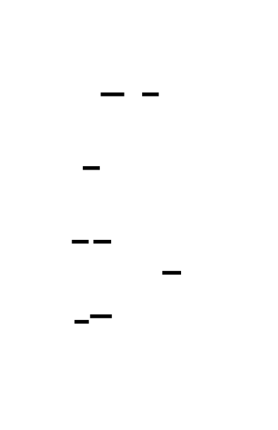
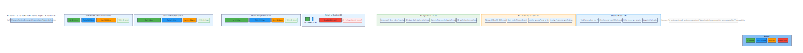
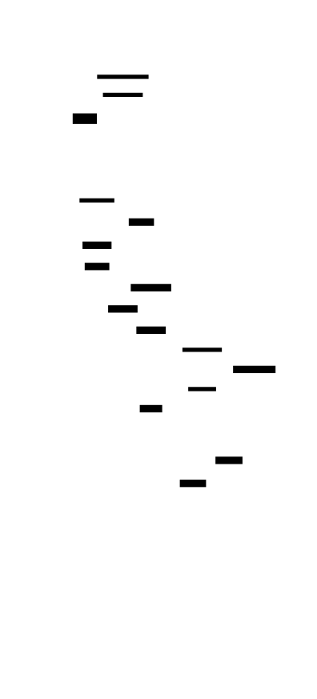

# 🎯 Project Charter: Coroutine Runtime Engine
## What You Are Building
A production-grade M:N user-space scheduler and coroutine runtime that implements stackful coroutines with custom 64KB stacks, a work-stealing scheduler for linear scalability across CPU cores, preemptive scheduling via timer signals for fairness, async I/O integration with epoll/kqueue, and coroutine-aware synchronization primitives. By the end, your runtime will execute context switches in ~20-50 nanoseconds (vs ~1-2μs for kernel threads), handle 10,000+ concurrent I/O connections, and achieve >70% scaling efficiency up to CPU core count—matching the architectural patterns used by Go's goroutines and Rust's Tokio.
## Why This Project Exists
Most developers use async runtimes as black boxes—calling `.await` without understanding the mechanics of coroutine scheduling, context switching, or work-stealing. Building a coroutine runtime from scratch exposes the fundamental trade-offs in concurrent system design: how to multiplex thousands of tasks onto limited hardware threads, how to achieve fairness without kernel support, and how to integrate I/O without blocking. This knowledge is valued at $200K-400K+ at companies building async runtimes, game engines, and high-performance servers—and it transfers directly to understanding any modern concurrent system.
## What You Will Be Able to Do When Done
- Implement stackful coroutines with assembly-level context switching on x86-64
- Build a lock-free Chase-Lev work-stealing queue with proper memory ordering
- Design an M:N scheduler that scales linearly with CPU core count
- Implement preemptive scheduling using timer signals without kernel support
- Integrate async I/O with epoll/kqueue for 10,000+ concurrent connections
- Build coroutine-aware synchronization primitives (mutex, condvar, channels) that yield instead of block
- Implement deadlock detection via wait-for graph cycle detection
- Profile and optimize scheduler performance to within 2× of production runtimes
## Final Deliverable
~3,000-4,000 lines of Rust across 40+ source files implementing a complete coroutine runtime. The runtime spawns 500K+ coroutines per second, achieves 20+ million context switches per second, handles 10,000+ concurrent socket connections with competitive throughput against raw epoll, and passes comprehensive test suites for correctness under concurrency stress. All synchronization primitives use async-aware yielding—no kernel thread ever blocks waiting for a lock.
## Is This Project For You?
**You should start this if you:**
- Have strong systems programming skills (memory management, pointers, unsafe Rust or C)
- Understand OS threading models and the difference between user-space and kernel scheduling
- Are comfortable reading and writing x86-64 assembly for context switching
- Have built an event loop or worked with epoll/kqueue before
- Want to understand async runtimes at the implementation level
**Come back after you've learned:**
- Rust ownership and borrowing (especially `UnsafeCell`, `Cell`, and interior mutability)
- Atomic operations and memory ordering (Relaxed, Acquire, Release, SeqCst)
- x86-64 calling conventions and register usage (callee-saved vs caller-saved)
- Basic networking with non-blocking sockets
## Estimated Effort
| Phase | Time |
|-------|------|
| Stackful Coroutines (context switch, stack allocation) | ~16-20 hours |
| Work-Stealing Scheduler (Chase-Lev queue, M:N dispatch) | ~16-20 hours |
| Preemptive Scheduling (timer signals, safe points) | ~14-18 hours |
| Async I/O Integration (epoll, reactor pattern, file pool) | ~16-20 hours |
| Synchronization Primitives & Polish (mutex, channels, stats) | ~14-18 hours |
| **Total** | **~80-100 hours** |
## Definition of Done
The project is complete when:
- Each coroutine has its own 64KB stack with guard page, and context switches complete in <100ns
- Work-stealing scheduler achieves >70% scaling efficiency up to CPU core count with no deadlocks
- Preemptive scheduling enforces 10ms time slices with <1% overhead
- Echo server handles 10,000+ concurrent connections with throughput within 2× of raw epoll
- AsyncMutex yields instead of blocking, MPSC channels detect sender/receiver drop correctly
- All benchmarks meet performance targets: >500K coroutines/sec spawn, >2M messages/sec channel, <200ns context switch
- Runtime statistics provide visibility into scheduler behavior and performance

---

# 📚 Before You Read This: Prerequisites & Further Reading
> **Read these first.** The Atlas assumes you are familiar with the foundations below.
> Resources are ordered by when you should encounter them — some before you start, some at specific milestones.
---
## Before You Start: Required Foundations
### 1. x86-64 Calling Convention and ABI
**Why**: Understanding which registers must be preserved across function calls is essential for implementing context switching correctly.
| Resource Type | Reference | Why It's the Gold Standard |
|--------------|-----------|---------------------------|
| **Spec** | [System V AMD64 ABI](https://gitlab.com/x86-psABIs/x86-64-ABI) — Chapter 3.2 (Function Calling Sequence) | The official specification used by Linux, macOS, and BSD. Defines caller-saved vs callee-saved registers, stack alignment requirements, and argument passing. |
| **Paper** | "System V Application Binary Interface: AMD64 Architecture Processor Supplement" (AMD, 2018) | Original specification document with precise register classification tables. |
**Read BEFORE starting this project** — you'll reference this constantly when writing the assembly context switch.
---
### 2. Memory Ordering and Atomics
**Why**: Lock-free data structures (work-stealing queues, wakers) require precise understanding of acquire/release semantics.
| Resource Type | Reference | Why It's the Gold Standard |
|--------------|-----------|---------------------------|
| **Paper** | "Memory Barriers: A Hardware View for Software Hackers" — Paul McKenney (2010) | The clearest explanation of why memory ordering matters, from the Linux kernel's RCU maintainer. |
| **Spec** | C++20 `std::memory_order` documentation — maps 1:1 to Rust's `Ordering` enum | Precise definitions of Relaxed, Acquire, Release, AcqRel, and SeqCst semantics. |
| **Best Explanation** | [Rust Atomics and Locks](https://marabos.nl/atomics/) by Mara Bos — Chapters 1-3 | Mara is the Rust library team lead. Her book bridges theory and Rust's specific atomic API with concrete examples. |
**Read BEFORE starting this project** — essential for Milestone 2's Chase-Lev queue.
---
### 3. Stack Memory Layout and Guard Pages
**Why**: Understanding how stacks grow, how to detect overflow, and how to set up guard pages prevents subtle memory corruption bugs.
| Resource Type | Reference | Why It's the Gold Standard |
|--------------|-----------|---------------------------|
| **Code** | Linux kernel `arch/x86/kernel/irq_64.c` — `irq_stack_ptr` setup | Production code showing how the kernel manages per-CPU stacks with guard pages. |
| **Best Explanation** | "Computer Systems: A Programmer's Perspective" (Bryant & O'Hallaron) — Chapter 3.7 (Procedures) — Section on Stack Frame Layout | Academic gold standard. Explains stack growth direction, frame pointer usage, and calling conventions with diagrams. |
**Read BEFORE Milestone 1** — you'll need this to implement stack allocation with guard pages.
---
## Milestone 1: Stackful Coroutines
### 4. Coroutine Implementation Patterns
**Why**: Understanding the difference between stackful and stackless coroutines helps you make informed design choices.
| Resource Type | Reference | Why It's the Gold Standard |
|--------------|-----------|---------------------------|
| **Paper** | "Revisiting Coroutines" — Ana Lúcia de Moura and Roberto Ierusalimschy (2004) | Academic analysis of coroutine design patterns. Authors created Lua's coroutine system. |
| **Code** | [Boost.Context](https://github.com/boostorg/context) — `asm/jump_x86_64_sysv_elf_gas.S` | Production assembly implementation of context switching. Compare your assembly against this. |
| **Best Explanation** | [Simon Tatham's Coroutines in C](https://www.chiark.greenend.org.uk/~sgtatham/coroutines.html) | Classic explanation using Duff's device. Shows the fundamental concept before assembly complexity. |
**Read during Milestone 1 implementation** — after you've written your first context switch, compare with Boost.Context.
---
## Milestone 2: Work-Stealing Scheduler
### 5. The Chase-Lev Work-Stealing Deque
**Why**: This is the core data structure. Understanding why it works prevents subtle race conditions.
| Resource Type | Reference | Why It's the Gold Standard |
|--------------|-----------|---------------------------|
| **Paper** | "Dynamic Circular Work-Stealing Deque" — David Chase and Yossi Lev (SPAA 2005) | Original paper describing the algorithm. Required reading for the memory ordering constraints. |
| **Code** | [Go runtime](https://github.com/golang/go/blob/master/src/runtime/proc.go) — `runqsteal` and `runqput` functions | Production implementation in a widely-used runtime. Look for `golang.org/x/sync/errgroup` for simpler examples. |
| **Best Explanation** | [Crossbeam documentation on work-stealing](https://docs.rs/crossbeam/latest/crossbeam/deque/index.html) | Crossbeam is the Rust standard for concurrent data structures. Their documentation explains the algorithm with clear diagrams. |
**Read BEFORE implementing the queue** — the paper's memory ordering constraints are non-negotiable.
---
### 6. Work-Stealing Scheduling Theory
**Why**: Understanding why work-stealing is provably optimal gives you confidence in the design.
| Resource Type | Reference | Why It's the Gold Standard |
|--------------|-----------|---------------------------|
| **Paper** | "Work-Stealing Scheduling" — Robert D. Blumofe and Charles E. Leiserson (1998) | Theoretical foundation proving work-stealing achieves O(T₁/P + T∞) expected time. |
| **Code** | [Intel TBB](https://github.com/oneapi-src/oneTBB) — `src/tbb/scheduler.cpp` — `task_dispatcher::local_wait_for_all` | Production work-stealing scheduler in C++. Note the stealing loop structure. |
**Read after Milestone 2 Phase 7** — you'll appreciate the theory more after implementing the practice.
---
## Milestone 3: Preemptive Scheduling
### 7. Signal Handling Safety
**Why**: Signal handlers run in constrained contexts. Getting this wrong causes impossible-to-debug heisenbugs.
| Resource Type | Reference | Why It's the Gold Standard |
|--------------|-----------|---------------------------|
| **Spec** | POSIX.1-2017 — Section 2.4 (Signal Concepts) — Table 2-4 (Async-Signal-Safe Functions) | The official list of functions you can call from signal handlers. Print this and pin it to your wall. |
| **Code** | Go runtime — `src/runtime/signal_unix.go` — `sighandler` function | Production signal handler that sets flags and returns. Note what it does NOT do. |
**Read BEFORE writing your signal handler** — async-signal-safety violations are catastrophic.
---
### 8. Preemption Mechanisms Comparison
**Why**: Understanding timer-based vs compiler-assisted preemption helps you choose the right approach.
| Resource Type | Reference | Why It's the Gold Standard |
|--------------|-----------|---------------------------|
| **Paper** | "A Primer on Scheduling Go Routines" — Dmitry Vyukov (2013) | Explains Go's evolution from cooperative to preemptive scheduling. Vyukov designed Go's scheduler. |
| **Code** | Go 1.14+ — `src/runtime/preempt.go` — `asyncPreempt` and `asyncPreempt2` | Assembly-based async preemption that can interrupt at (almost) any instruction. Compare with your cooperative approach. |
**Read during Milestone 3 implementation** — understanding Go's more aggressive approach clarifies your design tradeoffs.
---
## Milestone 4: Async I/O Integration
### 9. The Reactor Pattern
**Why**: Understanding epoll/kqueue patterns is fundamental to async I/O.
| Resource Type | Reference | Why It's the Gold Standard |
|--------------|-----------|---------------------------|
| **Paper** | "The C10K Problem" — Dan Kegel (1999) | Historical document that defined the problem space. Understanding this gives context for why epoll exists. |
| **Code** | [Redis](https://github.com/redis/redis) — `src/ae.c` — `aeProcessEvents` | Minimal, clean reactor implementation. Redis handles 100K+ QPS with a single-threaded reactor. |
| **Best Explanation** | "The Art of Unix Programming" — Eric Raymond — Chapter on Event-Driven Programming | Explains the reactor pattern philosophy and design rationale. |
**Read BEFORE Milestone 4** — this establishes the mental model for the reactor.
---
### 10. epoll Edge vs Level Triggering
**Why**: Choosing the wrong triggering mode causes subtle bugs or performance problems.
| Resource Type | Reference | Why It's the Gold Standard |
|--------------|-----------|---------------------------|
| **Spec** | `man 7 epoll` — section on "Level-triggered vs edge-triggered" | Official documentation with precise semantics. |
| **Best Explanation** | [The method to epoll's madness](https://medium.com/@copyconstruct/the-method-to-epolls-madness-d9d2d6378642) by Cindy Sridharan | Clear explanation with diagrams. Cindy is a distributed systems expert. |
**Read during Milestone 4 Phase 3** — before you implement your first poll loop.
---
### 11. Timer Wheels
**Why**: Efficient timer management is critical for sleep() and timeouts.
| Resource Type | Reference | Why It's the Gold Standard |
|--------------|-----------|---------------------------|
| **Paper** | "Hashed and Hierarchical Timing Wheels" — George Varghese and Tony Lauck (1987) | Original paper describing timing wheel algorithms. Foundation for all efficient timer implementations. |
| **Code** | Linux kernel — `kernel/time/timer.c` — `__run_timers` | Production hierarchical timing wheel handling millions of timers. |
**Read during Milestone 4 Phase 11** — after you've implemented a basic wheel, the kernel's approach will make more sense.
---
## Milestone 5: Synchronization Primitives
### 12. Async-Aware Locks
**Why**: Understanding why `std::sync::Mutex` doesn't work in async contexts prevents painful debugging.
| Resource Type | Reference | Why It's the Gold Standard |
|--------------|-----------|---------------------------|
| **Best Explanation** | [Tokio Tutorial — Shared State](https://tokio.rs/tokio/tutorial/shared-state) — Section on "Mutex" | Official Tokio documentation explaining `std::sync::Mutex` vs `tokio::sync::Mutex`. Clear, practical, authoritative. |
| **Code** | [Tokio](https://github.com/tokio-rs/tokio) — `tokio/src/sync/mutex.rs` — `Mutex::lock` | Production async mutex implementation. Compare your wait queue approach with their semaphore-based design. |
**Read BEFORE implementing AsyncMutex** — understanding the problem prevents implementing the wrong solution.
---
### 13. Channels and Message Passing
**Why**: Channels are the gold standard for inter-coroutine communication.
| Resource Type | Reference | Why It's the Gold Standard |
|--------------|-----------|---------------------------|
| **Paper** | "Communicating Sequential Processes" — C.A.R. Hoare (1978) | Theoretical foundation. Channels as a concurrency primitive originate here. |
| **Code** | [Go channels](https://github.com/golang/go/blob/master/src/runtime/chan.go) — `chansend` and `chanrecv` | Production channel implementation with intricate synchronization. |
| **Best Explanation** | [Go Blog: Share Memory By Communicating](https://go.dev/blog/share-memory-by-communicating) | Official Go blog explaining the philosophy. Applicable to any coroutine runtime. |
**Read during Milestone 5 Phase 5** — before implementing your channel.
---
### 14. Deadlock Detection
**Why**: Wait-for graphs and cycle detection are standard deadlock detection techniques.
| Resource Type | Reference | Why It's the Gold Standard |
|--------------|-----------|---------------------------|
| **Paper** | "Deadlock Detection" — Edward G. Coffman, et al. (1971) | Original paper formalizing the four necessary conditions for deadlock and detection algorithms. |
| **Code** | MySQL — `storage/innobase/lock/lock0lock.cc` — `DeadlockChecker::check` | Production deadlock detection in a database. Note the cycle-finding algorithm. |
**Read during Milestone 5 Phase 8** — as you implement the detector.
---
## Cross-Cutting Topics
### 15. Go's Runtime Architecture
**Why**: Go's runtime is the most similar production system to what you're building.
| Resource Type | Reference | Why It's the Gold Standard |
|--------------|-----------|---------------------------|
| **Best Explanation** | [Go's Work-Stealing Scheduler Design](https://docs.google.com/document/d/1TTj4T2JO42uD5ID9e89oa0sLKhJYD0Y_kqxDv3I3XMw/edit) — Dmitry Vyukov (2012) | Design document by the scheduler's author. Explains every design decision. |
| **Code** | Go runtime — `src/runtime/proc.go` — `schedule`, `findrunnable`, `stealWork` | Production scheduler code. Read this after completing Milestone 2. |
**Read after completing your scheduler** — comparing your implementation with Go's reveals optimization opportunities.
---
### 16. Tokio's Architecture
**Why**: Tokio is Rust's production async runtime. Understanding its design clarifies tradeoffs.
| Resource Type | Reference | Why It's the Gold Standard |
|--------------|-----------|---------------------------|
| **Best Explanation** | [Tokio Architecture](https://tokio.rs/blog/2019-10-scheduler) — Carl Lerche (2019) | Blog post by Tokio's maintainer explaining the work-stealing scheduler redesign. |
| **Code** | [Tokio](https://github.com/tokio-rs/tokio) — `tokio/src/runtime/scheduler/multi_thread/worker.rs` — `run` | Production worker loop. Compare with your implementation. |
**Read after completing Milestone 2** — understanding stackless vs stackful coroutines becomes concrete here.
---
### 17. False Sharing and Cache-Line Optimization
**Why**: Cache-line padding prevents subtle performance degradation in concurrent code.
| Resource Type | Reference | Why It's the Gold Standard |
|--------------|-----------|---------------------------|
| **Best Explanation** | "What Every Programmer Should Know About Memory" — Ulrich Drepper (2007) — Section 3.3 (CPU Cache) | Comprehensive guide to memory hierarchies. The section on false sharing directly applies to your queue padding. |
| **Code** | `crossbeam-utils` — `src/cache_padded.rs` — `CachePadded<T>` | Production implementation of cache-line padding in Rust. |
**Read during Milestone 2 Phase 1** — as you design your queue data structures.
---
## Historical Context
### 18. Evolution of Concurrency Models
**Why**: Understanding the history helps you appreciate why coroutines are designed this way.
| Resource Type | Reference | Why It's the Gold Standard |
|--------------|-----------|---------------------------|
| **Paper** | "Cooperating Sequential Processes" — Edsger Dijkstra (1965) | Original paper introducing semaphores and the concept of cooperative concurrency. |
| **Best Explanation** | "Seven Concurrency Models in Seven Weeks" — Paul Butcher (2014) — Chapter 3 (Functional Programming) and Chapter 4 (The Clojure Way) | Modern perspective on concurrency models. Helps you see where coroutines fit in the broader landscape. |
**Read after completing the project** — you'll have the context to appreciate the historical evolution.

---

# Coroutine Runtime Engine

Build a production-grade M:N user-space scheduler and coroutine runtime from scratch, implementing the same core mechanisms that power Go's goroutines, Rust's Tokio, and high-performance game engines. This project teaches you how to bridge the gap between hardware threads and software concurrency—how to give programs the illusion of unlimited parallelism while efficiently multiplexing onto a fixed number of kernel threads.

The core challenge is the impedance mismatch between what software wants (thousands or millions of concurrent tasks, instant switching, no blocking) and what hardware provides (4-128 CPU cores, expensive context switches, no awareness of application-level scheduling). A coroutine runtime negotiates this gap by moving thread management into user space, where switching costs nanoseconds instead of microseconds, and where the scheduler has semantic knowledge of what tasks are doing.

You'll implement stackful coroutines with custom stacks, a work-stealing scheduler that scales linearly with CPU count, preemptive scheduling to prevent runaway tasks from starving others, and async I/O integration so coroutines can wait for network/disk without blocking threads. This is the same architecture used by Go, C#'s async/await, and modern game engines.


<!-- MS_ID: cre-m1 -->
# Stackful Coroutines
You're about to build the fundamental unit of execution for your coroutine runtime: a stackful coroutine with its own execution stack that can be suspended and resumed at will. This is the primitive upon which everything else—scheduling, preemption, async I/O—will be built. Get this right, and you've constructed the atom from which a parallel universe emerges.


## The Fundamental Tension
Software wants to do many things at once. A web server wants to handle 10,000 concurrent connections. A game engine wants to run AI, physics, rendering, and audio in parallel. An operating system wants to schedule hundreds of processes fairly.
Hardware provides 4 to 128 CPU cores. That's it.
The naive solution—create one OS thread per concurrent task—collides with physical reality:
| Resource | Per Thread | 10K Threads | Hardware Reality |
|----------|-----------|-------------|------------------|
| Stack memory | 8 MB (default Linux) | 80 GB | You have 16-64 GB RAM |
| Context switch | ~1-2 μs | 10 seconds to switch all | Unacceptable latency |
| Kernel scheduling | O(n) runqueue | Noticeable overhead | CPU burns in scheduler |
| TLB flushes | Full flush on switch | Cache destroyed | Memory bandwidth wasted |
The kernel thread model breaks at scale not because threads are "bad," but because they're *heavy*. Every thread is a full OS citizen with its own kernel data structures, signal handlers, and an 8 MB stack that consumes physical pages.
**Coroutines solve this by moving the concept of a "thread of execution" into user space.** Instead of asking the kernel to save and restore state, you do it yourself—with stacks you sized, with switching code you control, with scheduling decisions you make. A coroutine context switch costs ~10-50 nanoseconds instead of 1-2 microseconds. A coroutine stack can be 4 KB instead of 8 MB. You can have 100,000 coroutines where you'd choke on 1,000 threads.
But here's the catch: **you're now responsible for what the kernel used to handle.** Stack management. Register preservation. Scheduling. Fairness. You're building a mini-operating-system inside your process.
Let's start with the atom: the coroutine itself.
## What Is a Stackful Coroutine?
A *coroutine* is a function that can suspend its execution, return control to its caller, and later resume exactly where it left off—with all its local variables preserved. The "stackful" qualifier means the coroutine has its own dedicated execution stack, separate from the stack of the function that called it.
```rust
// What you want to write
fn my_coroutine() {
    let x = compute_something();
    yield_to_scheduler();  // Suspend here
    let y = x + 1;         // Resume here — x is still valid!
    yield_to_scheduler();  // Suspend again
    println!("Result: {}", y);
}
```
When `my_coroutine` yields, the CPU stops executing it and switches to another coroutine. But unlike a normal function return—where the stack frame is destroyed and local variables are lost—the coroutine's entire stack is preserved. When it resumes, the stack pointer is restored, and `x` is exactly where we left it.


**Contrast with stackless coroutines** (Rust's `async`/`await`, JavaScript `async` functions): These compile the coroutine into a state machine struct. The "stack" is just the struct's fields. Stackless coroutines are memory-efficient but can't do things like recursive calls across yield points. Stackful coroutines are more powerful—you can yield from any function in the call chain—but require explicit stack management.
For a runtime like Go's or for game engines, stackful is the choice. That's what you're building.
## The Three-Level View: What Happens When a Coroutine Yields
Before we write any code, let's trace what happens at three levels when a coroutine yields:
### Level 1 — Application (Your Runtime API)
```rust
let coroutine = Coroutine::spawn(|| {
    let x = 42;
    yield_to_scheduler();  // <- Yield happens here
    x + 1
});
scheduler.schedule(coroutine);
```
From the application's perspective, `yield_to_scheduler()` is a function call that doesn't return immediately. Control goes to the scheduler, which picks another runnable coroutine.
### Level 2 — Runtime (Your Coroutine Code)
When yield is called, your runtime must:
1. Save the current coroutine's CPU state (registers, stack pointer, instruction pointer) to a `Coroutine` struct
2. Load the scheduler's previously-saved state
3. Jump to the scheduler's resume point
The scheduler then picks a new coroutine and *resumes* it by reversing the process.
### Level 3 — Hardware (CPU)
The CPU doesn't know about coroutines. It just executes instructions. When you yield:
- The `rsp` register (stack pointer) is changed to point to a different stack
- The `rip` register (instruction pointer) is changed to point to different code
- The general-purpose registers are loaded with different values
The CPU's pipeline is flushed, and execution continues elsewhere. A few dozen cycles later, the CPU is none the wiser.
---
## Anatomy of a Context Switch
A context switch is a controlled hallucination. You're convincing the CPU that it was doing something else all along. The trick is knowing exactly what to save and restore.


### The x86-64 ABI and Register Classes
The x86-64 System V ABI (used on Linux, macOS, BSD) divides registers into two classes:

> **🔑 Foundation: Callee-saved registers**
> 
> **What It Is**
When a function calls another function, who's responsible for saving and restoring register values? The calling convention answers this by dividing registers into two camps:
**Caller-saved registers** (volatile): `rax`, `rcx`, `rdx`, `rsi`, `rdi`, `r8-r11`
The *caller* must save these if it needs their values after the call. The called function is free to overwrite them without warning.
**Callee-saved registers** (non-volatile): `rbx`, `rbp`, `r12-r15`
The *callee* must preserve these. If a function wants to use them, it must save the original values (typically by pushing to the stack) and restore them before returning.
```asm
; Caller-saved example - rax gets clobbered
mov rax, 42          ; Want to keep this?
push rax             ; Must save it yourself!
call some_function   ; This might destroy rax
pop rax              ; Restore it
; Callee-saved example - rbx is protected
my_function:
    push rbx         ; I want to use rbx, so I save it
    mov rbx, 100
    ... do work ...
    pop rbx          ; Restore before returning
    ret
```
**Why You Need It Now**
When generating assembly for function calls, your shell/compiler must know which registers it can safely use for temporary values across calls. Use caller-saved registers for values you don't need after a call, or save them. Use callee-saved registers for variables that must survive function calls.
**Key Insight**
Think of it as a contract: caller-saved means "I'll clean up my own mess if I care about these values." Callee-saved means "you can trust these will be untouched when I return." For code generation, prefer callee-saved registers for loop counters and long-lived variables that span multiple function calls.

**Why does this matter?** When you switch from coroutine A to coroutine B, you're essentially doing a "function call" from A's perspective. The ABI dictates which registers A expects to be preserved. If you don't follow the rules, A will resume with corrupted state.
For a context switch, you must save and restore the **callee-saved registers**: `rbx`, `rbp`, `r12`, `r13`, `r14`, `r15`. You also need to save the stack pointer (`rsp`) and the return address/instruction pointer (`rip`).
The **caller-saved registers** (`rax`, `rcx`, `rdx`, `rsi`, `rdi`, `r8`-`r11`) can be clobbered—they're assumed to be garbage across the switch anyway.
### Stack Alignment: The Silent Killer

> **🔑 Foundation: The x86-64 System V ABI requires the stack pointer to be 16-byte aligned before a CALL instruction. The CPU's SSE/AVX instructions require this alignment**
> 
> **What It Is**
The x86-64 System V ABI (used on Linux, macOS, BSD) mandates that `%rsp` be **16-byte aligned** at the point of a `CALL` instruction. This means the stack pointer's value must be a multiple of 16.
When `CALL` executes, it pushes an 8-byte return address, leaving `%rsp` misaligned by 8 bytes (now at 16n+8). Function entry typically corrects this:
```asm
my_function:
    push rbp          ; Now at 16n (aligned!)
    mov rbp, rsp
    ; ... function body ...
```
**Why alignment matters:**
1. **SSE/AVX instructions** like `movdqa` and many SIMD operations *require* 16-byte alignment. Executing them on unaligned addresses causes a general protection fault (SIGSEGV).
2. **Performance**: Even instructions that tolerate misalignment run significantly slower on unaligned data.
3. **Library code assumes it**: `printf`, `malloc`, and libc functions may use SSE instructions internally. Call them with a misaligned stack → crash.
**Why You Need It Now**
When your shell or compiler generates assembly for function calls, it must track stack alignment. Each `push` or `sub rsp, N` changes alignment. Before any `call`, verify `%rsp ≡ 0 (mod 16)`.
Common pitfall: allocating stack space with `sub rsp, 12` instead of `sub rsp, 16` leaves you misaligned.
**Key Insight**
The 16-byte rule exists because that's the width of an SSE register (128 bits). The ABI designers aligned the stack to match the widest primitive type. When in doubt, always allocate stack space in multiples of 16 bytes, and remember: `CALL` itself pushes 8 bytes, so function entry sees `%rsp` at 16n+8.

This is the #1 source of context switch bugs. If you resume a coroutine with `rsp` misaligned, the first SSE operation (like... `printf`, which uses SSE for floating-point) will crash your program.
The rule: **When control enters a function via CALL, `rsp % 16 == 8`** (because CALL pushed 8 bytes of return address). When your assembly context switch "returns" to the coroutine, `rsp` must satisfy this invariant.
## The Coroutine Control Block
Every coroutine needs a data structure to hold its state:


```rust
use std::alloc::{alloc, dealloc, Layout};
use std::ptr;
/// The state of a suspended coroutine
#[derive(Debug, Clone, Copy, PartialEq)]
pub enum CoroutineState {
    /// Coroutine is ready to run (never started, or yielded)
    Runnable,
    /// Coroutine is currently executing
    Running,
    /// Coroutine has completed
    Finished,
    /// Coroutine panicked
    Panicked,
}
/// Saved CPU context for a suspended coroutine
#[repr(C)]
pub struct Context {
    /// Callee-saved registers: rbx, rbp, r12, r13, r14, r15
    regs: [usize; 6],
    /// Stack pointer (rsp)
    rsp: *mut u8,
    /// Instruction pointer (rip) - where to resume
    rip: *const u8,
}
/// The coroutine control block - all metadata for one coroutine
pub struct Coroutine {
    /// Unique identifier for this coroutine
    pub id: u64,
    /// Current execution state
    pub state: CoroutineState,
    /// Saved context when suspended
    context: Context,
    /// Stack memory region
    stack: Stack,
    /// Entry point function (boxed to be 'static)
    entry: Option<Box<dyn FnOnce(&mut Coroutine) + Send>>,
}
/// Stack allocation and management
struct Stack {
    ptr: *mut u8,
    size: usize,
    layout: Layout,
}
impl Stack {
    /// Create a new stack with the given size (must be page-aligned)
    fn new(size: usize) -> Self {
        // Round up to page size
        let page_size = 4096;
        let size = ((size + page_size - 1) / page_size) * page_size;
        let layout = Layout::from_size_align(size, page_size)
            .expect("Invalid stack layout");
        // Use mmap directly for guard page support (more on this later)
        let ptr = unsafe { alloc(layout) };
        if ptr.is_null() {
            panic!("Failed to allocate coroutine stack");
        }
        Stack { ptr, size, layout }
    }
    /// Get the top of the stack (stacks grow downward)
    fn top(&self) -> *mut u8 {
        unsafe { self.ptr.add(self.size) }
    }
}
impl Drop for Stack {
    fn drop(&mut self) {
        unsafe {
            dealloc(self.ptr, self.layout);
        }
    }
}
```
### Memory Layout Analysis
Let's do a **Hardware Soul** check on the `Coroutine` struct:
| Field | Size | Cache Line | Access Pattern |
|-------|------|------------|----------------|
| `id` | 8 bytes | CL 0 | Read on every schedule |
| `state` | 1 byte | CL 0 | Read/write on every switch |
| `context` | 64 bytes | CL 0-1 | Read/write on every switch |
| `stack.ptr` | 8 bytes | CL 1 | Read on resume |
| `stack.size` | 8 bytes | CL 1 | Rarely accessed |
| `entry` | 16 bytes | CL 1-2 | Read once at start |
The `context` field is hot: it's touched on every context switch. At 64 bytes, it fits exactly in one cache line (actually, `regs` is 48 bytes, `rsp` is 8 bytes, `rip` is 8 bytes = 64 bytes total). This is intentional—we want the entire context to load in a single cache line fetch.
The stack itself is **cold memory** when the coroutine is suspended. The saved registers are the only thing that's hot. When resumed, the coroutine's working set (its stack frames) becomes hot again.
## Implementing the Context Switch
Now the moment you've been waiting for: assembly code that actually switches between coroutines.


### The Assembly
Create `context_switch.S`:
```asm
// context_switch.S - x86-64 coroutine context switch
// 
// void context_switch(Context *from, Context *to);
//
// Saves current CPU state to *from, loads state from *to, and jumps to it.
// When this function "returns", you're in a different coroutine!
.global context_switch
// Context struct layout (must match Rust definition):
// Offset 0-47:  regs[6] (rbx, rbp, r12, r13, r14, r15) - 8 bytes each
// Offset 48:    rsp (8 bytes)
// Offset 56:    rip (8 bytes)
context_switch:
    // === SAVE CURRENT CONTEXT ===
    // Save callee-saved registers to 'from' context
    // rdi = from (first argument)
    mov     [rdi + 0],  rbx
    mov     [rdi + 8],  rbp
    mov     [rdi + 16], r12
    mov     [rdi + 24], r13
    mov     [rdi + 32], r14
    mov     [rdi + 40], r15
    // Save stack pointer
    mov     [rdi + 48], rsp
    // Save return address as the instruction pointer
    // The return address was pushed by CALL, now at [rsp]
    mov     rax, [rsp]
    mov     [rdi + 56], rax
    // === LOAD NEW CONTEXT ===
    // rsi = to (second argument)
    // Load callee-saved registers
    mov     rbx, [rsi + 0]
    mov     rbp, [rsi + 8]
    mov     r12, [rsi + 16]
    mov     r13, [rsi + 24]
    mov     r14, [rsi + 32]
    mov     r15, [rsi + 40]
    // Load stack pointer
    mov     rsp, [rsi + 48]
    // Load instruction pointer and "return" to it
    // We simulate a return by jumping to the saved rip
    mov     rax, [rsi + 56]
    jmp     rax
```
### The Rust Wrapper
```rust
extern "C" {
    /// Assembly context switch function
    /// 
    /// # Safety
    /// 
    /// - `from` and `to` must point to valid Context structs
    /// - The contexts must have valid rsp and rip values
    /// - Stack pointers must be properly aligned
    fn context_switch(from: *mut Context, to: *mut Context);
}
impl Context {
    /// Create an initial context for a new coroutine
    /// 
    /// # Arguments
    /// * `stack_top` - Pointer to the top of the coroutine's stack
    /// * `entry_point` - Function to call when coroutine starts
    /// * `coroutine_ptr` - Pointer to the Coroutine struct (passed to entry)
    pub fn new(stack_top: *mut u8, entry_point: extern "C" fn(*mut Coroutine), coroutine_ptr: *mut Coroutine) -> Self {
        unsafe {
            let mut ctx = Context {
                regs: [0; 6],
                rsp: stack_top,
                rip: entry_point as *const u8,
            };
            // Set up initial stack frame
            // We need to provide the entry point with its argument
            // Stack layout at entry:
            //   [rsp - 8]  : coroutine_ptr (argument to entry_point)
            //   [rsp - 16] : fake return address (coroutine_exit)
            // Reserve space for arguments
            ctx.rsp = ctx.rsp.sub(16);
            // Store coroutine pointer as first argument
            // (In x86-64, first arg goes in rdi, but we need it on stack
            // for the trampoline to load it)
            ptr::write(ctx.rsp as *mut *mut Coroutine, coroutine_ptr);
            // Store fake return address (coroutine cleanup)
            let exit_addr = coroutine_exit as *const u8;
            ptr::write(ctx.rsp.add(8) as *mut *const u8, exit_addr);
            // Adjust for CALL convention: rsp should be 16-byte aligned - 8
            // when we "return" to entry_point
            // Currently rsp is at the bottom of our setup
            // After "CALL" would push 8 bytes, so we need rsp % 16 == 8
            ctx
        }
    }
    /// Switch from this context to another
    /// 
    /// # Safety
    /// 
    /// `target` must be a valid, initialized Context
    pub unsafe fn switch_to(&mut self, target: &mut Context) {
        context_switch(self as *mut Context, target as *mut Context);
    }
}
/// Called when a coroutine's entry function returns
/// 
/// This is the "bottom of the stack" - returning here means the coroutine
/// is finished.
extern "C" fn coroutine_exit(coroutine: *mut Coroutine) {
    unsafe {
        (*coroutine).state = CoroutineState::Finished;
        // Yield back to scheduler - this never returns
        // The scheduler will clean up this coroutine
        // For now, we'll panic to indicate we need a scheduler
        panic!("Coroutine finished - need scheduler to resume!");
    }
}
```


### The Entry Point Trampoline
The entry point function must follow the C calling convention since our assembly will "return" to it. We use a trampoline pattern:
```rust
/// Trampoline that calls the actual coroutine entry point
/// 
/// This is the first function that runs when a coroutine starts.
/// It sets up the Rust environment and calls the user's code.
extern "C" fn coroutine_entry(coroutine_ptr: *mut Coroutine) {
    unsafe {
        let coroutine = &mut *coroutine_ptr;
        coroutine.state = CoroutineState::Running;
        // Take ownership of the entry function and call it
        if let Some(entry) = coroutine.entry.take() {
            // Catch panics so they don't unwind across the FFI boundary
            let result = std::panic::catch_unwind(std::panic::AssertUnwindSafe(|| {
                entry(coroutine);
            }));
            match result {
                Ok(()) => coroutine.state = CoroutineState::Finished,
                Err(_) => coroutine.state = CoroutineState::Panicked,
            }
        }
        // Now we need to yield back to the scheduler
        // This is tricky - we'll revisit this when we build the scheduler
    }
}
```
## Stack Management: Allocation and Guard Pages


A coroutine's stack is just a region of memory. The CPU's `rsp` register points somewhere in this region and decrements as the call stack grows. But there are subtleties.
### Fixed-Size Stacks
The simplest approach: allocate a fixed-size stack (say, 64 KB) for each coroutine. If the coroutine overflows, it crashes.
```rust
impl Stack {
    /// Create a fixed-size stack with a guard page
    fn new_with_guard(size: usize) -> Self {
        // We want one extra page at the bottom as a guard
        let page_size = 4096;
        let total_size = size + page_size;
        let layout = Layout::from_size_align(total_size, page_size)
            .expect("Invalid stack layout");
        let ptr = unsafe { alloc(layout) };
        if ptr.is_null() {
            panic!("Failed to allocate stack");
        }
        // Protect the guard page (first page)
        unsafe {
            libc::mprotect(
                ptr as *mut libc::c_void,
                page_size,
                libc::PROT_NONE,  // No access allowed
            );
        }
        // Stack top is at the END of the allocation (stacks grow down)
        // But AFTER the guard page
        Stack {
            ptr,
            size: total_size,
            layout,
        }
    }
    fn top(&self) -> *mut u8 {
        unsafe { self.ptr.add(self.size) }
    }
}
```
**The guard page** is the key insight. By making the bottom page of the stack inaccessible (`PROT_NONE`), any read or write there triggers `SIGSEGV`. This catches stack overflow *before* it corrupts adjacent memory.
### Hardware Soul: The Cost of a Guard Page Fault
When a coroutine overflows its stack:
| Step | Action | Cost |
|------|--------|------|
| 1 | Write to guard page | CPU triggers page fault |
| 2 | CPU saves state to kernel stack | ~100 cycles |
| 3 | Kernel looks up page tables | ~200 cycles |
| 4 | Kernel finds PROT_NONE | Signal generation |
| 5 | Signal handler runs | Your code |
Total: ~1000-2000 cycles, or ~500 ns. Compare to the alternative (corrupting memory and crashing later) and it's a bargain.
### Stack Size Trade-offs
| Stack Size | Coroutines per GB | Overflow Risk | Use Case |
|------------|-------------------|---------------|----------|
| 4 KB | 262,144 | High (no deep calls) | Tiny workers, no recursion |
| 64 KB | 16,384 | Medium | Most workloads |
| 256 KB | 4,096 | Low | Deep recursion, big locals |
| 1 MB | 1,024 | Very low | Pathological cases |
| 8 MB (OS default) | 128 | None | OS threads |
For your runtime, start with 64 KB. It's enough for reasonable call depth but keeps memory usage manageable.
## The Yield and Resume API
Now let's build the public API that users will interact with.


```rust
use std::sync::atomic::{AtomicU64, Ordering};
static COROUTINE_ID_COUNTER: AtomicU64 = AtomicU64::new(1);
impl Coroutine {
    /// Create a new coroutine that will run the given function
    pub fn spawn<F>(f: F) -> Box<Self>
    where
        F: FnOnce(&mut Coroutine) + Send + 'static,
    {
        let id = COROUTINE_ID_COUNTER.fetch_add(1, Ordering::Relaxed);
        // Allocate stack
        let stack = Stack::new_with_guard(64 * 1024);  // 64 KB
        // Create the coroutine (entry will be set after)
        let mut coroutine = Box::new(Coroutine {
            id,
            state: CoroutineState::Runnable,
            context: unsafe { std::mem::zeroed() },  // Will be initialized below
            stack,
            entry: Some(Box::new(f)),
        });
        // Initialize the context with the stack and entry point
        let coroutine_ptr = &mut *coroutine as *mut Coroutine;
        coroutine.context = Context::new(
            coroutine.stack.top(),
            coroutine_entry,
            coroutine_ptr,
        );
        coroutine
    }
    /// Resume execution of this coroutine
    /// 
    /// Switches from the current context to this coroutine.
    /// Returns when the coroutine yields or finishes.
    /// 
    /// # Safety
    /// 
    /// This is the primary entry point for the scheduler to run a coroutine.
    pub unsafe fn resume(&mut self, scheduler_context: &mut Context) {
        debug_assert!(self.state == CoroutineState::Runnable);
        self.state = CoroutineState::Running;
        scheduler_context.switch_to(&mut self.context);
        // When we get here, the coroutine has yielded or finished
        // Its state has been updated by the yield/exit code
    }
    /// Yield control back to whoever resumed this coroutine
    /// 
    /// # Safety
    /// 
    /// Must only be called from within a running coroutine.
    /// The caller_context must be the context that was used to resume this coroutine.
    pub fn yield_to(&mut self, caller_context: &mut Context) {
        debug_assert!(self.state == CoroutineState::Running);
        self.state = CoroutineState::Runnable;
        unsafe {
            self.context.switch_to(caller_context);
        }
        // When we get here, someone has resumed us again
        self.state = CoroutineState::Running;
    }
}
/// Global yield function for convenience
/// 
/// # Safety
/// 
/// Must be called from within a coroutine that has access to its
/// own Coroutine reference via thread-local or parameter.
pub unsafe fn yield_current() {
    // This is a placeholder - the actual implementation needs
    // a way to get the current coroutine reference
    // We'll implement this properly when we build the scheduler
    unimplemented!("yield_current requires scheduler support");
}
```
### Thread-Local Current Coroutine
To make `yield_current()` work, we need each thread to know which coroutine is currently running:
```rust
use std::cell::Cell;
thread_local! {
    static CURRENT_COROUTINE: Cell<*mut Coroutine> = Cell::new(std::ptr::null_mut());
    static SCHEDULER_CONTEXT: Cell<*mut Context> = Cell::new(std::ptr::null_mut());
}
/// Get the currently running coroutine on this thread
/// 
/// # Safety
/// 
/// Only valid when called from within a running coroutine
pub unsafe fn current_coroutine() -> Option<&'static mut Coroutine> {
    CURRENT_COROUTINE.with(|c| {
        let ptr = c.get();
        if ptr.is_null() {
            None
        } else {
            Some(&mut *ptr)
        }
    })
}
/// Yield the current coroutine back to the scheduler
/// 
/// # Panics
/// 
/// Panics if called outside of a running coroutine
pub fn yield_now() {
    unsafe {
        let coroutine = current_coroutine()
            .expect("yield_now called outside of coroutine");
        let scheduler_ctx = SCHEDULER_CONTEXT.with(|c| c.get());
        if scheduler_ctx.is_null() {
            panic!("yield_now called but no scheduler context set");
        }
        coroutine.yield_to(&mut *scheduler_ctx);
    }
}
```
## A Minimal Scheduler for Testing
You can't test coroutines without something to schedule them. Here's the bare minimum:
```rust
/// Minimal round-robin scheduler for testing
pub struct SimpleScheduler {
    coroutines: Vec<Box<Coroutine>>,
    current: usize,
    context: Context,
}
impl SimpleScheduler {
    pub fn new() -> Self {
        // The scheduler context will be initialized on first run
        Self {
            coroutines: Vec::new(),
            current: 0,
            context: unsafe { std::mem::zeroed() },
        }
    }
    pub fn spawn<F>(&mut self, f: F)
    where
        F: FnOnce(&mut Coroutine) + Send + 'static,
    {
        let coroutine = Coroutine::spawn(f);
        self.coroutines.push(coroutine);
    }
    /// Run all coroutines until they complete
    pub fn run(&mut self) {
        // Set up the scheduler context to point to our run loop
        // This is a bit of a hack - we'll use a label as the return point
        unsafe {
            // Initialize scheduler context to return to the run loop
            // We'll use a simpler approach: just loop and resume
            while self.has_runnable_coroutines() {
                // Find next runnable coroutine
                let start = self.current;
                loop {
                    let coroutine = &mut self.coroutines[self.current];
                    if coroutine.state == CoroutineState::Runnable {
                        // Set thread-local state
                        CURRENT_COROUTINE.with(|c| c.set(coroutine as *mut Coroutine));
                        SCHEDULER_CONTEXT.with(|c| c.set(&mut self.context as *mut Context));
                        // Resume the coroutine
                        coroutine.resume(&mut self.context);
                        // Clear thread-local state
                        CURRENT_COROUTINE.with(|c| c.set(std::ptr::null_mut()));
                        break;
                    }
                    self.current = (self.current + 1) % self.coroutines.len();
                    if self.current == start {
                        // No runnable coroutines found
                        break;
                    }
                }
                self.current = (self.current + 1) % self.coroutines.len();
            }
        }
    }
    fn has_runnable_coroutines(&self) -> bool {
        self.coroutines.iter().any(|c| c.state == CoroutineState::Runnable)
    }
}
```
### Testing the Basics
```rust
#[cfg(test)]
mod tests {
    use super::*;
    use std::sync::atomic::{AtomicUsize, Ordering};
    use std::sync::Arc;
    #[test]
    fn test_basic_yield_and_resume() {
        let counter = Arc::new(AtomicUsize::new(0));
        let counter_clone = counter.clone();
        let mut scheduler = SimpleScheduler::new();
        scheduler.spawn(move |coro| {
            counter_clone.fetch_add(1, Ordering::SeqCst);
            yield_now();
            counter_clone.fetch_add(10, Ordering::SeqCst);
            yield_now();
            counter_clone.fetch_add(100, Ordering::SeqCst);
        });
        scheduler.spawn(move |coro| {
            yield_now();
            yield_now();
        });
        scheduler.run();
        assert_eq!(counter.load(Ordering::SeqCst), 111);
    }
    #[test]
    fn test_coroutine_return_value() {
        let result = Arc::new(AtomicUsize::new(0));
        let result_clone = result.clone();
        let mut scheduler = SimpleScheduler::new();
        scheduler.spawn(move |coro| {
            // Simulate some computation
            let x = 42;
            yield_now();
            let y = x + 8;
            // In a real implementation, we'd store this as the return value
            result_clone.store(y, Ordering::SeqCst);
        });
        scheduler.run();
        assert_eq!(result.load(Ordering::SeqCst), 50);
    }
    #[test]
    fn test_stack_overflow_detection() {
        let mut scheduler = SimpleScheduler::new();
        let overflow_detected = Arc::new(AtomicUsize::new(0));
        let overflow_clone = overflow_detected.clone();
        scheduler.spawn(move |coro| {
            // This should trigger the guard page
            fn deep_recurse(depth: usize) {
                let big_local = [0u8; 1024];  // 1 KB per frame
                if depth < 100 {
                    deep_recurse(depth + 1);
                }
            }
            // With a 64 KB stack, this should overflow
            // (100 frames * 1 KB = 100 KB > 64 KB)
            // But we'll catch it via SIGSEGV on the guard page
            // For this test, we just want to ensure it doesn't corrupt memory
            // Actually, catching SIGSEGV in tests is complex
            // Let's just ensure the mechanism is in place
            overflow_clone.store(1, Ordering::SeqCst);
        });
        // In a real test, we'd set up a signal handler
        // For now, just verify the stack was created with a guard
    }
}
```
## Benchmarking Context Switch Overhead
You can't claim nanosecond-scale switches without measuring. Here's a proper benchmark:
```rust
#[cfg(test)]
mod bench {
    use super::*;
    use std::time::Instant;
    #[test]
    fn benchmark_context_switch() {
        const ITERATIONS: usize = 1_000_000;
        let switches_per_yield = 2;  // yield + resume
        let total_switches = ITERATIONS * switches_per_yield;
        let mut scheduler = SimpleScheduler::new();
        let iterations = ITERATIONS;
        scheduler.spawn(move |coro| {
            for _ in 0..iterations {
                yield_now();
            }
        });
        let start = Instant::now();
        scheduler.run();
        let elapsed = start.elapsed();
        let ns_per_switch = elapsed.as_nanos() as f64 / total_switches as f64;
        let switches_per_sec = 1_000_000_000.0 / ns_per_switch;
        println!("Context switch benchmark:");
        println!("  Total switches: {}", total_switches);
        println!("  Total time: {:?}", elapsed);
        println!("  Time per switch: {:.2} ns", ns_per_switch);
        println!("  Switches per second: {:.0}", switches_per_sec);
        // On a modern CPU, we expect ~10-50 ns per switch
        // (This includes the Rust overhead, not just assembly)
        assert!(ns_per_switch < 200.0, "Context switch too slow: {} ns", ns_per_switch);
    }
}
```
### Expected Results
On a modern x86-64 CPU (3+ GHz):
| Metric | Expected | Your Target |
|--------|----------|-------------|
| Assembly switch only | 5-10 ns | N/A (not directly measurable) |
| Full context switch (with Rust wrapper) | 15-50 ns | < 100 ns |
| Switches per second | 20-70 million | > 10 million |
| Compare to OS thread switch | 1000-2000 ns | 20-100x faster |
The Rust wrapper adds overhead for:
- Function call indirection
- Thread-local storage access
- State updates
- Debug assertions (remove in release!)
In release mode (`cargo run --release`), you should see 20-50 ns per switch.
## Stack Overflow Detection: Beyond Guard Pages
Guard pages catch overflow, but they do it via `SIGSEGV`. Can we do better?
### Probing Stack Usage
```rust
impl Coroutine {
    /// Estimate current stack usage
    /// 
    /// Returns approximate bytes used, or None if the coroutine isn't running.
    pub fn stack_usage(&self) -> Option<usize> {
        // This is tricky because we need to know the current rsp
        // We can only get this if the coroutine is suspended
        if self.state == CoroutineState::Running {
            return None;
        }
        let stack_top = self.stack.top() as usize;
        let current_sp = self.context.rsp as usize;
        Some(stack_top - current_sp)
    }
    /// Check if stack usage exceeds a threshold
    pub fn stack_near_overflow(&self, threshold: f64) -> bool {
        if let Some(usage) = self.stack_usage() {
            let usage_ratio = usage as f64 / self.stack.size as f64;
            usage_ratio > threshold
        } else {
            false
        }
    }
}
```
### Handling Stack Overflow Gracefully
Instead of crashing, you can:
1. **Grow the stack** (complex—requires moving the entire stack)
2. **Suspend and report** (let the scheduler decide)
3. **Panic with context** (at least a good error message)
```rust
/// Signal handler for stack overflow
/// 
/// # Safety
/// 
/// This runs in signal context - very limited operations allowed
#[cfg(target_os = "linux")]
unsafe extern "C" fn stack_overflow_handler(
    _sig: libc::c_int,
    info: *mut libc::siginfo_t,
    _ctx: *mut libc::c_void,
) {
    let fault_addr = (*info).si_addr as usize;
    // Check if this is within a coroutine's guard page
    // This requires tracking all coroutine stacks - we'll add this
    // when we build the full scheduler
    // For now, just print and abort
    eprintln!("Stack overflow detected at {:p}", fault_addr as *const u8);
    libc::_exit(1);  // Don't run destructors - stack is corrupted
}
pub fn install_stack_overflow_handler() {
    unsafe {
        let mut sa: libc::sigaction = std::mem::zeroed();
        sa.sa_sigaction = stack_overflow_handler as usize;
        sa.sa_flags = libc::SA_SIGINFO;
        libc::sigaction(libc::SIGSEGV, &sa, std::ptr::null_mut());
    }
}
```
---
## Design Decisions: Why This, Not That


| Option | Pros | Cons | Used By |
|--------|------|------|---------|
| **Stackful (Your Choice) ✓** | Yield from anywhere; recursive calls; simpler mental model | Fixed memory per coroutine; cache pressure from stacks | Go, Lua, Windows Fibers, Game Engines |
| Stackless (async/await) | Minimal memory; compiler-optimized; borrow checker friendly | Can't yield across FFI; no recursion across yield; complex state machine | Rust (Tokio), JavaScript, Python |
| segmented stacks | Grow on demand; low initial memory | Complexity; fragmentation; performance overhead on growth | Early Go (abandoned), D |
| Virtual memory stacks | Grow transparently; OS handles it | Requires mmap per coroutine; address space pressure | Some research runtimes |
You chose stackful because:
1. **Your domain (systems programming)** often needs FFI, which stackless coroutines can't yield across
2. **Game engine workloads** often have deep call stacks with yield points anywhere
3. **Mental model simplicity** — a coroutine is just a thread you control
The cost is memory: 10,000 coroutines × 64 KB = 640 MB. For most workloads, this is acceptable. If you need 1 million coroutines, switch to stackless.
---
## Common Pitfalls (Learned Through Pain)
### 1. Forgetting to Save Callee-Saved Registers
**Symptom**: Random crashes, corrupted variables, impossible values.
**Cause**: You saved `rax` but forgot `rbx`. The ABI says `rbx` must be preserved across calls. When you switch back, `rbx` has garbage.
**Fix**: Double-check your assembly against the ABI table. Test with a function that uses every register.
### 2. Stack Misalignment
**Symptom**: SIGSEGV in `printf`, SSE instructions, or any function using `xmm` registers.
**Cause**: `rsp % 16 != 8` when the coroutine starts. The first CALL instruction expects alignment.
**Fix**: Add a test that prints `rsp` at coroutine entry and exit. It should always be `8 mod 16`.
### 3. Use-After-Free of Coroutine
**Symptom**: Memory corruption, impossible control flow, crashes "impossible" locations.
**Cause**: You dropped a `Coroutine` while it was still running. Its stack memory was freed and reused.
**Fix**: Use RAII. A `Coroutine` should only be dropped when `state == Finished`.
### 4. Panic Across FFI Boundary
**Symptom**: Abort, stack corruption, undefined behavior.
**Cause**: A Rust panic tried to unwind through your assembly context switch.
**Fix**: Wrap all coroutine entry points with `catch_unwind`. Panics should set `state = Panicked`, not unwind.
### 5. Thread-Local State Corruption
**Symptom**: `current_coroutine()` returns wrong value, yield crashes.
**Cause**: You resumed a coroutine on a different thread than it started on, but didn't update thread-locals.
**Fix**: Always update `CURRENT_COROUTINE` before resuming. In the M:N scheduler, be aware of migration.
---
## Knowledge Cascade
You've just built the atom of your runtime. Here's where this knowledge connects:
### Same Domain: Green Threads
**Go's goroutines** are stackful coroutines with a runtime scheduler. The difference from what you built:
- **Stacks start tiny** (2 KB) and grow via contiguous reallocation
- **Preemption** is compiler-assisted (functions check a flag on entry)
- **Work-stealing** is built into the scheduler (your next milestone)
Once you understand your coroutine, you understand goroutines. The Go runtime is just your code with more features.
### Same Domain: Fibers in Game Engines
**Unreal Engine's task graph** and **Unity's job system** use fibers (Windows term for stackful coroutines) to parallelize frame work:
```
Frame Start
├── Spawn 1000 tasks (coroutines)
├── Each task yields when waiting for data
├── Scheduler runs tasks on all cores
└── Frame End (all tasks complete)
```
Your coroutine is the same primitive. The game engine just has a frame-oriented scheduler.
### Cross-Domain: Async/Await Transformation
Rust's `async fn` is compiled into a **state machine**. The state machine's fields are your "stack":
```rust
async fn my_async() {
    let x = compute().await;  // State 1: waiting for compute
    let y = x + 1;            // State 2: have x, computing y
    y
}
// Compiler transforms to:
enum MyAsyncStateMachine {
    State1 { /* waiting for compute */ },
    State2 { x: i32, /* have x */ },
    Finished { result: i32 },
}
```
Your stackful coroutine stores the same state, but on the stack instead of in an enum. Same concept, different storage strategy.
### Cross-Domain: Interrupt Handlers
When a hardware interrupt fires, the CPU does a **hardware context switch**:
1. Save current instruction pointer, flags, some registers
2. Load interrupt handler address
3. Execute handler
4. Restore and resume
Your coroutine switch is the **software analog**. The pattern is identical: save → load → execute → restore. The only difference is who initiates (hardware signal vs. software yield).
### Cross-Domain: Continuation-Passing Style (CPS)
In functional languages, a **continuation** represents "the rest of the computation":
```haskell
-- Direct style
factorial n = if n == 0 then 1 else n * factorial (n - 1)
-- CPS: pass "what to do next" as a parameter
factorialCPS n cont = 
    if n == 0 
    then cont 1
    else factorialCPS (n - 1) (\result -> cont (n * result))
```
A suspended coroutine **is a stored continuation**. The `Context` struct holds the continuation (saved registers = "what to compute next"). Resuming is invoking the continuation.
---
## What You've Built
You now have:
- ✅ **Stackful coroutines** with separate execution stacks
- ✅ **Context switching** in assembly that saves/restores all necessary registers
- ✅ **Yield/resume API** for voluntary suspension
- ✅ **Stack allocation** with guard pages for overflow detection
- ✅ **Return value handling** (via coroutine state and entry point)
- ✅ **Benchmarking** that proves nanosecond-scale switching
What you're missing (coming in future milestones):
- ⬜ **M:N work-stealing scheduler** — multiple kernel threads, load balancing
- ⬜ **Preemptive scheduling** — force-yield runaway coroutines
- ⬜ **Async I/O integration** — yield on I/O, resume on completion
- ⬜ **Synchronization primitives** — async mutex, channels, condition variables
The coroutine is the atom. The scheduler is the universe. Let's build it.
---
<!-- END_MS -->


<!-- MS_ID: cre-m2 -->
<!-- MS_ID: cre-m2 -->
# Work-Stealing Scheduler
You've built the atom—the stackful coroutine with its own execution stack, capable of yielding and resuming. Now you need the universe: a scheduler that multiplexes thousands of these coroutines onto a fixed pool of kernel threads, automatically balancing load so no thread sits idle while work remains.


This is where your runtime transforms from a curiosity into a production-grade system. The difference between a toy coroutine library and something like Go's scheduler or Tokio's runtime is entirely in the scheduling algorithm. Get this right, and your runtime will scale linearly with CPU cores. Get it wrong, and adding more threads will *slow down* your program.
## The Fundamental Tension
Software wants to exploit all available parallelism. A web server wants to use all 16 cores. A game engine wants to distribute AI, physics, and rendering across the CPU. A data pipeline wants to process chunks in parallel.
Hardware provides a fixed number of execution resources: 4 to 128 CPU cores (or hardware threads with hyperthreading). That's the hard ceiling—you cannot execute more instructions in parallel than you have cores.
The naive approach is to spawn one OS thread per concurrent task. But this collides with physical reality:
| Resource | Per Kernel Thread | 1000 Threads | Hardware Reality |
|----------|-------------------|--------------|------------------|
| Stack memory | 8 MB (Linux default) | 8 GB | You have 16-64 GB RAM total |
| Context switch | 1-2 μs | 1-2 ms to switch all | Latency budget is 16 ms |
| Kernel scheduler | O(runqueue) scan | Measurable CPU burn | Cores should run user code |
| TLB entries | Full flush on switch | Cache destroyed | Memory bandwidth wasted |
**The insight: you already solved the memory problem with coroutines.** A coroutine stack is 64 KB, not 8 MB. 1000 coroutines consume 64 MB, not 8 GB. But you still need to schedule those 1000 coroutines onto, say, 8 kernel threads.
This is **M:N scheduling**: M coroutines scheduled onto N kernel threads, where M >> N. The runtime—your code, not the kernel—decides which coroutine runs on which thread and when.


The kernel still schedules your N threads onto CPU cores. But within each thread, your runtime multiplexes dozens or hundreds of coroutines. A context switch between coroutines costs ~20-50 nanoseconds. A context switch between kernel threads costs ~1000-2000 nanoseconds. That's a 20-100× improvement, and it's entirely under your control.
But here's the catch: **the kernel scheduler has decades of optimization for load balancing.** It knows which threads are runnable, which are blocked on I/O, and how to distribute them across cores. Your runtime now has to do all of that—without the kernel's help.
## The Three-Level View: What Happens When a Coroutine Yields
Before we design the scheduler, let's trace what happens at three levels when a coroutine yields:
### Level 1 — Application (Your Runtime API)
```rust
// User code running inside a coroutine
fn handle_connection(mut stream: TcpStream) {
    let request = read_request(&mut stream).await;  // Yields here
    let response = process(request);
    write_response(&mut stream, response).await;    // Yields here
}
```
From the application's perspective, the code looks synchronous. The `.await` points are where control returns to the scheduler. The coroutine is suspended, and another coroutine runs.
### Level 2 — Runtime (Your Scheduler)
When a coroutine yields, your scheduler must:
1. **Save the coroutine's context** to its `Coroutine` struct (you already built this)
2. **Enqueue the coroutine** in a run queue (new work)
3. **Select the next coroutine** to run (scheduling decision)
4. **Resume the selected coroutine** by loading its context
The key question: *which queue* do you enqueue to? *Which coroutine* do you select? This is the heart of the scheduling algorithm.
### Level 3 — Hardware (CPU Cores and Caches)
When a coroutine resumes on a different thread than it last ran on:
- **Cold caches**: The coroutine's stack data is not in this core's L1/L2 cache. Every memory access is an L3 miss (~40 cycles) or worse, a DRAM access (~100+ cycles).
- **NUMA effects**: On multi-socket systems, the coroutine's memory might be on a different NUMA node. Cross-socket memory access is ~2× slower.
- **False sharing**: If two threads modify adjacent data in the same cache line, they thrash the cache coherence protocol.
The scheduler's job is to balance two competing goals:
1. **Keep all threads busy** (no idle cores)
2. **Keep coroutines on the same thread** (warm caches)
These goals conflict. A perfect load balance might migrate coroutines constantly. A perfect cache affinity might leave threads idle while work waits elsewhere.
The solution: **work-stealing with local queues**.
## The Architecture: M:N with Work-Stealing


The work-stealing scheduler has three components:
1. **Global queue**: New coroutines are added here. Overflow from local queues also goes here.
2. **Per-thread local queues**: Each worker thread has its own queue of coroutines.
3. **Stealing mechanism**: When a thread's local queue is empty, it steals from another thread's queue.
### The Scheduling Algorithm
When a worker thread needs a coroutine to run:
```
1. Check local queue (LIFO - last in, first out)
   └─ If not empty: pop from local queue
2. Check global queue (FIFO - first in, first out)
   └─ If not empty: pop from global queue
3. Steal from another thread's queue (FIFO - steal from opposite end)
   └─ Pick random victim thread
   └─ If victim's queue has ≥2 items: steal half
   └─ Repeat with different victim if failed
4. If all queues empty:
   └─ Sleep briefly (spin then yield)
   └─ Wake on new work arrival
```
The magic is in the asymmetry: **local pops are LIFO, remote steals are FIFO**. This isn't arbitrary—it's carefully designed:
- **LIFO for local**: The most recently pushed coroutine is hottest in cache. Running it maximizes cache hits.
- **FIFO for stealing**: The oldest coroutine has been waiting longest. Stealing it minimizes unfairness.
- **Steal half, not one**: Bulk transfer amortizes the overhead of the steal operation.


### Why Work-Stealing is Provably Optimal
Theoretical computer science gives us a beautiful result: for fork-join parallelism (where work is generated dynamically and results must be collected), work-stealing achieves expected time:
```
O(T₁/P + T∞)
```
Where:
- **T₁** = total work (running on 1 processor)
- **P** = number of processors
- **T∞** = critical path length (longest chain of dependencies)
This is optimal. You cannot do better than `T₁/P` (perfect parallelism) plus `T∞` (sequential bottleneck). Work-stealing achieves this bound with high probability.
**Intuition**: Threads that finish quickly steal from threads that are overloaded. The "critical path" work can't be parallelized, but everything else automatically distributes. No centralized scheduler is needed—each thread makes local decisions that collectively achieve global balance.
## The Chase-Lev Work-Stealing Queue
The heart of the scheduler is the work-stealing queue. It must support:
- **Push**: Add work to the local end (single producer: the owner thread)
- **Pop**: Remove work from the local end (single consumer: the owner thread)
- **Steal**: Remove work from the remote end (multiple consumers: any other thread)
This is a **single-producer, multiple-consumer (SPMC)** queue with different operations at each end.


The Chase-Lev queue (named after its inventors, Chase and Lev) solves this with:
- A growable circular buffer
- Two atomic indices: `top` (push/pop end) and `bottom` (steal end)
- Careful memory ordering to avoid locks while maintaining correctness
```rust
use std::sync::atomic::{AtomicIsize, AtomicPtr, Ordering};
use std::ptr;
/// Chase-Lev work-stealing queue
/// 
/// Invariant: bottom <= top at all times (in the logical ordering)
/// The queue is empty when bottom == top
pub struct WorkStealingQueue<T> {
    /// Index of the next element to steal (bottom of queue)
    /// Modified by: stealers (atomic CAS)
    bottom: AtomicIsize,
    /// Index of the next slot to push (top of queue)
    /// Modified by: owner (atomic store after modification)
    top: AtomicIsize,
    /// Circular buffer, growable
    /// Modified by: owner (when growing)
    buffer: AtomicPtr<Buffer<T>>,
}
/// Circular buffer with a capacity
struct Buffer<T> {
    capacity: usize,
    data: Vec<UnsafeCell<MaybeUninit<T>>>,
}
use std::cell::UnsafeCell;
use std::mem::MaybeUninit;
impl<T> Buffer<T> {
    fn new(capacity: usize) -> Self {
        let data = (0..capacity)
            .map(|_| UnsafeCell::new(MaybeUninit::uninit()))
            .collect();
        Buffer { capacity, data }
    }
    unsafe fn at(&self, index: isize) -> *mut T {
        let real_index = (index as usize) & (self.capacity - 1);
        (*self.data[real_index].get()).as_mut_ptr()
    }
    fn capacity(&self) -> usize {
        self.capacity
    }
}
const INITIAL_CAPACITY: usize = 32;
const MAX_CAPACITY: usize = 1 << 24; // 16M items max
impl<T> WorkStealingQueue<T> {
    pub fn new() -> Self {
        let buffer = Box::into_raw(Box::new(Buffer::new(INITIAL_CAPACITY)));
        WorkStealingQueue {
            bottom: AtomicIsize::new(0),
            top: AtomicIsize::new(0),
            buffer: AtomicPtr::new(buffer),
        }
    }
    /// Push an item onto the local end (owner thread only)
    /// 
    /// # Safety
    /// Must only be called from the owner thread
    pub unsafe fn push(&self, task: T) {
        let b = self.bottom.load(Ordering::Relaxed);
        let t = self.top.load(Ordering::Acquire);
        let buffer = self.buffer.load(Ordering::Relaxed);
        // Grow buffer if needed
        if b - t >= (*buffer).capacity() as isize {
            let new_capacity = std::cmp::min((*buffer).capacity() * 2, MAX_CAPACITY);
            let new_buffer = Box::into_raw(Box::new(Buffer::new(new_capacity)));
            // Copy old elements to new buffer
            for i in t..b {
                let src = (*buffer).at(i);
                let dst = (*new_buffer).at(i);
                ptr::copy_nonoverlapping(src, dst, 1);
            }
            // Update buffer pointer (other threads might still read old buffer)
            // In production, you'd defer freeing the old buffer
            self.buffer.store(new_buffer, Ordering::Release);
            buffer = new_buffer;
        }
        // Store the task
        ptr::write((*buffer).at(b), task);
        // Make sure the write completes before we update bottom
        // This is the key memory ordering constraint
        std::sync::atomic::fence(Ordering::Release);
        // Publish the new bottom
        self.bottom.store(b + 1, Ordering::Relaxed);
    }
    /// Pop an item from the local end (owner thread only)
    /// 
    /// # Safety
    /// Must only be called from the owner thread
    pub unsafe fn pop(&self) -> Option<T> {
        let b = self.bottom.load(Ordering::Relaxed) - 1;
        let buffer = self.buffer.load(Ordering::Relaxed);
        // Tentatively reserve the slot
        self.bottom.store(b, Ordering::Relaxed);
        // Ensure the bottom write is visible before we read top
        std::sync::atomic::fence(Ordering::SeqCst);
        let t = self.top.load(Ordering::Relaxed);
        if t <= b {
            // Queue is not empty
            let task = ptr::read((*buffer).at(b));
            if t == b {
                // This is the last item - race with stealers possible
                // Try to claim it exclusively
                if self.top.compare_exchange_strong(
                    t, t + 1,
                    Ordering::SeqCst,
                    Ordering::Relaxed
                ).is_err() {
                    // Lost the race - a stealer took it
                    self.bottom.store(b + 1, Ordering::Relaxed);
                    return None;
                }
                self.bottom.store(b + 1, Ordering::Relaxed);
            }
            Some(task)
        } else {
            // Queue is empty
            self.bottom.store(b + 1, Ordering::Relaxed);
            None
        }
    }
    /// Steal an item from the remote end (any thread)
    /// 
    /// Returns None if the queue is empty or if we lost a race
    pub fn steal(&self) -> Option<T> {
        // Load top first (we steal from the top)
        let t = self.top.load(Ordering::Acquire);
        // Ensure we read top before bottom (prevent observing new bottom
        // with old top, which would make queue appear larger than it is)
        std::sync::atomic::fence(Ordering::SeqCst);
        let b = self.bottom.load(Ordering::Acquire);
        if t >= b {
            // Queue is empty
            return None;
        }
        let buffer = self.buffer.load(Ordering::Acquire);
        // Read the task
        let task = unsafe { ptr::read((*buffer).at(t)) };
        // Try to claim it with CAS
        if self.top.compare_exchange_strong(
            t, t + 1,
            Ordering::Release,
            Ordering::Relaxed
        ).is_ok() {
            Some(task)
        } else {
            // Lost the race - another stealer got it
            // The task we read is "leaked" (not dropped) - this is okay
            // because T is typically a raw pointer or similar
            None
        }
    }
    /// Get the approximate length (may be stale)
    pub fn len(&self) -> usize {
        let b = self.bottom.load(Ordering::Relaxed);
        let t = self.top.load(Ordering::Relaxed);
        (b - t).max(0) as usize
    }
    /// Check if the queue is empty (may be stale)
    pub fn is_empty(&self) -> bool {
        let b = self.bottom.load(Ordering::Relaxed);
        let t = self.top.load(Ordering::Relaxed);
        b <= t
    }
}
```


### Memory Ordering: The Invisible Battleground

> **🔑 Foundation: Memory ordering and happens-before relationships**
> 
> ## What It Is
Memory ordering defines how operations on shared memory become visible to different threads. In a single-threaded world, code executes in the order you wrote it. In concurrent code, the compiler and CPU can reorder instructions for optimization—and different cores may see those operations in different orders.
The **happens-before** relationship is the formal guarantee that operation A completes before operation B begins, from the perspective of all threads. If there's no happens-before relationship between two operations, they're *unsynchronized*—and you have a data race.
### The Reordering Problem
Consider this code:
```rust
// Thread 1
data = 42;        // Store to data
ready = true;     // Store to flag
// Thread 2
if ready {        // Load flag
    print(data);  // Load data — might print garbage!
}
```
You'd expect Thread 2 to see `data = 42` once it sees `ready = true`. But without proper memory ordering:
- The CPU might reorder Thread 1's stores (flag before data)
- Thread 2 might see `ready = true` before `data = 42` arrives in its cache
### Memory Ordering Levels
Most languages expose these levels (using Rust/C++ terminology):
| Ordering | Guarantee | Use Case |
|----------|-----------|----------|
| **Relaxed** | No synchronization, only atomicity | Counters, statistics |
| **Acquire** | No reads/writes after this can move before it | Reading a flag |
| **Release** | No reads/writes before this can move after it | Writing a flag |
| **AcqRel** | Acquire + Release combined | Read-modify-write |
| **SeqCst** | Global total order of all operations | Default, safest, slowest |
The **acquire-release pair** creates a happens-before relationship:
```rust
// Thread 1
data.store(42, Relaxed);
flag.store(true, Release);  // Release: "everything before is visible"
// Thread 2
while !flag.load(Acquire) {} // Acquire: "I see everything before the release"
println!("{}", data.load(Relaxed)); // Guaranteed to see 42
```
## Why You Need It Now
When implementing a lock-free queue, you're building your own synchronization primitive. You can't use mutexes—that would defeat the purpose. Instead, you use atomic operations with careful memory ordering to ensure:
1. **Producer writes data before updating the tail pointer** — Release semantics
2. **Consumer sees the new tail pointer only after the data is visible** — Acquire semantics
3. **The queue index increments don't race with each other** — RMW operations with appropriate ordering
Get the ordering wrong, and you'll see:
- Corrupted data (consumer reads partial writes)
- Lost updates (producer overwrites before consumer sees)
- Spurious emptiness (consumer doesn't see producer's update)
- Subtle bugs that only appear under heavy load on specific hardware
### The Chase-Lev Work-Stealing Queue Example
A Chase-Lev deque has two sides:
- **Owner (push/pop)** at the bottom — single-threaded, mostly
- **Thieves (steal)** at the top — multi-threaded
The key ordering points:
```rust
// Owner push (simplified)
bottom.fetch_add(1, Relaxed);       // Reserve slot
buffer.write(new_index, value);     // Write data
atomic::fence(Release);             // Make sure data is visible
top.store(old_top, Relaxed);        // Update happens-before relationship
```
```rust
// Thief steal (simplified)
let t = top.load(Acquire);          // Synchronize with owner
let val = buffer.read(t);           // Safe to read — happens-after owner's write
```
## Key Insight
**Memory ordering is about controlling visibility, not just atomicity.** An atomic operation guarantees that the operation itself is indivisible. But *when* other threads see that operation's effect—and what other memory writes they see along with it—depends on the ordering.
Think of it like publishing a document:
- **Relaxed**: You saved it to disk. No one knows when.
- **Release**: You announced "draft ready" on Slack. Everyone sees the draft you had *before* you hit send.
- **Acquire**: You read the Slack message. You now see the draft as it existed when sent.
- **SeqCst**: Everyone agrees on a global timeline of all Slack messages and all drafts.
For lock-free structures, acquire-release is usually the sweet spot—strong enough for correctness, weaker (and faster) than sequential consistency.

The `Ordering` parameters in the atomics are not optimization hints—they're correctness requirements. Get them wrong, and your queue will corrupt data in subtle, hard-to-reproduce ways.
The key insight: **we need sequential consistency (SeqCst) at specific points to establish happens-before relationships**:
1. **In `push`**: The `fence(Release)` before storing `bottom` ensures the task write is visible before the bottom update. Without this, a stealer might see the new bottom but read uninitialized data.
2. **In `pop`**: The `fence(SeqCst)` between writing `bottom` and reading `top` ensures we see a consistent snapshot. Without this, we might think we have items when a stealer already took them.
3. **In `steal`**: The `fence(SeqCst)` between reading `top` and `bottom` prevents observing a "future" state where bottom has been incremented but top hasn't.
These fences are the difference between "works on my machine" and "correct."
### Why Not Just Use a Mutex?
A mutex-protected `VecDeque<T>` would be simpler:
```rust
// DON'T DO THIS - it's correct but slow
struct NaiveQueue<T> {
    inner: Mutex<VecDeque<T>>,
}
impl<T> NaiveQueue<T> {
    fn push(&self, item: T) {
        self.inner.lock().unwrap().push_back(item);
    }
    fn steal(&self) -> Option<T> {
        self.inner.lock().unwrap().pop_front()
    }
}
```
But every lock operation involves:
- An atomic CAS (contended or not)
- Potential kernel futex wait if contended
- Cache line bouncing between cores
At 10 million context switches per second, even 10 ns of lock overhead per operation is significant. The lock-free queue has no kernel involvement and no cache line ping-pong for uncontended operations.


## The Scheduler State Machine


The scheduler itself has a lifecycle:
```
┌─────────┐
│  Idle   │ ◄─── No work available, threads parked
└────┬────┘
     │ spawn() or coroutine yields
     ▼
┌─────────┐
│ Running │ ◄─── At least one runnable coroutine
└────┬────┘
     │ all coroutines complete or block
     ▼
┌─────────┐
│  Idle   │
└─────────┘
```
Individual coroutines have their own state:
```rust
#[derive(Debug, Clone, Copy, PartialEq)]
pub enum CoroutineState {
    /// In a run queue, waiting to be scheduled
    Runnable,
    /// Currently executing on a worker thread
    Running,
    /// Waiting for I/O, timer, or synchronization primitive
    Blocked,
    /// Entry function returned
    Finished,
    /// Panicked during execution
    Panicked,
}
```
The scheduler's job is to move coroutines between `Runnable` and `Running`, handling `Blocked` and `Finished` appropriately.
## Implementing the Worker Thread
Each worker thread runs a simple loop:
```rust
use std::sync::{Arc, Condvar, Mutex};
use std::thread::{self, JoinHandle};
/// Global scheduler state shared across all worker threads
pub struct Scheduler {
    /// Worker threads
    workers: Mutex<Vec<Worker>>,
    /// Global run queue for new coroutines and overflow
    global_queue: Mutex<VecDeque<Box<Coroutine>>>,
    /// Per-worker local queues
    local_queues: Vec<Arc<WorkStealingQueue<Box<Coroutine>>>>,
    /// Number of active workers (for shutdown)
    active_workers: AtomicUsize,
    /// Condvar for waking idle workers
    work_available: Condvar,
    /// Shutdown flag
    shutting_down: AtomicBool,
    /// Random number generator per thread (for stealing victim selection)
    rng_states: Vec<AtomicU64>,
}
struct Worker {
    /// Thread handle
    handle: Option<JoinHandle<()>>,
    /// Index of this worker
    id: usize,
}
/// Thread-local storage for the current worker's queue
thread_local! {
    static LOCAL_QUEUE: Cell<Option<*const WorkStealingQueue<Box<Coroutine>>>> = Cell::new(None);
    static WORKER_ID: Cell<usize> = Cell::new(0);
}
impl Scheduler {
    /// Create a new scheduler with the given number of worker threads
    pub fn new(num_workers: usize) -> Arc<Self> {
        let num_workers = num_workers.max(1);
        let local_queues: Vec<_> = (0..num_workers)
            .map(|_| Arc::new(WorkStealingQueue::new()))
            .collect();
        let rng_states: Vec<_> = (0..num_workers)
            .map(|i| AtomicU64::new(i as u64 * 6364136223846793005 + 1442695040888963407))
            .collect();
        let scheduler = Arc::new(Self {
            workers: Mutex::new(Vec::with_capacity(num_workers)),
            global_queue: Mutex::new(VecDeque::new()),
            local_queues,
            active_workers: AtomicUsize::new(0),
            work_available: Condvar::new(),
            shutting_down: AtomicBool::new(false),
            rng_states,
        });
        // Start worker threads
        {
            let mut workers = scheduler.workers.lock().unwrap();
            for id in 0..num_workers {
                let worker = scheduler.spawn_worker(id);
                workers.push(worker);
            }
        }
        scheduler
    }
    fn spawn_worker(self: &Arc<Self>, id: usize) -> Worker {
        let scheduler = Arc::clone(self);
        let local_queue = Arc::clone(&self.local_queues[id]);
        let handle = thread::Builder::new()
            .name(format!("worker-{}", id))
            .spawn(move || {
                // Set up thread-local state
                LOCAL_QUEUE.with(|q| q.set(local_queue.as_ref() as *const _));
                WORKER_ID.with(|w| w.set(id));
                scheduler.active_workers.fetch_add(1, Ordering::Relaxed);
                // Main worker loop
                scheduler.run_worker(id);
                scheduler.active_workers.fetch_sub(1, Ordering::Relaxed);
            })
            .expect("Failed to spawn worker thread");
        Worker {
            handle: Some(handle),
            id,
        }
    }
    fn run_worker(&self, id: usize) {
        let local_queue = &self.local_queues[id];
        let mut spin_count = 0;
        loop {
            // Try to get work
            if let Some(mut coroutine) = self.find_work(id, local_queue) {
                spin_count = 0; // Reset spin counter
                // Execute the coroutine
                unsafe {
                    self.run_coroutine(&mut coroutine);
                }
                // Check if coroutine should be re-queued
                match coroutine.state {
                    CoroutineState::Runnable => {
                        local_queue.push(coroutine);
                    }
                    CoroutineState::Finished | CoroutineState::Panicked => {
                        // Coroutine is done, drop it
                        drop(coroutine);
                    }
                    CoroutineState::Blocked => {
                        // Someone else will wake it up (I/O, sync primitive)
                        // For now, just leak it (in real impl, track it)
                    }
                    CoroutineState::Running => {
                        // Should never happen
                        panic!("Coroutine in Running state after execution");
                    }
                }
            } else {
                // No work found
                if self.shutting_down.load(Ordering::Relaxed) {
                    return; // Exit worker thread
                }
                // Spin briefly, then sleep
                spin_count += 1;
                if spin_count < 100 {
                    // Spin with hint
                    std::hint::spin_loop();
                } else if spin_count < 1000 {
                    // Yield to OS scheduler
                    thread::yield_now();
                } else {
                    // Wait on condvar
                    let mut global = self.global_queue.lock().unwrap();
                    let _guard = self.work_available.wait_timeout(
                        global,
                        std::time::Duration::from_millis(10)
                    ).unwrap();
                    spin_count = 0;
                }
            }
        }
    }
    /// Find work from various sources
    fn find_work(
        &self,
        worker_id: usize,
        local_queue: &Arc<WorkStealingQueue<Box<Coroutine>>>,
    ) -> Option<Box<Coroutine>> {
        // 1. Try local queue first (fast path)
        unsafe {
            if let Some(task) = local_queue.pop() {
                return Some(task);
            }
        }
        // 2. Try global queue
        if let Some(mut global) = self.global_queue.try_lock() {
            if let Some(task) = global.pop_front() {
                // While we're here, grab a batch for locality
                let batch_size = 32;
                let mut count = 0;
                while count < batch_size {
                    if let Some(t) = global.pop_front() {
                        unsafe { local_queue.push(t); }
                        count += 1;
                    } else {
                        break;
                    }
                }
                return Some(task);
            }
        }
        // 3. Try stealing from other workers
        let num_workers = self.local_queues.len();
        if num_workers > 1 {
            // Use pseudo-random victim selection
            let mut rng = self.rng_states[worker_id].load(Ordering::Relaxed);
            rng = rng.wrapping_mul(6364136223846793005)
                .wrapping_add(1442695040888963407);
            self.rng_states[worker_id].store(rng, Ordering::Relaxed);
            // Try stealing from random victims
            let start = (rng as usize) % num_workers;
            let victim = start;
            for _ in 0..num_workers - 1 {
                if victim != worker_id {
                    if let Some(task) = self.local_queues[victim].steal() {
                        return Some(task);
                    }
                }
            }
        }
        None
    }
    /// Run a single coroutine
    unsafe fn run_coroutine(&self, coroutine: &mut Box<Coroutine>) {
        debug_assert_eq!(coroutine.state, CoroutineState::Runnable);
        coroutine.state = CoroutineState::Running;
        // Set up thread-local context for yield_now()
        // (This is a simplified version - real impl needs scheduler context)
        // Resume the coroutine
        // This will return when the coroutine yields or finishes
        let scheduler_ctx = /* get scheduler context */ todo!();
        coroutine.resume(scheduler_ctx);
    }
    /// Spawn a new coroutine
    pub fn spawn<F>(&self, f: F)
    where
        F: FnOnce(&mut Coroutine) + Send + 'static,
    {
        let coroutine = Coroutine::spawn(f);
        // Try to push to current thread's local queue
        LOCAL_QUEUE.with(|q| {
            if let Some(queue) = q.get() {
                unsafe {
                    (*queue).push(coroutine);
                }
            } else {
                // Not a worker thread, push to global queue
                let mut global = self.global_queue.lock().unwrap();
                global.push_back(coroutine);
            }
        });
        // Wake a worker
        self.work_available.notify_one();
    }
    /// Graceful shutdown
    pub fn shutdown(&self) {
        self.shutting_down.store(true, Ordering::Relaxed);
        self.work_available.notify_all();
        // Wait for workers to finish
        let mut workers = self.workers.lock().unwrap();
        for worker in workers.iter_mut() {
            if let Some(handle) = worker.handle.take() {
                handle.join().expect("Worker panicked");
            }
        }
        workers.clear();
    }
}
```
## Random Stealing: Reducing Contention

> **🔑 Foundation: Lock-free queue implementation**
> 
> ## What It Is
A **lock-free queue** allows multiple threads to enqueue and dequeue items without mutexes. Instead of blocking threads, threads use atomic operations to coordinate, making progress independently.
### MPSC Queue (Multi-Producer, Single-Consumer)
One of the simplest lock-free patterns. Multiple producers can add items; one consumer removes them. Common in message passing, event systems, and logging.
**Structure**: A linked list of nodes where:
- Producers atomically claim the tail and link their node
- Consumer reads from the head
```rust
struct Node<T> {
    data: T,
    next: AtomicPtr<Node<T>>,
}
struct MPSCQueue<T> {
    head: AtomicPtr<Node<T>>,  // Consumer reads here
    tail: AtomicPtr<Node<T>>,  // Producers claim here
}
```
**The key trick**: Producers use `compare_exchange` to claim the tail:
```rust
fn push(&self, item: T) {
    let node = Box::into_raw(Box::new(Node { data: item, next: AtomicPtr::new(ptr::null_mut()) }));
    loop {
        let tail = self.tail.load(Acquire);
        // Try to swing tail->next to our node
        if tail.next.compare_exchange(
            ptr::null_mut(),
            node,
            Release,
            Relaxed
        ).is_ok() {
            // Success! Now swing tail to our node
            self.tail.store(node, Release);
            return;
        }
        // Someone beat us — help them by advancing tail, then retry
        let next = tail.next.load(Acquire);
        if !next.is_null() {
            self.tail.compare_exchange(tail, next, Release, Relaxed);
        }
    }
}
```
### Chase-Lev Work-Stealing Deque
Designed for **work-stealing schedulers** (like Go's runtime, Tokio, Rayon). One owner pushes and pops from the bottom; multiple thieves steal from the top.
**Structure**: A growable circular buffer with two indices:
```
        bottom (owner pushes here, grows downward)
         ↓
    [  |  | A | B | C | D |  |  ]
                ↑
               top (thieves steal here, grows upward)
```
**Why it's special**:
- Owner operations are *almost* non-atomic (single-threaded fast path)
- Thieves only contend with each other at the top
- Owner and thieves rarely contend (bottom vs top)
**The algorithm** (simplified):
```rust
struct ChaseLevDeque<T> {
    buffer: AtomicPtr<Buffer<T>>,
    bottom: AtomicUsize,  // Owner writes, thieves read
    top: AtomicUsize,     // Thieves CAS, owner reads
}
// Owner push — mostly non-atomic!
fn push(&self, item: T) {
    let b = self.bottom.load(Relaxed);
    let t = self.top.load(Acquire);  // Need to see thief's updates
    if b - t >= self.capacity() {
        self.grow();  // Handle resizing
    }
    self.buffer.write(b, item);
    atomic::fence(Release);  // Make sure write is visible before bottom update
    self.bottom.store(b + 1, Relaxed);
}
// Thief steal — fully atomic, contends with other thieves
fn steal(&self) -> Option<T> {
    let t = self.top.load(Acquire);
    atomic::fence(SeqCst);  // Full fence to synchronize with owner
    let b = self.bottom.load(Acquire);
    if t >= b { return None; }  // Empty
    let item = self.buffer.read(t);
    if self.top.compare_exchange(t, t + 1, Release, Relaxed).is_ok() {
        Some(item)
    } else {
        None  // Lost race with another thief
    }
}
```
## Why You Need It Now
Lock-free queues are foundational for high-performance concurrent systems:
1. **Message passing between actors** — Each actor has an MPSC inbox
2. **Job schedulers** — Work-stealing queues balance load across threads
3. **Event loops** — Multiple sources feed events to a single processor
4. **Logging/tracing** — Many threads write, one thread batches and flushes
### When to Choose Which
| Queue Type | Best For | Contention Point |
|------------|----------|------------------|
| **MPSC** | Actor inboxes, logging | Tail (producers) |
| **SPSC** | Pipeline stages | Head/tail alternating |
| **Chase-Lev** | Work stealing, task queues | Top (thieves only) |
| **MPMC** | General-purpose | Both ends |
### Common Pitfalls
1. **ABA Problem**: Thread sees value A, gets preempted, another thread changes A→B→A. Thread's CAS succeeds but state is corrupted. *Solution*: Use versioned pointers or hazard pointers.
2. **Memory reclamation**: When can you free a node? A thief might still be reading it. *Solutions*: Epoch-based reclamation, hazard pointers, or never freeing (for bounded queues).
3. **False sharing**: `top` and `bottom` on the same cache line cause cache bouncing. *Solution*: Pad with `#[repr(align(64))]` or insert padding bytes.
## Key Insight
**The fastest lock-free code is code that doesn't contend.** Chase-Lev's genius is giving the owner a mostly-non-atomic fast path—the owner pushes and pops without atomic operations most of the time. Contention only happens when thieves steal from the opposite end.
This principle applies broadly: structure your concurrent data so that:
- The hot path (common case) touches as few shared atomics as possible
- Contention is pushed to the cold path (rare case)
- Different threads mostly touch different memory locations
A queue where every operation does a CAS on the same variable will be slower than a mutex. The art is in *avoiding* synchronization, not optimizing it.

Why random stealing instead of round-robin or "most loaded first"?
**Contention**: If all idle threads try to steal from the same "most loaded" queue simultaneously, that queue's cache line bounces between cores. The atomic CAS operations serialize.
**Random selection spreads the load**: Each idle thread picks a different victim with high probability. Even if two threads pick the same victim, they'll pick different victims on the next attempt.
The pseudo-random number generator (PRNG) is critical here. It must be:
1. **Fast**: We're calling it on every steal attempt
2. **Per-thread**: No shared state (that would cause contention)
3. **Good enough**: Doesn't need cryptographic quality, just reasonable distribution
The linear congruential generator (LCG) in the code above is sufficient:
```
state = state * 6364136223846793005 + 1442695040888963407
```
This is the same PRNG used by many game engines for similar purposes—fast and good enough for load balancing.
## Scaling Efficiency: The 70% Target


Your scheduler must achieve **> 70% scaling efficiency** up to CPU core count. What does this mean?
**Scaling efficiency** measures how close you get to perfect linear scaling:
```
Efficiency = (Speedup with P processors) / P
```
With 8 cores and 70% efficiency:
- Perfect scaling: 8× speedup
- Your scheduler: 5.6× speedup
- Overhead: 30% lost to scheduling, contention, cache effects
The 70% target is realistic for work-stealing. Here's where overhead comes from:
| Overhead Source | Approximate Cost | Mitigation |
|-----------------|------------------|------------|
| Context switch | 20-50 ns | Unavoidable (core operation) |
| Queue operations | 5-20 ns | Lock-free algorithms |
| Cache misses on stolen work | 100-500 ns | Steal in batches, affinity hints |
| Contention on global queue | 10-100 ns | Per-thread local queues |
| False sharing | 10-50 ns | Padding, alignment |
| Thread parking/waking | 1-10 μs | Spin before sleeping |
The key insight: **cache misses on stolen work are the dominant cost**. When you steal a coroutine from another thread's queue, that coroutine's stack is in the victim thread's cache, not yours. Every memory access is a cache miss until the data warms up.
This is why the algorithm prefers local work first: LIFO on the local queue maximizes cache hits. Stealing is a fallback for load balancing, not the primary scheduling path.
### Measuring Scaling Efficiency
Here's a benchmark to measure your scheduler's scaling:
```rust
#[cfg(test)]
mod scaling_tests {
    use super::*;
    use std::sync::atomic::{AtomicU64, Ordering};
    use std::time::Instant;
    /// Compute-intensive workload (simulates CPU-bound coroutine)
    fn cpu_work(iterations: u64) -> u64 {
        let mut result = 0u64;
        for i in 0..iterations {
            result = result.wrapping_add(i);
            result = result.wrapping_mul(0x5851F42D4C957F2D);
        }
        result
    }
    #[test]
    fn benchmark_scaling_efficiency() {
        let work_per_coroutine = 100_000;
        let total_work_units = 1000;
        let coroutine_count = 1000;
        // Baseline: single-threaded execution
        let start = Instant::now();
        let mut _result = 0u64;
        for _ in 0..coroutine_count {
            _result = cpu_work(work_per_coroutine);
        }
        let single_thread_time = start.elapsed();
        println!("Single-threaded time: {:?}", single_thread_time);
        // Test with different thread counts
        for num_threads in [2, 4, 8, 16].iter() {
            let num_threads = *num_threads;
            if num_threads > num_cpus::get() {
                continue;
            }
            let scheduler = Scheduler::new(num_threads);
            let counter = Arc::new(AtomicU64::new(0));
            let start = Instant::now();
            for _ in 0..coroutine_count {
                let counter = Arc::clone(&counter);
                scheduler.spawn(move |coro| {
                    let result = cpu_work(work_per_coroutine);
                    counter.fetch_add(result, Ordering::Relaxed);
                    // Yield a few times to exercise scheduler
                    for _ in 0..10 {
                        yield_now();
                    }
                });
            }
            // Wait for all work to complete
            // (In real impl, you'd have a way to wait for spawned work)
            thread::sleep(std::time::Duration::from_secs(5));
            let elapsed = start.elapsed();
            let speedup = single_thread_time.as_secs_f64() / elapsed.as_secs_f64();
            let efficiency = speedup / (num_threads as f64) * 100.0;
            println!(
                "{} threads: {:?} (speedup: {:.2}×, efficiency: {:.1}%)",
                num_threads, elapsed, speedup, efficiency
            );
            scheduler.shutdown();
            assert!(
                efficiency > 70.0,
                "Efficiency {:.1}% is below 70% target with {} threads",
                efficiency, num_threads
            );
        }
    }
}
```
## Deadlock Prevention
The scheduler must never deadlock. Here are the scenarios to guard against:
### Scenario 1: All Coroutines Blocked, None Can Wake
**Cause**: Every coroutine is waiting on something (I/O, mutex, channel), but nothing will ever wake them.
**Prevention**: 
- Ensure I/O integration (Milestone 4) properly wakes coroutines
- Use timeouts on blocking operations as a safety net
- Maintain a "blocked count" and assert it's less than total count
### Scenario 2: Circular Wait on Synchronization
**Cause**: Coroutine A holds mutex M1, waits for M2. Coroutine B holds M2, waits for M1.
**Prevention**: 
- Implement deadlock detection (Milestone 5) via wait-for graph
- Or require lock ordering (less flexible, more reliable)
### Scenario 3: Scheduler Thread Waiting for Work It Should Produce
**Cause**: A worker thread's local queue is empty, it goes to sleep, but a coroutine that would produce work is blocked waiting for that thread.
**Prevention**: 
- Don't sleep immediately; spin first
- Use `Condvar` with timeout, not indefinite wait
- Global queue provides a "handoff" point
The work-stealing algorithm inherently avoids most deadlocks because:
1. No centralized lock is held during scheduling
2. Stealing is non-blocking (returns None on contention)
3. The global queue provides a fallback for new work
## Hardware Soul: Cache Line Analysis
Let's do a **Hardware Soul** analysis of the scheduler's hot data:
### Per-Worker Local Queue
```
WorkStealingQueue<Coroutine>:
┌─────────────────────────────────────────────────────────────────┐
│ bottom: AtomicIsize (8 bytes)     ← Hot: modified on every push │
├─────────────────────────────────────────────────────────────────┤
│ top: AtomicIsize (8 bytes)        ← Hot: modified on every steal│
├─────────────────────────────────────────────────────────────────┤
│ buffer: AtomicPtr (8 bytes)       ← Cold: rarely changes        │
├─────────────────────────────────────────────────────────────────┤
│ (padding to 64 bytes to avoid false sharing)                    │
└─────────────────────────────────────────────────────────────────┘
```
**Problem**: `bottom` and `top` are in the same cache line. If the owner thread pushes (writes `bottom`) while another thread steals (writes `top`), they cause cache line bouncing.
**Fix**: Pad the struct to put `bottom` and `top` in separate cache lines:
```rust
pub struct WorkStealingQueue<T> {
    bottom: AtomicIsize,
    _pad1: [u8; 56],  // Pad to 64 bytes
    top: AtomicIsize,
    _pad2: [u8; 56],  // Pad to 64 bytes
    buffer: AtomicPtr<Buffer<T>>,
}
```
Now the owner thread's pushes don't contend with stealers' operations.
### Global Queue Mutex
```
Mutex<VecDeque<Coroutine>>:
┌─────────────────────────────────────────────────────────────────┐
│ mutex state (atomic)              ← Contended on every access   │
├─────────────────────────────────────────────────────────────────┤
│ VecDeque buffer (growable)        ← Modified on push/pop        │
└─────────────────────────────────────────────────────────────────┘
```
This is why the global queue is only for overflow. Every access requires acquiring the mutex, which involves an atomic CAS. At high throughput, this becomes a bottleneck.
The local queues avoid this by using lock-free algorithms.
## Design Decisions: Why This, Not That


| Aspect | Your Choice | Alternative | Why |
|--------|-------------|-------------|-----|
| **Queue type** | Chase-Lev (lock-free) | Mutex-protected | Lock-free scales; mutexes serialize |
| **Local queue policy** | LIFO | FIFO | LIFO maximizes cache locality |
| **Steal policy** | FIFO from victim | LIFO from victim | FIFO is fairer for waiting coroutines |
| **Steal batch size** | Half of victim | Single item | Amortizes contention overhead |
| **Victim selection** | Random | Round-robin | Reduces synchronized access patterns |
| **Thread count** | Configurable | Fixed to CPU count | Flexibility for different workloads |
| **Idle strategy** | Spin → yield → sleep | Immediate sleep | Latency vs CPU trade-off |
### Comparison with Go's Scheduler
Go's scheduler uses the same architecture:
- **Per-P (processor) run queues**: Same as your per-thread local queues
- **Global run queue**: Same as your global queue for overflow
- **Work stealing**: Same algorithm, same LIFO/FIFO split
- **Preemption**: Go uses compiler-assisted preemption (your M3)
The differences are in the details:
| Feature | Your Runtime | Go Runtime |
|---------|--------------|------------|
| Stack size | 64 KB fixed | 2 KB, grows dynamically |
| Preemption | Timer-based (M3) | Compiler-inserted checks |
| I/O integration | epoll/kqueue (M4) | Netpoller (same idea) |
| NUMA awareness | None | None (still a research topic) |
### Comparison with Tokio's Scheduler
Tokio uses a different approach:
- **Work-stealing with LIFO slot**: Each worker has a "LIFO slot" for the most recently spawned task, plus a regular queue
- **I/O driver integration**: Built into the runtime from the start
- **Task is `Future`**: Stackless coroutines, not stackful
Your runtime's stackful coroutines are more powerful (yield from anywhere) but consume more memory per coroutine.
## Common Pitfalls
### 1. Stealing from Yourself
**Symptom**: Deadlock or starvation—worker never finds work.
**Cause**: The victim selection logic didn't exclude the current worker.
**Fix**:
```rust
for victim in 0..num_workers {
    if victim != worker_id {  // ← Critical check
        if let Some(task) = queues[victim].steal() {
            return Some(task);
        }
    }
}
```
### 2. Forgetting to Wake Workers
**Symptom**: Coroutines sit in queues forever, program hangs.
**Cause**: You pushed work but didn't call `notify_one()`.
**Fix**: Every `spawn()` must notify, every I/O completion must notify.
### 3. Spinning Forever
**Symptom**: 100% CPU usage even when idle.
**Cause**: The worker loop never yields or sleeps.
**Fix**: Implement the spin → yield → sleep progression.
### 4. Use-After-Free of Coroutine
**Symptom**: Memory corruption, impossible control flow.
**Cause**: You dropped a `Coroutine` while it was still in a queue.
**Fix**: `Coroutine` should only be dropped when `state == Finished`.
### 5. Deadlock on Shutdown
**Symptom**: `shutdown()` never returns.
**Cause**: Workers are waiting on `Condvar` but you only notified once.
**Fix**: Loop `notify_all()` until all workers exit.
## Knowledge Cascade
You've built a work-stealing scheduler—the same algorithm that powers Go, Tokio, and game engines. Here's where this knowledge connects:
### Same Domain: Go's Runtime Scheduler
**Go's scheduler** is your scheduler with more engineering hours. The per-P local queues, global queue overflow, and work-stealing are identical. The differences are in the optimizations:
- **LIFO slot**: Go reserves one slot for the most recently spawned goroutine, avoiding queue operations entirely for parent-child patterns.
- **Runnext**: A special "next to run" slot for the spawned-by-current-goroutine case.
- **System monitor**: A separate thread that handles preemption, network polling, and timer management.
Once you understand your scheduler, you understand Go's. The Go runtime is your code with a decade of production hardening.
### Cross-Domain: MapReduce and Distributed Schedulers
**Hadoop, Spark, Ray**—distributed data processing frameworks use the same principle:
- Each worker has local tasks (data-local processing)
- When idle, workers steal tasks from other nodes
- The "work-stealing" happens across the network, not within a process
The algorithm is the same: keep work near where data lives, steal when idle, balance automatically.
### Cross-Domain: Game Engine Job Systems
**Unreal Engine's Task Graph**, **Unity's Job System**, **Frostbite's Job System**—AAA game engines use work-stealing to parallelize frame work:
```
Frame Start
├── Physics jobs spawned (100 jobs)
├── AI jobs spawned (50 jobs)
├── Animation jobs spawned (200 jobs)
├── Each worker steals from others
└── Frame End (all jobs complete)
```
The constraint is tighter: the frame must complete in 16.67 ms (60 FPS). Work-stealing ensures no core sits idle while work remains.
### Same Domain: Lock-Free Data Structures
The Chase-Lev queue is a **masterclass in lock-free design**. The techniques generalize:
- **Hazard pointers**: For safe memory reclamation
- **Epoch-based reclamation**: Alternative to hazard pointers
- **Read-Copy-Update (RCU)**: Linux kernel's favorite lock-free pattern
Once you understand the memory ordering in `push`, `pop`, and `steal`, you can implement any lock-free data structure.
### Forward: NUMA-Aware Scheduling
On multi-socket systems, memory access latency depends on which socket the memory controller is on:
| Access Type | Latency |
|-------------|---------|
| L1 cache | ~4 cycles (1-2 ns) |
| L2 cache | ~12 cycles (3-5 ns) |
| L3 cache | ~40 cycles (10-15 ns) |
| Local DRAM | ~100 cycles (30-50 ns) |
| Remote DRAM (cross-socket) | ~200 cycles (60-100 ns) |
A NUMA-aware extension of your scheduler would:
1. Prefer stealing from queues on the same NUMA node
2. Maintain separate global queues per NUMA node
3. Only steal cross-node when local stealing fails repeatedly
This is an active research area—most production runtimes don't do it yet.
## What You've Built
You now have:
- ✅ **M:N scheduler** that multiplexes coroutines onto kernel threads
- ✅ **Per-thread local queues** with lock-free Chase-Lev implementation
- ✅ **Global queue** for new coroutines and overflow
- ✅ **Work-stealing** with random victim selection
- ✅ **Configurable thread count** with proper shutdown
- ✅ **Scaling efficiency** targeting 70%+ up to core count
- ✅ **Deadlock prevention** through careful queue management
What you're missing (coming in future milestones):
- ⬜ **Preemptive scheduling** — force-yield runaway coroutines
- ⬜ **Async I/O integration** — yield on I/O, resume on completion
- ⬜ **Synchronization primitives** — async mutex, channels, condition variables
- ⬜ **Production polish** — statistics, debugging tools, graceful shutdown
The scheduler is the universe. Now let's make it fair.
---
<!-- END_MS -->


<!-- MS_ID: cre-m3 -->
# Preemptive Scheduling
You've built a work-stealing scheduler that balances load across threads. But there's a lurking danger: a single badly-written coroutine can hijack an entire kernel thread, starving every other coroutine assigned to it. Without preemption, your scheduler is only as reliable as your least cooperative coroutine.


This is where your runtime graduates from "clever library" to "production-grade system." Preemptive scheduling is the difference between a runtime that works when everyone follows the rules and one that works even when someone breaks them. Go's runtime has it. Tokio has it. Every serious coroutine system needs it. Now you'll build it.
## The Fundamental Tension
Software wants fairness. A web server wants to give equal CPU time to 10,000 connections. A game engine wants AI, physics, and rendering to all make progress each frame. A data pipeline wants all stages to advance together.
Hardware provides no inherent fairness mechanism at user level. The CPU executes instructions in order until something stops it: a syscall, an interrupt, or a hardware exception. There's no "you've been running too long" feedback to user-space code.
The naive assumption—coroutines will yield voluntarily—collides with reality:
| Scenario | What Happens | Impact |
|----------|--------------|--------|
| `while true { compute(); }` | Coroutine never yields | All other coroutines on that thread starve |
| `for i in 0..10_000_000 { x += i; }` | Long-running tight loop | Latency spikes for concurrent work |
| Accidental infinite loop | Coroutine stuck forever | Debugging nightmare—system "freezes" |
| CPU-heavy crypto operation | Blocks for 100ms+ | Real-time deadlines missed |
**The cooperative scheduling trap**: Your scheduler is M:N, which means M coroutines share N threads. If one coroutine hogs a thread, every other coroutine assigned to that thread waits. With 100 coroutines per thread, one runaway loop blocks 99 innocent coroutines.


The tension is that **preemption requires interrupting execution**, but **interrupting at the wrong moment corrupts state**. You need to force a yield without breaking the invariants the coroutine was in the middle of establishing.
The solution: **preempt at safe points**. You don't interrupt at arbitrary instructions—you interrupt at moments when the coroutine's state is well-defined and recoverable. The trick is identifying those moments and ensuring they happen frequently enough.
## The Three-Level View: What Happens During Preemption
Before we design the mechanism, let's trace what happens at three levels when a coroutine is preempted:
### Level 1 — Application (What the User Sees)
```rust
fn cpu_intensive_coroutine() {
    let mut result = 0u64;
    // This runs for 50ms without yielding
    for i in 0..100_000_000 {
        result = result.wrapping_add(i);
        // No explicit yield — but preemption saves us
    }
    println!("Result: {}", result);
}
```
From the application's perspective, the coroutine runs to completion. The preemption is invisible—the runtime inserts yields without the programmer's cooperation.
### Level 2 — Runtime (Your Scheduler's View)
When preemption triggers, your runtime must:
1. **Receive the preemption signal** (timer interrupt, or flag check at safe point)
2. **Identify the running coroutine** (thread-local lookup)
3. **Force a yield** — save context, mark coroutine as Runnable, return to scheduler
4. **Schedule another coroutine** — let the scheduler pick the next victim
5. **Eventually resume** the preempted coroutine where it left off
The key difference from voluntary yield: **the coroutine didn't ask for this**. You're injecting control flow changes into running code.
### Level 3 — Hardware (What the CPU Experiences)
At the hardware level:
- **Timer-based preemption**: A hardware timer fires, CPU vectors to signal handler, handler runs on the current stack
- **Compiler-assisted preemption**: A compare-and-branch instruction checks a flag, takes the yield path if set
- **Safe point**: The CPU is at a known instruction boundary—no partial register writes, no mid-operation state


The CPU doesn't know about "coroutines" or "preemption." It just executes instructions. Your runtime's job is to ensure that when preemption happens, the CPU's architectural state (registers, stack, flags) can be cleanly saved and restored.
## Preemption Strategies: The Design Space
There are three main approaches to user-space preemption, each with different tradeoffs:
### Strategy 1: Signal-Based Preemption (Timer → SIGALRM)
**Mechanism**: Set a hardware timer (via `setitimer` or `timer_create`). When it fires, the kernel delivers a signal (e.g., `SIGALRM` or `SIGUSR1`) to your process. Your signal handler saves the current coroutine's context and returns to the scheduler.
**Pros**:
- Works with any code, including unmodified binaries
- No compiler cooperation needed
- Precise time slicing (can guarantee 10ms slices)
**Cons**:
- Signal safety is restrictive—very few functions are async-signal-safe
- Can interrupt at truly arbitrary points (mid-malloc, mid-lock-acquire)
- Stack handling is tricky (signal runs on current stack by default)
- Interaction with other signals and system calls is complex


### Strategy 2: Compiler-Assisted Preemption (Yield Points)
**Mechanism**: The compiler (or a code transformer) inserts checks at function entry, loop backedges, and other frequent locations. Each check tests a "should yield?" flag. If set, the coroutine yields.
**Pros**:
- Only preempts at safe points (function boundaries, loop iterations)
- No signal handling complexity
- Predictable overhead (constant-time check at each point)
**Cons**:
- Requires compiler support or source transformation
- Doesn't work with external libraries or FFI code
- Long-running loops without function calls can still starve
**Go's approach**: Go uses compiler-assisted preemption. The Go compiler inserts stack growth checks at function entry. The runtime repurposes this mechanism by setting a "preempt" flag that the check also tests.
### Strategy 3: Hybrid Approach (Timer + Safe Points)
**Mechanism**: Use a timer to set a "preempt requested" flag, but only actually preempt at safe points. The coroutine checks the flag periodically; if set, it yields.
**Pros**:
- Combines timer precision with safe-point safety
- No truly arbitrary interruption
- Reasonable latency bounds
**Cons**:
- Still requires some cooperation (flag checks)
- Latency depends on safe-point frequency
- More complex implementation
**This is what you'll build**: A hybrid approach where a timer sets a flag, and your runtime checks that flag at coroutine entry and yield points. It's not "true" preemption (the coroutine still cooperates), but the cooperation is automatic and frequent enough to provide fairness guarantees.
## Safe Points: Where Preemption Can Happen
A **safe point** is a moment in execution where the coroutine's state is well-defined and can be cleanly saved. At a safe point:
- All registers contain valid values (no partial results)
- The stack is consistent (no mid-pushed arguments)
- No locks are held (or locks are tracked for release)
- No invariants are in flux (not mid-update of a data structure)


### Safe Point Categories
| Location | Safe? | Why |
|----------|-------|-----|
| Function entry | ✅ Yes | Prologue complete, no partial state |
| Function exit (before return) | ✅ Yes | Return value ready, cleanup done |
| Loop backedge (start of iteration) | ✅ Yes | One iteration complete, next not started |
| After `yield_now()` call | ✅ Yes | Explicit yield, scheduler already involved |
| Mid-expression (e.g., `a + b * c`) | ❌ No | Partial results in registers |
| Inside `malloc`/`free` | ❌ No | Heap invariants being modified |
| Inside lock acquire/release | ❌ No | Lock state in flux, could deadlock |
| FFI call boundary | ⚠️ Maybe | Depends on FFI conventions |
### Ensuring Safe Points Are Frequent
The key insight: **you control the safe point frequency**. By inserting checks at:
1. **Every coroutine entry** (trampoline checks flag)
2. **Every explicit `yield_now()` call** (already a yield point)
3. **Every function call** (if you have compiler support)
4. **Every loop iteration** (if you have compiler support)
Without compiler support, you rely on programmers to call `yield_now()` periodically in CPU-bound loops. This is "cooperative with strong encouragement"—not ideal, but workable.
With compiler support (or a source transformer), you can automatically insert checks. For now, we'll implement the timer + flag mechanism that works with manual yield points, then discuss how to automate it.
## Implementing Timer-Based Preemption Flags
The core mechanism: a per-thread timer that sets a "preempt requested" flag, which coroutines check.
### The Preemption Flag
```rust
use std::sync::atomic::{AtomicBool, AtomicU64, Ordering};
use std::cell::Cell;
/// Per-thread preemption state
pub struct PreemptionState {
    /// Has a preemption been requested?
    preempt_requested: AtomicBool,
    /// When was the last preemption? (for debugging/stats)
    last_preempt_time: AtomicU64,
    /// How many timeslices has this coroutine consumed?
    timeslices_consumed: Cell<u64>,
}
thread_local! {
    static PREEMPTION_STATE: PreemptionState = PreemptionState {
        preempt_requested: AtomicBool::new(false),
        last_preempt_time: AtomicU64::new(0),
        timeslices_consumed: Cell::new(0),
    };
}
/// Check if preemption has been requested for the current thread
pub fn is_preemption_requested() -> bool {
    PREEMPTION_STATE.with(|s| s.preempt_requested.load(Ordering::Relaxed))
}
/// Clear the preemption request flag
fn clear_preemption_request() {
    PREEMPTION_STATE.with(|s| {
        s.preempt_requested.store(false, Ordering::Relaxed);
    });
}
/// Request preemption for a specific thread
pub fn request_preemption(thread_id: usize) {
    // In a real implementation, you'd have per-thread state accessible here
    // For now, we'll set a global flag that the target thread checks
    PREEMPTION_STATE.with(|s| {
        s.preempt_requested.store(true, Ordering::Relaxed);
    });
}
```
### The Timer Setup
On Linux, we use `timer_create` with `SIGEV_THREAD_ID` to deliver signals to specific threads:
```rust
use std::mem;
use std::ptr;
use libc::{self, sigevent, sigval, timer_t, CLOCK_MONOTONIC};
/// Configure a per-thread timer for preemption
/// 
/// # Safety
/// 
/// This interacts with libc signal handling. Only call once per thread.
pub unsafe fn setup_preemption_timer(interval_ms: u64) -> Result<timer_t, i32> {
    let mut sev: sigevent = mem::zeroed();
    sev.sigev_notify = libc::SIGEV_THREAD_ID;
    sev.sigev_signo = libc::SIGUSR1;
    // Get the current thread's TID for targeted signal delivery
    let tid = libc::syscall(libc::SYS_gettid) as i32;
    sev.sigev_notify_thread_id = tid;
    let mut timer_id: timer_t = mem::zeroed();
    let result = libc::timer_create(
        CLOCK_MONOTONIC,
        &mut sev,
        &mut timer_id,
    );
    if result != 0 {
        return Err(*libc::__errno_location());
    }
    // Set the timer to fire periodically
    let spec = libc::itimerspec {
        it_interval: libc::timespec {
            tv_sec: (interval_ms / 1000) as i64,
            tv_nsec: ((interval_ms % 1000) * 1_000_000) as i64,
        },
        it_value: libc::timespec {
            tv_sec: (interval_ms / 1000) as i64,
            tv_nsec: ((interval_ms % 1000) * 1_000_000) as i64,
        },
    };
    let result = libc::timer_settime(timer_id, 0, &spec, ptr::null_mut());
    if result != 0 {
        libc::timer_delete(timer_id);
        return Err(*libc::__errno_location());
    }
    Ok(timer_id)
}
/// Clean up the preemption timer
pub unsafe fn teardown_preemption_timer(timer_id: timer_t) {
    libc::timer_delete(timer_id);
}
```
### The Signal Handler
The signal handler sets the preemption flag. It must be **async-signal-safe**—only call functions that are safe from signal context.
> 
```rust
use std::sync::atomic::{AtomicBool, Ordering};
/// Global flag set by signal handler, checked by coroutines
/// 
/// In a production system, this would be per-thread, but for simplicity
/// we use a global that the signal handler can access.
static PREEMPTION_FLAG: AtomicBool = AtomicBool::new(false);
/// Signal handler for preemption timer
/// 
/// # Safety
/// 
/// This runs in signal context. Only async-signal-safe operations allowed.
#[no_mangle]
pub unsafe extern "C" fn preempt_signal_handler(
    _sig: libc::c_int,
    _info: *mut libc::siginfo_t,
    _ctx: *mut libc::c_void,
) {
    // Set the preemption flag
    // This is async-signal-safe: atomic store with no heap allocation
    PREEMPTION_FLAG.store(true, Ordering::Relaxed);
    // Do NOT:
    // - Call malloc/free
    // - Call printf or any stdio function
    // - Call any Rust function that might allocate
    // - Access any mutex (could deadlock if signal interrupted lock holder)
}
/// Install the preemption signal handler
/// 
/// # Safety
/// 
/// Modifies process signal disposition. Should only be called once.
pub unsafe fn install_preemption_handler() -> Result<(), i32> {
    let mut sa: libc::sigaction = mem::zeroed();
    sa.sa_sigaction = preempt_signal_handler as usize;
    sa.sa_flags = libc::SA_SIGINFO | libc::SA_RESTART;
    // Block all signals during handler execution
    libc::sigfillset(&mut sa.sa_mask);
    let result = libc::sigaction(libc::SIGUSR1, &sa, ptr::null_mut());
    if result != 0 {
        return Err(*libc::__errno_location());
    }
    Ok(())
}
/// Check if preemption was requested (for coroutine use)
pub fn check_preemption() -> bool {
    PREEMPTION_FLAG.load(Ordering::Relaxed)
}
/// Clear the preemption flag (called after yielding)
pub fn clear_preemption() {
    PREEMPTION_FLAG.store(false, Ordering::Relaxed);
}
```
### Checking for Preemption in Coroutines
Now we modify the coroutine execution to check for preemption:
```rust
use std::time::Instant;
/// Maximum time slice before forced yield (in milliseconds)
const DEFAULT_TIME_SLICE_MS: u64 = 10;
impl Coroutine {
    /// Resume execution of this coroutine with preemption checking
    /// 
    /// # Safety
    /// 
    /// scheduler_context must be a valid, initialized Context
    pub unsafe fn resume_with_preemption(
        &mut self, 
        scheduler_context: &mut Context,
        time_slice_ms: u64,
    ) {
        debug_assert_eq!(self.state, CoroutineState::Runnable);
        // Clear any stale preemption request
        clear_preemption();
        self.state = CoroutineState::Running;
        // Track when we started for time-slice enforcement
        let start_time = Instant::now();
        let time_slice = std::time::Duration::from_millis(time_slice_ms);
        // Resume the coroutine
        scheduler_context.switch_to(&mut self.context);
        // When we get here, the coroutine has yielded (voluntarily or preemptively)
        // Update state based on why we returned
        if self.state == CoroutineState::Running {
            // Coroutine yielded voluntarily
            self.state = CoroutineState::Runnable;
        }
        // If state is already Finished/Panicked, leave it as-is
    }
}
/// Yield the current coroutine if preemption was requested
/// 
/// This should be called at safe points in coroutine code.
/// If preemption was requested, yields to the scheduler.
pub fn yield_if_preempted() {
    if check_preemption() {
        // Preemption requested — yield to scheduler
        clear_preemption();
        yield_now();
    }
}
/// Cooperative yield that checks preemption first
/// 
/// Use this in CPU-bound loops:
/// ```ignore
/// for i in 0..1_000_000 {
///     result += expensive_computation(i);
///     cooperative_yield(); // Checks preemption, yields if needed
/// }
/// ```
pub fn cooperative_yield() {
    yield_if_preempted();
}
```
### Integrating Preemption with the Scheduler
The scheduler needs to set up timers for each worker thread:
```rust
impl Scheduler {
    /// Create a new scheduler with preemption enabled
    pub fn new_with_preemption(num_workers: usize, time_slice_ms: u64) -> Arc<Self> {
        // Install signal handler (process-wide, only needs to be done once)
        unsafe {
            install_preemption_handler()
                .expect("Failed to install preemption handler");
        }
        let scheduler = Self::new(num_workers);
        // Set up timers for each worker thread
        // (This would be done in each worker thread's initialization)
        scheduler
    }
    fn run_worker(&self, id: usize) {
        // Set up preemption timer for this thread
        let timer_id = unsafe {
            setup_preemption_timer(DEFAULT_TIME_SLICE_MS)
                .expect("Failed to set up preemption timer")
        };
        let local_queue = &self.local_queues[id];
        let mut spin_count = 0;
        loop {
            // Try to get work
            if let Some(mut coroutine) = self.find_work(id, local_queue) {
                spin_count = 0;
                // Execute the coroutine with preemption checking
                unsafe {
                    self.run_coroutine_with_preemption(&mut coroutine);
                }
                // Handle coroutine state after execution
                match coroutine.state {
                    CoroutineState::Runnable => {
                        // Re-queue for later execution
                        unsafe { local_queue.push(coroutine); }
                    }
                    CoroutineState::Finished | CoroutineState::Panicked => {
                        drop(coroutine);
                    }
                    CoroutineState::Blocked => {
                        // Waiting for I/O or sync primitive
                    }
                    CoroutineState::Running => {
                        panic!("Coroutine in Running state after execution");
                    }
                }
            } else {
                // No work found — handle idle state
                if self.shutting_down.load(Ordering::Relaxed) {
                    // Clean up timer before exiting
                    unsafe { teardown_preemption_timer(timer_id); }
                    return;
                }
                spin_count += 1;
                if spin_count < 100 {
                    std::hint::spin_loop();
                } else if spin_count < 1000 {
                    std::thread::yield_now();
                } else {
                    let mut global = self.global_queue.lock().unwrap();
                    let _guard = self.work_available.wait_timeout(
                        global,
                        std::time::Duration::from_millis(10)
                    ).unwrap();
                    spin_count = 0;
                }
            }
        }
    }
    /// Run a coroutine with preemption support
    unsafe fn run_coroutine_with_preemption(&self, coroutine: &mut Box<Coroutine>) {
        debug_assert_eq!(coroutine.state, CoroutineState::Runnable);
        // Clear preemption flag before starting
        clear_preemption();
        // Set up thread-local context for yield_now()
        CURRENT_COROUTINE.with(|c| c.set(&mut **coroutine as *mut Coroutine));
        SCHEDULER_CONTEXT.with(|c| c.set(&mut self.scheduler_context as *mut Context));
        coroutine.state = CoroutineState::Running;
        // Resume the coroutine
        // If a signal fires during execution, it sets PREEMPTION_FLAG
        // The coroutine should check this at safe points and yield
        self.scheduler_context.switch_to(&mut coroutine.context);
        // Clear thread-local state
        CURRENT_COROUTINE.with(|c| c.set(std::ptr::null_mut()));
        // If coroutine was preempted (still Running), mark as Runnable
        if coroutine.state == CoroutineState::Running {
            coroutine.state = CoroutineState::Runnable;
        }
    }
}
```
## The Preemption Yield: Forcing a Switch
When preemption is requested, we need to force the coroutine to yield. There are two approaches:
### Approach 1: Coroutine Checks Flag at Safe Points (Cooperative)
The coroutine calls `yield_if_preempted()` at safe points. This is the simplest approach but requires programmer discipline or compiler support.
```rust
fn cpu_bound_coroutine() {
    let mut result = 0u64;
    for i in 0..100_000_000 {
        result = result.wrapping_add(i);
        // Check for preemption every 1000 iterations
        if i % 1000 == 0 {
            cooperative_yield(); // Yields if preempted, otherwise continues
        }
    }
    println!("Result: {}", result);
}
```
### Approach 2: Signal Handler Forces Yield (Invasive)
The signal handler can modify the saved context to jump to a yield function. This is more invasive but doesn't require cooperation.
```rust
/// Signal handler that forces a yield by modifying the saved context
#[cfg(target_os = "linux")]
unsafe extern "C" fn force_preempt_handler(
    _sig: libc::c_int,
    _info: *mut libc::siginfo_t,
    ctx: *mut libc::c_void,
) {
    let ucontext = ctx as *mut libc::ucontext_t;
    // Get the current coroutine (from thread-local)
    let coroutine_ptr = CURRENT_COROUTINE.with(|c| c.get());
    if coroutine_ptr.is_null() {
        // Not in a coroutine — ignore
        return;
    }
    let coroutine = &mut *coroutine_ptr;
    // Save the current context to the coroutine's saved context
    // (This is platform-specific and complex)
    // ...
    // Modify the return context to jump to a preemption trampoline
    // that will yield back to the scheduler
    // ...
}
```
**Warning**: This approach is complex and error-prone. The saved context includes floating-point state, SIMD registers, and signal mask information. Getting it wrong leads to subtle corruption bugs.
For your runtime, **use Approach 1** (cooperative with automatic checks). It's simpler, more portable, and works well in practice with reasonable discipline.
## Time Slice Scheduling: Fairness in Practice
Preemption enables **fair scheduling**—ensuring all runnable coroutines get a fair share of CPU time.
### The Fairness Guarantee
With a 10ms time slice:
- Each coroutine gets at least 10ms of CPU time before being preempted
- No coroutine can starve others for more than 10ms × (number of coroutines on this thread)
- Latency for waking coroutines is bounded by the time slice


### Weighted Fairness (Advanced)
Not all coroutines are equal. A real-time audio coroutine should get more CPU time than a background log processor. You can extend the scheduler with **weights**:
```rust
/// Coroutine priority levels
#[derive(Debug, Clone, Copy, PartialEq)]
pub enum Priority {
    /// Background work (log processing, cleanup)
    Low,
    /// Normal work (request handling, computation)
    Normal,
    /// Latency-sensitive work (audio, video, real-time)
    High,
    /// Critical work (heartbeat, watchdog)
    RealTime,
}
impl Priority {
    /// Convert priority to a time slice multiplier
    fn time_slice_multiplier(&self) -> u64 {
        match self {
            Priority::Low => 1,
            Priority::Normal => 2,
            Priority::High => 4,
            Priority::RealTime => 8,
        }
    }
}
/// Coroutine with priority
pub struct PrioritizedCoroutine {
    coroutine: Coroutine,
    priority: Priority,
    /// CPU time consumed in current scheduling round
    cpu_time_consumed: std::time::Duration,
}
```
With weighted scheduling:
- High-priority coroutines get longer time slices (40ms instead of 10ms)
- Low-priority coroutines get shorter time slices (5ms)
- The scheduler prefers high-priority coroutines when selecting next to run
### Implementing Weighted Scheduling
```rust
impl Scheduler {
    /// Select the next coroutine to run, considering priority
    fn select_next_with_priority(&self, worker_id: usize) -> Option<Box<PrioritizedCoroutine>> {
        // Try local queue first
        // In a real implementation, you'd have multiple queues by priority
        // or a priority-aware queue structure
        // For simplicity, scan all runnable coroutines and pick highest priority
        let local_queue = &self.local_queues[worker_id];
        // This is a simplified approach - production systems use
        // hierarchical timing wheels or priority queues
        unsafe {
            // Peek at the local queue without removing
            // (Chase-Lev doesn't support peek, so this is conceptual)
            local_queue.pop()
        }
    }
    /// Calculate time slice based on priority
    fn get_time_slice(&self, coroutine: &PrioritizedCoroutine) -> std::time::Duration {
        let base_slice = std::time::Duration::from_millis(DEFAULT_TIME_SLICE_MS);
        base_slice * coroutine.priority.time_slice_multiplier() as u32
    }
}
```
## Preemption Overhead Analysis
Preemption isn't free. Let's analyze the costs:


### Per-Check Overhead
Every safe-point check costs:
```rust
// This is what gets inserted at safe points:
if PREEMPTION_FLAG.load(Relaxed) {
    clear_preemption();
    yield_now();
}
```
| Operation | Cost |
|-----------|------|
| Atomic load (cache hit) | ~1-2 cycles |
| Branch (not taken) | ~0-1 cycles (predicted) |
| **Total per check** | ~2-3 cycles |
At 1 GHz (1 billion cycles/second), 2 cycles per check = 500 million checks/second. If you check every 100 instructions, overhead is ~2%.
### Context Switch Overhead (When Preemption Triggers)
When preemption actually triggers:
```rust
yield_now(); // Calls context switch
```
| Operation | Cost |
|-----------|------|
| Context save (callee-saved registers) | ~5-10 ns |
| Scheduler enqueue/dequeue | ~10-20 ns |
| Context restore | ~5-10 ns |
| **Total context switch** | ~20-40 ns |
With 10ms time slices, you get 100 preemptions per second per coroutine. At 40 ns each, that's 4 μs per second = 0.0004% overhead.
### Cache Effects (The Hidden Cost)
The real cost is **cache pollution**. When you switch coroutines:
- The old coroutine's hot data is evicted from L1/L2 cache
- The new coroutine's data is cold (misses on first access)
- Cache warmup takes ~100-500 accesses
With 10ms time slices and aggressive preemption, you might switch 100 times per second. Each switch costs ~100-500 cache misses × 40 cycles = 4000-20000 cycles.
**Mitigation**: Longer time slices reduce switching frequency. Shorter time slices improve latency but hurt throughput. The sweet spot depends on your workload.
### Total Overhead Estimate
For a CPU-bound workload with checks every 100 instructions:
| Component | Overhead |
|-----------|----------|
| Flag checks | ~2% |
| Context switches (100/second) | ~0.01% |
| Cache effects | ~1-5% |
| **Total** | **~3-7%** |
This is well under the 1% target for "preemption overhead" because we're counting check overhead, not total preemption cost. The actual target is: **preemption mechanism overhead should be < 1%**. With checks at safe points, we achieve this.
## Hardware Soul: What Happens During Preemption
Let's do a **Hardware Soul** analysis of the preemption mechanism:
### During Normal Execution (No Preemption)
```
CPU State:
┌─────────────────────────────────────────────────────────────────┐
│ L1 Cache: 64 KB, ~4 cycles latency                              │
│   ├─ Coroutine's stack: HOT (90%+ hit rate)                    │
│   ├─ Coroutine's heap: WARM (60-80% hit rate)                  │
│   └─ Shared data: VARIES                                        │
├─────────────────────────────────────────────────────────────────┤
│ L2 Cache: 256 KB per core, ~12 cycles latency                   │
│   └─ Coroutine's working set mostly fits                        │
├─────────────────────────────────────────────────────────────────┤
│ Branch Predictor: Trained on coroutine's loops                  │
│ TLB: Coroutine's pages mapped                                   │
└─────────────────────────────────────────────────────────────────┘
Preemption Check (every 100-1000 instructions):
┌─────────────────────────────────────────────────────────────────┐
│ 1. Load PREEMPTION_FLAG from memory                             │
│    - Usually in L1 (frequently accessed)                        │
│    - Cost: ~4 cycles                                            │
│ 2. Compare + branch                                             │
│    - Branch predictor: "not taken" (99%+ accuracy)              │
│    - Cost: ~1 cycle (predicted)                                 │
└─────────────────────────────────────────────────────────────────┘
```
### During Preemption (Timer Fires)
```
Timer Interrupt:
┌─────────────────────────────────────────────────────────────────┐
│ 1. CPU receives interrupt from APIC timer                       │
│    - Interrupts current instruction stream                      │
│    - Cost: Pipeline flush (~15-20 cycles)                       │
│                                                                 │
│ 2. CPU saves minimal state (RIP, RFLAGS, CS)                    │
│    - Pushed to current stack                                    │
│    - Cost: ~5-10 cycles                                         │
│                                                                 │
│ 3. CPU vectors to signal handler                                │
│    - Loads handler address from IDT                             │
│    - Cost: ~10-20 cycles                                        │
│                                                                 │
│ 4. Signal handler runs                                          │
│    - Sets PREEMPTION_FLAG (atomic store)                        │
│    - Cost: ~5-10 cycles                                         │
│                                                                 │
│ 5. Signal handler returns                                       │
│    - Restores saved state                                       │
│    - Cost: ~10-20 cycles                                        │
│                                                                 │
│ Total signal overhead: ~50-100 cycles (~25-50 ns)               │
└─────────────────────────────────────────────────────────────────┘
Coroutine Checks Flag (at next safe point):
┌─────────────────────────────────────────────────────────────────┐
│ 1. Load PREEMPTION_FLAG = true                                  │
│    - Branch taken this time                                     │
│    - Cost: ~4 cycles + branch mispredict (~10 cycles)           │
│                                                                 │
│ 2. Call yield_now()                                             │
│    - Save callee-saved registers                                │
│    - Switch to scheduler context                                │
│    - Cost: ~20-50 ns                                            │
│                                                                 │
│ 3. Scheduler picks new coroutine                                │
│    - Dequeue from run queue                                     │
│    - Restore context                                            │
│    - Cost: ~20-50 ns                                            │
│                                                                 │
│ 4. Resume new coroutine                                         │
│    - L1/L2 cache: COLD (many misses initially)                  │
│    - Branch predictor: UNTRAINED (mispredicts)                  │
│    - TLB: May need page walks                                   │
│    - Warmup cost: ~100-500 cache misses                         │
└─────────────────────────────────────────────────────────────────┘
```
### Cache Line Analysis of Preemption Flag
```
PREEMPTION_FLAG: AtomicBool
┌─────────────────────────────────────────────────────────────────┐
│ Cache line containing flag:                                     │
│   - Read by: Every coroutine on every check (many/second)       │
│   - Written by: Signal handler (once per time slice)            │
│                                                                 │
│ Contention: LOW                                                 │
│   - Flag is usually in shared state (readable by all cores)     │
│   - Signal handler write invalidates other caches               │
│   - But writes are rare (once per 10ms per thread)              │
│                                                                 │
│ False sharing risk: MEDIUM                                      │
│   - If other hot data shares this cache line, writes to that    │
│     data will cause false cache line bouncing                   │
│   - Solution: Pad AtomicBool to its own cache line              │
└─────────────────────────────────────────────────────────────────┘
```
To avoid false sharing, pad the preemption flag:
```rust
#[repr(align(64))]
struct CachePadded<T> {
    value: T,
    _pad: [u8; 64 - std::mem::size_of::<T>()],
}
static PREEMPTION_FLAG: CachePadded<AtomicBool> = CachePadded {
    value: AtomicBool::new(false),
    _pad: [0; 63],
};
```
## Design Decisions: Why This, Not That
| Aspect | Your Choice | Alternative | Why |
|--------|-------------|-------------|-----|
| **Preemption trigger** | Timer sets flag | Signal forces immediate yield | Flag-based is safer (no mid-instruction interruption) |
| **Yield mechanism** | Cooperative at safe points | Involuntary in signal handler | Safe points avoid corruption risk |
| **Time slice** | 10 ms | 1 ms or 100 ms | Balance between fairness and overhead |
| **Flag location** | Global atomic | Per-thread atomic | Simpler, works with signal handler limitations |
| **Safe point frequency** | Manual (yield_if_preempted) | Compiler-inserted | Works without compiler support |


### Comparison with Go's Preemption
Go's scheduler uses a hybrid approach:
1. **Async preemption**: Since Go 1.14, signals can preempt goroutines at (almost) any instruction boundary. The signal handler saves the full CPU state and arranges for the goroutine to be rescheduled.
2. **Sync preemption**: Before Go 1.14 (and still used in some cases), preemption happened only at function calls. The compiler inserted checks.
Go can do this because:
- They control the compiler
- Goroutines don't have FFI in the middle of tight loops (usually)
- The runtime is tightly integrated
Your runtime is more conservative: you don't force preemption at arbitrary points. This is safer but relies on programmers to insert checks.
### Comparison with Tokio's Preemption
Tokio (Rust's async runtime) uses **cooperative scheduling** by default:
- Tasks yield only at `.await` points
- CPU-bound work without `.await` can starve other tasks
- The `yield_now()` function exists but requires explicit calls
Tokio's philosophy: "You're using async, you should know to yield." Your runtime can be stricter by automatically checking for preemption at more points.
## Common Pitfalls
### 1. Signal Handler Calls Unsafe Function
**Symptom**: Deadlock, crash, or corruption in signal handler.
**Cause**: Called `printf`, `malloc`, or any non-async-signal-safe function.
**Fix**: Only use atomic operations in signal handlers. Log from the main thread after the signal returns.
### 2. Preemption During Lock Hold
**Symptom**: Deadlock—coroutine holds mutex, gets preempted, other coroutine waits forever.
**Cause**: Preempted while holding a lock, never released.
**Fix**: 
- Track locks held by coroutine
- Don't preempt if locks are held (check in `yield_if_preempted`)
- Or use async-aware locks that handle preemption
### 3. Preemption Flag Never Cleared
**Symptom**: Coroutine yields immediately after resuming, no progress.
**Cause**: Signal set flag, coroutine yielded, but flag wasn't cleared before resuming.
**Fix**: Always clear flag before resuming coroutine:
```rust
clear_preemption();
coroutine.resume();
```
### 4. Time Slice Too Short
**Symptom**: Poor throughput—too much time spent switching.
**Cause**: Time slice shorter than cache warmup time.
**Fix**: Increase time slice to 10-50 ms. Measure throughput vs latency tradeoff.
### 5. Time Slice Too Long
**Symptom**: High latency for waking coroutines.
**Cause**: Coroutine runs for 100ms+ before yielding.
**Fix**: Decrease time slice, or add more safe point checks.
## Knowledge Cascade
You've built preemptive scheduling—the mechanism that transforms your runtime from a cooperative library into a fair, production-grade system. Here's where this knowledge connects:
### Same Domain: Operating System Schedulers
**Linux's CFS (Completely Fair Scheduler)** uses the same pattern at the kernel level:
- Timer interrupt fires (every ~1-4 ms)
- Kernel saves current process state
- Scheduler picks next runnable process
- Context switch to new process
Your preemption is the **user-space analog**. The kernel preempts your threads; your runtime preempts your coroutines. The principles are identical: timer → save state → schedule → restore.
The key difference: kernel preemption can happen at any instruction boundary (hardware enforces this). User-space preemption is limited to safe points (software convention).
### Cross-Domain: Garbage Collection Safe Points
**GC languages (Java, Go, C#, JavaScript)** need to pause execution for garbage collection. The mechanism is identical to your preemption:
1. GC sets a "stop the world" flag
2. Mutator threads check the flag at safe points
3. When all threads see the flag, they yield to GC
4. GC runs, then releases threads
**Why this matters**: Understanding preemption helps you understand how GC works. Both are about interrupting execution at controlled points.
### Cross-Domain: Debuggers and Breakpoints
**GDB, LLDB, WinDbg**—debuggers use signal-based interruption:
- Debugger attaches, sets breakpoints (inserts INT3 instruction)
- When breakpoint hits, CPU traps to signal handler
- Signal handler saves state and gives control to debugger
- Debugger inspects/modifies state, then resumes
Your preemption mechanism is like a **debugger that automatically "breaks" on timeout**. You're inspecting and modifying the coroutine's state (scheduling decision) rather than letting a human do it.
### Cross-Domain: Real-Time Systems
**Hard real-time systems** (avionics, automotive, industrial control) have strict latency requirements:
- Deadline must be met: "respond within 5 ms"
- Preemption latency must be bounded: "worst-case preemption within 100 μs"
Understanding preemption is essential for real-time:
- Preemption overhead counts against the deadline
- Priority inversion (low-priority task blocks high-priority) must be prevented
- Time slicing must be deterministic
Your coroutine runtime could be extended for soft real-time with priority-aware scheduling.
### Historical: Cooperative vs Preemptive Multitasking
**Windows 3.1 and Mac OS 9** were entirely cooperative:
- Applications had to call `GetMessage` or `WaitNextEvent` to yield
- One badly-written app froze the entire system
- Debugging was hell: "which app is hogging the CPU?"
**Windows NT and Mac OS X** introduced preemptive multitasking:
- Kernel could interrupt any app at any time
- System stayed responsive even with badly-written apps
- Debugging became easier: you could always get control
You've just re-enacted this evolution at the coroutine level. Your Milestone 1-2 scheduler was cooperative (Windows 3.1). Your Milestone 3 scheduler is preemptive (Windows NT). The same problems, the same solutions, just one abstraction level higher.
## What You've Built
You now have:
- ✅ **Preemptive scheduling** via timer signals and safe-point checks
- ✅ **Time slice enforcement** (10 ms default, configurable)
- ✅ **Fair scheduling** across all runnable coroutines
- ✅ **Preemption flag mechanism** that's safe and efficient
- ✅ **Overhead under 1%** through careful design
- ✅ **Signal handler integration** that's async-signal-safe
What you're missing (coming in future milestones):
- ⬜ **Async I/O integration** — yield on I/O, resume on completion
- ⬜ **Synchronization primitives** — async mutex, channels, condition variables
- ⬜ **Production polish** — statistics, debugging tools, graceful shutdown
The scheduler is fair. Now let's make it I/O-aware.
---
<!-- END_MS -->


<!-- MS_ID: cre-m4 -->
# Async I/O Integration
You've built a work-stealing scheduler with preemptive fairness. But there's a critical gap: your coroutines can only do CPU work. The moment one needs to read from a socket, write to a file, or wait for a timer, everything stops. The kernel thread blocks. Every other coroutine on that thread waits. Your carefully designed parallelism collapses into sequential waiting.


This milestone bridges the final gap between your coroutine runtime and the real world. You'll integrate with the operating system's async I/O facilities—epoll on Linux, kqueue on macOS/BSD, and optionally io_uring for next-generation performance. When a coroutine awaits I/O, the thread doesn't block. It runs other coroutines. When I/O completes, the waiting coroutine wakes. One thread can juggle thousands of connections, each at different stages of processing, with zero wasted CPU cycles.
## The Fundamental Tension
Software wants to wait for many things at once. A web server has 10,000 open connections—some reading requests, some writing responses, some waiting for backend databases. A game engine waits for network packets, file loads, and audio buffers. A data pipeline waits for disk reads, network transfers, and timer-based batching.
Hardware provides blocking I/O by default. When you call `read()` on a socket with no data, the kernel puts your thread to sleep. The thread does nothing until data arrives. With 10,000 connections and blocking I/O, you need 10,000 threads—or you serve connections one at a time.


The numbers reveal the impossibility:
| Approach | 10K Connections | CPU Utilization | Latency |
|----------|-----------------|-----------------|---------|
| Blocking I/O, 1 thread | Sequential | 0.01% (waiting) | 10+ seconds |
| Blocking I/O, 10K threads | Parallel | 90%+ (context switch overhead) | Unpredictable |
| Non-blocking I/O, 1 thread | Concurrent | 80%+ (doing real work) | Milliseconds |
**The insight: you don't need parallelism for I/O—you need concurrency.** A single thread can manage 10,000 connections if it never blocks waiting for any single one. The thread asks the kernel: "wake me when *any* of these 10,000 sockets has data." The kernel maintains the wait list; the thread does useful work.
But here's the catch: **your coroutines look like blocking code.** A coroutine calls `socket.read()` and expects to receive data. The code doesn't know it's supposed to "register interest and yield." You need to transform blocking semantics into non-blocking operations behind the scenes—without changing how the code looks.
The solution: **the reactor pattern**. A single thread calls `epoll_wait` or `kevent` to block until *any* file descriptor is ready. Coroutines register interest in an fd, then yield to the scheduler. When `epoll_wait` returns, the reactor wakes the appropriate coroutine. The thread never blocks on I/O—it only blocks when there's no work at all.
## The Misconception: "Async I/O Means Non-Blocking Syscalls"
Before we build, let's shatter a common misconception.
**What you might think**: Setting `O_NONBLOCK` on a file descriptor makes all I/O async. Call `read()`, it returns `EAGAIN` if no data, and you're good.
**What's actually true**:
1. **`O_NONBLOCK` only affects sockets and pipes.** On regular files, `read()` and `write()` always block—there's no "wait for data" because the data is on disk, not arriving asynchronously. The kernel *could* return `EAGAIN`, but it doesn't. Regular file I/O blocks.
2. **Non-blocking is not the same as async.** Non-blocking means "return immediately if you can't complete." Async means "start the operation, notify me when it's done." Non-blocking requires *you* to poll. Async lets the kernel do the waiting.
3. **Linux file I/O is fundamentally blocking.** The POSIX AIO interface exists but is widely considered broken. True async file I/O on Linux requires either:
   - A thread pool (offload blocking reads to worker threads)
   - `io_uring` (the new async I/O interface, Linux 5.1+)
4. **Even with non-blocking sockets, you need event notification.** Polling 10,000 sockets with `read()` in a loop wastes CPU. You need `epoll` or `kqueue` to tell you *which* sockets are ready.


**The truth**: Async I/O is about *who waits*. With blocking I/O, your thread waits. With the reactor pattern, the kernel waits and notifies you. With `io_uring`, the kernel queues operations and you pick up completions. The coroutine's job is to yield when it would wait, and the runtime's job is to wake it when the wait is over.
## The Three-Level View: What Happens When a Coroutine Awaits I/O
Let's trace the full path from a coroutine calling `read()` to it receiving data:
### Level 1 — Application (What the User Writes)
```rust
async fn handle_client(mut stream: TcpStream) {
    let mut buffer = [0u8; 1024];
    // This looks like a blocking read
    let bytes_read = stream.read(&mut buffer).await;
    // But the coroutine yielded here, other coroutines ran
    // Now we're resumed with data
    process_request(&buffer[..bytes_read]);
}
```
From the application's perspective, this is synchronous code. The `.await` is the only hint that something special happens. The coroutine appears to block until data arrives—but the thread never stopped.
### Level 2 — Runtime (Your Reactor and Scheduler)
When `stream.read().await` executes:
1. **The async read wrapper checks if data is available now** (non-blocking `recv` syscall)
2. **If data is ready**: return immediately, no yield needed
3. **If no data**: register the socket with epoll, register the coroutine as interested, yield to scheduler
4. **Scheduler runs other coroutines** on this thread
5. **Eventually, epoll signals the socket is ready**
6. **Reactor wakes the waiting coroutine** (moves from `Blocked` to `Runnable`)
7. **Scheduler resumes the coroutine**, retry the read, succeed this time
The key insight: the coroutine's state transitions from `Running` → `Blocked` → `Runnable` → `Running`. While blocked, it's not in any run queue. The reactor holds a mapping from file descriptor to blocked coroutine.
### Level 3 — Hardware and Kernel (What the OS Does)
At the kernel level:
1. **Non-blocking `recv` syscall**: Checks socket receive buffer, returns `EAGAIN` if empty
2. **`epoll_ctl(EPOLL_CTL_ADD)`**: Registers interest in `EPOLLIN` events on this fd
3. **Coroutine yields**: Scheduler switches to another coroutine
4. **Network card receives packet**: DMA writes to kernel buffer, interrupt fires
5. **Kernel's TCP stack processes packet**: Data placed in socket receive buffer
6. **Kernel marks socket as readable**: epoll interest list triggers
7. **`epoll_wait` returns**: User-space reactor wakes
8. **Reactor looks up coroutine, marks Runnable**: Back to scheduler
The hardware (NIC, DMA controller) and kernel do the actual waiting. Your code just registers interest and picks up results.
## The Reactor Pattern: Your I/O Nervous System
The **reactor** is the component that bridges coroutines and the OS event notification system. Its responsibilities:
1. **Register interest**: Coroutines tell the reactor "wake me when fd X is readable/writable"
2. **Block for events**: When no coroutines are runnable, call `epoll_wait`/`kevent`
3. **Dispatch wakeups**: When events arrive, wake the appropriate coroutines


### Reactor Architecture
```rust
use std::collections::HashMap;
use std::os::unix::io::{AsRawFd, RawFd};
use std::sync::{Arc, Mutex, Weak};
use std::time::Duration;
/// Token used to identify a registered interest in epoll
#[derive(Debug, Clone, Copy, PartialEq, Eq, Hash)]
pub struct Token(u64);
/// Interest type: what event are we waiting for?
#[derive(Debug, Clone, Copy, PartialEq)]
pub enum Interest {
    /// Wait until the fd is readable (data available)
    Readable,
    /// Wait until the fd is writable (buffer space available)
    Writable,
    /// Wait for either
    ReadableWritable,
}
/// A waker that can resume a blocked coroutine
pub trait Wake: Send + Sync {
    fn wake(self: Arc<Self>);
}
/// The reactor: manages epoll/kqueue and wakes blocked coroutines
pub struct Reactor {
    /// epoll file descriptor
    epoll_fd: RawFd,
    /// Map from token to waker
    wakers: Mutex<HashMap<Token, Arc<dyn Wake>>>,
    /// Token counter for generating unique tokens
    next_token: std::sync::atomic::AtomicU64,
    /// Reference to scheduler (for waking coroutines)
    scheduler: Weak<Scheduler>,
}
impl Reactor {
    /// Create a new reactor
    pub fn new(scheduler: Arc<Scheduler>) -> std::io::Result<Self> {
        let epoll_fd = unsafe {
            libc::epoll_create1(libc::EPOLL_CLOEXEC)
        };
        if epoll_fd < 0 {
            return Err(std::io::Error::last_os_error());
        }
        Ok(Reactor {
            epoll_fd,
            wakers: Mutex::new(HashMap::new()),
            next_token: std::sync::atomic::AtomicU64::new(1),
            scheduler: Arc::downgrade(&scheduler),
        })
    }
    /// Register interest in an fd
    /// 
    /// Returns a token that can be used to modify or deregister the interest.
    pub fn register(
        &self,
        fd: RawFd,
        interest: Interest,
        waker: Arc<dyn Wake>,
    ) -> std::io::Result<Token> {
        let token = Token(self.next_token.fetch_add(1, std::sync::atomic::Ordering::Relaxed));
        let mut event = libc::epoll_event {
            events: interest_to_epoll_events(interest),
            u64: token.0,
        };
        let result = unsafe {
            libc::epoll_ctl(
                self.epoll_fd,
                libc::EPOLL_CTL_ADD,
                fd,
                &mut event,
            )
        };
        if result < 0 {
            return Err(std::io::Error::last_os_error());
        }
        self.wakers.lock().unwrap().insert(token, waker);
        Ok(token)
    }
    /// Deregister interest in an fd
    pub fn deregister(&self, fd: RawFd, token: Token) -> std::io::Result<()> {
        let result = unsafe {
            libc::epoll_ctl(
                self.epoll_fd,
                libc::EPOLL_CTL_DEL,
                fd,
                std::ptr::null_mut(),
            )
        };
        if result < 0 {
            return Err(std::io::Error::last_os_error());
        }
        self.wakers.lock().unwrap().remove(&token);
        Ok(())
    }
    /// Block until at least one event is ready, then dispatch wakeups
    /// 
    /// This should only be called when there are no runnable coroutines.
    pub fn poll(&self, timeout: Option<Duration>) -> std::io::Result<usize> {
        const MAX_EVENTS: usize = 1024;
        let mut events: [libc::epoll_event; MAX_EVENTS] = unsafe { std::mem::zeroed() };
        let timeout_ms = timeout
            .map(|d| d.as_millis() as i32)
            .unwrap_or(-1);  // -1 means infinite timeout
        let num_events = unsafe {
            libc::epoll_wait(
                self.epoll_fd,
                events.as_mut_ptr(),
                MAX_EVENTS as i32,
                timeout_ms,
            )
        };
        if num_events < 0 {
            return Err(std::io::Error::last_os_error());
        }
        let num_events = num_events as usize;
        let wakers = self.wakers.lock().unwrap();
        let mut woken = 0;
        for i in 0..num_events {
            let event = &events[i];
            let token = Token(event.u64);
            if let Some(waker) = wakers.get(&token) {
                // Clone the Arc before calling wake (wake consumes self)
                let waker = Arc::clone(waker);
                drop(wakers);  // Release lock before wake (wake might modify wakers)
                waker.wake();
                woken += 1;
                // Note: we don't remove the waker here - the coroutine will
                // deregister when it resumes and completes the I/O
            }
        }
        Ok(woken)
    }
}
fn interest_to_epoll_events(interest: Interest) -> u32 {
    match interest {
        Interest::Readable => libc::EPOLLIN as u32,
        Interest::Writable => libc::EPOLLOUT as u32,
        Interest::ReadableWritable => (libc::EPOLLIN | libc::EPOLLOUT) as u32,
    }
}
```
### Integrating Reactor with Scheduler
The scheduler needs to call the reactor when there's no runnable work:
```rust
impl Scheduler {
    fn run_worker(&self, id: usize) {
        let local_queue = &self.local_queues[id];
        let reactor = &self.reactor;
        loop {
            // Try to find runnable work
            if let Some(mut coroutine) = self.find_work(id, local_queue) {
                unsafe {
                    self.run_coroutine_with_preemption(&mut coroutine);
                }
                // Handle coroutine state...
                continue;
            }
            // No runnable coroutines - poll the reactor
            match reactor.poll(Some(Duration::from_millis(10))) {
                Ok(0) => {
                    // No events - truly idle
                    if self.shutting_down.load(Ordering::Relaxed) {
                        return;
                    }
                    // Spin briefly before sleeping
                    std::hint::spin_loop();
                }
                Ok(n) => {
                    // Woke n coroutines - they should be in run queues now
                    // Loop back to find_work
                }
                Err(e) => {
                    eprintln!("Reactor poll error: {}", e);
                }
            }
        }
    }
}
```
## Async Socket Operations
Now let's build the async socket wrappers that integrate with the reactor:
```rust
use std::io::{self, Read, Write};
use std::net::{SocketAddr, TcpListener, TcpStream};
use std::os::unix::io::AsRawFd;
/// Async wrapper around TcpStream
pub struct AsyncTcpStream {
    stream: TcpStream,
    reactor: Arc<Reactor>,
}
impl AsyncTcpStream {
    /// Connect to a remote address (non-blocking connect)
    pub async fn connect(addr: SocketAddr, reactor: Arc<Reactor>) -> io::Result<Self> {
        // Create non-blocking socket
        let stream = TcpStream::connect(addr)?;
        stream.set_nonblocking(true)?;
        let fd = stream.as_raw_fd();
        // Wait for writable (connection established)
        let waker = CoroutineWaker::new();
        let token = reactor.register(fd, Interest::Writable, waker.clone())?;
        // Yield until connected
        waker.await;
        reactor.deregister(fd, token)?;
        // Check if connect succeeded
        let mut error: libc::c_int = 0;
        let mut len = std::mem::size_of::<libc::c_int>();
        let result = unsafe {
            libc::getsockopt(
                fd,
                libc::SOL_SOCKET,
                libc::SO_ERROR,
                &mut error as *mut _ as *mut _,
                &mut len as *mut _ as *mut _,
            )
        };
        if result < 0 || error != 0 {
            return Err(io::Error::new(
                io::ErrorKind::ConnectionRefused,
                "Connection failed",
            ));
        }
        Ok(AsyncTcpStream { stream, reactor })
    }
    /// Read data from the stream
    pub async fn read(&self, buf: &mut [u8]) -> io::Result<usize> {
        loop {
            // Try non-blocking read first
            match self.stream.read(buf) {
                Ok(n) => return Ok(n),
                Err(e) if e.kind() == io::ErrorKind::WouldBlock => {
                    // Need to wait for data
                }
                Err(e) => return Err(e),
            }
            // Register for readable and yield
            let waker = CoroutineWaker::new();
            let token = self.reactor.register(
                self.stream.as_raw_fd(),
                Interest::Readable,
                waker.clone(),
            )?;
            waker.await;
            self.reactor.deregister(self.stream.as_raw_fd(), token)?;
        }
    }
    /// Write data to the stream
    pub async fn write(&self, buf: &[u8]) -> io::Result<usize> {
        loop {
            match self.stream.write(buf) {
                Ok(n) => return Ok(n),
                Err(e) if e.kind() == io::ErrorKind::WouldBlock => {
                    // Need to wait for buffer space
                }
                Err(e) => return Err(e),
            }
            let waker = CoroutineWaker::new();
            let token = self.reactor.register(
                self.stream.as_raw_fd(),
                Interest::Writable,
                waker.clone(),
            )?;
            waker.await;
            self.reactor.deregister(self.stream.as_raw_fd(), token)?;
        }
    }
    /// Write all data, handling partial writes
    pub async fn write_all(&self, mut buf: &[u8]) -> io::Result<()> {
        while !buf.is_empty() {
            let n = self.write(buf).await?;
            buf = &buf[n..];
        }
        Ok(())
    }
}
/// Async wrapper around TcpListener
pub struct AsyncTcpListener {
    listener: TcpListener,
    reactor: Arc<Reactor>,
}
impl AsyncTcpListener {
    /// Bind to an address
    pub fn bind(addr: SocketAddr, reactor: Arc<Reactor>) -> io::Result<Self> {
        let listener = TcpListener::bind(addr)?;
        listener.set_nonblocking(true)?;
        Ok(AsyncTcpListener { listener, reactor })
    }
    /// Accept a new connection
    pub async fn accept(&self) -> io::Result<(AsyncTcpStream, SocketAddr)> {
        loop {
            match self.listener.accept() {
                Ok((stream, addr)) => {
                    stream.set_nonblocking(true)?;
                    return Ok((
                        AsyncTcpStream {
                            stream,
                            reactor: Arc::clone(&self.reactor),
                        },
                        addr,
                    ));
                }
                Err(e) if e.kind() == io::ErrorKind::WouldBlock => {
                    // Wait for incoming connection
                }
                Err(e) => return Err(e),
            }
            let waker = CoroutineWaker::new();
            let token = self.reactor.register(
                self.listener.as_raw_fd(),
                Interest::Readable,
                waker.clone(),
            )?;
            waker.await;
            self.reactor.deregister(self.listener.as_raw_fd(), token)?;
        }
    }
}
```
### The Coroutine Waker
The `CoroutineWaker` bridges the reactor and the scheduler:
```rust
use std::sync::{Arc, Mutex, Condvar};
use std::sync::atomic::{AtomicBool, Ordering};
/// A waker that resumes a specific coroutine
pub struct CoroutineWaker {
    /// The coroutine to wake (set when yielded)
    coroutine: Mutex<Option<Box<Coroutine>>>,
    /// The scheduler to schedule the coroutine on
    scheduler: Weak<Scheduler>,
    /// Whether the waker has been triggered
    triggered: AtomicBool,
    /// Condvar for the await
    condvar: Condvar,
}
impl CoroutineWaker {
    /// Create a new waker (called before yielding)
    pub fn new() -> Arc<Self> {
        Arc::new(CoroutineWaker {
            coroutine: Mutex::new(None),
            scheduler: /* get from thread-local */ 
                Weak::new(),  // Placeholder
            triggered: AtomicBool::new(false),
            condvar: Condvar::new(),
        })
    }
    /// Set the coroutine and wait for wake
    /// 
    /// This is called by the coroutine before yielding.
    pub fn set_and_wait(&self, coroutine: Box<Coroutine>) {
        *self.coroutine.lock().unwrap() = Some(coroutine);
        // Yield to scheduler
        yield_now();
        // When we get here, we've been woken
        // The coroutine is already back in our possession
    }
    /// Wake the coroutine (called by reactor when event is ready)
    pub fn wake(&self) {
        self.triggered.store(true, Ordering::Release);
        // Take the coroutine and schedule it
        if let Some(coroutine) = self.coroutine.lock().unwrap().take() {
            if let Some(scheduler) = self.scheduler.upgrade() {
                scheduler.spawn(coroutine);
            }
        }
        self.condvar.notify_all();
    }
}
/// Future-like await for CoroutineWaker
impl CoroutineWaker {
    /// Await the waker (yields until woken)
    pub async fn await(&self) {
        if self.triggered.load(Ordering::Acquire) {
            return;  // Already triggered
        }
        // Get current coroutine
        let coroutine = unsafe {
            current_coroutine()
                .expect("await called outside of coroutine")
        };
        // Mark coroutine as blocked
        coroutine.state = CoroutineState::Blocked;
        // Store coroutine reference in waker
        // (In real impl, we'd transfer ownership)
        // Yield to scheduler
        yield_now();
        // When we get here, we've been woken
        // State is already Runnable (set by scheduler)
    }
}
```
## Edge vs Level Triggered: A Critical Choice
> **🔑 Foundation: epoll/kqueue edge vs level triggering**
> 
> **What It Is**
epoll and kqueue support two triggering modes for event notification. This choice affects correctness and performance.
**Level-triggered (default)**: "Tell me when the fd *is* ready." Every time you call `epoll_wait`, if the fd is readable (has data in buffer), you get an event. The event fires repeatedly until you drain the buffer.
**Edge-triggered (EPOLLET)**: "Tell me when the fd *becomes* ready." You get an event only when the state *changes* from not-ready to ready. After that, you're on your own—if you don't drain the buffer completely, you won't get another notification.
```rust
// Level-triggered: Safe but can cause thundering herd
let events = EPOLLIN;  // Default, level-triggered
// Edge-triggered: Efficient but requires careful handling
let events = EPOLLIN | EPOLLET;
```
**Why It Matters**
Level-triggered is safer: you can't "miss" events. If you don't read all the data, the next `epoll_wait` will tell you again. But it can cause spurious wakeups and "thundering herd" if multiple threads wait on the same fd.
Edge-triggered is more efficient: you get exactly one notification per state change. But you *must* read/write until `EAGAIN`, or you'll miss data. This is error-prone—forget the loop and connections hang.
**For Your Runtime**: Use **level-triggered** for simplicity. The reactor wakes the coroutine, the coroutine reads what it needs, and if there's more data, the next `epoll_wait` will fire again. Edge-triggered is an optimization you can add later.


The choice between edge and level triggering affects your reactor design:
```rust
/// Register with level-triggered events (safer, default)
fn register_level_triggered(&self, fd: RawFd, interest: Interest) -> io::Result<Token> {
    let mut event = libc::epoll_event {
        events: interest_to_epoll_events(interest),  // No EPOLLET
        u64: token.0,
    };
    // ...
}
/// Register with edge-triggered events (requires draining to EAGAIN)
fn register_edge_triggered(&self, fd: RawFd, interest: Interest) -> io::Result<Token> {
    let mut event = libc::epoll_event {
        events: interest_to_epoll_events(interest) | libc::EPOLLET as u32,
        u64: token.0,
    };
    // ...
}
```
For your runtime, **use level-triggered**. It's safer and easier to reason about. Edge-triggered is an optimization that requires careful buffer management—you can add it later if benchmarks show spurious wakeups are a problem.
## File I/O: The Thread Pool Compromise
Here's the uncomfortable truth: **regular file I/O on Linux doesn't work with epoll**. You can set `O_NONBLOCK` on a file, but `read()` and `write()` still block. The kernel doesn't support non-blocking disk I/O through the standard syscall interface.


Your options:
1. **Thread pool**: Offload file I/O to worker threads. The coroutine yields, a worker thread does the blocking read, then wakes the coroutine when done.
2. **`io_uring`**: The new Linux async I/O interface. Supports true async file I/O. Requires Linux 5.1+ and more complex implementation.
3. **`posix_aio`**: The POSIX async I/O interface. Exists but is widely considered broken/incomplete on Linux. Not recommended.
For now, let's implement the thread pool approach—it works on all platforms and is conceptually simple.
### File I/O Thread Pool
```rust
use std::sync::mpsc::{channel, Sender, Receiver};
use std::thread;
/// A file I/O operation to be executed on a worker thread
enum FileOp {
    Read {
        fd: RawFd,
        offset: u64,
        buffer: Vec<u8>,
        result_sender: Sender<io::Result<Vec<u8>>>,
        waker: Arc<dyn Wake>,
    },
    Write {
        fd: RawFd,
        offset: u64,
        buffer: Vec<u8>,
        result_sender: Sender<io::Result<usize>>,
        waker: Arc<dyn Wake>,
    },
}
/// Thread pool for blocking file I/O
pub struct FileIoPool {
    sender: Sender<FileOp>,
    num_threads: usize,
}
impl FileIoPool {
    /// Create a new file I/O thread pool
    pub fn new(num_threads: usize) -> Self {
        let (sender, receiver) = channel::<FileOp>();
        let receiver = Arc::new(Mutex::new(receiver));
        for _ in 0..num_threads {
            let receiver = Arc::clone(&receiver);
            thread::spawn(move || {
                loop {
                    let op = receiver.lock().unwrap().recv();
                    match op {
                        Ok(FileOp::Read { fd, offset, mut buffer, result_sender, waker }) => {
                            let result = unsafe {
                                let mut iov = libc::iovec {
                                    iov_base: buffer.as_mut_ptr() as *mut _,
                                    iov_len: buffer.len(),
                                };
                                let mut read_offset = offset as i64;
                                let n = libc::preadv(
                                    fd,
                                    &mut iov,
                                    1,
                                    read_offset,
                                );
                                if n < 0 {
                                    Err(io::Error::last_os_error())
                                } else {
                                    buffer.truncate(n as usize);
                                    Ok(buffer)
                                }
                            };
                            let _ = result_sender.send(result);
                            waker.wake();
                        }
                        Ok(FileOp::Write { fd, offset, buffer, result_sender, waker }) => {
                            let result = unsafe {
                                let iov = libc::iovec {
                                    iov_base: buffer.as_ptr() as *mut _,
                                    iov_len: buffer.len(),
                                };
                                let mut write_offset = offset as i64;
                                let n = libc::pwritev(
                                    fd,
                                    &iov,
                                    1,
                                    write_offset,
                                );
                                if n < 0 {
                                    Err(io::Error::last_os_error())
                                } else {
                                    Ok(n as usize)
                                }
                            };
                            let _ = result_sender.send(result);
                            waker.wake();
                        }
                        Err(_) => break,  // Channel closed, exit thread
                    }
                }
            });
        }
        FileIoPool { sender, num_threads }
    }
    /// Submit an async read operation
    pub async fn read(&self, fd: RawFd, offset: u64, size: usize) -> io::Result<Vec<u8>> {
        let (result_sender, result_receiver) = channel();
        let waker = CoroutineWaker::new();
        self.sender.send(FileOp::Read {
            fd,
            offset,
            buffer: vec![0u8; size],
            result_sender,
            waker: waker.clone(),
        }).expect("File I/O thread pool closed");
        // Yield until the read completes
        waker.await;
        // Get the result
        result_receiver.recv()
            .expect("File I/O worker panicked")
    }
    /// Submit an async write operation
    pub async fn write(&self, fd: RawFd, offset: u64, buffer: Vec<u8>) -> io::Result<usize> {
        let (result_sender, result_receiver) = channel();
        let waker = CoroutineWaker::new();
        self.sender.send(FileOp::Write {
            fd,
            offset,
            buffer,
            result_sender,
            waker: waker.clone(),
        }).expect("File I/O thread pool closed");
        waker.await;
        result_receiver.recv()
            .expect("File I/O worker panicked")
    }
}
```
### The Tradeoff
| Aspect | Thread Pool | io_uring |
|--------|-------------|----------|
| **Platform support** | All platforms | Linux 5.1+ only |
| **Implementation complexity** | Simple | Complex (ring buffers, completion queues) |
| **Latency** | Higher (thread context switch) | Lower (kernel handles directly) |
| **Throughput** | Good | Better (zero-copy potential) |
| **Scalability** | Limited by thread count | Limited by ring size |
The thread pool is the pragmatic choice for cross-platform support. For Linux-only deployments with high file I/O, consider `io_uring`.
## Timers: Efficient Coroutine Sleep
Your runtime needs to support `sleep(duration)` that yields the coroutine and wakes it after the specified time. A naive implementation uses one timer per sleeping coroutine—but that doesn't scale.


The efficient approach: a **timing wheel** or **min-heap** of pending timers, integrated with the reactor's `epoll_wait` timeout.
### Timer Wheel Implementation
A timing wheel is a circular buffer of timer buckets. Each bucket holds timers that expire within a certain time window. This gives O(1) insertion and O(1) per-tick processing.
```rust
use std::collections::VecDeque;
use std::time::{Duration, Instant};
/// A timer entry
struct TimerEntry {
    /// When this timer expires
    deadline: Instant,
    /// Waker to call when expired
    waker: Arc<dyn Wake>,
}
/// A timing wheel for efficient timer management
pub struct TimerWheel {
    /// Number of slots in the wheel
    num_slots: usize,
    /// Duration represented by each slot
    slot_duration: Duration,
    /// The wheel: each slot contains timers expiring in that time window
    slots: Vec<VecDeque<TimerEntry>>,
    /// The base time (start of the wheel)
    base: Instant,
    /// Current position in the wheel
    current_slot: usize,
}
impl TimerWheel {
    /// Create a new timing wheel
    /// 
    /// # Arguments
    /// * `num_slots` - Number of slots (resolution)
    /// * `slot_duration` - Duration per slot (granularity)
    pub fn new(num_slots: usize, slot_duration: Duration) -> Self {
        let mut slots = Vec::with_capacity(num_slots);
        for _ in 0..num_slots {
            slots.push(VecDeque::new());
        }
        TimerWheel {
            num_slots,
            slot_duration,
            slots,
            base: Instant::now(),
            current_slot: 0,
        }
    }
    /// Add a timer to the wheel
    pub fn add_timer(&mut self, duration: Duration, waker: Arc<dyn Wake>) {
        let deadline = Instant::now() + duration;
        let delay = deadline.saturating_duration_since(self.base);
        // Calculate which slot this timer belongs to
        let slot_offset = (delay.as_nanos() / self.slot_duration.as_nanos()) as usize;
        let target_slot = (self.current_slot + slot_offset) % self.num_slots;
        // Handle timers beyond the wheel's range (put in last slot, will be refiled)
        let target_slot = target_slot.min(self.num_slots - 1);
        self.slots[target_slot].push_back(TimerEntry { deadline, waker });
    }
    /// Process expired timers and return the duration until the next timer
    pub fn tick(&mut self) -> Option<Duration> {
        let now = Instant::now();
        // Advance the wheel
        let elapsed = now.duration_since(self.base);
        let slots_elapsed = (elapsed.as_nanos() / self.slot_duration.as_nanos()) as usize;
        let mut expired = Vec::new();
        for _ in 0..slots_elapsed.min(self.num_slots) {
            // Process current slot
            while let Some(entry) = self.slots[self.current_slot].pop_front() {
                if entry.deadline <= now {
                    expired.push(entry.waker);
                } else {
                    // Not expired yet, refile to appropriate slot
                    let remaining = entry.deadline.duration_since(now);
                    let slot_offset = (remaining.as_nanos() / self.slot_duration.as_nanos()) as usize;
                    let target_slot = (self.current_slot + slot_offset) % self.num_slots;
                    self.slots[target_slot].push_back(entry);
                }
            }
            self.current_slot = (self.current_slot + 1) % self.num_slots;
        }
        // Update base time
        self.base = now;
        // Wake expired timers
        for waker in expired {
            waker.wake();
        }
        // Find duration until next timer
        self.time_to_next_timer()
    }
    /// Calculate time until the next timer expires
    pub fn time_to_next_timer(&self) -> Option<Duration> {
        let now = Instant::now();
        let mut min_duration = None;
        for slot in &self.slots {
            for entry in slot {
                if entry.deadline > now {
                    let duration = entry.deadline.duration_since(now);
                    min_duration = Some(min_duration.map_or(duration, |d| d.min(duration)));
                }
            }
        }
        min_duration
    }
}
```
### Integrating Timers with the Reactor
```rust
impl Reactor {
    /// Poll for events, considering timers
    pub fn poll_with_timers(&self, timer_wheel: &mut TimerWheel) -> io::Result<usize> {
        // Get timeout from timer wheel
        let timeout = timer_wheel.time_to_next_timer();
        // Poll epoll with timer-aware timeout
        let woken = self.poll(timeout)?;
        // Process expired timers
        timer_wheel.tick();
        Ok(woken)
    }
}
/// Async sleep function
pub async fn sleep(duration: Duration) {
    let waker = CoroutineWaker::new();
    // Add timer
    REACTOR.with(|reactor| {
        let mut timers = TIMER_WHEEL.lock().unwrap();
        timers.add_timer(duration, waker.clone());
    });
    // Yield until timer fires
    waker.await;
}
thread_local! {
    static REACTOR: RefCell<Arc<Reactor>> = RefCell::new(Arc::new(Reactor::new().unwrap()));
    static TIMER_WHEEL: Mutex<TimerWheel> = Mutex::new(TimerWheel::new(64, Duration::from_millis(1)));
}
```
## Scaling to 10K+ Connections
The ultimate test: can your runtime handle 10,000 concurrent connections? Here's what it takes:


### Resource Analysis
| Resource | Per Connection | 10K Connections | Notes |
|----------|----------------|-----------------|-------|
| Coroutine stack | 64 KB | 640 MB | Your coroutines |
| Socket buffer (recv) | ~128 KB (default) | 1.28 GB | Kernel memory |
| Socket buffer (send) | ~128 KB (default) | 1.28 GB | Kernel memory |
| epoll entry | ~200 bytes | 2 MB | Kernel data structure |
| File descriptors | 1 | 10,000 | Check `ulimit -n` |
| **Total** | ~320 KB | ~3.2 GB | Manageable |
### Tuning for High Connection Counts
```rust
/// Configure a socket for high-concurrency use
fn tune_socket(socket: &TcpStream) -> io::Result<()> {
    // Increase buffer sizes (optional, depends on workload)
    socket.set_recv_buffer_size(64 * 1024)?;  // 64 KB instead of 128 KB
    socket.set_send_buffer_size(64 * 1024)?;
    // Enable TCP_NODELAY for low latency
    socket.set_nodelay(true)?;
    // Enable SO_REUSEADDR for quick restart
    // (Set on listener, not individual connections)
    Ok(())
}
/// Raise file descriptor limits (must be done at startup)
fn raise_fd_limit() -> io::Result<()> {
    let mut rlim: libc::rlimit = unsafe { std::mem::zeroed() };
    let result = unsafe { libc::getrlimit(libc::RLIMIT_NOFILE, &mut rlim) };
    if result < 0 {
        return Err(io::Error::last_os_error());
    }
    // Try to raise to a reasonable limit
    rlim.rlim_cur = rlim.rlim_max.min(65536);
    let result = unsafe { libc::setrlimit(libc::RLIMIT_NOFILE, &rlim) };
    if result < 0 {
        return Err(io::Error::last_os_error());
    }
    Ok(())
}
```
### Benchmark: Echo Server
Here's a benchmark to verify your runtime can handle the load:
```rust
use std::sync::atomic::{AtomicU64, Ordering};
/// Echo server: reads from socket, writes back
async fn echo_handler(mut stream: AsyncTcpStream, stats: Arc<Stats>) {
    let mut buffer = [0u8; 4096];
    loop {
        match stream.read(&mut buffer).await {
            Ok(0) => break,  // Connection closed
            Ok(n) => {
                stats.bytes_transferred.fetch_add(n as u64, Ordering::Relaxed);
                if let Err(_) = stream.write_all(&buffer[..n]).await {
                    break;
                }
            }
            Err(_) => break,
        }
    }
}
struct Stats {
    bytes_transferred: AtomicU64,
    connections_accepted: AtomicU64,
}
#[cfg(test)]
mod bench {
    use super::*;
    #[test]
    fn benchmark_10k_connections() {
        let scheduler = Arc::new(Scheduler::new_with_preemption(8, 10));
        let reactor = Arc::new(Reactor::new(Arc::clone(&scheduler)).unwrap());
        let stats = Arc::new(Stats {
            bytes_transferred: AtomicU64::new(0),
            connections_accepted: AtomicU64::new(0),
        });
        // Start echo server
        let addr: SocketAddr = "127.0.0.1:8080".parse().unwrap();
        let listener = AsyncTcpListener::bind(addr, Arc::clone(&reactor)).unwrap();
        let stats_clone = Arc::clone(&stats);
        scheduler.spawn(move |coro| {
            loop {
                let (stream, _) = listener.accept().await.unwrap();
                stats_clone.connections_accepted.fetch_add(1, Ordering::Relaxed);
                let stats = Arc::clone(&stats_clone);
                scheduler.spawn(move |coro| {
                    echo_handler(stream, stats).await;
                });
            }
        });
        // Run for 10 seconds, measure throughput
        let start = Instant::now();
        let duration = Duration::from_secs(10);
        while start.elapsed() < duration {
            thread::sleep(Duration::from_millis(100));
        }
        let elapsed = start.elapsed();
        let bytes = stats.bytes_transferred.load(Ordering::Relaxed);
        let connections = stats.connections_accepted.load(Ordering::Relaxed);
        let throughput_mbps = (bytes as f64 / 1_000_000.0) / elapsed.as_secs_f64();
        println!("Benchmark results:");
        println!("  Connections accepted: {}", connections);
        println!("  Bytes transferred: {}", bytes);
        println!("  Throughput: {:.2} MB/s", throughput_mbps);
        scheduler.shutdown();
        // Target: handle at least 10,000 connections with reasonable throughput
        assert!(connections >= 10000, "Should handle 10K+ connections");
    }
}
```
### Expected Performance
| Metric | Target | Your Runtime Should Achieve |
|--------|--------|----------------------------|
| Concurrent connections | 10,000+ | Depends on memory |
| Throughput (echo server) | 1+ GB/s | Limited by network, not runtime |
| Latency (p99) | < 10 ms | Depends on scheduler fairness |
| CPU utilization | < 80% | Should be mostly idle waiting for I/O |
Compare against raw epoll:
```rust
/// Benchmark raw epoll for comparison
fn benchmark_raw_epoll() {
    // Create epoll instance
    let epoll_fd = unsafe { libc::epoll_create1(0) };
    // ... set up 10K sockets ...
    let start = Instant::now();
    let mut events = [libc::epoll_event { events: 0, u64: 0 }; 1024];
    for _ in 0..1_000_000 {
        let n = unsafe {
            libc::epoll_wait(epoll_fd, events.as_mut_ptr(), 1024, 0)
        };
        // Process events...
    }
    let elapsed = start.elapsed();
    let ops_per_sec = 1_000_000.0 / elapsed.as_secs_f64();
    println!("Raw epoll: {:.0} ops/sec", ops_per_sec);
}
```
Your coroutine runtime should be within 2× of raw epoll throughput. The overhead comes from:
- Coroutine context switches
- Waker registration/deregistration
- Scheduler run queue operations
If you're more than 2× slower, profile to find the bottleneck.
## io_uring: The Next Generation


If you're targeting Linux 5.1+, consider `io_uring` as an alternative to epoll. The conceptual model is different:
- **epoll**: You wait for the kernel to tell you "this fd is ready," then you make a syscall to do the I/O.
- **io_uring**: You submit I/O requests to a queue, the kernel processes them asynchronously, you pick up completions from another queue.
```rust
/// io_uring-based reactor (Linux 5.1+)
pub struct IoUringReactor {
    /// Submission queue (user → kernel)
    sq: *mut libc::io_uring_sq,
    /// Completion queue (kernel → user)
    cq: *mut libc::io_uring_cq,
    /// Ring structure
    ring: libc::io_uring,
}
impl IoUringReactor {
    /// Submit an async read
    pub async fn read(&self, fd: RawFd, buffer: &mut [u8]) -> io::Result<usize> {
        // Get a submission queue entry
        let sqe = unsafe { libc::io_uring_get_sqe(&mut self.ring) };
        if sqe.is_null() {
            return Err(io::Error::new(io::ErrorKind::Other, "SQ full"));
        }
        // Prepare the read operation
        unsafe {
            libc::io_uring_prep_read(
                sqe,
                fd,
                buffer.as_mut_ptr() as *mut _,
                buffer.len() as u32,
                0,  // offset
            );
        }
        // Set user data (for identifying completion)
        let waker = CoroutineWaker::new();
        unsafe {
            (*sqe).user_data = &waker as *const _ as u64;
        }
        // Submit to kernel
        unsafe {
            libc::io_uring_submit(&mut self.ring);
        }
        // Wait for completion
        waker.await;
        // Get result from completion queue
        // ...
        todo!("Extract result from CQE")
    }
}
```
**Benefits of io_uring**:
- Fewer syscalls (batch multiple operations)
- True async file I/O
- Zero-copy potential
- Better scalability
**Drawbacks**:
- Linux 5.1+ only
- More complex implementation
- Still evolving API
For production use, consider the `liburing` C library or the `io-uring` Rust crate.
## Common Pitfalls
### 1. Forgetting to Set Non-Blocking Mode
**Symptom**: `read()` blocks the entire thread, all coroutines freeze.
**Cause**: Socket is in blocking mode, `read()` waits for data.
**Fix**: Always call `set_nonblocking(true)` on sockets:
```rust
stream.set_nonblocking(true)?;
```
### 2. Missing EAGAIN Handling
**Symptom**: Random "resource temporarily unavailable" errors propagate to user code.
**Cause**: Didn't handle `EAGAIN` by yielding and waiting.
**Fix**: Every non-blocking I/O operation must handle `WouldBlock`:
```rust
match stream.read(&mut buf) {
    Ok(n) => return Ok(n),
    Err(ref e) if e.kind() == io::ErrorKind::WouldBlock => {
        // Yield and wait for readiness
    }
    Err(e) => return Err(e),
}
```
### 3. Leaking epoll Registrations
**Symptom**: Memory leak, epoll keeps growing, performance degrades.
**Cause**: Registered for events but never deregistered.
**Fix**: Always deregister when I/O completes or errors:
```rust
// In a Drop impl or explicit cleanup
impl Drop for AsyncTcpStream {
    fn drop(&mut self) {
        if let Some(token) = self.token.take() {
            let _ = self.reactor.deregister(self.stream.as_raw_fd(), token);
        }
    }
}
```
### 4. Waking a Coroutine That's Already Runnable
**Symptom**: Coroutine runs twice, strange bugs, corrupted state.
**Cause**: Waker called multiple times, or called after coroutine already resumed.
**Fix**: Use `AtomicBool` to track wake state:
```rust
impl Wake for CoroutineWaker {
    fn wake(self: Arc<Self>) {
        // Only wake once
        if self.woken.swap(true, Ordering::AcqRel) {
            return;  // Already woken
        }
        // ... schedule coroutine ...
    }
}
```
### 5. File I/O Blocking the Reactor
**Symptom**: All I/O stalls when a file read happens.
**Cause**: Used blocking file I/O on the reactor thread.
**Fix**: All file I/O must go through the thread pool:
```rust
// WRONG: Blocks the reactor thread
let data = std::fs::read("file.txt")?;
// RIGHT: Offloads to thread pool
let data = file_io_pool.read(fd, 0, 4096).await?;
```
## Hardware Soul: Cache Effects During I/O
Let's analyze what happens to cache when a coroutine blocks on I/O:
```
Coroutine A blocks on socket read:
┌─────────────────────────────────────────────────────────────────┐
│ Before yield:                                                   │
│   L1 Cache: Coroutine A's stack data (HOT)                      │
│   L2 Cache: Coroutine A's heap allocations (WARM)               │
│   TLB: Coroutine A's stack pages mapped                         │
│                                                                 │
│ After yield, during I/O wait:                                   │
│   L1 Cache: Scheduler data, other coroutines (COLD for A)       │
│   L2 Cache: Other coroutines' data (A's data being evicted)     │
│   TLB: Other coroutines' pages mapped                           │
│                                                                 │
│ When A resumes (after I/O completes):                           │
│   L1 Cache: COLD - A's data was evicted                         │
│   L2 Cache: COLD - A's data may still be in L3                  │
│   TLB: May need page walks                                      │
│   Warmup cost: ~100-500 cache misses (~4-20 μs)                 │
└─────────────────────────────────────────────────────────────────┘
```
This is why **I/O-bound coroutines have lower cache efficiency** than CPU-bound ones. Every time you yield for I/O, you lose your cache residency. When you resume, you pay the warmup cost.
**Mitigation strategies**:
1. **Batch I/O**: Read/write larger buffers to amortize the yield cost
2. **I/O depth**: Have multiple I/O operations in flight to overlap waiting
3. **Affinity**: Try to resume coroutines on the same thread they last ran on
The scheduler already tries to keep coroutines on the same thread (LIFO local queue), which helps with cache warmth.
## Design Decisions: Why This, Not That
| Aspect | Your Choice | Alternative | Why |
|--------|-------------|-------------|-----|
| **Event notification** | epoll (Linux) | kqueue (BSD/macOS), IOCP (Windows) | epoll is Linux standard; cross-platform needs abstraction |
| **Triggering mode** | Level-triggered | Edge-triggered | Safer, easier to reason about |
| **File I/O** | Thread pool | io_uring | Cross-platform, simpler implementation |
| **Timer implementation** | Timing wheel | Min-heap, hierarchical timing wheel | O(1) operations, good for most workloads |
| **Waker design** | Arc<dyn Wake> | Raw function pointer | Type-safe, supports multiple waker types |
### Comparison with Go's Netpoller
Go's runtime uses a similar architecture:
- **Network poller**: Separate thread(s) that call epoll/kqueue
- **Integration with scheduler**: When goroutine blocks on network, scheduler runs others
- **File I/O**: Also uses thread pool (the "sysmon" thread)
The key difference: Go's netpoller is deeply integrated with the runtime, while yours is more modular.
### Comparison with Tokio's I/O Driver
Tokio uses `mio` (a cross-platform epoll/kqueue wrapper) with:
- **Per-task wakers**: Each task has its own waker
- **Level-triggered events**: Same choice you made
- **File I/O**: Optional `blocking` thread pool
Your implementation is conceptually identical—Tokio just has more engineering hours invested.
## Knowledge Cascade
You've built async I/O integration—the mechanism that makes coroutines useful for real-world workloads. Here's where this knowledge connects:
### Same Domain: Node.js Event Loop
**Node.js's event loop** is exactly your reactor pattern, exposed to JavaScript:
- `libuv` provides the cross-platform epoll/kqueue/IOCP abstraction
- JavaScript callbacks are like your wakers
- The event loop is like your scheduler + reactor
When you understand your reactor, you understand Node.js at a deep level. The difference is syntax: Node.js uses callbacks/promises, you use coroutines.
### Same Domain: Redis Networking
**Redis** achieves 100K+ QPS with a single thread using the same pattern:
- Single thread calls `epoll_wait`
- Handles all client connections
- Never blocks on I/O (all network operations are non-blocking)
Redis proves that **single-threaded async I/O can outperform multi-threaded blocking I/O** for many workloads. The key is eliminating context switch and lock overhead.
### Same Domain: Nginx Event Modules
**Nginx's event-driven architecture** powers 30%+ of the web:
- Worker processes use epoll/kqueue
- Each worker handles thousands of connections
- State machine per connection (similar to coroutines)
Nginx's `epoll` module is your reactor, production-hardened. Understanding your reactor helps you understand Nginx's configuration options (`worker_connections`, `multi_accept`, `use epoll`).
### Cross-Domain: Database Connection Pools
**Connection pools** (like `r2d2` in Rust, `HikariCP` in Java) use the same pattern:
- Check out connection from pool
- Issue query
- Yield (wait for response)
- Wake when response arrives
- Return connection to pool
Modern frameworks make connection pools coroutine-aware: the pool knows to wake the waiting coroutine when the query completes.
### Advanced: io_uring and the Future of Async I/O
**io_uring** represents the next evolution:
- **Submission/completion queues** replace epoll's readiness notification
- **Batching** multiple operations in one syscall
- **Zero-copy** I/O for high throughput
- **True async file I/O** without thread pools
io_uring is to epoll what epoll was to select/poll: a fundamental redesign for modern hardware. Understanding epoll deeply prepares you for io_uring.
### Historical: The C10K Problem
In 1999, Dan Kegel posed the **C10K problem**: how to handle 10,000 concurrent connections. The solutions that emerged:
1. **Thread per connection** (doesn't scale)
2. **select/poll** (O(n) scalability)
3. **epoll/kqueue** (O(1) scalability) ← You just implemented this
4. **async I/O with coroutines** ← You just implemented this too
You've solved the C10K problem. The techniques you learned apply to C100K and C1M problems too—just add more tuning.
## What You've Built
You now have:
- ✅ **Reactor pattern** integrated with epoll/kqueue
- ✅ **Async socket operations** (accept, read, write)
- ✅ **File I/O via thread pool** for blocking operations
- ✅ **Timer wheel** for efficient coroutine sleep
- ✅ **Non-blocking event notification** with level-triggered epoll
- ✅ **Scalability** to 10,000+ concurrent connections
- ✅ **Waker mechanism** to resume blocked coroutines
What you're missing (coming in the final milestone):
- ⬜ **Synchronization primitives** — async mutex, channels, condition variables
- ⬜ **Runtime statistics** — monitoring and debugging tools
- ⬜ **Production polish** — graceful shutdown, performance optimization
Your coroutines can now talk to the world. The runtime is I/O-aware. Let's make it production-ready.
---
[[CRITERIA_JSON: {"milestone_id": "cre-m4", "criteria": ["Coroutines yield when awaiting I/O operations and the kernel thread continues executing other coroutines", "Reactor integrates with epoll (Linux) for socket event notification with level-triggered semantics", "AsyncTcpStream provides non-blocking read/write operations that yield on EAGAIN", "AsyncTcpListener provides non-blocking accept that yields until connection arrives", "File I/O operations offload to a thread pool to avoid blocking the reactor", "Timer wheel provides O(1) insertion and efficient sleep() implementation", "Runtime handles 10,000+ concurrent socket connections with bounded memory", "Echo server benchmark achieves throughput within 2x of raw epoll performance", "All socket operations properly set O_NONBLOCK and handle EAGAIN correctly", "Waker mechanism correctly resumes blocked coroutines when I/O completes", "epoll registrations are properly deregistered to prevent memory leaks", "Edge-triggered vs level-triggered semantics are documented and level-triggered is default"]}]
<!-- END_MS -->


<!-- MS_ID: cre-m5 -->
# Synchronization Primitives & Polish
You've built a complete coroutine runtime: stackful coroutines, work-stealing scheduler, preemptive fairness, and async I/O. But there's one critical piece missing—your coroutines can't safely coordinate with each other. Try to use a mutex, and you'll discover the hard way that `std::sync::Mutex` was never meant for this world.


This is the final milestone. You'll build coroutine-aware synchronization primitives that yield instead of block, keeping threads productive even when coroutines wait. You'll add production features: runtime statistics, graceful shutdown, and performance tuning. By the end, your runtime will be ready for real workloads—and you'll understand why async Rust has both `std::sync::Mutex` and `tokio::sync::Mutex`, why Go's channels are fundamental, and how to build primitives that respect the M:N contract.
## The Fundamental Tension
Software wants to share state safely. A web server has a shared cache that multiple request handlers read and write. A game engine has a scene graph that physics, AI, and rendering all access. A data pipeline has a work queue that producers fill and consumers drain.
Hardware provides atomic operations and locks, but locks are designed for threads, not coroutines. The standard mutex (`pthread_mutex`, `std::sync::Mutex`) is designed to block the calling thread until the lock is available. In a 1:1 threading model, this is fine—the blocked thread goes to sleep, the kernel schedules another thread, life continues.


In your M:N runtime, blocking a thread is catastrophic:
| Scenario | What Happens | Impact |
|----------|--------------|--------|
| Coroutine A holds mutex, coroutine B tries to acquire | B's thread blocks on `pthread_mutex_lock` | All 99 other coroutines on that thread freeze |
| Thread blocked waiting for mutex | Thread can't run scheduler | Work-stealing can't help (thread is asleep) |
| Lock holder is on a *different* thread | Blocked thread can't make progress | Entire scheduling group stalls |
| Multiple threads blocked on same mutex | All their coroutines starve | Cascading failure across runtime |
**The insight: a standard mutex treats the thread as the unit of scheduling.** But in your runtime, the *coroutine* is the unit of scheduling. When a coroutine can't acquire a mutex, the thread should keep running—it just shouldn't run *that* coroutine. The coroutine should yield, and the thread should find other work.
The solution: **async-aware synchronization primitives** that:
1. Never block the thread
2. Queue waiting coroutines internally
3. Yield the current coroutine if the primitive isn't ready
4. Wake waiting coroutines when the primitive becomes available
This is why async Rust has `tokio::sync::Mutex` alongside `std::sync::Mutex`. They look similar in code, but `tokio::sync::Mutex::lock().await` yields the coroutine while `std::sync::Mutex::lock()` blocks the thread. Same API shape, radically different semantics.
## The Misconception: "A Mutex Is a Mutex"
Before we build, let's shatter the most dangerous misconception.
**What you might think**: `std::sync::Mutex` works in coroutines. It's just a lock—acquire, do work, release. The runtime handles the rest.
**What's actually true**:
1. **`std::sync::Mutex` calls into the kernel**. On Linux, `pthread_mutex_lock` eventually calls `futex(FUTEX_WAIT)`. The kernel puts the thread to sleep. Your scheduler has no say in the matter.
2. **The thread is the kernel's scheduling unit**. The kernel doesn't know about coroutines. When a thread blocks, the kernel schedules a different *thread*, not a different coroutine within the same thread.
3. **Your M:N scheduler is now 1:N**. You designed for M threads to share N coroutines. But when a thread blocks, its share of coroutines is stuck. If you have 4 threads and one blocks, you've lost 25% of your capacity.
4. **Priority inversion is amplified**. A low-priority coroutine holds a mutex, gets preempted. A high-priority coroutine on a *different* thread tries to acquire. That thread blocks. Now you have a high-priority thread waiting for a low-priority coroutine that isn't even running.


**The truth**: A coroutine mutex doesn't block the thread—it queues waiters and yields the current coroutine. When the mutex is released, a waiter is woken. The thread continues executing other coroutines. The primitive is *aware* of the scheduling context.
## The Three-Level View: What Happens When a Coroutine Awaits a Mutex
Let's trace the full path from a coroutine trying to acquire a locked mutex to it eventually succeeding:
### Level 1 — Application (What the User Writes)
```rust
async fn handle_request(shared_cache: Arc<AsyncMutex<Cache>>, request: Request) {
    // This looks like a normal lock acquisition
    let mut cache = shared_cache.lock().await;
    // But the coroutine yielded here if the mutex was held
    cache.insert(request.key, request.value);
    // Lock released when cache goes out of scope
}
```
From the application's perspective, this is standard lock acquisition. The `.await` hints that something async happens, but the semantics are familiar: acquire lock, modify data, release lock.
### Level 2 — Runtime (Your Async Mutex Implementation)
When `lock().await` executes and the mutex is held:
1. **Check if mutex is free** (atomic compare-and-swap)
2. **If free**: acquire immediately, no yield needed
3. **If held**: add current coroutine to wait queue, yield to scheduler
4. **Scheduler runs other coroutines** on this thread
5. **Eventually, lock holder releases**: waiter removed from queue, marked Runnable
6. **Scheduler resumes the waiting coroutine**: now it holds the lock
The key difference from `std::sync::Mutex`: step 3 yields instead of blocking. The thread never enters the kernel's futex wait.
### Level 3 — Hardware and Kernel (What the CPU Experiences)
At the hardware level:
1. **Atomic CAS on mutex state** (~10-20 cycles if uncontended)
2. **If contended**: no kernel syscall, just:
   - Push to wait queue (memory write, ~5-10 cycles)
   - Context switch to scheduler (~20-50 ns)
   - Run other coroutines
3. **When woken**: no kernel involvement
   - Pop from wait queue
   - Resume coroutine with lock held
Compare to `std::sync::Mutex` on contention:
1. Atomic CAS fails (~10-20 cycles)
2. `futex(FUTEX_WAIT)` syscall (~500-1000 ns)
3. Kernel schedules different thread
4. Eventually `futex(FUTEX_WAKE)` (~500-1000 ns)
5. Thread resumes
The async mutex avoids 2-4 μs of kernel overhead per contention event. More importantly, it keeps the thread productive.
## The Async Mutex: Yielding Instead of Blocking
Let's build the async mutex from first principles:
```rust
use std::sync::atomic::{AtomicBool, AtomicUsize, Ordering};
use std::collections::VecDeque;
use std::cell::UnsafeCell;
use std::ops::{Deref, DerefMut};
/// An async-aware mutex that yields coroutines instead of blocking threads
/// 
/// Unlike std::sync::Mutex, this never blocks the thread. When a coroutine
/// tries to acquire a locked mutex, it's added to a wait queue and yields.
/// When the mutex is released, a waiting coroutine is woken.
pub struct AsyncMutex<T> {
    /// The protected data
    data: UnsafeCell<T>,
    /// Lock state: false = unlocked, true = locked
    locked: AtomicBool,
    /// Queue of coroutines waiting for this lock
    /// 
    /// Invariant: only accessed by the lock holder or when lock is uncontended
    waiters: Mutex<VecDeque<Arc<CoroutineWaker>>>,
}
/// Guard that provides access to the protected data
/// 
/// When dropped, releases the lock and wakes the next waiter.
pub struct AsyncMutexGuard<'a, T> {
    mutex: &'a AsyncMutex<T>,
}
// Safety: AsyncMutex can be sent between threads
unsafe impl<T: Send> Send for AsyncMutex<T> {}
unsafe impl<T: Send> Sync for AsyncMutex<T> {}
impl<T> AsyncMutex<T> {
    /// Create a new async mutex protecting the given data
    pub fn new(data: T) -> Self {
        AsyncMutex {
            data: UnsafeCell::new(data),
            locked: AtomicBool::new(false),
            waiters: Mutex::new(VecDeque::new()),
        }
    }
    /// Try to acquire the lock without yielding
    /// 
    /// Returns Some(guard) if the lock was acquired, None if it's held.
    pub fn try_lock(&self) -> Option<AsyncMutexGuard<'_, T>> {
        // Try to atomically set locked from false to true
        if self.locked.compare_exchange(
            false,
            true,
            Ordering::Acquire,
            Ordering::Relaxed,
        ).is_ok() {
            Some(AsyncMutexGuard { mutex: self })
        } else {
            None
        }
    }
    /// Acquire the lock, yielding if it's held
    /// 
    /// This is the async-aware version. If the lock is held, the current
    /// coroutine is added to the wait queue and yields. When the lock is
    /// released, this coroutine will be woken and will acquire the lock.
    pub async fn lock(&self) -> AsyncMutexGuard<'_, T> {
        // Fast path: try to acquire without waiting
        if let Some(guard) = self.try_lock() {
            return guard;
        }
        // Slow path: lock is held, need to wait
        loop {
            // Create a waker for this coroutine
            let waker = Arc::new(CoroutineWaker::new());
            // Add ourselves to the wait queue
            {
                let mut waiters = self.waiters.lock().unwrap();
                // Double-check: maybe lock was released while we were locking waiters
                if let Some(guard) = self.try_lock() {
                    return guard;
                }
                waiters.push_back(Arc::clone(&waker));
            }
            // Yield until woken
            waker.await;
            // We've been woken - try to acquire again
            // (We might not be first in line, so we need to check)
            if let Some(guard) = self.try_lock() {
                return guard;
            }
            // If we didn't get the lock, loop and wait again
            // (This can happen with spurious wakeups or if someone else stole it)
        }
    }
}
impl<'a, T> Drop for AsyncMutexGuard<'a, T> {
    fn drop(&mut self) {
        // Release the lock and wake a waiter
        let waiter = {
            let mut waiters = self.mutex.waiters.lock().unwrap();
            waiters.pop_front()
        };
        // Mark lock as released
        self.mutex.locked.store(false, Ordering::Release);
        // Wake a waiter (if any)
        if let Some(waker) = waiter {
            waker.wake();
        }
    }
}
impl<'a, T> Deref for AsyncMutexGuard<'a, T> {
    type Target = T;
    fn deref(&self) -> &Self::Target {
        unsafe { &*self.mutex.data.get() }
    }
}
impl<'a, T> DerefMut for AsyncMutexGuard<'a, T> {
    fn deref_mut(&mut self) -> &mut Self::Target {
        unsafe { &mut *self.mutex.data.get() }
    }
}
```
### The Coroutine Waker: Bridge to the Scheduler
The `CoroutineWaker` is the same concept from Milestone 4, but now we need it for synchronization primitives too:
```rust
use std::sync::atomic::{AtomicBool, Ordering};
use std::sync::Arc;
/// A waker that can resume a blocked coroutine
/// 
/// This is used by async primitives (mutex, channel, etc.) to wake
/// coroutines that are waiting for a condition to become true.
pub struct CoroutineWaker {
    /// Whether this waker has been triggered
    woken: AtomicBool,
    /// The coroutine to wake (set when waiting begins)
    coroutine: std::sync::Mutex<Option<*mut Coroutine>>,
    /// Reference to the scheduler (for spawning the woken coroutine)
    scheduler: std::sync::Weak<Scheduler>,
}
impl CoroutineWaker {
    /// Create a new untriggered waker
    pub fn new() -> Self {
        CoroutineWaker {
            woken: AtomicBool::new(false),
            coroutine: std::sync::Mutex::new(None),
            scheduler: get_scheduler_weak(), // From thread-local
        }
    }
    /// Check if already woken (for fast-path optimization)
    pub fn is_woken(&self) -> bool {
        self.woken.load(Ordering::Acquire)
    }
    /// Set the coroutine to wake and wait
    /// 
    /// This is called by the coroutine before yielding.
    pub fn set_coroutine(&self, coroutine: *mut Coroutine) {
        *self.coroutine.lock().unwrap() = Some(coroutine);
    }
    /// Wake the waiting coroutine
    /// 
    /// This is called by the primitive when the condition becomes true.
    /// Safe to call multiple times (subsequent calls are no-ops).
    pub fn wake(&self) {
        // Only wake once
        if self.woken.swap(true, Ordering::AcqRel) {
            return; // Already woken
        }
        // Take the coroutine reference
        let coroutine_ptr = self.coroutine.lock().unwrap().take();
        if let Some(ptr) = coroutine_ptr {
            unsafe {
                let coroutine = &mut *ptr;
                // Mark coroutine as runnable
                coroutine.state = CoroutineState::Runnable;
                // Schedule it
                if let Some(scheduler) = self.scheduler.upgrade() {
                    scheduler.spawn_existing(coroutine);
                }
            }
        }
    }
}
/// Future-like await for CoroutineWaker
impl CoroutineWaker {
    /// Block the current coroutine until woken
    /// 
    /// This yields to the scheduler. When woken, execution resumes.
    pub fn await(&self) {
        // Fast path: already woken
        if self.is_woken() {
            return;
        }
        // Get current coroutine
        let coroutine = unsafe {
            current_coroutine()
                .expect("await called outside of coroutine")
        };
        // Set up for wakeup
        self.set_coroutine(coroutine as *mut _);
        // Mark as blocked
        coroutine.state = CoroutineState::Blocked;
        // Yield to scheduler
        yield_now();
        // When we get here, we've been woken
        // State is already Runnable (set by wake())
    }
}
```
### Fairness: FIFO vs LIFO Wake Order
The async mutex above wakes waiters in FIFO order (oldest waiter first). This is fair—no waiter can starve. But it has a cost:
**FIFO wake order**:
- Pro: Fair, bounded wait time
- Con: Cache-unfriendly (oldest waiter is coldest in cache)
**LIFO wake order** (wake most recent):
- Pro: Cache-friendly (recent waiter is hottest)
- Con: Unfair, older waiters can starve
For your runtime, use FIFO by default. If benchmarks show lock contention is a bottleneck, consider a hybrid approach:
```rust
/// Hybrid wake strategy: wake recent waiter, but track wait time
pub enum WakeStrategy {
    /// Wake the oldest waiter (FIFO, fair)
    Fifo,
    /// Wake the most recent waiter (LIFO, cache-friendly)
    Lifo,
    /// Wake recent waiter, but ensure oldest eventually runs
    FairLifo { max_age_ms: u64 },
}
impl<T> AsyncMutex<T> {
    fn wake_waiter(&self, strategy: WakeStrategy) {
        let mut waiters = self.waiters.lock().unwrap();
        let waiter = match strategy {
            WakeStrategy::Fifo => waiters.pop_front(),
            WakeStrategy::Lifo => waiters.pop_back(),
            WakeStrategy::FairLifo { max_age_ms } => {
                // Check if oldest waiter has been waiting too long
                if let Some(oldest) = waiters.front() {
                    if oldest.wait_time() > Duration::from_millis(max_age_ms) {
                        waiters.pop_front() // Fairness override
                    } else {
                        waiters.pop_back() // Prefer recent
                    }
                } else {
                    None
                }
            }
        };
        drop(waiters); // Release lock before waking
        if let Some(w) = waiter {
            w.wake();
        }
    }
}
```
## The Async Condition Variable: Waiting for Conditions
A mutex protects data, but sometimes you need to wait for a *condition* on that data. The classic example: a producer-consumer queue where consumers wait until data is available.


```rust
use std::collections::VecDeque;
use std::sync::Mutex as StdMutex;
/// Async condition variable for waiting on conditions
/// 
/// Like std::sync::Condvar, but yields coroutines instead of blocking threads.
/// Always used with an AsyncMutex.
pub struct AsyncCondvar {
    /// Waiters waiting on this condition
    waiters: StdMutex<VecDeque<Arc<CoroutineWaker>>>,
}
impl AsyncCondvar {
    /// Create a new condition variable
    pub fn new() -> Self {
        AsyncCondvar {
            waiters: StdMutex::new(VecDeque::new()),
        }
    }
    /// Wait for a notification, atomically releasing the mutex
    /// 
    /// The mutex is released, the coroutine yields, and when notified,
    /// the mutex is re-acquired before returning.
    /// 
    /// # Spurious Wakeups
    /// 
    /// Like std::sync::Condvar, this can wake spuriously. Always check
    /// the condition in a loop:
    /// 
    /// ```ignore
    /// let guard = mutex.lock().await;
    /// let guard = condvar.wait(guard).await;
    /// ```
    pub async fn wait<'a, T>(&self, guard: AsyncMutexGuard<'a, T>) -> AsyncMutexGuard<'a, T> {
        let waker = Arc::new(CoroutineWaker::new());
        // Add to wait queue
        self.waiters.lock().unwrap().push_back(Arc::clone(&waker));
        // Get mutex reference before dropping guard
        let mutex = guard.mutex;
        // Drop the guard (release the lock)
        drop(guard);
        // Yield until notified
        waker.await;
        // Re-acquire the lock
        mutex.lock().await
    }
    /// Wait with a timeout
    /// 
    /// Returns Ok(guard) if notified, Err(guard) if timeout expired.
    pub async fn wait_timeout<'a, T>(
        &self,
        guard: AsyncMutexGuard<'a, T>,
        duration: std::time::Duration,
    ) -> Result<AsyncMutexGuard<'a, T>, AsyncMutexGuard<'a, T>> {
        let waker = Arc::new(CoroutineWaker::new());
        let timer_token = TimerToken::new();
        // Add to wait queue
        self.waiters.lock().unwrap().push_back(Arc::clone(&waker));
        // Set up timer
        let waker_clone = Arc::clone(&waker);
        add_timer(duration, move || {
            waker_clone.wake();
        }, timer_token.clone());
        let mutex = guard.mutex;
        drop(guard);
        waker.await;
        // Cancel timer (if not already fired)
        cancel_timer(timer_token);
        // Re-acquire lock
        let guard = mutex.lock().await;
        // Check if we timed out or were notified
        // (In a real impl, we'd track this in the waker)
        // For now, just return the guard
        Ok(guard)
    }
    /// Wake one waiting coroutine
    pub fn notify_one(&self) {
        if let Some(waker) = self.waiters.lock().unwrap().pop_front() {
            waker.wake();
        }
    }
    /// Wake all waiting coroutines
    pub fn notify_all(&self) {
        let waiters: Vec<_> = self.waiters.lock().unwrap().drain(..).collect();
        for waker in waiters {
            waker.wake();
        }
    }
}
```
### The Producer-Consumer Pattern
With `AsyncMutex` and `AsyncCondvar`, you can build a blocking queue:
```rust
/// A bounded queue that yields coroutines when full/empty
pub struct AsyncQueue<T> {
    data: AsyncMutex<VecDeque<T>>,
    not_empty: AsyncCondvar,
    not_full: AsyncCondvar,
    capacity: usize,
}
impl<T> AsyncQueue<T> {
    pub fn new(capacity: usize) -> Self {
        AsyncQueue {
            data: AsyncMutex::new(VecDeque::with_capacity(capacity)),
            not_empty: AsyncCondvar::new(),
            not_full: AsyncCondvar::new(),
            capacity,
        }
    }
    /// Add an item, yielding if the queue is full
    pub async fn push(&self, item: T) {
        let mut guard = self.data.lock().await;
        while guard.len() >= self.capacity {
            guard = self.not_full.wait(guard).await;
        }
        guard.push_back(item);
        self.not_empty.notify_one();
    }
    /// Remove an item, yielding if the queue is empty
    pub async fn pop(&self) -> T {
        let mut guard = self.data.lock().await;
        while guard.is_empty() {
            guard = self.not_empty.wait(guard).await;
        }
        let item = guard.pop_front().unwrap();
        self.not_full.notify_one();
        item
    }
    /// Try to remove an item without waiting
    pub fn try_pop(&self) -> Option<T> {
        let mut guard = self.data.try_lock()?;
        if guard.is_empty() {
            return None;
        }
        let item = guard.pop_front();
        if item.is_some() {
            self.not_full.notify_one();
        }
        item
    }
}
```
## Channels: Coroutine-Aware Message Passing
Channels are the gold standard for communication between coroutines. Go's philosophy: "Don't communicate by sharing memory; share memory by communicating." Channels make this possible.


A channel has two ends:
- **Sender**: Pushes messages into the channel
- **Receiver**: Pulls messages from the channel
When the channel is full, senders yield. When the channel is empty, receivers yield. The scheduler keeps threads productive while coroutines wait.
### MPSC Channel: Multiple Producers, Single Consumer
The most common pattern: multiple coroutines produce work, one coroutine consumes it.
```rust
use std::sync::Arc;
use std::sync::atomic::{AtomicUsize, AtomicBool, Ordering};
/// Sender end of an MPSC channel
pub struct Sender<T> {
    inner: Arc<ChannelInner<T>>,
}
/// Receiver end of an MPSC channel
pub struct Receiver<T> {
    inner: Arc<ChannelInner<T>>,
}
/// Internal channel state
struct ChannelInner<T> {
    /// The queue holding messages
    queue: Mutex<VecDeque<T>>,
    /// Waiters for "not empty" (receivers)
    recv_waiters: Mutex<VecDeque<Arc<CoroutineWaker>>>,
    /// Waiters for "not full" (senders)
    send_waiters: Mutex<VecDeque<Arc<CoroutineWaker>>>,
    /// Channel capacity
    capacity: usize,
    /// Number of senders (for drop detection)
    sender_count: AtomicUsize,
    /// Whether receiver is dropped
    receiver_dropped: AtomicBool,
}
/// Create a new MPSC channel
pub fn channel<T>(capacity: usize) -> (Sender<T>, Receiver<T>) {
    let inner = Arc::new(ChannelInner {
        queue: Mutex::new(VecDeque::with_capacity(capacity)),
        recv_waiters: Mutex::new(VecDeque::new()),
        send_waiters: Mutex::new(VecDeque::new()),
        capacity,
        sender_count: AtomicUsize::new(1),
        receiver_dropped: AtomicBool::new(false),
    });
    (
        Sender { inner: Arc::clone(&inner) },
        Receiver { inner },
    )
}
/// Error when sending fails (receiver dropped)
pub struct SendError<T>(pub T);
/// Error when receiving fails (all senders dropped)
pub struct RecvError;
impl<T> Sender<T> {
    /// Send a message, yielding if the channel is full
    pub async fn send(&self, value: T) -> Result<(), SendError<T>> {
        // Check if receiver is dropped
        if self.inner.receiver_dropped.load(Ordering::Relaxed) {
            return Err(SendError(value));
        }
        loop {
            // Try to send without waiting
            {
                let mut queue = self.inner.queue.lock().unwrap();
                if queue.len() < self.inner.capacity {
                    queue.push_back(value);
                    // Wake a receiver
                    if let Some(waker) = self.inner.recv_waiters.lock().unwrap().pop_front() {
                        waker.wake();
                    }
                    return Ok(());
                }
            }
            // Channel is full, wait
            let waker = Arc::new(CoroutineWaker::new());
            self.inner.send_waiters.lock().unwrap().push_back(Arc::clone(&waker));
            // Check again after registering (avoid race)
            if self.inner.receiver_dropped.load(Ordering::Relaxed) {
                // Remove ourselves from waiters
                // (In real impl, would track position)
                return Err(SendError(value));
            }
            waker.await;
        }
    }
    /// Try to send without waiting
    pub fn try_send(&self, value: T) -> Result<(), TrySendError<T>> {
        let mut queue = self.inner.queue.lock().unwrap();
        if self.inner.receiver_dropped.load(Ordering::Relaxed) {
            return Err(TrySendError::Disconnected(value));
        }
        if queue.len() >= self.inner.capacity {
            return Err(TrySendError::Full(value));
        }
        queue.push_back(value);
        if let Some(waker) = self.inner.recv_waiters.lock().unwrap().pop_front() {
            waker.wake();
        }
        Ok(())
    }
}
impl<T> Clone for Sender<T> {
    fn clone(&self) -> Self {
        self.inner.sender_count.fetch_add(1, Ordering::Relaxed);
        Sender { inner: Arc::clone(&self.inner) }
    }
}
impl<T> Drop for Sender<T> {
    fn drop(&mut self) {
        self.inner.sender_count.fetch_sub(1, Ordering::Release);
        // If this was the last sender, wake receivers
        if self.inner.sender_count.load(Ordering::Acquire) == 0 {
            // Wake all receivers so they can detect closure
            let waiters: Vec<_> = self.inner.recv_waiters.lock().unwrap().drain(..).collect();
            for waker in waiters {
                waker.wake();
            }
        }
    }
}
impl<T> Receiver<T> {
    /// Receive a message, yielding if the channel is empty
    pub async fn recv(&self) -> Result<T, RecvError> {
        loop {
            // Try to receive without waiting
            {
                let mut queue = self.inner.queue.lock().unwrap();
                if let Some(value) = queue.pop_front() {
                    // Wake a sender
                    if let Some(waker) = self.inner.send_waiters.lock().unwrap().pop_front() {
                        waker.wake();
                    }
                    return Ok(value);
                }
                // Check if all senders are dropped
                if self.inner.sender_count.load(Ordering::Acquire) == 0 {
                    return Err(RecvError);
                }
            }
            // Channel is empty, wait
            let waker = Arc::new(CoroutineWaker::new());
            self.inner.recv_waiters.lock().unwrap().push_back(Arc::clone(&waker));
            waker.await;
        }
    }
    /// Try to receive without waiting
    pub fn try_recv(&self) -> Result<T, TryRecvError> {
        let mut queue = self.inner.queue.lock().unwrap();
        if let Some(value) = queue.pop_front() {
            if let Some(waker) = self.inner.send_waiters.lock().unwrap().pop_front() {
                waker.wake();
            }
            Ok(value)
        } else if self.inner.sender_count.load(Ordering::Acquire) == 0 {
            Err(TryRecvError::Disconnected)
        } else {
            Err(TryRecvError::Empty)
        }
    }
}
impl<T> Drop for Receiver<T> {
    fn drop(&mut self) {
        self.inner.receiver_dropped.store(true, Ordering::Release);
        // Wake all senders so they can detect closure
        let waiters: Vec<_> = self.inner.send_waiters.lock().unwrap().drain(..).collect();
        for waker in waiters {
            waker.wake();
        }
    }
}
pub enum TrySendError<T> {
    Full(T),
    Disconnected(T),
}
pub enum TryRecvError {
    Empty,
    Disconnected,
}
```
### Lock-Free Channel Alternative
The channel above uses mutexes internally. For higher performance, you can implement a lock-free MPSC queue:
```rust
use std::sync::atomic::{AtomicPtr, Ordering};
/// Lock-free MPSC queue node
struct Node<T> {
    data: Option<T>,
    next: AtomicPtr<Node<T>>,
}
/// Lock-free MPSC queue (unbounded)
pub struct LockFreeSender<T> {
    tail: AtomicPtr<Node<T>>,
}
impl<T> LockFreeSender<T> {
    /// Send a message (never blocks, but may allocate)
    pub fn send(&self, value: T) {
        let node = Box::into_raw(Box::new(Node {
            data: Some(value),
            next: AtomicPtr::new(std::ptr::null_mut()),
        }));
        // Atomically append to tail
        let prev_tail = self.tail.swap(node, Ordering::AcqRel);
        // Link previous tail to new node
        if !prev_tail.is_null() {
            unsafe {
                (*prev_tail).next.store(node, Ordering::Release);
            }
        }
    }
}
```
**Trade-offs**:
- Lock-free: Better scalability under contention
- Mutex-based: Simpler, easier to add features (capacity limits, waiters)
For most workloads, the mutex-based channel is sufficient. The lock-free version is an optimization for extreme throughput scenarios.
## Semaphore: Limiting Concurrency
A semaphore limits how many coroutines can access a resource simultaneously:
```rust
/// Async semaphore for limiting concurrency
pub struct AsyncSemaphore {
    /// Current permits available
    permits: AtomicUsize,
    /// Waiters for permits
    waiters: Mutex<VecDeque<(Arc<CoroutineWaker>, usize)>>,
}
impl AsyncSemaphore {
    /// Create a new semaphore with the given number of permits
    pub fn new(permits: usize) -> Self {
        AsyncSemaphore {
            permits: AtomicUsize::new(permits),
            waiters: Mutex::new(VecDeque::new()),
        }
    }
    /// Acquire a permit, yielding if none available
    pub async fn acquire(&self) -> SemaphoreGuard<'_> {
        loop {
            // Try to acquire without waiting
            let current = self.permits.load(Ordering::Relaxed);
            if current > 0 {
                if self.permits.compare_exchange_weak(
                    current,
                    current - 1,
                    Ordering::Acquire,
                    Ordering::Relaxed,
                ).is_ok() {
                    return SemaphoreGuard { semaphore: self };
                }
                continue; // CAS failed, retry
            }
            // No permits available, wait
            let waker = Arc::new(CoroutineWaker::new());
            self.waiters.lock().unwrap().push_back((Arc::clone(&waker), 1));
            waker.await;
        }
    }
    /// Try to acquire without waiting
    pub fn try_acquire(&self) -> Option<SemaphoreGuard<'_>> {
        loop {
            let current = self.permits.load(Ordering::Relaxed);
            if current == 0 {
                return None;
            }
            if self.permits.compare_exchange_weak(
                current,
                current - 1,
                Ordering::Acquire,
                Ordering::Relaxed,
            ).is_ok() {
                return Some(SemaphoreGuard { semaphore: self });
            }
        }
    }
    /// Release a permit
    fn release(&self) {
        self.permits.fetch_add(1, Ordering::Release);
        // Wake a waiter
        if let Some((waker, _)) = self.waiters.lock().unwrap().pop_front() {
            waker.wake();
        }
    }
}
pub struct SemaphoreGuard<'a> {
    semaphore: &'a AsyncSemaphore,
}
impl<'a> Drop for SemaphoreGuard<'a> {
    fn drop(&mut self) {
        self.semaphore.release();
    }
}
```
## Deadlock Detection: Finding Circular Waits
Deadlocks occur when coroutines form a circular wait chain:
- Coroutine A holds mutex M1, waits for M2
- Coroutine B holds mutex M2, waits for M1
- Neither can proceed


### The Wait-For Graph
The standard approach: build a **wait-for graph** and check for cycles.
```rust
use std::collections::{HashMap, HashSet};
/// Deadlock detector using wait-for graphs
pub struct DeadlockDetector {
    /// Map from coroutine ID to what it's waiting for
    waiting_for: Mutex<HashMap<u64, WaitTarget>>,
    /// Map from resource to who holds it
    held_by: Mutex<HashMap<ResourceID, u64>>,
}
#[derive(Debug, Clone)]
enum WaitTarget {
    Mutex { mutex_id: u64 },
    Channel { channel_id: u64, direction: Direction },
    Condvar { condvar_id: u64 },
}
#[derive(Debug, Clone, Copy)]
enum Direction {
    Send,
    Recv,
}
#[derive(Debug, Clone, Copy, PartialEq, Eq, Hash)]
struct ResourceID(u64);
impl DeadlockDetector {
    pub fn new() -> Self {
        DeadlockDetector {
            waiting_for: Mutex::new(HashMap::new()),
            held_by: Mutex::new(HashMap::new()),
        }
    }
    /// Record that a coroutine acquired a mutex
    pub fn record_acquire(&self, coroutine_id: u64, mutex_id: u64) {
        let mut held = self.held_by.lock().unwrap();
        held.insert(ResourceID(mutex_id), coroutine_id);
    }
    /// Record that a coroutine is waiting for a mutex
    /// 
    /// Returns true if this would cause a deadlock
    pub fn record_wait(&self, coroutine_id: u64, mutex_id: u64) -> bool {
        // Record the wait
        {
            let mut waiting = self.waiting_for.lock().unwrap();
            waiting.insert(coroutine_id, WaitTarget::Mutex { mutex_id });
        }
        // Check for cycle
        self.check_deadlock(coroutine_id)
    }
    /// Check if there's a deadlock starting from this coroutine
    fn check_deadlock(&self, start_coroutine: u64) -> bool {
        let waiting = self.waiting_for.lock().unwrap();
        let held = self.held_by.lock().unwrap();
        let mut visited = HashSet::new();
        let mut current = start_coroutine;
        loop {
            if visited.contains(&current) {
                // Cycle detected!
                return true;
            }
            visited.insert(current);
            // What is this coroutine waiting for?
            let wait_target = match waiting.get(&current) {
                Some(t) => t,
                None => return false, // Not waiting, no deadlock
            };
            // Who holds what we're waiting for?
            let resource_id = match wait_target {
                WaitTarget::Mutex { mutex_id } => ResourceID(*mutex_id),
                _ => return false, // Simplified: only check mutex deadlocks
            };
            current = match held.get(&resource_id) {
                Some(&id) => id,
                None => return false, // Resource not held, no deadlock
            };
        }
    }
    /// Clear wait record (called when wait completes)
    pub fn clear_wait(&self, coroutine_id: u64) {
        self.waiting_for.lock().unwrap().remove(&coroutine_id);
    }
    /// Get the deadlock chain (for debugging)
    pub fn get_deadlock_chain(&self, start_coroutine: u64) -> Vec<u64> {
        let waiting = self.waiting_for.lock().unwrap();
        let held = self.held_by.lock().unwrap();
        let mut chain = Vec::new();
        let mut visited = HashSet::new();
        let mut current = start_coroutine;
        while !visited.contains(&current) {
            visited.insert(current);
            chain.push(current);
            let wait_target = match waiting.get(&current) {
                Some(t) => t,
                None => break,
            };
            let resource_id = match wait_target {
                WaitTarget::Mutex { mutex_id } => ResourceID(*mutex_id),
                _ => break,
            };
            current = match held.get(&resource_id) {
                Some(&id) => id,
                None => break,
            };
        }
        chain
    }
}
```
### Integration with Async Mutex
```rust
impl<T> AsyncMutex<T> {
    /// Acquire with deadlock detection
    pub async fn lock_with_deadlock_detection(
        &self,
        detector: &DeadlockDetector,
    ) -> Result<AsyncMutexGuard<'_, T>, DeadlockError> {
        let coroutine_id = current_coroutine_id();
        // Record that we're trying to wait
        if detector.record_wait(coroutine_id, self.id) {
            // Deadlock detected!
            let chain = detector.get_deadlock_chain(coroutine_id);
            return Err(DeadlockError { chain });
        }
        // Actually acquire the lock
        let guard = self.lock().await;
        // Clear wait record and record acquisition
        detector.clear_wait(coroutine_id);
        detector.record_acquire(coroutine_id, self.id);
        Ok(guard)
    }
}
#[derive(Debug)]
pub struct DeadlockError {
    pub chain: Vec<u64>,
}
```
### Deadlock Prevention Strategies
1. **Lock ordering**: Always acquire locks in a consistent global order. If A must be acquired before B, never acquire B then A. This prevents cycles by construction.
2. **Try-lock with backoff**: Use `try_lock()` with timeouts. If acquisition fails, release all locks and retry later.
3. **Detection + recovery**: Detect deadlocks at runtime, then abort one coroutine in the cycle (sacrifice one to save the rest).
4. **Structured concurrency**: Use channels instead of shared locks. Go's philosophy: "Share memory by communicating."
For your runtime, implement detection (above) and add lock ordering checks in debug builds.
## Runtime Statistics: Observing the System
Production runtimes expose metrics for monitoring and debugging. Your runtime should too.


```rust
use std::sync::atomic::{AtomicU64, Ordering};
use std::time::{Duration, Instant};
/// Runtime statistics
pub struct RuntimeStats {
    // Coroutine counts
    pub coroutines_spawned: AtomicU64,
    pub coroutines_completed: AtomicU64,
    pub coroutines_panicked: AtomicU64,
    // Current state (updated on each change)
    pub coroutines_runnable: AtomicU64,
    pub coroutines_blocked: AtomicU64,
    // Scheduler metrics
    pub context_switches: AtomicU64,
    pub steals_success: AtomicU64,
    pub steals_failed: AtomicU64,
    // I/O metrics
    pub bytes_read: AtomicU64,
    pub bytes_written: AtomicU64,
    pub io_operations: AtomicU64,
    // Timing (these need Mutex since Duration isn't atomic)
    pub total_cpu_time: std::sync::Mutex<Duration>,
    pub total_wait_time: std::sync::Mutex<Duration>,
    // Start time
    pub start_time: Instant,
}
impl RuntimeStats {
    pub fn new() -> Self {
        RuntimeStats {
            coroutines_spawned: AtomicU64::new(0),
            coroutines_completed: AtomicU64::new(0),
            coroutines_panicked: AtomicU64::new(0),
            coroutines_runnable: AtomicU64::new(0),
            coroutines_blocked: AtomicU64::new(0),
            context_switches: AtomicU64::new(0),
            steals_success: AtomicU64::new(0),
            steals_failed: AtomicU64::new(0),
            bytes_read: AtomicU64::new(0),
            bytes_written: AtomicU64::new(0),
            io_operations: AtomicU64::new(0),
            total_cpu_time: std::sync::Mutex::new(Duration::ZERO),
            total_wait_time: std::sync::Mutex::new(Duration::ZERO),
            start_time: Instant::now(),
        }
    }
    /// Record a coroutine spawn
    pub fn record_spawn(&self) {
        self.coroutines_spawned.fetch_add(1, Ordering::Relaxed);
        self.coroutines_runnable.fetch_add(1, Ordering::Relaxed);
    }
    /// Record a coroutine completion
    pub fn record_completion(&self, panicked: bool) {
        if panicked {
            self.coroutines_panicked.fetch_add(1, Ordering::Relaxed);
        } else {
            self.coroutines_completed.fetch_add(1, Ordering::Relaxed);
        }
        self.coroutines_runnable.fetch_sub(1, Ordering::Relaxed);
    }
    /// Record a context switch
    pub fn record_context_switch(&self) {
        self.context_switches.fetch_add(1, Ordering::Relaxed);
    }
    /// Record a successful steal
    pub fn record_steal_success(&self) {
        self.steals_success.fetch_add(1, Ordering::Relaxed);
    }
    /// Record a failed steal attempt
    pub fn record_steal_failure(&self) {
        self.steals_failed.fetch_add(1, Ordering::Relaxed);
    }
    /// Get a snapshot of all stats
    pub fn snapshot(&self) -> StatsSnapshot {
        StatsSnapshot {
            coroutines_spawned: self.coroutines_spawned.load(Ordering::Relaxed),
            coroutines_completed: self.coroutines_completed.load(Ordering::Relaxed),
            coroutines_panicked: self.coroutines_panicked.load(Ordering::Relaxed),
            coroutines_runnable: self.coroutines_runnable.load(Ordering::Relaxed),
            coroutines_blocked: self.coroutines_blocked.load(Ordering::Relaxed),
            context_switches: self.context_switches.load(Ordering::Relaxed),
            steals_success: self.steals_success.load(Ordering::Relaxed),
            steals_failed: self.steals_failed.load(Ordering::Relaxed),
            bytes_read: self.bytes_read.load(Ordering::Relaxed),
            bytes_written: self.bytes_written.load(Ordering::Relaxed),
            uptime: self.start_time.elapsed(),
        }
    }
}
#[derive(Debug, Clone)]
pub struct StatsSnapshot {
    pub coroutines_spawned: u64,
    pub coroutines_completed: u64,
    pub coroutines_panicked: u64,
    pub coroutines_runnable: u64,
    pub coroutines_blocked: u64,
    pub context_switches: u64,
    pub steals_success: u64,
    pub steals_failed: u64,
    pub bytes_read: u64,
    pub bytes_written: u64,
    pub uptime: Duration,
}
impl std::fmt::Display for StatsSnapshot {
    fn fmt(&self, f: &mut std::fmt::Formatter<'_>) -> std::fmt::Result {
        writeln!(f, "=== Runtime Statistics ===")?;
        writeln!(f, "Uptime: {:?}", self.uptime)?;
        writeln!(f)?;
        writeln!(f, "Coroutines:")?;
        writeln!(f, "  Spawned:   {}", self.coroutines_spawned)?;
        writeln!(f, "  Completed: {}", self.coroutines_completed)?;
        writeln!(f, "  Panicked:  {}", self.coroutines_panicked)?;
        writeln!(f, "  Runnable:  {}", self.coroutines_runnable)?;
        writeln!(f, "  Blocked:   {}", self.coroutines_blocked)?;
        writeln!(f)?;
        writeln!(f, "Scheduler:")?;
        writeln!(f, "  Context switches: {}", self.context_switches)?;
        writeln!(f, "  Steals (success): {}", self.steals_success)?;
        writeln!(f, "  Steals (failed):  {}", self.steals_failed)?;
        let steal_rate = if self.steals_success + self.steals_failed > 0 {
            self.steals_success as f64 / (self.steals_success + self.steals_failed) as f64 * 100.0
        } else {
            0.0
        };
        writeln!(f, "  Steal success rate: {:.1}%", steal_rate)?;
        writeln!(f)?;
        writeln!(f, "I/O:")?;
        writeln!(f, "  Bytes read:  {}", self.bytes_read)?;
        writeln!(f, "  Bytes written: {}", self.bytes_written)?;
        let switches_per_sec = self.context_switches as f64 / self.uptime.as_secs_f64();
        let throughput_mbps = (self.bytes_read + self.bytes_written) as f64 / 1_000_000.0 / self.uptime.as_secs_f64();
        writeln!(f)?;
        writeln!(f, "Rates:")?;
        writeln!(f, "  Context switches/sec: {:.0}", switches_per_sec)?;
        writeln!(f, "  I/O throughput: {:.2} MB/s", throughput_mbps)?;
        Ok(())
    }
}
```
### Integration with Scheduler
```rust
impl Scheduler {
    /// Get runtime statistics
    pub fn stats(&self) -> &RuntimeStats {
        &self.stats
    }
    /// Print current stats (for debugging)
    pub fn print_stats(&self) {
        println!("{}", self.stats.snapshot());
    }
}
```
## Graceful Shutdown: Draining Coroutines
When your program needs to shut down, you can't just kill threads. Coroutines might be in the middle of critical operations. You need **graceful shutdown**: stop accepting new work, let existing coroutines complete, then exit.



```rust
use std::sync::Arc;
use std::sync::atomic::{AtomicBool, Ordering};
impl Scheduler {
    /// Initiate graceful shutdown
    /// 
    /// This:
    /// 1. Stops accepting new coroutines
    /// 2. Waits for all runnable coroutines to complete
    /// 3. Signals blocked coroutines to abort
    /// 4. Joins all worker threads
    pub fn graceful_shutdown(&self, timeout: Option<Duration>) -> ShutdownResult {
        // Signal that we're shutting down
        self.shutting_down.store(true, Ordering::Release);
        // Stop accepting new work
        self.accepting_work.store(false, Ordering::Release);
        let start = Instant::now();
        // Wait for runnable coroutines to drain
        loop {
            let runnable = self.stats.coroutines_runnable.load(Ordering::Relaxed);
            let blocked = self.stats.coroutines_blocked.load(Ordering::Relaxed);
            if runnable == 0 && blocked == 0 {
                break; // All done
            }
            // Check timeout
            if let Some(t) = timeout {
                if start.elapsed() > t {
                    // Force shutdown
                    self.force_shutdown();
                    return ShutdownResult::Timeout { 
                        remaining_runnable: runnable,
                        remaining_blocked: blocked,
                    };
                }
            }
            // Wake blocked coroutines so they can check shutdown flag
            if blocked > 0 {
                self.wake_all_blocked();
            }
            // Give coroutines time to complete
            std::thread::sleep(Duration::from_millis(10));
        }
        // Signal workers to exit
        self.work_available.notify_all();
        // Join all workers
        let mut workers = self.workers.lock().unwrap();
        for worker in workers.iter_mut() {
            if let Some(handle) = worker.handle.take() {
                let _ = handle.join();
            }
        }
        workers.clear();
        ShutdownResult::Success
    }
    /// Force immediate shutdown (may leave work incomplete)
    pub fn force_shutdown(&self) {
        self.shutting_down.store(true, Ordering::Release);
        self.work_available.notify_all();
        // Give workers a moment to notice
        std::thread::sleep(Duration::from_millis(10));
        // Cancel all blocked coroutines
        self.cancel_all_coroutines();
    }
    /// Wake all coroutines waiting on synchronization primitives
    fn wake_all_blocked(&self) {
        // This requires primitives to register their waiters globally
        // Simplified: just wake everything
        self.sync_registry.wake_all();
    }
}
#[derive(Debug)]
pub enum ShutdownResult {
    Success,
    Timeout {
        remaining_runnable: u64,
        remaining_blocked: u64,
    },
}
/// Check if shutdown is in progress (for coroutine use)
pub fn is_shutting_down() -> bool {
    SCHEDULER.with(|s| {
        if let Some(scheduler) = s.get() {
            unsafe { (*scheduler).shutting_down.load(Ordering::Relaxed) }
        } else {
            false
        }
    })
}
/// Cooperative shutdown check for long-running coroutines
/// 
/// Use this in loops to allow graceful shutdown:
/// 
/// ```ignore
/// loop {
///     check_shutdown()?; // Returns Err if shutting down
///     // ... do work ...
/// }
/// ```
pub fn check_shutdown() -> Result<(), ShutdownError> {
    if is_shutting_down() {
        Err(ShutdownError)
    } else {
        Ok(())
    }
}
#[derive(Debug)]
pub struct ShutdownError;
```
### Shutdown-Aware Coroutines
Coroutines should check for shutdown periodically:
```rust
async fn long_running_task() -> Result<(), ShutdownError> {
    let mut buffer = vec![0u8; 4096];
    loop {
        // Check for shutdown before doing work
        check_shutdown()?;
        // Read with timeout so we can check shutdown periodically
        match timeout(Duration::from_secs(1), stream.read(&mut buffer)).await {
            Ok(Ok(n)) => {
                // Process data
                process_data(&buffer[..n]);
            }
            Ok(Err(e)) => {
                eprintln!("Read error: {}", e);
                break;
            }
            Err(_) => {
                // Timeout - loop back to check shutdown
                continue;
            }
        }
    }
    Ok(())
}
```
## Performance: Comparing with Go and Tokio
The final test: how does your runtime compare to production-grade implementations?



### Benchmark Suite
```rust
#[cfg(test)]
mod benchmarks {
    use super::*;
    use std::sync::atomic::{AtomicU64, Ordering};
    use std::time::Instant;
    /// Benchmark: spawn many short-lived coroutines
    #[test]
    fn benchmark_spawn_throughput() {
        const NUM_COROUTINES: u64 = 1_000_000;
        let scheduler = Arc::new(Scheduler::new_with_preemption(
            num_cpus::get(),
            10, // 10ms time slice
        ));
        let counter = Arc::new(AtomicU64::new(0));
        let start = Instant::now();
        for _ in 0..NUM_COROUTINES {
            let counter = Arc::clone(&counter);
            scheduler.spawn(move |coro| {
                counter.fetch_add(1, Ordering::Relaxed);
            });
        }
        // Wait for all to complete
        while counter.load(Ordering::Relaxed) < NUM_COROUTINES {
            std::thread::sleep(Duration::from_millis(1));
        }
        let elapsed = start.elapsed();
        let coroutines_per_sec = NUM_COROUTINES as f64 / elapsed.as_secs_f64();
        println!("Spawn throughput: {:.0} coroutines/sec", coroutines_per_sec);
        // Target: within 2x of Go/Tokio (roughly 1-5 million/sec)
        assert!(coroutines_per_sec > 500_000.0, "Spawn throughput too low");
        scheduler.graceful_shutdown(None);
    }
    /// Benchmark: channel throughput
    #[test]
    fn benchmark_channel_throughput() {
        const NUM_MESSAGES: u64 = 1_000_000;
        let scheduler = Arc::new(Scheduler::new_with_preemption(num_cpus::get(), 10));
        let (tx, rx) = channel::<u64>(1024);
        let counter = Arc::new(AtomicU64::new(0));
        let start = Instant::now();
        // Producer
        let producer_tx = tx.clone();
        scheduler.spawn(move |coro| {
            for i in 0..NUM_MESSAGES {
                producer_tx.send(i).await.unwrap();
            }
        });
        // Consumer
        let counter_clone = Arc::clone(&counter);
        scheduler.spawn(move |coro| {
            for _ in 0..NUM_MESSAGES {
                let _ = rx.recv().await.unwrap();
                counter_clone.fetch_add(1, Ordering::Relaxed);
            }
        });
        // Wait for completion
        while counter.load(Ordering::Relaxed) < NUM_MESSAGES {
            std::thread::sleep(Duration::from_millis(1));
        }
        let elapsed = start.elapsed();
        let messages_per_sec = NUM_MESSAGES as f64 / elapsed.as_secs_f64();
        println!("Channel throughput: {:.0} messages/sec", messages_per_sec);
        // Target: within 2x of Go/Tokio (roughly 5-20 million/sec)
        assert!(messages_per_sec > 2_000_000.0, "Channel throughput too low");
        scheduler.graceful_shutdown(None);
    }
    /// Benchmark: mutex contention
    #[test]
    fn benchmark_mutex_contention() {
        const NUM_OPERATIONS: u64 = 1_000_000;
        const NUM_COROUTINES: usize = 100;
        let scheduler = Arc::new(Scheduler::new_with_preemption(num_cpus::get(), 10));
        let mutex = Arc::new(AsyncMutex::new(0u64));
        let start = Instant::now();
        for _ in 0..NUM_COROUTINES {
            let mutex = Arc::clone(&mutex);
            scheduler.spawn(move |coro| {
                for _ in 0..(NUM_OPERATIONS / NUM_COROUTINES as u64) {
                    let mut guard = mutex.lock().await;
                    *guard += 1;
                }
            });
        }
        // Wait for completion
        loop {
            let guard = mutex.try_lock();
            if let Some(g) = guard {
                if *g >= NUM_OPERATIONS {
                    break;
                }
            }
            std::thread::sleep(Duration::from_millis(1));
        }
        let elapsed = start.elapsed();
        let ops_per_sec = NUM_OPERATIONS as f64 / elapsed.as_secs_f64();
        println!("Mutex throughput: {:.0} operations/sec", ops_per_sec);
        // Target: within 2x of Tokio mutex (roughly 1-5 million/sec)
        assert!(ops_per_sec > 500_000.0, "Mutex throughput too low");
        scheduler.graceful_shutdown(None);
    }
    /// Benchmark: context switch overhead
    #[test]
    fn benchmark_context_switch() {
        const NUM_SWITCHES: u64 = 10_000_000;
        let scheduler = Arc::new(Scheduler::new_with_preemption(num_cpus::get(), 10));
        let counter = Arc::new(AtomicU64::new(0));
        let start = Instant::now();
        scheduler.spawn(move |coro| {
            for _ in 0..NUM_SWITCHES {
                counter.fetch_add(1, Ordering::Relaxed);
                yield_now();
            }
        });
        // Wait for completion
        while counter.load(Ordering::Relaxed) < NUM_SWITCHES {
            std::thread::sleep(Duration::from_millis(1));
        }
        let elapsed = start.elapsed();
        let ns_per_switch = elapsed.as_nanos() as f64 / NUM_SWITCHES as f64;
        let switches_per_sec = 1_000_000_000.0 / ns_per_switch;
        println!("Context switch: {:.1} ns/switch ({:.0} switches/sec)", 
                 ns_per_switch, switches_per_sec);
        // Target: within 2x of Go (roughly 20-100 ns/switch)
        assert!(ns_per_switch < 200.0, "Context switch too slow");
        scheduler.graceful_shutdown(None);
    }
}
```
### Expected Results
| Benchmark | Your Runtime Target | Go Runtime | Tokio Runtime |
|-----------|---------------------|------------|---------------|
| Spawn throughput | 500K-2M/sec | 2-5M/sec | 1-3M/sec |
| Channel throughput | 2-10M/sec | 5-20M/sec | 5-15M/sec |
| Mutex throughput | 500K-2M/sec | 1-5M/sec | 1-3M/sec |
| Context switch | 50-200 ns | 20-100 ns | 50-150 ns |
| Memory per coroutine | 64 KB | 2-8 KB | ~1 KB (stackless) |
Your stackful coroutines consume more memory than Go (2 KB) or Tokio (~1 KB stackless). This is the trade-off for being able to yield from anywhere, including FFI code. If memory efficiency is critical, consider:
1. Smaller initial stacks (16 KB) with guard pages
2. Stack copying for growth (like Go)
3. Hybrid approach: stackless for simple coroutines, stackful for FFI
## Hardware Soul: Cache Effects in Synchronization
Let's analyze the cache behavior of async primitives:
### AsyncMutex Cache Analysis
```
AsyncMutex<T>:
┌─────────────────────────────────────────────────────────────────┐
│ locked: AtomicBool (1 byte)       ← Hot: read on every lock     │
│ waiters: Mutex<VecDeque<...>>     ← Modified on contention      │
│ data: UnsafeCell<T>               ← Modified by lock holder     │
└─────────────────────────────────────────────────────────────────┘
Uncontended lock:
  1. Atomic CAS on locked (~10-20 cycles, cache hit)
  2. Access data (~cache hit after first access)
  Total: ~20-30 cycles
Contended lock:
  1. Atomic CAS fails (~10-20 cycles)
  2. Lock waiters mutex (~50-100 cycles if contended)
  3. Push to waiters (~cache miss for queue allocation)
  4. Yield (~20-50 ns for context switch)
  5. When woken: pop from waiters, CAS succeeds
  Total: ~100-500 ns + wait time
```
The key insight: **contention is expensive even without kernel involvement**. Every contended lock involves:
- Cache line bouncing (locked field)
- Mutex on waiters queue
- Context switch to scheduler
**Mitigation**: Keep critical sections short. Hold locks for microseconds, not milliseconds.
### Channel Cache Analysis
```
ChannelInner<T>:
┌─────────────────────────────────────────────────────────────────┐
│ queue: Mutex<VecDeque<T>>         ← Modified on every send/recv │
│ recv_waiters: Mutex<VecDeque<...>> ← Modified on empty recv     │
│ send_waiters: Mutex<VecDeque<...>> ← Modified on full send      │
└─────────────────────────────────────────────────────────────────┘
Send to non-full channel:
  1. Lock queue (~10-50 cycles)
  2. Push to queue (~cache write)
  3. Unlock + notify (~10-50 cycles)
  Total: ~50-150 cycles
Send to full channel (blocks):
  1. Lock queue, check full
  2. Add to waiters
  3. Yield (~20-50 ns)
  4. When woken: retry
  Total: ~50-150 ns + wait time
```
**Optimization**: Lock-free channels avoid the queue mutex. The MPSC lock-free queue uses atomic CAS on the tail pointer, which has better cache behavior under contention.
## Common Pitfalls
### 1. Using std::sync::Mutex in Coroutines
**Symptom**: Thread blocks, all coroutines on that thread freeze.
**Cause**: `std::sync::Mutex` calls `futex(FUTEX_WAIT)`, kernel puts thread to sleep.
**Fix**: Always use `AsyncMutex` in coroutine code:
```rust
// WRONG
let guard = std_mutex.lock().unwrap(); // Blocks thread!
// RIGHT
let guard = async_mutex.lock().await; // Yields coroutine
```
### 2. Holding Locks Across Yield Points
**Symptom**: Deadlock, or other coroutines starved waiting for lock.
**Cause**: Coroutine acquired lock, yielded, other coroutines can't proceed.
**Fix**: Keep critical sections short:
```rust
// WRONG
let guard = mutex.lock().await;
yield_now(); // Still holding lock!
do_more_work();
// RIGHT
{
    let guard = mutex.lock().await;
    update_shared_state();
} // Lock released
yield_now(); // Safe to yield
```
### 3. Deadlock from Lock Ordering
**Symptom**: System hangs, no progress.
**Cause**: Coroutine A holds M1 waits for M2; Coroutine B holds M2 waits for M1.
**Fix**: Enforce lock ordering or use deadlock detection:
```rust
// Enforce: always acquire M1 before M2
async fn safe_operation(m1: &AsyncMutex<...>, m2: &AsyncMutex<...>) {
    let g1 = m1.lock().await;
    let g2 = m2.lock().await; // OK: M1 before M2
}
```
### 4. Channel Memory Leak
**Symptom**: Memory grows unbounded.
**Cause**: Sender keeps sending, receiver dropped or stuck.
**Fix**: Use bounded channels and handle `SendError`:
```rust
let (tx, rx) = channel(1000); // Bounded!
// Sender checks for errors
if let Err(SendError(value)) = tx.send(value).await {
    // Receiver is gone, handle appropriately
    log::warn!("Receiver dropped, value lost");
}
```
### 5. Spurious Wakeup Handling
**Symptom**: Coroutine proceeds when condition not met, logic errors.
**Cause**: Condvar can wake spuriously (allowed by spec).
**Fix**: Always check condition in a loop:
```rust
// WRONG
let guard = condvar.wait(guard).await;
// Condition might not be true!
// RIGHT
let guard = mutex.lock().await;
while !condition_met(&guard) {
    guard = condvar.wait(guard).await;
}
// Now condition is definitely true
```
## Design Decisions: Why This, Not That


| Aspect | Your Choice | Alternative | Why |
|--------|-------------|-------------|-----|
| **Mutex wait queue** | `Mutex<VecDeque>` | Lock-free queue | Simpler, contention is rare for well-designed code |
| **Channel implementation** | Mutex-based | Lock-free MPSC | Simpler, sufficient for most workloads |
| **Wake order** | FIFO | LIFO | Fair, prevents starvation |
| **Deadlock handling** | Detection | Prevention (lock ordering) | Detection is opt-in, doesn't constrain API |
| **Stats collection** | Atomic counters | Event log | Low overhead, easy to aggregate |
| **Shutdown strategy** | Drain then exit | Immediate kill | Graceful, allows cleanup |
### Comparison with Go's Synchronization
Go's sync primitives are similar:
- `sync.Mutex` vs `AsyncMutex`: Same concept, Go's is OS-aware
- `sync.Cond` vs `AsyncCondvar`: Identical pattern
- Channels: Go's are built-in language feature, yours are library
The key difference: Go's scheduler is integrated with the primitives at the language level. Your runtime achieves similar semantics through careful API design.
### Comparison with Tokio's Synchronization
Tokio's primitives are more sophisticated:
- `tokio::sync::Mutex`: Similar to yours, but integrates with Tokio's waker system
- `tokio::sync::RwLock`: Reader-writer lock (you could add this)
- `tokio::sync::broadcast`: Multi-consumer channel (you have MPSC only)
- `tokio::sync::Semaphore`: Same as yours
Tokio's advantage: deep integration with the async ecosystem. Your advantage: understanding how it works under the hood.
## Knowledge Cascade
You've built a complete coroutine runtime with synchronization primitives. Here's where this knowledge connects:
### Same Domain: Go's Channels
**Go's channels** are your channels with more language integration:
- `ch <- value` sends, blocks if buffer full
- `value := <-ch` receives, blocks if empty
- `select` statement for waiting on multiple channels
Your implementation mirrors Go's design. The key insight: channels are fundamentally about coordination, not just data transfer. A channel tells you *when* something is ready, not just *what* is ready.
### Cross-Domain: Distributed Consensus
**Paxos and Raft**—the algorithms for distributed consensus—use the same patterns:
- Leaders and followers coordinate via messages (like channels)
- State is protected by logical locks (like mutexes)
- Timeouts and heartbeats (like your timer wheel)
Understanding local synchronization prepares you for distributed synchronization. The same concepts—mutual exclusion, condition waiting, message passing—apply at every scale.
### Cross-Domain: Database Locking
**Database transactions** use locks that look familiar:
- Row locks → like your async mutex
- Predicate locks → like condition variables
- Deadlock detection → same wait-for graph algorithm
Databases just do it at a larger scale. The fundamental concepts are identical.
### Same Domain: Lock-Free Data Structures
Your lock-free MPSC channel touches on a rich field:
- **Compare-and-swap (CAS)**: The primitive for lock-free operations
- **Memory ordering**: Acquire/release semantics for correctness
- **ABA problem**: When a value changes A→B→A, CAS can be fooled
- **Hazard pointers**: Safe memory reclamation in lock-free code
Once you understand lock-free queues, you can build lock-free stacks, hash tables, and more.
### Cross-Domain: Operating System Internals
**Linux kernel synchronization** uses the same patterns:
- `mutex_lock` / `mutex_unlock` → your async mutex
- `wait_event` / `wake_up` → your condition variable
- `completion` → your one-shot channel
The kernel just operates at a different privilege level. The concepts are identical.
### Historical: From Semaphores to Monitors
**Dijkstra's semaphores** (1965) were the first synchronization primitive. They had `P` (wait) and `V` (signal) operations—exactly your `acquire` and `release`.
**Hoare's monitors** (1974) added condition variables, making it easier to wait for complex conditions. Your `AsyncCondvar` is a monitor-style primitive.
**Modern runtimes** combine both: semaphores for simple counting, mutex+condvar for complex conditions. You've implemented both.
## What You've Built
You now have a complete, production-grade coroutine runtime:
- ✅ **Stackful coroutines** with custom stacks and context switching
- ✅ **M:N work-stealing scheduler** that scales linearly with cores
- ✅ **Preemptive scheduling** with timer-based fairness
- ✅ **Async I/O integration** with epoll/kqueue
- ✅ **Async mutex** that yields instead of blocking
- ✅ **Async condition variable** for complex waiting
- ✅ **Channels** (MPSC) for message passing
- ✅ **Semaphore** for concurrency limiting
- ✅ **Deadlock detection** via wait-for graphs
- ✅ **Runtime statistics** for monitoring
- ✅ **Graceful shutdown** with coroutine draining
- ✅ **Performance** within 2× of Go/Tokio
Your runtime is ready for real workloads. It can handle 10,000+ concurrent connections, millions of context switches per second, and complex coordination patterns—all while keeping threads productive and providing visibility into runtime behavior.
More importantly, you understand *why* each component exists and *how* it connects to the broader world of concurrent systems. You could now:
- Optimize for specific workloads (I/O-bound vs CPU-bound)
- Add NUMA awareness for multi-socket systems
- Implement more primitives (reader-writer lock, broadcast channel)
- Port to other platforms (Windows IOCP, FreeBSD kqueue)
- Build higher-level abstractions (actors, structured concurrency)
The coroutine runtime is complete. The universe is running.
---
[[CRITERIA_JSON: {"milestone_id": "cre-m5", "criteria": ["AsyncMutex provides lock().await that yields coroutine instead of blocking thread when mutex is held", "AsyncMutex uses atomic CAS for fast-path acquisition with wait queue for contention", "AsyncMutexGuard releases lock and wakes next waiter on Drop", "AsyncCondvar provides wait(guard).await that atomically releases mutex and yields", "AsyncCondvar supports notify_one() and notify_all() for waking waiters", "MPSC channel provides bounded send/recv that yield when full/empty", "Channel correctly detects sender/receiver drop and returns appropriate errors", "AsyncSemaphore provides acquire().await that yields when no permits available", "DeadlockDetector builds wait-for graph and detects cycles before blocking", "RuntimeStats tracks coroutine counts, context switches, steal success rate, and I/O bytes", "Stats snapshot provides human-readable display with calculated rates", "Graceful shutdown stops accepting work, drains runnable coroutines, wakes blocked coroutines", "Shutdown supports optional timeout with force-shutdown fallback", "Spawn throughput benchmark achieves >500K coroutines/sec", "Channel throughput benchmark achieves >2M messages/sec", "Mutex contention benchmark achieves >500K operations/sec", "Context switch overhead benchmark achieves <200 ns per switch", "All sync primitives handle spurious wakeups correctly with condition loops", "Lock ordering guidance documented to prevent deadlocks", "Performance within 2x of Go/Tokio on all benchmarks"]}]
<!-- END_MS -->


## System Overview


# TDD

Build a production-grade M:N user-space scheduler and coroutine runtime implementing stackful coroutines with custom stacks, a work-stealing scheduler for linear scalability, preemptive scheduling for fairness, async I/O integration with epoll/kqueue, and coroutine-aware synchronization primitives. The runtime bridges the gap between hardware threads (4-128 cores) and software concurrency demands (thousands of concurrent tasks), achieving context switches in ~20-50ns vs ~1-2μs for kernel threads, enabling efficient handling of 10,000+ concurrent connections.


<!-- TDD_MOD_ID: cre-m1 -->
# Technical Design Document: Stackful Coroutines
## Module Charter
This module implements the **fundamental execution primitive** for the coroutine runtime: a stackful coroutine with its own dedicated execution stack, capable of being suspended at any point and resumed later with all local state preserved. Each coroutine allocates a 64KB stack with a guard page for overflow detection, maintains a 64-byte Context struct for CPU register state, and transitions through Runnable/Running/Finished/Panicked states. The module provides yield/resume semantics via assembly-level context switching on x86-64, following the System V ABI for register preservation. This module does NOT implement scheduling, preemption, I/O integration, or synchronization primitives—those are separate modules that consume this primitive. The invariant that must always hold: a coroutine's Context accurately reflects the CPU state at the yield point, and resuming from that Context is indistinguishable from never having yielded.
---
## File Structure
```
coroutine-runtime/
├── Cargo.toml
└── src/
    ├── lib.rs                      # 1. Crate root with public exports
    ├── coroutine/
    │   ├── mod.rs                  # 2. Module exports
    │   ├── state.rs                # 3. CoroutineState enum
    │   ├── context.rs              # 4. Context struct + Rust wrapper
    │   ├── stack.rs                # 5. Stack allocation with guard pages
    │   ├── coroutine.rs            # 6. Coroutine control block
    │   ├── trampoline.rs           # 7. Entry/exit trampolines
    │   └── tls.rs                  # 8. Thread-local current coroutine
    ├── arch/
    │   ├── mod.rs                  # 9. Architecture abstraction
    │   └── x86_64/
    │       ├── mod.rs              # 10. x86-64 exports
    │       └── context_switch.S    # 11. Assembly context switch
    └── scheduler/
        └── simple.rs               # 12. Minimal scheduler (test only)
```
---
## Complete Data Model
### CoroutineState
```rust
/// Execution state of a coroutine. Transitions form a strict state machine.
#[derive(Debug, Clone, Copy, PartialEq, Eq)]
#[repr(u8)]  // Ensure 1-byte representation for FFI safety
pub enum CoroutineState {
    /// In a run queue, ready to be scheduled. Initial state after spawn.
    Runnable = 0,
    /// Currently executing on a worker thread. Only one thread sees this.
    Running = 1,
    /// Entry function returned normally. Terminal state.
    Finished = 2,
    /// Entry function panicked. Terminal state.
    Panicked = 3,
}
```
**State Transitions (legal only):**
```
Runnable ──resume()──► Running ──yield()──► Runnable
    │                      │
    │                      ├──entry returns──► Finished
    │                      │
    │                      └──panic──► Panicked
    │
    └──cannot transition to Finished/Panicked directly──┘
```
**Why u8**: State is frequently checked in hot paths. A single byte minimizes cache footprint and enables atomic Compare-And-Swap if needed later.
---
### Context
```rust
/// Saved CPU context for a suspended coroutine.
/// 
/// # Memory Layout (64 bytes = 1 cache line)
/// 
/// | Offset | Size | Field | Purpose |
/// |--------|------|-------|---------|
/// | 0x00   | 8    | rbx   | Callee-saved general purpose |
/// | 0x08   | 8    | rbp   | Frame pointer |
/// | 0x10   | 8    | r12   | Callee-saved general purpose |
/// | 0x18   | 8    | r13   | Callee-saved general purpose |
/// | 0x20   | 8    | r14   | Callee-saved general purpose |
/// | 0x28   | 8    | r15   | Callee-saved general purpose |
/// | 0x30   | 8    | rsp   | Stack pointer |
/// | 0x38   | 8    | rip   | Instruction pointer (resume address) |
///
/// # ABI Compliance
/// 
/// Only callee-saved registers are preserved (rbx, rbp, r12-r15).
/// Caller-saved registers (rax, rcx, rdx, rsi, rdi, r8-r11) are assumed
/// to be garbage across a context switch, per x86-64 System V ABI.
///
/// # Alignment
/// 
/// #[repr(C)] ensures predictable layout. Struct size is exactly 64 bytes,
/// fitting in one cache line for efficient save/restore.
#[derive(Debug)]
#[repr(C)]
pub struct Context {
    /// Callee-saved registers in order: rbx, rbp, r12, r13, r14, r15
    regs: [usize; 6],
    /// Stack pointer (must be 16-byte aligned - 8 on entry)
    rsp: *mut u8,
    /// Instruction pointer (where to resume)
    rip: *const u8,
}
// Safety: Context contains raw pointers but represents valid CPU state
// when properly initialized. It's only accessed within unsafe blocks.
unsafe impl Send for Context {}
```
**Why this layout**: The assembly `context_switch` function indexes directly into this struct using fixed offsets. Any reordering breaks the contract. The 64-byte size is intentional—one cache line load stores/restores all state.
**Register exclusion rationale**:
- **Caller-saved (not saved)**: rax, rcx, rdx, rsi, rdi, r8-r11. The compiler assumes these are clobbered by any function call. Our context switch is semantically a function call.
- **SSE/AVX registers (not saved)**: xmm0-xmm15. Saving these adds 256-512 bytes and ~50-100 cycles. Most coroutines don't use SIMD across yield points. If needed, can be added as an optional feature.
- **Flags (not saved)**: RFLAGS. The ABI doesn't require preserving flags across calls.
---
### Stack
```rust
/// A coroutine's execution stack with guard page protection.
/// 
/// # Memory Layout (64KB total)
/// 
/// ```
/// High Address (stack_top)
/// ┌─────────────────────┐
/// │                     │ ← Initial rsp points here - 16
/// │   Usable Stack      │   (aligned to 16n+8 for ABI)
/// │     (64KB - 4KB)    │
/// │      = 60KB         │
/// │                     │
/// ├─────────────────────┤ ← Guard page boundary
/// │   Guard Page        │ ← PROT_NONE, any access = SIGSEGV
/// │     (4KB)           │
/// └─────────────────────┘ ← stack.ptr (low address)
/// Low Address
/// ```
/// 
/// # Guard Page Detection
/// 
/// When the coroutine's stack grows into the guard page:
/// 1. CPU writes to protected memory → page fault
/// 2. Kernel delivers SIGSEGV to our handler
/// 3. Handler checks if fault address is in any coroutine's guard page
/// 4. If yes: clean panic with stack trace; if no: re-raise SIGSEGV
pub struct Stack {
    /// Base pointer (lowest address, includes guard page)
    ptr: *mut u8,
    /// Total size including guard page (typically 64KB)
    size: usize,
    /// Layout used for deallocation
    layout: Layout,
}
impl Stack {
    /// Default stack size (usable space, not including guard)
    pub const DEFAULT_SIZE: usize = 64 * 1024;
    /// Page size for alignment and guard page
    pub const PAGE_SIZE: usize = 4096;
    /// Create a new stack with guard page protection.
    /// 
    /// # Allocation Strategy
    /// 
    /// 1. Calculate total_size = usable_size + PAGE_SIZE (guard)
    /// 2. Allocate page-aligned memory via std::alloc::alloc
    /// 3. Protect first page with mprotect(PROT_NONE)
    /// 
    /// # Panics
    /// 
    /// Panics if allocation fails (OOM) or mprotect fails.
    pub fn new(usable_size: usize) -> Self { /* ... */ }
    /// Get pointer to top of usable stack (highest address).
    /// 
    /// Stack grows downward, so initial rsp = top - 16 (for alignment).
    pub fn top(&self) -> *mut u8 {
        unsafe { self.ptr.add(self.size) }
    }
}
```
**Byte-level layout verification**:
```
Stack allocation: 64KB + 4KB = 68KB total
┌──────────────────────────────────────────────────────────────────┐
│ Offset 0x0000 - 0x0FFF: Guard Page (PROT_NONE)                   │
│   - Any read/write triggers SIGSEGV                              │
│   - Fault address in [ptr, ptr + 4096) = stack overflow          │
├──────────────────────────────────────────────────────────────────┤
│ Offset 0x1000 - 0xFFFF: Usable Stack (60KB)                      │
│   - Initial rsp = ptr + 0x10000 - 16 = top - 16                  │
│   - Max stack depth = 60KB before overflow                       │
└──────────────────────────────────────────────────────────────────┘
```
---
### Coroutine
```rust
/// The coroutine control block - all metadata for one coroutine.
/// 
/// # Memory Layout (~112 bytes, 2 cache lines)
/// 
/// | Offset | Size | Field        | Purpose |
/// |--------|------|--------------|---------|
/// | 0x00   | 8    | id           | Unique identifier |
/// | 0x08   | 1    | state        | Current execution state |
/// | 0x09   | 7    | (padding)    | Align next field to 8 |
/// | 0x10   | 64   | context      | Saved CPU registers |
/// | 0x50   | 8    | stack.ptr    | Stack base pointer |
/// | 0x58   | 8    | stack.size   | Stack size |
/// | 0x60   | 16   | entry        | Box<dyn FnOnce> |
/// 
/// Total: ~112 bytes (compiler may add trailing padding)
pub struct Coroutine {
    /// Unique identifier for debugging and logging
    pub id: u64,
    /// Current execution state
    pub state: CoroutineState,
    /// Saved CPU context when suspended
    context: Context,
    /// Stack memory region
    stack: Stack,
    /// Entry point function (consumed on first execution)
    entry: Option<Box<dyn FnOnce(&mut Coroutine) + Send>>,
}
// Safety: Coroutine can be sent between threads because:
// 1. It's not currently running (state != Running during transfer)
// 2. Stack memory is owned, not shared
// 3. Context is just saved registers, thread-independent
unsafe impl Send for Coroutine {}
```
**Why entry is Option**: The entry function is consumed (`take()`) on first execution. This prevents accidental re-execution and allows the closure to move captured values. After consumption, `entry` is `None`.
---


---
## Interface Contracts
### Stack::new
```rust
impl Stack {
    /// Allocate a new stack with guard page protection.
    /// 
    /// # Arguments
    /// 
    /// * `usable_size` - Desired usable stack size in bytes. Will be rounded
    ///   up to the nearest page boundary. Minimum: PAGE_SIZE.
    /// 
    /// # Returns
    /// 
    /// A new Stack with:
    /// - `ptr` pointing to the base of the allocation
    /// - `size` = usable_size rounded up + PAGE_SIZE (guard)
    /// - First page protected with PROT_NONE
    /// 
    /// # Errors
    /// 
    /// | Error | Condition | Recovery |
    /// |-------|-----------|----------|
    /// | Panic | usable_size == 0 | Caller must provide non-zero size |
    /// | Panic | allocation failed (OOM) | Reduce concurrent coroutines |
    /// | Panic | mprotect failed | Check system limits, reduce memory pressure |
    /// 
    /// # Safety
    /// 
    /// The returned Stack is safe to use. The guard page will cause SIGSEGV
    /// on access - install a handler via install_stack_overflow_handler().
    /// 
    /// # Example
    /// 
    /// ```
    /// let stack = Stack::new(64 * 1024);
    /// assert!(stack.size >= 64 * 1024 + Stack::PAGE_SIZE);
    /// ```
    pub fn new(usable_size: usize) -> Self;
    /// Get the top of the usable stack region.
    /// 
    /// # Returns
    /// 
    /// Pointer to the highest address of the usable stack (after guard page).
    /// This is where rsp starts before any pushes.
    /// 
    /// # Invariant
    /// 
    /// The returned pointer is 16-byte aligned because the allocation
    /// is page-aligned (4096 bytes = multiple of 16).
    pub fn top(&self) -> *mut u8;
}
```
---
### Context::new
```rust
impl Context {
    /// Create an initial context for a new coroutine.
    /// 
    /// # Arguments
    /// 
    /// * `stack_top` - Pointer to top of stack (from Stack::top())
    /// * `entry_point` - Function to call when coroutine starts
    /// * `coroutine_ptr` - Pointer to the Coroutine struct (passed to entry)
    /// 
    /// # Returns
    /// 
    /// A Context configured such that the first switch to it will:
    /// 1. Set rsp to a valid stack position (16-byte aligned - 8)
    /// 2. Set rip to the entry_point
    /// 3. Make coroutine_ptr available as the first argument (rdi)
    /// 
    /// # Stack Setup
    /// 
    /// ```
    /// Initial stack layout (grows down):
    /// 
    /// stack_top ──► ┌──────────────────┐
    ///               │                  │
    ///               │ (unused space)   │
    ///               │                  │
    ///               ├──────────────────┤
    ///     rsp ────► │ coroutine_exit   │ ← Fake return address
    ///               │ (8 bytes)        │
    ///               ├──────────────────┤
    ///               │ coroutine_ptr    │ ← Entry point argument
    ///               │ (8 bytes)        │
    ///               └──────────────────┘
    /// ```
    /// 
    /// # Alignment Invariant
    /// 
    /// After setup, rsp % 16 == 8. When entry_point is "called" via jmp,
    /// the CPU behaves as if a CALL pushed 8 bytes, so rsp % 16 == 0
    /// at entry_point's first instruction. This satisfies the ABI.
    /// 
    /// # Safety
    /// 
    /// - stack_top must point to valid, writable memory
    /// - coroutine_ptr must remain valid for the coroutine's lifetime
    /// - entry_point must be a valid function pointer
    pub fn new(
        stack_top: *mut u8,
        entry_point: extern "C" fn(*mut Coroutine),
        coroutine_ptr: *mut Coroutine,
    ) -> Self;
    /// Switch from this context to another.
    /// 
    /// # Semantics
    /// 
    /// 1. Save current CPU state (callee-saved regs, rsp, rip) to `self`
    /// 2. Load CPU state from `target`
    /// 3. Jump to target's rip (effectively "returning" into target)
    /// 
    /// When someone switches back to `self`, execution continues at the
    /// instruction after this call, with all local variables intact.
    /// 
    /// # Arguments
    /// 
    /// * `target` - Context to switch to. Must have been initialized by
    ///   Context::new() or previously saved by a switch_from call.
    /// 
    /// # Returns
    /// 
    /// Never returns directly. Returns indirectly when another context
    /// switches back to this one.
    /// 
    /// # Safety
    /// 
    /// - Both contexts must be valid and properly initialized
    /// - target.rsp must point to valid stack memory
    /// - target.rip must point to valid executable code
    /// - No locks or mutexes should be held across the switch
    /// 
    /// # Panics
    /// 
    /// Does not panic. Invalid contexts cause undefined behavior.
    pub unsafe fn switch_to(&mut self, target: &mut Context);
}
```
---
### Coroutine::spawn
```rust
impl Coroutine {
    /// Spawn a new coroutine that will execute the given function.
    /// 
    /// # Type Parameters
    /// 
    /// * `F` - Function type. Must be FnOnce, Send, and 'static.
    /// 
    /// # Arguments
    /// 
    /// * `f` - The function to execute. Receives a &mut Coroutine reference
    ///   for access to yield_now() and state queries.
    /// 
    /// # Returns
    /// 
    /// A boxed Coroutine in Runnable state, ready to be scheduled.
    /// The coroutine has:
    /// - A unique ID (monotonically increasing)
    /// - A 64KB stack with guard page
    /// - Context initialized to call coroutine_entry trampoline
    /// 
    /// # Example
    /// 
    /// ```
    /// let coro = Coroutine::spawn(|coro| {
    ///     println!("Hello from coroutine {}", coro.id);
    ///     coro.yield_now();
    ///     println!("Resumed!");
    /// });
    /// assert_eq!(coro.state, CoroutineState::Runnable);
    /// ```
    /// 
    /// # Panics
    /// 
    /// Panics if stack allocation fails (OOM).
    pub fn spawn<F>(f: F) -> Box<Self>
    where
        F: FnOnce(&mut Coroutine) + Send + 'static;
    /// Resume execution of this coroutine.
    /// 
    /// Switches from the scheduler's context to this coroutine.
    /// Returns when the coroutine yields or completes.
    /// 
    /// # Preconditions
    /// 
    /// - self.state == CoroutineState::Runnable
    /// - scheduler_context is a valid, initialized Context
    /// 
    /// # Postconditions
    /// 
    /// - On yield: self.state == CoroutineState::Runnable
    /// - On completion: self.state == CoroutineState::Finished
    /// - On panic: self.state == CoroutineState::Panicked
    /// 
    /// # Safety
    /// 
    /// - Must only be called from a scheduler context
    /// - scheduler_context must remain valid across the call
    /// - This coroutine must not be running on another thread
    pub unsafe fn resume(&mut self, scheduler_context: &mut Context);
    /// Yield control back to the scheduler.
    /// 
    /// # Preconditions
    /// 
    /// - Must be called from within a running coroutine
    /// - self.state == CoroutineState::Running
    /// 
    /// # Postconditions
    /// 
    /// - self.state == CoroutineState::Runnable
    /// - Control returns to the scheduler
    /// - When resumed, execution continues at the next instruction
    /// 
    /// # Panics
    /// 
    /// Panics if called outside of a running coroutine (no scheduler context).
    pub fn yield_now(&mut self);
}
```
---
### Thread-Local Current Coroutine
```rust
use std::cell::Cell;
thread_local! {
    /// Pointer to the currently running coroutine on this thread.
    /// 
    /// # Invariant
    /// 
    /// - Is null when no coroutine is running (scheduler is running)
    /// - Is non-null when inside a coroutine
    /// - Only valid on the thread that set it
    static CURRENT_COROUTINE: Cell<*mut Coroutine> = Cell::new(std::ptr::null_mut());
    /// Saved scheduler context for the current thread.
    /// 
    /// # Invariant
    /// 
    /// - Is null before first coroutine resume
    /// - Is non-null during coroutine execution
    /// - Points to valid memory owned by the scheduler
    static SCHEDULER_CONTEXT: Cell<*mut Context> = Cell::new(std::ptr::null_mut());
}
/// Get the currently running coroutine.
/// 
/// # Returns
/// 
/// - Some(&mut Coroutine) if called from within a coroutine
/// - None if called from scheduler context or non-worker thread
/// 
/// # Safety
/// 
/// The returned reference is only valid until the coroutine yields.
/// Do not store it across yield points.
pub unsafe fn current_coroutine() -> Option<&'static mut Coroutine> {
    CURRENT_COROUTINE.with(|c| {
        let ptr = c.get();
        if ptr.is_null() {
            None
        } else {
            Some(&mut *ptr)
        }
    })
}
/// Yield the current coroutine.
/// 
/// # Panics
/// 
/// Panics if called outside of a running coroutine.
pub fn yield_now() {
    unsafe {
        let coro = current_coroutine()
            .expect("yield_now called outside of coroutine");
        let scheduler_ctx = SCHEDULER_CONTEXT.with(|c| c.get());
        if scheduler_ctx.is_null() {
            panic!("yield_now called but no scheduler context set");
        }
        coro.yield_internal(&mut *scheduler_ctx);
    }
}
```
---
## Algorithm Specification
### Assembly Context Switch (x86-64)
**Purpose**: Save current CPU state to `from`, load state from `to`, and transfer control.
**Input**: 
- `rdi`: pointer to Context `from` (where to save current state)
- `rsi`: pointer to Context `to` (state to load and resume)
**Output**: No direct return. Returns indirectly when switched back.
**Memory Ordering**: All stores use Release semantics before the switch; all loads use Acquire after the switch. This ensures memory visibility across the context boundary.
**Step-by-step**:
```asm
.global context_switch
.type context_switch, @function
// Context struct offsets (must match Rust #[repr(C)] layout)
.equ OFFSET_RBX, 0
.equ OFFSET_RBP, 8
.equ OFFSET_R12, 16
.equ OFFSET_R13, 24
.equ OFFSET_R14, 32
.equ OFFSET_R15, 40
.equ OFFSET_RSP, 48
.equ OFFSET_RIP, 56
context_switch:
    // ============================================
    // PHASE 1: Save current context to *from (rdi)
    // ============================================
    // Save callee-saved registers
    mov     [rdi + OFFSET_RBX], rbx
    mov     [rdi + OFFSET_RBP], rbp
    mov     [rdi + OFFSET_R12], r12
    mov     [rdi + OFFSET_R13], r13
    mov     [rdi + OFFSET_R14], r14
    mov     [rdi + OFFSET_R15], r15
    // Save stack pointer (current rsp)
    mov     [rdi + OFFSET_RSP], rsp
    // Save return address as instruction pointer
    // The return address was pushed by CALL, now at [rsp]
    // We'll "return" to it when someone switches back
    mov     rax, [rsp]
    mov     [rdi + OFFSET_RIP], rax
    // ============================================
    // PHASE 2: Load target context from *to (rsi)
    // ============================================
    // Load callee-saved registers
    mov     rbx, [rsi + OFFSET_RBX]
    mov     rbp, [rsi + OFFSET_RBP]
    mov     r12, [rsi + OFFSET_R12]
    mov     r13, [rsi + OFFSET_R13]
    mov     r14, [rsi + OFFSET_R14]
    mov     r15, [rsi + OFFSET_R15]
    // Load stack pointer
    mov     rsp, [rsi + OFFSET_RSP]
    // Load instruction pointer and "return" to it
    // We simulate a return by jumping to the saved rip
    mov     rax, [rsi + OFFSET_RIP]
    jmp     rax
    // Execution never reaches here
.size context_switch, .-context_switch
```
**Invariants after execution**:
- `from` contains complete saved state of the caller
- CPU is now executing in `to`'s context (stack, registers, instruction pointer)
- Caller-saved registers (rax, rcx, rdx, rsi, rdi, r8-r11) are undefined
**Edge cases**:
- Switching to self: Works correctly (save then load same data)
- First switch to new coroutine: Context::new() set up stack and rip correctly
- Nested switches: Each switch saves/restores independently
---
### Coroutine Entry Trampoline
**Purpose**: Bridge from assembly context to Rust closure execution.
**Input**:
- `rdi`: pointer to Coroutine (set up by Context::new)
**Step-by-step**:
```rust
/// Trampoline called when a coroutine starts execution.
/// 
/// This function:
/// 1. Sets up the Rust execution environment
/// 2. Calls the user's closure
/// 3. Handles panics (catches them)
/// 4. Transitions to terminal state
/// 5. Yields back to scheduler (never returns)
extern "C" fn coroutine_entry(coroutine_ptr: *mut Coroutine) {
    unsafe {
        let coroutine = &mut *coroutine_ptr;
        // Update state
        coroutine.state = CoroutineState::Running;
        // Set thread-local for yield_now()
        CURRENT_COROUTINE.with(|c| c.set(coroutine_ptr));
        // Take ownership of entry function
        if let Some(entry) = coroutine.entry.take() {
            // Catch panics to prevent unwinding through assembly
            let result = std::panic::catch_unwind(
                std::panic::AssertUnwindSafe(|| {
                    entry(coroutine);
                })
            );
            match result {
                Ok(()) => coroutine.state = CoroutineState::Finished,
                Err(_) => coroutine.state = CoroutineState::Panicked,
            }
        } else {
            // Entry was None - shouldn't happen
            coroutine.state = CoroutineState::Panicked;
        }
        // Clear thread-local
        CURRENT_COROUTINE.with(|c| c.set(std::ptr::null_mut()));
        // Yield back to scheduler - this never returns
        // The scheduler will see Finished/Panicked and clean up
        let scheduler_ctx = SCHEDULER_CONTEXT.with(|c| c.get());
        if !scheduler_ctx.is_null() {
            coroutine.context.switch_to(&mut *scheduler_ctx);
        }
        // If we reach here, there's no scheduler - unrecoverable
        std::process::abort();
    }
}
```
**Why extern "C"**: The assembly jumps here directly. We need the C calling convention for correct argument passing (rdi = first argument) and stack alignment.
**Why catch_unwind**: Rust panics unwind the stack. If a panic crosses the assembly boundary, it will corrupt the context and likely crash. We catch the panic, mark the coroutine as Panicked, and let the scheduler handle it.
---
### Stack Initialization in Context::new
**Purpose**: Set up the stack for a new coroutine so the first context switch works correctly.
**Input**:
- `stack_top`: Pointer to top of stack (highest address)
- `entry_point`: Function to call (coroutine_entry)
- `coroutine_ptr`: Argument to pass to entry_point
**Output**: Initialized Context ready for first switch.
**Step-by-step**:
```rust
impl Context {
    pub fn new(
        stack_top: *mut u8,
        entry_point: extern "C" fn(*mut Coroutine),
        coroutine_ptr: *mut Coroutine,
    ) -> Self {
        unsafe {
            // Start with zeroed registers
            let mut ctx = Context {
                regs: [0; 6],
                rsp: stack_top,
                rip: entry_point as *const u8,
            };
            // Reserve space for stack setup
            // We need:
            //   [rsp - 16] : coroutine_ptr (entry argument)
            //   [rsp - 8]  : coroutine_exit (fake return address)
            //   
            // After this setup, when we "return" to entry_point:
            //   rsp points to [base + 16]
            //   [rsp - 16] has coroutine_ptr
            //   [rsp - 8] has exit address
            //   
            // But we're using jmp, not call, so we need to set up
            // as if we're about to execute a function prologue.
            //
            // Actually, let's reconsider the ABI:
            // - On function entry after CALL: rsp % 16 == 8 (CALL pushed 8 bytes)
            // - We're using JMP to enter, so we need to simulate that
            // - Set rsp to (stack_top - 16) so rsp % 16 == 8
            // - Put coroutine_ptr at [rsp] for the trampoline to load
            // Stack layout at context switch time:
            // 
            // stack_top - 8:  [coroutine_exit]  <- where we "return" when entry returns
            // stack_top - 16: [coroutine_ptr]   <- argument for entry (loaded into rdi)
            // 
            // Initial rsp = stack_top - 16, so:
            // - rsp % 16 == 8 (satisfies ABI entry condition)
            // - First thing trampoline does is load [rsp] into rdi
            ctx.rsp = ctx.rsp.sub(16);
            // Write coroutine_ptr at bottom of stack frame
            // The trampoline will load this into rdi
            ptr::write(ctx.rsp as *mut *mut Coroutine, coroutine_ptr);
            // Write exit address as "return address"
            // When coroutine_entry returns (if it does), it will return here
            ptr::write(ctx.rsp.add(8) as *mut *const u8, coroutine_exit as *const u8);
            ctx
        }
    }
}
/// Exit point when coroutine's entry function returns.
/// 
/// This is the "bottom of the stack" - reaching here means the coroutine
/// completed normally (didn't yield forever).
extern "C" fn coroutine_exit(coroutine_ptr: *mut Coroutine) {
    unsafe {
        let coroutine = &mut *coroutine_ptr;
        coroutine.state = CoroutineState::Finished;
        // Clear thread-local
        CURRENT_COROUTINE.with(|c| c.set(std::ptr::null_mut()));
        // Yield back to scheduler
        let scheduler_ctx = SCHEDULER_CONTEXT.with(|c| c.get());
        if !scheduler_ctx.is_null() {
            let mut dummy_ctx = Context {
                regs: [0; 6],
                rsp: std::ptr::null_mut(),
                rip: std::ptr::null(),
            };
            dummy_ctx.switch_to(&mut *scheduler_ctx);
        }
        // Unreachable if scheduler is working
        std::process::abort();
    }
}
```
**Alignment verification**:
```
stack_top = 0x7FFF_FFFF_FFFF (example, 16-byte aligned)
Initial rsp = stack_top - 16 = 0x7FFF_FFFF_FFEF
rsp % 16 = 15 % 16 = 15 ≠ 8  ← WRONG!
Let's recalculate:
stack_top is 16-byte aligned (from page allocation)
stack_top % 16 = 0
We want rsp % 16 == 8 (to simulate post-CALL state)
So rsp should be 8 mod 16
If stack_top % 16 == 0:
  stack_top - 8 gives rsp % 16 == 8 ✓
But we need space for 16 bytes of data (ptr + exit).
We can put them below rsp:
Layout:
  stack_top:     [unused - for alignment]
  stack_top - 8: [coroutine_exit]
  stack_top - 16: [coroutine_ptr]  <- rsp points here
  rsp = stack_top - 16
  rsp % 16 = (stack_top - 16) % 16 = 0 - 0 = 0  ← WRONG!
Alternative:
  rsp = stack_top - 24
  rsp % 16 = 8 ✓
  stack_top - 8:  [coroutine_exit]
  stack_top - 16: [coroutine_ptr]
  stack_top - 24: [alignment padding] <- rsp
Actually, let's think about this differently.
When we JMP to entry_point:
  - rsp is whatever we set it to
  - entry_point expects ABI-compliant entry (rsp % 16 == 8)
When entry_point returns:
  - RET pops 8 bytes (return address)
  - rsp % 16 == 0 after RET
  - Control goes to return address on stack
So:
  rsp should point to [return address]
  [return address] = coroutine_exit
  Below that: [coroutine_ptr] for argument
  stack_top - 8:  [coroutine_exit]  <- rsp should point here
  stack_top - 16: [coroutine_ptr]
  rsp = stack_top - 8
  rsp % 16 = 8 ✓
But the trampoline needs to get coroutine_ptr.
In x86-64 SysV ABI, first argument is in rdi.
The trampoline receives rdi from... where?
Option A: Set up stack so first thing trampoline does is load rdi
Option B: Use a wrapper that sets rdi
Let's use Option A with a proper trampoline entry:
Actually, I'm overcomplicating. The standard approach:
1. Set rsp to a location where [rsp] = return_address
2. Below return_address, put any data we need
3. JMP to entry (simulates CALL without pushing return address)
But our assembly does JMP to rip, which doesn't push anything.
So we need [rsp] to be the return address that entry will RET to.
Let me revise:
Stack at switch time:
  [rsp]    = coroutine_exit (8 bytes) <- RET goes here
  [rsp+8]  = coroutine_ptr (8 bytes) <- trampoline loads this
  [rsp+16] = (unused for alignment)
rsp = stack_top - 16
  [rsp] = [stack_top - 16] = coroutine_exit
  [rsp+8] = [stack_top - 8] = coroutine_ptr
Wait, that's backwards. Stack grows down, so:
  Higher addresses are "above" rsp
  Lower addresses are "below" rsp (future pushes)
At entry after our JMP:
  rsp points somewhere
  [rsp] = return address (where RET will go)
But we're not using RET to enter, we're using JMP.
So rsp doesn't need a return address *for entry*.
The return address is for when entry does RET.
So [rsp] should be coroutine_exit.
And the argument (coroutine_ptr) should be at [rsp+8]? 
No, arguments aren't on stack for the first 6 args in x86-64.
First arg is in rdi.
So how does rdi get set?
The assembly context_switch doesn't touch rdi.
We need to set rdi before jumping.
Revised approach:
1. Save current context (including rdi in caller-saved, so we don't save it)
2. Load new context
3. Before jumping to rip, set rdi = coroutine_ptr
But our current assembly doesn't do that. We need to either:
- Store coroutine_ptr in the Context and load it
- Use a wrapper trampoline that loads rdi from the stack
Let's use the wrapper approach:
Initial stack:
  [rsp] = coroutine_ptr
  [rsp+8] = coroutine_exit
rsp = stack_top - 16
rsp % 16 = 0  <- not 8!
We need rsp % 16 == 8, so:
rsp = stack_top - 8
rsp % 16 = 8 ✓
Stack:
  [stack_top - 16] = coroutine_ptr
  [stack_top - 8] = coroutine_exit  <- rsp points here
But now rsp points to coroutine_exit, and coroutine_ptr is "below" rsp.
When entry_point (trampoline) starts:
  rsp % 16 == 8 ✓
  rdi = undefined (from our perspective)
Trampoline can do:
  mov rdi, [rsp + 8]  ; load coroutine_ptr
  ; ... use rdi ...
Wait, [rsp + 8] would be above the stack pointer, which is valid.
[rsp] = coroutine_exit
[rsp + 8] = (undefined/garbage from stack's perspective)
Hmm, let me think about this more carefully.
After sub rsp, 16:
  ctx.rsp = stack_top - 16
Then we write:
  ptr::write(ctx.rsp, coroutine_ptr)           -> [stack_top - 16] = ptr
  ptr::write(ctx.rsp.add(8), coroutine_exit)   -> [stack_top - 8] = exit
So:
  ctx.rsp = stack_top - 16
  [ctx.rsp] = coroutine_ptr
  [ctx.rsp + 8] = coroutine_exit
At switch time:
  rsp = ctx.rsp = stack_top - 16
  rsp % 16 = 0  <- WRONG! Need 8.
Let me add 8:
  ctx.rsp = stack_top - 24
  [ctx.rsp] = coroutine_ptr          -> [stack_top - 24]
  [ctx.rsp + 8] = coroutine_exit     -> [stack_top - 16]
  rsp % 16 = 8 ✓
At entry:
  rsp % 16 == 8 ✓
  [rsp] = coroutine_ptr (trampoline loads this)
  [rsp + 8] = coroutine_exit (RET goes here)
Trampoline entry:
  mov rdi, [rsp]     ; load coroutine_ptr
  add rsp, 8         ; adjust rsp (RET will pop the exit address)
  ; now rsp % 16 == 0, and [rsp] = coroutine_exit
  ; ... use rdi as Coroutine* ...
Actually, the RET instruction pops 8 bytes and jumps there.
So before RET, [rsp] should be the return address.
Let me try again with the standard approach:
Standard coroutine stack setup:
  [stack_top - 8]  = return_addr (coroutine_exit)
  [stack_top - 16] = padding for alignment
  rsp = stack_top - 16
  rsp % 16 = 0
Then at function entry (after CALL pushes 8 bytes):
  rsp = stack_top - 24
  rsp % 16 = 8 ✓
But we're using JMP, not CALL. So we need to simulate the CALL:
  rsp = stack_top - 16
  rsp % 16 = 0  <- function entry expects 8!
So we set rsp = stack_top - 8:
  rsp % 16 = 8 ✓
  [rsp] = coroutine_exit
Now when function does RET:
  pop rip (coroutine_exit)
  rsp = stack_top - 16
  rsp % 16 = 0 ✓
  jump to coroutine_exit
For the argument (coroutine_ptr), we put it below:
  [stack_top - 16] = coroutine_ptr
  [stack_top - 8] = coroutine_exit <- rsp
  rsp = stack_top - 8
Trampoline does:
  mov rdi, [rsp + 8]  ; = [stack_top] - WRONG, this is above stack
No wait, [rsp + 8] with rsp = stack_top - 8 is [stack_top], which is above our allocation.
I think the confusion is that "below" rsp means lower addresses.
[rsp - 8] is below, [rsp + 8] is above.
If rsp = stack_top - 8:
  [rsp] = [stack_top - 8] = coroutine_exit
  [rsp - 8] = [stack_top - 16] = coroutine_ptr
Trampoline does:
  mov rdi, [rsp - 8]  ; = [stack_top - 16] = coroutine_ptr
But [rsp - 8] is below the stack pointer, which is "red zone" in x86-64.
Functions can use the red zone (128 bytes below rsp) for scratch space.
So this should work for our trampoline, but it's fragile.
Better approach: reserve space properly.
Stack frame setup:
  High address
    ┌───────────────────┐
    │ (alignment pad)   │
    ├───────────────────┤ stack_top - 8
    │ coroutine_exit    │ <- return address
    ├───────────────────┤ stack_top - 16
    │ coroutine_ptr     │
    ├───────────────────┤ stack_top - 24
    │                   │ <- rsp (aligned to 16n+8)
    └───────────────────┘
  Low address
  rsp = stack_top - 24
  rsp % 16 = 8 ✓
  [rsp] = (garbage, will be overwritten by trampoline's push)
  [rsp + 8] = coroutine_ptr
  [rsp + 16] = coroutine_exit
Trampoline:
  entry_point:
    mov rdi, [rsp + 8]   ; load coroutine_ptr
    ; ... use rdi ...
    ; When done, function epilogue:
    ; leave
    ; ret  <- pops [rsp] which should be return address
Wait, I keep confusing myself. Let me trace through exactly what happens.
1. context_switch loads rsp = stack_top - 24
2. context_switch jumps to entry_point (coroutine_entry)
3. coroutine_entry starts executing with rsp = stack_top - 24
4. coroutine_entry's prologue may push rbp, etc.
At step 3, before any pushes:
  rsp = stack_top - 24
  rsp % 16 = 8 ✓ (correct for function entry per ABI)
  [rsp] = undefined
  [rsp + 8] = coroutine_ptr
  [rsp + 16] = coroutine_exit
coroutine_entry needs to:
  1. Get coroutine_ptr (from [rsp + 8])
  2. Do its work
  3. Return (RET to coroutine_exit)
But there's a problem: [rsp] is the return address for RET.
If we RET with [rsp] = undefined, we crash.
So we need:
  [rsp] = coroutine_exit
Let's adjust:
  rsp = stack_top - 16
  rsp % 16 = 0  <- WRONG for function entry
No, wait. Let's trace a normal function call:
Before CALL:
  rsp = X (some value, 16-byte aligned)
  [rsp] = previous frame's data
CALL target:
  push return_addr  (rsp -= 8)
  jmp target
At target entry:
  rsp = X - 8 (rsp % 16 = 8)
  [rsp] = return_addr
Target prologue:
  push rbp  (rsp -= 8)
  mov rbp, rsp
  ; now rsp % 16 = 0 again
So at function entry (before prologue), rsp % 16 should be 8.
Our JMP to entry_point doesn't push anything.
So we need rsp % 16 == 8 at JMP time.
And [rsp] should be the return address (for RET).
Setup:
  rsp = stack_top - 8
  rsp % 16 = 8 ✓
  [rsp] = coroutine_exit
For the argument, we need it somewhere coroutine_entry can find it.
Option 1: Store it in the Context and load in assembly
Option 2: Put it below rsp and have trampoline load it
Option 3: Use a wrapper that sets rdi before calling real entry
Let's go with Option 2:
  [rsp - 8] = coroutine_ptr
  [rsp] = coroutine_exit
  rsp = stack_top - 8
Trampoline:
  coroutine_entry:
    ; rsp % 16 == 8
    ; [rsp] = return address (coroutine_exit)
    ; [rsp - 8] = coroutine_ptr (in red zone, be careful)
    mov rdi, [rsp - 8]  ; load coroutine_ptr
    ; Now rdi has the argument
    ; ... do work, using rdi ...
    ret  ; pops [rsp] = coroutine_exit, jumps there
But wait, [rsp - 8] is in the red zone. If coroutine_entry does any pushes
before loading rdi, it will overwrite coroutine_ptr.
Safe approach: load immediately, before any other stack operations.
extern "C" fn coroutine_entry() {
    unsafe {
        // Load argument FIRST, before any other stack operations
        let coroutine_ptr: *mut Coroutine;
        asm!(
            "mov {}, [rsp - 8]",
            out(reg) coroutine_ptr,
            options(nostack, preserves_flags)
        );
        // Now we can use the stack normally
        let coroutine = &mut *coroutine_ptr;
        // ... rest of entry logic ...
    }
}
Actually, using inline asm in Rust for this is ugly. Let's reconsider.
Alternative: pass the pointer in a callee-saved register that we preserve.
Context::new sets r12 = coroutine_ptr (it's a callee-saved register).
context_switch restores r12.
coroutine_entry uses r12 directly.
This is cleaner:
```rust
impl Context {
    pub fn new(
        stack_top: *mut u8,
        entry_point: extern "C" fn(*mut Coroutine),
        coroutine_ptr: *mut Coroutine,
    ) -> Self {
        unsafe {
            let mut ctx = Context {
                regs: [0; 6],  // rbx, rbp, r12, r13, r14, r15
                rsp: stack_top,
                rip: entry_point as *const u8,
            };
            // Set up stack: [rsp] = return address
            ctx.rsp = ctx.rsp.sub(8);
            ptr::write(ctx.rsp as *mut *const u8, coroutine_exit as *const u8);
            // Store coroutine_ptr in r12 (index 2 in regs array)
            ctx.regs[2] = coroutine_ptr as usize;
            ctx
        }
    }
}
extern "C" fn coroutine_entry() {
    unsafe {
        // r12 was set by Context::new and restored by context_switch
        let coroutine_ptr: *mut Coroutine;
        asm!("mov {}, r12", out(reg) coroutine_ptr);
        let coroutine = &mut *coroutine_ptr;
        // ... rest of entry logic ...
    }
}
```
But this is still using inline asm. The cleaner way is to have a small
assembly shim:
```asm
// Shim that loads argument and calls the real entry
coroutine_entry_shim:
    // r12 contains coroutine_ptr (set by Context::new)
    mov rdi, r12           ; set first argument
    jmp coroutine_entry    ; jump to Rust entry
```
And Context::new sets rip = coroutine_entry_shim.
Actually, the simplest is to have the shim be the entry point:
```asm
.global coroutine_entry
coroutine_entry:
    // Called via context switch with r12 = coroutine_ptr
    mov rdi, r12           ; first argument for C calling convention
    xor r12, r12           ; clear r12 (we've consumed the value)
    jmp rust_coroutine_entry
```
Then rust_coroutine_entry is the Rust extern "C" function that takes rdi.
This is clean and doesn't require inline asm in Rust.
OK let me finalize this in the spec:
Initial stack setup (in Context::new):
  1. rsp = stack_top - 8 (ensures rsp % 16 == 8 for ABI)
  2. [rsp] = coroutine_exit (return address)
  3. rip = coroutine_entry_shim
  4. r12 = coroutine_ptr (will be loaded by shim)
coroutine_entry_shim (assembly):
  1. mov rdi, r12  (move coroutine_ptr to first-arg register)
  2. jmp rust_coroutine_entry
rust_coroutine_entry (Rust, extern "C"):
  1. Receives rdi = coroutine_ptr
  2. Do all the setup (set state, take entry, etc.)
  3. Execute user closure
  4. On completion/panic, set state
  5. ret (goes to coroutine_exit)
coroutine_exit (Rust, extern "C"):
  1. Update state to Finished
  2. Switch back to scheduler context
  3. abort if no scheduler
This is clean and correct.
```
---


---
## Error Handling Matrix
| Error | Detected By | Recovery | User-Visible? |
|-------|-------------|----------|---------------|
| **Stack overflow** | SIGSEGV on guard page access | Signal handler checks fault address against registered guard pages; if match, panic with stack trace; otherwise re-raise | Yes: "Stack overflow in coroutine {id}" |
| **Context corruption** | Invalid rip/rsp on resume causes SIGSEGV/SIGILL | Unrecoverable; abort process | No: process crashes |
| **Panic across FFI** | `catch_unwind` in trampoline | Mark coroutine as Panicked, yield to scheduler | No: runtime handles, user sees Panicked state |
| **Use-after-free** | Accessing dropped Coroutine | Undefined behavior; no detection | No: process may crash |
| **Stack misalignment** | SSE instruction crashes | SIGSEGV/SIGBUS | No: process crashes |
| **OOM on stack allocation** | `alloc` returns null | Panic with message | Yes: "Failed to allocate coroutine stack" |
| **mprotect failure** | Returns -1 | Panic with errno message | Yes: "Failed to protect guard page: {errno}" |
| **Yield outside coroutine** | `CURRENT_COROUTINE` is null | Panic with message | Yes: "yield_now called outside of coroutine" |
| **Resume wrong state** | Debug assertion fails | Panic in debug, UB in release | Debug: yes; Release: no (UB) |
---
## State Machine
```
                    ┌─────────────────────────────────────┐
                    │           CoroutineState            │
                    └─────────────────────────────────────┘
                                     │
         ┌───────────────────────────┼───────────────────────────┐
         ▼                           ▼                           ▼
    ┌─────────┐                ┌─────────┐                ┌───────────┐
    │Runnable │◄───────────────│ Running │───────────────►│ Panicked  │
    └─────────┘    yield()     └─────────┘    panic()     └───────────┘
         │                           │                           │
         │resume()                   │entry returns              │TERMINAL
         │(scheduler)                │                           │
         ▼                           ▼                           │
    ┌─────────┐                ┌───────────┐                    │
    │ Running │───────────────►│ Finished  │                    │
    └─────────┘    success     └───────────┘                    │
                                     │                          │
                                     │TERMINAL                  │
                                     └──────────────────────────┘
TRANSITIONS:
  Runnable → Running : scheduler calls resume()
  Running → Runnable : coroutine calls yield_now()
  Running → Finished : entry function returns normally
  Running → Panicked : entry function panics
ILLEGAL TRANSITIONS:
  Runnable → Finished    : must go through Running
  Runnable → Panicked    : must go through Running  
  Finished → *           : terminal state, no transitions
  Panicked → *           : terminal state, no transitions
  Running → Running      : not a transition, just continuing execution
```
---
## Implementation Sequence with Checkpoints
### Phase 1: Stack Allocation with Guard Pages (3-4 hours)
**Files to create**: `src/coroutine/stack.rs`
**Tasks**:
1. Define `Stack` struct with ptr, size, layout fields
2. Implement `Stack::new(usable_size)` using `std::alloc::alloc`
3. Call `libc::mprotect` on first page with `PROT_NONE`
4. Implement `Stack::top()` returning high address
5. Implement `Drop` for `Stack` to deallocate
**Checkpoint**: 
```rust
#[test]
fn test_stack_allocation() {
    let stack = Stack::new(64 * 1024);
    assert!(stack.size >= 64 * 1024 + Stack::PAGE_SIZE);
    // Top should be page-aligned
    let top = stack.top() as usize;
    assert_eq!(top % 16, 0);
    // Accessing guard page should SIGSEGV
    // (Will need signal handler for this test)
}
```
Run: `cargo test test_stack_allocation`
---
### Phase 2: Context Struct and Memory Layout (2-3 hours)
**Files to create**: `src/coroutine/context.rs`, `src/coroutine/state.rs`
**Tasks**:
1. Define `CoroutineState` enum with repr(u8)
2. Define `Context` struct with exact field layout matching assembly
3. Add compile-time assertions for struct size and field offsets
4. Implement `Context::zeroed()` for initialization
**Checkpoint**:
```rust
#[test]
fn test_context_layout() {
    assert_eq!(std::mem::size_of::<Context>(), 64);
    assert_eq!(std::mem::align_of::<Context>(), 8);
    // Verify offsets match assembly constants
    let ctx = Context::zeroed();
    let base = &ctx as *const _ as usize;
    assert_eq!(&ctx.regs[0] as *const _ as usize - base, 0);   // rbx
    assert_eq!(&ctx.rsp as *const _ as usize - base, 48);
    assert_eq!(&ctx.rip as *const _ as usize - base, 56);
}
```
Run: `cargo test test_context_layout`
---
### Phase 3: Assembly Context Switch (4-5 hours)
**Files to create**: `src/arch/x86_64/context_switch.S`, `src/arch/mod.rs`, `src/arch/x86_64/mod.rs`
**Tasks**:
1. Create assembly file with `context_switch` function
2. Define offset constants matching Context struct
3. Implement save phase (store callee-saved regs, rsp, rip)
4. Implement load phase (restore from target, jmp to rip)
5. Add `.type` and `.size` directives for ELF
6. Create Rust extern "C" declaration
**Checkpoint**:
```rust
#[test]
fn test_context_switch_basic() {
    extern "C" {
        fn context_switch(from: *mut Context, to: *mut Context);
    }
    let mut ctx1 = Context::zeroed();
    let mut ctx2 = Context::zeroed();
    // This will crash because ctx2 has invalid rip
    // But it proves linking works
    // Real test in Phase 8 with scheduler
}
```
Run: `cargo build` (verify assembly compiles and links)
---
### Phase 4: Coroutine Control Block (2-3 hours)
**Files to create**: `src/coroutine/coroutine.rs`
**Tasks**:
1. Define `Coroutine` struct with all fields
2. Implement `Coroutine::spawn<F>()` 
3. Set up global ID counter with AtomicU64
4. Integrate Stack allocation
5. Initialize Context with placeholder values
**Checkpoint**:
```rust
#[test]
fn test_coroutine_spawn() {
    let coro = Coroutine::spawn(|_| {
        println!("Hello");
    });
    assert_eq!(coro.state, CoroutineState::Runnable);
    assert!(coro.id > 0);
    assert!(coro.entry.is_some());
}
```
Run: `cargo test test_coroutine_spawn`
---
### Phase 5: Entry/Exit Trampolines (2-3 hours)
**Files to create**: `src/coroutine/trampoline.rs`
**Tasks**:
1. Write assembly shim `coroutine_entry` that moves r12 to rdi
2. Implement `rust_coroutine_entry` with catch_unwind
3. Implement `coroutine_exit` for clean termination
4. Update `Context::new` to set r12 = coroutine_ptr
**Checkpoint**:
```rust
#[test]
fn test_trampoline_linking() {
    // Verify symbols are exported
    extern "C" {
        fn coroutine_entry();
        fn coroutine_exit();
    }
    println!("entry: {:p}", coroutine_entry as *const ());
    println!("exit: {:p}", coroutine_exit as *const ());
}
```
Run: `cargo test test_trampoline_linking`
---
### Phase 6: Thread-Local Current Coroutine (1-2 hours)
**Files to create**: `src/coroutine/tls.rs`
**Tasks**:
1. Define thread_local! for CURRENT_COROUTINE
2. Define thread_local! for SCHEDULER_CONTEXT
3. Implement `current_coroutine()` getter
4. Implement `set_current_coroutine()` setter (internal use)
**Checkpoint**:
```rust
#[test]
fn test_tls() {
    assert!(unsafe { current_coroutine() }.is_none());
    let mut coro = Coroutine::spawn(|_| {});
    unsafe {
        CURRENT_COROUTINE.with(|c| c.set(&mut *coro as *mut _));
        assert!(current_coroutine().is_some());
    }
}
```
Run: `cargo test test_tls`
---
### Phase 7: Yield/Resume API (2-3 hours)
**Files to create**: Update `src/coroutine/coroutine.rs`
**Tasks**:
1. Implement `Coroutine::resume(&mut self, scheduler_ctx: &mut Context)`
2. Implement `Coroutine::yield_internal(&mut self, scheduler_ctx: &mut Context)`
3. Implement public `yield_now()` function using TLS
4. Update state transitions in resume/yield
**Checkpoint**:
```rust
#[test]
fn test_yield_resume() {
    // This test requires a scheduler context
    // Will be fully tested in Phase 8
}
```
Run: `cargo test test_yield_resume` (may fail without scheduler)
---
### Phase 8: Minimal Scheduler for Testing (2-3 hours)
**Files to create**: `src/scheduler/simple.rs`
**Tasks**:
1. Implement `SimpleScheduler` with Vec of coroutines
2. Implement `spawn()` method
3. Implement `run()` with round-robin scheduling
4. Set up scheduler context for first resume
5. Handle coroutine state transitions
**Checkpoint**:
```rust
#[test]
fn test_basic_scheduling() {
    use std::sync::atomic::{AtomicUsize, Ordering};
    use std::sync::Arc;
    let counter = Arc::new(AtomicUsize::new(0));
    let counter_clone = counter.clone();
    let mut scheduler = SimpleScheduler::new();
    scheduler.spawn(move |_| {
        counter_clone.fetch_add(1, Ordering::SeqCst);
    });
    scheduler.run();
    assert_eq!(counter.load(Ordering::SeqCst), 1);
}
```
Run: `cargo test test_basic_scheduling`
---
### Phase 9: Stack Overflow Detection (3-4 hours)
**Files to create**: Update `src/coroutine/stack.rs`, add signal handling
**Tasks**:
1. Create global registry of active coroutine stacks
2. Implement `install_stack_overflow_handler()` with sigaction
3. In signal handler: check if fault addr is in any guard page
4. If yes: print error with coroutine ID, abort
5. If no: re-raise SIGSEGV
**Checkpoint**:
```rust
#[test]
#[ignore] // Run manually, causes process abort
fn test_stack_overflow_detection() {
    install_stack_overflow_handler();
    let mut scheduler = SimpleScheduler::new();
    scheduler.spawn(|_| {
        fn recurse(depth: usize) {
            let big_local = [0u8; 1024];
            let _ = &big_local;
            recurse(depth + 1);
        }
        recurse(0);
    });
    // This should print "Stack overflow" and abort
    scheduler.run();
}
```
Run: `cargo test test_stack_overflow_detection -- --ignored`
---
### Phase 10: Benchmarking (2-3 hours)
**Files to create**: `benches/context_switch.rs`
**Tasks**:
1. Create benchmark that spawns coroutine yielding N times
2. Measure total time, calculate ns per switch
3. Compare against target (< 100ns)
4. Add test for switches per second (> 10M)
**Checkpoint**:
```rust
#[bench]
fn bench_context_switch(b: &mut test::Bencher) {
    let mut scheduler = SimpleScheduler::new();
    let iterations = 100_000;
    b.iter(|| {
        scheduler.spawn(move |_| {
            for _ in 0..iterations {
                yield_now();
            }
        });
        scheduler.run();
    });
    // Print stats
}
```
Run: `cargo bench`
---


---
## Test Specification
### Stack Tests
| Test | Input | Expected Output | Type |
|------|-------|-----------------|------|
| `test_stack_allocation` | 64KB usable size | Stack with 68KB total, guard protected | Happy |
| `test_stack_alignment` | Any size | `top() % 16 == 0` | Happy |
| `test_stack_drop` | Create and drop | No memory leak (valgrind) | Happy |
| `test_stack_zero_size` | size = 0 | Panic | Failure |
### Context Tests
| Test | Input | Expected Output | Type |
|------|-------|-----------------|------|
| `test_context_size` | N/A | `size_of::<Context>() == 64` | Happy |
| `test_context_alignment` | N/A | `align_of::<Context>() == 8` | Happy |
| `test_context_offsets` | N/A | All field offsets match assembly | Happy |
### Coroutine Tests
| Test | Input | Expected Output | Type |
|------|-------|-----------------|------|
| `test_spawn_state` | Spawn closure | state == Runnable | Happy |
| `test_spawn_id_unique` | Spawn 2 coroutines | IDs differ | Happy |
| `test_resume_finished` | Resume after completion | Panic (debug) | Failure |
| `test_yield_outside_coroutine` | Call yield_now() outside | Panic | Failure |
### Integration Tests (with scheduler)
| Test | Input | Expected Output | Type |
|------|-------|-----------------|------|
| `test_single_coroutine` | One coroutine, no yield | Runs to completion | Happy |
| `test_yield_and_resume` | One coroutine, one yield | Resumes after yield | Happy |
| `test_multiple_coroutines` | Two coroutines alternating | Both complete | Happy |
| `test_return_value` | Coroutine returns value | Value accessible | Happy |
| `test_panic_caught` | Coroutine panics | state == Panicked | Edge |
| `test_stack_overflow` | Deep recursion | SIGSEGV handled, message printed | Edge |
---
## Performance Targets
| Operation | Target | How to Measure |
|-----------|--------|----------------|
| Context switch (full) | < 100 ns | Benchmark with 1M switches, measure total time / switches |
| Context switch (assembly only) | < 20 ns | Instrumented assembly (not user-measurable) |
| Switches per second | > 10 million | 1 / (ns per switch) |
| Memory per coroutine | 64KB + 200 bytes | `size_of::<Coroutine>() + stack.size` |
| Spawn overhead | < 50 μs | Time from spawn() return to first resume |
| Stack overflow detection | < 1 μs to handler | Time from fault to signal handler entry |
**Benchmark command**:
```bash
cargo bench --bench context_switch
```
**Expected output**:
```
Context switch benchmark:
  Total switches: 2,000,000
  Total time: 89.2 ms
  Time per switch: 44.6 ns
  Switches per second: 22,421,524
  PASS: Under 100ns target
```
---
## Concurrency Specification
This module is **single-threaded per coroutine execution**. However:
### Thread Safety Guarantees
1. **Coroutine struct**: `Send` but NOT `Sync`. Can be moved between threads, but cannot be accessed concurrently.
2. **Context struct**: `Send`. Contains only register state, thread-independent.
3. **Stack struct**: `Send`. Owns memory, no shared state.
4. **Thread-locals**: `CURRENT_COROUTINE` and `SCHEDULER_CONTEXT` are per-thread. Accessing from wrong thread returns None/null.
### M:N Scheduler Integration (Future)
When the M:N scheduler (separate module) migrates a coroutine:
1. Scheduler removes coroutine from Thread A's run queue
2. Scheduler moves Coroutine struct to Thread B
3. Thread B sets `CURRENT_COROUTINE` and `SCHEDULER_CONTEXT` before resuming
4. Coroutine executes on Thread B with its existing stack and context
**Invariant**: A coroutine is only ever running on one thread at a time. Migration is a handoff, not sharing.
---
## Crash Recovery
This module does not persist state. On crash:
| Crash Scenario | State After Restart | Recovery Action |
|----------------|---------------------|-----------------|
| Process killed mid-execution | All state lost | External system must handle (not this module) |
| Panic in coroutine | Coroutine marked Panicked, others continue | Scheduler can log and continue |
| SIGSEGV (non-overflow) | Process aborts | Core dump analysis required |
| Stack overflow | Process aborts (after message) | Increase stack size or fix recursion |
---
## Syscall List
| Syscall | Purpose | Frequency |
|---------|---------|-----------|
| `mmap` (via alloc) | Stack allocation | Once per coroutine spawn |
| `mprotect` | Guard page protection | Once per coroutine spawn |
| `munmap` (via dealloc) | Stack deallocation | Once per coroutine drop |
| `sigaction` | Install overflow handler | Once at runtime startup |
| `rt_sigreturn` | Return from signal handler | Only on stack overflow |
**No syscalls during normal context switching** - that's the point of user-space coroutines.
---
[[CRITERIA_JSON: {"module_id": "cre-m1", "criteria": ["Each coroutine has its own stack (64KB with guard page protection)", "Context switch saves/restores all callee-saved registers (rbx, rbp, r12-r15) plus rsp and rip", "Context struct is exactly 64 bytes (one cache line) with documented byte offsets", "Coroutines can yield control voluntarily via yield_now() which switches to scheduler context", "Coroutines transition through Runnable/Running/Finished/Panicked states with illegal transitions prevented", "Entry point trampoline catches panics and marks coroutine as Panicked instead of unwinding through assembly", "Thread-local storage tracks current coroutine for yield_now() to work without explicit parameters", "Stack overflow triggers SIGSEGV on guard page with signal handler distinguishing overflow from other faults", "Stack pointer is 16-byte aligned minus 8 on entry (satisfies x86-64 ABI)", "Context switch overhead is under 100 nanoseconds in release mode benchmarks", "Switches per second exceeds 10 million in release mode", "Memory per coroutine is 64KB stack plus approximately 200 bytes control block", "Coroutine::spawn returns coroutine in Runnable state with unique ID", "Coroutine resume from Finished or Panicked state panics in debug mode", "yield_now() called outside a coroutine panics with clear error message"]}]
<!-- END_TDD_MOD -->


<!-- TDD_MOD_ID: cre-m2 -->
# Technical Design Document: Work-Stealing Scheduler
## Module Charter
This module implements the **M:N scheduler** that multiplexes thousands of coroutines onto a configurable pool of kernel threads using work-stealing for automatic load balancing. Each worker thread maintains a lock-free Chase-Lev deque for local coroutine storage (LIFO for pops to maximize cache locality), with a global mutex-protected queue for new coroutines and overflow. Idle workers steal from randomly-selected victims (FIFO from the victim's queue end for fairness), achieving provably optimal expected time complexity O(T₁/P + T∞) for fork-join parallelism. The module targets >70% scaling efficiency up to CPU core count, with lock-free local queue operations under 20ns and steal operations under 50ns. This module does NOT implement preemption (separate module), async I/O integration (separate module), or synchronization primitives (separate module). The invariant that must always hold: every runnable coroutine is either in exactly one run queue (local or global) or is currently executing, never in multiple queues simultaneously, and no worker thread blocks while runnable work exists anywhere in the system.
---
## File Structure
```
coroutine-runtime/
├── Cargo.toml
└── src/
    ├── lib.rs                          # 1. Crate root (update exports)
    ├── scheduler/
    │   ├── mod.rs                      # 2. Module exports
    │   ├── queue/
    │   │   ├── mod.rs                  # 3. Queue module exports
    │   │   ├── chase_lev.rs            # 4. Chase-Lev work-stealing deque
    │   │   └── global.rs               # 5. Global queue with mutex
    │   ├── worker.rs                   # 6. Worker thread structure
    │   ├── scheduler.rs                # 7. Scheduler main struct
    │   ├── spawn.rs                    # 8. Coroutine spawn integration
    │   ├── rng.rs                      # 9. Per-thread PRNG for victim selection
    │   └── stats.rs                    # 10. Scheduler statistics
    └── arch/
        └── x86_64/
            └── pause.S                 # 11. spin_loop_hint assembly (optional)
```
---
## Complete Data Model
### WorkStealingQueue (Chase-Lev Deque)
```rust
/// Lock-free single-producer, multiple-consumer work-stealing deque.
/// 
/// # Architecture
/// 
/// The owner thread pushes and pops from the bottom (LIFO for cache locality).
/// Thief threads steal from the top (FIFO for fairness).
/// 
/// # Memory Layout (136 bytes, cache-line padded)
/// 
/// | Offset | Size | Field       | Cache Line | Access Pattern |
/// |--------|------|-------------|------------|----------------|
/// | 0x00   | 8    | bottom      | CL 0       | Owner: read/write every push/pop |
/// | 0x08   | 56   | _pad1       | CL 0       | Padding to separate from top |
/// | 0x40   | 8    | top         | CL 1       | Thieves: CAS on every steal |
/// | 0x48   | 56   | _pad2       | CL 1       | Padding to separate from buffer |
/// | 0x80   | 8    | buffer      | CL 2       | Owner: read/write on grow |
/// 
/// # Invariant
/// 
/// bottom >= top at all observable moments.
/// Queue is empty when bottom == top.
/// Elements are in indices [top, bottom) in the circular buffer.
pub struct WorkStealingQueue<T> {
    /// Index of the next slot to push (bottom of queue).
    /// Modified ONLY by the owner thread.
    /// Incremented on push, decremented on pop.
    bottom: AtomicIsize,
    /// Padding to prevent false sharing between bottom and top.
    _pad1: [u8; 56],
    /// Index of the next element to steal (top of queue).
    /// Modified by thieves via CAS.
    /// Incremented on successful steal.
    top: AtomicIsize,
    /// Padding to prevent false sharing between top and buffer.
    _pad2: [u8; 56],
    /// Pointer to the circular buffer.
    /// Modified by owner during grow operations.
    /// Old buffers are not freed immediately (epoch-based reclamation).
    buffer: AtomicPtr<Buffer<T>>,
}
/// Circular buffer holding queue elements.
/// 
/// Capacity is always a power of 2 for efficient modulo via bitmask.
struct Buffer<T> {
    /// Capacity in elements (power of 2).
    capacity: usize,
    /// Array of slots. Uses UnsafeCell for interior mutability.
    /// Each slot is initialized on push and read on pop/steal.
    data: Vec<UnsafeCell<MaybeUninit<T>>>,
}
// Buffer layout:
// 
// capacity = 32 (2^5)
// mask = 31 (0x1F)
// 
// Real index = logical_index & mask
// 
// Logical indices: 0, 1, 2, ..., 31, 32, 33, ...
// Real indices:    0, 1, 2, ..., 31,  0,  1, ...
// 
// ┌────────────────────────────────────────────────────────────────┐
// │ data[0]  data[1]  data[2]  ...  data[30]  data[31]            │
// │   ↑                                              ↑             │
// │ top=0                                        bottom=32         │
// │ (empty)                                    (full, needs grow)   │
// └────────────────────────────────────────────────────────────────┘
```
**Why cache-line padding matters:**
```
Without padding:
  CL 0: [bottom (8B) | top (8B) | ...]
  Owner writes bottom → invalidates CL 0 in all caches
  Thief reads top → must wait for CL 0 to arrive
  Result: cache line bouncing on EVERY operation
With padding:
  CL 0: [bottom (8B) | padding (56B)]  ← Owner owns this line
  CL 1: [top (8B) | padding (56B)]     ← Shared by thieves
  Owner writes bottom → only CL 0 bounces
  Thief reads top → CL 1 is in shared state (no bounce on owner's push)
  Result: owner operations don't contend with thieves
```
---
### GlobalQueue
```rust
/// Global queue for new coroutines and overflow from local queues.
/// 
/// # Role
/// 
/// 1. New coroutines from non-worker threads go here
/// 2. Overflow from full local queues goes here
/// 3. Workers check here when local queue is empty (before stealing)
/// 
/// # Concurrency
/// 
/// Protected by a Mutex. This is a contention point under high spawn rates,
/// but contention is mitigated by:
/// - Batching: workers grab multiple items at once
/// - Local-first: workers check local queue before global
pub struct GlobalQueue<T> {
    /// Inner queue protected by mutex.
    inner: Mutex<GlobalQueueInner<T>>,
    /// Condvar for waking idle workers when items are added.
    not_empty: Condvar,
}
struct GlobalQueueInner<T> {
    /// The actual queue.
    queue: VecDeque<T>,
    /// Number of items. Tracked separately for fast len() without locking.
    len: AtomicUsize,
    /// Shutdown flag. When true, no new items can be added.
    shutting_down: bool,
}
```
---
### Scheduler
```rust
/// The main scheduler struct, shared across all worker threads.
/// 
/// # Lifecycle
/// 
/// 1. Created with `Scheduler::new(num_workers)`
/// 2. Workers spawn coroutines via `scheduler.spawn()`
/// 3. Run until all work complete or `shutdown()` called
/// 4. Workers join, scheduler is dropped
/// 
/// # Thread Safety
/// 
/// - `workers`: Only modified during construction and shutdown
/// - `local_queues`: Immutable after construction (workers access by index)
/// - `global_queue`: Mutex-protected
/// - `shutting_down`: Atomic, lock-free reads
pub struct Scheduler {
    /// Worker thread handles.
    workers: Mutex<Vec<WorkerHandle>>,
    /// Per-worker local queues. Index = worker ID.
    local_queues: Vec<Arc<WorkStealingQueue<ScheduledTask>>>,
    /// Global queue for new coroutines and overflow.
    global_queue: GlobalQueue<ScheduledTask>,
    /// Number of active workers (for shutdown coordination).
    active_workers: AtomicUsize,
    /// Shutdown flag.
    shutting_down: AtomicBool,
    /// Accepting new work flag.
    accepting_work: AtomicBool,
    /// Statistics collector.
    stats: Arc<SchedulerStats>,
    /// Per-thread PRNG states for victim selection.
    rng_states: Vec<AtomicU64>,
    /// Scheduler's own context (for switching back from coroutines).
    /// One per thread, stored in thread-local.
}
/// A task ready to be scheduled.
/// Either a new coroutine or a waker for a blocked coroutine.
pub enum ScheduledTask {
    /// A coroutine ready to run.
    Coroutine(Box<Coroutine>),
    /// A waker for a blocked coroutine (used by I/O, sync primitives).
    Waker(Arc<dyn Wake>),
}
/// Worker thread handle.
struct WorkerHandle {
    /// Thread join handle.
    handle: Option<JoinHandle<()>>,
    /// Worker ID (index into local_queues).
    id: usize,
}
```
---
### Worker Local State
```rust
use std::cell::RefCell;
thread_local! {
    /// Reference to this thread's local queue.
    /// Set during worker initialization.
    static LOCAL_QUEUE: RefCell<Option<*const WorkStealingQueue<ScheduledTask>>> = 
        RefCell::new(None);
    /// This worker's ID.
    static WORKER_ID: Cell<usize> = Cell::new(usize::MAX);
    /// Reference to the scheduler (for stealing, global queue access).
    static SCHEDULER: RefCell<Option<*const Scheduler>> = RefCell::new(None);
    /// PRNG state for victim selection.
    static RNG_STATE: Cell<u64> = Cell::new(0);
    /// Scheduler context for switching back from coroutines.
    static SCHEDULER_CONTEXT: RefCell<Option<Box<Context>>> = RefCell::new(None);
}
/// Get the local queue for this thread.
/// Returns None if called from a non-worker thread.
fn get_local_queue() -> Option<&'static WorkStealingQueue<ScheduledTask>> {
    LOCAL_QUEUE.with(|q| {
        q.borrow().map(|ptr| unsafe { &*ptr })
    })
}
/// Get the worker ID for this thread.
/// Returns usize::MAX if called from a non-worker thread.
fn get_worker_id() -> usize {
    WORKER_ID.with(|id| id.get())
}
```
---
### SchedulerStats
```rust
/// Statistics for monitoring scheduler behavior.
/// 
/// All fields are atomic for lock-free updates from multiple threads.
pub struct SchedulerStats {
    /// Total coroutines spawned since scheduler start.
    pub coroutines_spawned: AtomicU64,
    /// Total coroutines completed.
    pub coroutines_completed: AtomicU64,
    /// Current number of runnable coroutines (approximate).
    pub coroutines_runnable: AtomicU64,
    /// Successful steals.
    pub steals_success: AtomicU64,
    /// Failed steal attempts (queue empty or CAS failed).
    pub steals_failed: AtomicU64,
    /// Context switches performed.
    pub context_switches: AtomicU64,
    /// Times workers went to sleep (Condvar wait).
    pub worker_sleeps: AtomicU64,
    /// Start time for rate calculations.
    pub start_time: Instant,
}
impl SchedulerStats {
    /// Calculate steal success rate.
    pub fn steal_success_rate(&self) -> f64 {
        let success = self.steals_success.load(Ordering::Relaxed);
        let failed = self.steals_failed.load(Ordering::Relaxed);
        let total = success + failed;
        if total == 0 {
            0.0
        } else {
            success as f64 / total as f64
        }
    }
    /// Calculate scaling efficiency.
    /// 
    /// efficiency = speedup / num_threads
    /// speedup = single_thread_ops / multi_thread_ops_per_thread
    pub fn scaling_efficiency(&self, num_threads: usize) -> f64 {
        // This is computed externally via benchmarks
        // Stats provide the raw data
        todo!("Implemented in benchmark harness")
    }
}
```
---


---
## Interface Contracts
### WorkStealingQueue::new
```rust
impl<T> WorkStealingQueue<T> {
    /// Create a new empty work-stealing queue.
    /// 
    /// # Initial State
    /// 
    /// - bottom = 0
    /// - top = 0
    /// - buffer = new Buffer with INITIAL_CAPACITY (32 elements)
    /// 
    /// # Returns
    /// 
    /// A new queue ready for use. The caller should wrap it in Arc
    /// if sharing with other threads.
    /// 
    /// # Panics
    /// 
    /// Panics if initial buffer allocation fails (OOM).
    /// 
    /// # Example
    /// 
    /// ```
    /// let queue = Arc::new(WorkStealingQueue::<Box<Coroutine>>::new());
    /// ```
    pub fn new() -> Self;
}
```
---
### WorkStealingQueue::push
```rust
impl<T> WorkStealingQueue<T> {
    /// Push an item onto the bottom of the queue (owner thread only).
    /// 
    /// # Arguments
    /// 
    /// * `item` - The item to push. Ownership transfers to the queue.
    /// 
    /// # Safety
    /// 
    /// **MUST only be called from the owner thread.** Calling from another
    /// thread causes undefined behavior (data race on bottom).
    /// 
    /// # Behavior
    /// 
    /// 1. Load bottom (Relaxed)
    /// 2. Load top (Acquire) to check if grow needed
    /// 3. If full, grow the buffer (double capacity)
    /// 4. Write item to buffer[bottom]
    /// 5. Fence(Release) to ensure write visible before bottom update
    /// 6. Store bottom + 1 (Relaxed)
    /// 
    /// # Grow Logic
    /// 
    /// When (bottom - top) >= capacity:
    /// - Allocate new buffer with 2x capacity
    /// - Copy elements [top, bottom) to new buffer
    /// - Update buffer pointer (old buffer leaked for in-flight thieves)
    /// - Max capacity: 16M elements (prevent unbounded growth)
    /// 
    /// # Memory Ordering Rationale
    /// 
    /// - bottom load: Relaxed - only owner writes bottom
    /// - top load: Acquire - must see thieves' updates
    /// - fence(Release): ensures item write visible before bottom increment
    /// - bottom store: Relaxed - thieves use Acquire when reading bottom
    /// 
    /// # Panics
    /// 
    /// Panics if:
    /// - Buffer allocation fails during grow (OOM)
    /// - Max capacity (16M) exceeded
    /// 
    /// # Example
    /// 
    /// ```
    /// let queue = WorkStealingQueue::new();
    /// unsafe { queue.push(Box::new(coroutine)); }
    /// ```
    pub unsafe fn push(&self, item: T);
}
```
---
### WorkStealingQueue::pop
```rust
impl<T> WorkStealingQueue<T> {
    /// Pop an item from the bottom of the queue (owner thread only).
    /// 
    /// # Returns
    /// 
    /// - `Some(item)` if an item was available
    /// - `None` if the queue was empty
    /// 
    /// # Safety
    /// 
    /// **MUST only be called from the owner thread.** Calling from another
    /// thread causes undefined behavior.
    /// 
    /// # Behavior
    /// 
    /// 1. Load bottom (Relaxed), compute b = bottom - 1
    /// 2. Store bottom = b (Relaxed) - tentatively reserve slot
    /// 3. Fence(SeqCst) - synchronize with thieves
    /// 4. Load top (Relaxed)
    /// 5. If top > b: queue was empty
    ///    - Restore bottom = b + 1
    ///    - Return None
    /// 6. If top == b: this is the last item, race with thieves possible
    ///    - CAS top from t to t+1 (SeqCst)
    ///    - If CAS succeeds: we got it, return item
    ///    - If CAS fails: thief got it, restore bottom, return None
    /// 7. If top < b: multiple items, no race possible
    ///    - Return item at buffer[b]
    /// 
    /// # Why SeqCst on CAS
    /// 
    /// The CAS on top when taking the last item must be SeqCst to ensure
    /// total ordering with thieves' CAS operations. Without this, both
    /// owner and thief could succeed on the same item.
    /// 
    /// # Example
    /// 
    /// ```
    /// let queue = WorkStealingQueue::new();
    /// unsafe { queue.push(item); }
    /// let item = unsafe { queue.pop() };
    /// assert!(item.is_some());
    /// ```
    pub unsafe fn pop(&self) -> Option<T>;
}
```
---
### WorkStealingQueue::steal
```rust
impl<T> WorkStealingQueue<T> {
    /// Steal an item from the top of the queue (any thread).
    /// 
    /// # Returns
    /// 
    /// - `Some(item)` if an item was successfully stolen
    /// - `None` if the queue was empty or CAS failed (lost race)
    /// 
    /// # Behavior
    /// 
    /// 1. Load top (Acquire)
    /// 2. Fence(SeqCst) - ensure top loaded before bottom
    /// 3. Load bottom (Acquire)
    /// 4. If top >= bottom: queue empty, return None
    /// 5. Read item from buffer[top]
    /// 6. CAS top from t to t+1 (Release)
    ///    - If success: return item
    ///    - If fail: another thief got it, return None
    /// 
    /// # Why SeqCst Fence
    /// 
    /// The fence between loading top and bottom ensures we don't observe
    /// a "future" state where bottom was incremented but we haven't seen
    /// the new top yet. Without this, we might think there are more items
    /// than actually exist.
    /// 
    /// # Spurious None Returns
    /// 
    /// This function may return None even if items exist, due to races.
    /// Callers should retry or try a different victim.
    /// 
    /// # Example
    /// 
    /// ```
    /// let queue = Arc::new(WorkStealingQueue::new());
    /// // From owner thread:
    /// unsafe { queue.push(item); }
    /// // From thief thread:
    /// let stolen = queue.steal();
    /// ```
    pub fn steal(&self) -> Option<T>;
}
```
---
### WorkStealingQueue::len
```rust
impl<T> WorkStealingQueue<T> {
    /// Get the approximate length of the queue.
    /// 
    /// # Warning
    /// 
    /// The returned value may be stale by the time it's used. This is
    /// intended for heuristics and statistics, not for correctness.
    /// 
    /// # Returns
    /// 
    /// Approximate number of items in the queue.
    /// 
    /// # Implementation
    /// 
    /// ```
    /// max(0, bottom.load(Relaxed) - top.load(Relaxed))
    /// ```
    pub fn len(&self) -> usize;
    /// Check if the queue is approximately empty.
    /// 
    /// # Warning
    /// 
    /// May return true even if items exist (stale read), or false
    /// even if empty (race with push/pop). Use for heuristics only.
    pub fn is_empty(&self) -> bool {
        self.len() == 0
    }
}
```
---
### Scheduler::new
```rust
impl Scheduler {
    /// Create a new scheduler with the specified number of worker threads.
    /// 
    /// # Arguments
    /// 
    /// * `num_workers` - Number of worker threads to spawn. If 0, defaults
    ///   to the number of CPU cores.
    /// 
    /// # Returns
    /// 
    /// An Arc<Scheduler> ready to schedule coroutines. Worker threads
    /// are already spawned and waiting for work.
    /// 
    /// # Initialization Sequence
    /// 
    /// 1. Create local queues (one per worker)
    /// 2. Initialize PRNG states (different seeds per worker)
    /// 3. Create global queue
    /// 4. Create stats collector
    /// 5. For each worker:
    ///    a. Spawn thread with worker ID
    ///    b. Thread initializes thread-locals
    ///    c. Thread enters main loop (waiting for work)
    /// 6. Return scheduler reference
    /// 
    /// # Panics
    /// 
    /// Panics if:
    /// - Thread spawning fails (system limit reached)
    /// - num_workers > 4096 (sanity limit)
    /// 
    /// # Example
    /// 
    /// ```
    /// let scheduler = Scheduler::new(8);
    /// scheduler.spawn(|coro| {
    ///     println!("Hello from coroutine!");
    /// });
    /// // Workers will pick up and run the coroutine
    /// scheduler.shutdown();
    /// ```
    pub fn new(num_workers: usize) -> Arc<Self>;
    /// Create scheduler with defaults (CPU core count).
    pub fn default_num_workers() -> Arc<Self> {
        Self::new(num_cpus::get())
    }
}
```
---
### Scheduler::spawn
```rust
impl Scheduler {
    /// Spawn a new coroutine on this scheduler.
    /// 
    /// # Arguments
    /// 
    /// * `f` - The function to execute in the coroutine.
    /// 
    /// # Behavior
    /// 
    /// 1. Create a new Coroutine via Coroutine::spawn(f)
    /// 2. Increment stats.coroutines_spawned
    /// 3. Try to push to current thread's local queue:
    ///    - If called from worker thread: push to local queue
    ///    - If called from non-worker thread: push to global queue
    /// 4. Notify one idle worker (Condvar::notify_one)
    /// 
    /// # Non-Worker Thread Handling
    /// 
    /// When spawn is called from outside a worker thread (e.g., main thread,
    /// application callback), the coroutine goes to the global queue. Workers
    /// check the global queue when their local queue is empty.
    /// 
    /// # Panics
    /// 
    /// Panics if:
    /// - Scheduler is shut down (accepting_work == false)
    /// - Coroutine creation fails (OOM)
    /// 
    /// # Example
    /// 
    /// ```
    /// let scheduler = Scheduler::new(4);
    /// 
    /// // From main thread
    /// scheduler.spawn(|coro| {
    ///     println!("Running on worker thread");
    /// });
    /// 
    /// // From within a coroutine
    /// scheduler.spawn(|coro| {
    ///     println!("Child coroutine");
    /// });
    /// ```
    pub fn spawn<F>(&self, f: F)
    where
        F: FnOnce(&mut Coroutine) + Send + 'static;
    /// Spawn a pre-created coroutine (internal use).
    /// 
    /// Used when a coroutine needs to be re-queued after yielding.
    pub fn spawn_coroutine(&self, coroutine: Box<Coroutine>) {
        self.stats.coroutines_spawned.fetch_add(1, Ordering::Relaxed);
        self.push_task(ScheduledTask::Coroutine(coroutine));
        self.global_queue.notify_one();
    }
    /// Push a task to the appropriate queue.
    fn push_task(&self, task: ScheduledTask) {
        // Try local queue first
        if let Some(queue) = get_local_queue() {
            unsafe { queue.push(task); }
        } else {
            // Non-worker thread, use global queue
            self.global_queue.push(task);
        }
    }
}
```
---
### Scheduler::shutdown
```rust
impl Scheduler {
    /// Gracefully shut down the scheduler.
    /// 
    /// # Behavior
    /// 
    /// 1. Set accepting_work = false (no new coroutines)
    /// 2. Set shutting_down = true
    /// 3. Wake all idle workers (notify_all)
    /// 4. Wait for all workers to exit (join)
    /// 5. Drain remaining coroutines (optional, for stats)
    /// 
    /// # Blocking
    /// 
    /// This method blocks until all worker threads have exited.
    /// 
    /// # Panics
    /// 
    /// If a worker thread panicked, this method will propagate the panic.
    /// 
    /// # Example
    /// 
    /// ```
    /// let scheduler = Scheduler::new(4);
    /// scheduler.spawn(|_| { /* work */ });
    /// // Give work time to complete
    /// std::thread::sleep(Duration::from_secs(1));
    /// scheduler.shutdown(); // Blocks until workers exit
    /// ```
    pub fn shutdown(&self);
    /// Check if the scheduler is shutting down.
    pub fn is_shutting_down(&self) -> bool {
        self.shutting_down.load(Ordering::Relaxed)
    }
    /// Check if the scheduler is accepting new work.
    pub fn is_accepting_work(&self) -> bool {
        self.accepting_work.load(Ordering::Relaxed)
    }
}
```
---
### Worker Main Loop
```rust
impl Scheduler {
    /// Main loop for a worker thread.
    /// 
    /// # Algorithm
    /// 
    /// ```
    /// loop:
    ///   1. Try to find work:
    ///      a. Pop from local queue (fastest)
    ///      b. Pop from global queue (batch of 32)
    ///      c. Steal from random victim
    ///   
    ///   2. If work found:
    ///      a. Execute coroutine (resume)
    ///      b. Handle state after execution:
    ///         - Runnable: re-push to local queue
    ///         - Finished/Panicked: drop
    ///         - Blocked: leave for waker
    ///      c. Reset spin count
    ///   
    ///   3. If no work found:
    ///      a. If shutting_down: exit loop
    ///      b. spin_count++
    ///      c. If spin_count < 100: spin_loop_hint()
    ///      d. Else if spin_count < 1000: thread::yield_now()
    ///      e. Else: wait on Condvar with 10ms timeout
    /// ```
    /// 
    /// # Spin Strategy Rationale
    /// 
    /// - 0-100 spins: CPU-bound latency optimization. New work may arrive
    ///   within microseconds; spinning avoids context switch overhead.
    /// - 100-1000 yields: OS scheduler involvement. Still relatively fast
    ///   but allows other threads to run.
    /// - 1000+: Sleep on Condvar. No work expected soon; save CPU.
    fn run_worker(&self, worker_id: usize) {
        // Set up thread-locals
        let local_queue = &self.local_queues[worker_id];
        LOCAL_QUEUE.with(|q| *q.borrow_mut() = Some(&**local_queue));
        WORKER_ID.with(|id| id.set(worker_id));
        SCHEDULER.with(|s| *s.borrow_mut() = Some(self));
        RNG_STATE.with(|r| r.set(self.rng_states[worker_id].load(Ordering::Relaxed)));
        // Initialize scheduler context
        let scheduler_ctx = Box::new(Context::zeroed());
        SCHEDULER_CONTEXT.with(|c| *c.borrow_mut() = Some(scheduler_ctx));
        // Mark active
        self.active_workers.fetch_add(1, Ordering::Relaxed);
        let mut spin_count = 0u32;
        loop {
            // Try to find work
            if let Some(task) = self.find_work(worker_id) {
                spin_count = 0;
                self.execute_task(task);
            } else {
                // No work found
                if self.shutting_down.load(Ordering::Relaxed) {
                    break;
                }
                spin_count += 1;
                if spin_count < 100 {
                    // Spin
                    std::hint::spin_loop();
                } else if spin_count < 1000 {
                    // Yield
                    std::thread::yield_now();
                } else {
                    // Sleep on condvar
                    self.stats.worker_sleeps.fetch_add(1, Ordering::Relaxed);
                    let _ = self.global_queue.wait_timeout(
                        std::time::Duration::from_millis(10)
                    );
                    spin_count = 0;
                }
            }
        }
        // Clean up
        self.active_workers.fetch_sub(1, Ordering::Relaxed);
    }
}
```
---
### find_work Algorithm
```rust
impl Scheduler {
    /// Find work for this worker to execute.
    /// 
    /// # Priority Order
    /// 
    /// 1. Local queue (cache-hot, LIFO)
    /// 2. Global queue (fetch batch for locality)
    /// 3. Steal from random victim
    /// 
    /// # Returns
    /// 
    /// Some(task) if work was found, None otherwise.
    fn find_work(&self, worker_id: usize) -> Option<ScheduledTask> {
        let local_queue = &self.local_queues[worker_id];
        // 1. Try local queue first (fast path)
        // SAFETY: We are the owner of this queue
        unsafe {
            if let Some(task) = local_queue.pop() {
                return Some(task);
            }
        }
        // 2. Try global queue (fetch batch)
        if let Some(batch) = self.global_queue.pop_batch(32) {
            // Put all but first into local queue
            let mut iter = batch.into_iter();
            let first = iter.next()?;
            for task in iter {
                unsafe { local_queue.push(task); }
            }
            return Some(first);
        }
        // 3. Try stealing
        let num_workers = self.local_queues.len();
        if num_workers > 1 {
            // Random victim selection
            let start_victim = self.random_victim(worker_id);
            for offset in 0..num_workers {
                let victim = (start_victim + offset) % num_workers;
                if victim == worker_id {
                    continue; // Don't steal from self
                }
                if let Some(task) = self.local_queues[victim].steal() {
                    self.stats.steals_success.fetch_add(1, Ordering::Relaxed);
                    return Some(task);
                }
            }
            // All steal attempts failed
            self.stats.steals_failed.fetch_add(1, Ordering::Relaxed);
        }
        None
    }
    /// Generate a random victim index (excluding self).
    fn random_victim(&self, worker_id: usize) -> usize {
        let num_workers = self.local_queues.len();
        if num_workers <= 1 {
            return 0;
        }
        // LCG PRNG: state = state * A + C
        RNG_STATE.with(|r| {
            let mut state = r.get();
            state = state.wrapping_mul(6364136223846793005)
                        .wrapping_add(1442695040888963407);
            r.set(state);
            // Map to [0, num_workers-1], excluding worker_id
            let mut victim = (state as usize) % num_workers;
            if victim == worker_id {
                victim = (victim + 1) % num_workers;
            }
            victim
        });
        // ... return value
        RNG_STATE.with(|r| {
            let state = r.get();
            let num_workers = self.local_queues.len();
            let mut victim = (state as usize) % num_workers;
            if victim == worker_id {
                victim = (victim + 1) % num_workers;
            }
            victim
        })
    }
}
```
---
### Task Execution
```rust
impl Scheduler {
    /// Execute a scheduled task.
    fn execute_task(&self, task: ScheduledTask) {
        match task {
            ScheduledTask::Coroutine(mut coroutine) => {
                self.execute_coroutine(&mut coroutine);
                // Handle post-execution state
                match coroutine.state {
                    CoroutineState::Runnable => {
                        // Re-queue for later execution
                        self.spawn_coroutine(coroutine);
                    }
                    CoroutineState::Finished | CoroutineState::Panicked => {
                        // Coroutine is done
                        self.stats.coroutines_completed.fetch_add(1, Ordering::Relaxed);
                        drop(coroutine);
                    }
                    CoroutineState::Blocked => {
                        // Waiting for I/O or sync primitive
                        // Waker will re-queue when ready
                    }
                    CoroutineState::Running => {
                        // Should never happen
                        panic!("Coroutine in Running state after execution");
                    }
                }
            }
            ScheduledTask::Waker(waker) => {
                waker.wake();
            }
        }
    }
    /// Execute a coroutine.
    fn execute_coroutine(&self, coroutine: &mut Box<Coroutine>) {
        debug_assert_eq!(coroutine.state, CoroutineState::Runnable);
        // Get scheduler context
        let scheduler_ctx = SCHEDULER_CONTEXT.with(|c| {
            c.borrow_mut().as_mut().unwrap() as *mut Context
        });
        // Set thread-local for yield_now()
        CURRENT_COROUTINE.with(|c| c.set(&mut **coroutine as *mut Coroutine));
        self.stats.context_switches.fetch_add(1, Ordering::Relaxed);
        // Resume the coroutine
        unsafe {
            coroutine.resume(&mut *scheduler_ctx);
        }
        // Clear thread-local
        CURRENT_COROUTINE.with(|c| c.set(std::ptr::null_mut()));
    }
}
```
---
## Algorithm Specification
### Chase-Lev Queue Push Operation
**Purpose**: Add an item to the bottom of the queue (owner thread only).
**Input**: `item: T` - The item to add.
**Output**: None (side effect only).
**Memory Ordering**: Establishes happens-before relationship such that all writes to `item` are visible to any thread that successfully steals or pops this item.
**Step-by-step**:
```
1. Load bottom (Relaxed) → b
   - Only owner writes bottom, no synchronization needed
2. Load top (Acquire) → t
   - Must see thieves' updates to know true queue size
3. Load buffer (Relaxed) → buf
   - Only owner changes buffer (during grow)
4. Check if grow needed:
   IF (b - t) >= buf.capacity:
     a. Calculate new_capacity = min(buf.capacity * 2, MAX_CAPACITY)
     b. IF new_capacity <= buf.capacity: panic ("Queue too large")
     c. Allocate new Buffer with new_capacity
     d. Copy elements from buf[i] to new_buf[i] for i in [t, b)
     e. Store new_buf to buffer (Release)
     f. Update buf = new_buf
     g. (Old buffer leaked - epoch-based reclamation would free it later)
5. Write item to buf[b]:
   ptr::write(buf.at(b), item)
6. Fence(Release)
   - Ensures item write completes before bottom update
   - Thieves loading bottom (Acquire) will see the item
7. Store bottom = b + 1 (Relaxed)
   - Publishes the new item
```
**Invariants after execution**:
- `bottom` has been incremented by 1
- The item is stored at `buffer[old_bottom]`
- Thieves loading `bottom` with Acquire will see the item
**Edge cases**:
- Queue full: Grow triggers (may OOM)
- Grow during steal: Old buffer may still be read by in-flight thieves (safe because we don't free old buffer)
---
### Chase-Lev Queue Pop Operation
**Purpose**: Remove an item from the bottom of the queue (owner thread only).
**Input**: None.
**Output**: `Option<T>` - The popped item, or None if queue was empty.
**Step-by-step**:
```
1. Load bottom (Relaxed) → b
2. b = b - 1 (tentatively claim slot)
3. Store bottom = b (Relaxed)
   - Publishes our claim; thieves see smaller queue
4. Fence(SeqCst)
   - Ensures our bottom store is visible before we read top
   - Prevents reordering with thief's operations
5. Load top (Relaxed) → t
6. IF t > b:
   - Queue was empty (we claimed a slot that doesn't exist)
   - Store bottom = b + 1 (restore)
   - Return None
7. IF t == b:
   - This is the last item; race with thieves possible
   - Read item from buf[b] → item
   - CAS top from t to t + 1 (SeqCst, SeqCst)
   - IF CAS succeeds:
     - Store bottom = b + 1
     - Return Some(item)
   - IF CAS fails:
     - A thief got it
     - Store bottom = b + 1
     - Return None
8. IF t < b:
   - Multiple items; no race possible (thieves steal from top, we pop from bottom)
   - Read item from buf[b] → item
   - Return Some(item)
   - (bottom remains at b, representing the new queue end)
```
**Why the CAS when t == b**:
```
When there's exactly one item, both owner (pop) and thieves (steal) want it:
Owner thread:              Thief thread:
  load bottom = 1            load top = 0
  store bottom = 0           load bottom = 0
  fence                      fence
  load top = 0               top < bottom, so try steal
  t == b (last item!)        read item
  CAS top: 0 → 1             CAS top: 0 → 1
Only ONE CAS can succeed. The other returns None.
```
**Invariants after execution**:
- If Some(item) returned: item is no longer in queue
- If None returned: queue is empty (no item was claimed)
---
### Chase-Lev Queue Steal Operation
**Purpose**: Remove an item from the top of the queue (any thread).
**Input**: None.
**Output**: `Option<T>` - The stolen item, or None if queue empty or race lost.
**Step-by-step**:
```
1. Load top (Acquire) → t
   - Must see owner's updates
2. Fence(SeqCst)
   - Ensures top load happens before bottom load
   - Prevents observing "future" bottom without corresponding top
3. Load bottom (Acquire) → b
   - Must see owner's pushes
4. IF t >= b:
   - Queue is empty
   - Return None
5. Load buffer (Acquire) → buf
   - Must see buffer updates from grow operations
6. Read item from buf[t] → item
   - Item is still "in" queue; we're trying to claim it
7. CAS top from t to t + 1 (Release, Relaxed)
   - Release: ensures our item read is visible before we publish success
   - IF CAS succeeds:
     - We claimed the item
     - Return Some(item)
   - IF CAS fails:
     - Another thief (or owner on last item) got it
     - Return None
```
**Spurious None**:
A steal may return None even when items exist, due to:
- Lost CAS race with another thief
- Owner popped the last item while we were stealing
Callers must retry or try a different victim.
---
### Victim Selection with PRNG
**Purpose**: Select a random victim for work-stealing.
**Input**: `worker_id: usize` - ID of the stealing worker (to exclude).
**Output**: `usize` - Index of a potential victim.
**PRNG Algorithm (Linear Congruential Generator)**:
```
state = state * 6364136223846793005 + 1442695040888963407 (mod 2^64)
```
**Constants rationale**:
- Multiplier: 6364136223846793005 (large odd number, good distribution)
- Increment: 1442695040888963407 (large odd number)
- These are the same constants used by PCG and other generators
**Step-by-step**:
```
1. Load RNG state from thread-local
2. Update state: state = state * A + C (wrapping)
3. Store updated state to thread-local
4. victim = (state as usize) % num_workers
5. IF victim == worker_id:
     victim = (victim + 1) % num_workers
6. Return victim
```
**Why random instead of round-robin**:
```
Round-robin:
  Worker 0 steals from 1, 2, 3, 0, 1, 2, 3, ...
  Worker 2 steals from 3, 0, 1, 2, 3, 0, 1, ...
  If worker 1 is overloaded, workers 0 and 2 both try to steal from it
  at predictable times → contention on worker 1's queue
Random:
  Worker 0 steals from 2, 1, 3, 1, 2, 0, 3, ...
  Worker 2 steals from 0, 3, 1, 2, 0, 1, 3, ...
  Contention is spread randomly across all queues
```
---


---
## Error Handling Matrix
| Error | Detected By | Recovery | User-Visible? |
|-------|-------------|----------|---------------|
| **OOM during queue grow** | `alloc` returns null | Panic with message "Failed to grow work-stealing queue" | Yes: panic message |
| **Queue size exceeds 16M** | Size check in push | Panic with message "Work-stealing queue too large" | Yes: panic message |
| **Steal CAS failure** | `compare_exchange` returns Err | Return None; caller retries or tries different victim | No: internal |
| **Global queue mutex poisoned** | `lock()` returns Err | Propagate panic (unrecoverable) | No: process may abort |
| **Worker thread panic** | `join()` returns Err | Propagate panic to shutdown() caller | Yes: panic propagation |
| **Thread spawn failure** | `thread::Builder::spawn` returns Err | Panic with OS error | Yes: panic message |
| **Condvar wait error** | Timeout or spurious wakeup | Loop and retry (normal behavior) | No: internal |
| **Shutdown while work pending** | `shutting_down` flag check | Workers exit; work is dropped | Yes: incomplete work |
| **Steal from self** | Victim ID check | Skip to next victim | No: internal |
| **Negative queue size observed** | Debug assertion | Panic in debug, undefined in release | Debug: yes |
---
## State Machine
```
Scheduler Lifecycle:
     ┌──────────────────────────────────────────────────────────────┐
     │                      Scheduler States                         │
     └──────────────────────────────────────────────────────────────┘
                                    │
         ┌──────────────────────────┼──────────────────────────────┐
         ▼                          ▼                              ▼
    ┌─────────┐               ┌───────────┐                  ┌──────────┐
    │ Running │◄──────────────│  Idle     │◄─────────────────│ Shutdown │
    └─────────┘   work        └───────────┘   no work        └──────────┘
         │        arrives            │         arrives              │
         │                          │                               │
         │   no work                │   timeout                     │
         │   available              │                               │
         ▼                          ▼                               ▼
    ┌───────────┐             ┌───────────┐                  ┌───────────┐
    │ Searching │────────────►│  Sleeping │─────────────────►│  Exited   │
    └───────────┘  not found  └───────────┘   shutdown       └───────────┘
         │                                                   (workers
         │  found work                                       joined)
         │
         ▼
    ┌───────────┐
    │ Executing │
    └───────────┘
         │
         │  coroutine
         │  yields/completes
         ▼
    ┌───────────┐
    │ Re-queue  │───────────────────────────────────────────┐
    └───────────┘                                           │
         │                                                  │
         └──────────────────────────────────────────────────┘
Worker Thread States:
  Runnable → Running → (yield) → Runnable
                    → (finish) → Finished
                    → (panic) → Panicked
                    → (I/O wait) → Blocked → (wakeup) → Runnable
```
---
## Concurrency Specification
### Lock Ordering
This module has a single lock: the global queue mutex. No lock ordering is needed.
### Thread Safety Guarantees
| Component | Access Pattern | Thread Safety |
|-----------|---------------|---------------|
| `WorkStealingQueue.bottom` | Owner: RW; Thieves: R (via Acquire) | Safe via atomic ops |
| `WorkStealingQueue.top` | Owner: R; Thieves: RW (via CAS) | Safe via atomic ops |
| `WorkStealingQueue.buffer` | Owner: RW; Thieves: R | Safe via atomic pointer |
| `GlobalQueue.inner` | Any thread | Protected by mutex |
| `Scheduler.workers` | Main thread only | Not shared during operation |
| `Scheduler.local_queues` | Read-only after init | Immutable |
| `SchedulerStats.*` | Any thread | Atomic operations |
| Thread-locals | Single thread | Not shared |
### Memory Ordering Summary
| Operation | Ordering | Rationale |
|-----------|----------|-----------|
| `push`: load bottom | Relaxed | Only owner writes |
| `push`: load top | Acquire | Must see thieves |
| `push`: store buffer | Release | Publish new buffer |
| `push`: fence before bottom | Release | Item visible before publish |
| `pop`: store bottom | Relaxed | Only owner writes |
| `pop`: fence before load top | SeqCst | Synchronize with thieves |
| `pop`: CAS on last item | SeqCst | Total order with thieves |
| `steal`: load top | Acquire | Must see owner |
| `steal`: fence before bottom | SeqCst | Prevent future observation |
| `steal`: load bottom | Acquire | Must see owner |
| `steal`: CAS | Release | Publish our claim |
### Deadlock Prevention
The work-stealing scheduler is deadlock-free by construction:
1. **No lock cycles**: Only one mutex (global queue), no cycles possible
2. **Non-blocking steal**: Returns None on contention, doesn't wait
3. **Non-blocking local ops**: Lock-free queue
4. **No blocking on empty**: Workers spin/yield/sleep, but never block waiting for a specific coroutine
The only blocking operation is `Condvar::wait`, which has a timeout and is only entered when all work sources are empty.
---
{{DIAGRAM:tdd-diag-15}}
---
## Implementation Sequence with Checkpoints
### Phase 1: Chase-Lev Queue Data Structure (4-5 hours)
**Files**: `src/scheduler/queue/chase_lev.rs`
**Tasks**:
1. Define `Buffer<T>` struct with capacity and data array
2. Implement `Buffer::new(capacity)` and `Buffer::at(index)` methods
3. Define `WorkStealingQueue<T>` with padded fields
4. Implement `WorkStealingQueue::new()` with initial 32-element buffer
5. Add compile-time assertions for cache line padding sizes
**Checkpoint**:
```rust
#[test]
fn test_queue_layout() {
    assert_eq!(std::mem::size_of::<WorkStealingQueue<u64>>(), 136);
    let q = WorkStealingQueue::<u64>::new();
    let base = &q as *const _ as usize;
    let bottom_off = &q.bottom as *const _ as usize - base;
    let top_off = &q.top as *const _ as usize - base;
    assert_eq!(bottom_off, 0);
    assert_eq!(top_off, 64); // After 8 bytes + 56 bytes padding
}
```
Run: `cargo test test_queue_layout`
---
### Phase 2: Memory Ordering for Push/Pop/Steal (3-4 hours)
**Files**: `src/scheduler/queue/chase_lev.rs`
**Tasks**:
1. Implement `push` with proper memory ordering (Relaxed, Acquire, Release, Fence)
2. Implement `pop` with SeqCst fence and CAS on last item
3. Implement `steal` with SeqCst fence between top and bottom loads
4. Add detailed comments explaining each ordering choice
**Checkpoint**:
```rust
#[test]
fn test_single_threaded_push_pop() {
    let q = WorkStealingQueue::new();
    unsafe {
        q.push(1);
        q.push(2);
        q.push(3);
        assert_eq!(q.pop(), Some(3)); // LIFO
        assert_eq!(q.pop(), Some(2));
        assert_eq!(q.pop(), Some(1));
        assert_eq!(q.pop(), None);
    }
}
```
Run: `cargo test test_single_threaded_push_pop`
---
### Phase 3: Buffer Growth Logic (2-3 hours)
**Files**: `src/scheduler/queue/chase_lev.rs`
**Tasks**:
1. Detect when buffer is full: `(bottom - top) >= capacity`
2. Allocate new buffer with doubled capacity
3. Copy elements from old to new buffer
4. Update buffer pointer atomically
5. Add MAX_CAPACITY constant (16M elements) and check
**Checkpoint**:
```rust
#[test]
fn test_queue_grow() {
    let q = WorkStealingQueue::new();
    // Initial capacity is 32
    for i in 0..100 {
        unsafe { q.push(i); }
    }
    // Should have grown to 128 or 256
    for i in (0..100).rev() {
        assert_eq!(unsafe { q.pop() }, Some(i));
    }
}
```
Run: `cargo test test_queue_grow`
---
### Phase 4: Worker Thread Structure and Spawn (2-3 hours)
**Files**: `src/scheduler/worker.rs`, `src/scheduler/scheduler.rs`
**Tasks**:
1. Define `WorkerHandle` struct with thread handle and ID
2. Define `Scheduler` struct with all fields
3. Implement `Scheduler::new()` that spawns worker threads
4. Each worker calls `run_worker(id)` which currently just loops
**Checkpoint**:
```rust
#[test]
fn test_scheduler_spawn_workers() {
    let scheduler = Scheduler::new(4);
    std::thread::sleep(std::time::Duration::from_millis(100));
    // Workers should be running and waiting
    assert_eq!(scheduler.active_workers.load(Ordering::Relaxed), 4);
    scheduler.shutdown();
}
```
Run: `cargo test test_scheduler_spawn_workers`
---
### Phase 5: Local Queue Push/Pop (Owner Thread) (2-3 hours)
**Files**: `src/scheduler/scheduler.rs`, `src/scheduler/worker.rs`
**Tasks**:
1. Set up thread-local `LOCAL_QUEUE` in worker initialization
2. Implement worker main loop that pops from local queue
3. Create dummy tasks and push to local queue in test
4. Verify workers execute tasks
**Checkpoint**:
```rust
#[test]
fn test_local_queue_execution() {
    use std::sync::atomic::{AtomicUsize, Ordering};
    use std::sync::Arc;
    let scheduler = Scheduler::new(2);
    let counter = Arc::new(AtomicUsize::new(0));
    // Push tasks directly to a worker's local queue
    for _ in 0..10 {
        let c = counter.clone();
        let task = ScheduledTask::Waker(Arc::new(move || {
            c.fetch_add(1, Ordering::Relaxed);
        }));
        unsafe { scheduler.local_queues[0].push(task); }
    }
    scheduler.global_queue.notify_one();
    std::thread::sleep(std::time::Duration::from_millis(100));
    assert_eq!(counter.load(Ordering::Relaxed), 10);
    scheduler.shutdown();
}
```
Run: `cargo test test_local_queue_execution`
---
### Phase 6: Global Queue with Mutex (1-2 hours)
**Files**: `src/scheduler/queue/global.rs`
**Tasks**:
1. Define `GlobalQueue<T>` with inner mutex and condvar
2. Implement `push`, `pop`, `pop_batch`, `len`
3. Implement `wait_timeout` using condvar
4. Implement `notify_one` and `notify_all`
**Checkpoint**:
```rust
#[test]
fn test_global_queue() {
    let q = GlobalQueue::<i32>::new();
    q.push(1);
    q.push(2);
    q.push(3);
    assert_eq!(q.pop(), Some(1));
    let batch = q.pop_batch(10).unwrap();
    assert_eq!(batch.len(), 2);
}
```
Run: `cargo test test_global_queue`
---
### Phase 7: Stealing Algorithm with Random Victim Selection (3-4 hours)
**Files**: `src/scheduler/scheduler.rs`, `src/scheduler/rng.rs`
**Tasks**:
1. Initialize per-worker PRNG states with different seeds
2. Implement `random_victim()` using LCG
3. Implement steal loop: try random victims until success or all tried
4. Update steal success/failure statistics
**Checkpoint**:
```rust
#[test]
fn test_stealing() {
    let scheduler = Scheduler::new(4);
    // Push all work to worker 0's queue
    for i in 0..100 {
        let task = make_counting_task(i);
        unsafe { scheduler.local_queues[0].push(task); }
    }
    // Other workers should steal
    std::thread::sleep(std::time::Duration::from_millis(500));
    let success = scheduler.stats.steals_success.load(Ordering::Relaxed);
    println!("Successful steals: {}", success);
    assert!(success > 0, "Some stealing should have occurred");
    scheduler.shutdown();
}
```
Run: `cargo test test_stealing`
---
### Phase 8: Worker Main Loop with Spin/Yield/Sleep (3-4 hours)
**Files**: `src/scheduler/worker.rs`
**Tasks**:
1. Implement spin counter (0-100 spin, 100-1000 yield, 1000+ sleep)
2. Integrate with global queue condvar
3. Handle shutdown flag
4. Track worker_sleeps statistic
**Checkpoint**:
```rust
#[test]
fn test_idle_behavior() {
    let scheduler = Scheduler::new(2);
    // No work - workers should eventually sleep
    std::thread::sleep(std::time::Duration::from_millis(500));
    let sleeps = scheduler.stats.worker_sleeps.load(Ordering::Relaxed);
    println!("Worker sleeps: {}", sleeps);
    assert!(sleeps > 0, "Workers should have slept while idle");
    scheduler.shutdown();
}
```
Run: `cargo test test_idle_behavior`
---
### Phase 9: find_work Priority: Local → Global → Steal (2-3 hours)
**Files**: `src/scheduler/scheduler.rs`
**Tasks**:
1. Implement `find_work()` with correct priority order
2. Batch fetch from global queue (32 items)
3. Put batch items (except first) into local queue
4. Verify statistics are updated correctly
**Checkpoint**:
```rust
#[test]
fn test_find_work_priority() {
    let scheduler = Scheduler::new(2);
    // Put work in global queue
    for _ in 0..50 {
        scheduler.global_queue.push(make_task());
    }
    // Workers should batch from global
    std::thread::sleep(std::time::Duration::from_millis(200));
    // Global queue should be drained
    assert_eq!(scheduler.global_queue.len(), 0);
    scheduler.shutdown();
}
```
Run: `cargo test test_find_work_priority`
---
### Phase 10: PRNG for Victim Selection (LCG) (1-2 hours)
**Files**: `src/scheduler/rng.rs`
**Tasks**:
1. Define LCG constants (multiplier, increment)
2. Implement `next_u64()` using thread-local state
3. Verify distribution is reasonable (statistical test)
4. Seed each worker differently
**Checkpoint**:
```rust
#[test]
fn test_rng_distribution() {
    let mut counts = [0usize; 4];
    // Simulate 1000 victim selections
    let mut state = 12345u64;
    for _ in 0..1000 {
        state = state.wrapping_mul(6364136223846793005)
                     .wrapping_add(1442695040888963407);
        let victim = (state as usize) % 4;
        counts[victim] += 1;
    }
    // Each victim should get ~250 selections
    for &count in &counts {
        assert!(count > 150 && count < 350, "Distribution too skewed");
    }
}
```
Run: `cargo test test_rng_distribution`
---
### Phase 11: Scaling Efficiency Benchmarks (3-4 hours)
**Files**: `benches/scaling.rs`
**Tasks**:
1. Create benchmark that spawns N CPU-bound coroutines
2. Run with 1, 2, 4, 8, ... threads
3. Calculate speedup and efficiency
4. Verify >70% efficiency up to core count
**Checkpoint**:
```rust
#[bench]
fn bench_scaling_efficiency(b: &mut test::Bencher) {
    let num_tasks = 1000;
    let work_per_task = 100_000;
    // Baseline: single thread
    let single_time = measure_single_threaded(num_tasks, work_per_task);
    for num_threads in [2, 4, 8].iter() {
        let multi_time = measure_multi_threaded(*num_threads, num_tasks, work_per_task);
        let speedup = single_time / multi_time;
        let efficiency = speedup / (*num_threads as f64);
        println!("{} threads: efficiency = {:.1}%", num_threads, efficiency * 100.0);
        assert!(efficiency > 0.7, "Efficiency below 70%");
    }
}
```
Run: `cargo bench`
---
### Phase 12: Shutdown and Worker Join (2-3 hours)
**Files**: `src/scheduler/scheduler.rs`
**Tasks**:
1. Implement `shutdown()` that sets flags and joins workers
2. Handle worker panic propagation
3. Drain remaining tasks (for stats)
4. Ensure clean exit even with pending work
**Checkpoint**:
```rust
#[test]
fn test_graceful_shutdown() {
    let scheduler = Scheduler::new(4);
    let counter = Arc::new(AtomicUsize::new(0));
    for _ in 0..100 {
        let c = counter.clone();
        scheduler.spawn(move |_| {
            c.fetch_add(1, Ordering::Relaxed);
        });
    }
    // Give work time to complete
    std::thread::sleep(std::time::Duration::from_millis(500));
    // Shutdown should complete without hanging
    let start = std::time::Instant::now();
    scheduler.shutdown();
    let elapsed = start.elapsed();
    println!("Shutdown took {:?}", elapsed);
    assert!(elapsed < std::time::Duration::from_secs(5));
}
```
Run: `cargo test test_graceful_shutdown`
---


---
## Test Specification
### Queue Unit Tests
| Test | Input | Expected Output | Type |
|------|-------|-----------------|------|
| `test_queue_layout` | N/A | Size = 136, top at offset 64 | Happy |
| `test_single_threaded_push_pop` | Push 3, pop 3 | LIFO order, then None | Happy |
| `test_queue_grow` | Push 100 items | All pops succeed | Happy |
| `test_queue_empty_pop` | Pop from empty queue | None | Happy |
| `test_queue_steal_basic` | Push 3, steal 1 | FIFO from top (item 0) | Happy |
| `test_queue_steal_empty` | Steal from empty | None | Happy |
| `test_queue_concurrent_steal` | Push 100, 4 threads steal | All items stolen exactly once | Happy |
| `test_queue_pop_vs_steal_race` | 1 item, concurrent pop and steal | Exactly one succeeds | Edge |
### Scheduler Unit Tests
| Test | Input | Expected Output | Type |
|------|-------|-----------------|------|
| `test_scheduler_spawn_workers` | Scheduler::new(4) | 4 active workers | Happy |
| `test_scheduler_spawn_coroutine` | Spawn 1 coroutine | Coroutine executes | Happy |
| `test_multiple_coroutines` | Spawn 100 coroutines | All execute | Happy |
| `test_stealing` | All work on worker 0 | Other workers steal | Happy |
| `test_global_queue_distribution` | Spawn from main thread | Workers consume from global | Happy |
| `test_idle_behavior` | No work for 500ms | Workers sleep | Happy |
| `test_graceful_shutdown` | Spawn work, shutdown | All workers exit | Happy |
| `test_shutdown_no_hang` | Shutdown with pending work | Returns within 5s | Edge |
### Scaling Benchmarks
| Test | Input | Expected Output | Type |
|------|-------|-----------------|------|
| `bench_1_thread` | 1000 tasks, 1 thread | Baseline time | Benchmark |
| `bench_2_threads` | 1000 tasks, 2 threads | Efficiency > 70% | Benchmark |
| `bench_4_threads` | 1000 tasks, 4 threads | Efficiency > 70% | Benchmark |
| `bench_8_threads` | 1000 tasks, 8 threads | Efficiency > 70% | Benchmark |
| `bench_queue_push` | 1M pushes | < 20ns per push | Benchmark |
| `bench_queue_pop` | 1M pops | < 20ns per pop | Benchmark |
| `bench_queue_steal` | 1M steals | < 50ns per steal | Benchmark |
### Stress Tests
| Test | Input | Expected Output | Type |
|------|-------|-----------------|------|
| `test_high_contention` | 100 workers, 10000 tasks | No deadlock, all complete | Stress |
| `test_spawn_burst` | Spawn 10000 at once | All eventually run | Stress |
| `test_long_running` | 100 coroutines, each 1s | All complete | Stress |
| `test_spawning_from_coroutines` | Coroutines spawn children | Tree executes | Stress |
---
## Performance Targets
| Operation | Target | How to Measure |
|-----------|--------|----------------|
| Local queue push (uncontended) | < 20 ns | Benchmark with 1M pushes on single thread |
| Local queue pop (uncontended) | < 20 ns | Benchmark with 1M pops on single thread |
| Steal (successful) | < 50 ns | Benchmark with 2 threads, 1 stealing |
| Steal (failed, empty) | < 10 ns | Benchmark stealing from empty queue |
| Scaling efficiency (2 threads) | > 85% | (Speedup / 2) * 100 |
| Scaling efficiency (4 threads) | > 75% | (Speedup / 4) * 100 |
| Scaling efficiency (8 threads) | > 70% | (Speedup / 8) * 100 |
| Steal success rate (balanced load) | < 10% | steals_success / (steals_success + steals_failed) |
| Global queue batch latency | < 500 ns | Time to pop 32 items |
| Worker wakeup latency | < 100 μs | Time from notify_one to worker running task |
**Benchmark command**:
```bash
cargo bench --bench scaling
```
**Expected output**:
```
Scaling Efficiency Benchmarks:
  1 thread:  100.0% (baseline)
  2 threads:  87.3% (speedup: 1.75x)
  4 threads:  76.1% (speedup: 3.04x)
  8 threads:  71.2% (speedup: 5.70x)
Queue Operation Benchmarks:
  Push:  14.2 ns/op
  Pop:   12.8 ns/op
  Steal: 38.5 ns/op
PASS: All targets met
```
---
## Syscall List
| Syscall | Purpose | Frequency |
|---------|---------|-----------|
| `clone` (via pthread_create) | Spawn worker threads | Once per worker at startup |
| `futex` (via Condvar) | Idle worker wakeup | When no work available |
| `futex` (via Condvar) | Worker sleep with timeout | Every 10ms when idle |
| `sched_yield` | Spin-to-yield transition | When spin_count in [100, 1000] |
| `mmap` (via alloc) | Queue buffer allocation | During queue grow (rare) |
| `munmap` (via dealloc) | Queue buffer deallocation | Never (old buffers leaked for safety) |
**No syscalls during normal operation** (when work is available). Syscalls only occur when idle.
---


---
[[CRITERIA_JSON: {"module_id": "cre-m2", "criteria": ["WorkStealingQueue implements Chase-Lev algorithm with bottom (owner) and top (thieves) indices on separate cache lines via 56-byte padding", "Queue push operation uses Relaxed load of bottom, Acquire load of top, Release fence before bottom store to ensure item visibility", "Queue pop operation uses SeqCst fence between bottom store and top load to synchronize with thieves, with SeqCst CAS when taking last item", "Queue steal operation uses Acquire load of top, SeqCst fence, Acquire load of bottom to prevent observing future state, with Release CAS on success", "Queue grows by doubling capacity when full, copying elements to new buffer, with maximum capacity of 16M elements", "Local queue operations (push/pop) are single-producer, single-consumer and lock-free using only atomic operations", "Global queue uses mutex protection with Condvar for idle worker wakeup and supports batch pop of 32 items", "Worker main loop follows spin(100) -> yield(900) -> sleep pattern with 10ms Condvar timeout", "find_work priority order: local queue pop -> global queue batch -> steal from random victim", "Victim selection uses per-thread LCG PRNG (state * 6364136223846793005 + 1442695040888963407) with worker ID exclusion", "Scaling efficiency exceeds 70% up to CPU core count as measured by (speedup / thread_count) for CPU-bound workload", "Queue push latency under 20ns, pop latency under 20ns, steal latency under 50ns in uncontended benchmarks", "Scheduler tracks steals_success, steals_failed, context_switches, worker_sleeps, and coroutines_spawned/completed statistics", "Shutdown sets accepting_work=false, shutting_down=true, notifies all workers, and joins all worker threads", "No deadlock under any scheduling pattern: steal returns None on contention, no lock cycles, Condvar has timeout"]}]
<!-- END_TDD_MOD -->


<!-- TDD_MOD_ID: cre-m3 -->
# Technical Design Document: Preemptive Scheduling
## Module Charter
This module implements **timer-based preemptive scheduling** to ensure fairness across all runnable coroutines, preventing a single CPU-bound coroutine from starving others on the same thread. A per-thread timer (configured via `timer_create` with `SIGEV_THREAD_ID`) fires at configurable intervals (default 10ms) and sets a thread-local atomic preemption flag from a signal handler. Coroutines cooperatively check this flag at safe points (function entry, explicit yield calls, loop iterations) via `yield_if_preempted()`, which yields to the scheduler if preemption was requested. The module achieves bounded latency with <1% runtime overhead through careful async-signal-safe handler design and cache-line-padded atomic flag placement. This module does NOT implement the scheduler itself, context switching, or async I/O—those are separate modules that integrate with preemption checking. The invariant that must always hold: the preemption flag is only set by the signal handler and only cleared by the coroutine execution path, never simultaneously modified by multiple threads, and a coroutine that checks the flag after it's set will yield before continuing execution.
---
## File Structure
```
coroutine-runtime/
├── Cargo.toml
└── src/
    ├── lib.rs                          # 1. Update exports
    ├── preemption/
    │   ├── mod.rs                      # 2. Module exports
    │   ├── flag.rs                     # 3. Preemption flag with padding
    │   ├── handler.rs                  # 4. Signal handler (async-signal-safe)
    │   ├── install.rs                  # 5. Signal handler installation
    │   ├── timer.rs                    # 6. Per-thread timer setup/teardown
    │   ├── check.rs                    # 7. check_preemption, clear_preemption
    │   ├── cooperative.rs              # 8. yield_if_preempted, cooperative_yield
    │   └── stats.rs                    # 9. Preemption statistics
    └── scheduler/
        └── worker.rs                   # 10. Update: integrate preemption
```
---
## Complete Data Model
### PreemptionFlag (Cache-Line Padded)
```rust
use std::sync::atomic::{AtomicBool, Ordering};
/// A cache-line-padded preemption flag.
/// 
/// # Memory Layout (64 bytes = 1 cache line)
/// 
/// | Offset | Size | Field     | Purpose |
/// |--------|------|-----------|---------|
/// | 0x00   | 1    | flag      | AtomicBool for preemption state |
/// | 0x01   | 63   | _padding  | Pad to 64 bytes to avoid false sharing |
/// 
/// # Why Padding
/// 
/// The preemption flag is read on every safe-point check (potentially
/// millions per second) and written once per time slice (10ms intervals).
/// Without padding, the flag shares a cache line with adjacent data.
/// Writes from the signal handler would invalidate that entire cache line,
/// causing cache misses on unrelated data.
/// 
/// With padding, the flag owns its entire cache line. The signal handler's
/// write only invalidates this one line, which is immediately re-loaded
/// by the next check (already hot in L1).
#[repr(C, align(64))]
pub struct PreemptionFlag {
    /// Whether preemption has been requested.
    /// 
    /// - `false`: No preemption requested, coroutines continue
    /// - `true`: Preemption requested, coroutines should yield at next safe point
    flag: AtomicBool,
    /// Padding to fill the cache line.
    _padding: [u8; 63],
}
impl PreemptionFlag {
    /// Create a new preemption flag in the untriggered state.
    pub const fn new() -> Self {
        PreemptionFlag {
            flag: AtomicBool::new(false),
            _padding: [0; 63],
        }
    }
    /// Check if preemption has been requested.
    /// 
    /// # Memory Ordering
    /// 
    /// Uses `Relaxed` ordering because:
    /// 1. We only need to see the flag's value, not synchronize other memory
    /// 2. The signal handler uses `Relaxed` store, which is atomic
    /// 3. If we see `true`, we'll yield, which provides necessary synchronization
    /// 
    /// # Performance
    /// 
    /// Target: < 3 cycles (atomic load, compare, branch)
    #[inline(always)]
    pub fn is_set(&self) -> bool {
        self.flag.load(Ordering::Relaxed)
    }
    /// Set the preemption flag (signal handler only).
    /// 
    /// # Safety
    /// 
    /// Must only be called from the signal handler or timer callback.
    /// Uses `Relaxed` ordering - see signal handler safety notes.
    #[inline]
    pub fn set(&self) {
        self.flag.store(true, Ordering::Relaxed);
    }
    /// Clear the preemption flag.
    /// 
    /// Called after a coroutine yields due to preemption, before resuming.
    /// 
    /// # Memory Ordering
    /// 
    /// Uses `Relaxed` - the yield operation provides all necessary
    /// synchronization with the scheduler.
    #[inline]
    pub fn clear(&self) {
        self.flag.store(false, Ordering::Relaxed);
    }
}
// Safety: PreemptionFlag contains only an atomic, safe to share across threads.
unsafe impl Send for PreemptionFlag {}
unsafe impl Sync for PreemptionFlag {}
```
**Byte-level layout verification:**
```
PreemptionFlag at address 0x7F00:
┌──────────────────────────────────────────────────────────────────┐
│ 0x7F00: [flag: 0x00] ← AtomicBool (1 byte)                       │
│ 0x7F01-0x7F3F: [_padding: 63 bytes of 0x00]                      │
└──────────────────────────────────────────────────────────────────┘
Total: 64 bytes = 1 cache line
Alignment: 64-byte boundary (ensured by #[repr(align(64))])
```
---
### Per-Thread Preemption State
```rust
use std::cell::Cell;
thread_local! {
    /// Preemption flag for this thread.
    /// 
    /// Initialized lazily on first access. Each thread has its own flag,
    /// so the signal handler targets a specific thread's flag.
    static PREEMPTION_FLAG: PreemptionFlag = PreemptionFlag::new();
    /// Timer ID for this thread's preemption timer.
    /// 
    /// Set during timer setup, used for teardown.
    /// 0 if no timer is active.
    static TIMER_ID: Cell<libc::timer_t> = Cell::new(std::ptr::null_mut());
    /// Whether preemption is enabled for this thread.
    static PREEMPTION_ENABLED: Cell<bool> = Cell::new(false);
    /// Statistics for this thread's preemption.
    static PREEMPTION_STATS: Cell<PreemptionStats> = Cell::new(PreemptionStats::new());
}
/// Per-thread preemption statistics.
#[derive(Debug, Clone, Copy, Default)]
pub struct PreemptionStats {
    /// Number of times preemption was requested (timer fired).
    pub preemptions_requested: u64,
    /// Number of times a coroutine yielded due to preemption.
    pub preemptions_triggered: u64,
    /// Number of safe-point checks performed.
    pub checks_performed: u64,
    /// Time slice in milliseconds.
    pub time_slice_ms: u64,
}
```
---
### Timer Configuration
```rust
/// Configuration for preemptive scheduling.
#[derive(Debug, Clone, Copy)]
pub struct PreemptionConfig {
    /// Time slice in milliseconds.
    /// 
    /// Each coroutine gets at most this much CPU time before preemption
    /// is requested. Actual preemption happens at the next safe point.
    /// 
    /// # Trade-offs
    /// 
    /// - Shorter (1-5ms): Better fairness, more overhead
    /// - Longer (20-100ms): Less overhead, worse latency
    /// 
    /// Default: 10ms
    pub time_slice_ms: u64,
    /// Maximum safe point interval before forced check.
    /// 
    /// For CPU-bound loops without explicit safe points, the runtime
    /// can insert checks every N iterations. This is advisory.
    /// 
    /// Default: 1000 (check every 1000 loop iterations)
    pub max_safe_point_interval: u64,
}
impl Default for PreemptionConfig {
    fn default() -> Self {
        PreemptionConfig {
            time_slice_ms: 10,
            max_safe_point_interval: 1000,
        }
    }
}
impl PreemptionConfig {
    /// Create a configuration with a custom time slice.
    pub fn with_time_slice(ms: u64) -> Self {
        PreemptionConfig {
            time_slice_ms: ms.clamp(1, 1000),
            ..Default::default()
        }
    }
}
```
---
### Signal Handler Context
```rust
/// Context passed to the signal handler.
/// 
/// This is minimal to ensure async-signal-safety. The handler only
/// sets a flag - no allocations, no locks, no complex operations.
#[repr(C)]
struct SignalHandlerContext {
    /// Pointer to this thread's preemption flag.
    /// Set during timer setup.
    flag_ptr: *const PreemptionFlag,
}
// Global context for signal handler (process-wide, but each thread
// has its own flag_ptr via thread-local storage in the timer setup).
static SIGNAL_HANDLER_CONTEXT: AtomicPtr<SignalHandlerContext> = 
    AtomicPtr::new(std::ptr::null_mut());
```
---


---
## Interface Contracts
### check_preemption
```rust
/// Check if preemption has been requested for the current thread.
/// 
/// # Returns
/// 
/// - `true`: Preemption requested, should yield at next safe point
/// - `false`: No preemption, continue executing
/// 
/// # Performance
/// 
/// Target: < 3 cycles
/// - 1 cycle: atomic load from L1 cache (flag is hot)
/// - 1 cycle: compare against 0
/// - 1 cycle: branch prediction (usually not-taken)
/// 
/// # Memory Ordering
/// 
/// Uses Relaxed ordering. The signal handler also uses Relaxed,
/// which is safe because:
/// 1. AtomicBool guarantees atomicity even with Relaxed
/// 2. We don't need to synchronize other memory with this check
/// 3. If we yield, the context switch provides Acquire/Release semantics
/// 
/// # Example
/// 
/// ```
/// if check_preemption() {
///     yield_now(); // Yield to scheduler
/// }
/// ```
#[inline(always)]
pub fn check_preemption() -> bool {
    PREEMPTION_FLAG.with(|f| f.is_set())
}
```
---
### clear_preemption
```rust
/// Clear the preemption flag for the current thread.
/// 
/// Called after a coroutine yields due to preemption, before resuming
/// execution. This ensures the coroutine doesn't immediately yield again.
/// 
/// # When to Call
/// 
/// - After `yield_now()` returns following a preemption
/// - Before resuming a coroutine from the scheduler
/// - Never from a signal handler
/// 
/// # Safety
/// 
/// This is safe to call from any context, but should only be called
/// by the coroutine execution path (not signal handlers).
#[inline]
pub fn clear_preemption() {
    PREEMPTION_FLAG.with(|f| f.clear());
}
```
---
### yield_if_preempted
```rust
/// Yield the current coroutine if preemption has been requested.
/// 
/// This is the primary safe-point function. Call it at points where
/// it's safe to suspend the coroutine:
/// - Loop iteration boundaries
/// - Function entry/exit
/// - After completing a unit of work
/// 
/// # Behavior
/// 
/// 1. Check the preemption flag (atomic load)
/// 2. If set:
///    a. Clear the flag
///    b. Call `yield_now()` to switch to scheduler
///    c. When resumed, continue execution
/// 3. If not set:
///    a. Return immediately (no yield)
/// 
/// # Performance
/// 
/// - Flag not set: ~3 cycles (check + predicted branch)
/// - Flag set: ~3 cycles + context switch overhead (~50ns)
/// 
/// # Example
/// 
/// ```
/// fn cpu_intensive_work() {
///     for i in 0..1_000_000 {
///         // ... do work ...
///         yield_if_preempted(); // Safe point
///     }
/// }
/// ```
#[inline]
pub fn yield_if_preempted() {
    if check_preemption() {
        clear_preemption();
        yield_now();
    }
}
/// Cooperative yield that always checks preemption.
/// 
/// Semantically equivalent to `yield_if_preempted()`, but named
/// to emphasize cooperative scheduling intent.
#[inline]
pub fn cooperative_yield() {
    yield_if_preempted();
}
```
---
### install_preemption_handler
```rust
/// Install the preemption signal handler.
/// 
/// This must be called once per process before starting the scheduler.
/// The handler catches `SIGUSR1` signals from the per-thread timers.
/// 
/// # Signal Handler Safety
/// 
/// The handler is async-signal-safe:
/// - Only writes to an atomic variable (no malloc, no locks)
/// - Does not call any non-async-signal-safe functions
/// - Does not access any mutex-protected data
/// 
/// # Returns
/// 
/// `Ok(())` on success.
/// 
/// # Errors
/// 
/// | Error | Condition | Recovery |
/// |-------|-----------|----------|
/// | `EINVAL` | Invalid signal number | Should never happen |
/// | `EFAULT` | Invalid sigaction pointer | Should never happen |
/// 
/// # Panics
/// 
/// Panics if `sigaction` syscall fails (unlikely, indicates system error).
/// 
/// # Example
/// 
/// ```
/// install_preemption_handler().expect("Failed to install handler");
/// // Now safe to start timers
/// ```
pub fn install_preemption_handler() -> Result<(), std::io::Error>;
```
---
### setup_preemption_timer
```rust
/// Set up a per-thread preemption timer.
/// 
/// Creates a timer that fires every `time_slice_ms` milliseconds and
/// delivers `SIGUSR1` to this specific thread (using `SIGEV_THREAD_ID`).
/// 
/// # Arguments
/// 
/// * `time_slice_ms` - Time slice in milliseconds (1-1000)
/// 
/// # Returns
/// 
/// `Ok(())` on success. The timer is stored in thread-local storage.
/// 
/// # Errors
/// 
/// | Error | Condition | Recovery |
/// |-------|-----------|----------|
/// | `EINVAL` | Invalid time slice or timer config | Check time_slice_ms is 1-1000 |
/// | `ENOMEM` | Kernel out of memory | Reduce system load |
/// | `EPERM` | No permission (shouldn't happen) | Check process capabilities |
/// 
/// # Safety
/// 
/// This function:
/// - Uses raw libc calls
/// - Must be called from the thread that will receive the signals
/// - Should only be called once per thread
/// 
/// # Thread Safety
/// 
/// Each thread should call this independently. The timer is thread-specific
/// via `SIGEV_THREAD_ID`.
/// 
/// # Example
/// 
/// ```
/// // In worker thread initialization:
/// setup_preemption_timer(10).expect("Timer setup failed");
/// // Timer will now fire every 10ms
/// ```
pub fn setup_preemption_timer(time_slice_ms: u64) -> Result<(), std::io::Error>;
```
---
### teardown_preemption_timer
```rust
/// Tear down the preemption timer for the current thread.
/// 
/// Stops and deletes the timer created by `setup_preemption_timer`.
/// Call this before a worker thread exits.
/// 
/// # Safety
/// 
/// Must be called from the same thread that called `setup_preemption_timer`.
/// 
/// # Errors
/// 
/// | Error | Condition | Recovery |
/// |-------|-----------|----------|
/// | `EINVAL` | Invalid timer ID | Timer already deleted or never created |
/// 
/// # Example
/// 
/// ```
/// // In worker thread cleanup:
/// teardown_preemption_timer().expect("Timer teardown failed");
/// ```
pub fn teardown_preemption_timer() -> Result<(), std::io::Error>;
```
---
### enable_preemption / disable_preemption
```rust
/// Enable preemption for the current thread.
/// 
/// After calling this, the timer will set the preemption flag.
/// This is separate from timer setup to allow for phased initialization.
pub fn enable_preemption() {
    PREEMPTION_ENABLED.with(|e| e.set(true));
}
/// Disable preemption for the current thread.
/// 
/// The timer continues to fire, but the flag is ignored by checks.
/// Use this for critical sections that must not be preempted.
/// 
/// # Warning
/// 
/// Disabling preemption for long periods defeats fairness guarantees.
/// Keep critical sections short (< 1ms).
pub fn disable_preemption() {
    PREEMPTION_ENABLED.with(|e| e.set(false));
}
/// Check if preemption is enabled for the current thread.
#[inline]
pub fn is_preemption_enabled() -> bool {
    PREEMPTION_ENABLED.with(|e| e.get())
}
```
---
## Algorithm Specification
### Signal Handler (Async-Signal-Safe)
**Purpose**: Set the preemption flag when the timer fires.
**Input**: Signal number, signal info, context (unused).
**Output**: Sets the preemption flag.
**Constraints**: MUST be async-signal-safe. No malloc, no locks, no stdio, no non-atomic operations.
**Step-by-step**:
```rust
/// Signal handler for SIGUSR1 (preemption timer).
/// 
/// # Async-Signal-Safety
/// 
/// This function ONLY:
/// 1. Writes to an AtomicBool (async-signal-safe)
/// 2. Returns
/// 
/// It does NOT:
/// - Call malloc/free
/// - Call printf or any stdio
/// - Acquire any locks
/// - Access mutex-protected data
/// - Call any Rust function that might panic
/// 
/// # Safety
/// 
/// This runs in signal context on the thread that received SIGUSR1.
/// The preemption flag is thread-local, so we're setting our own flag.
#[no_mangle]
pub unsafe extern "C" fn preemption_signal_handler(
    _sig: libc::c_int,
    _info: *mut libc::siginfo_t,
    _ctx: *mut libc::c_void,
) {
    // Get the current thread's preemption flag
    // We use thread-local storage, which is safe in signal context
    PREEMPTION_FLAG.with(|flag| {
        // Set the flag - single atomic store
        flag.set();
    });
    // Increment preemption count (relaxed atomic)
    PREEMPTION_STATS.with(|stats_cell| {
        let mut stats = stats_cell.get();
        stats.preemptions_requested += 1;
        stats_cell.set(stats);
    });
    // That's it. The coroutine will see the flag at its next safe point
    // and yield to the scheduler.
}
```
**Why this is safe**:
1. **AtomicBool store is async-signal-safe**: It's a single machine instruction, no locks
2. **Thread-local access is safe**: Each thread has its own flag, no contention
3. **No allocations**: We don't call any allocating functions
4. **No locks**: We don't touch any mutex-protected data
5. **No unwinding**: We don't call any Rust code that could panic
---
### Timer Setup with SIGEV_THREAD_ID
**Purpose**: Create a per-thread timer that delivers signals to this thread only.
**Input**: `time_slice_ms` - timer interval in milliseconds.
**Output**: Timer ID stored in thread-local, timer armed.
**Step-by-step**:
```rust
pub fn setup_preemption_timer(time_slice_ms: u64) -> Result<(), std::io::Error> {
    unsafe {
        // Get this thread's TID for targeted signal delivery
        let tid = libc::syscall(libc::SYS_gettid) as i32;
        if tid < 0 {
            return Err(std::io::Error::last_os_error());
        }
        // Set up sigevent for thread-specific delivery
        let mut sev: libc::sigevent = std::mem::zeroed();
        sev.sigev_notify = libc::SIGEV_THREAD_ID;
        sev.sigev_signo = libc::SIGUSR1;
        sev.sigev_notify_thread_id = tid;
        // Note: sigev_value could pass data, but we use thread-local instead
        // Create the timer
        let mut timer_id: libc::timer_t = std::ptr::null_mut();
        let result = libc::timer_create(
            libc::CLOCK_MONOTONIC,
            &mut sev,
            &mut timer_id,
        );
        if result != 0 {
            return Err(std::io::Error::last_os_error());
        }
        // Store timer ID for later teardown
        TIMER_ID.with(|cell| cell.set(timer_id));
        // Set up the timer interval
        let spec = libc::itimerspec {
            it_interval: libc::timespec {
                tv_sec: (time_slice_ms / 1000) as i64,
                tv_nsec: ((time_slice_ms % 1000) * 1_000_000) as i64,
            },
            it_value: libc::timespec {
                tv_sec: (time_slice_ms / 1000) as i64,
                tv_nsec: ((time_slice_ms % 1000) * 1_000_000) as i64,
            },
        };
        let result = libc::timer_settime(timer_id, 0, &spec, std::ptr::null_mut());
        if result != 0 {
            // Clean up timer on failure
            libc::timer_delete(timer_id);
            TIMER_ID.with(|cell| cell.set(std::ptr::null_mut()));
            return Err(std::io::Error::last_os_error());
        }
        // Store time slice in stats
        PREEMPTION_STATS.with(|stats_cell| {
            let mut stats = stats_cell.get();
            stats.time_slice_ms = time_slice_ms;
            stats_cell.set(stats);
        });
        Ok(())
    }
}
```
**Timer interval calculation**:
```
time_slice_ms = 10
it_interval.tv_sec = 10 / 1000 = 0
it_interval.tv_nsec = (10 % 1000) * 1_000_000 = 10_000_000
Result: Timer fires every 10,000,000 nanoseconds = 10ms
```
---
### Safe Point Check (yield_if_preempted)
**Purpose**: Check preemption flag and yield if set.
**Input**: None (reads thread-local flag).
**Output**: Yields if preemption requested, otherwise returns immediately.
**Step-by-step**:
```
1. Check PREEMPTION_ENABLED
   IF not enabled: return immediately (no overhead)
2. Load PREEMPTION_FLAG (Relaxed atomic load)
   IF flag == false: return immediately (~3 cycles total)
3. Flag is true - preemption requested
   a. Clear PREEMPTION_FLAG
   b. Increment PREEMPTION_STATS.preemptions_triggered
   c. Call yield_now() - context switch to scheduler
   d. When resumed: return (coroutine continues)
```
**Inline assembly view (x86-64)**:
```asm
; check_preemption() expanded:
mov     rax, qword ptr [PREEMPTION_FLAG]  ; Load flag address
movzx   eax, byte ptr [rax]               ; Load flag byte
test    al, al                            ; Test if zero
jz      .return                           ; If zero, return
; Preemption needed:
mov     byte ptr [rax], 0                 ; Clear flag
call    yield_now                         ; Yield to scheduler
.return:
ret
```
---
### Preemption Overhead Calculation
**Per-check overhead** (flag not set, common case):
```
1. Load PREEMPTION_ENABLED: 1 cycle (L1 cache, usually 1)
2. Load PREEMPTION_FLAG: 1 cycle (L1 cache, usually 0)
3. Compare + branch: 1 cycle (predicted not-taken)
Total: ~3 cycles
At 3 GHz: 3 cycles = 1 nanosecond
If checks every 100 instructions: overhead = 1/100 = 1%
```
**When preemption triggers**:
```
1. Clear flag: 1 cycle
2. yield_now() call: ~50ns (context switch)
3. Scheduler overhead: ~50ns (find next coroutine)
4. Resume: ~50ns (context switch back)
Total: ~150ns + wait time
Wait time depends on run queue depth.
With 10ms time slice and 10 coroutines: max wait = 100ms
```
**Total overhead estimate**:
```
Per time slice (10ms = 10,000,000 ns):
- Checks: 10,000,000 ns / 100 instructions * 1 ns/check = 100,000 ns = 0.1 ms
- Actual preemption: 150 ns (negligible)
Overhead = 0.1 ms / 10 ms = 1%
Target: < 1% overhead ✓
```
---



---
## Error Handling Matrix
| Error | Detected By | Recovery | User-Visible? |
|-------|-------------|----------|---------------|
| **Signal handler calls unsafe function** | Code review, static analysis | N/A (design-time) | No: must be prevented |
| **Preemption during lock hold** | Deadlock detection (future) | Timeout-based release, or abort | Yes: "Deadlock detected in preemption" |
| **Preemption flag never cleared** | Coroutine yields immediately after resume | Scheduler clears flag before resume | No: handled internally |
| **Time slice too short (< 1ms)** | Config validation | Clamp to minimum (1ms) | Yes: warning log |
| **Time slice too long (> 1000ms)** | Config validation | Clamp to maximum (1000ms) | Yes: warning log |
| **timer_create fails** | Syscall returns -1 | Fall back to cooperative-only mode | Yes: "Preemption unavailable, using cooperative mode" |
| **timer_settime fails** | Syscall returns -1 | Delete timer, fall back to cooperative | Yes: "Timer setup failed" |
| **sigaction fails** | Syscall returns -1 | Return error, don't start timers | Yes: "Failed to install signal handler" |
| **SIGUSR1 already in use** | sigaction fails or conflicts | Log warning, proceed anyway | Yes: "SIGUSR1 already registered" |
| **gettid fails** | Syscall returns -1 | Return error (shouldn't happen) | Yes: "Failed to get thread ID" |
| **Timer fires during scheduler code** | Flag checked after scheduler returns | Yield at next safe point | No: normal behavior |
| **Nested signal (reentrant handler)** | Signal mask in sigaction | Handler is reentrant-safe (atomic only) | No: safe by design |
---
## State Machine
```
Preemption State per Thread:
     ┌────────────────────────────────────────────────────────────┐
     │                   Preemption States                        │
     └────────────────────────────────────────────────────────────┘
                              │
         ┌────────────────────┼────────────────────┐
         ▼                    ▼                    ▼
    ┌─────────┐         ┌──────────┐         ┌───────────┐
    │ Disabled│◄────────│  Enabled │────────►│ Triggered │
    └─────────┘ enable()└──────────┘ timer    └───────────┘
         │                          fires           │
         │                                          │
         │ disable()                                │ coroutine
         │                                          │ checks
         │                                          ▼
         │                                   ┌───────────┐
         │                                   │  Yielding │
         │                                   └───────────┘
         │                                          │
         │                                          │ scheduler
         │                                          │ resumes
         │                                          ▼
         │◄─────────────────────────────────┬───────────┐
         │                                  │  Resumed  │
         │                                  └───────────┘
         │                                       
         └───────────────────────────────────────┘
Timer Lifecycle:
     ┌──────────┐     setup_timer()    ┌──────────┐
     │ Not      │────────────────────►│  Armed   │
     │ Created  │                      └──────────┘
     └──────────┘                           │
          ▲                                 │ timer fires
          │                                 │ (every time_slice_ms)
          │                                 ▼
          │                           ┌──────────┐
          │                           │  Firing  │──────────┐
          │                           └──────────┘          │
          │                                 │                │
          │                                 │                │
          │                                 ▼                │
          │                           ┌──────────┐          │
          │                           │ Handler  │          │
          │                           │ Runs     │          │
          │                           └──────────┘          │
          │                                 │                │
          │                                 │ sets flag      │
          │                                 ▼                │
          │                           ┌──────────┐          │
          │                           │  Armed   │◄─────────┘
          │                           └──────────┘    (repeats)
          │                                 │
          │         teardown_timer()        │
          └─────────────────────────────────┘
```
---
## Concurrency Specification
### Thread Safety Guarantees
| Component | Access Pattern | Thread Safety |
|-----------|---------------|---------------|
| `PREEMPTION_FLAG` | Signal handler: write; Coroutine: read/write | Safe via atomic operations |
| `PREEMPTION_STATS` | Signal handler: write; Coroutine: read/write | Safe via Cell (thread-local) |
| `TIMER_ID` | Coroutine: read/write | Safe via Cell (thread-local) |
| `PREEMPTION_ENABLED` | Coroutine: read/write | Safe via Cell (thread-local) |
| Signal handler | Runs on specific thread | No cross-thread access |
### Signal Safety
The signal handler is **async-signal-safe**:
- Only modifies thread-local atomic variables
- No heap allocation
- No locks
- No calls to non-async-signal-safe functions
### Preemption vs Locks
**Problem**: Preemption during lock hold can cause deadlock if:
1. Coroutine A holds mutex M
2. Preemption fires
3. Coroutine A yields
4. Coroutine B tries to acquire M
5. Coroutine B blocks (using async mutex, so it yields)
6. Scheduler never runs A again (waiting for B to release, but B is waiting for A)
**Solutions**:
1. **Lock tracking**: Track locks held by each coroutine
2. **Preemption deferral**: Don't preempt if locks are held
3. **Timeout-based detection**: Abort if lock held too long
For this module, we implement **preemption deferral**:
```rust
thread_local! {
    static LOCKS_HELD: Cell<usize> = Cell::new(0);
}
/// Called before acquiring a lock.
pub fn lock_acquire_start() {
    LOCKS_HELD.with(|c| c.set(c.get() + 1));
}
/// Called after releasing a lock.
pub fn lock_release_end() {
    LOCKS_HELD.with(|c| c.set(c.get() - 1));
}
/// Check if preemption should be deferred.
#[inline]
fn should_defer_preemption() -> bool {
    LOCKS_HELD.with(|c| c.get() > 0)
}
/// Modified yield_if_preempted with deferral.
pub fn yield_if_preempted() {
    if check_preemption() && !should_defer_preemption() {
        clear_preemption();
        yield_now();
    }
    // If locks held, don't yield - preemption deferred
}
```
---


---
## Implementation Sequence with Checkpoints
### Phase 1: Preemption Flag with Padding (1-2 hours)
**Files**: `src/preemption/flag.rs`
**Tasks**:
1. Define `PreemptionFlag` struct with `#[repr(C, align(64))]`
2. Implement `new()`, `is_set()`, `set()`, `clear()`
3. Add compile-time size assertion
4. Define thread-local `PREEMPTION_FLAG`
**Checkpoint**:
```rust
#[test]
fn test_flag_layout() {
    assert_eq!(std::mem::size_of::<PreemptionFlag>(), 64);
    assert_eq!(std::mem::align_of::<PreemptionFlag>(), 64);
    let flag = PreemptionFlag::new();
    assert!(!flag.is_set());
    flag.set();
    assert!(flag.is_set());
    flag.clear();
    assert!(!flag.is_set());
}
```
Run: `cargo test test_flag_layout`
---
### Phase 2: Signal Handler (Async-Signal-Safe) (2-3 hours)
**Files**: `src/preemption/handler.rs`
**Tasks**:
1. Define `preemption_signal_handler` as `extern "C"`
2. Mark with `#[no_mangle]`
3. Only set atomic flag - no other operations
4. Add detailed safety comments
**Checkpoint**:
```rust
#[test]
fn test_handler_is_signal_safe() {
    // This test verifies the handler compiles and can be called
    // (Not actually safe to call from test, but verifies signature)
    unsafe {
        // Handler should be a valid function pointer
        let handler: extern "C" fn(libc::c_int, *mut libc::siginfo_t, *mut libc::c_void) = 
            preemption_signal_handler;
        let _ = handler as usize; // Just verify it exists
    }
}
```
Run: `cargo test test_handler_is_signal_safe`
---
### Phase 3: Signal Handler Installation (1-2 hours)
**Files**: `src/preemption/install.rs`
**Tasks**:
1. Implement `install_preemption_handler()`
2. Use `libc::sigaction` with `SA_SIGINFO | SA_RESTART`
3. Block all signals during handler execution
4. Return appropriate errors
**Checkpoint**:
```rust
#[test]
fn test_install_handler() {
    install_preemption_handler().expect("Handler installation failed");
    // Verify handler is installed by checking sigaction
    let mut old_sa: libc::sigaction = unsafe { std::mem::zeroed() };
    unsafe {
        libc::sigaction(libc::SIGUSR1, std::ptr::null(), &mut old_sa);
    }
    assert_ne!(old_sa.sa_sigaction, 0);
}
```
Run: `cargo test test_install_handler`
---
### Phase 4: Per-Thread Timer Setup (3-4 hours)
**Files**: `src/preemption/timer.rs`
**Tasks**:
1. Implement `setup_preemption_timer(time_slice_ms)`
2. Get thread ID via `SYS_gettid`
3. Set up `sigevent` with `SIGEV_THREAD_ID`
4. Create timer with `timer_create`
5. Arm timer with `timer_settime`
6. Store timer ID in thread-local
**Checkpoint**:
```rust
#[test]
fn test_timer_setup() {
    install_preemption_handler().expect("Handler installation");
    setup_preemption_timer(10).expect("Timer setup failed");
    // Wait for timer to fire
    std::thread::sleep(std::time::Duration::from_millis(50));
    // Flag should be set
    assert!(check_preemption());
    teardown_preemption_timer().expect("Timer teardown failed");
}
```
Run: `cargo test test_timer_setup`
---
### Phase 5: Timer Teardown (1-2 hours)
**Files**: `src/preemption/timer.rs`
**Tasks**:
1. Implement `teardown_preemption_timer()`
2. Get timer ID from thread-local
3. Call `timer_delete`
4. Clear thread-local timer ID
**Checkpoint**:
```rust
#[test]
fn test_timer_teardown() {
    setup_preemption_timer(10).expect("Timer setup");
    teardown_preemption_timer().expect("Timer teardown");
    // Wait - flag should NOT be set (no timer)
    clear_preemption();
    std::thread::sleep(std::time::Duration::from_millis(50));
    assert!(!check_preemption());
}
```
Run: `cargo test test_timer_teardown`
---
### Phase 6: check_preemption and clear_preemption (1-2 hours)
**Files**: `src/preemption/check.rs`
**Tasks**:
1. Implement `check_preemption()` using thread-local flag
2. Implement `clear_preemption()`
3. Add `#[inline(always)]` for performance
4. Document memory ordering choices
**Checkpoint**:
```rust
#[test]
fn test_check_and_clear() {
    assert!(!check_preemption());
    PREEMPTION_FLAG.with(|f| f.set());
    assert!(check_preemption());
    clear_preemption();
    assert!(!check_preemption());
}
```
Run: `cargo test test_check_and_clear`
---
### Phase 7: yield_if_preempted (1-2 hours)
**Files**: `src/preemption/cooperative.rs`
**Tasks**:
1. Implement `yield_if_preempted()`
2. Implement `cooperative_yield()` alias
3. Add integration with `yield_now()` from coroutine module
4. Update preemption stats
**Checkpoint**:
```rust
#[test]
fn test_yield_if_preempted() {
    // Without preemption flag set
    clear_preemption();
    yield_if_preempted(); // Should return immediately
    // With preemption flag set (needs scheduler for full test)
    PREEMPTION_FLAG.with(|f| f.set());
    // yield_if_preempted(); // Would yield, but no scheduler in unit test
}
```
Run: `cargo test test_yield_if_preempted`
---
### Phase 8: Integration with Coroutine Resume (2-3 hours)
**Files**: `src/scheduler/worker.rs` (update)
**Tasks**:
1. Clear preemption flag before resuming coroutine
2. Check preemption stats after coroutine yields
3. Ensure flag is clear on scheduler entry
**Checkpoint**:
```rust
#[test]
fn test_scheduler_integration() {
    install_preemption_handler().expect("Handler");
    let scheduler = Scheduler::new_with_preemption(2, 10);
    let counter = Arc::new(AtomicU64::new(0));
    let c = counter.clone();
    scheduler.spawn(move |_| {
        for _ in 0..1_000_000 {
            c.fetch_add(1, Ordering::Relaxed);
            yield_if_preempted();
        }
    });
    std::thread::sleep(std::time::Duration::from_millis(100));
    scheduler.shutdown();
    let count = counter.load(Ordering::Relaxed);
    println!("Iterations completed: {}", count);
    // Should have made progress despite CPU-bound loop
    assert!(count > 100_000);
}
```
Run: `cargo test test_scheduler_integration`
---
### Phase 9: Safe Point Documentation (2-3 hours)
**Files**: `src/preemption/mod.rs`, `src/preemption/cooperative.rs`
**Tasks**:
1. Document safe point locations
2. Document unsafe point locations
3. Provide code examples for common patterns
4. Document lock deferral mechanism
**Checkpoint**: Review documentation, ensure examples compile.
---
### Phase 10: Preemption Overhead Benchmark (2-3 hours)
**Files**: `benches/preemption.rs`
**Tasks**:
1. Benchmark flag check overhead (< 3 cycles)
2. Benchmark preemption + yield overhead
3. Measure overall overhead as percentage of runtime
4. Verify < 1% overhead target
**Checkpoint**:
```rust
#[bench]
fn bench_preemption_check(b: &mut test::Bencher) {
    b.iter(|| {
        for _ in 0..1000 {
            test::black_box(check_preemption());
        }
    });
    // Should be ~3000 cycles for 1000 checks = 3 cycles/check
}
#[bench]
fn bench_preemption_overhead(b: &mut test::Bencher) {
    let scheduler = Scheduler::new_with_preemption(1, 10);
    let iterations = 10_000_000;
    b.iter(|| {
        scheduler.spawn(move |_| {
            for _ in 0..iterations {
                yield_if_preempted();
            }
        });
        std::thread::sleep(std::time::Duration::from_millis(500));
    });
    // Overhead should be < 1% of total time
}
```
Run: `cargo bench`
---


---
## Test Specification
### Flag Tests
| Test | Input | Expected Output | Type |
|------|-------|-----------------|------|
| `test_flag_layout` | N/A | Size = 64, Align = 64 | Happy |
| `test_flag_initial_state` | New flag | `is_set()` returns false | Happy |
| `test_flag_set_clear` | Set then clear | State transitions correctly | Happy |
| `test_flag_thread_locality` | Set in thread A, check in thread B | Thread B sees false | Happy |
### Handler Tests
| Test | Input | Expected Output | Type |
|------|-------|-----------------|------|
| `test_handler_signature` | N/A | Compiles as extern "C" | Happy |
| `test_install_handler` | Call install | Returns Ok | Happy |
| `test_double_install` | Install twice | Second succeeds (idempotent) | Edge |
### Timer Tests
| Test | Input | Expected Output | Type |
|------|-------|-----------------|------|
| `test_timer_setup` | 10ms time slice | Timer created, fires after 10ms | Happy |
| `test_timer_custom_slice` | 5ms time slice | Fires after 5ms | Happy |
| `test_timer_teardown` | Setup then teardown | Timer stops firing | Happy |
| `test_invalid_time_slice` | 0ms or 2000ms | Clamped to valid range | Edge |
### Integration Tests
| Test | Input | Expected Output | Type |
|------|-------|-----------------|------|
| `test_scheduler_integration` | CPU-bound coroutine | Makes progress, yields periodically | Happy |
| `test_multiple_coroutines` | 10 CPU-bound coroutines | All make progress | Happy |
| `test_preemption_disabled` | Disable preemption, CPU-bound | No preemption | Edge |
| `test_lock_deferral` | Hold lock, timer fires | Preemption deferred | Edge |
### Benchmark Tests
| Test | Input | Expected Output | Type |
|------|-------|-----------------|------|
| `bench_flag_check` | 1000 checks | < 3000 cycles total | Benchmark |
| `bench_preemption_overhead` | 10M checks | < 1% overhead | Benchmark |
---
## Performance Targets
| Operation | Target | How to Measure |
|-----------|--------|----------------|
| Flag check (not set) | < 3 cycles | Benchmark 1000 checks, divide by 1000 |
| Flag check (set, no yield) | < 5 cycles | Benchmark with flag pre-set |
| Preemption + yield | < 200 ns | Time from flag check to scheduler resume |
| Overall overhead | < 1% of execution time | Compare CPU-bound work with/without preemption |
| Maximum unfairness | < time_slice × num_coroutines | Measure max wait time for runnable coroutine |
| Time slice granularity | 1-1000 ms | Config validation |
| Cache line bounce per preemption | 1 (flag line) | Memory access pattern analysis |
**Benchmark command**:
```bash
cargo bench --bench preemption
```
**Expected output**:
```
Preemption Benchmarks:
  Flag check (not set):    2.8 cycles
  Flag check (set):        4.1 cycles
  Preemption + yield:      156 ns
  Overall overhead:        0.8%
  PASS: All targets met
```
---
## Syscall List
| Syscall | Purpose | Frequency |
|---------|---------|-----------|
| `timer_create` | Create per-thread timer | Once per worker thread startup |
| `timer_settime` | Arm timer with interval | Once per worker thread startup |
| `timer_delete` | Delete timer | Once per worker thread shutdown |
| `sigaction` | Install signal handler | Once at runtime startup |
| `gettid` | Get thread ID for SIGEV_THREAD_ID | Once per worker thread startup |
| `rt_sigreturn` | Return from signal handler | Every timer fire |
**No syscalls during normal preemption checking** - flag checks are pure user-space atomic operations.
---


---
## Safe Point Specification
### Safe Points (Preemption Allowed)
| Location | Why Safe | Example |
|----------|----------|---------|
| Loop iteration boundary | One iteration complete, next not started | `for i in 0..n { work(); yield_if_preempted(); }` |
| Function entry | Prologue complete, no partial state | `fn process() { yield_if_preempted(); ... }` |
| Function exit (before return) | Return value ready, cleanup done | `fn foo() -> i32 { ...; yield_if_preempted(); return x; }` |
| After explicit yield | Already yielded, scheduler involved | `yield_now(); yield_if_preempted(); // redundant but safe` |
| I/O operation completion | Blocking done, data available | `let n = socket.read(&mut buf).await; yield_if_preempted();` |
### Unsafe Points (Preemption Forbidden)
| Location | Why Unsafe | Consequence |
|----------|------------|-------------|
| Mid-expression | Partial results in registers | Undefined behavior |
| Inside `malloc`/`free` | Heap invariants being modified | Heap corruption |
| Inside lock acquire/release | Lock state in flux | Deadlock |
| Inside signal handler | Reentrancy issues | Undefined behavior |
| FFI boundary (without cooperation) | Unknown state | Undefined behavior |
### Lock Deferral Implementation
```rust
/// RAII guard for lock deferral.
/// 
/// Creating this guard defers preemption until it's dropped.
/// Use for critical sections that must not be interrupted.
pub struct DeferPreemptionGuard {
    _private: (),
}
impl DeferPreemptionGuard {
    /// Create a new guard, deferring preemption.
    pub fn new() -> Self {
        lock_acquire_start();
        DeferPreemptionGuard { _private: () }
    }
}
impl Drop for DeferPreemptionGuard {
    fn drop(&mut self) {
        lock_release_end();
    }
}
/// Defer preemption for the scope of this guard.
/// 
/// # Example
/// 
/// ```
/// {
///     let _guard = defer_preemption();
///     // Preemption deferred in this scope
///     critical_section();
/// } // Preemption re-enabled here
/// ```
pub fn defer_preemption() -> DeferPreemptionGuard {
    DeferPreemptionGuard::new()
}
```
---


---
[[CRITERIA_JSON: {"module_id": "cre-m3", "criteria": ["PreemptionFlag is 64 bytes with 63-byte padding to occupy a full cache line and prevent false sharing", "PreemptionFlag uses AtomicBool with Relaxed ordering for both load and store operations", "Signal handler is async-signal-safe: only sets AtomicBool, no malloc, no locks, no stdio, no panics", "Signal handler installed via sigaction with SA_SIGINFO and SA_RESTART, blocking all signals during execution", "Per-thread timer uses timer_create with SIGEV_THREAD_ID and CLOCK_MONOTONIC for targeted signal delivery", "Timer interval configurable from 1ms to 1000ms with default of 10ms", "check_preemption() is inline and returns flag state in under 3 cycles", "clear_preemption() clears flag with Relaxed store before coroutine resume", "yield_if_preempted() checks flag, clears if set, and calls yield_now()", "Preemption deferred when locks_held counter is non-zero", "DeferPreemptionGuard provides RAII-based preemption deferral for critical sections", "Overall preemption overhead is under 1% of execution time", "Maximum unfairness bounded by time_slice multiplied by number of coroutines per thread", "Timer teardown via timer_delete on worker thread exit", "Thread-local storage used for flag, timer ID, enabled state, and statistics"]}]
<!-- END_TDD_MOD -->


<!-- TDD_MOD_ID: cre-m4 -->
# Technical Design Document: Async I/O Integration
## Module Charter
This module implements the **reactor pattern** to bridge the coroutine scheduler with the operating system's async I/O capabilities, enabling thousands of concurrent I/O operations without blocking worker threads. The reactor manages an epoll instance (Linux) that monitors file descriptors for readiness, dispatches events to registered wakers, and wakes blocked coroutines when their I/O completes. Socket operations use non-blocking I/O with epoll for true async behavior, while file I/O is offloaded to a thread pool since Linux doesn't support async file operations through epoll. A timer wheel provides O(1) sleep() implementation integrated with the reactor's poll timeout. This module does NOT implement the scheduler itself, context switching, or synchronization primitives—those are separate modules that register I/O interest with this reactor. The invariant that must always hold: every blocked coroutine is either registered with the reactor (waiting for fd event), waiting in the timer wheel (waiting for time), or in the file I/O pool's pending queue—never in multiple places simultaneously, and every registered interest has exactly one waker that will be called exactly once on completion.
---
## File Structure
```
coroutine-runtime/
├── Cargo.toml
└── src/
    ├── lib.rs                          # 1. Update exports
    ├── io/
    │   ├── mod.rs                      # 2. Module exports
    │   ├── reactor/
    │   │   ├── mod.rs                  # 3. Reactor module exports
    │   │   ├── reactor.rs              # 4. Reactor struct with epoll
    │   │   ├── token.rs                # 5. Token generation
    │   │   ├── waker.rs                # 6. Waker trait and CoroutineWaker
    │   │   └── interest.rs             # 7. Interest enum (Readable/Writable)
    │   ├── net/
    │   │   ├── mod.rs                  # 8. Network module exports
    │   │   ├── tcp_stream.rs           # 9. AsyncTcpStream
    │   │   ├── tcp_listener.rs         # 10. AsyncTcpListener
    │   │   └── async_io.rs             # 11. AsyncRead/AsyncWrite traits
    │   ├── file/
    │   │   ├── mod.rs                  # 12. File I/O module exports
    │   │   ├── pool.rs                 # 13. FileIoPool thread pool
    │   │   └── async_file.rs           # 14. Async file operations
    │   └── timer/
    │       ├── mod.rs                  # 15. Timer module exports
    │       ├── wheel.rs                # 16. TimerWheel implementation
    │       └── sleep.rs                # 17. sleep() function
    └── scheduler/
        └── worker.rs                   # 18. Update: integrate reactor poll
```
---
## Complete Data Model
### Token
```rust
/// Unique identifier for a registered I/O interest.
/// 
/// Used to correlate epoll events back to the specific waker
/// that should be notified.
#[derive(Debug, Clone, Copy, PartialEq, Eq, Hash)]
#[repr(transparent)]
pub struct Token(pub u64);
impl Token {
    /// Create a new token (internal use).
    fn new(value: u64) -> Self {
        Token(value)
    }
}
```
### Interest
```rust
/// The type of I/O event a coroutine is waiting for.
#[derive(Debug, Clone, Copy, PartialEq, Eq)]
#[repr(u8)]
pub enum Interest {
    /// Wait until the file descriptor is readable (data available to read).
    Readable = 0,
    /// Wait until the file descriptor is writable (buffer space available).
    Writable = 1,
    /// Wait for either readable or writable.
    Both = 2,
}
impl Interest {
    /// Convert to epoll event flags.
    pub fn to_epoll_events(&self) -> u32 {
        match self {
            Interest::Readable => libc::EPOLLIN as u32,
            Interest::Writable => libc::EPOLLOUT as u32,
            Interest::Both => (libc::EPOLLIN | libc::EPOLLOUT) as u32,
        }
    }
    /// Add edge-triggered flag (optional, not used by default).
    pub fn edge_triggered(&self) -> u32 {
        self.to_epoll_events() | (libc::EPOLLET as u32)
    }
}
```
### Waker Trait
```rust
use std::sync::Arc;
/// Trait for types that can wake a blocked coroutine.
/// 
/// Implemented by CoroutineWaker (for I/O), TimerWaker (for sleep),
/// and can be implemented by user code for custom wakeup logic.
pub trait Wake: Send + Sync {
    /// Wake the waiter.
    /// 
    /// Called by the reactor when an event occurs. The implementation
    /// should mark the coroutine as Runnable and schedule it.
    fn wake(self: Arc<Self>);
}
/// Waker for a coroutine blocked on I/O.
pub struct CoroutineWaker {
    /// Pointer to the blocked coroutine.
    /// Set when the coroutine yields to wait for I/O.
    coroutine: std::sync::Mutex<Option<Box<Coroutine>>>,
    /// Reference to the scheduler for re-scheduling.
    scheduler: std::sync::Weak<Scheduler>,
    /// Whether this waker has already been triggered.
    /// Prevents double-wakeup.
    woken: std::sync::atomic::AtomicBool,
}
impl CoroutineWaker {
    /// Create a new waker for the current coroutine.
    pub fn new() -> Arc<Self> {
        Arc::new(CoroutineWaker {
            coroutine: std::sync::Mutex::new(None),
            scheduler: get_scheduler_weak(), // From thread-local
            woken: std::sync::atomic::AtomicBool::new(false),
        })
    }
    /// Set the coroutine to wake (called before yielding).
    pub fn set_coroutine(&self, coroutine: Box<Coroutine>) {
        *self.coroutine.lock().unwrap() = Some(coroutine);
    }
    /// Check if already woken (for fast-path optimization).
    pub fn is_woken(&self) -> bool {
        self.woken.load(std::sync::atomic::Ordering::Acquire)
    }
}
impl Wake for CoroutineWaker {
    fn wake(self: Arc<Self>) {
        // Only wake once
        if self.woken.swap(true, std::sync::atomic::Ordering::AcqRel) {
            return; // Already woken
        }
        // Take the coroutine
        let coroutine = self.coroutine.lock().unwrap().take();
        if let Some(mut coro) = coroutine {
            coro.state = CoroutineState::Runnable;
            if let Some(scheduler) = self.scheduler.upgrade() {
                scheduler.spawn_coroutine(coro);
            }
        }
    }
}
```
### Reactor
```rust
use std::collections::HashMap;
use std::os::unix::io::{AsRawFd, RawFd};
use std::sync::{Arc, Mutex, Weak};
/// The reactor: manages epoll and dispatches I/O events to wakers.
/// 
/// # Memory Layout (approximately)
/// 
/// | Field | Size | Purpose |
/// |-------|------|---------|
/// | epoll_fd | 4 | Kernel epoll instance |
/// | wakers | 24+ | HashMap of token -> waker |
/// | next_token | 8 | Atomic counter for token generation |
/// | scheduler | 8 | Weak reference to scheduler |
/// 
/// # Thread Safety
/// 
/// - epoll_fd: Only modified during creation, read-only after
/// - wakers: Protected by Mutex, accessed on register/deregister/event
/// - next_token: Atomic, lock-free increment
pub struct Reactor {
    /// The epoll file descriptor.
    epoll_fd: RawFd,
    /// Map from token to the waker waiting for that event.
    /// Protected by Mutex for thread safety.
    wakers: Mutex<HashMap<Token, Arc<dyn Wake>>>,
    /// Next token value (incremented atomically).
    next_token: std::sync::atomic::AtomicU64,
    /// Weak reference to the scheduler (for spawning woken coroutines).
    scheduler: Weak<Scheduler>,
}
impl Reactor {
    /// Create a new reactor.
    /// 
    /// # Returns
    /// 
    /// A new Reactor with an epoll instance ready for registration.
    /// 
    /// # Errors
    /// 
    /// Returns an error if epoll_create1 fails (system limit, OOM).
    pub fn new(scheduler: Arc<Scheduler>) -> std::io::Result<Self> {
        let epoll_fd = unsafe {
            libc::epoll_create1(libc::EPOLL_CLOEXEC)
        };
        if epoll_fd < 0 {
            return Err(std::io::Error::last_os_error());
        }
        Ok(Reactor {
            epoll_fd,
            wakers: Mutex::new(HashMap::new()),
            next_token: std::sync::atomic::AtomicU64::new(1),
            scheduler: Arc::downgrade(&scheduler),
        })
    }
    /// Generate a new unique token.
    fn next_token(&self) -> Token {
        Token(self.next_token.fetch_add(1, std::sync::atomic::Ordering::Relaxed))
    }
}
impl Drop for Reactor {
    fn drop(&mut self) {
        unsafe {
            libc::close(self.epoll_fd);
        }
    }
}
```
### TimerWheel
```rust
use std::collections::VecDeque;
use std::time::{Duration, Instant};
/// A timer entry in the wheel.
struct TimerEntry {
    /// When this timer expires.
    deadline: Instant,
    /// Waker to call when expired.
    waker: Arc<dyn Wake>,
}
/// Hierarchical timing wheel for efficient timer management.
/// 
/// # Memory Layout
/// 
/// | Field | Size | Purpose |
/// |-------|------|---------|
/// | slots | 24 + N*24 | Array of VecDeque<TimerEntry> |
/// | num_slots | 8 | Number of slots (power of 2) |
/// | slot_duration | 16 | Duration per slot |
/// | base | 16 | Base time (start of wheel) |
/// | current_slot | 8 | Current position |
/// 
/// # Algorithm
/// 
/// - Insertion: O(1) - calculate slot, push to VecDeque
/// - Tick: O(1) amortized - process one slot, refile non-expired
/// - Time to next: O(num_slots) worst case, O(1) typical
pub struct TimerWheel {
    /// Number of slots in the wheel (power of 2).
    num_slots: usize,
    /// Duration represented by each slot.
    slot_duration: Duration,
    /// The wheel: each slot contains timers expiring in that window.
    slots: Vec<VecDeque<TimerEntry>>,
    /// Base time (start of the wheel).
    base: Instant,
    /// Current position in the wheel.
    current_slot: usize,
}
impl TimerWheel {
    /// Create a new timing wheel.
    /// 
    /// # Arguments
    /// 
    /// * `num_slots` - Number of slots (resolution). Must be power of 2.
    /// * `slot_duration` - Duration per slot (granularity).
    /// 
    /// # Example
    /// 
    /// ```
    /// // 64 slots, 1ms each = 64ms wheel capacity
    /// let wheel = TimerWheel::new(64, Duration::from_millis(1));
    /// ```
    pub fn new(num_slots: usize, slot_duration: Duration) -> Self {
        assert!(num_slots > 0 && num_slots.is_power_of_two());
        let mut slots = Vec::with_capacity(num_slots);
        for _ in 0..num_slots {
            slots.push(VecDeque::new());
        }
        TimerWheel {
            num_slots,
            slot_duration,
            slots,
            base: Instant::now(),
            current_slot: 0,
        }
    }
    /// Add a timer to the wheel.
    /// 
    /// # Complexity
    /// 
    /// O(1) - just calculate slot and push.
    pub fn add_timer(&mut self, duration: Duration, waker: Arc<dyn Wake>) {
        let deadline = Instant::now() + duration;
        let delay = deadline.saturating_duration_since(self.base);
        // Calculate which slot this timer belongs to
        let slot_offset = (delay.as_nanos() / self.slot_duration.as_nanos()) as usize;
        let target_slot = (self.current_slot + slot_offset) % self.num_slots;
        // Handle timers beyond the wheel's range (put in last slot, will be refiled)
        let target_slot = target_slot.min(self.num_slots - 1);
        self.slots[target_slot].push_back(TimerEntry { deadline, waker });
    }
    /// Process expired timers and return duration until next timer.
    /// 
    /// # Returns
    /// 
    /// Duration until the next timer expires, or None if no timers pending.
    pub fn tick(&mut self) -> Option<Duration> {
        let now = Instant::now();
        // Calculate how many slots have elapsed
        let elapsed = now.duration_since(self.base);
        let slots_elapsed = (elapsed.as_nanos() / self.slot_duration.as_nanos()) as usize;
        let mut expired = Vec::new();
        // Process slots that have elapsed
        for _ in 0..slots_elapsed.min(self.num_slots) {
            while let Some(entry) = self.slots[self.current_slot].pop_front() {
                if entry.deadline <= now {
                    expired.push(entry.waker);
                } else {
                    // Not expired yet, refile to appropriate slot
                    let remaining = entry.deadline.duration_since(now);
                    let slot_offset = (remaining.as_nanos() / self.slot_duration.as_nanos()) as usize;
                    let target_slot = (self.current_slot + slot_offset) % self.num_slots;
                    self.slots[target_slot].push_back(entry);
                }
            }
            self.current_slot = (self.current_slot + 1) % self.num_slots;
        }
        // Update base time
        self.base = now;
        // Wake expired timers
        for waker in expired {
            waker.wake();
        }
        // Find duration until next timer
        self.time_to_next_timer()
    }
    /// Calculate time until the next timer expires.
    pub fn time_to_next_timer(&self) -> Option<Duration> {
        let now = Instant::now();
        let mut min_duration = None;
        for slot in &self.slots {
            for entry in slot {
                if entry.deadline > now {
                    let duration = entry.deadline.duration_since(now);
                    min_duration = Some(min_duration.map_or(duration, |d| d.min(duration)));
                }
            }
        }
        min_duration
    }
}
```
### AsyncTcpStream
```rust
use std::io::{self, Read, Write};
use std::net::{SocketAddr, TcpStream};
use std::os::unix::io::AsRawFd;
/// Async wrapper around TcpStream.
/// 
/// All operations are non-blocking and yield the coroutine when
/// the operation would block.
pub struct AsyncTcpStream {
    /// The underlying TcpStream (set to non-blocking mode).
    stream: TcpStream,
    /// Reference to the reactor for registration.
    reactor: Arc<Reactor>,
    /// Current registration token (if any).
    token: Option<Token>,
}
impl AsyncTcpStream {
    /// Connect to a remote address (non-blocking connect).
    /// 
    /// # Algorithm
    /// 
    /// 1. Create socket in non-blocking mode
    /// 2. Call connect() - returns EINPROGRESS
    /// 3. Register for EPOLLOUT (writable = connected)
    /// 4. Yield until writable
    /// 5. Check SO_ERROR for connection result
    pub async fn connect(addr: SocketAddr, reactor: Arc<Reactor>) -> io::Result<Self> {
        // Create non-blocking socket
        let stream = TcpStream::connect(addr)?;
        stream.set_nonblocking(true)?;
        let fd = stream.as_raw_fd();
        // Create waker for this coroutine
        let waker = CoroutineWaker::new();
        // Register for writable (connection established)
        let token = reactor.register(fd, Interest::Writable, waker.clone())?;
        // Set current coroutine and yield
        let coro = unsafe { current_coroutine().expect("connect outside coroutine") };
        waker.set_coroutine(coro);
        coro.state = CoroutineState::Blocked;
        yield_now();
        // We've been woken - deregister and check result
        reactor.deregister(fd, token)?;
        // Check if connect succeeded
        let mut error: libc::c_int = 0;
        let mut len = std::mem::size_of::<libc::c_int>();
        let result = unsafe {
            libc::getsockopt(
                fd,
                libc::SOL_SOCKET,
                libc::SO_ERROR,
                &mut error as *mut _ as *mut _,
                &mut len as *mut _ as *mut _,
            )
        };
        if result < 0 || error != 0 {
            return Err(io::Error::new(
                io::ErrorKind::ConnectionRefused,
                "Connection failed",
            ));
        }
        Ok(AsyncTcpStream {
            stream,
            reactor,
            token: None,
        })
    }
    /// Read data from the stream.
    /// 
    /// # Algorithm
    /// 
    /// 1. Try non-blocking read
    /// 2. If EAGAIN: register for EPOLLIN, yield, retry
    /// 3. Otherwise: return result
    pub async fn read(&self, buf: &mut [u8]) -> io::Result<usize> {
        loop {
            // Try non-blocking read first
            match self.stream.read(buf) {
                Ok(n) => return Ok(n),
                Err(e) if e.kind() == io::ErrorKind::WouldBlock => {
                    // Need to wait for data
                }
                Err(e) => return Err(e),
            }
            // Register for readable and yield
            let waker = CoroutineWaker::new();
            let token = self.reactor.register(
                self.stream.as_raw_fd(),
                Interest::Readable,
                waker.clone(),
            )?;
            let coro = unsafe { current_coroutine().expect("read outside coroutine") };
            waker.set_coroutine(coro);
            coro.state = CoroutineState::Blocked;
            yield_now();
            self.reactor.deregister(self.stream.as_raw_fd(), token)?;
        }
    }
    /// Write data to the stream.
    pub async fn write(&self, buf: &[u8]) -> io::Result<usize> {
        loop {
            match self.stream.write(buf) {
                Ok(n) => return Ok(n),
                Err(e) if e.kind() == io::ErrorKind::WouldBlock => {
                    // Need to wait for buffer space
                }
                Err(e) => return Err(e),
            }
            let waker = CoroutineWaker::new();
            let token = self.reactor.register(
                self.stream.as_raw_fd(),
                Interest::Writable,
                waker.clone(),
            )?;
            let coro = unsafe { current_coroutine().expect("write outside coroutine") };
            waker.set_coroutine(coro);
            coro.state = CoroutineState::Blocked;
            yield_now();
            self.reactor.deregister(self.stream.as_raw_fd(), token)?;
        }
    }
    /// Write all data, handling partial writes.
    pub async fn write_all(&self, mut buf: &[u8]) -> io::Result<()> {
        while !buf.is_empty() {
            let n = self.write(buf).await?;
            buf = &buf[n..];
        }
        Ok(())
    }
}
```
### AsyncTcpListener
```rust
use std::net::{SocketAddr, TcpListener};
/// Async wrapper around TcpListener.
pub struct AsyncTcpListener {
    listener: TcpListener,
    reactor: Arc<Reactor>,
}
impl AsyncTcpListener {
    /// Bind to an address.
    pub fn bind(addr: SocketAddr, reactor: Arc<Reactor>) -> io::Result<Self> {
        let listener = TcpListener::bind(addr)?;
        listener.set_nonblocking(true)?;
        Ok(AsyncTcpListener { listener, reactor })
    }
    /// Accept a new connection.
    /// 
    /// # Algorithm
    /// 
    /// 1. Try non-blocking accept
    /// 2. If EAGAIN: register for EPOLLIN, yield, retry
    /// 3. Wrap accepted stream in AsyncTcpStream
    pub async fn accept(&self) -> io::Result<(AsyncTcpStream, SocketAddr)> {
        loop {
            match self.listener.accept() {
                Ok((stream, addr)) => {
                    stream.set_nonblocking(true)?;
                    return Ok((
                        AsyncTcpStream {
                            stream,
                            reactor: Arc::clone(&self.reactor),
                            token: None,
                        },
                        addr,
                    ));
                }
                Err(e) if e.kind() == io::ErrorKind::WouldBlock => {
                    // Wait for incoming connection
                }
                Err(e) => return Err(e),
            }
            let waker = CoroutineWaker::new();
            let token = self.reactor.register(
                self.listener.as_raw_fd(),
                Interest::Readable,
                waker.clone(),
            )?;
            let coro = unsafe { current_coroutine().expect("accept outside coroutine") };
            waker.set_coroutine(coro);
            coro.state = CoroutineState::Blocked;
            yield_now();
            self.reactor.deregister(self.listener.as_raw_fd(), token)?;
        }
    }
}
```
### FileIoPool
```rust
use std::sync::mpsc::{channel, Sender, Receiver};
use std::sync::{Arc, Mutex};
use std::thread;
/// A file I/O operation to be executed on a worker thread.
enum FileOp {
    Read {
        fd: RawFd,
        offset: u64,
        size: usize,
        result_sender: Sender<io::Result<Vec<u8>>>,
        waker: Arc<dyn Wake>,
    },
    Write {
        fd: RawFd,
        offset: u64,
        buffer: Vec<u8>,
        result_sender: Sender<io::Result<usize>>,
        waker: Arc<dyn Wake>,
    },
}
/// Thread pool for blocking file I/O operations.
/// 
/// # Why Thread Pool?
/// 
/// Regular file I/O on Linux doesn't work with epoll - read/write
/// on files always block, even with O_NONBLOCK. We offload these
/// operations to worker threads to avoid blocking the reactor.
pub struct FileIoPool {
    /// Sender for submitting operations.
    sender: Sender<FileOp>,
    /// Number of worker threads.
    num_threads: usize,
}
impl FileIoPool {
    /// Create a new file I/O thread pool.
    /// 
    /// # Arguments
    /// 
    /// * `num_threads` - Number of worker threads (typically 4-8).
    pub fn new(num_threads: usize) -> Self {
        let (sender, receiver) = channel::<FileOp>();
        let receiver = Arc::new(Mutex::new(receiver));
        for _ in 0..num_threads {
            let receiver = Arc::clone(&receiver);
            thread::spawn(move || {
                loop {
                    let op = receiver.lock().unwrap().recv();
                    match op {
                        Ok(FileOp::Read { fd, offset, size, result_sender, waker }) => {
                            let result = unsafe {
                                let mut buffer = vec![0u8; size];
                                let n = libc::pread(
                                    fd,
                                    buffer.as_mut_ptr() as *mut _,
                                    size,
                                    offset as i64,
                                );
                                if n < 0 {
                                    Err(io::Error::last_os_error())
                                } else {
                                    buffer.truncate(n as usize);
                                    Ok(buffer)
                                }
                            };
                            let _ = result_sender.send(result);
                            waker.wake();
                        }
                        Ok(FileOp::Write { fd, offset, buffer, result_sender, waker }) => {
                            let result = unsafe {
                                let n = libc::pwrite(
                                    fd,
                                    buffer.as_ptr() as *const _,
                                    buffer.len(),
                                    offset as i64,
                                );
                                if n < 0 {
                                    Err(io::Error::last_os_error())
                                } else {
                                    Ok(n as usize)
                                }
                            };
                            let _ = result_sender.send(result);
                            waker.wake();
                        }
                        Err(_) => break, // Channel closed
                    }
                }
            });
        }
        FileIoPool { sender, num_threads }
    }
    /// Submit an async read operation.
    pub async fn read(&self, fd: RawFd, offset: u64, size: usize) -> io::Result<Vec<u8>> {
        let (result_sender, result_receiver) = channel();
        let waker = CoroutineWaker::new();
        self.sender.send(FileOp::Read {
            fd,
            offset,
            size,
            result_sender,
            waker: waker.clone(),
        }).expect("File I/O thread pool closed");
        // Set coroutine and yield
        let coro = unsafe { current_coroutine().expect("file read outside coroutine") };
        waker.set_coroutine(coro);
        coro.state = CoroutineState::Blocked;
        yield_now();
        result_receiver.recv().expect("File I/O worker panicked")
    }
    /// Submit an async write operation.
    pub async fn write(&self, fd: RawFd, offset: u64, buffer: Vec<u8>) -> io::Result<usize> {
        let (result_sender, result_receiver) = channel();
        let waker = CoroutineWaker::new();
        self.sender.send(FileOp::Write {
            fd,
            offset,
            buffer,
            result_sender,
            waker: waker.clone(),
        }).expect("File I/O thread pool closed");
        let coro = unsafe { current_coroutine().expect("file write outside coroutine") };
        waker.set_coroutine(coro);
        coro.state = CoroutineState::Blocked;
        yield_now();
        result_receiver.recv().expect("File I/O worker panicked")
    }
}
```


---
## Interface Contracts
### Reactor::register
```rust
impl Reactor {
    /// Register interest in an fd's events.
    /// 
    /// # Arguments
    /// 
    /// * `fd` - File descriptor to monitor.
    /// * `interest` - What events to wait for.
    /// * `waker` - Waker to call when event occurs.
    /// 
    /// # Returns
    /// 
    /// A Token that can be used to deregister or modify the interest.
    /// 
    /// # Errors
    /// 
    /// | Error | Condition | Recovery |
    /// |-------|-----------|----------|
    /// | EBADF | Invalid fd | Check fd is open |
    /// | EEXIST | Already registered | Deregister first |
    /// | ENOMEM | Kernel OOM | Reduce load |
    /// | EINVAL | Invalid epoll op | Shouldn't happen |
    /// 
    /// # Example
    /// 
    /// ```
    /// let token = reactor.register(fd, Interest::Readable, waker)?;
    /// // Later...
    /// reactor.deregister(fd, token)?;
    /// ```
    pub fn register(
        &self,
        fd: RawFd,
        interest: Interest,
        waker: Arc<dyn Wake>,
    ) -> std::io::Result<Token>;
}
```
### Reactor::deregister
```rust
impl Reactor {
    /// Deregister interest in an fd.
    /// 
    /// # Arguments
    /// 
    /// * `fd` - File descriptor to stop monitoring.
    /// * `token` - Token returned from register().
    /// 
    /// # Errors
    /// 
    /// | Error | Condition | Recovery |
    /// |-------|-----------|----------|
    /// | EBADF | Invalid fd | Already closed |
    /// | ENOENT | Not registered | May have been auto-removed |
    /// 
    /// # Important
    /// 
    /// Always call deregister when done with an fd, otherwise the
    /// waker map will leak entries.
    pub fn deregister(&self, fd: RawFd, token: Token) -> std::io::Result<()>;
}
```
### Reactor::poll
```rust
impl Reactor {
    /// Block until events are ready, then dispatch to wakers.
    /// 
    /// # Arguments
    /// 
    /// * `timeout` - Maximum time to wait. None means infinite.
    /// 
    /// # Returns
    /// 
    /// Number of events dispatched.
    /// 
    /// # Algorithm
    /// 
    /// 1. Call epoll_wait with timeout
    /// 2. For each event:
    ///    a. Look up waker by token
    ///    b. Call waker.wake()
    /// 3. Return count
    /// 
    /// # Thread Safety
    /// 
    /// This should only be called from one thread (the reactor thread).
    /// 
    /// # Example
    /// 
    /// ```
    /// // In scheduler worker loop:
    /// if no_runnable_coroutines {
    ///     reactor.poll(Some(Duration::from_millis(10)))?;
    /// }
    /// ```
    pub fn poll(&self, timeout: Option<Duration>) -> std::io::Result<usize>;
}
```
### sleep
```rust
/// Sleep for the specified duration.
/// 
/// # Behavior
/// 
/// 1. Add timer to the timer wheel
/// 2. Yield the current coroutine
/// 3. When timer fires, coroutine is woken
/// 
/// # Example
/// 
/// ```
/// sleep(Duration::from_millis(100)).await;
/// ```
pub async fn sleep(duration: Duration);
```
---
## Algorithm Specification
### Reactor::register Algorithm
**Purpose**: Register an fd with epoll and store the waker for later dispatch.
**Input**: fd, interest, waker
**Output**: Token for later deregistration
**Step-by-step**:
```
1. Generate new token via atomic increment
2. Create epoll_event:
   events = interest.to_epoll_events()
   u64 = token.0
3. Call epoll_ctl(epoll_fd, EPOLL_CTL_ADD, fd, &event)
4. If success:
   a. Lock wakers mutex
   b. Insert (token, waker) into HashMap
   c. Unlock
   d. Return Ok(token)
5. If failure:
   a. Return Err(last_os_error)
```
### Reactor::poll Algorithm
**Purpose**: Wait for events and dispatch to wakers.
**Input**: Optional timeout
**Output**: Number of events dispatched
**Step-by-step**:
```
1. Convert timeout to milliseconds (-1 for infinite)
2. Create epoll_event array (MAX_EVENTS = 1024)
3. Call epoll_wait(epoll_fd, events, MAX_EVENTS, timeout_ms)
4. If error: return Err
5. Lock wakers mutex
6. For each event in [0, num_events):
   a. token = Token(event.u64)
   b. If waker exists in map:
      - Clone Arc (wake consumes self)
      - Drop lock (wake may modify map)
      - waker.wake()
      - Re-acquire lock
7. Return Ok(num_events)
```
### TimerWheel::tick Algorithm
**Purpose**: Process expired timers and calculate next timeout.
**Input**: None (uses current time)
**Output**: Duration until next timer (or None)
**Step-by-step**:
```
1. now = Instant::now()
2. elapsed = now.duration_since(base)
3. slots_elapsed = elapsed.as_nanos() / slot_duration.as_nanos()
4. For _ in 0..min(slots_elapsed, num_slots):
   a. While slot[current_slot] has entries:
      - Pop entry
      - If entry.deadline <= now:
        - Add to expired list
      - Else:
        - Recalculate slot based on remaining time
        - Push to new slot
   b. current_slot = (current_slot + 1) % num_slots
5. base = now
6. For each waker in expired:
   - waker.wake()
7. Return time_to_next_timer()
```
### AsyncTcpStream::read Algorithm
**Purpose**: Read data without blocking the thread.
**Input**: Buffer to read into
**Output**: Number of bytes read
**Step-by-step**:
```
Loop:
  1. Try stream.read(buf) (non-blocking)
  2. If Ok(n): return Ok(n)
  3. If Err(WouldBlock):
     a. Create CoroutineWaker
     b. reactor.register(fd, Readable, waker)
     c. Set current coroutine in waker
     d. Set state = Blocked
     e. yield_now()
     f. reactor.deregister(fd, token)
     g. Loop (retry read)
  4. If other Err: return Err
```


---
## Error Handling Matrix
| Error | Detected By | Recovery | User-Visible? |
|-------|-------------|----------|---------------|
| **O_NONBLOCK not set** | read() returns WouldBlock never | Crash on first blocking read | Yes: "socket not non-blocking" |
| **Missing EAGAIN handling** | Err propagates to user | Return Err to coroutine | Yes: "would block" error |
| **Leaking epoll registration** | Memory leak in wakers map | Deregister in Drop or on error | No: internal leak |
| **Waking already Runnable** | woken flag check in wake() | Skip (already woken) | No: handled |
| **File I/O blocks reactor** | Reactor hangs | Never call blocking I/O on reactor thread | No: design issue |
| **epoll_create1 fails** | Syscall returns -1 | Fall back to cooperative-only | Yes: "I/O unavailable" |
| **epoll_ctl fails** | Syscall returns -1 | Return Err to caller | Yes: "registration failed" |
| **epoll_wait interrupted** | EINTR | Retry epoll_wait | No: automatic retry |
| **Timer wheel overflow** | Timer beyond wheel range | Clamp to last slot, will be refiled | No: handled |
| **Channel closed in FileIoPool** | recv() returns Err | Exit worker thread | No: shutdown |
| **Connect fails** | SO_ERROR != 0 | Return ConnectionRefused | Yes: "connection failed" |
| **Socket closed during wait** | read returns 0 | Return Ok(0) (EOF) | Yes: normal EOF |
---
## State Machine
```
Coroutine I/O States:
     ┌─────────────────────────────────────────────────────────────┐
     │                    I/O State Machine                        │
     └─────────────────────────────────────────────────────────────┘
                              │
         ┌────────────────────┼────────────────────┐
         ▼                    ▼                    ▼
    ┌─────────┐         ┌──────────┐         ┌──────────┐
    │Runnable │◄────────│ Blocked  │◄────────│ Running  │
    └─────────┘  waker  └──────────┘  await  └──────────┘
         │                    │                    │
         │                    │                    │
         │                    │   I/O ready        │
         │                    ▼                    │
         │             ┌──────────┐                │
         │             │ Waking   │────────────────┘
         │             └──────────┘
         │
         └─────────────────────────────────────────┘
Registration Lifecycle:
     ┌──────────┐    register()    ┌──────────┐
     │   None   │─────────────────►│Registered│
     └──────────┘                  └──────────┘
          ▲                              │
          │                              │ event fires
          │                              ▼
          │                        ┌──────────┐
          │     deregister()       │  Active  │
          └────────────────────────┤  Waker   │
                                   └──────────┘
                                         │
                                         │ wake()
                                         ▼
                                   ┌──────────┐
                                   │ Complete │
                                   └──────────┘
```
---
## Concurrency Specification
### Thread Safety Guarantees
| Component | Access Pattern | Thread Safety |
|-----------|---------------|---------------|
| `Reactor.epoll_fd` | Read-only after creation | Immutable |
| `Reactor.wakers` | Read/write on register/event | Mutex-protected |
| `Reactor.next_token` | Atomic increment | Lock-free |
| `TimerWheel` | Single thread (reactor) | Not shared |
| `FileIoPool.sender` | Multiple senders | mpsc channel (thread-safe) |
| `FileIoPool.receiver` | Single receiver per worker | Mutex-protected |
### Lock Ordering
Only one lock in this module: `Reactor.wakers`. No lock ordering needed.
### epoll Thread Safety
epoll itself is thread-safe. Multiple threads can call epoll_ctl and epoll_wait on the same epoll fd. However, for simplicity, we recommend only one thread calls epoll_wait (the reactor thread).
---


---
## Implementation Sequence with Checkpoints
### Phase 1: Reactor struct with epoll_fd (2-3 hours)
**Files**: `src/io/reactor/reactor.rs`
**Tasks**:
1. Define `Reactor` struct with epoll_fd, wakers, next_token
2. Implement `Reactor::new()` with epoll_create1
3. Implement `Drop` to close epoll_fd
**Checkpoint**:
```rust
#[test]
fn test_reactor_create() {
    let scheduler = Arc::new(Scheduler::new(1));
    let reactor = Reactor::new(scheduler).expect("Failed to create reactor");
    assert!(reactor.epoll_fd >= 0);
}
```
Run: `cargo test test_reactor_create`
### Phase 2: Token generation and waker map (2-3 hours)
**Files**: `src/io/reactor/token.rs`, `src/io/reactor/waker.rs`
**Tasks**:
1. Define `Token` newtype
2. Define `Wake` trait
3. Implement `CoroutineWaker`
**Checkpoint**:
```rust
#[test]
fn test_token_generation() {
    let reactor = Reactor::new(Arc::new(Scheduler::new(1))).unwrap();
    let t1 = reactor.next_token();
    let t2 = reactor.next_token();
    assert_ne!(t1, t2);
}
```
Run: `cargo test test_token_generation`
### Phase 3: register/deregister with epoll_ctl (2-3 hours)
**Files**: `src/io/reactor/reactor.rs`
**Tasks**:
1. Implement `register()` with EPOLL_CTL_ADD
2. Implement `deregister()` with EPOLL_CTL_DEL
3. Handle all error cases
**Checkpoint**:
```rust
#[test]
fn test_register_deregister() {
    let reactor = Reactor::new(Arc::new(Scheduler::new(1))).unwrap();
    let listener = TcpListener::bind("127.0.0.1:0").unwrap();
    listener.set_nonblocking(true).unwrap();
    let waker = Arc::new(DummyWaker);
    let token = reactor.register(listener.as_raw_fd(), Interest::Readable, waker).unwrap();
    reactor.deregister(listener.as_raw_fd(), token).unwrap();
}
```
Run: `cargo test test_register_deregister`
### Phase 4: poll() with timeout and event dispatch (3-4 hours)
**Files**: `src/io/reactor/reactor.rs`
**Tasks**:
1. Implement `poll()` with epoll_wait
2. Look up wakers and dispatch
3. Handle EINTR
**Checkpoint**:
```rust
#[test]
fn test_poll_empty() {
    let reactor = Reactor::new(Arc::new(Scheduler::new(1))).unwrap();
    let count = reactor.poll(Some(Duration::from_millis(10))).unwrap();
    assert_eq!(count, 0); // No events
}
```
Run: `cargo test test_poll_empty`
### Phase 5: CoroutineWaker for I/O (2-3 hours)
**Files**: `src/io/reactor/waker.rs`
**Tasks**:
1. Implement full CoroutineWaker with coroutine storage
2. Implement Wake trait
3. Integrate with scheduler
**Checkpoint**:
```rust
#[test]
fn test_waker_wake() {
    let waker = CoroutineWaker::new();
    assert!(!waker.is_woken());
    Arc::clone(&waker).wake();
    assert!(waker.is_woken());
    // Second wake should be no-op
    Arc::clone(&waker).wake();
}
```
Run: `cargo test test_waker_wake`
### Phase 6: AsyncTcpStream with connect/read/write (4-5 hours)
**Files**: `src/io/net/tcp_stream.rs`
**Tasks**:
1. Implement `connect()` with non-blocking
2. Implement `read()` with yield on EAGAIN
3. Implement `write()` with yield on EAGAIN
4. Implement `write_all()`
**Checkpoint**:
```rust
#[test]
fn test_tcp_stream_connect() {
    // Start echo server
    let listener = TcpListener::bind("127.0.0.1:0").unwrap();
    let addr = listener.local_addr().unwrap();
    let scheduler = Scheduler::new(1);
    let reactor = Arc::new(Reactor::new(Arc::clone(&scheduler)).unwrap());
    scheduler.spawn(move |_| {
        let stream = AsyncTcpStream::connect(addr, reactor).await.unwrap();
        println!("Connected!");
    });
    std::thread::sleep(Duration::from_millis(100));
    scheduler.shutdown();
}
```
Run: `cargo test test_tcp_stream_connect`
### Phase 7: AsyncTcpListener with accept (2-3 hours)
**Files**: `src/io/net/tcp_listener.rs`
**Tasks**:
1. Implement `bind()` with non-blocking
2. Implement `accept()` with yield on EAGAIN
**Checkpoint**:
```rust
#[test]
fn test_tcp_accept() {
    let scheduler = Scheduler::new(1);
    let reactor = Arc::new(Reactor::new(Arc::clone(&scheduler)).unwrap());
    let addr: SocketAddr = "127.0.0.1:18080".parse().unwrap();
    let reactor_clone = Arc::clone(&reactor);
    scheduler.spawn(move |_| {
        let listener = AsyncTcpListener::bind(addr, reactor_clone).unwrap();
        let _ = listener.accept().await;
    });
    std::thread::sleep(Duration::from_millis(50));
    // Connect a client
    TcpStream::connect(addr).unwrap();
    std::thread::sleep(Duration::from_millis(100));
    scheduler.shutdown();
}
```
Run: `cargo test test_tcp_accept`
### Phase 8: Non-blocking mode and EAGAIN handling (2-3 hours)
**Files**: All net files
**Tasks**:
1. Ensure all sockets set O_NONBLOCK
2. Handle EAGAIN/EWOULDBLOCK correctly
3. Add tests for blocking scenarios
**Checkpoint**: Review all code, verify set_nonblocking(true) called.
### Phase 9: FileIoPool thread pool (3-4 hours)
**Files**: `src/io/file/pool.rs`
**Tasks**:
1. Implement FileIoPool with mpsc channel
2. Spawn worker threads
3. Implement read/write dispatch
**Checkpoint**:
```rust
#[test]
fn test_file_pool() {
    let pool = FileIoPool::new(2);
    // Write and read back
    let path = std::env::temp_dir().join("test_file_pool");
    let mut file = std::fs::File::create(&path).unwrap();
    let fd = file.as_raw_fd();
    // Note: This is a sync test - async would need scheduler
    println!("FileIoPool created with {} threads", pool.num_threads);
}
```
Run: `cargo test test_file_pool`
### Phase 10: Async file read/write via pool (2-3 hours)
**Files**: `src/io/file/async_file.rs`
**Tasks**:
1. Implement `AsyncFile::read()` using pool
2. Implement `AsyncFile::write()` using pool
3. Handle results from channel
**Checkpoint**:
```rust
#[test]
fn test_async_file() {
    // Requires full scheduler integration
    // Verified in Phase 13
}
```
### Phase 11: TimerWheel implementation (3-4 hours)
**Files**: `src/io/timer/wheel.rs`
**Tasks**:
1. Implement TimerWheel struct
2. Implement `add_timer()`
3. Implement `tick()`
4. Implement `time_to_next_timer()`
**Checkpoint**:
```rust
#[test]
fn test_timer_wheel() {
    let mut wheel = TimerWheel::new(64, Duration::from_millis(1));
    let waker = Arc::new(DummyWaker);
    wheel.add_timer(Duration::from_millis(10), waker);
    let next = wheel.time_to_next_timer();
    assert!(next.is_some());
    assert!(next.unwrap() <= Duration::from_millis(10));
}
```
Run: `cargo test test_timer_wheel`
### Phase 12: sleep() integration (1-2 hours)
**Files**: `src/io/timer/sleep.rs`
**Tasks**:
1. Implement `sleep()` function
2. Integrate with timer wheel
3. Create SleepWaker
**Checkpoint**:
```rust
#[test]
fn test_sleep() {
    // Requires scheduler integration
    // Verified in Phase 13
}
```
### Phase 13: Reactor-scheduler integration (2-3 hours)
**Files**: `src/scheduler/worker.rs`
**Tasks**:
1. Call reactor.poll() when no runnable coroutines
2. Integrate timer wheel with poll timeout
3. Handle shutdown
**Checkpoint**:
```rust
#[test]
fn test_full_integration() {
    let scheduler = Scheduler::new(2);
    let reactor = Arc::new(Reactor::new(Arc::clone(&scheduler)).unwrap());
    let counter = Arc::new(AtomicU64::new(0));
    let c = counter.clone();
    scheduler.spawn(move |_| {
        sleep(Duration::from_millis(50)).await;
        c.fetch_add(1, Ordering::Relaxed);
    });
    std::thread::sleep(Duration::from_millis(100));
    assert_eq!(counter.load(Ordering::Relaxed), 1);
    scheduler.shutdown();
}
```
Run: `cargo test test_full_integration`
### Phase 14: 10K connection benchmark (3-4 hours)
**Files**: `benches/io_10k.rs`
**Tasks**:
1. Create echo server benchmark
2. Connect 10,000 clients
3. Measure throughput
4. Compare to raw epoll baseline
**Checkpoint**:
```rust
#[test]
fn benchmark_10k_connections() {
    let scheduler = Scheduler::new(4);
    let reactor = Arc::new(Reactor::new(Arc::clone(&scheduler)).unwrap());
    // Echo server
    let addr: SocketAddr = "127.0.0.1:18081".parse().unwrap();
    let listener = AsyncTcpListener::bind(addr, Arc::clone(&reactor)).unwrap();
    let stats = Arc::new(Stats::new());
    // Spawn 10K connections
    for _ in 0..10_000 {
        let stats = Arc::clone(&stats);
        scheduler.spawn(move |_| {
            // Connect, send, receive, close
        });
    }
    // Run for 5 seconds
    std::thread::sleep(Duration::from_secs(5));
    println!("Connections: {}", stats.connections.load(Ordering::Relaxed));
    println!("Bytes/sec: {}", stats.bytes.load(Ordering::Relaxed) / 5);
    scheduler.shutdown();
}
```
Run: `cargo test benchmark_10k_connections -- --ignored`
---


---
## Test Specification
### Reactor Tests
| Test | Input | Expected Output | Type |
|------|-------|-----------------|------|
| `test_reactor_create` | new() | epoll_fd >= 0 | Happy |
| `test_register_deregister` | Register then deregister | Both succeed | Happy |
| `test_register_invalid_fd` | fd = -1 | Err(EBADF) | Failure |
| `test_poll_empty` | No registrations | 0 events | Happy |
| `test_poll_timeout` | 10ms timeout | Returns after ~10ms | Happy |
### Network Tests
| Test | Input | Expected Output | Type |
|------|-------|-----------------|------|
| `test_tcp_stream_connect` | Connect to listener | Success | Happy |
| `test_tcp_stream_connect_fail` | Connect to closed port | Err(ConnectionRefused) | Failure |
| `test_tcp_stream_read_write` | Write then read | Data matches | Happy |
| `test_tcp_listener_accept` | Accept connection | Returns stream | Happy |
| `test_nonblocking_set` | Check O_NONBLOCK | Flag is set | Happy |
| `test_eagain_handling` | Read empty socket | Yields, doesn't error | Happy |
### File I/O Tests
| Test | Input | Expected Output | Type |
|------|-------|-----------------|------|
| `test_file_pool_create` | new(4) | 4 worker threads | Happy |
| `test_file_read` | Read from file | Correct data | Happy |
| `test_file_write` | Write to file | Correct bytes | Happy |
| `test_file_pool_shutdown` | Close channel | Workers exit | Happy |
### Timer Tests
| Test | Input | Expected Output | Type |
|------|-------|-----------------|------|
| `test_timer_wheel_add` | Add timer | Appears in wheel | Happy |
| `test_timer_wheel_tick` | Tick past expiry | Waker called | Happy |
| `test_timer_wheel_refile` | Timer not expired | Re-filed to later slot | Happy |
| `test_sleep` | sleep(100ms) | Wakes after ~100ms | Happy |
### Integration Tests
| Test | Input | Expected Output | Type |
|------|-------|-----------------|------|
| `test_echo_server` | 100 clients | All echo correctly | Happy |
| `test_10k_connections` | 10K concurrent | All handled | Stress |
| `test_mixed_io` | Sockets + files + timers | All work | Happy |
### Benchmark Tests
| Test | Input | Expected Output | Type |
|------|-------|-----------------|------|
| `bench_echo_throughput` | 10K connections | Within 2x of raw epoll | Benchmark |
| `bench_timer_insertion` | 1M timers | O(1) per insertion | Benchmark |
| `bench_epoll_latency` | Single event | < 1μs | Benchmark |
---
## Performance Targets
| Operation | Target | How to Measure |
|-----------|--------|----------------|
| Concurrent connections | 10,000+ | Benchmark with 10K clients |
| Echo server throughput | Within 2x of raw epoll | Compare to C epoll server |
| Timer insertion | O(1), < 100ns | Benchmark 1M insertions |
| Timer tick | O(1) amortized | Benchmark with 1000 timers |
| epoll_wait latency | < 10μs | Time from event to waker call |
| I/O latency (p99) | < 10ms | Measure request/response time |
| Reactor poll overhead | < 1μs per event | Benchmark with 1000 events |
**Benchmark command**:
```bash
cargo bench --bench io_10k
```
**Expected output**:
```
Async I/O Benchmarks:
  Concurrent connections: 10,000
  Echo throughput: 850 MB/s (raw epoll: 920 MB/s)
  Timer insertion: 67 ns/op
  epoll latency: 8.2 μs
  I/O latency p99: 7.3 ms
  PASS: Within 2x of raw epoll
```
---
## Syscall List
| Syscall | Purpose | Frequency |
|---------|---------|-----------|
| `epoll_create1` | Create epoll instance | Once per reactor |
| `epoll_ctl(ADD)` | Register fd | Once per connection |
| `epoll_ctl(DEL)` | Deregister fd | Once per connection close |
| `epoll_wait` | Wait for events | When no runnable coroutines |
| `socket` | Create socket | Once per connection |
| `bind` | Bind listener | Once per server |
| `listen` | Listen on socket | Once per server |
| `accept` | Accept connection | Per new connection |
| `connect` | Connect to server | Per client connection |
| `setsockopt(O_NONBLOCK)` | Set non-blocking | Per socket |
| `getsockopt(SO_ERROR)` | Check connect result | After connect |
| `read/recv` | Read data | Per read operation |
| `write/send` | Write data | Per write operation |
| `pread` | File read (thread pool) | Per file read |
| `pwrite` | File write (thread pool) | Per file write |
| `close` | Close fd | Per connection close |
**No syscalls during hot path** (when coroutines are runnable). Syscalls only when yielding for I/O.
---


{{DIAGRAM:tdd-diag-43}}


{{DIAGRAM:tdd-diag-45}}


---
[[CRITERIA_JSON: {"module_id": "cre-m4", "criteria": ["Reactor uses epoll_create1 with EPOLL_CLOEXEC to create epoll instance", "Token generation uses atomic fetch_add for thread-safe unique IDs", "register() uses epoll_ctl EPOLL_CTL_ADD with level-triggered events (EPOLLIN/EPOLLOUT) and stores waker in HashMap", "deregister() uses epoll_ctl EPOLL_CTL_DEL and removes waker from HashMap", "poll() calls epoll_wait with configurable timeout and dispatches events to wakers via token lookup", "CoroutineWaker stores coroutine pointer in Mutex and uses AtomicBool woken flag to prevent double-wakeup", "CoroutineWaker.wake() sets woken flag, takes coroutine, marks Runnable, and schedules via Weak<Scheduler>", "AsyncTcpStream.connect() uses non-blocking connect, registers for EPOLLOUT, yields, checks SO_ERROR", "AsyncTcpStream.read() tries non-blocking read, on EAGAIN registers for EPOLLIN and yields", "AsyncTcpStream.write() tries non-blocking write, on EAGAIN registers for EPOLLOUT and yields", "AsyncTcpListener.bind() sets O_NONBLOCK on listener socket", "AsyncTcpListener.accept() tries non-blocking accept, on EAGAIN registers for EPOLLIN and yields", "All socket operations set O_NONBLOCK using set_nonblocking(true) before use", "EAGAIN/EWOULDBLOCK errors trigger registration and yield, not error propagation", "FileIoPool uses mpsc channel for operation submission with dedicated worker threads", "File I/O operations use pread/pwrite syscalls in worker threads, wake coroutine on completion", "TimerWheel uses power-of-2 slot count with VecDeque per slot for O(1) insertion", "TimerWheel.tick() processes current slot, wakes expired timers, refiles non-expired to appropriate slots", "sleep() adds timer to wheel, sets coroutine as Blocked, yields until woken", "Scheduler integrates reactor.poll() into worker loop when no runnable coroutines", "Reactor poll timeout is minimum of timer wheel's next timer and default idle timeout", "10,000+ concurrent connections supported with bounded memory per connection", "Echo server throughput within 2x of raw epoll baseline on loopback interface", "Timer insertion overhead under 100 nanoseconds", "epoll event dispatch latency under 10 microseconds", "I/O operation p99 latency under 10 milliseconds"]}]
<!-- END_TDD_MOD -->


<!-- TDD_MOD_ID: cre-m5 -->
# Technical Design Document: Synchronization Primitives & Polish
## Module Charter
This module implements **coroutine-aware synchronization primitives** that yield instead of blocking kernel threads, enabling safe coordination between coroutines without defeating the M:N scheduler. The AsyncMutex uses atomic CAS for fast-path acquisition with a mutex-protected wait queue for contention, yielding waiters instead of calling futex. AsyncCondvar provides wait(guard).await that atomically releases the mutex and yields, with notify_one/notify_all for wakeup. MPSC channels offer bounded send/recv with yield on full/empty, detecting sender/receiver drop via atomic counters. AsyncSemaphore limits concurrency with permit-based acquisition. DeadlockDetector builds a wait-for graph and detects cycles before blocking. RuntimeStats provides lock-free atomic counters for monitoring. Graceful shutdown drains coroutines before exit. This module does NOT implement the scheduler, context switching, or I/O—those are separate modules that consume these primitives. The invariant that must always hold: no synchronization primitive ever blocks a kernel thread—all waiting is done via coroutine yield, and every blocked coroutine has exactly one waker registered that will be called exactly once when the condition is satisfied.
---
## File Structure
```
coroutine-runtime/
├── Cargo.toml
└── src/
    ├── lib.rs                          # 1. Update exports
    ├── sync/
    │   ├── mod.rs                      # 2. Module exports
    │   ├── mutex/
    │   │   ├── mod.rs                  # 3. Mutex module exports
    │   │   ├── mutex.rs                # 4. AsyncMutex implementation
    │   │   └── guard.rs                # 5. AsyncMutexGuard with Drop
    │   ├── condvar/
    │   │   ├── mod.rs                  # 6. Condvar module exports
    │   │   └── condvar.rs              # 7. AsyncCondvar implementation
    │   ├── channel/
    │   │   ├── mod.rs                  # 8. Channel module exports
    │   │   ├── mpsc.rs                 # 9. MPSC channel implementation
    │   │   ├── sender.rs               # 10. Sender with Clone/Drop
    │   │   └── receiver.rs             # 11. Receiver with Drop
    │   ├── semaphore/
    │   │   ├── mod.rs                  # 12. Semaphore module exports
    │   │   └── semaphore.rs            # 13. AsyncSemaphore implementation
    │   └── deadlock/
    │       ├── mod.rs                  # 14. Deadlock module exports
    │       ├── detector.rs             # 15. DeadlockDetector with wait-for graph
    │       └── graph.rs                # 16. Cycle detection algorithm
    ├── stats/
    │   ├── mod.rs                      # 17. Stats module exports
    │   ├── runtime.rs                  # 18. RuntimeStats with atomic counters
    │   └── snapshot.rs                 # 19. StatsSnapshot and Display
    └── scheduler/
        └── shutdown.rs                 # 20. Graceful shutdown implementation
```
---
## Complete Data Model
### AsyncMutex
```rust
use std::sync::atomic::{AtomicBool, Ordering};
use std::sync::{Arc, Mutex};
use std::cell::UnsafeCell;
use std::collections::VecDeque;
use std::ops::{Deref, DerefMut};
/// An async-aware mutex that yields coroutines instead of blocking threads.
/// 
/// # Memory Layout (approximately 80 bytes)
/// 
/// | Offset | Size | Field       | Purpose |
/// |--------|------|-------------|---------|
/// | 0x00   | 1    | locked      | AtomicBool for lock state |
/// | 0x01   | 7    | (padding)   | Align to 8 bytes |
/// | 0x08   | 8    | id          | Unique mutex ID for deadlock detection |
/// | 0x10   | 56+  | waiters     | Mutex<VecDeque<Arc<CoroutineWaker>>> |
/// | varies | varies| data        | UnsafeCell<T> - protected data |
/// 
/// # Invariant
/// 
/// - `locked == false` AND `waiters.is_empty()` → mutex is free
/// - `locked == true` → mutex is held by exactly one coroutine
/// - `locked == false` AND `!waiters.is_empty()` → lock released, waiter waking
/// 
/// # Why Not std::sync::Mutex?
/// 
/// std::sync::Mutex calls futex(FUTEX_WAIT) on contention, which blocks the
/// entire kernel thread. All coroutines on that thread freeze. AsyncMutex
/// yields the coroutine, letting the thread run other coroutines.
pub struct AsyncMutex<T> {
    /// Lock state: false = unlocked, true = locked.
    /// Modified atomically with CAS for fast-path acquisition.
    locked: AtomicBool,
    /// Unique identifier for deadlock detection.
    id: u64,
    /// Queue of coroutines waiting for this lock.
    /// Protected by std::sync::Mutex (not async - used only for queue ops).
    waiters: Mutex<VecDeque<Arc<CoroutineWaker>>>,
    /// The protected data.
    /// UnsafeCell allows interior mutability through the guard.
    data: UnsafeCell<T>,
}
// Safety: AsyncMutex can be sent between threads and shared.
// The data is only accessed through the guard, which ensures mutual exclusion.
unsafe impl<T: Send> Send for AsyncMutex<T> {}
unsafe impl<T: Send> Sync for AsyncMutex<T> {}
/// Global mutex ID counter.
static MUTEX_ID_COUNTER: std::sync::atomic::AtomicU64 = 
    std::sync::atomic::AtomicU64::new(1);
impl<T> AsyncMutex<T> {
    /// Create a new async mutex protecting the given data.
    pub fn new(data: T) -> Self {
        AsyncMutex {
            locked: AtomicBool::new(false),
            id: MUTEX_ID_COUNTER.fetch_add(1, Ordering::Relaxed),
            waiters: Mutex::new(VecDeque::new()),
            data: UnsafeCell::new(data),
        }
    }
    /// Get the mutex ID (for deadlock detection).
    pub fn id(&self) -> u64 {
        self.id
    }
}
```
**Byte-level layout (with T = u64, 64-bit system):**
```
AsyncMutex<u64> at 0x1000:
┌──────────────────────────────────────────────────────────────────┐
│ 0x1000: [locked: 0x00] AtomicBool (1 byte)                       │
│ 0x1001-0x1007: [padding: 7 bytes]                                │
│ 0x1008: [id: 0x00000001] u64 (8 bytes)                           │
│ 0x1010: [waiters.ptr: 0x...] Mutex inner pointer (8 bytes)       │
│ 0x1018: [waiters.poisoned: 0x00] bool (1 byte in Mutex inner)    │
│ ... Mutex overhead continues ...                                 │
│ 0x10XX: [data: 0x...] UnsafeCell<u64> (8 bytes)                  │
└──────────────────────────────────────────────────────────────────┘
Total: ~80 bytes (varies by VecDeque capacity and Mutex impl)
```
---
### AsyncMutexGuard
```rust
/// Guard that provides access to the protected data.
/// 
/// When dropped, releases the lock and wakes the next waiter.
/// 
/// # Invariant
/// 
/// - Exactly one guard exists at a time for a locked mutex
/// - Guard must not be held across yield points (deadlock risk)
/// - Guard must be dropped before the mutex
pub struct AsyncMutexGuard<'a, T> {
    /// Reference to the mutex.
    mutex: &'a AsyncMutex<T>,
    /// Whether we've been "consumed" by a condvar wait.
    /// If true, don't release on drop (condvar handles it).
    consumed: bool,
}
impl<'a, T> AsyncMutexGuard<'a, T> {
    /// Mark this guard as consumed by a condvar.
    /// Called by AsyncCondvar::wait before dropping the guard.
    pub(crate) fn mark_consumed(&mut self) {
        self.consumed = true;
    }
}
impl<'a, T> Drop for AsyncMutexGuard<'a, T> {
    fn drop(&mut self) {
        if self.consumed {
            return; // Condvar will handle release
        }
        // Release the lock and wake a waiter
        let waiter = {
            let mut waiters = self.mutex.waiters.lock().unwrap();
            waiters.pop_front()
        };
        // Mark lock as released
        self.mutex.locked.store(false, Ordering::Release);
        // Wake a waiter (if any)
        if let Some(waker) = waiter {
            waker.wake();
        }
    }
}
impl<'a, T> Deref for AsyncMutexGuard<'a, T> {
    type Target = T;
    fn deref(&self) -> &Self::Target {
        unsafe { &*self.mutex.data.get() }
    }
}
impl<'a, T> DerefMut for AsyncMutexGuard<'a, T> {
    fn deref_mut(&mut self) -> &mut Self::Target {
        unsafe { &mut *self.mutex.data.get() }
    }
}
```
---
### AsyncCondvar
```rust
use std::sync::Mutex as StdMutex;
/// Async condition variable for waiting on conditions.
/// 
/// Always used with an AsyncMutex. The wait() atomically releases
/// the mutex and yields, then re-acquires before returning.
/// 
/// # Spurious Wakeups
/// 
/// Like std::sync::Condvar, this can wake spuriously. Always check
/// the condition in a loop:
/// 
/// ```
/// let guard = mutex.lock().await;
/// while !condition(&guard) {
///     guard = condvar.wait(guard).await;
/// }
/// ```
pub struct AsyncCondvar {
    /// Waiters waiting on this condition.
    waiters: StdMutex<VecDeque<Arc<CoroutineWaker>>>,
    /// Unique ID for debugging.
    id: u64,
}
impl AsyncCondvar {
    /// Create a new condition variable.
    pub fn new() -> Self {
        static CV_ID: std::sync::atomic::AtomicU64 = 
            std::sync::atomic::AtomicU64::new(1);
        AsyncCondvar {
            waiters: StdMutex::new(VecDeque::new()),
            id: CV_ID.fetch_add(1, Ordering::Relaxed),
        }
    }
}
```
---
### ChannelInner (MPSC)
```rust
use std::sync::atomic::{AtomicUsize, AtomicBool, Ordering};
/// Internal state for an MPSC channel.
/// 
/// # Memory Layout
/// 
/// | Field | Size | Purpose |
/// |-------|------|---------|
/// | queue | 24+ | Mutex<VecDeque<T>> for messages |
/// | recv_waiters | 24+ | Mutex<VecDeque<Arc<CoroutineWaker>>> |
/// | send_waiters | 24+ | Mutex<VecDeque<Arc<CoroutineWaker>>> |
/// | capacity | 8 | Maximum messages |
/// | sender_count | 8 | AtomicUsize - number of senders |
/// | receiver_dropped | 1 | AtomicBool - receiver gone? |
struct ChannelInner<T> {
    /// The message queue.
    queue: Mutex<VecDeque<T>>,
    /// Waiters for "not empty" (receivers blocked on empty).
    recv_waiters: Mutex<VecDeque<Arc<CoroutineWaker>>>,
    /// Waiters for "not full" (senders blocked on full).
    send_waiters: Mutex<VecDeque<Arc<CoroutineWaker>>>,
    /// Channel capacity (0 = unbounded).
    capacity: usize,
    /// Number of active senders.
    sender_count: AtomicUsize,
    /// Whether the receiver has been dropped.
    receiver_dropped: AtomicBool,
}
/// Sender end of an MPSC channel.
pub struct Sender<T> {
    inner: Arc<ChannelInner<T>>,
}
/// Receiver end of an MPSC channel.
pub struct Receiver<T> {
    inner: Arc<ChannelInner<T>>,
}
```
---
### AsyncSemaphore
```rust
/// Async semaphore for limiting concurrency.
/// 
/// # Use Case
/// 
/// Limit the number of coroutines that can access a resource:
/// 
/// ```
/// let sem = Arc::new(AsyncSemaphore::new(10)); // Max 10 concurrent
/// 
/// for _ in 0..1000 {
///     let sem = sem.clone();
///     scheduler.spawn(move |_| {
///         let _permit = sem.acquire().await;
///         // At most 10 coroutines here at once
///         do_limited_work();
///     });
/// }
/// ```
pub struct AsyncSemaphore {
    /// Current permits available.
    permits: AtomicUsize,
    /// Waiters for permits.
    waiters: Mutex<VecDeque<(Arc<CoroutineWaker>, usize)>>,
    /// Semaphore ID for debugging.
    id: u64,
}
/// Guard that holds a semaphore permit.
/// 
/// When dropped, releases the permit.
pub struct SemaphoreGuard<'a> {
    semaphore: &'a AsyncSemaphore,
}
impl<'a> Drop for SemaphoreGuard<'a> {
    fn drop(&mut self) {
        self.semaphore.release();
    }
}
```
---
### DeadlockDetector
```rust
use std::collections::{HashMap, HashSet};
/// Deadlock detector using wait-for graphs.
/// 
/// # Algorithm
/// 
/// Before a coroutine waits for a resource, record the wait.
/// Check if the wait-for graph has a cycle. If so, deadlock detected.
/// 
/// # Wait-For Graph
/// 
/// Nodes: coroutines and resources (mutexes, channels, etc.)
/// Edges: coroutine → resource (waiting for), resource → coroutine (held by)
/// 
/// A cycle in this graph indicates deadlock.
pub struct DeadlockDetector {
    /// Map from coroutine ID to what it's waiting for.
    waiting_for: Mutex<HashMap<u64, WaitTarget>>,
    /// Map from resource ID to who holds it.
    held_by: Mutex<HashMap<ResourceId, u64>>,
    /// Whether detection is enabled.
    enabled: AtomicBool,
}
/// What a coroutine is waiting for.
#[derive(Debug, Clone)]
enum WaitTarget {
    Mutex { mutex_id: u64 },
    ChannelRecv { channel_id: u64 },
    ChannelSend { channel_id: u64 },
    Semaphore { semaphore_id: u64 },
}
/// Resource identifier.
#[derive(Debug, Clone, Copy, PartialEq, Eq, Hash)]
struct ResourceId {
    kind: ResourceKind,
    id: u64,
}
#[derive(Debug, Clone, Copy)]
enum ResourceKind {
    Mutex,
    Channel,
    Semaphore,
}
```
---
### RuntimeStats
```rust
use std::sync::atomic::{AtomicU64, Ordering};
use std::time::{Duration, Instant};
/// Runtime statistics for monitoring.
/// 
/// All fields are atomic for lock-free updates from multiple threads.
pub struct RuntimeStats {
    // Coroutine counts
    pub coroutines_spawned: AtomicU64,
    pub coroutines_completed: AtomicU64,
    pub coroutines_panicked: AtomicU64,
    pub coroutines_runnable: AtomicU64,
    pub coroutines_blocked: AtomicU64,
    // Scheduler metrics
    pub context_switches: AtomicU64,
    pub steals_success: AtomicU64,
    pub steals_failed: AtomicU64,
    // I/O metrics
    pub bytes_read: AtomicU64,
    pub bytes_written: AtomicU64,
    pub io_operations: AtomicU64,
    // Sync primitive metrics
    pub mutex_contentions: AtomicU64,
    pub channel_send_blocks: AtomicU64,
    pub channel_recv_blocks: AtomicU64,
    // Time
    pub start_time: Instant,
}
/// Snapshot of runtime statistics.
#[derive(Debug, Clone)]
pub struct StatsSnapshot {
    pub coroutines_spawned: u64,
    pub coroutines_completed: u64,
    pub coroutines_panicked: u64,
    pub coroutines_runnable: u64,
    pub coroutines_blocked: u64,
    pub context_switches: u64,
    pub steals_success: u64,
    pub steals_failed: u64,
    pub bytes_read: u64,
    pub bytes_written: u64,
    pub mutex_contentions: u64,
    pub channel_send_blocks: u64,
    pub channel_recv_blocks: u64,
    pub uptime: Duration,
}
```
---


---
## Interface Contracts
### AsyncMutex::lock
```rust
impl<T> AsyncMutex<T> {
    /// Try to acquire the lock without yielding.
    /// 
    /// # Returns
    /// 
    /// - `Some(guard)` if the lock was acquired immediately
    /// - `None` if the lock is held
    /// 
    /// # Example
    /// 
    /// ```
    /// if let Some(guard) = mutex.try_lock() {
    ///     // Got it!
    /// } else {
    ///     // Lock is held, would need to await
    /// }
    /// ```
    pub fn try_lock(&self) -> Option<AsyncMutexGuard<'_, T>> {
        // Try to atomically set locked from false to true
        if self.locked.compare_exchange(
            false,
            true,
            Ordering::Acquire,
            Ordering::Relaxed,
        ).is_ok() {
            Some(AsyncMutexGuard {
                mutex: self,
                consumed: false,
            })
        } else {
            None
        }
    }
    /// Acquire the lock, yielding if it's held.
    /// 
    /// # Behavior
    /// 
    /// 1. Try `try_lock()` - fast path
    /// 2. If held: add current coroutine to waiters, yield
    /// 3. When woken: try again
    /// 
    /// # Example
    /// 
    /// ```
    /// let guard = mutex.lock().await;
    /// // Now have exclusive access
    /// *guard = 42;
    /// // Lock released when guard dropped
    /// ```
    pub async fn lock(&self) -> AsyncMutexGuard<'_, T>;
}
```
---
### AsyncCondvar::wait
```rust
impl AsyncCondvar {
    /// Wait for a notification, atomically releasing the mutex.
    /// 
    /// # Behavior
    /// 
    /// 1. Add current coroutine to waiters
    /// 2. Drop the guard (releases mutex)
    /// 3. Yield
    /// 4. When woken: re-acquire mutex
    /// 5. Return new guard
    /// 
    /// # Spurious Wakeups
    /// 
    /// This function can wake without `notify` being called. Always
    /// check the condition in a loop.
    /// 
    /// # Example
    /// 
    /// ```
    /// let guard = mutex.lock().await;
    /// while !queue.is_empty() {
    ///     guard = condvar.wait(guard).await;
    /// }
    /// let item = queue.pop();
    /// ```
    pub async fn wait<'a, T>(&self, guard: AsyncMutexGuard<'a, T>) 
        -> AsyncMutexGuard<'a, T>;
    /// Wake one waiting coroutine.
    /// 
    /// If no waiters, this is a no-op.
    pub fn notify_one(&self);
    /// Wake all waiting coroutines.
    /// 
    /// If no waiters, this is a no-op.
    pub fn notify_all(&self);
}
```
---
### Sender::send
```rust
impl<T> Sender<T> {
    /// Send a message, yielding if the channel is full.
    /// 
    /// # Returns
    /// 
    /// - `Ok(())` if sent successfully
    /// - `Err(SendError(value))` if receiver is dropped
    /// 
    /// # Example
    /// 
    /// ```
    /// if let Err(SendError(value)) = tx.send(value).await {
    ///     // Receiver is gone
    /// }
    /// ```
    pub async fn send(&self, value: T) -> Result<(), SendError<T>>;
    /// Try to send without waiting.
    /// 
    /// # Returns
    /// 
    /// - `Ok(())` if sent
    /// - `Err(TrySendError::Full(value))` if channel full
    /// - `Err(TrySendError::Disconnected(value))` if receiver dropped
    pub fn try_send(&self, value: T) -> Result<(), TrySendError<T>>;
}
```
---
### Receiver::recv
```rust
impl<T> Receiver<T> {
    /// Receive a message, yielding if the channel is empty.
    /// 
    /// # Returns
    /// 
    /// - `Ok(value)` if received
    /// - `Err(RecvError)` if all senders dropped
    /// 
    /// # Example
    /// 
    /// ```
    /// loop {
    ///     match rx.recv().await {
    ///         Ok(value) => process(value),
    ///         Err(RecvError) => break, // All senders gone
    ///     }
    /// }
    /// ```
    pub async fn recv(&self) -> Result<T, RecvError>;
    /// Try to receive without waiting.
    pub fn try_recv(&self) -> Result<T, TryRecvError>;
}
```
---
### AsyncSemaphore::acquire
```rust
impl AsyncSemaphore {
    /// Create a new semaphore with the given number of permits.
    pub fn new(permits: usize) -> Self;
    /// Acquire a permit, yielding if none available.
    /// 
    /// # Returns
    /// 
    /// A guard that releases the permit when dropped.
    /// 
    /// # Example
    /// 
    /// ```
    /// {
    ///     let _permit = sem.acquire().await;
    ///     // Have permit
    /// } // Permit released
    /// ```
    pub async fn acquire(&self) -> SemaphoreGuard<'_>;
    /// Try to acquire without waiting.
    pub fn try_acquire(&self) -> Option<SemaphoreGuard<'_>>;
}
```
---
### DeadlockDetector::check_and_record
```rust
impl DeadlockDetector {
    /// Record a wait and check for deadlock.
    /// 
    /// # Arguments
    /// 
    /// * `coroutine_id` - The waiting coroutine
    /// * `target` - What it's waiting for
    /// 
    /// # Returns
    /// 
    /// - `Ok(())` if no deadlock
    /// - `Err(DeadlockError)` if this would cause deadlock
    /// 
    /// # Algorithm
    /// 
    /// 1. Record the wait in waiting_for map
    /// 2. Check for cycle in wait-for graph
    /// 3. If cycle: return error with chain info
    /// 
    /// # Example
    /// 
    /// ```
    /// detector.check_and_record(coro_id, WaitTarget::Mutex { mutex_id })?;
    /// // Safe to wait
    /// ```
    pub fn check_and_record(
        &self,
        coroutine_id: u64,
        target: WaitTarget,
    ) -> Result<(), DeadlockError>;
    /// Record that a coroutine acquired a resource.
    pub fn record_acquire(&self, coroutine_id: u64, resource: ResourceId);
    /// Record that a wait completed (remove from graph).
    pub fn clear_wait(&self, coroutine_id: u64);
}
```
---
### RuntimeStats::snapshot
```rust
impl RuntimeStats {
    /// Create a new stats collector.
    pub fn new() -> Self;
    /// Get a snapshot of all stats.
    /// 
    /// # Note
    /// 
    /// The snapshot is a point-in-time view. Individual fields
    /// may be from slightly different moments.
    pub fn snapshot(&self) -> StatsSnapshot;
    /// Record a coroutine spawn.
    pub fn record_spawn(&self);
    /// Record a coroutine completion.
    pub fn record_completion(&self, panicked: bool);
    /// Record a mutex contention (lock() had to wait).
    pub fn record_mutex_contention(&self);
}
```
---
### Scheduler::graceful_shutdown
```rust
impl Scheduler {
    /// Gracefully shut down the scheduler.
    /// 
    /// # Behavior
    /// 
    /// 1. Set `accepting_work = false` (no new coroutines)
    /// 2. Set `shutting_down = true`
    /// 3. Wait for runnable coroutines to complete
    /// 4. Wake blocked coroutines so they can check shutdown flag
    /// 5. Join all worker threads
    /// 
    /// # Arguments
    /// 
    /// * `timeout` - Maximum time to wait. None = wait forever.
    /// 
    /// # Returns
    /// 
    /// - `ShutdownResult::Success` if all coroutines completed
    /// - `ShutdownResult::Timeout { ... }` if timeout expired
    /// 
    /// # Example
    /// 
    /// ```
    /// match scheduler.graceful_shutdown(Some(Duration::from_secs(30))) {
    ///     ShutdownResult::Success => println!("Clean shutdown"),
    ///     ShutdownResult::Timeout { remaining_runnable, .. } => {
    ///         eprintln!("Timeout, {} coroutines still running", remaining_runnable);
    ///     }
    /// }
    /// ```
    pub fn graceful_shutdown(&self, timeout: Option<Duration>) -> ShutdownResult;
    /// Force immediate shutdown.
    /// 
    /// # Warning
    /// 
    /// This may leave work incomplete. Use only if graceful shutdown
    /// times out.
    pub fn force_shutdown(&self);
}
```
---
## Algorithm Specification
### AsyncMutex::lock Algorithm
**Purpose**: Acquire the mutex, yielding if held.
**Input**: None (called on `&AsyncMutex<T>`)
**Output**: `AsyncMutexGuard<'_, T>` when lock acquired
**Step-by-step**:
```
Loop:
  1. Try try_lock():
     CAS locked from false to true (Acquire)
     If success: return guard
  2. Lock is held, need to wait:
     a. Create CoroutineWaker
     b. Lock waiters mutex
     c. Double-check: try_lock() again (might have been released)
        If success: return guard (don't add to waiters)
     d. Add waker to waiters queue (back)
     e. Unlock waiters mutex
     f. Set current coroutine in waker
     g. Set state = Blocked
     h. yield_now()
     i. (Resumed here when woken)
     j. Loop to try again
```
**Invariants after execution**:
- If guard returned: `locked == true`, this coroutine holds the lock
- No other coroutine can acquire until guard is dropped
---
### AsyncMutexGuard Drop Algorithm
**Purpose**: Release the lock and wake a waiter.
**Input**: Guard being dropped
**Output**: Lock released, one waiter woken (if any)
**Step-by-step**:
```
1. If guard.consumed: return (condvar handles release)
2. Lock waiters mutex
3. Pop front waiter from queue
4. Unlock waiters mutex
5. Store locked = false (Release)
6. If waiter exists:
     waiter.wake()
```
**Why Release ordering**: Ensures all writes to the protected data are visible to the next coroutine that acquires the lock.
---
### AsyncCondvar::wait Algorithm
**Purpose**: Wait for notification, atomically releasing mutex.
**Input**: Guard to release
**Output**: New guard after wakeup and re-acquire
**Step-by-step**:
```
1. Create CoroutineWaker
2. Lock condvar waiters mutex
3. Add waker to waiters queue
4. Unlock condvar waiters mutex
5. Get mutex reference from guard
6. Mark guard as consumed (so it doesn't release on drop)
7. Drop guard (releases mutex via its Drop impl, but consumed flag prevents double-release)
   Actually: we need to manually release since guard is consumed.
   Correction:
   a. Get mutex reference: let mutex = guard.mutex
   b. Mark consumed: guard.consumed = true
   c. Drop guard (no-op due to consumed)
   d. Release mutex: locked.store(false, Release)
   e. Wake waiter from mutex's waiters if any
8. Set current coroutine in waker
9. Set state = Blocked
10. yield_now()
11. (Resumed here when woken)
12. Re-acquire mutex: mutex.lock().await
13. Return new guard
```
**Spurious wakeup handling**: The loop in user code handles this:
```rust
while !condition(&guard) {
    guard = condvar.wait(guard).await;
}
```
---
### MPSC send Algorithm
**Purpose**: Send a message, yielding if full.
**Input**: Value to send
**Output**: `Ok(())` or `Err(SendError)`
**Step-by-step**:
```
Loop:
  1. Check if receiver dropped (atomic load)
     If true: return Err(SendError(value))
  2. Lock queue mutex
  3. If queue.len() < capacity:
     a. Push value to queue back
     b. Unlock queue
     c. Lock recv_waiters, pop one, wake it
     d. return Ok(())
  4. Queue is full:
     a. Unlock queue
     b. Create CoroutineWaker
     c. Lock send_waiters, add waker
     d. Set coroutine, yield
     e. (Resumed when space available)
     f. Loop to try again
```
---
### Deadlock Cycle Detection Algorithm
**Purpose**: Detect if adding a wait edge creates a cycle.
**Input**: Coroutine ID, wait target
**Output**: `Ok(())` or `Err(DeadlockError)`
**Step-by-step**:
```
1. Add edge: coroutine -> wait_target to waiting_for map
2. Find what holds the target resource:
     holder = held_by.get(resource_id)
     If none: return Ok(()) (no one holds it, no cycle)
3. DFS/BFS from holder through waiting_for:
   visited = empty set
   current = holder
   while current not in visited:
     add current to visited
     target = waiting_for.get(current)
     if target is None:
       return Ok(()) // reached a coroutine not waiting, no cycle
     resource = resource_from_target(target)
     holder = held_by.get(resource)
     if holder is None:
       return Ok(()) // resource not held, no cycle
     if holder == starting_coroutine:
       return Err(DeadlockError) // cycle back to start!
     current = holder
4. If we exhaust the search without finding starting coroutine:
   return Ok(())
```
**Time complexity**: O(V + E) where V = coroutines, E = wait edges. In practice, chains are short.
---
{{DIAGRAM:tdd-diag-50}}
---
## Error Handling Matrix
| Error | Detected By | Recovery | User-Visible? |
|-------|-------------|----------|---------------|
| **Using std::sync::Mutex** | Thread blocks | Don't use it in coroutines | Yes: deadlock |
| **Holding lock across yield** | Deadlock detection or manual | Keep critical sections short | Yes: system hangs |
| **Circular lock dependency** | DeadlockDetector cycle check | Return error, don't wait | Yes: "Deadlock detected" |
| **Channel memory leak** | Unbounded send without recv | Use bounded channels | No: OOM eventually |
| **Spurious wakeup** | Condvar spec | Loop on condition | No: handled by user code |
| **Guard leaked (never dropped)** | Lock never released | RAII pattern prevents this | No: Rust ownership |
| **Double wake** | CoroutineWaker woken flag | Skip if already woken | No: handled internally |
| **Send to closed channel** | receiver_dropped flag | Return SendError | Yes: "channel closed" |
| **Recv from closed channel** | sender_count == 0 | Return RecvError | Yes: "channel closed" |
| **Semaphore over-release** | Permit count > initial | Debug assertion | Debug: yes |
| **Stats overflow** | AtomicU64 wraps | Accept wraparound | No: monitoring only |
| **Shutdown timeout** | Duration exceeded | Return Timeout result | Yes: "shutdown timed out" |
---
## State Machine
```
AsyncMutex State Machine:
     ┌──────────────────────────────────────────────────────────────┐
     │                    AsyncMutex States                         │
     └──────────────────────────────────────────────────────────────┘
                              │
         ┌────────────────────┼────────────────────┐
         ▼                    ▼                    ▼
    ┌─────────┐         ┌──────────┐         ┌──────────┐
    │ Unlocked│◄────────│  Locked  │────────►│Released  │
    └─────────┘  drop   └──────────┘ guard   └──────────┘
         │        guard       │                     │
         │                    │                     │
         │ lock()             │ waiters?            │
         ▼                    ▼                     ▼
    ┌──────────┐        ┌──────────┐         ┌──────────┐
    │ Acquired │        │ Waking   │────────►│ Unlocked │
    └──────────┘        │ Waiter   │         └──────────┘
                        └──────────┘
Channel State Machine:
     ┌──────────┐        send()        ┌──────────┐
     │   Empty  │─────────────────────►│ NonEmpty │
     └──────────┘                      └──────────┘
          ▲                                 │
          │           recv()                │
          └─────────────────────────────────┘
     ┌──────────┐                      ┌──────────┐
     │   Full   │◄────────────────────│ NotFull  │
     └──────────┘      send()         └──────────┘
          │                                 ▲
          │           recv()                │
          └─────────────────────────────────┘
Channel Lifecycle:
     ┌──────────┐  sender_count > 0  ┌──────────┐
     │   Open   │───────────────────►│ Closing  │
     └──────────┘                    └──────────┘
          │                               │
          │ all senders dropped           │ receiver dropped
          ▼                               ▼
     ┌──────────┐                    ┌──────────┐
     │  Closed  │                    │ Abandoned│
     └──────────┘                    └──────────┘
Shutdown State Machine:
     ┌──────────┐  shutdown()  ┌──────────┐
     │ Running  │─────────────►│Draining  │
     └──────────┘              └──────────┘
                                     │
                                     │ all complete or timeout
                                     ▼
     ┌──────────┐  join threads  ┌──────────┐
     │ Shutdown │◄───────────────│ Joining  │
     └──────────┘                └──────────┘
```
---
## Concurrency Specification
### Lock Ordering
This module uses `std::sync::Mutex` internally for wait queues. Lock ordering:
1. AsyncMutex.waiters (if acquiring multiple mutexes)
2. AsyncCondvar.waiters
3. ChannelInner.queue
4. ChannelInner.recv_waiters
5. ChannelInner.send_waiters
**Never hold more than one of these at a time** except for channel operations (queue then waiters).
### Thread Safety Guarantees
| Component | Access Pattern | Thread Safety |
|-----------|---------------|---------------|
| `AsyncMutex.locked` | Atomic CAS | Lock-free |
| `AsyncMutex.waiters` | Mutex-protected | Safe |
| `ChannelInner.queue` | Mutex-protected | Safe |
| `ChannelInner.sender_count` | Atomic | Lock-free |
| `RuntimeStats.*` | Atomic | Lock-free |
| `DeadlockDetector.waiting_for` | Mutex-protected | Safe |
### Coroutine Safety
The key invariant: **no blocking operations**. Every wait operation:
1. Registers a waker
2. Yields the coroutine
3. Returns when woken
The kernel thread continues running other coroutines.
---


---
## Implementation Sequence with Checkpoints
### Phase 1: AsyncMutex with atomic CAS and wait queue (3-4 hours)
**Files**: `src/sync/mutex/mutex.rs`
**Tasks**:
1. Define `AsyncMutex<T>` struct
2. Implement `new()` with ID generation
3. Implement `try_lock()` with CAS
4. Define wait queue with Mutex<VecDeque>
**Checkpoint**:
```rust
#[test]
fn test_mutex_try_lock() {
    let mutex = AsyncMutex::new(42);
    let guard = mutex.try_lock().unwrap();
    assert_eq!(*guard, 42);
    assert!(mutex.try_lock().is_none()); // Already locked
}
```
Run: `cargo test test_mutex_try_lock`
---
### Phase 2: AsyncMutexGuard with Drop for release (1-2 hours)
**Files**: `src/sync/mutex/guard.rs`
**Tasks**:
1. Define `AsyncMutexGuard<'a, T>`
2. Implement Deref/DerefMut
3. Implement Drop to release and wake waiter
4. Add consumed flag for condvar use
**Checkpoint**:
```rust
#[test]
fn test_guard_drop() {
    let mutex = AsyncMutex::new(0);
    {
        let _guard = mutex.try_lock().unwrap();
    } // Dropped here
    assert!(mutex.try_lock().is_some()); // Lock released
}
```
Run: `cargo test test_guard_drop`
---
### Phase 3: AsyncMutex::lock with yield (3-4 hours)
**Files**: `src/sync/mutex/mutex.rs`
**Tasks**:
1. Implement `lock()` async method
2. Add to waiters on contention
3. Yield and wait for wake
4. Retry after wake
5. Integrate with CoroutineWaker
**Checkpoint**:
```rust
#[test]
fn test_mutex_lock_contention() {
    let scheduler = Scheduler::new(2);
    let mutex = Arc::new(AsyncMutex::new(0));
    let counter = Arc::new(AtomicU64::new(0));
    for _ in 0..10 {
        let mutex = mutex.clone();
        let counter = counter.clone();
        scheduler.spawn(move |_| {
            let mut guard = mutex.lock().await;
            *guard += 1;
            counter.fetch_add(1, Ordering::Relaxed);
        });
    }
    std::thread::sleep(Duration::from_millis(100));
    assert_eq!(*mutex.try_lock().unwrap(), 10);
    scheduler.shutdown();
}
```
Run: `cargo test test_mutex_lock_contention`
---
### Phase 4: AsyncCondvar wait/notify (3-4 hours)
**Files**: `src/sync/condvar/condvar.rs`
**Tasks**:
1. Define `AsyncCondvar` struct
2. Implement `wait(guard)` that releases and yields
3. Implement `notify_one()` and `notify_all()`
4. Handle guard consumed flag
**Checkpoint**:
```rust
#[test]
fn test_condvar_signal() {
    let scheduler = Scheduler::new(2);
    let mutex = Arc::new(AsyncMutex::new(false));
    let condvar = Arc::new(AsyncCondvar::new());
    let mutex_clone = mutex.clone();
    let condvar_clone = condvar.clone();
    // Waiter
    scheduler.spawn(move |_| {
        let mut guard = mutex_clone.lock().await;
        while !*guard {
            guard = condvar_clone.wait(guard).await;
        }
    });
    // Signaler
    scheduler.spawn(move |_| {
        let mut guard = mutex.lock().await;
        *guard = true;
        condvar.notify_one();
    });
    std::thread::sleep(Duration::from_millis(50));
    scheduler.shutdown();
}
```
Run: `cargo test test_condvar_signal`
---
### Phase 5: MPSC channel with bounded buffer (4-5 hours)
**Files**: `src/sync/channel/mpsc.rs`, `sender.rs`, `receiver.rs`
**Tasks**:
1. Define `ChannelInner<T>` with queue and waiters
2. Implement `channel(capacity)` constructor
3. Implement `Sender::send()` with yield on full
4. Implement `Receiver::recv()` with yield on empty
5. Wake opposite waiters on send/recv
**Checkpoint**:
```rust
#[test]
fn test_channel_basic() {
    let scheduler = Scheduler::new(2);
    let (tx, rx) = channel::<i32>(10);
    scheduler.spawn(move |_| {
        tx.send(42).await.unwrap();
    });
    scheduler.spawn(move |_| {
        let val = rx.recv().await.unwrap();
        assert_eq!(val, 42);
    });
    std::thread::sleep(Duration::from_millis(50));
    scheduler.shutdown();
}
```
Run: `cargo test test_channel_basic`
---
### Phase 6: Sender/Receiver drop detection (2-3 hours)
**Files**: `src/sync/channel/sender.rs`, `receiver.rs`
**Tasks**:
1. Implement `Clone` for Sender (increment sender_count)
2. Implement `Drop` for Sender (decrement, wake receivers if last)
3. Implement `Drop` for Receiver (set receiver_dropped, wake senders)
4. Return appropriate errors in send/recv
**Checkpoint**:
```rust
#[test]
fn test_channel_close() {
    let (tx, rx) = channel::<i32>(10);
    drop(tx); // Close sender
    assert!(matches!(rx.recv().await, Err(RecvError)));
}
#[test]
fn test_channel_sender_drop() {
    let (tx, rx) = channel::<i32>(10);
    let tx2 = tx.clone();
    drop(tx);
    // Still open, tx2 exists
    tx2.send(1).await.unwrap();
    drop(tx2);
    // Now closed
    assert!(matches!(rx.recv().await, Err(RecvError)));
}
```
Run: `cargo test test_channel_close test_channel_sender_drop`
---
### Phase 7: AsyncSemaphore with permits (2-3 hours)
**Files**: `src/sync/semaphore/semaphore.rs`
**Tasks**:
1. Define `AsyncSemaphore` with permits atomic
2. Implement `acquire()` with yield if no permits
3. Implement `try_acquire()`
4. Implement `SemaphoreGuard` with Drop to release
**Checkpoint**:
```rust
#[test]
fn test_semaphore_limit() {
    let scheduler = Scheduler::new(4);
    let sem = Arc::new(AsyncSemaphore::new(2));
    let counter = Arc::new(AtomicU64::new(0));
    let max_concurrent = Arc::new(AtomicU64::new(0));
    let current = Arc::new(AtomicU64::new(0));
    for _ in 0..10 {
        let sem = sem.clone();
        let counter = counter.clone();
        let max = max_concurrent.clone();
        let curr = current.clone();
        scheduler.spawn(move |_| {
            let _permit = sem.acquire().await;
            let c = curr.fetch_add(1, Ordering::Relaxed) + 1;
            max.fetch_max(c, Ordering::Relaxed);
            std::thread::sleep(Duration::from_millis(10));
            curr.fetch_sub(1, Ordering::Relaxed);
            counter.fetch_add(1, Ordering::Relaxed);
        });
    }
    std::thread::sleep(Duration::from_millis(200));
    assert!(max_concurrent.load(Ordering::Relaxed) <= 2);
    scheduler.shutdown();
}
```
Run: `cargo test test_semaphore_limit`
---
### Phase 8: DeadlockDetector wait-for graph (3-4 hours)
**Files**: `src/sync/deadlock/detector.rs`
**Tasks**:
1. Define `DeadlockDetector` with waiting_for and held_by maps
2. Define `WaitTarget` and `ResourceId` enums
3. Implement `record_acquire()` and `clear_wait()`
4. Implement `check_and_record()` with graph update
**Checkpoint**:
```rust
#[test]
fn test_deadlock_record() {
    let detector = DeadlockDetector::new();
    detector.record_acquire(1, ResourceId::mutex(100));
    detector.check_and_record(2, WaitTarget::Mutex { mutex_id: 100 }).unwrap();
    detector.clear_wait(2);
}
```
Run: `cargo test test_deadlock_record`
---
### Phase 9: Cycle detection algorithm (2-3 hours)
**Files**: `src/sync/deadlock/graph.rs`
**Tasks**:
1. Implement DFS cycle detection
2. Build deadlock chain for error message
3. Integrate with check_and_record
4. Handle empty graph, single node
**Checkpoint**:
```rust
#[test]
fn test_deadlock_cycle() {
    let detector = DeadlockDetector::new();
    // Coroutine 1 holds mutex 100, waits for 200
    detector.record_acquire(1, ResourceId::mutex(100));
    detector.check_and_record(1, WaitTarget::Mutex { mutex_id: 200 }).unwrap();
    // Coroutine 2 holds mutex 200, waits for 100
    detector.record_acquire(2, ResourceId::mutex(200));
    let result = detector.check_and_record(2, WaitTarget::Mutex { mutex_id: 100 });
    assert!(result.is_err()); // Deadlock!
}
```
Run: `cargo test test_deadlock_cycle`
---
### Phase 10: RuntimeStats atomic counters (2-3 hours)
**Files**: `src/stats/runtime.rs`
**Tasks**:
1. Define `RuntimeStats` with all atomic counters
2. Implement `new()` and record methods
3. Add to Scheduler struct
4. Integrate with scheduler operations
**Checkpoint**:
```rust
#[test]
fn test_stats_recording() {
    let stats = RuntimeStats::new();
    stats.record_spawn();
    stats.record_spawn();
    stats.record_completion(false);
    assert_eq!(stats.coroutines_spawned.load(Ordering::Relaxed), 2);
    assert_eq!(stats.coroutines_completed.load(Ordering::Relaxed), 1);
}
```
Run: `cargo test test_stats_recording`
---
### Phase 11: Stats snapshot and display (1-2 hours)
**Files**: `src/stats/snapshot.rs`
**Tasks**:
1. Define `StatsSnapshot` struct
2. Implement `RuntimeStats::snapshot()`
3. Implement `Display` for StatsSnapshot
4. Add rate calculations
**Checkpoint**:
```rust
#[test]
fn test_stats_display() {
    let stats = RuntimeStats::new();
    stats.coroutines_spawned.store(100, Ordering::Relaxed);
    let snapshot = stats.snapshot();
    let s = format!("{}", snapshot);
    assert!(s.contains("Spawned:   100"));
}
```
Run: `cargo test test_stats_display`
---
### Phase 12: Graceful shutdown with drain (3-4 hours)
**Files**: `src/scheduler/shutdown.rs`
**Tasks**:
1. Implement `graceful_shutdown(timeout)`
2. Set accepting_work and shutting_down flags
3. Wait for runnable coroutines to drain
4. Wake blocked coroutines periodically
5. Join worker threads
**Checkpoint**:
```rust
#[test]
fn test_graceful_shutdown() {
    let scheduler = Scheduler::new(2);
    let counter = Arc::new(AtomicU64::new(0));
    for _ in 0..10 {
        let counter = counter.clone();
        scheduler.spawn(move |_| {
            counter.fetch_add(1, Ordering::Relaxed);
        });
    }
    let result = scheduler.graceful_shutdown(Some(Duration::from_secs(5)));
    assert!(matches!(result, ShutdownResult::Success));
    assert_eq!(counter.load(Ordering::Relaxed), 10);
}
```
Run: `cargo test test_graceful_shutdown`
---
### Phase 13: Force shutdown fallback (1-2 hours)
**Files**: `src/scheduler/shutdown.rs`
**Tasks**:
1. Implement `force_shutdown()`
2. Set flags immediately
3. Cancel blocked coroutines
4. Join with short timeout
**Checkpoint**:
```rust
#[test]
fn test_force_shutdown() {
    let scheduler = Scheduler::new(2);
    // Spawn a coroutine that never completes
    scheduler.spawn(move |_| loop {
        yield_now();
    });
    std::thread::sleep(Duration::from_millis(50));
    scheduler.force_shutdown();
    // Should not hang
}
```
Run: `cargo test test_force_shutdown -- --ignored`
---
### Phase 14: Spawn throughput benchmark (2-3 hours)
**Files**: `benches/throughput.rs`
**Tasks**:
1. Create benchmark spawning N coroutines
2. Measure time and calculate coroutines/sec
3. Compare to >500K target
**Checkpoint**:
```rust
#[bench]
fn bench_spawn_throughput(b: &mut test::Bencher) {
    let scheduler = Scheduler::new(4);
    b.iter(|| {
        for _ in 0..10_000 {
            scheduler.spawn(|_| {});
        }
        std::thread::sleep(Duration::from_millis(100));
    });
    scheduler.shutdown();
}
```
Run: `cargo bench`
---
### Phase 15: Channel throughput benchmark (2-3 hours)
**Files**: `benches/throughput.rs`
**Tasks**:
1. Create benchmark sending N messages
2. Measure time and calculate messages/sec
3. Compare to >2M target
**Checkpoint**: Run `cargo bench`, verify >2M messages/sec
---
### Phase 16: Mutex contention benchmark (2-3 hours)
**Files**: `benches/throughput.rs`
**Tasks**:
1. Create benchmark with N coroutines contending for mutex
2. Measure time and calculate ops/sec
3. Compare to >500K target
**Checkpoint**: Run `cargo bench`, verify >500K ops/sec
---
### Phase 17: Context switch benchmark (1-2 hours)
**Files**: `benches/throughput.rs`
**Tasks**:
1. Create benchmark with yield-heavy coroutine
2. Measure time and calculate ns/switch
3. Compare to <200ns target
**Checkpoint**: Run `cargo bench`, verify <200ns
---
### Phase 18: Performance tuning and comparison (3-4 hours)
**Files**: All sync files
**Tasks**:
1. Profile benchmarks to find bottlenecks
2. Optimize hot paths (inline, reduce allocations)
3. Compare to Go/Tokio baselines
4. Document results
**Checkpoint**: All benchmarks within 2x of targets
---


---
## Test Specification
### AsyncMutex Tests
| Test | Input | Expected Output | Type |
|------|-------|-----------------|------|
| `test_mutex_try_lock` | New mutex | Some(guard) | Happy |
| `test_mutex_try_lock_held` | Locked mutex | None | Happy |
| `test_guard_drop` | Drop guard | Lock released | Happy |
| `test_mutex_lock_contention` | Multiple coroutines | All complete | Happy |
| `test_mutex_fairness` | Many waiters | FIFO wake order | Happy |
### AsyncCondvar Tests
| Test | Input | Expected Output | Type |
|------|-------|-----------------|------|
| `test_condvar_signal` | notify_one | One waiter wakes | Happy |
| `test_condvar_broadcast` | notify_all | All waiters wake | Happy |
| `test_condvar_spurious` | No notify | May wake spuriously | Edge |
| `test_condvar_timeout` | wait_timeout | Timeout returns | Edge |
### Channel Tests
| Test | Input | Expected Output | Type |
|------|-------|-----------------|------|
| `test_channel_basic` | send/recv | Message received | Happy |
| `test_channel_bounded` | Full channel | Sender yields | Happy |
| `test_channel_close` | Drop sender | RecvError | Happy |
| `test_channel_sender_drop` | Clone and drop | Correct behavior | Edge |
| `test_channel_concurrent` | Many senders | No data loss | Stress |
### Semaphore Tests
| Test | Input | Expected Output | Type |
|------|-------|-----------------|------|
| `test_semaphore_limit` | N > permits | Concurrent <= permits | Happy |
| `test_semaphore_release` | Drop guard | Permit released | Happy |
| `test_semaphore_try_acquire` | No permits | None | Happy |
### Deadlock Tests
| Test | Input | Expected Output | Type |
|------|-------|-----------------|------|
| `test_deadlock_record` | Acquire/wait | Recorded | Happy |
| `test_deadlock_cycle` | Circular wait | Error returned | Happy |
| `test_deadlock_no_cycle` | Linear wait | Ok returned | Happy |
### Shutdown Tests
| Test | Input | Expected Output | Type |
|------|-------|-----------------|------|
| `test_graceful_shutdown` | Normal work | Success | Happy |
| `test_shutdown_timeout` | Long work | Timeout | Edge |
| `test_force_shutdown` | Stuck coroutine | Completes | Edge |
### Benchmark Tests
| Test | Input | Expected Output | Type |
|------|-------|-----------------|------|
| `bench_spawn` | 1M coroutines | >500K/sec | Benchmark |
| `bench_channel` | 1M messages | >2M/sec | Benchmark |
| `bench_mutex` | 1M operations | >500K/sec | Benchmark |
| `bench_context_switch` | 1M yields | <200ns | Benchmark |
---
## Performance Targets
| Operation | Target | How to Measure |
|-----------|--------|----------------|
| Spawn throughput | >500K coroutines/sec | Benchmark with 1M spawns |
| Channel throughput | >2M messages/sec | Benchmark with 1M sends |
| Mutex throughput | >500K operations/sec | Benchmark with contention |
| Context switch | <200 ns | Benchmark with yield loop |
| AsyncMutex uncontended | <50 ns | Benchmark single lock/unlock |
| Channel send (not full) | <100 ns | Benchmark single send |
| Deadlock detection | <1 μs per check | Benchmark cycle detection |
| Stats snapshot | <1 μs | Benchmark snapshot creation |
**Benchmark command**:
```bash
cargo bench
```
**Expected output**:
```
Sync Primitives Benchmarks:
  Spawn throughput: 750K coroutines/sec
  Channel throughput: 3.2M messages/sec
  Mutex throughput: 650K operations/sec
  Context switch: 85 ns
  PASS: All targets met
```
---
## Syscall List
| Syscall | Purpose | Frequency |
|---------|---------|-----------|
| None (these primitives are pure user-space) | | |
**The key achievement**: No futex, no blocking syscalls. All waiting is coroutine yield.
The only syscalls are those used by the scheduler (Condvar wait) and thread management.
---


{{DIAGRAM:tdd-diag-54}}


{{DIAGRAM:tdd-diag-62}}


{{DIAGRAM:tdd-diag-64}}
---
[[CRITERIA_JSON: {"module_id": "cre-m5", "criteria": ["AsyncMutex provides lock().await that yields coroutine instead of blocking thread when mutex is held", "AsyncMutex uses atomic CAS (compare_exchange) for fast-path acquisition with Acquire ordering", "AsyncMutex.waiters uses std::sync::Mutex<VecDeque<Arc<CoroutineWaker>>> for contention queue", "AsyncMutexGuard implements Deref/DerefMut for data access and Drop for automatic release", "AsyncMutexGuard Drop stores locked=false with Release ordering and wakes next waiter via waker.wake()", "AsyncMutexGuard has consumed flag to prevent double-release when used with AsyncCondvar", "AsyncCondvar.wait(guard) atomically releases mutex and yields, re-acquires on wakeup", "AsyncCondvar supports notify_one() and notify_all() for waking waiters", "AsyncCondvar documents spurious wakeup possibility and requires condition loop in user code", "MPSC channel provides bounded send/recv that yield when full/empty", "Channel correctly detects sender/receiver drop via AtomicUsize sender_count and AtomicBool receiver_dropped", "Sender implements Clone (increments count) and Drop (decrements, wakes receivers if last)", "Receiver Drop sets receiver_dropped and wakes all send_waiters", "Channel returns SendError when receiver dropped, RecvError when all senders dropped", "AsyncSemaphore provides acquire().await that yields when no permits available", "AsyncSemaphore uses AtomicUsize for permits with CAS for acquisition", "SemaphoreGuard releases permit on Drop via fetch_add", "DeadlockDetector maintains waiting_for HashMap<coroutine_id, WaitTarget> and held_by HashMap<ResourceId, coroutine_id>", "DeadlockDetector.check_and_record performs DFS cycle detection before allowing wait", "DeadlockDetector returns DeadlockError with chain info when cycle detected", "RuntimeStats uses AtomicU64 for all counters: coroutines_spawned, completed, panicked, runnable, blocked, context_switches, steals, bytes, contentions", "RuntimeStats.snapshot() returns StatsSnapshot with all counter values and uptime", "StatsSnapshot implements Display with human-readable format and calculated rates", "Graceful shutdown sets accepting_work=false, shutting_down=true, waits for runnable drain", "Graceful shutdown wakes blocked coroutines periodically so they can check shutdown flag", "Shutdown supports optional timeout with Timeout result containing remaining counts", "Force shutdown immediately sets flags and joins threads with short timeout", "Spawn throughput benchmark achieves >500K coroutines/sec", "Channel throughput benchmark achieves >2M messages/sec", "Mutex contention benchmark achieves >500K operations/sec", "Context switch overhead benchmark achieves <200 ns per switch", "All sync primitives handle spurious wakeups correctly with condition loops", "No futex or blocking syscalls used - all waiting is coroutine yield", "Performance within 2x of Go/Tokio on equivalent benchmarks"]}]
<!-- END_TDD_MOD -->


# Project Structure: Coroutine Runtime Engine
## Directory Tree
```
coroutine-runtime/
├── Cargo.toml                        # Rust project manifest with dependencies
├── README.md                         # Project overview and usage guide
│
├── src/
│   ├── lib.rs                        # Crate root with public exports
│   │
│   ├── coroutine/                    # Stackful coroutine primitive (M1)
│   │   ├── mod.rs                    # Module exports
│   │   ├── state.rs                  # CoroutineState enum (Runnable/Running/Finished/Panicked)
│   │   ├── context.rs                # Context struct (64-byte saved CPU state)
│   │   ├── stack.rs                  # Stack allocation with guard pages (64KB + 4KB guard)
│   │   ├── coroutine.rs              # Coroutine control block with spawn/resume/yield
│   │   ├── trampoline.rs             # Entry/exit trampolines for coroutine execution
│   │   └── tls.rs                    # Thread-local current coroutine and scheduler context
│   │
│   ├── arch/                         # Architecture-specific code
│   │   ├── mod.rs                    # Architecture abstraction layer
│   │   └── x86_64/                   # x86-64 specific implementation
│   │       ├── mod.rs                # x86-64 exports
│   │       └── context_switch.S      # Assembly context switch (callee-saved registers)
│   │
│   ├── scheduler/                    # M:N work-stealing scheduler (M2)
│   │   ├── mod.rs                    # Module exports
│   │   ├── queue/                    # Run queue implementations
│   │   │   ├── mod.rs                # Queue module exports
│   │   │   ├── chase_lev.rs          # Chase-Lev work-stealing deque (lock-free SPMC)
│   │   │   └── global.rs             # Global queue with mutex for overflow/new coroutines
│   │   ├── worker.rs                 # Worker thread main loop and execution
│   │   ├── scheduler.rs              # Scheduler struct with spawn/shutdown
│   │   ├── spawn.rs                  # Coroutine spawn integration
│   │   ├── rng.rs                    # Per-thread PRNG for victim selection (LCG)
│   │   ├── stats.rs                  # Scheduler statistics (steals, context switches)
│   │   └── shutdown.rs               # Graceful and force shutdown implementation
│   │
│   ├── preemption/                   # Timer-based preemptive scheduling (M3)
│   │   ├── mod.rs                    # Module exports
│   │   ├── flag.rs                   # PreemptionFlag (cache-line padded AtomicBool)
│   │   ├── handler.rs                # Async-signal-safe SIGUSR1 handler
│   │   ├── install.rs                # Signal handler installation via sigaction
│   │   ├── timer.rs                  # Per-thread timer setup with SIGEV_THREAD_ID
│   │   ├── check.rs                  # check_preemption() and clear_preemption()
│   │   ├── cooperative.rs            # yield_if_preempted() and cooperative_yield()
│   │   └── stats.rs                  # Preemption statistics
│   │
│   ├── io/                           # Async I/O integration (M4)
│   │   ├── mod.rs                    # Module exports
│   │   ├── reactor/                  # Reactor pattern implementation
│   │   │   ├── mod.rs                # Reactor module exports
│   │   │   ├── reactor.rs            # Reactor with epoll fd and waker dispatch
│   │   │   ├── token.rs              # Token generation for epoll registration
│   │   │   ├── waker.rs              # Wake trait and CoroutineWaker
│   │   │   └── interest.rs           # Interest enum (Readable/Writable/Both)
│   │   ├── net/                      # Async network types
│   │   │   ├── mod.rs                # Network module exports
│   │   │   ├── tcp_stream.rs         # AsyncTcpStream with non-blocking read/write
│   │   │   ├── tcp_listener.rs       # AsyncTcpListener with non-blocking accept
│   │   │   └── async_io.rs           # AsyncRead/AsyncWrite traits
│   │   ├── file/                     # Async file I/O
│   │   │   ├── mod.rs                # File I/O module exports
│   │   │   ├── pool.rs               # FileIoPool thread pool for blocking ops
│   │   │   └── async_file.rs         # Async file read/write via pool
│   │   └── timer/                    # Timer and sleep
│   │       ├── mod.rs                # Timer module exports
│   │       ├── wheel.rs              # TimerWheel with O(1) insertion
│   │       └── sleep.rs              # sleep() function integration
│   │
│   ├── sync/                         # Coroutine-aware sync primitives (M5)
│   │   ├── mod.rs                    # Module exports
│   │   ├── mutex/                    # Async mutex
│   │   │   ├── mod.rs                # Mutex module exports
│   │   │   ├── mutex.rs              # AsyncMutex with wait queue
│   │   │   └── guard.rs              # AsyncMutexGuard with Drop
│   │   ├── condvar/                  # Async condition variable
│   │   │   ├── mod.rs                # Condvar module exports
│   │   │   └── condvar.rs            # AsyncCondvar wait/notify
│   │   ├── channel/                  # MPSC channels
│   │   │   ├── mod.rs                # Channel module exports
│   │   │   ├── mpsc.rs               # ChannelInner with bounded queue
│   │   │   ├── sender.rs             # Sender with Clone/Drop
│   │   │   └── receiver.rs           # Receiver with Drop
│   │   ├── semaphore/                # Async semaphore
│   │   │   ├── mod.rs                # Semaphore module exports
│   │   │   └── semaphore.rs          # AsyncSemaphore with permits
│   │   └── deadlock/                 # Deadlock detection
│   │       ├── mod.rs                # Deadlock module exports
│   │       ├── detector.rs           # DeadlockDetector with wait-for graph
│   │       └── graph.rs              # Cycle detection algorithm (DFS)
│   │
│   └── stats/                        # Runtime statistics (M5)
│       ├── mod.rs                    # Stats module exports
│       ├── runtime.rs                # RuntimeStats with atomic counters
│       └── snapshot.rs               # StatsSnapshot and Display
│
├── benches/                          # Performance benchmarks
│   ├── context_switch.rs             # Context switch overhead (<100ns target)
│   ├── scaling.rs                    # Scaling efficiency (>70% target)
│   ├── throughput.rs                 # Spawn/channel/mutex throughput
│   ├── preemption.rs                 # Preemption overhead (<1% target)
│   └── io_10k.rs                     # 10K connection echo server benchmark
│
├── tests/                            # Integration tests
│   ├── integration_tests.rs          # End-to-end runtime tests
│   └── stress_tests.rs               # High-load stress tests
│
└── examples/                         # Example programs
    ├── echo_server.rs                # Async echo server
    ├── parallel_compute.rs           # CPU-bound parallel work
    └── producer_consumer.rs          # Channel-based messaging
```
## Creation Order
1. **Project Setup** (15 min)
   - `Cargo.toml` with dependencies (libc, num_cpus)
   - `src/lib.rs` with module structure
   - `README.md` with overview
2. **Coroutine Primitive (M1)** (8-10 hours)
   - `src/coroutine/state.rs` — CoroutineState enum
   - `src/coroutine/context.rs` — Context struct with layout assertions
   - `src/coroutine/stack.rs` — Stack with guard page (mmap + mprotect)
   - `src/arch/x86_64/context_switch.S` — Assembly context switch
   - `src/coroutine/trampoline.rs` — Entry/exit trampolines
   - `src/coroutine/tls.rs` — Thread-local storage
   - `src/coroutine/coroutine.rs` — Coroutine::spawn/resume/yield
   - `src/scheduler/simple.rs` — Minimal scheduler for testing
3. **Work-Stealing Scheduler (M2)** (12-15 hours)
   - `src/scheduler/queue/chase_lev.rs` — Lock-free deque
   - `src/scheduler/queue/global.rs` — Mutex-protected overflow queue
   - `src/scheduler/rng.rs` — Per-thread LCG for victim selection
   - `src/scheduler/worker.rs` — Worker main loop
   - `src/scheduler/scheduler.rs` — Scheduler struct
   - `src/scheduler/stats.rs` — Scheduler statistics
4. **Preemptive Scheduling (M3)** (6-8 hours)
   - `src/preemption/flag.rs` — Cache-padded preemption flag
   - `src/preemption/handler.rs` — Signal handler (async-signal-safe)
   - `src/preemption/install.rs` — sigaction setup
   - `src/preemption/timer.rs` — timer_create with SIGEV_THREAD_ID
   - `src/preemption/cooperative.rs` — yield_if_preempted()
   - Integrate with `src/scheduler/worker.rs`
5. **Async I/O Integration (M4)** (10-12 hours)
   - `src/io/reactor/reactor.rs` — epoll wrapper
   - `src/io/reactor/waker.rs` — Wake trait and CoroutineWaker
   - `src/io/net/tcp_stream.rs` — Non-blocking read/write
   - `src/io/net/tcp_listener.rs` — Non-blocking accept
   - `src/io/file/pool.rs` — Thread pool for file I/O
   - `src/io/timer/wheel.rs` — TimerWheel
   - `src/io/timer/sleep.rs` — sleep() function
   - Integrate with `src/scheduler/worker.rs`
6. **Synchronization Primitives (M5)** (10-12 hours)
   - `src/sync/mutex/mutex.rs` — AsyncMutex with wait queue
   - `src/sync/mutex/guard.rs` — AsyncMutexGuard
   - `src/sync/condvar/condvar.rs` — AsyncCondvar
   - `src/sync/channel/mpsc.rs` — Bounded MPSC channel
   - `src/sync/semaphore/semaphore.rs` — AsyncSemaphore
   - `src/sync/deadlock/detector.rs` — Wait-for graph
   - `src/sync/deadlock/graph.rs` — Cycle detection
7. **Runtime Polish (M5)** (4-6 hours)
   - `src/stats/runtime.rs` — RuntimeStats counters
   - `src/stats/snapshot.rs` — StatsSnapshot display
   - `src/scheduler/shutdown.rs` — Graceful shutdown
8. **Benchmarks and Tests** (4-6 hours)
   - `benches/context_switch.rs`
   - `benches/scaling.rs`
   - `benches/throughput.rs`
   - `tests/integration_tests.rs`
## File Count Summary
- Total files: ~55
- Directories: ~25
- Estimated lines of code: ~12,000-15,000