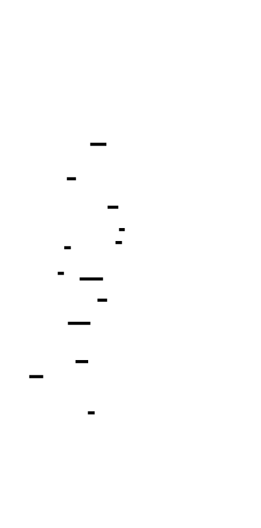
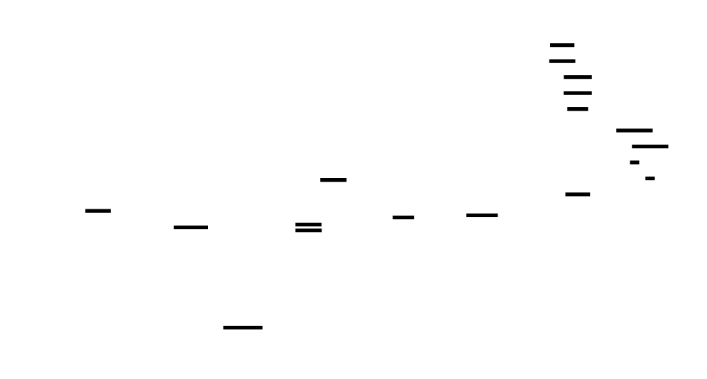

# 🎯 Project Charter: Distributed Cache
## What You Are Building
A production-grade distributed caching system implementing the core techniques behind Redis Cluster and Memcached. You'll build a horizontally-scalable, fault-tolerant cache from scratch featuring: an in-memory cache with LRU/LFU eviction and TTL expiration, consistent hashing with virtual nodes for balanced key distribution, primary-secondary replication with automatic failover, cache patterns (write-through, write-behind, cache-aside) with thundering herd protection, and a custom wire protocol with connection pooling. By the end, your system will handle multiple cache nodes, survive node failures, prevent cache stampedes, and serve millions of requests per second.
## Why This Project Exists
Distributed caching is the invisible backbone of every high-traffic system—from Netflix's video recommendations to Stripe's payment processing. Most developers use Redis or Memcached as black boxes, never understanding why consistent hashing prevents cascading failures, how replication tradeoffs affect data consistency, or why thundering herd protection saves databases from collapse. Building one from scratch exposes the fundamental tensions baked into every distributed system: the CAP theorem's impossible trinity, the memory-vs-hit-rate optimization problem, and the latency-vs-consistency tradeoffs that define production architecture. Understanding cache internals at this level is what separates infrastructure engineers from application developers—and it's valued at $140K-250K+ in the market.
## What You Will Be Able to Do When Done
- Implement LRU and LFU eviction policies with O(1) time complexity using hashmap + doubly linked list
- Build consistent hashing with virtual nodes to achieve balanced key distribution across heterogeneous clusters
- Handle node failures with primary-secondary replication and quorum-based automatic failover
- Prevent cache stampedes using single-flight request coalescing and probabilistic early expiration
- Implement write-through, write-behind, and cache-aside patterns with appropriate consistency tradeoffs
- Design a wire protocol and build a client library with connection pooling and exponential backoff retries
- Measure and optimize cache hit rates, latency percentiles, and throughput under load
- Debug distributed system failures including split-brain scenarios, network partitions, and replica lag
## Final Deliverable
~4,000-5,000 lines of Go (or Rust/Java) across 50+ source files organized into modules: cache (eviction, TTL), hashring (consistent hashing), replication (failover, heartbeats), patterns (cache-aside, write-through/behind), protocol (wire format), and client (pooling, retries, pipelining). The complete system boots in under 1 second, handles 100K+ operations per second per node, survives node failures with automatic failover, and can be tested via simple telnet commands. Includes a metrics dashboard showing hit rates, latency histograms, and cluster health.
## Is This Project For You?
**You should start this if you:**
- Are comfortable with Go, Rust, or Java (intermediate level—pointers/references, goroutines/threads, interfaces)
- Understand hash tables, linked lists, and basic data structure complexity
- Have written TCP network code or are willing to learn socket programming
- Know what a mutex is and why concurrent access needs synchronization
- Have used Redis or Memcached and wondered how they actually work
**Come back after you've learned:**
- Go/Rust/Java fundamentals (if you're still struggling with syntax or basic control flow)
- Pointer semantics and memory management (necessary for linked list manipulation)
- Basic networking concepts (TCP, clients, servers) — try a simple chat server first
- Concurrent programming primitives (mutexes, channels/condition variables) — build a thread-safe map
## Estimated Effort
| Phase | Time |
|-------|------|
| Single Node Cache with Eviction (LRU/LFU/TTL) | ~8-10 hours |
| Consistent Hashing & Sharding | ~8-10 hours |
| Replication & Failover | ~10-12 hours |
| Cache Patterns & Stampede Prevention | ~8-10 hours |
| Network Protocol & Client Library | ~8-10 hours |
| **Total** | **~42-52 hours** |
## Definition of Done
The project is complete when:
- In-memory cache with get/set/delete operations passes all unit tests including eviction and TTL expiration
- Consistent hash ring distributes keys within 10% variance and remaps only ~1/N keys on node changes
- Primary-secondary replication handles node failure with automatic failover while preventing split-brain via quorum
- Cache-aside pattern prevents thundering herd (≤5 DB queries for 1000 concurrent misses)
- Wire protocol is telnet-compatible (human-readable commands work via raw TCP connection)
- Client library supports connection pooling, automatic retries with backoff, and command pipelining
- All tests pass with race detector enabled (no data races detected)
- System handles 100K+ ops/sec in benchmark with p99 latency under 5ms

---

# 📚 Before You Read This: Prerequisites & Further Reading
> **Read these first.** The Atlas assumes you are familiar with the foundations below.
> Resources are ordered by when you should encounter them — some before you start, some at specific milestones.
---
## 🎯 Essential Prerequisites
### Data Structures & Algorithms
**Read BEFORE starting this project** — required foundational knowledge.
| Resource | Type | Section/Focus | Why It Matters |
|----------|------|---------------|----------------|
| **[Hash Tables](https://en.wikipedia.org/wiki/Hash_table)** | Concept | Collision resolution, load factor | Understanding O(1) lookups and why hash quality affects distribution |
| **[Doubly Linked List](https://en.wikipedia.org/wiki/Doubly_linked_list)** | Concept | O(1) insertion/removal | Critical for LRU eviction implementation (M1) |
| **[Binary Search](https://en.wikipedia.org/wiki/Binary_search_algorithm)** | Concept | O(log n) lookup on sorted arrays | Foundation for hash ring lookups (M2) |
---
## 📖 Milestone 1: Single Node Cache with Eviction
### LRU & LFU Cache Algorithms
| Resource | Type | Section/Chapter | Pedagogical Timing |
|----------|------|-----------------|-------------------|
| **[LRU Cache - LeetCode](https://leetcode.com/problems/lru-cache/)** | Problem + Solution | Official solution explanation | **Read before M1** — solidifies hashmap + doubly linked list pattern |
| **[Design a Cache — System Design Interview](https://www.tryexponent.com/blog/system-design-cache)** | Blog | "Eviction Policies" section | **Read before M1** — connects eviction choice to workload patterns |
| **[OS Page Replacement Algorithms](https://www.geeksforgeeks.org/page-replacement-algorithms-in-operating-systems/)** | Tutorial | LRU, LFU, Clock algorithm | **Read after M1** — shows how same algorithms apply to virtual memory |
### Advanced Eviction
| Resource | Authors/Source | Why Gold Standard |
|----------|----------------|-------------------|
| **[ARC: A Self-Tuning, Low Overhead Replacement Cache](http://www.cs.cmu.edu/~16b/papers/lru.pdf)** | Megiddo & Modha (IBM, 2003) | The paper behind ZFS's ARC — introduces adaptive balance between recency and frequency |
---
## 📖 Milestone 2: Consistent Hashing & Sharding
### The Foundational Paper
| Resource | Authors | Year | Pedagogical Timing |
|----------|---------|------|-------------------|
| **[Consistent Hashing and Random Trees](https://www.akamai.com/site/zh/dl/documents/technical-publication/consistent-hashing-and-random-trees-david-karger-et-al-web-conf-1997.pdf)** | Karger et al. (MIT) | 1997 | **Read after M2** — the original paper proves the O(K/N) remapping bound and shows Akamai's use case |
### Implementation Guides
| Resource | Type | Section | Pedagogical Timing |
|----------|------|---------|-------------------|
| **[Consistent Hashing — High Scalability Blog](http://highscalability.com/blog/2023/7/16/consistent-hashing.html)** | Blog | Virtual nodes, weighted distribution | **Read before M2** — intuitive visual explanation of the ring concept |
| **[Redis Cluster Specification](https://redis.io/docs/reference/cluster-spec/)** | Spec | "Keys hash tags" and "Hash slots" | **Read after M2** — shows production tradeoff: 16,384 fixed slots vs. continuous ring |
### Hash Functions
| Resource | Type | Focus | Pedagogical Timing |
|----------|------|-------|-------------------|
| **[xxHash - Extremely Fast Hash Algorithm](https://cyan4973.github.io/xxHash/)** | Project | SMHasher test results | **Read during M2** — understand why hash quality matters for distribution |
| **[MurmurHash3](https://github.com/aappleby/smhasher/blob/master/src/MurmurHash3.cpp)** | Code | Avalanche behavior | Reference for implementing production-quality hash functions |
---
## 📖 Milestone 3: Replication & Failover
### Distributed Systems Fundamentals
| Resource | Type | Section/Chapter | Pedagogical Timing |
|----------|------|-----------------|-------------------|
| **[CAP Theorem — Martin Kleppmann](https://martin.kleppmann.com/2015/05/11/please-stop-calling-databases-cp-or-ap.html)** | Blog | "Please stop calling databases CP or AP" | **Read before M3** — corrects common misconceptions about CAP |
| **[Designing Data-Intensive Applications](https://www.oreilly.com/library/view/designing-data-intensive-applications/9781491903063/)** — **Chapter 5: Replication** | Book | "Leaders and Followers", "Replication Lag" | **Read before M3** — the definitive explanation of primary-secondary replication tradeoffs |
### Failure Detection
| Resource | Authors | Year | Pedagogical Timing |
|----------|---------|------|-------------------|
| **[The ϕ Accrual Failure Detector](https://www.researchgate.net/publication/29682135_The_ph_accrual_failure_detector)** | Hayashibara et al. (2004) | 2004 | **Read after M3** — statistical approach used by Cassandra/Akka; explains why phi > 8.0 works |
### Consensus & Leader Election
| Resource | Type | Section | Pedagogical Timing |
|----------|------|---------|-------------------|
| **[Raft: In Search of an Understandable Consensus Algorithm](https://raft.github.io/raft.pdf)** | Paper (Ongaro & Ousterhout) | "Leader Election" section | **Read after M3** — your quorum-based failover is simplified Raft election |
| **[In Search of an Understandable Consensus Algorithm (Video)](https://www.youtube.com/watch?v=YbZ3zDzDnrw)** | Talk | 30:00-40:00 (election demo) | Visual walkthrough of Raft leader election |
---
## 📖 Milestone 4: Cache Patterns & Stampede Prevention
### Thundering Herd & Request Coalescing
| Resource | Type | Section | Pedagogical Timing |
|----------|------|---------|-------------------|
| **[Singleflight in Go](https://pkg.go.dev/golang.org/x/sync/singleflight)** | Package | Documentation and source | **Read during M4** — standard library implementation you'll mirror |
| **[Thundering Herds & Promises](https://medium.com/mercari-engineering/thundering-herds-promises-8c8a5c6dbd06)** | Blog | Full article | **Read before M4** — explains why coalescing prevents database overload |
### Cache Patterns
| Resource | Type | Chapter | Pedagogical Timing |
|----------|------|---------|-------------------|
| **[Designing Data-Intensive Applications](https://www.oreilly.com/library/view/designing-data-intensive-applications/9781491903063/)** — **Chapter 4: Encoding and Evolution** | Book | "Cache invalidation" discussion | **Read during M4** — why cache invalidation is "one of the hardest problems" |
| **[Caching Patterns — Microsoft Azure](https://learn.microsoft.com/en-us/azure/architecture/patterns/cache-aside)** | Pattern | Cache-Aside, Write-Through, Write-Behind | **Read before M4** — official pattern definitions with tradeoff analysis |
### Exponential Backoff
| Resource | Authors | Year | Pedagogical Timing |
|----------|---------|------|-------------------|
| **[Exponential Backoff And Jitter](https://aws.amazon.com/blogs/architecture/exponential-backoff-and-jitter/)** | Marc Brooker (AWS) | 2015 | **Read before M4** — AWS Architecture Blog; explains decorrelated jitter and why it prevents synchronization |
---
## 📖 Milestone 5: Network Protocol & Client Library
### Wire Protocol Design
| Resource | Type | Section | Pedagogical Timing |
|----------|------|---------|-------------------|
| **[Redis Protocol Specification (RESP)](https://redis.io/docs/reference/protocol-spec/)** | Spec | Full specification | **Read before M5** — the industry-standard text protocol for caches |
| **[Memcached Protocol](https://github.com/memcached/memcached/blob/master/doc/protocol.txt)** | Spec | Text vs. Binary comparison | **Read after M5** — shows tradeoff between human-readability and parsing efficiency |
### Connection Pooling
| Resource | Type | Section | Pedagogical Timing |
|----------|------|---------|-------------------|
| **[Go `sync.Pool` Design](https://pkg.go.dev/sync#Pool)** | Source + Docs | Package documentation | **Read during M5** — understand lifecycle and GC interaction |
| **[HikariCP — "Zero Overhead" Connection Pooling](https://github.com/brettwooldridge/HikariCP)** | Code | `HikariPool.java` | Reference for production-grade pool design (Java, but concepts transfer) |
### TCP & Networking
| Resource | Type | Chapter | Pedagogical Timing |
|----------|------|---------|-------------------|
| **[Beej's Guide to Network Programming](https://beej.us/guide/bgnet/)** | Guide | Chapters 5-6 (sockets, send/recv) | **Read during M5** — practical socket programming foundation |
---
## 🔧 Production Implementations to Study
| Project | File/Module | What to Study |
|---------|-------------|---------------|
| **[Redis](https://github.com/redis/redis)** | `src/evict.c` | LRU/LFU approximation with 24-bit clock |
| **[Redis Cluster](https://github.com/redis/redis)** | `src/cluster.c` | 16,384 slot distribution, failover protocol |
| **[Memcached](https://github.com/memcached/memcached)** | `items.c` | LRU with slab allocator interaction |
| **[Groupcache](https://github.com/golang/groupcache)** | `singleflight/singleflight.go` | Canonical Go singleflight implementation |
| **[go-redis](https://github.com/redis/go-redis)** | `internal/pool/` | Production connection pool with health checks |
---
## 📊 Recommended Reading Order
```
┌─────────────────────────────────────────────────────────────┐
│  BEFORE PROJECT START                                       │
│  ├─ Hash Tables (Wikipedia)                                 │
│  ├─ Doubly Linked Lists (Wikipedia)                         │
│  ├─ LRU Cache (LeetCode solution)                           │
│  └─ CAP Theorem (Kleppmann blog)                            │
└─────────────────────────────────────────────────────────────┘
                              │
                              ▼
┌─────────────────────────────────────────────────────────────┐
│  DURING M1: Single Node Cache                               │
│  ├─ Design a Cache (Exponent blog)                          │
│  └─ AFTER: OS Page Replacement (GeeksforGeeks)              │
└─────────────────────────────────────────────────────────────┘
                              │
                              ▼
┌─────────────────────────────────────────────────────────────┐
│  BEFORE M2: Consistent Hashing                              │
│  ├─ Consistent Hashing (High Scalability blog)              │
│  ├─ xxHash documentation                                    │
│  └─ AFTER: Redis Cluster Spec + Karger paper                │
└─────────────────────────────────────────────────────────────┘
                              │
                              ▼
┌─────────────────────────────────────────────────────────────┐
│  BEFORE M3: Replication                                     │
│  ├─ DDIA Chapter 5 (Replication)                            │
│  ├─ Exponential Backoff (AWS blog)                          │
│  └─ AFTER: Raft paper + Phi Accrual paper                   │
└─────────────────────────────────────────────────────────────┘
                              │
                              ▼
┌─────────────────────────────────────────────────────────────┐
│  BEFORE M4: Cache Patterns                                  │
│  ├─ Caching Patterns (Azure docs)                           │
│  ├─ Thundering Herds (Mercari blog)                         │
│  └─ DURING: singleflight Go source                          │
└─────────────────────────────────────────────────────────────┘
                              │
                              ▼
┌─────────────────────────────────────────────────────────────┐
│  BEFORE M5: Protocol & Client                               │
│  ├─ Redis RESP Specification                                │
│  ├─ Beej's Guide (Chapters 5-6)                             │
│  └─ AFTER: Memcached protocol + HikariCP source             │
└─────────────────────────────────────────────────────────────┘
```
---
## 🎓 Deep Dives Referenced in the Atlas
These are explicitly called out in the Atlas as `🔭 Deep Dive Available` blocks:
| Concept | Resource | Pedagogical Timing |
|---------|----------|-------------------|
| **ARC (Adaptive Replacement Cache)** | Megiddo & Modha (2003) paper | After M1 — you'll appreciate the recency/frequency balance |
| **Consistent Hashing Theory** | Karger et al. (1997) paper | After M2 — formal proof of O(K/N) remapping |
| **Phi Accrual Failure Detection** | Hayashibara et al. (2004) | After M3 — statistical approach vs. simple timeouts |
| **Go `sync.Map`** | Go source code | After M3 — lock-free read paths for read-heavy workloads |
| **Exponential Backoff with Jitter** | AWS Architecture Blog (Brooker, 2015) | Before M4 — prevents retry synchronization |
| **Redis RESP Protocol** | Redis Protocol Specification | Before M5 — text-based, human-readable, efficiently parseable |

---

# Distributed Cache

Build a production-grade distributed caching system from scratch, implementing the core techniques behind Redis Cluster and Memcached. You'll start with a single-node cache featuring LRU/LFU eviction and TTL expiration, then scale horizontally using consistent hashing with virtual nodes. The system evolves to include primary-secondary replication with automatic failover, cache patterns (write-through, write-behind, cache-aside), thundering herd protection, and a custom wire protocol with connection pooling. By the end, you'll understand why distributed caching is the backbone of high-traffic systems serving millions of requests per second.


<!-- MS_ID: distributed-cache-m1 -->
# Single Node Cache with Eviction
## Mission Briefing
You're building the foundation of a distributed caching system—the same technology that powers Redis, Memcached, and the caching layers behind every high-traffic application from Instagram to Stripe. Before you distribute across multiple nodes, you need to master the art of in-memory caching on a single machine.
This isn't just about storing key-value pairs. You're facing a fundamental tension: **memory is finite, but cache requests are unbounded**. Every millisecond your application spends retrieving data from a database or computing a result is a millisecond the user waits. A well-tuned cache can reduce latency from 50ms (database query) to 0.1ms (memory lookup)—a 500x improvement.
But here's the catch: when memory fills up, what do you throw away? The wrong choice means cache misses spike, database load explodes, and your carefully tuned system collapses under its own weight. This is the art of cache eviction, and it's where most cache implementations fail.
---
## The Fundamental Tension: Finite Memory, Infinite Requests
Let's feel the constraint before we solve it.
Imagine your cache has 1GB of memory. Each cached item averages 10KB. That's ~100,000 items maximum. Now imagine your application receives 10,000 requests per second, each requesting different data. Over an hour, that's 36 million unique keys—you can only cache 0.3% of them.
**The question isn't "what do we cache?"—it's "what do we throw away?"**


Every eviction policy is answering this question differently:
| Policy | Evicts | Best For | Worst For |
|--------|--------|----------|-----------|
| **LRU** | Least recently used | Time-local access (news feeds, sessions) | Scanning workloads (read entire DB once) |
| **LFU** | Least frequently used | Skewed access (celebrity profiles, hot products) | Time-decaying relevance (yesterday's news) |
| **FIFO** | Oldest entry | Simple, predictable | Ignores access patterns entirely |
| **Random** | Random item | Even distribution, simple | Unpredictable hit rates |
The choice of eviction policy can change your cache hit rate from 95% to 60%—the difference between a system that hums along and one that crushes your backend.
---
## Anatomy of a Cache Entry
Before we implement policies, let's understand what we're storing. A cache entry isn't just a key and a value—it's metadata that enables eviction decisions:
```go
type Entry struct {
    Key        []byte      // The lookup key
    Value      []byte      // The cached data
    CreatedAt  time.Time   // When entry was created
    ExpiresAt  time.Time   // TTL expiration (zero = no expiry)
    // LRU tracking
    Prev, Next *Entry      // Doubly linked list pointers
    // LFU tracking
    Frequency  uint64      // Access count
    Recency    time.Time   // Last access time (for LFU tie-breaking)
    // Memory tracking
    Size       int64       // Total bytes used by this entry
}
```


Notice the `Prev` and `Next` pointers. These aren't just convenience—they're the backbone of O(1) eviction. We'll see why in a moment.
---
## LRU: The Recency Champion
### The Naive Approach (Don't Do This)
A naive LRU implementation might use a slice or sorted list:
```go
// ❌ NAIVE: O(n) access, O(n) update
type NaiveLRU struct {
    items []string  // Ordered by recency, newest first
}
func (l *NaiveLRU) Access(key string) {
    // Find the key: O(n)
    for i, k := range l.items {
        if k == key {
            // Remove from position: O(n)
            l.items = append(l.items[:i], l.items[i+1:]...)
            // Add to front: O(1) amortized
            l.items = append([]string{key}, l.items...)
            return
        }
    }
}
```
This works, but every access is O(n). With 100,000 items, that's 50,000 comparisons on average per access. At 10,000 requests per second, you're doing 500 million comparisons per second—your CPU will melt.
### The Real LRU: Hashmap + Doubly Linked List
The insight that unlocks O(1) LRU: **we need two things simultaneously—fast lookup by key, and ordered traversal by recency.** No single data structure gives us both.


The solution: combine them.
```
┌─────────────────────────────────────────────────────────────┐
│                        HASHMAP                              │
│  "user:123" ──────────────────► [EntryPtr]                  │
│  "product:456" ──────────────► [EntryPtr]                   │
│  "session:789" ──────────────► [EntryPtr]                   │
└─────────────────────────────────────────────────────────────┘
                              │
                              │ Direct pointer
                              ▼
┌─────────────────────────────────────────────────────────────┐
│                   DOUBLY LINKED LIST                        │
│                                                             │
│   [MRU] ←→ [Entry] ←→ [Entry] ←→ [Entry] ←→ [LRU]          │
│            user:123   product:456  session:789              │
│                                                             │
│   MRU = Most Recently Used (next to evict: LRU)             │
└─────────────────────────────────────────────────────────────┘
```
- **Hashmap**: O(1) lookup by key → gives us the entry pointer
- **Doubly linked list**: O(1) removal and insertion at any position → we just move to front
```go
type LRUCache struct {
    capacity  int
    size      int64
    maxSize   int64
    // The dual data structures
    entries   map[string]*Entry  // Key → Entry pointer
    head, tail *Entry            // Doubly linked list boundaries
    mu        sync.RWMutex       // Thread safety
}
// O(1) Get: hashmap lookup + list move-to-front
func (c *LRUCache) Get(key string) ([]byte, bool) {
    c.mu.Lock()
    defer c.mu.Unlock()
    entry, exists := c.entries[key]
    if !exists {
        return nil, false
    }
    // Check TTL expiration (lazy eviction)
    if !entry.ExpiresAt.IsZero() && time.Now().After(entry.ExpiresAt) {
        c.removeEntry(entry)
        return nil, false
    }
    // Move to front (most recently used)
    c.moveToFront(entry)
    return entry.Value, true
}
// O(1) Set: hashmap insert + list insert + maybe evict
func (c *LRUCache) Set(key string, value []byte, ttl time.Duration) {
    c.mu.Lock()
    defer c.mu.Unlock()
    // Calculate entry size
    entrySize := int64(len(key) + len(value) + 64) // 64 = metadata overhead
    // If key exists, update and move to front
    if entry, exists := c.entries[key]; exists {
        c.size -= entry.Size
        entry.Value = value
        entry.Size = entrySize
        if ttl > 0 {
            entry.ExpiresAt = time.Now().Add(ttl)
        } else {
            entry.ExpiresAt = time.Time{}
        }
        c.size += entrySize
        c.moveToFront(entry)
        return
    }
    // Create new entry
    entry := &Entry{
        Key:      []byte(key),
        Value:    value,
        Size:     entrySize,
        CreatedAt: time.Now(),
    }
    if ttl > 0 {
        entry.ExpiresAt = time.Now().Add(ttl)
    }
    // Evict until we have space
    for c.size+entrySize > c.maxSize && c.tail != nil {
        c.evictLRU()
    }
    // Insert new entry
    c.entries[key] = entry
    c.addToFront(entry)
    c.size += entrySize
}
// O(1) move to front: update 4 pointers
func (c *LRUCache) moveToFront(entry *Entry) {
    if entry == c.head {
        return // Already at front
    }
    // Remove from current position
    if entry.Prev != nil {
        entry.Prev.Next = entry.Next
    }
    if entry.Next != nil {
        entry.Next.Prev = entry.Prev
    }
    if entry == c.tail {
        c.tail = entry.Prev
    }
    // Insert at front
    c.addToFront(entry)
}
// O(1) add to front
func (c *LRUCache) addToFront(entry *Entry) {
    entry.Prev = nil
    entry.Next = c.head
    if c.head != nil {
        c.head.Prev = entry
    }
    c.head = entry
    if c.tail == nil {
        c.tail = entry
    }
}
// O(1) evict LRU (tail)
func (c *LRUCache) evictLRU() {
    if c.tail == nil {
        return
    }
    lru := c.tail
    c.removeEntry(lru)
}
func (c *LRUCache) removeEntry(entry *Entry) {
    // Update list pointers
    if entry.Prev != nil {
        entry.Prev.Next = entry.Next
    } else {
        c.head = entry.Next
    }
    if entry.Next != nil {
        entry.Next.Prev = entry.Prev
    } else {
        c.tail = entry.Prev
    }
    // Remove from map
    delete(c.entries, string(entry.Key))
    c.size -= entry.Size
}
```
### Why Doubly Linked List, Not Singly?
You might wonder: why doubly linked? Can't we just track the previous node?
The answer is in the removal operation. When we access an item, we need to remove it from its current position before moving to front. With a singly linked list, removal requires traversing from the head to find the previous node—O(n). With doubly linked, we have `entry.Prev` directly—O(1).
This is the kind of insight that separates toy implementations from production-grade caches.
---
## LFU: The Frequency Champion
LRU has a weakness: it forgets quickly. If a user accesses their profile 1000 times, then reads one news article, LRU might evict the profile because "the news article was accessed more recently."
LFU (Least Frequently Used) tracks access count, not recency. An item accessed 1000 times stays longer than one accessed once.
### The Naive LFU (Don't Do This)
```go
// ❌ NAIVE: O(n) to find minimum frequency
func (c *NaiveLFU) evictLFU() {
    var minEntry *Entry
    minFreq := uint64(math.MaxUint64)
    for _, entry := range c.entries {
        if entry.Frequency < minFreq {
            minFreq = entry.Frequency
            minEntry = entry
        }
    }
    // This is O(n) — too slow for large caches
}
```
### The Real LFU: Frequency Buckets
The optimization: **group entries by frequency**. Instead of searching all entries, we maintain a linked list of "frequency buckets," each containing entries with that frequency.


```
┌─────────────────────────────────────────────────────────────┐
│                    FREQUENCY BUCKETS                        │
│                                                             │
│  Freq=1    [Entry A] ↔ [Entry B] ↔ [Entry C]               │
│     │                                                       │
│     ▼                                                       │
│  Freq=2    [Entry D] ↔ [Entry E]                           │
│     │                                                       │
│     ▼                                                       │
│  Freq=5    [Entry F] ← HOT (accessed 5 times)              │
│     │                                                       │
│     ▼                                                       │
│  Freq=100  [Entry G] ← VERY HOT                            │
│                                                             │
│  Evict from: Freq=1 bucket (oldest entry in bucket)        │
└─────────────────────────────────────────────────────────────┘
```
When an entry is accessed:
1. Remove from current frequency bucket
2. Increment frequency
3. Add to new frequency bucket (create if needed)
The minimum frequency bucket is always at the front—we never search.
```go
type FrequencyBucket struct {
    frequency uint64
    entries   *Entry  // Head of doubly linked list at this frequency
    prev, next *FrequencyBucket
}
type LFUCache struct {
    capacity   int
    size       int64
    maxSize    int64
    entries    map[string]*Entry          // Key → Entry
    buckets    map[uint64]*FrequencyBucket // Frequency → Bucket
    minBucket  *FrequencyBucket           // Always points to lowest non-empty
    head, tail *Entry                     // For tie-breaking within bucket
    mu         sync.RWMutex
}
func (c *LFUCache) Get(key string) ([]byte, bool) {
    c.mu.Lock()
    defer c.mu.Unlock()
    entry, exists := c.entries[key]
    if !exists {
        return nil, false
    }
    // Check TTL
    if !entry.ExpiresAt.IsZero() && time.Now().After(entry.ExpiresAt) {
        c.removeEntry(entry)
        return nil, false
    }
    // Increment frequency
    c.incrementFrequency(entry)
    return entry.Value, true
}
func (c *LFUCache) incrementFrequency(entry *Entry) {
    oldFreq := entry.Frequency
    newFreq := oldFreq + 1
    // Remove from old bucket
    c.removeFromBucket(entry, oldFreq)
    // Update entry frequency
    entry.Frequency = newFreq
    entry.Recency = time.Now()
    // Add to new bucket
    c.addToBucket(entry, newFreq)
    // Update min bucket if needed
    if c.minBucket == nil || c.minBucket.entries == nil {
        c.updateMinBucket()
    }
}
func (c *LFUCache) addToBucket(entry *Entry, freq uint64) {
    bucket, exists := c.buckets[freq]
    if !exists {
        bucket = &FrequencyBucket{frequency: freq}
        c.buckets[freq] = bucket
        // Insert bucket in sorted order
        c.insertBucketSorted(bucket)
    }
    // Add entry to bucket's list (at head for LRU tie-breaking within bucket)
    entry.Next = bucket.entries
    if bucket.entries != nil {
        bucket.entries.Prev = entry
    }
    bucket.entries = entry
    entry.Prev = nil
}
func (c *LFUCache) removeFromBucket(entry *Entry, freq uint64) {
    bucket := c.buckets[freq]
    if entry.Prev != nil {
        entry.Prev.Next = entry.Next
    } else {
        bucket.entries = entry.Next
    }
    if entry.Next != nil {
        entry.Next.Prev = entry.Prev
    }
    // Clean up empty bucket
    if bucket.entries == nil {
        c.removeBucket(bucket)
    }
}
func (c *LFUCache) evictLFU() {
    if c.minBucket == nil || c.minBucket.entries == nil {
        return
    }
    // Find oldest entry in minimum frequency bucket
    entry := c.minBucket.entries
    for entry.Next != nil {
        entry = entry.Next
    }
    c.removeEntry(entry)
}
```
### LFU Tie-Breaking: The Recency Factor
When multiple entries have the same frequency, which do we evict? LFU typically uses LRU within the same frequency bucket—evict the least recently accessed among the least frequent.
This is why we have the `Recency` field in our Entry struct.
---
## LRU vs LFU: When to Use Which?


The choice depends on your access pattern:
**Use LRU when:**
- Access patterns have **temporal locality** (if accessed recently, likely accessed again soon)
- Example: User sessions, news feeds, recently viewed products
- The "working set" changes over time (today's hot items become tomorrow's cold items)
**Use LFU when:**
- Access patterns have **frequency skew** (some items accessed much more than others)
- Example: Popular product pages, celebrity profiles, static assets
- The "hot" items are stable over time
**Hybrid approaches exist:**
- **LRU-K**: Track last K accesses, evict based on oldest K-th access
- **ARC** (Adaptive Replacement Cache): Dynamically balance between recency and frequency
- **LFU with aging**: Decay frequency over time to handle changing patterns
> 🔭 **Deep Dive**: ARC, developed at IBM and used in ZFS, maintains two lists—one for recent entries and one for frequent entries—and dynamically adjusts the balance based on cache performance. See "ARC: A Self-Tuning, Low Overhead Replacement Cache" (Megiddo & Modha, 2003).
---
## TTL: The Time Bomb in Your Cache
TTL (Time-To-Live) is simple in concept: each entry has an expiration time. After that, it's invalid.
But when do you actually remove expired entries?
### Strategy 1: Lazy Eviction (Check on Access)
```go
func (c *Cache) Get(key string) ([]byte, bool) {
    entry, exists := c.entries[key]
    if !exists {
        return nil, false
    }
    // Check TTL on access
    if !entry.ExpiresAt.IsZero() && time.Now().After(entry.ExpiresAt) {
        c.removeEntry(entry)  // Lazy eviction
        return nil, false
    }
    return entry.Value, true
}
```
**Pros**: Simple, no background goroutines, eviction only happens when needed
**Cons**: Expired entries linger until accessed, wasting memory
### Strategy 2: Active Eviction (Background Cleanup)
```go
func (c *Cache) StartCleanup(interval time.Duration) {
    go func() {
        ticker := time.NewTicker(interval)
        for range ticker.C {
            c.cleanupExpired()
        }
    }()
}
func (c *Cache) cleanupExpired() {
    c.mu.Lock()
    defer c.mu.Unlock()
    now := time.Now()
    // Iterate through entries and remove expired
    for key, entry := range c.entries {
        if !entry.ExpiresAt.IsZero() && now.After(entry.ExpiresAt) {
            c.removeEntry(entry)
        }
    }
}
```
**Pros**: Bounded memory usage for expired entries
**Cons**: Background CPU usage, lock contention during cleanup


### The Hybrid Approach (Production-Grade)
Real caches use both: lazy eviction for immediate access, periodic cleanup for memory hygiene.
```go
type Cache struct {
    // ... other fields
    // Cleanup configuration
    cleanupInterval   time.Duration
    cleanupThreshold  float64  // Cleanup when expired > this % of entries
    lastCleanup       time.Time
}
func (c *Cache) Get(key string) ([]byte, bool) {
    c.mu.Lock()
    defer c.mu.Unlock()
    entry, exists := c.entries[key]
    if !exists {
        return nil, false
    }
    // Lazy eviction on access
    if !entry.ExpiresAt.IsZero() && time.Now().After(entry.ExpiresAt) {
        c.removeEntry(entry)
        c.maybeScheduleCleanup()
        return nil, false
    }
    // ... rest of get logic
}
func (c *Cache) maybeScheduleCleanup() {
    // Trigger cleanup if too many expired entries or too long since last cleanup
    expiredRatio := float64(c.expiredCount) / float64(len(c.entries))
    timeSinceCleanup := time.Since(c.lastCleanup)
    if expiredRatio > c.cleanupThreshold || timeSinceCleanup > c.cleanupInterval {
        go c.cleanupExpired()
    }
}
```
### TTL and Eviction Policy Interaction
Here's a subtle issue: **expired entries shouldn't count toward capacity**.
If your cache is at capacity with 50% expired entries, a SET should:
1. Find space by removing expired entries first
2. Only then evict valid entries using LRU/LFU
```go
func (c *Cache) makeSpace(needed int64) {
    now := time.Now()
    // First pass: evict expired entries
    for key, entry := range c.entries {
        if !entry.ExpiresAt.IsZero() && now.After(entry.ExpiresAt) {
            c.removeEntry(entry)
            if c.size+needed <= c.maxSize {
                return  // We have enough space now
            }
        }
    }
    // Second pass: evict by policy (LRU/LFU)
    for c.size+needed > c.maxSize && len(c.entries) > 0 {
        c.evictByPolicy()
    }
}
```
---
## Thread Safety: The Concurrency Challenge
Caches are inherently concurrent—multiple goroutines reading and writing simultaneously. The question isn't "do we need locks?" but "how granular should they be?"


### Option 1: Single Global Lock (Simple)
```go
type Cache struct {
    mu      sync.RWMutex
    entries map[string]*Entry
    // ...
}
func (c *Cache) Get(key string) ([]byte, bool) {
    c.mu.RLock()
    defer c.mu.RUnlock()
    // ... read operation
}
func (c *Cache) Set(key string, value []byte) {
    c.mu.Lock()
    defer c.mu.Unlock()
    // ... write operation
}
```
**Pros**: Simple, correct
**Cons**: All operations serialized, poor throughput under contention
### Option 2: Sharded Locks (Better)
Divide the cache into N shards, each with its own lock. A key's shard is determined by hash(key) % N.
```go
type ShardedCache struct {
    shards []*CacheShard
    shardCount int
}
type CacheShard struct {
    mu      sync.RWMutex
    entries map[string]*Entry
    // LRU/LFU state per shard
}
func (c *ShardedCache) getShard(key string) *CacheShard {
    hash := fnv64(key)
    return c.shards[hash%uint64(c.shardCount)]
}
func (c *ShardedCache) Get(key string) ([]byte, bool) {
    return c.getShard(key).Get(key)
}
func (c *ShardedCache) Set(key string, value []byte, ttl time.Duration) {
    c.getShard(key).Set(key, value, ttl)
}
```
**Pros**: Better concurrency—operations on different shards don't block each other
**Cons**: More complex, each shard has its own capacity (or you need a global memory tracker)
### The Tradeoff
| Approach | Contention | Memory Efficiency | Complexity |
|----------|------------|-------------------|------------|
| Global lock | High | Perfect (shared pool) | Low |
| Sharded (16) | Medium | Good (small variance) | Medium |
| Sharded (256) | Low | Fair (shard imbalance) | Medium |
| Lock-free | None | Perfect | Very High |
For this milestone, start with a global lock. Sharding is an optimization you can add later.
> 🔭 **Deep Dive**: Go's `sync.Map` uses a sophisticated sharding approach with read-only paths that don't require locks at all. For read-heavy workloads, it can significantly outperform `map + sync.RWMutex`. See the Go source code for `sync.Map` for an excellent example of lock-free read paths.
---
## Memory Management: Staying Within Limits
Your cache has a maximum size. But what does "size" mean?
### Counting Bytes
```go
func estimateEntrySize(key string, value []byte) int64 {
    // Key: string header (16 bytes) + data
    keySize := int64(16 + len(key))
    // Value: slice header (24 bytes) + data
    valueSize := int64(24 + len(value))
    // Entry struct overhead
    structOverhead := int64(120) // Approximate based on struct fields
    return keySize + valueSize + structOverhead
}
```
### The Go Memory Model Complication
In Go, you don't directly control memory allocation. A `[]byte` is a slice header pointing to a backing array. When you store `value []byte` in your cache, you're storing the slice header—the backing array is elsewhere.
This means:
1. `len(value)` gives you the logical size, not the actual memory footprint
2. Go's garbage collector may or may not keep the backing array alive
3. Memory fragmentation isn't under your control
For a production cache, you'd want to:
1. Use a fixed-size buffer pool for values
2. Implement your own memory allocator
3. Track actual heap usage with `runtime.MemStats`
```go
func (c *Cache) memoryPressure() float64 {
    var m runtime.MemStats
    runtime.ReadMemStats(&m)
    return float64(m.HeapInuse) / float64(c.maxMemoryBytes)
}
func (c *Cache) shouldEvict() bool {
    return c.memoryPressure() > 0.9 // Evict when >90% full
}
```
---
## Putting It All Together: The Complete Cache
```go
package cache
import (
    "runtime"
    "sync"
    "time"
)
// EvictionPolicy defines how the cache chooses victims
type EvictionPolicy int
const (
    PolicyLRU EvictionPolicy = iota
    PolicyLFU
)
// Config holds cache configuration
type Config struct {
    MaxSizeBytes     int64
    EvictionPolicy   EvictionPolicy
    CleanupInterval  time.Duration
    Shards           int // 1 = global lock
}
// Cache is a thread-safe in-memory cache with eviction
type Cache struct {
    config    Config
    // For single-shard (shards = 1)
    shard     *cacheShard
    // For multi-shard
    shards    []*cacheShard
    shardMask uint64
    // Metrics
    hits      int64
    misses    int64
    evictions int64
}
type cacheShard struct {
    mu        sync.RWMutex
    entries   map[string]*Entry
    size      int64
    maxSize   int64
    policy    EvictionPolicy
    // LRU state
    head, tail *Entry
    // LFU state
    buckets    map[uint64]*FrequencyBucket
    minBucket  *FrequencyBucket
}
// Entry represents a cached item
type Entry struct {
    Key       []byte
    Value     []byte
    CreatedAt time.Time
    ExpiresAt time.Time
    Size      int64
    // LRU list pointers
    Prev, Next *Entry
    // LFU tracking
    Frequency uint64
    Recency   time.Time
}
// New creates a new cache
func New(config Config) *Cache {
    c := &Cache{
        config: config,
    }
    if config.Shards <= 1 {
        // Single shard
        c.shard = newCacheShard(config.MaxSizeBytes, config.EvictionPolicy)
    } else {
        // Multiple shards
        c.shards = make([]*cacheShard, config.Shards)
        shardSize := config.MaxSizeBytes / int64(config.Shards)
        for i := range c.shards {
            c.shards[i] = newCacheShard(shardSize, config.EvictionPolicy)
        }
        c.shardMask = uint64(config.Shards - 1)
    }
    // Start background cleanup
    if config.CleanupInterval > 0 {
        go c.backgroundCleanup(config.CleanupInterval)
    }
    return c
}
func newCacheShard(maxSize int64, policy EvictionPolicy) *cacheShard {
    return &cacheShard{
        entries: make(map[string]*Entry),
        maxSize: maxSize,
        policy:  policy,
        buckets: make(map[uint64]*FrequencyBucket),
    }
}
// Get retrieves a value from the cache
func (c *Cache) Get(key string) ([]byte, bool) {
    shard := c.getShard(key)
    value, hit := shard.get(key)
    if hit {
        c.hits++
    } else {
        c.misses++
    }
    return value, hit
}
// Set stores a value in the cache
func (c *Cache) Set(key string, value []byte, ttl time.Duration) {
    shard := c.getShard(key)
    shard.set(key, value, ttl)
}
// Delete removes a value from the cache
func (c *Cache) Delete(key string) {
    shard := c.getShard(key)
    shard.delete(key)
}
func (c *Cache) getShard(key string) *cacheShard {
    if c.shards == nil {
        return c.shard
    }
    hash := fnv64(key)
    return c.shards[hash&c.shardMask]
}
// --- Shard operations ---
func (s *cacheShard) get(key string) ([]byte, bool) {
    s.mu.Lock()
    defer s.mu.Unlock()
    entry, exists := s.entries[key]
    if !exists {
        return nil, false
    }
    // Check TTL (lazy eviction)
    if !entry.ExpiresAt.IsZero() && time.Now().After(entry.ExpiresAt) {
        s.removeEntry(entry)
        return nil, false
    }
    // Update access tracking
    if s.policy == PolicyLRU {
        s.moveToFront(entry)
    } else {
        s.incrementFrequency(entry)
    }
    return entry.Value, true
}
func (s *cacheShard) set(key string, value []byte, ttl time.Duration) {
    s.mu.Lock()
    defer s.mu.Unlock()
    entrySize := estimateSize(key, value)
    // Update existing entry
    if entry, exists := s.entries[key]; exists {
        s.size -= entry.Size
        entry.Value = value
        entry.Size = entrySize
        if ttl > 0 {
            entry.ExpiresAt = time.Now().Add(ttl)
        } else {
            entry.ExpiresAt = time.Time{}
        }
        s.size += entrySize
        if s.policy == PolicyLRU {
            s.moveToFront(entry)
        } else {
            s.incrementFrequency(entry)
        }
        return
    }
    // Make room for new entry
    for s.size+entrySize > s.maxSize && len(s.entries) > 0 {
        s.evict()
    }
    // Create new entry
    entry := &Entry{
        Key:        []byte(key),
        Value:      value,
        Size:       entrySize,
        CreatedAt:  time.Now(),
        Frequency:  1,
        Recency:    time.Now(),
    }
    if ttl > 0 {
        entry.ExpiresAt = time.Now().Add(ttl)
    }
    s.entries[key] = entry
    s.size += entrySize
    if s.policy == PolicyLRU {
        s.addToFront(entry)
    } else {
        s.addToBucket(entry, 1)
        if s.minBucket == nil || s.minBucket.frequency > 1 {
            s.updateMinBucket()
        }
    }
}
func (s *cacheShard) delete(key string) {
    s.mu.Lock()
    defer s.mu.Unlock()
    if entry, exists := s.entries[key]; exists {
        s.removeEntry(entry)
    }
}
func (s *cacheShard) evict() {
    if s.policy == PolicyLRU {
        s.evictLRU()
    } else {
        s.evictLFU()
    }
}
// --- LRU operations ---
func (s *cacheShard) moveToFront(entry *Entry) {
    if entry == s.head {
        return
    }
    // Remove from current position
    if entry.Prev != nil {
        entry.Prev.Next = entry.Next
    }
    if entry.Next != nil {
        entry.Next.Prev = entry.Prev
    }
    if entry == s.tail {
        s.tail = entry.Prev
    }
    // Add to front
    s.addToFront(entry)
}
func (s *cacheShard) addToFront(entry *Entry) {
    entry.Prev = nil
    entry.Next = s.head
    if s.head != nil {
        s.head.Prev = entry
    }
    s.head = entry
    if s.tail == nil {
        s.tail = entry
    }
}
func (s *cacheShard) evictLRU() {
    if s.tail == nil {
        return
    }
    s.removeEntry(s.tail)
}
// --- LFU operations ---
func (s *cacheShard) incrementFrequency(entry *Entry) {
    oldFreq := entry.Frequency
    newFreq := oldFreq + 1
    s.removeFromBucket(entry, oldFreq)
    entry.Frequency = newFreq
    entry.Recency = time.Now()
    s.addToBucket(entry, newFreq)
    if s.minBucket == nil || s.minBucket.entries == nil {
        s.updateMinBucket()
    }
}
func (s *cacheShard) addToBucket(entry *Entry, freq uint64) {
    bucket := s.buckets[freq]
    if bucket == nil {
        bucket = &FrequencyBucket{frequency: freq}
        s.buckets[freq] = bucket
        s.insertBucketSorted(bucket)
    }
    entry.Next = bucket.entries
    if bucket.entries != nil {
        bucket.entries.Prev = entry
    }
    bucket.entries = entry
    entry.Prev = nil
}
func (s *cacheShard) removeFromBucket(entry *Entry, freq uint64) {
    bucket := s.buckets[freq]
    if bucket == nil {
        return
    }
    if entry.Prev != nil {
        entry.Prev.Next = entry.Next
    } else {
        bucket.entries = entry.Next
    }
    if entry.Next != nil {
        entry.Next.Prev = entry.Prev
    }
    if bucket.entries == nil {
        s.removeBucket(bucket)
    }
}
func (s *cacheShard) insertBucketSorted(bucket *FrequencyBucket) {
    // Insert in sorted order by frequency
    var prev *FrequencyBucket
    curr := s.minBucket
    for curr != nil && curr.frequency < bucket.frequency {
        prev = curr
        curr = curr.next
    }
    bucket.prev = prev
    bucket.next = curr
    if prev != nil {
        prev.next = bucket
    }
    if curr != nil {
        curr.prev = bucket
    }
    if prev == nil {
        s.minBucket = bucket
    }
}
func (s *cacheShard) removeBucket(bucket *FrequencyBucket) {
    delete(s.buckets, bucket.frequency)
    if bucket.prev != nil {
        bucket.prev.next = bucket.next
    } else {
        s.minBucket = bucket.next
    }
    if bucket.next != nil {
        bucket.next.prev = bucket.prev
    }
}
func (s *cacheShard) updateMinBucket() {
    s.minBucket = nil
    for _, b := range s.buckets {
        if b.entries != nil {
            if s.minBucket == nil || b.frequency < s.minBucket.frequency {
                s.minBucket = b
            }
        }
    }
}
func (s *cacheShard) evictLFU() {
    if s.minBucket == nil || s.minBucket.entries == nil {
        return
    }
    // Find oldest entry in minimum frequency bucket
    entry := s.minBucket.entries
    for entry.Next != nil {
        entry = entry.Next
    }
    s.removeEntry(entry)
}
// --- Common operations ---
func (s *cacheShard) removeEntry(entry *Entry) {
    if s.policy == PolicyLRU {
        if entry.Prev != nil {
            entry.Prev.Next = entry.Next
        } else {
            s.head = entry.Next
        }
        if entry.Next != nil {
            entry.Next.Prev = entry.Prev
        } else {
            s.tail = entry.Prev
        }
    } else {
        s.removeFromBucket(entry, entry.Frequency)
    }
    delete(s.entries, string(entry.Key))
    s.size -= entry.Size
}
// --- Background cleanup ---
func (c *Cache) backgroundCleanup(interval time.Duration) {
    ticker := time.NewTicker(interval)
    defer ticker.Stop()
    for range ticker.C {
        c.cleanupExpired()
    }
}
func (c *Cache) cleanupExpired() {
    now := time.Now()
    if c.shards != nil {
        for _, shard := range c.shards {
            shard.cleanupExpired(now)
        }
    } else {
        c.shard.cleanupExpired(now)
    }
}
func (s *cacheShard) cleanupExpired(now time.Time) {
    s.mu.Lock()
    defer s.mu.Unlock()
    for key, entry := range s.entries {
        if !entry.ExpiresAt.IsZero() && now.After(entry.ExpiresAt) {
            s.removeEntry(entry)
        }
    }
}
// --- Metrics ---
type Metrics struct {
    Hits      int64
    Misses    int64
    HitRate   float64
    Evictions int64
    SizeBytes int64
    Entries   int
}
func (c *Cache) Metrics() Metrics {
    var size int64
    var entries int
    if c.shards != nil {
        for _, shard := range c.shards {
            shard.mu.RLock()
            size += shard.size
            entries += len(shard.entries)
            shard.mu.RUnlock()
        }
    } else {
        c.shard.mu.RLock()
        size = c.shard.size
        entries = len(c.shard.entries)
        c.shard.mu.RUnlock()
    }
    total := c.hits + c.misses
    hitRate := 0.0
    if total > 0 {
        hitRate = float64(c.hits) / float64(total)
    }
    return Metrics{
        Hits:      c.hits,
        Misses:    c.misses,
        HitRate:   hitRate,
        Evictions: c.evictions,
        SizeBytes: size,
        Entries:   entries,
    }
}
// --- Utilities ---
func fnv64(key string) uint64 {
    h := uint64(14695981039346656037)
    for _, c := range key {
        h ^= uint64(c)
        h *= 1099511628211
    }
    return h
}
func estimateSize(key string, value []byte) int64 {
    return int64(len(key) + len(value) + 120) // Key + value + overhead
}
```
---
## Testing Your Cache
A cache without tests is a ticking time bomb. Here's how to verify correctness:
### Test 1: Basic Operations
```go
func TestBasicOperations(t *testing.T) {
    cache := New(Config{
        MaxSizeBytes:   1024 * 1024, // 1MB
        EvictionPolicy: PolicyLRU,
    })
    // Set and Get
    cache.Set("foo", []byte("bar"), 0)
    val, ok := cache.Get("foo")
    assert.True(t, ok)
    assert.Equal(t, []byte("bar"), val)
    // Delete
    cache.Delete("foo")
    _, ok = cache.Get("foo")
    assert.False(t, ok)
}
```
### Test 2: LRU Eviction
```go
func TestLRUEviction(t *testing.T) {
    cache := New(Config{
        MaxSizeBytes:   100, // Very small
        EvictionPolicy: PolicyLRU,
    })
    // Add entries that will trigger eviction
    cache.Set("a", make([]byte, 40), 0)
    cache.Set("b", make([]byte, 40), 0)
    cache.Set("c", make([]byte, 40), 0) // Should evict "a"
    _, ok := cache.Get("a")
    assert.False(t, ok, "'a' should be evicted")
    _, ok = cache.Get("b")
    assert.True(t, ok, "'b' should exist")
    _, ok = cache.Get("c")
    assert.True(t, ok, "'c' should exist")
}
```
### Test 3: LRU Access Order
```go
func TestLRUAccessOrder(t *testing.T) {
    cache := New(Config{
        MaxSizeBytes:   100,
        EvictionPolicy: PolicyLRU,
    })
    cache.Set("a", make([]byte, 30), 0)
    cache.Set("b", make([]byte, 30), 0)
    cache.Set("c", make([]byte, 30), 0)
    // Access 'a' to make it recently used
    cache.Get("a")
    // Add new entry, should evict 'b' (not 'a')
    cache.Set("d", make([]byte, 30), 0)
    _, ok := cache.Get("a")
    assert.True(t, ok, "'a' should exist after access")
    _, ok = cache.Get("b")
    assert.False(t, ok, "'b' should be evicted")
}
```
### Test 4: TTL Expiration
```go
func TestTTLExpiration(t *testing.T) {
    cache := New(Config{
        MaxSizeBytes:   1024 * 1024,
        EvictionPolicy: PolicyLRU,
    })
    cache.Set("temp", []byte("value"), 100*time.Millisecond)
    val, ok := cache.Get("temp")
    assert.True(t, ok)
    assert.Equal(t, []byte("value"), val)
    time.Sleep(150 * time.Millisecond)
    _, ok = cache.Get("temp")
    assert.False(t, ok, "expired entry should not be returned")
}
```
### Test 5: Thread Safety
```go
func TestThreadSafety(t *testing.T) {
    cache := New(Config{
        MaxSizeBytes:   10 * 1024 * 1024,
        EvictionPolicy: PolicyLRU,
        Shards:         16,
    })
    var wg sync.WaitGroup
    numGoroutines := 100
    numOpsPerGoroutine := 1000
    for i := 0; i < numGoroutines; i++ {
        wg.Add(1)
        go func(id int) {
            defer wg.Done()
            for j := 0; j < numOpsPerGoroutine; j++ {
                key := fmt.Sprintf("key-%d-%d", id, j%100)
                if j%2 == 0 {
                    cache.Set(key, []byte(fmt.Sprintf("value-%d", j)), 0)
                } else {
                    cache.Get(key)
                }
            }
        }(i)
    }
    wg.Wait()
    // If we get here without deadlock or panic, test passes
}
```
---
## Common Pitfalls and How to Avoid Them
### Pitfall 1: O(n) LRU Operations
**The Problem**: Using a sorted list or slice to track recency.
**The Solution**: Always use hashmap + doubly linked list. Never iterate to find entries.
### Pitfall 2: Memory Leaks from Expired Entries
**The Problem**: Only checking TTL on access means expired entries linger forever if never accessed.
**The Solution**: Implement background cleanup, even if infrequent (e.g., every 5 minutes).
### Pitfall 3: Lock Contention Under Load
**The Problem**: Single global lock serializes all operations.
**The Solution**: Use sharded locks. Start with 16 shards, tune based on benchmarking.
### Pitfall 4: Size Estimation Inaccuracy
**The Problem**: Underestimating entry size leads to OOM; overestimating wastes capacity.
**The Solution**: Use `runtime.MemStats` to track actual memory and adjust eviction thresholds.
### Pitfall 5: Ignoring Hash Function Quality
**The Problem**: Poor hash function leads to uneven distribution in sharded caches.
**The Solution**: Use a high-quality hash function like FNV-1a, xxHash, or MurmurHash3.
---
## The Three-Level View
Let's zoom out and see where your cache sits in the system:
```
┌─────────────────────────────────────────────────────────────┐
│ LEVEL 1: APPLICATION                                        │
│ Your code calls cache.Get("user:123")                       │
│ ┌─────────────────────────────────────────────────────────┐ │
│ │ LEVEL 2: CACHE ENGINE                                    │ │
│ │ Hashmap lookup → Entry found → Update LRU/LFU → Return  │ │
│ │ ┌─────────────────────────────────────────────────────┐ │ │
│ │ │ LEVEL 3: RUNTIME / OS                               │ │ │
│ │ │ Go runtime: GC, memory allocation, goroutine sched  │ │ │
│ │ │ OS: Virtual memory, page tables, CPU caches         │ │ │
│ │ └─────────────────────────────────────────────────────┘ │ │
│ └─────────────────────────────────────────────────────────┘ │
└─────────────────────────────────────────────────────────────┘
```
**At Level 1**, you design the API your application needs.
**At Level 2**, you implement the cache mechanics—eviction policies, TTL, thread safety.
**At Level 3**, Go's runtime and the OS manage the actual memory. Your cache hints at what should be kept (by holding references) and what can be discarded (by removing entries).
Understanding all three levels helps you debug: is a performance issue from your cache logic (Level 2) or from GC pressure (Level 3)?
---
## Knowledge Cascade
You've just built a production-grade cache. These concepts will echo throughout your engineering career:
**Same Domain Connections:**
1. **LRU Cache → Operating System Page Replacement**: When your OS runs low on physical memory, it uses LRU variants (like CLOCK) to decide which memory pages to swap to disk. The same algorithm you just implemented runs billions of times per second inside every operating system.
2. **Hash + Linked List → Database Buffer Pools**: PostgreSQL's buffer pool manager uses a similar hashmap + linked list structure to track which disk pages are cached in memory. Your cache is essentially a mini database buffer pool.
**Cross-Domain Connections:**
3. **LFU Frequency Tracking → CDN Edge Caching**: Cloudflare's cache uses frequency analysis with exponential decay to predict which content will stay hot. Your LFU implementation is the foundation—they just add time-decay to handle changing access patterns.
4. **TTL Lazy Eviction → HTTP Cache-Control Headers**: The `max-age` directive in HTTP caching works identically to your TTL. When a browser checks a cached response, it compares current time against `ExpiresAt`. Same mechanism, different protocol.
5. **Thread-Safe Cache → Concurrent Map Design**: Java's `ConcurrentHashMap` and Go's `sync.Map` use the same sharding strategy you implemented. The insight "divide the data to reduce contention" is universal in concurrent systems.
**Forward Connections (What You Can Now Build):**
- A rate limiter (cache request counts with TTL)
- A session store (cache session data with LRU eviction)
- A memoization layer (cache function results with LFU for hot functions)
- A deduplication filter (cache seen message IDs with TTL)
---
## What's Next
Your single-node cache is ready. In the next milestone, you'll distribute it across multiple machines using consistent hashing. The questions will shift from "what do we evict?" to "which node has this key?" and from "what if GC pauses?" to "what if the network partitions?"
The patterns you've learned—O(1) data structure design, thread-safe access, TTL management—will scale up. But new impossibility results await. As you add nodes, you'll face the CAP theorem: you can't have consistency, availability, and partition tolerance all at once.
Your cache will have to choose.
---
<!-- END_MS -->


<!-- MS_ID: distributed-cache-m2 -->
# Consistent Hashing & Sharding
## Mission Briefing
You've built a single-node cache that handles eviction policies, TTL expiration, and thread-safe access. It's fast—sub-millisecond lookups, 95%+ hit rates when tuned correctly. But here's the brutal truth: **a single node has a hard ceiling**.
Memory is finite. A server with 128GB RAM can cache maybe 100 million 1KB entries. That sounds like a lot until you're serving a social network with 500 million users, each with a profile, timeline, session, and preferences. Suddenly you need terabytes of cache, not gigabytes.
The solution is horizontal scaling—multiple cache servers working together. But this creates a new problem that makes LRU look trivial: **which server holds which key?**
This isn't just a routing question. It's a question that determines whether your cache survives growth or collapses under it. The wrong answer means adding a single server invalidates your entire cache—millions of requests suddenly hitting your database at once.


Welcome to the world of distributed hashing, where the fundamental tension is: **how do you spread keys across N servers such that adding or removing a server doesn't reshuffle everything?**
---
## The Fundamental Tension: The Resharding Problem
Let's feel the pain before we solve it.
You have 4 cache servers and 1 million cached keys. Each server holds about 250,000 keys. Life is good—your cache hit rate is 95%, database load is low, latency is excellent.
Then traffic grows. You need a 5th server.
**The naive approach (mod hashing):** Hash each key to a server using `hash(key) % num_servers`.
```
Key "user:12345" → hash = 847293 → 847293 % 4 = 1 → Server 1
Key "product:789" → hash = 234561 → 234561 % 4 = 1 → Server 1
```
When you add the 5th server, something catastrophic happens:
```
Key "user:12345" → 847293 % 5 = 3 → Server 3  (was Server 1)
Key "product:789" → 234561 % 5 = 1 → Server 1  (stays Server 1)
```


**80% of your keys move.** 
Let that sink in. Adding one server doesn't just shift load to the new server—it remaps almost all keys to new locations. Your cache hit rate drops from 95% to near zero. Every cache miss becomes a database query. Your database, designed for 5% of traffic, suddenly receives 95%.
This is the **thundering herd** on steroids. Your database crashes. Your users see timeouts. Your pager goes off at 3am. All because you added a cache server to *improve* performance.
**The question isn't "how do we shard?"—it's "how do we shard in a way that survives change?"**
---
## The Revelation: Consistent Hashing
Here's the insight that changes everything: **instead of mapping keys to server indices, map both keys and servers to positions on a circle.**


Imagine a clock face with numbers from 0 to 2³²-1 (the range of a 32-bit hash). You place servers at positions determined by hashing their names. You place keys at positions determined by hashing their values. A key belongs to the first server clockwise from its position.
```
Server A: hash("server-A") = 1,500,000,000
Server B: hash("server-B") = 3,000,000,000
Server C: hash("server-C") = 500,000,000
Key "user:123": hash = 1,200,000,000 → belongs to Server A (first clockwise)
Key "product:456": hash = 2,800,000,000 → belongs to Server B (first clockwise)
```
When you add Server D:
```
Server D: hash("server-D") = 2,200,000,000
```
Server D claims the arc between its position and the next server clockwise. Only keys in that arc move—everything else stays put.
**Instead of 80% of keys moving, only 25% (1/N) move.**
This is consistent hashing's magic: minimal disruption. The name "consistent" doesn't mean the hash is consistent—it means the *mapping* changes minimally when the set of servers changes.
### The Math Behind the Magic
With N servers and K keys:
| Operation | Mod Hashing | Consistent Hashing |
|-----------|-------------|-------------------|
| Add server | K × (N/(N+1)) keys move ≈ 80% | K/(N+1) keys move ≈ 20% |
| Remove server | K × (N/(N-1)) keys move ≈ 100% | K/N keys move ≈ 25% |
The math is brutal for mod hashing and beautiful for consistent hashing.
> 🔭 **Deep Dive**: Consistent hashing was introduced in the 1997 paper "Consistent Hashing and Random Trees" by Karger et al. at MIT. It was originally designed for caching web content at Akamai, where the problem of "which edge server holds which content" was identical to our cache sharding problem. See the original paper for the formal proof of the O(K/N) remapping bound.
---
## The Hidden Problem: Hash Clustering
Consistent hashing sounds perfect. But there's a catch that trips up most first implementations.
**Hash functions aren't perfectly uniform.** They're *pseudorandom*—close enough for most purposes, but not mathematically guaranteed to distribute evenly.
Imagine this scenario:
```
Server A: hash("server-A") = 100,000,000
Server B: hash("server-B") = 150,000,000  ← Only 50M away from A!
Server C: hash("server-C") = 2,800,000,000
```
Server A claims the arc from Server C to Server A—a massive 2.7 billion positions. Server B claims only 50 million positions. **Server A gets 54x more keys than Server B.**


This isn't theoretical. With real hash functions and a small number of servers, you routinely see 2-3x imbalances. In production, this means:
- One server hits 90% memory while others sit at 30%
- Hot keys concentrate on overloaded servers
- The "lucky" server becomes a bottleneck, driving up tail latency
**The solution: virtual nodes.**
---
## Virtual Nodes: Statistical Balance Through Numbers
Instead of placing each server once on the ring, place it many times at different positions:
```
Server A positions:
  hash("server-A-0") = 100,000,000
  hash("server-A-1") = 890,000,000
  hash("server-A-2") = 1,500,000,000
  hash("server-A-3") = 2,300,000,000
  ... (100+ more positions)
Server B positions:
  hash("server-B-0") = 50,000,000
  hash("server-B-1") = 750,000,000
  ... (100+ more positions)
```
Each physical server claims many small arcs instead of one big arc. By the law of large numbers, the total arc length converges to 1/N of the ring.
**With 150 virtual nodes per server:**
- 4 servers, 1M keys: variance drops from 40% to 8%
- 10 servers, 1M keys: variance drops from 25% to 5%


> **Key Insight**: Virtual nodes are an application of Monte Carlo methods. We're using random sampling (many hash positions) to approximate a uniform distribution. The more samples, the closer to uniform we get.
### Redis Cluster's Approach: Fixed Hash Slots
Redis Cluster takes a different approach that's worth understanding. Instead of a continuous ring with virtual nodes, it uses **16,384 fixed hash slots**:
```
Slot 0: hash("user:1") % 16384 = 0 → belongs to Node A
Slot 8192: hash("product:1") % 16384 = 8192 → belongs to Node B
```
Each node claims a range of slots. To add a node, you move slots from existing nodes to the new node.
**Tradeoffs:**
| Approach | Pros | Cons |
|----------|------|------|
| **Ring + VNodes** | Continuous scaling, fine-grained balance | More complex lookup (binary search) |
| **Fixed Slots** | O(1) lookup, simple rebalancing | Coarse-grained, slot count is fixed forever |
Redis chose 16384 slots as a balance: enough for fine-grained distribution with thousands of nodes, but small enough to fit slot-to-node mappings in memory and broadcast quickly.
We'll implement the ring + vnodes approach—it's more flexible and teaches more concepts.
---
## Implementing the Hash Ring
Let's build this step by step.
### Step 1: The Hash Function
The hash function is the foundation. We need:
1. **Good distribution**: Outputs should be uniformly distributed across the hash space
2. **Speed**: Called on every cache operation, must be fast
3. **Consistency**: Same input always produces same output
```go
package hashring
import (
    "hash/fnv"
)
// Hasher defines the interface for hash functions
type Hasher interface {
    Hash(data []byte) uint32
}
// FNV1aHasher implements FNV-1a hash (fast, good distribution)
type FNV1aHasher struct{}
func (h *FNV1aHasher) Hash(data []byte) uint32 {
    hash := fnv.New32a()
    hash.Write(data)
    return hash.Sum32()
}
// MurmurHash3 is faster with better distribution, but requires external lib
// For production, consider: github.com/spaolacci/murmur3
```

> **🔑 Foundation: Why hash function quality matters and what collision resistance means for distribution**
> 
> ## Hash Functions & Collision Resistance
### What It IS
A hash function maps arbitrary-sized input to a fixed-size output (e.g., a 32-bit integer or 256-bit string). A **collision** occurs when two different inputs produce the same hash output.
```python
# Conceptual collision example
hash("user:alice")  →  0x7a3f
hash("user:bob")    →  0x7a3f  # Collision! Different input, same output
```
**Collision resistance** means it's computationally infeasible to find two inputs that hash to the same value. This exists in three tiers:
| Property | Difficulty | Use Case |
|----------|------------|----------|
| Pre-image resistance | Find input for given hash | Password storage |
| Second pre-image | Find different input with same hash as given input | Data integrity |
| Collision resistance | Find *any* two inputs with same hash | Digital signatures, partitioning |
### WHY You Need It Right Now
In distributed systems, hash functions drive:
- **Partitioning/sharding**: `shard_id = hash(key) % num_shards`
- **Consistent hashing**: Determining node placement in the ring
- **Load balancing**: Distributing requests evenly
- **Caching**: Key distribution across cache nodes
- **Deduplication**: Identifying duplicate content
Poor hash quality causes **skewed distribution**—some partitions become hot spots while others sit idle. This manifests as:
- Uneven query latencies
- Memory pressure on hot nodes
- Wasted capacity on cold nodes
- Cascading failures when hot nodes overload
**Security implications**: If attackers can predict or engineer collisions, they can:
- Force all traffic to one shard (DoS)
- Poison caches with colliding keys
- Break consensus protocols that rely on deterministic ordering
### Key Insight: The Avalanche Effect
A quality hash function exhibits the **avalanche effect**: changing one bit of input should flip approximately 50% of output bits, making outputs appear random even for similar inputs.
```
Input:  "hello"     →  0x5d41402abc4b2a76
Input:  "hello!"    →  0xf7c3bc1d808e0473  # Completely different
```
**Mental model**: Think of a hash function as a deterministic but chaotic blender. Similar inputs should produce unrecognizably different outputs. If your hash function lets similar keys produce similar hashes (locality-sensitive hashing aside), your distribution will cluster—not spread.
**Practical guidance**:
- For partitioning: Use xxHash, MurmurHash3, or SipHash (fast + good distribution)
- For cryptography: Use SHA-256 or SHA-3 (collision resistance ~2^128 work)
- Never use CRC32 or simple modulo for security-adjacent systems

### Step 2: Virtual Node Representation
```go
import (
    "fmt"
    "sort"
    "sync"
)
// VirtualNode represents one position of a physical node on the ring
type VirtualNode struct {
    hash       uint32
    nodeID     string
    nodeWeight int
}
// PhysicalNode represents a cache server
type PhysicalNode struct {
    ID       string
    Address  string  // e.g., "192.168.1.10:6379"
    Weight   int     // Relative capacity (higher = more vnodes)
    Metadata map[string]string
}
// HashRing implements consistent hashing with virtual nodes
type HashRing struct {
    hasher       Hasher
    vnodes       []VirtualNode     // Sorted by hash
    vnodesByNode map[string][]int  // nodeID → indices in vnodes
    nodes        map[string]*PhysicalNode
    vnodeCount   int               // Virtual nodes per physical node (per unit weight)
    mu           sync.RWMutex
}
```
### Step 3: Ring Construction
```go
// NewHashRing creates a new hash ring
func NewHashRing(hasher Hasher, vnodesPerWeight int) *HashRing {
    if hasher == nil {
        hasher = &FNV1aHasher{}
    }
    return &HashRing{
        hasher:       hasher,
        vnodesByNode: make(map[string][]int),
        nodes:        make(map[string]*PhysicalNode),
        vnodeCount:   vnodesPerWeight,
    }
}
// AddNode adds a physical node with its virtual nodes to the ring
func (r *HashRing) AddNode(node *PhysicalNode) error {
    r.mu.Lock()
    defer r.mu.Unlock()
    if _, exists := r.nodes[node.ID]; exists {
        return fmt.Errorf("node %s already exists", node.ID)
    }
    r.nodes[node.ID] = node
    // Generate virtual nodes
    weight := node.Weight
    if weight <= 0 {
        weight = 1
    }
    totalVNodes := r.vnodeCount * weight
    newVNodes := make([]VirtualNode, 0, totalVNodes)
    for i := 0; i < totalVNodes; i++ {
        // Generate unique key for each virtual node
        vnodeKey := fmt.Sprintf("%s#%d", node.ID, i)
        hash := r.hasher.Hash([]byte(vnodeKey))
        newVNodes = append(newVNodes, VirtualNode{
            hash:       hash,
            nodeID:     node.ID,
            nodeWeight: weight,
        })
    }
    // Merge new vnodes into sorted list
    r.mergeVNodes(newVNodes)
    return nil
}
// mergeVNodes inserts new virtual nodes while maintaining sorted order
func (r *HashRing) mergeVNodes(newVNodes []VirtualNode) {
    // Track indices for this node
    nodeID := newVNodes[0].nodeID
    r.vnodesByNode[nodeID] = make([]int, 0, len(newVNodes))
    // Append and sort
    r.vnodes = append(r.vnodes, newVNodes...)
    sort.Slice(r.vnodes, func(i, j int) bool {
        return r.vnodes[i].hash < r.vnodes[j].hash
    })
    // Rebuild index map
    for i := range r.vnodes {
        if r.vnodes[i].nodeID == nodeID {
            r.vnodesByNode[nodeID] = append(r.vnodesByNode[nodeID], i)
        }
    }
}
```
### Step 4: Key Lookup
```go
// GetNode returns the node responsible for a given key
func (r *HashRing) GetNode(key string) (*PhysicalNode, error) {
    r.mu.RLock()
    defer r.mu.RUnlock()
    if len(r.vnodes) == 0 {
        return nil, fmt.Errorf("no nodes available in ring")
    }
    hash := r.hasher.Hash([]byte(key))
    // Binary search for first vnode with hash >= key hash
    idx := sort.Search(len(r.vnodes), func(i int) bool {
        return r.vnodes[i].hash >= hash
    })
    // Wrap around to first vnode if past the end
    if idx >= len(r.vnodes) {
        idx = 0
    }
    nodeID := r.vnodes[idx].nodeID
    return r.nodes[nodeID], nil
}
// GetNodes returns N distinct nodes for replication (starting from primary)
func (r *HashRing) GetNodes(key string, count int) ([]*PhysicalNode, error) {
    r.mu.RLock()
    defer r.mu.RUnlock()
    if len(r.nodes) < count {
        return nil, fmt.Errorf("requested %d nodes but only %d available", 
            count, len(r.nodes))
    }
    hash := r.hasher.Hash([]byte(key))
    idx := sort.Search(len(r.vnodes), func(i int) bool {
        return r.vnodes[i].hash >= hash
    })
    if idx >= len(r.vnodes) {
        idx = 0
    }
    result := make([]*PhysicalNode, 0, count)
    seen := make(map[string]bool)
    // Walk clockwise, collecting distinct physical nodes
    for len(result) < count {
        vnode := r.vnodes[idx]
        if !seen[vnode.nodeID] {
            seen[vnode.nodeID] = true
            result = append(result, r.nodes[vnode.nodeID])
        }
        idx = (idx + 1) % len(r.vnodes)
        // Safety: prevent infinite loop if something goes wrong
        if len(seen) == len(r.nodes) && len(result) < count {
            break
        }
    }
    return result, nil
}
```
### Step 5: Node Removal
```go
// RemoveNode removes a physical node and all its virtual nodes from the ring
func (r *HashRing) RemoveNode(nodeID string) error {
    r.mu.Lock()
    defer r.mu.Unlock()
    if _, exists := r.nodes[nodeID]; !exists {
        return fmt.Errorf("node %s not found", nodeID)
    }
    // Remove from nodes map
    delete(r.nodes, nodeID)
    // Remove virtual nodes
    indicesToRemove := r.vnodesByNode[nodeID]
    delete(r.vnodesByNode, nodeID)
    // Build new vnode list without removed indices
    removeSet := make(map[int]bool)
    for _, idx := range indicesToRemove {
        removeSet[idx] = true
    }
    newVNodes := make([]VirtualNode, 0, len(r.vnodes)-len(indicesToRemove))
    for i, vnode := range r.vnodes {
        if !removeSet[i] {
            newVNodes = append(newVNodes, vnode)
        }
    }
    r.vnodes = newVNodes
    // Rebuild index map for all nodes (indices shifted)
    for nodeID := range r.vnodesByNode {
        r.vnodesByNode[nodeID] = r.vnodesByNode[nodeID][:0]
    }
    for i, vnode := range r.vnodes {
        r.vnodesByNode[vnode.nodeID] = append(r.vnodesByNode[vnode.nodeID], i)
    }
    return nil
}
```
---
## Weighted Nodes: Handling Heterogeneous Clusters
Not all cache servers are equal. You might have:
- Old servers with 64GB RAM
- New servers with 256GB RAM
- SSD-backed servers that can handle more throughput
Weighted nodes let you allocate keys proportionally to capacity.
```go
// Example: Node with 4x weight gets 4x more keys
ring := NewHashRing(&FNV1aHasher{}, 40) // 40 vnodes per weight unit
ring.AddNode(&PhysicalNode{
    ID:      "cache-old-1",
    Address: "10.0.1.10:6379",
    Weight:  1,  // 40 vnodes
})
ring.AddNode(&PhysicalNode{
    ID:      "cache-new-1", 
    Address: "10.0.2.10:6379",
    Weight:  4,  // 160 vnodes → 4x more keys
})
```


The math: with weights w₁, w₂, ..., wₙ, the fraction of keys going to node i is:
```
keys_i = (w_i / Σw_j) × total_keys
```
This is why we use `totalVNodes := r.vnodeCount * weight` in our implementation.
---
## Client-Side Sharding: The Complete Picture
Now that we have the ring, let's build the client that uses it.


```go
package cacheclient
import (
    "context"
    "errors"
    "time"
)
// Config holds client configuration
type Config struct {
    RingVNodes      int           // Virtual nodes per weight unit
    Hasher          Hasher        // Hash function (must match server)
    RequestTimeout  time.Duration // Per-request timeout
    MaxRetries      int           // Retries on failure
    RetryBackoff    time.Duration // Initial backoff
}
// DistributedCache is a client-side sharded cache
type DistributedCache struct {
    ring       *HashRing
    config     Config
    pools      map[string]*ConnectionPool  // nodeID → pool
    mu         sync.RWMutex
}
// NewDistributedCache creates a new distributed cache client
func NewDistributedCache(config Config) *DistributedCache {
    return &DistributedCache{
        ring:   NewHashRing(config.Hasher, config.RingVNodes),
        config: config,
        pools:  make(map[string]*ConnectionPool),
    }
}
// AddNode adds a cache server to the cluster
func (dc *DistributedCache) AddNode(node *PhysicalNode) error {
    if err := dc.ring.AddNode(node); err != nil {
        return err
    }
    dc.mu.Lock()
    defer dc.mu.Unlock()
    // Create connection pool for new node
    pool := NewConnectionPool(node.Address, PoolConfig{
        MaxIdle:     10,
        MaxActive:   100,
        IdleTimeout: 5 * time.Minute,
    })
    dc.pools[node.ID] = pool
    return nil
}
// RemoveNode removes a cache server from the cluster
func (dc *DistributedCache) RemoveNode(nodeID string) error {
    if err := dc.ring.RemoveNode(nodeID); err != nil {
        return err
    }
    dc.mu.Lock()
    defer dc.mu.Unlock()
    if pool, exists := dc.pools[nodeID]; exists {
        pool.Close()
        delete(dc.pools, nodeID)
    }
    return nil
}
// Get retrieves a value from the distributed cache
func (dc *DistributedCache) Get(ctx context.Context, key string) ([]byte, error) {
    node, err := dc.ring.GetNode(key)
    if err != nil {
        return nil, err
    }
    dc.mu.RLock()
    pool, exists := dc.pools[node.ID]
    dc.mu.RUnlock()
    if !exists {
        return nil, errors.New("node pool not found")
    }
    return dc.getWithRetry(ctx, pool, key)
}
// Set stores a value in the distributed cache
func (dc *DistributedCache) Set(ctx context.Context, key string, value []byte, ttl time.Duration) error {
    node, err := dc.ring.GetNode(key)
    if err != nil {
        return err
    }
    dc.mu.RLock()
    pool, exists := dc.pools[node.ID]
    dc.mu.RUnlock()
    if !exists {
        return errors.New("node pool not found")
    }
    return dc.setWithRetry(ctx, pool, key, value, ttl)
}
// getWithRetry performs GET with exponential backoff retry
func (dc *DistributedCache) getWithRetry(ctx context.Context, pool *ConnectionPool, key string) ([]byte, error) {
    var lastErr error
    backoff := dc.config.RetryBackoff
    for attempt := 0; attempt <= dc.config.MaxRetries; attempt++ {
        if attempt > 0 {
            select {
            case <-time.After(backoff):
            case <-ctx.Done():
                return nil, ctx.Err()
            }
            backoff = backoff * 2 // Exponential backoff
        }
        conn, err := pool.Get()
        if err != nil {
            lastErr = err
            continue
        }
        value, err := conn.Get(key)
        pool.Put(conn)
        if err == nil {
            return value, nil
        }
        lastErr = err
        // Don't retry on cache miss
        if errors.Is(err, ErrNotFound) {
            return nil, err
        }
    }
    return nil, lastErr
}
// setWithRetry performs SET with exponential backoff retry
func (dc *DistributedCache) setWithRetry(ctx context.Context, pool *ConnectionPool, key string, value []byte, ttl time.Duration) error {
    var lastErr error
    backoff := dc.config.RetryBackoff
    for attempt := 0; attempt <= dc.config.MaxRetries; attempt++ {
        if attempt > 0 {
            select {
            case <-time.After(backoff):
            case <-ctx.Done():
                return ctx.Err()
            }
            backoff = backoff * 2
        }
        conn, err := pool.Get()
        if err != nil {
            lastErr = err
            continue
        }
        err = conn.Set(key, value, ttl)
        pool.Put(conn)
        if err == nil {
            return nil
        }
        lastErr = err
    }
    return lastErr
}
```


> **🔑 Foundation: Why connection pooling matters for distributed systems performance**
> 
> ## Connection Pooling
### What It IS
A **connection pool** is a cache of established, reusable connections to a remote resource (database, API, message broker). Instead of creating a new connection for each request—which involves TCP handshakes, TLS negotiation, and authentication—the client borrows an existing connection from the pool and returns it when done.
```
Without pooling:     With pooling:
Request 1 ──► [connect] ──► query ──► [close]    Request 1 ──► [borrow] ──► query ──► [return]
Request 2 ──► [connect] ──► query ──► [close]    Request 2 ──► [borrow] ──► query ──► [return]
Request 3 ──► [connect] ──► query ──► [close]    Request 3 ──► [borrow] ──► query ──► [return]
         (3 handshakes)                                  (0 new handshakes)
```
### WHY You Need It Right Now
Connection establishment is **expensive**:
| Operation | Latency (typical) |
|-----------|-------------------|
| TCP 3-way handshake | 1-3 RTTs |
| TLS 1.3 handshake | 1-2 RTTs |
| Authentication | 1-5ms |
| **Total cold connection** | **50-200ms** |
| Pooled connection reuse | **<1ms** |
At scale, this compounds dramatically:
- 1,000 requests/second × 100ms connection overhead = 100 seconds of wait time per second
- With 20 pooled connections: near-zero connection overhead
**Consequences of missing pooling:**
- **Latency spikes**: P99 latencies dominated by connection setup
- **Port exhaustion**: Ephemeral ports (typically 28,000-65,535) exhausted under load
- **Server overload**: SYN flood from legitimate traffic
- **Resource waste**: Each connection consumes kernel buffers, file descriptors
### Key Insight: Pool Sizing Is About Concurrency, Not Throughput
**Mental model**: Your pool size should match your *concurrent* request patterns, not your total request volume.
```python
# Pool sizing heuristic
pool_size = (average_query_time × peak_requests_per_second) + safety_margin
# Example: 10ms queries, 500 req/s peak
# pool_size = 0.01 × 500 + 5 = 10 connections
```
**Critical trade-off**: A pool that's too small causes queuing and timeouts. A pool that's too large wastes resources and can *decrease* throughput due to connection contention and context switching.
**Universal formula** (from PostgreSQL's formula):
```
connections = ((core_count) × 2) + effective_spindle_count
```
For modern SSDs and service-to-service HTTP pools:
```
connections ≈ CPU_cores × 2 to 4
```
**Essential configuration**:
- **Min connections**: Keep warm for burst traffic
- **Max connections**: Hard ceiling to prevent cascade failures
- **Idle timeout**: Close unused connections (free resources)
- **Max lifetime**: Rotate connections (prevent stale state, handle DNS changes)
- **Validation query**: Test connection health before use

---
## The Three-Level View: Where Are We?
```
┌─────────────────────────────────────────────────────────────┐
│ LEVEL 1: APPLICATION                                        │
│ App calls cache.Get("user:123")                             │
│ ┌─────────────────────────────────────────────────────────┐ │
│ │ LEVEL 2: DISTRIBUTED CACHE CLIENT                       │ │
│ │ Hash ring lookup → Node selection → Connection pool     │ │
│ │ ┌─────────────────────────────────────────────────────┐ │ │
│ │ │ LEVEL 3: NETWORK / INDIVIDUAL NODES                 │ │ │
│ │ │ TCP connections, individual cache servers, failures │ │ │
│ │ └─────────────────────────────────────────────────────┘ │ │
│ └─────────────────────────────────────────────────────────┘ │
└─────────────────────────────────────────────────────────────┘
```
**At Level 1**, your application sees a simple key-value interface. It doesn't know—or care—that the cache is distributed.
**At Level 2**, your client library maintains the hash ring, routes requests, and manages connection pools. This is where sharding happens.
**At Level 3**, individual cache nodes receive requests and serve them using the single-node cache you built in Milestone 1.
---
## Measuring Distribution Quality
How do you know your hash ring is working correctly? You measure it.
### Distribution Analysis
```go
// DistributionStats analyzes key distribution across nodes
type DistributionStats struct {
    NodeID      string
    KeyCount    int64
    Percentage  float64
    Expected    float64  // Expected percentage based on weights
    Deviation   float64  // Actual - Expected
}
// AnalyzeDistribution tests key distribution with sample keys
func (dc *DistributedCache) AnalyzeDistribution(sampleKeys []string) []DistributionStats {
    counts := make(map[string]int64)
    for _, key := range sampleKeys {
        node, err := dc.ring.GetNode(key)
        if err != nil {
            continue
        }
        counts[node.ID]++
    }
    total := int64(len(sampleKeys))
    stats := make([]DistributionStats, 0, len(counts))
    for nodeID, count := range counts {
        actual := float64(count) / float64(total) * 100
        node := dc.ring.nodes[nodeID]
        totalWeight := dc.ring.totalWeight()
        expected := float64(node.Weight) / float64(totalWeight) * 100
        stats = append(stats, DistributionStats{
            NodeID:     nodeID,
            KeyCount:   count,
            Percentage: actual,
            Expected:   expected,
            Deviation:  actual - expected,
        })
    }
    return stats
}
// totalWeight calculates total weight of all nodes
func (r *HashRing) totalWeight() int {
    total := 0
    for _, node := range r.nodes {
        total += node.Weight
    }
    return total
}
```
### Expected Variance
With virtual nodes, you should see variance within 5-10% of expected:
```
Node ID          Keys     Actual%   Expected%   Deviation
cache-server-1   25234    25.2%     25.0%       +0.2%
cache-server-2   24891    24.9%     25.0%       -0.1%
cache-server-3   25156    25.2%     25.0%       +0.2%
cache-server-4   24719    24.7%     25.0%       -0.3%
Max deviation: 0.3%  ✓ PASS (within 10%)
```
If you see deviations > 10%, check:
1. Virtual node count (increase it)
2. Hash function quality (try MurmurHash3)
3. Key distribution (are keys themselves clustered?)
---
## Node Changes: The Remapping Test
The ultimate test of your hash ring: what happens when you add or remove a node?
```go
// RemappingStats measures key remapping during topology changes
type RemappingStats struct {
    KeysBefore     int
    KeysAfter      int
    KeysMoved      int
    MovePercentage float64
}
// TestNodeAddition measures how many keys move when adding a node
func TestNodeAddition(ring *HashRing, sampleKeys []string, newNode *PhysicalNode) RemappingStats {
    // Record original mapping
    originalMapping := make(map[string]string)
    for _, key := range sampleKeys {
        node, _ := ring.GetNode(key)
        originalMapping[key] = node.ID
    }
    // Add new node
    ring.AddNode(newNode)
    // Count remapped keys
    moved := 0
    for _, key := range sampleKeys {
        node, _ := ring.GetNode(key)
        if node.ID != originalMapping[key] {
            moved++
        }
    }
    return RemappingStats{
        KeysBefore:     len(sampleKeys),
        KeysAfter:      len(sampleKeys),
        KeysMoved:      moved,
        MovePercentage: float64(moved) / float64(len(sampleKeys)) * 100,
    }
}
```
**Expected result:** With N nodes, adding a (N+1)th node should move approximately 1/(N+1) of keys:
```
Before: 4 nodes, 100,000 keys
After:  5 nodes
Expected moves: 100,000 / 5 = 20,000 (20%)
Actual moves:   19,847 (19.8%)  ✓ PASS
```
---
## Common Pitfalls and How to Avoid Them
### Pitfall 1: Forgetting Virtual Nodes
**The Problem**: Using only one position per server leads to severe imbalance.
**The Solution**: Always use virtual nodes. Start with 150 vnodes per server (or per weight unit), tune based on distribution analysis.
```go
// ❌ WRONG: Single position per server
ring.AddNode(&PhysicalNode{ID: "server-1", Weight: 1})  // Only 1 position!
// ✓ CORRECT: Many virtual nodes
ring := NewHashRing(hasher, 150)  // 150 vnodes per weight unit
ring.AddNode(&PhysicalNode{ID: "server-1", Weight: 1})  // 150 positions
```
### Pitfall 2: Hash Function Mismatch
**The Problem**: Client and server use different hash functions, routing keys incorrectly.
**The Solution**: Document the hash function prominently. Consider including it in protocol negotiation.
```go
// Protocol version should include hash function
const ProtocolVersion = "dcache-1.0-fnv1a"
// Or negotiate during connection
type Handshake struct {
    Version     string
    HashFunc    string  // "fnv1a", "murmur3", etc.
}
```
### Pitfall 3: Not Handling Empty Ring
**The Problem**: GetNode() on empty ring causes panic or undefined behavior.
**The Solution**: Always check and return explicit error.
```go
func (r *HashRing) GetNode(key string) (*PhysicalNode, error) {
    r.mu.RLock()
    defer r.mu.RUnlock()
    if len(r.vnodes) == 0 {
        return nil, errors.New("no nodes in ring")  // Explicit error
    }
    // ... rest of implementation
}
```
### Pitfall 4: Node ID Collisions
**The Problem**: Two nodes with same ID corrupt the ring.
**The Solution**: Check for existing ID before adding.
```go
func (r *HashRing) AddNode(node *PhysicalNode) error {
    r.mu.Lock()
    defer r.mu.Unlock()
    if _, exists := r.nodes[node.ID]; exists {
        return fmt.Errorf("node %s already exists", node.ID)
    }
    // ... rest of implementation
}
```
### Pitfall 5: Not Rebuilding Indices After Removal
**The Problem**: Removing a node shifts vnode indices, breaking the vnodesByNode map.
**The Solution**: Rebuild all index maps after removal (as shown in our RemoveNode implementation).
---
## Testing Your Hash Ring
### Test 1: Basic Routing
```go
func TestBasicRouting(t *testing.T) {
    ring := NewHashRing(&FNV1aHasher{}, 150)
    ring.AddNode(&PhysicalNode{ID: "node-a", Weight: 1})
    ring.AddNode(&PhysicalNode{ID: "node-b", Weight: 1})
    // Same key should always route to same node
    node1, _ := ring.GetNode("test-key")
    node2, _ := ring.GetNode("test-key")
    assert.Equal(t, node1.ID, node2.ID)
}
```
### Test 2: Distribution Balance
```go
func TestDistributionBalance(t *testing.T) {
    ring := NewHashRing(&FNV1aHasher{}, 150)
    ring.AddNode(&PhysicalNode{ID: "node-a", Weight: 1})
    ring.AddNode(&PhysicalNode{ID: "node-b", Weight: 1})
    ring.AddNode(&PhysicalNode{ID: "node-c", Weight: 1})
    ring.AddNode(&PhysicalNode{ID: "node-d", Weight: 1})
    // Generate 100,000 sample keys
    keys := make([]string, 100000)
    for i := range keys {
        keys[i] = fmt.Sprintf("key-%d", i)
    }
    counts := make(map[string]int)
    for _, key := range keys {
        node, _ := ring.GetNode(key)
        counts[node.ID]++
    }
    // Check each node is within 10% of expected 25%
    for nodeID, count := range counts {
        percentage := float64(count) / 100000.0 * 100.0
        deviation := math.Abs(percentage - 25.0)
        assert.Less(t, deviation, 10.0, 
            fmt.Sprintf("Node %s deviation too high: %.2f%%", nodeID, deviation))
    }
}
```
### Test 3: Minimal Remapping on Node Addition
```go
func TestMinimalRemapping(t *testing.T) {
    ring := NewHashRing(&FNV1aHasher{}, 150)
    ring.AddNode(&PhysicalNode{ID: "node-a", Weight: 1})
    ring.AddNode(&PhysicalNode{ID: "node-b", Weight: 1})
    ring.AddNode(&PhysicalNode{ID: "node-c", Weight: 1})
    // Record original mapping
    keys := make([]string, 10000)
    original := make(map[string]string)
    for i := range keys {
        keys[i] = fmt.Sprintf("key-%d", i)
        node, _ := ring.GetNode(keys[i])
        original[keys[i]] = node.ID
    }
    // Add new node
    ring.AddNode(&PhysicalNode{ID: "node-d", Weight: 1})
    // Count remapped keys
    moved := 0
    for _, key := range keys {
        node, _ := ring.GetNode(key)
        if node.ID != original[key] {
            moved++
        }
    }
    // Should be approximately 25% (1/4 nodes worth)
    movePercentage := float64(moved) / float64(len(keys)) * 100
    assert.InDelta(t, 25.0, movePercentage, 5.0, 
        fmt.Sprintf("Expected ~25%% remapped, got %.1f%%", movePercentage))
}
```
### Test 4: Weighted Distribution
```go
func TestWeightedDistribution(t *testing.T) {
    ring := NewHashRing(&FNV1aHasher{}, 100)
    ring.AddNode(&PhysicalNode{ID: "node-small", Weight: 1})
    ring.AddNode(&PhysicalNode{ID: "node-large", Weight: 3})
    keys := make([]string, 10000)
    for i := range keys {
        keys[i] = fmt.Sprintf("key-%d", i)
    }
    counts := make(map[string]int)
    for _, key := range keys {
        node, _ := ring.GetNode(key)
        counts[node.ID]++
    }
    // node-large should get ~75% (3/4 total weight)
    largePercentage := float64(counts["node-large"]) / 10000.0 * 100
    assert.InDelta(t, 75.0, largePercentage, 5.0,
        fmt.Sprintf("Expected ~75%% for large node, got %.1f%%", largePercentage))
}
```
---
## Knowledge Cascade
You've just mastered the art of distributed key routing. These concepts will echo throughout distributed systems:
**Same Domain Connections:**
1. **Consistent Hashing → CDN Edge Server Selection**: When you request `https://example.com/image.jpg`, CloudFront or Akamai uses consistent hashing to determine which edge server should cache that content. The same ring-based routing you implemented decides whether your request hits a server in Seattle or San Francisco based on content hash.
2. **Virtual Nodes → DynamoDB Partition Key Distribution**: AWS DynamoDB uses a similar virtualization concept for hot partition mitigation. When a partition key becomes "hot" (too much traffic), DynamoDB can split it into multiple virtual partitions, redistributing load—exactly like how your virtual nodes spread load across the ring.
**Cross-Domain Connections:**
3. **Minimal Remapping → Database Resharding**: Vitess (YouTube's MySQL sharding middleware) and CockroachDB use range-based sharding, but the principle is identical: when adding shards, you want minimal data movement. The insight "topology changes should affect minimal data" is universal to all distributed storage.
4. **Hash Ring → Distributed Locking**: Hazelcast and Apache Ignite use ring-based member discovery for distributed locks and data structures. The ring provides both ordering (who gets the lock next) and fault tolerance (skip failed members on the ring).
5. **Weighted Nodes → Kubernetes Pod Scheduling**: K8s scheduler uses weighted scoring to decide which node runs a pod. While more complex (considers CPU, memory, affinity, taints), the core insight is the same: "not all nodes are equal, distribute accordingly."
**Forward Connections (What You Can Now Build):**
- A database sharding proxy (route SQL queries to correct shard)
- A rate limiter with distributed counters (each node handles a key range)
- A distributed lock service (ring determines lock ownership)
- A message queue partitioner (route topics to brokers)
---
## What's Next
Your cache can now scale horizontally. Add servers, and keys automatically redistribute with minimal disruption. Remove servers, and the surviving nodes absorb their keys gracefully.
But you've introduced a new vulnerability: **what happens when a node fails?**
Currently, if `cache-server-3` crashes, all keys that routed to it become cache misses. Your database load spikes. Your latency increases. And when `cache-server-3` comes back, it's empty—all those keys need to be re-cached.
In the next milestone, you'll solve this with **replication**. Each key won't live on just one node—it'll live on N nodes. When the primary fails, a replica takes over. When the primary recovers, it syncs from its replicas.
The question shifts from "which node has this key?" to "which nodes *should* have this key, and how do we keep them in sync?"
Your distributed cache is about to become fault-tolerant.
---
<!-- END_MS -->


<!-- MS_ID: distributed-cache-m3 -->
# Replication & Failover
## Mission Briefing
Your distributed cache now scales horizontally. You've mastered consistent hashing, and keys distribute evenly across nodes. Add a server, and only 1/N keys remap. Remove a server, and the survivors absorb the load. You've solved the scaling problem.
But you've created a new vulnerability far more dangerous than running out of memory.
**A single node failure now wipes out 1/N of your cache.**
When `cache-server-3` crashes—and it will crash, eventually—every key that hashed to it becomes a cache miss. If you have 5 nodes, that's 20% of your working set gone instantly. Your database, designed for a 5% miss rate, suddenly receives 4x its expected load. The cascade begins: database latency spikes, application timeouts increase, retry storms compound the problem, and your users see errors.


This isn't theoretical. In 2012, a Redis node failure at a major social platform caused a 40-minute outage affecting millions of users. The cache didn't just lose data—it sent a tidal wave of traffic to databases that couldn't handle it.
The solution is **replication**: store each key on multiple nodes, so one failure doesn't lose data. But replication introduces the most dangerous problem in distributed systems: **when replicas disagree, who is right?**
This milestone confronts the CAP theorem head-on. You'll build primary-secondary replication with automatic failover, but you'll discover that "automatic failover" is easy to get wrong in ways that corrupt data permanently.
---
## The Fundamental Tension: Consistency vs. Availability

> **🔑 Foundation: CAP theorem implications for caching**
> 
> ## What It IS
The CAP theorem states that a distributed system can only guarantee **two of three** properties simultaneously:
- **Consistency (C)**: Every read returns the most recent write or an error
- **Availability (A)**: Every request receives a response (without guarantee it's the latest data)
- **Partition Tolerance (P)**: The system continues operating despite network failures between nodes
For caching systems, this creates a fundamental tradeoff. Since network partitions are inevitable in distributed systems (P is non-negotiable), you're left choosing between **CP** (consistent but may reject requests) and **AP** (always respond but may serve stale data).
## WHY You Need It Right Now
When designing a caching layer, you'll face concrete architectural decisions that directly stem from CAP tradeoffs:
**Cache invalidation across nodes**: If you have multiple cache servers and one can't reach the others, what happens?
- **AP approach**: Serve whatever's in cache, risk stale data
- **CP approach**: Fail the request or fall through to the source of truth
**Write-through vs. write-behind**: 
- Write-through with synchronous replication = stronger consistency but higher latency and availability risk
- Write-behind with async replication = better availability/performance but potential data loss windows
**TTL as a CAP compromise**: Time-to-live is essentially saying "I accept eventual consistency — data can be stale for up to N seconds." This is an explicit AP choice.
**Real-world example**: Consider a shopping cart cache. If the cache cluster partitions:
- AP: Users can still add items, but inventory checks might show wrong quantities
- CP: Users can't modify carts during the partition, preventing oversell but losing sales
## ONE Key Insight
**Cache staleness is a feature, not a bug — it's the price of availability.**
When you introduce a cache, you've already chosen to serve potentially stale data in exchange for performance. The CAP theorem just makes this explicit. The mental model: every cache hit is an implicit bet that "this data is fresh enough for this use case."
The practical implication: design your cache with **idempotency and graceful degradation in mind**. Ask yourself: "If this cache returns stale data during a partition, what's the worst outcome?" If the answer is unacceptable (financial loss, safety issue), you need CP semantics or shouldn't be caching that data at all.
```
AP Cache: "Fast, available, probably correct"
CP Cache: "Correct, may be unavailable, slower"
No Cache:  "Source of truth, slowest, most available (no cache to fail)"
```

Before we write code, let's feel the impossibility at the heart of distributed systems.
Imagine this scenario: you have 3 cache nodes. Node A is the primary for key "user:123", and nodes B and C hold replicas. The replication factor is 3.
```
┌─────────────────────────────────────────────────────────────┐
│                     NORMAL OPERATION                        │
│                                                             │
│   Client writes "user:123" → Primary A                      │
│   Primary A replicates → B and C                            │
│   All three nodes have the same value                       │
└─────────────────────────────────────────────────────────────┘
```
Now a network partition occurs. Node A can communicate with some clients but not with nodes B and C:
```
┌─────────────────────────────────────────────────────────────┐
│                   NETWORK PARTITION                         │
│                                                             │
│   [Clients] ←→ [Node A]  │  PARTITION  │  [Node B] ←→ [Node C]
│   (Can't reach B, C)      │             │  (Can't reach A)
└─────────────────────────────────────────────────────────────┘
```
Two bad things can happen simultaneously:
**Scenario 1: B and C elect a new primary**
- They can't reach A, so they assume it's dead
- They promote B to primary
- Client writes "user:123" to the new primary B
- Meanwhile, A is still alive and accepts writes from clients who can reach it
- **Split-brain**: two primaries, two different values for the same key
**Scenario 2: B and C wait for A to recover**
- They refuse to promote because they're not sure A is dead
- All writes to "user:123" fail
- **Availability loss**: the system is down even though 2/3 nodes are healthy

> **🔑 Foundation: Eventual consistency vs. strong consistency**
>
> **What it IS:** Strong consistency means that after an update, all subsequent reads, anywhere, will see the updated value immediately. Eventual consistency, on the other hand, guarantees that if no new updates are made for a while, all reads will eventually return the last updated value, but there might be a delay. Think of strong consistency as immediately updating a record visible to everyone globally; eventual consistency is like emailing the updated record to everyone, which takes time to propagate.

**WHY needed right now:** We're building a distributed cache. Choosing between these consistency models impacts its performance, complexity, and reliability. Strong consistency will slow down write operations and increase coordination overhead, while eventual consistency offers better write performance but introduces the possibility of stale data reads, which can cause unexpected behavior in the applications using the cache.

**Key mental model or insight:** The core tradeoff is latency vs. recency. Strong consistency prioritizes immediate data recency at the cost of increased latency and coordination, while eventual consistency optimizes for low latency and high availability, accepting the risk of reading slightly older data. Choose the consistency model based on the application's tolerance for stale data and its performance requirements.


You cannot prevent both scenarios simultaneously. This is the CAP theorem: during a network partition, you must choose between **Consistency** (all nodes see the same data) and **Availability** (every request gets a response).
Your cache must pick a side. We'll choose **eventual consistency with quorum-based failover**—the same approach Redis Cluster uses.
---
## The Replication Model: Primary-Secondary
Before solving failures, let's establish how replication works when everything is healthy.
### The Replication Topology
Each key has one **primary** and N-1 **secondaries** (replicas):
```
┌─────────────────────────────────────────────────────────────┐
│                 KEY: "user:123"                             │
│                                                             │
│   [Node A] ←─ PRIMARY ────────┐                            │
│      │                        │                            │
│      │ Replication            │                            │
│      ▼                        │                            │
│   [Node B] ←─ SECONDARY ──────┼─ Replication Factor: 3     │
│      │                        │                            │
│      │ Replication            │                            │
│      ▼                        │                            │
│   [Node C] ←─ SECONDARY ──────┘                            │
│                                                             │
│   Writes go to PRIMARY only                                 │
│   Reads can go to any replica (eventual consistency)        │
└─────────────────────────────────────────────────────────────┘
```


### Write Path: Primary Receives, Replicates, Acknowledges
```go
// Write flow with replication
func (dc *DistributedCache) SetWithReplication(ctx context.Context, key string, value []byte, ttl time.Duration) error {
    // 1. Find all nodes responsible for this key
    nodes, err := dc.ring.GetNodes(key, dc.config.ReplicationFactor)
    if err != nil {
        return err
    }
    primary := nodes[0]
    secondaries := nodes[1:]
    // 2. Send write to primary
    dc.mu.RLock()
    primaryPool := dc.pools[primary.ID]
    dc.mu.RUnlock()
    // 3. Primary writes locally AND replicates to secondaries
    // (In a real implementation, the primary server handles replication)
    // For client-side replication:
    // Write to primary first
    if err := dc.writeToNode(ctx, primaryPool, key, value, ttl); err != nil {
        return fmt.Errorf("primary write failed: %w", err)
    }
    // Replicate to secondaries (async for performance, fire-and-forget)
    for _, secondary := range secondaries {
        go func(node *PhysicalNode) {
            dc.mu.RLock()
            pool := dc.pools[node.ID]
            dc.mu.RUnlock()
            ctx, cancel := context.WithTimeout(context.Background(), 5*time.Second)
            defer cancel()
            dc.writeToNode(ctx, pool, key, value, ttl)
        }(secondary)
    }
    return nil
}
```
### Read Path: Any Replica Can Serve
```go
// Read from any replica (eventual consistency)
func (dc *DistributedCache) GetWithReplication(ctx context.Context, key string) ([]byte, error) {
    nodes, err := dc.ring.GetNodes(key, dc.config.ReplicationFactor)
    if err != nil {
        return nil, err
    }
    // Try primary first (most likely to have latest data)
    // Fall back to secondaries if primary fails
    for _, node := range nodes {
        dc.mu.RLock()
        pool, exists := dc.pools[node.ID]
        dc.mu.RUnlock()
        if !exists {
            continue
        }
        value, err := dc.readFromNode(ctx, pool, key)
        if err == nil {
            return value, nil
        }
        // Log failure, try next replica
        dc.logger.Warn("read from node failed", "node", node.ID, "error", err)
    }
    return nil, ErrAllReplicasFailed
}
```
### Replica Lag: The Hidden Consistency Problem
When you write to the primary, replication to secondaries takes time. Between the primary write and secondary acknowledgment, reads from secondaries return **stale data**.
```
Timeline:
─────────────────────────────────────────────────────────────►
    │                    │                    │
    │ T=0ms              │ T=5ms              │ T=10ms
    │                    │                    │
    │ Primary receives   │ Replication        │ Secondary
    │ write "user:123"   │ message sent       │ receives write
    │ = "alice"          │                    │ = "alice"
    │                    │                    │
    │                    │ Read from          │
    │                    │ Secondary returns  │
    │                    │ OLD value "bob"    │
    │                    │ (stale!)           │
```
This is **replica lag**, and it's unavoidable in async replication. Your cache must be designed with this in mind:
- **Stale reads are acceptable**: Cache-aside patterns assume data might be stale
- **Session consistency**: Route all reads for a session to the same replica
- **Read-your-writes**: After a write, route subsequent reads to the primary
---
## Failure Detection: The Heartbeat Protocol
Before you can fail over, you must detect failure. But in distributed systems, **"can't reach" doesn't mean "dead"**.


### The False Positive Problem
A node might be unreachable because:
1. It crashed (genuinely dead)
2. Network partition (alive but unreachable)
3. Temporary overload (slow to respond)
4. GC pause (Java/Go stop-the-world)
If you declare a node dead too quickly, you cause unnecessary failovers. If you wait too long, availability suffers.
### Heartbeat Design
```go
package heartbeat
import (
    "context"
    "sync"
    "time"
)
// NodeHealth tracks the health state of a single node
type NodeHealth struct {
    NodeID         string
    LastHeartbeat  time.Time
    ConsecutiveFails int
    Status         NodeStatus
    LastError      error
}
type NodeStatus int
const (
    StatusHealthy NodeStatus = iota
    StatusSuspect
    StatusUnhealthy
    StatusDead
)
// FailureDetector implements phi accrual failure detection
type FailureDetector struct {
    config    DetectorConfig
    nodes     map[string]*NodeHealth
    mu        sync.RWMutex
    onNodeDead func(nodeID string)
}
type DetectorConfig struct {
    HeartbeatInterval   time.Duration // How often heartbeats are sent
    FailureTimeout      time.Duration // Time without heartbeat = failed
    SuspectTimeout      time.Duration // Time before marking suspect
    MinHeartbeats       int           // Minimum heartbeats before trusting
    PhiThreshold        float64       // Phi accrual threshold (8.0 typical)
}
// NewFailureDetector creates a new failure detector
func NewFailureDetector(config DetectorConfig) *FailureDetector {
    return &FailureDetector{
        config: config,
        nodes:  make(map[string]*NodeHealth),
    }
}
// RecordHeartbeat records a heartbeat from a node
func (fd *FailureDetector) RecordHeartbeat(nodeID string) {
    fd.mu.Lock()
    defer fd.mu.Unlock()
    health, exists := fd.nodes[nodeID]
    if !exists {
        health = &NodeHealth{
            NodeID:        nodeID,
            Status:        StatusHealthy,
        }
        fd.nodes[nodeID] = health
    }
    health.LastHeartbeat = time.Now()
    health.ConsecutiveFails = 0
    health.LastError = nil
    if health.Status != StatusHealthy {
        health.Status = StatusHealthy
    }
}
// CheckAllNodes examines all nodes and updates their status
func (fd *FailureDetector) CheckAllNodes() []string {
    fd.mu.Lock()
    defer fd.mu.Unlock()
    now := time.Now()
    var deadNodes []string
    for nodeID, health := range fd.nodes {
        timeSinceHeartbeat := now.Sub(health.LastHeartbeat)
        switch {
        case timeSinceHeartbeat > fd.config.FailureTimeout:
            if health.Status != StatusDead {
                health.Status = StatusDead
                deadNodes = append(deadNodes, nodeID)
            }
        case timeSinceHeartbeat > fd.config.SuspectTimeout:
            health.Status = StatusSuspect
            health.ConsecutiveFails++
        default:
            health.Status = StatusHealthy
        }
    }
    return deadNodes
}
// GetNodeStatus returns the current status of a node
func (fd *FailureDetector) GetNodeStatus(nodeID string) NodeStatus {
    fd.mu.RLock()
    defer fd.mu.RUnlock()
    if health, exists := fd.nodes[nodeID]; exists {
        return health.Status
    }
    return StatusDead // Unknown = dead
}
```
### Phi Accrual Failure Detection (Advanced)
The simple timeout approach has a flaw: it doesn't account for network jitter. A better approach is **phi accrual failure detection**, used by Cassandra and Akka:
```
phi = -log10(1 - F(time_since_heartbeat))
Where F is the cumulative distribution function of past heartbeat intervals.
phi > threshold (typically 8.0) → declare node dead
```
This adapts to network conditions: if heartbeats usually arrive every 100ms ± 50ms, the detector learns this and adjusts its expectations.
```go
// PhiAccrualDetector implements adaptive failure detection
type PhiAccrualDetector struct {
    config       PhiConfig
    nodeStats    map[string]*IntervalStats
    mu           sync.RWMutex
}
type IntervalStats struct {
    Intervals    []time.Duration  // Last N heartbeat intervals
    Mean         time.Duration
    Variance     time.Duration
    LastArrival  time.Time
}
type PhiConfig struct {
    WindowSize       int           // How many intervals to track
    Threshold        float64       // Phi threshold for failure
    MinStdDeviation  time.Duration // Minimum variance to prevent division by zero
}
func (pad *PhiAccrualDetector) RecordHeartbeat(nodeID string) {
    pad.mu.Lock()
    defer pad.mu.Unlock()
    now := time.Now()
    stats, exists := pad.nodeStats[nodeID]
    if !exists {
        pad.nodeStats[nodeID] = &IntervalStats{
            Intervals:   make([]time.Duration, 0, pad.config.WindowSize),
            LastArrival: now,
        }
        return
    }
    interval := now.Sub(stats.LastArrival)
    stats.LastArrival = now
    // Add interval to sliding window
    stats.Intervals = append(stats.Intervals, interval)
    if len(stats.Intervals) > pad.config.WindowSize {
        stats.Intervals = stats.Intervals[1:]
    }
    // Update mean and variance
    pad.updateStats(stats)
}
func (pad *PhiAccrualDetector) updateStats(stats *IntervalStats) {
    if len(stats.Intervals) == 0 {
        return
    }
    var sum time.Duration
    for _, i := range stats.Intervals {
        sum += i
    }
    stats.Mean = sum / time.Duration(len(stats.Intervals))
    var varianceSum float64
    for _, i := range stats.Intervals {
        diff := float64(i - stats.Mean)
        varianceSum += diff * diff
    }
    stats.Variance = time.Duration(varianceSum / float64(len(stats.Intervals)))
}
func (pad *PhiAccrualDetector) Phi(nodeID string) float64 {
    pad.mu.RLock()
    defer pad.mu.RUnlock()
    stats, exists := pad.nodeStats[nodeID]
    if !exists || len(stats.Intervals) < 2 {
        return 0.0
    }
    timeSinceLast := time.Since(stats.LastArrival)
    // Calculate probability using normal distribution
    mean := float64(stats.Mean)
    stdDev := float64(stats.Variance)
    if stdDev < float64(pad.config.MinStdDeviation) {
        stdDev = float64(pad.config.MinStdDeviation)
    }
    // Simplified phi calculation
    y := (float64(timeSinceLast) - mean) / stdDev
    phi := -math.Log10(1.0 - normalCDF(y))
    return phi
}
func normalCDF(x float64) float64 {
    // Approximation of standard normal CDF
    return 0.5 * (1 + math.Erf(x/math.Sqrt2))
}
```
---
## Failover: When the Primary Dies


When the primary fails, a secondary must be promoted. But which one? And how do we prevent split-brain?
### The Split-Brain Danger
```
┌─────────────────────────────────────────────────────────────┐
│                    SPLIT-BRAIN SCENARIO                     │
│                                                             │
│  BEFORE:                                                    │
│    Primary: Node A (value = "alice")                        │
│    Secondary: Node B (value = "alice")                      │
│    Secondary: Node C (value = "alice")                      │
│                                                             │
│  PARTITION:                                                 │
│    [Node A] ← can't reach → [Node B, Node C]               │
│                                                             │
│  WHAT CAN GO WRONG:                                         │
│    Node B/C promote B to primary                            │
│    Client writes to B: value = "bob"                        │
│    Meanwhile, Client X writes to A: value = "charlie"       │
│                                                             │
│  RESULT: Two primaries with conflicting data!               │
└─────────────────────────────────────────────────────────────┘
```


Split-brain is catastrophic. When the partition heals, you have two different values for the same key, and no way to know which is correct without application-level conflict resolution.
### Quorum-Based Failover
The solution: **require a majority (quorum) to agree before promoting**.
With 3 nodes, you need 2 to agree. With 5 nodes, you need 3. During a partition, only one side can have a majority, so only one side can elect a leader.


```go
package failover
import (
    "context"
    "sync"
    "time"
)
// ReplicationGroup manages replicas for a set of keys
type ReplicationGroup struct {
    ID              string
    Nodes           []*NodeInfo
    Primary         *NodeInfo
    Secondaries     []*NodeInfo
    ReplicationFactor int
    // Quorum configuration
    QuorumSize      int  // Majority = (N/2) + 1
    mu              sync.RWMutex
}
type NodeInfo struct {
    ID       string
    Address  string
    IsAlive  bool
    IsPrimary bool
    LastSync time.Time
}
// NewReplicationGroup creates a new replication group
func NewReplicationGroup(id string, nodes []*NodeInfo, replicationFactor int) *ReplicationGroup {
    rg := &ReplicationGroup{
        ID:               id,
        Nodes:            nodes,
        ReplicationFactor: replicationFactor,
        QuorumSize:       (len(nodes) / 2) + 1, // Majority
    }
    // First node is primary by default
    if len(nodes) > 0 {
        rg.Primary = nodes[0]
        nodes[0].IsPrimary = true
        rg.Secondaries = nodes[1:]
    }
    return rg
}
// CanFailover checks if we have enough healthy nodes for failover
func (rg *ReplicationGroup) CanFailover() bool {
    rg.mu.RLock()
    defer rg.mu.RUnlock()
    aliveCount := 0
    for _, node := range rg.Nodes {
        if node.IsAlive {
            aliveCount++
        }
    }
    return aliveCount >= rg.QuorumSize
}
// Failover promotes a secondary to primary
func (rg *ReplicationGroup) Failover(deadNodeID string) (*NodeInfo, error) {
    rg.mu.Lock()
    defer rg.mu.Unlock()
    // Verify the dead node was the primary
    if rg.Primary == nil || rg.Primary.ID != deadNodeID {
        return nil, ErrNotPrimary
    }
    // Check quorum
    aliveCount := 0
    for _, node := range rg.Nodes {
        if node.IsAlive {
            aliveCount++
        }
    }
    if aliveCount < rg.QuorumSize {
        return nil, ErrNoQuorum
    }
    // Select the best secondary to promote
    // Criteria: most up-to-date (latest LastSync)
    var bestSecondary *NodeInfo
    for _, secondary := range rg.Secondaries {
        if !secondary.IsAlive {
            continue
        }
        if bestSecondary == nil || secondary.LastSync.After(bestSecondary.LastSync) {
            bestSecondary = secondary
        }
    }
    if bestSecondary == nil {
        return nil, ErrNoHealthySecondary
    }
    // Promote the secondary
    oldPrimary := rg.Primary
    oldPrimary.IsPrimary = false
    bestSecondary.IsPrimary = true
    rg.Primary = bestSecondary
    // Remove from secondaries list
    newSecondaries := make([]*NodeInfo, 0, len(rg.Secondaries)-1)
    for _, s := range rg.Secondaries {
        if s.ID != bestSecondary.ID {
            newSecondaries = append(newSecondaries, s)
        }
    }
    rg.Secondaries = newSecondaries
    // Old primary becomes a secondary (when it recovers)
    oldPrimary.IsPrimary = false
    rg.Secondaries = append(rg.Secondaries, oldPrimary)
    return bestSecondary, nil
}
var (
    ErrNotPrimary       = errors.New("specified node is not the primary")
    ErrNoQuorum         = errors.New("not enough nodes for quorum")
    ErrNoHealthySecondary = errors.New("no healthy secondary available")
)
```
### Lease-Based Leadership (Preventing Split-Brain)
Even with quorum, there's a race condition: what if the old primary is just slow, not dead? It might think it's still the leader.
The solution is **leases**: the primary holds a time-limited lease. If it doesn't renew before expiration, anyone can claim leadership.
```go
package lease
import (
    "sync"
    "time"
)
// LeaderLease manages leadership with time-based expiration
type LeaderLease struct {
    NodeID       string
    ExpiresAt    time.Time
    LeaseDuration time.Duration
    mu           sync.RWMutex
    stopRenewal  chan struct{}
}
// NewLeaderLease creates a new lease
func NewLeaderLease(nodeID string, duration time.Duration) *LeaderLease {
    return &LeaderLease{
        NodeID:        nodeID,
        LeaseDuration: duration,
        stopRenewal:   make(chan struct{}),
    }
}
// Acquire attempts to acquire the lease
func (ll *LeaderLease) Acquire() bool {
    ll.mu.Lock()
    defer ll.mu.Unlock()
    // Check if lease is available or we already hold it
    if time.Now().Before(ll.ExpiresAt) {
        return ll.NodeID == ll.NodeID // We already have it
    }
    // Acquire lease
    ll.ExpiresAt = time.Now().Add(ll.LeaseDuration)
    return true
}
// Renew extends the lease
func (ll *LeaderLease) Renew() bool {
    ll.mu.Lock()
    defer ll.mu.Unlock()
    if time.Now().After(ll.ExpiresAt) {
        return false // Lease already expired, we lost leadership
    }
    ll.ExpiresAt = time.Now().Add(ll.LeaseDuration)
    return true
}
// StartAutoRenew starts a goroutine that renews the lease
func (ll *LeaderLease) StartAutoRenew() {
    go func() {
        ticker := time.NewTicker(ll.LeaseDuration / 3)
        defer ticker.Stop()
        for {
            select {
            case <-ticker.C:
                if !ll.Renew() {
                    // Lost lease, stop trying
                    return
                }
            case <-ll.stopRenewal:
                return
            }
        }
    }()
}
// StopAutoRenew stops the auto-renewal goroutine
func (ll *LeaderLease) StopAutoRenew() {
    close(ll.stopRenewal)
}
// IsValid checks if the lease is still valid
func (ll *LeaderLease) IsValid() bool {
    ll.mu.RLock()
    defer ll.mu.RUnlock()
    return time.Now().Before(ll.ExpiresAt)
}
```
With leases, the old primary must stop accepting writes when its lease expires, even if it doesn't know a new primary was elected. This prevents split-brain.
---
## Putting It Together: The Replica Manager
Now let's build the complete replica management system:
```go
package replication
import (
    "context"
    "errors"
    "fmt"
    "sync"
    "time"
)
// Config holds replication configuration
type Config struct {
    ReplicationFactor  int           // Number of replicas per key
    HeartbeatInterval  time.Duration // How often to send heartbeats
    FailureTimeout     time.Duration // Time without heartbeat = failed
    QuorumSize         int           // Nodes needed for quorum (0 = majority)
    SyncTimeout        time.Duration // Timeout for sync operations
}
// ReplicaManager manages replication across the cluster
type ReplicaManager struct {
    config       Config
    ring         *hashring.HashRing
    detector     *FailureDetector
    localNodeID  string
    // Replication groups by primary key range
    groups       map[string]*ReplicationGroup
    groupsMu     sync.RWMutex
    // Node connections
    pools        map[string]*ConnectionPool
    poolsMu      sync.RWMutex
    // Failover state
    failoverInProgress bool
    failoverMu         sync.Mutex
    // Callbacks
    onPrimaryChanged   func(groupID string, newPrimary string)
    logger       *Logger
}
// NewReplicaManager creates a new replica manager
func NewReplicaManager(config Config, ring *hashring.HashRing, localNodeID string) *ReplicaManager {
    if config.QuorumSize == 0 {
        config.QuorumSize = (config.ReplicationFactor / 2) + 1
    }
    rm := &ReplicaManager{
        config:      config,
        ring:        ring,
        localNodeID: localNodeID,
        detector:    NewFailureDetector(DetectorConfig{
            HeartbeatInterval: config.HeartbeatInterval,
            FailureTimeout:    config.FailureTimeout,
            SuspectTimeout:    config.FailureTimeout / 2,
        }),
        groups:      make(map[string]*ReplicationGroup),
        pools:       make(map[string]*ConnectionPool),
        logger:      &Logger{},
    }
    return rm
}
// Start begins heartbeat and failure detection
func (rm *ReplicaManager) Start(ctx context.Context) {
    // Start heartbeat sender
    go rm.heartbeatLoop(ctx)
    // Start failure detector
    go rm.failureDetectionLoop(ctx)
}
// heartbeatLoop sends heartbeats to other nodes
func (rm *ReplicaManager) heartbeatLoop(ctx context.Context) {
    ticker := time.NewTicker(rm.config.HeartbeatInterval)
    defer ticker.Stop()
    for {
        select {
        case <-ctx.Done():
            return
        case <-ticker.C:
            rm.sendHeartbeats(ctx)
        }
    }
}
// sendHeartbeats sends heartbeat to all known nodes
func (rm *ReplicaManager) sendHeartbeats(ctx context.Context) {
    nodes := rm.ring.GetAllNodes()
    for _, node := range nodes {
        if node.ID == rm.localNodeID {
            continue // Don't heartbeat to self
        }
        rm.poolsMu.RLock()
        pool, exists := rm.pools[node.ID]
        rm.poolsMu.RUnlock()
        if !exists {
            continue
        }
        go func(nodeID string, p *ConnectionPool) {
            ctx, cancel := context.WithTimeout(ctx, rm.config.HeartbeatInterval)
            defer cancel()
            conn, err := p.Get()
            if err != nil {
                rm.logger.Warn("failed to get connection for heartbeat", "node", nodeID, "error", err)
                return
            }
            defer p.Put(conn)
            if err := conn.SendHeartbeat(ctx, rm.localNodeID); err != nil {
                rm.logger.Warn("heartbeat failed", "node", nodeID, "error", err)
            }
        }(node.ID, pool)
    }
}
// ReceiveHeartbeat handles incoming heartbeats
func (rm *ReplicaManager) ReceiveHeartbeat(fromNodeID string) {
    rm.detector.RecordHeartbeat(fromNodeID)
}
// failureDetectionLoop periodically checks for failed nodes
func (rm *ReplicaManager) failureDetectionLoop(ctx context.Context) {
    ticker := time.NewTicker(rm.config.FailureTimeout / 2)
    defer ticker.Stop()
    for {
        select {
        case <-ctx.Done():
            return
        case <-ticker.C:
            deadNodes := rm.detector.CheckAllNodes()
            for _, nodeID := range deadNodes {
                rm.handleNodeFailure(nodeID)
            }
        }
    }
}
// handleNodeFailure handles a node failure event
func (rm *ReplicaManager) handleNodeFailure(nodeID string) {
    rm.logger.Info("node marked as dead", "node", nodeID)
    // Find all replication groups where this node is primary
    rm.groupsMu.RLock()
    var affectedGroups []string
    for groupID, group := range rm.groups {
        if group.Primary != nil && group.Primary.ID == nodeID {
            affectedGroups = append(affectedGroups, groupID)
        }
        // Mark node as dead in all groups
        for _, node := range group.Nodes {
            if node.ID == nodeID {
                node.IsAlive = false
            }
        }
    }
    rm.groupsMu.RUnlock()
    // Initiate failover for affected groups
    for _, groupID := range affectedGroups {
        go rm.initiateFailover(groupID, nodeID)
    }
}
// initiateFailover starts the failover process for a group
func (rm *ReplicaManager) initiateFailover(groupID, deadPrimaryID string) {
    // Prevent concurrent failovers for the same group
    rm.failoverMu.Lock()
    defer rm.failoverMu.Unlock()
    rm.groupsMu.Lock()
    group, exists := rm.groups[groupID]
    if !exists {
        rm.groupsMu.Unlock()
        return
    }
    rm.groupsMu.Unlock()
    // Check if we have quorum
    if !group.CanFailover() {
        rm.logger.Warn("cannot failover: no quorum", "group", groupID)
        return
    }
    rm.logger.Info("initiating failover", "group", groupID, "dead_primary", deadPrimaryID)
    // Perform failover
    newPrimary, err := group.Failover(deadPrimaryID)
    if err != nil {
        rm.logger.Error("failover failed", "group", groupID, "error", err)
        return
    }
    rm.logger.Info("failover complete", "group", groupID, "new_primary", newPrimary.ID)
    // Notify callback
    if rm.onPrimaryChanged != nil {
        rm.onPrimaryChanged(groupID, newPrimary.ID)
    }
    // Notify other nodes of the new primary
    rm.broadcastPrimaryChange(groupID, newPrimary.ID)
}
// broadcastPrimaryChange notifies all nodes of primary change
func (rm *ReplicaManager) broadcastPrimaryChange(groupID, newPrimaryID string) {
    nodes := rm.ring.GetAllNodes()
    for _, node := range nodes {
        if node.ID == rm.localNodeID {
            continue
        }
        rm.poolsMu.RLock()
        pool, exists := rm.pools[node.ID]
        rm.poolsMu.RUnlock()
        if !exists {
            continue
        }
        go func(nodeID string, p *ConnectionPool) {
            ctx, cancel := context.WithTimeout(context.Background(), 5*time.Second)
            defer cancel()
            conn, err := p.Get()
            if err != nil {
                return
            }
            defer p.Put(conn)
            conn.NotifyPrimaryChange(ctx, groupID, newPrimaryID)
        }(node.ID, pool)
    }
}
// WriteToPrimary writes to the primary and replicates to secondaries
func (rm *ReplicaManager) WriteToPrimary(ctx context.Context, key string, value []byte, ttl time.Duration) error {
    nodes, err := rm.ring.GetNodes(key, rm.config.ReplicationFactor)
    if err != nil {
        return err
    }
    rm.groupsMu.RLock()
    group := rm.findOrCreateGroup(nodes)
    rm.groupsMu.RUnlock()
    if group.Primary == nil {
        return ErrNoPrimary
    }
    // Write to primary
    rm.poolsMu.RLock()
    primaryPool := rm.pools[group.Primary.ID]
    rm.poolsMu.RUnlock()
    if err := rm.writeToNode(ctx, primaryPool, key, value, ttl); err != nil {
        return fmt.Errorf("primary write failed: %w", err)
    }
    // Async replication to secondaries
    for _, secondary := range group.Secondaries {
        if !secondary.IsAlive {
            continue
        }
        go func(nodeID string) {
            rm.poolsMu.RLock()
            pool := rm.pools[nodeID]
            rm.poolsMu.RUnlock()
            ctx, cancel := context.WithTimeout(context.Background(), rm.config.SyncTimeout)
            defer cancel()
            if err := rm.writeToNode(ctx, pool, key, value, ttl); err != nil {
                rm.logger.Warn("replication to secondary failed", 
                    "secondary", nodeID, "key", key, "error", err)
            } else {
                secondary.LastSync = time.Now()
            }
        }(secondary.ID)
    }
    return nil
}
// ReadFromReplica reads from primary or any secondary
func (rm *ReplicaManager) ReadFromReplica(ctx context.Context, key string, preferPrimary bool) ([]byte, error) {
    nodes, err := rm.ring.GetNodes(key, rm.config.ReplicationFactor)
    if err != nil {
        return nil, err
    }
    rm.groupsMu.RLock()
    group := rm.findOrCreateGroup(nodes)
    rm.groupsMu.RUnlock()
    // Build list of nodes to try
    var nodesToTry []*NodeInfo
    if preferPrimary && group.Primary != nil && group.Primary.IsAlive {
        nodesToTry = append(nodesToTry, group.Primary)
    }
    for _, s := range group.Secondaries {
        if s.IsAlive {
            nodesToTry = append(nodesToTry, s)
        }
    }
    // Try each node
    for _, node := range nodesToTry {
        rm.poolsMu.RLock()
        pool := rm.pools[node.ID]
        rm.poolsMu.RUnlock()
        value, err := rm.readFromNode(ctx, pool, key)
        if err == nil {
            return value, nil
        }
        rm.logger.Warn("read from replica failed", "node", node.ID, "error", err)
    }
    return nil, ErrAllReplicasFailed
}
// findOrCreateGroup gets or creates a replication group for the given nodes
func (rm *ReplicaManager) findOrCreateGroup(nodes []*hashring.PhysicalNode) *ReplicationGroup {
    groupID := nodes[0].ID // Use first node as group ID
    if group, exists := rm.groups[groupID]; exists {
        return group
    }
    // Create new group
    nodeInfos := make([]*NodeInfo, len(nodes))
    for i, node := range nodes {
        nodeInfos[i] = &NodeInfo{
            ID:      node.ID,
            Address: node.Address,
            IsAlive: rm.detector.GetNodeStatus(node.ID) != StatusDead,
        }
    }
    group := NewReplicationGroup(groupID, nodeInfos, rm.config.ReplicationFactor)
    rm.groups[groupID] = group
    return group
}
func (rm *ReplicaManager) writeToNode(ctx context.Context, pool *ConnectionPool, key string, value []byte, ttl time.Duration) error {
    conn, err := pool.Get()
    if err != nil {
        return err
    }
    defer pool.Put(conn)
    return conn.Set(ctx, key, value, ttl)
}
func (rm *ReplicaManager) readFromNode(ctx context.Context, pool *ConnectionPool, key string) ([]byte, error) {
    conn, err := pool.Get()
    if err != nil {
        return nil, err
    }
    defer pool.Put(conn)
    return conn.Get(ctx, key)
}
var (
    ErrNoPrimary         = errors.New("no primary available for key")
    ErrAllReplicasFailed = errors.New("all replicas failed to respond")
)
```
---
## The Three-Level View: Replication in Context
```
┌─────────────────────────────────────────────────────────────┐
│ LEVEL 1: APPLICATION                                        │
│ cache.Set("user:123", data) → Success                       │
│ ┌─────────────────────────────────────────────────────────┐ │
│ │ LEVEL 2: REPLICATION MANAGER                            │ │
│ │ • Route to primary via hash ring                        │ │
│ │ • Replicate to secondaries (async)                      │ │
│ │ • Heartbeat monitoring for failure detection            │ │
│ │ • Quorum-based failover when primary dies               │ │
│ │ ┌─────────────────────────────────────────────────────┐ │ │
│ │ │ LEVEL 3: NETWORK / INDIVIDUAL NODES                 │ │ │
│ │ │ • TCP connections between nodes                     │ │ │
│ │ │ • Individual cache servers (from Milestone 1)       │ │ │
│ │ │ • Network partitions, latency, packet loss          │ │ │
│ │ └─────────────────────────────────────────────────────┘ │ │
│ └─────────────────────────────────────────────────────────┘ │
└─────────────────────────────────────────────────────────────┘
```
**At Level 1**, your application calls `cache.Set()` and `cache.Get()`. It doesn't know—or need to know—about primaries, secondaries, or failovers.
**At Level 2**, the replication manager orchestrates data placement. It knows which nodes are alive, which are primary/secondary, and handles failovers transparently.
**At Level 3**, individual nodes receive operations. They don't know about the overall topology—they just respond to requests and send heartbeats.
---
## Design Decisions: Synchronous vs. Asynchronous Replication
| Option | Pros | Cons | Used By |
|--------|------|------|---------|
| **Synchronous** | No data loss on failure, strong consistency | High latency (waits for all replicas), availability hit if replica slow | Traditional databases (PostgreSQL sync replication) |
| **Asynchronous ✓** | Low latency, high availability | Potential data loss, stale reads | Redis Cluster, Cassandra, MySQL async replicas |
| **Semi-synchronous** | Ack after 1 replica confirms | Medium latency, 1-replica fault tolerance | Google Spanner, CockroachDB |
**Why we chose async**: Caches prioritize latency. A 10ms synchronous replication delay defeats the purpose of caching (sub-millisecond access). The trade-off—potential stale reads—is acceptable for cache-aside patterns where the application expects data might be outdated.
---
## Testing Replication and Failover
### Test 1: Basic Replication
```go
func TestBasicReplication(t *testing.T) {
    ring := hashring.NewHashRing(&hashring.FNV1aHasher{}, 150)
    // Add 3 nodes
    ring.AddNode(&hashring.PhysicalNode{ID: "node-a", Address: "localhost:7001"})
    ring.AddNode(&hashring.PhysicalNode{ID: "node-b", Address: "localhost:7002"})
    ring.AddNode(&hashring.PhysicalNode{ID: "node-c", Address: "localhost:7003"})
    rm := NewReplicaManager(Config{
        ReplicationFactor: 3,
        HeartbeatInterval: 100 * time.Millisecond,
        FailureTimeout:    1 * time.Second,
    }, ring, "node-a")
    // Write a key
    ctx := context.Background()
    err := rm.WriteToPrimary(ctx, "user:123", []byte("alice"), 0)
    require.NoError(t, err)
    // Read from different nodes
    for i := 0; i < 10; i++ {
        value, err := rm.ReadFromReplica(ctx, "user:123", false)
        require.NoError(t, err)
        assert.Equal(t, []byte("alice"), value)
    }
}
```
### Test 2: Failover on Primary Death
```go
func TestFailoverOnPrimaryDeath(t *testing.T) {
    // Setup cluster
    ring, nodes := setupCluster(t, 3)
    rm := setupReplicaManager(t, ring, nodes)
    // Find primary for a key
    key := "user:123"
    nodesForKey, _ := ring.GetNodes(key, 3)
    primaryID := nodesForKey[0].ID
    // Write data
    ctx := context.Background()
    rm.WriteToPrimary(ctx, key, []byte("alice"), 0)
    // Simulate primary death
    rm.detector.mu.Lock()
    if health, exists := rm.detector.nodes[primaryID]; exists {
        health.LastHeartbeat = time.Now().Add(-10 * time.Second) // Way in the past
    }
    rm.detector.mu.Unlock()
    // Trigger failure detection
    deadNodes := rm.detector.CheckAllNodes()
    assert.Contains(t, deadNodes, primaryID)
    // Wait for failover
    time.Sleep(2 * time.Second)
    // Verify new primary exists and data is still readable
    value, err := rm.ReadFromReplica(ctx, key, true)
    require.NoError(t, err)
    assert.Equal(t, []byte("alice"), value)
}
```
### Test 3: No Split-Brain During Partition
```go
func TestNoSplitBrain(t *testing.T) {
    // Setup 5-node cluster
    ring, nodes := setupCluster(t, 5)
    rm := setupReplicaManager(t, ring, nodes)
    // Simulate partition: 2 nodes can't reach 3 nodes
    // The side with 3 nodes (majority) should be able to elect leader
    // The side with 2 nodes should NOT
    minorityNodes := []string{"node-a", "node-b"}
    majorityNodes := []string{"node-c", "node-d", "node-e"}
    // Mark minority nodes as dead from majority's perspective
    for _, nodeID := range minorityNodes {
        rm.detector.mu.Lock()
        if health, exists := rm.detector.nodes[nodeID]; exists {
            health.LastHeartbeat = time.Now().Add(-10 * time.Second)
        }
        rm.detector.mu.Unlock()
    }
    // Check that majority can still operate
    deadNodes := rm.detector.CheckAllNodes()
    // Verify minority nodes are marked dead
    for _, nodeID := range minorityNodes {
        assert.Contains(t, deadNodes, nodeID)
    }
    // Quorum should still be achievable (3/5 nodes alive)
    key := "test-key"
    nodesForKey, _ := ring.GetNodes(key, 3)
    group := rm.findOrCreateGroup(nodesForKey)
    assert.True(t, group.CanFailover(), "Majority should be able to achieve quorum")
}
```
### Test 4: Replica Lag Measurement
```go
func TestReplicaLag(t *testing.T) {
    ring, nodes := setupCluster(t, 3)
    rm := setupReplicaManager(t, ring, nodes)
    ctx := context.Background()
    // Write multiple keys
    for i := 0; i < 100; i++ {
        key := fmt.Sprintf("key-%d", i)
        rm.WriteToPrimary(ctx, key, []byte(fmt.Sprintf("value-%d", i)), 0)
    }
    // Immediately read from secondaries
    // Some reads might get stale data due to async replication
    staleCount := 0
    for i := 0; i < 100; i++ {
        key := fmt.Sprintf("key-%d", i)
        value, err := rm.ReadFromReplica(ctx, key, false) // Don't prefer primary
        if err != nil || string(value) != fmt.Sprintf("value-%d", i) {
            staleCount++
        }
    }
    // With async replication, some stale reads are expected
    // But should be minimal (< 5%) with fast networks
    stalePercent := float64(staleCount) / 100.0 * 100.0
    assert.Less(t, stalePercent, 5.0, "Too many stale reads: %.1f%%", stalePercent)
}
```
---
## Common Pitfalls and How to Avoid Them
### Pitfall 1: False Positive Failover
**The Problem**: A slow network or GC pause triggers unnecessary failover, causing churn.
**The Solution**: Use phi accrual failure detection instead of simple timeouts. Require multiple missed heartbeats. Add a "suspect" state before declaring dead.
```go
// BAD: Single timeout
if time.Since(lastHeartbeat) > timeout {
    declareDead()
}
// GOOD: Graduated response
switch {
case time.Since(lastHeartbeat) > 3 * heartbeatInterval:
    status = StatusSuspect
case time.Since(lastHeartbeat) > 5 * heartbeatInterval:
    status = StatusUnhealthy  
case time.Since(lastHeartbeat) > 10 * heartbeatInterval:
    status = StatusDead
}
```
### Pitfall 2: Split-Brain from Missing Quorum Check
**The Problem**: Failover proceeds without checking quorum, leading to dual primaries.
**The Solution**: Always verify quorum before promoting. Use leases to prevent old primary from continuing.
```go
// BEFORE promotion:
if aliveCount < quorumSize {
    return ErrNoQuorum
}
```
### Pitfall 3: Data Loss During Failover
**The Problem**: Promoting a secondary that hasn't synced recent writes loses data.
**The Solution**: Track `LastSync` time and prefer secondaries with most recent sync. Consider requiring sync acknowledgment before acknowledging writes to client.
```go
// Choose secondary with most recent sync
var best *NodeInfo
for _, s := range secondaries {
    if best == nil || s.LastSync.After(best.LastSync) {
        best = s
    }
}
```
### Pitfall 4: Thundering Herd on Recovery
**The Problem**: When a failed node recovers, all clients try to reconnect simultaneously.
**The Solution**: Add randomized delay (jitter) before reconnection attempts.
```go
func (rm *ReplicaManager) reconnectWithJitter(nodeID string) {
    // Random delay 0-1 second
    jitter := time.Duration(rand.Int63n(int64(time.Second)))
    time.Sleep(jitter)
    rm.connect(nodeID)
}
```
### Pitfall 5: Ignoring Replica Lag in Read Routing
**The Problem**: Always reading from secondaries returns stale data unexpectedly.
**The Solution**: Offer read consistency levels: PRIMARY_ONLY (strong), PRIMARY_PREFERRED (eventual), ANY (fastest).
```go
type ReadConsistency int
const (
    ConsistencyPrimaryOnly ReadConsistency = iota  // Read from primary only
    ConsistencyPrimaryPreferred                     // Try primary, fall back to secondary
    ConsistencyAny                                  // Read from any available replica
)
func (rm *ReplicaManager) Read(ctx context.Context, key string, consistency ReadConsistency) ([]byte, error) {
    switch consistency {
    case ConsistencyPrimaryOnly:
        return rm.readFromPrimary(ctx, key)
    case ConsistencyPrimaryPreferred:
        return rm.ReadFromReplica(ctx, key, true)
    case ConsistencyAny:
        return rm.ReadFromReplica(ctx, key, false)
    }
}
```
---
## Knowledge Cascade
You've just implemented fault-tolerant replication—the backbone of every distributed database. These concepts echo throughout systems engineering:
**Same Domain Connections:**
1. **Primary-Secondary Replication → PostgreSQL Streaming Replication**: PostgreSQL uses the exact same pattern—write to primary, stream WAL (Write-Ahead Log) to standbys. The `synchronous_commit` setting controls whether the primary waits for replica acknowledgment (equivalent to our sync vs. async choice).
2. **Heartbeat Failure Detection → Kubernetes Node Controller**: K8s decides when a node is "NodeLost" using the same heartbeat + timeout logic. The `node-monitor-grace-period` (default 40s) is analogous to our `FailureTimeout`. Both systems face the same trade-off: too aggressive = false positives, too lenient = slow failover.
3. **Quorum-Based Failover → Raft Consensus**: The leader election you built is a simplified Raft. Raft adds log replication, term numbers, and persistent state, but the core insight—majority agreement prevents split-brain—is identical. If you understand this failover, you understand Raft's election mechanism.
**Cross-Domain Connections:**
4. **Replica Lag → Event Sourcing / CQRS**: In CQRS systems, the read model is eventually consistent with the write model—exactly like replica lag. The same patterns apply: track last-synced position, offer read-your-writes consistency for critical paths, accept stale reads for analytics.
5. **Lease-Based Leadership → Distributed Locks (Redlock)**: The lease mechanism we use to prevent split-brain is the same pattern used in distributed locks. Redlock (Redis distributed lock algorithm) uses time-based leases to ensure only one client holds a lock, even during partitions.
6. **Phi Accrual Detection → Anomaly Detection in Monitoring**: The statistical approach of phi accrual—learning normal behavior and flagging deviations—is the same principle behind anomaly detection in observability systems. Datadog's anomaly monitor uses similar statistical models.
**Forward Connections (What You Can Now Build):**
- A distributed lock service (leases + quorum = locks)
- A message queue with replicated logs (same replication pattern)
- A configuration management system (replicated key-value store)
- A leader election service for any distributed system
---
## What's Next
Your cache now survives node failures. Primary dies? Secondary takes over. Network partitions? Quorum prevents split-brain. Data replicates across nodes, and reads continue even when individual nodes fail.
But you've introduced a new problem: **cache patterns and the thundering herd**.
When a popular key expires, what happens? In your current system: every client that needs that key fires a request to the database simultaneously. With 1000 requests per second for " trending:products", that's 1000 database queries in one second for the same data.
This is the thundering herd, and it can crush databases even when your cache is healthy.
In the next milestone, you'll implement cache patterns (cache-aside, write-through, write-behind) and thundering herd protection (request coalescing, probabilistic early expiration). You'll learn why "just cache it" is dangerously naive and how production systems handle cache stampedes gracefully.
The question shifts from "what if nodes fail?" to "what if the cache works perfectly but still crushes the database?"
---
<!-- END_MS -->


<!-- MS_ID: distributed-cache-m4 -->
# Cache Patterns & Stampede Prevention
## Mission Briefing
Your distributed cache now survives node failures. Primary crashes? Secondary takes over. Network partitions? Quorum prevents split-brain. You've built a fault-tolerant, horizontally-scalable caching layer. Congratulations—you've solved the infrastructure problems.
But there's a more insidious problem lurking, one that has nothing to do with failures. It strikes when everything is working *perfectly*.
Imagine this scenario: Your cache holds a key `trending:products` that expires every 5 minutes. This key is accessed by 1,000 requests per second. When it expires, what happens?
```
T=0ms:   Key expires
T=1ms:   Request #1 misses → queries database (50ms)
T=1ms:   Request #2 misses → queries database (50ms)
T=1ms:   Request #3 misses → queries database (50ms)
...
T=1000ms: Request #1000 misses → queries database (50ms)
Result: 1,000 simultaneous database queries for the SAME data
```


Your database, designed for 100 queries per second, suddenly receives 1,000 concurrent queries. Connection pools exhaust. Query queues fill. Timeouts cascade. Your application returns errors—not because the cache failed, but because it *worked exactly as designed*.
This is the **thundering herd problem**, and it's responsible for more production outages than any hardware failure. Netflix, GitHub, Reddit, and every high-traffic platform have felt this pain. The solution isn't "cache better"—it's "cache *smarter*."
This milestone teaches you the three core cache patterns (cache-aside, write-through, write-behind) and the critical defense mechanisms (request coalescing, probabilistic early expiration) that separate toy caches from production-grade systems.
---
## The Fundamental Tension: Consistency vs. Latency vs. Availability
Every cache pattern makes a different tradeoff in the CAP triangle. But unlike the replication decisions from Milestone 3, these tradeoffs happen on every single operation.
Consider what happens during a write:
```
Application wants to update "user:123" to "alice"
Option A: Update cache, then database (write-through)
  - Cache: "alice" @ T=0ms
  - Database: "alice" @ T=10ms
  - Problem: If database fails at T=5ms, cache and DB disagree
Option B: Update database, then cache (refresh-after-write)
  - Database: "alice" @ T=10ms
  - Cache: "alice" @ T=15ms
  - Problem: Between T=10ms and T=15ms, cache returns stale data
Option C: Update database only, let cache expire (cache-aside)
  - Database: "alice" @ T=10ms
  - Cache: "bob" (stale) until TTL expires
  - Problem: Extended period of inconsistency
Option D: Update database async, update cache immediately (write-behind)
  - Cache: "alice" @ T=0ms
  - Database: (buffered) @ T=100ms
  - Problem: If server crashes before T=100ms, write is lost
```
There is no "correct" answer. Each pattern optimizes for different things:
- **Write-through**: Consistency, but 2x latency (cache write + DB write)
- **Write-behind**: Performance, but data loss risk on crash
- **Cache-aside**: Simplicity, but extended inconsistency windows


The pattern you choose depends on what you're caching and what failure modes are acceptable. User profile data? Cache-aside is fine—stale data for 30 seconds won't hurt. Financial transactions? Write-through or bypass cache entirely. Analytics counters? Write-behind is perfect—lose a few counts on crash, nobody notices.
---
## Pattern 1: Cache-Aside (Lazy Loading)
Cache-aside is the simplest pattern—and the most commonly misunderstood. The application manages the cache explicitly: check cache first, on miss load from database and populate cache.
### The Naive Implementation
```go
// ❌ DANGEROUS: Naive cache-aside with thundering herd vulnerability
func (s *UserService) GetUser(ctx context.Context, userID string) (*User, error) {
    // Check cache
    cached, err := s.cache.Get(ctx, userID)
    if err == nil {
        return decodeUser(cached), nil
    }
    // Cache miss - load from database
    user, err := s.db.GetUser(ctx, userID)
    if err != nil {
        return nil, err
    }
    // Populate cache
    s.cache.Set(ctx, userID, encodeUser(user), 5*time.Minute)
    return user, nil
}
```
This looks correct. It *is* correct for low-traffic scenarios. But here's what happens when `userID = "celebrity:123"` and 500 requests arrive simultaneously after cache expiration:
```
T=0ms:   500 requests hit GetUser() simultaneously
T=0ms:   All 500 see cache miss (key just expired)
T=0ms:   All 500 query database
T=50ms:  All 500 database queries complete
T=50ms:  All 500 try to Set() the same key
Result:  500x database load spike, 500x wasted cache writes
```
The thundering herd isn't a rare edge case—it's the *default behavior* of cache-aside without protection.
### Cache-Aside with Stampede Protection
The fix: **request coalescing** (also called "single-flight" or "request deduplication"). When multiple goroutines request the same key simultaneously, only one fetches from the database—the others wait for the result.


```go
package cacheaside
import (
    "context"
    "sync"
    "time"
)
// SingleFlight prevents duplicate concurrent requests for the same key
type SingleFlight struct {
    mu       sync.Mutex
    calls    map[string]*call
}
type call struct {
    wg       sync.WaitGroup
    val      interface{}
    err      error
    complete bool
}
// Do executes fn only once for concurrent callers with the same key
func (sf *SingleFlight) Do(ctx context.Context, key string, fn func() (interface{}, error)) (interface{}, error) {
    sf.mu.Lock()
    if sf.calls == nil {
        sf.calls = make(map[string]*call)
    }
    // Check if there's already an in-flight request for this key
    if c, ok := sf.calls[key]; ok {
        sf.mu.Unlock()
        // Wait for the in-flight request to complete
        done := make(chan struct{})
        go func() {
            c.wg.Wait()
            close(done)
        }()
        select {
        case <-done:
            return c.val, c.err
        case <-ctx.Done():
            return nil, ctx.Err()
        }
    }
    // Create new call entry
    c := &call{}
    c.wg.Add(1)
    sf.calls[key] = c
    sf.mu.Unlock()
    // Execute the function
    c.val, c.err = fn()
    c.complete = true
    // Clean up and signal waiters
    sf.mu.Lock()
    delete(sf.calls, key)
    sf.mu.Unlock()
    c.wg.Done()
    return c.val, c.err
}
// CacheAside implements the cache-aside pattern with stampede protection
type CacheAside struct {
    cache       Cache
    db          Database
    singleFlight *SingleFlight
    defaultTTL  time.Duration
}
// Get retrieves a value, loading from database on cache miss
func (ca *CacheAside) Get(ctx context.Context, key string, dest interface{}, 
    loadFunc func() (interface{}, error)) (interface{}, error) {
    // Try cache first
    cached, err := ca.cache.Get(ctx, key)
    if err == nil {
        return cached, nil
    }
    // Cache miss - use single-flight to prevent thundering herd
    return ca.singleFlight.Do(ctx, key, func() (interface{}, error) {
        // Double-check cache (might have been populated while waiting)
        cached, err := ca.cache.Get(ctx, key)
        if err == nil {
            return cached, nil
        }
        // Load from database
        val, err := loadFunc()
        if err != nil {
            return nil, err
        }
        // Populate cache (fire-and-forget)
        go ca.cache.Set(context.Background(), key, val, ca.defaultTTL)
        return val, nil
    })
}
```
### Cache-Aside Write Handling
With cache-aside, writes have two options:
**Option 1: Invalidate cache (let it reload on next read)**
```go
func (ca *CacheAside) Update(ctx context.Context, key string, value interface{}) error {
    // Update database first
    if err := ca.db.Update(ctx, key, value); err != nil {
        return err
    }
    // Invalidate cache (delete, not update)
    ca.cache.Delete(ctx, key)
    return nil
}
```
**Option 2: Update cache immediately (refresh-after-write)**
```go
func (ca *CacheAside) Update(ctx context.Context, key string, value interface{}) error {
    // Update database first
    if err := ca.db.Update(ctx, key, value); err != nil {
        return err
    }
    // Update cache
    ca.cache.Set(ctx, key, value, ca.defaultTTL)
    return nil
}
```
**Why invalidate instead of update?** Invalidation is safer for two reasons:
1. **Race condition prevention**: If you update cache immediately, a concurrent read might load stale data from the database and overwrite your fresh cache value
2. **Write amplification**: If a key is updated 100 times but read only once, updating the cache 100 times is wasteful
---
## Pattern 2: Write-Through (Synchronous Dual-Write)
Write-through guarantees cache-database consistency by writing to both atomically. The cache sits *between* the application and database—every write goes through the cache layer.
### The Consistency Guarantee
```
Write Request
     │
     ▼
┌─────────────┐
│    Cache    │ ← Write succeeds here first
└─────────────┘
     │
     │ Only if cache write succeeds
     ▼
┌─────────────┐
│  Database   │ ← Then write to database
└─────────────┘
     │
     ▼
  Acknowledge to client
```
If the database write fails, the cache write must be rolled back. This is why write-through is more complex than cache-aside.
### Implementation
```go
package writethrough
import (
    "context"
    "errors"
    "time"
)
var (
    ErrWriteFailed      = errors.New("write to storage failed")
    ErrRollbackFailed   = errors.New("rollback failed, cache inconsistent")
)
// WriteThroughCache implements synchronous cache-database writes
type WriteThroughCache struct {
    cache      Cache
    db         Database
    ttl        time.Duration
    retryCount int
}
// Set writes to cache and database atomically
func (wt *WriteThroughCache) Set(ctx context.Context, key string, value []byte) error {
    // Phase 1: Write to cache
    if err := wt.cache.Set(ctx, key, value, wt.ttl); err != nil {
        return err
    }
    // Phase 2: Write to database
    if err := wt.db.Set(ctx, key, value); err != nil {
        // Rollback cache write
        rollbackErr := wt.cache.Delete(ctx, key)
        if rollbackErr != nil {
            // Critical: cache is now inconsistent
            // In production, log this to an alerting system
            return ErrRollbackFailed
        }
        return ErrWriteFailed
    }
    return nil
}
// Get reads from cache, falling through to database on miss
func (wt *WriteThroughCache) Get(ctx context.Context, key string) ([]byte, error) {
    // Try cache first
    val, err := wt.cache.Get(ctx, key)
    if err == nil {
        return val, nil
    }
    // Cache miss - load from database
    val, err = wt.db.Get(ctx, key)
    if err != nil {
        return nil, err
    }
    // Populate cache (background)
    go wt.cache.Set(context.Background(), key, val, wt.ttl)
    return val, nil
}
// Delete removes from both cache and database
func (wt *WriteThroughCache) Delete(ctx context.Context, key string) error {
    // Delete from database first (source of truth)
    if err := wt.db.Delete(ctx, key); err != nil {
        return err
    }
    // Then delete from cache
    return wt.cache.Delete(ctx, key)
}
```
### The Latency Cost
Write-through doubles write latency. Every write now requires:
1. Cache write (typically 0.1-1ms)
2. Database write (typically 5-50ms)
```go
// Latency comparison
func BenchmarkWriteThrough(b *testing.B) {
    cache := NewWriteThroughCache(/* ... */)
    b.Run("write-through", func(b *testing.B) {
        for i := 0; i < b.N; i++ {
            cache.Set(ctx, "key", []byte("value"))
        }
    })
}
// Results (example):
// write-through    12.3ms/op   (cache: 0.3ms + db: 12ms)
// cache-aside      0.3ms/op    (cache only)
// direct-db        12ms/op     (db only)
```
When is this cost acceptable?
- **Financial transactions**: Consistency > performance
- **User authentication**: Security > speed
- **Configuration data**: Correctness > latency
When is it NOT acceptable?
- **High-frequency counters**: Too much write volume
- **Session activity**: Eventual consistency is fine
- **Analytics events**: Write-behind is better
---
## Pattern 3: Write-Behind (Asynchronous Persistence)
Write-behind decouples cache writes from database writes. The application writes to the cache, and the cache asynchronously flushes to the database. This dramatically improves write latency—but introduces data loss risk.
### The Architecture
```
Write Request
     │
     ▼
┌─────────────┐
│    Cache    │ ← Immediate acknowledgment
│  + Buffer   │
└─────────────┘
     │
     │ Background flush (async)
     ▼
┌─────────────┐
│  Database   │ ← Eventually consistent
└─────────────┘
```
The **buffer** is the critical component. It holds pending writes until they're flushed to the database. If the server crashes with a non-empty buffer, those writes are lost forever.
### Implementation
```go
package writebehind
import (
    "context"
    "sync"
    "time"
)
// Write represents a pending write operation
type Write struct {
    Key       string
    Value     []byte
    Timestamp time.Time
    Attempts  int
}
// WriteBehindCache implements asynchronous persistence
type WriteBehindCache struct {
    cache        Cache
    db           Database
    buffer       map[string]*Write  // Key → latest write
    bufferMu     sync.RWMutex
    bufferLimit  int                // Max buffered writes
    // Flush configuration
    flushInterval   time.Duration   // How often to flush
    flushBatchSize  int             // Max writes per flush
    maxRetries      int             // Retry attempts per write
    // Lifecycle
    stopCh       chan struct{}
    flushCh      chan struct{}     // Signal immediate flush
    wg           sync.WaitGroup
    // Metrics
    bufferSize     int64
    writesFlushed  int64
    writesDropped  int64
}
// Config holds write-behind configuration
type Config struct {
    FlushInterval   time.Duration
    FlushBatchSize  int
    BufferLimit     int
    MaxRetries      int
}
// NewWriteBehindCache creates a new write-behind cache
func NewWriteBehindCache(cache Cache, db Database, config Config) *WriteBehindCache {
    wb := &WriteBehindCache{
        cache:          cache,
        db:             db,
        buffer:         make(map[string]*Write),
        flushInterval:  config.FlushInterval,
        flushBatchSize: config.FlushBatchSize,
        bufferLimit:    config.BufferLimit,
        maxRetries:     config.MaxRetries,
        stopCh:         make(chan struct{}),
        flushCh:        make(chan struct{}, 1),
    }
    // Start background flusher
    wb.wg.Add(1)
    go wb.flushLoop()
    return wb
}
// Set writes to cache immediately, buffers for database
func (wb *WriteBehindCache) Set(ctx context.Context, key string, value []byte) error {
    // Write to cache immediately
    if err := wb.cache.Set(ctx, key, value, 0); err != nil {
        return err
    }
    // Buffer for database write
    wb.bufferMu.Lock()
    defer wb.bufferMu.Unlock()
    // Check buffer limit
    if len(wb.buffer) >= wb.bufferLimit {
        wb.writesDropped++
        // Option 1: Return error
        // return ErrBufferFull
        // Option 2: Force immediate flush
        go wb.triggerFlush()
    }
    // Add to buffer (overwrites previous pending write for same key)
    wb.buffer[key] = &Write{
        Key:       key,
        Value:     value,
        Timestamp: time.Now(),
        Attempts:  0,
    }
    wb.bufferSize = int64(len(wb.buffer))
    return nil
}
// Get reads from cache (may be ahead of database)
func (wb *WriteBehindCache) Get(ctx context.Context, key string) ([]byte, error) {
    return wb.cache.Get(ctx, key)
}
// Delete removes from cache and buffers database deletion
func (wb *WriteBehindCache) Delete(ctx context.Context, key string) error {
    // Delete from cache
    if err := wb.cache.Delete(ctx, key); err != nil {
        return err
    }
    // Buffer deletion (represented as nil value)
    wb.bufferMu.Lock()
    wb.buffer[key] = &Write{
        Key:       key,
        Value:     nil,  // nil = delete
        Timestamp: time.Now(),
    }
    wb.bufferMu.Unlock()
    return nil
}
// flushLoop runs the background flush process
func (wb *WriteBehindCache) flushLoop() {
    defer wb.wg.Done()
    ticker := time.NewTicker(wb.flushInterval)
    defer ticker.Stop()
    for {
        select {
        case <-wb.stopCh:
            // Final flush before shutdown
            wb.flush()
            return
        case <-ticker.C:
            wb.flush()
        case <-wb.flushCh:
            wb.flush()
        }
    }
}
// flush writes buffered entries to the database
func (wb *WriteBehindCache) flush() {
    wb.bufferMu.Lock()
    if len(wb.buffer) == 0 {
        wb.bufferMu.Unlock()
        return
    }
    // Copy buffer for processing
    toFlush := make([]*Write, 0, len(wb.buffer))
    for _, w := range wb.buffer {
        toFlush = append(toFlush, w)
    }
    wb.bufferMu.Unlock()
    // Process in batches
    for i := 0; i < len(toFlush); i += wb.flushBatchSize {
        end := i + wb.flushBatchSize
        if end > len(toFlush) {
            end = len(toFlush)
        }
        batch := toFlush[i:end]
        wb.flushBatch(batch)
    }
}
// flushBatch writes a batch of entries to the database
func (wb *WriteBehindCache) flushBatch(batch []*Write) {
    ctx, cancel := context.WithTimeout(context.Background(), 30*time.Second)
    defer cancel()
    for _, w := range batch {
        var err error
        if w.Value == nil {
            err = wb.db.Delete(ctx, w.Key)
        } else {
            err = wb.db.Set(ctx, w.Key, w.Value)
        }
        if err != nil {
            w.Attempts++
            if w.Attempts < wb.maxRetries {
                // Re-buffer for retry
                wb.bufferMu.Lock()
                wb.buffer[w.Key] = w
                wb.bufferMu.Unlock()
                continue
            }
            // Max retries exceeded, drop the write
            wb.writesDropped++
            continue
        }
        // Success - remove from buffer
        wb.bufferMu.Lock()
        delete(wb.buffer, w.Key)
        wb.bufferSize = int64(len(wb.buffer))
        wb.writesFlushed++
        wb.bufferMu.Unlock()
    }
}
// triggerFlush signals the flush loop to flush immediately
func (wb *WriteBehindCache) triggerFlush() {
    select {
    case wb.flushCh <- struct{}{}:
    default:
        // Flush already pending
    }
}
// Flush forces an immediate flush of all buffered writes
func (wb *WriteBehindCache) Flush() error {
    wb.triggerFlush()
    // Wait for flush to complete (simplified)
    time.Sleep(100 * time.Millisecond)
    return nil
}
// Close stops the flush loop and performs final flush
func (wb *WriteBehindCache) Close() error {
    close(wb.stopCh)
    wb.wg.Wait()
    return nil
}
// Stats returns current buffer statistics
func (wb *WriteBehindCache) Stats() BufferStats {
    wb.bufferMu.RLock()
    defer wb.bufferMu.RUnlock()
    return BufferStats{
        BufferSize:     len(wb.buffer),
        WritesFlushed:  wb.writesFlushed,
        WritesDropped:  wb.writesDropped,
    }
}
type BufferStats struct {
    BufferSize     int
    WritesFlushed  int64
    WritesDropped  int64
}
```
### The Data Loss Window
Write-behind introduces a **data loss window**—the time between when a write is acknowledged and when it's persisted to the database. During this window, a server crash loses data.
```
Timeline:
─────────────────────────────────────────────────────────────►
    │                    │                    │
    │ T=0ms              │ T=50ms             │ T=500ms
    │                    │                    │
    │ Application        │ Flush begins       │ Flush completes
    │ writes "user:123"  │                    │
    │ = "alice"          │                    │
    │                    │                    │
    │ ✓ ACK to client    │                    │ ✓ Persisted to DB
    │                    │                    │
    │ ════════════════════════════════════════════════════════│
    │         DATA LOSS WINDOW (crash = data lost)            │
    │ ════════════════════════════════════════════════════════│
```
**Mitigation strategies:**
1. **Write-ahead log (WAL)**: Persist buffer to disk before acknowledging
   ```go
   func (wb *WriteBehindCache) Set(ctx context.Context, key string, value []byte) error {
       // First, write to WAL
       if err := wb.wal.Append(key, value); err != nil {
           return err
       }
       // Then write to cache
       return wb.cache.Set(ctx, key, value, 0)
   }
   ```
2. **Replicated buffer**: Send buffered writes to a backup node
   ```go
   func (wb *WriteBehindCache) Set(ctx context.Context, key string, value []byte) error {
       wb.cache.Set(ctx, key, value, 0)
       go wb.backup.Replicate(key, value)
       return nil
   }
   ```
3. **Tunable consistency**: Let the caller choose
   ```go
   type ConsistencyLevel int
   const (
       ConsistencyAsync    ConsistencyLevel = iota  // Fire-and-forget
       ConsistencyFlush                               // Flush before return
       ConsistencySync                                // Write-through
   )
   ```
---
## Thundering Herd: The Stampede Defense
Now let's return to the core problem: when a popular key expires, concurrent requests all miss and bombard the database.


We've seen single-flight request coalescing as one solution. But there's another approach that's even more elegant: **probabilistic early expiration**.
### Strategy 1: Request Coalescing (Single-Flight)
We implemented this above with cache-aside. The key insight: **only one request should fetch from the database**.
```
Without coalescing:
Request 1 ──► Cache Miss ──► DB Query ──► Cache Set
Request 2 ──► Cache Miss ──► DB Query ──► Cache Set
Request 3 ──► Cache Miss ──► DB Query ──► Cache Set
(3 database queries)
With coalescing:
Request 1 ──► Cache Miss ──► DB Query ──► Cache Set ──► Return to all
Request 2 ──► Cache Miss ──► Wait ───────────────────► Return
Request 3 ──► Cache Miss ──► Wait ───────────────────► Return
(1 database query)
```
### Strategy 2: Probabilistic Early Expiration
The insight behind probabilistic early expiration: **if we spread out the cache refresh, we prevent all requests from hitting simultaneously**.


Instead of refreshing exactly at TTL expiration, each request probabilistically decides to refresh early:
```go
package earlyexpiration
import (
    "math/rand"
    "time"
)
// ProbabilisticCache adds early refresh to prevent stampedes
type ProbabilisticCache struct {
    cache        Cache
    db           Database
    singleFlight *SingleFlight
    // Early expiration factor (0.0-1.0)
    // 0.1 = refresh up to 10% early
    earlyFactor  float64
}
// GetWithEarlyRefresh implements probabilistic early expiration
func (pc *ProbabilisticCache) GetWithEarlyRefresh(ctx context.Context, key string,
    loadFunc func() (interface{}, error)) (interface{}, error) {
    // Check cache
    entry, err := pc.cache.GetWithMetadata(ctx, key)
    if err == nil {
        // Entry exists - should we refresh early?
        if pc.shouldRefreshEarly(entry.TTL, entry.ExpiresAt) {
            // Background refresh (non-blocking)
            go pc.refreshInBackground(key, loadFunc)
        }
        return entry.Value, nil
    }
    // Cache miss - use single-flight to prevent thundering herd
    return pc.singleFlight.Do(ctx, key, func() (interface{}, error) {
        val, err := loadFunc()
        if err != nil {
            return nil, err
        }
        pc.cache.Set(ctx, key, val, entry.TTL)
        return val, nil
    })
}
// shouldRefreshEarly decides probabilistically whether to refresh early
func (pc *ProbabilisticCache) shouldRefreshEarly(ttl time.Duration, expiresAt time.Time) bool {
    remaining := time.Until(expiresAt)
    if remaining <= 0 {
        return true // Already expired
    }
    // Calculate how early we might refresh
    earlyWindow := time.Duration(float64(ttl) * pc.earlyFactor)
    // Only consider early refresh in the last earlyWindow of TTL
    if remaining > earlyWindow {
        return false
    }
    // Probability increases as we get closer to expiration
    // At remaining = earlyWindow, prob = 0
    // At remaining = 0, prob = 1
    prob := 1.0 - (float64(remaining) / float64(earlyWindow))
    return rand.Float64() < prob
}
// refreshInBackground refreshes the cache entry asynchronously
func (pc *ProbabilisticCache) refreshInBackground(key string, loadFunc func() (interface{}, error)) {
    ctx, cancel := context.WithTimeout(context.Background(), 10*time.Second)
    defer cancel()
    val, err := pc.singleFlight.Do(ctx, key, func() (interface{}, error) {
        // Double-check - someone else might have refreshed
        if entry, err := pc.cache.GetWithMetadata(ctx, key); err == nil {
            if time.Until(entry.ExpiresAt) > time.Duration(float64(entry.TTL)*pc.earlyFactor) {
                return entry.Value, nil // Already refreshed
            }
        }
        return loadFunc()
    })
    if err == nil {
        pc.cache.Set(ctx, key, val, entry.TTL)
    }
}
```
**Why probabilistic?** If every request checked `time.Until(expiresAt) < threshold`, they'd all decide to refresh at the same threshold, creating a synchronized stampede. Randomness spreads the load.
### Strategy 3: Never Expire + Background Refresh
For truly critical hot keys, consider **never letting them expire**. Instead, refresh them in the background on a schedule:
```go
// HotKeyManager manages refresh for critical keys
type HotKeyManager struct {
    cache       Cache
    db          Database
    refreshJobs map[string]*RefreshJob
    mu          sync.RWMutex
}
type RefreshJob struct {
    Key        string
    Interval   time.Duration
    LoadFunc   func() (interface{}, error)
    stopCh     chan struct{}
}
// StartRefresh begins background refresh for a hot key
func (hkm *HotKeyManager) StartRefresh(key string, interval time.Duration, 
    loadFunc func() (interface{}, error)) {
    hkm.mu.Lock()
    defer hkm.mu.Unlock()
    if _, exists := hkm.refreshJobs[key]; exists {
        return // Already refreshing
    }
    job := &RefreshJob{
        Key:      key,
        Interval: interval,
        LoadFunc: loadFunc,
        stopCh:   make(chan struct{}),
    }
    hkm.refreshJobs[key] = job
    go hkm.runRefreshJob(job)
}
func (hkm *HotKeyManager) runRefreshJob(job *RefreshJob) {
    ticker := time.NewTicker(job.Interval)
    defer ticker.Stop()
    for {
        select {
        case <-job.stopCh:
            return
        case <-ticker.C:
            val, err := job.LoadFunc()
            if err == nil {
                // Use very long TTL - we control expiration via refresh
                hkm.cache.Set(context.Background(), job.Key, val, 24*time.Hour)
            }
        }
    }
}
```
This approach is used by Reddit for their "subreddit list" cache and by Netflix for "top 10" lists. These keys never expire—they're refreshed on fixed schedules regardless of access patterns.
---
## Cache Warming: Preloading for Predictable Latency
Cache warming preloads data before it's requested. This is useful for:
- **Cold starts**: New cache nodes start empty
- **Deployments**: After rolling deployment, caches are empty
- **Predictable access**: You know what users will request
### The Naive Approach (Don't Do This)
```go
// ❌ DANGEROUS: Synchronous warming blocks startup
func (s *Server) Start() error {
    // Warm cache synchronously
    for _, key := range s.getHotKeys() {
        val, _ := s.db.Get(context.Background(), key)
        s.cache.Set(context.Background(), key, val, 5*time.Minute)
    }
    // Server can't accept requests until warming completes
    return s.httpServer.ListenAndServe()
}
```
The problem: warming 10,000 keys at 50ms each = 500 seconds of startup time. Your load balancer will mark the server unhealthy before warming completes.
### Asynchronous Warming with Prioritization
```go
package warming
import (
    "context"
    "sync"
    "time"
)
// Warmer manages cache warming operations
type Warmer struct {
    cache       Cache
    db          Database
    warmQueue   chan WarmRequest
    workers     int
    wg          sync.WaitGroup
    stopCh      chan struct{}
}
type WarmRequest struct {
    Key      string
    Priority int  // Higher = warmer first
    TTL      time.Duration
}
// NewWarmer creates a cache warmer with worker pool
func NewWarmer(cache Cache, db Database, workers int) *Warmer {
    w := &Warmer{
        cache:     cache,
        db:        db,
        warmQueue: make(chan WarmRequest, 10000),
        workers:   workers,
        stopCh:    make(chan struct{}),
    }
    // Start worker pool
    for i := 0; i < workers; i++ {
        w.wg.Add(1)
        go w.worker()
    }
    return w
}
// QueueWarm adds keys to the warming queue
func (w *Warmer) QueueWarm(keys []string, priority int, ttl time.Duration) {
    for _, key := range keys {
        select {
        case w.warmQueue <- WarmRequest{Key: key, Priority: priority, TTL: ttl}:
        default:
            // Queue full, skip (will be loaded on miss)
        }
    }
}
// worker processes warming requests
func (w *Warmer) worker() {
    defer w.wg.Done()
    for {
        select {
        case <-w.stopCh:
            return
        case req := <-w.warmQueue:
            // Check if already cached
            if _, err := w.cache.Get(context.Background(), req.Key); err == nil {
                continue
            }
            // Load from database
            ctx, cancel := context.WithTimeout(context.Background(), 5*time.Second)
            val, err := w.db.Get(ctx, req.Key)
            cancel()
            if err == nil {
                w.cache.Set(context.Background(), req.Key, val, req.TTL)
            }
        }
    }
}
// Close stops the warmer
func (w *Warmer) Close() {
    close(w.stopCh)
    w.wg.Wait()
}
// WarmFromAccessLog warms based on historical access patterns
func (w *Warmer) WarmFromAccessLog(logPath string) error {
    // Parse access log to find most frequently accessed keys
    // This is a simplified example
    hotKeys := []string{
        "trending:products",
        "featured:items",
        "config:global",
        // ... more keys from log analysis
    }
    // High priority for critical keys
    w.QueueWarm(hotKeys[:100], 10, 10*time.Minute)
    // Lower priority for less critical keys
    w.QueueWarm(hotKeys[100:], 5, 5*time.Minute)
    return nil
}
```
### Progressive Warming
For large datasets, warm progressively based on priority:
```
Priority 10: Top 100 keys (warm immediately)
Priority 5:  Top 1000 keys (warm within 30 seconds)
Priority 1:  Top 10000 keys (warm within 5 minutes)
Priority 0:  Everything else (warm on access)
```
```go
// ProgressiveWarmer implements tiered warming
type ProgressiveWarmer struct {
    warmer    *Warmer
    tiers     []WarmTier
}
type WarmTier struct {
    Keys      []string
    Priority  int
    Delay     time.Duration  // Delay before starting this tier
    TTL       time.Duration
}
func (pw *ProgressiveWarmer) Start() {
    for _, tier := range pw.tiers {
        tier := tier // Capture
        go func() {
            time.Sleep(tier.Delay)
            pw.warmer.QueueWarm(tier.Keys, tier.Priority, tier.TTL)
        }()
    }
}
```
---
## Metrics: Measuring Cache Health
You can't improve what you don't measure. Production caches need comprehensive metrics.


### Key Metrics
```go
package metrics
import (
    "sync"
    "sync/atomic"
    "time"
)
// Metrics tracks cache performance statistics
type Metrics struct {
    // Counters
    hits         int64
    misses       int64
    sets         int64
    deletes      int64
    evictions    int64
    errors       int64
    // Latency tracking (microseconds)
    latencySum   int64
    latencyCount int64
    latencyHist  *Histogram
    // Stampede metrics
    coalescedRequests int64
    earlyRefreshes    int64
    stampedePrevented int64
    // Write-behind metrics
    bufferSize      int64
    writesFlushed   int64
    writesDropped   int64
    flushLatency    int64
    startTime     time.Time
    mu            sync.RWMutex
}
// Histogram tracks latency distribution
type Histogram struct {
    buckets []int64  // Bucket counts
    bounds  []int64  // Bucket upper bounds (microseconds)
}
func NewHistogram() *Histogram {
    // Latency buckets: 0-10μs, 10-50μs, 50-100μs, 100-500μs, 500μs-1ms, 1-5ms, 5-50ms, 50ms+
    return &Histogram{
        buckets: make([]int64, 8),
        bounds:  []int64{10, 50, 100, 500, 1000, 5000, 50000, int64(1<<63 - 1)},
    }
}
func (h *Histogram) Record(latencyMicros int64) {
    for i, bound := range h.bounds {
        if latencyMicros <= bound {
            atomic.AddInt64(&h.buckets[i], 1)
            return
        }
    }
}
// NewMetrics creates a new metrics tracker
func NewMetrics() *Metrics {
    return &Metrics{
        latencyHist: NewHistogram(),
        startTime:   time.Now(),
    }
}
// RecordHit records a cache hit
func (m *Metrics) RecordHit(latency time.Duration) {
    atomic.AddInt64(&m.hits, 1)
    m.recordLatency(latency)
}
// RecordMiss records a cache miss
func (m *Metrics) RecordMiss(latency time.Duration) {
    atomic.AddInt64(&m.misses, 1)
    m.recordLatency(latency)
}
// RecordSet records a cache set operation
func (m *Metrics) RecordSet(latency time.Duration) {
    atomic.AddInt64(&m.sets, 1)
    m.recordLatency(latency)
}
// RecordCoalesced records a request that was coalesced
func (m *Metrics) RecordCoalesced() {
    atomic.AddInt64(&m.coalescedRequests, 1)
}
// RecordEarlyRefresh records an early refresh
func (m *Metrics) RecordEarlyRefresh() {
    atomic.AddInt64(&m.earlyRefreshes, 1)
}
func (m *Metrics) recordLatency(latency time.Duration) {
    micros := latency.Microseconds()
    atomic.AddInt64(&m.latencySum, micros)
    atomic.AddInt64(&m.latencyCount, 1)
    m.latencyHist.Record(micros)
}
// Snapshot returns current metrics
func (m *Metrics) Snapshot() Snapshot {
    hits := atomic.LoadInt64(&m.hits)
    misses := atomic.LoadInt64(&m.misses)
    total := hits + misses
    hitRate := 0.0
    if total > 0 {
        hitRate = float64(hits) / float64(total)
    }
    avgLatency := int64(0)
    latencyCount := atomic.LoadInt64(&m.latencyCount)
    if latencyCount > 0 {
        avgLatency = atomic.LoadInt64(&m.latencySum) / latencyCount
    }
    return Snapshot{
        // Basic stats
        Hits:              hits,
        Misses:            misses,
        HitRate:           hitRate,
        Sets:              atomic.LoadInt64(&m.sets),
        Deletes:           atomic.LoadInt64(&m.deletes),
        Evictions:         atomic.LoadInt64(&m.evictions),
        Errors:            atomic.LoadInt64(&m.errors),
        // Latency
        AvgLatencyMicros:  avgLatency,
        LatencyHistogram:  m.latencyHist.Snapshot(),
        // Stampede prevention
        CoalescedRequests: atomic.LoadInt64(&m.coalescedRequests),
        EarlyRefreshes:    atomic.LoadInt64(&m.earlyRefreshes),
        // Write-behind
        BufferSize:        atomic.LoadInt64(&m.bufferSize),
        WritesFlushed:     atomic.LoadInt64(&m.writesFlushed),
        WritesDropped:     atomic.LoadInt64(&m.writesDropped),
        // Uptime
        Uptime:            time.Since(m.startTime),
    }
}
func (h *Histogram) Snapshot() []int64 {
    result := make([]int64, len(h.buckets))
    for i, count := range h.buckets {
        result[i] = atomic.LoadInt64(&count)
    }
    return result
}
// Snapshot is a point-in-time view of metrics
type Snapshot struct {
    Hits              int64
    Misses            int64
    HitRate           float64
    Sets              int64
    Deletes           int64
    Evictions         int64
    Errors            int64
    AvgLatencyMicros  int64
    LatencyHistogram  []int64
    CoalescedRequests int64
    EarlyRefreshes    int64
    BufferSize        int64
    WritesFlushed     int64
    WritesDropped     int64
    Uptime            time.Duration
}
// Percentile calculates latency percentile from histogram
func (s Snapshot) Percentile(p float64) time.Duration {
    total := int64(0)
    for _, count := range s.LatencyHistogram {
        total += count
    }
    target := int64(float64(total) * p / 100.0)
    cumulative := int64(0)
    bounds := []int64{10, 50, 100, 500, 1000, 5000, 50000, 50000}
    for i, count := range s.LatencyHistogram {
        cumulative += count
        if cumulative >= target {
            return time.Duration(bounds[i]) * time.Microsecond
        }
    }
    return time.Duration(bounds[len(bounds)-1]) * time.Microsecond
}
```
### Prometheus Integration
For production, expose metrics in Prometheus format:
```go
// PrometheusMetrics exports metrics for Prometheus
type PrometheusMetrics struct {
    metrics *Metrics
}
func (pm *PrometheusMetrics) Handler() http.Handler {
    return http.HandlerFunc(func(w http.ResponseWriter, r *http.Request) {
        snap := pm.metrics.Snapshot()
        fmt.Fprintf(w, "# HELP cache_hits_total Total cache hits\n")
        fmt.Fprintf(w, "# TYPE cache_hits_total counter\n")
        fmt.Fprintf(w, "cache_hits_total %d\n", snap.Hits)
        fmt.Fprintf(w, "# HELP cache_misses_total Total cache misses\n")
        fmt.Fprintf(w, "# TYPE cache_misses_total counter\n")
        fmt.Fprintf(w, "cache_misses_total %d\n", snap.Misses)
        fmt.Fprintf(w, "# HELP cache_hit_rate Cache hit rate\n")
        fmt.Fprintf(w, "# TYPE cache_hit_rate gauge\n")
        fmt.Fprintf(w, "cache_hit_rate %.4f\n", snap.HitRate)
        fmt.Fprintf(w, "# HELP cache_latency_avg Average latency in microseconds\n")
        fmt.Fprintf(w, "# TYPE cache_latency_avg gauge\n")
        fmt.Fprintf(w, "cache_latency_avg %d\n", snap.AvgLatencyMicros)
        fmt.Fprintf(w, "# HELP cache_coalesced_requests Requests coalesced to prevent stampede\n")
        fmt.Fprintf(w, "# TYPE cache_coalesced_requests counter\n")
        fmt.Fprintf(w, "cache_coalesced_requests %d\n", snap.CoalescedRequests)
    })
}
```
---
## The Three-Level View
```
┌─────────────────────────────────────────────────────────────┐
│ LEVEL 1: APPLICATION                                        │
│ cache.Get("user:123") → Hit/Miss → Coalesced/Not           │
│ ┌─────────────────────────────────────────────────────────┐ │
│ │ LEVEL 2: CACHE PATTERNS                                  │ │
│ │ • Cache-aside: App manages cache explicitly             │ │
│ │ • Write-through: Sync to cache + DB                     │ │
│ │ • Write-behind: Async buffer + background flush         │ │
│ │ • Single-flight: Coalesce concurrent misses             │ │
│ │ • Probabilistic expiration: Spread refresh load         │ │
│ │ ┌─────────────────────────────────────────────────────┐ │ │
│ │ │ LEVEL 3: STORAGE / NETWORK                          │ │ │
│ │ │ • Individual cache nodes (from M1)                  │ │ │
│ │ │ • Database connections                              │ │ │
│ │ │ • Network latency, failures                         │ │ │
│ │ └─────────────────────────────────────────────────────┘ │ │
│ └─────────────────────────────────────────────────────────┘ │
└─────────────────────────────────────────────────────────────┘
```
**At Level 1**, the application sees a simple cache interface. It doesn't know—or need to know—whether the cache is using write-through or write-behind, or whether requests are being coalesced.
**At Level 2**, the cache pattern layer orchestrates data flow between application, cache, and database. This is where stampede prevention happens.
**At Level 3**, individual storage systems (cache nodes, databases) receive operations. They don't know about patterns—they just respond to requests.
---
## Design Decisions: Which Pattern When?
| Pattern | Latency | Consistency | Data Loss Risk | Best For |
|---------|---------|-------------|----------------|----------|
| **Cache-aside** | Low (cache) / High (miss) | Eventual | None (DB is source of truth) | Read-heavy, tolerates stale |
| **Write-through** | High (2x) | Strong | None (atomic) | Financial, auth, critical data |
| **Write-behind** | Lowest | Eventual | Yes (buffer loss) | Counters, analytics, high-write |
| **Read-through** | Low | Eventual | None | Complex load logic |
| **Refresh-ahead** | Low | Near-realtime | None | Predictable hot keys |
### Combining Patterns
Real systems use multiple patterns:
```go
// SmartCache chooses pattern based on key prefix
type SmartCache struct {
    aside      *CacheAside
    writeThrough *WriteThroughCache
    writeBehind  *WriteBehindCache
}
func (sc *SmartCache) Set(ctx context.Context, key string, value []byte) error {
    switch {
    case strings.HasPrefix(key, "transaction:"):
        return sc.writeThrough.Set(ctx, key, value)
    case strings.HasPrefix(key, "counter:"):
        return sc.writeBehind.Set(ctx, key, value)
    default:
        return sc.aside.Set(ctx, key, value)
    }
}
```
---
## Testing Cache Patterns
### Test 1: Single-Flight Coalescing
```go
func TestSingleFlightCoalescing(t *testing.T) {
    var dbCalls int64
    db := &MockDatabase{
        GetFunc: func(ctx context.Context, key string) ([]byte, error) {
            atomic.AddInt64(&dbCalls, 1)
            time.Sleep(50 * time.Millisecond) // Simulate slow DB
            return []byte("value"), nil
        },
    }
    cache := NewCacheAside(/* ... */)
    // Start 100 concurrent requests for the same key
    var wg sync.WaitGroup
    for i := 0; i < 100; i++ {
        wg.Add(1)
        go func() {
            defer wg.Done()
            _, err := cache.Get(context.Background(), "hot-key", func() (interface{}, error) {
                return db.Get(context.Background(), "hot-key")
            })
            assert.NoError(t, err)
        }()
    }
    wg.Wait()
    // Should only hit DB once
    assert.Equal(t, int64(1), dbCalls, "DB should only be called once due to coalescing")
}
```
### Test 2: Probabilistic Early Expiration
```go
func TestProbabilisticEarlyExpiration(t *testing.T) {
    cache := NewProbabilisticCache(/* ... */)
    // Set key with short TTL
    cache.Set(context.Background(), "test-key", []byte("value"), 100*time.Millisecond)
    // Access repeatedly during the early expiration window
    earlyRefreshes := 0
    for i := 0; i < 100; i++ {
        time.Sleep(1 * time.Millisecond)
        _, _ = cache.GetWithEarlyRefresh(context.Background(), "test-key", loadFunc)
    }
    // Should have triggered some early refreshes
    metrics := cache.Metrics()
    assert.Greater(t, metrics.EarlyRefreshes, int64(0), 
        "Should have triggered early refreshes")
}
```
### Test 3: Write-Behind Persistence
```go
func TestWriteBehindFlush(t *testing.T) {
    db := &MockDatabase{data: make(map[string][]byte)}
    cache := NewWriteBehindCache(cache, db, Config{
        FlushInterval:  50 * time.Millisecond,
        FlushBatchSize: 10,
        BufferLimit:    1000,
        MaxRetries:     3,
    })
    defer cache.Close()
    // Write 10 keys
    for i := 0; i < 10; i++ {
        key := fmt.Sprintf("key-%d", i)
        cache.Set(context.Background(), key, []byte(fmt.Sprintf("value-%d", i)))
    }
    // Wait for flush
    time.Sleep(100 * time.Millisecond)
    // Verify all keys persisted to database
    for i := 0; i < 10; i++ {
        key := fmt.Sprintf("key-%d", i)
        val, err := db.Get(context.Background(), key)
        assert.NoError(t, err)
        assert.Equal(t, []byte(fmt.Sprintf("value-%d", i)), val)
    }
}
```
### Test 4: Thundering Herd Prevention
```go
func TestThunderingHerdPrevention(t *testing.T) {
    var dbQueries int64
    cache := NewCacheAside(/* ... */)
    // Simulate hot key expiration
    ctx := context.Background()
    // First, populate cache
    cache.cache.Set(ctx, "hot-key", []byte("value"), 100*time.Millisecond)
    // Wait for expiration
    time.Sleep(150 * time.Millisecond)
    // Now fire 1000 concurrent requests
    start := time.Now()
    var wg sync.WaitGroup
    for i := 0; i < 1000; i++ {
        wg.Add(1)
        go func() {
            defer wg.Done()
            cache.Get(ctx, "hot-key", func() (interface{}, error) {
                atomic.AddInt64(&dbQueries, 1)
                time.Sleep(50 * time.Millisecond)
                return []byte("new-value"), nil
            })
        }()
    }
    wg.Wait()
    elapsed := time.Since(start)
    // With single-flight, DB should be queried only once
    assert.LessOrEqual(t, dbQueries, int64(5), 
        "DB queries should be minimal due to single-flight")
    // All requests should complete quickly (not 1000 * 50ms)
    assert.Less(t, elapsed, 200*time.Millisecond,
        "Requests should complete quickly due to coalescing")
}
```
---
## Common Pitfalls and How to Avoid Them
### Pitfall 1: Forgetting Stampede Protection
**The Problem**: Implementing cache-aside without single-flight, causing thundering herd.
**The Solution**: Always wrap database loads in single-flight for hot keys.
```go
// ❌ BAD: Direct database call on miss
func (c *Cache) Get(key string) ([]byte, error) {
    if val, err := c.cache.Get(key); err == nil {
        return val, nil
    }
    return c.db.Get(key)  // Thundering herd!
}
// ✅ GOOD: Single-flight protection
func (c *Cache) Get(key string) ([]byte, error) {
    if val, err := c.cache.Get(key); err == nil {
        return val, nil
    }
    return c.singleFlight.Do(key, func() ([]byte, error) {
        return c.db.Get(key)
    })
}
```
### Pitfall 2: Write-Behind Data Loss
**The Problem**: Server crash loses buffered writes.
**The Solution**: Use WAL or limit write-behind to non-critical data.
```go
// Only use write-behind for acceptable-loss data
func (c *SmartCache) Set(key string, value []byte) error {
    if isCritical(key) {
        return c.writeThrough.Set(key, value)
    }
    return c.writeBehind.Set(key, value)
}
```
### Pitfall 3: Synchronous Cache Warming
**The Problem**: Warming blocks server startup, causing health check failures.
**The Solution**: Always warm asynchronously.
```go
// ❌ BAD: Blocking warm
func (s *Server) Start() {
    s.warmCache()  // Blocks for minutes!
    s.httpServer.ListenAndServe()
}
// ✅ GOOD: Background warm
func (s *Server) Start() {
    go s.warmCache()  // Non-blocking
    s.httpServer.ListenAndServe()
}
```
### Pitfall 4: Ignoring Metrics
**The Problem**: You don't know your hit rate, so you can't tune.
**The Solution**: Instrument everything from day one.
```go
func (c *Cache) Get(key string) ([]byte, error) {
    start := time.Now()
    val, err := c.cache.Get(key)
    latency := time.Since(start)
    if err == nil {
        c.metrics.RecordHit(latency)
    } else {
        c.metrics.RecordMiss(latency)
    }
    return val, err
}
```
### Pitfall 5: Cache Stampede on Warming
**The Problem**: Warming too many keys simultaneously overloads the database.
**The Solution**: Rate-limit warming and use priority queues.
```go
// Rate-limited warmer
func (w *Warmer) worker() {
    ticker := time.NewTicker(10 * time.Millisecond)  // Max 100/sec
    defer ticker.Stop()
    for {
        select {
        case <-w.stopCh:
            return
        case <-ticker.C:
            select {
            case req := <-w.warmQueue:
                w.warmKey(req)
            default:
                // Queue empty
            }
        }
    }
}
```
---
## Knowledge Cascade
You've just mastered cache patterns—the foundation of every high-performance data layer. These concepts echo throughout systems engineering:
**Same Domain Connections:**
1. **Write-Behind Buffering → Database Write-Ahead Log (WAL)**: PostgreSQL, MySQL, and every transactional database use a write-ahead log—the same principle as write-behind buffering. Writes go to a sequential log first (fast), then are checkpointed to data files (slower). The difference: WAL is fsynced to disk before acknowledgment, making it crash-safe. Your write-behind buffer is a WAL in memory.
2. **Single-Flight Request Coalescing → HTTP/2 Multiplexing**: HTTP/2's stream multiplexing solves the same problem as single-flight: multiple requests for the same resource share a single network operation. The "stream ID" in HTTP/2 is analogous to your "key" in single-flight—both allow waiting requests to share results.
3. **Probabilistic Early Expiration → TCP Congestion Control**: TCP's exponential backoff uses randomness to prevent synchronization—the same insight behind probabilistic early expiration. If all senders backed off at the same rate, they'd all retry simultaneously. Randomness spreads the load.
**Cross-Domain Connections:**
4. **Cache Warming → Serverless Platform Cold Starts**: AWS Lambda's "provisioned concurrency" is cache warming for function execution environments. The platform pre-warms containers so requests don't pay the cold-start penalty. Same concept, different resource being warmed.
5. **Hit Rate Metrics → A/B Testing Statistical Significance**: Calculating cache hit rate is identical to calculating conversion rate in A/B testing. Both use the same confidence interval mathematics to determine if observed differences are statistically significant or just noise. Your p50/p99 latency percentiles are the same statistical tools used in experimental analysis.
6. **Write-Through Atomicity → Two-Phase Commit**: The pattern of "write to A, then write to B, rollback A if B fails" is a simplified two-phase commit (2PC). Full 2PC adds a "prepare" phase for true atomicity across distributed systems, but the principle is identical: maintain consistency across multiple storage systems.
**Forward Connections (What You Can Now Build):**
- A rate limiter using write-behind counters (high write volume, acceptable loss)
- A session store with read-through caching (lazy load, cache-aside)
- A configuration cache with write-through (consistency critical)
- A real-time leaderboard with write-behind sorting (high write, eventual consistency)
---
## What's Next
Your cache now has sophisticated data flow patterns. You can choose between consistency (write-through) and performance (write-behind) based on data criticality. You can prevent thundering herd with single-flight coalescing and probabilistic early expiration. You can warm caches progressively without overwhelming databases.
But there's one piece missing: **how does the client communicate with your distributed cache?**
In the next milestone, you'll design and implement a wire protocol—the binary format for client-server communication. You'll build a client library with connection pooling, automatic retries with exponential backoff, and pipelining for batch operations. You'll understand why Memcached's text protocol is simple but inefficient, and why Redis's RESP protocol balances human-readability with performance.
The question shifts from "how do we cache?" to "how do we talk to the cache efficiently?"
Your distributed cache is about to get a real API.
---
[[CRITERIA_JSON: {"milestone_id": "distributed-cache-m4", "criteria": ["Implement cache-aside pattern with application-managed cache loading and invalidation", "Implement write-through pattern with atomic cache-database writes and rollback on failure", "Implement write-behind pattern with configurable buffer, background flush, and retry logic", "Implement single-flight request coalescing to prevent thundering herd on cache miss", "Implement probabilistic early expiration with configurable early factor to spread refresh load", "Implement cache warming with priority queue and rate limiting for progressive preloading", "Track comprehensive metrics including hit rate, latency percentiles, coalesced requests, and buffer statistics", "Demonstrate thundering herd prevention with concurrent request testing (DB queries <= 5 for 1000 concurrent misses)", "Support configurable consistency levels per operation (async, flush, sync)", "Implement background refresh jobs for hot keys that never expire"]}]
<!-- END_MS -->


<!-- MS_ID: distributed-cache-m5 -->
# Network Protocol & Client Library
## Mission Briefing
You've built a sophisticated distributed cache. It handles eviction policies, consistent hashing, replication, failover, and thundering herd protection. It's production-grade infrastructure—except for one critical detail: **nobody can use it yet**.
Every system needs a way for clients to communicate with it. This seems trivial—"just send commands over TCP"—but this apparent simplicity hides a minefield of production disasters. Let's feel the constraints before we solve them.
**The Protocol Problem**: Your cache can perform sub-microsecond lookups, but if parsing a command takes 10 microseconds, you've thrown away 90% of your performance. Protocol design directly impacts throughput. Redis's RESP protocol and Memcached's text protocol weren't accidents—they were deliberate choices balancing parsing speed, memory efficiency, and debuggability.
**The Connection Problem**: Creating a TCP connection requires a three-way handshake (1-3 RTTs), TLS negotiation (1-2 RTTs if used), and potentially authentication. At 10,000 requests per second, creating a new connection per request means 10,000 handshakes per second—your network will melt. Connection pooling isn't optional; it's survival.
**The Retry Problem**: Networks fail. Servers crash. Timeouts expire. But retrying immediately creates **retry storms**—if 100 clients all retry at the same moment, you've amplified a 1-second outage into a sustained attack on your recovering servers. The solution requires Exponential backoff with jitter to spread retry attempts across time.
**The Pipelining Problem**: Round-trip latency kills performance. If each command requires a request-response cycle (0.5ms RTT), you can only execute 2,000 commands per second regardless of how fast your cache is. Pipelining—sending multiple commands without waiting for responses—unlocks throughput, but requires careful memory management to prevent a slow client from consuming all server memory.


This milestone completes your distributed cache. You'll design a wire protocol, implement connection pooling with proper lifecycle management, build retry logic that doesn't amplify failures, and add pipelining with memory bounds. By the end, you'll understand why protocol design is a first-class systems problem.
---
## The Fundamental Tension: Human vs. Machine Efficiency
Every protocol sits on a spectrum between two poles:
**Text Protocols (Human-Optimized)**
```
SET user:123 "alice"
GET user:123
DELETE user:123
```
- Easy to debug: `telnet localhost 6379` and type commands
- Self-describing: the protocol explains itself
- Parsing overhead: string parsing, whitespace handling, escape sequences
- Memory allocation: variable-length fields require dynamic allocation
**Binary Protocols (Machine-Optimized)**
```
[1 byte opcode][4 byte key length][N bytes key][4 byte value length][N bytes value]
```
- Fast parsing: fixed offsets, no string processing
- Memory efficient: no intermediate strings, can parse in-place
- Compact: no redundant text like "GET " or "SET "
- Debugging nightmare: hex dumps required


The tension: **you want both**. You want the debugging ease of text protocols with the performance of binary protocols. Different systems make different choices:
| System | Protocol Type | Rationale |
|--------|---------------|-----------|
| **Memcached** | Text (with binary option) | Original text protocol for debuggability; binary added later for performance |
| **Redis** | Text (RESP) | Deliberately human-readable; parsing overhead is negligible compared to command processing |
| **MySQL** | Binary | Performance-critical database; every microsecond matters |
| **PostgreSQL** | Text (with binary option) | Default text for flexibility; binary for high-performance bulk data transfer |
| **gRPC** | Binary (Protocol Buffers) | Microservices need efficiency; debugging via tooling, not raw inspection |
**Our Choice**: We'll implement a **hybrid protocol**—a simple text-based protocol that's easy to debug, but with a clean structure that could be optimized to binary later. This matches Redis's philosophy: optimize the command processing, not the protocol parsing.
> 🔭 **Deep Dive**: Redis's RESP (Redis Serialization Protocol) is a brilliant example of this philosophy. It uses a simple text format with type prefixes (`+` for simple strings, `$` for bulk strings, `*` for arrays) that's both human-readable and efficiently parseable. See the Redis Protocol Specification at redis.io for the complete design.
---
## Protocol Specification: The Distributed Cache Protocol (DCP)
Our protocol, which we'll call DCP (Distributed Cache Protocol), follows these principles:
1. **Text-based**: Readable via telnet for debugging
2. **Line-delimited**: Each command ends with `\r\n`
3. **Length-prefixed values**: Bulk data uses explicit lengths (no escaping)
4. **Request-response**: Simple mental model, easy to implement
### Command Format
```
COMMAND [arguments...] [EX seconds] [PX milliseconds] [NX|XX]\r\n
```
### Supported Commands
| Command | Format | Response |
|---------|--------|----------|
| **GET** | `GET key\r\n` | `+OK value\r\n` or `-$-1\r\n` (miss) |
| **SET** | `SET key value [EX s] [PX ms] [NX|XX]\r\n` | `+OK\r\n` or `-ERR ...\r\n` |
| **DELETE** | `DEL key\r\n` | `:1\r\n` (deleted) or `:0\r\n` (not found) |
| **INCR** | `INCR key [amount]\r\n` | `:new_value\r\n` or `-ERR type mismatch\r\n` |
| **DECR** | `DECR key [amount]\r\n` | `:new_value\r\n` |
| **PING** | `PING\r\n` | `+PONG\r\n` |
| **INFO** | `INFO\r\n` | `+OK stats...\r\n` |
### Response Format
```
+OK <data>\r\n       # Success with data
+OK\r\n              # Success without data
-ERR <message>\r\n   # Error
:<number>\r\n        # Integer response
$<length>\r\n<data>\r\n  # Bulk string (length = -1 means null)
*<count>\r\n...      # Array of responses
```
### Example Session
```
> telnet localhost 7379
Connected to localhost.
SET user:123 "alice" EX 3600
+OK
GET user:123
$5
alice
INCR counter:views
:1
INCR counter:views 10
:11
GET nonexistent
$-1
DEL user:123
:1
PING
+PONG
INFO
+OK hits:1234 misses:56 hit_rate:0.956
```
---
## Server Implementation: Protocol Handler
Now let's implement the server-side protocol handler:
```go
package protocol
import (
    "bufio"
    "errors"
    "fmt"
    "io"
    "net"
    "strconv"
    "strings"
    "sync"
    "time"
)
var (
    ErrInvalidCommand  = errors.New("invalid command format")
    ErrUnknownCommand  = errors.New("unknown command")
    ErrInvalidArgs     = errors.New("invalid arguments")
    ErrTypeMismatch    = errors.New("value is not an integer")
    ErrKeyNotFound     = errors.New("key not found")
    ErrSyntaxError     = errors.New("syntax error")
)
// Response represents a protocol response
type Response struct {
    Type    ResponseType
    Value   interface{}
    Message string
}
type ResponseType int
const (
    ResponseOK ResponseType = iota
    ResponseError
    ResponseInteger
    ResponseBulk
    ResponseArray
    ResponseNull
)
// Command represents a parsed protocol command
type Command struct {
    Name string
    Args []string
    TTL  time.Duration
    NX   bool // Only set if not exists
    XX   bool // Only set if exists
}
// Parser handles protocol parsing
type Parser struct {
    reader *bufio.Reader
}
// NewParser creates a new protocol parser
func NewParser(reader io.Reader) *Parser {
    return &Parser{
        reader: bufio.NewReader(reader),
    }
}
// ParseCommand reads and parses a single command
func (p *Parser) ParseCommand() (*Command, error) {
    line, err := p.reader.ReadString('\n')
    if err != nil {
        return nil, err
    }
    // Remove \r\n
    line = strings.TrimSuffix(line, "\r\n")
    line = strings.TrimSuffix(line, "\n")
    if line == "" {
        return nil, ErrInvalidCommand
    }
    return p.parseCommandLine(line)
}
// parseCommandLine parses a command line into its components
func (p *Parser) parseCommandLine(line string) (*Command, error) {
    // Tokenize the line, handling quoted strings
    tokens, err := p.tokenize(line)
    if err != nil {
        return nil, err
    }
    if len(tokens) == 0 {
        return nil, ErrInvalidCommand
    }
    cmd := &Command{
        Name: strings.ToUpper(tokens[0]),
        Args: make([]string, 0),
    }
    // Parse command-specific options
    i := 1
    for i < len(tokens) {
        switch strings.ToUpper(tokens[i]) {
        case "EX":
            if i+1 >= len(tokens) {
                return nil, ErrSyntaxError
            }
            seconds, err := strconv.ParseInt(tokens[i+1], 10, 64)
            if err != nil {
                return nil, ErrSyntaxError
            }
            cmd.TTL = time.Duration(seconds) * time.Second
            i += 2
        case "PX":
            if i+1 >= len(tokens) {
                return nil, ErrSyntaxError
            }
            millis, err := strconv.ParseInt(tokens[i+1], 10, 64)
            if err != nil {
                return nil, ErrSyntaxError
            }
            cmd.TTL = time.Duration(millis) * time.Millisecond
            i += 2
        case "NX":
            cmd.NX = true
            i++
        case "XX":
            cmd.XX = true
            i++
        default:
            cmd.Args = append(cmd.Args, tokens[i])
            i++
        }
    }
    return cmd, nil
}
// tokenize splits a line into tokens, respecting quoted strings
func (p *Parser) tokenize(line string) ([]string, error) {
    var tokens []string
    var current strings.Builder
    inQuotes := false
    quoteChar := rune(0)
    for i, ch := range line {
        switch {
        case !inQuotes && (ch == '"' || ch == '\''):
            inQuotes = true
            quoteChar = ch
        case inQuotes && ch == quoteChar:
            inQuotes = false
            quoteChar = 0
        case inQuotes:
            // Handle escape sequences
            if ch == '\\' && i+1 < len(line) {
                next := rune(line[i+1])
                switch next {
                case 'n':
                    current.WriteByte('\n')
                case 't':
                    current.WriteByte('\t')
                case '\\', '"', '\'':
                    current.WriteRune(next)
                default:
                    current.WriteRune(ch)
                    continue
                }
                // Skip next character
                continue
            }
            current.WriteRune(ch)
        case !inQuotes && (ch == ' ' || ch == '\t'):
            if current.Len() > 0 {
                tokens = append(tokens, current.String())
                current.Reset()
            }
        default:
            current.WriteRune(ch)
        }
    }
    if inQuotes {
        return nil, ErrSyntaxError
    }
    if current.Len() > 0 {
        tokens = append(tokens, current.String())
    }
    return tokens, nil
}
// ReadBulkString reads a length-prefixed bulk string
func (p *Parser) ReadBulkString() (string, error) {
    line, err := p.reader.ReadString('\n')
    if err != nil {
        return "", err
    }
    line = strings.TrimSuffix(line, "\r\n")
    if line == "$-1" {
        return "", ErrKeyNotFound
    }
    if !strings.HasPrefix(line, "$") {
        return "", ErrSyntaxError
    }
    length, err := strconv.ParseInt(line[1:], 10, 64)
    if err != nil {
        return "", ErrSyntaxError
    }
    buf := make([]byte, length+2) // +2 for \r\n
    if _, err := io.ReadFull(p.reader, buf); err != nil {
        return "", err
    }
    return string(buf[:length]), nil
}
// Writer handles protocol response writing
type Writer struct {
    writer *bufio.Writer
}
// NewWriter creates a new protocol writer
func NewWriter(writer io.Writer) *Writer {
    return &Writer{
        writer: bufio.NewWriter(writer),
    }
}
// WriteResponse writes a response to the client
func (w *Writer) WriteResponse(resp *Response) error {
    switch resp.Type {
    case ResponseOK:
        if resp.Message != "" {
            fmt.Fprintf(w.writer, "+OK %s\r\n", resp.Message)
        } else if resp.Value != nil {
            fmt.Fprintf(w.writer, "+OK %v\r\n", resp.Value)
        } else {
            w.writer.WriteString("+OK\r\n")
        }
    case ResponseError:
        fmt.Fprintf(w.writer, "-ERR %s\r\n", resp.Message)
    case ResponseInteger:
        fmt.Fprintf(w.writer, ":%d\r\n", resp.Value)
    case ResponseBulk:
        if resp.Value == nil {
            w.writer.WriteString("$-1\r\n")
        } else {
            data := resp.Value.([]byte)
            fmt.Fprintf(w.writer, "$%d\r\n", len(data))
            w.writer.Write(data)
            w.writer.WriteString("\r\n")
        }
    case ResponseNull:
        w.writer.WriteString("$-1\r\n")
    case ResponseArray:
        arr := resp.Value.([]interface{})
        fmt.Fprintf(w.writer, "*%d\r\n", len(arr))
        for _, item := range arr {
            switch v := item.(type) {
            case []byte:
                w.WriteResponse(&Response{Type: ResponseBulk, Value: v})
            case int64:
                w.WriteResponse(&Response{Type: ResponseInteger, Value: v})
            case string:
                w.WriteResponse(&Response{Type: ResponseBulk, Value: []byte(v)})
            }
        }
    }
    return w.writer.Flush()
}
// WriteOK writes a simple OK response
func (w *Writer) WriteOK() error {
    w.writer.WriteString("+OK\r\n")
    return w.writer.Flush()
}
// WriteError writes an error response
func (w *Writer) WriteError(msg string) error {
    fmt.Fprintf(w.writer, "-ERR %s\r\n", msg)
    return w.writer.Flush()
}
// WriteInteger writes an integer response
func (w *Writer) WriteInteger(n int64) error {
    fmt.Fprintf(w.writer, ":%d\r\n", n)
    return w.writer.Flush()
}
// WriteBulk writes a bulk string response
func (w *Writer) WriteBulk(data []byte) error {
    if data == nil {
        w.writer.WriteString("$-1\r\n")
    } else {
        fmt.Fprintf(w.writer, "$%d\r\n", len(data))
        w.writer.Write(data)
        w.writer.WriteString("\r\n")
    }
    return w.writer.Flush()
}
// WriteNull writes a null bulk response
func (w *Writer) WriteNull() error {
    w.writer.WriteString("$-1\r\n")
    return w.writer.Flush()
}
```
### Server Handler
```go
package server
import (
    "context"
    "errors"
    "fmt"
    "net"
    "runtime"
    "strconv"
    "sync"
    "sync/atomic"
    "time"
)
// Server represents the cache server
type Server struct {
    cache     Cache
    listener  net.Listener
    config    ServerConfig
    wg        sync.WaitGroup
    stopCh    chan struct{}
    // Metrics
    connectionsAccepted int64
    connectionsActive   int64
    commandsProcessed   int64
    // Protocol version
    protocolVersion string
}
// ServerConfig holds server configuration
type ServerConfig struct {
    Address          string
    MaxConnections   int
    ReadTimeout      time.Duration
    WriteTimeout     time.Duration
    MaxCommandSize   int64  // Maximum command size in bytes
}
// NewServer creates a new cache server
func NewServer(cache Cache, config ServerConfig) *Server {
    return &Server{
        cache:           cache,
        config:          config,
        stopCh:          make(chan struct{}),
        protocolVersion: "DCP/1.0",
    }
}
// Start begins accepting connections
func (s *Server) Start() error {
    listener, err := net.Listen("tcp", s.config.Address)
    if err != nil {
        return fmt.Errorf("failed to listen: %w", err)
    }
    s.listener = listener
    s.wg.Add(1)
    go s.acceptLoop()
    return nil
}
// Stop gracefully shuts down the server
func (s *Server) Stop() error {
    close(s.stopCh)
    if s.listener != nil {
        s.listener.Close()
    }
    s.wg.Wait()
    return nil
}
// acceptLoop accepts new connections
func (s *Server) acceptLoop() {
    defer s.wg.Done()
    for {
        select {
        case <-s.stopCh:
            return
        default:
        }
        conn, err := s.listener.Accept()
        if err != nil {
            if errors.Is(err, net.ErrClosed) {
                return
            }
            continue
        }
        atomic.AddInt64(&s.connectionsAccepted, 1)
        // Check connection limit
        if s.config.MaxConnections > 0 && 
           atomic.LoadInt64(&s.connectionsActive) >= int64(s.config.MaxConnections) {
            conn.Close()
            continue
        }
        s.wg.Add(1)
        go s.handleConnection(conn)
    }
}
// handleConnection handles a single client connection
func (s *Server) handleConnection(conn net.Conn) {
    defer s.wg.Done()
    defer conn.Close()
    atomic.AddInt64(&s.connectionsActive, 1)
    defer atomic.AddInt64(&s.connectionsActive, -1)
    // Set timeouts
    if s.config.ReadTimeout > 0 {
        conn.SetReadDeadline(time.Now().Add(s.config.ReadTimeout))
    }
    parser := protocol.NewParser(conn)
    writer := protocol.NewWriter(conn)
    // Connection context for cancellation
    ctx, cancel := context.WithCancel(context.Background())
    defer cancel()
    for {
        select {
        case <-s.stopCh:
            return
        case <-ctx.Done():
            return
        default:
        }
        // Reset read deadline for each command
        if s.config.ReadTimeout > 0 {
            conn.SetReadDeadline(time.Now().Add(s.config.ReadTimeout))
        }
        cmd, err := parser.ParseCommand()
        if err != nil {
            if errors.Is(err, io.EOF) {
                return // Client disconnected
            }
            writer.WriteError(err.Error())
            continue
        }
        atomic.AddInt64(&s.commandsProcessed, 1)
        // Execute command
        resp := s.executeCommand(ctx, cmd, writer)
        // Set write deadline
        if s.config.WriteTimeout > 0 {
            conn.SetWriteDeadline(time.Now().Add(s.config.WriteTimeout))
        }
        if err := writer.WriteResponse(resp); err != nil {
            return // Write error, close connection
        }
    }
}
// executeCommand executes a protocol command
func (s *Server) executeCommand(ctx context.Context, cmd *protocol.Command, writer *protocol.Writer) *protocol.Response {
    switch cmd.Name {
    case "GET":
        return s.cmdGet(cmd)
    case "SET":
        return s.cmdSet(cmd)
    case "DEL", "DELETE":
        return s.cmdDel(cmd)
    case "INCR":
        return s.cmdIncr(cmd, 1)
    case "DECR":
        return s.cmdIncr(cmd, -1)
    case "PING":
        return &protocol.Response{Type: protocol.ResponseOK, Message: "PONG"}
    case "INFO":
        return s.cmdInfo(cmd)
    case "QUIT":
        return &protocol.Response{Type: protocol.ResponseOK, Message: "Goodbye"}
    default:
        return &protocol.Response{
            Type:    protocol.ResponseError,
            Message: fmt.Sprintf("unknown command '%s'", cmd.Name),
        }
    }
}
func (s *Server) cmdGet(cmd *protocol.Command) *protocol.Response {
    if len(cmd.Args) < 1 {
        return &protocol.Response{Type: protocol.ResponseError, Message: "wrong number of arguments"}
    }
    key := cmd.Args[0]
    value, err := s.cache.Get(key)
    if err != nil {
        return &protocol.Response{Type: protocol.ResponseNull}
    }
    return &protocol.Response{Type: protocol.ResponseBulk, Value: value}
}
func (s *Server) cmdSet(cmd *protocol.Command) *protocol.Response {
    if len(cmd.Args) < 2 {
        return &protocol.Response{Type: protocol.ResponseError, Message: "wrong number of arguments"}
    }
    key := cmd.Args[0]
    value := []byte(cmd.Args[1])
    // Handle NX/XX flags
    if cmd.NX {
        if _, err := s.cache.Get(key); err == nil {
            return &protocol.Response{Type: protocol.ResponseNull}
        }
    }
    if cmd.XX {
        if _, err := s.cache.Get(key); err != nil {
            return &protocol.Response{Type: protocol.ResponseNull}
        }
    }
    if err := s.cache.Set(key, value, cmd.TTL); err != nil {
        return &protocol.Response{Type: protocol.ResponseError, Message: err.Error()}
    }
    return &protocol.Response{Type: protocol.ResponseOK}
}
func (s *Server) cmdDel(cmd *protocol.Command) *protocol.Response {
    if len(cmd.Args) < 1 {
        return &protocol.Response{Type: protocol.ResponseError, Message: "wrong number of arguments"}
    }
    deleted := int64(0)
    for _, key := range cmd.Args {
        if s.cache.Delete(key) {
            deleted++
        }
    }
    return &protocol.Response{Type: protocol.ResponseInteger, Value: deleted}
}
func (s *Server) cmdIncr(cmd *protocol.Command, delta int64) *protocol.Response {
    if len(cmd.Args) < 1 {
        return &protocol.Response{Type: protocol.ResponseError, Message: "wrong number of arguments"}
    }
    key := cmd.Args[0]
    amount := delta
    if len(cmd.Args) > 1 {
        var err error
        amount, err = strconv.ParseInt(cmd.Args[1], 10, 64)
        if err != nil {
            return &protocol.Response{Type: protocol.ResponseError, Message: "value is not an integer"}
        }
        if delta < 0 {
            amount = -amount
        }
    }
    // Get current value
    current, err := s.cache.Get(key)
    if err != nil {
        // Key doesn't exist, initialize to 0
        current = []byte("0")
    }
    // Parse as integer
    currentInt, err := strconv.ParseInt(string(current), 10, 64)
    if err != nil {
        return &protocol.Response{Type: protocol.ResponseError, Message: "value is not an integer"}
    }
    // Increment
    newInt := currentInt + amount
    // Store
    s.cache.Set(key, []byte(strconv.FormatInt(newInt, 10)), 0)
    return &protocol.Response{Type: protocol.ResponseInteger, Value: newInt}
}
func (s *Server) cmdInfo(cmd *protocol.Command) *protocol.Response {
    var m runtime.MemStats
    runtime.ReadMemStats(&m)
    info := fmt.Sprintf(
        "protocol_version:%s\n"+
            "connections_accepted:%d\n"+
            "connections_active:%d\n"+
            "commands_processed:%d\n"+
            "heap_alloc:%d\n"+
            "goroutines:%d",
        s.protocolVersion,
        atomic.LoadInt64(&s.connectionsAccepted),
        atomic.LoadInt64(&s.connectionsActive),
        atomic.LoadInt64(&s.commandsProcessed),
        m.HeapAlloc,
        runtime.NumGoroutine(),
    )
    return &protocol.Response{Type: protocol.ResponseOK, Message: info}
}
```
---
## Connection Pooling: Managing Connections Efficiently



A connection pool is not just a "bunch of open connections." It's a state machine that must handle:
- **Pool exhaustion**: What happens when all connections are in use?
- **Connection health**: How do you know a connection is still valid?
- **Idle timeout**: When should connections be closed to free resources?
- **Connection lifecycle**: Creation, validation, use, return, destruction
### The Naive Approach (Don't Do This)
```go
// ❌ DANGEROUS: Unbounded pool without health checking
type NaivePool struct {
    connections chan net.Conn
}
func (p *NaivePool) Get() net.Conn {
    return <-p.connections  // Blocks forever if empty!
}
func (p *NaivePool) Put(conn net.Conn) {
    p.connections <- conn  // Panics if channel full!
}
```
This pool has fatal flaws:
- **No creation**: How do connections get into the pool initially?
- **No health check**: A dead connection will be returned to callers
- **No timeout**: `Get()` blocks forever if pool is empty
- **No limit**: Channel-based pools are either fixed or unbounded
### Production-Grade Connection Pool
```go
package pool
import (
    "context"
    "errors"
    "fmt"
    "net"
    "sync"
    "sync/atomic"
    "time"
)
var (
    ErrPoolClosed     = errors.New("pool is closed")
    ErrPoolExhausted  = errors.New("pool exhausted")
    ErrConnInvalid    = errors.New("connection invalid")
)
// PoolConfig holds connection pool configuration
type PoolConfig struct {
    // Address to connect to
    Address string
    // Pool size limits
    MinIdle     int           // Minimum idle connections
    MaxIdle     int           // Maximum idle connections  
    MaxActive   int           // Maximum total connections (0 = unlimited)
    // Timeouts
    DialTimeout    time.Duration  // Connection establishment timeout
    ReadTimeout    time.Duration  // Per-read timeout
    WriteTimeout   time.Duration  // Per-write timeout
    IdleTimeout    time.Duration  // Close idle connections after this
    MaxConnLifetime time.Duration // Maximum connection age
    // Health check
    HealthCheckInterval time.Duration // How often to check connection health
    HealthCheckTimeout  time.Duration // Timeout for health check
    // Callbacks
    OnConnectionCreated   func(conn net.Conn) error
    OnConnectionClosed    func(conn net.Conn)
    OnConnectionValidated func(conn net.Conn) bool
}
// Conn wraps a net.Conn with pool metadata
type Conn struct {
    conn        net.Conn
    pool        *Pool
    createdAt   time.Time
    lastUsedAt  time.Time
    inUse       bool
}
// Pool manages a pool of connections
type Pool struct {
    config    PoolConfig
    mu        sync.Mutex
    // Connection storage
    idle      []*Conn      // Idle connections
    active    int          // Count of active (in-use) connections
    // State
    closed    bool
    stopCh    chan struct{}
    // Metrics
    waitCount    int64 // Total number of waits
    waitDuration int64 // Total wait duration (nanoseconds)
    // Dialer
    dialer *net.Dialer
}
// NewPool creates a new connection pool
func NewPool(config PoolConfig) (*Pool, error) {
    if config.MinIdle < 0 {
        config.MinIdle = 0
    }
    if config.MaxIdle <= 0 {
        config.MaxIdle = config.MinIdle
    }
    if config.MaxActive > 0 && config.MaxActive < config.MaxIdle {
        config.MaxActive = config.MaxIdle
    }
    p := &Pool{
        config: config,
        idle:   make([]*Conn, 0, config.MaxIdle),
        stopCh: make(chan struct{}),
        dialer: &net.Dialer{
            Timeout: config.DialTimeout,
        },
    }
    // Pre-create minimum idle connections
    for i := 0; i < config.MinIdle; i++ {
        conn, err := p.createConn()
        if err != nil {
            p.Close()
            return nil, fmt.Errorf("failed to create initial connection: %w", err)
        }
        p.idle = append(p.idle, conn)
    }
    // Start health check goroutine
    if config.HealthCheckInterval > 0 {
        go p.healthCheckLoop()
    }
    // Start idle cleanup goroutine
    if config.IdleTimeout > 0 {
        go p.idleCleanupLoop()
    }
    return p, nil
}
// Get retrieves a connection from the pool
func (p *Pool) Get(ctx context.Context) (*Conn, error) {
    p.mu.Lock()
    if p.closed {
        p.mu.Unlock()
        return nil, ErrPoolClosed
    }
    // Try to get an idle connection
    for len(p.idle) > 0 {
        conn := p.idle[len(p.idle)-1]
        p.idle = p.idle[:len(p.idle)-1]
        // Check if connection is still valid
        if p.isConnValid(conn, false) {
            conn.inUse = true
            conn.lastUsedAt = time.Now()
            p.active++
            p.mu.Unlock()
            return conn, nil
        }
        // Invalid connection, close it
        p.closeConn(conn)
    }
    // No idle connections, try to create a new one
    if p.config.MaxActive == 0 || p.active < p.config.MaxActive {
        p.active++
        p.mu.Unlock()
        conn, err := p.createConn()
        if err != nil {
            p.mu.Lock()
            p.active--
            p.mu.Unlock()
            return nil, err
        }
        conn.inUse = true
        conn.lastUsedAt = time.Now()
        return conn, nil
    }
    // Pool exhausted, wait for a connection
    return p.waitForConn(ctx)
}
// waitForConn waits for a connection to become available
func (p *Pool) waitForConn(ctx context.Context) (*Conn, error) {
    start := time.Now()
    // Use a condition variable to wait
    cond := sync.NewCond(&p.mu)
    // Store the wait for later signaling
    waiting := true
    go func() {
        <-ctx.Done()
        if waiting {
            cond.Broadcast()
        }
    }()
    for {
        if ctx.Err() != nil {
            p.mu.Unlock()
            atomic.AddInt64(&p.waitCount, 1)
            atomic.AddInt64(&p.waitDuration, int64(time.Since(start)))
            return nil, ctx.Err()
        }
        // Check for idle connections
        for len(p.idle) > 0 {
            conn := p.idle[len(p.idle)-1]
            p.idle = p.idle[:len(p.idle)-1]
            if p.isConnValid(conn, false) {
                conn.inUse = true
                conn.lastUsedAt = time.Now()
                p.active++
                atomic.AddInt64(&p.waitCount, 1)
                atomic.AddInt64(&p.waitDuration, int64(time.Since(start)))
                p.mu.Unlock()
                return conn, nil
            }
            p.closeConn(conn)
        }
        // Wait for signal
        cond.Wait()
    }
}
// Put returns a connection to the pool
func (p *Pool) Put(conn *Conn) {
    p.mu.Lock()
    defer p.mu.Unlock()
    if p.closed {
        p.closeConn(conn)
        return
    }
    conn.inUse = false
    p.active--
    // Check if connection is still valid
    if !p.isConnValid(conn, false) {
        p.closeConn(conn)
        return
    }
    // Check if we should keep it idle
    if len(p.idle) < p.config.MaxIdle {
        conn.lastUsedAt = time.Now()
        p.idle = append(p.idle, conn)
        return
    }
    // Too many idle connections, close it
    p.closeConn(conn)
}
// Close closes all connections in the pool
func (p *Pool) Close() error {
    p.mu.Lock()
    defer p.mu.Unlock()
    if p.closed {
        return nil
    }
    p.closed = true
    close(p.stopCh)
    // Close all idle connections
    for _, conn := range p.idle {
        p.closeConn(conn)
    }
    p.idle = nil
    return nil
}
// Stats returns pool statistics
func (p *Pool) Stats() PoolStats {
    p.mu.Lock()
    defer p.mu.Unlock()
    return PoolStats{
        ActiveConns:  p.active,
        IdleConns:    len(p.idle),
        WaitCount:    atomic.LoadInt64(&p.waitCount),
        WaitDuration: time.Duration(atomic.LoadInt64(&p.waitDuration)),
    }
}
type PoolStats struct {
    ActiveConns  int
    IdleConns    int
    WaitCount    int64
    WaitDuration time.Duration
}
// createConn creates a new connection
func (p *Pool) createConn() (*Conn, error) {
    rawConn, err := p.dialer.Dial("tcp", p.config.Address)
    if err != nil {
        return nil, err
    }
    conn := &Conn{
        conn:      rawConn,
        pool:      p,
        createdAt: time.Now(),
    }
    // Run connection callback if set
    if p.config.OnConnectionCreated != nil {
        if err := p.config.OnConnectionCreated(rawConn); err != nil {
            rawConn.Close()
            return nil, err
        }
    }
    return conn, nil
}
// closeConn closes a connection
func (p *Pool) closeConn(conn *Conn) {
    if p.config.OnConnectionClosed != nil {
        p.config.OnConnectionClosed(conn.conn)
    }
    conn.conn.Close()
}
// isConnValid checks if a connection is still valid
func (p *Pool) isConnValid(conn *Conn, healthCheck bool) bool {
    now := time.Now()
    // Check max lifetime
    if p.config.MaxConnLifetime > 0 && now.Sub(conn.createdAt) > p.config.MaxConnLifetime {
        return false
    }
    // Check idle timeout (only for idle connections)
    if !conn.inUse && p.config.IdleTimeout > 0 && now.Sub(conn.lastUsedAt) > p.config.IdleTimeout {
        return false
    }
    // Custom validation
    if p.config.OnConnectionValidated != nil {
        return p.config.OnConnectionValidated(conn.conn)
    }
    return true
}
// healthCheckLoop periodically checks connection health
func (p *Pool) healthCheckLoop() {
    ticker := time.NewTicker(p.config.HealthCheckInterval)
    defer ticker.Stop()
    for {
        select {
        case <-p.stopCh:
            return
        case <-ticker.C:
            p.checkIdleConns()
        }
    }
}
// checkIdleConns validates idle connections
func (p *Pool) checkIdleConns() {
    p.mu.Lock()
    defer p.mu.Unlock()
    if p.closed {
        return
    }
    valid := make([]*Conn, 0, len(p.idle))
    for _, conn := range p.idle {
        if p.isConnValid(conn, true) {
            valid = append(valid, conn)
        } else {
            p.closeConn(conn)
        }
    }
    p.idle = valid
    // Replenish minimum idle connections
    for len(p.idle) < p.config.MinIdle {
        conn, err := p.createConn()
        if err != nil {
            break
        }
        p.idle = append(p.idle, conn)
    }
}
// idleCleanupLoop periodically removes expired idle connections
func (p *Pool) idleCleanupLoop() {
    ticker := time.NewTicker(p.config.IdleTimeout / 2)
    defer ticker.Stop()
    for {
        select {
        case <-p.stopCh:
            return
        case <-ticker.C:
            p.cleanupExpiredIdle()
        }
    }
}
// cleanupExpiredIdle removes connections that have been idle too long
func (p *Pool) cleanupExpiredIdle() {
    p.mu.Lock()
    defer p.mu.Unlock()
    if p.closed {
        return
    }
    now := time.Now()
    valid := make([]*Conn, 0, len(p.idle))
    for _, conn := range p.idle {
        if p.config.IdleTimeout > 0 && now.Sub(conn.lastUsedAt) > p.config.IdleTimeout {
            p.closeConn(conn)
        } else {
            valid = append(valid, conn)
        }
    }
    p.idle = valid
}
// Conn methods
func (c *Conn) Read(b []byte) (n int, err error) {
    if c.pool.config.ReadTimeout > 0 {
        c.conn.SetReadDeadline(time.Now().Add(c.pool.config.ReadTimeout))
    }
    return c.conn.Read(b)
}
func (c *Conn) Write(b []byte) (n int, err error) {
    if c.pool.config.WriteTimeout > 0 {
        c.conn.SetWriteDeadline(time.Now().Add(c.pool.config.WriteTimeout))
    }
    return c.conn.Write(b)
}
func (c *Conn) Close() error {
    // Don't actually close - return to pool
    c.pool.Put(c)
    return nil
}
func (c *Conn) LocalAddr() net.Addr {
    return c.conn.LocalAddr()
}
func (c *Conn) RemoteAddr() net.Addr {
    return c.conn.RemoteAddr()
}
func (c *Conn) SetDeadline(t time.Time) error {
    return c.conn.SetDeadline(t)
}
func (c *Conn) SetReadDeadline(t time.Time) error {
    return c.conn.SetReadDeadline(t)
}
func (c *Conn) SetWriteDeadline(t time.Time) error {
    return c.conn.SetWriteDeadline(t)
}
// Raw returns the underlying connection
func (c *Conn) Raw() net.Conn {
    return c.conn
}
```
---
## Retry Logic: Exponential Backoff with Jitter


Networks are unreliable. Connections fail. Timeouts expire. But **how** you retry matters more than **whether** you retry.
### The Retry Storm Problem
Imagine this scenario: Your cache cluster has 5 nodes. One node fails. 100 clients all notice simultaneously and retry. Without coordination, you get:
```
T=0ms:    Node fails
T=1ms:    100 clients detect failure
T=1ms:    100 clients retry immediately
T=2ms:    100 requests hit the same 4 surviving nodes
T=2ms:    Surviving nodes overloaded, start timing out
T=3ms:    100 clients retry again
T=3ms:    Cascading failure
```
This is a **retry storm**, and it can take down an entire cluster that would have survived the original single-node failure.
### The Solution: Exponential Backoff with Jitter
**Exponential backoff**: Each retry waits longer than the last
- 1st retry: wait 100ms
- 2nd retry: wait 200ms
- 3rd retry: wait 400ms
- ...
**Jitter**: Add randomness to prevent synchronization
- 1st retry: wait 100ms ± 50ms (random)
- 2nd retry: wait 200ms ± 100ms
- ...
The jitter ensures that clients don't all retry at exactly the same moment.
### Implementation
```go
package retry
import (
    "context"
    "errors"
    "math/rand"
    "time"
)
// Config holds retry configuration
type Config struct {
    MaxRetries      int           // Maximum number of retries (0 = no retry)
    InitialBackoff  time.Duration // Initial backoff duration
    MaxBackoff      time.Duration // Maximum backoff duration
    BackoffFactor   float64       // Multiplier for each retry (e.g., 2.0)
    JitterFactor    float64       // Random jitter factor (0.0-1.0)
    RetryableErrors []error       // Errors that should trigger retry
}
// DefaultConfig returns sensible defaults
func DefaultConfig() Config {
    return Config{
        MaxRetries:     3,
        InitialBackoff: 100 * time.Millisecond,
        MaxBackoff:     10 * time.Second,
        BackoffFactor:  2.0,
        JitterFactor:   0.2, // 20% jitter
    }
}
// RetryableFunc is a function that can be retried
type RetryableFunc func() error
// IsRetryable determines if an error should trigger a retry
type IsRetryable func(err error) bool
// Retrier handles retry logic
type Retrier struct {
    config       Config
    isRetryable  IsRetryable
    rand         *rand.Rand
}
// NewRetrier creates a new retrier
func NewRetrier(config Config) *Retrier {
    return &Retrier{
        config:      config,
        isRetryable: defaultIsRetryable,
        rand:        rand.New(rand.NewSource(time.Now().UnixNano())),
    }
}
// WithIsRetryable sets a custom retryable check
func (r *Retrier) WithIsRetryable(fn IsRetryable) *Retrier {
    r.isRetryable = fn
    return r
}
// Do executes the function with retries
func (r *Retrier) Do(ctx context.Context, fn RetryableFunc) error {
    var lastErr error
    backoff := r.config.InitialBackoff
    for attempt := 0; attempt <= r.config.MaxRetries; attempt++ {
        err := fn()
        if err == nil {
            return nil // Success
        }
        lastErr = err
        // Check if error is retryable
        if !r.isRetryable(err) {
            return err
        }
        // Check if we have retries left
        if attempt >= r.config.MaxRetries {
            break
        }
        // Calculate backoff with jitter
        sleepDuration := r.calculateBackoff(backoff)
        // Wait or context cancellation
        select {
        case <-ctx.Done():
            return ctx.Err()
        case <-time.After(sleepDuration):
        }
        // Increase backoff for next attempt
        backoff = time.Duration(float64(backoff) * r.config.BackoffFactor)
        if backoff > r.config.MaxBackoff {
            backoff = r.config.MaxBackoff
        }
    }
    return lastErr
}
// DoWithValue executes the function with retries and returns a value
func (r *Retrier) DoWithValue(ctx context.Context, fn func() (interface{}, error)) (interface{}, error) {
    var result interface{}
    err := r.Do(ctx, func() error {
        var err error
        result, err = fn()
        return err
    })
    return result, err
}
// calculateBackoff calculates the backoff duration with jitter
func (r *Retrier) calculateBackoff(base time.Duration) time.Duration {
    if r.config.JitterFactor <= 0 {
        return base
    }
    // Calculate jitter range
    jitter := float64(base) * r.config.JitterFactor
    // Random value in [-jitter, +jitter]
    randomJitter := (r.rand.Float64() * 2 * jitter) - jitter
    return time.Duration(float64(base) + randomJitter)
}
// defaultIsRetryable determines if an error is retryable by default
func defaultIsRetryable(err error) bool {
    if err == nil {
        return false
    }
    // Network errors are generally retryable
    var netErr net.Error
    if errors.As(err, &netErr) {
        return netErr.Timeout() || netErr.Temporary()
    }
    // Connection errors
    if errors.Is(err, io.EOF) {
        return true
    }
    // Pool exhaustion
    if errors.Is(err, pool.ErrPoolExhausted) {
        return true
    }
    return false
}
```
### Different Jitter Strategies
```go
// FullJitter: random value between 0 and base
func (r *Retrier) fullJitter(base time.Duration) time.Duration {
    return time.Duration(r.rand.Float64() * float64(base))
}
// EqualJitter: random value between base/2 and base*1.5
func (r *Retrier) equalJitter(base time.Duration) time.Duration {
    half := float64(base) / 2
    return time.Duration(half + r.rand.Float64()*half)
}
// DecorrelatedJitter: random value between initial and base*3
// (but capped at maxBackoff)
func (r *Retrier) decorrelatedJitter(base, initial, max time.Duration) time.Duration {
    // sleep = min(cap, random_between(base, sleep * 3))
    upper := float64(base) * 3
    if upper > float64(max) {
        upper = float64(max)
    }
    return time.Duration(r.rand.Float64() * upper)
}
```
> 🔭 **Deep Dive**: AWS uses exponential backoff with decorrelated jitter across all their SDKs. The "decorrelated" variant ensures that even clients with similar retry patterns don't synchronize. See the AWS Architecture Blog article "Exponential Backoff And Jitter" (Marc Brooker, 2015) for the mathematical analysis of why this works.
---
## Pipelining: Batching Commands for Throughput


**The Latency Problem**: Every network round-trip costs time. If your client is in Virginia and your cache is in Oregon, that's ~70ms RTT. At one command per RTT, you can only execute ~14 commands per second—regardless of how fast your cache is.
**The Pipelining Solution**: Send multiple commands without waiting for responses. The server processes them in order and returns all responses together.
```
Without pipelining:
  Client: CMD1 → → → Server
  Server: ← ← ← RESP1
  Client: CMD2 → → → Server
  Server: ← ← ← RESP2
  Total: 4 RTTs
With pipelining:
  Client: CMD1, CMD2, CMD3 → → → Server
  Server: ← ← ← RESP1, RESP2, RESP3
  Total: 1 RTT
```
### The Danger: Memory Unbounded
Pipelining has a hidden cost: **the server must buffer all responses**. If a client sends 1,000,000 pipelined commands, the server must buffer 1,000,000 responses. Without limits, one slow or malicious client can OOM your server.
### Implementation
```go
package pipeline
import (
    "bufio"
    "context"
    "errors"
    "fmt"
    "io"
    "sync"
)
var (
    ErrPipelineFull   = errors.New("pipeline buffer full")
    ErrPipelineClosed = errors.New("pipeline closed")
)
// Command represents a single command in a pipeline
type Command struct {
    Name string
    Args []string
}
// Result represents the result of a single command
type Result struct {
    Response *protocol.Response
    Error    error
}
// Pipeline batches commands for efficient sending
type Pipeline struct {
    conn     *pool.Conn
    writer   *bufio.Writer
    reader   *bufio.Reader
    // Buffer limits
    maxCommands int
    // Current batch
    commands []Command
    results  []Result
    // State
    mu     sync.Mutex
    closed bool
}
// PipelineConfig holds pipeline configuration
type PipelineConfig struct {
    MaxCommands int // Maximum commands per batch
}
// NewPipeline creates a new pipeline
func NewPipeline(conn *pool.Conn, config PipelineConfig) *Pipeline {
    if config.MaxCommands <= 0 {
        config.MaxCommands = 1000
    }
    return &Pipeline{
        conn:        conn,
        writer:      bufio.NewWriterSize(conn, 64*1024), // 64KB buffer
        reader:      bufio.NewReaderSize(conn, 64*1024),
        maxCommands: config.MaxCommands,
        commands:    make([]Command, 0, config.MaxCommands),
        results:     make([]Result, 0, config.MaxCommands),
    }
}
// Add adds a command to the pipeline
func (p *Pipeline) Add(name string, args ...string) error {
    p.mu.Lock()
    defer p.mu.Unlock()
    if p.closed {
        return ErrPipelineClosed
    }
    if len(p.commands) >= p.maxCommands {
        return ErrPipelineFull
    }
    p.commands = append(p.commands, Command{
        Name: name,
        Args: args,
    })
    return nil
}
// Get adds a GET command
func (p *Pipeline) Get(key string) error {
    return p.Add("GET", key)
}
// Set adds a SET command
func (p *Pipeline) Set(key string, value string, ttl time.Duration) error {
    args := []string{key, value}
    if ttl > 0 {
        args = append(args, "PX", fmt.Sprintf("%d", ttl.Milliseconds()))
    }
    return p.Add("SET", args...)
}
// Delete adds a DELETE command
func (p *Pipeline) Delete(key string) error {
    return p.Add("DEL", key)
}
// Exec sends all queued commands and returns results
func (p *Pipeline) Exec(ctx context.Context) ([]Result, error) {
    p.mu.Lock()
    defer p.mu.Unlock()
    if p.closed {
        return nil, ErrPipelineClosed
    }
    if len(p.commands) == 0 {
        return nil, nil
    }
    // Send all commands
    for _, cmd := range p.commands {
        if err := p.sendCommand(cmd); err != nil {
            return nil, err
        }
    }
    // Flush the writer
    if err := p.writer.Flush(); err != nil {
        return nil, err
    }
    // Read all responses
    results := make([]Result, len(p.commands))
    parser := protocol.NewParser(p.reader)
    for i := range p.commands {
        resp, err := parser.ParseResponse()
        if err != nil {
            results[i] = Result{Error: err}
        } else {
            results[i] = Result{Response: resp}
        }
    }
    // Clear commands for next batch
    p.commands = p.commands[:0]
    return results, nil
}
// sendCommand writes a single command to the buffer
func (p *Pipeline) sendCommand(cmd Command) error {
    // Format: CMD arg1 arg2 ...\r\n
    fmt.Fprintf(p.writer, "%s", cmd.Name)
    for _, arg := range cmd.Args {
        // Quote arguments if they contain spaces
        if containsSpaceOrSpecial(arg) {
            fmt.Fprintf(p.writer, " \"%s\"", escapeString(arg))
        } else {
            fmt.Fprintf(p.writer, " %s", arg)
        }
    }
    p.writer.WriteString("\r\n")
    return nil
}
// Close closes the pipeline and returns the connection to the pool
func (p *Pipeline) Close() error {
    p.mu.Lock()
    defer p.mu.Unlock()
    if p.closed {
        return nil
    }
    p.closed = true
    // Return connection to pool
    if p.conn != nil {
        p.conn.Close()
        p.conn = nil
    }
    return nil
}
// Len returns the number of queued commands
func (p *Pipeline) Len() int {
    p.mu.Lock()
    defer p.mu.Unlock()
    return len(p.commands)
}
// containsSpaceOrSpecial checks if a string needs quoting
func containsSpaceOrSpecial(s string) bool {
    for _, ch := range s {
        if ch == ' ' || ch == '\t' || ch == '"' || ch == '\'' || ch == '\n' || ch == '\r' {
            return true
        }
    }
    return false
}
// escapeString escapes special characters in a string
func escapeString(s string) string {
    var result strings.Builder
    for _, ch := range s {
        switch ch {
        case '\\':
            result.WriteString("\\\\")
        case '"':
            result.WriteString("\\\"")
        case '\n':
            result.WriteString("\\n")
        case '\r':
            result.WriteString("\\r")
        case '\t':
            result.WriteString("\\t")
        default:
            result.WriteRune(ch)
        }
    }
    return result.String()
}
```
### Server-Side Pipeline Handling
The server must also be aware of pipelining to manage memory:
```go
// Server configuration for pipeline handling
type ServerConfig struct {
    // ... other config
    // Pipeline limits
    MaxPipelineCommands  int           // Maximum commands per pipeline
    MaxPipelineMemory    int64         // Maximum memory for pipeline responses
    PipelineReadTimeout  time.Duration // Timeout for reading pipelined commands
}
// handleConnectionPipelined handles a connection with pipeline awareness
func (s *Server) handleConnectionPipelined(conn net.Conn) {
    defer conn.Close()
    parser := protocol.NewParser(conn)
    writer := protocol.NewWriter(conn)
    var commands []*protocol.Command
    var totalMemory int64
    for {
        // Read commands until we hit limit or timeout
        for {
            // Set a shorter deadline for reading additional pipelined commands
            conn.SetReadDeadline(time.Now().Add(10 * time.Millisecond))
            cmd, err := parser.ParseCommand()
            if err != nil {
                if netErr, ok := err.(net.Error); ok && netErr.Timeout() {
                    // Timeout - process what we have
                    break
                }
                if err == io.EOF {
                    return
                }
                // Parse error
                continue
            }
            commands = append(commands, cmd)
            // Check limits
            if len(commands) >= s.config.MaxPipelineCommands {
                break
            }
            // Estimate memory for this command's response
            totalMemory += estimateResponseSize(cmd)
            if totalMemory > s.config.MaxPipelineMemory {
                break
            }
        }
        // Process batch
        for _, cmd := range commands {
            resp := s.executeCommand(ctx, cmd, writer)
            writer.WriteResponse(resp)
        }
        writer.Flush()
        // Reset for next batch
        commands = commands[:0]
        totalMemory = 0
    }
}
func estimateResponseSize(cmd *protocol.Command) int64 {
    // Rough estimate based on command type
    switch cmd.Name {
    case "GET":
        return 1024 // Assume 1KB average value
    case "INFO":
        return 4096
    default:
        return 64 // Small responses
    }
}
```
---
## Complete Client Library
Now let's put it all together into a complete client library:
```go
package dcache
import (
    "context"
    "errors"
    "fmt"
    "sync"
    "time"
    "github.com/yourproject/dcache/pool"
    "github.com/yourproject/dcache/protocol"
    "github.com/yourproject/dcache/retry"
    "github.com/yourproject/dcache/hashring"
)
var (
    ErrKeyNotFound      = errors.New("key not found")
    ErrTypeMismatch     = errors.New("value is not the expected type")
    ErrNoNodes          = errors.New("no nodes available")
    ErrAllNodesFailed   = errors.New("all nodes failed")
)
// ClientConfig holds client configuration
type ClientConfig struct {
    // Hash ring configuration
    RingVNodes      int           // Virtual nodes per weight unit
    // Connection pool configuration
    PoolMinIdle     int           // Minimum idle connections per node
    PoolMaxIdle     int           // Maximum idle connections per node
    PoolMaxActive   int           // Maximum active connections per node
    DialTimeout     time.Duration // Connection establishment timeout
    ReadTimeout     time.Duration // Per-read timeout
    WriteTimeout    time.Duration // Per-write timeout
    IdleTimeout     time.Duration // Idle connection timeout
    // Retry configuration
    MaxRetries      int           // Maximum retries per operation
    InitialBackoff  time.Duration // Initial retry backoff
    MaxBackoff      time.Duration // Maximum retry backoff
    // Pipeline configuration
    MaxPipelineCommands int       // Maximum commands per pipeline batch
}
// DefaultClientConfig returns sensible defaults
func DefaultClientConfig() ClientConfig {
    return ClientConfig{
        RingVNodes:          150,
        PoolMinIdle:         2,
        PoolMaxIdle:         10,
        PoolMaxActive:       100,
        DialTimeout:         5 * time.Second,
        ReadTimeout:         3 * time.Second,
        WriteTimeout:        3 * time.Second,
        IdleTimeout:         5 * time.Minute,
        MaxRetries:          3,
        InitialBackoff:      100 * time.Millisecond,
        MaxBackoff:          5 * time.Second,
        MaxPipelineCommands: 1000,
    }
}
// Client is the distributed cache client
type Client struct {
    config    ClientConfig
    ring      *hashring.HashRing
    pools     map[string]*pool.Pool
    poolsMu   sync.RWMutex
    retrier   *retry.Retrier
    closed    bool
    closeMu   sync.RWMutex
}
// NewClient creates a new distributed cache client
func NewClient(config ClientConfig) *Client {
    if config.RingVNodes <= 0 {
        config.RingVNodes = 150
    }
    return &Client{
        config: config,
        ring:   hashring.NewHashRing(&hashring.FNV1aHasher{}, config.RingVNodes),
        pools:  make(map[string]*pool.Pool),
        retrier: retry.NewRetrier(retry.Config{
            MaxRetries:     config.MaxRetries,
            InitialBackoff: config.InitialBackoff,
            MaxBackoff:     config.MaxBackoff,
            BackoffFactor:  2.0,
            JitterFactor:   0.2,
        }),
    }
}
// AddNode adds a cache node to the cluster
func (c *Client) AddNode(id, address string, weight int) error {
    c.closeMu.RLock()
    defer c.closeMu.RUnlock()
    if c.closed {
        return errors.New("client is closed")
    }
    // Add to hash ring
    node := &hashring.PhysicalNode{
        ID:      id,
        Address: address,
        Weight:  weight,
    }
    if err := c.ring.AddNode(node); err != nil {
        return err
    }
    // Create connection pool
    poolConfig := pool.PoolConfig{
        Address:           address,
        MinIdle:           c.config.PoolMinIdle,
        MaxIdle:           c.config.PoolMaxIdle,
        MaxActive:         c.config.PoolMaxActive,
        DialTimeout:       c.config.DialTimeout,
        ReadTimeout:       c.config.ReadTimeout,
        WriteTimeout:      c.config.WriteTimeout,
        IdleTimeout:       c.config.IdleTimeout,
        HealthCheckInterval: 30 * time.Second,
    }
    p, err := pool.NewPool(poolConfig)
    if err != nil {
        c.ring.RemoveNode(id) // Rollback
        return fmt.Errorf("failed to create pool for node %s: %w", id, err)
    }
    c.poolsMu.Lock()
    c.pools[id] = p
    c.poolsMu.Unlock()
    return nil
}
// RemoveNode removes a cache node from the cluster
func (c *Client) RemoveNode(id string) error {
    c.closeMu.RLock()
    defer c.closeMu.RUnlock()
    if c.closed {
        return errors.New("client is closed")
    }
    // Remove from hash ring
    if err := c.ring.RemoveNode(id); err != nil {
        return err
    }
    // Close connection pool
    c.poolsMu.Lock()
    if p, exists := c.pools[id]; exists {
        p.Close()
        delete(c.pools, id)
    }
    c.poolsMu.Unlock()
    return nil
}
// Get retrieves a value from the cache
func (c *Client) Get(ctx context.Context, key string) ([]byte, error) {
    return c.getWithRetry(ctx, key)
}
func (c *Client) getWithRetry(ctx context.Context, key string) ([]byte, error) {
    var result []byte
    err := c.retrier.Do(ctx, func() error {
        node, err := c.ring.GetNode(key)
        if err != nil {
            return err
        }
        c.poolsMu.RLock()
        p, exists := c.pools[node.ID]
        c.poolsMu.RUnlock()
        if !exists {
            return ErrNoNodes
        }
        conn, err := p.Get(ctx)
        if err != nil {
            return err
        }
        defer conn.Close()
        // Send GET command
        parser := protocol.NewParser(conn)
        writer := protocol.NewWriter(conn)
        cmd := &protocol.Command{Name: "GET", Args: []string{key}}
        if err := c.sendCommand(conn, cmd); err != nil {
            return err
        }
        // Read response
        resp, err := parser.ParseResponse()
        if err != nil {
            return err
        }
        if resp.Type == protocol.ResponseNull {
            return ErrKeyNotFound
        }
        if resp.Type == protocol.ResponseError {
            return errors.New(resp.Message)
        }
        result = resp.Value.([]byte)
        return nil
    })
    return result, err
}
// Set stores a value in the cache
func (c *Client) Set(ctx context.Context, key string, value []byte, ttl time.Duration) error {
    return c.setWithRetry(ctx, key, value, ttl, false, false)
}
// SetNX sets a value only if the key doesn't exist
func (c *Client) SetNX(ctx context.Context, key string, value []byte, ttl time.Duration) (bool, error) {
    err := c.setWithRetry(ctx, key, value, ttl, true, false)
    if err == ErrKeyNotFound {
        return false, nil
    }
    return err == nil, err
}
// SetXX sets a value only if the key already exists
func (c *Client) SetXX(ctx context.Context, key string, value []byte, ttl time.Duration) (bool, error) {
    err := c.setWithRetry(ctx, key, value, ttl, false, true)
    if err == ErrKeyNotFound {
        return false, nil
    }
    return err == nil, err
}
func (c *Client) setWithRetry(ctx context.Context, key string, value []byte, ttl time.Duration, nx, xx bool) error {
    return c.retrier.Do(ctx, func() error {
        node, err := c.ring.GetNode(key)
        if err != nil {
            return err
        }
        c.poolsMu.RLock()
        p, exists := c.pools[node.ID]
        c.poolsMu.RUnlock()
        if !exists {
            return ErrNoNodes
        }
        conn, err := p.Get(ctx)
        if err != nil {
            return err
        }
        defer conn.Close()
        // Build SET command
        args := []string{key, string(value)}
        if ttl > 0 {
            args = append(args, "PX", fmt.Sprintf("%d", ttl.Milliseconds()))
        }
        if nx {
            args = append(args, "NX")
        }
        if xx {
            args = append(args, "XX")
        }
        cmd := &protocol.Command{Name: "SET", Args: args}
        if err := c.sendCommand(conn, cmd); err != nil {
            return err
        }
        // Read response
        parser := protocol.NewParser(conn)
        resp, err := parser.ParseResponse()
        if err != nil {
            return err
        }
        if resp.Type == protocol.ResponseNull {
            return ErrKeyNotFound
        }
        if resp.Type == protocol.ResponseError {
            return errors.New(resp.Message)
        }
        return nil
    })
}
// Delete removes a key from the cache
func (c *Client) Delete(ctx context.Context, key string) error {
    return c.deleteWithRetry(ctx, key)
}
func (c *Client) deleteWithRetry(ctx context.Context, key string) error {
    return c.retrier.Do(ctx, func() error {
        node, err := c.ring.GetNode(key)
        if err != nil {
            return err
        }
        c.poolsMu.RLock()
        p, exists := c.pools[node.ID]
        c.poolsMu.RUnlock()
        if !exists {
            return ErrNoNodes
        }
        conn, err := p.Get(ctx)
        if err != nil {
            return err
        }
        defer conn.Close()
        cmd := &protocol.Command{Name: "DEL", Args: []string{key}}
        if err := c.sendCommand(conn, cmd); err != nil {
            return err
        }
        parser := protocol.NewParser(conn)
        resp, err := parser.ParseResponse()
        if err != nil {
            return err
        }
        if resp.Type == protocol.ResponseError {
            return errors.New(resp.Message)
        }
        return nil
    })
}
// Incr increments a counter
func (c *Client) Incr(ctx context.Context, key string) (int64, error) {
    return c.incrBy(ctx, key, 1)
}
// IncrBy increments a counter by a specific amount
func (c *Client) IncrBy(ctx context.Context, key string, amount int64) (int64, error) {
    return c.incrBy(ctx, key, amount)
}
func (c *Client) incrBy(ctx context.Context, key string, amount int64) (int64, error) {
    var result int64
    err := c.retrier.Do(ctx, func() error {
        node, err := c.ring.GetNode(key)
        if err != nil {
            return err
        }
        c.poolsMu.RLock()
        p, exists := c.pools[node.ID]
        c.poolsMu.RUnlock()
        if !exists {
            return ErrNoNodes
        }
        conn, err := p.Get(ctx)
        if err != nil {
            return err
        }
        defer conn.Close()
        args := []string{key}
        if amount != 1 {
            args = append(args, fmt.Sprintf("%d", amount))
        }
        cmd := &protocol.Command{Name: "INCR", Args: args}
        if err := c.sendCommand(conn, cmd); err != nil {
            return err
        }
        parser := protocol.NewParser(conn)
        resp, err := parser.ParseResponse()
        if err != nil {
            return err
        }
        if resp.Type == protocol.ResponseError {
            return errors.New(resp.Message)
        }
        result = resp.Value.(int64)
        return nil
    })
    return result, err
}
// Pipeline creates a new pipeline for batching commands
func (c *Client) Pipeline(ctx context.Context, key string) (*Pipeline, error) {
    node, err := c.ring.GetNode(key)
    if err != nil {
        return nil, err
    }
    c.poolsMu.RLock()
    p, exists := c.pools[node.ID]
    c.poolsMu.RUnlock()
    if !exists {
        return nil, ErrNoNodes
    }
    conn, err := p.Get(ctx)
    if err != nil {
        return nil, err
    }
    return pipeline.NewPipeline(conn, pipeline.PipelineConfig{
        MaxCommands: c.config.MaxPipelineCommands,
    }), nil
}
// PipelineMulti executes commands across multiple keys (and potentially multiple nodes)
func (c *Client) PipelineMulti(ctx context.Context, commands []Command) ([]Result, error) {
    // Group commands by node
    byNode := make(map[string][]int) // node ID -> indices in commands
    for i, cmd := range commands {
        node, err := c.ring.GetNode(cmd.Key)
        if err != nil {
            return nil, err
        }
        byNode[node.ID] = append(byNode[node.ID], i)
    }
    results := make([]Result, len(commands))
    var wg sync.WaitGroup
    var firstError error
    var errorMu sync.Mutex
    for nodeID, indices := range byNode {
        wg.Add(1)
        go func(nodeID string, indices []int) {
            defer wg.Done()
            c.poolsMu.RLock()
            p := c.pools[nodeID]
            c.poolsMu.RUnlock()
            conn, err := p.Get(ctx)
            if err != nil {
                errorMu.Lock()
                if firstError == nil {
                    firstError = err
                }
                errorMu.Unlock()
                return
            }
            defer conn.Close()
            // Create pipeline
            pipe := pipeline.NewPipeline(conn, pipeline.PipelineConfig{
                MaxCommands: c.config.MaxPipelineCommands,
            })
            // Add commands
            for _, idx := range indices {
                cmd := commands[idx]
                pipe.Add(cmd.Name, cmd.Args...)
            }
            // Execute
            pipeResults, err := pipe.Exec(ctx)
            if err != nil {
                errorMu.Lock()
                if firstError == nil {
                    firstError = err
                }
                errorMu.Unlock()
                return
            }
            // Map results back
            for i, idx := range indices {
                results[idx] = pipeResults[i]
            }
        }(nodeID, indices)
    }
    wg.Wait()
    return results, firstError
}
// sendCommand sends a command over a connection
func (c *Client) sendCommand(conn net.Conn, cmd *protocol.Command) error {
    writer := protocol.NewWriter(conn)
    // Format command
    var parts []string
    parts = append(parts, cmd.Name)
    parts = append(parts, cmd.Args...)
    line := strings.Join(parts, " ") + "\r\n"
    _, err := conn.Write([]byte(line))
    return err
}
// Close closes the client and all connections
func (c *Client) Close() error {
    c.closeMu.Lock()
    defer c.closeMu.Unlock()
    if c.closed {
        return nil
    }
    c.closed = true
    // Close all pools
    c.poolsMu.Lock()
    defer c.poolsMu.Unlock()
    var lastError error
    for _, p := range c.pools {
        if err := p.Close(); err != nil {
            lastError = err
        }
    }
    return lastError
}
// Stats returns client statistics
func (c *Client) Stats() ClientStats {
    c.poolsMu.RLock()
    defer c.poolsMu.RUnlock()
    stats := ClientStats{
        Nodes: len(c.pools),
        Pools: make(map[string]pool.PoolStats),
    }
    for nodeID, p := range c.pools {
        stats.Pools[nodeID] = p.Stats()
    }
    return stats
}
type ClientStats struct {
    Nodes int
    Pools map[string]pool.PoolStats
}
// Command represents a single command
type Command struct {
    Name string
    Key  string
    Args []string
}
// Result represents a command result
type Result = pipeline.Result
```
---
## The Three-Level View: Protocol in Context
```
┌─────────────────────────────────────────────────────────────┐
│ LEVEL 1: APPLICATION                                        │
│ client.Get("user:123") → []byte → Process                   │
│ ┌─────────────────────────────────────────────────────────┐ │
│ │ LEVEL 2: CLIENT LIBRARY                                  │ │
│ │ • Hash ring routing (which node?)                        │ │
│ │ • Connection pooling (reuse connections)                 │ │
│ │ • Retry with backoff (handle failures)                   │ │
│ │ • Pipelining (batch commands)                            │ │
│ │ • Protocol serialization (commands ↔ bytes)              │ │
│ │ ┌─────────────────────────────────────────────────────┐ │ │
│ │ │ LEVEL 3: NETWORK / TCP                               │ │ │
│ │ │ • TCP connections, packet fragmentation              │ │ │
│ │ │ • Network latency, packet loss, reordering           │ │ │
│ │ │ • Kernel socket buffers                              │ │ │
│ │ └─────────────────────────────────────────────────────┘ │ │
│ └─────────────────────────────────────────────────────────┘ │
└─────────────────────────────────────────────────────────────┘
```
**At Level 1**, your application sees a simple key-value interface. It doesn't know about routing, pooling, or retries.
**At Level 2**, the client library handles all the complexity: routing requests, managing connections, retrying failures, and batching commands.
**At Level 3**, TCP/IP handles the actual data transfer. Your protocol is just bytes on a socket.
---
## Design Decisions: Protocol Choices
| Protocol | Parsing Speed | Debuggability | Size | Used By |
|----------|---------------|---------------|------|---------|
| **Text (DCP/RESP)** | Medium | Excellent | Larger | Redis, Memcached (text) |
| **Binary** | Fast | Poor | Smaller | Memcached (binary), MySQL |
| **Length-prefixed** | Fast | Medium | Medium | Many RPC protocols |
| **Hybrid** | Medium | Good | Medium | Our DCP |
**Why we chose text**: For a learning project, debuggability is crucial. Being able to `telnet localhost 7379` and type commands is invaluable during development. The parsing overhead is negligible compared to cache operations.
---
## Testing the Protocol
### Test 1: Basic Telnet Compatibility
```go
func TestTelnetCompatibility(t *testing.T) {
    // Start server
    server := startTestServer(t)
    defer server.Stop()
    // Give server time to start
    time.Sleep(100 * time.Millisecond)
    // Connect via telnet (netcat)
    conn, err := net.Dial("tcp", "localhost:7379")
    require.NoError(t, err)
    defer conn.Close()
    // Test PING
    fmt.Fprintf(conn, "PING\r\n")
    reader := bufio.NewReader(conn)
    resp, _ := reader.ReadString('\n')
    assert.Equal(t, "+PONG\r\n", resp)
    // Test SET
    fmt.Fprintf(conn, "SET testkey \"testvalue\" EX 3600\r\n")
    resp, _ = reader.ReadString('\n')
    assert.Equal(t, "+OK\r\n", resp)
    // Test GET
    fmt.Fprintf(conn, "GET testkey\r\n")
    resp, _ = reader.ReadString('\n')
    assert.Equal(t, "$9\r\n", resp) // Length prefix
    resp, _ = reader.ReadString('\n')
    assert.Equal(t, "testvalue\r\n", resp)
    // Test INCR
    fmt.Fprintf(conn, "INCR counter\r\n")
    resp, _ = reader.ReadString('\n')
    assert.Equal(t, ":1\r\n", resp)
    // Test DELETE
    fmt.Fprintf(conn, "DEL testkey\r\n")
    resp, _ = reader.ReadString('\n')
    assert.Equal(t, ":1\r\n", resp)
}
```
### Test 2: Connection Pool Behavior
```go
func TestConnectionPool(t *testing.T) {
    pool := pool.NewPool(pool.PoolConfig{
        Address:     "localhost:7379",
        MinIdle:     2,
        MaxIdle:     5,
        MaxActive:   10,
        DialTimeout: 1 * time.Second,
    })
    defer pool.Close()
    // Get stats - should have min idle connections
    stats := pool.Stats()
    assert.GreaterOrEqual(t, stats.IdleConns, 2)
    // Get connections
    var conns []*pool.Conn
    for i := 0; i < 5; i++ {
        conn, err := pool.Get(context.Background())
        require.NoError(t, err)
        conns = append(conns, conn)
    }
    stats = pool.Stats()
    assert.Equal(t, 5, stats.ActiveConns)
    // Return connections
    for _, conn := range conns {
        conn.Close()
    }
    stats = pool.Stats()
    assert.Equal(t, 0, stats.ActiveConns)
    assert.GreaterOrEqual(t, stats.IdleConns, 5)
}
```
### Test 3: Retry Behavior
```go
func TestRetryWithBackoff(t *testing.T) {
    var attempts int
    var mu sync.Mutex
    // Create retrier with short backoffs for testing
    retrier := retry.NewRetrier(retry.Config{
        MaxRetries:     3,
        InitialBackoff: 10 * time.Millisecond,
        MaxBackoff:     100 * time.Millisecond,
        BackoffFactor:  2.0,
        JitterFactor:   0.1,
    })
    start := time.Now()
    err := retrier.Do(context.Background(), func() error {
        mu.Lock()
        attempts++
        mu.Unlock()
        if attempts < 3 {
            return errors.New("temporary failure")
        }
        return nil
    })
    elapsed := time.Since(start)
    require.NoError(t, err)
    assert.Equal(t, 3, attempts)
    // Should have waited: ~10ms + ~20ms = ~30ms
    assert.GreaterOrEqual(t, elapsed.Milliseconds(), int64(25))
}
```
### Test 4: Pipeline Throughput
```go
func TestPipelineThroughput(t *testing.T) {
    client := setupClient(t)
    defer client.Close()
    ctx := context.Background()
    // Sequential (no pipelining)
    start := time.Now()
    for i := 0; i < 100; i++ {
        key := fmt.Sprintf("seq-key-%d", i)
        client.Set(ctx, key, []byte("value"), 0)
    }
    sequentialTime := time.Since(start)
    // Pipelined
    start = time.Now()
    pipe, _ := client.Pipeline(ctx, "pipe-key")
    for i := 0; i < 100; i++ {
        key := fmt.Sprintf("pipe-key-%d", i)
        pipe.Set(key, "value", 0)
    }
    pipe.Exec(ctx)
    pipe.Close()
    pipelinedTime := time.Since(start)
    // Pipelined should be significantly faster
    assert.Less(t, pipelinedTime, sequentialTime/2, 
        "Pipelining should be at least 2x faster")
    t.Logf("Sequential: %v, Pipelined: %v (%.1fx faster)",
        sequentialTime, pipelinedTime, 
        float64(sequentialTime)/float64(pipelinedTime))
}
```
---
## Common Pitfalls and How to Avoid Them
### Pitfall 1: Pool Exhaustion
**The Problem**: All connections are in use, new requests block indefinitely.
**The Solution**: Set `MaxActive` with a reasonable limit and use context timeouts.
```go
// ❌ BAD: Unlimited active connections
config.MaxActive = 0
// ✅ GOOD: Bounded pool with timeout
config.MaxActive = 100
ctx, cancel := context.WithTimeout(ctx, 5*time.Second)
defer cancel()
conn, err := pool.Get(ctx)
```
### Pitfall 2: Retry Storms
**The Problem**: All clients retry simultaneously, amplifying failures.
**The Solution**: Always use exponential backoff with jitter.
```go
// ❌ BAD: Immediate retry
for i := 0; i < 3; i++ {
    if err := doRequest(); err == nil {
        break
    }
}
// ✅ GOOD: Backoff with jitter
retrier := retry.NewRetrier(retry.Config{
    InitialBackoff: 100 * time.Millisecond,
    BackoffFactor:  2.0,
    JitterFactor:   0.2,
})
retrier.Do(ctx, doRequest)
```
### Pitfall 3: Pipeline Memory Blowout
**The Problem**: Server buffers all pipeline responses, one slow client causes OOM.
**The Solution**: Limit pipeline size on both client and server.
```go
// Server-side limit
if len(commands) > maxPipelineCommands {
    return errors.New("pipeline too large")
}
// Client-side limit
pipe, _ := client.Pipeline(ctx)
for i := 0; i < 10000; i++ {
    if err := pipe.Set(key, value, 0); err == pipeline.ErrPipelineFull {
        pipe.Exec(ctx) // Flush current batch
        pipe.Set(key, value, 0) // Start new batch
    }
}
```
### Pitfall 4: Stale Connections
**The Problem**: Connection was idle too long, server closed it, but pool returns it.
**The Solution**: Validate connections before use and implement health checks.
```go
config.OnConnectionValidated = func(conn net.Conn) bool {
    // Set a short deadline to check if connection is alive
    conn.SetReadDeadline(time.Now().Add(1 * time.Millisecond))
    var buf [1]byte
    _, err := conn.Read(buf[:])
    if err != nil {
        if netErr, ok := err.(net.Error); ok && netErr.Timeout() {
            return true // Timeout means connection is still alive
        }
        return false // Real error means connection is dead
    }
    return true
}
```
### Pitfall 5: Protocol Version Mismatch
**The Problem**: Client and server use different protocol versions, causing parsing errors.
**The Solution**: Include protocol version in handshake and document clearly.
```go
// Server: Send protocol version on connect
func (s *Server) handleConnection(conn net.Conn) {
    writer := protocol.NewWriter(conn)
    writer.WriteResponse(&protocol.Response{
        Type:    protocol.ResponseOK,
        Message: fmt.Sprintf("DCP/1.0 ready"),
    })
    // ... rest of handler
}
// Client: Check protocol version
func (c *Client) connect(nodeID string) error {
    // ... establish connection
    parser := protocol.NewParser(conn)
    resp, err := parser.ParseResponse()
    if err != nil || !strings.Contains(resp.Message, "DCP/1.0") {
        return errors.New("incompatible protocol version")
    }
    // ... continue
}
```
---
## Knowledge Cascade
You've just built a production-grade network protocol and client library. These concepts echo throughout distributed systems:
**Same Domain Connections:**
1. **Binary Protocol → gRPC/Protocol Buffers**: Google's gRPC uses Protocol Buffers for serialization—the same efficiency principles we discussed. Length-prefixed messages, type-safe schemas, and binary encoding for performance. Your DCP protocol is a simplified version of what gRPC does at scale.
2. **Connection Pooling → Database Connection Managers**: HikariCP (Java), pgBouncer (PostgreSQL), and every production database driver uses the exact same pooling pattern: minimum idle connections, maximum active, idle timeout, health checks. The problem is universal: connection establishment is expensive, reuse is essential.
3. **Exponential Backoff → AWS Retry Strategy**: Every AWS SDK uses exponential backoff with jitter. The "decorrelated jitter" variant we discussed is documented in their architecture blog. This pattern is so important that AWS built it into every service client they provide.
**Cross-Domain Connections:**
4. **Pipelining → CPU Instruction Pipelining**: Modern CPUs pipeline instructions—fetch, decode, execute, write-back in parallel. The same insight applies: while waiting for one stage (network RTT / memory fetch), start the next operation. Your cache pipelining is the network analog of CPU pipelining.
5. **Wire Protocol → HTTP/2 Frame Design**: HTTP/2 uses length-prefixed frames with type fields—exactly like binary protocols. The `+OK`, `-ERR`, `:integer`, `$bulk` prefixes in our text protocol serve the same purpose as HTTP/2 frame types: identifying what follows.
6. **Connection Health Checks → Kubernetes Liveness Probes**: K8s uses the same pattern for container health: periodic checks with timeout, marking unhealthy on failure. Your pool's `HealthCheckInterval` is a liveness probe for connections.
**Forward Connections (What You Can Now Build):**
- A database driver (same pooling, retry, protocol patterns)
- A message queue client (pipelining for batching messages)
- An HTTP/2 client (frame-based protocol, connection reuse)
- A gRPC service (binary protocol, connection pooling)
---
## What's Next
You've completed the distributed cache project. Let's reflect on what you've built:
**Milestone 1**: A single-node cache with LRU/LFU eviction and TTL expiration. You learned that eviction policy choice directly impacts hit rates, and O(1) operations require careful data structure design.
**Milestone 2**: Consistent hashing with virtual nodes. You learned that naive modulo hashing causes catastrophic remapping, and that virtual nodes use statistical averaging to achieve balanced distribution.
**Milestone 3**: Primary-secondary replication with failover. You learned that CAP theorem forces hard choices, quorum prevents split-brain, and heartbeat-based failure detection balances responsiveness against false positives.
**Milestone 4**: Cache patterns and thundering herd protection. You learned that cache-aside is the simplest pattern but requires single-flight to prevent stampedes, and that probabilistic early expiration spreads refresh load.
**Milestone 5**: Network protocol and client library. You learned that protocol design balances parsing speed against debuggability, connection pooling requires careful lifecycle management, and retries need exponential backoff with jitter to prevent retry storms.
Your distributed cache is now complete. It can:
- Scale horizontally across multiple nodes
- Survive node failures with replication and failover
- Handle thundering herd with request coalescing
- Communicate efficiently over the network
- Retry failures gracefully without amplifying outages
This is the same foundation that powers Redis Cluster, Memcached, and caching layers at companies like Netflix, GitHub, and Reddit. You've built production-grade infrastructure.
---
[[CRITERIA_JSON: {"milestone_id": "distributed-cache-m5", "criteria": ["Implement text-based wire protocol with documented specification supporting GET, SET, DEL, INCR, DECR, PING, and INFO commands", "Implement protocol parser with tokenization, quoted string handling, escape sequences, and command options (EX, PX, NX, XX)", "Implement protocol writer with support for OK, error, integer, bulk string, array, and null response types", "Implement connection pooling with configurable min/max idle, max active connections, idle timeout, and max connection lifetime", "Implement connection pool health checking with periodic validation and automatic cleanup of expired idle connections", "Implement retry logic with exponential backoff and configurable jitter factor (full, equal, or decorrelated jitter strategies)", "Implement client-side consistent hashing integration with automatic node-to-pool mapping", "Implement pipelining with configurable maximum commands per batch and memory limits for server-side response buffering", "Implement complete client library with Get, Set, SetNX, SetXX, Delete, Incr, IncrBy operations with automatic retries", "Implement multi-node pipeline execution that groups commands by target node and executes in parallel", "Protocol must be compatible with simple telnet test (human-readable text commands)", "Connection pool must prevent exhaustion with bounded active connections and context-aware timeouts"]}]
<!-- END_MS -->


# TDD


A production-grade distributed caching system implementing the core techniques behind Redis Cluster and Memcached. The system evolves from a single-node cache with LRU/LFU eviction through consistent hashing-based horizontal scaling, primary-secondary replication with automatic failover, sophisticated cache patterns with thundering herd protection, to a complete wire protocol with connection pooling. This project teaches the fundamental impossibility results of distributed systems (CAP theorem) through hands-on implementation of the patterns used at scale by Netflix, GitHub, and Reddit.


<!-- TDD_MOD_ID: distributed-cache-m1 -->
# Technical Design Specification: Single Node Cache with Eviction
## Module Charter
This module implements a thread-safe, in-memory key-value cache with configurable eviction policies (LRU and LFU) and TTL-based expiration. It provides O(1) average time complexity for get, set, and delete operations through a combination of hash maps and doubly linked lists. The module does NOT handle distribution, replication, network protocols, or persistent storage—those concerns belong to downstream modules. Upstream dependencies are limited to Go's standard library (sync, time, runtime). Core invariants: (1) Total memory usage never exceeds configured maximum, (2) No expired entries are returned to callers, (3) Eviction operations complete in O(1) time, (4) All public operations are safe for concurrent use. The cache enforces memory limits through proactive eviction and tracks access patterns to make intelligent eviction decisions.
---
## File Structure
```
cache/
├── 01_cache.go          # Core types, Config, Cache struct, constructor
├── 02_entry.go          # Entry struct, FrequencyBucket struct
├── 03_shard.go          # cacheShard struct, shard operations
├── 04_lru.go            # LRU-specific operations (moveToFront, addToFront, evictLRU)
├── 05_lfu.go            # LFU-specific operations (buckets, incrementFrequency, evictLFU)
├── 06_operations.go     # Public Get/Set/Delete operations
├── 07_ttl.go            # TTL handling, background cleanup
├── 08_metrics.go        # Metrics collection and reporting
├── 09_hash.go           # Hash functions (FNV-1a)
└── cache_test.go        # Comprehensive test suite
```
---
## Complete Data Model
### Entry Struct
The Entry struct is the fundamental unit of cached data, combining the actual key-value pair with metadata required for eviction decisions and TTL management.
```go
// Entry represents a single cached item with all associated metadata.
// Memory overhead: approximately 120 bytes per entry (excluding key/value data).
type Entry struct {
    // ---- Core data (24 + len(key) + len(value) bytes) ----
    Key       []byte    // The lookup key; stored as bytes for flexibility
    Value     []byte    // The cached data payload
    // ---- Timestamps (48 bytes) ----
    CreatedAt time.Time // When entry was created; used for diagnostics
    ExpiresAt time.Time // TTL expiration; zero value means no expiry
    Recency   time.Time // Last access time; used for LFU tie-breaking
    // ---- Memory tracking (8 bytes) ----
    Size      int64     // Total bytes: key + value + metadata overhead
    // ---- LRU tracking (16 bytes on 64-bit) ----
    Prev      *Entry    // Previous entry in LRU list (nil if head)
    Next      *Entry    // Next entry in LRU list (nil if tail)
    // ---- LFU tracking (8 bytes) ----
    Frequency uint64    // Access count for LFU eviction decisions
}
```
**Why each field exists:**
- `Key []byte`: Stored to enable reverse lookup during eviction (need to delete from map)
- `Value []byte`: The actual cached data
- `CreatedAt`: Diagnostics, debugging, potential future use for TTL calculation modes
- `ExpiresAt`: Enables TTL lazy eviction; zero value is explicit "no expiration"
- `Recency`: LFU evicts lowest frequency, but ties are broken by recency (LRU within bucket)
- `Size`: Required for memory-based eviction limits (not just count-based)
- `Prev/Next`: O(1) linked list manipulation for LRU
- `Frequency`: Core LFU metric; incremented on each access
### FrequencyBucket Struct (LFU Only)
```go
// FrequencyBucket groups entries with the same access frequency.
// Enables O(1) minimum frequency lookup without scanning all entries.
type FrequencyBucket struct {
    frequency uint64              // The frequency value this bucket represents
    entries   *Entry              // Head of doubly linked list of entries at this frequency
    prev      *FrequencyBucket    // Previous bucket (lower frequency)
    next      *FrequencyBucket    // Next bucket (higher frequency)
}
```
**Memory layout per bucket:** 32 bytes + entry list overhead
### cacheShard Struct
Each shard is an independent cache with its own lock, eliminating contention between operations on different key ranges.
```go
// cacheShard is an independent cache partition with its own lock and eviction state.
type cacheShard struct {
    mu        sync.RWMutex        // Protects all fields below
    // ---- Core storage ----
    entries   map[string]*Entry   // Key string → Entry pointer (O(1) lookup)
    // ---- Memory tracking ----
    size      int64               // Current total memory usage in bytes
    maxSize   int64               // Maximum allowed memory for this shard
    // ---- Eviction policy ----
    policy    EvictionPolicy      // PolicyLRU or PolicyLFU
    // ---- LRU state (used when policy == PolicyLRU) ----
    head      *Entry              // Most recently used entry
    tail      *Entry              // Least recently used entry (eviction victim)
    // ---- LFU state (used when policy == PolicyLFU) ----
    buckets   map[uint64]*FrequencyBucket  // Frequency → Bucket mapping
    minBucket *FrequencyBucket             // Always points to lowest non-empty bucket
}
```
### Cache Struct (Public Interface)
```go
// Cache is a sharded, thread-safe in-memory cache.
type Cache struct {
    config    Config
    // Single shard (Shards <= 1)
    shard     *cacheShard
    // Multiple shards (Shards > 1)
    shards    []*cacheShard
    shardMask uint64              // shardCount - 1, for fast modulo via bitwise AND
    // Metrics (atomic operations for thread safety)
    hits      int64
    misses    int64
    evictions int64
    // Lifecycle
    stopCh    chan struct{}       // Signals background goroutines to stop
    wg        sync.WaitGroup      // Waits for background goroutines on Close
}
```
### Config Struct
```go
// Config holds cache configuration parameters.
type Config struct {
    // Memory limits
    MaxSizeBytes     int64            // Maximum total memory; REQUIRED > 0
    // Eviction configuration
    EvictionPolicy   EvictionPolicy   // PolicyLRU (default) or PolicyLFU
    // Sharding configuration
    Shards           int              // Number of shards; 0 or 1 = single shard
    // TTL configuration
    CleanupInterval  time.Duration    // Background cleanup frequency; 0 = disabled
}
// EvictionPolicy defines how the cache selects victims for eviction.
type EvictionPolicy int
const (
    PolicyLRU EvictionPolicy = iota   // Least Recently Used
    PolicyLFU                          // Least Frequently Used
)
```
**Validation rules:**
- `MaxSizeBytes` must be > 0
- `Shards` must be >= 0; if 0, defaults to 1
- If `Shards > 1`, must be a power of 2 for efficient bitwise shard selection
- `CleanupInterval` of 0 disables background cleanup (lazy eviction only)
---
## Interface Contracts
### Constructor
```go
// New creates a new cache with the given configuration.
// Returns error if configuration is invalid.
//
// Parameters:
//   - config: Cache configuration; MaxSizeBytes is REQUIRED
//
// Returns:
//   - *Cache: Initialized cache ready for use
//   - error: Non-nil if config validation fails
//
// Errors:
//   - ErrInvalidConfig: MaxSizeBytes <= 0
//   - ErrInvalidConfig: Shards is non-zero and not a power of 2
//
// Post-conditions:
//   - Cache is ready for Get/Set/Delete operations
//   - If Shards > 1, all shards initialized with maxSize = MaxSizeBytes/Shards
//   - If CleanupInterval > 0, background cleanup goroutine started
func New(config Config) (*Cache, error)
```
### Get Operation
```go
// Get retrieves a value from the cache.
//
// Parameters:
//   - key: Cache key; empty string returns ErrKeyNotFound
//
// Returns:
//   - []byte: Cached value if found and not expired
//   - bool: true if found and valid, false otherwise
//
// Side effects:
//   - On hit: Updates LRU position (moves to front) or LFU frequency (increments)
//   - On expired hit: Removes entry (lazy eviction), returns false
//   - Increments hits or misses counter
//
// Time complexity: O(1) average
// Thread safety: Safe for concurrent use
func (c *Cache) Get(key string) ([]byte, bool)
```
### Set Operation
```go
// Set stores a key-value pair in the cache with optional TTL.
//
// Parameters:
//   - key: Cache key; empty string returns ErrInvalidKey
//   - value: Value to cache; nil is allowed but stored as empty slice
//   - ttl: Time-to-live duration; 0 means no expiration
//
// Returns:
//   - error: Non-nil if operation fails
//
// Errors:
//   - ErrInvalidKey: key is empty string
//   - ErrValueTooLarge: entry size > MaxSizeBytes (cannot fit even with empty cache)
//   - ErrCacheFull: should never occur (eviction should always make room)
//
// Side effects:
//   - If key exists: Updates value, TTL, and access metadata
//   - If key is new: Creates entry, may trigger eviction
//   - Eviction: Removes entries (LRU or LFU) until space available
//   - Expired entries removed first before valid entry eviction
//
// Time complexity: O(1) average for insert; O(k) for k evictions
// Thread safety: Safe for concurrent use
func (c *Cache) Set(key string, value []byte, ttl time.Duration) error
```
### Delete Operation
```go
// Delete removes a key from the cache.
//
// Parameters:
//   - key: Cache key to remove
//
// Returns:
//   - bool: true if key existed and was deleted, false if not found
//
// Side effects:
//   - Updates shard size counter
//   - Removes from LRU/LFU data structures
//
// Time complexity: O(1) average
// Thread safety: Safe for concurrent use
func (c *Cache) Delete(key string) bool
```
### Metrics Operation
```go
// Metrics returns current cache statistics.
//
// Returns:
//   - Metrics: Snapshot of current statistics
//
// Note: Hit rate calculation: hits / (hits + misses)
// Returns 0.0 hit rate if no operations yet
func (c *Cache) Metrics() Metrics
// Metrics holds cache statistics.
type Metrics struct {
    Hits       int64   // Total cache hits
    Misses     int64   // Total cache misses
    HitRate    float64 // hits / (hits + misses)
    Evictions  int64   // Total entries evicted
    SizeBytes  int64   // Current memory usage
    Entries    int     // Current entry count
}
```
### Close Operation
```go
// Close stops background goroutines and releases resources.
//
// Post-conditions:
//   - Background cleanup goroutine stopped (if running)
//   - Cache should not be used after Close
//
// Idempotent: Multiple calls to Close are safe
func (c *Cache) Close()
```
---
## Algorithm Specification
### Algorithm 1: Shard Selection
**Purpose:** Map a key to its responsible shard for O(1) dispatch.
```
INPUT: key (string)
OUTPUT: shard index (int)
PROCEDURE getShard(key):
    hash ← fnv64(key)
    IF shards == nil:
        RETURN 0  // Single shard mode
    RETURN hash AND shardMask  // Bitwise AND for power-of-2 shard count
```
**Invariant:** For any key K, getShard(K) always returns the same shard index.
### Algorithm 2: LRU Move to Front
**Purpose:** Update LRU ordering when an entry is accessed.
```
INPUT: entry (*Entry), shard (*cacheShard)
PRECONDITION: entry != nil, shard.mu is locked for write
PROCEDURE moveToFront(entry, shard):
    IF entry == shard.head:
        RETURN  // Already at front, no work needed
    // Step 1: Remove from current position
    IF entry.Prev != nil:
        entry.Prev.Next ← entry.Next
    ELSE:
        // entry was head (shouldn't happen since we checked above)
        shard.head ← entry.Next
    IF entry.Next != nil:
        entry.Next.Prev ← entry.Prev
    ELSE:
        // entry was tail
        shard.tail ← entry.Prev
    // Step 2: Insert at front
    entry.Prev ← nil
    entry.Next ← shard.head
    IF shard.head != nil:
        shard.head.Prev ← entry
    shard.head ← entry
    IF shard.tail == nil:
        shard.tail ← entry  // List was empty
```
**Post-condition:** entry is at head of LRU list, all pointers consistent.
### Algorithm 3: LRU Eviction
**Purpose:** Remove least recently used entry when memory limit exceeded.
```
INPUT: shard (*cacheShard)
PRECONDITION: shard.mu is locked for write, shard.tail != nil
OUTPUT: Entry removed from all data structures
PROCEDURE evictLRU(shard):
    IF shard.tail == nil:
        RETURN  // Empty cache, nothing to evict
    victim ← shard.tail
    // Remove from linked list
    IF victim.Prev != nil:
        victim.Prev.Next ← nil
    ELSE:
        shard.head ← nil  // Was the only entry
    shard.tail ← victim.Prev
    // Remove from map
    DELETE shard.entries[string(victim.Key)]
    // Update size
    shard.size ← shard.size - victim.Size
```
**Post-condition:** Victim removed, size updated, pointers consistent.
### Algorithm 4: LFU Frequency Increment
**Purpose:** Update entry frequency and rebalance among frequency buckets.
```
INPUT: entry (*Entry), shard (*cacheShard)
PRECONDITION: shard.mu is locked for write, entry exists in shard
PROCEDURE incrementFrequency(entry, shard):
    oldFreq ← entry.Frequency
    newFreq ← oldFreq + 1
    // Step 1: Remove from old bucket
    CALL removeFromBucket(entry, oldFreq, shard)
    // Step 2: Update entry
    entry.Frequency ← newFreq
    entry.Recency ← time.Now()
    // Step 3: Add to new bucket
    CALL addToBucket(entry, newFreq, shard)
    // Step 4: Update minBucket if necessary
    IF shard.minBucket == nil OR shard.minBucket.entries == nil:
        CALL updateMinBucket(shard)
```
### Algorithm 5: LFU Bucket Management
```
PROCEDURE addToBucket(entry, freq, shard):
    bucket ← shard.buckets[freq]
    IF bucket == nil:
        // Create new bucket
        bucket ← &FrequencyBucket{frequency: freq}
        shard.buckets[freq] ← bucket
        CALL insertBucketSorted(bucket, shard)
    // Add entry to head of bucket's entry list
    entry.Next ← bucket.entries
    IF bucket.entries != nil:
        bucket.entries.Prev ← entry
    entry.Prev ← nil
    bucket.entries ← entry
PROCEDURE removeFromBucket(entry, freq, shard):
    bucket ← shard.buckets[freq]
    IF bucket == nil:
        RETURN
    // Update linked list within bucket
    IF entry.Prev != nil:
        entry.Prev.Next ← entry.Next
    ELSE:
        bucket.entries ← entry.Next
    IF entry.Next != nil:
        entry.Next.Prev ← entry.Prev
    // Clean up empty bucket
    IF bucket.entries == nil:
        CALL removeBucket(bucket, shard)
PROCEDURE insertBucketSorted(bucket, shard):
    // Insert bucket in ascending frequency order
    prev ← nil
    curr ← shard.minBucket
    WHILE curr != nil AND curr.frequency < bucket.frequency:
        prev ← curr
        curr ← curr.next
    bucket.prev ← prev
    bucket.next ← curr
    IF prev != nil:
        prev.next ← bucket
    IF curr != nil:
        curr.prev ← bucket
    IF prev == nil:
        shard.minBucket ← bucket  // New minimum frequency
PROCEDURE updateMinBucket(shard):
    // Scan for first bucket with entries
    shard.minBucket ← nil
    curr ← shard.minBucket
    WHILE curr != nil:
        IF curr.entries != nil:
            shard.minBucket ← curr
            RETURN
        curr ← curr.next
```
### Algorithm 6: LFU Eviction
**Purpose:** Remove least frequently used entry, with LRU tie-breaking within frequency bucket.
```
INPUT: shard (*cacheShard)
PRECONDITION: shard.mu is locked for write, shard.minBucket != nil
OUTPUT: Entry removed from all data structures
PROCEDURE evictLFU(shard):
    IF shard.minBucket == nil OR shard.minBucket.entries == nil:
        RETURN  // Empty cache
    // Find oldest entry in minimum frequency bucket (tail of list)
    entry ← shard.minBucket.entries
    WHILE entry.Next != nil:
        entry ← entry.Next
    // Remove this entry
    CALL removeEntry(entry, shard)
```
### Algorithm 7: TTL Lazy Eviction Check
**Purpose:** Check if entry is expired and remove it lazily on access.
```
INPUT: entry (*Entry), shard (*cacheShard)
PRECONDITION: shard.mu is locked for write
OUTPUT: true if entry is valid, false if expired (and removed)
PROCEDURE checkExpired(entry, shard):
    IF entry.ExpiresAt.IsZero():
        RETURN true  // No expiration set
    IF time.Now().Before(entry.ExpiresAt):
        RETURN true  // Not yet expired
    // Entry is expired - remove it
    CALL removeEntry(entry, shard)
    RETURN false
```
### Algorithm 8: Memory-Based Eviction Loop
**Purpose:** Evict entries until sufficient space available for new entry.
```
INPUT: neededSize (int64), shard (*cacheShard)
PRECONDITION: shard.mu is locked for write
PROCEDURE makeSpace(neededSize, shard):
    // First pass: evict expired entries (they don't count toward policy)
    now ← time.Now()
    FOR EACH key, entry IN shard.entries:
        IF NOT entry.ExpiresAt.IsZero() AND now.After(entry.ExpiresAt):
            CALL removeEntry(entry, shard)
            IF shard.size + neededSize <= shard.maxSize:
                RETURN  // Space available
    // Second pass: evict by policy (LRU or LFU)
    WHILE shard.size + neededSize > shard.maxSize AND len(shard.entries) > 0:
        IF shard.policy == PolicyLRU:
            CALL evictLRU(shard)
        ELSE:
            CALL evictLFU(shard)
```
### Algorithm 9: Background TTL Cleanup
**Purpose:** Periodically scan and remove expired entries to reclaim memory.
```
PROCEDURE backgroundCleanup(cache, interval):
    ticker ← time.NewTicker(interval)
    DEFER ticker.Stop()
    LOOP:
        SELECT:
            CASE <-cache.stopCh:
                RETURN
            CASE <-ticker.C:
                CALL cleanupExpired(cache)
PROCEDURE cleanupExpired(cache):
    now ← time.Now()
    IF cache.shards != nil:
        FOR EACH shard IN cache.shards:
            CALL cleanupShard(shard, now)
    ELSE:
        CALL cleanupShard(cache.shard, now)
PROCEDURE cleanupShard(shard, now):
    shard.mu.Lock()
    DEFER shard.mu.Unlock()
    FOR EACH key, entry IN shard.entries:
        IF NOT entry.ExpiresAt.IsZero() AND now.After(entry.ExpiresAt):
            CALL removeEntry(entry, shard)
```
---
## Error Handling Matrix
| Error | Detected By | Recovery | User-Visible? | System State |
|-------|-------------|----------|---------------|--------------|
| `ErrInvalidConfig` | `New()` validates config | Return error, no cache created | Yes | No cache allocated |
| `ErrInvalidKey` | `Set()` checks empty key | Return error, no modification | Yes | Cache unchanged |
| `ErrValueTooLarge` | `Set()` checks entry size > maxSize | Return error, no modification | Yes | Cache unchanged |
| `ErrKeyNotFound` | `Get()` map lookup fails | Return (nil, false) | Partial (boolean) | Cache unchanged |
| `ErrCacheFull` | `Set()` cannot make space | Should never occur with valid config | Yes | Cache at capacity |
| Entry corruption | Nil pointer dereference | Panic (unrecoverable) | No (crash) | Process terminates |
| Lock contention | Goroutine blocked on mutex | Wait indefinitely (no timeout) | No | Operation eventually proceeds |
---
## Concurrency Specification
### Lock Hierarchy
```
Cache (no lock)
  └── shard[0] (sync.RWMutex)
  └── shard[1] (sync.RWMutex)
  └── ...
  └── shard[N-1] (sync.RWMutex)
```
### Lock Ordering Rules
1. **Never hold multiple shard locks simultaneously.** Operations touch only one shard per key.
2. **Background cleanup iterates shards sequentially.** Acquires each shard lock, processes, releases before next.
3. **Metrics aggregation reads shards without locks for counters.** Uses atomic operations for hits/misses/evictions.
### Read vs Write Lock Usage
| Operation | Lock Type | Duration |
|-----------|-----------|----------|
| `Get` (miss) | Read → Upgrade to Write | Brief (check map, release read, acquire write for lazy eviction) |
| `Get` (hit) | Write | Until LRU/LFU update complete |
| `Set` (new key) | Write | Until entry inserted and eviction complete |
| `Set` (existing key) | Write | Until entry updated |
| `Delete` | Write | Until entry removed |
| `Metrics` | Read (per shard) | Brief snapshot |
| Background cleanup | Write (per shard) | Until all expired entries removed |
### Deadlock Prevention
- **No lock escalation across shards.** Each operation touches exactly one shard.
- **Background cleanup uses separate goroutine.** Never holds lock while waiting for ticker.
- **No callbacks under lock.** User-provided functions (none currently) are never called while holding lock.
---
## Implementation Sequence with Checkpoints
### Phase 1: Core Entry and Cache Structure (1-2 hours)
**Tasks:**
1. Create `cache/01_cache.go`: Define `Config`, `EvictionPolicy`, `Cache` struct
2. Create `cache/02_entry.go`: Define `Entry`, `FrequencyBucket` structs
3. Create `cache/03_shard.go`: Define `cacheShard` struct
4. Implement `New(config Config) (*Cache, error)` with validation
5. Implement single-shard initialization
**Checkpoint 1:** At this point you should be able to:
- Create a cache with `New(Config{MaxSizeBytes: 1024})`
- Verify no error returned
- Call `cache.Close()` without panic
**Test command:** `go test -run TestNewCache -v`
```go
func TestNewCache(t *testing.T) {
    // Valid config
    c, err := New(Config{MaxSizeBytes: 1024})
    assert.NoError(t, err)
    assert.NotNil(t, c)
    c.Close()
    // Invalid config - zero size
    _, err = New(Config{MaxSizeBytes: 0})
    assert.Error(t, err)
    // Invalid config - negative size
    _, err = New(Config{MaxSizeBytes: -1})
    assert.Error(t, err)
}
```
### Phase 2: LRU Eviction Implementation (2-3 hours)
**Tasks:**
1. Create `cache/04_lru.go`
2. Implement `addToFront(entry, shard)` - O(1)
3. Implement `removeFromList(entry, shard)` - O(1)
4. Implement `moveToFront(entry, shard)` - O(1)
5. Implement `evictLRU(shard)` - O(1)
6. Implement basic `Set` that triggers eviction when full
7. Implement basic `Get` that updates LRU position
**Checkpoint 2:** At this point you should be able to:
- Set and get a key-value pair
- Observe LRU eviction when capacity exceeded
- Verify eviction removes the oldest (tail) entry
**Test command:** `go test -run TestLRU -v`
```go
func TestLRUEviction(t *testing.T) {
    c, _ := New(Config{
        MaxSizeBytes:   100,  // Very small
        EvictionPolicy: PolicyLRU,
    })
    defer c.Close()
    // Each entry: ~4 bytes key + 40 bytes value + 120 overhead = ~164 bytes
    // With 100 byte limit, first entry should trigger immediate sizing
    c.Set("a", make([]byte, 30), 0)  // ~154 bytes
    c.Set("b", make([]byte, 30), 0)  // Should evict "a"
    _, ok := c.Get("a")
    assert.False(t, ok, "'a' should be evicted")
    _, ok = c.Get("b")
    assert.True(t, ok, "'b' should exist")
}
func TestLRUAccessOrder(t *testing.T) {
    c, _ := New(Config{
        MaxSizeBytes:   200,
        EvictionPolicy: PolicyLRU,
    })
    defer c.Close()
    c.Set("a", make([]byte, 50), 0)
    c.Set("b", make([]byte, 50), 0)
    // Access "a" to make it recently used
    c.Get("a")
    // Add "c" - should evict "b" (not "a")
    c.Set("c", make([]byte, 50), 0)
    _, ok := c.Get("a")
    assert.True(t, ok, "'a' should exist after access")
    _, ok = c.Get("b")
    assert.False(t, ok, "'b' should be evicted")
}
```
### Phase 3: LFU Eviction Implementation (2-3 hours)
**Tasks:**
1. Create `cache/05_lfu.go`
2. Implement `FrequencyBucket` management functions
3. Implement `addToBucket(entry, freq, shard)`
4. Implement `removeFromBucket(entry, freq, shard)`
5. Implement `insertBucketSorted(bucket, shard)`
6. Implement `updateMinBucket(shard)`
7. Implement `incrementFrequency(entry, shard)`
8. Implement `evictLFU(shard)`
9. Update `cacheShard` to initialize LFU state when policy is LFU
**Checkpoint 3:** At this point you should be able to:
- Use LFU policy instead of LRU
- Observe that frequently accessed entries survive eviction
- Verify frequency tracking increments correctly
**Test command:** `go test -run TestLFU -v`
```go
func TestLFUEviction(t *testing.T) {
    c, _ := New(Config{
        MaxSizeBytes:   200,
        EvictionPolicy: PolicyLFU,
    })
    defer c.Close()
    c.Set("a", make([]byte, 50), 0)
    c.Set("b", make([]byte, 50), 0)
    // Access "a" multiple times
    for i := 0; i < 5; i++ {
        c.Get("a")
    }
    // Access "b" once
    c.Get("b")
    // Add "c" - should evict "b" (lower frequency)
    c.Set("c", make([]byte, 50), 0)
    _, ok := c.Get("a")
    assert.True(t, ok, "'a' should exist (high frequency)")
    _, ok = c.Get("b")
    assert.False(t, ok, "'b' should be evicted (low frequency)")
}
```
### Phase 4: TTL Expiration (1-2 hours)
**Tasks:**
1. Create `cache/07_ttl.go`
2. Implement TTL parsing in `Set` (calculate `ExpiresAt` from `time.Now() + ttl`)
3. Implement lazy eviction check in `Get`
4. Implement `backgroundCleanup(cache, interval)` goroutine
5. Implement `cleanupExpired(cache)` that scans all shards
6. Update `New()` to start background cleanup if `CleanupInterval > 0`
7. Update `Close()` to stop background cleanup
**Checkpoint 4:** At this point you should be able to:
- Set a key with TTL
- Get the key before expiration (success)
- Get the key after expiration (miss, lazy eviction)
- Verify background cleanup removes expired entries
**Test command:** `go test -run TestTTL -v`
```go
func TestTTLExpiration(t *testing.T) {
    c, _ := New(Config{
        MaxSizeBytes:   1024,
        EvictionPolicy: PolicyLRU,
    })
    defer c.Close()
    c.Set("temp", []byte("value"), 100*time.Millisecond)
    // Should exist immediately
    val, ok := c.Get("temp")
    assert.True(t, ok)
    assert.Equal(t, []byte("value"), val)
    // Wait for expiration
    time.Sleep(150 * time.Millisecond)
    // Should be expired
    _, ok = c.Get("temp")
    assert.False(t, ok, "expired entry should not be returned")
}
func TestBackgroundCleanup(t *testing.T) {
    c, _ := New(Config{
        MaxSizeBytes:    1024,
        EvictionPolicy:  PolicyLRU,
        CleanupInterval: 50 * time.Millisecond,
    })
    defer c.Close()
    // Set many keys with short TTL
    for i := 0; i < 10; i++ {
        c.Set(fmt.Sprintf("key-%d", i), []byte("value"), 100*time.Millisecond)
    }
    // Wait for cleanup to run
    time.Sleep(200 * time.Millisecond)
    // All should be removed by background cleanup
    metrics := c.Metrics()
    assert.Equal(t, 0, metrics.Entries)
}
```
### Phase 5: Thread Safety and Sharding (2-3 hours)
**Tasks:**
1. Update `cache/03_shard.go` with `sync.RWMutex`
2. Implement `getShard(key)` with FNV-1a hash
3. Update `New()` to create multiple shards when `config.Shards > 1`
4. Add `shardMask` calculation for power-of-2 shard counts
5. Update all operations to acquire appropriate locks
6. Create `cache/09_hash.go` with `fnv64(key string) uint64`
**Checkpoint 5:** At this point you should be able to:
- Create a cache with multiple shards
- Run concurrent operations without data races
- Verify keys distribute across shards
**Test command:** `go test -race -run TestConcurrency -v`
```go
func TestConcurrency(t *testing.T) {
    c, _ := New(Config{
        MaxSizeBytes:   10 * 1024 * 1024,
        EvictionPolicy: PolicyLRU,
        Shards:         16,
    })
    defer c.Close()
    var wg sync.WaitGroup
    numGoroutines := 100
    numOpsPerGoroutine := 1000
    for i := 0; i < numGoroutines; i++ {
        wg.Add(1)
        go func(id int) {
            defer wg.Done()
            for j := 0; j < numOpsPerGoroutine; j++ {
                key := fmt.Sprintf("key-%d-%d", id, j%100)
                if j%2 == 0 {
                    c.Set(key, []byte(fmt.Sprintf("value-%d", j)), 0)
                } else {
                    c.Get(key)
                }
            }
        }(i)
    }
    wg.Wait()
    // Test passes if no deadlock, panic, or race detected
}
func TestShardDistribution(t *testing.T) {
    c, _ := New(Config{
        MaxSizeBytes:   1024 * 1024,
        EvictionPolicy: PolicyLRU,
        Shards:         16,
    })
    defer c.Close()
    // Insert keys and count per shard
    shardCounts := make(map[int]int)
    for i := 0; i < 1000; i++ {
        key := fmt.Sprintf("key-%d", i)
        c.Set(key, []byte("value"), 0)
    }
    // Each shard should have approximately 1000/16 = 62.5 entries
    // Verify no shard is empty and none has > 2x expected
    // (This is a statistical test; may occasionally fail)
}
```
### Phase 6: Testing and Benchmarks (2-3 hours)
**Tasks:**
1. Implement `cache/08_metrics.go` with `Metrics()` method
2. Write comprehensive unit tests for all edge cases
3. Write benchmark tests for performance validation
4. Add memory usage validation tests
5. Run full test suite with race detector
**Checkpoint 6:** At this point you should be able to:
- Run full test suite: all green
- Run benchmarks: meet performance targets
- Verify memory overhead per entry
**Test command:** `go test -race -bench=. -benchmem ./...`
```go
func BenchmarkGet(b *testing.B) {
    c, _ := New(Config{
        MaxSizeBytes:   100 * 1024 * 1024,
        EvictionPolicy: PolicyLRU,
        Shards:         16,
    })
    defer c.Close()
    // Pre-populate
    for i := 0; i < 100000; i++ {
        c.Set(fmt.Sprintf("key-%d", i), []byte("value"), 0)
    }
    b.ResetTimer()
    b.RunParallel(func(pb *testing.PB) {
        i := 0
        for pb.Next() {
            c.Get(fmt.Sprintf("key-%d", i%100000))
            i++
        }
    })
}
func BenchmarkSet(b *testing.B) {
    c, _ := New(Config{
        MaxSizeBytes:   100 * 1024 * 1024,
        EvictionPolicy: PolicyLRU,
        Shards:         16,
    })
    defer c.Close()
    b.ResetTimer()
    b.RunParallel(func(pb *testing.PB) {
        i := 0
        for pb.Next() {
            c.Set(fmt.Sprintf("key-%d", i), []byte("value"), 0)
            i++
        }
    })
}
func TestMemoryOverhead(t *testing.T) {
    var m1, m2 runtime.MemStats
    runtime.GC()
    runtime.ReadMemStats(&m1)
    c, _ := New(Config{
        MaxSizeBytes:   1 * 1024 * 1024 * 1024,
        EvictionPolicy: PolicyLRU,
    })
    numEntries := 10000
    keySize := 10
    valueSize := 100
    for i := 0; i < numEntries; i++ {
        key := strings.Repeat("k", keySize) + fmt.Sprintf("%d", i)
        value := make([]byte, valueSize)
        c.Set(key, value, 0)
    }
    runtime.GC()
    runtime.ReadMemStats(&m2)
    totalData := int64(numEntries * (keySize + valueSize))
    totalMemory := int64(m2.HeapInuse - m1.HeapInuse)
    overhead := totalMemory - totalData
    overheadPerEntry := overhead / int64(numEntries)
    t.Logf("Total memory: %d bytes", totalMemory)
    t.Logf("Data memory: %d bytes", totalData)
    t.Logf("Overhead: %d bytes (%d per entry)", overhead, overheadPerEntry)
    assert.Less(t, overheadPerEntry, int64(200), "Overhead per entry should be < 200 bytes")
    c.Close()
}
```
---
## Test Specification
### Get Operation Tests
| Test Case | Input | Expected Output | Side Effects |
|-----------|-------|-----------------|--------------|
| Get existing key | key="exists", cache has key | value, true | LRU position updated |
| Get missing key | key="missing" | nil, false | misses++ |
| Get expired key | key="expired", TTL elapsed | nil, false | Entry removed, misses++ |
| Get from empty cache | key="any" | nil, false | misses++ |
| Get with concurrent Set | key="concurrent" | Either old or new value | No panic |
| Get after Delete | key="deleted" | nil, false | misses++ |
### Set Operation Tests
| Test Case | Input | Expected Output | Side Effects |
|-----------|-------|-----------------|--------------|
| Set new key | key="new", value=[data] | nil | Entry created |
| Set existing key | key="exists", value=[new] | nil | Value updated, LRU updated |
| Set with TTL | key="ttl", ttl=1s | nil | ExpiresAt set |
| Set triggers eviction | key="big", size > available | nil | LRU evicted |
| Set empty key | key="" | ErrInvalidKey | No modification |
| Set value too large | key="huge", size > maxSize | ErrValueTooLarge | No modification |
| Set with zero TTL | key="noexpiry", ttl=0 | nil | ExpiresAt = zero |
### Delete Operation Tests
| Test Case | Input | Expected Output | Side Effects |
|-----------|-------|-----------------|--------------|
| Delete existing | key="exists" | true | Entry removed |
| Delete missing | key="missing" | false | No modification |
| Delete expired | key="expired" | true | Entry removed |
### TTL Tests
| Test Case | Setup | Action | Expected |
|-----------|-------|--------|----------|
| TTL not expired | Set with TTL=1s | Get at 500ms | Hit |
| TTL expired | Set with TTL=100ms | Get at 200ms | Miss |
| TTL zero = no expiry | Set with TTL=0 | Get after 1s | Hit |
| Background cleanup | Set 10 keys with TTL=100ms | Wait 200ms | Entries=0 |
### Concurrency Tests
| Test Case | Setup | Action | Expected |
|-----------|-------|--------|----------|
| Concurrent Get | 100 goroutines, 1000 ops each | All Get | No panic, no deadlock |
| Concurrent Set | 100 goroutines, 1000 ops each | All Set | No panic, consistent state |
| Concurrent mixed | 100 goroutines | 50% Get, 50% Set | No panic |
| Race detection | Any test with -race flag | All operations | No races detected |
---
## Performance Targets
| Operation | Target | Measurement Method |
|-----------|--------|-------------------|
| Get (hit, no eviction) | <100ns p50, <1μs p99 | Benchmark with pre-populated cache |
| Get (miss) | <50ns p50, <500ns p99 | Benchmark with empty cache |
| Set (no eviction) | <500ns p50, <5μs p99 | Benchmark with large cache |
| Set (with eviction) | <10μs p99 | Benchmark at capacity |
| LRU eviction | O(1) | Verify with varying cache sizes |
| LFU eviction | O(1) | Verify with varying cache sizes |
| Memory overhead | <120 bytes/entry | Measure heap before/after |
| Concurrent throughput (16 shards) | >1M ops/sec | Benchmark with GOMAXPROCS=8 |
### Benchmark Commands
```bash
# Single-threaded performance
go test -bench=BenchmarkGet -benchtime=10s
go test -bench=BenchmarkSet -benchtime=10s
# Concurrent performance
go test -bench=BenchmarkGet -benchtime=10s -cpu=8
go test -bench=BenchmarkSet -benchtime=10s -cpu=8
# Memory allocation
go test -bench=. -benchmem
# Race detection
go test -race ./...
```
---
## Diagrams


**Figure 1: Entry Memory Layout** - Shows the Entry struct with field offsets and sizes.


**Figure 2: LRU Data Structure** - Illustrates the hashmap + doubly linked list combination for O(1) LRU.


**Figure 3: LFU Frequency Buckets** - Shows the bucket structure with sorted insertion.


**Figure 4: Shard Architecture** - Depicts key → shard → entry flow.
**Figure 5: TTL Lazy Eviction Flow** - Sequence diagram for Get with TTL check.


**Figure 6: Background Cleanup Loop** - Goroutine lifecycle for TTL cleanup.


**Figure 7: Eviction Decision Tree** - Flow chart for makeSpace algorithm.


**Figure 8: Lock Granularity Comparison** - Single lock vs sharded locks contention.


**Figure 9: Hit Rate Under Load** - Graph showing hit rate stability across eviction policies.


**Figure 10: Memory Usage Over Time** - Shows steady-state memory with TTL cleanup.
---
[[CRITERIA_JSON: {"module_id": "distributed-cache-m1", "criteria": ["Implement Entry struct with Key, Value, CreatedAt, ExpiresAt, Size, Prev/Next pointers for LRU, and Frequency/Recency for LFU tracking", "Implement Config struct with MaxSizeBytes (required), EvictionPolicy (LRU/LFU), Shards (power of 2 or 1), and CleanupInterval", "Implement cacheShard struct with sync.RWMutex, entries map, size tracking, and policy-specific state (head/tail for LRU, buckets/minBucket for LFU)", "Implement Cache struct with shard(s), shardMask for bitwise shard selection, atomic metrics counters, and lifecycle management (stopCh, wg)", "Implement New(config Config) with validation: MaxSizeBytes > 0, Shards is 0/1 or power of 2", "Implement Get(key string) with O(1) lookup, TTL lazy eviction check, LRU moveToFront or LFU incrementFrequency on hit, and metrics update", "Implement Set(key string, value []byte, ttl time.Duration) with entry size calculation, existing key update, new key insertion with eviction loop, and TTL calculation", "Implement Delete(key string) with O(1) removal from map and LRU/LFU data structures", "Implement LRU eviction with doubly linked list: addToFront, moveToFront, evictLRU (tail removal), all O(1) operations", "Implement LFU eviction with frequency buckets: addToBucket, removeFromBucket, insertBucketSorted, updateMinBucket, incrementFrequency, evictLFU", "Implement TTL lazy eviction in Get: check ExpiresAt, remove expired entries, return false", "Implement background TTL cleanup with configurable interval, goroutine lifecycle management via stopCh, and per-shard cleanup with locking", "Implement sharded locking with fnv64 hash function and shardMask for O(1) shard selection", "Implement Metrics() returning hits, misses, hit rate, evictions, size bytes, and entry count", "Implement Close() to stop background goroutines and wait for completion", "Ensure thread safety: all public operations safe for concurrent use, no lock escalation across shards", "Validate O(1) time complexity for get/set/delete/eviction operations through benchmarks", "Validate memory overhead < 120 bytes per entry through heap measurement tests", "Pass all concurrency tests with race detector enabled", "Pass TTL expiration tests with time-based validation"]}]
<!-- END_TDD_MOD -->


<!-- TDD_MOD_ID: distributed-cache-m2 -->
# Technical Design Specification: Consistent Hashing & Sharding
## Module Charter
This module implements consistent hashing with virtual nodes for deterministic key-to-node mapping in a distributed cache cluster. It provides O(log V) key lookup via binary search on a sorted ring of virtual node positions, where V is the total number of virtual nodes. The module handles node addition with minimal key remapping (~K/(N+1)) and supports weighted nodes for heterogeneous cluster capacities. It does NOT handle replication, failover, data storage, or network communication—those concerns belong to downstream modules. Upstream dependencies are the hash function abstraction and the single-node cache from M1. Core invariants: (1) The vnode slice is always sorted by hash value, (2) Each physical node ID appears at most once in the nodes map, (3) vnodesByNode indices remain consistent with vnode slice positions after any modification, (4) Binary search with wraparound always returns a valid node when the ring is non-empty.
---
## File Structure
```
hashring/
├── 01_hasher.go         # Hasher interface, FNV1aHasher implementation
├── 02_types.go          # VirtualNode, PhysicalNode struct definitions
├── 03_ring.go           # HashRing struct, constructor, core state
├── 04_lookup.go         # GetNode, GetNodes (for replication) with binary search
├── 05_add.go            # AddNode, mergeVNodes implementation
├── 06_remove.go         # RemoveNode, index rebuild logic
├── 07_weighted.go       # Weighted node support, distribution analysis
├── 08_client.go         # DistributedCache client with ring routing
├── 09_stats.go          # Distribution statistics, remapping metrics
└── hashring_test.go     # Comprehensive test suite
```
---
## Complete Data Model
### Hasher Interface
```go
// Hasher defines the contract for hash functions used in the ring.
// Implementations must be deterministic: same input always produces same output.
// The hash space is uint32 (0 to 2^32-1), forming a ring of 4.29 billion positions.
type Hasher interface {
    // Hash computes a 32-bit hash of the input data.
    // Must distribute uniformly across the uint32 range.
    // Should exhibit avalanche: small input changes → large output changes.
    Hash(data []byte) uint32
}
```
### FNV1aHasher Implementation
```go
// FNV1aHasher implements the FNV-1a hash algorithm.
// Fast (no allocations), good distribution, deterministic.
// Not cryptographically secure—suitable for routing, not security.
type FNV1aHasher struct{}
// Memory: 0 bytes (empty struct)
// CPU: ~1ns per 16-byte key on modern hardware
```
**Why FNV-1a over alternatives:**
- FNV-1a processes bytes in order with XOR-then-multiply, providing better avalanche than FNV-1
- No external dependencies (unlike MurmurHash3)
- MurmurHash3 offers ~20% better distribution but requires import; FNV-1a is sufficient for most workloads
### VirtualNode Struct
```go
// VirtualNode represents one position of a physical node on the hash ring.
// Each physical node has multiple virtual nodes to achieve balanced distribution.
type VirtualNode struct {
    hash       uint32  // Position on the ring (0 to 2^32-1)
    nodeID     string  // Reference to parent PhysicalNode.ID
    nodeWeight int     // Cached weight for statistics (not used in lookup)
}
// Memory: 24 bytes + string header (16 bytes) = 40 bytes per vnode
```
**Field rationale:**
- `hash`: The ring position; determines which keys map to this vnode
- `nodeID`: Back-reference to physical node; enables O(1) lookup after binary search
- `nodeWeight`: Cached for distribution analysis without additional map lookups
### PhysicalNode Struct
```go
// PhysicalNode represents a cache server in the cluster.
type PhysicalNode struct {
    ID       string            // Unique identifier (e.g., "cache-server-1")
    Address  string            // Network address (e.g., "192.168.1.10:6379")
    Weight   int               // Relative capacity; higher = more vnodes
    Metadata map[string]string // Optional: zone, rack, capacity info
}
// Memory: 32 bytes + 2× string headers (32 bytes) + map = ~80 bytes
```
**Weight semantics:**
- Weight 0 → treated as weight 1 (minimum)
- Weight 1 → `vnodeCount` virtual nodes
- Weight N → `vnodeCount × N` virtual nodes
- Keys distributed proportionally: node with weight 4 gets 4× keys of weight 1 node
### HashRing Struct
```go
// HashRing implements consistent hashing with virtual nodes.
// Thread-safe via sync.RWMutex; safe for concurrent lookup and modification.
type HashRing struct {
    hasher       Hasher                    // Hash function (immutable after creation)
    vnodes       []VirtualNode             // Sorted by hash; binary searchable
    vnodesByNode map[string][]int          // nodeID → indices in vnodes slice
    nodes        map[string]*PhysicalNode  // nodeID → PhysicalNode
    vnodeCount   int                       // Virtual nodes per weight unit
    mu           sync.RWMutex              // Protects all fields above
    // Internal invariant: len(vnodes) == sum of vnodesByNode lengths
    // Internal invariant: vnodes is always sorted by hash ascending
}
// Memory baseline: ~100 bytes + vnodes (40 bytes each) + map overhead
```
**Why two maps (nodes and vnodesByNode):**
- `nodes`: O(1) lookup of PhysicalNode by ID for GetNode return value
- `vnodesByNode`: O(1) identification of which vnodes to remove; enables O(V) removal instead of O(V×N)
**Why vnode slice instead of tree:**
- Binary search on sorted slice is O(log V) with better cache locality than tree traversal
- Slices are contiguous in memory; trees have pointer chasing overhead
- Go's `sort.Search` is highly optimized for slices
### DistributedCache Client Struct
```go
// DistributedCache is a client-side sharded cache using consistent hashing.
// Manages connection pools to each node and routes requests based on ring.
type DistributedCache struct {
    ring       *HashRing                   // Key routing
    config     ClientConfig                // Timeout, retry settings
    pools      map[string]*ConnectionPool  // nodeID → connection pool
    mu         sync.RWMutex                // Protects pools map
    retrier    *retry.Retrier              // Retry logic with backoff
}
type ClientConfig struct {
    RingVNodes      int           // Virtual nodes per weight unit
    Hasher          Hasher        // Must match server-side hash function
    RequestTimeout  time.Duration // Per-request timeout
    MaxRetries      int           // Retries on node failure
    RetryBackoff    time.Duration // Initial backoff (doubles each retry)
}
```
---
## Interface Contracts
### Constructor
```go
// NewHashRing creates a new hash ring with the given configuration.
//
// Parameters:
//   - hasher: Hash function; if nil, defaults to &FNV1aHasher{}
//   - vnodesPerWeight: Virtual nodes per weight unit (e.g., 150)
//     Higher = better distribution, more memory, slower AddNode
//
// Returns:
//   - *HashRing: Ready for AddNode calls
//
// Post-conditions:
//   - Ring is empty (len(vnodes) == 0)
//   - All maps initialized
func NewHashRing(hasher Hasher, vnodesPerWeight int) *HashRing
```
### AddNode
```go
// AddNode adds a physical node with its virtual nodes to the ring.
//
// Parameters:
//   - node: PhysicalNode with required ID and Address; Weight defaults to 1 if <= 0
//
// Returns:
//   - error: Non-nil if node.ID already exists
//
// Errors:
//   - ErrNodeExists: A node with this ID is already in the ring
//
// Side effects:
//   - Generates vnodeCount × max(1, node.Weight) virtual nodes
//   - Inserts vnodes into sorted position (maintains ring invariant)
//   - Updates vnodesByNode index
//
// Time complexity: O(V log V) where V = total vnodes after insertion
// Thread safety: Blocks readers until complete (write lock)
func (r *HashRing) AddNode(node *PhysicalNode) error
```
### RemoveNode
```go
// RemoveNode removes a physical node and all its virtual nodes.
//
// Parameters:
//   - nodeID: ID of the node to remove
//
// Returns:
//   - error: Non-nil if node not found
//
// Errors:
//   - ErrNodeNotFound: No node with this ID exists
//
// Side effects:
//   - Removes all vnodes belonging to this node
//   - Rebuilds vnodes slice (indices shift)
//   - Rebuilds vnodesByNode map for all remaining nodes
//
// Time complexity: O(V) where V = total vnodes
// Thread safety: Blocks readers until complete (write lock)
func (r *HashRing) RemoveNode(nodeID string) error
```
### GetNode
```go
// GetNode returns the single node responsible for a key.
//
// Parameters:
//   - key: Cache key; empty string returns ErrNoNodes if ring empty
//
// Returns:
//   - *PhysicalNode: The node owning this key
//   - error: Non-nil if ring is empty
//
// Errors:
//   - ErrNoNodes: Ring contains no nodes
//
// Algorithm:
//   1. Hash the key: h := hasher.Hash([]byte(key))
//   2. Binary search: idx := sort.Search(len(vnodes), func(i) { return vnodes[i].hash >= h })
//   3. Wraparound: if idx == len(vnodes) { idx = 0 }
//   4. Return: nodes[vnodes[idx].nodeID]
//
// Time complexity: O(log V)
// Thread safety: Concurrent safe (read lock)
func (r *HashRing) GetNode(key string) (*PhysicalNode, error)
```
### GetNodes
```go
// GetNodes returns N distinct nodes for replication.
//
// Parameters:
//   - key: Cache key to locate
//   - count: Number of distinct nodes needed (replication factor)
//
// Returns:
//   - []*PhysicalNode: Distinct nodes, starting with primary
//   - error: Non-nil if insufficient nodes
//
// Errors:
//   - ErrNoNodes: Ring is empty
//   - ErrInsufficientNodes: Requested count > available nodes
//
// Algorithm:
//   1. Find primary position via binary search
//   2. Walk clockwise, skipping duplicate nodeIDs, until count nodes collected
//   3. If complete ring traversed without count nodes → ErrInsufficientNodes
//
// Time complexity: O(count × log V) worst case (with many duplicate checks)
// Thread safety: Concurrent safe (read lock)
func (r *HashRing) GetNodes(key string, count int) ([]*PhysicalNode, error)
```
---
## Algorithm Specification
### Algorithm 1: Virtual Node Generation
```
INPUT: node (*PhysicalNode), vnodeCount (int)
OUTPUT: []VirtualNode (unsorted)
PROCEDURE generateVNodes(node, vnodeCount):
    weight ← max(1, node.Weight)
    totalVNodes ← vnodeCount × weight
    result ← make([]VirtualNode, 0, totalVNodes)
    FOR i ← 0 TO totalVNodes - 1:
        // Generate unique key for each virtual node
        vnodeKey ← fmt.Sprintf("%s#%d", node.ID, i)
        // Hash to ring position
        hash ← hasher.Hash([]byte(vnodeKey))
        result.append(VirtualNode{
            hash:       hash,
            nodeID:     node.ID,
            nodeWeight: weight,
        })
    RETURN result
```
**Why `nodeID#index` format:**
- Deterministic: same nodeID and index always produce same hash
- Collision-free: different nodes have different prefixes; same node has different indices
- Debuggable: ring visualization shows which physical node owns each position
### Algorithm 2: Merge Virtual Nodes (for AddNode)
```
INPUT: newVNodes ([]VirtualNode), ring (*HashRing)
PRECONDITION: ring.mu is locked for write
PROCEDURE mergeVNodes(newVNodes, ring):
    IF len(newVNodes) == 0:
        RETURN
    nodeID ← newVNodes[0].nodeID
    ring.vnodesByNode[nodeID] ← make([]int, 0, len(newVNodes))
    // Append new vnodes to existing slice
    ring.vnodes ← append(ring.vnodes, newVNodes...)
    // Sort entire slice by hash
    sort.Slice(ring.vnodes, func(i, j int) bool {
        RETURN ring.vnodes[i].hash < ring.vnodes[j].hash
    })
    // Rebuild index: scan and record positions for this node
    FOR i ← 0 TO len(ring.vnodes) - 1:
        IF ring.vnodes[i].nodeID == nodeID:
            ring.vnodesByNode[nodeID].append(i)
```
**Why rebuild indices instead of binary insert:**
- Binary insert into slice is O(V) anyway (elements must shift)
- Sorting is O(V log V) but highly optimized in Go's stdlib
- Simpler code, fewer edge cases
### Algorithm 3: Binary Search Lookup
```
INPUT: key (string), ring (*HashRing)
PRECONDITION: ring.mu is locked for read, len(ring.vnodes) > 0
OUTPUT: nodeID (string)
PROCEDURE lookupNode(key, ring):
    hash ← ring.hasher.Hash([]byte(key))
    // Binary search: find first vnode with hash >= key hash
    idx ← sort.Search(len(ring.vnodes), func(i int) bool {
        RETURN ring.vnodes[i].hash >= hash
    })
    // Wraparound: if key hash > all vnode hashes, use first vnode
    IF idx >= len(ring.vnodes):
        idx ← 0
    RETURN ring.vnodes[idx].nodeID
```
**Wraparound visualization:**
```
Ring positions (uint32):
0                                    2^32-1
|------------------------------------|
   A(100)    B(500)    C(900)
Key hash 600 → search finds C(900) → return C
Key hash 950 → search returns idx=3 (past end) → wrap to A(100) → return A
```
### Algorithm 4: Get Distinct Nodes for Replication
```
INPUT: key (string), count (int), ring (*HashRing)
PRECONDITION: ring.mu is locked for read
OUTPUT: []*PhysicalNode OR error
PROCEDURE getNodes(key, count, ring):
    IF len(ring.vnodes) == 0:
        RETURN nil, ErrNoNodes
    IF len(ring.nodes) < count:
        RETURN nil, ErrInsufficientNodes
    hash ← ring.hasher.Hash([]byte(key))
    idx ← sort.Search(len(ring.vnodes), func(i int) bool {
        RETURN ring.vnodes[i].hash >= hash
    })
    IF idx >= len(ring.vnodes):
        idx ← 0
    result ← make([]*PhysicalNode, 0, count)
    seen ← make(map[string]bool)
    startIdx ← idx
    iterations ← 0
    // Walk clockwise until we have 'count' distinct nodes
    WHILE len(result) < count AND iterations < len(ring.vnodes):
        vnode ← ring.vnodes[idx]
        IF NOT seen[vnode.nodeID]:
            seen[vnode.nodeID] ← true
            result ← append(result, ring.nodes[vnode.nodeID])
        }
        idx ← (idx + 1) % len(ring.vnodes)
        iterations ← iterations + 1
    IF len(result) < count:
        RETURN nil, ErrInsufficientNodes
    RETURN result, nil
```
**Why track iterations:**
- Prevents infinite loop if ring is corrupted (vnodes exist but nodes map is empty)
- Safety bound: can't iterate more than total vnodes
### Algorithm 5: Remove Node with Index Rebuild
```
INPUT: nodeID (string), ring (*HashRing)
PRECONDITION: ring.mu is locked for write
OUTPUT: error (nil on success)
PROCEDURE removeNode(nodeID, ring):
    IF ring.nodes[nodeID] == nil:
        RETURN ErrNodeNotFound
    // Step 1: Remove from nodes map
    DELETE ring.nodes[nodeID]
    // Step 2: Get indices to remove
    indicesToRemove ← ring.vnodesByNode[nodeID]
    DELETE ring.vnodesByNode[nodeID]
    // Step 3: Build removal set for O(1) lookup
    removeSet ← make(map[int]bool)
    FOR EACH idx IN indicesToRemove:
        removeSet[idx] ← true
    // Step 4: Build new vnode slice without removed indices
    newVNodes ← make([]VirtualNode, 0, len(ring.vnodes) - len(indicesToRemove))
    FOR i ← 0 TO len(ring.vnodes) - 1:
        IF NOT removeSet[i]:
            newVNodes ← append(newVNodes, ring.vnodes[i])
    ring.vnodes ← newVNodes
    // Step 5: Rebuild all index maps (indices shifted)
    FOR nodeID IN ring.vnodesByNode:
        ring.vnodesByNode[nodeID] ← make([]int, 0)
    FOR i ← 0 TO len(ring.vnodes) - 1:
        nodeID ← ring.vnodes[i].nodeID
        ring.vnodesByNode[nodeID] ← append(ring.vnodesByNode[nodeID], i)
    RETURN nil
```
**Why rebuild ALL indices:**
- Removing elements shifts all subsequent indices
- Tracking index adjustments is error-prone
- Rebuild is O(V) anyway; clarity > micro-optimization
### Algorithm 6: Distribution Analysis
```
INPUT: ring (*HashRing), sampleKeys ([]string)
OUTPUT: DistributionStats
PROCEDURE analyzeDistribution(ring, sampleKeys):
    counts ← make(map[string]int64)
    FOR EACH key IN sampleKeys:
        node, err ← ring.GetNode(key)
        IF err == nil:
            counts[node.ID] ← counts[node.ID] + 1
    total ← int64(len(sampleKeys))
    stats ← make([]DistributionStats, 0, len(counts))
    totalWeight ← 0
    FOR EACH node IN ring.nodes:
        totalWeight ← totalWeight + max(1, node.Weight)
    FOR nodeID, count IN counts:
        actualPercent ← float64(count) / float64(total) × 100
        node ← ring.nodes[nodeID]
        expectedPercent ← float64(max(1, node.Weight)) / float64(totalWeight) × 100
        deviation ← actualPercent - expectedPercent
        stats.append(DistributionStats{
            NodeID:     nodeID,
            KeyCount:   count,
            Percentage: actualPercent,
            Expected:   expectedPercent,
            Deviation:  deviation,
        })
    RETURN stats
```
---
## Error Handling Matrix
| Error | Detected By | Recovery | User-Visible? | System State |
|-------|-------------|----------|---------------|--------------|
| `ErrNoNodes` | `GetNode`/`GetNodes` checks `len(vnodes) == 0` | Return error, no modification | Yes | Ring unchanged, empty |
| `ErrNodeExists` | `AddNode` checks `nodes[node.ID]` | Return error, no modification | Yes | Ring unchanged |
| `ErrNodeNotFound` | `RemoveNode` checks `nodes[nodeID]` | Return error, no modification | Yes | Ring unchanged |
| `ErrInsufficientNodes` | `GetNodes` counts distinct nodes | Return error, no modification | Yes | Ring unchanged |
| Hash collision | Different vnode keys produce same hash | Proceed normally; both vnodes exist at same position | No | Subtle bias, statistically rare |
| Index corruption | `vnodesByNode` doesn't match `vnodes` slice | Rebuild indices on next modification | No | Temporary incorrect removals |
| Concurrent modification | Write during read | Blocked by RWMutex | No | Operation waits |
---
## Concurrency Specification
### Lock Strategy
```
HashRing
  └── mu (sync.RWMutex)
       ├── Read lock: GetNode, GetNodes, analyzeDistribution
       └── Write lock: AddNode, RemoveNode
```
### Lock Ordering Rules
1. **Single lock per ring.** No nested ring locks.
2. **Client pools map has separate lock.** DistributedCache.mu protects pools, not ring.
3. **No callbacks under lock.** All operations complete before releasing lock.
### Read vs Write Lock Usage
| Operation | Lock Type | Duration |
|-----------|-----------|----------|
| `GetNode` | Read | Until lookup complete (~1μs) |
| `GetNodes` | Read | Until distinct nodes found (~count × 100ns) |
| `AddNode` | Write | Until merge and sort complete (~V log V) |
| `RemoveNode` | Write | Until rebuild complete (~V) |
| `analyzeDistribution` | Read | Until all keys processed |
### Deadlock Prevention
- No lock escalation (read → write) within single operation
- Background goroutines never hold ring lock while waiting for external resources
- Close/Stop operations acquire write lock once, then signal via channel
---
## Implementation Sequence with Checkpoints
### Phase 1: Hash Function Abstraction (1-2 hours)
**Tasks:**
1. Create `hashring/01_hasher.go`: Define `Hasher` interface
2. Implement `FNV1aHasher` with `Hash(data []byte) uint32`
3. Write unit test for hash determinism and distribution
**Checkpoint 1:**
```go
func TestFNV1aHasher(t *testing.T) {
    h := &FNV1aHasher{}
    // Determinism: same input → same output
    assert.Equal(t, h.Hash([]byte("test")), h.Hash([]byte("test")))
    // Avalanche: small change → large output change
    h1 := h.Hash([]byte("test"))
    h2 := h.Hash([]byte("test!"))
    assert.NotEqual(t, h1, h2)
    // Distribution: many keys spread across range
    seen := make(map[uint32]bool)
    for i := 0; i < 1000; i++ {
        seen[h.Hash([]byte(fmt.Sprintf("key-%d", i)))] = true
    }
    assert.Greater(t, len(seen), 990, "Hash should rarely collide")
}
```
**Test command:** `go test -run TestFNV1aHasher -v`
### Phase 2: Virtual Node Generation (2-3 hours)
**Tasks:**
1. Create `hashring/02_types.go`: Define `VirtualNode`, `PhysicalNode`
2. Create `hashring/03_ring.go`: Define `HashRing` struct, `NewHashRing`
3. Implement `generateVNodes` helper (not exported)
4. Write test for vnode generation
**Checkpoint 2:**
```go
func TestVNodeGeneration(t *testing.T) {
    ring := NewHashRing(&FNV1aHasher{}, 150)
    node := &PhysicalNode{ID: "node-a", Weight: 2}
    // Generate vnodes (internal function)
    vnodes := generateVNodes(node, 150, ring.hasher)
    assert.Len(t, vnodes, 300, "Weight 2 × 150 vnodes = 300")
    // All vnodes reference same node
    for _, vn := range vnodes {
        assert.Equal(t, "node-a", vn.nodeID)
    }
    // Vnode hashes should be spread out (not sequential)
    hashes := make(map[uint32]bool)
    for _, vn := range vnodes {
        hashes[vn.hash] = true
    }
    assert.Len(t, hashes, 300, "All vnode hashes should be unique")
}
```
**Test command:** `go test -run TestVNodeGeneration -v`
### Phase 3: Ring Construction (2-3 hours)
**Tasks:**
1. Implement `AddNode` in `hashring/05_add.go`
2. Implement `mergeVNodes` helper
3. Write tests for duplicate detection, weighted nodes
**Checkpoint 3:**
```go
func TestAddNode(t *testing.T) {
    ring := NewHashRing(&FNV1aHasher{}, 150)
    // Add first node
    err := ring.AddNode(&PhysicalNode{ID: "node-a", Weight: 1})
    assert.NoError(t, err)
    assert.Len(t, ring.vnodes, 150)
    assert.Contains(t, ring.nodes, "node-a")
    // Add second node
    err = ring.AddNode(&PhysicalNode{ID: "node-b", Weight: 1})
    assert.NoError(t, err)
    assert.Len(t, ring.vnodes, 300)
    // Duplicate detection
    err = ring.AddNode(&PhysicalNode{ID: "node-a", Weight: 1})
    assert.Error(t, err) // ErrNodeExists
    // Weighted node
    ring2 := NewHashRing(&FNV1aHasher{}, 100)
    ring2.AddNode(&PhysicalNode{ID: "small", Weight: 1})
    ring2.AddNode(&PhysicalNode{ID: "large", Weight: 4})
    assert.Len(t, ring2.vnodes, 500) // 100 + 400
}
```
**Test command:** `go test -run TestAddNode -v`
### Phase 4: Key Lookup (1-2 hours)
**Tasks:**
1. Create `hashring/04_lookup.go`
2. Implement `GetNode` with binary search
3. Implement `GetNodes` for replication
4. Write tests for routing consistency, wraparound, insufficient nodes
**Checkpoint 4:**
```go
func TestGetNode(t *testing.T) {
    ring := NewHashRing(&FNV1aHasher{}, 150)
    ring.AddNode(&PhysicalNode{ID: "node-a", Weight: 1})
    ring.AddNode(&PhysicalNode{ID: "node-b", Weight: 1})
    // Same key always routes to same node
    for i := 0; i < 100; i++ {
        node1, _ := ring.GetNode("user:12345")
        node2, _ := ring.GetNode("user:12345")
        assert.Equal(t, node1.ID, node2.ID)
    }
    // Empty ring
    emptyRing := NewHashRing(&FNV1aHasher{}, 150)
    _, err := emptyRing.GetNode("any-key")
    assert.Error(t, err) // ErrNoNodes
}
func TestGetNodes(t *testing.T) {
    ring := NewHashRing(&FNV1aHasher{}, 150)
    ring.AddNode(&PhysicalNode{ID: "node-a", Weight: 1})
    ring.AddNode(&PhysicalNode{ID: "node-b", Weight: 1})
    ring.AddNode(&PhysicalNode{ID: "node-c", Weight: 1})
    // Request 3 distinct nodes
    nodes, err := ring.GetNodes("user:123", 3)
    assert.NoError(t, err)
    assert.Len(t, nodes, 3)
    // All distinct
    seen := make(map[string]bool)
    for _, n := range nodes {
        assert.False(t, seen[n.ID], "Nodes should be distinct")
        seen[n.ID] = true
    }
    // Insufficient nodes
    _, err = ring.GetNodes("user:123", 5)
    assert.Error(t, err) // ErrInsufficientNodes
}
```
**Test command:** `go test -run TestGet -v`
### Phase 5: Node Management (2-3 hours)
**Tasks:**
1. Create `hashring/06_remove.go`
2. Implement `RemoveNode` with index rebuild
3. Write tests for removal, index consistency
**Checkpoint 5:**
```go
func TestRemoveNode(t *testing.T) {
    ring := NewHashRing(&FNV1aHasher{}, 150)
    ring.AddNode(&PhysicalNode{ID: "node-a", Weight: 1})
    ring.AddNode(&PhysicalNode{ID: "node-b", Weight: 1})
    ring.AddNode(&PhysicalNode{ID: "node-c", Weight: 1})
    before := len(ring.vnodes)
    // Remove middle node
    err := ring.RemoveNode("node-b")
    assert.NoError(t, err)
    assert.Len(t, ring.vnodes, before-150)
    assert.NotContains(t, ring.nodes, "node-b")
    assert.NotContains(t, ring.vnodesByNode, "node-b")
    // No vnodes reference removed node
    for _, vn := range ring.vnodes {
        assert.NotEqual(t, "node-b", vn.nodeID)
    }
    // Remove non-existent
    err = ring.RemoveNode("node-x")
    assert.Error(t, err) // ErrNodeNotFound
    // Index integrity: all indices valid
    for nodeID, indices := range ring.vnodesByNode {
        for _, idx := range indices {
            assert.True(t, idx >= 0 && idx < len(ring.vnodes))
            assert.Equal(t, nodeID, ring.vnodes[idx].nodeID)
        }
    }
}
```
**Test command:** `go test -run TestRemove -v`
### Phase 6: Client Integration (2-3 hours)
**Tasks:**
1. Create `hashring/08_client.go`: `DistributedCache` struct
2. Implement client `AddNode`/`RemoveNode` that manages pools
3. Implement `Get`/`Set` with ring routing and retries
4. Write integration tests with mock nodes
**Checkpoint 6:**
```go
func TestDistributedCache(t *testing.T) {
    client := NewDistributedCache(ClientConfig{
        RingVNodes:     150,
        Hasher:         &FNV1aHasher{},
        RequestTimeout: 1 * time.Second,
        MaxRetries:     2,
        RetryBackoff:   10 * time.Millisecond,
    })
    // Add mock nodes
    client.AddNode(&PhysicalNode{ID: "node-a", Address: "localhost:7001", Weight: 1})
    client.AddNode(&PhysicalNode{ID: "node-b", Address: "localhost:7002", Weight: 1})
    // Routing consistency
    node1, _ := client.ring.GetNode("user:123")
    node2, _ := client.ring.GetNode("user:123")
    assert.Equal(t, node1.ID, node2.ID)
    // Pool exists for each node
    stats := client.Stats()
    assert.Equal(t, 2, stats.Nodes)
    assert.Contains(t, stats.Pools, "node-a")
    assert.Contains(t, stats.Pools, "node-b")
}
```
**Test command:** `go test -run TestDistributedCache -v`
### Phase 7: Testing and Analysis (2-3 hours)
**Tasks:**
1. Create `hashring/09_stats.go`: Distribution analysis, remapping metrics
2. Write distribution balance tests (chi-square)
3. Write remapping tests for add/remove
4. Run concurrent access stress test with race detector
**Checkpoint 7:**
```go
func TestDistributionBalance(t *testing.T) {
    ring := NewHashRing(&FNV1aHasher{}, 150)
    ring.AddNode(&PhysicalNode{ID: "node-a", Weight: 1})
    ring.AddNode(&PhysicalNode{ID: "node-b", Weight: 1})
    ring.AddNode(&PhysicalNode{ID: "node-c", Weight: 1})
    ring.AddNode(&PhysicalNode{ID: "node-d", Weight: 1})
    // Generate 100,000 sample keys
    keys := make([]string, 100000)
    for i := range keys {
        keys[i] = fmt.Sprintf("key-%d", i)
    }
    stats := analyzeDistribution(ring, keys)
    // Each node should get ~25% with <10% deviation
    for _, s := range stats {
        deviation := math.Abs(s.Deviation)
        assert.Less(t, deviation, 5.0, 
            fmt.Sprintf("Node %s deviation too high: %.2f%%", s.NodeID, s.Deviation))
    }
}
func TestMinimalRemapping(t *testing.T) {
    ring := NewHashRing(&FNV1aHasher{}, 150)
    ring.AddNode(&PhysicalNode{ID: "node-a", Weight: 1})
    ring.AddNode(&PhysicalNode{ID: "node-b", Weight: 1})
    ring.AddNode(&PhysicalNode{ID: "node-c", Weight: 1})
    // Record original mapping
    keys := make([]string, 10000)
    original := make(map[string]string)
    for i := range keys {
        keys[i] = fmt.Sprintf("key-%d", i)
        node, _ := ring.GetNode(keys[i])
        original[keys[i]] = node.ID
    }
    // Add new node
    ring.AddNode(&PhysicalNode{ID: "node-d", Weight: 1})
    // Count remapped keys
    moved := 0
    for _, key := range keys {
        node, _ := ring.GetNode(key)
        if node.ID != original[key] {
            moved++
        }
    }
    // Should be ~25% (1/4 nodes worth), not ~75% (mod hashing)
    movePercentage := float64(moved) / float64(len(keys)) * 100
    assert.InDelta(t, 25.0, movePercentage, 5.0,
        fmt.Sprintf("Expected ~25%% remapped, got %.1f%%", movePercentage))
}
func TestConcurrency(t *testing.T) {
    ring := NewHashRing(&FNV1aHasher{}, 150)
    ring.AddNode(&PhysicalNode{ID: "node-a", Weight: 1})
    ring.AddNode(&PhysicalNode{ID: "node-b", Weight: 1})
    var wg sync.WaitGroup
    // Concurrent reads
    for i := 0; i < 50; i++ {
        wg.Add(1)
        go func(id int) {
            defer wg.Done()
            for j := 0; j < 1000; j++ {
                ring.GetNode(fmt.Sprintf("key-%d-%d", id, j))
            }
        }(i)
    }
    // Concurrent writes
    for i := 0; i < 5; i++ {
        wg.Add(1)
        go func(id int) {
            defer wg.Done()
            nodeID := fmt.Sprintf("node-%d", id)
            ring.AddNode(&PhysicalNode{ID: nodeID, Weight: 1})
            time.Sleep(10 * time.Millisecond)
            ring.RemoveNode(nodeID)
        }(i)
    }
    wg.Wait()
    // Test passes if no race detected
}
```
**Test command:** `go test -race -run "TestDistribution|TestRemapping|TestConcurrency" -v`
---
## Test Specification
### GetNode Tests
| Test Case | Input | Expected Output | Side Effects |
|-----------|-------|-----------------|--------------|
| Single node ring | key="any", 1 node | That node | None |
| Multiple nodes | key="user:123" | Deterministic node | Same key → same node |
| Empty ring | key="any", 0 nodes | nil, ErrNoNodes | None |
| Wraparound | key with hash > max vnode hash | First vnode's node | None |
| After node removal | key="test", remove its node | Different node | Keys remap |
### GetNodes Tests
| Test Case | Input | Expected Output | Side Effects |
|-----------|-------|-----------------|--------------|
| Request 3 from 5 nodes | count=3 | 3 distinct nodes | Primary first |
| Request equals node count | count=3, 3 nodes | All 3 nodes | All distinct |
| Request exceeds node count | count=5, 3 nodes | nil, ErrInsufficientNodes | None |
| Empty ring | count=1, 0 nodes | nil, ErrNoNodes | None |
| Single node, count=1 | count=1, 1 node | That node | None |
### AddNode Tests
| Test Case | Input | Expected Output | Side Effects |
|-----------|-------|-----------------|--------------|
| Add to empty ring | node-a | nil | 150 vnodes added |
| Add duplicate ID | node-a twice | ErrNodeExists | Ring unchanged |
| Weighted node | weight=4 | nil | 600 vnodes added |
| Zero weight | weight=0 | nil | Treated as weight=1 |
### RemoveNode Tests
| Test Case | Input | Expected Output | Side Effects |
|-----------|-------|-----------------|--------------|
| Remove existing | node-a | nil | Vnodes removed, indices rebuilt |
| Remove non-existent | node-x | ErrNodeNotFound | Ring unchanged |
| Remove from single-node ring | last node | nil | Ring empty |
| Remove middle node | node-b from [a,b,c] | nil | a,c remain |
### Distribution Tests
| Test Case | Setup | Expected |
|-----------|-------|----------|
| 4 equal nodes | 100K keys, weight=1 each | Each ~25% ± 5% |
| Weighted nodes | 1:4 weight ratio | 20%/80% ± 5% |
| After node addition | 4→5 nodes | ~20% keys remap |
| After node removal | 4→3 nodes | ~25% keys remap |
---
## Performance Targets
| Operation | Target | Measurement Method |
|-----------|--------|-------------------|
| `GetNode` lookup | <1μs p99 | Benchmark with 1000 nodes |
| `GetNodes` (3 replicas) | <3μs p99 | Benchmark with 1000 nodes |
| `AddNode` (1000 existing) | <10ms | Benchmark with ring growth |
| `RemoveNode` | <5ms | Benchmark with 1000 nodes |
| Distribution variance | <10% | Chi-square test on 100K keys |
| Remapping on add | ~K/(N+1) ± 5% | Measure with 10K keys |
| Memory per vnode | <40 bytes | Heap profiling |
| Ring with 1M vnodes | <50MB | Memory profiling |
### Benchmark Commands
```bash
# Lookup performance
go test -bench=BenchmarkGetNode -benchtime=10s
# Modification performance
go test -bench=BenchmarkAddNode -benchtime=5s
go test -bench=BenchmarkRemoveNode -benchtime=5s
# Distribution quality
go test -run TestDistributionBalance -v
# Memory usage
go test -bench=BenchmarkMemory -benchmem
# Race detection
go test -race ./...
```
---
## Diagrams


**Figure 1: Hash Ring Topology** - Shows the circular hash space (0 to 2^32-1) with virtual node positions, key hashing, and clockwise ownership.


**Figure 2: Virtual Node Distribution** - Illustrates how one physical node maps to many virtual nodes spread across the ring.


**Figure 3: Binary Search Lookup** - Shows the sorted vnode slice, binary search finding insertion point, and wraparound case.


**Figure 4: Node Addition Minimal Remapping** - Compares mod hashing (80% remap) vs consistent hashing (25% remap) on node addition.


**Figure 5: Weighted Node Positioning** - Shows how weight 4 node gets 4x virtual nodes and 4x key share.


**Figure 6: GetNodes Replication Walk** - Illustrates clockwise walk collecting distinct physical nodes.


**Figure 7: Data Structure Relationships** - Shows HashRing → vnodes slice → VirtualNode → PhysicalNode references.
**Figure 8: Index Rebuild on Removal** - Shows before/after state when removing a node's vnodes.
**Figure 9: Distribution Heatmap** - Visualizes key distribution across ring positions and nodes.


**Figure 10: Client Architecture** - Shows DistributedCache with ring, connection pools, and request routing.
---
[[CRITERIA_JSON: {"module_id": "distributed-cache-m2", "criteria": ["Implement Hasher interface with Hash(data []byte) uint32 method and FNV1aHasher implementation with deterministic, uniformly distributed output", "Implement VirtualNode struct with hash (uint32 ring position), nodeID (string back-reference), and nodeWeight (int for statistics)", "Implement PhysicalNode struct with ID (unique string), Address (network endpoint), Weight (capacity multiplier), and Metadata map", "Implement HashRing struct with hasher, sorted vnodes slice, vnodesByNode map (nodeID → indices), nodes map, vnodeCount, and sync.RWMutex", "Implement NewHashRing(hasher Hasher, vnodesPerWeight int) with nil hasher defaulting to FNV1aHasher", "Implement AddNode(node *PhysicalNode) error with duplicate ID detection (ErrNodeExists), weight calculation (max(1, weight)), vnode generation (nodeID#index format), sorted merge into vnodes slice, and vnodesByNode index update", "Implement RemoveNode(nodeID string) error with existence check (ErrNodeNotFound), vnode removal via index set, slice rebuild, and complete vnodesByNode index rebuild for all remaining nodes", "Implement GetNode(key string) (*PhysicalNode, error) with binary search (sort.Search), wraparound handling (idx >= len → idx = 0), and empty ring detection (ErrNoNodes)", "Implement GetNodes(key string, count int) ([]*PhysicalNode, error) with clockwise walk collecting distinct nodeIDs, iteration limit for safety, and ErrInsufficientNodes when count exceeds available distinct nodes", "Implement vnode key generation using fmt.Sprintf(\"%s#%d\", nodeID, index) format for deterministic, collision-free hashing", "Implement distribution analysis function that calculates actual vs expected percentage per node based on weights, returning deviation metrics", "Implement weighted node support where vnodeCount × max(1, weight) determines virtual node count per physical node", "Ensure thread safety with RWMutex: read lock for GetNode/GetNodes, write lock for AddNode/RemoveNode, no lock escalation", "Validate key distribution variance < 10% from expected across nodes with 150+ virtual nodes per weight unit", "Validate remapping on node addition is approximately K/(N+1) (not K×N/(N+1) as in mod hashing)", "Validate O(log V) time complexity for GetNode via binary search benchmarks", "Validate O(V log V) time complexity for AddNode via benchmarks with varying ring sizes", "Validate O(V) time complexity for RemoveNode via benchmarks", "Pass concurrent access tests with race detector enabled (concurrent GetNode with AddNode/RemoveNode)"]}]
<!-- END_TDD_MOD -->


<!-- TDD_MOD_ID: distributed-cache-m3 -->
# Technical Design Specification: Replication & Failover
## Module Charter
This module implements primary-secondary replication with automatic failover for fault-tolerant distributed caching. It provides eventual consistency for reads (any replica can serve) and async replication for writes (acknowledged after primary write). The module handles failure detection via phi accrual heartbeat monitoring, quorum-based leader election to prevent split-brain, and lease-based leadership for clean failover transitions. It does NOT handle cache eviction policies, consistent hashing, cache patterns, or network protocols—those belong to upstream and peer modules. Upstream dependencies are the hash ring from M2 (for node selection) and single-node cache from M1 (for local storage). Downstream consumers are the client library in M5 (which uses replication-aware reads/writes). Core invariants: (1) At most one primary exists per replication group at any time, enforced by quorum and leases, (2) Failover only proceeds when quorum (majority) of nodes agree, (3) Expired entries are never returned even during failover, (4) Replica lag is tracked to inform promotion decisions, (5) All state transitions are atomic under per-group locks.
---
## File Structure
```
replication/
├── 01_types.go           # NodeInfo, NodeStatus, ReplicationGroup, Config
├── 02_detector.go        # FailureDetector struct, basic timeout detection
├── 03_phi_detector.go    # PhiAccrualDetector, IntervalStats, phi calculation
├── 04_lease.go           # LeaderLease struct, acquisition, renewal, validity
├── 05_group.go           # ReplicationGroup methods, quorum, promotion
├── 06_manager.go         # ReplicaManager struct, constructor, lifecycle
├── 07_heartbeat.go       # Heartbeat send/receive loops
├── 08_failover.go        # Failover initiation, quorum check, promotion
├── 09_operations.go      # WriteToPrimary, ReadFromReplica with fallback
├── 10_recovery.go        # Node recovery handling, sync after partition
└── replication_test.go   # Comprehensive test suite
```
---
## Complete Data Model
### NodeStatus Enum
```go
// NodeStatus represents the health state of a node.
type NodeStatus int
const (
    StatusHealthy NodeStatus = iota   // Receiving heartbeats normally
    StatusSuspect                     // Missed 1-2 heartbeats, monitoring
    StatusUnhealthy                   // Missed several, likely down
    StatusDead                        // Declared failed, pending removal/recovery
)
```
**State transitions:**
- `Healthy → Suspect`: Single heartbeat missed
- `Suspect → Unhealthy`: Multiple consecutive misses
- `Unhealthy → Dead`: Phi threshold exceeded or timeout reached
- `Suspect/Unhealthy → Healthy`: Heartbeat received
- `Dead → Healthy`: Manual recovery or re-add to ring
### NodeInfo Struct
```go
// NodeInfo represents a cache node in a replication group.
type NodeInfo struct {
    ID         string        // Unique identifier matching hash ring node
    Address    string        // Network address for connections
    IsAlive    bool          // Current liveness status
    IsPrimary  bool          // True if this node is the group's primary
    LastSync   time.Time     // When this node last received replicated write
    SyncOffset int64         // Number of writes behind primary (0 = caught up)
}
```
**Why each field:**
- `ID`: Correlates with PhysicalNode.ID in hash ring
- `Address`: Enables connection pool lookup
- `IsAlive`: Quick check without detector lookup
- `IsPrimary`: Determines write routing and failover candidates
- `LastSync`: Used to select most up-to-date secondary for promotion
- `SyncOffset`: Granular lag metric for monitoring and promotion decisions
### ReplicationGroup Struct
```go
// ReplicationGroup manages replicas for a set of keys.
// All keys that hash to the same primary belong to the same group.
type ReplicationGroup struct {
    ID               string        // Group identifier (typically primary's node ID)
    Nodes            []*NodeInfo   // All nodes in this group (primary + secondaries)
    Primary          *NodeInfo     // Current primary (nil if no primary elected)
    Secondaries      []*NodeInfo   // Non-primary nodes
    ReplicationFactor int          // Number of replicas (typically 3)
    QuorumSize       int           // Majority = (ReplicationFactor / 2) + 1
    LastPrimaryChange time.Time    // When primary last changed (for debouncing)
    mu               sync.RWMutex  // Protects all fields above
}
```
**Invariant:** `len(Nodes) == 1 + len(Secondaries)` when Primary is set
**Invariant:** `Primary.IsPrimary == true` and all `Secondaries[i].IsPrimary == false`
### FailureDetector Struct
```go
// FailureDetector implements timeout-based failure detection.
type FailureDetector struct {
    config    DetectorConfig
    nodes     map[string]*NodeHealth  // nodeID → health state
    mu        sync.RWMutex
    onNodeDead func(nodeID string)    // Callback when node declared dead
}
type DetectorConfig struct {
    HeartbeatInterval time.Duration  // Expected time between heartbeats
    FailureTimeout    time.Duration  // Time without heartbeat = failed
    SuspectTimeout    time.Duration  // Time before marking suspect
    MinHeartbeats     int            // Minimum heartbeats before trusting
}
type NodeHealth struct {
    NodeID           string
    LastHeartbeat    time.Time
    ConsecutiveFails int
    Status           NodeStatus
    LastError        error
    TotalHeartbeats  int64           // For minimum trust threshold
}
```
### PhiAccrualDetector Struct
```go
// PhiAccrualDetector implements adaptive failure detection.
// Uses statistical analysis of heartbeat intervals to detect failures.
type PhiAccrualDetector struct {
    config    PhiConfig
    nodeStats map[string]*IntervalStats  // nodeID → interval statistics
    mu        sync.RWMutex
}
type PhiConfig struct {
    WindowSize      int           // How many intervals to track (typically 100)
    Threshold       float64       // Phi threshold for failure (typically 8.0)
    MinStdDeviation time.Duration // Minimum variance (prevents division by zero)
    MinSamples      int           // Minimum samples before phi is valid
}
type IntervalStats struct {
    Intervals   []time.Duration  // Sliding window of heartbeat intervals
    Mean        time.Duration    // Arithmetic mean of intervals
    Variance    time.Duration    // Variance of intervals
    LastArrival time.Time        // When last heartbeat arrived
    Sum         time.Duration    // Running sum for mean calculation
    SumSq       float64          // Running sum of squares for variance
}
```
**Phi calculation formula:**
```
phi = -log10(1 - F(time_since_last_heartbeat))
where F(x) is the CDF of the normal distribution with computed mean and variance
```
### LeaderLease Struct
```go
// LeaderLease manages time-based leadership with automatic expiration.
// Prevents split-brain by ensuring old primary stops before new one starts.
type LeaderLease struct {
    NodeID        string           // Node holding this lease
    ExpiresAt     time.Time        // When lease expires
    LeaseDuration time.Duration    // Duration of each lease period
    mu            sync.RWMutex
    stopRenewal   chan struct{}    // Signal to stop auto-renewal
    wg            sync.WaitGroup   // Wait for renewal goroutine to stop
}
```
**Lease lifecycle:**
1. `Acquire()`: Set ExpiresAt = now + LeaseDuration
2. `Renew()`: If current time < ExpiresAt, extend by LeaseDuration
3. `StartAutoRenew()`: Goroutine calls Renew() every LeaseDuration/3
4. `IsValid()`: Returns true if current time < ExpiresAt
5. `StopAutoRenew()`: Close stopRenewal channel, wait for goroutine
**Critical invariant:** A node MUST NOT accept writes if its lease has expired, even if it believes it's still primary.
### ReplicaManager Struct
```go
// ReplicaManager coordinates replication across the entire cluster.
type ReplicaManager struct {
    config       Config
    ring         *hashring.HashRing         // From M2, for node lookup
    detector     *FailureDetector           // Basic timeout detection
    phiDetector  *PhiAccrualDetector        // Advanced statistical detection
    localNodeID  string                     // This node's ID
    // Replication groups
    groups       map[string]*ReplicationGroup  // groupID → group
    groupsMu     sync.RWMutex
    // Node connections
    pools        map[string]*ConnectionPool  // nodeID → pool (from M2 client)
    poolsMu      sync.RWMutex
    // Failover state
    failoverInProgress map[string]bool       // groupID → in-progress flag
    failoverMu         sync.Mutex            // Prevents concurrent failovers
    // Leadership
    leases       map[string]*LeaderLease     // groupID → lease (if we're primary)
    leasesMu     sync.RWMutex
    // Lifecycle
    stopCh       chan struct{}
    wg           sync.WaitGroup
    // Callbacks
    onPrimaryChanged func(groupID, newPrimaryID string)
    logger       *Logger
}
type Config struct {
    ReplicationFactor  int           // Number of replicas per key (typically 3)
    HeartbeatInterval  time.Duration // How often to send heartbeats
    FailureTimeout     time.Duration // Basic detector timeout
    PhiThreshold       float64       // Phi accrual threshold (8.0 typical)
    QuorumSize         int           // 0 = auto-calculate majority
    SyncTimeout        time.Duration // Timeout for replication sync
    LeaseDuration      time.Duration // Duration of leadership lease
}
```
---
## Interface Contracts
### Constructor
```go
// NewReplicaManager creates a new replica manager.
//
// Parameters:
//   - config: Configuration; ReplicationFactor > 0 is REQUIRED
//   - ring: Hash ring from M2 for node lookup
//   - localNodeID: This node's identifier
//
// Returns:
//   - *ReplicaManager: Initialized manager
//   - error: Non-nil if config invalid
//
// Errors:
//   - ErrInvalidConfig: ReplicationFactor <= 0
//   - ErrInvalidConfig: HeartbeatInterval <= 0
//
// Post-conditions:
//   - Detector and phi detector initialized
//   - Groups map initialized (empty)
//   - Ready for Start() call
func NewReplicaManager(config Config, ring *hashring.HashRing, localNodeID string) (*ReplicaManager, error)
```
### Lifecycle
```go
// Start begins heartbeat and failure detection loops.
//
// Pre-conditions:
//   - Manager must not already be started
//
// Side effects:
//   - Starts heartbeat sender goroutine
//   - Starts failure detector goroutine
//   - Starts lease renewal goroutine (if this node is primary for any group)
//
// Thread safety: Must be called once before any operations
func (rm *ReplicaManager) Start(ctx context.Context)
// Stop gracefully shuts down the manager.
//
// Side effects:
//   - Stops all background goroutines
//   - Waits for all goroutines to complete
//   - Releases any leases held
//
// Idempotent: Multiple calls safe
func (rm *ReplicaManager) Stop()
```
### Write Operations
```go
// WriteToPrimary writes to the primary and asynchronously replicates.
//
// Parameters:
//   - ctx: Context for cancellation and timeout
//   - key: Cache key to write
//   - value: Value to store
//   - ttl: Time-to-live (0 = no expiration)
//
// Returns:
//   - error: Non-nil if write fails
//
// Errors:
//   - ErrNoPrimary: No primary elected for this key's group
//   - ErrPrimaryWriteFailed: Primary write failed
//   - ErrQuorumLost: Less than quorum nodes available
//
// Side effects:
//   - Writes to primary immediately
//   - Starts async goroutines to replicate to each secondary
//   - Updates LastSync on successful replication
//
// Consistency: Write acknowledged after primary write; secondaries replicate async
// Thread safety: Safe for concurrent use
func (rm *ReplicaManager) WriteToPrimary(ctx context.Context, key string, value []byte, ttl time.Duration) error
```
### Read Operations
```go
// ReadFromReplica reads from primary or any secondary.
//
// Parameters:
//   - ctx: Context for cancellation and timeout
//   - key: Cache key to read
//   - preferPrimary: If true, try primary first; if false, try any
//
// Returns:
//   - []byte: Value if found
//   - error: Non-nil if all replicas fail
//
// Errors:
//   - ErrAllReplicasFailed: No replica responded successfully
//   - ErrNoNodes: No nodes in replication group
//
// Side effects:
//   - Updates last access time in cache (handled by underlying cache)
//
// Consistency: Eventual; may return stale data from lagging secondary
// Thread safety: Safe for concurrent use
func (rm *ReplicaManager) ReadFromReplica(ctx context.Context, key string, preferPrimary bool) ([]byte, error)
// ReadConsistency represents desired read consistency level.
type ReadConsistency int
const (
    ConsistencyPrimaryOnly ReadConsistency = iota  // Read from primary only
    ConsistencyPrimaryPreferred                     // Try primary, fall back to secondary
    ConsistencyAny                                  // Read from any available replica
)
```
### Heartbeat Operations
```go
// ReceiveHeartbeat handles an incoming heartbeat from another node.
//
// Parameters:
//   - fromNodeID: ID of the node sending the heartbeat
//
// Side effects:
//   - Updates LastHeartbeat in basic detector
//   - Updates interval statistics in phi detector
//   - May transition node from Suspect/Unhealthy/Dead to Healthy
//
// Thread safety: Safe for concurrent use
func (rm *ReplicaManager) ReceiveHeartbeat(fromNodeID string)
// SendHeartbeat sends a heartbeat to a specific node.
//
// Parameters:
//   - ctx: Context for timeout
//   - targetNodeID: Node to send heartbeat to
//
// Returns:
//   - error: Non-nil if send fails
//
// Thread safety: Safe for concurrent use
func (rm *ReplicaManager) SendHeartbeat(ctx context.Context, targetNodeID string) error
```
### Failover Operations
```go
// CanFailover checks if quorum exists for failover.
//
// Parameters:
//   - groupID: Replication group to check
//
// Returns:
//   - bool: True if failover is possible
//
// Algorithm:
//   - Count alive nodes in group
//   - Return aliveCount >= group.QuorumSize
func (rg *ReplicationGroup) CanFailover() bool
// Failover promotes a secondary to primary.
//
// Parameters:
//   - deadNodeID: ID of the failed primary
//
// Returns:
//   - *NodeInfo: New primary if promotion successful
//   - error: Non-nil if failover cannot proceed
//
// Errors:
//   - ErrNotPrimary: Specified node was not the primary
//   - ErrNoQuorum: Insufficient alive nodes for quorum
//   - ErrNoHealthySecondary: No secondary available for promotion
//
// Side effects:
//   - Updates IsPrimary flags on old and new primary
//   - Updates Primary and Secondaries lists
//   - Sets LastPrimaryChange to current time
//   - Broadcasts primary change to other nodes
//
// Pre-conditions:
//   - failoverMu must be held (prevents concurrent failovers)
//   - group.mu must be held for write
//
// Post-conditions:
//   - Group has exactly one primary
//   - Old primary (if alive) becomes secondary
func (rg *ReplicationGroup) Failover(deadNodeID string) (*NodeInfo, error)
```
---
## Algorithm Specification
### Algorithm 1: Heartbeat Loop
```
INPUT: rm (*ReplicaManager), interval (time.Duration)
OUTPUT: None (runs continuously until stopped)
PROCEDURE heartbeatLoop(rm, interval):
    ticker ← time.NewTicker(interval)
    DEFER ticker.Stop()
    LOOP:
        SELECT:
            CASE <-rm.stopCh:
                RETURN
            CASE <-ticker.C:
                CALL sendHeartbeats(rm)
PROCEDURE sendHeartbeats(rm):
    nodes ← rm.ring.GetAllNodes()
    FOR EACH node IN nodes:
        IF node.ID == rm.localNodeID:
            CONTINUE  // Don't heartbeat to self
        pool ← rm.getPool(node.ID)
        IF pool == nil:
            CONTINUE
        // Send heartbeat asynchronously
        GO FUNC(nodeID string, p *ConnectionPool):
            ctx, cancel ← context.WithTimeout(context.Background(), rm.config.HeartbeatInterval)
            DEFER cancel()
            conn, err ← p.Get(ctx)
            IF err != nil:
                rm.logger.Warn("heartbeat connection failed", "node", nodeID)
                RETURN
            DEFER p.Put(conn)
            err ← conn.SendHeartbeat(ctx, rm.localNodeID)
            IF err != nil:
                rm.logger.Warn("heartbeat send failed", "node", nodeID)
        (node.ID, pool)
```
### Algorithm 2: Failure Detection Loop
```
INPUT: rm (*ReplicaManager), checkInterval (time.Duration)
OUTPUT: None (runs continuously until stopped)
PROCEDURE failureDetectionLoop(rm, checkInterval):
    ticker ← time.NewTicker(checkInterval)
    DEFER ticker.Stop()
    LOOP:
        SELECT:
            CASE <-rm.stopCh:
                RETURN
            CASE <-ticker.C:
                deadNodes ← CALL checkAllNodes(rm)
                FOR EACH nodeID IN deadNodes:
                    CALL handleNodeFailure(rm, nodeID)
PROCEDURE checkAllNodes(rm) → []string:
    rm.detector.mu.Lock()
    DEFER rm.detector.mu.Unlock()
    now ← time.Now()
    deadNodes ← []string{}
    FOR nodeID, health IN rm.detector.nodes:
        timeSince ← now.Sub(health.LastHeartbeat)
        PREV_STATUS ← health.Status
        // State transitions
        IF timeSince > rm.config.FailureTimeout:
            health.Status ← StatusDead
        ELSE IF timeSince > rm.config.SuspectTimeout:
            health.Status ← StatusUnhealthy
            health.ConsecutiveFails ← health.ConsecutiveFails + 1
        ELSE IF timeSince > rm.config.HeartbeatInterval:
            health.Status ← StatusSuspect
        ELSE:
            health.Status ← StatusHealthy
            health.ConsecutiveFails ← 0
        // Detect transition to dead
        IF PREV_STATUS != StatusDead AND health.Status == StatusDead:
            deadNodes ← append(deadNodes, nodeID)
    RETURN deadNodes
```
### Algorithm 3: Phi Accrual Calculation
```
INPUT: nodeID (string), pad (*PhiAccrualDetector)
OUTPUT: phi (float64)
PROCEDURE phi(nodeID, pad) → float64:
    pad.mu.RLock()
    stats, exists ← pad.nodeStats[nodeID]
    pad.mu.RUnlock()
    IF NOT exists OR len(stats.Intervals) < pad.config.MinSamples:
        RETURN 0.0  // Not enough data
    timeSince ← time.Since(stats.LastArrival)
    // Calculate probability using normal distribution
    mean ← float64(stats.Mean)
    variance ← float64(stats.Variance)
    IF variance < float64(pad.config.MinStdDeviation) * float64(pad.config.MinStdDeviation):
        variance ← float64(pad.config.MinStdDeviation) * float64(pad.config.MinStdDeviation)
    // Z-score
    z ← (float64(timeSince) - mean) / sqrt(variance)
    // Phi = -log10(1 - CDF(z))
    cdf ← normalCDF(z)
    IF cdf >= 1.0:
        RETURN math.MaxFloat64  // Definitely dead
    phi ← -math.Log10(1.0 - cdf)
    RETURN phi
PROCEDURE normalCDF(x float64) → float64:
    // Approximation using error function
    RETURN 0.5 * (1 + math.Erf(x / math.Sqrt2))
PROCEDURE recordHeartbeat(nodeID string, pad *PhiAccrualDetector):
    pad.mu.Lock()
    DEFER pad.mu.Unlock()
    now ← time.Now()
    stats, exists ← pad.nodeStats[nodeID]
    IF NOT exists:
        stats ← &IntervalStats{
            Intervals: make([]time.Duration, 0, pad.config.WindowSize),
        }
        pad.nodeStats[nodeID] ← stats
        stats.LastArrival ← now
        RETURN
    interval ← now.Sub(stats.LastArrival)
    stats.LastArrival ← now
    // Add to sliding window
    stats.Intervals ← append(stats.Intervals, interval)
    IF len(stats.Intervals) > pad.config.WindowSize:
        // Remove oldest
        oldInterval ← stats.Intervals[0]
        stats.Intervals ← stats.Intervals[1:]
        // Update running statistics
        stats.Sum ← stats.Sum - oldInterval
        stats.SumSq ← stats.SumSq - float64(oldInterval) * float64(oldInterval)
    // Update running statistics
    stats.Sum ← stats.Sum + interval
    stats.SumSq ← stats.SumSq + float64(interval) * float64(interval)
    n ← float64(len(stats.Intervals))
    stats.Mean ← time.Duration(float64(stats.Sum) / n)
    meanSq ← float64(stats.Mean) * float64(stats.Mean)
    stats.Variance ← time.Duration(stats.SumSq/n - meanSq)
```
### Algorithm 4: Quorum-Based Failover
```
INPUT: rm (*ReplicaManager), groupID (string), deadPrimaryID (string)
OUTPUT: error
PROCEDURE initiateFailover(rm, groupID, deadPrimaryID):
    // Prevent concurrent failovers for same group
    rm.failoverMu.Lock()
    DEFER rm.failoverMu.Unlock()
    rm.groupsMu.RLock()
    group, exists ← rm.groups[groupID]
    rm.groupsMu.RUnlock()
    IF NOT exists:
        RETURN ErrGroupNotFound
    group.mu.Lock()
    DEFER group.mu.Unlock()
    // Step 1: Verify dead node was primary
    IF group.Primary == nil OR group.Primary.ID != deadPrimaryID:
        RETURN ErrNotPrimary
    // Step 2: Check quorum
    aliveCount ← 0
    FOR EACH node IN group.Nodes:
        IF node.IsAlive:
            aliveCount ← aliveCount + 1
    IF aliveCount < group.QuorumSize:
        RETURN ErrNoQuorum
    rm.logger.Info("failover starting", "group", groupID, "dead_primary", deadPrimaryID)
    // Step 3: Select best secondary (most recent sync)
    var bestSecondary *NodeInfo
    FOR EACH secondary IN group.Secondaries:
        IF NOT secondary.IsAlive:
            CONTINUE
        IF bestSecondary == nil OR secondary.LastSync.After(bestSecondary.LastSync):
            bestSecondary ← secondary
    IF bestSecondary == nil:
        RETURN ErrNoHealthySecondary
    // Step 4: Promote secondary
    oldPrimary ← group.Primary
    oldPrimary.IsPrimary ← false
    bestSecondary.IsPrimary ← true
    group.Primary ← bestSecondary
    // Step 5: Update secondaries list
    newSecondaries ← []*NodeInfo{}
    FOR EACH s IN group.Secondaries:
        IF s.ID != bestSecondary.ID:
            newSecondaries ← append(newSecondaries, s)
    // Old primary becomes secondary (for when it recovers)
    group.Secondaries ← append(newSecondaries, oldPrimary)
    group.LastPrimaryChange ← time.Now()
    rm.logger.Info("failover complete", "group", groupID, "new_primary", bestSecondary.ID)
    // Step 6: Notify callback
    IF rm.onPrimaryChanged != nil:
        GO rm.onPrimaryChanged(groupID, bestSecondary.ID)
    // Step 7: Broadcast to other nodes
    GO broadcastPrimaryChange(rm, groupID, bestSecondary.ID)
    RETURN nil
```
### Algorithm 5: Leader Lease Management
```
INPUT: ll (*LeaderLease)
OUTPUT: None (modifies ll state)
PROCEDURE acquire(ll) → bool:
    ll.mu.Lock()
    DEFER ll.mu.Unlock()
    // Check if lease is available or we already hold it
    IF time.Now().Before(ll.ExpiresAt):
        RETURN ll.NodeID == ll.NodeID  // We already have it
    // Acquire lease
    ll.ExpiresAt ← time.Now().Add(ll.LeaseDuration)
    RETURN true
PROCEDURE renew(ll) → bool:
    ll.mu.Lock()
    DEFER ll.mu.Unlock()
    IF time.Now().After(ll.ExpiresAt):
        RETURN false  // Lease expired, we lost leadership
    ll.ExpiresAt ← time.Now().Add(ll.LeaseDuration)
    RETURN true
PROCEDURE startAutoRenew(ll):
    ll.wg.Add(1)
    GO FUNC():
        DEFER ll.wg.Done()
        ticker ← time.NewTicker(ll.LeaseDuration / 3)
        DEFER ticker.Stop()
        LOOP:
            SELECT:
                CASE <-ticker.C:
                    IF NOT renew(ll):
                        // Lost lease, stop trying
                        RETURN
                CASE <-ll.stopRenewal:
                    RETURN
    ()
PROCEDURE isValid(ll) → bool:
    ll.mu.RLock()
    DEFER ll.mu.RUnlock()
    RETURN time.Now().Before(ll.ExpiresAt)
```
### Algorithm 6: Write with Async Replication
```
INPUT: rm (*ReplicaManager), key (string), value ([]byte), ttl (time.Duration)
OUTPUT: error
PROCEDURE writeToPrimary(rm, key, value, ttl):
    // Step 1: Get nodes for key
    nodes, err ← rm.ring.GetNodes(key, rm.config.ReplicationFactor)
    IF err != nil:
        RETURN err
    // Step 2: Get or create replication group
    group ← rm.findOrCreateGroup(nodes)
    group.mu.RLock()
    primary ← group.Primary
    group.mu.RUnlock()
    IF primary == nil:
        RETURN ErrNoPrimary
    // Step 3: Verify lease if we're the primary
    IF primary.ID == rm.localNodeID:
        lease ← rm.getLease(group.ID)
        IF lease == nil OR NOT lease.IsValid():
            RETURN ErrLeaseExpired
    // Step 4: Write to primary
    pool ← rm.getPool(primary.ID)
    IF pool == nil:
        RETURN ErrNoConnection
    err ← writeToNode(rm, pool, key, value, ttl)
    IF err != nil:
        RETURN fmt.Errorf("primary write failed: %w", err)
    // Step 5: Async replication to secondaries
    group.mu.RLock()
    secondaries ← group.Secondaries
    group.mu.RUnlock()
    FOR EACH secondary IN secondaries:
        IF NOT secondary.IsAlive:
            CONTINUE
        // Fire-and-forget replication
        GO FUNC(nodeID string, s *NodeInfo):
            pool ← rm.getPool(nodeID)
            IF pool == nil:
                RETURN
            ctx, cancel ← context.WithTimeout(context.Background(), rm.config.SyncTimeout)
            DEFER cancel()
            err ← writeToNode(rm, pool, key, value, ttl)
            IF err != nil:
                rm.logger.Warn("replication failed", "secondary", nodeID, "key", key)
            ELSE:
                // Update sync tracking
                s.LastSync ← time.Now()
                atomic.AddInt64(&s.SyncOffset, -1)
        (secondary.ID, secondary)
    RETURN nil
```
### Algorithm 7: Read with Fallback
```
INPUT: rm (*ReplicaManager), key (string), preferPrimary (bool)
OUTPUT: ([]byte, error)
PROCEDURE readFromReplica(rm, key, preferPrimary):
    nodes, err ← rm.ring.GetNodes(key, rm.config.ReplicationFactor)
    IF err != nil:
        RETURN nil, err
    group ← rm.findOrCreateGroup(nodes)
    // Build list of nodes to try
    var nodesToTry []*NodeInfo
    group.mu.RLock()
    IF preferPrimary AND group.Primary != nil AND group.Primary.IsAlive:
        nodesToTry ← append(nodesToTry, group.Primary)
    FOR EACH s IN group.Secondaries:
        IF s.IsAlive:
            nodesToTry ← append(nodesToTry, s)
    // If not preferring primary, add primary at end as fallback
    IF NOT preferPrimary AND group.Primary != nil AND group.Primary.IsAlive:
        // Already added as first in Secondaries? Check and dedupe.
        IF len(nodesToTry) == 0 OR nodesToTry[0].ID != group.Primary.ID:
            nodesToTry ← append(nodesToTry, group.Primary)
    group.mu.RUnlock()
    // Try each node
    FOR EACH node IN nodesToTry:
        pool ← rm.getPool(node.ID)
        IF pool == nil:
            CONTINUE
        value, err ← readFromNode(rm, pool, key)
        IF err == nil:
            RETURN value, nil
        // Log failure, try next
        rm.logger.Warn("read from replica failed", "node", node.ID, "error", err)
    RETURN nil, ErrAllReplicasFailed
```
---
## Error Handling Matrix
| Error | Detected By | Recovery | User-Visible? | System State |
|-------|-------------|----------|---------------|--------------|
| `ErrNoPrimary` | `WriteToPrimary` checks `group.Primary == nil` | Return error; caller may retry after failover | Yes | Write rejected, no data written |
| `ErrNoQuorum` | `Failover` counts alive nodes | Return error; failover aborted | Yes | Old primary remains (if alive), no state change |
| `ErrNoHealthySecondary` | `Failover` scans secondaries | Return error; wait for recovery | Yes | Group has no primary, reads fail over to secondaries |
| `ErrAllReplicasFailed` | `ReadFromReplica` exhausts node list | Return error; caller may retry | Yes | Read rejected, caller may hit database |
| `ErrLeaseExpired` | `WriteToPrimary` checks lease validity | Return error; trigger re-election | Yes | Write rejected, new election needed |
| `ErrNotPrimary` | `Failover` verifies dead node was primary | Return error; no state change | No (internal) | Stale failover request ignored |
| Heartbeat timeout | `FailureDetector` timeout check | Mark Suspect → Unhealthy → Dead | No | Node excluded from reads, may trigger failover |
| Phi threshold exceeded | `PhiAccrualDetector` phi > threshold | Mark Dead, call onNodeDead callback | No | Failover initiated |
| Network partition | Heartbeats fail both directions | Minority side cannot achieve quorum | Partial | Minority side unavailable, majority continues |
| Replica lag | `LastSync` tracking | Prefer most recent for promotion | No | Data loss minimized during failover |
---
## Concurrency Specification
### Lock Hierarchy
```
ReplicaManager
  ├── failoverMu (sync.Mutex)          // Global failover serialization
  ├── groupsMu (sync.RWMutex)          // Groups map protection
  │     └── ReplicationGroup
  │           └── mu (sync.RWMutex)    // Per-group state
  ├── poolsMu (sync.RWMutex)           // Connection pools map
  ├── leasesMu (sync.RWMutex)          // Leases map
  └── detector
        └── mu (sync.RWMutex)          // Node health map
```
### Lock Ordering Rules
1. **Never hold multiple group locks simultaneously.** Operations affect one group at a time.
2. **failoverMu must be acquired before group.mu.** Global failover lock prevents concurrent failovers.
3. **Never acquire locks in background goroutines while holding other locks.** Heartbeat sender acquires pool, sends, releases—all without holding group or detector locks.
4. **Detector lock is independent.** Heartbeat receive updates detector without acquiring group locks.
### Read vs Write Lock Usage
| Operation | Lock Type | Duration |
|-----------|-----------|----------|
| `WriteToPrimary` | groupsMu.RLock → group.mu.RLock | Until primary identified |
| `ReadFromReplica` | groupsMu.RLock → group.mu.RLock | Until node list built |
| `Failover` | failoverMu.Lock → group.mu.Lock | Until promotion complete |
| `ReceiveHeartbeat` | detector.mu.Lock | Until stats updated |
| `checkAllNodes` | detector.mu.Lock | Until status transitions complete |
| `AddNode` | groupsMu.Lock | Until group created |
### Deadlock Prevention
- **No circular waits.** Lock hierarchy is strictly one-directional.
- **Timeout on pool operations.** Connection pool Get() uses context with timeout; won't block indefinitely.
- **Separate failover lock.** Prevents failover from blocking heartbeat processing.
- **No callbacks under lock.** `onPrimaryChanged` callback called after releasing all locks.
---
## State Machine: Node Health
```
                    ┌─────────────────────────────────────────┐
                    │                                         │
                    ▼                                         │
              ┌──────────┐                                    │
              │ HEALTHY  │◄───────────────────────────────────┤
              └──────────┘         Heartbeat                  │
                    │                                          │
                    │ Missed heartbeat                         │
                    ▼                                          │
              ┌──────────┐                                    │
              │ SUSPECT  │────────────────────────────────────┘
              └──────────┘      Quick recovery
                    │
                    │ Consecutive misses
                    ▼
            ┌────────────┐
            │ UNHEALTHY  │
            └────────────┘
                    │
                    │ Phi > threshold OR timeout
                    ▼
              ┌──────────┐
              │   DEAD   │──────► Manual recovery / Re-add
              └──────────┘
```
**ILLEGAL Transitions:**
- `DEAD → SUSPECT` (must go through recovery)
- `HEALTHY → DEAD` (must go through intermediate states)
- `DEAD → HEALTHY` without explicit recovery action
---
## Implementation Sequence with Checkpoints
### Phase 1: Failure Detection Foundation (2-3 hours)
**Tasks:**
1. Create `replication/01_types.go`: Define `NodeStatus`, `NodeInfo`, `DetectorConfig`, `NodeHealth`
2. Create `replication/02_detector.go`: Define `FailureDetector` struct
3. Implement `NewFailureDetector(config DetectorConfig)`
4. Implement `RecordHeartbeat(nodeID string)`
5. Implement `CheckAllNodes() []string` (returns dead nodes)
6. Implement `GetNodeStatus(nodeID string) NodeStatus`
**Checkpoint 1:**
```go
func TestBasicFailureDetector(t *testing.T) {
    fd := NewFailureDetector(DetectorConfig{
        HeartbeatInterval: 100 * time.Millisecond,
        FailureTimeout:    500 * time.Millisecond,
        SuspectTimeout:    200 * time.Millisecond,
    })
    // Record heartbeat
    fd.RecordHeartbeat("node-a")
    assert.Equal(t, StatusHealthy, fd.GetNodeStatus("node-a"))
    // Wait for suspect timeout
    time.Sleep(250 * time.Millisecond)
    fd.CheckAllNodes()
    assert.Equal(t, StatusSuspect, fd.GetNodeStatus("node-a"))
    // Wait for failure timeout
    time.Sleep(400 * time.Millisecond)
    deadNodes := fd.CheckAllNodes()
    assert.Contains(t, deadNodes, "node-a")
    assert.Equal(t, StatusDead, fd.GetNodeStatus("node-a"))
    // Recovery
    fd.RecordHeartbeat("node-a")
    assert.Equal(t, StatusHealthy, fd.GetNodeStatus("node-a"))
}
```
**Test command:** `go test -run TestBasicFailureDetector -v`
### Phase 2: Phi Accrual Failure Detector (2-3 hours)
**Tasks:**
1. Create `replication/03_phi_detector.go`: Define `PhiAccrualDetector`, `PhiConfig`, `IntervalStats`
2. Implement `NewPhiAccrualDetector(config PhiConfig)`
3. Implement `RecordHeartbeat(nodeID string)` with interval tracking
4. Implement `updateStats(stats *IntervalStats)` helper
5. Implement `Phi(nodeID string) float64` with normal CDF
6. Implement `normalCDF(x float64) float64` using erf approximation
**Checkpoint 2:**
```go
func TestPhiAccrualDetector(t *testing.T) {
    pad := NewPhiAccrualDetector(PhiConfig{
        WindowSize:      100,
        Threshold:       8.0,
        MinStdDeviation: 100 * time.Millisecond,
        MinSamples:      5,
    })
    // Record regular heartbeats
    for i := 0; i < 10; i++ {
        pad.RecordHeartbeat("node-a")
        time.Sleep(50 * time.Millisecond)
    }
    // Phi should be low immediately after heartbeat
    phi := pad.Phi("node-a")
    assert.Less(t, phi, 1.0, "Phi should be low immediately after heartbeat")
    // Wait and check phi increases
    time.Sleep(200 * time.Millisecond)
    phi = pad.Phi("node-a")
    assert.Greater(t, phi, 1.0, "Phi should increase after delay")
    // Wait longer - phi should exceed threshold
    time.Sleep(500 * time.Millisecond)
    phi = pad.Phi("node-a")
    assert.Greater(t, phi, 8.0, "Phi should exceed threshold")
}
```
**Test command:** `go test -run TestPhiAccrualDetector -v`
### Phase 3: Replication Group Management (2-3 hours)
**Tasks:**
1. Create `replication/05_group.go`: Define `ReplicationGroup` methods
2. Implement `NewReplicationGroup(id string, nodes []*NodeInfo, replicationFactor int)`
3. Implement `CanFailover() bool`
4. Implement `GetPrimary() *NodeInfo`
5. Implement `GetSecondaries() []*NodeInfo`
6. Implement `MarkNodeAlive(nodeID string)` and `MarkNodeDead(nodeID string)`
**Checkpoint 3:**
```go
func TestReplicationGroup(t *testing.T) {
    nodes := []*NodeInfo{
        {ID: "node-a", IsAlive: true, IsPrimary: true},
        {ID: "node-b", IsAlive: true, IsPrimary: false},
        {ID: "node-c", IsAlive: true, IsPrimary: false},
    }
    rg := NewReplicationGroup("group-1", nodes, 3)
    assert.Equal(t, "node-a", rg.Primary.ID)
    assert.Len(t, rg.Secondaries, 2)
    assert.Equal(t, 2, rg.QuorumSize) // (3/2)+1 = 2
    // Quorum check
    assert.True(t, rg.CanFailover())
    // Mark one dead - still have quorum
    rg.MarkNodeDead("node-b")
    assert.True(t, rg.CanFailover())
    // Mark another dead - no quorum
    rg.MarkNodeDead("node-c")
    assert.False(t, rg.CanFailover())
}
```
**Test command:** `go test -run TestReplicationGroup -v`
### Phase 4: Leader Lease Implementation (1-2 hours)
**Tasks:**
1. Create `replication/04_lease.go`: Define `LeaderLease` struct
2. Implement `NewLeaderLease(nodeID string, duration time.Duration)`
3. Implement `Acquire() bool`
4. Implement `Renew() bool`
5. Implement `StartAutoRenew()`
6. Implement `StopAutoRenew()`
7. Implement `IsValid() bool`
**Checkpoint 4:**
```go
func TestLeaderLease(t *testing.T) {
    ll := NewLeaderLease("node-a", 200*time.Millisecond)
    // Acquire
    assert.True(t, ll.Acquire())
    assert.True(t, ll.IsValid())
    // Wait for expiration
    time.Sleep(250 * time.Millisecond)
    assert.False(t, ll.IsValid())
    // Cannot renew expired lease
    assert.False(t, ll.Renew())
    // Re-acquire
    assert.True(t, ll.Acquire())
    // Auto-renewal
    ll.StartAutoRenew()
    time.Sleep(300 * time.Millisecond) // Would expire without renewal
    assert.True(t, ll.IsValid(), "Lease should still be valid with auto-renewal")
    // Stop renewal
    ll.StopAutoRenew()
    time.Sleep(250 * time.Millisecond)
    assert.False(t, ll.IsValid(), "Lease should expire after stopping renewal")
}
```
**Test command:** `go test -run TestLeaderLease -v`
### Phase 5: Failover Logic (3-4 hours)
**Tasks:**
1. Create `replication/08_failover.go`
2. Implement `initiateFailover(rm, groupID, deadPrimaryID)` with quorum check
3. Implement secondary selection based on `LastSync`
4. Implement promotion with state update
5. Implement `broadcastPrimaryChange(rm, groupID, newPrimaryID)`
**Checkpoint 5:**
```go
func TestFailover(t *testing.T) {
    nodes := []*NodeInfo{
        {ID: "node-a", IsAlive: true, IsPrimary: true, LastSync: time.Now()},
        {ID: "node-b", IsAlive: true, IsPrimary: false, LastSync: time.Now().Add(-1 * time.Second)},
        {ID: "node-c", IsAlive: true, IsPrimary: false, LastSync: time.Now().Add(-2 * time.Second)},
    }
    rg := NewReplicationGroup("group-1", nodes, 3)
    // Mark primary dead
    rg.MarkNodeDead("node-a")
    // Failover
    newPrimary, err := rg.Failover("node-a")
    require.NoError(t, err)
    // Should select node-b (most recent sync)
    assert.Equal(t, "node-b", newPrimary.ID)
    assert.True(t, newPrimary.IsPrimary)
    // Old primary should be secondary now
    rg.MarkNodeAlive("node-a") // Simulate recovery
    found := false
    for _, s := range rg.Secondaries {
        if s.ID == "node-a" {
            found = true
            assert.False(t, s.IsPrimary)
        }
    }
    assert.True(t, found, "Old primary should be in secondaries list")
}
func TestFailoverNoQuorum(t *testing.T) {
    nodes := []*NodeInfo{
        {ID: "node-a", IsAlive: false, IsPrimary: true},
        {ID: "node-b", IsAlive: false, IsPrimary: false},
        {ID: "node-c", IsAlive: true, IsPrimary: false},
    }
    rg := NewReplicationGroup("group-1", nodes, 3)
    // Only 1 alive, need 2 for quorum
    _, err := rg.Failover("node-a")
    assert.Equal(t, ErrNoQuorum, err)
}
```
**Test command:** `go test -run TestFailover -v`
### Phase 6: Replica Manager Integration (2-3 hours)
**Tasks:**
1. Create `replication/06_manager.go`: Define `ReplicaManager`, `Config`
2. Implement `NewReplicaManager(config, ring, localNodeID)`
3. Implement `Start(ctx)` and `Stop()`
4. Create `replication/07_heartbeat.go`
5. Implement heartbeat loop
6. Implement failure detection loop
7. Create `replication/09_operations.go`
8. Implement `WriteToPrimary` with async replication
9. Implement `ReadFromReplica` with fallback
**Checkpoint 6:**
```go
func TestReplicaManager(t *testing.T) {
    ring := hashring.NewHashRing(&hashring.FNV1aHasher{}, 150)
    ring.AddNode(&hashring.PhysicalNode{ID: "node-a", Address: "localhost:7001"})
    ring.AddNode(&hashring.PhysicalNode{ID: "node-b", Address: "localhost:7002"})
    ring.AddNode(&hashring.PhysicalNode{ID: "node-c", Address: "localhost:7003"})
    rm := NewReplicaManager(Config{
        ReplicationFactor: 3,
        HeartbeatInterval: 100 * time.Millisecond,
        FailureTimeout:    500 * time.Millisecond,
        PhiThreshold:      8.0,
        SyncTimeout:       1 * time.Second,
    }, ring, "node-a")
    ctx, cancel := context.WithCancel(context.Background())
    defer cancel()
    rm.Start(ctx)
    // Give time for startup
    time.Sleep(50 * time.Millisecond)
    // Verify groups created for keys
    nodes, _ := ring.GetNodes("test-key", 3)
    group := rm.findOrCreateGroup(nodes)
    assert.NotNil(t, group)
    assert.Equal(t, 3, len(group.Nodes))
}
```
**Test command:** `go test -run TestReplicaManager -v`
### Phase 7: Testing and Simulation (3-4 hours)
**Tasks:**
1. Write test for failover with simulated node death
2. Write test for split-brain prevention with network partition simulation
3. Write test for replica lag scenarios
4. Write test for heartbeat timing with various network conditions
5. Run full suite with race detector
**Checkpoint 7:**
```go
func TestFailoverOnPrimaryDeath(t *testing.T) {
    ring, nodes := setupCluster(t, 3)
    rm := setupReplicaManager(t, ring, nodes, "node-a")
    defer rm.Stop()
    ctx := context.Background()
    rm.Start(ctx)
    // Find primary for a key
    key := "user:123"
    nodesForKey, _ := ring.GetNodes(key, 3)
    primaryID := nodesForKey[0].ID
    // Write data
    rm.WriteToPrimary(ctx, key, []byte("alice"), 0)
    // Simulate primary death
    rm.detector.mu.Lock()
    if health, exists := rm.detector.nodes[primaryID]; exists {
        health.LastHeartbeat = time.Now().Add(-10 * time.Second)
    }
    rm.detector.mu.Unlock()
    // Trigger failure detection
    deadNodes := rm.detector.CheckAllNodes()
    assert.Contains(t, deadNodes, primaryID)
    // Wait for failover
    time.Sleep(100 * time.Millisecond)
    // Verify new primary exists
    nodesForKey, _ = ring.GetNodes(key, 3)
    group := rm.findOrCreateGroup(nodesForKey)
    assert.NotNil(t, group.Primary)
    assert.NotEqual(t, primaryID, group.Primary.ID)
    // Data should still be readable
    value, err := rm.ReadFromReplica(ctx, key, true)
    require.NoError(t, err)
    assert.Equal(t, []byte("alice"), value)
}
func TestNoSplitBrain(t *testing.T) {
    // 5-node cluster
    ring, nodes := setupCluster(t, 5)
    rm := setupReplicaManager(t, ring, nodes, "node-c") // Middle node
    defer rm.Stop()
    ctx := context.Background()
    rm.Start(ctx)
    // Simulate partition: minority (2 nodes) can't reach majority (3 nodes)
    minorityNodes := []string{"node-a", "node-b"}
    // Mark minority as dead from majority's perspective
    for _, nodeID := range minorityNodes {
        rm.detector.mu.Lock()
        if health, exists := rm.detector.nodes[nodeID]; exists {
            health.LastHeartbeat = time.Now().Add(-10 * time.Second)
        }
        rm.detector.mu.Unlock()
    }
    // Trigger detection
    rm.detector.CheckAllNodes()
    // Majority should still be able to achieve quorum
    key := "test-key"
    nodesForKey, _ := ring.GetNodes(key, 3)
    group := rm.findOrCreateGroup(nodesForKey)
    assert.True(t, group.CanFailover(), "Majority should achieve quorum")
    // Count alive nodes
    aliveCount := 0
    for _, node := range group.Nodes {
        if node.IsAlive {
            aliveCount++
        }
    }
    assert.GreaterOrEqual(t, aliveCount, 3, "At least 3 nodes should be alive")
}
func TestReplicaLag(t *testing.T) {
    ring, nodes := setupCluster(t, 3)
    rm := setupReplicaManager(t, ring, nodes, "node-a")
    defer rm.Stop()
    ctx := context.Background()
    rm.Start(ctx)
    // Write multiple keys
    for i := 0; i < 100; i++ {
        key := fmt.Sprintf("key-%d", i)
        rm.WriteToPrimary(ctx, key, []byte(fmt.Sprintf("value-%d", i)), 0)
    }
    // Simulate lag by setting different LastSync times
    key := "user:123"
    nodesForKey, _ := ring.GetNodes(key, 3)
    group := rm.findOrCreateGroup(nodesForKey)
    group.mu.Lock()
    group.Secondaries[0].LastSync = time.Now().Add(-5 * time.Second)
    group.Secondaries[1].LastSync = time.Now() // More recent
    primaryID := group.Primary.ID
    group.mu.Unlock()
    // Kill primary
    rm.detector.mu.Lock()
    rm.detector.nodes[primaryID].LastHeartbeat = time.Now().Add(-10 * time.Second)
    rm.detector.mu.Unlock()
    rm.detector.CheckAllNodes()
    // Wait for failover
    time.Sleep(100 * time.Millisecond)
    // Should have elected the secondary with more recent sync
    group.mu.RLock()
    newPrimary := group.Primary
    group.mu.RUnlock()
    assert.Equal(t, group.Secondaries[1].ID, newPrimary.ID,
        "Should elect secondary with most recent sync")
}
```
**Test command:** `go test -race -run "TestFailover|TestSplitBrain|TestReplicaLag" -v`
---
## Test Specification
### FailureDetector Tests
| Test Case | Input | Expected Output | Side Effects |
|-----------|-------|-----------------|--------------|
| Initial heartbeat | RecordHeartbeat("node-a") | StatusHealthy | Node added to map |
| Missed heartbeat | Wait > SuspectTimeout | StatusSuspect | ConsecutiveFails = 1 |
| Recovery | Suspect → RecordHeartbeat | StatusHealthy | ConsecutiveFails = 0 |
| Node death | Wait > FailureTimeout | StatusDead | OnNodeDead callback |
| Unknown node | GetNodeStatus("unknown") | StatusDead | None |
### PhiAccrualDetector Tests
| Test Case | Input | Expected Output | Side Effects |
|-----------|-------|-----------------|--------------|
| Steady heartbeats | 100ms intervals | Phi < 1.0 | Mean ≈ 100ms |
| Increasing delay | 200ms since last | Phi > 1.0 | Variance updated |
| Long delay | 1000ms since last | Phi > 8.0 | Threshold exceeded |
| Insufficient samples | < MinSamples heartbeats | Phi = 0.0 | No detection yet |
| Jittery intervals | Random 50-150ms | Adaptive variance | Learns pattern |
### ReplicationGroup Tests
| Test Case | Input | Expected Output | Side Effects |
|-----------|-------|-----------------|--------------|
| New group | 3 nodes | Primary set, 2 secondaries | Quorum = 2 |
| CanFailover (all alive) | 3/3 alive | true | None |
| CanFailover (minority) | 1/3 alive | false | None |
| Failover | Dead primary | New primary elected | State updated |
| Failover no quorum | 1/3 alive | ErrNoQuorum | No state change |
| Secondary selection | Varying LastSync | Most recent selected | Minimizes data loss |
### LeaderLease Tests
| Test Case | Input | Expected Output | Side Effects |
|-----------|-------|-----------------|--------------|
| Acquire | Empty lease | true | ExpiresAt set |
| IsValid | Just acquired | true | None |
| IsValid | After expiration | false | None |
| Renew | Before expiration | true | ExpiresAt extended |
| Renew | After expiration | false | No change |
| Auto-renewal | StartAutoRenew | Lease stays valid | Goroutine started |
### ReplicaManager Integration Tests
| Test Case | Input | Expected Output | Side Effects |
|-----------|-------|-----------------|--------------|
| WriteToPrimary | Valid key/value | nil | Primary written, secondaries replicating |
| WriteToPrimary no primary | Group without primary | ErrNoPrimary | No write |
| ReadFromReplica | Valid key | Value | Read from primary or secondary |
| ReadFromReplica all failed | All replicas down | ErrAllReplicasFailed | No read |
| Primary death | Mark primary dead | Failover triggered | New primary elected |
| Network partition | Minority isolated | Minority unavailable | Majority continues |
| Replica lag | Secondaries behind | Best secondary promoted | Minimal data loss |
---
## Performance Targets
| Operation | Target | Measurement Method |
|-----------|--------|-------------------|
| Heartbeat processing | <100μs per heartbeat | Benchmark with 100 nodes |
| Phi calculation | <1μs | Benchmark with 100 intervals |
| Failover detection | <10s with default config | Measure time from death to callback |
| False positive rate | <1% with phi=8.0 | Long-running simulation |
| WriteToPrimary | <5ms to primary | Benchmark with mock network |
| ReadFromReplica | <1ms from local cache | Benchmark with pre-populated |
| Failover execution | <100ms | Measure promotion time |
| Quorum calculation | <1μs | Benchmark with 7 nodes |
### Benchmark Commands
```bash
# Heartbeat performance
go test -bench=BenchmarkHeartbeat -benchtime=10s
# Phi calculation
go test -bench=BenchmarkPhi -benchtime=10s
# Failover
go test -bench=BenchmarkFailover -benchtime=5s
# Read/write operations
go test -bench=BenchmarkReadWrite -benchtime=10s
# Race detection
go test -race ./...
```
---
## Diagrams


**Figure 1: Replication Group Topology** - Shows primary-secondary relationship, write flow to primary, async replication to secondaries.


**Figure 2: Node Health State Machine** - States (Healthy, Suspect, Unhealthy, Dead) with transition conditions.
**Figure 3: Heartbeat Flow** - Sequence diagram: sender → receiver, heartbeat message, detector update.
**Figure 4: Phi Accrual Distribution** - Normal distribution with mean/variance, phi threshold line.


**Figure 5: Quorum Decision Matrix** - Shows quorum requirements for 3, 5, 7 node clusters.


**Figure 6: Failover Sequence** - Primary death → detection → quorum check → promotion → notification.


**Figure 7: Leader Lease Timeline** - Acquisition, auto-renewal, expiration, invalidation on failover.


**Figure 8: Split-Brain Prevention** - Network partition scenario, minority vs majority behavior.


**Figure 9: Replica Lag Tracking** - LastSync timestamps, SyncOffset counters, promotion decision.


**Figure 10: Lock Hierarchy** - ReplicaManager → groups → detector locks, ordering rules.
---
[[CRITERIA_JSON: {"module_id": "distributed-cache-m3", "criteria": ["Implement NodeStatus enum with Healthy, Suspect, Unhealthy, Dead states and valid transition rules", "Implement NodeInfo struct with ID, Address, IsAlive, IsPrimary, LastSync, and SyncOffset fields", "Implement ReplicationGroup struct with ID, Nodes slice, Primary pointer, Secondaries slice, ReplicationFactor, QuorumSize, and sync.RWMutex", "Implement FailureDetector with DetectorConfig, NodeHealth map, RecordHeartbeat, CheckAllNodes, and GetNodeStatus methods", "Implement PhiAccrualDetector with PhiConfig, IntervalStats, RecordHeartbeat with sliding window, and Phi calculation using normal CDF", "Implement LeaderLease with NodeID, ExpiresAt, LeaseDuration, Acquire, Renew, StartAutoRenew, StopAutoRenew, and IsValid methods", "Implement ReplicationGroup.CanFailover() counting alive nodes and comparing to QuorumSize", "Implement ReplicationGroup.Failover(deadNodeID) with ErrNotPrimary check, quorum verification, secondary selection by LastSync, and promotion state update", "Implement ReplicaManager with Config, ring reference, detector, phi detector, groups map, pools map, failover tracking, leases map, and lifecycle management", "Implement heartbeat loop with configurable interval, broadcast to all nodes except self, and async send with timeout", "Implement failure detection loop with periodic CheckAllNodes and handleNodeFailure callback triggering failover", "Implement WriteToPrimary with ring.GetNodes, group lookup, lease validation, primary write, and async secondary replication with LastSync update", "Implement ReadFromReplica with node list building (preferPrimary option), sequential fallback, and ErrAllReplicasFailed return", "Implement quorum-based split-brain prevention: failover only proceeds when aliveCount >= QuorumSize (majority)", "Implement lease-based leadership: writes rejected if lease expired, prevents stale primary from accepting writes", "Ensure thread safety with lock hierarchy: failoverMu before group.mu, no circular waits, no callbacks under lock", "Validate failover selects secondary with most recent LastSync to minimize data loss", "Validate phi accrual reduces false positives compared to simple timeout detection", "Pass split-brain tests with network partition simulation (minority cannot elect, majority continues)", "Pass replica lag tests verifying most-up-to-date secondary promotion"]}]
<!-- END_TDD_MOD -->


<!-- TDD_MOD_ID: distributed-cache-m4 -->
# Technical Design Specification: Cache Patterns & Stampede Prevention
## Module Charter
This module implements sophisticated cache data flow patterns and thundering herd protection for the distributed cache system. It provides three core patterns—cache-aside (lazy loading with application-managed invalidation), write-through (synchronous cache-database atomicity with rollback), and write-behind (asynchronous persistence with buffered writes)—each optimizing for different consistency/latency/availability tradeoffs. The module prevents cache stampedes through single-flight request coalescing (multiple concurrent misses share one database query) and probabilistic early expiration (spreads refresh load across time). It includes cache warming with priority queues for predictable cold-start behavior. It does NOT handle network protocols, consistent hashing, replication, or eviction policies—those belong to M5, M2, M3, and M1 respectively. Upstream dependencies are the single-node cache from M1 (for storage) and any database/client interface (for loading). Downstream consumers are the client library in M5 (which uses these patterns). Core invariants: (1) Single-flight guarantees at most one database query per key per coalescing window, (2) Write-through maintains cache-database consistency or reports explicit inconsistency, (3) Write-behind buffer never exceeds configured limit, (4) Expired entries are never returned even during refresh, (5) All metrics are atomically updated for concurrent safety.
---
## File Structure
```
patterns/
├── 01_singleflight.go    # SingleFlight struct, call struct, Do method
├── 02_cacheaside.go      # CacheAside struct, Get with load function, Update with invalidation
├── 03_writethrough.go    # WriteThroughCache struct, Set with rollback, Get with fallback
├── 04_writebehind.go     # WriteBehindCache struct, buffer, flush loop, retry logic
├── 05_probabilistic.go   # ProbabilisticCache struct, shouldRefreshEarly, background refresh
├── 06_warming.go         # Warmer struct, worker pool, priority queue, progressive tiers
├── 07_metrics.go         # Metrics struct, Histogram, Snapshot, Prometheus export
├── 08_smart.go           # SmartCache combining patterns with key-prefix routing
└── patterns_test.go      # Comprehensive test suite with stampede simulation
```
---
## Complete Data Model
### SingleFlight Struct
```go
// SingleFlight prevents duplicate concurrent requests for the same key.
// Multiple goroutines requesting the same key share a single underlying operation.
type SingleFlight struct {
    mu    sync.Mutex              // Protects calls map
    calls map[string]*call        // key → in-flight call
}
// call represents an in-flight operation that other goroutines can wait on.
type call struct {
    wg       sync.WaitGroup       // Signaled when operation completes
    val      interface{}          // Result value (valid after wg.Wait())
    err      error                // Result error (valid after wg.Wait())
    complete bool                 // True when val/err are populated
}
```
**Memory:** ~48 bytes per SingleFlight + ~72 bytes per active call (WaitGroup overhead + interface pointers)
**Why this design:**
- `mu`: Protects the map from concurrent modification; must be held briefly
- `calls map`: O(1) lookup to find existing in-flight request
- `wg`: Enables multiple waiters to block efficiently without spinning
- `complete`: Distinguishes "not started" from "finished with nil value"
### CacheAside Struct
```go
// CacheAside implements the cache-aside pattern with stampede protection.
// Application explicitly manages cache population and invalidation.
type CacheAside struct {
    cache        Cache              // Underlying cache (from M1)
    db           Database           // Database for loading on miss
    singleFlight *SingleFlight      // Request coalescing
    defaultTTL   time.Duration      // TTL for newly cached entries
    metrics      *Metrics           // Performance tracking
}
// Database interface for cache-aside pattern
type Database interface {
    Get(ctx context.Context, key string) ([]byte, error)
    Set(ctx context.Context, key string, value []byte) error
    Delete(ctx context.Context, key string) error
}
// LoadFunc is called on cache miss to populate the value.
type LoadFunc func() (interface{}, error)
```
**Why each field:**
- `cache`: The M1 single-node cache for fast lookups
- `db`: The source of truth for cache misses
- `singleFlight`: Prevents thundering herd on hot key misses
- `defaultTTL`: Default expiration for cached entries
- `metrics`: Tracks hits, misses, coalesced requests
### WriteThroughCache Struct
```go
// WriteThroughCache implements synchronous cache-database writes.
// Guarantees consistency: both succeed or both fail (with rollback).
type WriteThroughCache struct {
    cache      Cache               // Fast cache layer
    db         Database            // Durable storage layer
    ttl        time.Duration       // TTL for cache entries
    retryCount int                 // Retries on transient failures
    metrics    *Metrics            // Latency and error tracking
}
```
**Write ordering:**
1. Write to cache (fast, in-memory)
2. Write to database (slower, durable)
3. If database fails, rollback cache (delete)
**Why cache-first order:**
- Cache write is fast; if it fails, we know immediately
- Database write may timeout; we want to acknowledge quickly if cache succeeds
- Rollback is delete (idempotent, safe to retry)
### WriteBehindCache Struct
```go
// WriteBehindCache implements asynchronous persistence with buffered writes.
// Writes return immediately after cache update; database syncs in background.
type WriteBehindCache struct {
    cache          Cache                     // Immediate write target
    db             Database                  // Async persistence target
    buffer         map[string]*Write         // Key → latest pending write
    bufferMu       sync.RWMutex              // Protects buffer
    bufferLimit    int                       // Maximum buffered writes
    // Flush configuration
    flushInterval  time.Duration             // How often to flush
    flushBatchSize int                       // Max writes per flush
    maxRetries     int                       // Retry attempts per write
    // Lifecycle
    stopCh         chan struct{}             // Signal flush loop to stop
    flushCh        chan struct{}             // Signal immediate flush
    wg             sync.WaitGroup            // Wait for flush loop
    // Metrics
    metrics        *Metrics                  // Buffer stats, flush rates
}
// Write represents a pending write operation in the buffer.
type Write struct {
    Key       string            // Cache key
    Value     []byte            // Value to persist (nil = delete)
    Timestamp time.Time         // When write was buffered
    Attempts  int               // Number of flush attempts
}
```
**Memory per Write:** 32 bytes (string header) + len(key) + 24 bytes (slice header) + len(value) + 24 bytes (time.Time) + 8 bytes (int) = ~88 bytes + data
**Why map-based buffer:**
- O(1) update for same key: only latest value matters
- Memory bounded: bufferLimit caps total entries
- Simple iteration for flush: range over map
**Why separate channels:**
- `stopCh`: Graceful shutdown (blocks until flush complete)
- `flushCh`: Immediate flush trigger (buffer approaching limit)
### ProbabilisticCache Struct
```go
// ProbabilisticCache adds early refresh to prevent synchronized stampedes.
// Spreads cache refresh timing using probability based on remaining TTL.
type ProbabilisticCache struct {
    cache        Cache              // Underlying cache
    db           Database           // Data source
    singleFlight *SingleFlight      // Coalesce refresh requests
    earlyFactor  float64            // Fraction of TTL for early refresh (0.0-1.0)
    metrics      *Metrics           // Early refresh tracking
}
// EntryWithMetadata wraps a cache entry with TTL information.
type EntryWithMetadata struct {
    Value     []byte
    TTL       time.Duration
    ExpiresAt time.Time
    CreatedAt time.Time
}
```
**earlyFactor semantics:**
- `0.1` = refresh may start when 90% of TTL remains (very aggressive)
- `0.1` = refresh window is last 10% of TTL (conservative)
- Typical value: 0.1-0.2 (10-20% of TTL)
**Probability formula:**
```
prob = 1.0 - (remaining / earlyWindow)
Where:
  remaining = time.Until(ExpiresAt)
  earlyWindow = TTL × earlyFactor
```
### Warmer Struct
```go
// Warmer manages cache warming with priority and rate limiting.
// Preloads data before it's requested to avoid cold-start misses.
type Warmer struct {
    cache     Cache                     // Target cache
    db        Database                  // Data source
    warmQueue chan WarmRequest          // Buffered queue of warm requests
    workers   int                       // Number of worker goroutines
    // Rate limiting
    rateLimit int                       // Max keys per second
    ticker    *time.Ticker              // Rate-limiting ticker
    // Lifecycle
    stopCh    chan struct{}             // Signal workers to stop
    wg        sync.WaitGroup            // Wait for workers
    metrics   *Metrics                  // Warming stats
}
// WarmRequest represents a single key to warm.
type WarmRequest struct {
    Key      string            // Key to warm
    Priority int               // Higher = warmer first
    TTL      time.Duration     // TTL for warmed entry
}
// ProgressiveWarmer implements tiered warming with delays.
type ProgressiveWarmer struct {
    warmer *Warmer
    tiers  []WarmTier
}
// WarmTier defines a batch of keys with warming parameters.
type WarmTier struct {
    Keys     []string          // Keys in this tier
    Priority int               // Priority for all keys
    Delay    time.Duration     // Delay before starting this tier
    TTL      time.Duration     // TTL for entries
}
```
**Why priority queue via channel:**
- Workers pull highest priority first (min-heap or sorted select)
- Channel provides natural backpressure when queue full
- Simple to implement with buffered channel
**Rate limiting rationale:**
- Prevents database overload during warming
- Configurable rate allows gradual ramp-up
- Ticker ensures even distribution
### Metrics Struct
```go
// Metrics tracks cache pattern performance statistics.
type Metrics struct {
    // Counters (atomic)
    hits              int64
    misses            int64
    sets              int64
    deletes           int64
    evictions         int64
    errors            int64
    // Latency (atomic accumulation)
    latencySum        int64            // Total latency in microseconds
    latencyCount      int64            // Number of latency samples
    latencyHist       *Histogram       // Distribution
    // Stampede metrics
    coalescedRequests int64            // Requests that waited on SingleFlight
    earlyRefreshes    int64            // Probabilistic early refreshes triggered
    stampedePrevented int64            // Estimated stampedes prevented
    // Write-behind metrics
    bufferSize        int64            // Current buffer size
    writesFlushed     int64            // Successfully flushed writes
    writesDropped     int64            // Dropped due to max retries
    flushLatency      int64            // Time to flush batch
    // Lifecycle
    startTime         time.Time
    mu                sync.RWMutex     // For non-atomic fields
}
// Histogram tracks latency distribution with configurable buckets.
type Histogram struct {
    buckets []int64           // Count per bucket
    bounds  []int64           // Bucket upper bounds (microseconds)
    // Typical bounds: 10, 50, 100, 500, 1000, 5000, 50000, MaxInt64
}
// Snapshot is a point-in-time view of metrics.
type Snapshot struct {
    Hits              int64
    Misses            int64
    HitRate           float64
    Sets              int64
    Deletes           int64
    Evictions         int64
    Errors            int64
    AvgLatencyMicros  int64
    LatencyHistogram  []int64
    CoalescedRequests int64
    EarlyRefreshes    int64
    BufferSize        int64
    WritesFlushed     int64
    WritesDropped     int64
    Uptime            time.Duration
}
```
---
## Interface Contracts
### SingleFlight.Do
```go
// Do executes fn only once for concurrent callers with the same key.
// Callers requesting the same key while an operation is in-flight
// will wait for the result instead of executing fn themselves.
//
// Parameters:
//   - ctx: Context for cancellation; waiters return ctx.Err() if cancelled
//   - key: Deduplication key; same key = shared execution
//   - fn: Function to execute; called at most once per concurrent batch
//
// Returns:
//   - interface{}: Result from fn (shared among all callers)
//   - error: Error from fn, or ctx.Err() if context cancelled while waiting
//
// Guarantees:
//   - fn is called exactly once per deduplication window
//   - All callers for same key receive same result
//   - Context cancellation only affects the waiting caller, not the executing fn
//
// Thread safety: Safe for concurrent use from multiple goroutines
func (sf *SingleFlight) Do(ctx context.Context, key string, fn func() (interface{}, error)) (interface{}, error)
```
### CacheAside.Get
```go
// Get retrieves a value, loading from database on cache miss.
// Concurrent misses for the same key are coalesced via SingleFlight.
//
// Parameters:
//   - ctx: Context for cancellation and timeout
//   - key: Cache key to retrieve
//   - loadFunc: Function to load value on miss; called at most once per batch
//
// Returns:
//   - interface{}: Cached or loaded value
//   - error: Non-nil if load fails or context cancelled
//
// Errors:
//   - ErrDatabaseLoadFailed: loadFunc returned error
//   - context.Canceled: Context cancelled while waiting
//   - context.DeadlineExceeded: Context deadline exceeded while waiting
//
// Side effects:
//   - On miss: Calls loadFunc, caches result with defaultTTL
//   - Increments hits or misses counter
//   - May increment coalescedRequests if request was deduplicated
func (ca *CacheAside) Get(ctx context.Context, key string, loadFunc LoadFunc) (interface{}, error)
```
### CacheAside.Update
```go
// Update writes to database and optionally invalidates cache.
//
// Parameters:
//   - ctx: Context for cancellation
//   - key: Cache key to update
//   - value: New value to write
//   - invalidate: If true, delete from cache; if false, update cache
//
// Returns:
//   - error: Non-nil if database write fails
//
// Side effects:
//   - Writes to database
//   - If invalidate: Deletes from cache
//   - If !invalidate: Updates cache with new value
//
// Why invalidate over update:
//   - Prevents race: concurrent read might load stale and overwrite fresh
//   - Write amplification: updating cache 100x for 1 read is wasteful
func (ca *CacheAside) Update(ctx context.Context, key string, value []byte, invalidate bool) error
```
### WriteThroughCache.Set
```go
// Set writes to cache and database atomically.
// Returns error if either operation fails; rolls back cache on DB failure.
//
// Parameters:
//   - ctx: Context for cancellation
//   - key: Cache key
//   - value: Value to store
//
// Returns:
//   - error: Non-nil if write fails
//
// Errors:
//   - ErrWriteFailed: Database write failed
//   - ErrRollbackFailed: CRITICAL - cache inconsistent with database
//   - context.Canceled: Context cancelled
//
// Consistency guarantee:
//   - On success: cache and database have same value
//   - On ErrWriteFailed: cache was rolled back, database unchanged
//   - On ErrRollbackFailed: cache has value, database does NOT (inconsistent!)
//
// Side effects:
//   - Writes to cache
//   - Writes to database
//   - May delete from cache (rollback)
func (wt *WriteThroughCache) Set(ctx context.Context, key string, value []byte) error
```
### WriteBehindCache.Set
```go
// Set writes to cache immediately and buffers for database persistence.
// Returns immediately after cache write; database write happens async.
//
// Parameters:
//   - ctx: Context for cancellation (only affects cache write)
//   - key: Cache key
//   - value: Value to store
//
// Returns:
//   - error: Non-nil if cache write fails or buffer full
//
// Errors:
//   - ErrBufferFull: Buffer at capacity; try again after flush
//   - Cache errors from underlying cache
//
// Data loss window:
//   - Write is acknowledged before database persistence
//   - Server crash before flush = data loss
//   - Mitigation: Use for non-critical data or add WAL
//
// Side effects:
//   - Writes to cache (immediate)
//   - Adds to buffer (overwrites previous pending write for same key)
//   - May trigger immediate flush if buffer approaching limit
func (wb *WriteBehindCache) Set(ctx context.Context, key string, value []byte) error
```
### WriteBehindCache.Flush
```go
// Flush forces an immediate flush of all buffered writes.
// Blocks until flush completes or fails.
//
// Returns:
//   - error: Non-nil if any writes failed after max retries
//
// Note: This is a synchronous flush; for async, use triggerFlush()
func (wb *WriteBehindCache) Flush() error
```
### ProbabilisticCache.GetWithEarlyRefresh
```go
// GetWithEarlyRefresh retrieves value with probabilistic early refresh.
// May trigger background refresh if entry is in early expiration window.
//
// Parameters:
//   - ctx: Context for cancellation
//   - key: Cache key
//   - loadFunc: Function to load/refresh value
//
// Returns:
//   - interface{}: Current cached value (may be stale if refresh in progress)
//   - error: Non-nil if cache miss and load fails
//
// Early refresh behavior:
//   - Probability increases as TTL approaches expiration
//   - Refresh happens in background (non-blocking)
//   - Uses SingleFlight to coalesce concurrent refreshes
//
// Side effects:
//   - May start background goroutine for refresh
//   - Increments earlyRefreshes counter if refresh triggered
func (pc *ProbabilisticCache) GetWithEarlyRefresh(ctx context.Context, key string, loadFunc LoadFunc) (interface{}, error)
```
### Warmer.QueueWarm
```go
// QueueWarm adds keys to the warming queue.
// Non-blocking; returns immediately.
//
// Parameters:
//   - keys: Keys to warm
//   - priority: Higher priority = warmer first
//   - ttl: TTL for warmed entries
//
// Behavior:
//   - If queue full: keys dropped silently (graceful degradation)
//   - Keys already cached: skipped by workers
func (w *Warmer) QueueWarm(keys []string, priority int, ttl time.Duration)
```
---
## Algorithm Specification
### Algorithm 1: SingleFlight Do
```
INPUT: ctx (context.Context), key (string), fn (func() (interface{}, error))
OUTPUT: (interface{}, error)
PROCEDURE Do(sf, ctx, key, fn):
    sf.mu.Lock()
    IF sf.calls == nil:
        sf.calls ← make(map[string]*call)
    // Check for existing in-flight call
    IF c, ok ← sf.calls[key]; ok:
        sf.mu.Unlock()
        // Wait for completion with context awareness
        done ← make(chan struct{})
        GO FUNC():
            c.wg.Wait()
            close(done)
        ()
        SELECT:
            CASE <-done:
                RETURN c.val, c.err
            CASE <-ctx.Done():
                RETURN nil, ctx.Err()
    // No existing call; create new
    c ← &call{}
    c.wg.Add(1)
    sf.calls[key] ← c
    sf.mu.Unlock()
    // Execute the function
    c.val, c.err ← fn()
    c.complete ← true
    // Cleanup and signal waiters
    sf.mu.Lock()
    delete(sf.calls, key)
    sf.mu.Unlock()
    c.wg.Done()
    RETURN c.val, c.err
```
**Invariant:** At most one `fn` execution per key at any time
**Edge case:** Context cancellation while waiting returns immediately but doesn't cancel `fn`
### Algorithm 2: Cache-Aside Get with SingleFlight
```
INPUT: ctx, key, loadFunc
OUTPUT: (interface{}, error)
PROCEDURE Get(ca, ctx, key, loadFunc):
    // Step 1: Try cache
    cached, err ← ca.cache.Get(key)
    IF err == nil:
        ca.metrics.RecordHit(0)
        RETURN cached, nil
    // Step 2: Cache miss - use SingleFlight
    ca.metrics.RecordMiss(0)
    RETURN ca.singleFlight.Do(ctx, key, FUNC():
        // Double-check: might have been populated while waiting
        cached, err ← ca.cache.Get(key)
        IF err == nil:
            RETURN cached, nil
        // Load from database
        val, err ← loadFunc()
        IF err != nil:
            RETURN nil, err
        // Populate cache (fire-and-forget, non-blocking)
        GO ca.cache.Set(context.Background(), key, val, ca.defaultTTL)
        RETURN val, nil
    )
```
**Why double-check:** Another goroutine might have loaded while we waited
**Why async cache Set:** Don't block on cache write; caller already has value
### Algorithm 3: Write-Through Set with Rollback
```
INPUT: ctx, key, value
OUTPUT: error
PROCEDURE Set(wt, ctx, key, value):
    // Phase 1: Write to cache
    IF err ← wt.cache.Set(ctx, key, value, wt.ttl); err != nil:
        RETURN err
    // Phase 2: Write to database
    IF err ← wt.db.Set(ctx, key, value); err != nil:
        // Rollback cache write
        rollbackErr ← wt.cache.Delete(ctx, key)
        IF rollbackErr != nil:
            // CRITICAL: Cache now inconsistent with database
            // Log alert, trigger manual intervention
            RETURN ErrRollbackFailed
        RETURN ErrWriteFailed
    RETURN nil
```
**Rollback is delete:** Safe because delete is idempotent
**Critical state:** ErrRollbackFailed means cache has value DB doesn't; requires manual fix
### Algorithm 4: Write-Behind Buffer Management
```
INPUT: key, value
OUTPUT: error
PROCEDURE Set(wb, key, value):
    // Write to cache immediately
    IF err ← wb.cache.Set(ctx, key, value, 0); err != nil:
        RETURN err
    wb.bufferMu.Lock()
    DEFER wb.bufferMu.Unlock()
    // Check buffer limit
    IF len(wb.buffer) >= wb.bufferLimit:
        wb.metrics.writesDropped++
        // Option: trigger immediate flush
        GO wb.triggerFlush()
        // Option: return error
        // RETURN ErrBufferFull
    // Buffer write (overwrites previous for same key)
    wb.buffer[key] ← &Write{
        Key:       key,
        Value:     value,
        Timestamp: time.Now(),
        Attempts:  0,
    }
    wb.metrics.bufferSize ← int64(len(wb.buffer))
    RETURN nil
```
**Key overwrite:** Only latest value matters; reduces flush load
### Algorithm 5: Write-Behind Flush Loop
```
PROCEDURE flushLoop(wb):
    ticker ← time.NewTicker(wb.flushInterval)
    DEFER ticker.Stop()
    LOOP:
        SELECT:
            CASE <-wb.stopCh:
                wb.flush()  // Final flush
                RETURN
            CASE <-ticker.C:
                wb.flush()
            CASE <-wb.flushCh:
                wb.flush()
PROCEDURE flush(wb):
    wb.bufferMu.Lock()
    IF len(wb.buffer) == 0:
        wb.bufferMu.Unlock()
        RETURN
    // Copy buffer for processing
    toFlush ← make([]*Write, 0, len(wb.buffer))
    FOR _, w ← range wb.buffer:
        toFlush ← append(toFlush, w)
    wb.bufferMu.Unlock()
    // Process in batches
    FOR i ← 0; i < len(toFlush); i += wb.flushBatchSize:
        end ← min(i + wb.flushBatchSize, len(toFlush))
        batch ← toFlush[i:end]
        wb.flushBatch(batch)
PROCEDURE flushBatch(wb, batch):
    ctx, cancel ← context.WithTimeout(context.Background(), 30*time.Second)
    DEFER cancel()
    FOR _, w ← range batch:
        var err error
        IF w.Value == nil:
            err ← wb.db.Delete(ctx, w.Key)
        ELSE:
            err ← wb.db.Set(ctx, w.Key, w.Value)
        IF err != nil:
            w.Attempts++
            IF w.Attempts < wb.maxRetries:
                // Re-buffer for retry
                wb.bufferMu.Lock()
                wb.buffer[w.Key] ← w
                wb.bufferMu.Unlock()
                CONTINUE
            // Max retries exceeded
            wb.metrics.writesDropped++
            CONTINUE
        // Success - remove from buffer
        wb.bufferMu.Lock()
        delete(wb.buffer, w.Key)
        wb.metrics.bufferSize ← int64(len(wb.buffer))
        wb.metrics.writesFlushed++
        wb.bufferMu.Unlock()
```
### Algorithm 6: Probabilistic Early Expiration
```
INPUT: entry (*EntryWithMetadata), earlyFactor (float64)
OUTPUT: shouldRefresh (bool)
PROCEDURE shouldRefreshEarly(entry, earlyFactor):
    remaining ← time.Until(entry.ExpiresAt)
    IF remaining <= 0:
        RETURN true  // Already expired
    // Early window is the last earlyFactor portion of TTL
    earlyWindow ← time.Duration(float64(entry.TTL) * earlyFactor)
    // Only consider refresh in the early window
    IF remaining > earlyWindow:
        RETURN false
    // Probability increases as we approach expiration
    // At remaining = earlyWindow: prob = 0
    // At remaining = 0: prob = 1
    prob ← 1.0 - (float64(remaining) / float64(earlyWindow))
    RETURN rand.Float64() < prob
```
**Why probabilistic:** Prevents synchronized refresh attempts
**Why linear probability:** Simple, effective, spreads load evenly
### Algorithm 7: Cache Warming Worker
```
PROCEDURE worker(w):
    // Rate-limiting ticker
    ticker ← time.NewTicker(time.Second / time.Duration(w.rateLimit))
    DEFER ticker.Stop()
    FOR:
        SELECT:
            CASE <-w.stopCh:
                RETURN
            CASE <-ticker.C:
                SELECT:
                    CASE req ← <-w.warmQueue:
                        w.warmKey(req)
                    DEFAULT:
                        // Queue empty
```
**Rate limiting:** Prevents database overload
**Non-blocking queue read:** Doesn't accumulate if queue empty
---
## Error Handling Matrix
| Error | Detected By | Recovery | User-Visible? | System State |
|-------|-------------|----------|---------------|--------------|
| `ErrDatabaseLoadFailed` | loadFunc returns error | Return error to caller; no cache population | Yes | Cache unchanged, caller handles |
| `ErrWriteFailed` | db.Set returns error | Rollback cache; return error | Yes | Cache rolled back, DB unchanged |
| `ErrRollbackFailed` | cache.Delete fails after DB write failure | Log critical alert; return error | Yes | **INCONSISTENT**: cache has value, DB doesn't |
| `ErrBufferFull` | len(buffer) >= bufferLimit | Trigger flush; optionally return error | Yes | Write rejected or queued |
| `ErrWarmQueueFull` | warmQueue channel full | Drop request silently (graceful degradation) | No | Warming skipped for this key |
| Context cancelled | <-ctx.Done() | Return ctx.Err(); stop waiting | Yes | Operation aborted |
| SingleFlight fn panic | recover() in Do | Propagate panic to all waiters | No (crash) | Goroutine panic |
| Flush retry exhaustion | Attempts >= maxRetries | Drop write; log warning | No | Data loss for this key |
---
## Concurrency Specification
### Lock Hierarchy
```
SingleFlight
  └── mu (sync.Mutex)              // Protects calls map
CacheAside
  └── singleFlight.mu              // Via Do()
WriteBehindCache
  ├── bufferMu (sync.RWMutex)      // Protects buffer map
  └── (no other locks; flush runs in background)
Warmer
  └── (channel-based; no explicit locks)
Metrics
  └── mu (sync.RWMutex)            // For non-atomic fields
  └── atomic operations for counters
```
### Lock Ordering Rules
1. **SingleFlight.mu** is acquired first and released before any other operation
2. **WriteBehindCache.bufferMu** is independent; never held with other locks
3. **Metrics.mu** is only for reads; writes use atomics
### Thread Safety Guarantees
| Component | Thread Safe? | Mechanism |
|-----------|--------------|-----------|
| SingleFlight | Yes | Mutex + WaitGroup |
| CacheAside | Yes | Delegates to cache + SingleFlight |
| WriteThroughCache | Yes | Delegates to cache + db |
| WriteBehindCache | Yes | RWMutex for buffer |
| ProbabilisticCache | Yes | Delegates to cache + SingleFlight |
| Warmer | Yes | Channel-based worker pool |
| Metrics | Yes | Atomic counters + RWMutex |
---
## State Machine: Write-Behind Buffer Entry
```
                    ┌─────────────────────────────────────────┐
                    │                                         │
                    ▼                                         │
              ┌──────────┐                                    │
              │  NEW     │  (added to buffer)                 │
              └──────────┘                                    │
                    │                                          │
                    │ Flush loop processes                     │
                    ▼                                          │
              ┌──────────┐                                    │
              │ FLUSHING │                                    │
              └──────────┘                                    │
                    │                                          │
          ┌─────────┼─────────┐                               │
          │         │         │                               │
          ▼         ▼         ▼                               │
     ┌────────┐ ┌────────┐ ┌────────┐                        │
     │ SUCCESS│ │ RETRY  │ │ FAILED │                        │
     └────────┘ └────────┘ └────────┘                        │
          │         │         │                               │
          │         │         └──► Dropped (max retries)     │
          │         │                                         │
          │         └─────────────────────────────────────────┘
          │                  Re-buffered
          ▼
     Removed from buffer
```
**ILLEGAL Transitions:**
- `NEW → SUCCESS` without `FLUSHING`
- `FAILED → NEW` (must go through re-buffer)
---
## Implementation Sequence with Checkpoints
### Phase 1: SingleFlight Request Coalescing (2-3 hours)
**Tasks:**
1. Create `patterns/01_singleflight.go`: Define `SingleFlight`, `call` structs
2. Implement `Do(ctx, key, fn)` with duplicate detection
3. Implement WaitGroup-based waiting for concurrent callers
4. Handle context cancellation for waiters
5. Write unit tests for coalescing behavior
**Checkpoint 1:**
```go
func TestSingleFlight(t *testing.T) {
    sf := &SingleFlight{}
    var calls int64
    // 100 concurrent requests for same key
    var wg sync.WaitGroup
    for i := 0; i < 100; i++ {
        wg.Add(1)
        go func() {
            defer wg.Done()
            val, err := sf.Do(context.Background(), "key", func() (interface{}, error) {
                atomic.AddInt64(&calls, 1)
                time.Sleep(50 * time.Millisecond)
                return "value", nil
            })
            assert.NoError(t, err)
            assert.Equal(t, "value", val)
        }()
    }
    wg.Wait()
    // Should only call fn once
    assert.Equal(t, int64(1), calls, "fn should be called exactly once")
}
```
**Test command:** `go test -run TestSingleFlight -v -race`
### Phase 2: Cache-Aside Pattern (2-3 hours)
**Tasks:**
1. Create `patterns/02_cacheaside.go`: Define `CacheAside`, `Database` interface
2. Implement `Get(ctx, key, loadFunc)` with cache-first lookup
3. Integrate SingleFlight for miss coalescing
4. Implement `Update(ctx, key, value, invalidate)` with DB-first write
5. Write tests with mock cache and database
**Checkpoint 2:**
```go
func TestCacheAside(t *testing.T) {
    mockCache := &MockCache{data: make(map[string][]byte)}
    mockDB := &MockDB{data: make(map[string][]byte)}
    ca := &CacheAside{
        cache:        mockCache,
        db:           mockDB,
        singleFlight: &SingleFlight{},
        defaultTTL:   5 * time.Minute,
    }
    ctx := context.Background()
    // Miss - loads from DB
    mockDB.data["key"] = []byte("value")
    val, err := ca.Get(ctx, "key", func() (interface{}, error) {
        return mockDB.Get(ctx, "key")
    })
    assert.NoError(t, err)
    assert.Equal(t, []byte("value"), val)
    // Hit - uses cache
    val, err = ca.Get(ctx, "key", func() (interface{}, error) {
        t.Fatal("Should not call loadFunc on hit")
        return nil, nil
    })
    assert.NoError(t, err)
}
```
**Test command:** `go test -run TestCacheAside -v`
### Phase 3: Write-Through Pattern (2-3 hours)
**Tasks:**
1. Create `patterns/03_writethrough.go`: Define `WriteThroughCache`
2. Implement `Set(ctx, key, value)` with cache-then-DB order
3. Implement rollback on DB failure
4. Implement `Get(ctx, key)` with cache-first, DB fallback
5. Implement `Delete(ctx, key)` with DB-first deletion
6. Write tests for rollback scenarios
**Checkpoint 3:**
```go
func TestWriteThroughRollback(t *testing.T) {
    mockCache := &MockCache{data: make(map[string][]byte)}
    mockDB := &MockDB{data: make(map[string][]byte), failSet: true}
    wt := &WriteThroughCache{
        cache: mockCache,
        db:    mockDB,
        ttl:   5 * time.Minute,
    }
    ctx := context.Background()
    // Set should fail and rollback
    err := wt.Set(ctx, "key", []byte("value"))
    assert.Error(t, err)
    assert.Equal(t, ErrWriteFailed, err)
    // Cache should be rolled back (empty)
    _, ok := mockCache.data["key"]
    assert.False(t, ok, "Cache should be rolled back")
}
```
**Test command:** `go test -run TestWriteThrough -v`
### Phase 4: Write-Behind Pattern (3-4 hours)
**Tasks:**
1. Create `patterns/04_writebehind.go`: Define `WriteBehindCache`, `Write` structs
2. Implement `Set(ctx, key, value)` with immediate cache write + buffer
3. Implement `Get(ctx, key)` with cache lookup
4. Implement `Delete(ctx, key)` with buffer support
5. Implement background flush loop with configurable interval
6. Implement flush batch processing with retry logic
7. Implement `Flush()` for synchronous flush
8. Implement `Close()` for graceful shutdown
9. Write tests for buffer management and flush
**Checkpoint 4:**
```go
func TestWriteBehindFlush(t *testing.T) {
    mockCache := &MockCache{data: make(map[string][]byte)}
    mockDB := &MockDB{data: make(map[string][]byte)}
    wb := NewWriteBehindCache(mockCache, mockDB, Config{
        FlushInterval:  50 * time.Millisecond,
        FlushBatchSize: 10,
        BufferLimit:    1000,
        MaxRetries:     3,
    })
    defer wb.Close()
    ctx := context.Background()
    // Write 10 keys
    for i := 0; i < 10; i++ {
        key := fmt.Sprintf("key-%d", i)
        wb.Set(ctx, key, []byte(fmt.Sprintf("value-%d", i)))
    }
    // Cache should have all keys immediately
    for i := 0; i < 10; i++ {
        val, _ := mockCache.Get(fmt.Sprintf("key-%d", i))
        assert.NotNil(t, val)
    }
    // Wait for flush
    time.Sleep(100 * time.Millisecond)
    // Database should have all keys
    for i := 0; i < 10; i++ {
        val, _ := mockDB.Get(fmt.Sprintf("key-%d", i))
        assert.NotNil(t, val)
    }
}
```
**Test command:** `go test -run TestWriteBehind -v`
### Phase 5: Probabilistic Early Expiration (2-3 hours)
**Tasks:**
1. Create `patterns/05_probabilistic.go`: Define `ProbabilisticCache`, `EntryWithMetadata`
2. Implement `shouldRefreshEarly(entry, earlyFactor)` probability calculation
3. Implement `GetWithEarlyRefresh(ctx, key, loadFunc)` with early refresh trigger
4. Implement background refresh goroutine with SingleFlight coalescing
5. Write tests for probability distribution
**Checkpoint 5:**
```go
func TestProbabilisticEarlyExpiration(t *testing.T) {
    mockCache := &MockCacheWithMetadata{}
    mockDB := &MockDB{data: make(map[string][]byte)}
    pc := &ProbabilisticCache{
        cache:        mockCache,
        db:           mockDB,
        singleFlight: &SingleFlight{},
        earlyFactor:  0.1, // Last 10% of TTL
    }
    // Set key with short TTL
    mockCache.SetWithMetadata("key", []byte("value"), 100*time.Millisecond)
    // Access repeatedly during early window
    earlyRefreshes := 0
    for i := 0; i < 100; i++ {
        time.Sleep(1 * time.Millisecond)
        pc.GetWithEarlyRefresh(context.Background(), "key", func() (interface{}, error) {
            return []byte("refreshed"), nil
        })
    }
    // Should have triggered some early refreshes
    metrics := pc.metrics.Snapshot()
    assert.Greater(t, metrics.EarlyRefreshes, int64(0))
}
```
**Test command:** `go test -run TestProbabilistic -v`
### Phase 6: Cache Warming (2-3 hours)
**Tasks:**
1. Create `patterns/06_warming.go`: Define `Warmer`, `WarmRequest`, `WarmTier`
2. Implement worker pool with rate-limiting ticker
3. Implement `QueueWarm(keys, priority, ttl)` with channel buffering
4. Implement priority-based selection from queue
5. Implement `ProgressiveWarmer` with tiered delays
6. Write tests for warming behavior
**Checkpoint 6:**
```go
func TestCacheWarming(t *testing.T) {
    mockCache := &MockCache{data: make(map[string][]byte)}
    mockDB := &MockDB{data: make(map[string][]byte)}
    // Pre-populate DB
    for i := 0; i < 100; i++ {
        mockDB.data[fmt.Sprintf("key-%d", i)] = []byte(fmt.Sprintf("value-%d", i))
    }
    warmer := NewWarmer(mockCache, mockDB, 10) // 10 workers
    defer warmer.Close()
    // Queue warming
    keys := make([]string, 100)
    for i := range keys {
        keys[i] = fmt.Sprintf("key-%d", i)
    }
    warmer.QueueWarm(keys, 5, 5*time.Minute)
    // Wait for warming
    time.Sleep(200 * time.Millisecond)
    // All keys should be cached
    for i := 0; i < 100; i++ {
        val, _ := mockCache.Get(fmt.Sprintf("key-%d", i))
        assert.NotNil(t, val)
    }
}
```
**Test command:** `go test -run TestCacheWarming -v`
### Phase 7: Metrics Collection (1-2 hours)
**Tasks:**
1. Create `patterns/07_metrics.go`: Define `Metrics`, `Histogram`, `Snapshot`
2. Implement latency recording with histogram buckets
3. Implement atomic counter updates
4. Implement `Snapshot()` method
5. Implement `Percentile(p float64)` calculation
6. Write Prometheus export helper
7. Integrate metrics into all pattern implementations
**Checkpoint 7:**
```go
func TestMetrics(t *testing.T) {
    m := NewMetrics()
    // Record some operations
    m.RecordHit(100 * time.Microsecond)
    m.RecordHit(150 * time.Microsecond)
    m.RecordMiss(50 * time.Microsecond)
    m.RecordCoalesced()
    snap := m.Snapshot()
    assert.Equal(t, int64(2), snap.Hits)
    assert.Equal(t, int64(1), snap.Misses)
    assert.InDelta(t, 0.667, snap.HitRate, 0.01)
    assert.Equal(t, int64(1), snap.CoalescedRequests)
    p99 := snap.Percentile(99.0)
    assert.Greater(t, p99, time.Duration(0))
}
```
**Test command:** `go test -run TestMetrics -v`
### Phase 8: Testing and Validation (2-3 hours)
**Tasks:**
1. Write thundering herd test with 1000 concurrent requests
2. Write write-behind persistence test after flush
3. Write probabilistic early expiration distribution test
4. Write rollback consistency test
5. Benchmark all patterns under load
6. Run full suite with race detector
**Checkpoint 8:**
```go
func TestThunderingHerdPrevention(t *testing.T) {
    mockCache := &MockCache{data: make(map[string][]byte)}
    mockDB := &MockDB{data: make(map[string][]byte)}
    mockDB.data["hot-key"] = []byte("value")
    var dbCalls int64
    ca := &CacheAside{
        cache:        mockCache,
        db:           mockDB,
        singleFlight: &SingleFlight{},
        defaultTTL:   5 * time.Minute,
    }
    ctx := context.Background()
    // Fire 1000 concurrent requests for same key (cache miss)
    var wg sync.WaitGroup
    start := time.Now()
    for i := 0; i < 1000; i++ {
        wg.Add(1)
        go func() {
            defer wg.Done()
            ca.Get(ctx, "hot-key", func() (interface{}, error) {
                atomic.AddInt64(&dbCalls, 1)
                time.Sleep(50 * time.Millisecond) // Simulate slow DB
                return mockDB.Get(ctx, "hot-key")
            })
        }()
    }
    wg.Wait()
    elapsed := time.Since(start)
    // DB should be called at most 5 times (allowing some race)
    assert.LessOrEqual(t, dbCalls, int64(5), 
        "DB queries should be minimal: got %d", dbCalls)
    // All requests should complete quickly (not 1000 * 50ms)
    assert.Less(t, elapsed, 200*time.Millisecond,
        "Requests should complete quickly due to coalescing")
    t.Logf("1000 requests, %d DB calls, %v elapsed", dbCalls, elapsed)
}
```
**Test command:** `go test -race -run TestThunderingHerd -v`
---
## Test Specification
### SingleFlight Tests
| Test Case | Input | Expected Output | Side Effects |
|-----------|-------|-----------------|--------------|
| Single request | Do("key", fn) | fn result | fn called once |
| Duplicate concurrent | 100× Do("key", fn) | All get same result | fn called once |
| Different keys | Do("a"), Do("b") | Different results | Each fn called |
| Context cancel waiter | Do with cancelled ctx | ctx.Err() | fn may still run |
| fn panics | Do("key", panic) | Panic propagates | All waiters see panic |
### Cache-Aside Tests
| Test Case | Input | Expected Output | Side Effects |
|-----------|-------|-----------------|--------------|
| Cache hit | Get("cached-key") | Cached value | No DB call |
| Cache miss | Get("uncached-key") | Loaded value | DB called, cache populated |
| Load fails | Get with failing loadFunc | ErrDatabaseLoadFailed | Cache unchanged |
| Update invalidate | Update("key", val, true) | nil | DB updated, cache deleted |
| Update refresh | Update("key", val, false) | nil | DB updated, cache updated |
### Write-Through Tests
| Test Case | Input | Expected Output | Side Effects |
|-----------|-------|-----------------|--------------|
| Success | Set("key", val) | nil | Cache + DB have value |
| DB fails | Set with failing DB | ErrWriteFailed | Cache rolled back |
| Rollback fails | Set with failing rollback | ErrRollbackFailed | **Inconsistent** |
| Get hit | Get("cached-key") | Value | No DB call |
| Get miss | Get("uncached-key") | Value | DB called, cache populated |
### Write-Behind Tests
| Test Case | Input | Expected Output | Side Effects |
|-----------|-------|-----------------|--------------|
| Immediate cache | Set("key", val) | nil | Cache has value, DB not yet |
| After flush | Set, wait flush | nil | DB has value |
| Buffer overflow | Set N > bufferLimit | ErrBufferFull or trigger flush | Graceful handling |
| Multiple same key | Set("key", v1), Set("key", v2) | nil | Only v2 flushed |
| Delete | Delete("key") | nil | Delete buffered and flushed |
| Crash before flush | Set, kill process | Data loss | Documented behavior |
### Probabilistic Early Expiration Tests
| Test Case | Input | Expected Output | Side Effects |
|-----------|-------|-----------------|--------------|
| Fresh entry | Get early in TTL | Value, no refresh | No background goroutine |
| Near expiration | Get late in TTL | Value, maybe refresh | May trigger refresh |
| Expired | Get after TTL | Loaded value | Refresh triggered |
| Distribution | 1000 gets in early window | Spread refreshes | ~even distribution |
### Cache Warming Tests
| Test Case | Input | Expected Output | Side Effects |
|-----------|-------|-----------------|--------------|
| Warm single | QueueWarm(["key"]) | nil | Key cached after processing |
| Warm priority | QueueWarm high priority first | nil | High priority processed first |
| Rate limited | QueueWarm 1000 keys | nil | Processed at rate limit |
| Queue full | QueueWarm > buffer | nil | Some keys dropped |
| Progressive | ProgressiveWarm with tiers | nil | Tiers warmed in order |
---
## Performance Targets
| Operation | Target | Measurement Method |
|-----------|--------|-------------------|
| SingleFlight.Do coordination | <10μs overhead | Benchmark with no-op fn |
| Thundering herd prevention | DB queries ≤5 for 1000 concurrent misses | Test with mock DB counter |
| Cache-aside Get (hit) | <1μs | Benchmark with pre-populated cache |
| Cache-aside Get (miss) | DB latency + 10μs | Benchmark with mock DB |
| Write-through Set | cache + DB latency + 5μs | Benchmark with mock DB |
| Write-behind Set | <5μs (cache only) | Benchmark without flush |
| Write-behind flush batch | <1ms per 100 entries | Benchmark with mock DB |
| Probabilistic early refresh | <5% variance in refresh timing | Distribution test over 1000 runs |
| Cache warming rate | Configurable, default 100 keys/sec | Measure keys processed per second |
| Memory per buffer entry | <100 bytes | Heap profiling |
### Benchmark Commands
```bash
# SingleFlight performance
go test -bench=BenchmarkSingleFlight -benchtime=10s
# Thundering herd
go test -run TestThunderingHerdPrevention -v
# Write-behind
go test -bench=BenchmarkWriteBehind -benchtime=10s
# Probabilistic distribution
go test -run TestProbabilisticDistribution -v
# Memory usage
go test -bench=BenchmarkMemory -benchmem
# Race detection
go test -race ./...
```
---
## Diagrams


**Figure 1: SingleFlight Request Coalescing** - Shows first caller executing fn while waiters block on WaitGroup, all receiving same result.


**Figure 2: Cache-Aside Pattern Flow** - Sequence: cache check → miss → SingleFlight → DB load → cache populate → return.


**Figure 3: Write-Through with Rollback** - Shows cache write → DB write → success, or cache write → DB fail → rollback.


**Figure 4: Write-Behind Buffer State** - Shows Set → cache write → buffer add → background flush loop → DB write.


**Figure 5: Probabilistic Early Expiration** - Graph showing probability curve over TTL: 0% early, increasing to 100% at expiration.


**Figure 6: Thundering Herd Scenario** - Without SingleFlight: 1000 DB queries. With SingleFlight: 1 DB query.


**Figure 7: Cache Warming Worker Pool** - Shows queue → workers with rate limiter → cache population.


**Figure 8: Progressive Warming Tiers** - Timeline showing tier delays: T0 (priority 10), T+30s (priority 5), T+5m (priority 1).


**Figure 9: Pattern Selection Decision Tree** - Key prefix → pattern routing: transaction→write-through, counter→write-behind, default→cache-aside.


**Figure 10: Metrics Dashboard Mockup** - Shows hit rate gauge, latency histogram, buffer size graph, coalesced requests counter.
---
[[CRITERIA_JSON: {"module_id": "distributed-cache-m4", "criteria": ["Implement SingleFlight struct with sync.Mutex and map[string]*call, call struct with sync.WaitGroup for coordination", "Implement SingleFlight.Do(ctx, key, fn) with duplicate detection via map lookup, WaitGroup-based waiting, and context cancellation support for waiters", "Implement CacheAside struct with Cache, Database, SingleFlight, and defaultTTL; Get(ctx, key, loadFunc) with cache-first lookup, SingleFlight coalescing on miss, and async cache population", "Implement CacheAside.Update(ctx, key, value, invalidate bool) with database-first write and optional cache invalidation or refresh", "Implement WriteThroughCache struct with cache-then-DB write order and rollback on database failure", "Implement WriteThroughCache.Set with ErrWriteFailed on DB error, ErrRollbackFailed on rollback failure (critical inconsistent state)", "Implement WriteBehindCache struct with buffer map, sync.RWMutex, background flush loop, and retry logic", "Implement WriteBehindCache.Set with immediate cache write, buffer add (key overwrite), buffer limit check, and optional immediate flush trigger", "Implement WriteBehindCache flush loop with configurable interval, batch processing, retry with max attempts, and graceful shutdown", "Implement ProbabilisticCache struct with earlyFactor and shouldRefreshEarly probability calculation", "Implement shouldRefreshEarly using linear probability: prob = 1 - (remaining / earlyWindow) within early expiration window", "Implement ProbabilisticCache.GetWithEarlyRefresh with background refresh goroutine and SingleFlight coalescing", "Implement Warmer struct with worker pool, rate-limiting ticker, and priority queue via channel", "Implement Warmer.QueueWarm with non-blocking channel send and graceful degradation on queue full", "Implement ProgressiveWarmer with tiered delays and priority-based warming", "Implement Metrics struct with atomic counters, latency histogram, coalesced requests, early refreshes, and buffer statistics", "Implement Metrics.Snapshot with hit rate calculation, latency percentiles, and uptime tracking", "Ensure SingleFlight coalescing: DB queries <= 5 for 1000 concurrent misses in thundering herd test", "Ensure write-behind flush persists buffered writes to database within flush interval", "Ensure probabilistic early expiration spreads refresh timing with <5% variance", "Pass all pattern tests with race detector enabled"]}]
<!-- END_TDD_MOD -->


<!-- TDD_MOD_ID: distributed-cache-m5 -->
# Technical Design Specification: Network Protocol & Client Library
## Module Charter
This module implements the Distributed Cache Protocol (DCP), a text-based wire protocol for client-server communication, and a production-grade client library with connection pooling, automatic retries, and pipelining support. The protocol provides human-readable commands (GET, SET, DEL, INCR, DECR, PING, INFO) compatible with telnet debugging while maintaining parsing efficiency through simple line-delimited formatting with length-prefixed bulk data. The client library manages connection pools per cache node with health checking, implements exponential backoff with jitter for retry storms prevention, and supports command pipelining for throughput optimization. It does NOT implement cache storage, eviction policies, consistent hashing, or replication—those belong to M1, M2, and M3 respectively. Upstream dependencies are the hash ring from M2 (for node routing) and the cache interface from M1 (for server-side storage). Core invariants: (1) Protocol parsing never panics on malformed input—all errors returned explicitly, (2) Connection pool never exceeds MaxActive limit, (3) Retries use exponential backoff with jitter to prevent synchronization, (4) Pipeline buffer bounded by MaxCommands to prevent memory exhaustion, (5) All network operations respect context cancellation.
---
## File Structure
```
protocol/
├── 01_types.go           # ResponseType enum, Command, Response structs
├── 02_parser.go          # Parser struct, tokenization, command parsing
├── 03_writer.go          # Writer struct, response serialization
├── 04_tokenizer.go       # tokenize() with quote handling and escapes
├── 05_bulk.go            # ReadBulkString, WriteBulk implementations
└── protocol_test.go      # Parser/writer unit tests
pool/
├── 01_config.go          # PoolConfig, Conn wrapper struct
├── 02_pool.go            # Pool struct, constructor, state
├── 03_get.go             # Get with idle check, creation, wait loop
├── 04_put.go             # Put with validation, idle limit, cleanup
├── 05_lifecycle.go       # Close, health check loop, idle cleanup loop
├── 06_validation.go      # isConnValid, max lifetime check
└── pool_test.go          # Pool behavior tests
retry/
├── 01_config.go          # Config, IsRetryable type
├── 02_retrier.go         # Retrier struct, constructor
├── 03_backoff.go         # calculateBackoff, jitter strategies
├── 04_do.go              # Do and DoWithValue implementations
└── retry_test.go         # Backoff timing tests
pipeline/
├── 01_pipeline.go        # Pipeline struct, config, constructor
├── 02_commands.go        # Add, Get, Set, Delete command builders
├── 03_exec.go            # Exec with batch send/receive
├── 04_helpers.go         # escapeString, containsSpaceOrSpecial
└── pipeline_test.go      # Pipeline throughput tests
client/
├── 01_config.go          # ClientConfig, defaults
├── 02_client.go          # Client struct, constructor
├── 03_nodes.go           # AddNode, RemoveNode with pool management
├── 04_get.go             # Get with routing, pool, retry
├── 05_set.go             # Set, SetNX, SetXX implementations
├── 06_delete.go          # Delete implementation
├── 07_incr.go            # Incr, IncrBy implementations
├── 08_pipeline.go        # Pipeline, PipelineMulti implementations
├── 09_stats.go           # Stats, ClientStats struct
└── client_test.go        # Integration tests
server/
├── 01_server.go          # Server struct, config, constructor
├── 02_accept.go          # acceptLoop, connection handling
├── 03_handler.go         # handleConnection, command loop
├── 04_commands.go        # cmdGet, cmdSet, cmdDel, cmdIncr, cmdInfo
├── 05_lifecycle.go       # Start, Stop, graceful shutdown
└── server_test.go        # Server tests
```
---
## Complete Data Model
### ResponseType Enum
```go
// ResponseType identifies the kind of protocol response.
type ResponseType int
const (
    ResponseOK      ResponseType = iota  // +OK [message]\r\n
    ResponseError                         // -ERR message\r\n
    ResponseInteger                       // :number\r\n
    ResponseBulk                          // $length\r\ndata\r\n
    ResponseArray                         // *count\r\n...
    ResponseNull                          // $-1\r\n
)
```
**Why each type:**
- `ResponseOK`: Success acknowledgment, optionally with message (PING → +PONG)
- `ResponseError`: Failure with human-readable message
- `ResponseInteger`: Counter operations (INCR → :42)
- `ResponseBulk`: Variable-length data (GET → $5\r\nalice\r\n)
- `ResponseArray`: Multi-value responses (future MGET support)
- `ResponseNull`: Key not found (GET missing → $-1\r\n)
### Command Struct
```go
// Command represents a parsed protocol command ready for execution.
type Command struct {
    Name string          // Uppercase command name (GET, SET, DEL, etc.)
    Args []string        // Positional arguments (key, value, etc.)
    TTL  time.Duration   // Parsed from EX/PX options; 0 = no expiration
    NX   bool            // SET only if key does not exist
    XX   bool            // SET only if key exists
}
```
**Memory:** 16 bytes (string header) + len(Name) + 24 bytes (slice header) + len(Args)×(16+len(arg)) + 8 bytes (Duration) + 2 bytes (bools) ≈ 50+ bytes + data
**Why each field:**
- `Name`: Determines which handler to invoke
- `Args`: Raw arguments before option parsing; validated by handler
- `TTL`: Pre-parsed for convenience; avoids handler re-parsing
- `NX/XX`: Conditional SET flags; must be mutually exclusive (handler validates)
### Response Struct
```go
// Response represents a protocol response ready for serialization.
type Response struct {
    Type    ResponseType   // Kind of response
    Value   interface{}    // Type-dependent: []byte (Bulk), int64 (Integer), []interface{} (Array)
    Message string         // Used for OK (optional data) and Error (required message)
}
```
**Value type mapping:**
| ResponseType | Value Type | Nil Behavior |
|--------------|------------|--------------|
| ResponseOK | nil or string | Message used instead |
| ResponseError | nil | Message required |
| ResponseInteger | int64 | Must be non-nil |
| ResponseBulk | []byte | Nil → writes $-1\r\n |
| ResponseArray | []interface{} | Empty slice writes *0\r\n |
| ResponseNull | nil | Ignored |
### Parser Struct
```go
// Parser reads and tokenizes protocol commands from an io.Reader.
type Parser struct {
    reader *bufio.Reader  // Buffered for efficient line/byte reading
}
```
**Memory:** ~4KB (bufio.Reader default buffer) + 16 bytes struct overhead
**Why bufio.Reader:**
- `ReadString('\n')`: Efficient line reading without allocations
- `ReadFull()`: Bulk string reading with exact byte count
- Buffer amortizes syscalls across multiple commands
### Writer Struct
```go
// Writer serializes protocol responses to an io.Writer.
type Writer struct {
    writer *bufio.Writer  // Buffered for efficient small writes
}
```
**Memory:** ~4KB (bufio.Writer default buffer) + 16 bytes struct overhead
**Why buffered:**
- Response may involve multiple Write calls (type + data + CRLF)
- Single Flush() at end minimizes syscalls
- Critical for pipelining: many responses in one flush
### PoolConfig Struct
```go
// PoolConfig holds connection pool configuration.
type PoolConfig struct {
    // Connection target
    Address string  // "host:port" for TCP connections
    // Pool sizing
    MinIdle   int  // Minimum idle connections maintained
    MaxIdle   int  // Maximum idle connections kept
    MaxActive int  // Maximum total connections (0 = unlimited)
    // Timeouts
    DialTimeout     time.Duration  // Connection establishment timeout
    ReadTimeout     time.Duration  // Per-read deadline
    WriteTimeout    time.Duration  // Per-write deadline
    IdleTimeout     time.Duration  // Close idle connections after this
    MaxConnLifetime time.Duration  // Maximum connection age regardless of use
    // Health checking
    HealthCheckInterval time.Duration  // Periodic health check frequency
    HealthCheckTimeout  time.Duration  // Timeout for health check operation
    // Callbacks
    OnConnectionCreated   func(conn net.Conn) error  // Called after dial
    OnConnectionClosed    func(conn net.Conn)        // Called before close
    OnConnectionValidated func(conn net.Conn) bool   // Custom health check
}
```
**Sizing rationale:**
- `MinIdle`: Pre-warmed connections for burst traffic; typically 2-5
- `MaxIdle`: Upper bound on idle to prevent resource waste; typically 10-50
- `MaxActive`: Hard ceiling to prevent resource exhaustion; typically 100-500
**Timeout rationale:**
- `DialTimeout`: TCP handshake + TLS (if used); typically 5s
- `IdleTimeout`: Balance memory vs reconnect cost; typically 5-15min
- `MaxConnLifetime`: Handle DNS changes, memory fragmentation; typically 30min-2hr
### Conn Struct
```go
// Conn wraps a net.Conn with pool metadata and lifecycle tracking.
type Conn struct {
    conn       net.Conn     // Underlying TCP connection
    pool       *Pool        // Back-reference to owning pool
    createdAt  time.Time    // When connection was established
    lastUsedAt time.Time    // When connection was last returned to pool
    inUse      bool         // True if currently checked out
}
```
**Memory:** ~80 bytes + net.Conn internal state
**Why each field:**
- `conn`: The actual network connection
- `pool`: Enables Conn.Close() to return to pool instead of closing
- `createdAt`: Enforce MaxConnLifetime
- `lastUsedAt`: Enforce IdleTimeout
- `inUse`: Debug/monitoring; not used in logic (state tracked in pool)
### Pool Struct
```go
// Pool manages a pool of connections to a single server.
type Pool struct {
    config    PoolConfig           // Configuration (immutable after creation)
    mu        sync.Mutex           // Protects all fields below
    idle      []*Conn              // Stack of idle connections (LIFO for locality)
    active    int                  // Count of checked-out connections
    closed    bool                 // True after Close() called
    stopCh    chan struct{}        // Signals background goroutines to stop
    dialer    *net.Dialer          // Reusable dialer with timeout
    // Metrics (atomic access)
    waitCount    int64  // Total number of waits for connections
    waitDuration int64  // Total wait duration in nanoseconds
}
```
**Memory:** ~200 bytes + idle slice capacity
**Why LIFO for idle:**
- Recently used connections more likely to be warm (server-side state)
- Connection locality improves cache efficiency
- Older connections naturally age out at tail
### Retrier Config
```go
// Config holds retry behavior configuration.
type Config struct {
    MaxRetries      int           // Maximum retry attempts (0 = no retry)
    InitialBackoff  time.Duration // First retry delay
    MaxBackoff      time.Duration // Upper bound on delay
    BackoffFactor   float64       // Multiplier per retry (e.g., 2.0)
    JitterFactor    float64       // Random jitter fraction (0.0-1.0)
    RetryableErrors []error       // Specific errors to retry (optional)
}
```
**Backoff calculation:**
```
delay = min(InitialBackoff × (BackoffFactor ^ attempt), MaxBackoff)
jitter = random(-JitterFactor × delay, +JitterFactor × delay)
final_delay = delay + jitter
```
### Retrier Struct
```go
// Retrier executes operations with configurable retry behavior.
type Retrier struct {
    config      Config
    isRetryable IsRetryable  // Function to determine if error is retryable
    rand        *rand.Rand   // Seeded random for jitter
}
// IsRetryable determines if an error should trigger a retry.
type IsRetryable func(err error) bool
```
**Why seeded random:**
- Global rand has mutex contention under load
- Per-retrier rand avoids synchronization
- Time-based seed ensures different clients have different jitter
### Pipeline Struct
```go
// Pipeline batches commands for efficient single-RTT execution.
type Pipeline struct {
    conn        *bufio.Writer   // Buffered writer to connection
    reader      *bufio.Reader   // Buffered reader from connection
    maxCommands int             // Maximum commands per batch
    mu       sync.Mutex     // Protects commands slice
    commands []Command      // Queued commands
    closed   bool           // True after Close()
}
```
**Memory:** ~8KB (bufio buffers) + 16 bytes × command capacity
**Why mutex:**
- Add() may be called from multiple goroutines
- Exec() must have exclusive access to send/receive atomically
### ClientConfig Struct
```go
// ClientConfig holds distributed cache client configuration.
type ClientConfig struct {
    // Hash ring configuration
    RingVNodes int  // Virtual nodes per weight unit (typically 150)
    // Connection pool configuration (per node)
    PoolMinIdle   int           // Minimum idle connections per node
    PoolMaxIdle   int           // Maximum idle connections per node
    PoolMaxActive int           // Maximum active connections per node
    DialTimeout   time.Duration // Connection establishment timeout
    ReadTimeout   time.Duration // Per-read timeout
    WriteTimeout  time.Duration // Per-write timeout
    IdleTimeout   time.Duration // Idle connection timeout
    // Retry configuration
    MaxRetries     int           // Maximum retries per operation
    InitialBackoff time.Duration // First retry delay
    MaxBackoff     time.Duration // Maximum retry delay
    // Pipeline configuration
    MaxPipelineCommands int  // Maximum commands per pipeline batch
}
```
### Client Struct
```go
// Client is a distributed cache client with routing, pooling, and retries.
type Client struct {
    config   ClientConfig
    ring     *hashring.HashRing        // Key routing (from M2)
    pools    map[string]*Pool          // nodeID → connection pool
    poolsMu  sync.RWMutex              // Protects pools map
    retrier  *Retrier                  // Retry logic
    closed   bool                      // True after Close()
    closeMu  sync.RWMutex              // Protects closed flag
}
```
**Why pools map:**
- Each node gets its own pool for isolation
- Node addition/removal creates/destroys pools
- Map provides O(1) lookup by node ID
---
## Interface Contracts
### Parser.ParseCommand
```go
// ParseCommand reads and parses a single command from the input.
//
// Returns:
//   - *Command: Parsed command with name, args, and options
//   - error: Non-nil if parsing fails
//
// Errors:
//   - io.EOF: Connection closed cleanly
//   - ErrInvalidCommand: Empty line or malformed structure
//   - ErrSyntaxError: Invalid quoting, escape sequences, or option values
//
// Blocking: Blocks until complete command received or connection closed
// Thread safety: NOT thread-safe; use separate Parser per connection
func (p *Parser) ParseCommand() (*Command, error)
```
### Writer.WriteResponse
```go
// WriteResponse serializes and writes a response to the client.
//
// Parameters:
//   - resp: Response to serialize
//
// Returns:
//   - error: Non-nil if write fails
//
// Side effects:
//   - Flushes buffered writer after response
//
// Protocol format:
//   ResponseOK:      "+OK\r\n" or "+OK message\r\n"
//   ResponseError:   "-ERR message\r\n"
//   ResponseInteger: ":123\r\n"
//   ResponseBulk:    "$5\r\nhello\r\n" or "$-1\r\n" (nil)
//   ResponseArray:   "*3\r\n...elements..."
func (w *Writer) WriteResponse(resp *Response) error
```
### Pool.Get
```go
// Get retrieves a connection from the pool.
//
// Parameters:
//   - ctx: Context for cancellation and timeout
//
// Returns:
//   - *Conn: Validated connection ready for use
//   - error: Non-nil if acquisition fails
//
// Errors:
//   - ErrPoolClosed: Pool has been closed
//   - ErrPoolExhausted: All connections in use and wait exceeded
//   - context.Canceled: Context cancelled while waiting
//   - context.DeadlineExceeded: Context deadline exceeded
//   - net.OpError: Connection establishment failed
//
// Behavior:
//   1. Check idle connections (LIFO order)
//   2. Validate connection (lifetime, idle timeout, health check)
//   3. If no valid idle, create new if under MaxActive
//   4. If at MaxActive, wait for return or context cancellation
//
// Post-condition: Caller MUST call conn.Close() (returns to pool)
func (p *Pool) Get(ctx context.Context) (*Conn, error)
```
### Pool.Put
```go
// Put returns a connection to the pool.
//
// Parameters:
//   - conn: Connection to return (must be from this pool)
//
// Behavior:
//   1. Mark connection as not in use
//   2. Decrement active count
//   3. Validate connection (lifetime, idle timeout)
//   4. If valid and under MaxIdle, add to idle list
//   5. Otherwise, close connection
//
// Thread safety: Safe for concurrent use
func (p *Pool) Put(conn *Conn)
```
### Retrier.Do
```go
// Do executes fn with retries on failure.
//
// Parameters:
//   - ctx: Context for cancellation between retries
//   - fn: Function to execute
//
// Returns:
//   - error: Last error from fn, or ctx.Err() if cancelled
//
// Behavior:
//   1. Execute fn()
//   2. If success, return nil
//   3. If error not retryable, return error immediately
//   4. If retries exhausted, return last error
//   5. Otherwise, sleep with backoff+jitter, retry
//
// Jitter formula: delay = baseDelay + random(-jitter, +jitter)
// where jitter = JitterFactor × baseDelay
func (r *Retrier) Do(ctx context.Context, fn func() error) error
```
### Pipeline.Exec
```go
// Exec sends all queued commands and returns results.
//
// Parameters:
//   - ctx: Context for cancellation
//
// Returns:
//   - []Result: Results in same order as commands
//   - error: Non-nil if send/receive fails
//
// Errors:
//   - ErrPipelineClosed: Pipeline has been closed
//   - ErrPipelineFull: Command buffer at capacity (from Add)
//   - net.OpError: Network failure
//
// Behavior:
//   1. Send all commands without waiting
//   2. Flush writer
//   3. Read all responses in order
//   4. Clear command buffer for next batch
//
// Post-condition: Pipeline ready for new commands
func (p *Pipeline) Exec(ctx context.Context) ([]Result, error)
```
### Client.Get
```go
// Get retrieves a value from the distributed cache.
//
// Parameters:
//   - ctx: Context for cancellation
//   - key: Cache key
//
// Returns:
//   - []byte: Value if found
//   - error: Non-nil if operation fails
//
// Errors:
//   - ErrKeyNotFound: Key does not exist
//   - ErrNoNodes: No nodes in cluster
//   - ErrAllNodesFailed: All retry attempts failed
//   - context.Canceled: Context cancelled
//
// Behavior:
//   1. Route to node via hash ring
//   2. Get connection from pool
//   3. Send GET command
//   4. Parse response
//   5. On failure, retry with backoff
func (c *Client) Get(ctx context.Context, key string) ([]byte, error)
```
---
## Algorithm Specification
### Algorithm 1: Command Tokenization
```
INPUT: line (string) - raw command line without CRLF
OUTPUT: []string - tokens, or error
PROCEDURE tokenize(line):
    tokens ← []
    current ← strings.Builder{}
    inQuotes ← false
    quoteChar ← rune(0)
    FOR i, ch IN line:
        IF NOT inQuotes AND (ch == '"' OR ch == '\''):
            inQuotes ← true
            quoteChar ← ch
        ELSE IF inQuotes AND ch == quoteChar:
            inQuotes ← false
            quoteChar ← 0
        ELSE IF inQuotes AND ch == '\\' AND i+1 < len(line):
            // Handle escape sequences
            next ← line[i+1]
            CASE next OF:
                'n': current.WriteByte('\n')
                't': current.WriteByte('\t')
                '\\', '"', '\'': current.WriteByte(next)
                DEFAULT: current.WriteByte(ch); CONTINUE
            // Skip next character
        ELSE IF inQuotes:
            current.WriteByte(ch)
        ELSE IF ch == ' ' OR ch == '\t':
            IF current.Len() > 0:
                tokens ← append(tokens, current.String())
                current.Reset()
        ELSE:
            current.WriteByte(ch)
    IF inQuotes:
        RETURN nil, ErrSyntaxError  // Unclosed quote
    IF current.Len() > 0:
        tokens ← append(tokens, current.String())
    RETURN tokens, nil
```
**Invariant:** Tokens never contain quote characters (stripped during parsing)
**Edge case:** Empty string returns empty slice (handled by caller)
### Algorithm 2: Command Option Parsing
```
INPUT: tokens ([]string) - command name + arguments + options
OUTPUT: *Command, error
PROCEDURE parseCommandLine(tokens):
    IF len(tokens) == 0:
        RETURN nil, ErrInvalidCommand
    cmd ← &Command{
        Name: strings.ToUpper(tokens[0]),
        Args: [],
    }
    i ← 1
    WHILE i < len(tokens):
        opt ← strings.ToUpper(tokens[i])
        CASE opt OF:
            "EX":  // Seconds TTL
                IF i+1 >= len(tokens): RETURN nil, ErrSyntaxError
                seconds ← strconv.ParseInt(tokens[i+1], 10, 64)
                IF error: RETURN nil, ErrSyntaxError
                cmd.TTL ← time.Duration(seconds) × time.Second
                i ← i + 2
            "PX":  // Milliseconds TTL
                IF i+1 >= len(tokens): RETURN nil, ErrSyntaxError
                millis ← strconv.ParseInt(tokens[i+1], 10, 64)
                IF error: RETURN nil, ErrSyntaxError
                cmd.TTL ← time.Duration(millis) × time.Millisecond
                i ← i + 2
            "NX":
                cmd.NX ← true
                i ← i + 1
            "XX":
                cmd.XX ← true
                i ← i + 1
            DEFAULT:
                // Positional argument
                cmd.Args ← append(cmd.Args, tokens[i])
                i ← i + 1
    // Validate NX/XX mutual exclusivity
    IF cmd.NX AND cmd.XX:
        RETURN nil, ErrSyntaxError
    RETURN cmd, nil
```
### Algorithm 3: Bulk String Reading
```
INPUT: parser (*Parser)
OUTPUT: string, error
PROCEDURE ReadBulkString(parser):
    // Read length line
    line ← parser.reader.ReadString('\n')
    IF error: RETURN "", error
    line ← strings.TrimSuffix(line, "\r\n")
    // Check for null
    IF line == "$-1":
        RETURN "", ErrKeyNotFound
    // Parse length
    IF NOT strings.HasPrefix(line, "$"):
        RETURN "", ErrSyntaxError
    length ← strconv.ParseInt(line[1:], 10, 64)
    IF error: RETURN "", ErrSyntaxError
    // Read exact bytes + CRLF
    buf ← make([]byte, length + 2)
    io.ReadFull(parser.reader, buf)
    IF error: RETURN "", error
    RETURN string(buf[:length]), nil
```
### Algorithm 4: Connection Pool Get
```
INPUT: pool (*Pool), ctx (context.Context)
OUTPUT: *Conn, error
PROCEDURE Get(pool, ctx):
    pool.mu.Lock()
    IF pool.closed:
        pool.mu.Unlock()
        RETURN nil, ErrPoolClosed
    // Try idle connections (LIFO)
    WHILE len(pool.idle) > 0:
        conn ← pool.idle[len(pool.idle)-1]
        pool.idle ← pool.idle[:len(pool.idle)-1]
        // Validate connection
        IF pool.isConnValid(conn, false):
            conn.inUse ← true
            conn.lastUsedAt ← time.Now()
            pool.active ← pool.active + 1
            pool.mu.Unlock()
            RETURN conn, nil
        // Invalid - close and try next
        pool.closeConn(conn)
    // No valid idle - try to create new
    IF pool.config.MaxActive == 0 OR pool.active < pool.config.MaxActive:
        pool.active ← pool.active + 1
        pool.mu.Unlock()
        conn ← pool.createConn()
        IF error:
            pool.mu.Lock()
            pool.active ← pool.active - 1
            pool.mu.Unlock()
            RETURN nil, error
        conn.inUse ← true
        conn.lastUsedAt ← time.Now()
        RETURN conn, nil
    // At capacity - wait for connection
    pool.mu.Unlock()
    RETURN waitForConn(pool, ctx)
```
### Algorithm 5: Wait for Connection
```
INPUT: pool (*Pool), ctx (context.Context)
OUTPUT: *Conn, error
PROCEDURE waitForConn(pool, ctx):
    start ← time.Now()
    FOR:
        // Check context
        IF ctx.Err() != nil:
            atomic.AddInt64(&pool.waitCount, 1)
            atomic.AddInt64(&pool.waitDuration, time.Since(start))
            RETURN nil, ctx.Err()
        // Brief sleep before checking again
        time.Sleep(10 × time.Millisecond)
        pool.mu.Lock()
        // Check for newly idle connections
        WHILE len(pool.idle) > 0:
            conn ← pool.idle[len(pool.idle)-1]
            pool.idle ← pool.idle[:len(pool.idle)-1]
            IF pool.isConnValid(conn, false):
                conn.inUse ← true
                conn.lastUsedAt ← time.Now()
                pool.active ← pool.active + 1
                atomic.AddInt64(&pool.waitCount, 1)
                atomic.AddInt64(&pool.waitDuration, time.Since(start))
                pool.mu.Unlock()
                RETURN conn, nil
            pool.closeConn(conn)
        pool.mu.Unlock()
```
**Note:** Production implementations may use condition variables for efficient waiting. This simplified version uses polling for clarity.
### Algorithm 6: Connection Validation
```
INPUT: conn (*Conn), healthCheck (bool)
OUTPUT: bool (valid)
PROCEDURE isConnValid(pool, conn, healthCheck):
    now ← time.Now()
    // Check maximum lifetime
    IF pool.config.MaxConnLifetime > 0:
        IF now.Sub(conn.createdAt) > pool.config.MaxConnLifetime:
            RETURN false
    // Check idle timeout (only for idle connections)
    IF NOT conn.inUse AND pool.config.IdleTimeout > 0:
        IF now.Sub(conn.lastUsedAt) > pool.config.IdleTimeout:
            RETURN false
    // Custom validation callback
    IF pool.config.OnConnectionValidated != nil:
        RETURN pool.config.OnConnectionValidated(conn.conn)
    RETURN true
```
### Algorithm 7: Exponential Backoff with Jitter
```
INPUT: retrier (*Retrier), attempt (int)
OUTPUT: time.Duration
PROCEDURE calculateBackoff(retrier, attempt):
    // Base exponential backoff
    baseDelay ← retrier.config.InitialBackoff
    FOR i ← 0; i < attempt; i++:
        baseDelay ← baseDelay × retrier.config.BackoffFactor
    // Cap at maximum
    IF baseDelay > retrier.config.MaxBackoff:
        baseDelay ← retrier.config.MaxBackoff
    // Apply jitter (decorrelated variant)
    IF retrier.config.JitterFactor > 0:
        jitter ← float64(baseDelay) × retrier.config.JitterFactor
        randomJitter ← (retrier.rand.Float64() × 2 × jitter) - jitter
        baseDelay ← baseDelay + time.Duration(randomJitter)
    RETURN baseDelay
```
**Jitter variants:**
- **Full jitter:** delay = random(0, baseDelay)
- **Equal jitter:** delay = baseDelay/2 + random(0, baseDelay/2)
- **Decorrelated jitter:** delay = random(baseDelay, baseDelay × 3)
### Algorithm 8: Pipeline Execution
```
INPUT: pipeline (*Pipeline), ctx (context.Context)
OUTPUT: []Result, error
PROCEDURE Exec(pipeline, ctx):
    pipeline.mu.Lock()
    DEFER pipeline.mu.Unlock()
    IF pipeline.closed:
        RETURN nil, ErrPipelineClosed
    IF len(pipeline.commands) == 0:
        RETURN nil, nil
    // Send all commands
    FOR cmd IN pipeline.commands:
        sendCommand(pipeline.writer, cmd)
    // Flush to ensure all data sent
    pipeline.writer.Flush()
    // Read all responses
    results ← make([]Result, len(pipeline.commands))
    parser ← NewParser(pipeline.reader)
    FOR i ← 0; i < len(pipeline.commands); i++:
        resp, err ← parser.ParseResponse()
        IF err != nil:
            results[i] ← Result{Error: err}
        ELSE:
            results[i] ← Result{Response: resp}
    // Clear for next batch
    pipeline.commands ← pipeline.commands[:0]
    RETURN results, nil
```
### Algorithm 9: Client Get with Routing
```
INPUT: client (*Client), ctx (context.Context), key (string)
OUTPUT: []byte, error
PROCEDURE Get(client, ctx, key):
    var result []byte
    err ← client.retrier.Do(ctx, FUNC():
        // Route to node
        node, err ← client.ring.GetNode(key)
        IF err != nil:
            RETURN err
        // Get connection pool
        client.poolsMu.RLock()
        pool ← client.pools[node.ID]
        client.poolsMu.RUnlock()
        IF pool == nil:
            RETURN ErrNoNodes
        // Get connection
        conn, err ← pool.Get(ctx)
        IF err != nil:
            RETURN err
        DEFER conn.Close()
        // Send command
        writer ← NewWriter(conn)
        fmt.Fprintf(conn, "GET %s\r\n", key)
        // Read response
        parser ← NewParser(conn)
        resp, err ← parser.ParseResponse()
        IF err != nil:
            RETURN err
        IF resp.Type == ResponseNull:
            RETURN ErrKeyNotFound
        IF resp.Type == ResponseError:
            RETURN errors.New(resp.Message)
        result ← resp.Value.([]byte)
        RETURN nil
    )
    RETURN result, err
```
---
## Error Handling Matrix
| Error | Detected By | Recovery | User-Visible? | System State |
|-------|-------------|----------|---------------|--------------|
| `ErrInvalidCommand` | Empty line in ParseCommand | Return error, no state change | Yes | Connection remains open |
| `ErrUnknownCommand` | Command name not in dispatch table | Return error response | Yes | Connection remains open |
| `ErrSyntaxError` | Invalid quoting, escape, or options | Return error response | Yes | Connection remains open |
| `ErrPoolClosed` | Pool.Get after Close() | Return error | Yes | No connections available |
| `ErrPoolExhausted` | All connections in use, wait timeout | Return error, caller may retry | Yes | Pool at capacity |
| `ErrConnInvalid` | Connection failed validation | Close connection, try another | No | Connection closed |
| `ErrPipelineFull` | Add() exceeds MaxCommands | Return error, Exec unaffected | Yes | Batch unchanged |
| `ErrPipelineClosed` | Exec after Close() | Return error | Yes | Pipeline unusable |
| `ErrKeyNotFound` | GET returns null bulk | Return error | Yes | Cache miss |
| `ErrNoNodes` | Ring has no nodes | Return error | Yes | Client unusable |
| Network timeout | Read/Write timeout | Close connection, retry | No | Connection closed |
| Connection reset | TCP RST received | Close connection, retry | No | Connection closed |
| Malformed response | ParseResponse fails | Close connection, retry | No | Connection closed |
---
## Concurrency Specification
### Lock Hierarchy
```
Client
  └── poolsMu (sync.RWMutex)          // Protects pools map
        └── Pool
              └── mu (sync.Mutex)     // Protects idle slice, active count
                    └── Conn (no lock - single owner at a time)
Pipeline
  └── mu (sync.Mutex)                 // Protects commands slice
Retrier
  └── (no lock - stateless except rand which has internal lock)
```
### Lock Ordering Rules
1. **Client.poolsMu → Pool.mu**: Acquire poolsMu first for pool lookup
2. **Never hold Pool.mu while dialing**: Release before createConn()
3. **Pipeline.mu is independent**: No interaction with pool locks
4. **No lock escalation**: Never upgrade from RLock to Lock
### Thread Safety Guarantees
| Component | Thread Safe? | Mechanism |
|-----------|--------------|-----------|
| Parser | No | Single goroutine per connection |
| Writer | No | Single goroutine per connection |
| Pool | Yes | Mutex + atomic counters |
| Conn | No | Single owner after Get() |
| Retrier | Yes | Stateless, rand has internal lock |
| Pipeline | Yes | Mutex protects command buffer |
| Client | Yes | RWMutex for pools map |
### Deadlock Prevention
- Pool.Get() releases pool.mu before dialing
- Pool.Put() never blocks (closes connection if idle list full)
- Context cancellation checked in wait loops
- No callbacks under lock
---
## State Machine: Connection Lifecycle
```
                    ┌─────────────────────────────────────────┐
                    │                                         │
                    ▼                                         │
              ┌──────────┐                                    │
              │  DIALING │                                    │
              └──────────┘                                    │
                    │                                          │
                    │ Success                                  │
                    ▼                                          │
              ┌──────────┐                                    │
              │   IDLE   │◄───────────────────────────────────┤
              └──────────┘         Put()                       │
                    │                                          │
                    │ Get()                                     │
                    ▼                                          │
              ┌──────────┐                                    │
              │  IN_USE  │────────────────────────────────────┘
              └──────────┘      Put() (if valid)
                    │
                    │ Invalid (lifetime/idle timeout/health)
                    ▼
              ┌──────────┐
              │  CLOSED  │
              └──────────┘
```
**Transitions:**
- `DIALING → IDLE`: Connection established successfully
- `IDLE → IN_USE`: Get() returns this connection
- `IN_USE → IDLE`: Put() with valid connection
- `IN_USE → CLOSED`: Put() with invalid connection
- `IDLE → CLOSED`: Cleanup loop removes expired connection
- `ANY → CLOSED`: Pool.Close() or connection error
**ILLEGAL Transitions:**
- `CLOSED → IDLE` (connection cannot be reused)
- `IDLE → IDLE` (must go through IN_USE)
- `IN_USE → IN_USE` (single owner at a time)
---
## Protocol Specification: DCP v1.0
### Message Format
All messages are text-based, line-delimited with CRLF (`\r\n`) terminators.
### Commands
**GET**
```
Request:  GET <key>\r\n
Response: $<length>\r\n<data>\r\n    (found)
          $-1\r\n                     (not found)
          -ERR <message>\r\n          (error)
```
**SET**
```
Request:  SET <key> <value> [EX <seconds>] [PX <ms>] [NX|XX]\r\n
Response: +OK\r\n                     (success)
          $-1\r\n                     (NX and exists, or XX and not exists)
          -ERR <message>\r\n          (error)
```
**DEL**
```
Request:  DEL <key>\r\n
Response: :1\r\n                      (deleted)
          :0\r\n                      (not found)
```
**INCR**
```
Request:  INCR <key> [<amount>]\r\n
Response: :<new_value>\r\n            (success)
          -ERR value is not an integer\r\n (type mismatch)
```
**PING**
```
Request:  PING\r\n
Response: +PONG\r\n
```
**INFO**
```
Request:  INFO\r\n
Response: +OK <stats>\r\n
          Stats format: key:value\nkey:value\n...
```
### Response Types
| Prefix | Format | Example |
|--------|--------|---------|
| `+` | Simple string | `+OK\r\n` |
| `-` | Error | `-ERR not found\r\n` |
| `:` | Integer | `:42\r\n` |
| `$` | Bulk string | `$5\r\nhello\r\n` |
| `*` | Array | `*2\r\n$3\r\nfoo\r\n$3\r\nbar\r\n` |
### Quoting Rules
- Arguments with spaces must be quoted: `"hello world"`
- Quotes can be single or double: `'hello'` or `"hello"`
- Escape sequences supported: `\\`, `\"`, `\'`, `\n`, `\t`
---
## Implementation Sequence with Checkpoints
### Phase 1: Protocol Types and Parser (2-3 hours)
**Tasks:**
1. Create `protocol/01_types.go`: ResponseType enum, Command, Response structs
2. Create `protocol/02_parser.go`: Parser struct with bufio.Reader
3. Create `protocol/04_tokenizer.go`: tokenize() function
4. Implement `ParseCommand()` with tokenization and option parsing
5. Implement command line parsing with EX/PX/NX/XX handling
**Checkpoint 1:**
```go
func TestParser(t *testing.T) {
    input := "SET mykey \"hello world\" EX 3600 NX\r\n"
    parser := NewParser(strings.NewReader(input))
    cmd, err := parser.ParseCommand()
    require.NoError(t, err)
    assert.Equal(t, "SET", cmd.Name)
    assert.Equal(t, []string{"mykey", "hello world"}, cmd.Args)
    assert.Equal(t, time.Hour, cmd.TTL)
    assert.True(t, cmd.NX)
    assert.False(t, cmd.XX)
}
```
**Test command:** `go test -run TestParser -v`
### Phase 2: Protocol Writer (1-2 hours)
**Tasks:**
1. Create `protocol/03_writer.go`: Writer struct with bufio.Writer
2. Implement `WriteResponse()` for all response types
3. Implement helper methods: WriteOK, WriteError, WriteInteger, WriteBulk, WriteNull
4. Create `protocol/05_bulk.go`: Bulk string reading/writing
**Checkpoint 2:**
```go
func TestWriter(t *testing.T) {
    var buf bytes.Buffer
    writer := NewWriter(&buf)
    err := writer.WriteResponse(&Response{Type: ResponseOK})
    require.NoError(t, err)
    assert.Equal(t, "+OK\r\n", buf.String())
    buf.Reset()
    writer.WriteResponse(&Response{Type: ResponseBulk, Value: []byte("hello")})
    assert.Equal(t, "$5\r\nhello\r\n", buf.String())
    buf.Reset()
    writer.WriteResponse(&Response{Type: ResponseNull})
    assert.Equal(t, "$-1\r\n", buf.String())
}
```
**Test command:** `go test -run TestWriter -v`
### Phase 3: Server Handler (2-3 hours)
**Tasks:**
1. Create `server/01_server.go`: Server struct, ServerConfig
2. Create `server/02_accept.go`: acceptLoop with connection limiting
3. Create `server/03_handler.go`: handleConnection with command loop
4. Create `server/04_commands.go`: Command handlers (cmdGet, cmdSet, cmdDel, cmdIncr, cmdInfo)
5. Create `server/05_lifecycle.go`: Start, Stop methods
**Checkpoint 3:**
```go
func TestServerTelnet(t *testing.T) {
    cache := cache.New(cache.Config{MaxSizeBytes: 1024 * 1024})
    server := NewServer(cache, ServerConfig{Address: "localhost:17379"})
    server.Start()
    defer server.Stop()
    time.Sleep(100 * time.Millisecond)
    conn, err := net.Dial("tcp", "localhost:17379")
    require.NoError(t, err)
    defer conn.Close()
    // Test PING
    fmt.Fprintf(conn, "PING\r\n")
    reader := bufio.NewReader(conn)
    resp, _ := reader.ReadString('\n')
    assert.Equal(t, "+PONG\r\n", resp)
    // Test SET
    fmt.Fprintf(conn, "SET testkey \"testvalue\"\r\n")
    resp, _ = reader.ReadString('\n')
    assert.Equal(t, "+OK\r\n", resp)
    // Test GET
    fmt.Fprintf(conn, "GET testkey\r\n")
    resp, _ = reader.ReadString('\n')
    assert.Equal(t, "$9\r\n", resp)
    resp, _ = reader.ReadString('\n')
    assert.Equal(t, "testvalue\r\n", resp)
}
```
**Test command:** `go test -run TestServerTelnet -v`
### Phase 4: Connection Pool Core (3-4 hours)
**Tasks:**
1. Create `pool/01_config.go`: PoolConfig, Conn struct
2. Create `pool/02_pool.go`: Pool struct, NewPool constructor
3. Create `pool/03_get.go`: Get with idle check, creation, wait
4. Create `pool/04_put.go`: Put with validation and idle limit
5. Implement `createConn()` and `closeConn()` helpers
**Checkpoint 4:**
```go
func TestPoolBasic(t *testing.T) {
    // Start test server
    ln, _ := net.Listen("tcp", "localhost:0")
    defer ln.Close()
    go func() {
        for {
            conn, err := ln.Accept()
            if err != nil { return }
            conn.Close()
        }
    }()
    pool := NewPool(PoolConfig{
        Address:   ln.Addr().String(),
        MinIdle:   2,
        MaxIdle:   5,
        MaxActive: 10,
    })
    defer pool.Close()
    // Check initial idle connections
    stats := pool.Stats()
    assert.GreaterOrEqual(t, stats.IdleConns, 2)
    // Get connection
    ctx := context.Background()
    conn, err := pool.Get(ctx)
    require.NoError(t, err)
    stats = pool.Stats()
    assert.Equal(t, 1, stats.ActiveConns)
    // Return connection
    conn.Close() // Returns to pool
    stats = pool.Stats()
    assert.Equal(t, 0, stats.ActiveConns)
}
```
**Test command:** `go test -run TestPoolBasic -v`
### Phase 5: Pool Lifecycle Management (2-3 hours)
**Tasks:**
1. Create `pool/05_lifecycle.go`: healthCheckLoop, idleCleanupLoop
2. Create `pool/06_validation.go`: isConnValid, lifetime checks
3. Implement background goroutine startup in NewPool
4. Implement graceful shutdown in Close()
**Checkpoint 5:**
```go
func TestPoolLifecycle(t *testing.T) {
    pool := NewPool(PoolConfig{
        Address:           "localhost:6379",
        MinIdle:           2,
        MaxIdle:           5,
        MaxActive:         10,
        IdleTimeout:       100 * time.Millisecond,
        HealthCheckInterval: 50 * time.Millisecond,
    })
    // Wait for health checks
    time.Sleep(150 * time.Millisecond)
    // Close and verify cleanup
    pool.Close()
    // Get should fail after close
    _, err := pool.Get(context.Background())
    assert.Equal(t, ErrPoolClosed, err)
}
```
**Test command:** `go test -run TestPoolLifecycle -v`
### Phase 6: Retry Logic (2-3 hours)
**Tasks:**
1. Create `retry/01_config.go`: Config struct with defaults
2. Create `retry/02_retrier.go`: Retrier struct, NewRetrier
3. Create `retry/03_backoff.go`: calculateBackoff with jitter
4. Create `retry/04_do.go`: Do, DoWithValue implementations
5. Implement defaultIsRetryable for common network errors
**Checkpoint 6:**
```go
func TestRetryBackoff(t *testing.T) {
    retrier := NewRetrier(Config{
        MaxRetries:     3,
        InitialBackoff: 10 * time.Millisecond,
        MaxBackoff:     100 * time.Millisecond,
        BackoffFactor:  2.0,
        JitterFactor:   0.1,
    })
    var attempts int
    start := time.Now()
    err := retrier.Do(context.Background(), func() error {
        attempts++
        if attempts < 3 {
            return errors.New("temporary")
        }
        return nil
    })
    elapsed := time.Since(start)
    require.NoError(t, err)
    assert.Equal(t, 3, attempts)
    // Should have waited ~10ms + ~20ms = ~30ms minimum
    assert.GreaterOrEqual(t, elapsed.Milliseconds(), int64(25))
}
```
**Test command:** `go test -run TestRetryBackoff -v`
### Phase 7: Pipelining (2-3 hours)
**Tasks:**
1. Create `pipeline/01_pipeline.go`: Pipeline struct, constructor
2. Create `pipeline/02_commands.go`: Add, Get, Set, Delete builders
3. Create `pipeline/03_exec.go`: Exec with batch send/receive
4. Create `pipeline/04_helpers.go`: escapeString, containsSpaceOrSpecial
5. Add memory limits with MaxCommands
**Checkpoint 7:**
```go
func TestPipeline(t *testing.T) {
    // Setup connection to test server
    conn := setupTestConnection(t)
    defer conn.Close()
    pipe := NewPipeline(conn, PipelineConfig{MaxCommands: 100})
    // Queue commands
    for i := 0; i < 10; i++ {
        pipe.Set(fmt.Sprintf("key-%d", i), fmt.Sprintf("value-%d", i), 0)
    }
    // Execute batch
    results, err := pipe.Exec(context.Background())
    require.NoError(t, err)
    assert.Len(t, results, 10)
    // All should succeed
    for _, result := range results {
        assert.NoError(t, result.Error)
    }
}
```
**Test command:** `go test -run TestPipeline -v`
### Phase 8: Client Library Integration (3-4 hours)
**Tasks:**
1. Create `client/01_config.go`: ClientConfig with defaults
2. Create `client/02_client.go`: Client struct, NewClient
3. Create `client/03_nodes.go`: AddNode, RemoveNode with pool management
4. Create `client/04_get.go`: Get with routing and retry
5. Create `client/05_set.go`: Set, SetNX, SetXX
6. Create `client/06_delete.go`: Delete implementation
7. Create `client/07_incr.go`: Incr, IncrBy
8. Create `client/08_pipeline.go`: Pipeline, PipelineMulti
9. Create `client/09_stats.go`: Stats, ClientStats
**Checkpoint 8:**
```go
func TestClient(t *testing.T) {
    client := NewClient(DefaultClientConfig())
    defer client.Close()
    // Add nodes
    client.AddNode("node-a", "localhost:7001", 1)
    client.AddNode("node-b", "localhost:7002", 1)
    ctx := context.Background()
    // Set and get
    err := client.Set(ctx, "test-key", []byte("test-value"), 0)
    require.NoError(t, err)
    value, err := client.Get(ctx, "test-key")
    require.NoError(t, err)
    assert.Equal(t, []byte("test-value"), value)
    // Delete
    deleted, err := client.Delete(ctx, "test-key")
    require.NoError(t, err)
    assert.True(t, deleted)
    // Get should fail
    _, err = client.Get(ctx, "test-key")
    assert.Equal(t, ErrKeyNotFound, err)
}
```
**Test command:** `go test -run TestClient -v`
### Phase 9: Testing and Validation (2-3 hours)
**Tasks:**
1. Write telnet compatibility test
2. Write connection pool exhaustion test
3. Write retry storm prevention test
4. Write pipeline throughput benchmark
5. Run full suite with race detector
**Checkpoint 9:**
```go
func TestTelnetCompatibility(t *testing.T) {
    // Start server
    server := startTestServer(t)
    defer server.Stop()
    time.Sleep(100 * time.Millisecond)
    // Raw TCP connection
    conn, err := net.Dial("tcp", "localhost:17379")
    require.NoError(t, err)
    defer conn.Close()
    reader := bufio.NewReader(conn)
    // Test full session via telnet-like commands
    fmt.Fprintf(conn, "PING\r\n")
    resp, _ := reader.ReadString('\n')
    assert.Equal(t, "+PONG\r\n", resp)
    fmt.Fprintf(conn, "SET user:1 \"Alice\"\r\n")
    resp, _ = reader.ReadString('\n')
    assert.Equal(t, "+OK\r\n", resp)
    fmt.Fprintf(conn, "GET user:1\r\n")
    resp, _ = reader.ReadString('\n')
    assert.Equal(t, "$5\r\n", resp)
    resp, _ = reader.ReadString('\n')
    assert.Equal(t, "Alice\r\n", resp)
    fmt.Fprintf(conn, "INCR counter\r\n")
    resp, _ = reader.ReadString('\n')
    assert.Equal(t, ":1\r\n", resp)
    fmt.Fprintf(conn, "DEL user:1\r\n")
    resp, _ = reader.ReadString('\n')
    assert.Equal(t, ":1\r\n", resp)
}
func TestPipelineThroughput(b *testing.B) {
    client := setupBenchmarkClient(b)
    defer client.Close()
    ctx := context.Background()
    b.ResetTimer()
    for i := 0; i < b.N; i++ {
        pipe, _ := client.Pipeline(ctx, "bench-key")
        for j := 0; j < 100; j++ {
            pipe.Set(fmt.Sprintf("key-%d", j), "value", 0)
        }
        pipe.Exec(ctx)
        pipe.Close()
    }
}
```
**Test command:** `go test -race -run "TestTelnet|TestPool|TestClient" -v`
**Benchmark command:** `go test -bench=BenchmarkPipeline -benchtime=10s`
---
## Test Specification
### Parser Tests
| Test Case | Input | Expected Output | Side Effects |
|-----------|-------|-----------------|--------------|
| Simple command | `GET key\r\n` | Name="GET", Args=["key"] | None |
| Quoted value | `SET key "hello world"\r\n` | Args=["key", "hello world"] | None |
| Escape sequence | `SET key "line\nbreak"\r\n` | Args=["key", "line\nbreak"] | None |
| TTL options | `SET key val EX 60\r\n` | TTL=60s | None |
| NX option | `SET key val NX\r\n` | NX=true | None |
| Empty line | `\r\n` | ErrInvalidCommand | None |
| Unclosed quote | `SET key "value\r\n` | ErrSyntaxError | None |
| Invalid TTL | `SET key val EX abc\r\n` | ErrSyntaxError | None |
### Writer Tests
| Test Case | Input | Expected Output | Side Effects |
|-----------|-------|-----------------|--------------|
| OK response | ResponseOK | `+OK\r\n` | None |
| OK with message | ResponseOK, Message="PONG" | `+OK PONG\r\n` | None |
| Error response | ResponseError, Message="not found" | `-ERR not found\r\n` | None |
| Integer | ResponseInteger, Value=42 | `:42\r\n` | None |
| Bulk string | ResponseBulk, Value="hello" | `$5\r\nhello\r\n` | None |
| Null bulk | ResponseNull | `$-1\r\n` | None |
### Pool Tests
| Test Case | Input | Expected Output | Side Effects |
|-----------|-------|-----------------|--------------|
| Get from idle | Pool with idle conn | Connection from idle | active++ |
| Get creates new | Empty pool | New connection | active++, dialer called |
| Get waits | Pool at MaxActive | Waits until Put | Blocks |
| Put returns to idle | Valid connection | Added to idle list | active-- |
| Put closes expired | Expired connection | Connection closed | active-- |
| Pool exhaustion | Get at MaxActive with timeout | ErrPoolExhausted | None |
| Pool closed | Get after Close | ErrPoolClosed | None |
### Retry Tests
| Test Case | Input | Expected Output | Side Effects |
|-----------|-------|-----------------|--------------|
| Success first try | fn returns nil | nil | 1 attempt |
| Success after retry | fn fails twice, then succeeds | nil | 3 attempts |
| Max retries exceeded | fn always fails | Last error | MaxRetries+1 attempts |
| Non-retryable error | fn returns non-retryable error | That error | 1 attempt |
| Backoff timing | Multiple retries | Delays increase | Exponential growth |
| Jitter variance | Multiple retries | Varied delays | Random distribution |
### Pipeline Tests
| Test Case | Input | Expected Output | Side Effects |
|-----------|-------|-----------------|--------------|
| Single command | Add("GET", "key") | One result | Buffer cleared |
| Multiple commands | Add 10 commands | 10 results | Order preserved |
| Empty pipeline | Exec without Add | nil, nil | No-op |
| Buffer full | Add > MaxCommands | ErrPipelineFull | Batch unchanged |
| Pipeline closed | Exec after Close | ErrPipelineClosed | None |
### Client Tests
| Test Case | Input | Expected Output | Side Effects |
|-----------|-------|-----------------|--------------|
| Get hit | Existing key | Value | None |
| Get miss | Non-existent key | ErrKeyNotFound | None |
| Set new | New key | nil | Key stored |
| Set existing | Existing key | nil | Value updated |
| SetNX exists | Key exists | ErrKeyNotFound (as flag) | No change |
| SetXX not exists | Key not exists | ErrKeyNotFound (as flag) | No change |
| Delete exists | Existing key | true | Key removed |
| Delete not exists | Non-existent key | false | No change |
| Incr new | New counter | 1 | Counter created |
| Incr existing | Counter at 5 | 6 | Counter updated |
---
## Performance Targets
| Operation | Target | Measurement Method |
|-----------|--------|-------------------|
| Protocol parsing | <5μs per command | Benchmark with 1000 commands |
| Response writing | <3μs per response | Benchmark with 1000 responses |
| Pool.Get (idle available) | <1μs | Benchmark with pre-warmed pool |
| Pool.Get (create new) | <DialTimeout | Benchmark with empty pool |
| Pool.Put | <500ns | Benchmark returning connection |
| Retry overhead | <100μs per retry | Benchmark with backoff calculation |
| Pipeline throughput | >100K commands/sec | Benchmark 100-command batches |
| Memory per connection | <64KB | Heap profiling with 100 connections |
| Memory per pipeline | <8KB | Heap profiling with 100-command batch |
### Benchmark Commands
```bash
# Protocol performance
go test -bench=BenchmarkParser -benchtime=10s
go test -bench=BenchmarkWriter -benchtime=10s
# Pool performance
go test -bench=BenchmarkPool -benchtime=10s
# Pipeline throughput
go test -bench=BenchmarkPipeline -benchtime=10s
# Memory usage
go test -bench=BenchmarkMemory -benchmem
# Race detection
go test -race ./...
```
---
## Diagrams
**Figure 1: Protocol Message Flow** - Shows client request → server parsing → command execution → response serialization → client.

**Figure 2: Connection Pool State Machine** - Shows IDLE ↔ IN_USE ↔ CLOSED transitions with Get/Put operations.


**Figure 3: Pool Get Algorithm** - Flow chart: check idle → validate → create new → wait.


**Figure 4: Exponential Backoff Timeline** - Shows retry attempts with increasing delays and jitter ranges.


**Figure 5: Pipeline Request/Response** - Shows batched commands sent, responses received in order.


**Figure 6: Client Architecture** - Shows Client → Ring → Pool → Connection hierarchy.


**Figure 7: Command Tokenization** - Shows tokenizer state machine for quote handling.
**Figure 8: Response Type Format** - Shows byte layout for each response type prefix.


**Figure 9: Multi-Node Pipeline Execution** - Shows command grouping by node, parallel execution.



**Figure 10: Connection Validation Flow** - Shows lifetime check, idle check, health check sequence.


**Figure 11: Server Connection Handling** - Shows accept loop, per-connection goroutine, command dispatch.
**Figure 12: Retry Decision Tree** - Shows retryable check, backoff calculation, context cancellation handling.
---
[[CRITERIA_JSON: {"module_id": "distributed-cache-m5", "criteria": ["Implement ResponseType enum with OK, Error, Integer, Bulk, Array, Null types", "Implement Command struct with Name, Args slice, TTL Duration, NX/XX bools", "Implement Response struct with Type, Value interface{}, Message string", "Implement Parser struct with bufio.Reader and ParseCommand method returning Command and error", "Implement tokenize() function with quote handling (single/double), escape sequences (\\\\, \\\", \\n, \\t), and whitespace tokenization", "Implement command option parsing for EX (seconds), PX (milliseconds), NX, XX with mutual exclusivity validation", "Implement Writer struct with bufio.Writer and WriteResponse method for all response types", "Implement bulk string reading with length prefix ($N) and null handling ($-1)", "Implement PoolConfig with Address, MinIdle, MaxIdle, MaxActive, DialTimeout, ReadTimeout, WriteTimeout, IdleTimeout, MaxConnLifetime, HealthCheckInterval, and callbacks", "Implement Conn struct wrapping net.Conn with pool reference, createdAt, lastUsedAt, inUse tracking", "Implement Pool struct with config, mutex, idle slice (LIFO), active count, closed flag, stopCh, and atomic metrics", "Implement Pool.Get(ctx) with idle check (LIFO), validation, new connection creation under MaxActive, and wait loop for exhaustion", "Implement Pool.Put(conn) with inUse=false, active decrement, validation, idle list enforcement, and connection close if over MaxIdle", "Implement isConnValid with MaxConnLifetime check, IdleTimeout check (for idle connections), and OnConnectionValidated callback", "Implement background health check loop with periodic validation and min idle replenishment", "Implement background idle cleanup loop removing connections exceeding IdleTimeout", "Implement Retrier Config with MaxRetries, InitialBackoff, MaxBackoff, BackoffFactor, JitterFactor", "Implement calculateBackoff with exponential growth capped at MaxBackoff and jitter calculation", "Implement Retrier.Do(ctx, fn) with retry loop, retryable check, backoff sleep, and context cancellation", "Implement Pipeline struct with bufio.Writer/Reader, maxCommands limit, mutex-protected commands slice", "Implement Pipeline.Add with buffer limit check (ErrPipelineFull) and thread-safe command queueing", "Implement Pipeline.Exec with batch command send, single flush, ordered response reading, and buffer clear", "Implement Client struct with config, hash ring, pools map with RWMutex, retrier, lifecycle management", "Implement Client.AddNode with ring update, pool creation, and pool map update under lock", "Implement Client.RemoveNode with ring update, pool close, and pool map removal under lock", "Implement Client.Get with ring routing, pool acquisition, GET command send, response parsing, and retry wrapping", "Implement Client.Set/SetNX/SetXX with conditional flags, TTL options, and retry wrapping", "Implement Client.Delete with DEL command and retry wrapping", "Implement Client.Incr/IncrBy with amount parameter and retry wrapping", "Implement Client.Pipeline with ring routing and pipeline creation from connection pool", "Implement Client.PipelineMulti with command grouping by node and parallel execution", "Ensure protocol is telnet-compatible: human-readable text commands work via raw TCP", "Ensure pool enforces MaxActive limit and returns ErrPoolExhausted when exceeded", "Ensure retry uses exponential backoff with jitter to prevent synchronization", "Ensure pipeline bounds memory with MaxCommands limit", "Pass all tests with race detector enabled for concurrent safety"]}]
<!-- END_TDD_MOD -->


# Project Structure: Distributed Cache
## Directory Tree
```
distributed-cache/
├── cache/                      # Single-node cache with eviction (M1)
│   ├── 01_cache.go            # Core types, Config, Cache struct, constructor
│   ├── 02_entry.go            # Entry struct, FrequencyBucket struct
│   ├── 03_shard.go            # cacheShard struct, shard operations
│   ├── 04_lru.go              # LRU-specific operations (moveToFront, addToFront, evictLRU)
│   ├── 05_lfu.go              # LFU-specific operations (buckets, incrementFrequency, evictLFU)
│   ├── 06_operations.go       # Public Get/Set/Delete operations
│   ├── 07_ttl.go              # TTL handling, background cleanup
│   ├── 08_metrics.go          # Metrics collection and reporting
│   ├── 09_hash.go             # Hash functions (FNV-1a)
│   └── cache_test.go          # Comprehensive test suite
├── hashring/                   # Consistent hashing & sharding (M2)
│   ├── 01_hasher.go           # Hasher interface, FNV1aHasher implementation
│   ├── 02_types.go            # VirtualNode, PhysicalNode struct definitions
│   ├── 03_ring.go             # HashRing struct, constructor, core state
│   ├── 04_lookup.go           # GetNode, GetNodes with binary search
│   ├── 05_add.go              # AddNode, mergeVNodes implementation
│   ├── 06_remove.go           # RemoveNode, index rebuild logic
│   ├── 07_weighted.go         # Weighted node support, distribution analysis
│   ├── 08_client.go           # DistributedCache client with ring routing
│   ├── 09_stats.go            # Distribution statistics, remapping metrics
│   └── hashring_test.go       # Comprehensive test suite
├── replication/                # Replication & failover (M3)
│   ├── 01_types.go            # NodeInfo, NodeStatus, ReplicationGroup, Config
│   ├── 02_detector.go         # FailureDetector struct, basic timeout detection
│   ├── 03_phi_detector.go     # PhiAccrualDetector, IntervalStats, phi calculation
│   ├── 04_lease.go            # LeaderLease struct, acquisition, renewal, validity
│   ├── 05_group.go            # ReplicationGroup methods, quorum, promotion
│   ├── 06_manager.go          # ReplicaManager struct, constructor, lifecycle
│   ├── 07_heartbeat.go        # Heartbeat send/receive loops
│   ├── 08_failover.go         # Failover initiation, quorum check, promotion
│   ├── 09_operations.go       # WriteToPrimary, ReadFromReplica with fallback
│   ├── 10_recovery.go         # Node recovery handling, sync after partition
│   └── replication_test.go    # Comprehensive test suite
├── patterns/                   # Cache patterns & stampede prevention (M4)
│   ├── 01_singleflight.go     # SingleFlight struct, call struct, Do method
│   ├── 02_cacheaside.go       # CacheAside struct, Get with load function, Update with invalidation
│   ├── 03_writethrough.go     # WriteThroughCache struct, Set with rollback, Get with fallback
│   ├── 04_writebehind.go      # WriteBehindCache struct, buffer, flush loop, retry logic
│   ├── 05_probabilistic.go    # ProbabilisticCache struct, shouldRefreshEarly, background refresh
│   ├── 06_warming.go          # Warmer struct, worker pool, priority queue, progressive tiers
│   ├── 07_metrics.go          # Metrics struct, Histogram, Snapshot, Prometheus export
│   ├── 08_smart.go            # SmartCache combining patterns with key-prefix routing
│   └── patterns_test.go       # Comprehensive test suite with stampede simulation
├── protocol/                   # Wire protocol (M5)
│   ├── 01_types.go            # ResponseType enum, Command, Response structs
│   ├── 02_parser.go           # Parser struct, tokenization, command parsing
│   ├── 03_writer.go           # Writer struct, response serialization
│   ├── 04_tokenizer.go        # tokenize() with quote handling and escapes
│   ├── 05_bulk.go             # ReadBulkString, WriteBulk implementations
│   └── protocol_test.go       # Parser/writer unit tests
├── pool/                       # Connection pooling (M5)
│   ├── 01_config.go           # PoolConfig, Conn wrapper struct
│   ├── 02_pool.go             # Pool struct, constructor, state
│   ├── 03_get.go              # Get with idle check, creation, wait loop
│   ├── 04_put.go              # Put with validation, idle limit, cleanup
│   ├── 05_lifecycle.go        # Close, health check loop, idle cleanup loop
│   ├── 06_validation.go       # isConnValid, max lifetime check
│   └── pool_test.go           # Pool behavior tests
├── retry/                      # Retry logic (M5)
│   ├── 01_config.go           # Config, IsRetryable type
│   ├── 02_retrier.go          # Retrier struct, constructor
│   ├── 03_backoff.go          # calculateBackoff, jitter strategies
│   ├── 04_do.go               # Do and DoWithValue implementations
│   └── retry_test.go          # Backoff timing tests
├── pipeline/                   # Command pipelining (M5)
│   ├── 01_pipeline.go         # Pipeline struct, config, constructor
│   ├── 02_commands.go         # Add, Get, Set, Delete command builders
│   ├── 03_exec.go             # Exec with batch send/receive
│   ├── 04_helpers.go          # escapeString, containsSpaceOrSpecial
│   └── pipeline_test.go       # Pipeline throughput tests
├── client/                     # Client library (M5)
│   ├── 01_config.go           # ClientConfig, defaults
│   ├── 02_client.go           # Client struct, constructor
│   ├── 03_nodes.go            # AddNode, RemoveNode with pool management
│   ├── 04_get.go              # Get with routing, pool, retry
│   ├── 05_set.go              # Set, SetNX, SetXX implementations
│   ├── 06_delete.go           # Delete implementation
│   ├── 07_incr.go             # Incr, IncrBy implementations
│   ├── 08_pipeline.go         # Pipeline, PipelineMulti implementations
│   ├── 09_stats.go            # Stats, ClientStats struct
│   └── client_test.go         # Integration tests
├── server/                     # Server implementation (M5)
│   ├── 01_server.go           # Server struct, config, constructor
│   ├── 02_accept.go           # acceptLoop, connection handling
│   ├── 03_handler.go          # handleConnection, command loop
│   ├── 04_commands.go         # cmdGet, cmdSet, cmdDel, cmdIncr, cmdInfo
│   ├── 05_lifecycle.go        # Start, Stop, graceful shutdown
│   └── server_test.go         # Server tests
├── diagrams/                   # Architecture diagrams (SVG)
│   ├── diag-m1-*.svg          # M1: Cache eviction diagrams
│   ├── diag-m2-*.svg          # M2: Consistent hashing diagrams
│   ├── diag-m3-*.svg          # M3: Replication & failover diagrams
│   ├── diag-m4-*.svg          # M4: Cache patterns diagrams
│   └── diag-m5-*.svg          # M5: Protocol & client diagrams
├── go.mod                      # Go module definition
├── go.sum                      # Go module checksums
├── Makefile                    # Build system
├── README.md                   # Project overview
└── main.go                     # Entry point (optional demo)
```
## Creation Order
1. **Project Setup** (30 min)
   - Create directory structure: `cache/`, `hashring/`, `replication/`, `patterns/`, `protocol/`, `pool/`, `retry/`, `pipeline/`, `client/`, `server/`
   - Initialize Go module: `go.mod`, `go.sum`
   - Create `Makefile` with build, test, and benchmark targets
   - Create `README.md` with project overview
2. **M1: Single Node Cache** (6-8 hours)
   - `cache/01_cache.go`, `cache/02_entry.go`, `cache/03_shard.go`
   - `cache/09_hash.go` (FNV-1a hash)
   - `cache/04_lru.go` (LRU eviction)
   - `cache/05_lfu.go` (LFU eviction)
   - `cache/06_operations.go` (Get/Set/Delete)
   - `cache/07_ttl.go` (TTL handling)
   - `cache/08_metrics.go` (Metrics)
   - `cache/cache_test.go`
3. **M2: Consistent Hashing & Sharding** (4-6 hours)
   - `hashring/01_hasher.go` (Hasher interface)
   - `hashring/02_types.go`, `hashring/03_ring.go`
   - `hashring/04_lookup.go` (GetNode binary search)
   - `hashring/05_add.go`, `hashring/06_remove.go`
   - `hashring/07_weighted.go`, `hashring/08_client.go`, `hashring/09_stats.go`
   - `hashring/hashring_test.go`
4. **M3: Replication & Failover** (8-10 hours)
   - `replication/01_types.go` (NodeInfo, ReplicationGroup)
   - `replication/02_detector.go` (FailureDetector)
   - `replication/03_phi_detector.go` (PhiAccrualDetector)
   - `replication/04_lease.go` (LeaderLease)
   - `replication/05_group.go`, `replication/06_manager.go`
   - `replication/07_heartbeat.go`
   - `replication/08_failover.go`, `replication/09_operations.go`, `replication/10_recovery.go`
   - `replication/replication_test.go`
5. **M4: Cache Patterns & Stampede Prevention** (6-8 hours)
   - `patterns/01_singleflight.go` (Request coalescing)
   - `patterns/02_cacheaside.go` (Cache-aside pattern)
   - `patterns/03_writethrough.go` (Write-through pattern)
   - `patterns/04_writebehind.go` (Write-behind pattern)
   - `patterns/05_probabilistic.go` (Early expiration)
   - `patterns/06_warming.go` (Cache warming)
   - `patterns/07_metrics.go`, `patterns/08_smart.go`
   - `patterns/patterns_test.go`
6. **M5: Network Protocol & Client Library** (8-10 hours)
   - `protocol/01_types.go`, `protocol/02_parser.go`, `protocol/03_writer.go`
   - `protocol/04_tokenizer.go`, `protocol/05_bulk.go`
   - `protocol/protocol_test.go`
   - `pool/01_config.go` through `pool/06_validation.go`
   - `pool/pool_test.go`
   - `retry/01_config.go` through `retry/04_do.go`
   - `retry/retry_test.go`
   - `pipeline/01_pipeline.go` through `pipeline/04_helpers.go`
   - `pipeline/pipeline_test.go`
   - `client/01_config.go` through `client/09_stats.go`
   - `client/client_test.go`
   - `server/01_server.go` through `server/05_lifecycle.go`
   - `server/server_test.go`
7. **Integration & Final Testing** (2-3 hours)
   - End-to-end integration tests
   - Race detection: `go test -race ./...`
   - Benchmarks: `go test -bench=. ./...`
   - Documentation review
## File Count Summary
- **Total files**: 83 Go files + 10 test files + diagrams
- **Go packages**: 10 (cache, hashring, replication, patterns, protocol, pool, retry, pipeline, client, server)
- **Estimated lines of code**: ~8,000-10,000 (excluding tests)
- **Test files**: 10 comprehensive test suites