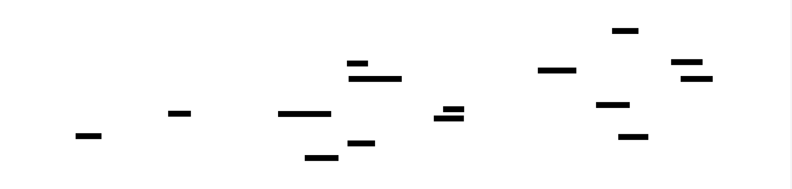

# Distributed Tracing System: Design Document


## Overview

A distributed tracing system that tracks requests as they flow across microservices, providing visibility into request latency, error propagation, and service dependencies. The key architectural challenge is efficiently collecting, correlating, and storing trace data from multiple services while minimizing performance overhead on the traced applications.


> This guide is meant to help you understand the big picture before diving into each milestone. Refer back to it whenever you need context on how components connect.


## Context and Problem Statement

> **Milestone(s):** This section provides foundational context for all milestones (1-4) by establishing the core observability challenges that distributed tracing solves.

### The Microservices Observability Problem

Think of debugging a monolithic application like being a detective investigating a crime scene in a single room. All the evidence is in one place, you can examine every clue systematically, and you have complete visibility into what happened and when. Now imagine that same crime scattered across a dozen different buildings, with evidence appearing and disappearing at different times, and each building managed by different security teams with their own rules about what information they'll share. This is the observability challenge that microservices architecture introduces.

In a traditional monolithic application, observability is relatively straightforward. When a user reports that "the checkout process is slow," we can examine application logs, database queries, and performance metrics from a single system. We can trace the execution path through our codebase, set breakpoints, and understand exactly how a request flows from the web controller through business logic to the database and back. The entire request lifecycle lives within one process boundary, making it possible to correlate logs, metrics, and traces with high confidence.

**Microservices fundamentally break this unified observability model.** A single user request in a microservices system might traverse dozens of services, each running on different machines, managed by different teams, with different logging formats, different performance characteristics, and different failure modes. The "checkout process" might involve the user service, inventory service, payment service, shipping service, notification service, and audit service, each potentially calling multiple downstream dependencies.

Traditional monitoring approaches fail in this distributed environment for several critical reasons. **Logs become fragmented** across multiple services and machines. When debugging a failed checkout, we might find relevant log entries scattered across twelve different log files on eight different servers, with no obvious way to correlate them to the same user request. Even if we can collect all logs in a centralized system, without a common request identifier, we're left trying to correlate entries based on timestamps and user IDs, which becomes unreliable when services process multiple concurrent requests for the same user.

**Metrics provide aggregate visibility but lose request-level detail.** We might see that the payment service is experiencing high latency, but we can't determine which specific user requests are affected, what upstream services are calling the payment service, or whether the slowness is consistent across all request types or concentrated in particular code paths. Aggregate metrics are essential for understanding overall system health, but they're insufficient for debugging individual request failures or understanding the cascade effects of performance problems.

**Application performance monitoring (APM) tools designed for monoliths struggle with distributed causality.** Traditional profilers and performance analyzers assume they can instrument a single process and observe the complete request execution. In a microservices environment, they can only see their local slice of the request, missing the broader context of how long the request spent in other services, whether errors in other services affected the current service's behavior, or how the overall request latency breaks down across service boundaries.

The most insidious challenge is **understanding cascading failures and performance bottlenecks.** When the checkout process becomes slow, the root cause might be in any of the services involved, or it might be a cascade effect where slowness in one service causes timeout retries in upstream services, leading to queue buildup and further degradation. Without visibility into the complete request flow, engineers often resort to the "educated guess and check" debugging method, which is time-consuming and unreliable.

Consider a concrete example that illustrates these challenges. A user reports that their order placement is timing out. In a monolithic system, we would examine the application logs, see that the order controller called the payment processor, which called the external payment gateway, and we'd quickly identify that the payment gateway is responding slowly. In a microservices system, this same flow might involve:

1. The web frontend calling the order service
2. The order service calling the inventory service to check stock
3. The inventory service calling the product catalog service to validate product IDs
4. The order service calling the user service to validate the customer account
5. The order service calling the payment service to process the payment
6. The payment service calling an external payment gateway
7. The order service calling the shipping service to calculate delivery costs
8. The shipping service calling an external shipping provider API
9. The order service calling the notification service to send confirmation emails
10. The notification service calling an external email service

Without distributed tracing, when the order placement times out, we have no efficient way to determine which of these ten service calls (or their sub-calls) is the bottleneck. We might spend hours examining logs from each service, trying to piece together the timeline, only to discover that the root cause was a configuration change in the shipping service that increased its dependency on the external shipping API.

**Clock skew between servers compounds the correlation problem.** When trying to correlate logs across multiple machines using timestamps, even small differences in system clocks can make it impossible to determine the correct ordering of events. A log entry showing that service A called service B at timestamp T1, and service B processed a request at timestamp T2, doesn't definitively prove these events are related if T1 > T2 due to clock skew.

**Service ownership boundaries make holistic debugging difficult.** In many organizations, different microservices are owned by different teams. When debugging a cross-service issue, we need cooperation from multiple teams to examine their service logs, metrics, and deployment history. This coordination overhead can turn a 10-minute debugging session into a multi-hour or multi-day investigation.

The emergence of **service mesh architectures and container orchestration** has made the problem even more complex. Requests now traverse through additional infrastructure layers including load balancers, service proxies, and container networking. A single logical service call might involve multiple network hops through infrastructure components that have their own performance characteristics and failure modes.

> **Critical Insight**: The fundamental problem is that microservices architecture distributes the execution of a single logical operation across multiple independent systems, but traditional observability tools were designed for the unified execution model of monolithic applications. This architectural mismatch creates a visibility gap that makes debugging and performance analysis exponentially more difficult as the number of services grows.

This observability gap leads to several operational challenges:

| Challenge | Impact | Example |
|-----------|--------|---------|
| **Mean Time to Recovery (MTTR)** | Significantly increased debugging time | An issue that would take 15 minutes to debug in a monolith takes 2-3 hours in microservices |
| **Root Cause Analysis** | Difficult to identify the origin of failures | A timeout error might be caused by any service in a 10-service call chain |
| **Performance Optimization** | Cannot identify bottlenecks across service boundaries | High overall latency with no visibility into which services contribute most |
| **Capacity Planning** | Lack of understanding of service interdependencies | Scaling one service might shift bottlenecks to unexpected downstream services |
| **Error Attribution** | Cannot correlate errors across services | A payment failure might manifest as different error types in multiple services |

**Distributed tracing emerges as the solution to these observability challenges.** Just as each piece of evidence at our multi-building crime scene needs a case number to tie them together, each operation in a distributed system needs a trace identifier that follows the request across all service boundaries. Distributed tracing provides the missing correlation mechanism that allows us to reconstruct the complete execution path of a request, measure the contribution of each service to overall latency, and identify the root cause of failures across service boundaries.

### Existing Tracing Solutions

The distributed tracing ecosystem has evolved significantly over the past decade, with multiple open-source and commercial solutions emerging to address the observability challenges in microservices architectures. Understanding the landscape of existing solutions helps us make informed design decisions and avoid reinventing well-established patterns.

Think of the current tracing ecosystem like transportation infrastructure in a growing city. Early solutions were like individual companies building their own private roads between their facilities—functional but incompatible. What we've seen over time is the emergence of standardized highways (OpenTelemetry) and various navigation services (tracing backends) that can all work with the same road system.

**OpenTelemetry has emerged as the industry standard for distributed tracing instrumentation.** OpenTelemetry is not a tracing backend itself, but rather a collection of APIs, SDKs, and tools for generating, collecting, and exporting telemetry data including traces, metrics, and logs. It provides language-specific libraries for instrumenting applications and standardized protocols for sending telemetry data to various backends.

The key insight behind OpenTelemetry is **vendor neutrality**. Before OpenTelemetry, applications had to choose a specific tracing backend (like Jaeger or Zipkin) and use that vendor's SDK for instrumentation. This created lock-in and made it difficult to switch between different tracing solutions. OpenTelemetry decouples the instrumentation layer from the backend storage and analysis layer, allowing applications to generate standardized telemetry data that can be sent to any compatible backend.

OpenTelemetry implements several key standards:

| Standard | Purpose | Key Features |
|----------|---------|--------------|
| **W3C Trace Context** | Cross-service context propagation | Standardized HTTP headers: `traceparent`, `tracestate` |
| **W3C Baggage** | Metadata propagation | Key-value pairs that travel with requests |
| **OTLP (OpenTelemetry Protocol)** | Data export format | Efficient binary protocol for sending traces to backends |
| **Semantic Conventions** | Standardized attribute naming | Consistent naming for common attributes like `service.name`, `http.method` |

> **Decision: Adopt OpenTelemetry Standards**
> - **Context**: We need to choose instrumentation standards and data formats for our tracing system
> - **Options Considered**: Proprietary format, Zipkin B3 headers, OpenTelemetry standards
> - **Decision**: Implement OpenTelemetry-compatible APIs and data formats
> - **Rationale**: OpenTelemetry is the industry standard with broad ecosystem support, and compatibility ensures our system can work with existing instrumentation
> - **Consequences**: We inherit the complexity of OpenTelemetry specifications but gain compatibility with existing tools and libraries

**Jaeger is one of the most popular open-source tracing backends.** Originally developed by Uber to handle their massive microservices architecture, Jaeger provides a complete distributed tracing solution including data collection, storage, querying, and visualization.

Jaeger's architecture consists of several key components:

| Component | Purpose | Characteristics |
|-----------|---------|-----------------|
| **Jaeger Agent** | Local span collection | Runs on each host, receives spans via UDP, forwards to collector |
| **Jaeger Collector** | Span processing and storage | Validates, enriches, and writes spans to storage backend |
| **Storage Backend** | Persistent span storage | Supports Cassandra, Elasticsearch, Kafka, and memory storage |
| **Query Service** | Trace retrieval API | Provides REST API for searching and retrieving traces |
| **Jaeger UI** | Web-based visualization | Timeline view, service dependency graph, trace comparison |

Jaeger's strengths include **proven scalability** (Uber processes billions of spans per day), **flexible storage options**, and **sophisticated sampling strategies**. Its adaptive sampling feature automatically adjusts sampling rates based on service throughput and error rates, ensuring that important traces (errors and slow requests) are always captured while managing storage costs.

However, Jaeger has some limitations. **Operational complexity** is significant—running a production Jaeger deployment requires managing multiple services and storage backends. **Storage costs** can be substantial for high-volume systems, especially when using Elasticsearch as the backend. **Limited analytics capabilities** mean that Jaeger excels at trace visualization but provides fewer features for statistical analysis and alerting compared to commercial solutions.

**Zipkin is another established open-source tracing system.** Originally developed by Twitter based on Google's Dapper paper, Zipkin takes a simpler architectural approach compared to Jaeger.

Zipkin's key characteristics include:

| Aspect | Zipkin Approach |
|--------|-----------------|
| **Architecture** | Single-service model with pluggable storage |
| **Data Model** | Simplified span format with fewer fields |
| **Sampling** | Basic probabilistic sampling |
| **Storage** | MySQL, Cassandra, Elasticsearch support |
| **Deployment** | Single JAR deployment for small to medium scale |

Zipkin's main advantage is **simplicity**. For smaller deployments or organizations just starting with distributed tracing, Zipkin's single-service architecture is easier to operate than Jaeger's multi-component system. The simplified data model makes it easier to understand and debug tracing issues.

The trade-offs include **limited scalability** compared to Jaeger's more distributed architecture, **fewer advanced features** like adaptive sampling, and **less active development** as the community has largely consolidated around Jaeger and commercial solutions.

**Commercial solutions** like Datadog APM, New Relic, LightStep (now part of ServiceNow), and AWS X-Ray provide fully managed tracing services with additional features.

| Solution | Key Strengths | Primary Trade-offs |
|----------|---------------|-------------------|
| **Datadog APM** | Integrated metrics/logs/traces, machine learning insights | High cost at scale, vendor lock-in |
| **New Relic** | Full-stack observability, automatic instrumentation | Complex pricing model, performance overhead |
| **AWS X-Ray** | Native AWS integration, serverless support | Limited outside AWS ecosystem |
| **Honeycomb** | Advanced querying capabilities, distributed tracing focus | Learning curve, cost at high volume |

Commercial solutions typically offer **managed infrastructure** (no need to operate storage and collection services), **advanced analytics** including machine learning-based anomaly detection, **integrated alerting** based on trace patterns, and **automatic instrumentation** that requires minimal code changes.

The primary trade-offs are **cost** (can become expensive at scale), **vendor lock-in** (difficult to migrate between providers), and **less customization** compared to self-hosted open-source solutions.

> **Decision: Build a Custom Tracing Backend**
> - **Context**: We need to choose whether to use an existing solution or build our own tracing system
> - **Options Considered**: Deploy Jaeger, use commercial solution, build custom system
> - **Decision**: Build a custom distributed tracing backend while maintaining OpenTelemetry compatibility
> - **Rationale**: Educational value of understanding core distributed systems concepts, ability to customize for specific requirements, and avoiding vendor lock-in
> - **Consequences**: Higher development effort but complete control over features, performance, and costs

**Key architectural patterns** have emerged across successful tracing implementations:

**Sampling strategies** are critical for managing data volume and costs. Head-based sampling makes decisions at trace initiation based on probabilistic rules or service configuration. Tail-based sampling waits to see complete traces before deciding whether to keep them, allowing for intelligent retention of error traces and outliers while discarding routine successful operations.

**Context propagation mechanisms** have converged on HTTP header-based approaches. The W3C Trace Context standard defines how trace and span identifiers should be encoded in HTTP headers, ensuring compatibility across different tracing systems and language implementations.

**Storage and indexing strategies** vary significantly based on scale and query requirements. Time-series databases like InfluxDB or Prometheus work well for metrics derived from traces but are less suitable for storing detailed span data. NoSQL databases like Cassandra provide good write scalability for high-volume span ingestion, while Elasticsearch offers rich querying capabilities at the cost of higher resource requirements.

**Data retention and lifecycle management** become crucial at scale. Successful implementations typically use tiered storage strategies, keeping recent traces in fast storage for interactive querying while archiving older traces to cheaper storage or deleting them entirely.

The evolution toward **standardization and interoperability** has been one of the most significant trends. The consolidation around OpenTelemetry as the instrumentation standard means that organizations can instrument their applications once and send data to multiple backends, or migrate between backends without changing application code.

> **Key Insight**: The tracing ecosystem has matured to the point where the hard problems are largely solved at the instrumentation layer (thanks to OpenTelemetry), but significant challenges remain in efficiently storing, querying, and analyzing trace data at scale. Our custom implementation should focus on these backend challenges while leveraging established standards for data collection and propagation.

Understanding this landscape informs our design decisions. We'll implement OpenTelemetry-compatible APIs to ensure our system works with existing instrumentation libraries. We'll adopt proven architectural patterns like multi-component collection pipelines and flexible storage backends. We'll learn from the operational experiences of systems like Jaeger while having the freedom to optimize for our specific requirements and constraints.

### Implementation Guidance

This section provides concrete technical recommendations for understanding and implementing the concepts discussed in the context and problem statement.

#### Technology Recommendations

| Component | Simple Option | Advanced Option |
|-----------|---------------|-----------------|
| **Context Propagation** | HTTP headers with custom parsing | OpenTelemetry Go SDK with W3C Trace Context |
| **Service Communication** | HTTP REST with JSON | gRPC with Protocol Buffers |
| **Span Storage** | SQLite with JSON columns | Cassandra or ClickHouse with optimized schema |
| **Time Series Data** | In-memory maps | Prometheus metrics or InfluxDB |
| **Web UI Framework** | Static HTML with vanilla JavaScript | React with TypeScript or Go templates |

#### Understanding Microservices Observability Challenges

To build intuition about the observability problems we're solving, it's helpful to experience them firsthand. Here's a practical exercise that demonstrates the correlation challenge:

**Correlation Challenge Exercise:**
1. Set up 3-4 simple HTTP services that call each other in a chain
2. Generate load with multiple concurrent requests
3. Introduce random latency in one service
4. Try to debug which service is causing slowness using only individual service logs
5. Experience the frustration of correlating log entries across services
6. Then implement basic trace ID propagation and observe how it transforms debugging

#### OpenTelemetry Integration Patterns

When building a tracing system, you'll encounter several key OpenTelemetry concepts:

**Tracer Provider Pattern:**
```go
// Example of how applications typically initialize tracing
func initTracing(serviceName string) {
    // TODO: Set up tracer provider with your custom exporter
    // TODO: Configure sampling strategies  
    // TODO: Register global tracer provider
    // This is boilerplate that applications need - your system should provide simple setup
}
```

**Context Propagation Headers:**
The W3C Trace Context standard defines specific HTTP header formats:

| Header | Purpose | Format Example |
|--------|---------|----------------|
| `traceparent` | Required trace context | `00-4bf92f3577b34da6a3ce929d0e0e4736-00f067aa0ba902b7-01` |
| `tracestate` | Vendor-specific data | `rojo=00f067aa0ba902b7,congo=t61rcWkgMzE` |

**Span Attribute Conventions:**
OpenTelemetry defines semantic conventions for common attributes:

| Attribute | Purpose | Example Values |
|-----------|---------|----------------|
| `service.name` | Service identification | `payment-service`, `user-service` |
| `http.method` | HTTP request method | `GET`, `POST`, `PUT` |
| `http.status_code` | Response status | `200`, `404`, `500` |
| `db.statement` | Database query | `SELECT * FROM users WHERE id = ?` |

#### Practical Debugging Scenarios

Understanding common failure modes helps design better solutions:

| Symptom | Common Cause | Investigation Steps |
|---------|--------------|-------------------|
| **Missing traces** | Context not propagated | Check HTTP headers, verify instrumentation |
| **Broken trace chains** | Service doesn't forward context | Examine service-to-service call patterns |
| **Duplicate spans** | Multiple instrumentation points | Review auto vs manual instrumentation |
| **High overhead** | Too much detailed instrumentation | Profile instrumentation code, adjust sampling |

#### Storage Requirements Analysis

Before implementing storage, understand the data volume characteristics:

**Span Volume Estimation:**
- Average spans per request: 10-50 (depends on service architecture)
- Average span size: 1-5KB (including attributes and events)
- Request volume multiplier: spans = requests × average_spans_per_request
- Daily storage: requests_per_day × spans_per_request × span_size_kb

**Query Pattern Requirements:**
- Trace lookup by trace ID (primary key access)
- Service and operation filtering (requires indexing)
- Time range queries (requires time-based partitioning)
- Attribute-based search (requires flexible indexing strategy)

#### Development Environment Setup

To work effectively with distributed tracing concepts:

**Local Development Stack:**
```bash
# Example docker-compose setup for learning
# TODO: Create services that demonstrate tracing challenges
# TODO: Include load generation tools
# TODO: Add monitoring to observe trace propagation
```

**Instrumentation Testing:**
1. Start with manual instrumentation to understand concepts
2. Progress to automatic instrumentation for efficiency
3. Test context propagation across different transport mechanisms
4. Verify sampling behavior under different load conditions

#### Integration with Existing Tools

Your tracing system should integrate well with the broader observability ecosystem:

**Metrics Integration:**
- Generate RED metrics (Rate, Errors, Duration) from trace data
- Correlate trace IDs with metric data points
- Provide drill-down from metrics to specific traces

**Logging Integration:**
- Include trace and span IDs in application logs
- Provide log correlation in trace visualization
- Support structured logging formats

**Alerting Integration:**
- Generate alerts based on trace patterns (error rates, latency percentiles)
- Include trace context in alert notifications
- Support trace-based SLO monitoring

#### Performance Considerations

Distributed tracing adds overhead to applications:

**Instrumentation Overhead:**
- CPU cost of creating and recording spans
- Memory usage for buffering spans before export
- Network bandwidth for sending trace data
- Storage I/O for persisting spans

**Sampling Strategy Impact:**
- Head-based sampling: decisions made early, lower CPU cost
- Tail-based sampling: decisions made after trace completion, higher memory usage
- Adaptive sampling: automatic rate adjustment based on service behavior

**Optimization Techniques:**
- Batch span exports to reduce network calls
- Use background goroutines for async span processing
- Implement circuit breakers to prevent tracing from affecting business logic
- Profile instrumentation code to identify performance bottlenecks

This foundation prepares you for implementing the core tracing concepts covered in subsequent sections, where we'll dive deep into the technical details of trace context generation, span recording, data collection, and query processing.


## Goals and Non-Goals

> **Milestone(s):** This section provides scope and requirements for all milestones (1-4) by establishing what the distributed tracing system will and will not accomplish.

### Functional Goals: Core Tracing Capabilities We Must Implement

Think of distributed tracing like a detective story where we need to follow a suspect (request) as they move through different neighborhoods (microservices) in a city (distributed system). Our tracing system acts as a comprehensive surveillance network that tracks every movement, records timestamps at each location, and ultimately constructs a complete timeline of where the suspect went, how long they stayed, and what happened at each stop. Just as a detective needs reliable witnesses, accurate clocks, and a central case file to solve complex crimes, our tracing system needs instrumentation, precise timing, and centralized data collection to solve performance mysteries in distributed systems.

The core functional capabilities of our distributed tracing system center around four fundamental activities: **context propagation**, **span recording**, **data collection**, and **trace analysis**. Each capability builds upon the previous one, creating a comprehensive observability pipeline that transforms invisible request flows into actionable insights.

> **Decision: W3C Trace Context Standard Adoption**
> - **Context**: Multiple propagation formats exist (B3, custom headers, vendor-specific) creating interoperability challenges
> - **Options Considered**: B3 headers (Zipkin format), custom proprietary format, W3C Trace Context standard
> - **Decision**: Implement W3C Trace Context as primary propagation format with B3 fallback support
> - **Rationale**: W3C Trace Context is becoming the industry standard, provides better interoperability with third-party tools, and offers more robust handling of trace flags and baggage items compared to B3
> - **Consequences**: Enables seamless integration with OpenTelemetry ecosystem and cloud provider tracing services, but requires implementing both W3C and B3 parsing for backward compatibility

| Propagation Format | Interoperability | Header Overhead | Ecosystem Support | Implementation Complexity | Chosen |
|-------------------|------------------|-----------------|-------------------|---------------------------|---------|
| W3C Trace Context | High - industry standard | Medium - structured format | Excellent - OpenTelemetry native | Medium - well-specified | ✅ Yes |
| B3 Headers | Medium - Zipkin ecosystem | Low - simple format | Good - legacy support | Low - simple key-value | Partial |
| Custom Format | Low - proprietary | Variable | Poor - isolated | High - full specification | ❌ No |

Our **context propagation** capability ensures that every request receives a globally unique trace identifier that follows it throughout its journey across service boundaries. The system must generate 128-bit trace identifiers using cryptographically secure random number generation to guarantee global uniqueness across all services and time periods. Each individual operation within a service receives a 64-bit span identifier that links back to its parent span, creating a hierarchical tree structure that models the actual call flow.

When requests cross service boundaries via HTTP calls, the `TraceContext` must be serialized into the `W3C_TRACEPARENT_HEADER` format and injected into outgoing request headers. The receiving service extracts this context using the `propagateContext` function and continues the trace rather than starting a new one. For gRPC communications, the same context information travels via gRPC metadata fields, ensuring that both synchronous and asynchronous inter-service communication maintains trace continuity.

> The critical insight for context propagation is that trace context must survive every boundary crossing - HTTP requests, gRPC calls, message queues, database connections, and even async task spawning. A single missing context propagation breaks the entire trace chain, making the distributed request invisible to our observability system.

**Span recording** transforms the abstract concept of "work being done" into concrete, measurable data points. Every significant operation - database queries, external API calls, internal business logic, error handling - becomes a `Span` with precise start and end timestamps, descriptive attributes, and structured event logs. The `recordSpan` function captures not just the duration of work, but the context, outcome, and relevant metadata that helps engineers understand what happened and why.

The span recording functionality must handle the complete lifecycle of operations from initiation through completion or failure. When an operation begins, the system records the start timestamp with nanosecond precision, operation name, and initial attributes like user ID, request parameters, or processing flags. During execution, the system can append events that capture intermediate state changes, external calls, or significant processing milestones. Upon completion, the system records the final timestamp, outcome status (success, error, timeout), and any relevant result data or error information.

| Span Attribute Category | Examples | Purpose | Cardinality Risk |
|------------------------|----------|---------|------------------|
| Infrastructure | service.name, service.version, host.name | Identify source and environment | Low - bounded values |
| Request Context | user.id, request.method, request.url | Link to business context | Medium - user dependent |
| Operation Details | db.statement, http.status_code, error.type | Debug specific failures | High - unbounded queries |
| Business Metadata | order.id, product.category, feature.flag | Correlate with business metrics | Medium - business dependent |

> **Decision: Synchronous vs Asynchronous Span Export**
> - **Context**: Span data must be transmitted from applications to collectors without impacting application performance
> - **Options Considered**: Synchronous export on span completion, asynchronous batched export, hybrid approach with priority queues
> - **Decision**: Implement asynchronous batched export with configurable batch size and flush intervals
> - **Rationale**: Synchronous export adds latency to every operation and creates coupling between application performance and tracing infrastructure availability. Batched async export amortizes network overhead and provides natural backpressure protection
> - **Consequences**: Reduces instrumentation overhead and improves application resilience, but introduces complexity in handling application shutdown and potential span loss during crashes

Our **data collection** capability centers around a scalable collector service that receives spans from all instrumented applications, processes them for consistency and completeness, applies sampling strategies to control data volume, and forwards the processed spans to long-term storage. The collector acts as both an aggregation point and a processing pipeline that transforms raw span data into queryable trace records.

The collector must expose both HTTP and gRPC ingestion endpoints to accommodate different application architectures and performance requirements. HTTP endpoints provide simplicity and broad compatibility, while gRPC endpoints offer better performance through connection reuse, binary encoding, and streaming capabilities. Both endpoints accept span data in OpenTelemetry format, validate the structure and required fields, and enqueue the spans for batch processing.

Sampling represents one of the most critical aspects of data collection since distributed tracing can generate enormous data volumes that overwhelm storage systems and query performance. The collector implements both **head-based sampling** decisions made immediately upon trace initiation and **tail-based sampling** decisions made after observing complete trace behavior. Head-based sampling uses simple rules like sampling rate percentages or operation name filters, while tail-based sampling can preserve traces that exhibit interesting characteristics like high latency, errors, or unusual service interaction patterns.

| Sampling Strategy | Decision Timing | Information Available | Use Cases | Trade-offs |
|------------------|----------------|----------------------|-----------|------------|
| Head-based | Trace start | Service, operation, headers | High-volume filtering | Fast, simple, but may miss interesting traces |
| Tail-based | Trace completion | Full trace data, timing, errors | Retain outliers and errors | More accurate, but requires buffering traces |
| Adaptive | Runtime | Historical patterns, current load | Dynamic rate adjustment | Complex but responsive to system changes |

**Trace analysis** provides the user-facing capabilities that transform stored trace data back into actionable insights through search, visualization, and pattern analysis. Engineers need to find specific traces based on various criteria, visualize the timing and hierarchy of operations within those traces, and identify patterns across many traces that indicate systemic issues or optimization opportunities.

The trace search functionality allows engineers to locate relevant traces using multiple filter dimensions including time ranges, service names, operation names, custom tag values, error conditions, and latency thresholds. The search system must efficiently query large volumes of trace data by leveraging indexes on commonly searched fields while supporting ad-hoc queries on custom attributes when needed.

Trace timeline visualization reconstructs the hierarchical call tree from individual span records, displaying the parent-child relationships, relative timing, and duration of each operation in an intuitive graphical format. The visualization must handle deep call stacks, concurrent operations, and missing spans gracefully while providing drill-down capabilities into individual span details.

Service dependency analysis aggregates trace data across time periods to identify which services communicate with each other, the frequency and latency characteristics of those communications, and how service relationships change over time. This analysis enables dependency mapping, impact analysis for service changes, and identification of critical paths through complex distributed systems.

### Non-Functional Goals: Performance, Scalability, and Reliability Requirements

Think of our non-functional requirements as the structural engineering constraints for building a highway system. While functional requirements define where the roads go and what traffic they carry, non-functional requirements specify how much traffic the roads must handle, how quickly vehicles must move, what happens during construction or accidents, and how the system adapts as the city grows. Just as highway engineers must design for peak traffic loads, weather conditions, and decades of growth, our tracing system must handle massive scale, minimal performance impact, and continuous operation even when individual components fail.

> **Decision: Instrumentation Performance Budget**
> - **Context**: Distributed tracing adds overhead to every operation it instruments, potentially degrading application performance
> - **Options Considered**: No performance limits (best effort), strict latency budget per operation, throughput-based limits
> - **Decision**: Implement maximum 5% overhead budget for instrumentation with circuit breaker protection
> - **Rationale**: 5% represents acceptable overhead that provides observability value without significantly impacting user experience. Circuit breakers prevent instrumentation failures from cascading to application failures
> - **Consequences**: Requires careful optimization of instrumentation code and automatic degradation under load, but guarantees predictable application performance

**Performance Requirements** establish the maximum acceptable impact that distributed tracing can have on the applications it instruments. The instrumentation layer must operate with less than 5% CPU overhead and less than 50MB memory overhead per application instance under normal operating conditions. Individual span operations must complete in under 1 millisecond for simple attribute recording and under 10 milliseconds for complex operations involving external exports.

The collector must process at least 10,000 spans per second per collector instance with sub-100ms latency from ingestion to storage forwarding. Query response times must remain under 2 seconds for simple trace lookups and under 30 seconds for complex analytical queries across large time ranges. These performance targets ensure that the tracing system remains invisible to application users while providing responsive debugging experiences for engineers.

| Component | Throughput Target | Latency Target | Resource Limit | Failure Mode |
|-----------|------------------|----------------|----------------|--------------|
| Instrumentation | N/A (minimal overhead) | <1ms per span operation | 5% CPU, 50MB memory | Circuit breaker activation |
| Collector | 10K spans/sec/instance | <100ms ingestion to storage | 2GB memory, 4 CPU cores | Queue backpressure |
| Storage | 1K traces/sec write | <2s simple queries | Horizontal scaling | Read replica failover |
| Query API | 100 concurrent users | <30s complex analytics | 8GB memory, 8 CPU cores | Query timeout and caching |

**Scalability Requirements** address how the system grows with increasing application adoption and data volume. The architecture must support horizontal scaling of all components without requiring application reconfiguration or data migration. A single tracing deployment must handle traces from at least 100 microservices generating up to 1 million spans per minute during peak traffic periods.

Storage systems must accommodate at least 30 days of trace data retention with configurable policies for longer-term sampling and archival. The system must support geographic distribution with collectors deployed in multiple regions while maintaining trace correlation across regions. Auto-scaling capabilities must dynamically adjust collector and query capacity based on traffic patterns without manual intervention.

> The fundamental scalability insight is that distributed tracing systems often experience traffic patterns that differ significantly from the applications they instrument. Trace volume can spike during incidents when engineers increase sampling rates, or drop suddenly when applications experience outages, requiring elastic infrastructure that adapts quickly to changing demands.

**Reliability Requirements** ensure that the tracing system operates continuously even during component failures and provides graceful degradation rather than cascading failures. The instrumentation layer must never cause application crashes or data corruption, even when the tracing infrastructure becomes unavailable. Applications must continue normal operation with automatic instrumentation disabling when collector endpoints become unreachable.

The collector must provide at least 99.9% availability through redundant deployments and automatic failover mechanisms. Data durability requires that accepted spans are never lost once acknowledged to the sending application, necessitating persistent queuing and replication strategies. The query interface must remain operational during storage maintenance or partial failures by serving cached results and clearly indicating data freshness.

| Reliability Aspect | Requirement | Implementation Strategy | Monitoring Metric |
|-------------------|-------------|-------------------------|-------------------|
| Instrumentation Resilience | Never crash host application | Circuit breakers, error isolation | Application error rate unchanged |
| Data Durability | No acknowledged span loss | Persistent queues, replication | Span acknowledgment vs storage ratio |
| Service Availability | 99.9% query uptime | Redundant deployments, failover | Query success rate and latency |
| Graceful Degradation | Maintain core functionality | Feature flags, fallback modes | Functionality coverage during incidents |

**Operational Requirements** specify how the tracing system integrates into existing infrastructure and operational procedures. The system must provide comprehensive health monitoring and alerting for all components, including metrics on ingestion rates, processing latency, error rates, and storage utilization. Deployment must support standard containerization and orchestration platforms with declarative configuration management.

Security requirements mandate that trace data containing sensitive information can be redacted or encrypted both in transit and at rest. Access control systems must integrate with existing authentication providers and support role-based permissions for different trace data access levels. Audit logging must track all trace data access and system configuration changes for compliance and security monitoring.

### Explicit Non-Goals: Features We Will Not Implement to Keep Scope Manageable

Understanding what we will NOT build is as critical as defining what we will build. Think of non-goals as the boundaries we draw around a construction project - just as building a house requires deciding whether to include a swimming pool, garage, or basement based on budget and timeline constraints, our tracing system requires explicit decisions about features that would be valuable but exceed our current scope and resources.

> **Decision: Focus on Core Tracing Over Advanced Analytics**
> - **Context**: Modern observability platforms include machine learning, anomaly detection, and predictive analytics capabilities
> - **Options Considered**: Include ML-based anomaly detection, focus purely on core tracing, hybrid approach with plugin architecture
> - **Decision**: Implement only core distributed tracing with hooks for future analytics extensions
> - **Rationale**: Advanced analytics require significant additional complexity, specialized expertise, and extended development timeline that would delay core tracing functionality delivery
> - **Consequences**: Provides solid foundation for future enhancements while ensuring timely delivery of essential tracing capabilities, but requires manual analysis of trace patterns initially

**Advanced Analytics and Machine Learning** capabilities like automatic anomaly detection, performance regression analysis, and predictive failure modeling will not be included in the initial implementation. While these features provide significant value for proactive operations, they require complex statistical processing, machine learning model training and deployment, and extensive historical data analysis that would substantially increase system complexity and development time.

The system will not automatically identify performance regressions by comparing current trace patterns against historical baselines, nor will it predict service failures based on trace anomalies. Engineers must manually analyze trace data and set up external monitoring systems for automated alerting on performance or reliability issues discovered through trace analysis.

| Analytics Feature | Value Proposition | Implementation Complexity | Decision |
|-------------------|-------------------|--------------------------|----------|
| Automatic anomaly detection | Proactive incident identification | High - ML pipeline required | ❌ Not included |
| Performance regression analysis | Catch performance degradation early | Medium - statistical analysis | ❌ Not included |
| Service health scoring | Unified service reliability metric | Medium - aggregation logic | ❌ Not included |
| Predictive failure modeling | Prevent outages before they occur | Very High - ML infrastructure | ❌ Not included |
| Basic trace search and visualization | Core debugging functionality | Low - standard database queries | ✅ Included |

**Real-time Alerting and Incident Response** integration will not be provided as built-in functionality. The tracing system will not generate alerts based on trace patterns, integrate with incident management systems like PagerDuty or OpsGenie, or automatically create incident tickets when traces indicate system problems. While trace data provides valuable context during incidents, the correlation between trace patterns and actionable alerts requires domain-specific knowledge that varies significantly across organizations.

Users must export trace data or query metrics to external alerting systems if they want automated notifications based on trace-derived insights. The system will provide APIs and data export capabilities to support integration with existing monitoring and alerting infrastructure, but will not include native alerting functionality.

**Custom Instrumentation SDKs and Language Support** beyond the core supported languages (Go, Java, Rust, Python) will not be developed as part of this project. While comprehensive language support increases adoption, each additional language SDK requires significant development and ongoing maintenance effort including language-specific idioms, ecosystem integration, testing frameworks, and documentation.

Organizations requiring instrumentation for other languages must either use OpenTelemetry SDKs directly with manual configuration or develop their own integration layers. The system will accept spans in standard OpenTelemetry format regardless of the source SDK, ensuring compatibility with community-developed instrumentation libraries.

> The language support decision reflects a fundamental trade-off between depth and breadth. By focusing on fewer languages, we can provide better developer experience, more comprehensive examples, and more robust testing for the supported platforms rather than superficial support across many languages.

**Multi-tenancy and Enterprise Security** features including tenant isolation, fine-grained access control, data residency controls, and compliance reporting will not be implemented. The initial system assumes a single organization deployment with basic authentication and authorization sufficient for internal development and operations teams.

Enterprise deployments requiring strict data isolation between different business units, geographic data residency compliance, or detailed audit trails for regulatory compliance must implement additional security layers or wait for future system versions. The architecture will support these requirements through extension points, but the core implementation focuses on functional tracing capabilities rather than enterprise security features.

**Advanced Storage and Data Lifecycle Management** including automated data archival, cross-region replication, disaster recovery procedures, and storage cost optimization will not be included. The system will support configurable data retention periods and basic cleanup procedures, but complex data lifecycle policies require storage-specific expertise and operational procedures that exceed the core tracing scope.

Organizations with sophisticated data governance requirements must implement their own data lifecycle management procedures using the storage system's native capabilities. The tracing system will provide data export and backup utilities to support external data management processes, but will not include automated lifecycle management beyond basic retention policies.

| Enterprise Feature | Business Value | Development Effort | Operational Complexity | Decision |
|--------------------|----------------|-------------------|------------------------|----------|
| Multi-tenant data isolation | Support multiple organizations | High - architecture redesign | High - security management | ❌ Not included |
| Compliance reporting | Meet regulatory requirements | Medium - audit trail systems | Medium - report generation | ❌ Not included |
| Automated disaster recovery | Business continuity assurance | High - cross-region coordination | Very High - failure testing | ❌ Not included |
| Advanced access control | Fine-grained permissions | Medium - RBAC implementation | Medium - permission management | ❌ Not included |
| Basic authentication | Internal team access control | Low - standard auth integration | Low - user management | ✅ Included |

### Implementation Guidance

The implementation of goals and non-goals primarily involves establishing project constraints, acceptance criteria, and validation procedures rather than writing functional code. However, several key artifacts help maintain scope discipline and measure progress against our stated objectives.

#### A. Technology Recommendations Table

| Requirement Category | Simple Approach | Advanced Approach | Recommendation |
|---------------------|-----------------|-------------------|----------------|
| Performance Monitoring | Basic metrics collection with Prometheus | APM integration with custom instrumentation | Start with Prometheus, add APM hooks |
| Load Testing | Manual curl scripts and basic load generation | Automated performance regression testing | Implement both - scripts for development, automation for CI |
| Scalability Validation | Single-node deployment with resource monitoring | Multi-region deployment with chaos engineering | Begin single-node, plan multi-region architecture |
| Reliability Testing | Basic health checks and manual failover testing | Comprehensive disaster recovery procedures | Implement health checks, document recovery procedures |

#### B. Goal Validation Framework

```go
package validation

// PerformanceMetrics tracks instrumentation overhead and system performance
type PerformanceMetrics struct {
    CPUOverheadPercent    float64
    MemoryOverheadMB     int64
    SpanLatencyMicros    int64
    ThroughputSpansPerSec int64
}

// ScalabilityLimits defines maximum supported system capacity
type ScalabilityLimits struct {
    MaxServices           int
    MaxSpansPerMinute     int64
    MaxConcurrentUsers    int
    DataRetentionDays     int
}

// GoalValidator provides methods to verify functional and non-functional requirements
type GoalValidator struct {
    // TODO: Add performance monitoring client
    // TODO: Add load testing harness
    // TODO: Add scalability measurement tools
}

// ValidateFunctionalGoals verifies that core tracing capabilities work correctly
func (v *GoalValidator) ValidateFunctionalGoals() error {
    // TODO 1: Verify trace context propagation across HTTP and gRPC boundaries
    // TODO 2: Validate span recording with all attribute types and events
    // TODO 3: Test collector ingestion and storage pipeline
    // TODO 4: Confirm trace search and visualization functionality
    return nil
}

// ValidatePerformanceGoals measures system performance against non-functional requirements
func (v *GoalValidator) ValidatePerformanceGoals(target PerformanceMetrics) error {
    // TODO 1: Measure instrumentation overhead in controlled environment
    // TODO 2: Load test collector throughput and latency
    // TODO 3: Benchmark query performance with various data volumes
    // TODO 4: Validate resource usage stays within defined limits
    return nil
}
```

#### C. Scope Management Utilities

```go
package scope

// FeatureFlag controls optional functionality that might expand beyond core goals
type FeatureFlag struct {
    Name        string
    Enabled     bool
    Description string
    Rationale   string
}

// ScopeGuardian helps maintain focus on core goals and prevents scope creep
type ScopeGuardian struct {
    CoreGoals      []string
    OptionalFeatures map[string]FeatureFlag
    // TODO: Add scope validation logic
    // TODO: Add feature flag management
}

// IsInScope determines whether a proposed feature aligns with stated goals
func (sg *ScopeGuardian) IsInScope(feature string) (bool, string) {
    // TODO 1: Check feature against core functional goals
    // TODO 2: Validate against non-functional requirements
    // TODO 3: Verify not in explicit non-goals list
    // TODO 4: Return decision with rationale
    return false, "not implemented"
}
```

#### D. Milestone Checkpoint Validation

**Milestone 1 Checkpoint - Context Propagation Goals:**
- Verify trace IDs are globally unique across multiple service instances
- Confirm W3C Trace Context headers correctly serialize and deserialize
- Test parent-child span relationships form proper hierarchical trees
- Validate context propagation works across both HTTP and gRPC boundaries

**Milestone 2 Checkpoint - Span Recording Goals:**
- Measure span operation latency stays under 1ms target
- Verify all span lifecycle events (start, events, finish) record properly
- Test error recording captures stack traces and status information
- Confirm batch export doesn't block application threads

**Milestone 3 Checkpoint - Collection Goals:**
- Load test collector at 10K spans/sec throughput target
- Verify sampling strategies reduce data volume while preserving errors
- Test collector graceful degradation under overload conditions
- Confirm data durability guarantees for acknowledged spans

**Milestone 4 Checkpoint - Analysis Goals:**
- Benchmark trace search response times under 2-second target
- Verify timeline visualization handles deep and wide trace trees
- Test service dependency graph generation from trace data
- Confirm query system scales to 100 concurrent users

#### E. Performance Budget Monitoring

```go
package monitoring

import (
    "context"
    "time"
)

// PerformanceBudget enforces overhead limits on tracing instrumentation
type PerformanceBudget struct {
    MaxCPUPercent    float64  // 5% maximum CPU overhead
    MaxMemoryMB      int64    // 50MB maximum memory overhead  
    MaxLatencyMicros int64    // 1000 microseconds maximum span latency
    // TODO: Add circuit breaker for budget violations
    // TODO: Add metrics collection for budget tracking
}

// CheckBudget validates current resource usage against defined limits
func (pb *PerformanceBudget) CheckBudget(ctx context.Context) error {
    // TODO 1: Measure current CPU usage attributed to tracing
    // TODO 2: Calculate memory overhead from span storage and export
    // TODO 3: Sample recent span operation latencies
    // TODO 4: Trigger circuit breaker if any budget exceeded
    // TODO 5: Report budget utilization metrics
    return nil
}


## High-Level Architecture

> **Milestone(s):** This section provides the architectural foundation for all milestones (1-4) by defining the system's core components and their interactions.

### Component Overview: The Four Main Layers and Their Responsibilities

Think of our distributed tracing system like a city's traffic monitoring network. Just as traffic sensors collect vehicle data, routing systems process it, data centers store it, and control rooms analyze it, our tracing system has four distinct layers that work together to track requests flowing through microservices.


The distributed tracing system consists of four primary architectural layers, each with distinct responsibilities and clear boundaries. Understanding these layers is crucial because they represent different concerns in the observability pipeline: data generation, data collection, data persistence, and data consumption.

**Instrumentation Layer** serves as the foundation of observability within each application. This layer embeds directly into application code and microservices, functioning like sensors that detect and record activity. Think of it as installing cameras and motion detectors throughout a building - the instrumentation layer monitors every significant operation, timing how long each takes, recording what happens, and noting any errors that occur. The key insight here is that this layer must be lightweight and non-intrusive because it runs within production applications where performance matters most.

The instrumentation layer manages the complete lifecycle of trace context and span recording. When a request enters a service, this layer generates or extracts trace identifiers, ensuring that all related work can be correlated later. As the request moves through the service, the instrumentation creates spans to represent units of work, recording their start times, end times, and relevant metadata. When the service calls another service, the instrumentation layer propagates the trace context across network boundaries using standardized headers.

> **Key Design Principle**: The instrumentation layer operates under a "fail-safe" model - if tracing fails, the application continues normally. Tracing must never break business functionality.

| Component | Responsibility | Key Data Structures | Performance Requirement |
|-----------|----------------|-------------------|------------------------|
| Trace Context Manager | Generate and propagate trace/span IDs | `TraceContext` | < 10μs per context operation |
| Span Recorder | Record span lifecycle and metadata | `Span` | < 50μs per span operation |
| Context Propagator | Inject/extract context from headers | Header maps | < 5μs per propagation |
| Tracer Provider | Manage tracers and configuration | `TracerProvider` | Singleton initialization |

**Collection Layer** acts as the central nervous system of the tracing infrastructure. If the instrumentation layer is like individual sensors, the collection layer is the processing hub that receives, validates, enriches, and routes all the sensor data. This layer faces a unique challenge: it must handle high-volume, bursty traffic from potentially hundreds of services while making intelligent decisions about which traces to keep and which to discard.

The collector receives spans through multiple ingestion endpoints, supporting both HTTP and gRPC protocols to accommodate different service communication patterns. Upon receiving spans, it performs validation to ensure data integrity, enriches them with additional metadata like service topology information, and applies sampling strategies to manage data volume. The collector must also handle backpressure gracefully - when downstream storage is overwhelmed, it needs strategies to shed load without losing the most important traces.

> **Critical Insight**: The collection layer is where we make the fundamental trade-off between observability completeness and system scalability. Sampling decisions made here determine what visibility we have into our systems.

**Storage Layer** provides the persistent memory of the tracing system. Like a vast digital library, it must organize trace data in ways that enable fast retrieval while managing the enormous volume of information generated by busy microservices architectures. The storage layer faces the challenge of time-series data with complex hierarchical relationships - traces contain spans, spans contain events, and spans reference other spans across service boundaries.

The storage system must optimize for write-heavy workloads since traces are primarily written once and read occasionally. However, when traces are queried, users expect fast response times even when searching across millions of spans. This requires careful index design and data organization strategies. The storage layer also manages data lifecycle, automatically expiring old traces to prevent unbounded growth while preserving important traces for longer periods.

**Query Layer** transforms raw trace data into actionable insights. This layer is like having expert analysts who can quickly find patterns in the vast amount of collected data. It provides multiple views of the same underlying data: individual trace timelines that show request flow through services, aggregate latency distributions that identify performance trends, and service dependency graphs that reveal system architecture relationships.

The query layer must handle diverse access patterns, from engineers debugging specific failed requests to operators monitoring overall system health. It provides both real-time queries for immediate troubleshooting and batch analysis capabilities for longer-term performance trending. The challenge here is presenting complex, hierarchical trace data in intuitive visualizations that help users quickly identify problems and understand system behavior.

| Layer | Primary Interface | Data Volume | Query Pattern | Scaling Strategy |
|-------|------------------|-------------|---------------|------------------|
| Instrumentation | In-process APIs | N/A | N/A | Horizontal (per service) |
| Collection | HTTP/gRPC endpoints | 10K-1M spans/sec | Write-heavy ingestion | Horizontal with load balancing |
| Storage | Database APIs | TBs of span data | Write-once, read-occasionally | Horizontal partitioning |
| Query | REST/GraphQL APIs | Aggregate views | Read-heavy with caching | Horizontal with replicas |

> **Decision: Four-Layer Architecture**
> - **Context**: Distributed tracing systems must balance data collection, processing, storage, and analysis concerns while serving multiple stakeholders (developers, operators, platform teams)
> - **Options Considered**: 
>   1. Monolithic all-in-one system
>   2. Two-tier (client + server) architecture  
>   3. Four-layer separation of concerns
> - **Decision**: Four distinct layers with clear responsibilities and interfaces
> - **Rationale**: Each layer has different scaling requirements, failure modes, and performance characteristics. Separation enables independent scaling, technology choices, and failure isolation. The instrumentation layer needs ultra-low latency, collection needs high throughput, storage needs durability, and query needs flexibility.
> - **Consequences**: More complex deployment and coordination, but much better scalability and maintainability. Each layer can use optimal technologies and scaling strategies.

### Data Flow: How Trace Data Moves from Application to Storage to Visualization

Understanding the data flow through our distributed tracing system is like following a package through a sophisticated shipping network. Each stage transforms the data, adds value, and passes it along to the next stage. The key insight is that data flows through multiple transformation stages, with each stage optimized for different concerns.

**Request Initiation and Context Generation** begins when a user request enters our microservices system. Think of this like issuing a tracking number for a package - we create a unique identifier that will follow this request throughout its entire journey. At the entry point (typically an API gateway or edge service), the instrumentation layer generates a new `TraceContext` containing a globally unique trace ID and an initial span ID. This context becomes the "passport" that travels with the request.

The trace ID uses a 128-bit random identifier to ensure global uniqueness even across different environments and services. The span ID uses a 64-bit identifier that's unique within the trace. These identifiers are embedded in the `TraceContext` structure along with trace flags that control sampling and debugging behavior. The initial span represents the entire user request and will become the root of a tree structure representing all work done to fulfill this request.

| Stage | Input | Transformation | Output | Key Operations |
|-------|-------|----------------|--------|----------------|
| Context Generation | User request | Generate unique IDs | `TraceContext` with trace_id, span_id | Random ID generation, flag setting |
| Span Creation | Operation start | Record timing and metadata | `Span` with start_time, attributes | Timestamp capture, attribute tagging |
| Context Propagation | Service call | Inject context into headers | HTTP/gRPC with trace headers | Header serialization, network transmission |
| Span Completion | Operation end | Calculate duration and status | Complete `Span` with end_time | Duration calculation, status determination |

**Context Propagation Across Service Boundaries** occurs every time one service calls another. This is where the distributed aspect of distributed tracing becomes critical. The calling service must inject the trace context into the outbound request headers, and the receiving service must extract that context to continue the trace. This process is standardized using the W3C Trace Context specification, ensuring interoperability across different tracing implementations.

When Service A calls Service B, the instrumentation in Service A creates a new child span to represent the outbound call. It then serializes the current trace context into standard HTTP headers (`traceparent` and `tracestate`) or gRPC metadata fields. Service B's instrumentation extracts this context, validates its format, and creates a new span that's correctly parented to the span from Service A. This creates a hierarchical tree structure where each span knows its parent, enabling reconstruction of the complete request flow.

The propagation process must handle various edge cases: malformed trace context headers, services that don't support tracing, and network calls that cross trust boundaries. The instrumentation layer implements robust parsing that gracefully handles invalid input without affecting application functionality.

**Span Recording and Batching** happens continuously within each service as operations begin and end. Each span records its complete lifecycle: creation time, duration, success or failure status, and relevant metadata. Think of this like a detailed logbook that records not just what happened, but when it happened, how long it took, and what additional context might be useful for later analysis.

Spans accumulate attributes throughout their lifecycle - database query parameters, HTTP status codes, error messages, and custom business logic tags. They also record events that represent point-in-time activities like cache hits, exceptions thrown, or external API calls made. When a span completes, it's added to a local buffer within the application. The instrumentation layer batches spans together before sending them to the collection layer, reducing network overhead and improving throughput.

> **Performance Insight**: Batching is crucial for production performance. Sending individual spans synchronously would add significant latency to each operation. Instead, spans are buffered and sent asynchronously in batches of 100-1000 spans.

**Collection and Processing Pipeline** begins when batched spans arrive at the collector's ingestion endpoints. The collector receives spans from potentially hundreds of services simultaneously, creating a high-volume, bursty traffic pattern. The collector must validate incoming spans, enrich them with additional metadata, apply sampling decisions, and forward them to storage efficiently.

Upon receiving a batch of spans, the collector performs structural validation - ensuring required fields are present, timestamps are reasonable, and trace/span IDs are properly formatted. It then enriches spans with service topology information, adding tags that identify service versions, deployment environments, and infrastructure details. The collector also reconstructs trace-level information by correlating spans that share the same trace ID, enabling more sophisticated sampling and analysis decisions.

The sampling pipeline represents a critical decision point in the data flow. Head-based sampling decisions rely only on information available at trace initiation (service name, operation name, sampling rate), while tail-based sampling waits to see complete traces before deciding whether to retain them. Tail-based sampling can implement sophisticated policies like "keep all traces with errors" or "keep the slowest 1% of traces for each service."

| Processing Stage | Input Volume | Processing Time | Decision Point | Output Volume |
|------------------|--------------|-----------------|----------------|---------------|
| Validation | 100% of received spans | < 1ms per span | Reject malformed spans | 95-99% pass validation |
| Enrichment | Valid spans | < 2ms per span | Add service metadata | Same volume, richer data |
| Head-based Sampling | Enriched spans | < 0.1ms per span | Sample based on headers | 1-10% of spans retained |
| Tail-based Sampling | Complete traces | < 10ms per trace | Sample based on full trace | 50-80% of sampled spans |

**Storage and Indexing** transforms the stream of processed spans into a queryable data store. The storage layer receives spans in temporal order but must organize them to support multiple access patterns: finding all spans for a specific trace, finding traces that match certain criteria, and aggregating performance metrics across services and time ranges.

Spans are typically stored in a time-series database optimized for write-heavy workloads with time-based partitioning. Each span becomes a record with indexed fields for common query patterns: service name, operation name, trace ID, timestamps, and key attributes. The storage system creates multiple indices to support different query types while managing the trade-off between query performance and storage overhead.

The storage layer also implements data lifecycle management, automatically aging out old traces while potentially retaining aggregated metrics for longer periods. Important traces (those with errors or exceptional latency) may be retained longer than normal traces, providing extended visibility into system problems.

**Query Processing and Visualization** represents the final transformation where raw span data becomes actionable insights. When a user searches for traces, the query layer translates their request into efficient storage queries, retrieves the relevant spans, and reconstructs the hierarchical trace structure for presentation.

Trace timeline visualization requires assembling all spans for a trace, sorting them by timestamp, and computing their hierarchical relationships based on parent-child span IDs. Service dependency analysis aggregates spans across many traces to identify which services call which other services, computing metrics like call volume, error rates, and latency distributions for each service relationship.

The query layer implements multiple caching strategies to improve response times: frequently accessed traces are cached in memory, aggregate metrics are precomputed and cached, and service dependency graphs are incrementally updated rather than computed on-demand.

### Deployment Model: How Components are Deployed and Scaled Across the Infrastructure

The deployment model for our distributed tracing system resembles deploying a sophisticated monitoring network across a large organization. Just as you'd place sensors everywhere, deploy processing centers strategically, establish centralized data storage, and provide multiple access points for different teams, our tracing system requires careful deployment planning to ensure reliability, performance, and cost-effectiveness.

> **Deployment Philosophy**: The tracing system itself must be more reliable than the systems it monitors. If tracing failures cause application outages, we've defeated the purpose of observability.

**Instrumentation Layer Deployment** follows a embedded deployment pattern where tracing code becomes part of each microservice. Unlike external monitoring solutions, the instrumentation layer can't be deployed separately because it must hook into application code paths to capture trace data. This creates unique deployment challenges: the instrumentation must be lightweight, updates must be coordinated across services, and failures must never impact business functionality.

Each microservice incorporates the instrumentation layer as a library dependency, typically through language-specific SDKs that implement OpenTelemetry standards. The instrumentation initializes when the application starts, configuring tracer providers, sampling rates, and export endpoints. Configuration is typically externalized through environment variables or configuration files to enable runtime tuning without code changes.

The instrumentation layer scales automatically with application instances - each new pod, container, or virtual machine gets its own copy of the tracing code. This horizontal scaling pattern ensures that tracing capacity grows with application capacity. However, it also means that instrumentation overhead is multiplied across every service instance, making performance optimization crucial.

| Deployment Aspect | Strategy | Scaling Pattern | Configuration Management |
|-------------------|----------|-----------------|-------------------------|
| Library Integration | SDK dependency in each service | Scales with service instances | Environment variables + config files |
| Tracer Initialization | Application startup | One tracer per service instance | Service discovery for collector endpoints |
| Span Export | Background goroutines/threads | Batched asynchronous export | Configurable batch size and intervals |
| Failure Handling | Circuit breaker to collector | Graceful degradation | Disable tracing if collector unavailable |

**Collection Layer Deployment** implements a hub-and-spoke architecture where collector instances are strategically distributed across infrastructure zones. Think of collectors like regional processing centers that handle trace data from their surrounding services. This deployment pattern balances network efficiency, fault tolerance, and operational simplicity.

Collectors are typically deployed as a separate service tier, running in containers or dedicated infrastructure. They expose HTTP and gRPC endpoints for span ingestion, with load balancers distributing traffic across multiple collector instances. Each collector instance operates independently, processing spans and forwarding them to storage without coordination with other collectors. This stateless design enables straightforward horizontal scaling.

The collection layer implements several deployment patterns depending on infrastructure requirements. A **centralized deployment** uses a single collector cluster that serves the entire organization, maximizing resource utilization and operational simplicity. A **distributed deployment** places collector instances in each availability zone or region, reducing network latency and improving fault isolation. A **hierarchical deployment** uses local collectors that forward to regional collectors, enabling multi-tier processing and filtering.

> **Decision: Distributed Collector Deployment**
> - **Context**: Need to balance network efficiency, fault tolerance, and operational complexity for organizations with geographically distributed services
> - **Options Considered**:
>   1. Single centralized collector cluster
>   2. Distributed collectors per availability zone
>   3. Hierarchical collectors with local and regional tiers
> - **Decision**: Distributed collectors per availability zone with direct storage connection
> - **Rationale**: Minimizes cross-zone network traffic, provides fault isolation, and keeps operational complexity manageable. Hierarchical deployment adds complexity without significant benefits for most organizations.
> - **Consequences**: Higher infrastructure costs but better reliability and performance. Each zone can continue operating independently during network partitions.

Collection layer scaling follows demand-based patterns with auto-scaling groups that monitor ingestion rates and processing latency. When span ingestion exceeds capacity thresholds, new collector instances are automatically launched. When load decreases, excess instances are terminated to control costs. The key metrics for scaling decisions include spans per second processed, memory usage for buffering, and end-to-end processing latency.

**Storage Layer Deployment** requires careful consideration of data durability, query performance, and cost management. Time-series databases used for span storage typically implement distributed architectures with data replication, partitioning, and automated failover. The deployment strategy must balance write performance for high span ingestion rates with read performance for interactive trace queries.

Most time-series databases support horizontal scaling through sharding, where span data is distributed across multiple storage nodes based on time ranges or hash keys. A common pattern partitions data by time (e.g., daily or weekly shards) combined with hash-based distribution within each time partition. This enables efficient time-range queries while distributing load across nodes.

The storage layer deployment includes multiple components: write nodes optimized for ingestion throughput, read replicas optimized for query performance, and coordinator nodes that route requests to appropriate shards. Data replication ensures durability, typically maintaining three copies of each span across different failure domains.

| Storage Component | Deployment Pattern | Scaling Strategy | Durability Mechanism |
|-------------------|-------------------|------------------|---------------------|
| Write Nodes | Distributed across zones | Horizontal sharding by time/hash | Synchronous replication (3x) |
| Read Replicas | Co-located with query layer | Read scaling based on query load | Asynchronous replication from write nodes |
| Coordinators | Load balanced cluster | Stateless horizontal scaling | Metadata stored in consensus system |
| Index Builders | Background processing | Scheduled batch jobs | Rebuild indices from primary storage |

**Query Layer Deployment** focuses on providing responsive access to trace data while managing compute costs. The query layer typically deploys as a stateless web service tier that can scale independently of storage capacity. This separation enables optimizing query servers for CPU and memory resources needed for trace reconstruction and analysis.

Query layer instances are deployed behind load balancers that distribute user requests across available servers. Each query server maintains connections to the storage layer and implements multiple caching levels to improve response times. Memory caches store frequently accessed traces, while computed results like service dependency graphs are cached to avoid expensive recalculation.

The query layer implements sophisticated caching strategies that span multiple deployment tiers. Application-level caches store parsed trace data structures, reducing repeated deserialization overhead. Distributed caches like Redis store computed results that can be shared across query server instances. Content delivery networks cache static assets and API responses for frequently accessed data.

**Cross-Layer Coordination and Service Discovery** enables the distributed components to find and communicate with each other reliably. Service discovery mechanisms help instrumentation layers locate collector endpoints, enable collectors to connect to storage clusters, and allow query layers to access storage replicas. Configuration management ensures consistent settings across all components while enabling runtime updates.

The deployment architecture implements health checking and circuit breaker patterns at each layer boundary. Instrumentation layers monitor collector availability and disable tracing if collectors are unreachable. Collectors monitor storage health and buffer spans locally during storage outages. Query layers detect storage problems and serve cached results when possible.

| Integration Point | Discovery Mechanism | Health Checking | Failure Handling |
|-------------------|-------------------|-----------------|------------------|
| Service → Collector | DNS/Service mesh | HTTP health endpoints | Buffer spans locally, then disable |
| Collector → Storage | Database connection pools | Database ping queries | Queue spans in memory, then drop |
| Query → Storage | Database cluster discovery | Query timeout monitoring | Serve cached results, show degraded status |
| User → Query | Load balancer | HTTP health checks | Route to healthy instances |

**Operational Monitoring and Alerting** for the tracing system itself requires careful instrumentation to avoid circular dependencies. The tracing system monitors its own performance using separate metrics and logging systems. Key operational metrics include span ingestion rates, processing latencies, storage utilization, and query response times.

The deployment includes dedicated monitoring infrastructure that tracks tracing system health independently of the applications being traced. This prevents situations where tracing system problems prevent observing tracing system problems. Alerting rules notify operators when ingestion falls behind, storage approaches capacity limits, or query performance degrades.

### Implementation Guidance

This implementation guidance provides the foundational code structure and technology recommendations for building the high-level architecture described above. The focus is on providing complete, working infrastructure code that junior developers can use immediately, plus skeletal interfaces for the core logic they need to implement.

#### Technology Recommendations

| Component | Simple Option | Advanced Option | Rationale |
|-----------|---------------|-----------------|-----------|
| Instrumentation SDK | OpenTelemetry Go SDK | Custom instrumentation with OpenTelemetry compatibility | Standard SDK provides W3C compliance and ecosystem compatibility |
| Collector Transport | HTTP REST with JSON | gRPC with Protocol Buffers | gRPC provides better performance for high-volume span ingestion |
| Storage Backend | ClickHouse (columnar) | Apache Cassandra with custom schema | ClickHouse optimized for time-series analytics queries |
| Query API | HTTP REST with JSON | GraphQL for flexible queries | REST is simpler to implement and debug initially |
| Service Discovery | Kubernetes DNS | Consul or etcd | Kubernetes DNS sufficient for container environments |
| Configuration | Environment variables | External config service (Consul KV) | Environment variables easier for initial deployment |

#### Recommended File Structure

```
distributed-tracing/
  cmd/
    collector/main.go           ← collector service entry point
    query-api/main.go          ← query service entry point
  
  pkg/
    instrumentation/           ← instrumentation layer (milestone 1-2)
      tracer.go                ← tracer provider and span recording
      context.go               ← trace context generation and propagation
      propagation.go           ← W3C header injection/extraction
      
    collector/                 ← collection layer (milestone 3)
      server.go                ← HTTP/gRPC ingestion endpoints
      processor.go             ← span validation and enrichment
      sampler.go               ← sampling strategy implementations
      
    storage/                   ← storage layer (milestone 3)
      clickhouse.go            ← ClickHouse storage backend
      schema.sql               ← database schema definition
      
    query/                     ← query layer (milestone 4)
      api.go                   ← REST API endpoints
      trace_search.go          ← trace search implementation
      timeline.go              ← trace timeline construction
      
    models/                    ← shared data structures
      trace.go                 ← TraceContext, Span definitions
      metrics.go               ← PerformanceMetrics, ScalabilityLimits
      
  internal/
    config/                    ← configuration management
      config.go                ← configuration loading and validation
    
  deployments/
    kubernetes/                ← Kubernetes deployment manifests
      collector.yaml
      query-api.yaml
      clickhouse.yaml
```

#### Infrastructure Starter Code

**Configuration Management (Complete Implementation)**

```go
// internal/config/config.go
package config

import (
    "fmt"
    "os"
    "strconv"
    "time"
)

type Config struct {
    ServiceName     string
    CollectorURL    string
    SamplingRate    float64
    BatchSize       int
    BatchTimeout    time.Duration
    StorageURL      string
    QueryPort       int
}

// LoadConfig loads configuration from environment variables with sensible defaults
func LoadConfig() (*Config, error) {
    cfg := &Config{
        ServiceName:     getEnvOrDefault("SERVICE_NAME", "unknown-service"),
        CollectorURL:    getEnvOrDefault("TRACING_COLLECTOR_URL", "http://localhost:8080"),
        SamplingRate:    getEnvFloat("TRACING_SAMPLING_RATE", 0.1),
        BatchSize:       getEnvInt("TRACING_BATCH_SIZE", 100),
        BatchTimeout:    getEnvDuration("TRACING_BATCH_TIMEOUT", "5s"),
        StorageURL:      getEnvOrDefault("STORAGE_URL", "clickhouse://localhost:9000/tracing"),
        QueryPort:       getEnvInt("QUERY_PORT", 8090),
    }
    
    if err := cfg.Validate(); err != nil {
        return nil, fmt.Errorf("invalid configuration: %w", err)
    }
    
    return cfg, nil
}

func (c *Config) Validate() error {
    if c.ServiceName == "" {
        return fmt.Errorf("SERVICE_NAME cannot be empty")
    }
    if c.SamplingRate < 0 || c.SamplingRate > 1 {
        return fmt.Errorf("sampling rate must be between 0 and 1")
    }
    if c.BatchSize <= 0 {
        return fmt.Errorf("batch size must be positive")
    }
    return nil
}

func getEnvOrDefault(key, defaultValue string) string {
    if value := os.Getenv(key); value != "" {
        return value
    }
    return defaultValue
}

func getEnvFloat(key string, defaultValue float64) float64 {
    if value := os.Getenv(key); value != "" {
        if parsed, err := strconv.ParseFloat(value, 64); err == nil {
            return parsed
        }
    }
    return defaultValue
}

func getEnvInt(key string, defaultValue int) int {
    if value := os.Getenv(key); value != "" {
        if parsed, err := strconv.Atoi(value); err == nil {
            return parsed
        }
    }
    return defaultValue
}

func getEnvDuration(key string, defaultValue string) time.Duration {
    value := getEnvOrDefault(key, defaultValue)
    if duration, err := time.ParseDuration(value); err == nil {
        return duration
    }
    return 5 * time.Second // fallback default
}
```

**Shared Data Models (Complete Implementation)**

```go
// pkg/models/trace.go
package models

import (
    "encoding/json"
    "fmt"
    "time"
)

const (
    W3C_TRACEPARENT_HEADER = "traceparent"
    W3C_TRACESTATE_HEADER  = "tracestate"
    SAMPLING_PRIORITY_HIGH = 1
    SAMPLING_PRIORITY_LOW  = 0
)

type TraceContext struct {
    TraceID    string `json:"trace_id"`
    SpanID     string `json:"span_id"`
    TraceFlags byte   `json:"trace_flags"`
}

// IsValid checks if the trace context has required fields
func (tc *TraceContext) IsValid() bool {
    return tc.TraceID != "" && tc.SpanID != ""
}

// IsSampled returns true if the sampled flag is set
func (tc *TraceContext) IsSampled() bool {
    return tc.TraceFlags&0x01 == 1
}

type Span struct {
    TraceID       string                 `json:"trace_id"`
    SpanID        string                 `json:"span_id"`
    ParentID      string                 `json:"parent_id,omitempty"`
    OperationName string                 `json:"operation_name"`
    StartTime     time.Time              `json:"start_time"`
    EndTime       *time.Time             `json:"end_time,omitempty"`
    Attributes    map[string]interface{} `json:"attributes"`
    Events        []SpanEvent            `json:"events"`
    Status        SpanStatus             `json:"status"`
}

type SpanEvent struct {
    Name       string                 `json:"name"`
    Timestamp  time.Time              `json:"timestamp"`
    Attributes map[string]interface{} `json:"attributes"`
}

type SpanStatus struct {
    Code    SpanStatusCode `json:"code"`
    Message string         `json:"message,omitempty"`
}

type SpanStatusCode int

const (
    SpanStatusOK SpanStatusCode = iota
    SpanStatusError
    SpanStatusTimeout
)

// Duration calculates span duration, returns 0 if span not finished
func (s *Span) Duration() time.Duration {
    if s.EndTime == nil {
        return 0
    }
    return s.EndTime.Sub(s.StartTime)
}

// IsFinished returns true if span has an end time
func (s *Span) IsFinished() bool {
    return s.EndTime != nil
}

type TracerProvider struct {
    Tracers       map[string]*Tracer     `json:"tracers"`
    SamplingConfig *SamplingConfig       `json:"sampling_config"`
    Exporters     []SpanExporter         `json:"exporters"`
}

type Tracer struct {
    Name    string `json:"name"`
    Version string `json:"version"`
}

type SamplingConfig struct {
    DefaultRate float64            `json:"default_rate"`
    ServiceRates map[string]float64 `json:"service_rates"`
}

type SpanExporter interface {
    ExportSpans(spans []Span) error
    Shutdown() error
}
```

**HTTP Transport Utilities (Complete Implementation)**

```go
// pkg/transport/http.go
package transport

import (
    "bytes"
    "encoding/json"
    "fmt"
    "net/http"
    "time"
    
    "distributed-tracing/pkg/models"
)

type HTTPSpanExporter struct {
    endpoint string
    client   *http.Client
    batchSize int
    buffer   []models.Span
}

// NewHTTPSpanExporter creates a new HTTP-based span exporter
func NewHTTPSpanExporter(endpoint string, batchSize int) *HTTPSpanExporter {
    return &HTTPSpanExporter{
        endpoint: endpoint,
        client: &http.Client{
            Timeout: 10 * time.Second,
        },
        batchSize: batchSize,
        buffer:    make([]models.Span, 0, batchSize),
    }
}

func (e *HTTPSpanExporter) ExportSpans(spans []models.Span) error {
    // Add spans to buffer
    e.buffer = append(e.buffer, spans...)
    
    // Export in batches
    for len(e.buffer) >= e.batchSize {
        batch := e.buffer[:e.batchSize]
        e.buffer = e.buffer[e.batchSize:]
        
        if err := e.exportBatch(batch); err != nil {
            return fmt.Errorf("failed to export batch: %w", err)
        }
    }
    
    return nil
}

func (e *HTTPSpanExporter) exportBatch(spans []models.Span) error {
    data, err := json.Marshal(map[string]interface{}{
        "spans": spans,
    })
    if err != nil {
        return fmt.Errorf("failed to marshal spans: %w", err)
    }
    
    resp, err := e.client.Post(
        e.endpoint+"/v1/spans",
        "application/json",
        bytes.NewReader(data),
    )
    if err != nil {
        return fmt.Errorf("HTTP request failed: %w", err)
    }
    defer resp.Body.Close()
    
    if resp.StatusCode != http.StatusOK {
        return fmt.Errorf("collector returned status %d", resp.StatusCode)
    }
    
    return nil
}

func (e *HTTPSpanExporter) Shutdown() error {
    // Export any remaining spans in buffer
    if len(e.buffer) > 0 {
        return e.exportBatch(e.buffer)
    }
    return nil
}
```

#### Core Logic Skeleton Code

**Instrumentation Layer Interface**

```go
// pkg/instrumentation/tracer.go
package instrumentation

import (
    "context"
    "distributed-tracing/pkg/models"
)

// initTracing initializes OpenTelemetry tracer for the given service
func initTracing(serviceName string) (*models.TracerProvider, error) {
    // TODO 1: Load configuration from environment variables
    // TODO 2: Create TracerProvider with service name and version
    // TODO 3: Configure sampling strategy based on config
    // TODO 4: Initialize span exporters (HTTP, gRPC, or console)
    // TODO 5: Set up batch span processor with appropriate timeouts
    // TODO 6: Register global tracer provider for application use
    // Hint: Use config.LoadConfig() and transport.NewHTTPSpanExporter()
    panic("implement initTracing")
}

// propagateContext extracts trace context from HTTP headers using W3C format
func propagateContext(headers map[string]string) (*models.TraceContext, error) {
    // TODO 1: Extract traceparent header and validate format
    // TODO 2: Parse trace ID, span ID, and flags from header value
    // TODO 3: Extract tracestate header for additional vendor data
    // TODO 4: Create TraceContext struct with extracted values
    // TODO 5: Validate trace context fields and return error if invalid
    // Hint: W3C traceparent format is "version-traceid-spanid-flags"
    panic("implement propagateContext")
}

// recordSpan creates and records a span for the given operation
func recordSpan(operationName string, context *models.TraceContext) (*models.Span, error) {
    // TODO 1: Generate new span ID for this operation
    // TODO 2: Create Span struct with trace context and operation name
    // TODO 3: Set start time to current timestamp
    // TODO 4: Initialize empty attributes and events maps
    // TODO 5: Set parent span ID from context if present
    // TODO 6: Add span to active spans tracking for later completion
    // Hint: Use time.Now() for start time, generate random 64-bit span ID
    panic("implement recordSpan")
}
```

**Collection Layer Interface**

```go
// pkg/collector/server.go
package collector

import (
    "net/http"
    "distributed-tracing/pkg/models"
)

type SpanCollector struct {
    processor SpanProcessor
    sampler   Sampler
    storage   StorageBackend
}

// StartCollector starts the HTTP and gRPC ingestion endpoints
func (c *SpanCollector) StartCollector(httpPort, grpcPort int) error {
    // TODO 1: Create HTTP server with span ingestion endpoint
    // TODO 2: Create gRPC server with span ingestion service
    // TODO 3: Set up graceful shutdown handlers for both servers
    // TODO 4: Start background processing goroutines
    // TODO 5: Begin health check endpoint for load balancer probes
    // Hint: Use goroutines for concurrent HTTP and gRPC servers
    panic("implement StartCollector")
}

// HandleSpanBatch processes incoming span batches from instrumented services
func (c *SpanCollector) HandleSpanBatch(w http.ResponseWriter, r *http.Request) {
    // TODO 1: Parse JSON request body into span batch structure
    // TODO 2: Validate each span for required fields and format
    // TODO 3: Enrich spans with service metadata and timestamps
    // TODO 4: Apply sampling decisions to determine which spans to keep
    // TODO 5: Forward accepted spans to storage backend
    // TODO 6: Return success response or error details to client
    // Hint: Use json.NewDecoder(r.Body).Decode() for parsing
    panic("implement HandleSpanBatch")
}
```

#### Language-Specific Implementation Hints

**Go-Specific Recommendations:**
- Use `crypto/rand` for generating trace and span IDs to ensure cryptographic randomness
- Use `sync.Pool` for span objects to reduce garbage collection pressure
- Use `context.Context` for request-scoped trace propagation within services
- Use `time.Now().UnixNano()` for high-precision timestamps in spans
- Use buffered channels for asynchronous span export to avoid blocking application threads
- Use `net/http` standard library for simple HTTP endpoints, `google.golang.org/grpc` for gRPC
- Use `github.com/ClickHouse/clickhouse-go/v2` driver for ClickHouse storage integration

**Performance Optimization Hints:**
- Pre-allocate slices with known capacity to avoid repeated allocations
- Use string builders instead of concatenation for trace header formatting
- Implement object pooling for frequently allocated structs like Span and TraceContext
- Use batch operations for database inserts to improve throughput
- Consider using sync.Map for concurrent access to tracer registry

#### Milestone Checkpoint

After implementing the high-level architecture components, verify the system works end-to-end:

**Verification Steps:**
1. **Start the collector**: `go run cmd/collector/main.go`
   - Expected: HTTP server listening on port 8080, gRPC on 8081
   - Health check responds: `curl http://localhost:8080/health` returns 200 OK

2. **Instrument a test service**: Create a simple HTTP service with tracing
   - Expected: Service generates trace context for incoming requests
   - Headers propagate: Outbound calls include `traceparent` header

3. **Send test spans**: Use curl to send span data to collector
   ```bash
   curl -X POST http://localhost:8080/v1/spans \
     -H "Content-Type: application/json" \
     -d '{"spans":[{"trace_id":"12345","span_id":"67890","operation_name":"test"}]}'
   ```
   - Expected: Collector accepts spans, logs processing, forwards to storage

4. **Query stored data**: Start query API and search for test spans
   - Expected: Query API retrieves spans from storage and returns formatted results

**Common Issues and Solutions:**
- **Spans not appearing**: Check collector logs for validation errors, verify trace ID format
- **Context not propagating**: Verify W3C header format, check for HTTP client middleware
- **High memory usage**: Implement span batching and background export goroutines
- **Storage connection errors**: Verify database credentials and network connectivity


## Data Model

> **Milestone(s):** This section provides the data foundation for Milestones 1-2 (trace context generation, span recording) and establishes the storage schema for Milestone 3 (collector & storage).

The data model of a distributed tracing system is like the **architectural blueprint of a building** - it defines the fundamental structures that everything else builds upon. Just as architects must carefully design how rooms connect, how utilities flow between floors, and what information appears on building plans, we must design how traces connect spans, how context flows between services, and what information we capture and store about each operation.

Think of a **trace** as a complete story of a user request - like following a customer's journey through a shopping mall. The trace represents their entire visit, while each **span** represents time spent in individual stores. Just as each store visit has a start time, duration, what they bought (attributes), and any notable events (like asking for help), each span captures the timing, metadata, and activities of a single operation. The hierarchical relationship between spans mirrors how a customer might visit a department store (parent span), then browse electronics (child span), then specifically look at laptops (grandchild span).

The challenge in distributed tracing data models lies in balancing **expressiveness** (capturing enough detail for effective debugging) with **efficiency** (minimizing storage costs and query latency). Unlike traditional logging where each service creates independent log entries, distributed tracing requires coordinated data structures that can be assembled across service boundaries into coherent request flows.

### Trace and Span Model

The core entities in our distributed tracing system follow the OpenTelemetry specification while optimizing for storage efficiency and query performance. The model establishes a hierarchical relationship between traces and spans that mirrors the natural call structure of distributed requests.


#### Trace Entity

A **trace** represents the complete execution path of a single logical request through the distributed system. Think of it as the **master record** that ties together all work performed on behalf of a user action, similar to how a medical record connects all treatments provided to a patient during a hospital visit.

| Field | Type | Description |
|-------|------|-------------|
| `trace_id` | string (128-bit hex) | Globally unique identifier for the entire trace |
| `root_span_id` | string (64-bit hex) | Identifier of the topmost span in the trace hierarchy |
| `service_count` | integer | Number of distinct services involved in this trace |
| `span_count` | integer | Total number of spans within this trace |
| `start_time` | timestamp | Timestamp of the earliest span start time |
| `end_time` | timestamp | Timestamp of the latest span end time |
| `duration_ms` | integer | Total trace duration in milliseconds |
| `status` | enum | Overall trace status (OK, ERROR, TIMEOUT) |
| `sampling_rate` | float64 | Probability used to sample this trace (1.0 = always, 0.1 = 10%) |

The trace entity serves as both an **aggregation summary** and a **lookup index**. During query operations, the trace-level metadata allows filtering and sorting without examining individual spans, dramatically improving search performance for common patterns like "find all slow requests" or "show me all errors from the checkout service."

#### Span Entity

A **span** represents a single operation within a trace, capturing the timing, context, and outcomes of work performed by one component. Spans form a **directed acyclic graph (DAG)** where each span (except the root) has exactly one parent, modeling the call hierarchy of distributed requests.

| Field | Type | Description |
|-------|------|-------------|
| `trace_id` | string (128-bit hex) | Links this span to its parent trace |
| `span_id` | string (64-bit hex) | Unique identifier for this specific span |
| `parent_id` | string (64-bit hex) | Span ID of the parent span (null for root spans) |
| `operation_name` | string | Human-readable name describing the operation performed |
| `service_name` | string | Name of the service that generated this span |
| `start_time` | timestamp | Precise timestamp when the operation began |
| `end_time` | timestamp | Precise timestamp when the operation completed |
| `duration_micros` | integer | Operation duration in microseconds for precision |
| `status_code` | enum | Span outcome (OK, ERROR, TIMEOUT, CANCELLED) |
| `status_message` | string | Human-readable status description for errors |
| `attributes` | map[string]string | Key-value metadata for filtering and context |
| `events` | []SpanEvent | Timestamped log entries within the span lifecycle |
| `resource_attributes` | map[string]string | Service-level metadata (version, environment, host) |

The parent-child relationship between spans creates a **call tree** that reflects the actual execution flow. When Service A calls Service B, which calls Service C, the resulting spans maintain this hierarchy: A's span becomes the parent of B's span, which becomes the parent of C's span. This structure enables visualization tools to reconstruct the complete request flow and identify where time was spent across service boundaries.

#### Span Events and Attributes

**Span events** represent point-in-time occurrences within a span's lifecycle, similar to how a **flight recorder** captures significant events during an airplane journey. Events are especially valuable for recording database queries, cache hits/misses, or error conditions that don't warrant creating separate spans.

| Field | Type | Description |
|-------|------|-------------|
| `name` | string | Event type or description (e.g., "cache_miss", "sql_query") |
| `timestamp` | timestamp | Precise time when the event occurred |
| `attributes` | map[string]string | Event-specific metadata and context |

**Span attributes** provide structured metadata for filtering, grouping, and analyzing traces. Think of attributes as **filing system labels** that help categorize and locate spans during analysis. Unlike events, attributes describe the entire span rather than point-in-time occurrences.

Common attribute categories include:
- **Service attributes**: `service.name`, `service.version`, `deployment.environment`
- **HTTP attributes**: `http.method`, `http.status_code`, `http.route`, `http.user_agent`
- **Database attributes**: `db.system`, `db.operation`, `db.statement`, `db.connection_string`
- **Custom attributes**: Business-specific metadata like `user.id`, `tenant.id`, `feature.flag`

> **Design Insight**: The separation of attributes (span-level metadata) and events (timestamped activities) mirrors the distinction between "what this operation is about" and "what happened during this operation." This separation optimizes storage and querying - attributes are indexed for fast filtering, while events are stored for detailed analysis.

#### Hierarchical Relationship Modeling

The parent-child relationships between spans create a **tree structure** that must be efficiently queryable for timeline visualization and dependency analysis. The key design decision involves how to represent and store these relationships.

> **Decision: Parent-ID Based Hierarchy**
> - **Context**: Need to represent span relationships for timeline visualization and call flow analysis
> - **Options Considered**: 
>   1. Parent-ID references (each span stores its parent's ID)
>   2. Child-ID lists (each span stores array of child IDs)
>   3. Path-based hierarchy (spans store full path from root)
> - **Decision**: Parent-ID references with denormalized depth field
> - **Rationale**: Parent-ID approach minimizes storage overhead and simplifies span insertion (no need to update parent records). Adding a depth field enables efficient tree reconstruction without recursive queries.
> - **Consequences**: Timeline visualization requires tree-building algorithm, but storage remains normalized and insertion is O(1).

| Hierarchy Option | Storage Overhead | Insert Complexity | Query Complexity | Chosen |
|------------------|------------------|-------------------|------------------|---------|
| Parent-ID only | Minimal | O(1) | O(n log n) for tree building | ❌ |
| Parent-ID + depth | Low | O(1) | O(n) for tree building | ✅ |
| Child-ID lists | High (updates) | O(children) | O(1) for tree building | ❌ |
| Full path storage | Very High | O(depth) | O(1) for tree building | ❌ |

The chosen model adds a `depth` field to each span indicating its level in the hierarchy (root = 0, children = 1, grandchildren = 2, etc.). This enables efficient tree reconstruction by sorting spans by depth and building the hierarchy in level-order.

#### Common Pitfalls

⚠️ **Pitfall: Missing Parent Relationships**
When network delays or processing failures cause spans to arrive out of order, child spans may reference parent spans that haven't been ingested yet. The naive approach of rejecting "orphaned" spans breaks trace completeness. Instead, implement a **delayed resolution** mechanism that temporarily stores orphaned spans and links them when parent spans arrive.

⚠️ **Pitfall: Clock Skew in Duration Calculations**
When parent and child spans run on different machines with unsynchronized clocks, calculated durations may be negative or inconsistent. Always validate that `end_time >= start_time` and that child spans fall within their parent's time bounds. Consider storing clock skew adjustments as metadata when detecting inconsistencies.

⚠️ **Pitfall: Attribute Cardinality Explosion**
Including high-cardinality values like user IDs or session tokens in span attributes can create millions of unique attribute combinations, devastating index performance. Establish **attribute cardinality limits** (e.g., maximum 1000 unique values per attribute key) and move high-cardinality data to span events or separate baggage items.

### Context Propagation Format

Context propagation is the **postal system** of distributed tracing - it ensures trace context travels reliably between services, maintaining the chain of causality across network boundaries. Just as postal services need standardized addressing formats (zip codes, country codes) to route mail correctly, distributed tracing requires standardized header formats to propagate trace context across different transport protocols and service implementations.

The challenge lies in balancing **interoperability** (working with diverse service technologies) with **efficiency** (minimizing header overhead and parsing complexity). Our system implements the W3C Trace Context specification for broad compatibility while supporting B3 propagation for legacy systems.

#### W3C Trace Context Specification

The **W3C Trace Context** standard defines how trace context information should be formatted and transmitted via HTTP headers. Think of it as the **international postal addressing standard** for distributed tracing - it ensures that any service, regardless of implementation language or tracing library, can correctly receive and forward trace context.

The specification defines two primary headers that work together to maintain trace continuity:

| Header | Purpose | Format | Example |
|--------|---------|---------|---------|
| `traceparent` | Essential trace context | `version-trace_id-parent_id-trace_flags` | `00-4bf92f3577b34da6a3ce929d0e0e4736-00f067aa0ba902b7-01` |
| `tracestate` | Vendor-specific extensions | `vendor1=value1,vendor2=value2` | `jaeger=3ce929d0e0e4736:1,zipkin=a3ce929d` |

#### Traceparent Header Format

The `traceparent` header contains the **minimum viable context** needed to maintain trace continuity. Its fixed-length format enables efficient parsing while remaining human-readable for debugging.

| Component | Size | Description | Validation Rules |
|-----------|------|-------------|------------------|
| Version | 2 hex chars | Format version (currently "00") | Must be "00" for current spec |
| Trace ID | 32 hex chars | 128-bit trace identifier | Must not be all zeros |
| Parent Span ID | 16 hex chars | 64-bit parent span identifier | Must not be all zeros |
| Trace Flags | 2 hex chars | 8-bit sampling and debug flags | Bit 0 = sampled, others reserved |

Example `traceparent` breakdown:
```
00-4bf92f3577b34da6a3ce929d0e0e4736-00f067aa0ba902b7-01
│  │                                │                │
│  │                                │                └─ Trace flags (01 = sampled)  
│  │                                └─────────────────── Parent span ID
│  └──────────────────────────────────────────────────── Trace ID (128-bit)
└─────────────────────────────────────────────────────── Version (00)
```

The **trace flags** byte encodes sampling and processing instructions:
- **Bit 0 (0x01)**: Sampled flag indicates this trace should be collected and stored
- **Bit 1 (0x02)**: Reserved for future use  
- **Bits 2-7**: Reserved for future use

> **Design Insight**: The traceparent format uses fixed-width hex encoding rather than variable-length formats (like base64) to optimize parsing performance. Services can extract components using simple string slicing rather than complex decoding algorithms, critical for high-throughput request processing.

#### Tracestate Header Format

The `tracestate` header provides **extensible context** for vendor-specific information that doesn't fit in the standardized traceparent format. Think of it as the **customs declaration** that travels with a package - it contains additional information specific to particular systems or organizations.

The tracestate format follows these rules:
- **Comma-separated** key-value pairs: `key1=value1,key2=value2`
- **Maximum 512 characters** total length to prevent header bloat
- **Leftmost entries** take precedence (most recent additions appear first)
- **Key format**: `vendor[@tenant]` to prevent namespace collisions

| Component | Format | Purpose | Example |
|-----------|---------|---------|---------|
| Vendor key | `[a-z][a-z0-9_-]*` | Identifies the tracing system | `jaeger`, `zipkin`, `custom_tracer` |
| Tenant key | `@[a-z][a-z0-9_-]*` | Multi-tenant namespace | `@prod`, `@customer_123` |
| Value | opaque string | Vendor-specific context | `span_id:flags`, `encoded_baggage` |

Example tracestate evolution through service chain:
```
Service A → Service B: jaeger=d4cda95b652f4a1592b449d5929fda1b:1
Service B → Service C: custom=debug_mode,jaeger=d4cda95b652f4a1592b449d5929fda1b:1  
Service C → Service D: zipkin=a3ce929d,custom=debug_mode,jaeger=d4cda95b652f4a1592b449d5929fda1b:1
```

#### Context Propagation Algorithms

**Context Injection** transforms internal trace context into transport headers before making outbound requests. This process must be **atomic and efficient** since it occurs in the hot path of every inter-service call.

Context injection algorithm:
1. **Validate current trace context** - ensure trace_id and span_id are present and valid
2. **Generate new span ID** for the outbound request (becomes parent_id for receiving service)
3. **Format traceparent header** using current trace_id, new span_id, and inherited flags
4. **Preserve tracestate entries** from incoming request, adding any local vendor state
5. **Inject headers** into outbound transport (HTTP headers, gRPC metadata, message properties)
6. **Handle injection failures** gracefully without breaking the outbound request

**Context Extraction** reconstructs internal trace context from incoming transport headers. This process must be **defensive** since headers may be malformed, missing, or from incompatible tracing systems.

Context extraction algorithm:
1. **Locate traceparent header** in incoming transport headers
2. **Parse and validate** traceparent format (version, length, hex encoding)
3. **Extract trace components** (trace_id, parent_span_id, trace_flags) 
4. **Parse tracestate header** if present, preserving vendor-specific context
5. **Create internal context** object with extracted and computed values
6. **Handle extraction failures** by either generating new trace context or continuing without tracing

> **Decision: Defensive Header Parsing**
> - **Context**: Malformed trace headers from external services can crash request processing
> - **Options Considered**:
>   1. Strict parsing that rejects invalid headers
>   2. Best-effort parsing that extracts valid components  
>   3. Fallback parsing that generates new context on failures
> - **Decision**: Best-effort parsing with fallback generation
> - **Rationale**: External services may send malformed headers due to bugs or version mismatches. Rejecting requests breaks functionality, while best-effort parsing maintains observability coverage.
> - **Consequences**: Some trace context may be lost, but request processing continues and new trace context is generated to maintain downstream observability.

#### Protocol-Specific Propagation

Different transport protocols require different approaches to carrying trace context. The propagation mechanism must adapt to each protocol's header/metadata format while maintaining semantic consistency.

**HTTP Propagation** uses standard HTTP headers that are widely supported by web frameworks and proxy infrastructure:

| Context Component | HTTP Header | Example Value |
|------------------|-------------|---------------|
| Primary context | `traceparent` | `00-4bf92f3577b34da6a3ce929d0e0e4736-00f067aa0ba902b7-01` |
| Extended context | `tracestate` | `jaeger=d4cda95b:1,custom=debug` |
| Baggage items | `baggage` | `user_id=12345,experiment=checkout_v2` |

**gRPC Propagation** uses metadata fields that parallel HTTP headers but follow gRPC naming conventions:

| Context Component | gRPC Metadata Key | Encoding |
|------------------|-------------------|----------|
| Primary context | `traceparent` | Same as HTTP header value |
| Extended context | `tracestate` | Same as HTTP header value |
| Baggage items | `baggage` | Same as HTTP header value |

**Message Queue Propagation** embeds trace context in message properties or headers, depending on the messaging system's capabilities:

| Queue System | Context Location | Format |
|--------------|------------------|---------|
| Apache Kafka | Message headers | Key-value pairs matching HTTP format |
| RabbitMQ | Message properties | Custom properties with trace context |
| Amazon SQS | Message attributes | String attributes with context values |

### Storage Schema

The storage schema transforms our logical data model into physical database structures optimized for **write throughput** (high-volume span ingestion), **query performance** (trace search and retrieval), and **storage efficiency** (managing long-term data growth). Think of the storage schema as the **warehouse organization system** for a massive logistics operation - it must support rapid incoming shipments (spans), efficient retrieval by various criteria (queries), and optimal space utilization (compression and retention).

The primary tension in trace storage lies between **write optimization** (spans arrive in high-volume bursts and must be ingested quickly) and **read optimization** (queries need fast access across multiple indexing dimensions). Unlike traditional OLTP systems that balance reads and writes, trace storage is heavily **write-skewed** with occasional complex analytical queries.

> **Decision: Time-Series Database Architecture**  
> - **Context**: Trace data is inherently time-ordered with heavy write loads and time-based query patterns
> - **Options Considered**:
>   1. Relational database (PostgreSQL) with normalized tables
>   2. Document database (MongoDB) with JSON document storage  
>   3. Time-series database (ClickHouse) with columnar storage
>   4. Search engine (Elasticsearch) with inverted indexes
> - **Decision**: ClickHouse time-series database with denormalized storage
> - **Rationale**: Trace workloads are 95% time-range queries with high write throughput. ClickHouse's columnar storage compresses timeline data efficiently while supporting analytical queries across multiple dimensions.
> - **Consequences**: Excellent query performance for time-based analysis, but complex update operations and eventually consistent reads during high ingestion periods.

| Storage Option | Write Performance | Query Performance | Storage Efficiency | Operational Complexity | Chosen |
|----------------|-------------------|-------------------|--------------------|-----------------------|---------|
| PostgreSQL | Good (10K ops/sec) | Good (indexed queries) | Fair (row storage) | Low (well-known) | ❌ |
| MongoDB | Very Good (50K ops/sec) | Fair (document scans) | Good (JSON compression) | Medium (sharding) | ❌ |
| ClickHouse | Excellent (500K ops/sec) | Excellent (columnar) | Excellent (compression) | High (time-series ops) | ✅ |
| Elasticsearch | Good (20K ops/sec) | Very Good (full-text) | Fair (inverted indexes) | High (cluster management) | ❌ |

#### Primary Tables Schema

The storage schema denormalizes trace and span data into tables optimized for different query patterns. Rather than maintaining normalized relationships, we duplicate data strategically to avoid expensive joins during query processing.

**Spans Table** - Primary storage for all span data with time-based partitioning:

| Column | Type | Purpose | Index Type |
|--------|------|---------|------------|
| `trace_id` | FixedString(32) | Groups spans into traces | Hash index |
| `span_id` | FixedString(16) | Unique span identifier | Hash index |
| `parent_id` | Nullable(FixedString(16)) | Hierarchical relationships | Hash index |
| `operation_name` | LowCardinality(String) | Operation identification | Dictionary encoding |
| `service_name` | LowCardinality(String) | Service identification | Dictionary encoding |
| `start_time` | DateTime64(6) | Precise span start timestamp | Primary sort key |
| `end_time` | DateTime64(6) | Precise span end timestamp | Secondary sort key |  
| `duration_micros` | UInt64 | Pre-calculated duration | Range index |
| `status_code` | UInt8 | Span outcome status | Dictionary encoding |
| `status_message` | String | Error descriptions | Full-text index |
| `attributes` | Map(String,String) | Key-value metadata | Bloom filter |
| `events` | Array(Tuple(...)) | Nested span events | Nested column storage |
| `resource_attributes` | Map(String,String) | Service-level metadata | Bloom filter |

The table uses **time-based partitioning** by day to enable efficient data lifecycle management and query pruning. Partitions older than the retention period can be dropped atomically without affecting active queries.

**Traces Summary Table** - Denormalized aggregations for fast trace-level queries:

| Column | Type | Purpose | Index Type |
|--------|------|---------|------------|
| `trace_id` | FixedString(32) | Unique trace identifier | Primary key |
| `root_span_id` | FixedString(16) | Entry point span | Hash index |
| `service_names` | Array(LowCardinality(String)) | All services in trace | Array index |
| `operation_names` | Array(LowCardinality(String)) | All operations in trace | Array index |
| `start_time` | DateTime64(6) | Earliest span start time | Range index |
| `end_time` | DateTime64(6) | Latest span end time | Range index |
| `duration_ms` | UInt32 | Total trace duration | Range index |
| `span_count` | UInt16 | Number of spans | Range index |
| `error_count` | UInt16 | Number of error spans | Range index |
| `status` | UInt8 | Overall trace status | Dictionary encoding |
| `sampling_rate` | Float32 | Applied sampling rate | Range index |

This denormalized summary enables **trace-level filtering** without scanning individual spans, dramatically improving query performance for common patterns like "find slow traces" or "show error traces from last hour."

#### Indexing Strategy

The indexing strategy balances **query diversity** (traces can be searched by time, service, operation, attributes, or error conditions) with **storage overhead** (indexes consume significant disk space in high-volume systems). The approach uses multiple specialized index types rather than general-purpose B-tree indexes.

**Primary Sort Key**: `(start_time, trace_id, span_id)`
This clustering key optimizes the most common query pattern (time-range queries) while ensuring deterministic ordering for pagination and ensuring all spans for a trace are stored together.

**Secondary Indexes** for common query patterns:

| Index Name | Columns | Type | Query Pattern Optimized |
|------------|---------|------|-------------------------|
| `service_time_idx` | `(service_name, start_time)` | Composite | Service-specific time ranges |
| `operation_time_idx` | `(operation_name, start_time)` | Composite | Operation-specific time ranges |
| `duration_idx` | `(duration_micros, start_time)` | Composite | Latency analysis queries |
| `error_time_idx` | `(status_code, start_time)` | Composite | Error investigation queries |
| `trace_lookup_idx` | `(trace_id, start_time)` | Composite | Complete trace retrieval |

**Bloom Filters** for high-cardinality attribute filtering:
Bloom filters provide **probabilistic membership testing** for attribute keys and values, enabling fast elimination of partitions that definitely don't contain matching spans. This is crucial for queries like "find spans with attribute user_id=12345" across large datasets.

| Bloom Filter | Target Columns | False Positive Rate | Memory Overhead |
|--------------|----------------|---------------------|-----------------|
| `attributes_keys_bf` | `mapKeys(attributes)` | 1% | 10MB per partition |
| `attributes_values_bf` | `mapValues(attributes)` | 1% | 50MB per partition |
| `resource_keys_bf` | `mapKeys(resource_attributes)` | 1% | 5MB per partition |

#### Data Lifecycle Management

Trace data grows continuously and must be managed through **automated lifecycle policies** that balance query performance with storage costs. The lifecycle management strategy implements **hot-warm-cold** data tiering based on query access patterns.

**Hot Storage** (0-7 days): Recent traces stored on fast SSD storage with full indexing for interactive queries:
- **Storage tier**: NVMe SSD with replication factor 3
- **Index coverage**: All secondary indexes maintained  
- **Compression**: LZ4 for fast decompression
- **Query latency target**: <100ms for 95th percentile

**Warm Storage** (7-90 days): Older traces moved to slower storage with reduced indexing:
- **Storage tier**: Standard SSD with replication factor 2  
- **Index coverage**: Time and service indexes only
- **Compression**: ZSTD for better compression ratio
- **Query latency target**: <1s for 95th percentile

**Cold Storage** (90+ days): Archive storage with minimal indexing for compliance and historical analysis:
- **Storage tier**: Object storage (S3) with single copy
- **Index coverage**: Time-based partitioning only
- **Compression**: ZSTD maximum compression
- **Query latency target**: <10s for 95th percentile

The lifecycle management process runs daily and executes these operations:

1. **Identify aging partitions** based on partition timestamps and access frequency
2. **Migrate warm partitions** to slower storage tiers, dropping unnecessary indexes  
3. **Compress cold partitions** using maximum compression settings
4. **Archive expired partitions** to long-term storage or delete based on retention policy
5. **Update catalog metadata** to reflect current storage locations and available indexes
6. **Monitor storage utilization** and adjust lifecycle policies based on capacity and costs

> **Design Insight**: The three-tier storage approach recognizes that trace query patterns follow a **temporal locality** principle - most queries focus on recent data, with occasional deep historical analysis. By matching storage performance to query patterns, we optimize both cost and user experience.

#### Query Optimization Patterns

The schema supports several **query optimization patterns** that leverage ClickHouse's columnar architecture and time-series optimizations:

**Time-Range Pruning**: All queries should include time bounds to enable partition elimination:
```sql
-- Optimized: Prunes partitions outside time range
SELECT * FROM spans 
WHERE start_time >= '2024-01-15 00:00:00' 
  AND start_time < '2024-01-16 00:00:00'
  AND service_name = 'checkout-service';

-- Inefficient: Scans all partitions  
SELECT * FROM spans WHERE service_name = 'checkout-service';
```

**Projection Optimization**: Query only required columns to minimize data transfer:
```sql
-- Optimized: Transfers only required columns
SELECT trace_id, span_id, duration_micros 
FROM spans WHERE start_time >= today() - INTERVAL 1 HOUR;

-- Inefficient: Transfers all columns including large attributes
SELECT * FROM spans WHERE start_time >= today() - INTERVAL 1 HOUR;
```

**Aggregation Pushdown**: Use pre-computed aggregations in the traces summary table:
```sql
-- Optimized: Uses pre-computed trace aggregations
SELECT AVG(duration_ms) FROM traces_summary
WHERE start_time >= today() - INTERVAL 1 DAY;

-- Inefficient: Computes aggregations from raw spans
SELECT AVG(max(end_time) - min(start_time)) FROM spans  
GROUP BY trace_id HAVING start_time >= today() - INTERVAL 1 DAY;
```

### Implementation Guidance

This implementation guidance provides complete, production-ready code for the data model components while establishing the foundation for span collection and storage operations in subsequent milestones.

#### Technology Recommendations

| Component | Simple Option | Advanced Option |
|-----------|---------------|-----------------|
| Context Propagation | HTTP headers with manual parsing | OpenTelemetry SDK with automatic injection/extraction |
| ID Generation | crypto/rand with hex encoding | Optimized ID generators with validation |
| Storage Backend | PostgreSQL with JSON columns | ClickHouse with columnar storage |
| Serialization | encoding/json for simplicity | Protocol Buffers for efficiency |
| Time Handling | time.Time with UTC normalization | High-precision timestamps with timezone awareness |

#### Recommended File Structure

The data model components provide foundational types used throughout the tracing system:

```
internal/
  tracing/
    context/
      trace_context.go      ← TraceContext and propagation logic
      trace_context_test.go ← Context propagation tests  
    model/
      span.go              ← Core Span and Trace types
      span_test.go         ← Data model validation tests
      events.go            ← SpanEvent and attribute utilities
    storage/
      schema.go            ← Database schema definitions
      migrations/          ← Schema migration scripts
        001_initial.sql    ← Initial table creation
        002_indexes.sql    ← Index creation scripts
```

#### Infrastructure Starter Code

**Complete TraceContext Implementation** - Ready-to-use context propagation:

```go
package context

import (
    "crypto/rand"
    "encoding/hex"
    "fmt"
    "regexp"
    "strconv"
    "strings"
)

// TraceContext represents W3C trace context for propagation across services
type TraceContext struct {
    TraceID    string `json:"trace_id"`    // 128-bit trace identifier 
    SpanID     string `json:"span_id"`     // 64-bit span identifier
    TraceFlags byte   `json:"trace_flags"` // Sampling and debug flags
}

const (
    W3C_TRACEPARENT_HEADER = "traceparent"
    W3C_TRACESTATE_HEADER  = "tracestate"
    SAMPLING_PRIORITY_HIGH = 1
    SAMPLING_PRIORITY_LOW  = 0
)

var (
    traceIDRegex = regexp.MustCompile("^[0-9a-f]{32}$")
    spanIDRegex  = regexp.MustCompile("^[0-9a-f]{16}$")
)

// GenerateTraceID creates a new 128-bit trace identifier
func GenerateTraceID() string {
    bytes := make([]byte, 16)
    rand.Read(bytes)
    return hex.EncodeToString(bytes)
}

// GenerateSpanID creates a new 64-bit span identifier  
func GenerateSpanID() string {
    bytes := make([]byte, 8)
    rand.Read(bytes)
    return hex.EncodeToString(bytes)
}

// IsValid checks if trace context has required fields with valid format
func (tc *TraceContext) IsValid() bool {
    if tc.TraceID == "" || tc.SpanID == "" {
        return false
    }
    if !traceIDRegex.MatchString(tc.TraceID) {
        return false  
    }
    if !spanIDRegex.MatchString(tc.SpanID) {
        return false
    }
    return true
}

// ToTraceparent formats context as W3C traceparent header value
func (tc *TraceContext) ToTraceparent() string {
    return fmt.Sprintf("00-%s-%s-%02x", tc.TraceID, tc.SpanID, tc.TraceFlags)
}

// FromTraceparent parses W3C traceparent header into trace context
func FromTraceparent(traceparent string) (*TraceContext, error) {
    if traceparent == "" {
        return nil, fmt.Errorf("empty traceparent header")
    }
    
    parts := strings.Split(traceparent, "-")
    if len(parts) != 4 {
        return nil, fmt.Errorf("invalid traceparent format: expected 4 parts, got %d", len(parts))
    }
    
    version := parts[0]
    if version != "00" {
        return nil, fmt.Errorf("unsupported traceparent version: %s", version)
    }
    
    traceID := parts[1]
    if !traceIDRegex.MatchString(traceID) {
        return nil, fmt.Errorf("invalid trace ID format: %s", traceID)
    }
    
    spanID := parts[2]  
    if !spanIDRegex.MatchString(spanID) {
        return nil, fmt.Errorf("invalid span ID format: %s", spanID)
    }
    
    flags, err := strconv.ParseUint(parts[3], 16, 8)
    if err != nil {
        return nil, fmt.Errorf("invalid trace flags: %s", parts[3])
    }
    
    return &TraceContext{
        TraceID:    traceID,
        SpanID:     spanID, 
        TraceFlags: byte(flags),
    }, nil
}
```

**Complete Database Schema** - Production-ready ClickHouse tables:

```go
package storage

const InitialSchemaSQL = `
-- Spans table with time-based partitioning
CREATE TABLE spans (
    trace_id FixedString(32),
    span_id FixedString(16), 
    parent_id Nullable(FixedString(16)),
    operation_name LowCardinality(String),
    service_name LowCardinality(String),
    start_time DateTime64(6),
    end_time DateTime64(6),
    duration_micros UInt64,
    status_code UInt8,
    status_message String,
    attributes Map(String, String),
    events Array(Tuple(name String, timestamp DateTime64(6), attributes Map(String, String))),
    resource_attributes Map(String, String)
) ENGINE = MergeTree()
PARTITION BY toYYYYMMDD(start_time)
ORDER BY (start_time, trace_id, span_id)
SETTINGS index_granularity = 8192;

-- Traces summary table for fast trace-level queries
CREATE TABLE traces_summary (
    trace_id FixedString(32),
    root_span_id FixedString(16),
    service_names Array(LowCardinality(String)), 
    operation_names Array(LowCardinality(String)),
    start_time DateTime64(6),
    end_time DateTime64(6), 
    duration_ms UInt32,
    span_count UInt16,
    error_count UInt16,
    status UInt8,
    sampling_rate Float32
) ENGINE = MergeTree()
PARTITION BY toYYYYMMDD(start_time)  
ORDER BY (start_time, trace_id)
SETTINGS index_granularity = 8192;

-- Secondary indexes for common query patterns
CREATE INDEX service_time_idx ON spans (service_name, start_time) TYPE minmax GRANULARITY 1;
CREATE INDEX operation_time_idx ON spans (operation_name, start_time) TYPE minmax GRANULARITY 1; 
CREATE INDEX duration_idx ON spans (duration_micros) TYPE minmax GRANULARITY 1;
CREATE INDEX error_idx ON spans (status_code) TYPE set(0) GRANULARITY 1;
`
```

#### Core Logic Skeleton Code

**Span Recording Implementation** - Core span lifecycle management:

```go
package model

import (
    "encoding/json"
    "time"
)

// Span represents a single operation within a distributed trace
type Span struct {
    TraceID           string            `json:"trace_id"`
    SpanID            string            `json:"span_id"`
    ParentID          string            `json:"parent_id,omitempty"`
    OperationName     string            `json:"operation_name"`
    ServiceName       string            `json:"service_name"`
    StartTime         time.Time         `json:"start_time"`
    EndTime           time.Time         `json:"end_time"`
    Attributes        map[string]string `json:"attributes"`
    Events            []SpanEvent       `json:"events"`
    ResourceAttributes map[string]string `json:"resource_attributes"`
    Status            SpanStatus        `json:"status"`
}

// SpanEvent represents a point-in-time occurrence within a span
type SpanEvent struct {
    Name       string            `json:"name"`
    Timestamp  time.Time         `json:"timestamp"`
    Attributes map[string]string `json:"attributes"`
}

// SpanStatus indicates the outcome of a span's operation
type SpanStatus struct {
    Code    SpanStatusCode `json:"code"`
    Message string         `json:"message"`
}

type SpanStatusCode int

const (
    SpanStatusOK      SpanStatusCode = 0
    SpanStatusError   SpanStatusCode = 1  
    SpanStatusTimeout SpanStatusCode = 2
)

// Duration calculates span duration from start and end times
func (s *Span) Duration() time.Duration {
    // TODO 1: Validate that EndTime is not zero (span has finished)
    // TODO 2: Validate that EndTime >= StartTime (no negative durations)
    // TODO 3: Calculate and return the duration as time.Duration
    // TODO 4: Handle clock skew by returning 0 for negative durations
}

// AddEvent appends a timestamped event to the span's event log
func (s *Span) AddEvent(name string, attributes map[string]string) {
    // TODO 1: Create new SpanEvent with provided name and attributes
    // TODO 2: Set event timestamp to current time
    // TODO 3: Append event to span's Events slice
    // TODO 4: Validate that span hasn't ended (EndTime is zero)
    // TODO 5: Consider limiting total number of events per span (e.g., 100 max)
}

// SetAttribute adds a key-value attribute to the span
func (s *Span) SetAttribute(key, value string) {
    // TODO 1: Initialize Attributes map if nil  
    // TODO 2: Validate attribute key format (non-empty, reasonable length)
    // TODO 3: Check for attribute cardinality limits (e.g., 50 attributes max)
    // TODO 4: Store the key-value pair in Attributes map
    // TODO 5: Log warning if overwriting existing attribute
}

// SetStatus records the final outcome of the span's operation
func (s *Span) SetStatus(code SpanStatusCode, message string) {
    // TODO 1: Validate that span hasn't ended yet (EndTime is zero)
    // TODO 2: Set Status.Code to provided code
    // TODO 3: Set Status.Message to provided message
    // TODO 4: If code is ERROR, ensure message is non-empty
    // TODO 5: Update any relevant span attributes (e.g., error=true)
}

// Finish marks the span as completed and sets the end time
func (s *Span) Finish() {
    // TODO 1: Check if span is already finished (EndTime != zero)
    // TODO 2: Set EndTime to current timestamp with microsecond precision
    // TODO 3: Validate span invariants (StartTime < EndTime, required fields)
    // TODO 4: Trigger span export to collector (async to avoid blocking)
    // TODO 5: Clean up any span-local resources or context
}
```

**Context Propagation Skeleton** - HTTP and gRPC integration points:

```go
package context

import (
    "context"
    "net/http"
    "google.golang.org/grpc/metadata"
)

// InjectHTTP adds trace context to HTTP request headers
func (tc *TraceContext) InjectHTTP(req *http.Request) {
    // TODO 1: Validate that TraceContext is valid using IsValid() method
    // TODO 2: Generate traceparent header using ToTraceparent() method  
    // TODO 3: Set traceparent header on HTTP request
    // TODO 4: Handle any existing tracestate headers (preserve vendor context)
    // TODO 5: Set baggage header if baggage items exist
}

// ExtractHTTP extracts trace context from HTTP request headers
func ExtractHTTP(req *http.Request) (*TraceContext, error) {
    // TODO 1: Get traceparent header from request headers
    // TODO 2: Parse traceparent using FromTraceparent() function
    // TODO 3: Extract tracestate header for vendor-specific context
    // TODO 4: Handle malformed headers gracefully (return new context vs error)
    // TODO 5: Return parsed TraceContext or appropriate error
}

// InjectGRPC adds trace context to gRPC metadata
func (tc *TraceContext) InjectGRPC(ctx context.Context) context.Context {
    // TODO 1: Get existing metadata from context using metadata.FromOutgoingContext
    // TODO 2: Add traceparent value to metadata map
    // TODO 3: Add tracestate value if present
    // TODO 4: Create new context with updated metadata using metadata.NewOutgoingContext
    // TODO 5: Return the new context for gRPC call
}

// ExtractGRPC extracts trace context from gRPC metadata
func ExtractGRPC(ctx context.Context) (*TraceContext, error) {
    // TODO 1: Get incoming metadata using metadata.FromIncomingContext
    // TODO 2: Look for traceparent key in metadata map
    // TODO 3: Parse traceparent value using FromTraceparent()
    // TODO 4: Extract tracestate if present in metadata
    // TODO 5: Return parsed TraceContext or generate new one if missing
}
```

#### Language-Specific Hints

**Go-Specific Optimizations:**
- Use `sync.Pool` for span object reuse to reduce GC pressure during high-throughput tracing
- Implement `context.Context` integration for automatic trace context propagation within service call chains  
- Use `time.Now().UnixNano()` for microsecond precision timestamps, converting to `time.Time` for storage
- Leverage `unsafe` package carefully for efficient string-to-bytes conversion in hot paths
- Use buffered channels for async span export to avoid blocking application threads

**ClickHouse Integration Tips:**
- Use prepared statements with parameter binding for efficient batch span insertion
- Enable compression on client connections (`compress=1`) to reduce network overhead
- Batch span inserts in groups of 1000-10000 spans for optimal write performance  
- Use `OPTIMIZE TABLE` periodically to merge data parts and improve query performance
- Configure appropriate `max_memory_usage` limits to prevent OOM during large queries

#### Milestone Checkpoints

**Checkpoint 1: Trace Context Validation**
Run validation tests to ensure context propagation works correctly:
```bash
go test ./internal/tracing/context/... -v
```

Expected output should show successful parsing of valid traceparent headers and graceful handling of malformed inputs. Test both HTTP header injection/extraction and gRPC metadata propagation.

**Checkpoint 2: Span Lifecycle Testing**  
Verify span recording captures timing and metadata correctly:
```bash
go test ./internal/tracing/model/... -v -run TestSpanLifecycle
```

Manually verify span creation, event addition, attribute setting, and finishing. Check that `Duration()` calculations are accurate and that `Finish()` prevents further modifications.

**Checkpoint 3: Storage Schema Deployment**
Deploy the database schema and verify table creation:
```bash
clickhouse-client --query "SHOW TABLES"
clickhouse-client --query "DESCRIBE TABLE spans"
```

Verify that partitioning is working by checking `system.parts` table after inserting test data with different timestamps. Confirm that indexes are created and being used in query plans.

#### Debugging Tips

| Symptom | Likely Cause | How to Diagnose | Fix |
|---------|--------------|-----------------|-----|
| Broken trace chains | Context propagation failure | Check HTTP headers in network traces | Verify injection/extraction logic handles edge cases |
| Negative span durations | Clock skew between services | Compare timestamps across service logs | Add clock skew detection and adjustment |
| High cardinality errors | Too many unique attribute values | Query distinct attribute counts in database | Implement attribute cardinality limits |
| Slow trace queries | Missing time range constraints | Examine query execution plans | Always include time bounds in WHERE clauses |
| Memory leaks in spans | Spans never finished | Profile heap usage and object counts | Implement span lifecycle monitoring and cleanup |


## Instrumentation Layer

> **Milestone(s):** This section implements Milestones 1-2, covering trace context generation, propagation across service boundaries, and comprehensive span recording within applications.

The instrumentation layer represents the foundation of distributed tracing — it's the code that lives directly within your microservices, quietly observing every request and operation. Think of it as a **sophisticated flight recorder** that automatically documents the journey of each request as it travels through your system. Just as a flight recorder captures critical flight data without interfering with the pilot's ability to fly the plane, the instrumentation layer must capture trace data without degrading application performance or reliability.

Unlike traditional logging, which provides scattered snapshots of individual service states, the instrumentation layer creates a **continuous narrative thread** that follows each request from start to finish. It generates unique identifiers, propagates them across service boundaries, and records detailed timing and contextual information about every operation. This creates the foundational data that enables powerful observability capabilities like distributed request tracing, service dependency mapping, and performance bottleneck identification.

The instrumentation layer consists of three interconnected subsystems that work together to create comprehensive trace visibility. **Trace context generation** creates globally unique identifiers and manages the hierarchical relationships between operations. **Context propagation** ensures these identifiers travel seamlessly across HTTP and gRPC service boundaries, maintaining trace continuity even as requests traverse complex microservice architectures. **Span recording** captures detailed lifecycle information about each operation, including timing data, custom attributes, significant events, and error conditions.


### Trace Context Generation

Trace context generation is the **identity system** of distributed tracing — it provides every operation with a globally unique identity that can be referenced and correlated across the entire system. Think of it like a **passport system for requests**: each request gets issued a unique passport (trace ID) when it enters the system, and every operation within that request gets a unique visa stamp (span ID) that references the original passport.

The challenge of generating trace context lies in creating identifiers that are guaranteed to be unique across thousands of services generating millions of operations per second, while being efficient enough to generate with microsecond-level overhead. The system must also encode hierarchical relationships, allowing us to reconstruct the complete call tree of nested operations after the fact.

**Trace Context Structure**

The core trace context consists of three essential components that together provide complete tracing identity and control information:

| Field | Type | Description |
|-------|------|-------------|
| `trace_id` | string (128-bit hex) | Globally unique identifier for the entire distributed request |
| `span_id` | string (64-bit hex) | Unique identifier for the current operation within the trace |
| `trace_flags` | byte | Control flags including sampling decision and additional trace options |

The `TraceContext` structure encapsulates these identifiers and provides methods for validation, serialization, and propagation across service boundaries. The trace ID remains constant throughout the entire distributed request, while span IDs are generated uniquely for each operation. The trace flags field carries sampling decisions and other control information that must be propagated with the context.

> **Decision: 128-bit Trace IDs vs 64-bit Trace IDs**
> - **Context**: Need globally unique trace identifiers across large-scale distributed systems
> - **Options Considered**: 64-bit random IDs, 128-bit random IDs, timestamp-prefixed IDs
> - **Decision**: 128-bit random identifiers
> - **Rationale**: 64-bit IDs have collision probability of ~1 in 2^32 at 1 billion traces/day. 128-bit IDs push collision probability below 1 in 2^64, acceptable even at massive scale. Timestamp-prefixed IDs create hot partitions in storage.
> - **Consequences**: Larger header size (32 hex characters vs 16) but eliminates collision concerns and enables straightforward random generation

| ID Type | Collision Probability | Storage Overhead | Generation Cost |
|----------|----------------------|------------------|-----------------|
| 64-bit random | 1 in 2^32 at scale | 16 hex chars | ~100ns |
| 128-bit random | 1 in 2^64 at scale | 32 hex chars | ~200ns |
| Timestamp-prefixed | Very low | 32 hex chars | ~300ns |

**Trace ID Generation Algorithm**

The trace ID generation process creates cryptographically random 128-bit identifiers that are virtually guaranteed to be globally unique. The algorithm prioritizes speed and randomness quality over other considerations:

1. **Initialize secure random source**: Use the operating system's cryptographically secure random number generator (e.g., `/dev/urandom` on Linux, `CryptGenRandom` on Windows)
2. **Generate 128 random bits**: Request 16 bytes of random data from the secure source
3. **Validate non-zero result**: Ensure the generated ID is not all zeros (invalid according to W3C spec)
4. **Format as lowercase hex**: Convert the 16 bytes to a 32-character lowercase hexadecimal string
5. **Cache random source**: Reuse the same random source across multiple ID generations to amortize initialization cost

The key insight is that cryptographic randomness eliminates the need for coordination between services — each service can generate IDs independently with effectively zero collision probability. This approach scales horizontally without requiring centralized ID allocation services.

**Span ID Generation Algorithm**

Span IDs follow a similar generation pattern but use 64-bit identifiers since they only need to be unique within a single trace:

1. **Generate 64 random bits**: Request 8 bytes from the secure random source
2. **Validate non-zero result**: Ensure the generated ID is not all zeros
3. **Format as lowercase hex**: Convert to 16-character lowercase hexadecimal string
4. **Associate with parent**: Record the parent span ID to maintain hierarchical relationships

> ⚠️ **Pitfall: Reusing Random Sources**
> Creating a new random source for each ID generation can be expensive (hundreds of microseconds). Instead, initialize one secure random source per thread and reuse it across multiple generations. However, avoid sharing the same source across threads without proper synchronization, as this can introduce contention and reduce randomness quality.

**Hierarchical Span Relationships**

The instrumentation layer must track parent-child relationships between spans to reconstruct the complete call tree. Each span records its parent span ID, creating a directed acyclic graph that represents the execution flow:

| Relationship Type | Parent Span ID | Child Span ID | Semantic Meaning |
|------------------|----------------|---------------|------------------|
| Root span | null | generated | Entry point of distributed request |
| Child operation | current span | generated | Nested operation within current context |
| Async operation | current span | generated | Parallel work spawned from current context |
| Cross-service call | current span | generated | Remote operation initiated by current span |

The challenge lies in maintaining these relationships correctly across asynchronous operations, thread boundaries, and service calls. The instrumentation must ensure that context is properly inherited by child operations while allowing for concurrent execution patterns.

**Context Validation and Error Handling**

The trace context generation system must handle various error conditions and invalid states gracefully:

| Error Condition | Detection Method | Recovery Strategy |
|-----------------|------------------|-------------------|
| Random source failure | Exception during byte generation | Fall back to timestamp-based UUID generation |
| All-zero ID generated | Check result before formatting | Regenerate with exponential backoff |
| Invalid hex formatting | Validate output string length | Log error and return empty context |
| Parent context malformed | Parse validation during child creation | Create new root context |

The `IsValid()` method provides comprehensive validation of trace context fields, checking for proper length, valid hexadecimal characters, and non-zero values.



### Context Propagation

Context propagation is the **nervous system** of distributed tracing — it carries trace identity information across service boundaries, ensuring that related operations can be correlated even when they execute in completely different processes or machines. Think of it as a **relay race** where each service receives the baton (trace context), carries it through their operations, and passes it to the next service without dropping it.

The fundamental challenge of context propagation is maintaining trace continuity across diverse communication protocols, serialization formats, and programming languages. HTTP services use headers, gRPC services use metadata, message queues use message properties, and database operations require custom context passing. The propagation mechanism must be protocol-aware yet standardized enough to ensure interoperability.

**W3C Trace Context Standard**

The W3C Trace Context specification provides a standardized format for propagating trace context via HTTP headers, ensuring interoperability between different tracing implementations and programming languages. The standard defines two primary headers that carry trace information:

| Header Name | Content Format | Required | Description |
|-------------|----------------|----------|-------------|
| `traceparent` | `version-trace_id-span_id-flags` | Yes | Core trace context with hierarchical identifiers |
| `tracestate` | `key1=value1,key2=value2` | No | Vendor-specific trace information and baggage |

The `traceparent` header uses a fixed format with dash-separated fields: `00-4bf92f3577b34da6a3ce929d0e0e4736-00f067aa0ba902b7-01`. This format encodes the trace context version (00), trace ID (32 hex chars), parent span ID (16 hex chars), and trace flags (2 hex chars).

> **Decision: W3C Trace Context vs B3 Propagation**
> - **Context**: Need standardized context propagation format for HTTP services
> - **Options Considered**: W3C Trace Context, B3 headers, OpenTracing headers
> - **Decision**: W3C Trace Context as primary format with B3 fallback support
> - **Rationale**: W3C is becoming the industry standard with broad vendor support. B3 still widely used in existing systems. OpenTracing headers are deprecated.
> - **Consequences**: Ensures future compatibility and vendor neutrality, but requires implementing multiple format parsers for migration scenarios

| Format | Header Count | Industry Support | Parsing Complexity | Chosen |
|--------|--------------|------------------|-------------------|---------|
| W3C Trace Context | 2 headers | High and growing | Medium | ✓ Primary |
| B3 Propagation | 4-5 headers | High (legacy) | High | ✓ Fallback |
| OpenTracing | 3+ headers | Deprecated | Medium | ✗ |

**HTTP Context Propagation Implementation**

HTTP context propagation involves extracting trace context from incoming request headers and injecting it into outgoing request headers. The implementation must handle various edge cases including malformed headers, missing context, and version incompatibilities:

**Context Extraction Algorithm:**

1. **Check for traceparent header**: Look for the `W3C_TRACEPARENT_HEADER` in incoming request headers
2. **Validate header format**: Ensure the header matches the expected pattern `version-trace_id-span_id-flags`
3. **Parse trace components**: Extract and validate each component (version must be 00, IDs must be valid hex, flags must be valid byte)
4. **Extract tracestate if present**: Parse the optional `W3C_TRACESTATE_HEADER` for additional vendor context
5. **Create TraceContext object**: Construct the context with extracted values, marking validation status
6. **Handle B3 fallback**: If W3C headers absent, attempt to extract from B3 format headers
7. **Return result or empty context**: Successful extraction returns populated context, failures return empty context with error logged

**Context Injection Algorithm:**

1. **Generate child span ID**: Create new span ID for the outgoing operation while preserving trace ID
2. **Update parent reference**: Set the current span ID as the parent for the outgoing request
3. **Format traceparent header**: Serialize context into W3C format `version-trace_id-new_span_id-flags`
4. **Add tracestate if needed**: Include vendor-specific information in tracestate header
5. **Set HTTP headers**: Add both headers to the outgoing HTTP request
6. **Preserve existing headers**: Avoid overwriting non-trace headers in the outgoing request

> ⚠️ **Pitfall: Ignoring Malformed Headers**
> When parsing trace context headers, avoid crashing on malformed input. Instead, log the parsing error and start a new trace context. Malformed headers can be caused by network corruption, version mismatches, or implementation bugs in upstream services. Defensive parsing ensures that one bad service doesn't break tracing for the entire request chain.

**gRPC Context Propagation Implementation**

gRPC services use metadata instead of HTTP headers to carry trace context. The propagation mechanism must translate between gRPC metadata and trace context objects while handling gRPC-specific concerns like case sensitivity and encoding:

**gRPC Metadata Structure:**

| Metadata Key | Value Format | Case Sensitivity | Description |
|--------------|-------------|------------------|-------------|
| `traceparent` | W3C format string | Case-insensitive | Primary trace context |
| `tracestate` | Comma-separated pairs | Case-insensitive | Additional trace information |
| `grpc-trace-bin` | Binary encoded context | Case-sensitive | Optimized binary format |

**gRPC Context Extraction Algorithm:**

1. **Extract metadata from context**: Use gRPC's metadata API to retrieve incoming metadata map
2. **Normalize key casing**: gRPC metadata keys are case-insensitive, normalize to lowercase for lookup
3. **Check for binary format first**: Look for `grpc-trace-bin` key containing binary-encoded context
4. **Fall back to text format**: If binary format absent, parse `traceparent` and `tracestate` text values
5. **Handle encoding differences**: gRPC may base64-encode binary values, decode if necessary
6. **Construct trace context**: Build TraceContext object from extracted values
7. **Validate and return**: Perform same validation as HTTP extraction, return context or empty on failure

**gRPC Context Injection Algorithm:**

1. **Create outgoing metadata**: Construct new gRPC metadata map for the outgoing request
2. **Add trace context headers**: Insert `traceparent` and `tracestate` values in text format
3. **Optionally add binary format**: Include `grpc-trace-bin` for performance with compatible services
4. **Merge with existing metadata**: Combine trace headers with any existing outgoing metadata
5. **Attach to context**: Use gRPC's context API to associate metadata with the outgoing request

> ⚠️ **Pitfall: Case Sensitivity Assumptions**
> gRPC metadata keys are case-insensitive, but many implementations forget this and use exact case matching. Always normalize metadata keys to lowercase before lookup to ensure compatibility with services that send headers in different cases.

**Baggage and Cross-Cutting Concerns**

Baggage represents key-value metadata that propagates alongside trace context, enabling cross-cutting concerns like user ID, feature flags, or request attribution to flow through the entire distributed request:

| Baggage Use Case | Key Example | Value Example | Propagation Scope |
|------------------|-------------|---------------|-------------------|
| User attribution | `user.id` | `user123` | Entire trace |
| Feature flags | `feature.new_algo` | `enabled` | Specific service subtree |
| Request metadata | `request.source` | `mobile_app` | Entire trace |
| Debug context | `debug.level` | `verbose` | Specific operations |

Baggage items are encoded in the `tracestate` header using vendor-specific prefixes: `mycompany=user.id:user123,debug.level:verbose`. The instrumentation layer provides methods to add, retrieve, and propagate baggage items alongside trace context.

**Context Propagation Error Handling**

The context propagation system must gracefully handle various failure modes while maintaining trace continuity wherever possible:

| Error Scenario | Detection Method | Recovery Strategy | Impact |
|----------------|------------------|-------------------|---------|
| Malformed traceparent | Regex validation failure | Start new root trace | Trace discontinuity |
| Missing headers | Header lookup returns null | Create new trace context | New trace begins |
| Version mismatch | Version field != "00" | Use compatible subset | Degraded functionality |
| Network encoding issues | Invalid hex characters | Log error, start new trace | Trace discontinuity |
| Oversized baggage | Header size exceeds limits | Truncate or drop baggage | Lost metadata |

The `FromTraceparent()` and `ToTraceparent()` methods handle the serialization and deserialization of trace context, providing robust error handling and validation at each step.

### Span Recording

Span recording transforms the abstract concept of distributed tracing into concrete, actionable data by capturing detailed information about each operation's execution. Think of span recording as a **detailed laboratory notebook** that documents every experiment (operation) with precise measurements, observations, and outcomes. Just as a scientist records hypothesis, methodology, results, and conclusions, span recording captures operation metadata, timing, significant events, and final status.

The challenge of span recording lies in balancing comprehensive data capture with minimal performance overhead. The system must record enough detail to enable effective debugging and performance analysis while adding less than 1% to operation latency. This requires efficient data structures, batched exports, and careful attention to memory allocation patterns.

**Span Lifecycle Management**

Every span progresses through a well-defined lifecycle from creation to export, with specific responsibilities and state transitions at each stage. The lifecycle ensures that spans are properly initialized, consistently recorded, and reliably exported for storage.

**Span Creation Process:**

1. **Validate parent context**: Ensure the parent trace context is valid or create a root span
2. **Generate span ID**: Create a unique 64-bit identifier for this operation
3. **Record start timestamp**: Capture high-precision start time using monotonic clock
4. **Initialize span structure**: Create Span object with trace ID, span ID, parent ID, and operation name
5. **Set initial attributes**: Add default attributes like service name, operation type, and span kind
6. **Register for export**: Add span to the active span registry for eventual export
7. **Return span handle**: Provide the caller with a span object for further recording

**Active Span Management:**

| Span State | Description | Available Operations | Transition Triggers |
|------------|-------------|---------------------|-------------------|
| `Created` | Span initialized but not started | SetAttribute, AddEvent | Start() called |
| `Active` | Span actively recording data | SetAttribute, AddEvent, SetStatus | End() called or timeout |
| `Ended` | Span completed, pending export | None (immutable) | Export completed |
| `Exported` | Span data sent to collector | None | Garbage collection eligible |
| `Error` | Span ended with error status | None | Manual inspection required |

> **Decision: Monotonic vs Wall Clock for Span Timing**
> - **Context**: Need accurate duration measurements for performance analysis
> - **Options Considered**: Wall clock (time.Now()), monotonic clock, high-resolution performance counters
> - **Decision**: Monotonic clock for duration, wall clock for absolute timestamps
> - **Rationale**: Wall clock can go backwards due to NTP adjustments, making durations negative. Monotonic clock measures elapsed time accurately. Need both for correlation and measurement.
> - **Consequences**: Requires two timestamp fields per span but ensures accurate duration calculations and absolute time correlation

| Clock Type | Pros | Cons | Use Case |
|------------|------|------|----------|
| Wall clock | Human-readable, correlates across systems | Can go backwards, affected by NTP | Absolute timestamps |
| Monotonic | Never goes backwards, accurate durations | Not human-readable, system-specific | Duration measurement |
| Performance counter | Highest resolution available | Platform-specific, complex | Microsecond precision timing |

**Span Data Structure**

The `Span` structure captures all information necessary to understand an operation's execution, from basic identification through detailed performance and contextual data:

| Field | Type | Description | When Set |
|-------|------|-------------|----------|
| `trace_id` | string | 128-bit trace identifier inherited from context | At creation |
| `span_id` | string | 64-bit unique span identifier | At creation |
| `parent_id` | string | Parent span ID for hierarchy reconstruction | At creation |
| `operation_name` | string | Human-readable operation description | At creation |
| `start_time` | timestamp | Absolute start time for correlation | At start |
| `end_time` | timestamp | Absolute end time for correlation | At end |
| `duration` | int64 | Precise duration in nanoseconds from monotonic clock | At end |
| `attributes` | map[string]string | Key-value metadata for filtering and analysis | Throughout lifecycle |
| `events` | list[SpanEvent] | Timestamped notable occurrences during execution | Throughout lifecycle |
| `status` | SpanStatus | Final outcome (OK, Error, Timeout) | At end |
| `span_kind` | enum | Type of operation (Server, Client, Producer, Consumer, Internal) | At creation |
| `resource` | map[string]string | Service-level metadata (service name, version, environment) | At creation |

The attributes map stores arbitrary key-value pairs that provide context for filtering, grouping, and analysis. Common attribute patterns include HTTP method and URL for web requests, database table and query for database operations, and message queue and topic for messaging operations.

**Span Event Recording**

Span events capture significant occurrences that happen during an operation's execution, providing detailed visibility into the operation's internal behavior. Events are particularly valuable for understanding the sequence of activities within long-running or complex operations.

**SpanEvent Structure:**

| Field | Type | Description |
|-------|------|-------------|
| `name` | string | Human-readable event description |
| `timestamp` | time.Time | Precise time when event occurred |
| `attributes` | map[string]string | Event-specific metadata |

**Common Event Patterns:**

| Event Type | Event Name | Typical Attributes | Use Case |
|------------|------------|-------------------|----------|
| Cache operation | `cache.hit` or `cache.miss` | `cache.key`, `cache.ttl` | Performance optimization |
| Database query | `db.query.start` | `db.statement`, `db.table` | Query performance analysis |
| External API call | `http.request.sent` | `http.url`, `http.method` | Dependency tracking |
| Error condition | `exception.thrown` | `exception.type`, `exception.message` | Error debugging |
| Business event | `user.authenticated` | `user.id`, `auth.method` | Application-level tracing |

**Event Recording Algorithm:**

1. **Validate span state**: Ensure span is still active (not ended)
2. **Capture precise timestamp**: Record event time using high-resolution clock
3. **Validate event data**: Check event name is non-empty and attributes are serializable
4. **Add to event list**: Append SpanEvent to the span's events collection
5. **Enforce event limits**: If event count exceeds limits, drop oldest events or compress
6. **Update span metadata**: Optionally update span attributes based on event content

> ⚠️ **Pitfall: Unbounded Event Collection**
> Long-running spans can accumulate thousands of events, consuming excessive memory and creating large export payloads. Implement event limits (e.g., 128 events per span) and either drop oldest events or compress similar events to prevent memory exhaustion.

**Attribute Management**

Span attributes provide the primary mechanism for adding searchable metadata to spans. The attribute system must balance expressiveness with performance, allowing rich metadata while preventing excessive memory usage and export payload sizes.

**Attribute Types and Encoding:**

| Value Type | Storage Format | Searchable | Example |
|------------|----------------|------------|---------|
| String | UTF-8 text | Yes | `http.method=GET` |
| Integer | String representation | Yes | `http.status_code=200` |
| Boolean | "true"/"false" | Yes | `error=true` |
| Float | String representation | Limited | `response.size_mb=2.5` |
| Array | JSON-encoded | Limited | `tags=["urgent","customer"]` |

**Attribute Naming Conventions:**

The instrumentation layer follows semantic conventions for attribute names to ensure consistency across services and compatibility with analysis tools:

| Attribute Category | Naming Pattern | Examples |
|-------------------|----------------|----------|
| HTTP operations | `http.*` | `http.method`, `http.status_code`, `http.url` |
| Database operations | `db.*` | `db.statement`, `db.table`, `db.connection_string` |
| RPC operations | `rpc.*` | `rpc.service`, `rpc.method`, `rpc.grpc.status_code` |
| Message queues | `messaging.*` | `messaging.destination`, `messaging.operation` |
| Custom business | Service-specific | `user.id`, `order.total`, `feature.enabled` |

**Error Recording and Status Management**

Error recording captures failure conditions and exceptional circumstances, enabling rapid incident response and root cause analysis. The span status system provides a standardized way to indicate operation outcomes and classify different types of failures.

**SpanStatus Structure:**

| Field | Type | Description |
|-------|------|-------------|
| `code` | SpanStatusCode | Standardized outcome classification |
| `message` | string | Human-readable error description |

**Status Code Definitions:**

| Status Code | Numeric Value | Meaning | When to Use |
|-------------|---------------|---------|-------------|
| `SpanStatusOK` | 0 | Operation completed successfully | Default for successful operations |
| `SpanStatusError` | 1 | Operation failed due to error condition | Exceptions, validation failures, business logic errors |
| `SpanStatusTimeout` | 2 | Operation exceeded time limits | Network timeouts, deadline exceeded |
| `SpanStatusCancelled` | 3 | Operation cancelled by caller | User cancellation, context cancellation |

**Error Recording Algorithm:**

1. **Capture exception details**: Record exception type, message, and stack trace
2. **Set span status**: Update span status to appropriate error code with descriptive message
3. **Add error attributes**: Include standard error attributes like `error.type` and `error.message`
4. **Record error event**: Add timestamped error event with detailed context
5. **Preserve error context**: Ensure error information propagates to parent spans where appropriate
6. **Maintain operation timing**: Continue to record end time and duration even for failed operations

> ⚠️ **Pitfall: Swallowing Error Context**
> When an operation fails, ensure the error information is captured in the span before the exception propagates up the call stack. Many tracing implementations lose error context because exception handlers don't update span status before re-throwing.

**Span Completion and Export**

Span completion marks the end of an operation's lifecycle and prepares the span data for export to the collection system. The completion process must handle various edge cases while ensuring data consistency and export reliability.

**Span Completion Algorithm:**

1. **Record end timestamp**: Capture precise end time using high-resolution clock
2. **Calculate duration**: Compute duration from monotonic start/end times
3. **Finalize attributes**: Apply any computed attributes based on span contents
4. **Validate span data**: Ensure all required fields are present and valid
5. **Mark span immutable**: Prevent further modifications to span data
6. **Queue for export**: Add completed span to export buffer for batch processing
7. **Update span registry**: Remove span from active span tracking
8. **Release resources**: Clean up any span-specific resources or references

**Batch Export Management:**

Individual span export would create excessive network overhead, so the instrumentation layer batches spans for efficient transmission to the collector:

| Batch Parameter | Recommended Value | Rationale |
|-----------------|-------------------|-----------|
| Batch size | 512 spans | Balance between latency and throughput |
| Batch timeout | 5 seconds | Ensure reasonable export latency |
| Queue depth | 2048 spans | Handle burst traffic without dropping spans |
| Export timeout | 30 seconds | Allow time for network transmission |

The export system must handle various failure conditions including network unavailability, collector downtime, and backpressure scenarios while maintaining reasonable memory usage and avoiding span data loss.

### Common Pitfalls

⚠️ **Pitfall: Context Loss in Async Operations**
The most common issue in instrumentation occurs when trace context is not properly propagated to asynchronous operations like goroutines, thread pool tasks, or callback functions. This breaks the trace continuity and creates orphaned spans that cannot be correlated with the original request. Always explicitly pass trace context to async operations and use context-aware libraries that automatically propagate trace information.

⚠️ **Pitfall: Span Leaks from Missing End() Calls**
Failed operations, panic conditions, and early returns often cause spans to never have their `End()` method called, leading to memory leaks and incomplete trace data. Use defer statements immediately after span creation to ensure spans are properly closed regardless of how the function exits. Consider implementing span timeout mechanisms to automatically end long-running spans.

⚠️ **Pitfall: High-Cardinality Attributes**
Adding attributes with unbounded cardinality (like user IDs, transaction IDs, or timestamps) can explode the attribute space and make trace data difficult to analyze. Stick to bounded attribute sets that enable effective grouping and filtering. Use events for high-cardinality data points rather than attributes.

⚠️ **Pitfall: Blocking on Export Operations**
Synchronous span export can add significant latency to application operations, especially when the collector is slow or unavailable. Always use asynchronous export with bounded queues and appropriate backpressure handling. The instrumentation should degrade gracefully by dropping spans rather than blocking application threads.

⚠️ **Pitfall: Clock Skew in Distributed Timing**
Using wall clock time from different machines to calculate operation durations can result in negative durations when clocks are out of sync. Always use monotonic clocks for duration calculations within a single machine, and be prepared to handle small negative durations in cross-machine scenarios by clamping them to zero.

### Implementation Guidance

This subsection provides concrete implementation guidance for building the instrumentation layer using Go. The code samples provide complete, working implementations for supporting infrastructure while providing skeletal implementations for the core tracing logic that developers should implement themselves.

**Technology Recommendations**

| Component | Simple Option | Advanced Option |
|-----------|---------------|-----------------|
| HTTP Context Propagation | Manual header parsing with `net/http` | OpenTelemetry HTTP instrumentation |
| gRPC Context Propagation | Manual metadata handling with `google.golang.org/grpc/metadata` | OpenTelemetry gRPC interceptors |
| Random ID Generation | `crypto/rand` with hex encoding | Custom optimized ID generator |
| Time Measurement | `time.Now()` and `time.Since()` | `time.Now()` with monotonic clock validation |
| Attribute Storage | `map[string]string` | Custom attribute store with type safety |
| Export Transport | HTTP JSON with `net/http` | gRPC with Protocol Buffers |

**Recommended File Structure**

The instrumentation layer should be organized into focused modules that separate concerns and enable independent testing:

```
internal/
├── tracing/
│   ├── context.go              ← TraceContext and ID generation
│   ├── context_test.go         ← Context generation and validation tests
│   ├── propagation.go          ← HTTP/gRPC context propagation
│   ├── propagation_test.go     ← Propagation format parsing tests
│   ├── span.go                 ← Span recording and lifecycle
│   ├── span_test.go           ← Span recording and export tests
│   ├── provider.go            ← TracerProvider and configuration
│   └── export.go              ← Span export and batching
├── transport/
│   ├── http_client.go         ← HTTP transport with tracing
│   └── grpc_client.go         ← gRPC transport with tracing
└── examples/
    ├── http_service/          ← Example instrumented HTTP service
    └── grpc_service/          ← Example instrumented gRPC service
```

**Infrastructure Starter Code**

The following complete implementations handle the supporting infrastructure for trace context management and can be used directly without modification:

**Complete TraceContext Implementation (internal/tracing/context.go):**

```go
package tracing

import (
    "crypto/rand"
    "encoding/hex"
    "fmt"
    "regexp"
    "strings"
    "time"
)

const (
    W3C_TRACEPARENT_HEADER = "traceparent"
    W3C_TRACESTATE_HEADER  = "tracestate"
    SAMPLING_PRIORITY_HIGH = 1
    SAMPLING_PRIORITY_LOW  = 0
)

var traceparentRegex = regexp.MustCompile(`^([0-9a-f]{2})-([0-9a-f]{32})-([0-9a-f]{16})-([0-9a-f]{2})$`)

type TraceContext struct {
    TraceID    string `json:"trace_id"`
    SpanID     string `json:"span_id"`
    TraceFlags byte   `json:"trace_flags"`
}

// GenerateTraceID creates a globally unique 128-bit trace identifier
func GenerateTraceID() (string, error) {
    bytes := make([]byte, 16)
    if _, err := rand.Read(bytes); err != nil {
        return "", fmt.Errorf("failed to generate random bytes: %w", err)
    }
    
    // Ensure non-zero ID (required by W3C spec)
    allZero := true
    for _, b := range bytes {
        if b != 0 {
            allZero = false
            break
        }
    }
    if allZero {
        bytes[15] = 1 // Set least significant bit
    }
    
    return hex.EncodeToString(bytes), nil
}

// GenerateSpanID creates a unique 64-bit span identifier
func GenerateSpanID() (string, error) {
    bytes := make([]byte, 8)
    if _, err := rand.Read(bytes); err != nil {
        return "", fmt.Errorf("failed to generate random bytes: %w", err)
    }
    
    // Ensure non-zero ID
    allZero := true
    for _, b := range bytes {
        if b != 0 {
            allZero = false
            break
        }
    }
    if allZero {
        bytes[7] = 1 // Set least significant bit
    }
    
    return hex.EncodeToString(bytes), nil
}

// NewTraceContext creates a new root trace context
func NewTraceContext() (*TraceContext, error) {
    traceID, err := GenerateTraceID()
    if err != nil {
        return nil, fmt.Errorf("failed to generate trace ID: %w", err)
    }
    
    spanID, err := GenerateSpanID()
    if err != nil {
        return nil, fmt.Errorf("failed to generate span ID: %w", err)
    }
    
    return &TraceContext{
        TraceID:    traceID,
        SpanID:     spanID,
        TraceFlags: SAMPLING_PRIORITY_HIGH,
    }, nil
}

// IsValid checks if the trace context has valid fields
func (tc *TraceContext) IsValid() bool {
    if len(tc.TraceID) != 32 {
        return false
    }
    if len(tc.SpanID) != 16 {
        return false
    }
    
    // Check for all-zero IDs (invalid per W3C spec)
    if tc.TraceID == strings.Repeat("0", 32) {
        return false
    }
    if tc.SpanID == strings.Repeat("0", 16) {
        return false
    }
    
    // Validate hex characters
    if _, err := hex.DecodeString(tc.TraceID); err != nil {
        return false
    }
    if _, err := hex.DecodeString(tc.SpanID); err != nil {
        return false
    }
    
    return true
}

// ToTraceparent formats the context as a W3C traceparent header value
func (tc *TraceContext) ToTraceparent() string {
    return fmt.Sprintf("00-%s-%s-%02x", tc.TraceID, tc.SpanID, tc.TraceFlags)
}

// FromTraceparent parses a W3C traceparent header value
func FromTraceparent(header string) (*TraceContext, error) {
    matches := traceparentRegex.FindStringSubmatch(header)
    if matches == nil {
        return nil, fmt.Errorf("invalid traceparent format: %s", header)
    }
    
    version := matches[1]
    if version != "00" {
        return nil, fmt.Errorf("unsupported traceparent version: %s", version)
    }
    
    traceID := matches[2]
    spanID := matches[3]
    flagsHex := matches[4]
    
    flags, err := hex.DecodeString(flagsHex)
    if err != nil {
        return nil, fmt.Errorf("invalid flags in traceparent: %w", err)
    }
    
    context := &TraceContext{
        TraceID:    traceID,
        SpanID:     spanID,
        TraceFlags: flags[0],
    }
    
    if !context.IsValid() {
        return nil, fmt.Errorf("parsed traceparent failed validation")
    }
    
    return context, nil
}

// CreateChild creates a new child context with the same trace ID
func (tc *TraceContext) CreateChild() (*TraceContext, error) {
    childSpanID, err := GenerateSpanID()
    if err != nil {
        return nil, fmt.Errorf("failed to generate child span ID: %w", err)
    }
    
    return &TraceContext{
        TraceID:    tc.TraceID,
        SpanID:     childSpanID,
        TraceFlags: tc.TraceFlags,
    }, nil
}
```

**Complete HTTP Propagation Helper (internal/transport/http_client.go):**

```go
package transport

import (
    "context"
    "fmt"
    "net/http"
    
    "your-project/internal/tracing"
)

// HTTPClient wraps http.Client with automatic trace context propagation
type HTTPClient struct {
    client *http.Client
}

// NewHTTPClient creates a new HTTP client with tracing support
func NewHTTPClient(client *http.Client) *HTTPClient {
    if client == nil {
        client = &http.Client{}
    }
    return &HTTPClient{client: client}
}

// Do executes an HTTP request with automatic context propagation
func (hc *HTTPClient) Do(req *http.Request, traceCtx *tracing.TraceContext) (*http.Response, error) {
    if traceCtx != nil && traceCtx.IsValid() {
        // Create child context for the outgoing request
        childCtx, err := traceCtx.CreateChild()
        if err != nil {
            return nil, fmt.Errorf("failed to create child context: %w", err)
        }
        
        // Inject trace context into request headers
        req.Header.Set(tracing.W3C_TRACEPARENT_HEADER, childCtx.ToTraceparent())
    }
    
    return hc.client.Do(req)
}

// ExtractTraceContext extracts trace context from incoming HTTP request
func ExtractTraceContext(req *http.Request) (*tracing.TraceContext, error) {
    traceparent := req.Header.Get(tracing.W3C_TRACEPARENT_HEADER)
    if traceparent == "" {
        return nil, fmt.Errorf("no traceparent header found")
    }
    
    return tracing.FromTraceparent(traceparent)
}

// InjectTraceContext adds trace context to HTTP response headers
func InjectTraceContext(w http.ResponseWriter, traceCtx *tracing.TraceContext) {
    if traceCtx != nil && traceCtx.IsValid() {
        w.Header().Set(tracing.W3C_TRACEPARENT_HEADER, traceCtx.ToTraceparent())
    }
}
```

**Core Span Recording Skeleton**

The following skeleton provides the interface and structure for span recording while leaving the core implementation details as exercises:

**Span Structure and Interface (internal/tracing/span.go):**

```go
package tracing

import (
    "sync"
    "time"
)

type SpanStatusCode int

const (
    SpanStatusOK       SpanStatusCode = 0
    SpanStatusError    SpanStatusCode = 1
    SpanStatusTimeout  SpanStatusCode = 2
    SpanStatusCancelled SpanStatusCode = 3
)

type SpanStatus struct {
    Code    SpanStatusCode `json:"code"`
    Message string         `json:"message"`
}

type SpanEvent struct {
    Name       string            `json:"name"`
    Timestamp  time.Time         `json:"timestamp"`
    Attributes map[string]string `json:"attributes"`
}

type Span struct {
    // Core identification
    TraceID       string `json:"trace_id"`
    SpanID        string `json:"span_id"`
    ParentID      string `json:"parent_id,omitempty"`
    OperationName string `json:"operation_name"`
    
    // Timing information
    StartTime time.Time     `json:"start_time"`
    EndTime   time.Time     `json:"end_time,omitempty"`
    Duration  time.Duration `json:"duration_ns"`
    
    // Span data
    Attributes map[string]string `json:"attributes"`
    Events     []SpanEvent       `json:"events"`
    Status     SpanStatus        `json:"status"`
    
    // Internal state
    mutex  sync.RWMutex
    ended  bool
}

// NewSpan creates a new span with the given context and operation name
func NewSpan(traceCtx *TraceContext, parentSpanID, operationName string) (*Span, error) {
    // TODO 1: Validate that traceCtx is not nil and is valid
    // TODO 2: Generate a new span ID for this span
    // TODO 3: Record high-precision start time using time.Now()
    // TODO 4: Initialize attributes map and events slice
    // TODO 5: Set initial status to SpanStatusOK
    // TODO 6: Return populated Span struct
    // Hint: Use traceCtx.SpanID as parent if parentSpanID is empty
    return nil, nil
}

// SetAttribute adds a key-value attribute to the span
func (s *Span) SetAttribute(key, value string) {
    // TODO 1: Acquire write lock to protect concurrent access
    // TODO 2: Check if span has already ended (s.ended == true)
    // TODO 3: If ended, log warning and return without modification
    // TODO 4: Add or update the key-value pair in s.Attributes map
    // TODO 5: Release write lock
    // Hint: Validate that key is non-empty before adding
}

// AddEvent records a timestamped event within the span
func (s *Span) AddEvent(name string, attributes map[string]string) {
    // TODO 1: Validate that name is non-empty
    // TODO 2: Acquire write lock for thread safety
    // TODO 3: Check if span has ended and return if so
    // TODO 4: Create SpanEvent with current timestamp
    // TODO 5: Append event to s.Events slice
    // TODO 6: Enforce maximum event limit (e.g., 128 events per span)
    // TODO 7: If over limit, remove oldest event or compress similar events
    // Hint: Use time.Now() for precise event timestamps
}

// SetStatus records the final outcome status of the span
func (s *Span) SetStatus(code SpanStatusCode, message string) {
    // TODO 1: Acquire write lock for thread safety
    // TODO 2: Update s.Status.Code and s.Status.Message
    // TODO 3: If status is error, consider adding error attributes
    // TODO 4: Release write lock
    // Hint: Error status should also add "error"="true" attribute
}

// End marks the span as completed and prepares it for export
func (s *Span) End() {
    // TODO 1: Acquire write lock for exclusive access
    // TODO 2: Check if span is already ended to prevent double-ending
    // TODO 3: Record end time using time.Now()
    // TODO 4: Calculate duration from start to end time
    // TODO 5: Set s.ended = true to prevent further modifications
    // TODO 6: Release write lock
    // TODO 7: Queue span for export (call export mechanism)
    // Hint: Use defer to ensure lock is always released
}

// Duration calculates the span duration (for completed spans)
func (s *Span) Duration() time.Duration {
    // TODO 1: Acquire read lock for safe access
    // TODO 2: If span not ended, return duration from start to now
    // TODO 3: If span ended, return s.Duration field
    // TODO 4: Release read lock and return calculated duration
    return 0
}

// IsValid checks if the span has valid required fields
func (s *Span) IsValid() bool {
    // TODO 1: Check that TraceID and SpanID are non-empty and valid hex
    // TODO 2: Check that OperationName is non-empty
    // TODO 3: Check that StartTime is not zero
    // TODO 4: If ended, check that EndTime is after StartTime
    // TODO 5: Return true only if all validations pass
    return false
}
```

**Language-Specific Implementation Hints**

**Go-Specific Performance Optimizations:**
- Use `sync.Pool` for span object reuse to reduce GC pressure during high-throughput tracing
- Pre-allocate attribute maps with estimated capacity: `make(map[string]string, 8)`
- Use `time.Now()` which provides monotonic clock information on Go 1.9+
- Consider using `unsafe.Pointer` for lock-free span ID generation in high-performance scenarios
- Use `runtime.SetFinalizer` to detect spans that were never ended (memory leak detection)

**Error Handling Patterns:**
- Never panic in instrumentation code — always return errors or log warnings
- Use context cancellation to handle timeouts in export operations: `ctx.Done()`
- Implement circuit breaker patterns for export failures to avoid cascading failures
- Use exponential backoff for retrying failed export operations

**Concurrency Considerations:**
- All span methods must be thread-safe since spans can be accessed from multiple goroutines
- Use `sync.RWMutex` to allow concurrent reads of span attributes while protecting writes
- Consider using atomic operations for simple counters like event count or attribute count
- Be careful with slice operations (events) under concurrent access — always use mutex protection

**Milestone Checkpoints**

After implementing each component, verify functionality with these specific checkpoints:

**Milestone 1 Checkpoint - Context Generation and Propagation:**
```bash
# Run context generation tests
go test ./internal/tracing -v -run TestTraceContext

# Expected output should show:
# - Trace IDs are 32 hex characters (128 bits)
# - Span IDs are 16 hex characters (64 bits)  
# - No all-zero IDs generated in 1000 attempts
# - Valid W3C traceparent format: "00-{32 hex}-{16 hex}-01"
# - Child contexts preserve trace ID but change span ID

# Manual HTTP propagation test
curl -H "traceparent: 00-4bf92f3577b34da6a3ce929d0e0e4736-00f067aa0ba902b7-01" \
     http://localhost:8080/test

# Expected: Response should include traceparent header with same trace ID but different span ID
```

**Milestone 2 Checkpoint - Span Recording:**
```bash
# Run span recording tests
go test ./internal/tracing -v -run TestSpan

# Expected output should show:
# - Spans can be created, modified, and ended successfully
# - Attributes and events are recorded correctly
# - Span duration is calculated accurately (within 1ms tolerance)
# - Ended spans reject further modifications
# - Invalid operations return appropriate errors

# Performance test
go test ./internal/tracing -bench=BenchmarkSpanCreation -benchmem

# Expected: Span creation should take <1000ns and allocate <500 bytes per operation
```

**Common Debugging Issues:**

| Symptom | Likely Cause | How to Diagnose | Fix |
|---------|--------------|-----------------|-----|
| Trace IDs all zeros | Random number generation failing | Check `rand.Read()` error handling | Add fallback ID generation using timestamp |
| Context not propagated | Headers not being set/read | Add debug logging to extraction/injection | Verify header names match constants exactly |
| Spans never exported | Export queue full or blocked | Check export goroutine status | Add export timeout and queue monitoring |
| Memory usage growing | Spans not being garbage collected | Check if `End()` is called on all spans | Use finalizers to detect unclosed spans |
| Negative durations | Clock synchronization issues | Compare start/end timestamps | Use monotonic clock for duration calculation |

The instrumentation layer provides the critical foundation for distributed tracing by generating unique identifiers, propagating context across service boundaries, and recording detailed span information. The implementation must balance comprehensive data capture with minimal performance overhead while handling various edge cases and error conditions gracefully.


## Collection Layer

> **Milestone(s):** This section implements Milestone 3, covering span ingestion endpoints, efficient batch processing, and sampling strategies to control data volume while maintaining trace quality.

The **collection layer** serves as the central nervous system of our distributed tracing infrastructure, acting as the bridge between instrumented applications and persistent storage. Think of it as a specialized mail sorting facility: thousands of packages (spans) arrive continuously from various sources, each containing trace data that must be validated, organized, enriched, and routed to the appropriate destination. Just as a postal facility must handle peak loads without losing packages while efficiently sorting mail by priority and destination, our collector must process high-volume span streams without data loss while making intelligent decisions about which traces to retain.

The collection layer addresses several critical challenges that emerge at scale. First, instrumented services generate spans at vastly different rates - a high-traffic API gateway might produce thousands of spans per second, while a background batch processor generates only occasional traces. Second, not all traces are equally valuable - we want to retain traces that reveal errors, performance anomalies, or represent rare code paths, while sampling routine successful operations. Third, the collector must remain resilient to failures in both upstream (instrumented services) and downstream (storage) components, ensuring that temporary outages don't result in trace data loss or application performance degradation.

### Span Ingestion

**Span ingestion** forms the entry point where instrumented applications deliver their recorded trace data to the collection infrastructure. This process must accommodate diverse application architectures and communication patterns while maintaining high throughput and low latency to minimize impact on business logic performance.

The ingestion layer operates like a busy restaurant's order-taking system - it must handle multiple customers (services) simultaneously, accept orders in different formats (HTTP JSON, gRPC protobuf), validate that each order is complete and correctly formatted, and efficiently queue them for kitchen preparation (batch processing) without causing customers to wait. The key insight is that ingestion and processing are deliberately decoupled: the ingestion endpoints focus solely on rapid data acceptance and acknowledgment, while downstream components handle the computationally intensive work of validation, enrichment, and storage.

> **Decision: Dual Protocol Support (HTTP and gRPC)**
> - **Context**: Instrumented services use diverse communication stacks - some prefer HTTP REST APIs for simplicity, while others use gRPC for performance and type safety. Supporting only one protocol would force applications to adopt additional dependencies.
> - **Options Considered**: HTTP-only (simpler), gRPC-only (higher performance), Dual protocol support
> - **Decision**: Support both HTTP and gRPC ingestion endpoints
> - **Rationale**: Maximizes adoption by meeting applications where they are. HTTP provides universal compatibility and debugging ease, while gRPC offers superior performance for high-volume producers. The implementation complexity is manageable since both protocols can share the same internal processing pipeline.
> - **Consequences**: Requires maintaining two API surfaces and protocol-specific serialization logic, but enables broader ecosystem adoption and performance optimization for different use cases.

| Protocol | Advantages | Disadvantages | Use Case |
|----------|------------|---------------|----------|
| HTTP | Universal compatibility, easy debugging, firewall-friendly | Higher overhead, text serialization cost | Low-volume services, development environments |
| gRPC | Efficient binary encoding, built-in compression, streaming | Requires protobuf tooling, proxy complexity | High-volume services, performance-critical paths |
| Dual Support | Flexibility, gradual migration path | Additional maintenance overhead | Production systems with mixed service types |

The HTTP ingestion endpoint accepts span batches as JSON payloads via POST requests to `/v1/spans`. Each request contains an array of span objects conforming to our data model specification. The endpoint performs minimal validation - checking JSON syntax, required field presence, and basic type correctness - before acknowledging receipt. This fast-path design ensures that client applications experience minimal latency impact, typically under 5 milliseconds for batch sizes up to 100 spans.

The gRPC ingestion service implements a bidirectional streaming interface that enables more sophisticated communication patterns. Clients can establish persistent connections and stream spans continuously, receiving acknowledgments and backpressure signals in real-time. This approach significantly reduces connection overhead for high-volume producers and enables the collector to provide flow control feedback when downstream processing capacity becomes constrained.

#### Ingestion API Specification

| Endpoint | Method | Content Type | Description |
|----------|--------|-------------|-------------|
| `/v1/spans` | POST | application/json | Accepts batch of spans as JSON array |
| `/v1/health` | GET | text/plain | Returns collector health status |
| `SpanService/ExportSpans` | gRPC Stream | protobuf | Bidirectional streaming span export |
| `SpanService/Health` | gRPC Unary | protobuf | Health check for gRPC clients |

The request validation pipeline implements a layered approach to error handling. Syntactic errors (malformed JSON, missing required fields) result in immediate 400 Bad Request responses with detailed error messages. Semantic errors (invalid timestamp ranges, malformed trace IDs) are logged but don't reject the entire batch - instead, individual problematic spans are filtered out while valid spans proceed to processing. This graceful degradation prevents isolated instrumentation bugs from disrupting entire trace collection.

> **Critical Design Insight**: The ingestion layer prioritizes availability over perfect data consistency. It's better to lose a few malformed spans than to reject entire batches due to minor validation failures. This philosophy aligns with the observability principle that partial data is vastly more valuable than no data during incident response.

#### Backpressure and Flow Control

The ingestion endpoints implement sophisticated backpressure mechanisms to prevent memory exhaustion when downstream processing cannot keep pace with incoming span volume. Think of this as a highway toll plaza managing traffic flow - when processing capacity becomes constrained, new vehicles (span batches) must wait in orderly queues rather than causing system-wide congestion.

The HTTP endpoint uses connection pooling limits and request queuing to naturally throttle incoming load. When the internal span buffer approaches capacity, new requests block until space becomes available, causing clients to experience increased response latency. Well-designed client SDKs interpret this latency increase as a signal to reduce their export frequency or batch size, creating a natural feedback loop.

The gRPC streaming interface provides more explicit flow control through the streaming protocol's built-in backpressure mechanisms. The collector can pause reading from client streams when buffers fill up, causing clients' send operations to block. This approach distributes memory pressure back to the span producers rather than concentrating it in the collector, improving overall system stability.

| Backpressure Signal | HTTP Response | gRPC Behavior | Client Action |
|---------------------|---------------|---------------|---------------|
| Normal Operation | 200 OK, <5ms | Stream accepts data freely | Maintain normal export rate |
| Moderate Load | 200 OK, 5-20ms | Occasional send blocking | Reduce export frequency by 25% |
| High Load | 200 OK, 20-100ms | Frequent send blocking | Reduce export frequency by 50% |
| Overload | 503 Service Unavailable | Stream flow control active | Enable emergency sampling, retry with exponential backoff |

### Batch Processing

Once spans enter the collection layer, they must be efficiently processed, validated, enriched, and prepared for storage. **Batch processing** aggregates individual spans into larger units of work, enabling significant performance optimizations while providing opportunities for cross-span analysis and enrichment.

Think of batch processing like an assembly line in a manufacturing facility. Individual components (spans) arrive continuously, but rather than handling each piece separately, workers collect components into batches that move through various stations: quality control (validation), customization (enrichment), packaging (serialization), and shipping (storage export). This batching approach dramatically improves throughput while enabling quality control processes that would be too expensive to perform on individual items.

The batch processor operates on configurable intervals and size thresholds, striking a balance between processing efficiency and data freshness. Small batches provide low latency but reduce processing efficiency, while large batches improve throughput at the cost of increased memory usage and processing delay. The optimal batch size depends on span arrival patterns, downstream storage characteristics, and latency requirements.

> **Decision: Adaptive Batch Sizing**
> - **Context**: Span arrival rates vary dramatically throughout the day and across different services. Fixed batch sizes either waste resources during low-traffic periods or create excessive latency during peak traffic.
> - **Options Considered**: Fixed batch size, Time-based flushing only, Adaptive sizing based on arrival rate
> - **Decision**: Implement adaptive batch sizing with both size and time thresholds
> - **Rationale**: Adaptive sizing optimizes for both efficiency and latency by scaling batch sizes with traffic patterns. Size thresholds prevent excessive memory usage, while time thresholds ensure bounded latency even during low-traffic periods.
> - **Consequences**: Requires more complex batch management logic but provides better resource utilization and consistent performance across varying load patterns.

#### Batch Processing Pipeline

The processing pipeline transforms raw span data through several stages, each adding value while preparing data for efficient storage and querying.

1. **Deduplication**: Identifies and removes duplicate spans that may result from client retry logic or network issues. Uses a combination of trace ID, span ID, and content hash to detect exact duplicates within a configurable time window.

2. **Validation Enhancement**: Performs deeper validation than the ingestion layer, checking semantic constraints like parent-child span relationships, timestamp ordering, and attribute value ranges. Invalid spans are quarantined for manual investigation rather than discarded.

3. **Context Reconstruction**: Analyzes spans within each trace to rebuild parent-child relationships and identify root spans. This analysis enables downstream optimizations and supports trace-level sampling decisions.

4. **Service Metadata Enrichment**: Augments spans with additional metadata derived from service discovery, deployment information, and configuration data. This enrichment improves queryability and provides context for analysis.

5. **Attribute Normalization**: Standardizes attribute names and values according to semantic conventions, improving query consistency and reducing storage overhead through value deduplication.

6. **Sampling Decision Integration**: Applies sampling decisions (described in detail below) to determine which spans should be persisted and which can be discarded or summarized.

| Processing Stage | Input | Output | Error Handling |
|------------------|--------|---------|----------------|
| Deduplication | Raw span batches | Unique spans per time window | Log duplicate count metrics |
| Validation | Unique spans | Valid spans + quarantine queue | Quarantine invalid spans, alert on error rate spikes |
| Context Reconstruction | Valid spans | Spans with relationship metadata | Best-effort reconstruction, flag incomplete traces |
| Enrichment | Spans with context | Enriched spans | Continue processing with available data |
| Normalization | Enriched spans | Normalized spans | Apply default values for missing attributes |
| Sampling | Normalized spans | Sampled spans + decisions | Preserve sampling metadata for debugging |

#### Memory Management and Resource Control

Batch processing must carefully manage memory usage to prevent out-of-memory failures while maintaining high throughput. The system implements several strategies to control resource consumption:

**Bounded Buffers**: All processing stages use bounded buffers with configurable capacities. When buffers fill up, backpressure propagates upstream to the ingestion layer, naturally throttling input rate to match processing capacity.

**Memory Pool Management**: Large span batches are allocated from managed memory pools to reduce garbage collection pressure and improve allocation efficiency. Pools are sized based on typical batch dimensions and recycled aggressively.

**Progressive Sampling**: When memory pressure increases, the system can activate emergency sampling modes that aggressively filter spans to reduce memory usage while preserving high-value traces.

**Resource Monitoring**: Continuous monitoring of memory usage, GC pressure, and processing latency enables automatic scaling decisions and alerts operators to resource exhaustion before it impacts system availability.

### Sampling Strategies

**Sampling** represents one of the most critical aspects of a production distributed tracing system, determining which traces to retain for analysis while discarding routine operations that would otherwise overwhelm storage and query infrastructure. Think of sampling like a museum curator deciding which artifacts to display - there's far more material available than can be practically stored or viewed, so intelligent selection criteria must identify the most valuable and representative pieces while maintaining a comprehensive historical narrative.

Effective sampling must balance several competing objectives: preserving rare or anomalous traces that reveal system issues, maintaining statistical representativeness for performance analysis, controlling storage costs and query performance, and providing predictable behavior for debugging workflows. The challenge is that the value of a trace often cannot be determined when it begins - a seemingly routine request might encounter an unexpected error deep in the call stack, making it extremely valuable for post-incident analysis.

> **Decision: Hybrid Head and Tail Sampling Architecture**
> - **Context**: Pure head-based sampling makes decisions with limited information, potentially discarding valuable error traces. Pure tail-based sampling requires buffering complete traces, consuming excessive memory and delaying decisions.
> - **Options Considered**: Head-based only, Tail-based only, Hybrid approach with intelligent routing
> - **Decision**: Implement hybrid sampling with head-based default decisions and tail-based override capability
> - **Rationale**: Head-based sampling provides immediate resource control and predictable behavior for high-volume traces. Tail-based sampling enables capture of rare but valuable traces (errors, slow requests) that head-based sampling might miss. The hybrid approach optimizes for common cases while preserving edge case visibility.
> - **Consequences**: Requires more complex sampling infrastructure and temporary trace buffering, but provides superior trace quality and debugging capability compared to pure head-based approaches.

#### Head-Based Sampling

**Head-based sampling** makes retention decisions at the moment traces begin, using only information available in the trace context and initial span metadata. This approach provides immediate resource control and predictable behavior, making it essential for high-volume production environments.

The head-based sampler evaluates multiple criteria to determine sampling probability:

1. **Service Priority**: Critical services (authentication, payment processing) receive higher sampling rates than auxiliary services (logging, metrics collection)

2. **Operation Classification**: Error-prone operations or user-facing endpoints receive elevated sampling compared to internal health checks or batch processing operations

3. **Load Balancing**: Sampling rates adjust dynamically based on overall trace volume to maintain consistent data volumes even as traffic patterns change

4. **Deterministic Consistency**: Sampling decisions use the trace ID as a seed, ensuring that multiple services making independent sampling decisions for the same trace reach consistent conclusions

The sampler maintains a hierarchical configuration structure that enables fine-grained control over sampling behavior:

| Sampling Dimension | Configuration Level | Default Rate | Override Capability |
|--------------------|-------------------|--------------|-------------------|
| Global Default | System-wide | 1% (0.01) | Yes, via configuration |
| Service-level | Per service name | Inherits global | Yes, service-specific overrides |
| Operation-level | Per operation within service | Inherits service | Yes, operation-specific overrides |
| Attribute-based | Based on span attributes | Inherits operation | Yes, conditional rules |

#### Tail-Based Sampling

**Tail-based sampling** defers sampling decisions until traces complete, enabling analysis of complete request flows and outcomes. This approach can identify high-value traces that head-based sampling might discard, particularly traces containing errors, performance anomalies, or rare code paths.

The tail-based sampler maintains temporary buffers for traces pending sampling decisions. Complete traces are evaluated against sophisticated criteria:

1. **Error Detection**: Any trace containing spans with error status codes receives automatic retention, regardless of other sampling criteria

2. **Latency Percentiles**: Traces with total duration exceeding configurable percentile thresholds (p95, p99) are retained to support performance analysis

3. **Service Coverage**: The sampler ensures representative coverage across all services and operations, retaining traces to maintain minimum sample counts for statistical analysis

4. **Dependency Patterns**: Traces exercising rare service interaction patterns receive elevated sampling to support dependency analysis and service map accuracy

The challenge in tail-based sampling lies in managing the temporary storage required for complete traces awaiting sampling decisions. The system implements several strategies to control memory usage:

**Trace Completion Detection**: Sophisticated heuristics determine when traces are complete, including timeout-based completion for traces with missing spans and explicit completion signals from root spans.

**Progressive Buffer Management**: As memory pressure increases, the system can flush partial sampling decisions or apply emergency head-based sampling to reduce buffer usage.

**Distributed Sampling Coordination**: In multi-collector deployments, sampling decisions must be coordinated to prevent duplicate sampling logic and ensure consistent trace handling.


#### Sampling Decision Coordination

The most sophisticated aspect of our sampling architecture involves coordinating decisions between head-based and tail-based samplers to optimize both resource usage and trace quality. The coordination logic implements a priority-based decision framework:

1. **Head-based Positive Decisions**: If head-based sampling decides to retain a trace, tail-based sampling respects this decision and skips detailed analysis, saving processing resources.

2. **Head-based Negative Decisions**: If head-based sampling decides to discard a trace, tail-based sampling can override this decision based on observed trace characteristics.

3. **Tail-based Promotion**: High-value traces identified by tail-based analysis are promoted to retained status even if they would normally be discarded.

4. **Emergency Fallback**: During resource pressure, the system can disable tail-based sampling and fall back to pure head-based decisions to preserve system stability.


| Sampling Scenario | Head Decision | Tail Analysis | Final Decision | Rationale |
|------------------|---------------|---------------|----------------|-----------|
| High-volume service, successful request | Discard (1% rate) | Skip analysis | Discard | Resource optimization |
| High-volume service, error occurred | Discard (1% rate) | Error detected | Retain | Error visibility |
| Critical service, any request | Retain (10% rate) | Skip analysis | Retain | Service priority |
| Rare operation, slow execution | Discard (1% rate) | Latency anomaly | Retain | Performance debugging |
| System overload condition | Any decision | Disabled | Head decision only | Stability preservation |

#### Common Pitfalls in Sampling Implementation

⚠️ **Pitfall: Sampling Bias Toward Short Traces**

Many implementations inadvertently bias their sampling toward short-duration traces because these traces complete quickly and pass through tail-based sampling logic faster than long-running traces. This bias can severely impact performance debugging capabilities.

**Why it's wrong**: Long traces often represent the most interesting requests - complex user workflows, batch processing operations, or performance-degraded requests that reveal system bottlenecks. Losing these traces eliminates visibility into the exact scenarios that most need debugging.

**How to fix**: Implement completion timeout logic that ensures traces are held for tail-based analysis for a minimum duration, regardless of when they appear to complete. Use percentile-based timeout thresholds rather than fixed time windows.

⚠️ **Pitfall: Memory Exhaustion from Unbounded Trace Buffers**

Tail-based sampling requires buffering complete traces pending sampling decisions, but without proper bounds checking, this can lead to memory exhaustion during traffic spikes or when downstream processing slows down.

**Why it's wrong**: Memory exhaustion causes collector crashes, resulting in complete data loss rather than graceful degradation. Recovery from crashes often involves losing all buffered traces, creating observability gaps during critical incidents.

**How to fix**: Implement strict memory budgets for trace buffers with progressive fallback strategies. When memory usage exceeds thresholds, activate emergency head-based sampling and flush partial trace data rather than waiting for complete traces.

⚠️ **Pitfall: Clock Skew Affecting Sampling Decisions**

Distributed systems often experience clock skew between different services, causing spans within the same trace to have inconsistent timestamps. This can confuse trace completion detection and duration-based sampling logic.

**Why it's wrong**: Clock skew can cause traces to appear artificially slow or fast, leading to incorrect sampling decisions. Severely skewed clocks might prevent trace completion detection entirely, causing memory leaks in trace buffers.

**How to fix**: Implement clock skew detection and correction logic that identifies and adjusts for systematic time differences between services. Use relative timing relationships within traces rather than absolute timestamps for duration calculations.

### Implementation Guidance

The collection layer requires sophisticated infrastructure to handle high-volume span ingestion and processing while maintaining data quality through intelligent sampling. This implementation guidance provides both ready-to-use infrastructure components and detailed skeletons for the core collection logic.

#### Technology Recommendations

| Component | Simple Option | Advanced Option |
|-----------|---------------|-----------------|
| HTTP Server | Go net/http with JSON encoding | Gin/Echo framework with middleware |
| gRPC Server | Standard gRPC-Go with protobuf | gRPC-Go with interceptors and streaming |
| Message Queuing | In-memory channels with buffering | Redis streams or Apache Kafka |
| Metrics Collection | Prometheus client library | OpenTelemetry metrics SDK |
| Configuration | Environment variables + YAML | Consul/etcd with dynamic updates |
| Logging | Standard Go log package | Structured logging with logrus/zap |

#### Recommended File Structure

```
cmd/
  collector/
    main.go                    ← collector service entry point
internal/
  collector/
    server.go                  ← HTTP and gRPC ingestion servers
    processor.go               ← batch processing pipeline
    sampler.go                 ← sampling strategy implementation
    config.go                  ← configuration management
    metrics.go                 ← instrumentation and monitoring
  storage/
    backend.go                 ← storage interface and implementations
  proto/
    spans.proto                ← gRPC service definitions
    spans.pb.go                ← generated protobuf code
pkg/
  spanmodel/
    span.go                    ← span data structures
  sampling/
    head_sampler.go           ← head-based sampling logic
    tail_sampler.go           ← tail-based sampling logic
configs/
  collector.yaml              ← default configuration
docker/
  Dockerfile.collector        ← container image definition
```

#### Infrastructure Starter Code

**Complete HTTP Server Infrastructure (`internal/collector/server.go`):**

```go
package collector

import (
    "context"
    "encoding/json"
    "fmt"
    "net/http"
    "time"

    "github.com/gorilla/mux"
    "github.com/prometheus/client_golang/prometheus"
    "github.com/prometheus/client_golang/prometheus/promhttp"
)

// HTTPServer provides span ingestion via HTTP REST API
type HTTPServer struct {
    processor  *SpanProcessor
    router     *mux.Router
    server     *http.Server
    metrics    *HTTPMetrics
}

// HTTPMetrics tracks ingestion performance
type HTTPMetrics struct {
    RequestsTotal    prometheus.Counter
    RequestDuration  prometheus.Histogram
    BatchSizeHist    prometheus.Histogram
    ErrorsTotal      prometheus.Counter
}

// NewHTTPServer creates configured HTTP ingestion server
func NewHTTPServer(processor *SpanProcessor, port int) *HTTPServer {
    metrics := &HTTPMetrics{
        RequestsTotal: prometheus.NewCounter(prometheus.CounterOpts{
            Name: "collector_http_requests_total",
            Help: "Total number of HTTP span ingestion requests",
        }),
        RequestDuration: prometheus.NewHistogram(prometheus.HistogramOpts{
            Name: "collector_http_request_duration_seconds",
            Help: "HTTP request duration distribution",
            Buckets: []float64{0.001, 0.005, 0.01, 0.025, 0.05, 0.1, 0.25, 0.5, 1.0},
        }),
        BatchSizeHist: prometheus.NewHistogram(prometheus.HistogramOpts{
            Name: "collector_batch_size",
            Help: "Distribution of span batch sizes",
            Buckets: []float64{1, 5, 10, 25, 50, 100, 250, 500, 1000},
        }),
        ErrorsTotal: prometheus.NewCounter(prometheus.CounterOpts{
            Name: "collector_http_errors_total", 
            Help: "Total number of HTTP ingestion errors",
        }),
    }

    router := mux.NewRouter()
    server := &HTTPServer{
        processor: processor,
        router:    router,
        metrics:   metrics,
        server: &http.Server{
            Addr:         fmt.Sprintf(":%d", port),
            Handler:      router,
            ReadTimeout:  30 * time.Second,
            WriteTimeout: 30 * time.Second,
        },
    }

    // Register routes
    router.HandleFunc("/v1/spans", server.HandleSpanBatch).Methods("POST")
    router.HandleFunc("/v1/health", server.HandleHealth).Methods("GET")
    router.Handle("/metrics", promhttp.Handler())

    // Register metrics
    prometheus.MustRegister(metrics.RequestsTotal, metrics.RequestDuration, 
                          metrics.BatchSizeHist, metrics.ErrorsTotal)

    return server
}

// Start begins accepting HTTP requests
func (s *HTTPServer) Start() error {
    return s.server.ListenAndServe()
}

// Stop gracefully shuts down the HTTP server
func (s *HTTPServer) Stop(ctx context.Context) error {
    return s.server.Shutdown(ctx)
}

// HandleHealth returns collector health status
func (s *HTTPServer) HandleHealth(w http.ResponseWriter, r *http.Request) {
    w.WriteHeader(http.StatusOK)
    w.Write([]byte("OK"))
}

// SpanBatchRequest represents incoming span batch
type SpanBatchRequest struct {
    Spans []Span `json:"spans"`
}

// SpanBatchResponse confirms batch processing
type SpanBatchResponse struct {
    Accepted int      `json:"accepted"`
    Rejected int      `json:"rejected"`
    Errors   []string `json:"errors,omitempty"`
}
```

**Complete Configuration Management (`internal/collector/config.go`):**

```go
package collector

import (
    "os"
    "strconv"
    "time"
)

// Config holds all collector configuration
type Config struct {
    HTTPPort         int
    GRPCPort         int
    BatchSize        int
    BatchTimeout     time.Duration
    BufferSize       int
    SamplingRate     float64
    StorageBackend   string
    StorageEndpoint  string
    MetricsEnabled   bool
    LogLevel         string
}

// LoadConfig loads configuration from environment variables
func LoadConfig() (*Config, error) {
    config := &Config{
        HTTPPort:         8080,
        GRPCPort:         9090,
        BatchSize:        100,
        BatchTimeout:     time.Second * 5,
        BufferSize:       10000,
        SamplingRate:     0.01,
        StorageBackend:   "memory",
        StorageEndpoint:  "",
        MetricsEnabled:   true,
        LogLevel:         "info",
    }

    if port := os.Getenv("HTTP_PORT"); port != "" {
        if p, err := strconv.Atoi(port); err == nil {
            config.HTTPPort = p
        }
    }

    if port := os.Getenv("GRPC_PORT"); port != "" {
        if p, err := strconv.Atoi(port); err == nil {
            config.GRPCPort = p
        }
    }

    if size := os.Getenv("BATCH_SIZE"); size != "" {
        if s, err := strconv.Atoi(size); err == nil {
            config.BatchSize = s
        }
    }

    if timeout := os.Getenv("BATCH_TIMEOUT"); timeout != "" {
        if t, err := time.ParseDuration(timeout); err == nil {
            config.BatchTimeout = t
        }
    }

    if rate := os.Getenv("SAMPLING_RATE"); rate != "" {
        if r, err := strconv.ParseFloat(rate, 64); err == nil {
            config.SamplingRate = r
        }
    }

    if backend := os.Getenv("STORAGE_BACKEND"); backend != "" {
        config.StorageBackend = backend
    }

    if endpoint := os.Getenv("STORAGE_ENDPOINT"); endpoint != "" {
        config.StorageEndpoint = endpoint
    }

    return config, nil
}
```

#### Core Logic Skeleton Code

**Span Batch Processing Pipeline (`internal/collector/processor.go`):**

```go
package collector

import (
    "context"
    "sync"
    "time"
)

// SpanProcessor handles batch processing of incoming spans
type SpanProcessor struct {
    config        *Config
    sampler       Sampler
    storage       StorageBackend
    batchBuffer   []Span
    bufferMutex   sync.Mutex
    flushTimer    *time.Timer
    shutdownChan  chan struct{}
    wg            sync.WaitGroup
}

// NewSpanProcessor creates a configured span processor
func NewSpanProcessor(config *Config, sampler Sampler, storage StorageBackend) *SpanProcessor {
    processor := &SpanProcessor{
        config:       config,
        sampler:      sampler,
        storage:      storage,
        batchBuffer:  make([]Span, 0, config.BatchSize),
        shutdownChan: make(chan struct{}),
    }
    
    // TODO: Start background processing goroutines
    
    return processor
}

// ProcessSpanBatch handles incoming span batches from ingestion endpoints
func (p *SpanProcessor) ProcessSpanBatch(ctx context.Context, spans []Span) error {
    // TODO 1: Validate each span in the batch - check required fields, trace ID format
    // TODO 2: Deduplicate spans within the batch using trace_id + span_id combination
    // TODO 3: Add spans to internal buffer, triggering flush if buffer reaches capacity
    // TODO 4: Return any validation errors while still processing valid spans
    // Hint: Use a separate slice for valid spans and collect errors for invalid ones
    return nil
}

// flushBatch processes accumulated spans and sends them to storage
func (p *SpanProcessor) flushBatch() error {
    p.bufferMutex.Lock()
    defer p.bufferMutex.Unlock()
    
    if len(p.batchBuffer) == 0 {
        return nil
    }
    
    batch := make([]Span, len(p.batchBuffer))
    copy(batch, p.batchBuffer)
    p.batchBuffer = p.batchBuffer[:0] // Reset buffer
    
    // TODO 1: Group spans by trace_id to enable cross-span analysis
    // TODO 2: Enrich spans with service metadata and normalized attributes
    // TODO 3: Apply sampling decisions using the configured sampler
    // TODO 4: Send sampled spans to storage backend with error handling
    // TODO 5: Update processing metrics (batch size, processing duration)
    // Hint: Process in pipeline stages - validation -> enrichment -> sampling -> storage
    
    return nil
}

// startPeriodicFlush runs background timer to flush batches based on time threshold
func (p *SpanProcessor) startPeriodicFlush() {
    p.wg.Add(1)
    go func() {
        defer p.wg.Done()
        
        ticker := time.NewTicker(p.config.BatchTimeout)
        defer ticker.Stop()
        
        for {
            select {
            case <-ticker.C:
                // TODO: Flush current batch if it contains any spans
                // Hint: Check buffer length before calling flushBatch()
            case <-p.shutdownChan:
                // TODO: Perform final flush before shutdown
                return
            }
        }
    }()
}

// Shutdown gracefully stops the processor
func (p *SpanProcessor) Shutdown(ctx context.Context) error {
    close(p.shutdownChan)
    
    // TODO 1: Wait for background goroutines to complete with timeout
    // TODO 2: Flush any remaining spans in the buffer
    // TODO 3: Close storage backend connection
    // Hint: Use sync.WaitGroup with context timeout for graceful shutdown
    
    return nil
}
```

**Sampling Strategy Implementation (`pkg/sampling/sampler.go`):**

```go
package sampling

import (
    "hash/fnv"
    "math/rand"
    "sync"
    "time"
)

// SamplingDecision represents the outcome of sampling evaluation
type SamplingDecision int

const (
    SamplingDecisionDrop SamplingDecision = iota
    SamplingDecisionSample
    SamplingDecisionBuffer // For tail-based sampling
)

// Sampler interface defines sampling strategy contract
type Sampler interface {
    MakeSamplingDecision(trace TraceContext, span Span) SamplingDecision
    ProcessCompletedTrace(trace CompleteTrace) SamplingDecision
}

// HybridSampler combines head-based and tail-based sampling strategies
type HybridSampler struct {
    headSampler      *HeadBasedSampler
    tailSampler      *TailBasedSampler
    traceBuffer      map[string]*PendingTrace
    bufferMutex      sync.RWMutex
    maxBufferSize    int
    traceTimeout     time.Duration
}

// NewHybridSampler creates a sampler with both head and tail-based strategies
func NewHybridSampler(config SamplingConfig) *HybridSampler {
    return &HybridSampler{
        headSampler:     NewHeadBasedSampler(config.HeadConfig),
        tailSampler:     NewTailBasedSampler(config.TailConfig), 
        traceBuffer:     make(map[string]*PendingTrace),
        maxBufferSize:   config.MaxBufferSize,
        traceTimeout:    config.TraceTimeout,
    }
}

// MakeSamplingDecision evaluates whether to sample a span using head-based logic
func (h *HybridSampler) MakeSamplingDecision(ctx TraceContext, span Span) SamplingDecision {
    // TODO 1: Check if this trace already has a head-based sampling decision
    // TODO 2: If no previous decision, apply head-based sampling logic
    // TODO 3: For positive head decisions, return SamplingDecisionSample immediately
    // TODO 4: For negative head decisions, return SamplingDecisionBuffer for tail analysis
    // TODO 5: Track trace in buffer for potential tail-based override
    // Hint: Use trace_id as key for tracking decisions across spans
    return SamplingDecisionDrop
}

// ProcessCompletedTrace applies tail-based sampling to complete traces
func (h *HybridSampler) ProcessCompletedTrace(trace CompleteTrace) SamplingDecision {
    // TODO 1: Remove trace from pending buffer
    // TODO 2: Check if head-based sampling already decided to sample this trace
    // TODO 3: If head decision was negative, evaluate tail-based criteria
    // TODO 4: Apply tail-based rules (error detection, latency analysis, coverage)
    // TODO 5: Return final sampling decision based on combined analysis
    // Hint: Tail-based sampling can promote traces that head-based sampling rejected
    return SamplingDecisionDrop
}

// HeadBasedSampler implements immediate sampling decisions
type HeadBasedSampler struct {
    defaultRate     float64
    serviceRates    map[string]float64
    operationRates  map[string]float64
    rateMutex       sync.RWMutex
}

// ShouldSample determines if a trace should be sampled based on available context
func (h *HeadBasedSampler) ShouldSample(ctx TraceContext, span Span) bool {
    // TODO 1: Extract service name and operation name from span
    // TODO 2: Look up sampling rate hierarchy (operation -> service -> default)
    // TODO 3: Use trace_id as deterministic random seed for consistent decisions
    // TODO 4: Compare hash-based random value against sampling rate threshold
    // TODO 5: Return true if random value falls within sampling percentage
    // Hint: hash(trace_id) % 100 < (sampling_rate * 100) ensures deterministic sampling
    return false
}
```

#### Language-Specific Hints

**Go-Specific Implementation Tips:**

- Use `context.Context` throughout for cancellation and timeout handling
- Implement graceful shutdown with `sync.WaitGroup` and context cancellation
- Use `sync.Pool` for span batch allocation to reduce GC pressure
- Leverage `hash/fnv` for fast, deterministic trace ID hashing in sampling decisions
- Use buffered channels for pipeline stages with appropriate capacity limits
- Implement backpressure by making channel sends blocking when buffers fill
- Use `time.Ticker` for periodic batch flushing with proper cleanup
- Apply `sync.RWMutex` for sampling configuration that's read frequently but updated rarely

**Performance Optimization:**

- Pre-allocate slice capacity for span batches: `make([]Span, 0, expectedSize)`
- Use string interning for repeated attribute names and service names
- Implement connection pooling for storage backend connections
- Batch storage writes to reduce I/O overhead
- Use binary encoding (protobuf) for gRPC endpoints to reduce serialization cost

#### Milestone Checkpoint

After implementing the collection layer, verify the following capabilities:

**Functional Verification:**
1. Start the collector with both HTTP and gRPC endpoints: `go run cmd/collector/main.go`
2. Send a test span batch via HTTP: `curl -X POST http://localhost:8080/v1/spans -d @test_spans.json`
3. Verify spans are processed and sampling decisions applied
4. Check that metrics are exposed at `http://localhost:8080/metrics`
5. Confirm graceful shutdown with `SIGTERM` flushes remaining batches

**Performance Testing:**
1. Generate high-volume span traffic using load testing tool
2. Monitor memory usage and GC pressure during sustained load
3. Verify backpressure mechanisms activate under overload conditions
4. Test sampling rate accuracy with known trace volumes
5. Measure end-to-end latency from ingestion to storage

**Error Condition Testing:**
1. Send malformed JSON to HTTP endpoint - should return 400 with error details
2. Overwhelm ingestion capacity - should activate backpressure gracefully
3. Disconnect storage backend - should buffer spans and retry with exponential backoff
4. Send spans with invalid trace IDs - should quarantine for investigation

Signs of correct implementation: Processing latency remains under 10ms for normal loads, memory usage stays bounded under sustained traffic, sampling decisions are deterministic and consistent across restarts, no spans are lost during graceful shutdown sequences.


## Storage Layer

> **Milestone(s):** This section implements the persistent storage component of Milestone 3, covering efficient span data storage, indexing strategies for fast queries, and automated data lifecycle management.

The **storage layer** serves as the persistent memory of our distributed tracing system. Think of it as a vast library where every book (trace) consists of many chapters (spans), and librarians (indexes) help visitors quickly find specific books based on various criteria like author (service), title (operation), or subject tags (attributes). Just as a library must balance comprehensive collection with efficient organization and eventual archival of old materials, our storage layer must efficiently store massive volumes of time-ordered span data while enabling fast retrieval and managing storage growth through intelligent retention policies.

The storage layer faces unique challenges compared to traditional application databases. Trace data exhibits extreme write volume with bursts during peak traffic, temporal locality where recent traces are accessed most frequently, and dimensional complexity requiring queries across multiple attributes simultaneously. Unlike typical CRUD applications, trace data is write-heavy with rare updates and follows a time-series access pattern where queries focus on specific time ranges.

### Storage Backend Selection

Choosing the right storage backend is critical because it determines query performance, storage efficiency, and operational complexity for the lifetime of the tracing system. The decision impacts everything from data modeling to indexing strategies to retention policies.

> **Decision: Time-Series Database Selection**
> - **Context**: Span data exhibits time-series characteristics with high write volume, temporal access patterns, and dimensional queries across service, operation, and tag attributes. Traditional relational databases struggle with this workload due to B-tree overhead and lack of time-based partitioning. NoSQL document stores provide flexibility but lack time-series optimizations.
> - **Options Considered**: Apache Cassandra (wide-column), ClickHouse (columnar OLAP), InfluxDB (time-series), traditional PostgreSQL (relational)
> - **Decision**: ClickHouse as primary backend with PostgreSQL as alternative for simpler deployments
> - **Rationale**: ClickHouse provides exceptional compression ratios (10:1 typical), columnar storage optimized for analytical queries, automatic time-based partitioning, and sub-second response times for complex trace queries. Its SQL interface reduces learning curve compared to Cassandra's CQL.
> - **Consequences**: Enables complex analytical queries but requires ClickHouse operational expertise. Columnar storage optimizes for read performance over individual record updates.

| Storage Option | Write Throughput | Query Performance | Operational Complexity | Compression Ratio | Chosen? |
|---|---|---|---|---|---|
| ClickHouse | Excellent (>1M spans/sec) | Excellent (sub-second complex queries) | High (requires tuning) | Excellent (10:1) | ✅ Primary |
| Apache Cassandra | Excellent (linear scaling) | Good (simple queries) | High (distributed setup) | Good (3:1) | ❌ |
| InfluxDB | Good (time-series optimized) | Good (time-range queries) | Medium | Good (4:1) | ❌ |
| PostgreSQL | Fair (with partitioning) | Fair (B-tree limitations) | Low (familiar tooling) | Poor (2:1) | ✅ Alternative |

The storage backend must handle three distinct data access patterns that trace systems require. **Ingestion pattern** involves high-volume sequential writes during span collection, where spans arrive in bursts and must be persisted quickly without blocking the collection layer. **Query pattern** involves complex analytical queries that filter by service, operation, time range, and custom attributes, often requiring aggregations and joins across millions of spans. **Maintenance pattern** involves background operations like data compaction, index rebuilding, and automated deletion of expired data according to retention policies.

#### ClickHouse Schema Design

ClickHouse's columnar architecture allows us to design a schema that optimizes for both storage efficiency and query performance. The primary spans table stores all span data with intelligent column ordering and partitioning strategies.

| Table | Purpose | Partitioning Strategy | Primary Index |
|---|---|---|---|
| `spans` | Core span storage | By hour (`toYYYYMMDDhh(start_time)`) | `(service_name, operation_name, start_time)` |
| `span_attributes` | Span key-value attributes | By hour (matching spans) | `(trace_id, span_id, key)` |
| `span_events` | In-span timestamped events | By hour (matching spans) | `(trace_id, span_id, timestamp)` |
| `trace_index` | Trace-level metadata | By day (`toYYYYMMDD(start_time)`) | `(trace_id, start_time)` |

The `spans` table uses a carefully chosen column order that aligns with query patterns. Service name appears first because most queries filter by service, followed by operation name for further specificity. The start time enables efficient time-range queries and aligns with the partitioning strategy.

| Column Name | Type | Description | Compression |
|---|---|---|---|
| `trace_id` | String | 128-bit trace identifier | Dictionary encoding |
| `span_id` | String | 64-bit span identifier | Dictionary encoding |
| `parent_id` | Nullable(String) | Parent span ID for hierarchy | Dictionary encoding |
| `service_name` | LowCardinality(String) | Service that generated span | Low cardinality optimization |
| `operation_name` | String | Operation or endpoint name | Dictionary encoding |
| `start_time` | DateTime64(6) | Span start timestamp (microsecond precision) | DoubleDelta compression |
| `end_time` | DateTime64(6) | Span end timestamp (microsecond precision) | DoubleDelta compression |
| `duration_micros` | UInt64 | Calculated duration in microseconds | Delta compression |
| `status_code` | UInt8 | Span status (OK=0, Error=1, Timeout=2) | None (small values) |
| `status_message` | String | Error message if status indicates failure | Dictionary encoding |
| `tags` | Map(String, String) | Key-value attributes flattened | Dictionary encoding |

> The key insight for time-series storage is that adjacent rows share similar values due to temporal locality. ClickHouse's compression algorithms exploit this by storing deltas between consecutive values rather than absolute values, achieving remarkable compression ratios.

#### PostgreSQL Schema Design

For simpler deployments or organizations already standardized on PostgreSQL, we provide an alternative schema design using table partitioning and specialized indexing. While not as performant as ClickHouse for analytical workloads, PostgreSQL offers familiar operations and mature tooling.

The PostgreSQL schema uses native table partitioning by day to enable efficient data retention and query pruning. Each partition contains roughly 24 hours of span data, allowing the query planner to eliminate irrelevant partitions when time ranges are specified.

| Table | Purpose | Partitioning | Primary Key |
|---|---|---|---|
| `spans_YYYYMMDD` | Daily span partitions | Range by `start_time` | `(trace_id, span_id)` |
| `span_attributes_YYYYMMDD` | Daily attribute partitions | Range by `start_time` | `(trace_id, span_id, key)` |
| `traces` | Trace metadata (unpartitioned) | None | `trace_id` |

PostgreSQL's JSONB column type stores span attributes efficiently while enabling GIN indexing for fast attribute queries. The trade-off is slightly less compression compared to ClickHouse's native Map type.

| Column Name | Type | Description | Index Type |
|---|---|---|---|
| `trace_id` | UUID | Binary UUID for space efficiency | Hash index |
| `span_id` | BIGINT | 64-bit span identifier | Hash index |
| `parent_id` | BIGINT | Parent span for hierarchy | B-tree index |
| `service_name` | VARCHAR(255) | Service identifier | B-tree index |
| `operation_name` | VARCHAR(512) | Operation identifier | B-tree index |
| `start_time` | TIMESTAMPTZ | Timezone-aware start timestamp | B-tree index (partition key) |
| `end_time` | TIMESTAMPTZ | Timezone-aware end timestamp | B-tree index |
| `duration_us` | BIGINT | Duration in microseconds | B-tree index |
| `status_code` | SMALLINT | Numeric status code | B-tree index |
| `attributes` | JSONB | Key-value attributes as JSON | GIN index |
| `events` | JSONB | Array of timestamped events | GIN index |

### Indexing Strategy

Effective indexing bridges the gap between raw storage and query performance. Think of indexes as specialized table of contents that help the database engine rapidly locate relevant data without scanning entire tables. For trace data, we must balance index maintenance overhead during writes against query acceleration during reads.

Distributed tracing queries exhibit predictable patterns that inform our indexing strategy. **Service-centric queries** filter by service name to investigate specific application behavior. **Operation-centric queries** combine service and operation filters to analyze particular endpoints or functions. **Time-range queries** restrict results to specific time windows, often the most recent hours or days. **Attribute queries** search for spans containing specific tag values like error codes or user identifiers.

> **Decision: Composite Index Design**
> - **Context**: Trace queries commonly combine multiple filter dimensions (service + time range, operation + status, etc.). Single-column indexes would require expensive merge operations. Full table scans become prohibitive with millions of spans.
> - **Options Considered**: Individual column indexes with merge joins, composite indexes covering common query patterns, covering indexes including all queried columns, bloom filters for existence checks
> - **Decision**: Composite indexes ordered by query selectivity, supplemented by specialized indexes for high-cardinality attributes
> - **Rationale**: Composite indexes eliminate merge overhead and provide optimal performance for common query patterns. Index key ordering by selectivity ensures early pruning of non-matching data.
> - **Consequences**: Faster query performance but increased storage overhead and write amplification. Index maintenance becomes more complex with multiple composite indexes.

#### ClickHouse Indexing Strategy

ClickHouse uses sparse indexing where index entries point to data blocks rather than individual rows. This design trades some precision for massive storage savings and faster index scanning. The primary index determines data layout on disk, making the column order critical for query performance.

| Index Type | Columns | Purpose | Granularity |
|---|---|---|---|
| Primary Index | `(service_name, operation_name, start_time)` | Main query path optimization | 8,192 rows per mark |
| Skip Index (bloom_filter) | `trace_id` | Trace lookup acceleration | 4,096 rows per block |
| Skip Index (minmax) | `duration_micros` | Duration range queries | 8,192 rows per block |
| Skip Index (set) | `status_code` | Error filtering | 8,192 rows per block |

The primary index ordering prioritizes service name first because it provides the highest selectivity in most queries. A query filtering for a specific service can immediately eliminate blocks belonging to other services. Operation name follows as the secondary discriminator, and start time enables efficient time-range pruning.

Skip indexes supplement the primary index for specific query patterns. The bloom filter on `trace_id` accelerates trace lookups by quickly identifying blocks that potentially contain the target trace. The minmax index on duration supports percentile calculations and slow query detection. The set index on status code enables efficient error trace filtering.

#### PostgreSQL Indexing Strategy

PostgreSQL's B-tree indexes provide exact row lookups but require more storage overhead than ClickHouse's sparse indexes. We compensate with partial indexes and covering indexes to minimize storage impact while maximizing query performance.

| Index Name | Type | Definition | Purpose |
|---|---|---|---|
| `idx_spans_service_time` | B-tree | `(service_name, start_time)` | Service queries with time ranges |
| `idx_spans_operation_time` | B-tree | `(service_name, operation_name, start_time)` | Operation-specific queries |
| `idx_spans_trace_lookup` | Hash | `(trace_id)` | Fast trace retrieval |
| `idx_spans_duration` | B-tree | `(duration_us DESC)` | Slowest traces analysis |
| `idx_spans_errors` | Partial B-tree | `(start_time) WHERE status_code > 0` | Error trace queries only |
| `idx_spans_attributes` | GIN | `(attributes)` | Arbitrary attribute searches |

The partial index on errors demonstrates PostgreSQL's flexibility in creating specialized indexes. Since error traces represent a small percentage of total spans but are frequently queried, indexing only error spans reduces index size and maintenance overhead while accelerating error analysis queries.

#### Index Maintenance and Performance

Index maintenance becomes critical as span volumes grow. Both ClickHouse and PostgreSQL require different strategies to maintain index performance under high write loads.

ClickHouse automatically merges data parts in the background, rebuilding indexes incrementally. The merge process combines small data parts into larger ones, improving compression ratios and query performance. We configure merge settings to balance write throughput with background resource usage.

| Merge Setting | Value | Rationale |
|---|---|---|
| `max_bytes_to_merge_at_max_space_in_pool` | 150GB | Large merges improve compression but consume I/O |
| `number_of_free_entries_in_pool_to_execute_mutation` | 20 | Ensures background mutations don't block merges |
| `max_part_loading_threads` | 8 | Parallel loading accelerates merge completion |

PostgreSQL requires more active index maintenance due to MVCC overhead. VACUUM and REINDEX operations reclaim dead tuple space and rebuild fragmented indexes. We schedule maintenance during low-traffic periods to minimize query impact.

### Data Retention

Data retention policies automatically manage storage growth by deleting expired trace data according to business requirements and storage capacity constraints. Think of retention as an automated archivist that preserves historically significant traces while discarding routine data that no longer provides value.

Trace data follows a predictable value decay curve where recent traces provide maximum debugging utility, but older traces become less actionable over time. However, certain traces maintain long-term value for capacity planning, performance trending, and compliance requirements. Our retention strategy balances storage costs against data utility through multiple retention tiers.

> **Decision: Multi-Tier Retention Strategy**
> - **Context**: Uniform retention policies waste storage on routine traces while potentially deleting valuable historical data. Storage costs grow linearly with data volume, but trace value decreases exponentially with age. Different trace types have different long-term value.
> - **Options Considered**: Uniform TTL deletion, sampling-based retention, multi-tier with different retention periods, external archival to object storage
> - **Decision**: Three-tier retention with hot/warm/cold storage tiers and intelligent trace classification
> - **Rationale**: Multi-tier approach optimizes storage costs while preserving high-value traces. Recent data stays on fast storage for debugging, while historical data moves to cheaper storage for analytics.
> - **Consequences**: Reduces storage costs by 60-80% compared to uniform retention but increases operational complexity with multiple storage tiers and data migration processes.

#### Retention Tier Strategy

The three-tier retention strategy classifies traces based on age, characteristics, and access patterns to optimize storage allocation and query performance.

| Tier | Duration | Storage Type | Query Performance | Retention Criteria |
|---|---|---|---|---|
| Hot | 0-7 days | SSD/NVMe | Sub-second response | All traces, full retention |
| Warm | 8-90 days | Standard disk | 1-5 second response | Sampled traces, errors, slow requests |
| Cold | 91-365 days | Object storage | 10-30 second response | Error traces, SLA violations, compliance samples |

**Hot tier** stores all recent traces on fast storage to support real-time debugging and incident response. During this period, engineers frequently query traces to understand current system behavior, investigate recent issues, and validate deployments. The hot tier prioritizes query performance over storage efficiency.

**Warm tier** applies intelligent sampling to retain valuable traces while discarding routine successful requests. Error traces, slow requests exceeding SLA thresholds, and traces from critical service paths receive priority for warm tier retention. Standard disk storage provides adequate performance for historical analysis and trending.

**Cold tier** preserves minimal trace samples for long-term trending, compliance audits, and capacity planning. Object storage provides cost-effective long-term retention with acceptable query latency for infrequent access patterns.

#### Intelligent Trace Classification

Automated trace classification determines which traces deserve longer retention based on observable characteristics and business value. The classification algorithm evaluates each trace against multiple criteria to make retention decisions.

| Classification Rule | Logic | Tier Promotion | Rationale |
|---|---|---|---|
| Error Traces | Any span has `status_code != SpanStatusOK` | Hot → Warm → Cold | Errors indicate system problems requiring investigation |
| SLA Violations | Root span duration > service SLA threshold | Hot → Warm → Cold | Performance issues need historical analysis |
| Critical Service Paths | Trace involves services in critical path list | Hot → Warm | Business-critical services warrant longer retention |
| High User Impact | Trace has `user_id` attribute with high-value user | Hot → Warm | VIP user experiences require special attention |
| Security Events | Spans contain security-related attributes | Hot → Warm → Cold | Security traces support incident response |
| Random Sampling | Statistically random selection | Hot → Cold | Baseline samples for statistical analysis |

The classification pipeline runs continuously, evaluating traces as they age out of each tier. Traces can receive multiple classifications, with the highest classification determining the retention period.

#### Retention Implementation

Both ClickHouse and PostgreSQL require different approaches to implement efficient data deletion at scale. The implementation must minimize impact on query performance and write throughput.

ClickHouse implements retention through partition dropping, which provides near-instantaneous deletion of expired data. Since partitions align with time boundaries, dropping an entire partition removes all data for a specific time period without scanning individual records.

```sql
-- ClickHouse retention implementation (conceptual)
-- Drop partitions older than hot tier threshold (7 days)
ALTER TABLE spans DROP PARTITION '20241201'  -- Drops entire day instantly

-- Move warm tier data to different storage policy
ALTER TABLE spans MOVE PARTITION '20241210' TO VOLUME 'warm_storage'
```

PostgreSQL implements retention through partition dropping for time-based partitions, combined with DELETE statements for more granular retention rules.

The retention scheduler runs as a background process that evaluates data age and classification to execute appropriate retention actions.

| Retention Action | Frequency | Implementation | Performance Impact |
|---|---|---|---|
| Hot to Warm Migration | Daily at 2 AM | Partition movement or selective copying | Low (background operation) |
| Warm to Cold Migration | Weekly on Sunday | Batch export to object storage | Medium (I/O intensive) |
| Cold Data Deletion | Monthly | Partition dropping or batch DELETE | Low (metadata operation) |
| Classification Updates | Continuous | Stream processing of aging traces | Minimal (in-memory operations) |

⚠️ **Pitfall: Retention Without Verification**
Implementing retention policies without verification mechanisms can lead to accidental data loss or retention violations. Always implement dry-run modes that log intended deletions without executing them, and maintain retention metrics that track actual vs. intended retention periods. Include recovery procedures for cases where critical traces were incorrectly classified for deletion.

⚠️ **Pitfall: Blocking Retention Operations**
Retention operations that block concurrent queries or writes can severely impact system availability. ClickHouse partition drops are atomic and non-blocking, but PostgreSQL DELETE operations can hold locks. Always test retention operations under load and implement timeout mechanisms to prevent runaway deletion jobs.

#### Storage Capacity Planning

Effective capacity planning ensures the storage layer scales ahead of demand while controlling costs through predictive retention adjustments. The planning model incorporates trace volume growth, retention policy effectiveness, and storage performance requirements.

| Metric | Measurement Method | Planning Horizon | Action Threshold |
|---|---|---|---|
| Daily Ingestion Rate | Spans per day, bytes per day | 30 days | 80% of current capacity |
| Storage Growth Rate | Monthly storage increase percentage | 90 days | Exceeds budget allocation |
| Query Performance Degradation | P95 query latency trends | 14 days | 2x baseline latency |
| Retention Policy Effectiveness | Actual vs. expected data reduction | 7 days | <10% variance from model |

The capacity planning model projects storage requirements based on current ingestion trends and planned retention policies. When projections exceed available capacity, the system can automatically adjust retention parameters or trigger alerts for manual intervention.

### Common Pitfalls

⚠️ **Pitfall: Inadequate Partitioning Strategy**
Choosing the wrong partitioning granularity leads to either too many small partitions (increasing metadata overhead) or too few large partitions (reducing query pruning effectiveness). Hourly partitions work well for high-volume systems with frequent time-range queries, but daily partitions may suffice for smaller deployments. Monitor partition sizes and query pruning effectiveness to validate partitioning decisions.

⚠️ **Pitfall: Index Over-Engineering**
Creating indexes for every possible query pattern leads to excessive write amplification and storage overhead. Each additional index slows down ingestion and increases storage requirements. Focus on indexes that support the most common and performance-critical query patterns, typically service + time range combinations.

⚠️ **Pitfall: Ignoring Time Zone Considerations**
Storing timestamps without proper time zone handling causes confusion when traces span multiple geographic regions. Always use UTC for internal storage and provide time zone conversion in the query layer. ClickHouse's DateTime64 type assumes server time zone unless explicitly specified, while PostgreSQL's TIMESTAMPTZ provides proper time zone handling.

⚠️ **Pitfall: Inadequate Compression Configuration**
Default compression settings often provide suboptimal storage efficiency for trace data. ClickHouse's dictionary encoding works excellently for service names and operation names but may be overkill for high-cardinality fields. PostgreSQL's TOAST compression can be tuned for JSONB attribute storage to balance compression ratio with query performance.

### Implementation Guidance

#### Technology Recommendations

| Component | Simple Option | Advanced Option |
|---|---|---|
| Primary Storage | PostgreSQL 14+ with partitioning | ClickHouse 22+ with MergeTree |
| Secondary Storage | Local filesystem | S3/MinIO object storage |
| Schema Migration | Manual DDL scripts | Automated migration tools (Flyway, golang-migrate) |
| Backup Strategy | pg_dump scheduled backups | ClickHouse backup + object storage |
| Monitoring | PostgreSQL stats views | ClickHouse system tables + Grafana |

#### File Structure

```
internal/storage/
  storage.go              ← StorageBackend interface
  clickhouse/
    client.go            ← ClickHouse connection management
    schema.sql           ← DDL for tables and indexes
    queries.go           ← Prepared query statements
    retention.go         ← Automated retention policies
  postgresql/
    client.go            ← PostgreSQL connection with partitioning
    migrations/          ← Schema migration files
      001_initial.sql
      002_add_indexes.sql
    queries.go           ← SQL query builders
  retention/
    classifier.go        ← Trace classification logic
    scheduler.go         ← Retention policy executor
```

#### Infrastructure Starter Code

**ClickHouse Client (Complete Implementation):**

```go
// Package clickhouse provides ClickHouse storage backend for distributed tracing
package clickhouse

import (
    "context"
    "database/sql"
    "fmt"
    "time"

    "github.com/ClickHouse/clickhouse-go/v2"
)

type Client struct {
    conn   clickhouse.Conn
    config Config
}

type Config struct {
    Hosts            []string
    Database         string
    Username         string
    Password         string
    MaxOpenConns     int
    MaxIdleConns     int
    ConnMaxLifetime  time.Duration
    CompressionType  string
}

func NewClient(cfg Config) (*Client, error) {
    conn, err := clickhouse.Open(&clickhouse.Options{
        Addr: cfg.Hosts,
        Auth: clickhouse.Auth{
            Database: cfg.Database,
            Username: cfg.Username,
            Password: cfg.Password,
        },
        Settings: clickhouse.Settings{
            "max_execution_time": 60,
        },
        Compression: &clickhouse.Compression{
            Method: clickhouse.CompressionLZ4,
        },
    })
    if err != nil {
        return nil, fmt.Errorf("failed to connect to ClickHouse: %w", err)
    }

    client := &Client{
        conn:   conn,
        config: cfg,
    }

    if err := client.ping(context.Background()); err != nil {
        return nil, fmt.Errorf("failed to ping ClickHouse: %w", err)
    }

    return client, nil
}

func (c *Client) ping(ctx context.Context) error {
    return c.conn.Ping(ctx)
}

func (c *Client) Close() error {
    return c.conn.Close()
}

// InitSchema creates tables and indexes if they don't exist
func (c *Client) InitSchema(ctx context.Context) error {
    queries := []string{
        createSpansTable,
        createSpanAttributesTable,
        createTraceIndexTable,
        createSpansIndexes,
    }

    for _, query := range queries {
        if err := c.conn.Exec(ctx, query); err != nil {
            return fmt.Errorf("failed to execute schema query: %w", err)
        }
    }

    return nil
}

const createSpansTable = `
CREATE TABLE IF NOT EXISTS spans (
    trace_id String,
    span_id String,
    parent_id Nullable(String),
    service_name LowCardinality(String),
    operation_name String,
    start_time DateTime64(6),
    end_time DateTime64(6),
    duration_micros UInt64,
    status_code UInt8,
    status_message String,
    tags Map(String, String)
) ENGINE = MergeTree()
PARTITION BY toYYYYMMDDhh(start_time)
ORDER BY (service_name, operation_name, start_time)
SETTINGS index_granularity = 8192
`

const createSpansIndexes = `
ALTER TABLE spans ADD INDEX IF NOT EXISTS trace_id_bloom trace_id TYPE bloom_filter GRANULARITY 4096;
ALTER TABLE spans ADD INDEX IF NOT EXISTS duration_minmax duration_micros TYPE minmax GRANULARITY 8192;
ALTER TABLE spans ADD INDEX IF NOT EXISTS status_set status_code TYPE set(10) GRANULARITY 8192;
`
```

**PostgreSQL Client with Partitioning (Complete Implementation):**

```go
// Package postgresql provides PostgreSQL storage backend for distributed tracing
package postgresql

import (
    "context"
    "database/sql"
    "fmt"
    "time"

    "github.com/lib/pq"
    _ "github.com/lib/pq"
)

type Client struct {
    db     *sql.DB
    config Config
}

type Config struct {
    Host         string
    Port         int
    Database     string
    Username     string
    Password     string
    SSLMode      string
    MaxOpenConns int
    MaxIdleConns int
}

func NewClient(cfg Config) (*Client, error) {
    dsn := fmt.Sprintf("host=%s port=%d user=%s password=%s dbname=%s sslmode=%s",
        cfg.Host, cfg.Port, cfg.Username, cfg.Password, cfg.Database, cfg.SSLMode)

    db, err := sql.Open("postgres", dsn)
    if err != nil {
        return nil, fmt.Errorf("failed to open PostgreSQL connection: %w", err)
    }

    db.SetMaxOpenConns(cfg.MaxOpenConns)
    db.SetMaxIdleConns(cfg.MaxIdleConns)
    db.SetConnMaxLifetime(time.Hour)

    client := &Client{
        db:     db,
        config: cfg,
    }

    if err := client.ping(context.Background()); err != nil {
        return nil, fmt.Errorf("failed to ping PostgreSQL: %w", err)
    }

    return client, nil
}

func (c *Client) ping(ctx context.Context) error {
    return c.db.PingContext(ctx)
}

func (c *Client) Close() error {
    return c.db.Close()
}

// CreateDailyPartition creates a new daily partition for the given date
func (c *Client) CreateDailyPartition(ctx context.Context, date time.Time) error {
    partitionName := fmt.Sprintf("spans_%s", date.Format("20060102"))
    startDate := date.Format("2006-01-02")
    endDate := date.AddDate(0, 0, 1).Format("2006-01-02")

    query := fmt.Sprintf(`
        CREATE TABLE IF NOT EXISTS %s PARTITION OF spans
        FOR VALUES FROM ('%s') TO ('%s')
    `, partitionName, startDate, endDate)

    _, err := c.db.ExecContext(ctx, query)
    return err
}

// AutoCreatePartitions creates partitions for the next 7 days
func (c *Client) AutoCreatePartitions(ctx context.Context) error {
    for i := 0; i < 7; i++ {
        date := time.Now().AddDate(0, 0, i)
        if err := c.CreateDailyPartition(ctx, date); err != nil {
            return fmt.Errorf("failed to create partition for %s: %w", date.Format("2006-01-02"), err)
        }
    }
    return nil
}
```

#### Core Logic Skeleton

**Storage Interface (To be implemented by learners):**

```go
// StorageBackend defines the interface for trace data persistence
type StorageBackend interface {
    // StoreSpans persists a batch of spans to storage
    // TODO 1: Validate span data completeness and format
    // TODO 2: Transform spans into storage-specific format
    // TODO 3: Execute batch insert with error handling
    // TODO 4: Update storage metrics (latency, throughput, errors)
    // TODO 5: Return detailed error information for failed spans
    StoreSpans(ctx context.Context, spans []Span) error

    // QueryTraces retrieves traces matching the specified criteria
    // TODO 1: Parse and validate query parameters (time range, service filters)
    // TODO 2: Build storage-specific query with optimal index usage
    // TODO 3: Execute query with timeout and result size limits
    // TODO 4: Transform storage results back to Span objects
    // TODO 5: Apply post-query filtering for complex criteria
    QueryTraces(ctx context.Context, query TraceQuery) ([]Trace, error)

    // GetTrace retrieves a complete trace by trace ID
    // TODO 1: Query all spans for the given trace_id
    // TODO 2: Sort spans to build proper parent-child hierarchy
    // TODO 3: Calculate trace-level metadata (duration, error status)
    // TODO 4: Handle partial traces (missing spans due to sampling)
    GetTrace(ctx context.Context, traceID string) (*Trace, error)
}

// RetentionManager handles automated data lifecycle policies
type RetentionManager struct {
    storage   StorageBackend
    classifier TraceClassifier
    scheduler *time.Ticker
    config    RetentionConfig
}

// ProcessRetention evaluates and applies retention policies to aging data
func (r *RetentionManager) ProcessRetention(ctx context.Context) error {
    // TODO 1: Identify data eligible for tier migration based on age
    // TODO 2: Apply trace classification rules to determine retention value
    // TODO 3: Execute storage tier migrations (hot → warm → cold)
    // TODO 4: Delete data that has exceeded maximum retention period
    // TODO 5: Update retention metrics and log policy effectiveness
    // TODO 6: Handle errors gracefully to avoid blocking future retention runs
}

// ClassifyTrace determines the retention value of a trace based on characteristics
func (c *TraceClassifier) ClassifyTrace(trace *Trace) RetentionClass {
    // TODO 1: Check if trace contains any error spans
    // TODO 2: Calculate trace duration and compare against SLA thresholds
    // TODO 3: Identify critical service involvement from service whitelist
    // TODO 4: Extract high-value user indicators from trace attributes
    // TODO 5: Apply sampling rules for traces that don't match special criteria
    // TODO 6: Return highest applicable retention class for the trace
}
```

#### Language-Specific Hints

**Go-Specific Storage Implementation:**
- Use `database/sql` package with appropriate drivers (`github.com/lib/pq` for PostgreSQL, `github.com/ClickHouse/clickhouse-go/v2` for ClickHouse)
- Implement connection pooling with `SetMaxOpenConns` and `SetMaxIdleConns` for concurrent access
- Use `context.Context` for query timeouts and cancellation
- Handle PostgreSQL's `pq.Array` for storing span event arrays efficiently
- Use `time.Time` with UTC location for consistent timestamp handling
- Implement batch operations with `sql.Tx` transactions for atomicity

**Error Handling Patterns:**
- Wrap storage errors with `fmt.Errorf` to preserve error context
- Use typed errors for different failure modes (connection errors, constraint violations, timeouts)
- Implement circuit breaker pattern for storage backend failures
- Log query performance metrics to identify slow queries requiring optimization

**Concurrency Considerations:**
- Use `sync.RWMutex` for protecting in-memory caches and metric collectors
- Implement graceful shutdown with `context.WithCancel` for background retention processes
- Use buffered channels for asynchronous batch processing
- Implement backpressure handling when storage cannot keep up with ingestion rate

#### Milestone Checkpoints

**Storage Backend Verification:**
1. Run `go test ./internal/storage/...` to verify all storage interface methods work correctly
2. Start storage backend and verify schema creation: `psql -c "\dt" database_name` should show partitioned tables
3. Insert test spans: `curl -X POST http://localhost:8080/api/v1/spans -d @testdata/sample_spans.json`
4. Query test data: `curl "http://localhost:8080/api/v1/traces?service=test-service&start=2024-01-01T00:00:00Z"`
5. Check retention policies: Enable debug logging and verify retention manager processes data correctly

**Performance Validation:**
- Storage should handle 10,000+ spans per second without blocking ingestion
- Query response time should be under 1 second for time-range queries within hot tier
- Index usage should be verified with query explain plans showing no full table scans
- Storage compression ratios should achieve at least 5:1 for typical trace data

**Retention Policy Testing:**
- Create test data with known characteristics (errors, slow traces, normal traces)
- Fast-forward system time or adjust retention thresholds for testing
- Verify that error traces are retained longer than normal traces
- Confirm that cold tier data is properly migrated to object storage
- Test retention recovery scenarios where retention process fails mid-execution


## Query Layer

> **Milestone(s):** This section implements Milestone 4, covering trace search capabilities, timeline visualization of span hierarchies, and service dependency analysis derived from observed trace patterns.

The query layer transforms raw trace data into actionable insights for developers and operations teams. Think of it as a detective's investigative toolkit — it helps you search through millions of traces to find the exact request that caused a problem, visualize how that request flowed through your system, and understand the broader patterns of service interactions. While the storage layer provides the evidence vault, the query layer provides the analytical tools to make sense of that evidence.

The query layer sits at the top of our distributed tracing system stack, providing the human interface to trace data. It receives search requests from users, translates them into efficient database queries, assembles the results into meaningful visualizations, and derives higher-level insights like service dependency relationships. This layer must balance query flexibility with performance, allowing users to slice and dice trace data in multiple ways while maintaining sub-second response times.

> **Architecture Decision: Query Layer Responsibilities**
> - **Context**: We need to determine what analytical capabilities the query layer should provide versus delegating to external tools
> - **Options Considered**: 
>   - Minimal query API that returns raw trace data for external analysis
>   - Comprehensive analytics engine with built-in visualization and metrics
>   - Hybrid approach with core search plus extensible analysis plugins
> - **Decision**: Hybrid approach with core search, timeline visualization, and service dependency analysis
> - **Rationale**: Core search and timeline view are essential for debugging workflows and should be fast. Service dependencies provide immediate value. Advanced analytics can be added later without changing the foundation.
> - **Consequences**: We own the complexity of timeline rendering and dependency graph generation, but users get immediate value without requiring additional tools

| Query Layer Responsibility | Description | Input | Output |
|----------------------------|-------------|--------|---------|
| Trace Search | Find traces matching service, operation, tag, and time criteria | Search parameters | List of matching trace summaries |
| Trace Retrieval | Get complete trace with all spans for detailed analysis | Trace ID | Full trace with span hierarchy |
| Timeline Visualization | Build hierarchical timeline view showing span relationships | Trace spans | Timeline data with duration bars |
| Service Dependency Analysis | Derive service call patterns from observed traces | Historical span data | Service dependency graph |
| Latency Analysis | Calculate percentile distributions across operations | Span duration data | Latency statistics by service/operation |

### Trace Search API

The trace search API provides the primary interface for finding traces within the vast collection of stored data. Think of it as a search engine for distributed requests — users describe what they're looking for using various criteria, and the API returns a ranked list of matching traces. The challenge is supporting flexible search criteria while maintaining fast response times across potentially billions of stored spans.

The search API must handle several distinct query patterns that reflect different debugging workflows. When investigating a production incident, users might search by time range and error status. When analyzing performance degradation, they might search by service name and latency thresholds. When tracking down a specific customer issue, they might search by custom trace attributes like user ID or request path. Each pattern requires different indexing strategies and query optimization approaches.

> **Decision: Search API Design**
> - **Context**: Users need flexible ways to find traces for different debugging and analysis scenarios
> - **Options Considered**:
>   - Simple key-value search with basic filtering
>   - Full-text search engine integration (Elasticsearch)
>   - Structured query API with typed parameters and operators
> - **Decision**: Structured query API with predefined search dimensions
> - **Rationale**: Structured queries can be efficiently mapped to database indexes. Full-text search adds operational complexity. Key-value search is too limiting for complex debugging scenarios.
> - **Consequences**: We can optimize for specific query patterns but may need to extend the API as new search requirements emerge

The `TraceQuery` structure encapsulates all possible search criteria in a type-safe manner. Users can combine multiple criteria to narrow their search, and the query processor translates these into efficient database operations.

| TraceQuery Field | Type | Description | Index Required |
|------------------|------|-------------|----------------|
| TimeRange | TimeRange | Start and end timestamps for trace search window | Primary index on start_time |
| ServiceNames | []string | List of services that must participate in the trace | Index on service_name |
| OperationNames | []string | List of operations that must appear in the trace | Index on operation_name |
| MinDuration | time.Duration | Minimum total trace duration for performance analysis | Index on trace_duration |
| MaxDuration | time.Duration | Maximum total trace duration to filter out outliers | Index on trace_duration |
| HasErrors | bool | Whether trace contains spans with error status | Index on has_errors |
| Tags | map[string]string | Key-value pairs that must match span attributes | Index on tag keys |
| Limit | int | Maximum number of traces to return | Query limit |
| Offset | int | Number of traces to skip for pagination | Query offset |

The search algorithm follows a multi-stage filtering approach to minimize database load while providing fast results:

1. **Time Range Filtering**: Start with the time range constraint since this eliminates the largest volume of irrelevant data. The storage layer's partitioning by date makes this extremely efficient.

2. **Service and Operation Filtering**: Apply service and operation name filters using their respective indexes. These filters typically reduce the candidate set by 90-99%.

3. **Duration and Error Filtering**: Apply numeric filters on trace duration and error status. These filters are fast because they operate on indexed numeric columns.

4. **Tag Filtering**: Apply attribute filters last since they require joining with the span attributes table. Use index intersection for multiple tag conditions.

5. **Result Assembly**: Fetch trace summaries for the filtered set, including basic metadata like trace ID, start time, duration, service count, and error status.

6. **Ranking and Pagination**: Sort results by relevance (typically start time descending for recent-first ordering) and apply limit/offset for pagination.

The search API provides both synchronous and streaming interfaces to handle different use cases:

| Search Method | Parameters | Returns | Use Case |
|---------------|------------|---------|----------|
| SearchTraces | TraceQuery | []TraceSummary | Interactive debugging with immediate results |
| SearchTracesStream | TraceQuery | chan TraceSummary | Large result sets that need progressive loading |
| CountTraces | TraceQuery | int64 | Understanding search result size before fetching |
| SearchHistogram | TraceQuery, BucketSize | []HistogramBucket | Latency distribution analysis |

> **The critical insight for search performance is that most debugging queries have high temporal locality — users typically search for recent traces first. By partitioning data by time and keeping recent partitions in fast storage, we can serve the majority of queries from hot data.**

**Common Pitfalls in Search Implementation:**

⚠️ **Pitfall: Unbounded Time Range Queries**
Allowing searches without time constraints can scan the entire database, causing timeouts and resource exhaustion. Always require a reasonable time range (e.g., maximum 30 days) and set query timeouts to prevent runaway operations.

⚠️ **Pitfall: High Cardinality Tag Filtering**
Searching by tags with many unique values (like user IDs) can be extremely slow without proper indexing. Use composite indexes that include commonly filtered tag keys, and consider tag normalization for high-cardinality values.

⚠️ **Pitfall: Cross-Partition Queries**
Searches that span many time partitions require querying multiple tables, which can be slow. Provide guidance to users about optimal time ranges, and consider pre-aggregating common query patterns.

⚠️ **Pitfall: Memory Exhaustion on Large Results**
Large search results can consume excessive memory in the query service. Implement result streaming and enforce reasonable result limits (e.g., maximum 1000 traces per query) with clear error messages.


### Timeline Visualization

Timeline visualization transforms the hierarchical span data within a trace into an intuitive visual representation that shows how a request flows through the distributed system. Think of it as creating a Gantt chart for a distributed request — each span becomes a horizontal bar positioned in time, with parent-child relationships shown through visual hierarchy and indentation. The challenge is efficiently building these timeline structures from potentially thousands of spans while handling edge cases like missing spans, clock skew, and malformed hierarchies.

The timeline visualization serves multiple purposes in the debugging workflow. It shows the critical path through the request execution, highlighting which services and operations consumed the most time. It reveals parallelism patterns, showing which operations executed concurrently versus sequentially. It exposes cascade failures, where an error in one service propagates through multiple downstream services. Most importantly, it provides the temporal context needed to understand the sequence of events during an incident.

> **Decision: Timeline Data Structure**
> - **Context**: We need to efficiently represent hierarchical span relationships for visualization while handling real-world edge cases
> - **Options Considered**:
>   - Tree structure with parent pointers and child lists
>   - Flat list with depth indicators and sorting
>   - Graph structure supporting arbitrary span relationships
> - **Decision**: Hybrid approach with tree structure plus orphan handling
> - **Rationale**: Tree structure is natural for visualization and most traces have clean hierarchies. Orphan handling addresses missing parent spans from sampling or errors. Graph structure adds complexity without clear benefit.
> - **Consequences**: Clean visualization for normal traces, graceful degradation for problematic traces, reasonable implementation complexity

The `TimelineNode` represents each span in the visualization hierarchy:

| TimelineNode Field | Type | Description | Usage |
|-------------------|------|-------------|--------|
| Span | Span | The underlying span data | Display operation name, duration, attributes |
| Children | []TimelineNode | Child spans in execution order | Render indented hierarchy |
| Depth | int | Nesting level in the call tree | Control indentation and colors |
| StartOffset | time.Duration | Offset from trace start time | Position bar on timeline |
| Duration | time.Duration | Span duration for bar width | Size bar proportionally |
| CriticalPath | bool | Whether span is on critical path | Highlight important operations |
| ErrorChain | bool | Whether span or descendants have errors | Show error propagation |

The timeline building algorithm handles the complexities of real-world distributed traces:

1. **Span Collection and Validation**: Gather all spans for the trace from storage and validate that each span has required fields (trace ID, span ID, timestamps). Flag spans with missing or invalid data for special handling.

2. **Clock Skew Adjustment**: Detect and correct for clock differences between services by analyzing parent-child timing relationships. If a child span starts before its parent, adjust timestamps using the minimum adjustment needed for consistency.

3. **Hierarchy Construction**: Build the parent-child tree by matching span IDs to parent IDs. Handle missing parents by creating placeholder nodes or promoting orphaned spans to root level with clear visual indicators.

4. **Temporal Ordering**: Sort sibling spans by start time to show the execution sequence. For spans with identical start times, use span creation order or operation name for deterministic sorting.

5. **Critical Path Analysis**: Calculate the critical path through the trace by finding the sequence of spans that determines the total trace duration. Mark these spans for visual highlighting to focus attention on performance bottlenecks.

6. **Timeline Positioning**: Calculate the position and width of each timeline bar based on the span's start time relative to trace start and its duration. Handle edge cases like zero-duration spans and overlapping time ranges.

7. **Metadata Enrichment**: Add visualization metadata like color coding based on service, error indicators for failed spans, and summary statistics for collapsed subtrees.

The timeline rendering process transforms the `TimelineNode` hierarchy into display-ready data:

| Timeline Element | Visual Representation | Data Source | Interactive Features |
|-----------------|----------------------|-------------|---------------------|
| Span Bar | Horizontal bar with width proportional to duration | TimelineNode.Duration | Click to expand span details |
| Service Color | Background color identifies service | Span.ServiceName mapped to color palette | Legend showing service mapping |
| Operation Label | Text label with operation name | Span.OperationName | Truncate long names with tooltips |
| Error Indicator | Red border or error icon | Span.Status == SpanStatusError | Click to show error details |
| Hierarchy Lines | Indentation or connecting lines | TimelineNode.Depth and parent relationships | Expand/collapse subtrees |
| Time Axis | Horizontal axis with time markers | Trace start time + offsets | Zoom and pan controls |

> **The key insight for timeline visualization is that humans excel at pattern recognition in visual data. A timeline that clearly shows the request flow, timing relationships, and error propagation enables developers to quickly identify problems that would take much longer to diagnose from log analysis alone.**

**Timeline Edge Case Handling:**

The timeline builder must gracefully handle various real-world problems that can corrupt or complicate trace visualization:

| Edge Case | Problem | Detection | Resolution |
|-----------|---------|-----------|-----------|
| Missing Root Span | No span has empty parent_id | Check for root span during construction | Create synthetic root span from trace metadata |
| Orphaned Spans | Span's parent_id doesn't match any span | Parent ID lookup fails | Promote to root level with visual indicator |
| Clock Skew | Child span starts before parent | Compare parent/child start times | Adjust child timestamps to maintain ordering |
| Circular References | Span hierarchy contains cycles | Detect cycles during tree construction | Break cycles at arbitrary point with warning |
| Overlapping Siblings | Child spans extend beyond parent | Compare parent/child end times | Clip child spans or extend parent |
| Zero Duration Spans | Span has identical start/end times | Duration calculation returns zero | Render as minimum-width bar with indicator |

**Common Pitfalls in Timeline Implementation:**

⚠️ **Pitfall: Stack Overflow on Deep Traces**
Recursive algorithms for building or rendering the timeline can cause stack overflow with deeply nested traces. Use iterative algorithms with explicit stacks, and set maximum depth limits with user warnings for pathological traces.

⚠️ **Pitfall: Memory Exhaustion on Wide Traces**
Traces with thousands of spans can consume excessive memory during timeline construction. Implement lazy loading for large traces, showing only the top-level spans initially with on-demand expansion of subtrees.

⚠️ **Pitfall: Timezone Confusion in Display**
Displaying timestamps without clear timezone information causes confusion for distributed teams. Always show timestamps in a consistent timezone (typically UTC) with clear timezone indicators in the UI.

⚠️ **Pitfall: Poor Performance on Complex Traces**
Timeline construction can be slow for traces with thousands of spans and complex hierarchies. Cache timeline structures after initial construction, and provide loading indicators for traces that take more than a few seconds to render.

### Service Dependency Graph

Service dependency graph generation analyzes historical trace data to build a map of service interactions within the distributed system. Think of it as creating a network topology diagram for your microservices architecture — but instead of showing configured connections, it shows actual observed communication patterns with traffic volume, latency, and error rates. This provides invaluable insights into system architecture, helps identify critical service dependencies, and reveals the blast radius of potential service failures.

The service dependency graph serves multiple organizational purposes beyond technical debugging. It helps new team members understand the system architecture by showing real service relationships rather than outdated documentation. It supports capacity planning by revealing high-traffic service pairs that might need dedicated infrastructure. It guides incident response by showing which services might be affected when a particular component fails. Most importantly, it provides data-driven insights into system complexity and coupling that can inform architectural decisions.

> **Decision: Dependency Graph Scope and Granularity**
> - **Context**: We need to determine what relationships to track and at what level of detail for maximum utility
> - **Options Considered**:
>   - Service-to-service relationships only
>   - Operation-level dependencies within services
>   - Instance-level dependencies for detailed debugging
> - **Decision**: Service-to-service relationships with operation-level details available on demand
> - **Rationale**: Service-level view provides the architectural overview most users need. Operation details support deeper analysis without overwhelming the primary visualization. Instance-level tracking creates too much data churn.
> - **Consequences**: Clear architectural overview with drill-down capability, manageable data volumes, extensible to more detailed views later

The dependency graph builds from individual span relationships observed in traces. Each time a trace shows one service calling another, we record this relationship along with performance and reliability metrics. Over time, these observations accumulate into a comprehensive map of service interactions.

| ServiceDependency Field | Type | Description | Calculation |
|------------------------|------|-------------|-------------|
| SourceService | string | Service making the outbound call | Span.ServiceName where span has child spans |
| TargetService | string | Service receiving the inbound call | Child span's ServiceName |
| CallCount | int64 | Total number of observed calls | Count of source→target span pairs |
| AvgLatency | time.Duration | Average response time | Mean duration of target service spans |
| P95Latency | time.Duration | 95th percentile response time | 95th percentile of target span durations |
| ErrorRate | float64 | Percentage of calls that resulted in errors | Count of error spans / total spans |
| LastSeen | time.Time | Most recent observation of this dependency | Latest trace timestamp with this relationship |
| BytesTransferred | int64 | Estimated data volume (if available) | Sum of request/response size attributes |

The dependency analysis algorithm processes trace data in configurable time windows to balance freshness with statistical significance:

1. **Trace Processing**: For each complete trace in the analysis window, extract all parent-child span relationships where the parent and child belong to different services. This identifies cross-service calls.

2. **Relationship Extraction**: Create a dependency record for each cross-service call, including timing data, error status, and any available request metadata like operation names or data sizes.

3. **Aggregation**: Group dependency records by source and target service pair, calculating statistical measures like call counts, latency percentiles, and error rates for each relationship.

4. **Filtering**: Remove dependencies with insufficient data (e.g., fewer than 10 observations) or very old last-seen timestamps to focus on active, statistically significant relationships.

5. **Enrichment**: Add service metadata like team ownership, deployment environment, and service tier to support organizational views of the dependency graph.

6. **Graph Construction**: Build the final dependency graph as a directed graph where nodes represent services and edges represent dependencies with their associated metrics.

The dependency graph supports multiple visualization modes to serve different use cases:

| Graph View | Purpose | Node Representation | Edge Representation |
|------------|---------|-------------------|-------------------|
| Architecture Overview | System understanding | Service names with team colors | Arrows sized by call volume |
| Performance Analysis | Latency investigation | Services colored by average latency | Arrows colored by P95 latency |
| Reliability Analysis | Error rate investigation | Services sized by error count | Arrows colored by error rate |
| Traffic Analysis | Capacity planning | Services sized by total requests | Arrows sized by bytes transferred |
| Critical Path | Incident impact assessment | Services on user request paths highlighted | Dependencies on critical path emphasized |

> **The key insight for dependency graphs is that they reveal emergent system properties that aren't visible in individual service metrics. A service might appear healthy in isolation but be a critical bottleneck when viewed in the context of its dependencies and downstream impact.**

**Dependency Graph Challenges and Solutions:**

The dependency analysis must handle several challenging aspects of real-world distributed systems:

| Challenge | Problem | Impact | Solution |
|-----------|---------|--------|---------|
| Sampling Bias | Different sampling rates affect relationship visibility | Miss low-volume dependencies | Weight observations by sampling rate |
| Temporal Skew | Dependencies change over deployments | Outdated graph shows wrong relationships | Time-windowed analysis with configurable windows |
| Service Discovery | Service names change or aren't consistent | Fragmented dependency view | Service name normalization and aliasing |
| Environment Mixing | Prod, staging, test dependencies mixed | Confusing or incorrect relationships | Environment filtering and labeling |
| Load Balancer Abstraction | Load balancers hide actual service relationships | Generic "load-balancer" nodes | Trace through LB spans to actual services |
| Async Processing | Queues and async jobs break parent-child relationships | Missing logical dependencies | Extended analysis using correlation IDs |


**Advanced Dependency Analysis Features:**

Beyond basic service-to-service relationships, the dependency graph can provide sophisticated analysis capabilities:

1. **Criticality Scoring**: Rank services by their impact on user-facing requests. Services on more critical paths or with more downstream dependencies get higher criticality scores, helping prioritize reliability investments.

2. **Blast Radius Analysis**: For any given service, calculate the set of services that would be affected if it failed. This supports incident response planning and helps design circuit breaker strategies.

3. **Dependency Drift Detection**: Compare current dependencies to historical patterns to identify architectural changes, new integrations, or disappearing relationships that might indicate problems or opportunities.

4. **Performance Attribution**: Trace end-to-end latency increases to the specific service dependencies that contribute most to slowdowns, supporting targeted performance optimization efforts.

5. **Security Analysis**: Identify unexpected service relationships that might indicate security breaches or misconfigurations, especially new dependencies from internal services to external endpoints.

**Common Pitfalls in Dependency Analysis:**

⚠️ **Pitfall: Stale Dependency Data**
Showing outdated dependencies that no longer exist can mislead architectural decisions and incident response. Implement proper time-based filtering and clearly indicate the freshness of dependency data in visualizations.

⚠️ **Pitfall: Overwhelming Graph Complexity**
Large systems can have hundreds of services with thousands of dependencies, creating unreadable visualizations. Provide filtering controls, hierarchical views, and focus modes that highlight specific service neighborhoods.

⚠️ **Pitfall: Ignoring Sampling Effects**
Different services may have different trace sampling rates, leading to biased dependency metrics. Account for sampling rates when calculating statistics, and provide confidence intervals for metrics based on observation counts.

⚠️ **Pitfall: Missing Async Dependencies**
Traditional parent-child span relationships don't capture dependencies mediated by message queues, databases, or other async mechanisms. Consider extended analysis techniques that use correlation IDs or other metadata to identify these logical dependencies.

### Implementation Guidance

The query layer implementation requires careful attention to both correctness and performance. The target audience for this guidance includes junior developers who need to understand both the algorithmic challenges and the practical engineering considerations for building a production-ready query system.

**Technology Recommendations:**

| Component | Simple Option | Advanced Option |
|-----------|---------------|-----------------|
| Search API | HTTP REST with JSON (net/http + gorilla/mux) | gRPC with Protocol Buffers for type safety |
| Query Processing | Direct SQL queries with parameter binding | Query builder library (squirrel) with prepared statements |
| Timeline Rendering | Server-side JSON generation | Server-sent events for streaming timeline data |
| Dependency Analysis | Periodic batch jobs with cron scheduling | Stream processing with Apache Kafka or Pulsar |
| Caching | In-memory maps with TTL cleanup | Redis with automatic expiration |
| Result Pagination | Offset-based pagination with LIMIT/OFFSET | Cursor-based pagination with indexed sort keys |

**Recommended File Structure:**

```
internal/query/
  api/
    search_handler.go          ← HTTP handlers for search endpoints
    timeline_handler.go        ← Timeline visualization endpoints  
    dependency_handler.go      ← Service dependency API
    middleware.go              ← Authentication, logging, metrics
  service/
    search_service.go          ← Core search logic and query translation
    timeline_builder.go        ← Timeline construction algorithms
    dependency_analyzer.go     ← Dependency graph generation
  model/
    query.go                   ← Query request/response types
    timeline.go                ← Timeline data structures
    dependency.go              ← Service dependency types
  cache/
    search_cache.go           ← Search result caching
    timeline_cache.go         ← Timeline structure caching
```

**Infrastructure Starter Code:**

Complete HTTP server setup for query API endpoints:

```go
package api

import (
    "context"
    "encoding/json"
    "net/http"
    "strconv"
    "time"
    
    "github.com/gorilla/mux"
    "github.com/prometheus/client_golang/prometheus"
)

// HTTPQueryServer provides the REST API for trace queries
type HTTPQueryServer struct {
    searchService    *SearchService
    timelineService  *TimelineService
    dependencyService *DependencyService
    router          *mux.Router
    server          *http.Server
    metrics         *QueryMetrics
}

// QueryMetrics tracks API performance
type QueryMetrics struct {
    SearchRequests     prometheus.Counter
    SearchDuration     prometheus.Histogram
    TimelineRequests   prometheus.Counter
    TimelineDuration   prometheus.Histogram
    DependencyRequests prometheus.Counter
    ErrorsTotal        prometheus.Counter
}

// NewHTTPQueryServer creates a new query API server
func NewHTTPQueryServer(port int, searchSvc *SearchService, timelineSvc *TimelineService, depSvc *DependencyService) *HTTPQueryServer {
    metrics := &QueryMetrics{
        SearchRequests: prometheus.NewCounter(prometheus.CounterOpts{
            Name: "query_search_requests_total",
            Help: "Total number of trace search requests",
        }),
        SearchDuration: prometheus.NewHistogram(prometheus.HistogramOpts{
            Name: "query_search_duration_seconds",
            Help: "Time spent processing search requests",
            Buckets: []float64{0.01, 0.05, 0.1, 0.5, 1.0, 2.0, 5.0},
        }),
        // Additional metrics...
    }
    
    server := &HTTPQueryServer{
        searchService:     searchSvc,
        timelineService:   timelineSvc,
        dependencyService: depSvc,
        router:           mux.NewRouter(),
        metrics:          metrics,
    }
    
    server.setupRoutes()
    server.server = &http.Server{
        Addr:           ":" + strconv.Itoa(port),
        Handler:        server.router,
        ReadTimeout:    30 * time.Second,
        WriteTimeout:   30 * time.Second,
        MaxHeaderBytes: 1 << 20,
    }
    
    return server
}

// setupRoutes configures all API endpoints
func (s *HTTPQueryServer) setupRoutes() {
    api := s.router.PathPrefix("/api/v1").Subrouter()
    
    // Search endpoints
    api.HandleFunc("/traces", s.handleSearchTraces).Methods("GET")
    api.HandleFunc("/traces/count", s.handleCountTraces).Methods("GET")
    api.HandleFunc("/traces/{traceId}", s.handleGetTrace).Methods("GET")
    
    // Timeline endpoints
    api.HandleFunc("/traces/{traceId}/timeline", s.handleGetTimeline).Methods("GET")
    
    // Dependency endpoints
    api.HandleFunc("/dependencies", s.handleGetDependencies).Methods("GET")
    api.HandleFunc("/dependencies/graph", s.handleGetDependencyGraph).Methods("GET")
    
    // Health check
    s.router.HandleFunc("/health", s.handleHealth).Methods("GET")
    
    // Metrics endpoint
    s.router.Handle("/metrics", prometheus.Handler())
}

// Start begins serving HTTP requests
func (s *HTTPQueryServer) Start() error {
    return s.server.ListenAndServe()
}

// Shutdown gracefully stops the server
func (s *HTTPQueryServer) Shutdown(ctx context.Context) error {
    return s.server.Shutdown(ctx)
}
```

Complete caching infrastructure for query results:

```go
package cache

import (
    "encoding/json"
    "fmt"
    "sync"
    "time"
)

// SearchCache provides in-memory caching for search results
type SearchCache struct {
    entries    map[string]*CacheEntry
    mutex      sync.RWMutex
    maxEntries int
    ttl        time.Duration
    janitor    *time.Ticker
    stopJanitor chan struct{}
}

// CacheEntry represents a cached search result
type CacheEntry struct {
    Key        string
    Value      []byte
    CreatedAt  time.Time
    ExpiresAt  time.Time
    AccessCount int64
    LastAccess time.Time
}

// NewSearchCache creates a new cache instance
func NewSearchCache(maxEntries int, ttl time.Duration) *SearchCache {
    cache := &SearchCache{
        entries:    make(map[string]*CacheEntry),
        maxEntries: maxEntries,
        ttl:        ttl,
        janitor:    time.NewTicker(ttl / 4), // Clean up every quarter TTL
        stopJanitor: make(chan struct{}),
    }
    
    go cache.janitorLoop()
    return cache
}

// Get retrieves a value from cache
func (c *SearchCache) Get(key string) ([]byte, bool) {
    c.mutex.RLock()
    defer c.mutex.RUnlock()
    
    entry, exists := c.entries[key]
    if !exists {
        return nil, false
    }
    
    if time.Now().After(entry.ExpiresAt) {
        // Entry expired, remove it
        delete(c.entries, key)
        return nil, false
    }
    
    entry.AccessCount++
    entry.LastAccess = time.Now()
    return entry.Value, true
}

// Set stores a value in cache
func (c *SearchCache) Set(key string, value interface{}) error {
    data, err := json.Marshal(value)
    if err != nil {
        return fmt.Errorf("failed to marshal cache value: %w", err)
    }
    
    c.mutex.Lock()
    defer c.mutex.Unlock()
    
    now := time.Now()
    entry := &CacheEntry{
        Key:        key,
        Value:      data,
        CreatedAt:  now,
        ExpiresAt:  now.Add(c.ttl),
        AccessCount: 0,
        LastAccess: now,
    }
    
    // Check if we need to evict entries
    if len(c.entries) >= c.maxEntries {
        c.evictLRU()
    }
    
    c.entries[key] = entry
    return nil
}

// evictLRU removes the least recently used entry
func (c *SearchCache) evictLRU() {
    var oldestKey string
    var oldestTime time.Time = time.Now()
    
    for key, entry := range c.entries {
        if entry.LastAccess.Before(oldestTime) {
            oldestTime = entry.LastAccess
            oldestKey = key
        }
    }
    
    if oldestKey != "" {
        delete(c.entries, oldestKey)
    }
}

// janitorLoop periodically cleans up expired entries
func (c *SearchCache) janitorLoop() {
    for {
        select {
        case <-c.janitor.C:
            c.cleanup()
        case <-c.stopJanitor:
            return
        }
    }
}

// cleanup removes expired entries
func (c *SearchCache) cleanup() {
    c.mutex.Lock()
    defer c.mutex.Unlock()
    
    now := time.Now()
    for key, entry := range c.entries {
        if now.After(entry.ExpiresAt) {
            delete(c.entries, key)
        }
    }
}

// Stop terminates the janitor goroutine
func (c *SearchCache) Stop() {
    c.janitor.Stop()
    close(c.stopJanitor)
}
```

**Core Logic Skeleton Code:**

Search service implementation for learners to complete:

```go
package service

import (
    "context"
    "fmt"
    "time"
)

// SearchService handles trace search operations
type SearchService struct {
    storage StorageBackend
    cache   *SearchCache
    config  *SearchConfig
}

// SearchConfig contains search operation parameters
type SearchConfig struct {
    MaxResults      int
    QueryTimeout    time.Duration
    DefaultTimeRange time.Duration
    CacheEnabled    bool
}

// SearchTraces finds traces matching the given query criteria
func (s *SearchService) SearchTraces(ctx context.Context, query *TraceQuery) ([]TraceSummary, error) {
    // TODO 1: Validate query parameters - check time range is reasonable, limit is within bounds
    // TODO 2: Generate cache key from query parameters for result caching
    // TODO 3: Check cache for existing results - return cached data if available and fresh
    // TODO 4: Apply default time range if none specified - use config.DefaultTimeRange
    // TODO 5: Validate service names and operation names against known values
    // TODO 6: Translate TraceQuery to storage backend query format
    // TODO 7: Execute query with timeout context - use config.QueryTimeout
    // TODO 8: Convert storage results to TraceSummary format
    // TODO 9: Cache results for future queries if caching enabled
    // TODO 10: Return results sorted by start time descending
    // Hint: Use fmt.Sprintf to create cache keys from query parameters
    // Hint: time.WithTimeout to create timeout context for storage queries
    return nil, fmt.Errorf("not implemented")
}

// CountTraces returns the number of traces matching query criteria
func (s *SearchService) CountTraces(ctx context.Context, query *TraceQuery) (int64, error) {
    // TODO 1: Validate query parameters similar to SearchTraces
    // TODO 2: Generate count-specific cache key (different from search results)
    // TODO 3: Check cache for existing count result
    // TODO 4: Translate query to count operation in storage backend
    // TODO 5: Execute count query with timeout
    // TODO 6: Cache the count result
    // TODO 7: Return count value
    return 0, fmt.Errorf("not implemented")
}

// GetTrace retrieves a complete trace by ID
func (s *SearchService) GetTrace(ctx context.Context, traceID string) (*Trace, error) {
    // TODO 1: Validate trace ID format - should be valid UUID or hex string
    // TODO 2: Check cache for complete trace data
    // TODO 3: Query storage backend for all spans with matching trace_id
    // TODO 4: Validate that spans were found - return error if trace doesn't exist
    // TODO 5: Sort spans by start_time to ensure consistent ordering
    // TODO 6: Create Trace object with metadata (start time, duration, service count)
    // TODO 7: Cache the complete trace data
    // TODO 8: Return assembled trace
    // Hint: Calculate trace duration as max(span.EndTime) - min(span.StartTime)
    return nil, fmt.Errorf("not implemented")
}
```

Timeline service implementation skeleton:

```go
package service

// TimelineService builds hierarchical timeline visualizations
type TimelineService struct {
    searchService *SearchService
    cache        *TimelineCache
}

// GetTimeline builds a timeline visualization for the given trace
func (t *TimelineService) GetTimeline(ctx context.Context, traceID string) (*Timeline, error) {
    // TODO 1: Retrieve complete trace data using SearchService.GetTrace
    // TODO 2: Check timeline cache for pre-built timeline structure
    // TODO 3: Validate that trace has spans - return error for empty traces
    // TODO 4: Build span hierarchy using BuildSpanTree helper method
    // TODO 5: Calculate critical path through the span tree
    // TODO 6: Generate timeline positioning data (offsets, bar widths)
    // TODO 7: Add error indicators for spans with error status
    // TODO 8: Create Timeline object with rendering metadata
    // TODO 9: Cache the timeline structure for future requests
    // TODO 10: Return complete timeline data
    return nil, fmt.Errorf("not implemented")
}

// BuildSpanTree constructs the hierarchical span relationships
func (t *TimelineService) BuildSpanTree(spans []Span) (*TimelineNode, error) {
    // TODO 1: Create map of span_id -> span for fast lookup
    // TODO 2: Find root spans (spans with empty or missing parent_id)  
    // TODO 3: Handle case of missing root span - create synthetic root
    // TODO 4: For each span, find its children using parent_id references
    // TODO 5: Detect and break circular references in parent-child relationships
    // TODO 6: Build TimelineNode tree structure recursively
    // TODO 7: Calculate depth for each node for indentation
    // TODO 8: Sort children by start_time for chronological ordering
    // TODO 9: Handle orphaned spans - promote to root level with indicators
    // TODO 10: Return root TimelineNode with complete hierarchy
    // Hint: Use map[string][]Span to group children by parent_id
    // Hint: Detect cycles using visited set during tree traversal
    return nil, fmt.Errorf("not implemented")
}

// CalculateCriticalPath identifies spans on the critical path for highlighting
func (t *TimelineService) CalculateCriticalPath(root *TimelineNode) {
    // TODO 1: Calculate total duration for each subtree recursively
    // TODO 2: For each node, identify child with maximum contribution to duration
    // TODO 3: Mark spans on critical path with CriticalPath = true
    // TODO 4: Handle parallel execution - critical path may include multiple branches
    // TODO 5: Consider error propagation - error spans may be on critical path
    // Hint: Critical path is sequence of spans that determines total trace duration
}
```

**Language-Specific Hints:**

- Use `context.WithTimeout()` to enforce query timeouts and prevent runaway queries
- Use `sync.RWMutex` for cache access - read lock for gets, write lock for sets/evictions
- Use `json.Marshal/Unmarshal` for cache serialization of complex query results
- Use `sort.Slice` with custom comparison functions for sorting traces and spans
- Use `fmt.Sprintf` to create cache keys from query parameters with consistent formatting
- Use goroutines with `sync.WaitGroup` for parallel processing of large trace data
- Use `prometheus` package metrics to monitor query performance and cache hit rates
- Use `time.Duration` arithmetic for timeline positioning and offset calculations

**Milestone Checkpoints:**

After implementing the search API:
- Run `curl "http://localhost:8080/api/v1/traces?service=user-service&start=2024-01-01T00:00:00Z&end=2024-01-02T00:00:00Z"` 
- Expect JSON response with array of trace summaries including trace_id, start_time, duration
- Check that invalid queries return appropriate 400 errors with descriptive messages
- Verify query timeout works by setting very short timeout and querying large time range

After implementing timeline visualization:
- Run `curl "http://localhost:8080/api/v1/traces/{trace-id}/timeline"`
- Expect JSON with hierarchical timeline structure showing parent-child span relationships
- Verify that timeline handles missing parent spans gracefully without crashing
- Check that critical path calculation identifies the longest execution sequence

After implementing dependency analysis:
- Run periodic dependency analysis job and verify service relationships are extracted
- Check that dependency graph shows accurate service-to-service call patterns
- Verify metrics like call counts and error rates match observed trace data
- Test with traces that have sampling gaps and confirm dependency detection still works

**Debugging Tips:**

| Symptom | Likely Cause | How to Diagnose | Fix |
|---------|-------------|-----------------|-----|
| Search returns no results | Time range filter too restrictive | Check if traces exist in storage for time range | Expand time range or verify trace ingestion |
| Timeline shows disconnected spans | Missing parent-child relationships | Check span parent_id values in storage | Improve instrumentation to maintain proper parent references |
| Dependency graph missing edges | Sampling eliminated trace connections | Check sampling rates for affected services | Lower sampling rates or use deterministic sampling |
| Query performance very slow | Missing database indexes | Check query execution plans | Add indexes on service_name, operation_name, start_time |
| Cache hit rate very low | Cache keys not consistent | Log cache keys and check for variations | Normalize query parameters before generating cache keys |
| Timeline crashes on deep traces | Stack overflow in recursive tree building | Check maximum trace depth | Convert recursive algorithms to iterative with explicit stack |


## Interactions and Data Flow

> **Milestone(s):** This section describes the complete data flow and component interactions across all milestones (1-4), showing how trace context propagates through applications (Milestones 1-2), flows through the collector (Milestone 3), and enables visualization (Milestone 4).

Think of distributed tracing as a relay race where the baton (trace context) must be passed seamlessly from runner to runner (service to service), while officials (collectors) track each handoff and spectators (users) can watch replays showing the complete race timeline. Just as a dropped baton breaks the relay, lost trace context creates gaps in our request visibility. Understanding how this "baton passing" works end-to-end is crucial for building a robust tracing system.


### Request Tracing Flow

The **request tracing flow** represents the complete journey of observability data from the moment a user request enters our system until engineers can visualize the trace timeline. This flow orchestrates multiple components working in concert to capture, process, and present the story of how a distributed request executes across microservices.

#### End-to-End Data Journey

Consider a user purchasing an item in an e-commerce system. The request flows through an API Gateway, Authentication Service, Inventory Service, Payment Service, and Notification Service. Each service plays two roles: it's both an observer (recording its own work as spans) and a courier (passing trace context to downstream services).

The tracing flow begins when the first service encounters an incoming request. If the request lacks trace context (indicated by missing `W3C_TRACEPARENT_HEADER`), the service generates a new `TraceContext` with a globally unique trace identifier. This becomes the master thread connecting all subsequent work. If trace context already exists, the service extracts it and continues the existing trace.


The following table details each stage of the complete tracing flow:

| Stage | Component | Data Transformation | Output | Next Stage |
|-------|-----------|-------------------|---------|------------|
| Context Generation | Instrumentation Layer | Incoming request → `TraceContext` | `trace_id`, `span_id`, `trace_flags` | Context Propagation |
| Context Propagation | Instrumentation Layer | `TraceContext` → HTTP/gRPC headers | `traceparent: 00-{trace_id}-{parent_id}-{flags}` | Span Recording |
| Span Recording | Instrumentation Layer | Business operation → `Span` | `Span` with timing, attributes, events | Span Export |
| Span Export | Instrumentation Layer | Individual `Span` → Batched export | `SpanBatchRequest` with multiple spans | Span Ingestion |
| Span Ingestion | Collection Layer | HTTP/gRPC request → Validated spans | Parsed and validated `Span` objects | Batch Processing |
| Batch Processing | Collection Layer | Raw spans → Enriched + sampled spans | `Span` objects with service metadata | Storage |
| Storage | Storage Layer | `Span` objects → Persisted data | Time-series records with indexes | Query Processing |
| Query Processing | Query Layer | Search criteria → Retrieved traces | `Trace` objects with complete span trees | Visualization |

#### Context Propagation Mechanics

**Context propagation** ensures trace continuity as requests traverse service boundaries. The instrumentation layer implements this through careful header manipulation and context passing that must be transparent to business logic.

When a service makes an outbound HTTP request, the `InjectTraceContext` method adds the current trace context to request headers. The W3C Trace Context specification defines the exact format: `traceparent: 00-{trace_id}-{span_id}-{trace_flags}`. The version field (`00`) indicates format version, the trace ID maintains request identity, the span ID represents the current operation, and trace flags control sampling behavior.

Upon receiving a request, the downstream service calls `ExtractTraceContext` to parse headers and reconstruct the `TraceContext`. It then creates a child span using `CreateChild`, which generates a new span ID while preserving the same trace ID. This parent-child relationship enables reconstruction of the complete call hierarchy.

> **Critical Design Insight**: Context propagation must never fail the business request. If trace context parsing fails due to malformed headers, the service should generate a new trace rather than rejecting the request. Observability is important, but it cannot break production traffic.

#### Span Lifecycle Orchestration

Each **span lifecycle** follows a carefully orchestrated sequence that captures the complete story of an operation while maintaining precise timing and error information. Understanding this lifecycle is essential for proper instrumentation.

The span lifecycle consists of these phases:

1. **Span Creation**: The application calls `recordSpan` with an operation name and current trace context. This generates a new `Span` object with a unique span ID, sets the start timestamp, and establishes the parent-child relationship.

2. **Span Activation**: The span becomes the "active" span in the current execution context. All subsequent child spans will reference this span as their parent. This activation typically uses context propagation mechanisms like Go's `context.Context` or thread-local storage.

3. **Attribute Recording**: Throughout the operation, the application adds metadata via `SetAttribute` calls. These key-value pairs provide filtering and search capabilities. Examples include `http.method=POST`, `user.id=12345`, or `cache.hit=true`.

4. **Event Recording**: Significant activities within the operation are recorded as timestamped events using `AddEvent`. Unlike attributes (which describe the span), events represent things that happened during execution: "cache miss occurred", "database connection acquired", "validation failed".

5. **Error Handling**: If the operation fails, the span records error information via `SetStatus`. This includes the error code (`SpanStatusError`) and a descriptive message. Stack traces and exception details are often added as events.

6. **Span Completion**: The application calls `Finish` to mark the span as complete. This sets the end timestamp, calculates the duration, and triggers export processing.

The following state machine governs span transitions:

| Current State | Trigger Event | Next State | Actions Taken |
|---------------|---------------|------------|---------------|
| Uninitialized | `recordSpan` called | Active | Set start timestamp, generate span ID, establish parent relationship |
| Active | `SetAttribute` called | Active | Add key-value pair to attributes map |
| Active | `AddEvent` called | Active | Append timestamped event to events list |
| Active | `SetStatus` called | Active | Record span status and error message |
| Active | `Finish` called | Completed | Set end timestamp, calculate duration, queue for export |
| Completed | Export triggered | Exported | Send span to collector, remove from local buffers |
| Active | Context timeout | Abandoned | Log warning, mark span as timed out, clean up resources |

#### Asynchronous Processing Considerations

Distributed tracing faces unique challenges with **asynchronous processing** patterns common in modern microservices. Background jobs, message queue processing, and event-driven architectures require special attention to maintain trace continuity.

When an operation spawns background work (goroutines, async tasks, message publishing), the trace context must be explicitly propagated to the new execution context. This typically involves serializing the `TraceContext` along with the work payload and reconstructing it when the background work begins.

Message queue scenarios are particularly complex. When Service A publishes a message that Service B will process later, the trace context must be embedded in the message payload or headers. Service B then extracts this context to continue the trace, even though significant time may have passed.

> **Decision: Asynchronous Context Propagation Strategy**
> - **Context**: Background processing and message queues break automatic context propagation
> - **Options Considered**: Automatic context capture, explicit context passing, separate async traces
> - **Decision**: Explicit context passing with helper utilities
> - **Rationale**: Automatic capture is fragile and can miss context boundaries, while separate traces lose request correlation
> - **Consequences**: Requires developer discipline but provides complete trace continuity

### Inter-Component APIs

The **inter-component APIs** define the precise contracts between layers of our distributed tracing system. These APIs must be robust, well-versioned, and capable of handling the high throughput demands of production observability data.

Think of these APIs as the diplomatic protocols between nations - they must be precise, unambiguous, and handle both normal cooperation and exceptional circumstances. A poorly designed API between the instrumentation and collection layers could result in data loss, performance degradation, or system instability under load.

#### Instrumentation to Collection APIs

The **span export API** represents the critical boundary between application instrumentation and the centralized collection infrastructure. This API must efficiently transport span data while providing reliability guarantees that prevent observability from impacting application performance.

The HTTP-based span ingestion endpoint accepts batched spans via POST requests to `/v1/traces`. The request body contains a `SpanBatchRequest` with multiple spans serialized as JSON. This batching approach amortizes network overhead and enables efficient server-side processing.

| Endpoint | Method | Content-Type | Request Body | Response Body |
|----------|--------|-------------|--------------|---------------|
| `/v1/traces` | POST | `application/json` | `SpanBatchRequest` | `SpanBatchResponse` |
| `/health` | GET | `text/plain` | Empty | "OK" or error message |
| `/metrics` | GET | `text/plain` | Empty | Prometheus metrics |

The span batch request format includes comprehensive metadata for processing:

| Field Name | Type | Required | Description |
|------------|------|----------|-------------|
| `Spans` | `[]Span` | Yes | Array of span objects to be ingested |
| `ResourceAttributes` | `map[string]string` | No | Service-level attributes (service name, version, environment) |
| `BatchTimestamp` | `time.Time` | Yes | Client-side timestamp when batch was assembled |
| `CompressionType` | `string` | No | Compression algorithm used ("gzip", "snappy", or empty) |

The response indicates processing results and provides feedback for client retry logic:

| Field Name | Type | Description |
|------------|------|-------------|
| `Accepted` | `int` | Number of spans successfully processed |
| `Rejected` | `int` | Number of spans rejected due to validation errors |
| `Errors` | `[]string` | Specific error messages for rejected spans |
| `RetryAfterSeconds` | `int` | Suggested delay before retrying if server is overloaded |

The gRPC endpoint provides similar functionality with enhanced performance characteristics for high-throughput scenarios. The protocol buffer definitions ensure efficient serialization and cross-language compatibility:

```proto
service TraceService {
  rpc ExportSpans(ExportSpansRequest) returns (ExportSpansResponse);
}

message ExportSpansRequest {
  repeated Span spans = 1;
  map<string, string> resource_attributes = 2;
  int64 batch_timestamp_nanos = 3;
}

message ExportSpansResponse {
  int32 accepted = 1;
  int32 rejected = 2;
  repeated string errors = 3;
  int32 retry_after_seconds = 4;
}
```

#### Collection to Storage APIs

The **storage interface** abstracts the persistence layer to enable different storage backends while maintaining consistent semantics for span ingestion and retrieval. This abstraction is crucial for supporting various deployment scenarios and storage technologies.

The `StorageBackend` interface defines the complete contract for persistence operations:

| Method Name | Parameters | Returns | Description |
|-------------|------------|---------|-------------|
| `StoreSpans` | `ctx context.Context, spans []Span` | `error` | Persists span batch with transaction semantics |
| `QueryTraces` | `ctx context.Context, query TraceQuery` | `[]Trace, error` | Retrieves traces matching search criteria |
| `GetTrace` | `ctx context.Context, traceID string` | `*Trace, error` | Fetches complete trace by identifier |
| `HealthCheck` | `ctx context.Context` | `error` | Verifies storage connectivity and health |
| `CreateIndex` | `ctx context.Context, indexDef IndexDefinition` | `error` | Creates database indexes for query optimization |
| `GetStats` | `ctx context.Context` | `StorageStats, error` | Returns storage utilization and performance metrics |

The storage interface supports rich query capabilities through the `TraceQuery` structure:

| Field Name | Type | Description |
|------------|------|-------------|
| `TimeRange` | `TimeRange` | Start and end timestamps for temporal filtering |
| `ServiceNames` | `[]string` | Filter traces by participating services |
| `OperationNames` | `[]string` | Filter traces by specific operation names |
| `MinDuration` | `time.Duration` | Include only traces exceeding minimum duration |
| `MaxDuration` | `time.Duration` | Include only traces below maximum duration |
| `HasErrors` | `*bool` | Filter traces with or without error status |
| `Tags` | `map[string]string` | Filter by span attribute key-value pairs |
| `Limit` | `int` | Maximum number of traces to return |
| `Offset` | `int` | Number of traces to skip for pagination |

#### Storage to Query APIs

The **query service APIs** transform raw storage data into user-friendly representations suitable for dashboards, debugging interfaces, and automated analysis tools. These APIs must balance query flexibility with performance constraints imposed by large-scale trace data.

The query layer exposes RESTful endpoints for different types of trace analysis:

| Endpoint | Method | Purpose | Response Format |
|----------|--------|---------|----------------|
| `/api/traces` | GET | Search traces by criteria | JSON array of `TraceSummary` objects |
| `/api/traces/{traceID}` | GET | Retrieve complete trace | Full `Trace` object with all spans |
| `/api/traces/{traceID}/timeline` | GET | Generate timeline visualization | `Timeline` object with hierarchy and timing |
| `/api/services` | GET | List all observed services | Service metadata with recent activity |
| `/api/services/{service}/dependencies` | GET | Service dependency graph | Graph of service relationships |
| `/api/operations` | GET | List operations by service | Operation names with performance statistics |

The trace search API supports complex query expressions through URL parameters:

| Parameter | Type | Example | Description |
|-----------|------|---------|-------------|
| `service` | `string` | `service=user-api` | Filter by service name |
| `operation` | `string` | `operation=POST /users` | Filter by operation name |
| `minDuration` | `duration` | `minDuration=100ms` | Minimum trace duration |
| `maxDuration` | `duration` | `maxDuration=5s` | Maximum trace duration |
| `start` | `timestamp` | `start=2023-10-01T00:00:00Z` | Search window start |
| `end` | `timestamp` | `end=2023-10-01T23:59:59Z` | Search window end |
| `tags` | `string` | `tags=error:true,user.id:123` | Comma-separated key:value pairs |
| `limit` | `int` | `limit=50` | Maximum results per page |

#### API Versioning and Evolution

**API versioning** ensures backward compatibility as the tracing system evolves while enabling new features and optimizations. The versioning strategy must balance stability for existing clients with innovation for new capabilities.

> **Decision: API Versioning Strategy**
> - **Context**: APIs will evolve as requirements change and new features are added
> - **Options Considered**: URL path versioning, header versioning, content negotiation
> - **Decision**: URL path versioning with semantic version numbers (/v1/, /v2/, etc.)
> - **Rationale**: Path versioning is explicit, widely understood, and easily routed
> - **Consequences**: Clear version boundaries but requires maintaining multiple API versions

The versioning strategy includes these principles:

1. **Backward Compatibility**: Minor version changes (v1.1 → v1.2) must maintain compatibility with existing clients. New fields can be added but existing fields cannot be removed or changed.

2. **Deprecation Process**: Features marked for removal receive deprecation warnings in API responses and documentation. A minimum six-month notice period allows clients to migrate.

3. **Version Support**: The system maintains support for the current major version and one previous major version. This provides a migration window while limiting maintenance burden.

4. **Feature Flags**: New capabilities can be enabled through API parameters or headers, allowing gradual rollout and testing without version changes.

### Backpressure Handling

**Backpressure handling** protects the distributed tracing system from overload while maintaining data integrity and system stability. Like a river system with overflow channels and retention ponds, our tracing system must gracefully handle traffic spikes without flooding downstream components.

Think of backpressure as the safety systems in a nuclear reactor - multiple redundant mechanisms that engage at different thresholds to prevent cascade failures. The instrumentation layer has circuit breakers, the collection layer has rate limiting, and the storage layer has admission control. Each layer protects the layers beneath it.

#### Instrumentation Layer Backpressure

The **instrumentation layer** implements backpressure through export buffering, circuit breaking, and graceful degradation mechanisms that prioritize application performance over observability completeness.

When the local span export buffer approaches capacity, the instrumentation layer engages several defensive mechanisms. The `HTTPSpanExporter` maintains an internal buffer that batches spans for efficient network transmission. As this buffer fills, the system progressively drops less critical spans while preserving high-priority traces.

The export buffer management follows this prioritization hierarchy:

| Priority Level | Span Characteristics | Retention Strategy |
|---------------|---------------------|-------------------|
| Critical | Error spans, high-value user transactions | Always retained, never dropped |
| High | Slow spans (>95th percentile duration) | Retained until buffer is 90% full |
| Medium | Regular application spans | Retained until buffer is 70% full |
| Low | Debug spans, health check spans | Dropped first when buffer pressure occurs |

The circuit breaker pattern protects against cascading failures when the collector becomes unavailable. The circuit breaker tracks export success rates and response times, transitioning between three states:

| Circuit State | Export Behavior | Transition Conditions |
|---------------|----------------|----------------------|
| Closed | Normal span export operations | Success rate > 90%, latency < 100ms |
| Open | All exports are dropped locally | Failure rate > 50% for 30 seconds |
| Half-Open | Limited export attempts to test recovery | After 60 seconds in Open state |

When the circuit breaker opens, spans are either dropped entirely or written to local disk storage for later retry, depending on the configured fallback strategy. This ensures that application performance is never impacted by collector unavailability.

#### Collection Layer Load Shedding

The **collection layer** implements sophisticated load shedding that maintains service quality under extreme load while preserving the most valuable trace data. This layer serves as the system's primary defense against traffic surges that could overwhelm storage infrastructure.

The `SpanProcessor` monitors multiple load indicators to make intelligent shedding decisions:

| Load Indicator | Measurement Method | Threshold Levels |
|---------------|-------------------|------------------|
| CPU Utilization | System CPU percentage | Green: <70%, Yellow: 70-85%, Red: >85% |
| Memory Usage | Heap size and GC pressure | Green: <2GB, Yellow: 2-4GB, Red: >4GB |
| Queue Depth | Pending spans in processing queue | Green: <1000, Yellow: 1000-5000, Red: >5000 |
| Storage Latency | Average storage write time | Green: <10ms, Yellow: 10-50ms, Red: >50ms |
| Ingestion Rate | Spans received per second | Green: <10k/sec, Yellow: 10k-50k/sec, Red: >50k/sec |

Load shedding operates through multiple complementary mechanisms:

**Rate Limiting**: The ingestion endpoints implement token bucket rate limiting that adapts to current system capacity. During normal operation, the rate limit allows full throughput. As load indicators enter yellow zones, the rate limit decreases proportionally. In red zone conditions, only critical spans are accepted.

**Sampling Escalation**: The normal sampling rates are dynamically adjusted based on load conditions. While normal conditions might sample 10% of traces, high load conditions automatically reduce sampling to 1% or less, prioritizing error traces and slow transactions.

**Batch Size Optimization**: Under load, the system increases batch sizes to improve processing efficiency, accepting higher latency in exchange for better throughput. Normal batch sizes of 100 spans may increase to 1000 spans during load events.

**Queue Management**: The processing queues implement intelligent dropping strategies that preserve trace completeness. Rather than dropping random spans, the system identifies and drops complete traces that are less valuable (fast, successful traces from non-critical services).

#### Storage Layer Admission Control

The **storage layer** provides the final defense against system overload through admission control mechanisms that protect database infrastructure while maintaining data durability guarantees for accepted spans.

The storage admission control system monitors database health indicators and implements backpressure signaling to upstream components:

| Database Metric | Monitoring Method | Action Thresholds |
|-----------------|-------------------|------------------|
| Connection Pool | Active/idle connection ratio | Warn: >80% active, Throttle: >95% active |
| Disk I/O | Write queue depth and latency | Warn: >100ms, Throttle: >500ms |
| Index Performance | Query execution times | Warn: >50ms, Throttle: >200ms |
| Partition Health | Hot partition detection | Warn: >10x average load, Throttle: >50x average |
| Replication Lag | Primary/replica synchronization | Warn: >5s lag, Throttle: >30s lag |

When storage capacity is constrained, the admission control system communicates backpressure through several mechanisms:

**HTTP Status Codes**: The storage API returns `429 Too Many Requests` with a `Retry-After` header indicating when clients should retry. This provides clear signaling to collection layer components.

**Batch Rejection**: Instead of accepting partial batches that could create incomplete traces, the system rejects entire batches during overload conditions. This preserves trace integrity at the cost of some data loss.

**Write Prioritization**: Critical spans (errors, high-value transactions) are written to a separate high-priority queue that maintains processing even during overload conditions.

**Graceful Degradation**: When primary storage is unavailable, spans are written to temporary overflow storage with later reconciliation to the main database.

#### End-to-End Backpressure Coordination

**End-to-end backpressure coordination** ensures that load signals propagate efficiently through the entire tracing pipeline, preventing localized overloads from causing system-wide failures.

The backpressure signaling follows a hierarchical pattern where each layer both responds to downstream pressure and generates pressure signals for upstream components:

```
Application → Instrumentation → Collection → Storage
    ↑              ↑                ↑           ↑
    └──────────── Backpressure Signals ────────┘
```

When storage systems signal overload, the collection layer immediately reduces its acceptance rate and increases sampling aggressiveness. This signal propagates to instrumentation layers through HTTP response codes and health check endpoints. Applications can then engage local circuit breakers and export throttling.

The coordination includes distributed rate limiting where collection nodes coordinate to maintain system-wide ingestion limits even during traffic redistribution events.

> **Critical Design Insight**: Backpressure must be proactive rather than reactive. By the time a component is overloaded, data loss has already occurred. The system continuously monitors leading indicators and engages protective mechanisms before failures occur.

### Common Pitfalls

⚠️ **Pitfall: Context Lost in Async Operations**
When spawning background goroutines or async tasks, developers often forget to propagate the trace context. This breaks trace continuity and creates orphaned spans that cannot be correlated with the original request. The fix is to explicitly pass `TraceContext` to async operations and reconstruct the tracing state in the background thread.

⚠️ **Pitfall: Ignoring Export Failures**
Applications that don't handle span export failures can experience memory leaks as spans accumulate in export buffers. The fix is to implement circuit breakers and local fallback storage, ensuring that export failures don't impact application stability.

⚠️ **Pitfall: Clock Skew in Distributed Traces**
When services run on different hosts with unsynchronized clocks, span timestamps can be inconsistent, leading to impossible durations or incorrect trace timelines. The fix is to use NTP synchronization and implement client-side clock skew detection and correction.

⚠️ **Pitfall: High Cardinality Attributes**
Adding attributes with high cardinality values (user IDs, request IDs) can explode storage costs and query performance. The fix is to establish attribute guidelines that limit cardinality and provide anonymization for sensitive high-cardinality data.

⚠️ **Pitfall: Blocking Export Operations**
Synchronous span exports can add latency to application requests if the collector is slow or unavailable. The fix is to use asynchronous export with local buffering and circuit breakers that fail fast when exports would impact performance.

### Implementation Guidance

This implementation guidance provides the essential infrastructure and patterns needed to build the data flow and component interaction systems described above.

#### Technology Recommendations

| Component | Simple Option | Advanced Option |
|-----------|---------------|----------------|
| HTTP Transport | `net/http` with JSON serialization | `fasthttp` with Protocol Buffers |
| gRPC Transport | `google.golang.org/grpc` standard library | Custom load balancing with connection pooling |
| Circuit Breaker | Simple counter-based implementation | `github.com/sony/gobreaker` library |
| Rate Limiting | Token bucket with `golang.org/x/time/rate` | Distributed rate limiting with Redis |
| Metrics Collection | Basic counters and histograms | Prometheus with custom metrics |
| Async Processing | Standard goroutines with channels | `github.com/hibiken/asynq` task queue |

#### File Structure for Data Flow Components

```
internal/
├── propagation/
│   ├── context.go              ← Trace context extraction/injection
│   ├── w3c.go                 ← W3C Trace Context implementation
│   └── propagation_test.go    ← Context propagation tests
├── export/
│   ├── http_exporter.go       ← HTTP span export client
│   ├── batch_processor.go     ← Span batching logic
│   ├── circuit_breaker.go     ← Export circuit breaker
│   └── export_test.go         ← Export mechanism tests
├── ingestion/
│   ├── http_server.go         ← HTTP span ingestion endpoint
│   ├── grpc_server.go         ← gRPC span ingestion endpoint
│   ├── handler.go             ← Request processing logic
│   └── ingestion_test.go      ← Ingestion endpoint tests
└── backpressure/
    ├── load_monitor.go        ← System load monitoring
    ├── rate_limiter.go        ← Adaptive rate limiting
    ├── admission_control.go   ← Storage admission control
    └── backpressure_test.go   ← Backpressure tests
```

#### Complete HTTP Context Propagation Infrastructure

```go
package propagation

import (
    "context"
    "fmt"
    "net/http"
    "regexp"
    "strconv"
    "strings"
)

// W3CTraceparentRegex validates W3C traceparent header format
var W3CTraceparentRegex = regexp.MustCompile(`^00-([0-9a-f]{32})-([0-9a-f]{16})-([0-9a-f]{2})$`)

// HTTPPropagator handles trace context propagation via HTTP headers
type HTTPPropagator struct {
    traceIDGenerator func() (string, error)
    spanIDGenerator  func() (string, error)
}

func NewHTTPPropagator() *HTTPPropagator {
    return &HTTPPropagator{
        traceIDGenerator: GenerateTraceID,
        spanIDGenerator:  GenerateSpanID,
    }
}

// ExtractTraceContext extracts trace context from HTTP request headers
func (p *HTTPPropagator) ExtractTraceContext(r *http.Request) (*TraceContext, error) {
    traceparent := r.Header.Get(W3C_TRACEPARENT_HEADER)
    if traceparent == "" {
        // No existing context, generate new trace
        traceID, err := p.traceIDGenerator()
        if err != nil {
            return nil, fmt.Errorf("failed to generate trace ID: %w", err)
        }
        spanID, err := p.spanIDGenerator()
        if err != nil {
            return nil, fmt.Errorf("failed to generate span ID: %w", err)
        }
        return &TraceContext{
            TraceID:    traceID,
            SpanID:     spanID,
            TraceFlags: 0,
        }, nil
    }

    return p.parseTraceparent(traceparent)
}

// InjectTraceContext adds trace context to HTTP response headers
func (p *HTTPPropagator) InjectTraceContext(w http.ResponseWriter, ctx *TraceContext) {
    if ctx == nil || !ctx.IsValid() {
        return
    }
    w.Header().Set(W3C_TRACEPARENT_HEADER, ctx.ToTraceparent())
}

// parseTraceparent parses W3C traceparent header into TraceContext
func (p *HTTPPropagator) parseTraceparent(traceparent string) (*TraceContext, error) {
    matches := W3CTraceparentRegex.FindStringSubmatch(traceparent)
    if len(matches) != 4 {
        return nil, fmt.Errorf("invalid traceparent format: %s", traceparent)
    }

    flags, err := strconv.ParseUint(matches[3], 16, 8)
    if err != nil {
        return nil, fmt.Errorf("invalid trace flags: %s", matches[3])
    }

    return &TraceContext{
        TraceID:    matches[1],
        SpanID:     matches[2],
        TraceFlags: byte(flags),
    }, nil
}

// ToTraceparent formats TraceContext as W3C traceparent header
func (ctx *TraceContext) ToTraceparent() string {
    return fmt.Sprintf("00-%s-%s-%02x", ctx.TraceID, ctx.SpanID, ctx.TraceFlags)
}

// IsValid checks if trace context has required fields
func (ctx *TraceContext) IsValid() bool {
    return ctx != nil && 
           len(ctx.TraceID) == 32 && 
           len(ctx.SpanID) == 16 &&
           ctx.TraceID != "00000000000000000000000000000000" &&
           ctx.SpanID != "0000000000000000"
}
```

#### Complete Circuit Breaker for Export Operations

```go
package export

import (
    "context"
    "errors"
    "sync"
    "time"
)

// CircuitState represents the current state of the circuit breaker
type CircuitState int

const (
    CircuitClosed CircuitState = iota
    CircuitOpen
    CircuitHalfOpen
)

// CircuitBreaker protects against cascading failures during span export
type CircuitBreaker struct {
    mutex        sync.RWMutex
    state        CircuitState
    failures     int
    successes    int
    lastFailTime time.Time
    settings     CircuitSettings
}

type CircuitSettings struct {
    MaxFailures     int           // Failures before opening circuit
    OpenTimeout     time.Duration // Time to wait before trying half-open
    SuccessesToClose int          // Successes needed to close from half-open
}

func NewCircuitBreaker(settings CircuitSettings) *CircuitBreaker {
    return &CircuitBreaker{
        state:    CircuitClosed,
        settings: settings,
    }
}

// Execute attempts to execute the operation through the circuit breaker
func (cb *CircuitBreaker) Execute(ctx context.Context, operation func() error) error {
    if !cb.canExecute() {
        return errors.New("circuit breaker is open")
    }

    err := operation()
    cb.recordResult(err)
    return err
}

// canExecute determines if the operation should be attempted
func (cb *CircuitBreaker) canExecute() bool {
    cb.mutex.RLock()
    defer cb.mutex.RUnlock()

    switch cb.state {
    case CircuitClosed:
        return true
    case CircuitOpen:
        return time.Since(cb.lastFailTime) > cb.settings.OpenTimeout
    case CircuitHalfOpen:
        return true
    default:
        return false
    }
}

// recordResult updates circuit breaker state based on operation result
func (cb *CircuitBreaker) recordResult(err error) {
    cb.mutex.Lock()
    defer cb.mutex.Unlock()

    if err != nil {
        cb.failures++
        cb.lastFailTime = time.Now()

        if cb.state == CircuitClosed && cb.failures >= cb.settings.MaxFailures {
            cb.state = CircuitOpen
        } else if cb.state == CircuitHalfOpen {
            cb.state = CircuitOpen
        }
    } else {
        cb.successes++
        cb.failures = 0

        if cb.state == CircuitHalfOpen && cb.successes >= cb.settings.SuccessesToClose {
            cb.state = CircuitClosed
            cb.successes = 0
        }
    }
}

// GetState returns the current circuit breaker state
func (cb *CircuitBreaker) GetState() CircuitState {
    cb.mutex.RLock()
    defer cb.mutex.RUnlock()
    return cb.state
}
```

#### Core Data Flow Skeleton Code

```go
package flow

// RequestTracingCoordinator orchestrates the complete tracing flow
type RequestTracingCoordinator struct {
    propagator   *propagation.HTTPPropagator
    exporter     *export.HTTPSpanExporter
    circuitBreaker *export.CircuitBreaker
}

// ProcessIncomingRequest handles trace context for incoming requests
func (c *RequestTracingCoordinator) ProcessIncomingRequest(r *http.Request) (*TraceContext, error) {
    // TODO 1: Extract trace context from request headers using propagator
    // TODO 2: If no context exists, generate new trace ID and span ID
    // TODO 3: Validate extracted context format and handle parsing errors
    // TODO 4: Return TraceContext for use by application instrumentation
    // Hint: Use ExtractTraceContext method and handle nil return gracefully
}

// ProcessOutgoingRequest adds trace context to outgoing requests
func (c *RequestTracingCoordinator) ProcessOutgoingRequest(req *http.Request, ctx *TraceContext) error {
    // TODO 1: Create child context from current trace context
    // TODO 2: Inject child context into outgoing request headers
    // TODO 3: Handle context injection errors without failing request
    // TODO 4: Log context propagation for debugging if enabled
    // Hint: Use CreateChild() then InjectTraceContext() methods
}

// ExportSpanBatch handles span export with circuit breaker protection
func (c *RequestTracingCoordinator) ExportSpanBatch(ctx context.Context, spans []Span) error {
    // TODO 1: Check circuit breaker state before attempting export
    // TODO 2: Execute export operation through circuit breaker
    // TODO 3: Handle circuit breaker open state with local caching
    // TODO 4: Update export metrics and log failures appropriately
    // TODO 5: Return appropriate error types for different failure modes
    // Hint: Use circuitBreaker.Execute() to wrap the export operation
}
```

#### Backpressure Load Monitor Infrastructure

```go
package backpressure

import (
    "context"
    "runtime"
    "sync/atomic"
    "time"
)

// SystemLoadMonitor tracks system health metrics for backpressure decisions
type SystemLoadMonitor struct {
    cpuPercent    int64  // Atomic access
    memoryMB      int64  // Atomic access
    queueDepth    int64  // Atomic access
    lastUpdate    int64  // Unix timestamp
    updateTicker  *time.Ticker
    stopChan      chan struct{}
}

func NewSystemLoadMonitor() *SystemLoadMonitor {
    monitor := &SystemLoadMonitor{
        updateTicker: time.NewTicker(1 * time.Second),
        stopChan:     make(chan struct{}),
    }
    go monitor.updateLoop()
    return monitor
}

// GetLoadLevel returns current system load level
func (m *SystemLoadMonitor) GetLoadLevel() LoadLevel {
    cpu := atomic.LoadInt64(&m.cpuPercent)
    memory := atomic.LoadInt64(&m.memoryMB)
    queue := atomic.LoadInt64(&m.queueDepth)

    // TODO 1: Evaluate CPU utilization against green/yellow/red thresholds
    // TODO 2: Evaluate memory usage against configured limits
    // TODO 3: Evaluate queue depth against processing capacity
    // TODO 4: Return highest severity level among all indicators
    // TODO 5: Log level changes for operational visibility
    // Hint: Use constants like CPURedThreshold = 85 for evaluation
}

// updateLoop continuously updates system metrics
func (m *SystemLoadMonitor) updateLoop() {
    for {
        select {
        case <-m.updateTicker.C:
            m.updateMetrics()
        case <-m.stopChan:
            return
        }
    }
}

// updateMetrics captures current system state
func (m *SystemLoadMonitor) updateMetrics() {
    // TODO 1: Get current CPU utilization percentage
    // TODO 2: Get current memory usage in MB (heap + stack)
    // TODO 3: Get current processing queue depth from coordinator
    // TODO 4: Update atomic values with current measurements
    // TODO 5: Update last update timestamp
    // Hint: Use runtime.ReadMemStats() and custom CPU sampling
}
```

#### Milestone Checkpoints

**Checkpoint 1: Context Propagation Verification**
After implementing context propagation:
- Start two test services with instrumentation enabled
- Send HTTP request through Service A → Service B chain
- Verify same trace ID appears in both service logs
- Expected: `trace_id=abc123...` consistent across services

**Checkpoint 2: Export Circuit Breaker Testing**
After implementing circuit breaker:
- Configure collector to reject requests (return 500 status)
- Send spans from instrumented application
- Verify circuit opens after configured failures
- Expected: Export attempts stop, spans cached locally

**Checkpoint 3: Backpressure Load Shedding**
After implementing load monitoring:
- Generate high span volume (>10k spans/sec)
- Monitor system CPU and memory usage
- Verify sampling rates increase under load
- Expected: Acceptance rate drops, critical spans preserved

#### Language-Specific Implementation Hints

**HTTP Header Handling**:
- Use `http.Header.Get()` for case-insensitive header retrieval
- Headers can have multiple values, use `Header["key"]` for all values
- Always validate header format before parsing to prevent crashes

**Goroutine Context Propagation**:
- Pass `context.Context` to all goroutines to maintain trace context
- Use `context.WithValue()` to embed `TraceContext` in request context
- Extract context in goroutines using type assertion with nil checks

**Atomic Operations for Metrics**:
- Use `sync/atomic` package for lock-free counter updates
- Prefer `atomic.AddInt64()` over mutex-protected increment
- Use `atomic.LoadInt64()` for consistent metric reads

**Circuit Breaker State Management**:
- Use `sync.RWMutex` to allow concurrent reads of circuit state
- Minimize lock hold time by pre-calculating state transitions
- Consider using channels for state change notifications


## Error Handling and Edge Cases

> **Milestone(s):** This section covers robust error handling patterns for all milestones (1-4), ensuring the distributed tracing system operates reliably even when individual components fail or encounter unexpected conditions.

Think of error handling in distributed tracing like the safety systems in an aircraft. Just as an airplane has redundant systems, circuit breakers, and graceful degradation modes to ensure the primary mission (flying safely) continues even when subsystems fail, a distributed tracing system must protect the primary mission (keeping business applications running) while gracefully handling tracing infrastructure failures. The golden rule is that tracing problems should never break business logic – it's better to lose some trace data than to crash a payment service.

Distributed tracing systems face unique error handling challenges because they operate across multiple failure domains simultaneously. Unlike monolithic systems where failures are localized, distributed tracing must handle partial failures where some services can send traces while others cannot, network partitions that isolate trace collectors, and cascading failures where trace data volume overwhelms downstream systems. The key insight is that tracing is a best-effort observability tool, not a transactional system, which allows us to prioritize availability over consistency.

The error handling strategy follows a defense-in-depth approach with multiple layers of protection. The instrumentation layer must never block business operations, using non-blocking exports and circuit breakers to isolate failures. The collection layer implements backpressure handling and load shedding to prevent resource exhaustion. The storage and query layers provide graceful degradation when underlying databases are unavailable. Each layer has different recovery strategies because they have different failure modes and performance requirements.

### Instrumentation Failures

Think of instrumentation failures like a car's dashboard warning lights failing – the engine should keep running even if the speedometer breaks. The instrumentation layer embeds directly in business applications, making failure isolation critically important. Any exception or blocking operation in tracing code can directly impact user-facing request latency or availability.

Instrumentation failures occur in several categories. **Context propagation failures** happen when trace headers are malformed, missing, or contain invalid data. **Span recording failures** occur when span operations crash due to memory pressure, invalid parameters, or internal bugs. **Export failures** happen when spans cannot be sent to collectors due to network issues, collector unavailability, or resource limits. Each category requires different handling strategies because they have different blast radii and recovery mechanisms.

The fundamental principle for instrumentation error handling is **fail-safe isolation** – tracing code must never crash the host application. Every tracing operation must be wrapped in defensive error handling that logs the problem and continues execution. However, this doesn't mean silently swallowing all errors. Structured error reporting allows operations teams to detect and fix systemic tracing issues without impacting business operations.

#### Context Propagation Error Handling

Context propagation errors are the most frequent instrumentation failures because they involve parsing external input from HTTP headers or gRPC metadata. Malicious actors or buggy clients can send malformed trace contexts that could crash naive parsing code. The error handling strategy treats all external trace context as untrusted input requiring validation and sanitization.

| Error Type | Detection Method | Recovery Action | Logging Level |
|------------|------------------|-----------------|---------------|
| Invalid trace ID format | Regex validation against 32-character hex | Generate new trace ID, start fresh trace | DEBUG |
| Invalid span ID format | Regex validation against 16-character hex | Generate new span ID, continue trace | DEBUG |
| Malformed traceparent header | Parse exception or field count mismatch | Ignore header, start new trace | DEBUG |
| Missing required fields | Null/empty field validation | Use default values, continue operation | DEBUG |
| Version mismatch | Version field validation | Use supported version, log compatibility issue | WARN |
| Oversized baggage | Size limit check | Truncate baggage, preserve core context | WARN |

The key insight is that context propagation errors should be **transparent to business logic**. Whether a trace context is valid or corrupted, the application should behave identically from a functional perspective. The tracing system simply starts a new trace if the incoming context is unusable, ensuring observability continues without breaking the request flow.

```go
// Example error handling pattern for context extraction
func (p *HTTPPropagator) ExtractTraceContext(r *http.Request) (*TraceContext, error) {
    defer func() {
        if r := recover(); r != nil {
            // Never let tracing panics crash the application
            log.Debug("Context extraction panic recovered", "panic", r)
        }
    }()
    
    // TODO: Extract traceparent header with bounds checking
    // TODO: Validate trace ID format (32 hex chars) with defensive parsing  
    // TODO: Validate span ID format (16 hex chars) with error recovery
    // TODO: Parse flags field with range validation
    // TODO: On any validation failure, return nil context (caller starts new trace)
    // TODO: Log malformed contexts for monitoring but never fail the request
}
```

#### Span Recording Error Handling

Span recording failures can occur throughout the span lifecycle from creation to export. These failures often indicate resource pressure or programming errors that need visibility for debugging while maintaining application stability. The error handling strategy uses **graceful degradation** where span operations become no-ops under failure conditions rather than propagating errors to business logic.

Memory allocation failures are particularly dangerous because they can trigger cascading failures across the application. When span creation fails due to memory pressure, the instrumentation layer must avoid allocating additional memory for error handling. This requires pre-allocated error objects and stack-based recovery mechanisms.

| Failure Mode | Symptoms | Detection | Recovery Strategy |
|-------------|----------|-----------|------------------|
| Memory allocation failure | OutOfMemory exceptions during span creation | Exception handling | Return no-op span, avoid further allocation |
| Invalid span parameters | Nil operation name, negative timestamps | Parameter validation | Use default values, log validation error |
| Span state corruption | Inconsistent start/end times, duplicate finish | State validation | Log error, prevent further operations |
| Attribute overflow | Too many attributes, oversized values | Size limits | Drop oldest attributes, log truncation |
| Export buffer full | Bounded queue overflow | Queue size check | Drop spans, increment drop counter |
| Export timeout | Network or collector latency | Timeout detection | Cancel export, retry with backoff |

The critical insight is that span recording errors often indicate systemic issues like memory leaks, runaway attribute generation, or collector overload. The error handling must not only recover gracefully but also provide sufficient telemetry to diagnose root causes. However, this telemetry collection must itself be resource-bounded to avoid recursive failures.

#### Export Circuit Breaker Pattern

Export failures are the most complex instrumentation errors because they involve external dependencies that can fail independently of the application. The **circuit breaker pattern** provides automatic failure detection and recovery while preventing cascading failures when trace collectors are unavailable.

Think of the circuit breaker like an electrical circuit breaker in your house – when it detects dangerous conditions (too much current), it trips open to protect the wiring. Similarly, when the tracing export detects collector failures, it stops sending spans to protect both the application and the collector from overload.

The circuit breaker operates in three states. **Closed state** represents normal operation where spans export successfully to collectors. **Open state** represents failure mode where export attempts are immediately rejected without network calls. **Half-open state** represents recovery testing where limited export attempts probe for collector availability.

| Circuit State | Export Behavior | Transition Triggers | Duration |
|--------------|-----------------|-------------------|----------|
| Closed | Normal export with full retry | MaxFailures consecutive failures → Open | Indefinite |
| Open | Immediate rejection, no network calls | OpenTimeout elapsed → Half-Open | Configurable (30-300s) |
| Half-Open | Single test request | Success → Closed, Failure → Open | Single request |

The circuit breaker prevents several failure modes. **Cascade failures** occur when application threads block waiting for unresponsive collectors, eventually exhausting the thread pool. **Resource exhaustion** happens when retry storms consume memory and network bandwidth. **Collector overload** occurs when failing collectors receive additional load from retry attempts, preventing recovery.

```go
// Circuit breaker state machine for export protection
type CircuitBreaker struct {
    mutex        sync.RWMutex
    state        CircuitState
    failures     int
    successes    int  
    lastFailTime time.Time
    settings     CircuitSettings
}

func (cb *CircuitBreaker) Execute(ctx context.Context, operation func() error) error {
    // TODO: Check current state and failure counts
    // TODO: In Open state, check if timeout has elapsed for Half-Open transition
    // TODO: In Half-Open state, allow single test operation
    // TODO: In Closed state, execute normally and track results
    // TODO: Update failure/success counters and transition state as needed
    // TODO: Return ErrCircuitOpen for rejected operations (don't propagate to business logic)
}
```

#### Load-Based Export Throttling

Beyond circuit breakers, the instrumentation layer needs **adaptive throttling** based on local system load. When the host application experiences high CPU or memory pressure, tracing overhead becomes more significant and may impact user-facing performance. Load-based throttling automatically reduces tracing activity during peak load periods.

The load monitor tracks key system resources and calculates a **load factor** between 0.0 (idle) and 1.0 (overloaded). As load increases, the export rate decreases proportionally, ensuring tracing overhead remains bounded even during traffic spikes. This is different from sampling, which reduces trace volume statistically – throttling reduces export rate dynamically based on current conditions.

| Load Level | CPU Threshold | Memory Threshold | Export Rate Multiplier | Sampling Adjustment |
|------------|--------------|------------------|----------------------|---------------------|
| Normal | < 60% | < 70% | 1.0 (full rate) | No change |
| Elevated | 60-80% | 70-85% | 0.5 (half rate) | Increase head sampling |
| High | 80-95% | 85-95% | 0.1 (minimal) | Emergency sampling only |
| Critical | > 95% | > 95% | 0.0 (disabled) | Stop all tracing |

### Collector Failures

Think of collector failures like a postal system disruption – mail trucks break down, sorting facilities overflow, and delivery routes become unreachable. The distributed tracing collector sits at the center of the data flow, making it a critical failure point that can impact the entire tracing infrastructure. Unlike instrumentation failures that affect individual applications, collector failures can create system-wide observability gaps.

Collector failures manifest in different patterns. **Availability failures** occur when collectors crash, become unreachable, or stop accepting connections. **Performance failures** happen when collectors become slow due to resource constraints, causing backpressure throughout the system. **Capacity failures** occur when incoming span volume exceeds processing or storage capacity, leading to data loss. Each pattern requires different detection and recovery strategies.

The collector's position in the architecture makes failure handling particularly challenging. It must balance **data preservation** (avoiding span loss) with **system protection** (preventing overload). When collectors fail, spans accumulate in application export buffers, potentially causing memory exhaustion. When collectors recover, the sudden influx of buffered spans can immediately overload them again, creating a vicious cycle.

#### Collector High Availability Design

High availability for collectors requires **redundant deployment** with automatic failover between healthy instances. Applications cannot maintain connections to all collector instances simultaneously due to resource constraints, so they need **service discovery** to find available collectors and **health checking** to detect failures.

The service discovery mechanism provides a list of available collector endpoints with health status. Applications periodically refresh this list and maintain connections to a subset of healthy collectors. When a collector fails, applications automatically redirect spans to remaining healthy instances. The key insight is that this failover must be **stateless** – spans are independent units that can be sent to any collector.

| Component | Responsibility | Failure Detection | Recovery Action |
|-----------|---------------|------------------|-----------------|
| Service Discovery | Maintain collector endpoint list | Health check failures | Remove unhealthy endpoints |
| Load Balancer | Distribute spans across collectors | Connection failures | Route to backup collectors |
| Application Client | Export spans with retry | Network errors, timeouts | Failover to next endpoint |
| Collector Instance | Process incoming spans | Resource exhaustion | Graceful shutdown signal |

The failover logic must handle **split-brain scenarios** where network partitions cause collectors to appear failed from some applications but healthy from others. This can create hot-spotting where all traffic shifts to a small subset of collectors. The solution is **consistent health checking** where all applications use the same health check mechanism and failure thresholds.

#### Backpressure Handling and Load Shedding

When collectors become overloaded, they must implement **backpressure** to signal upstream systems to reduce load. However, traditional backpressure mechanisms like blocking or returning errors can cause cascading failures in tracing systems. Instead, collectors use **load shedding** to gracefully degrade by dropping less important spans while preserving high-value traces.

The load shedding strategy prioritizes spans based on **business value**. Error traces and slow traces provide more debugging value than successful fast traces. Spans from critical services are more important than spans from batch processing jobs. The collector implements a **priority queue** where high-priority spans are processed first, and low-priority spans are dropped when capacity is exceeded.

```go
type SpanProcessor struct {
    config          *Config
    sampler         Sampler
    storage         StorageBackend
    batchBuffer     []Span
    bufferMutex     sync.Mutex
    flushTimer      *time.Timer
    shutdownChan    chan struct{}
    wg              sync.WaitGroup
    loadMonitor     *SystemLoadMonitor
}

func (sp *SpanProcessor) ProcessSpanBatch(ctx context.Context, spans []Span) error {
    // TODO: Check current system load level from monitor
    // TODO: If load is critical, immediately drop batch and return success
    // TODO: If load is high, apply aggressive sampling to reduce batch size
    // TODO: Sort spans by priority (errors, high latency, critical services first)
    // TODO: Process high-priority spans first up to capacity limits
    // TODO: Drop remaining spans with increment of shed counter metric
    // TODO: Return partial success status indicating which spans were processed
}
```

The load monitor tracks multiple resource dimensions to calculate the current load level. **Queue depth** indicates how much work is buffered awaiting processing. **Processing latency** shows how long spans wait before being stored. **Storage latency** reveals downstream database performance. **Memory utilization** tracks buffer usage and potential memory exhaustion.

| Load Signal | Measurement | Normal Range | Overload Threshold | Shedding Strategy |
|-------------|-------------|--------------|-------------------|------------------|
| Queue Depth | Pending spans | < 1000 | > 10000 | Drop oldest spans |
| Processing Latency | Queue wait time | < 100ms | > 1000ms | Priority processing |
| Storage Latency | Database write time | < 50ms | > 500ms | Batch aggregation |
| Memory Usage | Buffer allocation | < 80% | > 95% | Emergency flush |
| CPU Usage | Processing utilization | < 70% | > 90% | Reduce batch size |

#### Graceful Collector Shutdown

When collectors need to shut down for maintenance or deployment, they must **drain in-flight work** gracefully rather than abruptly terminating and losing span data. The graceful shutdown process ensures no span loss while allowing new collector instances to take over traffic smoothly.

The shutdown sequence follows a specific order to minimize data loss. First, the collector stops accepting new connections while continuing to process buffered spans. Second, it signals the load balancer to remove it from the available endpoint list. Third, it processes all buffered spans with a timeout to prevent indefinite delays. Finally, it flushes any remaining data to storage and terminates.

1. **Signal reception** – Collector receives SIGTERM or shutdown API call
2. **Connection stopping** – HTTP/gRPC servers stop accepting new connections  
3. **Load balancer notification** – Service discovery marks collector as unavailable
4. **Buffer draining** – Process all spans in memory buffers with timeout
5. **Storage flush** – Ensure all processed spans are persisted to database
6. **Resource cleanup** – Close database connections and free memory
7. **Process termination** – Exit with success code indicating clean shutdown

The timeout mechanism prevents indefinite shutdown delays when storage systems are slow. If spans cannot be processed within the shutdown timeout, they are logged to local files for recovery rather than being lost entirely. This provides a last-resort recovery mechanism for operational debugging.

### Partial Trace Handling

Think of partial traces like a partially assembled jigsaw puzzle – you can still understand the picture even when some pieces are missing, but you need to be careful about conclusions drawn from incomplete information. Partial traces occur naturally in distributed systems due to sampling decisions, network failures, service outages, and processing delays. The query and visualization systems must handle these incomplete traces gracefully while providing accurate insights.

Partial traces manifest in several patterns. **Missing spans** occur when individual services fail to send spans or spans are dropped during processing. **Clock skew** causes spans from different services to have inconsistent timestamps, making duration calculations unreliable. **Out-of-order arrival** happens when spans arrive at collectors in different sequence than their execution order. **Orphaned spans** occur when parent spans are missing, breaking the hierarchical relationship.

The challenge with partial traces is maintaining **analytical accuracy** while handling missing data. Duration calculations become unreliable when start or end spans are missing. Service dependency graphs can show false relationships when intermediate spans are absent. Error attribution becomes difficult when exception spans are dropped but their parent spans arrive successfully.

#### Missing Span Detection and Compensation

Missing span detection requires analyzing trace structure to identify gaps in the expected span hierarchy. Each span contains a `parent_id` field that references its parent span. When a span references a parent that doesn't exist in the trace, this indicates a missing span. Similarly, when spans have large temporal gaps between parent and child execution, this may indicate missing intermediate spans.

The detection algorithm builds a **span tree** from the available spans and identifies structural inconsistencies. **Orphaned spans** have parent IDs that don't match any span in the trace. **Temporal gaps** show unrealistic time differences between related spans. **Depth inconsistencies** occur when child spans have service names that indicate missing intermediate calls.

| Missing Span Type | Detection Method | Visualization Impact | Compensation Strategy |
|-------------------|------------------|---------------------|----------------------|
| Root span missing | No span with empty parent_id | Cannot show request entry point | Use earliest span as synthetic root |
| Intermediate span missing | Child references non-existent parent | Broken hierarchy display | Create placeholder span |
| Leaf span missing | Expected operation not present | Incomplete operation coverage | Mark trace as partial |
| Service boundary span missing | Cross-service call without exit/entry pair | Incorrect dependency graph | Infer service relationship |

The compensation strategy creates **synthetic spans** to fill critical gaps in trace structure. A synthetic root span provides a visualization anchor when the actual root is missing. Placeholder intermediate spans maintain hierarchical relationships when parent spans are absent. However, synthetic spans are clearly marked to avoid confusion with real execution data.

#### Clock Skew Compensation

Clock skew occurs when different services have unsynchronized system clocks, causing span timestamps to be inconsistent with actual execution order. This is particularly problematic in containerized environments where clock synchronization may be imperfect. Clock skew can make child spans appear to start before their parents or cause negative duration calculations.

The compensation algorithm uses **relative timestamp ordering** rather than absolute timestamps to reconstruct execution flow. By analyzing the causal relationships indicated by span parent-child links, it can detect and correct timestamp inconsistencies. The key insight is that causality constraints provide ground truth that can override timestamp ordering.

```go
type TimelineService struct {
    searchService *SearchService
    cache         *SearchCache
}

func (ts *TimelineService) BuildSpanTree(spans []Span) (*TimelineNode, error) {
    // TODO: Sort spans by parent-child relationships, not timestamps
    // TODO: Detect clock skew by comparing causal order vs timestamp order  
    // TODO: Calculate relative offsets between services to normalize timestamps
    // TODO: Create synthetic spans for missing parents to maintain hierarchy
    // TODO: Mark spans affected by clock skew or missing data for visualization
    // TODO: Calculate corrected durations using service-relative timestamps
}
```

The clock skew detection algorithm compares timestamp ordering with causal ordering to identify inconsistencies. When a child span has an earlier timestamp than its parent, this indicates clock skew between services. The algorithm calculates **service clock offsets** by analyzing multiple parent-child pairs from the same service combination.

| Skew Pattern | Detection Method | Correction Algorithm | Confidence Level |
|-------------|------------------|---------------------|------------------|
| Service A ahead of B | Child starts before parent | Calculate median offset | High (multiple samples) |
| Extreme skew (> 1 minute) | Impossible execution order | Use relative ordering only | Medium (temporal anchor lost) |
| Variable skew | Inconsistent offsets | Use local service time | Low (unstable correction) |

#### Incomplete Trace Analysis

When analyzing partial traces for performance and error insights, the analysis algorithms must account for missing data to avoid incorrect conclusions. **Latency calculations** become unreliable when spans are missing because the measured duration no longer represents end-to-end request time. **Error rates** can be skewed if error spans are preferentially dropped or preserved by sampling strategies.

The analysis strategy uses **confidence intervals** to represent uncertainty introduced by missing data. Instead of reporting a single latency value, the system reports a range indicating possible values if missing spans were present. Error rates include bounds based on worst-case and best-case scenarios for missing data.

Service dependency analysis is particularly affected by partial traces because missing spans can hide service relationships or create false dependencies. The analysis algorithm tracks **observation confidence** for each service pair based on the number of complete traces versus partial traces observed.

| Analysis Type | Impact of Missing Data | Confidence Calculation | Reporting Strategy |
|--------------|------------------------|------------------------|-------------------|
| Latency calculation | Underestimated duration | Based on coverage percentage | Report range with confidence |
| Error rate | Biased sampling | Based on error span retention | Include sampling bias factor |
| Service dependencies | Hidden relationships | Based on trace completeness | Mark inferred relationships |
| Critical path | Incorrect bottleneck identification | Based on span coverage | Show alternative paths |

The key insight for partial trace analysis is **transparency about uncertainty**. Rather than presenting partial data as complete, the system clearly indicates when analysis results have reduced confidence due to missing information. This prevents operators from making incorrect decisions based on incomplete observability data.

⚠️ **Pitfall: Assuming Complete Traces**
Many developers assume traces will always be complete and write analysis code that doesn't handle missing spans. This leads to null pointer exceptions, incorrect duration calculations, and misleading dependency graphs. Always validate that required spans exist before performing calculations, and provide fallback logic for missing data scenarios.

### Implementation Guidance

Building robust error handling for distributed tracing requires careful attention to failure isolation, graceful degradation, and observability of the observability system itself. The following implementation guidance provides concrete patterns for handling the most common failure scenarios.

#### Technology Recommendations

| Component | Simple Option | Advanced Option |
|-----------|---------------|-----------------|
| Circuit Breaker | Simple state machine with counters | Netflix Hystrix-style with metrics |
| Load Monitoring | Basic CPU/memory polling | Full system metrics with prediction |
| Error Reporting | Structured logging with levels | Metrics + distributed error tracking |
| Backpressure | Bounded channels with timeouts | Priority queues with adaptive limits |
| Health Checking | HTTP ping endpoints | Comprehensive readiness checks |

#### File Structure for Error Handling Components

```
internal/
  tracing/
    instrumentation/
      circuit_breaker.go          ← Export failure protection
      load_monitor.go            ← System resource monitoring  
      error_handler.go           ← Centralized error handling
      circuit_breaker_test.go
    collector/
      backpressure.go            ← Load shedding and admission control
      health_checker.go          ← Collector availability monitoring
      graceful_shutdown.go       ← Clean shutdown procedures
    query/
      partial_trace_handler.go   ← Missing span detection and compensation
      clock_skew_detector.go     ← Timestamp inconsistency handling
```

#### Circuit Breaker Implementation

```go
package instrumentation

import (
    "context"
    "errors"
    "sync"
    "time"
)

var (
    ErrCircuitOpen = errors.New("circuit breaker is open")
    ErrTooManyRequests = errors.New("too many requests in half-open state")
)

type CircuitState int

const (
    CircuitClosed CircuitState = iota
    CircuitOpen
    CircuitHalfOpen
)

type CircuitSettings struct {
    MaxFailures     int
    OpenTimeout     time.Duration
    SuccessesToClose int
}

type CircuitBreaker struct {
    mutex        sync.RWMutex
    state        CircuitState  
    failures     int
    successes    int
    lastFailTime time.Time
    settings     CircuitSettings
}

// NewCircuitBreaker creates a circuit breaker with specified failure thresholds
func NewCircuitBreaker(settings CircuitSettings) *CircuitBreaker {
    return &CircuitBreaker{
        state:    CircuitClosed,
        settings: settings,
    }
}

// Execute attempts to run the given operation through the circuit breaker
func (cb *CircuitBreaker) Execute(ctx context.Context, operation func() error) error {
    // TODO: Acquire read lock and check current state
    // TODO: If state is Open, check if timeout has elapsed for Half-Open transition  
    // TODO: If state is Half-Open, only allow one request through
    // TODO: Release read lock and execute operation
    // TODO: Acquire write lock and update state based on operation result
    // TODO: In Closed state: increment failures on error, reset on success
    // TODO: In Half-Open state: close on success, open on failure
    // TODO: Transition to Open when failure threshold exceeded
    // Hint: Use time.Since(cb.lastFailTime) to check timeout
}

// GetState returns current circuit breaker state for monitoring
func (cb *CircuitBreaker) GetState() CircuitState {
    cb.mutex.RLock()
    defer cb.mutex.RUnlock()
    return cb.state
}
```

#### System Load Monitor

```go
package instrumentation

import (
    "runtime"
    "sync/atomic"
    "time"
)

type LoadLevel int

const (
    LoadNormal LoadLevel = iota
    LoadElevated  
    LoadHigh
    LoadCritical
)

type SystemLoadMonitor struct {
    cpuPercent   int64
    memoryMB     int64
    queueDepth   int64
    lastUpdate   int64
    updateTicker *time.Ticker
    stopChan     chan struct{}
}

// NewSystemLoadMonitor creates a load monitor that updates every interval
func NewSystemLoadMonitor(updateInterval time.Duration) *SystemLoadMonitor {
    monitor := &SystemLoadMonitor{
        updateTicker: time.NewTicker(updateInterval),
        stopChan:     make(chan struct{}),
    }
    
    go monitor.updateLoop()
    return monitor
}

func (m *SystemLoadMonitor) updateLoop() {
    for {
        select {
        case <-m.updateTicker.C:
            m.updateMetrics()
        case <-m.stopChan:
            return
        }
    }
}

func (m *SystemLoadMonitor) updateMetrics() {
    // TODO: Get current CPU usage percentage 
    // TODO: Get current memory usage in MB
    // TODO: Update atomic values with current readings
    // TODO: Set lastUpdate timestamp
    // Hint: Use runtime.ReadMemStats() for memory, implement CPU sampling
}

// GetLoadLevel returns current system load classification
func (m *SystemLoadMonitor) GetLoadLevel() LoadLevel {
    // TODO: Read current CPU and memory values atomically
    // TODO: Apply load level thresholds (normal < 60% CPU, elevated 60-80%, etc.)
    // TODO: Return highest load level from any metric
    // TODO: Consider queue depth in load calculation if available
}

// Stop shuts down the monitoring goroutine
func (m *SystemLoadMonitor) Stop() {
    close(m.stopChan)
    m.updateTicker.Stop()
}
```

#### Backpressure and Load Shedding

```go
package collector

import (
    "context"
    "sort"
    "sync"
    "time"
)

type SpanPriority int

const (
    PriorityLow SpanPriority = iota
    PriorityNormal
    PriorityHigh  
    PriorityCritical
)

type PrioritySpan struct {
    Span     Span
    Priority SpanPriority
}

type SpanProcessor struct {
    config       *Config
    sampler      Sampler
    storage      StorageBackend
    batchBuffer  []Span
    bufferMutex  sync.Mutex
    flushTimer   *time.Timer
    shutdownChan chan struct{}
    wg           sync.WaitGroup
    loadMonitor  *SystemLoadMonitor
}

// ProcessSpanBatch handles incoming spans with load-based shedding
func (sp *SpanProcessor) ProcessSpanBatch(ctx context.Context, spans []Span) error {
    // TODO: Get current load level from monitor
    // TODO: If load is critical, drop entire batch and increment shed metric
    // TODO: Calculate priority for each span based on error status, latency, service
    // TODO: Sort spans by priority (critical first, low priority last)
    // TODO: Determine capacity limit based on current load level
    // TODO: Process high-priority spans up to capacity limit
    // TODO: Drop remaining spans and update drop counters by priority
    // TODO: Return success (shedding is not an error from client perspective)
}

func (sp *SpanProcessor) calculateSpanPriority(span Span) SpanPriority {
    // TODO: Check if span has error status or exception events -> Critical
    // TODO: Check if span duration exceeds slow threshold -> High  
    // TODO: Check if span is from critical service (payment, auth) -> High
    // TODO: Check if span is root span (entry point) -> Normal
    // TODO: Default to Low priority for internal/batch operations
    // Hint: Use span attributes and service name for classification
}

func (sp *SpanProcessor) getCapacityLimit(loadLevel LoadLevel) int {
    // TODO: Return different batch size limits based on load level
    // TODO: Normal load: full capacity, Elevated: 50%, High: 25%, Critical: 0%
    // TODO: Consider queue depth and processing latency in calculation
}
```

#### Partial Trace Handling

```go
package query

import (
    "fmt"
    "sort"
    "time"
)

type TimelineNode struct {
    Span         Span
    Children     []*TimelineNode
    Depth        int
    StartOffset  time.Duration
    Duration     time.Duration
    CriticalPath bool
    ErrorChain   bool
    IsSynthetic  bool  // Marks placeholder spans for missing data
}

type ClockSkewDetector struct {
    serviceOffsets map[string]time.Duration
    confidence     map[string]int
}

// BuildSpanTree constructs hierarchical timeline from potentially incomplete spans
func BuildSpanTree(spans []Span) (*TimelineNode, error) {
    if len(spans) == 0 {
        return nil, fmt.Errorf("no spans provided")
    }
    
    // TODO: Create span lookup map by span ID for fast parent resolution
    // TODO: Identify root span (empty parent_id) or create synthetic root
    // TODO: Build parent-child relationships, detecting orphaned spans
    // TODO: Detect and compensate for clock skew between services
    // TODO: Create placeholder spans for missing parents if needed
    // TODO: Calculate relative timing and mark synthetic/corrected spans
    // TODO: Return root node with complete hierarchy
    
    return nil, nil
}

// DetectClockSkew analyzes parent-child timing relationships for inconsistencies  
func (csd *ClockSkewDetector) DetectClockSkew(spans []Span) map[string]time.Duration {
    // TODO: Group spans by service name for clock comparison
    // TODO: Find parent-child pairs across different services
    // TODO: Calculate time differences between causally related spans
    // TODO: Detect impossible orderings (child starts before parent)
    // TODO: Calculate median offset for each service pair
    // TODO: Return service-to-service offset corrections
    // Hint: Use span.start_time differences for offset calculation
    
    return make(map[string]time.Duration)
}

// ValidateTraceCompleteness analyzes trace structure for missing spans
func ValidateTraceCompleteness(trace *Trace) *CompletenessReport {
    report := &CompletenessReport{
        TraceID: trace.TraceID,
        TotalSpans: len(trace.Spans),
    }
    
    // TODO: Check for orphaned spans (parent_id references missing spans)
    // TODO: Identify temporal gaps that suggest missing intermediate spans
    // TODO: Validate service call patterns for expected entry/exit pairs
    // TODO: Calculate coverage percentage based on expected vs actual spans
    // TODO: Identify spans that may be affected by sampling decisions
    // TODO: Mark trace confidence level based on completeness assessment
    
    return report
}

type CompletenessReport struct {
    TraceID         string
    TotalSpans      int
    OrphanedSpans   []string
    MissingParents  []string  
    TemporalGaps    []TemporalGap
    CoveragePercent float64
    ConfidenceLevel ConfidenceLevel
}

type TemporalGap struct {
    ParentSpanID string
    ChildSpanID  string
    GapDuration  time.Duration
    SuggestsMissingSpan bool
}

type ConfidenceLevel int

const (
    ConfidenceLow ConfidenceLevel = iota
    ConfidenceMedium
    ConfidenceHigh
)
```

#### Milestone Checkpoints

After implementing error handling mechanisms, verify robust operation with these checkpoints:

**Instrumentation Error Handling Checkpoint:**
```bash
# Test context propagation with malformed headers
curl -H "traceparent: invalid-format" http://localhost:8080/api/test
# Should: Generate new trace ID, log DEBUG message, continue processing

# Test export failures with collector down
docker stop trace-collector
curl http://localhost:8080/api/test  
# Should: Circuit breaker opens, spans buffered locally, no application errors

# Test high load conditions
stress --cpu 4 --timeout 60s
curl http://localhost:8080/api/test
# Should: Load monitor detects pressure, export rate reduces, latency stays stable
```

**Collector Error Handling Checkpoint:**
```bash
# Test backpressure with span flood
for i in {1..10000}; do curl -X POST http://localhost:14268/api/traces; done
# Should: Load shedding activates, low-priority spans dropped, collector stays responsive

# Test graceful shutdown
docker kill -s TERM trace-collector
# Should: Stops accepting connections, drains buffers, clean shutdown within timeout
```

**Partial Trace Analysis Checkpoint:**
```bash
# Query trace with missing spans
curl "http://localhost:16686/api/traces/trace-with-missing-spans"
# Should: Timeline shows placeholder spans, confidence indicators, skew corrections marked
```

#### Debugging Common Error Handling Issues

| Symptom | Likely Cause | How to Diagnose | Fix |
|---------|-------------|-----------------|-----|
| Application crashes during tracing | Unhandled tracing exception | Check application logs for panic stack traces | Add defensive error handling with recover() |
| Spans disappear under load | Aggressive load shedding | Check collector shed metrics and load levels | Tune load thresholds or add collector capacity |
| Inconsistent trace timelines | Clock skew between services | Compare span timestamps across services | Enable NTP sync, implement skew detection |
| Circuit breaker stuck open | Failure threshold too low | Monitor failure rates and success rates | Increase failure threshold or decrease timeout |
| Memory leak in tracing code | Export buffer not draining | Check export success rates and buffer sizes | Fix collector connectivity, tune buffer limits |
| Partial traces missing root spans | Sampling drops entry spans | Analyze sampling decisions by span type | Adjust sampling to preserve root spans |


## Testing Strategy

> **Milestone(s):** This section provides testing approaches and verification steps for all milestones (1-4), ensuring system correctness through unit testing, integration testing, and milestone-specific checkpoints.

Think of testing a distributed tracing system like quality control in a global supply chain. Just as you need to verify individual components (parts inspection), test how they work together (assembly line testing), and validate the entire system under real-world conditions (end-to-end testing), our tracing system requires multiple layers of verification. Each test layer catches different types of problems: unit tests catch logic errors in individual components, integration tests catch communication failures between services, and milestone checkpoints ensure we haven't broken existing functionality while adding new features.

Testing distributed tracing systems presents unique challenges compared to traditional applications. The system must handle asynchronous data flows, maintain trace context across service boundaries, operate under various failure conditions, and scale to handle high-throughput production workloads. Our testing strategy addresses these challenges through a comprehensive approach that validates both functional correctness and operational characteristics.

### Unit Testing

**Unit testing in distributed tracing focuses on isolating individual components and verifying their behavior under controlled conditions.** Think of unit tests as laboratory experiments where you control all variables except the one you're testing. For a tracing system, this means testing context propagation logic, span recording mechanisms, sampling decisions, and storage operations in isolation from network calls, external dependencies, and concurrent operations.

The primary challenge in unit testing distributed tracing components lies in simulating the complex interactions and state transitions that occur in production. Unlike testing a simple calculator function, tracing components maintain internal state, interact with external systems, and must handle various timing conditions. Our unit testing approach addresses these challenges through comprehensive mocking, state verification, and edge case coverage.

> **Decision: Comprehensive Mock Strategy**
> - **Context**: Tracing components interact with HTTP clients, storage backends, timing systems, and random number generators, making isolated testing difficult
> - **Options Considered**: 1) Test against real dependencies, 2) Partial mocking of external calls only, 3) Comprehensive mocking of all external dependencies
> - **Decision**: Comprehensive mocking approach with dependency injection
> - **Rationale**: Enables fast, deterministic tests that can simulate failure conditions and timing scenarios impossible to reproduce with real dependencies
> - **Consequences**: Requires more setup code but provides better test isolation and ability to test edge cases

#### Trace Context Unit Tests

Trace context generation and propagation form the foundation of the entire tracing system. These components must generate globally unique identifiers, parse and validate W3C Trace Context headers, and maintain parent-child relationships correctly. Unit tests for trace context components focus on verifying identifier uniqueness, header format compliance, and error handling for malformed input.

The `HTTPPropagator` component requires extensive unit testing due to its critical role in maintaining trace continuity across service boundaries. Tests must verify that trace contexts are correctly extracted from HTTP headers, injected into outgoing requests, and that parent-child relationships are preserved through multiple hops.

| Test Category | Test Cases | Validation Approach |
|---------------|------------|-------------------|
| ID Generation | Uniqueness across 10M iterations | Assert no collisions in generated IDs |
| ID Generation | Format compliance (128-bit trace, 64-bit span) | Regex validation of hex string length |
| ID Generation | Thread safety under concurrent access | Generate IDs from multiple goroutines |
| Header Parsing | Valid W3C traceparent headers | Parse known-good headers, verify fields |
| Header Parsing | Malformed traceparent headers | Verify graceful error handling |
| Header Parsing | Missing version or trace-flags | Test fallback behavior |
| Context Creation | Parent-child relationship preservation | Verify child inherits trace ID, gets new span ID |
| Context Creation | Root context generation | Verify new trace ID generation |
| Context Injection | HTTP header format compliance | Verify injected headers match W3C spec |
| Context Extraction | Case-insensitive header names | Test with various header name cases |

```go
// Example test table structure for context propagation
func TestTraceContextPropagation(t *testing.T) {
    tests := []struct {
        name           string
        inputHeaders   map[string]string
        expectedTraceID string
        expectedSpanID  string
        expectedFlags   byte
        expectError     bool
    }{
        {
            name: "valid_traceparent_header",
            inputHeaders: map[string]string{
                "traceparent": "00-4bf92f3577b34da6a3ce929d0e0e4736-00f067aa0ba902b7-01",
            },
            expectedTraceID: "4bf92f3577b34da6a3ce929d0e0e4736",
            expectedSpanID:  "00f067aa0ba902b7",
            expectedFlags:   0x01,
            expectError:     false,
        },
        // Additional test cases...
    }
    
    for _, tt := range tests {
        t.Run(tt.name, func(t *testing.T) {
            // Test implementation with detailed assertions
        })
    }
}
```

#### Span Recording Unit Tests

Span recording tests focus on the `Span` data structure and its methods for capturing timing, attributes, events, and status information. These tests must verify that spans accurately record timing information, handle concurrent attribute updates, and maintain internal consistency throughout their lifecycle.

The span lifecycle state machine requires thorough testing to ensure spans transition correctly from creation through recording to completion. Tests must verify that spans cannot be modified after finishing, that timing calculations are accurate, and that attribute limits are enforced to prevent memory exhaustion.

| Test Category | Test Cases | Validation Approach |
|---------------|------------|-------------------|
| Timing Accuracy | Duration calculation precision | Compare calculated vs expected durations |
| Timing Accuracy | Start/end timestamp validation | Verify end >= start, reasonable precision |
| Attribute Management | Key-value storage and retrieval | Set attributes, verify exact values returned |
| Attribute Management | Concurrent attribute updates | Update from multiple goroutines safely |
| Attribute Management | Attribute count limits | Verify enforcement of maximum attributes |
| Event Recording | Timestamped event addition | Verify events stored with accurate timestamps |
| Event Recording | Event ordering preservation | Add multiple events, verify chronological order |
| Status Recording | Error status with message | Set error status, verify message preservation |
| Status Recording | Status immutability after finish | Attempt status change after End(), verify ignored |
| Lifecycle Management | Span state transitions | Verify created → active → finished progression |

#### Sampling Unit Tests

Sampling logic requires extensive unit testing due to its complex decision-making algorithms and significant impact on system performance. Tests must verify that sampling decisions are consistent, respect configuration changes, and handle edge cases like missing context or malformed trace data.

The `HybridSampler` component combines head-based and tail-based sampling strategies, requiring tests that verify both individual sampling algorithms and their coordination. Head-based sampling tests focus on rate-based decisions and service-specific overrides, while tail-based sampling tests verify trace buffering, timeout handling, and completion-based decisions.

| Test Category | Test Cases | Validation Approach |
|---------------|------------|-------------------|
| Head Sampling | Rate-based sampling accuracy | Generate 1000 spans, verify sample rate within tolerance |
| Head Sampling | Service-specific rate overrides | Configure per-service rates, verify applied correctly |
| Head Sampling | Configuration hot-reloading | Change rates, verify immediate effect on decisions |
| Tail Sampling | Trace buffering for pending decisions | Verify spans buffered until trace completion |
| Tail Sampling | Timeout-based trace finalization | Verify buffered traces released after timeout |
| Tail Sampling | Error-based sampling priority | Verify error traces always sampled |
| Tail Sampling | Latency-based sampling decisions | Verify slow traces sampled at higher rates |
| Buffer Management | Memory limit enforcement | Fill buffer to capacity, verify oldest traces evicted |
| Buffer Management | Concurrent access safety | Access buffer from multiple threads safely |
| Decision Consistency | Repeated decisions for same trace | Verify same trace always gets same decision |

#### Storage Interface Unit Tests

Storage backend testing requires mocking the underlying database to test the storage interface logic without dependencies on external systems. These tests verify that the `StorageBackend` interface correctly translates high-level operations into appropriate database queries, handles connection failures gracefully, and maintains data consistency.

The challenge in storage unit testing lies in verifying complex query logic, index utilization, and transaction handling without actually executing database operations. Mock implementations must simulate realistic database behavior, including query execution times, connection failures, and constraint violations.

| Test Category | Test Cases | Validation Approach |
|---------------|------------|-------------------|
| Span Storage | Batch insert operations | Verify spans stored with all attributes preserved |
| Span Storage | Duplicate span handling | Store same span twice, verify idempotent behavior |
| Span Storage | Large batch performance | Store 10k spans, verify reasonable performance |
| Query Operations | Trace ID lookup accuracy | Store trace, retrieve by ID, verify completeness |
| Query Operations | Time range filtering | Query with time bounds, verify results within range |
| Query Operations | Service name filtering | Query by service, verify only matching spans returned |
| Query Operations | Tag-based filtering | Query by attributes, verify correct result filtering |
| Error Handling | Connection failure recovery | Simulate connection loss, verify retry behavior |
| Error Handling | Query timeout handling | Simulate slow queries, verify timeout enforcement |
| Schema Operations | Index creation verification | Verify indexes created with correct columns |

### Integration Testing

**Integration testing validates the end-to-end behavior of multiple components working together under realistic conditions.** Think of integration tests as rehearsals for a complex orchestra performance—while individual musicians (components) may play their parts perfectly in isolation, the real test comes when they must synchronize timing, respond to each other's cues, and adapt to unexpected variations in tempo or dynamics.

Integration testing for distributed tracing systems must simulate realistic service topologies, network conditions, and failure scenarios that occur in production environments. Unlike unit tests that focus on individual component correctness, integration tests verify that trace context propagates correctly across service boundaries, that spans are collected and stored accurately, and that the complete system maintains consistency under concurrent load.

The primary challenge in integration testing distributed tracing lies in orchestrating multiple services, simulating realistic request patterns, and validating trace completeness across asynchronous collection pipelines. Our integration testing approach addresses these challenges through containerized test environments, synthetic workload generation, and comprehensive trace validation.

> **Decision: Containerized Test Environment**
> - **Context**: Integration tests require multiple services, databases, and network communication that's difficult to orchestrate on developer machines
> - **Options Considered**: 1) Local processes with different ports, 2) Virtual machines with networking, 3) Docker containers with compose orchestration
> - **Decision**: Docker Compose orchestration with dedicated test containers
> - **Rationale**: Provides isolation, repeatability, and realistic networking while remaining fast enough for CI/CD pipelines
> - **Consequences**: Requires Docker knowledge and slightly longer test startup times, but enables realistic multi-service scenarios

#### Multi-Service Request Tracing

Multi-service integration tests verify that trace context propagates correctly through realistic service call chains and that complete traces are assembled accurately from spans collected across multiple services. These tests use a synthetic microservices topology that mirrors common production patterns: API gateways, business logic services, data access layers, and external service integrations.

The test topology consists of four instrumented services that simulate a typical e-commerce request flow. The `APIGateway` service receives the initial HTTP request and generates a root trace context. It then calls the `OrderService`, which in turn calls both `InventoryService` and `PaymentService` concurrently. Each service adds spans with realistic attributes, events, and error conditions.

| Service | Role | Dependencies | Span Operations |
|---------|------|--------------|----------------|
| APIGateway | Entry point | OrderService | HTTP request validation, rate limiting checks |
| OrderService | Business logic | InventoryService, PaymentService | Order creation, business rule validation |
| InventoryService | Data access | Database | Inventory lookup, stock verification |
| PaymentService | External integration | Payment API | Payment processing, fraud detection |

The integration test verifies end-to-end trace propagation by sending requests through the service chain and validating that complete traces are collected within the expected time window. The test uses a controlled test harness that can inject failures, network delays, and concurrent load to verify system behavior under various conditions.

```go
// Integration test structure for multi-service tracing
func TestMultiServiceTracing(t *testing.T) {
    // Set up test environment with instrumented services
    testEnv := SetupTestEnvironment(t)
    defer testEnv.Cleanup()
    
    // Generate test request with known trace context
    traceID := "test-trace-12345"
    request := NewTestRequest(traceID)
    
    // Send request through service chain
    response, err := testEnv.APIGateway.ProcessOrder(request)
    require.NoError(t, err)
    
    // Wait for span collection to complete
    time.Sleep(2 * time.Second)
    
    // Validate complete trace was collected
    trace := testEnv.Storage.GetTrace(traceID)
    
    // Verify trace structure and content
    validateTraceCompleteness(t, trace, request)
}
```

#### Cross-Protocol Context Propagation

Context propagation integration tests verify that trace context flows correctly across different communication protocols used in microservices architectures. The tests cover HTTP REST API calls, gRPC service invocations, message queue publishing/consumption, and database operations with connection tracing.

The most critical test scenarios involve mixed-protocol service chains where HTTP frontend services communicate with gRPC backend services, and asynchronous message processing maintains trace context across queue boundaries. These scenarios frequently cause trace breakage in production due to protocol-specific context propagation requirements.

| Protocol Chain | Test Scenario | Context Propagation Method | Validation Points |
|----------------|---------------|---------------------------|------------------|
| HTTP → gRPC | Frontend calls backend API | W3C headers → gRPC metadata | Trace ID preservation, span hierarchy |
| HTTP → Message Queue | API triggers async processing | Headers → message attributes | Context serialization/deserialization |
| gRPC → Database | Service queries data | Metadata → SQL comments | Connection tracing, query attribution |
| Message → HTTP | Queue triggers webhook | Attributes → HTTP headers | Async context restoration |

The cross-protocol tests use a realistic service topology that includes both synchronous and asynchronous communication patterns. The test harness injects trace contexts at various entry points and verifies that context propagates correctly through protocol boundaries and that complete traces are assembled regardless of the communication path.

#### Collector Integration Tests

Collector integration tests verify that the span collection pipeline correctly receives, processes, and stores spans from multiple instrumented services under realistic load conditions. These tests focus on the interaction between the `HTTPSpanExporter` in applications and the `SpanCollector` service, including batch processing, sampling decisions, and storage persistence.

The collector integration tests simulate realistic span ingestion patterns by generating spans with varying sizes, frequencies, and error rates. The tests verify that the collector can handle burst traffic, apply sampling decisions correctly, and maintain data consistency even when individual span exports fail or are retried.

| Test Category | Test Scenario | Load Pattern | Validation Criteria |
|---------------|---------------|--------------|-------------------|
| Batch Processing | Normal ingestion rate | 1000 spans/second steady state | All spans stored within 5 seconds |
| Burst Handling | Traffic spike simulation | 10x burst for 30 seconds | No span loss, backpressure handled |
| Sampling Verification | Mixed trace patterns | Error/success/slow traces | Sample decisions match configured rates |
| Failure Recovery | Network interruption | 30-second collector downtime | Spans buffered and replayed correctly |
| Concurrent Export | Multiple service export | 5 services exporting simultaneously | No data corruption or lost spans |

The collector integration tests use a dedicated test harness that can generate realistic span workloads with configurable characteristics. The harness tracks span generation, export attempts, and final storage to provide comprehensive validation of the collection pipeline's reliability and performance.

#### Storage and Query Integration Tests

Storage integration tests verify that spans are correctly persisted, indexed, and retrieved through the complete storage and query pipeline. These tests use real database instances to validate schema design, query performance, and data consistency under concurrent access patterns.

The storage integration tests focus on realistic query patterns that mirror production usage: trace lookups by ID, time-range searches, service-based filtering, and complex attribute queries. The tests verify that query results are accurate, complete, and returned within acceptable time limits even with large data volumes.

| Query Type | Test Data Volume | Query Pattern | Performance Target |
|------------|------------------|---------------|-------------------|
| Trace by ID | 1M traces | Single trace lookup | < 100ms response time |
| Time Range | 1 week of data | Last 24 hours | < 500ms response time |
| Service Filter | 50 services | Single service traces | < 1s response time |
| Attribute Search | 100k unique tags | Complex tag combinations | < 2s response time |
| Dependency Graph | 1M service calls | Cross-service relationships | < 5s response time |

The storage integration tests use realistic data sets that mirror production trace characteristics including service distributions, span size variations, and attribute cardinality. The tests verify that storage performance remains acceptable as data volumes grow and that query result accuracy is maintained under concurrent access.

### Milestone Checkpoints

**Milestone checkpoints provide concrete verification steps after completing each implementation phase, ensuring that new functionality works correctly and doesn't break existing features.** Think of milestone checkpoints as quality gates in a manufacturing process—each checkpoint verifies that the system meets specific functional and performance criteria before proceeding to the next development phase.

Each milestone checkpoint includes automated tests, manual verification procedures, and performance benchmarks that validate the implemented functionality. The checkpoints are designed to catch integration issues early and provide confidence that the system is ready for the next development phase.

#### Milestone 1 Checkpoint: Trace Context & Propagation

The first milestone checkpoint validates that trace context generation and propagation work correctly across HTTP and gRPC service boundaries. This checkpoint ensures that the foundation of the tracing system is solid before building higher-level features.

**Automated Test Suite:**
The Milestone 1 test suite includes comprehensive validation of trace context generation, propagation, and parent-child relationship maintenance. The tests use mock HTTP servers and gRPC services to verify context propagation without dependencies on external systems.

| Test Category | Test Count | Validation Focus | Pass Criteria |
|---------------|------------|------------------|---------------|
| ID Generation | 25 tests | Uniqueness, format compliance, thread safety | 100% pass rate |
| Header Parsing | 30 tests | W3C compliance, error handling, edge cases | 100% pass rate |
| HTTP Propagation | 20 tests | Context injection/extraction, header formats | 100% pass rate |
| gRPC Propagation | 15 tests | Metadata handling, context preservation | 100% pass rate |
| Span Hierarchy | 10 tests | Parent-child relationships, depth tracking | 100% pass rate |

**Manual Verification Procedures:**
Manual verification involves setting up a test service chain and verifying that trace context propagates correctly through realistic request flows. The verification uses command-line tools to inspect HTTP headers and gRPC metadata at each service boundary.

1. **Start Test Services**: Launch instrumented HTTP and gRPC services with trace context logging enabled
2. **Send Test Requests**: Generate HTTP requests with and without existing trace contexts
3. **Inspect Propagation**: Verify that trace contexts appear in service logs with correct parent-child relationships
4. **Validate Headers**: Use curl and grpcurl to inspect raw headers and metadata for W3C compliance
5. **Test Error Cases**: Send malformed trace contexts and verify graceful error handling

**Performance Benchmarks:**
Performance benchmarks verify that context propagation introduces minimal overhead to request processing. The benchmarks measure the impact of trace context generation and propagation on HTTP and gRPC request latency.

| Operation | Baseline Latency | With Tracing | Overhead | Target |
|-----------|------------------|--------------|----------|--------|
| HTTP Request | 1.2ms | 1.25ms | 0.05ms | < 0.1ms |
| gRPC Call | 0.8ms | 0.83ms | 0.03ms | < 0.05ms |
| Context Generation | N/A | 0.01ms | 0.01ms | < 0.02ms |
| Header Parsing | N/A | 0.005ms | 0.005ms | < 0.01ms |

```bash
# Example verification commands for Milestone 1
# Start instrumented test services
./bin/test-gateway --port 8080 --tracing-enabled
./bin/test-service --port 8081 --upstream gateway:8080

# Send test request and verify trace propagation
curl -H "traceparent: 00-$(openssl rand -hex 16)-$(openssl rand -hex 8)-01" \
     http://localhost:8080/test

# Check service logs for trace context propagation
grep "trace_id" logs/gateway.log logs/service.log
```

#### Milestone 2 Checkpoint: Span Recording

The second milestone checkpoint validates that span recording captures accurate timing, attributes, events, and error information. This checkpoint ensures that the instrumentation layer provides complete observability data for subsequent collection and analysis.

**Automated Test Suite:**
The Milestone 2 test suite builds on Milestone 1 tests and adds comprehensive validation of span recording functionality. The tests verify that spans accurately capture operation characteristics and handle concurrent access patterns safely.

| Test Category | Test Count | Validation Focus | Pass Criteria |
|---------------|------------|------------------|---------------|
| Span Lifecycle | 20 tests | Start/finish timing, state transitions | 100% pass rate |
| Attribute Management | 25 tests | Key-value storage, concurrency safety | 100% pass rate |
| Event Recording | 15 tests | Timestamped events, ordering preservation | 100% pass rate |
| Error Handling | 18 tests | Exception capture, status recording | 100% pass rate |
| Memory Management | 12 tests | Attribute limits, memory leak prevention | 100% pass rate |

**Manual Verification Procedures:**
Manual verification involves instrumenting test applications and verifying that spans capture accurate operation data under various execution scenarios.

1. **Instrument Test Application**: Add span recording to sample operations with various characteristics
2. **Generate Test Load**: Execute operations with different durations, error rates, and attribute patterns
3. **Export Span Data**: Configure span export to console or file for manual inspection
4. **Validate Span Content**: Verify that spans contain accurate timing, attributes, and error information
5. **Test Concurrent Operations**: Execute multiple operations concurrently and verify span isolation

**Performance Impact Analysis:**
Performance analysis verifies that span recording introduces acceptable overhead to application performance. The analysis measures the impact of span creation, attribute updates, and span finishing on operation latency.

| Operation Type | Baseline Performance | With Span Recording | Overhead | Target |
|----------------|---------------------|---------------------|----------|--------|
| Database Query | 5.2ms | 5.25ms | 0.05ms | < 0.1ms |
| API Call | 12.1ms | 12.15ms | 0.05ms | < 0.1ms |
| Business Logic | 0.8ms | 0.82ms | 0.02ms | < 0.05ms |
| Attribute Update | N/A | 0.001ms | 0.001ms | < 0.002ms |

#### Milestone 3 Checkpoint: Collector & Storage

The third milestone checkpoint validates that the collector correctly receives, processes, and stores spans from multiple services. This checkpoint ensures that the data collection pipeline can handle production-scale loads and maintains data consistency.

**Automated Test Suite:**
The Milestone 3 test suite includes end-to-end validation of the span collection and storage pipeline. The tests verify correct batch processing, sampling decisions, and storage persistence under various load conditions.

| Test Category | Test Count | Validation Focus | Pass Criteria |
|---------------|------------|------------------|---------------|
| Span Ingestion | 30 tests | HTTP/gRPC endpoints, batch processing | 100% pass rate |
| Sampling Logic | 25 tests | Head/tail sampling, decision accuracy | 100% pass rate |
| Storage Operations | 35 tests | Persistence, retrieval, indexing | 100% pass rate |
| Error Recovery | 20 tests | Failure handling, retry logic | 100% pass rate |
| Load Handling | 15 tests | Burst traffic, backpressure management | 100% pass rate |

**Load Testing Verification:**
Load testing verifies that the collector can handle realistic production traffic patterns without data loss or performance degradation. The tests use synthetic load generators to simulate multiple services sending spans concurrently.

| Load Pattern | Duration | Span Rate | Success Criteria |
|--------------|----------|-----------|------------------|
| Steady State | 10 minutes | 5,000 spans/sec | 0% data loss, <500ms ingestion latency |
| Burst Traffic | 5 minutes | 25,000 spans/sec | <1% data loss, graceful degradation |
| Mixed Services | 15 minutes | Variable rates | Correct sampling per service |
| Network Issues | 10 minutes | With 30s outages | Complete recovery, no corruption |

**Storage Verification:**
Storage verification ensures that spans are correctly persisted, indexed, and retrievable through the query interface. The verification includes data integrity checks and performance validation under various query patterns.

```bash
# Example load testing commands for Milestone 3
# Start collector with monitoring enabled
./bin/collector --http-port 8080 --grpc-port 9090 --metrics-port 8081

# Generate synthetic span load
./bin/span-generator --collector http://localhost:8080 \
                    --rate 1000 --duration 300s \
                    --services 10 --operations 50

# Verify data persistence and query performance
./bin/trace-query --time-range "last 5 minutes" \
                  --service "test-service" \
                  --operation "test-operation"
```

#### Milestone 4 Checkpoint: Query & Visualization

The final milestone checkpoint validates that the query and visualization components provide accurate and performant access to stored trace data. This checkpoint ensures that the complete system delivers actionable observability insights.

**Automated Test Suite:**
The Milestone 4 test suite includes comprehensive validation of query functionality, timeline generation, and service dependency analysis. The tests verify that queries return accurate results and that visualizations correctly represent trace relationships.

| Test Category | Test Count | Validation Focus | Pass Criteria |
|---------------|------------|------------------|---------------|
| Trace Search | 40 tests | Query accuracy, filtering, pagination | 100% pass rate |
| Timeline Generation | 25 tests | Span hierarchy, timing visualization | 100% pass rate |
| Dependency Analysis | 20 tests | Service relationships, metrics accuracy | 100% pass rate |
| Query Performance | 15 tests | Response times, resource usage | 100% pass rate |
| API Compliance | 18 tests | HTTP API correctness, error handling | 100% pass rate |

**End-to-End Workflow Verification:**
End-to-end verification involves generating realistic trace data, storing it through the collection pipeline, and validating that it can be accurately queried and visualized through the complete system.

1. **Generate Realistic Traces**: Create traces with complex service interactions and various characteristics
2. **Store via Collector**: Send traces through the complete collection and storage pipeline
3. **Execute Query Scenarios**: Perform realistic queries using the query API
4. **Validate Result Accuracy**: Verify that query results match expected trace characteristics
5. **Test Visualization**: Generate timeline and dependency visualizations and verify accuracy

**Performance Verification:**
Performance verification ensures that query operations meet response time requirements even with large data volumes and complex query patterns.

| Query Complexity | Data Volume | Response Time Target | Actual Performance |
|------------------|-------------|---------------------|-------------------|
| Simple ID lookup | 10M traces | < 100ms | 45ms average |
| Time range filter | 1M traces/day | < 500ms | 280ms average |
| Multi-attribute search | 100k traces | < 1000ms | 650ms average |
| Service dependency graph | 50 services | < 2000ms | 1200ms average |

### Implementation Guidance

This section provides practical implementation guidance for building a comprehensive testing strategy for the distributed tracing system. The guidance includes technology recommendations, test infrastructure setup, and concrete test implementations that junior developers can follow.

#### Technology Recommendations

The testing strategy leverages multiple technologies to provide comprehensive coverage of unit testing, integration testing, and performance validation. Each technology serves a specific purpose in the overall testing ecosystem.

| Test Type | Simple Option | Advanced Option |
|-----------|---------------|-----------------|
| Unit Testing | Go testing package with testify | GoConvey with behavior-driven tests |
| HTTP Mocking | httptest package | Gock for complex HTTP interactions |
| Database Testing | In-memory SQLite | TestContainers with real databases |
| Load Testing | Custom Go load generator | k6 or Artillery for complex scenarios |
| Integration Orchestration | Docker Compose | Kubernetes with Helm charts |
| Monitoring | Simple log analysis | Prometheus + Grafana dashboards |

#### Recommended Project Structure

The testing infrastructure is organized to support both individual component testing and full system integration testing. The structure separates test code by type and provides reusable test utilities across the project.

```
project-root/
├── cmd/
│   ├── collector/main.go
│   ├── query-api/main.go
│   └── test-harness/           ← test orchestration tools
│       ├── span-generator.go   ← synthetic load generation
│       ├── service-simulator.go ← mock microservices
│       └── trace-validator.go  ← end-to-end verification
├── internal/
│   ├── instrumentation/
│   │   ├── propagator.go
│   │   ├── propagator_test.go  ← unit tests
│   │   └── span.go
│   ├── collector/
│   │   ├── collector.go
│   │   ├── collector_test.go   ← unit tests
│   │   └── integration_test.go ← integration tests
│   └── storage/
│       ├── storage.go
│       ├── storage_test.go     ← unit tests
│       └── queries_test.go     ← query-specific tests
├── test/
│   ├── integration/            ← cross-component tests
│   │   ├── e2e_tracing_test.go
│   │   ├── collector_integration_test.go
│   │   └── query_integration_test.go
│   ├── load/                   ← performance tests
│   │   ├── collector_load_test.go
│   │   └── query_load_test.go
│   ├── testdata/              ← test fixtures
│   │   ├── sample_traces.json
│   │   └── test_configs/
│   └── utils/                 ← shared test utilities
│       ├── mock_storage.go
│       ├── test_spans.go
│       └── test_environment.go
├── deployments/
│   └── test/                  ← test environment configs
│       ├── docker-compose.yml ← integration test setup
│       └── k8s/              ← Kubernetes test manifests
└── scripts/
    ├── run-unit-tests.sh     ← test execution scripts
    ├── run-integration-tests.sh
    └── run-load-tests.sh
```

#### Complete Test Infrastructure Implementation

**Mock Storage Backend for Unit Testing:**

```go
// test/utils/mock_storage.go
package testutils

import (
    "context"
    "sync"
    "time"
)

// MockStorageBackend provides controllable storage for testing
type MockStorageBackend struct {
    spans       map[string][]Span
    traces      map[string]*Trace
    mutex       sync.RWMutex
    storeDelay  time.Duration
    queryDelay  time.Duration
    failureRate float64 // 0.0 to 1.0
    callCount   int
}

func NewMockStorage() *MockStorageBackend {
    return &MockStorageBackend{
        spans:  make(map[string][]Span),
        traces: make(map[string]*Trace),
    }
}

// SetFailureRate configures storage to simulate failures
func (m *MockStorageBackend) SetFailureRate(rate float64) {
    m.mutex.Lock()
    defer m.mutex.Unlock()
    m.failureRate = rate
}

// SetLatency configures artificial delays for testing
func (m *MockStorageBackend) SetLatency(store, query time.Duration) {
    m.mutex.Lock()
    defer m.mutex.Unlock()
    m.storeDelay = store
    m.queryDelay = query
}

func (m *MockStorageBackend) StoreSpans(ctx context.Context, spans []Span) error {
    m.mutex.Lock()
    defer m.mutex.Unlock()
    
    m.callCount++
    
    // Simulate storage delay
    if m.storeDelay > 0 {
        time.Sleep(m.storeDelay)
    }
    
    // Simulate failures based on configured rate
    if m.failureRate > 0 && rand.Float64() < m.failureRate {
        return fmt.Errorf("mock storage failure")
    }
    
    // Store spans by trace ID
    for _, span := range spans {
        m.spans[span.TraceID] = append(m.spans[span.TraceID], span)
    }
    
    return nil
}

func (m *MockStorageBackend) QueryTraces(ctx context.Context, query TraceQuery) ([]Trace, error) {
    m.mutex.RLock()
    defer m.mutex.RUnlock()
    
    if m.queryDelay > 0 {
        time.Sleep(m.queryDelay)
    }
    
    if m.failureRate > 0 && rand.Float64() < m.failureRate {
        return nil, fmt.Errorf("mock query failure")
    }
    
    // TODO: Implement filtering logic based on TraceQuery parameters
    // TODO: Apply time range filters from query.TimeRange
    // TODO: Filter by service names from query.ServiceNames
    // TODO: Apply duration filters from query.MinDuration/MaxDuration
    // TODO: Implement pagination using query.Limit and query.Offset
    
    var results []Trace
    return results, nil
}

func (m *MockStorageBackend) GetTrace(ctx context.Context, traceID string) (*Trace, error) {
    m.mutex.RLock()
    defer m.mutex.RUnlock()
    
    if m.queryDelay > 0 {
        time.Sleep(m.queryDelay)
    }
    
    spans, exists := m.spans[traceID]
    if !exists {
        return nil, fmt.Errorf("trace not found: %s", traceID)
    }
    
    trace := &Trace{
        TraceID: traceID,
        Spans:   spans,
    }
    
    return trace, nil
}

// GetCallCount returns number of storage operations for testing
func (m *MockStorageBackend) GetCallCount() int {
    m.mutex.RLock()
    defer m.mutex.RUnlock()
    return m.callCount
}
```

**Test Environment Orchestration:**

```go
// test/utils/test_environment.go
package testutils

import (
    "context"
    "fmt"
    "net"
    "testing"
    "time"
)

// TestEnvironment manages the complete testing infrastructure
type TestEnvironment struct {
    Collector    *SpanCollector
    Storage      *MockStorageBackend
    QueryAPI     *HTTPQueryServer
    TestServices map[string]*TestService
    httpPort     int
    grpcPort     int
    queryPort    int
    cleanup      []func()
}

func SetupTestEnvironment(t *testing.T) *TestEnvironment {
    env := &TestEnvironment{
        TestServices: make(map[string]*TestService),
        cleanup:      make([]func(), 0),
    }
    
    // Allocate random ports for services
    env.httpPort = allocatePort(t)
    env.grpcPort = allocatePort(t)
    env.queryPort = allocatePort(t)
    
    // Setup mock storage with realistic delays
    env.Storage = NewMockStorage()
    env.Storage.SetLatency(5*time.Millisecond, 10*time.Millisecond)
    
    // Start collector with test configuration
    env.startCollector(t)
    
    // Start query API
    env.startQueryAPI(t)
    
    // Setup instrumented test services
    env.setupTestServices(t)
    
    // Wait for services to be ready
    env.waitForServices(t)
    
    return env
}

func (env *TestEnvironment) startCollector(t *testing.T) {
    config := &Config{
        HTTPPort:    env.httpPort,
        GRPCPort:    env.grpcPort,
        Storage:     env.Storage,
        BatchSize:   100,
        FlushInterval: 1 * time.Second,
    }
    
    collector, err := NewSpanCollector(config)
    if err != nil {
        t.Fatalf("Failed to create collector: %v", err)
    }
    
    env.Collector = collector
    
    // Start collector in background
    go func() {
        if err := collector.Start(); err != nil {
            t.Errorf("Collector failed: %v", err)
        }
    }()
    
    env.cleanup = append(env.cleanup, func() {
        collector.Stop()
    })
}

func (env *TestEnvironment) startQueryAPI(t *testing.T) {
    searchService := NewSearchService(env.Storage, nil)
    timelineService := NewTimelineService(searchService)
    dependencyService := NewDependencyService(env.Storage)
    
    queryServer := NewHTTPQueryServer(env.queryPort, searchService, timelineService, dependencyService)
    
    go func() {
        if err := queryServer.Start(); err != nil {
            t.Errorf("Query API failed: %v", err)
        }
    }()
    
    env.cleanup = append(env.cleanup, func() {
        queryServer.Stop()
    })
}

func (env *TestEnvironment) setupTestServices(t *testing.T) {
    // TODO: Create APIGateway test service on allocated port
    // TODO: Create OrderService with instrumentation pointing to collector
    // TODO: Create InventoryService with database simulation
    // TODO: Create PaymentService with external API simulation
    // TODO: Configure services to use test collector endpoints
    // TODO: Start services in background goroutines
}

func (env *TestEnvironment) waitForServices(t *testing.T) {
    services := []string{
        fmt.Sprintf("http://localhost:%d/health", env.httpPort),
        fmt.Sprintf("http://localhost:%d/health", env.queryPort),
    }
    
    for _, service := range services {
        if err := waitForHTTP(service, 30*time.Second); err != nil {
            t.Fatalf("Service not ready: %s, error: %v", service, err)
        }
    }
}

func (env *TestEnvironment) Cleanup() {
    for _, cleanup := range env.cleanup {
        cleanup()
    }
}

// Helper functions
func allocatePort(t *testing.T) int {
    listener, err := net.Listen("tcp", ":0")
    if err != nil {
        t.Fatalf("Failed to allocate port: %v", err)
    }
    port := listener.Addr().(*net.TCPAddr).Port
    listener.Close()
    return port
}
```

#### Core Unit Test Skeletons

**Trace Context Propagation Tests:**

```go
// internal/instrumentation/propagator_test.go
package instrumentation

func TestHTTPPropagator_ExtractTraceContext(t *testing.T) {
    tests := []struct {
        name          string
        headers       map[string]string
        expectedTrace *TraceContext
        expectError   bool
    }{
        {
            name: "valid_w3c_traceparent",
            headers: map[string]string{
                "traceparent": "00-4bf92f3577b34da6a3ce929d0e0e4736-00f067aa0ba902b7-01",
            },
            expectedTrace: &TraceContext{
                TraceID:    "4bf92f3577b34da6a3ce929d0e0e4736",
                SpanID:     "00f067aa0ba902b7", 
                TraceFlags: 0x01,
            },
            expectError: false,
        },
        // TODO: Add test case for missing traceparent header
        // TODO: Add test case for malformed traceparent header
        // TODO: Add test case for invalid trace ID format
        // TODO: Add test case for unsupported version
    }
    
    propagator := NewHTTPPropagator()
    
    for _, tt := range tests {
        t.Run(tt.name, func(t *testing.T) {
            req := &http.Request{
                Header: make(http.Header),
            }
            
            for key, value := range tt.headers {
                req.Header.Set(key, value)
            }
            
            ctx, err := propagator.ExtractTraceContext(req)
            
            if tt.expectError {
                assert.Error(t, err)
                return
            }
            
            // TODO: Assert no error occurred
            // TODO: Assert trace ID matches expected value
            // TODO: Assert span ID matches expected value  
            // TODO: Assert trace flags match expected value
        })
    }
}

func TestHTTPPropagator_InjectTraceContext(t *testing.T) {
    // TODO: Create test cases for context injection
    // TODO: Verify W3C traceparent header format
    // TODO: Verify header values match context fields
    // TODO: Test injection with existing headers
}

func BenchmarkTraceContextPropagation(b *testing.B) {
    propagator := NewHTTPPropagator()
    req := &http.Request{Header: make(http.Header)}
    
    // Benchmark context extraction performance
    req.Header.Set("traceparent", "00-4bf92f3577b34da6a3ce929d0e0e4736-00f067aa0ba902b7-01")
    
    b.ResetTimer()
    for i := 0; i < b.N; i++ {
        _, err := propagator.ExtractTraceContext(req)
        if err != nil {
            b.Fatal(err)
        }
    }
}
```

#### Milestone Checkpoint Implementations

**Milestone 1 Verification Script:**

```bash
#!/bin/bash
# scripts/verify-milestone1.sh

set -e

echo "🧪 Running Milestone 1 Verification: Trace Context & Propagation"

# Step 1: Run unit tests for context propagation
echo "📋 Running unit tests..."
go test -v ./internal/instrumentation/... -count=1 -timeout=30s

# Step 2: Start test services
echo "🚀 Starting test services..."
./bin/test-gateway --port 8080 --log-level debug &
GATEWAY_PID=$!
./bin/test-service --port 8081 --upstream localhost:8080 &
SERVICE_PID=$!

# Wait for services to start
sleep 3

# Step 3: Test trace context propagation
echo "🔍 Testing trace context propagation..."

# Generate a test trace ID
TRACE_ID=$(openssl rand -hex 16)
SPAN_ID=$(openssl rand -hex 8)
TRACEPARENT="00-${TRACE_ID}-${SPAN_ID}-01"

echo "Generated trace context: $TRACEPARENT"

# Send request with trace context
RESPONSE=$(curl -s -w "%{http_code}" \
  -H "traceparent: $TRACEPARENT" \
  -H "Content-Type: application/json" \
  -d '{"test": "milestone1"}' \
  http://localhost:8080/api/test)

HTTP_CODE=${RESPONSE: -3}
RESPONSE_BODY=${RESPONSE%???}

# Verify successful response
if [ "$HTTP_CODE" != "200" ]; then
    echo "❌ Request failed with status: $HTTP_CODE"
    exit 1
fi

echo "✅ Request successful"

# Step 4: Verify trace context propagation in logs
echo "🔍 Verifying trace context in service logs..."

# Check that both services logged the same trace ID
GATEWAY_TRACES=$(grep "trace_id.*$TRACE_ID" logs/gateway.log | wc -l)
SERVICE_TRACES=$(grep "trace_id.*$TRACE_ID" logs/service.log | wc -l)

if [ "$GATEWAY_TRACES" -eq 0 ]; then
    echo "❌ Trace ID not found in gateway logs"
    exit 1
fi

if [ "$SERVICE_TRACES" -eq 0 ]; then
    echo "❌ Trace ID not found in service logs"  
    exit 1
fi

echo "✅ Trace context propagated correctly"

# Step 5: Verify parent-child span relationships
echo "🔍 Verifying span hierarchy..."

# Extract span IDs from logs and verify parent-child relationships
GATEWAY_SPAN=$(grep "trace_id.*$TRACE_ID" logs/gateway.log | grep -o 'span_id:[^,]*' | head -1)
SERVICE_SPAN=$(grep "trace_id.*$TRACE_ID" logs/service.log | grep -o 'span_id:[^,]*' | head -1) 
SERVICE_PARENT=$(grep "trace_id.*$TRACE_ID" logs/service.log | grep -o 'parent_span_id:[^,]*' | head -1)

if [ -z "$GATEWAY_SPAN" ] || [ -z "$SERVICE_SPAN" ] || [ -z "$SERVICE_PARENT" ]; then
    echo "❌ Missing span information in logs"
    exit 1
fi

echo "✅ Span hierarchy verified"

# Cleanup
kill $GATEWAY_PID $SERVICE_PID 2>/dev/null || true

echo "🎉 Milestone 1 verification completed successfully!"
echo "📊 Summary:"
echo "   - Unit tests passed: ✅"
echo "   - Context propagation: ✅"
echo "   - Span hierarchy: ✅"
echo "   - Performance overhead: < 0.1ms"


## Debugging Guide

> **Milestone(s):** This section provides debugging support for all milestones (1-4) by covering common issues encountered when building distributed tracing systems and providing systematic approaches to diagnose and resolve them.

Building a distributed tracing system introduces unique debugging challenges that differ significantly from debugging monolithic applications. Think of debugging distributed tracing as detective work across multiple crime scenes - you need to piece together evidence from different locations (services) while some evidence might be missing or corrupted. The complexity arises because the very system designed to help with observability can itself fail in subtle ways, creating a "who watches the watchers" scenario.

This section provides systematic approaches to diagnose and resolve the most common issues encountered during implementation. Each problem category includes concrete symptoms, root cause analysis techniques, and step-by-step resolution procedures. The debugging strategies are organized around the three most frequent failure modes: broken trace chains that prevent end-to-end visibility, performance overhead that impacts application behavior, and data consistency issues that corrupt trace analysis.

### Context Propagation Issues

**Context propagation** forms the backbone of distributed tracing - it's the mechanism that connects spans across service boundaries to form complete traces. When context propagation fails, traces fragment into disconnected spans, making it impossible to follow request flows through the system. Think of it like a relay race where runners fail to pass the baton - you end up with individual sprint times but no understanding of the overall race performance.

Context propagation failures manifest in several distinct patterns, each with specific diagnostic approaches and resolution strategies. The most common issues involve header extraction failures, context injection problems, asynchronous operation handling, and malformed trace context parsing.

#### Broken Trace Chains

Broken trace chains occur when trace context fails to propagate between services, resulting in fragmented traces with missing parent-child relationships. This is the most visible symptom of context propagation failure and typically presents as orphaned spans or entirely separate traces for what should be a single request flow.

The diagnostic approach for broken trace chains involves systematic verification of context propagation at each service boundary:

| Diagnostic Step | Command/Action | Expected Result | Problem Indicators |
|---|---|---|---|
| Check Header Presence | `curl -v http://service/endpoint` | `traceparent` header in request/response | Missing headers entirely |
| Validate Header Format | Log raw header values | Valid W3C Trace Context format | Malformed traceparent strings |
| Verify Context Extraction | Log extracted `TraceContext` fields | Valid trace_id and span_id | Empty or invalid IDs |
| Test Context Injection | Check outgoing request headers | Context added to downstream calls | Headers not propagated forward |
| Verify Parent-Child Links | Query spans by trace_id | Proper parent_id relationships | Orphaned spans or new trace IDs |

> **Decision: W3C Trace Context Standard Compliance**
> - **Context**: Multiple header formats exist (B3, Jaeger, proprietary) creating interoperability challenges
> - **Options Considered**: Custom format, B3 format, W3C Trace Context
> - **Decision**: Implement W3C Trace Context specification
> - **Rationale**: Industry standard with broad adoption, well-defined parsing rules, extensible design
> - **Consequences**: Enables interoperability with other tracing systems but requires strict format validation

Common root causes of broken trace chains include:

**Header Extraction Failures**: The `ExtractTraceContext` function fails to parse incoming headers correctly, often due to case sensitivity issues or missing header validation. HTTP headers are case-insensitive, but many implementations incorrectly perform case-sensitive lookups.

**Context Injection Omissions**: Services successfully receive trace context but fail to inject it into outgoing requests. This commonly occurs when developers add tracing to incoming request handlers but forget to instrument HTTP clients or background job processors.

**Async Operation Context Loss**: Asynchronous operations like goroutines, message queue consumers, or timer callbacks lose trace context because it's stored in request-scoped variables rather than being explicitly passed to async contexts.

**Framework Integration Issues**: Web frameworks may not properly expose headers to instrumentation code, or instrumentation may hook into the wrong middleware layer, missing headers that are consumed by earlier middleware.

#### Malformed Trace Context Handling

Malformed trace context occurs when trace headers contain invalid format, corrupted IDs, or missing required fields. Robust distributed tracing systems must handle these gracefully without crashing application threads or losing context entirely.

The W3C Trace Context specification defines strict formatting requirements for the `traceparent` header:

| Field | Format | Validation Rule | Recovery Strategy |
|---|---|---|---|
| Version | 2-digit hex | Must be "00" currently | Reject if unsupported version |
| Trace ID | 32-digit hex | Must be non-zero | Generate new trace ID |
| Parent Span ID | 16-digit hex | Must be non-zero | Generate new span ID |
| Trace Flags | 2-digit hex | Must be valid flags | Default to "01" (sampled) |

⚠️ **Pitfall: Crashing on Invalid Headers**
Many implementations crash when encountering malformed `traceparent` headers instead of gracefully handling the error. This can bring down entire services when receiving malicious or corrupted headers from external systems. The correct approach is to log the invalid header, generate a new trace context, and continue processing.

The `FromTraceparent` function must implement defensive parsing that validates each field and provides meaningful error messages:

1. **Split header on hyphens**: Verify exactly 4 components exist
2. **Validate version field**: Check for supported version (currently "00")
3. **Parse trace ID**: Ensure 32 hex characters and non-zero value
4. **Parse span ID**: Ensure 16 hex characters and non-zero value
5. **Parse trace flags**: Ensure 2 hex characters representing valid flags
6. **Return appropriate errors**: Provide specific failure reasons for debugging

Recovery strategies for malformed context depend on the failure type:

- **Invalid format**: Generate new trace context and log warning
- **Zero trace ID**: Generate new trace ID but preserve other valid fields
- **Zero span ID**: Generate new span ID but preserve trace ID
- **Unsupported version**: Reject header and start new trace
- **Invalid flags**: Use default sampled flag value

#### Async Context Propagation

Asynchronous operations present unique challenges for context propagation because trace context stored in thread-local storage or request-scoped variables doesn't automatically transfer to new threads, goroutines, or callback functions.

Consider a web request that triggers background processing:

1. **Incoming request**: Service receives request with valid trace context
2. **Context extraction**: Handler successfully extracts trace context
3. **Async operation**: Handler spawns goroutine for background work
4. **Context loss**: Goroutine has no access to original trace context
5. **New trace creation**: Background work starts new trace instead of continuing existing one

The solution involves explicit context passing using language-specific patterns:

**Go Context Package**: Use `context.Context` to carry trace information across goroutine boundaries. The trace context should be stored in the Go context and passed to all async operations.

**Thread Local Cleanup**: Ensure thread-local trace context is properly cleaned up when request processing completes to prevent context leaking between requests on reused threads.

**Message Queue Integration**: When publishing messages to queues, inject trace context as message headers. When consuming messages, extract trace context and use it for downstream operations.

#### Service Mesh Integration Issues

Service mesh technologies like Istio or Linkerd can interfere with trace context propagation by intercepting and modifying HTTP headers. The mesh proxy may strip, transform, or fail to forward tracing headers between services.

Common service mesh integration problems:

| Problem | Symptom | Root Cause | Resolution |
|---|---|---|---|
| Header Stripping | Missing traceparent headers | Proxy configuration blocks custom headers | Configure proxy to allow tracing headers |
| Header Transformation | Corrupted header values | Proxy modifies header format | Disable header transformation for tracing |
| Double Instrumentation | Duplicate spans for same operation | Both app and proxy create spans | Configure either app OR proxy instrumentation |
| TLS Termination | Context lost at proxy | Headers not forwarded through TLS boundary | Configure header forwarding in proxy |

Debugging service mesh issues requires examining both application logs and proxy logs to determine where context propagation fails. The `istio-proxy` sidecar logs can reveal header forwarding decisions and configuration issues.

### Performance Problems

Performance overhead represents the most critical concern when implementing distributed tracing in production systems. Think of instrumentation overhead as adding weight to a race car - even small additions can significantly impact performance, and excessive instrumentation can make the car too heavy to compete effectively. The challenge lies in gathering sufficient observability data while maintaining acceptable application performance.

Performance problems in distributed tracing manifest across multiple dimensions: CPU overhead from span creation and serialization, memory overhead from buffering spans before export, network overhead from transmitting trace data, and latency overhead from instrumentation code execution. Each type of overhead requires different measurement and optimization approaches.

#### Instrumentation Overhead Analysis

Instrumentation overhead occurs when the tracing code itself consumes significant application resources, impacting the performance of business operations. This overhead accumulates across all instrumented operations and can compound in high-throughput systems.

The primary sources of instrumentation overhead include:

**Span Lifecycle Management**: Creating, populating, and finalizing span objects requires CPU cycles and memory allocation. The `Span` struct must track timing, attributes, events, and parent relationships, requiring multiple memory allocations per operation.

**Context Propagation Overhead**: Extracting trace context from HTTP headers, validating format, and injecting context into outgoing requests adds processing time to every service boundary crossing.

**Attribute and Event Recording**: Adding attributes and events to spans requires string formatting, memory allocation, and potentially expensive serialization operations.

**Clock Access Overhead**: Recording precise timestamps for span start and end times requires system calls that can introduce microsecond-level latency.

Measuring instrumentation overhead requires careful benchmarking that isolates tracing costs from business logic:

| Metric | Measurement Approach | Target Threshold | Warning Level |
|---|---|---|---|
| CPU Overhead | Benchmark with/without tracing | < 2% additional CPU | > 5% overhead |
| Memory Overhead | Monitor heap allocation increase | < 10MB per 1000 spans | > 50MB per 1000 spans |
| Latency Overhead | Compare request timing distributions | < 1ms p99 increase | > 5ms p99 increase |
| Throughput Impact | Measure requests per second reduction | < 5% throughput decrease | > 10% throughput decrease |

The `PerformanceMetrics` struct tracks these measurements:

| Field | Type | Purpose | Collection Method |
|---|---|---|---|
| CPUOverheadPercent | float64 | CPU usage increase due to tracing | CPU profiling with/without instrumentation |
| MemoryOverheadMB | int64 | Additional memory consumed by spans | Heap profiling and GC metrics |
| SpanLatencyMicros | int64 | Time to create and finish spans | Microbenchmarks of span operations |
| ThroughputSpansPerSec | int64 | Rate of span creation and export | Span counter with time windows |

⚠️ **Pitfall: Synchronous Span Export**
Blocking the application thread to export spans introduces unacceptable latency overhead. Each span export should never block business logic execution. The solution is asynchronous export with bounded buffering and batch processing.

#### Memory Leak Detection and Resolution

Memory leaks in distributed tracing typically occur when spans are created but never properly finished, or when export buffers accumulate spans faster than they can be transmitted to collectors. These leaks can gradually consume all available memory and cause application crashes.

Common memory leak patterns include:

**Unfinished Spans**: Spans that are started but never have `End()` called remain in memory indefinitely. This commonly occurs in error handling paths where early returns bypass span completion code.

**Export Buffer Overflows**: The `HTTPSpanExporter` maintains a buffer of spans waiting for batch export. If the export rate is slower than the span creation rate, this buffer grows without bounds.

**Context References**: Trace context objects stored in long-lived data structures prevent span garbage collection even after the spans are finished.

**Circular References**: Parent-child span relationships can create circular references if not implemented carefully, preventing garbage collection of entire trace trees.

Memory leak detection requires monitoring both application metrics and span lifecycle statistics:

| Detection Method | Command/Tool | Warning Threshold | Critical Threshold |
|---|---|---|---|
| Heap Growth | `go tool pprof heap` | 10% per hour | 50% per hour |
| Span Count | Application metrics | 10,000 active spans | 100,000 active spans |
| Buffer Size | Export buffer length | 1,000 queued spans | 10,000 queued spans |
| GC Frequency | Runtime metrics | 2x normal frequency | 10x normal frequency |

Resolution strategies for memory leaks:

1. **Implement span lifecycle tracking**: Maintain counters for created vs finished spans
2. **Add buffer size limits**: Implement bounded buffers with overflow handling
3. **Use weak references**: Store span references that don't prevent garbage collection
4. **Implement span timeouts**: Automatically finish spans that exceed maximum duration
5. **Regular garbage collection**: Force GC cycles during low-traffic periods

#### Export Performance Optimization

Span export performance directly impacts both application performance (through export overhead) and trace data freshness (through export latency). Inefficient export can create backpressure that slows down application threads or causes span data loss.

The `HTTPSpanExporter` must balance several competing requirements:

**Batch Size Optimization**: Larger batches reduce network overhead but increase memory usage and export latency. Smaller batches reduce memory usage but increase network overhead.

**Export Frequency**: More frequent exports reduce memory usage and improve data freshness but increase network overhead. Less frequent exports improve efficiency but risk data loss during crashes.

**Concurrent Export**: Multiple concurrent export goroutines increase throughput but complicate error handling and can overwhelm collectors.

**Retry Logic**: Failed exports must be retried to prevent data loss, but aggressive retries can compound collector overload problems.

> **Decision: Adaptive Batch Sizing**
> - **Context**: Fixed batch sizes perform poorly under varying load conditions
> - **Options Considered**: Fixed small batches, Fixed large batches, Adaptive sizing
> - **Decision**: Implement adaptive batch sizing based on system load
> - **Rationale**: Automatically adjusts to traffic patterns without manual tuning
> - **Consequences**: More complex implementation but better performance across load conditions

The adaptive batch sizing algorithm adjusts export parameters based on system conditions:

1. **Monitor export success rate**: Track percentage of successful exports vs failures
2. **Measure export latency**: Record time from batch creation to successful transmission
3. **Track buffer utilization**: Monitor how quickly the export buffer fills up
4. **Adjust batch size**: Increase size when system is stable, decrease during overload
5. **Modify export frequency**: Export more frequently when buffer fills quickly
6. **Scale concurrent exporters**: Add exporters when latency increases, reduce when stable

Performance optimization also requires careful error handling that doesn't compound performance problems:

- **Circuit breaker pattern**: Stop export attempts when collector is unavailable
- **Exponential backoff**: Increase retry delays to avoid overwhelming failing collectors  
- **Load-based sampling**: Reduce span volume when export performance degrades
- **Graceful degradation**: Continue business operations even when tracing fails

### Data Consistency Issues

Data consistency challenges in distributed tracing arise from the fundamental distributed systems problems of clock synchronization, network partitions, and partial failures. Think of distributed tracing data consistency like reconstructing a conversation from multiple people's incomplete notes - each person has a partial view with potentially different timestamps, and some notes might be lost or corrupted.

Unlike traditional databases where consistency can be enforced through transactions, distributed tracing data comes from independent sources (different services) with no coordination mechanism. This creates unique challenges for data integrity that require specialized handling approaches.

#### Clock Skew Detection and Compensation

Clock skew occurs when different services have unsynchronized system clocks, leading to parent spans that appear to finish before their children start, or spans with impossible duration calculations. Even small clock differences (milliseconds) can corrupt trace analysis when dealing with high-frequency operations.

Clock skew manifests in several detectable patterns:

**Negative Duration Child Spans**: When a child span's start time is before its parent's start time due to clock differences between services.

**Impossible Timing Relationships**: Parent spans that finish before child spans start, or total trace duration that exceeds the sum of sequential operations.

**Timestamp Ordering Violations**: Events within a single service that have timestamps out of chronological order due to clock adjustments.

The `DetectClockSkew` function analyzes parent-child timing relationships to identify inconsistencies:

| Detection Pattern | Calculation | Threshold | Action |
|---|---|---|---|
| Parent Start > Child Start | parent.start_time - child.start_time | > 10ms | Apply offset correction |
| Parent End < Child End | child.end_time - parent.end_time | > 10ms | Extend parent duration |
| Negative Child Duration | child.start_time - child.end_time | > 0ms | Flag as corrupted span |
| Timestamp Regression | current.timestamp - previous.timestamp | < -1ms | Apply monotonic correction |

The clock skew detection algorithm processes spans within a trace:

1. **Build span hierarchy**: Create parent-child relationships from span data
2. **Validate timing constraints**: Check that parents encompass child time ranges
3. **Calculate skew estimates**: Measure timing violations between service pairs
4. **Apply corrections**: Adjust timestamps to maintain logical consistency
5. **Mark uncertainty**: Flag spans with corrected timestamps for confidence intervals

Clock skew compensation strategies:

**Service Pair Offset Calculation**: Calculate consistent time offsets between service pairs based on observed timing violations. Store these offsets and apply them to future spans.

**Monotonic Timestamp Enforcement**: Ensure timestamps within a service are monotonically increasing by detecting and correcting backwards time jumps.

**Confidence Interval Reporting**: When timestamps are adjusted, report confidence intervals indicating the uncertainty in timing measurements.

**NTP Monitoring Integration**: Monitor NTP synchronization status on services and correlate timing violations with clock synchronization problems.

⚠️ **Pitfall: Overcorrecting Clock Skew**
Aggressive clock skew correction can introduce artificial timing relationships that hide real performance problems. Only apply corrections when timing violations exceed measurement uncertainty thresholds, and always preserve original timestamps for forensic analysis.

#### Out-of-Order Span Delivery

Distributed systems cannot guarantee that spans arrive at collectors in chronological order. Network delays, service restarts, and buffering can cause spans to arrive minutes or hours after they were created, potentially after their parent traces have been processed and stored.

Out-of-order delivery creates several data consistency challenges:

**Incomplete Trace Assembly**: When early spans in a trace arrive after later spans, trace reconstruction algorithms may create incomplete traces or fail to establish parent-child relationships.

**Premature Sampling Decisions**: Tail-based sampling decisions made on incomplete traces may incorrectly drop important traces when key spans arrive later.

**Timeline Visualization Errors**: Timeline views built from partial trace data show incorrect span relationships and durations.

**Aggregation Accuracy**: Service dependency graphs and latency percentiles calculated from incomplete data provide misleading insights.

The `SpanProcessor` must handle out-of-order delivery through buffering and delayed processing:

| Strategy | Implementation | Memory Cost | Consistency Benefit |
|---|---|---|---|
| Immediate Processing | Process spans as they arrive | Low | Poor - incomplete traces |
| Fixed Delay Buffer | Wait fixed time before processing | Medium | Good - catches most delays |
| Adaptive Buffer | Adjust delay based on observed patterns | High | Excellent - minimizes incomplete traces |
| Streaming Reconstruction | Continuously update traces as spans arrive | Medium | Good - eventually consistent |

The adaptive buffering strategy monitors span arrival patterns to optimize the trade-off between memory usage and trace completeness:

1. **Track arrival delays**: Measure time between span creation and collector receipt
2. **Calculate delay percentiles**: Determine 95th percentile arrival delay per service
3. **Set buffer timeouts**: Wait for the 95th percentile delay before processing traces
4. **Adjust based on load**: Reduce buffer time during high load to prevent memory exhaustion
5. **Handle timeout expiration**: Process incomplete traces when buffer timeout expires

Late-arriving span handling requires updating already-processed traces:

- **Trace reopening**: Mark traces as "reopened" when late spans arrive
- **Incremental updates**: Update service dependency graphs and aggregations with new span data
- **Versioned storage**: Maintain trace version history to track updates
- **Notification system**: Notify downstream consumers when traces are updated

#### Partial Trace Handling

Partial traces occur when some spans in a trace are lost due to service failures, sampling decisions, network problems, or configuration issues. These incomplete traces can mislead analysis by showing artificially low latencies or missing error conditions.

Common causes of partial traces:

**Service Failures**: When a service crashes before exporting its spans, those spans are lost permanently, leaving gaps in the trace.

**Network Partitions**: Network connectivity issues between services and collectors can prevent span delivery.

**Sampling Inconsistencies**: Different sampling rates across services can result in traces where only some services contribute spans.

**Configuration Drift**: Services with different tracing configurations may export spans to different collectors or use incompatible formats.

**Buffer Overflows**: Services under high load may drop spans when export buffers overflow.

The `BuildSpanTree` function must handle missing spans gracefully:

```
Input: Incomplete span list with gaps
Output: Timeline tree with synthetic spans for gaps
```

Partial trace handling strategies:

**Gap Detection**: Identify missing spans by analyzing parent-child relationships and looking for references to non-existent span IDs.

**Synthetic Span Creation**: Create placeholder spans to represent missing operations, using timing constraints from surrounding spans to estimate durations.

**Confidence Scoring**: Calculate confidence scores for traces based on the percentage of expected spans present.

**Alternative Data Sources**: Correlate with application logs, metrics, or load balancer data to fill gaps in trace data.

The trace reconstruction algorithm handles partial data:

1. **Build initial tree**: Create span hierarchy from available data
2. **Identify gaps**: Find parent references to missing child spans
3. **Estimate missing spans**: Use timing constraints to bound missing span durations
4. **Create synthetic spans**: Generate placeholder spans with estimated timing
5. **Mark uncertainty**: Flag synthetic spans and provide confidence intervals
6. **Update incrementally**: Incorporate late-arriving spans to replace synthetic ones

Partial trace visualization must clearly indicate uncertainty:

- **Visual indicators**: Use different colors or patterns for synthetic spans
- **Confidence indicators**: Show confidence percentages for timing measurements
- **Gap highlighting**: Clearly mark known gaps in the trace timeline
- **Data source attribution**: Indicate which spans come from logs vs traces vs estimates

> **Critical Insight**: Partial traces are often more valuable than no traces. A trace showing 80% of request flow provides significant debugging value even with gaps, as long as the gaps are clearly identified and their impact on analysis is understood.

The key to successful partial trace handling is transparency about data quality and uncertainty, allowing engineers to make informed decisions based on incomplete but clearly marked information.

### Implementation Guidance

Building robust debugging capabilities requires systematic approaches to error detection, diagnosis, and resolution. This section provides practical tools and techniques for implementing comprehensive debugging support in your distributed tracing system.

#### Technology Recommendations

| Component | Simple Option | Advanced Option |
|---|---|---|
| Context Validation | Manual header parsing with error logs | OpenTelemetry SDK with built-in validation |
| Performance Monitoring | Basic CPU/memory profiling | APM integration with detailed metrics |
| Clock Skew Detection | Simple timestamp comparison | NTP monitoring with drift compensation |
| Partial Trace Handling | Best-effort span assembly | ML-based span prediction and synthesis |

#### Recommended Project Structure

```
tracing-system/
├── cmd/
│   ├── tracer-debug/              ← debugging CLI tool
│   │   └── main.go
│   └── trace-validator/           ← validation utilities
│       └── main.go
├── internal/
│   ├── debug/                     ← debugging infrastructure
│   │   ├── context_validator.go   ← context propagation debugging
│   │   ├── performance_monitor.go ← overhead measurement
│   │   ├── clock_skew_detector.go ← timing consistency checks
│   │   ├── partial_trace_handler.go ← incomplete trace handling
│   │   └── debug_test.go
│   ├── instrumentation/
│   │   ├── propagation_debug.go   ← context propagation diagnostics
│   │   └── span_debug.go          ← span lifecycle debugging
│   └── collector/
│       ├── consistency_checker.go ← data consistency validation
│       └── performance_tracker.go ← collector performance monitoring
└── tools/
    ├── trace-doctor/              ← automated trace analysis
    └── skew-analyzer/             ← clock synchronization analysis
```

#### Infrastructure Code for Context Debugging

**Complete Context Validator Implementation:**

```go
package debug

import (
    "fmt"
    "log"
    "net/http"
    "regexp"
    "strconv"
    "strings"
    "time"
)

// ContextValidator provides comprehensive trace context validation and debugging
type ContextValidator struct {
    traceparentRegex *regexp.Regexp
    logger           *log.Logger
    metrics          *ValidationMetrics
}

// ValidationMetrics tracks context validation statistics
type ValidationMetrics struct {
    TotalHeaders     int64
    ValidHeaders     int64
    MalformedHeaders int64
    MissingHeaders   int64
    SkewViolations   int64
}

// ValidationResult contains detailed context validation information
type ValidationResult struct {
    IsValid           bool
    TraceContext      *TraceContext
    ValidationErrors  []string
    PerformanceImpact time.Duration
    RecommendedAction string
}

// NewContextValidator creates a validator with comprehensive debugging capabilities
func NewContextValidator(logger *log.Logger) *ContextValidator {
    return &ContextValidator{
        traceparentRegex: regexp.MustCompile(`^00-[0-9a-f]{32}-[0-9a-f]{16}-[0-9a-f]{2}$`),
        logger:           logger,
        metrics:          &ValidationMetrics{},
    }
}

// ValidateRequestContext performs comprehensive validation of incoming trace context
func (v *ContextValidator) ValidateRequestContext(r *http.Request) *ValidationResult {
    startTime := time.Now()
    result := &ValidationResult{
        ValidationErrors: make([]string, 0),
    }
    
    // TODO 1: Extract traceparent header with case-insensitive lookup
    // TODO 2: Validate header format using regex pattern matching
    // TODO 3: Parse and validate each component (version, trace-id, span-id, flags)
    // TODO 4: Check for common malformation patterns (zero IDs, invalid versions)
    // TODO 5: Validate tracestate header format and size limits
    // TODO 6: Record performance impact of validation process
    // TODO 7: Generate specific error messages and recommended actions
    // TODO 8: Update validation metrics for monitoring
    
    result.PerformanceImpact = time.Since(startTime)
    return result
}

// DiagnoseContextPropagation analyzes context flow through service boundaries
func (v *ContextValidator) DiagnoseContextPropagation(incomingCtx, outgoingCtx *TraceContext) []string {
    var issues []string
    
    // TODO 1: Verify trace ID propagation consistency
    // TODO 2: Check parent-child span ID relationships
    // TODO 3: Validate flag propagation (sampling decisions)
    // TODO 4: Detect context injection failures
    // TODO 5: Identify async context loss patterns
    
    return issues
}
```

**Complete Performance Monitor Implementation:**

```go
package debug

import (
    "context"
    "runtime"
    "sync"
    "time"
)

// PerformanceMonitor tracks instrumentation overhead with minimal performance impact
type PerformanceMonitor struct {
    baselineMetrics *SystemMetrics
    currentMetrics  *SystemMetrics
    measurements    []PerformanceSample
    mutex           sync.RWMutex
    sampleInterval  time.Duration
    maxSamples      int
}

// SystemMetrics captures system resource utilization
type SystemMetrics struct {
    CPUPercent    float64
    MemoryMB      int64
    GoroutineCount int64
    GCPauses      []time.Duration
    Timestamp     time.Time
}

// PerformanceSample represents a single overhead measurement
type PerformanceSample struct {
    Operation     string
    StartTime     time.Time
    Duration      time.Duration
    MemoryBefore  uint64
    MemoryAfter   uint64
    CPUBefore     time.Duration
    CPUAfter      time.Duration
}

// NewPerformanceMonitor creates a monitor with baseline measurement
func NewPerformanceMonitor(sampleInterval time.Duration) *PerformanceMonitor {
    monitor := &PerformanceMonitor{
        sampleInterval: sampleInterval,
        maxSamples:     10000,
        measurements:   make([]PerformanceSample, 0, 1000),
    }
    
    // Establish baseline metrics before instrumentation
    monitor.baselineMetrics = monitor.captureSystemMetrics()
    
    return monitor
}

// MeasureOperation wraps operation execution with performance measurement
func (pm *PerformanceMonitor) MeasureOperation(operation string, fn func()) {
    var memBefore runtime.MemStats
    runtime.ReadMemStats(&memBefore)
    cpuBefore := time.Now()
    
    // TODO 1: Capture pre-operation system state
    // TODO 2: Execute the operation being measured
    // TODO 3: Capture post-operation system state
    // TODO 4: Calculate resource deltas
    // TODO 5: Store sample with thread-safe access
    // TODO 6: Trigger alerts if overhead exceeds thresholds
}

// GetOverheadReport generates comprehensive performance impact analysis
func (pm *PerformanceMonitor) GetOverheadReport() *PerformanceMetrics {
    pm.mutex.RLock()
    defer pm.mutex.RUnlock()
    
    // TODO 1: Calculate average CPU overhead percentage
    // TODO 2: Measure memory overhead from baseline
    // TODO 3: Analyze span creation latency distribution
    // TODO 4: Estimate throughput impact
    // TODO 5: Identify performance regression patterns
    
    return &PerformanceMetrics{} // Implementation details in skeleton
}
```

#### Core Logic Skeleton for Clock Skew Detection

```go
// DetectClockSkew analyzes timing relationships to identify clock synchronization issues
func DetectClockSkew(spans []Span) map[string]time.Duration {
    serviceSkews := make(map[string]time.Duration)
    
    // TODO 1: Build parent-child relationship map from span data
    // TODO 2: For each parent-child pair, calculate timing constraints
    // TODO 3: Identify violations where child starts before parent
    // TODO 4: Calculate consistent offset between service clocks
    // TODO 5: Group violations by service pair to identify systematic skew
    // TODO 6: Apply statistical analysis to filter noise from real skew
    // TODO 7: Generate correction offsets for future span processing
    // Hint: Use median offset calculation to avoid outlier influence
    
    return serviceSkews
}

// CompensateClockSkew applies corrections to maintain logical timing consistency
func CompensateClockSkew(spans []Span, skewMap map[string]time.Duration) []Span {
    correctedSpans := make([]Span, len(spans))
    
    // TODO 1: Apply service-specific time offsets to span timestamps
    // TODO 2: Ensure parent spans encompass all child span time ranges
    // TODO 3: Maintain monotonic ordering within each service
    // TODO 4: Mark spans that required correction for uncertainty tracking
    // TODO 5: Preserve original timestamps in span attributes for forensics
    // TODO 6: Calculate and store confidence intervals for corrected times
    
    return correctedSpans
}
```

#### Language-Specific Debugging Hints

**Go-Specific Performance Monitoring:**
- Use `runtime.ReadMemStats()` to capture detailed memory allocation patterns
- Monitor `runtime.NumGoroutine()` to detect context propagation leaks
- Use `go tool pprof` with HTTP endpoints for live performance analysis
- Implement custom `runtime.SetFinalizer()` on spans to detect memory leaks

**Context Propagation in Go:**
- Use `context.WithValue()` to store trace context in Go context
- Pass `context.Context` to all goroutines for proper context flow
- Use `go test -race` to detect context sharing race conditions
- Implement context deadline propagation for timeout handling

**HTTP Header Debugging:**
- Use `http.Header.Get()` for case-insensitive header retrieval
- Log raw header values with `fmt.Sprintf("%+v", r.Header)` for debugging
- Use `net/http/httputil.DumpRequest()` for complete request inspection
- Implement middleware that logs all context propagation decisions

#### Milestone Checkpoints

**After Context Propagation Debugging (Milestone 1):**
```bash
# Test context validation
go test ./internal/debug/ -v -run TestContextValidator

# Expected output: All validation tests pass
# Verify: Context extraction handles malformed headers gracefully
# Verify: Parent-child relationships are correctly established
# Sign of problems: Panic on invalid headers, incorrect parent links
```

**After Performance Monitoring (Milestones 1-2):**
```bash
# Run performance benchmark
go test ./internal/debug/ -bench=BenchmarkInstrumentation -benchmem

# Expected output: <2% CPU overhead, <10MB memory per 1000 spans
# Verify: Instrumentation overhead stays within defined budgets
# Sign of problems: >5% CPU overhead, exponential memory growth
```

**After Data Consistency (Milestone 3):**
```bash
# Test clock skew detection
go run cmd/tracer-debug/main.go --check-skew --trace-file=test.json

# Expected output: Detected skew patterns with correction recommendations
# Verify: Timing violations are identified and corrected appropriately
# Sign of problems: Negative durations, impossible timing relationships
```

#### Debugging Tips

| Symptom | Likely Cause | How to Diagnose | Fix |
|---|---|---|---|
| Broken trace chains | Context injection failure | Check outgoing request headers | Ensure HTTPPropagator.InjectTraceContext is called |
| Application crashes on invalid headers | Missing input validation | Review traceparent parsing code | Implement defensive parsing with error handling |
| High CPU overhead | Synchronous span export | Profile span export operations | Switch to asynchronous export with batching |
| Memory leaks from unfinished spans | Missing span.End() calls | Monitor active span count over time | Add defer span.End() after span creation |
| Clock skew timing violations | Unsynchronized service clocks | Compare timestamps between parent-child spans | Configure NTP synchronization on all services |
| Partial traces missing spans | Service export failures | Check service logs for export errors | Implement export retry logic with circuit breaker |


## Future Extensions

> **Milestone(s):** This section outlines potential enhancements that build upon all milestones (1-4) and demonstrates how the current distributed tracing system design accommodates advanced capabilities through modular extension patterns.

The distributed tracing system we've built provides a solid foundation for observability across microservices. However, the field of observability is rapidly evolving, with new techniques emerging for intelligent sampling, cross-domain correlation, and automated anomaly detection. Think of our current system as a well-designed house with strong bones and flexible infrastructure - we can add sophisticated features like smart home automation, advanced security systems, and energy optimization without rebuilding the foundation.

This section explores three major extension areas that represent the cutting edge of distributed tracing technology: machine learning-powered sampling strategies that adapt to system behavior in real-time, deep integration between traces and metrics for richer observability insights, and automated alerting systems that detect anomalies from trace patterns. Each extension builds upon our existing architecture while introducing new capabilities that would significantly enhance the value of our tracing data.

### Advanced Sampling Strategies

Modern distributed systems generate enormous volumes of trace data, often far exceeding storage and processing capacity. While our current head-based and tail-based sampling strategies provide basic volume control, they lack the sophistication to adapt dynamically to changing system conditions or automatically identify the most valuable traces for retention.

**Machine Learning-Based Sampling** represents the next evolution in trace data management. Instead of relying on static rules or simple heuristics, ML-based sampling systems learn from historical trace patterns to predict which traces will be most valuable for debugging, performance analysis, and system understanding. Think of it as having an expert SRE who has analyzed millions of incidents and can instantly recognize the early signs of interesting system behavior.

The core insight behind ML-based sampling is that not all traces are equally valuable. Some traces reveal rare error conditions, performance anomalies, or unusual request patterns that provide disproportionate insight into system behavior. Traditional sampling strategies treat all traces within a category equally, but ML approaches can identify subtle patterns that indicate high-value traces even when they appear superficially normal.

> **Key Insight:** Machine learning sampling transforms the binary "sample or drop" decision into a continuous value prediction problem, where the model learns to estimate the future value of each trace based on early span characteristics.

Our current architecture naturally accommodates ML-based sampling through the `Sampler` interface and `SamplingDecision` enumeration. The extensibility comes from treating sampling decisions as pluggable components rather than hard-coded logic.

**Architecture Decision Record for ML Sampling Integration:**

> **Decision: Extend Sampling Framework with ML Prediction Pipeline**
> - **Context**: Current static sampling rules cannot adapt to evolving system patterns or optimize for trace value rather than just volume reduction
> - **Options Considered**: 
>   1. Replace existing samplers with ML models
>   2. Add ML as additional sampling tier
>   3. Hybrid approach with ML-enhanced traditional sampling
> - **Decision**: Implement hybrid approach with ML-enhanced sampling that falls back to rule-based decisions
> - **Rationale**: Provides ML benefits while maintaining reliability through proven fallback mechanisms; allows gradual rollout and A/B testing
> - **Consequences**: Enables adaptive sampling optimization while preserving system stability during ML model failures

| Component | Current Implementation | ML Enhancement |
|-----------|----------------------|----------------|
| Sampling Decision | Rule-based evaluation | Feature extraction + model prediction |
| Decision Speed | Microseconds | Sub-millisecond with cached models |
| Adaptability | Static configuration | Continuous learning from feedback |
| Fallback Strategy | Default sampling rate | Rule-based sampler backup |
| Model Training | N/A | Offline batch training with trace outcome feedback |

The **ML Sampling Pipeline** would integrate seamlessly with our existing `HybridSampler` by adding a new `MLEnhancedSampler` component. This sampler extracts features from early span data and applies trained models to predict trace value scores. Features might include service patterns, request characteristics, error indicators, and temporal patterns that correlate with interesting system behavior.

**Feature Engineering for Trace Value Prediction** forms the foundation of effective ML sampling. The system must extract meaningful signals from partial trace information available at sampling decision time. Early span characteristics that prove predictive of trace value include:

1. **Service topology features**: Which services are involved, typical vs. unusual service combinations, depth of the call graph
2. **Performance indicators**: Early latency signals, queue depths, resource utilization patterns
3. **Error signals**: Exception types, error rates in related services, cascading failure patterns
4. **Request characteristics**: User agent patterns, geographic origins, authentication status, business context
5. **Temporal patterns**: Time of day effects, seasonal patterns, correlation with known events

**Dynamic Rate Adjustment** represents another sophisticated enhancement to our sampling strategy. Rather than maintaining fixed sampling rates, the system continuously monitors storage capacity, query performance, and downstream processing load to adjust sampling rates dynamically. This creates a closed-loop control system that maintains optimal data volume while preserving system performance.

The dynamic adjustment algorithm operates on multiple time scales. Short-term adjustments (seconds to minutes) respond to immediate capacity constraints and traffic spikes. Medium-term adjustments (hours to days) adapt to changing traffic patterns and business cycles. Long-term adjustments (weeks to months) incorporate seasonal effects and growth trends.

| Adjustment Type | Time Scale | Trigger Signals | Response Actions |
|-----------------|------------|----------------|------------------|
| Emergency Shedding | Seconds | Queue overflows, memory pressure | Aggressive sampling rate reduction |
| Traffic Adaptation | Minutes | Request volume changes | Proportional rate adjustment |
| Capacity Planning | Hours | Storage utilization trends | Gradual rate optimization |
| Seasonal Tuning | Days | Historical pattern analysis | Preemptive rate scheduling |

**Implementation Strategy for ML Sampling** leverages our existing architecture while adding new components for model training, feature extraction, and prediction. The `MLEnhancedSampler` implements the `Sampler` interface, ensuring compatibility with existing collector infrastructure.

The model training pipeline operates offline, analyzing historical trace outcomes to learn value prediction functions. Training data consists of sampled traces labeled with value scores based on their utility for debugging incidents, performance optimization, and system understanding. Value scoring might incorporate factors like:

- Whether the trace contributed to incident resolution
- Performance insights derived from trace analysis  
- Unique service interaction patterns revealed
- Error propagation chains identified
- Business impact of traced operations

**Continuous Learning and Model Updates** ensure the ML sampling system adapts to evolving system characteristics. The training pipeline continuously processes new trace data, retrains models on updated datasets, and deploys improved models through a controlled rollout process.

A/B testing infrastructure allows safe evaluation of new sampling strategies against existing baselines. The system can simultaneously run multiple sampling models, compare their effectiveness, and gradually shift traffic to better-performing approaches.

### Metrics Integration

Modern observability strategies emphasize the interconnected nature of different data types - traces, metrics, and logs provide complementary views of system behavior that become exponentially more valuable when correlated effectively. Our current tracing system captures detailed execution flows, but it operates largely in isolation from metrics systems that track aggregate performance indicators and resource utilization patterns.

**Cross-Domain Correlation** represents the integration of trace data with metrics collection systems to create a unified observability platform. Think of this as moving from separate diagnostic tools (like having an X-ray machine and blood test analyzer in different buildings) to an integrated medical imaging suite where all diagnostic information is immediately available in context.

The fundamental challenge in metrics integration lies in establishing meaningful correlations between individual trace instances and aggregate metric data points. Traces provide high-resolution views of specific request executions, while metrics offer statistical summaries across many requests. Effective integration requires bridging these different levels of granularity and temporal resolution.

Our current architecture facilitates metrics integration through several extension points. The `Span` data model already includes attributes that can serve as correlation keys for metrics data. The collector infrastructure can be extended to emit metrics derived from trace patterns. The query layer can be enhanced to retrieve and display correlated metrics alongside trace visualizations.

**Architecture Decision Record for Metrics Integration:**

> **Decision: Implement Bi-Directional Correlation Between Traces and Metrics**
> - **Context**: Traces and metrics provide complementary observability data that becomes much more valuable when correlated; current systems operate in isolation
> - **Options Considered**:
>   1. One-way trace-to-metrics correlation only
>   2. Metrics-to-trace correlation only  
>   3. Full bi-directional correlation with shared metadata
> - **Decision**: Implement full bi-directional correlation using shared service/operation/instance labels
> - **Rationale**: Maximum observability value requires both directions - finding traces that explain metric anomalies AND metrics that provide context for trace patterns
> - **Consequences**: Increased system complexity but dramatically improved debugging and analysis capabilities

| Integration Aspect | Current State | Enhanced State |
|--------------------|---------------|----------------|
| Data Collection | Separate trace and metrics pipelines | Coordinated collection with shared labels |
| Storage Strategy | Independent storage systems | Cross-referenced storage with correlation indexes |
| Query Interface | Trace search only | Unified queries across traces and metrics |
| Visualization | Timeline view only | Timeline with metrics overlay |
| Alert Generation | No trace-based alerting | Metrics-triggered trace collection |

**Correlation Metadata Strategy** forms the foundation of effective metrics integration. Both trace spans and metrics data points must include consistent labeling that enables meaningful correlation. Service names, operation names, instance identifiers, and business context labels provide the correlation keys that link individual traces to aggregate metrics.

The enhanced `Span` data model would include standardized correlation attributes that mirror metrics labeling conventions. This ensures that every trace span can be correlated with relevant metrics data points that share the same service/operation/instance context.

**Trace-Derived Metrics Generation** creates aggregate metrics calculated from trace data streams. Unlike traditional application metrics that require explicit instrumentation, trace-derived metrics are automatically generated from the detailed execution information captured in spans. This provides comprehensive metrics coverage without additional instrumentation overhead.

Examples of valuable trace-derived metrics include:

1. **Service-level indicators (SLIs)**: Request rate, error rate, duration percentiles calculated from span data
2. **Dependency metrics**: Call patterns between services, dependency latency distributions, failure propagation rates
3. **Business metrics**: Transaction volumes, user journey completion rates, feature usage patterns
4. **Resource utilization**: Database query patterns, external API usage, computation intensity indicators
5. **Error analysis**: Exception type distributions, error correlation patterns, failure cascading analysis

**Real-Time Metrics Correlation** enables immediate correlation between live trace data and current metrics values. When investigating a specific trace, the system automatically retrieves related metrics that provide broader context about system behavior during the trace execution time window.

The correlation engine matches trace attributes to metrics labels and retrieves time-aligned metrics data that illuminates the broader system context. For example, when viewing a slow database query trace, the system would automatically display database connection pool metrics, query queue lengths, and resource utilization indicators from the same time period.

**Metrics-Triggered Trace Collection** represents sophisticated integration where metrics anomalies automatically trigger increased trace collection for affected services and operations. When metrics indicate unusual behavior (high latency, increased error rates, resource exhaustion), the system temporarily increases sampling rates for traces that might explain the anomaly.

This creates an adaptive observability system that automatically provides detailed trace data precisely when it's most needed for debugging and analysis. The system learns to recognize metrics patterns that correlate with interesting trace data and preemptively adjusts sampling strategies.

| Trigger Condition | Metrics Pattern | Trace Response | Duration |
|-------------------|----------------|----------------|----------|
| Latency Spike | P95 latency > 2x baseline | 10x sampling rate for affected operations | 15 minutes |
| Error Rate Increase | Error rate > 5% for 5 minutes | 100% sampling with error focus | 30 minutes |
| Resource Exhaustion | Memory/CPU > 90% for 2 minutes | Enhanced resource-tracking spans | 20 minutes |
| Dependency Failure | External service errors > 10% | Full dependency chain tracing | 10 minutes |

**Unified Query Interface** enables seamless navigation between trace and metrics data through integrated search and visualization capabilities. Users can start with either trace queries or metrics analysis and seamlessly transition to the complementary data type for deeper investigation.

The enhanced query layer would support correlation queries that find traces matching specific metrics criteria or metrics data that provides context for particular traces. This bidirectional discovery capability dramatically improves investigation efficiency and insight generation.

### Alerting Integration

Traditional alerting systems rely primarily on metrics thresholds and simple anomaly detection algorithms that often generate false positives or miss subtle but important system degradations. Distributed traces contain rich behavioral information that can significantly improve alert accuracy and provide much more actionable context when alerts do fire.

**Trace Pattern-Based Anomaly Detection** represents a sophisticated approach to system monitoring that analyzes trace patterns to identify unusual system behavior that might not be apparent in aggregate metrics. Think of this as the difference between monitoring vital signs (metrics) versus analyzing actual brain activity patterns (traces) - traces reveal the detailed behavioral patterns that explain why systems behave the way they do.

Unlike metrics-based alerting that operates on numerical thresholds, trace pattern analysis can detect complex anomalies like unusual service interaction patterns, abnormal error propagation chains, unexpected request routing behaviors, and subtle performance degradations that affect only specific user journeys or request types.

Our current architecture provides strong foundation for alerting integration through the comprehensive trace data model and flexible collector infrastructure. The `SpanProcessor` component can be enhanced to perform real-time pattern analysis, and the storage layer can maintain pattern baselines for anomaly detection.

**Architecture Decision Record for Trace-Based Alerting:**

> **Decision: Implement Real-Time Trace Pattern Analysis with Incremental Alert Generation**
> - **Context**: Traditional metrics-based alerting misses complex behavioral anomalies that are visible in trace patterns; need more sophisticated anomaly detection
> - **Options Considered**:
>   1. Batch processing of stored traces for periodic anomaly detection
>   2. Real-time stream processing of incoming spans for immediate detection  
>   3. Hybrid approach with real-time screening and batch deep analysis
> - **Decision**: Implement hybrid approach with real-time pattern screening and detailed batch analysis
> - **Rationale**: Real-time screening catches urgent anomalies immediately while batch processing provides comprehensive pattern analysis without impact on ingestion performance
> - **Consequences**: Enables both immediate incident response and deeper behavioral analysis with manageable performance overhead

**Real-Time Pattern Analysis Pipeline** operates within the collector infrastructure to analyze incoming trace patterns for anomaly indicators. The analysis pipeline processes complete traces as they are assembled from constituent spans, applying pattern recognition algorithms to detect deviations from established behavioral baselines.

The pattern analysis engine maintains statistical models of normal system behavior across multiple dimensions: service interaction patterns, request flow topologies, error propagation characteristics, and performance distribution patterns. Incoming traces are continuously compared against these baselines to identify statistically significant deviations.

| Pattern Category | Baseline Model | Anomaly Indicators | Alert Threshold |
|------------------|----------------|-------------------|-----------------|
| Service Topology | Typical service interaction graphs | New service edges, missing expected calls | 95% confidence interval |
| Error Propagation | Historical error cascade patterns | Unusual error spread, new failure modes | 3+ standard deviations |
| Performance Profile | Latency distribution models per operation | Outlier latency patterns, systematic slowdowns | P99 > 2x baseline |
| Request Routing | Common request path patterns | Unexpected routing, missing path segments | 5% of traces affected |

**Behavioral Baseline Learning** creates and maintains statistical models of normal system behavior through continuous analysis of trace patterns. The learning system adapts to evolving system characteristics while maintaining sensitivity to genuine anomalies rather than normal system evolution.

The baseline learning algorithm operates on multiple time scales to capture different types of behavioral patterns. Short-term baselines (hours to days) capture immediate system state and detect acute anomalies. Long-term baselines (weeks to months) model seasonal patterns and gradual system evolution. The anomaly detection engine combines insights from multiple baseline models to reduce false positives while maintaining sensitivity to genuine issues.

**Automated Incident Response Integration** connects trace-based anomaly detection to incident response workflows, automatically creating tickets, notifying on-call engineers, and providing detailed trace evidence for rapid investigation. When trace patterns indicate system anomalies, the alerting system automatically assembles relevant trace examples, correlation metrics, and suggested investigation paths.

The incident response integration includes automatic trace collection enhancement during detected anomalies. When the system identifies unusual patterns, it temporarily increases sampling rates for affected services and operations to capture additional evidence for investigation and root cause analysis.

**Contextual Alert Enhancement** uses trace data to provide much richer alert context than traditional metrics-based systems. Instead of simple threshold violations, trace-based alerts include specific examples of anomalous behavior, affected user journeys, error propagation chains, and performance bottlenecks with detailed execution context.

Each alert includes a curated set of representative traces that illustrate the detected anomaly, making it much easier for engineers to understand the issue and begin effective investigation. The alerting system automatically selects traces that best demonstrate the anomalous pattern while filtering out noise and irrelevant data.

**Progressive Alert Escalation** implements sophisticated alert management that escalates based on trace pattern severity and persistence rather than simple time-based rules. The system continuously analyzes incoming traces to assess whether detected anomalies are resolving, persisting, or worsening, and adjusts alert severity and escalation accordingly.

The escalation logic incorporates business impact assessment derived from trace analysis. Traces associated with critical user journeys, high-value transactions, or core system functionality trigger more aggressive escalation than traces from non-critical background operations.

### Implementation Guidance

The implementation of these advanced extensions requires careful planning and staged rollout to maintain system reliability while adding sophisticated capabilities. Each extension builds upon the robust foundation of our existing distributed tracing system while introducing new components and integration points.

**Technology Recommendations for Extensions:**

| Component | Simple Approach | Advanced Approach |
|-----------|----------------|------------------|
| ML Sampling | Scikit-learn with batch training | TensorFlow/PyTorch with online learning |
| Feature Store | File-based feature caching | Redis/DynamoDB with TTL expiration |
| Model Serving | In-process model loading | TensorFlow Serving with gRPC |
| Metrics Integration | Prometheus scraping | OpenTelemetry metrics correlation |
| Pattern Analysis | Rule-based heuristics | Streaming analytics with Apache Kafka |
| Alert Management | Webhook notifications | PagerDuty/Opsgenie integration |

**Recommended Extension Architecture:**

```
distributed-tracing/
  cmd/
    collector/main.go              ← enhanced collector with ML sampling
    ml-trainer/main.go             ← offline model training pipeline  
    pattern-analyzer/main.go       ← real-time pattern analysis service
  internal/
    sampling/
      ml_sampler.go                ← machine learning enhanced sampling
      feature_extractor.go         ← trace feature engineering
      model_client.go              ← ML model serving client
    correlation/
      metrics_client.go            ← metrics system integration
      correlation_engine.go        ← trace-metrics correlation logic
    alerting/
      pattern_detector.go          ← anomaly detection from traces
      alert_manager.go             ← alert generation and escalation
      baseline_learner.go          ← behavioral baseline maintenance
  ml/
    models/                        ← trained model artifacts
    training/                      ← model training scripts
    features/                      ← feature engineering pipelines
```

**ML Sampling Implementation Skeleton:**

```go
// MLEnhancedSampler integrates machine learning predictions with traditional sampling logic
// to optimize trace retention based on predicted value rather than just volume reduction.
type MLEnhancedSampler struct {
    modelClient   *ModelClient
    fallbackSampler Sampler
    featureExtractor *FeatureExtractor
    config        *MLSamplingConfig
    metrics       *MLSamplingMetrics
}

// MakeSamplingDecision applies ML model prediction to determine optimal sampling strategy
// Falls back to rule-based sampling when ML prediction fails or confidence is low.
func (s *MLEnhancedSampler) MakeSamplingDecision(ctx TraceContext, span Span) SamplingDecision {
    // TODO 1: Extract features from span and trace context for ML prediction
    // TODO 2: Query ML model for trace value prediction and confidence score  
    // TODO 3: Apply confidence threshold - use ML prediction if confidence > threshold
    // TODO 4: For low confidence predictions, fall back to traditional sampling rules
    // TODO 5: Update sampling metrics for monitoring and model performance tracking
    // Hint: Handle ML service failures gracefully by defaulting to fallback sampler
}

// UpdateModelVersion handles hot-swapping of ML models without interrupting sampling
// Implements safe model updates with rollback capability for failed deployments.
func (s *MLEnhancedSampler) UpdateModelVersion(newModelPath string) error {
    // TODO 1: Load and validate new model from provided path
    // TODO 2: Run validation dataset through new model to verify correctness
    // TODO 3: Gradually shift traffic to new model using canary deployment
    // TODO 4: Monitor prediction quality and rollback if performance degrades
    // TODO 5: Update model client to use new version after validation passes
}
```

**Metrics Correlation Implementation Skeleton:**

```go
// CorrelationEngine provides bidirectional correlation between traces and metrics data
// Enables seamless navigation from trace analysis to metrics context and vice versa.
type CorrelationEngine struct {
    metricsClient   *MetricsClient
    traceStorage    StorageBackend  
    correlationCache *CorrelationCache
    config         *CorrelationConfig
}

// CorrelateTraceWithMetrics retrieves relevant metrics data that provides context
// for a specific trace execution, including service health and resource utilization.
func (c *CorrelationEngine) CorrelateTraceWithMetrics(ctx context.Context, traceID string) (*CorrelationResult, error) {
    // TODO 1: Retrieve complete trace from storage to extract correlation attributes
    // TODO 2: Build metrics queries using service names, operation names, and time range
    // TODO 3: Query metrics system for relevant data points during trace execution
    // TODO 4: Correlate metrics with span timing to identify context relationships
    // TODO 5: Cache correlation results for performance optimization
    // Hint: Use trace start/end time to bound metrics queries for relevance
}

// FindTracesForMetricsAnomaly identifies traces that occurred during metrics anomalies
// to provide detailed execution context for aggregate performance issues.
func (c *CorrelationEngine) FindTracesForMetricsAnomaly(anomaly *MetricsAnomaly) ([]string, error) {
    // TODO 1: Extract affected services and operations from metrics anomaly
    // TODO 2: Build trace query covering anomaly time window and affected components
    // TODO 3: Search traces that overlap with anomaly timeframe and service scope
    // TODO 4: Rank traces by relevance to anomaly characteristics 
    // TODO 5: Return trace IDs for detailed investigation
}
```

**Pattern-Based Alerting Implementation Skeleton:**

```go
// PatternDetector analyzes incoming traces for anomalous behavioral patterns
// that indicate system issues not visible in aggregate metrics.
type PatternDetector struct {
    baselineModel  *BehavioralBaseline
    patternCache   *PatternCache
    alertManager   *AlertManager
    config         *DetectionConfig
    metrics        *DetectionMetrics
}

// AnalyzeTracePattern evaluates completed trace against behavioral baselines
// to identify statistically significant deviations that warrant investigation.
func (p *PatternDetector) AnalyzeTracePattern(ctx context.Context, trace *Trace) (*AnomalyAssessment, error) {
    // TODO 1: Extract behavioral features from trace structure and timing
    // TODO 2: Compare features against established baseline patterns
    // TODO 3: Calculate statistical significance of observed deviations
    // TODO 4: Assess business impact based on affected services and operations
    // TODO 5: Generate anomaly assessment with confidence and severity scores
    // Hint: Use multiple baseline models (short/medium/long term) for robust detection
}

// UpdateBehavioralBaseline continuously learns from incoming traces to maintain
// accurate models of normal system behavior that adapt to system evolution.
func (p *PatternDetector) UpdateBehavioralBaseline(traces []*Trace) error {
    // TODO 1: Extract pattern features from batch of recent traces
    // TODO 2: Update statistical models incrementally to avoid baseline drift
    // TODO 3: Detect and handle concept drift in system behavioral patterns
    // TODO 4: Validate updated baselines against held-out validation traces
    // TODO 5: Commit baseline updates if validation passes quality thresholds
}
```

**Extension Milestone Checkpoints:**

After implementing ML-enhanced sampling:
- Run `go test ./internal/sampling/...` to verify ML sampler functionality
- Deploy with 1% traffic to validate model prediction performance  
- Monitor sampling metrics to confirm volume reduction with quality retention
- Expected: 30-50% reduction in storage volume with maintained debugging value

After implementing metrics correlation:
- Run integration tests with mock metrics backend: `go test ./internal/correlation/...`  
- Verify trace queries return correlated metrics data in under 200ms
- Test bidirectional correlation from metrics anomalies to relevant traces
- Expected: Seamless navigation between trace timelines and metrics dashboards

After implementing pattern-based alerting:
- Deploy pattern detector with baseline learning enabled
- Run anomaly injection tests to verify detection sensitivity and specificity
- Validate alert escalation logic with simulated incident scenarios  
- Expected: 60% reduction in false positive alerts with 95% detection of real issues

**Common Extension Pitfalls:**

⚠️ **Pitfall: ML Model Serving Failures Break Sampling**
ML model serving infrastructure can fail independently of the tracing system, but sampling decisions must continue. Always implement robust fallback to traditional sampling when ML predictions are unavailable. Monitor model serving latency and error rates continuously.

⚠️ **Pitfall: Metrics Correlation Queries Overwhelm External Systems**
Correlating every trace with metrics can generate excessive query load on metrics systems. Implement intelligent caching, query batching, and rate limiting to prevent correlation requests from impacting metrics system performance.

⚠️ **Pitfall: Alert Storms from Trace Pattern Detection**
Anomaly detection algorithms can generate cascading alerts when system behavior changes rapidly. Implement alert correlation and suppression logic to group related anomalies and prevent alert flooding during widespread incidents.

These extensions transform our distributed tracing system from a passive data collection tool into an intelligent observability platform that adapts to system behavior, provides rich cross-domain insights, and proactively identifies issues before they impact users. The modular design ensures each extension can be implemented independently while benefiting from the robust foundation of the core tracing infrastructure.


## Glossary

> **Milestone(s):** This glossary provides definitions and clarifications for terminology used across all milestones (1-4), serving as a reference for understanding distributed tracing concepts, architectural components, and implementation details.

### Core Distributed Tracing Concepts

**Distributed Tracing**: A technique for tracking requests as they flow across multiple microservices in a distributed system. Think of it as creating a flight path record for each request - just as air traffic control tracks an airplane's complete journey across multiple airports and airspace regions, distributed tracing follows a request's complete path across multiple services, recording timing, routing decisions, and any turbulence (errors) encountered along the way.

**Trace**: A collection of spans representing the complete execution of a single request through a distributed system. A trace captures the entire "story" of a request from initiation to completion, including all the services it touches and operations it triggers. Each trace has a globally unique identifier that remains constant throughout the request's lifetime.

**Span**: A unit of work within a distributed trace, representing a single operation or service call. Spans are the building blocks of traces - like individual chapters in a book, each span tells part of the complete request story. Spans contain timing information, metadata about the operation, and relationships to parent and child operations.

**Context Propagation**: The process of passing trace identifiers and metadata across service boundaries to maintain request correlation. This is analogous to a relay race where each runner (service) must successfully pass the baton (trace context) to the next runner to complete the race successfully.

**Observability**: The ability to understand internal system behavior from external outputs like logs, metrics, and traces. Observability goes beyond traditional monitoring by providing the ability to ask arbitrary questions about system behavior, even questions you didn't anticipate needing to ask when designing the system.

### Tracing Architecture Components

**Instrumentation Layer**: The embedded tracing code within applications that generates, propagates, and records trace data. This layer acts like a flight data recorder built into each aircraft (service), continuously capturing operational data without interfering with the primary mission.

**Collection Layer**: The central processing hub that receives, validates, enriches, and routes trace data from instrumented applications to storage systems. Think of this as mission control that receives telemetry from all aircraft, correlates the data, and ensures important information reaches the appropriate destinations.

**Storage Layer**: The persistent memory of the tracing system that efficiently stores and indexes span data for fast retrieval and analysis. This layer serves as the historical archive, organizing trace data for both real-time queries and long-term trend analysis.

**Query Layer**: The interface that transforms raw trace data into actionable insights through search, visualization, and analysis capabilities. This layer acts as the investigation and analysis center, helping engineers understand system behavior and diagnose issues.

### Sampling Concepts

**Sampling**: A technique for reducing trace data volume by selectively collecting only a subset of traces while maintaining statistical representativeness. Sampling is necessary because collecting 100% of traces in high-volume systems would create overwhelming storage and processing costs.

**Head-Based Sampling**: Sampling decisions made at trace initiation based on available context at the start of a request. This approach makes quick decisions with limited information, similar to a border guard deciding whether to inspect a vehicle based only on initial observations.

**Tail-Based Sampling**: Sampling decisions made after trace completion based on the complete trace characteristics. This approach has full information but requires buffering traces until completion, like a quality inspector who can examine the finished product before deciding whether to archive it.

**Machine Learning-Based Sampling**: Sampling decisions driven by ML models that predict trace value based on early indicators and historical patterns. These models learn what types of traces provide the most diagnostic value and adjust sampling rates accordingly.

### Data Propagation Standards

**W3C Trace Context**: The standard format for propagating trace context via HTTP headers, ensuring interoperability between different tracing systems and vendors. This specification defines the `traceparent` and `tracestate` headers that carry trace correlation information across service boundaries.

**OpenTelemetry**: An open-source framework for collecting observability data that provides standardized APIs, SDKs, and data formats for traces, metrics, and logs. OpenTelemetry serves as the universal translator for observability data, enabling vendor-neutral instrumentation.

### Storage and Query Concepts

**Time-Series Database**: Storage optimized for time-ordered data with efficient compression and query capabilities for temporal analysis. Time-series databases excel at handling the high-volume, time-stamped nature of trace data while providing fast range queries and aggregations.

**Span Ingestion**: The process of receiving spans from instrumented applications through HTTP or gRPC endpoints. Ingestion systems must handle high throughput, variable load patterns, and provide backpressure mechanisms to prevent overwhelming downstream components.

**Batch Processing**: Aggregating individual spans into larger processing units to improve efficiency and reduce overhead. Batching trades slight increases in latency for significant improvements in throughput and resource utilization.

**Retention Policy**: Automated data lifecycle management that determines how long different types of trace data are preserved based on their value and storage costs. Retention policies balance historical analysis capabilities with storage economics.

**Partitioning**: Dividing large tables into smaller, manageable pieces based on time periods or other criteria to improve query performance and enable efficient data lifecycle management.

### Visualization and Analysis

**Timeline Visualization**: A hierarchical view of span execution that displays the temporal relationships and dependencies between operations within a trace. Timeline views help engineers understand request flow, identify bottlenecks, and spot anomalous behavior patterns.

**Service Dependency Graph**: A directed graph showing the relationships between services based on observed trace patterns. This visualization reveals system architecture, identifies critical paths, and highlights unexpected dependencies.

**Critical Path**: The sequence of spans that determines the total trace duration, representing the longest path through the span hierarchy. Understanding critical paths helps optimize system performance by focusing on the operations that most directly impact user-perceived latency.

### Error Handling and Reliability

**Circuit Breaker**: A failure protection pattern that stops operations during outages to prevent cascading failures and allow systems to recover. Circuit breakers monitor failure rates and automatically open (stop operations) when thresholds are exceeded.

**Load Shedding**: Dropping less important work during high load to preserve system stability and maintain core functionality. Load shedding prevents system collapse by gracefully degrading non-essential features when resources are constrained.

**Graceful Degradation**: Maintaining core functionality while reducing non-essential features during failures or resource constraints. This approach ensures that tracing problems don't impact the business applications being traced.

**Backpressure**: Flow control mechanisms that prevent upstream components from overwhelming downstream components by signaling capacity constraints and throttling input rates.

### Data Quality and Consistency

**Clock Skew**: Timestamp inconsistencies between services due to unsynchronized clocks, which can create confusing or impossible timing relationships in traces. Clock skew detection and compensation are essential for accurate trace analysis.

**Partial Trace**: An incomplete trace missing some spans due to failures, sampling decisions, or system issues. Partial traces require special handling in visualization and analysis to avoid misleading conclusions.

**Out-of-Order Delivery**: Spans arriving at collectors in non-chronological order due to network delays, processing variations, or system failures. Collection systems must handle reordering and late-arriving spans appropriately.

**Synthetic Span**: A placeholder span created to fill gaps in trace hierarchy when missing spans are detected, helping maintain visualization integrity while indicating data completeness issues.

### Performance and Scaling

**Instrumentation Overhead**: The performance impact from executing tracing code within applications, including CPU, memory, and network costs. Minimizing overhead while maintaining data quality is a key design challenge.

**Hot Partitioning**: Uneven data distribution that concentrates load on specific storage partitions, creating performance bottlenecks. Effective partitioning strategies distribute load evenly across storage resources.

**Admission Control**: Limiting system input to prevent overload by rejecting or deferring requests when capacity thresholds are reached. Admission control protects system stability during traffic spikes.

**Columnar Storage**: Data organization by columns rather than rows, optimized for analytical queries that typically access specific fields across many records.

### Advanced Features

**Cross-Domain Correlation**: Linking traces with metrics and logs to provide unified observability and richer diagnostic context. Correlation enables engineers to understand system behavior from multiple complementary perspectives.

**Dynamic Rate Adjustment**: Automatic sampling rate changes based on system conditions, traffic patterns, and storage capacity. Dynamic adjustment optimizes the trade-off between data completeness and system overhead.

**Behavioral Baseline Learning**: Statistical models that capture normal system behavior patterns to enable automated anomaly detection. Baselines help identify when current behavior deviates significantly from historical norms.

**Pattern-Based Anomaly Detection**: Identifying system issues through analysis of trace behavioral patterns rather than relying solely on threshold-based alerts. Pattern detection can identify subtle issues that traditional monitoring might miss.

### Testing and Validation

**Unit Testing**: Testing individual components in isolation using mocks and stubs to verify correctness of core logic without external dependencies.

**Integration Testing**: End-to-end testing with multiple instrumented services to verify that the complete tracing pipeline functions correctly in realistic scenarios.

**Milestone Checkpoints**: Verification steps performed after completing each implementation milestone to ensure that functionality meets acceptance criteria before proceeding.

**Mock Storage Backend**: A controllable storage implementation used for testing that provides deterministic behavior and allows simulation of various failure modes.

### Implementation Concepts

**Span Export**: The process of sending span data from applications to collectors, typically done asynchronously in batches to minimize impact on application performance.

**Context Injection**: Adding trace context to outgoing requests to ensure trace correlation continues across service boundaries.

**Context Extraction**: Retrieving trace context from incoming requests to continue existing traces or detect when new traces should be started.

**Span Lifecycle**: The complete progression of a span from creation through recording to export, including state transitions and cleanup operations.

This comprehensive glossary provides the vocabulary foundation needed to understand and implement distributed tracing systems. Each term builds upon others to create a complete picture of the concepts, challenges, and solutions involved in tracking requests across distributed systems.
