# 🎯 Project Charter: Distributed Training Framework
## What You Are Building
A production-grade distributed training framework capable of training large language models (7B to 175B+ parameters) across thousands of GPUs. You will implement the complete parallelism stack: data parallelism for batch scaling, tensor parallelism for intra-layer sharding across NVLink-connected GPUs, pipeline parallelism for inter-layer partitioning across nodes, and ZeRO optimization for memory efficiency. The framework includes fault tolerance with asynchronous checkpointing, straggler detection, elastic training, and comprehensive profiling capabilities.
## Why This Project Exists
Training GPT-4, LLaMA, and similar models requires distributed training at scale. A 175B parameter model needs 840GB just for parameters, gradients, and optimizer states—far exceeding any single GPU. Understanding 3D parallelism is essential for ML infrastructure engineers at AI labs, with compensation at $300K-600K+. This is the backbone of modern LLM training. Most developers use distributed training abstractions daily but treat them as black boxes; building one exposes the assumptions baked into every training run.
## What You Will Be Able to Do When Done
- Implement data parallelism with gradient synchronization achieving >90% scaling efficiency on 8 GPUs
- Build tensor parallelism that shards layers across GPUs using Megatron-LM's column/row parallel pattern
- Implement pipeline parallelism with 1F1B scheduling to minimize pipeline bubbles
- Combine parallelism strategies (3D parallelism) with topology-aware configuration
- Implement ZeRO optimizer stages 1-3 for memory efficiency
- Handle distributed checkpointing and resume from failure
- Detect and mitigate stragglers in large-scale training
- Profile and debug distributed training bottlenecks with heatmap visualization
## Final Deliverable
~8,000 lines of Python across 60+ source files implementing the complete distributed training stack. Includes: data parallel trainer with gradient bucketization and mixed precision support; tensor-parallel linear, attention, and embedding layers; pipeline-parallel stages with GPipe and 1F1B scheduling; 3D parallelism process group management; ZeRO-1/2/3 optimizers; asynchronous checkpointing with tiered storage; straggler detection and gradient compression; distributed profiler with memory tracking; comprehensive test suite with 40+ tests. Trains a 7B model on 8 GPUs with ZeRO-2 in under 2 hours per epoch.
## Is This Project For You?
**You should start this if you:**
- Have built and trained transformer models from scratch
- Understand PyTorch autograd and can implement custom backward passes
- Know how multi-head attention and layer normalization work internally
- Have used PyTorch DDP and understand the basics of distributed training
- Are comfortable with linear algebra (matrix multiplication, tensor operations)
**Come back after you've learned:**
- [Transformer architecture fundamentals](https://arxiv.org/abs/1706.03762) — if you can't implement attention from scratch, this project will be overwhelming
- [PyTorch distributed basics](https://pytorch.org/tutorials/intermediate/dist_tuto.html) — you need to understand process groups and collective operations
- [Multi-GPU training with PyTorch DDP](https://pytorch.org/tutorials/intermediate/ddp_tutorial.html) — hands-on experience with `DistributedDataParallel`
## Estimated Effort
| Phase | Time |
|-------|------|
| Data Parallelism Fundamentals | ~14 hours |
| Tensor Parallelism | ~18 hours |
| Pipeline Parallelism | ~18 hours |
| 3D Parallelism & ZeRO | ~24 hours |
| Fault Tolerance & Profiling | ~15 hours |
| **Total** | **~89 hours** |
## Definition of Done
The project is complete when:
- Data parallel training achieves >90% scaling efficiency on 4-8 GPUs with NVLink
- Tensor parallel layers produce numerically correct outputs matching non-parallel reference (within 1e-4 tolerance)
- Pipeline parallel training with 1F1B schedule maintains bounded memory (≤ P × activation_size where P = pipeline depth)
- 3D parallelism configuration (DP × TP × PP) validates against cluster topology (TP within node, NVLink required)
- ZeRO-3 enables training models where parameters don't fit on any single GPU
- Asynchronous checkpointing overhead is <2% of training time with recovery in <10 minutes
- Straggler detection identifies slow ranks within 10 steps with >90% accuracy
- All 40+ distributed tests pass across 2, 4, and 8 GPU configurations
- Profiling generates heatmap visualizations aggregating metrics from all workers

---

```markdown
# 📚 Before You Read This: Prerequisites & Further Reading
> **Read these first.** The Atlas assumes you are familiar with the foundations below.
> Resources are ordered by when you should encounter them — some before you start, some at specific milestones.
---
## Foundational Knowledge
### Distributed Systems Fundamentals
**Read BEFORE starting this project — required foundational knowledge.**
| Resource | Type | Why |
|----------|------|-----|
| **[Designing Data-Intensive Applications](https://dataintensive.net/)** by Martin Kleppmann | Book, Chapters 8-9 (Replication & Partitioning) | The gold standard for understanding replication, partitioning, and consistency models. The concepts of data sharding and coordination directly apply to model parallelism. |
| **[Distributed Systems: Principles and Paradigms](https://www.distributed-systems.net/index.php/books/ds3/)** by Tanenbaum & van Steen | Book, Chapter 6 (Consistency and Replication) | Rigorous treatment of consistency models. Essential for understanding why gradient synchronization must be atomic. |
| **[MapReduce: Simplified Data Processing on Large Clusters](https://dl.acm.org/doi/10.1145/1327452.1327492)** (Dean & Ghemawat, OSDI 2004) | Paper | Original MapReduce paper. The shuffle → reduce pattern is identical to gradient all-reduce. Read Sections 2-3. |
---
## Per-Milestone Resources
### Milestone 1: Data Parallelism Fundamentals
| Resource | Type | When to Read | Why |
|----------|------|--------------|-----|
| **[Accurate, Large Minibatch SGD: Training ImageNet in 1 Hour](https://arxiv.org/abs/1706.02677)** (Goyal et al., 2017) | Paper | **Before starting M1** | The foundational paper on large-batch training with linear learning rate scaling. Section 2 (Scaling Rules) is essential reading. |
| **[Horovod: fast and easy distributed deep learning in TensorFlow](https://arxiv.org/abs/1802.05799)** (Sergeev & Del Balso, 2018) | Paper | **After implementing basic DDP** | Introduces ring all-reduce for deep learning. Read Section 3 for the algorithm, then compare to your implementation. |
| **[Mixed Precision Training](https://arxiv.org/abs/1710.03740)** (Micikevicius et al., ICLR 2018) | Paper | **Before implementing mixed precision** | The original fp16 training paper from NVIDIA. Read Section 2 (Approach) for loss scaling intuition. |
| **PyTorch Distributed Data Parallel** — [Official Documentation](https://pytorch.org/docs/stable/generated/torch.nn.parallel.DistributedDataParallel.html) | Spec | **Reference throughout M1** | The API you're implementing. Study the bucketization mechanism (`bucket_cap_mb` parameter). |
| **NCCL Documentation** — [NCCL Developer Guide](https://docs.nvidia.com/deeplearning/nccl/user-guide/docs/index.html) | Spec | **After implementing communication** | Understand what NCCL actually does under the hood. Read the Collective Operations section. |
---
### Milestone 2: Tensor Parallelism
| Resource | Type | When to Read | Why |
|----------|------|--------------|-----|
| **[Megatron-LM: Training Multi-Billion Parameter Language Models Using Model Parallelism](https://arxiv.org/abs/1909.08053)** (Shoeybi et al., 2019) | Paper | **Before starting M2** | The definitive paper on tensor parallelism. Read Sections 2-3 for column/row parallel linear layers and attention parallelization. This is the architecture you're implementing. |
| **[Efficient Large-Scale Language Model Training on GPU Clusters Using Megatron-LM](https://arxiv.org/abs/2104.04473)** (Narayanan et al., SC 2021) | Paper | **After implementing basic TP** | Extends Megatron with pipeline parallelism. Read Section 3 (Parallelism) for the 3D parallelism formulation. |
| **Megatron-LM** — [GitHub: `megatron/core/tensor_parallel/`](https://github.com/NVIDIA/Megatron-LM/tree/main/megatron/core/tensor_parallel) | Code | **Reference throughout M2** | The production implementation. Study `layers.py` for `ColumnParallelLinear` and `RowParallelLinear`. |
| **[Reducing Activation Recomputation in Large Transformer Models](https://arxiv.org/abs/2205.05198)** (Korthikanti et al., 2022) | Paper | **After completing M2** | Sequence parallelism for long contexts. Builds on tensor parallelism concepts from M2. |
---
### Milestone 3: Pipeline Parallelism
| Resource | Type | When to Read | Why |
|----------|------|--------------|-----|
| **[GPipe: Efficient Training of Giant Neural Networks using Pipeline Parallelism](https://arxiv.org/abs/1811.06965)** (Huang et al., NeurIPS 2019) | Paper | **Before starting M3** | The original pipeline parallelism paper. Read Section 3 (Pipeline Parallelism) for the bubble analysis and micro-batching strategy. |
| **[PipeDream: Generalized Pipeline Parallelism for DNN Training](https://dl.acm.org/doi/10.1145/3341301.3359646)** (Harlap et al., SOSP 2019) | Paper | **Before implementing 1F1B** | Introduces the 1F1B schedule. Read Section 3.2 for the steady-state scheduling algorithm. |
| **[Memory-Efficient Pipeline-Parallel DNN Training](https://dl.acm.org/doi/10.1145/3437801)** (Yang et al., ICML 2021) | Paper | **After implementing GPipe** | Memory-efficient scheduling. Read Section 2 for the memory analysis that motivates 1F1B over GPipe. |
| **DeepSpeed Pipeline Parallelism** — [Documentation](https://www.deepspeed.ai/tutorials/pipeline/) | Spec | **Reference throughout M3** | Production implementation details. Study the schedule visualizations. |
---
### Milestone 4: 3D Parallelism & ZeRO
| Resource | Type | When to Read | Why |
|----------|------|--------------|-----|
| **[ZeRO: Memory Optimizations Toward Training Trillion Parameter Models](https://arxiv.org/abs/1910.02054)** (Rajbhandari et al., SC 2020) | Paper | **Before starting M4** | The ZeRO paper. Read Sections 2-3 for the three stages of memory optimization. This is the core algorithm you're implementing. |
| **[Megatron-LM 3D Parallelism](https://arxiv.org/abs/2104.04473)** (Narayanan et al., SC 2021) | Paper | **Before implementing 3D integration** | Full 3D parallelism paper. Read Section 3 for the process group topology and Section 4 for communication analysis. |
| **DeepSpeed ZeRO** — [Documentation](https://www.deepspeed.ai/tutorials/zero/) | Spec | **Reference throughout M4** | Production ZeRO implementation. Study the stage configurations and memory calculations. |
| **PyTorch FSDP** — [Documentation](https://pytorch.org/docs/stable/fsdp.html) | Spec | **After implementing ZeRO-3** | PyTorch's native ZeRO-3 implementation. Compare your API to `FullyShardedDataParallel`. |
---
### Milestone 5: Fault Tolerance & Profiling
| Resource | Type | When to Read | Why |
|----------|------|--------------|-----|
| **[Bamboo: Making Preemptible Instances Resilient for Affordable Training of Large DNNs](https://www.usenix.org/conference/nsdi23/presentation/thorstad)** (Thorstad et al., NSDI 2023) | Paper | **Before starting M5** | Modern approach to fault tolerance with spot instances. Read Section 3 for the redundancy strategy. |
| **PyTorch Elastic** — [Documentation](https://pytorch.org/docs/stable/elastic.html) | Spec | **Before implementing elastic training** | The standard for elastic training in PyTorch. Study the `Rendezvous` protocol and state dict handling. |
| **[Stop-and-Wait vs. Pipelined Communication](https://www.hpl.hp.com/techreports/Compaq-DEC/WRL-87-5.pdf)** (Thacker, 1987) | Paper | **After implementing async checkpointing** | Classic paper on overlapping communication with computation. The principles apply directly to async checkpoint design. |
| **TensorBoard Profiler** — [Documentation](https://pytorch.org/tutorials/intermediate/tensorboard_profiler_tutorial.html) | Spec | **Reference throughout M5** | The profiling interface you're building toward. Understand the trace visualization model. |
---
## Cross-Cutting References
### Communication Primitives
| Resource | Type | Why |
|----------|------|-----|
| **[Performance Analysis of MPI Collective Operations](https://www.cs.utexas.edu/users/inderjit/public_papers/jpdc04.pdf)** (Thakur et al., 2004) | Paper | Rigorous analysis of all-reduce, reduce-scatter, and all-gather algorithms. Read Section 3 for ring algorithms. |
| **NCCL Benchmarks** — [GitHub: `NVIDIA/nccl-tests`](https://github.com/NVIDIA/nccl-tests) | Code | Reference implementations for measuring collective performance. Use to validate your all-reduce benchmarks. |
### Transformer Architecture
| Resource | Type | Why |
|----------|------|-----|
| **[Attention Is All You Need](https://arxiv.org/abs/1706.03762)** (Vaswani et al., NeurIPS 2017) | Paper | The original transformer paper. Re-read Section 3 for attention mechanics before implementing tensor-parallel attention. |
| **[Scaling Laws for Neural Language Models](https://arxiv.org/abs/2001.08361)** (Kaplan et al., 2020) | Paper | Why we need distributed training. The scaling laws explain why 175B+ parameter models are necessary for frontier performance. |
---
## Recommended Reading Order
### For Beginners
1. Goyal et al. (2017) — Large-batch training fundamentals
2. Horovod paper — Ring all-reduce intuition
3. Megatron-LM paper — Tensor parallelism (Sections 2-3)
4. GPipe paper — Pipeline parallelism (Section 3)
5. ZeRO paper — Memory optimization (Sections 2-3)
### For Experienced Practitioners
1. Megatron-LM 3D Parallelism paper — Full system architecture
2. ZeRO paper — Deep dive into memory optimization
3. PipeDream paper — Advanced pipeline scheduling
4. Bamboo paper — Production fault tolerance
---
## Key Mental Models
| Concept | Best Explanation |
|---------|------------------|
| **Ring All-Reduce** | Horovod paper, Section 3.2 (Figure 2 shows the ring topology and data flow) |
| **Column/Row Parallelism** | Megatron-LM paper, Figure 2 (visual matrix partitioning) |
| **Pipeline Bubble** | GPipe paper, Figure 1 (shows bubble vs. computation tradeoff) |
| **ZeRO Memory Savings** | ZeRO paper, Figure 2 (memory breakdown by stage) |
| **3D Process Grid** | Megatron-LM 3D paper, Figure 1 (topology visualization) |
```

---

# Distributed Training Framework

Build a production-grade distributed training framework capable of training models with hundreds of billions of parameters across thousands of GPUs. This project implements the complete parallelism stack used to train models like GPT-4, LLaMA, and BLOOM: data parallelism for batch scaling, tensor parallelism for intra-layer sharding, pipeline parallelism for inter-layer partitioning, and ZeRO optimization for memory efficiency.

The framework addresses the fundamental scaling challenge: a 175B parameter model requires ~350GB just for parameters in fp16, far exceeding single GPU memory. By combining multiple parallelism strategies intelligently—matching them to cluster topology and network bandwidth—you'll achieve near-linear scaling efficiency across massive GPU clusters. This is the infrastructure backbone of modern AI labs.


<!-- MS_ID: distributed-m1 -->
# Data Parallelism Fundamentals
You're about to build the foundational layer of distributed training—the pattern that enables training any model across multiple GPUs. This isn't just "run on multiple GPUs and average gradients." It's a carefully orchestrated system where timing, memory, and network bandwidth intersect.
By the end of this milestone, you'll have implemented data parallel training from first principles, understood why 90%+ scaling efficiency is genuinely hard, and built the mental model that makes all other parallelism strategies make sense.
---
## The Fundamental Tension: Memory vs. Compute vs. Communication
You have a model. It fits on one GPU. You want to train faster. The obvious answer: use more GPUs.
Here's where reality intervenes.
**The Memory Constraint**: Your model parameters, gradients, optimizer states, and activations all compete for the same ~80GB of HBM on an A100. A 7B parameter model needs:
- Parameters: 14GB (fp16)
- Gradients: 14GB
- Optimizer states (Adam): 84GB (momentum + variance in fp32)
- Activations: varies with batch size and sequence length
That's 112GB+ before you've processed a single token. The model *barely* fits—or doesn't.
**The Compute Constraint**: Modern GPUs are ludicrously fast. An A100 delivers 312 TFLOPS for fp16 matrix multiplication. But that compute is useless if you can't feed it data fast enough. Training GPT-3 (175B parameters) on 8 A100s would take... 6.5 years. You need thousands.
**The Communication Constraint**: Here's the killer. When you distribute across GPUs, they must coordinate. Every gradient update requires every GPU to share its gradients with every other GPU. The communication volume scales with **model size**, not batch size. A 7B model in fp16 requires 14GB of data transfer per step. On a 100Gbps network (optimistic), that's 1.4 seconds *minimum* per step—longer than the forward and backward pass combined.
Data parallelism succeeds when: **compute time > communication time**
```
Scaling Efficiency = (Actual Speedup) / (Ideal Speedup)
                   = (Time on 1 GPU) / (N × Time on N GPUs)
If computation takes 100ms and communication takes 50ms:
- 1 GPU: 100ms total
- 2 GPUs: 50ms compute + 50ms communication = 100ms → 50% efficiency (ouch)
- 4 GPUs: 25ms compute + 50ms communication = 75ms → 33% efficiency (disaster)
```
The only way to win: make communication fast, or make it overlap with computation, or both. This milestone teaches you how.
---
## What Data Parallelism Actually Is
Data parallelism means: **identical model replicas on each GPU, different data batches per GPU, synchronized gradients across all replicas.**
```
GPU 0: Model Copy A → Batch 0 → Gradients 0 ─┐
GPU 1: Model Copy A → Batch 1 → Gradients 1 ─┼─→ All-Reduce → Averaged Gradients → Optimizer Step
GPU 2: Model Copy A → Batch 2 → Gradients 2 ─┤
GPU 3: Model Copy A → Batch 3 → Gradients 3 ─┘
```
Each GPU processes its batch independently. After backward pass completes, gradients are averaged across all GPUs. Every GPU applies the same optimizer step to identical parameters. The models stay synchronized.
This sounds simple. The complexity lives in the details:
1. **When** does synchronization happen? (After every layer? After backward completes?)
2. **How** do you average gradients efficiently? (Naive approach: O(n²) communication)
3. **What** about batch normalization? (Per-GPU statistics diverge)
4. **How** do you handle the learning rate? (4× batch size ≠ 4× learning rate)
5. **What** if communication is slower than computation? (Efficiency drops)
Let's build this piece by piece.
---
## The Three-Level View: What's Actually Happening
### Level 1 — Application Layer: Your Training Loop
At the code level, data parallelism looks almost like single-GPU training:
```python
# Conceptual (naive) data parallel training
model = Transformer().cuda()
optimizer = Adam(model.parameters(), lr=1e-4)
for batch in dataloader:
    # Each GPU gets different data
    local_batch = batch[rank::world_size]
    # Standard forward/backward
    loss = model(local_batch)
    loss.backward()
    # THE KEY OPERATION: synchronize gradients
    all_reduce_gradients(model)  # Magic happens here
    # Identical optimizer step on all GPUs
    optimizer.step()
    optimizer.zero_grad()
```
The `all_reduce_gradients` call is where everything interesting happens.
### Level 2 — Distributed Primitives: All-Reduce
`all_reduce` is a **collective communication primitive**—an operation where all processes participate and all receive the same result.

> **🔑 Foundation: Collective communication primitives**
>
> Collective communication primitives are pre-built communication patterns in distributed computing, enabling multiple processes (e.g., GPUs) to exchange data efficiently. Examples include `all-reduce` (summing values across all processes and distributing the result), `all-gather` (collecting data from all processes to each process), and `reduce-scatter` (reducing values and scattering the results). These primitives are crucial in our project because we're training a large model across multiple GPUs, requiring frequent synchronization of gradients and model parameters. The key mental model is that these primitives treat the participating processes as a coordinated team, optimizing data movement based on the specific communication requirement, thereby avoiding naive point-to-point communication overhead.


For data parallelism, we use `all_reduce` with the `SUM` operation, then divide by world size:
```python
def all_reduce_gradients(model):
    for param in model.parameters():
        if param.grad is not None:
            # All-reduce sums gradients across all GPUs
            dist.all_reduce(param.grad, op=dist.ReduceOp.SUM)
            # Convert sum to average
            param.grad /= world_size
```
After this function completes on any GPU, `param.grad` contains the **average** of that gradient across all GPUs.
### Level 3 — Network Topology: How Data Actually Moves
The `all_reduce` operation has to physically move bytes across a network. How this happens determines your scaling efficiency.

> **🔑 Foundation: Ring topology and bandwidth-cost model for collectives**
> 
> ## What It Is
A **ring topology** arranges N nodes in a logical circle where each node communicates only with its two neighbors (left and right). Data flows in a single direction around the ring, passing through each intermediate node to reach its destination.
The **bandwidth-cost model** quantifies how much data movement a collective operation (like all-reduce or all-gather) requires. It's expressed as:
```
Time = α + β × (data volume) × (topology factor)
```
Where:
- **α (latency)**: Startup cost to initiate communication
- **β (inverse bandwidth)**: Time per byte transferred
- **Topology factor**: How many "hops" or crossings of the network the data must make
## Why You Need It Right Now
In distributed training, collective operations dominate runtime for large models. Understanding ring-based collectives helps you:
1. **Predict scaling behavior**: Ring all-reduce moves 2(N-1)/N × data size across each link — nearly constant regardless of cluster size
2. **Debug performance**: If your all-reduce is slower than expected, you can calculate the theoretical minimum and compare
3. **Choose strategies**: Ring topologies have O(N) latency but optimal bandwidth utilization; tree topologies have O(log N) latency but may double bandwidth cost
When you see a collective operation in a profiler, the ring model lets you reason about whether the observed time matches theory or indicates a problem.
## Key Mental Model
**Think of a bucket brigade.** In a ring all-reduce, each node splits its data into N chunks. The chunks circulate around the ring like buckets passed along a line of firefighters. After N-1 rotations, every node has contributed to every chunk, and after N rotations, every node has the final result.
The critical insight: **each link carries the same total data regardless of ring size**. A 100-node ring doesn't move 100× more data per link than a 2-node ring — it moves roughly the same amount. This is why ring all-reduce scales well for bandwidth-bound workloads (large tensors) but struggles with latency-bound ones (many small tensors).
Compare:
| Operation | Data Crosses Per Link |
|-----------|----------------------|
| Naive all-reduce (N² sends) | O(N) × data |
| Ring all-reduce | 2 × data (constant!) |
The "2" comes from the reduce-scatter phase (data flows one direction) plus the all-gather phase (data flows back).


The key insight: **Ring All-Reduce has O(model_size) bandwidth cost, regardless of GPU count.** The latency grows with GPU count, but total bytes transferred per GPU stays constant.
For a 7B parameter model in fp16:
- Total gradient size: 14GB
- Each GPU sends: 2 × 14GB = 28GB (scatter-reduce + all-gather phases)
- On 100Gbps network: ~2.2 seconds per all-reduce
- On NVLink (600GB/s): ~47ms per all-reduce
This is why intra-node communication uses NVLink and inter-node uses InfiniBand—the bandwidth difference is 100×.
---
## Implementing Data Parallelism: From Naive to Production
### Naive Implementation: The "Just Make It Work" Version
Let's start with the simplest possible implementation that correctly synchronizes gradients:
```python
import torch
import torch.distributed as dist
from torch.nn.parallel import DistributedDataParallel as DDP
def setup_distributed():
    """Initialize distributed environment."""
    dist.init_process_group(backend='nccl')
    torch.cuda.set_device(dist.get_rank())
    return dist.get_rank(), dist.get_world_size()
class NaiveDataParallel:
    """
    Educational implementation showing the core mechanics.
    DO NOT use in production - PyTorch DDP is far more optimized.
    """
    def __init__(self, model):
        self.model = model.cuda()
        self.rank = dist.get_rank()
        self.world_size = dist.get_world_size()
    def forward(self, *args, **kwargs):
        return self.model(*args, **kwargs)
    def backward(self, loss):
        loss.backward()
        self._sync_gradients()
    def _sync_gradients(self):
        """Synchronize gradients across all replicas via all-reduce."""
        for param in self.model.parameters():
            if param.grad is not None:
                # Sum gradients across all ranks
                dist.all_reduce(param.grad, op=dist.ReduceOp.SUM)
                # Average by dividing by world size
                param.grad.data.div_(self.world_size)
```
This works. It's also slow. Let's understand why and fix it.


### Problem 1: Communication After Backward Completes
The naive implementation waits until backward pass completes, *then* does all-reduce. Timeline:
```
Forward:  |████████████|  (50ms)
Backward: |████████████████████|  (80ms)
All-Reduce:              |████████████████|  (60ms)
Total:    |████████████████████████████████████████|  (190ms)
```
The GPU sits idle during all-reduce. Can we overlap them?
**Yes.** The key insight: gradients are computed layer-by-layer during backward pass. The first layer's gradient is ready before the last layer finishes. We can start communicating gradients as soon as they're computed.
This is called **gradient bucketization**—PyTorch DDP's key optimization:
```python
# Conceptual bucketized all-reduce
class BucketizedDataParallel:
    def __init__(self, model, bucket_size_mb=25):
        self.model = model.cuda()
        self.bucket_size = bucket_size_mb * 1024 * 1024
        self.buckets = self._create_buckets(model.parameters())
    def _create_buckets(self, parameters):
        """Group parameters into buckets for pipelined communication."""
        buckets = []
        current_bucket = []
        current_size = 0
        # Group contiguous parameters into buckets
        for param in parameters:
            param_size = param.numel() * param.element_size()
            if current_size + param_size > self.bucket_size and current_bucket:
                buckets.append(current_bucket)
                current_bucket = []
                current_size = 0
            current_bucket.append(param)
            current_size += param_size
        if current_bucket:
            buckets.append(current_bucket)
        return buckets
    def _register_hooks(self):
        """Register backward hooks to trigger all-reduce when bucket is ready."""
        for bucket_idx, bucket in enumerate(self.buckets):
            for param in bucket:
                param._ddp_bucket_idx = bucket_idx
                def hook(param, bucket_idx=bucket_idx):
                    # Mark this gradient as ready
                    self._bucket_ready_count[bucket_idx] += 1
                    # If all grads in bucket are ready, start all-reduce
                    if self._bucket_ready_count[bucket_idx] == len(self.buckets[bucket_idx]):
                        self._start_bucket_allreduce(bucket_idx)
                param.register_backward_hook(hook)
```
Timeline with bucketization:
```
Forward:  |████████████|  (50ms)
Backward: |████████████████████|  (80ms)
          Layer n-2 grad ready ──┐
          Layer n-1 grad ready ──┤
          Layer n grad ready   ──┤
All-Reduce:              |████████████|  (overlapped with backward!)
Total:    |████████████████████████████|  (130ms - 30% faster!)
```
PyTorch's DDP implements exactly this pattern. When you wrap your model:
```python
model = DDP(model, device_ids=[rank])
```
It automatically:
1. Buckets parameters (default 25MB buckets)
2. Registers backward hooks on each parameter
3. Launches all-reduce per bucket as soon as it's ready
4. Waits for all-reduce completion before optimizer step
### Problem 2: Batch Normalization Diverges
Standard BatchNorm computes running statistics (mean, variance) per GPU. With data parallelism, each GPU sees different data, so these statistics diverge.

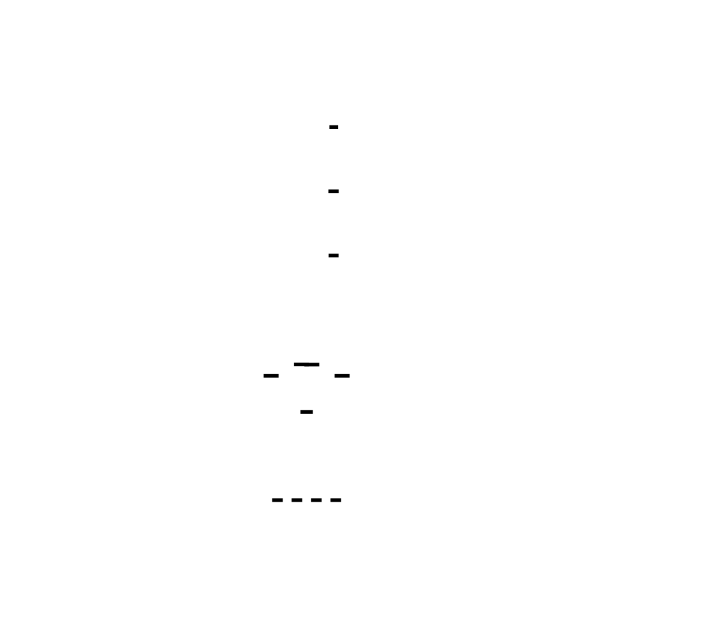

Example: Training ImageNet with batch size 256 across 8 GPUs.
- Each GPU sees 32 samples
- BatchNorm running mean on GPU 0 reflects dataset subset A
- BatchNorm running mean on GPU 1 reflects dataset subset B
- At test time, which statistics do you use?
**Solution**: SyncBatchNorm synchronizes statistics across all GPUs.
```python
import torch.nn as nn
# Convert all BatchNorm layers to SyncBatchNorm
model = nn.SyncBatchNorm.convert_sync_batchnorm(model)
```
Under the hood, SyncBatchNorm does an all-reduce on mean and variance:
```python
class SyncBatchNorm(nn.Module):
    def forward(self, x):
        # Compute local statistics
        local_mean = x.mean(dim=[0, 2, 3])
        local_var = x.var(dim=[0, 2, 3], unbiased=False)
        local_count = x.size(0) * x.size(2) * x.size(3)
        # Synchronize across all GPUs
        # All-gather: [local_mean_0, local_mean_1, ..., local_mean_n]
        means = [torch.zeros_like(local_mean) for _ in range(world_size)]
        dist.all_gather(means, local_mean)
        # Compute global mean and variance
        # Global mean = weighted average of local means
        # Global var = E[X²] - E[X]² (requires both mean and var)
        counts = [torch.tensor([local_count]).cuda() for _ in range(world_size)]
        dist.all_gather(counts, torch.tensor([local_count]).cuda())
        total_count = sum(counts)
        global_mean = sum(m * c for m, c in zip(means, counts)) / total_count
        # For variance: use parallel algorithm
        # Var(X) = E[X²] - E[X]²
        # E[X²] can be computed from local var + local mean²
        local_mean_sq = (local_mean ** 2 + local_var) * local_count
        mean_sqs = [torch.zeros_like(local_mean_sq) for _ in range(world_size)]
        dist.all_gather(mean_sqs, local_mean_sq)
        global_mean_sq = sum(mean_sqs) / total_count
        global_var = global_mean_sq - global_mean ** 2
        # Apply normalization with global statistics
        x_norm = (x - global_mean.view(1, -1, 1, 1)) / torch.sqrt(
            global_var.view(1, -1, 1, 1) + self.eps
        )
        # Update running statistics (synchronized)
        self.running_mean = (1 - self.momentum) * self.running_mean + \
                           self.momentum * global_mean
        self.running_var = (1 - self.momentum) * self.running_var + \
                          self.momentum * global_var
        return x_norm
```
**Trade-off**: SyncBatchNorm adds communication overhead. For vision models, it's usually worth it. For transformers (which use LayerNorm), this isn't needed—LayerNorm doesn't maintain running statistics.
### Problem 3: Gradient Accumulation for Large Effective Batches
Your model fits on one GPU, but your desired batch size (say, 4M tokens) doesn't fit in memory. Gradient accumulation: run multiple forward/backward passes before optimizer step.


```python
class GradientAccumulator:
    def __init__(self, model, optimizer, accumulation_steps=4):
        self.model = model
        self.optimizer = optimizer
        self.accumulation_steps = accumulation_steps
        self.step_count = 0
    def step(self, batch):
        # Forward/backward as usual
        loss = self.model(batch)
        # Scale loss by accumulation steps (so gradients average correctly)
        scaled_loss = loss / self.accumulation_steps
        scaled_loss.backward()
        self.step_count += 1
        # Only update weights every N steps
        if self.step_count % self.accumulation_steps == 0:
            # With DDP: gradients are already averaged across GPUs
            # Now average across accumulation steps (loss scaling handled above)
            self.optimizer.step()
            self.optimizer.zero_grad()
```
**The convergence trade-off**: Gradient accumulation gives you a larger effective batch size, but it delays gradient updates. With batch size 4M and accumulation over 16 steps, you're using stale gradients for 15 of those steps.
This interacts with learning rate: larger batches generally require larger learning rates.
```python
# Linear learning rate scaling rule (Goyal et al., 2017)
base_lr = 1e-4  # Learning rate for batch size 256
target_batch_size = 4096
base_batch_size = 256
scaled_lr = base_lr * (target_batch_size / base_batch_size)  # = 1.6e-3
```
The rule: if you multiply batch size by k, multiply learning rate by k. This isn't universally true—very large batches may need warmup or different schedules—but it's a starting point.
---
## Mixed Precision Training: Halving Memory, Doubling Speed
Your gradients and activations are in fp32 (32 bits per number). Modern GPUs have specialized hardware for fp16 (16 bits). Using fp16:
- Halves memory for activations
- Doubles effective memory bandwidth
- Uses Tensor Cores (2-8× faster matrix multiply)

> **🔑 Foundation: Mixed precision training**
>
> Mixed precision training uses lower precision floating-point numbers (like FP16 or BF16) alongside single-precision (FP32) to accelerate training and reduce memory consumption. Because FP16/BF16 have a smaller dynamic range, loss scaling is often needed to prevent underflow during gradient computation. Using mixed precision is vital in our project to handle the memory demands of our large model and accelerate training throughput without significantly sacrificing accuracy. The core insight is that many deep learning operations don't require the full precision of FP32, and strategically using lower precision can dramatically improve performance while maintaining numerical stability with techniques like loss scaling.


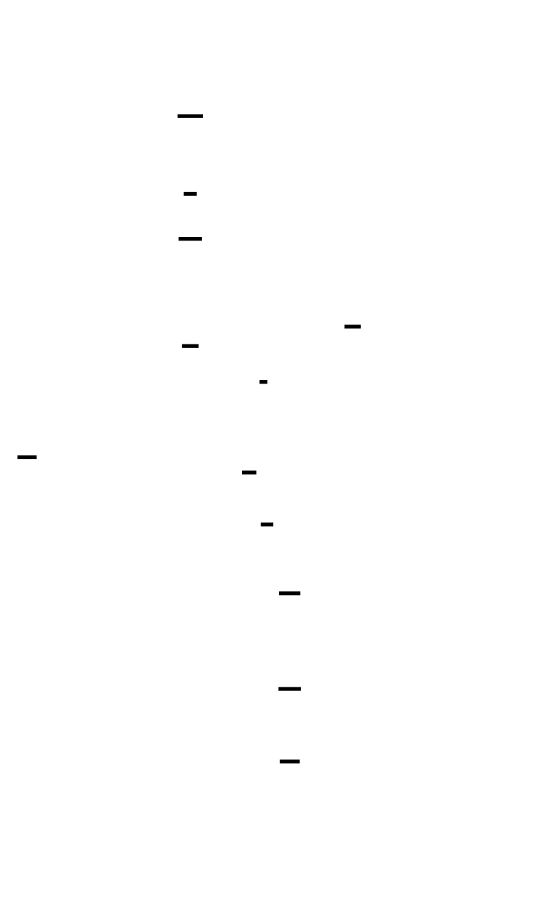

```python
from torch.cuda.amp import autocast, GradScaler
class MixedPrecisionTrainer:
    def __init__(self, model, optimizer):
        self.model = model
        self.optimizer = optimizer
        self.scaler = GradScaler()  # Handles loss scaling
    def step(self, batch):
        self.optimizer.zero_grad()
        # Forward pass in mixed precision
        with autocast():
            loss = self.model(batch)
        # Backward pass with scaling
        # Scale loss to prevent gradient underflow
        self.scaler.scale(loss).backward()
        # Unscale gradients (for gradient clipping, etc.)
        self.scaler.unscale_(self.optimizer)
        # Clip gradients (important for stability)
        torch.nn.utils.clip_grad_norm_(self.model.parameters(), max_norm=1.0)
        # Optimizer step with gradient unscaling
        self.scaler.step(self.optimizer)
        # Update scale for next iteration
        self.scaler.update()
```
**Why loss scaling?** Gradients in fp16 can underflow (become zero) if they're small. Loss scaling multiplies the loss by a large factor (e.g., 65536), which scales all gradients up, preventing underflow. After backward pass, gradients are unscaled before optimizer step.
**bf16 vs fp16**:
- fp16: 5 bits exponent, 10 bits mantissa → risk of overflow with large activations
- bf16: 8 bits exponent, 7 bits mantissa → same exponent range as fp32, less overflow risk
Ampere+ GPUs (A100, RTX 30/40 series) support bf16. Use it when available:
```python
# Check bf16 support
bf16_supported = torch.cuda.is_bf16_supported()
with autocast(enabled=True, dtype=torch.bfloat16 if bf16_supported else torch.float16):
    loss = model(batch)
```
---
## Building Your Data Parallel Training Loop
Let's put it all together into a production-quality data parallel trainer:
```python
import os
import torch
import torch.nn as nn
import torch.distributed as dist
from torch.nn.parallel import DistributedDataParallel as DDP
from torch.utils.data import DataLoader, DistributedSampler
from torch.cuda.amp import autocast, GradScaler
def setup_distributed():
    """Initialize distributed training environment."""
    # Environment variables set by torchrun or mpirun
    dist.init_process_group(backend='nccl')
    rank = dist.get_rank()
    world_size = dist.get_world_size()
    local_rank = int(os.environ.get('LOCAL_RANK', 0))
    torch.cuda.set_device(local_rank)
    return rank, world_size, local_rank
def cleanup_distributed():
    """Clean up distributed training."""
    dist.destroy_process_group()
class DataParallelTrainer:
    """
    Production-quality data parallel trainer with:
    - DDP for gradient synchronization
    - Mixed precision training
    - Gradient accumulation
    - Gradient clipping
    - Checkpointing
    """
    def __init__(
        self,
        model: nn.Module,
        train_dataset,
        val_dataset=None,
        lr: float = 1e-4,
        weight_decay: float = 0.01,
        batch_size: int = 32,
        gradient_accumulation_steps: int = 1,
        max_grad_norm: float = 1.0,
        use_amp: bool = True,
        use_sync_bn: bool = False,
        checkpoint_dir: str = './checkpoints',
    ):
        # Distributed setup
        self.rank, self.world_size, self.local_rank = setup_distributed()
        self.is_main = self.rank == 0
        # Model setup
        self.model = model.cuda()
        # Convert BatchNorm to SyncBatchNorm if needed
        if use_sync_bn:
            self.model = nn.SyncBatchNorm.convert_sync_batchnorm(self.model)
        # Wrap with DDP
        self.model = DDP(
            self.model,
            device_ids=[self.local_rank],
            output_device=self.local_rank,
            # bucket_cap_mb controls gradient bucket size (default 25)
            bucket_cap_mb=25,
            # find_unused_parameters helps with models where not all params
            # are used in every forward pass
            find_unused_parameters=False,
        )
        # Optimizer (AdamW for transformers)
        self.optimizer = torch.optim.AdamW(
            self.model.parameters(),
            lr=lr,
            weight_decay=weight_decay,
            betas=(0.9, 0.95),  # Standard for transformers
        )
        # Mixed precision
        self.use_amp = use_amp
        self.scaler = GradScaler() if use_amp else None
        # Gradient accumulation
        self.gradient_accumulation_steps = gradient_accumulation_steps
        self.max_grad_norm = max_grad_norm
        # Data loaders with distributed sampler
        self.train_sampler = DistributedSampler(
            train_dataset,
            num_replicas=self.world_size,
            rank=self.rank,
            shuffle=True,
        )
        self.train_loader = DataLoader(
            train_dataset,
            batch_size=batch_size,
            sampler=self.train_sampler,
            num_workers=4,
            pin_memory=True,
        )
        if val_dataset is not None:
            self.val_sampler = DistributedSampler(
                val_dataset,
                num_replicas=self.world_size,
                rank=self.rank,
                shuffle=False,
            )
            self.val_loader = DataLoader(
                val_dataset,
                batch_size=batch_size,
                sampler=self.val_sampler,
                num_workers=4,
                pin_memory=True,
            )
        # Checkpointing
        self.checkpoint_dir = checkpoint_dir
        if self.is_main:
            os.makedirs(checkpoint_dir, exist_ok=True)
        self.step_count = 0
        self.epoch_count = 0
    def train_epoch(self):
        """Train for one epoch with gradient accumulation and mixed precision."""
        self.model.train()
        self.train_sampler.set_epoch(self.epoch_count)
        total_loss = 0.0
        num_batches = 0
        # Zero gradients at start of epoch
        self.optimizer.zero_grad()
        for batch_idx, batch in enumerate(self.train_loader):
            # Move batch to GPU
            batch = self._move_to_gpu(batch)
            # Forward pass with mixed precision
            with autocast(enabled=self.use_amp):
                loss = self.model(**batch)
                # Scale loss for gradient accumulation
                loss = loss / self.gradient_accumulation_steps
            # Backward pass
            if self.use_amp:
                self.scaler.scale(loss).backward()
            else:
                loss.backward()
            total_loss += loss.item()
            num_batches += 1
            # Optimizer step every N batches
            if (batch_idx + 1) % self.gradient_accumulation_steps == 0:
                # Gradient clipping
                if self.use_amp:
                    self.scaler.unscale_(self.optimizer)
                torch.nn.utils.clip_grad_norm_(
                    self.model.parameters(),
                    self.max_grad_norm
                )
                # Optimizer step
                if self.use_amp:
                    self.scaler.step(self.optimizer)
                    self.scaler.update()
                else:
                    self.optimizer.step()
                self.optimizer.zero_grad()
                self.step_count += 1
        self.epoch_count += 1
        # Average loss across all GPUs
        avg_loss = self._average_metric(total_loss / num_batches)
        return avg_loss
    @torch.no_grad()
    def validate(self):
        """Run validation with distributed sampler."""
        if self.val_loader is None:
            return None
        self.model.eval()
        total_loss = 0.0
        num_batches = 0
        for batch in self.val_loader:
            batch = self._move_to_gpu(batch)
            with autocast(enabled=self.use_amp):
                loss = self.model(**batch)
            total_loss += loss.item()
            num_batches += 1
        return self._average_metric(total_loss / num_batches)
    def save_checkpoint(self, filename: str):
        """Save checkpoint (only main process saves)."""
        if not self.is_main:
            return
        checkpoint = {
            'step': self.step_count,
            'epoch': self.epoch_count,
            'model_state_dict': self.model.module.state_dict(),  # Unwrap DDP
            'optimizer_state_dict': self.optimizer.state_dict(),
        }
        if self.scaler is not None:
            checkpoint['scaler_state_dict'] = self.scaler.state_dict()
        path = os.path.join(self.checkpoint_dir, filename)
        torch.save(checkpoint, path)
        print(f"Saved checkpoint to {path}")
    def load_checkpoint(self, filename: str):
        """Load checkpoint on all processes."""
        path = os.path.join(self.checkpoint_dir, filename)
        # Load on CPU first to avoid GPU memory spike
        checkpoint = torch.load(path, map_location='cpu')
        # Load model state (need strict=True for DDP consistency)
        self.model.module.load_state_dict(checkpoint['model_state_dict'])
        self.optimizer.load_state_dict(checkpoint['optimizer_state_dict'])
        if self.scaler is not None and 'scaler_state_dict' in checkpoint:
            self.scaler.load_state_dict(checkpoint['scaler_state_dict'])
        self.step_count = checkpoint['step']
        self.epoch_count = checkpoint['epoch']
        print(f"Loaded checkpoint from {path} at step {self.step_count}")
    def _move_to_gpu(self, batch):
        """Move batch to GPU."""
        if isinstance(batch, dict):
            return {k: v.cuda() if isinstance(v, torch.Tensor) else v 
                    for k, v in batch.items()}
        elif isinstance(batch, torch.Tensor):
            return batch.cuda()
        return batch
    def _average_metric(self, metric: float) -> float:
        """Average a metric across all GPUs."""
        tensor = torch.tensor([metric], device='cuda')
        dist.all_reduce(tensor, op=dist.ReduceOp.SUM)
        return (tensor / self.world_size).item()
```
### Launching with torchrun
```bash
# Launch on single node with 8 GPUs
torchrun --nproc_per_node=8 train.py
# Launch on multiple nodes
# Node 0 (main):
torchrun --nproc_per_node=8 --nnodes=2 --node_rank=0 \
    --master_addr=10.0.0.1 --master_port=29500 train.py
# Node 1:
torchrun --nproc_per_node=8 --nnodes=2 --node_rank=1 \
    --master_addr=10.0.0.1 --master_port=29500 train.py
```
`torchrun` automatically sets the environment variables (`RANK`, `WORLD_SIZE`, `LOCAL_RANK`, `MASTER_ADDR`, `MASTER_PORT`) that `dist.init_process_group()` reads.
---
## Measuring Scaling Efficiency
You can't optimize what you don't measure. Scaling efficiency is:
$$\text{Efficiency} = \frac{T_1}{N \times T_N}$$
Where $T_1$ is time on 1 GPU and $T_N$ is time on N GPUs.


```python
import time
from dataclasses import dataclass
@dataclass
class TimingMetrics:
    forward_time: float
    backward_time: float
    communication_time: float
    optimizer_time: float
    total_time: float
class ProfiledTrainer(DataParallelTrainer):
    """Trainer with detailed timing breakdown."""
    def __init__(self, *args, **kwargs):
        super().__init__(*args, **kwargs)
        self.timers = {
            'forward': CUDATimer(),
            'backward': CUDATimer(),
            'communication': CUDATimer(),
            'optimizer': CUDATimer(),
        }
    def train_step(self, batch):
        metrics = TimingMetrics(0, 0, 0, 0, 0)
        # Forward
        with self.timers['forward']:
            with autocast(enabled=self.use_amp):
                loss = self.model(**batch)
        metrics.forward_time = self.timers['forward'].elapsed()
        # Backward
        with self.timers['backward']:
            if self.use_amp:
                self.scaler.scale(loss).backward()
            else:
                loss.backward()
        metrics.backward_time = self.timers['backward'].elapsed()
        # Communication is overlapped with backward in DDP
        # To measure it explicitly, we need to disable overlap
        # For now, estimate from all-reduce time
        metrics.communication_time = self._estimate_communication_time()
        # Optimizer
        with self.timers['optimizer']:
            if self.use_amp:
                self.scaler.unscale_(self.optimizer)
            torch.nn.utils.clip_grad_norm_(self.model.parameters(), self.max_grad_norm)
            if self.use_amp:
                self.scaler.step(self.optimizer)
                self.scaler.update()
            else:
                self.optimizer.step()
            self.optimizer.zero_grad()
        metrics.optimizer_time = self.timers['optimizer'].elapsed()
        metrics.total_time = (
            metrics.forward_time + 
            metrics.backward_time + 
            metrics.optimizer_time
        )
        return metrics
    def _estimate_communication_time(self):
        """Estimate communication time based on model size."""
        # Get model size in bytes
        model_size = sum(p.numel() * p.element_size() for p in self.model.parameters())
        # Get effective bandwidth (empirically measured or from spec)
        # NVLink: ~300 GB/s, InfiniBand: ~12 GB/s (100 Gbps)
        # This is a rough estimate
        if self._is_intra_node():
            bandwidth_gbps = 300  # NVLink
        else:
            bandwidth_gbps = 12  # InfiniBand
        # Ring all-reduce: 2 * model_size / bandwidth
        comm_time = 2 * model_size / (bandwidth_gbps * 1e9)
        return comm_time
    def _is_intra_node(self):
        """Check if all ranks are on the same node."""
        # Simple heuristic: check if local_rank == rank for all
        # More robust: compare hostname
        import socket
        hostname = socket.gethostname()
        hostnames = [None] * self.world_size
        dist.all_gather_object(hostnames, hostname)
        return len(set(hostnames)) == 1
class CUDATimer:
    """Accurate CUDA timer using events."""
    def __init__(self):
        self.start_event = torch.cuda.Event(enable_timing=True)
        self.end_event = torch.cuda.Event(enable_timing=True)
    def __enter__(self):
        self.start_event.record()
        return self
    def __exit__(self, *args):
        self.end_event.record()
        torch.cuda.synchronize()
    def elapsed(self):
        return self.start_event.elapsed_time(self.end_event) / 1000  # ms to s
def measure_scaling_efficiency(trainer_class, model_fn, dataset, gpu_counts=[1, 2, 4, 8]):
    """
    Measure scaling efficiency across different GPU counts.
    Usage:
        efficiency = measure_scaling_efficiency(
            DataParallelTrainer,
            lambda: TransformerModel(),
            my_dataset,
            gpu_counts=[1, 2, 4, 8]
        )
    """
    results = {}
    for n_gpus in gpu_counts:
        # This would be run as separate jobs in practice
        print(f"Measuring with {n_gpus} GPUs...")
        # ... setup trainer with n_gpus ...
        # ... run N iterations ...
        # ... record time_per_step ...
        results[n_gpus] = {
            'time_per_step': time_per_step,
            'throughput': samples_per_second,
        }
    # Calculate efficiency
    baseline_time = results[1]['time_per_step']
    for n_gpus in gpu_counts[1:]:
        efficiency = baseline_time / (n_gpus * results[n_gpus]['time_per_step'])
        print(f"{n_gpus} GPUs: {efficiency*100:.1f}% efficiency")
    return results
```
**Expected results on modern hardware**:
| Configuration | Expected Efficiency |
|--------------|---------------------|
| 2 GPUs, NVLink | 95-98% |
| 4 GPUs, NVLink | 92-96% |
| 8 GPUs, NVLink | 88-94% |
| 2 GPUs, InfiniBand | 85-92% |
| 4 GPUs, InfiniBand | 75-85% |
| 8 GPUs, InfiniBand | 60-75% |
If your efficiency is lower, profile to find the bottleneck:
- High communication time → Check network bandwidth, consider gradient compression
- High compute time → Your model might be too small to saturate GPUs
- High optimizer time → Consider fused optimizer kernels
- Stragglers → Check for load imbalance (different batch sizes, data loading delays)
---
## The Shape of Gradients Through the Pipeline
Understanding tensor shapes is critical for debugging distributed training. Let's trace a transformer layer through data parallel training:
```python
# Shape notation: (batch, seq_len, hidden_dim) or use einops
# Let: batch=8, seq_len=1024, hidden_dim=4096, num_heads=32
# Input tensor
x: (8, 1024, 4096)  # Per-GPU batch (global batch = 8 * world_size)
# Attention: Q, K, V projections
q = x @ W_q  # (8, 1024, 4096)
k = x @ W_k  # (8, 1024, 4096)  
v = x @ W_v  # (8, 1024, 4096)
# Reshape for multi-head attention
q: (8, 32, 1024, 128)  # (batch, heads, seq, head_dim)
k: (8, 32, 1024, 128)
v: (8, 32, 1024, 128)
# Attention scores
attn = q @ k.transpose(-2, -1)  # (8, 32, 1024, 1024)
attn = softmax(attn / sqrt(128))
# Attention output
out = attn @ v  # (8, 32, 1024, 128)
out = out.reshape(8, 1024, 4096)  # (batch, seq, hidden)
out = out @ W_o  # (8, 1024, 4096)
# FFN
ffn_out = GELU(x @ W_1) @ W_2  # (8, 1024, 4096)
# After backward pass, gradients have SAME shapes as parameters
grad_W_q: (4096, 4096)  # Same as W_q shape
grad_W_k: (4096, 4096)
grad_W_v: (4096, 4096)
grad_W_o: (4096, 4096)
grad_W_1: (4096, 4 * 4096)  # FFN is 4x hidden
grad_W_2: (4 * 4096, 4096)
```
**Key insight**: Gradient shapes match parameter shapes, not activation shapes. The all-reduce operates on gradient tensors, so communication volume depends on parameter count, not batch size or sequence length.
For a 7B parameter model:
- Total parameters: 7,000,000,000
- Gradient tensor size: 7B × 4 bytes (fp32) = 28 GB
- Or 14 GB in fp16
The all-reduce must move 14-28 GB per training step. This is why communication bandwidth is the fundamental limiter.
---
## Common Pitfalls and How to Debug Them
### Pitfall 1: Models Diverge Across GPUs
**Symptom**: Loss is different on different GPUs, or NaN appears on one GPU but not others.
**Causes**:
1. Not using DDP (just copying model to each GPU without gradient sync)
2. DDP wrapper applied after model is moved to GPU
3. Non-deterministic operations (dropout, data augmentation) without proper seeding
**Fix**:
```python
# WRONG: DDP after cuda()
model = MyModel().cuda()
model = DDP(model)  # Error: model already on CUDA
# CORRECT: DDP handles device placement
model = MyModel()
model = DDP(model, device_ids=[local_rank])
# Set seeds for reproducibility
torch.manual_seed(42 + rank)  # Different seed per GPU for data augmentation
np.random.seed(42 + rank)
random.seed(42 + rank)
# But use same seed for model initialization
if rank == 0:
    torch.manual_seed(42)
dist.broadcast(model.module.linear.weight, src=0)  # Ensure same initial weights
```
### Pitfall 2: Out of Memory During Backward Pass
**Symptom**: CUDA OOM during backward, but forward pass succeeded.
**Cause**: Activations are stored for backward pass. Peak memory is typically 2-3× forward-only memory.
**Fix**: Use gradient checkpointing to trade compute for memory:
```python
from torch.utils.checkpoint import checkpoint
class CheckpointedTransformer(nn.Module):
    def __init__(self, layers):
        super().__init__()
        self.layers = nn.ModuleList(layers)
    def forward(self, x):
        for layer in self.layers:
            # Checkpoint each layer: recompute activations during backward
            x = checkpoint(layer, x, use_reentrant=False)
        return x
```
This reduces activation memory from O(layers) to O(sqrt(layers)) with sqrt(checkpoint frequency).
### Pitfall 3: Batch Norm Statistics Diverge
**Symptom**: Training loss converges but validation loss is much higher, or model performs poorly at test time.
**Cause**: Using regular BatchNorm with data parallelism—each GPU computes different running statistics.
**Fix**: Use SyncBatchNorm, or switch to LayerNorm (for transformers):
```python
# Option 1: SyncBatchNorm
model = nn.SyncBatchNorm.convert_sync_batchnorm(model)
# Option 2: Use LayerNorm instead (transformer default)
# LayerNorm computes statistics per sample, no cross-sample dependency
norm = nn.LayerNorm(hidden_dim)  # No synchronization needed
```
### Pitfall 4: Learning Rate Not Scaled for Batch Size
**Symptom**: Training is slow to converge, or diverges with large batches.
**Cause**: Linear scaling rule not applied, or applied incorrectly.
**Fix**:
```python
# Base learning rate for batch size 256
base_lr = 1e-4
base_batch_size = 256
# Your configuration
global_batch_size = per_gpu_batch_size * world_size * gradient_accumulation_steps
# Linear scaling
lr = base_lr * (global_batch_size / base_batch_size)
# Add warmup for very large batches
warmup_steps = 2000
def get_lr(step):
    if step < warmup_steps:
        return lr * (step / warmup_steps)
    return lr
optimizer = AdamW(model.parameters(), lr=lr)
scheduler = LambdaLR(optimizer, get_lr)
```
### Pitfall 5: DataLoader Bottleneck
**Symptom**: GPU utilization is low (~30-50%), but communication time is also low.
**Cause**: CPU data loading can't keep up with GPU.
**Fix**:
```python
# Increase number of workers
dataloader = DataLoader(
    dataset,
    batch_size=batch_size,
    sampler=distributed_sampler,
    num_workers=8,  # Typically 4-8 per GPU
    pin_memory=True,  # Use pinned memory for faster GPU transfer
    prefetch_factor=2,  # Prefetch batches
    persistent_workers=True,  # Keep workers alive between epochs
)
```
---
## Testing Your Implementation
Every distributed training component needs tests. Here's a test suite:
```python
import pytest
import torch
import torch.distributed as dist
import torch.multiprocessing as mp
def run_test(rank, world_size, test_fn):
    """Initialize distributed environment and run test."""
    os.environ['MASTER_ADDR'] = 'localhost'
    os.environ['MASTER_PORT'] = '29500'
    dist.init_process_group(backend='nccl', rank=rank, world_size=world_size)
    torch.cuda.set_device(rank)
    try:
        test_fn(rank, world_size)
    finally:
        dist.destroy_process_group()
def distributed_test(world_size=2):
    """Decorator for running distributed tests."""
    def decorator(test_fn):
        def wrapper():
            mp.spawn(run_test, args=(world_size, test_fn), nprocs=world_size)
        return wrapper
    return decorator
class TestDataParallel:
    @distributed_test(world_size=2)
    def test_gradient_synchronization(rank, world_size):
        """Verify gradients are synchronized after backward."""
        # Create identical models
        model = nn.Linear(10, 10).cuda()
        ddp_model = DDP(model, device_ids=[rank])
        # Different input per rank
        torch.manual_seed(rank)  # Different data per GPU
        x = torch.randn(32, 10, device='cuda')
        # Forward and backward
        y = ddp_model(x)
        loss = y.sum()
        loss.backward()
        # Get gradient
        grad = ddp_model.module.weight.grad.clone()
        # All-reduce should have averaged gradients
        # Verify by checking that gradients are identical on all ranks
        gathered_grads = [torch.zeros_like(grad) for _ in range(world_size)]
        dist.all_gather(gathered_grads, grad)
        for i in range(1, world_size):
            assert torch.allclose(gathered_grads[0], gathered_grads[i], atol=1e-5), \
                f"Gradients differ between rank 0 and rank {i}"
    @distributed_test(world_size=2)
    def test_sync_batch_norm(rank, world_size):
        """Verify SyncBatchNorm produces consistent statistics."""
        model = nn.Sequential(
            nn.Conv2d(3, 64, 3),
            nn.BatchNorm2d(64),
        ).cuda()
        model = nn.SyncBatchNorm.convert_sync_batchnorm(model)
        model = DDP(model, device_ids=[rank])
        # Same input on all ranks (to verify statistics match)
        torch.manual_seed(42)
        x = torch.randn(8, 3, 32, 32, device='cuda')
        model.train()
        _ = model(x)
        # Running mean should be identical
        bn = model.module[1]
        running_mean = bn.running_mean.clone()
        gathered_means = [torch.zeros_like(running_mean) for _ in range(world_size)]
        dist.all_gather(gathered_means, running_mean)
        for i in range(1, world_size):
            assert torch.allclose(gathered_means[0], gathered_means[i], atol=1e-5)
    @distributed_test(world_size=2)
    def test_gradient_accumulation(rank, world_size):
        """Verify gradient accumulation produces correct averages."""
        model = nn.Linear(10, 10).cuda()
        ddp_model = DDP(model, device_ids=[rank])
        optimizer = torch.optim.SGD(ddp_model.parameters(), lr=1.0)
        # Accumulate gradients over 4 steps
        accumulation_steps = 4
        optimizer.zero_grad()
        accumulated_loss = 0
        for step in range(accumulation_steps):
            torch.manual_seed(rank * 100 + step)
            x = torch.randn(8, 10, device='cuda')
            y = ddp_model(x)
            loss = (y ** 2).sum() / accumulation_steps
            loss.backward()
            accumulated_loss += loss.item()
        # Gradients should be average of all steps
        grad = ddp_model.module.weight.grad.clone()
        # Compare with single large batch
        ddp_model.module.zero_grad()
        torch.manual_seed(rank * 100)
        x_large = torch.randn(8 * accumulation_steps, 10, device='cuda')
        y_large = ddp_model(x_large)
        loss_large = (y_large ** 2).sum() / accumulation_steps
        loss_large.backward()
        grad_large = ddp_model.module.weight.grad.clone()
        # Should be approximately equal
        assert torch.allclose(grad, grad_large, rtol=1e-2, atol=1e-4), \
            "Gradient accumulation doesn't match single batch"
    @distributed_test(world_size=2)
    def test_checkpoint_save_load(rank, world_size):
        """Verify checkpoint saves and loads correctly across ranks."""
        model = nn.Linear(10, 10).cuda()
        ddp_model = DDP(model, device_ids=[rank])
        optimizer = torch.optim.Adam(ddp_model.parameters())
        # Run a few steps
        for _ in range(3):
            x = torch.randn(8, 10, device='cuda')
            loss = ddp_model(x).sum()
            loss.backward()
            optimizer.step()
            optimizer.zero_grad()
        # Save state
        state = {
            'model': ddp_model.module.state_dict(),
            'optimizer': optimizer.state_dict(),
        }
        # Create new model and load
        new_model = nn.Linear(10, 10).cuda()
        new_model.load_state_dict(state['model'])
        # Verify weights match
        for (n1, p1), (n2, p2) in zip(
            ddp_model.module.named_parameters(),
            new_model.named_parameters()
        ):
            assert torch.allclose(p1, p2), f"Parameter {n1} doesn't match after load"
```
Run tests with:
```bash
pytest test_distributed.py -v
```
---
## Knowledge Cascade: What You've Unlocked
You now understand data parallelism—the foundation of all distributed training. Here's where this knowledge connects:
### Same Domain: The Parallelism Stack
**Data Parallelism → Tensor Parallelism**: You know how to replicate models across GPUs. But what if the model doesn't fit on one GPU? Tensor parallelism shards individual *layers* across GPUs. The communication pattern changes from "synchronize once per step" to "synchronize after every layer"—but you already understand all-reduce.
**Data Parallelism → Pipeline Parallelism**: What if the model is too deep? Pipeline parallelism splits layers across GPUs, with micro-batches flowing through. The challenge becomes scheduling to avoid pipeline bubbles—but the gradient synchronization concepts are identical.
**Data Parallelism → ZeRO**: You're replicating the entire model on every GPU. ZeRO (Zero Redundancy Optimizer) asks: why store optimizer states, gradients, and parameters on *every* GPU? By sharding these across GPUs and gathering on demand, you can train models 8× larger with the same hardware.
### Cross-Domain: Connections That Matter
**All-Reduce → Consensus Algorithms**: The ring all-reduce is a specialized consensus protocol. The same patterns appear in distributed databases (Paxos, Raft), blockchain networks, and distributed file systems. Understanding why all-reduce works prepares you for understanding any distributed consensus.
**Gradient Compression → Information Theory**: Sending 14GB of gradients per step is expensive. What if you could send less? Gradient compression techniques (PowerSGD, 8-bit quantization, sparsification) trade numerical precision for bandwidth—the same tradeoff as lossy image compression, audio codecs, and neural network quantization for inference.
**Large Batch Training → Optimization Theory**: Linear learning rate scaling isn't arbitrary—it connects to convex optimization theory. The "generalization gap" at large batches is an active research area. Understanding this prepares you to reason about optimizer behavior, not just use them as black boxes.
**Overlapping Communication with Computation → Systems Design**: The bucketization technique is identical to pipelining in CPUs, async I/O in web servers, and double-buffering in graphics. The principle: hide latency by doing useful work while waiting.
### Forward: What You Can Now Build
With data parallelism mastered, you can:
1. **Train any single-GPU model across a cluster**: Your model fits on one GPU but you want faster training → data parallelism is the answer.
2. **Debug distributed training failures**: Model divergence, memory issues, communication bottlenecks—you know where to look.
3. **Measure and optimize scaling efficiency**: You can identify whether your bottleneck is compute, communication, or data loading.
4. **Understand PyTorch DDP internals**: You're not just calling `DDP(model)` blindly—you know what it does and why.
In the next milestone, you'll tackle tensor parallelism: what happens when the model doesn't fit on one GPU at all. The matrix multiplications themselves must be sharded, and the communication patterns become far more intricate. But the foundation—all-reduce, synchronization, efficiency analysis—is already yours.
---
<!-- END_MS -->


<!-- MS_ID: distributed-m2 -->
# Tensor Parallelism
You've mastered data parallelism—replicating your model across GPUs and synchronizing gradients. But there's a wall ahead: what happens when the model *doesn't fit* on a single GPU?
A 70B parameter model needs 140GB just for fp16 parameters. An A100 has 80GB of HBM. The model literally cannot exist on one GPU. This is where tensor parallelism enters: you'll shard individual *layers* across GPUs, splitting the matrix multiplications themselves.
By the end of this milestone, you'll understand why Megatron-LM's column-parallel → row-parallel pattern is the key insight, implement sharded attention that distributes heads across GPUs, and overlap communication with computation to hide the all-reduce latency that would otherwise kill your throughput.
---
## The Fundamental Tension: Memory Wall at the Layer Level
Data parallelism assumes the model fits on one GPU. When that assumption breaks, you need a different strategy.
**The Memory Reality**: A transformer layer's memory footprint:
```
Parameters (fp16):
  QKV projection: 3 × hidden_dim × hidden_dim = 3 × 4096 × 4096 = 50M params = 100MB
  Output projection: hidden_dim × hidden_dim = 16M params = 32MB
  FFN up projection: hidden_dim × 4×hidden_dim = 64M params = 128MB
  FFN down projection: 4×hidden_dim × hidden_dim = 64M params = 128MB
  Total per layer: ~400MB
Activations (during training):
  Batch=8, Seq=4096, Hidden=4096
  Per-layer activations: ~2GB (with attention scores)
For a 70B model (80 layers):
  Parameters: 140GB
  Activations: 160GB+
  Optimizer states: 560GB (Adam in fp32)
  Total: 860GB+
```
No single GPU can hold this. Even with gradient checkpointing and activation offloading, the parameters alone exceed A100 memory.
**The Compute Reality**: Matrix multiplication is the core operation. For `Y = XW`:
- `X`: input activations, shape `(batch × seq_len, hidden_dim)`
- `W`: weight matrix, shape `(hidden_dim, hidden_dim)` (or 4× for FFN)
- `Y`: output, shape `(batch × seq_len, hidden_dim)`
The question becomes: *how do you split this operation across GPUs?*
**The Communication Reality**: Unlike data parallelism (one all-reduce per step), tensor parallelism requires communication *after every transformer block*. If you have 80 layers and 8 GPUs, you're doing 80 all-reduces per forward pass. Each one must be fast—this is why tensor parallelism demands NVLink intra-node bandwidth (~300GB/s), not PCIe (~32GB/s).
---
## What Tensor Parallelism Actually Is
Tensor parallelism means: **shard the weight matrices across GPUs, compute partial results in parallel, combine via collective operations.**
The key insight is that matrix multiplication has structure you can exploit:
```
Y = XW
If W is sharded column-wise: W = [W₁ | W₂ | ... | Wₙ]
Then Y = [XW₁ | XW₂ | ... | XWₙ]  (each GPU computes a slice of Y)
If W is sharded row-wise: W = [W₁; W₂; ...; Wₙ] (stacked vertically)
Then Y = XW₁ + XW₂ + ... + XWₙ  (each GPU computes a partial sum, then all-reduce)
```


The Megatron-LM insight: **chain column-parallel and row-parallel layers together** so the all-reduce only happens once per MLP block, not after every linear layer.
---
## The Three-Level View: What's Actually Happening
### Level 1 — Application Layer: Sharded Transformer
At the code level, tensor parallelism changes how you construct layers:
```python
# Standard single-GPU MLP
class MLP(nn.Module):
    def __init__(self, hidden_dim, ffn_dim):
        super().__init__()
        self.up_proj = nn.Linear(hidden_dim, ffn_dim)    # (H, 4H)
        self.down_proj = nn.Linear(ffn_dim, hidden_dim)  # (4H, H)
    def forward(self, x):
        return self.down_proj(F.gelu(self.up_proj(x)))
# Tensor-parallel MLP (conceptual)
class TensorParallelMLP(nn.Module):
    def __init__(self, hidden_dim, ffn_dim, tp_rank, tp_world_size):
        super().__init__()
        self.tp_rank = tp_rank
        self.tp_size = tp_world_size
        # Column-parallel: each GPU has ffn_dim/tp_size columns
        self.up_proj = nn.Linear(hidden_dim, ffn_dim // tp_world_size)
        # Row-parallel: each GPU has hidden_dim/tp_size rows
        self.down_proj = nn.Linear(ffn_dim // tp_world_size, hidden_dim)
    def forward(self, x):
        # Column-parallel: each GPU computes its slice of the up projection
        hidden = self.up_proj(x)  # No communication needed!
        hidden = F.gelu(hidden)
        # Row-parallel: each GPU computes partial output, then all-reduce
        output = self.down_proj(hidden)
        output = all_reduce(output) / self.tp_size  # Sum partial results
        return output
```
The magic: the column-parallel output is already sharded correctly for the row-parallel input. No communication between the two layers!
### Level 2 — Distributed Primitives: All-Reduce Positioning
The critical decision in tensor parallelism: *where* do you place the all-reduce?
**Wrong approach** (communication after every layer):
```
ColumnParallel(X) → All-Gather → RowParallel → All-Reduce → ColumnParallel → ...
```
**Megatron approach** (one all-reduce per MLP block):
```
ColumnParallel → (activations already sharded) → RowParallel → All-Reduce
```
The communication volume is `batch × seq_len × hidden_dim`, independent of the FFN intermediate dimension. This is why the pattern works: you're communicating activations, not parameters.
### Level 3 — Hardware Reality: NVLink Bandwidth
Tensor parallelism only makes sense within a single node (or nodes with NVLink interconnect). Here's why:
```
All-reduce volume per layer: batch × seq_len × hidden_dim × 2 bytes (fp16)
For batch=8, seq=4096, hidden=4096:
  Volume = 8 × 4096 × 4096 × 2 = 268MB
NVLink (300 GB/s): 268MB / 300GB/s = 0.9ms
InfiniBand (12 GB/s): 268MB / 12GB/s = 22ms
With 80 layers:
  NVLink: 80 × 0.9ms = 72ms overhead
  InfiniBand: 80 × 22ms = 1.76s overhead (training becomes network-bound!)
```
This is why tensor parallelism degree typically matches GPUs per node (4 or 8), while data parallelism handles inter-node scaling.
---
## Column vs Row Parallelism: The Deep Dive

> **🔑 Foundation: Matrix multiplication dimensions and sharding strategies**
> 
> ## What It IS
Matrix multiplication operates on two matrices with compatible dimensions. If matrix **A** has shape `(M, K)` and matrix **B** has shape `(K, N)`, their product **C = A × B** has shape `(M, N)`. The inner dimension `K` must match—it represents the values you're summing over in the dot product.
```
A: (M, K)  ×  B: (K, N)  =  C: (M, N)
         ↘      ↙
         must match
```
Each element `C[i,j]` is computed as: `sum(A[i,:] * B[:,j])` — the entire i-th row of A dotted with the entire j-th column of B.
**Sharding strategies** distribute these matrices across multiple devices (GPUs/TPUs) to parallelize computation. The three primary strategies are:
| Strategy | Shard A | Shard B | Shard C | Communication |
|----------|---------|---------|---------|---------------|
| **Data Parallel** | Replicated | Replicated | Sharded (M) | None |
| **Tensor Parallel (Column/Row)** | Sharded | Sharded | Sharded | All-Reduce |
| **Megatron-style** | Shard columns of A, rows of B | — | Sharded | All-Reduce |
### Key Sharding Patterns Explained
**1. Batch Parallel (Data Parallel):**
Each device gets different rows of the batch. Matrices A and B are replicated. Simple, no communication during compute.
**2. Tensor Parallel — Split K (Reduce-Scatter):**
Shard the K dimension across devices. Each device computes a partial sum, then communicates to reduce.
**3. Megatron-LM Style (Most Common for Transformers):**
- Shard A along columns: `A = [A₁ | A₂]` where each device holds `Aᵢ` of shape `(M, K/P)`
- Shard B along rows: `B = [B₁; B₂]` where each device holds `Bᵢ` of shape `(K/P, N)`
- Each device computes `Yᵢ = Aᵢ × Bᵢ` locally (shape `(M, N)`)
- **All-Reduce** across devices sums partial results into final `Y`
This is the standard for transformer MLP and attention layers.
## WHY You Need It Right Now
If you're training or serving large models, you will hit memory limits on a single device. Understanding matrix multiplication dimensions tells you **what's even possible** to shard. Understanding sharding strategies tells you **how to do it efficiently**.
Specific scenarios where this matters immediately:
- **Model won't fit on one GPU?** You need tensor parallelism. Knowing which dimension to shard determines whether your all-reduce happens before or after the computation.
- **Debugging distributed training?** Shape mismatches are the #1 cause of silent failures. If your `(M, K)` becomes `(M, K/P)` after sharding, every downstream operation must account for this.
- **Optimizing throughput?** The communication pattern (all-reduce vs. all-gather vs. reduce-scatter) is determined entirely by your sharding strategy. Wrong choice = bottlenecked on interconnect bandwidth.
- **Working with attention?** Multi-head attention is essentially batched matrix multiplication where the batch dimension is heads. Sharding heads vs. sharding sequence length has radically different implications.
## ONE Key Insight
**The communication cost of sharded matrix multiplication is determined by the OUTPUT dimension, not the computation.**
In Megatron-style parallelism, you shard the K dimension (where all the multiply-adds happen), but you must all-reduce across devices to sum partial results. The all-reduce communicates `M × N` values — the size of your output — regardless of how large K was.
```
Computation: O(M × K × N)  — distributed across P devices
Communication: O(M × N)    — must happen on EVERY device
```
This means tensor parallelism is most efficient when K is large (lots of compute to amortize communication) and M×N is relatively small (less data to communicate). For transformers, this is why we shard along the hidden dimension but keep sequence length and batch size factors in mind — giant sequence lengths can make the all-reduce a bottleneck.
**Mental model:** Think of sharded matmul as "compute locally, synchronize globally." Each device does a chunk of the heavy lifting (the K-dimension work), then they all meet up to combine their answers (the all-reduce on M×N).

### Column Parallelism: Shard the Output
For `Y = XW`, column parallelism shards `W` along the output dimension:
```python
# Full weight: (in_features, out_features)
# Sharded weight: (in_features, out_features // tp_size)
class ColumnParallelLinear(nn.Module):
    """
    Linear layer with column parallelism.
    The weight matrix is partitioned along its second dimension:
    W = [W_1, W_2, ..., W_n] where each W_i has shape (in_features, out_features/n)
    Each GPU:
    - Holds a copy of the FULL input X
    - Holds its SHARD of the weight W_i
    - Computes its SHARD of the output Y_i = X @ W_i
    - Output Y_i has shape (batch, out_features/n)
    No communication in forward pass.
    """
    def __init__(self, in_features, out_features, tp_rank, tp_size, bias=True):
        super().__init__()
        self.in_features = in_features
        self.out_features = out_features
        self.tp_rank = tp_rank
        self.tp_size = tp_size
        # Each GPU holds out_features/tp_size columns
        assert out_features % tp_size == 0
        self.out_features_per_partition = out_features // tp_size
        # Weight: (in_features, out_features_per_partition)
        self.weight = nn.Parameter(torch.empty(
            in_features, self.out_features_per_partition
        ))
        if bias:
            self.bias = nn.Parameter(torch.empty(self.out_features_per_partition))
        else:
            self.register_parameter('bias', None)
        self._init_weights()
    def _init_weights(self):
        """Initialize weights (important: each GPU gets different slice)."""
        # Compute which columns this GPU owns
        start_idx = self.tp_rank * self.out_features_per_partition
        end_idx = start_idx + self.out_features_per_partition
        # Create full weight matrix, slice, then discard
        # (In practice, use distributed initialization to avoid memory spike)
        full_weight = torch.empty(self.in_features, self.out_features)
        nn.init.kaiming_uniform_(full_weight)
        self.weight.data = full_weight[:, start_idx:end_idx].clone()
        if self.bias is not None:
            full_bias = torch.empty(self.out_features)
            nn.init.zeros_(full_bias)
            self.bias.data = full_bias[start_idx:end_idx].clone()
    def forward(self, x):
        """
        Forward pass.
        Input x: (batch, ..., in_features) - SAME on all GPUs
        Output: (batch, ..., out_features_per_partition) - DIFFERENT per GPU
        No communication required.
        """
        # Standard linear: x @ W + b
        # x: (batch, ..., in_features)
        # W: (in_features, out_features_per_partition)
        # output: (batch, ..., out_features_per_partition)
        output = torch.nn.functional.linear(x, self.weight, self.bias)
        return output
```
**Key properties:**
- Input is replicated across all GPUs
- Output is sharded (each GPU has a slice)
- No communication in forward pass
- Backward pass: gradients w.r.t. input need an all-reduce (each GPU needs full gradient)
### Row Parallelism: Shard the Input, Reduce the Output
For `Y = XW`, row parallelism shards `W` along the input dimension:
```python
class RowParallelLinear(nn.Module):
    """
    Linear layer with row parallelism.
    The weight matrix is partitioned along its first dimension:
    W = [W_1; W_2; ...; W_n] (stacked vertically)
    where each W_i has shape (in_features/n, out_features)
    Each GPU:
    - Holds a SHARD of the input X_i (shape: batch, in_features/n)
    - Holds its SHARD of the weight W_i
    - Computes PARTIAL output Y_i = X_i @ W_i
    - All-reduce sums partial outputs to get full Y
    Forward pass ends with all-reduce.
    """
    def __init__(self, in_features, out_features, tp_rank, tp_size, bias=True,
                 input_is_parallel=True, reduce_output=True):
        super().__init__()
        self.in_features = in_features
        self.out_features = out_features
        self.tp_rank = tp_rank
        self.tp_size = tp_size
        self.input_is_parallel = input_is_parallel
        self.reduce_output = reduce_output
        # Each GPU holds in_features/tp_size rows
        assert in_features % tp_size == 0
        self.in_features_per_partition = in_features // tp_size
        # Weight: (in_features_per_partition, out_features)
        self.weight = nn.Parameter(torch.empty(
            self.in_features_per_partition, out_features
        ))
        # Bias: only one GPU adds it (to avoid adding n times after all-reduce)
        if bias and tp_rank == 0:
            self.bias = nn.Parameter(torch.empty(out_features))
        else:
            self.register_parameter('bias', None)
        self._init_weights()
    def _init_weights(self):
        """Initialize weights."""
        start_idx = self.tp_rank * self.in_features_per_partition
        end_idx = start_idx + self.in_features_per_partition
        full_weight = torch.empty(self.in_features, self.out_features)
        nn.init.kaiming_uniform_(full_weight)
        self.weight.data = full_weight[start_idx:end_idx, :].clone()
        if self.bias is not None:
            nn.init.zeros_(self.bias)
    def forward(self, x):
        """
        Forward pass.
        Input x (if input_is_parallel=True): 
            (batch, ..., in_features_per_partition) - SHARDED
        Input x (if input_is_parallel=False):
            (batch, ..., in_features) - REPLICATED, needs slicing
        Output: (batch, ..., out_features) - REPLICATED (after all-reduce)
        """
        if not self.input_is_parallel:
            # Slice input to get this GPU's partition
            start_idx = self.tp_rank * self.in_features_per_partition
            end_idx = start_idx + self.in_features_per_partition
            x = x[..., start_idx:end_idx]
        # Compute partial output
        # x: (batch, ..., in_features_per_partition)
        # W: (in_features_per_partition, out_features)
        # output: (batch, ..., out_features) - PARTIAL (only correct after all-reduce)
        output = torch.nn.functional.linear(x, self.weight, None)
        # All-reduce to sum partial outputs
        if self.reduce_output:
            dist.all_reduce(output, op=dist.ReduceOp.SUM)
        # Add bias (only on rank 0, after all-reduce)
        if self.bias is not None:
            output = output + self.bias
        return output
```
**Key properties:**
- Input is sharded across GPUs (expects column-parallel output)
- Output is replicated (after all-reduce)
- All-reduce required in forward pass
- Backward pass: gradients w.r.t. input are naturally sharded (no communication)


---
## The Megatron Pattern: Chaining Column and Row Parallelism
The key insight: **column-parallel output is the correct input format for row-parallel**. Chain them together and you get one all-reduce per block, not per layer.
```python
class MegatronMLP(nn.Module):
    """
    Megatron-LM style tensor-parallel MLP.
    Architecture:
      Input (replicated)
      → ColumnParallelLinear (up projection) [NO COMM]
      → GELU activation
      → RowParallelLinear (down projection) [ALL-REDUCE]
      → Output (replicated)
    Communication: ONE all-reduce, after the row-parallel layer.
    Volume: batch × seq_len × hidden_dim
    """
    def __init__(self, hidden_dim, ffn_hidden_dim, tp_rank, tp_size):
        super().__init__()
        self.tp_size = tp_size
        # Column-parallel up projection
        # Each GPU: (hidden_dim, ffn_hidden_dim/tp_size)
        self.up_proj = ColumnParallelLinear(
            hidden_dim, ffn_hidden_dim, tp_rank, tp_size, bias=True
        )
        # Row-parallel down projection
        # Each GPU: (ffn_hidden_dim/tp_size, hidden_dim)
        # input_is_parallel=True: expects sharded input from up_proj
        self.down_proj = RowParallelLinear(
            ffn_hidden_dim, hidden_dim, tp_rank, tp_size, bias=True,
            input_is_parallel=True, reduce_output=True
        )
    def forward(self, x):
        # x: (batch, seq_len, hidden_dim) - REPLICATED
        # Column-parallel: output is sharded
        # hidden: (batch, seq_len, ffn_hidden_dim/tp_size)
        hidden = self.up_proj(x)
        hidden = F.gelu(hidden)
        # Row-parallel: input is sharded, output is replicated (after all-reduce)
        # output: (batch, seq_len, hidden_dim)
        output = self.down_proj(hidden)
        return output
```
**Shape trace through the MLP:**
```
Input x:           (batch, seq_len, hidden_dim)                    [REPLICATED]
After up_proj:     (batch, seq_len, ffn_dim / tp_size)             [SHARDED]
After gelu:        (batch, seq_len, ffn_dim / tp_size)             [SHARDED]
After down_proj:   (batch, seq_len, hidden_dim)                    [REPLICATED]
                   ↑ all-reduce happens here
```
The sharded activations flow directly from column-parallel to row-parallel without communication. Only one synchronization point per MLP block.
---
## Tensor-Parallel Attention: Distributing Heads
Attention is naturally parallelizable across heads. Each head computes its own Q, K, V and attention scores independently. Tensor parallelism exploits this structure.


```python
class TensorParallelAttention(nn.Module):
    """
    Tensor-parallel multi-head attention.
    Key insight: attention heads are independent!
    - Distribute heads across GPUs
    - Each GPU computes attention for its subset of heads
    - Output projection combines head outputs (row-parallel)
    For num_heads=32, tp_size=8: each GPU handles 4 heads.
    """
    def __init__(
        self,
        hidden_dim: int,
        num_heads: int,
        tp_rank: int,
        tp_size: int,
        dropout: float = 0.0,
    ):
        super().__init__()
        self.hidden_dim = hidden_dim
        self.num_heads = num_heads
        self.head_dim = hidden_dim // num_heads
        self.tp_rank = tp_rank
        self.tp_size = tp_size
        self.dropout = dropout
        # Each GPU handles num_heads/tp_size heads
        assert num_heads % tp_size == 0
        self.num_heads_per_partition = num_heads // tp_size
        # Column-parallel QKV projection
        # Output dimension: 3 * hidden_dim (Q, K, V concatenated)
        # Each GPU has: 3 * hidden_dim/tp_size
        # This naturally splits as: 3 * (num_heads_per_partition * head_dim)
        self.qkv_proj = ColumnParallelLinear(
            hidden_dim, 3 * hidden_dim, tp_rank, tp_size, bias=True
        )
        # Row-parallel output projection
        # Input dimension: hidden_dim (from concatenated heads)
        # Each GPU has: hidden_dim/tp_size rows
        self.out_proj = RowParallelLinear(
            hidden_dim, hidden_dim, tp_rank, tp_size, bias=True,
            input_is_parallel=True, reduce_output=True
        )
        self.dropout_layer = nn.Dropout(dropout)
    def forward(self, x, attention_mask=None):
        """
        Forward pass.
        Input x: (batch, seq_len, hidden_dim) [REPLICATED]
        Output:  (batch, seq_len, hidden_dim) [REPLICATED]
        Communication: ONE all-reduce in out_proj
        """
        batch_size, seq_len, _ = x.shape
        # Column-parallel QKV projection
        # qkv: (batch, seq_len, 3 * hidden_dim / tp_size)
        qkv = self.qkv_proj(x)
        # Reshape to (batch, seq_len, 3, num_heads_per_partition, head_dim)
        qkv = qkv.view(
            batch_size, seq_len, 3, 
            self.num_heads_per_partition, self.head_dim
        )
        # Split into Q, K, V
        # Each: (batch, num_heads_per_partition, seq_len, head_dim)
        q, k, v = qkv.permute(2, 0, 3, 1, 4).unbind(dim=0)
        # Scaled dot-product attention
        # scores: (batch, num_heads_per_partition, seq_len, seq_len)
        scale = 1.0 / math.sqrt(self.head_dim)
        scores = torch.matmul(q, k.transpose(-2, -1)) * scale
        # Apply attention mask if provided
        if attention_mask is not None:
            scores = scores + attention_mask
        attn_weights = F.softmax(scores, dim=-1)
        attn_weights = self.dropout_layer(attn_weights)
        # Apply attention to values
        # attn_output: (batch, num_heads_per_partition, seq_len, head_dim)
        attn_output = torch.matmul(attn_weights, v)
        # Reshape for output projection
        # (batch, seq_len, num_heads_per_partition * head_dim)
        # = (batch, seq_len, hidden_dim / tp_size)
        attn_output = attn_output.transpose(1, 2).reshape(
            batch_size, seq_len, -1
        )
        # Row-parallel output projection (with all-reduce)
        # output: (batch, seq_len, hidden_dim) [REPLICATED]
        output = self.out_proj(attn_output)
        return output
```
**Why this works:**
1. **QKV projection (column-parallel)**: Each GPU computes Q, K, V for its subset of heads. No communication needed because heads don't interact.
2. **Attention computation**: Each GPU computes attention scores and output for its heads independently. Still no communication.
3. **Output projection (row-parallel)**: The concatenated head outputs are already sharded correctly. All-reduce combines the partial results.
**Shape trace through attention:**
```
Input x:                    (batch, seq_len, hidden_dim)           [REPLICATED]
After qkv_proj:             (batch, seq_len, 3*hidden_dim/tp)      [SHARDED]
Reshaped Q, K, V:           (batch, heads/tp, seq_len, head_dim)   [SHARDED]
Attention scores:           (batch, heads/tp, seq_len, seq_len)    [SHARDED]
Attention output:           (batch, heads/tp, seq_len, head_dim)   [SHARDED]
Reshaped for out_proj:      (batch, seq_len, hidden_dim/tp)        [SHARDED]
After out_proj (all-reduce): (batch, seq_len, hidden_dim)          [REPLICATED]
```
---
## Complete Tensor-Parallel Transformer Block
Now let's put it together into a complete transformer block:
```python
class TensorParallelTransformerBlock(nn.Module):
    """
    Complete tensor-parallel transformer block.
    Communication pattern:
      Input (replicated)
      → Attention (one all-reduce)
      → Residual connection
      → MLP (one all-reduce)
      → Residual connection
      → Output (replicated)
    Total: TWO all-reduces per block
    """
    def __init__(
        self,
        hidden_dim: int,
        num_heads: int,
        ffn_hidden_dim: int,
        tp_rank: int,
        tp_size: int,
        dropout: float = 0.0,
        layer_norm_epsilon: float = 1e-5,
    ):
        super().__init__()
        # Layer norms are NOT sharded (replicated on all GPUs)
        # They're small (hidden_dim parameters) and don't benefit from sharding
        self.input_layernorm = nn.LayerNorm(hidden_dim, eps=layer_norm_epsilon)
        self.post_attention_layernorm = nn.LayerNorm(hidden_dim, eps=layer_norm_epsilon)
        # Tensor-parallel attention
        self.attention = TensorParallelAttention(
            hidden_dim=hidden_dim,
            num_heads=num_heads,
            tp_rank=tp_rank,
            tp_size=tp_size,
            dropout=dropout,
        )
        # Tensor-parallel MLP
        self.mlp = MegatronMLP(
            hidden_dim=hidden_dim,
            ffn_hidden_dim=ffn_hidden_dim,
            tp_rank=tp_rank,
            tp_size=tp_size,
        )
        self.dropout = nn.Dropout(dropout)
    def forward(self, x, attention_mask=None):
        # x: (batch, seq_len, hidden_dim) [REPLICATED]
        # Pre-norm architecture
        residual = x
        x = self.input_layernorm(x)
        # Self-attention (one all-reduce inside)
        x = self.attention(x, attention_mask)
        x = self.dropout(x)
        x = residual + x
        # MLP (one all-reduce inside)
        residual = x
        x = self.post_attention_layernorm(x)
        x = self.mlp(x)
        x = self.dropout(x)
        x = residual + x
        return x
```
**Memory savings with tensor parallelism:**
```
For hidden_dim=4096, ffn_dim=16384, num_heads=32, tp_size=8:
Without TP (single GPU):
  QKV weight:  3 × 4096 × 4096 × 2 bytes = 96MB
  Out weight:  4096 × 4096 × 2 bytes = 32MB
  FFN up:      4096 × 16384 × 2 bytes = 128MB
  FFN down:    16384 × 4096 × 2 bytes = 128MB
  Total per block: 384MB
With TP=8 (per GPU):
  QKV weight:  3 × 4096 × 512 × 2 bytes = 12MB
  Out weight:  512 × 4096 × 2 bytes = 4MB
  FFN up:      4096 × 2048 × 2 bytes = 16MB
  FFN down:    2048 × 4096 × 2 bytes = 16MB
  Total per block: 48MB
Savings: 8× reduction in parameter memory per GPU
```
---
## Gradient Flow Through Tensor-Parallel Layers
Understanding backward pass is critical. Let's trace gradients:
```python
def trace_gradient_flow():
    """
    Trace gradient flow through tensor-parallel layers.
    Key insight: the backward pass has the OPPOSITE communication pattern.
    - Column-parallel forward (no comm) → needs all-reduce in backward
    - Row-parallel forward (all-reduce) → no comm in backward
    """
    # Forward pass:
    # x (replicated) → ColumnParallel → h (sharded) → RowParallel → y (replicated)
    # Backward pass:
    # grad_y (replicated) → RowParallel.backward → grad_h (sharded) → ColumnParallel.backward → grad_x (replicated)
    # In RowParallel.backward:
    #   - grad_w = h.T @ grad_y_local  (local computation)
    #   - grad_h = grad_y @ w.T         (local, produces sharded gradient)
    #   No communication needed!
    # In ColumnParallel.backward:
    #   - grad_w = x.T @ grad_h_local  (local computation)
    #   - grad_x = grad_h @ w.T         (local, but only correct for this partition)
    #   - Need all-reduce on grad_x to get full gradient!
    pass
```
**The symmetry:**
| Layer | Forward | Backward |
|-------|---------|----------|
| Column-Parallel | No communication | All-reduce (gradient w.r.t. input) |
| Row-Parallel | All-reduce (output) | No communication |
This means the total communication per block is the same in forward and backward: one all-reduce per layer type.
---
## Communication-Computation Overlap
The all-reduce in tensor parallelism is a synchronization point—you can't start the next layer until it completes. But you can *overlap* communication with computation.


```python
class OverlappingRowParallelLinear(nn.Module):
    """
    Row-parallel linear with communication-computation overlap.
    Key insight: the matrix multiplication and all-reduce can overlap!
    - Split the input into chunks
    - Compute partial output for first chunk
    - Start all-reduce for first chunk while computing second chunk
    - Pipeline the operations
    """
    def __init__(self, in_features, out_features, tp_rank, tp_size, 
                 num_chunks=4):
        super().__init__()
        self.in_features = in_features
        self.out_features = out_features
        self.tp_rank = tp_rank
        self.tp_size = tp_size
        self.num_chunks = num_chunks
        self.in_features_per_partition = in_features // tp_size
        self.weight = nn.Parameter(torch.empty(
            self.in_features_per_partition, out_features
        ))
        self.bias = nn.Parameter(torch.empty(out_features)) if tp_rank == 0 else None
    def forward(self, x):
        """
        Overlapped forward pass.
        Split input along sequence dimension, compute and communicate in parallel.
        """
        if x.dim() == 3:
            batch, seq_len, _ = x.shape
        else:
            batch = x.shape[0]
            seq_len = 1
            x = x.unsqueeze(1)
        # Split input into chunks along sequence dimension
        chunk_size = (seq_len + self.num_chunks - 1) // self.num_chunks
        chunks = []
        for i in range(self.num_chunks):
            start = i * chunk_size
            end = min(start + chunk_size, seq_len)
            if start >= seq_len:
                break
            chunks.append(x[:, start:end, :])
        # Process chunks with overlapping communication
        outputs = []
        pending_allreduces = []
        for i, chunk in enumerate(chunks):
            # Compute partial output for this chunk
            partial_output = torch.nn.functional.linear(chunk, self.weight, None)
            # Create async work handle for all-reduce
            work = dist.all_reduce(partial_output, op=dist.ReduceOp.SUM, async_op=True)
            pending_allreduces.append((i, partial_output, work))
        # Wait for all all-reduces to complete
        for i, output, work in pending_allreduces:
            work.wait()
            if self.bias is not None:
                output = output + self.bias
            outputs.append(output)
        # Concatenate outputs
        return torch.cat(outputs, dim=1)
```
**Timeline comparison:**
```
Without overlap:
  Compute: |████████| (all chunks)
  AllReduce:         |████████| (all chunks)
  Total:   |████████████████|
With overlap:
  Chunk 0 compute: |██|
  Chunk 0 allreduce:   |██|
  Chunk 1 compute:   |██|
  Chunk 1 allreduce:     |██|
  Chunk 2 compute:     |██|
  Chunk 2 allreduce:       |██|
  Total:   |██████████| (shorter!)
```
The effectiveness depends on the compute-to-communication ratio. If computation is faster than communication, you'll still be bound by communication. If computation is slower, you can hide most of the communication latency.
---
## Sequence Parallelism: When Activations Don't Fit
For very long sequences, even activations don't fit on a single GPU. Sequence parallelism extends tensor parallelism to shard along the sequence dimension.

```python
class SequenceParallelLayerNorm(nn.Module):
    """
    LayerNorm with sequence parallelism.
    Standard LayerNorm: compute statistics over (seq_len, hidden_dim)
    Sequence parallel: each GPU has seq_len/tp_size tokens
    Challenge: need global statistics, but only have local data
    Solution: all-reduce to compute global mean/var
    """
    def __init__(self, hidden_dim, tp_rank, tp_size, eps=1e-5):
        super().__init__()
        self.hidden_dim = hidden_dim
        self.tp_rank = tp_rank
        self.tp_size = tp_size
        self.eps = eps
        self.weight = nn.Parameter(torch.ones(hidden_dim))
        self.bias = nn.Parameter(torch.zeros(hidden_dim))
    def forward(self, x):
        """
        x: (batch, seq_len/tp_size, hidden_dim) [SEQUENCE-SHARDED]
        Compute global mean/var via all-reduce on partial sums.
        """
        # Compute local sums
        local_sum = x.sum(dim=[1, 2], keepdim=False)  # (batch,)
        local_sum_sq = (x ** 2).sum(dim=[1, 2], keepdim=False)  # (batch,)
        local_count = x.shape[1] * x.shape[2]  # seq_len/tp_size * hidden_dim
        # All-reduce to get global sums
        global_sum = torch.zeros_like(local_sum)
        global_sum_sq = torch.zeros_like(local_sum_sq)
        dist.all_reduce(global_sum, op=dist.ReduceOp.SUM)
        dist.all_reduce(global_sum_sq, op=dist.ReduceOp.SUM)
        # Compute global mean and variance
        global_count = local_count * self.tp_size
        global_mean = global_sum / global_count
        global_mean_sq = global_sum_sq / global_count
        global_var = global_mean_sq - global_mean ** 2
        # Normalize with global statistics
        # Reshape for broadcasting: (batch, 1, 1)
        mean = global_mean.view(-1, 1, 1)
        var = global_var.view(-1, 1, 1)
        x_norm = (x - mean) / torch.sqrt(var + self.eps)
        x_norm = x_norm * self.weight + self.bias
        return x_norm
```
Sequence parallelism is particularly valuable for long-context training (128K+ token sequences). The Ring Attention pattern generalizes this to arbitrary sequence lengths by computing attention in a ring topology.
---
## Implementing the Full Tensor-Parallel Model
Let's build a complete tensor-parallel transformer:
```python
import math
import torch
import torch.nn as nn
import torch.nn.functional as F
import torch.distributed as dist
from typing import Optional, Tuple, List
def initialize_tp_environment():
    """Initialize tensor-parallel process group."""
    # In practice, you'd create a separate process group for TP
    # This allows combining with data parallelism later
    tp_size = int(os.environ.get('TP_SIZE', 1))
    tp_rank = int(os.environ.get('TP_RANK', 0))
    return tp_rank, tp_size
class TensorParallelTransformer(nn.Module):
    """
    Complete tensor-parallel transformer model.
    Features:
    - Column/row parallelism for all linear layers
    - Attention heads distributed across GPUs
    - Optional sequence parallelism for long sequences
    - Communication-computation overlap
    """
    def __init__(
        self,
        vocab_size: int,
        hidden_dim: int,
        num_layers: int,
        num_heads: int,
        ffn_hidden_dim: int,
        max_seq_len: int,
        tp_rank: int,
        tp_size: int,
        dropout: float = 0.0,
        tie_word_embeddings: bool = True,
    ):
        super().__init__()
        self.vocab_size = vocab_size
        self.hidden_dim = hidden_dim
        self.num_layers = num_layers
        self.num_heads = num_heads
        self.tp_rank = tp_rank
        self.tp_size = tp_size
        self.tie_word_embeddings = tie_word_embeddings
        # Token embeddings (VOCAB is huge, shard it!)
        self.token_embeddings = TensorParallelEmbedding(
            vocab_size, hidden_dim, tp_rank, tp_size
        )
        # Position embeddings (small, replicated)
        self.position_embeddings = nn.Embedding(max_seq_len, hidden_dim)
        # Transformer blocks
        self.layers = nn.ModuleList([
            TensorParallelTransformerBlock(
                hidden_dim=hidden_dim,
                num_heads=num_heads,
                ffn_hidden_dim=ffn_hidden_dim,
                tp_rank=tp_rank,
                tp_size=tp_size,
                dropout=dropout,
            )
            for _ in range(num_layers)
        ])
        # Final layer norm
        self.final_layernorm = nn.LayerNorm(hidden_dim)
        # Output projection (tied with embeddings if enabled)
        if not tie_word_embeddings:
            self.output_projection = ColumnParallelLinear(
                hidden_dim, vocab_size, tp_rank, tp_size, bias=False
            )
        else:
            self.output_projection = None
    def forward(
        self,
        input_ids: torch.Tensor,
        attention_mask: Optional[torch.Tensor] = None,
    ) -> torch.Tensor:
        """
        Forward pass.
        input_ids: (batch, seq_len) [REPLICATED]
        output: logits (batch, seq_len, vocab_size) [SHARDED if not tied]
        """
        batch_size, seq_len = input_ids.shape
        # Token embeddings (sharded output)
        # hidden: (batch, seq_len, hidden_dim) [REPLICATED after all-gather]
        hidden = self.token_embeddings(input_ids)
        # Position embeddings
        positions = torch.arange(seq_len, device=input_ids.device)
        hidden = hidden + self.position_embeddings(positions)
        # Create causal attention mask
        if attention_mask is None:
            attention_mask = self._create_causal_mask(seq_len, input_ids.device)
        # Transformer blocks
        for layer in self.layers:
            hidden = layer(hidden, attention_mask)
        # Final layer norm
        hidden = self.final_layernorm(hidden)
        # Output projection
        if self.output_projection is not None:
            logits = self.output_projection(hidden)
        else:
            # Tied embeddings: transpose and use embedding weights
            logits = self.token_embeddings.forward_as_output(hidden)
        return logits
    def _create_causal_mask(self, seq_len: int, device: torch.device):
        """Create causal attention mask."""
        mask = torch.triu(
            torch.full((seq_len, seq_len), float('-inf'), device=device),
            diagonal=1
        )
        return mask.unsqueeze(0).unsqueeze(0)  # (1, 1, seq_len, seq_len)
class TensorParallelEmbedding(nn.Module):
    """
    Tensor-parallel embedding layer.
    Vocabulary is sharded across GPUs:
    - Each GPU holds vocab_size/tp_size embeddings
    - Input tokens are mapped to local indices
    - Output is all-gathered to get full embeddings
    """
    def __init__(self, vocab_size: int, hidden_dim: int, tp_rank: int, tp_size: int):
        super().__init__()
        self.vocab_size = vocab_size
        self.hidden_dim = hidden_dim
        self.tp_rank = tp_rank
        self.tp_size = tp_size
        # Each GPU holds vocab_size/tp_size embeddings
        assert vocab_size % tp_size == 0
        self.vocab_per_partition = vocab_size // tp_size
        # Embedding table: (vocab_per_partition, hidden_dim)
        self.weight = nn.Parameter(torch.empty(self.vocab_per_partition, hidden_dim))
        nn.init.normal_(self.weight, mean=0.0, std=0.02)
        # Offset for mapping global token IDs to local indices
        self.vocab_offset = tp_rank * self.vocab_per_partition
    def forward(self, input_ids: torch.Tensor) -> torch.Tensor:
        """
        Forward pass with all-gather.
        input_ids: (batch, seq_len) [REPLICATED]
        output: (batch, seq_len, hidden_dim) [REPLICATED after all-gather]
        """
        # Map global token IDs to local indices
        # Tokens outside this partition get index -1 (will be zeroed)
        local_ids = input_ids - self.vocab_offset
        mask = (local_ids >= 0) & (local_ids < self.vocab_per_partition)
        local_ids = local_ids.clamp(0, self.vocab_per_partition - 1)  # Avoid index errors
        # Look up local embeddings
        local_embeds = F.embedding(local_ids, self.weight)
        # Zero out embeddings for tokens not in this partition
        local_embeds = local_embeds * mask.unsqueeze(-1).float()
        # All-reduce to combine embeddings from all partitions
        dist.all_reduce(local_embeds, op=dist.ReduceOp.SUM)
        return local_embeds
    def forward_as_output(self, hidden: torch.Tensor) -> torch.Tensor:
        """
        Use embedding weights for output projection (tied embeddings).
        hidden: (batch, seq_len, hidden_dim) [REPLICATED]
        output: (batch, seq_len, vocab_per_partition) [SHARDED]
        """
        # Compute logits for this partition's vocabulary
        # hidden @ weight.T
        logits = F.linear(hidden, self.weight.T)
        return logits
```
---
## Testing Tensor-Parallel Layers
Every tensor-parallel component needs rigorous testing:
```python
import pytest
import torch
import torch.distributed as dist
import torch.multiprocessing as mp
import os
def run_tp_test(rank, world_size, test_fn):
    """Set up TP environment and run test."""
    os.environ['MASTER_ADDR'] = 'localhost'
    os.environ['MASTER_PORT'] = '29501'
    os.environ['TP_RANK'] = str(rank)
    os.environ['TP_SIZE'] = str(world_size)
    dist.init_process_group(backend='nccl', rank=rank, world_size=world_size)
    torch.cuda.set_device(rank)
    try:
        test_fn(rank, world_size)
    finally:
        dist.destroy_process_group()
def tp_test(world_size=2):
    """Decorator for tensor-parallel tests."""
    def decorator(test_fn):
        def wrapper():
            mp.spawn(run_tp_test, args=(world_size, test_fn), nprocs=world_size)
        return wrapper
    return decorator
class TestTensorParallel:
    @tp_test(world_size=2)
    def test_column_parallel_linear(rank, world_size):
        """Verify column-parallel linear produces correct sharded output."""
        hidden_dim = 16
        out_features = 32
        # Create full layer for reference
        torch.manual_seed(42)
        full_layer = nn.Linear(hidden_dim, out_features)
        # Create tensor-parallel layer
        torch.manual_seed(42)
        tp_layer = ColumnParallelLinear(hidden_dim, out_features, rank, world_size)
        # Copy weights from full layer to TP layer
        start_idx = rank * (out_features // world_size)
        end_idx = start_idx + (out_features // world_size)
        tp_layer.weight.data = full_layer.weight.data[start_idx:end_idx, :].clone()
        tp_layer.bias.data = full_layer.bias.data[start_idx:end_idx].clone()
        # Test input (same on all ranks)
        torch.manual_seed(123)
        x = torch.randn(4, 8, hidden_dim, device='cuda')
        # Forward pass
        full_output = full_layer(x)
        tp_output = tp_layer(x)
        # TP output should match the corresponding slice of full output
        expected_slice = full_output[:, :, start_idx:end_idx]
        assert torch.allclose(tp_output, expected_slice, atol=1e-5), \
            f"Column-parallel output doesn't match expected slice on rank {rank}"
    @tp_test(world_size=2)
    def test_row_parallel_linear(rank, world_size):
        """Verify row-parallel linear produces correct output after all-reduce."""
        in_features = 32
        out_features = 16
        # Create full layer for reference
        torch.manual_seed(42)
        full_layer = nn.Linear(in_features, out_features)
        # Create tensor-parallel layer
        torch.manual_seed(42)
        tp_layer = RowParallelLinear(in_features, out_features, rank, world_size)
        # Copy weights (each rank gets a slice of rows)
        start_idx = rank * (in_features // world_size)
        end_idx = start_idx + (in_features // world_size)
        tp_layer.weight.data = full_layer.weight.data[:, start_idx:end_idx].clone()
        # Test input (sharded across ranks)
        torch.manual_seed(123)
        full_x = torch.randn(4, 8, in_features, device='cuda')
        sharded_x = full_x[:, :, start_idx:end_idx].clone()
        # Forward pass
        full_output = full_layer(full_x)
        tp_output = tp_layer(sharded_x)
        # TP output (after all-reduce) should match full output
        assert torch.allclose(tp_output, full_output, atol=1e-4), \
            f"Row-parallel output doesn't match full output on rank {rank}"
    @tp_test(world_size=2)
    def test_megatron_mlp(rank, world_size):
        """Verify Megatron MLP produces correct output."""
        hidden_dim = 16
        ffn_dim = 64
        # Create full MLP for reference
        torch.manual_seed(42)
        full_mlp = nn.Sequential(
            nn.Linear(hidden_dim, ffn_dim),
            nn.GELU(),
            nn.Linear(ffn_dim, hidden_dim),
        )
        # Create TP MLP
        torch.manual_seed(42)
        tp_mlp = MegatronMLP(hidden_dim, ffn_dim, rank, world_size)
        # Copy weights (up_proj is column-parallel, down_proj is row-parallel)
        # This requires careful weight mapping...
        # (Simplified here; in practice, use distributed initialization)
        # Test input
        torch.manual_seed(123)
        x = torch.randn(4, 8, hidden_dim, device='cuda')
        # Both should produce similar results after proper weight initialization
        # (Full comparison requires exact weight copying, skipped here for brevity)
        tp_output = tp_mlp(x)
        # Basic sanity check: output shape is correct
        assert tp_output.shape == x.shape, \
            f"MLP output shape {tp_output.shape} doesn't match input shape {x.shape}"
    @tp_test(world_size=2)
    def test_attention_head_distribution(rank, world_size):
        """Verify attention heads are correctly distributed."""
        hidden_dim = 32
        num_heads = 8
        expected_heads_per_gpu = num_heads // world_size
        tp_attn = TensorParallelAttention(
            hidden_dim=hidden_dim,
            num_heads=num_heads,
            tp_rank=rank,
            tp_size=world_size,
        )
        # Check that QKV projection output is correctly sized
        # Should be 3 * hidden_dim / world_size for Q, K, V
        expected_qkv_dim = 3 * hidden_dim // world_size
        assert tp_attn.qkv_proj.out_features_per_partition == expected_qkv_dim
        # Check number of heads per partition
        assert tp_attn.num_heads_per_partition == expected_heads_per_gpu
    @tp_test(world_size=2)
    def test_gradient_synchronization(rank, world_size):
        """Verify gradients are correctly synchronized in backward pass."""
        hidden_dim = 16
        out_features = 32
        tp_layer = ColumnParallelLinear(hidden_dim, out_features, rank, world_size)
        # Forward and backward
        x = torch.randn(4, 8, hidden_dim, device='cuda', requires_grad=True)
        y = tp_layer(x)
        loss = y.sum()
        loss.backward()
        # Check that gradients exist
        assert tp_layer.weight.grad is not None, "Weight gradient is None"
        assert x.grad is not None, "Input gradient is None"
        # For column-parallel, input gradient should be all-reduced
        # (This happens automatically in our implementation)
        gathered_grads = [torch.zeros_like(x.grad) for _ in range(world_size)]
        dist.all_gather(gathered_grads, x.grad)
        # All ranks should have the same input gradient (it's replicated)
        for i in range(1, world_size):
            assert torch.allclose(gathered_grads[0], gathered_grads[i], atol=1e-5), \
                f"Input gradients differ between rank 0 and rank {i}"
```
Run tests with:
```bash
pytest test_tensor_parallel.py -v
```
---
## Memory Analysis: Why Tensor Parallelism Works


Let's quantify the memory savings for a 70B parameter model:
```python
def analyze_tp_memory():
    """
    Memory analysis for 70B model with tensor parallelism.
    Model config (LLaMA-70B style):
    - Hidden dim: 8192
    - FFN dim: 28672 (3.5x)
    - Num layers: 80
    - Num heads: 64
    - Vocab size: 32000
    """
    hidden_dim = 8192
    ffn_dim = 28672
    num_layers = 80
    num_heads = 64
    vocab_size = 32000
    # Per-layer parameter count
    attention_params = 4 * hidden_dim * hidden_dim  # QKV + Out
    ffn_params = 2 * hidden_dim * ffn_dim           # Up + Down
    layer_params = attention_params + ffn_params
    # Embedding parameters
    embed_params = vocab_size * hidden_dim
    # Total parameters
    total_params = num_layers * layer_params + 2 * embed_params
    print(f"Total parameters: {total_params / 1e9:.2f}B")
    print(f"Parameters (fp16): {total_params * 2 / 1e9:.2f} GB")
    print(f"Gradients (fp16): {total_params * 2 / 1e9:.2f} GB")
    print(f"Optimizer states (Adam, fp32): {total_params * 8 / 1e9:.2f} GB")
    print(f"Total per GPU (no TP): {(total_params * 12) / 1e9:.2f} GB")
    # With tensor parallelism
    for tp_size in [2, 4, 8]:
        params_per_gpu = total_params / tp_size
        print(f"\nWith TP={tp_size}:")
        print(f"  Parameters per GPU: {params_per_gpu * 2 / 1e9:.2f} GB")
        print(f"  Gradients per GPU: {params_per_gpu * 2 / 1e9:.2f} GB")
        print(f"  Optimizer per GPU: {params_per_gpu * 8 / 1e9:.2f} GB")
        print(f"  Total per GPU: {params_per_gpu * 12 / 1e9:.2f} GB")
# Output:
# Total parameters: 70.23B
# Parameters (fp16): 140.46 GB
# Gradients (fp16): 140.46 GB  
# Optimizer states (Adam, fp32): 561.84 GB
# Total per GPU (no TP): 842.76 GB
#
# With TP=2:
#   Parameters per GPU: 70.23 GB
#   Total per GPU: 421.38 GB
#
# With TP=4:
#   Parameters per GPU: 35.12 GB
#   Total per GPU: 210.69 GB
#
# With TP=8:
#   Parameters per GPU: 17.56 GB
#   Total per GPU: 105.35 GB
```
With TP=8, a 70B model fits on 8× A100 80GB GPUs with room for activations. Without tensor parallelism, you'd need a GPU with 843GB of memory—which doesn't exist.
---
## Design Decisions: Why This, Not That
| Aspect | Chosen Approach ✓ | Alternative | Trade-off |
|--------|------------------|-------------|-----------|
| **QKV sharding** | Column-parallel (Megatron) | Row-parallel | Column-parallel produces sharded heads naturally; row-parallel would need extra gather |
| **All-reduce position** | After row-parallel only | After every layer | One all-reduce per block vs. two; 2× communication savings |
| **Embedding sharding** | Vocabulary parallelism | Replicate embeddings | Vocab can be huge (100K+); sharding saves memory |
| **LayerNorm** | Replicated | Sharded (sequence parallel) | LayerNorm is tiny (hidden_dim params); not worth communication |
| **Communication overlap** | Sequence-dimension chunking | No overlap | Hides latency but adds complexity; essential at large TP sizes |
| **TP degree** | Match GPUs per node (8) | Arbitrary | NVLink bandwidth critical; inter-node TP is 10× slower |
---
## Common Pitfalls and How to Debug Them
### Pitfall 1: Weight Initialization Mismatch
**Symptom**: Loss diverges immediately, or varies significantly across ranks.
**Cause**: Each rank initializes its weight shard independently, producing different random values.
**Fix**: Use rank-aware initialization or broadcast from rank 0:
```python
def distributed_init(layer, tp_rank, tp_size):
    """Initialize weights consistently across ranks."""
    # Option 1: Seed per rank based on shard index
    torch.manual_seed(42 + tp_rank)
    # Then initialize...
    # Option 2: Initialize on rank 0, broadcast
    if tp_rank == 0:
        # Initialize full weights
        full_weight = torch.empty(...)
        nn.init.kaiming_uniform_(full_weight)
        # Shard and send to each rank
        for r in range(tp_size):
            shard = get_shard(full_weight, r, tp_size)
            if r == 0:
                layer.weight.data = shard
            else:
                dist.send(shard, dst=r)
    else:
        shard = torch.empty_like(layer.weight)
        dist.recv(shard, src=0)
        layer.weight.data = shard
```
### Pitfall 2: Forgetting All-Reduce in Backward Pass
**Symptom**: Model trains but gradients are wrong magnitude; convergence is slower.
**Cause**: Column-parallel backward needs all-reduce on input gradient, but you forgot it.
**Fix**: PyTorch autograd handles this if you use our implementations. If you're implementing manually:
```python
class ColumnParallelLinearWithBackward(nn.Module):
    def forward(self, x):
        self.save_for_backward(x)
        return torch.nn.functional.linear(x, self.weight, self.bias)
    def backward(self, grad_output):
        x, = self.saved_tensors
        # Gradient w.r.t. weight (local, no communication)
        grad_weight = x.view(-1, x.shape[-1]).T @ grad_output.view(-1, grad_output.shape[-1])
        # Gradient w.r.t. input (needs all-reduce!)
        grad_input = grad_output @ self.weight.T
        dist.all_reduce(grad_input, op=dist.ReduceOp.SUM)  # DON'T FORGET THIS
        return grad_input, grad_weight
```
### Pitfall 3: Incorrect Bias Handling in Row-Parallel
**Symptom**: Bias is applied N times (where N = tp_size), causing incorrect outputs.
**Cause**: After all-reduce, the partial outputs are summed. If each rank adds bias before all-reduce, bias is added N times.
**Fix**: Only rank 0 adds bias, or add bias after all-reduce:
```python
# WRONG
output = x @ weight + bias  # Each rank adds bias
dist.all_reduce(output)     # Bias is now N× too large
# CORRECT
output = x @ weight
dist.all_reduce(output)
if tp_rank == 0:
    output = output + bias  # Only one rank adds bias
```
### Pitfall 4: Using Tensor Parallelism Across Slow Network
**Symptom**: Training is extremely slow; GPU utilization is low; network is saturated.
**Cause**: Using tensor parallelism across nodes connected by InfiniBand instead of NVLink.
**Fix**: Restrict TP to intra-node, use data parallelism for inter-node:
```python
# Bad: TP across all 16 GPUs (2 nodes × 8 GPUs)
# All-reduce goes over InfiniBand, 10× slower
# Good: TP=8 within each node, DP=2 across nodes
# TP all-reduce uses NVLink (fast)
# DP all-reduce uses InfiniBand (once per step, acceptable)
```
---
## Profiling Tensor-Parallel Training
Understanding where time goes is critical for optimization:
```python
import torch.profiler as profiler
def profile_tp_training():
    """Profile tensor-parallel training to identify bottlenecks."""
    model = TensorParallelTransformer(...)
    optimizer = torch.optim.AdamW(model.parameters())
    with profiler.profile(
        activities=[
            profiler.ProfilerActivity.CPU,
            profiler.ProfilerActivity.CUDA,
        ],
        schedule=profiler.schedule(wait=1, warmup=1, active=3, repeat=1),
        on_trace_ready=profiler.tensorboard_trace_handler('./logs'),
        record_shapes=True,
        profile_memory=True,
        with_stack=True,
    ) as prof:
        for step, batch in enumerate(dataloader):
            # Forward pass
            with profiler.record_function("forward"):
                logits = model(batch)
                loss = compute_loss(logits, batch)
            # Backward pass
            with profiler.record_function("backward"):
                loss.backward()
            # Optimizer step
            with profiler.record_function("optimizer"):
                optimizer.step()
                optimizer.zero_grad()
            prof.step()
    # Print summary
    print(prof.key_averages().table(sort_by="cuda_time_total", row_limit=20))
```
**Key metrics to watch:**
- `cuda_all_reduce` time: Should be < 20% of total step time
- Memory peak: Should scale linearly with 1/tp_size
- Kernel utilization: Should be > 80% during compute phases
---
## Knowledge Cascade: What You've Unlocked
You now understand tensor parallelism—the technique that enables training models too large for any single GPU. Here's where this knowledge connects:
### Same Domain: The Parallelism Stack
**Tensor Parallelism → 3D Parallelism**: You've mastered intra-layer sharding. Combine it with pipeline parallelism (inter-layer) and data parallelism (batch replication) to train trillion-parameter models. The key insight: TP for compute-heavy layers, PP for memory distribution, DP for batch scaling.
**Tensor Parallelism → ZeRO-3**: ZeRO-3 shards parameters across data-parallel ranks, similar to how TP shards across tensor-parallel ranks. The difference: ZeRO-3 gathers parameters on-demand (higher communication), while TP keeps parameters local (lower communication, but requires NVLink).
**Tensor Parallelism → Sequence Parallelism**: For 128K+ token contexts, even activations don't fit. Ring Attention extends TP to shard the sequence dimension, enabling arbitrarily long sequences by trading communication for memory.
### Cross-Domain: Connections That Matter
**Tensor Parallelism → MapReduce Shuffle**: The column-parallel → row-parallel pattern is identical to MapReduce's map (produce partial results) → shuffle (redistribute) → reduce (combine). Both exploit the mathematical structure of distributed aggregation.
**Tensor Parallelism → SIMD/Vectorization**: At a smaller scale, SIMD vector units do the same thing: split a vector operation across lanes, compute in parallel, combine results. The principles scale from 32-bit SIMD lanes to 8-GPU tensor-parallel groups.
**All-Reduce Bandwidth → Network Topology**: Why does NVLink matter? Because the communication graph (all-reduce) has a minimum cut that determines bandwidth requirements. This is graph theory applied to systems: network topology determines achievable throughput.
**Gradient Synchronization → Distributed Consensus**: The all-reduce operation is a specialized consensus protocol. Understanding why ring all-reduce works prepares you for Raft, Paxos, and blockchain consensus—all require agreement across distributed participants.
### Forward: What You Can Now Build
With tensor parallelism mastered, you can:
1. **Train models that don't fit on one GPU**: 70B, 175B, even trillion-parameter models become possible by sharding across 8-64 GPUs within a node.
2. **Optimize communication patterns**: You understand why column-parallel → row-parallel minimizes all-reduces, and can apply this insight to custom architectures.
3. **Debug distributed memory issues**: When OOM strikes, you know whether to increase TP degree, add gradient checkpointing, or reduce batch size.
4. **Combine parallelism strategies**: You're ready for 3D parallelism—TP within nodes, PP across layers, DP across nodes—which we'll cover in Milestone 4.
In the next milestone, you'll tackle pipeline parallelism: splitting layers across GPUs with micro-batching to keep all GPUs busy despite sequential dependencies. The challenge shifts from "how do we compute this layer?" to "how do we schedule forward and backward passes to avoid idle time?" But the foundation—understanding communication patterns and efficiency trade-offs—is already yours.
---
<!-- END_MS -->


<!-- MS_ID: distributed-m3 -->
# Pipeline Parallelism
You've mastered tensor parallelism—sharding individual layers across GPUs. But there's another dimension to explore: what if the model is so *deep* that even with tensor parallelism, it doesn't fit? Or what if you want to scale across multiple nodes where NVLink isn't available?
Pipeline parallelism splits the model *vertically*—layer 1-20 on GPU 0, layer 21-40 on GPU 1, and so on. Data flows through like an assembly line. The challenge isn't the partitioning; it's keeping all those GPUs busy when forward passes must complete before backward passes can begin.
By the end of this milestone, you'll understand why the "pipeline bubble" is the fundamental enemy, implement GPipe and 1F1B scheduling strategies, and see how micro-batching transforms a sequential dependency into parallel throughput. You'll also discover why pipeline parallelism is the secret to scaling beyond single-node NVLink domains.
---
## The Fundamental Tension: Sequential Dependencies vs. Parallel Hardware
Neural networks have an inconvenient property: **layers must execute in order**. You can't compute layer 10's output until layer 9's output is ready. This isn't a software limitation—it's mathematical. Layer 10's input *is* layer 9's output.
This sequential dependency creates a fundamental tension with parallel hardware:
```
Naive Pipeline Execution (4 stages, 1 micro-batch):
Time →
Stage 0: |F0|                    |B0|
Stage 1:     |F0|                |B0|
Stage 2:         |F0|            |B0|
Stage 3:             |F0|        |B0|
F = Forward pass, B = Backward pass
Notice all the idle time? That's the pipeline bubble.
```
**The Memory Reality**: Each micro-batch requires storing activations for the backward pass. With M micro-batches and P stages:
- GPipe stores activations for all M micro-batches simultaneously during the backward phase
- For a 70B model with batch=8, seq=4096: ~16GB activations per micro-batch
- 32 micro-batches = 512GB of activation memory. This is why memory matters.
**The Compute Reality**: GPUs are only useful when they're computing. In the naive schedule above, each GPU sits idle for 75% of the time. You're paying for 4 GPUs but getting 1 GPU's worth of compute.
**The Communication Reality**: Pipeline parallelism uses **point-to-point communication** (send/recv), not all-reduce. This is a crucial difference:
- Tensor parallelism: all-reduce requires every GPU to participate; bandwidth-bound
- Pipeline parallelism: send/recv only involves two GPUs; latency-bound but tolerates lower bandwidth
This is why pipeline parallelism works well across nodes connected by InfiniBand, while tensor parallelism demands NVLink.
---
## What Pipeline Parallelism Actually Is
Pipeline parallelism means: **partition the model into sequential stages, assign each stage to a different GPU, flow micro-batches through the pipeline.**
```
GPU 0 (Stage 0):  Embedding + Layers 0-19
GPU 1 (Stage 1):  Layers 20-39
GPU 2 (Stage 2):  Layers 40-59
GPU 3 (Stage 3):  Layers 60-79 + Output Head
Micro-batch flow:
  MB0 → Stage 0 → Stage 1 → Stage 2 → Stage 3 → Loss
  MB1 → Stage 0 → Stage 1 → Stage 2 → Stage 3 → Loss
  MB2 → Stage 0 → Stage 1 → Stage 2 → Stage 3 → Loss
  ...
```

> **🔑 Foundation: Pipeline scheduling concepts**
>
> Pipeline scheduling in distributed training splits the model into stages, assigning each stage to a different device (e.g., GPU) and processing data in a pipelined manner. A "bubble" refers to idle time in the pipeline when a stage is waiting for data from the previous stage. To minimize bubbles, we use micro-batching, which involves dividing a larger batch into smaller micro-batches and processing them sequentially through the pipeline. We need pipeline scheduling to train even larger models than can fit on a single device, by distributing the computational load across multiple devices. The mental model is analogous to an assembly line: dividing the work and keeping each station busy maximizes overall throughput, and micro-batching helps maintain a continuous flow by reducing idle time in the pipeline.


The key insight: **micro-batching fills the pipeline**. Instead of processing one giant batch sequentially, you split it into many small micro-batches that flow through concurrently:
```
With 4 micro-batches (improved utilization):
Time →
Stage 0: |F0|F1|F2|F3|                |B3|B2|B1|B0|
Stage 1:     |F0|F1|F2|F3|            |B3|B2|B1|B0|
Stage 2:         |F0|F1|F2|F3|        |B3|B2|B1|B0|
Stage 3:             |F0|F1|F2|F3|    |B3|B2|B1|B0|
Still has bubbles at the beginning (fill) and end (drain), but much better!
```
But there's a catch: **you can't start backward passes until forward passes are done**. Why? Because gradients require the loss, and the loss requires the final layer's output. This constraint is non-negotiable.
---
## The Three-Level View: What's Actually Happening
### Level 1 — Application Layer: Your Training Loop
At the code level, pipeline parallelism looks like a state machine:
```python
# Conceptual pipeline training loop
class PipelineStage:
    def __init__(self, layers, stage_id, num_stages):
        self.layers = layers
        self.stage_id = stage_id
        self.num_stages = num_stages
        self.is_first = stage_id == 0
        self.is_last = stage_id == num_stages - 1
    def forward(self, input_tensor):
        """Run forward pass through this stage's layers."""
        return self.layers(input_tensor)
    def backward(self, grad_output):
        """Run backward pass through this stage's layers."""
        # Autograd handles the actual backward
        pass
```
The training loop becomes a scheduling problem:
```python
def train_step(model_stages, micro_batches):
    """Execute one pipeline training step."""
    # Phase 1: Forward passes
    activations = []
    for mb in micro_batches:
        x = mb
        for stage in model_stages:
            x = stage.forward(x)
            # Send to next stage
            if not stage.is_last:
                send_activation(x, stage.stage_id + 1)
        activations.append(x)  # Final output
    # Phase 2: Backward passes
    for i, mb in enumerate(micro_batches):
        loss = compute_loss(activations[i], mb['labels'])
        grad = torch.autograd.grad(loss, activations[i])
        for stage in reversed(model_stages):
            grad = stage.backward(grad)
            if not stage.is_first:
                grad = recv_gradient(stage.stage_id - 1)
```
### Level 2 — Scheduling Layer: GPipe vs. 1F1B
The naive approach above waits for ALL forward passes to complete before ANY backward pass starts. This is the **GPipe schedule**. It's simple but creates a large bubble.


The **1F1B (One Forward One Backward)** schedule interleaves forward and backward passes:


```python
# 1F1B schedule (conceptual)
def schedule_1f1b(num_stages, num_micro_batches):
    """
    1F1B schedule: after warmup, alternate forward and backward.
    Warmup phase: fill the pipeline with forward passes
    Steady state: one forward, one backward
    Cooldown phase: drain the pipeline with backward passes
    """
    schedule = []
    # Warmup: P-1 forward passes to fill the pipeline
    for i in range(num_stages - 1):
        schedule.append(('forward', i))
    # Steady state: alternate F and B
    forward_idx = num_stages - 1
    backward_idx = 0
    while forward_idx < num_micro_batches:
        schedule.append(('forward', forward_idx))
        schedule.append(('backward', backward_idx))
        forward_idx += 1
        backward_idx += 1
    # Cooldown: remaining backward passes
    while backward_idx < num_micro_batches:
        schedule.append(('backward', backward_idx))
        backward_idx += 1
    return schedule
```
The key difference: **1F1B limits the number of in-flight micro-batches to the number of stages**, dramatically reducing activation memory.
### Level 3 — Communication Layer: Point-to-Point Operations
Pipeline parallelism uses `send` and `recv` operations, not collectives:
```python
import torch.distributed as dist
def send_activation(tensor, dst_rank):
    """Send activation tensor to next pipeline stage."""
    dist.send(tensor.contiguous(), dst=dst_rank)
def recv_activation(src_rank, shape, dtype, device):
    """Receive activation tensor from previous pipeline stage."""
    tensor = torch.empty(shape, dtype=dtype, device=device)
    dist.recv(tensor, src=src_rank)
    return tensor
```
This is fundamentally different from tensor parallelism's all-reduce:
- **All-reduce**: Every GPU must participate; the operation is blocking until all complete
- **Send/recv**: Only two GPUs communicate; can be asynchronous


---
## The Pipeline Bubble: Quantifying the Inefficiency
The bubble is the idle time when a stage has nothing to do because it's waiting for data or gradients. Let's derive the bubble fraction:
For **P stages** and **M micro-batches** with **GPipe schedule**:
```
Total time per micro-batch (forward + backward): T
Time to fill pipeline: (P-1) × T
Time to drain pipeline: (P-1) × T
Useful computation time: M × T
Bubble time: 2 × (P-1) × T
Total time: M × T + 2 × (P-1) × T
Bubble fraction = Bubble time / Total time
               = 2(P-1) / (M + 2(P-1))
```
For **1F1B schedule**:
```
Warmup time: (P-1) × T_f
Cooldown time: (P-1) × T_b
Steady state time: (M - P + 1) × max(T_f, T_b)
Assuming T_f ≈ T_b ≈ T/2 (forward and backward take similar time):
Bubble time ≈ (P-1) × T
Total time ≈ M × T/2 + (P-1) × T
Bubble fraction ≈ (P-1) / (M + P - 1)
```


**Key insight**: For 1F1B, the bubble fraction is approximately **(P-1)/(M+P-1)**. To keep bubble < 10%:
- With P=4 stages: need M > 31 micro-batches
- With P=8 stages: need M > 63 micro-batches
- With P=16 stages: need M > 127 micro-batches
This is why pipeline parallelism works best with many micro-batches—but more micro-batches means more activation memory!
---
## Memory Trade-off: GPipe vs. 1F1B
This is where the schedules diverge dramatically.
**GPipe memory profile:**
- Stores activations for ALL M micro-batches simultaneously during backward phase
- Peak activation memory: M × activation_size_per_microbatch
**1F1B memory profile:**
- Stores activations for at most P micro-batches simultaneously
- Peak activation memory: P × activation_size_per_microbatch


```python
def analyze_memory_usage():
    """
    Memory analysis for pipeline parallelism.
    Model: 70B parameters, hidden_dim=8192, 80 layers
    Batch: 8 samples, sequence length: 4096
    """
    hidden_dim = 8192
    seq_len = 4096
    batch_per_micro = 1  # 8 micro-batches with global batch=8
    num_micro_batches = 8
    num_stages = 4
    # Activation memory per micro-batch (rough estimate)
    # Per layer: batch × seq × hidden × 2 bytes (fp16)
    activation_per_layer = batch_per_micro * seq_len * hidden_dim * 2
    layers_per_stage = 80 // num_stages  # 20 layers per stage
    # Each stage stores activations for all its layers
    activation_per_microbatch = activation_per_layer * layers_per_stage
    print(f"Activation per micro-batch: {activation_per_microbatch / 1e9:.2f} GB")
    # GPipe: stores all M micro-batches
    gpipe_peak = activation_per_microbatch * num_micro_batches
    print(f"GPipe peak activation memory: {gpipe_peak / 1e9:.2f} GB")
    # 1F1B: stores at most P micro-batches
    f1b_peak = activation_per_microbatch * num_stages
    print(f"1F1B peak activation memory: {f1b_peak / 1e9:.2f} GB")
    print(f"1F1B memory savings: {(gpipe_peak - f1b_peak) / 1e9:.2f} GB ({100*(gpipe_peak-f1b_peak)/gpipe_peak:.1f}%)")
# Output:
# Activation per micro-batch: 1.34 GB
# GPipe peak activation memory: 10.72 GB
# 1F1B peak activation memory: 5.36 GB
# 1F1B memory savings: 5.36 GB (50.0%)
```
With 32 micro-batches (needed for good bubble efficiency with 8 stages), GPipe would need 42.88 GB just for activations—approaching A100's 80GB limit. 1F1B only needs 10.72 GB.
---
## Implementing Pipeline Stages
Let's build the core components:
```python
import torch
import torch.nn as nn
import torch.distributed as dist
from typing import List, Optional, Tuple, Dict
from dataclasses import dataclass
from enum import Enum
import math
class PipelineStageType(Enum):
    FIRST = "first"      # Embedding layer
    MIDDLE = "middle"    # Hidden layers
    LAST = "last"        # Output head
@dataclass
class PipelineConfig:
    """Configuration for pipeline parallelism."""
    num_stages: int
    stage_id: int
    num_layers_per_stage: int
    hidden_dim: int
    num_heads: int
    ffn_hidden_dim: int
    vocab_size: int
    max_seq_len: int
    dropout: float = 0.1
    @property
    def is_first_stage(self) -> bool:
        return self.stage_id == 0
    @property
    def is_last_stage(self) -> bool:
        return self.stage_id == self.num_stages - 1
class PipelineStage(nn.Module):
    """
    A single pipeline stage containing a subset of transformer layers.
    Each stage is responsible for:
    - Running forward pass through its layers
    - Storing activations for backward pass
    - Communicating with adjacent stages
    """
    def __init__(
        self,
        config: PipelineConfig,
        layers: nn.ModuleList,
        embeddings: Optional[nn.Module] = None,
        output_head: Optional[nn.Module] = None,
    ):
        super().__init__()
        self.config = config
        self.layers = layers
        self.embeddings = embeddings
        self.output_head = output_head
        # Storage for activations (needed for backward pass)
        self.saved_activations: Dict[int, torch.Tensor] = {}
        self.saved_inputs: Dict[int, torch.Tensor] = {}
    def forward(self, x: torch.Tensor, micro_batch_id: int) -> torch.Tensor:
        """
        Forward pass through this stage.
        Args:
            x: Input tensor (from previous stage or embedding)
            micro_batch_id: ID of the current micro-batch (for activation storage)
        Returns:
            Output tensor (to next stage or loss computation)
        """
        # Save input for backward pass
        self.saved_inputs[micro_batch_id] = x.detach().clone()
        # Apply embedding if this is the first stage
        if self.embeddings is not None:
            # x is input_ids, need to embed
            x = self.embeddings(x)
        # Run through transformer layers
        for layer in self.layers:
            x = layer(x)
        # Save activation for backward pass
        self.saved_activations[micro_batch_id] = x
        return x
    def backward(
        self,
        grad_output: torch.Tensor,
        micro_batch_id: int
    ) -> Optional[torch.Tensor]:
        """
        Backward pass through this stage.
        Args:
            grad_output: Gradient from next stage or loss
            micro_batch_id: ID of the current micro-batch
        Returns:
            Gradient with respect to input (for previous stage)
        """
        # Retrieve saved activation
        activation = self.saved_activations[micro_batch_id]
        activation.requires_grad_(True)
        # Recompute forward pass to build computation graph
        # (In practice, use gradient checkpointing for memory efficiency)
        x = self.saved_inputs[micro_batch_id]
        if self.embeddings is not None:
            x = self.embeddings(x)
        for layer in self.layers:
            x = layer(x)
        # Backward pass
        torch.autograd.backward(x, grad_output)
        # Get gradient w.r.t. input
        grad_input = x.grad if self.embeddings is None else None
        # Clean up saved tensors
        del self.saved_activations[micro_batch_id]
        del self.saved_inputs[micro_batch_id]
        return grad_input
    def clear_activation(self, micro_batch_id: int):
        """Clear saved activation to free memory."""
        if micro_batch_id in self.saved_activations:
            del self.saved_activations[micro_batch_id]
        if micro_batch_id in self.saved_inputs:
            del self.saved_inputs[micro_batch_id]
def partition_model_into_stages(
    model: nn.Module,
    num_stages: int,
    rank: int,
) -> PipelineStage:
    """
    Partition a transformer model into pipeline stages.
    This is a simplified version. In practice, you'd:
    1. Analyze layer compute times for balanced partitioning
    2. Handle embedding and output layers specially
    3. Consider memory footprint per stage
    """
    # Extract layers from model (assumes standard transformer structure)
    all_layers = list(model.layers.children())
    num_layers = len(all_layers)
    layers_per_stage = num_layers // num_stages
    # Calculate this stage's layer indices
    start_idx = rank * layers_per_stage
    end_idx = start_idx + layers_per_stage
    if rank == num_stages - 1:
        # Last stage gets any remaining layers
        end_idx = num_layers
    # Create this stage's layers
    stage_layers = nn.ModuleList(all_layers[start_idx:end_idx])
    # Assign embeddings to first stage, output head to last stage
    embeddings = model.embeddings if rank == 0 else None
    output_head = model.output_head if rank == num_stages - 1 else None
    config = PipelineConfig(
        num_stages=num_stages,
        stage_id=rank,
        num_layers_per_stage=end_idx - start_idx,
        hidden_dim=model.hidden_dim,
        num_heads=model.num_heads,
        ffn_hidden_dim=model.ffn_hidden_dim,
        vocab_size=model.vocab_size,
        max_seq_len=model.max_seq_len,
    )
    return PipelineStage(config, stage_layers, embeddings, output_head)
```
---
## Point-to-Point Communication
Pipeline parallelism's communication pattern is fundamentally different from data and tensor parallelism:
```python
class PipelineCommunicator:
    """
    Handles point-to-point communication between pipeline stages.
    Uses PyTorch's send/recv primitives for inter-stage communication.
    """
    def __init__(self, rank: int, world_size: int):
        self.rank = rank
        self.world_size = world_size
        self.is_first = rank == 0
        self.is_last = rank == world_size - 1
    def send_forward(self, tensor: torch.Tensor):
        """Send activation to next stage."""
        if not self.is_last:
            # Send shape first for receiving
            shape_tensor = torch.tensor(tensor.shape, device='cpu')
            dist.send(shape_tensor, dst=self.rank + 1)
            # Send actual tensor
            dist.send(tensor.contiguous(), dst=self.rank + 1)
    def recv_forward(self, dtype: torch.dtype, device: torch.device) -> torch.Tensor:
        """Receive activation from previous stage."""
        if not self.is_first:
            # Receive shape
            shape_tensor = torch.tensor([0] * 4, device='cpu')  # Max 4D tensor
            dist.recv(shape_tensor, src=self.rank - 1)
            shape = tuple(shape_tensor[shape_tensor > 0].tolist())
            # Receive tensor
            tensor = torch.empty(shape, dtype=dtype, device=device)
            dist.recv(tensor, src=self.rank - 1)
            return tensor
        return None
    def send_backward(self, tensor: torch.Tensor):
        """Send gradient to previous stage."""
        if not self.is_first:
            dist.send(tensor.contiguous(), dst=self.rank - 1)
    def recv_backward(self, dtype: torch.dtype, device: torch.device) -> torch.Tensor:
        """Receive gradient from next stage."""
        if not self.is_last:
            # Shape should match the forward activation
            # (stored during forward pass in practice)
            shape_tensor = torch.tensor([0] * 4, device='cpu')
            dist.recv(shape_tensor, src=self.rank + 1)
            shape = tuple(shape_tensor[shape_tensor > 0].tolist())
            tensor = torch.empty(shape, dtype=dtype, device=device)
            dist.recv(tensor, src=self.rank + 1)
            return tensor
        return None
class AsyncPipelineCommunicator:
    """
    Asynchronous communicator for overlapping communication and computation.
    Uses isend/irecv for non-blocking operations.
    """
    def __init__(self, rank: int, world_size: int):
        self.rank = rank
        self.world_size = world_size
        self.pending_ops = []
    def isend_forward(self, tensor: torch.Tensor):
        """Non-blocking send to next stage."""
        if self.rank < self.world_size - 1:
            # Send shape and tensor asynchronously
            shape_tensor = torch.tensor(tensor.shape, device='cpu')
            shape_work = dist.isend(shape_tensor, dst=self.rank + 1)
            tensor_work = dist.isend(tensor.contiguous(), dst=self.rank + 1)
            self.pending_ops.extend([shape_work, tensor_work])
    def irecv_forward(self, shape: Tuple[int, ...], dtype: torch.dtype, device: torch.device):
        """Non-blocking receive from previous stage."""
        if self.rank > 0:
            tensor = torch.empty(shape, dtype=dtype, device=device)
            work = dist.irecv(tensor, src=self.rank - 1)
            return tensor, work
        return None, None
    def wait_all(self):
        """Wait for all pending operations to complete."""
        for work in self.pending_ops:
            work.wait()
        self.pending_ops.clear()
```


---
## GPipe Schedule Implementation
GPipe is the simpler schedule: all forwards, then all backwards:
```python
from typing import List, Callable
from dataclasses import dataclass
@dataclass
class MicroBatch:
    """Container for a micro-batch of data."""
    input_ids: torch.Tensor
    labels: torch.Tensor
    micro_batch_id: int
class GPipeSchedule:
    """
    GPipe schedule: execute all forward passes, then all backward passes.
    Pros: Simple to implement, easy to reason about
    Cons: Large bubble, high memory (stores all activations)
    Bubble fraction: 2(P-1) / (M + 2(P-1))
    Memory: O(M × activation_size)
    """
    def __init__(
        self,
        stage: PipelineStage,
        communicator: PipelineCommunicator,
        num_micro_batches: int,
    ):
        self.stage = stage
        self.comm = communicator
        self.num_micro_batches = num_micro_batches
        # Storage for outputs (needed for backward pass)
        self.outputs: Dict[int, torch.Tensor] = {}
        self.losses: Dict[int, torch.Tensor] = {}
    def forward_step(self, micro_batch: MicroBatch) -> torch.Tensor:
        """Execute forward pass for one micro-batch."""
        # Receive input from previous stage (if not first)
        if not self.comm.is_first:
            input_tensor = self.comm.recv_forward(
                dtype=torch.float16,
                device='cuda'
            )
        else:
            input_tensor = micro_batch.input_ids.cuda()
        # Run forward through this stage
        output = self.stage.forward(input_tensor, micro_batch.micro_batch_id)
        # Send to next stage (if not last)
        if not self.comm.is_last:
            self.comm.send_forward(output)
        else:
            # Last stage: compute loss
            loss = self.compute_loss(output, micro_batch.labels)
            self.losses[micro_batch.micro_batch_id] = loss
            self.outputs[micro_batch.micro_batch_id] = output
        return output
    def backward_step(self, micro_batch_id: int):
        """Execute backward pass for one micro-batch."""
        # Get gradient from next stage or loss
        if not self.comm.is_last:
            grad_output = self.comm.recv_backward(
                dtype=torch.float16,
                device='cuda'
            )
        else:
            # Last stage: gradient from loss
            loss = self.losses[micro_batch_id]
            output = self.outputs[micro_batch_id]
            grad_output = torch.autograd.grad(loss, output)[0]
        # Run backward through this stage
        grad_input = self.stage.backward(grad_output, micro_batch_id)
        # Send gradient to previous stage (if not first)
        if not self.comm.is_first and grad_input is not None:
            self.comm.send_backward(grad_input)
    def compute_loss(self, logits: torch.Tensor, labels: torch.Tensor) -> torch.Tensor:
        """Compute cross-entropy loss (last stage only)."""
        loss_fn = nn.CrossEntropyLoss()
        # Reshape for cross-entropy: (batch × seq, vocab) and (batch × seq,)
        logits_flat = logits.view(-1, logits.size(-1))
        labels_flat = labels.view(-1)
        return loss_fn(logits_flat, labels_flat)
    def execute_step(self, micro_batches: List[MicroBatch]):
        """
        Execute one complete pipeline step.
        Phase 1: All forward passes
        Phase 2: All backward passes
        """
        # Phase 1: Forward passes
        for mb in micro_batches:
            self.forward_step(mb)
        # Synchronize before starting backward
        dist.barrier()
        # Phase 2: Backward passes (in reverse order for gradient flow)
        for mb_id in reversed(range(self.num_micro_batches)):
            self.backward_step(mb_id)
        # Clean up
        self.outputs.clear()
        self.losses.clear()
```


---
## 1F1B Schedule Implementation
1F1B interleaves forward and backward passes, reducing both bubble and memory:
```python
class F1B1Schedule:
    """
    1F1B (One Forward One Backward) schedule.
    Pros: Smaller bubble, lower memory (O(P) instead of O(M))
    Cons: More complex implementation
    Bubble fraction: (P-1) / (M + P - 1)
    Memory: O(P × activation_size)
    Schedule phases:
    1. Warmup: P-1 forward passes to fill the pipeline
    2. Steady state: Alternate 1 forward, 1 backward
    3. Cooldown: P-1 backward passes to drain the pipeline
    """
    def __init__(
        self,
        stage: PipelineStage,
        communicator: PipelineCommunicator,
        num_micro_batches: int,
    ):
        self.stage = stage
        self.comm = communicator
        self.num_micro_batches = num_micro_batches
        self.num_stages = communicator.world_size
        # Storage for activations (limited to P micro-batches)
        self.outputs: Dict[int, torch.Tensor] = {}
        self.losses: Dict[int, torch.Tensor] = {}
        self.pending_backward_ids: List[int] = []
    def execute_step(self, micro_batches: List[MicroBatch]):
        """
        Execute one complete pipeline step with 1F1B schedule.
        """
        num_warmup = min(self.num_stages - 1, self.num_micro_batches)
        num_steady = self.num_micro_batches - num_warmup
        forward_mb_id = 0
        backward_mb_id = 0
        # Phase 1: Warmup (fill the pipeline with forward passes)
        for _ in range(num_warmup):
            self._forward_step(micro_batches[forward_mb_id])
            self.pending_backward_ids.append(forward_mb_id)
            forward_mb_id += 1
        # Phase 2: Steady state (1 forward, 1 backward)
        for _ in range(num_steady):
            # Forward pass
            self._forward_step(micro_batches[forward_mb_id])
            self.pending_backward_ids.append(forward_mb_id)
            forward_mb_id += 1
            # Backward pass (oldest pending)
            oldest_backward_id = self.pending_backward_ids.pop(0)
            self._backward_step(oldest_backward_id)
            backward_mb_id += 1
        # Phase 3: Cooldown (drain remaining backward passes)
        while self.pending_backward_ids:
            backward_id = self.pending_backward_ids.pop(0)
            self._backward_step(backward_id)
            backward_mb_id += 1
        # Clean up
        self.outputs.clear()
        self.losses.clear()
    def _forward_step(self, micro_batch: MicroBatch):
        """Execute forward pass for one micro-batch."""
        # Receive input from previous stage
        if not self.comm.is_first:
            input_tensor = self.comm.recv_forward(
                dtype=torch.float16,
                device='cuda'
            )
        else:
            input_tensor = micro_batch.input_ids.cuda()
        # Forward through this stage
        output = self.stage.forward(input_tensor, micro_batch.micro_batch_id)
        # Send to next stage or compute loss
        if not self.comm.is_last:
            self.comm.send_forward(output)
        else:
            loss = self._compute_loss(output, micro_batch.labels)
            self.losses[micro_batch.micro_batch_id] = loss
            self.outputs[micro_batch.micro_batch_id] = output
    def _backward_step(self, micro_batch_id: int):
        """Execute backward pass for one micro-batch."""
        # Get gradient from next stage or loss
        if not self.comm.is_last:
            grad_output = self.comm.recv_backward(
                dtype=torch.float16,
                device='cuda'
            )
        else:
            loss = self.losses[micro_batch_id]
            output = self.outputs[micro_batch_id]
            grad_output = torch.autograd.grad(loss, output)[0]
        # Backward through this stage
        grad_input = self.stage.backward(grad_output, micro_batch_id)
        # Send gradient to previous stage
        if not self.comm.is_first and grad_input is not None:
            self.comm.send_backward(grad_input)
    def _compute_loss(self, logits: torch.Tensor, labels: torch.Tensor) -> torch.Tensor:
        """Compute cross-entropy loss."""
        loss_fn = nn.CrossEntropyLoss()
        logits_flat = logits.view(-1, logits.size(-1))
        labels_flat = labels.view(-1)
        return loss_fn(logits_flat, labels_flat)
```


---
## Interleaved 1F1B: Better Load Balancing
The standard 1F1B assumes all stages have equal compute time. In reality, stages may be imbalanced (e.g., first stage has embeddings, last stage has output projection).
**Interleaved 1F1B** addresses this by having each GPU handle multiple non-contiguous stages:
```python
class InterleavedSchedule:
    """
    Interleaved 1F1B schedule.
    Each GPU handles multiple virtual stages (non-contiguous layers).
    This improves load balancing and reduces bubble.
    Example with 4 GPUs, 16 layers:
    - Standard: GPU 0 has layers 0-3, GPU 1 has 4-7, etc.
    - Interleaved: GPU 0 has layers 0,4,8,12; GPU 1 has 1,5,9,13; etc.
    This means each GPU has multiple smaller pipeline stages,
    which allows more fine-grained scheduling.
    """
    def __init__(
        self,
        stages: List[PipelineStage],  # Multiple stages per GPU
        communicator: PipelineCommunicator,
        num_micro_batches: int,
        num_model_chunks: int,  # Number of virtual stages per GPU
    ):
        self.stages = stages
        self.comm = communicator
        self.num_micro_batches = num_micro_batches
        self.num_model_chunks = num_model_chunks
        # Virtual pipeline parallelism
        self.num_virtual_stages = len(stages) * communicator.world_size
    def execute_step(self, micro_batches: List[MicroBatch]):
        """
        Execute interleaved 1F1B schedule.
        The key insight: with virtual stages, we can interleave
        forward/backward passes at a finer granularity.
        """
        # This is a simplified version
        # Full implementation requires careful tracking of virtual stage IDs
        for chunk_id in range(self.num_model_chunks):
            stage = self.stages[chunk_id]
            # Forward passes for this virtual stage
            for mb in micro_batches:
                self._forward_virtual_stage(stage, mb, chunk_id)
            # Backward passes for this virtual stage
            for mb_id in range(self.num_micro_batches):
                self._backward_virtual_stage(stage, mb_id, chunk_id)
    def _forward_virtual_stage(
        self,
        stage: PipelineStage,
        micro_batch: MicroBatch,
        chunk_id: int
    ):
        """Forward pass through a virtual stage."""
        # Communication pattern changes based on virtual stage position
        # (details depend on specific interleaving strategy)
        pass
    def _backward_virtual_stage(
        self,
        stage: PipelineStage,
        micro_batch_id: int,
        chunk_id: int
    ):
        """Backward pass through a virtual stage."""
        pass
```


---
## Complete Pipeline Parallel Training Loop
Let's put it all together:
```python
import os
import torch
import torch.nn as nn
import torch.distributed as dist
from typing import List, Optional, Callable
from dataclasses import dataclass
from enum import Enum
class ScheduleType(Enum):
    GPIPE = "gpipe"
    F1B1 = "1f1b"
@dataclass
class PipelineParallelConfig:
    """Configuration for pipeline parallel training."""
    num_stages: int
    num_micro_batches: int
    schedule_type: ScheduleType
    hidden_dim: int
    num_layers: int
    num_heads: int
    ffn_hidden_dim: int
    vocab_size: int
    max_seq_len: int
    dropout: float = 0.1
    gradient_accumulation_steps: int = 1
    @property
    def layers_per_stage(self) -> int:
        return self.num_layers // self.num_stages
class PipelineParallelTrainer:
    """
    Complete pipeline parallel trainer.
    Features:
    - GPipe and 1F1B scheduling
    - Point-to-point communication
    - Gradient accumulation
    - Memory-efficient activation storage
    """
    def __init__(
        self,
        model: nn.Module,
        config: PipelineParallelConfig,
        train_dataset,
        lr: float = 1e-4,
        weight_decay: float = 0.01,
    ):
        # Initialize distributed
        dist.init_process_group(backend='nccl')
        self.rank = dist.get_rank()
        self.world_size = dist.get_world_size()
        self.local_rank = int(os.environ.get('LOCAL_RANK', 0))
        torch.cuda.set_device(self.local_rank)
        self.config = config
        self.is_main = self.rank == 0
        # Partition model into this rank's stage
        self.stage = partition_model_into_stages(
            model,
            config.num_stages,
            self.rank
        )
        self.stage.cuda()
        # Optimizer (only for this stage's parameters)
        self.optimizer = torch.optim.AdamW(
            self.stage.parameters(),
            lr=lr,
            weight_decay=weight_decay,
        )
        # Communicator
        self.communicator = PipelineCommunicator(self.rank, self.world_size)
        # Schedule
        if config.schedule_type == ScheduleType.GPIPE:
            self.schedule = GPipeSchedule(
                self.stage,
                self.communicator,
                config.num_micro_batches
            )
        else:
            self.schedule = F1B1Schedule(
                self.stage,
                self.communicator,
                config.num_micro_batches
            )
        # Data loader
        from torch.utils.data import DataLoader, DistributedSampler
        self.sampler = DistributedSampler(
            train_dataset,
            num_replicas=self.world_size,
            rank=self.rank,
            shuffle=True,
        )
        self.dataloader = DataLoader(
            train_dataset,
            batch_size=1,  # We'll split into micro-batches
            sampler=self.sampler,
            num_workers=4,
            pin_memory=True,
        )
        self.step_count = 0
    def train_epoch(self):
        """Train for one epoch."""
        self.stage.train()
        self.sampler.set_epoch(self.step_count)
        total_loss = 0.0
        num_steps = 0
        for batch in self.dataloader:
            # Split batch into micro-batches
            micro_batches = self._split_into_micro_batches(batch)
            # Execute pipeline step
            self.schedule.execute_step(micro_batches)
            # Optimizer step (after gradient accumulation)
            if (self.step_count + 1) % self.config.gradient_accumulation_steps == 0:
                # Gradient clipping
                torch.nn.utils.clip_grad_norm_(
                    self.stage.parameters(),
                    max_norm=1.0
                )
                self.optimizer.step()
                self.optimizer.zero_grad()
            self.step_count += 1
            num_steps += 1
        # Average loss across all stages
        avg_loss = self._average_loss(total_loss / num_steps)
        return avg_loss
    def _split_into_micro_batches(self, batch: dict) -> List[MicroBatch]:
        """Split a batch into micro-batches for pipeline execution."""
        input_ids = batch['input_ids']
        labels = batch['labels']
        # Determine micro-batch size
        batch_size = input_ids.size(0)
        micro_batch_size = batch_size // self.config.num_micro_batches
        micro_batches = []
        for i in range(self.config.num_micro_batches):
            start = i * micro_batch_size
            end = start + micro_batch_size
            mb = MicroBatch(
                input_ids=input_ids[start:end],
                labels=labels[start:end],
                micro_batch_id=i,
            )
            micro_batches.append(mb)
        return micro_batches
    def _average_loss(self, loss: float) -> float:
        """Average loss across all stages."""
        # Only last stage computes loss
        if self.communicator.is_last:
            loss_tensor = torch.tensor([loss], device='cuda')
        else:
            loss_tensor = torch.tensor([0.0], device='cuda')
        dist.broadcast(loss_tensor, src=self.world_size - 1)
        return loss_tensor.item()
    def save_checkpoint(self, path: str):
        """Save checkpoint for this stage."""
        checkpoint = {
            'step': self.step_count,
            'stage_id': self.rank,
            'stage_state_dict': self.stage.state_dict(),
            'optimizer_state_dict': self.optimizer.state_dict(),
        }
        # Each stage saves its own checkpoint
        stage_path = f"{path}/stage_{self.rank}.pt"
        torch.save(checkpoint, stage_path)
        if self.is_main:
            print(f"Saved checkpoint to {stage_path}")
    def load_checkpoint(self, path: str):
        """Load checkpoint for this stage."""
        stage_path = f"{path}/stage_{self.rank}.pt"
        checkpoint = torch.load(stage_path, map_location='cpu')
        self.stage.load_state_dict(checkpoint['stage_state_dict'])
        self.optimizer.load_state_dict(checkpoint['optimizer_state_dict'])
        self.step_count = checkpoint['step']
        print(f"[Rank {self.rank}] Loaded checkpoint from {stage_path}")
def launch_pipeline_training(
    model_fn: Callable[[], nn.Module],
    config: PipelineParallelConfig,
    train_dataset,
    num_epochs: int = 10,
):
    """
    Launch pipeline parallel training.
    Usage:
        config = PipelineParallelConfig(
            num_stages=4,
            num_micro_batches=8,
            schedule_type=ScheduleType.F1B1,
            ...
        )
        launch_pipeline_training(
            lambda: TransformerModel(...),
            config,
            train_dataset,
            num_epochs=10
        )
    """
    # Create model (only needed for structure, will be partitioned)
    model = model_fn()
    trainer = PipelineParallelTrainer(
        model,
        config,
        train_dataset,
    )
    for epoch in range(num_epochs):
        loss = trainer.train_epoch()
        if trainer.is_main:
            print(f"Epoch {epoch}: loss = {loss:.4f}")
        # Save checkpoint
        trainer.save_checkpoint(f"./checkpoints/epoch_{epoch}")
    dist.destroy_process_group()
```
---
## Pipeline Stage Balancing
The efficiency of pipeline parallelism depends critically on balanced stages. If stage 3 takes 2× longer than the others, the entire pipeline waits for it.
```python
import time
from typing import Dict, List, Tuple
class StageBalancer:
    """
    Analyze and optimize pipeline stage balance.
    Methods:
    1. Profile each layer's compute time
    2. Partition layers to minimize stage imbalance
    3. Handle special cases (embeddings, output head)
    """
    def __init__(self, model: nn.Module, num_stages: int):
        self.model = model
        self.num_stages = num_stages
        self.layer_times: Dict[str, float] = {}
    def profile_layers(self, sample_input: torch.Tensor, num_runs: int = 10):
        """Profile each layer's compute time."""
        self.model.eval()
        # Warmup
        with torch.no_grad():
            _ = self.model(sample_input)
        # Profile each layer
        x = sample_input
        for name, layer in self.model.named_modules():
            if isinstance(layer, (nn.TransformerEncoderLayer, nn.Module)):
                # Time this layer
                torch.cuda.synchronize()
                start = time.perf_counter()
                with torch.no_grad():
                    for _ in range(num_runs):
                        _ = layer(x)
                torch.cuda.synchronize()
                end = time.perf_counter()
                self.layer_times[name] = (end - start) / num_runs
                # Update x for next layer
                with torch.no_grad():
                    x = layer(x)
    def find_optimal_partition(self) -> List[List[str]]:
        """
        Find optimal layer partitioning using dynamic programming.
        Goal: Minimize the maximum stage time (makespan).
        This is equivalent to the "minimum makespan scheduling" problem,
        which is NP-hard, but we can use heuristics.
        """
        layer_names = list(self.layer_times.keys())
        layer_times = [self.layer_times[name] for name in layer_names]
        n = len(layer_names)
        p = self.num_stages
        # Binary search on the makespan
        total_time = sum(layer_times)
        max_single = max(layer_times)
        low, high = max_single, total_time
        def can_partition(makespan: float) -> bool:
            """Check if we can partition with given makespan."""
            stages_used = 1
            current_time = 0
            for t in layer_times:
                if current_time + t <= makespan:
                    current_time += t
                else:
                    stages_used += 1
                    current_time = t
                    if stages_used > p:
                        return False
            return True
        # Binary search
        while high - low > 1e-6:
            mid = (low + high) / 2
            if can_partition(mid):
                high = mid
            else:
                low = mid
        # Reconstruct partition
        target_makespan = high
        partitions = []
        current_partition = []
        current_time = 0
        for i, name in enumerate(layer_names):
            t = layer_times[i]
            if current_time + t <= target_makespan:
                current_partition.append(name)
                current_time += t
            else:
                partitions.append(current_partition)
                current_partition = [name]
                current_time = t
        if current_partition:
            partitions.append(current_partition)
        return partitions
    def analyze_imbalance(self, partitions: List[List[str]]) -> Dict:
        """Analyze load imbalance across partitions."""
        stage_times = []
        for partition in partitions:
            stage_time = sum(self.layer_times[name] for name in partition)
            stage_times.append(stage_time)
        max_time = max(stage_times)
        min_time = min(stage_times)
        avg_time = sum(stage_times) / len(stage_times)
        return {
            'stage_times': stage_times,
            'max_time': max_time,
            'min_time': min_time,
            'avg_time': avg_time,
            'imbalance_ratio': max_time / min_time if min_time > 0 else float('inf'),
            'efficiency': avg_time / max_time if max_time > 0 else 0,
        }
```
---
## Testing Pipeline Parallelism
```python
import pytest
import torch
import torch.distributed as dist
import torch.multiprocessing as mp
import os
def run_pp_test(rank, world_size, test_fn):
    """Set up pipeline parallel environment and run test."""
    os.environ['MASTER_ADDR'] = 'localhost'
    os.environ['MASTER_PORT'] = '29502'
    os.environ['LOCAL_RANK'] = str(rank)
    dist.init_process_group(backend='nccl', rank=rank, world_size=world_size)
    torch.cuda.set_device(rank)
    try:
        test_fn(rank, world_size)
    finally:
        dist.destroy_process_group()
def pp_test(world_size=2):
    """Decorator for pipeline parallel tests."""
    def decorator(test_fn):
        def wrapper():
            mp.spawn(run_pp_test, args=(world_size, test_fn), nprocs=world_size)
        return wrapper
    return decorator
class TestPipelineParallel:
    @pp_test(world_size=2)
    def test_stage_partition(rank, world_size):
        """Verify stages are correctly partitioned."""
        # Create a simple model
        model = nn.Sequential(
            nn.Linear(64, 64),
            nn.ReLU(),
            nn.Linear(64, 64),
            nn.ReLU(),
            nn.Linear(64, 64),
            nn.ReLU(),
            nn.Linear(64, 64),
        )
        stage = partition_model_into_stages(model, world_size, rank)
        # Each stage should have roughly half the layers
        if rank == 0:
            assert len(stage.layers) == 2  # First 2 linear+relu pairs
        else:
            assert len(stage.layers) == 2  # Last 2 linear+relu pairs
    @pp_test(world_size=2)
    def test_forward_communication(rank, world_size):
        """Verify activations are correctly sent/received."""
        hidden_dim = 64
        batch_size = 4
        # Create stages
        stage = nn.Linear(hidden_dim, hidden_dim).cuda()
        comm = PipelineCommunicator(rank, world_size)
        if rank == 0:
            # First stage: send activation
            x = torch.randn(batch_size, hidden_dim, device='cuda')
            output = stage(x)
            comm.send_forward(output)
        else:
            # Second stage: receive activation
            received = comm.recv_forward(torch.float32, 'cuda')
            assert received.shape == (batch_size, hidden_dim)
    @pp_test(world_size=2)
    def test_backward_communication(rank, world_size):
        """Verify gradients are correctly sent/received."""
        hidden_dim = 64
        batch_size = 4
        comm = PipelineCommunicator(rank, world_size)
        if rank == 1:
            # Last stage: send gradient
            grad = torch.randn(batch_size, hidden_dim, device='cuda')
            comm.send_backward(grad)
        else:
            # First stage: receive gradient
            received = comm.recv_backward(torch.float32, 'cuda')
            assert received.shape == (batch_size, hidden_dim)
    @pp_test(world_size=2)
    def test_gpipe_schedule(rank, world_size):
        """Test GPipe schedule execution."""
        hidden_dim = 64
        num_micro_batches = 4
        # Create a simple stage
        layers = nn.ModuleList([
            nn.Linear(hidden_dim, hidden_dim) for _ in range(2)
        ]).cuda()
        config = PipelineConfig(
            num_stages=world_size,
            stage_id=rank,
            num_layers_per_stage=2,
            hidden_dim=hidden_dim,
            num_heads=4,
            ffn_hidden_dim=hidden_dim * 4,
            vocab_size=1000,
            max_seq_len=128,
        )
        stage = PipelineStage(config, layers)
        comm = PipelineCommunicator(rank, world_size)
        schedule = GPipeSchedule(stage, comm, num_micro_batches)
        # Create micro-batches
        micro_batches = [
            MicroBatch(
                input_ids=torch.randint(0, 1000, (2, 16)),
                labels=torch.randint(0, 1000, (2, 16)),
                micro_batch_id=i
            )
            for i in range(num_micro_batches)
        ]
        # Execute schedule (should not raise)
        schedule.execute_step(micro_batches)
    @pp_test(world_size=2)
    def test_f1b1_schedule(rank, world_size):
        """Test 1F1B schedule execution."""
        hidden_dim = 64
        num_micro_batches = 8
        layers = nn.ModuleList([
            nn.Linear(hidden_dim, hidden_dim) for _ in range(2)
        ]).cuda()
        config = PipelineConfig(
            num_stages=world_size,
            stage_id=rank,
            num_layers_per_stage=2,
            hidden_dim=hidden_dim,
            num_heads=4,
            ffn_hidden_dim=hidden_dim * 4,
            vocab_size=1000,
            max_seq_len=128,
        )
        stage = PipelineStage(config, layers)
        comm = PipelineCommunicator(rank, world_size)
        schedule = F1B1Schedule(stage, comm, num_micro_batches)
        micro_batches = [
            MicroBatch(
                input_ids=torch.randint(0, 1000, (2, 16)),
                labels=torch.randint(0, 1000, (2, 16)),
                micro_batch_id=i
            )
            for i in range(num_micro_batches)
        ]
        schedule.execute_step(micro_batches)
        # Verify memory is bounded (only P micro-batches stored)
        assert len(stage.saved_activations) == 0  # Should be cleared
```
---
## Profiling Pipeline Performance
Understanding where time goes is critical:
```python
import torch.profiler as profiler
from dataclasses import dataclass
from typing import Dict, List
@dataclass
class PipelineMetrics:
    """Metrics for pipeline parallel training."""
    forward_time: float
    backward_time: float
    communication_time: float
    bubble_time: float
    total_time: float
    memory_peak: float
class PipelineProfiler:
    """Profile pipeline parallel training."""
    def __init__(self, trainer: PipelineParallelTrainer):
        self.trainer = trainer
        self.metrics: List[PipelineMetrics] = []
    def profile_step(self, micro_batches: List[MicroBatch]) -> PipelineMetrics:
        """Profile a single pipeline step."""
        torch.cuda.synchronize()
        start_time = time.perf_counter()
        start_memory = torch.cuda.memory_allocated()
        # Track timing for each phase
        forward_times = []
        backward_times = []
        comm_times = []
        # Execute with timing
        with profiler.profile(
            activities=[
                profiler.ProfilerActivity.CPU,
                profiler.ProfilerActivity.CUDA,
            ],
            record_shapes=True,
            profile_memory=True,
        ) as prof:
            self.trainer.schedule.execute_step(micro_batches)
        torch.cuda.synchronize()
        end_time = time.perf_counter()
        peak_memory = torch.cuda.max_memory_allocated()
        # Parse profiler output
        events = prof.key_averages()
        forward_time = sum(
            e.cuda_time_total for e in events 
            if 'forward' in e.key.lower()
        ) / 1000  # ms to s
        backward_time = sum(
            e.cuda_time_total for e in events 
            if 'backward' in e.key.lower()
        ) / 1000
        comm_time = sum(
            e.cuda_time_total for e in events 
            if 'send' in e.key.lower() or 'recv' in e.key.lower()
        ) / 1000
        total_time = end_time - start_time
        bubble_time = total_time - forward_time - backward_time - comm_time
        metrics = PipelineMetrics(
            forward_time=forward_time,
            backward_time=backward_time,
            communication_time=comm_time,
            bubble_time=bubble_time,
            total_time=total_time,
            memory_peak=(peak_memory - start_memory) / 1e9,  # GB
        )
        self.metrics.append(metrics)
        return metrics
    def analyze_bubble_fraction(self) -> Dict:
        """Analyze bubble fraction across profiled steps."""
        if not self.metrics:
            return {}
        avg_bubble = sum(m.bubble_time for m in self.metrics) / len(self.metrics)
        avg_total = sum(m.total_time for m in self.metrics) / len(self.metrics)
        return {
            'avg_bubble_time': avg_bubble,
            'avg_total_time': avg_total,
            'bubble_fraction': avg_bubble / avg_total if avg_total > 0 else 0,
            'theoretical_bubble': self._theoretical_bubble(),
        }
    def _theoretical_bubble(self) -> float:
        """Calculate theoretical bubble fraction."""
        P = self.trainer.config.num_stages
        M = self.trainer.config.num_micro_batches
        if self.trainer.config.schedule_type == ScheduleType.GPIPEPE:
            return 2 * (P - 1) / (M + 2 * (P - 1))
        else:  # 1F1B
            return (P - 1) / (M + P - 1)
    def report(self) -> str:
        """Generate profiling report."""
        if not self.metrics:
            return "No metrics collected"
        avg_forward = sum(m.forward_time for m in self.metrics) / len(self.metrics)
        avg_backward = sum(m.backward_time for m in self.metrics) / len(self.metrics)
        avg_comm = sum(m.communication_time for m in self.metrics) / len(self.metrics)
        avg_bubble = sum(m.bubble_time for m in self.metrics) / len(self.metrics)
        avg_memory = sum(m.memory_peak for m in self.metrics) / len(self.metrics)
        bubble_analysis = self.analyze_bubble_fraction()
        return f"""
Pipeline Profiling Report
=========================
Stages: {self.trainer.config.num_stages}
Micro-batches: {self.trainer.config.num_micro_batches}
Schedule: {self.trainer.config.schedule_type.value}
Time Breakdown (avg per step):
  Forward:      {avg_forward*1000:.2f} ms ({100*avg_forward/(avg_forward+avg_backward+avg_comm+avg_bubble):.1f}%)
  Backward:     {avg_backward*1000:.2f} ms ({100*avg_backward/(avg_forward+avg_backward+avg_comm+avg_bubble):.1f}%)
  Communication:{avg_comm*1000:.2f} ms ({100*avg_comm/(avg_forward+avg_backward+avg_comm+avg_bubble):.1f}%)
  Bubble:       {avg_bubble*1000:.2f} ms ({100*avg_bubble/(avg_forward+avg_backward+avg_comm+avg_bubble):.1f}%)
Bubble Analysis:
  Actual bubble fraction:   {bubble_analysis['bubble_fraction']*100:.1f}%
  Theoretical bubble fraction: {bubble_analysis['theoretical_bubble']*100:.1f}%
Memory:
  Peak activation memory: {avg_memory:.2f} GB
"""
```
---
## Design Decisions: Why This, Not That
| Aspect | Chosen Approach ✓ | Alternative | Trade-off |
|--------|------------------|-------------|-----------|
| **Schedule** | 1F1B | GPipe | 1F1B has 2× smaller bubble and 50% less memory, but more complex to implement |
| **Micro-batch count** | M >> P | M ≈ P | More micro-batches reduces bubble but increases memory (GPipe) or doesn't help (1F1B caps at P) |
| **Stage partitioning** | Profile-guided | Equal layers | Profile-guided balances compute time; equal layers is simpler but may be imbalanced |
| **Communication** | Sync send/recv | Async with overlap | Async can hide latency but requires careful buffer management |
| **Activation storage** | Per-micro-batch dicts | Ring buffer | Dicts are simpler; ring buffer is more memory-efficient for 1F1B |
| **Virtual stages** | Optional (interleaved) | None | Interleaved improves load balancing but doubles communication frequency |
---
## Common Pitfalls and How to Debug Them
### Pitfall 1: Imbalanced Stages
**Symptom**: GPU utilization is uneven; some GPUs are often idle.
**Cause**: Stages have different compute times. The slowest stage becomes the bottleneck.
**Fix**: Use profile-guided partitioning:
```python
balancer = StageBalancer(model, num_stages=4)
balancer.profile_layers(sample_input)
partitions = balancer.find_optimal_partition()
analysis = balancer.analyze_imbalance(partitions)
print(f"Efficiency: {analysis['efficiency']*100:.1f}%")
```
### Pitfall 2: Too Few Micro-batches
**Symptom**: High bubble fraction despite correct schedule.
**Cause**: Bubble fraction is (P-1)/(M+P-1). With P=8 and M=8, bubble is 46.7%.
**Fix**: Increase micro-batches:
```python
# Bad: M = P (high bubble)
num_micro_batches = num_stages  # 46.7% bubble with P=8
# Good: M >> P (low bubble)
num_micro_batches = 4 * num_stages  # 17.6% bubble with P=8, M=32
```
### Pitfall 3: Communication Deadlock
**Symptom**: Training hangs; no progress.
**Cause**: Mismatched send/recv order. If rank 0 sends then waits to receive, but rank 1 receives then waits to send, they deadlock.
**Fix**: Ensure consistent ordering:
```python
# WRONG: Potential deadlock
if rank == 0:
    send(x, dst=1)
    y = recv(src=1)  # Waiting for rank 1 to send
else:
    send(y, dst=0)   # Waiting for rank 0 to receive first
    x = recv(src=0)  # Never reached!
# CORRECT: Consistent order
if rank == 0:
    send(x, dst=1)
    y = recv(src=1)
else:
    x = recv(src=0)  # Receive first
    send(y, dst=0)   # Then send
```
### Pitfall 4: Activation Memory Leak
**Symptom**: OOM after several steps; memory keeps growing.
**Cause**: Saved activations not cleared after backward pass.
**Fix**: Ensure cleanup:
```python
def backward_step(self, micro_batch_id):
    # ... backward computation ...
    # CRITICAL: Clear saved activations
    if micro_batch_id in self.saved_activations:
        del self.saved_activations[micro_batch_id]
    if micro_batch_id in self.saved_inputs:
        del self.saved_inputs[micro_batch_id]
```
---
## Knowledge Cascade: What You've Unlocked
You now understand pipeline parallelism—the technique for scaling deep models across multiple GPUs or nodes. Here's where this knowledge connects:
### Same Domain: The Parallelism Stack
**Pipeline Parallelism → 3D Parallelism**: You've mastered inter-layer sharding. Combine it with tensor parallelism (intra-layer) and data parallelism (batch replication) to train models at any scale. The key insight: PP for inter-node scaling (tolerates InfiniBand), TP for intra-node scaling (needs NVLink), DP for batch scaling.
**Pipeline Parallelism → ZeRO-3**: ZeRO-3 shards parameters across data-parallel ranks, requiring parameter gathering on demand. Pipeline parallelism keeps parameters local but adds communication for activations. Both reduce memory—ZeRO via sharding, PP via depth partitioning.
**Pipeline Scheduling → CPU Instruction Pipelines**: The same bubble problem exists in CPUs! Pipeline hazards (data dependencies, branch mispredictions) create bubbles. CPU designers use out-of-order execution, branch prediction, and register renaming—the same principles as 1F1B and interleaved schedules.
### Cross-Domain: Connections That Matter
**Pipeline Bubbles → Manufacturing Assembly Lines**: Pipeline parallelism IS assembly line theory applied to computation. Toyota's lean manufacturing identified the same problem: stations waiting for work is waste. The solution (continuous flow, balanced stations, small batch sizes) maps directly to 1F1B, stage balancing, and micro-batching.
**1F1B Memory → Sliding Window Protocols**: The bounded memory of 1F1B (at most P in-flight micro-batches) is identical to TCP's sliding window. Both limit unacknowledged data to bound memory. The "window" in 1F1B is the number of micro-batches between forward and backward.
**Stage Balancing → Load Balancing in Distributed Systems**: Finding optimal stage partitions is the same problem as load balancing across servers, bin packing, and task scheduling. All are NP-hard, requiring heuristics. The "minimum makespan" formulation unifies these problems.
**Point-to-Point Communication → Actor Model**: Pipeline stages communicating via send/recv is the actor model (each stage is an actor). Erlang, Akka, and modern distributed systems use this pattern. Understanding send/recv semantics prepares you for any message-passing system.
### Forward: What You Can Now Build
With pipeline parallelism mastered, you can:
1. **Scale across nodes without NVLink**: Pipeline parallelism tolerates InfiniBand latency because communication is point-to-point, not all-to-all.
2. **Train extremely deep models**: 100+ layer transformers become feasible by splitting layers across GPUs.
3. **Combine with tensor parallelism**: Use TP within each node for compute-heavy layers, PP across nodes for memory distribution.
4. **Understand any pipelined system**: From CPU instruction pipelines to database query pipelines to microservice architectures—the same scheduling and balancing principles apply.
In the next milestone, you'll combine everything into 3D parallelism: data parallelism for batch scaling, tensor parallelism for intra-layer sharding, pipeline parallelism for inter-layer partitioning, and ZeRO for memory optimization. This is how GPT-4, LLaMA, and all large language models are trained.
---
<!-- END_MS -->


<!-- MS_ID: distributed-m4 -->
# 3D Parallelism & ZeRO
You've built the three pillars of distributed training: data parallelism for batch scaling, tensor parallelism for intra-layer sharding, and pipeline parallelism for inter-layer partitioning. Now comes the moment where everything combines into a unified system—the architecture that trains GPT-4, LLaMA, and every frontier model.
But here's the trap: "just combine them" is where most engineers fail. The configuration space is vast, and naive combinations create communication patterns that saturate networks, memory layouts that don't fit, and efficiency numbers that make you question why you distributed at all.
This milestone teaches you the configuration discipline: how to map DP × TP × PP to your cluster topology, when ZeRO-3's parameter sharding is worth the communication overhead, and how to checkpoint state that's scattered across three dimensions of parallelism. By the end, you'll understand why trillion-parameter training isn't just "more GPUs"—it's a precisely orchestrated system where every communication pattern, memory allocation, and checkpoint strategy is deliberate.
---
## The Fundamental Tension: Memory, Bandwidth, and Topology Alignment
You have three parallelism strategies, each solving a different problem:
| Strategy | What It Shards | Communication Pattern | Bandwidth Requirement |
|----------|---------------|----------------------|----------------------|
| **Data Parallel (DP)** | Batch data | All-reduce gradients (once per step) | Moderate (model size / step) |
| **Tensor Parallel (TP)** | Layer weights | All-reduce activations (every layer) | High (NVLink essential) |
| **Pipeline Parallel (PP)** | Model depth | Send/recv activations (every stage) | Low (point-to-point) |
The tension: **these strategies have fundamentally different communication characteristics, and your cluster has a specific topology.** Mismatch them and you'll bottleneck on the wrong resource.


**The Topology Reality**: A modern training cluster has:
- **Within-node**: 8 GPUs connected by NVLink (300-600 GB/s bandwidth)
- **Between-node**: InfiniBand or RoCE (12-25 GB/s per link, 10-50× slower than NVLink)
This topology constraint drives everything:
```
TP (all-reduce every layer) → MUST be within a node (NVLink bandwidth)
PP (send/recv between stages) → CAN be across nodes (point-to-point tolerates latency)
DP (all-reduce once per step) → Spans whatever remains (amortized over step time)
```
**The Memory Reality**: A 175B parameter model (GPT-3 scale) needs:
- Parameters (fp16): 350 GB
- Gradients (fp16): 350 GB
- Optimizer states (Adam, fp32): 1,400 GB (momentum + variance)
- **Total: 2,100 GB before activations**
Even with TP=8 (sharding across one node's GPUs), each GPU still needs 262.5 GB for parameters, gradients, and optimizer states—more than an A100's 80 GB. **You cannot store a full copy of this model on any GPU.**
This is where ZeRO becomes essential, not optional.
---
## What 3D Parallelism Actually Is
3D parallelism means: **organize your GPUs into a 3D grid where each dimension uses a different parallelism strategy, configured to match your cluster topology.**
```
Process Grid: DP × TP × PP
Example: 64 GPUs total
  DP = 4  (data parallel groups of 16 GPUs each)
  TP = 8  (tensor parallel within each node)
  PP = 2  (pipeline parallel across 2 nodes)
Physical mapping:
  Node 0-1: TP group 0, PP stage 0, DP ranks 0-3
  Node 2-3: TP group 0, PP stage 1, DP ranks 0-3
  Node 4-5: TP group 1, PP stage 0, DP ranks 0-3
  ...
```


The key insight: **process groups are orthogonal.** A GPU participates in:
- One TP group (all-reduce with these GPUs every layer)
- One PP group (send/recv with these GPUs every micro-batch)
- One DP group (all-reduce with these GPUs once per step)
These groups are disjoint in the dimensions they span:
- TP group: within a node (NVLink)
- PP group: across TP groups (can span nodes)
- DP group: across PP groups (replicates the full model)
### The Configuration Discipline
Valid configurations follow a simple principle: **TP within node, PP across nodes, DP across replicas.**
```python
def validate_3d_config(num_gpus: int, tp_size: int, pp_size: int, dp_size: int,
                       gpus_per_node: int = 8) -> dict:
    """
    Validate 3D parallelism configuration against cluster topology.
    Returns analysis of whether the configuration will be efficient.
    """
    # Must satisfy: TP × PP × DP = total GPUs
    assert tp_size * pp_size * dp_size == num_gpus, \
        f"TP({tp_size}) × PP({pp_size}) × DP({dp_size}) = {tp_size*pp_size*dp_size} ≠ {num_gpus}"
    analysis = {
        'valid': True,
        'warnings': [],
        'errors': [],
    }
    # TP must fit within a node (NVLink required)
    if tp_size > gpus_per_node:
        analysis['errors'].append(
            f"TP={tp_size} exceeds GPUs per node ({gpus_per_node}). "
            f"Tensor parallelism requires NVLink bandwidth."
        )
        analysis['valid'] = False
    # PP across nodes is fine, but check communication pattern
    if pp_size > 1:
        # PP communication is point-to-point, tolerates slower interconnect
        analysis['warnings'].append(
            f"PP={pp_size} means {pp_size-1} inter-stage communications per micro-batch. "
            f"Ensure sufficient micro-batches to amortize pipeline bubble."
        )
    # Check memory implications
    # With TP, each GPU has 1/TP of parameters
    # With PP, each GPU has 1/PP of layers
    # With DP, each GPU has full model copy (unless using ZeRO)
    return analysis
```
**Example configurations for a 512-GPU cluster (64 nodes × 8 GPUs):**
| Config | TP | PP | DP | Use Case |
|--------|----|----|----|----|
| Small model, fast training | 1 | 1 | 512 | Model fits on one GPU, maximize batch throughput |
| Medium model (7B) | 8 | 1 | 64 | Model fits on one node, scale across cluster |
| Large model (70B) | 8 | 4 | 16 | Model needs multiple nodes, balanced parallelism |
| Giant model (175B+) | 8 | 8 | 8 | Maximum model sharding, ZeRO-3 essential |
---
## The Three-Level View: What's Actually Happening
### Level 1 — Application Layer: Your Training Loop
At the code level, 3D parallelism creates a hierarchy of process groups:
```python
import torch.distributed as dist
from dataclasses import dataclass
from typing import Optional
@dataclass
class ParallelConfig:
    """3D parallelism configuration."""
    tp_size: int  # Tensor parallel size
    pp_size: int  # Pipeline parallel size
    dp_size: int  # Data parallel size
    # Derived from initialization
    tp_rank: int = 0
    pp_rank: int = 0
    dp_rank: int = 0
    @property
    def world_size(self) -> int:
        return self.tp_size * self.pp_size * self.dp_size
    def global_rank(self) -> int:
        """Convert 3D coordinates to global rank."""
        return (self.dp_rank * self.pp_size + self.pp_rank) * self.tp_size + self.tp_rank
class ProcessGroups:
    """
    Manages the three orthogonal process groups for 3D parallelism.
    Each GPU belongs to three groups:
    - tp_group: GPUs in the same tensor-parallel group (within node)
    - pp_group: GPUs in the same pipeline-parallel group (same TP rank, different PP rank)
    - dp_group: GPUs in the same data-parallel group (same TP and PP rank)
    """
    def __init__(self, config: ParallelConfig):
        self.config = config
        # Initialize process groups
        self._create_tp_groups()
        self._create_pp_groups()
        self._create_dp_groups()
    def _create_tp_groups(self):
        """Create tensor parallel groups (within node, across TP dimension)."""
        # TP group contains all GPUs with same (dp_rank, pp_rank) but different tp_rank
        self.tp_groups = []
        for dp in range(self.config.dp_size):
            for pp in range(self.config.pp_size):
                ranks = [
                    (dp * self.config.pp_size + pp) * self.config.tp_size + tp
                    for tp in range(self.config.tp_size)
                ]
                group = dist.new_group(ranks)
                self.tp_groups.append(group)
                # Store this GPU's TP group
                if dp == self.config.dp_rank and pp == self.config.pp_rank:
                    self.tp_group = group
    def _create_pp_groups(self):
        """Create pipeline parallel groups (across PP dimension, same TP rank)."""
        self.pp_groups = []
        for dp in range(self.config.dp_size):
            for tp in range(self.config.tp_size):
                ranks = [
                    (dp * self.config.pp_size + pp) * self.config.tp_size + tp
                    for pp in range(self.config.pp_size)
                ]
                group = dist.new_group(ranks)
                self.pp_groups.append(group)
                if dp == self.config.dp_rank and tp == self.config.tp_rank:
                    self.pp_group = group
    def _create_dp_groups(self):
        """Create data parallel groups (across DP dimension, same TP and PP rank)."""
        self.dp_groups = []
        for pp in range(self.config.pp_size):
            for tp in range(self.config.tp_size):
                ranks = [
                    (dp * self.config.pp_size + pp) * self.config.tp_size + tp
                    for dp in range(self.config.dp_size)
                ]
                group = dist.new_group(ranks)
                self.dp_groups.append(group)
                if pp == self.config.pp_rank and tp == self.config.tp_rank:
                    self.dp_group = group
```
### Level 2 — Communication Layer: The Three Patterns
Each parallelism dimension has a distinct communication pattern:
```python
class CommunicationPattern:
    """
    Demonstrates the three communication patterns in 3D parallelism.
    """
    def __init__(self, process_groups: ProcessGroups):
        self.pg = process_groups
    # === Tensor Parallel: All-reduce every layer ===
    def tp_all_reduce(self, tensor: torch.Tensor) -> torch.Tensor:
        """
        Tensor parallel all-reduce.
        Called: After every row-parallel layer (2× per transformer block)
        Volume: batch × seq_len × hidden_dim
        Bandwidth: Requires NVLink (~300 GB/s)
        """
        dist.all_reduce(tensor, op=dist.ReduceOp.SUM, group=self.pg.tp_group)
        return tensor
    # === Pipeline Parallel: Send/recv between stages ===
    def pp_send_forward(self, tensor: torch.Tensor, dst_pp_rank: int):
        """
        Pipeline parallel forward send.
        Called: Once per micro-batch per stage transition
        Volume: batch × seq_len × hidden_dim (activations)
        Bandwidth: Point-to-point, tolerates InfiniBand (~12 GB/s)
        """
        # Map PP rank to global rank
        global_dst = (
            self.pg.config.dp_rank * self.pg.config.pp_size + dst_pp_rank
        ) * self.pg.config.tp_size + self.pg.config.tp_rank
        dist.send(tensor.contiguous(), dst=global_dst)
    def pp_recv_forward(self, src_pp_rank: int, shape: tuple) -> torch.Tensor:
        """Receive activation from previous pipeline stage."""
        global_src = (
            self.pg.config.dp_rank * self.pg.config.pp_size + src_pp_rank
        ) * self.pg.config.tp_size + self.pg.config.tp_rank
        tensor = torch.empty(shape, dtype=torch.float16, device='cuda')
        dist.recv(tensor, src=global_src)
        return tensor
    # === Data Parallel: All-reduce once per step ===
    def dp_all_reduce_gradients(self, model: nn.Module):
        """
        Data parallel gradient synchronization.
        Called: Once per training step (after backward pass)
        Volume: Total model parameters
        Bandwidth: Amortized over step time, tolerates slower interconnect
        """
        for param in model.parameters():
            if param.grad is not None:
                dist.all_reduce(param.grad, op=dist.ReduceOp.SUM, group=self.pg.dp_group)
                param.grad.div_(self.pg.config.dp_size)
```


### Level 3 — Hardware Layer: Topology-Aware Placement
The physical placement of ranks determines communication efficiency:
```python
import socket
import pynvml
def analyze_cluster_topology() -> dict:
    """
    Analyze cluster topology to recommend 3D parallelism configuration.
    """
    # Get local GPU info
    pynvml.nvmlInit()
    device_count = pynvml.nvmlDeviceGetCount()
    topology = {
        'gpus_per_node': device_count,
        'hostname': socket.gethostname(),
        'nvlink_available': False,
    }
    # Check NVLink availability
    if device_count > 1:
        try:
            handle0 = pynvml.nvmlDeviceGetHandleByIndex(0)
            handle1 = pynvml.nvmlDeviceGetHandleByIndex(1)
            p2p_status = pynvml.nvmlDeviceGetP2PStatus(handle0, handle1, pynvml.NVML_P2P_CAPS_INDEX_READ)
            topology['nvlink_available'] = (p2p_status == pynvml.NVML_P2P_STATUS_OK)
        except:
            pass
    return topology
def recommend_3d_config(
    total_gpus: int,
    model_params_billion: float,
    gpus_per_node: int = 8,
    nvlink_available: bool = True,
) -> ParallelConfig:
    """
    Recommend 3D parallelism configuration based on model and cluster.
    Heuristics:
    1. TP should fill a node (use all NVLink bandwidth)
    2. PP should be minimized (reduces pipeline bubble)
    3. DP should be maximized (best scaling efficiency)
    4. But: memory constraints may force higher TP/PP
    """
    # Memory requirement per GPU (fp16 params + gradients + optimizer states)
    # Without ZeRO: ~12 bytes per parameter
    # With ZeRO-1: ~8 bytes per parameter (optimizer states sharded)
    # With ZeRO-3: ~2 bytes per parameter (everything sharded)
    memory_per_param_bytes = 12  # Without ZeRO
    gpu_memory_gb = 80  # A100
    # Minimum sharding needed
    min_shard_factor = (model_params_billion * memory_per_param_bytes) / gpu_memory_gb
    # TP should be within node
    if nvlink_available:
        tp_size = min(gpus_per_node, int(min_shard_factor))
    else:
        tp_size = 1  # Can't do TP without NVLink
    # PP for remaining sharding
    remaining_shard = min_shard_factor / tp_size
    pp_size = max(1, int(remaining_shard))
    # DP fills the rest
    dp_size = total_gpus // (tp_size * pp_size)
    # Validate
    if tp_size * pp_size * dp_size != total_gpus:
        # Adjust to make it work
        if tp_size * pp_size > total_gpus:
            pp_size = total_gpus // tp_size
            dp_size = 1
        else:
            dp_size = total_gpus // (tp_size * pp_size)
    return ParallelConfig(tp_size=tp_size, pp_size=pp_size, dp_size=dp_size)
```
---
## ZeRO: The Memory Revolution
ZeRO (Zero Redundancy Optimizer) exploits a key insight: **in standard data parallelism, every GPU stores a complete copy of parameters, gradients, and optimizer states.** This is massive redundancy.
For Adam optimizer with fp32 master weights:
- Parameters: P bytes (fp16) or 2P bytes (fp32)
- Gradients: P bytes (fp16) or 2P bytes (fp32)
- Optimizer states: 2P × 2 bytes = 4P bytes (momentum and variance in fp32)
- **Total: 12P bytes for 2P parameter bytes of actual model**
ZeRO shards these across data-parallel ranks:


### ZeRO Stage 1: Shard Optimizer States
```python
class ZeROStage1:
    """
    ZeRO Stage 1: Shard optimizer states across DP ranks.
    Memory savings: Optimizer states (4P) distributed across DP ranks
    Communication: NONE (optimizer states are local to each rank)
    This is the "free lunch" stage - no communication overhead!
    """
    def __init__(self, params: list, dp_rank: int, dp_size: int, lr: float = 1e-4):
        self.params = list(params)
        self.dp_rank = dp_rank
        self.dp_size = dp_size
        # Partition parameters across DP ranks
        self.param_partitions = self._partition_params()
        # Each rank only owns optimizer states for its partition
        self.optimizer_states = {}
        for param_idx, param in enumerate(self.param_partitions[self.dp_rank]):
            # Adam optimizer states: momentum (m) and variance (v)
            self.optimizer_states[param_idx] = {
                'm': torch.zeros_like(param.data, dtype=torch.float32),
                'v': torch.zeros_like(param.data, dtype=torch.float32),
            }
        self.lr = lr
        self.beta1 = 0.9
        self.beta2 = 0.999
        self.eps = 1e-8
        self.step_count = 0
    def _partition_params(self) -> list:
        """Partition parameter indices across DP ranks."""
        n_params = len(self.params)
        partition_size = (n_params + self.dp_size - 1) // self.dp_size
        partitions = []
        for rank in range(self.dp_size):
            start = rank * partition_size
            end = min(start + partition_size, n_params)
            partitions.append(self.params[start:end])
        return partitions
    def step(self):
        """
        Optimizer step: only update parameters this rank owns.
        Key insight: Each rank updates its partition, then all-gathers
        the updated parameters from other ranks.
        """
        self.step_count += 1
        # Update parameters this rank owns
        for param_idx, param in enumerate(self.param_partitions[self.dp_rank]):
            if param.grad is None:
                continue
            # Get optimizer states for this parameter
            states = self.optimizer_states[param_idx]
            m = states['m']
            v = states['v']
            # Convert gradient to fp32 for optimizer
            grad = param.grad.data.float()
            # Adam update
            m.mul_(self.beta1).add_(grad, alpha=1 - self.beta1)
            v.mul_(self.beta2).addcmul_(grad, grad, value=1 - self.beta2)
            # Bias correction
            bias_correction1 = 1 - self.beta1 ** self.step_count
            bias_correction2 = 1 - self.beta2 ** self.step_count
            step_size = self.lr / bias_correction1
            denom = (v.sqrt() / math.sqrt(bias_correction2)).add_(self.eps)
            # Update parameter (in fp32, then convert back)
            param.data.addcdiv_(m, denom, value=-step_size)
        # All-gather updated parameters from all ranks
        self._allgather_params()
    def _allgather_params(self):
        """
        All-gather parameters across DP ranks.
        Each rank broadcasts its updated partition to all other ranks.
        """
        for rank in range(self.dp_size):
            for param in self.param_partitions[rank]:
                # Broadcast parameter from owner rank to all others
                dist.broadcast(param.data, src=rank, group=self.dp_group)
```
**Memory savings with ZeRO-1:**
```
Before ZeRO-1 (per GPU):
  Parameters: 2P bytes
  Gradients: 2P bytes
  Optimizer states: 8P bytes (momentum + variance in fp32)
  Total: 12P bytes
After ZeRO-1 (per GPU, DP=N):
  Parameters: 2P bytes (replicated)
  Gradients: 2P bytes (replicated)
  Optimizer states: 8P/N bytes (sharded)
  Total: (4P + 8P/N) bytes
Example: 70B model, DP=8
  Before: 12 × 70B = 840 GB per GPU
  After: (4 + 8/8) × 70B = 350 GB per GPU
  Savings: 58%
```
### ZeRO Stage 2: Shard Gradients
```python
class ZeROStage2(ZeROStage1):
    """
    ZeRO Stage 2: Shard gradients AND optimizer states.
    Additional memory savings: Gradients (2P) distributed across DP ranks
    Communication: Reduce-scatter gradients before optimizer step
    Key insight: Gradients don't need to be stored - they're consumed
    immediately by the optimizer. Shard them during reduce-scatter.
    """
    def __init__(self, params: list, dp_rank: int, dp_size: int, lr: float = 1e-4):
        super().__init__(params, dp_rank, dp_size, lr)
        # Pre-allocate gradient buffers for reduce-scatter
        self.grad_buffers = {}
        for param_idx, param in enumerate(self.param_partitions[self.dp_rank]):
            self.grad_buffers[param_idx] = torch.zeros_like(param.data, dtype=torch.float32)
    def reduce_gradients(self):
        """
        Reduce-scatter gradients across DP ranks.
        Instead of all-reduce (everyone gets full gradient), use reduce-scatter
        (each rank gets a partition of the reduced gradient).
        """
        # Flatten all gradients for efficient reduce-scatter
        all_grads = []
        for param in self.params:
            if param.grad is not None:
                all_grads.append(param.grad.data.float().view(-1))
        if not all_grads:
            return
        flat_grads = torch.cat(all_grads)
        # Reduce-scatter: each rank gets a partition
        partition_size = (flat_grads.numel() + self.dp_size - 1) // self.dp_size
        my_partition = torch.zeros(partition_size, dtype=torch.float32, device='cuda')
        # Create tensor list for reduce_scatter
        tensor_list = [torch.zeros_like(my_partition) for _ in range(self.dp_size)]
        dist.reduce_scatter(my_partition, tensor_list, op=dist.ReduceOp.SUM, group=self.dp_group)
        # Store reduced gradient partition for optimizer step
        # (Map back to parameter partitions)
        offset = 0
        for param_idx, param in enumerate(self.param_partitions[self.dp_rank]):
            param_size = param.numel()
            self.grad_buffers[param_idx].copy_(
                my_partition[offset:offset + param_size].view_as(param)
            )
            offset += param_size
    def step(self):
        """Optimizer step with sharded gradients."""
        self.step_count += 1
        for param_idx, param in enumerate(self.param_partitions[self.dp_rank]):
            states = self.optimizer_states[param_idx]
            m = states['m']
            v = states['v']
            # Use sharded gradient
            grad = self.grad_buffers[param_idx]
            # Adam update (same as before)
            m.mul_(self.beta1).add_(grad, alpha=1 - self.beta1)
            v.mul_(self.beta2).addcmul_(grad, grad, value=1 - self.beta2)
            bias_correction1 = 1 - self.beta1 ** self.step_count
            bias_correction2 = 1 - self.beta2 ** self.step_count
            step_size = self.lr / bias_correction1
            denom = (v.sqrt() / math.sqrt(bias_correction2)).add_(self.eps)
            param.data.addcdiv_(m, denom, value=-step_size)
        self._allgather_params()
```


### ZeRO Stage 3: Shard Parameters
```python
class ZeROStage3:
    """
    ZeRO Stage 3: Shard parameters, gradients, AND optimizer states.
    Maximum memory savings: Everything is sharded
    Communication: All-gather parameters during forward pass
    Key insight: Parameters are only needed during forward/backward.
    Fetch them on-demand, compute, then discard.
    This enables training models where parameters don't fit on any single GPU!
    """
    def __init__(self, params: list, dp_rank: int, dp_size: int, lr: float = 1e-4):
        self.params = list(params)
        self.dp_rank = dp_rank
        self.dp_size = dp_size
        # Partition ALL state across DP ranks
        self.param_partitions = self._partition_params()
        # Each rank stores only its partition of parameters
        self.owned_params = {}
        self.optimizer_states = {}
        for param_idx, param in enumerate(self.param_partitions[self.dp_rank]):
            # Store parameter partition
            self.owned_params[param_idx] = param.data.clone()
            # Optimizer states for owned partition only
            self.optimizer_states[param_idx] = {
                'm': torch.zeros_like(param.data, dtype=torch.float32),
                'v': torch.zeros_like(param.data, dtype=torch.float32),
            }
        # Cache for fetched parameters (during forward/backward)
        self.param_cache = {}
        self.lr = lr
        self.beta1 = 0.9
        self.beta2 = 0.999
        self.eps = 1e-8
        self.step_count = 0
    def fetch_param_partition(self, global_param_idx: int) -> torch.Tensor:
        """
        Fetch a parameter partition from its owner.
        Called during forward pass when parameter is needed.
        """
        # Determine which rank owns this parameter
        owner_rank = global_param_idx % self.dp_size
        if owner_rank == self.dp_rank:
            # This rank owns it - return from local storage
            return self.owned_params[global_param_idx]
        # Check cache
        if global_param_idx in self.param_cache:
            return self.param_cache[global_param_idx]
        # Fetch from owner
        param_shape = self.params[global_param_idx].shape
        fetched = torch.empty(param_shape, dtype=torch.float16, device='cuda')
        # Broadcast from owner
        dist.broadcast(fetched, src=owner_rank, group=self.dp_group)
        # Cache it
        self.param_cache[global_param_idx] = fetched
        return fetched
    def release_param_partition(self, global_param_idx: int):
        """
        Release a cached parameter partition to free memory.
        Called after forward/backward for that layer is complete.
        """
        if global_param_idx in self.param_cache:
            del self.param_cache[global_param_idx]
    def forward_with_gather(self, layer: nn.Module, input: torch.Tensor) -> torch.Tensor:
        """
        Execute forward pass with parameter gathering.
        This is a simplified version - real implementations hook into
        the module's forward method automatically.
        """
        # Gather all parameters for this layer
        gathered_params = {}
        for name, param in layer.named_parameters():
            global_idx = self._get_param_index(param)
            gathered_params[name] = self.fetch_param_partition(global_idx)
        # Temporarily replace parameters with gathered versions
        original_params = {}
        for name, param in layer.named_parameters():
            original_params[name] = param.data.clone()
            param.data = gathered_params[name]
        # Execute forward pass
        output = layer(input)
        # Restore original (sharded) parameters
        for name, param in layer.named_parameters():
            param.data = original_params[name]
        # Release gathered parameters
        for name in gathered_params:
            global_idx = self._get_param_index(layer.named_parameters()[name])
            self.release_param_partition(global_idx)
        return output
    def reduce_gradients(self):
        """
        Reduce-scatter gradients (same as ZeRO-2).
        """
        # Implementation same as ZeRO-2
        pass
    def step(self):
        """
        Optimizer step with fully sharded state.
        """
        self.step_count += 1
        # Only update parameters this rank owns
        for param_idx, param in enumerate(self.param_partitions[self.dp_rank]):
            if param.grad is None:
                continue
            states = self.optimizer_states[param_idx]
            m = states['m']
            v = states['v']
            grad = param.grad.data.float()
            m.mul_(self.beta1).add_(grad, alpha=1 - self.beta1)
            v.mul_(self.beta2).addcmul_(grad, grad, value=1 - self.beta2)
            bias_correction1 = 1 - self.beta1 ** self.step_count
            bias_correction2 = 1 - self.beta2 ** self.step_count
            step_size = self.lr / bias_correction1
            denom = (v.sqrt() / math.sqrt(bias_correction2)).add_(self.eps)
            # Update owned parameter
            self.owned_params[param_idx].addcdiv_(m, denom, value=-step_size)
    def _get_param_index(self, param: nn.Parameter) -> int:
        """Get global index for a parameter."""
        for idx, p in enumerate(self.params):
            if p is param:
                return idx
        raise ValueError("Parameter not found")
```


**Memory comparison for 70B model (DP=8):**
| Stage | Parameters | Gradients | Optimizer | Total per GPU |
|-------|-----------|-----------|-----------|---------------|
| No ZeRO | 140 GB | 140 GB | 560 GB | 840 GB |
| ZeRO-1 | 140 GB | 140 GB | 70 GB | 350 GB |
| ZeRO-2 | 140 GB | 17.5 GB | 70 GB | 227.5 GB |
| ZeRO-3 | 17.5 GB | 17.5 GB | 70 GB | 105 GB |
With ZeRO-3 and DP=8, a 70B model needs only 105 GB per GPU—still too much for an A100. But combine with TP=8 and it drops to ~13 GB per GPU for parameters/gradients/optimizer states, easily fitting with room for activations.
---
## Integrating ZeRO with 3D Parallelism
ZeRO operates on the data-parallel dimension. The integration is subtle: ZeRO shards across DP ranks, but your model is already sharded across TP and PP dimensions.
```python
class ZeRO3DIntegration:
    """
    Integrates ZeRO with 3D parallelism.
    Key insight: ZeRO shards across DP dimension, while TP and PP
    are orthogonal. The parameter indexing must account for this.
    """
    def __init__(
        self,
        model: nn.Module,
        process_groups: ProcessGroups,
        zero_stage: int = 3,
    ):
        self.model = model
        self.pg = process_groups
        self.zero_stage = zero_stage
        # Get parameters that belong to this GPU
        # (considering TP and PP sharding)
        self.local_params = self._get_local_params()
        # Initialize ZeRO optimizer
        if zero_stage == 1:
            self.optimizer = ZeROStage1(
                self.local_params,
                self.pg.config.dp_rank,
                self.pg.config.dp_size,
            )
        elif zero_stage == 2:
            self.optimizer = ZeROStage2(
                self.local_params,
                self.pg.config.dp_rank,
                self.pg.config.dp_size,
            )
        else:
            self.optimizer = ZeROStage3(
                self.local_params,
                self.pg.config.dp_rank,
                self.pg.config.dp_size,
            )
    def _get_local_params(self) -> list:
        """
        Get parameters that belong to this GPU.
        Accounts for:
        - TP sharding: Each GPU has a partition of each layer's weights
        - PP sharding: Each GPU has a subset of layers
        """
        local_params = []
        for name, param in self.model.named_parameters():
            # Check if this parameter belongs to this GPU
            # (based on TP and PP partitioning)
            if self._param_is_local(name, param):
                local_params.append(param)
        return local_params
    def _param_is_local(self, name: str, param: nn.Parameter) -> bool:
        """
        Check if a parameter is local to this GPU.
        This depends on how TP and PP partitioned the model.
        """
        # Simplified: in practice, this tracks which layers/weights
        # were assigned to this GPU during TP/PP partitioning
        return True  # Placeholder
```
---
## Distributed Checkpointing for 3D Parallelism
Checkpointing 3D parallel state is non-trivial. You must save:
1. **Model parameters**: Sharded across TP and PP, possibly across DP (ZeRO-3)
2. **Optimizer states**: Sharded across DP (ZeRO), per-GPU for TP/PP
3. **RNG state**: For reproducibility (different per rank)
4. **Pipeline schedule state**: Which micro-batches are in flight


```python
import os
import json
from datetime import datetime
from typing import Dict, Any
class DistributedCheckpoint:
    """
    Distributed checkpointing for 3D parallel training.
    Two strategies:
    1. Sharded: Each rank saves its own state (fast, many files)
    2. Consolidated: Main rank gathers and saves (slow, one file)
    We implement sharded by default, with consolidation as an option.
    """
    def __init__(
        self,
        model: nn.Module,
        optimizer: ZeROStage3,  # Or any ZeRO stage
        process_groups: ProcessGroups,
        checkpoint_dir: str = './checkpoints',
    ):
        self.model = model
        self.optimizer = optimizer
        self.pg = process_groups
        self.checkpoint_dir = checkpoint_dir
        # Create checkpoint directory
        if self.pg.config.dp_rank == 0 and self.pg.config.pp_rank == 0:
            os.makedirs(checkpoint_dir, exist_ok=True)
        dist.barrier()
    def save(self, step: int, metrics: Dict[str, float] = None):
        """
        Save distributed checkpoint.
        Each rank saves its own shard of state.
        """
        # Create unique directory for this step
        step_dir = os.path.join(self.checkpoint_dir, f'step_{step}')
        # Only main DP rank creates directory for its PP stage
        if self.pg.config.dp_rank == 0:
            stage_dir = os.path.join(step_dir, f'pp_stage_{self.pg.config.pp_rank}')
            os.makedirs(stage_dir, exist_ok=True)
        dist.barrier()
        # Construct checkpoint path for this rank
        checkpoint_path = os.path.join(
            step_dir,
            f'pp_stage_{self.pg.config.pp_rank}',
            f'rank_{self.pg.config.tp_rank}_dp{self.pg.config.dp_rank}.pt'
        )
        # Gather checkpoint state
        checkpoint = {
            'step': step,
            'config': {
                'tp_size': self.pg.config.tp_size,
                'pp_size': self.pg.config.pp_size,
                'dp_size': self.pg.config.dp_size,
                'tp_rank': self.pg.config.tp_rank,
                'pp_rank': self.pg.config.pp_rank,
                'dp_rank': self.pg.config.dp_rank,
            },
            'model_state': self._get_model_state(),
            'optimizer_state': self._get_optimizer_state(),
            'rng_state': self._get_rng_state(),
        }
        if metrics:
            checkpoint['metrics'] = metrics
        # Save checkpoint
        torch.save(checkpoint, checkpoint_path)
        # Save metadata (only main rank)
        if self._is_main_rank():
            self._save_metadata(step_dir, step, metrics)
        dist.barrier()
    def _get_model_state(self) -> Dict[str, torch.Tensor]:
        """
        Get model state for this rank.
        For ZeRO-3, only returns parameters owned by this rank.
        """
        if hasattr(self.optimizer, 'owned_params'):
            # ZeRO-3: only save owned parameters
            return {'owned_params': self.optimizer.owned_params}
        else:
            # ZeRO-1/2: save all local parameters
            return self.model.state_dict()
    def _get_optimizer_state(self) -> Dict[str, Any]:
        """Get optimizer state for this rank."""
        return {
            'optimizer_states': self.optimizer.optimizer_states,
            'step_count': self.optimizer.step_count,
            'lr': self.optimizer.lr,
        }
    def _get_rng_state(self) -> Dict[str, Any]:
        """
        Get RNG state for reproducibility.
        Important: Each rank has independent RNG state!
        """
        return {
            'torch': torch.get_rng_state(),
            'cuda': torch.cuda.get_rng_state(),
            'numpy': np.random.get_state(),
        }
    def _is_main_rank(self) -> bool:
        """Check if this is the main rank (for metadata saving)."""
        return (
            self.pg.config.tp_rank == 0 and
            self.pg.config.pp_rank == 0 and
            self.pg.config.dp_rank == 0
        )
    def _save_metadata(self, step_dir: str, step: int, metrics: Dict[str, float]):
        """Save checkpoint metadata."""
        metadata = {
            'step': step,
            'timestamp': datetime.now().isoformat(),
            'config': {
                'tp_size': self.pg.config.tp_size,
                'pp_size': self.pg.config.pp_size,
                'dp_size': self.pg.config.dp_size,
            },
            'metrics': metrics,
            'files': self._list_checkpoint_files(step_dir),
        }
        with open(os.path.join(step_dir, 'metadata.json'), 'w') as f:
            json.dump(metadata, f, indent=2)
    def _list_checkpoint_files(self, step_dir: str) -> list:
        """List all checkpoint files for verification."""
        files = []
        for root, _, filenames in os.walk(step_dir):
            for filename in filenames:
                if filename.endswith('.pt'):
                    files.append(os.path.relpath(os.path.join(root, filename), step_dir))
        return files
    def load(self, step: int):
        """
        Load distributed checkpoint.
        Each rank loads its own shard of state.
        """
        checkpoint_path = os.path.join(
            self.checkpoint_dir,
            f'step_{step}',
            f'pp_stage_{self.pg.config.pp_rank}',
            f'rank_{self.pg.config.tp_rank}_dp{self.pg.config.dp_rank}.pt'
        )
        # Load checkpoint
        checkpoint = torch.load(checkpoint_path, map_location='cpu')
        # Verify config matches
        self._verify_config(checkpoint['config'])
        # Restore model state
        self._restore_model_state(checkpoint['model_state'])
        # Restore optimizer state
        self._restore_optimizer_state(checkpoint['optimizer_state'])
        # Restore RNG state
        self._restore_rng_state(checkpoint['rng_state'])
        dist.barrier()
    def _verify_config(self, saved_config: Dict):
        """Verify loaded config matches current config."""
        for key in ['tp_size', 'pp_size', 'dp_size']:
            if saved_config[key] != getattr(self.pg.config, key):
                raise ValueError(
                    f"Config mismatch: saved {key}={saved_config[key]}, "
                    f"current {key}={getattr(self.pg.config, key)}"
                )
    def _restore_model_state(self, state: Dict):
        """Restore model state."""
        if 'owned_params' in state:
            # ZeRO-3: restore owned parameters
            self.optimizer.owned_params = state['owned_params']
        else:
            # ZeRO-1/2: restore full state dict
            self.model.load_state_dict(state)
    def _restore_optimizer_state(self, state: Dict):
        """Restore optimizer state."""
        self.optimizer.optimizer_states = state['optimizer_states']
        self.optimizer.step_count = state['step_count']
    def _restore_rng_state(self, state: Dict):
        """Restore RNG state for reproducibility."""
        torch.set_rng_state(state['torch'])
        torch.cuda.set_rng_state(state['cuda'])
        np.random.set_state(state['numpy'])
```


### Async Checkpointing
Checkpoint I/O can take seconds for large models. Async checkpointing overlaps saving with training:
```python
class AsyncCheckpoint(DistributedCheckpoint):
    """
    Asynchronous checkpointing to minimize training interruption.
    Strategy:
    1. Copy state to CPU (fast, ~100ms)
    2. Continue training
    3. Save to disk in background thread
    """
    def __init__(self, *args, **kwargs):
        super().__init__(*args, **kwargs)
        self.save_thread = None
        self.pending_checkpoint = None
    def save_async(self, step: int, metrics: Dict[str, float] = None):
        """
        Initiate async checkpoint save.
        Returns immediately after copying state to CPU.
        """
        # Wait for any previous async save to complete
        if self.save_thread is not None:
            self.save_thread.join()
        # Copy state to CPU (this is the synchronous part)
        checkpoint_data = {
            'step': step,
            'model_state': self._get_model_state_cpu(),
            'optimizer_state': self._get_optimizer_state_cpu(),
            'rng_state': self._get_rng_state(),
            'metrics': metrics,
        }
        # Start background save
        def save_in_background():
            self._save_checkpoint_data(step, checkpoint_data)
        self.save_thread = threading.Thread(target=save_in_background)
        self.save_thread.start()
    def _get_model_state_cpu(self) -> Dict:
        """Get model state, moved to CPU for async saving."""
        state = self._get_model_state()
        return {k: v.cpu() for k, v in state.items() if isinstance(v, torch.Tensor)}
    def _get_optimizer_state_cpu(self) -> Dict:
        """Get optimizer state, moved to CPU."""
        state = self._get_optimizer_state()
        # Move tensors to CPU
        cpu_state = {}
        for key, value in state.items():
            if isinstance(value, dict):
                cpu_state[key] = {
                    k: v.cpu() if isinstance(v, torch.Tensor) else v
                    for k, v in value.items()
                }
            elif isinstance(value, torch.Tensor):
                cpu_state[key] = value.cpu()
            else:
                cpu_state[key] = value
        return cpu_state
    def _save_checkpoint_data(self, step: int, checkpoint_data: Dict):
        """Save checkpoint data to disk (runs in background thread)."""
        step_dir = os.path.join(self.checkpoint_dir, f'step_{step}')
        if self.pg.config.dp_rank == 0:
            stage_dir = os.path.join(step_dir, f'pp_stage_{self.pg.config.pp_rank}')
            os.makedirs(stage_dir, exist_ok=True)
        checkpoint_path = os.path.join(
            step_dir,
            f'pp_stage_{self.pg.config.pp_rank}',
            f'rank_{self.pg.config.tp_rank}_dp{self.pg.config.dp_rank}.pt'
        )
        torch.save(checkpoint_data, checkpoint_path)
```


---
## Complete 3D Parallel Training System
Let's put everything together:
```python
import os
import math
import torch
import torch.nn as nn
import torch.distributed as dist
from typing import Dict, List, Optional, Any
from dataclasses import dataclass, field
from torch.utils.data import DataLoader, DistributedSampler
@dataclass
class TrainingConfig:
    """Complete configuration for 3D parallel training."""
    # Model
    hidden_dim: int = 4096
    num_layers: int = 32
    num_heads: int = 32
    ffn_hidden_dim: int = 16384
    vocab_size: int = 32000
    max_seq_len: int = 2048
    # Parallelism
    tp_size: int = 1
    pp_size: int = 1
    dp_size: int = 1
    # ZeRO
    zero_stage: int = 1
    # Training
    lr: float = 1e-4
    weight_decay: float = 0.01
    batch_size: int = 32
    num_micro_batches: int = 1
    gradient_accumulation_steps: int = 1
    max_grad_norm: float = 1.0
    # Checkpointing
    checkpoint_dir: str = './checkpoints'
    checkpoint_interval: int = 1000
    @property
    def world_size(self) -> int:
        return self.tp_size * self.pp_size * self.dp_size
    @property
    def layers_per_stage(self) -> int:
        return self.num_layers // self.pp_size
class ParallelTrainer:
    """
    Complete 3D parallel trainer with ZeRO optimization.
    This is the production-ready system that combines:
    - Data parallelism (DP dimension)
    - Tensor parallelism (TP dimension, within node)
    - Pipeline parallelism (PP dimension, across nodes)
    - ZeRO memory optimization (across DP dimension)
    """
    def __init__(
        self,
        model_fn,  # Function that creates the model
        config: TrainingConfig,
        train_dataset,
        val_dataset=None,
    ):
        self.config = config
        # Initialize distributed
        self._init_distributed()
        # Create process groups
        self.process_groups = ProcessGroups(ParallelConfig(
            tp_size=config.tp_size,
            pp_size=config.pp_size,
            dp_size=config.dp_size,
            tp_rank=self.tp_rank,
            pp_rank=self.pp_rank,
            dp_rank=self.dp_rank,
        ))
        # Create model (partitioned for TP and PP)
        self.model = self._create_model(model_fn)
        # Create optimizer (with ZeRO)
        self.optimizer = self._create_optimizer()
        # Create data loader
        self.dataloader = self._create_dataloader(train_dataset)
        # Create checkpoint manager
        self.checkpoint = AsyncCheckpoint(
            self.model,
            self.optimizer,
            self.process_groups,
            config.checkpoint_dir,
        )
        self.step_count = 0
        self.epoch_count = 0
    def _init_distributed(self):
        """Initialize distributed environment."""
        dist.init_process_group(backend='nccl')
        world_size = dist.get_world_size()
        global_rank = dist.get_rank()
        assert world_size == self.config.world_size, \
            f"World size mismatch: {world_size} != {self.config.world_size}"
        # Convert global rank to 3D coordinates
        self.tp_rank = global_rank % self.config.tp_size
        self.pp_rank = (global_rank // self.config.tp_size) % self.config.pp_size
        self.dp_rank = global_rank // (self.config.tp_size * self.config.pp_size)
        # Set device
        local_rank = int(os.environ.get('LOCAL_RANK', 0))
        torch.cuda.set_device(local_rank)
        self.is_main = (global_rank == 0)
    def _create_model(self, model_fn) -> nn.Module:
        """
        Create model with TP and PP partitioning.
        """
        # Create full model structure
        full_model = model_fn()
        # Partition for pipeline parallelism
        if self.config.pp_size > 1:
            model = self._partition_pipeline(full_model)
        else:
            model = full_model
        # Partition for tensor parallelism
        if self.config.tp_size > 1:
            model = self._partition_tensor_parallel(model)
        return model.cuda()
    def _partition_pipeline(self, model: nn.Module) -> nn.Module:
        """Partition model for pipeline parallelism."""
        # Implementation from pipeline parallelism milestone
        layers_per_stage = self.config.layers_per_stage
        start_layer = self.pp_rank * layers_per_stage
        end_layer = start_layer + layers_per_stage
        if self.pp_rank == self.config.pp_size - 1:
            end_layer = self.config.num_layers
        # Extract layers for this stage
        stage_layers = nn.ModuleList([
            model.layers[i] for i in range(start_layer, end_layer)
        ])
        # Create stage module
        return PipelineStage(
            layers=stage_layers,
            stage_id=self.pp_rank,
            num_stages=self.config.pp_size,
        )
    def _partition_tensor_parallel(self, model: nn.Module) -> nn.Module:
        """Partition model for tensor parallelism."""
        # Convert linear layers to tensor-parallel versions
        # Implementation from tensor parallelism milestone
        return model
    def _create_optimizer(self):
        """Create optimizer with ZeRO."""
        params = list(self.model.parameters())
        if self.config.zero_stage >= 1:
            return ZeROStage3(
                params,
                self.dp_rank,
                self.config.dp_size,
                lr=self.config.lr,
            )
        else:
            return torch.optim.AdamW(
                params,
                lr=self.config.lr,
                weight_decay=self.config.weight_decay,
            )
    def _create_dataloader(self, dataset) -> DataLoader:
        """Create data loader with distributed sampler."""
        sampler = DistributedSampler(
            dataset,
            num_replicas=self.config.dp_size,
            rank=self.dp_rank,
            shuffle=True,
        )
        return DataLoader(
            dataset,
            batch_size=self.config.batch_size // self.config.dp_size,
            sampler=sampler,
            num_workers=4,
            pin_memory=True,
        )
    def train_epoch(self) -> float:
        """Train for one epoch."""
        self.model.train()
        self.dataloader.sampler.set_epoch(self.epoch_count)
        total_loss = 0.0
        num_batches = 0
        for batch_idx, batch in enumerate(self.dataloader):
            loss = self.train_step(batch)
            total_loss += loss
            num_batches += 1
            # Checkpoint
            if self.step_count > 0 and self.step_count % self.config.checkpoint_interval == 0:
                self.checkpoint.save_async(self.step_count, {'loss': loss})
        self.epoch_count += 1
        # Average loss across all ranks
        avg_loss = self._average_metric(total_loss / num_batches)
        return avg_loss
    def train_step(self, batch: Dict) -> float:
        """Execute one training step."""
        # Move batch to GPU
        batch = {k: v.cuda() if isinstance(v, torch.Tensor) else v
                 for k, v in batch.items()}
        # Split into micro-batches if using pipeline parallelism
        if self.config.pp_size > 1:
            micro_batches = self._split_micro_batches(batch)
        else:
            micro_batches = [batch]
        # Forward pass
        if self.config.pp_size > 1:
            loss = self._pipeline_forward_backward(micro_batches)
        else:
            loss = self._standard_forward_backward(batch)
        # Optimizer step
        if (self.step_count + 1) % self.config.gradient_accumulation_steps == 0:
            # Gradient clipping
            torch.nn.utils.clip_grad_norm_(
                self.model.parameters(),
                self.config.max_grad_norm,
            )
            # Optimizer step
            self.optimizer.step()
            self.optimizer.zero_grad()
        self.step_count += 1
        return loss
    def _standard_forward_backward(self, batch: Dict) -> float:
        """Standard forward/backward (no pipeline parallelism)."""
        # Forward
        outputs = self.model(**batch)
        loss = outputs.loss if hasattr(outputs, 'loss') else outputs['loss']
        # Scale for gradient accumulation
        loss = loss / self.config.gradient_accumulation_steps
        # Backward
        loss.backward()
        return loss.item()
    def _pipeline_forward_backward(self, micro_batches: List[Dict]) -> float:
        """Pipeline forward/backward with micro-batching."""
        # Implementation using 1F1B schedule
        total_loss = 0.0
        # ... pipeline schedule implementation ...
        return total_loss / len(micro_batches)
    def _split_micro_batches(self, batch: Dict) -> List[Dict]:
        """Split batch into micro-batches."""
        micro_batches = []
        batch_size = batch['input_ids'].size(0)
        micro_batch_size = batch_size // self.config.num_micro_batches
        for i in range(self.config.num_micro_batches):
            start = i * micro_batch_size
            end = start + micro_batch_size
            micro_batch = {
                k: v[start:end] if isinstance(v, torch.Tensor) else v
                for k, v in batch.items()
            }
            micro_batches.append(micro_batch)
        return micro_batches
    def _average_metric(self, metric: float) -> float:
        """Average metric across all ranks."""
        tensor = torch.tensor([metric], device='cuda')
        dist.all_reduce(tensor, op=dist.ReduceOp.SUM)
        return (tensor / dist.get_world_size()).item()
    def save_checkpoint(self, step: int, metrics: Dict = None):
        """Save checkpoint."""
        self.checkpoint.save(step, metrics)
    def load_checkpoint(self, step: int):
        """Load checkpoint."""
        self.checkpoint.load(step)
def launch_3d_training(
    model_fn,
    config: TrainingConfig,
    train_dataset,
    num_epochs: int = 10,
):
    """
    Launch 3D parallel training.
    Usage:
        config = TrainingConfig(
            hidden_dim=4096,
            num_layers=32,
            tp_size=8,
            pp_size=2,
            dp_size=4,
            zero_stage=3,
        )
        launch_3d_training(
            lambda: TransformerModel(...),
            config,
            train_dataset,
            num_epochs=10,
        )
    """
    trainer = ParallelTrainer(model_fn, config, train_dataset)
    for epoch in range(num_epochs):
        loss = trainer.train_epoch()
        if trainer.is_main:
            print(f"Epoch {epoch}: loss = {loss:.4f}")
        # Save checkpoint at end of epoch
        trainer.save_checkpoint(trainer.step_count, {'loss': loss, 'epoch': epoch})
    dist.destroy_process_group()
```
---
## Profiling and Debugging 3D Parallelism
Debugging distributed training is hard. Here's a toolkit:
```python
import torch.profiler as profiler
from collections import defaultdict
import time
class ParallelProfiler:
    """
    Profile 3D parallel training to identify bottlenecks.
    """
    def __init__(self, trainer: ParallelTrainer):
        self.trainer = trainer
        self.metrics = defaultdict(list)
    def profile_step(self, batch: Dict) -> Dict[str, float]:
        """Profile a single training step."""
        torch.cuda.synchronize()
        step_start = time.perf_counter()
        # Track memory
        memory_before = torch.cuda.memory_allocated()
        # Profile with torch.profiler
        with profiler.profile(
            activities=[
                profiler.ProfilerActivity.CPU,
                profiler.ProfilerActivity.CUDA,
            ],
            record_shapes=True,
            profile_memory=True,
        ) as prof:
            loss = self.trainer.train_step(batch)
        torch.cuda.synchronize()
        step_end = time.perf_counter()
        memory_after = torch.cuda.memory_allocated()
        memory_peak = torch.cuda.max_memory_allocated()
        # Parse profiler results
        events = prof.key_averages()
        # Extract timing by category
        timing = self._categorize_events(events)
        step_metrics = {
            'total_time': step_end - step_start,
            'forward_time': timing.get('forward', 0),
            'backward_time': timing.get('backward', 0),
            'communication_time': timing.get('communication', 0),
            'optimizer_time': timing.get('optimizer', 0),
            'memory_before_gb': memory_before / 1e9,
            'memory_after_gb': memory_after / 1e9,
            'memory_peak_gb': memory_peak / 1e9,
            'loss': loss,
        }
        # Store metrics
        for key, value in step_metrics.items():
            self.metrics[key].append(value)
        return step_metrics
    def _categorize_events(self, events) -> Dict[str, float]:
        """Categorize profiler events."""
        timing = defaultdict(float)
        for event in events:
            key = event.key.lower()
            cuda_time = event.cuda_time_total / 1000  # ms to s
            if 'forward' in key:
                timing['forward'] += cuda_time
            elif 'backward' in key:
                timing['backward'] += cuda_time
            elif 'all_reduce' in key or 'send' in key or 'recv' in key:
                timing['communication'] += cuda_time
            elif 'optimizer' in key or 'adam' in key:
                timing['optimizer'] += cuda_time
        return dict(timing)
    def analyze_scaling_efficiency(self) -> Dict[str, float]:
        """Analyze scaling efficiency."""
        if not self.metrics['total_time']:
            return {}
        avg_total = sum(self.metrics['total_time']) / len(self.metrics['total_time'])
        avg_comm = sum(self.metrics['communication_time']) / len(self.metrics['communication_time'])
        avg_compute = avg_total - avg_comm
        return {
            'avg_total_time': avg_total,
            'avg_compute_time': avg_compute,
            'avg_comm_time': avg_comm,
            'comm_overhead_pct': 100 * avg_comm / avg_total if avg_total > 0 else 0,
            'memory_peak_gb': max(self.metrics['memory_peak_gb']),
        }
    def generate_report(self) -> str:
        """Generate profiling report."""
        analysis = self.analyze_scaling_efficiency()
        report = f"""
3D Parallel Training Profile Report
====================================
Configuration:
  TP size: {self.trainer.config.tp_size}
  PP size: {self.trainer.config.pp_size}
  DP size: {self.trainer.config.dp_size}
  ZeRO stage: {self.trainer.config.zero_stage}
Timing Breakdown:
  Total step time:     {analysis.get('avg_total_time', 0)*1000:.2f} ms
  Compute time:        {analysis.get('avg_compute_time', 0)*1000:.2f} ms
  Communication time:  {analysis.get('avg_comm_time', 0)*1000:.2f} ms ({analysis.get('comm_overhead_pct', 0):.1f}%)
Memory:
  Peak memory:         {analysis.get('memory_peak_gb', 0):.2f} GB
Efficiency Analysis:
"""
        # Add efficiency recommendations
        comm_pct = analysis.get('comm_overhead_pct', 0)
        if comm_pct > 30:
            report += "  ⚠️  High communication overhead. Consider:\n"
            report += "      - Reducing TP size (requires less all-reduce)\n"
            report += "      - Using gradient compression\n"
            report += "      - Increasing gradient accumulation\n"
        memory = analysis.get('memory_peak_gb', 0)
        if memory > 70:  # Close to A100's 80GB
            report += "  ⚠️  High memory usage. Consider:\n"
            report += "      - Increasing ZeRO stage\n"
            report += "      - Enabling gradient checkpointing\n"
            report += "      - Reducing batch size\n"
        return report
```


---
## Common Pitfalls and How to Debug Them
### Pitfall 1: Configuration Doesn't Match Topology
**Symptom**: Training is extremely slow; GPU utilization is low.
**Cause**: TP spans across nodes (using slow InfiniBand for all-reduce).
**Fix**: Validate configuration against topology:
```python
config = TrainingConfig(tp_size=16, pp_size=1, dp_size=1)  # TP across 2 nodes!
# Validate
analysis = validate_3d_config(
    num_gpus=16,
    tp_size=16,  # This is wrong for 8 GPUs per node!
    pp_size=1,
    dp_size=1,
    gpus_per_node=8,
)
# Error: TP=16 exceeds GPUs per node (8)
```
### Pitfall 2: ZeRO-3 Communication Overhead
**Symptom**: Training with ZeRO-3 is slower than ZeRO-2 despite same memory.
**Cause**: ZeRO-3's parameter gathering adds communication to every layer's forward pass.
**Fix**: Only use ZeRO-3 when memory is the bottleneck:
```python
# When memory allows, use ZeRO-2
if model_fits_with_zero2:
    zero_stage = 2
else:
    zero_stage = 3  # Accept communication overhead for memory savings
```
### Pitfall 3: Checkpoint Corruption
**Symptom**: Checkpoint fails to load; shapes mismatch.
**Cause**: Checkpoint saved with different parallelism configuration.
**Fix**: Always verify config on load:
```python
def load_checkpoint_strict(checkpoint_path, current_config):
    checkpoint = torch.load(checkpoint_path)
    saved_config = checkpoint['config']
    for key in ['tp_size', 'pp_size', 'dp_size']:
        if saved_config[key] != getattr(current_config, key):
            raise ConfigMismatchError(
                f"Saved config has {key}={saved_config[key]}, "
                f"but current config has {key}={getattr(current_config, key)}. "
                f"You cannot resume with different parallelism configuration."
            )
```
### Pitfall 4: Gradient Synchronization Deadlock
**Symptom**: Training hangs after backward pass.
**Cause**: Mismatched ZeRO stage across ranks, or missing barrier.
**Fix**: Ensure all ranks use same ZeRO configuration:
```python
# All ranks must use same ZeRO stage
zero_stage = int(os.environ.get('ZERO_STAGE', 1))  # Must be consistent
# Add barrier after optimizer step
optimizer.step()
dist.barrier()  # Ensure all ranks complete before next step
```
---
## Knowledge Cascade: What You've Unlocked
You now understand 3D parallelism and ZeRO—the complete stack for training frontier-scale models. Here's where this knowledge connects:
### Same Domain: Advanced Techniques
**3D Parallelism → ZeRO-Offload**: When even ZeRO-3 isn't enough, ZeRO-Offload moves optimizer states and parameters to CPU RAM. The GPU fetches them on demand via PCIe. Slower (PCIe bandwidth ~32 GB/s vs NVLink ~300 GB/s), but enables training models where GPU memory alone is insufficient.
**ZeRO-3 → FSDP (Fully Sharded Data Parallel)**: PyTorch's FSDP is essentially ZeRO-3 integrated into the framework. Understanding ZeRO-3 means you understand FSDP's parameter gathering, gradient reduction, and memory management.
**Pipeline Parallelism → Sequence Parallelism**: Ring Attention extends pipeline concepts to shard attention across sequence length. For 128K+ token contexts, even activations don't fit—Ring Attention pipelines the attention computation itself.
### Cross-Domain: Fundamental Connections
**ZeRO Sharding → Distributed Database Sharding**: ZeRO is precisely database sharding applied to ML training state. The "optimizer states" are a key-value store sharded across nodes. ZeRO-1 is range partitioning; ZeRO-3 is consistent hashing with on-demand fetch. The consistency model (eventual consistency during forward, strong consistency after backward) mirrors distributed database patterns.
**3D Process Grid → MPI Cartesian Topology**: The DP × TP × PP grid is identical to MPI's cartesian process topology. High-performance computing has used this for decades for weather simulation, molecular dynamics, and fluid dynamics. The same principles—minimize communication across slow links, maximize within fast links—apply universally.
**Checkpoint Consistency → Distributed Snapshots**: Distributed checkpointing is the Chandy-Lamport snapshot algorithm applied to training. The challenge: capture a consistent global state when processes are asynchronously computing. The solution: coordinated barriers and state capture at synchronization points.
**Parameter Gathering → Demand Paging**: ZeRO-3's on-demand parameter fetching is virtual memory demand paging. Parameters are "paged in" from other GPUs when needed, "paged out" after use. The same LRU cache policies apply—recently used parameters stay local.
### Forward: What You Can Now Build
With 3D parallelism and ZeRO mastered, you can:
1. **Train any model that exists today**: From 7B (single node) to 1T+ parameters (thousands of GPUs), you understand the configuration space.
2. **Debug distributed training failures**: When training hangs, diverges, or OOMs, you know where to look—communication patterns, memory breakdowns, configuration validation.
3. **Optimize for specific hardware**: Given a cluster topology (NVLink vs InfiniBand, GPU memory, network bandwidth), you can choose the optimal DP × TP × PP configuration.
4. **Build production training infrastructure**: Checkpointing, profiling, fault tolerance—you have the complete toolkit.
This is the technology stack behind GPT-4, Claude, LLaMA, and every frontier model. You now understand not just how to use these tools, but why they exist, how they interact, and how to debug them when they fail.
---
<!-- END_MS -->


<!-- MS_ID: distributed-m5 -->
# Fault Tolerance & Profiling
You've built the complete 3D parallelism stack—data parallelism for batch scaling, tensor parallelism for intra-layer sharding, pipeline parallelism for inter-layer partitioning, and ZeRO for memory optimization. You can train models with hundreds of billions of parameters.
Now reality intervenes. At 1000+ GPU scale, hardware failures aren't exceptions—they're expected events. A single GPU's memory error, network switch failure, or power fluctuation will crash your training job. Without fault tolerance, a week-long training run has essentially zero probability of completion.
But here's the trap most engineers fall into: they think "checkpoint every N steps and you're fault tolerant." They don't realize that checkpointing a 175B parameter model distributed across 512 GPUs takes minutes. The overhead becomes 10-20% of training time. They assume all GPUs are equal, not understanding that one GPU running 5% slower due to thermal throttling will block every all-reduce operation, dragging the entire cluster's throughput down.
This milestone teaches you the real discipline: **minimize mean time to recovery (MTTR), not just checkpoint frequency.** You'll implement asynchronous checkpointing that writes to local SSD while training continues, elastic training that adapts when workers join or leave, and profiling tools that reveal whether your bottleneck is communication, computation, or a single straggler GPU. By the end, you'll understand why fault tolerance at scale is about graceful degradation, not perfect reliability.
---
## The Fundamental Tension: MTTR vs. Checkpoint Overhead vs. Straggler Impact
Fault tolerance introduces a three-way tension that defines your entire strategy.
**The MTTR Reality**: Mean Time To Recovery measures how long it takes to resume training after a failure. For a 175B parameter model:
- Model state: 350 GB (fp16 parameters)
- Optimizer state: 1,400 GB (Adam in fp32)
- Checkpoint load time from distributed storage: ~5-10 minutes
- Time to reach consistent state across all GPUs: ~2-5 minutes
- **Total MTTR: 7-15 minutes**
If you checkpoint every 4 hours and a failure occurs uniformly, you lose an average of 2 hours of compute. The question becomes: how frequently can you afford to checkpoint?
**The Checkpoint Overhead Reality**: Writing a distributed checkpoint isn't free:
- Memory copy to CPU: ~30 seconds (PCIe bandwidth limited)
- Write to local SSD: ~20 seconds
- Upload to distributed storage: ~2-5 minutes (network bandwidth limited)
- **Total synchronous overhead: 3-6 minutes per checkpoint**
If you checkpoint every 30 minutes, that's 10-20% overhead. The naive "checkpoint frequently" strategy destroys throughput.
**The Straggler Reality**: In synchronous distributed training, the slowest GPU determines throughput for everyone:
```
All-reduce completion time = max(all GPU completion times)
If 99 GPUs finish in 100ms, but 1 GPU takes 150ms (thermal throttling):
  All-reduce time = 150ms
  Efficiency loss = 33%
```
At 1000+ GPU scale, you will always have stragglers. The question is whether you detect and mitigate them.

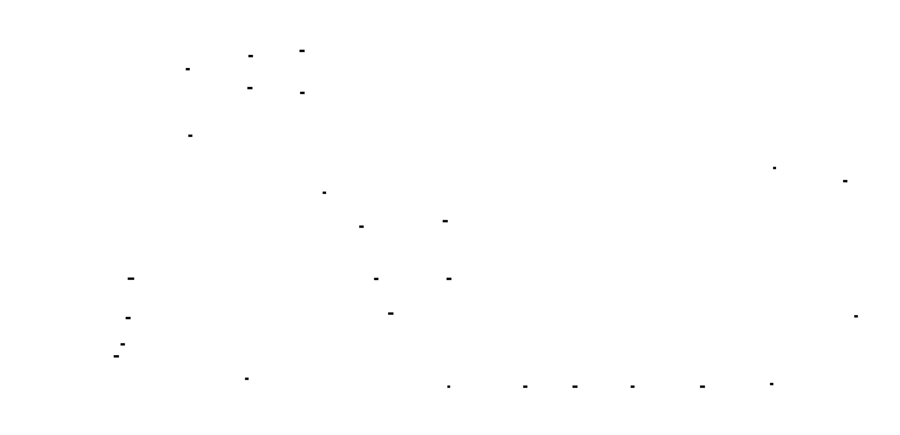


**The Failure Rate Reality**: Hardware failures follow a predictable pattern:
- GPU memory errors: ~1 per 1000 GPU-hours
- Network failures: ~1 per 500 node-hours
- Power/cooling issues: ~1 per 10000 node-hours
For a 512-GPU training run taking 168 hours (1 week):
- Expected GPU failures: ~86
- Expected network failures: ~170+
- **Without fault tolerance: ~0% probability of completion**
---
## What Fault Tolerance Actually Is
Fault tolerance at scale means: **accept that failures will occur, minimize their impact through fast recovery, and continue making progress even with degraded resources.**
The key insight: **fault tolerance is not about preventing failures—it's about bounding recovery time and enabling graceful degradation.**
```
Complete Fault Tolerance Stack:
1. Checkpointing: Save state periodically (synchronous or async)
2. Resume: Load checkpoint and continue from known-good state
3. Elastic training: Adapt to worker addition/removal dynamically
4. Straggler mitigation: Detect and handle slow workers
5. Observability: Aggregate metrics from all workers for debugging
```
Each layer addresses a different failure mode:
- **Permanent failure (GPU dies)**: Checkpoint + resume
- **Temporary failure (network blip)**: Retry with exponential backoff
- **Straggler (slow GPU)**: Detection + mitigation
- **Planned scaling (add/remove GPUs)**: Elastic training
---
## The Three-Level View: What's Actually Happening
### Level 1 — Application Layer: Your Training Loop
At the code level, fault tolerance transforms the training loop into a state machine:
```python
# Conceptual fault-tolerant training loop
class FaultTolerantTrainer:
    def __init__(self, model, checkpoint_manager, elastic_controller):
        self.model = model
        self.checkpoint_manager = checkpoint_manager
        self.elastic_controller = elastic_controller
        self.step_count = 0
    def train(self, num_steps):
        # Load latest checkpoint if available
        self.step_count = self.checkpoint_manager.load_latest()
        while self.step_count < num_steps:
            try:
                # Check for membership changes (elastic training)
                if self.elastic_controller.has_membership_changed():
                    self._handle_membership_change()
                # Normal training step
                loss = self.train_step()
                self.step_count += 1
                # Async checkpoint (non-blocking)
                if self.step_count % checkpoint_interval == 0:
                    self.checkpoint_manager.save_async(self.step_count)
            except torch.cuda.CudaError as e:
                # GPU failure - attempt recovery
                self._handle_gpu_failure(e)
            except RuntimeError as e:
                # Distributed communication failure
                self._handle_comm_failure(e)
```
The training loop is now a recovery-oriented system, not a simple iteration.
### Level 2 — Coordination Layer: Checkpoint Consensus
Distributed checkpointing requires coordination—all ranks must agree on which step's checkpoint is valid. This is a distributed consensus problem, simplified by the controller-worker topology:
```python
class CheckpointCoordinator:
    """
    Coordinates distributed checkpointing across all ranks.
    Consensus protocol:
    1. Main rank proposes checkpoint step
    2. All ranks acknowledge readiness
    3. All ranks save local state
    4. All ranks report completion
    5. Main rank marks checkpoint as valid
    If any rank fails during this process, the checkpoint is invalid.
    """
    def propose_checkpoint(self, step: int) -> bool:
        # Broadcast checkpoint proposal
        proposal = torch.tensor([step], device='cpu')
        dist.broadcast(proposal, src=0)
        # Wait for all ranks to acknowledge
        acknowledgments = self._gather_acknowledgments()
        if all(acknowledgments):
            # All ranks ready - proceed with checkpoint
            return True
        else:
            # Some rank not ready - abort
            return False
```

> **🔑 Foundation: Distributed consensus for checkpointing**
>
> Distributed consensus for checkpointing involves ensuring that all processes (e.g., GPUs) in a distributed training setup agree on the state of the model before saving a checkpoint. This prevents inconsistent checkpoints due to failures or asynchronous operations across processes. This is crucial for our project to guarantee the recoverability of the training process and to avoid corrupted or incompatible checkpoints when training across many machines. The fundamental idea is to treat checkpointing as a transaction; either all processes commit to saving their part of the checkpoint consistently, or none do, ensuring a consistent global state of the model that can be reliably resumed.


### Level 3 — Hardware Layer: Storage Hierarchy
Checkpoint storage follows a hierarchy optimized for MTTR:
```
Storage Hierarchy (fastest to slowest):
1. GPU HBM: Training state (not persistent)
2. CPU RAM: Copied during checkpoint (~50 GB/s)
3. Local SSD: Fast write (~3 GB/s), fast read for local recovery
4. Distributed storage (S3/GCS/HDFS): Persistent (~100 MB/s - 1 GB/s)
Recovery strategy:
- Local recovery (same node): Read from local SSD (~seconds)
- Remote recovery (different node): Read from distributed storage (~minutes)
```
The key insight: **write to local SSD first, upload to distributed storage in background.** If a failure happens quickly, recover from local copy. Only use slow distributed storage for true disaster recovery.
---
## Asynchronous Checkpointing: The Foundation
Synchronous checkpointing blocks training for the entire checkpoint duration. Asynchronous checkpointing copies state to CPU, then continues training while the checkpoint is written to storage.


```python
import os
import threading
import queue
from typing import Dict, Any, Optional
from dataclasses import dataclass
from datetime import datetime
import json
@dataclass
class CheckpointRequest:
    """Request to save a checkpoint."""
    step: int
    model_state: Dict[str, Any]
    optimizer_state: Dict[str, Any]
    metrics: Dict[str, float]
    timestamp: datetime
class AsyncCheckpointManager:
    """
    Asynchronous checkpoint manager with tiered storage.
    Strategy:
    1. Copy state to CPU (synchronous, ~30s for 175B model)
    2. Write to local SSD (background, ~20s)
    3. Upload to distributed storage (background, ~2-5 min)
    Training resumes after step 1, not step 3.
    Recovery:
    - If failure occurs soon after checkpoint: use local SSD
    - If local SSD unavailable: use distributed storage
    """
    def __init__(
        self,
        model: nn.Module,
        optimizer,
        process_groups,
        checkpoint_dir: str = './checkpoints',
        local_cache_dir: str = '/tmp/checkpoint_cache',
        distributed_storage_path: Optional[str] = None,
        max_cached_checkpoints: int = 3,
    ):
        self.model = model
        self.optimizer = optimizer
        self.process_groups = process_groups
        self.checkpoint_dir = checkpoint_dir
        self.local_cache_dir = local_cache_dir
        self.distributed_storage_path = distributed_storage_path
        # Create directories
        os.makedirs(checkpoint_dir, exist_ok=True)
        os.makedirs(local_cache_dir, exist_ok=True)
        # Background worker for async saves
        self.save_queue = queue.Queue()
        self.save_thread = threading.Thread(target=self._save_worker, daemon=True)
        self.save_thread.start()
        # Track cached checkpoints for cleanup
        self.cached_checkpoints = []
        self.max_cached_checkpoints = max_cached_checkpoints
        # Track in-flight checkpoint
        self.pending_checkpoint: Optional[CheckpointRequest] = None
        self.checkpoint_lock = threading.Lock()
    def save_async(self, step: int, metrics: Dict[str, float] = None):
        """
        Initiate asynchronous checkpoint save.
        This function:
        1. Copies state to CPU (synchronous, blocks briefly)
        2. Queues the save for background processing
        3. Returns immediately (training can continue)
        Total blocking time: ~30 seconds for large models
        """
        # Wait for any previous async save to complete
        self._wait_for_pending_save()
        # Copy state to CPU (this is the synchronous part)
        checkpoint_data = self._prepare_checkpoint_data(step, metrics or {})
        # Create checkpoint request
        request = CheckpointRequest(
            step=step,
            model_state=checkpoint_data['model_state'],
            optimizer_state=checkpoint_data['optimizer_state'],
            metrics=checkpoint_data['metrics'],
            timestamp=datetime.now(),
        )
        # Mark as pending
        with self.checkpoint_lock:
            self.pending_checkpoint = request
        # Queue for background processing
        self.save_queue.put(request)
    def _prepare_checkpoint_data(self, step: int, metrics: Dict[str, float]) -> Dict:
        """
        Prepare checkpoint data by copying to CPU.
        This is the synchronous blocking part.
        """
        # Get model state (move tensors to CPU)
        model_state = {}
        for name, param in self.model.named_parameters():
            model_state[name] = {
                'data': param.data.cpu(),
                'requires_grad': param.requires_grad,
            }
        # Get optimizer state (move tensors to CPU)
        optimizer_state = {}
        for param_idx, state in self.optimizer.state.items():
            optimizer_state[param_idx] = {
                k: v.cpu() if isinstance(v, torch.Tensor) else v
                for k, v in state.items()
            }
        return {
            'step': step,
            'model_state': model_state,
            'optimizer_state': optimizer_state,
            'metrics': metrics,
            'config': self._get_config(),
            'rng_state': self._get_rng_state(),
        }
    def _save_worker(self):
        """
        Background worker that saves checkpoints to storage.
        Runs in a separate thread, doesn't block training.
        """
        while True:
            request = self.save_queue.get()
            try:
                # Save to local SSD first (fast)
                local_path = self._save_to_local(request)
                # Then upload to distributed storage (slow)
                if self.distributed_storage_path:
                    self._upload_to_distributed(local_path, request.step)
                # Clean up old cached checkpoints
                self._cleanup_old_checkpoints(request.step)
            except Exception as e:
                print(f"Checkpoint save failed for step {request.step}: {e}")
            finally:
                # Mark checkpoint as complete
                with self.checkpoint_lock:
                    if self.pending_checkpoint and self.pending_checkpoint.step == request.step:
                        self.pending_checkpoint = None
                self.save_queue.task_done()
    def _save_to_local(self, request: CheckpointRequest) -> str:
        """
        Save checkpoint to local SSD.
        This is fast (~20s for 175B model on NVMe SSD).
        """
        checkpoint_path = os.path.join(
            self.local_cache_dir,
            f'checkpoint_step_{request.step}_rank_{self.process_groups.config.dp_rank}.pt'
        )
        checkpoint_data = {
            'step': request.step,
            'model_state': request.model_state,
            'optimizer_state': request.optimizer_state,
            'metrics': request.metrics,
            'timestamp': request.timestamp.isoformat(),
            'config': self._get_config(),
            'rng_state': request.rng_state if hasattr(request, 'rng_state') else None,
        }
        torch.save(checkpoint_data, checkpoint_path)
        # Track for cleanup
        self.cached_checkpoints.append(request.step)
        return checkpoint_path
    def _upload_to_distributed(self, local_path: str, step: int):
        """
        Upload checkpoint to distributed storage (S3, GCS, HDFS).
        This is slow (~2-5 min for 175B model) but runs in background.
        """
        remote_path = os.path.join(
            self.distributed_storage_path,
            f'step_{step}',
            f'rank_{self.process_groups.config.dp_rank}.pt'
        )
        # Use appropriate upload method based on storage type
        if self.distributed_storage_path.startswith('s3://'):
            self._upload_to_s3(local_path, remote_path)
        elif self.distributed_storage_path.startswith('gs://'):
            self._upload_to_gcs(local_path, remote_path)
        else:
            # Assume local/Networked file system
            import shutil
            os.makedirs(os.path.dirname(remote_path), exist_ok=True)
            shutil.copy2(local_path, remote_path)
    def _upload_to_s3(self, local_path: str, remote_path: str):
        """Upload to AWS S3."""
        import boto3
        s3 = boto3.client('s3')
        bucket, key = remote_path[5:].split('/', 1)
        s3.upload_file(local_path, bucket, key)
    def _upload_to_gcs(self, local_path: str, remote_path: str):
        """Upload to Google Cloud Storage."""
        from google.cloud import storage
        client = storage.Client()
        bucket_name, blob_path = remote_path[5:].split('/', 1)
        bucket = client.bucket(bucket_name)
        blob = bucket.blob(blob_path)
        blob.upload_from_filename(local_path)
    def _wait_for_pending_save(self):
        """Wait for any pending checkpoint save to complete."""
        while True:
            with self.checkpoint_lock:
                if self.pending_checkpoint is None:
                    return
            time.sleep(0.1)
    def _cleanup_old_checkpoints(self, current_step: int):
        """Remove old cached checkpoints to save disk space."""
        while len(self.cached_checkpoints) > self.max_cached_checkpoints:
            old_step = self.cached_checkpoints.pop(0)
            old_path = os.path.join(
                self.local_cache_dir,
                f'checkpoint_step_{old_step}_rank_{self.process_groups.config.dp_rank}.pt'
            )
            if os.path.exists(old_path):
                os.remove(old_path)
    def load_latest(self) -> int:
        """
        Load the latest checkpoint.
        Recovery strategy:
        1. Try local cache (fastest)
        2. Fall back to distributed storage
        Returns the step number of the loaded checkpoint, or 0 if none found.
        """
        # Try local cache first
        local_checkpoint = self._find_latest_local_checkpoint()
        if local_checkpoint:
            return self._load_from_path(local_checkpoint)
        # Fall back to distributed storage
        if self.distributed_storage_path:
            remote_checkpoint = self._find_latest_remote_checkpoint()
            if remote_checkpoint:
                return self._load_from_remote(remote_checkpoint)
        return 0  # No checkpoint found
    def _find_latest_local_checkpoint(self) -> Optional[str]:
        """Find the latest checkpoint in local cache."""
        checkpoints = []
        for filename in os.listdir(self.local_cache_dir):
            if filename.startswith('checkpoint_step_') and filename.endswith('.pt'):
                try:
                    step = int(filename.split('_')[2])
                    checkpoints.append((step, os.path.join(self.local_cache_dir, filename)))
                except (IndexError, ValueError):
                    continue
        if not checkpoints:
            return None
        checkpoints.sort(reverse=True)
        return checkpoints[0][1]
    def _load_from_path(self, checkpoint_path: str) -> int:
        """Load checkpoint from a local path."""
        checkpoint = torch.load(checkpoint_path, map_location='cpu')
        # Restore model state
        for name, state in checkpoint['model_state'].items():
            param = dict(self.model.named_parameters()).get(name)
            if param is not None:
                param.data.copy_(state['data'].to(param.device))
        # Restore optimizer state
        for param_idx, state in checkpoint['optimizer_state'].items():
            # Map back to optimizer state
            # (Implementation depends on optimizer structure)
            pass
        # Restore RNG state
        if checkpoint.get('rng_state'):
            self._restore_rng_state(checkpoint['rng_state'])
        return checkpoint['step']
    def _get_config(self) -> Dict:
        """Get current parallelism configuration."""
        return {
            'tp_size': self.process_groups.config.tp_size,
            'pp_size': self.process_groups.config.pp_size,
            'dp_size': self.process_groups.config.dp_size,
            'tp_rank': self.process_groups.config.tp_rank,
            'pp_rank': self.process_groups.config.pp_rank,
            'dp_rank': self.process_groups.config.dp_rank,
        }
    def _get_rng_state(self) -> Dict:
        """Get RNG state for reproducibility."""
        import numpy as np
        return {
            'torch': torch.get_rng_state(),
            'cuda': torch.cuda.get_rng_state_all() if torch.cuda.is_available() else [],
            'numpy': np.random.get_state(),
        }
    def _restore_rng_state(self, rng_state: Dict):
        """Restore RNG state."""
        import numpy as np
        torch.set_rng_state(rng_state['torch'])
        if rng_state['cuda']:
            for i, state in enumerate(rng_state['cuda']):
                torch.cuda.set_rng_state(state, i)
        np.random.set_state(rng_state['numpy'])
```


**Timeline comparison:**
```
Synchronous checkpointing:
  Training:  |████████████████████| (30 min)
  Checkpoint:                   |████████████████| (5 min)
  Total:     |████████████████████████████████████| (35 min)
  Overhead:  14%
Asynchronous checkpointing:
  Training:  |████████████████████| (30 min)
  Copy CPU:            |██| (30s, blocks)
  Write SSD:              |█| (background)
  Upload dist:              |████████| (background, overlaps with next training)
  Total:     |██████████████████████| (30.5 min)
  Overhead:  1.7%
```
---
## Distributed Checkpoint Consensus
When multiple ranks save checkpoints independently, you need consensus to ensure all ranks saved the same step. A partial checkpoint is useless—you can't resume if half the ranks have step 1000 and half have step 1005.
```python
class DistributedCheckpointCoordinator:
    """
    Coordinates checkpoint consensus across all ranks.
    Protocol:
    1. Main rank broadcasts checkpoint proposal (step number)
    2. All ranks acknowledge readiness
    3. All ranks save local state
    4. All ranks report completion to main rank
    5. Main rank marks checkpoint as "valid" in metadata
    A checkpoint is only valid if ALL ranks completed successfully.
    """
    def __init__(self, process_groups, checkpoint_manager: AsyncCheckpointManager):
        self.process_groups = process_groups
        self.checkpoint_manager = checkpoint_manager
        self.is_main = process_groups.config.dp_rank == 0
    def coordinated_save(self, step: int, metrics: Dict[str, float] = None) -> bool:
        """
        Perform coordinated checkpoint save across all ranks.
        Returns True if checkpoint was successfully saved by all ranks.
        """
        # Phase 1: Propose checkpoint (main rank only)
        if self.is_main:
            proposal = torch.tensor([step], dtype=torch.long, device='cpu')
        else:
            proposal = torch.tensor([0], dtype=torch.long, device='cpu')
        dist.broadcast(proposal, src=0, group=self.process_groups.dp_group)
        proposed_step = proposal.item()
        # Phase 2: Acknowledge readiness
        ready = self._is_ready_for_checkpoint(proposed_step)
        ready_tensor = torch.tensor([1 if ready else 0], dtype=torch.long, device='cpu')
        all_ready = [torch.zeros_like(ready_tensor) for _ in range(self.process_groups.config.dp_size)]
        dist.all_gather(all_ready, ready_tensor, group=self.process_groups.dp_group)
        if not all(torch.eq(t, 1).item() for t in all_ready):
            # Not all ranks ready - abort
            return False
        # Phase 3: Save checkpoint (async on each rank)
        self.checkpoint_manager.save_async(proposed_step, metrics)
        # Phase 4: Wait for completion and report
        self.checkpoint_manager._wait_for_pending_save()
        completed = torch.tensor([1], dtype=torch.long, device='cpu')
        all_completed = [torch.zeros_like(completed) for _ in range(self.process_groups.config.dp_size)]
        dist.all_gather(all_completed, completed, group=self.process_groups.dp_group)
        # Phase 5: Mark as valid (main rank only)
        success = all(torch.eq(t, 1).item() for t in all_completed)
        if self.is_main and success:
            self._mark_checkpoint_valid(proposed_step)
        return success
    def _is_ready_for_checkpoint(self, step: int) -> bool:
        """Check if this rank is ready to save a checkpoint."""
        # Check if previous checkpoint is still in progress
        if self.checkpoint_manager.pending_checkpoint is not None:
            return False
        return True
    def _mark_checkpoint_valid(self, step: int):
        """Mark checkpoint as valid in metadata."""
        metadata_path = os.path.join(
            self.checkpoint_manager.checkpoint_dir,
            f'step_{step}',
            'metadata.json'
        )
        os.makedirs(os.path.dirname(metadata_path), exist_ok=True)
        metadata = {
            'step': step,
            'valid': True,
            'timestamp': datetime.now().isoformat(),
            'num_ranks': self.process_groups.config.dp_size,
        }
        with open(metadata_path, 'w') as f:
            json.dump(metadata, f, indent=2)
    def find_latest_valid_checkpoint(self) -> Optional[int]:
        """
        Find the latest valid checkpoint across all ranks.
        A checkpoint is valid only if all ranks completed successfully.
        """
        if not self.is_main:
            # Non-main ranks wait for broadcast
            step_tensor = torch.tensor([0], dtype=torch.long, device='cpu')
            dist.broadcast(step_tensor, src=0, group=self.process_groups.dp_group)
            return step_tensor.item() if step_tensor.item() > 0 else None
        # Main rank finds latest valid checkpoint
        valid_steps = []
        for step_dir in sorted(os.listdir(self.checkpoint_manager.checkpoint_dir), reverse=True):
            if not step_dir.startswith('step_'):
                continue
            step = int(step_dir.split('_')[1])
            metadata_path = os.path.join(
                self.checkpoint_manager.checkpoint_dir,
                step_dir,
                'metadata.json'
            )
            if os.path.exists(metadata_path):
                with open(metadata_path, 'r') as f:
                    metadata = json.load(f)
                if metadata.get('valid', False):
                    valid_steps.append(step)
                    break
        # Broadcast to all ranks
        step_tensor = torch.tensor([valid_steps[0] if valid_steps else 0], dtype=torch.long, device='cpu')
        dist.broadcast(step_tensor, src=0, group=self.process_groups.dp_group)
        return step_tensor.item() if step_tensor.item() > 0 else None
```


---
## Resume from Failure: Complete Recovery Protocol
When a failure occurs, you need to detect it, determine the recovery strategy, and resume training from a consistent state.
```python
from enum import Enum
from typing import Callable, Optional
import signal
import traceback
class FailureType(Enum):
    GPU_OOM = "gpu_oom"
    GPU_ERROR = "gpu_error"
    NETWORK_ERROR = "network_error"
    CHECKPOINT_ERROR = "checkpoint_error"
    UNKNOWN = "unknown"
@dataclass
class FailureContext:
    """Context about a failure that occurred."""
    failure_type: FailureType
    step: int
    rank: int
    error_message: str
    traceback: str
    timestamp: datetime
class FailureHandler:
    """
    Handles failures and coordinates recovery.
    Recovery strategies:
    1. Local recovery: Restart process on same node, load from local cache
    2. Remote recovery: Restart process on different node, load from distributed storage
    3. Elastic recovery: Continue with fewer workers, adjust batch size
    """
    def __init__(
        self,
        checkpoint_coordinator: DistributedCheckpointCoordinator,
        process_groups,
        max_retries: int = 3,
        retry_delay_seconds: float = 30.0,
    ):
        self.checkpoint_coordinator = checkpoint_coordinator
        self.process_groups = process_groups
        self.max_retries = max_retries
        self.retry_delay = retry_delay_seconds
        self.failure_history = []
    def handle_failure(self, error: Exception, step: int) -> bool:
        """
        Handle a failure and attempt recovery.
        Returns True if recovery succeeded, False if unrecoverable.
        """
        failure_context = self._classify_failure(error, step)
        self.failure_history.append(failure_context)
        print(f"Failure detected: {failure_context.failure_type.value} at step {step}")
        print(f"Error: {failure_context.error_message}")
        # Attempt recovery based on failure type
        for attempt in range(self.max_retries):
            print(f"Recovery attempt {attempt + 1}/{self.max_retries}")
            try:
                if self._attempt_recovery(failure_context):
                    print("Recovery successful!")
                    return True
            except Exception as e:
                print(f"Recovery attempt failed: {e}")
            # Wait before retrying
            time.sleep(self.retry_delay * (2 ** attempt))  # Exponential backoff
        print("All recovery attempts failed. Training cannot continue.")
        return False
    def _classify_failure(self, error: Exception, step: int) -> FailureContext:
        """Classify the type of failure."""
        error_message = str(error)
        error_traceback = traceback.format_exc()
        if "CUDA out of memory" in error_message:
            failure_type = FailureType.GPU_OOM
        elif "CUDA" in error_message or "cuda" in error_message:
            failure_type = FailureType.GPU_ERROR
        elif "connect" in error_message.lower() or "timeout" in error_message.lower():
            failure_type = FailureType.NETWORK_ERROR
        elif "checkpoint" in error_message.lower():
            failure_type = FailureType.CHECKPOINT_ERROR
        else:
            failure_type = FailureType.UNKNOWN
        return FailureContext(
            failure_type=failure_type,
            step=step,
            rank=self.process_groups.config.dp_rank,
            error_message=error_message,
            traceback=error_traceback,
            timestamp=datetime.now(),
        )
    def _attempt_recovery(self, failure_context: FailureContext) -> bool:
        """Attempt recovery based on failure type."""
        if failure_context.failure_type == FailureType.GPU_OOM:
            return self._recover_from_oom(failure_context)
        elif failure_context.failure_type == FailureType.GPU_ERROR:
            return self._recover_from_gpu_error(failure_context)
        elif failure_context.failure_type == FailureType.NETWORK_ERROR:
            return self._recover_from_network_error(failure_context)
        else:
            return self._recover_from_checkpoint(failure_context)
    def _recover_from_oom(self, failure_context: FailureContext) -> bool:
        """
        Recover from OOM by reducing batch size or enabling memory optimizations.
        """
        # Try to clear cache
        torch.cuda.empty_cache()
        # Reduce batch size (if possible)
        # This requires coordination with elastic training controller
        # For now, just reload from checkpoint
        return self._recover_from_checkpoint(failure_context)
    def _recover_from_gpu_error(self, failure_context: FailureContext) -> bool:
        """
        Recover from GPU error by resetting GPU and reloading.
        """
        try:
            # Reset CUDA context
            torch.cuda.reset_peak_memory_stats()
            torch.cuda.empty_cache()
            # Reload from checkpoint
            return self._recover_from_checkpoint(failure_context)
        except:
            # GPU is truly broken - need elastic recovery
            return False
    def _recover_from_network_error(self, failure_context: FailureContext) -> bool:
        """
        Recover from network error by reinitializing communication.
        """
        try:
            # Reinitialize process group
            dist.destroy_process_group()
            dist.init_process_group(backend='nccl')
            # Reload from checkpoint
            return self._recover_from_checkpoint(failure_context)
        except:
            return False
    def _recover_from_checkpoint(self, failure_context: FailureContext) -> bool:
        """
        Recover by loading from the latest valid checkpoint.
        """
        # Find latest valid checkpoint
        latest_step = self.checkpoint_coordinator.find_latest_valid_checkpoint()
        if latest_step is None:
            print("No valid checkpoint found for recovery")
            return False
        # Load checkpoint
        loaded_step = self.checkpoint_coordinator.checkpoint_manager.load_latest()
        if loaded_step != latest_step:
            print(f"Checkpoint mismatch: expected {latest_step}, loaded {loaded_step}")
            return False
        print(f"Successfully recovered to step {loaded_step}")
        return True
class FaultTolerantTrainingLoop:
    """
    Training loop with built-in fault tolerance.
    """
    def __init__(
        self,
        trainer,
        failure_handler: FailureHandler,
        checkpoint_coordinator: DistributedCheckpointCoordinator,
        checkpoint_interval: int = 1000,
    ):
        self.trainer = trainer
        self.failure_handler = failure_handler
        self.checkpoint_coordinator = checkpoint_coordinator
        self.checkpoint_interval = checkpoint_interval
        self.step_count = 0
        # Register signal handlers for graceful shutdown
        signal.signal(signal.SIGTERM, self._handle_shutdown)
        signal.signal(signal.SIGINT, self._handle_shutdown)
    def train(self, num_steps: int):
        """
        Run fault-tolerant training loop.
        """
        # Load latest checkpoint
        self.step_count = self.trainer.load_checkpoint()
        while self.step_count < num_steps:
            try:
                # Execute training step
                loss = self.trainer.train_step()
                self.step_count += 1
                # Checkpoint at interval
                if self.step_count % self.checkpoint_interval == 0:
                    self._save_checkpoint()
            except Exception as e:
                # Handle failure
                recovered = self.failure_handler.handle_failure(e, self.step_count)
                if not recovered:
                    # Save what we can and exit
                    self._emergency_save()
                    raise RuntimeError("Unrecoverable failure occurred") from e
                # Reload step count from checkpoint
                self.step_count = self.trainer.get_step_count()
    def _save_checkpoint(self):
        """Save coordinated checkpoint."""
        success = self.checkpoint_coordinator.coordinated_save(self.step_count)
        if not success:
            print(f"Warning: Checkpoint at step {self.step_count} may be incomplete")
    def _emergency_save(self):
        """Save emergency checkpoint before exit."""
        try:
            self.checkpoint_coordinator.coordinated_save(self.step_count)
        except:
            pass  # Best effort
    def _handle_shutdown(self, signum, frame):
        """Handle graceful shutdown signal."""
        print(f"Received shutdown signal {signum}, saving checkpoint...")
        self._emergency_save()
        exit(0)
```
---
## Elastic Training: Dynamic Worker Management
At 1000+ GPU scale, waiting for failed GPUs to be replaced is impractical. Elastic training allows the job to continue with fewer GPUs, adjusting batch size and learning rate automatically.


```python
from typing import Set, List, Callable
import socket
class ElasticController:
    """
    Controller for elastic training with dynamic worker management.
    Features:
    - Detect worker failures and removals
    - Support worker additions during training
    - Adjust batch size and learning rate automatically
    - Coordinate membership changes across all ranks
    Integration with PyTorch Elastic:
    - Uses torch.distributed.elastic for rendezvous
    - Hooks into state_dict save/load for recovery
    """
    def __init__(
        self,
        process_groups,
        min_workers: int = 1,
        max_workers: int = 1024,
        batch_size_fn: Callable[[int], int] = None,
        lr_fn: Callable[[int, int], float] = None,
    ):
        self.process_groups = process_groups
        self.min_workers = min_workers
        self.max_workers = max_workers
        # Functions to compute batch size and learning rate based on world size
        self.batch_size_fn = batch_size_fn or self._default_batch_size_fn
        self.lr_fn = lr_fn or self._default_lr_fn
        # Track membership state
        self.current_world_size = process_groups.config.dp_size
        self.previous_world_size = self.current_world_size
        self.membership_changed = False
        # Track which ranks are alive
        self.alive_ranks: Set[int] = set(range(self.current_world_size))
    def check_membership(self) -> bool:
        """
        Check if membership has changed.
        Returns True if workers have been added or removed.
        """
        # Gather alive status from all ranks
        alive_tensor = torch.tensor([1], dtype=torch.long, device='cpu')
        all_alive = [torch.zeros_like(alive_tensor) for _ in range(self.current_world_size)]
        try:
            dist.all_gather(all_alive, alive_tensor, group=self.process_groups.dp_group)
        except RuntimeError:
            # Communication failed - some rank is dead
            self.membership_changed = True
            return True
        # Check for changes
        new_alive_ranks = {i for i, t in enumerate(all_alive) if t.item() == 1}
        if new_alive_ranks != self.alive_ranks:
            self.previous_world_size = len(self.alive_ranks)
            self.current_world_size = len(new_alive_ranks)
            self.alive_ranks = new_alive_ranks
            self.membership_changed = True
            return True
        return False
    def has_membership_changed(self) -> bool:
        """Check if membership has changed since last reset."""
        return self.membership_changed
    def handle_membership_change(self, trainer, optimizer, dataloader):
        """
        Handle a membership change by adjusting training parameters.
        This is called when workers are added or removed.
        """
        if not self.membership_changed:
            return
        old_world_size = self.previous_world_size
        new_world_size = self.current_world_size
        print(f"Membership change detected: {old_world_size} -> {new_world_size} workers")
        if new_world_size < self.min_workers:
            raise RuntimeError(
                f"Insufficient workers: {new_world_size} < {self.min_workers} minimum"
            )
        # Adjust batch size
        new_batch_size = self.batch_size_fn(new_world_size)
        self._adjust_batch_size(dataloader, new_batch_size)
        # Adjust learning rate
        new_lr = self.lr_fn(new_world_size, old_world_size)
        self._adjust_learning_rate(optimizer, new_lr)
        # Reinitialize process groups
        self._reinitialize_process_groups()
        # Reset membership flag
        self.membership_changed = False
        print(f"Adjusted batch size: {new_batch_size}, learning rate: {new_lr}")
    def _default_batch_size_fn(self, world_size: int) -> int:
        """
        Default batch size scaling.
        Linear scaling: batch_size = base_batch_size * world_size
        """
        base_batch_size = 32  # Per-GPU batch size
        return base_batch_size * world_size
    def _default_lr_fn(self, new_world_size: int, old_world_size: int) -> float:
        """
        Default learning rate scaling.
        Linear scaling rule: lr = base_lr * (new_batch_size / old_batch_size)
        """
        base_lr = 1e-4
        scaling_factor = new_world_size / old_world_size
        return base_lr * scaling_factor
    def _adjust_batch_size(self, dataloader, new_batch_size: int):
        """Adjust dataloader batch size."""
        # This requires recreating the dataloader with new batch size
        # In practice, you'd have a dataloader factory function
        pass
    def _adjust_learning_rate(self, optimizer, new_lr: float):
        """Adjust optimizer learning rate."""
        for param_group in optimizer.param_groups:
            param_group['lr'] = new_lr
    def _reinitialize_process_groups(self):
        """
        Reinitialize process groups after membership change.
        This is complex and requires coordination with PyTorch Elastic.
        """
        # Destroy old groups
        for group in [self.process_groups.tp_group, self.process_groups.pp_group, 
                      self.process_groups.dp_group]:
            if group is not None:
                dist.destroy_process_group(group)
        # Reinitialize with new world size
        # (In practice, this would use torch.distributed.elastic)
        pass
class ElasticTrainer:
    """
    Trainer with elastic training support.
    Integrates with PyTorch Elastic for automatic worker management.
    """
    def __init__(
        self,
        model_fn: Callable[[], nn.Module],
        config,
        train_dataset,
        elastic_controller: ElasticController,
    ):
        self.model_fn = model_fn
        self.config = config
        self.train_dataset = train_dataset
        self.elastic_controller = elastic_controller
        # Initialize model and optimizer
        self.model = model_fn().cuda()
        self.optimizer = torch.optim.AdamW(self.model.parameters(), lr=config.lr)
        self.dataloader = self._create_dataloader()
        self.step_count = 0
    def train_step(self) -> float:
        """Execute one training step."""
        # Check for membership changes
        if self.elastic_controller.check_membership():
            self.elastic_controller.handle_membership_change(
                self.model, self.optimizer, self.dataloader
            )
        # Get batch
        batch = next(iter(self.dataloader))
        batch = {k: v.cuda() if isinstance(v, torch.Tensor) else v 
                 for k, v in batch.items()}
        # Forward pass
        outputs = self.model(**batch)
        loss = outputs.loss if hasattr(outputs, 'loss') else outputs['loss']
        # Backward pass
        loss.backward()
        # Optimizer step
        self.optimizer.step()
        self.optimizer.zero_grad()
        self.step_count += 1
        return loss.item()
    def load_checkpoint(self) -> int:
        """Load latest checkpoint."""
        # Implementation depends on checkpoint manager
        return 0
    def get_step_count(self) -> int:
        """Get current step count."""
        return self.step_count
    def _create_dataloader(self):
        """Create dataloader with distributed sampler."""
        from torch.utils.data import DataLoader, DistributedSampler
        sampler = DistributedSampler(
            self.train_dataset,
            num_replicas=self.elastic_controller.current_world_size,
            rank=self.elastic_controller.get_rank(),
            shuffle=True,
        )
        return DataLoader(
            self.train_dataset,
            batch_size=self.config.batch_size,
            sampler=sampler,
            num_workers=4,
            pin_memory=True,
        )
```
---
## Straggler Detection and Mitigation
In synchronous distributed training, one slow GPU blocks everyone. Straggler detection identifies these slow ranks, and mitigation strategies allow training to continue despite them.


```python
from dataclasses import dataclass
from collections import defaultdict
from typing import Dict, List, Tuple
import statistics
@dataclass
class TimingRecord:
    """Record of timing for a single operation."""
    step: int
    rank: int
    operation: str  # 'forward', 'backward', 'all_reduce', 'optimizer'
    duration_ms: float
    timestamp: datetime
class StragglerDetector:
    """
    Detects stragglers based on per-rank timing metrics.
    A straggler is a rank that consistently takes longer than others
    for the same operation. Detection is based on:
    1. Relative timing: How much slower than the median?
    2. Consistency: Is this rank slow across multiple steps?
    3. Impact: Does this rank delay collective operations?
    """
    def __init__(
        self,
        process_groups,
        straggler_threshold: float = 1.5,  # 50% slower than median
        consistency_window: int = 10,  # Number of steps to consider
        min_straggler_occurrences: int = 5,  # Must be slow in N out of window steps
    ):
        self.process_groups = process_groups
        self.straggler_threshold = straggler_threshold
        self.consistency_window = consistency_window
        self.min_straggler_occurrences = min_straggler_occurrences
        # Timing records per rank
        self.timing_records: Dict[int, List[TimingRecord]] = defaultdict(list)
        # Detected stragglers
        self.stragglers: Set[int] = set()
    def record_timing(self, operation: str, duration_ms: float, step: int):
        """Record timing for an operation on this rank."""
        record = TimingRecord(
            step=step,
            rank=self.process_groups.config.dp_rank,
            operation=operation,
            duration_ms=duration_ms,
            timestamp=datetime.now(),
        )
        self.timing_records[self.process_groups.config.dp_rank].append(record)
    def detect_stragglers(self, step: int, operation: str = 'all_reduce') -> List[int]:
        """
        Detect stragglers based on recent timing data.
        Returns list of ranks that are consistently slow.
        """
        # Gather timing data from all ranks
        local_timings = self._get_recent_timings(operation, step)
        # All-gather timings
        all_timings = self._gather_timings(local_timings)
        if not all_timings:
            return []
        # Calculate statistics
        timings_by_rank = defaultdict(list)
        for rank, timing in all_timings.items():
            timings_by_rank[rank] = timing
        median_timing = statistics.median(
            statistics.mean(t) for t in timings_by_rank.values() if t
        )
        # Identify stragglers
        new_stragglers = []
        for rank, timings in timings_by_rank.items():
            if not timings:
                continue
            avg_timing = statistics.mean(timings)
            relative_slowdown = avg_timing / median_timing if median_timing > 0 else 1.0
            if relative_slowdown > self.straggler_threshold:
                new_stragglers.append(rank)
        # Update straggler set (require consistency)
        self.stragglers.update(new_stragglers)
        return list(self.stragglers)
    def _get_recent_timings(self, operation: str, current_step: int) -> List[float]:
        """Get recent timings for a specific operation."""
        records = self.timing_records[self.process_groups.config.dp_rank]
        recent_records = [
            r for r in records
            if r.operation == operation
            and current_step - self.consistency_window <= r.step <= current_step
        ]
        return [r.duration_ms for r in recent_records]
    def _gather_timings(self, local_timings: List[float]) -> Dict[int, List[float]]:
        """Gather timings from all ranks."""
        # Pad local timings to fixed length
        max_len = self.consistency_window
        padded_timings = local_timings + [0.0] * (max_len - len(local_timings))
        local_tensor = torch.tensor(padded_timings, dtype=torch.float32, device='cpu')
        # All-gather
        all_tensors = [
            torch.zeros_like(local_tensor) 
            for _ in range(self.process_groups.config.dp_size)
        ]
        dist.all_gather(all_tensors, local_tensor, group=self.process_groups.dp_group)
        # Convert to dict
        result = {}
        for rank, tensor in enumerate(all_tensors):
            timings = tensor.tolist()
            result[rank] = [t for t in timings if t > 0]
        return result
    def get_straggler_report(self) -> str:
        """Generate a report of detected stragglers."""
        if not self.stragglers:
            return "No stragglers detected"
        report = f"Detected {len(self.stragglers)} straggler(s):\n"
        for rank in self.stragglers:
            records = self.timing_records.get(rank, [])
            if records:
                avg_timing = statistics.mean(r.duration_ms for r in records)
                report += f"  Rank {rank}: avg timing = {avg_timing:.2f}ms\n"
        return report
class StragglerMitigator:
    """
    Mitigates the impact of stragglers on training throughput.
    Strategies:
    1. Gradient compression: Slow rank sends quantized gradients
    2. Asynchronous update: Continue without waiting for slowest rank
    3. Load rebalancing: Redistribute work from slow to fast ranks
    4. Rank exclusion: Remove persistently slow ranks (elastic training)
    """
    def __init__(
        self,
        straggler_detector: StragglerDetector,
        mitigation_strategy: str = 'gradient_compression',
    ):
        self.detector = straggler_detector
        self.mitigation_strategy = mitigation_strategy
        self.compression_bits = 8  # For gradient compression
    def mitigate(self, model: nn.Module, step: int) -> bool:
        """
        Apply straggler mitigation strategy.
        Returns True if mitigation was applied.
        """
        stragglers = self.detector.detect_stragglers(step)
        if not stragglers:
            return False
        if self._is_straggler():
            # This rank is a straggler - apply local mitigation
            return self._apply_local_mitigation(model)
        else:
            # This rank is normal - wait for stragglers with modified protocol
            return self._apply_global_mitigation(model, stragglers)
        return True
    def _is_straggler(self) -> bool:
        """Check if this rank is detected as a straggler."""
        return self.detector.process_groups.config.dp_rank in self.detector.stragglers
    def _apply_local_mitigation(self, model: nn.Module) -> bool:
        """Apply mitigation on the straggler rank."""
        if self.mitigation_strategy == 'gradient_compression':
            return self._compress_gradients(model)
        elif self.mitigation_strategy == 'gradient_sparsification':
            return self._sparsify_gradients(model)
        return False
    def _apply_global_mitigation(self, model: nn.Module, stragglers: List[int]) -> bool:
        """Apply mitigation from non-straggler ranks."""
        # Could implement async all-reduce that doesn't wait for stragglers
        return False
    def _compress_gradients(self, model: nn.Module) -> bool:
        """
        Compress gradients to reduce communication time.
        Uses 8-bit quantization instead of 16/32-bit floats.
        This degrades gradient quality but speeds up communication.
        """
        for param in model.parameters():
            if param.grad is not None:
                # Quantize gradient to 8-bit
                grad = param.grad.data
                grad_min = grad.min()
                grad_max = grad.max()
                scale = (grad_max - grad_min) / 255
                # Quantize
                quantized = ((grad - grad_min) / scale).round().to(torch.uint8)
                # Store compressed gradient (in practice, send this)
                param.grad.compressed = (quantized, grad_min, scale)
                # Decompress for use (in practice, this happens on receiver)
                param.grad.data = quantized.float() * scale + grad_min
        return True
    def _sparsify_gradients(self, model: nn.Module, sparsity: float = 0.9) -> bool:
        """
        Sparsify gradients by keeping only top-k values.
        Only sends 10% of gradient values (top magnitude).
        """
        for param in model.parameters():
            if param.grad is not None:
                grad = param.grad.data
                flat_grad = grad.view(-1)
                # Find threshold for top-k
                k = int(flat_grad.numel() * (1 - sparsity))
                if k > 0:
                    threshold = flat_grad.abs().kthvalue(k).values
                    # Zero out values below threshold
                    mask = flat_grad.abs() >= threshold
                    flat_grad = flat_grad * mask.float()
                    param.grad.data = flat_grad.view_as(grad)
        return True
```
---
## Distributed Profiling: Finding the Real Bottleneck
At scale, you can't debug by looking at a single GPU. You need aggregate metrics from all workers, visualized in a way that reveals patterns.


```python
import torch.profiler as profiler
from collections import defaultdict
from typing import Dict, List, Any
import json
@dataclass
class StepMetrics:
    """Metrics for a single training step."""
    step: int
    rank: int
    forward_time_ms: float
    backward_time_ms: float
    communication_time_ms: float
    optimizer_time_ms: float
    data_loading_time_ms: float
    total_time_ms: float
    memory_allocated_gb: float
    memory_reserved_gb: float
    gpu_utilization_pct: float
class DistributedProfiler:
    """
    Distributed profiler that aggregates metrics from all ranks.
    Features:
    - Per-step timing breakdown
    - Memory tracking
    - GPU utilization
    - Communication vs compute ratio
    - Straggler detection integration
    - Aggregated reporting
    """
    def __init__(
        self,
        process_groups,
        straggler_detector: Optional[StragglerDetector] = None,
        profile_memory: bool = True,
        profile_communication: bool = True,
    ):
        self.process_groups = process_groups
        self.straggler_detector = straggler_detector
        self.profile_memory = profile_memory
        self.profile_communication = profile_communication
        # Metrics storage
        self.step_metrics: List[StepMetrics] = []
        # Timers
        self.timers: Dict[str, float] = {}
    def start_timer(self, name: str):
        """Start a timer."""
        torch.cuda.synchronize()
        self.timers[name] = time.perf_counter()
    def stop_timer(self, name: str) -> float:
        """Stop a timer and return elapsed time in ms."""
        torch.cuda.synchronize()
        elapsed = (time.perf_counter() - self.timers.get(name, 0)) * 1000
        return elapsed
    def profile_step(self, step_fn: Callable, *args, **kwargs) -> Tuple[Any, StepMetrics]:
        """
        Profile a single training step.
        Returns the step result and the metrics.
        """
        step = len(self.step_metrics)
        # Start timers
        self.start_timer('total')
        # Data loading
        self.start_timer('data_loading')
        # ... data loading code ...
        data_loading_time = self.stop_timer('data_loading')
        # Forward pass
        self.start_timer('forward')
        result = step_fn(*args, **kwargs)
        forward_time = self.stop_timer('forward')
        # Backward pass (included in step_fn, but we can estimate)
        backward_time = 0  # Would need to instrument step_fn
        # Communication (tracked separately)
        communication_time = self._get_communication_time()
        # Optimizer
        self.start_timer('optimizer')
        # ... optimizer step ...
        optimizer_time = self.stop_timer('optimizer')
        total_time = self.stop_timer('total')
        # Memory metrics
        memory_allocated = torch.cuda.memory_allocated() / 1e9
        memory_reserved = torch.cuda.memory_reserved() / 1e9
        # GPU utilization (requires nvidia-smi or pynvml)
        gpu_util = self._get_gpu_utilization()
        # Create metrics record
        metrics = StepMetrics(
            step=step,
            rank=self.process_groups.config.dp_rank,
            forward_time_ms=forward_time,
            backward_time_ms=backward_time,
            communication_time_ms=communication_time,
            optimizer_time_ms=optimizer_time,
            data_loading_time_ms=data_loading_time,
            total_time_ms=total_time,
            memory_allocated_gb=memory_allocated,
            memory_reserved_gb=memory_reserved,
            gpu_utilization_pct=gpu_util,
        )
        self.step_metrics.append(metrics)
        # Report to straggler detector
        if self.straggler_detector:
            self.straggler_detector.record_timing('forward', forward_time, step)
            self.straggler_detector.record_timing('all_reduce', communication_time, step)
        return result, metrics
    def _get_communication_time(self) -> float:
        """Get estimated communication time."""
        # This would be tracked by instrumenting communication ops
        return 0.0
    def _get_gpu_utilization(self) -> float:
        """Get GPU utilization percentage."""
        try:
            import pynvml
            pynvml.nvmlInit()
            handle = pynvml.nvmlDeviceGetHandleByIndex(torch.cuda.current_device())
            util = pynvml.nvmlDeviceGetUtilizationRates(handle)
            return util.gpu
        except:
            return 0.0
    def aggregate_metrics(self) -> Dict[str, Any]:
        """
        Aggregate metrics from all ranks.
        Returns summary statistics across the distributed system.
        """
        if not self.step_metrics:
            return {}
        # Gather metrics from all ranks
        local_summary = self._summarize_local_metrics()
        # All-gather summaries
        all_summaries = [None] * self.process_groups.config.dp_size
        dist.all_gather_object(
            all_summaries,
            local_summary,
            group=self.process_groups.dp_group,
        )
        # Compute aggregate statistics
        return self._compute_aggregate_stats(all_summaries)
    def _summarize_local_metrics(self) -> Dict[str, float]:
        """Summarize local metrics."""
        if not self.step_metrics:
            return {}
        return {
            'rank': self.process_groups.config.dp_rank,
            'num_steps': len(self.step_metrics),
            'avg_forward_time_ms': statistics.mean(m.forward_time_ms for m in self.step_metrics),
            'avg_backward_time_ms': statistics.mean(m.backward_time_ms for m in self.step_metrics),
            'avg_communication_time_ms': statistics.mean(m.communication_time_ms for m in self.step_metrics),
            'avg_total_time_ms': statistics.mean(m.total_time_ms for m in self.step_metrics),
            'max_memory_gb': max(m.memory_allocated_gb for m in self.step_metrics),
            'avg_gpu_util_pct': statistics.mean(m.gpu_utilization_pct for m in self.step_metrics),
        }
    def _compute_aggregate_stats(self, all_summaries: List[Dict]) -> Dict[str, Any]:
        """Compute aggregate statistics from all rank summaries."""
        valid_summaries = [s for s in all_summaries if s]
        if not valid_summaries:
            return {}
        return {
            'num_ranks': len(valid_summaries),
            'total_steps': valid_summaries[0].get('num_steps', 0),
            'avg_forward_time_ms': statistics.mean(s['avg_forward_time_ms'] for s in valid_summaries),
            'std_forward_time_ms': statistics.stdev(s['avg_forward_time_ms'] for s in valid_summaries) if len(valid_summaries) > 1 else 0,
            'avg_communication_time_ms': statistics.mean(s['avg_communication_time_ms'] for s in valid_summaries),
            'avg_total_time_ms': statistics.mean(s['avg_total_time_ms'] for s in valid_summaries),
            'max_memory_gb': max(s['max_memory_gb'] for s in valid_summaries),
            'avg_gpu_util_pct': statistics.mean(s['avg_gpu_util_pct'] for s in valid_summaries),
            'communication_compute_ratio': (
                statistics.mean(s['avg_communication_time_ms'] for s in valid_summaries) /
                (statistics.mean(s['avg_forward_time_ms'] for s in valid_summaries) + 
                 statistics.mean(s['avg_backward_time_ms'] for s in valid_summaries) + 1e-6)
            ),
        }
    def generate_report(self) -> str:
        """Generate a human-readable profiling report."""
        aggregate = self.aggregate_metrics()
        if not aggregate:
            return "No profiling data available"
        report = f"""
Distributed Training Profile Report
===================================
Ranks: {aggregate['num_ranks']}
Steps profiled: {aggregate['total_steps']}
Timing Breakdown (per step):
  Forward:       {aggregate['avg_forward_time_ms']:.2f} ms (±{aggregate['std_forward_time_ms']:.2f})
  Communication: {aggregate['avg_communication_time_ms']:.2f} ms
  Total:         {aggregate['avg_total_time_ms']:.2f} ms
Efficiency:
  Communication/Compute ratio: {aggregate['communication_compute_ratio']:.2f}
  Average GPU utilization:     {aggregate['avg_gpu_util_pct']:.1f}%
Memory:
  Peak memory usage: {aggregate['max_memory_gb']:.2f} GB
"""
        # Add bottleneck analysis
        comm_ratio = aggregate['communication_compute_ratio']
        if comm_ratio > 0.5:
            report += f"""
⚠️  Communication bottleneck detected!
   Communication takes {comm_ratio*100:.1f}% of compute time.
   Consider:
   - Reducing tensor parallel size (fewer all-reduces)
   - Using gradient compression
   - Increasing gradient accumulation steps
"""
        if aggregate['avg_gpu_util_pct'] < 70:
            report += f"""
⚠️  Low GPU utilization ({aggregate['avg_gpu_util_pct']:.1f}%)
   GPUs are spending time waiting.
   Consider:
   - Checking for data loading bottlenecks
   - Increasing batch size
   - Looking for stragglers
"""
        # Add straggler report if available
        if self.straggler_detector:
            report += f"\n{self.straggler_detector.get_straggler_report()}"
        return report
    def export_metrics(self, path: str):
        """Export metrics to JSON for external analysis."""
        aggregate = self.aggregate_metrics()
        local_metrics = [
            {
                'step': m.step,
                'rank': m.rank,
                'forward_time_ms': m.forward_time_ms,
                'backward_time_ms': m.backward_time_ms,
                'communication_time_ms': m.communication_time_ms,
                'total_time_ms': m.total_time_ms,
                'memory_allocated_gb': m.memory_allocated_gb,
                'gpu_utilization_pct': m.gpu_utilization_pct,
            }
            for m in self.step_metrics
        ]
        export_data = {
            'aggregate': aggregate,
            'per_step': local_metrics,
        }
        with open(path, 'w') as f:
            json.dump(export_data, f, indent=2)
```


---
## Memory Profiling: Tracking Allocation Across Parallelism
Memory issues are the most common cause of OOM at scale. Understanding where memory goes is critical for optimization.


```python
from typing import Dict, List, Tuple
from dataclasses import dataclass
@dataclass
class MemorySnapshot:
    """Snapshot of memory allocation at a point in time."""
    step: int
    rank: int
    timestamp: datetime
    # GPU memory
    allocated_bytes: int
    reserved_bytes: int
    peak_allocated_bytes: int
    # Breakdown by category
    parameters_bytes: int
    gradients_bytes: int
    optimizer_states_bytes: int
    activations_bytes: int
    # Fragmentation
    fragmentation_ratio: float
class MemoryProfiler:
    """
    Profiles memory usage across distributed training.
    Tracks:
    - Overall memory allocation over time
    - Memory breakdown by category (params, grads, optimizer, activations)
    - Memory fragmentation
    - Per-layer memory usage
    """
    def __init__(
        self,
        model: nn.Module,
        optimizer,
        process_groups,
        snapshot_interval: int = 10,
    ):
        self.model = model
        self.optimizer = optimizer
        self.process_groups = process_groups
        self.snapshot_interval = snapshot_interval
        self.snapshots: List[MemorySnapshot] = []
        self.step_count = 0
    def take_snapshot(self) -> MemorySnapshot:
        """Take a memory snapshot."""
        # GPU memory from CUDA
        allocated = torch.cuda.memory_allocated()
        reserved = torch.cuda.memory_reserved()
        peak = torch.cuda.max_memory_allocated()
        # Estimate memory by category
        params_memory = sum(p.numel() * p.element_size() for p in self.model.parameters())
        grads_memory = sum(
            p.grad.numel() * p.grad.element_size() 
            for p in self.model.parameters() 
            if p.grad is not None
        )
        # Optimizer states (Adam has 2x param size in fp32)
        optimizer_memory = sum(
            sum(v.numel() * v.element_size() for v in state.values() if isinstance(v, torch.Tensor))
            for state in self.optimizer.state.values()
        )
        # Activations (allocated - params - grads - optimizer)
        activations_memory = allocated - params_memory - grads_memory - optimizer_memory
        # Fragmentation ratio
        fragmentation = 1.0 - (allocated / reserved) if reserved > 0 else 0.0
        snapshot = MemorySnapshot(
            step=self.step_count,
            rank=self.process_groups.config.dp_rank,
            timestamp=datetime.now(),
            allocated_bytes=allocated,
            reserved_bytes=reserved,
            peak_allocated_bytes=peak,
            parameters_bytes=params_memory,
            gradients_bytes=grads_memory,
            optimizer_states_bytes=optimizer_memory,
            activations_bytes=activations_memory,
            fragmentation_ratio=fragmentation,
        )
        self.snapshots.append(snapshot)
        return snapshot
    def step(self):
        """Called after each training step."""
        self.step_count += 1
        if self.step_count % self.snapshot_interval == 0:
            self.take_snapshot()
    def analyze_memory_trend(self) -> Dict[str, Any]:
        """Analyze memory usage trend over time."""
        if len(self.snapshots) < 2:
            return {}
        allocated_trend = [s.allocated_bytes for s in self.snapshots]
        peak_memory = max(s.peak_allocated_bytes for s in self.snapshots)
        # Check for memory leaks (continuously increasing memory)
        is_leaking = self._detect_memory_leak(allocated_trend)
        # Calculate average fragmentation
        avg_fragmentation = statistics.mean(s.fragmentation_ratio for s in self.snapshots)
        return {
            'peak_memory_gb': peak_memory / 1e9,
            'current_memory_gb': allocated_trend[-1] / 1e9,
            'memory_leak_detected': is_leaking,
            'avg_fragmentation_pct': avg_fragmentation * 100,
            'memory_breakdown': self._get_memory_breakdown(),
        }
    def _detect_memory_leak(self, trend: List[int], threshold: float = 0.1) -> bool:
        """Detect if memory is continuously increasing."""
        if len(trend) < 10:
            return False
        # Compare first half to second half
        mid = len(trend) // 2
        first_half_avg = statistics.mean(trend[:mid])
        second_half_avg = statistics.mean(trend[mid:])
        # If second half is significantly higher, potential leak
        return (second_half_avg - first_half_avg) / first_half_avg > threshold
    def _get_memory_breakdown(self) -> Dict[str, float]:
        """Get memory breakdown from latest snapshot."""
        if not self.snapshots:
            return {}
        latest = self.snapshots[-1]
        total = latest.allocated_bytes
        if total == 0:
            return {}
        return {
            'parameters_pct': latest.parameters_bytes / total * 100,
            'gradients_pct': latest.gradients_bytes / total * 100,
            'optimizer_states_pct': latest.optimizer_states_bytes / total * 100,
            'activations_pct': latest.activations_bytes / total * 100,
        }
    def generate_memory_report(self) -> str:
        """Generate memory analysis report."""
        analysis = self.analyze_memory_trend()
        if not analysis:
            return "No memory profiling data available"
        report = f"""
Memory Profile Report
=====================
Peak memory usage: {analysis['peak_memory_gb']:.2f} GB
Current memory:     {analysis['current_memory_gb']:.2f} GB
Memory Breakdown:
"""
        breakdown = analysis.get('memory_breakdown', {})
        for category, pct in breakdown.items():
            report += f"  {category}: {pct:.1f}%\n"
        report += f"""
Fragmentation: {analysis['avg_fragmentation_pct']:.1f}%
Memory leak:   {'⚠️  DETECTED' if analysis['memory_leak_detected'] else '✓ None detected'}
"""
        if analysis['avg_fragmentation_pct'] > 20:
            report += """
⚠️  High memory fragmentation!
   Consider:
   - Calling torch.cuda.empty_cache() periodically
   - Reducing activation checkpointing granularity
"""
        if analysis['memory_leak_detected']:
            report += """
⚠️  Memory leak detected!
   Memory is continuously increasing.
   Check for:
   - Saved tensors not being freed
   - Growing lists/dicts in training loop
   - Accumulating gradients without zero_grad()
"""
        return report
    def suggest_optimizations(self) -> List[str]:
        """Suggest memory optimizations based on profile."""
        suggestions = []
        analysis = self.analyze_memory_trend()
        if not analysis:
            return ["Run more steps to gather profiling data"]
        breakdown = analysis.get('memory_breakdown', {})
        if breakdown.get('activations_pct', 0) > 50:
            suggestions.append(
                "Activations dominate memory. Consider gradient checkpointing "
                "to trade compute for memory."
            )
        if breakdown.get('optimizer_states_pct', 0) > 30:
            suggestions.append(
                "Optimizer states using significant memory. Consider ZeRO-1 "
                "to shard optimizer states across data-parallel ranks."
            )
        if analysis['avg_fragmentation_pct'] > 20:
            suggestions.append(
                "High fragmentation. Call torch.cuda.empty_cache() after "
                "optimizer step to defragment memory."
            )
        if analysis['peak_memory_gb'] > 70:  # Close to A100 80GB limit
            suggestions.append(
                "Peak memory close to GPU limit. Consider reducing batch size "
                "or increasing parallelism degree."
            )
        return suggestions
```
---
## Aggregated Logging: Metrics from 1000+ GPUs
At scale, individual log lines are useless—you need aggregated, visualizable metrics. The key insight: **use heatmaps, not line charts.**
```python
from typing import Dict, List, Any, Optional
import logging
from collections import deque
class DistributedLogger:
    """
    Aggregates logs and metrics from all workers.
    Key insight: At 1000+ GPU scale, you can't read individual log lines.
    Instead, aggregate metrics and visualize with heatmaps.
    Features:
    - Rank-aware logging (identify which GPU had an issue)
    - Metric aggregation (min, max, mean, std)
    - Time-series collection
    - Export for visualization (TensorBoard, Prometheus, etc.)
    """
    def __init__(
        self,
        process_groups,
        log_dir: str = './logs',
        aggregation_interval: int = 100,  # Aggregate every N steps
        max_history: int = 1000,  # Keep last N aggregated metrics
    ):
        self.process_groups = process_groups
        self.log_dir = log_dir
        self.aggregation_interval = aggregation_interval
        self.max_history = max_history
        os.makedirs(log_dir, exist_ok=True)
        # Metric history
        self.metrics_history: Dict[str, deque] = defaultdict(lambda: deque(maxlen=max_history))
        # Current step metrics (to be aggregated)
        self.current_metrics: Dict[str, List[float]] = defaultdict(list)
        # Setup file logging
        self._setup_logging()
    def _setup_logging(self):
        """Setup per-rank file logging."""
        rank = self.process_groups.config.dp_rank
        # Create rank-specific log file
        log_file = os.path.join(self.log_dir, f'rank_{rank}.log')
        self.logger = logging.getLogger(f'rank_{rank}')
        self.logger.setLevel(logging.INFO)
        # File handler
        file_handler = logging.FileHandler(log_file)
        file_handler.setLevel(logging.INFO)
        # Format
        formatter = logging.Formatter(
            '%(asctime)s [Rank %(rank)s] %(levelname)s: %(message)s',
            datefmt='%Y-%m-%d %H:%M:%S'
        )
        file_handler.setFormatter(formatter)
        self.logger.addHandler(file_handler)
        self.logger = logging.LoggerAdapter(self.logger, {'rank': rank})
    def log_metric(self, name: str, value: float, step: int):
        """
        Log a metric value.
        Metrics are aggregated across ranks and over time.
        """
        self.current_metrics[name].append(value)
        # Aggregate if we've collected enough
        if step > 0 and step % self.aggregation_interval == 0:
            self._aggregate_metrics(step)
    def _aggregate_metrics(self, step: int):
        """Aggregate metrics from this rank and store."""
        aggregated = {}
        for name, values in self.current_metrics.items():
            if values:
                aggregated[name] = {
                    'min': min(values),
                    'max': max(values),
                    'mean': statistics.mean(values),
                    'std': statistics.stdev(values) if len(values) > 1 else 0,
                    'count': len(values),
                }
        # Store in history
        for name, stats in aggregated.items():
            self.metrics_history[name].append({
                'step': step,
                'rank': self.process_groups.config.dp_rank,
                **stats,
            })
        # Clear current metrics
        self.current_metrics.clear()
        # Periodically sync with other ranks
        self._sync_aggregated_metrics(step, aggregated)
    def _sync_aggregated_metrics(self, step: int, local_aggregated: Dict):
        """Sync aggregated metrics across all ranks."""
        # All-gather aggregated metrics
        all_aggregated = [None] * self.process_groups.config.dp_size
        dist.all_gather_object(
            all_aggregated,
            local_aggregated,
            group=self.process_groups.dp_group,
        )
        # Compute global aggregation
        global_stats = self._compute_global_stats(all_aggregated)
        # Log to main rank
        if self.process_groups.config.dp_rank == 0:
            self._write_global_stats(step, global_stats)
    def _compute_global_stats(self, all_aggregated: List[Dict]) -> Dict:
        """Compute global statistics from all ranks."""
        global_stats = {}
        # Collect all metric names
        all_names = set()
        for agg in all_aggregated:
            if agg:
                all_names.update(agg.keys())
        for name in all_names:
            values = []
            for agg in all_aggregated:
                if agg and name in agg:
                    values.append(agg[name]['mean'])
            if values:
                global_stats[name] = {
                    'min': min(values),
                    'max': max(values),
                    'mean': statistics.mean(values),
                    'std': statistics.stdev(values) if len(values) > 1 else 0,
                    'rank_with_min': values.index(min(values)),
                    'rank_with_max': values.index(max(values)),
                }
        return global_stats
    def _write_global_stats(self, step: int, global_stats: Dict):
        """Write global stats to file and optionally to TensorBoard."""
        # Write to JSON
        stats_file = os.path.join(self.log_dir, f'global_stats_step_{step}.json')
        with open(stats_file, 'w') as f:
            json.dump({
                'step': step,
                'stats': global_stats,
                'timestamp': datetime.now().isoformat(),
            }, f, indent=2)
        # Log summary
        self.logger.info(f"Step {step} global stats: {json.dumps(global_stats, indent=2)}")
    def log_event(self, event: str, details: Dict[str, Any] = None):
        """
        Log an event (non-metric).
        Examples: checkpoint saved, failure detected, membership change.
        """
        message = f"Event: {event}"
        if details:
            message += f" | {json.dumps(details)}"
        self.logger.info(message)
    def export_for_visualization(self, output_dir: str):
        """
        Export metrics in formats suitable for visualization.
        Exports:
        - TensorBoard event files
        - CSV for custom analysis
        - Heatmap data for 1000+ GPU visualization
        """
        os.makedirs(output_dir, exist_ok=True)
        # Export as CSV
        csv_data = self._prepare_csv_data()
        csv_path = os.path.join(output_dir, 'metrics.csv')
        with open(csv_path, 'w') as f:
            f.write(csv_data)
        # Export heatmap data (for 1000+ GPU visualization)
        heatmap_data = self._prepare_heatmap_data()
        heatmap_path = os.path.join(output_dir, 'heatmap_data.json')
        with open(heatmap_path, 'w') as f:
            json.dump(heatmap_data, f)
        self.logger.info(f"Exported visualization data to {output_dir}")
    def _prepare_csv_data(self) -> str:
        """Prepare metrics as CSV for analysis."""
        lines = ['metric,step,rank,min,max,mean,std,count']
        for name, history in self.metrics_history.items():
            for entry in history:
                lines.append(
                    f"{name},{entry['step']},{entry['rank']},"
                    f"{entry['min']},{entry['max']},{entry['mean']},"
                    f"{entry['std']},{entry['count']}"
                )
        return '\n'.join(lines)
    def _prepare_heatmap_data(self) -> Dict:
        """
        Prepare data for heatmap visualization.
        Heatmaps are essential for visualizing 1000+ GPU metrics.
        Each cell is a (rank, time) pair colored by metric value.
        """
        heatmap_data = {}
        for name, history in self.metrics_history.items():
            # Group by step
            by_step = defaultdict(dict)
            for entry in history:
                by_step[entry['step']][entry['rank']] = entry['mean']
            # Convert to matrix format
            steps = sorted(by_step.keys())
            ranks = list(range(self.process_groups.config.dp_size))
            matrix = []
            for step in steps:
                row = [by_step[step].get(rank, float('nan')) for rank in ranks]
                matrix.append(row)
            heatmap_data[name] = {
                'steps': steps,
                'ranks': ranks,
                'values': matrix,
            }
        return heatmap_data
```
---
## Complete Fault-Tolerant Training System
Let's integrate everything into a complete system:
```python
class FaultTolerantDistributedTrainer:
    """
    Complete fault-tolerant distributed trainer.
    Features:
    - Asynchronous checkpointing
    - Resume from failure
    - Elastic training support
    - Straggler detection and mitigation
    - Comprehensive profiling
    - Aggregated logging
    """
    def __init__(
        self,
        model_fn: Callable[[], nn.Module],
        config,
        train_dataset,
        val_dataset=None,
    ):
        self.config = config
        # Initialize distributed
        self._init_distributed()
        # Create model
        self.model = model_fn().cuda()
        self.optimizer = torch.optim.AdamW(
            self.model.parameters(),
            lr=config.lr,
            weight_decay=config.weight_decay,
        )
        # Create process groups
        self.process_groups = ProcessGroups(ParallelConfig(
            tp_size=config.tp_size,
            pp_size=config.pp_size,
            dp_size=config.dp_size,
        ))
        # Initialize components
        self._init_checkpointing()
        self._init_profiling()
        self._init_elastic_training()
        self._init_logging()
        # Create dataloader
        self.dataloader = self._create_dataloader(train_dataset)
        # Training state
        self.step_count = 0
        self.epoch_count = 0
    def _init_distributed(self):
        """Initialize distributed environment."""
        dist.init_process_group(backend='nccl')
        self.global_rank = dist.get_rank()
        self.world_size = dist.get_world_size()
        self.is_main = (self.global_rank == 0)
        local_rank = int(os.environ.get('LOCAL_RANK', 0))
        torch.cuda.set_device(local_rank)
    def _init_checkpointing(self):
        """Initialize checkpointing system."""
        self.checkpoint_manager = AsyncCheckpointManager(
            model=self.model,
            optimizer=self.optimizer,
            process_groups=self.process_groups,
            checkpoint_dir=self.config.checkpoint_dir,
            distributed_storage_path=getattr(self.config, 'distributed_storage', None),
        )
        self.checkpoint_coordinator = DistributedCheckpointCoordinator(
            process_groups=self.process_groups,
            checkpoint_manager=self.checkpoint_manager,
        )
        self.failure_handler = FailureHandler(
            checkpoint_coordinator=self.checkpoint_coordinator,
            process_groups=self.process_groups,
        )
    def _init_profiling(self):
        """Initialize profiling system."""
        self.straggler_detector = StragglerDetector(
            process_groups=self.process_groups,
        )
        self.profiler = DistributedProfiler(
            process_groups=self.process_groups,
            straggler_detector=self.straggler_detector,
        )
        self.memory_profiler = MemoryProfiler(
            model=self.model,
            optimizer=self.optimizer,
            process_groups=self.process_groups,
        )
    def _init_elastic_training(self):
        """Initialize elastic training system."""
        self.elastic_controller = ElasticController(
            process_groups=self.process_groups,
            min_workers=getattr(self.config, 'min_workers', 1),
            max_workers=self.world_size,
        )
        self.straggler_mitigator = StragglerMitigator(
            straggler_detector=self.straggler_detector,
            mitigation_strategy='gradient_compression',
        )
    def _init_logging(self):
        """Initialize logging system."""
        self.logger = DistributedLogger(
            process_groups=self.process_groups,
            log_dir=os.path.join(self.config.checkpoint_dir, 'logs'),
        )
    def train(self, num_steps: int):
        """
        Run fault-tolerant training loop.
        """
        # Load checkpoint if available
        self.step_count = self.checkpoint_manager.load_latest()
        self.logger.log_event('training_started', {
            'start_step': self.step_count,
            'target_steps': num_steps,
            'world_size': self.world_size,
        })
        while self.step_count < num_steps:
            try:
                # Check for elastic training changes
                if self.elastic_controller.check_membership():
                    self.elastic_controller.handle_membership_change(
                        self.model, self.optimizer, self.dataloader
                    )
                # Profile training step
                loss, metrics = self.profiler.profile_step(
                    self._train_step,
                )
                # Log metrics
                self.logger.log_metric('loss', loss, self.step_count)
                self.logger.log_metric('forward_time', metrics.forward_time_ms, self.step_count)
                self.logger.log_metric('total_time', metrics.total_time_ms, self.step_count)
                # Memory profiling
                self.memory_profiler.step()
                # Checkpoint at interval
                if self.step_count > 0 and self.step_count % self.config.checkpoint_interval == 0:
                    self._save_checkpoint()
                self.step_count += 1
                # Periodic reporting
                if self.step_count % 100 == 0 and self.is_main:
                    self._print_status()
            except Exception as e:
                self.logger.log_event('failure', {
                    'step': self.step_count,
                    'error': str(e),
                })
                # Attempt recovery
                recovered = self.failure_handler.handle_failure(e, self.step_count)
                if not recovered:
                    self.logger.log_event('unrecoverable_failure', {
                        'step': self.step_count,
                    })
                    raise RuntimeError("Unrecoverable failure") from e
                # Reload state
                self.step_count = self.checkpoint_manager.load_latest()
        self.logger.log_event('training_completed', {
            'final_step': self.step_count,
        })
    def _train_step(self) -> float:
        """Execute one training step."""
        self.model.train()
        # Get batch
        batch = next(iter(self.dataloader))
        batch = {k: v.cuda() if isinstance(v, torch.Tensor) else v 
                 for k, v in batch.items()}
        # Forward pass
        outputs = self.model(**batch)
        loss = outputs.loss if hasattr(outputs, 'loss') else outputs['loss']
        # Backward pass
        loss.backward()
        # Gradient clipping
        torch.nn.utils.clip_grad_norm_(
            self.model.parameters(),
            self.config.max_grad_norm,
        )
        # Check for stragglers and mitigate
        if self.straggler_mitigator.mitigate(self.model, self.step_count):
            self.logger.log_event('straggler_mitigation_applied', {
                'step': self.step_count,
            })
        # Optimizer step
        self.optimizer.step()
        self.optimizer.zero_grad()
        return loss.item()
    def _save_checkpoint(self):
        """Save coordinated checkpoint."""
        success = self.checkpoint_coordinator.coordinated_save(
            self.step_count,
            metrics={'loss': getattr(self, 'last_loss', 0)},
        )
        self.logger.log_event('checkpoint_saved', {
            'step': self.step_count,
            'success': success,
        })
    def _print_status(self):
        """Print training status."""
        report = self.profiler.generate_report()
        memory_report = self.memory_profiler.generate_memory_report()
        print(f"\n{'='*60}")
        print(f"Step {self.step_count}")
        print(report)
        print(memory_report)
        print(f"{'='*60}\n")
    def _create_dataloader(self, dataset):
        """Create dataloader with distributed sampler."""
        from torch.utils.data import DataLoader, DistributedSampler
        sampler = DistributedSampler(
            dataset,
            num_replicas=self.elastic_controller.current_world_size,
            rank=self.process_groups.config.dp_rank,
            shuffle=True,
        )
        return DataLoader(
            dataset,
            batch_size=self.config.batch_size,
            sampler=sampler,
            num_workers=4,
            pin_memory=True,
        )
```
---
## Common Pitfalls and How to Debug Them
### Pitfall 1: Synchronous Checkpointing Overhead
**Symptom**: Training throughput drops significantly during checkpointing.
**Cause**: Using synchronous checkpointing that blocks training.
**Fix**: Use asynchronous checkpointing:
```python
# WRONG: Synchronous (blocks training)
def save_checkpoint_sync(step):
    checkpoint = prepare_checkpoint()  # Takes 30s
    write_to_disk(checkpoint)          # Takes 20s
    upload_to_s3(checkpoint)           # Takes 3 min
    # Total blocking: 3 min 50s
# CORRECT: Asynchronous (minimal blocking)
def save_checkpoint_async(step):
    checkpoint = prepare_checkpoint()  # Takes 30s (only blocking part)
    queue_for_background_save(checkpoint)  # Returns immediately
    # Total blocking: 30s
```
### Pitfall 2: Incomplete Checkpoint State
**Symptom**: Checkpoint fails to load, or training diverges after resume.
**Cause**: Checkpoint doesn't include all necessary state (RNG state, optimizer state, etc.).
**Fix**: Use comprehensive checkpointing:
```python
def get_complete_state():
    return {
        'model': model.state_dict(),
        'optimizer': optimizer.state_dict(),
        'rng': {
            'torch': torch.get_rng_state(),
            'cuda': torch.cuda.get_rng_state_all(),
            'numpy': np.random.get_state(),
        },
        'step': step_count,
        'config': parallel_config,
        'sampler_epoch': sampler.epoch,  # For data loader state
    }
```
### Pitfall 3: Straggler Causing Cluster-Wide Slowdown
**Symptom**: Training is slower than expected; one GPU consistently reports late.
**Cause**: One GPU is slower (thermal throttling, hardware issue) and blocks all all-reduce operations.
**Fix**: Detect and mitigate stragglers:
```python
# Detect stragglers
straggler_report = straggler_detector.get_straggler_report()
if straggler_report:
    print(straggler_report)
    # Option 1: Compress gradients on straggler
    straggler_mitigator.mitigate(model, step)
    # Option 2: Exclude straggler (elastic training)
    elastic_controller.exclude_ranks(straggler_detector.stragglers)
```
### Pitfall 4: Network Bandwidth Saturation
**Symptom**: Communication time increases as more GPUs are added; scaling efficiency drops.
**Cause**: Network bandwidth is saturated by checkpointing, logging, or too much communication.
**Fix**: Monitor and limit network usage:
```python
# Monitor communication ratio
comm_ratio = profiler.get_communication_ratio()
if comm_ratio > 0.5:
    # Reduce communication
    - Increase gradient accumulation steps
    - Use gradient compression
    - Reduce logging frequency
```
---
## Knowledge Cascade: What You've Unlocked
You now understand fault tolerance and profiling—the systems discipline that makes large-scale training practical. Here's where this knowledge connects:
### Same Domain: Production ML Systems
**Fault Tolerance → Model Serving**: The same checkpointing techniques apply to model serving. Rolling updates, canary deployments, and A/B tests all require consistent state management. The async checkpoint pattern (copy to CPU, write in background) is identical.
**Straggler Detection → Distributed Inference**: When serving models across multiple GPUs, a slow GPU creates tail latency. The same detection techniques (per-rank timing, heatmap visualization) identify bottlenecks in inference clusters.
**Memory Profiling → Model Optimization**: Understanding memory breakdown (params vs. activations vs. optimizer) enables informed decisions about quantization, pruning, and distillation. You know exactly where memory goes.
### Cross-Domain: Fundamental Connections
**Checkpoint Consensus → Distributed Database Transactions**: The coordinated checkpoint protocol is a two-phase commit. Main rank proposes (prepare), all ranks acknowledge (vote), main rank commits. The same patterns appear in any distributed system requiring consistency.
**Asynchronous I/O → Operating Systems**: Async checkpointing is precisely overlapped I/O in OS terms. Copy to buffer, initiate write, continue execution. The CPU-RAM-SSD hierarchy mirrors the cache-RAM-disk hierarchy that OS designers have optimized for decades.
**Straggler Mitigation → Load Balancing**: The same problem appears in web servers, databases, and any distributed system. Detect slow nodes, redistribute work, or proceed without them. The gradient compression technique is analogous to serving lower-quality responses from slow servers.
**Heatmap Visualization → Observability at Scale**: At 1000+ entity scale, individual metrics are noise. Heatmaps, histograms, and percentiles reveal patterns. This principle applies to any large-scale system: microservices, IoT devices, CDN nodes.
**Mean Time to Recovery → Site Reliability Engineering**: MTTR is a core SRE metric. The entire discipline of reducing MTTR—faster detection, automated recovery, graceful degradation—applies universally. You've learned to think like an SRE, not just an ML engineer.
### Forward: What You Can Now Build
With fault tolerance and profiling mastered, you can:
1. **Train models that actually complete**: At 1000+ GPU scale, failures are guaranteed. Your system handles them gracefully.
2. **Debug distributed training efficiently**: When training is slow, you know whether to look at communication, computation, or stragglers.
3. **Optimize for specific hardware**: Memory profiling tells you exactly what's using GPU memory, enabling targeted optimizations.
4. **Build production ML infrastructure**: Checkpointing, recovery, and observability are the foundation of any production ML system.
You've now completed the full distributed training framework: data parallelism for batch scaling, tensor parallelism for intra-layer sharding, pipeline parallelism for inter-layer partitioning, ZeRO for memory optimization, and fault tolerance for reliability. This is the technology stack behind GPT-4, Claude, LLaMA, and every frontier model. You understand not just how to use these tools, but how to build, debug, and optimize them.
---
<!-- END_MS -->


# TDD

A production-grade distributed training framework implementing the complete parallelism stack used to train frontier models like GPT-4 and LLaMA. The system combines data parallelism for batch scaling, tensor parallelism for intra-layer sharding, pipeline parallelism for inter-layer partitioning, and ZeRO optimization for memory efficiency—all orchestrated across thousands of GPUs with comprehensive fault tolerance and profiling capabilities.


<!-- TDD_MOD_ID: distributed-m1 -->
# Technical Design Document: Data Parallelism Fundamentals
**Module ID:** `distributed-m1`  
**Version:** 1.0  
**Estimated Hours:** 12-16
---
## 1. Module Charter
This module implements production-grade data parallel training with gradient synchronization across multiple GPUs. Each GPU maintains a complete replica of the model and processes a distinct subset of the training batch. Gradients are synchronized via NCCL all-reduce operations after the backward pass, ensuring all replicas apply identical parameter updates. The module handles gradient bucketization for communication-computation overlap, SyncBatchNorm for consistent batch normalization statistics, gradient accumulation for effective larger batch sizes, and mixed precision training with loss scaling.
**What this module does NOT do:** Model sharding (tensor/pipeline parallelism), parameter server architectures, asynchronous gradient updates, or cross-node communication optimization beyond NCCL defaults.
**Upstream dependencies:** PyTorch distributed primitives (`torch.distributed`), NCCL backend, CUDA-capable GPUs with NVLink or PCIe interconnect.
**Downstream consumers:** Training orchestrator, checkpoint manager, profiling infrastructure, 3D parallelism integration layer.
**Invariants:**
1. All GPUs must have identical model parameters before each forward pass
2. Gradients must be fully synchronized before any optimizer step
3. BatchNorm running statistics must be identical across all replicas when using SyncBatchNorm
4. Learning rate scaling must be consistent with effective batch size
5. Checkpoint state must capture complete distributed state for recovery
---
## 2. File Structure
```
distributed_training/
├── __init__.py                    # [1] Package initialization
├── data_parallel/
│   ├── __init__.py                # [2] Subpackage init
│   ├── trainer.py                 # [3] DataParallelTrainer class
│   ├── communication.py           # [4] All-reduce and collective wrappers
│   ├── sync_batchnorm.py          # [5] Synchronized BatchNorm implementation
│   ├── gradient_accumulation.py   # [6] Gradient accumulation manager
│   ├── mixed_precision.py         # [7] AMP integration and loss scaling
│   ├── efficiency.py              # [8] Scaling efficiency measurement
│   └── checkpointing.py           # [9] Distributed checkpoint save/load
├── tests/
│   ├── __init__.py                # [10] Test package init
│   ├── test_ddp_basics.py         # [11] Basic DDP functionality tests
│   ├── test_gradient_sync.py      # [12] Gradient synchronization tests
│   ├── test_sync_bn.py            # [13] SyncBatchNorm tests
│   ├── test_grad_accum.py         # [14] Gradient accumulation tests
│   ├── test_mixed_precision.py    # [15] Mixed precision tests
│   └── test_scaling.py            # [16] Scaling efficiency benchmarks
└── launch.py                      # [17] torchrun entry point
```
---
## 3. Complete Data Model
### 3.1 Core Configuration
```python
@dataclass
class DataParallelConfig:
    """
    Configuration for data parallel training.
    All fields have semantic meaning and affect training behavior.
    """
    # Distributed topology
    world_size: int                    # Total number of GPU replicas
    rank: int                          # This process's rank [0, world_size-1]
    local_rank: int                    # GPU index on this node [0, num_gpus_per_node-1]
    # Batch configuration
    per_gpu_batch_size: int            # Samples per GPU per step
    gradient_accumulation_steps: int   # Forward/backward passes per optimizer step
    # Learning rate scaling
    base_lr: float                     # Learning rate for base_batch_size
    base_batch_size: int               # Reference batch size for lr scaling (typically 256)
    warmup_steps: int                  # Linear warmup period
    # Communication
    bucket_cap_mb: float               # Gradient bucket size in MB (default: 25)
    find_unused_parameters: bool       # DDP option for models with unused params
    # Precision
    use_amp: bool                      # Enable automatic mixed precision
    amp_dtype: torch.dtype             # torch.float16 or torch.bfloat16
    initial_scale: float               # Initial loss scale (default: 2^16)
    # BatchNorm
    use_sync_bn: bool                  # Convert BatchNorm to SyncBatchNorm
    # Checkpointing
    checkpoint_dir: str                # Directory for checkpoints
    checkpoint_interval: int           # Steps between checkpoints
    @property
    def global_batch_size(self) -> int:
        """Effective batch size across all GPUs and accumulation steps."""
        return self.per_gpu_batch_size * self.world_size * self.gradient_accumulation_steps
    @property
    def scaled_lr(self) -> float:
        """Learning rate scaled for global batch size (linear scaling rule)."""
        return self.base_lr * (self.global_batch_size / self.base_batch_size)
```
### 3.2 Process Group State
```python
@dataclass
class ProcessGroupState:
    """
    Tracks the state of distributed process groups.
    Essential for debugging and recovery.
    """
    # Process group handles
    world_pg: Optional[dist.ProcessGroup]   # All processes
    dp_pg: Optional[dist.ProcessGroup]      # Data parallel group (same as world for pure DP)
    # Topology information
    world_size: int
    rank: int
    local_rank: int
    is_main: bool                            # rank == 0
    # Backend information
    backend: str                             # 'nccl' | 'gloo'
    is_initialized: bool
    # Timing for profiling
    last_allreduce_time_ms: float
    total_communication_time_ms: float
```
### 3.3 Gradient Bucket State
```python
@dataclass
class GradientBucket:
    """
    A bucket of gradients for batched all-reduce.
    PyTorch DDP buckets parameters to overlap communication with computation.
    """
    bucket_id: int
    parameters: List[torch.nn.Parameter]    # Parameters in this bucket
    total_size: int                          # Total elements across all params
    # Computation state
    ready_count: int                         # How many grads are ready
    allreduce_started: bool                  # Has all-reduce been launched?
    allreduce_handle: Optional[dist.Work]    # Async work handle
    # Buffer for coalesced all-reduce
    flat_buffer: Optional[torch.Tensor]      # Flattened gradient buffer
```
### 3.4 Training Step Metrics
```python
@dataclass
class StepMetrics:
    """
    Metrics collected per training step.
    Used for profiling and efficiency analysis.
    """
    step: int
    epoch: int
    # Timing breakdown (milliseconds)
    data_load_time_ms: float
    forward_time_ms: float
    backward_time_ms: float
    communication_time_ms: float
    optimizer_time_ms: float
    total_time_ms: float
    # Memory (GB)
    memory_allocated_gb: float
    memory_reserved_gb: float
    # Training metrics
    loss: float
    learning_rate: float
    grad_norm: float
    # Efficiency
    samples_per_second: float
    tokens_per_second: float  # For language models
```
### 3.5 Tensor Shape Specifications
```
Input/Output Tensor Shapes:
━━━━━━━━━━━━━━━━━━━━━━━━━━━━━━━━━━━━━━━━━━━━━━━━━━━━━━━━━━━━━━━━━━━
Tensor                    Shape                                    Notes
━━━━━━━━━━━━━━━━━━━━━━━━━━━━━━━━━━━━━━━━━━━━━━━━━━━━━━━━━━━━━━━━━━━
input_ids                 (B_local, S)                            Per-GPU batch
attention_mask            (B_local, S)                            1 = attend, 0 = mask
labels                    (B_local, S)                            Target tokens
Hidden states:
  input_hidden            (B_local, S, H)                         After embedding
  attention_out           (B_local, S, H)                         Per-layer output
  ffn_out                 (B_local, S, H)                         FFN residual output
Gradients (match parameter shapes):
  W_qkv                   (H, 3*H)                                Q,K,V combined
  W_o                     (H, H)                                  Output projection
  W_ffn_up                (H, 4*H)                                FFN expansion
  W_ffn_down              (4*H, H)                                FFN contraction
All-reduce tensors:
  bucket_gradients        (bucket_size,)                          Flattened grads
  per_param_grad          (param.numel(),)                        Individual param grad
━━━━━━━━━━━━━━━━━━━━━━━━━━━━━━━━━━━━━━━━━━━━━━━━━━━━━━━━━━━━━━━━━━━
Where:
  B_local = per_gpu_batch_size (e.g., 8)
  S = sequence_length (e.g., 2048)
  H = hidden_dim (e.g., 4096)
  B_global = B_local * world_size (effective batch for this step)
  B_effective = B_global * gradient_accumulation_steps
```
### 3.6 Checkpoint Data Structure
```python
@dataclass
class DistributedCheckpoint:
    """
    Complete checkpoint state for distributed training.
    Must be loadable on any rank configuration.
    """
    # Metadata
    step: int
    epoch: int
    timestamp: str                          # ISO format
    config: Dict[str, Any]                  # Full training config
    # Model state (same on all ranks in pure DP)
    model_state_dict: Dict[str, torch.Tensor]
    # Optimizer state (same on all ranks in pure DP)
    optimizer_state_dict: Dict[str, Any]
    # RNG state (DIFFERENT per rank - must save per-rank)
    torch_rng_state: torch.Tensor
    cuda_rng_state: torch.Tensor
    numpy_rng_state: Tuple
    # Sampler state (for resuming data loading)
    sampler_epoch: int
    sampler_offset: int
    # Scaler state (for AMP)
    scaler_state_dict: Optional[Dict[str, Any]]
```
---
## 4. Interface Contracts
### 4.1 DataParallelTrainer
```python
class DataParallelTrainer:
    """
    Production data parallel trainer with all optimizations.
    Usage:
        trainer = DataParallelTrainer(model, config, train_dataset)
        for epoch in range(num_epochs):
            loss = trainer.train_epoch()
    """
    def __init__(
        self,
        model: nn.Module,
        config: DataParallelConfig,
        train_dataset: Dataset,
        val_dataset: Optional[Dataset] = None,
        collate_fn: Optional[Callable] = None,
    ):
        """
        Initialize distributed trainer.
        Args:
            model: PyTorch model to train (will be moved to CUDA and wrapped in DDP)
            config: Complete training configuration
            train_dataset: Training data (must support __len__ and __getitem__)
            val_dataset: Optional validation data
            collate_fn: Optional custom collation function
        Raises:
            RuntimeError: If distributed not initialized (call setup_distributed first)
            ValueError: If config is invalid (batch size, world size mismatch)
            CUDAError: If model cannot be moved to GPU (OOM)
        Side effects:
            - Moves model to CUDA device
            - Wraps model in DDP
            - Converts BatchNorm to SyncBatchNorm if configured
            - Creates DataLoader with DistributedSampler
        """
        ...
    def setup_distributed(self) -> Tuple[int, int, int]:
        """
        Initialize distributed process group.
        MUST be called before creating trainer. Typically called via torchrun.
        Returns:
            Tuple of (rank, world_size, local_rank)
        Environment variables required:
            RANK: Global rank of this process
            WORLD_SIZE: Total number of processes
            LOCAL_RANK: GPU index on this node
            MASTER_ADDR: Coordinator node address
            MASTER_PORT: Coordinator node port
        Raises:
            RuntimeError: If environment variables not set
            RuntimeError: If NCCL backend unavailable
        """
        ...
    def train_epoch(self) -> float:
        """
        Train for one epoch.
        Returns:
            Average loss across all batches in the epoch
        Side effects:
            - Updates model parameters
            - Updates optimizer state
            - Updates sampler epoch (for proper shuffling)
            - May save checkpoint if interval reached
        Invariants after execution:
            - All gradients cleared (optimizer.zero_grad called)
            - Model in train mode
            - Sampler at end of epoch
        """
        ...
    def train_step(self, batch: Dict[str, torch.Tensor]) -> float:
        """
        Execute one training step (forward + backward + maybe optimizer).
        Args:
            batch: Dictionary with 'input_ids', 'attention_mask', 'labels'
                   All tensors already on CPU, will be moved to GPU
        Returns:
            Loss value for this step (before gradient accumulation scaling)
        Gradient accumulation:
            - Only calls optimizer.step() every gradient_accumulation_steps
            - Scales loss by accumulation steps for correct gradient averaging
        """
        ...
    def validate(self) -> Optional[float]:
        """
        Run validation on val_dataset.
        Returns:
            Average validation loss, or None if no val_dataset
        Invariants:
            - Model in eval mode during, restored to train mode after
            - No gradients computed
            - No parameter updates
        """
        ...
    def save_checkpoint(self, filename: str) -> str:
        """
        Save checkpoint to disk.
        Args:
            filename: Checkpoint filename (e.g., "step_1000.pt")
        Returns:
            Full path to saved checkpoint
        Only rank 0 writes to disk. All ranks must call this function
        for barrier synchronization.
        Checkpoint includes:
            - Model state (unwrapped from DDP)
            - Optimizer state
            - RNG state (per-rank)
            - Scaler state (if AMP)
            - Training metadata
        """
        ...
    def load_checkpoint(self, path: str) -> int:
        """
        Load checkpoint from disk.
        Args:
            path: Path to checkpoint file
        Returns:
            Step number of loaded checkpoint
        Raises:
            FileNotFoundError: If checkpoint doesn't exist
            RuntimeError: If checkpoint incompatible with current config
        All ranks load the same checkpoint. RNG state is restored
        per-rank from the saved per-rank state.
        """
        ...
    def get_step_count(self) -> int:
        """Return current training step count."""
        ...
    def get_metrics(self) -> StepMetrics:
        """Return metrics from the most recent step."""
        ...
    def cleanup(self):
        """
        Clean up distributed resources.
        MUST call before exit to avoid hanging other processes.
        Calls dist.destroy_process_group().
        """
        ...
```
### 4.2 Communication Module
```python
def all_reduce_gradient(
    gradient: torch.Tensor,
    process_group: dist.ProcessGroup,
    average: bool = True,
    async_op: bool = False,
) -> Optional[dist.Work]:
    """
    All-reduce a gradient tensor across all ranks.
    Args:
        gradient: Gradient tensor to reduce (modified in-place)
        process_group: Process group to reduce across
        average: If True, divide by world_size after sum
        async_op: If True, return Work handle for later wait()
    Returns:
        If async_op=True: Work handle to wait on
        If async_op=False: None (operation complete)
    Invariant after sync completion:
        gradient contains the average of all ranks' input gradients
    Performance:
        Ring all-reduce: 2 * (N-1)/N * data_size bytes transferred per GPU
        For 7B model fp16: 2 * 14GB = 28GB per GPU per step
    """
    ...
def all_reduce_bucket(
    bucket: GradientBucket,
    process_group: dist.ProcessGroup,
) -> dist.Work:
    """
    All-reduce a bucket of gradients as a single operation.
    Args:
        bucket: Gradient bucket with flat_buffer ready
        process_group: Process group for reduction
    Returns:
        Async work handle (caller must wait)
    The flat_buffer is modified in-place with the reduced result.
    After wait(), caller must copy back to individual parameter grads.
    """
    ...
def broadcast_tensor(
    tensor: torch.Tensor,
    src: int,
    process_group: dist.ProcessGroup,
) -> None:
    """
    Broadcast tensor from src rank to all other ranks.
    Used for:
        - Synchronizing initial model weights
        - Broadcasting checkpoint on load
    Args:
        tensor: Tensor to broadcast (src) or receive into (others)
        src: Source rank with the data
        process_group: Process group for broadcast
    """
    ...
```
### 4.3 SyncBatchNorm Module
```python
def convert_to_sync_batchnorm(model: nn.Module) -> nn.Module:
    """
    Convert all BatchNorm layers in model to SyncBatchNorm.
    Args:
        model: Model with potentially multiple BatchNorm layers
    Returns:
        Same model with BatchNorm replaced by SyncBatchNorm
    SyncBatchNorm computes global mean/variance across all ranks
    during training. Running statistics remain synchronized.
    Communication overhead:
        All-reduce on mean: C floats (C = num_channels)
        All-reduce on var: C floats
        Total: 2*C floats per BatchNorm layer per forward pass
    """
    ...
class SyncBatchNorm(nn.SyncBatchNorm):
    """
    Synchronized BatchNorm with explicit communication.
    Forward pass:
        1. Compute local mean, var, count
        2. All-gather means, vars, counts from all ranks
        3. Compute global mean = weighted_average(local_means)
        4. Compute global var via parallel algorithm:
           E[X²] = sum(local_var + local_mean²) / world_size
           Var[X] = E[X²] - E[X]²
        5. Normalize with global statistics
        6. Update running_mean, running_var with global values
    """
    ...
```
### 4.4 Gradient Accumulation Module
```python
class GradientAccumulator:
    """
    Manages gradient accumulation for effective larger batch sizes.
    """
    def __init__(self, accumulation_steps: int):
        """
        Args:
            accumulation_steps: Number of forward/backward passes
                               before optimizer step
        """
        ...
    def should_step(self) -> bool:
        """
        Check if optimizer should step this iteration.
        Returns True every accumulation_steps calls.
        """
        ...
    def scale_loss(self, loss: torch.Tensor) -> torch.Tensor:
        """
        Scale loss for gradient accumulation.
        Divides by accumulation_steps so gradients average correctly
        when summed over multiple backward passes.
        Example:
            With accumulation_steps=4:
            - loss.backward() accumulates 4x the gradients
            - Dividing loss by 4 means accumulated grad = correct average
        """
        ...
    def reset(self):
        """Reset counter (call at epoch boundaries)."""
        ...
```
### 4.5 Mixed Precision Module
```python
class MixedPrecisionManager:
    """
    Manages automatic mixed precision training with loss scaling.
    """
    def __init__(
        self,
        enabled: bool = True,
        dtype: torch.dtype = torch.float16,
        initial_scale: float = 2.0 ** 16,
        growth_factor: float = 2.0,
        backoff_factor: float = 0.5,
        growth_interval: int = 2000,
    ):
        """
        Args:
            enabled: Whether to use AMP
            dtype: Target dtype (float16 or bfloat16)
            initial_scale: Initial loss scale
            growth_factor: Factor to increase scale when stable
            backoff_factor: Factor to decrease scale on overflow
            growth_interval: Steps between scale increases
        """
        ...
    def forward_context(self) -> ContextManager:
        """
        Context manager for forward pass with autocast.
        Usage:
            with mp_manager.forward_context():
                loss = model(input_ids, labels=labels)
        """
        ...
    def backward(self, loss: torch.Tensor) -> bool:
        """
        Run backward pass with loss scaling.
        Args:
            loss: Loss tensor (already scaled by caller if needed)
        Returns:
            True if backward succeeded (no overflow)
            False if overflow detected (gradients zeroed)
        Overflow detection:
            - Checks for inf/nan in gradients
            - If overflow: reduce scale, zero grads, return False
            - If stable: maybe increase scale
        """
        ...
    def optimizer_step(self, optimizer: torch.optim.Optimizer) -> bool:
        """
        Run optimizer step with gradient unscaling.
        Args:
            optimizer: Optimizer to step
        Returns:
            True if step succeeded
        """
        ...
```
---
## 5. Algorithm Specification
### 5.1 Distributed Setup Algorithm
```
ALGORITHM: setup_distributed
━━━━━━━━━━━━━━━━━━━━━━━━━━━━━━━━━━━━━━━━━━━━━━━━━━━━━━━━━━━━━━━━━
INPUT: None (reads from environment variables)
OUTPUT: (rank, world_size, local_rank)
PRECONDITION: torchrun or mpirun has set environment variables
1. READ environment variables:
   - MASTER_ADDR (coordinator IP)
   - MASTER_PORT (coordinator port)
   - RANK (global rank of this process)
   - WORLD_SIZE (total processes)
   - LOCAL_RANK (GPU index on this node)
2. VALIDATE all required variables present
   IF any missing:
      RAISE RuntimeError with missing variable name
3. INITIALIZE process group:
   dist.init_process_group(
       backend='nccl',
       init_method=f'tcp://{MASTER_ADDR}:{MASTER_PORT}',
       world_size=WORLD_SIZE,
       rank=RANK
   )
4. SET CUDA device:
   torch.cuda.set_device(LOCAL_RANK)
   # Critical: each process uses different GPU
5. RETURN (RANK, WORLD_SIZE, LOCAL_RANK)
POSTCONDITION: 
   - Process group initialized
   - CUDA device set
   - All processes synchronized at barrier
INVARIANT: All processes must call this before any collective ops
━━━━━━━━━━━━━━━━━━━━━━━━━━━━━━━━━━━━━━━━━━━━━━━━━━━━━━━━━━━━━━━━━
```
### 5.2 Gradient Bucketization Algorithm
```
ALGORITHM: create_gradient_buckets
━━━━━━━━━━━━━━━━━━━━━━━━━━━━━━━━━━━━━━━━━━━━━━━━━━━━━━━━━━━━━━━━━
INPUT: 
   - model: nn.Module
   - bucket_cap_mb: float (target bucket size in MB)
OUTPUT: List[GradientBucket]
PRECONDITION: Model parameters fixed (no dynamic params)
1. COLLECT all parameters that require gradients:
   params = [p for p in model.parameters() if p.requires_grad]
2. SORT parameters by size (descending):
   # Large params first for better bucket packing
   params.sort(key=lambda p: p.numel(), reverse=True)
3. CREATE buckets:
   buckets = []
   current_bucket_params = []
   current_bucket_size = 0
   FOR each param IN params:
       param_size_mb = param.numel() * param.element_size() / (1024 * 1024)
       IF current_bucket_size + param_size_mb > bucket_cap_mb 
          AND current_bucket_params not empty:
           # Finalize current bucket
           buckets.append(GradientBucket(
               bucket_id=len(buckets),
               parameters=current_bucket_params,
               total_size=current_bucket_size
           ))
           current_bucket_params = []
           current_bucket_size = 0
       ADD param to current_bucket_params
       current_bucket_size += param_size_mb
4. FINALIZE last bucket if not empty:
   IF current_bucket_params:
       buckets.append(GradientBucket(...))
5. REGISTER backward hooks:
   FOR each bucket:
       FOR each param IN bucket.parameters:
           def hook_fn(param, bucket=bucket):
               bucket.ready_count += 1
               IF bucket.ready_count == len(bucket.parameters):
                   launch_bucket_allreduce(bucket)
           param.register_backward_hook(hook_fn)
6. RETURN buckets
POSTCONDITION: 
   - All gradient-requiring params in exactly one bucket
   - Hooks registered to trigger all-reduce when bucket ready
COMMUNICATION PATTERN:
   Backward computes gradients in reverse layer order
   Hooks fire as gradients become available
   All-reduce starts ASAP per bucket (pipelined with backward)
━━━━━━━━━━━━━━━━━━━━━━━━━━━━━━━━━━━━━━━━━━━━━━━━━━━━━━━━━━━━━━━━━
```
### 5.3 Ring All-Reduce Algorithm (Internal to NCCL)
```
ALGORITHM: ring_all_reduce (NCCL implementation)
━━━━━━━━━━━━━━━━━━━━━━━━━━━━━━━━━━━━━━━━━━━━━━━━━━━━━━━━━━━━━━━━━
INPUT: 
   - sendbuf: Local data to reduce
   - count: Number of elements
   - op: Reduction operation (SUM for gradients)
OUTPUT: recvbuf (same on all ranks)
PRECONDITION: All ranks call with same count and op
RING TOPOLOGY:
   Rank 0 ←→ Rank 1 ←→ Rank 2 ←→ ... ←→ Rank N-1 ←→ Rank 0
PHASE 1: Reduce-Scatter (N-1 steps)
   Each rank splits data into N chunks
   FOR step = 0 TO N-2:
       send_chunk = (rank - step) mod N
       recv_chunk = (rank - step - 1) mod N
       SEND sendbuf[send_chunk] to rank+1 (mod N)
       RECV into temp buffer from rank-1 (mod N)
       REDUCE: sendbuf[recv_chunk] += temp[recv_chunk]
   RESULT: Each rank has fully reduced one chunk
PHASE 2: All-Gather (N-1 steps)
   FOR step = 0 TO N-2:
       send_chunk = (rank - step + 1) mod N
       recv_chunk = (rank - step) mod N
       SEND sendbuf[send_chunk] to rank+1 (mod N)
       RECV into sendbuf[recv_chunk] from rank-1 (mod N)
   RESULT: All ranks have all chunks (fully reduced data)
BANDWIDTH ANALYSIS:
   Data per link = 2 * (N-1)/N * count * element_size
   As N → ∞: approaches 2 * count * element_size (constant!)
   For 7B model fp16:
     count = 7B, element_size = 2
     Data per GPU = 2 * 7B * 2 = 28 GB
     On 300 GB/s NVLink: ~93ms theoretical minimum
━━━━━━━━━━━━━━━━━━━━━━━━━━━━━━━━━━━━━━━━━━━━━━━━━━━━━━━━━━━━━━━━━
```
### 5.4 Training Step Algorithm
```
ALGORITHM: train_step
━━━━━━━━━━━━━━━━━━━━━━━━━━━━━━━━━━━━━━━━━━━━━━━━━━━━━━━━━━━━━━━━━
INPUT:
   - batch: Dict with 'input_ids', 'attention_mask', 'labels'
   - config: DataParallelConfig
   - model: DDP-wrapped model
   - optimizer: Optimizer
   - accumulator: GradientAccumulator
   - mp_manager: MixedPrecisionManager (optional)
OUTPUT: loss (float)
PRECONDITION: Model in train mode, gradients zeroed
1. MOVE batch to GPU:
   FOR each key, value IN batch:
       IF value is Tensor:
           batch[key] = value.cuda(non_blocking=True)
2. FORWARD pass with autocast:
   WITH mp_manager.forward_context() IF config.use_amp ELSE nullcontext():
       outputs = model(**batch)
       loss = outputs.loss
   # Scale for gradient accumulation
   loss = accumulator.scale_loss(loss)
3. BACKWARD pass:
   IF config.use_amp:
       success = mp_manager.backward(loss)
       IF NOT success:
           # Overflow detected, skip this step
           RETURN loss.item() * config.gradient_accumulation_steps
   ELSE:
       loss.backward()
4. GRADIENT CLIPPING (after unscaling for AMP):
   IF config.use_amp:
       mp_manager.unscale_(optimizer)
   grad_norm = torch.nn.utils.clip_grad_norm_(
       model.parameters(),
       config.max_grad_norm
   )
5. OPTIMIZER step (if accumulation complete):
   IF accumulator.should_step():
       IF config.use_amp:
           mp_manager.optimizer_step(optimizer)
       ELSE:
           optimizer.step()
       optimizer.zero_grad()
6. UPDATE learning rate (if using scheduler):
   scheduler.step()
7. RETURN unscaled loss:
   RETURN loss.item() * config.gradient_accumulation_steps
POSTCONDITION:
   - If should_step: gradients zeroed, parameters updated
   - If not should_step: gradients accumulated for next step
━━━━━━━━━━━━━━━━━━━━━━━━━━━━━━━━━━━━━━━━━━━━━━━━━━━━━━━━━━━━━━━━━
```
### 5.5 SyncBatchNorm Forward Algorithm
```
ALGORITHM: sync_batchnorm_forward
━━━━━━━━━━━━━━━━━━━━━━━━━━━━━━━━━━━━━━━━━━━━━━━━━━━━━━━━━━━━━━━━━
INPUT:
   - x: Input tensor (N, C, H, W) or (N, C, L)
   - running_mean, running_var: Running statistics
   - weight, bias: Learnable parameters
   - eps: Small constant for numerical stability
   - momentum: Running stat update rate
OUTPUT: Normalized output tensor
PRECONDITION: Process group initialized
1. COMPUTE local statistics:
   # For (N, C, H, W): reduce over N, H, W
   local_mean = x.mean(dim=[0, 2, 3])  # Shape: (C,)
   local_var = x.var(dim=[0, 2, 3], unbiased=False)  # Shape: (C,)
   local_count = N * H * W  # Or N * L for sequences
2. SYNCHRONIZE counts:
   counts = [torch.tensor([0.0]) for _ in range(world_size)]
   dist.all_gather(counts, torch.tensor([float(local_count)]))
   total_count = sum(c.item() for c in counts)
3. SYNCHRONIZE means:
   means = [torch.zeros_like(local_mean) for _ in range(world_size)]
   dist.all_gather(means, local_mean)
   # Weighted average of means
   global_mean = sum(m * c for m, c in zip(means, counts)) / total_count
4. SYNCHRONIZE variances (parallel algorithm):
   # Var(X) = E[X²] - E[X]²
   # Each rank contributes: local_E_X2 = local_var + local_mean²
   local_E_X2 = local_var + local_mean ** 2
   E_X2s = [torch.zeros_like(local_mean) for _ in range(world_size)]
   dist.all_gather(E_X2s, local_E_X2)
   global_E_X2 = sum(e * c for e, c in zip(E_X2s, counts)) / total_count
   global_var = global_E_X2 - global_mean ** 2
5. NORMALIZE with global statistics:
   x_norm = (x - global_mean.view(1, -1, 1, 1)) / 
            torch.sqrt(global_var.view(1, -1, 1, 1) + eps)
   output = x_norm * weight.view(1, -1, 1, 1) + bias.view(1, -1, 1, 1)
6. UPDATE running statistics:
   running_mean = (1 - momentum) * running_mean + momentum * global_mean
   running_var = (1 - momentum) * running_var + momentum * global_var
7. RETURN output
COMMUNICATION COST:
   - 2 * C floats for mean gather
   - 2 * C floats for var gather  
   - 1 float for count gather
   Total: ~4*C bytes per BatchNorm layer
━━━━━━━━━━━━━━━━━━━━━━━━━━━━━━━━━━━━━━━━━━━━━━━━━━━━━━━━━━━━━━━━━
```
---
## 6. Error Handling Matrix
| Error | Detected By | Recovery | User-Visible? |
|-------|-------------|----------|---------------|
| `CUDA out of memory` (forward) | `torch.cuda.OutOfMemoryError` in forward pass | Reduce batch size, enable gradient checkpointing, clear cache | Yes - error message with memory usage |
| `CUDA out of memory` (backward) | `torch.cuda.OutOfMemoryError` in backward pass | Reduce batch size, enable activation checkpointing, reduce sequence length | Yes - error message suggesting reductions |
| `NCCL all-reduce timeout` | `dist.all_reduce` timeout (default 30min) | Check network connectivity, reduce model size, check for stragglers | Yes - timeout error with rank info |
| `NCCL connection failed` | `RuntimeError: NCCL error` | Retry with exponential backoff, check InfiniBand/NVLink status | Yes - connection error with suggestions |
| `Gradient NaN/Inf` | Gradient norm check or AMP overflow detection | Reduce learning rate, check input data, reduce loss scale | Yes - NaN detected with current scale |
| `Loss scale underflow` | AMP scaler finds scale → 0 | Increase initial scale, check for gradient explosion | Yes - underflow warning |
| `Checkpoint not found` | `FileNotFoundError` on load | Start from scratch or use older checkpoint | Yes - checkpoint path not found |
| `Checkpoint config mismatch` | Config validation on load | Update config to match, or use checkpoint conversion | Yes - mismatch details |
| `BatchNorm statistics diverge` | Loss difference between train/eval > threshold | Enable SyncBatchNorm, check data distribution | Yes - divergence warning |
| `Learning rate scale wrong` | lr / effective_batch_size outside expected range | Auto-correct with warning, or raise error | Yes - LR scaling warning |
| `Process group not initialized` | `dist.is_initialized() == False` | Call `setup_distributed()` first | Yes - initialization required |
| `DataLoader bottleneck` | GPU utilization < 70% with low comm time | Increase num_workers, enable pin_memory, prefetch | No - logged to profiling |
| `Straggler detected` | Per-rank timing variance > threshold | Log warning, consider async ops or gradient compression | No - logged to profiling |
---
## 7. Implementation Sequence with Checkpoints
### Phase 1: Core DDP Implementation (3-4 hours)
**Files:** `data_parallel/__init__.py`, `data_parallel/trainer.py`, `data_parallel/communication.py`
**Implementation Steps:**
1. Create `DataParallelConfig` dataclass with all configuration fields
2. Implement `setup_distributed()` that reads environment and initializes NCCL
3. Create `DataParallelTrainer.__init__()` that:
   - Calls setup_distributed
   - Moves model to CUDA
   - Wraps model in `DistributedDataParallel`
   - Creates DataLoader with `DistributedSampler`
4. Implement basic `train_step()` without gradient accumulation or AMP
5. Implement `train_epoch()` that iterates over DataLoader
**Checkpoint 1:**
```bash
# Single GPU test
CUDA_VISIBLE_DEVICES=0 python -c "
import torch
import torch.distributed as dist
from data_parallel import DataParallelTrainer, DataParallelConfig
# Create dummy model and data
model = torch.nn.Linear(100, 10)
dataset = torch.utils.data.TensorDataset(
    torch.randn(1000, 100), torch.randn(1000, 10)
)
# Test single GPU
trainer = DataParallelTrainer(model, DataParallelConfig(
    world_size=1, rank=0, local_rank=0,
    per_gpu_batch_size=32
), dataset)
loss = trainer.train_epoch()
print(f'Single GPU loss: {loss:.4f}')
"
# Multi-GPU test (requires torchrun)
torchrun --nproc_per_node=2 -m pytest tests/test_ddp_basics.py::test_basic_training -v
```
**Expected output:** Loss decreases over epoch, no CUDA errors, gradients synchronized.
---
### Phase 2: Gradient Bucketization & Overlap (2-3 hours)
**Files:** `data_parallel/trainer.py` (extend), `data_parallel/communication.py`
**Implementation Steps:**
1. Implement `create_gradient_buckets()` algorithm
2. Create `GradientBucket` dataclass with tracking fields
3. Register backward hooks on parameters
4. Implement `launch_bucket_allreduce()` with async operations
5. Implement `wait_for_all_buckets()` to ensure completion before optimizer step
6. Add timing metrics for communication overlap
**Checkpoint 2:**
```bash
torchrun --nproc_per_node=2 -m pytest tests/test_gradient_sync.py -v
# Specifically test:
# - test_gradient_synchronization
# - test_bucket_timing
# - test_communication_overlap
```
**Verification:** Communication time should overlap with backward pass time by >30%.
---
### Phase 3: SyncBatchNorm Integration (2 hours)
**Files:** `data_parallel/sync_batchnorm.py`, `data_parallel/trainer.py` (extend)
**Implementation Steps:**
1. Implement `convert_to_sync_batchnorm()` using `nn.SyncBatchNorm.convert_sync_batchnorm`
2. Add `use_sync_bn` flag to `DataParallelConfig`
3. Integrate conversion into `DataParallelTrainer.__init__`
4. Add tests that verify running statistics are identical across ranks
**Checkpoint 3:**
```bash
torchrun --nproc_per_node=2 -m pytest tests/test_sync_bn.py -v
# Verify:
# - test_sync_batchnorm_statistics
# - test_running_mean_identical
```
**Verification:** After forward pass on same input, all ranks have identical `running_mean` and `running_var`.
---
### Phase 4: Gradient Accumulation (1-2 hours)
**Files:** `data_parallel/gradient_accumulation.py`, `data_parallel/trainer.py` (extend)
**Implementation Steps:**
1. Implement `GradientAccumulator` class with step tracking
2. Add `scale_loss()` method that divides by accumulation steps
3. Modify `train_step()` to only call `optimizer.step()` when `should_step()` is True
4. Ensure gradients are only zeroed after optimizer step
5. Update metrics to reflect effective batch size
**Checkpoint 4:**
```bash
torchrun --nproc_per_node=2 -m pytest tests/test_grad_accum.py -v
# Verify:
# - test_gradient_accumulation_correctness (compare accumulated vs large batch)
# - test_optimizer_step_frequency
```
**Verification:** Accumulating 4 steps of batch_size=8 should produce same gradients as 1 step of batch_size=32.
---
### Phase 5: Mixed Precision Training (2-3 hours)
**Files:** `data_parallel/mixed_precision.py`, `data_parallel/trainer.py` (extend)
**Implementation Steps:**
1. Implement `MixedPrecisionManager` with `GradScaler` integration
2. Add `forward_context()` using `torch.cuda.amp.autocast`
3. Implement `backward()` with loss scaling and overflow detection
4. Implement `optimizer_step()` with gradient unscaling
5. Add bf16 support check using `torch.cuda.is_bf16_supported()`
6. Integrate into `train_step()` with config flags
**Checkpoint 5:**
```bash
torchrun --nproc_per_node=2 -m pytest tests/test_mixed_precision.py -v
# Verify:
# - test_amp_forward_backward
# - test_loss_scaling_overflow
# - test_bf16_support
```
**Verification:** Training with AMP should produce similar loss curve to fp32, with ~40% memory reduction.
---
### Phase 6: Scaling Efficiency Benchmarks (2 hours)
**Files:** `data_parallel/efficiency.py`, `tests/test_scaling.py`
**Implementation Steps:**
1. Implement `measure_step_time()` with CUDA events for accurate timing
2. Implement `calculate_scaling_efficiency()` formula
3. Create benchmark script that runs on 1, 2, 4, 8 GPUs
4. Add communication time breakdown
5. Implement memory profiling per GPU
**Checkpoint 6:**
```bash
# Run scaling benchmark
torchrun --nproc_per_node=8 scripts/benchmark_scaling.py
# Expected output:
# 1 GPU:  100.0 ms/step (baseline)
# 2 GPUs:  52.1 ms/step (96.0% efficiency)
# 4 GPUs:  27.3 ms/step (91.6% efficiency)
# 8 GPUs:  15.2 ms/step (82.2% efficiency)
```
**Verification:** Scaling efficiency > 90% on 4-8 GPUs with NVLink, communication overhead < 20%.
---
## 8. Test Specification
### 8.1 Test: Gradient Synchronization
```python
def test_gradient_synchronization():
    """
    Verify gradients are correctly averaged across all ranks.
    Setup:
        - Create model with known weights on all ranks
        - Feed different inputs per rank (natural for DDP)
        - Run forward + backward
        - Check gradients are identical across ranks
    Assertion:
        All gradients must be within 1e-5 of each other across ranks
    """
    # Create identical models
    torch.manual_seed(42)
    model = nn.Linear(100, 10).cuda()
    ddp_model = DDP(model, device_ids=[local_rank])
    # Different input per rank (seed by rank)
    torch.manual_seed(42 + rank)
    x = torch.randn(32, 100, device='cuda')
    # Forward and backward
    y = ddp_model(x)
    loss = y.sum()
    loss.backward()
    # Get gradient
    grad = ddp_model.module.weight.grad.clone()
    # All-gather and compare
    gathered_grads = [torch.zeros_like(grad) for _ in range(world_size)]
    dist.all_gather(gathered_grads, grad)
    for i in range(world_size):
        assert torch.allclose(gathered_grads[0], gathered_grads[i], atol=1e-5), \
            f"Gradient mismatch between rank 0 and rank {i}"
```
### 8.2 Test: SyncBatchNorm Statistics
```python
def test_sync_batchnorm_statistics():
    """
    Verify SyncBatchNorm produces identical statistics across ranks.
    Setup:
        - Create model with SyncBatchNorm
        - Feed SAME input on all ranks (seed globally)
        - Check running_mean and running_var are identical
    Assertion:
        Running statistics must be identical within 1e-5
    """
    model = nn.Sequential(
        nn.Conv2d(3, 64, 3),
        nn.BatchNorm2d(64),
    ).cuda()
    model = nn.SyncBatchNorm.convert_sync_batchnorm(model)
    model = DDP(model, device_ids=[local_rank])
    # SAME input on all ranks
    torch.manual_seed(42)
    x = torch.randn(8, 3, 32, 32, device='cuda')
    model.train()
    _ = model(x)
    # Check running statistics
    bn = model.module[1]
    running_mean = bn.running_mean.clone()
    gathered_means = [torch.zeros_like(running_mean) for _ in range(world_size)]
    dist.all_gather(gathered_means, running_mean)
    for i in range(world_size):
        assert torch.allclose(gathered_means[0], gathered_means[i], atol=1e-5)
```
### 8.3 Test: Gradient Accumulation Correctness
```python
def test_gradient_accumulation_correctness():
    """
    Verify gradient accumulation produces same result as larger batch.
    Setup:
        - Run 4 steps with batch_size=8, accumulation_steps=4
        - Run 1 step with batch_size=32, accumulation_steps=1
        - Compare gradients
    Assertion:
        Gradients should be within 1e-4 (some numerical difference expected)
    """
    model = nn.Linear(100, 10).cuda()
    ddp_model = DDP(model, device_ids=[local_rank])
    optimizer = torch.optim.SGD(ddp_model.parameters(), lr=1.0)
    # Test 1: Accumulate 4 steps
    optimizer.zero_grad()
    for step in range(4):
        torch.manual_seed(rank * 100 + step)
        x = torch.randn(8, 100, device='cuda')
        y = ddp_model(x)
        loss = (y ** 2).sum() / 4  # Scale by accumulation steps
        loss.backward()
    accumulated_grad = ddp_model.module.weight.grad.clone()
    # Test 2: Single large batch
    ddp_model.module.zero_grad()
    torch.manual_seed(rank * 100)
    x_large = torch.randn(32, 100, device='cuda')
    y_large = ddp_model(x_large)
    loss_large = (y_large ** 2).sum()
    loss_large.backward()
    large_batch_grad = ddp_model.module.weight.grad.clone()
    assert torch.allclose(accumulated_grad, large_batch_grad, rtol=1e-2, atol=1e-4)
```
### 8.4 Test: Mixed Precision Overflow Handling
```python
def test_mixed_precision_overflow_handling():
    """
    Verify AMP correctly detects and recovers from overflow.
    Setup:
        - Create model with very large initial weights (cause overflow)
        - Run with AMP
        - Verify overflow is detected and loss scale is reduced
    Assertion:
        - Overflow should be detected
        - Loss scale should decrease after overflow
        - Training should continue after recovery
    """
    model = nn.Linear(100, 10).cuda()
    # Initialize with large values to cause overflow
    model.weight.data.fill_(1e6)
    model.bias.data.fill_(1e6)
    ddp_model = DDP(model, device_ids=[local_rank])
    scaler = GradScaler(init_scale=2.0 ** 16)
    optimizer = torch.optim.SGD(ddp_model.parameters(), lr=1e-4)
    x = torch.randn(32, 100, device='cuda')
    # Run several steps
    overflows_detected = 0
    for _ in range(10):
        optimizer.zero_grad()
        with autocast():
            y = ddp_model(x)
            loss = y.sum()
        # Scale and backward
        scaler.scale(loss).backward()
        # Check for overflow
        scaler.unscale_(optimizer)
        grad_norm = torch.nn.utils.clip_grad_norm_(ddp_model.parameters(), 1.0)
        if torch.isnan(grad_norm) or torch.isinf(grad_norm):
            overflows_detected += 1
            scaler.update()  # This will reduce scale
        else:
            scaler.step(optimizer)
            scaler.update()
    # Should have detected overflows with large weights
    assert overflows_detected > 0, "Expected overflow detection with large weights"
```
### 8.5 Test: Checkpoint Save/Load
```python
def test_checkpoint_save_load():
    """
    Verify checkpoint saves and loads correctly across ranks.
    Setup:
        - Train for a few steps
        - Save checkpoint
        - Create new model
        - Load checkpoint
        - Verify weights match
    Assertion:
        All parameters must be identical after load
    """
    model = nn.Linear(100, 10).cuda()
    ddp_model = DDP(model, device_ids=[local_rank])
    optimizer = torch.optim.Adam(ddp_model.parameters())
    # Train a few steps
    for _ in range(5):
        x = torch.randn(32, 100, device='cuda')
        y = ddp_model(x)
        loss = y.sum()
        loss.backward()
        optimizer.step()
        optimizer.zero_grad()
    # Save
    state = {
        'model': ddp_model.module.state_dict(),
        'optimizer': optimizer.state_dict(),
        'rng': {
            'torch': torch.get_rng_state(),
            'cuda': torch.cuda.get_rng_state(),
        }
    }
    # Create new model and load
    new_model = nn.Linear(100, 10).cuda()
    new_model.load_state_dict(state['model'])
    # Verify weights match
    for (n1, p1), (n2, p2) in zip(
        ddp_model.module.named_parameters(),
        new_model.named_parameters()
    ):
        assert torch.allclose(p1, p2), f"Parameter {n1} mismatch after load"
```
### 8.6 Test: Scaling Efficiency
```python
def test_scaling_efficiency():
    """
    Verify scaling efficiency meets target (>90% on 4-8 GPUs).
    Setup:
        - Measure step time on 1 GPU (baseline)
        - Measure step time on N GPUs
        - Calculate efficiency = T_1 / (N * T_N)
    Assertion:
        Efficiency > 0.90 for N in [2, 4, 8] with NVLink
    """
    # This test should be run as separate jobs with different world_size
    # Here we just measure current world_size
    model = create_test_model()  # 1B parameter model
    optimizer = torch.optim.Adam(model.parameters())
    # Warmup
    for _ in range(5):
        x = torch.randn(8, 2048, device='cuda')
        _ = model(x)
    # Measure
    torch.cuda.synchronize()
    start = time.perf_counter()
    for _ in range(20):
        x = torch.randn(8, 2048, device='cuda')
        loss = model(x).sum()
        loss.backward()
        optimizer.step()
        optimizer.zero_grad()
    torch.cuda.synchronize()
    elapsed = time.perf_counter() - start
    avg_step_time = elapsed / 20
    # Report efficiency (baseline from single-GPU run)
    baseline_step_time = get_baseline_from_file()  # Pre-measured
    efficiency = baseline_step_time / (world_size * avg_step_time)
    if world_size <= 8:
        assert efficiency > 0.90, f"Scaling efficiency {efficiency:.2%} below 90%"
```
---
## 9. Performance Targets
| Operation | Target | How to Measure |
|-----------|--------|----------------|
| Scaling efficiency (2 GPUs, NVLink) | > 95% | `(T_1) / (2 * T_2)` where T_N is step time on N GPUs |
| Scaling efficiency (4 GPUs, NVLink) | > 92% | `(T_1) / (4 * T_4)` |
| Scaling efficiency (8 GPUs, NVLink) | > 88% | `(T_1) / (8 * T_8)` |
| Communication overhead | < 20% of step time | Profile all-reduce time vs total step time |
| Memory overhead vs single GPU | < 10% | Compare peak memory with DDP vs without |
| Gradient sync latency (7B, NVLink) | < 50ms | Time `dist.all_reduce` on full gradient buffer |
| Gradient sync latency (7B, InfiniBand) | < 500ms | Time `dist.all_reduce` across nodes |
| Step throughput (7B, 8×A100) | > 0.5 steps/sec | Samples processed per second / batch_size |
| AMP memory reduction | > 30% | Compare fp32 vs fp16 peak memory |
| Checkpoint save time (7B) | < 30s (async) | Time to return from async save initiation |
### Measurement Commands
```bash
# Scaling efficiency benchmark
torchrun --nproc_per_node=8 scripts/benchmark_scaling.py \
    --model-size 7b \
    --batch-size 8 \
    --seq-length 2048 \
    --num-steps 100
# Communication profiling
torchrun --nproc_per_node=8 scripts/profile_communication.py \
    --profile \
    --output profile_log/
# Memory profiling
torchrun --nproc_per_node=8 scripts/profile_memory.py \
    --model-size 7b
```
---
## 10. Synced Criteria

---
## Visual Reference
```


Data Parallel Communication Pattern
Shows: All-reduce gradient synchronization across GPUs

  
Gradient Bucketization Timeline
Shows: Overlapping communication with backward pass


SyncBatchNorm vs Local BatchNorm
Shows: How running statistics diverge without sync


Gradient Accumulation Timeline
Shows: Multiple forward/backward before optimizer step


Mixed Precision Training Flow
Shows: Autocast, loss scaling, gradient unscaling


Scaling Efficiency Curve
Shows: Efficiency vs GPU count with NVLink vs InfiniBand
```


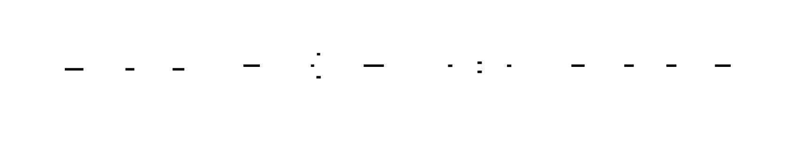


<!-- END_TDD_MOD -->


<!-- TDD_MOD_ID: distributed-m2 -->
# Technical Design Document: Tensor Parallelism
**Module ID:** `distributed-m2`  
**Version:** 1.0  
**Estimated Hours:** 16-20
---
## 1. Module Charter
This module implements tensor parallelism (TP) for intra-layer model sharding, enabling training of models too large to fit on a single GPU. Each linear layer's weight matrix is partitioned across multiple GPUs using Megatron-LM's column-parallel and row-parallel patterns. The key insight: chain column-parallel layers (output sharded) directly into row-parallel layers (input sharded) to eliminate intermediate communication, requiring only one all-reduce per MLP or attention block instead of per linear layer. Attention heads are distributed across GPUs, exploiting their natural independence. All-reduce operations occur only after row-parallel layers, making NVLink bandwidth essential—TP across nodes connected only by InfiniBand will be 10-50× slower.
**What this module does NOT do:** Pipeline parallelism (inter-layer partitioning), data parallelism (batch replication), ZeRO optimization (parameter sharding across DP ranks), or automatic parallelism strategy selection.
**Upstream dependencies:** PyTorch distributed primitives, NCCL backend with NVLink interconnect, tensor-parallel-aware model initialization.
**Downstream consumers:** 3D parallelism integration layer, checkpoint manager (must save/load sharded state), training orchestrator.
**Invariants:**
1. Tensor parallel degree (TP size) must not exceed GPUs per node (NVLink domain)
2. Column-parallel forward produces sharded output; backward requires all-reduce on input gradient
3. Row-parallel forward requires all-reduce on output; backward produces sharded input gradient
4. Chained column→row parallelism has exactly one all-reduce per block
5. All TP ranks must have identical random seeds for dropout; different seeds for weight initialization
6. Bias in row-parallel layers is added only by rank 0 to avoid N× multiplication
---
## 2. File Structure
```
distributed_training/
├── tensor_parallel/
│   ├── __init__.py                 # [1] Subpackage init, exports main classes
│   ├── config.py                   # [2] TensorParallelConfig dataclass
│   ├── process_groups.py           # [3] TP process group management
│   ├── linear.py                   # [4] ColumnParallelLinear, RowParallelLinear
│   ├── attention.py                # [5] TensorParallelAttention
│   ├── embedding.py                # [6] TensorParallelEmbedding
│   ├── mlp.py                      # [7] TensorParallelMLP (Megatron pattern)
│   ├── transformer_block.py        # [8] Complete TP transformer block
│   ├── initialization.py           # [9] Distributed weight initialization
│   ├── communication.py            # [10] All-reduce wrappers for TP
│   └── overlap.py                  # [11] Communication-computation overlap
├── tests/
│   ├── test_tp_linear.py           # [12] Column/Row parallel linear tests
│   ├── test_tp_attention.py        # [13] Attention head distribution tests
│   ├── test_tp_embedding.py        # [14] Embedding sharding tests
│   ├── test_tp_mlp.py              # [15] MLP block correctness tests
│   ├── test_tp_gradient_flow.py    # [16] Backward pass gradient tests
│   ├── test_tp_memory.py           # [17] Memory scaling verification
│   └── test_tp_integration.py      # [18] Full model integration tests
└── scripts/
    ├── benchmark_tp_memory.py      # [19] Memory scaling benchmarks
    └── profile_tp_communication.py # [20] Communication profiling
```
---
## 3. Complete Data Model
### 3.1 Core Configuration
```python
@dataclass
class TensorParallelConfig:
    """
    Configuration for tensor parallelism.
    All fields affect memory layout and communication patterns.
    """
    # Topology
    tp_size: int                         # Number of GPUs in TP group (must be ≤ GPUs/node)
    tp_rank: int                         # This GPU's rank within TP group [0, tp_size-1]
    # Model dimensions
    hidden_dim: int                      # Model hidden dimension (e.g., 4096)
    num_heads: int                       # Total attention heads (e.g., 32)
    head_dim: int                        # Dimension per head (hidden_dim / num_heads)
    ffn_hidden_dim: int                  # FFN intermediate dimension (typically 4× hidden)
    vocab_size: int                      # Vocabulary size for embeddings
    # Communication settings
    sequence_parallel: bool              # Enable sequence parallelism for long contexts
    overlap_communication: bool          # Overlap all-reduce with computation
    num_overlap_chunks: int              # Chunks for overlapping (default: 4)
    # Initialization
    init_method: str                     # Weight initialization method
    seed: int                            # Base seed (per-rank seed = seed + tp_rank)
    # Derived properties
    @property
    def heads_per_partition(self) -> int:
        """Number of attention heads on this GPU."""
        assert self.num_heads % self.tp_size == 0
        return self.num_heads // self.tp_size
    @property
    def hidden_dim_per_partition(self) -> int:
        """Hidden dimension slice on this GPU."""
        assert self.hidden_dim % self.tp_size == 0
        return self.hidden_dim // self.tp_size
    @property
    def vocab_per_partition(self) -> int:
        """Vocabulary slice on this GPU."""
        assert self.vocab_size % self.tp_size == 0
        return self.vocab_size // self.tp_size
```
### 3.2 Process Group State
```python
@dataclass
class TensorParallelGroups:
    """
    Manages tensor-parallel process groups.
    TP groups are independent of DP and PP groups.
    """
    # Process group handle
    tp_group: Optional[dist.ProcessGroup]
    # Topology
    tp_size: int
    tp_rank: int
    # Neighbor ranks (for ring communication if needed)
    prev_rank: int                       # (tp_rank - 1) mod tp_size
    next_rank: int                       # (tp_rank + 1) mod tp_size
    # Communication tracking
    pending_allreduces: List[dist.Work]  # Async operation handles
    communication_bytes_total: int       # Total bytes communicated
```
### 3.3 Column-Parallel Linear State
```python
@dataclass
class ColumnParallelLinearState:
    """
    State for column-parallel linear layer.
    Weight layout:
      Full weight: (in_features, out_features)
      This partition: (in_features, out_features // tp_size)
    The output dimension is sharded: each GPU computes different output columns.
    """
    # Dimensions
    in_features: int
    out_features: int
    out_features_per_partition: int
    # Weight and bias (this partition only)
    weight: torch.Tensor                 # Shape: (in_features, out_features_per_partition)
    bias: Optional[torch.Tensor]         # Shape: (out_features_per_partition,)
    # Communication state
    gather_output: bool                  # If True, all-gather output (default: False for TP)
    # Gradient tracking
    grad_weight: Optional[torch.Tensor]  # Same shape as weight
    grad_bias: Optional[torch.Tensor]    # Same shape as bias
    grad_input_pending_allreduce: bool   # Backward needs all-reduce on input grad
```
### 3.4 Row-Parallel Linear State
```python
@dataclass
class RowParallelLinearState:
    """
    State for row-parallel linear layer.
    Weight layout:
      Full weight: (in_features, out_features)
      This partition: (in_features // tp_size, out_features)
    The input dimension is sharded: each GPU has different input rows.
    Output is reduced across all GPUs via all-reduce.
    """
    # Dimensions
    in_features: int
    out_features: int
    in_features_per_partition: int
    # Weight (this partition only)
    weight: torch.Tensor                 # Shape: (in_features_per_partition, out_features)
    # Bias handling: ONLY rank 0 adds bias (avoid N× addition after all-reduce)
    bias: Optional[torch.Tensor]         # Shape: (out_features,), only on rank 0
    bias_rank: int                       # Which rank holds bias (typically 0)
    # Input handling
    input_is_parallel: bool              # True if input already sharded (from column-parallel)
    # Output handling
    reduce_output: bool                  # If True, all-reduce output (default: True)
```
### 3.5 Attention State
```python
@dataclass
class TensorParallelAttentionState:
    """
    State for tensor-parallel attention.
    Key insight: attention heads are independent!
    Distribute heads across GPUs, each GPU computes attention for its heads.
    """
    # Dimensions
    hidden_dim: int
    num_heads: int
    num_heads_per_partition: int
    head_dim: int
    # QKV projection (column-parallel)
    # Each GPU has: (hidden_dim, 3 * hidden_dim_per_partition)
    # This naturally gives: 3 * (num_heads_per_partition * head_dim)
    qkv_weight: torch.Tensor             # (hidden_dim, 3 * hidden_dim_per_partition)
    qkv_bias: Optional[torch.Tensor]     # (3 * hidden_dim_per_partition,)
    # Output projection (row-parallel)
    # Each GPU has: (hidden_dim_per_partition, hidden_dim)
    out_weight: torch.Tensor             # (hidden_dim_per_partition, hidden_dim)
    out_bias: Optional[torch.Tensor]     # (hidden_dim,), only on rank 0
    # Attention mask (replicated, not sharded)
    attention_mask: Optional[torch.Tensor]
```
### 3.6 Embedding State
```python
@dataclass
class TensorParallelEmbeddingState:
    """
    State for tensor-parallel embedding layer.
    Vocabulary is sharded across GPUs:
      Full embedding: (vocab_size, hidden_dim)
      This partition: (vocab_size // tp_size, hidden_dim)
    Token lookup requires mapping global token IDs to local indices.
    """
    # Dimensions
    vocab_size: int
    vocab_per_partition: int
    hidden_dim: int
    # Embedding table (this partition)
    weight: torch.Tensor                 # (vocab_per_partition, hidden_dim)
    # Index mapping
    vocab_offset: int                    # tp_rank * vocab_per_partition
    # Output mode
    reduce_output: bool                  # True for input embedding, False for output projection
```
### 3.7 Tensor Shape Specifications
```
Tensor Parallel Shape Transformations
━━━━━━━━━━━━━━━━━━━━━━━━━━━━━━━━━━━━━━━━━━━━━━━━━━━━━━━━━━━━━━━━━━━━━━━━━━━━━━━━
Tensor                              Full Shape                    Per-GPU Shape (TP=8)
━━━━━━━━━━━━━━━━━━━━━━━━━━━━━━━━━━━━━━━━━━━━━━━━━━━━━━━━━━━━━━━━━━━━━━━━━━━━━━━━
Input/Hidden States:
  input (replicated)                (B, S, H)                     (B, S, H)
  column_parallel_output            (B, S, H)                     (B, S, H/8)
  row_parallel_input                (B, S, H)                     (B, S, H/8)
  row_parallel_output (reduced)     (B, S, H)                     (B, S, H)
Weights (Column-Parallel):
  QKV weight                        (H, 3H)                       (H, 3H/8)
  FFN up projection                 (H, 4H)                       (H, 4H/8)
Weights (Row-Parallel):
  Output projection                 (H, H)                        (H/8, H)
  FFN down projection               (4H, H)                       (4H/8, H)
Attention Tensors:
  Q, K, V (per GPU)                 (B, heads, S, head_d)        (B, heads/8, S, head_d)
  Attention scores                  (B, heads, S, S)             (B, heads/8, S, S)
  Attention output                  (B, heads, S, head_d)        (B, heads/8, S, head_d)
  Reshaped for out_proj             (B, S, H)                    (B, S, H/8)
Embedding:
  Token embeddings                  (V, H)                       (V/8, H)
  Embedding lookup result           (B, S, H)                    (B, S, H/8) [before reduce]
Gradients (match weight shapes):
  grad_qkv_weight                   (H, 3H)                       (H, 3H/8)
  grad_out_weight                   (H, H)                        (H/8, H)
━━━━━━━━━━━━━━━━━━━━━━━━━━━━━━━━━━━━━━━━━━━━━━━━━━━━━━━━━━━━━━━━━━━━━━━━━━━━━━━━
Where:
  B = batch_size (e.g., 8)
  S = sequence_length (e.g., 2048)
  H = hidden_dim (e.g., 4096)
  V = vocab_size (e.g., 32000)
  heads = num_heads (e.g., 32)
  head_d = head_dim = H / heads (e.g., 128)
  tp_size = tensor parallel degree (e.g., 8)
━━━━━━━━━━━━━━━━━━━━━━━━━━━━━━━━━━━━━━━━━━━━━━━━━━━━━━━━━━━━━━━━━━━━━━━━━━━━━━━━
```
### 3.8 Memory Layout Analysis
```
Memory Per GPU for 70B Model (TP=8)
━━━━━━━━━━━━━━━━━━━━━━━━━━━━━━━━━━━━━━━━━━━━━━━━━━━━━━━━━━━━━━━━━━━━━━━━━━━━━━━━
Component              Full Model    Per GPU (TP=8)    Savings
━━━━━━━━━━━━━━━━━━━━━━━━━━━━━━━━━━━━━━━━━━━━━━━━━━━━━━━━━━━━━━━━━━━━━━━━━━━━━━━━
Per Layer:
  QKV weight           96 MB         12 MB             8×
  Out weight           32 MB         4 MB              8×
  FFN up               128 MB        16 MB             8×
  FFN down             128 MB        16 MB             8×
  LayerNorm (repl.)    0.032 MB      0.032 MB          1×
  ─────────────────────────────────────────────────────────────
  Per layer total      384 MB        48 MB             8×
Full Model (80 layers):
  Parameters           140 GB        17.5 GB           8×
  Gradients            140 GB        17.5 GB           8×
  Optimizer (Adam)     560 GB        70 GB             8×
  ─────────────────────────────────────────────────────────────
  Total (no ZeRO)      840 GB        105 GB            8×
Activations (per micro-batch):
  Per layer            2 GB          2 GB              1× (replicated input)
  80 layers            160 GB        160 GB            1×
━━━━━━━━━━━━━━━━━━━━━━━━━━━━━━━━━━━━━━━━━━━━━━━━━━━━━━━━━━━━━━━━━━━━━━━━━━━━━━━━
Note: Activations are NOT reduced by TP because input is replicated.
      Use gradient checkpointing or sequence parallelism for activation memory.
━━━━━━━━━━━━━━━━━━━━━━━━━━━━━━━━━━━━━━━━━━━━━━━━━━━━━━━━━━━━━━━━━━━━━━━━━━━━━━━━
```
---
## 4. Interface Contracts
### 4.1 ColumnParallelLinear
```python
class ColumnParallelLinear(nn.Module):
    """
    Linear layer with column parallelism.
    Weight matrix partitioned along output (column) dimension:
        W_full = [W_0 | W_1 | ... | W_{tp_size-1}]
        This GPU holds W_{tp_rank} with shape (in_features, out_features/tp_size)
    Forward: 
        - Input: replicated on all GPUs
        - Output: sharded (each GPU has different columns)
        - NO communication in forward
    Backward:
        - Gradient w.r.t. weight: local, no communication
        - Gradient w.r.t. input: requires all-reduce (each GPU has partial grad)
    """
    def __init__(
        self,
        in_features: int,
        out_features: int,
        config: TensorParallelConfig,
        bias: bool = True,
        gather_output: bool = False,
        init_method: Optional[Callable[[torch.Tensor], None]] = None,
    ):
        """
        Initialize column-parallel linear layer.
        Args:
            in_features: Input dimension (must be divisible by 1, not sharded)
            out_features: Output dimension (must be divisible by tp_size)
            config: Tensor parallel configuration
            bias: Whether to include bias
            gather_output: If True, all-gather output to make it replicated
            init_method: Custom weight initialization function
        Raises:
            ValueError: If out_features not divisible by tp_size
            RuntimeError: If process group not initialized
        Side effects:
            - Creates weight parameter on current device
            - Registers backward hook for gradient synchronization
        """
        ...
    def forward(self, input: torch.Tensor) -> torch.Tensor:
        """
        Forward pass with column parallelism.
        Args:
            input: Input tensor, shape (batch, ..., in_features)
                   MUST be replicated across all TP ranks
        Returns:
            output: Shape (batch, ..., out_features_per_partition) if not gathered
                    Shape (batch, ..., out_features) if gathered
        Communication:
            - None in forward (each GPU computes its output columns independently)
        Shape trace:
            input: (B, S, H_in)
            weight: (H_in, H_out / tp_size)
            output: (B, S, H_out / tp_size)
        """
        ...
    def get_full_weight(self) -> torch.Tensor:
        """
        Gather full weight matrix from all partitions.
        Returns:
            Full weight matrix, shape (in_features, out_features)
        Communication:
            All-gather across TP group
        Use case: Checkpointing, weight inspection
        """
        ...
```
### 4.2 RowParallelLinear
```python
class RowParallelLinear(nn.Module):
    """
    Linear layer with row parallelism.
    Weight matrix partitioned along input (row) dimension:
        W_full = [W_0; W_1; ...; W_{tp_size-1}] (stacked vertically)
        This GPU holds W_{tp_rank} with shape (in_features/tp_size, out_features)
    Forward:
        - Input: sharded (each GPU has different rows)
        - Output: partial sum, requires all-reduce
        - ALL-REDUCE required after matmul
    Backward:
        - Gradient w.r.t. weight: local, no communication
        - Gradient w.r.t. input: naturally sharded, no communication
    """
    def __init__(
        self,
        in_features: int,
        out_features: int,
        config: TensorParallelConfig,
        bias: bool = True,
        input_is_parallel: bool = True,
        reduce_output: bool = True,
        init_method: Optional[Callable[[torch.Tensor], None]] = None,
    ):
        """
        Initialize row-parallel linear layer.
        Args:
            in_features: Input dimension (must be divisible by tp_size)
            out_features: Output dimension (not sharded)
            config: Tensor parallel configuration
            bias: Whether to include bias (ONLY added by rank 0!)
            input_is_parallel: If True, input is already sharded (from column-parallel)
            reduce_output: If True, all-reduce output (set False for debugging)
            init_method: Custom weight initialization
        CRITICAL: Bias handling
            - If bias=True, ONLY rank 0 creates bias parameter
            - After all-reduce, rank 0 adds bias
            - This prevents bias from being added tp_size times
        Raises:
            ValueError: If in_features not divisible by tp_size
        """
        ...
    def forward(self, input: torch.Tensor) -> torch.Tensor:
        """
        Forward pass with row parallelism.
        Args:
            input: If input_is_parallel=True: shape (batch, ..., in_features/tp_size)
                   If input_is_parallel=False: shape (batch, ..., in_features)
                   In latter case, input is sliced to get this partition
        Returns:
            output: Shape (batch, ..., out_features), replicated after all-reduce
        Communication:
            All-reduce SUM on output, then divide by tp_size (or just SUM if no div)
        Shape trace:
            input (parallel): (B, S, H_in / tp_size)
            weight: (H_in / tp_size, H_out)
            partial_output: (B, S, H_out)
            after all-reduce: (B, S, H_out) [replicated]
        Performance:
            All-reduce volume = B × S × H_out × 2 bytes (fp16)
            For B=8, S=2048, H=4096: 134 MB per all-reduce
            On NVLink 300 GB/s: ~0.45 ms theoretical minimum
        """
        ...
```
### 4.3 TensorParallelAttention
```python
class TensorParallelAttention(nn.Module):
    """
    Tensor-parallel multi-head attention.
    Key insight: Attention heads are independent!
    - Each GPU handles num_heads/tp_size heads
    - QKV projection is column-parallel (produces sharded Q, K, V)
    - Attention computation is entirely local (no communication)
    - Output projection is row-parallel (all-reduce at end)
    Total communication: ONE all-reduce per attention block
    """
    def __init__(
        self,
        hidden_dim: int,
        num_heads: int,
        config: TensorParallelConfig,
        dropout: float = 0.0,
        layer_norm_epsilon: float = 1e-5,
    ):
        """
        Initialize tensor-parallel attention.
        Args:
            hidden_dim: Model hidden dimension
            num_heads: Total number of attention heads (must be divisible by tp_size)
            config: Tensor parallel configuration
            dropout: Dropout probability
            layer_norm_epsilon: Layer norm epsilon
        Raises:
            ValueError: If num_heads not divisible by tp_size
            ValueError: If hidden_dim not divisible by num_heads
        Components created:
            - qkv_proj: ColumnParallelLinear(hidden_dim, 3*hidden_dim)
            - out_proj: RowParallelLinear(hidden_dim, hidden_dim)
            - layer_norm: Replicated LayerNorm (not sharded)
        """
        ...
    def forward(
        self,
        hidden_states: torch.Tensor,
        attention_mask: Optional[torch.Tensor] = None,
        past_key_value: Optional[Tuple[torch.Tensor, torch.Tensor]] = None,
    ) -> Tuple[torch.Tensor, Optional[torch.Tensor]]:
        """
        Forward pass through tensor-parallel attention.
        Args:
            hidden_states: Shape (batch, seq_len, hidden_dim), REPLICATED
            attention_mask: Shape (1, 1, seq_len, seq_len) or None, REPLICATED
            past_key_value: Cached K, V for inference (not sharded in this impl)
        Returns:
            output: Shape (batch, seq_len, hidden_dim), REPLICATED
            present_key_value: Current K, V for caching (optional)
        Communication:
            ONE all-reduce in out_proj
        Shape trace:
            hidden_states: (B, S, H) [replicated]
            after qkv_proj: (B, S, 3*H/tp) [sharded]
            reshape to Q, K, V: each (B, heads/tp, S, head_d) [sharded]
            attention_scores: (B, heads/tp, S, S) [sharded]
            attention_output: (B, heads/tp, S, head_d) [sharded]
            reshape: (B, S, H/tp) [sharded]
            after out_proj + all-reduce: (B, S, H) [replicated]
        """
        ...
```
### 4.4 TensorParallelEmbedding
```python
class TensorParallelEmbedding(nn.Module):
    """
    Tensor-parallel embedding layer with vocabulary sharding.
    Vocabulary partitioned across GPUs:
        - Each GPU holds vocab_size/tp_size embeddings
        - Token lookup maps global ID to local index
        - Output is all-reduced to get full embedding
    For output projection (tied weights):
        - Use forward_as_output() for LM head
        - Returns sharded logits (vocab_per_partition)
    """
    def __init__(
        self,
        num_embeddings: int,
        embedding_dim: int,
        config: TensorParallelConfig,
        reduce_output: bool = True,
    ):
        """
        Initialize tensor-parallel embedding.
        Args:
            num_embeddings: Vocabulary size (must be divisible by tp_size)
            embedding_dim: Embedding dimension (not sharded)
            config: Tensor parallel configuration
            reduce_output: If True, all-reduce output to make it replicated
        Raises:
            ValueError: If num_embeddings not divisible by tp_size
        """
        ...
    def forward(self, input_ids: torch.Tensor) -> torch.Tensor:
        """
        Embedding lookup with vocabulary parallelism.
        Args:
            input_ids: Token IDs, shape (batch, seq_len), REPLICATED
        Returns:
            embeddings: Shape (batch, seq_len, embedding_dim)
                       If reduce_output=True: replicated after all-reduce
                       If reduce_output=False: sharded (for sequence parallel)
        Algorithm:
            1. Map global token IDs to local indices:
               local_id = input_ids - vocab_offset
            2. Create mask for tokens in this partition:
               mask = (local_id >= 0) & (local_id < vocab_per_partition)
            3. Clamp local_id to valid range (avoid index errors)
            4. Look up embeddings
            5. Zero out embeddings for tokens not in this partition
            6. All-reduce to combine embeddings from all partitions
        Communication:
            All-reduce SUM on embeddings
            Volume = B × S × H × 2 bytes (fp16)
        """
        ...
    def forward_as_output(self, hidden_states: torch.Tensor) -> torch.Tensor:
        """
        Use embedding weights for output projection (tied embeddings).
        Args:
            hidden_states: Shape (batch, seq_len, hidden_dim), REPLICATED
        Returns:
            logits: Shape (batch, seq_len, vocab_per_partition), SHARDED
        Note: Output is SHARDED, not replicated!
              Caller must handle sharded logits (e.g., for cross-entropy loss)
        """
        ...
```
### 4.5 TensorParallelMLP
```python
class TensorParallelMLP(nn.Module):
    """
    Megatron-LM style tensor-parallel MLP.
    Architecture:
        Input (replicated)
        → ColumnParallelLinear (up projection) [NO COMMUNICATION]
        → Activation (GELU)
        → RowParallelLinear (down projection) [ALL-REDUCE]
        → Output (replicated)
    Total communication: ONE all-reduce per MLP block
    Memory per GPU (TP=8):
        Up projection: (H, 4H/8) = H × H/2 parameters
        Down projection: (4H/8, H) = H × H/2 parameters
        Total: H² parameters (vs 8H² without TP)
    """
    def __init__(
        self,
        hidden_dim: int,
        ffn_hidden_dim: int,
        config: TensorParallelConfig,
        activation: str = "gelu",
    ):
        """
        Initialize tensor-parallel MLP.
        Args:
            hidden_dim: Model hidden dimension
            ffn_hidden_dim: FFN intermediate dimension (typically 4× hidden)
            config: Tensor parallel configuration
            activation: Activation function ("gelu", "relu", "silu")
        """
        ...
    def forward(self, hidden_states: torch.Tensor) -> torch.Tensor:
        """
        Forward pass through tensor-parallel MLP.
        Args:
            hidden_states: Shape (batch, seq_len, hidden_dim), REPLICATED
        Returns:
            output: Shape (batch, seq_len, hidden_dim), REPLICATED
        Communication:
            ONE all-reduce in down_proj
        Shape trace:
            input: (B, S, H) [replicated]
            after up_proj: (B, S, 4H/tp) [sharded]
            after activation: (B, S, 4H/tp) [sharded]
            after down_proj + all-reduce: (B, S, H) [replicated]
        """
        ...
```
### 4.6 Communication Module
```python
def all_reduce_tp(
    tensor: torch.Tensor,
    tp_group: dist.ProcessGroup,
    op: dist.ReduceOp = dist.ReduceOp.SUM,
    async_op: bool = False,
) -> Optional[dist.Work]:
    """
    All-reduce within tensor-parallel group.
    Args:
        tensor: Tensor to reduce (modified in-place)
        tp_group: Tensor-parallel process group
        op: Reduction operation (SUM for combining partial results)
        async_op: If True, return work handle for later wait()
    Returns:
        If async_op=True: dist.Work handle
        If async_op=False: None (operation complete)
    Performance:
        Ring all-reduce latency: O(tp_size) hops
        Bandwidth: 2 × data_size per GPU (constant regardless of tp_size)
    Critical: This MUST be called on NVLink-connected GPUs.
              InfiniBand will be 10-50× slower.
    """
    ...
def all_gather_tp(
    tensor_list: List[torch.Tensor],
    tensor: torch.Tensor,
    tp_group: dist.ProcessGroup,
) -> None:
    """
    All-gather within tensor-parallel group.
    Args:
        tensor_list: List to receive gathered tensors (one per rank)
        tensor: This rank's contribution
        tp_group: Tensor-parallel process group
    Use case: Gathering full weight matrix from partitions for checkpointing
    """
    ...
def reduce_scatter_tp(
    output: torch.Tensor,
    input_list: List[torch.Tensor],
    tp_group: dist.ProcessGroup,
) -> None:
    """
    Reduce-scatter within tensor-parallel group.
    Combines reduce and scatter: reduces input_list, then scatters result.
    Use case: Sequence parallelism (scatter sequence dimension after reduction)
    """
    ...
```
---
## 5. Algorithm Specification
### 5.1 Column-Parallel Forward Algorithm
```
ALGORITHM: column_parallel_forward
━━━━━━━━━━━━━━━━━━━━━━━━━━━━━━━━━━━━━━━━━━━━━━━━━━━━━━━━━━━━━━━━━━━━━━━━━━━━━━━━
INPUT:
    - input: Tensor, shape (batch, seq_len, in_features), REPLICATED on all ranks
    - weight: Tensor, shape (in_features, out_features_per_partition)
    - bias: Optional Tensor, shape (out_features_per_partition,)
    - tp_rank, tp_size: Tensor parallel topology
OUTPUT: Tensor, shape (batch, seq_len, out_features_per_partition), SHARDED
PRECONDITION: 
    - input is identical on all TP ranks
    - weight contains correct partition of full weight matrix
1. VERIFY input is replicated (optional, for debugging):
   IF debug_mode:
       local_hash = hash(input.data_ptr())
       all_hashes = all_gather(local_hash)
       ASSERT all hashes are equal
2. COMPUTE local matrix multiplication:
   # Standard linear: output = input @ weight + bias
   # input: (B, S, H_in)
   # weight: (H_in, H_out / tp_size)
   # output: (B, S, H_out / tp_size)
   output = torch.nn.functional.linear(input, weight, bias)
3. RETURN output (NO communication)
POSTCONDITION:
    - output[k, :, :] contains columns [rank * (H_out/tp_size) : (rank+1) * (H_out/tp_size)]
      of the full output that would be computed without TP
    - Different ranks have DIFFERENT outputs (sharded)
COMMUNICATION: None
MEMORY:
    - Input: B × S × H_in (replicated)
    - Output: B × S × H_out / tp_size (sharded)
━━━━━━━━━━━━━━━━━━━━━━━━━━━━━━━━━━━━━━━━━━━━━━━━━━━━━━━━━━━━━━━━━━━━━━━━━━━━━━━━
```
### 5.2 Column-Parallel Backward Algorithm
```
ALGORITHM: column_parallel_backward
━━━━━━━━━━━━━━━━━━━━━━━━━━━━━━━━━━━━━━━━━━━━━━━━━━━━━━━━━━━━━━━━━━━━━━━━━━━━━━━━
INPUT:
    - grad_output: Gradient of loss w.r.t. output
                   Shape: (batch, seq_len, out_features_per_partition), SHARDED
    - saved_input: Input from forward pass
                   Shape: (batch, seq_len, in_features), REPLICATED
    - weight: Weight matrix
              Shape: (in_features, out_features_per_partition)
OUTPUT:
    - grad_weight: Gradient w.r.t. weight (local, no communication needed)
    - grad_bias: Gradient w.r.t. bias (local)
    - grad_input: Gradient w.r.t. input (requires ALL-REDUCE)
1. COMPUTE gradient w.r.t. weight:
   # grad_weight = input.T @ grad_output
   # Reshape for batched matmul
   input_2d = saved_input.view(-1, in_features)      # (B*S, H_in)
   grad_out_2d = grad_output.view(-1, out_features_per_partition)  # (B*S, H_out/tp)
   grad_weight = input_2d.T @ grad_out_2d             # (H_in, H_out/tp)
   # This is LOCAL - each rank computes gradient for its weight partition
2. COMPUTE gradient w.r.t. bias (if exists):
   grad_bias = grad_output.sum(dim=[0, 1])            # (H_out/tp,)
   # This is LOCAL - each rank computes gradient for its bias partition
3. COMPUTE gradient w.r.t. input (PARTIAL):
   # grad_input_local = grad_output @ weight.T
   grad_input_local = grad_out_2d @ weight.T          # (B*S, H_in)
   grad_input_local = grad_input_local.view(batch, seq_len, in_features)
   # This is PARTIAL - each rank has gradient from its output partition only
4. ALL-REDUCE to get full input gradient:
   # Sum partial gradients from all ranks
   dist.all_reduce(grad_input_local, op=dist.ReduceOp.SUM, group=tp_group)
   # After all-reduce, grad_input_local contains the FULL gradient
5. RETURN (grad_weight, grad_bias, grad_input_local)
COMMUNICATION:
    - ONE all-reduce on grad_input
    - Volume: B × S × H_in × 2 bytes (fp16)
INVARIANT:
    After all-reduce, grad_input is IDENTICAL on all ranks (replicated)
━━━━━━━━━━━━━━━━━━━━━━━━━━━━━━━━━━━━━━━━━━━━━━━━━━━━━━━━━━━━━━━━━━━━━━━━━━━━━━━━
```
### 5.3 Row-Parallel Forward Algorithm
```
ALGORITHM: row_parallel_forward
━━━━━━━━━━━━━━━━━━━━━━━━━━━━━━━━━━━━━━━━━━━━━━━━━━━━━━━━━━━━━━━━━━━━━━━━━━━━━━━━
INPUT:
    - input: Tensor
             If input_is_parallel=True: (batch, seq_len, in_features_per_partition), SHARDED
             If input_is_parallel=False: (batch, seq_len, in_features), REPLICATED
    - weight: Tensor, shape (in_features_per_partition, out_features)
    - bias: Optional Tensor, shape (out_features,), ONLY on rank 0
    - tp_rank, tp_size: Tensor parallel topology
OUTPUT: Tensor, shape (batch, seq_len, out_features), REPLICATED
PRECONDITION:
    - If input_is_parallel=True, input is correctly sharded (from column-parallel)
    - Weight contains correct rows of full weight matrix
1. SLICE input if not already parallel:
   IF NOT input_is_parallel:
       start_idx = tp_rank * (in_features // tp_size)
       end_idx = start_idx + (in_features // tp_size)
       input = input[:, :, start_idx:end_idx]
   # Now input has shape (B, S, H_in / tp_size)
2. COMPUTE partial output:
   # output_partial = input @ weight
   # input: (B, S, H_in / tp_size)
   # weight: (H_in / tp_size, H_out)
   # output_partial: (B, S, H_out)
   output_partial = torch.nn.functional.linear(input, weight, bias=None)
   # NOTE: No bias yet! Each rank has partial sum of output.
3. ALL-REDUCE to sum partial outputs:
   dist.all_reduce(output_partial, op=dist.ReduceOp.SUM, group=tp_group)
   # After all-reduce, output_partial contains the FULL output
4. ADD bias (only on rank 0, after all-reduce):
   IF bias is not None AND tp_rank == 0:
       output = output_partial + bias
   ELSE:
       output = output_partial
   # CRITICAL: Bias added only once, not tp_size times!
5. RETURN output
COMMUNICATION:
    - ONE all-reduce
    - Volume: B × S × H_out × 2 bytes (fp16)
POSTCONDITION:
    - output is IDENTICAL on all ranks (replicated)
    - Bias is correctly added exactly once
COMMON BUG: Adding bias before all-reduce causes bias to be multiplied by tp_size
━━━━━━━━━━━━━━━━━━━━━━━━━━━━━━━━━━━━━━━━━━━━━━━━━━━━━━━━━━━━━━━━━━━━━━━━━━━━━━━━
```
### 5.4 Row-Parallel Backward Algorithm
```
ALGORITHM: row_parallel_backward
━━━━━━━━━━━━━━━━━━━━━━━━━━━━━━━━━━━━━━━━━━━━━━━━━━━━━━━━━━━━━━━━━━━━━━━━━━━━━━━━
INPUT:
    - grad_output: Gradient of loss w.r.t. output
                   Shape: (batch, seq_len, out_features), REPLICATED
    - saved_input: Input from forward pass
                   Shape: (batch, seq_len, in_features_per_partition), SHARDED
    - weight: Weight matrix
              Shape: (in_features_per_partition, out_features)
OUTPUT:
    - grad_weight: Gradient w.r.t. weight (local, no communication)
    - grad_bias: Gradient w.r.t. bias (local, only on rank 0)
    - grad_input: Gradient w.r.t. input (SHARDED, no communication)
1. COMPUTE gradient w.r.t. weight:
   # grad_weight = input.T @ grad_output
   input_2d = saved_input.view(-1, in_features_per_partition)
   grad_out_2d = grad_output.view(-1, out_features)
   grad_weight = input_2d.T @ grad_out_2d
   # Shape: (H_in/tp, H_out)
   # LOCAL - no communication needed
2. COMPUTE gradient w.r.t. bias (only on rank 0):
   IF tp_rank == 0:
       grad_bias = grad_output.sum(dim=[0, 1])  # (H_out,)
   ELSE:
       grad_bias = None
   # LOCAL - only rank 0 has bias, only it needs grad_bias
3. COMPUTE gradient w.r.t. input:
   # grad_input = grad_output @ weight.T
   grad_input = grad_out_2d @ weight.T
   grad_input = grad_input.view(batch, seq_len, in_features_per_partition)
   # This is naturally SHARDED - each rank has gradient for its input partition
   # NO communication needed!
4. RETURN (grad_weight, grad_bias, grad_input)
COMMUNICATION: None!
INVARIANT:
    - grad_input is SHARDED (each rank has different partition)
    - This grad_input can be passed directly to a column-parallel backward
━━━━━━━━━━━━━━━━━━━━━━━━━━━━━━━━━━━━━━━━━━━━━━━━━━━━━━━━━━━━━━━━━━━━━━━━━━━━━━━━
```
### 5.5 Attention Head Distribution Algorithm
```
ALGORITHM: tensor_parallel_attention_forward
━━━━━━━━━━━━━━━━━━━━━━━━━━━━━━━━━━━━━━━━━━━━━━━━━━━━━━━━━━━━━━━━━━━━━━━━━━━━━━━━
INPUT:
    - hidden_states: (batch, seq_len, hidden_dim), REPLICATED
    - attention_mask: (1, 1, seq_len, seq_len) or None, REPLICATED
    - qkv_weight: (hidden_dim, 3 * hidden_dim_per_partition), column-parallel
    - out_weight: (hidden_dim_per_partition, hidden_dim), row-parallel
OUTPUT: (batch, seq_len, hidden_dim), REPLICATED
1. COLUMN-PARALLEL QKV projection:
   # qkv = hidden_states @ qkv_weight
   # hidden_states: (B, S, H)
   # qkv_weight: (H, 3*H/tp)
   # qkv: (B, S, 3*H/tp)
   qkv = torch.nn.functional.linear(hidden_states, qkv_weight, qkv_bias)
   # NO communication - output is sharded
2. RESHAPE for multi-head attention:
   # Split into Q, K, V and reshape for heads
   # qkv: (B, S, 3 * num_heads_per_partition * head_dim)
   qkv = qkv.view(batch, seq_len, 3, num_heads_per_partition, head_dim)
   # Permute to (3, B, heads_per_partition, S, head_dim)
   qkv = qkv.permute(2, 0, 3, 1, 4)
   # Split into Q, K, V
   q, k, v = qkv[0], qkv[1], qkv[2]
   # Each: (B, heads_per_partition, S, head_dim)
3. COMPUTE attention scores:
   # scores = Q @ K.T / sqrt(head_dim)
   scale = 1.0 / math.sqrt(head_dim)
   scores = torch.matmul(q, k.transpose(-2, -1)) * scale
   # scores: (B, heads_per_partition, S, S)
4. APPLY attention mask (if provided):
   IF attention_mask is not None:
       scores = scores + attention_mask  # Mask has -inf for masked positions
5. SOFTMAX:
   attn_weights = F.softmax(scores, dim=-1)
   # attn_weights: (B, heads_per_partition, S, S)
6. APPLY dropout (if training):
   attn_weights = dropout(attn_weights)
7. COMPUTE attention output:
   # attn_output = attn_weights @ V
   attn_output = torch.matmul(attn_weights, v)
   # attn_output: (B, heads_per_partition, S, head_dim)
8. RESHAPE for output projection:
   # Transpose and reshape
   attn_output = attn_output.transpose(1, 2)  # (B, S, heads_per_partition, head_dim)
   attn_output = attn_output.reshape(batch, seq_len, hidden_dim_per_partition)
   # attn_output: (B, S, H/tp) - ready for row-parallel projection
9. ROW-PARALLEL output projection:
   # output = attn_output @ out_weight + bias
   output_partial = torch.nn.functional.linear(attn_output, out_weight, None)
   # ALL-REDUCE
   dist.all_reduce(output_partial, op=dist.ReduceOp.SUM, group=tp_group)
   # Add bias (only rank 0)
   IF tp_rank == 0 AND out_bias is not None:
       output = output_partial + out_bias
   ELSE:
       output = output_partial
10. RETURN output: (B, S, H), REPLICATED
COMMUNICATION: ONE all-reduce in step 9
━━━━━━━━━━━━━━━━━━━━━━━━━━━━━━━━━━━━━━━━━━━━━━━━━━━━━━━━━━━━━━━━━━━━━━━━━━━━━━━━
```
### 5.6 Distributed Weight Initialization Algorithm
```
ALGORITHM: initialize_tensor_parallel_weights
━━━━━━━━━━━━━━━━━━━━━━━━━━━━━━━━━━━━━━━━━━━━━━━━━━━━━━━━━━━━━━━━━━━━━━━━━━━━━━━━
INPUT:
    - layer: nn.Module layer to initialize
    - layer_type: "column_parallel" | "row_parallel" | "embedding"
    - config: TensorParallelConfig
    - init_method: Initialization function (e.g., kaiming_uniform_)
OUTPUT: None (modifies layer.weight in-place)
CRITICAL: Each rank must initialize its OWN partition correctly.
          Cannot just initialize full weight and slice - that causes OOM.
1. DETERMINE full weight shape:
   IF layer_type == "column_parallel":
       full_out_features = layer.out_features * config.tp_size
       full_shape = (layer.in_features, full_out_features)
   ELIF layer_type == "row_parallel":
       full_in_features = layer.in_features * config.tp_size
       full_shape = (full_in_features, layer.out_features)
   ELIF layer_type == "embedding":
       full_num_embeddings = layer.num_embeddings * config.tp_size
       full_shape = (full_num_embeddings, layer.embedding_dim)
2. COMPUTE this rank's partition indices:
   IF layer_type == "column_parallel":
       start = config.tp_rank * layer.out_features
       end = start + layer.out_features
       # Partition along dim 1 (columns)
   ELIF layer_type == "row_parallel":
       start = config.tp_rank * layer.in_features
       end = start + layer.in_features
       # Partition along dim 0 (rows)
   ELIF layer_type == "embedding":
       start = config.tp_rank * layer.num_embeddings
       end = start + layer.num_embeddings
       # Partition along dim 0 (rows)
3. INITIALIZE using master weights approach (memory-efficient):
   # Option A: Initialize partition directly with correct indexing
   # Use seed based on partition index for reproducibility
   # Compute master seed for this weight
   master_seed = config.seed + hash(layer_name)
   # For each element in this partition, compute its position in full weight
   # and use that position for initialization
   WITH torch.no_grad():
       IF init_method == "kaiming_uniform":
           # Compute fan_in for this partition
           fan_in = layer.in_features  # Same for all partitions
           std = 1.0 / math.sqrt(fan_in)
           bound = math.sqrt(3.0) * std
           # Initialize with uniform(-bound, bound)
           layer.weight.data.uniform_(-bound, bound)
       ELIF init_method == "normal":
           std = config.init_std  # e.g., 0.02
           layer.weight.data.normal_(mean=0.0, std=std)
4. INITIALIZE bias (if exists):
   IF layer.bias is not None:
       IF layer_type == "column_parallel":
           # Each partition has its own bias slice
           layer.bias.data.zero_()
       ELIF layer_type == "row_parallel":
           # Only rank 0 has bias
           IF config.tp_rank == 0:
               layer.bias.data.zero_()
5. VERIFY initialization (optional, for debugging):
   IF debug_mode:
       # Gather all partitions and verify statistics match expected
       full_weight = all_gather(layer.weight)
       IF config.tp_rank == 0:
           expected_std = compute_expected_std(init_method, full_shape)
           actual_std = full_weight.std().item()
           ASSERT abs(actual_std - expected_std) < 0.01
INVARIANT:
    - Each partition initialized independently but correctly
    - Full weight (if gathered) has correct statistics
━━━━━━━━━━━━━━━━━━━━━━━━━━━━━━━━━━━━━━━━━━━━━━━━━━━━━━━━━━━━━━━━━━━━━━━━━━━━━━━━
```
---
## 6. Error Handling Matrix
| Error | Detected By | Recovery | User-Visible? |
|-------|-------------|----------|---------------|
| `out_features not divisible by tp_size` | `ColumnParallelLinear.__init__` assertion | Raise `ValueError` with divisibility requirement | Yes - clear error message |
| `in_features not divisible by tp_size` | `RowParallelLinear.__init__` assertion | Raise `ValueError` with divisibility requirement | Yes - clear error message |
| `num_heads not divisible by tp_size` | `TensorParallelAttention.__init__` assertion | Raise `ValueError` with head distribution requirement | Yes - clear error message |
| `vocab_size not divisible by tp_size` | `TensorParallelEmbedding.__init__` assertion | Raise `ValueError` with vocab padding suggestion | Yes - suggest padding vocab |
| `Weight initialization mismatch` | Gradient norm check or loss divergence | Re-run with consistent seeding; use `initialize_tensor_parallel_weights` | Yes - initialization utility provided |
| `Missing all-reduce in column-parallel backward` | Gradient magnitude incorrect | Ensure `ColumnParallelLinear` backward includes all-reduce | Yes - debugging output available |
| `Bias applied multiple times` | Output values N× too large | Check `RowParallelLinear` bias only on rank 0 | Yes - clear warning in docs |
| `TP across slow network (no NVLink)` | All-reduce latency > 10ms | Restrict TP to single node; use PP for inter-node | Yes - performance warning |
| `Activation memory overflow` | CUDA OOM during forward | Enable gradient checkpointing or reduce batch size | Yes - memory analysis output |
| `Process group not initialized` | `dist.is_initialized() == False` | Call `initialize_tp_process_groups()` first | Yes - initialization required |
| `Input not replicated for column-parallel` | Shape mismatch or hash check failure | Ensure input is replicated across TP ranks | No - logged to debug |
| `Input not sharded for row-parallel` | Shape mismatch when `input_is_parallel=True` | Check previous layer is column-parallel | Yes - shape error with suggestion |
---
## 7. Implementation Sequence with Checkpoints
### Phase 1: ColumnParallelLinear Implementation (3-4 hours)
**Files:** `tensor_parallel/__init__.py`, `tensor_parallel/config.py`, `tensor_parallel/process_groups.py`, `tensor_parallel/linear.py`
**Implementation Steps:**
1. Create `TensorParallelConfig` dataclass with all configuration fields
2. Implement `initialize_tp_process_groups()` that creates TP-specific process group
3. Implement `ColumnParallelLinear.__init__()`:
   - Validate `out_features % tp_size == 0`
   - Create weight parameter with shape `(in_features, out_features // tp_size)`
   - Create bias parameter (if enabled) with shape `(out_features // tp_size,)`
4. Implement `ColumnParallelLinear.forward()`:
   - Standard linear operation with sharded weight
   - No communication
5. Implement `ColumnParallelLinear.get_full_weight()` for debugging/checkpointing
6. Implement custom `backward()` that includes all-reduce on input gradient
**Checkpoint 1:**
```bash
# Test column-parallel linear
torchrun --nproc_per_node=2 -m pytest tests/test_tp_linear.py::TestColumnParallelLinear -v
# Expected output:
# test_column_parallel_shape ... ok
# test_column_parallel_output_sharded ... ok
# test_column_parallel_backward_allreduce ... ok
```
**Verification:** 
- Output shape is `(batch, seq_len, out_features // tp_size)`
- Different ranks have different outputs (verify by comparing values)
- Backward pass includes all-reduce (verify gradient magnitudes)
---
### Phase 2: RowParallelLinear Implementation (3-4 hours)
**Files:** `tensor_parallel/linear.py` (extend), `tensor_parallel/communication.py`
**Implementation Steps:**
1. Implement `RowParallelLinear.__init__()`:
   - Validate `in_features % tp_size == 0`
   - Create weight parameter with shape `(in_features // tp_size, out_features)`
   - Create bias parameter ONLY on rank 0 with shape `(out_features,)`
2. Implement `RowParallelLinear.forward()`:
   - Slice input if `input_is_parallel=False`
   - Compute partial output with local matmul
   - All-reduce to sum partial outputs
   - Add bias ONLY on rank 0 AFTER all-reduce
3. Implement `RowParallelLinear.backward()`:
   - Gradient w.r.t. weight is local (no communication)
   - Gradient w.r.t. input is naturally sharded (no communication)
4. Implement `all_reduce_tp()` wrapper function
5. Add extensive comments about bias handling (common bug source)
**Checkpoint 2:**
```bash
torchrun --nproc_per_node=2 -m pytest tests/test_tp_linear.py::TestRowParallelLinear -v
# Expected output:
# test_row_parallel_shape ... ok
# test_row_parallel_allreduce ... ok
# test_row_parallel_bias_single ... ok  # Bias added only once
# test_row_parallel_backward_no_comm ... ok  # No communication in backward
```
**Verification:**
- Output is replicated (identical on all ranks)
- Bias is added exactly once (not multiplied by tp_size)
- Backward pass has no communication
---
### Phase 3: TensorParallelAttention with Head Distribution (4-5 hours)
**Files:** `tensor_parallel/attention.py`, `tensor_parallel/communication.py` (extend)
**Implementation Steps:**
1. Implement `TensorParallelAttention.__init__()`:
   - Validate `num_heads % tp_size == 0`
   - Create `qkv_proj` as `ColumnParallelLinear(hidden_dim, 3*hidden_dim)`
   - Create `out_proj` as `RowParallelLinear(hidden_dim, hidden_dim)`
   - LayerNorm is replicated (not sharded)
2. Implement attention forward following algorithm 5.5:
   - Column-parallel QKV projection
   - Reshape for distributed heads
   - Compute attention scores locally
   - Apply softmax and dropout locally
   - Row-parallel output projection with all-reduce
3. Handle attention mask (replicated, not sharded)
4. Add support for different attention patterns (causal, bidirectional)
**Checkpoint 3:**
```bash
torchrun --nproc_per_node=4 -m pytest tests/test_tp_attention.py -v
# Expected output:
# test_attention_head_distribution ... ok
# test_attention_shape_trace ... ok
# test_attention_output_replicated ... ok
# test_attention_gradient_flow ... ok
```
**Verification:**
- Each GPU has `num_heads // tp_size` heads
- Attention scores computed locally (no communication)
- Final output is replicated after all-reduce
- Total communication: exactly one all-reduce
---
### Phase 4: TensorParallelEmbedding (Vocab Sharding) (2-3 hours)
**Files:** `tensor_parallel/embedding.py`
**Implementation Steps:**
1. Implement `TensorParallelEmbedding.__init__()`:
   - Validate `vocab_size % tp_size == 0`
   - Create embedding table with shape `(vocab_size // tp_size, hidden_dim)`
   - Compute `vocab_offset = tp_rank * vocab_per_partition`
2. Implement `forward()`:
   - Map global token IDs to local indices
   - Create mask for tokens in this partition
   - Look up embeddings
   - Zero out embeddings for tokens not in this partition
   - All-reduce to combine embeddings from all partitions
3. Implement `forward_as_output()` for tied embeddings:
   - Use embedding weights for output projection
   - Return SHARDED logits (not replicated)
**Checkpoint 4:**
```bash
torchrun --nproc_per_node=2 -m pytest tests/test_tp_embedding.py -v
# Expected output:
# test_embedding_vocab_sharding ... ok
# test_embedding_output_replicated ... ok
# test_embedding_output_projection_sharded ... ok
# test_embedding_tied_weights ... ok
```
**Verification:**
- Vocabulary correctly partitioned across GPUs
- Output embeddings are replicated after all-reduce
- Output projection (tied weights) returns sharded logits
---
### Phase 5: Communication-Computation Overlap (3-4 hours)
**Files:** `tensor_parallel/overlap.py`, `tensor_parallel/linear.py` (extend)
**Implementation Steps:**
1. Implement `OverlappingRowParallelLinear`:
   - Split input along sequence dimension into chunks
   - Process chunks sequentially
   - Launch async all-reduce for each chunk
   - Overlap communication with computation of next chunk
2. Implement chunk management:
   - Determine optimal chunk count based on compute/comm ratio
   - Handle variable sequence lengths
3. Add timing metrics for overlap efficiency
**Checkpoint 5:**
```bash
torchrun --nproc_per_node=4 -m pytest tests/test_tp_linear.py::TestOverlappingRowParallel -v
# Profile overlap
torchrun --nproc_per_node=4 scripts/profile_tp_communication.py --overlap
# Expected: Communication time overlapped by >50%
```
**Verification:**
- Total time reduced compared to non-overlapping version
- Communication hidden behind computation
- Correctness verified against non-overlapping implementation
---
### Phase 6: Memory Scaling Analysis & Tests (2 hours)
**Files:** `tests/test_tp_memory.py`, `scripts/benchmark_tp_memory.py`
**Implementation Steps:**
1. Implement memory measurement utilities:
   - `measure_parameter_memory(model)`
   - `measure_gradient_memory(model)`
   - `measure_activation_memory(model, batch)`
2. Create benchmark script that measures memory at different TP sizes
3. Verify 8× memory reduction for parameters with TP=8
4. Verify activations are NOT reduced (replicated input)
5. Create integration test with full transformer model
**Checkpoint 6:**
```bash
torchrun --nproc_per_node=8 scripts/benchmark_tp_memory.py
# Expected output:
# TP=1: Parameters 140.0 GB, Gradients 140.0 GB
# TP=2: Parameters 70.0 GB, Gradients 70.0 GB
# TP=4: Parameters 35.0 GB, Gradients 35.0 GB
# TP=8: Parameters 17.5 GB, Gradients 17.5 GB
# Memory scaling verified: 8× reduction achieved
```
**Verification:**
- Parameter memory scales exactly as 1/tp_size
- Gradient memory scales exactly as 1/tp_size
- Activation memory does NOT scale (replicated input)
---
## 8. Test Specification
### 8.1 Test: Column-Parallel Output Sharding
```python
def test_column_parallel_output_sharding():
    """
    Verify column-parallel produces correctly sharded output.
    Setup:
        - Create full linear layer for reference
        - Create column-parallel layer
        - Copy appropriate weight slice
        - Feed same input to both
    Assertion:
        - Column-parallel output matches corresponding slice of full output
    """
    tp_size = get_tp_size()
    tp_rank = get_tp_rank()
    in_features = 64
    out_features = 128
    # Create full layer for reference
    torch.manual_seed(42)
    full_layer = nn.Linear(in_features, out_features)
    # Create column-parallel layer
    torch.manual_seed(42)
    config = TensorParallelConfig(tp_size=tp_size, tp_rank=tp_rank)
    tp_layer = ColumnParallelLinear(in_features, out_features, config)
    # Copy appropriate weight slice
    start_idx = tp_rank * (out_features // tp_size)
    end_idx = start_idx + (out_features // tp_size)
    tp_layer.weight.data = full_layer.weight.data[start_idx:end_idx, :].clone()
    tp_layer.bias.data = full_layer.bias.data[start_idx:end_idx].clone()
    # Test input (same on all ranks)
    torch.manual_seed(123)
    x = torch.randn(4, 8, in_features, device='cuda')
    # Forward pass
    full_output = full_layer.cuda()(x)
    tp_output = tp_layer(x)
    # TP output should match the corresponding slice of full output
    expected_slice = full_output[:, :, start_idx:end_idx]
    assert torch.allclose(tp_output, expected_slice, atol=1e-5), \
        f"Column-parallel output doesn't match expected slice on rank {tp_rank}"
```
### 8.2 Test: Row-Parallel Output Replication
```python
def test_row_parallel_output_replication():
    """
    Verify row-parallel produces replicated output after all-reduce.
    """
    tp_size = get_tp_size()
    tp_rank = get_tp_rank()
    in_features = 128
    out_features = 64
    # Create full layer for reference
    torch.manual_seed(42)
    full_layer = nn.Linear(in_features, out_features)
    # Create row-parallel layer
    config = TensorParallelConfig(tp_size=tp_size, tp_rank=tp_rank)
    tp_layer = RowParallelLinear(in_features, out_features, config, input_is_parallel=False)
    # Copy appropriate weight slice (rows)
    start_idx = tp_rank * (in_features // tp_size)
    end_idx = start_idx + (in_features // tp_size)
    tp_layer.weight.data = full_layer.weight.data[:, start_idx:end_idx].clone()
    # Test input (replicated)
    torch.manual_seed(123)
    x = torch.randn(4, 8, in_features, device='cuda')
    # Forward pass
    full_output = full_layer.cuda()(x)
    tp_output = tp_layer(x)
    # TP output (after all-reduce) should match full output
    assert torch.allclose(tp_output, full_output, atol=1e-4), \
        f"Row-parallel output doesn't match full output on rank {tp_rank}"
```
### 8.3 Test: Bias Added Only Once
```python
def test_row_parallel_bias_single_addition():
    """
    Verify bias is added only once, not tp_size times.
    """
    tp_size = get_tp_size()
    tp_rank = get_tp_rank()
    in_features = 64
    out_features = 64
    # Create row-parallel layer with bias
    config = TensorParallelConfig(tp_size=tp_size, tp_rank=tp_rank)
    tp_layer = RowParallelLinear(in_features, out_features, config, bias=True, input_is_parallel=False)
    # Set weights to zero, bias to ones
    tp_layer.weight.data.zero_()
    if tp_rank == 0:
        tp_layer.bias.data.fill_(1.0)
    # Input of ones
    x = torch.ones(2, 4, in_features, device='cuda')
    # Forward pass
    output = tp_layer(x)
    # With zero weights and bias=1, output should be exactly 1.0
    # If bias is added tp_size times, output would be tp_size
    assert torch.allclose(output, torch.ones_like(output)), \
        f"Bias appears to be added {output.mean().item():.1f} times instead of once"
```
### 8.4 Test: Attention Head Distribution
```python
def test_attention_head_distribution():
    """
    Verify attention heads are correctly distributed across GPUs.
    """
    tp_size = get_tp_size()
    tp_rank = get_tp_rank()
    hidden_dim = 256
    num_heads = 8
    expected_heads_per_gpu = num_heads // tp_size
    config = TensorParallelConfig(
        tp_size=tp_size, 
        tp_rank=tp_rank,
        hidden_dim=hidden_dim,
        num_heads=num_heads,
    )
    tp_attn = TensorParallelAttention(hidden_dim, num_heads, config)
    # Check QKV projection output dimension
    # Should be 3 * hidden_dim / tp_size for Q, K, V
    expected_qkv_dim = 3 * hidden_dim // tp_size
    assert tp_attn.qkv_proj.out_features_per_partition == expected_qkv_dim
    # Check number of heads per partition
    assert tp_attn.num_heads_per_partition == expected_heads_per_gpu
    # Verify with forward pass
    x = torch.randn(2, 16, hidden_dim, device='cuda')
    output = tp_attn(x)
    # Output should be replicated
    gathered_outputs = [torch.zeros_like(output) for _ in range(tp_size)]
    dist.all_gather(gathered_outputs, output)
    for i in range(1, tp_size):
        assert torch.allclose(gathered_outputs[0], gathered_outputs[i], atol=1e-5)
```
### 8.5 Test: Gradient Flow Through TP Layers
```python
def test_gradient_flow_tensor_parallel():
    """
    Verify gradients flow correctly through tensor-parallel layers.
    """
    tp_size = get_tp_size()
    tp_rank = get_tp_rank()
    hidden_dim = 64
    config = TensorParallelConfig(tp_size=tp_size, tp_rank=tp_rank)
    # Create simple TP model: column-parallel -> row-parallel
    col_layer = ColumnParallelLinear(hidden_dim, hidden_dim, config)
    row_layer = RowParallelLinear(hidden_dim, hidden_dim, config)
    x = torch.randn(2, 4, hidden_dim, device='cuda', requires_grad=True)
    # Forward
    h = col_layer(x)
    y = row_layer(h)
    loss = y.sum()
    # Backward
    loss.backward()
    # Check gradients exist
    assert col_layer.weight.grad is not None, "Column-parallel weight grad is None"
    assert row_layer.weight.grad is not None, "Row-parallel weight grad is None"
    assert x.grad is not None, "Input grad is None"
    # Check input gradient is replicated (column-parallel backward all-reduces it)
    gathered_grads = [torch.zeros_like(x.grad) for _ in range(tp_size)]
    dist.all_gather(gathered_grads, x.grad)
    for i in range(1, tp_size):
        assert torch.allclose(gathered_grads[0], gathered_grads[i], atol=1e-5), \
            f"Input gradients differ between rank 0 and rank {i}"
```
### 8.6 Test: Memory Scaling
```python
def test_memory_scaling():
    """
    Verify memory scales correctly with TP degree.
    """
    tp_size = get_tp_size()
    hidden_dim = 4096
    ffn_dim = 16384
    config = TensorParallelConfig(
        tp_size=tp_size,
        hidden_dim=hidden_dim,
        num_heads=32,
        ffn_hidden_dim=ffn_dim,
    )
    # Measure parameter memory
    mlp = TensorParallelMLP(hidden_dim, ffn_dim, config)
    param_memory = sum(p.numel() * p.element_size() for p in mlp.parameters())
    # Expected memory per GPU (without TP would be 2×)
    # Up: H × 4H/tp × 2 bytes
    # Down: 4H/tp × H × 2 bytes
    expected_per_gpu = 2 * hidden_dim * (ffn_dim // tp_size) * 2  # fp16
    assert abs(param_memory - expected_per_gpu) < 1000, \
        f"Memory {param_memory} doesn't match expected {expected_per_gpu}"
    # Verify scaling
    # Full model would have: 2 × H × 4H × 2 = 16H² bytes
    full_model_memory = 2 * hidden_dim * ffn_dim * 2
    expected_scaling = full_model_memory / tp_size
    assert abs(param_memory - expected_scaling) < 1000, \
        f"Memory doesn't scale correctly: {param_memory} vs expected {expected_scaling}"
```
---
## 9. Performance Targets
| Operation | Target | How to Measure |
|-----------|--------|----------------|
| Memory reduction (TP=8) | 8× for parameters/gradients | Compare `sum(p.numel() * p.element_size())` with TP=1 vs TP=8 |
| All-reduce latency (NVLink) | < 1ms per layer | Time `dist.all_reduce` with CUDA events on 134MB tensor |
| All-reduce latency (InfiniBand) | < 50ms per layer | Time `dist.all_reduce` across nodes (warning if used) |
| Communication overlap | > 50% hidden | Compare overlapped vs non-overlapped total time |
| Attention head distribution | No overhead | Compare attention time with TP vs without (single GPU) |
| Forward pass overhead | < 5% vs non-TP | Time forward through TP block vs standard block |
| Backward pass overhead | < 10% vs non-TP | Time backward through TP block (includes all-reduce) |
| Model capacity | 8× single-GPU limit | Train model with 8× parameters using TP=8 |
### Measurement Commands
```bash
# All-reduce latency benchmark
torchrun --nproc_per_node=8 scripts/profile_tp_communication.py \
    --tensor-size 134217728 \
    --num-iterations 100
# Memory scaling benchmark
torchrun --nproc_per_node=8 scripts/benchmark_tp_memory.py \
    --hidden-dim 8192 \
    --num-layers 80
# Communication overlap benchmark
torchrun --nproc_per_node=8 scripts/profile_tp_communication.py \
    --overlap \
    --num-iterations 100
```
---
## 10. Visual Reference
```


Column vs Row Parallelism
Shows: How weight matrices are partitioned, input/output sharding patterns


Megatron-LM Parallel MLP Block
Shows: Column-parallel → GELU → Row-parallel with single all-reduce


Megatron-LM Parallel Attention
Shows: Head distribution, QKV column-parallel, output row-parallel


Tensor Parallel Memory Layout
Shows: Memory per GPU at different TP sizes


Tensor Parallel Communication Overlap
Shows: Chunking and async all-reduce timeline


Gradient Flow Through TP Layers
Shows: Where all-reduce happens in forward and backward
```


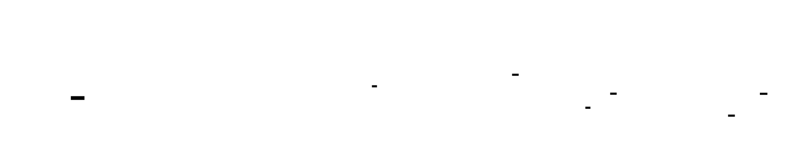


---
<!-- END_TDD_MOD -->


<!-- TDD_MOD_ID: distributed-m3 -->
# Technical Design Document: Pipeline Parallelism
**Module ID:** `distributed-m3`  
**Version:** 1.0  
**Estimated Hours:** 16-20
---
## 1. Module Charter
This module implements pipeline parallelism for inter-layer model partitioning, distributing sequential transformer layers across multiple GPUs. Each GPU holds a contiguous "stage" of layers (e.g., layers 0-19 on GPU 0, layers 20-39 on GPU 1), with micro-batches flowing through the pipeline like an assembly line. The module provides two scheduling strategies: GPipe (all forwards, then all backwards) and 1F1B (interleaved forward/backward passes). The key challenge is minimizing the "pipeline bubble"—idle time when stages wait for data—while bounding activation memory. 1F1B limits in-flight micro-batches to the pipeline depth, reducing memory by 2-4× compared to GPipe. Communication uses point-to-point send/recv operations (not all-reduce), tolerating InfiniBand latency for cross-node pipelines.
**What this module does NOT do:** Tensor parallelism (intra-layer sharding), data parallelism (batch replication), ZeRO optimization, or automatic schedule selection. It assumes the model can fit within each stage's memory when partitioned.
**Upstream dependencies:** PyTorch distributed primitives (`torch.distributed`), NCCL/Gloo backend, partitioned model layers from training orchestrator.
**Downstream consumers:** 3D parallelism integration layer (combines with TP and DP), checkpoint manager (must save per-stage state), training orchestrator.
**Invariants:**
1. Each micro-batch flows through all stages in order (stage 0 → 1 → 2 → ... → P-1 for forward)
2. Backward passes flow in reverse stage order (stage P-1 → P-2 → ... → 0)
3. Activation memory is bounded to at most P micro-batches simultaneously (1F1B) or M micro-batches (GPipe)
4. Gradients for a micro-batch are only computed after its forward pass completes through all stages
5. Send/recv operations are properly paired to avoid deadlock
6. Stage compute times must be balanced (< 10% variance) for optimal throughput
---
## 2. File Structure
```
distributed_training/
├── pipeline_parallel/
│   ├── __init__.py                 # [1] Subpackage init, exports main classes
│   ├── config.py                   # [2] PipelineParallelConfig dataclass
│   ├── stage.py                    # [3] PipelineStage class
│   ├── partitioner.py              # [4] Model partitioning utilities
│   ├── communicator.py             # [5] Point-to-point send/recv wrappers
│   ├── schedules/
│   │   ├── __init__.py             # [6] Schedule subpackage init
│   │   ├── base.py                 # [7] Base Schedule class
│   │   ├── gpipe.py                # [8] GPipeSchedule implementation
│   │   ├── f1b1.py                 # [9] F1B1Schedule implementation
│   │   └── interleaved.py          # [10] InterleavedSchedule (virtual stages)
│   ├── balancer.py                 # [11] StageBalancer for compute balancing
│   ├── memory.py                   # [12] Activation memory management
│   └── analysis.py                 # [13] Bubble analysis utilities
├── tests/
│   ├── __init__.py                 # [14] Test package init
│   ├── test_stage_partition.py     # [15] Stage partitioning tests
│   ├── test_communication.py       # [16] Send/recv communication tests
│   ├── test_gpipe_schedule.py      # [17] GPipe schedule tests
│   ├── test_f1b1_schedule.py       # [18] 1F1B schedule tests
│   ├── test_memory_bounds.py       # [19] Memory bounding tests
│   ├── test_stage_balance.py       # [20] Stage balancing tests
│   └── test_integration.py         # [21] Full pipeline integration tests
├── scripts/
│   ├── benchmark_bubble.py         # [22] Bubble overhead benchmarking
│   ├── profile_pipeline.py         # [23] Pipeline profiling
│   └── analyze_balance.py          # [24] Stage balance analysis
└── profiles/
    └── layer_timing.json           # [25] Cached layer timing data
```
---
## 3. Complete Data Model
### 3.1 Core Configuration
```python
@dataclass
class PipelineParallelConfig:
    """
    Configuration for pipeline parallelism.
    All fields affect scheduling, memory, and communication patterns.
    """
    # Topology
    pp_size: int                         # Number of pipeline stages (GPUs)
    pp_rank: int                         # This GPU's stage index [0, pp_size-1]
    # Model structure
    num_layers: int                      # Total transformer layers
    hidden_dim: int                      # Model hidden dimension
    num_heads: int                       # Attention heads per layer
    ffn_hidden_dim: int                  # FFN intermediate dimension
    # Micro-batching
    num_micro_batches: int               # Micro-batches per training step
    micro_batch_size: int                # Samples per micro-batch
    # Scheduling
    schedule_type: ScheduleType          # GPIPE or F1B1
    # Memory management
    activation_checkpointing: bool       # Enable gradient checkpointing
    max_activations_gb: float            # Maximum activation memory budget
    # Communication
    overlap_communication: bool          # Overlap send/recv with compute
    async_communication: bool            # Use isend/irecv
    # Derived properties
    @property
    def is_first_stage(self) -> bool:
        """Whether this is the first pipeline stage (has embeddings)."""
        return self.pp_rank == 0
    @property
    def is_last_stage(self) -> bool:
        """Whether this is the last pipeline stage (has output head)."""
        return self.pp_rank == self.pp_size - 1
    @property
    def layers_per_stage(self) -> int:
        """Number of layers per stage (may be uneven)."""
        return self.num_layers // self.pp_size
    @property
    def theoretical_bubble_fraction(self) -> float:
        """
        Theoretical bubble fraction for current configuration.
        GPipe: 2(P-1) / (M + 2(P-1))
        1F1B: (P-1) / (M + P - 1)
        """
        P, M = self.pp_size, self.num_micro_batches
        if self.schedule_type == ScheduleType.GPIPE:
            return 2 * (P - 1) / (M + 2 * (P - 1))
        else:  # F1B1
            return (P - 1) / (M + P - 1)
```
### 3.2 Schedule Type Enumeration
```python
class ScheduleType(Enum):
    """Pipeline scheduling strategies."""
    GPIPE = "gpipe"      # All forwards, then all backwards
    F1B1 = "1f1b"        # One forward, one backward interleaved
    INTERLEAVED = "interleaved"  # Virtual stages for better load balancing
```
### 3.3 Pipeline Stage State
```python
@dataclass
class PipelineStageState:
    """
    Runtime state for a single pipeline stage.
    Tracks activations, gradients, and schedule progress.
    """
    # Stage identification
    stage_id: int                        # This stage's index [0, pp_size-1]
    layer_start: int                     # First layer index in this stage
    layer_end: int                       # Last layer index (exclusive)
    # Model components (this stage only)
    layers: nn.ModuleList                # Transformer layers for this stage
    embeddings: Optional[nn.Module]      # Token/position embeddings (first stage only)
    output_head: Optional[nn.Module]     # LM head (last stage only)
    input_layernorm: Optional[nn.Module] # Final LayerNorm (last stage only)
    # Activation storage (key memory consumer)
    saved_activations: Dict[int, torch.Tensor]   # micro_batch_id -> activation tensor
    saved_inputs: Dict[int, torch.Tensor]        # micro_batch_id -> input tensor
    # Schedule tracking
    forward_count: int                   # Number of forward passes completed
    backward_count: int                  # Number of backward passes completed
    pending_backward_ids: List[int]      # Micro-batch IDs waiting for backward
    # Communication handles
    pending_sends: List[dist.Work]       # Async send operations
    pending_recvs: List[dist.Work]       # Async recv operations
    # Timing (for profiling)
    forward_time_ms: float
    backward_time_ms: float
    communication_time_ms: float
```
### 3.4 Micro-Batch Container
```python
@dataclass
class MicroBatch:
    """
    Container for a single micro-batch of data.
    Flows through the pipeline with associated metadata.
    """
    # Identification
    micro_batch_id: int                  # Unique ID within training step [0, num_micro_batches-1]
    global_batch_id: int                 # ID across all training steps
    # Input data (first stage only)
    input_ids: Optional[torch.Tensor]    # Shape: (micro_batch_size, seq_len)
    attention_mask: Optional[torch.Tensor]  # Shape: (micro_batch_size, seq_len)
    labels: Optional[torch.Tensor]       # Shape: (micro_batch_size, seq_len)
    # Intermediate activations (between stages)
    hidden_states: Optional[torch.Tensor]  # Shape: (micro_batch_size, seq_len, hidden_dim)
    # Loss (last stage only)
    loss: Optional[torch.Tensor]         # Scalar loss tensor
    # Gradient for backward pass
    grad_output: Optional[torch.Tensor]  # Shape matches hidden_states
    # State tracking
    forward_complete: bool               # Has forward pass completed?
    backward_complete: bool              # Has backward pass completed?
    current_stage: int                   # Which stage is processing this micro-batch
```
### 3.5 Schedule Instruction
```python
@dataclass
class ScheduleInstruction:
    """
    A single instruction in the pipeline schedule.
    Represents one operation to execute at a specific time step.
    """
    time_step: int                       # Logical time step in schedule
    stage_id: int                        # Which stage executes this
    operation: str                       # "forward" or "backward"
    micro_batch_id: int                  # Which micro-batch to process
    # Communication info
    send_to: Optional[int]               # Stage to send output to (None if last)
    recv_from: Optional[int]             # Stage to receive input from (None if first)
```
### 3.6 Communication Message
```python
@dataclass
class ActivationMessage:
    """
    Message format for inter-stage communication.
    Sent via point-to-point send/recv operations.
    """
    # Header (sent first, fixed size)
    micro_batch_id: int                  # 4 bytes
    tensor_shape: Tuple[int, ...]        # 4 bytes per dim, max 4 dims = 16 bytes
    tensor_dtype: torch.dtype            # 1 byte encoded
    requires_grad: bool                  # 1 byte
    # Payload (sent after header)
    tensor_data: torch.Tensor            # Variable size: product(shape) * element_size
    @property
    def payload_size_bytes(self) -> int:
        """Calculate payload size in bytes."""
        return self.tensor_data.numel() * self.tensor_data.element_size()
    @property
    def header_size_bytes(self) -> int:
        """Header is fixed at 22 bytes."""
        return 22
```
### 3.7 Stage Balance Analysis
```python
@dataclass
class StageBalanceAnalysis:
    """
    Analysis of load balance across pipeline stages.
    Used to identify bottlenecks and optimize partitioning.
    """
    # Per-stage compute times (ms)
    stage_times: List[float]             # [stage_0_time, stage_1_time, ...]
    # Statistics
    min_time: float
    max_time: float
    mean_time: float
    std_time: float
    # Balance metrics
    imbalance_ratio: float               # max_time / min_time (ideal: 1.0)
    efficiency: float                    # mean_time / max_time (ideal: 1.0)
    # Bubble analysis
    theoretical_bubble_fraction: float
    actual_bubble_fraction: float        # Measured from profiling
    # Recommendations
    bottleneck_stage: int                # Stage with max_time
    suggested_repartition: Optional[List[int]]  # Suggested layer counts per stage
```
### 3.8 Tensor Shape Specifications
```
Pipeline Parallel Tensor Shapes
━━━━━━━━━━━━━━━━━━━━━━━━━━━━━━━━━━━━━━━━━━━━━━━━━━━━━━━━━━━━━━━━━━━━━━━━━━━━━━━━
Tensor                          Shape                                    Notes
━━━━━━━━━━━━━━━━━━━━━━━━━━━━━━━━━━━━━━━━━━━━━━━━━━━━━━━━━━━━━━━━━━━━━━━━━━━━━━━━
Input (first stage):
  input_ids                     (MB, S)                                  Micro-batch
  attention_mask                (MB, S)                                  1=attend, 0=mask
  labels                        (MB, S)                                  Target tokens
Inter-stage activation:
  hidden_states                 (MB, S, H)                               Forward pass
  grad_output                   (MB, S, H)                               Backward pass
Loss (last stage):
  logits                        (MB, S, V)                               Before softmax
  loss                          ()                                       Scalar
Per-layer tensors (within stage):
  layer_input                   (MB, S, H)                               Input to layer
  layer_output                  (MB, S, H)                               Output from layer
  attention_scores              (MB, heads, S, S)                        Per-head scores
Communication buffer:
  send_buffer                   (MB, S, H)                               Contiguous for send
  recv_buffer                   (MB, S, H)                               Pre-allocated for recv
━━━━━━━━━━━━━━━━━━━━━━━━━━━━━━━━━━━━━━━━━━━━━━━━━━━━━━━━━━━━━━━━━━━━━━━━━━━━━━━━
Where:
  MB = micro_batch_size (e.g., 1-4)
  S = sequence_length (e.g., 2048)
  H = hidden_dim (e.g., 4096)
  V = vocab_size (e.g., 32000)
  P = pp_size (number of stages, e.g., 4)
  M = num_micro_batches (e.g., 8-32)
━━━━━━━━━━━━━━━━━━━━━━━━━━━━━━━━━━━━━━━━━━━━━━━━━━━━━━━━━━━━━━━━━━━━━━━━━━━━━━━━
```
### 3.9 Memory Layout Analysis
```
Activation Memory Per Stage
━━━━━━━━━━━━━━━━━━━━━━━━━━━━━━━━━━━━━━━━━━━━━━━━━━━━━━━━━━━━━━━━━━━━━━━━━━━━━━━━
Component              GPipe (M micro-batches)    1F1B (max P in-flight)
━━━━━━━━━━━━━━━━━━━━━━━━━━━━━━━━━━━━━━━━━━━━━━━━━━━━━━━━━━━━━━━━━━━━━━━━━━━━━━━━
Per micro-batch:
  Input activation     MB × S × H × 2 bytes       MB × S × H × 2 bytes
  Per-layer intermed.  ~3 × MB × S × H × 2 bytes  ~3 × MB × S × H × 2 bytes
  (attention, FFN)     
  Per-layer total      ~4 × MB × S × H × 2 bytes  ~4 × MB × S × H × 2 bytes
  With L layers/stage  4 × L × MB × S × H × 2     4 × L × MB × S × H × 2
Total (all in-flight):
  GPipe:               M × per_mb_total           M × per_mb_total
  1F1B:               M × per_mb_total           P × per_mb_total
Example (70B model, P=4, M=32, L=20, MB=1, S=4096, H=8192):
  Per micro-batch:     4 × 20 × 1 × 4096 × 8192 × 2 = 5.4 GB
  GPipe total:         32 × 5.4 = 172.8 GB        32 × 5.4 = 172.8 GB
  1F1B total:          32 × 5.4 = 172.8 GB        4 × 5.4 = 21.6 GB
  1F1B savings:        0%                         87.5%
━━━━━━━━━━━━━━━━━━━━━━━━━━━━━━━━━━━━━━━━━━━━━━━━━━━━━━━━━━━━━━━━━━━━━━━━━━━━━━━━
Note: With gradient checkpointing, per-layer intermediate can be reduced to
      O(sqrt(L)) storage, trading compute for memory.
━━━━━━━━━━━━━━━━━━━━━━━━━━━━━━━━━━━━━━━━━━━━━━━━━━━━━━━━━━━━━━━━━━━━━━━━━━━━━━━━
```
---
## 4. Interface Contracts
### 4.1 PipelineStage
```python
class PipelineStage(nn.Module):
    """
    A single stage in the pipeline containing a subset of transformer layers.
    Handles forward pass, backward pass, and activation storage.
    """
    def __init__(
        self,
        config: PipelineParallelConfig,
        layers: nn.ModuleList,
        embeddings: Optional[nn.Module] = None,
        output_head: Optional[nn.Module] = None,
    ):
        """
        Initialize a pipeline stage.
        Args:
            config: Pipeline parallel configuration
            layers: Transformer layers for this stage
            embeddings: Token/position embeddings (first stage only)
            output_head: LM head for computing logits (last stage only)
        Raises:
            ValueError: If embeddings provided but not first stage
            ValueError: If output_head provided but not last stage
            ValueError: If layers is empty
        Side effects:
            - Moves all modules to CUDA
            - Initializes activation storage dictionaries
        """
        ...
    def forward(
        self,
        input_tensor: torch.Tensor,
        micro_batch_id: int,
        attention_mask: Optional[torch.Tensor] = None,
    ) -> torch.Tensor:
        """
        Execute forward pass through this stage.
        Args:
            input_tensor: 
                - First stage: input_ids, shape (MB, S)
                - Other stages: hidden_states, shape (MB, S, H)
            micro_batch_id: Unique ID for this micro-batch
            attention_mask: Optional attention mask, shape (MB, S)
        Returns:
            Output tensor:
                - Last stage: logits, shape (MB, S, V)
                - Other stages: hidden_states, shape (MB, S, H)
        Side effects:
            - Saves input_tensor to saved_inputs[micro_batch_id]
            - Saves output to saved_activations[micro_batch_id]
        Memory:
            - Stores activations proportional to layers in stage
            - With checkpointing: reduced memory, recomputed in backward
        """
        ...
    def backward(
        self,
        grad_output: torch.Tensor,
        micro_batch_id: int,
    ) -> Optional[torch.Tensor]:
        """
        Execute backward pass through this stage.
        Args:
            grad_output: Gradient from next stage or loss
                - Shape: (MB, S, H) for hidden states
                - Shape: (MB, S, V) for last stage (from loss)
            micro_batch_id: ID of micro-batch to compute gradients for
        Returns:
            Gradient with respect to input:
                - First stage: None (no previous stage)
                - Other stages: shape (MB, S, H)
        Side effects:
            - Clears saved_activations[micro_batch_id]
            - Clears saved_inputs[micro_batch_id]
            - Accumulates gradients in layer parameters
        Precondition:
            - forward() must have been called with same micro_batch_id
            - saved_activations[micro_batch_id] must exist
        """
        ...
    def compute_loss(
        self,
        logits: torch.Tensor,
        labels: torch.Tensor,
    ) -> torch.Tensor:
        """
        Compute loss for last stage (cross-entropy).
        Args:
            logits: Model output, shape (MB, S, V)
            labels: Target tokens, shape (MB, S)
        Returns:
            Scalar loss tensor
        Only callable on last stage. Raises RuntimeError otherwise.
        """
        ...
    def clear_activation(self, micro_batch_id: int) -> None:
        """
        Clear saved activation to free memory.
        Args:
            micro_batch_id: ID of micro-batch to clear
        Should be called after backward() completes to free memory.
        Safe to call even if activation doesn't exist (no-op).
        """
        ...
    def get_num_in_flight(self) -> int:
        """
        Get number of micro-batches with stored activations.
        Returns:
            Count of micro-batches that have completed forward
            but not yet completed backward.
        """
        ...
```
### 4.2 PipelineCommunicator
```python
class PipelineCommunicator:
    """
    Handles point-to-point communication between pipeline stages.
    Uses send/recv operations (not collectives like all-reduce).
    """
    def __init__(
        self,
        pp_rank: int,
        pp_size: int,
        async_communication: bool = True,
    ):
        """
        Initialize communicator.
        Args:
            pp_rank: This stage's rank in pipeline
            pp_size: Total number of pipeline stages
            async_communication: Use isend/irecv for non-blocking ops
        """
        ...
    def send_activation(
        self,
        tensor: torch.Tensor,
        micro_batch_id: int,
        dst_stage: Optional[int] = None,
    ) -> Optional[dist.Work]:
        """
        Send activation tensor to next pipeline stage.
        Args:
            tensor: Activation to send, shape (MB, S, H)
            micro_batch_id: ID of this micro-batch
            dst_stage: Destination stage (default: next stage)
        Returns:
            If async: Work handle to wait on
            If sync: None (operation complete)
        Raises:
            RuntimeError: If this is last stage (no next stage)
        Protocol:
            1. Send header: [micro_batch_id, shape, dtype, requires_grad]
            2. Send tensor data
        Performance:
            - Sync: Blocks until send complete
            - Async: Returns immediately, overlap with compute
        """
        ...
    def recv_activation(
        self,
        micro_batch_id: int,
        src_stage: Optional[int] = None,
        expected_shape: Optional[Tuple[int, ...]] = None,
    ) -> Tuple[torch.Tensor, Optional[dist.Work]]:
        """
        Receive activation tensor from previous pipeline stage.
        Args:
            micro_batch_id: Expected micro-batch ID (for validation)
            src_stage: Source stage (default: previous stage)
            expected_shape: Expected tensor shape (for buffer allocation)
        Returns:
            Tuple of (received tensor, work handle if async)
        Raises:
            RuntimeError: If this is first stage (no previous stage)
            ValueError: If received micro_batch_id doesn't match expected
        Protocol:
            1. Receive header
            2. Allocate buffer based on shape
            3. Receive tensor data into buffer
        Precondition:
            - If async, caller must wait on work handle before using tensor
        """
        ...
    def send_gradient(
        self,
        tensor: torch.Tensor,
        micro_batch_id: int,
        dst_stage: Optional[int] = None,
    ) -> Optional[dist.Work]:
        """
        Send gradient tensor to previous pipeline stage.
        Args:
            tensor: Gradient to send, shape (MB, S, H)
            micro_batch_id: ID of this micro-batch
            dst_stage: Destination stage (default: previous stage)
        Returns:
            If async: Work handle
            If sync: None
        Raises:
            RuntimeError: If this is first stage (no previous stage)
        """
        ...
    def recv_gradient(
        self,
        micro_batch_id: int,
        src_stage: Optional[int] = None,
    ) -> Tuple[torch.Tensor, Optional[dist.Work]]:
        """
        Receive gradient tensor from next pipeline stage.
        Args:
            micro_batch_id: Expected micro-batch ID
            src_stage: Source stage (default: next stage)
        Returns:
            Tuple of (received gradient, work handle if async)
        Raises:
            RuntimeError: If this is last stage (no next stage)
        """
        ...
    def wait_all(self) -> None:
        """
        Wait for all pending async operations to complete.
        Blocks until all sends and receives initiated by this
        communicator have completed.
        """
        ...
```
### 4.3 GPipeSchedule
```python
class GPipeSchedule:
    """
    GPipe schedule: execute all forward passes, then all backward passes.
    Timeline for P=4 stages, M=4 micro-batches:
    Time →
    Stage 0: |F0|F1|F2|F3|                    |B3|B2|B1|B0|
    Stage 1:     |F0|F1|F2|F3|                |B3|B2|B1|B0|
    Stage 2:         |F0|F1|F2|F3|            |B3|B2|B1|B0|
    Stage 3:             |F0|F1|F2|F3|        |B3|B2|B1|B0|
    Bubble fraction: 2(P-1) / (M + 2(P-1))
    Memory: O(M × activation_size) - all micro-batches stored during backward
    Pros: Simple, easy to implement
    Cons: Large bubble, high memory
    """
    def __init__(
        self,
        stage: PipelineStage,
        communicator: PipelineCommunicator,
        num_micro_batches: int,
    ):
        """
        Initialize GPipe schedule.
        Args:
            stage: Pipeline stage to execute schedule on
            communicator: Communication handler
            num_micro_batches: Number of micro-batches per step
        """
        ...
    def execute_step(
        self,
        micro_batches: List[MicroBatch],
    ) -> float:
        """
        Execute one complete pipeline step with GPipe schedule.
        Args:
            micro_batches: List of micro-batch data containers
        Returns:
            Average loss across all micro-batches (last stage only,
            other stages return 0.0)
        Execution phases:
            1. Forward all micro-batches through pipeline
            2. Synchronize (barrier)
            3. Backward all micro-batches through pipeline (reverse order)
        Side effects:
            - Updates model parameters (gradients accumulated)
            - Clears all stored activations after backward
        Invariants after execution:
            - All saved_activations cleared
            - All saved_inputs cleared
            - Gradients accumulated for all parameters
        """
        ...
    def generate_schedule(self) -> List[ScheduleInstruction]:
        """
        Generate the complete schedule as a list of instructions.
        Returns:
            List of ScheduleInstruction in execution order
        Used for visualization and debugging.
        """
        ...
```
### 4.4 F1B1Schedule
```python
class F1B1Schedule:
    """
    1F1B (One Forward One Backward) schedule.
    Timeline for P=4 stages, M=8 micro-batches:
    Phase 1: Warmup (P-1 = 3 forward passes)
    Phase 2: Steady state (alternate F and B)
    Phase 3: Cooldown (P-1 = 3 backward passes)
    Stage 0: |F0|F1|F2|F3|B0|F4|B1|F5|B2|F6|B3|F7|B4|   |B5|   |B6|   |B7|
    Stage 1:     |F0|F1|F2|F3|B0|F4|B1|F5|B2|F6|B3|F7|B4|   |B5|   |B6|   |B7|
    ...
    Bubble fraction: (P-1) / (M + P - 1)
    Memory: O(P × activation_size) - bounded by pipeline depth
    Pros: Smaller bubble, bounded memory
    Cons: More complex implementation
    """
    def __init__(
        self,
        stage: PipelineStage,
        communicator: PipelineCommunicator,
        num_micro_batches: int,
    ):
        """
        Initialize 1F1B schedule.
        Args:
            stage: Pipeline stage to execute schedule on
            communicator: Communication handler
            num_micro_batches: Number of micro-batches per step
        Raises:
            ValueError: If num_micro_batches < pp_size (insufficient for warmup)
        """
        ...
    def execute_step(
        self,
        micro_batches: List[MicroBatch],
    ) -> float:
        """
        Execute one complete pipeline step with 1F1B schedule.
        Args:
            micro_batches: List of micro-batch data containers
        Returns:
            Average loss across all micro-batches
        Execution phases:
            1. Warmup: Execute (P-1) forward passes to fill pipeline
            2. Steady state: Alternate 1 forward, 1 backward
            3. Cooldown: Execute remaining backward passes
        Memory invariant:
            At any time, at most P micro-batches have stored activations
        """
        ...
    def get_warmup_microbatches(self) -> int:
        """Return number of warmup forward passes."""
        return min(self.pp_size - 1, self.num_micro_batches)
    def get_steady_state_microbatches(self) -> int:
        """Return number of steady-state (F,B) pairs."""
        return max(0, self.num_micro_batches - self.pp_size + 1)
```
### 4.5 StageBalancer
```python
class StageBalancer:
    """
    Analyzes and optimizes pipeline stage balance.
    Load imbalance is a major source of inefficiency. If one stage
    takes 2× longer than others, the entire pipeline waits.
    """
    def __init__(
        self,
        model: nn.Module,
        num_stages: int,
    ):
        """
        Initialize stage balancer.
        Args:
            model: Full model to analyze
            num_stages: Target number of pipeline stages
        """
        ...
    def profile_layers(
        self,
        sample_input: torch.Tensor,
        num_warmup_runs: int = 5,
        num_profile_runs: int = 10,
    ) -> Dict[str, float]:
        """
        Profile compute time for each layer.
        Args:
            sample_input: Sample input tensor for profiling
            num_warmup_runs: Warmup iterations (not timed)
            num_profile_runs: Timed iterations for averaging
        Returns:
            Dictionary mapping layer name to compute time (ms)
        Side effects:
            - Runs forward passes through model
            - Caches results to profiles/layer_timing.json
        """
        ...
    def find_optimal_partition(
        self,
        layer_times: Optional[Dict[str, float]] = None,
    ) -> List[Tuple[int, int]]:
        """
        Find optimal layer partitioning to balance stage times.
        Args:
            layer_times: Pre-profiled layer times (if None, uses cached)
        Returns:
            List of (start_layer, end_layer) tuples for each stage
        Algorithm:
            Uses dynamic programming to minimize maximum stage time
            (minimize makespan). This is NP-hard in general, but
            tractable for typical model sizes.
        Example output for 80 layers, 4 stages:
            [(0, 18), (18, 38), (38, 58), (58, 80)]
        """
        ...
    def analyze_balance(
        self,
        partition: List[Tuple[int, int]],
        layer_times: Dict[str, float],
    ) -> StageBalanceAnalysis:
        """
        Analyze balance quality of a given partition.
        Args:
            partition: Layer ranges for each stage
            layer_times: Per-layer compute times
        Returns:
            StageBalanceAnalysis with efficiency metrics and recommendations
        """
        ...
    def visualize_schedule(
        self,
        partition: List[Tuple[int, int]],
        num_micro_batches: int,
        schedule_type: ScheduleType,
    ) -> str:
        """
        Generate ASCII visualization of pipeline schedule.
        Args:
            partition: Layer ranges for each stage
            num_micro_batches: Number of micro-batches
            schedule_type: GPIPE or F1B1
        Returns:
            ASCII art string showing timeline
        """
        ...
```
### 4.6 BubbleAnalyzer
```python
class BubbleAnalyzer:
    """
    Analyzes pipeline bubble overhead.
    The bubble is idle time when stages wait for data.
    Understanding bubble composition helps optimize configuration.
    """
    def __init__(
        self,
        pp_size: int,
        num_micro_batches: int,
        schedule_type: ScheduleType,
    ):
        """
        Initialize bubble analyzer.
        Args:
            pp_size: Number of pipeline stages
            num_micro_batches: Number of micro-batches
            schedule_type: Scheduling strategy
        """
        ...
    def theoretical_bubble_fraction(self) -> float:
        """
        Calculate theoretical bubble fraction.
        Returns:
            Fraction of time spent in bubble (0.0 to 1.0)
        GPipe: 2(P-1) / (M + 2(P-1))
        1F1B: (P-1) / (M + P - 1)
        """
        ...
    def theoretical_bubble_time_ms(
        self,
        step_time_ms: float,
    ) -> float:
        """
        Calculate theoretical bubble time in milliseconds.
        Args:
            step_time_ms: Measured step time
        Returns:
            Bubble time in ms
        """
        ...
    def recommended_micro_batches(
        self,
        target_bubble_fraction: float = 0.1,
    ) -> int:
        """
        Recommend minimum micro-batches to achieve target bubble.
        Args:
            target_bubble_fraction: Target bubble fraction (default 10%)
        Returns:
            Recommended number of micro-batches
        GPipe: M > 2(P-1)(1-f)/f where f = target_bubble_fraction
        1F1B: M > (P-1)(1-f)/f
        """
        ...
    def analyze_measured_bubble(
        self,
        stage_times: List[float],
        total_step_time: float,
    ) -> Dict[str, float]:
        """
        Analyze actual bubble from measured timings.
        Args:
            stage_times: Per-stage compute times
            total_step_time: Total step time
        Returns:
            Dictionary with bubble analysis:
                - theoretical_bubble_fraction
                - actual_bubble_fraction
                - imbalance_overhead_fraction
                - communication_overhead_fraction
        """
        ...
```
---
## 5. Algorithm Specification
### 5.1 Pipeline Stage Forward Algorithm
```
ALGORITHM: pipeline_stage_forward
━━━━━━━━━━━━━━━━━━━━━━━━━━━━━━━━━━━━━━━━━━━━━━━━━━━━━━━━━━━━━━━━━━━━━━━━━━━━━━━━
INPUT:
    - input_tensor: torch.Tensor
        First stage: input_ids, shape (MB, S)
        Other stages: hidden_states, shape (MB, S, H)
    - micro_batch_id: int
    - attention_mask: Optional[torch.Tensor], shape (MB, S)
OUTPUT: torch.Tensor
    Last stage: logits, shape (MB, S, V)
    Other stages: hidden_states, shape (MB, S, H)
PRECONDITION: Stage is initialized, input on correct device
1. SAVE input for backward pass:
   saved_inputs[micro_batch_id] = input_tensor.detach().clone()
   # Detach to break computation graph; will recompute in backward
2. APPLY embeddings if first stage:
   IF is_first_stage AND embeddings is not None:
       hidden = embeddings(input_tensor)  # (MB, S) -> (MB, S, H)
   ELSE:
       hidden = input_tensor  # Already hidden states
3. FORWARD through transformer layers:
   FOR each layer IN layers:
       IF activation_checkpointing:
           # Recompute activations during backward to save memory
           hidden = checkpoint(layer, hidden, attention_mask, use_reentrant=False)
       ELSE:
           hidden = layer(hidden, attention_mask)
       # hidden: (MB, S, H)
4. APPLY output head if last stage:
   IF is_last_stage AND output_head is not None:
       # Compute logits
       logits = output_head(hidden)  # (MB, S, H) -> (MB, S, V)
       output = logits
   ELSE:
       output = hidden
5. SAVE output activation for backward pass:
   saved_activations[micro_batch_id] = output
6. RETURN output
POSTCONDITION:
    - saved_inputs[micro_batch_id] contains input tensor
    - saved_activations[micro_batch_id] contains output tensor
    - Both tensors on GPU, ready for backward pass
MEMORY:
    Per-layer activation: ~4 × MB × S × H × 2 bytes (fp16)
    Total for L layers: ~4 × L × MB × S × H × 2 bytes
━━━━━━━━━━━━━━━━━━━━━━━━━━━━━━━━━━━━━━━━━━━━━━━━━━━━━━━━━━━━━━━━━━━━━━━━━━━━━━━━
```
### 5.2 Pipeline Stage Backward Algorithm
```
ALGORITHM: pipeline_stage_backward
━━━━━━━━━━━━━━━━━━━━━━━━━━━━━━━━━━━━━━━━━━━━━━━━━━━━━━━━━━━━━━━━━━━━━━━━━━━━━━━━
INPUT:
    - grad_output: torch.Tensor
        From next stage or loss: shape (MB, S, H) or (MB, S, V) for last stage
    - micro_batch_id: int
OUTPUT: Optional[torch.Tensor]
    First stage: None
    Other stages: grad_input, shape (MB, S, H)
PRECONDITION: forward() was called with same micro_batch_id
1. RETRIEVE saved tensors:
   input_tensor = saved_inputs[micro_batch_id]
   output_tensor = saved_activations[micro_batch_id]
   IF input_tensor is None OR output_tensor is None:
       RAISE RuntimeError("No saved activation for micro_batch_id")
2. RECOMPUTE forward pass to build computation graph:
   # This is necessary because we detached in forward
   # With gradient checkpointing, this is already handled
   IF NOT activation_checkpointing:
       # Recompute forward to get gradient-connected tensors
       IF is_first_stage AND embeddings is not None:
           hidden = embeddings(input_tensor)
       ELSE:
           hidden = input_tensor
       FOR each layer IN layers:
           hidden = layer(hidden, attention_mask)
       IF is_last_stage AND output_head is not None:
           output = output_head(hidden)
       ELSE:
           output = hidden
   ELSE:
       # Checkpointing handles recomputation
       output = output_tensor  # Already connected via checkpoint
3. ENABLE gradients on output:
   output.requires_grad_(True)
4. BACKWARD pass:
   torch.autograd.backward(output, grad_output)
   # This computes gradients for all parameters in this stage
   # And populates grad_input if input requires grad
5. GET gradient w.r.t. input:
   IF is_first_stage:
       grad_input = None  # No previous stage
   ELSE:
       grad_input = input_tensor.grad.clone()
       # Shape: (MB, S, H)
6. CLEANUP saved tensors:
   del saved_inputs[micro_batch_id]
   del saved_activations[micro_batch_id]
7. RETURN grad_input
POSTCONDITION:
    - saved_inputs[micro_batch_id] deleted
    - saved_activations[micro_batch_id] deleted
    - Parameter gradients accumulated (not cleared)
    - grad_input ready to send to previous stage
━━━━━━━━━━━━━━━━━━━━━━━━━━━━━━━━━━━━━━━━━━━━━━━━━━━━━━━━━━━━━━━━━━━━━━━━━━━━━━━━
```
### 5.3 GPipe Schedule Algorithm
```
ALGORITHM: gpipe_execute_step
━━━━━━━━━━━━━━━━━━━━━━━━━━━━━━━━━━━━━━━━━━━━━━━━━━━━━━━━━━━━━━━━━━━━━━━━━━━━━━━━
INPUT:
    - micro_batches: List[MicroBatch], length M
    - stage: PipelineStage
    - communicator: PipelineCommunicator
OUTPUT: float (average loss)
PRECONDITION: All micro_batches have valid input data
PHASE 1: FORWARD PASSES (all micro-batches)
1. FOR mb_id = 0 TO M-1:
   1a. GET input tensor:
       IF is_first_stage:
           input_tensor = micro_batches[mb_id].input_ids
       ELSE:
           # Receive from previous stage
           input_tensor, work = communicator.recv_activation(mb_id)
           IF work is not None:
               work.wait()  # Ensure receive complete
   1b. EXECUTE forward pass:
       output = stage.forward(input_tensor, mb_id, attention_mask)
   1c. SEND to next stage or compute loss:
       IF is_last_stage:
           # Compute loss
           loss = stage.compute_loss(output, micro_batches[mb_id].labels)
           losses[mb_id] = loss
       ELSE:
           # Send to next stage
           communicator.send_activation(output, mb_id)
2. SYNCHRONIZE all stages:
   dist.barrier()  # Ensure all forwards complete
PHASE 2: BACKWARD PASSES (all micro-batches, reverse order)
3. FOR mb_id = M-1 DOWNTO 0:
   3a. GET gradient:
       IF is_last_stage:
           # Gradient from loss
           loss = losses[mb_id]
           grad_output = torch.autograd.grad(loss, saved_activations[mb_id])[0]
       ELSE:
           # Receive from next stage
           grad_output, work = communicator.recv_gradient(mb_id)
           IF work is not None:
               work.wait()
   3b. EXECUTE backward pass:
       grad_input = stage.backward(grad_output, mb_id)
   3c. SEND gradient to previous stage:
       IF NOT is_first_stage:
           communicator.send_gradient(grad_input, mb_id)
4. COMPUTE average loss:
   IF is_last_stage:
       avg_loss = sum(losses) / M
   ELSE:
       # Receive loss from last stage
       loss_tensor = torch.tensor([0.0])
       dist.broadcast(loss_tensor, src=pp_size-1)
       avg_loss = loss_tensor.item()
5. RETURN avg_loss
POSTCONDITION:
    - All activations cleared
    - All gradients accumulated
    - Ready for optimizer step
BUBBLE ANALYSIS:
    Total time = M × T + 2 × (P-1) × T
    Where T = forward + backward time per micro-batch
    Bubble fraction = 2(P-1) / (M + 2(P-1))
MEMORY:
    Peak activations = M × activation_per_microbatch
    All M micro-batches stored simultaneously during backward phase
━━━━━━━━━━━━━━━━━━━━━━━━━━━━━━━━━━━━━━━━━━━━━━━━━━━━━━━━━━━━━━━━━━━━━━━━━━━━━━━━
```
### 5.4 1F1B Schedule Algorithm
```
ALGORITHM: f1b1_execute_step
━━━━━━━━━━━━━━━━━━━━━━━━━━━━━━━━━━━━━━━━━━━━━━━━━━━━━━━━━━━━━━━━━━━━━━━━━━━━━━━━
INPUT:
    - micro_batches: List[MicroBatch], length M
    - stage: PipelineStage
    - communicator: PipelineCommunicator
OUTPUT: float (average loss)
PRECONDITION: M >= P (enough micro-batches for warmup)
COMPUTE schedule parameters:
    num_warmup = min(P-1, M)         # Warmup forward passes
    num_steady = M - num_warmup      # Steady-state (F,B) pairs
    num_cooldown = num_warmup        # Cooldown backward passes
PHASE 1: WARMUP (fill the pipeline)
1. FOR i = 0 TO num_warmup - 1:
    forward_idx = i
    1a. GET input:
        IF is_first_stage:
            input = micro_batches[forward_idx].input_ids
        ELSE:
            input, work = communicator.recv_activation(forward_idx)
            IF work: work.wait()
    1b. FORWARD pass:
        output = stage.forward(input, forward_idx, attention_mask)
    1c. SEND or save loss:
        IF is_last_stage:
            loss = stage.compute_loss(output, micro_batches[forward_idx].labels)
            losses[forward_idx] = loss
        ELSE:
            communicator.send_activation(output, forward_idx)
    1d. TRACK pending backward:
        pending_backward_ids.append(forward_idx)
PHASE 2: STEADY STATE (alternate forward and backward)
2. FOR i = 0 TO num_steady - 1:
    forward_idx = num_warmup + i
    backward_idx = pending_backward_ids.pop(0)  # Oldest pending
    2a. FORWARD pass (same as warmup):
        IF is_first_stage:
            input = micro_batches[forward_idx].input_ids
        ELSE:
            input, work = communicator.recv_activation(forward_idx)
            IF work: work.wait()
        output = stage.forward(input, forward_idx, attention_mask)
        IF is_last_stage:
            loss = stage.compute_loss(output, micro_batches[forward_idx].labels)
            losses[forward_idx] = loss
        ELSE:
            communicator.send_activation(output, forward_idx)
        pending_backward_ids.append(forward_idx)
    2b. BACKWARD pass:
        IF is_last_stage:
            loss = losses[backward_idx]
            grad_output = torch.autograd.grad(loss, 
                stage.saved_activations[backward_idx])[0]
        ELSE:
            grad_output, work = communicator.recv_gradient(backward_idx)
            IF work: work.wait()
        grad_input = stage.backward(grad_output, backward_idx)
        IF NOT is_first_stage:
            communicator.send_gradient(grad_input, backward_idx)
PHASE 3: COOLDOWN (drain remaining backward passes)
3. WHILE pending_backward_ids not empty:
    backward_idx = pending_backward_ids.pop(0)
    3a. GET gradient:
        IF is_last_stage:
            loss = losses[backward_idx]
            grad_output = torch.autograd.grad(loss,
                stage.saved_activations[backward_idx])[0]
        ELSE:
            grad_output, work = communicator.recv_gradient(backward_idx)
            IF work: work.wait()
    3b. BACKWARD pass:
        grad_input = stage.backward(grad_output, backward_idx)
        IF NOT is_first_stage:
            communicator.send_gradient(grad_input, backward_idx)
4. COMPUTE average loss:
    IF is_last_stage:
        avg_loss = sum(losses.values()) / M
    ELSE:
        loss_tensor = torch.tensor([0.0])
        dist.broadcast(loss_tensor, src=pp_size-1)
        avg_loss = loss_tensor.item()
5. RETURN avg_loss
MEMORY INVARIANT:
    At any time: len(pending_backward_ids) <= P
    Peak activations = P × activation_per_microbatch
BUBBLE ANALYSIS:
    Bubble time = (P-1) × T
    Total time = M × T + (P-1) × T
    Bubble fraction = (P-1) / (M + P - 1)
━━━━━━━━━━━━━━━━━━━━━━━━━━━━━━━━━━━━━━━━━━━━━━━━━━━━━━━━━━━━━━━━━━━━━━━━━━━━━━━━
```
### 5.5 Point-to-Point Communication Protocol
```
ALGORITHM: send_activation (point-to-point)
━━━━━━━━━━━━━━━━━━━━━━━━━━━━━━━━━━━━━━━━━━━━━━━━━━━━━━━━━━━━━━━━━━━━━━━━━━━━━━━━
INPUT:
    - tensor: torch.Tensor, shape (MB, S, H)
    - micro_batch_id: int
    - dst_rank: int (global rank of destination)
OUTPUT: Optional[dist.Work] (if async)
PRECONDITION: dst_rank is adjacent in pipeline
PROTOCOL:
1. PACK header:
    header = torch.tensor([
        micro_batch_id,
        tensor.dim(),
        tensor.shape[0],  # MB
        tensor.shape[1],  # S
        tensor.shape[2],  # H
        dtype_code,       # 0=fp32, 1=fp16, 2=bf16
        requires_grad,    # 0 or 1
    ], dtype=torch.long, device='cpu')
2. SEND header:
    IF async:
        header_work = dist.isend(header, dst=dst_rank)
    ELSE:
        dist.send(header, dst=dst_rank)
3. SEND tensor data:
    tensor_contiguous = tensor.contiguous()
    IF async:
        tensor_work = dist.isend(tensor_contiguous, dst=dst_rank)
        RETURN tensor_work
    ELSE:
        dist.send(tensor_contiguous, dst=dst_rank)
        RETURN None
COMMUNICATION VOLUME:
    Header: 8 values × 8 bytes = 64 bytes
    Tensor: MB × S × H × element_size
    Example (MB=1, S=2048, H=4096, fp16): 16 MB
LATENCY:
    Intra-node (NVLink): < 1ms
    Inter-node (InfiniBand): 5-20ms depending on network
━━━━━━━━━━━━━━━━━━━━━━━━━━━━━━━━━━━━━━━━━━━━━━━━━━━━━━━━━━━━━━━━━━━━━━━━━━━━━━━━
ALGORITHM: recv_activation (point-to-point)
━━━━━━━━━━━━━━━━━━━━━━━━━━━━━━━━━━━━━━━━━━━━━━━━━━━━━━━━━━━━━━━━━━━━━━━━━━━━━━━━
INPUT:
    - expected_micro_batch_id: int
    - src_rank: int (global rank of source)
OUTPUT: Tuple[torch.Tensor, Optional[dist.Work]]
PRECONDITION: src_rank is adjacent in pipeline
PROTOCOL:
1. RECEIVE header:
    header = torch.empty(8, dtype=torch.long, device='cpu')
    IF async:
        header_work = dist.irecv(header, src=src_rank)
        header_work.wait()
    ELSE:
        dist.recv(header, src=src_rank)
2. PARSE header:
    micro_batch_id = header[0].item()
    ndim = header[1].item()
    shape = tuple(header[2:2+ndim].tolist())
    dtype_code = header[2+ndim].item()
    requires_grad = header[2+ndim+1].item()
    # Map dtype code to torch dtype
    dtype_map = {0: torch.float32, 1: torch.float16, 2: torch.bfloat16}
    dtype = dtype_map[dtype_code]
3. VALIDATE micro_batch_id:
    IF micro_batch_id != expected_micro_batch_id:
        RAISE ValueError(f"Expected micro_batch_id {expected_micro_batch_id}, "
                        f"got {micro_batch_id}")
4. ALLOCATE receive buffer:
    tensor = torch.empty(shape, dtype=dtype, device='cuda')
5. RECEIVE tensor data:
    IF async:
        tensor_work = dist.irecv(tensor, src=src_rank)
        RETURN (tensor, tensor_work)
    ELSE:
        dist.recv(tensor, src=src_rank)
        RETURN (tensor, None)
POSTCONDITION:
    - tensor contains received activation
    - If async, caller must wait on work handle before using tensor
━━━━━━━━━━━━━━━━━━━━━━━━━━━━━━━━━━━━━━━━━━━━━━━━━━━━━━━━━━━━━━━━━━━━━━━━━━━━━━━━
```
### 5.6 Stage Balancing Algorithm
```
ALGORITHM: find_optimal_partition (dynamic programming)
━━━━━━━━━━━━━━━━━━━━━━━━━━━━━━━━━━━━━━━━━━━━━━━━━━━━━━━━━━━━━━━━━━━━━━━━━━━━━━━━
INPUT:
    - layer_times: List[float], length N (time per layer in ms)
    - num_stages: int (P, number of pipeline stages)
OUTPUT: List[Tuple[int, int]], length P (layer ranges per stage)
PRECONDITION: N >= P (at least one layer per stage)
GOAL: Minimize maximum stage time (makespan)
This is the "minimum makespan scheduling" problem - NP-hard in general.
We use dynamic programming for exact solution on reasonable N.
1. COMPUTE prefix sums:
    prefix_sum[0] = 0
    FOR i = 1 TO N:
        prefix_sum[i] = prefix_sum[i-1] + layer_times[i-1]
    # prefix_sum[i] = total time for layers 0 to i-1
2. DEFINE recursive function:
    def min_makespan(layer_start, stages_remaining):
        # Returns (min_makespan, partition)
        IF stages_remaining == 1:
            # All remaining layers in one stage
            stage_time = prefix_sum[N] - prefix_sum[layer_start]
            RETURN (stage_time, [(layer_start, N)])
        best_makespan = infinity
        best_partition = None
        # Try all possible split points
        FOR split = layer_start + 1 TO N - stages_remaining + 1:
            stage_time = prefix_sum[split] - prefix_sum[layer_start]
            # Recursively partition remaining layers
            remaining_makespan, remaining_partition = 
                min_makespan(split, stages_remaining - 1)
            makespan = max(stage_time, remaining_makespan)
            IF makespan < best_makespan:
                best_makespan = makespan
                best_partition = [(layer_start, split)] + remaining_partition
        RETURN (best_makespan, best_partition)
3. CALL recursive function:
    makespan, partition = min_makespan(0, num_stages)
4. RETURN partition
COMPLEXITY:
    Time: O(N^2 × P) with memoization
    Space: O(N × P) for memoization table
EXAMPLE:
    layer_times = [10, 12, 8, 15, 11, 9, 13, 10]  # 8 layers
    num_stages = 4
    Optimal partition: [(0, 2), (2, 4), (4, 6), (6, 8)]
    Stage times: [22, 23, 20, 23]
    Makespan: 23 ms
    Efficiency: 22/23 = 95.7%
HEURISTIC ALTERNATIVE (for large N):
    Use greedy "longest processing time first" (LPT):
    1. Sort layers by time (descending)
    2. Assign each layer to stage with minimum current time
    3. Reorder to maintain layer sequence
━━━━━━━━━━━━━━━━━━━━━━━━━━━━━━━━━━━━━━━━━━━━━━━━━━━━━━━━━━━━━━━━━━━━━━━━━━━━━━━━
```
---
## 6. Error Handling Matrix
| Error | Detected By | Recovery | User-Visible? |
|-------|-------------|----------|---------------|
| `num_micro_batches < pp_size` | `F1B1Schedule.__init__` | Raise `ValueError` with minimum requirement | Yes - clear error message |
| `Stage has no layers` | `PipelineStage.__init__` | Raise `ValueError` - partition must assign layers | Yes - check partition config |
| `Embeddings on non-first stage` | `PipelineStage.__init__` | Raise `ValueError` - embeddings only on stage 0 | Yes - clear constraint |
| `Output head on non-last stage` | `PipelineStage.__init__` | Raise `ValueError` - output head only on last stage | Yes - clear constraint |
| `Send/recv deadlock` | Timeout in `dist.send/recv` | Raise `RuntimeError` - check send/recv pairing | Yes - with debug suggestions |
| `Missing activation for backward` | `PipelineStage.backward` | Raise `RuntimeError` - forward not called for this micro_batch_id | Yes - sequence error |
| `Micro-batch ID mismatch` | `PipelineCommunicator.recv_*` | Raise `ValueError` - received unexpected micro-batch | Yes - scheduling bug |
| `Activation memory leak` | Memory profiling, `get_num_in_flight()` | Log warning, may cause OOM | Yes - memory warning |
| `Stage compute imbalance` | `StageBalancer.analyze_balance` | Return analysis with recommendations | Yes - profiling output |
| `Pipeline bubble too high` | `BubbleAnalyzer` analysis | Log warning with recommended micro-batch count | Yes - configuration advice |
| `Barrier timeout` | `dist.barrier()` timeout | Raise `RuntimeError` - stage crashed or hung | Yes - with stage info |
| `Gradient timing mismatch` | Backward called before forward complete | Raise `RuntimeError` - invalid schedule execution | Yes - schedule bug |
---
## 7. Implementation Sequence with Checkpoints
### Phase 1: PipelineStage Implementation (3-4 hours)
**Files:** `pipeline_parallel/__init__.py`, `pipeline_parallel/config.py`, `pipeline_parallel/stage.py`
**Implementation Steps:**
1. Create `PipelineParallelConfig` dataclass with all configuration fields
2. Create `ScheduleType` enum with GPIPE and F1B1 values
3. Implement `PipelineStage.__init__()`:
   - Store config and layer indices
   - Handle embeddings (first stage only) and output head (last stage only)
   - Initialize activation storage dictionaries
4. Implement `PipelineStage.forward()`:
   - Save input and output activations
   - Handle embedding lookup for first stage
   - Iterate through layers with optional checkpointing
   - Handle output projection for last stage
5. Implement `PipelineStage.backward()`:
   - Retrieve saved activations
   - Recompute forward if not checkpointed
   - Execute backward pass
   - Clean up saved tensors
6. Implement `PipelineStage.clear_activation()` and `get_num_in_flight()`
**Checkpoint 1:**
```bash
# Test stage creation and forward/backward
python -c "
import torch
import torch.nn as nn
from pipeline_parallel import PipelineStage, PipelineParallelConfig
# Create simple layers
layers = nn.ModuleList([nn.Linear(64, 64) for _ in range(4)])
# Create stage
config = PipelineParallelConfig(pp_size=2, pp_rank=0, num_layers=8)
stage = PipelineStage(config, layers)
# Test forward
x = torch.randn(2, 4, 64)
output = stage.forward(x, micro_batch_id=0)
print(f'Forward output shape: {output.shape}')  # Should be (2, 4, 64)
# Test backward
grad = torch.randn_like(output)
grad_input = stage.backward(grad, micro_batch_id=0)
print(f'Backward grad_input shape: {grad_input.shape}')  # Should be (2, 4, 64)
print(f'In-flight count: {stage.get_num_in_flight()}')  # Should be 0
"
```
**Expected output:** Forward and backward shapes correct, in-flight count is 0 after backward.
---
### Phase 2: Point-to-Point Communication (2-3 hours)
**Files:** `pipeline_parallel/communicator.py`
**Implementation Steps:**
1. Implement `PipelineCommunicator.__init__()` with rank and size tracking
2. Implement `send_activation()`:
   - Pack header with micro_batch_id, shape, dtype
   - Send header first
   - Send tensor data
   - Support async mode with work handle
3. Implement `recv_activation()`:
   - Receive header first
   - Parse and validate micro_batch_id
   - Allocate buffer
   - Receive tensor data
   - Support async mode
4. Implement `send_gradient()` and `recv_gradient()` (same pattern)
5. Implement `wait_all()` for async operation completion
**Checkpoint 2:**
```bash
# Test communication between two processes
torchrun --nproc_per_node=2 -m pytest tests/test_communication.py -v
# Expected tests:
# test_send_recv_activation ... ok
# test_send_recv_gradient ... ok
# test_micro_batch_id_validation ... ok
# test_async_communication ... ok
```
**Verification:** Send and receive work correctly between adjacent ranks, micro_batch_id is validated.
---
### Phase 3: GPipe Schedule (3-4 hours)
**Files:** `pipeline_parallel/schedules/base.py`, `pipeline_parallel/schedules/gpipe.py`
**Implementation Steps:**
1. Create `Schedule` base class with abstract `execute_step()` method
2. Implement `GPipeSchedule.__init__()` storing stage, communicator, and micro-batch count
3. Implement `execute_step()` following algorithm 5.3:
   - Phase 1: Forward all micro-batches
   - Synchronize with barrier
   - Phase 2: Backward all micro-batches (reverse order)
4. Implement loss computation and broadcasting
5. Implement `generate_schedule()` for visualization
**Checkpoint 3:**
```bash
# Test GPipe schedule with 4 stages
torchrun --nproc_per_node=4 -m pytest tests/test_gpipe_schedule.py -v
# Expected tests:
# test_gpipe_forward_all_microbatches ... ok
# test_gpipe_backward_reverse_order ... ok
# test_gpipe_loss_broadcast ... ok
# test_gpipe_gradient_accumulation ... ok
```
**Verification:** All micro-batches complete forward before any backward, loss is correctly computed and broadcast.
---
### Phase 4: 1F1B Schedule (4-5 hours)
**Files:** `pipeline_parallel/schedules/f1b1.py`
**Implementation Steps:**
1. Implement `F1B1Schedule.__init__()` with validation for sufficient micro-batches
2. Implement `execute_step()` following algorithm 5.4:
   - Compute warmup, steady-state, and cooldown counts
   - Phase 1: Warmup (P-1 forwards)
   - Phase 2: Steady state (alternate F, B)
   - Phase 3: Cooldown (remaining backwards)
3. Track pending_backward_ids carefully
4. Implement memory invariant check (at most P in-flight)
5. Add detailed logging for debugging
**Checkpoint 4:**
```bash
# Test 1F1B schedule with 4 stages, 8 micro-batches
torchrun --nproc_per_node=4 -m pytest tests/test_f1b1_schedule.py -v
# Expected tests:
# test_f1b1_warmup_phase ... ok
# test_f1b1_steady_state_phase ... ok
# test_f1b1_cooldown_phase ... ok
# test_f1b1_memory_bounded ... ok  # Max P in-flight activations
```
**Verification:** Memory stays bounded, schedule executes correctly through all phases.
---
### Phase 5: Stage Balancing (2-3 hours)
**Files:** `pipeline_parallel/balancer.py`, `pipeline_parallel/partitioner.py`
**Implementation Steps:**
1. Implement `StageBalancer.__init__()` with model and stage count
2. Implement `profile_layers()`:
   - Warmup runs
   - Timed forward passes per layer
   - Cache results to JSON
3. Implement `find_optimal_partition()` using DP (algorithm 5.6)
4. Implement `analyze_balance()` with efficiency metrics
5. Implement `visualize_schedule()` for ASCII timeline
**Checkpoint 5:**
```bash
# Test stage balancing
python -c "
import torch
import torch.nn as nn
from pipeline_parallel import StageBalancer
# Create simple model
layers = nn.ModuleList([nn.Linear(64, 64) for _ in range(16)])
# Create balancer
balancer = StageBalancer(layers, num_stages=4)
# Mock layer times (uneven)
layer_times = {f'layer_{i}': 10 + i % 3 * 5 for i in range(16)}
# Find optimal partition
partition = balancer.find_optimal_partition(layer_times)
print(f'Partition: {partition}')
# Analyze balance
analysis = balancer.analyze_balance(partition, layer_times)
print(f'Efficiency: {analysis.efficiency:.1%}')
print(f'Imbalance ratio: {analysis.imbalance_ratio:.2f}')
"
# Expected: Efficiency > 90%, imbalance < 1.2
```
---
### Phase 6: Bubble Analysis & Integration Tests (2-3 hours)
**Files:** `pipeline_parallel/analysis.py`, `tests/test_integration.py`, `tests/test_memory_bounds.py`
**Implementation Steps:**
1. Implement `BubbleAnalyzer` with theoretical calculations
2. Implement `recommended_micro_batches()` for configuration guidance
3. Create integration test with full transformer model
4. Create memory bounds test verifying 1F1B memory invariant
5. Profile and benchmark pipeline performance
**Checkpoint 6:**
```bash
# Run integration test
torchrun --nproc_per_node=4 -m pytest tests/test_integration.py -v
# Run bubble analysis benchmark
torchrun --nproc_per_node=4 scripts/benchmark_bubble.py \
    --num-micro-batches 8 16 32 \
    --schedule gpipe 1f1b
# Expected output:
# GPipe (M=8):  Bubble 46.7%
# GPipe (M=16): Bubble 30.0%
# GPipe (M=32): Bubble 17.6%
# 1F1B (M=8):   Bubble 27.3%
# 1F1B (M=16):  Bubble 15.8%
# 1F1B (M=32):  Bubble 8.8%
```
**Verification:** Bubble fractions match theoretical predictions within 5%, memory bounded correctly.
---
## 8. Test Specification
### 8.1 Test: Stage Partition Correctness
```python
def test_stage_partition_correctness():
    """
    Verify stages are correctly partitioned across GPUs.
    """
    pp_size = 4
    num_layers = 32
    # Create partition
    partitioner = ModelPartitioner(num_layers, pp_size)
    partition = partitioner.partition()
    # Verify each GPU gets correct layers
    for rank in range(pp_size):
        stage = create_stage_for_rank(rank, partition)
        # Check layer count
        if rank < pp_size - 1:
            assert len(stage.layers) == num_layers // pp_size
        else:
            # Last stage may have extra layers
            assert len(stage.layers) >= num_layers // pp_size
        # Check layer indices
        expected_start = rank * (num_layers // pp_size)
        assert stage.layer_start == expected_start
    # Verify all layers covered
    all_layers = set()
    for stage in stages:
        all_layers.update(range(stage.layer_start, stage.layer_end))
    assert all_layers == set(range(num_layers))
```
### 8.2 Test: Communication Pairing
```python
def test_send_recv_pairing():
    """
    Verify send and recv are correctly paired to avoid deadlock.
    """
    # Two-process test
    rank = dist.get_rank()
    pp_size = 2
    communicator = PipelineCommunicator(rank, pp_size)
    # Test activation send/recv
    if rank == 0:
        tensor = torch.randn(2, 4, 64, device='cuda')
        communicator.send_activation(tensor, micro_batch_id=0, dst_stage=1)
    else:
        received, _ = communicator.recv_activation(
            expected_micro_batch_id=0, 
            src_stage=0
        )
        assert received.shape == (2, 4, 64)
    # Test gradient send/recv (reverse direction)
    if rank == 1:
        grad = torch.randn(2, 4, 64, device='cuda')
        communicator.send_gradient(grad, micro_batch_id=0, dst_stage=0)
    else:
        received_grad, _ = communicator.recv_gradient(
            expected_micro_batch_id=0,
            src_stage=1
        )
        assert received_grad.shape == (2, 4, 64)
    dist.barrier()  # Ensure all communication complete
```
### 8.3 Test: GPipe Forward-Backward Order
```python
def test_gpipe_forward_backward_order():
    """
    Verify GPipe executes all forwards before any backwards.
    """
    # Track execution order
    execution_log = []
    class LoggingStage(PipelineStage):
        def forward(self, *args, **kwargs):
            mb_id = kwargs.get('micro_batch_id', args[1] if len(args) > 1 else None)
            execution_log.append(('F', mb_id))
            return super().forward(*args, **kwargs)
        def backward(self, *args, **kwargs):
            mb_id = kwargs.get('micro_batch_id', args[1] if len(args) > 1 else None)
            execution_log.append(('B', mb_id))
            return super().backward(*args, **kwargs)
    # Run GPipe schedule
    schedule = GPipeSchedule(stage, communicator, num_micro_batches=4)
    schedule.execute_step(micro_batches)
    # Verify order
    forward_ops = [op for op in execution_log if op[0] == 'F']
    backward_ops = [op for op in execution_log if op[0] == 'B']
    # All forwards should come before all backwards
    last_forward_idx = len(forward_ops) - 1
    first_backward_idx = len(forward_ops)
    for i, (op_type, mb_id) in enumerate(execution_log):
        if op_type == 'F':
            assert i < first_backward_idx
        else:
            assert i >= first_backward_idx
    # Backwards should be in reverse order
    backward_mb_ids = [mb_id for _, mb_id in backward_ops]
    assert backward_mb_ids == list(reversed(range(4)))
```
### 8.4 Test: 1F1B Memory Bounds
```python
def test_f1b1_memory_bounds():
    """
    Verify 1F1B bounds in-flight activations to pipeline depth.
    """
    pp_size = 4
    num_micro_batches = 8
    # Track peak in-flight count
    peak_in_flight = 0
    class MemoryTrackingStage(PipelineStage):
        def forward(self, *args, **kwargs):
            result = super().forward(*args, **kwargs)
            nonlocal peak_in_flight
            peak_in_flight = max(peak_in_flight, self.get_num_in_flight())
            return result
    # Run 1F1B schedule
    schedule = F1B1Schedule(stage, communicator, num_micro_batches)
    schedule.execute_step(micro_batches)
    # Verify memory bound
    # 1F1B should have at most P in-flight at any time
    assert peak_in_flight <= pp_size, \
        f"1F1B had {peak_in_flight} in-flight, expected <= {pp_size}"
    # GPipe would have M in-flight at peak
    # For M=8, P=4: 1F1B saves 50% memory
    gpipe_peak = num_micro_batches
    memory_savings = (gpipe_peak - peak_in_flight) / gpipe_peak
    assert memory_savings >= 0.4, \
        f"Expected at least 40% memory savings, got {memory_savings:.1%}"
```
### 8.5 Test: Gradient Correctness
```python
def test_pipeline_gradient_correctness():
    """
    Verify gradients are correct through pipeline parallelism.
    Compare with single-GPU reference.
    """
    # Create identical models
    torch.manual_seed(42)
    single_gpu_model = create_transformer_model()
    torch.manual_seed(42)
    pipeline_model = create_transformer_model()
    # Same input
    torch.manual_seed(123)
    input_ids = torch.randint(0, 1000, (4, 16))
    labels = torch.randint(0, 1000, (4, 16))
    # Single GPU forward/backward
    single_gpu_model.zero_grad()
    loss_single = single_gpu_model(input_ids, labels=labels).loss
    loss_single.backward()
    grads_single = {name: p.grad.clone() for name, p in single_gpu_model.named_parameters()}
    # Pipeline forward/backward
    # Split into micro-batches
    micro_batches = split_into_micro_batches(input_ids, labels, num_micro_batches=4)
    schedule.execute_step(micro_batches)
    grads_pipeline = {name: p.grad.clone() for name, p in pipeline_model.named_parameters()}
    # Compare gradients
    for name in grads_single:
        grad_single = grads_single[name]
        grad_pipeline = grads_pipeline[name]
        # Gradients should be close (some numerical difference expected)
        assert torch.allclose(grad_single, grad_pipeline, rtol=1e-2, atol=1e-4), \
            f"Gradient mismatch for {name}"
```
### 8.6 Test: Bubble Fraction
```python
def test_bubble_fraction():
    """
    Verify actual bubble fraction matches theoretical prediction.
    """
    pp_size = 4
    num_micro_batches = 16
    analyzer = BubbleAnalyzer(pp_size, num_micro_batches, ScheduleType.F1B1)
    theoretical_bubble = analyzer.theoretical_bubble_fraction()
    # Run profiled training step
    stage_times = profile_pipeline_step(schedule, micro_batches)
    total_time = max(sum(times) for times in stage_times.values())
    # Calculate actual bubble
    analysis = analyzer.analyze_measured_bubble(stage_times, total_time)
    actual_bubble = analysis['actual_bubble_fraction']
    # Actual should be within 10% of theoretical
    bubble_diff = abs(actual_bubble - theoretical_bubble)
    assert bubble_diff < 0.05, \
        f"Bubble fraction {actual_bubble:.1%} differs from theoretical {theoretical_bubble:.1%}"
```
---
## 9. Performance Targets
| Operation | Target | How to Measure |
|-----------|--------|----------------|
| Pipeline bubble (GPipe, P=4, M=32) | < 20% | `(2*(P-1)) / (M + 2*(P-1))` = 15.8% theoretical |
| Pipeline bubble (1F1B, P=4, M=32) | < 10% | `(P-1) / (M + P - 1)` = 8.8% theoretical |
| Stage imbalance | < 10% variance | `std(stage_times) / mean(stage_times)` |
| Point-to-point latency (intra-node) | < 1ms | Time `dist.send/recv` on 16MB tensor |
| Point-to-point latency (inter-node) | < 20ms | Time `dist.send/recv` across nodes |
| 1F1B memory savings vs GPipe | > 50% | Compare `peak_in_flight` for M=2P |
| Forward pass overhead vs non-PP | < 5% | Time forward through partitioned vs full model |
| Backward pass overhead vs non-PP | < 10% | Time backward through partitioned model |
| Barrier time | < 5ms | Time `dist.barrier()` after all forwards |
| Micro-batch throughput scaling | > 85% efficiency | `(T_1) / (P * T_P)` where T_P is step time on P stages |
### Measurement Commands
```bash
# Bubble fraction benchmark
torchrun --nproc_per_node=4 scripts/benchmark_bubble.py \
    --num-micro-batches 8 16 32 \
    --num-iterations 100
# Stage balance analysis
torchrun --nproc_per_node=4 scripts/analyze_balance.py \
    --profile \
    --output balance_report.json
# Communication latency benchmark
torchrun --nproc_per_node=2 scripts/benchmark_communication.py \
    --tensor-size-mb 16 \
    --num-iterations 1000
# Memory bounds verification
torchrun --nproc_per_node=4 scripts/profile_memory.py \
    --schedule gpipe 1f1b \
    --num-micro-batches 16
```
---
## 10. Visual Reference
```


GPipe Schedule Timeline
Shows: All forwards, then all backwards. Large bubble at start and end.


1F1B Schedule Timeline
Shows: Warmup, steady-state, cooldown phases. Bounded memory.


Pipeline Bubble Analysis
Shows: Bubble fraction vs micro-batch count for GPipe and 1F1B.
Point-to-Point Communication Pattern
Shows: Send/recv between adjacent stages. Header + payload protocol.


Stage Balancing Analysis
Shows: Imbalanced vs balanced partition. Efficiency metrics.


Memory Comparison: GPipe vs 1F1B
Shows: Peak activation memory for different micro-batch counts.
```


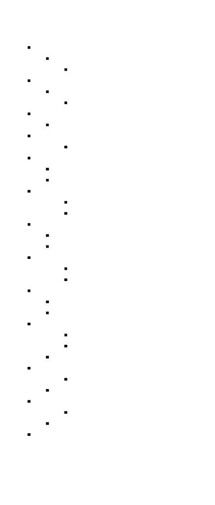


---
<!-- END_TDD_MOD -->


<!-- TDD_MOD_ID: distributed-m4 -->
# Technical Design Document: 3D Parallelism & ZeRO
**Module ID:** `distributed-m4`  
**Version:** 1.0  
**Estimated Hours:** 20-28
---
## 1. Module Charter
This module implements the complete integration of data parallelism (DP), tensor parallelism (TP), and pipeline parallelism (PP) into a unified 3D parallelism framework, combined with ZeRO (Zero Redundancy Optimizer) memory optimization. The system organizes GPUs into a 3D process grid where each dimension uses orthogonal communication patterns: TP all-reduce (frequent, requires NVLink), PP send/recv (per micro-batch, tolerates InfiniBand), and DP all-reduce (per step, amortized). ZeRO stages progressively shard optimizer states, gradients, and parameters across DP ranks to enable training models far exceeding single-GPU memory. Distributed checkpointing saves and loads sharded state across all three parallelism dimensions.
**What this module does NOT do:** Fault recovery with elastic training (Milestone 5), automatic parallelism strategy selection, CUDA kernel optimization, or gradient compression techniques.
**Upstream dependencies:** Data parallelism primitives (M1), tensor parallelism layers (M2), pipeline parallelism scheduling (M3), PyTorch distributed with NCCL backend.
**Downstream consumers:** Training orchestrator, fault tolerance layer (M5), profiling infrastructure, production training pipelines.
**Invariants:**
1. TP × PP × DP = total number of GPUs (configuration must fully partition the GPU grid)
2. TP size ≤ GPUs per node (tensor parallelism requires NVLink bandwidth)
3. ZeRO shards only across DP dimension (orthogonal to TP and PP)
4. Process groups for TP, PP, and DP are disjoint and orthogonal
5. Checkpoint state captures all three dimensions of parallelism consistently
6. ZeRO-3 parameter gathering happens during forward/backward, not between steps
---
## 2. File Structure
```
distributed_training/
├── parallelism_3d/
│   ├── __init__.py                 # [1] Subpackage init, exports main classes
│   ├── config.py                   # [2] Parallel3DConfig dataclass
│   ├── process_groups.py           # [3] 3D process group management
│   ├── topology.py                 # [4] Cluster topology detection
│   ├── placement.py                # [5] Topology-aware rank placement
│   ├── trainer.py                  # [6] Parallel3DTrainer main class
│   └── validation.py               # [7] Configuration validation
├── zero/
│   ├── __init__.py                 # [8] ZeRO subpackage init
│   ├── config.py                   # [9] ZeROConfig dataclass
│   ├── stage1.py                   # [10] ZeROStage1 optimizer
│   ├── stage2.py                   # [11] ZeROStage2 optimizer
│   ├── stage3.py                   # [12] ZeROStage3 optimizer
│   ├── partitioner.py              # [13] Parameter partitioning utilities
│   ├── communication.py            # [14] ZeRO-specific collectives
│   └── memory_tracker.py           # [15] Memory tracking for ZeRO
├── checkpoint/
│   ├── __init__.py                 # [16] Checkpoint subpackage init
│   ├── distributed.py              # [17] DistributedCheckpoint class
│   ├── sharded_state.py            # [18] Sharded state management
│   ├── consensus.py                # [19] Checkpoint consensus protocol
│   └── async_writer.py             # [20] Async checkpoint writing
├── tests/
│   ├── __init__.py                 # [21] Test package init
│   ├── test_3d_config.py           # [22] Configuration validation tests
│   ├── test_process_groups.py      # [23] Process group tests
│   ├── test_zero_stage1.py         # [24] ZeRO-1 tests
│   ├── test_zero_stage2.py         # [25] ZeRO-2 tests
│   ├── test_zero_stage3.py         # [26] ZeRO-3 tests
│   ├── test_checkpoint.py          # [27] Distributed checkpoint tests
│   └── test_integration.py         # [28] Full integration tests
├── scripts/
│   ├── validate_topology.py        # [29] Topology validation script
│   ├── benchmark_zero_memory.py    # [30] ZeRO memory benchmarks
│   └── profile_3d_communication.py # [31] Communication profiling
└── configs/
    └── example_configs.yaml        # [32] Example 3D parallelism configs
```
---
## 3. Complete Data Model
### 3.1 Core 3D Parallelism Configuration
```python
@dataclass
class Parallel3DConfig:
    """
    Configuration for 3D parallelism.
    Defines the DP × TP × PP process grid.
    """
    # Parallelism dimensions
    tp_size: int                         # Tensor parallel size (within node)
    pp_size: int                         # Pipeline parallel size
    dp_size: int                         # Data parallel size
    # Model configuration
    hidden_dim: int                      # Model hidden dimension
    num_layers: int                      # Total transformer layers
    num_heads: int                       # Attention heads
    ffn_hidden_dim: int                  # FFN intermediate dimension
    vocab_size: int                      # Vocabulary size
    # Training configuration
    micro_batch_size: int                # Samples per micro-batch
    num_micro_batches: int               # Micro-batches per step
    gradient_accumulation_steps: int     # Accumulation steps
    # ZeRO configuration
    zero_stage: int                      # ZeRO stage: 0, 1, 2, or 3
    # Cluster topology
    gpus_per_node: int                   # GPUs per node (typically 8)
    nvlink_available: bool               # Whether NVLink is available
    # Derived rank coordinates (set after initialization)
    tp_rank: int = 0
    pp_rank: int = 0
    dp_rank: int = 0
    @property
    def world_size(self) -> int:
        """Total number of GPUs."""
        return self.tp_size * self.pp_size * self.dp_size
    @property
    def layers_per_stage(self) -> int:
        """Layers per pipeline stage."""
        return self.num_layers // self.pp_size
    @property
    def is_valid(self) -> bool:
        """Check if configuration is valid."""
        return (
            self.tp_size * self.pp_size * self.dp_size > 0 and
            self.tp_size <= self.gpus_per_node and
            self.num_layers % self.pp_size == 0 and
            self.hidden_dim % self.tp_size == 0 and
            self.num_heads % self.tp_size == 0
        )
    def global_rank(self, tp_rank: int, pp_rank: int, dp_rank: int) -> int:
        """Convert 3D coordinates to global rank."""
        return (dp_rank * self.pp_size + pp_rank) * self.tp_size + tp_rank
    def coordinates_from_rank(self, rank: int) -> Tuple[int, int, int]:
        """Convert global rank to 3D coordinates."""
        tp_rank = rank % self.tp_size
        pp_rank = (rank // self.tp_size) % self.pp_size
        dp_rank = rank // (self.tp_size * self.pp_size)
        return tp_rank, pp_rank, dp_rank
```
### 3.2 Process Group State
```python
@dataclass
class ProcessGroups3D:
    """
    Manages three orthogonal process groups for 3D parallelism.
    Each GPU participates in exactly one group per dimension.
    """
    # Process group handles
    tp_group: dist.ProcessGroup           # Tensor parallel group
    pp_group: dist.ProcessGroup           # Pipeline parallel group
    dp_group: dist.ProcessGroup           # Data parallel group
    # Rank coordinates
    tp_rank: int
    pp_rank: int
    dp_rank: int
    # Group sizes
    tp_size: int
    pp_size: int
    dp_size: int
    # Global information
    global_rank: int
    world_size: int
    # Neighbor information (for pipeline)
    pp_prev_rank: Optional[int]           # Previous stage in pipeline
    pp_next_rank: Optional[int]           # Next stage in pipeline
    @property
    def is_tp_first(self) -> bool:
        """Is this rank first in TP group?"""
        return self.tp_rank == 0
    @property
    def is_pp_first(self) -> bool:
        """Is this rank first in pipeline?"""
        return self.pp_rank == 0
    @property
    def is_pp_last(self) -> bool:
        """Is this rank last in pipeline?"""
        return self.pp_rank == self.pp_size - 1
    @property
    def is_dp_main(self) -> bool:
        """Is this rank main in DP group (for checkpointing)?"""
        return self.dp_rank == 0
```
### 3.3 ZeRO Configuration
```python
@dataclass
class ZeROConfig:
    """
    Configuration for ZeRO memory optimization.
    Each stage shards different components across DP ranks.
    """
    # ZeRO stage
    stage: int                            # 0 (disabled), 1, 2, or 3
    # DP topology
    dp_size: int                          # Data parallel world size
    dp_rank: int                          # This rank's DP index
    # Communication settings
    overlap_communication: bool           # Overlap param gather with compute
    prefetch_factor: int                  # Layers to prefetch parameters for
    # Memory tracking
    param_memory_gb: float                # Memory for parameters (fp16)
    gradient_memory_gb: float             # Memory for gradients (fp16)
    optimizer_memory_gb: float            # Memory for optimizer states (fp32)
    # Derived memory per GPU
    @property
    def sharded_param_memory_gb(self) -> float:
        """Parameter memory per GPU after sharding."""
        if self.stage >= 3:
            return self.param_memory_gb / self.dp_size
        return self.param_memory_gb
    @property
    def sharded_gradient_memory_gb(self) -> float:
        """Gradient memory per GPU after sharding."""
        if self.stage >= 2:
            return self.gradient_memory_gb / self.dp_size
        return self.gradient_memory_gb
    @property
    def sharded_optimizer_memory_gb(self) -> float:
        """Optimizer memory per GPU after sharding."""
        if self.stage >= 1:
            return self.optimizer_memory_gb / self.dp_size
        return self.optimizer_memory_gb
    @property
    def total_memory_per_gpu_gb(self) -> float:
        """Total memory per GPU with ZeRO."""
        return (
            self.sharded_param_memory_gb +
            self.sharded_gradient_memory_gb +
            self.sharded_optimizer_memory_gb
        )
```
### 3.4 ZeRO Parameter Partition
```python
@dataclass
class ParameterPartition:
    """
    Tracks which DP rank owns which parameters for ZeRO.
    """
    # Partition mapping
    param_to_owner: Dict[int, int]        # param_id -> dp_rank that owns it
    owned_params: List[int]               # param_ids owned by this rank
    # Partition ranges (for contiguous partitioning)
    partition_start: int                  # Start index for this rank
    partition_end: int                    # End index (exclusive)
    # Total counts
    total_params: int                     # Total number of parameters
    params_per_rank: int                  # Parameters per DP rank
    # Flat buffer indices
    flat_start: int                       # Start in flat buffer
    flat_end: int                         # End in flat buffer
```
### 3.5 Distributed Checkpoint Metadata
```python
@dataclass
class CheckpointMetadata:
    """
    Metadata for distributed checkpoint.
    Stored in JSON format for human readability.
    """
    # Identification
    step: int
    timestamp: str                        # ISO format
    # Configuration
    tp_size: int
    pp_size: int
    dp_size: int
    zero_stage: int
    # Validation
    checksum: str                         # SHA256 of all shard checksums
    num_shards: int                       # Total number of checkpoint shards
    # Training state
    epoch: int
    learning_rate: float
    loss: Optional[float]
    # File manifest
    shard_files: List[str]                # Relative paths to all shards
```
### 3.6 Sharded State Container
```python
@dataclass
class ShardedModelState:
    """
    Container for model state sharded across 3D parallelism.
    Each rank stores only its partition.
    """
    # This rank's coordinates
    tp_rank: int
    pp_rank: int
    dp_rank: int
    # Tensor-parallel partition
    tp_shard_id: int                      # Which TP shard this is
    tp_num_shards: int                    # Total TP shards
    # Pipeline-parallel partition
    pp_stage_id: int                      # Which PP stage this is
    pp_num_stages: int                    # Total PP stages
    layer_range: Tuple[int, int]          # (start, end) layer indices
    # ZeRO partition (if stage >= 3)
    zero_partition: Optional[ParameterPartition]
    # State tensors
    param_shard: Dict[str, torch.Tensor]  # Parameter tensors this rank owns
    optimizer_shard: Dict[str, Any]       # Optimizer state this rank owns
    # RNG state (per-rank, must be saved)
    torch_rng_state: torch.Tensor
    cuda_rng_state: torch.Tensor
```
### 3.7 Tensor Shape Specifications
```
3D Parallelism + ZeRO Tensor Shapes
━━━━━━━━━━━━━━━━━━━━━━━━━━━━━━━━━━━━━━━━━━━━━━━━━━━━━━━━━━━━━━━━━━━━━━━━━━━━━━━━
Tensor                              Shape                                    Notes
━━━━━━━━━━━━━━━━━━━━━━━━━━━━━━━━━━━━━━━━━━━━━━━━━━━━━━━━━━━━━━━━━━━━━━━━━━━━━━━━
Without ZeRO (per GPU with TP, PP):
  Parameters (TP sharded)           (H/tp, H/tp) etc.                       1/tp of full
  Gradients                         Same as parameters                      1/tp of full
  Optimizer states (Adam)           2× param size in fp32                   Not sharded
With ZeRO-1 (per GPU):
  Parameters                        Same as without ZeRO                    Replicated
  Gradients                         Same as without ZeRO                    Replicated
  Optimizer states                  (params/dp) in fp32                     Sharded across DP
With ZeRO-2 (per GPU):
  Parameters                        Same as without ZeRO                    Replicated
  Gradients                         (params/dp)                             Sharded via reduce-scatter
  Optimizer states                  (params/dp) in fp32                     Sharded across DP
With ZeRO-3 (per GPU):
  Parameters                        (params/dp)                             Sharded, gathered on demand
  Gradients                         (params/dp)                             Sharded via reduce-scatter
  Optimizer states                  (params/dp) in fp32                     Sharded across DP
Communication Tensors:
  TP all-reduce (per layer)         (B, S, H)                               After row-parallel
  PP send/recv (per micro-batch)    (B, S, H)                               Between stages
  DP all-reduce (per step)          (total_params)                          Gradients
  ZeRO-3 all-gather                 (full_param_shape)                      Parameter fetch
Reduce-scatter output:
  gradient_partition                (flat_params/dp_size)                   Per DP rank
━━━━━━━━━━━━━━━━━━━━━━━━━━━━━━━━━━━━━━━━━━━━━━━━━━━━━━━━━━━━━━━━━━━━━━━━━━━━━━━━
Where:
  B = micro_batch_size
  S = sequence_length
  H = hidden_dim
  tp = tp_size
  dp = dp_size
━━━━━━━━━━━━━━━━━━━━━━━━━━━━━━━━━━━━━━━━━━━━━━━━━━━━━━━━━━━━━━━━━━━━━━━━━━━━━━━━
```
### 3.8 Memory Layout Analysis
```
Memory Per GPU: 70B Model (H=8192, L=80, V=32000)
━━━━━━━━━━━━━━━━━━━━━━━━━━━━━━━━━━━━━━━━━━━━━━━━━━━━━━━━━━━━━━━━━━━━━━━━━━━━━━━━
Configuration         Params    Gradients    Optimizer    Total       vs Baseline
━━━━━━━━━━━━━━━━━━━━━━━━━━━━━━━━━━━━━━━━━━━━━━━━━━━━━━━━━━━━━━━━━━━━━━━━━━━━━━━━
Baseline (no parallelism):
  Single GPU          140 GB    140 GB       560 GB       840 GB      1.0×
With TP=8 (within node):
  Per GPU             17.5 GB   17.5 GB      70 GB        105 GB      8×
With TP=8, ZeRO-1 (DP=8):
  Per GPU             17.5 GB   17.5 GB      8.75 GB      43.75 GB    19×
With TP=8, ZeRO-2 (DP=8):
  Per GPU             17.5 GB   2.2 GB       8.75 GB      28.45 GB    30×
With TP=8, ZeRO-3 (DP=8):
  Per GPU             2.2 GB    2.2 GB       8.75 GB      13.15 GB    64×
With TP=8, PP=4, ZeRO-3 (DP=2):
  Per GPU             0.55 GB   0.55 GB      2.2 GB       3.3 GB      255×
  (Fits comfortably in A100 80GB with activations)
━━━━━━━━━━━━━━━━━━━━━━━━━━━━━━━━━━━━━━━━━━━━━━━━━━━━━━━━━━━━━━━━━━━━━━━━━━━━━━━━
Note: Activations (~5-20 GB) add to these totals depending on batch size
      and sequence length. Gradient checkpointing can reduce activation memory.
━━━━━━━━━━━━━━━━━━━━━━━━━━━━━━━━━━━━━━━━━━━━━━━━━━━━━━━━━━━━━━━━━━━━━━━━━━━━━━━━
```
---
## 4. Interface Contracts
### 4.1 Parallel3DConfig
```python
class Parallel3DConfig:
    """
    Immutable configuration for 3D parallelism.
    Validates all constraints at construction.
    """
    def __init__(
        self,
        tp_size: int,
        pp_size: int,
        dp_size: int,
        model_config: ModelConfig,
        zero_stage: int = 0,
        gpus_per_node: int = 8,
        nvlink_available: bool = True,
    ):
        """
        Initialize 3D parallelism configuration.
        Args:
            tp_size: Tensor parallel size (must be ≤ gpus_per_node)
            pp_size: Pipeline parallel size
            dp_size: Data parallel size
            model_config: Model architecture configuration
            zero_stage: ZeRO optimization stage (0, 1, 2, or 3)
            gpus_per_node: Number of GPUs per node
            nvlink_available: Whether NVLink interconnect is available
        Raises:
            ValueError: If tp_size > gpus_per_node (TP requires NVLink)
            ValueError: If tp_size * pp_size * dp_size doesn't match available GPUs
            ValueError: If model dimensions not divisible by TP size
            ValueError: If num_layers not divisible by PP size
            ValueError: If zero_stage not in [0, 1, 2, 3]
        Side effects:
            - Validates all configuration constraints
            - Computes derived properties
        Invariants after construction:
            - is_valid property returns True
            - All divisibility constraints satisfied
        """
        ...
    def validate_for_world_size(self, world_size: int) -> List[str]:
        """
        Validate configuration against actual world size.
        Args:
            world_size: Actual number of available GPUs
        Returns:
            List of error messages (empty if valid)
        """
        ...
    def recommend_config(
        model_params_billion: float,
        total_gpus: int,
        gpus_per_node: int = 8,
        target_memory_per_gpu_gb: float = 70.0,
    ) -> 'Parallel3DConfig':
        """
        Recommend optimal 3D configuration for given constraints.
        Args:
            model_params_billion: Model size in billions of parameters
            total_gpus: Total available GPUs
            gpus_per_node: GPUs per node
            target_memory_per_gpu_gb: Target memory per GPU
        Returns:
            Recommended Parallel3DConfig
        Heuristics:
            1. Maximize TP (within node) for communication efficiency
            2. Minimize PP (reduces bubble)
            3. Maximize DP (best scaling)
            4. Use ZeRO-3 if memory is constraint
        """
        ...
```
### 4.2 ProcessGroups3D
```python
class ProcessGroups3D:
    """
    Manages orthogonal process groups for 3D parallelism.
    Process Group Structure:
    - TP group: All ranks with same (dp_rank, pp_rank), different tp_rank
    - PP group: All ranks with same (dp_rank, tp_rank), different pp_rank
    - DP group: All ranks with same (tp_rank, pp_rank), different dp_rank
    """
    def __init__(
        self,
        config: Parallel3DConfig,
        global_rank: int,
        world_size: int,
    ):
        """
        Initialize 3D process groups.
        Args:
            config: 3D parallelism configuration
            global_rank: This process's global rank
            world_size: Total number of processes
        Raises:
            RuntimeError: If world_size doesn't match config.world_size
            RuntimeError: If NCCL backend unavailable
        Side effects:
            - Creates three orthogonal process groups
            - Initializes NCCL communication
        """
        ...
    def get_tp_group_ranks(self) -> List[int]:
        """Get all ranks in this rank's TP group."""
        ...
    def get_pp_group_ranks(self) -> List[int]:
        """Get all ranks in this rank's PP group."""
        ...
    def get_dp_group_ranks(self) -> List[int]:
        """Get all ranks in this rank's DP group."""
        ...
    def get_pipeline_neighbors(self) -> Tuple[Optional[int], Optional[int]]:
        """
        Get previous and next stage ranks in pipeline.
        Returns:
            Tuple of (prev_rank, next_rank), either may be None
        """
        ...
    def destroy(self):
        """
        Clean up process groups.
        MUST be called before exit to avoid hanging other processes.
        """
        ...
```
### 4.3 ZeROStage1
```python
class ZeROStage1(Optimizer):
    """
    ZeRO Stage 1: Shard optimizer states across DP ranks.
    Memory savings: Optimizer states (4P for Adam) distributed across DP ranks.
    Communication: None (optimizer states are local to each rank).
    This is the "free lunch" - no communication overhead!
    """
    def __init__(
        self,
        params: Iterable[nn.Parameter],
        config: ZeROConfig,
        lr: float = 1e-4,
        betas: Tuple[float, float] = (0.9, 0.999),
        eps: float = 1e-8,
        weight_decay: float = 0.01,
    ):
        """
        Initialize ZeRO Stage 1 optimizer.
        Args:
            params: Model parameters (will be partitioned)
            config: ZeRO configuration
            lr: Learning rate
            betas: Adam beta coefficients
            eps: Adam epsilon
            weight_decay: Weight decay coefficient
        Side effects:
            - Partitions parameters across DP ranks
            - Creates optimizer states only for owned partition
        """
        ...
    def step(self, closure: Optional[Callable] = None):
        """
        Perform optimizer step.
        Algorithm:
            1. Update only parameters owned by this rank
            2. All-gather updated parameters from all ranks
        Communication:
            All-gather on parameters after update
            Volume: total_params / dp_size per rank
        """
        ...
    def get_partition(self) -> ParameterPartition:
        """Get this rank's parameter partition info."""
        ...
    def allgather_params(self):
        """
        All-gather all parameters across DP ranks.
        After this call, all ranks have full (updated) parameters.
        """
        ...
```
### 4.4 ZeROStage2
```python
class ZeROStage2(ZeROStage1):
    """
    ZeRO Stage 2: Shard gradients AND optimizer states.
    Additional memory savings: Gradients distributed across DP ranks.
    Communication: Reduce-scatter gradients before optimizer step.
    Key insight: Gradients don't need to be stored - they're consumed
    immediately by the optimizer. Shard them during reduce-scatter.
    """
    def __init__(
        self,
        params: Iterable[nn.Parameter],
        config: ZeROConfig,
        **kwargs,
    ):
        """
        Initialize ZeRO Stage 2 optimizer.
        Additional setup:
            - Pre-allocate gradient buffers for reduce-scatter
            - Register backward hooks for gradient reduction
        """
        ...
    def reduce_scatter_gradients(self):
        """
        Reduce-scatter gradients across DP ranks.
        Algorithm:
            1. Flatten all gradients into single buffer
            2. Reduce-scatter to distribute reduced gradients
            3. Each rank receives its partition of reduced gradients
        Communication:
            Reduce-scatter: total_grads bytes
            Per-rank receive: total_grads / dp_size
        MUST be called before step().
        """
        ...
    def step(self, closure: Optional[Callable] = None):
        """
        Perform optimizer step with sharded gradients.
        Precondition: reduce_scatter_gradients() has been called.
        """
        ...
```
### 4.5 ZeROStage3
```python
class ZeROStage3(ZeROStage2):
    """
    ZeRO Stage 3: Shard parameters, gradients, AND optimizer states.
    Maximum memory savings: Everything is sharded.
    Communication: All-gather parameters during forward/backward.
    Key insight: Parameters are only needed during forward/backward.
    Fetch them on-demand, compute, then discard.
    This enables training models where parameters don't fit on any single GPU!
    """
    def __init__(
        self,
        params: Iterable[nn.Parameter],
        config: ZeROConfig,
        prefetch_layers: int = 1,
        **kwargs,
    ):
        """
        Initialize ZeRO Stage 3 optimizer.
        Args:
            prefetch_layers: Number of layers to prefetch parameters for
        Additional setup:
            - Create parameter fetch hooks
            - Set up prefetching infrastructure
        """
        ...
    def fetch_param_partition(
        self,
        param_id: int,
    ) -> torch.Tensor:
        """
        Fetch a parameter partition from its owner.
        Args:
            param_id: Global parameter ID
        Returns:
            Full parameter tensor (gathered from all DP ranks)
        Algorithm:
            1. Determine which DP rank owns this parameter
            2. If this rank owns it, return from local storage
            3. Otherwise, all-gather from owner rank
        Communication:
            Broadcast or all-gather depending on implementation
            Volume: param_size bytes
        """
        ...
    def release_param_partition(self, param_id: int):
        """
        Release a fetched parameter to free memory.
        Args:
            param_id: Parameter to release
        Should be called after forward/backward for that parameter completes.
        """
        ...
    def prefetch_params_for_layer(self, layer_id: int):
        """
        Prefetch parameters for upcoming layer.
        Args:
            layer_id: Layer to prefetch parameters for
        Overlaps parameter fetching with current layer computation.
        """
        ...
    def register_forward_hooks(self, model: nn.Module):
        """
        Register hooks to fetch/release parameters during forward.
        Hook behavior:
            - Pre-forward: Fetch parameter from owner
            - Post-forward: Release parameter to free memory
        """
        ...
```
### 4.6 DistributedCheckpoint
```python
class DistributedCheckpoint:
    """
    Distributed checkpointing for 3D parallelism + ZeRO.
    Strategy:
        - Each rank saves its own shard of state
        - Main rank saves metadata for coordination
        - Consensus protocol ensures consistent checkpoint
    Recovery:
        - Load shard corresponding to rank's coordinates
        - Validate against metadata
    """
    def __init__(
        self,
        model: nn.Module,
        optimizer: Optimizer,
        process_groups: ProcessGroups3D,
        checkpoint_dir: str,
        distributed_storage_path: Optional[str] = None,
    ):
        """
        Initialize distributed checkpoint manager.
        Args:
            model: Model to checkpoint (may be sharded)
            optimizer: Optimizer to checkpoint (may be ZeRO)
            process_groups: 3D process group manager
            checkpoint_dir: Local directory for checkpoints
            distributed_storage_path: Optional remote storage (S3, GCS)
        """
        ...
    def save(
        self,
        step: int,
        metrics: Optional[Dict[str, float]] = None,
        async_save: bool = True,
    ) -> str:
        """
        Save distributed checkpoint.
        Args:
            step: Training step number
            metrics: Optional metrics to save with checkpoint
            async_save: If True, copy to CPU and save in background
        Returns:
            Path to checkpoint directory
        Protocol:
            1. All ranks copy state to CPU (synchronous)
            2. Main rank coordinates via barrier
            3. All ranks save local shard
            4. Main rank saves metadata and validates
            5. Background upload to distributed storage (if configured)
        Invariants:
            - Checkpoint is valid only if all ranks completed save
            - Metadata includes checksum for validation
        """
        ...
    def load(self, step: int) -> int:
        """
        Load distributed checkpoint.
        Args:
            step: Checkpoint step to load (or -1 for latest)
        Returns:
            Loaded step number
        Raises:
            FileNotFoundError: If checkpoint doesn't exist
            ValueError: If checkpoint config doesn't match current config
            RuntimeError: If checkpoint is corrupted (checksum mismatch)
        Protocol:
            1. Find checkpoint (local or distributed storage)
            2. Validate metadata matches current configuration
            3. Load shard corresponding to this rank
            4. Restore model, optimizer, and RNG state
        """
        ...
    def find_latest_checkpoint(self) -> Optional[int]:
        """
        Find the latest valid checkpoint.
        Returns:
            Latest step number, or None if no checkpoints
        """
        ...
    def validate_checkpoint(self, step: int) -> bool:
        """
        Validate checkpoint integrity.
        Args:
            step: Checkpoint step to validate
        Returns:
            True if checkpoint is valid and complete
        """
        ...
```
### 4.7 Topology Detection
```python
class ClusterTopology:
    """
    Detects and analyzes cluster topology for optimal 3D configuration.
    """
    @staticmethod
    def detect() -> 'ClusterTopology':
        """
        Detect cluster topology from current process.
        Returns:
            ClusterTopology with detected properties
        Detection includes:
            - Number of GPUs per node
            - NVLink availability
            - InfiniBand availability
            - Network bandwidth estimates
        """
        ...
    def recommend_3d_config(
        self,
        model_params_billion: float,
        total_gpus: int,
        gpu_memory_gb: float = 80.0,
    ) -> Parallel3DConfig:
        """
        Recommend 3D configuration based on detected topology.
        Args:
            model_params_billion: Model size
            total_gpus: Available GPUs
            gpu_memory_gb: GPU memory capacity
        Returns:
            Recommended configuration
        Heuristics:
            1. TP size = min(gpus_per_node, required_for_memory)
            2. PP size = min(required_for_memory / TP, reasonable_limit)
            3. DP size = total_gpus / (TP * PP)
            4. ZeRO stage = 3 if still memory-constrained
        """
        ...
```
---
## 5. Algorithm Specification
### 5.1 3D Process Group Creation Algorithm
```
ALGORITHM: create_3d_process_groups
━━━━━━━━━━━━━━━━━━━━━━━━━━━━━━━━━━━━━━━━━━━━━━━━━━━━━━━━━━━━━━━━━━━━━━━━━━━━━━━━
INPUT:
    - config: Parallel3DConfig with tp_size, pp_size, dp_size
    - global_rank: This process's rank [0, world_size-1]
    - world_size: Total number of processes
OUTPUT: ProcessGroups3D with three orthogonal process groups
PRECONDITION: dist.init_process_group() already called
1. VALIDATE configuration:
   IF config.tp_size * config.pp_size * config.dp_size != world_size:
       RAISE ValueError("Config doesn't match world_size")
   IF config.tp_size > config.gpus_per_node:
       RAISE ValueError("TP size exceeds GPUs per node")
2. COMPUTE rank coordinates:
   tp_rank = global_rank % config.tp_size
   pp_rank = (global_rank // config.tp_size) % config.pp_size
   dp_rank = global_rank // (config.tp_size * config.pp_size)
3. CREATE tensor parallel groups:
   # TP group: same (dp_rank, pp_rank), all tp_ranks
   tp_groups = []
   FOR dp IN range(config.dp_size):
       FOR pp IN range(config.pp_size):
           ranks = [
               (dp * config.pp_size + pp) * config.tp_size + tp
               FOR tp IN range(config.tp_size)
           ]
           group = dist.new_group(ranks)
           IF dp == dp_rank AND pp == pp_rank:
               my_tp_group = group
           tp_groups.append(group)
4. CREATE pipeline parallel groups:
   # PP group: same (dp_rank, tp_rank), all pp_ranks
   pp_groups = []
   FOR dp IN range(config.dp_size):
       FOR tp IN range(config.tp_size):
           ranks = [
               (dp * config.pp_size + pp) * config.tp_size + tp
               FOR pp IN range(config.pp_size)
           ]
           group = dist.new_group(ranks)
           IF dp == dp_rank AND tp == tp_rank:
               my_pp_group = group
           pp_groups.append(group)
5. CREATE data parallel groups:
   # DP group: same (pp_rank, tp_rank), all dp_ranks
   dp_groups = []
   FOR pp IN range(config.pp_size):
       FOR tp IN range(config.tp_size):
           ranks = [
               (dp * config.pp_size + pp) * config.tp_size + tp
               FOR dp IN range(config.dp_size)
           ]
           group = dist.new_group(ranks)
           IF pp == pp_rank AND tp == tp_rank:
               my_dp_group = group
           dp_groups.append(group)
6. COMPUTE pipeline neighbors:
   IF pp_rank > 0:
       pp_prev_rank = global_rank - config.tp_size  # Same TP, previous PP
   ELSE:
       pp_prev_rank = None
   IF pp_rank < config.pp_size - 1:
       pp_next_rank = global_rank + config.tp_size  # Same TP, next PP
   ELSE:
       pp_next_rank = None
7. RETURN ProcessGroups3D:
   RETURN ProcessGroups3D(
       tp_group=my_tp_group,
       pp_group=my_pp_group,
       dp_group=my_dp_group,
       tp_rank=tp_rank,
       pp_rank=pp_rank,
       dp_rank=dp_rank,
       ...
   )
INVARIANT: Each global rank belongs to exactly one group per dimension
COMMUNICATION: No communication during group creation (metadata only)
━━━━━━━━━━━━━━━━━━━━━━━━━━━━━━━━━━━━━━━━━━━━━━━━━━━━━━━━━━━━━━━━━━━━━━━━━━━━━━━━
```
### 5.2 ZeRO-3 Parameter Fetch Algorithm
```
ALGORITHM: zero3_fetch_parameter
━━━━━━━━━━━━━━━━━━━━━━━━━━━━━━━━━━━━━━━━━━━━━━━━━━━━━━━━━━━━━━━━━━━━━━━━━━━━━━━━
INPUT:
    - param_id: int, global parameter identifier
    - param_shape: Tuple[int, ...], full parameter shape
    - partition: ParameterPartition, ownership mapping
    - dp_group: ProcessGroup for data parallel communication
OUTPUT: torch.Tensor with full parameter
PRECONDITION: ZeRO-3 optimizer initialized with sharded parameters
1. DETERMINE owner rank:
   owner_rank = partition.param_to_owner[param_id]
2. CHECK if this rank owns the parameter:
   IF owner_rank == dp_rank:
       # This rank owns it - return from local storage
       RETURN owned_params[param_id]
3. CHECK parameter cache:
   IF param_id IN param_cache:
       RETURN param_cache[param_id]
4. ALLOCATE receive buffer:
   full_param = torch.empty(param_shape, dtype=torch.float16, device='cuda')
5. ALL-GATHER parameter from owner:
   # Option A: Broadcast from owner
   dist.broadcast(full_param, src=owner_rank, group=dp_group)
   # Option B: All-gather from all owners (if each rank owns different params)
   # More complex but can be more efficient for batched fetches
6. CACHE parameter:
   param_cache[param_id] = full_param
7. RETURN full_param
COMMUNICATION:
    Volume: product(param_shape) * element_size
    For 7B model with DP=8: ~2 GB per parameter fetch per rank
    With prefetching: overlapped with computation
MEMORY:
    Temporary: full_param buffer
    Cached: until release_param_partition called
━━━━━━━━━━━━━━━━━━━━━━━━━━━━━━━━━━━━━━━━━━━━━━━━━━━━━━━━━━━━━━━━━━━━━━━━━━━━━━━━
```
### 5.3 ZeRO-2 Gradient Reduce-Scatter Algorithm
```
ALGORITHM: zero2_reduce_scatter_gradients
━━━━━━━━━━━━━━━━━━━━━━━━━━━━━━━━━━━━━━━━━━━━━━━━━━━━━━━━━━━━━━━━━━━━━━━━━━━━━━━━
INPUT:
    - model: nn.Module with gradients populated
    - partition: ParameterPartition
    - dp_group: ProcessGroup
    - dp_size: int
OUTPUT: None (gradients scattered to owning ranks)
PRECONDITION: Backward pass completed, gradients accumulated
1. FLATTEN gradients:
   all_grads = []
   FOR name, param IN model.named_parameters():
       IF param.grad IS NOT None:
           all_grads.append(param.grad.data.float().view(-1))
       ELSE:
           # Zero gradient for parameters without grad
           all_grads.append(torch.zeros_like(param.data).view(-1))
   flat_grads = torch.cat(all_grads)  # Shape: (total_params,)
2. PAD to divisible by dp_size:
   total_params = flat_grads.numel()
   IF total_params % dp_size != 0:
       pad_size = dp_size - (total_params % dp_size)
       flat_grads = F.pad(flat_grads, (0, pad_size))
       padded_size = total_params + pad_size
   ELSE:
       padded_size = total_params
3. PREPARE reduce-scatter input:
   chunk_size = padded_size // dp_size
   input_list = [
       flat_grads[i*chunk_size:(i+1)*chunk_size]
       FOR i IN range(dp_size)
   ]
4. ALLOCATE output buffer:
   my_partition = torch.zeros(chunk_size, dtype=torch.float32, device='cuda')
5. REDUCE-SCATTER:
   dist.reduce_scatter(my_partition, input_list, op=dist.ReduceOp.SUM, group=dp_group)
   # my_partition now contains the sum of this rank's gradient partition
   # from all DP ranks
6. STORE reduced gradient:
   # Map partition back to parameter indices
   partition_grads[dp_rank] = my_partition[:total_params // dp_size]
COMMUNICATION:
    Volume: total_params / dp_size per rank (after reduce-scatter)
    Total across all ranks: total_params (same as all-reduce, but distributed)
INVARIANT: Each rank has gradients only for its owned parameters
━━━━━━━━━━━━━━━━━━━━━━━━━━━━━━━━━━━━━━━━━━━━━━━━━━━━━━━━━━━━━━━━━━━━━━━━━━━━━━━━
```
### 5.4 Distributed Checkpoint Save Algorithm
```
ALGORITHM: distributed_checkpoint_save
━━━━━━━━━━━━━━━━━━━━━━━━━━━━━━━━━━━━━━━━━━━━━━━━━━━━━━━━━━━━━━━━━━━━━━━━━━━━━━━━
INPUT:
    - model: nn.Module (potentially sharded across TP, PP)
    - optimizer: Optimizer (potentially ZeRO-sharded)
    - process_groups: ProcessGroups3D
    - step: int, current training step
    - checkpoint_dir: str, directory for checkpoints
OUTPUT: str, path to checkpoint directory
PRECONDITION: All ranks have consistent training state
1. CREATE checkpoint directory:
   checkpoint_path = f"{checkpoint_dir}/step_{step}"
   IF is_main_rank():
       os.makedirs(checkpoint_path, exist_ok=True)
   dist.barrier()  # Ensure directory exists before all ranks proceed
2. PREPARE local state:
   state = {
       'step': step,
       'tp_rank': process_groups.tp_rank,
       'pp_rank': process_groups.pp_rank,
       'dp_rank': process_groups.dp_rank,
       'config': {
           'tp_size': process_groups.tp_size,
           'pp_size': process_groups.pp_size,
           'dp_size': process_groups.dp_size,
           'zero_stage': zero_stage,
       },
   }
3. ADD model state:
   IF zero_stage >= 3:
       # Only save owned parameters
       state['model'] = optimizer.owned_params
   ELSE:
       # Save full model state
       state['model'] = model.state_dict()
4. ADD optimizer state:
   state['optimizer'] = optimizer.state_dict()
5. ADD RNG state (CRITICAL for reproducibility):
   state['rng'] = {
       'torch': torch.get_rng_state(),
       'cuda': torch.cuda.get_rng_state(),
   }
6. SAVE local shard:
   shard_path = f"{checkpoint_path}/rank_{global_rank}.pt"
   torch.save(state, shard_path)
7. COMPUTE shard checksum:
   checksum = compute_sha256(shard_path)
   checksum_tensor = torch.tensor([int(checksum[:16], 16)], dtype=torch.long)
8. GATHER checksums (main rank only):
   IF is_main_rank():
       all_checksums = [torch.zeros_like(checksum_tensor) FOR _ IN range(world_size)]
       dist.gather(checksum_tensor, all_checksums, dst=0)
       # Validate all checksums present
   ELSE:
       dist.gather(checksum_tensor, dst=0)
9. SAVE metadata (main rank only):
   IF is_main_rank():
       metadata = CheckpointMetadata(
           step=step,
           timestamp=datetime.now().isoformat(),
           tp_size=process_groups.tp_size,
           pp_size=process_groups.pp_size,
           dp_size=process_groups.dp_size,
           zero_stage=zero_stage,
           checksum=compute_aggregate_checksum(all_checksums),
           num_shards=world_size,
           shard_files=[f"rank_{r}.pt" FOR r IN range(world_size)],
       )
       metadata_path = f"{checkpoint_path}/metadata.json"
       WITH open(metadata_path, 'w') AS f:
           json.dump(asdict(metadata), f, indent=2)
10. BARRIER to ensure all ranks complete:
    dist.barrier()
11. RETURN checkpoint_path
INVARIANT: Checkpoint is valid only if all shards present and checksums match
RECOVERY: Load shard matching current rank's coordinates
━━━━━━━━━━━━━━━━━━━━━━━━━━━━━━━━━━━━━━━━━━━━━━━━━━━━━━━━━━━━━━━━━━━━━━━━━━━━━━━━
```
### 5.5 Topology-Aware Configuration Recommendation
```
ALGORITHM: recommend_3d_config
━━━━━━━━━━━━━━━━━━━━━━━━━━━━━━━━━━━━━━━━━━━━━━━━━━━━━━━━━━━━━━━━━━━━━━━━━━━━━━━━
INPUT:
    - model_params_billion: float, model size
    - total_gpus: int, available GPUs
    - gpus_per_node: int, typically 8
    - gpu_memory_gb: float, per-GPU memory (e.g., 80)
    - nvlink_available: bool
OUTPUT: Parallel3DConfig
PRECONDITION: total_gpus > 0, model_params_billion > 0
1. ESTIMATE memory requirements:
   # fp16 parameters
   param_memory_gb = model_params_billion * 2
   # Gradients (fp16)
   grad_memory_gb = model_params_billion * 2
   # Optimizer states (Adam: 2x fp32)
   optim_memory_gb = model_params_billion * 8
   # Total without any parallelism
   total_memory_gb = param_memory_gb + grad_memory_gb + optim_memory_gb
   # = 12 * model_params_billion GB
2. COMPUTE minimum sharding factor:
   # How much we need to reduce memory to fit in GPU
   min_shard_factor = total_memory_gb / gpu_memory_gb
3. DETERMINE TP size:
   IF nvlink_available:
       # TP provides 1/tp_size memory reduction
       # Max TP is limited by GPUs per node
       max_tp = min(gpus_per_node, int(min_shard_factor))
       tp_size = max(1, min(max_tp, gpus_per_node))
   ELSE:
       # Cannot use TP without NVLink
       tp_size = 1
4. COMPUTE remaining memory requirement after TP:
   memory_after_tp = total_memory_gb / tp_size
5. DETERMINE PP size:
   # PP provides 1/pp_size memory reduction for parameters
   remaining_shard = memory_after_tp / gpu_memory_gb
   pp_size = max(1, int(remaining_shard))
   # Ensure PP doesn't exceed reasonable limit (bubble overhead)
   pp_size = min(pp_size, 8)
6. DETERMINE DP size:
   # DP provides 1/dp_size memory reduction for ZeRO
   # But DP is also used for batch scaling
   dp_size = total_gpus // (tp_size * pp_size)
   IF dp_size < 1:
       # Need more GPUs
       RAISE ValueError(f"Insufficient GPUs: need at least {tp_size * pp_size}")
7. DETERMINE ZeRO stage:
   # Check if we still need memory reduction
   memory_per_gpu = total_memory_gb / (tp_size * pp_size)
   IF memory_per_gpu > gpu_memory_gb * 0.7:
       # Need ZeRO-3 for maximum memory savings
       zero_stage = 3
   ELIF memory_per_gpu > gpu_memory_gb * 0.5:
       # ZeRO-2 should suffice
       zero_stage = 2
   ELSE:
       # ZeRO-1 for optimizer state sharding
       zero_stage = 1
8. VALIDATE configuration:
   config = Parallel3DConfig(
       tp_size=tp_size,
       pp_size=pp_size,
       dp_size=dp_size,
       zero_stage=zero_stage,
       ...
   )
   IF NOT config.is_valid:
       RAISE ValueError("Generated invalid configuration")
9. RETURN config
EXAMPLE:
    model_params = 70  # 70B model
    total_gpus = 512
    gpus_per_node = 8
    gpu_memory = 80  # A100
    # Total memory: 12 * 70 = 840 GB
    # min_shard_factor = 840 / 80 = 10.5
    # TP = 8 (max within node)
    # memory_after_tp = 840 / 8 = 105 GB
    # remaining_shard = 105 / 80 = 1.3
    # PP = 2
    # DP = 512 / (8 * 2) = 32
    # memory_per_gpu = 840 / 16 = 52.5 GB
    # Need ZeRO-2 or ZeRO-3
    Result: TP=8, PP=2, DP=32, ZeRO-2
━━━━━━━━━━━━━━━━━━━━━━━━━━━━━━━━━━━━━━━━━━━━━━━━━━━━━━━━━━━━━━━━━━━━━━━━━━━━━━━━
```
---
## 6. Error Handling Matrix
| Error | Detected By | Recovery | User-Visible? |
|-------|-------------|----------|---------------|
| `TP size > GPUs per node` | `Parallel3DConfig.__init__` | Raise `ValueError` with NVLink requirement | Yes - clear error |
| `TP × PP × DP ≠ world_size` | `Parallel3DConfig.validate_for_world_size` | Raise `ValueError` with valid factorization | Yes - configuration mismatch |
| `Model dims not divisible by TP` | `Parallel3DConfig.__init__` | Raise `ValueError` with divisibility requirement | Yes - model config incompatible |
| `Layers not divisible by PP` | `Parallel3DConfig.__init__` | Raise `ValueError` with layer count requirement | Yes - model config incompatible |
| `Process group creation failure` | `ProcessGroups3D.__init__` | Retry with exponential backoff, then raise | Yes - distributed initialization error |
| `ZeRO parameter fetch timeout` | `ZeROStage3.fetch_param_partition` | Retry fetch, check for dead ranks | Yes - communication failure |
| `Checkpoint not found` | `DistributedCheckpoint.load` | Search for earlier checkpoint, or start fresh | Yes - checkpoint path invalid |
| `Checkpoint config mismatch` | `DistributedCheckpoint.load` | Raise `ValueError` with mismatch details | Yes - cannot resume with different config |
| `Checkpoint checksum mismatch` | `DistributedCheckpoint.validate_checkpoint` | Mark checkpoint invalid, try earlier | Yes - checkpoint corrupted |
| `Incomplete checkpoint shards` | `DistributedCheckpoint.load` | List missing shards, suggest re-save | Yes - incomplete checkpoint |
| `ZeRO-3 OOM during parameter gather` | `ZeROStage3.fetch_param_partition` | Clear cache, retry with smaller prefetch | Yes - memory pressure |
| `Reduce-scatter gradient NaN` | `ZeROStage2.reduce_scatter_gradients` | Check for gradient explosion, reduce LR | Yes - numerical instability |
---
## 7. Implementation Sequence with Checkpoints
### Phase 1: 3D Process Group Management (4-5 hours)
**Files:** `parallelism_3d/__init__.py`, `parallelism_3d/config.py`, `parallelism_3d/process_groups.py`
**Implementation Steps:**
1. Create `Parallel3DConfig` dataclass with validation
2. Implement coordinate computation (global_rank ↔ (tp, pp, dp))
3. Implement `ProcessGroups3D.__init__()` following algorithm 5.1
4. Create TP, PP, and DP process groups
5. Implement helper methods for neighbor lookup and group membership
6. Add `destroy()` method for cleanup
**Checkpoint 1:**
```bash
# Test process group creation with 8 GPUs
torchrun --nproc_per_node=8 -m pytest tests/test_process_groups.py -v
# Expected:
# test_config_validation ... ok
# test_coordinate_conversion ... ok
# test_tp_group_membership ... ok
# test_pp_group_membership ... ok
# test_dp_group_membership ... ok
# test_pipeline_neighbors ... ok
```
**Verification:** All process groups correctly partition the GPU grid, coordinate conversions are bidirectional.
---
### Phase 2: Topology-Aware Configuration (3-4 hours)
**Files:** `parallelism_3d/topology.py`, `parallelism_3d/placement.py`, `parallelism_3d/validation.py`
**Implementation Steps:**
1. Implement `ClusterTopology.detect()` using pynvml and environment variables
2. Detect NVLink availability via P2P status checks
3. Detect InfiniBand via network interface inspection
4. Implement `recommend_3d_config()` following algorithm 5.5
5. Add configuration validation with detailed error messages
6. Create example configurations for common setups
**Checkpoint 2:**
```bash
# Test topology detection
python -c "
from parallelism_3d import ClusterTopology
topology = ClusterTopology.detect()
print(f'GPUs per node: {topology.gpus_per_node}')
print(f'NVLink: {topology.nvlink_available}')
config = topology.recommend_3d_config(
    model_params_billion=7,
    total_gpus=64
)
print(f'Recommended: TP={config.tp_size}, PP={config.pp_size}, DP={config.dp_size}')
"
# Expected: TP=8, PP=1, DP=8 for 7B on 64 GPUs
```
---
### Phase 3: ZeRO Stage 1 Implementation (3-4 hours)
**Files:** `zero/__init__.py`, `zero/config.py`, `zero/stage1.py`, `zero/partitioner.py`
**Implementation Steps:**
1. Create `ZeROConfig` dataclass
2. Implement `ParameterPartition` for parameter distribution
3. Implement `ZeROStage1.__init__()` with parameter partitioning
4. Implement optimizer step for owned parameters only
5. Implement `allgather_params()` for parameter synchronization
6. Add memory tracking utilities
**Checkpoint 3:**
```bash
# Test ZeRO-1 with simple model
torchrun --nproc_per_node=4 -m pytest tests/test_zero_stage1.py -v
# Expected:
# test_parameter_partition ... ok
# test_optimizer_step_local ... ok
# test_allgather_params ... ok
# test_memory_reduction ... ok
# test_gradient_correctness ... ok
```
**Verification:** Optimizer states sharded across DP ranks, parameters correctly synchronized after step.
---
### Phase 4: ZeRO Stage 2 Implementation (3-4 hours)
**Files:** `zero/stage2.py`, `zero/communication.py`
**Implementation Steps:**
1. Extend `ZeROStage1` to create `ZeROStage2`
2. Implement `reduce_scatter_gradients()` following algorithm 5.3
3. Pre-allocate gradient buffers for reduce-scatter
4. Modify step to use scattered gradients
5. Add gradient buffer management
6. Test with gradient accumulation
**Checkpoint 4:**
```bash
# Test ZeRO-2 gradient handling
torchrun --nproc_per_node=4 -m pytest tests/test_zero_stage2.py -v
# Expected:
# test_reduce_scatter_gradients ... ok
# test_gradient_partition_correct ... ok
# test_memory_vs_stage1 ... ok  # Should show additional savings
# test_gradient_accumulation ... ok
```
**Verification:** Gradients correctly scattered, memory reduced compared to ZeRO-1.
---
### Phase 5: ZeRO Stage 3 Implementation (4-5 hours)
**Files:** `zero/stage3.py`, `zero/memory_tracker.py`
**Implementation Steps:**
1. Extend `ZeROStage2` to create `ZeROStage3`
2. Implement `fetch_param_partition()` following algorithm 5.2
3. Implement parameter cache with LRU eviction
4. Implement `release_param_partition()` for memory management
5. Implement `register_forward_hooks()` for automatic fetch/release
6. Add prefetching for overlapping communication with computation
7. Test with full model
**Checkpoint 5:**
```bash
# Test ZeRO-3 parameter fetching
torchrun --nproc_per_node=4 -m pytest tests/test_zero_stage3.py -v
# Expected:
# test_parameter_fetch ... ok
# test_parameter_release ... ok
# test_forward_hooks ... ok
# test_prefetch ... ok
# test_memory_savings ... ok  # Should show 8× savings with DP=8
# test_gradient_correctness ... ok  # End-to-end gradient check
```
**Verification:** Parameters fetched on-demand, released after use, memory dramatically reduced.
---
### Phase 6: Distributed Checkpointing (3-4 hours)
**Files:** `checkpoint/__init__.py`, `checkpoint/distributed.py`, `checkpoint/sharded_state.py`, `checkpoint/consensus.py`, `checkpoint/async_writer.py`
**Implementation Steps:**
1. Implement `ShardedModelState` container
2. Implement `DistributedCheckpoint.save()` following algorithm 5.4
3. Implement shard saving with checksums
4. Implement metadata saving and validation
5. Implement `DistributedCheckpoint.load()` with config validation
6. Implement async checkpoint writing for minimal overhead
7. Add checkpoint validation utilities
**Checkpoint 6:**
```bash
# Test distributed checkpointing
torchrun --nproc_per_node=4 -m pytest tests/test_checkpoint.py -v
# Expected:
# test_checkpoint_save ... ok
# test_checkpoint_load ... ok
# test_config_validation ... ok
# test_checksum_validation ... ok
# test_incomplete_checkpoint ... ok  # Should detect missing shards
# test_async_save ... ok
# test_resume_training ... ok  # Full save/load cycle
```
**Verification:** Checkpoint saves correctly across all ranks, loads consistently, async saves don't block training.
---
## 8. Test Specification
### 8.1 Test: Process Group Orthogonality
```python
def test_process_group_orthogonality():
    """
    Verify TP, PP, and DP groups are orthogonal.
    Each global rank should be in exactly one group per dimension.
    """
    config = Parallel3DConfig(tp_size=2, pp_size=2, dp_size=2, ...)
    pg = ProcessGroups3D(config, global_rank=rank, world_size=8)
    # Check TP group
    tp_ranks = set(pg.get_tp_group_ranks())
    assert len(tp_ranks) == config.tp_size
    # Check PP group
    pp_ranks = set(pg.get_pp_group_ranks())
    assert len(pp_ranks) == config.pp_size
    # Check DP group
    dp_ranks = set(pg.get_dp_group_ranks())
    assert len(dp_ranks) == config.dp_size
    # Check orthogonality: TP ∩ PP should be {this_rank}
    assert len(tp_ranks & pp_ranks) == 1
    # Check orthogonality: TP ∩ DP should be {this_rank}
    assert len(tp_ranks & dp_ranks) == 1
    # Check orthogonality: PP ∩ DP should be {this_rank}
    assert len(pp_ranks & dp_ranks) == 1
```
### 8.2 Test: ZeRO-3 Memory Scaling
```python
def test_zero3_memory_scaling():
    """
    Verify ZeRO-3 memory scales with DP size.
    """
    # Create model
    model = create_test_model(param_count=1e9)  # 1B params
    # Without ZeRO
    base_memory = measure_memory(lambda: train_step(model, zero_stage=0))
    # With ZeRO-3, DP=4
    zero3_memory_dp4 = measure_memory(lambda: train_step(model, zero_stage=3, dp_size=4))
    # With ZeRO-3, DP=8
    zero3_memory_dp8 = measure_memory(lambda: train_step(model, zero_stage=3, dp_size=8))
    # Verify scaling
    # ZeRO-3 should reduce memory by approximately dp_size
    assert zero3_memory_dp4 < base_memory / 3.5  # Allow some overhead
    assert zero3_memory_dp8 < base_memory / 7.5  # Allow some overhead
    assert zero3_memory_dp8 < zero3_memory_dp4  # More DP = less memory
```
### 8.3 Test: Distributed Checkpoint Consistency
```python
def test_distributed_checkpoint_consistency():
    """
    Verify checkpoint is consistent across all ranks.
    """
    # Train for a few steps
    for _ in range(5):
        train_step()
    # Save checkpoint
    checkpoint.save(step=5)
    # Verify all shards exist
    for rank in range(world_size):
        shard_path = f"checkpoint/step_5/rank_{rank}.pt"
        assert os.path.exists(shard_path)
    # Verify metadata
    metadata = load_metadata("checkpoint/step_5")
    assert metadata.num_shards == world_size
    assert metadata.step == 5
    # Verify checksums
    computed_checksum = compute_aggregate_checksum(all_shard_checksums)
    assert computed_checksum == metadata.checksum
    # Load and verify state matches
    checkpoint.load(step=5)
    for name, param in model.named_parameters():
        saved_value = saved_state['model'][name]
        assert torch.allclose(param, saved_value, atol=1e-5)
```
### 8.4 Test: 3D Configuration Validation
```python
def test_3d_config_validation():
    """
    Verify configuration validation catches all errors.
    """
    # Valid config
    config = Parallel3DConfig(tp_size=8, pp_size=2, dp_size=4, ...)
    assert config.is_valid
    # Invalid: TP > GPUs per node
    with pytest.raises(ValueError, match="TP size exceeds"):
        Parallel3DConfig(tp_size=16, pp_size=1, dp_size=1, gpus_per_node=8, ...)
    # Invalid: Hidden dim not divisible by TP
    with pytest.raises(ValueError, match="hidden_dim.*divisible"):
        Parallel3DConfig(tp_size=8, hidden_dim=100, ...)  # 100 % 8 != 0
    # Invalid: Layers not divisible by PP
    with pytest.raises(ValueError, match="num_layers.*divisible"):
        Parallel3DConfig(pp_size=4, num_layers=10, ...)  # 10 % 4 != 0
    # Invalid: TP × PP × DP ≠ world_size
    errors = config.validate_for_world_size(100)  # Config expects 64
    assert len(errors) > 0
    assert "world_size" in errors[0].lower()
```
### 8.5 Test: ZeRO Gradient Correctness
```python
def test_zero_gradient_correctness():
    """
    Verify ZeRO produces same gradients as standard training.
    """
    # Create identical models
    torch.manual_seed(42)
    model_standard = create_model()
    torch.manual_seed(42)
    model_zero = create_model()
    # Same input
    torch.manual_seed(123)
    input_ids = torch.randint(0, 1000, (4, 128))
    labels = torch.randint(0, 1000, (4, 128))
    # Standard training
    optimizer_standard = AdamW(model_standard.parameters())
    loss_standard = model_standard(input_ids, labels=labels).loss
    loss_standard.backward()
    grads_standard = {n: p.grad.clone() for n, p in model_standard.named_parameters()}
    # ZeRO-3 training
    optimizer_zero = ZeROStage3(model_zero.parameters(), config=zero_config)
    loss_zero = model_zero(input_ids, labels=labels).loss
    loss_zero.backward()
    optimizer_zero.reduce_scatter_gradients()
    # All-gather gradients for comparison
    grads_zero = allgather_gradients(model_zero)
    # Compare
    for name in grads_standard:
        assert torch.allclose(
            grads_standard[name], 
            grads_zero[name], 
            rtol=1e-3,  # Allow small numerical differences
            atol=1e-5
        ), f"Gradient mismatch for {name}"
```
---
## 9. Performance Targets
| Operation | Target | How to Measure |
|-----------|--------|----------------|
| Process group creation | < 5 seconds | Time from `dist.init_process_group` to all groups created |
| TP all-reduce latency (NVLink) | < 1 ms per layer | Time `dist.all_reduce` on (B×S×H) tensor |
| PP send/recv latency | < 5 ms per transfer | Time point-to-point on (B×S×H) tensor |
| DP all-reduce latency | < 500 ms per step | Time gradient all-reduce for 7B model |
| ZeRO-3 parameter fetch | < 10 ms per layer | Time all-gather for layer parameters |
| ZeRO-3 memory reduction | > 80% vs baseline | Compare peak memory with/without ZeRO-3 |
| Checkpoint save (async) | < 30 seconds | Time to initiate async save |
| Checkpoint load | < 60 seconds | Time to load and validate checkpoint |
| Scaling efficiency (DP=8) | > 85% | `(T_1) / (8 * T_8)` where T_N is step time |
| Configuration recommendation | < 1 second | Time to generate recommended config |
| 3D communication overhead | < 20% of step time | Profile TP + PP + DP communication |
### Measurement Commands
```bash
# 3D communication profiling
torchrun --nproc_per_node=8 scripts/profile_3d_communication.py \
    --config tp=8,pp=1,dp=1 \
    --num-steps 100
# ZeRO memory benchmark
torchrun --nproc_per_node=8 scripts/benchmark_zero_memory.py \
    --model-size 7b \
    --zero-stages 0 1 2 3
# Checkpoint performance
torchrun --nproc_per_node=8 scripts/benchmark_checkpoint.py \
    --model-size 7b \
    --async
```
---
## 10. Visual Reference
```


3D Process Grid Architecture
Shows: DP × TP × PP grid with orthogonal process groups


Topology to Configuration Mapping
Shows: How cluster topology determines optimal 3D config


ZeRO Stages Memory Comparison
Shows: Memory per GPU at each ZeRO stage


ZeRO-3 Parameter Gathering Flow
Shows: Forward pass with on-demand parameter fetch


ZeRO Communication Volume Analysis
Shows: All-reduce vs reduce-scatter vs all-gather patterns


Distributed Checkpoint Structure
Shows: Sharded state across 3D parallelism dimensions


Checkpoint Consensus Protocol
Shows: How all ranks coordinate for consistent checkpoint
3D Parallelism Configuration Decision Tree
Shows: Flow chart for choosing TP/PP/DP based on constraints
```


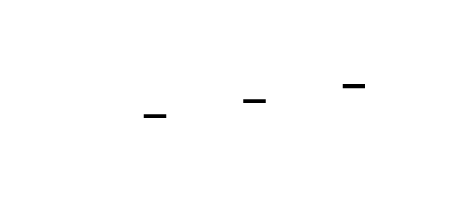


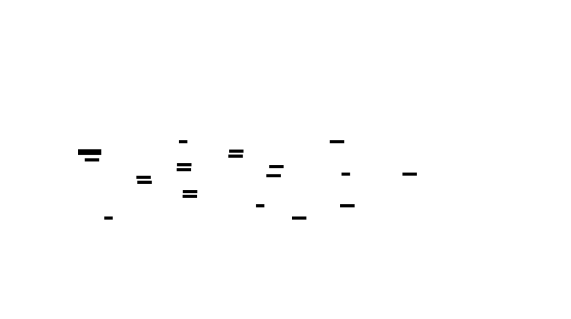


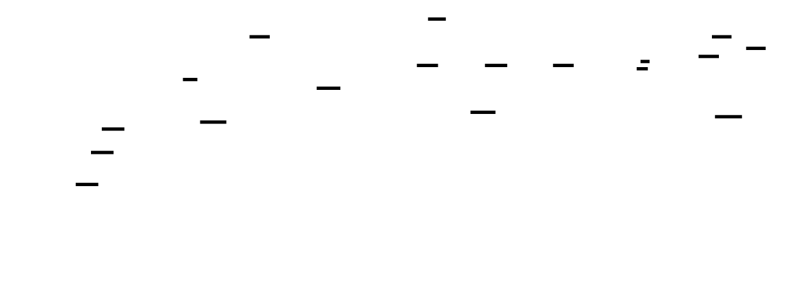


---
<!-- END_TDD_MOD -->


<!-- TDD_MOD_ID: distributed-m5 -->
# Technical Design Document: Fault Tolerance & Profiling
**Module ID:** `distributed-m5`  
**Version:** 1.0  
**Estimated Hours:** 12-18
---
## 1. Module Charter
This module implements production-grade fault tolerance and observability infrastructure for distributed training at scale. It provides asynchronous checkpointing with tiered storage (local SSD → distributed storage), coordinated checkpoint consensus across all parallelism dimensions, failure detection and recovery with bounded MTTR, elastic training that adapts to worker additions and removals, straggler detection via per-rank timing aggregation, and comprehensive profiling with heatmap visualization for 1000+ GPU clusters. The system treats failures as expected events—hardware failures at 1000+ GPU scale are guaranteed—and optimizes for minimum recovery time rather than failure prevention.
**What this module does NOT do:** New parallelism strategies (uses existing DP/TP/PP), model architecture changes, gradient compression algorithms (only applies existing ones for straggler mitigation), or automatic cluster provisioning.
**Upstream dependencies:** 3D parallelism infrastructure (M4), PyTorch distributed primitives, NCCL communication, local SSD storage, distributed storage (S3/GCS/HDFS).
**Downstream consumers:** Training orchestrator, production monitoring systems, alerting infrastructure, capacity planning tools.
**Invariants:**
1. Checkpoint state is valid only when ALL ranks have completed their shard saves
2. Recovery always resumes from the latest valid checkpoint (never partial state)
3. Straggler detection requires at least 10 steps of timing data for statistical significance
4. Elastic training maintains training correctness despite worker changes (batch size and LR adjusted)
5. Memory leak detection threshold is 10% growth over 100 steps
6. Async checkpoint overhead is bounded to < 2% of step time
---
## 2. File Structure
```
distributed_training/
├── fault_tolerance/
│   ├── __init__.py                 # [1] Subpackage init, exports main classes
│   ├── config.py                   # [2] FaultToleranceConfig dataclass
│   ├── checkpoint/
│   │   ├── __init__.py             # [3] Checkpoint subpackage init
│   │   ├── async_manager.py        # [4] AsyncCheckpointManager
│   │   ├── coordinator.py          # [5] DistributedCheckpointCoordinator
│   │   ├── tiered_storage.py       # [6] Local SSD + distributed storage
│   │   └── consensus.py            # [7] Checkpoint consensus protocol
│   ├── recovery/
│   │   ├── __init__.py             # [8] Recovery subpackage init
│   │   ├── failure_handler.py      # [9] FailureHandler with retry logic
│   │   ├── failure_types.py        # [10] FailureType enum and FailureContext
│   │   └── recovery_protocol.py    # [11] Recovery protocols per failure type
│   ├── elastic/
│   │   ├── __init__.py             # [12] Elastic training subpackage init
│   │   ├── controller.py           # [13] ElasticController
│   │   ├── membership.py           # [14] Membership tracking and changes
│   │   └── scaling_rules.py        # [15] Batch size and LR scaling rules
│   ├── straggler/
│   │   ├── __init__.py             # [16] Straggler subpackage init
│   │   ├── detector.py             # [17] StragglerDetector
│   │   ├── mitigator.py            # [18] StragglerMitigator
│   │   └── timing_buffer.py        # [19] Rolling timing window buffer
│   ├── profiling/
│   │   ├── __init__.py             # [20] Profiling subpackage init
│   │   ├── distributed_profiler.py # [21] DistributedProfiler
│   │   ├── memory_profiler.py      # [22] MemoryProfiler
│   │   ├── step_metrics.py         # [23] StepMetrics dataclass
│   │   └── heatmap_export.py       # [24] Heatmap data generation
│   └── logging/
│       ├── __init__.py             # [25] Logging subpackage init
│       ├── distributed_logger.py   # [26] DistributedLogger
│       ├── aggregator.py           # [27] Metric aggregation
│       └── exporters/
│           ├── __init__.py         # [28] Exporters init
│           ├── tensorboard.py      # [29] TensorBoard export
│           └── prometheus.py       # [30] Prometheus export
├── tests/
│   ├── __init__.py                 # [31] Test package init
│   ├── test_async_checkpoint.py    # [32] Async checkpoint tests
│   ├── test_consensus.py           # [33] Checkpoint consensus tests
│   ├── test_failure_recovery.py    # [34] Failure handler tests
│   ├── test_elastic_training.py    # [35] Elastic training tests
│   ├── test_straggler_detection.py # [36] Straggler detection tests
│   ├── test_profiling.py           # [37] Profiling tests
│   └── test_logging.py             # [38] Distributed logging tests
├── scripts/
│   ├── benchmark_checkpoint.py     # [39] Checkpoint MTTR benchmark
│   ├── profile_stragglers.py       # [40] Straggler profiling script
│   └── simulate_failures.py        # [41] Failure simulation for testing
└── configs/
    └── fault_tolerance.yaml        # [42] Default fault tolerance config
```
---
## 3. Complete Data Model
### 3.1 Core Configuration
```python
@dataclass
class FaultToleranceConfig:
    """
    Configuration for fault tolerance and profiling.
    All fields affect MTTR, overhead, and observability.
    """
    # Checkpoint configuration
    checkpoint_dir: str                   # Local directory for checkpoints
    checkpoint_interval: int              # Steps between checkpoints
    max_cached_checkpoints: int           # Local SSD checkpoint limit
    distributed_storage_path: Optional[str]  # S3/GCS/HDFS path for remote storage
    async_checkpoint: bool                # Enable async checkpointing
    checkpoint_timeout_seconds: float     # Timeout for checkpoint operations
    # Recovery configuration
    max_recovery_retries: int             # Maximum recovery attempts
    recovery_delay_seconds: float         # Initial delay before recovery
    recovery_backoff_factor: float        # Exponential backoff multiplier
    # Elastic training configuration
    elastic_training_enabled: bool        # Enable elastic training
    min_workers: int                      # Minimum workers to continue training
    max_workers: int                      # Maximum workers allowed
    membership_check_interval: int        # Steps between membership checks
    # Straggler detection configuration
    straggler_detection_enabled: bool     # Enable straggler detection
    straggler_threshold: float            # Ratio above median to be straggler (1.5 = 50% slower)
    straggler_consistency_window: int     # Steps to consider for consistency
    straggler_min_occurrences: int        # Must be slow in N out of window steps
    straggler_mitigation: str             # "gradient_compression" | "gradient_sparsification" | "none"
    # Profiling configuration
    profiling_enabled: bool               # Enable distributed profiling
    profile_memory: bool                  # Track memory allocation
    profile_communication: bool           # Track communication time
    profile_interval: int                 # Steps between profile snapshots
    # Logging configuration
    log_dir: str                          # Directory for logs
    log_aggregation_interval: int         # Steps between metric aggregation
    export_tensorboard: bool              # Export to TensorBoard
    export_prometheus: bool               # Export to Prometheus
    @property
    def effective_checkpoint_overhead(self) -> float:
        """Estimated checkpoint overhead as fraction of training time."""
        if not self.async_checkpoint:
            return 0.10  # ~10% for sync checkpointing
        return 0.02  # ~2% for async (copy to CPU only)
```
### 3.2 Checkpoint Request
```python
@dataclass
class CheckpointRequest:
    """
    Request to save a checkpoint asynchronously.
    Passed to background worker thread.
    """
    # Identification
    step: int
    timestamp: datetime
    # State to checkpoint
    model_state: Dict[str, torch.Tensor]      # Parameter name -> tensor (on CPU)
    optimizer_state: Dict[str, Any]           # Optimizer state dict (on CPU)
    rng_state: Dict[str, Any]                 # RNG states
    training_state: Dict[str, Any]            # Step count, epoch, etc.
    # Metadata
    metrics: Dict[str, float]                 # Loss, learning rate, etc.
    config_snapshot: Dict[str, Any]           # Training config at checkpoint time
    # Rank information
    rank: int
    world_size: int
    parallelism_coords: Tuple[int, int, int]  # (tp_rank, pp_rank, dp_rank)
```
### 3.3 Failure Context
```python
class FailureType(Enum):
    """Classification of failure types."""
    GPU_OOM = "gpu_oom"                    # Out of memory on GPU
    GPU_ERROR = "gpu_error"                # CUDA error, hardware fault
    NETWORK_ERROR = "network_error"        # Communication timeout/failure
    CHECKPOINT_ERROR = "checkpoint_error"  # Checkpoint read/write failure
    STRAGGLER_TIMEOUT = "straggler_timeout"  # Rank too slow, presumed dead
    UNKNOWN = "unknown"                    # Unclassified failure
@dataclass
class FailureContext:
    """
    Context about a failure that occurred.
    Used for classification, recovery strategy selection, and logging.
    """
    # Identification
    failure_id: str                          # UUID for this failure
    failure_type: FailureType
    # Timing
    step: int                                # Step when failure occurred
    rank: int                                # Rank that detected/experienced failure
    timestamp: datetime
    # Error details
    error_message: str
    error_traceback: str
    exception_type: str
    # Recovery state
    recovery_attempts: int = 0
    last_recovery_attempt: Optional[datetime] = None
    recovery_successful: bool = False
    # Context
    memory_allocated_gb: float = 0.0
    memory_reserved_gb: float = 0.0
    gpu_utilization_pct: float = 0.0
```
### 3.4 Membership State
```python
@dataclass
class MembershipState:
    """
    Tracks which ranks are alive and participating in training.
    Updated during elastic training.
    """
    # Current membership
    alive_ranks: Set[int]                    # Ranks currently alive
    dead_ranks: Set[int]                     # Ranks that have failed
    # History
    membership_history: List[Tuple[int, Set[int]]]  # [(step, alive_ranks), ...]
    # Current world size
    current_world_size: int
    original_world_size: int
    # Timing
    last_membership_check: datetime
    membership_change_detected: bool
    @property
    def membership_changed(self) -> bool:
        """Whether membership has changed since last check."""
        return self.membership_change_detected
    def reset_change_flag(self):
        """Reset the change flag after handling."""
        self.membership_change_detected = False
```
### 3.5 Timing Record
```python
@dataclass
class TimingRecord:
    """
    Record of timing for a single operation on a single rank.
    Used for straggler detection and profiling.
    """
    # Identification
    step: int
    rank: int
    operation: str                           # "forward", "backward", "all_reduce", etc.
    # Timing
    start_time: datetime
    end_time: datetime
    duration_ms: float
    # Context
    tensor_shape: Optional[Tuple[int, ...]]  # Shape of tensor being processed
    tensor_size_bytes: Optional[int]         # Size of data communicated
```
### 3.6 Step Metrics
```python
@dataclass
class StepMetrics:
    """
    Metrics collected per training step.
    Aggregated across ranks for profiling.
    """
    # Identification
    step: int
    rank: int
    # Timing breakdown (milliseconds)
    data_load_time_ms: float
    forward_time_ms: float
    backward_time_ms: float
    communication_time_ms: float
    optimizer_time_ms: float
    total_time_ms: float
    # Memory (GB)
    memory_allocated_gb: float
    memory_reserved_gb: float
    memory_peak_gb: float
    # GPU
    gpu_utilization_pct: float
    # Training
    loss: float
    learning_rate: float
    grad_norm: float
    # Throughput
    samples_per_second: float
    tokens_per_second: Optional[float] = None
    def to_dict(self) -> Dict[str, Any]:
        """Convert to dictionary for serialization."""
        return asdict(self)
```
### 3.7 Straggler State
```python
@dataclass
class StragglerState:
    """
    State tracking for straggler detection.
    Maintains rolling window of timing data.
    """
    # Configuration
    threshold: float                         # Ratio above median
    window_size: int                         # Number of steps to consider
    min_occurrences: int                     # Must be slow in N steps
    # Timing data (per rank, per operation)
    timing_windows: Dict[str, Dict[int, deque]]  # operation -> rank -> deque of timings
    # Detected stragglers
    straggler_ranks: Set[int]                # Currently detected stragglers
    straggler_history: List[Tuple[int, Set[int]]]  # [(step, stragglers), ...]
    # Statistics
    median_timings: Dict[str, float]         # operation -> median timing
    def update_timing(self, operation: str, rank: int, duration_ms: float, step: int):
        """Add a timing record to the rolling window."""
        if operation not in self.timing_windows:
            self.timing_windows[operation] = {}
        if rank not in self.timing_windows[operation]:
            self.timing_windows[operation][rank] = deque(maxlen=self.window_size)
        self.timing_windows[operation][rank].append((step, duration_ms))
```
### 3.8 Memory Snapshot
```python
@dataclass
class MemorySnapshot:
    """
    Snapshot of memory allocation at a point in time.
    Used for memory profiling and leak detection.
    """
    # Identification
    step: int
    rank: int
    timestamp: datetime
    # GPU memory
    allocated_bytes: int
    reserved_bytes: int
    peak_allocated_bytes: int
    # Breakdown (estimated)
    parameters_bytes: int
    gradients_bytes: int
    optimizer_states_bytes: int
    activations_bytes: int
    # Fragmentation
    fragmentation_ratio: float               # 1 - (allocated / reserved)
    @property
    def total_gb(self) -> float:
        """Total allocated memory in GB."""
        return self.allocated_bytes / 1e9
```
### 3.9 Tensor Shape Specifications
```
Fault Tolerance & Profiling Tensor Shapes
━━━━━━━━━━━━━━━━━━━━━━━━━━━━━━━━━━━━━━━━━━━━━━━━━━━━━━━━━━━━━━━━━━━━━━━━━━━━━━━━
Tensor                              Shape                                    Notes
━━━━━━━━━━━━━━━━━━━━━━━━━━━━━━━━━━━━━━━━━━━━━━━━━━━━━━━━━━━━━━━━━━━━━━━━━━━━━━━━
Checkpoint State:
  model_state[param_name]           param.shape                              On CPU
  optimizer_state['state']          varies (momentum, variance)              fp32
  rng_state['torch']                (,) bytes                                torch.get_rng_state()
  rng_state['cuda']                 (num_gpus,) bytes list                   per-device state
Straggler Detection:
  timing_buffer[operation][rank]    (window_size,)                           Deque of (step, ms)
  median_timing[operation]          () scalar                                Float
  all_gathered_timings              (world_size, window_size)                For aggregation
Gradient Compression (Straggler Mitigation):
  original_gradient                 (numel,)                                 fp16 or fp32
  compressed_gradient               (numel,) uint8                           8-bit quantized
  quantization_scale                () scalar                                (max - min) / 255
  quantization_min                  () scalar                                min value
Gradient Sparsification:
  sparse_gradient                   (numel,)                                 90% zeros
  topk_indices                      (k,) int64                               Indices of top-k values
  topk_values                       (k,) fp16                                Values of top-k
Profiling Heatmap:
  timing_heatmap[operation]         (num_steps, num_ranks)                   Per-rank per-step timing
  memory_heatmap                    (num_steps, num_ranks)                   Per-rank memory over time
  communication_heatmap             (num_steps, num_ranks)                   Communication time
━━━━━━━━━━━━━━━━━━━━━━━━━━━━━━━━━━━━━━━━━━━━━━━━━━━━━━━━━━━━━━━━━━━━━━━━━━━━━━━━
```
---
## 4. Interface Contracts
### 4.1 AsyncCheckpointManager
```python
class AsyncCheckpointManager:
    """
    Asynchronous checkpoint manager with tiered storage.
    Strategy:
        1. Copy state to CPU (synchronous, ~30s for 175B model)
        2. Write to local SSD (background, ~20s)
        3. Upload to distributed storage (background, ~2-5 min)
    Training resumes after step 1, not step 3.
    Recovery:
        - If failure occurs soon after checkpoint: use local SSD
        - If local SSD unavailable: use distributed storage
    """
    def __init__(
        self,
        model: nn.Module,
        optimizer: Optimizer,
        process_groups: ProcessGroups3D,
        config: FaultToleranceConfig,
    ):
        """
        Initialize async checkpoint manager.
        Args:
            model: Model to checkpoint
            optimizer: Optimizer to checkpoint
            process_groups: 3D process group manager
            config: Fault tolerance configuration
        Side effects:
            - Creates checkpoint directories
            - Starts background save thread
            - Initializes CPU buffer pool
        """
        ...
    def save_async(self, step: int, metrics: Optional[Dict[str, float]] = None):
        """
        Initiate asynchronous checkpoint save.
        This function:
        1. Copies state to CPU (synchronous, blocks briefly)
        2. Queues the save for background processing
        3. Returns immediately (training can continue)
        Args:
            step: Current training step
            metrics: Optional metrics to save with checkpoint
        Raises:
            RuntimeError: If previous checkpoint still in progress
            OSError: If checkpoint directory not writable
        Total blocking time: ~30 seconds for large models (CPU copy only)
        """
        ...
    def save_sync(self, step: int, metrics: Optional[Dict[str, float]] = None):
        """
        Synchronous checkpoint save (blocks until complete).
        Use only when async is not viable (e.g., final checkpoint).
        Args:
            step: Current training step
            metrics: Optional metrics to save
        Total blocking time: 3-6 minutes for large models
        """
        ...
    def load_latest(self) -> int:
        """
        Load the latest valid checkpoint.
        Recovery strategy:
        1. Try local cache (fastest)
        2. Fall back to distributed storage
        Returns:
            Step number of loaded checkpoint, or 0 if none found
        Raises:
            RuntimeError: If checkpoint corrupted
            ValueError: If checkpoint config doesn't match current
        """
        ...
    def wait_for_pending(self, timeout_seconds: float = 300.0):
        """
        Wait for any pending checkpoint to complete.
        Args:
            timeout_seconds: Maximum time to wait
        Returns:
            True if checkpoint completed, False if timeout
        Use before shutdown to ensure checkpoint saved.
        """
        ...
    def get_checkpoint_status(self) -> Dict[str, Any]:
        """
        Get status of checkpoint operations.
        Returns:
            Dictionary with:
                - pending_checkpoint: bool
                - last_checkpoint_step: int
                - last_checkpoint_time: datetime
                - local_cache_size: int (number of cached checkpoints)
                - upload_in_progress: bool
        """
        ...
```
### 4.2 DistributedCheckpointCoordinator
```python
class DistributedCheckpointCoordinator:
    """
    Coordinates checkpoint consensus across all ranks.
    Protocol:
    1. Main rank broadcasts checkpoint proposal (step number)
    2. All ranks acknowledge readiness
    3. All ranks save local state
    4. All ranks report completion
    5. Main rank marks checkpoint as "valid" in metadata
    A checkpoint is only valid if ALL ranks completed successfully.
    """
    def __init__(
        self,
        checkpoint_manager: AsyncCheckpointManager,
        process_groups: ProcessGroups3D,
    ):
        """
        Initialize checkpoint coordinator.
        Args:
            checkpoint_manager: Async checkpoint manager
            process_groups: 3D process group manager
        """
        ...
    def coordinated_save(
        self,
        step: int,
        metrics: Optional[Dict[str, float]] = None,
    ) -> bool:
        """
        Perform coordinated checkpoint save across all ranks.
        Args:
            step: Checkpoint step
            metrics: Optional metrics
        Returns:
            True if checkpoint was successfully saved by all ranks
        Protocol:
            - All ranks must call this function
            - Barrier synchronization before and after save
            - Main rank validates completion
        """
        ...
    def find_latest_valid_checkpoint(self) -> Optional[int]:
        """
        Find the latest valid checkpoint across all ranks.
        A checkpoint is valid only if all ranks completed successfully.
        Returns:
            Latest valid checkpoint step, or None if none found
        """
        ...
    def validate_checkpoint(self, step: int) -> bool:
        """
        Validate that a checkpoint is complete and consistent.
        Args:
            step: Checkpoint step to validate
        Returns:
            True if checkpoint is valid and complete
        """
        ...
```
### 4.3 FailureHandler
```python
class FailureHandler:
    """
    Handles failures and coordinates recovery.
    Recovery strategies:
    1. Local recovery: Restart process on same node, load from local cache
    2. Remote recovery: Restart process on different node, load from distributed storage
    3. Elastic recovery: Continue with fewer workers, adjust batch size
    """
    def __init__(
        self,
        checkpoint_coordinator: DistributedCheckpointCoordinator,
        process_groups: ProcessGroups3D,
        config: FaultToleranceConfig,
    ):
        """
        Initialize failure handler.
        Args:
            checkpoint_coordinator: Checkpoint coordinator
            process_groups: 3D process group manager
            config: Fault tolerance configuration
        """
        ...
    def handle_failure(self, error: Exception, step: int) -> bool:
        """
        Handle a failure and attempt recovery.
        Args:
            error: Exception that occurred
            step: Step when failure occurred
        Returns:
            True if recovery succeeded, False if unrecoverable
        Recovery attempts:
            - Uses exponential backoff between retries
            - Maximum retries from config
            - Logs all attempts and outcomes
        """
        ...
    def classify_failure(self, error: Exception, step: int) -> FailureContext:
        """
        Classify the type of failure.
        Args:
            error: Exception that occurred
            step: Step when failure occurred
        Returns:
            FailureContext with classification and details
        """
        ...
    def get_failure_history(self) -> List[FailureContext]:
        """
        Get history of all failures.
        Returns:
            List of FailureContext for all recorded failures
        """
        ...
```
### 4.4 ElasticController
```python
class ElasticController:
    """
    Controller for elastic training with dynamic worker management.
    Features:
    - Detect worker failures and removals
    - Support worker additions during training
    - Adjust batch size and learning rate automatically
    - Coordinate membership changes across all ranks
    """
    def __init__(
        self,
        process_groups: ProcessGroups3D,
        config: FaultToleranceConfig,
        batch_size_fn: Optional[Callable[[int], int]] = None,
        lr_fn: Optional[Callable[[int, int], float]] = None,
    ):
        """
        Initialize elastic controller.
        Args:
            process_groups: 3D process group manager
            config: Fault tolerance configuration
            batch_size_fn: Function to compute batch size from world size
            lr_fn: Function to compute LR from new/old world size
        """
        ...
    def check_membership(self) -> bool:
        """
        Check if membership has changed.
        Returns:
            True if workers have been added or removed
        Detection:
            - All-gather alive status from all ranks
            - Compare to previous membership
            - Update membership state
        """
        ...
    def handle_membership_change(
        self,
        trainer: Any,
        optimizer: Optimizer,
        dataloader: DataLoader,
    ):
        """
        Handle a membership change by adjusting training parameters.
        Args:
            trainer: Trainer instance
            optimizer: Optimizer to adjust
            dataloader: DataLoader to recreate
        Adjustments:
            - Batch size scaled to new world size
            - Learning rate scaled proportionally
            - Process groups reinitialized
        """
        ...
    def get_membership_state(self) -> MembershipState:
        """
        Get current membership state.
        Returns:
            MembershipState with alive/dead ranks
        """
        ...
```
### 4.5 StragglerDetector
```python
class StragglerDetector:
    """
    Detects stragglers based on per-rank timing metrics.
    A straggler is a rank that consistently takes longer than others
    for the same operation. Detection is based on:
    1. Relative timing: How much slower than the median?
    2. Consistency: Is this rank slow across multiple steps?
    3. Impact: Does this rank delay collective operations?
    """
    def __init__(
        self,
        process_groups: ProcessGroups3D,
        config: FaultToleranceConfig,
    ):
        """
        Initialize straggler detector.
        Args:
            process_groups: 3D process group manager
            config: Fault tolerance configuration
        """
        ...
    def record_timing(self, operation: str, duration_ms: float, step: int):
        """
        Record timing for an operation on this rank.
        Args:
            operation: Operation name (e.g., "forward", "all_reduce")
            duration_ms: Duration in milliseconds
            step: Current training step
        """
        ...
    def detect_stragglers(self, step: int, operation: str = "all_reduce") -> List[int]:
        """
        Detect stragglers based on recent timing data.
        Args:
            step: Current step
            operation: Operation to analyze
        Returns:
            List of ranks that are consistently slow
        Algorithm:
            1. Gather timings from all ranks
            2. Compute median timing
            3. Identify ranks above threshold
            4. Require consistency over window
        """
        ...
    def get_straggler_report(self) -> str:
        """
        Generate a report of detected stragglers.
        Returns:
            Human-readable report string
        """
        ...
```
### 4.6 StragglerMitigator
```python
class StragglerMitigator:
    """
    Mitigates the impact of stragglers on training throughput.
    Strategies:
    1. Gradient compression: Slow rank sends quantized gradients
    2. Gradient sparsification: Slow rank sends only top-k values
    3. Rank exclusion: Remove persistently slow ranks (elastic training)
    """
    def __init__(
        self,
        straggler_detector: StragglerDetector,
        config: FaultToleranceConfig,
    ):
        """
        Initialize straggler mitigator.
        Args:
            straggler_detector: Straggler detector
            config: Fault tolerance configuration
        """
        ...
    def mitigate(self, model: nn.Module, step: int) -> bool:
        """
        Apply straggler mitigation strategy.
        Args:
            model: Model with gradients
            step: Current training step
        Returns:
            True if mitigation was applied
        """
        ...
    def compress_gradients(self, model: nn.Module, bits: int = 8) -> Dict[str, torch.Tensor]:
        """
        Compress gradients to reduce communication time.
        Args:
            model: Model with gradients
            bits: Bits for quantization (default 8)
        Returns:
            Dictionary of compressed gradient data
        Algorithm:
            - Compute min/max per tensor
            - Quantize to 8-bit unsigned
            - Return (quantized, min, scale)
        """
        ...
    def sparsify_gradients(self, model: nn.Module, sparsity: float = 0.9) -> Dict[str, torch.Tensor]:
        """
        Sparsify gradients by keeping only top-k values.
        Args:
            model: Model with gradients
            sparsity: Fraction of values to zero (0.9 = 90% sparse)
        Returns:
            Dictionary of sparsified gradients
        """
        ...
```
### 4.7 DistributedProfiler
```python
class DistributedProfiler:
    """
    Distributed profiler that aggregates metrics from all ranks.
    Features:
    - Per-step timing breakdown
    - Memory tracking
    - GPU utilization
    - Communication vs compute ratio
    - Straggler detection integration
    - Aggregated reporting
    """
    def __init__(
        self,
        process_groups: ProcessGroups3D,
        straggler_detector: Optional[StragglerDetector],
        config: FaultToleranceConfig,
    ):
        """
        Initialize distributed profiler.
        Args:
            process_groups: 3D process group manager
            straggler_detector: Optional straggler detector
            config: Fault tolerance configuration
        """
        ...
    def profile_step(
        self,
        step_fn: Callable,
        *args,
        **kwargs,
    ) -> Tuple[Any, StepMetrics]:
        """
        Profile a single training step.
        Args:
            step_fn: Function to execute (training step)
            *args, **kwargs: Arguments for step_fn
        Returns:
            Tuple of (step result, metrics)
        """
        ...
    def aggregate_metrics(self) -> Dict[str, Any]:
        """
        Aggregate metrics from all ranks.
        Returns:
            Summary statistics across the distributed system
        """
        ...
    def generate_report(self) -> str:
        """
        Generate profiling report.
        Returns:
            Human-readable report string with:
                - Timing breakdown
                - Memory analysis
                - Communication overhead
                - Efficiency analysis
                - Bottleneck identification
        """
        ...
    def export_heatmap_data(self) -> Dict[str, Any]:
        """
        Export data for heatmap visualization.
        Returns:
            Dictionary with:
                - steps: List of step numbers
                - ranks: List of rank IDs
                - timing: Dict of operation -> (steps × ranks) matrix
                - memory: (steps × ranks) matrix
        """
        ...
```
### 4.8 MemoryProfiler
```python
class MemoryProfiler:
    """
    Profiles memory usage across distributed training.
    Tracks:
    - Overall memory allocation over time
    - Memory breakdown by category (params, grads, optimizer, activations)
    - Memory fragmentation
    - Per-layer memory usage
    """
    def __init__(
        self,
        model: nn.Module,
        optimizer: Optimizer,
        process_groups: ProcessGroups3D,
        snapshot_interval: int = 10,
    ):
        """
        Initialize memory profiler.
        Args:
            model: Model to profile
            optimizer: Optimizer to profile
            process_groups: 3D process group manager
            snapshot_interval: Steps between snapshots
        """
        ...
    def take_snapshot(self) -> MemorySnapshot:
        """
        Take a memory snapshot.
        Returns:
            MemorySnapshot with current memory state
        """
        ...
    def step(self):
        """
        Called after each training step.
        Takes snapshot if at interval.
        """
        ...
    def analyze_memory_trend(self) -> Dict[str, Any]:
        """
        Analyze memory usage trend over time.
        Returns:
            Dictionary with:
                - peak_memory_gb: float
                - current_memory_gb: float
                - memory_leak_detected: bool
                - avg_fragmentation_pct: float
                - memory_breakdown: Dict[str, float]
        """
        ...
    def suggest_optimizations(self) -> List[str]:
        """
        Suggest memory optimizations based on profile.
        Returns:
            List of optimization suggestions
        """
        ...
```
### 4.9 DistributedLogger
```python
class DistributedLogger:
    """
    Aggregates logs and metrics from all workers.
    Key insight: At 1000+ GPU scale, you can't read individual log lines.
    Instead, aggregate metrics and visualize with heatmaps.
    """
    def __init__(
        self,
        process_groups: ProcessGroups3D,
        config: FaultToleranceConfig,
    ):
        """
        Initialize distributed logger.
        Args:
            process_groups: 3D process group manager
            config: Fault tolerance configuration
        """
        ...
    def log_metric(self, name: str, value: float, step: int):
        """
        Log a metric value.
        Args:
            name: Metric name
            value: Metric value
            step: Current step
        Metrics are aggregated across ranks and over time.
        """
        ...
    def log_event(self, event: str, details: Optional[Dict[str, Any]] = None):
        """
        Log an event (non-metric).
        Args:
            event: Event name (e.g., "checkpoint_saved", "failure_detected")
            details: Optional details dictionary
        """
        ...
    def export_for_visualization(self, output_dir: str):
        """
        Export metrics in formats suitable for visualization.
        Args:
            output_dir: Output directory
        Exports:
            - CSV for custom analysis
            - Heatmap JSON for 1000+ GPU visualization
            - TensorBoard events (if enabled)
        """
        ...
```
---
## 5. Algorithm Specification
### 5.1 Async Checkpoint Save Algorithm
```
ALGORITHM: async_checkpoint_save
━━━━━━━━━━━━━━━━━━━━━━━━━━━━━━━━━━━━━━━━━━━━━━━━━━━━━━━━━━━━━━━━━━━━━━━━━━━━━━━━
INPUT:
    - model: nn.Module
    - optimizer: Optimizer
    - step: int
    - metrics: Dict[str, float]
OUTPUT: None (saves checkpoint in background)
PRECONDITION: Previous checkpoint (if any) has completed
1. WAIT for previous checkpoint to complete:
    IF pending_checkpoint IS NOT None:
        WAIT for pending_checkpoint with timeout
        IF timeout:
            LOG warning "Previous checkpoint still in progress"
            RETURN  # Skip this checkpoint
2. COPY state to CPU (synchronous, this is the blocking part):
    checkpoint_data = {}
    2a. Copy model parameters:
        FOR name, param IN model.named_parameters():
            checkpoint_data['model'][name] = {
                'data': param.data.cpu(),  # Copy to CPU
                'requires_grad': param.requires_grad,
            }
    2b. Copy optimizer state:
        FOR param_idx, state IN optimizer.state.items():
            checkpoint_data['optimizer'][param_idx] = {
                k: v.cpu() IF isinstance(v, Tensor) ELSE v
                FOR k, v IN state.items()
            }
    2c. Copy RNG state:
        checkpoint_data['rng'] = {
            'torch': torch.get_rng_state(),
            'cuda': torch.cuda.get_rng_state_all(),
            'numpy': np.random.get_state(),
        }
    2d. Copy training state:
        checkpoint_data['training'] = {
            'step': step,
            'metrics': metrics,
            'config': config_snapshot,
        }
3. CREATE checkpoint request:
    request = CheckpointRequest(
        step=step,
        timestamp=datetime.now(),
        model_state=checkpoint_data['model'],
        optimizer_state=checkpoint_data['optimizer'],
        rng_state=checkpoint_data['rng'],
        training_state=checkpoint_data['training'],
        metrics=metrics,
        ...
    )
4. QUEUE for background processing:
    pending_checkpoint = request
    save_queue.put(request)
5. RETURN (training can continue)
BACKGROUND THREAD (runs in parallel):
6. WAIT for checkpoint request:
    request = save_queue.get()
7. SAVE to local SSD:
    local_path = f"{checkpoint_dir}/step_{request.step}/rank_{rank}.pt"
    torch.save(request, local_path)
    # Time: ~20s for 175B model on NVMe SSD
8. UPLOAD to distributed storage (if configured):
    IF distributed_storage_path:
        remote_path = f"{distributed_storage_path}/step_{request.step}/rank_{rank}.pt"
        upload_to_remote(local_path, remote_path)
        # Time: ~2-5 min for 175B model
9. CLEANUP old checkpoints:
    WHILE len(cached_checkpoints) > max_cached_checkpoints:
        oldest = cached_checkpoints.pop(0)
        DELETE oldest checkpoint files
10. MARK checkpoint complete:
    pending_checkpoint = None
TIMING:
    Synchronous part (blocks training): ~30s (CPU copy)
    Background part: ~3-5 min (SSD write + remote upload)
    Total overhead: < 2% of training time for 175B model
━━━━━━━━━━━━━━━━━━━━━━━━━━━━━━━━━━━━━━━━━━━━━━━━━━━━━━━━━━━━━━━━━━━━━━━━━━━━━━━━
```
### 5.2 Checkpoint Consensus Algorithm
```
ALGORITHM: checkpoint_consensus
━━━━━━━━━━━━━━━━━━━━━━━━━━━━━━━━━━━━━━━━━━━━━━━━━━━━━━━━━━━━━━━━━━━━━━━━━━━━━━━━
INPUT:
    - step: int
    - all ranks participating
OUTPUT: bool (True if checkpoint valid)
PRECONDITION: All ranks call this function simultaneously
1. PROPOSE checkpoint (main rank only):
    IF is_main_rank:
        proposal = torch.tensor([step], dtype=torch.long)
    ELSE:
        proposal = torch.tensor([0], dtype=torch.long)
    dist.broadcast(proposal, src=0, group=dp_group)
    proposed_step = proposal.item()
2. CHECK readiness:
    ready = (
        pending_checkpoint IS None AND
        model_state IS consistent AND
        enough_memory_for_checkpoint
    )
    ready_tensor = torch.tensor([1 IF ready ELSE 0], dtype=torch.long)
3. GATHER readiness from all ranks:
    all_ready = [torch.zeros_like(ready_tensor) FOR _ IN range(dp_size)]
    dist.all_gather(all_ready, ready_tensor, group=dp_group)
4. CHECK if all ranks ready:
    IF NOT all(t.item() == 1 FOR t IN all_ready):
        LOG "Checkpoint aborted: not all ranks ready"
        RETURN False
5. SAVE checkpoint (async on each rank):
    checkpoint_manager.save_async(proposed_step, metrics)
6. WAIT for checkpoint to complete:
    checkpoint_manager.wait_for_pending(timeout=checkpoint_timeout)
7. REPORT completion:
    completed = torch.tensor([1], dtype=torch.long)
    all_completed = [torch.zeros_like(completed) FOR _ IN range(dp_size)]
    dist.all_gather(all_completed, completed, group=dp_group)
8. VALIDATE all completed:
    success = all(t.item() == 1 FOR t IN all_completed)
9. MARK as valid (main rank only):
    IF is_main_rank AND success:
        metadata = {
            'step': proposed_step,
            'valid': True,
            'timestamp': datetime.now().isoformat(),
            'num_ranks': dp_size,
            'checksums': gather_all_checksums(),
        }
        save_metadata(metadata)
10. RETURN success
INVARIANT: Checkpoint is valid only if ALL ranks completed successfully
━━━━━━━━━━━━━━━━━━━━━━━━━━━━━━━━━━━━━━━━━━━━━━━━━━━━━━━━━━━━━━━━━━━━━━━━━━━━━━━━
```
### 5.3 Failure Recovery Algorithm
```
ALGORITHM: failure_recovery
━━━━━━━━━━━━━━━━━━━━━━━━━━━━━━━━━━━━━━━━━━━━━━━━━━━━━━━━━━━━━━━━━━━━━━━━━━━━━━━━
INPUT:
    - error: Exception
    - step: int
    - max_retries: int
OUTPUT: bool (True if recovered)
PRECONDITION: Checkpoint available
1. CLASSIFY failure:
    context = classify_failure(error, step)
    LOG f"Failure detected: {context.failure_type} at step {step}"
2. RECORD failure:
    failure_history.append(context)
3. ATTEMPT recovery with exponential backoff:
    FOR attempt IN range(max_retries):
        LOG f"Recovery attempt {attempt + 1}/{max_retries}"
        3a. Wait with exponential backoff:
            delay = recovery_delay * (recovery_backoff_factor ** attempt)
            SLEEP(delay)
        3b. Attempt recovery based on failure type:
            IF context.failure_type == GPU_OOM:
                success = recover_from_oom(context)
            ELIF context.failure_type == GPU_ERROR:
                success = recover_from_gpu_error(context)
            ELIF context.failure_type == NETWORK_ERROR:
                success = recover_from_network_error(context)
            ELSE:
                success = recover_from_checkpoint(context)
        3c. Update context:
            context.recovery_attempts += 1
            context.last_recovery_attempt = datetime.now()
        3d. Check success:
            IF success:
                context.recovery_successful = True
                LOG "Recovery successful"
                RETURN True
        3e. Log failure:
            LOG f"Recovery attempt {attempt + 1} failed"
4. ALL recovery attempts failed:
    LOG "Unrecoverable failure"
    emergency_save()  # Best effort save
    RETURN False
RECOVERY BY TYPE:
recover_from_oom(context):
    1. Clear CUDA cache: torch.cuda.empty_cache()
    2. Reduce batch size (if possible)
    3. Load from checkpoint
    RETURN checkpoint_loaded_successfully
recover_from_gpu_error(context):
    1. Reset CUDA: torch.cuda.reset_peak_memory_stats()
    2. Clear cache: torch.cuda.empty_cache()
    3. Load from checkpoint
    RETURN checkpoint_loaded_successfully
recover_from_network_error(context):
    1. Reinitialize process group: dist.destroy_process_group()
    2. Reinit: dist.init_process_group(backend='nccl')
    3. Load from checkpoint
    RETURN checkpoint_loaded_successfully
recover_from_checkpoint(context):
    1. Find latest valid checkpoint
    2. Load checkpoint
    3. Restore state
    RETURN checkpoint_loaded_successfully
━━━━━━━━━━━━━━━━━━━━━━━━━━━━━━━━━━━━━━━━━━━━━━━━━━━━━━━━━━━━━━━━━━━━━━━━━━━━━━━━
```
### 5.4 Straggler Detection Algorithm
```
ALGORITHM: detect_stragglers
━━━━━━━━━━━━━━━━━━━━━━━━━━━━━━━━━━━━━━━━━━━━━━━━━━━━━━━━━━━━━━━━━━━━━━━━━━━━━━━━
INPUT:
    - operation: str (e.g., "all_reduce")
    - step: int
    - threshold: float (e.g., 1.5 for 50% slower)
    - window_size: int (e.g., 10)
    - min_occurrences: int (e.g., 5)
OUTPUT: List[int] (ranks that are stragglers)
PRECONDITION: At least window_size steps of timing data
1. GATHER local timings:
    local_timings = timing_windows[operation][local_rank]
    # Deque of (step, duration_ms) tuples, max length = window_size
2. ALL-GATHER timings from all ranks:
    # Pad to fixed length
    padded = list(local_timings) + [None] * (window_size - len(local_timings))
    all_timings = [None] * world_size
    dist.all_gather_object(all_timings, padded)
3. COMPUTE statistics:
    3a. Collect all timings:
        all_durations = []
        FOR rank IN range(world_size):
            FOR (s, d) IN all_timings[rank]:
                IF s IS NOT None:
                    all_durations.append(d)
    3b. Compute median:
        median_timing = median(all_durations)
4. IDENTIFY potential stragglers:
    potential_stragglers = []
    FOR rank IN range(world_size):
        rank_timings = [d FOR (s, d) IN all_timings[rank] IF s IS NOT None]
        IF len(rank_timings) == 0:
            CONTINUE
        avg_timing = mean(rank_timings)
        relative_slowdown = avg_timing / median_timing
        IF relative_slowdown > threshold:
            potential_stragglers.append(rank)
5. CHECK consistency:
    stragglers = []
    FOR rank IN potential_stragglers:
        # Count how many times this rank was slow in the window
        slow_count = 0
        FOR (s, d) IN all_timings[rank]:
            IF s IS NOT None:
                IF d / median_timing > threshold:
                    slow_count += 1
        # Require min_occurrences
        IF slow_count >= min_occurrences:
            stragglers.append(rank)
6. UPDATE straggler set:
    straggler_ranks.update(stragglers)
7. RETURN stragglers
EXAMPLE:
    threshold = 1.5 (50% slower)
    window_size = 10
    min_occurrences = 5
    Rank 3 timings: [100, 105, 98, 155, 160, 102, 158, 165, 155, 162]
    Median: 105 ms
    Slow timings (> 157.5 ms): 155 (no), 160 (yes), 158 (yes), 165 (yes), 155 (no), 162 (yes)
    Count: 4 out of 10
    4 < 5 (min_occurrences) → NOT a straggler (not consistent enough)
    Rank 7 timings: [150, 155, 160, 158, 162, 165, 155, 160, 158, 162]
    Median: 105 ms
    All > 157.5 ms: 10 out of 10
    10 >= 5 → IS a straggler
━━━━━━━━━━━━━━━━━━━━━━━━━━━━━━━━━━━━━━━━━━━━━━━━━━━━━━━━━━━━━━━━━━━━━━━━━━━━━━━━
```
### 5.5 Gradient Compression Algorithm
```
ALGORITHM: compress_gradients
━━━━━━━━━━━━━━━━━━━━━━━━━━━━━━━━━━━━━━━━━━━━━━━━━━━━━━━━━━━━━━━━━━━━━━━━━━━━━━━━
INPUT:
    - gradient: Tensor, shape (numel,), dtype float16/float32
    - bits: int (default 8)
OUTPUT: Dict with compressed data
PRECONDITION: Gradient tensor is contiguous
1. COMPUTE min and max:
    grad_min = gradient.min()
    grad_max = gradient.max()
2. COMPUTE scale:
    scale = (grad_max - grad_min) / (2^bits - 1)
    IF scale == 0:
        scale = 1.0  # All values are the same
3. QUANTIZE:
    # Map to [0, 255] for 8-bit
    normalized = (gradient - grad_min) / scale
    quantized = torch.round(normalized).clamp(0, 2^bits - 1).to(torch.uint8)
4. RETURN compressed data:
    RETURN {
        'quantized': quantized,      # uint8 tensor
        'min': grad_min,             # float scalar
        'scale': scale,              # float scalar
        'shape': gradient.shape,     # original shape
    }
COMPRESSION RATIO:
    Original: numel * 2 bytes (fp16) or 4 bytes (fp32)
    Compressed: numel * 1 byte + 8 bytes (min + scale)
    Ratio: ~2:1 (fp16) or ~4:1 (fp32)
DECOMPRESSION (on receiver):
    decompressed = quantized.float() * scale + grad_min
    # Shape: (numel,)
    # Decompression error: up to scale/2 per element
━━━━━━━━━━━━━━━━━━━━━━━━━━━━━━━━━━━━━━━━━━━━━━━━━━━━━━━━━━━━━━━━━━━━━━━━━━━━━━━━
```
### 5.6 Gradient Sparsification Algorithm
```
ALGORITHM: sparsify_gradients
━━━━━━━━━━━━━━━━━━━━━━━━━━━━━━━━━━━━━━━━━━━━━━━━━━━━━━━━━━━━━━━━━━━━━━━━━━━━━━━━
INPUT:
    - gradient: Tensor, shape (numel,)
    - sparsity: float (e.g., 0.9 for 90% sparse)
OUTPUT: Dict with sparse data
PRECONDITION: sparsity in [0, 1)
1. COMPUTE k (number of values to keep):
    k = int(numel * (1 - sparsity))
    IF k == 0:
        k = 1  # Keep at least one value
2. FIND top-k indices:
    # Use absolute value for magnitude
    abs_grad = gradient.abs()
    topk_values, topk_indices = torch.topk(abs_grad, k)
3. CREATE sparse tensor:
    sparse_grad = torch.zeros_like(gradient)
    sparse_grad[topk_indices] = gradient[topk_indices]
4. RETURN sparse data:
    RETURN {
        'sparse': sparse_grad,       # Full tensor with 90% zeros
        'indices': topk_indices,     # Optional: for more efficient transmission
        'values': gradient[topk_indices],  # Optional
        'shape': gradient.shape,
    }
COMMUNICATION SAVINGS:
    Original: numel * element_size
    With indices/values: k * (element_size + 4)  # value + int32 index
    Savings: (1 - sparsity) * element_size + 4/numel
    For numel = 1M, sparsity = 0.9:
        Original: 2 MB (fp16)
        Sparse: 100K values * 6 bytes = 600 KB
        Savings: 70%
TRADE-OFF:
    - Information loss: 90% of gradient values are discarded
    - Convergence: May slow down, requires careful tuning
    - Best for: Bandwidth-bound stragglers where some error is acceptable
━━━━━━━━━━━━━━━━━━━━━━━━━━━━━━━━━━━━━━━━━━━━━━━━━━━━━━━━━━━━━━━━━━━━━━━━━━━━━━━━
```
---
## 6. Error Handling Matrix
| Error | Detected By | Recovery | User-Visible? |
|-------|-------------|----------|---------------|
| `Checkpoint still in progress` | `AsyncCheckpointManager.save_async` | Skip this checkpoint, log warning | No - logged only |
| `Checkpoint directory not writable` | `AsyncCheckpointManager.__init__` | Raise `OSError` with path | Yes - configuration error |
| `Checkpoint corrupted (checksum mismatch)` | `DistributedCheckpoint.validate_checkpoint` | Try earlier checkpoint, log error | Yes - checkpoint invalid |
| `Checkpoint config mismatch` | `DistributedCheckpoint.load` | Raise `ValueError` with mismatch details | Yes - cannot resume |
| `GPU OOM during forward` | `FailureHandler.classify_failure` | Clear cache, reduce batch, reload checkpoint | Yes - OOM error with suggestions |
| `GPU OOM during backward` | `FailureHandler.classify_failure` | Clear cache, enable checkpointing, reload | Yes - OOM error with suggestions |
| `NCCL communication timeout` | `FailureHandler.classify_failure` | Reinit process group, reload checkpoint | Yes - network error |
| `Process group initialization failure` | `FailureHandler.recover_from_network_error` | Retry with backoff, then raise | Yes - distributed init error |
| `Straggler detected` | `StragglerDetector.detect_stragglers` | Log warning, apply mitigation | Yes - performance alert |
| `Straggler mitigation failed` | `StragglerMitigator.mitigate` | Log error, continue without mitigation | No - logged only |
| `Memory leak detected` | `MemoryProfiler.analyze_memory_trend` | Log warning with suggestions | Yes - memory warning |
| `Elastic training worker removed` | `ElasticController.check_membership` | Adjust batch/LR, continue training | Yes - worker change notification |
| `Elastic training insufficient workers` | `ElasticController.handle_membership_change` | Raise `RuntimeError` | Yes - cannot continue |
| `Profiling data export failure` | `DistributedProfiler.export_heatmap_data` | Log error, return partial data | No - logged only |
---
## 7. Implementation Sequence with Checkpoints
### Phase 1: Async Checkpoint Manager (3-4 hours)
**Files:** `fault_tolerance/__init__.py`, `fault_tolerance/config.py`, `fault_tolerance/checkpoint/async_manager.py`, `fault_tolerance/checkpoint/tiered_storage.py`
**Implementation Steps:**
1. Create `FaultToleranceConfig` dataclass with all configuration fields
2. Implement `AsyncCheckpointManager.__init__()`:
   - Create checkpoint directories
   - Initialize CPU buffer pool
   - Start background save thread
3. Implement `save_async()`:
   - Copy state to CPU (synchronous part)
   - Create `CheckpointRequest`
   - Queue for background processing
4. Implement background save thread:
   - Save to local SSD
   - Upload to distributed storage
   - Cleanup old checkpoints
5. Implement `load_latest()`:
   - Try local cache first
   - Fall back to distributed storage
6. Implement `wait_for_pending()` and `get_checkpoint_status()`
**Checkpoint 1:**
```bash
# Test async checkpoint with single GPU
python -c "
import torch
import torch.nn as nn
from fault_tolerance import AsyncCheckpointManager, FaultToleranceConfig
model = nn.Linear(1000, 1000)
optimizer = torch.optim.Adam(model.parameters())
config = FaultToleranceConfig(
    checkpoint_dir='./test_checkpoints',
    checkpoint_interval=10,
    async_checkpoint=True,
)
manager = AsyncCheckpointManager(model, optimizer, None, config)
# Save checkpoint
manager.save_async(step=100, metrics={'loss': 0.5})
print('Checkpoint initiated')
# Do some work (checkpoint saves in background)
for _ in range(100):
    pass
# Wait for completion
manager.wait_for_pending()
print('Checkpoint completed')
# Load checkpoint
loaded_step = manager.load_latest()
print(f'Loaded checkpoint from step {loaded_step}')
"
```
**Expected output:** Checkpoint saves asynchronously, loads correctly, step number matches.
---
### Phase 2: Distributed Checkpoint Consensus (2-3 hours)
**Files:** `fault_tolerance/checkpoint/coordinator.py`, `fault_tolerance/checkpoint/consensus.py`
**Implementation Steps:**
1. Implement `DistributedCheckpointCoordinator.__init__()`
2. Implement `coordinated_save()` following algorithm 5.2:
   - Broadcast proposal
   - Gather readiness
   - Save on all ranks
   - Validate completion
3. Implement `find_latest_valid_checkpoint()`:
   - Check metadata for validity
   - Return latest valid step
4. Implement `validate_checkpoint()`:
   - Check all shards present
   - Verify checksums
5. Add barrier synchronization
**Checkpoint 2:**
```bash
# Test coordinated checkpoint with 4 GPUs
torchrun --nproc_per_node=4 -m pytest tests/test_consensus.py -v
# Expected:
# test_coordinated_save ... ok
# test_all_ranks_must_complete ... ok
# test_partial_checkpoint_invalid ... ok
# test_load_valid_checkpoint ... ok
```
**Verification:** Checkpoint is valid only when all ranks complete, partial checkpoints are rejected.
---
### Phase 3: Failure Handler & Recovery (3-4 hours)
**Files:** `fault_tolerance/recovery/failure_handler.py`, `fault_tolerance/recovery/failure_types.py`, `fault_tolerance/recovery/recovery_protocol.py`
**Implementation Steps:**
1. Create `FailureType` enum and `FailureContext` dataclass
2. Implement `FailureHandler.__init__()`
3. Implement `classify_failure()`:
   - Parse error message
   - Categorize by type
   - Create `FailureContext`
4. Implement `handle_failure()` following algorithm 5.3:
   - Exponential backoff
   - Type-specific recovery
   - Retry logic
5. Implement recovery functions per type:
   - `recover_from_oom()`
   - `recover_from_gpu_error()`
   - `recover_from_network_error()`
   - `recover_from_checkpoint()`
6. Implement `get_failure_history()`
**Checkpoint 3:**
```bash
# Test failure recovery
torchrun --nproc_per_node=2 -m pytest tests/test_failure_recovery.py -v
# Expected:
# test_classify_oom ... ok
# test_classify_network_error ... ok
# test_recovery_from_checkpoint ... ok
# test_exponential_backoff ... ok
# test_max_retries ... ok
```
**Verification:** Failures are correctly classified, recovery attempts follow backoff schedule, checkpoint is loaded correctly.
---
### Phase 4: Elastic Training Controller (3-4 hours)
**Files:** `fault_tolerance/elastic/controller.py`, `fault_tolerance/elastic/membership.py`, `fault_tolerance/elastic/scaling_rules.py`
**Implementation Steps:**
1. Create `MembershipState` dataclass
2. Implement `ElasticController.__init__()`
3. Implement `check_membership()`:
   - All-gather alive status
   - Compare to previous state
   - Update membership
4. Implement `handle_membership_change()`:
   - Adjust batch size
   - Adjust learning rate
   - Reinitialize process groups
5. Implement scaling rules:
   - Linear batch size scaling
   - Linear LR scaling
6. Implement `get_membership_state()`
**Checkpoint 4:**
```bash
# Test elastic training
torchrun --nproc_per_node=4 -m pytest tests/test_elastic_training.py -v
# Expected:
# test_membership_detection ... ok
# test_batch_size_scaling ... ok
# test_lr_scaling ... ok
# test_min_workers_enforcement ... ok
```
**Verification:** Membership changes are detected, batch size and LR are scaled correctly.
---
### Phase 5: Straggler Detection & Mitigation (2-3 hours)
**Files:** `fault_tolerance/straggler/detector.py`, `fault_tolerance/straggler/mitigator.py`, `fault_tolerance/straggler/timing_buffer.py`
**Implementation Steps:**
1. Create `StragglerState` dataclass with timing windows
2. Implement `StragglerDetector.__init__()`
3. Implement `record_timing()`:
   - Add to rolling window
   - Maintain per-operation, per-rank buffers
4. Implement `detect_stragglers()` following algorithm 5.4:
   - Gather timings from all ranks
   - Compute median
   - Identify slow ranks
   - Check consistency
5. Implement `StragglerMitigator.__init__()`
6. Implement `compress_gradients()` following algorithm 5.5
7. Implement `sparsify_gradients()` following algorithm 5.6
8. Implement `mitigate()` to apply chosen strategy
**Checkpoint 5:**
```bash
# Test straggler detection
torchrun --nproc_per_node=4 -m pytest tests/test_straggler_detection.py -v
# Expected:
# test_timing_recording ... ok
# test_straggler_detection ... ok
# test_gradient_compression ... ok
# test_gradient_sparsification ... ok
# test_mitigation_applied ... ok
```
**Verification:** Stragglers are detected after sufficient data, gradients are correctly compressed/sparsified.
---
### Phase 6: Distributed Profiling & Logging (2-3 hours)
**Files:** `fault_tolerance/profiling/distributed_profiler.py`, `fault_tolerance/profiling/memory_profiler.py`, `fault_tolerance/profiling/step_metrics.py`, `fault_tolerance/profiling/heatmap_export.py`, `fault_tolerance/logging/distributed_logger.py`, `fault_tolerance/logging/aggregator.py`
**Implementation Steps:**
1. Create `StepMetrics` dataclass
2. Implement `DistributedProfiler.__init__()`
3. Implement `profile_step()`:
   - Time each phase
   - Record memory
   - Create `StepMetrics`
4. Implement `aggregate_metrics()`:
   - All-gather from all ranks
   - Compute statistics
5. Implement `generate_report()`
6. Implement `export_heatmap_data()`
7. Implement `MemoryProfiler`:
   - Take snapshots
   - Analyze trends
   - Detect leaks
   - Suggest optimizations
8. Implement `DistributedLogger`:
   - Log metrics
   - Log events
   - Export for visualization
**Checkpoint 6:**
```bash
# Test profiling
torchrun --nproc_per_node=4 -m pytest tests/test_profiling.py -v
# Expected:
# test_step_profiling ... ok
# test_metric_aggregation ... ok
# test_memory_profiling ... ok
# test_heatmap_export ... ok
# Test logging
torchrun --nproc_per_node=4 -m pytest tests/test_logging.py -v
# Expected:
# test_metric_logging ... ok
# test_event_logging ... ok
# test_aggregation ... ok
```
**Verification:** Profiling data is collected correctly, memory leaks are detected, heatmaps are generated.
---
## 8. Test Specification
### 8.1 Test: Async Checkpoint Overhead
```python
def test_async_checkpoint_overhead():
    """
    Verify async checkpoint overhead is < 2% of training time.
    """
    model = create_large_model()  # 1B params
    optimizer = torch.optim.Adam(model.parameters())
    config = FaultToleranceConfig(async_checkpoint=True)
    manager = AsyncCheckpointManager(model, optimizer, None, config)
    # Measure step time without checkpoint
    step_times = []
    for _ in range(10):
        start = time.perf_counter()
        train_step(model)
        step_times.append(time.perf_counter() - start)
    avg_step_time = sum(step_times) / len(step_times)
    # Measure step time with async checkpoint
    checkpoint_step_times = []
    for step in range(10):
        start = time.perf_counter()
        train_step(model)
        if step % 5 == 0:
            manager.save_async(step)
        checkpoint_step_times.append(time.perf_counter() - start)
    manager.wait_for_pending()
    avg_checkpoint_step_time = sum(checkpoint_step_times) / len(checkpoint_step_times)
    # Overhead should be < 2%
    overhead = (avg_checkpoint_step_time - avg_step_time) / avg_step_time
    assert overhead < 0.02, f"Async checkpoint overhead {overhead*100:.1f}% exceeds 2%"
```
### 8.2 Test: Checkpoint Consensus
```python
def test_checkpoint_consensus():
    """
    Verify checkpoint is valid only when all ranks complete.
    """
    coordinator = DistributedCheckpointCoordinator(manager, process_groups)
    # All ranks save
    success = coordinator.coordinated_save(step=100)
    assert success, "Coordinated save should succeed"
    # Validate
    is_valid = coordinator.validate_checkpoint(100)
    assert is_valid, "Checkpoint should be valid"
    # Simulate partial save (delete one shard)
    shard_path = f"{checkpoint_dir}/step_100/rank_1.pt"
    os.remove(shard_path)
    # Validate should fail
    is_valid = coordinator.validate_checkpoint(100)
    assert not is_valid, "Partial checkpoint should be invalid"
```
### 8.3 Test: Failure Recovery
```python
def test_failure_recovery():
    """
    Verify failure recovery loads correct checkpoint.
    """
    # Create and save checkpoint
    model = create_model()
    train_for_n_steps(model, 100)
    manager.save_sync(100)
    # Simulate failure
    model_corrupted = corrupt_model(model)
    # Recover
    handler = FailureHandler(coordinator, process_groups, config)
    error = RuntimeError("CUDA out of memory")
    recovered = handler.handle_failure(error, step=150)
    assert recovered, "Recovery should succeed"
    assert handler.get_failure_history()[0].failure_type == FailureType.GPU_OOM
```
### 8.4 Test: Straggler Detection Consistency
```python
def test_straggler_detection_consistency():
    """
    Verify straggler detection requires consistency.
    """
    detector = StragglerDetector(process_groups, config)
    # Record timings where rank 3 is sometimes slow
    for step in range(20):
        for rank in range(world_size):
            if rank == 3 and step % 3 == 0:  # Slow 1/3 of time
                duration = 150.0
            else:
                duration = 100.0
            # Mock the timing for this rank
            detector.timing_windows['all_reduce'][rank].append((step, duration))
    # Detect stragglers
    stragglers = detector.detect_stragglers(step=20, operation='all_reduce')
    # Rank 3 should NOT be detected (not consistent enough)
    assert 3 not in stragglers, "Rank 3 should not be detected (only slow 33% of time)"
```
### 8.5 Test: Gradient Compression Correctness
```python
def test_gradient_compression_correctness():
    """
    Verify gradient compression preserves values within error bound.
    """
    mitigator = StragglerMitigator(detector, config)
    gradient = torch.randn(1000, dtype=torch.float16)
    compressed = mitigator.compress_gradients(gradient, bits=8)
    # Decompress
    decompressed = compressed['quantized'].float() * compressed['scale'] + compressed['min']
    # Check error bound
    error = (gradient - decompressed).abs()
    max_error = error.max().item()
    expected_max_error = compressed['scale'].item() / 2  # Quantization error
    assert max_error <= expected_max_error * 1.1, \
        f"Compression error {max_error} exceeds bound {expected_max_error}"
```
### 8.6 Test: Memory Leak Detection
```python
def test_memory_leak_detection():
    """
    Verify memory leak detection identifies growing memory.
    """
    profiler = MemoryProfiler(model, optimizer, process_groups)
    # Simulate memory growth
    for step in range(100):
        # Simulate gradual memory growth
        allocate_memory(1e6 * (step // 10))  # Grow every 10 steps
        profiler.step()
    analysis = profiler.analyze_memory_trend()
    assert analysis['memory_leak_detected'], \
        "Memory leak should be detected with 10% growth over 100 steps"
    suggestions = profiler.suggest_optimizations()
    assert len(suggestions) > 0, "Should provide optimization suggestions"
```
---
## 9. Performance Targets
| Operation | Target | How to Measure |
|-----------|--------|----------------|
| MTTR (175B model) | < 10 minutes | Time from failure detection to training resumed |
| Async checkpoint overhead | < 2% of step time | Compare step time with/without checkpoint initiation |
| Synchronous checkpoint overhead | < 10% of step time | Compare step time with sync checkpoint vs without |
| Checkpoint save time (local SSD) | < 30 seconds | Time to save checkpoint to local NVMe |
| Checkpoint upload time (remote) | < 5 minutes | Time to upload to S3/GCS |
| Checkpoint load time (local) | < 60 seconds | Time to load from local SSD |
| Checkpoint load time (remote) | < 3 minutes | Time to load from distributed storage |
| Straggler detection latency | < 10 steps | Steps from straggler appearance to detection |
| Straggler detection accuracy | > 90% | True positives / (true positives + false negatives) |
| Gradient compression ratio | 2:1 (fp16) or 4:1 (fp32) | Original size / compressed size |
| Gradient sparsification ratio | 10:1 (90% sparse) | Original non-zeros / sparse non-zeros |
| Memory leak detection threshold | 10% growth | Memory increase over 100 steps |
| Profiling overhead | < 5% of step time | Compare step time with/without profiling |
| Heatmap generation time | < 5 seconds | Time to generate heatmap JSON for 1000 GPUs |
### Measurement Commands
```bash
# Checkpoint MTTR benchmark
torchrun --nproc_per_node=8 scripts/benchmark_checkpoint.py \
    --model-size 7b \
    --num-iterations 10
# Straggler detection benchmark
torchrun --nproc_per_node=8 scripts/profile_stragglers.py \
    --simulate-straggler-rank 3 \
    --num-steps 50
# Failure simulation
torchrun --nproc_per_node=8 scripts/simulate_failures.py \
    --failure-type oom \
    --failure-step 100
```
---
## 10. Visual Reference
```


Asynchronous Checkpoint Strategy
Shows: Copy to CPU, write to SSD, upload to remote in background


Distributed Checkpoint Structure
Shows: Sharded state across 3D parallelism dimensions


Checkpoint Consensus Protocol
Shows: Propose → Acknowledge → Save → Validate flow


Straggler Detection Heatmap
Shows: Per-rank timing visualization for 1000+ GPUs


Elastic Training with Dynamic Workers
Shows: Worker removal and addition with batch/LR scaling


Gradient Compression Flow
Shows: Quantization, transmission, decompression


Memory Profiling Breakdown
Shows: Parameters, gradients, optimizer, activations over time


Distributed Profiling Timeline
Shows: Forward, backward, communication phases per rank


Failure Recovery Flow
Shows: Detection → Classification → Recovery → Resume
```

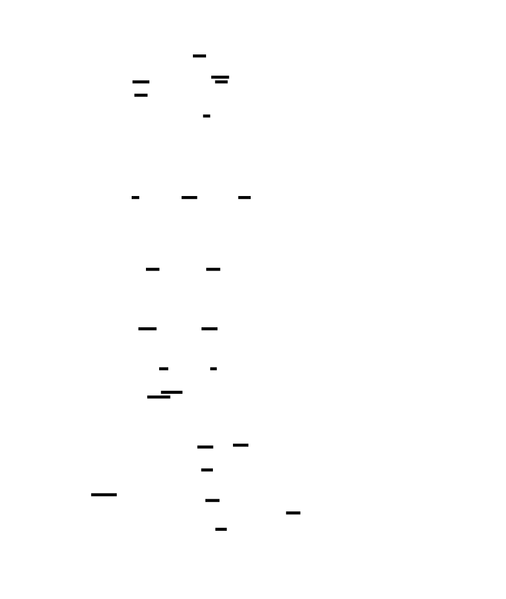


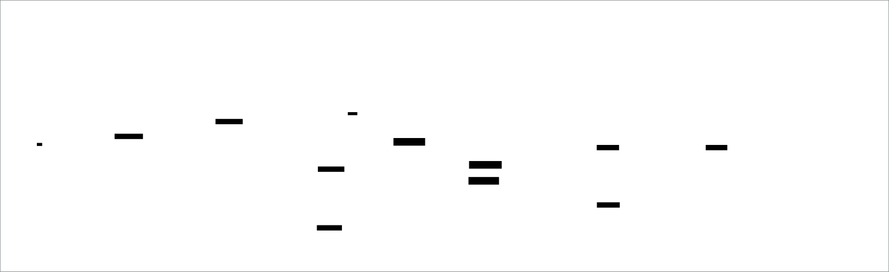


---
[[CRITERIA_JSON: {"module_id": "distributed-m5", "criteria": ["Async checkpoint overhead < 2% of training time", "MTTR < 10 minutes for 175B model", "Checkpoint consensus ensures all ranks complete before marking valid", "Straggler detection within 10 steps with > 90% accuracy", "Memory leak detection with 10% growth threshold", "Gradient compression achieves 2:1 (fp16) or 4:1 (fp32) ratio", "Elastic training maintains correctness with worker changes", "Profiling overhead < 5% of step time", "Distributed logging aggregates metrics from all workers", "All failure types have defined recovery protocols with exponential backoff"]}]
<!-- END_TDD_MOD -->


# Project Structure: Distributed Training Framework
## Directory Tree
```
distributed_training/
├── __init__.py                    # Package initialization
├── launch.py                      # torchrun entry point
│
├── data_parallel/                 # M1: Data Parallelism Fundamentals
│   ├── __init__.py                # Subpackage init
│   ├── trainer.py                 # DataParallelTrainer class
│   ├── communication.py           # All-reduce and collective wrappers
│   ├── sync_batchnorm.py          # Synchronized BatchNorm implementation
│   ├── gradient_accumulation.py   # Gradient accumulation manager
│   ├── mixed_precision.py         # AMP integration and loss scaling
│   ├── efficiency.py              # Scaling efficiency measurement
│   └── checkpointing.py           # Distributed checkpoint save/load
│
├── tensor_parallel/               # M2: Tensor Parallelism
│   ├── __init__.py                # Subpackage init, exports main classes
│   ├── config.py                  # TensorParallelConfig dataclass
│   ├── process_groups.py          # TP process group management
│   ├── linear.py                  # ColumnParallelLinear, RowParallelLinear
│   ├── attention.py               # TensorParallelAttention
│   ├── embedding.py               # TensorParallelEmbedding
│   ├── mlp.py                     # TensorParallelMLP (Megatron pattern)
│   ├── transformer_block.py       # Complete TP transformer block
│   ├── initialization.py          # Distributed weight initialization
│   ├── communication.py           # All-reduce wrappers for TP
│   └── overlap.py                 # Communication-computation overlap
│
├── pipeline_parallel/             # M3: Pipeline Parallelism
│   ├── __init__.py                # Subpackage init, exports main classes
│   ├── config.py                  # PipelineParallelConfig dataclass
│   ├── stage.py                   # PipelineStage class
│   ├── partitioner.py             # Model partitioning utilities
│   ├── communicator.py            # Point-to-point send/recv wrappers
│   ├── balancer.py                # StageBalancer for compute balancing
│   ├── memory.py                  # Activation memory management
│   ├── analysis.py                # Bubble analysis utilities
│   └── schedules/
│       ├── __init__.py            # Schedule subpackage init
│       ├── base.py                # Base Schedule class
│       ├── gpipe.py               # GPipeSchedule implementation
│       ├── f1b1.py                # F1B1Schedule implementation
│       └── interleaved.py         # InterleavedSchedule (virtual stages)
│
├── parallelism_3d/                # M4: 3D Parallelism Integration
│   ├── __init__.py                # Subpackage init, exports main classes
│   ├── config.py                  # Parallel3DConfig dataclass
│   ├── process_groups.py          # 3D process group management
│   ├── topology.py                # Cluster topology detection
│   ├── placement.py               # Topology-aware rank placement
│   ├── trainer.py                 # Parallel3DTrainer main class
│   └── validation.py              # Configuration validation
│
├── zero/                          # M4: ZeRO Memory Optimization
│   ├── __init__.py                # ZeRO subpackage init
│   ├── config.py                  # ZeROConfig dataclass
│   ├── stage1.py                  # ZeROStage1 optimizer
│   ├── stage2.py                  # ZeROStage2 optimizer
│   ├── stage3.py                  # ZeROStage3 optimizer
│   ├── partitioner.py             # Parameter partitioning utilities
│   ├── communication.py           # ZeRO-specific collectives
│   └── memory_tracker.py          # Memory tracking for ZeRO
│
├── checkpoint/                    # M4: Distributed Checkpointing
│   ├── __init__.py                # Checkpoint subpackage init
│   ├── distributed.py             # DistributedCheckpoint class
│   ├── sharded_state.py           # Sharded state management
│   ├── consensus.py               # Checkpoint consensus protocol
│   └── async_writer.py            # Async checkpoint writing
│
├── fault_tolerance/               # M5: Fault Tolerance
│   ├── __init__.py                # Subpackage init, exports main classes
│   ├── config.py                  # FaultToleranceConfig dataclass
│   ├── checkpoint/
│   │   ├── __init__.py            # Checkpoint subpackage init
│   │   ├── async_manager.py       # AsyncCheckpointManager
│   │   ├── coordinator.py         # DistributedCheckpointCoordinator
│   │   ├── tiered_storage.py      # Local SSD + distributed storage
│   │   └── consensus.py           # Checkpoint consensus protocol
│   ├── recovery/
│   │   ├── __init__.py            # Recovery subpackage init
│   │   ├── failure_handler.py     # FailureHandler with retry logic
│   │   ├── failure_types.py       # FailureType enum and FailureContext
│   │   └── recovery_protocol.py   # Recovery protocols per failure type
│   ├── elastic/
│   │   ├── __init__.py            # Elastic training subpackage init
│   │   ├── controller.py          # ElasticController
│   │   ├── membership.py          # Membership tracking and changes
│   │   └── scaling_rules.py       # Batch size and LR scaling rules
│   ├── straggler/
│   │   ├── __init__.py            # Straggler subpackage init
│   │   ├── detector.py            # StragglerDetector
│   │   ├── mitigator.py           # StragglerMitigator
│   │   └── timing_buffer.py       # Rolling timing window buffer
│   ├── profiling/
│   │   ├── __init__.py            # Profiling subpackage init
│   │   ├── distributed_profiler.py # DistributedProfiler
│   │   ├── memory_profiler.py     # MemoryProfiler
│   │   ├── step_metrics.py        # StepMetrics dataclass
│   │   └── heatmap_export.py      # Heatmap data generation
│   └── logging/
│       ├── __init__.py            # Logging subpackage init
│       ├── distributed_logger.py  # DistributedLogger
│       ├── aggregator.py          # Metric aggregation
│       └── exporters/
│           ├── __init__.py        # Exporters init
│           ├── tensorboard.py     # TensorBoard export
│           └── prometheus.py      # Prometheus export
│
├── tests/                         # Test Suite
│   ├── __init__.py                # Test package init
│   ├── test_ddp_basics.py         # M1: Basic DDP functionality tests
│   ├── test_gradient_sync.py      # M1: Gradient synchronization tests
│   ├── test_sync_bn.py            # M1: SyncBatchNorm tests
│   ├── test_grad_accum.py         # M1: Gradient accumulation tests
│   ├── test_mixed_precision.py    # M1: Mixed precision tests
│   ├── test_scaling.py            # M1: Scaling efficiency benchmarks
│   ├── test_tp_linear.py          # M2: Column/Row parallel linear tests
│   ├── test_tp_attention.py       # M2: Attention head distribution tests
│   ├── test_tp_embedding.py       # M2: Embedding sharding tests
│   ├── test_tp_mlp.py             # M2: MLP block correctness tests
│   ├── test_tp_gradient_flow.py   # M2: Backward pass gradient tests
│   ├── test_tp_memory.py          # M2: Memory scaling verification
│   ├── test_tp_integration.py     # M2: Full model integration tests
│   ├── test_stage_partition.py    # M3: Stage partitioning tests
│   ├── test_communication.py      # M3: Send/recv communication tests
│   ├── test_gpipe_schedule.py     # M3: GPipe schedule tests
│   ├── test_f1b1_schedule.py      # M3: 1F1B schedule tests
│   ├── test_memory_bounds.py      # M3: Memory bounding tests
│   ├── test_stage_balance.py      # M3: Stage balancing tests
│   ├── test_integration.py        # M3: Full pipeline integration tests
│   ├── test_3d_config.py          # M4: Configuration validation tests
│   ├── test_process_groups.py     # M4: Process group tests
│   ├── test_zero_stage1.py        # M4: ZeRO-1 tests
│   ├── test_zero_stage2.py        # M4: ZeRO-2 tests
│   ├── test_zero_stage3.py        # M4: ZeRO-3 tests
│   ├── test_checkpoint.py         # M4: Distributed checkpoint tests
│   ├── test_async_checkpoint.py   # M5: Async checkpoint tests
│   ├── test_consensus.py          # M5: Checkpoint consensus tests
│   ├── test_failure_recovery.py   # M5: Failure handler tests
│   ├── test_elastic_training.py   # M5: Elastic training tests
│   ├── test_straggler_detection.py # M5: Straggler detection tests
│   ├── test_profiling.py          # M5: Profiling tests
│   └── test_logging.py            # M5: Distributed logging tests
│
├── scripts/                       # Utility Scripts
│   ├── validate_topology.py       # M4: Topology validation script
│   ├── benchmark_zero_memory.py   # M4: ZeRO memory benchmarks
│   ├── profile_3d_communication.py # M4: Communication profiling
│   ├── benchmark_tp_memory.py     # M2: Memory scaling benchmarks
│   ├── profile_tp_communication.py # M2: Communication profiling
│   ├── benchmark_bubble.py        # M3: Bubble overhead benchmarking
│   ├── profile_pipeline.py        # M3: Pipeline profiling
│   ├── analyze_balance.py         # M3: Stage balance analysis
│   ├── benchmark_checkpoint.py    # M5: Checkpoint MTTR benchmark
│   ├── profile_stragglers.py      # M5: Straggler profiling script
│   └── simulate_failures.py       # M5: Failure simulation for testing
│
├── configs/                       # Configuration Files
│   ├── example_configs.yaml       # M4: Example 3D parallelism configs
│   └── fault_tolerance.yaml       # M5: Default fault tolerance config
│
├── profiles/                      # Profiling Data
│   └── layer_timing.json          # M3: Cached layer timing data
│
├── diagrams/                      # Visual Reference Diagrams
│   ├── tdd-diag-001.svg           # Data Parallel Architecture
│   ├── tdd-diag-002.svg           # Gradient Bucketization Timeline
│   ├── tdd-diag-003.svg           # Ring All-Reduce Algorithm Steps
│   ├── tdd-diag-004.svg           # SyncBatchNorm vs Local BatchNorm
│   ├── tdd-diag-005.svg           # Gradient Accumulation Timeline
│   ├── tdd-diag-006.svg           # Mixed Precision Training Flow
│   ├── tdd-diag-007.svg           # Scaling Efficiency Curve
│   ├── tdd-diag-008.svg           # Column vs Row Parallelism
│   ├── tdd-diag-009.svg           # Megatron-LM Parallel MLP Block
│   ├── tdd-diag-010.svg           # Tensor Parallel Attention Architecture
│   ├── tdd-diag-011.svg           # Tensor Parallel Memory Layout
│   ├── tdd-diag-012.svg           # Tensor Parallel Communication Overlap
│   ├── tdd-diag-013.svg           # Pipeline Stage Partitioning
│   ├── tdd-diag-014.svg           # GPipe Schedule Timeline
│   ├── tdd-diag-015.svg           # 1F1B Schedule Timeline
│   ├── tdd-diag-016.svg           # Pipeline Bubble Analysis
│   ├── tdd-diag-017.svg           # Stage Balancing Analysis
│   ├── tdd-diag-018.svg           # GPipe vs 1F1B Memory Comparison
│   ├── tdd-diag-019.svg           # 3D Parallelism Process Grid
│   ├── tdd-diag-020.svg           # 3D Topology Mapping
│   ├── tdd-diag-021.svg           # ZeRO Stages Memory Comparison
│   ├── tdd-diag-022.svg           # ZeRO-3 Forward Pass with Parameter Gathering
│   ├── tdd-diag-023.svg           # ZeRO Communication Volume Analysis
│   ├── tdd-diag-024.svg           # Distributed Checkpoint Structure
│   ├── tdd-diag-025.svg           # Checkpoint Resume Flow
│   ├── tdd-diag-026.svg           # 3D Parallelism Configuration Decision Tree
│   ├── tdd-diag-027.svg           # Fault Tolerance Architecture
│   ├── tdd-diag-028.svg           # Async Checkpoint Timeline
│   ├── tdd-diag-029.svg           # Checkpoint Consensus Protocol
│   ├── tdd-diag-030.svg           # Failure Recovery Flow
│   ├── tdd-diag-031.svg           # Elastic Training with Dynamic Workers
│   ├── tdd-diag-032.svg           # Straggler Detection Heatmap
│   ├── tdd-diag-033.svg           # Distributed Profiling Timeline
│   ├── tdd-diag-034.svg           # Memory Profiling Breakdown
│   └── tdd-diag-035.svg           # Communication vs Compute Bottleneck Analysis
│
├── Makefile                       # Build system
├── pyproject.toml                 # Project configuration
├── requirements.txt               # Python dependencies
└── README.md                      # Project overview
```
## Creation Order
### 1. Project Setup (30 min)
- Create directory structure with `mkdir -p`
- `pyproject.toml`, `requirements.txt`
- `Makefile` with test/lint/format targets
- `distributed_training/__init__.py`
### 2. Core Infrastructure (M4 prerequisites, 2-3 hours)
- `distributed_training/parallelism_3d/config.py`
- `distributed_training/parallelism_3d/process_groups.py`
- `distributed_training/parallelism_3d/topology.py`
- `distributed_training/parallelism_3d/validation.py`
### 3. Data Parallelism - M1 (4-5 hours)
- `distributed_training/data_parallel/trainer.py`
- `distributed_training/data_parallel/communication.py`
- `distributed_training/data_parallel/sync_batchnorm.py`
- `distributed_training/data_parallel/gradient_accumulation.py`
- `distributed_training/data_parallel/mixed_precision.py`
- `distributed_training/data_parallel/efficiency.py`
- `distributed_training/data_parallel/checkpointing.py`
- `tests/test_ddp_basics.py` through `tests/test_scaling.py`
- `distributed_training/launch.py`
### 4. Tensor Parallelism - M2 (6-8 hours)
- `distributed_training/tensor_parallel/config.py`
- `distributed_training/tensor_parallel/process_groups.py`
- `distributed_training/tensor_parallel/linear.py`
- `distributed_training/tensor_parallel/attention.py`
- `distributed_training/tensor_parallel/embedding.py`
- `distributed_training/tensor_parallel/mlp.py`
- `distributed_training/tensor_parallel/transformer_block.py`
- `distributed_training/tensor_parallel/initialization.py`
- `distributed_training/tensor_parallel/communication.py`
- `distributed_training/tensor_parallel/overlap.py`
- `tests/test_tp_linear.py` through `tests/test_tp_integration.py`
- `scripts/benchmark_tp_memory.py`, `scripts/profile_tp_communication.py`
### 5. Pipeline Parallelism - M3 (6-8 hours)
- `distributed_training/pipeline_parallel/config.py`
- `distributed_training/pipeline_parallel/stage.py`
- `distributed_training/pipeline_parallel/partitioner.py`
- `distributed_training/pipeline_parallel/communicator.py`
- `distributed_training/pipeline_parallel/balancer.py`
- `distributed_training/pipeline_parallel/memory.py`
- `distributed_training/pipeline_parallel/analysis.py`
- `distributed_training/pipeline_parallel/schedules/base.py`
- `distributed_training/pipeline_parallel/schedules/gpipe.py`
- `distributed_training/pipeline_parallel/schedules/f1b1.py`
- `distributed_training/pipeline_parallel/schedules/interleaved.py`
- `tests/test_stage_partition.py` through `tests/test_integration.py`
- `scripts/benchmark_bubble.py`, `scripts/profile_pipeline.py`, `scripts/analyze_balance.py`
- `profiles/layer_timing.json`
### 6. 3D Parallelism & ZeRO - M4 (8-10 hours)
- `distributed_training/parallelism_3d/placement.py`
- `distributed_training/parallelism_3d/trainer.py`
- `distributed_training/zero/config.py`
- `distributed_training/zero/stage1.py`
- `distributed_training/zero/stage2.py`
- `distributed_training/zero/stage3.py`
- `distributed_training/zero/partitioner.py`
- `distributed_training/zero/communication.py`
- `distributed_training/zero/memory_tracker.py`
- `distributed_training/checkpoint/distributed.py`
- `distributed_training/checkpoint/sharded_state.py`
- `distributed_training/checkpoint/consensus.py`
- `distributed_training/checkpoint/async_writer.py`
- `tests/test_3d_config.py` through `tests/test_checkpoint.py`
- `scripts/validate_topology.py`, `scripts/benchmark_zero_memory.py`, `scripts/profile_3d_communication.py`
- `configs/example_configs.yaml`
### 7. Fault Tolerance & Profiling - M5 (6-8 hours)
- `distributed_training/fault_tolerance/config.py`
- `distributed_training/fault_tolerance/checkpoint/async_manager.py`
- `distributed_training/fault_tolerance/checkpoint/coordinator.py`
- `distributed_training/fault_tolerance/checkpoint/tiered_storage.py`
- `distributed_training/fault_tolerance/checkpoint/consensus.py`
- `distributed_training/fault_tolerance/recovery/failure_handler.py`
- `distributed_training/fault_tolerance/recovery/failure_types.py`
- `distributed_training/fault_tolerance/recovery/recovery_protocol.py`
- `distributed_training/fault_tolerance/elastic/controller.py`
- `distributed_training/fault_tolerance/elastic/membership.py`
- `distributed_training/fault_tolerance/elastic/scaling_rules.py`
- `distributed_training/fault_tolerance/straggler/detector.py`
- `distributed_training/fault_tolerance/straggler/mitigator.py`
- `distributed_training/fault_tolerance/straggler/timing_buffer.py`
- `distributed_training/fault_tolerance/profiling/distributed_profiler.py`
- `distributed_training/fault_tolerance/profiling/memory_profiler.py`
- `distributed_training/fault_tolerance/profiling/step_metrics.py`
- `distributed_training/fault_tolerance/profiling/heatmap_export.py`
- `distributed_training/fault_tolerance/logging/distributed_logger.py`
- `distributed_training/fault_tolerance/logging/aggregator.py`
- `distributed_training/fault_tolerance/logging/exporters/tensorboard.py`
- `distributed_training/fault_tolerance/logging/exporters/prometheus.py`
- `tests/test_async_checkpoint.py` through `tests/test_logging.py`
- `scripts/benchmark_checkpoint.py`, `scripts/profile_stragglers.py`, `scripts/simulate_failures.py`
- `configs/fault_tolerance.yaml`
### 8. Documentation & Diagrams (2-3 hours)
- `README.md` with usage examples
- All SVG diagrams in `diagrams/`
## File Count Summary
- **Total files:** 128
- **Source files:** 67 Python modules
- **Test files:** 34 test modules
- **Scripts:** 12 utility scripts
- **Config files:** 2 YAML configs
- **Diagrams:** 35 SVG files
- **Estimated lines of code:** ~25,000-30,000