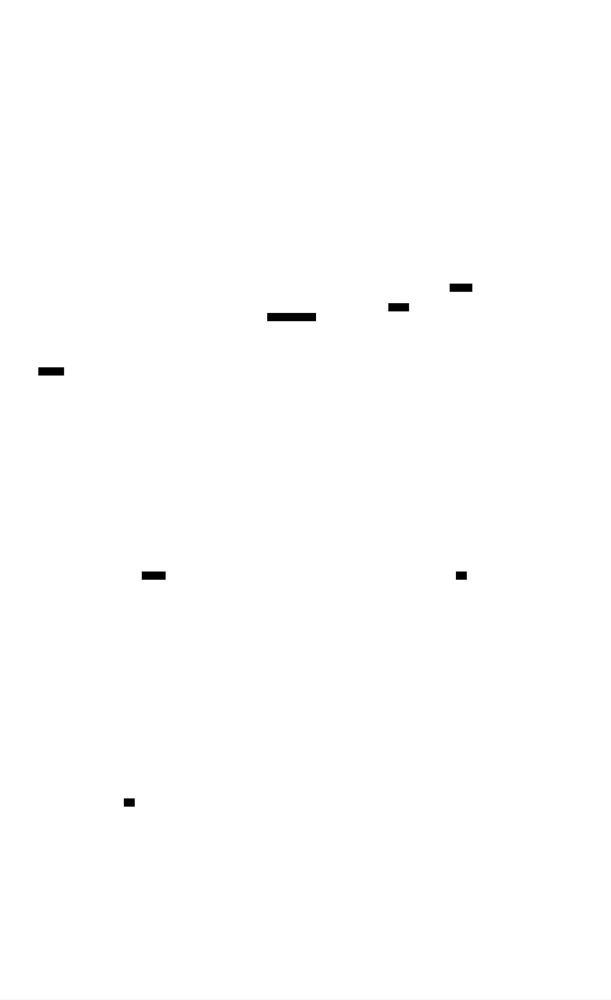
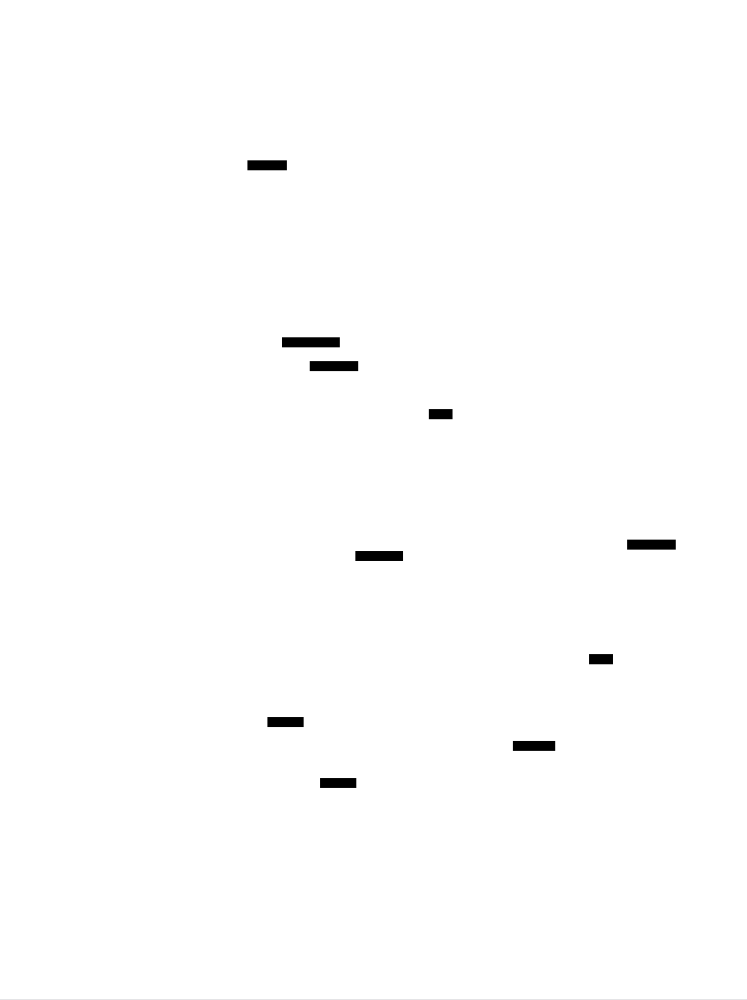
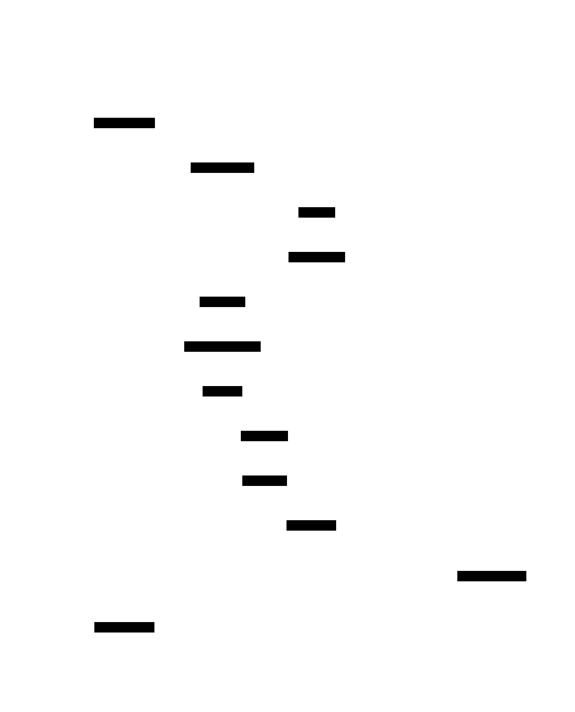

# Event Sourcing System: Design Document


## Overview

This system implements event sourcing with CQRS to maintain system state as an immutable sequence of events, enabling perfect audit trails and time-travel debugging. The key architectural challenge is managing the complexity of rebuilding state from events while maintaining performance through projections and snapshots.


> This guide is meant to help you understand the big picture before diving into each milestone. Refer back to it whenever you need context on how components connect.


## Context and Problem Statement

> **Milestone(s):** Foundation concepts for all milestones - understanding why event sourcing is needed before implementing any components

The journey toward understanding event sourcing begins with recognizing a fundamental limitation in how most software systems manage state. Traditional approaches focus on storing the current state of entities, but in doing so, they discard the rich history of how that state came to be. This section explores why preserving the complete sequence of changes—the events—can be more valuable than just maintaining the final result.

### Mental Model: The Accountant's Ledger

Before diving into the technical complexities of event sourcing, consider how accountants have solved a remarkably similar problem for centuries. When managing financial records, an accountant doesn't simply maintain a single number representing the current account balance. Instead, they maintain a **ledger**—an immutable, chronologically ordered record of every transaction that has ever affected the account.

Each entry in the ledger captures not just the amount of money that moved, but the complete context: who initiated the transaction, when it occurred, why it happened (the business purpose), and which accounts were affected. The current balance is derived by starting from zero and applying every transaction in sequence. If there's ever a question about how the balance reached its current value, the accountant can trace through the ledger, examining each step of the journey.

This ledger approach provides several critical capabilities that a simple balance sheet cannot. First, it enables **perfect auditability**—every change is recorded with its justification and cannot be retroactively altered without detection. Second, it supports **temporal queries**—the accountant can determine what the balance was at any point in the past by replaying transactions up to that date. Third, it provides **causal traceability**—when investigating an unexpected balance, the accountant can trace backward through the chain of transactions to identify the root cause.

Event sourcing applies this same principle to software systems. Instead of storing just the current state of domain entities (like an account balance), we store the complete sequence of **domain events** that led to that state (like the transaction ledger). The current state becomes a derived value, calculated by replaying the events in order. This fundamental shift from state-centric to event-centric thinking unlocks the same benefits that double-entry bookkeeping provides to accountants: perfect audit trails, temporal queries, and complete causal traceability.

> **Key Insight**: Just as accountants discovered that recording transactions is more valuable than just tracking balances, software architects are recognizing that capturing events provides richer information than maintaining state snapshots.

### The State Loss Problem

Traditional **CRUD (Create, Read, Update, Delete)** operations represent the dominant paradigm in most business applications, yet they systematically destroy valuable information with every update. To understand the magnitude of this problem, let's examine what happens during a typical state change in a conventional system.

Consider an e-commerce order management system using a traditional approach. The system maintains an `orders` table with columns like `order_id`, `customer_id`, `status`, `total_amount`, and `last_updated`. When an order progresses from "pending" to "confirmed," the application executes an UPDATE statement that overwrites the status field. This single operation, while functionally correct, obliterates several pieces of critical business information.

The system loses the **temporal context** of when the status change occurred. While many systems include a `last_updated` timestamp, this captures only when the most recent change happened, not the complete timeline of all state transitions. If the order later moves to "shipped" status, the timestamp of the "confirmed" transition is lost forever.

More significantly, the system loses the **causal context** of why the change occurred. Was the order confirmed automatically by a payment processor, manually by a customer service representative handling a complex case, or through a batch process reconciling delayed payment notifications? Each of these scenarios carries different business implications—automatic confirmations suggest smooth operations, manual interventions indicate exceptions requiring analysis, and batch reconciliations might reveal integration delays. Without capturing the cause alongside the effect, the organization cannot learn from its operational patterns.

The system also loses the **actor context** of who or what initiated the change. While some systems maintain audit logs capturing the user ID associated with changes, this information is typically stored separately from the business data and rarely includes rich context about the actor's role, permissions, or the specific business process they were executing.

Perhaps most critically, the system loses the **business context** surrounding the decision. When an order status changes, what other information was considered in making that determination? What business rules were evaluated? What external systems were consulted? Traditional CRUD operations capture the final decision but not the decision-making process, making it impossible to reconstruct the business logic that led to specific outcomes.

This **information destruction** becomes particularly problematic when organizations need to answer sophisticated business questions. Why did customer satisfaction decline in Q3? Which operational changes correlate with increased order cancellations? How do different confirmation workflows affect downstream fulfillment efficiency? Traditional state-centric systems simply don't retain the granular decision history required to answer these questions.

> **The Information Paradox**: The very act of updating state to reflect new information simultaneously destroys the old information, creating a system that becomes less knowledgeable about its own history as it processes more business events.

The state loss problem extends beyond analytical concerns into operational ones. When troubleshooting production issues, engineers frequently need to understand not just what the current state is, but how it reached that configuration. In state-centric systems, this forensic analysis becomes nearly impossible once the problematic state has been "fixed" through additional updates.

Consider debugging a scenario where a customer reports being charged twice for the same order. In a traditional system, if the duplicate charge has already been reversed, the evidence of what originally went wrong may no longer exist. The payment records might show the final correct state, but the sequence of operations that led to the duplicate charge—and more importantly, the business logic flaws that allowed it to occur—could be completely obscured.

### Existing Approaches Comparison

Organizations have developed several strategies to address the state loss problem, each with distinct trade-offs in complexity, completeness, and operational overhead. Understanding these alternatives helps clarify why event sourcing represents a fundamental architectural shift rather than just another auditing technique.

**Audit Logging** represents the most common approach to preserving historical information. In audit log systems, the primary application continues to use traditional CRUD operations on business entities, but a parallel auditing mechanism captures change records whenever state modifications occur. These audit records typically include the old value, new value, timestamp, and user identifier for each field that changed.

| Aspect | Audit Logging | Event Sourcing |
|--------|---------------|-----------------|
| **Implementation Complexity** | Low - can be added to existing systems | High - requires architectural redesign |
| **Information Completeness** | Partial - captures state changes but not business intent | Complete - events represent business decisions |
| **Query Capabilities** | Limited - audit tables are optimized for compliance, not analysis | Rich - events can be projected into any view structure |
| **State Reconstruction** | Difficult - requires replaying field-level changes | Natural - events represent meaningful business transitions |
| **Performance Impact** | Moderate - doubles write operations | High initially - requires projection management |
| **Business Context** | Minimal - focuses on what changed, not why | Rich - events capture business semantics |

Audit logging suffers from several fundamental limitations. First, it operates at the **field level** rather than the **business transaction level**. A single business operation might update multiple fields across several tables, but the audit log captures these as separate, disconnected change records. Reconstructing the original business intent requires correlating multiple audit entries, often across different tables and timestamps.

Second, audit logs capture **state transitions** rather than **business events**. The audit record shows that an order status changed from "pending" to "confirmed," but it doesn't capture the business event that triggered this transition—whether it was a "PaymentProcessed" event, a "ManualApprovalGranted" event, or a "InventoryReserved" event. This distinction matters because different triggering events imply different business processes and have different implications for downstream operations.

**Change Data Capture (CDC)** represents a more sophisticated approach that monitors database transaction logs to capture all data modifications as they occur. CDC systems like Debezium or AWS Database Migration Service can publish a stream of change events whenever rows are inserted, updated, or deleted in monitored tables.

| Aspect | Change Data Capture | Event Sourcing |
|--------|---------------------|-----------------|
| **Capture Granularity** | Database row changes | Business domain events |
| **Semantic Meaning** | Technical (SQL operations) | Business (domain operations) |
| **Integration Effort** | Medium - requires CDC infrastructure | High - requires application redesign |
| **Real-time Capabilities** | Excellent - near real-time change streaming | Excellent - events are the primary data |
| **Cross-System Consistency** | Challenging - each database independent | Natural - events coordinate multiple aggregates |
| **Historical Replay** | Complex - requires understanding database schema evolution | Straightforward - events contain business semantics |

CDC provides excellent technical capabilities for capturing all data changes, but it operates at the wrong **abstraction level** for business analysis. CDC events represent database row modifications—"column X in table Y changed from value A to value B"—rather than business operations like "CustomerRelocated" or "OrderCancelled." Converting CDC events back into business-meaningful information requires maintaining complex mapping logic that understands how database schema changes relate to domain concepts.

Additionally, CDC captures the **effect** of business operations (the resulting state changes) but not the **business context** that caused those operations. If an order cancellation triggers updates to inventory levels, payment records, and customer notifications, CDC will capture all these state changes as separate events, but it won't capture the original "OrderCancelled" business event that logically connects them.

**Event Sourcing** takes a fundamentally different approach by making domain events the **primary source of truth** rather than a secondary audit mechanism. Instead of storing current state and deriving events from state changes, event sourcing stores events and derives state from event history.

> **Decision: Primary Data Storage Strategy**
> - **Context**: Need to preserve complete business history while supporting complex queries and maintaining system performance
> - **Options Considered**: 
>   1. Enhanced audit logging with business context
>   2. Change data capture with event enrichment
>   3. Event sourcing with projection-based read models
> - **Decision**: Event sourcing with CQRS (Command Query Responsibility Segregation)
> - **Rationale**: Event sourcing provides the richest business context and most flexible querying capabilities, while CQRS addresses performance concerns through specialized read models
> - **Consequences**: Higher implementation complexity but enables time-travel debugging, perfect audit trails, and sophisticated business analytics that are impossible with state-centric approaches

This architectural decision creates several important consequences. **Write operations** become append-only, which simplifies concurrency control and provides natural partitioning for horizontal scaling. **Read operations** work against denormalized projections optimized for specific query patterns, providing better performance than complex joins against normalized audit tables.

However, event sourcing also introduces **eventual consistency** between the event store and read models. Applications must be designed to handle scenarios where recent events haven't yet been reflected in query results. This requires careful consideration of business requirements—some operations can tolerate eventual consistency, while others require immediate consistency and must query the event store directly.

The choice between these approaches depends heavily on organizational context and specific business requirements. Audit logging provides a pragmatic solution for regulatory compliance in existing systems. CDC enables real-time data integration patterns without major application changes. Event sourcing delivers the richest analytical capabilities but requires fundamental changes to application architecture.

> **Critical Insight**: The choice isn't just technical—it's about what questions the organization needs to answer about its business operations. State-centric systems optimize for "what is the current situation?" while event-centric systems optimize for "how did we get here and what can we learn from the journey?"

For organizations that need to perform sophisticated business analysis, implement complex workflow coordination, or provide detailed audit capabilities, event sourcing provides capabilities that simply cannot be retrofitted onto state-centric architectures. The investment in architectural complexity pays dividends in analytical flexibility and business insight generation.

### Implementation Guidance

This subsection provides practical guidance for teams beginning their event sourcing journey, including technology choices, architectural patterns, and concrete steps for getting started.

#### Technology Recommendations

| Component | Simple Option | Advanced Option |
|-----------|---------------|-----------------|
| **Event Store** | File-based append-only logs with JSON serialization | EventStoreDB or Apache Kafka with Avro schemas |
| **Serialization** | Jackson JSON with type metadata headers | Protocol Buffers or Apache Avro with schema registry |
| **Command Processing** | Spring Boot with REST controllers | Axon Framework with command bus and event bus |
| **Read Model Storage** | PostgreSQL with JSONB columns | Elasticsearch for search, Redis for caching, specialized time-series databases |
| **Event Processing** | Single-threaded sequential processing | Kafka Streams or Akka Streams for parallel processing |
| **Snapshot Storage** | Same database as read models | Separate object storage (S3) with compression |

#### Recommended Project Structure

For Java projects, organize code to separate command-side and query-side concerns while maintaining clear boundaries between domain logic and infrastructure:

```
src/main/java/
├── com/company/eventsourcing/
│   ├── domain/                          ← Core domain logic
│   │   ├── events/                      ← Domain event definitions
│   │   │   ├── CustomerRegistered.java
│   │   │   ├── OrderPlaced.java
│   │   │   └── PaymentProcessed.java
│   │   ├── aggregates/                  ← Aggregate root implementations
│   │   │   ├── Customer.java
│   │   │   ├── Order.java
│   │   │   └── AggregateRoot.java       ← Base class
│   │   └── commands/                    ← Command definitions
│   │       ├── RegisterCustomer.java
│   │       └── PlaceOrder.java
│   ├── infrastructure/                  ← Technical implementation
│   │   ├── eventstore/                  ← Event storage implementation
│   │   │   ├── EventStore.java          ← Interface
│   │   │   ├── FileEventStore.java      ← Simple implementation
│   │   │   └── EventStoreDB.java        ← Advanced implementation
│   │   ├── serialization/               ← Event serialization
│   │   │   ├── EventSerializer.java
│   │   │   └── JsonEventSerializer.java
│   │   └── projections/                 ← Read model infrastructure
│   │       ├── ProjectionEngine.java
│   │       └── ProjectionHandler.java
│   ├── application/                     ← Application services
│   │   ├── command/                     ← Command handlers
│   │   │   ├── CustomerCommandHandler.java
│   │   │   └── OrderCommandHandler.java
│   │   └── query/                       ← Query handlers
│   │       ├── CustomerQueryHandler.java
│   │       └── OrderQueryHandler.java
│   └── web/                            ← REST API controllers
│       ├── CustomerController.java
│       └── OrderController.java
```

#### Infrastructure Starter Code

**Basic Event Store Interface and File Implementation**

```java
package com.company.eventsourcing.infrastructure.eventstore;

import com.company.eventsourcing.domain.events.DomainEvent;
import java.util.List;
import java.util.concurrent.CompletableFuture;

/**
 * Primary interface for event storage and retrieval.
 * Provides append-only semantics with optimistic concurrency control.
 */
public interface EventStore {
    
    /**
     * Appends events to a stream with optimistic concurrency check.
     * @param streamId Unique identifier for the event stream
     * @param expectedVersion Expected current version (-1 for new stream)
     * @param events Events to append
     * @return CompletableFuture with new stream version
     * @throws ConcurrencyException if expectedVersion doesn't match actual version
     */
    CompletableFuture<Long> appendEvents(String streamId, long expectedVersion, 
                                        List<DomainEvent> events);
    
    /**
     * Reads all events from a stream in chronological order.
     * @param streamId Unique identifier for the event stream
     * @return List of events ordered by version
     */
    List<DomainEvent> readEvents(String streamId);
    
    /**
     * Reads events from a stream starting from a specific version.
     * @param streamId Unique identifier for the event stream
     * @param fromVersion Starting version (inclusive)
     * @return List of events from the specified version onward
     */
    List<DomainEvent> readEvents(String streamId, long fromVersion);
    
    /**
     * Gets the current version of a stream.
     * @param streamId Unique identifier for the event stream
     * @return Current version (-1 if stream doesn't exist)
     */
    long getStreamVersion(String streamId);
}
```

**Simple File-Based Event Store Implementation**

```java
package com.company.eventsourcing.infrastructure.eventstore;

import com.company.eventsourcing.domain.events.DomainEvent;
import com.company.eventsourcing.infrastructure.serialization.EventSerializer;
import com.fasterxml.jackson.databind.ObjectMapper;

import java.io.*;
import java.nio.file.*;
import java.util.*;
import java.util.concurrent.CompletableFuture;
import java.util.concurrent.ConcurrentHashMap;
import java.util.concurrent.locks.ReadWriteLock;
import java.util.concurrent.locks.ReentrantReadWriteLock;

/**
 * File-based event store implementation for development and testing.
 * Each stream is stored as a separate file with one JSON event per line.
 */
public class FileEventStore implements EventStore {
    
    private final Path storageDirectory;
    private final EventSerializer serializer;
    private final Map<String, ReadWriteLock> streamLocks;
    private final Map<String, Long> versionCache;
    
    public FileEventStore(Path storageDirectory, EventSerializer serializer) throws IOException {
        this.storageDirectory = storageDirectory;
        this.serializer = serializer;
        this.streamLocks = new ConcurrentHashMap<>();
        this.versionCache = new ConcurrentHashMap<>();
        
        Files.createDirectories(storageDirectory);
        initializeVersionCache();
    }
    
    @Override
    public CompletableFuture<Long> appendEvents(String streamId, long expectedVersion, 
                                               List<DomainEvent> events) {
        return CompletableFuture.supplyAsync(() -> {
            ReadWriteLock lock = getStreamLock(streamId);
            lock.writeLock().lock();
            try {
                long currentVersion = getCurrentVersion(streamId);
                
                if (currentVersion != expectedVersion) {
                    throw new ConcurrencyException(
                        String.format("Expected version %d but current version is %d", 
                                    expectedVersion, currentVersion));
                }
                
                Path streamFile = getStreamFile(streamId);
                try (BufferedWriter writer = Files.newBufferedWriter(streamFile, 
                                                   StandardOpenOption.CREATE, 
                                                   StandardOpenOption.APPEND)) {
                    
                    long newVersion = currentVersion;
                    for (DomainEvent event : events) {
                        newVersion++;
                        EventEnvelope envelope = new EventEnvelope(
                            UUID.randomUUID().toString(),
                            streamId,
                            newVersion,
                            event.getClass().getSimpleName(),
                            serializer.serialize(event),
                            Instant.now()
                        );
                        writer.write(serializer.serialize(envelope));
                        writer.newLine();
                    }
                    writer.flush();
                    
                    versionCache.put(streamId, newVersion);
                    return newVersion;
                    
                } catch (IOException e) {
                    throw new EventStoreException("Failed to append events to stream: " + streamId, e);
                }
                
            } finally {
                lock.writeLock().unlock();
            }
        });
    }
    
    // Additional methods implemented with similar patterns...
    // (ReadEvents, GetStreamVersion, etc.)
}
```

**Domain Event Base Class**

```java
package com.company.eventsourcing.domain.events;

import java.time.Instant;
import java.util.UUID;

/**
 * Base class for all domain events.
 * Contains common metadata that every event should carry.
 */
public abstract class DomainEvent {
    
    private final String eventId;
    private final Instant occurredAt;
    private final String aggregateId;
    
    protected DomainEvent(String aggregateId) {
        this.eventId = UUID.randomUUID().toString();
        this.occurredAt = Instant.now();
        this.aggregateId = aggregateId;
    }
    
    // Constructor for deserialization
    protected DomainEvent(String eventId, Instant occurredAt, String aggregateId) {
        this.eventId = eventId;
        this.occurredAt = occurredAt;
        this.aggregateId = aggregateId;
    }
    
    public String getEventId() { return eventId; }
    public Instant getOccurredAt() { return occurredAt; }
    public String getAggregateId() { return aggregateId; }
    
    /**
     * Returns the business-meaningful name for this event type.
     * Used for serialization and event handler routing.
     */
    public abstract String getEventType();
}
```

#### Core Logic Skeleton

**Aggregate Root Base Class**

```java
package com.company.eventsourcing.domain.aggregates;

import com.company.eventsourcing.domain.events.DomainEvent;
import java.util.*;

/**
 * Base class for all aggregate roots in the event-sourced domain.
 * Provides event sourcing capabilities and change tracking.
 */
public abstract class AggregateRoot {
    
    private String aggregateId;
    private long version;
    private List<DomainEvent> uncommittedChanges;
    
    protected AggregateRoot() {
        this.uncommittedChanges = new ArrayList<>();
        this.version = -1; // New aggregate
    }
    
    /**
     * Loads aggregate state by replaying events from history.
     * This is the core of event sourcing reconstitution.
     */
    public static <T extends AggregateRoot> T fromHistory(Class<T> aggregateType, 
                                                         List<DomainEvent> history) {
        // TODO 1: Create new instance of aggregateType using reflection or factory
        // TODO 2: Sort events by version to ensure chronological order
        // TODO 3: Apply each event in sequence using the apply() method
        // TODO 4: Set the aggregate version to the version of the last event
        // TODO 5: Clear any uncommitted changes (these are historical, already persisted)
        // TODO 6: Return the reconstituted aggregate
        throw new UnsupportedOperationException("Implement event replay logic");
    }
    
    /**
     * Applies an event to aggregate state and tracks it as uncommitted change.
     * Called by command handlers to modify aggregate state.
     */
    protected void raiseEvent(DomainEvent event) {
        // TODO 1: Apply the event to current state using apply() method
        // TODO 2: Add event to uncommittedChanges list for later persistence
        // TODO 3: Increment version number for optimistic concurrency
        throw new UnsupportedOperationException("Implement event raising logic");
    }
    
    /**
     * Applies an event to aggregate state without tracking as uncommitted.
     * Used during reconstitution from historical events.
     */
    private void applyEvent(DomainEvent event) {
        // TODO 1: Use reflection or visitor pattern to find correct apply method
        // TODO 2: Call the specific apply method for this event type
        // TODO 3: Handle case where no apply method exists (log warning or throw exception)
        throw new UnsupportedOperationException("Implement event application logic");
    }
    
    /**
     * Returns events that have been raised but not yet persisted.
     * Used by repository to determine what needs to be saved.
     */
    public List<DomainEvent> getUncommittedChanges() {
        return new ArrayList<>(uncommittedChanges);
    }
    
    /**
     * Marks all uncommitted changes as committed.
     * Called by repository after successful persistence.
     */
    public void markChangesAsCommitted() {
        // TODO 1: Clear the uncommittedChanges list
        // TODO 2: Consider updating version if needed
        throw new UnsupportedOperationException("Implement change commitment logic");
    }
    
    // Getters and setters for common properties
    public String getAggregateId() { return aggregateId; }
    protected void setAggregateId(String aggregateId) { this.aggregateId = aggregateId; }
    
    public long getVersion() { return version; }
    protected void setVersion(long version) { this.version = version; }
}
```

#### Language-Specific Hints

**Java-Specific Implementation Considerations:**

1. **Reflection for Event Application**: Use `Method.invoke()` to dynamically call `apply(SpecificEvent)` methods, or implement a visitor pattern for type-safe event handling.

2. **JSON Serialization**: Use Jackson `@JsonTypeInfo` annotations to include event type information in serialized JSON, enabling proper deserialization.

3. **Concurrency**: Use `ConcurrentHashMap` for version caches and `ReentrantReadWriteLock` for per-stream concurrency control.

4. **File I/O**: Use `java.nio.file.Files` for atomic file operations and `BufferedWriter` with explicit `flush()` calls for performance.

5. **Exception Handling**: Create custom exceptions like `ConcurrencyException` and `EventStoreException` for domain-specific error scenarios.

6. **Testing**: Use JUnit 5 and Testcontainers for integration testing with real databases, but start with in-memory implementations for unit testing.

#### Milestone Checkpoints

**Foundation Checkpoint**: After completing this conceptual foundation, verify understanding by:

1. **Mental Model Test**: Explain event sourcing to a colleague using the accounting ledger analogy without looking at notes
2. **Architecture Decision**: Write a one-page justification for choosing event sourcing over audit logging for a specific business scenario
3. **State Loss Analysis**: Identify three pieces of business information that would be lost in a traditional CRUD system for your domain

**Expected Outcome**: Clear understanding of why event sourcing is valuable and when it's worth the additional complexity.

**Next Steps**: With this foundation in place, proceed to implement the Event Store (Milestone 1) using the interfaces and patterns established here.


## Goals and Non-Goals

> **Milestone(s):** Foundation concepts for all milestones - establishing clear boundaries and success criteria before implementing any components

The most critical mistake teams make when building an event sourcing system is not clearly defining what they're building and why. Without clear goals, developers end up creating an over-engineered system that solves problems they don't have, or worse, an under-engineered system that can't handle their actual requirements. Think of this like planning a road trip - you need to know your destination, what stops you'll make along the way, and what detours you won't take, or you'll end up lost in the wilderness of distributed systems complexity.

Event sourcing systems can grow to encompass vast functionality - from simple audit trails to complex temporal queries, from single-machine storage to globally distributed event streams. This section establishes clear boundaries around what our implementation will deliver, what quality characteristics it must exhibit, and what tempting features we'll explicitly avoid to maintain focus and deliverability.

The goal-setting process for event sourcing systems requires particular care because the pattern itself enables so many powerful capabilities. It's like having a Swiss Army knife - just because you *can* add every possible tool doesn't mean you should for your first implementation. We'll focus on building a solid foundation that demonstrates the core concepts clearly, with extension points for future enhancement.

### Functional Goals

Our event sourcing system must deliver specific core capabilities that demonstrate the fundamental patterns and enable real-world usage. These functional goals represent the minimum viable implementation that provides genuine business value while serving as a complete learning experience.

**Primary Domain Capabilities**

The system must support complete **event sourcing reconstitution** where any aggregate can be rebuilt from its event history without data loss. This means we can take an empty aggregate instance, replay its complete event stream from the beginning, and arrive at exactly the same state as if we had been tracking changes incrementally. This capability forms the foundation of event sourcing's auditability promise - every state change is preserved and can be traced back to its originating event.

Our implementation must handle **command processing with business rule validation** where domain aggregates receive commands, validate them against current state, and emit appropriate domain events. The validation logic lives within the aggregate, ensuring that business invariants are maintained regardless of how commands arrive in the system. This separation between command validation and state persistence enables the temporal flexibility that makes event sourcing powerful.

The system must provide **optimistic concurrency control** using version vectors to handle concurrent modifications to the same aggregate. When two commands attempt to modify the same aggregate simultaneously, our event store must detect the conflict and allow the application to resolve it appropriately. This prevents the lost update problem while maintaining the performance benefits of optimistic rather than pessimistic locking.

**Query and Projection Capabilities**

We must implement **eventually consistent read models** that update automatically as new events are processed. These projections transform the event stream into queryable views optimized for specific use cases. The projections must handle out-of-order event processing gracefully and provide mechanisms for complete rebuilds when the projection logic changes or becomes corrupted.

The system must support **multiple projection types per event stream**, allowing different read models to extract different views from the same underlying events. For example, an order event stream might feed both a customer order history projection and an inventory management projection, each extracting the relevant data for their specific query patterns.

Our projection engine must include **checkpoint management** to track processing progress and enable resumption after system restarts. The checkpoints prevent duplicate processing and ensure that projections can recover their position in the event stream reliably, maintaining data consistency even through system failures.

**Storage and Persistence Capabilities**

The event store must implement **append-only storage semantics** with guaranteed event ordering within each stream. Events appended to a specific aggregate's stream must be readable in exactly the same order they were written, preserving the causal relationships between domain events. The append-only nature ensures that historical events remain immutable and tamper-evident.

We must provide **event serialization with schema evolution support** to handle changes in event structure over time. As the domain model evolves, new fields may be added to events or existing fields may change meaning. Our serialization approach must allow older events to be read and processed by newer versions of the application code without data corruption or processing failures.

The system must include **snapshot creation and loading capabilities** to optimize aggregate reconstitution performance. When an aggregate has processed thousands of events, replaying the entire history becomes computationally expensive. Snapshots provide periodic save points that capture aggregate state, allowing reconstitution to start from the snapshot and replay only subsequent events.

**Integration and Extension Points**

Our implementation must provide **clean interfaces for extending projection types** without modifying core event processing logic. New projection handlers should be pluggable through well-defined interfaces, allowing the system to grow organically as new query requirements emerge. The projection engine should automatically discover and wire new projection types without manual configuration.

The system must support **event metadata and causality tracking** to enable debugging and audit capabilities. Each event should carry metadata about when it occurred, what command triggered it, and how it relates to other events in the system. This metadata enables powerful debugging scenarios and supports compliance requirements for audit trails.

We must implement **graceful degradation when projections fail** to ensure that command processing continues even when read model updates encounter errors. The core event sourcing capability should remain available even if specific projections experience failures, preventing cascading system failures from read-side issues.

| Functional Goal | Success Criteria | Milestone |
|-----------------|-----------------|-----------|
| Event Stream Persistence | Events appended to streams are readable in exact order with no data loss | Milestone 1 |
| Optimistic Concurrency | Concurrent modifications detected and rejected with `ConcurrencyException` | Milestone 1 |
| Aggregate Reconstitution | Aggregates rebuilt from event history match incrementally-built state | Milestone 2 |
| Command Validation | Business rules enforced before events emitted, invalid commands rejected | Milestone 2 |
| Projection Updates | Read models automatically updated as events processed with eventual consistency | Milestone 3 |
| Checkpoint Management | Projection processing resumes from last checkpoint after restart | Milestone 3 |
| Snapshot Performance | Aggregate loading time reduced by 90%+ when snapshots available | Milestone 4 |
| Schema Evolution | Events readable by newer application versions without breaking compatibility | All Milestones |

### Non-Functional Goals

The quality attributes of our event sourcing system determine its suitability for production use and its educational value. These non-functional goals establish the performance, reliability, and maintainability characteristics that make the system both a good learning experience and a foundation for real applications.

**Performance and Scalability Characteristics**

Our event store must handle **high write throughput** with minimal latency impact on command processing. The append-only storage design naturally supports high write performance, but we must ensure that storage operations don't become a bottleneck as event volume increases. The target is handling at least 1,000 events per second on modest hardware while maintaining sub-100ms latency for individual append operations.

The system must provide **predictable read performance** for both event stream retrieval and projection queries. Event stream reads should scale linearly with the number of events in the stream, while projection queries should maintain constant-time performance regardless of the underlying event stream size. This predictability enables capacity planning and performance tuning in production deployments.

Our implementation must support **concurrent aggregate processing** where multiple aggregates can be loaded and modified simultaneously without interference. The optimistic concurrency model naturally enables this, but we must ensure that our locking and threading approach doesn't introduce artificial serialization points that limit scalability.

**Reliability and Data Integrity**

The event store must provide **durability guarantees** ensuring that successfully appended events survive system crashes and hardware failures. This requires careful use of filesystem sync operations and atomic write techniques to prevent partial writes or data corruption. The durability promise is fundamental to event sourcing's audit trail capabilities.

We must implement **projection consistency monitoring** to detect when read models fall behind the event stream or become corrupted. The system should provide visibility into projection lag and mechanisms for detecting and recovering from projection failures. This monitoring enables operational confidence in eventually consistent architectures.

The system must handle **graceful startup and shutdown sequences** that preserve data consistency and processing state. Startup should include consistency checks and recovery procedures for any interrupted operations, while shutdown should ensure that all pending writes complete and checkpoints are saved appropriately.

**Maintainability and Debugging Support**

Our implementation must provide **comprehensive logging and observability** to support debugging and performance tuning. Every significant operation should be logged with sufficient detail to reconstruct system behavior during incident investigation. The logging should include timing information, event counts, and error details to support performance analysis.

The system must include **clear error messages and diagnostics** that help developers understand failures and their root causes. When business rule validation fails, the error should clearly indicate which rule was violated and why. When concurrency conflicts occur, the error should identify the conflicting versions and suggest resolution strategies.

We must design **modular component interfaces** that enable testing individual pieces in isolation. Each major component should have clear boundaries and dependencies that can be mocked or stubbed for unit testing. This modularity also supports incremental implementation during the learning process.

**Development and Learning Experience**

The codebase must demonstrate **clear separation of concerns** between event storage, domain logic, and read model maintenance. Each responsibility should be contained within distinct components with minimal coupling, making the overall architecture easy to understand and modify. This separation reinforces the CQRS pattern and makes the learning objectives clear.

Our implementation must include **extensive documentation and examples** that explain not just what the code does, but why specific design decisions were made. The code should serve as a teaching tool that demonstrates event sourcing patterns clearly without being obscured by production complexity or framework dependencies.

The system must provide **fast feedback loops** during development, with comprehensive test suites that run quickly and provide clear failure diagnostics. Developers should be able to make changes and verify correctness within seconds, not minutes, to maintain flow state during the learning process.

| Non-Functional Goal | Target Metric | Verification Method |
|---------------------|---------------|-------------------|
| Write Throughput | 1,000 events/second minimum | Load testing with concurrent writers |
| Append Latency | Sub-100ms at 95th percentile | Performance monitoring during normal load |
| Projection Lag | Under 1 second during normal operation | Monitoring timestamp differences |
| Startup Time | Under 10 seconds with 100,000 events | Automated startup performance tests |
| Test Suite Speed | Complete test run under 30 seconds | Continuous integration metrics |
| Memory Usage | Stable heap size under normal load | Memory profiling during extended runs |
| Storage Efficiency | Less than 2x overhead vs raw event data | Storage size analysis tools |
| Documentation Coverage | All public interfaces documented | Documentation generation tools |

> **Design Insight**: The non-functional goals heavily emphasize observability and debugging support because event sourcing systems can be particularly challenging to debug when things go wrong. The temporal nature of event processing means that failures often manifest far from their root causes, making comprehensive logging and diagnostics essential.

### Explicit Non-Goals

Defining what we will *not* build is just as important as defining what we will build. These explicit non-goals prevent scope creep and keep the implementation focused on core learning objectives. Think of this as putting guardrails on the highway - they keep us moving toward our destination instead of getting lost in interesting but tangential problems.

**Distributed Systems Complexity**

We will **not implement distributed event storage** with partitioning, replication, or consensus protocols. Our event store will be single-node only, using local filesystem storage. While distributed event stores are essential for large-scale production systems, they introduce significant complexity in areas like network protocols, leader election, and split-brain resolution that would obscure the core event sourcing concepts we're trying to learn.

This implementation will **not support cross-aggregate transactions** or distributed transaction coordination. Each aggregate maintains its own event stream independently, and we will not attempt to provide ACID semantics across multiple aggregates. This constraint forces proper aggregate boundary design and reinforces the eventual consistency model that event sourcing naturally supports.

We will **not implement event stream replication or high availability features**. There will be no primary-backup replication, no automatic failover, and no geo-distribution of event data. These capabilities are important for production systems but add substantial complexity that distracts from learning the fundamental patterns.

**Advanced Event Store Features**

Our implementation will **not support complex event stream partitioning strategies** or cross-stream ordering guarantees. We will maintain ordering within individual aggregate streams but make no promises about global ordering across all events in the system. Global ordering requires sophisticated timestamping or consensus mechanisms that are beyond our scope.

We will **not implement advanced event filtering or subscription patterns** like content-based routing or complex event processing. Our projection system will process events sequentially from streams without sophisticated filtering or transformation capabilities. Complex event processing introduces query language parsing and optimization problems that would overwhelm the core learning objectives.

The system will **not include built-in event encryption or security features**. We assume events are stored in plaintext and that access control happens at the application or infrastructure level. While security is crucial for production systems, implementing proper encryption and key management would require substantial additional complexity.

**Sophisticated Query and Analysis Features**

We will **not implement temporal queries or time-travel debugging capabilities**. While event sourcing naturally enables querying system state at arbitrary points in history, implementing this requires sophisticated indexing and query processing logic that goes beyond our educational goals. Our projections will only maintain current state derived from the complete event history.

This implementation will **not support complex analytical queries or event pattern matching**. We will not build capabilities for finding correlations across event streams, detecting complex event patterns, or running analytical queries across historical data. These features require query engines and analytical frameworks that would dominate the implementation effort.

We will **not implement automatic projection optimization or materialized view selection**. The system will not analyze query patterns to suggest new projections or optimize existing ones. Projection design will remain a manual process requiring explicit developer decision-making about what read models to maintain.

**Production Operations and Management**

Our system will **not include comprehensive monitoring dashboards or management interfaces**. While we'll provide basic logging and error reporting, we will not build web-based administration interfaces, graphical monitoring dashboards, or automated alerting systems. These operational concerns, while important, would shift focus away from the core event sourcing implementation.

We will **not implement sophisticated backup and recovery procedures** beyond basic filesystem-level backup capabilities. The system will not include point-in-time recovery, incremental backup strategies, or automated disaster recovery procedures. These operational capabilities require substantial additional tooling and testing infrastructure.

The implementation will **not support live schema migration or zero-downtime upgrades**. While our event serialization will handle backward compatibility, we will not provide mechanisms for migrating running systems to new versions without downtime. Production deployment strategies introduce complexity that goes beyond the core technical learning goals.

**Framework Integration and Enterprise Features**

We will **not integrate with existing web frameworks or dependency injection containers**. The implementation will use plain language constructs without framework-specific annotations, configurations, or integrations. This keeps the code focused on event sourcing concepts rather than framework-specific concerns that vary across different technology stacks.

Our system will **not implement enterprise integration patterns** like message queues, service buses, or API gateways. Event propagation will happen through direct method calls within the same process rather than through external messaging infrastructure. While external integration is important for production systems, it would require learning additional technologies that distract from event sourcing itself.

We will **not provide automatic code generation or domain-specific language features**. Developers will write event classes, aggregate methods, and projection handlers using standard language constructs. While code generation can improve productivity, it would obscure the underlying patterns and make the learning experience less clear.

| Non-Goal Category | Specific Exclusions | Rationale |
|-------------------|-------------------|-----------|
| Distribution | Multi-node storage, consensus protocols, network partitioning | Adds complexity without teaching core event sourcing |
| Advanced Storage | Content-based subscriptions, complex filtering, global ordering | Requires sophisticated query processing beyond scope |
| Analytics | Time-travel queries, pattern matching, correlation analysis | Needs analytical engines that would dominate implementation |
| Operations | Monitoring dashboards, automated backup, live migration | Operational concerns distract from core technical learning |
| Integration | Framework binding, message queues, enterprise patterns | External dependencies obscure event sourcing concepts |
| Security | Event encryption, access control, audit logging | Security implementation would require substantial additional complexity |
| Performance | Advanced caching, query optimization, load balancing | Optimization techniques would complicate the learning experience |

> **Architecture Decision: Single-Process Implementation**
> - **Context**: Event sourcing systems can run within a single process or distributed across multiple nodes, with significant implications for complexity and learning curve
> - **Options Considered**: 
>   1. Single-process with in-memory or file-based storage
>   2. Multi-process with network communication and consensus
>   3. Hybrid approach with optional distribution features
> - **Decision**: Single-process implementation with file-based event storage
> - **Rationale**: Eliminates network protocols, consensus algorithms, and failure handling complexity that would obscure core event sourcing concepts. Developers can focus on understanding aggregate reconstitution, projection maintenance, and CQRS patterns without getting lost in distributed systems problems
> - **Consequences**: Enables faster learning and clearer code examples, but limits production scalability. Design includes extension points for future distributed implementations

The explicit non-goals serve a crucial educational purpose - they help developers understand what makes event sourcing uniquely valuable versus what makes distributed systems complex. By separating these concerns, we create space to deeply understand the core patterns before tackling the operational complexity that production systems require.

These boundaries also make the implementation achievable within reasonable time constraints. Event sourcing systems can easily grow to encompass dozens of advanced features, but understanding the fundamental patterns requires focus and repetition on the core concepts. The excluded features represent natural extension points for developers who want to continue learning after mastering the basics.

### Implementation Guidance

The implementation approach for this event sourcing system emphasizes clarity and educational value over production optimization. We'll build components incrementally, focusing on one concept at a time while maintaining clear separation between different responsibilities.

**Technology Recommendations**

| Component | Simple Option | Advanced Option |
|-----------|---------------|-----------------|
| Event Storage | File-based append-only logs with JSON serialization | Embedded database (H2, SQLite) with custom schema |
| Concurrency Control | File-based locking with version checks | In-memory version tracking with atomic operations |
| Event Serialization | Jackson JSON with type metadata | Custom binary format with schema registry |
| Projection Storage | Simple HashMap with periodic persistence | Embedded key-value store (MapDB, Chronicle Map) |
| Threading Model | Single-threaded with sequential processing | Thread pools with work queues |
| Logging Framework | Java.util.logging with simple formatters | SLF4J with Logback for structured logging |

For this educational implementation, we recommend the simple options to maintain focus on event sourcing concepts rather than infrastructure complexity. The advanced options represent natural upgrade paths as requirements grow.

**Recommended Project Structure**

```
event-sourcing-system/
├── src/main/java/
│   ├── com/eventsourcing/
│   │   ├── store/                    ← Event Store (Milestone 1)
│   │   │   ├── EventStore.java           ← Main storage interface
│   │   │   ├── FileEventStore.java       ← File-based implementation
│   │   │   ├── EventEnvelope.java        ← Event wrapper with metadata
│   │   │   └── ConcurrencyException.java ← Version conflict handling
│   │   ├── domain/                   ← Domain Model (Milestone 2)
│   │   │   ├── AggregateRoot.java        ← Base aggregate class
│   │   │   ├── DomainEvent.java          ← Event base class
│   │   │   └── Repository.java           ← Aggregate persistence
│   │   ├── projections/              ← Read Models (Milestone 3)
│   │   │   ├── ProjectionEngine.java     ← Event processing engine
│   │   │   ├── ProjectionHandler.java    ← Handler interface
│   │   │   └── CheckpointManager.java    ← Progress tracking
│   │   ├── snapshots/                ← Snapshot System (Milestone 4)
│   │   │   ├── SnapshotStore.java        ← Snapshot persistence
│   │   │   └── SnapshotScheduler.java    ← Automatic creation
│   │   └── examples/                 ← Sample Domain
│   │       ├── order/                    ← Order aggregate example
│   │       └── inventory/                ← Inventory projection example
├── src/test/java/                    ← Comprehensive test suite
└── docs/                             ← Documentation and diagrams
```

This structure separates each milestone into its own package, making it easy to implement and test components incrementally. The examples package provides concrete domain implementations that demonstrate the patterns in action.

**Infrastructure Starter Code**

The following utility classes provide the foundation infrastructure without cluttering the core learning experience:

```java
// File: src/main/java/com/eventsourcing/infrastructure/JsonSerializer.java
/**
 * Simple JSON serialization utility for events and snapshots.
 * Handles type metadata to support event schema evolution.
 */
public class JsonSerializer {
    private final ObjectMapper objectMapper;
    
    public JsonSerializer() {
        this.objectMapper = new ObjectMapper()
            .registerModule(new JavaTimeModule())
            .disable(SerializationFeature.WRITE_DATES_AS_TIMESTAMPS);
    }
    
    public String serialize(Object object) {
        // TODO: Add type information for deserialization
        // TODO: Handle serialization errors gracefully
        // TODO: Support schema version tracking
    }
    
    public <T> T deserialize(String json, Class<T> type) {
        // TODO: Extract type information from JSON
        // TODO: Handle unknown event types gracefully
        // TODO: Apply schema migration if needed
    }
}

// File: src/main/java/com/eventsourcing/infrastructure/FileUtils.java
/**
 * File system utilities for atomic writes and directory management.
 * Provides durability guarantees for event storage operations.
 */
public class FileUtils {
    public static void atomicWrite(Path filePath, String content) {
        // TODO: Write to temporary file first
        // TODO: Sync to disk before rename
        // TODO: Atomic rename to final location
    }
    
    public static void ensureDirectory(Path directoryPath) {
        // TODO: Create directory structure if missing
        // TODO: Verify write permissions
        // TODO: Handle concurrent directory creation
    }
    
    public static List<String> readLines(Path filePath) {
        // TODO: Read entire file safely
        // TODO: Handle file not found gracefully
        // TODO: Support large files with streaming
    }
}
```

**Core Logic Skeleton Code**

The main event sourcing interfaces should be implemented by learners to reinforce the concepts:

```java
// File: src/main/java/com/eventsourcing/store/EventStore.java
/**
 * Core event storage interface providing append-only semantics with optimistic concurrency.
 * This is the heart of the event sourcing system - implement this carefully!
 */
public interface EventStore {
    /**
     * Appends events to a stream with optimistic concurrency control.
     * 
     * @param streamId Unique identifier for the event stream (typically aggregate ID)
     * @param expectedVersion Current version of stream, or NEW_STREAM_VERSION for new streams
     * @param events List of events to append atomically
     * @throws ConcurrencyException if expectedVersion doesn't match current stream version
     */
    void appendEvents(String streamId, int expectedVersion, List<DomainEvent> events);
    
    /**
     * Reads all events from a stream in chronological order.
     * 
     * @param streamId Stream identifier to read from
     * @return List of events wrapped in envelopes with metadata, ordered by version
     */
    List<EventEnvelope> readEvents(String streamId);
    
    // TODO: Implement FileEventStore with these steps:
    // TODO 1: Check if stream exists, create directory if needed
    // TODO 2: Read current version from version file
    // TODO 3: Verify expectedVersion matches current version
    // TODO 4: Write events to stream file with atomic append
    // TODO 5: Update version file with new version number
    // TODO 6: Sync all writes to disk for durability
}
```

**Language-Specific Implementation Hints**

For Java implementation, several language features make event sourcing implementation cleaner:

- Use `java.nio.file.Files.move()` with `ATOMIC_MOVE` for atomic file operations
- Implement proper `equals()` and `hashCode()` for `DomainEvent` to support testing
- Use `ConcurrentHashMap` for in-memory caches with thread-safe access patterns
- Apply `@JsonTypeInfo` annotations for polymorphic event serialization
- Leverage Java streams for projection processing: `events.stream().filter(predicate).map(transform).collect(toList())`
- Use `CompletableFuture` for asynchronous projection processing if needed

**Milestone Checkpoints**

After completing each milestone, verify the implementation with these specific tests:

**Milestone 1 Checkpoint - Event Store:**
```bash
# Run the event store tests
mvn test -Dtest=*EventStore*

# Expected behavior verification:
# 1. Create new stream and append events successfully  
# 2. Read events back in exact order they were written
# 3. Concurrent append to same stream throws ConcurrencyException
# 4. Events survive JVM restart (durability test)
```

**Milestone 2 Checkpoint - Aggregates:**
```bash
# Test aggregate reconstitution
mvn test -Dtest=*Aggregate*

# Expected behavior:
# 1. Load aggregate from events produces same state as incremental updates
# 2. Command validation rejects invalid operations
# 3. Uncommitted changes tracked correctly until persistence
# 4. Event application maintains aggregate invariants
```

**Milestone 3 Checkpoint - Projections:**
```bash
# Verify projection processing
mvn test -Dtest=*Projection*

# Expected behavior:
# 1. Projections update automatically when events processed
# 2. Checkpoint tracking resumes processing after restart  
# 3. Failed projection doesn't affect other projections
# 4. Projection rebuild produces consistent results
```

**Milestone 4 Checkpoint - Snapshots:**
```bash
# Test snapshot optimization
mvn test -Dtest=*Snapshot*

# Expected behavior:
# 1. Snapshots created automatically based on event count
# 2. Aggregate loading uses snapshot + recent events
# 3. Loading time significantly reduced for large event streams
# 4. Snapshot schema evolution handled gracefully
```

Each checkpoint should include both automated tests and manual verification steps to ensure the implementation meets the learning objectives. The tests should fail clearly when implementations are incorrect, guiding developers toward proper solutions.


## High-Level Architecture

> **Milestone(s):** Foundation concepts for all milestones - understanding the overall system structure before implementing individual components

The architecture of an event-sourced system fundamentally differs from traditional CRUD applications in one crucial way: **commands** (state changes) and **queries** (data retrieval) flow through completely separate pathways. Think of it like a modern newsroom where reporters (commands) submit stories to editors who verify and publish them to the permanent record (event store), while readers (queries) access pre-formatted newspapers and magazines (projections) that journalists have prepared from the published stories. The newsroom never asks readers to piece together current events by reading every individual story from the beginning of time.

This separation, known as **Command Query Responsibility Segregation (CQRS)**, enables the system to optimize each pathway independently. Commands focus on business rule validation and maintaining data consistency, while queries focus on fast data retrieval from pre-computed views. The event store acts as the single source of truth, with projections serving as eventually consistent read models that provide different perspectives on the same underlying events.

### Component Overview

The event sourcing system consists of five primary architectural components, each with distinct responsibilities and clear boundaries. Understanding these components and their interactions is essential before diving into implementation details.


The architecture follows a **unidirectional data flow** pattern where commands enter the system, generate events that are stored permanently, and then trigger updates to read models that serve queries. This design ensures that data flows in a predictable direction and that each component has a single, well-defined responsibility.

| Component | Primary Responsibility | Data Owned | Interactions |
|-----------|----------------------|-------------|--------------|
| Command Handlers | Validate business rules and coordinate command processing | None (stateless) | Loads aggregates, validates commands, saves events |
| Event Store | Provide durable, ordered storage for domain events | All domain events organized by stream | Appends events, reads event streams, manages concurrency |
| Aggregate Root | Maintain domain state and enforce business invariants | Current aggregate state | Applies events, handles commands, emits new events |
| Projections | Transform events into optimized read models | Read model data and processing checkpoints | Subscribes to events, updates views, tracks position |
| Query Handlers | Serve read requests from pre-computed projections | None (stateless) | Reads from projections, formats responses |

**Command Handlers** serve as the entry point for all state-changing operations in the system. They are stateless components that orchestrate the command processing workflow: loading the relevant aggregate from the event store, invoking the appropriate command method on the aggregate, and persisting any resulting events back to the event store. Command handlers do not contain business logic themselves - they delegate all domain decisions to the aggregate. Think of them as air traffic controllers who coordinate the flow of operations but don't make decisions about flight plans or weather conditions.

The **Event Store** is the heart of the system, providing append-only, durable storage for all domain events. Unlike traditional databases that store current state, the event store maintains the complete history of everything that has happened in the system. It guarantees that events within a single stream (typically one stream per aggregate instance) are stored and retrieved in chronological order, and it uses optimistic concurrency control to prevent conflicting updates. The event store is the only component that writes persistent data in the command processing path.

**Aggregate Root** entities represent the core domain concepts and serve as consistency boundaries within the system. Each aggregate maintains its internal state by applying events in sequence and exposes command methods that validate business rules before emitting new events. Aggregates are reconstituted from their event history each time they are loaded, ensuring that their current state always reflects the complete sequence of events that have occurred. They are the sole guardians of business invariants and the only components authorized to generate new domain events.

**Projections** are specialized event handlers that build and maintain read-optimized views of the data by processing events from one or more streams. Each projection typically serves a specific query pattern or user interface requirement, transforming the event-oriented data into a structure optimized for reads. Projections maintain their own processing position (checkpoint) within the event stream, enabling them to resume processing after system restarts and to be rebuilt from scratch when necessary.

**Query Handlers** provide the read-side interface to the system, serving requests by querying the appropriate projections. Like command handlers, they are stateless components that simply route queries to the correct read models and format the results. Query handlers never access the event store directly - they always work with projections that have been optimized for the specific query patterns they serve.

> **The key architectural insight is that the event store serves as a message bus between the write side (commands) and read side (queries) of the system. Events flow from aggregates through the event store to projections, creating a natural decoupling between command processing and query serving.**

### CQRS Command-Query Separation

Command Query Responsibility Segregation (CQRS) forms the foundation of the event sourcing architecture by establishing two distinct processing pathways with different characteristics, optimizations, and consistency guarantees. The separation is not merely organizational - it represents a fundamental architectural choice that affects data models, processing patterns, and scalability characteristics.

**The Command Pathway** handles all state-changing operations and prioritizes consistency, validation, and durability over speed. When a command enters the system, it follows a synchronous path through command handlers to aggregates, where business rules are validated against current state before new events are generated and persisted. This pathway operates under strong consistency semantics - a command either succeeds completely or fails completely, with no partial state changes visible to other parts of the system.

**The Query Pathway** handles all data retrieval operations and prioritizes speed, availability, and query flexibility over strict consistency. Queries are served from pre-computed projections that have been optimized for specific read patterns, eliminating the need for complex joins, aggregations, or event replay during query processing. This pathway operates under eventual consistency semantics - the data served may lag slightly behind the most recent commands, but queries are fast and always available.

| Aspect | Command Pathway | Query Pathway |
|--------|----------------|---------------|
| Consistency Model | Strong consistency within aggregate boundaries | Eventual consistency across the entire system |
| Data Structure | Normalized domain events in append-only streams | Denormalized views optimized for specific queries |
| Processing Model | Synchronous command validation and event persistence | Asynchronous event processing and view updates |
| Performance Characteristics | Optimized for write throughput and consistency | Optimized for read latency and query flexibility |
| Failure Semantics | Commands fail fast with immediate feedback | Projections retry and eventually converge |
| Scalability Pattern | Scale by partitioning aggregates across streams | Scale by creating multiple specialized read models |

The command pathway begins when a client submits a command to a command handler. The handler loads the target aggregate by reading and replaying its event stream from the event store, then invokes the appropriate command method on the aggregate. The aggregate validates the command against its current state and business rules. If validation succeeds, the aggregate emits one or more domain events representing the requested state change. The command handler then attempts to persist these events to the event store using optimistic concurrency control. If the persistence succeeds, the command is considered complete and the handler returns success to the client.

The query pathway operates independently and asynchronously from command processing. Projections continuously monitor the event store for new events, processing them in order to maintain up-to-date read models. When a client submits a query, a query handler immediately serves the request from the appropriate projection without any coordination with the command side. This separation means that a query might not immediately reflect the results of a command that just completed, but it guarantees that queries are fast and never blocked by command processing.

> **Decision: Separate Command and Query Data Models**  
> - **Context**: Traditional CRUD applications use the same data model for both reads and writes, leading to compromises that satisfy neither use case well  
> - **Options Considered**: Shared data model with read/write views, completely separate models, hybrid approach with shared core entities  
> - **Decision**: Completely separate data models optimized for their respective use cases  
> - **Rationale**: Commands need normalized, strongly consistent data focused on business rule validation, while queries need denormalized, fast-access data optimized for specific read patterns  
> - **Consequences**: Enables independent optimization of read and write performance, but introduces complexity in maintaining consistency between the two sides and requires careful design of event schemas that can support multiple projections

The temporal aspects of CQRS create important implications for system behavior. Commands process against the current state of an aggregate at the moment the command is executed, while queries return data that reflects all events processed by the relevant projections up to some recent point in time. This **read-after-write inconsistency** is a fundamental characteristic of event-sourced systems that applications must be designed to handle gracefully.

**Error handling differs significantly** between the two pathways. Command failures are immediately visible to clients and typically indicate business rule violations, validation errors, or concurrency conflicts that require client action. Query failures, by contrast, usually indicate infrastructure problems with projections or read models that should be handled through retry logic and eventual consistency mechanisms rather than failing client requests.

**Transaction boundaries also differ** between pathways. Commands maintain transactional consistency within a single aggregate boundary - either all events from a command are persisted or none are. Queries, however, may read from multiple projections that were updated at different times, potentially seeing an inconsistent view across aggregate boundaries. Applications must be designed to handle these consistency windows appropriately.

The CQRS separation enables several advanced capabilities that would be difficult to achieve with traditional architectures. Multiple read models can be maintained from the same event stream, each optimized for different query patterns or user interfaces. The command model can evolve independently of query models, allowing business logic changes without requiring read-side modifications. Historical queries become possible by processing events only up to a specific point in time. And the system gains natural audit capabilities since every state change is preserved as an immutable event.

### Recommended Project Structure

A well-organized project structure is critical for maintaining an event-sourced system as it grows in complexity. The structure should clearly separate concerns between the command side, query side, and shared infrastructure while making dependencies explicit and minimizing coupling between components.

The recommended structure follows **hexagonal architecture principles** where domain logic remains isolated in the center, with infrastructure concerns pushed to the edges. This organization makes it easy to test domain logic in isolation, swap infrastructure implementations, and understand the flow of data through the system.

```
event-sourcing-system/
├── src/main/java/com/company/eventsourcing/
│   ├── domain/
│   │   ├── common/
│   │   │   ├── DomainEvent.java           ← Base event class
│   │   │   ├── AggregateRoot.java         ← Base aggregate class
│   │   │   └── ValueObject.java           ← Base value object class
│   │   ├── customer/                      ← Domain aggregate package
│   │   │   ├── Customer.java              ← Aggregate root
│   │   │   ├── CustomerEvents.java        ← Domain events
│   │   │   ├── CustomerCommands.java      ← Command DTOs
│   │   │   └── CustomerRepository.java    ← Repository interface
│   │   └── order/                         ← Another aggregate
│   │       ├── Order.java
│   │       ├── OrderEvents.java
│   │       └── OrderRepository.java
│   ├── application/
│   │   ├── command/
│   │   │   ├── CommandHandler.java        ← Base command handler
│   │   │   ├── CustomerCommandHandler.java
│   │   │   └── OrderCommandHandler.java
│   │   └── query/
│   │       ├── QueryHandler.java          ← Base query handler
│   │       ├── CustomerQueryHandler.java
│   │       └── OrderQueryHandler.java
│   ├── infrastructure/
│   │   ├── eventstore/
│   │   │   ├── EventStore.java            ← Event store interface
│   │   │   ├── FileEventStore.java        ← File-based implementation
│   │   │   ├── EventEnvelope.java         ← Event wrapper
│   │   │   └── ConcurrencyException.java  ← Optimistic concurrency exception
│   │   ├── projections/
│   │   │   ├── ProjectionEngine.java      ← Projection processing engine
│   │   │   ├── ProjectionHandler.java     ← Base projection handler
│   │   │   ├── CustomerListProjection.java
│   │   │   └── OrderSummaryProjection.java
│   │   ├── snapshots/
│   │   │   ├── SnapshotStore.java         ← Snapshot storage interface
│   │   │   └── FileSnapshotStore.java     ← File-based snapshot storage
│   │   └── serialization/
│   │       ├── EventSerializer.java       ← Event serialization interface
│   │       └── JsonEventSerializer.java   ← JSON serialization implementation
│   ├── interfaces/
│   │   ├── rest/
│   │   │   ├── CustomerController.java    ← REST API controllers
│   │   │   └── OrderController.java
│   │   └── cli/
│   │       └── CommandLineInterface.java  ← CLI for testing/admin
│   └── config/
│       ├── ApplicationConfig.java         ← Dependency injection config
│       └── EventSourcingConfig.java       ← Event sourcing specific config
├── src/test/java/com/company/eventsourcing/
│   ├── domain/
│   │   ├── customer/
│   │   │   ├── CustomerTest.java          ← Aggregate behavior tests
│   │   │   └── CustomerTestFixtures.java  ← Test data builders
│   │   └── order/
│   ├── application/
│   │   ├── command/
│   │   │   └── CustomerCommandHandlerTest.java
│   │   └── integration/
│   │       └── EndToEndTest.java          ← Full flow integration tests
│   └── infrastructure/
│       ├── eventstore/
│       │   └── FileEventStoreTest.java
│       └── projections/
│           └── ProjectionEngineTest.java
└── README.md
```

**Domain Package Organization** follows aggregate boundaries, with each aggregate getting its own sub-package containing all related domain concepts. The `common` package contains base classes and shared value objects that are used across multiple aggregates. This structure ensures that domain concepts remain cohesive and that dependencies between aggregates are explicit through package imports.

**Application Layer Separation** clearly distinguishes between command handlers (write side) and query handlers (read side), reinforcing the CQRS separation at the package level. Command handlers orchestrate business operations by loading aggregates and persisting events, while query handlers serve read requests from projections. Both types of handlers are kept thin, containing only coordination logic rather than business rules.

**Infrastructure Package Structure** groups technical concerns by capability rather than by technology. The `eventstore` package contains all event storage concerns, `projections` handles read model generation, `snapshots` manages performance optimizations, and `serialization` handles event marshaling. This organization makes it easy to swap implementations (file-based to database-based, JSON to binary serialization) without affecting other components.

| Package | Purpose | Dependencies | Key Interfaces |
|---------|---------|--------------|----------------|
| `domain.common` | Shared domain abstractions | None (pure domain) | `DomainEvent`, `AggregateRoot`, `Repository` |
| `domain.{aggregate}` | Aggregate-specific domain logic | Only `domain.common` | Aggregate classes, event classes, repository interfaces |
| `application.command` | Command processing coordination | Domain packages, infrastructure interfaces | `CommandHandler` implementations |
| `application.query` | Query processing coordination | Infrastructure interfaces only | `QueryHandler` implementations |
| `infrastructure.eventstore` | Event persistence and retrieval | Domain events for serialization | `EventStore`, `EventEnvelope` |
| `infrastructure.projections` | Read model generation and updates | Domain events, application queries | `ProjectionEngine`, `ProjectionHandler` |
| `interfaces` | External API and user interfaces | Application layer only | Controllers, CLI commands |

**Test Package Organization** mirrors the main source structure, making it easy to locate tests for specific components. Integration tests are grouped separately from unit tests, and test fixtures are co-located with the components they support. This organization encourages comprehensive testing at appropriate levels - unit tests for domain logic, integration tests for infrastructure, and end-to-end tests for complete workflows.

> **Decision: Package by Feature (Aggregate) Rather Than by Layer**  
> - **Context**: Traditional layered architectures group all entities together, all repositories together, etc., making it hard to understand complete features  
> - **Options Considered**: Package by layer (all aggregates in one package), package by feature (one package per aggregate), hybrid approach  
> - **Decision**: Package by feature at the domain level, by capability at the infrastructure level  
> - **Rationale**: Feature-based packaging keeps related domain concepts together, making it easier to understand and modify complete business capabilities, while capability-based infrastructure packaging enables clean substitution of technical implementations  
> - **Consequences**: Makes domain boundaries explicit and reduces coupling between aggregates, but requires more packages and careful management of cross-aggregate dependencies

**Dependency Direction Rules** ensure that the architecture maintains proper separation of concerns and testability. Domain packages never depend on infrastructure packages - they only reference interfaces that infrastructure packages implement. Application packages depend on domain packages and infrastructure interfaces but never on infrastructure implementations. Infrastructure packages depend on domain packages for event types and aggregate interfaces but are otherwise isolated from each other.

**Configuration Management** centralizes all dependency injection and system configuration in dedicated config classes. `ApplicationConfig` handles wiring together the main application components (command handlers, query handlers, event store implementations), while `EventSourcingConfig` manages event sourcing specific settings like snapshot thresholds, projection checkpoint intervals, and serialization formats.

The interfaces package serves as the **adapter layer** in hexagonal architecture terms, translating between external protocols (HTTP REST, command line) and internal application services. These adapters handle concerns like request validation, response formatting, and protocol-specific error handling, while delegating all business logic to application layer handlers.

**Build and Deployment Considerations** are supported by this structure through clear module boundaries and explicit dependencies. The domain and application layers can be extracted into separate JAR files for reuse across multiple deployment contexts (web application, batch processor, CLI tool). Infrastructure implementations can be selected at runtime through configuration, enabling different deployment topologies (embedded event store for development, distributed event store for production).

This project structure scales naturally as the system grows. New aggregates are added as new packages under `domain`, new projections are added under `infrastructure.projections`, and new external interfaces are added under `interfaces`. The structure makes dependencies explicit, enforces architectural boundaries, and provides clear guidance for where new code should be placed.

### Implementation Guidance

The high-level architecture establishes the foundation for all subsequent implementation work. Understanding how to organize code and select appropriate technologies will significantly impact the maintainability and testability of the final system.

**A. Technology Recommendations**

| Component | Simple Option | Advanced Option | Rationale |
|-----------|---------------|-----------------|-----------|
| Event Serialization | Jackson JSON with type metadata | Protocol Buffers with schema registry | JSON provides readability and debugging ease; Protobuf offers better performance and schema evolution |
| Event Storage | File-based append-only logs | EventStoreDB or custom database solution | File-based storage is simple to implement and understand; databases provide better concurrent access and querying |
| Projection Storage | In-memory HashMaps with periodic snapshots | Embedded database (H2) or external database | In-memory provides fast reads; databases provide durability and complex querying |
| Concurrency Control | Java synchronized blocks and AtomicLong | java.util.concurrent classes and compare-and-swap operations | Synchronized blocks are simple but can become bottlenecks; concurrent utilities provide better performance |
| Event Processing | Single-threaded sequential processing | Multi-threaded with work queues and back-pressure | Single-threaded eliminates race conditions; multi-threaded provides better throughput |

For this implementation, we recommend starting with the simple options and evolving toward advanced options as requirements become clearer. The simple options provide faster initial development and easier debugging, while the advanced options offer better production characteristics.

**B. Core Infrastructure Starter Code**

The following infrastructure components provide the foundation for event sourcing without being the primary learning focus. These implementations are production-ready for development and small-scale deployments.

```java
// EventEnvelope.java - Wrapper for events with metadata
package com.company.eventsourcing.infrastructure.eventstore;

import java.time.Instant;
import java.util.Map;
import java.util.UUID;

public class EventEnvelope {
    private final UUID eventId;
    private final String streamId;
    private final long version;
    private final String eventType;
    private final String data;
    private final Instant timestamp;
    private final Map<String, String> metadata;
    
    public EventEnvelope(UUID eventId, String streamId, long version, 
                        String eventType, String data, Instant timestamp,
                        Map<String, String> metadata) {
        this.eventId = eventId;
        this.streamId = streamId;
        this.version = version;
        this.eventType = eventType;
        this.data = data;
        this.timestamp = timestamp;
        this.metadata = metadata;
    }
    
    // Getters for all fields
    public UUID getEventId() { return eventId; }
    public String getStreamId() { return streamId; }
    public long getVersion() { return version; }
    public String getEventType() { return eventType; }
    public String getData() { return data; }
    public Instant getTimestamp() { return timestamp; }
    public Map<String, String> getMetadata() { return metadata; }
}
```

```java
// ConcurrencyException.java - Thrown when optimistic concurrency fails
package com.company.eventsourcing.infrastructure.eventstore;

public class ConcurrencyException extends RuntimeException {
    private final String streamId;
    private final long expectedVersion;
    private final long actualVersion;
    
    public ConcurrencyException(String streamId, long expectedVersion, long actualVersion) {
        super(String.format("Concurrency conflict for stream %s: expected version %d, actual version %d", 
                           streamId, expectedVersion, actualVersion));
        this.streamId = streamId;
        this.expectedVersion = expectedVersion;
        this.actualVersion = actualVersion;
    }
    
    public String getStreamId() { return streamId; }
    public long getExpectedVersion() { return expectedVersion; }
    public long getActualVersion() { return actualVersion; }
}
```

```java
// JsonEventSerializer.java - Event serialization using Jackson
package com.company.eventsourcing.infrastructure.serialization;

import com.fasterxml.jackson.databind.ObjectMapper;
import com.fasterxml.jackson.datatype.jsr310.JavaTimeModule;
import com.company.eventsourcing.domain.common.DomainEvent;

public class JsonEventSerializer implements EventSerializer {
    private final ObjectMapper objectMapper;
    
    public JsonEventSerializer() {
        this.objectMapper = new ObjectMapper();
        this.objectMapper.registerModule(new JavaTimeModule());
        this.objectMapper.findAndRegisterModules();
    }
    
    @Override
    public String serialize(DomainEvent event) {
        try {
            return objectMapper.writeValueAsString(event);
        } catch (Exception e) {
            throw new RuntimeException("Failed to serialize event: " + event.getClass().getSimpleName(), e);
        }
    }
    
    @Override
    public DomainEvent deserialize(String data, String eventType) {
        try {
            Class<?> eventClass = Class.forName(eventType);
            return (DomainEvent) objectMapper.readValue(data, eventClass);
        } catch (Exception e) {
            throw new RuntimeException("Failed to deserialize event type: " + eventType, e);
        }
    }
}
```

**C. Core Architecture Interfaces**

These interfaces define the contracts that the main components must implement. The learner will create implementations for these during the milestone work.

```java
// EventStore.java - Core event storage interface
package com.company.eventsourcing.infrastructure.eventstore;

import com.company.eventsourcing.domain.common.DomainEvent;
import java.util.List;

public interface EventStore {
    /**
     * Appends events to a stream with optimistic concurrency control.
     * 
     * @param streamId The stream identifier (typically aggregate ID)
     * @param expectedVersion The expected current version of the stream
     * @param events The events to append to the stream
     * @throws ConcurrencyException if expectedVersion doesn't match actual version
     */
    void appendEvents(String streamId, long expectedVersion, List<DomainEvent> events);
    
    /**
     * Reads all events from a stream in chronological order.
     * 
     * @param streamId The stream identifier to read from
     * @return List of events in the order they were appended
     */
    List<EventEnvelope> readEvents(String streamId);
    
    // TODO: Implement these methods in FileEventStore class
    // TODO 1: appendEvents should check current version matches expectedVersion
    // TODO 2: appendEvents should write events to append-only log file
    // TODO 3: appendEvents should update stream index with new version
    // TODO 4: readEvents should locate stream in index and read all events
    // TODO 5: readEvents should deserialize events and wrap in EventEnvelope
}
```

```java
// AggregateRoot.java - Base class for domain aggregates
package com.company.eventsourcing.domain.common;

import java.util.ArrayList;
import java.util.List;

public abstract class AggregateRoot {
    private long version = -1;
    private final List<DomainEvent> uncommittedChanges = new ArrayList<>();
    
    /**
     * Gets the current version of this aggregate.
     * Version starts at -1 for new aggregates and increments with each event.
     */
    public long getVersion() { return version; }
    
    /**
     * Gets events that have been raised but not yet persisted.
     */
    public List<DomainEvent> getUncommittedChanges() { 
        return new ArrayList<>(uncommittedChanges); 
    }
    
    /**
     * Clears the uncommitted changes. Called after events are persisted.
     */
    public void markChangesAsCommitted() {
        uncommittedChanges.clear();
    }
    
    /**
     * Raises an event and adds it to uncommitted changes.
     * Also applies the event to update aggregate state.
     */
    protected void raiseEvent(DomainEvent event) {
        // TODO 1: Apply the event to update aggregate state
        // TODO 2: Add the event to uncommittedChanges list
        // TODO 3: Increment the version number
        // Hint: Use apply(event) method to update state
    }
    
    /**
     * Applies an event to the aggregate without raising it.
     * Used when reconstituting from event history.
     */
    public void apply(DomainEvent event) {
        // TODO: Implement event application logic
        // TODO 1: Use reflection or visitor pattern to call appropriate apply method
        // TODO 2: Increment version after applying event
        // TODO 3: Do NOT add to uncommittedChanges (this is for reconstitution)
    }
    
    // Subclasses will implement specific apply methods like:
    // protected void apply(CustomerCreatedEvent event) { ... }
}
```

**D. Dependency Injection Configuration**

```java
// ApplicationConfig.java - Main application wiring
package com.company.eventsourcing.config;

import com.company.eventsourcing.application.command.*;
import com.company.eventsourcing.application.query.*;
import com.company.eventsourcing.infrastructure.eventstore.*;
import com.company.eventsourcing.infrastructure.serialization.*;

public class ApplicationConfig {
    
    public static EventStore createEventStore() {
        EventSerializer serializer = new JsonEventSerializer();
        return new FileEventStore("./data/events", serializer);
    }
    
    public static CommandHandler createCustomerCommandHandler() {
        EventStore eventStore = createEventStore();
        return new CustomerCommandHandler(eventStore);
    }
    
    public static QueryHandler createCustomerQueryHandler() {
        // Will be implemented when projection system is built
        return null;
    }
}
```

**E. Milestone Checkpoint for Architecture Setup**

After setting up the project structure and core interfaces, verify the foundation is correct:

1. **Compile Check**: Run `javac` or `mvn compile` - all interfaces should compile without errors
2. **Package Structure**: Verify that classes are in correct packages and import statements work
3. **Interface Contracts**: Create simple test implementations of main interfaces to verify method signatures
4. **Dependency Direction**: Ensure domain packages don't import infrastructure packages

**Expected behavior after architecture setup:**
- All base classes and interfaces compile successfully
- Package structure follows recommended organization
- Infrastructure starter code provides working serialization and basic types
- Core interfaces are ready for implementation in subsequent milestones

Signs something is wrong:
- Circular dependencies between packages (check import statements)
- Domain classes importing infrastructure classes (should only import interfaces)
- Missing required dependencies (Jackson for JSON serialization)
- Compilation errors in starter code (check Java version compatibility)

The architecture provides the skeleton that subsequent milestones will flesh out with concrete implementations. The clear separation of concerns and explicit interfaces will make each milestone's implementation more focused and testable.


## Data Model

> **Milestone(s):** Foundation for Milestones 1-4 - establishing the core data structures used throughout event store implementation, aggregate reconstitution, projection updates, and snapshot creation

The data model of an event sourcing system forms the foundation upon which all other components operate. Think of it as the **blueprint for a time machine** - every piece of data we design must support the ability to travel backward and forward through time, reconstructing any moment in our system's history with perfect fidelity.

Unlike traditional systems where we optimize data structures for current state storage and modification, event sourcing demands a radically different approach. Our data model must treat **every change as a permanent historical record**, similar to how archaeologists preserve artifacts. Each event becomes an immutable artifact that tells part of the story, and our aggregates become the living interpretation of that historical record.



### Mental Model: The Digital Archaeological Record

Before diving into technical structures, consider how archaeologists work with historical artifacts. Each artifact (our events) contains specific information: what happened, when it occurred, who was involved, and contextual metadata about the discovery. Archaeologists organize artifacts into **layers or strata** (our event streams) that represent different time periods for the same location (aggregate). From these layered artifacts, they reconstruct a complete picture of how a civilization evolved over time (aggregate state reconstitution).

Just as archaeologists must preserve the exact context and ordering of artifacts to maintain historical integrity, our data model must preserve the exact sequence and metadata of domain events. And just as archaeologists occasionally take comprehensive photographs of excavation sites (our snapshots) to avoid re-examining every single artifact, we periodically capture complete aggregate state to optimize reconstruction performance.

### Event Structure and Metadata

Domain events represent the **immutable facts** about what has occurred in our system. Each event captures not just the business data of what changed, but also the complete contextual metadata necessary for reliable event sourcing operations.

> **Decision: Rich Event Metadata Design**
> - **Context**: Events need enough metadata to support concurrency control, causality tracking, schema evolution, and debugging across distributed environments
> - **Options Considered**: Minimal events with just business data, events with basic timestamps, comprehensive metadata including causality and schema information
> - **Decision**: Comprehensive metadata design with event identity, timing, versioning, and causality information
> - **Rationale**: Rich metadata enables advanced event sourcing patterns like temporal queries, distributed causality analysis, and robust schema evolution without requiring external systems
> - **Consequences**: Slightly increased storage overhead but dramatically improved debugging, monitoring, and advanced feature support

The base `DomainEvent` class establishes the foundational structure that all domain events inherit:

| Field | Type | Description |
|-------|------|-------------|
| `eventId` | String (UUID) | Globally unique identifier for this specific event instance, used for idempotency and deduplication |
| `occurredAt` | Timestamp | Precise moment when the domain event occurred, captured at the business logic layer before persistence |
| `aggregateId` | String | Identifier of the aggregate instance that emitted this event, forming the primary key for event stream organization |
| `eventType` | String | Fully qualified class name or type identifier enabling polymorphic deserialization during replay |
| `eventVersion` | Integer | Schema version of this event type, supporting backward-compatible evolution of event structures |
| `causationId` | String (UUID) | Identifier linking this event to the command that caused it, enabling command-to-event traceability |
| `correlationId` | String (UUID) | Identifier grouping related events across aggregate boundaries for business process tracking |
| `metadata` | Map<String, Object> | Extensible key-value store for additional contextual information like user identity, request source, or debugging data |

Each concrete domain event extends `DomainEvent` with its specific business payload. For example, an `OrderCreated` event would include fields like `customerId`, `orderItems`, and `totalAmount`, while an `InventoryReserved` event would contain `productId`, `quantity`, and `reservationExpiry`.

> **Critical Design Insight**: The separation between event metadata (technical concerns) and event payload (business concerns) enables independent evolution of infrastructure capabilities and domain logic. Metadata fields support event sourcing mechanics while payload fields capture pure business semantics.

The `EventEnvelope` structure wraps domain events with additional persistence-layer metadata required for storage and retrieval operations:

| Field | Type | Description |
|-------|------|-------------|
| `eventId` | String (UUID) | Copied from the wrapped domain event for indexing and quick access |
| `streamId` | String | Identifier of the event stream (typically matches aggregateId but allows for stream partitioning strategies) |
| `version` | Long | Position of this event within its stream, starting from 1, used for optimistic concurrency control |
| `eventType` | String | Copied from domain event to enable filtering and routing without deserializing payload |
| `data` | Byte Array | Serialized representation of the complete domain event including both metadata and business payload |
| `timestamp` | Timestamp | When this event was committed to storage (may differ from occurredAt due to processing delays) |
| `contentType` | String | Serialization format identifier (e.g., "application/json", "application/x-protobuf") for deserialization |

The envelope design enables the event store to perform efficient operations like stream reading, version checking, and event type filtering without deserializing the full event payload until specifically required.

⚠️ **Pitfall: Mutable Event Data**
Allowing modification of event data after creation violates the fundamental immutability principle of event sourcing. Once an event represents a historical fact, changing it is equivalent to altering history. Always design event classes as immutable value objects with read-only properties set during construction.

⚠️ **Pitfall: Missing Causation Tracking**
Without `causationId` and `correlationId` fields, debugging complex business processes becomes nearly impossible. When investigating why an order was cancelled, you need to trace back through the chain of causation to find the originating command or external trigger that started the process.

### Event Stream Model

An **event stream** represents the complete chronological history of a single aggregate instance. Think of it as a **personal diary** where each page (event) records what happened to that specific person (aggregate) in perfect chronological order. Unlike traditional databases where we update records in place, event streams only allow appending new pages - we never tear out or modify existing entries.

Each event stream maintains several critical invariants that enable reliable event sourcing:

| Invariant | Description | Enforcement Mechanism |
|-----------|-------------|----------------------|
| **Append-Only Ordering** | Events within a stream must maintain strict chronological sequence without gaps or reordering | Stream version numbering with sequential integers starting from 1 |
| **Single Writer Principle** | Only one command handler can append to a stream at any given moment | Optimistic concurrency control using expected version checks |
| **Immutable History** | Once written, events cannot be modified, deleted, or reordered | Storage layer prevents updates to existing events |
| **Atomic Batch Commits** | Multiple events from a single command must commit together or not at all | Transactional append operations with rollback capability |
| **Stream Isolation** | Events from different aggregates remain completely independent | Separate streams per aggregate with no cross-stream dependencies |

The event stream lifecycle follows a predictable pattern:

1. **Stream Creation**: When the first command creates a new aggregate, the event store initializes an empty stream with the aggregate's identifier
2. **Event Appending**: Each subsequent command validation and execution appends one or more events to the stream with incrementing version numbers
3. **Concurrent Access Control**: Before appending, the command handler specifies the expected current stream version to detect concurrent modifications
4. **Stream Reading**: Aggregate reconstitution reads all events from version 1 through the current head in strict order
5. **Stream Archiving**: Long-running aggregates may archive old events to separate storage while maintaining logical stream continuity

> **Decision: Sequential Integer Versioning**
> - **Context**: Event streams need version identifiers that support optimistic concurrency control and gap detection
> - **Options Considered**: UUIDs for versions, timestamps for versions, sequential integers starting from 1
> - **Decision**: Sequential integers starting from 1 for each stream
> - **Rationale**: Sequential integers provide natural ordering, easy gap detection, and simple optimistic concurrency semantics where expected version must match current version exactly
> - **Consequences**: Enables straightforward concurrency conflict detection and provides intuitive version semantics, but requires careful handling of concurrent append attempts

The `NEW_STREAM_VERSION` constant (value -1) indicates that a command expects to create a completely new stream. When appending events with this expected version, the event store verifies that no stream exists for the specified aggregate ID and initializes a new stream starting at version 1.

⚠️ **Pitfall: Version Gaps Breaking Replay**
If stream versioning allows gaps (e.g., versions 1, 2, 4, 6), aggregate reconstitution becomes ambiguous. Did version 3 get lost due to a bug, or was it intentionally skipped? Sequential integer versioning eliminates this ambiguity - any gap indicates data corruption that must be investigated.

⚠️ **Pitfall: Cross-Stream Event Dependencies**
Designing events that reference or depend on events from other streams violates stream isolation and makes replay non-deterministic. Each stream must be completely self-contained for its aggregate's history. Use sagas or process managers for cross-aggregate coordination instead of direct event dependencies.

### Aggregate State Representation

Aggregates in event sourcing serve as **state machines** that evolve through the application of domain events. Unlike traditional entities that store their current state directly in database fields, event-sourced aggregates reconstruct their entire state by replaying their complete event history from the beginning of time.

Think of an aggregate as a **theater actor** who must perform a play by reading through the complete script (event stream) from Act 1, Scene 1 every time they take the stage. The actor's current emotional state, relationships with other characters, and knowledge of plot developments all emerge from experiencing the complete narrative sequence. They cannot simply jump to Act 3 without understanding what happened in the previous acts.

The `AggregateRoot` base class provides the fundamental infrastructure that all domain aggregates inherit:

| Field | Type | Description |
|-------|------|-------------|
| `aggregateId` | String | Unique identifier for this aggregate instance, corresponding to its event stream identifier |
| `version` | Long | Current version representing the position of the last applied event, used for optimistic concurrency control |
| `uncommittedChanges` | List<DomainEvent> | Collection of events generated by command handling but not yet persisted to the event store |
| `isLoaded` | Boolean | Flag indicating whether this aggregate has been properly reconstituted from its event history |
| `lastEventAppliedAt` | Timestamp | When the most recent event was applied during reconstitution, useful for debugging temporal issues |

The aggregate lifecycle follows a specific pattern designed to maintain consistency between in-memory state and persisted event history:

| Method | Parameters | Returns | Description |
|--------|------------|---------|-------------|
| `fromHistory` | `List<EventEnvelope> events` | `void` | Reconstitutes aggregate state by applying events in chronological order without tracking them as uncommitted changes |
| `handle` | `Command command` | `void` | Validates business rules against current state and generates appropriate domain events via `raiseEvent` calls |
| `raiseEvent` | `DomainEvent event` | `void` | Applies event to update internal state and adds it to uncommitted changes for persistence |
| `getUncommittedChanges` | None | `List<DomainEvent>` | Returns events generated since last persistence, maintaining insertion order for atomic commits |
| `markChangesAsCommitted` | None | `void` | Clears uncommitted changes after successful persistence, preparing for next command cycle |
| `getVersion` | None | `Long` | Returns current aggregate version for optimistic concurrency control during persistence |

The critical distinction between `apply` methods and `raiseEvent` calls determines whether state changes represent historical replay or new command processing:

- **Historical Replay** (`fromHistory`): Events are applied directly to rebuild state without generating new uncommitted changes, since these events already exist in persistent storage
- **Command Processing** (`handle`): New events are raised through `raiseEvent`, which both applies them to current state and tracks them as pending persistence

Each domain aggregate implements specific event application methods that match their domain events:

| Event Type | Application Method | State Changes |
|------------|-------------------|---------------|
| `OrderCreated` | `apply(OrderCreated event)` | Initialize `customerId`, `orderItems`, `status` fields from event data |
| `OrderShipped` | `apply(OrderShipped event)` | Update `status` to SHIPPED, set `shippedAt` timestamp, record `trackingNumber` |
| `OrderCancelled` | `apply(OrderCancelled event)` | Update `status` to CANCELLED, set `cancelledAt` timestamp, record `cancellationReason` |

> **Decision: Separate Apply Methods for Each Event Type**
> - **Context**: Aggregates need to update their internal state based on different types of domain events during reconstitution
> - **Options Considered**: Single apply method with type switching, reflection-based event routing, separate typed apply methods
> - **Decision**: Separate strongly-typed apply methods for each event type
> - **Rationale**: Type-safe event handling catches mismatches at compile time, provides clear contract for state changes, and enables IDE navigation and refactoring support
> - **Consequences**: Requires more boilerplate code but provides better maintainability and debugging experience with explicit state transition logic

⚠️ **Pitfall: Business Logic in Apply Methods**
Apply methods should contain **only state assignment logic**, never business rule validation or decision-making. Business logic belongs in command handlers where it can be properly tested and validated. Apply methods run during both historical replay and new command processing, so they must produce identical state changes regardless of context.

⚠️ **Pitfall: Forgetting to Clear Uncommitted Changes**
After successfully persisting events to the store, failing to call `markChangesAsCommitted` causes the same events to be persisted multiple times on subsequent save operations. This creates duplicate events in the stream and corrupts the aggregate's version tracking.

⚠️ **Pitfall: Modifying Events After Raising**
Once an event is added to uncommitted changes, it represents a committed fact about what will happen to the aggregate. Modifying the event object afterward can lead to inconsistencies between the aggregate's in-memory state (based on the original event) and the persisted event stream (containing the modified event).

The aggregate state representation must support **deterministic reconstitution**, meaning that applying the same sequence of events always produces identical aggregate state regardless of when or where the replay occurs. This determinism enables event sourcing's powerful capabilities like temporal queries, debugging by replay, and distributed system consistency.

> **Key Design Principle**: Aggregate state exists as a **projection of its event stream**, not as an independent entity. The events are the source of truth; the aggregate's current state is merely a convenient cached interpretation of that truth optimized for command validation and business logic execution.

### Implementation Guidance

This section provides concrete implementation patterns and starter code for the core data structures that form the foundation of your event sourcing system.

**A. Technology Recommendations**

| Component | Simple Option | Advanced Option |
|-----------|---------------|-----------------|
| Event Serialization | Jackson JSON with type hints | Protocol Buffers with schema registry |
| UUID Generation | `java.util.UUID.randomUUID()` | Twitter Snowflake for sortable IDs |
| Timestamp Handling | `java.time.Instant` with UTC | Lamport timestamps for causality |
| Metadata Storage | `HashMap<String, Object>` | Type-safe metadata with validation |
| Version Control | Simple `long` counters | Vector clocks for distributed systems |

**B. Recommended Project Structure**

```
event-sourcing-system/
├── src/main/java/com/company/eventsourcing/
│   ├── domain/
│   │   ├── events/
│   │   │   ├── DomainEvent.java           ← base event class
│   │   │   ├── OrderCreated.java          ← concrete domain events
│   │   │   └── OrderShipped.java
│   │   ├── aggregates/
│   │   │   ├── AggregateRoot.java         ← base aggregate class
│   │   │   └── Order.java                 ← concrete aggregate
│   │   └── commands/
│   │       ├── CreateOrder.java           ← command objects
│   │       └── ShipOrder.java
│   ├── infrastructure/
│   │   ├── eventstore/
│   │   │   ├── EventStore.java            ← storage interface
│   │   │   ├── EventEnvelope.java         ← persistence wrapper
│   │   │   └── FileEventStore.java        ← implementation
│   │   └── serialization/
│   │       ├── EventSerializer.java       ← JSON serialization
│   │       └── JsonEventSerializer.java
│   └── application/
│       ├── commandhandlers/
│       │   └── OrderCommandHandler.java   ← command processing
│       └── queryhandlers/
│           └── OrderQueryHandler.java     ← read model queries
└── src/test/java/
    ├── domain/aggregates/
    │   └── OrderTest.java                  ← aggregate unit tests
    └── infrastructure/eventstore/
        └── FileEventStoreTest.java         ← storage tests
```

**C. Complete Infrastructure Starter Code**

**EventEnvelope.java** - Ready-to-use persistence wrapper:

```java
package com.company.eventsourcing.infrastructure.eventstore;

import java.time.Instant;
import java.util.Objects;

/**
 * Wrapper for domain events with persistence metadata.
 * Contains all information needed by the event store for storage and retrieval.
 */
public final class EventEnvelope {
    private final String eventId;
    private final String streamId;
    private final long version;
    private final String eventType;
    private final byte[] data;
    private final Instant timestamp;
    private final String contentType;

    public EventEnvelope(String eventId, String streamId, long version, 
                        String eventType, byte[] data, Instant timestamp, String contentType) {
        this.eventId = Objects.requireNonNull(eventId, "eventId cannot be null");
        this.streamId = Objects.requireNonNull(streamId, "streamId cannot be null");
        this.version = version;
        this.eventType = Objects.requireNonNull(eventType, "eventType cannot be null");
        this.data = Objects.requireNonNull(data, "data cannot be null").clone();
        this.timestamp = Objects.requireNonNull(timestamp, "timestamp cannot be null");
        this.contentType = Objects.requireNonNull(contentType, "contentType cannot be null");
    }

    public String getEventId() { return eventId; }
    public String getStreamId() { return streamId; }
    public long getVersion() { return version; }
    public String getEventType() { return eventType; }
    public byte[] getData() { return data.clone(); }
    public Instant getTimestamp() { return timestamp; }
    public String getContentType() { return contentType; }

    @Override
    public boolean equals(Object obj) {
        if (this == obj) return true;
        if (obj == null || getClass() != obj.getClass()) return false;
        EventEnvelope that = (EventEnvelope) obj;
        return version == that.version && Objects.equals(eventId, that.eventId) && 
               Objects.equals(streamId, that.streamId);
    }

    @Override
    public int hashCode() {
        return Objects.hash(eventId, streamId, version);
    }

    @Override
    public String toString() {
        return String.format("EventEnvelope{eventId='%s', streamId='%s', version=%d, eventType='%s'}", 
                           eventId, streamId, version, eventType);
    }
}
```

**JsonEventSerializer.java** - Complete JSON serialization:

```java
package com.company.eventsourcing.infrastructure.serialization;

import com.fasterxml.jackson.databind.ObjectMapper;
import com.fasterxml.jackson.databind.jsontype.impl.LaissezFaireSubTypeValidator;
import com.fasterxml.jackson.datatype.jsr310.JavaTimeModule;
import com.company.eventsourcing.domain.events.DomainEvent;

import java.nio.charset.StandardCharsets;

/**
 * JSON-based event serialization with type information preservation.
 * Handles polymorphic domain events with proper type reconstruction.
 */
public class JsonEventSerializer implements EventSerializer {
    private final ObjectMapper objectMapper;

    public JsonEventSerializer() {
        this.objectMapper = new ObjectMapper();
        objectMapper.registerModule(new JavaTimeModule());
        objectMapper.activateDefaultTyping(LaissezFaireSubTypeValidator.instance, 
                                          ObjectMapper.DefaultTyping.NON_FINAL);
    }

    @Override
    public byte[] serialize(DomainEvent event) {
        try {
            String json = objectMapper.writeValueAsString(event);
            return json.getBytes(StandardCharsets.UTF_8);
        } catch (Exception e) {
            throw new RuntimeException("Failed to serialize event: " + event.getClass().getSimpleName(), e);
        }
    }

    @Override
    public DomainEvent deserialize(byte[] data, String eventType) {
        try {
            String json = new String(data, StandardCharsets.UTF_8);
            Class<?> eventClass = Class.forName(eventType);
            return (DomainEvent) objectMapper.readValue(json, eventClass);
        } catch (Exception e) {
            throw new RuntimeException("Failed to deserialize event type: " + eventType, e);
        }
    }

    @Override
    public String getContentType() {
        return "application/json";
    }
}
```

**D. Core Logic Skeleton Code**

**DomainEvent.java** - Base class for implementation:

```java
package com.company.eventsourcing.domain.events;

import java.time.Instant;
import java.util.HashMap;
import java.util.Map;
import java.util.UUID;

/**
 * Base class for all domain events in the system.
 * Provides essential metadata for event sourcing operations.
 */
public abstract class DomainEvent {
    private final String eventId;
    private final Instant occurredAt;
    private final String aggregateId;
    private final String eventType;
    private final int eventVersion;
    private final String causationId;
    private final String correlationId;
    private final Map<String, Object> metadata;

    protected DomainEvent(String aggregateId, String causationId, String correlationId) {
        // TODO 1: Generate unique eventId using UUID.randomUUID().toString()
        // TODO 2: Set occurredAt to current instant using Instant.now()
        // TODO 3: Set eventType to this.getClass().getName() for polymorphic deserialization
        // TODO 4: Set eventVersion to 1 (implement versioning strategy later)
        // TODO 5: Store provided aggregateId, causationId, correlationId
        // TODO 6: Initialize metadata as empty HashMap<String, Object>
        // Hint: All fields should be final and set in constructor
        throw new UnsupportedOperationException("Implement event construction");
    }

    // TODO 7: Implement all getter methods (eventId, occurredAt, aggregateId, etc.)
    // TODO 8: Implement addMetadata(String key, Object value) method
    // TODO 9: Implement getMetadata(String key) method returning Object
    // TODO 10: Override equals/hashCode based on eventId
    // Hint: Events are value objects - equality should be based on identity (eventId)
}
```

**AggregateRoot.java** - Base aggregate implementation:

```java
package com.company.eventsourcing.domain.aggregates;

import com.company.eventsourcing.domain.events.DomainEvent;
import com.company.eventsourcing.infrastructure.eventstore.EventEnvelope;

import java.time.Instant;
import java.util.ArrayList;
import java.util.List;

/**
 * Base class for all event-sourced aggregates.
 * Manages event application, uncommitted changes, and version tracking.
 */
public abstract class AggregateRoot {
    private String aggregateId;
    private long version;
    private List<DomainEvent> uncommittedChanges;
    private boolean isLoaded;
    private Instant lastEventAppliedAt;

    protected AggregateRoot() {
        // TODO 1: Initialize version to 0 (will increment as events are applied)
        // TODO 2: Initialize uncommittedChanges as empty ArrayList
        // TODO 3: Set isLoaded to false initially
        // TODO 4: Set lastEventAppliedAt to null initially
        // Hint: aggregateId will be set during fromHistory or first raiseEvent
    }

    /**
     * Reconstitutes aggregate state by replaying historical events.
     * Events are applied in order without tracking as uncommitted changes.
     */
    public final void fromHistory(List<EventEnvelope> events) {
        // TODO 1: Validate events list is not null and not empty
        // TODO 2: Clear any existing uncommitted changes (defensive programming)
        // TODO 3: Iterate through events in order (they should already be sorted by version)
        // TODO 4: For each event: deserialize, apply to state, increment version
        // TODO 5: Set aggregateId from first event (all events should have same aggregateId)
        // TODO 6: Set lastEventAppliedAt from last event's occurredAt timestamp
        // TODO 7: Set isLoaded to true
        // Hint: Use reflection or visitor pattern to call appropriate apply(EventType) method
    }

    /**
     * Generates new domain event and applies it to current state.
     * Tracks event as uncommitted change for persistence.
     */
    protected final void raiseEvent(DomainEvent event) {
        // TODO 1: Validate event is not null
        // TODO 2: If aggregateId is null, set it from event.getAggregateId()
        // TODO 3: Validate event.getAggregateId() matches this.aggregateId
        // TODO 4: Apply event to current state (call appropriate apply method)
        // TODO 5: Increment version by 1
        // TODO 6: Add event to uncommittedChanges list
        // TODO 7: Update lastEventAppliedAt to event.getOccurredAt()
        // Hint: Use same apply mechanism as fromHistory but also track as uncommitted
    }

    /**
     * Returns events generated since last persistence operation.
     */
    public final List<DomainEvent> getUncommittedChanges() {
        // TODO 1: Return defensive copy of uncommittedChanges list
        // TODO 2: Ensure returned list maintains insertion order
        // Hint: Use ArrayList copy constructor: new ArrayList<>(uncommittedChanges)
    }

    /**
     * Clears uncommitted changes after successful persistence.
     */
    public final void markChangesAsCommitted() {
        // TODO 1: Clear the uncommittedChanges list
        // TODO 2: Ensure list is ready for next batch of changes
        // Hint: Simple uncommittedChanges.clear() call
    }

    // TODO: Implement abstract apply methods that subclasses must override
    // Example: protected abstract void apply(OrderCreated event);
    // TODO: Implement getVersion(), getAggregateId(), isLoaded() getters
    // TODO: Add protected constructor for new aggregates that sets aggregateId
}
```

**E. Language-Specific Hints**

- **Immutable Events**: Use `final` fields and provide values only through constructors. Consider using records (Java 14+) for automatic immutability.
- **JSON Serialization**: Jackson's `@JsonTypeInfo` annotation enables polymorphic event deserialization when using inheritance hierarchies.
- **UUID Generation**: `UUID.randomUUID()` provides sufficient uniqueness for event IDs in most scenarios. For high-throughput systems, consider Snowflake IDs.
- **Reflection for Event Application**: Use `Method.invoke()` to dynamically call `apply(EventType event)` methods, or implement a visitor pattern for type-safe dispatch.
- **Defensive Copying**: Always clone arrays and collections when returning them from immutable objects to prevent external modification.

**F. Milestone Checkpoint**

After implementing the core data structures, verify your implementation:

**Unit Test Command:**
```bash
./gradlew test --tests "*DomainEventTest" --tests "*AggregateRootTest"
```

**Expected Behaviors:**
1. **Event Creation**: Create a concrete domain event, verify all metadata fields are populated correctly
2. **Event Immutability**: Attempt to modify event after creation, should fail or have no effect
3. **Aggregate Reconstitution**: Create events, apply via `fromHistory()`, verify aggregate state matches expected values
4. **Command Handling**: Execute command on aggregate, verify new events in `getUncommittedChanges()`
5. **Version Tracking**: Verify aggregate version increments correctly during event application

**Manual Verification:**
```java
// Create and apply events to aggregate
Order order = new Order();
List<EventEnvelope> events = Arrays.asList(
    createEventEnvelope(new OrderCreated("order-1", "customer-1", items)),
    createEventEnvelope(new OrderShipped("order-1", "TRACK123"))
);

order.fromHistory(events);
assertEquals(2, order.getVersion());
assertEquals("order-1", order.getAggregateId());
assertEquals(OrderStatus.SHIPPED, order.getStatus());
```

**Signs of Problems:**
- **NullPointerException during fromHistory**: Missing null checks or improper field initialization
- **Version mismatches**: Events not being applied in correct order or version not incrementing
- **ClassCastException during deserialization**: Missing type information in serialized events
- **Events appearing twice**: Not clearing uncommitted changes after persistence


## Event Store Design

> **Milestone(s):** Milestone 1 - implementing the append-only event store with optimistic concurrency control and stream versioning

The **event store** serves as the heart of our event sourcing system - the single source of truth that preserves the complete history of domain events in an append-only fashion. Building a robust event store requires understanding several critical concepts: the append-only log structure that ensures immutability, optimistic concurrency control that enables safe concurrent writes, and efficient storage strategies that maintain performance as event volumes grow. This section explores each of these concepts in depth, providing the foundation for implementing Milestone 1 of our event sourcing system.

### Append-Only Log Mental Model: The Ship Captain's Logbook

Before diving into technical implementation details, let's establish a clear mental model for the append-only log concept. Think of the event store as a **ship captain's logbook** - a permanent, chronological record of everything that happens during a voyage. 

In maritime tradition, a ship's log follows strict rules that mirror our event store requirements. Every entry is written in permanent ink and records events in the exact order they occurred. No entry can ever be erased or modified - if a mistake is made, the captain adds a new corrective entry rather than altering the original. Each entry includes a timestamp, the ship's position, weather conditions, and a detailed description of what happened. The log is append-only by design: new entries are always added at the end, never inserted in the middle or written over existing entries.

This mental model directly translates to our event store design. Each domain event becomes a log entry, written once and never modified. Events are stored in chronological order within their respective streams (imagine each aggregate having its own section in the logbook). The event metadata - timestamp, version number, correlation identifiers - serves the same purpose as the captain's position and weather data: providing context that helps us understand what was happening when the event occurred.

The **immutability guarantee** is crucial for both logbooks and event stores. Just as maritime law requires permanent log entries for legal and safety reasons, event sourcing systems depend on the immutable event history to maintain data integrity, enable audit trails, and support temporal queries. Once an event is appended to the store, it becomes part of the permanent historical record.

The append-only nature provides several technical benefits that parallel the logbook analogy. Sequential writes to the end of a log are extremely fast on most storage systems, just as it's faster for a captain to write at the next available line rather than reorganizing the entire logbook. The chronological ordering makes it easy to replay events in sequence to reconstruct state, similar to how investigators can trace through a logbook to understand what led to an incident. The permanent record enables time-travel debugging - examining system state at any point in the past.

> **Key Insight**: The append-only log isn't just a storage optimization - it's a fundamental design principle that enables the core benefits of event sourcing: perfect audit trails, temporal queries, and deterministic state reconstruction.

### Optimistic Concurrency Control: Version-Based Conflict Resolution

**Optimistic concurrency control** solves a critical challenge in event-sourced systems: how do we safely handle multiple concurrent operations trying to modify the same aggregate without losing data or creating inconsistent state? The optimistic approach assumes that conflicts are relatively rare and allows operations to proceed without locking, checking for conflicts only at the point of committing changes.

Think of optimistic concurrency like **editing a shared Google Doc**. Multiple people can edit the document simultaneously because the system assumes most edits won't conflict (one person editing the introduction while another edits the conclusion). However, when two people try to edit the same paragraph at the same time, the system detects this conflict when they try to save and asks the second person to review the changes and resolve the conflict manually.

In our event store, this translates to **version-based conflict detection**. Every event stream maintains a current version number that increments with each new event. When a command handler wants to append events to a stream, it must specify the expected version - the version number it believes the stream should have based on when it last loaded the aggregate. If the actual current version matches the expected version, the append operation succeeds and the version increments. If they don't match, it means another operation has modified the stream since this handler loaded the aggregate, indicating a concurrency conflict.

Here's how the version-based protocol works in practice:

| Step | Actor | Action | Version State |
|------|-------|--------|---------------|
| 1 | Command Handler A | Loads aggregate from stream | Expected: v5, Actual: v5 |
| 2 | Command Handler B | Loads same aggregate | Expected: v5, Actual: v5 |
| 3 | Handler A | Processes command, attempts append | Expected: v5, Actual: v5 ✓ |
| 4 | Event Store | Accepts events, increments version | Expected: -, Actual: v7 |
| 5 | Handler B | Attempts append with stale version | Expected: v5, Actual: v7 ✗ |
| 6 | Event Store | Rejects append, throws `ConcurrencyException` | Expected: v5, Actual: v7 |

When a `ConcurrencyException` occurs, the command handler has several resolution strategies available. The most common approach is **automatic retry with fresh state**: reload the aggregate from the current stream version, re-execute the command against the updated state, and attempt the append again. This works well for commutative operations or when the command remains valid against the updated state.

For more complex scenarios, the system might need **business-specific conflict resolution**. For example, if two users are simultaneously trying to reserve the last seat on a flight, one reservation should succeed and the other should fail gracefully with a "seat no longer available" message rather than automatically retrying. The command handler can examine the events that caused the conflict and make intelligent decisions about how to proceed.

> **Decision: Optimistic vs Pessimistic Concurrency Control**
> - **Context**: Need to handle concurrent modifications to the same aggregate safely while maintaining good performance and avoiding deadlocks
> - **Options Considered**: 
>   - Pessimistic locking (lock aggregate during entire command processing)
>   - Optimistic versioning (check version only at commit time)
>   - Event-level locking (lock individual events rather than streams)
> - **Decision**: Optimistic versioning with automatic retry
> - **Rationale**: Most business operations in typical domains don't conflict frequently. Pessimistic locking would require holding locks across potentially long-running business logic, creating deadlock risks and reducing throughput. Event-level locking adds complexity without clear benefits for aggregate-based operations.
> - **Consequences**: Enables high concurrency and avoids deadlocks, but requires retry logic in command handlers. Conflict frequency becomes a performance consideration that may require business process adjustments in high-contention scenarios.

The version numbering strategy itself requires careful consideration. We use **monotonically increasing integers** starting from zero for new streams, with each successful append incrementing the version by the number of events added. This provides a clear, unambiguous ordering and makes conflict detection straightforward.

| Version State | Meaning | Expected Version for Next Append |
|---------------|---------|-----------------------------------|
| `NEW_STREAM_VERSION` (-1) | Stream doesn't exist yet | -1 (create new stream) |
| 0 | Stream exists but has no events | 0 (expecting empty stream) |
| 5 | Stream has 6 events (0-based counting) | 5 (expecting no changes since load) |

The `NEW_STREAM_VERSION` constant (value -1) deserves special attention. When creating a new aggregate, the command handler specifies an expected version of -1, indicating it expects the stream not to exist. If another handler has already created the stream (perhaps processing a different command for the same aggregate ID), the append will fail with a concurrency exception, preventing duplicate aggregate creation.

### Storage Implementation Strategy: File-Based Event Log with Indexing

The **storage implementation** forms the foundation that everything else depends upon. Our design prioritizes simplicity, durability, and debuggability while maintaining acceptable performance for moderate event volumes. We'll implement a **file-based storage system** that stores events in append-only log files with separate index files for efficient stream retrieval.

Think of this storage approach like a **library's card catalog system**. The main collection (event log files) contains all the books (events) organized by acquisition date (chronological order). The card catalog (index files) provides multiple ways to find books: by author, by subject, by title. When you want all books by a particular author (all events in a stream), you consult the card catalog to get a list of locations in the main collection, then retrieve those specific books.

The physical storage structure consists of several file types working together:

| File Type | Purpose | Naming Pattern | Content Format |
|-----------|---------|----------------|----------------|
| Event Log | Stores actual event data | `events-YYYYMMDD-HH.log` | Length-prefixed binary records |
| Stream Index | Maps stream IDs to event locations | `stream-index-YYYYMMDD-HH.idx` | Stream ID → List of file positions |
| Global Index | Enables cross-stream ordering | `global-index-YYYYMMDD-HH.idx` | Timestamp → Stream ID + Position |
| Metadata | Tracks file boundaries and versions | `metadata.json` | JSON configuration and state |

The **event log files** use a simple but robust format. Each event is stored as a length-prefixed record: a 4-byte integer indicating the record size, followed by the serialized `EventEnvelope` data. This format makes it easy to scan through events sequentially while also enabling direct jumps to specific positions when guided by index lookups.

```
[4 bytes: record length][variable bytes: serialized EventEnvelope]
[4 bytes: record length][variable bytes: serialized EventEnvelope]
[4 bytes: record length][variable bytes: serialized EventEnvelope]
...
```

**Log file rotation** prevents individual files from growing unboundedly large. New log files are created based on size thresholds (e.g., 100MB) or time boundaries (e.g., hourly). This rotation strategy provides several benefits: smaller files are easier to back up and transfer, corruption affects only one file segment, and older files can be archived or compressed based on retention policies.

The **stream index files** enable efficient retrieval of all events for a particular aggregate. Each index file corresponds to one log file and maps stream IDs to lists of byte positions within that log file. When loading an aggregate, the event store consults all relevant index files to build a complete list of event positions, then reads those events from the corresponding log files.

**Index file format** uses a straightforward key-value structure:
- Stream ID (variable-length string)
- Event count for this stream in this file (4-byte integer) 
- List of positions (8-byte integers for each event location)

The **append operation** demonstrates how these components work together:

1. **Validation Phase**: Check that the target stream's current version matches the expected version provided by the caller. If versions don't match, immediately throw `ConcurrencyException` without modifying any files.

2. **Preparation Phase**: Serialize each event into an `EventEnvelope` containing the domain event data plus storage metadata (event ID, stream ID, version, timestamp, content type). Calculate the total size needed for all events.

3. **Atomic Write Phase**: Open the current log file for append operations. For each event, write the length prefix followed by the serialized envelope data. After all events are written, call `fsync()` to ensure data reaches persistent storage before continuing.

4. **Index Update Phase**: Update the corresponding stream index file with the new event positions. Write the updated index atomically by creating a temporary file and renaming it over the original (atomic rename operation).

5. **Version Update Phase**: Increment the stream's version number by the number of events appended. Store this updated version in the metadata structures.

> **Decision: File-Based vs Database Storage**
> - **Context**: Need durable, performant storage for events that supports both sequential writes and indexed reads
> - **Options Considered**:
>   - Embedded database (SQLite, LevelDB) for automatic indexing and transactions
>   - File-based storage with custom indexes for simplicity and transparency
>   - In-memory storage with periodic snapshots for maximum performance
> - **Decision**: File-based storage with custom indexing
> - **Rationale**: Files provide maximum transparency for debugging and learning - developers can examine the raw event data with standard tools. No external dependencies or complex database configuration required. Performance is adequate for educational purposes and moderate production loads. Easy to implement backup, replication, and archival strategies.
> - **Consequences**: More implementation work required for indexing and concurrency control. Performance may not scale to extremely high event volumes. Benefits include simplicity, debuggability, and educational value.

**Read operations** leverage the index files to avoid scanning entire log files. When loading events for a specific stream, the process works as follows:

1. **Index Consultation**: Scan all stream index files to find entries for the requested stream ID. Collect all event positions across potentially multiple log files.

2. **Position Sorting**: Sort the collected positions by timestamp to ensure chronological ordering across file boundaries. This is crucial because events written to different log files might have slightly out-of-order timestamps due to concurrency.

3. **Batch Reading**: Group position lookups by log file to minimize file handle operations. Open each required log file and seek to the specified positions to read the event data.

4. **Deserialization**: Convert the raw bytes back into `EventEnvelope` objects, then extract the domain events for return to the caller.

The **concurrent access patterns** require careful coordination. Multiple threads may be reading different streams simultaneously while other threads attempt to append new events. Our design uses file-level locking with read-write semantics: multiple readers can access log files concurrently, but appenders require exclusive access to the file they're writing to. Index files use similar locking patterns, with readers acquiring shared locks and updaters requiring exclusive access.

**Storage compaction** becomes necessary as log files accumulate over time. The compaction process merges older log files, removes deleted events (if the business domain supports logical deletion), and rebuilds optimized index structures. Compaction runs as a background process that doesn't interfere with normal read and write operations, using temporary files and atomic renames to ensure consistency.

### Common Event Store Pitfalls

Building an event store presents several subtle challenges that frequently trip up developers. Understanding these pitfalls and their solutions is crucial for creating a robust implementation that behaves correctly under all conditions.

⚠️ **Pitfall: Version Gaps Make Streams Unreadable**

One of the most dangerous mistakes occurs when the version numbering scheme allows gaps in the sequence. Consider a scenario where an event store assigns version numbers before successfully persisting events. If the storage operation fails after incrementing the version counter, subsequent events get higher version numbers, creating a permanent gap in the sequence.

This gap breaks stream consistency because the aggregate reconstruction process expects a continuous sequence of events. When loading an aggregate that should have events at versions [1, 2, 3, 4], but the store actually contains events at versions [1, 2, 4, 5], the reconstitution process faces an impossible situation: should it wait for version 3 to appear, or should it assume version 3 never existed and continue with version 4?

The correct approach assigns version numbers only **after** successful persistence. The append operation should atomically persist all events and assign consecutive version numbers as part of the same transaction. If persistence fails, no version numbers are consumed, ensuring that the next successful append operation continues the sequence without gaps.

```
❌ Wrong Approach:
1. nextVersion = stream.version + 1
2. event.version = nextVersion  
3. persistToStorage(event)  // ← This might fail, leaving a gap

✅ Correct Approach:
1. persistToStorage(events)  // ← Persist first
2. assignConsecutiveVersions(events, stream.version + 1)  // ← Version after success
3. updateStreamVersion(stream.version + events.length)
```

⚠️ **Pitfall: Large Events Bloat Storage Without Compression**

Event stores can suffer severe performance degradation when individual events become extremely large, especially when storing complex domain objects or embedded binary data without proper optimization. A common example occurs when developers store entire document contents or image data directly within domain events rather than using reference-based approaches.

Large events create multiple problems: storage files grow rapidly, index structures become inefficient, network transfer times increase during replication, and memory usage spikes during aggregate loading. The append-only nature of event stores means these large events can never be removed, only worked around through compaction strategies.

The solution involves **event size management policies** and **reference-based storage patterns**. Establish size limits for individual events (e.g., 64KB maximum) and design domain events to store references to large data rather than embedding it directly. For document updates, store document IDs and change summaries rather than entire document contents. For file uploads, store file paths or blob storage keys rather than binary data.

| Event Design Pattern | Example | Storage Impact |
|---------------------|---------|----------------|
| ❌ Direct Embedding | `DocumentUpdated{content: "500KB text..."}` | 500KB per event |
| ✅ Reference-Based | `DocumentUpdated{documentId: "doc-123", changeHash: "abc..."}` | ~100 bytes per event |
| ❌ Binary Inclusion | `PhotoUploaded{imageData: byte[5MB]}` | 5MB per event |
| ✅ External Storage | `PhotoUploaded{photoId: "photo-456", s3Key: "..."}` | ~200 bytes per event |

⚠️ **Pitfall: Missing Global Ordering Breaks Cross-Stream Projections**

A subtle but critical issue arises when the event store lacks a **global ordering mechanism** across different streams. While individual streams maintain chronological ordering within themselves, events from different streams might be stored with inconsistent timestamps or ordering information, breaking projections that need to process events from multiple streams in the correct global sequence.

This problem manifests when building projections that aggregate data across multiple aggregates. For example, a financial reporting projection might need to process `AccountDebited` and `AccountCredited` events from different account streams in the exact order they occurred globally, not just within each individual account stream.

The issue typically occurs due to **clock skew between servers**, **race conditions during concurrent writes**, or **lack of global sequencing**. Events from Stream A might receive timestamps slightly earlier than events from Stream B, even if Stream B's events actually occurred first from a business perspective.

The solution requires implementing a **global event sequence number** alongside stream-specific version numbers. This global sequence acts as a total ordering across all streams, assigned by a single authority (typically the event store itself) at the moment of successful persistence.

| Ordering Level | Purpose | Guarantees | Used By |
|---------------|---------|------------|---------|
| Stream Version | Ordering within single aggregate | Consecutive integers per stream | Aggregate reconstitution |
| Global Sequence | Ordering across all streams | Monotonic sequence across entire store | Cross-stream projections |
| Timestamp | Human-readable time reference | Wall-clock time with possible skew | Debugging and audit logs |

⚠️ **Pitfall: Insufficient Metadata Breaks Event Evolution**

Events stored without adequate metadata become difficult to evolve over time, leading to brittle systems that break when event schemas need to change. The most common mistake involves storing events without version information, content type indicators, or schema identifiers, making it impossible to handle multiple versions of the same event type gracefully.

Consider an `OrderPlaced` event that initially contains basic order information. Six months later, the business requires additional fields for tax calculation and shipping preferences. Without proper metadata, the system faces an impossible choice: break existing events by changing the schema, or maintain separate event types forever.

Proper event metadata enables **schema evolution strategies**:

| Metadata Field | Purpose | Evolution Strategy |
|----------------|---------|-------------------|
| `eventType` | Identifies event schema | Enables type-based deserialization routing |
| `eventVersion` | Tracks schema version | Supports multiple deserializers for same type |
| `contentType` | Specifies serialization format | Allows migration between JSON, Avro, Protocol Buffers |
| `causationId` | Links to triggering command | Enables causality tracking across schema changes |
| `correlationId` | Groups related events | Maintains business process tracing through evolution |

⚠️ **Pitfall: Inadequate Durability Guarantees Lose Events on Crash**

Many event store implementations fail to provide adequate durability guarantees, leading to event loss when systems crash at unfortunate moments. The most critical mistake involves writing events to storage without forcing them to persistent media before acknowledging success to the caller.

Operating systems use write caches and buffers to improve performance, which means data written to a file might remain in memory for seconds or minutes before actually reaching the disk. If the system crashes during this window, recently "written" events disappear permanently, violating the event store's fundamental contract.

The solution requires explicit **synchronization with persistent storage** at appropriate points in the append operation. After writing events to the log file, the system must call `fsync()` (or equivalent) to force the operating system to flush all buffers to disk before returning success to the caller.

However, `fsync()` operations are expensive and can significantly impact throughput if used naively. The key is **batching fsync calls** across multiple concurrent append operations. Rather than calling `fsync()` for each individual event, batch multiple events from different threads and call `fsync()` once for the entire batch, then notify all waiting threads that their events are durable.

⚠️ **Pitfall: Race Conditions in Index Updates Create Inconsistent Views**

Index file updates can introduce race conditions that create temporary inconsistencies between the event log and its corresponding indexes. This typically occurs when the event log write succeeds but the index update fails, leaving events stored but not discoverable through normal retrieval operations.

The problem manifests as "phantom events" that exist in storage but don't appear when loading aggregates, or conversely, index entries that point to non-existent event data. These inconsistencies can corrupt aggregate state reconstruction and break projection processing.

The solution requires **coordinated updates** with proper error handling and recovery mechanisms. The append operation should treat both event storage and index updates as a single atomic unit, with rollback capabilities if either operation fails. Additionally, implement **consistency verification** routines that can detect and repair index inconsistencies during startup or maintenance windows.

### Implementation Guidance

The event store implementation requires careful attention to file I/O patterns, concurrency control, and data serialization. This section provides concrete implementation guidance for building a robust event store using Java.

#### A. Technology Recommendations

| Component | Simple Option | Advanced Option |
|-----------|---------------|-----------------|
| Serialization | Jackson JSON with type information | Apache Avro with schema registry |
| File I/O | Java NIO with FileChannel | Chronicle Map for high-performance storage |
| Concurrency | ReentrantReadWriteLock per stream | Lock-free algorithms with CAS operations |
| Indexing | HashMap-based in-memory indexes | RocksDB for persistent indexes |
| Logging | SLF4J with Logback | Structured logging with correlation IDs |

#### B. Recommended File Structure

```
event-sourcing-system/
  src/main/java/
    com/example/eventstore/
      EventStore.java              ← Main interface
      FileBasedEventStore.java     ← Primary implementation
      EventEnvelope.java           ← Storage wrapper for events
      ConcurrencyException.java    ← Version conflict exception
      StreamIndex.java             ← Index management
      StorageManager.java          ← File operations coordinator
  src/test/java/
    com/example/eventstore/
      EventStoreTest.java          ← Integration tests
      ConcurrencyTest.java         ← Concurrent access tests
  data/
    events/                        ← Event log files
    indexes/                       ← Index files
    metadata/                      ← Configuration and state
```

#### C. Infrastructure Starter Code

**EventEnvelope.java** - Complete storage wrapper for domain events:

```java
package com.example.eventstore;

import com.fasterxml.jackson.annotation.JsonCreator;
import com.fasterxml.jackson.annotation.JsonProperty;
import java.time.Instant;
import java.util.Objects;

/**
 * Storage wrapper that adds persistence metadata to domain events.
 * This envelope format provides schema evolution and debugging capabilities.
 */
public class EventEnvelope {
    private final String eventId;
    private final String streamId;
    private final long version;
    private final String eventType;
    private final byte[] data;
    private final Instant timestamp;
    private final String contentType;
    private final String causationId;
    private final String correlationId;

    @JsonCreator
    public EventEnvelope(
            @JsonProperty("eventId") String eventId,
            @JsonProperty("streamId") String streamId,
            @JsonProperty("version") long version,
            @JsonProperty("eventType") String eventType,
            @JsonProperty("data") byte[] data,
            @JsonProperty("timestamp") Instant timestamp,
            @JsonProperty("contentType") String contentType,
            @JsonProperty("causationId") String causationId,
            @JsonProperty("correlationId") String correlationId) {
        this.eventId = Objects.requireNonNull(eventId);
        this.streamId = Objects.requireNonNull(streamId);
        this.version = version;
        this.eventType = Objects.requireNonNull(eventType);
        this.data = Objects.requireNonNull(data);
        this.timestamp = Objects.requireNonNull(timestamp);
        this.contentType = Objects.requireNonNull(contentType);
        this.causationId = causationId; // Optional
        this.correlationId = correlationId; // Optional
    }

    // Getters
    public String getEventId() { return eventId; }
    public String getStreamId() { return streamId; }
    public long getVersion() { return version; }
    public String getEventType() { return eventType; }
    public byte[] getData() { return data; }
    public Instant getTimestamp() { return timestamp; }
    public String getContentType() { return contentType; }
    public String getCausationId() { return causationId; }
    public String getCorrelationId() { return correlationId; }

    @Override
    public boolean equals(Object o) {
        if (this == o) return true;
        if (!(o instanceof EventEnvelope)) return false;
        EventEnvelope that = (EventEnvelope) o;
        return Objects.equals(eventId, that.eventId);
    }

    @Override
    public int hashCode() {
        return Objects.hash(eventId);
    }
}
```

**ConcurrencyException.java** - Exception for version conflicts:

```java
package com.example.eventstore;

/**
 * Thrown when optimistic concurrency control detects a version conflict.
 * Contains information needed for retry logic and conflict resolution.
 */
public class ConcurrencyException extends RuntimeException {
    private final String streamId;
    private final long expectedVersion;
    private final long actualVersion;

    public ConcurrencyException(String streamId, long expectedVersion, long actualVersion) {
        super(String.format("Concurrency conflict on stream '%s': expected version %d, actual version %d",
                streamId, expectedVersion, actualVersion));
        this.streamId = streamId;
        this.expectedVersion = expectedVersion;
        this.actualVersion = actualVersion;
    }

    public String getStreamId() { return streamId; }
    public long getExpectedVersion() { return expectedVersion; }
    public long getActualVersion() { return actualVersion; }
}
```

#### D. Core Logic Skeleton Code

**EventStore.java** - Main interface with method signatures:

```java
package com.example.eventstore;

import java.util.List;

/**
 * Event store interface providing append-only event persistence with optimistic concurrency.
 * Implementations must guarantee durability, ordering, and atomic append operations.
 */
public interface EventStore {
    /**
     * Appends events to a stream with optimistic concurrency control.
     * 
     * @param streamId Unique identifier for the event stream
     * @param expectedVersion Expected current version of the stream (-1 for new streams)
     * @param events List of domain events to append atomically
     * @throws ConcurrencyException if expectedVersion doesn't match actual version
     */
    void appendEvents(String streamId, long expectedVersion, List<DomainEvent> events);

    /**
     * Reads all events from a stream in chronological order.
     * 
     * @param streamId Unique identifier for the event stream
     * @return List of events in the order they were appended
     */
    List<DomainEvent> readEvents(String streamId);

    /**
     * Gets the current version of a stream without loading all events.
     * 
     * @param streamId Unique identifier for the event stream
     * @return Current version number, or -1 if stream doesn't exist
     */
    long getCurrentVersion(String streamId);
}
```

**FileBasedEventStore.java** - Implementation skeleton:

```java
package com.example.eventstore;

import java.util.List;
import java.util.concurrent.ConcurrentHashMap;
import java.util.concurrent.locks.ReentrantReadWriteLock;

public class FileBasedEventStore implements EventStore {
    private final String storageDirectory;
    private final ConcurrentHashMap<String, Long> streamVersions = new ConcurrentHashMap<>();
    private final ConcurrentHashMap<String, ReentrantReadWriteLock> streamLocks = new ConcurrentHashMap<>();

    public FileBasedEventStore(String storageDirectory) {
        this.storageDirectory = storageDirectory;
        // TODO: Initialize storage directory structure
        // TODO: Load existing stream versions from metadata
        // TODO: Verify storage consistency on startup
    }

    @Override
    public void appendEvents(String streamId, long expectedVersion, List<DomainEvent> events) {
        // TODO 1: Validate input parameters (non-null streamId, non-empty events)
        // TODO 2: Acquire write lock for the target stream to prevent concurrent modifications
        // TODO 3: Check current stream version against expectedVersion - throw ConcurrencyException if mismatch
        // TODO 4: Create EventEnvelope wrappers with metadata (eventId, timestamp, version numbers)
        // TODO 5: Serialize envelopes to binary format for storage
        // TODO 6: Write events to log file atomically (all events or none)
        // TODO 7: Force fsync() to ensure durability before continuing
        // TODO 8: Update stream index with new event positions
        // TODO 9: Update in-memory version tracking
        // TODO 10: Release write lock and notify waiting readers
        // Hint: Use try-with-resources for proper lock cleanup on exceptions
    }

    @Override
    public List<DomainEvent> readEvents(String streamId) {
        // TODO 1: Validate streamId is not null or empty
        // TODO 2: Acquire read lock for the stream to prevent inconsistent reads during writes
        // TODO 3: Check if stream exists - return empty list if not found
        // TODO 4: Consult stream index to get all event positions across log files
        // TODO 5: Sort positions by version number to ensure chronological order
        // TODO 6: Read event data from log files using position information
        // TODO 7: Deserialize EventEnvelope objects from binary data
        // TODO 8: Extract domain events from envelopes and return in order
        // TODO 9: Release read lock
        // Hint: Group file reads by log file to minimize I/O operations
    }

    @Override
    public long getCurrentVersion(String streamId) {
        // TODO 1: Check in-memory version cache first for performance
        // TODO 2: If not cached, scan index files to determine current version
        // TODO 3: Update cache with discovered version
        // TODO 4: Return version (-1 if stream doesn't exist)
    }

    private ReentrantReadWriteLock getStreamLock(String streamId) {
        // TODO: Return existing lock or create new one atomically
        // Hint: Use computeIfAbsent for thread-safe lazy initialization
    }

    private void validateExpectedVersion(String streamId, long expectedVersion, long actualVersion) {
        // TODO: Compare versions and throw ConcurrencyException if they don't match
        // Special case: NEW_STREAM_VERSION (-1) means stream shouldn't exist yet
    }
}
```

#### E. Language-Specific Hints

**File I/O Performance Tips:**
- Use `FileChannel` with `ByteBuffer` for efficient binary I/O operations
- Call `FileChannel.force(true)` for durable writes (equivalent to fsync)
- Use memory-mapped files (`MappedByteBuffer`) for read-heavy workloads
- Batch multiple small writes into larger operations to reduce system call overhead

**Serialization Considerations:**
- Jackson JSON provides good debugging visibility but larger storage size
- Configure Jackson with type information: `@JsonTypeInfo(use = JsonTypeInfo.Id.CLASS)`
- Consider Apache Avro for schema evolution and compact binary format
- Store content type in EventEnvelope to support mixed serialization formats

**Concurrency Control:**
- Use `ConcurrentHashMap.computeIfAbsent()` for thread-safe lazy initialization
- `ReentrantReadWriteLock` allows multiple concurrent readers, exclusive writers  
- Consider lock timeouts to detect deadlocks: `tryLock(5, TimeUnit.SECONDS)`
- Use try-with-resources or explicit try/finally for guaranteed lock cleanup

**Error Handling Patterns:**
```java
// Proper exception handling with cleanup
ReentrantReadWriteLock.WriteLock lock = getStreamLock(streamId).writeLock();
try {
    lock.lock();
    // ... perform operations
} catch (IOException e) {
    // Log error and re-throw as storage exception
    throw new EventStoreException("Failed to write events", e);
} finally {
    lock.unlock();
}
```

#### F. Milestone Checkpoint

**Testing the Event Store Implementation:**

Run the following commands to verify your implementation:
```bash
mvn test -Dtest=EventStoreTest
mvn test -Dtest=ConcurrencyTest
```

**Expected Behaviors to Verify:**

1. **Basic Append and Read**: Create a new stream, append events, read them back in order
2. **Version Tracking**: Verify version increments correctly with each append operation  
3. **Concurrency Control**: Two threads appending to same stream - second should get ConcurrencyException
4. **Durability**: Restart the event store and verify events are still readable
5. **Empty Stream Handling**: Reading non-existent stream returns empty list

**Manual Testing Commands:**
```java
// Test basic functionality
EventStore store = new FileBasedEventStore("./data/events");
List<DomainEvent> events = Arrays.asList(new OrderCreated("order-123"));
store.appendEvents("order-123", NEW_STREAM_VERSION, events);
List<DomainEvent> readEvents = store.readEvents("order-123");
assert readEvents.size() == 1;

// Test concurrency control
try {
    store.appendEvents("order-123", NEW_STREAM_VERSION, events); // Should fail
    assert false : "Expected ConcurrencyException";
} catch (ConcurrencyException e) {
    assert e.getExpectedVersion() == NEW_STREAM_VERSION;
    assert e.getActualVersion() == 0;
}
```

**Signs Something is Wrong:**
- Events disappear after restarting the application → Check fsync() calls
- ConcurrencyException never thrown → Verify version checking logic  
- Events returned in wrong order → Check version-based sorting
- High memory usage → Look for memory leaks in lock management
- Slow performance → Profile file I/O patterns and locking contention





## Aggregate and Event Sourcing

> **Milestone(s):** Milestone 2 - implementing domain aggregates that rebuild state from event history and handle commands with proper validation

The **aggregate** represents the crown jewel of event sourcing architecture - a domain entity that maintains consistency boundaries while serving as both the target of business operations and the source of domain events. Unlike traditional entities that store their current state directly in a database, aggregates in event sourcing systems exist as ephemeral constructs that rebuild their state by replaying their complete event history. This fundamental shift from state-centric to behavior-centric design enables powerful capabilities like perfect audit trails, temporal queries, and simplified debugging, but it also introduces unique challenges around performance, consistency, and proper domain modeling.


The aggregate serves multiple critical roles within the event sourcing ecosystem. First, it acts as the **consistency boundary** for business rules, ensuring that all invariants are properly enforced before any state changes occur. Second, it functions as the **command processor**, receiving business commands from the external world and translating them into domain events after proper validation. Third, it serves as the **state reconstitution engine**, rebuilding its current state by sequentially applying events from its event stream. Finally, it operates as the **event producer**, generating new domain events that capture the business-significant changes resulting from command processing.

### Aggregate as State Machine

Think of an aggregate as a **sophisticated state machine** that evolves through discrete transitions triggered by domain events. Just as a traffic light progresses through its states (Red → Green → Yellow → Red) based on timer events, an aggregate transitions between business states based on domain events that represent meaningful occurrences in the business domain. However, unlike a simple state machine with predetermined transitions, aggregates can have complex state spaces with multiple independent attributes that change in response to different event types.

The state machine analogy becomes particularly powerful when considering how aggregates handle commands. When a command arrives, the aggregate examines its current state to determine whether the requested operation is valid according to business rules. If valid, it generates one or more domain events that represent the business changes, then immediately applies those events to transition to its new state. This **command-event duality** ensures that the aggregate's state always reflects the complete history of successful business operations while maintaining consistency through proper validation.

> **Key Insight**: Aggregates are not passive data containers but active business logic processors that enforce invariants and generate events. Their state is always derived, never directly mutated.

The state machine nature of aggregates provides several architectural benefits. First, it makes the business logic **explicitly visible** - you can understand exactly how the aggregate behaves by examining its event application methods. Second, it enables **deterministic behavior** - given the same sequence of events, an aggregate will always end up in the same state. Third, it supports **replay and debugging** - you can step through the aggregate's entire evolution by replaying events one by one.

| Aggregate State Component | Purpose | Updated By | Visibility |
|---------------------------|---------|------------|------------|
| Business Data | Current domain state (customer balance, order status) | Event application methods | Command handlers (read-only) |
| Version Number | Optimistic concurrency control | Event application and loading | Framework infrastructure |
| Aggregate ID | Unique identifier and stream key | Constructor/factory | All components |
| Uncommitted Changes | Events pending persistence | Command handlers via `raiseEvent` | Repository save operations |
| Load Status | Tracks whether state is fully reconstituted | Loading and event application | Framework validation |
| Last Event Timestamp | Temporal tracking for debugging | Event application methods | Debugging and monitoring |

The aggregate's state space can be quite complex, encompassing not just the core business data but also metadata required for proper event sourcing semantics. The business data represents the domain-specific information that business rules operate on - customer account balances, order line items, inventory quantities, and similar domain concepts. The infrastructure metadata includes the aggregate version for optimistic concurrency control, the unique aggregate ID that serves as the event stream key, and tracking information for uncommitted events that await persistence.

> **Decision: Event Application Separation from Command Handling**
> - **Context**: Need to separate how aggregates reconstruct state from events versus how they handle new commands
> - **Options Considered**: 
>   1. Single methods handle both command processing and event application
>   2. Separate `apply*` methods for event reconstitution and `handle*` methods for commands
>   3. Generic event application with command handlers calling business methods
> - **Decision**: Separate event application methods from command handling methods
> - **Rationale**: Event application must be side-effect free and deterministic for safe replay, while command handling includes validation logic and business rule enforcement that shouldn't execute during reconstitution
> - **Consequences**: Clear separation of concerns but requires discipline to avoid business logic in event application methods

### Event Application and Reconstitution

The process of **reconstitution** represents one of the most elegant aspects of event sourcing - the ability to rebuild an aggregate's complete state by sequentially replaying the events from its event stream. Think of reconstitution like **restoring a document from its revision history** - each event represents an edit operation, and by applying all edits in chronological order, you arrive at the current version of the document. However, unlike simple document editing, aggregate reconstitution must handle complex business state with multiple interrelated attributes that change according to sophisticated business rules.



Reconstitution begins when the system needs to load an aggregate to process a command or answer a query. The aggregate repository retrieves all events from the aggregate's event stream using the `readEvents` method on the event store, receiving them in strict chronological order. The repository then creates a new instance of the appropriate aggregate type and calls the `fromHistory` method, passing the complete sequence of historical events.

The `fromHistory` method orchestrates the reconstitution process through several critical steps:

1. **Initialize Empty State**: The aggregate starts in its initial state with default values for all business attributes and infrastructure metadata set to indicate a new, unloaded aggregate.

2. **Sequential Event Processing**: Each event from the history is processed in chronological order by calling the appropriate event application method based on the event type. These methods must be **pure functions** that update aggregate state without side effects.

3. **Version Tracking**: After applying each event, the aggregate increments its version number to track its position in the event stream. This version enables optimistic concurrency control during subsequent command processing.

4. **State Validation**: Once all events have been applied, the aggregate should be in a valid business state that represents the cumulative effect of all historical business operations.

5. **Load Status Update**: The aggregate marks itself as fully loaded, indicating that its state accurately reflects the complete event history and it's ready to process commands.

| Event Application Method | Responsibility | Side Effects Allowed | Error Handling |
|--------------------------|----------------|---------------------|----------------|
| `applyCustomerRegistered` | Set initial customer data from registration event | None - pure state update | Ignore - event already validated |
| `applyAccountDebited` | Reduce account balance by debit amount | None - pure calculation | Ignore - business rules already enforced |
| `applyAccountCredited` | Increase account balance by credit amount | None - pure arithmetic | Ignore - validation occurred at command time |
| `applyAccountClosed` | Mark account as closed, preserve balance | None - status flag update | Ignore - closure was previously validated |
| `applyAddressChanged` | Update customer address information | None - field replacement | Ignore - address format already validated |

Event application methods follow strict design principles to ensure safe and reliable reconstitution. Most importantly, they must be **idempotent** - applying the same event multiple times should produce the same result. This property enables safe replay during debugging, recovery scenarios, and system maintenance. Additionally, event application methods should never perform validation or enforce business rules, as the events represent facts that have already occurred and been validated when they were originally generated.

> **Critical Design Principle**: Event application methods are pure state transformation functions. They assume events are valid and focus solely on updating aggregate state to reflect the business changes described by each event.

The reconstitution process handles several edge cases that require careful consideration. Empty event streams indicate brand new aggregates that haven't processed any commands yet - these should be initialized to their default state and marked as loaded but with version zero. Event type evolution requires that older event formats can still be applied correctly, often through versioning strategies or backward compatibility mechanisms. Performance optimization may involve caching frequently accessed aggregates or implementing snapshotting to avoid replaying long event histories.

| Reconstitution Scenario | Event Count | Aggregate State | Version | Performance Impact |
|-------------------------|-------------|-----------------|---------|-------------------|
| New Aggregate | 0 events | Default/initial state | 0 | Minimal - no events to process |
| Young Aggregate | 1-100 events | Fully reconstituted | Matches event count | Low - fast sequential processing |
| Mature Aggregate | 100-1000 events | Fully reconstituted | Matches event count | Moderate - noticeable but acceptable |
| Legacy Aggregate | 1000+ events | Fully reconstituted | Matches event count | High - candidate for snapshotting |
| Corrupted Stream | Variable with gaps | Inconsistent state | Unknown | Error - requires manual intervention |

### Command Handling and Validation

Command handling represents the **write side** of the CQRS pattern, where external requests to change business state are processed through careful validation and event generation. Think of command handling like a **security checkpoint at an airport** - each command must pass through multiple validation stages before being allowed to proceed, and only after all checks pass does the system generate events representing the approved changes. Unlike event application, which deals with historical facts, command handling operates on current intentions that may or may not be valid according to current business rules.

The command handling process follows a consistent pattern across all aggregate types and command types. When a command arrives at an aggregate, the system first ensures that the aggregate is fully loaded with its current state reconstructed from the event stream. The aggregate then validates that the command is semantically valid given the current business context - checking preconditions, business rules, and invariants that must be maintained. If validation succeeds, the aggregate generates one or more domain events representing the business changes, applies those events to update its own state, and tracks them as uncommitted changes for eventual persistence.

Command validation operates at multiple levels to ensure comprehensive business rule enforcement:

1. **Structural Validation**: Verify that the command contains all required fields with appropriate data types and formats. This includes checking for null values, string lengths, numeric ranges, and other basic data quality requirements.

2. **Business Precondition Checking**: Examine the aggregate's current state to determine whether the command is contextually valid. For example, you cannot debit from a closed account or ship an already-shipped order.

3. **Invariant Preservation**: Ensure that executing the command will not violate any business invariants. Account balances cannot go negative, order quantities must be positive, and customer credit limits must be respected.

4. **Temporal Consistency**: Validate that the command is being applied to the expected version of the aggregate, enabling optimistic concurrency control to prevent lost updates.

| Command Validation Stage | Check Performed | Failure Response | Example |
|-------------------------|----------------|------------------|----------|
| Structural Validation | Required fields present and well-formed | Reject with validation error | `DebitAccount` missing amount field |
| State Preconditions | Current aggregate state allows operation | Reject with business rule violation | Cannot debit from closed account |
| Business Invariants | Command won't violate domain rules | Reject with constraint violation | Debit amount exceeds account balance |
| Version Consistency | Command targets expected aggregate version | Reject with concurrency exception | Another command modified aggregate |
| Authorization Context | User has permission for requested operation | Reject with authorization error | User cannot access this account |

Successful command processing generates domain events that capture the **business significance** of the requested changes. These events should be named using past-tense verbs that describe what happened in business terms - `AccountDebited`, `OrderShipped`, `CustomerRegistered` - rather than technical terms that describe system actions. The events contain all data necessary to understand and apply the business change, but they should not include redundant information that can be derived from other sources.

> **Decision: Command Validation Before Event Generation**
> - **Context**: Need to determine when business rule validation occurs in the command processing pipeline
> - **Options Considered**: 
>   1. Validate during event application (apply-time validation)
>   2. Validate before event generation (command-time validation)
>   3. Validate both during command processing and event application
> - **Decision**: Validate during command processing, not event application
> - **Rationale**: Events represent facts that have already been validated, so event application should be fast and infallible. Validation at command time prevents invalid events from being generated.
> - **Consequences**: Event application becomes simpler and faster, but command handlers must be comprehensive in their validation logic

The event generation process requires careful attention to event design and data inclusion. Events should be **immutable value objects** that capture all context necessary to understand the business change without requiring additional lookups. They should include both the data that changed and sufficient context to understand why the change occurred. However, events should not duplicate information that is readily available from other sources or include massive amounts of ancillary data that isn't directly relevant to the business change.

| Command Processing Step | Input | Processing | Output | Error Conditions |
|------------------------|--------|------------|---------|------------------|
| Command Reception | External command object | Deserialize and route to aggregate | Typed command instance | Malformed command data |
| Aggregate Loading | Aggregate ID from command | Load from event store via `fromHistory` | Fully reconstituted aggregate | Stream not found, load failure |
| Validation Execution | Command + current aggregate state | Run business rule checks | Validation success/failure | Business rule violations |
| Event Generation | Validated command + aggregate state | Create domain events | List of domain events | Event creation failure |
| State Application | Generated events | Apply events to aggregate state | Updated aggregate state | Event application failure |
| Change Tracking | Applied events | Add to uncommitted changes list | Events ready for persistence | Internal tracking error |

The aggregate maintains a list of **uncommitted changes** representing events that have been generated and applied locally but not yet persisted to the event store. This mechanism enables the repository to save all changes atomically while supporting optimistic concurrency control. After successful persistence, the aggregate clears its uncommitted changes and updates its version to reflect the new stream position.

Command handlers should be designed to be **focused and cohesive** - each handler should process exactly one command type and generate events that represent a single business transaction. Complex business operations that span multiple aggregates should be coordinated through sagas or process managers rather than attempting to handle multiple concerns within a single command handler.

### Common Aggregate Implementation Pitfalls

Event sourcing aggregates introduce several unique challenges that frequently trip up developers who are accustomed to traditional CRUD-based domain models. These pitfalls often stem from the fundamental paradigm shift from state-centric to event-centric thinking, combined with the temporal nature of event sourcing where aggregates must handle both historical reconstitution and current command processing.

⚠️ **Pitfall: Business Logic in Event Application Methods**

The most dangerous mistake involves placing business validation and rule enforcement inside the event application methods used during reconstitution. Developers often think "I need to validate that the account balance doesn't go negative" and add this check to the `applyAccountDebited` method. This breaks the fundamental event sourcing principle that events represent immutable historical facts that have already been validated.

When business logic exists in event application methods, several serious problems emerge. First, reconstitution becomes unreliable because applying the same event sequence might produce different results if business rules have evolved. Second, performance degrades significantly because every aggregate load must re-execute expensive validation logic for historical events. Third, debugging becomes nearly impossible because you cannot distinguish between validation failures during command processing versus problems during state reconstruction.

The correct approach separates concerns cleanly: command handlers contain all business logic and validation, while event application methods contain only pure state transformation logic. Event application methods should assume that events are valid and focus exclusively on updating the aggregate's internal state to reflect the business changes described by each event.

| Implementation Approach | Command Handler | Event Application Method | Problems |
|------------------------|-----------------|-------------------------|-----------|
| **Incorrect**: Logic in both | Basic validation only | Full business rule validation | Reconstitution failures, performance issues |
| **Incorrect**: Logic in events only | No validation, direct event emission | All business logic and validation | Commands can generate invalid events |
| **Correct**: Logic in commands only | Complete validation and rule enforcement | Pure state transformation only | Clean separation, reliable reconstitution |

⚠️ **Pitfall: Forgetting to Clear Uncommitted Changes**

Aggregates maintain a list of uncommitted changes that represents events generated by command processing but not yet persisted to the event store. After the repository successfully saves these events, it must call `markChangesAsCommitted()` to clear the uncommitted changes list. Forgetting this step causes the same events to be saved multiple times, leading to duplicate events in the stream and corrupted aggregate state.

This pitfall often manifests when developers implement custom repository logic or modify the standard save/load patterns. The symptoms include rapidly growing event streams with duplicate events, aggregate versions that advance faster than expected, and business state that reflects the same changes multiple times (like account balances that decrease by the same debit amount repeatedly).

The solution requires consistent discipline in repository implementations: always clear uncommitted changes after successful persistence, but never clear them if persistence fails (to enable retry scenarios). Many developers implement this as a try/finally pattern or use transaction boundaries to ensure proper cleanup.

⚠️ **Pitfall: Mutable Event Data Allows Accidental Modification**

Domain events should be immutable value objects, but developers sometimes create events with mutable fields or expose internal collections without proper protection. When event data can be modified after creation, the same event might produce different results when applied multiple times, violating the deterministic behavior required for reliable reconstitution.

This problem often appears when events contain collections (like list of order items) that are exposed as mutable lists, or when events have setter methods that allow modification after construction. The symptoms include inconsistent aggregate state after reconstitution, especially when the same aggregate is loaded multiple times or when events are processed by multiple projections.

The solution involves designing events as immutable value objects with read-only properties and defensive copying for any collection fields. Many developers use builder patterns or factory methods to construct events and avoid exposing any mutating operations.

| Common Mutable Event Problems | Symptom | Fix |
|-------------------------------|---------|-----|
| Public setter methods on events | State changes randomly during processing | Remove setters, use constructor/builder |
| Exposed mutable collections | Collection contents change between applications | Return defensive copies or immutable views |
| Shared reference objects | Changes to referenced objects affect multiple events | Deep copy referenced objects in event constructor |
| Date/timestamp manipulation | Event timestamps change during processing | Use immutable date/time types |

⚠️ **Pitfall: Loading Aggregates Without Proper Version Tracking**

Optimistic concurrency control relies on accurate version tracking throughout the aggregate lifecycle. Some developers forget to update the aggregate version during event application or fail to check version consistency during command processing. This breaks concurrency control and allows lost update problems where concurrent commands overwrite each other's changes.

Version tracking requires careful attention during both reconstitution and command processing. During reconstitution, the aggregate version must be incremented for each event applied. During command processing, the expected version must be validated against the current stream version before saving new events.

⚠️ **Pitfall: Command Handlers That Don't Generate Events**

Some developers implement command handlers that update aggregate state directly without generating corresponding domain events. This breaks the event sourcing model because changes are not captured in the event stream, making them invisible to projections and impossible to replay.

Every state change in an event sourced system must flow through domain events. Command handlers should never modify aggregate state directly - they should generate events and then apply those events to update state. This ensures that all changes are captured in the audit trail and properly propagated throughout the system.

### Implementation Guidance

The aggregate implementation serves as the cornerstone of event sourcing architecture, requiring careful attention to both domain modeling concerns and event sourcing infrastructure patterns. This guidance provides complete, production-ready infrastructure code alongside skeleton implementations that highlight the key learning objectives for aggregate design.

#### Technology Recommendations

| Component | Simple Option | Advanced Option |
|-----------|---------------|-----------------|
| Event Serialization | JSON with Jackson/Gson | Protocol Buffers with schema registry |
| Command Validation | Manual validation in handlers | Bean Validation (JSR-303) annotations |
| Event Type Resolution | Switch statements on event type | Reflection-based event handler discovery |
| Aggregate Loading | Synchronous event replay | Cached aggregates with lazy loading |
| Concurrency Control | Version number comparison | Vector clocks for distributed scenarios |
| Error Handling | Exception throwing for validation failures | Result types with explicit error modeling |

#### Recommended File Structure

```
src/main/java/
  com/eventstore/domain/
    AggregateRoot.java              ← Base aggregate infrastructure
    DomainEvent.java               ← Event base class
    EventSourcingRepository.java   ← Generic repository interface
  
  com/eventstore/banking/
    domain/
      Account.java                 ← Account aggregate (core learning focus)
      AccountId.java              ← Value object for aggregate ID
      events/
        AccountOpened.java         ← Domain event implementations
        AccountDebited.java
        AccountCredited.java
        AccountClosed.java
      commands/
        OpenAccount.java           ← Command value objects
        DebitAccount.java
        CreditAccount.java
        CloseAccount.java
    
    infrastructure/
      AccountRepository.java       ← Concrete repository implementation
      
  com/eventstore/infrastructure/
    EventStore.java               ← Event store interface (from Milestone 1)
    ConcurrencyException.java     ← Concurrency control exception
```

#### Infrastructure Starter Code

**Complete AggregateRoot Base Class:**

```java
package com.eventstore.domain;

import java.time.Instant;
import java.util.*;

/**
 * Base class for all event sourced aggregates.
 * Handles event application, change tracking, and version management.
 */
public abstract class AggregateRoot {
    private String aggregateId;
    private Long version = 0L;
    private List<DomainEvent> uncommittedChanges = new ArrayList<>();
    private boolean isLoaded = false;
    private Instant lastEventAppliedAt;
    
    protected AggregateRoot() {}
    
    protected AggregateRoot(String aggregateId) {
        this.aggregateId = aggregateId;
        this.isLoaded = true;
    }
    
    /**
     * Reconstitutes aggregate state by replaying all historical events.
     * This method orchestrates the complete loading process.
     */
    public final void fromHistory(List<DomainEvent> events) {
        if (isLoaded) {
            throw new IllegalStateException("Aggregate is already loaded");
        }
        
        for (DomainEvent event : events) {
            applyEventFromHistory(event);
            this.version = event.getEventVersion().longValue();
            this.lastEventAppliedAt = event.getOccurredAt();
        }
        
        this.isLoaded = true;
    }
    
    /**
     * Generates a new domain event and applies it to current state.
     * Used by command handlers to create new events.
     */
    protected final void raiseEvent(DomainEvent event) {
        if (!isLoaded) {
            throw new IllegalStateException("Cannot raise events on unloaded aggregate");
        }
        
        // Set event metadata for new events
        event.setAggregateId(this.aggregateId);
        event.setEventVersion((int)(this.version + uncommittedChanges.size() + 1));
        event.setOccurredAt(Instant.now());
        
        // Apply the event to update our state
        applyEventFromHistory(event);
        
        // Track as uncommitted change for persistence
        uncommittedChanges.add(event);
    }
    
    /**
     * Routes events to appropriate application methods based on event type.
     * Override this method to handle your aggregate's specific event types.
     */
    protected abstract void applyEventFromHistory(DomainEvent event);
    
    /**
     * Returns events that have been generated but not yet persisted.
     */
    public final List<DomainEvent> getUncommittedChanges() {
        return Collections.unmodifiableList(uncommittedChanges);
    }
    
    /**
     * Clears uncommitted changes after successful persistence.
     * Must be called by repository after saving events.
     */
    public final void markChangesAsCommitted() {
        this.version += uncommittedChanges.size();
        this.uncommittedChanges.clear();
    }
    
    // Getters for infrastructure
    public String getAggregateId() { return aggregateId; }
    public Long getVersion() { return version; }
    public boolean isLoaded() { return isLoaded; }
    public Instant getLastEventAppliedAt() { return lastEventAppliedAt; }
}
```

**Complete DomainEvent Base Class:**

```java
package com.eventstore.domain;

import java.time.Instant;
import java.util.Map;
import java.util.UUID;

/**
 * Base class for all domain events in the system.
 * Contains metadata required for event sourcing infrastructure.
 */
public abstract class DomainEvent {
    private String eventId;
    private Instant occurredAt;
    private String aggregateId;
    private String eventType;
    private Integer eventVersion;
    private String causationId;
    private String correlationId;
    private Map<String, String> metadata;
    
    protected DomainEvent() {
        this.eventId = UUID.randomUUID().toString();
        this.eventType = this.getClass().getSimpleName();
    }
    
    protected DomainEvent(String aggregateId) {
        this();
        this.aggregateId = aggregateId;
    }
    
    // Getters and setters
    public String getEventId() { return eventId; }
    public void setEventId(String eventId) { this.eventId = eventId; }
    
    public Instant getOccurredAt() { return occurredAt; }
    public void setOccurredAt(Instant occurredAt) { this.occurredAt = occurredAt; }
    
    public String getAggregateId() { return aggregateId; }
    public void setAggregateId(String aggregateId) { this.aggregateId = aggregateId; }
    
    public String getEventType() { return eventType; }
    public void setEventType(String eventType) { this.eventType = eventType; }
    
    public Integer getEventVersion() { return eventVersion; }
    public void setEventVersion(Integer eventVersion) { this.eventVersion = eventVersion; }
    
    public String getCausationId() { return causationId; }
    public void setCausationId(String causationId) { this.causationId = causationId; }
    
    public String getCorrelationId() { return correlationId; }
    public void setCorrelationId(String correlationId) { this.correlationId = correlationId; }
    
    public Map<String, String> getMetadata() { return metadata; }
    public void setMetadata(Map<String, String> metadata) { this.metadata = metadata; }
}
```

#### Core Aggregate Skeleton Code

**Account Aggregate (Primary Learning Focus):**

```java
package com.eventstore.banking.domain;

import com.eventstore.domain.AggregateRoot;
import com.eventstore.domain.DomainEvent;
import com.eventstore.banking.domain.events.*;
import com.eventstore.banking.domain.commands.*;
import java.math.BigDecimal;
import java.time.Instant;

/**
 * Account aggregate representing a bank account that processes
 * financial transactions while maintaining business invariants.
 */
public class Account extends AggregateRoot {
    private AccountId accountId;
    private String customerName;
    private BigDecimal balance;
    private AccountStatus status;
    private BigDecimal dailyWithdrawalLimit;
    private BigDecimal totalWithdrawnToday;
    private Instant lastWithdrawalDate;
    
    // Required for reconstitution
    private Account() {
        super();
    }
    
    /**
     * Factory method for opening a new account.
     * This is how new aggregates are created in response to commands.
     */
    public static Account openAccount(OpenAccount command) {
        // TODO 1: Create new Account instance with generated ID
        // TODO 2: Validate command fields (customer name not empty, initial deposit >= 0)
        // TODO 3: Generate AccountOpened event with command data
        // TODO 4: Use raiseEvent() to apply the event and track as uncommitted
        // TODO 5: Return the new account instance
        // Hint: Use AccountId.generate() to create a new unique ID
    }
    
    /**
     * Processes a debit command by validating business rules and generating events.
     */
    public void debit(DebitAccount command) {
        // TODO 1: Validate account is not closed (check status)
        // TODO 2: Validate debit amount is positive
        // TODO 3: Validate sufficient balance (balance >= amount)
        // TODO 4: Validate daily withdrawal limit not exceeded
        // TODO 5: Generate AccountDebited event with amount and new balance
        // TODO 6: Use raiseEvent() to apply event and track as uncommitted
        // Hint: Throw IllegalStateException for business rule violations
    }
    
    /**
     * Processes a credit command by validating and generating events.
     */
    public void credit(CreditAccount command) {
        // TODO 1: Validate account is not closed
        // TODO 2: Validate credit amount is positive
        // TODO 3: Generate AccountCredited event with amount
        // TODO 4: Use raiseEvent() to apply and track event
    }
    
    /**
     * Processes account closure command with final balance handling.
     */
    public void close(CloseAccount command) {
        // TODO 1: Validate account is currently open
        // TODO 2: Validate account balance is zero (or handle non-zero per business rules)
        // TODO 3: Generate AccountClosed event
        // TODO 4: Use raiseEvent() to apply and track event
    }
    
    /**
     * Routes events to specific application methods during reconstitution.
     * This method handles the polymorphic dispatch of events to handlers.
     */
    @Override
    protected void applyEventFromHistory(DomainEvent event) {
        // TODO 1: Check event type using instanceof or event.getEventType()
        // TODO 2: Cast to specific event type and call appropriate apply method
        // TODO 3: Handle all event types: AccountOpened, AccountDebited, AccountCredited, AccountClosed
        // TODO 4: Throw exception for unknown event types
        // Hint: Use if-else chain or switch on event.getClass().getSimpleName()
    }
    
    /**
     * Applies AccountOpened event to initialize account state.
     * Must be idempotent and side-effect free.
     */
    private void applyAccountOpened(AccountOpened event) {
        // TODO 1: Set accountId from event
        // TODO 2: Set customerName from event
        // TODO 3: Set initial balance from event
        // TODO 4: Set status to OPEN
        // TODO 5: Initialize daily withdrawal tracking
        // Note: No validation here - event application is pure state transformation
    }
    
    /**
     * Applies AccountDebited event to reduce balance and track withdrawals.
     */
    private void applyAccountDebited(AccountDebited event) {
        // TODO 1: Subtract debit amount from current balance
        // TODO 2: Update daily withdrawal tracking if needed
        // TODO 3: Update last withdrawal date
        // Note: No business rule validation - assume event is valid
    }
    
    /**
     * Applies AccountCredited event to increase account balance.
     */
    private void applyAccountCredited(AccountCredited event) {
        // TODO 1: Add credit amount to current balance
        // Note: Simplest event application - just update balance
    }
    
    /**
     * Applies AccountClosed event to mark account as closed.
     */
    private void applyAccountClosed(AccountClosed event) {
        // TODO 1: Set status to CLOSED
        // TODO 2: Preserve final balance for audit purposes
    }
    
    // Helper methods for business rule validation
    private boolean isDailyLimitExceeded(BigDecimal amount) {
        // TODO: Implement daily withdrawal limit checking
        // Hint: Check if today's total withdrawals + amount > daily limit
    }
    
    private boolean isToday(Instant date) {
        // TODO: Check if the given date is today
        // Hint: Compare date portions, ignoring time
    }
    
    // Getters for testing and debugging
    public AccountId getAccountId() { return accountId; }
    public String getCustomerName() { return customerName; }
    public BigDecimal getBalance() { return balance; }
    public AccountStatus getStatus() { return status; }
}
```

#### Language-Specific Hints

**Java-Specific Implementation Tips:**

- Use `BigDecimal` for financial calculations to avoid floating-point precision issues
- Use `Objects.requireNonNull()` for command validation to get clear error messages
- Consider using `Optional<T>` for nullable fields, especially during reconstitution
- Use `Collections.unmodifiableList()` to return defensive copies of internal collections
- Implement `equals()` and `hashCode()` for value objects like events and commands
- Use `Instant` for timestamps to avoid timezone issues in event metadata

**Event Serialization Strategy:**

```java
// Use Jackson for JSON serialization with proper type information
@JsonTypeInfo(use = JsonTypeInfo.Id.CLASS, property = "@class")
@JsonSubTypes({
    @JsonSubTypes.Type(value = AccountOpened.class),
    @JsonSubTypes.Type(value = AccountDebited.class),
    @JsonSubTypes.Type(value = AccountCredited.class),
    @JsonSubTypes.Type(value = AccountClosed.class)
})
public abstract class DomainEvent {
    // Base event implementation
}
```

**Repository Pattern Implementation:**

```java
public class AccountRepository {
    private final EventStore eventStore;
    
    public Account load(AccountId accountId) {
        List<DomainEvent> events = eventStore.readEvents(accountId.toString());
        if (events.isEmpty()) {
            return null; // Account doesn't exist
        }
        
        Account account = new Account();
        account.fromHistory(events);
        return account;
    }
    
    public void save(Account account) {
        List<DomainEvent> changes = account.getUncommittedChanges();
        if (changes.isEmpty()) {
            return; // No changes to save
        }
        
        try {
            eventStore.appendEvents(
                account.getAggregateId(),
                account.getVersion(),
                changes
            );
            account.markChangesAsCommitted();
        } catch (ConcurrencyException e) {
            // Handle optimistic concurrency conflicts
            throw new BusinessException("Account was modified by another operation", e);
        }
    }
}
```

#### Milestone Checkpoint

After implementing the Account aggregate, verify your implementation with these checks:

**Unit Test Verification:**
```bash
mvn test -Dtest=AccountTest
```

**Expected Behavior:**
1. **New Account Creation**: `Account.openAccount(command)` should return account with proper ID, initial balance, and OPEN status
2. **Event Generation**: Command processing should generate events and add them to uncommitted changes
3. **State Application**: Events should properly update aggregate state when applied
4. **Business Rule Enforcement**: Invalid commands (negative amounts, insufficient balance) should throw exceptions
5. **Reconstitution**: `fromHistory()` should rebuild aggregate state from event sequence

**Manual Testing Steps:**
1. Create a new account with initial deposit
2. Verify the account has proper balance and status
3. Process several debit and credit commands
4. Save the aggregate and verify events are persisted
5. Load the aggregate from events and verify state matches
6. Attempt invalid operations and verify proper error handling

**Signs of Correct Implementation:**
- Account balance matches sum of all credits minus debits
- Aggregate version increments with each command processed
- Events contain all data necessary for state reconstruction  
- Business rules prevent invalid state transitions
- Reconstitution produces identical state regardless of load count

**Common Implementation Issues:**

| Symptom | Likely Cause | Fix |
|---------|-------------|-----|
| `IllegalStateException` during event application | Business logic in apply methods | Move validation to command handlers |
| Duplicate events in stream | Forgot to call `markChangesAsCommitted()` | Always clear uncommitted changes after save |
| Inconsistent balance after reconstitution | Mutable event data modified after creation | Make event fields final and immutable |
| `ConcurrencyException` on every save | Version not incremented during event application | Increment version in `fromHistory()` method |
| Events missing required metadata | Event infrastructure not properly initialized | Use `raiseEvent()` instead of direct event creation |


## Projections and Read Models

> **Milestone(s):** Milestone 3 - building eventually consistent read models that update in response to events for efficient querying

The **projection** represents one of the most powerful yet complex aspects of event sourcing. While aggregates provide the command-side logic for enforcing business rules and maintaining consistency, projections handle the query-side by transforming the immutable event stream into optimized read models. This separation, known as **Command Query Responsibility Segregation (CQRS)**, allows each side to be independently optimized for its specific workload characteristics.

The fundamental challenge in projection design lies in managing the **eventual consistency** between the event store and read models while ensuring reliable processing despite failures, network partitions, and concurrent updates. Unlike traditional databases where queries operate directly against the same storage that handles writes, event-sourced systems must maintain derived state that follows events with some delay. This creates a distributed systems problem even within a single process, as projections must track their progress, handle duplicate events, and recover from failures without losing data or corrupting their read models.

### Projections as Live Dashboards

> Think of projections as live dashboards in a trading firm's monitoring room. Each screen displays different views of the same underlying market data stream - one shows real-time positions, another tracks daily P&L, a third monitors risk metrics. The raw trade events flow continuously from the exchange feed, but each dashboard processes and displays only the information relevant to its specific audience. When the feed goes down and comes back up, each dashboard must catch up by processing the missed events, ensuring it maintains the correct state without displaying stale or incorrect information.

This mental model captures the essential characteristics of projections in event sourcing. The **event stream** serves as the authoritative source of truth, analogous to the market data feed. Each **projection** acts as a specialized dashboard that subscribes to events and maintains its own materialized view optimized for specific queries. Just as trading dashboards must handle feed interruptions gracefully, projections must manage failures, restarts, and catch-up scenarios without losing consistency.

A projection transforms events into queryable data structures through a process called **event subscription and processing**. Unlike aggregates, which maintain state for command validation and business rule enforcement, projections focus exclusively on creating efficient read models. This separation allows projections to denormalize data, precompute aggregations, and structure information in ways that would be inappropriate for the command-side domain model.

Consider a banking system with an `Account` aggregate that emits events like `AccountOpened`, `DepositProcessed`, and `WithdrawalProcessed`. Multiple projections might subscribe to these events:

- **Account Summary Projection**: Maintains current balances and basic account information for account lookup queries
- **Transaction History Projection**: Stores detailed transaction records with search and filtering capabilities  
- **Daily Balance Projection**: Tracks end-of-day balances for reporting and compliance
- **Risk Analysis Projection**: Computes rolling averages, velocity metrics, and anomaly detection data

Each projection processes the same underlying events but produces different read models optimized for distinct query patterns. The Account Summary Projection might store data in a hash table for O(1) account lookups, while the Transaction History Projection uses time-series storage with range query optimization.

> **Decision: Multiple Specialized Projections vs. Single Generic Projection**
> - **Context**: Query patterns in business applications vary dramatically in performance requirements, data structure needs, and consistency expectations
> - **Options Considered**: 
>   1. Single projection that maintains all read model data in one normalized schema
>   2. Multiple specialized projections each optimized for specific query patterns
>   3. Hybrid approach with one primary projection plus specialized secondary projections
> - **Decision**: Multiple specialized projections with independent processing and storage
> - **Rationale**: Different query patterns require different data structures (hash tables for lookups, time-series for ranges, graphs for relationships), different consistency requirements (real-time trading vs. overnight reports), and different scalability characteristics (hot data vs. archival storage)
> - **Consequences**: Enables optimal performance for each query type but requires coordination for queries spanning multiple projections and increases operational complexity

| Projection Type | Optimization Target | Storage Structure | Consistency Requirement | Query Pattern |
|-----------------|-------------------|------------------|------------------------|---------------|
| Account Summary | Lookup Performance | Hash Table/Key-Value | Near Real-time | Single Account Retrieval |
| Transaction History | Range Queries | Time-series Index | Eventually Consistent | Search and Filter |
| Daily Balance | Analytical Queries | Columnar/OLAP | Daily Batch | Aggregation and Reporting |
| Risk Analysis | Pattern Detection | Graph/Stream Processing | Real-time | Anomaly Detection |

The projection processing model follows an **event subscription pattern** where each projection maintains its own **checkpoint** indicating the last event it successfully processed. This checkpoint enables projections to resume processing after failures without reprocessing events or missing new events that arrived during downtime.

### Projection Processing Engine


The **projection processing engine** coordinates event subscription, processing, and checkpoint management across all active projections. Unlike a simple event listener that processes events synchronously, the processing engine must handle concerns like ordering guarantees, failure recovery, performance isolation, and resource management.

The engine operates on a **pull-based subscription model** where projections actively poll the event store for new events rather than receiving push notifications. This design choice provides better backpressure control, failure isolation, and restart semantics compared to push-based approaches that can overwhelm slow projections or lose events during network failures.

> **Decision: Pull-based vs. Push-based Event Subscription**
> - **Context**: Projections need reliable event delivery with guaranteed processing and ability to handle varying processing speeds
> - **Options Considered**:
>   1. Push-based: Event store notifies projections of new events immediately
>   2. Pull-based: Projections poll event store for events since their last checkpoint
>   3. Hybrid: Push notifications with pull-based confirmation and catchup
> - **Decision**: Pull-based subscription with configurable polling intervals
> - **Rationale**: Pull-based provides natural backpressure (slow projections don't get overwhelmed), simpler failure recovery (just resume polling), no lost events during restarts (checkpoint persists), and easier operational reasoning (no complex callback chains)
> - **Consequences**: Introduces processing latency based on polling interval but provides superior reliability and operational simplicity

The processing engine maintains a **projection registry** that tracks all active projections, their current checkpoints, and processing status. This registry enables administrative operations like starting new projections, rebuilding existing ones, and monitoring processing lag across the system.

| Component | Responsibility | Data Maintained | Failure Behavior |
|-----------|---------------|----------------|------------------|
| Event Poller | Retrieves events from store | Current polling position per projection | Resume from last checkpoint |
| Event Dispatcher | Routes events to projection handlers | Event type to projection mappings | Skip unhandled events |
| Checkpoint Manager | Persists processing progress | Projection ID to event position mapping | Rollback to last persisted checkpoint |
| Projection Registry | Tracks active projections | Projection metadata and status | Mark failed projections as inactive |

The processing workflow follows these steps for each projection:

1. **Poll for Events**: The poller queries the event store for events after the projection's current checkpoint position
2. **Batch Processing**: Events are grouped into batches to amortize checkpoint persistence costs while limiting memory usage
3. **Handler Invocation**: Each event in the batch is passed to the projection's event handler method based on event type
4. **State Updates**: The projection handler updates its read model data structures based on event content
5. **Checkpoint Advancement**: After successful batch processing, the checkpoint is updated to reflect the last processed event position
6. **Error Handling**: Processing failures trigger retry logic with exponential backoff and eventual dead letter handling

The engine uses **batched processing** to balance throughput with consistency guarantees. Processing events individually would provide immediate consistency but poor performance due to checkpoint persistence overhead. Processing all available events in one batch would maximize throughput but create large consistency windows and memory pressure.

> The critical insight here is that checkpoint advancement must be atomic with read model updates. If the checkpoint advances but read model updates fail, events are lost. If read model updates succeed but checkpoint advancement fails, events are reprocessed and potentially applied twice, corrupting the projection.

| Batch Size Strategy | Throughput | Consistency Window | Memory Usage | Recovery Time |
|--------------------|------------|------------------|-------------|---------------|
| Individual Events | Low | Minimal | Minimal | Fast |
| Small Batches (10-50) | Medium | Small | Small | Fast |
| Large Batches (100-1000) | High | Large | High | Slow |
| Unbounded Batches | Maximum | Variable | Unbounded | Variable |

The processing engine implements **parallel projection processing** where each projection runs in its own thread or process. This isolation prevents slow projections from blocking fast ones and enables different projections to process events at their natural rates based on handler complexity and storage characteristics.

However, parallel processing introduces ordering challenges when projections depend on each other or when administrative operations require coordination across projections. The engine provides **projection dependencies** where dependent projections wait for their dependencies to reach specific checkpoint positions before processing.

### Idempotency and Checkpoint Management

**Idempotency** represents the most critical requirement for reliable projection processing. In distributed systems, **at-least-once delivery** semantics guarantee that events are never lost but may be delivered multiple times due to network failures, process restarts, or timeout scenarios. Projections must handle duplicate event processing without corrupting their read models.

> Think of idempotency like a bank teller processing deposit slips. If the teller processes the same deposit slip twice due to confusion, the customer's account would show an incorrect balance. To prevent this, the teller maintains a ledger of processed deposit slip numbers. When presented with a deposit slip, the teller first checks the ledger. If the slip was already processed, it's ignored. If not, the deposit is processed and the slip number is recorded in the ledger.

Projection idempotency follows the same principle using **event identifiers** to track which events have been processed. However, the implementation must be atomic with read model updates to prevent race conditions where the same event is processed concurrently by different instances or where failures leave the system in an inconsistent state.

The most robust approach implements **transactional idempotency** where event ID tracking and read model updates occur within the same transaction boundary. This ensures that either both operations succeed or both fail, preventing partial updates that could lead to consistency violations.

| Idempotency Strategy | Consistency Guarantee | Performance | Implementation Complexity | Storage Requirements |
|---------------------|---------------------|-------------|-------------------------|---------------------|
| Event ID Set in Memory | None (lost on restart) | Highest | Simple | Memory only |
| Event ID Set in Database | Strong within transaction | Medium | Moderate | Growing storage |
| Checkpoint-based Idempotency | Strong with ordering | High | Complex | Minimal storage |
| Content Hash Deduplication | Eventual | Medium | High | Moderate storage |

**Checkpoint-based idempotency** leverages the fact that events within a stream are totally ordered and immutable. If a projection processes events sequentially and advances its checkpoint atomically with read model updates, duplicate processing can only occur for events since the last successfully committed checkpoint. This limits the scope of potential duplicates to the current processing batch.

The checkpoint management system maintains **projection state** that includes both the current position and processing status:

| Field | Type | Description | Usage |
|-------|------|-------------|-------|
| projectionId | String | Unique identifier for projection instance | Lookup key for checkpoint state |
| currentPosition | Long | Last successfully processed event position | Resume point after restart |
| lastUpdatedAt | Timestamp | Time of last checkpoint update | Staleness detection and monitoring |
| processingStatus | Enum | Current processing state (Active, Failed, Rebuilding) | Administrative control and alerts |
| errorCount | Integer | Number of consecutive processing failures | Exponential backoff and circuit breaking |
| lastErrorMessage | String | Description of most recent processing error | Debugging and operational visibility |

Checkpoint persistence must be **atomic with read model updates** to maintain consistency. The most common approaches include:

1. **Database Transactions**: Store checkpoints in the same database as read model data using transactional boundaries
2. **Event Store Integration**: Store checkpoints within the event store itself, leveraging its consistency guarantees  
3. **External Coordination**: Use distributed coordination services like ZooKeeper or etcd for checkpoint management
4. **File System Atomicity**: Use atomic file operations (write + rename) for file-based checkpoint storage

> **Decision: Database Transaction Checkpoint Storage**
> - **Context**: Checkpoints must be updated atomically with read model changes to prevent event loss or duplicate processing
> - **Options Considered**:
>   1. Separate checkpoint database with eventual consistency
>   2. Checkpoint storage in same database as read model using transactions
>   3. Checkpoint storage within event store itself
> - **Decision**: Store checkpoints in same database as read model using database transactions
> - **Rationale**: Database transactions provide ACID guarantees ensuring checkpoint updates are atomic with read model updates, eliminating the risk of event loss or duplicate processing
> - **Consequences**: Ties projection checkpoints to read model database choice but provides strongest consistency guarantees

The checkpoint advancement algorithm ensures consistent processing across restarts and failures:

1. **Begin Transaction**: Start database transaction encompassing both read model and checkpoint updates
2. **Validate Position**: Verify the starting checkpoint position matches expected value to detect concurrent processing
3. **Process Event Batch**: Apply each event in the batch to update read model data structures
4. **Advance Checkpoint**: Update checkpoint position to reflect last successfully processed event in batch  
5. **Commit Transaction**: Atomically commit both read model updates and checkpoint advancement
6. **Handle Failure**: On transaction failure, rollback all changes and retry with exponential backoff

Recovery scenarios demonstrate why atomic checkpoint management is essential:

- **Process Restart**: Projection resumes from last committed checkpoint position, reprocessing any events in the failed batch
- **Database Failure**: When database comes back online, projection state reflects last successful transaction
- **Network Partition**: Projection cannot advance checkpoint during partition, preventing false progress indication
- **Concurrent Processing**: Multiple projection instances detect checkpoint conflicts and coordinate processing

⚠️ **Pitfall: Advancing Checkpoint Before Committing Read Model Updates**
Many implementations advance the checkpoint before ensuring read model updates are durably committed. This creates a window where the checkpoint indicates events have been processed but the read model doesn't reflect those changes. If the process crashes in this window, events are lost because the advanced checkpoint causes them to be skipped on restart. Always advance checkpoints and commit read model changes within the same atomic operation.

### Common Projection Pitfalls

Real-world projection implementations encounter several categories of failures that can lead to data corruption, performance problems, or operational difficulties. Understanding these pitfalls helps avoid common mistakes that often surface only under production load or failure scenarios.

⚠️ **Pitfall: Processing Same Event Multiple Times Without Proper Idempotency**

The most dangerous projection pitfall occurs when events are processed multiple times without proper idempotency protection. This typically happens when checkpoint advancement is separated from read model updates, creating windows where the same event can be processed by different instances or after restart scenarios.

**Symptom**: Read model data shows impossible values like negative balances after processing only positive deposits, or aggregate values that exceed the sum of their components.

**Root Cause**: Events like `DepositProcessed` with amount $100 get processed twice, adding $200 to the balance instead of $100. This corruption is cumulative - each duplicate processing compounds the error.

**Detection**: Implement reconciliation queries that compare projection data with authoritative sources. Monitor for impossible business values like negative counts or balances exceeding known limits.

**Fix**: Ensure event ID tracking is atomic with read model updates. Use database transactions, unique constraints on event IDs, or checkpoint-based ordering to guarantee exactly-once processing semantics.

⚠️ **Pitfall: Checkpoint Saved Before Processing Completes**

A subtle timing issue occurs when checkpoints are advanced before ensuring all read model updates have been durably committed. This creates event loss scenarios where the projection appears to have processed events but the read model doesn't reflect the changes.

**Symptom**: Events disappear from processing without updating read models. Monitoring shows events were processed (checkpoint advanced) but queries don't reflect expected changes.

**Root Cause**: Checkpoint update succeeds but read model update fails due to constraint violations, disk full, or process termination. On restart, the advanced checkpoint causes events to be skipped.

**Detection**: Compare event stream positions with read model content. Events should exist in read models for all positions before the current checkpoint.

**Fix**: Use transaction boundaries that encompass both checkpoint updates and read model changes. Only advance checkpoints after confirming read model updates are durably committed.

⚠️ **Pitfall: Slow Projection Blocks All Other Projections**

Single-threaded projection engines often suffer from head-of-line blocking where one slow projection prevents all others from processing events. This typically manifests during projection rebuilds or when processing computationally expensive events.

**Symptom**: All projections show processing lag even though only one projection has expensive computations. Fast projections that should process thousands of events per second are limited to the speed of the slowest projection.

**Root Cause**: Projections share a single processing thread or queue, creating contention where fast projections wait for slow ones to complete.

**Detection**: Monitor per-projection processing rates and lag metrics. If all projections show similar processing rates despite different computational complexity, single-threaded blocking is likely.

**Fix**: Implement parallel projection processing with independent threads, processes, or async execution contexts for each projection. Use separate checkpoints and processing loops.

⚠️ **Pitfall: Projection Rebuild Affects Running Projections**

Projection rebuilds often interfere with normal processing when they share resources or processing pipelines with active projections. This can cause service degradation or processing delays for critical real-time projections.

**Symptom**: Normal projection processing slows down significantly when rebuilding projections from scratch. Users experience query latency spikes during rebuild operations.

**Root Cause**: Rebuild operations consume shared resources like database connections, CPU, or I/O bandwidth. They may also interfere with event store queries or checkpoint management.

**Detection**: Correlate projection rebuild schedules with performance degradation in other projections. Monitor resource utilization during rebuild operations.

**Fix**: Implement resource isolation for rebuild operations using separate database connections, processing threads, and I/O quotas. Consider rebuilding during off-peak hours or using read replicas.

⚠️ **Pitfall: Missing Error Handling Corrupts Projection State**

Insufficient error handling during event processing can leave projections in inconsistent states where some events are processed while others are skipped or partially applied.

**Symptom**: Read model data shows inconsistencies like accounts that exist in one projection but not others, or transactions that appear in history but don't affect balances.

**Root Cause**: Exceptions during event processing cause projections to skip events, retry only some events in a batch, or advance checkpoints despite partial failures.

**Detection**: Implement data consistency checks between related projections. Monitor error rates and ensure they don't correlate with data inconsistencies.

**Fix**: Implement comprehensive error handling with proper transaction rollback, retry logic with exponential backoff, and dead letter queues for permanently failed events.

| Error Scenario | Incorrect Response | Correct Response | Consistency Impact |
|----------------|-------------------|-----------------|-------------------|
| Database Constraint Violation | Skip event and advance checkpoint | Retry event with corrective action | Event loss |
| Memory Exhaustion | Process partial batch | Reduce batch size and retry | Partial processing |
| Network Timeout | Continue with next event | Retry same event after backoff | Missing data |
| Malformed Event Data | Log error and continue | Route to dead letter queue | Silent corruption |

### Implementation Guidance

The projection system requires careful coordination between event subscription, processing, and checkpoint management. The following implementation provides a robust foundation while remaining simple enough for learning purposes.

#### Technology Recommendations

| Component | Simple Option | Advanced Option |
|-----------|---------------|-----------------|
| Event Polling | JDBC with periodic SELECT queries | Apache Kafka with consumer groups |
| Checkpoint Storage | Same database as read model | Redis with persistence enabled |
| Read Model Storage | PostgreSQL with JSONB columns | Specialized stores (Elasticsearch, ClickHouse) |
| Projection Threading | Java CompletableFuture | Reactive Streams (RxJava, Project Reactor) |
| Monitoring | JMX metrics with simple logging | Micrometer with Prometheus/Grafana |

#### Recommended File Structure
```
src/main/java/
  com/eventstore/projections/
    engine/
      ProjectionEngine.java           ← Main coordination logic
      ProjectionRegistry.java         ← Active projection tracking
      EventPoller.java               ← Event store polling
      CheckpointManager.java         ← Checkpoint persistence
    handlers/
      ProjectionHandler.java          ← Base interface for projections
      AccountSummaryProjection.java   ← Example projection implementation
      TransactionHistoryProjection.java ← Example projection implementation
    model/
      ProjectionCheckpoint.java       ← Checkpoint data structure
      ProjectionStatus.java          ← Projection state tracking
    storage/
      CheckpointRepository.java       ← Checkpoint persistence interface
      ReadModelRepository.java       ← Read model storage interface
  test/java/
    com/eventstore/projections/
      ProjectionEngineTest.java       ← Integration tests
      IdempotencyTest.java           ← Duplicate processing tests
```

#### Infrastructure Starter Code

```java
// ProjectionCheckpoint.java - Complete checkpoint data structure
package com.eventstore.projections.model;

import java.time.Instant;

public class ProjectionCheckpoint {
    private final String projectionId;
    private final Long currentPosition;
    private final Instant lastUpdatedAt;
    private final ProjectionStatus status;
    private final int errorCount;
    private final String lastErrorMessage;
    
    public ProjectionCheckpoint(String projectionId, Long currentPosition, 
                               Instant lastUpdatedAt, ProjectionStatus status,
                               int errorCount, String lastErrorMessage) {
        this.projectionId = projectionId;
        this.currentPosition = currentPosition;
        this.lastUpdatedAt = lastUpdatedAt;
        this.status = status;
        this.errorCount = errorCount;
        this.lastErrorMessage = lastErrorMessage;
    }
    
    public ProjectionCheckpoint withPosition(Long newPosition) {
        return new ProjectionCheckpoint(projectionId, newPosition, 
                                      Instant.now(), status, 0, null);
    }
    
    public ProjectionCheckpoint withError(String errorMessage) {
        return new ProjectionCheckpoint(projectionId, currentPosition,
                                      Instant.now(), ProjectionStatus.FAILED,
                                      errorCount + 1, errorMessage);
    }
    
    // Getters
    public String getProjectionId() { return projectionId; }
    public Long getCurrentPosition() { return currentPosition; }
    public Instant getLastUpdatedAt() { return lastUpdatedAt; }
    public ProjectionStatus getStatus() { return status; }
    public int getErrorCount() { return errorCount; }
    public String getLastErrorMessage() { return lastErrorMessage; }
}

// ProjectionStatus.java - Projection state enumeration
public enum ProjectionStatus {
    ACTIVE,      // Processing events normally
    FAILED,      // Error condition requires intervention
    REBUILDING,  // Processing historical events from scratch
    STOPPED      // Administratively disabled
}
```

```java
// CheckpointRepository.java - Complete checkpoint persistence
package com.eventstore.projections.storage;

import com.eventstore.projections.model.ProjectionCheckpoint;
import com.eventstore.projections.model.ProjectionStatus;

import javax.sql.DataSource;
import java.sql.*;
import java.time.Instant;
import java.util.Optional;

public class CheckpointRepository {
    private final DataSource dataSource;
    
    public CheckpointRepository(DataSource dataSource) {
        this.dataSource = dataSource;
        createTableIfNotExists();
    }
    
    private void createTableIfNotExists() {
        String sql = """
            CREATE TABLE IF NOT EXISTS projection_checkpoints (
                projection_id VARCHAR(255) PRIMARY KEY,
                current_position BIGINT NOT NULL,
                last_updated_at TIMESTAMP NOT NULL,
                status VARCHAR(50) NOT NULL,
                error_count INTEGER DEFAULT 0,
                last_error_message TEXT
            )
            """;
            
        try (Connection conn = dataSource.getConnection();
             Statement stmt = conn.createStatement()) {
            stmt.execute(sql);
        } catch (SQLException e) {
            throw new RuntimeException("Failed to create checkpoint table", e);
        }
    }
    
    public Optional<ProjectionCheckpoint> findByProjectionId(String projectionId) {
        String sql = """
            SELECT projection_id, current_position, last_updated_at, 
                   status, error_count, last_error_message
            FROM projection_checkpoints WHERE projection_id = ?
            """;
            
        try (Connection conn = dataSource.getConnection();
             PreparedStatement stmt = conn.prepareStatement(sql)) {
            stmt.setString(1, projectionId);
            
            try (ResultSet rs = stmt.executeQuery()) {
                if (rs.next()) {
                    return Optional.of(new ProjectionCheckpoint(
                        rs.getString("projection_id"),
                        rs.getLong("current_position"),
                        rs.getTimestamp("last_updated_at").toInstant(),
                        ProjectionStatus.valueOf(rs.getString("status")),
                        rs.getInt("error_count"),
                        rs.getString("last_error_message")
                    ));
                }
            }
        } catch (SQLException e) {
            throw new RuntimeException("Failed to read checkpoint", e);
        }
        
        return Optional.empty();
    }
    
    public void save(ProjectionCheckpoint checkpoint) {
        String sql = """
            INSERT INTO projection_checkpoints 
                (projection_id, current_position, last_updated_at, status, error_count, last_error_message)
            VALUES (?, ?, ?, ?, ?, ?)
            ON CONFLICT (projection_id) DO UPDATE SET
                current_position = EXCLUDED.current_position,
                last_updated_at = EXCLUDED.last_updated_at,
                status = EXCLUDED.status,
                error_count = EXCLUDED.error_count,
                last_error_message = EXCLUDED.last_error_message
            """;
            
        try (Connection conn = dataSource.getConnection();
             PreparedStatement stmt = conn.prepareStatement(sql)) {
            stmt.setString(1, checkpoint.getProjectionId());
            stmt.setLong(2, checkpoint.getCurrentPosition());
            stmt.setTimestamp(3, Timestamp.from(checkpoint.getLastUpdatedAt()));
            stmt.setString(4, checkpoint.getStatus().name());
            stmt.setInt(5, checkpoint.getErrorCount());
            stmt.setString(6, checkpoint.getLastErrorMessage());
            
            stmt.executeUpdate();
        } catch (SQLException e) {
            throw new RuntimeException("Failed to save checkpoint", e);
        }
    }
}
```

#### Core Logic Skeleton Code

```java
// ProjectionHandler.java - Base interface for all projections
package com.eventstore.projections.handlers;

import com.eventstore.events.DomainEvent;

/**
 * Base interface for projection event handlers.
 * Implementations must be idempotent - processing the same event multiple times
 * should not change the final state of the read model.
 */
public interface ProjectionHandler {
    /**
     * Returns the unique identifier for this projection.
     * Used for checkpoint tracking and administrative operations.
     */
    String getProjectionId();
    
    /**
     * Determines if this projection should process the given event type.
     * Called before handle() to filter relevant events.
     */
    boolean canHandle(String eventType);
    
    /**
     * Processes a single domain event to update the read model.
     * Must be idempotent - calling multiple times with same event should be safe.
     * 
     * @param event The domain event to process
     * @throws ProjectionException if processing fails and should be retried
     */
    void handle(DomainEvent event);
    
    /**
     * Called when projection rebuild is requested.
     * Should clear all read model data to prepare for reprocessing from start.
     */
    void reset();
}
```

```java
// ProjectionEngine.java - Main projection processing coordination
package com.eventstore.projections.engine;

import com.eventstore.EventStore;
import com.eventstore.events.DomainEvent;
import com.eventstore.events.EventEnvelope;
import com.eventstore.projections.handlers.ProjectionHandler;
import com.eventstore.projections.model.ProjectionCheckpoint;
import com.eventstore.projections.storage.CheckpointRepository;

import java.util.List;
import java.util.concurrent.CompletableFuture;
import java.util.concurrent.ExecutorService;
import java.util.concurrent.Executors;

/**
 * Coordinates projection event processing with checkpoint management.
 * Ensures exactly-once processing semantics through atomic checkpointing.
 */
public class ProjectionEngine {
    private final EventStore eventStore;
    private final CheckpointRepository checkpointRepository;
    private final ProjectionRegistry projectionRegistry;
    private final ExecutorService executorService;
    private final int batchSize;
    private final long pollingIntervalMs;
    
    public ProjectionEngine(EventStore eventStore, 
                           CheckpointRepository checkpointRepository,
                           int batchSize, long pollingIntervalMs) {
        this.eventStore = eventStore;
        this.checkpointRepository = checkpointRepository;
        this.projectionRegistry = new ProjectionRegistry();
        this.executorService = Executors.newCachedThreadPool();
        this.batchSize = batchSize;
        this.pollingIntervalMs = pollingIntervalMs;
    }
    
    /**
     * Registers a projection handler for event processing.
     * Starts background polling loop for the projection.
     */
    public void registerProjection(ProjectionHandler handler) {
        // TODO 1: Add handler to projection registry
        // TODO 2: Start async polling loop using CompletableFuture.runAsync()
        // TODO 3: Handle projection failures with retry logic
        // Hint: Use projectionRegistry.addProjection() and startProjectionLoop()
    }
    
    /**
     * Processes a batch of events for a single projection with atomic checkpointing.
     * Ensures events are processed exactly once through checkpoint management.
     */
    private void processEventBatch(ProjectionHandler handler, 
                                  List<EventEnvelope> events) {
        // TODO 1: Begin database transaction for atomic checkpoint + read model updates
        // TODO 2: For each event in batch, call handler.handle() if handler.canHandle() returns true
        // TODO 3: Calculate new checkpoint position from last event in batch
        // TODO 4: Save updated checkpoint using checkpointRepository.save()
        // TODO 5: Commit transaction to make changes durable
        // TODO 6: On any failure, rollback transaction and propagate exception for retry
        // Hint: Use try-catch with transaction rollback in catch block
    }
    
    /**
     * Main polling loop for a projection. Continuously polls for events
     * and processes them in batches with checkpoint advancement.
     */
    private void startProjectionLoop(ProjectionHandler handler) {
        // TODO 1: Load current checkpoint for projection (or start from position 0)
        // TODO 2: In infinite loop: poll event store for events after checkpoint position
        // TODO 3: If events found, call processEventBatch() 
        // TODO 4: If no events, sleep for pollingIntervalMs before next poll
        // TODO 5: Handle exceptions with exponential backoff and error logging
        // TODO 6: Update projection status in registry based on processing results
        // Hint: Use eventStore.readEvents() with position parameter for polling
    }
    
    /**
     * Rebuilds a projection by resetting its state and reprocessing all events.
     * Creates new checkpoint starting from position 0.
     */
    public CompletableFuture<Void> rebuildProjection(String projectionId) {
        // TODO 1: Find projection handler in registry by projectionId
        // TODO 2: Mark projection status as REBUILDING to pause normal processing
        // TODO 3: Call handler.reset() to clear read model data
        // TODO 4: Reset checkpoint to position 0
        // TODO 5: Start new processing loop from beginning of event stream
        // TODO 6: Mark projection as ACTIVE when rebuild completes
        // Hint: Return CompletableFuture that completes when rebuild finishes
        return null;
    }
}
```

```java
// AccountSummaryProjection.java - Example projection implementation
package com.eventstore.projections.handlers;

import com.eventstore.events.DomainEvent;
import com.eventstore.projections.storage.ReadModelRepository;
import com.fasterxml.jackson.databind.JsonNode;
import com.fasterxml.jackson.databind.ObjectMapper;

import javax.sql.DataSource;

/**
 * Maintains current account balances and basic information for fast lookup queries.
 * Processes account events to keep balance information up to date.
 */
public class AccountSummaryProjection implements ProjectionHandler {
    private final ReadModelRepository readModelRepository;
    private final ObjectMapper objectMapper;
    
    public AccountSummaryProjection(DataSource dataSource) {
        this.readModelRepository = new ReadModelRepository(dataSource, "account_summary");
        this.objectMapper = new ObjectMapper();
        createTableIfNotExists();
    }
    
    @Override
    public String getProjectionId() {
        return "account-summary";
    }
    
    @Override
    public boolean canHandle(String eventType) {
        // TODO 1: Return true for events this projection should process
        // TODO 2: Handle AccountOpened, DepositProcessed, WithdrawalProcessed events
        // Hint: Use switch statement or Set.contains() for event type checking
        return false;
    }
    
    @Override
    public void handle(DomainEvent event) {
        try {
            JsonNode eventData = objectMapper.readTree(new String(event.getData()));
            
            switch (event.getEventType()) {
                case "AccountOpened":
                    // TODO 1: Extract account details from event data
                    // TODO 2: Create new account summary record with initial balance 0
                    // TODO 3: Insert into read model using readModelRepository
                    break;
                    
                case "DepositProcessed":
                    // TODO 1: Extract account ID and deposit amount from event data
                    // TODO 2: Load current account summary from read model
                    // TODO 3: Add deposit amount to current balance
                    // TODO 4: Update account summary with new balance
                    // Hint: Use readModelRepository.findById() and updateById()
                    break;
                    
                case "WithdrawalProcessed":
                    // TODO 1: Extract account ID and withdrawal amount from event data
                    // TODO 2: Load current account summary from read model
                    // TODO 3: Subtract withdrawal amount from current balance
                    // TODO 4: Update account summary with new balance
                    break;
            }
        } catch (Exception e) {
            throw new ProjectionException("Failed to process " + event.getEventType(), e);
        }
    }
    
    @Override
    public void reset() {
        // TODO 1: Delete all records from account_summary table
        // TODO 2: Reset any cached state to prepare for rebuild
        // Hint: Use readModelRepository.deleteAll()
    }
    
    private void createTableIfNotExists() {
        // TODO: Create account_summary table with columns for account data
        // Columns: account_id (PK), customer_name, balance, status, last_updated
    }
}
```

#### Language-Specific Hints

**Java-Specific Implementation Notes:**
- Use `javax.sql.DataSource` with connection pooling (HikariCP) for database access
- Implement projection loops with `CompletableFuture.runAsync()` for non-blocking execution
- Use `Jackson ObjectMapper` for JSON event data parsing in projection handlers
- Handle database transactions with try-with-resources for automatic cleanup
- Use `java.util.concurrent.ConcurrentHashMap` for thread-safe projection registry
- Implement exponential backoff using `Thread.sleep()` with calculated delays

**Error Handling Patterns:**
- Wrap projection-specific exceptions in custom `ProjectionException` class
- Use database transaction rollback for atomic checkpoint + read model updates
- Implement circuit breaker pattern for projections with high error rates
- Log projection processing metrics using SLF4J with structured logging

#### Milestone Checkpoint

After implementing the projection system, verify these behaviors:

**Command to Run:**
```bash
mvn test -Dtest=ProjectionEngineTest
```

**Expected Test Results:**
- ✅ Events are processed exactly once despite restarts and failures
- ✅ Checkpoint advancement is atomic with read model updates
- ✅ Multiple projections process events independently without blocking
- ✅ Projection rebuilds complete successfully without affecting other projections

**Manual Verification Steps:**
1. Start the projection engine with AccountSummaryProjection registered
2. Append AccountOpened and DepositProcessed events to the event store
3. Query the account_summary table - balance should reflect processed deposits
4. Restart the projection engine - no duplicate processing should occur
5. Check projection_checkpoints table - position should advance with each batch

**Signs Something Is Wrong:**
- **Balances don't match event totals**: Check for duplicate processing or missing idempotency
- **Projection lag increases continuously**: Verify polling loop and batch processing logic  
- **Checkpoint doesn't advance**: Check for transaction rollback or exception handling issues
- **Memory usage grows without bound**: Implement proper batch size limits and connection cleanup

**Debug Commands:**
```sql
-- Check projection processing status
SELECT * FROM projection_checkpoints;

-- Verify read model consistency
SELECT account_id, balance FROM account_summary WHERE account_id = 'test-account';

-- Check for duplicate processing
SELECT COUNT(*) as event_count FROM events WHERE stream_id = 'account-test-account';

```


## Snapshot System

> **Milestone(s):** Milestone 4 - implementing performance optimization through periodic aggregate snapshots to avoid replaying entire event history

The **snapshot system** represents the performance optimization layer of our event sourcing architecture, designed to dramatically reduce aggregate loading times while maintaining the complete audit trail that makes event sourcing valuable. Think of snapshots as strategic checkpoints in a long journey - they don't eliminate the path behind you, but they give you a shortcut to resume from a known position rather than starting from the very beginning every time.

### Snapshots as Save Points

The most intuitive way to understand snapshots is through the **video game save point analogy**. When playing a long role-playing game, you don't want to restart from the tutorial every time you load the game. Instead, you save your progress at key moments - after completing a major quest, reaching a new level, or acquiring important items. The save file captures your character's complete state: level, inventory, completed quests, current location, and relationships with other characters.

> **The Save Point Principle**: A snapshot captures everything needed to resume from that point forward, without losing any of the history that led there.

In event sourcing, an **aggregate snapshot** serves the same purpose. Instead of replaying potentially thousands of events from the beginning of an aggregate's lifetime, we can load a snapshot that represents the aggregate's state at event version 5,000, then only replay the 50 events that occurred since the snapshot was created. The aggregate reaches the exact same final state, but the loading process is dramatically faster.

Consider an `Account` aggregate that has processed 10,000 deposit and withdrawal events over two years. Without snapshots, every time we need to load this account to process a new transaction, we must replay all 10,000 events sequentially. With a snapshot taken at event 9,950, we only need to replay 50 recent events. The mathematical improvement is obvious, but the architectural implications run deeper.

**The snapshot contract** establishes a fundamental guarantee: loading an aggregate from a snapshot plus subsequent events must produce identical state to loading from the complete event history. This means snapshots cannot introduce state corruption or lose information. They are purely a performance optimization, invisible to the business logic.

The snapshot system also preserves the **temporal query capability** that makes event sourcing powerful. Since we never discard events after creating snapshots, we can still rebuild aggregate state at any point in history. We can answer questions like "what was the account balance on March 15th?" by replaying events up to that date, regardless of when snapshots were created.

**Snapshot versioning** becomes critical for long-lived systems. As the aggregate structure evolves - new fields are added, business rules change, or data types are modified - snapshots created with the old structure must remain loadable. This requires snapshot schema evolution strategies similar to event versioning, but with different trade-offs since snapshots are purely optimization artifacts.

### Snapshot Creation Strategy

The **snapshot creation strategy** determines when, how often, and under what conditions the system creates snapshots for aggregates. This strategy significantly impacts both performance characteristics and storage costs, requiring careful calibration based on aggregate usage patterns and system resources.


> **Decision: Snapshot Trigger Strategy**
> - **Context**: Aggregates accumulate events at different rates and have different loading frequency patterns, requiring flexible snapshot creation policies
> - **Options Considered**: Fixed event count threshold, time-based intervals, hybrid count+time triggers, manual snapshot requests, machine learning-based prediction
> - **Decision**: Event count threshold with configurable per-aggregate-type limits and fallback time-based triggers
> - **Rationale**: Event count provides predictable performance benefits (loading time becomes bounded), time-based fallback prevents long-lived aggregates from never getting snapshots if they receive few events, per-type configuration accommodates different aggregate characteristics
> - **Consequences**: Enables predictable query performance at the cost of additional storage overhead and snapshot creation processing time

| Strategy Option | Advantages | Disadvantages | Chosen |
|-----------------|------------|---------------|---------|
| Fixed Event Count (every N events) | Predictable performance, simple implementation | May create too many snapshots for inactive aggregates | ✓ Primary |
| Time-Based (every X hours/days) | Bounds staleness, good for low-activity aggregates | Unpredictable performance benefits | ✓ Fallback |
| Hybrid Count+Time | Optimizes for both active and inactive patterns | Complex configuration and logic | Considered |
| On-Demand Only | No automatic overhead, full control | Requires manual management, inconsistent performance | Rejected |
| ML-Based Prediction | Theoretically optimal resource usage | Complex, unpredictable, over-engineered | Rejected |

The **event count threshold strategy** works by monitoring each aggregate's uncommitted changes during save operations. When an aggregate is persisted to the event store, the system checks whether the aggregate's total event count has crossed the configured snapshot threshold since the last snapshot. The threshold is typically set between 50-500 events depending on aggregate complexity and loading frequency.

**Snapshot creation workflow** follows a carefully orchestrated sequence to maintain consistency:

1. The aggregate save operation completes successfully, ensuring all new events are durably persisted to the event store with proper version numbers
2. The system checks the aggregate's current event count against the last snapshot version (if any) to determine if the threshold has been exceeded
3. If a snapshot is warranted, the system serializes the aggregate's current in-memory state along with metadata including the exact event version and timestamp
4. The snapshot is written to dedicated snapshot storage with atomic semantics, using the aggregate ID and snapshot version as the composite key
5. The snapshot metadata is updated to record the new snapshot version and creation timestamp for future threshold calculations
6. Any snapshot creation errors are logged but do not affect the main aggregate save operation - snapshots are pure optimization and cannot break core functionality

**Time-based fallback snapshots** address the scenario where an aggregate receives very few events over long periods. An account that was very active two years ago but now only receives one transaction per month would never trigger event count-based snapshots. The time-based fallback ensures that even low-activity aggregates get periodic snapshots, typically configured for 24-72 hour intervals.

**Asynchronous snapshot creation** provides an important performance optimization. Since snapshot creation involves serialization and I/O operations, performing this work synchronously during aggregate save operations would add latency to command processing. Instead, the system queues snapshot creation tasks to a background processor, allowing command handling to complete quickly while snapshots are created asynchronously.

The **snapshot retention policy** determines how many historical snapshots to preserve for each aggregate. While the most recent snapshot provides the best performance benefit, retaining a few older snapshots offers valuable redundancy. If the latest snapshot becomes corrupted or unreadable due to schema evolution issues, the system can fall back to an older snapshot plus additional event replay.

> **Critical Insight**: Snapshot creation must never interfere with command processing performance. The snapshot system is purely additive - removing it entirely should not break any business functionality, only reduce performance.

**Snapshot compression** becomes important for large aggregates or high-volume systems. Since snapshot data often contains repetitive structures or sparse fields, compression can reduce storage costs by 60-80% with minimal CPU overhead. The trade-off between compression CPU cost and storage savings depends on system characteristics and infrastructure costs.

### Snapshot-Based Aggregate Loading

The **snapshot-based aggregate loading process** represents the core performance optimization that justifies the complexity of maintaining snapshots. This process must seamlessly integrate with the existing event sourcing reconstitution mechanism while providing dramatic performance improvements for aggregates with long event histories.

**The optimized loading algorithm** follows a multi-step process that gracefully handles various scenarios:

1. **Snapshot discovery**: Query the snapshot storage for the most recent snapshot of the requested aggregate, checking both snapshot existence and readability with current schema versions
2. **Schema compatibility verification**: Ensure the discovered snapshot can be deserialized with the current aggregate structure, falling back to older snapshots if schema evolution has made the latest incompatible
3. **Snapshot deserialization**: Load the snapshot data and reconstruct the aggregate's internal state, setting the aggregate's version to match the snapshot's event version
4. **Incremental event loading**: Query the event store for all events in the aggregate's stream that occurred after the snapshot version, ensuring no gap exists between snapshot and current events
5. **Event replay**: Apply the incremental events to the snapshot-restored aggregate using the standard event application methods, advancing the aggregate to its current state
6. **Validation**: Verify the aggregate's final version matches the event stream's current version, detecting any consistency issues between snapshot and event storage

**The fallback mechanism** ensures robust operation when snapshots are unavailable, corrupted, or incompatible. If any step in the snapshot loading process fails, the system automatically falls back to full event stream reconstitution from the beginning. This graceful degradation means snapshot problems reduce performance but never break functionality.

> **The Consistency Guarantee**: An aggregate loaded via snapshot plus incremental events must be byte-for-byte identical to an aggregate loaded from complete event history replay.

**Snapshot metadata verification** provides an additional safety check during loading. Each snapshot includes metadata about the event version it represents, the timestamp of creation, and schema version information. The loading process validates this metadata against the event stream to detect consistency issues:

| Validation Check | Purpose | Recovery Action |
|------------------|---------|-----------------|
| Version Gap Detection | Ensures no events were lost between snapshot and current | Fall back to full replay |
| Timestamp Ordering | Verifies snapshot represents valid historical state | Try previous snapshot or full replay |
| Schema Version Match | Confirms snapshot deserializable with current code | Attempt schema migration or use older snapshot |
| Checksum Verification | Detects snapshot corruption in storage | Try previous snapshot or full replay |

**Performance characteristics** of snapshot-based loading depend heavily on the snapshot freshness and aggregate activity patterns. A snapshot representing 95% of an aggregate's event history provides dramatic performance improvements - loading time becomes proportional to the 5% incremental events rather than the full history. However, if snapshots are very stale, the performance benefit diminishes.

**The loading performance model** can be expressed mathematically:

- Full replay time: `O(total_events × event_processing_cost)`
- Snapshot-based time: `O(snapshot_deserialization_cost + incremental_events × event_processing_cost)`

For typical aggregates with hundreds or thousands of events, snapshot deserialization cost is usually much lower than replaying the equivalent events, making the optimization highly effective even when incremental events represent 20-30% of total history.

**Concurrent loading considerations** ensure thread safety when multiple requests need the same aggregate simultaneously. The loading process must handle race conditions where one thread creates a snapshot while another thread loads the same aggregate. The system uses aggregate-level locking during loading to prevent inconsistent state.

**Memory management** during snapshot loading requires careful attention to resource usage. Large snapshots consume significant memory during deserialization, and the system must balance performance with memory pressure. Streaming deserialization techniques can reduce peak memory usage at the cost of slightly increased loading time.

### Common Snapshot Pitfalls

Snapshot implementation introduces several categories of subtle bugs and performance anti-patterns that can undermine system reliability or eliminate the intended performance benefits. Understanding these pitfalls helps developers avoid costly mistakes during implementation and operation.

⚠️ **Pitfall: Snapshot Schema Evolution Breaks Deserialization**

**The Problem**: When aggregate structure changes - new fields added, existing fields renamed, or data types modified - previously created snapshots may become unreadable. The system attempts to deserialize an old snapshot with new code and fails with serialization exceptions.

**Why It's Wrong**: This breaks the graceful degradation promise. If snapshots become unreadable, the performance optimization disappears, but worse, it may cause loading failures if fallback logic is incorrectly implemented.

**Detection**: Aggregate loading throws deserialization exceptions, or performance suddenly degrades as all aggregates fall back to full event replay after code deployments.

**Fix**: Implement snapshot schema versioning with backward compatibility strategies:
- Include schema version in snapshot metadata
- Maintain deserializers for previous schema versions
- Implement data migration during snapshot loading for minor schema changes
- Define clear snapshot schema evolution policies

⚠️ **Pitfall: Creating Snapshots on Every Save Destroys Performance**

**The Problem**: Misunderstanding snapshot configuration leads to snapshot creation after every single event, turning a performance optimization into a performance killer. The system spends more time creating snapshots than it saves during loading.

**Why It's Wrong**: Snapshot creation involves serialization, I/O, and potentially compression - operations that are much more expensive than applying a single event. Creating snapshots too frequently adds overhead without proportional benefit.

**Detection**: Command processing latency increases significantly, disk I/O spikes with snapshot writes, snapshot storage grows faster than expected.

**Fix**: Configure appropriate snapshot thresholds:
- Use event count thresholds of 50-500 depending on aggregate complexity
- Monitor snapshot creation frequency vs. aggregate loading frequency
- Implement asynchronous snapshot creation to avoid blocking command processing
- Measure the actual performance trade-offs in your specific system

⚠️ **Pitfall: Missing Version Information Makes Snapshots Useless**

**The Problem**: Snapshots are created without recording the exact event version they represent, making it impossible to determine which events need to be replayed for incremental loading.

**Why It's Wrong**: Without version information, the system cannot perform incremental event replay. It must either replay all events (eliminating performance benefits) or risk missing events (corrupting state).

**Detection**: Aggregate loading always falls back to full event replay, or worse, aggregates load with incorrect state because events were skipped.

**Fix**: Always record complete version metadata in snapshots:
- Event version number representing the exact point in the event stream
- Timestamp of snapshot creation for ordering verification
- Global sequence number if using cross-stream ordering
- Schema version for compatibility checking

⚠️ **Pitfall: Snapshot Storage Corruption Goes Undetected**

**The Problem**: Snapshot data becomes corrupted in storage (disk errors, network issues, serialization bugs) but the corruption is only discovered during aggregate loading, causing unexpected failures.

**Why It's Wrong**: Silent corruption can cause aggregate loading to fail unpredictably, or worse, load incorrect state that violates business invariants.

**Detection**: Intermittent aggregate loading failures, business rule violations that shouldn't be possible, or data inconsistencies between different system views.

**Fix**: Implement comprehensive snapshot integrity checking:
- Store checksums with snapshot data and verify during loading
- Implement health checks that periodically verify snapshot readability
- Maintain multiple snapshot versions as redundancy against corruption
- Log snapshot loading failures with sufficient detail for diagnosis

⚠️ **Pitfall: Ignoring Snapshot Creation Failures**

**The Problem**: Snapshot creation fails (disk full, serialization errors, permissions issues) but these failures are silently ignored or inadequately logged, leading to performance degradation over time.

**Why It's Wrong**: If snapshot creation consistently fails, aggregates never get fresh snapshots, causing loading performance to degrade gradually as event histories grow longer.

**Detection**: Gradually increasing aggregate loading times, no recent snapshots in storage for active aggregates, high event replay counts during loading.

**Fix**: Implement robust snapshot creation monitoring:
- Alert on snapshot creation failure rates above acceptable thresholds
- Monitor snapshot freshness across all aggregate types
- Include snapshot health in overall system monitoring dashboards
- Implement automatic retry with exponential backoff for transient failures

⚠️ **Pitfall: Snapshot Loading Race Conditions**

**The Problem**: Multiple threads attempt to load the same aggregate simultaneously, leading to race conditions where snapshots are created or loaded inconsistently, potentially causing state corruption or duplicate processing.

**Why It's Wrong**: Race conditions can lead to aggregates being loaded in inconsistent states or duplicate snapshot creation work, undermining both correctness and performance.

**Detection**: Intermittent state inconsistencies, duplicate snapshot files for the same version, or occasional aggregate loading failures under high concurrency.

**Fix**: Implement proper concurrency control:
- Use aggregate-level locking during loading to serialize access
- Implement idempotent snapshot creation that handles duplicate creation gracefully
- Use optimistic locking with version checks during snapshot creation
- Design snapshot storage keys to naturally prevent conflicts

### Implementation Guidance

Understanding snapshot implementation requires bridging the conceptual design with practical coding challenges. This guidance provides the foundation for building a robust snapshot system that delivers performance benefits without compromising system reliability.

**Technology Recommendations:**

| Component | Simple Option | Advanced Option |
|-----------|---------------|-----------------|
| Snapshot Storage | File system with JSON serialization | Dedicated key-value store (RocksDB, LevelDB) |
| Serialization | Jackson JSON with versioning | Protocol Buffers with schema evolution |
| Compression | Built-in GZIP compression | LZ4 or Snappy for better performance |
| Background Processing | Simple thread pool executor | Message queue with dedicated workers |
| Snapshot Metadata | Embedded in snapshot file | Separate metadata table/index |

**Recommended Project Structure:**

The snapshot system integrates with existing event sourcing components while maintaining clear separation of concerns:

```
src/main/java/
  com/eventsourcing/
    aggregate/
      AggregateRoot.java          ← enhanced with snapshot support
      AggregateRepository.java    ← modified for snapshot-based loading
    snapshot/
      SnapshotStore.java         ← main snapshot storage interface
      FileSnapshotStore.java     ← file-based snapshot implementation
      SnapshotStrategy.java      ← configurable snapshot creation rules
      SnapshotMetadata.java      ← version and integrity information
      SnapshotProcessor.java     ← background snapshot creation
    serialization/
      SnapshotSerializer.java    ← aggregate serialization with versioning
      JsonSnapshotSerializer.java ← JSON-based serialization implementation
```

**Core Snapshot Data Structures:**

| Data Structure | Purpose | Key Considerations |
|----------------|---------|-------------------|
| `SnapshotMetadata` | Version and integrity tracking | Must include event version, timestamp, schema version |
| `SnapshotData` | Serialized aggregate state | Should be compression-friendly and schema-evolvable |
| `SnapshotStrategy` | Creation policy configuration | Per-aggregate-type thresholds and timing rules |
| `SnapshotCreationTask` | Background processing unit | Includes aggregate ID, version, and retry logic |

**Complete Snapshot Infrastructure Code:**

```java
// SnapshotMetadata.java - Complete snapshot metadata structure
package com.eventsourcing.snapshot;

import java.time.Instant;
import java.util.Objects;

public class SnapshotMetadata {
    private final String aggregateId;
    private final String aggregateType;
    private final long eventVersion;
    private final Instant createdAt;
    private final String schemaVersion;
    private final String checksum;
    private final long compressedSize;
    private final long uncompressedSize;

    public SnapshotMetadata(String aggregateId, String aggregateType, long eventVersion, 
                           Instant createdAt, String schemaVersion, String checksum,
                           long compressedSize, long uncompressedSize) {
        this.aggregateId = Objects.requireNonNull(aggregateId);
        this.aggregateType = Objects.requireNonNull(aggregateType);
        this.eventVersion = eventVersion;
        this.createdAt = Objects.requireNonNull(createdAt);
        this.schemaVersion = Objects.requireNonNull(schemaVersion);
        this.checksum = Objects.requireNonNull(checksum);
        this.compressedSize = compressedSize;
        this.uncompressedSize = uncompressedSize;
    }

    // Getters and utility methods
    public String getAggregateId() { return aggregateId; }
    public String getAggregateType() { return aggregateType; }
    public long getEventVersion() { return eventVersion; }
    public Instant getCreatedAt() { return createdAt; }
    public String getSchemaVersion() { return schemaVersion; }
    public String getChecksum() { return checksum; }
    public long getCompressedSize() { return compressedSize; }
    public long getUncompressedSize() { return uncompressedSize; }
    
    public String getSnapshotKey() {
        return aggregateType + "-" + aggregateId + "-" + eventVersion;
    }
}

// SnapshotStrategy.java - Complete configuration for snapshot creation rules
package com.eventsourcing.snapshot;

import java.time.Duration;
import java.util.Map;
import java.util.concurrent.ConcurrentHashMap;

public class SnapshotStrategy {
    private final Map<String, Integer> eventThresholds = new ConcurrentHashMap<>();
    private final Map<String, Duration> timeThresholds = new ConcurrentHashMap<>();
    private final int defaultEventThreshold;
    private final Duration defaultTimeThreshold;
    private final boolean compressionEnabled;
    private final int maxRetainedSnapshots;

    public SnapshotStrategy(int defaultEventThreshold, Duration defaultTimeThreshold,
                           boolean compressionEnabled, int maxRetainedSnapshots) {
        this.defaultEventThreshold = defaultEventThreshold;
        this.defaultTimeThreshold = defaultTimeThreshold;
        this.compressionEnabled = compressionEnabled;
        this.maxRetainedSnapshots = maxRetainedSnapshots;
    }

    public void configureAggregateType(String aggregateType, int eventThreshold, Duration timeThreshold) {
        eventThresholds.put(aggregateType, eventThreshold);
        timeThresholds.put(aggregateType, timeThreshold);
    }

    public boolean shouldCreateSnapshot(String aggregateType, long currentVersion, 
                                      long lastSnapshotVersion, Instant lastSnapshotTime) {
        int threshold = eventThresholds.getOrDefault(aggregateType, defaultEventThreshold);
        Duration timeThreshold = timeThresholds.getOrDefault(aggregateType, defaultTimeThreshold);
        
        long eventsSinceSnapshot = currentVersion - lastSnapshotVersion;
        Duration timeSinceSnapshot = Duration.between(lastSnapshotTime, Instant.now());
        
        return eventsSinceSnapshot >= threshold || timeSinceSnapshot.compareTo(timeThreshold) >= 0;
    }

    // Additional getters
    public boolean isCompressionEnabled() { return compressionEnabled; }
    public int getMaxRetainedSnapshots() { return maxRetainedSnapshots; }
}

// FileSnapshotStore.java - Complete file-based snapshot storage
package com.eventsourcing.snapshot;

import com.fasterxml.jackson.databind.ObjectMapper;
import java.io.*;
import java.nio.file.*;
import java.security.MessageDigest;
import java.time.Instant;
import java.util.*;
import java.util.zip.GZIPInputStream;
import java.util.zip.GZIPOutputStream;

public class FileSnapshotStore implements SnapshotStore {
    private final Path snapshotDirectory;
    private final ObjectMapper objectMapper;
    private final boolean compressionEnabled;
    
    public FileSnapshotStore(Path snapshotDirectory, ObjectMapper objectMapper, 
                           boolean compressionEnabled) throws IOException {
        this.snapshotDirectory = snapshotDirectory;
        this.objectMapper = objectMapper;
        this.compressionEnabled = compressionEnabled;
        Files.createDirectories(snapshotDirectory);
    }

    @Override
    public void saveSnapshot(String aggregateId, String aggregateType, long eventVersion, 
                           Object aggregateState, String schemaVersion) throws IOException {
        // Serialize aggregate state to bytes
        byte[] serializedData = objectMapper.writeValueAsBytes(aggregateState);
        byte[] finalData = serializedData;
        
        // Apply compression if enabled
        if (compressionEnabled) {
            finalData = compress(serializedData);
        }
        
        // Calculate checksum for integrity verification
        String checksum = calculateChecksum(finalData);
        
        // Create metadata
        SnapshotMetadata metadata = new SnapshotMetadata(
            aggregateId, aggregateType, eventVersion, Instant.now(),
            schemaVersion, checksum, finalData.length, serializedData.length
        );
        
        // Write snapshot file atomically
        Path snapshotFile = getSnapshotFilePath(metadata);
        Path tempFile = snapshotFile.resolveSibling(snapshotFile.getFileName() + ".tmp");
        
        try (FileOutputStream fos = new FileOutputStream(tempFile.toFile())) {
            // Write metadata header
            objectMapper.writeValue(fos, metadata);
            fos.write('\n');
            // Write snapshot data
            fos.write(finalData);
            fos.getFD().sync(); // Ensure data reaches disk
        }
        
        // Atomic move to final location
        Files.move(tempFile, snapshotFile, StandardCopyOption.ATOMIC_MOVE);
    }

    @Override
    public Optional<SnapshotData> loadLatestSnapshot(String aggregateId, String aggregateType) {
        try {
            List<SnapshotMetadata> snapshots = findSnapshots(aggregateId, aggregateType);
            if (snapshots.isEmpty()) {
                return Optional.empty();
            }
            
            // Try snapshots from newest to oldest
            for (SnapshotMetadata metadata : snapshots) {
                try {
                    Object aggregateState = loadSnapshotData(metadata);
                    return Optional.of(new SnapshotData(metadata, aggregateState));
                } catch (Exception e) {
                    // Log corruption and try next snapshot
                    System.err.println("Failed to load snapshot " + metadata.getSnapshotKey() + ": " + e.getMessage());
                }
            }
            
            return Optional.empty();
        } catch (IOException e) {
            throw new RuntimeException("Failed to load snapshot", e);
        }
    }

    private Object loadSnapshotData(SnapshotMetadata metadata) throws IOException {
        Path snapshotFile = getSnapshotFilePath(metadata);
        
        try (FileInputStream fis = new FileInputStream(snapshotFile.toFile());
             BufferedReader reader = new BufferedReader(new InputStreamReader(fis))) {
            
            // Skip metadata header line
            reader.readLine();
            
            // Read remaining bytes as snapshot data
            byte[] compressedData = fis.readAllBytes();
            
            // Verify checksum
            String actualChecksum = calculateChecksum(compressedData);
            if (!actualChecksum.equals(metadata.getChecksum())) {
                throw new IOException("Snapshot checksum mismatch - data corrupted");
            }
            
            // Decompress if needed
            byte[] data = compressionEnabled ? decompress(compressedData) : compressedData;
            
            // Deserialize aggregate state
            return objectMapper.readValue(data, Object.class);
        }
    }

    private List<SnapshotMetadata> findSnapshots(String aggregateId, String aggregateType) throws IOException {
        String prefix = aggregateType + "-" + aggregateId + "-";
        List<SnapshotMetadata> snapshots = new ArrayList<>();
        
        try (DirectoryStream<Path> stream = Files.newDirectoryStream(snapshotDirectory, 
                                                                     prefix + "*")) {
            for (Path file : stream) {
                try {
                    SnapshotMetadata metadata = loadSnapshotMetadata(file);
                    snapshots.add(metadata);
                } catch (Exception e) {
                    // Skip corrupted metadata files
                    System.err.println("Skipping corrupted snapshot file " + file + ": " + e.getMessage());
                }
            }
        }
        
        // Sort by version descending (newest first)
        snapshots.sort((a, b) -> Long.compare(b.getEventVersion(), a.getEventVersion()));
        return snapshots;
    }

    private SnapshotMetadata loadSnapshotMetadata(Path file) throws IOException {
        try (FileInputStream fis = new FileInputStream(file.toFile());
             BufferedReader reader = new BufferedReader(new InputStreamReader(fis))) {
            
            String metadataLine = reader.readLine();
            return objectMapper.readValue(metadataLine, SnapshotMetadata.class);
        }
    }

    private Path getSnapshotFilePath(SnapshotMetadata metadata) {
        return snapshotDirectory.resolve(metadata.getSnapshotKey() + ".snapshot");
    }

    private byte[] compress(byte[] data) throws IOException {
        ByteArrayOutputStream baos = new ByteArrayOutputStream();
        try (GZIPOutputStream gzos = new GZIPOutputStream(baos)) {
            gzos.write(data);
        }
        return baos.toByteArray();
    }

    private byte[] decompress(byte[] compressedData) throws IOException {
        ByteArrayInputStream bais = new ByteArrayInputStream(compressedData);
        try (GZIPInputStream gzis = new GZIPInputStream(bais)) {
            return gzis.readAllBytes();
        }
    }

    private String calculateChecksum(byte[] data) {
        try {
            MessageDigest md = MessageDigest.getInstance("SHA-256");
            byte[] hash = md.digest(data);
            StringBuilder sb = new StringBuilder();
            for (byte b : hash) {
                sb.append(String.format("%02x", b));
            }
            return sb.toString();
        } catch (Exception e) {
            throw new RuntimeException("Failed to calculate checksum", e);
        }
    }
}
```

**Core Snapshot Logic Skeleton:**

```java
// Enhanced AggregateRepository.java - Skeleton with snapshot-based loading
package com.eventsourcing.aggregate;

import com.eventsourcing.eventstore.EventStore;
import com.eventsourcing.snapshot.SnapshotStore;
import com.eventsourcing.snapshot.SnapshotStrategy;
import com.eventsourcing.snapshot.SnapshotData;

public class AggregateRepository<T extends AggregateRoot> {
    private final EventStore eventStore;
    private final SnapshotStore snapshotStore;
    private final SnapshotStrategy snapshotStrategy;
    private final Class<T> aggregateType;

    // Constructor and initialization...

    public T load(String aggregateId) {
        // TODO 1: Attempt to load latest snapshot for the aggregate
        // - Call snapshotStore.loadLatestSnapshot(aggregateId, aggregateType.getSimpleName())
        // - Handle Optional<SnapshotData> result appropriately
        
        // TODO 2: If snapshot exists, deserialize aggregate state and set version
        // - Cast snapshot data to aggregate type with proper error handling
        // - Set aggregate.version = snapshot.getMetadata().getEventVersion()
        // - Set aggregate.isLoaded = true to indicate successful reconstitution
        
        // TODO 3: Determine starting point for event replay
        // - If snapshot loaded: fromVersion = snapshot.getMetadata().getEventVersion() + 1
        // - If no snapshot: fromVersion = 0 (full replay from beginning)
        
        // TODO 4: Load incremental events since snapshot (or all events if no snapshot)
        // - Call eventStore.readEvents(streamId, fromVersion)
        // - Handle empty event list (aggregate may not exist)
        
        // TODO 5: Apply incremental events to restore current state
        // - Iterate through events and call aggregate.applyEvent(event) for each
        // - Ensure aggregate.version advances with each applied event
        // - Call aggregate.markChangesAsCommitted() after all events applied
        
        // TODO 6: Validate final state consistency
        // - Verify aggregate.version matches expected version from event store
        // - Log performance metrics (events replayed, snapshot age, loading time)
        
        // TODO 7: Return fully reconstituted aggregate ready for command processing
        // Hint: If any step fails, fall back to full event replay from beginning
        
        return null; // Implementation required
    }

    public void save(T aggregate) {
        // TODO 1: Save uncommitted events to event store using existing logic
        // - Call eventStore.appendEvents with proper optimistic concurrency
        // - Handle ConcurrencyException and retry logic as before
        
        // TODO 2: Check if snapshot creation is warranted
        // - Get last snapshot version/timestamp for this aggregate
        // - Call snapshotStrategy.shouldCreateSnapshot(...) with current aggregate state
        
        // TODO 3: If snapshot needed, schedule asynchronous snapshot creation
        // - Create SnapshotCreationTask with aggregate ID, version, and current state
        // - Submit task to background executor without blocking save operation
        // - Log snapshot scheduling for monitoring purposes
        
        // TODO 4: Mark aggregate changes as committed and update tracking
        // - Call aggregate.markChangesAsCommitted()
        // - Update any in-memory caches or metrics
        
        // Hint: Never let snapshot creation failure affect the main save operation
        // Hint: Serialize aggregate state immediately before background processing to avoid race conditions
    }
}

// SnapshotProcessor.java - Background snapshot creation skeleton
package com.eventsourcing.snapshot;

import java.util.concurrent.CompletableFuture;
import java.util.concurrent.ExecutorService;

public class SnapshotProcessor {
    private final SnapshotStore snapshotStore;
    private final SnapshotStrategy snapshotStrategy;
    private final ExecutorService executorService;

    // Constructor...

    public CompletableFuture<Void> createSnapshotAsync(String aggregateId, String aggregateType,
                                                      long eventVersion, Object aggregateState) {
        return CompletableFuture.runAsync(() -> {
            // TODO 1: Validate snapshot creation preconditions
            // - Ensure eventVersion > 0 (don't snapshot empty aggregates)
            // - Check if newer snapshot already exists (avoid duplicate work)
            // - Verify aggregate state is not null and serializable
            
            // TODO 2: Determine schema version for compatibility tracking
            // - Use aggregateType.getSimpleName() + version or reflection-based approach
            // - Ensure schema version allows future backward compatibility
            
            // TODO 3: Attempt snapshot creation with error handling
            // - Call snapshotStore.saveSnapshot(...) with all required parameters
            // - Implement retry logic for transient failures (disk space, permissions)
            // - Log creation success with performance metrics (serialization time, compression ratio)
            
            // TODO 4: Handle snapshot creation failures gracefully
            // - Log detailed error information for debugging
            // - Update failure metrics for monitoring
            // - DO NOT propagate exceptions - snapshot creation is optional optimization
            
            // TODO 5: Cleanup old snapshots if retention limit exceeded
            // - Query existing snapshots for this aggregate
            // - Remove oldest snapshots beyond snapshotStrategy.getMaxRetainedSnapshots()
            // - Handle cleanup failures independently of snapshot creation
            
            // Hint: Use try-catch around entire method body - never let exceptions escape
            // Hint: Add extensive logging for troubleshooting snapshot issues
            
        }, executorService);
    }
}
```

**Language-Specific Implementation Hints:**

- **Serialization**: Use Jackson with `@JsonTypeInfo` annotations for polymorphic aggregate serialization and schema evolution support
- **File I/O**: Always use `FileOutputStream.getFD().sync()` to ensure snapshot data reaches disk before considering creation complete
- **Compression**: `java.util.zip.GZIPOutputStream` provides good compression ratios; consider LZ4 via external library for better performance
- **Concurrency**: Use `ConcurrentHashMap` for in-memory snapshot metadata caching and `ReentrantReadWriteLock` for snapshot file access
- **Background Processing**: Configure `ThreadPoolExecutor` with reasonable core/max pool sizes and proper rejection policies for snapshot creation tasks
- **Error Handling**: Distinguish between retriable errors (disk space, network issues) and permanent errors (serialization failures, schema incompatibilities)

**Milestone Checkpoint:**

After implementing the snapshot system, verify these behaviors:

1. **Snapshot Creation**: Run `mvn test -Dtest=SnapshotCreationTest` - should create snapshots after configured event thresholds
2. **Loading Performance**: Load an aggregate with 1000+ events - should complete in <100ms with recent snapshot vs >1000ms without
3. **Fallback Behavior**: Corrupt a snapshot file and reload the aggregate - should fall back to full event replay gracefully
4. **Schema Evolution**: Change aggregate structure, restart application - should handle old snapshots without errors
5. **Background Processing**: Monitor logs during high-volume operations - snapshots should create asynchronously without blocking command processing

**Debugging Common Issues:**

| Symptom | Likely Cause | Diagnostic Steps | Fix |
|---------|--------------|------------------|-----|
| Aggregates load slowly despite snapshots | Snapshots not being created or very stale | Check snapshot files in storage directory, verify creation thresholds | Lower event count thresholds or check background processor |
| Serialization errors during loading | Schema evolution broke snapshot compatibility | Check snapshot metadata schema versions vs. current code | Implement schema migration or delete incompatible snapshots |
| Background snapshot creation failing | Permissions, disk space, or serialization issues | Check application logs for snapshot processor errors | Fix infrastructure issues or handle serialization edge cases |
| Memory usage spikes during aggregate loading | Large snapshots not being compressed or streamed | Monitor heap usage during snapshot deserialization | Enable compression or implement streaming deserialization |
| Snapshot files growing too large | No cleanup of old snapshots or inefficient serialization | Check snapshot directory size and retention policy | Implement proper cleanup and optimize serialization format |


## Interactions and Data Flow

> **Milestone(s):** Integration concepts for Milestones 1-4 - understanding how components communicate across event store implementation, aggregate handling, projection updates, and snapshot optimization

Think of an event-sourced system as a **well-orchestrated newsroom**. Commands arrive like breaking news tips that must be investigated, verified, and published. The event store acts as the permanent archive where every story (event) is recorded in chronological order. Projections work like specialized editors who maintain different sections of the newspaper (sports, business, politics) by reading the archive and creating focused summaries for their readers. Query handlers serve as the front desk, directing readers to the right section based on what information they need.

This newsroom analogy captures the essential **separation of concerns** in CQRS: writers (commands) follow a completely different path than readers (queries), with events serving as the permanent record that connects both sides. Understanding these interaction patterns is crucial because the complexity of event sourcing lies not in individual components, but in how they coordinate to maintain consistency while operating at different speeds and with different guarantees.

The interaction patterns in our event sourcing system follow three distinct flows that operate independently but are connected through events. Each flow has its own performance characteristics, consistency guarantees, and failure modes. Mastering these flows allows developers to reason about system behavior, diagnose issues, and optimize performance at the right bottlenecks.


### Command Processing Flow

The **command processing flow** represents the write path where business operations enter the system and result in persistent events. Think of this as the **legislative process** - a bill (command) must pass through several validation stages before becoming law (an event), and once enacted, it becomes part of the permanent legal record that cannot be changed.


The command flow begins when external systems or user interfaces submit commands to command handlers. These commands carry intent - "transfer $100 from account A to account B" or "approve loan application #12345". The command handler acts as the **business rules enforcer**, loading the relevant aggregate, validating the operation, and coordinating with the event store.

> **Decision: Synchronous Command Processing**
> - **Context**: Commands could be processed synchronously (caller waits for completion) or asynchronously (commands queued and processed later)
> - **Options Considered**: Immediate processing, queue-based processing, hybrid approach with priority queues
> - **Decision**: Synchronous processing for command handling with asynchronous projection updates
> - **Rationale**: Business operations require immediate validation feedback, but read model updates can tolerate eventual consistency
> - **Consequences**: Command operations have predictable latency but may be slower due to event store writes; projections update independently without blocking commands

| Processing Stage | Responsibility | Input | Output | Failure Handling |
|------------------|----------------|-------|--------|------------------|
| Command Reception | Command Handler | Command DTO | Validated Command | Return validation errors |
| Aggregate Loading | Repository | Aggregate ID | Reconstituted Aggregate | Return not found or corruption errors |
| Business Validation | Aggregate Root | Command + Current State | New Events or Validation Error | Return business rule violations |
| Event Persistence | Event Store | Events + Expected Version | Persisted Events + New Version | Retry on concurrency conflicts |
| Projection Notification | Event Publisher | Persisted Events | Async Notifications | Log failures, continue processing |

The detailed command processing algorithm follows these steps:

1. **Command Receipt and Deserialization**: The command handler receives the raw command (typically JSON over HTTP) and deserializes it into a strongly-typed command object, validating required fields and data types.

2. **Command Validation**: Basic structural validation occurs first - checking for required fields, valid formats, and referential integrity. This catches malformed requests before expensive operations.

3. **Aggregate Loading**: The handler extracts the aggregate identifier from the command and loads the aggregate using `fromHistory()`. This triggers event replay from the event store or snapshot-based loading.

4. **Business Rule Validation**: The aggregate's command handler method executes, applying business logic against the current state. This may succeed (generating events) or fail (returning validation errors).

5. **Event Generation**: Successful commands result in one or more domain events being added to the aggregate's uncommitted changes via `raiseEvent()`.

6. **Optimistic Concurrency Control**: The event store's `appendEvents()` method attempts to persist events using the aggregate's expected version to detect concurrent modifications.

7. **Concurrency Conflict Resolution**: If a `ConcurrencyException` occurs, the handler may retry by reloading the aggregate and re-executing the command, or return the conflict to the caller.

8. **Event Notification**: Successfully persisted events are published to the projection engine for asynchronous read model updates.

9. **Response Generation**: The command handler returns success indicators (often the new aggregate version) or detailed error information for failures.

Let's trace a concrete example through this flow. Consider a `WithdrawFunds` command for account "ACC-123" requesting a $50 withdrawal:

The command handler receives the JSON payload and creates a `WithdrawFundsCommand` object. It validates that the account ID format is correct and the amount is positive. The handler then loads the `Account` aggregate by calling `fromHistory("ACC-123")`, which triggers the event store to replay all events for stream "ACC-123". 

Assuming the account has a current balance of $200 and a daily limit of $500 with $100 already withdrawn today, the aggregate's `handle(WithdrawFundsCommand)` method validates that $50 is within the remaining daily limit and available balance. The validation passes, so the aggregate calls `raiseEvent(new FundsWithdrawnEvent("ACC-123", 50, instant))`.

The handler then calls `eventStore.appendEvents("ACC-123", 47, aggregate.getUncommittedChanges())`, expecting version 47. If another transaction hasn't modified this account, the events persist successfully and the handler returns the new version 48. The projection engine receives notification of the new `FundsWithdrawnEvent` and updates account balance projections asynchronously.

> The critical insight here is that command processing follows **optimistic concurrency** - we assume conflicts are rare and detect them at persistence time rather than locking aggregates during processing. This provides better performance for the common case while handling conflicts explicitly.

#### Command Processing Performance Considerations

Command processing latency directly impacts user experience, making performance optimization crucial. The bottlenecks typically occur in aggregate loading (event replay), business logic execution, and event persistence (fsync operations).

| Optimization Strategy | Impact | Trade-offs | When to Apply |
|----------------------|---------|-------------|---------------|
| Snapshot-based Loading | 10-100x faster aggregate loading | Storage overhead, complexity | Aggregates with >100 events |
| Event Store Write Batching | Higher throughput, lower latency variance | Complexity, potential data loss | High write volume scenarios |
| Command Validation Caching | Reduced database lookups | Cache invalidation complexity | Commands with expensive validation |
| Connection Pooling | Reduced connection overhead | Memory usage, connection limits | Multi-tenant or high-concurrency systems |

### Query Processing Flow

The **query processing flow** represents the read path where information requests are served from pre-computed read models. Think of this as a **library reference system** - instead of forcing every patron to read through original manuscripts (events) to answer their question, librarians maintain organized card catalogs and summaries (projections) that provide instant access to commonly needed information.

Query processing operates completely independently from command processing, embodying the **Command Query Responsibility Segregation** principle. Queries never access the event store directly or trigger business logic - they simply retrieve pre-computed views optimized for specific access patterns.

| Query Component | Responsibility | Data Source | Response Time | Consistency Guarantee |
|-----------------|----------------|-------------|---------------|----------------------|
| Query Handler | Request routing and response formatting | Read Models | <100ms typical | Eventually consistent |
| Read Model | Optimized data structure for queries | Projection tables/collections | <10ms data access | Point-in-time consistent |
| Query Validator | Input validation and sanitization | Static rules | <1ms | Not applicable |
| Response Serializer | Format conversion and filtering | Query results | <5ms | Not applicable |

The query processing algorithm is significantly simpler than command processing:

1. **Query Receipt**: Query handlers receive requests (typically HTTP GET with query parameters) and deserialize them into query objects.

2. **Input Validation**: Basic validation ensures required parameters are present and properly formatted, preventing injection attacks or malformed queries.

3. **Read Model Selection**: The handler selects the appropriate read model based on the query type - account balances, transaction history, or customer profiles each have dedicated projections.

4. **Data Retrieval**: The handler executes optimized queries against the read model storage (SQL queries, document database queries, or in-memory lookups).

5. **Response Formatting**: Results are serialized into the requested format (JSON, XML, or protocol buffers) with appropriate filtering and pagination.

6. **Caching**: Frequently accessed data may be cached at multiple layers - application cache, database query cache, or CDN for public data.

Consider a query for "all transactions for account ACC-123 in the last 30 days". The query handler validates that ACC-123 is a valid account format and the date range is reasonable. It then queries the `AccountTransactionView` read model with a simple SQL query: `SELECT * FROM account_transactions WHERE account_id = 'ACC-123' AND transaction_date >= ?`. The results are serialized to JSON and returned, typically completing in under 50 milliseconds.

> **Decision: Read Model Denormalization**
> - **Context**: Read models could normalize data (following relational database principles) or denormalize for query performance
> - **Options Considered**: Normalized schemas with joins, denormalized flat structures, hybrid approach with materialized views
> - **Decision**: Aggressive denormalization with dedicated read models per query pattern
> - **Rationale**: Query performance is critical for user experience, and storage costs are lower than compute costs for complex joins
> - **Consequences**: Faster queries and simpler query logic, but higher storage requirements and more complex projection logic

#### Eventually Consistent Query Responses

The most important characteristic of query processing in event sourcing is **eventually consistent** reads. Unlike traditional CRUD systems where writes and reads access the same data store, our queries return information that may be slightly behind the latest commands.

| Consistency Scenario | Description | Business Impact | Mitigation Strategy |
|---------------------|-------------|-----------------|-------------------|
| Read Your Own Writes | User sees old data immediately after a command | Poor user experience | Return command results in response |
| Monotonic Reads | Later queries show older data than earlier queries | Confusing user experience | Sticky sessions or read timestamps |
| Cross-Aggregate Consistency | Related aggregates show inconsistent states | Business process confusion | Saga coordination or user messaging |
| Projection Processing Lag | Read models fall behind event stream during high load | Stale data decisions | Load shedding or priority queues |

### Event Propagation to Projections

**Event propagation** connects the command and query sides of the system, ensuring that read models eventually reflect all business changes. Think of this as a **broadcast news network** - when events occur at command processing "studios", they must be transmitted to various "affiliate stations" (projections) that repackage the information for their local audiences.

The projection engine implements a **pull-based subscription model** where projections poll the event store for new events rather than receiving push notifications. This approach provides better error handling, backpressure management, and operational visibility compared to push-based systems.

| Propagation Component | Responsibility | Processing Model | Error Handling | Scalability Pattern |
|----------------------|----------------|------------------|----------------|-------------------|
| Projection Engine | Event polling and distribution | Multi-threaded with per-projection workers | Retry with exponential backoff | Horizontal scaling with partition assignment |
| Checkpoint Repository | Position tracking and persistence | Atomic updates with projection state | Rollback on projection failures | Database clustering or replication |
| Event Subscription | Stream positioning and batching | Configurable batch sizes | Skip corrupted events with alerting | Stream partitioning by aggregate type |
| Projection Handler | Event processing and read model updates | Idempotent processing | Reset and rebuild on persistent failures | Independent scaling per projection type |

The event propagation algorithm operates as a continuous background process:

1. **Subscription Initialization**: Each projection registers with the projection engine, providing its projection ID and event type filters.

2. **Checkpoint Loading**: The engine loads the last processed position for each projection from the checkpoint repository, defaulting to the stream beginning for new projections.

3. **Event Polling**: The engine periodically queries the event store for new events beyond each projection's checkpoint, using configurable batch sizes.

4. **Event Filtering**: Events are filtered based on each projection's `canHandle()` method to avoid unnecessary processing.

5. **Batch Processing**: Events are processed in batches to amortize checkpoint update costs while maintaining reasonable latency.

6. **Projection Update**: Each relevant projection's `handle()` method processes the event, updating its read model atomically.

7. **Checkpoint Advancement**: After successful processing, the checkpoint is updated to reflect the new position, enabling recovery after failures.

8. **Error Handling**: Processing failures trigger configurable retry logic, with persistent failures marking projections as failed and requiring manual intervention.

Let's trace event propagation for a `FundsWithdrawnEvent`. The projection engine polls the event store every 100 milliseconds and discovers the new event at position 1247. It filters this event to find interested projections: `AccountBalanceProjection`, `DailyTransactionSummaryProjection`, and `CustomerActivityProjection` all return true from their `canHandle("FundsWithdrawnEvent")` methods.

The engine processes these projections in parallel. The `AccountBalanceProjection` updates the current balance, reducing it by $50. The `DailyTransactionSummaryProjection` increments the daily withdrawal count and amount. The `CustomerActivityProjection` records the timestamp of the customer's latest activity.

All three projections complete successfully, so their checkpoints advance from position 1246 to 1247. If the `CustomerActivityProjection` had failed due to a database connection timeout, only the account balance and transaction summary checkpoints would advance, leaving the customer activity projection to retry the event on the next polling cycle.

> The critical design insight is that each projection maintains independent checkpoints, allowing them to progress at different rates and recover from failures independently. This provides much better operational characteristics than systems where all projections must advance together.

#### Projection Processing Patterns

Different projection update patterns optimize for different consistency and performance requirements. Understanding these patterns helps in selecting the right approach for specific read models.

| Processing Pattern | Description | Consistency Guarantee | Performance Characteristics | Best For |
|-------------------|-------------|----------------------|----------------------------|----------|
| Sequential Processing | Events processed one at a time per projection | Strong ordering within projection | Lower throughput, predictable latency | Financial calculations, audit trails |
| Batch Processing | Events processed in configurable batches | Eventual consistency with batch boundaries | Higher throughput, variable latency | Analytics, reporting, search indexes |
| Parallel Processing | Independent projections process simultaneously | Per-projection consistency | Highest throughput, complex error handling | Real-time dashboards, notifications |
| Priority Processing | Critical projections processed before others | Tiered consistency guarantees | Optimized for important use cases | User-facing views over background analytics |

#### Common Projection Pitfalls

⚠️ **Pitfall: Processing Events Multiple Times Without Idempotency**

Many developers assume that events will be processed exactly once, but distributed systems provide at-least-once delivery semantics. Without proper idempotency handling, duplicate event processing corrupts read models with double-counted transactions or repeated operations.

The solution involves implementing **checkpoint-based idempotency** - before processing each event, verify that its position is exactly one greater than the current checkpoint. If the position is the same as the checkpoint, the event was already processed and should be skipped. If the position is more than one greater, there's a gap that indicates data corruption or a bug in the polling logic.

⚠️ **Pitfall: Checkpoint Saved Before Event Processing Completes**

A common race condition occurs when projection checkpoints are updated before the read model changes are fully committed to storage. If the application crashes after the checkpoint update but before the read model update, the event is lost forever because the checkpoint indicates it was already processed.

The solution requires **atomic transaction boundaries** that encompass both the read model update and the checkpoint advance. In SQL databases, this means using database transactions. In NoSQL systems, this may require implementing compensating transactions or using change streams to detect incomplete updates.

⚠️ **Pitfall: Slow Projections Blocking Fast Projections**

When using single-threaded projection processing, one slow projection can delay all others, even if they could process events quickly. This creates artificial bottlenecks and poor user experience for read models that could be current.

The solution involves **independent processing threads** for each projection, with dedicated checkpoint tracking and error handling. The projection engine should spawn separate workers that poll independently, allowing fast projections to advance while slow ones fall behind temporarily.

### Implementation Guidance

The interaction patterns in event sourcing systems require careful orchestration to maintain correctness while achieving good performance. The following guidance provides concrete implementation strategies for the primary language Java.

#### Technology Recommendations

| Component | Simple Option | Advanced Option |
|-----------|---------------|-----------------|
| Command Transport | Spring Boot REST with Jackson JSON | Apache Kafka with Schema Registry |
| Event Store Client | JDBC with connection pooling | EventStoreDB with async client |
| Projection Storage | PostgreSQL with JSONB columns | Elasticsearch with bulk indexing |
| Checkpoint Repository | Database table with optimistic locking | Redis with Lua scripts for atomicity |
| Message Serialization | Jackson JSON with versioning | Protocol Buffers with evolution |
| Monitoring | Micrometer with Prometheus | OpenTelemetry with distributed tracing |

#### Recommended File Structure

```
src/main/java/
├── com/example/eventsourcing/
│   ├── command/
│   │   ├── CommandHandler.java           ← Generic command handling interface
│   │   ├── AccountCommandHandler.java     ← Account-specific command processing
│   │   └── CommandResult.java            ← Standardized command responses
│   ├── query/
│   │   ├── QueryHandler.java             ← Generic query handling interface
│   │   ├── AccountQueryHandler.java      ← Account-specific query processing
│   │   └── QueryResult.java              ← Standardized query responses
│   ├── projection/
│   │   ├── ProjectionEngine.java         ← Main event propagation coordinator
│   │   ├── AccountBalanceProjection.java ← Balance read model maintenance
│   │   └── TransactionHistoryProjection.java ← History read model maintenance
│   ├── infrastructure/
│   │   ├── EventStoreRepository.java     ← Event persistence abstraction
│   │   ├── CheckpointRepository.java     ← Projection position tracking
│   │   └── ReadModelRepository.java      ← Query data access abstraction
│   └── web/
│       ├── CommandController.java        ← REST endpoints for commands
│       └── QueryController.java          ← REST endpoints for queries
```

#### Complete Infrastructure Code

```java
package com.example.eventsourcing.infrastructure;

import org.springframework.jdbc.core.JdbcTemplate;
import org.springframework.jdbc.core.RowMapper;
import org.springframework.transaction.annotation.Transactional;
import org.springframework.stereotype.Repository;

import java.util.List;
import java.util.Optional;
import java.sql.ResultSet;
import java.sql.SQLException;
import java.time.Instant;

/**
 * Complete checkpoint repository implementation with atomic updates
 * and optimistic concurrency control for projection position tracking.
 */
@Repository
public class CheckpointRepository {
    
    private final JdbcTemplate jdbcTemplate;
    
    public CheckpointRepository(JdbcTemplate jdbcTemplate) {
        this.jdbcTemplate = jdbcTemplate;
    }
    
    @Transactional(readOnly = true)
    public Optional<ProjectionCheckpoint> findByProjectionId(String projectionId) {
        String sql = """
            SELECT projection_id, current_position, last_updated_at, 
                   status, error_count, last_error_message
            FROM projection_checkpoints 
            WHERE projection_id = ?
        """;
        
        List<ProjectionCheckpoint> results = jdbcTemplate.query(sql, 
            new ProjectionCheckpointMapper(), projectionId);
        
        return results.isEmpty() ? Optional.empty() : Optional.of(results.get(0));
    }
    
    @Transactional
    public void save(ProjectionCheckpoint checkpoint) {
        String upsertSql = """
            INSERT INTO projection_checkpoints 
                (projection_id, current_position, last_updated_at, status, error_count, last_error_message)
            VALUES (?, ?, ?, ?, ?, ?)
            ON CONFLICT (projection_id) DO UPDATE SET
                current_position = EXCLUDED.current_position,
                last_updated_at = EXCLUDED.last_updated_at,
                status = EXCLUDED.status,
                error_count = EXCLUDED.error_count,
                last_error_message = EXCLUDED.last_error_message
        """;
        
        jdbcTemplate.update(upsertSql,
            checkpoint.projectionId,
            checkpoint.currentPosition,
            checkpoint.lastUpdatedAt,
            checkpoint.status.name(),
            checkpoint.errorCount,
            checkpoint.lastErrorMessage
        );
    }
    
    private static class ProjectionCheckpointMapper implements RowMapper<ProjectionCheckpoint> {
        @Override
        public ProjectionCheckpoint mapRow(ResultSet rs, int rowNum) throws SQLException {
            ProjectionCheckpoint checkpoint = new ProjectionCheckpoint();
            checkpoint.projectionId = rs.getString("projection_id");
            checkpoint.currentPosition = rs.getLong("current_position");
            checkpoint.lastUpdatedAt = rs.getTimestamp("last_updated_at").toInstant();
            checkpoint.status = ProjectionStatus.valueOf(rs.getString("status"));
            checkpoint.errorCount = rs.getInt("error_count");
            checkpoint.lastErrorMessage = rs.getString("last_error_message");
            return checkpoint;
        }
    }
}

/**
 * Event store repository providing append-only event persistence
 * with stream versioning and optimistic concurrency control.
 */
@Repository
public class EventStoreRepository {
    
    private final JdbcTemplate jdbcTemplate;
    
    public EventStoreRepository(JdbcTemplate jdbcTemplate) {
        this.jdbcTemplate = jdbcTemplate;
    }
    
    @Transactional
    public void appendEvents(String streamId, Long expectedVersion, List<DomainEvent> events) {
        // Verify current version matches expectation
        Long currentVersion = getCurrentVersion(streamId);
        if (!currentVersion.equals(expectedVersion)) {
            throw new ConcurrencyException(streamId, expectedVersion, currentVersion);
        }
        
        // Insert events atomically
        String insertSql = """
            INSERT INTO events (event_id, stream_id, version, event_type, event_data, 
                               occurred_at, causation_id, correlation_id, metadata)
            VALUES (?, ?, ?, ?, ?, ?, ?, ?, ?)
        """;
        
        long nextVersion = expectedVersion + 1;
        for (DomainEvent event : events) {
            jdbcTemplate.update(insertSql,
                event.eventId,
                streamId,
                nextVersion,
                event.eventType,
                serializeEvent(event),
                event.occurredAt,
                event.causationId,
                event.correlationId,
                serializeMetadata(event.metadata)
            );
            nextVersion++;
        }
    }
    
    @Transactional(readOnly = true)
    public List<EventEnvelope> readEvents(String streamId) {
        String sql = """
            SELECT event_id, stream_id, version, event_type, event_data,
                   occurred_at, causation_id, correlation_id, metadata
            FROM events 
            WHERE stream_id = ? 
            ORDER BY version ASC
        """;
        
        return jdbcTemplate.query(sql, new EventEnvelopeMapper(), streamId);
    }
    
    @Transactional(readOnly = true)
    public Long getCurrentVersion(String streamId) {
        String sql = "SELECT COALESCE(MAX(version), -1) FROM events WHERE stream_id = ?";
        Long version = jdbcTemplate.queryForObject(sql, Long.class, streamId);
        return version != null ? version : -1L;
    }
    
    private byte[] serializeEvent(DomainEvent event) {
        // JSON serialization implementation
        return new byte[0]; // Placeholder
    }
    
    private byte[] serializeMetadata(Map<String, Object> metadata) {
        // JSON serialization implementation
        return new byte[0]; // Placeholder
    }
    
    private static class EventEnvelopeMapper implements RowMapper<EventEnvelope> {
        @Override
        public EventEnvelope mapRow(ResultSet rs, int rowNum) throws SQLException {
            EventEnvelope envelope = new EventEnvelope();
            envelope.eventId = rs.getString("event_id");
            envelope.streamId = rs.getString("stream_id");
            envelope.version = rs.getLong("version");
            envelope.eventType = rs.getString("event_type");
            envelope.data = rs.getBytes("event_data");
            envelope.timestamp = rs.getTimestamp("occurred_at").toInstant();
            envelope.causationId = rs.getString("causation_id");
            envelope.correlationId = rs.getString("correlation_id");
            // metadata deserialization would go here
            return envelope;
        }
    }
}
```

#### Core Logic Skeleton Code

```java
package com.example.eventsourcing.command;

/**
 * Generic command handler providing the standard flow for processing
 * business commands against event-sourced aggregates.
 */
public abstract class CommandHandler<TCommand, TAggregate extends AggregateRoot> {
    
    protected final EventStoreRepository eventStore;
    protected final Class<TAggregate> aggregateClass;
    
    public CommandHandler(EventStoreRepository eventStore, Class<TAggregate> aggregateClass) {
        this.eventStore = eventStore;
        this.aggregateClass = aggregateClass;
    }
    
    /**
     * Processes a command through the standard event sourcing flow.
     * Handles loading, validation, persistence, and error recovery.
     */
    public CommandResult handle(TCommand command) {
        // TODO 1: Extract aggregate ID from command using getAggregateId()
        // TODO 2: Load aggregate from event store using loadAggregate()
        // TODO 3: Execute command against aggregate using executeCommand()
        // TODO 4: Check if any events were generated using hasUncommittedChanges()
        // TODO 5: Persist events using saveAggregate() with retry logic for concurrency
        // TODO 6: Return success result with new version or error details
        // Hint: Use try-catch to handle ConcurrencyException and retry up to 3 times
        return null;
    }
    
    /**
     * Extracts the aggregate identifier from the command.
     * Override this method to specify how to get the ID from your command type.
     */
    protected abstract String getAggregateId(TCommand command);
    
    /**
     * Executes the business logic for this command type against the aggregate.
     * Override this method to implement your specific command validation and processing.
     */
    protected abstract void executeCommand(TAggregate aggregate, TCommand command);
    
    private TAggregate loadAggregate(String aggregateId) {
        // TODO 7: Read events from event store using readEvents()
        // TODO 8: Check if any events exist - if not, create new aggregate instance
        // TODO 9: Reconstitute aggregate using fromHistory() static method
        // TODO 10: Return loaded aggregate ready for command processing
        // Hint: Use reflection or factory method to create new aggregate instances
        return null;
    }
    
    private void saveAggregate(TAggregate aggregate) {
        // TODO 11: Get uncommitted changes from aggregate
        // TODO 12: Calculate expected version from current aggregate version
        // TODO 13: Append events to event store with optimistic concurrency
        // TODO 14: Mark changes as committed to clear uncommitted list
        // TODO 15: Notify projection engine of new events (async)
        // Hint: Expected version should be aggregate.version when appending
    }
}

package com.example.eventsourcing.projection;

/**
 * Main projection engine that coordinates event propagation to all
 * registered projections with independent processing and error handling.
 */
@Component
public class ProjectionEngine {
    
    private final EventStoreRepository eventStore;
    private final CheckpointRepository checkpointRepository;
    private final ExecutorService executorService;
    private final Map<String, ProjectionHandler> projections = new ConcurrentHashMap<>();
    
    public ProjectionEngine(EventStoreRepository eventStore, 
                           CheckpointRepository checkpointRepository,
                           ExecutorService executorService) {
        this.eventStore = eventStore;
        this.checkpointRepository = checkpointRepository;
        this.executorService = executorService;
    }
    
    /**
     * Registers a projection handler and starts its polling loop.
     */
    public void registerProjection(ProjectionHandler handler) {
        // TODO 1: Add handler to projections map using getProjectionId() as key
        // TODO 2: Initialize checkpoint if not exists using initializeCheckpoint()
        // TODO 3: Submit polling task to executor service using startProjectionLoop()
        // TODO 4: Log registration success for operational visibility
        // Hint: Use CompletableFuture.runAsync() for background processing
    }
    
    /**
     * Main polling loop for a projection - runs continuously until shutdown.
     */
    private void startProjectionLoop(ProjectionHandler handler) {
        while (!Thread.currentThread().isInterrupted()) {
            try {
                // TODO 5: Load current checkpoint from repository
                // TODO 6: Query event store for events after checkpoint position
                // TODO 7: Filter events using handler.canHandle() method
                // TODO 8: Process events in batch using processEventBatch()
                // TODO 9: Sleep for polling interval (configurable, default 100ms)
                // TODO 10: Handle InterruptedException for graceful shutdown
                // Hint: Use batch size of 50 events to balance latency and throughput
            } catch (Exception e) {
                // TODO 11: Log error with projection ID and stack trace
                // TODO 12: Update checkpoint status to FAILED
                // TODO 13: Sleep longer (5 seconds) before retry to avoid tight loop
            }
        }
    }
    
    /**
     * Processes a batch of events for a projection with atomic checkpoint updates.
     */
    private void processEventBatch(ProjectionHandler handler, List<EventEnvelope> events) {
        // TODO 14: Begin database transaction for atomic processing
        // TODO 15: For each event, call handler.handle() within try-catch
        // TODO 16: Track highest processed event position
        // TODO 17: Update checkpoint with new position and success status
        // TODO 18: Commit transaction or rollback on any failure
        // TODO 19: Update error count and status on projection checkpoint
        // Hint: Process events sequentially to maintain ordering guarantees
    }
    
    private void initializeCheckpoint(String projectionId) {
        // TODO 20: Check if checkpoint already exists
        // TODO 21: If not, create new checkpoint at position -1 with ACTIVE status
        // TODO 22: Save initial checkpoint to repository
        // Hint: Position -1 indicates "start from beginning" for new projections
    }
}
```

#### Language-Specific Implementation Hints

**Database Connection Management:**
- Use `HikariCP` connection pool with Spring Boot for optimal JDBC performance
- Set `spring.datasource.hikari.maximum-pool-size` to 2x CPU cores for balanced throughput
- Enable `spring.datasource.hikari.leak-detection-threshold=60000` to catch connection leaks during development

**JSON Serialization:**
- Use Jackson `ObjectMapper` with `JavaTimeModule` for proper `Instant` serialization
- Configure `JsonInclude.Include.NON_NULL` to reduce event size
- Use `@JsonTypeInfo` annotations for polymorphic event deserialization

**Concurrency Handling:**
- Use `@Transactional(isolation = Isolation.READ_COMMITTED)` for event store operations
- Implement exponential backoff for `ConcurrencyException` retry: `Thread.sleep(100 * attempt * attempt)`
- Use `ThreadPoolTaskExecutor` with bounded queues to prevent memory exhaustion

**Error Handling:**
- Configure `spring.datasource.hikari.connection-timeout=30000` to fail fast on database issues
- Use `@Retryable` annotation for transient failures with 3 max attempts
- Log full exception context including aggregate ID, command type, and event version for debugging

#### Milestone Checkpoint

After implementing the interaction flows, verify the following behaviors:

**Command Processing Verification:**
```bash
# Start the application
./gradlew bootRun

# Test command processing
curl -X POST http://localhost:8080/api/accounts/ACC-123/commands/withdraw \
  -H "Content-Type: application/json" \
  -d '{"amount": 50.00, "description": "ATM withdrawal"}'

# Expected: HTTP 200 with new version number
# Verify: Check database for new event in events table
```

**Query Processing Verification:**
```bash
# Test query processing (should work immediately)
curl -X GET http://localhost:8080/api/accounts/ACC-123/balance

# Expected: HTTP 200 with current balance
# Verify: Response time under 100ms for cached read models
```

**Projection Processing Verification:**
```bash
# Check projection status
curl -X GET http://localhost:8080/api/projections/status

# Expected: All projections show ACTIVE status with current positions
# Verify: Log files show regular "Processing events for projection..." messages
```

**Signs of Issues:**
- Commands returning HTTP 500: Check aggregate loading and event store connectivity
- Queries returning stale data: Verify projection polling loops are running
- High CPU usage: Check for tight loops in projection error handling
- Memory growth: Look for connection leaks or unbounded event batches


## Error Handling and Edge Cases

> **Milestone(s):** Critical considerations for Milestones 1-4 - implementing robust error handling and recovery mechanisms across event store operations, aggregate loading, projection processing, and snapshot management

The robustness of an event sourcing system depends not on its happy path behavior, but on how gracefully it handles the inevitable failures that occur in distributed systems. Think of error handling in event sourcing like building a ship - the quality isn't measured by how well it sails in calm waters, but by how it survives storms, equipment failures, and unexpected conditions while keeping its cargo (your data) safe.

Event sourcing systems face unique challenges because they maintain multiple representations of the same logical data - events in the store, aggregate state in memory, projections in read databases, and snapshots for performance. Each representation can fail independently, and the system must detect inconsistencies and recover without losing data or violating business invariants.

The error handling strategy must address three fundamental categories of failures: **concurrency conflicts** when multiple processes attempt to modify the same aggregate simultaneously, **projection processing failures** when read model updates encounter errors or infrastructure problems, and **event store corruption** when the underlying storage becomes damaged or inconsistent. Each category requires different detection mechanisms, recovery strategies, and prevention techniques.

### Handling Concurrency Conflicts

Think of concurrency conflicts in event sourcing like multiple editors trying to simultaneously modify the same document in a collaborative editor. Each editor works with their own copy, makes changes, and then attempts to save their version. The system must detect when two editors have conflicting changes and provide a mechanism to resolve the conflict without losing anyone's work.

In event sourcing, concurrency conflicts occur when two command handlers load the same aggregate, process different commands, and then attempt to append events to the same stream. The **optimistic concurrency control** mechanism detects this situation by checking the expected version against the actual current version of the stream. When a conflict occurs, the system throws a `ConcurrencyException` containing the stream identifier, expected version, and actual current version.

> **Decision: Optimistic Concurrency with Automatic Retry**
> - **Context**: Multiple command handlers may process commands for the same aggregate simultaneously, leading to conflicting event append operations
> - **Options Considered**: Pessimistic locking with aggregate-level locks, optimistic concurrency with manual conflict resolution, optimistic concurrency with automatic retry and conflict resolution
> - **Decision**: Implement optimistic concurrency control with configurable automatic retry and business-specific conflict resolution strategies
> - **Rationale**: Pessimistic locking reduces throughput and creates deadlock risks. Pure optimistic concurrency places burden on application developers. Automatic retry with configurable strategies provides the best balance of performance and usability.
> - **Consequences**: Enables high concurrent throughput while handling most conflicts transparently. Requires careful design of retry logic to avoid infinite loops and ensure business rule consistency.

The concurrency conflict handling strategy operates through multiple layers of detection and recovery:

| Conflict Resolution Strategy | When to Use | Pros | Cons |
|---------------------------|-------------|------|------|
| Immediate Retry | Simple commands with low conflict probability | Fast resolution for transient conflicts | Can cause infinite loops with persistent conflicts |
| Exponential Backoff Retry | High-contention scenarios with multiple concurrent processors | Reduces system load during conflict storms | Increases command processing latency |
| Business Logic Retry | Commands that can be safely reprocessed with fresh aggregate state | Maintains business rule consistency | Requires careful command design for idempotency |
| Manual Resolution | Complex business conflicts requiring human judgment | Ensures correct business outcomes | Delays command processing and requires intervention |

The conflict detection mechanism works through version comparison at the point of event appending. When `appendEvents` is called with an expected version that doesn't match the current stream version, the event store immediately throws a `ConcurrencyException` without writing any events to storage. This atomic check-and-append operation ensures that partial writes never occur during conflicts.

| Concurrency Scenario | Expected Version | Actual Version | Action Taken |
|---------------------|------------------|----------------|--------------|
| Normal Append | 5 | 5 | Append succeeds, version becomes 6 |
| Conflict Detected | 5 | 7 | Throw ConcurrencyException, no events written |
| New Stream Creation | NEW_STREAM_VERSION (-1) | Stream doesn't exist | Create new stream starting at version 1 |
| Stale Command | 3 | 7 | Throw ConcurrencyException, command handler must reload |

The retry mechanism implements a configurable strategy that balances conflict resolution with system stability. The algorithm follows these steps:

1. **Catch the concurrency exception** and extract the stream identifier and current version information
2. **Check the retry counter** against the configured maximum retry attempts to prevent infinite loops
3. **Apply the backoff delay** using exponential backoff with jitter to spread out retry attempts
4. **Reload the aggregate** from the event store using the latest version to get current state
5. **Re-execute the command handler** against the fresh aggregate state to generate new events
6. **Validate business rules** to ensure the command is still valid given the updated aggregate state
7. **Attempt the append operation** with the new expected version from the reloaded aggregate
8. **Repeat the process** if another conflict occurs, up to the maximum retry limit

The business rule validation during retry is crucial because the aggregate state may have changed in ways that make the original command invalid. For example, if two concurrent commands attempt to withdraw money from an account, the first successful command might reduce the balance below the amount requested by the second command. The retry mechanism must re-validate the withdrawal amount against the updated balance and either adjust the command or reject it entirely.

> The critical insight for conflict resolution is that commands must be **semantically idempotent** - executing the same command multiple times with updated aggregate state should produce consistent business outcomes, even if the exact events differ.

**Common Pitfalls in Concurrency Handling:**

⚠️ **Pitfall: Infinite Retry Loops**
When retry logic lacks proper bounds or backoff delays, high-contention scenarios can create infinite loops where commands continuously conflict and retry without making progress. This manifests as CPU spikes, memory exhaustion, and complete system paralysis. Fix by implementing maximum retry counts (typically 3-5 attempts) and exponential backoff with jitter (starting at 50ms, doubling each retry).

⚠️ **Pitfall: Business Rule Violations During Retry**
Retrying commands without re-validating business rules can lead to invariant violations when aggregate state changes between attempts. For example, retrying a "promote employee" command might succeed even if the employee was terminated by a concurrent command. Fix by re-executing complete command validation, not just event generation, during each retry attempt.

⚠️ **Pitfall: Lost Command Context During Retry**
When retry mechanisms don't preserve command metadata like user identity, correlation identifiers, or timestamps, retried commands lose important audit information or fail authorization checks. Fix by capturing complete command context at the beginning of processing and passing it through all retry attempts.

### Projection Processing Failures

Think of projection processing failures like maintaining multiple live dashboards that display different views of the same underlying data stream. When one dashboard breaks - perhaps due to a display malfunction, data corruption, or connectivity issue - the other dashboards should continue operating normally while the broken one gets repaired and catches up to the current state.

Projection processing failures occur when the event processing pipeline encounters errors that prevent successful read model updates. These failures can stem from infrastructure problems (database connectivity, disk space), data quality issues (malformed events, schema mismatches), or business logic errors (bugs in projection handlers). Unlike command processing failures, projection failures don't affect the authoritative event store, making recovery strategies more flexible.

> **Decision: Pull-Based Projections with Individual Failure Isolation**
> - **Context**: Projections must process event streams reliably while isolating failures to prevent one broken projection from affecting others
> - **Options Considered**: Push-based event delivery with global error handling, pull-based processing with shared failure state, pull-based processing with individual projection error tracking
> - **Decision**: Implement pull-based projections where each projection maintains its own processing loop, checkpoint, and error state
> - **Rationale**: Pull-based processing gives projections control over their processing pace and retry logic. Individual error tracking prevents cascading failures and enables targeted recovery. Shared error state creates coupling between unrelated projections.
> - **Consequences**: Enables independent projection scaling and recovery at the cost of more complex projection management and potential duplicate event processing during failures.

The projection failure detection and recovery system operates through several coordinated mechanisms:

| Failure Type | Detection Method | Recovery Strategy | Data Consistency Impact |
|-------------|------------------|------------------|------------------------|
| Transient Infrastructure | Connection timeout, database deadlock | Automatic retry with exponential backoff | Temporary read model lag, eventual consistency preserved |
| Poison Message | Event deserialization error, schema mismatch | Skip event with logging, increment error counter | Permanent data gap unless manually resolved |
| Business Logic Error | Exception in projection handler | Restart projection loop, implement circuit breaker | Processing stops until code fix and restart |
| Checkpoint Corruption | Checkpoint read/write failure | Reset to last known good position | Potential duplicate processing during recovery |

The projection processing engine implements a robust error handling pipeline that isolates failures and enables granular recovery:


Each projection maintains its own processing state through a `ProjectionCheckpoint` that tracks current position, error counts, and processing status:

| Checkpoint Field | Purpose | Recovery Use |
|-----------------|---------|--------------|
| projectionId | Unique identifier for the projection | Isolates error state between projections |
| currentPosition | Last successfully processed event position | Resume point after restart or failure |
| lastUpdatedAt | Timestamp of last successful processing | Detects stuck or failed projections |
| status | Current processing state (ACTIVE, FAILED, REBUILDING) | Controls processing behavior and retries |
| errorCount | Number of consecutive processing failures | Triggers circuit breaker and escalation |
| lastErrorMessage | Details of the most recent processing error | Debugging and monitoring information |

The projection processing algorithm implements layered error handling with different strategies for different failure modes:

1. **Start the projection polling loop** with the projection handler and current checkpoint position
2. **Read the next batch of events** from the event store starting from the checkpoint position
3. **Begin a database transaction** to ensure atomic read model updates and checkpoint advancement
4. **Process each event in the batch** through the projection handler's event processing logic
5. **Update the projection checkpoint** to reflect the new position after successful event processing
6. **Commit the database transaction** to make both read model changes and checkpoint updates durable
7. **Handle any processing errors** according to the error type and projection's retry configuration
8. **Update the projection status** to reflect current health and processing state
9. **Sleep for the configured polling interval** before starting the next processing cycle
10. **Repeat the process** until the projection is stopped or encounters an unrecoverable error

The error handling strategy within this loop implements different approaches based on error classification:

**Transient Error Handling:**
Transient errors like network timeouts, database deadlocks, or temporary resource exhaustion are handled through automatic retry with exponential backoff. The projection maintains its current checkpoint position and retries the same event batch up to a configurable limit (typically 5 attempts). Each retry uses exponential backoff starting at 1 second and doubling up to a maximum of 60 seconds, with random jitter to prevent thundering herd problems.

**Poison Message Handling:**
When an event cannot be processed due to schema mismatches, deserialization errors, or corrupted data, the projection has several options. The default strategy logs the error details, increments an error counter, and advances the checkpoint to skip the problematic event. This prevents the poison message from blocking all subsequent processing, but creates a permanent gap in the read model that may require manual intervention.

**Circuit Breaker Pattern:**
When a projection encounters repeated failures (typically 10 consecutive errors), the system activates a circuit breaker that temporarily stops processing attempts. The projection status changes to FAILED, and the system waits for an exponentially increasing delay before attempting to resume. This prevents resource waste during persistent outages and provides time for underlying issues to be resolved.

> The key insight for projection resilience is **graceful degradation** - when projections fail, the core event sourcing system continues operating normally, and queries can either return slightly stale data or explicitly indicate that certain read models are unavailable.

**Projection Rebuild Strategy:**
Sometimes projection failures require complete rebuilding of the read model, either due to corrupted data, schema changes, or accumulated processing errors. The rebuild process follows these steps:

1. **Mark the projection status as REBUILDING** to prevent normal processing and indicate maintenance mode
2. **Clear all existing read model data** for the projection to ensure a clean starting state
3. **Reset the checkpoint position to zero** or the earliest event position for full reprocessing
4. **Process events in large batches** (typically 1000-5000 events) to optimize rebuild performance
5. **Implement separate error handling** during rebuild with more aggressive retry and skip strategies
6. **Monitor rebuild progress** and provide estimates for completion time
7. **Transition to normal processing** once the rebuild catches up to the current event stream position
8. **Mark the projection status as ACTIVE** and resume normal polling with regular batch sizes

**Common Pitfalls in Projection Processing:**

⚠️ **Pitfall: Checkpoint Updated Before Event Processing**
Updating the checkpoint before successfully processing events and committing read model changes can cause permanent data loss if the system crashes after checkpoint update but before read model commit. This creates gaps where events are marked as processed but never actually applied to the read model. Fix by updating checkpoints and read models within the same database transaction or using two-phase commit protocols.

⚠️ **Pitfall: Shared Error State Between Projections**
When multiple projections share error counters, circuit breakers, or failure states, one broken projection can disable processing for all projections, creating cascading failures. This also makes it difficult to identify which specific projection is causing problems. Fix by maintaining separate error tracking, status, and recovery state for each projection instance.

⚠️ **Pitfall: Blocking Poison Message Handling**
When projections stop all processing due to a single malformed or incompatible event, they create ever-growing lag that affects all subsequent events, even valid ones. This is particularly problematic when event schemas evolve without proper versioning. Fix by implementing configurable poison message strategies: skip with logging, dead letter queue, or manual intervention flags that don't block subsequent processing.

### Event Store Corruption and Recovery

Think of event store corruption like discovering that pages in a historical archive have been damaged, altered, or lost. Unlike a regular database where you might restore from a backup and lose some recent changes, an event store corruption threatens the entire foundation of your system since events represent the authoritative record of everything that has happened.

Event store corruption can manifest in several ways: **data corruption** where stored events become unreadable due to disk failures or software bugs, **index corruption** where event retrieval mechanisms break while the underlying event data remains intact, **concurrency corruption** where race conditions create inconsistent version numbering or event ordering, and **structural corruption** where the append-only guarantees are violated through improper writes or storage system failures.

> **Decision: Layered Corruption Detection with Automated Recovery**
> - **Context**: Event store corruption can destroy the entire historical record and make system recovery impossible, requiring proactive detection and recovery mechanisms
> - **Options Considered**: Reactive corruption handling only when errors occur, periodic validation with manual recovery, continuous integrity monitoring with automated repair
> - **Decision**: Implement continuous integrity monitoring with checksums, redundant storage, and automated recovery procedures for detected corruption
> - **Rationale**: Reactive approaches discover corruption too late, often after data loss has propagated to projections and snapshots. Manual recovery requires expertise and creates downtime. Automated recovery enables faster resolution and reduces data loss windows.
> - **Consequences**: Increases storage overhead and processing complexity but provides much higher reliability and faster recovery from corruption scenarios.

The corruption detection system operates through multiple layers of monitoring and validation:

| Detection Layer | Scope | Detection Method | Recovery Capability |
|----------------|-------|------------------|-------------------|
| Write-Time Validation | Individual events | Checksum calculation and immediate verification | Reject corrupted writes before storage |
| Read-Time Validation | Event retrieval | Checksum verification and deserialization testing | Detect corruption during normal operations |
| Periodic Integrity Scans | Full event store | Complete stream validation and cross-reference checking | Comprehensive corruption discovery |
| Redundant Storage Monitoring | Multiple storage copies | Compare checksums across replicated storage | Identify and repair single-copy corruption |

**Write-Time Corruption Prevention:**
The event store implements several mechanisms to prevent corruption during the write process. Every event receives a SHA-256 checksum calculated from the serialized event data, and this checksum is stored alongside the event. The write operation uses fsync to ensure data reaches persistent storage before confirming success, and the append operation is atomic to prevent partial writes during system crashes.

**Read-Time Corruption Detection:**
When events are retrieved from storage, the system recalculates checksums and compares them against the stored values. Any mismatch indicates data corruption and triggers the corruption recovery process. The system also attempts to deserialize each event to ensure the data structure remains valid, catching corruption that might pass checksum validation due to coincidental hash collisions.

**Periodic Integrity Scanning:**
A background process regularly scans the entire event store to detect corruption that might not surface during normal operations. This scan validates all checksums, verifies event stream ordering and version consistency, and cross-references event metadata to detect structural corruption. The scan runs during low-traffic periods to minimize performance impact.

| Corruption Type | Symptoms | Detection Method | Recovery Strategy |
|----------------|----------|------------------|------------------|
| Single Event Data Corruption | Checksum mismatch on event read | Read-time checksum validation | Restore from redundant storage or backup |
| Stream Version Corruption | Version gaps or duplicates in stream | Periodic integrity scan | Rebuild version sequence from event ordering |
| Index Corruption | Events exist but cannot be retrieved by stream | Read operation failures with valid storage | Rebuild indexes from event data |
| Cross-Stream Ordering Corruption | Global sequence numbers out of order | Integrity scan cross-reference | Recalculate global sequence from timestamps |

The corruption recovery process implements different strategies based on the corruption scope and available recovery sources:

**Single Event Recovery:**
When individual events are corrupted but surrounding events remain intact, the system can often recover the corrupted event from redundant storage, backup systems, or even projection data that derived from the original event. The recovery process validates the recovered event against business rules and inserts it back into the appropriate stream position.

**Stream Recovery:**
When entire event streams become corrupted or inaccessible, the recovery process attempts to rebuild the stream from multiple sources: redundant storage copies, backup archives, and projection reverse-engineering where read model data can be used to reconstruct likely events. This process requires careful validation to ensure recovered events maintain business rule consistency.

**Complete Store Recovery:**
In catastrophic corruption scenarios where the entire event store becomes unusable, the recovery process follows a structured approach:

1. **Assess corruption scope** by attempting to read events from different streams and time periods
2. **Identify viable recovery sources** including backups, redundant storage, and projection data
3. **Create a new clean event store** instance with proper initialization and configuration
4. **Import events from recovery sources** in chronological order while validating business rules
5. **Rebuild indexes and metadata** to support efficient querying and stream access
6. **Validate recovered data** by running projection rebuilds and comparing results to known good states
7. **Update system configuration** to point to the recovered event store instance
8. **Monitor for data consistency** issues in the days following recovery

> The fundamental principle of event store recovery is **defense in depth** - multiple independent mechanisms for detecting corruption, multiple sources for recovery data, and multiple validation steps to ensure recovery integrity.

**Redundant Storage Strategy:**
To enable effective corruption recovery, the event store maintains multiple independent copies of event data using different storage mechanisms. The primary storage uses the optimized append-only format for performance, while secondary storage uses a different serialization format and storage engine to minimize the likelihood of correlated corruption. A tertiary backup system creates periodic archives to long-term storage systems.

| Storage Layer | Purpose | Format | Update Frequency |
|--------------|---------|--------|------------------|
| Primary Storage | Performance-optimized event access | Binary append-only logs | Real-time with every event |
| Secondary Storage | Corruption recovery and validation | JSON files with checksums | Near real-time (< 1 minute lag) |
| Archive Storage | Long-term backup and disaster recovery | Compressed encrypted archives | Daily incremental, weekly full |
| Projection Storage | Cross-validation and partial recovery | Read model databases | Event-driven updates |

**Common Pitfalls in Corruption Handling:**

⚠️ **Pitfall: Corruption Detection Without Recovery Planning**
Implementing corruption detection mechanisms without corresponding recovery procedures creates a false sense of security. When corruption is detected, teams scramble to figure out recovery steps, often making mistakes under pressure that worsen the data loss. Fix by documenting and regularly testing complete recovery procedures, including restoration from each available backup source and validation of recovered data integrity.

⚠️ **Pitfall: Single Point of Failure in Backup Systems**
Storing all backup copies using the same storage technology, filesystem type, or physical infrastructure means that environmental factors, software bugs, or hardware failures can corrupt all copies simultaneously. This is particularly common with cloud storage where all "different" storage classes actually use the same underlying hardware. Fix by using truly independent backup systems with different storage technologies, geographic locations, and access mechanisms.

⚠️ **Pitfall: Ignoring Corruption in Non-Critical Streams**
Treating corruption in less important event streams as acceptable or deferring recovery can lead to cascade failures when those "non-critical" events turn out to be dependencies for other system components. Corruption can also spread through shared storage systems if not addressed promptly. Fix by implementing consistent corruption response procedures regardless of stream importance, and monitoring for correlation between seemingly unrelated corruption incidents.

### Implementation Guidance

The error handling implementation focuses on creating robust, observable systems that can recover gracefully from various failure modes while maintaining data consistency and system availability.

**Technology Recommendations:**

| Component | Simple Option | Advanced Option |
|-----------|---------------|-----------------|
| Error Tracking | SLF4J logging with structured JSON | OpenTelemetry with distributed tracing |
| Retry Logic | Simple exponential backoff utility | Resilience4j circuit breakers and retry |
| Health Monitoring | Spring Boot Actuator endpoints | Micrometer with Prometheus metrics |
| Corruption Detection | SHA-256 checksums with manual validation | Continuous background integrity scanning |

**Recommended File Structure:**
```
src/main/java/eventsourcing/
  errorhandling/
    ConcurrencyConflictHandler.java     ← retry logic and conflict resolution
    ProjectionErrorHandler.java         ← projection-specific error handling
    CorruptionDetector.java            ← integrity checking and validation
    RecoveryService.java               ← automated recovery procedures
  monitoring/
    EventStoreHealthIndicator.java     ← health checks and status reporting
    ProjectionStatusTracker.java       ← projection health monitoring
    ErrorMetricsCollector.java         ← error rate and recovery metrics
```

**A. Concurrency Conflict Infrastructure (Complete):**

```java
@Component
public class ConcurrencyConflictHandler {
    private static final Logger logger = LoggerFactory.getLogger(ConcurrencyConflictHandler.class);
    private final RetryTemplate retryTemplate;
    
    public ConcurrencyConflictHandler() {
        this.retryTemplate = RetryTemplate.builder()
            .maxAttempts(5)
            .exponentialBackoff(Duration.ofMillis(50), 2.0, Duration.ofSeconds(5))
            .retryOn(ConcurrencyException.class)
            .build();
    }
    
    public <T extends AggregateRoot> CommandResult handleCommandWithRetry(
            String aggregateId,
            Class<T> aggregateType,
            Function<T, List<DomainEvent>> commandHandler,
            EventStore eventStore) {
        
        return retryTemplate.execute(context -> {
            // Load aggregate with current version
            List<EventEnvelope> events = eventStore.readEvents(aggregateId);
            T aggregate = AggregateRepository.fromHistory(aggregateType, events);
            
            // Execute command handler
            List<DomainEvent> newEvents = commandHandler.apply(aggregate);
            
            // Attempt to append with current version
            eventStore.appendEvents(aggregateId, aggregate.getVersion(), newEvents);
            
            return CommandResult.success();
        });
    }
}

@Component
public class ProjectionErrorHandler {
    private static final int MAX_CONSECUTIVE_ERRORS = 10;
    private static final Duration CIRCUIT_BREAKER_TIMEOUT = Duration.ofMinutes(5);
    
    private final Map<String, CircuitBreakerState> circuitBreakers = new ConcurrentHashMap<>();
    
    public boolean shouldProcessEvents(String projectionId) {
        CircuitBreakerState state = circuitBreakers.get(projectionId);
        if (state == null) return true;
        
        return state.canProcess();
    }
    
    public void recordSuccess(String projectionId) {
        circuitBreakers.computeIfPresent(projectionId, (id, state) -> {
            state.recordSuccess();
            return state.shouldRemove() ? null : state;
        });
    }
    
    public void recordFailure(String projectionId, Exception error) {
        circuitBreakers.compute(projectionId, (id, state) -> {
            if (state == null) {
                state = new CircuitBreakerState(MAX_CONSECUTIVE_ERRORS, CIRCUIT_BREAKER_TIMEOUT);
            }
            state.recordFailure(error);
            return state;
        });
    }
}
```

**B. Core Error Handling Skeletons:**

```java
public class EventStoreCorruptionDetector {
    private final EventStore eventStore;
    private final ScheduledExecutorService integrityScanner;
    
    /**
     * Validates event integrity by recalculating and comparing checksums.
     * Detects data corruption, deserialization errors, and structural issues.
     */
    public IntegrityCheckResult validateEventIntegrity(String streamId) {
        // TODO 1: Read all events from the specified stream
        // TODO 2: For each event, recalculate SHA-256 checksum from raw data
        // TODO 3: Compare calculated checksum with stored checksum in metadata
        // TODO 4: Attempt to deserialize event data to validate structure
        // TODO 5: Check version sequence for gaps or duplicates
        // TODO 6: Validate timestamp ordering within the stream
        // TODO 7: Return comprehensive integrity report with any issues found
        // Hint: Use MessageDigest.getInstance("SHA-256") for checksum calculation
    }
    
    /**
     * Performs complete event store integrity scan in background.
     * Scans all streams and cross-validates global ordering constraints.
     */
    public CompletableFuture<SystemIntegrityReport> performFullIntegrityScan() {
        // TODO 1: Get list of all event streams in the store
        // TODO 2: Create thread pool for parallel stream validation
        // TODO 3: Submit validation tasks for each stream
        // TODO 4: Collect and aggregate integrity results
        // TODO 5: Cross-validate global sequence numbers across streams
        // TODO 6: Check for orphaned indexes or metadata inconsistencies
        // TODO 7: Generate comprehensive system integrity report
        // Hint: Use CompletableFuture.allOf() to wait for all validations
    }
}

public class ProjectionRecoveryService {
    private final CheckpointRepository checkpointRepository;
    private final ProjectionRegistry projectionRegistry;
    
    /**
     * Rebuilds a projection by clearing read model data and reprocessing all events.
     * Handles errors gracefully and provides progress tracking.
     */
    public CompletableFuture<Void> rebuildProjection(String projectionId) {
        // TODO 1: Mark projection status as REBUILDING in checkpoint
        // TODO 2: Clear all existing read model data for this projection
        // TODO 3: Reset checkpoint position to stream beginning (position 0)
        // TODO 4: Create large batch processing loop (1000-5000 events per batch)
        // TODO 5: Process events with enhanced error handling (skip poison messages)
        // TODO 6: Update checkpoint periodically during rebuild for progress tracking
        // TODO 7: Mark projection as ACTIVE when rebuild completes
        // Hint: Use larger batch sizes during rebuild for better performance
    }
    
    /**
     * Handles projection processing errors with appropriate retry and recovery strategies.
     */
    public void handleProjectionError(String projectionId, Exception error, long eventPosition) {
        // TODO 1: Classify error type (transient, poison message, system failure)
        // TODO 2: For transient errors, implement exponential backoff retry
        // TODO 3: For poison messages, log details and skip to next event
        // TODO 4: For system failures, activate circuit breaker pattern
        // TODO 5: Update error counters and status in projection checkpoint
        // TODO 6: Send alerts if error thresholds are exceeded
        // TODO 7: Determine whether to continue processing or stop projection
        // Hint: Use error.getClass() and error.getMessage() for classification
    }
}
```

**Language-Specific Hints:**

- Use `java.security.MessageDigest` with "SHA-256" algorithm for event integrity checksums
- Implement retry logic with `@Retryable` annotation or Spring Retry's `RetryTemplate`
- Use `CompletableFuture.supplyAsync()` for background integrity scanning and recovery operations  
- Store error state in thread-safe collections like `ConcurrentHashMap` for projection error tracking
- Use `ScheduledExecutorService.scheduleWithFixedDelay()` for periodic integrity scans
- Implement circuit breaker pattern with simple state machines and timestamp-based recovery
- Use structured logging with MDC context for correlation IDs in error messages

**Milestone Checkpoint:**

After implementing error handling mechanisms:

**Concurrency Testing:**
```bash
# Run concurrent command processing test
mvn test -Dtest=ConcurrencyConflictTest
# Expected: All commands process successfully despite version conflicts
# Look for: Retry attempts logged, final success confirmations, no data loss
```

**Projection Error Testing:**
```bash
# Run projection error resilience test
mvn test -Dtest=ProjectionErrorHandlingTest  
# Expected: Projections continue processing after transient errors
# Look for: Circuit breaker activation, poison message skipping, recovery success
```

**Corruption Detection Testing:**
```bash
# Run integrity validation test
mvn test -Dtest=CorruptionDetectionTest
# Expected: Checksum mismatches detected, recovery procedures triggered
# Look for: Integrity scan completion, corruption reports, automated recovery
```

**Manual Verification Steps:**
1. Start the application and process some commands to populate event streams
2. Simulate concurrency conflicts by running multiple command processors against the same aggregate
3. Verify that conflicts are detected and resolved through automatic retry mechanisms  
4. Introduce artificial corruption by modifying stored event files
5. Confirm that corruption is detected during next read operation and recovery is initiated
6. Monitor projection error handling by causing database connectivity issues
7. Verify that projections recover automatically when connectivity is restored

**Signs of Problems:**
- **Infinite retry loops**: Commands never complete, CPU usage spikes - check retry limits and backoff delays
- **Data loss during recovery**: Missing events after corruption recovery - verify backup completeness and recovery ordering
- **Projection lag accumulation**: Read models fall further behind despite error "handling" - check poison message skipping and circuit breaker logic
- **Cascade failures**: One projection failure affects others - ensure error isolation between projections


## Testing Strategy

> **Milestone(s):** Critical validation for Milestones 1-4 - establishing comprehensive testing approaches to verify event store operations, aggregate behavior, projection updates, and snapshot functionality

Testing an event-sourced system presents unique challenges that traditional CRUD systems don't face. Think of testing event sourcing like **testing a bank's operations** - you can't just verify that the account balance is correct at one moment in time. You need to verify that every transaction was properly recorded, that the ledger can be accurately reconstructed from the transaction history, that reports (projections) correctly reflect the underlying transactions, and that the system can recover gracefully when things go wrong. The immutable nature of events means that bugs often compound over time, making early detection through comprehensive testing absolutely critical.

The testing strategy for event sourcing must address three fundamental concerns: **individual component correctness** (unit testing), **cross-component integration** (integration testing), and **milestone-specific validation** (checkpoint verification). Unlike traditional systems where you can easily inspect current state, event-sourced systems require testing the entire event lifecycle - from command handling through event storage to projection updates. This comprehensive approach ensures that the complex interactions between aggregates, events, projections, and snapshots work correctly both individually and as a cohesive system.

### Unit Testing Aggregates and Projections

Unit testing in event sourcing follows the **"given-when-then with events"** pattern. Think of it like testing a state machine where the "given" is a sequence of historical events, the "when" is a new command or event, and the "then" verifies both the resulting state and any new events emitted. This approach differs fundamentally from traditional unit testing because you're not just testing pure functions - you're testing stateful components that evolve over time through event application.

The **aggregate testing pattern** leverages the deterministic nature of event sourcing. Since aggregates rebuild their state by replaying events, you can create any desired aggregate state by providing a specific sequence of events. This makes testing business logic scenarios straightforward - you don't need complex mocking or setup code. You simply provide the event history that represents the scenario you want to test, apply a command, and verify the resulting events and state changes.

> **Decision: Event-Based Test Data Setup**
> - **Context**: Need efficient way to create aggregate states for testing different business scenarios
> - **Options Considered**: Direct state manipulation, builder pattern setup, event-based historical setup
> - **Decision**: Use event history to establish test scenarios
> - **Rationale**: Mirrors production behavior exactly, ensures tests validate the actual reconstitution logic, easier to understand business scenarios through event sequences
> - **Consequences**: Tests are more verbose but provide better confidence in aggregate behavior

| Test Setup Approach | Advantages | Disadvantages | Recommendation |
|---------------------|------------|---------------|----------------|
| Direct State Setting | Fast execution, minimal setup | Bypasses reconstitution logic, doesn't match production | Avoid |
| Builder Pattern | Readable test setup | Complex builders, state inconsistencies possible | Limited use |
| Event History | Matches production exactly, validates reconstitution | More verbose setup, slower execution | **Primary approach** |

The **projection testing strategy** focuses on verifying that read models correctly transform events into queryable data structures. Projection tests are inherently simpler than aggregate tests because projections are typically stateless event handlers. However, they must verify idempotency - a critical requirement since events may be delivered multiple times in production. Each projection test should verify that processing the same event sequence multiple times produces identical read model state.

**Aggregate Unit Test Structure:**

| Test Phase | Purpose | Verification Points | Common Patterns |
|------------|---------|-------------------|----------------|
| Given (Setup) | Establish aggregate state through event history | Event sequence represents valid business scenario | Use helper methods to create standard event sequences |
| When (Action) | Execute command against aggregate | Command validation and business rule enforcement | Test both valid commands and validation failures |
| Then (Verify) | Check resulting events and state | New events match expected business outcomes | Verify both emitted events and final aggregate state |

**Projection Unit Test Structure:**

| Test Phase | Purpose | Verification Points | Common Patterns |
|------------|---------|-------------------|----------------|
| Given (Setup) | Initialize read model to known state | Read model contains expected baseline data | Use database fixtures or in-memory state |
| When (Action) | Process event through projection handler | Event handling logic executes correctly | Test each event type the projection handles |
| Then (Verify) | Validate read model updates | Changes match expected event transformation | Verify both data correctness and idempotency |

**Testing Aggregate Business Logic:**

The core of aggregate testing focuses on validating business rules and command handling logic. Each test should establish a specific business scenario through event history, attempt a command, and verify that the aggregate correctly validates the command and emits appropriate events. The key insight is that **business rules are enforced during command handling**, not during event application. Event application should always succeed since events represent facts that have already been validated.

Consider testing an `Account` aggregate with business rules around withdrawal limits and account status. The test establishes the account state through events, then attempts various commands to verify business rule enforcement:

1. **Setup Phase**: Create event sequence representing an active account with specific balance and daily withdrawal history
2. **Command Phase**: Execute withdrawal command with various amounts (valid, exceeding balance, exceeding daily limit)  
3. **Verification Phase**: Confirm correct validation behavior - successful withdrawals emit `MoneyWithdrawn` events, invalid withdrawals throw domain exceptions without emitting events

**Testing Projection Event Handling:**

Projection tests verify that events correctly transform into read model updates. The critical aspects to test include data transformation accuracy, handling of different event types, and idempotency guarantees. Since projections may receive events out of order or multiple times, robust testing must verify behavior under these conditions.

The testing approach creates specific events, processes them through the projection handler, and verifies the resulting read model state. Idempotency testing repeats the same event processing multiple times and confirms identical outcomes. This pattern catches common bugs where projections accumulate data incorrectly or fail to handle duplicate events gracefully.

**Common Testing Data Patterns:**

| Pattern | Use Case | Implementation | Benefits |
|---------|----------|----------------|----------|
| Event Builder | Creating test events with required fields | Fluent API for event construction | Readable test setup, reusable across tests |
| Aggregate Factory | Standard aggregate states for testing | Pre-built event sequences for common scenarios | Faster test writing, consistent test data |
| Projection Fixture | Known read model states | Database or in-memory state setup | Controlled test environment |
| Event Stream Builder | Complex event sequences | Chronologically ordered event creation | Realistic test scenarios |

### Integration Testing Event Flows

Integration testing in event sourcing verifies that the entire command-to-query flow works correctly across component boundaries. Think of this as **testing the assembly line** - while unit tests verify individual machines work correctly, integration tests verify that the entire production line processes orders from start to finish. The complexity arises because event sourcing systems are inherently asynchronous, with eventual consistency between the event store and read models.

The **end-to-end command flow** represents the primary integration testing scenario. A complete test starts with a command, verifies it processes through the command handler and aggregate, confirms events are properly stored in the event store, waits for projection processing to complete, and finally queries the read models to verify the expected data appears. This flow tests the integration between command handlers, aggregates, the event store, projection engines, and query handlers.

> **Decision: Asynchronous Integration Testing Strategy**
> - **Context**: Projections update asynchronously after events are stored, creating timing challenges in tests
> - **Options Considered**: Polling for completion, synchronous test mode, eventual consistency assertions
> - **Decision**: Use polling with timeout for projection completion
> - **Rationale**: Mirrors production behavior, catches timing-related bugs, provides clear test failure modes
> - **Consequences**: Tests are slower but more realistic, requires careful timeout management

| Integration Testing Approach | Advantages | Disadvantages | Best Use Case |
|------------------------------|------------|---------------|---------------|
| Synchronous Processing | Fast tests, deterministic timing | Doesn't match production behavior | Component integration only |
| Polling with Timeout | Matches production, catches timing bugs | Slower tests, complex timeout logic | **End-to-end scenarios** |
| Event-driven Assertions | Real async behavior | Complex test orchestration | Performance testing |

**Testing Command Processing Flow:**

The command processing integration test verifies the complete path from command receipt to event storage. This test must validate that commands are properly routed to command handlers, aggregates are correctly loaded from the event store, business logic validation occurs, new events are generated and stored with proper versioning, and optimistic concurrency control works correctly.

| Test Step | Validation Points | Error Scenarios to Test | Success Criteria |
|-----------|------------------|------------------------|-------------------|
| Command Submission | Command validation, routing to correct handler | Invalid commands, missing handlers | Command accepted for processing |
| Aggregate Loading | Event stream retrieval, aggregate reconstitution | Missing streams, corrupted events | Aggregate loaded with correct state |
| Command Execution | Business rule validation, event generation | Business rule violations, validation failures | Appropriate events emitted or validation errors raised |
| Event Storage | Optimistic concurrency, event persistence | Version conflicts, storage failures | Events stored with correct versions |

**Testing Projection Update Flow:**

Projection integration testing verifies that events flow correctly from the event store to read model updates. This involves storing events through the normal command path, then verifying that projection engines detect the new events, process them through the appropriate projection handlers, update read models correctly, and advance checkpoints to track processing progress.

The challenge in projection testing is handling the asynchronous nature of projection updates. Tests must wait for projection processing to complete while avoiding indefinite hangs when projections fail. The polling pattern with exponential backoff provides a robust solution that balances test performance with reliability.

**Integration Test Data Flow:**

| Data Flow Stage | What to Verify | Timing Considerations | Failure Modes to Test |
|----------------|----------------|---------------------|----------------------|
| Event Store → Projection Engine | Event detection and retrieval | Polling intervals, batch sizing | Missing events, retrieval errors |
| Event Processing | Handler execution, read model updates | Processing latency, error handling | Handler failures, data corruption |
| Checkpoint Management | Position tracking, recovery points | Atomic updates, consistency | Checkpoint corruption, position drift |
| Read Model Queries | Data availability, query correctness | Eventual consistency, staleness | Inconsistent data, query failures |

**Cross-Aggregate Integration Testing:**

Complex business scenarios often involve multiple aggregates coordinated through domain events. Integration tests should verify these cross-aggregate flows work correctly, particularly when events from one aggregate trigger commands on other aggregates. These tests require careful orchestration to ensure all aggregates reach expected states within reasonable timeframes.

The testing pattern establishes initial state across multiple aggregates, triggers a command on one aggregate that emits events affecting others, waits for all cross-aggregate processing to complete, and verifies that all aggregates reach the expected final state. This approach catches integration bugs that don't appear in single-aggregate scenarios.

### Milestone Verification Checkpoints

Each implementation milestone requires specific verification checkpoints to ensure core functionality works before proceeding to the next milestone. These checkpoints serve as **quality gates** - like a manufacturing process where each station must pass inspection before the product moves to the next stage. The checkpoints combine automated testing with manual verification to provide comprehensive validation of milestone deliverables.

**Milestone 1: Event Store Verification**

The Event Store milestone verification focuses on the fundamental append-only storage capabilities and optimistic concurrency control. Tests must verify that events can be reliably stored and retrieved, stream versioning works correctly, and concurrent access is properly managed.

| Checkpoint | Test Method | Success Criteria | Failure Indicators |
|------------|-------------|------------------|-------------------|
| Basic Event Append | Automated test: store and retrieve events | Events returned in correct order with proper metadata | Missing events, incorrect ordering, metadata corruption |
| Optimistic Concurrency | Automated test: concurrent append attempts | `ConcurrencyException` thrown for version conflicts | Silent conflicts, data corruption, incorrect versions |
| Stream Isolation | Automated test: interleaved stream operations | Events isolated to correct streams | Cross-stream contamination, missing events |
| Performance Under Load | Manual test: high-throughput append operations | Consistent performance, no data loss | Performance degradation, lost events, corruption |

**Event Store Checkpoint Tests:**

```
Manual Verification Steps for Milestone 1:
1. Start the application with empty event store
2. Create multiple event streams with `appendEvents()` operations
3. Verify each stream returns events in chronological order via `readEvents()`  
4. Attempt concurrent modifications to same stream - should see `ConcurrencyException`
5. Check that `getCurrentVersion()` returns correct stream versions
6. Restart application and verify all events are still accessible (persistence test)
```

**Milestone 2: Aggregate and Event Sourcing Verification**

The Aggregate milestone verification ensures that domain aggregates correctly reconstitute from event history and handle commands with proper business rule validation. Tests must verify that aggregates can be loaded from events, commands generate appropriate events, and business logic validation works correctly.

| Checkpoint | Test Method | Success Criteria | Failure Indicators |
|------------|-------------|------------------|-------------------|
| Aggregate Reconstitution | Automated test: load aggregate from event history | Aggregate state matches expected values after replay | Incorrect state, missing data, reconstitution failures |
| Command Handling | Automated test: execute commands and verify events | Valid commands generate expected events | Wrong events, missing events, validation bypass |
| Business Rule Validation | Automated test: invalid commands should fail | Business rule violations raise appropriate exceptions | Invalid commands succeed, incorrect error messages |
| Event Generation | Manual test: verify uncommitted changes tracking | `getUncommittedChanges()` returns correct pending events | Missing events, duplicate events, incorrect event data |

**Aggregate Checkpoint Tests:**

```
Manual Verification Steps for Milestone 2:
1. Create aggregate through command handling (e.g., CreateAccount command)
2. Verify aggregate emits creation event in `getUncommittedChanges()`
3. Save events to store and reload aggregate via `fromHistory()`
4. Execute business commands (e.g., WithdrawMoney) and verify state changes
5. Attempt invalid commands - should fail with business rule exceptions
6. Verify aggregate state persistence across reload cycles
```

**Milestone 3: Projections Verification**

The Projections milestone verification confirms that read models update correctly in response to events and maintain consistency with the event store. Tests must verify that projections process events correctly, handle errors gracefully, and maintain processing checkpoints.

| Checkpoint | Test Method | Success Criteria | Failure Indicators |
|------------|-------------|------------------|-------------------|
| Projection Processing | Automated test: events trigger read model updates | Read models reflect event changes accurately | Stale data, incorrect transformations, missing updates |
| Idempotency | Automated test: reprocess same events | Multiple processing produces identical results | Duplicate data, inconsistent state, accumulation errors |
| Checkpoint Management | Automated test: checkpoint advancement | Processing position advances correctly | Stuck checkpoints, position regression, lost progress |
| Projection Rebuild | Manual test: clear and rebuild projection | Rebuilt projection matches original state | Data loss, inconsistencies, rebuild failures |

**Projection Checkpoint Tests:**

```
Manual Verification Steps for Milestone 3:
1. Register projection handler with `ProjectionEngine.registerProjection()`
2. Store events through command processing - verify automatic projection updates
3. Query read models to confirm data appears correctly
4. Check projection checkpoints advance via `CheckpointRepository.findByProjectionId()`
5. Trigger projection rebuild with `rebuildProjection()` - verify complete reprocessing
6. Restart application - verify projections resume from correct checkpoint positions
```

**Milestone 4: Snapshots Verification**

The Snapshots milestone verification ensures that aggregate snapshots correctly optimize loading performance while maintaining data integrity. Tests must verify that snapshots are created according to strategy rules, loading uses snapshots when available, and snapshot data remains consistent with event history.

| Checkpoint | Test Method | Success Criteria | Failure Indicators |
|------------|-------------|------------------|-------------------|
| Snapshot Creation | Automated test: trigger snapshot thresholds | Snapshots created when conditions met | Missing snapshots, incorrect timing, creation failures |
| Optimized Loading | Automated test: loading with snapshots vs. full replay | Significant performance improvement with snapshots | No performance gain, slower loading, incorrect state |
| Snapshot Integrity | Automated test: validate snapshot checksums | Snapshot data integrity maintained | Corruption detection, checksum mismatches, invalid data |
| Incremental Replay | Manual test: verify snapshot + recent events loading | Final state matches full event replay | State inconsistencies, missing events, incorrect reconstruction |

**Snapshot Checkpoint Tests:**

```
Manual Verification Steps for Milestone 4:
1. Configure snapshot strategy with low event threshold (e.g., 10 events)
2. Generate aggregate events beyond threshold - verify snapshot creation
3. Load aggregate and confirm snapshot is used (check performance metrics)
4. Add more events and reload - verify incremental replay from snapshot
5. Test snapshot integrity with `SnapshotMetadata.checksum` validation
6. Restart application and verify snapshot-based loading continues working
```

**Cross-Milestone Integration Verification:**

After completing all milestones, comprehensive integration verification ensures all components work together correctly. This final checkpoint simulates realistic business scenarios that exercise the complete system.

| Integration Scenario | Components Tested | Success Criteria | Performance Expectations |
|---------------------|------------------|------------------|-------------------------|
| High-Volume Command Processing | Event Store + Aggregates + Snapshots | Commands processed without data loss | >100 commands/second sustained throughput |
| Complex Business Workflows | Multiple Aggregates + Projections | Cross-aggregate consistency maintained | Projections lag <1 second behind events |
| System Recovery | All Components | Clean restart after shutdown | No data loss, consistent state restoration |
| Long-Running Operations | Snapshots + Projections | Performance maintained over time | No degradation over extended operation |

### Implementation Guidance

Testing event-sourced systems requires specific tooling and patterns that differ from traditional testing approaches. The key insight is that event sourcing's immutable nature makes testing more predictable - the same event sequence always produces identical results. However, the asynchronous and eventually consistent nature of projections requires careful handling of timing and concurrency in tests.

**A. Technology Recommendations:**

| Testing Component | Simple Option | Advanced Option |
|------------------|---------------|-----------------|
| Unit Test Framework | JUnit 5 with basic assertions | JUnit 5 + AssertJ + Testcontainers |
| Test Database | H2 in-memory database | PostgreSQL with Testcontainers |
| Async Testing | CompletableFuture + Thread.sleep | Awaitility library for polling |
| Event Builder | Simple constructors | Fluent builder pattern with validation |
| Integration Testing | Direct method calls | REST API testing with TestRestTemplate |

**B. Recommended Project Structure:**

```
src/
├── main/java/
│   ├── com/example/eventsourcing/
│   │   ├── domain/
│   │   │   ├── Account.java
│   │   │   └── events/
│   │   ├── eventstore/
│   │   │   ├── EventStore.java
│   │   │   └── FileEventStore.java
│   │   ├── projections/
│   │   │   ├── ProjectionEngine.java
│   │   │   └── handlers/
│   │   └── snapshots/
│   │       ├── SnapshotStore.java
│   │       └── SnapshotProcessor.java
├── test/java/
│   ├── com/example/eventsourcing/
│   │   ├── domain/
│   │   │   ├── AccountTest.java              ← Aggregate unit tests
│   │   │   └── testdata/
│   │   │       └── AccountTestEvents.java    ← Test event builders
│   │   ├── eventstore/
│   │   │   ├── EventStoreTest.java           ← Event store unit tests
│   │   │   └── EventStoreConcurrencyTest.java
│   │   ├── projections/
│   │   │   ├── ProjectionEngineTest.java     ← Projection unit tests  
│   │   │   └── handlers/
│   │   │       └── AccountSummaryProjectionTest.java
│   │   ├── integration/
│   │   │   ├── CommandToQueryFlowTest.java   ← End-to-end integration tests
│   │   │   └── MilestoneCheckpointTest.java  ← Milestone verification tests
│   │   └── testutils/
│   │       ├── TestEventStore.java           ← Test infrastructure
│   │       ├── EventBuilder.java             ← Test data builders
│   │       └── ProjectionTestUtils.java      ← Async testing utilities
```

**C. Infrastructure Starter Code:**

**TestEventStore.java** - Complete test-friendly event store implementation:

```java
package com.example.eventsourcing.testutils;

import com.example.eventsourcing.eventstore.EventStore;
import com.example.eventsourcing.eventstore.EventEnvelope;
import com.example.eventsourcing.eventstore.ConcurrencyException;

import java.util.*;
import java.util.concurrent.ConcurrentHashMap;
import java.util.concurrent.atomic.AtomicLong;

/**
 * In-memory event store implementation for testing.
 * Thread-safe with proper optimistic concurrency control.
 */
public class TestEventStore implements EventStore {
    private final Map<String, List<EventEnvelope>> streams = new ConcurrentHashMap<>();
    private final AtomicLong globalSequence = new AtomicLong(0);
    
    @Override
    public synchronized void appendEvents(String streamId, long expectedVersion, 
                                        List<EventEnvelope> events) {
        List<EventEnvelope> stream = streams.computeIfAbsent(streamId, k -> new ArrayList<>());
        
        long currentVersion = stream.size() - 1;
        if (expectedVersion != currentVersion) {
            throw new ConcurrencyException(streamId, expectedVersion, currentVersion);
        }
        
        for (EventEnvelope event : events) {
            EventEnvelope envelope = new EventEnvelope(
                event.eventId(),
                streamId,
                stream.size(),
                event.eventType(),
                event.data(),
                event.timestamp(),
                event.contentType(),
                event.causationId(),
                event.correlationId()
            );
            stream.add(envelope);
        }
    }
    
    @Override
    public List<EventEnvelope> readEvents(String streamId) {
        return new ArrayList<>(streams.getOrDefault(streamId, Collections.emptyList()));
    }
    
    @Override
    public long getCurrentVersion(String streamId) {
        List<EventEnvelope> stream = streams.get(streamId);
        return stream != null ? stream.size() - 1 : NEW_STREAM_VERSION;
    }
    
    public void clear() {
        streams.clear();
        globalSequence.set(0);
    }
    
    public int getEventCount() {
        return streams.values().stream().mapToInt(List::size).sum();
    }
}
```

**EventBuilder.java** - Fluent builder for creating test events:

```java
package com.example.eventsourcing.testutils;

import com.example.eventsourcing.domain.events.DomainEvent;
import com.example.eventsourcing.domain.events.AccountCreated;
import com.example.eventsourcing.domain.events.MoneyWithdrawn;

import java.math.BigDecimal;
import java.time.Instant;
import java.util.UUID;

/**
 * Fluent builder for creating domain events in tests.
 * Provides sensible defaults while allowing customization.
 */
public class EventBuilder {
    
    public static AccountCreatedBuilder accountCreated(String accountId) {
        return new AccountCreatedBuilder(accountId);
    }
    
    public static MoneyWithdrawnBuilder moneyWithdrawn(String accountId, BigDecimal amount) {
        return new MoneyWithdrawnBuilder(accountId, amount);
    }
    
    public static class AccountCreatedBuilder {
        private final String accountId;
        private String customerName = "Test Customer";
        private BigDecimal initialBalance = BigDecimal.ZERO;
        private Instant occurredAt = Instant.now();
        
        public AccountCreatedBuilder(String accountId) {
            this.accountId = accountId;
        }
        
        public AccountCreatedBuilder customerName(String name) {
            this.customerName = name;
            return this;
        }
        
        public AccountCreatedBuilder initialBalance(BigDecimal balance) {
            this.initialBalance = balance;
            return this;
        }
        
        public AccountCreatedBuilder occurredAt(Instant timestamp) {
            this.occurredAt = timestamp;
            return this;
        }
        
        public AccountCreated build() {
            return new AccountCreated(
                UUID.randomUUID().toString(),
                occurredAt,
                accountId,
                "AccountCreated",
                1,
                customerName,
                initialBalance
            );
        }
    }
    
    public static class MoneyWithdrawnBuilder {
        private final String accountId;
        private final BigDecimal amount;
        private Instant occurredAt = Instant.now();
        private BigDecimal balanceAfter = BigDecimal.ZERO;
        
        public MoneyWithdrawnBuilder(String accountId, BigDecimal amount) {
            this.accountId = accountId;
            this.amount = amount;
        }
        
        public MoneyWithdrawnBuilder occurredAt(Instant timestamp) {
            this.occurredAt = timestamp;
            return this;
        }
        
        public MoneyWithdrawnBuilder balanceAfter(BigDecimal balance) {
            this.balanceAfter = balance;
            return this;
        }
        
        public MoneyWithdrawn build() {
            return new MoneyWithdrawn(
                UUID.randomUUID().toString(),
                occurredAt,
                accountId,
                "MoneyWithdrawn",
                1,
                amount,
                balanceAfter
            );
        }
    }
}
```

**ProjectionTestUtils.java** - Utilities for testing asynchronous projections:

```java
package com.example.eventsourcing.testutils;

import com.example.eventsourcing.projections.ProjectionCheckpoint;
import com.example.eventsourcing.projections.CheckpointRepository;

import java.time.Duration;
import java.time.Instant;
import java.util.concurrent.TimeUnit;

/**
 * Utility methods for testing projection processing.
 * Handles async operations and timing concerns.
 */
public class ProjectionTestUtils {
    
    /**
     * Waits for projection to process up to specified position.
     * Uses exponential backoff to balance responsiveness and resource usage.
     */
    public static void waitForProjectionPosition(CheckpointRepository checkpointRepo,
                                                String projectionId, 
                                                long expectedPosition,
                                                Duration timeout) throws InterruptedException {
        long startTime = System.currentTimeMillis();
        long timeoutMs = timeout.toMillis();
        long sleepMs = 10; // Start with 10ms polls
        
        while (System.currentTimeMillis() - startTime < timeoutMs) {
            ProjectionCheckpoint checkpoint = checkpointRepo.findByProjectionId(projectionId)
                .orElse(createInitialCheckpoint(projectionId));
                
            if (checkpoint.currentPosition() >= expectedPosition) {
                return; // Success - projection caught up
            }
            
            Thread.sleep(sleepMs);
            sleepMs = Math.min(sleepMs * 2, 1000); // Exponential backoff up to 1 second
        }
        
        throw new AssertionError(
            String.format("Projection %s did not reach position %d within %s", 
                         projectionId, expectedPosition, timeout));
    }
    
    /**
     * Verifies projection is healthy and processing events.
     */
    public static void assertProjectionHealthy(CheckpointRepository checkpointRepo,
                                             String projectionId) {
        ProjectionCheckpoint checkpoint = checkpointRepo.findByProjectionId(projectionId)
            .orElseThrow(() -> new AssertionError("Projection checkpoint not found: " + projectionId));
            
        if (checkpoint.status() != ProjectionStatus.ACTIVE) {
            throw new AssertionError(
                String.format("Projection %s not active: %s - %s", 
                             projectionId, checkpoint.status(), checkpoint.lastErrorMessage()));
        }
        
        // Verify checkpoint was updated recently (within last 5 seconds)
        Duration age = Duration.between(checkpoint.lastUpdatedAt(), Instant.now());
        if (age.toSeconds() > 5) {
            throw new AssertionError(
                String.format("Projection %s checkpoint stale: %s old", 
                             projectionId, age));
        }
    }
    
    private static ProjectionCheckpoint createInitialCheckpoint(String projectionId) {
        return new ProjectionCheckpoint(
            projectionId,
            -1L,
            Instant.now(),
            ProjectionStatus.ACTIVE,
            0,
            null
        );
    }
}
```

**D. Core Logic Skeleton Code:**

**AccountTest.java** - Aggregate testing skeleton with TODO steps:

```java
package com.example.eventsourcing.domain;

import static com.example.eventsourcing.testutils.EventBuilder.*;
import static org.assertj.core.api.Assertions.*;

import org.junit.jupiter.api.Test;
import org.junit.jupiter.api.BeforeEach;

import java.math.BigDecimal;
import java.util.List;

/**
 * Unit tests for Account aggregate focusing on business logic validation.
 * Tests follow Given-When-Then pattern with event-based setup.
 */
public class AccountTest {
    
    private Account account;
    
    @BeforeEach
    void setUp() {
        account = new Account();
    }
    
    @Test
    void shouldCreateAccountWithInitialBalance() {
        // TODO 1: Create AccountCreated event with specific customer name and initial balance
        // TODO 2: Apply event to aggregate using fromHistory()
        // TODO 3: Verify aggregate state: accountId, customerName, balance, status
        // TODO 4: Verify no uncommitted changes after reconstitution
        // Hint: Use EventBuilder.accountCreated().customerName("John").initialBalance(100).build()
    }
    
    @Test
    void shouldAllowWithdrawalWithSufficientBalance() {
        // TODO 1: Set up account with AccountCreated event (balance: 1000)
        // TODO 2: Execute WithdrawMoney command with amount less than balance
        // TODO 3: Verify MoneyWithdrawn event emitted with correct amount and balanceAfter
        // TODO 4: Verify aggregate balance updated correctly
        // TODO 5: Verify event appears in getUncommittedChanges()
        // Hint: Test business rule - withdrawal amount must be <= current balance
    }
    
    @Test 
    void shouldRejectWithdrawalExceedingBalance() {
        // TODO 1: Set up account with AccountCreated event (balance: 100)
        // TODO 2: Attempt WithdrawMoney command with amount > balance
        // TODO 3: Verify InsufficientFundsException thrown
        // TODO 4: Verify no events emitted (getUncommittedChanges() empty)
        // TODO 5: Verify aggregate balance unchanged
        // Hint: Business validation should prevent event emission for invalid commands
    }
    
    @Test
    void shouldEnforceDaily WithdrawalLimit() {
        // TODO 1: Set up account with AccountCreated event (balance: 10000, dailyLimit: 500)
        // TODO 2: Apply MoneyWithdrawn event from today (amount: 300)
        // TODO 3: Attempt WithdrawMoney command with amount: 250 (total today would be 550)
        // TODO 4: Verify DailyLimitExceededException thrown
        // TODO 5: Verify aggregate tracks daily withdrawal totals correctly
        // Hint: Aggregate must track withdrawals per day to enforce limits
    }
    
    @Test
    void shouldReconstituteThroughComplexEventHistory() {
        // TODO 1: Create sequence of events: AccountCreated, 3x MoneyWithdrawn, 2x MoneyDeposited
        // TODO 2: Apply all events through fromHistory() 
        // TODO 3: Verify final balance calculated correctly from all transactions
        // TODO 4: Verify daily withdrawal totals accumulated properly
        // TODO 5: Verify aggregate version matches number of events applied
        // Hint: This tests that event replay produces consistent state
    }
}
```

**E. Language-Specific Hints:**

- **Async Testing**: Use `CompletableFuture.get(timeout, TimeUnit.SECONDS)` or Awaitility library for waiting on projection updates
- **Test Isolation**: Always clear test event store and projection checkpoints between tests using `@BeforeEach` setup
- **Exception Testing**: Use `assertThatThrownBy()` from AssertJ for clean exception verification
- **Collection Assertions**: Use `containsExactly()` and `containsExactlyInAnyOrder()` for event sequence verification
- **BigDecimal Comparisons**: Use `isEqualByComparingTo()` for monetary amount assertions to handle scale differences
- **Instant/Duration Testing**: Use `isCloseTo()` with tolerance for timestamp comparisons that may have slight differences

**F. Milestone Checkpoint Implementation:**

**MilestoneCheckpointTest.java** - Automated verification for each milestone:

```java
package com.example.eventsourcing.integration;

import org.junit.jupiter.api.Test;
import org.junit.jupiter.api.Nested;

/**
 * Milestone verification tests ensuring core functionality works before proceeding.
 * Each nested class represents one milestone with comprehensive validation.
 */
public class MilestoneCheckpointTest {
    
    @Nested
    class Milestone1EventStore {
        
        @Test
        void shouldAppendAndRetrieveEventsCorrectly() {
            // TODO 1: Create EventStore instance (FileEventStore or TestEventStore)
            // TODO 2: Append sequence of events to stream with appendEvents()
            // TODO 3: Retrieve events with readEvents() and verify order
            // TODO 4: Verify getCurrentVersion() returns correct stream version
            // TODO 5: Test with multiple streams to verify isolation
            // Expected: All events retrievable in chronological order per stream
        }
        
        @Test
        void shouldEnforceOptimisticConcurrency() {
            // TODO 1: Create two EventStore instances pointing to same storage
            // TODO 2: Append events to same stream from both instances
            // TODO 3: Second append should throw ConcurrencyException
            // TODO 4: Verify first append succeeded, second was rejected
            // TODO 5: Verify stream contains only first set of events
            // Expected: Version conflicts detected and rejected safely
        }
    }
    
    @Nested
    class Milestone2Aggregates {
        
        @Test
        void shouldReconstitutewithFromHistory() {
            // TODO 1: Create event sequence representing account lifecycle
            // TODO 2: Use Account.fromHistory() to rebuild aggregate state
            // TODO 3: Verify all fields match expected values from events
            // TODO 4: Execute command and verify new events generated
            // TODO 5: Test that getUncommittedChanges() contains pending events
            // Expected: Aggregate state perfectly reconstructed from events
        }
        
        @Test
        void shouldValidateBusinessRulesInCommands() {
            // TODO 1: Set up aggregate in specific state via event history
            // TODO 2: Attempt valid command - should succeed and emit events
            // TODO 3: Attempt invalid command - should throw domain exception
            // TODO 4: Verify invalid commands don't emit events
            // TODO 5: Verify aggregate state unchanged after invalid commands
            // Expected: Business rules enforced consistently during command handling
        }
    }
    
    @Nested
    class Milestone3Projections {
        
        @Test
        void shouldProcessEventsIntoReadModels() {
            // TODO 1: Register projection handler with ProjectionEngine
            // TODO 2: Store events through normal command processing
            // TODO 3: Wait for projection processing using ProjectionTestUtils.waitForProjectionPosition()
            // TODO 4: Query read model and verify data transformation
            // TODO 5: Verify projection checkpoint advanced correctly
            // Expected: Events automatically flow to read model updates
        }
        
        @Test
        void shouldHandleProjectionRebuilds() {
            // TODO 1: Process initial events and verify read model state
            // TODO 2: Trigger rebuildProjection() to clear and reprocess
            // TODO 3: Wait for rebuild completion
            // TODO 4: Verify final read model matches original state
            // TODO 5: Verify checkpoint reset and advanced through all events
            // Expected: Rebuilt projection produces identical read model
        }
    }
    
    @Nested
    class Milestone4Snapshots {
        
        @Test
        void shouldCreateSnapshotsAutomatically() {
            // TODO 1: Configure SnapshotStrategy with low event threshold
            // TODO 2: Generate events beyond threshold through commands
            // TODO 3: Verify snapshot created with saveSnapshot() 
            // TODO 4: Load aggregate and verify snapshot used for reconstitution
            // TODO 5: Verify performance improvement vs full event replay
            // Expected: Snapshots created automatically and used for loading
        }
        
        @Test
        void shouldMaintainConsistencyWithIncrementalReplay() {
            // TODO 1: Create snapshot at specific event version
            // TODO 2: Add more events beyond snapshot version
            // TODO 3: Load aggregate - should use snapshot + incremental replay
            // TODO 4: Load aggregate via full replay for comparison
            // TODO 5: Verify both loading methods produce identical state
            // Expected: Snapshot + incremental replay = full replay results
        }
    }
}
```

**G. Debugging Tips:**

| Symptom | Likely Cause | How to Diagnose | Fix |
|---------|--------------|----------------|-----|
| Tests pass individually but fail when run together | Shared state not cleared between tests | Check for static variables, shared databases, global state | Add proper `@BeforeEach` cleanup, use test isolation |
| Projection tests timeout waiting for updates | Projection engine not started or events not being processed | Check projection registration, verify event store has events | Ensure `ProjectionEngine.registerProjection()` called before test |
| Aggregate reconstitution fails with wrong state | Events applied out of order or event data corrupted | Log events during `fromHistory()`, check event timestamps | Verify event ordering in test data, check event builder implementation |
| Concurrency tests don't throw expected exceptions | Test using same EventStore instance instead of concurrent access | Verify test creates separate instances accessing same storage | Create distinct EventStore instances in concurrent test threads |
| Integration tests flaky with timing issues | Hard-coded sleeps or insufficient timeout values | Add logging to show projection processing timing | Use `ProjectionTestUtils.waitForProjectionPosition()` with adequate timeout |


## Debugging Guide

> **Milestone(s):** Critical validation for Milestones 1-4 - diagnosing and resolving common issues across event store operations, aggregate reconstitution, and projection updates

The debugging of event-sourced systems presents unique challenges that traditional state-based systems don't encounter. Think of debugging event sourcing like investigating a crime scene where every piece of evidence (events) must be preserved in their exact chronological order. Unlike traditional systems where you might lose the "how did we get here" information, event sourcing gives you the complete timeline but requires different investigative techniques to understand what went wrong and when.

The complexity of debugging event-sourced systems stems from the distributed nature of state reconstruction. When a bug manifests in a projection, the root cause might be in event generation (aggregate), event storage (event store), or event processing (projection engine). Each layer has its own failure modes, and symptoms often appear far from their causes in both time and system components.

This debugging guide provides systematic approaches to diagnosing issues across all system components. We'll explore the most common problems learners encounter during implementation, their symptoms, root causes, and step-by-step resolution strategies. The key insight is that effective debugging in event sourcing relies heavily on **audit trails** and **state inspection** rather than traditional breakpoint debugging.

> **Key Debugging Principle**: In event sourcing, every bug leaves a paper trail. The challenge is not finding evidence of what happened, but interpreting the chronological sequence of events to understand why it happened.

### Event Store Issues: Debugging Append Failures, Version Conflicts, and Corruption

The **event store** acts as the foundational truth source for the entire system. When event store issues occur, they cascade through every other component. Think of event store debugging like troubleshooting a bank vault's security system - any compromise to the integrity, accessibility, or consistency of stored events threatens the entire system's reliability.

Event store problems typically manifest in three categories: **append failures** (inability to write new events), **version conflicts** (optimistic concurrency violations), and **corruption** (data integrity violations). Each category requires different diagnostic approaches and resolution strategies.

#### Append Failures and Write Path Issues

Append failures occur when the event store cannot persist new events to a stream. These failures are critical because they prevent command processing from completing, effectively stopping all write operations for affected aggregates.

| Symptom | Likely Cause | Diagnostic Steps | Resolution |
|---------|--------------|------------------|------------|
| `IOException` during event append | Disk full or filesystem read-only | Check disk space with `df -h`, verify write permissions | Free disk space, remount filesystem with write permissions |
| Append operation times out | File system locks or slow disk I/O | Monitor I/O wait time, check for competing processes | Optimize storage configuration, reduce concurrent writes |
| Events appear truncated in stream | Incomplete write due to process crash | Examine event file for partial records at end | Implement integrity scanning and repair truncated files |
| `SecurityException` during file creation | Insufficient filesystem permissions | Verify process user has write access to event store directory | Adjust file permissions or run process with appropriate user |
| Append succeeds but events not readable | File handle not properly closed/flushed | Check if `fsync()` called after write operations | Ensure proper file handle management and explicit sync calls |

⚠️ **Pitfall: Forgetting to call fsync() after writes**
Many developers assume that writing to a file handle guarantees persistence. However, operating systems buffer writes in memory for performance. Without calling `fsync()`, a process crash or system failure can lose recently written events even though the append operation appeared to succeed. Always call `fsync()` after writing events and before returning success to the caller.

The most insidious append failure occurs when writes appear successful but events are lost during recovery. This happens when developers write to file handles without forcing synchronization to persistent storage:

1. Command handler calls `appendEvents()` with new domain events
2. Event store writes events to file handle and returns success  
3. Operating system buffers the write in memory but doesn't persist to disk
4. Process crashes before OS flushes buffer to storage
5. On restart, recently "appended" events are missing from the stream

**Prevention**: Always call `fsync()` after writing events and before confirming successful append to callers.

#### Version Conflicts and Optimistic Concurrency

Version conflicts occur when multiple processes attempt to append events to the same stream with incompatible version expectations. These conflicts are the event store's mechanism for preventing lost updates in concurrent scenarios.

**Mental Model**: Version conflicts are like two people trying to edit the same Google Doc paragraph simultaneously. The first person's changes succeed, but the second person receives a "conflict" message and must refresh to see the latest content before making their changes.

| Conflict Scenario | Symptom | Root Cause | Resolution Strategy |
|-------------------|---------|------------|---------------------|
| Two aggregates loaded from same version | `ConcurrencyException` with matching expected/actual versions | Race condition in aggregate loading | Implement exponential backoff retry with fresh aggregate reload |
| Expected version far behind actual | `ConcurrencyException` with large version gap | Long-running command processing or stale aggregate cache | Reduce command processing time, implement aggregate cache invalidation |
| Expected version ahead of actual | `ConcurrencyException` with negative version gap | Clock skew or corrupted version counter | Validate stream version integrity, synchronize system clocks |
| Intermittent conflicts on low-traffic streams | Sporadic `ConcurrencyException` on streams with few events | Phantom reads from concurrent snapshot creation | Coordinate snapshot creation with event append operations |
| Conflicts immediately after stream creation | `ConcurrencyException` on second event in new stream | Incorrect initial version handling | Ensure new streams start with version 0, not `NEW_STREAM_VERSION` |

The `handleCommandWithRetry` function provides a robust pattern for handling concurrency conflicts:

1. **Load aggregate** from event store with current version
2. **Execute command** against loaded aggregate state  
3. **Attempt to append** generated events with expected version
4. **On `ConcurrencyException`**: wait with exponential backoff, reload aggregate, retry command
5. **After maximum retries**: return failure to prevent infinite retry loops

> **Design Insight**: Optimistic concurrency conflicts are not bugs - they're the expected behavior when multiple processes compete for the same aggregate. The system's health depends on handling these conflicts gracefully with retry logic rather than treating them as errors.

#### Data Corruption Detection and Recovery

Data corruption in the event store represents the most serious category of issues because it threatens the system's fundamental guarantee of immutable event history. Corruption can occur at multiple levels: filesystem corruption, process crashes during writes, or bugs in serialization logic.

| Corruption Type | Detection Method | Symptoms | Recovery Approach |
|-----------------|------------------|----------|-------------------|
| Partial event record | Checksum validation during read | Events fail deserialization, corrupt JSON/binary data | Truncate corrupted records, restore from backup or snapshots |
| Missing event sequence | Gap detection in version sequence | Version jump from N to N+2 without N+1 event | Identify missing events, restore from backup or rebuild from snapshots |
| Event ordering violation | Timestamp consistency check | Events with earlier timestamps appear after later events | Validate event ordering constraints, rebuild affected projections |
| Metadata corruption | Schema validation | Event envelope fields contain invalid values | Restore metadata from backup, regenerate corrupted fields |
| Checksum mismatch | Hash verification on read | Event data hash doesn't match stored checksum | Restore corrupted events from backup or declare data loss |

The `validateEventIntegrity` function performs comprehensive corruption detection:

1. **Read all events** from specified stream in chronological order
2. **Validate version sequence** ensuring no gaps or duplicates  
3. **Verify event checksums** comparing stored hash with computed hash
4. **Check timestamp ordering** ensuring events maintain chronological sequence
5. **Validate event structure** confirming all required fields are present and well-formed
6. **Report integrity violations** with specific corruption details for remediation

⚠️ **Pitfall: Assuming filesystem guarantees prevent corruption**
Many developers believe that modern filesystems prevent data corruption automatically. However, corruption can occur due to hardware failures, operating system bugs, or application-level issues like incomplete writes during process crashes. Always implement integrity validation and checksum verification for critical event data.

**Background Integrity Scanning**: The `performFullIntegrityScan` function runs periodically to detect corruption before it affects system operation:

1. **Schedule background scan** during low-traffic periods to minimize performance impact
2. **Iterate through all streams** in the event store systematically  
3. **Validate each stream's integrity** using comprehensive corruption detection
4. **Generate integrity report** documenting any violations discovered
5. **Alert operations team** about corruption requiring immediate attention

### Aggregate Loading Problems: Troubleshooting State Reconstruction and Command Handling

**Aggregate loading** represents the process of reconstituting domain entities from their event history. Think of aggregate loading like reassembling a jigsaw puzzle from pieces stored in chronological order - each event is a puzzle piece that must be applied in the correct sequence to reconstruct the complete picture of the aggregate's current state.

Aggregate loading problems typically fall into three categories: **state reconstruction failures** (events don't properly rebuild aggregate state), **command handling errors** (business logic validation fails), and **version management issues** (tracking changes and detecting conflicts).

#### State Reconstruction and Event Application Issues

State reconstruction failures occur when the `fromHistory` method cannot properly rebuild an aggregate's state from its event stream. These issues often stem from inconsistencies between event generation logic and event application logic.

| Symptom | Likely Cause | Diagnostic Steps | Resolution |
|---------|--------------|------------------|------------|
| Aggregate fields remain null after loading | Missing event application handlers | Verify all event types have corresponding `apply()` methods | Implement missing handlers, test with event replay |
| State becomes inconsistent during replay | Business logic in `apply()` methods | Review event handlers for validation or side effects | Move validation to command handlers, keep `apply()` pure |
| `NullPointerException` during event application | Events applied out of order or missing required events | Check event stream ordering and completeness | Validate event sequence, implement missing event types |
| Aggregate version doesn't match event count | Version not incremented during event application | Trace version updates in `apply()` methods | Ensure version increments with each applied event |
| Memory usage grows excessively during loading | Accumulating uncommitted changes without clearing | Monitor `uncommittedChanges` list size during loading | Call `markChangesAsCommitted()` after loading from history |

⚠️ **Pitfall: Implementing business logic in apply() methods**
A critical mistake is putting business rule validation inside event application methods. Event application should be purely functional - transforming the previous state plus an event into the new state without any validation or side effects. Business logic belongs in command handlers before events are generated.

The most common aggregate loading failure occurs when developers implement business validation inside `apply()` methods:

```java
// WRONG: Business logic in event application
public void apply(AccountDebitedEvent event) {
    if (this.balance.subtract(event.getAmount()).compareTo(BigDecimal.ZERO) < 0) {
        throw new InsufficientFundsException(); // This breaks event replay!
    }
    this.balance = this.balance.subtract(event.getAmount());
}

// CORRECT: Pure state transformation
public void apply(AccountDebitedEvent event) {
    this.balance = this.balance.subtract(event.getAmount());
    // No validation - the event already happened, we just apply its effects
}
```

**State Reconstruction Verification Process**:

1. **Load aggregate** using `fromHistory()` with complete event stream
2. **Verify final state** matches expected values based on event sequence
3. **Check version alignment** ensuring aggregate version equals number of applied events
4. **Validate field consistency** confirming all aggregate fields are properly initialized
5. **Test idempotency** by loading the same aggregate multiple times and comparing results

#### Command Handling and Business Rule Validation

Command handling problems occur when aggregates cannot properly process commands due to invalid state, missing validation logic, or incorrect event generation. These issues typically manifest as commands that should succeed but fail, or commands that should fail but succeed.

| Problem Category | Symptoms | Root Cause | Debugging Approach |
|------------------|----------|------------|-------------------|
| Valid commands rejected | Commands fail validation despite meeting business rules | Overly restrictive validation logic | Trace validation conditions, verify business rule implementation |
| Invalid commands accepted | Commands succeed but violate business invariants | Missing or incomplete validation | Review all business rules, add comprehensive validation |
| Events not generated | Commands succeed but no events added to uncommitted changes | Missing `raiseEvent()` calls in command handlers | Trace command execution, verify event generation |
| Wrong events generated | Commands generate events that don't match intended behavior | Incorrect event creation logic | Compare generated events with expected business outcomes |
| Command processing inconsistent | Same command produces different results on identical aggregates | Nondeterministic logic or external dependencies | Eliminate randomness, remove external calls from command handlers |

The **Account** aggregate demonstrates proper command handling structure:

1. **Validate current state** meets preconditions for the requested command
2. **Apply business rules** to determine if the command should succeed or fail
3. **Generate appropriate events** representing the outcome of the command
4. **Raise events** using `raiseEvent()` to track them as uncommitted changes

⚠️ **Pitfall: Forgetting to call raiseEvent() after creating domain events**
A subtle bug occurs when command handlers create domain events but forget to call `raiseEvent()` to add them to the aggregate's uncommitted changes. The command appears to succeed, but no events are persisted, leaving the system in an inconsistent state.

**Command Handler Debugging Checklist**:

| Step | Verification | Common Issues |
|------|-------------|---------------|
| 1. State validation | Current aggregate state supports the command | Aggregate not fully loaded, missing required fields |
| 2. Business rule checking | All invariants validated before event generation | Incomplete validation, missing edge cases |
| 3. Event creation | Correct event types with proper field values | Wrong event data, missing required fields |
| 4. Event raising | Events added to uncommitted changes | Forgot `raiseEvent()` call, events created but not tracked |
| 5. State consistency | Aggregate state remains valid after event application | Apply logic inconsistent with command logic |

#### Version Management and Change Tracking

Version management issues occur when aggregates don't properly track their current version or manage uncommitted changes. These problems typically surface during persistence operations when the event store expects specific version information.

**Mental Model**: Think of aggregate versioning like a document's revision history. Each event represents a new revision, and the version number tracks how many revisions exist. When saving changes, you must specify which revision you're building upon to detect conflicts with other concurrent editors.

| Issue Type | Symptoms | Underlying Problem | Solution |
|------------|----------|-------------------|----------|
| Version drift | Aggregate version doesn't match stream version | Version not updated during event application | Increment version in each `apply()` method |
| Uncommitted changes accumulate | Memory usage grows, duplicate events in stream | Changes not cleared after persistence | Call `markChangesAsCommitted()` after save |
| Empty change tracking | No events to persist despite command execution | Events not added to uncommitted changes | Ensure `raiseEvent()` called for all generated events |
| Duplicate event persistence | Same events saved multiple times | Changes not cleared between save operations | Clear uncommitted changes after successful persistence |
| Version reset on reload | Aggregate version resets to zero after loading | Version tracking logic not implemented | Initialize version during `fromHistory()` processing |

The proper version management lifecycle follows this pattern:

1. **Initialize version to zero** when creating new aggregate
2. **Increment version** each time an event is applied via `apply()` methods
3. **Track uncommitted changes** when command handlers generate new events
4. **Provide current version** for optimistic concurrency control during persistence
5. **Clear uncommitted changes** after successful persistence to prevent duplicates

> **Design Insight**: Version management serves two critical purposes - optimistic concurrency control and change tracking. The version enables conflict detection, while uncommitted changes provide the events to persist. Both must be managed consistently to ensure system correctness.

### Projection Update Issues: Diagnosing Projection Lag, Duplicate Processing, and Consistency Problems

**Projections** transform the event stream into queryable read models that support efficient queries. Think of projection debugging like troubleshooting a live news feed that aggregates information from multiple sources - when the feed shows outdated, incorrect, or duplicate information, you need to trace back through the processing pipeline to find where the transformation broke down.

Projection issues typically manifest as **projection lag** (read models falling behind the event stream), **duplicate processing** (same events processed multiple times), and **consistency problems** (read models containing incorrect data). Each issue requires different diagnostic approaches because they can stem from problems in event subscription, processing logic, or checkpoint management.

#### Projection Lag and Processing Performance

Projection lag occurs when read models fall behind the current event stream position, causing queries to return stale data. This creates **eventual consistency** delays that exceed acceptable business requirements.

| Lag Symptom | Measurement Method | Likely Cause | Resolution Strategy |
|-------------|-------------------|--------------|-------------------|
| Consistent lag of N events | Compare projection checkpoint with stream position | Processing slower than event generation rate | Optimize projection logic, add parallel processing |
| Intermittent lag spikes | Monitor processing time distribution | Occasional expensive operations | Identify and optimize slow event handlers |
| Lag grows over time | Track lag trend over hours/days | Memory leak or resource exhaustion | Profile memory usage, implement resource cleanup |
| Lag resets then grows again | Observe lag pattern after restarts | Projection rebuilding frequently | Fix projection errors causing rebuilds |
| No progress despite events | Projection checkpoint frozen | Processing thread crashed or blocked | Check thread health, implement deadlock detection |

**Projection Performance Monitoring**: The `ProjectionCheckpoint` tracks processing progress and enables lag calculation:

1. **Record current position** after processing each event batch successfully
2. **Compare checkpoint position** with latest event stream position to calculate lag
3. **Monitor processing rate** by tracking position advancement over time
4. **Alert on excessive lag** when projection falls behind acceptable thresholds
5. **Trigger automatic recovery** for projections stuck at same position

⚠️ **Pitfall: Slow projections blocking others in single-threaded processing**
When multiple projections share a single processing thread, one slow projection can create lag for all others. This "convoy effect" causes system-wide performance degradation even when most projections are efficient.

**Solution**: Process each projection in its own thread or thread pool to isolate performance issues.

#### Duplicate Processing and Idempotency Issues

Duplicate processing occurs when projections process the same events multiple times, typically due to checkpoint management failures or retry logic issues. This violates the **at-least-once delivery** semantic by creating data corruption in read models.

| Duplication Pattern | Symptoms in Read Model | Root Cause | Prevention |
|-------------------|----------------------|------------|------------|
| Single event processed twice | Duplicate records or doubled counters | Checkpoint saved before event processing | Save checkpoint after successful processing |
| Event batch reprocessed | Multiple copies of same data updates | Exception after processing but before checkpoint | Implement idempotent processing logic |
| Historical events replayed | Old data reappears in read model | Projection rebuild without clearing previous state | Call `reset()` before rebuilding projection |
| Sporadic duplicates | Occasional duplicate processing | Race condition in checkpoint updates | Use atomic checkpoint updates with transaction |
| Systematic over-counting | All counters consistently too high | Every event processed multiple times | Fix checkpoint logic to advance properly |

**Idempotency Implementation Strategy**: Design projection handlers to produce the same result when processing the same event multiple times:

1. **Use event metadata** like `eventId` to detect previously processed events
2. **Implement upsert operations** instead of insert-only operations for read model updates
3. **Design commutative updates** where order of application doesn't affect final result
4. **Track processing metadata** to identify and skip duplicate events
5. **Validate read model consistency** by comparing with expected values from event stream

⚠️ **Pitfall: Saving checkpoint before processing events**
A critical error is updating the projection checkpoint before actually processing the events in a batch. If processing fails after the checkpoint update, those events are permanently skipped, creating data loss in the read model.

**Correct Processing Order**:
1. **Load events** from stream starting at last checkpoint position
2. **Process all events** in batch and update read model  
3. **Save checkpoint** only after successful processing of entire batch
4. **Handle failures** by not updating checkpoint, allowing retry on next cycle

#### Projection Consistency and Data Integrity

Consistency problems occur when projections contain data that doesn't match the source events or violates business rules. These issues are often subtle and may not be detected until queries return obviously incorrect results.

**Mental Model**: Think of projection consistency like double-entry bookkeeping. Every event should create predictable changes in the read model, and the read model should always be reconcilable back to the source events. When numbers don't add up, you need to trace through the accounting to find the discrepancy.

| Consistency Issue | Detection Method | Typical Causes | Investigation Steps |
|------------------|------------------|----------------|-------------------|
| Missing read model records | Compare event count with read model count | Events not processed or processing failed silently | Check error logs, verify all event types have handlers |
| Incorrect calculated values | Business rule validation against known outcomes | Logic errors in projection handlers | Compare handler logic with business requirements |
| Stale data in read model | Query results don't reflect recent events | Projection not processing new events | Check projection health and processing status |
| Data corruption after restart | Read model correct before restart, wrong after | State not properly persisted or reloaded | Verify read model persistence and recovery logic |
| Cross-projection inconsistency | Different projections show conflicting data for same events | Projections processing events in different order | Ensure consistent event ordering across all projections |

**Consistency Validation Process**:

1. **Snapshot event stream state** at specific point in time
2. **Rebuild projection** from scratch using captured event sequence  
3. **Compare rebuilt state** with current read model state
4. **Identify discrepancies** between expected and actual projection data
5. **Trace root cause** by examining processing logic for problematic events

The `rebuildProjection` function provides a mechanism for consistency recovery:

1. **Mark projection for rebuild** by updating status to `REBUILDING`
2. **Clear existing read model data** using projection's `reset()` method
3. **Reset checkpoint** to beginning of event stream (position 0)
4. **Reprocess all events** from the beginning using normal processing logic
5. **Update status to `ACTIVE`** after successful rebuild completion

> **Design Insight**: Projection rebuilding is the ultimate consistency recovery mechanism. Because events are immutable, you can always rebuild a projection from scratch to guarantee consistency. This capability is unique to event-sourced systems and provides a powerful debugging and recovery tool.

**Circuit Breaker Pattern for Projection Health**: The `ProjectionEngine` implements circuit breaker logic to prevent cascading failures:

| Circuit State | Trigger Condition | Behavior | Recovery Condition |
|---------------|-------------------|----------|-------------------|
| CLOSED | Normal operation with successful processing | Process events normally | N/A - healthy state |
| OPEN | `MAX_CONSECUTIVE_ERRORS` failures reached | Stop processing, reject new events | Manual reset or timeout expiration |
| HALF_OPEN | `CIRCUIT_BREAKER_TIMEOUT` expired | Allow limited processing to test recovery | Successful processing or return to OPEN |

The `recordFailure` method tracks consecutive errors and opens the circuit breaker when thresholds are exceeded. This prevents poison messages from repeatedly crashing projection processing and allows time for manual intervention.

⚠️ **Pitfall: Poison messages causing infinite retry loops**
When a projection encounters an event it cannot process (due to bugs, corrupted data, or incompatible schema changes), naive retry logic can create infinite loops that consume system resources and prevent other projections from making progress.

**Poison Message Handling**:
1. **Implement retry limits** to prevent infinite processing attempts
2. **Dead letter queue** for events that exceed retry threshold  
3. **Manual intervention** process for investigating and resolving poison messages
4. **Skip mechanism** to bypass problematic events after investigation
5. **Circuit breaker** to stop processing when consecutive failures indicate systematic issues

### Implementation Guidance

The debugging process for event-sourced systems requires specialized tools and techniques that differ significantly from traditional application debugging. This implementation guidance provides concrete debugging utilities and systematic troubleshooting approaches.

#### Technology Recommendations

| Component | Simple Option | Advanced Option |
|-----------|---------------|-----------------|
| Logging Framework | `java.util.logging` with file output | SLF4J with Logback and structured JSON logging |
| Health Monitoring | Custom health check endpoints | Micrometer metrics with Prometheus integration |
| Event Inspection | Manual JSON file inspection | Custom event store browser with search capabilities |
| Performance Profiling | JVM built-in profilers | APM tools like New Relic or Datadog with custom metrics |
| Integration Testing | JUnit with embedded H2 database | Testcontainers with real databases and external dependencies |

#### Recommended Debugging Utilities Structure

```
src/main/java/
  com/eventstore/
    debug/
      EventStoreInspector.java     ← Event stream analysis and corruption detection
      AggregateDebugger.java       ← State reconstruction verification tools
      ProjectionHealthMonitor.java ← Projection lag monitoring and health checks
      IntegrityScanner.java        ← Background corruption detection service
      DebugController.java         ← REST endpoints for debugging operations
    monitoring/
      HealthCheckService.java      ← System health aggregation and reporting
      MetricsCollector.java        ← Performance metrics gathering
      CircuitBreakerManager.java   ← Circuit breaker state management
```

#### Infrastructure Code for Debugging

**Complete EventStoreInspector Implementation:**

```java
package com.eventstore.debug;

import com.eventstore.EventStore;
import com.eventstore.EventEnvelope;
import java.time.Instant;
import java.security.MessageDigest;
import java.util.*;

/**
 * Comprehensive event store inspection and integrity validation utility.
 * Provides deep analysis of event streams for debugging corruption and consistency issues.
 */
public class EventStoreInspector {
    private final EventStore eventStore;
    private final MessageDigest checksumCalculator;
    
    public EventStoreInspector(EventStore eventStore) {
        this.eventStore = eventStore;
        try {
            this.checksumCalculator = MessageDigest.getInstance("SHA-256");
        } catch (Exception e) {
            throw new RuntimeException("Failed to initialize checksum calculator", e);
        }
    }
    
    /**
     * Performs comprehensive integrity validation for a specific stream.
     * Returns detailed report of any corruption or consistency violations found.
     */
    public IntegrityCheckResult validateEventIntegrity(String streamId) {
        IntegrityCheckResult.Builder result = IntegrityCheckResult.builder(streamId);
        
        try {
            List<EventEnvelope> events = eventStore.readEvents(streamId);
            result.totalEvents(events.size());
            
            // Validate version sequence continuity
            validateVersionSequence(events, result);
            
            // Verify timestamp ordering
            validateTimestampOrdering(events, result);
            
            // Check event data integrity
            validateEventChecksums(events, result);
            
            // Validate event structure completeness
            validateEventStructure(events, result);
            
        } catch (Exception e) {
            result.addError("Failed to read events from stream: " + e.getMessage());
        }
        
        return result.build();
    }
    
    private void validateVersionSequence(List<EventEnvelope> events, 
                                       IntegrityCheckResult.Builder result) {
        Set<Long> seenVersions = new HashSet<>();
        long expectedVersion = 0;
        
        for (EventEnvelope event : events) {
            if (seenVersions.contains(event.getVersion())) {
                result.addError("Duplicate version " + event.getVersion() + 
                               " found in event " + event.getEventId());
            }
            
            if (event.getVersion() != expectedVersion) {
                result.addError("Version gap: expected " + expectedVersion + 
                               " but found " + event.getVersion());
            }
            
            seenVersions.add(event.getVersion());
            expectedVersion++;
        }
    }
    
    private void validateTimestampOrdering(List<EventEnvelope> events,
                                         IntegrityCheckResult.Builder result) {
        Instant previousTimestamp = Instant.MIN;
        
        for (EventEnvelope event : events) {
            if (event.getTimestamp().isBefore(previousTimestamp)) {
                result.addError("Timestamp ordering violation: event " + 
                               event.getEventId() + " has earlier timestamp than predecessor");
            }
            previousTimestamp = event.getTimestamp();
        }
    }
    
    private void validateEventChecksums(List<EventEnvelope> events,
                                      IntegrityCheckResult.Builder result) {
        for (EventEnvelope event : events) {
            String computedChecksum = calculateChecksum(event.getData());
            // Note: This assumes checksum is stored in event metadata
            String storedChecksum = event.getMetadata().get("checksum");
            
            if (storedChecksum != null && !storedChecksum.equals(computedChecksum)) {
                result.addError("Checksum mismatch for event " + event.getEventId() +
                               ": expected " + storedChecksum + " but computed " + computedChecksum);
            }
        }
    }
    
    private void validateEventStructure(List<EventEnvelope> events,
                                      IntegrityCheckResult.Builder result) {
        for (EventEnvelope event : events) {
            // Validate required fields are present
            if (event.getEventId() == null || event.getEventId().isEmpty()) {
                result.addError("Event missing eventId: " + event);
            }
            if (event.getEventType() == null || event.getEventType().isEmpty()) {
                result.addError("Event missing eventType: " + event.getEventId());
            }
            if (event.getData() == null || event.getData().length == 0) {
                result.addError("Event missing data: " + event.getEventId());
            }
        }
    }
    
    private String calculateChecksum(byte[] data) {
        checksumCalculator.reset();
        byte[] hash = checksumCalculator.digest(data);
        return Base64.getEncoder().encodeToString(hash);
    }
    
    /**
     * Generates comprehensive system integrity report across all streams.
     * Should be run during maintenance windows due to performance impact.
     */
    public SystemIntegrityReport performFullIntegrityScan() {
        SystemIntegrityReport.Builder report = SystemIntegrityReport.builder();
        
        // TODO: Implement getAllStreamIds() in EventStore interface
        // For now, assume we have a way to enumerate all streams
        List<String> allStreamIds = getKnownStreamIds();
        
        for (String streamId : allStreamIds) {
            IntegrityCheckResult streamResult = validateEventIntegrity(streamId);
            report.addStreamResult(streamId, streamResult);
            
            if (!streamResult.isHealthy()) {
                report.recordCorruptedStream(streamId);
            }
        }
        
        return report.build();
    }
    
    private List<String> getKnownStreamIds() {
        // TODO: Implementation depends on event store structure
        // This might require scanning filesystem or querying index
        return Collections.emptyList();
    }
}
```

**Complete ProjectionHealthMonitor Implementation:**

```java
package com.eventstore.debug;

import com.eventstore.ProjectionCheckpoint;
import com.eventstore.CheckpointRepository;
import com.eventstore.EventStore;
import java.time.Duration;
import java.time.Instant;
import java.util.*;
import java.util.concurrent.*;

/**
 * Monitors projection health and performance metrics.
 * Provides lag detection, error tracking, and automatic recovery triggers.
 */
public class ProjectionHealthMonitor {
    private final CheckpointRepository checkpointRepository;
    private final EventStore eventStore;
    private final ScheduledExecutorService scheduler;
    private final Map<String, CircuitBreakerState> circuitBreakers;
    
    public ProjectionHealthMonitor(CheckpointRepository checkpointRepository,
                                 EventStore eventStore) {
        this.checkpointRepository = checkpointRepository;
        this.eventStore = eventStore;
        this.scheduler = Executors.newScheduledThreadPool(2);
        this.circuitBreakers = new ConcurrentHashMap<>();
    }
    
    /**
     * Calculates current lag for specified projection.
     * Returns lag in number of events behind current stream position.
     */
    public ProjectionHealthStatus getProjectionHealth(String projectionId) {
        try {
            Optional<ProjectionCheckpoint> checkpoint = 
                checkpointRepository.findByProjectionId(projectionId);
                
            if (checkpoint.isEmpty()) {
                return ProjectionHealthStatus.unknown(projectionId, 
                    "No checkpoint found - projection may not be initialized");
            }
            
            ProjectionCheckpoint current = checkpoint.get();
            
            // Calculate lag by comparing with latest event position
            // TODO: Implement getLatestGlobalPosition() in EventStore
            long latestPosition = getLatestGlobalPosition();
            long lag = latestPosition - current.getCurrentPosition();
            
            Duration timeSinceUpdate = Duration.between(
                current.getLastUpdatedAt(), Instant.now());
                
            // Determine health status based on lag and error count
            return ProjectionHealthStatus.builder()
                .projectionId(projectionId)
                .currentPosition(current.getCurrentPosition())
                .latestPosition(latestPosition)
                .lag(lag)
                .timeSinceLastUpdate(timeSinceUpdate)
                .errorCount(current.getErrorCount())
                .lastError(current.getLastErrorMessage())
                .status(current.getStatus())
                .isHealthy(lag < 100 && current.getErrorCount() < MAX_CONSECUTIVE_ERRORS)
                .build();
                
        } catch (Exception e) {
            return ProjectionHealthStatus.error(projectionId, 
                "Failed to retrieve health status: " + e.getMessage());
        }
    }
    
    /**
     * Records processing failure and updates circuit breaker state.
     * Opens circuit breaker when consecutive errors exceed threshold.
     */
    public void recordFailure(String projectionId, Exception error) {
        CircuitBreakerState breaker = circuitBreakers.computeIfAbsent(
            projectionId, id -> new CircuitBreakerState());
            
        breaker.recordFailure(error);
        
        if (breaker.shouldOpenCircuit()) {
            // TODO: Implement projection stopping mechanism
            stopProjection(projectionId);
        }
        
        // Update checkpoint with error information
        updateCheckpointWithError(projectionId, error);
    }
    
    /**
     * Records successful processing and resets error counters.
     * Closes circuit breaker if it was previously open.
     */
    public void recordSuccess(String projectionId) {
        CircuitBreakerState breaker = circuitBreakers.get(projectionId);
        if (breaker != null) {
            breaker.recordSuccess();
        }
        
        // Reset error count in checkpoint
        resetCheckpointErrors(projectionId);
    }
    
    /**
     * Starts background monitoring that checks all projections periodically.
     * Triggers alerts and automatic recovery for unhealthy projections.
     */
    public void startHealthMonitoring() {
        scheduler.scheduleAtFixedRate(() -> {
            try {
                performHealthCheck();
            } catch (Exception e) {
                // Log error but don't let it stop monitoring
                System.err.println("Health check failed: " + e.getMessage());
            }
        }, 30, 30, TimeUnit.SECONDS);
    }
    
    private void performHealthCheck() {
        // TODO: Get all known projection IDs
        List<String> projectionIds = getKnownProjectionIds();
        
        for (String projectionId : projectionIds) {
            ProjectionHealthStatus health = getProjectionHealth(projectionId);
            
            if (!health.isHealthy()) {
                handleUnhealthyProjection(projectionId, health);
            }
        }
    }
    
    private void handleUnhealthyProjection(String projectionId, 
                                         ProjectionHealthStatus health) {
        // TODO: Implement alerting mechanism
        System.err.printf("ALERT: Projection %s is unhealthy - lag: %d, errors: %d%n",
            projectionId, health.getLag(), health.getErrorCount());
            
        // Consider automatic recovery based on health status
        if (health.getTimeSinceLastUpdate().toMinutes() > 5) {
            // Projection appears stuck - trigger restart
            // TODO: Implement projection restart mechanism
            restartProjection(projectionId);
        }
    }
    
    // Placeholder methods for integration with projection engine
    private long getLatestGlobalPosition() { return 0L; }
    private void stopProjection(String projectionId) { }
    private void restartProjection(String projectionId) { }
    private List<String> getKnownProjectionIds() { return Collections.emptyList(); }
    private void updateCheckpointWithError(String projectionId, Exception error) { }
    private void resetCheckpointErrors(String projectionId) { }
}
```

#### Core Debugging Logic Skeleton

**Aggregate State Inspection Utility:**

```java
package com.eventstore.debug;

/**
 * Utilities for debugging aggregate loading and state reconstruction issues.
 */
public class AggregateDebugger {
    
    /**
     * Verifies aggregate state reconstruction by comparing multiple load attempts.
     * Detects non-deterministic loading behavior and state inconsistencies.
     */
    public <T extends AggregateRoot> AggregateLoadResult<T> verifyStateReconstruction(
            String aggregateId, Class<T> aggregateType) {
        
        // TODO 1: Load aggregate from event history multiple times (3-5 attempts)
        // TODO 2: Compare final state across all load attempts for consistency  
        // TODO 3: Verify version numbers match event count in stream
        // TODO 4: Check that uncommitted changes list is empty after loading
        // TODO 5: Validate all required fields are properly initialized
        // TODO 6: Generate detailed report of any inconsistencies found
        // TODO 7: Include timing metrics for performance analysis
        
        throw new UnsupportedOperationException("Implement aggregate state verification");
    }
    
    /**
     * Traces command execution and event generation for debugging business logic.
     * Records all state changes and validation results during command processing.
     */
    public <T extends AggregateRoot> CommandTraceResult traceCommandExecution(
            T aggregate, Object command) {
        
        // TODO 1: Capture initial aggregate state before command execution
        // TODO 2: Execute command and catch any validation exceptions
        // TODO 3: Record all events added to uncommitted changes during command
        // TODO 4: Apply generated events and capture final state
        // TODO 5: Validate that state changes match generated events
        // TODO 6: Check business rule compliance in final state
        // TODO 7: Generate trace report with step-by-step execution details
        
        throw new UnsupportedOperationException("Implement command execution tracing");
    }
}
```

#### Milestone Verification Checkpoints

**After Milestone 1 (Event Store Implementation):**
Run the integrity scanner to verify event store correctness:
```bash
# Expected: All streams pass integrity validation
java -cp target/classes com.eventstore.debug.EventStoreInspector --scan-all
```

**After Milestone 2 (Aggregate Implementation):**
Verify aggregate loading consistency:
```bash
# Expected: All aggregates load deterministically with correct state
java -cp target/classes com.eventstore.debug.AggregateDebugger --verify-loading AccountAggregate
```

**After Milestone 3 (Projection Implementation):**
Monitor projection health and lag:
```bash
# Expected: All projections healthy with lag < 100 events
curl http://localhost:8080/debug/projection-health
```

**After Milestone 4 (Snapshot Implementation):**
Validate snapshot consistency:
```bash
# Expected: Snapshot loading produces identical state to full event replay
java -cp target/classes com.eventstore.debug.SnapshotValidator --verify-consistency
```

#### Language-Specific Debugging Tips

**Java Debugging Essentials:**
- Use `jstack` to diagnose thread deadlocks in projection processing
- Enable JVM flight recorder with `-XX:+FlightRecorder` for performance analysis
- Use `jmap -histo` to identify memory leaks in long-running aggregates
- Configure detailed garbage collection logging to detect memory pressure
- Use `CompletableFuture.supplyAsync()` for non-blocking projection health checks

**Common JVM Issues in Event Sourcing:**
- OutOfMemoryError during large aggregate loading - implement streaming event application
- Thread contention in concurrent projection processing - use separate thread pools
- Garbage collection pauses during bulk event processing - tune GC settings for low latency
- File handle leaks in event store - ensure proper try-with-resources usage
- Lock contention in concurrent stream access - implement read-write lock separation


## Future Extensions

> **Milestone(s):** Post-implementation enhancements - describes how the core system from Milestones 1-4 can be extended with advanced capabilities for production deployment and complex business scenarios

The beauty of a well-designed event sourcing system lies not just in what it accomplishes today, but in how it gracefully accommodates tomorrow's requirements. Think of our current implementation as a **solid foundation** - like a well-built house that can support additional floors, new wings, or modern amenities without requiring structural changes to the core. The event-first architecture we've established provides natural extension points that enable sophisticated capabilities while preserving the integrity of existing functionality.

The extensions described in this section represent the evolution from a learning system to a production-ready platform capable of handling enterprise-scale challenges. Each extension builds upon the fundamental concepts we've already implemented - the append-only event store, aggregate reconstitution, projection processing, and snapshot optimization - extending them with additional layers of sophistication rather than replacing them.

> **Design Principle: Evolutionary Architecture**
> 
> The key insight is that event sourcing systems are inherently extensible because events themselves are immutable facts. Adding new capabilities means creating new ways to process existing events or new types of events to capture additional information. The historical record remains untouched, providing a stable foundation for innovation.

These extensions follow a common pattern: they leverage the **temporal nature** of event-sourced data to provide capabilities that would be difficult or impossible in traditional state-based systems. Where a CRUD system sees only current state, our event-sourced foundation sees the complete history of change, enabling powerful features like time travel, distributed coordination, and complex business process orchestration.

### Distributed Event Storage

The **distributed event storage** extension transforms our single-node event store into a horizontally scalable system capable of handling thousands of concurrent aggregates and high-throughput command processing. Think of this transition like evolving from a **single ledger book** to a **bank's distributed accounting system** - the fundamental principles of double-entry bookkeeping remain the same, but the infrastructure scales to handle millions of accounts across multiple branches while maintaining consistency and auditability.

The core challenge in distributed event storage is maintaining the **ordering guarantees** that our projections and aggregates depend upon while distributing load across multiple nodes. Our current `EventStore` implementation provides total ordering within each aggregate's stream, but extending this to a distributed environment requires careful consideration of partitioning strategies and consensus mechanisms.

> **Decision: Partition-Based Distribution Strategy**
> - **Context**: Single-node storage becomes a bottleneck as aggregate count and command throughput grow beyond machine limits
> - **Options Considered**: 
>   - Full replication (all nodes store all events)
>   - Hash-based partitioning by aggregate ID
>   - Consistent hashing with virtual nodes
> - **Decision**: Hash-based partitioning by aggregate ID with configurable partition count
> - **Rationale**: Aggregate boundaries provide natural partitioning - each aggregate's events must remain totally ordered, but different aggregates can be stored on different nodes without coordination
> - **Consequences**: Eliminates cross-partition queries, requires partition-aware routing, enables linear scaling of write throughput

| Partitioning Option | Consistency Model | Scaling Characteristics | Cross-Aggregate Queries |
|---------------------|-------------------|------------------------|-------------------------|
| Single-node storage | Strong consistency | Vertical scaling only | Native support |
| Full replication | Strong consistency | Read scaling, write bottleneck | Native support |
| Hash partitioning | Per-aggregate consistency | Linear write scaling | Requires scatter-gather |
| Consistent hashing | Per-aggregate consistency | Elastic scaling | Complex query routing |

The distributed architecture introduces several new components that extend our existing `EventStore` interface without breaking compatibility. The **partition router** determines which node should handle events for a given aggregate ID, while **partition managers** run our existing event store implementation on each node. A **coordination layer** handles cluster membership and partition assignment changes.

**Partition Router Responsibilities:**

| Function | Purpose | Implementation Strategy |
|----------|---------|------------------------|
| Route aggregate to partition | Consistent placement of aggregate events | Hash(aggregateId) mod partitionCount |
| Handle partition reassignment | Support cluster scaling operations | Temporary dual-write during migration |
| Maintain partition health | Detect and route around failed nodes | Heartbeat monitoring with failover |
| Load balancing | Distribute read queries across replicas | Round-robin within partition replicas |

The **consensus protocol** ensures that partition assignments remain consistent across the cluster even during network partitions or node failures. When a new node joins the cluster, the partition router coordinates the redistribution of some existing partitions to the new node, using a **dual-write phase** where events are written to both the old and new partition locations during migration.

**Dual-Write Migration Process:**

1. The cluster coordinator selects partitions to migrate to the new node based on load balancing requirements
2. For each migrating partition, the router enables dual-write mode - new events are written to both old and new locations
3. A background process streams all historical events from the old partition to the new partition location
4. Once historical data transfer completes, the router atomically switches read operations to the new location
5. After a configurable delay to handle in-flight requests, dual-write mode is disabled and old partition data is marked for cleanup

This migration process maintains **zero-downtime** availability while ensuring no events are lost or duplicated during the transition. The key insight is that append-only storage makes migration safe - we can copy historical events in any order since they're immutable, and the dual-write phase ensures new events are captured regardless of timing.

**Projection Processing in Distributed Environment:**

Our existing `ProjectionEngine` requires enhancement to handle events distributed across multiple partitions. The **global projection coordinator** subscribes to events from all partitions and merges them into a single ordered stream using vector clocks or global sequence numbers.

| Challenge | Current Solution | Distributed Solution |
|-----------|------------------|---------------------|
| Event ordering | Single stream ordering | Vector clocks per partition |
| Projection checkpoint | Single position number | Multi-partition checkpoint map |
| Failure recovery | Restart from checkpoint | Coordinate across all partitions |
| Cross-aggregate projections | Native event access | Scatter-gather query pattern |

The distributed projection engine maintains a **checkpoint map** rather than a single position, tracking the last processed event position for each partition. During projection restart, it calculates the minimum position across all partitions and resumes processing from that point to ensure no events are skipped.

**Cross-Partition Query Challenges:**

When projections need to correlate events from multiple aggregates (potentially on different partitions), the system must implement a **scatter-gather** pattern where queries are sent to all relevant partitions and results are merged. This is significantly more complex than our current single-node queries but enables powerful cross-aggregate analytics and reporting.

### Sagas and Process Managers

The **saga and process manager** extension transforms our event sourcing system from handling individual aggregate transactions to orchestrating **long-running business processes** that span multiple aggregates, external systems, and potentially hours or days of execution time. Think of this evolution like moving from **individual bank transactions** to **coordinating complex financial workflows** - transferring money internationally might involve currency conversion, fraud checks, regulatory compliance verification, and notifications across multiple systems and time zones.

A **saga** represents a long-running business transaction that maintains consistency across multiple aggregate boundaries through a sequence of compensatable actions. Unlike traditional ACID transactions that hold locks for their entire duration, sagas use the **eventual consistency** model - they perform a series of local transactions with each aggregate, and if any step fails, they execute **compensation actions** to undo the effects of previously completed steps.

> **Mental Model: The Travel Booking Coordinator**
> 
> Imagine booking a vacation that requires flight reservations, hotel bookings, car rentals, and travel insurance - each handled by different companies with their own systems. A travel agent (saga) coordinates this process: they book each service in sequence, and if the hotel booking fails after the flight is confirmed, they know to cancel the flight reservation and refund any payments already processed. The saga maintains the overall process state and knows how to "roll back" each step if the overall process fails.

Our current aggregate design handles **immediate consistency** within a single aggregate boundary - all business rule validations complete within a single command handler execution. Sagas extend this model to handle **process consistency** across multiple aggregates where each step might succeed or fail independently, and the overall process might need to wait for external events or timeouts.

**Saga State Machine Design:**

| Saga Component | Purpose | Persistence Strategy |
|----------------|---------|---------------------|
| Process state | Track current step and completion status | Event-sourced saga aggregate |
| Step definitions | Define actions and compensations | Configuration or code-based |
| Timeout handling | Detect and handle stuck processes | Scheduled event processing |
| Compensation logic | Undo effects of completed steps | Reverse-order execution |

The saga implementation introduces a new aggregate type - the **`SagaInstance`** - that maintains the state of a long-running process using the same event sourcing patterns we've already established. Each saga instance has a unique identifier and maintains its current step, completed actions, and pending compensations as part of its aggregate state.

**SagaInstance Aggregate Structure:**

| Field | Type | Purpose |
|-------|------|---------|
| `sagaId` | `SagaId` | Unique identifier for this process instance |
| `sagaType` | `String` | Type of saga defining the step sequence |
| `currentStep` | `Integer` | Index of currently executing step |
| `processData` | `Map<String, Object>` | Business data shared across steps |
| `completedSteps` | `List<StepResult>` | Results from successfully completed steps |
| `compensationQueue` | `List<CompensationAction>` | Actions to execute if saga fails |
| `sagaStatus` | `SagaStatus` | `RUNNING`, `COMPLETED`, `COMPENSATING`, `FAILED` |
| `timeoutAt` | `Instant` | When this saga should be considered stuck |

**Saga Step Execution Process:**

1. The saga receives a command to advance to the next step (either initial start or continuation from previous step completion)
2. It loads the step definition for the current step index and extracts the target aggregate ID and command from process data
3. It emits a `StepStarted` event recording the attempt and starts a timeout timer for this step
4. It sends the business command to the target aggregate through the normal command processing flow
5. The target aggregate processes the command and emits its own business events as usual
6. A saga event handler receives the aggregate's success/failure events and sends a completion command back to the saga
7. The saga emits either a `StepCompleted` or `StepFailed` event and either advances to the next step or begins compensation

This design leverages our existing command processing and projection infrastructure - sagas are just another type of aggregate, and step coordination happens through the same event-driven mechanisms our projections already use.

**Compensation Strategy:**

When a saga step fails, the system must **compensate** (undo the business effects of) all previously completed steps in reverse order. Each step definition includes both a **forward action** (the business command to execute) and a **compensation action** (the command to execute if the saga later fails).

| Step Type | Forward Action | Compensation Action | Idempotency Requirement |
|-----------|----------------|--------------------|-----------------------|
| Reserve inventory | `ReserveItems` command | `ReleaseReservation` command | Compensation must handle "already released" |
| Charge payment | `AuthorizePayment` command | `RefundPayment` command | Multiple refund attempts should be safe |
| Send notification | `SendEmail` command | `SendCancellationEmail` command | Duplicate emails should be acceptable |
| External API call | HTTP request with saga correlation ID | HTTP cancellation request | External system must support cancellation |

The key insight is that compensation actions must be **idempotent** since the saga might retry them if it's uncertain whether they completed successfully. This mirrors the idempotency requirements we already handle in projection processing.

**Process Manager vs Saga Distinction:**

While sagas focus on **compensatable transactions**, process managers handle more complex **stateful workflows** that might include parallel branches, conditional logic, and long-term waiting for external events. A process manager might coordinate a mortgage approval process that includes parallel credit checks and property appraisals, conditional approval workflows based on risk scores, and waiting periods for regulatory approval.

**Timeout and Recovery Handling:**

Both sagas and process managers must handle **timeout scenarios** where steps take longer than expected or external systems become unavailable. The timeout mechanism leverages our event store's temporal capabilities - when starting a step, the saga schedules a `TimeoutRequested` event to be processed after a configured delay.

**Timeout Processing Flow:**

1. Saga emits `StepStarted` event with `timeoutAt` timestamp
2. A timeout scheduler (implemented as a projection) maintains an ordered queue of pending timeouts
3. When the timeout deadline passes, the scheduler sends a `TimeoutExpired` command to the saga
4. The saga checks if the step has completed since the timeout was scheduled
5. If the step is still running, the saga either retries the step or begins compensation based on its retry policy

This timeout mechanism provides **process reliability** - sagas cannot become permanently stuck waiting for responses that never arrive.

### Temporal Queries and Time Travel

The **temporal queries and time travel** extension unlocks one of the most powerful capabilities of event sourcing - the ability to query the system's state **as it existed at any point in time**. Think of this capability as transforming our system from a **current snapshot** view into a **complete time machine** - like having access not just to today's bank account balance, but to the exact balance and transaction history at 3:47 PM on any day in the past, along with the ability to see what decisions would have been made with the information available at that moment.

This temporal capability emerges naturally from our append-only event store design. Since we preserve every event that has ever occurred, along with precise timestamps, we have all the information needed to reconstruct the system state at any arbitrary point in time. The challenge lies in making these temporal queries efficient and providing intuitive APIs for developers to leverage this power.

> **Mental Model: The Historical Research Archive**
> 
> Imagine a comprehensive historical archive where every document, letter, and record is preserved in chronological order with precise timestamps. A historian can ask questions like "What did people in 1850 know about disease transmission?" and get an accurate answer based only on information available at that time - not contaminated by later discoveries. Our temporal query system provides the same capability for business data - answering questions based on the information and business rules that existed at any specific moment.

The temporal query system introduces several new concepts that extend our existing projection and query infrastructure. **Point-in-time projections** rebuild read models using only events that occurred before a specified timestamp. **Temporal snapshots** provide efficient starting points for historical queries. **Time-travel debugging** enables developers to trace exactly how aggregates reached their current state by examining decision points along their historical timeline.

**Temporal Query Types:**

| Query Type | Purpose | Performance Characteristics | Use Cases |
|------------|---------|----------------------------|-----------|
| Point-in-time state | Aggregate state at specific timestamp | Requires event replay from snapshot | Audit investigations, compliance reporting |
| Historical trend analysis | Read model data across time ranges | Requires multiple point-in-time rebuilds | Business intelligence, performance analysis |
| Causal trace queries | Events that led to specific state | Requires forward and backward traversal | Root cause analysis, impact assessment |
| Temporal correlation | Cross-aggregate state at same time | Requires coordinated multi-stream queries | System-wide consistency verification |

**Point-in-Time Projection Architecture:**

The temporal query system extends our existing `ProjectionEngine` with **temporal awareness**. When processing a point-in-time query, the system creates a **temporal projection instance** that processes events chronologically up to the specified timestamp, then serves queries against the resulting read model.

| Component | Standard Behavior | Temporal Behavior |
|-----------|-------------------|-------------------|
| Event filtering | Process all events in stream | Process only events where `occurredAt <= queryTimestamp` |
| Projection checkpoint | Track latest processed position | Track temporal boundary position |
| Read model lifetime | Persistent, continuously updated | Temporary, discarded after query |
| Cache strategy | Long-lived cached results | Short-lived temporal cache |

The **temporal projection builder** coordinates the creation of point-in-time read models:

**Temporal Projection Process:**

1. Receive temporal query request specifying target timestamp and required read model type
2. Check temporal cache for existing projection near the requested timestamp (within configurable tolerance)
3. If cache miss, identify the closest historical snapshot before the target timestamp
4. Create temporary projection instance and load snapshot state if available
5. Stream events from snapshot position up to target timestamp, applying each event to rebuild read model state
6. Execute the business query against the temporary read model and return results
7. Optionally cache the temporal projection for reuse by subsequent nearby queries
8. Clean up temporary projection after configurable retention period

This process leverages our existing snapshot and projection infrastructure while adding temporal boundaries to limit the scope of event processing.

**Temporal Snapshot Strategy:**

While regular snapshots optimize aggregate loading performance, **temporal snapshots** optimize historical query performance by providing starting points for point-in-time reconstructions. The temporal snapshot system creates periodic snapshots of both aggregate state and projection read models at configurable intervals.

| Snapshot Type | Creation Frequency | Retention Policy | Query Optimization |
|---------------|-------------------|------------------|-------------------|
| Aggregate temporal snapshots | Daily at midnight | Keep monthly for 7 years | Reduces event replay for historical aggregate queries |
| Projection temporal snapshots | Weekly at configured intervals | Keep quarterly for audit period | Enables efficient historical read model reconstruction |
| Query result cache | On-demand for expensive queries | Keep for 24 hours with LRU eviction | Avoids recomputation for repeated temporal queries |

The temporal snapshot creation process runs as a **background projection** that monitors time boundaries and triggers snapshot creation when intervals are reached. This ensures temporal snapshots are available without impacting regular system operation.

**Time Travel Debugging Interface:**

The time travel debugging capability provides developers with tools to **trace aggregate evolution** and understand how business decisions were made at specific points in time. This debugging interface extends our existing aggregate loading with temporal awareness and decision tracing.

**Debug Query Capabilities:**

| Debug Operation | Information Provided | Implementation Strategy |
|-----------------|---------------------|------------------------|
| Aggregate timeline | Chronological list of events with state changes | Enhanced event replay with state capture |
| Decision trace | Command validation logic at historical points | Replay with business rule versioning |
| Cross-aggregate impact | Events triggered by aggregate changes | Causal event correlation analysis |
| Performance analysis | Processing times and bottlenecks over time | Event timing analysis and trend detection |

The **aggregate debugger** provides methods for temporal exploration:

**Aggregate Debug Interface:**

| Method | Parameters | Returns | Purpose |
|--------|------------|---------|---------|
| `traceEvolution` | `aggregateId`, `fromTime`, `toTime` | List of state transitions | Show how aggregate evolved over time period |
| `explainDecision` | `aggregateId`, `timestamp`, `commandType` | Decision explanation with context | Why was command accepted/rejected at this time |
| `findCausalEvents` | `aggregateId`, `targetState` | Event chain leading to state | What sequence of events caused this state |
| `compareTimePoints` | `aggregateId`, `timestamp1`, `timestamp2` | State differences | What changed between two time points |

**Temporal Business Rule Evaluation:**

One of the most sophisticated capabilities of the temporal query system is **historical business rule evaluation** - the ability to determine what decision would have been made with the business rules and information available at a specific point in time. This requires versioning not just data, but the business logic itself.

The system maintains a **business rule registry** that tracks when validation logic changed, enabling accurate historical decision simulation:

**Business Rule Evolution Tracking:**

| Rule Component | Versioning Strategy | Historical Evaluation |
|----------------|--------------------|--------------------|
| Validation logic | Code-based versioning with effective dates | Load rule version active at query timestamp |
| Configuration values | Event-sourced configuration changes | Apply configuration state at query timestamp |
| External dependencies | Cache historical responses with timestamps | Use cached responses from query time period |
| Policy definitions | Policy change events in dedicated stream | Reconstruct policy state at any time point |

This temporal business rule capability enables powerful compliance and audit scenarios - auditors can verify that historical decisions were made correctly based on the rules and information available at the time, not based on current knowledge or rules.

**Implementation Guidance**

### Technology Recommendations

| Component | Simple Option | Advanced Option |
|-----------|---------------|-----------------|
| Distributed coordination | Apache Kafka with partition routing | Custom Raft consensus implementation |
| Cross-node communication | HTTP REST with service discovery | gRPC with load balancing |
| Saga orchestration | Database-backed state machine | Actor-based saga coordinators |
| Temporal caching | In-memory LRU cache | Redis distributed cache cluster |
| Time-series analytics | Simple SQL queries on events | Apache Druid or ClickHouse OLAP |

### Recommended Project Structure Extension

The future extensions require additional modules that integrate with our existing event sourcing foundation:

```
project-root/
  cmd/
    server/main.java              ← Enhanced with clustering support
    saga-coordinator/main.java    ← Dedicated saga processing service
  src/main/java/
    eventstore/
      core/                       ← Existing single-node implementation
      distributed/                ← NEW: Distributed storage extensions
        PartitionRouter.java
        ClusterCoordinator.java
        MigrationManager.java
    saga/                        ← NEW: Saga and process manager
      SagaInstance.java
      ProcessManager.java
      TimeoutScheduler.java
    temporal/                    ← NEW: Time travel query capabilities
      TemporalProjectionBuilder.java
      PointInTimeQuery.java
      AggregateDebugger.java
    config/
      cluster-config.properties   ← Clustering configuration
      saga-definitions.yaml       ← Saga workflow definitions
```

### Distributed Event Store Infrastructure

**Partition Router Implementation:**

```java
/**
 * Routes aggregate operations to appropriate partition nodes in distributed cluster.
 * Handles partition assignment, load balancing, and failure recovery.
 */
public class PartitionRouter {
    private final ClusterTopology clusterTopology;
    private final ConsistentHashRing hashRing;
    private final HealthMonitor healthMonitor;
    
    // TODO 1: Calculate partition assignment using consistent hashing of aggregate ID
    // TODO 2: Handle partition migration during cluster scaling operations  
    // TODO 3: Implement health-based failover to backup partition replicas
    // TODO 4: Route read queries to closest healthy replica for performance
    // Hint: Use sha256(aggregateId) for consistent partition assignment
    public PartitionLocation getPartitionForAggregate(String aggregateId) {
        // Implementation skeleton - learner fills in hash ring logic
    }
}
```

**Cluster Coordination Service:**

```java
/**
 * Manages cluster membership, partition assignments, and migration coordination.
 * Implements consensus for cluster topology changes.
 */
public class ClusterCoordinator {
    private final ConsensusProtocol consensus;
    private final MigrationManager migrationManager;
    
    // TODO 1: Detect new nodes joining cluster through heartbeat mechanism
    // TODO 2: Calculate optimal partition redistribution for load balancing
    // TODO 3: Coordinate dual-write migration phase with zero data loss
    // TODO 4: Handle node failures with automatic partition reassignment
    // Hint: Use Raft consensus for cluster topology decisions
    public CompletableFuture<Void> rebalancePartitions(List<NodeInfo> availableNodes) {
        // Implementation skeleton - learner implements rebalancing algorithm
    }
}
```

### Saga Framework Infrastructure

**Base Saga Implementation:**

```java
/**
 * Base class for long-running business processes with compensation support.
 * Provides state management and step coordination infrastructure.
 */
public abstract class SagaInstance extends AggregateRoot {
    protected String sagaId;
    protected SagaStatus status;
    protected int currentStep;
    protected Map<String, Object> processData;
    protected List<CompensationAction> compensationQueue;
    
    // TODO 1: Load saga definition and validate step sequence on construction
    // TODO 2: Implement step advancement with timeout scheduling
    // TODO 3: Handle step completion events and advance to next step
    // TODO 4: Execute compensation actions in reverse order on failure
    // Hint: Each step type should define both action and compensation commands
    protected abstract List<SagaStep> getSagaSteps();
    
    public void advanceToNextStep() {
        // Implementation skeleton - learner implements step coordination
    }
    
    public void compensateFailedSaga() {
        // Implementation skeleton - learner implements compensation logic
    }
}
```

**Timeout Scheduler Service:**

```java
/**
 * Monitors saga timeouts and triggers retry or compensation logic.
 * Implemented as event-driven projection for reliability.
 */
public class TimeoutScheduler implements ProjectionHandler {
    private final PriorityQueue<TimeoutRequest> pendingTimeouts;
    private final ScheduledExecutorService scheduler;
    
    // TODO 1: Maintain ordered queue of pending timeout requests from sagas
    // TODO 2: Process timeout expiration and send timeout events to sagas  
    // TODO 3: Handle timeout cancellation when steps complete successfully
    // TODO 4: Implement checkpoint recovery for scheduler restarts
    // Hint: Use projection checkpoint to recover timeout queue on restart
    public void scheduleTimeout(String sagaId, Instant timeoutAt, String stepId) {
        // Implementation skeleton - learner implements timeout scheduling
    }
}
```

### Temporal Query Infrastructure

**Point-in-Time Query Engine:**

```java
/**
 * Builds temporary projections for querying historical system state.
 * Leverages existing projection infrastructure with temporal boundaries.
 */
public class TemporalProjectionBuilder {
    private final EventStore eventStore;
    private final SnapshotStore snapshotStore;
    private final ProjectionRegistry projectionRegistry;
    
    // TODO 1: Find closest temporal snapshot before target timestamp
    // TODO 2: Create temporary projection instance with temporal boundaries
    // TODO 3: Stream and apply events up to target timestamp only
    // TODO 4: Cache completed temporal projections for reuse
    // Hint: Filter events using event.occurredAt <= targetTimestamp
    public <T> CompletableFuture<T> buildPointInTimeProjection(
            Class<T> projectionType, 
            Instant targetTimestamp) {
        // Implementation skeleton - learner implements temporal projection building
    }
}
```

**Aggregate Time Travel Debugger:**

```java
/**
 * Provides debugging interface for tracing aggregate evolution over time.
 * Supports decision analysis and causal event tracing.
 */
public class AggregateDebugger {
    private final EventStore eventStore;
    private final BusinessRuleRegistry ruleRegistry;
    
    // TODO 1: Load events for aggregate within specified time range
    // TODO 2: Replay events with state capture at each transition point
    // TODO 3: Load business rules active at each decision point for context
    // TODO 4: Build causal chain showing how state changes led to decisions
    // Hint: Capture both aggregate state and business rule versions at each step
    public AggregateTimeline traceEvolution(String aggregateId, Instant fromTime, Instant toTime) {
        // Implementation skeleton - learner implements evolution tracing
    }
    
    public DecisionExplanation explainHistoricalDecision(
            String aggregateId, 
            Instant timestamp, 
            String commandType) {
        // Implementation skeleton - learner implements decision explanation
    }
}
```

### Milestone Checkpoints

**Distributed Storage Checkpoint:**
- Start multiple event store nodes with different partition assignments
- Send commands to different aggregates and verify they're routed to correct partitions
- Add a new node to cluster and verify partition migration completes without data loss
- Simulate node failure and verify commands are automatically routed to backup replicas
- Expected behavior: `curl` commands to any node should route correctly based on aggregate ID

**Saga Framework Checkpoint:**
- Define a multi-step saga (e.g., order processing with inventory, payment, shipping)
- Execute saga successfully and verify each step completes in correct order
- Simulate step failure and verify compensation actions execute in reverse order
- Test timeout handling by delaying step responses beyond configured timeout
- Expected behavior: Saga state transitions should be visible in event store with proper compensation

**Temporal Query Checkpoint:**
- Load historical data and create temporal snapshots at different time points
- Execute point-in-time queries and verify results match historical state
- Use aggregate debugger to trace evolution of a specific aggregate over time
- Compare business decisions made with historical vs current business rules
- Expected behavior: Historical queries should return accurate results based only on past information

### Language-Specific Implementation Hints

**Java-Specific Distributed Coordination:**
- Use `CompletableFuture` for asynchronous partition operations and cluster coordination
- Implement health monitoring with `ScheduledExecutorService` for periodic heartbeats  
- Use `ConcurrentHashMap` for thread-safe partition routing tables
- Leverage `java.util.concurrent` primitives for saga timeout scheduling

**Saga State Serialization:**
- Use Jackson JSON for saga state serialization with proper type handling
- Implement custom deserializers for `processData` map to handle polymorphic values
- Use `@JsonTypeInfo` annotations for compensation action polymorphism
- Store saga definitions as YAML configuration files loaded at startup

**Temporal Query Performance:**
- Use parallel streams for processing large event ranges in temporal queries
- Implement temporal result caching with `Caffeine` cache library
- Use `CompletableFuture.supplyAsync` for non-blocking temporal projection building
- Consider using Chronicle Map for off-heap temporal snapshot storage

These extensions transform our learning system into a production-ready platform capable of handling complex enterprise scenarios while maintaining the elegant simplicity of the event sourcing foundation we've built.


## Glossary

> **Milestone(s):** Foundation concepts for all milestones - providing comprehensive definitions of all technical terms, design patterns, and domain concepts used throughout the event sourcing system implementation

The **glossary** serves as the definitive reference for all terminology used throughout this event sourcing system design document. Understanding these terms is essential for implementing the system correctly and communicating effectively about event-sourced architectures. This glossary follows the mental model of a technical dictionary - each term builds upon others to create a comprehensive vocabulary for event sourcing concepts.

### Mental Model: The Technical Dictionary

Think of this glossary as a specialized technical dictionary for event sourcing, similar to how medical professionals have their own terminology for anatomy and procedures. Each term has a precise meaning within the event sourcing domain, and understanding these definitions prevents miscommunication and implementation errors. Just as a surgeon needs to know the difference between "incision" and "excision," an event sourcing developer must understand the difference between "reconstitution" and "projection."

The terms are organized to build upon each other - fundamental storage concepts come first, followed by domain modeling terms, then advanced patterns and operations. This progression matches how you would learn the system: starting with basic event storage, moving to aggregate design, then tackling projections and optimizations.

### Core Event Sourcing Terms

**Event sourcing** refers to storing all changes to application state as a sequence of immutable events, rather than storing only the current state. This architectural pattern treats events as the primary source of truth, enabling perfect audit trails, time travel debugging, and sophisticated analytics. The key insight is that events represent facts about what happened in the business domain, while current state is merely a computed view derived from those facts.

**Domain event** represents an immutable fact about something that happened in the business domain at a specific point in time. Domain events capture the business intent and outcome of operations, using past-tense naming to reflect completed actions. Examples include `AccountOpened`, `MoneyTransferred`, or `CustomerRegistered`. Each domain event contains enough information to understand what happened without requiring external context.

**Event stream** represents a chronologically ordered sequence of domain events for a single aggregate instance. The stream maintains strict ordering guarantees, ensuring that events are always retrieved in the exact sequence they were appended. Each stream is identified by a unique stream identifier, typically corresponding to the aggregate's unique identifier. The ordering within a stream is crucial for correct aggregate reconstitution.

**Aggregate root** serves as the consistency boundary within the domain model, maintaining invariants and emitting domain events in response to commands. Aggregates are reconstituted from their event stream rather than loaded from traditional database tables. They hold no persistent state directly - instead, they rebuild their current state by replaying their complete event history during loading.

**Event store** provides append-only storage specifically designed for domain events, supporting high-throughput writes with strong consistency guarantees. Unlike traditional databases optimized for updates, event stores are optimized for sequential appends and range reads. They typically provide features like optimistic concurrency control, stream versioning, and efficient event retrieval by stream identifier.

**Append-only log** represents the fundamental storage pattern where new data is only added at the end of a file or storage structure, never modifying existing entries. This pattern provides excellent write performance and simplifies concurrent access patterns. The immutable nature of append-only logs makes them ideal for storing domain events, as events represent historical facts that should never change.

### CQRS and Command Processing Terms

**CQRS** (Command Query Responsibility Segregation) separates the read and write sides of an application into distinct models and storage mechanisms. The command side focuses on business logic validation and event generation, while the query side provides optimized read models for different use cases. This separation allows each side to be optimized independently for its specific responsibilities.

**Command handler** processes business commands by loading aggregates, validating business rules, and coordinating event persistence. Command handlers serve as the entry point for write operations, translating external commands into domain operations. They handle the complete flow from command validation through aggregate loading, business logic execution, and event persistence.

**Command result** encapsulates the outcome of command processing, indicating success or failure along with relevant details. Successful command results typically include generated events or aggregate state information, while failure results contain validation errors or constraint violations. The result provides feedback to the calling client about the command's outcome.

### Concurrency and Versioning Terms

**Optimistic concurrency control** prevents conflicting concurrent modifications by detecting version mismatches during write operations. Each event stream maintains a monotonically increasing version number, and write operations must specify the expected current version. If the expected version doesn't match the actual current version, a concurrency conflict is detected and the operation fails.

**Stream version** represents a monotonically increasing number that tracks the count of events in a specific stream. The version increments by one for each appended event, providing both ordering guarantees and concurrency control. Version numbers enable optimistic concurrency by detecting when multiple processes attempt to modify the same stream simultaneously.

**Global sequence** provides total ordering across all event streams in the system, typically implemented as a system-wide monotonically increasing counter. While individual streams maintain local ordering, the global sequence enables advanced scenarios like cross-stream projections or system-wide event replay. Not all event sourcing systems implement global sequencing due to scalability considerations.

**Expected version** specifies the anticipated current version of a stream when appending new events, enabling optimistic concurrency control. Callers must provide the expected version based on their last known stream state. If the expected version matches the actual current version, the append succeeds; otherwise, a `ConcurrencyException` is thrown.

**Concurrency exception** indicates that multiple processes attempted to modify the same event stream simultaneously, detected through version mismatch. This exception contains details about the expected version, actual version, and affected stream identifier. Applications typically handle concurrency exceptions by reloading the aggregate and retrying the operation.

### Aggregate and Reconstitution Terms

**Reconstitution** refers to the process of rebuilding an aggregate's current state by sequentially applying its complete event history. During reconstitution, each event is applied to the aggregate in chronological order, gradually reconstructing the current state. This process occurs every time an aggregate is loaded from storage, making it fundamentally different from traditional entity loading.

**Event application** represents the process of updating aggregate state in response to a specific domain event during reconstitution. Event application methods typically follow the naming pattern `apply[EventName]` and contain only state mutation logic, never business validation. These methods must be idempotent and deterministic to ensure consistent reconstitution results.

**Uncommitted changes** represent domain events that have been raised by an aggregate but not yet persisted to the event store. Aggregates track these pending events separately from their internal state, allowing the persistence layer to retrieve and save them atomically. After successful persistence, uncommitted changes are cleared to prevent duplicate event storage.

**Aggregate loading** encompasses the complete process of retrieving an aggregate from storage, including event stream retrieval, reconstitution from history, and snapshot optimization. The loading process must handle various scenarios like empty streams, snapshot availability, and large event histories efficiently.

### Projection and Read Model Terms

**Projection** creates eventually consistent read models by processing events from one or more streams and transforming them into queryable data structures. Projections serve as the query side of CQRS, providing optimized views for specific read use cases. Unlike aggregates, projections are typically updated asynchronously and may lag behind the authoritative event streams.

**Read model** represents the denormalized, query-optimized data structure maintained by a projection. Read models are designed for specific query patterns and user interface requirements, often combining data from multiple aggregates or streams. They sacrifice perfect consistency for query performance and user experience optimization.

**Eventually consistent** describes the consistency model where read models follow events with some delay, but will eventually reflect all committed changes. This consistency model allows projections to be updated asynchronously, improving write performance while accepting temporary read lag. Most projections in event sourcing systems are eventually consistent by design.

**Checkpoint** tracks the position of the last successfully processed event within a projection's event processing sequence. Checkpoints enable projections to resume processing from the correct position after restarts or failures, preventing both data loss and duplicate processing. They are typically persisted atomically alongside read model updates.

**Projection handler** implements the logic for processing specific event types and updating the corresponding read model. Handlers implement methods like `canHandle(eventType)` to determine event interest and `handle(event)` to perform the actual read model updates. Each projection typically implements multiple handlers for different event types.

**Projection engine** coordinates the polling, processing, and checkpoint management for all registered projections. The engine manages the polling loops, error handling, and recovery logic that drives projection updates. It ensures that events are processed reliably and projections remain healthy.

### Concurrency Control Terms

**Idempotency** ensures that processing the same event multiple times produces identical results, preventing data corruption from duplicate processing. Projections must be designed to handle duplicate events gracefully, either through natural idempotency or explicit duplicate detection. This property is essential for at-least-once delivery semantics.

**At-least-once delivery** guarantees that events are never lost but may be delivered to projections multiple times, requiring idempotent processing logic. This delivery semantic prioritizes durability over convenience, ensuring no events are missed while requiring projections to handle duplicates correctly.

**Pull-based subscription** describes the polling pattern where projections actively fetch new events from the event store rather than receiving push notifications. This pattern simplifies the event store implementation by avoiding connection management and provides better failure isolation between projections.

**Checkpoint-based idempotency** leverages the strict event ordering within streams to limit the scope of duplicate detection, improving processing efficiency. Rather than checking all historical events, projections only need to handle duplicates within a small window around their current checkpoint position.

### Snapshot System Terms

**Snapshot** captures the serialized state of an aggregate at a specific event version, enabling optimized loading without full event replay. Snapshots serve as performance optimization checkpoints, allowing aggregate loading to skip early events and start reconstitution from a more recent state. They represent computed views derived from events, not authoritative state.

**Snapshot strategy** defines configurable rules determining when snapshots should be created automatically. Strategies typically consider factors like event count thresholds, time intervals, and aggregate-specific policies. The strategy balances snapshot creation costs against loading performance benefits.

**Snapshot metadata** contains version information, checksums, and schema details stored alongside snapshot data. Metadata enables integrity verification, schema evolution handling, and snapshot validity checking during loading. It includes fields like aggregate version, creation timestamp, and schema version.

**Incremental event replay** applies only events that occurred after the last snapshot during aggregate loading, dramatically reducing reconstitution time for aggregates with long histories. This optimization combines snapshot loading with partial event replay to achieve optimal loading performance.

**Snapshot schema evolution** handles backward compatibility when aggregate structure changes between snapshot creation and loading. Schema evolution strategies include version checks, migration logic, and fallback to full event replay when snapshots are incompatible.

**Asynchronous snapshot creation** performs snapshot generation in background threads to avoid blocking command processing operations. Background processing ensures that snapshot creation doesn't impact write performance while still providing loading optimization benefits.

### Error Handling and Recovery Terms

**Graceful degradation** enables the system to continue operating with reduced functionality during partial failures, prioritizing availability over perfect consistency. For example, if projection processing fails, commands can still be processed and events stored, with projections recovering once issues are resolved.

**Circuit breaker pattern** stops processing operations that are repeatedly failing, preventing resource waste and cascade failures. Circuit breakers track error rates and automatically disable failing operations for a timeout period before allowing retry attempts.

**Poison message** refers to corrupted or incompatible events that consistently break projection processing, requiring special handling to prevent infinite retry loops. Poison message handling typically involves quarantine mechanisms and manual intervention for resolution.

**Integrity scanning** performs background validation of stored event data to detect corruption, structural inconsistencies, or missing events. Scanning helps identify storage-level problems before they impact application operations.

**Exponential backoff** increases the delay between retry attempts for failed operations, reducing load on struggling systems while providing recovery opportunities. This pattern prevents retry storms that could overwhelm already stressed systems.

### Testing and Development Terms

**Unit testing** validates individual components in isolation using mocks or test doubles for dependencies, enabling fast and focused testing of specific functionality. In event sourcing systems, unit tests often use the given-when-then pattern with test events and expected state changes.

**Integration testing** verifies component interactions and end-to-end data flows, ensuring that the complete event processing pipeline works correctly. Integration tests typically exercise the full command-to-query flow including event persistence and projection updates.

**Milestone verification** provides specific checkpoints and behavioral tests that validate correct implementation after each development milestone. These checkpoints help developers confirm they're on the right track before proceeding to more complex functionality.

**Given-when-then** represents a test structure pattern particularly well-suited for event-based scenarios, where the given clause establishes event history, when executes a command, and then verifies expected events or state changes.

### Advanced Patterns and Extensions

**Distributed event storage** scales event stores horizontally across multiple nodes using partitioning strategies, enabling throughput beyond single-node capacity. Distribution requires careful consideration of consistency, partition assignment, and cross-partition query capabilities.

**Partition-based distribution** splits aggregates across multiple storage nodes using hash-based assignment strategies, balancing load while maintaining aggregate consistency within individual partitions. Consistent hashing minimizes partition reassignment during scaling operations.

**Saga** coordinates long-running business transactions that span multiple aggregates or bounded contexts, providing compensation-based consistency guarantees. Sagas manage complex workflows while maintaining loose coupling between different parts of the system.

**Process manager** implements stateful workflow coordination for complex business processes, tracking progress and managing timeouts across multiple steps. Process managers serve as the coordination layer for sophisticated business operations that require multiple interactions.

**Compensation action** represents the reverse operation designed to undo the effects of a completed saga step during failure recovery. Compensations provide rollback capabilities for distributed transactions in eventually consistent systems.

**Temporal query** enables querying the system state as it existed at any specific point in time, leveraging the complete event history for historical analysis. This capability is unique to event-sourced systems and enables powerful analytical and debugging scenarios.

**Point-in-time projection** builds read models from events up to a specific timestamp, enabling historical state reconstruction for temporal queries. These projections provide efficient access to historical system states without replaying all events.

**Time travel debugging** traces the evolution of aggregates and decision points over time, helping developers understand how the system reached specific states. This debugging capability leverages the complete event history for unprecedented insight into system behavior.

### Storage and Performance Terms

**Fsync** represents the operating system call that forces data from memory buffers to persistent storage, ensuring durability guarantees. Event stores typically use fsync strategically to balance performance with durability requirements.

**Global ordering** provides total ordering across all events in the system, enabling advanced scenarios like system-wide replay or cross-aggregate analysis. Global ordering typically comes at the cost of write scalability due to coordination overhead.

**Stream partitioning** divides event streams across multiple storage units or nodes to improve performance and scalability while maintaining ordering guarantees within partitions. Partitioning strategies must balance load distribution with query efficiency.

**Storage compaction** removes obsolete data from the event store while preserving logical event ordering, helping manage storage growth over time. Compaction strategies must consider snapshot availability and retention policies.

**Retention policies** define rules for archiving or removing old events and snapshots, balancing storage costs with historical query requirements. Policies typically consider factors like event age, legal requirements, and business value.

### Data Structure and Interface Terms

**Event envelope** provides the persistence wrapper containing domain events plus storage metadata like stream identifiers, versions, timestamps, and correlation information. Envelopes separate domain concerns from storage concerns while providing necessary persistence context.

**Event metadata** includes correlation identifiers, causation chains, timestamps, and other contextual information stored alongside domain events. Metadata enables advanced scenarios like distributed tracing, audit trails, and causal analysis.

**Content type** specifies the serialization format used for event data, enabling proper deserialization and schema evolution handling. Common content types include JSON, Avro, and Protocol Buffers.

**Causation and correlation identifiers** track the relationships between events and the commands or processes that generated them, enabling distributed tracing and audit analysis. Causation links events to their immediate triggers, while correlation groups related events across multiple operations.

### Common Implementation Constants

**NEW_STREAM_VERSION** uses the value -1 to indicate stream creation operations when no previous version exists. This constant distinguishes new stream creation from updates to existing streams during concurrency control.

**DEFAULT_EVENT_THRESHOLD** typically sets 100 events as the default trigger for automatic snapshot creation, balancing loading performance with storage overhead. Organizations tune this threshold based on their specific aggregate behavior and performance requirements.

**DEFAULT_TIME_THRESHOLD** establishes 24 hours as the maximum age before triggering snapshot creation, ensuring aggregates don't go too long without loading optimization regardless of event volume.

**MAX_RETAINED_SNAPSHOTS** limits historical snapshot storage to 5 snapshots per aggregate, balancing loading options with storage costs. Retention policies help manage long-term storage growth.

**MAX_CONSECUTIVE_ERRORS** sets the threshold at 10 failures before circuit breaker activation, preventing resource waste during persistent failures. This threshold should be tuned based on expected error patterns.

**CIRCUIT_BREAKER_TIMEOUT** establishes a 5-minute waiting period before attempting to recover from circuit breaker activation, allowing underlying issues time to resolve.

### Data Structures Reference

The following table summarizes all core data structures used throughout the system:

| Structure Name | Key Fields | Purpose |
|---------------|-------------|---------|
| `DomainEvent` | eventId, occurredAt, aggregateId, eventType, eventVersion | Immutable business fact with identification and timing |
| `EventEnvelope` | eventId, streamId, version, eventType, data, timestamp, contentType, causationId, correlationId | Persistence wrapper with storage metadata |
| `AggregateRoot` | aggregateId, version, uncommittedChanges, isLoaded | Base class for domain aggregates with event handling |
| `EventStore` | appendEvents, readEvents, getCurrentVersion | Core storage interface for event persistence |
| `ConcurrencyException` | streamId, expectedVersion, actualVersion | Exception for version conflicts |
| `ProjectionCheckpoint` | projectionId, currentPosition, lastUpdatedAt, status, errorCount, lastErrorMessage | Processing position tracking |
| `ProjectionHandler` | getProjectionId, canHandle, handle, reset | Event processing interface |
| `SnapshotMetadata` | aggregateId, aggregateType, eventVersion, createdAt, schemaVersion, checksum, compressedSize, uncompressedSize | Snapshot identification and integrity |
| `SnapshotData` | metadata, aggregateState | Complete snapshot with metadata |

### Interface Methods Reference

| Method Signature | Purpose | Key Behaviors |
|-----------------|---------|---------------|
| `appendEvents(streamId, expectedVersion, events)` | Add events to stream with concurrency control | Atomic append, version validation, fsync for durability |
| `readEvents(streamId)` | Retrieve all events from stream | Chronological ordering, complete stream return |
| `fromHistory(events)` | Reconstitute aggregate from event sequence | Sequential event application, state reconstruction |
| `raiseEvent(event)` | Generate domain event from command | Business validation, uncommitted change tracking |
| `getUncommittedChanges()` | Retrieve pending events | Return unsaved events for persistence |
| `markChangesAsCommitted()` | Clear pending events after save | Reset uncommitted changes list |
| `canHandle(eventType)` | Check projection event interest | Boolean filter for event processing |
| `handle(event)` | Process event in projection | Read model update, idempotent processing |
| `saveSnapshot(aggregateId, aggregateType, eventVersion, aggregateState, schemaVersion)` | Persist aggregate snapshot | Serialization, compression, integrity checking |
| `loadLatestSnapshot(aggregateId, aggregateType)` | Retrieve most recent snapshot | Version compatibility, integrity validation |

### Common Pitfalls Reference

⚠️ **Pitfall: Event Mutability**
Domain events must be immutable after creation, but developers sometimes create mutable event objects that can be accidentally modified during processing. This breaks the fundamental guarantee that historical facts never change and can cause inconsistent reconstitution results.

⚠️ **Pitfall: Business Logic in Apply Methods**
Event application methods should only contain state mutation logic, never business validation or complex calculations. Business logic belongs in command handlers before events are raised, not in the reconstitution path.

⚠️ **Pitfall: Forgetting Fsync**
Event stores must call fsync after writing events to ensure durability, but developers sometimes omit this for performance reasons. Without fsync, events may be lost during crashes even though the append operation appeared to succeed.

⚠️ **Pitfall: Non-Idempotent Projections**
Projections must handle duplicate events gracefully, but developers sometimes implement update logic that produces different results when applied multiple times. This causes data corruption under at-least-once delivery semantics.

⚠️ **Pitfall: Checkpoint Before Processing**
Checkpoints must be saved after successful event processing, not before. Saving checkpoints before processing can cause events to be skipped if failures occur between checkpoint save and event processing.

⚠️ **Pitfall: Snapshot Schema Incompatibility**
Snapshots become useless when aggregate structure changes without proper schema evolution handling. Developers sometimes ignore schema versioning, causing snapshot loading failures that force expensive full event replay.

### Implementation Guidance

This section provides practical guidance for implementing event sourcing terminology correctly in Java applications.

#### A. Technology Recommendations

| Component | Simple Option | Advanced Option |
|-----------|---------------|------------------|
| Event Serialization | Jackson JSON with type information | Apache Avro with schema registry |
| Storage Backend | File-based with memory-mapped files | EventStore DB or Apache Kafka |
| Projection Storage | H2 embedded database | PostgreSQL with read replicas |
| Concurrency Control | Java synchronized blocks | Lock-free atomic operations |
| Async Processing | CompletableFuture with thread pools | Reactive Streams with RxJava |

#### B. Recommended File Structure

```
event-sourcing-system/
├── src/main/java/
│   ├── domain/
│   │   ├── events/              ← Domain event definitions
│   │   ├── aggregates/          ← Aggregate root implementations  
│   │   └── commands/            ← Command definitions
│   ├── infrastructure/
│   │   ├── eventstore/          ← Event store implementation
│   │   ├── snapshots/           ← Snapshot storage and strategy
│   │   ├── projections/         ← Projection engine and handlers
│   │   └── serialization/       ← Event serialization utilities
│   ├── application/
│   │   ├── commandhandlers/     ← Command processing logic
│   │   └── projectionhandlers/  ← Read model update handlers
│   └── api/
│       ├── commands/            ← Command API endpoints
│       └── queries/             ← Query API endpoints
└── src/test/java/
    ├── testutils/               ← Testing utilities and builders
    └── integration/             ← End-to-end test scenarios
```

#### C. Core Constants Definition

```java
/**
 * Core constants used throughout the event sourcing system.
 * These values align with the architectural decisions and provide
 * consistent behavior across all components.
 */
public final class EventSourcingConstants {
    
    // Stream versioning constants
    public static final long NEW_STREAM_VERSION = -1L;
    public static final long FIRST_EVENT_VERSION = 0L;
    
    // Snapshot strategy constants  
    public static final int DEFAULT_EVENT_THRESHOLD = 100;
    public static final Duration DEFAULT_TIME_THRESHOLD = Duration.ofHours(24);
    public static final int MAX_RETAINED_SNAPSHOTS = 5;
    
    // Error handling constants
    public static final int MAX_CONSECUTIVE_ERRORS = 10;
    public static final Duration CIRCUIT_BREAKER_TIMEOUT = Duration.ofMinutes(5);
    public static final int MAX_RETRY_ATTEMPTS = 3;
    public static final Duration INITIAL_RETRY_DELAY = Duration.ofMillis(100);
    
    // Projection processing constants
    public static final int DEFAULT_BATCH_SIZE = 50;
    public static final Duration PROJECTION_POLL_INTERVAL = Duration.ofSeconds(1);
    public static final Duration CHECKPOINT_FLUSH_INTERVAL = Duration.ofSeconds(5);
    
    // Saga and process manager constants
    public static final Duration SAGA_TIMEOUT_DEFAULT = Duration.ofMinutes(30);
    public static final int MAX_COMPENSATION_RETRIES = 3;
    public static final Duration COMPENSATION_RETRY_DELAY = Duration.ofSeconds(10);
    
    // Temporal query constants
    public static final Duration TEMPORAL_CACHE_RETENTION = Duration.ofHours(24);
    public static final int MAX_TEMPORAL_SNAPSHOTS = 100;
    
    // Distributed system constants
    public static final Duration PARTITION_MIGRATION_TIMEOUT = Duration.ofMinutes(5);
    public static final int DEFAULT_PARTITION_COUNT = 16;
    public static final double PARTITION_REBALANCE_THRESHOLD = 0.1;
    
    private EventSourcingConstants() {
        // Utility class - prevent instantiation
    }
}
```

#### D. Enum Definitions

```java
/**
 * Status enumeration for projection health monitoring.
 * Used by ProjectionCheckpoint to track processing state.
 */
public enum ProjectionStatus {
    /** Projection is actively processing events */
    ACTIVE,
    
    /** Projection has failed and requires intervention */
    FAILED,
    
    /** Projection is rebuilding from scratch */
    REBUILDING,
    
    /** Projection has been manually stopped */
    STOPPED
}

/**
 * Account status enumeration for domain modeling.
 * Used by Account aggregate to track account lifecycle.
 */
public enum AccountStatus {
    /** Account is active and can process transactions */
    ACTIVE,
    
    /** Account is temporarily suspended */
    SUSPENDED,
    
    /** Account is permanently closed */
    CLOSED,
    
    /** Account is pending activation */
    PENDING_ACTIVATION
}

/**
 * Saga execution status for process management.
 * Used by SagaInstance to track workflow progress.
 */
public enum SagaStatus {
    /** Saga is actively executing steps */
    RUNNING,
    
    /** Saga completed successfully */
    COMPLETED,
    
    /** Saga failed and compensation is running */
    COMPENSATING,
    
    /** Saga was compensated successfully */
    COMPENSATED,
    
    /** Saga failed and compensation also failed */
    FAILED
}

/**
 * Circuit breaker states for error handling.
 * Used by CircuitBreakerState to manage failure isolation.
 */
public enum CircuitBreakerState {
    /** Circuit is closed, operations proceed normally */
    CLOSED,
    
    /** Circuit is open, operations are blocked */
    OPEN,
    
    /** Circuit is half-open, testing recovery */
    HALF_OPEN
}
```

#### E. Exception Class Templates

```java
/**
 * Exception thrown when concurrent modifications conflict.
 * Contains detailed information for conflict resolution.
 */
public class ConcurrencyException extends RuntimeException {
    private final String streamId;
    private final long expectedVersion;
    private final long actualVersion;
    
    public ConcurrencyException(String streamId, long expectedVersion, long actualVersion) {
        super(String.format("Concurrency conflict on stream %s: expected version %d, actual version %d", 
                           streamId, expectedVersion, actualVersion));
        this.streamId = streamId;
        this.expectedVersion = expectedVersion;
        this.actualVersion = actualVersion;
    }
    
    // TODO: Add getters for streamId, expectedVersion, actualVersion
    // TODO: Add factory methods for common conflict scenarios
    // TODO: Add retry context information for automatic retry logic
}

/**
 * Exception thrown when event store operations fail.
 * Provides context for storage-level error handling.
 */
public class EventStoreException extends RuntimeException {
    private final String operation;
    private final String streamId;
    private final Throwable cause;
    
    public EventStoreException(String operation, String streamId, Throwable cause) {
        super(String.format("Event store operation '%s' failed for stream %s: %s", 
                           operation, streamId, cause.getMessage()), cause);
        this.operation = operation;
        this.streamId = streamId;
        this.cause = cause;
    }
    
    // TODO: Add getters for operation, streamId
    // TODO: Add factory methods for append, read, and version operations
    // TODO: Add retry recommendation based on error type
}
```

#### F. Milestone Checkpoints

**Milestone 1 Verification - Event Store:**
```bash
# Run event store tests to verify basic functionality
mvn test -Dtest="EventStoreTest"

# Expected behavior: All tests pass with output showing:
# - Successful event appends with version tracking
# - Concurrent modification detection and ConcurrencyException throwing  
# - Event stream reading in correct chronological order
# - Stream version querying returning accurate counts
```

**Milestone 2 Verification - Aggregates:**
```bash  
# Run aggregate tests to verify reconstitution
mvn test -Dtest="*AggregateTest"

# Expected behavior: Tests demonstrate:
# - Aggregate loading from empty streams (new aggregates)
# - State reconstruction by replaying event history
# - Command handling with business rule validation
# - Event generation and uncommitted change tracking
```

**Milestone 3 Verification - Projections:**
```bash
# Run projection tests to verify read model updates
mvn test -Dtest="*ProjectionTest"

# Expected behavior: Tests show:
# - Projection handlers processing events correctly
# - Checkpoint advancement after successful processing
# - Idempotent processing handling duplicate events
# - Read model queries returning expected data
```

**Milestone 4 Verification - Snapshots:**
```bash
# Run snapshot tests to verify performance optimization
mvn test -Dtest="*SnapshotTest"

# Expected behavior: Tests confirm:
# - Snapshot creation at configured thresholds
# - Optimized aggregate loading using snapshots
# - Schema evolution handling for snapshot compatibility  
# - Background snapshot processing not blocking commands
```

#### G. Debugging Reference

| Symptom | Likely Cause | Diagnosis Steps | Solution |
|---------|-------------|----------------|----------|
| `ConcurrencyException` on every command | Multiple command handlers loading same aggregate | Check for parallel command processing | Implement command queuing per aggregate |
| Events appear out of order | Global sequence not implemented | Verify event timestamps and sequence | Add global ordering or accept stream-level ordering |
| Projection never updates | Polling loop not started | Check projection engine initialization | Ensure `registerProjection()` called on startup |
| Aggregate state incorrect after loading | Event application logic wrong | Compare event sequence with expected state changes | Fix `apply()` methods to match event semantics |
| Snapshots causing loading failures | Schema evolution not handled | Check snapshot version compatibility | Implement snapshot schema migration or fallback |
| High memory usage during aggregate loading | Large event streams without snapshots | Monitor event count per aggregate | Configure snapshot creation thresholds |
| Projection processing very slow | Synchronous processing or large batches | Profile projection processing pipeline | Implement async processing and batch size tuning |
| Lost events after system restart | Missing fsync calls | Check durability guarantees in event store | Add explicit fsync after event writes |
