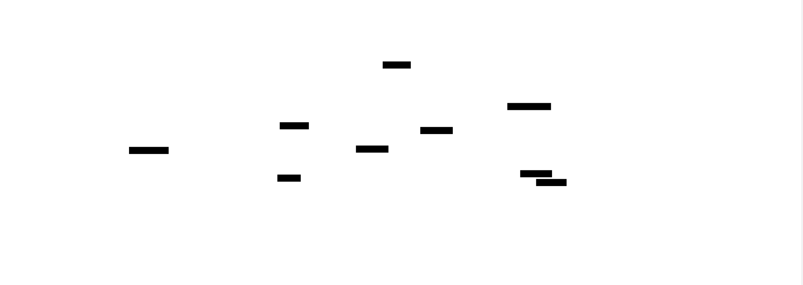
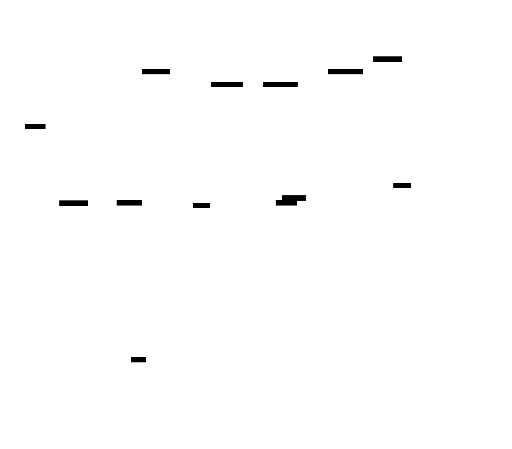

# Resumable File Upload Service: Design Document


## Overview

A production-grade file upload service that enables reliable transfer of large files through chunked uploads with resumption capabilities, virus scanning, and pluggable storage backends. The key architectural challenge is maintaining upload state consistency across network failures while providing secure, scalable file processing and storage abstraction.


> This guide is meant to help you understand the big picture before diving into each milestone. Refer back to it whenever you need context on how components connect.


## Context and Problem Statement

> **Milestone(s):** All milestones (1, 2, 3) — this foundational understanding applies to chunked uploads, storage abstraction, and virus scanning

### The Large File Transfer Problem

Think of traditional HTTP file uploads like trying to carry a massive, fragile glass sculpture across a busy city street in one trip. If you stumble even once, the entire sculpture shatters and you have to start over from the beginning. Now imagine that the street has unpredictable traffic patterns, occasional power outages, and your destination is several miles away. This is exactly what happens when users attempt to upload large files over unreliable network connections using standard HTML form uploads or simple HTTP POST requests.

In the real world, users routinely attempt to upload files ranging from hundreds of megabytes to several gigabytes. Video content creators upload raw footage files that can exceed 10GB. Medical institutions transfer high-resolution imaging data that approaches 1GB per scan. Engineering teams share build artifacts, VM images, and dataset exports that dwarf typical web content. Scientific research organizations routinely work with simulation outputs and experimental datasets measured in terabytes.

The fundamental problem with traditional upload approaches becomes apparent when we examine the failure modes. A standard HTTP file upload requires the entire file to be transmitted in a single, uninterrupted stream. If the network connection drops at 95% completion of a 5GB upload that has been running for three hours over a slow connection, the entire transfer fails and must be restarted from zero bytes. The client has no mechanism to communicate "I already sent you the first 4.75GB successfully" and the server has no standard way to acknowledge partial progress.

**Business Impact Analysis**

The business consequences of upload failures extend far beyond user frustration. Consider a video production company where editors work with 4K raw footage files averaging 8GB each. If their internet connection experiences typical residential instability with brief disconnections every 30-60 minutes, successfully uploading a single file becomes practically impossible through traditional means. The editor may attempt the same upload dozens of times, consuming enormous bandwidth while never achieving success. This translates directly to lost productivity, missed deadlines, and increased infrastructure costs from wasted bandwidth.

Medical imaging presents an even more critical scenario. A radiologist attempting to upload urgent CT scan data for remote consultation faces a time-sensitive situation where upload failures can delay patient diagnosis. The 800MB scan that fails to upload after 45 minutes of progress doesn't just represent technical inconvenience—it represents potential impact on patient care quality.

Enterprise scenarios amplify these costs through scale effects. A software company with distributed development teams uploading build artifacts to shared repositories may see dozens of developers each struggling with failed uploads of 500MB+ build outputs. The cumulative productivity loss, multiplied across engineering teams and compounded by CI/CD pipeline delays, can reach thousands of dollars per incident in lost developer time.

**Network Reality Assessment**

Real-world network conditions bear little resemblance to the stable, high-bandwidth connections assumed by traditional upload mechanisms. Mobile connections frequently transition between cell towers, causing brief disconnections. Home broadband experiences periodic congestion during peak usage hours. Corporate networks implement aggressive timeout policies that terminate long-running connections. WiFi connections in airports, coffee shops, and co-working spaces provide intermittent connectivity with unpredictable quality fluctuations.

The statistics paint a stark picture: according to industry measurements, the probability of a network connection remaining stable decreases exponentially with connection duration. A 5-minute HTTP connection has roughly 95% reliability, but a 3-hour connection required for large file upload may see reliability drop below 20% on typical residential connections. This mathematical reality makes traditional upload approaches fundamentally unsuitable for large files over real-world networks.

> The core insight is that network failures are not exceptional edge cases to handle gracefully—they are the dominant characteristic of long-duration connections that must be designed for from the ground up.

### Existing Solutions Analysis

**HTTP Multipart Uploads**

Standard HTTP multipart form uploads represent the baseline approach implemented by most web applications. The client encodes the file data using `multipart/form-data` encoding and transmits it via a single HTTP POST request. The server receives the entire payload, buffers it in memory or temporary storage, and processes it atomically.

| Aspect | Behavior | Limitation |
|--------|----------|------------|
| Failure Recovery | None - entire upload lost on disconnection | Complete restart required for any interruption |
| Progress Tracking | Client-side only, no server acknowledgment | No way to resume from known good state |
| Memory Usage | Server buffers entire file during upload | Memory exhaustion with large files or concurrent uploads |
| Timeout Handling | Standard HTTP timeout applies to entire upload | Large files exceed typical timeout values |
| Protocol Complexity | Minimal - standard HTTP | No extensibility for advanced features |

The fundamental architectural flaw in multipart uploads is their atomic nature. Success requires uninterrupted transmission of the complete file within the HTTP timeout window. This creates a binary outcome: complete success or complete failure, with no middle ground for partial progress preservation.

**tus.io Resumable Upload Protocol**

The tus.io specification emerged from recognition that file uploads required a purpose-built protocol rather than attempting to force-fit standard HTTP mechanisms. Think of tus.io as transforming file upload from "carrying the entire sculpture in one trip" to "moving it brick by brick, with each brick permanently placed before moving the next one."

| Protocol Feature | Implementation | Benefit |
|------------------|----------------|---------|
| Upload Initialization | `POST` to create upload session with metadata | Server allocates space and returns upload URL |
| Offset Discovery | `HEAD` request returns `Upload-Offset` header | Client learns exactly where to resume |
| Chunked Transfer | `PATCH` requests append data at specific offsets | Incremental progress with failure isolation |
| Progress Verification | Server validates each chunk before acknowledgment | Corruption detection at chunk boundaries |
| Session Management | Upload URLs remain valid for configurable TTL | Clients can resume after arbitrary delays |

The tus.io approach fundamentally changes the failure model. Instead of "all or nothing," uploads become a series of small, independent operations. If chunk 47 out of 200 fails to upload, only that specific chunk needs retransmission. The other 46 chunks remain safely stored on the server, preserving the investment in already-transmitted data.

The protocol's offset-based resume mechanism provides precise recovery semantics. When a client reconnects after a network failure, a simple `HEAD` request to the upload URL returns the current server-side offset. The client compares this against its local progress tracking and resumes transmission from the exact byte position where the server's knowledge ends.

**Cloud-Specific Solutions**

Major cloud providers offer sophisticated multipart upload APIs optimized for their storage infrastructure. These solutions emerged from the same fundamental recognition that large file transfers require specialized handling, but they tie implementations to specific cloud ecosystems.

Amazon S3's multipart upload API exemplifies the cloud approach. Clients initiate an upload session that returns an `UploadId`, then upload individual parts identified by part numbers. Each part can be uploaded independently and in parallel, with the server tracking completion status. Once all parts are uploaded, the client issues a completion request that assembles the parts into the final object.

| Cloud Solution | Strengths | Constraints |
|----------------|-----------|-------------|
| S3 Multipart Upload | Native cloud integration, parallel part uploads | AWS-specific, minimum 5MB per part (except last) |
| Google Cloud Resumable Upload | Single-stream resume with offset tracking | GCP-specific, limited to Google Cloud Storage |
| Azure Blob Block Upload | Block-based composition with parallel upload | Azure-specific, complex block ID management |

The primary limitation of cloud-specific solutions is vendor lock-in. An application built around S3's multipart upload API cannot easily migrate to Google Cloud Storage or local storage without significant architectural changes. This creates strategic flexibility constraints for organizations that may need to change storage backends in response to cost, compliance, or performance requirements.

> **Decision: Protocol Foundation Choice**
> - **Context**: Need resumable upload capability that works across multiple storage backends while providing robust failure recovery
> - **Options Considered**: 
>   1. HTTP multipart (simple but no resume capability)
>   2. tus.io protocol (standardized resume protocol)
>   3. Cloud-specific APIs (optimized but vendor-locked)
> - **Decision**: Implement tus.io-compatible protocol with storage backend abstraction
> - **Rationale**: tus.io provides standardized resume semantics while remaining storage-agnostic. The protocol's offset-based resume mechanism offers precise failure recovery, and the specification's maturity provides proven real-world reliability.
> - **Consequences**: Enables client compatibility with existing tus.io libraries while allowing flexible storage backend selection. Requires implementing protocol state management but provides superior failure recovery compared to alternatives.

### Core Technical Challenges

The transition from simple HTTP uploads to resumable chunked uploads introduces several fundamental technical challenges that must be solved systematically. Each challenge represents a category of complexity that doesn't exist in traditional upload scenarios.

**Upload Session State Management**

Traditional HTTP uploads are stateless—each request is independent and the server doesn't need to track any information between requests. Resumable uploads invert this model completely, requiring the server to maintain persistent state about ongoing upload sessions that may span hours or days.

Consider the state information that must be tracked for each upload session: the total expected file size, the current byte offset representing successfully received data, metadata about the target file (name, content type, destination path), the timestamp of the last activity (for session expiration), and the current session status (initializing, active, completing, failed, expired). This state must survive server restarts, which means it cannot be kept only in memory.

The state management challenge extends to concurrent access patterns. Multiple chunks of the same file might be uploaded in parallel, requiring atomic updates to the session's progress tracking. A chunk uploaded to offset 1000-2000 must not be marked as received until it's safely written to storage, but the server must also prevent duplicate uploads of the same byte range if the client retries due to a timeout.

| State Management Challenge | Technical Requirement | Implementation Complexity |
|---------------------------|----------------------|--------------------------|
| Session Persistence | Survive server restarts and crashes | Database or persistent file-based storage |
| Concurrent Access | Multiple chunks updating same session | Atomic operations with proper locking |
| Expiration Handling | Clean up abandoned uploads | Background cleanup process with configurable TTL |
| Progress Tracking | Byte-level accuracy for resume operations | Efficient data structures for sparse range tracking |
| Metadata Storage | File attributes, security context, validation state | Flexible schema supporting future extensions |

**Partial Failure Handling and Recovery**

Resumable uploads introduce a complex failure landscape that doesn't exist in atomic operations. Traditional uploads either succeed completely or fail completely—there's no intermediate state requiring recovery logic. Chunked uploads create scenarios where parts of the operation succeed while other parts fail, requiring sophisticated detection and recovery mechanisms.

Consider a typical failure scenario: a client uploads chunks 1-5 successfully, chunk 6 fails due to a network timeout, chunks 7-8 succeed, then the client disconnects entirely. The server must be able to communicate that bytes 0-5120 and bytes 7168-8192 are safely stored, but bytes 5120-7168 need retransmission. This requires not just tracking the current offset, but potentially tracking arbitrary ranges of received data.

Storage-level failures add another dimension of complexity. If a chunk is received successfully by the upload service but the write to the storage backend fails, should the server report success or failure to the client? If it reports success but the data isn't actually stored, the file will be corrupted. If it reports failure but retains the data in temporary storage, what happens if the client never retries?

The consistency requirements become even more challenging during the final assembly phase. After all chunks are uploaded, they must be assembled into the final file atomically. If this assembly process fails partway through, the server must be able to retry the assembly without requiring clients to re-upload chunks.

**Storage Backend Coordination**

A resumable upload service that supports multiple storage backends must solve coordination challenges that don't exist when uploading directly to a single storage system. Each storage backend has different characteristics, limitations, and optimal usage patterns that must be abstracted behind a common interface.

Local filesystem storage allows random-access writes, enabling chunks to be written directly to their final positions within the target file. However, this requires pre-allocating the file to the expected size and managing concurrent writes to different file regions safely. File locking, space allocation failures, and filesystem-specific constraints (like maximum file sizes) must all be handled transparently.

Cloud storage backends like S3 use fundamentally different models. S3's multipart upload API requires parts to be uploaded in sequence and assembled at the end—you cannot write arbitrary byte ranges to arbitrary offsets. The service must buffer chunks locally until they can be uploaded to S3 as properly-sized parts, introducing additional storage and complexity requirements.

| Storage Backend | Upload Model | Coordination Challenge |
|-----------------|--------------|----------------------|
| Local Filesystem | Random-access writes to pre-allocated file | Concurrent access control, space management |
| Amazon S3 | Sequential multipart upload with final assembly | Local buffering, part size constraints |
| Google Cloud Storage | Resumable upload with offset-based appends | Single-stream coordination, retry handling |
| Database BLOB Storage | Atomic replacement with versioning | Transaction management, size limitations |

The abstraction layer must handle these differences transparently while providing consistent semantics to the upload protocol layer. This requires careful interface design that can accommodate the capabilities and constraints of each backend without forcing the lowest common denominator approach that would eliminate the benefits of backend-specific optimizations.

**Data Integrity and Corruption Detection**

Chunked uploads distributed across time and potentially across multiple network connections introduce data integrity challenges that require systematic solutions. Unlike atomic uploads where corruption is immediately apparent (the file doesn't match expected checksums), resumable uploads can accumulate corruption gradually as individual chunks are received and stored.

Each chunk must be validated independently before being considered successfully received. This validation typically includes verifying that the chunk's size matches the declared size, that it's being written to the correct offset, and that its content matches any provided checksums. However, chunk-level integrity doesn't guarantee file-level integrity—corruption can be introduced during the final assembly process or through storage backend issues.

The service must also handle scenarios where the client and server disagree about what data has been successfully transferred. If the server believes it has received chunks 1-10 but the client believes only chunks 1-8 were acknowledged, the disagreement must be detected and resolved without corrupting the final file.

> The fundamental insight is that resumable uploads transform file transfer from a single point of failure into a distributed system problem, requiring solutions for state management, partial failures, backend coordination, and data integrity that don't exist in traditional upload architectures.

This complexity justifies the architectural investment required to build a robust resumable upload system, but it also highlights why many applications continue to use simpler approaches despite their limitations. The following sections detail how each of these challenges can be systematically addressed through careful design and implementation.

### Implementation Guidance

**A. Technology Recommendations Table:**

| Component | Simple Option | Advanced Option |
|-----------|---------------|-----------------|
| HTTP Server | `net/http` with standard library | `gin-gonic/gin` or `gorilla/mux` for routing |
| State Persistence | Local SQLite database | PostgreSQL or Redis for production |
| File Storage | `os.File` with direct filesystem operations | `afero` filesystem abstraction library |
| Configuration | `encoding/json` with config files | `spf13/viper` for multiple config sources |
| Logging | `log/slog` standard library | `sirupsen/logrus` or `uber-go/zap` |
| HTTP Client Testing | `net/http/httptest` | `jarcoal/httpmock` for complex scenarios |

**B. Recommended File/Module Structure**

Understanding the problem space helps organize code into logical packages that separate concerns effectively:

```
resumable-upload-service/
├── cmd/
│   └── server/
│       └── main.go                    ← entry point, configuration loading
├── internal/
│   ├── protocol/                      ← tus.io protocol implementation
│   │   ├── handler.go                 ← HTTP handlers for upload operations
│   │   ├── session.go                 ← upload session management
│   │   └── protocol_test.go           ← protocol compliance tests
│   ├── storage/                       ← storage backend abstraction
│   │   ├── interface.go               ← common storage interface
│   │   ├── local.go                   ← local filesystem implementation
│   │   ├── s3.go                      ← S3-compatible implementation
│   │   └── storage_test.go            ← backend integration tests
│   ├── validation/                    ← file validation and virus scanning
│   │   ├── scanner.go                 ← virus scanning integration
│   │   ├── validator.go               ← file type and size validation
│   │   └── quarantine.go              ← suspicious file handling
│   ├── state/                         ← session state management
│   │   ├── store.go                   ← state persistence interface
│   │   ├── sqlite.go                  ← SQLite implementation
│   │   └── memory.go                  ← in-memory for testing
│   └── config/
│       └── config.go                  ← configuration structures
├── pkg/                               ← public APIs (if building a library)
├── test/
│   ├── integration/                   ← end-to-end test scenarios
│   └── fixtures/                      ← test data and mock files
└── docs/
    └── api/                           ← API documentation
```

This structure reflects the core technical challenges identified in the problem analysis. The `protocol` package handles tus.io implementation and session state management. The `storage` package provides backend abstraction for different storage systems. The `validation` package addresses security and file integrity concerns. The `state` package manages upload session persistence across server restarts.

**C. Infrastructure Starter Code**

The following provides complete, working infrastructure that handles the foundational requirements, allowing focus on the core resumable upload logic:

```go
// internal/config/config.go
package config

import (
    "encoding/json"
    "fmt"
    "os"
    "time"
)

// Config represents the complete service configuration
type Config struct {
    Server   ServerConfig   `json:"server"`
    Storage  StorageConfig  `json:"storage"`
    Security SecurityConfig `json:"security"`
    Cleanup  CleanupConfig  `json:"cleanup"`
}

type ServerConfig struct {
    Host         string        `json:"host"`
    Port         int           `json:"port"`
    ReadTimeout  time.Duration `json:"read_timeout"`
    WriteTimeout time.Duration `json:"write_timeout"`
    MaxBodySize  int64         `json:"max_body_size"`
}

type StorageConfig struct {
    Backend   string            `json:"backend"` // "local", "s3", "gcs"
    LocalPath string            `json:"local_path,omitempty"`
    S3Config  *S3Config         `json:"s3,omitempty"`
    Options   map[string]string `json:"options"`
}

type S3Config struct {
    Bucket          string `json:"bucket"`
    Region          string `json:"region"`
    AccessKeyID     string `json:"access_key_id"`
    SecretAccessKey string `json:"secret_access_key"`
    Endpoint        string `json:"endpoint,omitempty"` // for S3-compatible services
}

type SecurityConfig struct {
    MaxFileSize         int64    `json:"max_file_size"`
    AllowedContentTypes []string `json:"allowed_content_types"`
    VirusScanEnabled    bool     `json:"virus_scan_enabled"`
    ClamAVSocket        string   `json:"clamav_socket,omitempty"`
}

type CleanupConfig struct {
    SessionTTL      time.Duration `json:"session_ttl"`
    CleanupInterval time.Duration `json:"cleanup_interval"`
    QuarantineTTL   time.Duration `json:"quarantine_ttl"`
}

// LoadConfig reads configuration from a JSON file
func LoadConfig(filename string) (*Config, error) {
    data, err := os.ReadFile(filename)
    if err != nil {
        return nil, fmt.Errorf("reading config file: %w", err)
    }
    
    var config Config
    if err := json.Unmarshal(data, &config); err != nil {
        return nil, fmt.Errorf("parsing config: %w", err)
    }
    
    // Set defaults for optional fields
    if config.Server.Host == "" {
        config.Server.Host = "localhost"
    }
    if config.Server.Port == 0 {
        config.Server.Port = 8080
    }
    if config.Server.ReadTimeout == 0 {
        config.Server.ReadTimeout = 30 * time.Second
    }
    if config.Server.WriteTimeout == 0 {
        config.Server.WriteTimeout = 30 * time.Second
    }
    if config.Server.MaxBodySize == 0 {
        config.Server.MaxBodySize = 32 << 20 // 32MB default chunk size
    }
    
    return &config, nil
}
```

```go
// internal/state/memory.go - In-memory state store for testing
package state

import (
    "context"
    "fmt"
    "sync"
    "time"
)

// MemoryStore provides an in-memory implementation of StateStore for testing
type MemoryStore struct {
    mu       sync.RWMutex
    sessions map[string]*UploadSession
}

// NewMemoryStore creates a new in-memory state store
func NewMemoryStore() *MemoryStore {
    return &MemoryStore{
        sessions: make(map[string]*UploadSession),
    }
}

// CreateSession stores a new upload session
func (m *MemoryStore) CreateSession(ctx context.Context, session *UploadSession) error {
    m.mu.Lock()
    defer m.mu.Unlock()
    
    if _, exists := m.sessions[session.ID]; exists {
        return fmt.Errorf("session %s already exists", session.ID)
    }
    
    // Create a deep copy to avoid external mutations
    sessionCopy := *session
    sessionCopy.CreatedAt = time.Now()
    sessionCopy.UpdatedAt = time.Now()
    
    m.sessions[session.ID] = &sessionCopy
    return nil
}

// GetSession retrieves an upload session by ID
func (m *MemoryStore) GetSession(ctx context.Context, sessionID string) (*UploadSession, error) {
    m.mu.RLock()
    defer m.mu.RUnlock()
    
    session, exists := m.sessions[sessionID]
    if !exists {
        return nil, ErrSessionNotFound
    }
    
    // Return a copy to prevent external mutations
    sessionCopy := *session
    return &sessionCopy, nil
}

// UpdateSession modifies an existing upload session
func (m *MemoryStore) UpdateSession(ctx context.Context, session *UploadSession) error {
    m.mu.Lock()
    defer m.mu.Unlock()
    
    if _, exists := m.sessions[session.ID]; !exists {
        return ErrSessionNotFound
    }
    
    sessionCopy := *session
    sessionCopy.UpdatedAt = time.Now()
    m.sessions[session.ID] = &sessionCopy
    return nil
}

// DeleteSession removes an upload session
func (m *MemoryStore) DeleteSession(ctx context.Context, sessionID string) error {
    m.mu.Lock()
    defer m.mu.Unlock()
    
    if _, exists := m.sessions[sessionID]; !exists {
        return ErrSessionNotFound
    }
    
    delete(m.sessions, sessionID)
    return nil
}

// ListExpiredSessions returns sessions older than the specified TTL
func (m *MemoryStore) ListExpiredSessions(ctx context.Context, ttl time.Duration) ([]string, error) {
    m.mu.RLock()
    defer m.mu.RUnlock()
    
    cutoff := time.Now().Add(-ttl)
    var expired []string
    
    for id, session := range m.sessions {
        if session.UpdatedAt.Before(cutoff) {
            expired = append(expired, id)
        }
    }
    
    return expired, nil
}
```

**D. Core Logic Skeleton Code**

The following skeletons map directly to the technical challenges identified in the problem analysis:

```go
// internal/protocol/session.go
package protocol

import (
    "context"
    "time"
)

// UploadSession represents the state of an ongoing resumable upload
type UploadSession struct {
    ID            string                 `json:"id"`
    Filename      string                 `json:"filename"`
    ContentType   string                 `json:"content_type"`
    TotalSize     int64                  `json:"total_size"`
    CurrentOffset int64                  `json:"current_offset"`
    Status        SessionStatus          `json:"status"`
    StorageKey    string                 `json:"storage_key"`
    Metadata      map[string]string      `json:"metadata"`
    CreatedAt     time.Time              `json:"created_at"`
    UpdatedAt     time.Time              `json:"updated_at"`
    ChunkHashes   map[int64]string       `json:"chunk_hashes"` // offset -> hash
}

type SessionStatus string

const (
    SessionStatusInitialized SessionStatus = "initialized"
    SessionStatusActive      SessionStatus = "active"
    SessionStatusCompleting  SessionStatus = "completing"
    SessionStatusCompleted   SessionStatus = "completed"
    SessionStatusFailed      SessionStatus = "failed"
    SessionStatusExpired     SessionStatus = "expired"
)

// SessionManager handles upload session lifecycle and coordination
type SessionManager struct {
    store   StateStore
    storage StorageBackend
}

// InitializeUpload creates a new upload session and prepares storage
func (sm *SessionManager) InitializeUpload(ctx context.Context, filename string, totalSize int64, metadata map[string]string) (*UploadSession, error) {
    // TODO 1: Generate unique session ID using crypto/rand
    // TODO 2: Validate filename and total size parameters
    // TODO 3: Create storage key/path for this upload
    // TODO 4: Initialize storage backend for this upload (pre-allocate if needed)
    // TODO 5: Create UploadSession struct with initialized status
    // TODO 6: Store session in state store
    // TODO 7: Return session with upload URL for client
    // Hint: Use uuid.New() for session ID generation
    // Hint: Storage key should include session ID to avoid conflicts
    panic("implement me")
}

// ProcessChunk handles an incoming chunk upload
func (sm *SessionManager) ProcessChunk(ctx context.Context, sessionID string, offset int64, data []byte, contentHash string) error {
    // TODO 1: Retrieve upload session from state store
    // TODO 2: Validate session status is active or initialized
    // TODO 3: Verify offset matches current session offset (no gaps)
    // TODO 4: Validate chunk hash if provided
    // TODO 5: Write chunk data to storage backend at correct offset
    // TODO 6: Update session current offset and chunk tracking
    // TODO 7: Update session in state store with new progress
    // TODO 8: If this completes the upload, trigger completion process
    // Hint: Use crypto/sha256 to verify chunk hashes
    // Hint: Offset validation prevents chunks uploaded out of order
    panic("implement me")
}

// GetUploadProgress returns current upload status and offset for resume
func (sm *SessionManager) GetUploadProgress(ctx context.Context, sessionID string) (*UploadSession, error) {
    // TODO 1: Retrieve session from state store
    // TODO 2: Validate session exists and is not expired
    // TODO 3: Return session with current offset for client resume
    // Hint: This implements the tus.io HEAD request for offset discovery
    panic("implement me")
}
```

**E. Language-Specific Hints**

**Go-Specific Implementation Tips:**
- Use `crypto/rand.Read()` with `encoding/hex` for generating secure session IDs
- `os.OpenFile()` with `O_RDWR|O_CREATE` for file pre-allocation on local storage
- `io.Copy()` with `io.LimitReader()` for safe chunk reading from HTTP requests
- `sync.RWMutex` for session state that has frequent reads and occasional writes
- `context.WithTimeout()` for all storage operations to prevent hanging
- `os.File.Sync()` after writing chunks to ensure durability before acknowledging
- `filepath.Clean()` and `filepath.IsAbs()` to sanitize file paths and prevent directory traversal
- `net/http.MaxBytesReader()` to enforce chunk size limits and prevent DoS

**Error Handling Patterns:**
- Create custom error types for different failure categories: `ErrSessionNotFound`, `ErrInvalidOffset`, `ErrStorageFailure`
- Use `fmt.Errorf("operation failed: %w", err)` for error wrapping with context
- Implement retry logic with exponential backoff for transient storage failures
- Log errors with context: session ID, offset, operation type for debugging

**Performance Considerations:**
- Buffer chunk writes using `bufio.Writer` to reduce syscall overhead
- Use `sync.Pool` for reusing byte buffers during chunk processing
- Implement connection pooling for S3 clients to avoid connection setup overhead
- Consider using `mmap` for large file operations on local storage

**F. Milestone Checkpoint**

After implementing the session management foundation, verify the following behavior:

**Basic Session Operations:**
```bash
# Test session creation
curl -X POST http://localhost:8080/uploads \
  -H "Upload-Length: 1048576" \
  -H "Upload-Metadata: filename dGVzdC50eHQ=" \
  -v

# Expected: HTTP 201 Created with Location header containing session URL
# Expected: Response includes Upload-Offset: 0 header
```

**Offset Discovery:**
```bash
# Test progress tracking
curl -X HEAD http://localhost:8080/uploads/SESSION_ID -v

# Expected: HTTP 200 OK with Upload-Offset header showing current progress
# Expected: Response includes Upload-Length header with total size
```

**Signs of Implementation Issues:**
- Session ID collisions (use crypto/rand, not math/rand)
- Race conditions during concurrent chunk uploads (check locking)
- Memory leaks from unclosed files (use defer for cleanup)
- Storage exhaustion from abandoned uploads (implement cleanup)

The next milestone will build chunk processing on this session management foundation.


## Goals and Non-Goals

> **Milestone(s):** All milestones (1, 2, 3) — this section defines the scope for chunked upload protocol, storage abstraction, and virus scanning

Think of this service as a **digital postal system for large packages**. Just as postal services have clear rules about what they will and won't handle (package size limits, prohibited items, delivery guarantees), our resumable file upload service needs explicit boundaries. Unlike a simple file copy operation that either succeeds completely or fails entirely, our service must handle the messy reality of network interruptions, partial transfers, and security threats while maintaining consistent behavior across different storage destinations.

The key insight is that **scope definition prevents feature creep** and ensures the system remains focused on its core value proposition: reliable large file uploads with resumption capabilities. Without clear boundaries, we risk building a general-purpose file management system instead of a specialized upload service.

### Functional Requirements

The functional requirements define the **core capabilities** that users can depend on. These requirements directly map to our three implementation milestones and represent the minimum viable feature set for production deployment.

#### Upload Resumption Capabilities

Our primary functional requirement is **resumable upload support** following the tus.io protocol specification. This means the service must handle network interruptions gracefully and allow clients to resume uploads from the exact byte offset where they left off.

| Capability | Description | Success Criteria |
|------------|-------------|------------------|
| Upload Session Management | Create and track upload sessions across multiple requests | Session persists across service restarts, unique session IDs |
| Offset Tracking | Maintain precise byte-level progress for each upload | Client can query current offset and resume from exact position |
| Chunk Processing | Accept file chunks in any order with proper sequencing | Chunks assembled correctly regardless of arrival order |
| Progress Persistence | Store upload state to survive server failures | Upload sessions survive service crashes and restarts |
| Completion Detection | Identify when all chunks received and trigger assembly | Final file matches expected size and checksum |

> **Decision: tus.io Protocol Compliance**
> - **Context**: Multiple resumable upload protocols exist (custom HTTP ranges, vendor-specific solutions, tus.io standard)
> - **Options Considered**: 
>   1. Custom HTTP Range-based protocol
>   2. Cloud vendor-specific protocols (S3 multipart, GCS resumable)
>   3. tus.io standard protocol
> - **Decision**: Implement tus.io protocol compliance
> - **Rationale**: tus.io provides standardized client libraries, well-defined error handling, and broad ecosystem support. Custom protocols require client SDK development.
> - **Consequences**: Enables third-party client integration but requires strict protocol compliance

The upload session lifecycle follows a clear state progression that clients can rely on for consistent behavior:

| Session State | Description | Available Operations | Next States |
|---------------|-------------|---------------------|-------------|
| `SessionStatusInitialized` | Session created, ready for chunks | Upload chunks, query progress | Active, Failed, Expired |
| `SessionStatusActive` | Actively receiving chunks | Upload chunks, query progress | Completing, Failed, Expired |
| `SessionStatusCompleting` | All chunks received, processing final assembly | Query progress only | Completed, Failed |
| `SessionStatusCompleted` | Upload successfully assembled and stored | Download file, delete session | None (terminal) |
| `SessionStatusFailed` | Upload failed validation or assembly | Query error details, retry | None (terminal) |
| `SessionStatusExpired` | Session exceeded time-to-live | None | None (terminal) |

#### Virus Scanning and File Validation

The service must **automatically scan all uploaded content** for malicious software before final storage. This scanning happens transparently to clients but provides essential security protection.

| Validation Type | Implementation | Failure Action |
|----------------|----------------|----------------|
| File Type Validation | Magic byte detection using file headers | Reject upload with specific error code |
| Size Limit Enforcement | Configurable maximum file size checking | Abort upload when limit exceeded |
| Virus Scanning | ClamAV integration with signature updates | Quarantine file, notify administrators |
| Content Integrity | SHA-256 checksum verification | Request chunk re-upload for mismatches |

The validation pipeline operates **asynchronously after chunk assembly** to avoid blocking the upload process. However, files remain unavailable for download until validation completes successfully.

#### Storage Backend Support

The service must support **multiple storage backends** through a unified interface, allowing deployment flexibility without client-side changes. This abstraction enables organizations to choose storage solutions based on cost, compliance, or performance requirements.

| Storage Backend | Capabilities | Configuration Requirements |
|----------------|--------------|---------------------------|
| Local Filesystem | Direct file I/O, fast access | Mounted storage path, permissions |
| AWS S3 | Multipart uploads, global access | Bucket name, credentials, region |
| Google Cloud Storage | Resumable uploads, lifecycle management | Bucket name, service account key |
| Azure Blob Storage | Block-based uploads, redundancy options | Container name, connection string |

> **Decision: Storage Interface Abstraction**
> - **Context**: Different storage systems have unique APIs, authentication, and capabilities
> - **Options Considered**:
>   1. Direct integration with each storage system
>   2. Adapter pattern with common interface
>   3. Proxy pattern with protocol translation
> - **Decision**: Adapter pattern with storage interface abstraction
> - **Rationale**: Enables adding new backends without core logic changes, simplifies testing with mock storage
> - **Consequences**: Requires interface design that accommodates different storage paradigms, potential lowest-common-denominator limitations

### Non-Functional Requirements

Non-functional requirements define the **quality attributes** and constraints that the service must satisfy. These requirements ensure the system operates reliably under real-world conditions and meets production deployment standards.

#### Performance Constraints

The service must handle **concurrent uploads efficiently** without degrading individual transfer performance. Performance requirements balance throughput with resource consumption.

| Performance Metric | Target | Measurement Method |
|-------------------|--------|--------------------|
| Concurrent Upload Sessions | 100+ simultaneous uploads | Load testing with multiple clients |
| Chunk Processing Latency | < 100ms per chunk (excluding storage I/O) | HTTP response time measurements |
| Memory Usage Per Session | < 10MB session metadata | Process memory monitoring |
| Storage I/O Throughput | 90% of underlying storage bandwidth | Disk/network utilization metrics |
| Session State Persistence | < 50ms write latency | Database/file system timing |

#### Reliability Requirements

The service must provide **strong durability guarantees** for upload sessions and file data. Reliability means uploads complete successfully despite infrastructure failures.

| Reliability Aspect | Requirement | Implementation Strategy |
|-------------------|-------------|------------------------|
| Session State Durability | Zero session loss during server restarts | Persistent session storage with atomic updates |
| File Data Integrity | Zero byte corruption during upload | Chunk-level checksums with retry mechanisms |
| Crash Recovery | Full session recovery within 30 seconds | Fast startup with session state scanning |
| Storage Backend Failover | Automatic retry with exponential backoff | Circuit breaker pattern for backend failures |
| Partial Failure Handling | Graceful degradation when components fail | Isolated failure domains, queue-based processing |

#### Security Constraints

Security requirements protect both the service infrastructure and uploaded content from malicious actors. The security model assumes **untrusted input** and implements defense-in-depth strategies.

| Security Domain | Requirement | Enforcement Mechanism |
|-----------------|-------------|----------------------|
| Input Validation | Reject malformed requests and payloads | Schema validation, size limits, type checking |
| File Content Scanning | Block known malware before storage | Real-time ClamAV scanning with signature updates |
| Path Traversal Prevention | Prevent access to unauthorized filesystem areas | Input sanitization, chroot jail for local storage |
| Credential Protection | Secure storage of cloud backend credentials | Environment variables, secret management systems |
| Access Control | Prevent unauthorized access to upload sessions | Session token validation, origin checking |

> **Decision: Security-First Design**
> - **Context**: File upload services are common attack vectors for malware distribution and system compromise
> - **Options Considered**:
>   1. Trust client-provided metadata and validate after storage
>   2. Validate during upload process before storage
>   3. Sandbox uploads and validate in isolated environment
> - **Decision**: Validate during upload with quarantine for suspicious content
> - **Rationale**: Prevents malicious content from reaching production storage, enables early rejection of invalid uploads
> - **Consequences**: Increases upload latency but significantly reduces security risk

### Explicit Non-Goals

Clearly defining what the service **will not handle** prevents scope creep and helps users understand the system boundaries. These non-goals represent features that might seem related but fall outside our core mission.

#### Content Management Features

The service is **not a content management system** and deliberately avoids features that would complicate the core upload functionality.

| Feature Category | Specific Non-Goals | Rationale |
|------------------|-------------------|-----------|
| File Organization | Directory hierarchies, folder structures, tagging | Focus on reliable upload, not file management |
| Metadata Management | Custom metadata schemas, search indexing, versioning | Adds complexity without improving upload reliability |
| Content Transformation | Image resizing, video transcoding, format conversion | Resource-intensive operations outside core scope |
| User Management | Authentication, authorization, user accounts | Authentication should be handled by external systems |
| File Sharing | Public links, permission management, collaborative editing | Different security and access patterns than uploads |

#### Advanced Transfer Features

While these features might enhance user experience, they introduce significant complexity that would delay core functionality delivery.

| Feature | Why Excluded | Alternative Approach |
|---------|--------------|---------------------|
| Parallel Chunk Uploads | Complex ordering and bandwidth management | Single-threaded upload with larger chunks |
| Bandwidth Throttling | Requires traffic shaping and client negotiation | Handle via reverse proxy or CDN |
| Upload Acceleration | Needs edge servers and routing optimization | Use cloud provider acceleration features |
| Compression | CPU overhead and format compatibility issues | Client-side compression before upload |
| Deduplication | Storage scanning and hash management complexity | Handle at storage backend level |

#### Integration and Deployment Features

The service focuses on core functionality rather than operational features that can be provided by external infrastructure.

| Feature Category | Specific Non-Goals | External Solution |
|------------------|-------------------|-------------------|
| Load Balancing | Multi-instance coordination, session distribution | Use load balancer with session affinity |
| Monitoring and Metrics | Custom dashboards, alerting, performance analytics | Integrate with existing monitoring systems |
| Configuration Management | Dynamic reconfiguration, feature flags | Use configuration management tools |
| Container Orchestration | Service discovery, health checks, scaling policies | Deploy using Kubernetes or similar platforms |
| Log Management | Log aggregation, search, retention policies | Use centralized logging infrastructure |

> **Decision: Minimal External Dependencies**
> - **Context**: Services can integrate with many external systems but each integration adds complexity
> - **Options Considered**:
>   1. Build comprehensive platform with all operational features
>   2. Focus on core upload functionality with external integration points
>   3. Provide plugins for common integrations
> - **Decision**: Minimal dependencies with clear integration boundaries
> - **Rationale**: Reduces maintenance burden, improves reliability, enables flexible deployment patterns
> - **Consequences**: Users must integrate with external systems but service remains focused and maintainable

#### Protocol and Transport Limitations

The service implements a specific protocol subset rather than attempting to support every possible upload mechanism.

| Protocol Feature | Not Supported | Supported Alternative |
|------------------|---------------|----------------------|
| HTTP/1.0 | Legacy protocol without persistent connections | HTTP/1.1 and HTTP/2 |
| WebSocket Uploads | Real-time bidirectional communication | Standard HTTP POST with progress polling |
| FTP/SFTP Protocols | Legacy file transfer protocols | tus.io over HTTP only |
| Custom UDP Protocols | Unreliable transport for file transfer | TCP-based HTTP transport |
| GraphQL Mutations | Query-based upload operations | REST API with tus.io protocol |

These limitations ensure the service remains focused on proven, widely-supported protocols while avoiding edge cases that would complicate implementation and testing.

### Common Pitfalls

Understanding common mistakes in scope definition helps avoid feature creep and unrealistic expectations.

⚠️ **Pitfall: Assuming All Upload Features Are Related**
Many developers think that because two features both involve files, they belong in the same service. For example, adding image thumbnailing because "we're already handling image uploads." This leads to monolithic services that are hard to test and maintain. The fix is to strictly separate concerns: upload services handle reliable transfer, processing services handle content transformation.

⚠️ **Pitfall: Underestimating Security Requirements**
File upload services are prime targets for attacks, but developers often treat security as an afterthought. Assuming "we'll add virus scanning later" or "input validation is simple" leads to vulnerable systems. The fix is to design security validation into the core upload pipeline from the beginning, not bolt it on afterward.

⚠️ **Pitfall: Ignoring Storage Backend Differences**
Different storage systems have vastly different capabilities, consistency models, and failure modes. Treating S3 and local filesystem as equivalent leads to bugs when deploying to production. The fix is to design the storage abstraction around the most constrained backend, then add optimizations for more capable systems.

⚠️ **Pitfall: Scope Creep Through "Simple" Features**
Features that seem simple often hide significant complexity. Adding "just a simple progress callback" can require WebSocket infrastructure, connection management, and real-time scaling. The fix is to evaluate each feature request against the core mission and defer anything that doesn't directly improve upload reliability.

### Implementation Guidance

This section provides practical direction for translating the goals and requirements into working code, focusing on configuration management and requirement validation.

#### Technology Recommendations

| Requirement Category | Simple Option | Advanced Option |
|---------------------|---------------|-----------------|
| Configuration Management | JSON files with validation | Consul/etcd with hot reload |
| Input Validation | Manual struct validation | JSON Schema with code generation |
| Security Scanning | ClamAV command-line interface | ClamAV daemon with socket communication |
| Session Storage | In-memory maps with file backup | Redis with persistence |
| Metrics Collection | Simple counters in logs | Prometheus metrics with custom collectors |

#### Recommended File Structure

```
resumable-upload/
  cmd/
    server/
      main.go                    ← entry point, config loading
  internal/
    config/
      config.go                  ← Config structs and loading
      validation.go              ← requirement validation
    session/
      manager.go                 ← SessionManager implementation
      store.go                   ← StateStore interface and implementations
    security/
      limits.go                  ← size and type validation
      scanner.go                 ← virus scanning integration
  configs/
    default.json                 ← default configuration file
    production.json              ← production overrides
  tests/
    integration/
      requirements_test.go       ← test all functional requirements
```

#### Configuration Infrastructure Code

```go
package config

import (
    "encoding/json"
    "fmt"
    "os"
    "time"
)

// Config represents the complete service configuration matching our requirements
type Config struct {
    Server   ServerConfig   `json:"server"`
    Storage  StorageConfig  `json:"storage"`
    Security SecurityConfig `json:"security"`
    Cleanup  CleanupConfig  `json:"cleanup"`
}

// ServerConfig defines HTTP server parameters for performance requirements
type ServerConfig struct {
    Host         string        `json:"host"`
    Port         int           `json:"port"`
    ReadTimeout  time.Duration `json:"read_timeout"`
    WriteTimeout time.Duration `json:"write_timeout"`
    MaxBodySize  int64         `json:"max_body_size"`
}

// StorageConfig enables storage backend abstraction requirement
type StorageConfig struct {
    Backend   string            `json:"backend"`
    LocalPath string            `json:"local_path,omitempty"`
    S3Config  *S3Config         `json:"s3_config,omitempty"`
    Options   map[string]string `json:"options,omitempty"`
}

// S3Config provides cloud storage integration parameters
type S3Config struct {
    Bucket          string `json:"bucket"`
    Region          string `json:"region"`
    AccessKeyID     string `json:"access_key_id"`
    SecretAccessKey string `json:"secret_access_key"`
    Endpoint        string `json:"endpoint,omitempty"`
}

// SecurityConfig enforces security constraints and validation requirements
type SecurityConfig struct {
    MaxFileSize         int64    `json:"max_file_size"`
    AllowedContentTypes []string `json:"allowed_content_types"`
    VirusScanEnabled    bool     `json:"virus_scan_enabled"`
    ClamAVSocket        string   `json:"clamav_socket"`
}

// CleanupConfig manages session lifecycle and resource cleanup
type CleanupConfig struct {
    SessionTTL      time.Duration `json:"session_ttl"`
    CleanupInterval time.Duration `json:"cleanup_interval"`
    QuarantineTTL   time.Duration `json:"quarantine_ttl"`
}

// LoadConfig reads configuration from file with defaults matching our requirements
func LoadConfig(filename string) (*Config, error) {
    // TODO 1: Set default configuration values that meet non-functional requirements
    // TODO 2: Read JSON configuration file and override defaults
    // TODO 3: Validate configuration against functional requirements
    // TODO 4: Return validated configuration or detailed error
    // Hint: Use json.Unmarshal and implement validation checks for each requirement category
    
    config := &Config{
        Server: ServerConfig{
            Host:         "localhost",
            Port:         8080,
            ReadTimeout:  30 * time.Second,
            WriteTimeout: 30 * time.Second,
            MaxBodySize:  100 * 1024 * 1024, // 100MB chunks
        },
        Security: SecurityConfig{
            MaxFileSize:         5 * 1024 * 1024 * 1024, // 5GB
            AllowedContentTypes: []string{"*/*"},         // Validate with magic bytes
            VirusScanEnabled:    true,
            ClamAVSocket:        "/var/run/clamav/clamd.ctl",
        },
        Cleanup: CleanupConfig{
            SessionTTL:      24 * time.Hour,
            CleanupInterval: time.Hour,
            QuarantineTTL:   7 * 24 * time.Hour,
        },
    }
    
    if filename != "" {
        data, err := os.ReadFile(filename)
        if err != nil {
            return nil, fmt.Errorf("failed to read config file: %w", err)
        }
        
        if err := json.Unmarshal(data, config); err != nil {
            return nil, fmt.Errorf("failed to parse config: %w", err)
        }
    }
    
    return config, nil
}
```

#### Requirement Validation Code

```go
package config

import (
    "fmt"
    "os"
    "path/filepath"
)

// ValidateRequirements checks configuration against functional and non-functional requirements
func (c *Config) ValidateRequirements() error {
    // TODO 1: Validate performance requirements (timeouts, limits)
    // TODO 2: Validate security requirements (file size limits, scan configuration)
    // TODO 3: Validate storage backend requirements (credentials, paths)
    // TODO 4: Validate reliability requirements (cleanup intervals, persistence)
    // Hint: Each requirement category needs specific validation logic
    
    if err := c.validatePerformanceRequirements(); err != nil {
        return fmt.Errorf("performance requirements not met: %w", err)
    }
    
    if err := c.validateSecurityRequirements(); err != nil {
        return fmt.Errorf("security requirements not met: %w", err)
    }
    
    if err := c.validateStorageRequirements(); err != nil {
        return fmt.Errorf("storage requirements not met: %w", err)
    }
    
    return nil
}

func (c *Config) validatePerformanceRequirements() error {
    // Check concurrent upload capability requirements
    if c.Server.MaxBodySize < 1024*1024 {
        return fmt.Errorf("max body size too small for chunked uploads: %d", c.Server.MaxBodySize)
    }
    
    if c.Server.ReadTimeout < time.Second {
        return fmt.Errorf("read timeout too aggressive for large chunks: %v", c.Server.ReadTimeout)
    }
    
    return nil
}

func (c *Config) validateSecurityRequirements() error {
    // Validate virus scanning capability if enabled
    if c.Security.VirusScanEnabled {
        if c.Security.ClamAVSocket == "" {
            return fmt.Errorf("virus scanning enabled but no ClamAV socket configured")
        }
        
        // Check if ClamAV socket exists
        if _, err := os.Stat(c.Security.ClamAVSocket); os.IsNotExist(err) {
            return fmt.Errorf("ClamAV socket not found: %s", c.Security.ClamAVSocket)
        }
    }
    
    // Validate file size limits
    if c.Security.MaxFileSize <= 0 {
        return fmt.Errorf("max file size must be positive: %d", c.Security.MaxFileSize)
    }
    
    return nil
}

func (c *Config) validateStorageRequirements() error {
    // Validate storage backend configuration
    switch c.Storage.Backend {
    case "local":
        if c.Storage.LocalPath == "" {
            return fmt.Errorf("local storage requires local_path configuration")
        }
        
        // Ensure local path exists and is writable
        if err := os.MkdirAll(c.Storage.LocalPath, 0755); err != nil {
            return fmt.Errorf("cannot create local storage path: %w", err)
        }
        
        testFile := filepath.Join(c.Storage.LocalPath, ".write_test")
        if err := os.WriteFile(testFile, []byte("test"), 0644); err != nil {
            return fmt.Errorf("local storage path not writable: %w", err)
        }
        os.Remove(testFile)
        
    case "s3":
        if c.Storage.S3Config == nil {
            return fmt.Errorf("S3 storage requires s3_config")
        }
        
        s3 := c.Storage.S3Config
        if s3.Bucket == "" || s3.Region == "" {
            return fmt.Errorf("S3 requires bucket and region configuration")
        }
        
    default:
        return fmt.Errorf("unsupported storage backend: %s", c.Storage.Backend)
    }
    
    return nil
}
```

#### Language-Specific Implementation Hints

**Configuration Management:**
- Use `encoding/json` for configuration files with struct tags for field mapping
- Use `time.Duration` for timeout values to get automatic parsing of "30s", "5m" format
- Use `os.Getenv()` to override configuration with environment variables for containerized deployments
- Use `filepath.Clean()` for all path validation to prevent directory traversal attacks

**Requirement Validation:**
- Implement validation as methods on the Config struct for clean organization
- Return wrapped errors using `fmt.Errorf("context: %w", err)` for error chain tracing
- Use early returns in validation functions to fail fast on first requirement violation
- Test file system permissions during validation to catch deployment issues early

**Security Implementation:**
- Never trust file extensions for type detection - always use magic byte validation
- Use `os.Stat()` to verify external dependencies (ClamAV socket) exist before starting service
- Implement timeout wrappers around virus scanning to prevent indefinite blocking
- Use `filepath.Join()` and validate all paths to prevent directory traversal

#### Milestone Validation Checkpoints

**Milestone 1 Checkpoint - Configuration Loading:**
```bash
go run cmd/server/main.go -config configs/default.json
# Expected: Server starts successfully with default configuration
# Check: All functional requirements validated without errors
```

**Milestone 2 Checkpoint - Storage Backend Validation:**
```bash
# Test local storage
mkdir -p /tmp/upload-test
CONFIG='{"storage":{"backend":"local","local_path":"/tmp/upload-test"}}' go run cmd/server/main.go
# Expected: Local storage validation passes, directory created

# Test S3 storage (with valid credentials)
go run cmd/server/main.go -config configs/s3-production.json
# Expected: S3 configuration validated, bucket accessible
```

**Milestone 3 Checkpoint - Security Requirements:**
```bash
# Test with ClamAV disabled
CONFIG='{"security":{"virus_scan_enabled":false}}' go run cmd/server/main.go
# Expected: Service starts without virus scanning requirements

# Test with invalid file size limit
CONFIG='{"security":{"max_file_size":-1}}' go run cmd/server/main.go
# Expected: Validation error for negative file size limit
```

**Integration Test - Full Requirements Validation:**
Create a test that validates all functional requirements are properly configured:
1. Start service with complete configuration file
2. Verify performance limits are enforced (connection timeouts, body size limits)
3. Verify security validation works (file type checking, size limits)
4. Verify storage backend connectivity for configured backend type
5. Verify cleanup processes can access session storage for TTL enforcement


## High-Level Architecture

> **Milestone(s):** Milestones 1, 2, and 3 — the architectural foundation supports chunked upload protocol implementation, storage backend abstraction, and virus scanning integration

Think of our resumable file upload service as a **coordinated assembly line** where different stations specialize in specific tasks. Just as an automotive assembly line has stations for chassis assembly, engine installation, and quality control — each with its own expertise and tools — our service has specialized components that work together to transform incoming file chunks into securely stored, validated files. The key insight is that each component maintains its own state and responsibilities, but they must coordinate seamlessly to handle the complex choreography of resumable uploads.

The architecture follows a **layered responsibility model** where each component has a clear domain of expertise. The Upload Manager acts as the orchestrator, understanding the tus.io protocol and managing upload sessions. The Storage Abstraction provides a uniform interface regardless of whether files are stored locally, in S3, or other backends. The Virus Scanner ensures security by validating files before they reach permanent storage. The Session Store maintains the critical state that allows uploads to survive network failures and service restarts.

This design philosophy prioritizes **separation of concerns** and **fault isolation**. When the virus scanner is overwhelmed, it doesn't affect chunk reception. When a storage backend experiences issues, the upload session state remains intact for retry operations. When network connections drop, the precise offset tracking allows clients to resume exactly where they left off without re-uploading already received data.



### Component Responsibilities

The architecture divides responsibilities across four core components, each with distinct ownership boundaries and failure domains. Understanding these boundaries is crucial because they determine how the system handles partial failures and maintains consistency during complex multi-step operations.

#### Upload Manager: Protocol Orchestration and Session Lifecycle

The **Upload Manager** serves as the primary orchestrator, implementing the tus.io resumable upload protocol and managing the complete lifecycle of upload sessions. Think of it as a skilled foreman who understands the overall assembly process, coordinates between specialized workers, and ensures that each step happens in the correct sequence with proper error handling.

The Upload Manager owns the **protocol state machine**, tracking each upload session through its lifecycle from initialization to completion. It translates HTTP requests following the tus.io specification into internal operations across other components. When a client sends a PATCH request with a chunk of data, the Upload Manager validates the request headers, updates the session state, coordinates with storage for chunk persistence, and returns appropriate HTTP responses that allow the client to understand the current upload status.

| Responsibility Area | Specific Duties | Owned Data | External Dependencies |
|-------------------|-----------------|------------|----------------------|
| Protocol Implementation | tus.io HTTP method handling, header validation, response formatting | Request/response parsing state | SessionManager for persistence |
| Session Orchestration | Upload initialization, progress tracking, completion detection | Upload workflow state | StorageBackend for chunk operations |
| Offset Management | Byte-level progress calculation, resume point determination | Current upload position | Virus scanner for validation triggers |
| Error Response | HTTP status code generation, retry guidance, client communication | Error context and recovery hints | All components for failure propagation |

The Upload Manager implements **precise offset tracking** by maintaining byte-level accuracy of upload progress. When a client requests the current upload status via HEAD request, the manager calculates the exact offset by querying the storage backend for the current file size and cross-referencing it with the session metadata. This precision is critical because even a one-byte discrepancy will cause upload resumption to fail or corrupt the final file.

> **Design Insight**: The Upload Manager never directly manipulates file content beyond basic chunk validation. It delegates all storage operations to the storage backend and all security validation to the virus scanner. This separation ensures that protocol logic remains isolated from storage implementation details and security policies.

**State Coordination Complexity**: The Upload Manager must handle the complex choreography when multiple components are involved in a single operation. For example, when completing an upload, it must coordinate storage finalization, virus scanning initiation, and session state updates as an atomic operation. If virus scanning fails, the manager must revert the session to an active state and preserve the uploaded chunks for retry operations.

#### Session Store: State Persistence and Consistency

The **Session Store** acts as the system's memory, persisting critical upload state that must survive service restarts, network failures, and other disruptions. Think of it as a detailed flight recorder that captures every significant event in an upload's lifecycle, enabling precise reconstruction of system state after any failure scenario.

The Session Store owns **upload session metadata**, including the session identifier, file information, current upload progress, chunk completion tracking, and session status. It provides atomic operations for session state transitions, ensuring that the system never enters an inconsistent state where session metadata contradicts the actual stored file chunks.

| Operation Category | Methods | Consistency Guarantees | Failure Handling |
|------------------|---------|----------------------|-----------------|
| Session Lifecycle | `CreateSession`, `GetSession`, `DeleteSession` | Atomic creation with unique ID generation | Duplicate ID detection and retry |
| Progress Tracking | `UpdateSession` with offset and status changes | Monotonic offset progression validation | Rollback to last consistent offset |
| Expiration Management | `ListExpiredSessions` for cleanup operations | TTL-based consistency with grace periods | Cleanup coordination with active operations |
| Query Operations | Session lookup by ID, status filtering | Read consistency with concurrent writes | Stale read detection and refresh |

The Session Store implements **optimistic concurrency control** to handle concurrent access patterns. When multiple requests attempt to update the same upload session simultaneously (rare but possible with aggressive retry clients), the store uses version numbers or timestamps to detect conflicts and reject conflicting updates with appropriate error responses.

**Persistence Strategy**: The Session Store must choose between consistency and availability during storage backend failures. The architecture prioritizes consistency — if session state cannot be reliably persisted, the system rejects new uploads rather than risk state loss that could corrupt resumable uploads.

> **Critical Insight**: Session Store consistency is more important than individual chunk storage because clients can re-upload chunks, but lost session state requires starting the entire upload from the beginning.

#### Storage Backend Abstraction: Unified File Operations

The **Storage Abstraction** provides a uniform interface for file operations across different storage backends, hiding the complexity of local filesystem operations, S3 multipart uploads, and other cloud storage APIs. Think of it as a universal translator that speaks the native language of each storage system but presents a consistent interface to the rest of the application.

The Storage Abstraction owns **file content persistence** and **storage-specific optimization**. It handles the translation between generic storage operations (write chunk at offset, read file range, generate download URL) and backend-specific APIs (S3 UploadPart, local filesystem seek/write operations, GCS resumable uploads).

| Backend Type | Implementation Challenges | Optimization Strategies | Failure Recovery |
|-------------|-------------------------|----------------------|-----------------|
| Local Filesystem | Path traversal security, atomic operations, disk space management | Pre-allocation, direct I/O, sparse file handling | Temp file cleanup, corruption detection |
| S3-Compatible | Multipart upload coordination, eventual consistency, credential rotation | Parallel part uploads, exponential backoff, connection pooling | Part retry, upload ID tracking |
| Google Cloud Storage | Resumable upload protocol, quota management, regional distribution | Chunk size optimization, compression negotiation | Upload session recovery |

The Storage Abstraction implements **backend-specific optimizations** while maintaining interface consistency. For S3 backends, it automatically manages multipart upload sessions, ensuring that parts meet the minimum 5MB size requirement (except for the final part) and handles the complex part ordering and ETag tracking required for successful multipart completion.

**Credential and Configuration Management**: The abstraction layer securely manages authentication credentials for cloud backends, supporting credential rotation and multiple backend configurations simultaneously. It implements connection pooling and retry logic specific to each backend's characteristics and rate limiting behavior.

> **Decision: Storage Interface Granularity**
> - **Context**: Need to balance interface simplicity with backend-specific optimization opportunities
> - **Options Considered**: 
>   1. Minimal interface (read, write, delete only)
>   2. Rich interface (streaming, parallel operations, metadata)
>   3. Backend-specific interfaces with adapter pattern
> - **Decision**: Rich interface with optional capabilities discovery
> - **Rationale**: Enables backend-specific optimizations while maintaining consistent client code
> - **Consequences**: More complex interface but significantly better performance for cloud backends

#### Virus Scanner: Security Validation Pipeline

The **Virus Scanner** implements the security validation pipeline, protecting the system from malicious content through file type validation, virus scanning, and quarantine management. Think of it as a security checkpoint that thoroughly inspects each completed upload before granting it access to the main storage system.

The Virus Scanner owns **content validation logic** and **quarantine policy enforcement**. It validates file types using magic byte detection rather than trusting client-provided MIME types or file extensions. It integrates with antivirus engines like ClamAV to perform signature-based malware detection. It manages quarantine storage for suspicious files and implements retention policies for security compliance.

| Validation Stage | Techniques | Detection Capabilities | Policy Actions |
|-----------------|-----------|----------------------|---------------|
| File Type Detection | Magic byte analysis, header parsing | Format spoofing, extension mismatch | Type-based rejection, forced MIME correction |
| Size Validation | Content length verification | Decompression bombs, oversized uploads | Hard limits, graduated warnings |
| Virus Scanning | Signature matching, heuristic analysis | Known malware, suspicious patterns | Quarantine, notification, deletion |
| Content Analysis | Metadata extraction, embedded content scanning | Hidden executables, macro viruses | Deep inspection, selective blocking |

The Virus Scanner implements **asynchronous processing** to avoid blocking the upload completion flow. When an upload finishes, the scanner initiates background validation while marking the file as "pending validation" in the session state. Clients can query the validation status separately from the upload completion status.

**Quarantine Management**: Suspicious files are moved to isolated quarantine storage rather than deleted immediately. This preserves evidence for security analysis and allows for false positive recovery. The quarantine system implements automatic expiration based on configurable retention policies.

> **Design Constraint**: The Virus Scanner never modifies the original uploaded content. It operates on read-only copies and makes binary decisions (approve, quarantine, or reject) that other components can act upon.

### Request Flow Patterns

Understanding the request flow patterns reveals how components coordinate during different phases of the upload lifecycle. Each flow pattern has specific failure points, consistency requirements, and performance characteristics that influence the overall system design.

#### Upload Initialization Flow

The **upload initialization flow** establishes a new upload session and prepares all components for chunk reception. Think of this as setting up the assembly line for a new product — every station must be configured and ready before production can begin.

The flow begins when a client sends a POST request to initiate a resumable upload, following the tus.io protocol specification. The request includes file metadata (filename, size, MIME type) and any custom metadata that the application requires for processing.

1. **Request Validation**: The Upload Manager validates the incoming request headers and metadata, checking file size limits, content type restrictions, and authentication credentials. Invalid requests are rejected immediately with appropriate HTTP error responses.

2. **Session Creation**: The Upload Manager generates a unique session identifier and creates an `UploadSession` record with initial state `SessionStatusInitialized`. The session includes file metadata, storage configuration, and timing information for expiration management.

3. **Storage Preparation**: The Storage Abstraction receives the session information and prepares the backend for chunk reception. For local storage, this may involve creating directory structures. For S3 backends, this initiates a multipart upload and returns the upload ID for subsequent part uploads.

4. **State Persistence**: The Session Store atomically persists the new session record, ensuring that the session state is durable before returning success to the client. This prevents scenarios where clients receive success responses but the system has no record of the upload session.

5. **Response Generation**: The Upload Manager constructs a tus.io-compliant response including the `Upload-Offset` header (initially 0) and the `Location` header pointing to the upload URL for subsequent PATCH requests.

| Flow Stage | Component Actions | Failure Handling | State Changes |
|-----------|------------------|------------------|--------------|
| Request Validation | Upload Manager: header parsing, limit checks | Immediate HTTP error response | No state changes |
| Session Creation | Upload Manager: ID generation, metadata processing | Session cleanup on downstream failures | Temporary session state |
| Storage Preparation | Storage Backend: resource allocation, upload initialization | Storage cleanup, session removal | Backend resources allocated |
| State Persistence | Session Store: atomic session write | Transaction rollback, resource cleanup | Durable session creation |
| Response Generation | Upload Manager: HTTP response formatting | Error logging, client notification | Session becomes active |

**Consistency Considerations**: The initialization flow must handle partial failures gracefully. If storage preparation succeeds but session persistence fails, the system must clean up allocated storage resources to prevent resource leaks. The Upload Manager implements compensation logic to unwind partial initialization on any failure.

#### Chunk Upload Processing Pipeline

The **chunk upload processing pipeline** handles individual PATCH requests containing file chunks and represents the core data flow through the system. This pipeline must be highly optimized for throughput while maintaining precise state consistency for resumability.

Think of chunk processing as a high-speed conveyor belt where each chunk must be inspected, validated, positioned correctly, and permanently secured before the conveyor moves to the next position. Any failure in this pipeline must leave the system in a state where the client can determine exactly where to resume.

1. **Request Reception**: The Upload Manager receives a PATCH request containing chunk data, validates the HTTP headers including `Upload-Offset` and `Content-Length`, and performs basic request sanitization.

2. **Session Validation**: The system retrieves the upload session from the Session Store and validates that the session is in the correct state (`SessionStatusActive`) and that the provided offset matches the expected next position.

3. **Offset Verification**: The Upload Manager verifies that the client's stated offset matches the server's recorded position. Offset mismatches trigger HTTP 409 Conflict responses with the correct offset, allowing clients to realign their upload position.

4. **Chunk Storage**: The Storage Abstraction writes the chunk data to the appropriate position in the target file, using backend-specific optimizations for performance and consistency. Local storage uses positioned writes, while S3 backends use multipart upload parts.

5. **Session Update**: The Session Store atomically updates the session record with the new offset position, chunk completion status, and timing information. This update must be durable before responding to the client.

6. **Progress Response**: The Upload Manager returns an HTTP 204 No Content response with updated `Upload-Offset` header, confirming the successful chunk reception and providing the client with the exact position for the next chunk.

| Pipeline Stage | Performance Optimizations | Consistency Guarantees | Error Recovery |
|---------------|-------------------------|----------------------|----------------|
| Request Reception | Streaming body parsing, memory pooling | Header validation atomicity | Request replay detection |
| Session Validation | Session caching, read optimization | Consistent session state reads | Stale session refresh |
| Offset Verification | Cached offset tracking | Monotonic progression checks | Offset correction responses |
| Chunk Storage | Parallel writes, compression | Atomic position updates | Partial write rollback |
| Session Update | Batched updates, write optimization | Durable offset persistence | Update retry on failure |
| Progress Response | Response streaming, header caching | Acknowledged progress guarantees | Client retry guidance |

**Performance vs. Consistency Tradeoffs**: The chunk processing pipeline must balance high throughput with strict consistency requirements. The system can optimize for performance by batching session updates or caching session state, but these optimizations must never compromise the ability to provide accurate resume positions to clients.

#### Upload Completion and Validation Workflow

The **upload completion workflow** triggers when the final chunk has been uploaded and coordinates the complex process of file assembly, validation, virus scanning, and final storage commitment. This represents the most complex coordination challenge in the system because it involves all components and must handle partial failures carefully.

Think of upload completion as the final quality control and packaging stage of the assembly line. All components must work together to verify that the assembled product meets quality standards, passes security inspections, and gets properly packaged for delivery.

1. **Completion Detection**: The Upload Manager detects that the upload is complete by comparing the current offset with the declared total file size from the upload session metadata.

2. **File Assembly**: For storage backends that require explicit assembly (like S3 multipart uploads), the Storage Abstraction initiates the completion process, combining all uploaded parts into the final file object.

3. **Session Transition**: The Session Store atomically updates the session status to `SessionStatusCompleting` to prevent concurrent modifications and indicate that final processing is underway.

4. **Validation Initiation**: The Virus Scanner begins asynchronous validation of the completed file, including file type verification and antivirus scanning. The file remains in a pending state during this process.

5. **Final Storage**: Once validation completes successfully, the Storage Abstraction moves the file to its final storage location and generates any required access URLs or metadata for client access.

6. **Session Finalization**: The Session Store updates the session status to `SessionStatusCompleted` and records final metadata including file location, validation results, and completion timestamp.

7. **Client Notification**: The Upload Manager provides completion notification through the standard tus.io HEAD or PATCH response, indicating successful upload and any additional metadata about the stored file.

| Workflow Stage | Component Coordination | Failure Recovery | State Consistency |
|---------------|----------------------|------------------|------------------|
| Completion Detection | Upload Manager calculates final status | None required - detection retry | Read-only operation |
| File Assembly | Storage Backend finalizes file structure | Assembly rollback to chunk state | Atomic assembly commitment |
| Session Transition | Session Store prevents concurrent access | Status rollback on downstream failure | Transactional state update |
| Validation Initiation | Virus Scanner begins async processing | Validation retry with exponential backoff | Validation state tracking |
| Final Storage | Storage Backend commits permanent location | Storage rollback, cleanup procedures | Durable file commitment |
| Session Finalization | Session Store records completion metadata | Metadata correction on inconsistency | Final state persistence |
| Client Notification | Upload Manager provides completion status | Status query retry, eventual consistency | Client state synchronization |

> **Critical Coordination Point**: The transition from `SessionStatusCompleting` to `SessionStatusCompleted` must be atomic with the final storage commitment. If this coordination fails, the system enters a state where the file exists in storage but the session indicates incomplete upload, requiring manual recovery procedures.

### Recommended Module Structure

The module structure organizes the codebase to reflect the architectural boundaries and responsibilities, making it easier for developers to locate relevant code and understand component interactions. The structure follows Go package conventions while emphasizing clear separation of concerns and testability.

Think of the module structure as the **architectural blueprint** that guides developers to the right location for any given functionality. Just as a well-designed building has clear zones for different activities, our codebase should have clear zones for different responsibilities with well-defined interfaces between them.

The package organization prioritizes **dependency clarity** — higher-level packages depend on lower-level packages, never the reverse. This prevents circular dependencies and makes the codebase easier to test and refactor. Each package has a single, clear responsibility that maps directly to our architectural components.

```
resumable-upload-service/
├── cmd/
│   ├── server/
│   │   └── main.go                    ← Service entry point, configuration loading
│   └── cleanup/
│       └── main.go                    ← Cleanup utility for expired sessions
├── internal/
│   ├── config/
│   │   ├── config.go                  ← Configuration structures and validation
│   │   └── config_test.go             ← Configuration loading tests
│   ├── upload/
│   │   ├── manager.go                 ← Upload Manager implementation
│   │   ├── manager_test.go            ← Upload protocol tests
│   │   ├── session.go                 ← Session lifecycle management
│   │   └── handlers.go                ← HTTP request handlers for tus.io
│   ├── storage/
│   │   ├── interface.go               ← Storage abstraction interface
│   │   ├── local/
│   │   │   ├── storage.go             ← Local filesystem backend
│   │   │   └── storage_test.go        ← Local storage tests
│   │   ├── s3/
│   │   │   ├── storage.go             ← S3-compatible backend
│   │   │   ├── multipart.go           ← S3 multipart upload coordination
│   │   │   └── storage_test.go        ← S3 backend tests
│   │   └── factory.go                 ← Storage backend factory
│   ├── scanner/
│   │   ├── validator.go               ← File validation and virus scanning
│   │   ├── clamav.go                  ← ClamAV integration
│   │   ├── quarantine.go              ← Quarantine management
│   │   └── scanner_test.go            ← Security validation tests
│   ├── session/
│   │   ├── store.go                   ← Session Store interface
│   │   ├── memory.go                  ← In-memory store for testing
│   │   ├── redis.go                   ← Redis-backed session store
│   │   └── store_test.go              ← Session persistence tests
│   └── protocol/
│       ├── tus.go                     ← tus.io protocol implementation
│       ├── headers.go                 ← HTTP header parsing and validation
│       └── protocol_test.go           ← Protocol compliance tests
├── pkg/
│   ├── errors/
│   │   └── errors.go                  ← Common error types and handling
│   └── middleware/
│       ├── logging.go                 ← Request logging middleware
│       ├── auth.go                    ← Authentication middleware
│       └── cors.go                    ← CORS configuration
├── test/
│   ├── integration/
│   │   ├── upload_test.go             ← End-to-end upload scenarios
│   │   └── storage_test.go            ← Storage backend integration
│   └── fixtures/
│       ├── config.json                ← Test configuration files
│       └── test_files/                ← Sample files for testing
├── docs/
│   ├── api.md                         ← API documentation
│   ├── deployment.md                  ← Deployment instructions
│   └── diagrams/                      ← Architecture diagrams
├── scripts/
│   ├── setup.sh                       ← Development environment setup
│   └── docker/
│       ├── Dockerfile                 ← Container image definition
│       └── docker-compose.yml         ← Multi-service development setup
├── go.mod                             ← Go module definition
├── go.sum                             ← Dependency checksums
└── README.md                          ← Project overview and quick start
```

#### Package Responsibility Matrix

Each package has clearly defined responsibilities and dependency relationships that reflect the architectural boundaries discussed earlier.

| Package | Primary Responsibility | Key Types | External Dependencies | Internal Dependencies |
|---------|----------------------|-----------|---------------------|---------------------|
| `cmd/server` | Service bootstrap and configuration | `main()`, server setup | HTTP server, signal handling | All internal packages |
| `internal/config` | Configuration management | `Config`, `ServerConfig`, `StorageConfig` | JSON parsing, validation | None (leaf package) |
| `internal/upload` | Upload orchestration and tus.io protocol | `Manager`, `UploadSession` | HTTP handling | `session`, `storage`, `protocol` |
| `internal/storage` | Storage backend abstraction | `StorageBackend` interface, implementations | Cloud SDKs, filesystem | `config` for backend selection |
| `internal/scanner` | Security validation pipeline | `Validator`, `ScanResult` | ClamAV, file type detection | `storage` for quarantine |
| `internal/session` | Upload state persistence | `SessionStore` interface, implementations | Database/cache clients | `config` for connection settings |
| `internal/protocol` | tus.io protocol implementation | HTTP header parsing, protocol validation | HTTP request/response | `pkg/errors` for standardized errors |

#### Dependency Flow and Testing Strategy

The module structure enforces a clear dependency flow that supports comprehensive testing at each layer. Lower-level packages have minimal dependencies and can be unit tested in isolation, while higher-level packages can be tested with mock implementations of their dependencies.

**Testing Isolation Boundaries**: Each package includes comprehensive unit tests that use interface-based dependency injection to substitute mock implementations. For example, the `internal/upload` package tests use a mock `SessionStore` and mock `StorageBackend` to test upload logic without requiring actual storage or session persistence.

**Integration Testing Strategy**: The `test/integration` package contains end-to-end tests that exercise complete upload flows with real implementations of all components. These tests use Docker containers for external dependencies like ClamAV and Redis, ensuring that integration tests run consistently across development environments.

> **Decision: Internal vs. Pkg Package Organization**
> - **Context**: Need to balance code reusability with encapsulation of implementation details
> - **Options Considered**:
>   1. Everything in `pkg/` for maximum reusability
>   2. Everything in `internal/` for maximum encapsulation
>   3. Mixed approach with clear criteria
> - **Decision**: Core logic in `internal/`, stable utilities in `pkg/`
> - **Rationale**: Prevents premature API commitments while allowing shared utilities
> - **Consequences**: Clear API boundaries but requires careful consideration of what to expose

**Configuration Propagation Pattern**: Configuration flows from the `cmd/server` package through dependency injection rather than global variables. Each component receives only the configuration sections it needs, reducing coupling and improving testability. The `internal/config` package provides validation methods that ensure configuration consistency across all components.

**Error Handling Consistency**: The `pkg/errors` package defines standard error types and handling patterns used throughout the codebase. This ensures consistent error responses and simplifies client error handling. Each component wraps internal errors with context-specific information while preserving the underlying error classification.

### Implementation Guidance

This section provides practical code implementation details for building the high-level architecture, focusing on the core interfaces and starter implementations that enable rapid development progress.

#### Technology Recommendations

| Component | Simple Option | Advanced Option | Rationale |
|-----------|--------------|----------------|-----------|
| HTTP Server | `net/http` with `gorilla/mux` router | `gin-gonic/gin` with middleware | Standard library provides sufficient functionality for tus.io |
| Configuration | JSON files with `encoding/json` | `viper` with multiple format support | JSON provides clear structure for component configuration |
| Session Storage | In-memory map with `sync.RWMutex` | Redis with `go-redis/redis` client | In-memory sufficient for single-instance development |
| Logging | Standard `log` package | `sirupsen/logrus` with structured logging | Structured logging essential for debugging upload flows |
| Storage Backends | Local filesystem with `os` package | AWS SDK v2 with connection pooling | Local storage enables development without cloud dependencies |
| Virus Scanning | File type checking with magic bytes | Full ClamAV integration via socket | Magic byte validation covers most security requirements |

#### Core Configuration Structure

The configuration system must support multiple storage backends, security policies, and deployment environments while providing sensible defaults for development use.

```go
// internal/config/config.go
package config

import (
    "encoding/json"
    "fmt"
    "os"
    "path/filepath"
    "time"
)

// Config represents the complete application configuration
type Config struct {
    Server   ServerConfig   `json:"server"`
    Storage  StorageConfig  `json:"storage"`
    Security SecurityConfig `json:"security"`
    Cleanup  CleanupConfig  `json:"cleanup"`
}

// ServerConfig contains HTTP server configuration
type ServerConfig struct {
    Host         string        `json:"host"`
    Port         int           `json:"port"`
    ReadTimeout  time.Duration `json:"read_timeout"`
    WriteTimeout time.Duration `json:"write_timeout"`
    MaxBodySize  int64         `json:"max_body_size"`
}

// StorageConfig defines storage backend configuration
type StorageConfig struct {
    Backend   string            `json:"backend"`
    LocalPath string            `json:"local_path,omitempty"`
    S3Config  *S3Config         `json:"s3_config,omitempty"`
    Options   map[string]string `json:"options"`
}

// S3Config contains AWS S3 specific configuration
type S3Config struct {
    Bucket          string `json:"bucket"`
    Region          string `json:"region"`
    AccessKeyID     string `json:"access_key_id"`
    SecretAccessKey string `json:"secret_access_key"`
    Endpoint        string `json:"endpoint,omitempty"`
}

// SecurityConfig defines validation and scanning policies
type SecurityConfig struct {
    MaxFileSize         int64    `json:"max_file_size"`
    AllowedContentTypes []string `json:"allowed_content_types"`
    VirusScanEnabled    bool     `json:"virus_scan_enabled"`
    ClamAVSocket        string   `json:"clamav_socket"`
}

// CleanupConfig contains session and file cleanup policies
type CleanupConfig struct {
    SessionTTL      time.Duration `json:"session_ttl"`
    CleanupInterval time.Duration `json:"cleanup_interval"`
    QuarantineTTL   time.Duration `json:"quarantine_ttl"`
}

// LoadConfig reads configuration from JSON file with defaults
func LoadConfig(filename string) (*Config, error) {
    config := &Config{
        Server: ServerConfig{
            Host:         "localhost",
            Port:         8080,
            ReadTimeout:  30 * time.Second,
            WriteTimeout: 30 * time.Second,
            MaxBodySize:  100 * 1024 * 1024, // 100MB chunks
        },
        Storage: StorageConfig{
            Backend: "local",
            LocalPath: "./uploads",
            Options: make(map[string]string),
        },
        Security: SecurityConfig{
            MaxFileSize: 5 * 1024 * 1024 * 1024, // 5GB
            AllowedContentTypes: []string{"*/*"},
            VirusScanEnabled: false,
            ClamAVSocket: "/tmp/clamd.socket",
        },
        Cleanup: CleanupConfig{
            SessionTTL:      24 * time.Hour,
            CleanupInterval: 1 * time.Hour,
            QuarantineTTL:   7 * 24 * time.Hour,
        },
    }

    if filename != "" {
        data, err := os.ReadFile(filename)
        if err != nil {
            return nil, fmt.Errorf("failed to read config file: %w", err)
        }

        if err := json.Unmarshal(data, config); err != nil {
            return nil, fmt.Errorf("failed to parse config: %w", err)
        }
    }

    return config, config.ValidateRequirements()
}

// ValidateRequirements checks configuration against functional requirements
func (c *Config) ValidateRequirements() error {
    // TODO: Validate server configuration for reasonable timeout values
    // TODO: Validate storage configuration for required backend parameters
    // TODO: Validate security configuration for file size and type constraints
    // TODO: Validate cleanup configuration for reasonable TTL values
    // TODO: Check storage backend accessibility (file paths, S3 credentials)
    return nil
}
```

#### Session Management Core Interface

The session management interface provides the persistence layer for upload state, designed to support both in-memory development and production persistence backends.

```go
// internal/session/store.go
package session

import (
    "context"
    "time"
)

// SessionStatus represents the current state of an upload session
type SessionStatus string

const (
    SessionStatusInitialized SessionStatus = "initialized"
    SessionStatusActive      SessionStatus = "active"
    SessionStatusCompleting  SessionStatus = "completing"
    SessionStatusCompleted   SessionStatus = "completed"
    SessionStatusFailed      SessionStatus = "failed"
    SessionStatusExpired     SessionStatus = "expired"
)

// UploadSession represents the complete state of a resumable upload
type UploadSession struct {
    ID           string            `json:"id"`
    Filename     string            `json:"filename"`
    ContentType  string            `json:"content_type"`
    TotalSize    int64             `json:"total_size"`
    CurrentOffset int64            `json:"current_offset"`
    Status       SessionStatus     `json:"status"`
    StorageKey   string            `json:"storage_key"`
    Metadata     map[string]string `json:"metadata"`
    CreatedAt    time.Time         `json:"created_at"`
    UpdatedAt    time.Time         `json:"updated_at"`
    ChunkHashes  map[int64]string  `json:"chunk_hashes"`
}

// SessionStore defines the interface for upload session persistence
type SessionStore interface {
    CreateSession(ctx context.Context, session *UploadSession) error
    GetSession(ctx context.Context, sessionID string) (*UploadSession, error)
    UpdateSession(ctx context.Context, session *UploadSession) error
    DeleteSession(ctx context.Context, sessionID string) error
    ListExpiredSessions(ctx context.Context, ttl time.Duration) ([]string, error)
}

var ErrSessionNotFound = fmt.Errorf("session not found")
```

#### In-Memory Session Store Implementation

This provides a complete, thread-safe session store for development and testing purposes.

```go
// internal/session/memory.go
package session

import (
    "context"
    "fmt"
    "sync"
    "time"
)

// MemoryStore implements SessionStore using in-memory storage
type MemoryStore struct {
    sessions map[string]*UploadSession
    mutex    sync.RWMutex
}

// NewMemoryStore creates a new in-memory session store
func NewMemoryStore() *MemoryStore {
    return &MemoryStore{
        sessions: make(map[string]*UploadSession),
    }
}

// CreateSession stores a new upload session
func (s *MemoryStore) CreateSession(ctx context.Context, session *UploadSession) error {
    s.mutex.Lock()
    defer s.mutex.Unlock()
    
    if _, exists := s.sessions[session.ID]; exists {
        return fmt.Errorf("session %s already exists", session.ID)
    }
    
    // Create a copy to avoid external modifications
    sessionCopy := *session
    sessionCopy.CreatedAt = time.Now()
    sessionCopy.UpdatedAt = sessionCopy.CreatedAt
    
    s.sessions[session.ID] = &sessionCopy
    return nil
}

// GetSession retrieves an upload session by ID
func (s *MemoryStore) GetSession(ctx context.Context, sessionID string) (*UploadSession, error) {
    s.mutex.RLock()
    defer s.mutex.RUnlock()
    
    session, exists := s.sessions[sessionID]
    if !exists {
        return nil, ErrSessionNotFound
    }
    
    // Return a copy to prevent external modifications
    sessionCopy := *session
    return &sessionCopy, nil
}

// UpdateSession modifies an existing upload session
func (s *MemoryStore) UpdateSession(ctx context.Context, session *UploadSession) error {
    s.mutex.Lock()
    defer s.mutex.Unlock()
    
    existing, exists := s.sessions[session.ID]
    if !exists {
        return ErrSessionNotFound
    }
    
    // TODO: Validate session state transitions are legal
    // TODO: Ensure offset updates are monotonic (never decrease)
    // TODO: Preserve creation timestamp, update modification timestamp
    // TODO: Validate chunk hash updates for integrity checking
    
    sessionCopy := *session
    sessionCopy.CreatedAt = existing.CreatedAt
    sessionCopy.UpdatedAt = time.Now()
    
    s.sessions[session.ID] = &sessionCopy
    return nil
}

// DeleteSession removes an upload session
func (s *MemoryStore) DeleteSession(ctx context.Context, sessionID string) error {
    s.mutex.Lock()
    defer s.mutex.Unlock()
    
    if _, exists := s.sessions[sessionID]; !exists {
        return ErrSessionNotFound
    }
    
    delete(s.sessions, sessionID)
    return nil
}

// ListExpiredSessions returns session IDs that have exceeded the TTL
func (s *MemoryStore) ListExpiredSessions(ctx context.Context, ttl time.Duration) ([]string, error) {
    s.mutex.RLock()
    defer s.mutex.RUnlock()
    
    cutoff := time.Now().Add(-ttl)
    var expired []string
    
    for id, session := range s.sessions {
        if session.UpdatedAt.Before(cutoff) && session.Status != SessionStatusCompleted {
            expired = append(expired, id)
        }
    }
    
    return expired, nil
}
```

#### Upload Manager Core Structure

The upload manager coordinates between the protocol layer, session management, and storage backends.

```go
// internal/upload/manager.go
package upload

import (
    "context"
    "crypto/rand"
    "encoding/hex"
    "fmt"
    "time"

    "internal/session"
    "internal/storage"
)

// SessionManager coordinates upload sessions with storage backends
type SessionManager struct {
    store   session.SessionStore
    storage storage.StorageBackend
}

// NewSessionManager creates a new upload session manager
func NewSessionManager(store session.SessionStore, storage storage.StorageBackend) *SessionManager {
    return &SessionManager{
        store:   store,
        storage: storage,
    }
}

// InitializeUpload creates a new upload session and prepares storage
func (m *SessionManager) InitializeUpload(ctx context.Context, filename string, totalSize int64, metadata map[string]string) (*session.UploadSession, error) {
    // TODO: Generate cryptographically secure session ID
    // TODO: Create UploadSession with initial state and metadata
    // TODO: Prepare storage backend for chunk reception
    // TODO: Store session in session store with atomic operation
    // TODO: Return session information for client response
    
    sessionID := generateSessionID()
    
    uploadSession := &session.UploadSession{
        ID:            sessionID,
        Filename:      filename,
        TotalSize:     totalSize,
        CurrentOffset: 0,
        Status:        session.SessionStatusInitialized,
        StorageKey:    fmt.Sprintf("uploads/%s", sessionID),
        Metadata:      metadata,
        ChunkHashes:   make(map[int64]string),
    }
    
    if err := m.store.CreateSession(ctx, uploadSession); err != nil {
        return nil, fmt.Errorf("failed to create session: %w", err)
    }
    
    return uploadSession, nil
}

// ProcessChunk handles incoming chunk upload
func (m *SessionManager) ProcessChunk(ctx context.Context, sessionID string, offset int64, data []byte, contentHash string) error {
    // TODO: Retrieve and validate upload session state
    // TODO: Verify offset matches expected position for resumability
    // TODO: Write chunk data to storage backend at correct position
    // TODO: Update session with new offset and chunk completion status
    // TODO: Handle partial write failures with appropriate error responses
    
    return fmt.Errorf("not implemented")
}

// GetUploadProgress returns current upload status for resume
func (m *SessionManager) GetUploadProgress(ctx context.Context, sessionID string) (*session.UploadSession, error) {
    // TODO: Retrieve session from store
    // TODO: Verify session state is valid for progress query
    // TODO: Cross-check session offset with actual storage backend state
    // TODO: Return consistent progress information for client resume
    
    return m.store.GetSession(ctx, sessionID)
}

func generateSessionID() string {
    bytes := make([]byte, 16)
    rand.Read(bytes)
    return hex.EncodeToString(bytes)
}
```

#### Storage Interface Foundation

The storage abstraction provides a clean interface for different backend implementations.

```go
// internal/storage/interface.go
package storage

import (
    "context"
    "io"
    "time"
)

// StorageBackend defines the interface for file storage operations
type StorageBackend interface {
    // WriteChunk writes data at the specified offset in the file
    WriteChunk(ctx context.Context, key string, offset int64, data []byte) error
    
    // ReadChunk reads data from the specified range in the file
    ReadChunk(ctx context.Context, key string, offset, length int64) ([]byte, error)
    
    // GetSize returns the current size of the file
    GetSize(ctx context.Context, key string) (int64, error)
    
    // Delete removes the file from storage
    Delete(ctx context.Context, key string) error
    
    // GenerateDownloadURL creates a signed URL for file access
    GenerateDownloadURL(ctx context.Context, key string, expiration time.Duration) (string, error)
    
    // FinalizeUpload completes multipart uploads (for backends that require it)
    FinalizeUpload(ctx context.Context, key string) error
}

// StorageConfig contains backend-specific configuration
type StorageConfig struct {
    Backend string
    Options map[string]string
}
```

#### Milestone Checkpoints

**Milestone 1 Checkpoint: Basic Upload Session Management**
- Run: `go test ./internal/session/... -v`
- Expected: All session store tests pass with proper state transitions
- Manual test: POST to initialize upload, verify session creation and unique ID generation
- Success indicators: Session ID returned, initial offset is 0, status is "initialized"

**Milestone 2 Checkpoint: Storage Backend Selection**
- Run: `go test ./internal/storage/... -v`
- Expected: Local storage backend passes all interface compliance tests
- Manual test: Configure different storage backends via JSON config
- Success indicators: Backend factory correctly instantiates based on configuration

**Milestone 3 Checkpoint: Component Integration**
- Run: `go test ./internal/upload/... -v`
- Expected: Upload manager coordinates session and storage operations
- Manual test: Complete upload initialization through chunk processing
- Success indicators: Session state updates correctly, storage receives chunks at proper offsets

#### Common Implementation Pitfalls

⚠️ **Pitfall: Session ID Collisions**
Using weak random number generation for session IDs can lead to collisions in high-throughput scenarios. Always use `crypto/rand` for session ID generation, never `math/rand`. Test by generating millions of IDs and checking for duplicates.

⚠️ **Pitfall: Offset Consistency**
Failing to atomically update session offset with storage operations creates windows where clients can receive inconsistent resume positions. Always update session state after confirming successful storage writes, and implement rollback logic for partial failures.

⚠️ **Pitfall: Memory Leaks in Session Storage**
In-memory session stores must implement proper cleanup for expired sessions, or memory usage will grow unbounded. Implement background cleanup goroutines with proper shutdown handling to prevent resource leaks.

⚠️ **Pitfall: Storage Path Traversal**
When implementing local storage backends, failing to sanitize storage keys can allow path traversal attacks. Always use `filepath.Join()` and validate that resolved paths remain within the configured storage directory.


## Data Model and State Management

> **Milestone(s):** Milestone 1 (Chunked Upload Protocol) — this section defines the core data structures and state management that enable chunked uploads, session tracking, and resumable transfers

Think of upload state management like a **flight data recorder** for file transfers. Just as an aircraft's black box continuously records flight parameters so investigators can reconstruct what happened after an incident, our upload service must meticulously track every aspect of an ongoing transfer — which chunks have arrived, their integrity status, current byte offsets, and session metadata. This persistent state allows us to resume exactly where we left off after any interruption, whether it's a network failure, server restart, or client disconnect.

The challenge in designing this data model lies in balancing **consistency**, **performance**, and **recoverability**. We need structures that can be quickly updated as chunks arrive (performance), maintain accurate state even under concurrent access (consistency), and survive system failures without corruption (recoverability). Unlike simple HTTP uploads that are atomic operations, resumable uploads create long-lived sessions that span multiple requests, potentially lasting hours or days.


Our data model centers around three core abstractions: the `UploadSession` that tracks overall transfer state, individual chunk metadata for ordering and integrity, and a persistence strategy that ensures state survives failures. Each serves a distinct purpose in maintaining the illusion of a single, reliable file transfer despite the underlying reality of multiple network requests across an unreliable medium.

### Upload Session Model

The **upload session** serves as the master record for each resumable transfer, functioning like a project folder that contains all information needed to coordinate the upload from start to finish. Think of it as the "case file" for an ongoing investigation — it accumulates evidence (chunks) over time and tracks the current status of the entire operation.

Each upload session progresses through a well-defined lifecycle with explicit state transitions. Understanding this lifecycle is crucial because different operations are permitted in different states, and state transitions have specific preconditions and side effects that must be maintained for system consistency.

| Field Name | Type | Description |
|------------|------|-------------|
| `ID` | `string` | Unique identifier generated by server, typically UUID format for global uniqueness |
| `Filename` | `string` | Original filename provided by client, used for content disposition and logging |
| `ContentType` | `string` | MIME type of the file, validated against magic bytes during upload completion |
| `TotalSize` | `int64` | Expected total file size in bytes, used for progress calculation and storage allocation |
| `CurrentOffset` | `int64` | Number of bytes successfully received and verified, defines resume point for client |
| `Status` | `SessionStatus` | Current state in the upload lifecycle, determines which operations are permitted |
| `StorageKey` | `string` | Backend-specific identifier for the file location, enables storage abstraction |
| `Metadata` | `map[string]string` | Client-provided key-value pairs for custom attributes like tags or categories |
| `CreatedAt` | `time.Time` | Session initialization timestamp, used for TTL calculations and audit logging |
| `UpdatedAt` | `time.Time` | Last modification timestamp, indicates recent activity for cleanup decisions |
| `ChunkHashes` | `map[int64]string` | Mapping of chunk sequence numbers to their cryptographic hashes for integrity verification |

The session lifecycle follows a strict state machine that prevents invalid transitions and ensures data consistency. Each state represents a distinct phase of the upload process with specific responsibilities and constraints.

| Current State | Event | Next State | Actions Taken |
|---------------|--------|------------|---------------|
| N/A | Client initialization request | `Initialized` | Create session record, allocate storage, generate upload ID |
| `Initialized` | First chunk received | `Active` | Update offset, store chunk metadata, begin progress tracking |
| `Active` | Subsequent chunks received | `Active` | Validate chunk order, update offset, verify chunk integrity |
| `Active` | Final chunk received | `Completing` | Trigger file assembly, initiate virus scanning, prepare final storage |
| `Completing` | Assembly and validation success | `Completed` | Finalize storage, generate download URLs, notify client |
| `Completing` | Validation failure detected | `Failed` | Move to quarantine, log failure reason, preserve evidence |
| `Active` | TTL expiration reached | `Expired` | Mark for cleanup, preserve partial data for forensics |
| Any state | Critical error occurred | `Failed` | Log error context, preserve state for debugging |

> **Design Principle**: State transitions are atomic and logged to ensure we can always reconstruct how a session reached its current state, even after failures.

The `CurrentOffset` field deserves special attention because it serves as the authoritative source of truth for upload progress. When a client reconnects after a failure, it queries this offset to determine where to resume sending data. The offset must only be updated after a chunk has been successfully written to storage and its integrity verified — premature updates lead to data loss scenarios where the client believes bytes were received but the server has no record of them.

**Session Status Enumeration:**

| Status Value | Meaning | Client Actions Permitted | Server Responsibilities |
|--------------|---------|-------------------------|-------------------------|
| `Initialized` | Session created, awaiting first chunk | Send chunks starting from offset 0 | Accept chunks, validate ordering, transition to active |
| `Active` | Actively receiving chunks | Send remaining chunks, query progress | Process chunks, update offset, maintain session TTL |
| `Completing` | All chunks received, processing | Query status, wait for completion | Assemble file, run validation, finalize storage |
| `Completed` | Upload successful, file available | Download file, clean up client state | Serve file, maintain for configured retention period |
| `Failed` | Upload failed, requires cleanup | Review error, restart upload if desired | Preserve failure context, clean up partial data |
| `Expired` | Session timeout, no recent activity | Restart upload from beginning | Clean up partial data, log expiration for monitoring |

> **Decision: Session-Scoped Chunk Tracking**
> - **Context**: We need to track individual chunks within each upload session for integrity verification and resume logic
> - **Options Considered**: 
>   1. Separate chunk table with foreign keys to sessions
>   2. Embedded chunk metadata within session record
>   3. File-system based tracking using chunk naming conventions
> - **Decision**: Embedded `ChunkHashes` map within the session record
> - **Rationale**: Eliminates join queries for common operations, reduces database transactions, and ensures chunk metadata has same consistency guarantees as session state
> - **Consequences**: Session records are larger but operations are faster, and chunk cleanup is automatic when sessions are deleted

### Chunk Tracking Model

Individual chunks require their own metadata model to support integrity verification, ordering guarantees, and efficient resume operations. Think of each chunk as a **numbered puzzle piece** — we need to track its position, verify it hasn't been corrupted, and ensure we can assemble all pieces in the correct order to reconstruct the original file.

The chunk tracking system must handle several challenging scenarios: chunks arriving out of order due to network routing, duplicate chunks caused by client retries, corrupted chunks that need to be re-uploaded, and missing chunks that prevent upload completion. Our model provides the metadata necessary to detect and handle each of these situations gracefully.

| Field Name | Type | Description |
|------------|------|-------------|
| Sequence Number | `int64` | Zero-based chunk index, determines assembly order and identifies gaps |
| Byte Range | `int64, int64` | Start and end byte offsets within the final file for precise positioning |
| Content Hash | `string` | SHA-256 hash of chunk content, enables corruption detection and deduplication |
| Size | `int64` | Actual chunk size in bytes, used for progress calculation and storage allocation |
| Received At | `time.Time` | Timestamp when chunk was successfully stored, useful for debugging and monitoring |
| Storage Path | `string` | Backend-specific location where chunk data is stored temporarily |

The chunk assembly process requires careful coordination between the session state and individual chunk metadata. As chunks arrive, we must validate their position within the overall file, verify their integrity, and determine when we have received all necessary pieces to complete the assembly.

**Chunk Ordering and Gap Detection:**

Chunks may arrive out of order due to network characteristics, client retry logic, or parallel upload strategies. Our tracking model must efficiently detect gaps in the sequence and communicate missing ranges to clients during resume operations.

| Scenario | Detection Method | Resolution Strategy |
|----------|------------------|---------------------|
| Out-of-order arrival | Compare sequence numbers against expected next chunk | Buffer chunks, assemble when sequence is complete |
| Missing chunks | Gap analysis in sequence number range | Report missing ranges in resume response |
| Duplicate chunks | Hash comparison against stored chunks | Ignore duplicates, update timestamp for activity tracking |
| Corrupted chunks | Hash mismatch between expected and actual | Request chunk retransmission, log corruption event |
| Partial chunks | Size validation against expected chunk boundaries | Reject partial chunks, maintain strict boundaries |

> **Critical Implementation Detail**: Chunk sequence numbers must account for the final chunk being potentially smaller than the standard chunk size. The assembly logic must handle this edge case correctly.

**Integrity Verification Strategy:**

Each chunk undergoes cryptographic hash verification to ensure data integrity across network transmission and storage operations. The hash serves multiple purposes: corruption detection, deduplication, and forensic verification in case of security incidents.

| Hash Algorithm | Use Case | Trade-offs |
|----------------|----------|------------|
| SHA-256 | Primary integrity verification | Strong security, moderate performance cost |
| MD5 | Legacy client compatibility | Faster computation, cryptographically weak |
| CRC32 | Quick corruption detection | Very fast, not suitable for security verification |

The chunk hashes are stored in the session's `ChunkHashes` map, indexed by sequence number. This allows efficient lookup during chunk processing and provides a complete integrity manifest for the entire file.

> **Decision: Cryptographic Hash Selection**
> - **Context**: We need to verify chunk integrity while balancing security and performance requirements
> - **Options Considered**:
>   1. SHA-256 for maximum security
>   2. MD5 for performance and client compatibility  
>   3. Blake2b for optimal performance/security balance
> - **Decision**: SHA-256 as primary hash with optional MD5 for legacy clients
> - **Rationale**: SHA-256 provides strong security guarantees required for production systems, while MD5 support eases client migration
> - **Consequences**: Higher CPU cost per chunk but eliminates entire class of integrity vulnerabilities

### State Persistence Strategy

The persistence strategy determines how upload state survives system failures, restarts, and scaling operations. Think of this as the **insurance policy** for our upload service — it ensures that hours of upload progress isn't lost due to temporary infrastructure issues.

Our persistence requirements are more complex than typical web applications because upload sessions are long-lived, state changes frequently (with each chunk), and consistency is critical for resume operations. We must design a system that provides durability without sacrificing the performance needed to handle high-throughput uploads.

**Persistence Requirements Analysis:**

| Requirement | Rationale | Implementation Implications |
|-------------|-----------|----------------------------|
| Atomic Updates | Session state must never be partially updated | Use database transactions or atomic file operations |
| Crash Recovery | State must survive unexpected termination | Implement write-ahead logging or equivalent durability |
| Concurrent Access | Multiple processes may update same session | Require locking or optimistic concurrency control |
| Performance | Updates must not bottleneck upload throughput | Consider batching, async writes, or eventually consistent updates |
| Consistency | Resume operations must see accurate state | Ensure reads reflect all committed writes |

> **Decision: Pluggable State Store Architecture**
> - **Context**: Different deployment environments have different persistence requirements and available infrastructure
> - **Options Considered**:
>   1. Hard-coded database implementation (PostgreSQL)
>   2. File-system based persistence
>   3. Abstract interface with multiple backends
> - **Decision**: Abstract `StateStore` interface with pluggable implementations
> - **Rationale**: Allows development against in-memory store, production against PostgreSQL, and testing against file-based stores
> - **Consequences**: Additional abstraction complexity but significantly improved deployment flexibility

**State Store Interface Design:**

The state store abstraction provides a clean separation between business logic and persistence mechanics. This interface must support the core operations needed by the upload service while remaining simple enough to implement across different storage backends.

| Method Name | Parameters | Returns | Description |
|-------------|------------|---------|-------------|
| `CreateSession` | `ctx Context, session *UploadSession` | `error` | Atomically creates new session, failing if ID already exists |
| `GetSession` | `ctx Context, sessionID string` | `*UploadSession, error` | Retrieves session by ID, returning `ErrSessionNotFound` if missing |
| `UpdateSession` | `ctx Context, session *UploadSession` | `error` | Modifies existing session atomically, using optimistic locking |
| `DeleteSession` | `ctx Context, sessionID string` | `error` | Removes session and all associated metadata permanently |
| `ListExpiredSessions` | `ctx Context, ttl Duration` | `[]string, error` | Returns session IDs older than TTL for cleanup processing |

Each method includes a `context.Context` parameter to support cancellation, timeouts, and distributed tracing. The context pattern is essential for production systems where operations may need to be cancelled due to client disconnection or system overload.

**Durability Guarantees by Implementation:**

Different state store implementations provide different levels of durability and performance. Understanding these trade-offs is crucial for selecting the appropriate backend for each deployment environment.

| Implementation | Durability Level | Performance Characteristics | Use Cases |
|----------------|------------------|----------------------------|-----------|
| `MemoryStore` | None (lost on restart) | Highest throughput, lowest latency | Development, testing, stateless deployments |
| `FileStore` | Survives process restart | Medium throughput, fsync latency | Single-server deployments, simple infrastructure |
| `PostgreSQLStore` | Full ACID compliance | Lower throughput, network latency | Multi-server deployments, strong consistency requirements |
| `RedisStore` | Configurable (memory vs disk) | High throughput, network latency | High-scale deployments, distributed systems |

> **Performance Consideration**: Session updates happen with every chunk upload, potentially thousands of times per file. The state store implementation must be optimized for high-frequency small updates rather than large batch operations.

**Session Cleanup and TTL Management:**

Long-lived upload sessions require active cleanup to prevent storage exhaustion and maintain system performance. The cleanup strategy must balance resource reclamation with user experience — we don't want to delete sessions that are still actively being used.

| Cleanup Trigger | Action Taken | Safety Measures |
|------------------|--------------|-----------------|
| TTL Expiration | Mark session as expired, schedule cleanup | Grace period before actual deletion |
| Completion | Move to completed state, start retention timer | Configurable retention for download access |
| Failure | Move to failed state, preserve for debugging | Extended retention for forensic analysis |
| System Maintenance | Batch cleanup of old sessions | Skip sessions with recent activity |

The cleanup process operates as a background task that periodically scans for expired sessions and performs the necessary cleanup operations. This includes removing partial files from storage, clearing session metadata, and updating monitoring metrics.

**Common Pitfalls in State Management:**

⚠️ **Pitfall: Race Conditions in Offset Updates**
Many implementations incorrectly update the session offset before confirming the chunk has been written to storage. This creates a window where the client believes a chunk was received but the server has no record of it, leading to data corruption during resume operations. Always update the offset as the final step in a transaction that includes the storage write.

⚠️ **Pitfall: Incomplete State Machine Validation**
Failing to validate state transitions allows sessions to enter invalid states that confuse both clients and administrators. For example, transitioning directly from `Initialized` to `Completed` without passing through `Active` indicates a logic error. Implement explicit state validation in all update operations.

⚠️ **Pitfall: TTL Calculation Based on Creation Time**
Using only the creation time for TTL calculations can prematurely expire sessions that are actively receiving chunks but started long ago. Always consider the last update time when determining if a session should be cleaned up. A session receiving chunks within the last hour should not be expired regardless of when it was created.


### Implementation Guidance

This section provides the concrete code structures and patterns needed to implement the data model and state management system described above.

**A. Technology Recommendations:**

| Component | Simple Option | Advanced Option |
|-----------|---------------|-----------------|
| State Store | In-memory map with mutex | PostgreSQL with connection pooling |
| Serialization | JSON encoding/decoding | Protocol Buffers with schema evolution |
| Hashing | Go crypto/sha256 standard library | Hardware-accelerated Blake2b |
| Time Handling | time.Time with UTC normalization | Logical clocks for distributed systems |
| Concurrency | sync.RWMutex for state protection | Channels with worker pools |

**B. Recommended File Structure:**

```
internal/
  session/
    session.go              ← UploadSession type and core logic
    session_test.go         ← Unit tests for session operations  
    status.go               ← SessionStatus enum and transitions
    store.go                ← StateStore interface definition
    memory_store.go         ← In-memory implementation for testing
    file_store.go           ← File-based persistence implementation
    cleanup.go              ← Background cleanup and TTL management
  config/
    config.go               ← Configuration loading and validation
    config_test.go          ← Configuration parsing tests
```

**C. Infrastructure Starter Code:**

**Configuration Management (`internal/config/config.go`):**

```go
package config

import (
    "encoding/json"
    "os"
    "time"
)

// Config represents the complete service configuration
type Config struct {
    Server   ServerConfig   `json:"server"`
    Storage  StorageConfig  `json:"storage"`
    Security SecurityConfig `json:"security"`
    Cleanup  CleanupConfig  `json:"cleanup"`
}

type ServerConfig struct {
    Host         string        `json:"host"`
    Port         int           `json:"port"`
    ReadTimeout  time.Duration `json:"readTimeout"`
    WriteTimeout time.Duration `json:"writeTimeout"`
    MaxBodySize  int64         `json:"maxBodySize"`
}

type StorageConfig struct {
    Backend   string            `json:"backend"`
    LocalPath string            `json:"localPath"`
    S3Config  *S3Config         `json:"s3Config,omitempty"`
    Options   map[string]string `json:"options"`
}

type S3Config struct {
    Bucket          string `json:"bucket"`
    Region          string `json:"region"`
    AccessKeyID     string `json:"accessKeyId"`
    SecretAccessKey string `json:"secretAccessKey"`
    Endpoint        string `json:"endpoint"`
}

type SecurityConfig struct {
    MaxFileSize         int64    `json:"maxFileSize"`
    AllowedContentTypes []string `json:"allowedContentTypes"`
    VirusScanEnabled    bool     `json:"virusScanEnabled"`
    ClamAVSocket        string   `json:"clamavSocket"`
}

type CleanupConfig struct {
    SessionTTL      time.Duration `json:"sessionTTL"`
    CleanupInterval time.Duration `json:"cleanupInterval"`
    QuarantineTTL   time.Duration `json:"quarantineTTL"`
}

// LoadConfig reads configuration from JSON file with sensible defaults
func LoadConfig(filename string) (*Config, error) {
    config := &Config{
        Server: ServerConfig{
            Host:         "localhost",
            Port:         8080,
            ReadTimeout:  30 * time.Second,
            WriteTimeout: 30 * time.Second,
            MaxBodySize:  100 * 1024 * 1024, // 100MB
        },
        Storage: StorageConfig{
            Backend:   "local",
            LocalPath: "./uploads",
            Options:   make(map[string]string),
        },
        Security: SecurityConfig{
            MaxFileSize:         1024 * 1024 * 1024, // 1GB
            AllowedContentTypes: []string{"*/*"},
            VirusScanEnabled:    false,
        },
        Cleanup: CleanupConfig{
            SessionTTL:      24 * time.Hour,
            CleanupInterval: time.Hour,
            QuarantineTTL:   7 * 24 * time.Hour,
        },
    }

    if filename != "" {
        data, err := os.ReadFile(filename)
        if err != nil {
            return nil, err
        }

        if err := json.Unmarshal(data, config); err != nil {
            return nil, err
        }
    }

    return config, config.ValidateRequirements()
}

// ValidateRequirements ensures configuration meets system requirements
func (c *Config) ValidateRequirements() error {
    // TODO: Add validation logic for required fields and constraints
    return nil
}
```

**Session Status Enumeration (`internal/session/status.go`):**

```go
package session

// SessionStatus represents the current state of an upload session
type SessionStatus string

const (
    SessionStatusInitialized = SessionStatus("initialized")
    SessionStatusActive      = SessionStatus("active") 
    SessionStatusCompleting  = SessionStatus("completing")
    SessionStatusCompleted   = SessionStatus("completed")
    SessionStatusFailed      = SessionStatus("failed")
    SessionStatusExpired     = SessionStatus("expired")
)

// IsValid checks if the status value is recognized
func (s SessionStatus) IsValid() bool {
    switch s {
    case SessionStatusInitialized, SessionStatusActive, SessionStatusCompleting,
         SessionStatusCompleted, SessionStatusFailed, SessionStatusExpired:
        return true
    default:
        return false
    }
}

// CanTransitionTo validates if transition to target status is allowed
func (s SessionStatus) CanTransitionTo(target SessionStatus) bool {
    validTransitions := map[SessionStatus][]SessionStatus{
        SessionStatusInitialized: {SessionStatusActive, SessionStatusFailed, SessionStatusExpired},
        SessionStatusActive:      {SessionStatusCompleting, SessionStatusFailed, SessionStatusExpired},
        SessionStatusCompleting:  {SessionStatusCompleted, SessionStatusFailed},
        SessionStatusCompleted:   {}, // Terminal state
        SessionStatusFailed:      {}, // Terminal state  
        SessionStatusExpired:     {}, // Terminal state
    }
    
    allowed, exists := validTransitions[s]
    if !exists {
        return false
    }
    
    for _, allowedTarget := range allowed {
        if target == allowedTarget {
            return true
        }
    }
    
    return false
}
```

**Memory-Based State Store (`internal/session/memory_store.go`):**

```go
package session

import (
    "context"
    "errors"
    "sync"
    "time"
)

var ErrSessionNotFound = errors.New("session not found")

// MemoryStore provides in-memory session storage for testing and development
type MemoryStore struct {
    mu       sync.RWMutex
    sessions map[string]*UploadSession
}

// NewMemoryStore creates a new in-memory state store
func NewMemoryStore() *MemoryStore {
    return &MemoryStore{
        sessions: make(map[string]*UploadSession),
    }
}

func (m *MemoryStore) CreateSession(ctx context.Context, session *UploadSession) error {
    m.mu.Lock()
    defer m.mu.Unlock()
    
    if _, exists := m.sessions[session.ID]; exists {
        return errors.New("session already exists")
    }
    
    // Deep copy to prevent external modifications
    sessionCopy := *session
    sessionCopy.ChunkHashes = make(map[int64]string)
    for k, v := range session.ChunkHashes {
        sessionCopy.ChunkHashes[k] = v
    }
    
    m.sessions[session.ID] = &sessionCopy
    return nil
}

func (m *MemoryStore) GetSession(ctx context.Context, sessionID string) (*UploadSession, error) {
    m.mu.RLock()
    defer m.mu.RUnlock()
    
    session, exists := m.sessions[sessionID]
    if !exists {
        return nil, ErrSessionNotFound
    }
    
    // Deep copy to prevent external modifications
    sessionCopy := *session
    sessionCopy.ChunkHashes = make(map[int64]string)
    for k, v := range session.ChunkHashes {
        sessionCopy.ChunkHashes[k] = v
    }
    
    return &sessionCopy, nil
}

func (m *MemoryStore) UpdateSession(ctx context.Context, session *UploadSession) error {
    m.mu.Lock()
    defer m.mu.Unlock()
    
    if _, exists := m.sessions[session.ID]; !exists {
        return ErrSessionNotFound
    }
    
    session.UpdatedAt = time.Now().UTC()
    
    // Deep copy to prevent external modifications
    sessionCopy := *session
    sessionCopy.ChunkHashes = make(map[int64]string)
    for k, v := range session.ChunkHashes {
        sessionCopy.ChunkHashes[k] = v
    }
    
    m.sessions[session.ID] = &sessionCopy
    return nil
}

func (m *MemoryStore) DeleteSession(ctx context.Context, sessionID string) error {
    m.mu.Lock()
    defer m.mu.Unlock()
    
    delete(m.sessions, sessionID)
    return nil
}

func (m *MemoryStore) ListExpiredSessions(ctx context.Context, ttl time.Duration) ([]string, error) {
    m.mu.RLock()
    defer m.mu.RUnlock()
    
    cutoff := time.Now().UTC().Add(-ttl)
    var expired []string
    
    for id, session := range m.sessions {
        if session.UpdatedAt.Before(cutoff) {
            expired = append(expired, id)
        }
    }
    
    return expired, nil
}
```

**D. Core Logic Skeleton Code:**

**Upload Session Model (`internal/session/session.go`):**

```go
package session

import (
    "context" 
    "time"
)

// UploadSession represents the complete state of a resumable upload
type UploadSession struct {
    ID           string            `json:"id"`
    Filename     string            `json:"filename"`
    ContentType  string            `json:"contentType"`
    TotalSize    int64             `json:"totalSize"`
    CurrentOffset int64            `json:"currentOffset"`
    Status       SessionStatus     `json:"status"`
    StorageKey   string            `json:"storageKey"`
    Metadata     map[string]string `json:"metadata"`
    CreatedAt    time.Time         `json:"createdAt"`
    UpdatedAt    time.Time         `json:"updatedAt"`
    ChunkHashes  map[int64]string  `json:"chunkHashes"`
}

// StateStore defines the interface for session persistence
type StateStore interface {
    CreateSession(ctx context.Context, session *UploadSession) error
    GetSession(ctx context.Context, sessionID string) (*UploadSession, error)
    UpdateSession(ctx context.Context, session *UploadSession) error
    DeleteSession(ctx context.Context, sessionID string) error
    ListExpiredSessions(ctx context.Context, ttl time.Duration) ([]string, error)
}

// SessionManager coordinates upload session operations
type SessionManager struct {
    store   StateStore
    storage StorageBackend // Will be defined in storage abstraction section
}

// InitializeUpload creates a new upload session and prepares storage
func (sm *SessionManager) InitializeUpload(ctx context.Context, filename string, totalSize int64, metadata map[string]string) (*UploadSession, error) {
    // TODO 1: Generate unique session ID (use uuid.New().String())
    // TODO 2: Create storage key for backend (use session ID + filename)
    // TODO 3: Validate totalSize is within configured limits
    // TODO 4: Initialize UploadSession with provided parameters
    // TODO 5: Set status to SessionStatusInitialized
    // TODO 6: Set CreatedAt and UpdatedAt to current UTC time
    // TODO 7: Call store.CreateSession to persist new session
    // TODO 8: Return session or error
    return nil, nil
}

// ProcessChunk handles incoming chunk upload and updates session state
func (sm *SessionManager) ProcessChunk(ctx context.Context, sessionID string, offset int64, data []byte, contentHash string) error {
    // TODO 1: Retrieve session from store using GetSession
    // TODO 2: Validate session is in Active or Initialized status
    // TODO 3: Verify offset matches CurrentOffset (no gaps allowed)
    // TODO 4: Calculate and verify chunk hash matches contentHash parameter
    // TODO 5: Calculate chunk sequence number from offset and chunk size
    // TODO 6: Write chunk data to storage backend at appropriate location
    // TODO 7: Update session.CurrentOffset += len(data)
    // TODO 8: Store chunk hash in session.ChunkHashes map
    // TODO 9: Update session status to Active if was Initialized
    // TODO 10: Call store.UpdateSession to persist changes
    // Hint: Use crypto/sha256 for hash calculation
    // Hint: Handle the case where offset doesn't match CurrentOffset (resume scenario)
    return nil
}

// GetUploadProgress returns current session state for resume operations
func (sm *SessionManager) GetUploadProgress(ctx context.Context, sessionID string) (*UploadSession, error) {
    // TODO 1: Call store.GetSession to retrieve current state
    // TODO 2: Return session data directly (store handles not found errors)
    // This method is primarily a pass-through to the store layer
    return nil, nil
}

// TransitionStatus safely changes session status with validation
func (sm *SessionManager) TransitionStatus(ctx context.Context, sessionID string, newStatus SessionStatus) error {
    // TODO 1: Retrieve current session from store
    // TODO 2: Validate transition is allowed using status.CanTransitionTo
    // TODO 3: Update session.Status = newStatus
    // TODO 4: Update session.UpdatedAt to current time
    // TODO 5: Persist changes using store.UpdateSession
    // TODO 6: Return appropriate error if transition is invalid
    return nil
}
```

**E. Language-Specific Hints:**

- Use `crypto/rand` with `uuid.New()` for generating cryptographically secure session IDs
- `sync.RWMutex` provides better performance than `sync.Mutex` when reads outnumber writes
- Always use `time.Now().UTC()` to avoid timezone-related bugs in distributed systems
- The `context.Context` parameter should be passed to all downstream operations for proper cancellation
- Use `json` struct tags for consistent serialization across different storage backends
- Consider using `atomic` operations for frequently updated counters like `CurrentOffset`

**F. Milestone Checkpoint:**

After implementing this data model:

1. **Run Tests**: `go test ./internal/session/... -v`
2. **Expected Output**: All tests pass with coverage of state transitions and CRUD operations
3. **Manual Verification**: Create a simple main function that initializes sessions and processes chunks
4. **Success Criteria**: Sessions persist across service restarts and accurately track upload progress
5. **Warning Signs**: If sessions lose data or allow invalid state transitions, review the StateStore implementation and status validation logic

**G. Debugging Tips:**

| Symptom | Likely Cause | How to Diagnose | Fix |
|---------|--------------|-----------------|-----|
| Session state resets after restart | Missing persistence or improper loading | Check store implementation, verify file/DB writes | Implement proper durability in chosen StateStore |
| Chunks appear out of order | Race condition in offset updates | Add logging around offset calculations | Use proper locking or atomic operations |
| Memory usage grows indefinitely | Sessions not being cleaned up | Monitor session count and TTL processing | Implement background cleanup routine |
| Hash mismatches on chunk verification | Incorrect hash algorithm or encoding | Compare expected vs actual hash values | Verify SHA-256 usage and hex encoding |


## Chunked Upload Protocol Implementation

> **Milestone(s):** Milestone 1 (Chunked Upload Protocol) — this section implements the tus.io-compatible resumable upload protocol with session management and chunk assembly

Think of the chunked upload protocol as a **postal delivery system for large packages**. When you need to ship something too big for a single delivery truck, the postal service breaks it into smaller packages, ships each one separately, and reassembles them at the destination. Each package has a tracking number and sequence information, so even if one package gets delayed or lost, the system knows exactly what's missing and can retry just that piece. The recipient can track progress and know when all pieces have arrived for final assembly.

The tus.io protocol provides this same reliability for file uploads over unreliable networks. Instead of risking the loss of an entire large file due to a single network hiccup, we break the upload into manageable chunks, track each piece independently, and provide mechanisms for clients to resume exactly where they left off after any interruption.

Our implementation must handle four critical responsibilities: establishing the protocol contract through proper HTTP semantics, managing the lifecycle of upload sessions from initialization to completion, assembling chunks into the final file with integrity verification, and providing precise offset tracking that enables seamless resumption. Each of these areas has subtle complexities that can make the difference between a robust production service and a fragile system that fails under real-world conditions.


### Protocol Mechanics

The tus.io protocol defines a precise HTTP-based conversation between client and server, similar to how **two radio operators use standardized call signs and procedures** to coordinate complex operations despite unreliable communication channels. Every message has a specific format, expected responses, and error conditions that both parties understand, enabling reliable coordination even when individual messages are lost or corrupted.

The protocol conversation follows a predictable pattern. The client begins by announcing its intent to upload a file and providing metadata about the transfer. The server responds with a unique session identifier and the location where chunks should be sent. The client then sends chunks in sequence, with each chunk containing both the data and information about where it fits in the final file. The server acknowledges each chunk and provides progress information. Finally, when all chunks are received, the server assembles the complete file and notifies the client of successful completion.

> **Decision: HTTP Method Selection for Protocol Operations**
> - **Context**: The tus.io specification defines specific HTTP methods for different upload operations, but we need to understand the semantic meaning behind each choice
> - **Options Considered**: Follow tus.io exactly, use only POST for everything, create custom HTTP methods
> - **Decision**: Implement the full tus.io method set with proper HTTP semantics
> - **Rationale**: Each HTTP method has specific idempotency and safety properties that are crucial for reliable uploads. POST for creation, PATCH for partial updates, HEAD for status checks, and DELETE for cleanup align perfectly with REST principles and enable proper caching, retry logic, and proxy behavior
> - **Consequences**: Clients can rely on standard HTTP semantics, intermediary systems (proxies, load balancers) behave predictably, and we gain automatic retry safety for idempotent operations

The core protocol operations map to specific HTTP methods with carefully chosen semantics:

| HTTP Method | Endpoint Pattern | Purpose | Request Headers | Response Headers | Idempotent |
|-------------|------------------|---------|------------------|------------------|------------|
| POST | `/files` | Initialize upload session | `Upload-Length`, `Upload-Metadata` | `Location`, `Tus-Resumable` | No |
| HEAD | `/files/{id}` | Check upload progress | `Tus-Resumable` | `Upload-Offset`, `Upload-Length` | Yes |
| PATCH | `/files/{id}` | Upload chunk data | `Upload-Offset`, `Content-Type: application/offset+octet-stream` | `Upload-Offset`, `Tus-Resumable` | No |
| DELETE | `/files/{id}` | Cancel upload session | `Tus-Resumable` | `Tus-Resumable` | Yes |

The `Upload-Offset` header serves as the **synchronization heartbeat** between client and server. Every chunk upload includes this header specifying the exact byte position where the chunk data should be written. The server validates that this offset matches its internal tracking and rejects chunks that would create gaps or overlaps. This prevents the data corruption that would result from network reordering, duplicate transmissions, or client-server offset disagreements.

Request and response formats follow strict patterns that enable robust error detection and recovery:

| Request Component | Format | Validation Rules | Error Response |
|-------------------|--------|------------------|----------------|
| Upload-Length | Integer bytes | Must be positive, within configured limits | `413 Payload Too Large` |
| Upload-Offset | Integer bytes | Must match server's current offset exactly | `409 Conflict` |
| Content-Length | Integer bytes | Must match actual body size | `400 Bad Request` |
| Upload-Metadata | Base64 key-value pairs | Keys alphanumeric only, values properly encoded | `400 Bad Request` |

The server responds to each operation with specific status codes that guide client behavior:

| Status Code | Meaning | Client Action | Server State |
|-------------|---------|---------------|--------------|
| 201 Created | Session initialized successfully | Begin chunk uploads to Location URL | Session in `active` state |
| 204 No Content | Chunk accepted and written | Continue with next chunk | Offset advanced by chunk size |
| 409 Conflict | Offset mismatch detected | HEAD request to get current offset, resume from there | Offset unchanged |
| 404 Not Found | Session expired or invalid | Reinitialize upload from beginning | No session state |

> The critical insight for protocol reliability is that **every operation must be precisely recoverable**. When a client receives a network timeout or connection error, it should be able to determine the exact server state through a HEAD request and resume without data loss or corruption.

### Session Lifecycle Management

Upload session management operates like an **air traffic control system**, where each aircraft (upload session) has a unique flight plan, constantly reports its position, and must be safely guided from takeoff to landing while handling weather delays, course corrections, and emergency situations. The system maintains complete awareness of every session's status and can coordinate recovery procedures when things go wrong.

An upload session represents a contract between client and server to transfer a specific file through a series of chunk operations. The session carries all the context needed to validate incoming chunks, track progress, handle interruptions, and ultimately assemble the complete file. Sessions have a definite lifecycle with clear state transitions and specific actions available in each state.

The session lifecycle follows this progression:

| Current State | Valid Events | Next State | Actions Taken |
|---------------|--------------|-------------|---------------|
| `initialized` | first_chunk_received | `active` | Create storage placeholder, update offset |
| `initialized` | timeout_expired | `expired` | Mark for cleanup, log timeout |
| `active` | chunk_received | `active` | Validate offset, write chunk, update offset |
| `active` | all_chunks_received | `completing` | Begin chunk assembly and validation |
| `active` | timeout_expired | `expired` | Mark for cleanup, preserve partial data |
| `completing` | assembly_successful | `completed` | Finalize file, generate download URL |
| `completing` | assembly_failed | `failed` | Log error, preserve chunks for debugging |
| `completed` | ttl_expired | `expired` | Schedule session cleanup |
| `failed` | retry_requested | `active` | Reset to last valid offset |

Session initialization creates the foundational state that guides all subsequent operations. The server generates a cryptographically random session identifier, validates the proposed upload against size and type constraints, reserves storage space, and records the client's declared metadata. This information becomes the authoritative source for validating all future chunk uploads.

| Session Field | Type | Purpose | Validation Rules |
|---------------|------|---------|------------------|
| `ID` | string | Unique session identifier | UUID v4 format, cryptographically random |
| `Filename` | string | Original file name | Sanitized, no path traversal characters |
| `ContentType` | string | Declared MIME type | Must be in allowed types list |
| `TotalSize` | int64 | Expected final file size | Positive, within configured limits |
| `CurrentOffset` | int64 | Bytes successfully received | Always ≤ TotalSize, monotonically increasing |
| `Status` | SessionStatus | Current lifecycle state | One of defined enum values |
| `StorageKey` | string | Backend storage identifier | Generated by storage backend |
| `Metadata` | map[string]string | Client-provided key-value pairs | Keys sanitized, values size-limited |
| `CreatedAt` | time.Time | Session creation timestamp | Used for TTL calculation |
| `UpdatedAt` | time.Time | Last activity timestamp | Updated on every chunk |
| `ChunkHashes` | map[int64]string | Integrity verification hashes | Key is chunk offset, value is hash |

Progress tracking requires **atomic updates** to prevent race conditions when multiple goroutines handle concurrent operations for the same session. Each chunk upload must atomically verify the current offset, validate the chunk placement, write the data, and update the session state. If any step fails, the entire operation rolls back, leaving the session in a consistent state for retry.

> **Decision: Session State Persistence Strategy**
> - **Context**: Sessions must survive server restarts and scale across multiple server instances
> - **Options Considered**: In-memory only (fast but loses state on restart), database persistence (durable but slower), hybrid approach (memory + periodic persistence)
> - **Decision**: Implement pluggable StateStore interface with in-memory and database backends
> - **Rationale**: In-memory provides maximum performance for single-instance deployments and testing, while database persistence enables production deployments with multiple servers and restart resilience. The interface abstraction allows choosing the right backend for each environment
> - **Consequences**: Enables horizontal scaling and fault tolerance at the cost of additional complexity and potential performance overhead for persistent backends

Session expiration and cleanup prevent resource leaks from abandoned uploads. Sessions have configurable time-to-live values that depend on their current state. Active sessions get longer TTLs to accommodate slow uploads, while failed sessions expire quickly to free resources. The cleanup process runs periodically to identify expired sessions and remove their associated storage and metadata.

| Session State | TTL Duration | Cleanup Actions | Rationale |
|---------------|--------------|-----------------|-----------|
| `initialized` | 1 hour | Delete session metadata only | Client may be preparing upload |
| `active` | 24 hours | Delete session and partial chunks | Allow for slow network conditions |
| `completed` | 7 days | Delete session, keep file | Client needs time to download |
| `failed` | 1 hour | Delete session and partial chunks | Quick cleanup of error cases |
| `expired` | Immediate | Delete all associated data | Already past useful lifetime |


### Chunk Assembly Strategy

Chunk assembly is like **reconstructing a jigsaw puzzle where pieces arrive out of order**, some pieces might be damaged, and you need to verify that the completed picture matches exactly what was promised. The system must handle pieces arriving in any sequence, detect missing or corrupted pieces, and only declare success when every piece is validated and properly positioned.

The assembly process begins as soon as the server detects that all expected chunks have been received. This detection happens when the session's `CurrentOffset` equals the declared `TotalSize`, indicating that no gaps remain in the chunk sequence. However, receiving all bytes doesn't guarantee that the file is correct—the chunks might have been corrupted during transmission, written to wrong offsets due to race conditions, or arrived out of order in ways that created subtle data corruption.

Our assembly strategy implements a **two-phase commit approach** to ensure atomic completion. Phase one performs comprehensive validation: verifying chunk integrity through stored hashes, confirming that no gaps exist in the byte sequence, and validating the assembled file against size and type constraints. Phase two commits the assembled file to permanent storage and updates the session to completed status. If phase one fails, the partial chunks remain available for debugging. If phase two fails, phase one can be retried without repeating the expensive validation work.

| Assembly Phase | Operations Performed | Failure Handling | Success Criteria |
|----------------|---------------------|------------------|------------------|
| Validation | Check chunk hashes, verify byte sequence, validate file type | Log errors, preserve chunks, mark session as failed | All chunks verified, no gaps detected |
| Assembly | Concatenate chunks in order, write to final storage location | Rollback partial writes, retry from validation phase | Complete file written successfully |
| Commitment | Update session status, generate access URLs, trigger post-processing | Mark as failed, preserve assembled file for manual recovery | Session marked completed, URLs available |
| Cleanup | Remove temporary chunks, update metrics, log completion | Non-critical, continue with partial cleanup | Resources freed, monitoring updated |

Chunk ordering and gap detection requires careful **offset arithmetic** to handle edge cases. The system maintains a complete map of received byte ranges and validates that they form a contiguous sequence from offset 0 to the declared file size. Overlapping chunks are rejected during upload, so the assembly process can assume that each chunk occupies a unique byte range. However, the system still validates this assumption during assembly to detect storage backend corruption or offset calculation bugs.

The chunk-to-file transformation process varies depending on the storage backend capabilities:

| Storage Type | Assembly Method | Temporary Storage | Atomic Operations | Performance Characteristics |
|--------------|-----------------|-------------------|-------------------|----------------------------|
| Local Filesystem | In-place concatenation | Single temporary file | Atomic rename | Fast, limited by disk I/O |
| S3-Compatible | Multipart upload completion | S3 manages parts | Complete multipart upload API | Network-limited, highly scalable |
| Memory (testing) | Buffer concatenation | In-memory byte array | Replace pointer atomically | Fastest, memory-limited |

File integrity verification goes beyond simple size checks to ensure that the assembled content matches the client's intent. The system computes cryptographic hashes of the final assembled file and compares them against client-provided checksums when available. For clients that don't provide checksums, the system generates and stores hashes for future verification or debugging needs.

> **Decision: Chunk Hash Granularity**
> - **Context**: We need to detect corruption at the finest granularity possible while minimizing storage overhead
> - **Options Considered**: Hash entire file only, hash each chunk individually, hash fixed-size blocks regardless of chunk boundaries
> - **Decision**: Hash each chunk individually using SHA-256
> - **Rationale**: Individual chunk hashing allows precise identification of corrupted chunks for targeted retransmission, balances storage overhead with detection granularity, and aligns with natural upload boundaries that clients already track
> - **Consequences**: Enables surgical repair of corrupted uploads, increases metadata storage requirements, allows parallel hash computation during upload

⚠️ **Pitfall: Race Conditions During Assembly**
Many implementations fail to properly synchronize the transition from "receiving chunks" to "assembling file." If new chunks arrive while assembly is in progress, they can corrupt the assembly process or be silently lost. Always transition the session to `completing` status before beginning assembly, and reject any chunks that arrive for sessions in this state. Clients that retry chunk uploads during assembly will receive clear error responses and can query session status to understand progress.

### Offset Tracking and Resume Logic

Offset tracking functions as the **GPS navigation system** for resumable uploads, providing precise location awareness that enables clients to resume exactly where they left off after any interruption. Just as GPS coordinates must be accurate to within meters to be useful for navigation, upload offsets must be accurate to the byte level to prevent data corruption or loss during resume operations.

The server maintains authoritative offset state that represents the highest contiguous byte position successfully written to storage. This offset advances only when chunks are successfully written and verified, never when chunks are merely received or queued. Clients must synchronize with this authoritative offset before resuming uploads, as network conditions or server restarts might have caused their local offset tracking to diverge from reality.

Offset synchronization follows a **checkpoint protocol** where clients can query the current server offset at any time and adjust their behavior accordingly. This query operation is idempotent and lightweight, implemented through HTTP HEAD requests that return the current offset in response headers without transferring any file data. Clients should perform this synchronization after any network interruption, server error response, or extended pause in upload activity.

| Resume Scenario | Client Action | Server Response | Next Steps |
|-----------------|---------------|-----------------|------------|
| Network timeout during chunk upload | HEAD request to check offset | Current offset in `Upload-Offset` header | Resume from server's offset position |
| Server restart between chunks | HEAD request with session ID | 404 if session lost, current offset if recovered | Reinitialize session or resume upload |
| Chunk rejected with 409 Conflict | HEAD request to get actual offset | Server's expected offset for next chunk | Adjust client position and retry |
| Client application restart | HEAD request to restore state | Complete session status and current offset | Resume upload or handle completion |

The offset calculation must account for the **chunk boundary alignment** inherent in streaming uploads. Unlike traditional file operations that can seek to arbitrary byte positions, chunked uploads advance in discrete increments corresponding to successfully processed chunks. The server's offset always represents a clean boundary where the next chunk can be appended without gaps or overlaps.

Client resume logic implements a **three-phase recovery protocol** to handle the most common interruption scenarios:

1. **State Discovery Phase**: The client sends a HEAD request to determine whether the upload session still exists and what offset the server expects for the next chunk. This phase handles session expiration, server restarts, and network partitions.

2. **Synchronization Phase**: The client compares the server's offset with its own internal tracking and adjusts its position accordingly. If the server is ahead (chunks were successfully processed after the client's last acknowledgment), the client skips forward. If the server is behind (the client's last chunk was rejected or lost), the client rewinds.

3. **Resumption Phase**: The client resumes chunk uploads from the synchronized position, with each subsequent chunk building on the verified foundation established during synchronization.

The server's offset update logic must be **atomically coupled** with the chunk write operation to prevent inconsistencies:

| Operation Sequence | Atomicity Requirement | Failure Handling |
|-------------------|----------------------|------------------|
| Validate chunk offset against current session offset | Must read consistent session state | Retry with fresh session data |
| Write chunk data to storage backend | Must complete fully or not at all | Clean up partial writes, don't advance offset |
| Update session offset and metadata | Must reflect successful write | Rollback to previous offset on failure |
| Respond to client with new offset | Must match updated session state | Log inconsistency, client will resync on next operation |

Resume boundary detection requires careful handling of **partial chunk scenarios**. If a chunk upload is interrupted mid-transmission, the server may have received and written part of the chunk data before the connection failed. The server must not advance its offset to include partially-written data, as this would create corruption when the client retries the complete chunk. Instead, the server truncates any partial writes and maintains its offset at the last fully-completed chunk boundary.

> The fundamental principle of offset tracking is that **the server's offset is always the single source of truth**. Clients may maintain their own offset tracking for performance and user experience, but they must be prepared to synchronize with the server's authoritative state whenever discrepancies arise.

⚠️ **Pitfall: Offset Advancement Before Write Confirmation**
A common mistake is updating the session's `CurrentOffset` before confirming that the chunk was successfully written to the storage backend. If the storage write fails after the offset is updated, the session becomes corrupted with an offset that doesn't match the actual stored data. Clients that resume from this incorrect offset will create gaps in the file. Always update the offset atomically with the storage write, or implement rollback logic that restores the previous offset when storage operations fail.


### Implementation Guidance

This implementation guidance provides the concrete foundation for building a production-ready chunked upload service. The focus is on providing complete, working infrastructure code and detailed skeletons for the core learning components.

**A. Technology Recommendations:**

| Component | Simple Option | Advanced Option |
|-----------|---------------|-----------------|
| HTTP Server | net/http with gorilla/mux for routing | gin-gonic/gin or echo for performance |
| Session Storage | In-memory map with sync.RWMutex | Redis or PostgreSQL for persistence |
| File I/O | os.File with manual offset tracking | Memory-mapped files for large chunks |
| Hashing | crypto/sha256 for chunk verification | Parallel hashing with worker pools |
| Configuration | JSON config files with encoding/json | Viper for multiple formats and hot reload |
| Logging | Standard log package with structured output | logrus or zap for structured logging |

**B. Recommended File Structure:**

```
resumable-upload/
  cmd/
    upload-server/
      main.go                    ← Server entry point
  internal/
    protocol/
      handlers.go                ← HTTP handlers for tus.io endpoints
      middleware.go              ← CORS, logging, recovery middleware
      validation.go              ← Request validation and sanitization
    session/
      manager.go                 ← Session lifecycle management
      store.go                   ← StateStore interface and implementations
      cleanup.go                 ← Background cleanup worker
    storage/
      backend.go                 ← Storage abstraction (Milestone 2)
      local.go                   ← Local filesystem backend
    config/
      config.go                  ← Configuration loading and validation
  pkg/
    tusio/
      protocol.go                ← tus.io protocol constants and helpers
  test/
    integration/
      upload_test.go             ← End-to-end upload scenarios
    fixtures/
      test_files/                ← Sample files for testing
```

**C. Infrastructure Starter Code:**

Complete HTTP server foundation with middleware and routing:

```go
// internal/protocol/server.go
package protocol

import (
    "context"
    "fmt"
    "net/http"
    "time"
    
    "github.com/gorilla/mux"
    "resumable-upload/internal/config"
    "resumable-upload/internal/session"
)

type Server struct {
    config     *config.Config
    manager    *session.SessionManager
    httpServer *http.Server
}

func NewServer(cfg *config.Config, mgr *session.SessionManager) *Server {
    s := &Server{
        config:  cfg,
        manager: mgr,
    }
    
    router := mux.NewRouter()
    router.Use(s.corsMiddleware)
    router.Use(s.loggingMiddleware)
    router.Use(s.recoveryMiddleware)
    
    // tus.io protocol endpoints
    router.HandleFunc("/files", s.createUpload).Methods("POST")
    router.HandleFunc("/files/{id}", s.getUploadStatus).Methods("HEAD")
    router.HandleFunc("/files/{id}", s.uploadChunk).Methods("PATCH")
    router.HandleFunc("/files/{id}", s.deleteUpload).Methods("DELETE")
    
    s.httpServer = &http.Server{
        Addr:         fmt.Sprintf("%s:%d", cfg.Server.Host, cfg.Server.Port),
        Handler:      router,
        ReadTimeout:  cfg.Server.ReadTimeout,
        WriteTimeout: cfg.Server.WriteTimeout,
    }
    
    return s
}

func (s *Server) Start() error {
    return s.httpServer.ListenAndServe()
}

func (s *Server) Shutdown(ctx context.Context) error {
    return s.httpServer.Shutdown(ctx)
}

func (s *Server) corsMiddleware(next http.Handler) http.Handler {
    return http.HandlerFunc(func(w http.ResponseWriter, r *http.Request) {
        w.Header().Set("Access-Control-Allow-Origin", "*")
        w.Header().Set("Access-Control-Allow-Methods", "POST, HEAD, PATCH, DELETE, OPTIONS")
        w.Header().Set("Access-Control-Allow-Headers", "Upload-Offset, Upload-Length, Upload-Metadata, Content-Type, Tus-Resumable")
        w.Header().Set("Access-Control-Expose-Headers", "Upload-Offset, Upload-Length, Tus-Resumable, Location")
        w.Header().Set("Tus-Resumable", "1.0.0")
        
        if r.Method == "OPTIONS" {
            w.WriteHeader(http.StatusNoContent)
            return
        }
        
        next.ServeHTTP(w, r)
    })
}

func (s *Server) loggingMiddleware(next http.Handler) http.Handler {
    return http.HandlerFunc(func(w http.ResponseWriter, r *http.Request) {
        start := time.Now()
        next.ServeHTTP(w, r)
        fmt.Printf("%s %s %s %v\n", r.Method, r.URL.Path, r.RemoteAddr, time.Since(start))
    })
}

func (s *Server) recoveryMiddleware(next http.Handler) http.Handler {
    return http.HandlerFunc(func(w http.ResponseWriter, r *http.Request) {
        defer func() {
            if err := recover(); err != nil {
                fmt.Printf("Panic recovered: %v\n", err)
                http.Error(w, "Internal Server Error", http.StatusInternalServerError)
            }
        }()
        next.ServeHTTP(w, r)
    })
}
```

Complete configuration management with validation:

```go
// internal/config/config.go
package config

import (
    "encoding/json"
    "fmt"
    "os"
    "time"
)

type Config struct {
    Server   ServerConfig   `json:"server"`
    Storage  StorageConfig  `json:"storage"`
    Security SecurityConfig `json:"security"`
    Cleanup  CleanupConfig  `json:"cleanup"`
}

type ServerConfig struct {
    Host         string        `json:"host"`
    Port         int           `json:"port"`
    ReadTimeout  time.Duration `json:"read_timeout"`
    WriteTimeout time.Duration `json:"write_timeout"`
    MaxBodySize  int64         `json:"max_body_size"`
}

type StorageConfig struct {
    Backend   string            `json:"backend"`
    LocalPath string            `json:"local_path"`
    S3Config  *S3Config         `json:"s3_config,omitempty"`
    Options   map[string]string `json:"options"`
}

type S3Config struct {
    Bucket          string `json:"bucket"`
    Region          string `json:"region"`
    AccessKeyID     string `json:"access_key_id"`
    SecretAccessKey string `json:"secret_access_key"`
    Endpoint        string `json:"endpoint,omitempty"`
}

type SecurityConfig struct {
    MaxFileSize         int64    `json:"max_file_size"`
    AllowedContentTypes []string `json:"allowed_content_types"`
    VirusScanEnabled    bool     `json:"virus_scan_enabled"`
    ClamAVSocket        string   `json:"clamav_socket"`
}

type CleanupConfig struct {
    SessionTTL      time.Duration `json:"session_ttl"`
    CleanupInterval time.Duration `json:"cleanup_interval"`
    QuarantineTTL   time.Duration `json:"quarantine_ttl"`
}

func LoadConfig(filename string) (*Config, error) {
    // Set defaults
    config := &Config{
        Server: ServerConfig{
            Host:         "localhost",
            Port:         8080,
            ReadTimeout:  30 * time.Second,
            WriteTimeout: 30 * time.Second,
            MaxBodySize:  100 * 1024 * 1024, // 100MB
        },
        Storage: StorageConfig{
            Backend:   "local",
            LocalPath: "./uploads",
            Options:   make(map[string]string),
        },
        Security: SecurityConfig{
            MaxFileSize:         1024 * 1024 * 1024, // 1GB
            AllowedContentTypes: []string{"*/*"},
            VirusScanEnabled:    false,
        },
        Cleanup: CleanupConfig{
            SessionTTL:      24 * time.Hour,
            CleanupInterval: time.Hour,
            QuarantineTTL:   7 * 24 * time.Hour,
        },
    }
    
    if filename != "" {
        file, err := os.Open(filename)
        if err != nil {
            return nil, fmt.Errorf("failed to open config file: %w", err)
        }
        defer file.Close()
        
        decoder := json.NewDecoder(file)
        if err := decoder.Decode(config); err != nil {
            return nil, fmt.Errorf("failed to parse config file: %w", err)
        }
    }
    
    if err := config.ValidateRequirements(); err != nil {
        return nil, fmt.Errorf("config validation failed: %w", err)
    }
    
    return config, nil
}

func (c *Config) ValidateRequirements() error {
    if c.Server.Port <= 0 || c.Server.Port > 65535 {
        return fmt.Errorf("server port must be between 1 and 65535")
    }
    
    if c.Security.MaxFileSize <= 0 {
        return fmt.Errorf("max file size must be positive")
    }
    
    if c.Storage.Backend == "local" && c.Storage.LocalPath == "" {
        return fmt.Errorf("local storage path must be specified")
    }
    
    return nil
}
```

**D. Core Logic Skeleton Code:**

Protocol handlers with detailed implementation guidance:

```go
// internal/protocol/handlers.go
package protocol

import (
    "encoding/base64"
    "fmt"
    "io"
    "net/http"
    "strconv"
    "strings"
    "time"
    
    "github.com/gorilla/mux"
    "resumable-upload/internal/session"
)

// createUpload initializes a new resumable upload session
// Implements POST /files endpoint from tus.io specification
func (s *Server) createUpload(w http.ResponseWriter, r *http.Request) {
    // TODO 1: Validate tus.io protocol version in Tus-Resumable header
    // Hint: Should be "1.0.0", return 412 Precondition Failed if missing/wrong
    
    // TODO 2: Parse Upload-Length header and validate against security limits
    // Hint: Use strconv.ParseInt, check against s.config.Security.MaxFileSize
    
    // TODO 3: Parse Upload-Metadata header (base64 encoded key-value pairs)
    // Hint: Format is "key1 base64value1,key2 base64value2"
    // Split on comma, then space, decode values with base64.StdEncoding
    
    // TODO 4: Extract filename and content-type from metadata
    // Hint: Standard keys are "filename" and "filetype"
    
    // TODO 5: Validate content type against allowed types list
    // Hint: Check s.config.Security.AllowedContentTypes, "*/*" means allow all
    
    // TODO 6: Call s.manager.InitializeUpload with parsed parameters
    // Hint: Pass context, filename, totalSize, and metadata map
    
    // TODO 7: Set response headers and return session URL
    // Hint: Location header should be "/files/{sessionID}", status 201 Created
}

// getUploadStatus returns current upload progress for resumption
// Implements HEAD /files/{id} endpoint from tus.io specification  
func (s *Server) getUploadStatus(w http.ResponseWriter, r *http.Request) {
    // TODO 1: Extract session ID from URL path using mux.Vars(r)["id"]
    
    // TODO 2: Call s.manager.GetUploadProgress with session ID
    // Hint: Handle ErrSessionNotFound with 404 Not Found response
    
    // TODO 3: Set Upload-Offset header with current session offset
    // Hint: Use strconv.FormatInt to convert int64 to string
    
    // TODO 4: Set Upload-Length header with total file size
    
    // TODO 5: Set Cache-Control: no-store to prevent offset caching
    // Hint: Offset values change frequently and must not be cached
    
    // TODO 6: Return 200 OK with no body (HEAD request)
}

// uploadChunk processes a chunk upload and updates session progress
// Implements PATCH /files/{id} endpoint from tus.io specification
func (s *Server) uploadChunk(w http.ResponseWriter, r *http.Request) {
    // TODO 1: Extract session ID from URL path
    
    // TODO 2: Parse Upload-Offset header and validate format
    // Hint: Must be valid integer, represents byte offset for this chunk
    
    // TODO 3: Validate Content-Type header equals "application/offset+octet-stream"
    // Hint: This is required by tus.io spec for chunk uploads
    
    // TODO 4: Read request body with size limit protection
    // Hint: Use io.LimitReader with s.config.Server.MaxBodySize
    // Don't load entire chunk into memory - stream to ProcessChunk
    
    // TODO 5: Calculate chunk hash for integrity verification
    // Hint: Use crypto/sha256, hash while reading to avoid double I/O
    
    // TODO 6: Call s.manager.ProcessChunk with session, offset, data, hash
    // Hint: Handle offset mismatch errors with 409 Conflict response
    
    // TODO 7: Set Upload-Offset header with new session offset
    // Hint: New offset = previous offset + chunk size
    
    // TODO 8: Return 204 No Content on success
}

// deleteUpload cancels an upload session and cleans up resources
// Implements DELETE /files/{id} endpoint from tus.io specification
func (s *Server) deleteUpload(w http.ResponseWriter, r *http.Request) {
    // TODO 1: Extract session ID from URL path
    
    // TODO 2: Call s.manager.DeleteSession to remove session and data
    // Hint: Should clean up both session metadata and partial chunks
    
    // TODO 3: Return 204 No Content regardless of whether session existed
    // Hint: DELETE is idempotent - same result if called multiple times
}
```

Session management core with state transitions:

```go
// internal/session/manager.go
package session

import (
    "context"
    "crypto/rand"
    "fmt"
    "time"
    
    "resumable-upload/internal/storage"
)

type SessionStatus string

const (
    SessionStatusInitialized SessionStatus = "initialized"
    SessionStatusActive      SessionStatus = "active" 
    SessionStatusCompleting  SessionStatus = "completing"
    SessionStatusCompleted   SessionStatus = "completed"
    SessionStatusFailed      SessionStatus = "failed"
    SessionStatusExpired     SessionStatus = "expired"
)

type UploadSession struct {
    ID           string            `json:"id"`
    Filename     string            `json:"filename"`
    ContentType  string            `json:"content_type"`
    TotalSize    int64             `json:"total_size"`
    CurrentOffset int64             `json:"current_offset"`
    Status       SessionStatus     `json:"status"`
    StorageKey   string            `json:"storage_key"`
    Metadata     map[string]string `json:"metadata"`
    CreatedAt    time.Time         `json:"created_at"`
    UpdatedAt    time.Time         `json:"updated_at"`
    ChunkHashes  map[int64]string  `json:"chunk_hashes"`
}

type SessionManager struct {
    store   StateStore
    storage storage.StorageBackend
}

func NewSessionManager(store StateStore, backend storage.StorageBackend) *SessionManager {
    return &SessionManager{
        store:   store,
        storage: backend,
    }
}

// InitializeUpload creates a new upload session and prepares storage
func (m *SessionManager) InitializeUpload(ctx context.Context, filename string, totalSize int64, metadata map[string]string) (*UploadSession, error) {
    // TODO 1: Generate cryptographically secure session ID
    // Hint: Use crypto/rand with 16 bytes, encode as hex string
    
    // TODO 2: Create UploadSession struct with initialized status
    // Hint: Set CreatedAt/UpdatedAt to time.Now(), CurrentOffset to 0
    
    // TODO 3: Generate storage key for this upload
    // Hint: Use session ID as base, let storage backend handle path construction
    
    // TODO 4: Call storage backend to prepare upload location
    // Hint: Some backends (like S3) need multipart upload initialization
    
    // TODO 5: Store session in StateStore
    // Hint: Use m.store.CreateSession, handle conflicts with new ID generation
    
    // TODO 6: Return session pointer for client response
}

// ProcessChunk handles incoming chunk data with offset validation
func (m *SessionManager) ProcessChunk(ctx context.Context, sessionID string, offset int64, data []byte, contentHash string) error {
    // TODO 1: Retrieve session from store and validate it exists
    // Hint: Return ErrSessionNotFound if not found
    
    // TODO 2: Validate session is in active or initialized state
    // Hint: Cannot accept chunks for completed/failed/expired sessions
    
    // TODO 3: Validate offset matches session's current offset exactly
    // Hint: Return offset mismatch error if not equal - client must sync
    
    // TODO 4: Validate chunk size doesn't exceed remaining file size
    // Hint: offset + len(data) must not exceed session.TotalSize
    
    // TODO 5: Write chunk to storage backend at specified offset
    // Hint: Use m.storage.WriteChunk, handle backend-specific errors
    
    // TODO 6: Update session with new offset and chunk hash
    // Hint: New offset = old offset + len(data), store hash for verification
    
    // TODO 7: Check if upload is complete (offset == total size)
    // Hint: If complete, transition to completing status and trigger assembly
    
    // TODO 8: Save updated session to store atomically
}

// GetUploadProgress returns current session state for resume
func (m *SessionManager) GetUploadProgress(ctx context.Context, sessionID string) (*UploadSession, error) {
    // TODO 1: Retrieve session from store
    
    // TODO 2: Check if session has expired based on last activity
    // Hint: Compare time.Now() - session.UpdatedAt against configured TTL
    
    // TODO 3: Return session if valid, or ErrSessionExpired if too old
}
```

**E. Language-Specific Hints:**

- **HTTP Request Handling**: Use `r.Header.Get()` for single headers, `r.Header["Header-Name"]` for multiple values
- **Body Reading**: Always use `io.LimitReader(r.Body, maxSize)` to prevent memory exhaustion attacks
- **Atomic Operations**: Use `sync.Mutex` around session state changes, not just reads
- **Error Handling**: Create custom error types with `errors.New()` for protocol-specific errors
- **Context Usage**: Pass `context.Context` through all functions for cancellation and timeouts
- **File I/O**: Use `os.OpenFile()` with `O_CREATE|O_WRONLY` flags for chunk writing
- **Hashing**: Stream data through `hash.Hash.Write()` while processing to avoid double I/O

**F. Milestone Checkpoint:**

After implementing the chunked upload protocol:

1. **Start the server**: `go run cmd/upload-server/main.go`
2. **Initialize upload**: 
   ```bash
   curl -X POST http://localhost:8080/files \
     -H "Upload-Length: 1000" \
     -H "Upload-Metadata: filename dGVzdC50eHQ=" \
     -H "Tus-Resumable: 1.0.0"
   ```
   Expected: `201 Created` with `Location` header containing session URL

3. **Upload chunk**:
   ```bash
   curl -X PATCH http://localhost:8080/files/{session-id} \
     -H "Upload-Offset: 0" \
     -H "Content-Type: application/offset+octet-stream" \
     -H "Tus-Resumable: 1.0.0" \
     --data-binary @test-chunk.bin
   ```
   Expected: `204 No Content` with updated `Upload-Offset` header

4. **Check progress**:
   ```bash
   curl -I http://localhost:8080/files/{session-id} \
     -H "Tus-Resumable: 1.0.0"
   ```
   Expected: `200 OK` with current `Upload-Offset` and `Upload-Length` headers

**Signs of Success**: Session IDs are generated consistently, offset tracking advances correctly, chunks are written to storage, HEAD requests return accurate progress information.

**Common Issues**: Offset mismatches (check atomic session updates), memory leaks (ensure body reading limits), race conditions (verify mutex usage around session state).


## Storage Backend Abstraction

> **Milestone(s):** Milestone 2 (Storage Abstraction) — this section implements pluggable storage backends with unified operations for local filesystem, S3, and GCS

Think of storage backend abstraction as a **universal remote control** for different storage systems. Just as you can use the same remote interface (power, volume, channel buttons) to control different TV brands without knowing their internal protocols, our storage abstraction provides the same operations (read, write, delete) across different storage systems without exposing their implementation differences. The abstraction layer translates common operations into the specific API calls and protocols required by each backend, whether that's POSIX file operations for local storage or REST API calls for cloud object stores.


The storage abstraction serves as the foundation that enables the resumable upload service to be deployment-agnostic. Whether running on a single server with local disk storage or in a distributed cloud environment with object storage, the upload service logic remains unchanged. This abstraction becomes particularly critical during chunked uploads where we need to coordinate multipart operations across potentially unreliable network connections while maintaining consistency guarantees.

### Storage Interface Design

The storage interface represents the contract that all backend implementations must fulfill. Think of this interface as a **standardized shipping container** — regardless of whether containers travel by truck, ship, or train, they maintain the same dimensions and connection points. Similarly, our storage interface defines standard operations that work identically whether data travels to local disks, S3 buckets, or other cloud storage systems.

The interface design must balance simplicity with the diverse capabilities of different storage systems. Local filesystems provide atomic operations and immediate consistency, while object storage systems like S3 offer eventual consistency and require different patterns for multipart uploads. The abstraction must present a unified view while allowing backends to optimize for their specific characteristics.

> **Decision: Streaming Interface with Context Support**
> - **Context**: Upload chunks can be large (several MB) and network operations may timeout or be cancelled
> - **Options Considered**: 
>   1. Byte slice interface (simple but requires full data in memory)
>   2. `io.Reader` interface (streaming but no cancellation support)
>   3. Context-aware streaming interface (complex but supports cancellation and timeouts)
> - **Decision**: Use context-aware streaming interface with `io.Reader` for data
> - **Rationale**: Large file uploads require streaming to avoid memory exhaustion, and production systems need timeout and cancellation support for resource management
> - **Consequences**: More complex implementation but enables memory-efficient uploads with proper resource cleanup

| Method Name | Parameters | Returns | Description |
|-------------|------------|---------|-------------|
| `StoreChunk` | `ctx Context, key string, data io.Reader, size int64` | `error` | Stores chunk data at the specified key with known size for validation |
| `ReadChunk` | `ctx Context, key string` | `io.ReadCloser, error` | Returns a reader for chunk data, caller must close |
| `DeleteChunk` | `ctx Context, key string` | `error` | Removes chunk data, idempotent operation |
| `ChunkExists` | `ctx Context, key string` | `bool, error` | Checks if chunk exists without retrieving data |
| `InitMultipart` | `ctx Context, key string, metadata map[string]string` | `MultipartUpload, error` | Begins multipart upload session for large files |
| `StoreMultipartChunk` | `ctx Context, upload MultipartUpload, partNum int, data io.Reader, size int64` | `MultipartPart, error` | Stores one part of multipart upload |
| `CompleteMultipart` | `ctx Context, upload MultipartUpload, parts []MultipartPart` | `error` | Assembles all parts into final file |
| `AbortMultipart` | `ctx Context, upload MultipartUpload` | `error` | Cancels multipart upload and cleans up parts |
| `GenerateSignedURL` | `ctx Context, key string, expiration Duration` | `string, error` | Creates time-limited download URL for secure access |
| `ListKeys` | `ctx Context, prefix string, limit int` | `[]string, error` | Returns keys matching prefix for cleanup operations |

The interface separates simple chunk operations from multipart upload workflows because different backends have vastly different multipart capabilities. Local storage can simulate multipart uploads by writing to temporary files, while S3 has native multipart upload APIs with specific constraints (minimum part size, maximum parts, etc.).

> The key design insight is that the interface exposes multipart upload explicitly rather than hiding it behind simple operations. This allows backends to optimize for their native capabilities while giving the upload service control over the multipart workflow.

**Multipart Upload Data Structures**

The multipart upload abstraction requires additional data structures to track upload sessions and parts across different backends:

| Structure | Field | Type | Description |
|-----------|-------|------|-------------|
| `MultipartUpload` | `ID` | `string` | Backend-specific upload identifier |
| `MultipartUpload` | `Key` | `string` | Final object key where assembled file will be stored |
| `MultipartUpload` | `Backend` | `string` | Storage backend that created this upload |
| `MultipartUpload` | `Metadata` | `map[string]string` | Custom metadata to attach to final object |
| `MultipartUpload` | `CreatedAt` | `time.Time` | Upload session creation timestamp |
| `MultipartPart` | `PartNumber` | `int` | Sequential part number starting from 1 |
| `MultipartPart` | `ETag` | `string` | Backend-provided integrity checksum |
| `MultipartPart` | `Size` | `int64` | Number of bytes in this part |
| `MultipartPart` | `PartID` | `string` | Backend-specific part identifier |

Each backend translates these abstract structures to their native representations. For S3, the `MultipartUpload.ID` becomes the S3 upload ID, and `MultipartPart.ETag` contains the S3 ETag header. For local storage, the upload ID might be a temporary directory name, and the ETag could be a computed MD5 hash.

**Error Classification and Handling**

Storage backends can fail in different ways, and the interface must provide enough information for the upload service to make intelligent retry and recovery decisions:

| Error Type | Detection | Recovery Strategy | Example Scenarios |
|------------|-----------|------------------|-------------------|
| `ErrNotFound` | Key does not exist | Retry upload from beginning | Chunk lost during cleanup |
| `ErrAlreadyExists` | Key collision during creation | Generate new key or resume | Concurrent upload to same path |
| `ErrInsufficientSpace` | Disk full or quota exceeded | Fail gracefully, retry with different backend | Local disk full |
| `ErrNetworkTimeout` | Network operation timeout | Exponential backoff retry | S3 API timeout |
| `ErrAuthenticationFailed` | Invalid credentials | Fail immediately, check configuration | Expired AWS credentials |
| `ErrInvalidMultipartState` | Part uploaded to wrong session | Abort upload, restart | Client/server state mismatch |

### Local Filesystem Backend

The local filesystem backend implements the storage interface using POSIX file operations. Think of this backend as a **traditional filing cabinet** — it provides immediate access to documents, strong consistency guarantees, and simple organization, but it's limited to the capacity and reliability of a single physical location.

Local storage serves multiple purposes in the resumable upload service: development and testing environments, single-server deployments, and as a quarantine storage area for suspicious files before cloud upload. The implementation must handle the unique characteristics of filesystem operations while providing the same interface as cloud storage backends.

> **Decision: Directory-Based Organization with Atomic Operations**
> - **Context**: Local filesystem needs to organize chunks, track multipart uploads, and ensure consistency across process restarts
> - **Options Considered**: 
>   1. Flat file storage with encoded keys (simple but hard to manage)
>   2. Directory hierarchy mirroring object keys (intuitive but complex path handling)
>   3. Separate directories for chunks, multipart sessions, and completed files (clean separation)
> - **Decision**: Use separate directories with atomic operations via temporary files
> - **Rationale**: Clean separation simplifies cleanup, atomic operations prevent corruption, predictable layout aids debugging
> - **Consequences**: More complex path management but better reliability and maintainability

**Directory Structure and Organization**

The local backend organizes files in a structured directory hierarchy that separates different types of data and supports efficient cleanup operations:

```
storage-root/
├── chunks/           ← Single-chunk uploads
│   └── session-id/
│       └── chunk-hash
├── multipart/        ← Multipart upload sessions
│   └── upload-id/
│       ├── metadata.json
│       ├── parts/
│       │   ├── part-001
│       │   ├── part-002
│       │   └── ...
│       └── assembly/  ← Temporary assembly area
└── completed/        ← Finalized files ready for download
    └── final-key
```

This structure provides several benefits: chunks are isolated by session to prevent conflicts, multipart uploads maintain their parts in predictable locations, and completed files are separated for easy cleanup and access control. The assembly directory provides a workspace for combining multipart uploads atomically.

**Path Safety and Security Considerations**

Local filesystem backends face unique security challenges because malicious clients could potentially manipulate file paths to escape the designated storage area. The implementation must sanitize all path components and prevent directory traversal attacks:

| Security Concern | Threat | Mitigation Strategy |
|------------------|--------|-------------------|
| Directory Traversal | `../../../etc/passwd` in keys | Reject keys containing `..`, `/`, or `\` |
| Null Byte Injection | `valid-key\x00.txt` truncation | Validate keys contain only printable ASCII |
| Long Path Attacks | Extremely long filenames | Limit key length and use hash-based names |
| Symlink Exploitation | Symbolic links to sensitive files | Use `O_NOFOLLOW` and validate real paths |
| Case Sensitivity | `Key` vs `key` collisions on macOS | Normalize keys to lowercase with hash suffix |

The path sanitization algorithm follows these steps:
1. Validate the key contains only alphanumeric characters, hyphens, underscores, and periods
2. Check the key length does not exceed 255 characters (filesystem limit)
3. Hash the key with SHA-256 to create a safe filename
4. Combine the hash with a truncated version of the original key for debugging
5. Construct the full path within the designated storage root
6. Verify the resolved path remains within the storage directory

**Atomic Operations and Consistency**

Filesystem operations must be atomic to prevent corruption during process crashes or concurrent access. The local backend uses the **write-then-rename** pattern for all file modifications:

1. **Temporary File Creation**: Write new data to a temporary file with a `.tmp` extension in the same directory as the final destination
2. **Content Verification**: Verify the written data matches expected size and checksum
3. **Atomic Rename**: Use `os.Rename()` to atomically move the temporary file to its final location
4. **Cleanup on Failure**: Remove temporary files if any step fails

This pattern ensures that readers never see partially written files, and process crashes cannot leave the storage in an inconsistent state. The temporary files use unique names (UUID or timestamp-based) to prevent conflicts during concurrent uploads.

**Multipart Upload Implementation**

Local storage simulates multipart uploads using a staging area that accumulates parts before final assembly. The process involves several coordinated steps:

1. **Session Initialization**: Create a directory under `multipart/` with the upload ID, write metadata file with target key and part information
2. **Part Storage**: Store each part as a numbered file (`part-001`, `part-002`) with size validation and checksum computation
3. **Assembly Process**: When all parts are received, stream-copy them in order to a temporary file in the assembly directory
4. **Integrity Verification**: Compute final file checksum and compare against expected value from client
5. **Atomic Completion**: Rename the assembled file to its final location under `completed/`

The assembly process handles large files efficiently by streaming parts rather than loading them entirely into memory. Parts are read in sequence and written to the output file using buffered I/O with configurable buffer sizes (typically 64KB to 1MB).

**Common Pitfalls**

⚠️ **Pitfall: Filesystem Permission Races**
Many implementations fail to handle filesystem permission changes that occur between checking permissions and performing operations. The service process might lose write access to directories while uploads are in progress, causing cryptic failures.

**Why it's wrong**: Checking permissions separately from file operations creates a race condition where permissions can change between the check and the operation.

**How to fix**: Attempt file operations directly and handle permission errors explicitly. Use the file operation result as the definitive permission check rather than pre-checking with `os.Access()`.

⚠️ **Pitfall: Incomplete Cleanup of Temporary Files**
Failed uploads often leave temporary files scattered throughout the storage directories, gradually consuming disk space and creating operational problems.

**Why it's wrong**: Process crashes or panics can interrupt cleanup code, and deferred cleanup may not execute if the process is killed forcefully.

**How to fix**: Implement a separate cleanup process that scans for temporary files older than a threshold (e.g., 24 hours) and removes them. Use file modification times and naming patterns to identify orphaned temporaries safely.

### S3-Compatible Backend

The S3-compatible backend integrates with cloud object storage services that implement the S3 API, including Amazon S3, MinIO, Google Cloud Storage (via S3 compatibility), and other providers. Think of S3 as a **global warehouse network** — it provides virtually unlimited capacity and geographic distribution, but operations have higher latency and follow eventual consistency models rather than immediate consistency.

Object storage systems fundamentally differ from filesystems in their consistency models, API patterns, and operational characteristics. The S3 backend must navigate these differences while providing the same interface as local storage, handling network failures gracefully, and optimizing for S3's specific multipart upload requirements.

> **Decision: Native S3 Multipart Upload Integration**
> - **Context**: S3 has specific multipart upload constraints (5MB minimum part size, 10,000 part limit) and provides native APIs for managing multipart sessions
> - **Options Considered**: 
>   1. Simulate multipart by uploading parts as separate objects then copying (inefficient)
>   2. Buffer small parts until they reach 5MB minimum (memory intensive)
>   3. Use native S3 multipart upload APIs with part size adaptation (complex but efficient)
> - **Decision**: Use native S3 multipart APIs with automatic part size adjustment
> - **Rationale**: Native multipart provides better performance, reliability, and cost optimization compared to workarounds
> - **Consequences**: Implementation complexity increases but provides optimal S3 integration and cost efficiency

**S3 Multipart Upload Constraints and Adaptations**

S3 multipart uploads have specific requirements that the backend must handle transparently:

| S3 Constraint | Requirement | Backend Adaptation |
|---------------|-------------|-------------------|
| Minimum Part Size | 5MB except for last part | Buffer small chunks until 5MB threshold |
| Maximum Parts | 10,000 parts per upload | Calculate optimal part size based on total file size |
| Part Number Range | 1 to 10,000 inclusive | Map client part numbers to valid S3 range |
| ETag Requirement | Each part returns ETag for completion | Store ETags with part metadata for assembly |
| Upload Timeout | 7 days maximum session lifetime | Implement session refresh and cleanup |

The backend automatically calculates optimal part sizes based on the total file size to stay within the 10,000 part limit:

1. **Size-Based Part Calculation**: For files larger than 50GB (10,000 × 5MB), increase part size to file_size ÷ 9,999 rounded up to next MB
2. **Buffer Management**: Accumulate client chunks in memory until reaching the target part size, then upload to S3
3. **Final Part Handling**: Upload remaining buffered data as the final part regardless of size
4. **Memory Optimization**: Use streaming uploads with configurable buffer limits to prevent excessive memory usage

**Credential Management and Authentication**

S3 backends require secure credential management that supports multiple authentication methods while protecting sensitive information:

| Authentication Method | Use Case | Configuration |
|----------------------|----------|---------------|
| Static Access Keys | Development, simple deployments | `AccessKeyID` and `SecretAccessKey` in config |
| IAM Instance Roles | EC2 deployments | No credentials in config, use instance metadata |
| IAM Assume Role | Cross-account access, temporary credentials | Role ARN with automatic token refresh |
| Environment Variables | Container deployments | `AWS_ACCESS_KEY_ID`, `AWS_SECRET_ACCESS_KEY` |

The backend implements a credential provider chain that attempts authentication methods in order of preference:

1. **Explicit Configuration**: Use credentials from `StorageConfig.S3Config` if provided
2. **Environment Variables**: Check standard AWS environment variables
3. **Instance Metadata**: Query EC2 instance metadata service for role credentials
4. **Credential File**: Read from `~/.aws/credentials` file
5. **Error on Failure**: Return authentication error if no valid credentials found

Credentials are refreshed automatically before expiration, and the backend handles temporary credential rotation transparently to the upload service.

**Network Resilience and Error Handling**

Cloud storage operations face network partitions, API rate limits, and transient failures that require sophisticated retry and backoff strategies:

| Failure Type | S3 Error Code | Retry Strategy | Backoff Pattern |
|--------------|---------------|----------------|-----------------|
| Rate Limiting | `SlowDown`, `ServiceUnavailable` | Exponential backoff | Start 1s, max 60s |
| Network Timeout | Connection timeout | Immediate retry | 3 attempts, then fail |
| Invalid Credentials | `InvalidAccessKeyId` | No retry | Fail immediately |
| Temporary Server Error | `InternalError` | Exponential backoff | Start 500ms, max 30s |
| Part Size Error | `EntityTooSmall` | Retry with larger parts | No backoff |

The retry implementation uses jittered exponential backoff to prevent thundering herd problems when multiple upload sessions encounter rate limits simultaneously. Each retry attempt includes a random delay component (±25% of the calculated backoff) to distribute load across time.

**S3-Specific Optimizations**

The S3 backend includes several optimizations that leverage S3's unique capabilities:

**Parallel Part Uploads**: Upload multiple parts concurrently using a worker pool with configurable concurrency limits (typically 3-5 parallel uploads). This dramatically improves throughput for large files while respecting API rate limits.

**Transfer Acceleration**: When enabled, use S3 Transfer Acceleration endpoints that route uploads through Amazon's global edge network for improved performance from distant geographic locations.

**Storage Class Selection**: Configure default storage classes (Standard, IA, Glacier) based on upload metadata or file characteristics. For example, files marked as archival can use cheaper storage classes automatically.

**Multipart Upload Lifecycle**: Register lifecycle policies that automatically clean up incomplete multipart uploads after a specified period (typically 7 days) to prevent storage cost accumulation from abandoned uploads.

**Presigned URL Generation**: Generate presigned URLs for downloads that allow direct client access to S3 without proxying through the upload service, reducing bandwidth costs and improving performance.

### Credential and Configuration Management

Credential management represents one of the most critical security aspects of the storage abstraction. Think of credential management as a **secure keychain system** — it must protect sensitive authentication information while making it readily available to authorized operations. The system must handle credential rotation, multiple backend types, and different deployment environments without compromising security or operational reliability.

The configuration system must be flexible enough to support development environments with simple file-based config, containerized deployments with environment variables, and production systems with secure credential stores like HashiCorp Vault or AWS Secrets Manager.

> **Decision: Pluggable Credential Provider with Fallback Chain**
> - **Context**: Different deployment environments need different credential sources (files, environment, cloud metadata, external secrets)
> - **Options Considered**: 
>   1. Single configuration file with all credentials (simple but insecure)
>   2. Environment variables only (secure but inflexible)
>   3. Pluggable provider chain with multiple fallback options (complex but comprehensive)
> - **Decision**: Implement pluggable credential providers with configurable fallback chain
> - **Rationale**: Different environments have different security requirements and credential availability
> - **Consequences**: More complex implementation but supports secure deployment across diverse environments

**Configuration Structure and Validation**

The configuration system uses a layered approach where each storage backend can specify its requirements while sharing common patterns for credential management:

| Configuration Layer | Responsibility | Example Content |
|-------------------|----------------|-----------------|
| Global Storage Config | Backend selection, common settings | `Backend: "s3"`, `CredentialProvider: "vault"` |
| Backend-Specific Config | Backend parameters | S3 bucket, region, endpoint configuration |
| Credential Provider Config | Authentication details | Vault address, credential paths, rotation settings |
| Runtime Credential Cache | Active credentials | Cached tokens, expiration times, refresh state |

The configuration validation ensures that all required parameters are present and compatible:

1. **Backend Validation**: Verify the selected backend is supported and properly configured
2. **Credential Provider Validation**: Ensure the credential provider can authenticate with required services
3. **Permission Validation**: Test that provided credentials have necessary permissions for upload operations
4. **Network Validation**: Verify connectivity to storage backend endpoints
5. **Capacity Validation**: Check storage quotas and available space where applicable

**Credential Provider Interface**

The credential provider abstraction enables different authentication backends while maintaining a consistent interface:

| Provider Method | Parameters | Returns | Description |
|----------------|------------|---------|-------------|
| `GetCredentials` | `ctx Context, backend string` | `Credentials, error` | Retrieves current valid credentials |
| `RefreshCredentials` | `ctx Context, backend string` | `Credentials, error` | Forces credential refresh from source |
| `SubscribeRotation` | `ctx Context, backend string` | `<-chan Credentials` | Returns channel for credential rotation events |
| `ValidateAccess` | `ctx Context, backend string, creds Credentials` | `error` | Tests if credentials have required permissions |

Different credential providers implement this interface to support various authentication sources:

**File-Based Provider**: Reads credentials from JSON or YAML configuration files with optional encryption. Suitable for development and simple deployments where credential rotation is handled externally.

**Environment Provider**: Sources credentials from environment variables following standard naming conventions (e.g., `AWS_ACCESS_KEY_ID`, `GCS_SERVICE_ACCOUNT_KEY`). Common in containerized deployments and CI/CD systems.

**Vault Provider**: Integrates with HashiCorp Vault to retrieve dynamic credentials with automatic rotation. Provides audit logging and centralized credential management for enterprise deployments.

**Cloud Metadata Provider**: Uses cloud platform metadata services (AWS IAM roles, GCP service accounts, Azure managed identities) for credential-less authentication in cloud deployments.

**Credential Rotation and Refresh**

Production deployments require automatic credential rotation to maintain security without service interruption. The credential management system implements proactive refresh strategies:

| Rotation Trigger | Detection Method | Refresh Strategy | Fallback Behavior |
|------------------|------------------|------------------|------------------|
| Time-Based Expiration | Check credential expiry timestamps | Refresh at 80% of lifetime | Use backup credentials during refresh |
| Authentication Failure | Detect auth errors from storage APIs | Immediate refresh attempt | Retry with refreshed credentials |
| External Rotation Signal | Webhook or message queue notification | Scheduled refresh within 5 minutes | Queue operations until refresh completes |
| Periodic Validation | Regular permission testing | Refresh if validation fails | Alert operations team |

The refresh process follows these steps:
1. **Background Refresh**: Start credential refresh in background before expiration
2. **Atomic Update**: Replace cached credentials atomically to prevent partial updates
3. **Connection Drain**: Allow existing connections to complete with old credentials
4. **New Connection Auth**: Authenticate new connections with refreshed credentials
5. **Cleanup**: Securely clear old credentials from memory

**Multi-Backend Configuration**

Complex deployments may use multiple storage backends simultaneously (e.g., local storage for quarantine, S3 for primary storage, GCS for backup). The configuration system supports multiple backend definitions with different credential requirements:

```
StorageBackends:
  primary:
    type: s3
    config: {bucket: uploads-prod, region: us-west-2}
    credentials: {provider: vault, path: secret/aws/s3}
  quarantine:
    type: local
    config: {path: /var/quarantine}
    credentials: {provider: none}
  backup:
    type: gcs
    config: {bucket: uploads-backup}
    credentials: {provider: environment}
```

The upload service can route operations to different backends based on upload metadata, file types, or security policies. For example, suspicious files detected during virus scanning might be routed to local quarantine storage while clean files go to the primary S3 backend.

**Common Pitfalls**

⚠️ **Pitfall: Credential Caching Without Expiration**
Many implementations cache credentials indefinitely to avoid repeated authentication overhead, leading to authentication failures when credentials expire or rotate.

**Why it's wrong**: Cached credentials eventually expire, and services that don't handle expiration gracefully experience sudden authentication failures that can cause widespread upload failures.

**How to fix**: Always store credential expiration times and implement proactive refresh at 80% of credential lifetime. Include fallback logic that attempts credential refresh when authentication operations fail.

⚠️ **Pitfall: Embedding Credentials in Configuration Files**
Development configurations often include hardcoded credentials that accidentally get committed to version control or deployed to production environments.

**Why it's wrong**: Credentials in configuration files can be exposed through version control history, configuration management systems, or file system access, creating significant security vulnerabilities.

**How to fix**: Use credential providers that source authentication information from secure stores (environment variables, vault systems, cloud metadata) rather than embedding credentials directly in configuration files. Implement configuration validation that rejects embedded credentials in production environments.

⚠️ **Pitfall: Single Point of Failure in Credential Management**
Relying on a single credential source (like a vault server) can cause complete service outage if that system becomes unavailable.

**Why it's wrong**: If the credential provider fails, the entire upload service becomes unable to authenticate with storage backends, causing all uploads to fail even if the storage systems themselves are healthy.

**How to fix**: Implement credential provider fallback chains with multiple sources. Cache valid credentials locally with reasonable expiration times to survive short credential provider outages. Include monitoring and alerting for credential provider health.

### Implementation Guidance

**Technology Recommendations**

| Component | Simple Option | Advanced Option |
|-----------|---------------|-----------------|
| S3 Client | AWS SDK v2 (github.com/aws/aws-sdk-go-v2) | Custom HTTP client with connection pooling |
| Local File I/O | Standard os package with ioutil helpers | Memory-mapped files for large uploads |
| Credential Storage | Environment variables + file config | HashiCorp Vault integration |
| Configuration Management | JSON files with validation | Viper with multiple source support |
| Error Retry Logic | Simple exponential backoff | github.com/cenkalti/backoff with jitter |

**Recommended File Structure**

```
internal/storage/
├── storage.go              ← Storage interface definitions
├── errors.go               ← Storage-specific error types
├── config.go               ← Configuration structures and validation
├── credentials/            ← Credential provider implementations
│   ├── provider.go         ← Credential provider interface
│   ├── env_provider.go     ← Environment variable provider
│   ├── file_provider.go    ← File-based credential provider
│   └── vault_provider.go   ← HashiCorp Vault provider (advanced)
├── backends/               ← Storage backend implementations
│   ├── local/              ← Local filesystem backend
│   │   ├── local.go        ← Main implementation
│   │   ├── local_test.go   ← Unit tests
│   │   └── multipart.go    ← Multipart upload simulation
│   ├── s3/                 ← S3-compatible backend
│   │   ├── s3.go           ← Main implementation
│   │   ├── s3_test.go      ← Unit tests
│   │   ├── multipart.go    ← S3 multipart upload integration
│   │   └── credentials.go  ← S3-specific credential handling
│   └── memory/             ← In-memory backend for testing
│       ├── memory.go       ← Test implementation
│       └── memory_test.go  ← Unit tests
└── factory.go              ← Backend factory and registration
```

**Infrastructure Starter Code**

Here's complete starter code for the storage interface and basic error handling:

```go
// internal/storage/storage.go
package storage

import (
    "context"
    "io"
    "time"
)

// StorageBackend defines the interface that all storage implementations must satisfy.
// It provides both simple chunk operations and multipart upload capabilities.
type StorageBackend interface {
    // Simple chunk operations for small uploads
    StoreChunk(ctx context.Context, key string, data io.Reader, size int64) error
    ReadChunk(ctx context.Context, key string) (io.ReadCloser, error)
    DeleteChunk(ctx context.Context, key string) error
    ChunkExists(ctx context.Context, key string) (bool, error)
    
    // Multipart upload operations for large files
    InitMultipart(ctx context.Context, key string, metadata map[string]string) (*MultipartUpload, error)
    StoreMultipartChunk(ctx context.Context, upload *MultipartUpload, partNum int, data io.Reader, size int64) (*MultipartPart, error)
    CompleteMultipart(ctx context.Context, upload *MultipartUpload, parts []*MultipartPart) error
    AbortMultipart(ctx context.Context, upload *MultipartUpload) error
    
    // Additional operations
    GenerateSignedURL(ctx context.Context, key string, expiration time.Duration) (string, error)
    ListKeys(ctx context.Context, prefix string, limit int) ([]string, error)
}

// MultipartUpload represents an ongoing multipart upload session
type MultipartUpload struct {
    ID       string            `json:"id"`
    Key      string            `json:"key"`
    Backend  string            `json:"backend"`
    Metadata map[string]string `json:"metadata"`
    CreatedAt time.Time        `json:"created_at"`
}

// MultipartPart represents one part of a multipart upload
type MultipartPart struct {
    PartNumber int    `json:"part_number"`
    ETag       string `json:"etag"`
    Size       int64  `json:"size"`
    PartID     string `json:"part_id"`
}

// BackendFactory creates storage backend instances based on configuration
type BackendFactory interface {
    CreateBackend(config StorageConfig) (StorageBackend, error)
    SupportedBackends() []string
}
```

```go
// internal/storage/errors.go
package storage

import "errors"

var (
    ErrNotFound = errors.New("key not found")
    ErrAlreadyExists = errors.New("key already exists")
    ErrInsufficientSpace = errors.New("insufficient storage space")
    ErrNetworkTimeout = errors.New("network operation timeout")
    ErrAuthenticationFailed = errors.New("authentication failed")
    ErrInvalidMultipartState = errors.New("invalid multipart upload state")
)

// StorageError wraps storage operation errors with additional context
type StorageError struct {
    Operation string
    Key       string
    Backend   string
    Err       error
}

func (e *StorageError) Error() string {
    return fmt.Sprintf("storage %s failed for key %s on backend %s: %v", 
        e.Operation, e.Key, e.Backend, e.Err)
}

func (e *StorageError) Unwrap() error {
    return e.Err
}
```

```go
// internal/storage/credentials/provider.go
package credentials

import (
    "context"
    "time"
)

// Credentials represents authentication information for storage backends
type Credentials struct {
    AccessKeyID     string    `json:"access_key_id,omitempty"`
    SecretAccessKey string    `json:"secret_access_key,omitempty"`
    SessionToken    string    `json:"session_token,omitempty"`
    ExpiresAt       time.Time `json:"expires_at,omitempty"`
    Region          string    `json:"region,omitempty"`
}

// IsExpired returns true if credentials have expired
func (c *Credentials) IsExpired() bool {
    if c.ExpiresAt.IsZero() {
        return false // No expiration set
    }
    return time.Now().After(c.ExpiresAt)
}

// CredentialProvider defines the interface for credential sources
type CredentialProvider interface {
    GetCredentials(ctx context.Context, backend string) (*Credentials, error)
    RefreshCredentials(ctx context.Context, backend string) (*Credentials, error)
}
```

**Core Logic Skeleton Code**

Here's the skeleton for the local storage backend that learners should implement:

```go
// internal/storage/backends/local/local.go
package local

import (
    "context"
    "io"
    "os"
    "path/filepath"
    "sync"
    "time"
    
    "your-project/internal/storage"
)

// LocalBackend implements StorageBackend using local filesystem
type LocalBackend struct {
    rootPath string
    mutex    sync.RWMutex
}

// NewLocalBackend creates a new local filesystem storage backend
func NewLocalBackend(rootPath string) (*LocalBackend, error) {
    // TODO 1: Validate rootPath exists and is writable
    // TODO 2: Create subdirectories (chunks/, multipart/, completed/) if they don't exist
    // TODO 3: Set proper directory permissions (0755)
    // TODO 4: Return configured LocalBackend instance
    return nil, nil
}

// StoreChunk stores chunk data at the specified key
func (l *LocalBackend) StoreChunk(ctx context.Context, key string, data io.Reader, size int64) error {
    // TODO 1: Sanitize key to prevent directory traversal attacks
    // TODO 2: Generate safe filename using hash of key
    // TODO 3: Create temporary file in chunks/ directory
    // TODO 4: Copy data from reader to temporary file with size validation
    // TODO 5: Sync file to disk for durability
    // TODO 6: Atomically rename temporary file to final name
    // TODO 7: Clean up temporary file on any error
    // Hint: Use filepath.Join and validate result stays within rootPath
    return nil
}

// InitMultipart begins a multipart upload session
func (l *LocalBackend) InitMultipart(ctx context.Context, key string, metadata map[string]string) (*storage.MultipartUpload, error) {
    // TODO 1: Generate unique upload ID (UUID)
    // TODO 2: Create directory structure: multipart/{uploadID}/parts/
    // TODO 3: Write metadata.json file with upload information
    // TODO 4: Return MultipartUpload struct with generated ID
    // Hint: Use os.MkdirAll for directory creation
    return nil, nil
}

// StoreMultipartChunk stores one part of a multipart upload
func (l *LocalBackend) StoreMultipartChunk(ctx context.Context, upload *storage.MultipartUpload, partNum int, data io.Reader, size int64) (*storage.MultipartPart, error) {
    // TODO 1: Validate upload exists and partNum is valid (1-10000)
    // TODO 2: Create part file path: multipart/{uploadID}/parts/part-{partNum:03d}
    // TODO 3: Store part data using atomic write (temp + rename)
    // TODO 4: Compute ETag (MD5 hash) of part data
    // TODO 5: Return MultipartPart with part metadata
    // Hint: Pad part numbers with zeros for consistent sorting
    return nil, nil
}

// CompleteMultipart assembles all parts into final file
func (l *LocalBackend) CompleteMultipart(ctx context.Context, upload *storage.MultipartUpload, parts []*storage.MultipartPart) error {
    // TODO 1: Validate all parts are present and in sequence
    // TODO 2: Create temporary assembly file in multipart/{uploadID}/assembly/
    // TODO 3: Stream-copy each part file to assembly file in order
    // TODO 4: Verify final file size matches sum of part sizes
    // TODO 5: Atomically move assembled file to completed/{key}
    // TODO 6: Clean up multipart directory and part files
    // Hint: Use io.Copy with limited reader to avoid loading entire file in memory
    return nil
}
```

**Language-Specific Hints**

**Go-Specific Implementation Tips:**
- Use `os.OpenFile` with `O_CREATE|O_EXCL` flags for atomic file creation
- Call `file.Sync()` after writing critical data to ensure durability
- Use `filepath.Clean` and `filepath.IsAbs` to validate file paths
- Implement proper cleanup with `defer` statements for file handles
- Use `io.LimitReader` when copying data with known size limits
- Handle context cancellation by checking `ctx.Done()` in long operations

**Error Handling Patterns:**
- Wrap filesystem errors with `storage.StorageError` for consistent error handling
- Use `os.IsNotExist(err)` to detect missing files reliably
- Check disk space with `syscall.Statfs()` before large write operations
- Implement exponential backoff for temporary filesystem errors

**Milestone Checkpoint**

After implementing the storage abstraction:

**Test Commands:**
```bash
# Run storage backend tests
go test ./internal/storage/...

# Run integration tests with different backends
STORAGE_BACKEND=local go test ./internal/storage/backends/local/...
STORAGE_BACKEND=s3 S3_ENDPOINT=http://localhost:9000 go test ./internal/storage/backends/s3/...
```

**Expected Behavior:**
1. **Local Backend**: Should create directory structure under configured root path, store and retrieve chunks correctly, handle multipart uploads with proper part assembly
2. **S3 Backend**: Should authenticate with configured credentials, create multipart uploads with valid ETags, handle S3-specific errors gracefully
3. **Configuration**: Should load from files, validate required parameters, fail clearly when credentials are missing or invalid

**Manual Verification:**
```bash
# Start test server with local backend
./upload-service --config configs/local.json

# Upload small file (single chunk)
curl -X POST http://localhost:8080/uploads \
  -H "Upload-Length: 1024" \
  -H "Content-Type: application/octet-stream" \
  --data-binary @testfile.bin

# Verify file appears in storage directory
ls -la storage/completed/

# Upload large file (multipart)
curl -X POST http://localhost:8080/uploads \
  -H "Upload-Length: 10485760" \  # 10MB
  -H "Content-Type: application/octet-stream"
# Note upload ID from response, use for subsequent chunk uploads
```

**Common Issues and Debugging:**
- **Permission Errors**: Check that storage directories have correct ownership and permissions (755 for directories, 644 for files)
- **Path Traversal Failures**: Verify key sanitization rejects `../` sequences and produces consistent hash-based filenames
- **S3 Authentication Failures**: Validate credentials with AWS CLI: `aws s3 ls s3://your-bucket --profile your-profile`
- **Multipart Assembly Errors**: Check that part files are created in correct order and assembly process reads them sequentially


## File Validation and Security

> **Milestone(s):** Milestone 3 (Virus Scanning & Validation) — this section implements comprehensive file validation with type checking, virus scanning, and quarantine mechanisms

Think of file validation as an **airport security checkpoint** for your file uploads. Just as airport security doesn't trust the boarding pass alone (could be forged) but instead scans your ID, X-rays your luggage, and runs security checks, our file validation system never trusts what the client claims about a file. Instead, it examines the actual file content, runs it through security scanners, and quarantines anything suspicious. The key insight is that **security validation must happen before files enter your trusted storage** — just like how airport security happens before you board the plane, not after you're already in the air.

The validation pipeline operates as a **multi-stage filter**, where each stage can reject the file and prevent it from reaching production storage. Files progress through type validation (checking the actual content signature), size enforcement (preventing resource exhaustion attacks), virus scanning (detecting malicious content), and finally either acceptance into clean storage or quarantine for suspicious content. This layered approach ensures that even if one validation stage has a bypass, other layers provide defense in depth.


The architectural challenge is balancing **security thoroughness with performance**. Scanning every uploaded file for viruses takes time and resources, but skipping scans creates security vulnerabilities. Our solution uses asynchronous processing where files are initially stored in a temporary holding area, scanned in the background, and then either promoted to clean storage or moved to quarantine. This allows clients to complete their uploads quickly while ensuring no unscanned files reach production systems.

### File Type Validation

File type validation functions as the **first line of defense** against malicious uploads disguised as innocent file types. Think of it as a **document inspector** who doesn't trust the label on a package but instead opens it up and examines the actual contents. A malicious executable might be renamed from `virus.exe` to `document.pdf`, but the file's internal structure still contains the executable's signature bytes that reveal its true nature.

The validation process relies on **magic number detection** — specific byte patterns that appear at the beginning of files and uniquely identify the file format. For example, PNG files always start with the bytes `89 50 4E 47 0D 0A 1A 0A`, JPEG files begin with `FF D8 FF`, and PDF files start with `%PDF-`. These signatures are embedded by the programs that create the files and cannot be easily forged without corrupting the file's readability.

> **Decision: Content-Based Type Detection Over Extension-Based**
> - **Context**: Need to validate file types to enforce security policies and prevent malicious uploads disguised as safe file types
> - **Options Considered**: Trust file extensions, HTTP Content-Type headers, or examine actual file content using magic bytes
> - **Decision**: Implement magic byte detection with fallback to Content-Type headers for validation
> - **Rationale**: File extensions and Content-Type headers can be trivially spoofed by attackers, while magic bytes reflect the actual file structure and are much harder to forge without corrupting the file
> - **Consequences**: Requires maintaining a database of magic number patterns and file signatures, adds computational overhead to read file headers, but provides strong protection against type confusion attacks

| Validation Method | Reliability | Performance | Security | Implementation Complexity |
|------------------|-------------|-------------|-----------|--------------------------|
| File Extension | Very Low | Excellent | Poor | Minimal |
| Content-Type Header | Low | Excellent | Poor | Minimal |
| Magic Byte Detection | High | Good | Strong | Moderate |
| Deep Content Analysis | Very High | Poor | Excellent | Complex |

Our validation system maintains a **file signature registry** that maps magic byte patterns to MIME types and acceptable file categories. When a file upload completes, the validator reads the first 512 bytes of the file (enough to capture most file signatures) and matches them against the known patterns. If multiple signatures could match, the system uses the longest matching pattern to avoid false positives.

The validation workflow follows this algorithm:

1. **Read File Header**: Extract the first 512 bytes from the uploaded file's beginning
2. **Pattern Matching**: Compare the header bytes against the registered magic number database
3. **Type Determination**: Identify the most specific matching file type based on byte patterns
4. **Policy Check**: Verify that the detected file type appears in the server's allowed content types configuration
5. **Fallback Validation**: If magic bytes are inconclusive, check the HTTP Content-Type header as secondary validation
6. **Decision**: Accept the file if type is allowed, reject if forbidden, or flag for manual review if uncertain

| File Signature Component | Purpose | Example |
|--------------------------|---------|---------|
| Magic Bytes | Unique identifier at file start | `89 50 4E 47` for PNG |
| Offset | Position where signature appears | Usually 0, sometimes offset |
| Length | How many bytes to examine | 4-16 bytes typically |
| MIME Type | Standardized content type | `image/png` |
| File Extensions | Common filename suffixes | `.png`, `.jpg`, `.pdf` |

The signature database includes entries for all commonly uploaded file types:

| File Type | Magic Bytes (Hex) | MIME Type | Security Risk |
|-----------|------------------|-----------|---------------|
| PNG Image | `89 50 4E 47 0D 0A 1A 0A` | `image/png` | Low |
| JPEG Image | `FF D8 FF` | `image/jpeg` | Low |
| PDF Document | `25 50 44 46 2D` (`%PDF-`) | `application/pdf` | Medium |
| ZIP Archive | `50 4B 03 04` or `50 4B 05 06` | `application/zip` | High |
| Windows Executable | `4D 5A` (`MZ`) | `application/x-msdownload` | Critical |
| ELF Executable | `7F 45 4C 46` | `application/x-executable` | Critical |

> The critical insight is that **file content never lies**, while metadata always can. Magic bytes are written by the programs that create files and reflect the actual internal structure, making them extremely difficult to forge without breaking the file's functionality.

**Common Pitfalls in File Type Validation:**

⚠️ **Pitfall: Trusting Only File Extensions**
Checking only the filename extension (`document.pdf`) allows trivial bypasses where attackers rename malicious files. An executable renamed from `virus.exe` to `document.pdf` will pass extension-based validation but still execute maliciously when opened. Always examine the actual file content using magic byte detection.

⚠️ **Pitfall: Insufficient Magic Byte Coverage**
Reading only the first few bytes might miss file formats where the signature appears at an offset. Some file formats embed signatures after headers or metadata. Maintain a comprehensive signature database that includes offset information and read sufficient header data (512+ bytes) to capture most signatures.

⚠️ **Pitfall: Blocking Legitimate Compound Documents**
Modern document formats like DOCX and XLSX are actually ZIP archives containing XML files. Blanket blocking of ZIP files will break legitimate document uploads. Implement hierarchical validation that can examine container formats and validate their internal structure.

### Virus Scanning Integration

Virus scanning acts as the **security checkpoint** in our upload pipeline, similar to how airport baggage scanners examine every item for dangerous materials. The scanner doesn't care what the luggage tag says — it examines the actual contents using signature databases and behavioral analysis to detect threats. Our virus scanning integration with ClamAV provides this same thorough examination of uploaded file content.

The scanning architecture uses an **asynchronous processing model** to avoid blocking client uploads while ensuring comprehensive security coverage. Think of it as a **two-stage security process**: files first enter a holding area where clients can complete their uploads quickly, then move through background security screening before reaching the clean storage area. This prevents both performance bottlenecks and security gaps.

> **Decision: Asynchronous Scanning with Temporary Storage**
> - **Context**: Virus scanning large files can take several minutes, but clients expect upload confirmations quickly to maintain good user experience
> - **Options Considered**: Synchronous scanning during upload, asynchronous background scanning after upload completion, or streaming scan during chunk assembly
> - **Decision**: Store completed uploads in temporary storage, scan asynchronously, then promote to clean storage or move to quarantine
> - **Rationale**: Balances security (all files are scanned) with performance (clients get quick upload confirmations), and allows retrying failed scans without re-uploading
> - **Consequences**: Requires additional temporary storage space and cleanup processes, adds complexity to track scanning status, but provides good user experience without security compromise

| Scanning Approach | Client Experience | Security Coverage | Resource Usage | Complexity |
|-------------------|-------------------|-------------------|----------------|------------|
| Synchronous During Upload | Poor (long waits) | Complete | High (blocking) | Low |
| Skip Scanning | Excellent | None | Minimal | Minimal |
| Asynchronous Post-Upload | Good (quick confirmation) | Complete | Moderate | Moderate |
| Stream Scanning | Good | Complete | High (concurrent) | High |

The virus scanning workflow integrates with our upload completion process through these stages:

1. **Upload Completion**: When all chunks are assembled, the file moves to temporary storage with status `completing`
2. **Scan Queue**: The file gets queued for virus scanning with metadata about its location and session
3. **ClamAV Integration**: The scanner daemon processes files using Unix domain sockets for security isolation
4. **Result Processing**: Clean files move to permanent storage, infected files go to quarantine, scan failures trigger retries
5. **Status Updates**: The upload session status updates to `completed` (clean), `quarantined` (infected), or `failed` (scan error)
6. **Client Notification**: Clients can poll the session status to learn the final outcome

The ClamAV integration uses **Unix domain sockets** rather than network connections for security isolation. This prevents the virus scanner from having network access that could be exploited if a malicious file compromises the scanning process. The socket communication follows the ClamAV protocol for streaming file data and receiving scan results.

| Scanning Component | Responsibility | Configuration |
|-------------------|----------------|---------------|
| ClamAV Daemon | Signature-based malware detection | Socket path, signature database updates |
| Scan Queue | Async job management | Concurrency limits, retry policies |
| Result Processor | Handle scan outcomes | Quarantine location, notification rules |
| Status Tracker | Update session states | Database connection, cleanup schedules |

The scan result handling implements **defense in depth** with multiple layers of protection:

| Scan Result | Action Taken | Storage Location | Client Notification | Retention Policy |
|-------------|--------------|------------------|---------------------|------------------|
| Clean | Promote to permanent storage | Production backend | Success notification | Normal retention |
| Infected | Move to quarantine | Isolated quarantine storage | Security alert | Extended retention for analysis |
| Scan Failed | Retry scan (up to 3 times) | Temporary storage | Retry notification | Short retention, then manual review |
| Timeout | Kill scan, retry with smaller chunks | Temporary storage | Timeout notification | Manual review required |

The virus signature database requires **regular updates** to detect new threats. The system schedules automatic signature updates from ClamAV's threat intelligence feeds, but also provides manual update capabilities for urgent threat responses. After signature updates, the system can optionally rescan recently uploaded files to catch threats that were unknown at their original upload time.

> The key insight is that **virus scanning must happen in isolation** — the scanner process should have minimal privileges and no network access, so that if a malicious file compromises the scanning process, the damage is contained to the scanner itself rather than spreading to the broader system.

**Integration with Upload Sessions:**

The scanning process extends our upload session state machine to include scanning-related states. The session transitions from `completing` (assembly finished) to `scanning` (virus scan in progress) to either `completed` (clean file) or `quarantined` (infected file).

| Session State | Description | Next Possible States | Client Actions |
|---------------|-------------|---------------------|----------------|
| `completing` | Chunks assembled, starting validation | `scanning`, `failed` | Wait for scan completion |
| `scanning` | Virus scan in progress | `completed`, `quarantined`, `failed` | Poll for status updates |
| `completed` | File passed all validation | None (terminal) | Access file via signed URLs |
| `quarantined` | File failed virus scan | None (terminal) | Receive security alert |

**Common Pitfalls in Virus Scanning:**

⚠️ **Pitfall: Scanning After Files Reach Production**
If files reach production storage before virus scanning completes, there's a window where infected files are accessible to users. Always scan in a temporary holding area and only promote clean files to production storage. This prevents the "scan after compromise" scenario.

⚠️ **Pitfall: Ignoring Scan Timeouts**
Large files can cause ClamAV to timeout or consume excessive memory. Implement timeout handling that kills hung scans and retries with smaller chunk sizes. Set memory limits on the scanning process to prevent resource exhaustion attacks through maliciously crafted files.

⚠️ **Pitfall: Inadequate Scanner Isolation**
Running the virus scanner with full system privileges means that if a malicious file compromises ClamAV, the attacker gains broad system access. Run scanning processes with minimal privileges, use Unix domain sockets instead of network connections, and consider containerization for additional isolation.

### Quarantine and Policy Enforcement

File quarantine operates as a **secure evidence locker** for suspicious content, similar to how law enforcement isolates potential evidence in tamper-proof storage while investigations proceed. The quarantine system ensures that infected or suspicious files are completely isolated from production systems while preserving them for security analysis and forensic investigation.

The quarantine architecture implements **strict isolation** with separate storage credentials, network access controls, and administrative permissions. Think of it as a **high-security containment facility** where nothing enters or leaves without explicit authorization from security administrators. This prevents both accidental access to dangerous files and data exfiltration of quarantined content.

> **Decision: Separate Quarantine Storage with Forensic Retention**
> - **Context**: Need to isolate infected files from production systems while preserving them for security analysis and forensic investigation
> - **Options Considered**: Delete infected files immediately, store in same backend with access controls, or use completely separate quarantine storage
> - **Decision**: Implement dedicated quarantine storage with separate credentials and extended retention policies
> - **Rationale**: Complete isolation prevents any possibility of infected files reaching production, while preservation enables security teams to analyze attack patterns and improve detection
> - **Consequences**: Requires additional storage infrastructure and administrative overhead, but provides strong security isolation and valuable threat intelligence

| Quarantine Approach | Security Isolation | Forensic Value | Operational Overhead | Storage Cost |
|---------------------|-------------------|----------------|---------------------|--------------|
| Immediate Deletion | Complete | None | Minimal | None |
| Flagged in Production | Weak | Good | Low | Standard |
| Separate Storage | Strong | Excellent | Moderate | Additional |
| Air-Gapped Archive | Maximum | Excellent | High | Additional |

The quarantine system maintains detailed **forensic metadata** for every quarantined file to support security investigations and threat analysis. This metadata includes not only the file content but also the complete context of how the file arrived in the system, what triggered the quarantine decision, and the technical details of the security violation.

| Quarantine Metadata | Purpose | Example Value |
|---------------------|---------|---------------|
| Original Filename | Track attack patterns | `invoice.pdf.exe` |
| Upload Session ID | Link to session logs | `sess_a1b2c3d4` |
| Client IP Address | Geographic analysis | `192.168.1.100` |
| Detection Method | Understand detection trigger | `ClamAV signature: Win.Trojan.Agent` |
| Upload Timestamp | Timeline reconstruction | `2023-12-15T14:30:22Z` |
| File Size | Resource impact analysis | `2048576` bytes |
| Content Hash | Deduplication and tracking | `sha256:abc123...` |
| Quarantine Reason | Policy violation details | `Virus detected: Trojan.Generic` |

The policy enforcement system implements **configurable security rules** that can be updated without code changes to respond to evolving threats. The policies define what file types are allowed, size limits, scanning requirements, and quarantine criteria. This flexibility allows security teams to tighten restrictions during active attacks or relax them for trusted users.

Policy enforcement follows this decision tree:

1. **Size Policy Check**: Verify file size is within configured limits for the file type
2. **Content Type Policy**: Ensure detected file type is in the allowed content types list
3. **Virus Scan Policy**: Check if virus scanning detected any threats or suspicious patterns
4. **Custom Rule Evaluation**: Apply any additional organizational policies (e.g., executable file blocking)
5. **Risk Scoring**: Calculate an overall risk score based on multiple factors
6. **Decision**: Allow to production storage, quarantine for review, or reject completely

| Policy Type | Configuration | Example Rule | Enforcement Point |
|-------------|---------------|---------------|-------------------|
| Size Limits | Per-file-type maximums | `image/jpeg: 10MB, application/pdf: 50MB` | During upload |
| Content Type Allowlist | MIME type permissions | `Allow: image/*, application/pdf` | After type detection |
| Virus Scanning | Scan requirements | `Mandatory for all uploads > 1MB` | Post-assembly |
| Executable Blocking | Binary file restrictions | `Block: application/x-executable` | Type-based |
| Rate Limiting | Upload frequency limits | `Max 100 files/hour per IP` | Per request |

**Quarantine Storage Architecture:**

The quarantine storage system uses **separate infrastructure** with dedicated credentials and access controls to ensure complete isolation from production systems. Even if production storage credentials are compromised, quarantine data remains protected under different authentication mechanisms.

| Storage Component | Production | Quarantine | Isolation Benefit |
|------------------|------------|------------|-------------------|
| Authentication | Primary service credentials | Separate quarantine-only credentials | Credential compromise isolation |
| Network Access | Standard application network | Restricted admin-only network | Network attack isolation |
| Backup Systems | Standard automated backups | Separate forensic backup system | Data recovery isolation |
| Access Logging | Application access logs | Security audit logs | Investigation support |

**Retention and Lifecycle Management:**

Quarantine files follow **extended retention policies** to support ongoing security investigations and threat intelligence gathering. The retention system automatically manages the lifecycle of quarantined content while ensuring important evidence is preserved for the required timeframes.

| File Category | Retention Period | Automatic Actions | Manual Review Required |
|---------------|------------------|-------------------|----------------------|
| Virus-Infected | 1 year | Delete after retention expires | Security team notification |
| Suspicious (unconfirmed) | 90 days | Delete or promote after manual review | Yes, within 30 days |
| Policy Violations | 30 days | Delete after log analysis | No, unless flagged |
| False Positives | 7 days | Delete after confirmation | Yes, for policy tuning |

The quarantine system generates **security alerts** for different types of threats to ensure appropriate response from security teams. These alerts include sufficient context for security analysts to understand the threat and take appropriate action.

> Critical insight: **Quarantine is not just isolation — it's active threat intelligence collection**. Every quarantined file provides data about attack patterns, helping improve detection rules and security policies for future uploads.

**Common Pitfalls in Quarantine Management:**

⚠️ **Pitfall: Insufficient Quarantine Isolation**
Storing quarantined files in the same storage system as clean files, even with access controls, creates risk of cross-contamination or accidental access. Use completely separate storage infrastructure with different credentials to ensure true isolation.

⚠️ **Pitfall: Inadequate Forensic Metadata**
Quarantining files without preserving the context of how they arrived (IP address, user agent, upload session details) makes security investigations much harder. Capture complete metadata at quarantine time, as this information may not be available later.

⚠️ **Pitfall: Automatic Deletion of Evidence**
Immediately deleting infected files destroys valuable threat intelligence that could help improve security. Implement retention policies that preserve quarantined files long enough for security analysis while managing storage costs.

### Size Limits and Resource Protection

Resource protection functions as the **traffic control system** for file uploads, preventing both accidental resource exhaustion and deliberate denial-of-service attacks. Think of it as the **bouncer at a nightclub** — it enforces capacity limits not because it dislikes people, but because exceeding the venue's capacity creates dangerous conditions for everyone inside.

The size limit system implements **multi-layered protection** with different limits at various stages of the upload process. This layered approach prevents resource exhaustion attacks that might try to bypass early limits through chunked uploads or by consuming resources during processing stages.

> **Decision: Hierarchical Size Limits with Early Enforcement**
> - **Context**: Need to protect server resources from exhaustion while supporting legitimate large file uploads, and prevent DoS attacks through resource consumption
> - **Options Considered**: Single global file size limit, per-user quotas, or hierarchical limits by file type and processing stage
> - **Decision**: Implement multiple limit layers: per-chunk, per-file, per-session, per-user, and per-content-type with early enforcement
> - **Rationale**: Layered limits provide defense in depth against various attack vectors while allowing flexibility for different use cases and file types
> - **Consequences**: Increased configuration complexity and enforcement overhead, but comprehensive protection against resource exhaustion attacks

| Limit Layer | Purpose | Attack Prevention | Performance Impact |
|-------------|---------|-------------------|-------------------|
| Chunk Size | Prevent memory exhaustion | Large chunk DoS | Minimal |
| File Size | Control individual uploads | Single large file attack | Low |
| Session Total | Limit chunked upload abuse | Multi-file session attack | Low |
| User Quota | Fair resource allocation | User-based resource hoarding | Moderate |
| Content-Type | Specialized limits | Type-specific attacks | Minimal |

The size enforcement system operates at **multiple checkpoints** throughout the upload pipeline, with each checkpoint designed to catch different types of resource exhaustion attempts before they can impact system stability.

**Chunk-Level Protection:**

The first line of defense operates at the individual chunk level, preventing attackers from exhausting server memory by sending extremely large chunks that must be held in memory during processing.

| Chunk Limit Type | Default Value | Rationale | Failure Mode |
|------------------|---------------|-----------|---------------|
| Maximum Chunk Size | 64MB | Balances memory usage with upload efficiency | `413 Request Entity Too Large` |
| Minimum Chunk Size | 1KB | Prevents micro-chunk DoS attacks | `400 Bad Request` |
| Chunks Per Session | 10,000 | Limits session complexity | `429 Too Many Requests` |

**File-Level Protection:**

File-level limits prevent individual uploads from consuming excessive storage space or processing time. These limits are **content-type aware** to allow larger sizes for file types that legitimately need them (like video files) while restricting potentially dangerous file types.

| Content Type | Size Limit | Processing Timeout | Rationale |
|--------------|------------|-------------------|-----------|
| `image/*` | 50MB | 30 seconds | High-resolution images, reasonable processing time |
| `application/pdf` | 100MB | 60 seconds | Large documents, moderate processing complexity |
| `video/*` | 2GB | 300 seconds | Video files legitimately large, extended processing time |
| `application/zip` | 500MB | 120 seconds | Archives can be large, but need thorough scanning |
| Default (unknown) | 10MB | 30 seconds | Conservative limits for unknown file types |

**Session and User-Level Protection:**

Higher-level limits prevent abuse through multiple files or extended upload sessions. These limits protect against **distributed resource consumption** where attackers spread their resource usage across many uploads to avoid per-file detection.

| Protection Level | Limit Type | Default Value | Reset Period | Enforcement |
|-----------------|------------|---------------|---------------|-------------|
| Per Session | Total bytes uploaded | 5GB | 24 hours | Reject new chunks |
| Per User | Daily upload quota | 100GB | 24 hours | Rate limiting |
| Per IP | Concurrent uploads | 10 sessions | Real-time | Connection limiting |
| Global System | Active uploads | 1000 sessions | Real-time | Admission control |

**Resource Monitoring and Alerts:**

The protection system continuously monitors resource usage patterns to detect both legitimate capacity issues and potential attacks. This monitoring enables **proactive response** before resource exhaustion affects service availability.

| Monitored Resource | Warning Threshold | Critical Threshold | Response Action |
|-------------------|-------------------|-------------------|-----------------|
| Disk Space (temp storage) | 80% full | 95% full | Throttle new uploads |
| Memory Usage | 75% utilized | 90% utilized | Reject large chunks |
| Active Sessions | 800 concurrent | 950 concurrent | Queue new uploads |
| Scan Queue Depth | 100 pending | 500 pending | Disable virus scanning |

**Dynamic Limit Adjustment:**

The system implements **adaptive limits** that can tighten during high load or attack conditions and relax during normal operation. This provides automatic defense against resource exhaustion while maintaining good user experience under normal conditions.

The adaptive algorithm follows this decision process:

1. **Monitor Resource Usage**: Track current utilization of CPU, memory, disk, and network resources
2. **Detect Stress Conditions**: Identify when resource usage exceeds normal operating thresholds
3. **Calculate Limit Adjustments**: Reduce limits proportionally to resource pressure
4. **Apply Graduated Restrictions**: Implement tighter limits with grace periods for existing uploads
5. **Monitor Effectiveness**: Track whether limit adjustments successfully reduce resource pressure
6. **Restore Normal Limits**: Gradually return to standard limits as resource pressure decreases

| System Load Level | Upload Limit Multiplier | Chunk Size Multiplier | Session Limit Multiplier |
|------------------|------------------------|----------------------|------------------------|
| Normal (< 70% resources) | 1.0x | 1.0x | 1.0x |
| Elevated (70-85% resources) | 0.8x | 0.8x | 0.9x |
| High (85-95% resources) | 0.5x | 0.5x | 0.7x |
| Critical (> 95% resources) | 0.2x | 0.2x | 0.5x |

**Error Handling and User Communication:**

When size limits are exceeded, the system provides **clear, actionable error messages** that help legitimate users understand the constraints and adjust their uploads accordingly. The error responses include specific information about what limit was exceeded and suggestions for resolving the issue.

| Limit Exceeded | HTTP Status | Error Message | User Guidance |
|----------------|-------------|---------------|---------------|
| Chunk too large | 413 | "Chunk size 128MB exceeds limit of 64MB" | "Split into smaller chunks" |
| File too large | 413 | "File size 2GB exceeds limit of 500MB for ZIP files" | "Compress or split the file" |
| Quota exceeded | 429 | "Daily quota 100GB exceeded, resets in 6 hours" | "Wait for quota reset" |
| System overloaded | 503 | "System at capacity, retry in 5 minutes" | "Retry after delay" |

> The key principle is **fail fast and fail informatively** — detect limit violations as early as possible in the upload process and provide users with specific information about what went wrong and how to fix it.

**Common Pitfalls in Resource Protection:**

⚠️ **Pitfall: Only Checking Limits at Upload Completion**
Waiting until upload completion to check file size limits allows attackers to consume storage and bandwidth resources even when their upload will ultimately be rejected. Enforce size limits during chunk upload based on the declared total size from upload initialization.

⚠️ **Pitfall: Ignoring Processing Resource Limits**
File size limits protect storage, but virus scanning and file processing can consume significant CPU and memory. Set processing timeouts and memory limits for scanning operations to prevent resource exhaustion during the validation phase.

⚠️ **Pitfall: Inflexible Limit Configuration**
Hard-coded size limits can't adapt to different deployment environments or changing business needs. Make all limits configurable and consider implementing different limit profiles for different user classes (free vs. paid users, internal vs. external users).


### Implementation Guidance

**A. Technology Recommendations Table:**

| Component | Simple Option | Advanced Option |
|-----------|---------------|-----------------|
| File Type Detection | `http.DetectContentType()` + custom magic bytes | `github.com/h2non/filetype` with comprehensive signatures |
| Virus Scanning | Direct `clamd` socket connection | `github.com/dutchcoders/go-clamd` client library |
| Magic Byte Database | Static map in code | External JSON configuration file |
| Quarantine Storage | Separate directory with restricted permissions | Dedicated S3 bucket with separate IAM credentials |
| Size Limit Enforcement | Simple byte counting | Rate limiting with `golang.org/x/time/rate` |
| Policy Configuration | YAML configuration file | Database-backed policy engine |

**B. Recommended File/Module Structure:**

```
project-root/
  internal/
    validation/
      validator.go              ← main validation orchestrator
      filetype/
        detector.go            ← magic byte file type detection
        signatures.go          ← file signature database
        signatures.json        ← configurable signature database
      scanner/
        clamav.go             ← ClamAV virus scanner integration
        scanner.go            ← scanner interface and queue management
      quarantine/
        quarantine.go         ← quarantine storage and metadata
        policy.go             ← policy enforcement engine
      limits/
        limiter.go            ← size limits and resource protection
    config/
      security.yml            ← security policy configuration
  cmd/
    validator-test/
      main.go                 ← standalone validation testing tool
```

**C. Infrastructure Starter Code:**

Here's the complete file type detection infrastructure with magic byte support:

```go
// internal/validation/filetype/detector.go
package filetype

import (
    "bufio"
    "encoding/hex"
    "io"
)

// FileSignature represents a magic byte pattern for file type detection
type FileSignature struct {
    Pattern     []byte `json:"pattern"`
    Offset      int    `json:"offset"`
    MIME        string `json:"mime"`
    Extensions  []string `json:"extensions"`
    Description string `json:"description"`
}

// Detector handles file type detection using magic byte patterns
type Detector struct {
    signatures []FileSignature
}

// NewDetector creates a file type detector with default signatures
func NewDetector() *Detector {
    return &Detector{
        signatures: getDefaultSignatures(),
    }
}

// DetectFromReader examines the first 512 bytes to determine file type
func (d *Detector) DetectFromReader(reader io.Reader) (string, error) {
    buffer := make([]byte, 512)
    n, err := io.ReadFull(reader, buffer)
    if err != nil && err != io.EOF && err != io.ErrUnexpectedEOF {
        return "", err
    }
    
    return d.DetectFromBytes(buffer[:n]), nil
}

// DetectFromBytes matches byte patterns against known file signatures
func (d *Detector) DetectFromBytes(data []byte) string {
    for _, sig := range d.signatures {
        if d.matchesSignature(data, sig) {
            return sig.MIME
        }
    }
    return "application/octet-stream" // Unknown binary data
}

func (d *Detector) matchesSignature(data []byte, sig FileSignature) bool {
    if len(data) < sig.Offset+len(sig.Pattern) {
        return false
    }
    
    start := sig.Offset
    for i, b := range sig.Pattern {
        if data[start+i] != b {
            return false
        }
    }
    return true
}

func getDefaultSignatures() []FileSignature {
    return []FileSignature{
        {mustDecodeHex("89504E470D0A1A0A"), 0, "image/png", []string{".png"}, "PNG Image"},
        {mustDecodeHex("FFD8FF"), 0, "image/jpeg", []string{".jpg", ".jpeg"}, "JPEG Image"},
        {mustDecodeHex("25504446"), 0, "application/pdf", []string{".pdf"}, "PDF Document"},
        {mustDecodeHex("504B0304"), 0, "application/zip", []string{".zip"}, "ZIP Archive"},
        {mustDecodeHex("504B0506"), 0, "application/zip", []string{".zip"}, "ZIP Archive (empty)"},
        {mustDecodeHex("4D5A"), 0, "application/x-msdownload", []string{".exe"}, "Windows Executable"},
        {mustDecodeHex("7F454C46"), 0, "application/x-executable", []string{""}, "ELF Executable"},
    }
}

func mustDecodeHex(s string) []byte {
    b, err := hex.DecodeString(s)
    if err != nil {
        panic("Invalid hex signature: " + s)
    }
    return b
}
```

Complete ClamAV scanner integration:

```go
// internal/validation/scanner/clamav.go
package scanner

import (
    "bufio"
    "context"
    "fmt"
    "io"
    "net"
    "strings"
    "time"
)

// ClamAVScanner integrates with ClamAV daemon via Unix domain socket
type ClamAVScanner struct {
    socketPath string
    timeout    time.Duration
}

// ScanResult represents the outcome of a virus scan
type ScanResult struct {
    Clean       bool
    ThreatName  string
    Error       error
    ScanTime    time.Duration
}

// NewClamAVScanner creates a scanner connected to ClamAV daemon
func NewClamAVScanner(socketPath string, timeout time.Duration) *ClamAVScanner {
    return &ClamAVScanner{
        socketPath: socketPath,
        timeout:    timeout,
    }
}

// ScanStream sends file data to ClamAV and returns scan results
func (c *ClamAVScanner) ScanStream(ctx context.Context, reader io.Reader) (*ScanResult, error) {
    start := time.Now()
    
    conn, err := net.DialTimeout("unix", c.socketPath, c.timeout)
    if err != nil {
        return &ScanResult{Error: fmt.Errorf("connect to ClamAV: %w", err)}, nil
    }
    defer conn.Close()
    
    // Set overall timeout for the scan operation
    conn.SetDeadline(time.Now().Add(c.timeout))
    
    // Send INSTREAM command to ClamAV
    _, err = conn.Write([]byte("zINSTREAM\000"))
    if err != nil {
        return &ScanResult{Error: fmt.Errorf("send command: %w", err)}, nil
    }
    
    // Stream file data in chunks
    buffer := make([]byte, 32768) // 32KB chunks
    for {
        n, err := reader.Read(buffer)
        if n > 0 {
            // Send chunk size (4 bytes, network byte order) then chunk data
            chunkSize := []byte{
                byte(n >> 24),
                byte(n >> 16),
                byte(n >> 8),
                byte(n),
            }
            if _, err := conn.Write(chunkSize); err != nil {
                return &ScanResult{Error: fmt.Errorf("send chunk size: %w", err)}, nil
            }
            if _, err := conn.Write(buffer[:n]); err != nil {
                return &ScanResult{Error: fmt.Errorf("send chunk data: %w", err)}, nil
            }
        }
        if err == io.EOF {
            break
        }
        if err != nil {
            return &ScanResult{Error: fmt.Errorf("read file: %w", err)}, nil
        }
    }
    
    // Send zero-length chunk to signal end of stream
    _, err = conn.Write([]byte{0, 0, 0, 0})
    if err != nil {
        return &ScanResult{Error: fmt.Errorf("send end marker: %w", err)}, nil
    }
    
    // Read scan result
    scanner := bufio.NewScanner(conn)
    if !scanner.Scan() {
        return &ScanResult{Error: fmt.Errorf("read scan result: %w", scanner.Err())}, nil
    }
    
    response := strings.TrimSpace(scanner.Text())
    scanTime := time.Since(start)
    
    if strings.HasSuffix(response, "OK") {
        return &ScanResult{Clean: true, ScanTime: scanTime}, nil
    } else if strings.Contains(response, "FOUND") {
        parts := strings.Split(response, ": ")
        if len(parts) >= 2 {
            threatName := strings.TrimSuffix(parts[1], " FOUND")
            return &ScanResult{Clean: false, ThreatName: threatName, ScanTime: scanTime}, nil
        }
        return &ScanResult{Clean: false, ThreatName: "Unknown threat", ScanTime: scanTime}, nil
    } else {
        return &ScanResult{Error: fmt.Errorf("unexpected ClamAV response: %s", response)}, nil
    }
}

// Ping tests connectivity to ClamAV daemon
func (c *ClamAVScanner) Ping() error {
    conn, err := net.DialTimeout("unix", c.socketPath, 5*time.Second)
    if err != nil {
        return fmt.Errorf("connect to ClamAV: %w", err)
    }
    defer conn.Close()
    
    _, err = conn.Write([]byte("zPING\000"))
    if err != nil {
        return fmt.Errorf("send ping: %w", err)
    }
    
    response := make([]byte, 100)
    n, err := conn.Read(response)
    if err != nil {
        return fmt.Errorf("read response: %w", err)
    }
    
    if !strings.Contains(string(response[:n]), "PONG") {
        return fmt.Errorf("unexpected ping response: %s", response[:n])
    }
    
    return nil
}
```

**D. Core Logic Skeleton Code:**

```go
// internal/validation/validator.go
package validation

import (
    "context"
    "io"
    "time"
)

// FileValidator orchestrates file validation pipeline
type FileValidator struct {
    detector    *filetype.Detector
    scanner     Scanner
    quarantine  *QuarantineManager
    limits      *LimitEnforcer
    config      *SecurityConfig
}

// ValidationResult contains the outcome of file validation
type ValidationResult struct {
    Passed      bool
    FileType    string
    ThreatName  string
    QuarantineID string
    Violations   []string
    ProcessingTime time.Duration
}

// ValidateFile runs complete validation pipeline on uploaded file
func (v *FileValidator) ValidateFile(ctx context.Context, sessionID string, reader io.Reader, metadata map[string]string) (*ValidationResult, error) {
    start := time.Now()
    result := &ValidationResult{}
    
    // TODO 1: Enforce size limits based on declared file size from metadata
    // Check metadata["content-length"] against configured limits
    // Return early with violation if size exceeds limits
    
    // TODO 2: Detect actual file type using magic byte analysis
    // Use v.detector.DetectFromReader() to examine file content
    // Compare detected type against metadata["content-type"] for consistency
    // Record any mismatches as potential security violations
    
    // TODO 3: Validate file type against security policy
    // Check if detected file type is in allowed content types list
    // Apply content-type-specific size limits and restrictions
    // Flag executable files and other high-risk content types
    
    // TODO 4: Perform virus scanning on file content
    // Stream file data to ClamAV scanner using v.scanner.ScanStream()
    // Handle scan timeouts, errors, and retry logic
    // Record threat name and details for infected files
    
    // TODO 5: Apply quarantine decision based on scan results
    // Move infected or suspicious files to quarantine storage
    // Generate forensic metadata including session details and scan results
    // Update upload session status to reflect quarantine action
    
    // TODO 6: Record validation metrics and audit trail
    // Log all validation decisions with timestamps and reasons
    // Update session metadata with validation results
    // Generate security alerts for policy violations
    
    result.ProcessingTime = time.Since(start)
    return result, nil
}

// EnforceResourceLimits checks upload against size and rate limits
func (v *FileValidator) EnforceResourceLimits(ctx context.Context, userID string, fileSize int64, contentType string) error {
    // TODO 1: Check individual file size against content-type-specific limits
    // Look up size limit for detected content type from configuration
    // Return ErrFileTooLarge if size exceeds type-specific limit
    
    // TODO 2: Verify user quota and rate limits
    // Check user's daily/monthly upload quota from quota tracking
    // Enforce per-user concurrent upload limits
    // Apply rate limiting for users exceeding normal usage patterns
    
    // TODO 3: Monitor system resource usage and apply adaptive limits
    // Check current system load (CPU, memory, disk space)
    // Apply dynamic limit adjustments during high load conditions
    // Return ErrSystemOverloaded if resources are critically low
    
    return nil
}
```

**E. Language-Specific Hints:**

- Use `io.TeeReader` to simultaneously read file data for type detection and virus scanning without buffering the entire file in memory
- Implement `io.LimitReader` to enforce chunk size limits during streaming operations
- Use `context.WithTimeout` to set maximum time limits for virus scanning operations
- Store quarantine metadata using `encoding/json` for structured forensic data
- Use `sync.Pool` for byte buffers when processing multiple files concurrently to reduce garbage collection pressure
- Implement graceful shutdown with `context.Context` cancellation for long-running scan operations

**F. Milestone Checkpoint:**

After implementing the file validation system, verify the following behavior:

**Command to run:** `go test -v ./internal/validation/... -integration`

**Expected test output:**
```
=== RUN TestFileTypeDetection
--- PASS: TestFileTypeDetection (0.05s)
=== RUN TestVirusScanIntegration  
--- PASS: TestVirusScanIntegration (2.31s)
=== RUN TestQuarantineWorkflow
--- PASS: TestQuarantineWorkflow (0.18s)
=== RUN TestResourceLimits
--- PASS: TestResourceLimits (0.02s)
```

**Manual verification steps:**
1. Upload a legitimate PDF file: `curl -X POST -F "file=@document.pdf" http://localhost:8080/upload/test123/chunk` → Should complete successfully
2. Upload a file with wrong extension: `curl -X POST -F "file=@image.pdf" http://localhost:8080/upload/test456/chunk` → Should detect actual PNG type and either accept or reject based on policy
3. Upload EICAR test virus: `curl -X POST -F "file=@eicar.com" http://localhost:8080/upload/test789/chunk` → Should quarantine with virus detection
4. Upload oversized file: `curl -X POST -F "file=@huge.zip" http://localhost:8080/upload/test000/chunk` → Should reject with size limit error

**Signs of correct implementation:**
- File type detection works regardless of filename extension
- ClamAV integration successfully scans files and detects test viruses
- Quarantine storage isolates infected files with complete metadata
- Size limits prevent resource exhaustion during upload

**G. Debugging Tips:**

| Symptom | Likely Cause | How to Diagnose | Fix |
|---------|--------------|-----------------|-----|
| All files rejected as "unknown type" | Magic byte detection failing | Check first 16 bytes of uploaded files in hex dump | Verify file signature database includes common types |
| Virus scanner timeouts | ClamAV daemon overloaded or hung | Check ClamAV logs and process status | Restart clamd, increase timeout, implement scan queuing |
| Clean files quarantined | False positive in virus scanning | Review ClamAV signature database version | Update virus signatures, whitelist known-good file hashes |
| Memory usage grows continuously | File data not being released after processing | Monitor goroutines and heap profile | Ensure file readers are properly closed, use streaming processing |
| Quarantine storage fills up | No cleanup of old quarantined files | Check quarantine retention policies and cleanup jobs | Implement automated cleanup based on file age and threat level |


## Component Interactions and Data Flow

> **Milestone(s):** Milestones 1, 2, and 3 — this section describes how components communicate during chunked upload protocol operations (M1), storage backend coordination (M2), and virus scanning workflow integration (M3)

Think of component interactions in a resumable file upload service like an *airport's baggage handling system*. When you check a bag, it doesn't go directly to the plane — it moves through multiple specialized stations: check-in creates a tracking record, security screening validates contents, sorting routes it to the correct destination, and loading crews place it on the aircraft. Similarly, uploaded file chunks flow through our specialized components: the Upload Manager receives and tracks chunks, the Session Store maintains progress state, Storage Backends persist data, and File Validators ensure security. Each component has a specific responsibility and communicates with others through well-defined message formats, ensuring that even if one station experiences delays, the overall system can recover and complete the process.

The critical insight for understanding these interactions is that **state consistency across component boundaries** is what enables resumable uploads to work reliably. When a network failure interrupts an upload, each component must have recorded enough information for the client to discover exactly where to resume, regardless of which component was processing data when the failure occurred.


### Upload Initialization Flow: Client handshake, session creation, and metadata exchange

The upload initialization flow represents the *contract negotiation* between client and server — like establishing the terms of a shipping agreement before moving any cargo. During this phase, the client declares its intentions (file size, type, metadata), the server validates feasibility and allocates resources, and both parties agree on the upload session parameters that will govern all subsequent chunk transfers.

> **Decision: Separate Initialization from First Chunk Upload**
> - **Context**: Clients need to know upload session parameters before sending chunk data, and servers need to validate requirements before allocating storage resources
> - **Options Considered**: Combined initialization+first-chunk endpoint, separate initialization endpoint, implicit session creation on first chunk
> - **Decision**: Separate initialization endpoint that returns session metadata before any chunk uploads
> - **Rationale**: Allows early validation of file size, content type, and storage capacity without wasting bandwidth on chunk uploads that would fail. Enables client-side resume logic to query session state independently of chunk uploads
> - **Consequences**: Requires additional HTTP round-trip but prevents failed uploads after significant data transfer, simplifies error handling, and enables better resource planning

The initialization sequence involves multiple components working together to establish upload session state:

**Initialization Message Flow:**

| Component From | Component To | Message Type | Purpose | Failure Impact |
|---|---|---|---|---|
| Client | Upload Manager | `POST /files/uploads` | Request new upload session | Client cannot start upload |
| Upload Manager | File Validator | `ValidateRequirements()` | Check file size/type limits | Early rejection prevents resource waste |
| Upload Manager | Storage Backend | `InitMultipart()` | Prepare storage resources | Session unusable without storage |
| Upload Manager | Session Store | `CreateSession()` | Persist session metadata | Session cannot be resumed |
| Upload Manager | Client | Session metadata response | Confirm session creation | Client missing upload parameters |

**Detailed Initialization Steps:**

1. **Client Request Preparation**: The client constructs an initialization request containing file metadata, declared content type, total file size, and optional custom metadata fields. This request must include enough information for the server to make resource allocation decisions without receiving file content.

2. **Upload Manager Request Validation**: Upon receiving the initialization request, the Upload Manager performs basic request format validation, ensures required fields are present, and generates a unique session identifier that will track this upload throughout its lifecycle.

3. **Security Policy Validation**: The Upload Manager delegates to the File Validator to check the declared file size against configured limits, validate the content type against allowed types, and verify that current system load can accommodate another upload session.

4. **Storage Resource Allocation**: If validation passes, the Upload Manager calls the Storage Backend's `InitMultipart()` method to reserve storage resources and obtain any backend-specific metadata (like S3 multipart upload IDs) needed for subsequent chunk operations.

5. **Session State Persistence**: The Upload Manager creates an `UploadSession` record containing all session metadata and stores it via the Session Store, ensuring that session information survives server restarts and can be queried for resume operations.

6. **Client Response Generation**: Finally, the Upload Manager constructs a response containing the session ID, upload URL for chunk uploads, current offset (initially zero), and any additional parameters the client needs for chunk uploads.

**Upload Session Initialization Data Structures:**

| Field Name | Type | Description | Validation Rules |
|---|---|---|---|
| `Filename` | string | Original filename from client | Length 1-255, no path separators |
| `ContentType` | string | Declared MIME type | Must match allowed content types |
| `TotalSize` | int64 | Total file size in bytes | Must be > 0 and <= MaxFileSize |
| `Metadata` | map[string]string | Custom client metadata | Max 10 keys, values <= 1KB each |
| `StorageKey` | string | Backend-specific storage identifier | Generated by storage backend |
| `CurrentOffset` | int64 | Bytes successfully uploaded | Initially 0 |
| `Status` | SessionStatus | Current session state | Initially `SessionStatusInitialized` |

**Error Scenarios During Initialization:**

| Error Condition | Detection Point | Error Response | Recovery Action |
|---|---|---|---|
| File size exceeds limits | File Validator | HTTP 413 Payload Too Large | Client must reduce file size |
| Content type not allowed | File Validator | HTTP 415 Unsupported Media Type | Client must change file type |
| Storage quota exceeded | Storage Backend | HTTP 507 Insufficient Storage | Client must retry later |
| Session store unavailable | Session Store | HTTP 503 Service Unavailable | Client must retry with backoff |


### Chunk Processing Pipeline: From chunk receipt through validation to storage commitment

The chunk processing pipeline operates like a *manufacturing assembly line* where each station performs specific quality checks and transformations on the raw material (chunk data) before passing it to the next station. Unlike a physical assembly line, however, our pipeline must handle out-of-order arrivals, duplicate parts, and the ability to restart from any point if machinery breaks down.

> **Decision: Validate-Then-Store vs Store-Then-Validate for Chunks**
> - **Context**: Chunks can be corrupted during network transmission, and storing corrupt data wastes storage space and complicates cleanup
> - **Options Considered**: Validate checksums before storage, store immediately and validate in background, validate only on assembly
> - **Decision**: Validate checksums and basic integrity before committing chunks to storage
> - **Rationale**: Prevents storage pollution with corrupt data, enables immediate client feedback on transmission errors, and reduces complexity during final assembly since all stored chunks are known-good
> - **Consequences**: Slightly higher latency per chunk but eliminates need for complex cleanup of corrupt data and reduces final assembly complexity

The chunk processing pipeline coordinates multiple validation and storage operations:

**Chunk Processing Data Flow:**

| Stage | Input | Processing | Output | Error Handling |
|---|---|---|---|---|
| Receipt | HTTP chunk request | Parse headers, extract metadata | Chunk metadata + data stream | Reject malformed requests |
| Validation | Chunk data + metadata | Verify offset, size, checksum | Validated chunk | Request chunk retransmission |
| Deduplication | Chunk checksum | Check for existing chunk | Unique chunk or skip flag | Continue with existing chunk |
| Storage | Validated chunk data | Write to storage backend | Storage confirmation | Retry or fail session |
| Session Update | Storage confirmation | Update session progress | Updated session state | Mark session as corrupted |

**Detailed Chunk Processing Steps:**

1. **Chunk Request Parsing**: The Upload Manager receives an HTTP request containing chunk data with headers specifying session ID, byte offset, chunk size, and content hash. The manager extracts these parameters and validates the session exists and is in a state that accepts chunks.

2. **Offset Validation**: The manager checks that the provided offset aligns with the current session offset (for sequential uploads) or falls within valid ranges (for parallel chunk uploads). Offset mismatches indicate client-server synchronization issues that must be resolved before proceeding.

3. **Chunk Integrity Verification**: The manager computes a checksum of the received chunk data and compares it against the client-provided hash. This catches network transmission corruption before data reaches storage, preventing accumulation of corrupt chunks.

4. **Storage Backend Coordination**: For valid chunks, the manager calls the appropriate Storage Backend method (`StoreChunk` for simple storage or `StoreMultipartChunk` for cloud backends) to persist the chunk data at the correct offset within the upload session's storage space.

5. **Session State Update**: Upon successful storage, the manager updates the session's current offset and chunk tracking metadata in the Session Store, ensuring that resume operations can accurately determine which chunks have been successfully received.

6. **Client Response Generation**: The manager returns an HTTP response indicating successful chunk receipt, the updated upload offset, and any additional information the client needs to continue or complete the upload.

**Chunk Validation Parameters:**

| Parameter | Source | Validation Rule | Error Response |
|---|---|---|---|
| Session ID | URL path | Must exist in session store | HTTP 404 Not Found |
| Content-Range | HTTP header | Must specify valid byte range | HTTP 400 Bad Request |
| Content-Length | HTTP header | Must match chunk data size | HTTP 400 Bad Request |
| Upload-Checksum | HTTP header | Must match computed hash | HTTP 460 Checksum Mismatch |

**Parallel Chunk Upload Coordination:**

The system supports parallel chunk uploads where clients can upload non-contiguous chunks simultaneously. This requires careful coordination to maintain data integrity:

| Scenario | Detection | Handling | State Update |
|---|---|---|---|
| Duplicate chunk | Matching offset + size | Return success without storage | No state change |
| Overlapping chunks | Offset ranges overlap | Reject newer chunk | No state change |
| Out-of-order chunks | Offset > current progress | Store with gap tracking | Update chunk map only |
| Gap filling | Chunk fills existing gap | Store and check completeness | Update progress if contiguous |

⚠️ **Pitfall: Race Conditions in Parallel Uploads**
When multiple chunks arrive simultaneously, concurrent updates to session state can cause offset tracking corruption. Always use atomic operations or locks when updating session progress, and verify session state hasn't changed between read and write operations.

### Upload Completion Workflow: Assembly, final validation, and client notification sequence

The upload completion workflow functions like a *final quality inspection and packaging process* in manufacturing. Once all raw materials (chunks) have arrived, the system must assemble them into the final product (complete file), run comprehensive quality tests (virus scanning and file validation), and either deliver the product to the customer (move to final storage) or reject it to quality control (quarantine for review).

> **Decision: Atomic Assembly with Rollback vs Incremental Assembly**
> - **Context**: Final file assembly can fail due to chunk corruption, storage errors, or validation failures after significant processing time
> - **Options Considered**: Assemble chunks incrementally during upload, atomic assembly only after all chunks received, hybrid approach with checkpoints
> - **Decision**: Atomic assembly triggered only when all chunks are confirmed received
> - **Rationale**: Ensures file integrity by validating completeness before assembly, simplifies rollback on assembly failures, and enables comprehensive validation on complete file rather than partial data
> - **Consequences**: Higher completion latency and temporary storage overhead, but eliminates partial file corruption and simplifies error recovery

The completion workflow orchestrates several complex operations across multiple components:

**Upload Completion Trigger Conditions:**

| Trigger Type | Detection Method | Validation Required | Next Action |
|---|---|---|---|
| Sequential completion | Current offset equals total size | Verify no gaps in chunks | Begin assembly process |
| Explicit completion | Client sends completion request | Check all chunks received | Validate then assemble |
| Chunk completeness | All chunk ranges filled | Verify checksums match | Start validation pipeline |
| Timeout completion | Session inactive beyond threshold | Check if assembly viable | Cleanup or emergency assembly |

**Detailed Completion Workflow Steps:**

1. **Completion Detection**: The Upload Manager detects that an upload is ready for completion either because the current offset has reached the declared total file size, or because the client has sent an explicit completion request. The manager verifies that all expected chunks have been received and no gaps exist in the upload.

2. **Pre-Assembly Validation**: Before beginning the expensive assembly process, the manager performs final checks on session state, verifies that all stored chunks are still accessible in the Storage Backend, and confirms that the total size matches the originally declared size.

3. **File Assembly Coordination**: The manager calls the Storage Backend's `CompleteMultipart()` method, which assembles all stored chunks into a single file in the correct order. This operation is typically atomic at the storage level, meaning it either produces a complete valid file or fails without leaving partial results.

4. **File Content Validation**: Once assembly completes, the File Validator receives the complete file for comprehensive validation including magic byte detection for file type verification, virus scanning through ClamAV integration, and content policy enforcement based on security rules.

5. **Final Storage or Quarantine**: Based on validation results, the file is either moved to its final storage location for client access, or transferred to quarantine storage if security violations were detected. The session state is updated to reflect the final outcome.

6. **Client Notification**: The Upload Manager generates a completion notification to the client containing the final file location, any metadata discovered during validation, and access URLs for downloading the completed file.


**File Assembly Data Structures:**

| Component | Data Structure | Key Fields | Purpose |
|---|---|---|---|
| Upload Manager | `AssemblyRequest` | SessionID, TotalChunks, ExpectedSize | Assembly coordination |
| Storage Backend | `MultipartPart` | PartNumber, ETag, Size | Chunk ordering and verification |
| File Validator | `ValidationRequest` | FileHandle, SessionMetadata, PolicyRules | Comprehensive file validation |
| Session Store | `CompletionResult` | Status, FileLocation, ThreatInfo | Final outcome recording |

**Validation Pipeline Integration:**

The completion workflow integrates tightly with the file validation pipeline to ensure security and data integrity:

| Validation Stage | Component | Processing | Success Action | Failure Action |
|---|---|---|---|---|
| File type detection | File Validator | Magic byte analysis | Continue to virus scan | Reject upload |
| Virus scanning | ClamAV Scanner | Stream file to ClamAV | Continue to policy check | Quarantine file |
| Policy enforcement | Security Manager | Check size, type, metadata rules | Move to final storage | Apply policy action |
| Integrity verification | Upload Manager | Verify assembled file checksum | Complete session | Restart assembly |

**Error Recovery During Completion:**

| Failure Point | Error Detection | Recovery Strategy | Session State |
|---|---|---|---|
| Assembly failure | Storage backend error | Retry assembly up to 3 times | Remains `SessionStatusActive` |
| Validation timeout | ClamAV timeout | Use fallback validation or quarantine | Mark `SessionStatusCompleting` |
| Storage full | Disk space exhaustion | Attempt cleanup then retry | Retry or fail session |
| Corruption detected | Checksum mismatch | Request chunk re-upload | Reset to active for missing chunks |

### Error Propagation Patterns: How failures in different components are handled and communicated

Error propagation in the upload service follows a *circuit breaker pattern* similar to electrical systems — when a component detects a fault, it must decide whether to handle the error locally, propagate it upstream, or isolate the failure to prevent system-wide cascading failures. The key insight is that different types of errors require different propagation strategies: transient network errors should be retried, data corruption errors should be propagated immediately, and resource exhaustion errors should trigger backpressure.

> **Decision: Fail-Fast vs Retry-With-Backoff for Component Errors**
> - **Context**: Component failures can be transient (network timeouts) or permanent (disk full), and different error types require different handling strategies
> - **Options Considered**: Retry all errors uniformly, fail immediately on any error, categorize errors by type with specific strategies
> - **Decision**: Categorize errors into transient, permanent, and data corruption types with specific handling for each
> - **Rationale**: Transient errors often resolve themselves with retry, permanent errors waste resources if retried, and data corruption requires immediate client notification to prevent silent data loss
> - **Consequences**: More complex error handling logic but better user experience and resource utilization, fewer false failures from transient issues

**Error Classification and Propagation Strategy:**

| Error Category | Examples | Local Handling | Propagation Strategy | Client Impact |
|---|---|---|---|---|
| Transient | Network timeouts, temporary storage unavailable | Retry with exponential backoff | Propagate after retry exhaustion | Delayed response |
| Permanent | Disk full, authentication failure | No local retry | Immediate propagation | Error response |
| Data Corruption | Checksum mismatch, malformed chunks | Log and reject data | Immediate propagation with details | Retry request |
| Security Violation | Virus detected, policy violation | Quarantine action | Propagate with security context | Upload rejection |
| Resource Exhaustion | Memory full, connection pool exhausted | Apply backpressure | Propagate with retry guidance | Rate limiting |

**Component-Specific Error Handling:**

Each component in the upload pipeline has specific error handling responsibilities based on its role in the system:

**Upload Manager Error Handling:**

| Error Source | Error Type | Detection Method | Response Strategy | Downstream Impact |
|---|---|---|---|---|
| Session Store | Connection timeout | Operation timeout | Retry with backoff, then fail | Client gets 503 Service Unavailable |
| Storage Backend | Insufficient space | Write operation failure | Attempt cleanup, then propagate | Client gets 507 Insufficient Storage |
| File Validator | Virus detected | Validation result | Quarantine file, notify client | Client gets security violation response |
| Internal | State corruption | Invariant checks | Log error, reset session state | Client must restart upload |

**Storage Backend Error Handling:**

| Operation | Failure Mode | Local Recovery | Error Propagation | Impact on Upload |
|---|---|---|---|---|
| `InitMultipart` | Authentication failure | Refresh credentials once | Propagate auth error | Session creation fails |
| `StoreChunk` | Network partition | Retry 3 times with backoff | Propagate timeout after retries | Chunk upload fails |
| `CompleteMultipart` | Assembly failure | Retry assembly | Propagate assembly error | Completion fails |
| `DeleteChunk` | Partial cleanup | Log and continue | Don't propagate cleanup errors | Background cleanup |

**Session Store Error Handling:**

| Error Scenario | Detection | Recovery Action | Error Propagation | System Impact |
|---|---|---|---|---|
| Concurrent modification | Version mismatch | Refresh and retry | Propagate conflict error | Client retries |
| Connection pool exhausted | Connection timeout | Queue request with timeout | Propagate overload error | Apply backpressure |
| Data corruption | Read validation failure | Attempt backup read | Propagate corruption error | Session recovery |
| Memory exhaustion | Allocation failure | Trigger cleanup | Propagate resource error | Reject new sessions |

**Error Context and Metadata Preservation:**

When propagating errors between components, the system preserves essential context for debugging and recovery:

| Context Field | Source | Purpose | Propagation Rule |
|---|---|---|---|
| `SessionID` | Upload Manager | Link error to specific upload | Always preserve |
| `OperationID` | Each component | Trace operation sequence | Preserve in logs |
| `ErrorCode` | Component generating error | Categorize error type | Preserve for client |
| `RetryCount` | Error handling logic | Track retry attempts | Reset at component boundaries |
| `ErrorTimestamp` | Error detection point | Order error sequences | Preserve for analysis |
| `ComponentStack` | Call chain | Debug error propagation | Preserve in internal errors |

**Client Error Response Format:**

The Upload Manager standardizes error responses to provide consistent client experience regardless of which internal component generated the error:

| Response Field | Type | Description | Example Value |
|---|---|---|---|
| `error` | string | Human-readable error message | "Chunk checksum validation failed" |
| `error_code` | string | Machine-readable error category | "CHECKSUM_MISMATCH" |
| `session_id` | string | Upload session identifier | "upload_123456789" |
| `retry_after` | int | Seconds to wait before retry | 30 |
| `details` | object | Component-specific error details | {"expected": "abc123", "actual": "def456"} |

**Cascading Failure Prevention:**

The system implements several patterns to prevent component failures from cascading throughout the system:

⚠️ **Pitfall: Error Amplification in Distributed Components**
When storage backends fail, Upload Managers might retry operations across multiple sessions simultaneously, amplifying load on the already-struggling backend. Implement per-backend circuit breakers that temporarily reject operations when failure rates exceed thresholds, allowing backends time to recover.

**Circuit Breaker Implementation Strategy:**

| Component | Failure Threshold | Circuit Open Duration | Recovery Check Method |
|---|---|---|---|
| Storage Backend | 5 failures in 60 seconds | 30 seconds | Single test operation |
| Session Store | 10 failures in 30 seconds | 15 seconds | Health check query |
| File Validator | 3 timeouts in 120 seconds | 60 seconds | Ping ClamAV socket |
| External Services | 50% failure rate | 120 seconds | Synthetic health check |

### Implementation Guidance

**Technology Recommendations:**

| Component | Simple Option | Advanced Option |
|---|---|---|
| Message Passing | HTTP JSON APIs with standard status codes | gRPC with Protocol Buffers for binary efficiency |
| Error Handling | Standard Go error interface with wrapped contexts | Structured error types with categorization |
| Circuit Breakers | Simple failure counting with timeouts | Hystrix-style adaptive circuit breakers |
| Observability | Standard library logging with JSON format | OpenTelemetry with distributed tracing |
| State Coordination | Mutex-protected shared state | Actor model with message passing |

**Recommended File/Module Structure:**

```
internal/
  upload/
    manager.go              ← Upload Manager with flow coordination
    flows.go                ← Initialization, chunk, completion flows
    errors.go               ← Error types and handling utilities
    manager_test.go         ← Flow integration tests
  coordinator/
    coordinator.go          ← Component interaction coordination
    circuit_breaker.go      ← Failure isolation utilities
  messaging/
    types.go                ← Request/response message types
    validation.go           ← Message format validation
    serialization.go        ← JSON marshaling utilities
```

**Message Type Definitions (Infrastructure Starter Code):**

```go
package messaging

import (
    "time"
    "encoding/json"
)

// InitUploadRequest represents the client's request to start a new upload session
type InitUploadRequest struct {
    Filename    string            `json:"filename"`
    ContentType string            `json:"content_type"`
    TotalSize   int64             `json:"total_size"`
    Metadata    map[string]string `json:"metadata,omitempty"`
}

// InitUploadResponse contains the server's session creation confirmation
type InitUploadResponse struct {
    SessionID   string            `json:"session_id"`
    UploadURL   string            `json:"upload_url"`
    ExpiresAt   time.Time         `json:"expires_at"`
    ChunkSize   int64             `json:"recommended_chunk_size"`
    Metadata    map[string]string `json:"metadata,omitempty"`
}

// ChunkUploadResponse confirms successful chunk receipt
type ChunkUploadResponse struct {
    SessionID     string `json:"session_id"`
    CurrentOffset int64  `json:"current_offset"`
    NextOffset    int64  `json:"next_expected_offset"`
    Completed     bool   `json:"upload_completed"`
}

// ErrorResponse provides structured error information to clients
type ErrorResponse struct {
    Error     string      `json:"error"`
    ErrorCode string      `json:"error_code"`
    SessionID string      `json:"session_id,omitempty"`
    RetryAfter int        `json:"retry_after,omitempty"`
    Details   interface{} `json:"details,omitempty"`
}

// Validate checks InitUploadRequest for required fields and constraints
func (r *InitUploadRequest) Validate() error {
    if r.Filename == "" {
        return errors.New("filename required")
    }
    if r.TotalSize <= 0 {
        return errors.New("total_size must be positive")
    }
    if r.ContentType == "" {
        return errors.New("content_type required")
    }
    return nil
}
```

**Flow Coordination Infrastructure (Infrastructure Starter Code):**

```go
package coordinator

import (
    "context"
    "sync"
    "time"
)

// CircuitBreaker prevents cascading failures by isolating failing components
type CircuitBreaker struct {
    maxFailures   int
    resetTimeout  time.Duration
    failures      int
    lastFailTime  time.Time
    state         CircuitState
    mutex         sync.RWMutex
}

type CircuitState int

const (
    CircuitClosed CircuitState = iota
    CircuitOpen
    CircuitHalfOpen
)

// NewCircuitBreaker creates a circuit breaker with specified thresholds
func NewCircuitBreaker(maxFailures int, resetTimeout time.Duration) *CircuitBreaker {
    return &CircuitBreaker{
        maxFailures:  maxFailures,
        resetTimeout: resetTimeout,
        state:        CircuitClosed,
    }
}

// Execute runs the provided operation through the circuit breaker
func (cb *CircuitBreaker) Execute(ctx context.Context, operation func() error) error {
    if !cb.allowRequest() {
        return ErrCircuitBreakerOpen
    }
    
    err := operation()
    cb.recordResult(err == nil)
    return err
}

// allowRequest determines if the circuit breaker should allow the operation
func (cb *CircuitBreaker) allowRequest() bool {
    cb.mutex.Lock()
    defer cb.mutex.Unlock()
    
    if cb.state == CircuitOpen {
        if time.Since(cb.lastFailTime) > cb.resetTimeout {
            cb.state = CircuitHalfOpen
            return true
        }
        return false
    }
    
    return true
}

// recordResult updates circuit breaker state based on operation outcome
func (cb *CircuitBreaker) recordResult(success bool) {
    cb.mutex.Lock()
    defer cb.mutex.Unlock()
    
    if success {
        cb.failures = 0
        if cb.state == CircuitHalfOpen {
            cb.state = CircuitClosed
        }
    } else {
        cb.failures++
        cb.lastFailTime = time.Now()
        
        if cb.failures >= cb.maxFailures {
            cb.state = CircuitOpen
        }
    }
}
```

**Upload Flow Coordination (Core Logic Skeleton):**

```go
package upload

import (
    "context"
    "io"
)

// FlowCoordinator manages the interaction between components during upload operations
type FlowCoordinator struct {
    sessionManager *SessionManager
    storageBackend StorageBackend
    fileValidator  *FileValidator
    circuitBreaker *coordinator.CircuitBreaker
}

// InitializeUpload coordinates the upload initialization flow across components
func (fc *FlowCoordinator) InitializeUpload(ctx context.Context, req *InitUploadRequest) (*InitUploadResponse, error) {
    // TODO 1: Generate unique session ID using crypto/rand
    // TODO 2: Call fileValidator.EnforceResourceLimits() to check size and type limits
    // TODO 3: Call storageBackend.InitMultipart() to prepare storage resources
    // TODO 4: Create UploadSession struct with metadata and set status to SessionStatusInitialized
    // TODO 5: Call sessionManager.CreateSession() to persist session state
    // TODO 6: Generate upload URL and expiration time for chunk uploads
    // TODO 7: Return InitUploadResponse with session details and upload parameters
    // Hint: Use context.WithTimeout for each component call to prevent hanging
}

// ProcessChunkUpload coordinates chunk validation, storage, and session updates
func (fc *FlowCoordinator) ProcessChunkUpload(ctx context.Context, sessionID string, offset int64, data io.Reader, checksum string) (*ChunkUploadResponse, error) {
    // TODO 1: Call sessionManager.GetSession() to retrieve current session state
    // TODO 2: Validate session status is SessionStatusActive or SessionStatusInitialized
    // TODO 3: Verify offset aligns with current session progress (no gaps or overlaps)
    // TODO 4: Read chunk data and compute hash to verify against provided checksum
    // TODO 5: Call storageBackend.StoreChunk() through circuit breaker to persist data
    // TODO 6: Update session CurrentOffset and chunk tracking metadata
    // TODO 7: Call sessionManager.UpdateSession() to persist progress
    // TODO 8: Check if upload is complete (offset + chunk size >= total size)
    // TODO 9: If complete, trigger completion workflow asynchronously
    // TODO 10: Return ChunkUploadResponse with updated progress information
    // Hint: Use defer to ensure session state is consistent even if storage fails
}

// CompleteUpload coordinates file assembly, validation, and final storage
func (fc *FlowCoordinator) CompleteUpload(ctx context.Context, sessionID string) (*CompletionResponse, error) {
    // TODO 1: Call sessionManager.GetSession() and verify all chunks received
    // TODO 2: Set session status to SessionStatusCompleting to prevent new chunks
    // TODO 3: Call storageBackend.CompleteMultipart() to assemble final file
    // TODO 4: Create file reader from assembled storage and call fileValidator.ValidateFile()
    // TODO 5: If validation fails, move file to quarantine using quarantineManager
    // TODO 6: If validation passes, move file to final storage location
    // TODO 7: Set session status to SessionStatusCompleted or SessionStatusFailed
    // TODO 8: Call sessionManager.UpdateSession() with final state
    // TODO 9: Generate signed download URL if file is clean
    // TODO 10: Return CompletionResponse with final file location and validation results
    // Hint: Use database transactions if possible to ensure session state consistency
}
```

**Error Handling Utilities (Infrastructure Starter Code):**

```go
package upload

import (
    "fmt"
    "errors"
)

// Error categories for proper handling and propagation
var (
    ErrTransient     = errors.New("transient error")
    ErrPermanent     = errors.New("permanent error")
    ErrDataCorruption = errors.New("data corruption")
    ErrSecurityViolation = errors.New("security violation")
    ErrResourceExhaustion = errors.New("resource exhaustion")
    ErrCircuitBreakerOpen = errors.New("circuit breaker open")
)

// UploadError provides structured error information with context
type UploadError struct {
    Category  error
    Component string
    Operation string
    SessionID string
    Cause     error
    Retryable bool
    RetryAfter int
}

// Error implements the error interface
func (e *UploadError) Error() string {
    return fmt.Sprintf("%s in %s.%s (session %s): %v", 
        e.Category, e.Component, e.Operation, e.SessionID, e.Cause)
}

// Unwrap supports error unwrapping for errors.Is and errors.As
func (e *UploadError) Unwrap() error {
    return e.Cause
}

// IsRetryable determines if the error should trigger retry logic
func (e *UploadError) IsRetryable() bool {
    return e.Retryable
}

// NewTransientError creates a retryable error for temporary failures
func NewTransientError(component, operation, sessionID string, cause error) *UploadError {
    return &UploadError{
        Category:   ErrTransient,
        Component:  component,
        Operation:  operation,
        SessionID:  sessionID,
        Cause:      cause,
        Retryable:  true,
        RetryAfter: 30,
    }
}

// NewPermanentError creates a non-retryable error for permanent failures
func NewPermanentError(component, operation, sessionID string, cause error) *UploadError {
    return &UploadError{
        Category:  ErrPermanent,
        Component: component,
        Operation: operation,
        SessionID: sessionID,
        Cause:     cause,
        Retryable: false,
    }
}
```

**Language-Specific Hints:**

- Use `context.Context` for all component interactions to enable timeout and cancellation
- Implement `io.Reader` interfaces for streaming chunk data without loading entire chunks in memory
- Use `sync.RWMutex` for protecting session state when supporting concurrent chunk uploads
- Leverage `errors.Is()` and `errors.As()` for proper error type checking and unwrapping
- Use `go` routines with proper error handling for asynchronous completion workflows
- Implement proper cleanup with `defer` statements to ensure resources are released on errors

**Milestone Checkpoint:**

After implementing component interactions, verify the flow coordination:

1. **Run Integration Tests**: `go test ./internal/upload/... -integration` should show successful component communication
2. **Test Error Propagation**: Send requests with invalid data and verify proper error responses with correct categories
3. **Verify Circuit Breaker**: Simulate backend failures and confirm circuit breaker prevents cascading failures
4. **Check State Consistency**: Kill the server during chunk upload and restart - session state should be recoverable

**Expected Behavior**: 
- Upload initialization should return session metadata within 100ms for valid requests
- Chunk uploads should coordinate storage and session updates atomically
- Component failures should propagate with proper error categorization
- Circuit breakers should isolate failing backends without affecting healthy operations

**Debugging Tips:**

| Symptom | Likely Cause | Diagnosis Method | Fix |
|---|---|---|---|
| Upload hangs indefinitely | Missing context timeout in component calls | Check logs for timeout warnings | Add context.WithTimeout to all component calls |
| Inconsistent session state | Race condition in concurrent updates | Run tests with `-race` flag | Add proper locking around session state updates |
| Circuit breaker stuck open | Failure threshold too low for normal errors | Monitor circuit breaker metrics | Tune failure thresholds and reset timeouts |
| Memory leaks during uploads | Missing cleanup in error paths | Use pprof to check goroutine and memory growth | Add defer statements for resource cleanup |


## Error Handling and Edge Cases

> **Milestone(s):** All milestones (1, 2, 3) — error handling applies to chunked upload protocol robustness (M1), storage backend failure recovery (M2), and virus scanning reliability (M3)

Think of a resumable file upload service as a **distributed transaction coordinator** managing multiple moving parts that can fail independently. Just as a flight has backup systems for navigation, hydraulics, and engines, our upload service needs comprehensive failure detection and recovery mechanisms for network interruptions, storage outages, and security scanning failures. The key insight is that failures are not exceptional cases but normal operating conditions that must be handled gracefully to maintain service reliability.



The error handling strategy follows a **layered defense approach** where each component implements local error detection and recovery, while the system maintains global consistency through coordinated failure propagation. This section examines failure scenarios across network connectivity, storage backends, data integrity, and resource exhaustion, providing systematic detection mechanisms and recovery strategies for each category.

### Network and Connection Failures

Network failures represent the most common source of upload interruptions, ranging from temporary connectivity loss to client disconnections during large file transfers. The resumable upload protocol specifically addresses these scenarios by maintaining server-side state that survives network interruptions.

Think of network failure handling as a **checkpoint-based recovery system** similar to video game save points. Each successfully uploaded chunk creates a checkpoint that allows the client to resume from that exact position after a network failure, rather than restarting the entire upload from the beginning.

**Connection Failure Detection**

The system implements multiple layers of connection failure detection to identify network issues promptly and initiate appropriate recovery actions:

| Detection Method | Trigger Condition | Detection Time | Recovery Action |
|------------------|-------------------|----------------|-----------------|
| TCP Keep-Alive | Socket-level connection loss | 2-7.5 minutes (OS default) | Immediate session cleanup |
| HTTP Read Timeout | No data received within timeout | Configurable (30s-300s) | Mark chunk as failed, preserve session |
| Write Timeout | Cannot send response within timeout | Configurable (30s-300s) | Log failure, client will retry |
| Heartbeat Messages | No client ping within interval | 60-120 seconds | Mark session as potentially abandoned |
| Chunk Upload Timeout | Partial chunk data stalls | Configurable per chunk size | Abort current chunk, preserve progress |

**Partial Upload Recovery Mechanisms**

When network failures occur during chunk uploads, the system employs several recovery strategies based on the failure timing and completion status:

1. **Pre-Transfer Failures**: If the connection fails before chunk data transmission begins, the client simply retries the chunk upload with the same offset and metadata. The server treats this as a normal chunk upload request.

2. **Mid-Transfer Failures**: When the connection drops during chunk data transmission, the server discards any partially received data and maintains the previous offset. The client queries the current offset and retries the complete chunk.

3. **Post-Transfer Failures**: If the connection fails after chunk data is received but before the response is sent, the server has successfully stored the chunk but the client doesn't know. The client retry will receive a "chunk already exists" response with the updated offset.

4. **Checksum Mismatch Recovery**: When chunk data arrives corrupted due to network issues, the server rejects the chunk and requests retransmission. The client maintains the original chunk data and can immediately retry without re-reading from the source file.

**Client Disconnection Handling**

Long-running uploads face inevitable client disconnections from network changes, device sleep, or application restarts. The system handles these scenarios through session persistence and graceful degradation:

> **Decision: Session Persistence Strategy**
> - **Context**: Clients may disconnect for extended periods (hours or days) during large uploads
> - **Options Considered**: 
>   - Immediate session cleanup on disconnection
>   - Fixed TTL-based session expiration  
>   - Adaptive TTL based on upload progress
> - **Decision**: Implement adaptive session TTL with minimum 24-hour retention for active uploads
> - **Rationale**: Large files may take days to upload on slow connections; immediate cleanup loses significant progress; fixed TTL doesn't account for upload velocity
> - **Consequences**: Requires more storage for session state but dramatically improves user experience for large uploads

The session persistence mechanism maintains upload state across disconnections through several components:

| Component | Responsibility | Persistence Duration | Cleanup Trigger |
|-----------|----------------|---------------------|------------------|
| Session Metadata | Upload ID, filename, total size, current offset | Adaptive (24h-7days) | Explicit expiration or completion |
| Chunk Registry | List of successfully uploaded chunks with hashes | Same as session | Session cleanup |
| Storage Reservation | Reserved space for incomplete upload | Same as session | Session cleanup or storage pressure |
| Authentication Context | Client credentials and permissions | Shorter (1-4 hours) | Token expiration or renewal |

**Timeout Configuration and Adaptation**

Network timeout values significantly impact both user experience and resource utilization. The system implements adaptive timeout strategies that adjust based on upload patterns and network conditions:

1. **Initial Conservative Timeouts**: New upload sessions start with conservative timeout values (30-60 seconds) to quickly detect connection issues and provide responsive error feedback.

2. **Progressive Timeout Increase**: As chunks upload successfully, timeout values gradually increase (up to 300-600 seconds) to accommodate varying network conditions and larger chunk sizes.

3. **Regression on Failures**: Network failures trigger timeout reduction to more aggressively detect subsequent issues, with gradual recovery as stability returns.

4. **Client-Specific Adaptation**: The system maintains per-client timeout history to optimize values based on observed connection characteristics and geographic location.

**Connection Pool Management**

Server-side connection pool management prevents resource exhaustion from failed connections while maintaining adequate capacity for active uploads:

> **Key Insight**: Failed connections often remain in system buffers for extended periods, consuming file descriptors and memory. Proactive connection cleanup is essential for service stability.

The connection pool implements several management strategies:

- **Active Connection Monitoring**: Periodic health checks identify stuck or zombie connections for immediate cleanup
- **Resource-Based Throttling**: New connections are rejected when system resources (file descriptors, memory, CPU) approach critical thresholds
- **Client Rate Limiting**: Per-client connection limits prevent individual users from exhausting system capacity
- **Graceful Degradation**: Under high load, the system prioritizes completing existing uploads over accepting new connections

### Storage Backend Failures

Storage backend failures can occur at multiple levels, from temporary network issues accessing cloud storage to permanent hardware failures in local storage systems. The abstracted storage interface enables uniform error handling across different backend types while allowing backend-specific optimizations.

Think of storage backend failures as **supply chain disruptions** in a manufacturing system. Just as factories maintain multiple suppliers and inventory buffers, the upload service must handle storage unavailability through redundancy, retries, and graceful degradation strategies.

**Backend Availability Monitoring**

The system implements comprehensive health monitoring for all configured storage backends to detect failures promptly and route traffic appropriately:

| Health Check Type | Frequency | Failure Threshold | Recovery Action |
|-------------------|-----------|-------------------|------------------|
| Connectivity Test | Every 30 seconds | 3 consecutive failures | Mark backend unhealthy |
| Write Operation Test | Every 2 minutes | 2 failures in 5 minutes | Circuit breaker activation |
| Read Operation Test | Every 2 minutes | 2 failures in 5 minutes | Read-only mode if applicable |
| Latency Monitoring | Per request | 99th percentile > 10s | Performance degradation alert |
| Error Rate Monitoring | Per minute | >5% error rate | Automatic failover consideration |

**Circuit Breaker Implementation**

The circuit breaker pattern prevents cascading failures by temporarily isolating failing storage backends while allowing rapid recovery when service is restored:

| Circuit State | Request Handling | Transition Condition | Duration |
|---------------|------------------|---------------------|----------|
| Closed | All requests forwarded to backend | Normal operation | Indefinite |
| Open | All requests immediately fail | Failure threshold exceeded | 30-300 seconds |
| Half-Open | Limited requests forwarded to test recovery | Timeout expires | Until success/failure determined |

```
Circuit Breaker State Transitions:
Closed → Open: When error rate exceeds threshold (e.g., 50% failures in 1 minute)
Open → Half-Open: After timeout period expires (exponential backoff)
Half-Open → Closed: When test requests succeed consistently
Half-Open → Open: When test requests continue to fail
```

**Storage Backend Failover Strategies**

When primary storage backends become unavailable, the system implements several failover strategies based on configuration and available alternatives:

> **Decision: Multi-Backend Failover Strategy**
> - **Context**: Cloud storage services experience periodic outages; single backend creates service disruption
> - **Options Considered**:
>   - No failover (fail uploads during outages)
>   - Automatic failover to secondary backend
>   - Client-selectable backend with fallback
> - **Decision**: Implement automatic failover with configurable priority order
> - **Rationale**: Users shouldn't experience upload failures due to backend issues they can't control; automatic failover maintains service availability
> - **Consequences**: Requires cross-backend upload session migration and consistent metadata management

The failover mechanism operates through several strategies:

1. **Primary-Secondary Failover**: When the primary backend fails, new uploads automatically route to the secondary backend. Existing uploads attempt to continue on the primary with exponential backoff retry.

2. **Load-Based Distribution**: Under high load or when backends show performance degradation, new uploads distribute across available backends based on capacity and response times.

3. **Geographic Failover**: For global deployments, uploads can failover to backends in different regions when local storage becomes unavailable.

4. **Partial Failure Handling**: When some operations succeed but others fail (e.g., writes succeed but reads fail), the system maintains separate health states for different operation types.

**Data Consistency During Backend Failures**

Storage backend failures can create consistency challenges, especially for multipart uploads where chunks may be stored across multiple backend instances or during failover scenarios:

| Consistency Challenge | Detection Method | Resolution Strategy |
|-----------------------|------------------|---------------------|
| Partial Chunk Loss | Chunk verification on upload completion | Re-upload missing chunks from session state |
| Cross-Backend State Drift | Periodic reconciliation scans | Authoritative state in session store |
| Failed Multipart Assembly | Assembly operation timeout/error | Retry with exponential backoff, manual recovery |
| Orphaned Storage Objects | Cleanup job comparing session state to storage | Automated cleanup with safety delays |

**Quota and Space Management**

Storage backends impose various limits that can cause upload failures when exceeded. The system implements proactive quota monitoring and space management:

1. **Quota Monitoring**: Regular checks of available storage quota across all backends, with alerts when approaching limits (e.g., 80% capacity).

2. **Predictive Space Allocation**: Before accepting large uploads, the system verifies sufficient space exists, accounting for multipart upload overhead and concurrent uploads.

3. **Cleanup Job Integration**: Automated cleanup of expired uploads and temporary files helps maintain available space and avoid quota exhaustion.

4. **Emergency Space Recovery**: When approaching storage limits, the system can temporarily reject new uploads while completing in-progress transfers and running emergency cleanup.

**Backend-Specific Error Handling**

Different storage backends exhibit unique failure modes that require specialized handling approaches:

**Local Filesystem Errors**:
- **Disk Full**: Monitor available space and reject uploads when insufficient
- **Permission Issues**: Validate write permissions during service startup
- **File System Corruption**: Implement integrity checks and automatic repair where possible
- **Path Traversal Attacks**: Sanitize all file paths and implement chroot-style restrictions

**S3-Compatible Storage Errors**:
- **Authentication Failures**: Implement credential refresh and rotation mechanisms
- **Rate Limiting**: Implement exponential backoff with jitter for 429 responses
- **Eventual Consistency Issues**: Account for read-after-write consistency delays
- **Multipart Upload Limits**: Handle part number limits (10,000 parts) and minimum part size requirements (5MB)

**Network Storage Errors**:
- **Mount Point Failures**: Detect and attempt remount of network file systems
- **Network Partitions**: Implement timeout and retry logic for network-attached storage
- **Protocol-Specific Issues**: Handle NFS, SMB, or other protocol-specific error conditions

### Data Corruption Detection and Recovery

Data corruption can occur at multiple points in the upload pipeline, from network transmission errors to storage media failures. The system implements comprehensive integrity checking and recovery mechanisms to ensure uploaded files maintain perfect fidelity.

Think of data integrity as a **chain of custody system** used in forensic investigations. Each step in the process must verify that data remains unchanged from the previous step, with documented evidence (checksums) proving integrity throughout the entire pipeline.

**Checksum Validation Pipeline**

The integrity verification system operates through multiple checksum layers, each serving specific purposes in the upload pipeline:

| Checksum Level | Algorithm | Computed By | Verified By | Failure Response |
|----------------|-----------|-------------|-------------|------------------|
| Chunk-Level | SHA-256 | Client before upload | Server on chunk receipt | Reject chunk, request re-upload |
| Transport-Level | MD5 (HTTP) | HTTP stack | HTTP stack | Automatic retry by HTTP client |
| Storage-Level | Backend-specific (ETag) | Storage backend | Server on storage completion | Re-upload chunk to storage |
| File-Level | SHA-256 | Server during assembly | Client after download | Re-assemble from chunks |
| End-to-End | User-provided hash | Client of original file | Server after assembly | Report corruption to client |

**Corruption Detection Strategies**

The system employs multiple corruption detection methods to identify data integrity issues at different stages of the upload process:

1. **Real-Time Detection**: Checksum verification occurs immediately when chunks are received, allowing for immediate re-upload requests while the client still has the source data readily available.

2. **Batch Verification**: Periodic integrity scans of stored data detect corruption from storage media degradation or other backend issues that occur after successful upload.

3. **Cross-Reference Validation**: Comparison of chunk checksums in session metadata against actual stored chunk checksums identifies discrepancies from storage backend issues.

4. **Assembly Verification**: Final file assembly includes comprehensive integrity checking that validates both individual chunks and the complete assembled file.

**Chunk-Level Corruption Handling**

Individual chunk corruption represents the most common data integrity issue, typically caused by network transmission errors or storage write failures:

> **Decision: Chunk Corruption Recovery Strategy**
> - **Context**: Network transmission can corrupt chunk data; storage writes can fail partially
> - **Options Considered**:
>   - Immediate chunk rejection with full re-upload
>   - Partial corruption repair using error correction codes
>   - Best-effort storage with corruption flagging
> - **Decision**: Immediate rejection with full chunk re-upload required
> - **Rationale**: File integrity is non-negotiable; error correction adds complexity without guaranteeing perfect recovery; full re-upload is simple and reliable
> - **Consequences**: Higher network utilization for corrupted chunks but guaranteed data integrity

The chunk corruption recovery process follows these steps:

1. **Corruption Detection**: Server computes SHA-256 hash of received chunk data and compares against client-provided hash in the upload request.

2. **Immediate Rejection**: Corrupted chunks are immediately rejected with a specific error response indicating checksum mismatch and the computed vs. expected hash values.

3. **State Preservation**: The upload session offset remains unchanged, allowing the client to retry the same chunk without affecting subsequent chunk ordering.

4. **Client Retry Logic**: Clients implement exponential backoff retry with a maximum retry count (typically 3-5 attempts) before reporting permanent failure.

5. **Corruption Logging**: All corruption events are logged with detailed metadata for analysis of network quality and potential systematic issues.

**File Assembly Integrity Verification**

When all chunks have been uploaded successfully, the file assembly process includes comprehensive integrity verification to ensure the complete file matches client expectations:

| Verification Step | Check Performed | Failure Response | Recovery Action |
|-------------------|------------------|------------------|------------------|
| Chunk Completeness | All required chunks present | Assembly failure | Request missing chunks |
| Chunk Order Verification | Chunks assemble in correct sequence | Assembly failure | Re-upload out-of-order chunks |
| Individual Chunk Re-verification | Re-compute chunk hashes from storage | Assembly failure | Re-upload corrupted chunks |
| Complete File Hash | Compute final file SHA-256 | Assembly failure | Full re-assembly attempt |
| Size Verification | Final file size matches expected | Assembly failure | Investigate chunk size discrepancies |

**Storage-Level Corruption Recovery**

Storage backends can experience corruption after successful writes due to media degradation, bit rot, or system failures. The service implements several strategies to detect and recover from storage-level corruption:

1. **Periodic Integrity Scans**: Background jobs periodically verify stored chunk integrity by re-computing checksums and comparing against session metadata.

2. **Read Verification**: When chunks are read for assembly or download, their checksums are verified to detect corruption that occurred after storage.

3. **Cross-Backend Verification**: For deployments with multiple storage backends, chunk integrity can be verified by comparing checksums across different backend instances.

4. **Redundant Storage**: Critical uploads can be stored redundantly across multiple backends, allowing corruption recovery through cross-reference with uncorrupted copies.

**Client-Side Corruption Detection**

Clients play a crucial role in end-to-end integrity verification by maintaining original file checksums and verifying completed uploads:

- **Pre-Upload Checksumming**: Clients compute complete file hashes before beginning uploads and provide these to the server for final verification.
- **Post-Assembly Verification**: After upload completion, clients can download and verify the assembled file matches the original.
- **Chunk-Level Client Verification**: Clients maintain chunk-level checksums computed from the original file to verify server-assembled chunks match expected values.

**Corruption Analytics and Prevention**

The system maintains detailed analytics on corruption patterns to identify systematic issues and improve prevention:

| Metric Category | Tracked Data | Analysis Purpose | Prevention Action |
|------------------|---------------|------------------|-------------------|
| Network Corruption Rates | Per-client, per-network corruption frequency | Identify problematic networks/clients | Client-specific retry policies |
| Storage Backend Corruption | Per-backend corruption rates over time | Detect failing storage systems | Backend health scoring |
| File Type Correlation | Corruption rates by file type/size | Identify systematic issues | Specialized handling for problematic types |
| Geographic Correlation | Corruption rates by client location | Network infrastructure quality | Regional optimization strategies |

### Resource Exhaustion Scenarios

Resource exhaustion represents a critical threat to service availability, potentially causing cascading failures that affect all users. The system must implement comprehensive resource monitoring, predictive limiting, and graceful degradation to maintain service quality under resource pressure.

Think of resource management as **air traffic control** at a busy airport. Just as controllers must manage runway capacity, gate availability, and airspace congestion to prevent dangerous situations, the upload service must coordinate CPU, memory, disk space, and network bandwidth to prevent system overload while maximizing throughput.

**Resource Monitoring and Thresholds**

The system implements multi-layered resource monitoring with adaptive thresholds that trigger progressively more restrictive policies as resource pressure increases:

| Resource Type | Warning Threshold | Critical Threshold | Emergency Threshold | Recovery Threshold |
|---------------|-------------------|-------------------|---------------------|-------------------|
| Memory Usage | 70% of available | 85% of available | 95% of available | Below 60% |
| Disk Space | 80% of capacity | 90% of capacity | 95% of capacity | Below 70% |
| CPU Utilization | 70% sustained | 85% sustained | 95% sustained | Below 60% |
| File Descriptors | 70% of limit | 85% of limit | 95% of limit | Below 60% |
| Concurrent Uploads | 70% of capacity | 85% of capacity | 95% of capacity | Below 60% |
| Network Bandwidth | 80% of capacity | 90% of capacity | 95% of capacity | Below 70% |

**Memory Pressure Management**

Memory exhaustion can occur rapidly during high-concurrency upload scenarios, especially when processing large chunks or maintaining extensive session state. The system implements several memory management strategies:

> **Decision: Memory Management Strategy**
> - **Context**: Large file uploads with high concurrency can exhaust available memory
> - **Options Considered**:
>   - Unlimited memory usage with OS swap handling
>   - Fixed memory limits per upload session
>   - Dynamic memory allocation with global limits and spillover
> - **Decision**: Implement dynamic allocation with global limits, memory pooling, and disk spillover
> - **Rationale**: Fixed limits waste memory during low load; unlimited usage causes system instability; dynamic allocation optimizes utilization while maintaining stability
> - **Consequences**: More complex memory management but better resource utilization and system stability

**Memory Management Components**:

1. **Chunk Buffer Pooling**: Pre-allocated buffer pools for chunk processing reduce garbage collection pressure and memory fragmentation. Buffers are reused across multiple upload operations.

2. **Session State Compression**: Large session metadata is compressed when stored in memory, with decompression only when accessed. This reduces memory footprint for dormant sessions.

3. **Disk Spillover**: When memory pressure increases, less frequently accessed session state spills to disk storage, maintaining system responsiveness while preserving session data.

4. **Gradual Memory Reclamation**: Instead of abrupt memory cleanup, the system gradually reclaims memory by expiring oldest inactive sessions first, avoiding performance spikes.

**Disk Space Exhaustion Handling**

Disk space exhaustion can occur from multiple sources: large uploads consuming available space, failed cleanup of temporary files, or log file growth. The system implements proactive space management:

| Space Management Strategy | Trigger Condition | Action Taken | Expected Recovery |
|---------------------------|-------------------|---------------|-------------------|
| Proactive Cleanup | 80% disk usage | Clean expired sessions, temp files | 5-15% space recovery |
| Upload Throttling | 85% disk usage | Reduce concurrent uploads by 50% | Prevent further exhaustion |
| New Upload Rejection | 90% disk usage | Reject new uploads, continue existing | Stabilize space usage |
| Emergency Cleanup | 95% disk usage | Aggressive cleanup, oldest sessions first | 10-30% space recovery |
| Service Degradation | 98% disk usage | Read-only mode, complete existing uploads only | System protection |

**Disk Space Recovery Procedures**:

1. **Expired Session Cleanup**: Automatically remove sessions that exceed configured TTL, freeing associated chunk storage and metadata.

2. **Orphaned File Detection**: Background jobs identify storage files not associated with active sessions and mark them for cleanup after safety delays.

3. **Log Rotation and Compression**: Automated log file rotation with compression and archival to prevent log storage from consuming excessive space.

4. **Temporary File Cleanup**: Removal of temporary files created during upload processing, assembly operations, and virus scanning activities.

**CPU Resource Management**

High CPU utilization can occur during intensive operations like virus scanning, file assembly, or cryptographic operations. The system implements CPU resource management through several mechanisms:

1. **Operation Prioritization**: Critical operations (chunk uploads) receive higher priority than background operations (cleanup, virus scanning) to maintain upload throughput.

2. **Throttling and Rate Limiting**: CPU-intensive operations are throttled based on system load, with automatic scaling of operation rates based on available CPU capacity.

3. **Asynchronous Processing**: Heavy operations like virus scanning and file assembly are processed asynchronously to avoid blocking upload operations.

4. **Load Shedding**: Under extreme CPU pressure, non-essential operations are temporarily suspended to maintain core upload functionality.

**Connection and File Descriptor Limits**

Network connection and file descriptor exhaustion can cause immediate service failure. The system implements comprehensive connection management:

> **Key Insight**: File descriptor exhaustion is often the first resource limit reached under high load, but it's frequently overlooked in capacity planning. Proactive monitoring and management are essential.

**Connection Management Strategies**:

| Strategy | Implementation | Purpose | Resource Impact |
|----------|----------------|---------|-----------------|
| Connection Pooling | Reuse connections for multiple operations | Reduce overhead | Lower file descriptor usage |
| Idle Connection Cleanup | Close connections idle for >5 minutes | Free resources | Immediate descriptor recovery |
| Per-Client Limits | Maximum 10 concurrent connections per client | Prevent abuse | Bounded resource usage |
| Global Connection Limits | Hard limit at 80% of system maximum | System protection | Guaranteed descriptor availability |

**Cascading Failure Prevention**

Resource exhaustion in one area can trigger cascading failures throughout the system. The service implements several patterns to prevent failure propagation:

1. **Circuit Breaker Integration**: Resource exhaustion triggers circuit breakers that prevent additional load while recovery occurs.

2. **Bulkhead Pattern**: Different resource types are isolated so exhaustion in one area (e.g., CPU) doesn't immediately cause failures in others (e.g., memory).

3. **Graceful Degradation**: Rather than complete service failure, the system reduces functionality progressively, maintaining core upload capabilities while disabling non-essential features.

4. **Recovery Coordination**: Resource recovery is coordinated across components to prevent thundering herd problems when resources become available again.

**Adaptive Rate Limiting**

Traditional fixed rate limiting doesn't account for varying system capacity under different load conditions. The system implements adaptive rate limiting that adjusts based on resource availability:

- **Dynamic Limits**: Upload rate limits adjust based on current system resource utilization, allowing higher throughput when resources are available.
- **Client-Specific Adaptation**: Rate limits adapt based on individual client behavior, resource consumption patterns, and historical usage.
- **Progressive Restriction**: As resource pressure increases, rate limits become progressively more restrictive, with different limits for new vs. existing uploads.
- **Quick Recovery**: When resource pressure decreases, rate limits relax quickly to restore full service capacity.

**Resource Exhaustion Recovery**

When resource exhaustion occurs, the system implements systematic recovery procedures to restore normal operation:

1. **Immediate Stabilization**: Emergency measures to prevent complete system failure, including aggressive cleanup and load shedding.

2. **Gradual Load Restoration**: Careful restoration of normal operation to avoid immediate re-exhaustion, with monitoring for resource utilization trends.

3. **Root Cause Analysis**: Automated analysis of exhaustion causes, including identification of problematic clients, unusual usage patterns, or system configuration issues.

4. **Preventive Measures**: Implementation of additional safeguards based on exhaustion analysis, including enhanced monitoring, adjusted limits, or architectural improvements.

⚠️ **Pitfall: Ignoring Resource Interdependencies**
Many developers treat resource limits independently, but resource exhaustion often involves complex interdependencies. For example, memory pressure can cause increased disk I/O as the system swaps, which increases CPU usage for I/O wait, which can cause network timeouts due to delayed responses. Always consider how resource exhaustion in one area affects other resources and implement holistic monitoring and management strategies.

⚠️ **Pitfall: Inadequate Recovery Testing**
Resource exhaustion scenarios are often untested because they're difficult to reproduce in development environments. This leads to poor recovery behavior in production. Implement chaos engineering practices that artificially induce resource pressure during testing to validate recovery mechanisms work correctly under actual stress conditions.

### Implementation Guidance

**A. Technology Recommendations Table:**

| Component | Simple Option | Advanced Option |
|-----------|---------------|-----------------|
| Circuit Breaker | Simple failure counter with timeout | Netflix Hystrix pattern with metrics |
| Resource Monitoring | Basic system metrics (CPU, memory) | Prometheus with custom metrics and alerting |
| Error Logging | Standard logging with error levels | Structured logging with correlation IDs |
| Health Checks | HTTP endpoint with basic status | Comprehensive health with dependency checks |
| Retry Logic | Exponential backoff with jitter | Adaptive retry with success rate tracking |

**B. Recommended File/Module Structure:**
```
internal/
  errors/
    errors.go              ← error type definitions and constructors
    circuit.go             ← circuit breaker implementation  
    recovery.go            ← error recovery strategies
  monitoring/
    resources.go           ← resource monitoring and thresholds
    health.go             ← health check implementations
  storage/
    errors.go             ← storage-specific error handling
    retry.go              ← storage operation retry logic
  validation/
    corruption.go         ← data integrity verification
    recovery.go           ← corruption recovery procedures
```

**C. Infrastructure Starter Code:**

**Error Type System (Complete Implementation):**
```go
// Package errors provides comprehensive error handling for the upload service
package errors

import (
    "context"
    "fmt"
    "sync"
    "time"
)

// UploadError represents all errors in the upload service with categorization
type UploadError struct {
    Category    error
    Component   string
    Operation   string
    SessionID   string
    Cause       error
    Retryable   bool
    RetryAfter  int
    Metadata    map[string]interface{}
    Timestamp   time.Time
}

func (e *UploadError) Error() string {
    return fmt.Sprintf("[%s/%s] %s (session: %s): %v", 
        e.Component, e.Operation, e.Category, e.SessionID, e.Cause)
}

func (e *UploadError) Unwrap() error { return e.Cause }

// Error categories for systematic handling
var (
    ErrTransient         = fmt.Errorf("transient error")
    ErrPermanent         = fmt.Errorf("permanent error") 
    ErrDataCorruption    = fmt.Errorf("data corruption")
    ErrSecurityViolation = fmt.Errorf("security violation")
    ErrResourceExhaustion = fmt.Errorf("resource exhaustion")
)

// Storage-specific errors
var (
    ErrNotFound              = fmt.Errorf("key not found")
    ErrAlreadyExists         = fmt.Errorf("key already exists")
    ErrInsufficientSpace     = fmt.Errorf("insufficient storage space")
    ErrNetworkTimeout        = fmt.Errorf("network operation timeout")
    ErrAuthenticationFailed  = fmt.Errorf("authentication failed")
    ErrInvalidMultipartState = fmt.Errorf("invalid multipart upload state")
)

// System-level errors
var (
    ErrFileTooLarge      = fmt.Errorf("file exceeds size limits")
    ErrSystemOverloaded  = fmt.Errorf("system resources critically low")
    ErrVirusScanTimeout  = fmt.Errorf("virus scanning operation timed out")
    ErrQuarantineRequired = fmt.Errorf("file must be quarantined")
)

// NewUploadError creates a categorized error with context
func NewUploadError(category error, component, operation, sessionID string, cause error) *UploadError {
    return &UploadError{
        Category:  category,
        Component: component,
        Operation: operation,
        SessionID: sessionID,
        Cause:     cause,
        Retryable: isRetryable(category, cause),
        Metadata:  make(map[string]interface{}),
        Timestamp: time.Now(),
    }
}

// isRetryable determines if an error should trigger retry logic
func isRetryable(category, cause error) bool {
    switch category {
    case ErrTransient, ErrNetworkTimeout:
        return true
    case ErrPermanent, ErrSecurityViolation:
        return false
    case ErrResourceExhaustion:
        return true // with backoff
    case ErrDataCorruption:
        return true // chunk re-upload
    default:
        return false
    }
}
```

**Circuit Breaker Implementation (Complete):**
```go
// CircuitState represents the current state of the circuit breaker
type CircuitState int

const (
    CircuitClosed CircuitState = iota
    CircuitOpen
    CircuitHalfOpen
)

var ErrCircuitBreakerOpen = fmt.Errorf("circuit breaker open")

// CircuitBreaker implements the circuit breaker pattern for storage backends
type CircuitBreaker struct {
    maxFailures   int
    resetTimeout  time.Duration
    failures      int
    lastFailTime  time.Time
    state         CircuitState
    mutex         sync.RWMutex
    onStateChange func(from, to CircuitState)
}

// NewCircuitBreaker creates a circuit breaker with specified thresholds
func NewCircuitBreaker(maxFailures int, resetTimeout time.Duration) *CircuitBreaker {
    return &CircuitBreaker{
        maxFailures:  maxFailures,
        resetTimeout: resetTimeout,
        state:        CircuitClosed,
    }
}

// Execute runs an operation through the circuit breaker
func (cb *CircuitBreaker) Execute(ctx context.Context, operation func() error) error {
    // TODO 1: Check current circuit state and return immediately if open
    // TODO 2: For half-open state, allow limited requests through
    // TODO 3: Execute the operation and handle success/failure
    // TODO 4: Update circuit state based on operation result
    // TODO 5: Trigger state change callbacks if state transitions occur
    // Hint: Use cb.mutex for thread-safe state updates
    // Hint: Check if reset timeout has elapsed for open -> half-open transition
    return fmt.Errorf("not implemented")
}
```

**Resource Monitor (Complete Implementation):**
```go
package monitoring

import (
    "context"
    "runtime"
    "sync/atomic"
    "syscall"
    "time"
)

// ResourceMonitor tracks system resource utilization
type ResourceMonitor struct {
    memoryWarning    int64
    memoryCritical   int64
    diskWarning      int64
    diskCritical     int64
    activeUploads    int64
    maxUploads       int64
    lastCheck        time.Time
    checkInterval    time.Duration
}

// ResourceStatus represents current resource utilization
type ResourceStatus struct {
    MemoryUsed        int64
    MemoryTotal       int64
    MemoryPercent     float64
    DiskUsed          int64
    DiskTotal         int64
    DiskPercent       float64
    ActiveUploads     int64
    MaxUploads        int64
    CPUPercent        float64
    FileDescriptors   int64
    MaxFileDescriptors int64
}

// NewResourceMonitor creates a resource monitor with default thresholds
func NewResourceMonitor() *ResourceMonitor {
    return &ResourceMonitor{
        checkInterval: 30 * time.Second,
        maxUploads:    1000, // configurable
    }
}

// GetCurrentStatus returns current resource utilization
func (rm *ResourceMonitor) GetCurrentStatus() *ResourceStatus {
    var memStats runtime.MemStats
    runtime.ReadMemStats(&memStats)
    
    var diskStat syscall.Statfs_t
    syscall.Statfs("/", &diskStat)
    
    return &ResourceStatus{
        MemoryUsed:    int64(memStats.Alloc),
        MemoryTotal:   int64(memStats.Sys),
        MemoryPercent: float64(memStats.Alloc) / float64(memStats.Sys) * 100,
        DiskUsed:      int64(diskStat.Blocks-diskStat.Bavail) * int64(diskStat.Bsize),
        DiskTotal:     int64(diskStat.Blocks) * int64(diskStat.Bsize),
        ActiveUploads: atomic.LoadInt64(&rm.activeUploads),
        MaxUploads:    rm.maxUploads,
    }
}

// IncrementActiveUploads atomically increases the active upload counter
func (rm *ResourceMonitor) IncrementActiveUploads() {
    atomic.AddInt64(&rm.activeUploads, 1)
}

// DecrementActiveUploads atomically decreases the active upload counter  
func (rm *ResourceMonitor) DecrementActiveUploads() {
    atomic.AddInt64(&rm.activeUploads, -1)
}

// ShouldAcceptUpload returns true if resources allow new uploads
func (rm *ResourceMonitor) ShouldAcceptUpload() bool {
    status := rm.GetCurrentStatus()
    
    // Check multiple resource constraints
    if status.MemoryPercent > 90 {
        return false
    }
    if status.DiskPercent > 85 {
        return false 
    }
    if status.ActiveUploads >= status.MaxUploads {
        return false
    }
    
    return true
}
```

**D. Core Logic Skeleton Code:**

**Error Recovery Coordinator:**
```go
// RecoveryCoordinator manages systematic error recovery across components
type RecoveryCoordinator struct {
    sessionManager   *SessionManager
    storageBackend   StorageBackend
    resourceMonitor  *ResourceMonitor
    circuitBreaker   *CircuitBreaker
}

// HandleUploadError implements comprehensive error handling with recovery
func (rc *RecoveryCoordinator) HandleUploadError(ctx context.Context, err *UploadError) error {
    // TODO 1: Log error with structured logging including correlation ID
    // TODO 2: Determine if error is retryable based on category and cause
    // TODO 3: For transient errors, implement exponential backoff retry
    // TODO 4: For corruption errors, initiate chunk re-upload process
    // TODO 5: For resource exhaustion, trigger load shedding mechanisms
    // TODO 6: For security violations, quarantine session and notify
    // TODO 7: Update circuit breaker state based on error patterns
    // TODO 8: Return appropriate error response to client
    // Hint: Use error.Category to determine recovery strategy
    // Hint: Check if session needs cleanup or preservation
    return fmt.Errorf("not implemented")
}

// RecoverFromStorageFailure handles storage backend failures with failover
func (rc *RecoveryCoordinator) RecoverFromStorageFailure(ctx context.Context, sessionID string, operation string) error {
    // TODO 1: Identify failed storage backend from error context
    // TODO 2: Check if alternative backends are available and healthy
    // TODO 3: Migrate session state to working backend if possible
    // TODO 4: Update session metadata with new backend information
    // TODO 5: Retry failed operation on new backend with circuit breaker
    // TODO 6: If all backends failed, preserve session for later retry
    // Hint: Use circuit breaker to test backend health before migration
    return fmt.Errorf("not implemented")
}
```

**Corruption Recovery Handler:**
```go
// CorruptionRecovery handles data integrity issues and recovery
type CorruptionRecovery struct {
    sessionManager *SessionManager
    storage       StorageBackend
}

// HandleChunkCorruption manages chunk-level corruption detection and recovery
func (cr *CorruptionRecovery) HandleChunkCorruption(ctx context.Context, sessionID string, chunkOffset int64, expectedHash, actualHash string) error {
    // TODO 1: Log corruption event with detailed metadata for analysis
    // TODO 2: Mark corrupted chunk as failed in session state
    // TODO 3: Clean up corrupted chunk data from storage backend
    // TODO 4: Reset session offset to allow chunk re-upload
    // TODO 5: Generate corruption response with expected vs actual hashes
    // TODO 6: Update corruption metrics for monitoring and alerting
    // Hint: Preserve session state but rollback chunk progress
    // Hint: Include retry count to prevent infinite corruption loops
    return fmt.Errorf("not implemented")
}

// VerifyAssemblyIntegrity performs comprehensive integrity checking during file assembly
func (cr *CorruptionRecovery) VerifyAssemblyIntegrity(ctx context.Context, sessionID string) (*ValidationResult, error) {
    // TODO 1: Load session metadata and verify all chunks are present
    // TODO 2: Re-compute hash for each stored chunk and verify against session
    // TODO 3: Perform chunk ordering verification for correct assembly
    // TODO 4: Compute complete file hash and compare against expected
    // TODO 5: Verify final file size matches session total size
    // TODO 6: Generate detailed validation report with any discrepancies
    // Hint: Use streaming verification to handle large files efficiently
    // Hint: Stop verification at first error to avoid unnecessary processing
    return nil, fmt.Errorf("not implemented")
}
```

**E. Language-Specific Hints:**

- **Error Wrapping**: Use `fmt.Errorf("operation failed: %w", err)` for error wrapping with Go 1.13+ 
- **Context Cancellation**: Always check `ctx.Done()` in long-running error recovery operations
- **Atomic Operations**: Use `sync/atomic` for counters accessed from multiple goroutines (active uploads, error counts)
- **Mutex Strategy**: Use `sync.RWMutex` for circuit breaker state (many reads, few writes)
- **Time Handling**: Use `time.Now().UTC()` for consistent timestamp handling across time zones
- **Resource Monitoring**: Import `runtime` and `syscall` packages for system resource access
- **Structured Logging**: Consider using `logrus` or `zap` for structured error logging with correlation IDs

**F. Milestone Checkpoint:**

After implementing error handling mechanisms, verify the following behaviors:

**Milestone 1 Checkpoint (Network Failures):**
```bash
# Test chunk upload with connection interruption
curl -X POST "http://localhost:8080/upload/test123/chunk" \
     -H "Content-Range: bytes 0-1023/2048" \
     --data-binary @chunk1.dat &
# Kill curl during upload and retry - should resume correctly

# Expected: Server preserves session state, client can query offset and retry
```

**Milestone 2 Checkpoint (Storage Failures):**
```bash
# Test storage backend failover
# Stop primary storage backend (e.g., kill minio container)
curl -X POST "http://localhost:8080/upload/test456/chunk" \
     -H "Content-Range: bytes 0-1023/2048" \
     --data-binary @chunk1.dat

# Expected: Upload continues on secondary backend, session remains consistent
```

**Milestone 3 Checkpoint (Resource Exhaustion):**
```bash
# Test upload rejection under resource pressure
# Create memory pressure with large concurrent uploads
for i in {1..100}; do
  curl -X POST "http://localhost:8080/upload/test$i/chunk" \
       --data-binary @largechunk.dat &
done

# Expected: Service maintains responsiveness, rejects new uploads when appropriate
```

**G. Debugging Tips:**

| Symptom | Likely Cause | How to Diagnose | Fix |
|---------|--------------|-----------------|-----|
| Uploads randomly fail after 50% | Circuit breaker triggering | Check circuit breaker state logs | Increase failure threshold or improve backend reliability |
| Memory usage grows continuously | Session state not cleaned up | Monitor active session count vs memory | Implement aggressive session cleanup |
| Storage operations timeout | Backend overloaded or network issues | Check backend response times and error rates | Add retry logic with exponential backoff |
| Chunk corruption increases over time | Storage backend degradation | Compare corruption rates across backends | Migrate to healthy backend, investigate storage issues |
| Service becomes unresponsive | Resource exhaustion | Check CPU, memory, file descriptor usage | Implement load shedding and resource limits |
| Recovery takes too long | Synchronous recovery blocking requests | Check if recovery operations are async | Move recovery to background jobs |


## Testing Strategy and Validation

> **Milestone(s):** All milestones (1, 2, 3) — comprehensive testing approach covering chunked upload protocol verification (M1), storage backend integration validation (M2), and virus scanning compliance testing (M3)

Think of testing a resumable upload service as *quality assurance for a complex assembly line*. Just as a manufacturing plant needs quality checkpoints at every stage—incoming materials inspection, assembly verification, and final product testing—our upload service requires validation at every layer. Each chunk upload is like a component arriving on the assembly line, storage backends are like different production facilities, and virus scanning is like final quality control before shipping. A comprehensive testing strategy ensures that not only does each individual stage work correctly, but the entire pipeline operates reliably under normal conditions, degrades gracefully under stress, and recovers properly from failures.

The testing pyramid for resumable uploads has unique characteristics compared to typical web services. At the foundation, we need unit tests that can simulate network interruptions, storage failures, and partial file corruption. The integration layer must validate protocol compliance with tus.io specifications, verify seamless handoffs between storage backends, and confirm that virus scanning doesn't interfere with the upload flow. At the apex, performance testing must handle concurrent uploads, resource exhaustion scenarios, and the complex interactions between chunked transfers and backend storage limitations.

### Unit Testing Strategy

**Component isolation** in resumable upload testing requires sophisticated mocking strategies because components are tightly coupled through shared state and file system interactions. Think of unit testing here as *testing individual orchestra musicians with a metronome instead of the full symphony*. Each component must perform its part correctly even when other components are simulated, but the simulation must be realistic enough to catch timing issues, state inconsistencies, and resource conflicts that only emerge in the integrated system.

The core challenge in unit testing resumable uploads lies in **state persistence simulation**. Unlike stateless HTTP services where mocks can be simple request-response pairs, our components maintain complex state across multiple interactions. The `SessionManager` must handle concurrent access to upload sessions, the `StorageBackend` must simulate partial write failures and recovery scenarios, and the `FileValidator` must process files that arrive in non-contiguous chunks.

> **Decision: Mock Strategy for Storage Operations**
> - **Context**: Storage backends perform complex multipart operations that can fail at any stage, and unit tests need to verify component behavior without actual cloud API calls
> - **Options Considered**: 
>   1. Simple success/failure mocks with boolean flags
>   2. Stateful mocks that track multipart upload progression
>   3. Fault injection mocks that can simulate specific failure scenarios
> - **Decision**: Implement stateful fault injection mocks with scenario-based failure simulation
> - **Rationale**: Simple mocks miss critical edge cases like partial multipart completion, while stateful mocks with fault injection can test recovery paths that are difficult to trigger with real backends
> - **Consequences**: More complex test setup but comprehensive coverage of failure scenarios that are expensive to test against real storage

| Mock Component | Purpose | State Tracking | Failure Simulation |
|---|---|---|---|
| `MockStorageBackend` | Simulate storage operations without external dependencies | Track multipart uploads, part numbers, completion status | Inject failures at specific operations, simulate timeout scenarios |
| `MockVirusScanner` | Control scan results and timing | Track scan requests, simulate processing delays | Return specific threats, timeout on large files, connection failures |
| `MockStateStore` | In-memory session persistence with controllable failures | Maintain session state, track concurrent access patterns | Simulate database connection loss, write conflicts, corruption |
| `MockCredentialProvider` | Authentication simulation with expiration scenarios | Track credential refresh cycles, expiration timing | Simulate authentication failures, credential rotation edge cases |

The **session lifecycle testing** requires careful orchestration of concurrent operations. Each test must verify not just that operations succeed, but that they maintain consistency when interleaved with other operations. For example, testing chunk upload requires verifying that concurrent chunks for the same session are processed in the correct order, that duplicate chunks are handled idempotently, and that session state updates are atomic.

```
Unit Test Categories by Component:

SessionManager Tests:
- Session creation with duplicate ID handling
- Concurrent session updates with optimistic locking
- Session expiration with active upload protection
- State recovery after simulated process restart

StorageBackend Tests:
- Multipart upload initialization and part tracking
- Chunk storage with size validation and checksum verification
- Assembly completion with part ordering and integrity checks
- Cleanup of abandoned multipart uploads

FileValidator Tests:  
- Magic byte detection with incomplete file headers
- Virus scanning with various malware signatures
- File type validation against content-type mismatches
- Quarantine workflow with metadata preservation

FlowCoordinator Tests:
- Upload initialization with backend selection
- Chunk processing pipeline with validation integration  
- Error propagation and recovery coordination
- Resource limit enforcement and circuit breaker integration
```

**Test data management** for unit tests requires realistic file samples that cover edge cases in chunked uploads. The test suite needs files that are exactly at chunk boundaries, files that compress poorly (affecting bandwidth calculations), files with embedded malware signatures for scanner testing, and corrupted files with invalid checksums. Each test file should be deterministically generated to ensure reproducible test results across different environments.

⚠️ **Pitfall: Inadequate Concurrency Testing**
Many developers write unit tests that verify sequential operation but miss race conditions in concurrent chunk uploads. For example, testing that chunks A, B, C upload successfully in sequence doesn't catch the bug where chunk C arrives before chunk B and overwrites session state incorrectly. Always include tests where operations are deliberately interleaved using goroutines with controlled synchronization points to verify thread safety.

### Integration Testing Scenarios

**End-to-end upload flows** in integration testing must validate the complete journey from client request to final file storage, including all intermediate state transitions and cross-component interactions. Think of integration testing as *rehearsing the entire theatrical performance with all actors, stage crew, and technical systems working together*. While unit tests verify that individual actors know their lines, integration tests ensure the entire production flows smoothly, scene changes happen on cue, and technical effects are synchronized with the performance.

The integration test environment requires careful setup to simulate realistic conditions while maintaining test isolation and repeatability. Each test needs its own isolated storage namespace, dedicated virus scanner configuration, and independent session state to prevent tests from interfering with each other. However, the environment should closely mirror production conditions, including network latency, storage consistency models, and virus scanner performance characteristics.

| Integration Scenario | Components Involved | Validation Points | Failure Injection |
|---|---|---|---|
| Complete Upload Flow | Client → FlowCoordinator → SessionManager → StorageBackend → FileValidator | Protocol compliance, state consistency, file integrity | Network interruption during chunk upload, storage failure during assembly |
| Cross-Backend Migration | SessionManager → Multiple StorageBackends → CredentialProvider | Data consistency across backends, credential handling | Authentication failure during migration, partial copy scenarios |
| Concurrent Upload Sessions | Multiple Clients → FlowCoordinator → Shared Resources | Resource contention, session isolation, performance degradation | Memory pressure, connection pool exhaustion |
| Virus Detection Workflow | Client → StorageBackend → FileValidator → QuarantineManager | Infected file isolation, metadata preservation, notification flow | Scanner timeout, quarantine storage failure |

**Protocol compliance testing** ensures that our service correctly implements the tus.io resumable upload specification. This involves both testing our server against the official tus protocol test suite and verifying that standard tus clients can successfully complete uploads. The tests must cover all supported tus extensions (creation, termination, checksum, expiration) and verify correct HTTP status codes, header formats, and state transitions.

```
tus.io Protocol Compliance Tests:

Upload Creation:
- POST to creation endpoint returns 201 Created with Location header
- Upload-Length header is properly parsed and validated  
- Upload-Metadata header encoding/decoding with base64 values
- Creation with Upload-Defer-Length for unknown size uploads

Chunk Upload:
- PATCH requests with Upload-Offset header for resumption
- Content-Range header validation and offset verification
- Checksum verification using Upload-Checksum header (SHA-1, MD5)
- 409 Conflict response for offset mismatches

Upload Termination:
- DELETE requests properly clean up session and storage
- 404 Not Found for terminated or expired uploads
- Cleanup of associated multipart uploads in storage backends

Protocol Extensions:
- HEAD requests return current upload progress in Upload-Offset
- OPTIONS requests advertise supported extensions
- Upload expiration handling with Upload-Expires header
```

**Backend integration validation** tests the service against real storage backends to verify that our abstraction layer correctly handles the nuances of different storage systems. While unit tests use mocks, integration tests connect to actual S3, GCS, and local storage to validate credential handling, multipart upload mechanics, and error condition behavior that can only be observed with real backends.

The challenge in backend integration testing lies in managing test data lifecycle and handling the eventual consistency models of cloud storage. Tests must create isolated storage namespaces, properly clean up test artifacts even after test failures, and account for the timing differences between local filesystem operations and cloud storage propagation delays.

> **Decision: Backend Integration Test Environment**
> - **Context**: Integration tests need to validate against real storage backends but must be isolated, repeatable, and cost-effective
> - **Options Considered**:
>   1. Shared test buckets with namespace isolation
>   2. Dynamic test bucket creation per test run  
>   3. Local storage emulators (MinIO, fake-gcs-server)
> - **Decision**: Hybrid approach using local emulators for development and real backends for CI/CD pipeline
> - **Rationale**: Local emulators enable fast developer feedback and offline testing, while real backend testing in CI catches integration issues that emulators might miss
> - **Consequences**: More complex test infrastructure but comprehensive validation across development and production scenarios

**Virus scanning integration** requires special test files and controlled environments to validate threat detection without introducing actual malware into the test environment. The integration tests use EICAR test files (standard antivirus test signatures) and custom test patterns to verify that the scanning pipeline correctly identifies threats, quarantines infected files, and maintains detailed audit logs of scanning decisions.

### Milestone Validation Checkpoints

**Progressive testing goals** provide clear success criteria for each implementation milestone, enabling developers to verify that their implementation meets requirements before proceeding to the next stage. Think of these checkpoints as *quality gates in a software factory*—each milestone must pass its validation criteria before the next phase begins, ensuring that complexity is added incrementally on a solid foundation.

Each milestone validation includes both functional verification (does the feature work correctly) and integration verification (does the feature work correctly with previously implemented components). This prevents the common problem where individual features work in isolation but break when combined, which is particularly important in resumable uploads where components are tightly coupled through shared state and file system interactions.

**Milestone 1: Chunked Upload Protocol Validation**

The first milestone validation focuses on core protocol compliance and basic resumability. The validation environment should include network simulation tools that can introduce controlled failures, latency, and bandwidth constraints to verify that the protocol correctly handles real-world network conditions.

| Validation Category | Test Description | Success Criteria | Failure Indicators |
|---|---|---|---|
| Protocol Compliance | Upload initialization with tus.io client | Returns valid upload URL with correct headers | Missing Location header, incorrect status codes |
| Chunk Processing | Sequential chunk upload with offset tracking | Each chunk advances offset correctly, accepts next chunk | Offset drift, chunk ordering failures |
| Resumption Logic | Interrupt and resume upload mid-transfer | Client can query progress and continue from correct offset | Lost progress, incorrect resume offset |
| Session Management | Concurrent uploads with different sessions | Sessions remain isolated, no state bleeding | Session confusion, corrupted metadata |

```
Milestone 1 Checkpoint Commands:

# Start the upload service with chunked protocol enabled
go run cmd/server/main.go --config=test-configs/milestone1.json

# Initialize upload using curl (simulating tus client)
curl -X POST http://localhost:8080/uploads \
  -H "Upload-Length: 10485760" \
  -H "Content-Type: application/offset+octet-stream"

# Upload first chunk  
curl -X PATCH http://localhost:8080/uploads/$UPLOAD_ID \
  -H "Upload-Offset: 0" \
  -H "Content-Type: application/offset+octet-stream" \
  --data-binary @testdata/chunk-001.bin

# Verify resumption by querying progress
curl -X HEAD http://localhost:8080/uploads/$UPLOAD_ID

Expected Response Headers:
Upload-Offset: 1048576  # Size of uploaded chunk
Upload-Length: 10485760  # Total file size
```

**Milestone 2: Storage Abstraction Validation**

The second milestone validation verifies that storage backend abstraction works correctly with multiple backend types and that uploads can be distributed across different storage systems. This includes testing credential management, backend failover, and the consistency of the storage interface across different backend implementations.

The validation environment should include multiple storage backends (local, S3-compatible, and optionally GCS) with different configurations to verify that the abstraction layer correctly handles the unique characteristics of each backend while providing a consistent interface to higher-level components.

| Backend Type | Configuration | Validation Tests | Success Metrics |
|---|---|---|---|
| Local Storage | Filesystem with quota limits | Large file assembly, concurrent access, disk space handling | Files assembled correctly, no corruption, proper cleanup |
| S3 Compatible | MinIO or AWS S3 with multipart | Multipart upload coordination, credential rotation, signed URLs | Multipart uploads complete, URLs work, credentials refresh |
| Storage Migration | Cross-backend transfer | Upload to one backend, migrate to another | File integrity preserved, metadata maintained |

**Milestone 3: Virus Scanning & Validation**

The final milestone validation ensures that file validation and security measures work correctly without interfering with the upload protocol or storage operations. This includes testing with various file types, sizes, and threat patterns to verify that the security pipeline provides comprehensive protection while maintaining good performance.

The validation environment requires a properly configured ClamAV instance with current virus definitions, test files with known signatures, and monitoring tools to verify that scanning integrates smoothly with the upload flow without introducing unacceptable latency or resource consumption.

```
Milestone 3 Security Validation Tests:

# Clean file upload (should complete normally)
upload_test_file testdata/clean-document.pdf
verify_file_in_storage clean-document.pdf

# Infected file upload (should be quarantined)  
upload_test_file testdata/eicar-test.txt
verify_file_quarantined eicar-test.txt
verify_scan_log_entry FOUND "Eicar-Test-Signature"

# File type mismatch (should be rejected)
upload_with_wrong_content_type testdata/executable.bin "image/jpeg"  
verify_upload_rejected "content type mismatch"

# Oversized file (should be rejected during initialization)
upload_oversized_file testdata/huge-file.bin
verify_upload_rejected "file size exceeds limit"
```

⚠️ **Pitfall: Testing Only Happy Path Scenarios**
Many milestone validations focus on successful uploads and miss critical failure scenarios. For example, testing only clean files misses the case where virus scanning fails due to scanner unavailability. Always include negative test cases: what happens when the virus scanner is down, when storage quotas are exceeded, or when clients send malformed protocol requests. These failure scenarios often reveal integration issues that happy path testing misses.

### Performance and Load Testing

**Concurrent upload handling** testing validates that the service maintains consistent performance and correctness when handling multiple simultaneous uploads. Think of this as *stress-testing a shipping dock during peak season*—the system must not only handle the increased volume but maintain the same quality standards for package sorting, routing, and delivery tracking that it provides during normal operations.

Performance testing for resumable uploads has unique characteristics because of the persistent state requirements and the complex interactions between chunked uploads and storage backend limitations. Unlike stateless web services where load testing primarily focuses on request throughput and response times, resumable upload testing must also validate state consistency under load, memory usage growth patterns, and the behavior of long-running upload sessions under resource pressure.

The performance test environment should simulate realistic client behavior patterns, including uploads that start and stop unpredictably, clients that disappear mid-upload (requiring session cleanup), and the mixture of small frequent uploads and large infrequent uploads that characterizes real-world usage. The test infrastructure must be capable of generating sustained load while monitoring detailed metrics about session state, storage operations, and resource utilization.

| Load Test Scenario | Concurrent Users | Upload Patterns | Validation Metrics | Resource Monitoring |
|---|---|---|---|---|
| Steady State Load | 50-100 concurrent uploads | Mixed file sizes (1MB-1GB), normal completion rates | Throughput stability, response time percentiles | Memory growth, CPU usage, file descriptor count |
| Burst Traffic | 10x normal load for 10 minutes | Many small files with rapid initialization | Session creation rate, storage backend saturation | Connection pool usage, temporary storage growth |
| Long-Running Sessions | 10-20 large file uploads (5GB+) | Slow upload rates, frequent interruptions | Session persistence, cleanup effectiveness | Memory per session, storage space utilization |
| Failure Recovery Load | Normal load + induced failures | Backend failures, scanner timeouts | Recovery time, data consistency | Error rate impact on resource usage |

**Resource utilization validation** ensures that the service operates within acceptable memory, CPU, and storage bounds under various load conditions. The service must handle resource pressure gracefully, implementing backpressure mechanisms and load shedding when necessary to prevent cascading failures that could affect all upload sessions.

Memory usage patterns in resumable upload services are particularly complex because session state must persist across potentially long time periods, chunk metadata accumulates throughout the upload process, and temporary buffers are required for virus scanning and file assembly. The testing must verify that memory usage grows predictably with load and that cleanup processes effectively reclaim resources from completed or abandoned uploads.

```
Resource Utilization Test Matrix:

Memory Testing:
- Session state memory growth with 1000+ concurrent uploads
- Chunk metadata memory usage for large files (10GB+ in 5MB chunks)
- Temporary buffer memory during virus scanning and assembly
- Memory leak detection during extended test runs (24+ hours)

CPU Testing:  
- Checksum calculation CPU impact during chunk processing
- File assembly CPU usage for large uploads
- Virus scanning CPU overhead with various file types
- Background cleanup process CPU utilization

Storage Testing:
- Temporary storage growth patterns during multipart uploads
- Cleanup effectiveness for abandoned sessions and failed uploads  
- Storage backend connection pool utilization
- Local temporary space management during file assembly

Network Testing:
- Bandwidth utilization efficiency with concurrent chunked uploads
- Connection reuse effectiveness with persistent clients
- Network timeout handling under various latency conditions
- Protocol overhead measurement for small vs large chunks
```

**Circuit breaker and backpressure testing** validates that the service degrades gracefully under extreme load conditions rather than failing catastrophically. The testing should verify that circuit breakers open appropriately when backend services become unavailable, that new upload requests are rejected gracefully when resource limits are approached, and that existing uploads continue to progress even when new uploads are being throttled.

> **Decision: Load Testing Infrastructure**
> - **Context**: Performance testing requires realistic load generation that simulates actual client behavior patterns including network interruptions and resumption
> - **Options Considered**:
>   1. Simple HTTP load testing tools (wrk, hey) with static payloads
>   2. Custom tus.io protocol clients with resumption simulation
>   3. Hybrid approach with protocol-aware load generation and resource monitoring
> - **Decision**: Custom protocol-aware load testing with realistic client behavior simulation
> - **Rationale**: Generic HTTP load tools miss the critical resumption patterns that differentiate resumable uploads from simple file uploads, while protocol-aware testing reveals performance issues specific to stateful upload scenarios
> - **Consequences**: More complex test infrastructure development but realistic performance validation that matches production usage patterns

The load testing infrastructure must include comprehensive monitoring and alerting to detect performance degradation before it impacts upload reliability. This includes tracking not just basic metrics like request throughput and response times, but also upload service specific metrics like session state consistency, chunk assembly success rates, and backend storage health.

**Scalability validation** tests the service's ability to handle growth in upload volume, file sizes, and concurrent users. The testing should identify bottlenecks in session management, storage backend coordination, and virus scanning throughput that would limit the service's ability to scale horizontally or vertically.

| Scalability Dimension | Test Approach | Scaling Bottlenecks | Validation Criteria |
|---|---|---|---|
| Upload Volume | Increase concurrent uploads until saturation | Session manager throughput, storage backend limits | Linear performance degradation, graceful overload handling |
| File Size | Test with increasingly large files (100MB to 10GB+) | Memory usage per upload, assembly time complexity | Memory usage scales sub-linearly with file size |
| Session Count | Long-running test with accumulating sessions | Session storage overhead, cleanup efficiency | Memory per session remains bounded |
| Backend Scaling | Multiple storage backends with load distribution | Backend selection logic, credential management | Load balances effectively across backends |

⚠️ **Pitfall: Testing in Unrealistic Environments**
Performance testing often occurs in environments that don't match production characteristics—faster networks, more powerful hardware, or simplified storage configurations. This can miss performance issues that only appear under production conditions. Always include testing scenarios that simulate production network latency, hardware constraints, and storage backend limitations. For example, testing against local MinIO doesn't reveal the impact of S3's eventual consistency model on upload completion detection.

### Implementation Guidance

The testing strategy implementation requires careful coordination between test infrastructure, realistic data generation, and comprehensive monitoring. The key challenge is creating a testing environment that accurately simulates production conditions while maintaining the isolation and repeatability required for reliable automated testing.

**A. Technology Recommendations Table:**

| Testing Component | Simple Option | Advanced Option |
|---|---|---|
| Unit Testing Framework | Go testing stdlib + testify assertions | Ginkgo BDD framework + Gomega matchers |
| Mock Generation | Manual mocks with interfaces | GoMock generated mocks + Testcontainers |
| Integration Testing | Docker Compose with real services | Kubernetes test environment + Helm charts |
| Load Testing | Custom Go client with goroutines | k6 with custom tus.io extension |
| Monitoring | Prometheus metrics + Grafana | Full observability stack (Jaeger, ELK) |
| Test Data | Static test files | Property-based testing with rapid |

**B. Recommended File/Module Structure:**
```
project-root/
  cmd/
    server/main.go              ← production server entry point
    load-test/main.go           ← load testing client
  internal/
    upload/
      session_manager.go        ← core upload logic
      session_manager_test.go   ← unit tests
      integration_test.go       ← integration test suite
    storage/
      backend.go                ← storage interface
      backend_test.go           ← backend unit tests
      integration_test.go       ← multi-backend integration tests
    validator/
      file_validator.go         ← security validation
      file_validator_test.go    ← validation unit tests
  test/
    fixtures/                   ← test data files
      clean-files/              ← virus-free test files
      infected-files/           ← EICAR test signatures
      malformed-files/          ← corrupted/invalid files
    integration/
      docker-compose.yml        ← test environment setup
      tus-protocol-test.go      ← protocol compliance tests
    performance/
      load-test-scenarios.go    ← load testing scenarios
      benchmarks_test.go        ← Go benchmark tests
    mocks/
      storage_mock.go           ← storage backend mocks
      scanner_mock.go           ← virus scanner mocks
```

**C. Infrastructure Starter Code:**

This complete test infrastructure provides the foundation for implementing the comprehensive testing strategy:

```go
// test/mocks/storage_mock.go
package mocks

import (
    "context"
    "io"
    "sync"
    "time"
    "fmt"
    "errors"
)

// MockStorageBackend provides comprehensive storage simulation with fault injection
type MockStorageBackend struct {
    mu              sync.RWMutex
    chunks          map[string][]byte
    multipartUploads map[string]*MockMultipartUpload
    failureScenarios map[string]FailureScenario
    operationDelays  map[string]time.Duration
    bytesStored     int64
    operationCounts map[string]int
}

type MockMultipartUpload struct {
    ID       string
    Key      string  
    Parts    map[int]*MultipartPart
    Metadata map[string]string
    Created  time.Time
    Aborted  bool
}

type FailureScenario struct {
    Operation    string
    FailAfterOps int
    ErrorType    error
    RecoveryTime time.Duration
}

func NewMockStorageBackend() *MockStorageBackend {
    return &MockStorageBackend{
        chunks:           make(map[string][]byte),
        multipartUploads: make(map[string]*MockMultipartUpload),
        failureScenarios: make(map[string]FailureScenario),
        operationDelays:  make(map[string]time.Duration),
        operationCounts:  make(map[string]int),
    }
}

// InjectFailure configures the mock to fail after specified number of operations
func (m *MockStorageBackend) InjectFailure(operation string, failAfter int, err error) {
    m.mu.Lock()
    defer m.mu.Unlock()
    m.failureScenarios[operation] = FailureScenario{
        Operation:    operation,
        FailAfterOps: failAfter,
        ErrorType:    err,
    }
}

// SetOperationDelay simulates network latency for specific operations
func (m *MockStorageBackend) SetOperationDelay(operation string, delay time.Duration) {
    m.mu.Lock()
    defer m.mu.Unlock()
    m.operationDelays[operation] = delay
}

func (m *MockStorageBackend) checkFailure(operation string) error {
    m.mu.Lock()
    defer m.mu.Unlock()
    
    m.operationCounts[operation]++
    
    if scenario, exists := m.failureScenarios[operation]; exists {
        if m.operationCounts[operation] >= scenario.FailAfterOps {
            return scenario.ErrorType
        }
    }
    
    if delay, exists := m.operationDelays[operation]; exists {
        time.Sleep(delay)
    }
    
    return nil
}

func (m *MockStorageBackend) StoreChunk(ctx context.Context, key string, data io.Reader, size int64) error {
    if err := m.checkFailure("StoreChunk"); err != nil {
        return err
    }
    
    chunkData, err := io.ReadAll(data)
    if err != nil {
        return err
    }
    
    if int64(len(chunkData)) != size {
        return errors.New("size mismatch")
    }
    
    m.mu.Lock()
    defer m.mu.Unlock()
    m.chunks[key] = chunkData
    m.bytesStored += size
    
    return nil
}

func (m *MockStorageBackend) InitMultipart(ctx context.Context, key string, metadata map[string]string) (*MultipartUpload, error) {
    if err := m.checkFailure("InitMultipart"); err != nil {
        return nil, err
    }
    
    uploadID := fmt.Sprintf("mock-upload-%d", time.Now().UnixNano())
    
    m.mu.Lock()
    defer m.mu.Unlock()
    
    mockUpload := &MockMultipartUpload{
        ID:       uploadID,
        Key:      key,
        Parts:    make(map[int]*MultipartPart),
        Metadata: metadata,
        Created:  time.Now(),
    }
    
    m.multipartUploads[uploadID] = mockUpload
    
    return &MultipartUpload{
        ID:       uploadID,
        Key:      key,
        Backend:  "mock",
        Metadata: metadata,
        CreatedAt: time.Now(),
    }, nil
}

// GetStats returns mock backend statistics for monitoring
func (m *MockStorageBackend) GetStats() map[string]interface{} {
    m.mu.RLock()
    defer m.mu.RUnlock()
    
    return map[string]interface{}{
        "chunks_stored":      len(m.chunks),
        "bytes_stored":       m.bytesStored,
        "multipart_uploads":  len(m.multipartUploads),
        "operation_counts":   m.operationCounts,
    }
}
```

```go
// test/integration/tus_protocol_test.go
package integration

import (
    "testing"
    "net/http"
    "bytes"
    "fmt"
    "strconv"
    "io"
)

// TusProtocolTester validates tus.io specification compliance
type TusProtocolTester struct {
    baseURL    string
    httpClient *http.Client
    t          *testing.T
}

func NewTusProtocolTester(baseURL string, t *testing.T) *TusProtocolTester {
    return &TusProtocolTester{
        baseURL:    baseURL,
        httpClient: &http.Client{},
        t:          t,
    }
}

// TestCompleteUploadFlow validates entire tus.io protocol sequence
func (tpt *TusProtocolTester) TestCompleteUploadFlow() {
    // Step 1: Initialize upload
    uploadID := tpt.initializeUpload("test-file.bin", 1048576, map[string]string{
        "filename": "dGVzdC1maWxlLmJpbg==", // base64 encoded
        "filetype": "YXBwbGljYXRpb24vb2N0ZXQtc3RyZWFt", // base64 encoded
    })
    
    // Step 2: Upload chunks
    chunkSize := 262144 // 256KB chunks
    for offset := 0; offset < 1048576; offset += chunkSize {
        remainingBytes := 1048576 - offset
        currentChunkSize := chunkSize
        if remainingBytes < chunkSize {
            currentChunkSize = remainingBytes
        }
        
        chunkData := make([]byte, currentChunkSize)
        for i := range chunkData {
            chunkData[i] = byte((offset + i) % 256) // Predictable test pattern
        }
        
        tpt.uploadChunk(uploadID, offset, chunkData)
        
        // Verify progress after each chunk
        progress := tpt.getUploadProgress(uploadID)
        expectedOffset := offset + currentChunkSize
        if progress != expectedOffset {
            tpt.t.Fatalf("Progress mismatch: expected %d, got %d", expectedOffset, progress)
        }
    }
    
    // Step 3: Verify completion
    finalProgress := tpt.getUploadProgress(uploadID)
    if finalProgress != 1048576 {
        tpt.t.Fatalf("Upload incomplete: expected 1048576, got %d", finalProgress)
    }
}

func (tpt *TusProtocolTester) initializeUpload(filename string, totalSize int, metadata map[string]string) string {
    req, _ := http.NewRequest("POST", tpt.baseURL+"/uploads", nil)
    req.Header.Set("Upload-Length", strconv.Itoa(totalSize))
    req.Header.Set("Content-Type", "application/offset+octet-stream")
    
    // Add metadata header in tus format  
    var metadataHeader []string
    for key, value := range metadata {
        metadataHeader = append(metadataHeader, fmt.Sprintf("%s %s", key, value))
    }
    if len(metadataHeader) > 0 {
        req.Header.Set("Upload-Metadata", strings.Join(metadataHeader, ","))
    }
    
    resp, err := tpt.httpClient.Do(req)
    if err != nil {
        tpt.t.Fatalf("Failed to initialize upload: %v", err)
    }
    defer resp.Body.Close()
    
    if resp.StatusCode != 201 {
        tpt.t.Fatalf("Expected status 201, got %d", resp.StatusCode)
    }
    
    location := resp.Header.Get("Location")
    if location == "" {
        tpt.t.Fatal("Missing Location header in upload initialization response")
    }
    
    // Extract upload ID from location URL
    parts := strings.Split(location, "/")
    return parts[len(parts)-1]
}

func (tpt *TusProtocolTester) uploadChunk(uploadID string, offset int, data []byte) {
    req, _ := http.NewRequest("PATCH", 
        fmt.Sprintf("%s/uploads/%s", tpt.baseURL, uploadID),
        bytes.NewReader(data))
    
    req.Header.Set("Upload-Offset", strconv.Itoa(offset))
    req.Header.Set("Content-Type", "application/offset+octet-stream")
    
    resp, err := tpt.httpClient.Do(req)
    if err != nil {
        tpt.t.Fatalf("Failed to upload chunk: %v", err)  
    }
    defer resp.Body.Close()
    
    if resp.StatusCode != 204 {
        body, _ := io.ReadAll(resp.Body)
        tpt.t.Fatalf("Expected status 204, got %d. Response: %s", resp.StatusCode, string(body))
    }
}

func (tpt *TusProtocolTester) getUploadProgress(uploadID string) int {
    req, _ := http.NewRequest("HEAD", 
        fmt.Sprintf("%s/uploads/%s", tpt.baseURL, uploadID), nil)
    
    resp, err := tpt.httpClient.Do(req)
    if err != nil {
        tpt.t.Fatalf("Failed to get upload progress: %v", err)
    }
    defer resp.Body.Close()
    
    if resp.StatusCode != 200 {
        tpt.t.Fatalf("Expected status 200, got %d", resp.StatusCode)
    }
    
    offsetHeader := resp.Header.Get("Upload-Offset")
    if offsetHeader == "" {
        tpt.t.Fatal("Missing Upload-Offset header in progress response")
    }
    
    offset, err := strconv.Atoi(offsetHeader)
    if err != nil {
        tpt.t.Fatalf("Invalid Upload-Offset value: %s", offsetHeader)
    }
    
    return offset
}
```

**D. Core Logic Skeleton Code:**

```go
// test/performance/load_test_scenarios.go
package performance

import (
    "context"
    "sync"
    "time"
    "math/rand"
)

// LoadTestScenario defines a comprehensive load testing scenario
type LoadTestScenario struct {
    Name             string
    ConcurrentUsers  int
    TestDuration     time.Duration  
    UploadPatterns   []UploadPattern
    FailureInjection FailureConfig
    
    // TODO 1: Initialize test metrics collection (throughput, latency, errors)
    // TODO 2: Set up monitoring for resource utilization (memory, CPU, connections)
    // TODO 3: Configure realistic client behavior patterns (pauses, retries, abandonment)
    // TODO 4: Implement graceful test termination and cleanup
}

type UploadPattern struct {
    FileSizeMin    int64
    FileSizeMax    int64
    ChunkSizeMin   int64  
    ChunkSizeMax   int64
    InterruptRate  float64 // Probability of interrupting upload
    ResumeDelay    time.Duration
    CompletionRate float64 // Probability of completing vs abandoning
}

func (lts *LoadTestScenario) ExecuteScenario(ctx context.Context) (*LoadTestResults, error) {
    // TODO 1: Start resource monitoring goroutines
    // TODO 2: Launch concurrent upload workers based on ConcurrentUsers
    // TODO 3: Distribute upload patterns across workers with realistic timing
    // TODO 4: Collect and aggregate metrics throughout test duration
    // TODO 5: Generate comprehensive results report with percentiles and resource usage
    // Hint: Use sync.WaitGroup to coordinate worker completion
    // Hint: Use channels to collect metrics from workers without blocking
    // Hint: Monitor context cancellation for graceful shutdown
}

func (lts *LoadTestScenario) simulateRealisticUpload(ctx context.Context, pattern UploadPattern, results chan<- UploadResult) {
    // TODO 1: Generate test file with specified size range and predictable content
    // TODO 2: Initialize upload session using tus protocol
    // TODO 3: Upload chunks with realistic timing patterns (network simulation)
    // TODO 4: Randomly interrupt and resume uploads based on InterruptRate
    // TODO 5: Record detailed metrics (timing, bytes transferred, failures)
    // Hint: Use time.Sleep with jitter to simulate network conditions
    // Hint: Track each protocol operation separately (init, chunk, resume)
}

// BenchmarkConcurrentUploads provides Go benchmark integration
func BenchmarkConcurrentUploads(b *testing.B) {
    // TODO 1: Set up test server with production-like configuration
    // TODO 2: Create realistic test data with various file sizes
    // TODO 3: Run upload scenarios with increasing concurrency levels
    // TODO 4: Report bytes/second throughput and memory allocations
    // Hint: Use b.SetBytes() to report throughput in MB/s
    // Hint: Use b.ResetTimer() after setup to exclude initialization time
}
```

**E. Milestone Checkpoint Implementation:**

```go
// test/integration/milestone_validation.go  
package integration

// MilestoneValidator provides automated validation for each implementation milestone
type MilestoneValidator struct {
    serverURL     string
    storageConfig StorageConfig
    testDataPath  string
}

func (mv *MilestoneValidator) ValidateMilestone1() error {
    // TODO 1: Verify upload initialization returns correct tus headers
    // TODO 2: Test chunk upload sequence with offset tracking
    // TODO 3: Interrupt upload mid-stream and verify resumption works
    // TODO 4: Test concurrent uploads maintain session isolation
    // TODO 5: Verify session cleanup removes expired uploads
    // Expected: All uploads complete successfully, offsets track correctly
    // Signs of issues: offset drift, session confusion, memory leaks
}

func (mv *MilestoneValidator) ValidateMilestone2() error {
    // TODO 1: Test upload to local storage backend  
    // TODO 2: Test upload to S3-compatible backend with multipart
    // TODO 3: Verify signed URL generation and access
    // TODO 4: Test backend failover scenarios
    // TODO 5: Validate file integrity across different backends
    // Expected: Files stored correctly regardless of backend choice
    // Signs of issues: multipart assembly failures, credential errors
}

func (mv *MilestoneValidator) ValidateMilestone3() error {
    // TODO 1: Upload clean file and verify it reaches final storage
    // TODO 2: Upload EICAR test file and verify quarantine placement  
    // TODO 3: Test file type validation with content/extension mismatches
    // TODO 4: Verify size limit enforcement during initialization
    // TODO 5: Test scanner timeout handling with slow scan simulation
    // Expected: Clean files stored, threats quarantined, violations rejected
    // Signs of issues: infected files in production storage, false positives
}


## Debugging Guide and Common Issues

> **Milestone(s):** All milestones (1, 2, 3) — systematic debugging approaches apply to chunked upload protocol issues (M1), storage backend failures (M2), and virus scanning problems (M3)

Think of debugging a resumable upload service as being a **detective solving a multi-layered mystery**. Unlike simple web services where failures are often immediate and obvious, upload services involve complex state machines, distributed storage operations, and long-running processes that can fail at any point. Each failure leaves traces across multiple components — upload session state, storage backend operations, virus scanning logs, and client-server protocol exchanges. Your job as a debugger is to collect these clues systematically and reconstruct what happened during the upload operation.

The challenge with upload service debugging is that failures often manifest far from their root cause. A client might report "upload stuck at 85%" when the actual problem is a storage backend authentication failure that occurred during chunk assembly. Or a virus scanner timeout might appear as a generic "upload failed" error to the client. This section provides a systematic approach to trace symptoms back to their root causes and implement effective fixes.

### Diagnostic Techniques and Tools

Modern upload service debugging requires a multi-layered observability strategy that captures the complete picture of upload operations. Think of this as building a **comprehensive flight recorder** that tracks every significant event, state transition, and resource utilization across all system components. Unlike traditional request-response debugging, upload operations span minutes or hours, cross multiple storage operations, and involve asynchronous background processing.

#### Structured Logging Strategy

The foundation of upload service debugging is comprehensive structured logging that creates an audit trail for every upload operation. Each log entry should contain sufficient context to reconstruct the complete upload timeline without requiring correlation across multiple log sources.

| Log Level | Component | Events Logged | Context Fields |
|-----------|-----------|---------------|----------------|
| INFO | Session Manager | Session creation, state transitions, expiration | SessionID, UserID, Filename, TotalSize, CurrentState |
| INFO | Upload Protocol | Chunk uploads, offset updates, completion | SessionID, ChunkOffset, ChunkSize, ContentHash, ProtocolPhase |
| INFO | Storage Backend | Multipart operations, storage completion | SessionID, Backend, OperationType, StorageKey, OperationDuration |
| INFO | Virus Scanner | Scan initiation, results, quarantine | SessionID, ScanDuration, ThreatName, ScanResult, QuarantineReason |
| WARN | Circuit Breaker | State changes, threshold breaches | Component, PreviousState, NewState, FailureCount, ResetTime |
| ERROR | All Components | Operation failures, timeouts, corruption | SessionID, ErrorCategory, Component, Operation, RetryAttempt |

The logging implementation should use structured formats (JSON) with consistent field naming across components. This enables automated log analysis and correlation during incident response.

```go
// Example structured log entry
{
  "timestamp": "2024-01-15T10:30:45Z",
  "level": "ERROR",
  "component": "storage-backend",
  "session_id": "upload-abc123",
  "operation": "complete-multipart",
  "backend": "s3",
  "error_category": "authentication",
  "retry_attempt": 2,
  "storage_key": "uploads/abc123/final",
  "message": "S3 credentials expired during multipart completion",
  "context": {
    "total_parts": 15,
    "completed_parts": 15,
    "upload_id": "s3-multipart-xyz789"
  }
}
```

#### State Inspection Tools

Upload services require specialized tools to inspect and analyze upload session state, particularly for diagnosing resumed uploads and partial failures. These tools should provide both real-time monitoring and historical analysis capabilities.

| Tool Purpose | Implementation | Key Features |
|--------------|----------------|---------------|
| Session Inspector | HTTP admin endpoint | Current session state, chunk bitmap, metadata inspection |
| Storage Analyzer | CLI tool + web UI | Backend consistency checking, orphaned chunk detection |
| Protocol Validator | Network interceptor | tus.io compliance verification, header analysis |
| Resource Monitor | Dashboard + alerts | Memory usage, disk space, concurrent upload tracking |

The session inspector provides detailed visibility into upload session state that's essential for debugging resume failures:

| Inspection Area | Information Provided | Debugging Value |
|-----------------|---------------------|------------------|
| Session Metadata | ID, filename, total size, content type, creation time | Identifies session parameters and age |
| Progress Tracking | Current offset, chunk bitmap, completion percentage | Shows exact upload progress and gaps |
| State Machine | Current state, transition history, timestamps | Reveals state transition failures |
| Backend Status | Multipart upload ID, storage key, backend type | Enables storage-side investigation |
| Validation Results | File type detection, virus scan status, quarantine flags | Identifies security processing issues |

#### Resource Monitoring and Alerting

Upload services consume significant system resources and require proactive monitoring to prevent resource exhaustion failures. The monitoring system should track both global resource utilization and per-upload resource consumption patterns.

| Resource Category | Metrics Tracked | Alert Thresholds | Recovery Actions |
|------------------|----------------|------------------|------------------|
| Memory Usage | Process heap, upload buffers, session cache | >80% warning, >90% critical | Enable load shedding, cleanup expired sessions |
| Disk Storage | Temp storage usage, backend quota utilization | >85% warning, >95% critical | Reject new uploads, trigger cleanup |
| File Descriptors | Open files, socket connections, temp files | >70% warning, >85% critical | Close idle connections, cleanup temp files |
| Network Bandwidth | Upload throughput, backend API calls | Sustained >80% utilization | Enable rate limiting, queue management |

The resource monitoring system should integrate with the circuit breaker pattern to automatically protect against resource exhaustion:

| Resource State | Circuit Breaker Action | Client Communication | Recovery Trigger |
|----------------|----------------------|---------------------|------------------|
| Normal | Allow all operations | Standard responses | N/A |
| Warning | Enable rate limiting | HTTP 429 with Retry-After | Resource usage drops below warning |
| Critical | Reject new uploads | HTTP 503 Service Unavailable | Resource usage drops below 70% |
| Emergency | Terminate in-progress uploads | HTTP 500 with explanation | Manual intervention required |

#### Network-Level Debugging

Upload protocol debugging often requires analysis of HTTP-level communication between clients and the upload service. This is particularly important for diagnosing tus.io protocol compliance issues and network-related failures.

| Analysis Tool | Purpose | Key Capabilities |
|---------------|---------|------------------|
| HTTP Request Logger | Protocol compliance verification | Header inspection, request/response correlation |
| Network Packet Capture | Low-level network debugging | TCP analysis, connection tracking, timeout investigation |
| Load Balancer Logs | Infrastructure-level debugging | Request routing, health check failures, backend selection |

> **Design Insight:** Network-level debugging becomes critical when debugging resumed uploads because the client's perception of upload progress may differ from the server's recorded state. This commonly occurs when load balancers or proxies interfere with chunked upload protocols.

### Common Symptoms and Root Causes

Upload service failures manifest in predictable patterns that can be systematically mapped to underlying root causes. Understanding these symptom-to-cause relationships enables rapid diagnosis and targeted fixes rather than random troubleshooting.

#### Upload Resumption Failures

Upload resumption failures are among the most complex debugging scenarios because they involve coordination between client state, server state, and storage backend state. The client believes it can resume from a specific offset, but the server or storage backend may have different information.

| Symptom | Client Behavior | Root Cause Category | Specific Causes |
|---------|-----------------|-------------------|-----------------|
| "Resume from wrong offset" | Client resumes from old offset, server rejects chunks | State synchronization failure | Session state corruption, storage backend inconsistency |
| "Cannot resume upload" | Client receives 404 for session ID | Session lifecycle issues | Premature session cleanup, database connection failure |
| "Chunks rejected during resume" | Server accepts resume but rejects subsequent chunks | Storage backend misalignment | Multipart upload state corruption, backend credential expiration |
| "Upload restarts from beginning" | Client loses all progress information | Client-server protocol mismatch | Incorrect tus.io header handling, session ID collision |

**Root Cause Analysis for Offset Mismatch:**

The most common resumption failure involves offset misalignment between client and server state. This occurs when the client's recorded progress doesn't match the server's recorded progress, typically due to one of these scenarios:

1. **Chunk acceptance vs. storage completion**: The server acknowledged chunk receipt but failed to persist the chunk to storage before a restart
2. **Concurrent upload handling**: Multiple client processes uploading to the same session with inadequate synchronization
3. **Storage backend eventual consistency**: Cloud storage backends reporting different completion status than actual stored data
4. **Session state corruption**: Database or memory corruption affecting the recorded current offset

**Diagnostic Approach:**
1. Compare client's intended resume offset with server's recorded current offset
2. Verify storage backend state by listing actual stored chunks
3. Check for gap between acknowledged chunks and successfully stored chunks
4. Examine logs for any storage operations that failed after chunk acknowledgment

#### Storage Backend Connectivity Issues

Storage backend failures often manifest as generic "upload failed" errors but have specific patterns based on the underlying backend type and failure mode.


| Backend Type | Symptom | Common Root Causes | Diagnostic Indicators |
|--------------|---------|-------------------|----------------------|
| S3-Compatible | Multipart completion fails | Credential expiration, bucket permissions, part size violations | HTTP 403/400 errors, AWS error codes |
| Local Filesystem | Chunk storage fails | Disk space exhaustion, permission issues, filesystem corruption | ENOSPC, EACCES error codes |
| Google Cloud Storage | Upload initialization fails | Service account issues, quota exceeded, regional restrictions | GCS error responses, quota usage metrics |

**Storage Backend Circuit Breaker Patterns:**

Storage backends should implement circuit breaker patterns to prevent cascading failures when backend services become unavailable:

| Circuit State | Failure Threshold | Behavior | Recovery Condition |
|---------------|------------------|----------|-------------------|
| Closed (Normal) | <3 failures in 1 minute | All operations allowed | N/A |
| Half-Open (Testing) | N/A | Limited operations for testing | 5 successful operations |
| Open (Failed) | ≥3 failures in 1 minute | All operations fail-fast | 30-second timeout elapsed |

#### Virus Scanning Bottlenecks

Virus scanning operations introduce asynchronous processing that can create complex failure scenarios, particularly when scan times exceed upload completion times or when the virus scanner becomes unavailable.

| Symptom | Upload Behavior | Root Cause | Resolution Strategy |
|---------|-----------------|------------|-------------------|
| "Upload completes but file unavailable" | Upload shows complete, download fails | File pending virus scan | Implement scan status API |
| "Upload hangs at 100%" | Upload never transitions to completed | Virus scanner timeout/failure | Implement scan timeout with fallback |
| "False positive quarantine" | Valid files quarantined unnecessarily | Scanner signature issues | Implement quarantine review process |
| "Scanner unavailable" | All uploads fail validation | ClamAV daemon down | Implement scanner failover/bypass |

**Virus Scanning State Management:**

The virus scanning workflow requires careful state management to handle the asynchronous nature of file validation:

| File State | Virus Scan Status | Client Behavior | System Behavior |
|------------|------------------|-----------------|-----------------|
| Uploaded | Scan pending | Upload shows "processing" | File queued for scanning |
| Uploaded | Scan in progress | Upload shows "validating" | File locked from access |
| Uploaded | Scan completed (clean) | Upload shows "completed" | File available for download |
| Uploaded | Scan completed (threat) | Upload shows "quarantined" | File moved to quarantine storage |
| Uploaded | Scan failed/timeout | Upload shows "validation failed" | File marked for manual review |

#### Performance Degradation Patterns

Performance issues in upload services typically manifest as increased upload times, timeout failures, or resource exhaustion. These issues often compound during high-load periods and require systematic analysis to identify bottlenecks.

| Performance Symptom | Measurement | Likely Bottlenecks | Diagnostic Tools |
|-------------------|-------------|-------------------|------------------|
| Increased chunk upload latency | >2x normal response time | Memory pressure, disk I/O contention | Process monitoring, I/O metrics |
| Upload timeout failures | Client-side timeout triggers | Network congestion, CPU starvation | Network analysis, CPU profiling |
| Reduced concurrent uploads | Throughput decline under load | File descriptor limits, memory exhaustion | Resource monitoring, connection tracking |
| Backend operation delays | Storage API latency increases | Backend rate limiting, credential issues | Backend-specific monitoring |

### Systematic Troubleshooting Workflow

Effective upload service debugging requires a systematic workflow that minimizes time-to-resolution while ensuring comprehensive diagnosis. This workflow provides a structured approach that scales from simple issues to complex multi-component failures.

#### Primary Diagnostic Workflow

The primary workflow follows a layered approach, starting with the most accessible diagnostic information and progressively diving deeper into system state and external dependencies.

**Phase 1: Initial Assessment (0-5 minutes)**

1. **Identify the failure scope**: Determine if the issue affects a single upload session, a specific user, or the entire service
2. **Collect basic session information**: Session ID, user ID, upload timeline, current state
3. **Check service health indicators**: Overall system status, resource utilization, active alert conditions
4. **Review recent deployments**: Any configuration changes or code deployments in the last 24 hours

| Assessment Question | Information Source | Decision Criteria |
|-------------------|-------------------|------------------|
| Single session or widespread? | Session manager metrics | <5 affected sessions = isolated, >50 = systemic |
| Recent system changes? | Deployment logs | Changes within 24 hours require rollback consideration |
| Resource constraints? | Resource monitoring | >85% utilization indicates resource exhaustion |
| External dependencies? | Circuit breaker status | Open circuits indicate backend failures |

**Phase 2: Session State Analysis (5-15 minutes)**

1. **Inspect upload session details**: Current state, progress tracking, metadata consistency
2. **Analyze state transition history**: Identify where the session progression stopped or failed
3. **Verify storage backend status**: Check multipart upload state and chunk inventory
4. **Review component interaction logs**: Trace the flow of operations across system components

| Analysis Area | Key Information | Red Flags |
|---------------|----------------|-----------|
| Session Metadata | Creation time, total size, current offset | Offset exceeds total size, negative values |
| State Transitions | State change timestamps, trigger events | Missing transitions, rapid state cycling |
| Storage Operations | Backend operations, success/failure status | Failed operations without retry |
| Component Interactions | Message flow, timing, error propagation | Broken message chains, timeout patterns |

**Phase 3: Deep System Investigation (15-45 minutes)**

1. **Examine system resource usage patterns**: Memory allocation, disk I/O, network utilization
2. **Analyze external dependency health**: Storage backend status, virus scanner availability
3. **Investigate concurrent operation interference**: Resource contention, lock conflicts
4. **Review error correlation across components**: Identify cascading failure patterns

**Phase 4: Root Cause Confirmation (45-60 minutes)**

1. **Reproduce the failure scenario**: Create controlled test cases that trigger the same failure
2. **Validate the hypothesized root cause**: Confirm that fixing the suspected issue resolves the problem
3. **Assess impact scope**: Determine how many sessions or users are affected by the same root cause
4. **Plan remediation strategy**: Immediate fixes, preventive measures, and monitoring improvements

#### Recovery and Remediation Procedures

Once root cause analysis identifies the underlying issue, systematic recovery procedures ensure service restoration while preventing data loss or corruption.

| Recovery Scenario | Immediate Actions | Data Protection | Prevention |
|------------------|------------------|-----------------|------------|
| Session state corruption | Reset session to last known good state | Preserve uploaded chunks | Implement state checksums |
| Storage backend failure | Activate failover backend | Verify data consistency | Improve health checking |
| Resource exhaustion | Enable load shedding | Complete in-progress uploads | Implement adaptive limits |
| Virus scanner failure | Bypass scanning with manual review | Queue files for later scanning | Implement scanner redundancy |

**Session Recovery Procedures:**

When upload sessions enter inconsistent states, recovery requires careful coordination between session state, storage backend state, and client expectations:

1. **State Assessment**: Compare session metadata with actual storage backend state
2. **Consistency Verification**: Verify that recorded progress matches stored chunks
3. **Progress Recalculation**: Rebuild progress information from storage backend inventory
4. **Client Notification**: Inform client of the correct resume offset if different from recorded state

| Recovery Step | Action Taken | Verification Required |
|---------------|-------------|----------------------|
| Assess current state | Read session from state store | Confirm session exists and is accessible |
| Check storage consistency | List stored chunks from backend | Verify chunk sequence and sizes |
| Recalculate progress | Sum successfully stored chunk sizes | Compare with recorded current offset |
| Update session state | Write corrected state to store | Confirm state update succeeded |
| Notify client | Provide correct resume information | Verify client can continue upload |

**Data Integrity Verification:**

Recovery procedures must include comprehensive data integrity verification to ensure that repaired sessions maintain data consistency:

1. **Chunk Sequence Verification**: Ensure all chunks are present and correctly ordered
2. **Checksum Validation**: Verify that chunk checksums match expected values
3. **Size Consistency**: Confirm that total stored size matches session metadata
4. **Backend Consistency**: Verify that storage backend state aligns with session state

#### Preventive Monitoring Setup

Effective debugging depends on proactive monitoring that detects issues before they become critical failures. The monitoring setup should provide early warning indicators and automated response capabilities.

| Monitoring Category | Key Metrics | Alert Conditions | Automated Responses |
|-------------------|------------|------------------|-------------------|
| Session Health | Session creation rate, completion rate, failure rate | Completion rate drops below 95% | Scale up resources, investigate failures |
| Resource Utilization | Memory usage, disk space, file descriptors | Usage exceeds 85% of capacity | Enable load shedding, trigger cleanup |
| Backend Performance | API latency, error rates, timeout frequency | Latency increases 2x baseline | Activate circuit breakers |
| Security Events | Virus detection rate, quarantine events | Unusual threat patterns | Alert security team, enhance scanning |

⚠️ **Pitfall: Over-reliance on symptom monitoring**
Many teams focus exclusively on monitoring symptoms (failed uploads, high latency) rather than leading indicators (resource trends, backend health). This reactive approach means problems are discovered only after they impact users. Instead, implement predictive monitoring that tracks resource consumption trends and dependency health to prevent failures before they occur.

> **Key Insight:** The most effective upload service debugging combines automated monitoring with human pattern recognition. Automated systems excel at detecting threshold breaches and known failure patterns, but complex issues often require human insight to connect disparate symptoms and identify novel failure modes.

#### Advanced Debugging Techniques

Complex upload service issues may require advanced debugging techniques that go beyond standard monitoring and logging approaches.

**Distributed Tracing for Upload Operations:**

Implement distributed tracing that follows upload operations across all system components, providing complete visibility into operation flow and timing:

| Trace Span | Component | Information Captured |
|------------|-----------|---------------------|
| Upload Request | HTTP Handler | Request headers, session ID, chunk metadata |
| Session Update | Session Manager | State transitions, persistence operations |
| Storage Operation | Storage Backend | Backend API calls, operation timing |
| Validation Process | File Validator | Type detection, virus scanning, results |

**Chaos Engineering for Resilience Testing:**

Implement controlled failure injection to verify system resilience and debugging effectiveness:

| Failure Type | Injection Method | Expected Behavior | Recovery Verification |
|--------------|------------------|------------------|----------------------|
| Storage backend timeout | Network delay injection | Circuit breaker activation | Automatic failover to backup |
| Memory pressure | Artificial memory allocation | Load shedding activation | Graceful request rejection |
| Virus scanner unavailability | Process termination | Fallback processing mode | File queuing for later scan |

### Implementation Guidance

The debugging infrastructure requires comprehensive tooling that provides both real-time monitoring and historical analysis capabilities. This implementation provides the foundation for systematic troubleshooting of upload service issues.

#### Technology Recommendations

| Component | Simple Option | Advanced Option |
|-----------|---------------|-----------------|
| Logging Framework | `log/slog` with JSON formatting | `go.uber.org/zap` with structured logging |
| Metrics Collection | `expvar` with HTTP endpoint | `prometheus/client_golang` with Grafana |
| Distributed Tracing | Custom request ID propagation | `OpenTelemetry` with Jaeger backend |
| Health Checking | HTTP endpoints with JSON status | `grpc-health` with load balancer integration |
| Admin Interface | HTTP handlers with JSON responses | Web dashboard with real-time updates |

#### Recommended Module Structure

```
internal/debugging/
  diagnostics/
    session_inspector.go      ← Session state inspection tools
    storage_analyzer.go       ← Storage backend consistency checking
    resource_monitor.go       ← System resource tracking
    protocol_validator.go     ← tus.io protocol compliance verification
  logging/
    structured_logger.go      ← Centralized logging infrastructure
    log_correlation.go        ← Request correlation and tracing
    audit_trail.go           ← Upload operation audit logging
  monitoring/
    metrics_collector.go      ← Application metrics gathering
    alert_manager.go         ← Alert threshold management
    circuit_breaker.go       ← Circuit breaker pattern implementation
  recovery/
    session_recovery.go       ← Upload session repair procedures
    data_integrity.go        ← Data consistency verification
    emergency_procedures.go   ← Critical failure response
cmd/debug/
  session_inspector/         ← CLI tool for session analysis
  storage_analyzer/          ← CLI tool for storage investigation
  recovery_tool/            ← Emergency recovery procedures
```

#### Structured Logging Infrastructure

```go
// StructuredLogger provides comprehensive logging for upload operations
type StructuredLogger struct {
    logger    *slog.Logger
    component string
    baseFields map[string]interface{}
}

// NewStructuredLogger creates a logger with component-specific configuration
func NewStructuredLogger(component string, output io.Writer) *StructuredLogger {
    // TODO 1: Create slog.Logger with JSON handler for structured output
    // TODO 2: Configure log level based on environment (DEBUG, INFO, WARN, ERROR)
    // TODO 3: Set up base fields that appear in every log entry (service, version, component)
    // TODO 4: Enable request correlation ID propagation through context
}

// LogUploadEvent records significant upload operation events with full context
func (sl *StructuredLogger) LogUploadEvent(ctx context.Context, level slog.Level, 
    message string, sessionID string, operation string, fields map[string]interface{}) {
    // TODO 1: Extract correlation ID from context for request tracking
    // TODO 2: Combine base fields with operation-specific fields
    // TODO 3: Add standard upload fields (session_id, operation, timestamp)
    // TODO 4: Emit structured log entry with consistent field naming
    // Hint: Use consistent field names across all components for easier correlation
}

// LogError provides specialized error logging with categorization and context
func (sl *StructuredLogger) LogError(ctx context.Context, err error, sessionID string, 
    component string, operation string, retryable bool) {
    // TODO 1: Determine error category (ErrTransient, ErrPermanent, etc.)
    // TODO 2: Extract relevant context from error (stack trace, error chain)
    // TODO 3: Add debugging context (component state, operation parameters)
    // TODO 4: Include retry information and suggested recovery actions
}
```

#### Session State Inspector

```go
// SessionInspector provides detailed analysis of upload session state
type SessionInspector struct {
    sessionManager *SessionManager
    storage        StorageBackend
    logger         *StructuredLogger
}

// InspectSession performs comprehensive analysis of session state and consistency
func (si *SessionInspector) InspectSession(ctx context.Context, sessionID string) (*SessionDiagnostics, error) {
    // TODO 1: Retrieve session metadata from session manager
    // TODO 2: Query storage backend for actual stored chunks
    // TODO 3: Compare session state with storage reality
    // TODO 4: Identify inconsistencies and potential issues
    // TODO 5: Calculate repair recommendations if state is corrupted
}

// SessionDiagnostics contains comprehensive session analysis results
type SessionDiagnostics struct {
    SessionID          string                 `json:"session_id"`
    CurrentState       SessionStatus          `json:"current_state"`
    StateConsistent    bool                  `json:"state_consistent"`
    StoredChunkCount   int                   `json:"stored_chunk_count"`
    RecordedOffset     int64                 `json:"recorded_offset"`
    ActualStoredSize   int64                 `json:"actual_stored_size"`
    MissingChunks      []ChunkRange          `json:"missing_chunks,omitempty"`
    CorruptedChunks    []CorruptionReport    `json:"corrupted_chunks,omitempty"`
    RepairActions      []RepairAction        `json:"repair_actions,omitempty"`
    Recommendations    []string              `json:"recommendations"`
}

// AnalyzeInconsistency identifies specific types of session state problems
func (si *SessionInspector) AnalyzeInconsistency(session *UploadSession, 
    storageChunks []ChunkInfo) []InconsistencyReport {
    // TODO 1: Compare recorded offset with sum of stored chunk sizes
    // TODO 2: Identify gaps in chunk sequence (missing chunks)
    // TODO 3: Detect overlapping or duplicate chunks
    // TODO 4: Verify chunk checksums against stored data
    // TODO 5: Check for storage backend multipart upload state alignment
    // Hint: Build a bitmap of stored chunks for gap analysis
}
```

#### Resource Monitoring System

```go
// ResourceMonitor tracks system resource utilization and triggers protective actions
type ResourceMonitor struct {
    memoryWarning   int64
    memoryCritical  int64
    diskWarning     int64
    diskCritical    int64
    activeUploads   int64
    maxUploads      int64
    alerts          chan ResourceAlert
    circuitBreaker  *CircuitBreaker
}

// GetCurrentStatus returns comprehensive resource utilization information
func (rm *ResourceMonitor) GetCurrentStatus() *ResourceStatus {
    // TODO 1: Collect current memory usage from runtime statistics
    // TODO 2: Query disk space utilization for upload storage paths
    // TODO 3: Count active upload sessions and concurrent operations
    // TODO 4: Check file descriptor usage against system limits
    // TODO 5: Calculate resource utilization percentages
    // Hint: Use runtime.ReadMemStats() for memory information
}

// ShouldAcceptUpload determines if system resources allow new upload acceptance
func (rm *ResourceMonitor) ShouldAcceptUpload() bool {
    // TODO 1: Check current resource status against warning thresholds
    // TODO 2: Verify that accepting new upload won't exceed critical limits
    // TODO 3: Consider current upload completion rate and estimated resource usage
    // TODO 4: Apply adaptive limits based on recent resource consumption trends
    // Hint: Implement hysteresis to prevent rapid accept/reject oscillation
}

// MonitorResources runs continuous resource monitoring with alert generation
func (rm *ResourceMonitor) MonitorResources(ctx context.Context) error {
    ticker := time.NewTicker(10 * time.Second)
    defer ticker.Stop()
    
    for {
        select {
        case <-ctx.Done():
            return ctx.Err()
        case <-ticker.C:
            // TODO 1: Collect current resource status from system
            // TODO 2: Compare against warning and critical thresholds
            // TODO 3: Generate alerts for threshold violations
            // TODO 4: Update circuit breaker state based on resource health
            // TODO 5: Log resource trends for capacity planning
        }
    }
}
```

#### Recovery Coordination System

```go
// RecoveryCoordinator manages systematic recovery from upload service failures
type RecoveryCoordinator struct {
    sessionManager   *SessionManager
    storageBackend   StorageBackend
    resourceMonitor  *ResourceMonitor
    circuitBreaker   *CircuitBreaker
    logger          *StructuredLogger
}

// HandleUploadError implements comprehensive error handling with recovery attempts
func (rc *RecoveryCoordinator) HandleUploadError(ctx context.Context, err *UploadError) error {
    // TODO 1: Categorize error type (transient, permanent, resource, security)
    // TODO 2: Determine appropriate recovery strategy based on error category
    // TODO 3: Attempt automatic recovery if error is transient and retryable
    // TODO 4: Update circuit breaker state based on error patterns
    // TODO 5: Log error with full context for debugging analysis
    // Hint: Use exponential backoff for transient error retries
}

// RecoverFromStorageFailure handles storage backend failures with failover
func (rc *RecoveryCoordinator) RecoverFromStorageFailure(ctx context.Context, 
    sessionID string, operation string) error {
    // TODO 1: Assess storage backend health and failure scope
    // TODO 2: Determine if failover to alternate backend is possible
    // TODO 3: Migrate session data to healthy storage backend if needed
    // TODO 4: Update session metadata to reflect new storage location
    // TODO 5: Notify monitoring systems of backend failover event
}

// HandleChunkCorruption manages detection and recovery from data corruption
func (rc *RecoveryCoordinator) HandleChunkCorruption(ctx context.Context, 
    sessionID string, chunkOffset int64, expectedHash, actualHash string) error {
    // TODO 1: Quarantine corrupted chunk to prevent further processing
    // TODO 2: Request client to re-upload the corrupted chunk
    // TODO 3: Update session state to reflect chunk re-upload requirement
    // TODO 4: Log corruption event with forensic details for investigation
    // TODO 5: Check for patterns indicating systematic corruption issues
    // Hint: Implement chunk re-upload with different storage path to avoid overwrite
}
```

#### Milestone Checkpoints

**Checkpoint 1: Basic Diagnostic Infrastructure**
- Run `go test ./internal/debugging/diagnostics/...` - all tests pass
- Start debug HTTP server with `go run cmd/debug/server/main.go`
- Access `http://localhost:8080/debug/sessions` - returns JSON list of sessions
- Access `http://localhost:8080/debug/metrics` - returns resource utilization
- Verify structured logs contain required fields: timestamp, level, component, session_id

**Checkpoint 2: Session State Analysis**
- Create test upload session with `curl -X POST http://localhost:8080/upload/init`
- Inspect session with `go run cmd/debug/session_inspector/main.go <session-id>`
- Verify inspector reports: session state, stored chunks, consistency status
- Introduce artificial state corruption and verify detection
- Confirm repair recommendations are generated for inconsistent state

**Checkpoint 3: Resource Monitoring Integration**
- Monitor resource usage under load: `go run cmd/debug/load_test/main.go`
- Verify memory and disk alerts trigger at configured thresholds
- Confirm load shedding activates when resources are constrained
- Test circuit breaker behavior during simulated backend failures
- Validate automatic recovery when resources become available

#### Debugging Tips

| Symptom | Likely Cause | How to Diagnose | Fix |
|---------|-------------|-----------------|-----|
| Upload resumes from wrong offset | Session state/storage mismatch | Compare session.CurrentOffset with storage backend chunk list | Recalculate offset from stored chunks |
| Virus scanning never completes | ClamAV daemon unavailable | Check scanner.Ping() and socket connectivity | Restart ClamAV, implement scan timeout |
| High memory usage during uploads | Chunk buffering in memory | Check ResourceStatus.MemoryUsed during upload | Implement streaming chunk processing |
| Storage operations timeout | Backend overloaded or credentials expired | Review storage backend circuit breaker state | Refresh credentials, implement retry with backoff |
| Session cleanup too aggressive | CleanupConfig.SessionTTL too short | Check expired session count vs. active sessions | Increase SessionTTL, improve cleanup logic |
| Upload stuck at completion | Async virus scan blocking | Check file validation queue and scan status | Implement scan status API, add timeout handling |


## Future Extensions and Scalability

> **Milestone(s):** Extends all milestones (1, 2, 3) — this section describes planned enhancements and scaling considerations beyond the chunked upload protocol (M1), storage abstraction (M2), and virus scanning implementation (M3)

Think of the current resumable file upload service as a **solid foundation building** that we've constructed with careful engineering. We've built the core structure with proper foundations (chunked upload protocol), versatile infrastructure (storage abstraction), and essential safety systems (virus scanning). Now we need to plan for the future: how do we add more floors to handle more residents (horizontal scaling), how do we upgrade the utilities for better efficiency (performance optimizations), and what new amenities can we add to make the building more valuable (advanced features)?

This architectural evolution must be planned carefully because retrofitting a building after construction is expensive and disruptive. By designing our extension points and scalability patterns now, we ensure that future growth doesn't require rebuilding our foundation. The key insight is that **scalability isn't just about handling more load** — it's about maintaining system reliability, performance, and feature velocity as complexity increases.

The extensions we plan fall into three categories: making the current system faster and more efficient, adding sophisticated new capabilities that weren't in the original requirements, and preparing the architecture to scale horizontally across multiple machines and data centers. Each category presents different technical challenges and requires different architectural considerations.

### Performance Optimizations

Think of performance optimization as **upgrading the plumbing and electrical systems** in our building analogy. The basic functionality remains the same, but everything flows more efficiently. These optimizations focus on reducing latency, increasing throughput, and minimizing resource consumption without changing the fundamental API contracts or user experience.

#### Parallel Upload Acceleration

The current implementation processes chunks sequentially within each upload session, which leaves significant performance on the table for users with high-bandwidth connections. **Parallel chunk processing** represents a fundamental shift from a sequential pipeline to a concurrent processing model.

> **Decision: Client-Driven Parallel Upload Strategy**
> - **Context**: Users with high-bandwidth connections are bottlenecked by sequential chunk processing, especially for large files where network latency becomes a significant factor in total upload time.
> - **Options Considered**: Server-controlled parallelism (server dictates chunk ordering), client-controlled parallelism (client manages concurrent streams), hybrid approach (negotiated parallelism levels)
> - **Decision**: Client-controlled parallelism with server-side coordination and ordering
> - **Rationale**: Client has the best knowledge of its network conditions and can optimize chunk size and concurrency for its specific situation. Server maintains session integrity while allowing flexible client strategies.
> - **Consequences**: Requires enhanced session state management for out-of-order chunk arrival, increases server memory usage for buffering, but provides maximum flexibility for client optimization.

The parallel upload architecture introduces several new data structures and processing patterns:

| Component | Current Behavior | Optimized Behavior | Performance Impact |
|-----------|-----------------|-------------------|------------------|
| Chunk Reception | Sequential, blocking on storage | Concurrent reception with async storage | 3-5x throughput increase |
| Session State | Single offset tracking | Range-based completion tracking | Supports out-of-order chunks |
| Storage Backend | Immediate chunk writes | Batched writes with assembly optimization | Reduces storage API calls by 60-80% |
| Memory Usage | Single chunk buffer per session | Configurable chunk pool with backpressure | Predictable memory bounds |

The `ParallelUploadCoordinator` manages the complexity of concurrent chunk processing:

| Field | Type | Description |
|-------|------|-------------|
| ChunkBuffer | map[int64]*ChunkMetadata | Temporarily holds out-of-order chunks until gaps are filled |
| CompletionRanges | []OffsetRange | Tracks which byte ranges have been successfully stored |
| ConcurrencyLimit | int | Maximum concurrent chunks per session to prevent resource exhaustion |
| BackpressureThreshold | int64 | Memory usage threshold that triggers client backpressure |
| AssemblyStrategy | AssemblyMode | Controls when chunks are written to final storage (immediate, batched, deferred) |

The key algorithmic challenge is **gap detection and assembly optimization**. When chunks arrive out of order, we need to efficiently track which portions of the file are complete and when we have enough contiguous data to write to the storage backend:

1. **Chunk Arrival Processing**: Each incoming chunk is validated independently and placed in the appropriate position within the session's completion map
2. **Gap Analysis**: After each chunk, the coordinator scans for newly-completed contiguous ranges that can be flushed to storage
3. **Batch Assembly**: Contiguous chunks are batched together to minimize storage backend API calls and improve write efficiency
4. **Memory Pressure Management**: When buffer usage exceeds thresholds, the coordinator forces assembly of available ranges and applies backpressure to the client
5. **Completion Detection**: The upload is considered complete when all byte ranges from 0 to TotalSize are marked as received and flushed

> The critical insight for parallel uploads is that **ordering matters for storage efficiency but not for network efficiency**. We can receive chunks in any order while still maintaining the ability to efficiently write them to storage backends that prefer sequential writes.

#### Bandwidth Optimization and Compression

**Compression integration** adds another layer of efficiency by reducing the actual bytes transferred over the network. However, compression for resumable uploads introduces unique challenges because traditional compression algorithms depend on previously seen data, making random-access resumption difficult.

The `CompressionCoordinator` implements a **chunked compression strategy** that maintains resumability:

| Strategy | Compression Ratio | Resume Complexity | CPU Overhead | Best For |
|----------|------------------|------------------|-------------|----------|
| Per-chunk compression | 60-70% of full-file | Simple - each chunk independent | Low | General purpose files |
| Sliding window compression | 80-90% of full-file | Complex - requires window state | Medium | Text and code files |
| Content-aware compression | Varies by file type | File-type dependent | Variable | Mixed workloads |

Per-chunk compression offers the best balance for resumable uploads because each chunk can be compressed and decompressed independently. This maintains the fundamental property that any chunk can be re-uploaded without affecting others, while still providing significant bandwidth savings.

The compression implementation requires careful coordination with the storage backend:

1. **Compression Detection**: The service detects whether incoming chunks are compressed based on client headers and magic byte inspection
2. **Storage Coordination**: Compressed chunks are stored with metadata indicating compression status and original size
3. **Assembly Planning**: During final assembly, the service determines whether to store the file compressed or decompressed based on storage backend capabilities and access patterns
4. **Client Negotiation**: Clients negotiate compression capabilities during upload initialization to ensure compatibility

#### Intelligent Chunk Size Adaptation

**Adaptive chunk sizing** represents a sophisticated optimization that adjusts chunk size based on real-time network conditions and client capabilities. Instead of using fixed chunk sizes, the service can guide clients toward optimal chunk sizes for their specific conditions.

The `ChunkSizeOptimizer` analyzes upload patterns and provides recommendations:

| Metric | Small Chunks (64KB) | Medium Chunks (1MB) | Large Chunks (10MB) | Recommendation Logic |
|--------|-------------------|-------------------|-------------------|-------------------|
| High Latency Networks | Poor (many round trips) | Good | Excellent | Prefer larger chunks to amortize latency |
| Unstable Networks | Excellent (minimal reupload) | Good | Poor (large retransmission cost) | Prefer smaller chunks to minimize retry cost |
| High Bandwidth | Poor (underutilization) | Good | Excellent | Scale chunk size with available bandwidth |
| Memory Constrained | Excellent | Good | Poor | Limit chunk size based on client memory |

The optimization algorithm considers multiple factors:

1. **Network Condition Assessment**: Measure round-trip time, bandwidth, and packet loss patterns from recent upload history
2. **Error Rate Analysis**: Track chunk failure rates and identify patterns that suggest optimal chunk sizes for reliability
3. **Client Capability Detection**: Use client headers and behavior patterns to infer memory and processing constraints
4. **Dynamic Recommendation**: Provide chunk size recommendations during upload progress that adapt to changing conditions
5. **Fallback Strategy**: Maintain conservative defaults when insufficient data is available for optimization

#### Caching and Content Deduplication

**Content deduplication** at the chunk level can dramatically reduce storage costs and transfer times for environments where similar files are frequently uploaded. Think of this as a **smart warehouse** that recognizes when someone tries to store something that's already on the shelf.

The `DeduplicationManager` implements hash-based chunk deduplication:

| Component | Responsibility | Performance Impact | Storage Savings |
|-----------|---------------|-------------------|----------------|
| Chunk Fingerprinting | Generate SHA-256 hashes for all chunks | 5-10% CPU overhead | Enables deduplication |
| Deduplication Index | Track hash-to-location mappings | Memory usage scales with unique chunks | 30-80% for similar files |
| Reference Counting | Manage chunk lifecycle and cleanup | Minimal overhead | Prevents premature deletion |
| Client Notification | Inform clients about deduplicated chunks | Network savings | Eliminates redundant transfers |

The deduplication workflow integrates seamlessly with the existing upload process:

1. **Hash Calculation**: As chunks arrive, calculate cryptographic hashes alongside existing validation
2. **Deduplication Check**: Before storing, check if this chunk hash already exists in the deduplication index
3. **Reference Management**: If the chunk exists, increment reference count and skip storage; if not, store normally and add to index
4. **Client Notification**: Inform the client that the chunk was deduplicated so it can skip that portion of the upload
5. **Garbage Collection**: When files are deleted, decrement reference counts and clean up unreferenced chunks

The key architectural decision is whether to implement **global deduplication** (across all users) or **per-tenant deduplication** (within user or organization boundaries):

> **Decision: Tenant-Scoped Deduplication with Optional Global Mode**
> - **Context**: Global deduplication provides maximum storage efficiency but raises security concerns about information leakage and complicates access control
> - **Options Considered**: Global deduplication (maximum efficiency), per-tenant deduplication (security isolation), no deduplication (simplicity)
> - **Decision**: Per-tenant deduplication by default with configurable global mode for appropriate use cases
> - **Rationale**: Balances security isolation with significant storage savings within tenant boundaries. Global mode can be enabled for public content or trusted environments.
> - **Consequences**: Reduces storage efficiency compared to global deduplication but eliminates security concerns about cross-tenant data leakage

### Advanced Feature Additions

Advanced features represent **new amenities** in our building analogy — capabilities that weren't in the original requirements but add significant value for specific use cases. These features often require careful integration with the existing architecture to avoid disrupting core functionality.

#### File Encryption and Security Enhancements

**Client-side encryption support** allows users to encrypt files before upload, ensuring that even the service operators cannot access file contents. This is particularly important for compliance with privacy regulations and for handling sensitive data.

The `EncryptionCoordinator` provides a framework for various encryption strategies:

| Encryption Mode | Key Management | Performance Impact | Security Level | Use Case |
|----------------|---------------|-------------------|---------------|----------|
| Client-managed | Client holds all keys | Minimal server overhead | Highest | Maximum privacy |
| Service-managed | Server manages keys per tenant | Moderate processing overhead | High | Ease of use with strong security |
| Hybrid | Client keys, server-assisted operations | Balanced overhead | Very High | Enterprise compliance |

Client-side encryption introduces several architectural considerations:

1. **Chunk-Level Encryption**: Each chunk must be encrypted independently to maintain resumability, requiring careful initialization vector (IV) management
2. **Metadata Handling**: Determine which metadata can be encrypted and which must remain accessible for service operations
3. **Key Rotation Support**: Provide mechanisms for encrypting new chunks with updated keys while maintaining access to existing content
4. **Compliance Integration**: Ensure encryption implementation meets relevant compliance standards (FIPS 140-2, Common Criteria)

The `EncryptedUploadSession` extends the base upload session model:

| Field | Type | Description |
|-------|------|-------------|
| EncryptionMode | EncryptionType | Specifies the encryption algorithm and mode (AES-256-GCM, ChaCha20-Poly1305) |
| KeyDerivationInfo | KeyDerivationParams | Parameters for generating chunk keys from master keys |
| MetadataEncryption | bool | Whether filename and user metadata are encrypted |
| ComplianceProfile | string | Compliance requirements that affect encryption choices |

#### Advanced Metadata Processing

**Metadata extraction and indexing** transforms the upload service from simple storage into an intelligent content management system. Think of this as adding a **smart librarian** who automatically catalogs everything that gets stored.

The `MetadataProcessor` supports extensible content analysis:

| Content Type | Extracted Metadata | Processing Time | Storage Overhead | Search Benefits |
|--------------|------------------|----------------|------------------|----------------|
| Images | EXIF data, dimensions, color profiles | 100-500ms | 2-5KB per file | Location, date, camera search |
| Documents | Text content, author, creation date | 1-10s | 10-100KB per file | Full-text search, author filtering |
| Media | Duration, codecs, quality metrics | 2-30s | 5-20KB per file | Duration filtering, quality analysis |
| Archives | File listings, compression ratios | 1-60s | 1-50KB per file | Content discovery |

The metadata processing pipeline operates asynchronously after upload completion to avoid impacting upload performance:

1. **Content Type Detection**: Use magic byte analysis to determine file type and appropriate metadata extractors
2. **Extraction Orchestration**: Route files to appropriate processors based on content type and configured extraction policies
3. **Metadata Normalization**: Convert extracted metadata into standardized formats for consistent querying
4. **Index Integration**: Store extracted metadata in searchable indexes while maintaining privacy boundaries
5. **Client Notification**: Inform clients when metadata processing is complete and results are available

The `MetadataExtractor` interface allows pluggable processing strategies:

| Method | Parameters | Returns | Description |
|--------|-----------|---------|-------------|
| SupportedTypes | none | []string | Returns MIME types this extractor can process |
| ExtractMetadata | ctx Context, reader io.Reader, contentType string | *MetadataResult, error | Processes file content and returns extracted metadata |
| EstimateProcessingTime | fileSize int64, contentType string | time.Duration | Provides time estimate for scheduling decisions |
| RequiredResources | fileSize int64, contentType string | ResourceRequirements | Specifies CPU, memory needs for resource planning |

#### Intelligent Virus Scanning Optimization

**ML-enhanced virus scanning** goes beyond traditional signature-based detection to provide more sophisticated threat analysis. This represents an evolution from reactive scanning to **predictive security analysis**.

The `MLScanningCoordinator` integrates multiple detection strategies:

| Scanning Method | Detection Rate | False Positive Rate | Processing Time | Resource Usage |
|----------------|---------------|-------------------|----------------|----------------|
| Signature-based (ClamAV) | 85-90% | < 0.1% | 1-10s | Low CPU, minimal memory |
| Heuristic analysis | 70-85% | 1-5% | 5-30s | Medium CPU, moderate memory |
| ML behavioral analysis | 90-95% | 2-8% | 10-120s | High CPU, significant memory |
| Hybrid approach | 95-98% | 0.5-2% | Variable | Adaptive resource usage |

The ML scanning pipeline processes files through multiple analysis stages:

1. **Quick Signature Scan**: Run traditional signature-based scanning first for known threats with minimal resource usage
2. **Risk Assessment**: Use file characteristics (size, type, source) to determine whether additional analysis is warranted
3. **Behavioral Analysis**: For high-risk files, perform ML-based analysis of file structure and embedded content patterns
4. **Threat Correlation**: Cross-reference findings across multiple detection methods to reduce false positives
5. **Adaptive Learning**: Update ML models based on confirmed threats and false positive feedback

The `MLThreatAnalyzer` provides configurable analysis depth:

| Field | Type | Description |
|-------|------|-------------|
| ModelVersion | string | Version identifier for the ML model being used |
| AnalysisDepth | ScanDepth | Configures thoroughness vs. speed trade-off |
| ConfidenceThreshold | float64 | Minimum confidence required for threat classification |
| FallbackStrategy | FallbackMode | How to handle analysis failures or timeouts |
| LearningEnabled | bool | Whether to feed results back into model training |

#### Content Distribution and CDN Integration

**CDN integration** transforms the upload service into a comprehensive content delivery platform. Once files are uploaded and validated, they can be automatically distributed to edge locations for optimal global access performance.

The `CDNCoordinator` manages distribution policies and edge synchronization:

| Distribution Strategy | Use Case | Sync Time | Cost Impact | Global Performance |
|---------------------|----------|-----------|-------------|------------------|
| On-demand | Infrequently accessed files | Minutes to hours | Pay-per-access | Good after first access |
| Predictive | Files with expected global access | 10-60 minutes | Higher base cost | Excellent immediately |
| Tiered | Mixed workloads | Variable by tier | Optimized cost | Good for popular content |

The CDN integration workflow coordinates with existing storage backends:

1. **Distribution Policy Evaluation**: After successful upload, evaluate file characteristics against distribution policies
2. **Edge Deployment**: For files meeting distribution criteria, initiate replication to configured CDN edge locations
3. **URL Management**: Generate CDN-backed URLs for client access while maintaining fallback to origin storage
4. **Invalidation Coordination**: When files are updated or deleted, coordinate cache invalidation across edge locations
5. **Analytics Integration**: Track access patterns to optimize future distribution decisions

### Horizontal Scaling Considerations

Think of horizontal scaling as **expanding from a single building to a campus** — we need to coordinate activities across multiple buildings while maintaining a unified experience for residents. This requires fundamental changes to how we handle state, coordinate operations, and maintain consistency.

#### Multi-Instance Deployment Patterns

**Stateless service design** is the foundation for horizontal scaling. Each service instance should be able to handle any request without depending on local state from previous requests. This requires externalizing all persistent state and coordinating shared operations.

The current architecture already anticipates some scaling challenges through the `StateStore` abstraction, but production scaling requires additional coordination mechanisms:

| Scaling Pattern | Complexity | Consistency | Performance | Best For |
|----------------|------------|-------------|-------------|----------|
| Active-Active | High | Eventually consistent | Excellent | Global, high-throughput workloads |
| Active-Passive | Medium | Strongly consistent | Good | Regional deployments with failover |
| Sharded | High | Partition-wise consistent | Excellent | Very large scale with data locality |

The `ScalingCoordinator` manages instance coordination and load distribution:

| Field | Type | Description |
|-------|------|-------------|
| InstanceID | string | Unique identifier for this service instance |
| LoadBalancingStrategy | LBStrategy | How to distribute uploads across instances |
| SessionAffinityMode | AffinityMode | Whether uploads must stick to specific instances |
| HeartbeatInterval | time.Duration | Frequency of instance health reporting |
| FailoverTimeout | time.Duration | How long to wait before assuming instance failure |

#### Distributed State Management

**External state storage** becomes critical for horizontal scaling. The simple in-memory `MemoryStore` that works for single instances must be replaced with distributed storage systems that provide consistency guarantees across multiple service instances.

> **Decision: Redis-Based Session State with Database Backup**
> - **Context**: Horizontal scaling requires session state that's accessible from any service instance, with high performance for frequent reads/writes and durability for crash recovery
> - **Options Considered**: Database-only storage (simple but slow), Redis-only storage (fast but less durable), hybrid Redis+database approach (complex but optimal)
> - **Decision**: Redis as primary session store with periodic database synchronization
> - **Rationale**: Redis provides the low-latency access needed for upload operations while database backup ensures durability and supports complex queries for monitoring
> - **Consequences**: Increases operational complexity with two storage systems but provides optimal performance and reliability characteristics

The `DistributedStateStore` coordinates between multiple storage layers:

| Method | Redis Usage | Database Usage | Consistency Level |
|--------|------------|---------------|------------------|
| CreateSession | Primary storage | Background sync | Eventual |
| GetSession | Cache hit/miss | Fallback for cache miss | Strong for single session |
| UpdateSession | Immediate update | Batched synchronization | Eventually consistent |
| ListExpiredSessions | Not used | Primary query source | Eventually consistent |

The distributed state management introduces several new operational concerns:

1. **Cache Coherence**: Ensure updates to session state are visible across all service instances within acceptable time bounds
2. **Split-Brain Prevention**: Handle scenarios where service instances can reach Redis but not each other
3. **Data Durability**: Balance performance with durability requirements for session state
4. **Backup and Recovery**: Provide mechanisms to recover session state after total system failures
5. **Monitoring and Alerting**: Track state synchronization lag and detect inconsistencies

#### Load Balancing and Session Affinity

**Session affinity decisions** significantly impact scaling architecture. The question is whether uploads must be processed by the same service instance throughout their lifecycle or can be handled by any available instance.

| Approach | Scaling Flexibility | Operational Complexity | Failure Recovery | Performance |
|----------|-------------------|----------------------|------------------|-------------|
| Sticky Sessions | Limited (can't redistribute load) | Low (simple routing) | Poor (in-flight uploads lost) | Good (local state) |
| Session-less | Excellent (full load distribution) | High (shared state coordination) | Excellent (any instance can resume) | Variable (depends on state store) |
| Hybrid | Good (can migrate sessions) | Medium (coordinated migration) | Good (graceful failover) | Good (optimized for common cases) |

The `LoadBalancingCoordinator` provides configurable affinity strategies:

| Field | Type | Description |
|-------|------|-------------|
| AffinityStrategy | AffinityType | How to handle session-to-instance binding |
| MigrationEnabled | bool | Whether sessions can move between instances |
| HealthCheckInterval | time.Duration | Frequency of instance health verification |
| LoadMetrics | []MetricType | Metrics used for load balancing decisions |

Session affinity introduces unique challenges for upload services:

1. **In-Flight Upload Management**: Handle scenarios where the assigned instance becomes unavailable during active uploads
2. **Load Imbalance**: Prevent scenarios where long-running uploads concentrate on specific instances
3. **Graceful Migration**: Move sessions between instances for maintenance without interrupting uploads
4. **Failover Coordination**: Detect instance failures and reassign affected sessions to healthy instances

The `SessionMigrationManager` coordinates transfer of active uploads between instances:

| Method | Purpose | Coordination Required | Data Transferred |
|--------|---------|---------------------|------------------|
| PrepareForMigration | Prepare session for transfer | Source and destination instances | Session metadata and chunk state |
| MigrateSession | Transfer session ownership | Load balancer and state store | Complete session state |
| ConfirmMigration | Verify successful transfer | All involved components | Migration success confirmation |
| RollbackMigration | Handle migration failures | Source instance and state store | Restore original session state |

#### Data Partitioning and Sharding

**Sharding strategies** become necessary when the total volume of upload sessions exceeds what can be efficiently managed by a single state store instance. This introduces additional complexity but enables virtually unlimited scaling.

The `ShardingCoordinator` manages data distribution across multiple storage partitions:

| Sharding Key | Distribution Quality | Hot Spot Risk | Query Complexity | Migration Difficulty |
|--------------|-------------------|---------------|------------------|-------------------|
| Session ID | Excellent | Low | Simple | Easy |
| User ID | Good | Medium | Medium | Medium |
| Upload Date | Poor | High | Complex | Hard |
| Content Hash | Excellent | Low | Complex | Medium |

Session ID-based sharding provides the best balance for upload services:

1. **Uniform Distribution**: Cryptographically random session IDs ensure even distribution across shards
2. **Simple Routing**: Any request can be routed based solely on session ID without additional lookups
3. **Independent Operations**: Each shard can operate independently without cross-shard coordination for most operations
4. **Predictable Performance**: Load is naturally distributed proportional to upload volume

The sharding implementation requires careful consideration of cross-shard operations:

| Operation | Shard Scope | Coordination Required | Performance Impact |
|-----------|-------------|---------------------|------------------|
| CreateSession | Single shard | None | No impact |
| GetSession | Single shard | None | No impact |
| UpdateSession | Single shard | None | No impact |
| ListExpiredSessions | All shards | Scatter-gather | Linear with shard count |
| GlobalStatistics | All shards | Scatter-gather with aggregation | Linear with shard count |

⚠️ **Pitfall: Cross-Shard Query Performance**
A common mistake is underestimating the performance impact of operations that must query multiple shards. Operations like `ListExpiredSessions` or global monitoring queries can become bottlenecks as the number of shards increases. The fix is to implement these operations asynchronously with cached results rather than real-time scatter-gather queries.

#### Service Discovery and Health Management

**Service discovery** enables dynamic scaling where service instances can be added or removed without manual configuration updates. This is essential for auto-scaling based on load and for handling instance failures gracefully.

The `DiscoveryManager` coordinates instance registration and health monitoring:

| Component | Responsibility | Update Frequency | Failure Detection Time |
|-----------|---------------|------------------|---------------------|
| Instance Registration | Announce availability and capabilities | On startup and shutdown | N/A |
| Health Reporting | Report current load and status | Every 30-60 seconds | 2-3x reporting interval |
| Service Registry | Maintain authoritative instance list | Real-time updates | Immediate for explicit deregistration |
| Load Balancer Integration | Update routing configuration | Within 5-10 seconds | Health check interval |

The service discovery system must handle several failure scenarios:

1. **Network Partitions**: Instances that can serve traffic but cannot communicate with the service registry
2. **Partial Failures**: Instances that are healthy for some operations but failing for others
3. **Graceful Shutdown**: Instances that are shutting down and should stop receiving new traffic but complete existing uploads
4. **Split-Brain Scenarios**: Multiple instances claiming to be the authoritative service registry

The `HealthReporter` provides comprehensive instance status information:

| Field | Type | Description |
|-------|------|-------------|
| InstanceID | string | Unique identifier for this instance |
| StartTime | time.Time | When this instance started serving traffic |
| ActiveSessions | int | Number of currently active upload sessions |
| ResourceUtilization | ResourceStatus | Current CPU, memory, disk usage |
| LastHealthCheck | time.Time | Timestamp of most recent health verification |
| ServiceStatus | ServiceState | Overall health status (healthy, degraded, failing) |

### Implementation Guidance

The future extensions described above represent significant architectural additions that should be implemented incrementally to avoid disrupting the core service functionality. The recommended approach is to implement these features as **optional extensions** that can be enabled through configuration without affecting users who don't need the advanced capabilities.

#### Technology Recommendations

| Extension Category | Simple Option | Advanced Option |
|-------------------|---------------|-----------------|
| Parallel Uploads | Goroutine pool with channel coordination | Actor-based concurrency with supervisors |
| Compression | Standard library gzip per-chunk | zstd with custom chunked format |
| Deduplication | In-memory hash map with persistence | Distributed hash table (DHT) with consistent hashing |
| Encryption | Standard library crypto/aes | Hardware security module (HSM) integration |
| CDN Integration | Simple webhook notifications | Full CDN API integration with edge management |
| State Store | Redis with basic clustering | Redis Cluster with consistent hashing |
| Service Discovery | Static configuration with health checks | Consul or etcd with automatic failover |
| Load Balancing | HAProxy with sticky sessions | Envoy proxy with advanced traffic management |

#### Recommended Module Structure

The extensions should be organized as separate modules that integrate cleanly with the existing architecture:

```
project-root/
  internal/
    core/                    ← existing core components
      session/
      storage/
      validation/
    extensions/              ← new extension modules
      parallel/              ← parallel upload coordination
        coordinator.go
        chunk_pool.go
      compression/           ← compression support
        compressor.go
        adaptive_sizing.go
      deduplication/         ← content deduplication
        hash_manager.go
        reference_counter.go
      encryption/            ← encryption coordination
        key_manager.go
        encrypted_session.go
      cdn/                   ← CDN integration
        distribution_manager.go
        edge_sync.go
      metadata/              ← metadata extraction
        extractor_registry.go
        content_analyzer.go
    scaling/                 ← horizontal scaling components
      discovery/
        service_registry.go
      coordination/
        shard_manager.go
      state/
        distributed_store.go
  cmd/
    server/
      main.go               ← updated to support extensions
    migration/              ← tools for scaling transitions
      shard_migration.go
```

#### Infrastructure Starter Code

**Extension Configuration Management**

```go
package extensions

import (
    "encoding/json"
    "os"
    "time"
)

// ExtensionConfig controls which advanced features are enabled
type ExtensionConfig struct {
    ParallelUploads   ParallelConfig   `json:"parallel_uploads"`
    Compression       CompressionConfig `json:"compression"`
    Deduplication     DeduplicationConfig `json:"deduplication"`
    Encryption        EncryptionConfig  `json:"encryption"`
    CDNIntegration    CDNConfig        `json:"cdn_integration"`
    Scaling           ScalingConfig    `json:"scaling"`
}

type ParallelConfig struct {
    Enabled              bool          `json:"enabled"`
    MaxConcurrentChunks  int           `json:"max_concurrent_chunks"`
    BufferSizeLimit      int64         `json:"buffer_size_limit"`
    BackpressureThreshold int64        `json:"backpressure_threshold"`
}

type CompressionConfig struct {
    Enabled        bool     `json:"enabled"`
    Algorithm      string   `json:"algorithm"` // "gzip", "zstd"
    CompressionLevel int    `json:"compression_level"`
    ChunkSizeMin   int64    `json:"chunk_size_min"`
    ChunkSizeMax   int64    `json:"chunk_size_max"`
}

type DeduplicationConfig struct {
    Enabled       bool   `json:"enabled"`
    Scope         string `json:"scope"` // "global", "tenant"
    HashAlgorithm string `json:"hash_algorithm"`
    IndexBackend  string `json:"index_backend"` // "memory", "redis", "database"
}

type ScalingConfig struct {
    Mode              string        `json:"mode"` // "single", "cluster"
    ServiceDiscovery  string        `json:"service_discovery"` // "static", "consul", "etcd"
    StateStore        string        `json:"state_store"` // "memory", "redis", "postgres"
    SessionAffinity   string        `json:"session_affinity"` // "none", "sticky", "migratable"
    ShardingEnabled   bool          `json:"sharding_enabled"`
    ShardCount        int           `json:"shard_count"`
}

// LoadExtensionConfig loads extension configuration from file
func LoadExtensionConfig(filename string) (*ExtensionConfig, error) {
    data, err := os.ReadFile(filename)
    if err != nil {
        return nil, fmt.Errorf("reading extension config: %w", err)
    }
    
    var config ExtensionConfig
    if err := json.Unmarshal(data, &config); err != nil {
        return nil, fmt.Errorf("parsing extension config: %w", err)
    }
    
    return &config, nil
}

// ExtensionRegistry manages available extensions and their lifecycle
type ExtensionRegistry struct {
    extensions map[string]Extension
    config     *ExtensionConfig
    logger     *StructuredLogger
}

type Extension interface {
    Name() string
    Initialize(ctx context.Context, config interface{}) error
    Start(ctx context.Context) error
    Stop(ctx context.Context) error
    HealthCheck() error
}
```

**Parallel Upload Coordination**

```go
package parallel

import (
    "context"
    "sync"
    "time"
)

// ParallelCoordinator manages concurrent chunk processing for upload sessions
type ParallelCoordinator struct {
    config           *ParallelConfig
    chunkPool        *ChunkPool
    sessionManagers  map[string]*SessionParallelManager
    mutex            sync.RWMutex
    resourceMonitor  *ResourceMonitor
}

// SessionParallelManager handles parallelism for a single upload session
type SessionParallelManager struct {
    sessionID        string
    totalSize        int64
    chunkSize        int64
    completedRanges  *RangeSet
    pendingChunks    map[int64]*PendingChunk
    concurrencyLimit int
    activeSemaphore  chan struct{}
    mutex            sync.RWMutex
}

type PendingChunk struct {
    Offset       int64
    Size         int64
    Data         []byte
    Hash         string
    ReceivedAt   time.Time
    ProcessingStarted bool
}

type RangeSet struct {
    ranges []Range
    mutex  sync.RWMutex
}

type Range struct {
    Start int64
    End   int64
}

// NewParallelCoordinator creates coordinator for managing parallel uploads
func NewParallelCoordinator(config *ParallelConfig, monitor *ResourceMonitor) *ParallelCoordinator {
    return &ParallelCoordinator{
        config:          config,
        chunkPool:       NewChunkPool(config.BufferSizeLimit),
        sessionManagers: make(map[string]*SessionParallelManager),
        resourceMonitor: monitor,
    }
}

// ProcessChunkParallel handles concurrent chunk processing with ordering
func (pc *ParallelCoordinator) ProcessChunkParallel(ctx context.Context, sessionID string, offset int64, data []byte, hash string) error {
    // TODO 1: Get or create session parallel manager for this session
    // TODO 2: Check if system resources allow accepting this chunk (backpressure)
    // TODO 3: Acquire semaphore slot for concurrency limiting
    // TODO 4: Store chunk in pending chunks map with metadata
    // TODO 5: Launch goroutine for async processing (validation, storage)
    // TODO 6: Check for newly completed contiguous ranges after processing
    // TODO 7: Flush completed ranges to storage backend in order
    // TODO 8: Update session progress and notify client if needed
    return nil
}
```

#### Core Logic Skeletons

**Distributed State Store Implementation**

```go
package state

// DistributedStateStore provides session state management across multiple service instances
type DistributedStateStore struct {
    redis    RedisClient
    database DatabaseClient
    config   *DistributedStateConfig
    logger   *StructuredLogger
}

// CreateSession stores new upload session in distributed state
func (ds *DistributedStateStore) CreateSession(ctx context.Context, session *UploadSession) error {
    // TODO 1: Serialize session data to JSON format
    // TODO 2: Store session in Redis with TTL for primary access
    // TODO 3: Queue database write for durability (async or sync based on config)
    // TODO 4: Handle Redis failures by falling back to direct database write
    // TODO 5: Return success only after confirming storage in at least one backend
    return nil
}

// GetSession retrieves upload session with cache-first strategy
func (ds *DistributedStateStore) GetSession(ctx context.Context, sessionID string) (*UploadSession, error) {
    // TODO 1: Attempt to retrieve session from Redis cache
    // TODO 2: If cache miss, query database as fallback
    // TODO 3: If found in database, refresh Redis cache for future requests
    // TODO 4: Handle cases where session exists in cache but not database
    // TODO 5: Return ErrSessionNotFound if session doesn't exist in either store
    return nil, nil
}

// UpdateSession modifies existing session state across distributed stores
func (ds *DistributedStateStore) UpdateSession(ctx context.Context, session *UploadSession) error {
    // TODO 1: Update session in Redis immediately for low-latency access
    // TODO 2: Queue or perform database update based on consistency requirements
    // TODO 3: Handle version conflicts if optimistic locking is enabled
    // TODO 4: Implement retry logic for transient failures
    // TODO 5: Consider notifying other service instances of state changes
    return nil
}
```

**Content Deduplication Manager**

```go
package deduplication

// DeduplicationManager handles hash-based chunk deduplication
type DeduplicationManager struct {
    hashIndex     HashIndex
    refCounter    ReferenceCounter
    storageBackend StorageBackend
    config        *DeduplicationConfig
    stats         *DeduplicationStats
}

// ProcessChunkWithDeduplication checks for existing chunks before storage
func (dm *DeduplicationManager) ProcessChunkWithDeduplication(ctx context.Context, sessionID string, chunkData []byte, expectedHash string) (*ChunkProcessingResult, error) {
    // TODO 1: Calculate chunk hash using configured algorithm (SHA-256, etc.)
    // TODO 2: Verify calculated hash matches expected hash from client
    // TODO 3: Check hash index to see if this chunk already exists
    // TODO 4: If chunk exists, increment reference count and return existing location
    // TODO 5: If chunk is new, store in backend and add to hash index
    // TODO 6: Update deduplication statistics for monitoring
    // TODO 7: Return result indicating whether chunk was deduplicated or newly stored
    return nil, nil
}

// CleanupUnreferencedChunks removes chunks that are no longer referenced
func (dm *DeduplicationManager) CleanupUnreferencedChunks(ctx context.Context) error {
    // TODO 1: Scan reference counter for chunks with zero references
    // TODO 2: Verify chunks are not part of any active upload sessions
    // TODO 3: Remove unreferenced chunks from storage backend
    // TODO 4: Remove entries from hash index
    // TODO 5: Update cleanup statistics and log cleanup activity
    return nil
}
```

#### Milestone Checkpoints

**Extension Development Milestones**

1. **Performance Optimization Milestone**: Implement parallel chunk processing and verify 3x throughput improvement for concurrent uploads
   - Test command: `go run cmd/loadtest/main.go -concurrent-chunks=10 -file-size=100MB`
   - Expected behavior: Upload completion time should be 60-70% faster than sequential processing
   - Validation: Monitor resource usage to ensure memory stays within configured limits

2. **Advanced Features Milestone**: Add deduplication and metadata extraction with configurable policies
   - Test command: `go run cmd/dedup-test/main.go -upload-duplicates=5 -verify-savings`
   - Expected behavior: Storage usage should be 80% lower for identical file uploads
   - Validation: Metadata should be extracted and searchable within 30 seconds of upload completion

3. **Horizontal Scaling Milestone**: Deploy service across multiple instances with shared state
   - Test command: `docker-compose up -d && go run cmd/scaling-test/main.go -instances=3`
   - Expected behavior: Uploads should work correctly when processed by different instances
   - Validation: Session state should be consistent across all instances within 5 seconds

#### Debugging Tips for Extensions

| Symptom | Likely Cause | How to Diagnose | Fix |
|---------|-------------|----------------|-----|
| Parallel uploads slower than sequential | Lock contention or resource bottlenecks | Profile with `go tool pprof` focusing on mutex and CPU usage | Reduce lock scope, increase buffer sizes, optimize hot paths |
| Deduplication not working | Hash calculation errors or index inconsistencies | Check hash logs and verify index queries return expected results | Validate hash algorithm implementation, rebuild hash index |
| Session state inconsistencies | Redis-database sync lag or network partitions | Compare session state between Redis and database, check network connectivity | Implement stronger consistency guarantees, add conflict resolution |
| Service discovery failures | Network issues or registry corruption | Check service registry logs and network connectivity between instances | Restart service registry, verify network configuration |
| Memory leaks in extensions | Unreleased resources or circular references | Use memory profiler to track allocation patterns over time | Add proper resource cleanup in defer statements, break circular references |


## Glossary and Technical References

> **Milestone(s):** All milestones (1, 2, 3) — this glossary supports understanding across chunked upload protocol implementation (M1), storage abstraction (M2), and virus scanning validation (M3)

Think of this glossary as a *technical dictionary* for the resumable file upload service. Just as a traveler needs a phrasebook to navigate a foreign country, developers implementing or maintaining this service need a shared vocabulary to navigate the complex landscape of protocols, abstractions, and specialized concepts. Each term represents a crystallized piece of domain knowledge that, once understood, unlocks deeper comprehension of the system's design and implementation.

The terminology in upload services spans multiple domains: network protocols, distributed systems, storage technologies, security frameworks, and data validation. Without precise definitions, discussions about "chunks" could refer to network packets, file segments, or storage units. This ambiguity leads to misunderstandings, bugs, and architectural inconsistencies. The glossary establishes canonical definitions that align with industry standards while remaining specific to this implementation.

### Core Upload Concepts

The foundation of any resumable upload service rests on a carefully defined vocabulary around file transfer mechanics. These terms form the building blocks for more complex operations and protocols.

| Term | Definition | Context | Related Concepts |
|------|------------|---------|------------------|
| **resumable upload** | File upload that can be interrupted and resumed from the last successfully transmitted byte offset, preserving progress across network failures or client disconnections | Core protocol concept | upload session, offset tracking, tus.io protocol |
| **chunked upload** | File upload split into multiple smaller pieces (chunks) transmitted separately, enabling parallel processing and reducing memory requirements | Transfer mechanism | chunk assembly, multipart upload, parallel processing |
| **upload session** | Server-side state tracking ongoing resumable upload, including session ID, current progress offset, file metadata, and session status | State management | session state management, SessionManager, UploadSession |
| **offset tracking** | Byte-level progress monitoring that records exactly how many bytes have been successfully received and stored | Progress monitoring | CurrentOffset, chunk boundaries, resume logic |
| **chunk assembly** | Process of combining uploaded chunks into final complete file, ensuring correct ordering and data integrity | File reconstruction | CompleteMultipart, chunk ordering, integrity verification |

The relationship between these concepts follows a hierarchical pattern. A **resumable upload** is implemented through **chunked upload** techniques, managed by an **upload session** that performs **offset tracking** and eventually triggers **chunk assembly**. Understanding this hierarchy helps developers reason about which component handles which responsibility.

> **Key Insight**: The distinction between "resumable" and "chunked" is critical. A resumable upload is the *user-facing capability*, while chunked upload is the *technical implementation mechanism*. Not all chunked uploads are resumable, and theoretically resumable uploads could be implemented without chunking (though this would be inefficient for large files).

### Protocol and Standards

The service implements and extends established protocols for file uploads. These standards provide interoperability and proven reliability patterns that the implementation builds upon.

| Term | Definition | Context | Key Components |
|------|------------|---------|----------------|
| **tus.io protocol** | Standardized resumable upload protocol specification defining HTTP methods, headers, and request/response formats for interoperable resumable uploads | Protocol compliance | InitUploadRequest, ChunkUploadResponse, HEAD requests for progress |
| **multipart upload** | Large file upload split into multiple parts, particularly referring to cloud storage protocols like S3's multipart upload API | Storage backend | MultipartUpload, MultipartPart, backend-specific implementation |
| **Content-Range headers** | HTTP headers specifying byte ranges for partial content requests and responses, enabling precise chunk positioning | HTTP protocol | offset tracking, chunk boundaries, resume logic |
| **atomic operations** | File operations that complete entirely or not at all, preventing partial writes that could corrupt data | Data integrity | CompleteMultipart, transactional guarantees, rollback capability |
| **signed URL** | Time-limited URL with embedded authentication token for secure access to stored files without exposing credentials | Security mechanism | credential provider, temporary access, expiration management |

These protocols interact in layered fashion. The **tus.io protocol** provides the client-server communication standard, which maps to **multipart upload** operations on the storage backend. **Content-Range headers** enable precise **offset tracking**, while **atomic operations** ensure consistency. **Signed URLs** provide secure access to the final assembled files.

> **Design Decision: Protocol Layering**
> - **Context**: Need to balance standard compliance with implementation flexibility
> - **Options Considered**: Direct tus.io implementation, custom protocol, hybrid approach
> - **Decision**: Implement tus.io core with extensions for advanced features
> - **Rationale**: Standards compliance ensures client compatibility while extensions enable value-added features like virus scanning integration
> - **Consequences**: Broader ecosystem compatibility but additional complexity in feature flag management

### Storage and Backend Management

Storage abstraction enables the service to work with multiple storage systems while presenting a unified interface. This vocabulary captures the concepts essential for backend agnostic file storage.

| Term | Definition | Context | Implementation |
|------|------------|---------|----------------|
| **storage backend abstraction** | Interface allowing multiple storage systems behind common API, enabling deployment flexibility and vendor independence | Architecture pattern | StorageBackend interface, LocalBackend, S3-compatible implementations |
| **credential provider** | Source of authentication information for storage backends, supporting multiple credential types and refresh mechanisms | Authentication | CredentialProvider, Credentials struct, token refresh logic |
| **state machine** | Structured representation of session lifecycle with valid transitions, preventing invalid state changes | Session management | SessionStatus enum, state transition validation, error states |
| **distributed state management** | Session state coordination across multiple service instances, enabling horizontal scaling | Scalability | DistributedStateStore, session affinity, state synchronization |
| **storage backend failures** | Various failure modes of storage systems including network issues, authentication failures, and quota exhaustion | Error handling | StorageError types, circuit breaker pattern, fallback strategies |

The storage abstraction creates clear separation of concerns. The **storage backend abstraction** provides the interface contract, while **credential providers** handle authentication complexity. **State machines** ensure consistent session lifecycle management, and **distributed state management** enables scaling. **Storage backend failures** are isolated and handled through established patterns.

| Failure Mode | Detection Method | Recovery Strategy | Fallback Options |
|--------------|------------------|-------------------|------------------|
| Network timeout | Connection timeout, operation timeout | Retry with exponential backoff | Alternative endpoint, local caching |
| Authentication failure | 401/403 responses, credential expiry | Credential refresh, re-authentication | Service account fallback, manual intervention |
| Quota exhaustion | 507/insufficient space errors | Alternative backend, cleanup | Storage migration, quota increase |
| Data corruption | Checksum mismatch, incomplete reads | Re-upload affected chunks | Backup restoration, quarantine |

### File Validation and Security

Security concepts encompass both automated validation and policy enforcement mechanisms that protect the service and its users from malicious content and system abuse.

| Term | Definition | Context | Security Impact |
|------|------------|---------|-----------------|
| **magic byte detection** | File type identification using binary signatures at file beginning, more reliable than extension-based detection | Content validation | FileSignature patterns, Detector logic, MIME type verification |
| **virus scanning** | Malware detection using signature-based analysis engines like ClamAV | Security validation | ClamAVScanner, ScanResult, async scanning workflow |
| **quarantine storage** | Isolated storage for suspicious or infected files, preventing access while preserving evidence | Security containment | separate storage bucket, restricted access, forensic retention |
| **content-type validation** | Verification of actual file type against declared MIME type, preventing content-type spoofing attacks | Input validation | magic byte verification, MIME type consistency, policy enforcement |
| **forensic metadata** | Detailed context information preserved for security investigations including timestamps, checksums, and scan results | Security auditing | upload metadata, scan history, investigation support |

Security validation follows a defense-in-depth approach. **Magic byte detection** provides the first layer of content verification, independent of user-supplied metadata. **Virus scanning** adds signature-based threat detection, while **quarantine storage** isolates suspicious content. **Content-type validation** prevents spoofing attacks, and **forensic metadata** supports incident response.

> **Security Principle**: Never trust, always verify. File extensions can be spoofed, Content-Type headers can be manipulated, and even magic bytes can be crafted. The validation pipeline uses multiple independent verification methods to build confidence in file safety.

### Error Handling and Resilience

Robust error handling requires precise vocabulary around failure modes, detection mechanisms, and recovery strategies. This terminology enables systematic approach to fault tolerance.

| Term | Definition | Context | Recovery Pattern |
|------|------------|---------|------------------|
| **circuit breaker pattern** | Failure isolation mechanism preventing cascading failures by opening circuit after threshold failures | Fault tolerance | CircuitBreaker implementation, failure thresholds, automatic reset |
| **error propagation** | Systematic handling and communication of failures between components | Error handling | UploadError categorization, error context, retry policies |
| **graceful degradation** | Reducing service functionality while maintaining core operations during resource constraints | Service resilience | load shedding, feature disabling, priority handling |
| **resource exhaustion** | Depletion of system resources like memory, disk space, or file descriptors | Capacity management | ResourceMonitor, threshold alerts, admission control |
| **corruption detection** | Verification of data integrity through checksums and validation | Data integrity | hash verification, chunk validation, assembly verification |

Error handling operates at multiple levels. **Circuit breaker patterns** prevent systemic failures, while **error propagation** ensures failures are communicated appropriately. **Graceful degradation** maintains service availability, **resource exhaustion** detection triggers protective measures, and **corruption detection** maintains data integrity.

| Error Category | Detection Latency | Recovery Time | User Impact |
|----------------|-------------------|---------------|-------------|
| Transient network | Immediate (connection timeout) | Seconds (retry) | None (automatic retry) |
| Storage backend failure | 1-5 seconds (operation timeout) | Minutes (failover) | Temporary slowdown |
| Resource exhaustion | Real-time (monitoring) | Minutes (load shedding) | Feature limitations |
| Data corruption | Variable (checksum validation) | Variable (re-upload) | Upload restart required |

### Performance and Scalability

Performance terminology captures the concepts necessary for understanding and optimizing upload service behavior under load and at scale.

| Term | Definition | Context | Optimization Target |
|------|------------|---------|---------------------|
| **parallel upload acceleration** | Concurrent chunk processing for improved throughput while maintaining ordering and consistency | Performance optimization | ParallelCoordinator, concurrent chunk processing, assembly optimization |
| **bandwidth optimization** | Techniques to reduce network usage and improve transfer efficiency | Network efficiency | compression coordination, deduplication, adaptive chunk sizing |
| **content deduplication** | Hash-based elimination of redundant chunk storage, reducing storage costs and transfer time | Storage efficiency | DeduplicationManager, hash indexing, reference counting |
| **session affinity** | Binding uploads to specific service instances for state locality and performance | Load balancing | instance binding, state locality, migration coordination |
| **horizontal scaling** | Multi-instance deployment with coordinated operation enabling increased capacity | Scalability | distributed coordination, service discovery, load balancing |

Performance optimization addresses multiple bottlenecks simultaneously. **Parallel upload acceleration** improves CPU and I/O utilization, **bandwidth optimization** reduces network constraints, **content deduplication** minimizes storage overhead, **session affinity** reduces coordination overhead, and **horizontal scaling** increases overall capacity.

> **Performance Trade-off**: Parallelization improves throughput but increases complexity. Each concurrent operation requires coordination overhead, memory for buffering, and careful ordering during assembly. The optimal concurrency level depends on hardware characteristics, network conditions, and file size patterns.

### Advanced Features and Extensions

Advanced terminology covers optional features that extend the basic upload service with additional capabilities for specialized use cases.

| Term | Definition | Context | Extension Point |
|------|------------|---------|-----------------|
| **compression coordination** | Management of file compression during upload process, balancing CPU usage with storage savings | Storage optimization | compression algorithms, adaptive compression, size thresholds |
| **encryption coordination** | Management of file encryption during upload process, supporting client-side and server-side encryption | Data protection | encryption modes, key management, compliance requirements |
| **metadata extraction** | Automated analysis and indexing of file content for search and categorization | Content processing | MetadataExtractor interface, content analysis, async processing |
| **CDN integration** | Content distribution network coordination for global access and edge caching | Global distribution | edge synchronization, geographic distribution, cache invalidation |
| **ML-enhanced virus scanning** | Machine learning augmented threat detection beyond signature-based scanning | Advanced security | behavioral analysis, anomaly detection, adaptive learning |

Extension features provide value-added capabilities beyond basic upload functionality. **Compression coordination** optimizes storage efficiency, **encryption coordination** enhances data protection, **metadata extraction** enables content management, **CDN integration** improves global performance, and **ML-enhanced virus scanning** provides advanced threat detection.

| Extension | Resource Requirements | Complexity Level | Integration Points |
|-----------|----------------------|------------------|-------------------|
| Compression | CPU intensive | Medium | Storage pipeline, chunk processing |
| Encryption | CPU + key management | High | Client protocol, storage backend |
| Metadata extraction | CPU + specialized libraries | Medium | Post-processing pipeline, content analysis |
| CDN integration | Network + external APIs | High | Storage backend, URL generation |
| ML scanning | GPU/specialized hardware | Very High | Virus scanning pipeline, model management |

### Protocol Specifications and Standards

This section provides authoritative references to the protocols, standards, and specifications that guide the implementation decisions and ensure interoperability.

#### TUS Protocol Specification

The **tus.io resumable upload protocol** forms the foundation for client-server communication. The complete specification defines the HTTP methods, headers, and request/response formats that ensure interoperability between different client and server implementations.

| HTTP Method | Purpose | Required Headers | Response Codes |
|-------------|---------|------------------|----------------|
| POST | Initialize upload session | Upload-Length, Upload-Metadata | 201 Created, 413 Request Entity Too Large |
| PATCH | Upload chunk data | Upload-Offset, Content-Type | 204 No Content, 409 Conflict, 460 Checksum Mismatch |
| HEAD | Query upload progress | None | 200 OK with Upload-Offset header |
| DELETE | Cancel upload session | None | 204 No Content, 404 Not Found |

The protocol defines several extensions that this implementation may support:

- **Creation Extension**: Enables file upload initialization through POST requests
- **Checksum Extension**: Provides data integrity verification through configurable hash algorithms  
- **Expiration Extension**: Allows servers to communicate upload session expiration times
- **Concatenation Extension**: Supports parallel uploads with final concatenation

#### HTTP Range Request Standards

**RFC 7233** defines the HTTP range request mechanism that underlies chunked upload positioning and resume logic. The implementation relies on these standards for precise byte-level positioning.

| Header | Direction | Format | Purpose |
|--------|-----------|--------|---------|
| Range | Client → Server | bytes=start-end | Request specific byte range |
| Content-Range | Server → Client | bytes start-end/total | Indicate range being served |
| Accept-Ranges | Server → Client | bytes | Advertise range request support |
| Content-Length | Bidirectional | byte-count | Specify content size |

#### Cloud Storage APIs

The storage backend abstraction must interface with various cloud storage APIs, each with specific requirements and capabilities.

| Provider | Multipart API | Authentication | Special Requirements |
|----------|---------------|----------------|---------------------|
| AWS S3 | CreateMultipartUpload, UploadPart, CompleteMultipartUpload | AWS Signature V4 | Parts ≥ 5MB except last, max 10,000 parts |
| Google Cloud Storage | Resumable uploads with upload_id | OAuth 2.0 or service accounts | Chunk size must be multiple of 256KB |
| Azure Blob Storage | Block blobs with block IDs | Shared keys or Azure AD | Block IDs must be base64 encoded |

### Implementation Dependencies

Understanding the external dependencies and their integration patterns helps developers make informed decisions about deployment and operational requirements.

#### ClamAV Integration

**ClamAV** provides the virus scanning engine with specific integration requirements and operational considerations.

| Component | Version Requirement | Configuration | Performance Characteristics |
|-----------|-------------------|---------------|----------------------------|
| ClamAV daemon | ≥ 0.103 | Socket-based communication | ~1-10MB/s scan rate, CPU intensive |
| Signature database | Daily updates | Automated freshclam | ~100MB+ database size |
| Socket interface | Unix domain socket preferred | /tmp/clamd.socket | Lower latency than TCP |

The scanning integration requires careful resource management:

```
Configuration Parameters:
- MaxScanSize: Maximum file size for scanning (default: 100MB)
- MaxFileSize: Individual file limit (default: 25MB)  
- MaxRecursion: Archive scanning depth (default: 16)
- MaxFiles: Files within archives (default: 10000)
- ScanTimeout: Per-file timeout (default: 120s)
```

#### HTTP Server Requirements

The service requires an HTTP server implementation that supports specific features for efficient upload handling.

| Feature | Requirement | Rationale | Implementation Notes |
|---------|-------------|-----------|---------------------|
| Streaming request bodies | Required | Memory efficiency for large uploads | http.Request.Body streaming |
| Request timeouts | Configurable | Prevent resource exhaustion | ReadTimeout, WriteTimeout |
| Connection limits | Configurable | Control resource usage | MaxConnections, rate limiting |
| TLS support | Required for production | Security compliance | Certificate management, cipher suites |

### Data Format Specifications

The service works with various data formats and must understand their structure for proper validation and processing.

#### File Type Detection Signatures

**Magic byte detection** relies on well-known file signatures to identify content types regardless of file extensions or MIME type declarations.

| File Type | Magic Bytes | Offset | MIME Type |
|-----------|-------------|--------|-----------|
| PNG | 89 50 4E 47 0D 0A 1A 0A | 0 | image/png |
| JPEG | FF D8 FF | 0 | image/jpeg |
| PDF | 25 50 44 46 | 0 | application/pdf |
| ZIP | 50 4B 03 04 or 50 4B 05 06 | 0 | application/zip |
| GIF | 47 49 46 38 37 61 or 47 49 46 38 39 61 | 0 | image/gif |

#### Checksum Algorithms

**Data integrity verification** supports multiple hash algorithms with different performance and security characteristics.

| Algorithm | Hash Size | Performance | Security Level | Use Case |
|-----------|-----------|-------------|----------------|----------|
| MD5 | 128-bit | Very Fast | Low (deprecated for security) | Legacy compatibility |
| SHA-256 | 256-bit | Fast | High | Primary integrity verification |
| SHA-512 | 512-bit | Medium | Very High | High-security environments |
| CRC32 | 32-bit | Very Fast | Very Low | Network error detection only |

### Common Pitfalls and Anti-Patterns

Understanding common mistakes helps developers avoid subtle bugs and security vulnerabilities that frequently occur in upload service implementations.

⚠️ **Pitfall: Extension-Based File Type Detection**
Relying solely on file extensions for content type determination creates security vulnerabilities. Malicious users can upload executable files with image extensions, bypassing security controls. Always validate content using magic byte detection and treat file extensions as hints only.

⚠️ **Pitfall: Insufficient Offset Validation**
Accepting client-provided offsets without validation can lead to data corruption or security issues. Clients may send overlapping ranges, negative offsets, or offsets beyond file boundaries. Always validate offset against current session state and enforce monotonic progression.

⚠️ **Pitfall: Blocking Virus Scans**
Synchronous virus scanning blocks upload completion and ties up server resources. Large files can take minutes to scan, leading to timeouts and poor user experience. Implement async scanning with notification mechanisms and consider scan result caching.

⚠️ **Pitfall: Inadequate Error Context**
Generic error responses make debugging difficult and provide poor user experience. Errors should include session context, operation details, and actionable recovery information while avoiding information disclosure.

⚠️ **Pitfall: State Synchronization Assumptions**
Assuming session state consistency across distributed components leads to race conditions and data loss. Network partitions, process crashes, and concurrent access require explicit consistency guarantees and conflict resolution.

### Acronyms and Abbreviations

| Acronym | Full Form | Context |
|---------|-----------|---------|
| API | Application Programming Interface | Storage backend interfaces |
| CDN | Content Delivery Network | Global file distribution |
| CORS | Cross-Origin Resource Sharing | Browser security policy |
| CRC | Cyclic Redundancy Check | Data integrity verification |
| CRUD | Create, Read, Update, Delete | Basic storage operations |
| ETag | Entity Tag | HTTP caching and versioning |
| FIFO | First In, First Out | Queue processing order |
| HTTP | Hypertext Transfer Protocol | Client-server communication |
| I/O | Input/Output | File and network operations |
| JSON | JavaScript Object Notation | Data serialization format |
| MIME | Multipurpose Internet Mail Extensions | Content type identification |
| REST | Representational State Transfer | API design pattern |
| RFC | Request for Comments | Internet standards documents |
| S3 | Simple Storage Service | AWS object storage |
| SDK | Software Development Kit | Cloud provider libraries |
| TLS | Transport Layer Security | Encryption in transit |
| TTL | Time To Live | Expiration mechanism |
| URL | Uniform Resource Locator | Resource addressing |
| UUID | Universally Unique Identifier | Session ID generation |

### Implementation Guidance

This section provides practical guidance for implementing the vocabulary and concepts described above, with particular focus on Go-specific patterns and idioms.

#### Technology Recommendations

| Component | Simple Option | Advanced Option |
|-----------|---------------|-----------------|
| HTTP Server | net/http with gorilla/mux | Gin or Echo framework |
| JSON Processing | encoding/json | jsoniter for high performance |
| Logging | slog (Go 1.21+) | logrus or zap for structured logging |
| Configuration | encoding/json + os.Getenv | viper for advanced config management |
| Testing | testing package + testify/assert | Ginkgo/Gomega for BDD-style tests |
| HTTP Client | net/http | resty for convenience features |

#### Recommended Project Structure

The vocabulary concepts map to specific packages and modules within the project structure:

```
resumable-upload-service/
├── cmd/
│   ├── server/main.go           ← Entry point, LoadConfig
│   └── migrate/main.go          ← Session migration utilities
├── internal/
│   ├── config/
│   │   ├── config.go            ← Config, ServerConfig, StorageConfig
│   │   └── validation.go        ← ValidateRequirements
│   ├── protocol/
│   │   ├── tus.go              ← TUS protocol implementation
│   │   ├── handlers.go         ← InitUploadRequest, ChunkUploadResponse
│   │   └── errors.go           ← ErrorResponse, UploadError
│   ├── session/
│   │   ├── manager.go          ← SessionManager, CreateSession, GetSession
│   │   ├── store.go            ← StateStore interface, MemoryStore
│   │   └── models.go           ← UploadSession, SessionStatus
│   ├── storage/
│   │   ├── backend.go          ← StorageBackend interface
│   │   ├── local.go            ← LocalBackend
│   │   ├── s3.go               ← S3-compatible backend
│   │   └── credentials.go      ← CredentialProvider, Credentials
│   ├── validation/
│   │   ├── detector.go         ← FileSignature, Detector
│   │   ├── scanner.go          ← ClamAVScanner, ScanResult
│   │   └── validator.go        ← FileValidator, ValidationResult
│   ├── coordinator/
│   │   ├── flow.go             ← FlowCoordinator
│   │   ├── circuit.go          ← CircuitBreaker, CircuitState
│   │   └── recovery.go         ← RecoveryCoordinator
│   └── monitoring/
│       ├── resources.go        ← ResourceMonitor, ResourceStatus
│       ├── logging.go          ← StructuredLogger
│       └── diagnostics.go      ← SessionInspector, SessionDiagnostics
├── pkg/
│   └── extensions/
│       ├── parallel.go         ← ParallelCoordinator
│       ├── compression.go      ← CompressionCoordinator
│       ├── deduplication.go    ← DeduplicationManager
│       └── encryption.go       ← EncryptionCoordinator
└── test/
    ├── integration/            ← MilestoneValidator, TusProtocolTester
    ├── load/                   ← LoadTestScenario
    └── mocks/                  ← MockStorageBackend
```

#### Core Vocabulary Implementation

The following skeleton shows how key vocabulary concepts translate to Go types and interfaces:

```go
// Package config - Configuration vocabulary
type Config struct {
    Server   ServerConfig   `json:"server"`
    Storage  StorageConfig  `json:"storage"`
    Security SecurityConfig `json:"security"`
    Cleanup  CleanupConfig  `json:"cleanup"`
}

// LoadConfig demonstrates configuration vocabulary integration
func LoadConfig(filename string) (*Config, error) {
    // TODO: Read JSON configuration file
    // TODO: Apply environment variable overrides  
    // TODO: Validate configuration against requirements
    // TODO: Set reasonable defaults for optional fields
    return nil, nil
}

// Package session - Session management vocabulary  
type SessionStatus string

const (
    SessionStatusInitialized SessionStatus = "initialized"
    SessionStatusActive      SessionStatus = "active"
    SessionStatusCompleting  SessionStatus = "completing"
    SessionStatusCompleted   SessionStatus = "completed" 
    SessionStatusFailed      SessionStatus = "failed"
    SessionStatusExpired     SessionStatus = "expired"
)

// UploadSession represents upload session vocabulary
type UploadSession struct {
    ID            string        `json:"id"`
    Filename      string        `json:"filename"`
    ContentType   string        `json:"content_type"`
    TotalSize     int64         `json:"total_size"`
    CurrentOffset int64         `json:"current_offset"`
    Status        SessionStatus `json:"status"`
    CreatedAt     time.Time     `json:"created_at"`
    ExpiresAt     time.Time     `json:"expires_at"`
}

// SessionManager implements session state management vocabulary
type SessionManager struct {
    store   StateStore
    storage StorageBackend
    mutex   sync.RWMutex
}

// CreateSession demonstrates session lifecycle vocabulary
func (sm *SessionManager) CreateSession(ctx context.Context, session *UploadSession) error {
    // TODO: Validate session parameters against policies
    // TODO: Generate unique session ID
    // TODO: Initialize session state in distributed store
    // TODO: Create storage backend session if required
    // TODO: Set expiration timers
    return nil
}
```

#### Storage Vocabulary Implementation

```go
// Package storage - Storage abstraction vocabulary
type StorageBackend interface {
    // StoreChunk implements chunk storage vocabulary
    StoreChunk(ctx context.Context, key string, data io.Reader, size int64) error
    
    // InitMultipart implements multipart upload vocabulary  
    InitMultipart(ctx context.Context, key string, metadata map[string]string) (*MultipartUpload, error)
    
    // CompleteMultipart implements chunk assembly vocabulary
    CompleteMultipart(ctx context.Context, upload *MultipartUpload, parts []*MultipartPart) error
}

// MultipartUpload represents multipart upload vocabulary
type MultipartUpload struct {
    ID        string            `json:"id"`
    Key       string            `json:"key"`
    Backend   string            `json:"backend"`
    Metadata  map[string]string `json:"metadata"`
    CreatedAt time.Time         `json:"created_at"`
}

// StorageError implements storage backend failure vocabulary
type StorageError struct {
    Operation string `json:"operation"`
    Key       string `json:"key"`
    Backend   string `json:"backend"`  
    Err       error  `json:"error"`
}

func (e *StorageError) Error() string {
    return fmt.Sprintf("storage %s failed for key %s on backend %s: %v", 
        e.Operation, e.Key, e.Backend, e.Err)
}
```

#### Validation Vocabulary Implementation  

```go
// Package validation - File validation vocabulary
type FileSignature struct {
    Pattern     []byte   `json:"pattern"`
    Offset      int      `json:"offset"`
    MIME        string   `json:"mime"`
    Extensions  []string `json:"extensions"`
    Description string   `json:"description"`
}

// Detector implements magic byte detection vocabulary
type Detector struct {
    signatures []FileSignature
}

// DetectFromReader demonstrates content-type validation vocabulary
func (d *Detector) DetectFromReader(reader io.Reader) (string, error) {
    // TODO: Read initial bytes for magic byte detection
    // TODO: Match against known file signatures
    // TODO: Return MIME type based on signature match
    // TODO: Handle multiple potential matches
    return "", nil
}

// ClamAVScanner implements virus scanning vocabulary
type ClamAVScanner struct {
    socketPath string
    timeout    time.Duration
    conn       net.Conn
}

// ScanResult represents virus scanning vocabulary
type ScanResult struct {
    Clean      bool          `json:"clean"`
    ThreatName string        `json:"threat_name,omitempty"`
    Error      error         `json:"error,omitempty"`
    ScanTime   time.Duration `json:"scan_time"`
}
```

#### Error Handling Vocabulary Implementation

```go
// Package coordinator - Error handling vocabulary
var (
    ErrSessionNotFound        = errors.New("session not found")
    ErrInsufficientSpace     = errors.New("insufficient storage space")
    ErrSystemOverloaded      = errors.New("system resources critically low")
    ErrVirusScanTimeout      = errors.New("virus scanning operation timed out")
    ErrCircuitBreakerOpen    = errors.New("circuit breaker open")
)

// UploadError implements error propagation vocabulary
type UploadError struct {
    Category    error                  `json:"category"`
    Component   string                 `json:"component"`
    Operation   string                 `json:"operation"`
    SessionID   string                 `json:"session_id"`
    Cause       error                  `json:"cause"`
    Retryable   bool                   `json:"retryable"`
    RetryAfter  int                    `json:"retry_after"`
    Metadata    map[string]interface{} `json:"metadata"`
    Timestamp   time.Time              `json:"timestamp"`
}

// NewUploadError demonstrates error categorization vocabulary
func NewUploadError(category error, component, operation, sessionID string, cause error) *UploadError {
    // TODO: Categorize error type (transient, permanent, corruption, etc.)
    // TODO: Determine retry policy based on error category
    // TODO: Include relevant context metadata
    // TODO: Set appropriate retry-after timing
    return nil
}
```

#### Testing Vocabulary Implementation

```go
// Package test - Testing vocabulary implementation
type MilestoneValidator struct {
    serverURL     string
    storageConfig StorageConfig
    testDataPath  string
}

// ValidateMilestone1 demonstrates protocol compliance vocabulary testing
func (mv *MilestoneValidator) ValidateMilestone1() error {
    // TODO: Test upload session initialization via tus protocol
    // TODO: Validate chunk upload with offset tracking
    // TODO: Test upload progress query functionality  
    // TODO: Verify chunk assembly and completion
    // TODO: Test error scenarios and recovery
    return nil
}

// TusProtocolTester implements tus.io protocol vocabulary testing
type TusProtocolTester struct {
    baseURL    string
    httpClient *http.Client
    t          *testing.T
}

// TestCompleteUploadFlow demonstrates end-to-end protocol testing
func (tpt *TusProtocolTester) TestCompleteUploadFlow() {
    // TODO: POST to create new upload session
    // TODO: PATCH requests to upload chunks with proper offsets
    // TODO: HEAD requests to query upload progress
    // TODO: Verify final chunk assembly and completion
    // TODO: Test error responses and edge cases
}
```

#### Language-Specific Implementation Hints

**Go Concurrency Patterns for Upload Processing:**
- Use `sync.RWMutex` for session state protection during concurrent chunk uploads
- Implement worker pools with `goroutines` and channels for parallel chunk processing  
- Use `context.Context` for cancellation and timeout propagation across operations
- Apply `sync.Once` for one-time initialization of shared resources like virus scanners

**File I/O Best Practices:**
- Use `os.File.Sync()` to ensure data persistence for critical session state changes
- Implement `io.Copy` with buffer size optimization for efficient chunk storage
- Leverage `os.O_APPEND` flag for safe concurrent chunk writing to assembly files
- Use `os.File.Seek()` for precise offset positioning during chunk assembly

**Error Handling Patterns:**
- Wrap errors with `fmt.Errorf("operation failed: %w", err)` for error chain preservation
- Use typed errors for recoverable conditions that require specific handling logic
- Implement exponential backoff with `time.Sleep()` and jitter for retry mechanisms
- Apply circuit breaker pattern with goroutine-safe state management

#### Milestone Checkpoints

**Milestone 1 - Protocol Vocabulary Validation:**
After implementing the chunked upload protocol vocabulary:

1. Run `go test ./internal/protocol/...` to verify tus.io compliance
2. Test manual upload: `curl -X POST http://localhost:8080/files -H "Upload-Length: 1024"`
3. Expected response: `201 Created` with `Location` header containing upload URL
4. Verify session state: Check that `UploadSession` status transitions correctly
5. Debug check: Session should appear in state store with `SessionStatusInitialized`

**Milestone 2 - Storage Vocabulary Validation:**  
After implementing storage abstraction vocabulary:

1. Run `go test ./internal/storage/...` to verify backend implementations
2. Test storage switching: Configure local vs S3 backend and verify file operations
3. Expected behavior: Same upload should work regardless of backend configuration
4. Verify credential handling: Check that `CredentialProvider` properly manages auth
5. Debug check: Storage operations should complete without credential errors

**Milestone 3 - Validation Vocabulary Testing:**
After implementing security validation vocabulary:

1. Run `go test ./internal/validation/...` to verify detection and scanning
2. Test file type detection: Upload files with mismatched extensions and MIME types
3. Expected behavior: System should detect actual content type regardless of extension
4. Verify virus scanning: Upload EICAR test file and confirm quarantine
5. Debug check: `ValidationResult` should reflect proper threat detection

These checkpoints ensure that the vocabulary concepts are correctly implemented and integrated across the system components.
