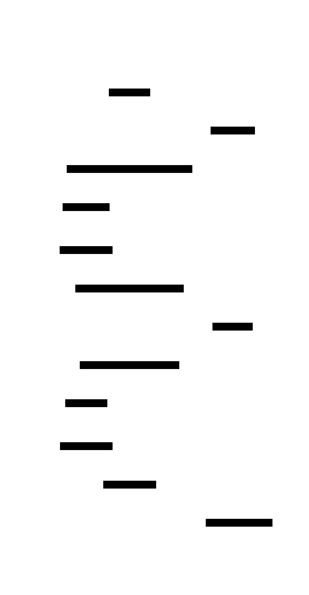
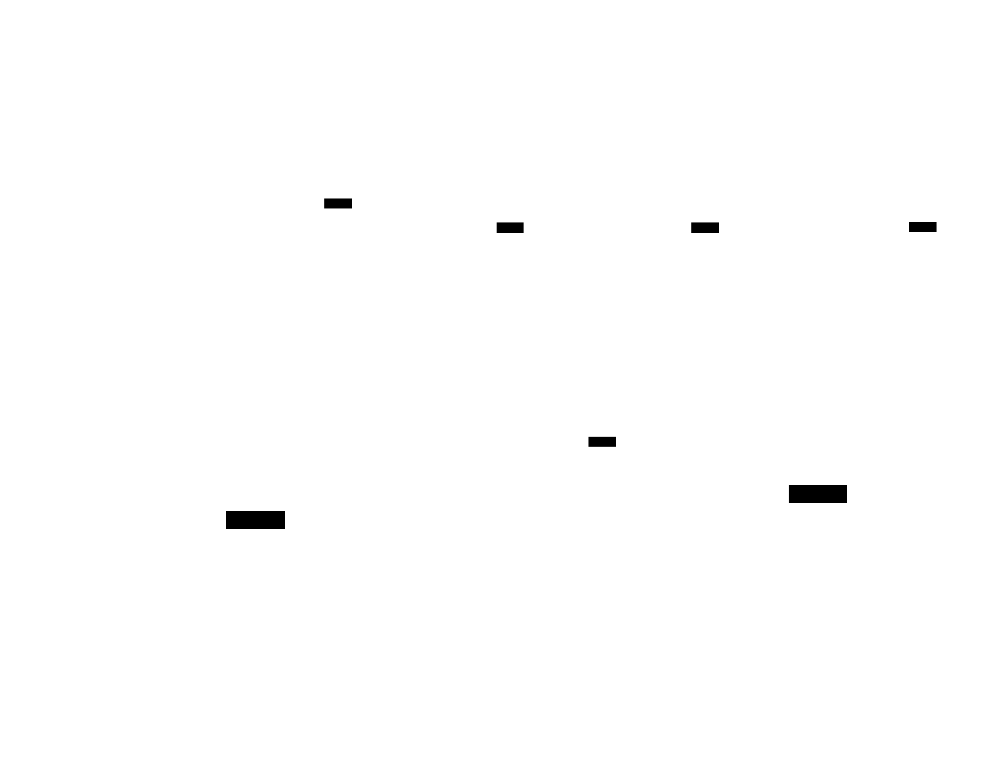

# Gossip Protocol: Design Document


## Overview

This system implements a distributed gossip protocol for eventually consistent data dissemination across a cluster of nodes. The key architectural challenge is achieving reliable data propagation and failure detection in a fully decentralized manner without requiring central coordination or strong consistency guarantees.


> This guide is meant to help you understand the big picture before diving into each milestone. Refer back to it whenever you need context on how components connect.


## Context and Problem Statement

> **Milestone(s):** Foundation for all milestones (1-4) - understanding the fundamental distributed systems challenges that gossip protocols solve

### Mental Model: Epidemic Spread

Before diving into technical details, let's build intuition by thinking about how information spreads in human networks. Imagine you learned some exciting news - perhaps a new restaurant opened in your neighborhood. How does this information reach everyone in your community?

**The Natural Epidemic Process**: You might tell three friends today. Tomorrow, each of those friends tells three of their friends who haven't heard yet. The day after, those nine people each tell three more, and so on. Within just a few days, nearly everyone in a reasonably connected community knows about the restaurant. This is epidemic spread - information propagates exponentially through a network via local interactions.

Now consider the properties that make this natural process remarkably effective:

- **Decentralized**: No single person coordinates the information flow. Each individual makes local decisions about who to tell.
- **Fault-tolerant**: If some people are unavailable or forget to pass along the news, others will eventually tell them through different paths.
- **Probabilistically reliable**: While you can't guarantee every single person hears the news immediately, the vast majority will learn about it quickly.
- **Self-regulating**: People naturally stop spreading news they assume everyone already knows, preventing infinite chatter.

**Mapping to Distributed Systems**: In distributed computing, we face the exact same challenge. Instead of restaurant news, we need to disseminate data updates, configuration changes, or membership information across a cluster of machines. Instead of friends in a community, we have nodes in a network. The fundamental goal remains identical: ensure information reaches all participants quickly and reliably without central coordination.

The gossip protocol implements this epidemic model directly. Each node periodically selects a few random peers and shares its current state with them. Just like humans spreading news, nodes don't need to know the complete network topology or coordinate through a central authority. They make local decisions that collectively achieve global information dissemination.

> **Key Insight**: Gossip protocols are literally epidemic algorithms applied to distributed systems. Understanding how rumors spread through social networks provides the mental framework for understanding how data spreads through computer networks.


Consider a concrete example: Node A receives a state update at time T=0 (it's "patient zero" for this information). In round 1, Node A gossips with nodes B, C, and D, infecting them with the update. In round 2, all four infected nodes randomly select peers to gossip with, potentially reaching nodes E through L. By round 3, the update has likely reached most or all nodes in the cluster. This exponential spread pattern means information propagates in O(log N) rounds, where N is the cluster size.

The epidemic model also explains why gossip protocols handle failures gracefully. If Node C crashes in round 2, the information still spreads through the other infected nodes. Unlike a tree-based broadcast where losing a parent node cuts off all its children, epidemic spread has multiple redundant paths. Information flows like water finding multiple routes downhill.

### Existing Approaches Comparison

To understand why gossip protocols are valuable, we need to examine the landscape of data dissemination strategies in distributed systems. Each approach makes different trade-offs between consistency, performance, fault tolerance, and scalability.

#### Centralized Broadcast

**Approach**: A single coordinator node maintains the authoritative state and broadcasts updates to all other nodes in the cluster.

| Aspect | Description |
|--------|-------------|
| **Mechanism** | Coordinator maintains connection to every node; sends update messages directly to all participants |
| **Consistency** | Strong consistency guaranteed - all nodes receive updates in the same order from single source |
| **Latency** | Very low latency - updates reach all nodes in one network round-trip |
| **Fault Tolerance** | Single point of failure - coordinator crash stops all dissemination |
| **Scalability** | Limited by coordinator's network bandwidth and CPU capacity |
| **Network Traffic** | O(N) messages per update from coordinator, but each message traverses potentially long network paths |

**Example Scenario**: Consider a configuration management system where updates must be atomic. The coordinator receives a configuration change, validates it, then broadcasts the new config to all 1000 nodes simultaneously. All nodes receive identical updates instantly, but if the coordinator fails, no future updates can propagate.

**Why This Falls Short**: While centralized broadcast provides strong guarantees, it fundamentally doesn't scale and creates a critical failure point. Real distributed systems need to handle coordinator failures gracefully, which requires complex leader election protocols and state replication - adding significant complexity.

#### Flooding/Broadcast Storm

**Approach**: When a node receives an update, it immediately forwards the message to all its known neighbors. Each neighbor repeats this process until every node has seen the message.

| Aspect | Description |
|--------|-------------|
| **Mechanism** | Every node forwards new messages to all neighbors; duplicate detection prevents infinite loops |
| **Consistency** | Eventually consistent - all nodes receive updates but timing and ordering may vary |
| **Latency** | Very fast initial spread - updates propagate at maximum network speed |
| **Fault Tolerance** | Extremely resilient - multiple redundant paths ensure delivery despite node failures |
| **Scalability** | Poor - generates O(N²) network messages per update as every node talks to every other node |
| **Network Traffic** | Overwhelming - can saturate network links and cause congestion collapse |

**Example Scenario**: Node A receives an update and immediately sends it to all 50 nodes it knows about. Each of those 50 nodes forwards the message to their 50 neighbors (many overlapping with A's list). Within seconds, the network is flooded with thousands of copies of the same message.

**The Broadcast Storm Problem**: While flooding ensures rapid, reliable delivery, it creates exponentially increasing network traffic. In a well-connected network, each message can generate hundreds or thousands of duplicate transmissions. Network switches become overwhelmed, causing packet drops and delays that actually slow down the very communication the flooding was meant to optimize.

**Why This Falls Short**: The network overhead makes flooding unsuitable for regular operation in large clusters. It's sometimes used for emergency scenarios or very small networks, but doesn't provide a sustainable foundation for continuous data dissemination.

#### Structured Overlay Networks

**Approach**: Organize nodes into a structured topology (tree, ring, mesh) and route messages along the predefined paths.

| Aspect | Description |
|--------|-------------|
| **Mechanism** | Nodes maintain routing tables for structured topology; messages follow deterministic paths |
| **Consistency** | Variable - depends on specific protocol and topology choice |
| **Latency** | Predictable latency based on topology depth (e.g., O(log N) for balanced trees) |
| **Fault Tolerance** | Topology-dependent - tree structures vulnerable to parent node failures |
| **Scalability** | Good theoretical scalability but requires topology maintenance overhead |
| **Network Traffic** | Efficient - O(N) messages per update with optimal routing |

**Example Topologies**:
- **Binary Tree**: Each node has up to two children; root broadcasts down the tree. Fast dissemination but parent failures partition subtrees.
- **Ring**: Nodes form a logical circle; messages propagate clockwise/counterclockwise. Simple but vulnerable to single node failures breaking the ring.
- **Hypercube**: Nodes connected in hypercube topology; messages routed through dimension-wise forwarding. Fault-tolerant but complex routing.

**Why This Falls Short**: Structured overlays require significant overhead to maintain topology in the face of node joins, leaves, and failures. When nodes crash unexpectedly, the topology must be repaired before normal dissemination can resume. This creates complex failure recovery procedures and temporary inconsistencies during topology reconstruction.

#### Gossip Protocol Comparison

Now we can see how gossip protocols position themselves in this design space:

| Approach | Consistency | Latency | Fault Tolerance | Scalability | Network Efficiency | Complexity |
|----------|-------------|---------|----------------|-------------|-------------------|------------|
| **Centralized Broadcast** | Strong | Excellent | Poor | Poor | Good | Low |
| **Flooding** | Eventual | Excellent | Excellent | Poor | Poor | Low |
| **Structured Overlay** | Variable | Good | Variable | Good | Excellent | High |
| **Gossip Protocol** | Eventual | Good | Excellent | Excellent | Good | Medium |

> **Architecture Decision: Why Gossip Protocols**
> - **Context**: Need reliable data dissemination that handles failures gracefully while scaling to large clusters
> - **Options Considered**: 
>   1. Centralized broadcast with leader election for fault tolerance
>   2. Flooding with rate limiting to control network overhead  
>   3. Structured overlay (tree/ring) with topology maintenance protocols
>   4. Gossip protocol with epidemic dissemination
> - **Decision**: Implement gossip protocol as the primary dissemination mechanism
> - **Rationale**: Gossip provides the best balance of fault tolerance and scalability. Unlike centralized approaches, it has no single point of failure. Unlike flooding, it generates bounded network traffic. Unlike structured overlays, it requires no topology maintenance and handles dynamic membership naturally.
> - **Consequences**: Accept eventual consistency rather than strong consistency. Accept slightly higher latency than centralized broadcast. Gain excellent fault tolerance and natural scalability properties.

### Why Gossip Protocols

Having compared alternatives, let's examine the specific advantages that make gossip protocols particularly well-suited for fault-tolerant distributed systems.

#### Fault Tolerance Through Redundancy

The epidemic model creates natural redundancy without explicit coordination. Unlike structured approaches where each node has a specific role in the dissemination topology, gossip protocols treat all nodes as interchangeable participants.

**Multiple Dissemination Paths**: When Node A needs to spread an update, it doesn't rely on a single path to each destination. Instead, the update spreads through multiple overlapping paths simultaneously. If Node B crashes during dissemination, the update still reaches Node B's neighbors through Nodes C, D, and E in subsequent rounds.

**Graceful Degradation**: Network partitions and node failures reduce the effective fanout but don't stop dissemination entirely. A cluster that loses 20% of its nodes continues operating with slightly slower propagation, rather than completely failing or requiring manual intervention.

**Self-Healing Properties**: When failed nodes recover or network partitions heal, the gossip protocol automatically incorporates them back into the dissemination process. No explicit repair procedures or leader election protocols are needed.

Consider this failure scenario: A 100-node cluster experiences a network partition that splits it into groups of 60 and 40 nodes. Within each partition, gossip continues normally, ensuring all nodes in each group maintain consistency. When the partition heals, nodes from each side randomly select gossip partners from the other side, and the two groups converge to a consistent state within a few rounds.

#### Scalability Through Bounded Fanout

One of gossip protocols' key innovations is maintaining bounded network overhead regardless of cluster size. While flooding generates O(N²) messages per update, gossip generates exactly O(N) messages - each node participates in a fixed number of gossip exchanges per round.

**Fixed Per-Node Overhead**: Each node sends gossip messages to a fixed number of peers (typically 3-5) regardless of total cluster size. A node's network bandwidth and CPU requirements remain constant whether the cluster has 10 nodes or 10,000 nodes.

**Logarithmic Propagation Time**: Despite the bounded fanout, updates still spread exponentially. With fanout F, an update reaches F nodes in round 1, F² nodes in round 2, and F^k nodes in round k. This means propagation time grows as O(log_F N), providing excellent scalability properties.

**Network Efficiency**: The total network traffic per update is exactly N × F messages, where N is cluster size and F is fanout. This linear scaling is far superior to flooding's quadratic growth and comparable to structured approaches without their topology maintenance overhead.

Let's examine the mathematics: In a 1000-node cluster with fanout 4, each update generates exactly 4000 messages total (1000 nodes × 4 messages each). The update reaches all nodes in approximately log₄(1000) ≈ 5 rounds. Compare this to flooding, which could generate up to 1000 × 999 = 999,000 messages for the same update.

#### Simplicity and Robustness

Gossip protocols achieve their fault tolerance and scalability properties through remarkably simple mechanisms. This simplicity translates into robust, easy-to-implement, and easy-to-debug systems.

**Stateless Operation**: Each gossip round is independent. Nodes don't maintain complex routing tables, topology state, or coordination protocols. The only persistent state is the data being disseminated and a simple list of known peers.

**No Coordination Requirements**: Nodes make local decisions about when to gossip and which peers to contact. There are no distributed consensus protocols, leader election procedures, or global synchronization points that could become bottlenecks or failure points.

**Natural Load Distribution**: The random peer selection inherently distributes load across the cluster. No single node becomes a traffic concentration point, and load automatically balances as nodes join or leave.

**Probabilistic Guarantees**: Rather than providing absolute guarantees that depend on complex protocols working perfectly, gossip protocols provide probabilistic guarantees that emerge from simple statistical properties. This makes them extremely robust to unexpected failure modes.

#### Handling Dynamic Membership

Real distributed systems face constant churn - nodes join, leave, crash, and recover continuously. Gossip protocols handle this dynamic membership naturally without special protocols or coordination.

**Seamless Node Addition**: New nodes can join by simply announcing themselves to any existing cluster member. The epidemic spread ensures all nodes learn about the new member within a few gossip rounds. No topology restructuring or leader notification is required.

**Graceful Node Departure**: When nodes leave gracefully, they can announce their departure through normal gossip channels. When nodes crash unexpectedly, failure detection mechanisms (covered in later sections) identify them and disseminate membership changes through the same gossip protocol.

**Automatic Discovery**: Nodes automatically discover each other through the membership dissemination process. A new node only needs to know one existing cluster member to eventually learn about all participants.

> **Key Design Principle**: Gossip protocols embrace uncertainty and work with probabilities rather than guarantees. This philosophical shift from "guaranteed delivery through complex coordination" to "highly probable delivery through simple redundancy" is what enables their remarkable fault tolerance and scalability properties.

#### Eventual Consistency Properties

Gossip protocols provide eventual consistency rather than strong consistency. Understanding when this trade-off is appropriate helps determine whether gossip is suitable for a particular use case.

**Convergence Guarantees**: While nodes may temporarily have different views of the data, the epidemic dissemination process ensures all nodes converge to the same state given sufficient time and network connectivity. This convergence happens probabilistically within O(log N) rounds.

**Bounded Inconsistency Window**: The period during which nodes have divergent views is bounded and predictable based on the gossip interval and cluster size. For most applications, this inconsistency window is acceptable given the fault tolerance benefits.

**Conflict Resolution**: When concurrent updates occur, gossip protocols use deterministic conflict resolution mechanisms (timestamps, vector clocks, or application-specific logic) to ensure all nodes converge to the same final state even when they process conflicting updates in different orders.

**Appropriate Use Cases**: Gossip protocols excel for disseminating configuration updates, membership information, metrics aggregation, and other scenarios where eventual consistency is acceptable. They are less suitable for financial transactions, lock coordination, or other scenarios requiring strong consistency guarantees.

#### Implementation Advantages

From a practical implementation perspective, gossip protocols offer several advantages that make them attractive for real-world systems:

**Debugging and Monitoring**: The simple, stateless nature of gossip makes it easy to observe and debug. You can trace update propagation by examining gossip messages and measuring convergence times. There are no complex state machines or coordination protocols to debug.

**Configuration Simplicity**: Gossip protocols have few configuration parameters - mainly the gossip interval, fanout factor, and failure detection timeouts. Unlike structured overlays with complex topology parameters or consensus protocols with numerous timing parameters, gossip is relatively easy to tune.

**Incremental Deployment**: You can deploy gossip protocols incrementally in existing systems. Nodes can gradually adopt gossip-based dissemination without requiring cluster-wide coordination or downtime.

**Language and Platform Agnostic**: The simple message-passing nature of gossip protocols makes them easy to implement in any programming language or runtime environment. Cross-language clusters can easily interoperate as long as they agree on message formats.

This combination of theoretical elegance and practical simplicity makes gossip protocols an excellent choice for learning distributed systems concepts while building production-ready infrastructure. The epidemic model provides intuitive understanding, while the implementation teaches fundamental lessons about fault tolerance, scalability, and eventual consistency that apply broadly across distributed systems design.

### Implementation Guidance

This section provides concrete technology recommendations and starter code to help you implement the gossip protocol concepts described above.

#### A. Technology Recommendations

| Component | Simple Option | Advanced Option |
|-----------|---------------|-----------------|
| **Network Transport** | HTTP/JSON with net/http package | gRPC with Protocol Buffers for type safety |
| **Serialization** | JSON with encoding/json | Protocol Buffers or MessagePack for efficiency |
| **Peer Discovery** | Static configuration file | mDNS/Consul for dynamic discovery |
| **Logging** | Built-in log package | Structured logging with logrus or zap |
| **Testing** | Standard testing package | Testify for assertions and mocking |
| **Time Handling** | time.Time with UTC | Logical clocks (Lamport/Vector) for ordering |

For learning purposes, start with the simple options and upgrade to advanced options in later milestones.

#### B. Recommended File Structure

```
gossip-protocol/
├── cmd/
│   └── gossip-node/
│       └── main.go                 ← Entry point, CLI parsing
├── internal/
│   ├── core/
│   │   ├── types.go               ← Core data structures
│   │   └── config.go              ← Configuration management
│   ├── peer/
│   │   ├── manager.go             ← Peer management (Milestone 1)
│   │   └── manager_test.go
│   ├── gossip/
│   │   ├── push.go                ← Push gossip (Milestone 2)
│   │   ├── pull.go                ← Pull gossip (Milestone 3)
│   │   └── gossip_test.go
│   ├── failure/
│   │   ├── detector.go            ← Failure detection (Milestone 4)
│   │   └── detector_test.go
│   └── transport/
│       ├── http.go                ← Network transport layer
│       └── message.go             ← Message serialization
├── pkg/
│   └── api/
│       └── client.go              ← Client library for applications
├── test/
│   ├── integration/               ← End-to-end tests
│   └── simulation/                ← Network partition simulation
└── docs/
    └── examples/                  ← Usage examples
```

This structure separates concerns clearly and supports incremental development through the milestones.

#### C. Infrastructure Starter Code

**Core Data Types (internal/core/types.go)**:
```go
package core

import (
    "net"
    "time"
)

// NodeID uniquely identifies a node in the cluster
type NodeID string

// Address represents a network endpoint
type Address struct {
    Host string `json:"host"`
    Port int    `json:"port"`
}

// String returns address in host:port format
func (a Address) String() string {
    return net.JoinHostPort(a.host, strconv.Itoa(a.port))
}

// Peer represents a known cluster member
type Peer struct {
    ID       NodeID    `json:"id"`
    Address  Address   `json:"address"`
    State    PeerState `json:"state"`
    LastSeen time.Time `json:"last_seen"`
    Version  uint64    `json:"version"`
}

// PeerState represents the health status of a peer
type PeerState int

const (
    PeerAlive PeerState = iota
    PeerSuspected
    PeerDead
)

// StateEntry represents a single piece of data being gossiped
type StateEntry struct {
    Key       string    `json:"key"`
    Value     []byte    `json:"value"`
    Version   uint64    `json:"version"`
    Timestamp time.Time `json:"timestamp"`
    NodeID    NodeID    `json:"node_id"`
}

// GossipMessage is the main message type for gossip communication
type GossipMessage struct {
    Type      MessageType   `json:"type"`
    SenderID  NodeID        `json:"sender_id"`
    Entries   []StateEntry  `json:"entries,omitempty"`
    Peers     []Peer        `json:"peers,omitempty"`
    Digest    []DigestEntry `json:"digest,omitempty"`
}

// MessageType identifies the kind of gossip message
type MessageType int

const (
    MessagePush MessageType = iota
    MessagePull
    MessagePullResponse
    MessageProbe
    MessageProbeResponse
)

// DigestEntry represents a summary of state for anti-entropy
type DigestEntry struct {
    Key     string `json:"key"`
    Version uint64 `json:"version"`
}
```

**HTTP Transport Layer (internal/transport/http.go)**:
```go
package transport

import (
    "bytes"
    "context"
    "encoding/json"
    "fmt"
    "net/http"
    "time"
    
    "github.com/yourusername/gossip-protocol/internal/core"
)

// HTTPTransport handles network communication via HTTP
type HTTPTransport struct {
    client     *http.Client
    listenAddr core.Address
    server     *http.Server
    handler    MessageHandler
}

// MessageHandler processes incoming gossip messages
type MessageHandler interface {
    HandleMessage(ctx context.Context, msg *core.GossipMessage) (*core.GossipMessage, error)
}

// NewHTTPTransport creates a transport instance
func NewHTTPTransport(listenAddr core.Address) *HTTPTransport {
    return &HTTPTransport{
        client: &http.Client{
            Timeout: 5 * time.Second,
        },
        listenAddr: listenAddr,
    }
}

// Start begins listening for incoming messages
func (t *HTTPTransport) Start(ctx context.Context, handler MessageHandler) error {
    t.handler = handler
    
    mux := http.NewServeMux()
    mux.HandleFunc("/gossip", t.handleGossipMessage)
    
    t.server = &http.Server{
        Addr:    t.listenAddr.String(),
        Handler: mux,
    }
    
    go func() {
        if err := t.server.ListenAndServe(); err != nil && err != http.ErrServerClosed {
            // Log error
        }
    }()
    
    return nil
}

// SendMessage sends a gossip message to a peer
func (t *HTTPTransport) SendMessage(ctx context.Context, peer core.Address, msg *core.GossipMessage) (*core.GossipMessage, error) {
    jsonData, err := json.Marshal(msg)
    if err != nil {
        return nil, fmt.Errorf("failed to marshal message: %w", err)
    }
    
    url := fmt.Sprintf("http://%s/gossip", peer.String())
    req, err := http.NewRequestWithContext(ctx, "POST", url, bytes.NewBuffer(jsonData))
    if err != nil {
        return nil, fmt.Errorf("failed to create request: %w", err)
    }
    req.Header.Set("Content-Type", "application/json")
    
    resp, err := t.client.Do(req)
    if err != nil {
        return nil, fmt.Errorf("failed to send message: %w", err)
    }
    defer resp.Body.Close()
    
    if resp.StatusCode != http.StatusOK {
        return nil, fmt.Errorf("received error status: %d", resp.StatusCode)
    }
    
    var response core.GossipMessage
    if err := json.NewDecoder(resp.Body).Decode(&response); err != nil {
        return nil, fmt.Errorf("failed to decode response: %w", err)
    }
    
    return &response, nil
}

// handleGossipMessage processes incoming HTTP requests
func (t *HTTPTransport) handleGossipMessage(w http.ResponseWriter, r *http.Request) {
    if r.Method != "POST" {
        http.Error(w, "Method not allowed", http.StatusMethodNotAllowed)
        return
    }
    
    var msg core.GossipMessage
    if err := json.NewDecoder(r.Body).Decode(&msg); err != nil {
        http.Error(w, "Invalid JSON", http.StatusBadRequest)
        return
    }
    
    response, err := t.handler.HandleMessage(r.Context(), &msg)
    if err != nil {
        http.Error(w, err.Error(), http.StatusInternalServerError)
        return
    }
    
    w.Header().Set("Content-Type", "application/json")
    json.NewEncoder(w).Encode(response)
}

// Stop gracefully shuts down the transport
func (t *HTTPTransport) Stop(ctx context.Context) error {
    if t.server != nil {
        return t.server.Shutdown(ctx)
    }
    return nil
}
```

#### D. Core Logic Skeleton Code

**Main Gossip Node Structure (internal/gossip/node.go)**:
```go
package gossip

import (
    "context"
    "sync"
    "time"
    
    "github.com/yourusername/gossip-protocol/internal/core"
    "github.com/yourusername/gossip-protocol/internal/transport"
)

// Node represents a single participant in the gossip protocol
type Node struct {
    id        core.NodeID
    config    Config
    transport *transport.HTTPTransport
    
    // State management
    state     map[string]*core.StateEntry
    stateMu   sync.RWMutex
    
    // Peer management  
    peers     map[core.NodeID]*core.Peer
    peersMu   sync.RWMutex
    
    // Control channels
    stopCh    chan struct{}
    gossipTicker *time.Ticker
}

// Config holds gossip protocol parameters
type Config struct {
    GossipInterval time.Duration // How often to initiate gossip rounds
    Fanout         int          // Number of peers to contact per round
    PullProbability float64     // Probability of doing pull vs push
}

// NewNode creates a new gossip protocol node
func NewNode(id core.NodeID, listenAddr core.Address, config Config) *Node {
    return &Node{
        id:        id,
        config:    config,
        transport: transport.NewHTTPTransport(listenAddr),
        state:     make(map[string]*core.StateEntry),
        peers:     make(map[core.NodeID]*core.Peer),
        stopCh:    make(chan struct{}),
    }
}

// Start begins the gossip protocol
func (n *Node) Start(ctx context.Context) error {
    // TODO 1: Start the HTTP transport with this node as the message handler
    // TODO 2: Start the periodic gossip timer using n.config.GossipInterval
    // TODO 3: Launch a goroutine to handle gossip rounds when timer ticks
    // TODO 4: Launch a goroutine to handle cleanup of dead peers
    // Hint: Use select statement to handle stopCh, gossip ticks, and ctx.Done()
    return nil
}

// HandleMessage implements transport.MessageHandler interface
func (n *Node) HandleMessage(ctx context.Context, msg *core.GossipMessage) (*core.GossipMessage, error) {
    // TODO 1: Switch on msg.Type to handle different message types
    // TODO 2: For MessagePush: merge incoming state entries using n.mergeStateEntries()
    // TODO 3: For MessagePull: create response with state digest using n.createDigest()
    // TODO 4: For MessagePullResponse: request missing entries using n.requestMissingEntries()
    // TODO 5: For all message types: update peer information from msg.SenderID
    // TODO 6: Return appropriate response message based on message type
    return nil, nil
}

// initiateGossipRound performs one round of epidemic dissemination
func (n *Node) initiateGossipRound(ctx context.Context) {
    // TODO 1: Select k random peers using n.selectRandomPeers(n.config.Fanout)
    // TODO 2: For each selected peer, decide push vs pull using n.config.PullProbability
    // TODO 3: If push: send current state entries using n.sendPushMessage()
    // TODO 4: If pull: send digest and request missing data using n.sendPullMessage() 
    // TODO 5: Update peer last-seen timestamps for successful communications
    // TODO 6: Handle network errors by marking peers as suspected
    // Hint: Use goroutines to parallelize communication with multiple peers
}
```

#### E. Language-Specific Hints

**Go-Specific Best Practices:**
- Use `sync.RWMutex` for the state and peers maps since gossip involves many concurrent reads
- Use `context.Context` throughout for proper cancellation and timeouts
- Use `time.NewTicker()` for periodic gossip rounds, remember to call `ticker.Stop()`
- Marshal/unmarshal JSON with struct tags for consistent wire format
- Use `math/rand` with proper seeding for random peer selection
- Handle graceful shutdown by closing channels and using `sync.WaitGroup`

**Network Programming Tips:**
- Set reasonable timeouts on HTTP client (5-10 seconds)
- Use HTTP status codes meaningfully (200 for success, 500 for internal errors)
- Log network errors but don't crash - gossip should be resilient to network issues
- Consider using connection pooling for better performance in large clusters

**Concurrency Patterns:**
```go
// Safe state access pattern
func (n *Node) getStateEntry(key string) (*core.StateEntry, bool) {
    n.stateMu.RLock()
    defer n.stateMu.RUnlock()
    entry, exists := n.state[key]
    if !exists {
        return nil, false
    }
    // Return copy to avoid race conditions
    entryCopy := *entry
    return &entryCopy, true
}

// Safe peer iteration pattern
func (n *Node) selectRandomPeers(count int) []*core.Peer {
    n.peersMu.RLock()
    defer n.peersMu.RUnlock()
    
    var alivePeers []*core.Peer
    for _, peer := range n.peers {
        if peer.State == core.PeerAlive {
            alivePeers = append(alivePeers, peer)
        }
    }
    
    // Shuffle and select first 'count' peers
    // Implementation details left as TODO
    return selectedPeers
}
```

#### F. Milestone Checkpoint

After implementing the foundation concepts:

**Expected Behavior:**
1. Start a node: `go run cmd/gossip-node/main.go --id=node1 --port=8001`
2. The node should start HTTP server and log "Gossip node started"
3. Send a test message: `curl -X POST localhost:8001/gossip -d '{"type":0,"sender_id":"test"}'`
4. Should receive JSON response without errors

**Testing Commands:**
```bash
# Run unit tests for core types
go test ./internal/core/...

# Run transport layer tests  
go test ./internal/transport/...

# Test message serialization
go test -run TestMessageSerialization ./internal/transport/
```

**Signs Something Is Wrong:**
- **Symptom**: HTTP requests hang or timeout
  - **Likely Cause**: Missing context handling or infinite loops in message handler
  - **Fix**: Add proper context cancellation and reasonable processing timeouts

- **Symptom**: Panic on concurrent access
  - **Likely Cause**: Missing mutex protection on shared data structures
  - **Fix**: Add RWMutex locks around all state and peer map operations

- **Symptom**: JSON parsing errors
  - **Likely Cause**: Mismatched struct tags or missing json annotations
  - **Fix**: Verify all struct fields have correct `json:"field_name"` tags

This foundation provides the basic infrastructure for implementing the gossip protocol. The next sections will build upon these structures to implement peer management, push/pull gossip, and failure detection mechanisms.


## Goals and Non-Goals

> **Milestone(s):** Foundation for all milestones (1-4) - establishing clear scope and boundaries for the entire gossip protocol implementation

This section establishes the precise boundaries of what our gossip protocol system will and will not provide. Like any good engineering project, success depends not just on what we build, but on what we consciously choose *not* to build. Think of this as a contract between the system designer and the users - a clear statement of what guarantees the system provides, what performance characteristics to expect, and what problems remain outside the system's scope.

Understanding these boundaries upfront prevents scope creep, sets proper expectations, and helps make consistent architectural decisions throughout the implementation. When facing a design choice later, we can refer back to these goals to determine the right path forward.

### Functional Goals

The functional goals define the core capabilities that our gossip protocol must deliver. These are the essential features that make the system useful for distributed data dissemination and membership management.

**Data Dissemination Through Epidemic Spread**

The primary functional goal is reliable data propagation across a cluster of nodes without requiring centralized coordination. The system must implement epidemic spread algorithms that ensure information reaches all reachable nodes within a bounded number of gossip rounds, typically O(log N) where N is the cluster size. This means that when a node updates a piece of data, that update should propagate to all other nodes through a series of peer-to-peer message exchanges, similar to how rumors spread through a social network.

The system must support both push-based and pull-based dissemination patterns. Push gossip involves nodes proactively sending their updates to randomly selected peers, while pull gossip involves nodes requesting missing data from others. The combination of both approaches provides robustness - push gossip ensures rapid initial spread, while pull gossip provides anti-entropy repair to catch any nodes that missed updates during the initial propagation.

| Data Operation | Capability Required | Consistency Guarantee |
|----------------|--------------------|--------------------|
| Data Insert | Accept new key-value pairs with versioning | Eventually consistent across cluster |
| Data Update | Handle concurrent modifications with conflict resolution | Last-write-wins based on vector clocks or timestamps |
| Data Retrieval | Provide current local view of data | Read-your-writes consistency for local node |
| Data Propagation | Spread changes to all reachable nodes | Convergence within O(log N) rounds |

**Membership Management and Peer Discovery**

The system must maintain an accurate view of cluster membership, tracking which nodes are currently participating in the gossip protocol. This involves managing a dynamic peer list that can grow and shrink as nodes join or leave the cluster. Each node maintains its own view of the cluster membership, which may be temporarily inconsistent but should converge over time as membership information spreads through gossip.

Peer discovery enables new nodes to find and join an existing cluster. The system must support bootstrap scenarios where a new node knows the address of at least one existing cluster member and can use that connection to learn about other peers. The membership information itself becomes part of the gossiped data, ensuring that knowledge of new nodes spreads throughout the cluster.

| Membership Operation | Behavior | Propagation Method |
|---------------------|----------|-------------------|
| Node Join | Add new peer to local membership list | Gossip peer list in regular messages |
| Node Leave | Mark peer as gracefully departed | Broadcast leave notification |
| Node Failure | Detect and mark peer as failed | SWIM-style failure detection |
| Membership Sync | Reconcile peer lists between nodes | Periodic peer list exchange |

**Failure Detection and Recovery**

The system must implement robust failure detection to distinguish between slow nodes and truly failed nodes. This prevents the cluster from indefinitely waiting for failed nodes while avoiding false positives that could incorrectly exclude healthy but temporarily slow nodes. The failure detection mechanism should be gossip-based itself, distributing the detection workload across all cluster members rather than relying on a central failure detector.

The SWIM protocol provides the foundation for this capability, using a combination of direct probing, indirect probing through other nodes, and a suspicion mechanism that allows time for confirmation before declaring a node dead. When failures are detected, this information must be disseminated to all other cluster members so they can update their local membership views and stop attempting to gossip with failed nodes.

**Eventually Consistent State Convergence**

The system must guarantee that all non-partitioned nodes will eventually converge to the same state, given enough time and communication rounds. This eventual consistency means that temporary inconsistencies are acceptable - different nodes may have different views of the data at any given moment - but the system must have mechanisms to detect and repair these inconsistencies over time.

Anti-entropy processes provide the primary mechanism for achieving convergence. These processes involve periodic pairwise state comparisons between randomly selected nodes, identifying differences, and exchanging the necessary data to reconcile those differences. The anti-entropy approach ensures that even if the normal push/pull gossip misses some nodes or messages are lost, the system will eventually reach consistency.

### Non-Functional Goals

The non-functional goals specify the quality attributes and performance characteristics that the gossip protocol system must exhibit. These goals determine how well the system performs under various conditions and constraints.

**Scalability and Performance Characteristics**

The system must scale to clusters of hundreds or thousands of nodes while maintaining acceptable performance characteristics. The gossip rounds should complete within predictable time bounds, and the message overhead should grow logarithmically rather than linearly with cluster size. Each node should maintain a constant or slowly-growing amount of state regardless of the total data volume in the cluster.

Network bandwidth usage must remain bounded and configurable. The fanout parameter (number of peers contacted per gossip round) should be tunable to balance between propagation speed and network overhead. A typical configuration might use a fanout of 3-5 peers per round, providing rapid spread without overwhelming the network.

| Performance Metric | Target | Measurement Method |
|-------------------|--------|--------------------|
| Propagation Latency | 99% of nodes receive update within 3-5 gossip rounds | Measure from initial update to final node reception |
| Memory Usage | O(1) per node regardless of total cluster data size | Monitor memory growth as data volume increases |
| Network Overhead | Configurable fanout (default 3-5) per node per round | Measure messages sent per gossip interval |
| CPU Usage | < 5% during normal operation | Monitor CPU during steady-state gossip |

**Fault Tolerance and Partition Resilience**

The system must continue operating correctly in the presence of node failures, network partitions, and message losses. During a network partition, nodes in each partition should continue to gossip among themselves and maintain consistency within their partition. When the partition heals, the system should automatically reconcile the divergent state between the previously separated groups.

The gossip protocol must be resilient to message loss, duplicate messages, and out-of-order delivery. The versioning and anti-entropy mechanisms should handle these network unreliabilities gracefully. Byzantine failures (where nodes behave maliciously) are explicitly outside the scope of this system - we assume nodes are either correct or crash-fail.

| Fault Scenario | Required Behavior | Recovery Mechanism |
|---------------|------------------|-------------------|
| Node Crash | Detect failure within 3-5 probe intervals | SWIM failure detection with suspicion |
| Network Partition | Maintain consistency within each partition | Continue gossip within reachable subset |
| Partition Healing | Automatic state reconciliation | Anti-entropy repair across partition boundary |
| Message Loss | No data loss, automatic retransmission | Version-based conflict resolution |

**Configurability and Operational Flexibility**

The system must provide tunable parameters that allow operators to adjust behavior for different deployment scenarios. Small clusters might prefer aggressive gossip intervals for low latency, while large clusters might need more conservative settings to avoid network congestion. All timing parameters should be configurable without code changes.

The system should provide observability into its operation through structured logging and metrics. Operators need visibility into gossip round timing, failure detection events, anti-entropy activity, and cluster membership changes. This observability is crucial for tuning the system and diagnosing issues in production deployments.

| Configuration Parameter | Purpose | Typical Range |
|------------------------|---------|---------------|
| `GossipInterval` | Time between gossip rounds | 100ms - 5s |
| `Fanout` | Peers contacted per round | 2 - 10 |
| `ProbeTimeout` | Failure detection probe timeout | 1s - 10s |
| `SuspicionTimeout` | Time to confirm suspected failure | 5s - 60s |

### Explicit Non-Goals

The explicit non-goals define what this gossip protocol system will deliberately not attempt to solve. These boundaries are crucial for maintaining focus and avoiding feature creep that could compromise the core functionality.

**Strong Consistency Guarantees**

This system explicitly does not provide strong consistency, linearizability, or immediate consistency across the cluster. Nodes may have temporarily divergent views of the data, and there are no guarantees about when updates become visible on all nodes. Applications requiring strong consistency should use consensus protocols like Raft or database systems with ACID transactions instead of gossip protocols.

The system does not provide causal consistency either - there are no guarantees about the ordering of related updates across different nodes. If application logic requires "update A must be visible before update B," the gossip protocol will not enforce this constraint.

**Byzantine Fault Tolerance**

The system assumes a crash-fail model where nodes either operate correctly or stop responding entirely. It does not protect against Byzantine failures where nodes might send contradictory information to different peers, forge messages, or behave maliciously. Adding Byzantine fault tolerance would require cryptographic signatures, consensus mechanisms, and significantly more complex protocols that are beyond the scope of this implementation.

**Security and Authentication**

This implementation focuses purely on the gossip algorithm mechanics and does not include security features like encryption, authentication, or authorization. All messages are transmitted in plaintext, and any node that can connect to the cluster can participate in gossip. Production deployments would need to add security layers external to the gossip protocol itself.

| Security Feature | Status | Rationale |
|------------------|--------|-----------|
| Message Encryption | Not Included | Focus on algorithm correctness first |
| Node Authentication | Not Included | Orthogonal concern - can be added at transport layer |
| Message Integrity | Not Included | Would require cryptographic signatures |
| Access Control | Not Included | All cluster members have full data access |

**Complex Data Types and Operations**

The gossip protocol operates on simple key-value pairs where values are opaque byte arrays. It does not understand complex data structures, provide query capabilities, or support operations like atomic counters or sets. The conflict resolution is limited to simple timestamp-based or version-based last-writer-wins semantics.

The system does not provide transaction support, batch operations, or any form of multi-key atomicity. Each key-value pair is gossiped and versioned independently. Applications requiring more sophisticated data operations should implement those at a higher layer or use specialized databases.

**Low-Latency or Real-Time Requirements**

While the gossip protocol provides eventual consistency, it is not designed for low-latency or real-time applications. The epidemic spread takes multiple gossip rounds to reach all nodes, and the anti-entropy processes introduce additional delays. Applications requiring immediate propagation of updates should use different architectures like publish-subscribe systems or streaming platforms.

The failure detection, while reasonably prompt, is not suitable for applications requiring immediate failover. The SWIM protocol's suspicion mechanism deliberately introduces delays to avoid false positives, making it inappropriate for hard real-time systems.

> **Key Insight**: These non-goals are not limitations to be ashamed of, but conscious design choices that allow the gossip protocol to excel at its intended purpose. By explicitly excluding strong consistency, security, and real-time requirements, we can focus on building a simple, robust, and scalable eventually-consistent system.

**Large-Scale Data Storage**

The gossip protocol is designed for disseminating metadata, configuration updates, and cluster state information - not for large-scale data storage. Each gossiped value should be relatively small (typically less than 1MB), and the total amount of data in the gossip state should be manageable by individual nodes holding complete replicas.

Applications needing to propagate large files, media content, or bulk data should use specialized file transfer protocols or distributed storage systems. The gossip protocol might be used to disseminate metadata about such large objects (locations, checksums, availability) but not the objects themselves.

### Implementation Guidance

This subsection provides practical guidance for implementing the gossip protocol system within the established functional and non-functional goals.

#### Technology Recommendations

| Component | Simple Option | Advanced Option | Rationale |
|-----------|---------------|-----------------|-----------|
| Transport | HTTP REST with JSON (net/http) | gRPC with Protocol Buffers | HTTP is easier to debug and test |
| Serialization | JSON encoding/json | Protocol Buffers + custom codec | JSON provides human-readable messages |
| Networking | Standard TCP sockets | UDP with custom reliability | TCP handles message delivery and ordering |
| Configuration | YAML files with yaml.v2 | etcd or Consul integration | File-based config simplifies deployment |
| Logging | Standard log package | Structured logging with logrus | Simple logging sufficient for learning |

#### Core Configuration Structure

```go
package gossip

import "time"

// Config holds all tunable parameters for the gossip protocol.
// These values directly impact the trade-offs between propagation speed,
// network overhead, and failure detection accuracy.
type Config struct {
    // GossipInterval controls how frequently each node initiates gossip rounds
    GossipInterval time.Duration
    
    // Fanout determines how many peers to contact in each gossip round
    // Higher values improve propagation speed but increase network overhead
    Fanout int
    
    // PullProbability is the chance (0.0-1.0) of performing pull gossip
    // in addition to push gossip during each round
    PullProbability float64
    
    // ProbeTimeout is how long to wait for direct probe responses
    ProbeTimeout time.Duration
    
    // SuspicionTimeout is how long to wait before declaring suspected peer dead
    SuspicionTimeout time.Duration
    
    // IndirectProbeCount is number of peers to use for indirect probing
    IndirectProbeCount int
    
    // AntiEntropyInterval controls periodic full state synchronization
    AntiEntropyInterval time.Duration
}

// DefaultConfig returns sensible default values for small to medium clusters
func DefaultConfig() Config {
    return Config{
        GossipInterval:      time.Second,
        Fanout:              3,
        PullProbability:     0.2, // 20% chance of pull per round
        ProbeTimeout:        time.Second * 3,
        SuspicionTimeout:    time.Second * 10,
        IndirectProbeCount:  2,
        AntiEntropyInterval: time.Second * 30,
    }
}
```

#### Recommended Project Structure

```
gossip-protocol/
├── cmd/
│   └── gossip-node/
│       └── main.go                 ← Entry point and CLI handling
├── internal/
│   ├── gossip/
│   │   ├── node.go                ← Core Node implementation
│   │   ├── node_test.go           ← Node tests
│   │   ├── config.go              ← Configuration types
│   │   └── types.go               ← Core data types
│   ├── transport/
│   │   ├── http.go                ← HTTP transport implementation
│   │   └── http_test.go           ← Transport tests
│   ├── membership/
│   │   ├── manager.go             ← Peer management logic
│   │   └── manager_test.go        ← Membership tests
│   ├── detection/
│   │   ├── swim.go                ← SWIM failure detection
│   │   └── swim_test.go           ← Detection tests
│   └── storage/
│       ├── state.go               ← State management
│       └── state_test.go          ← State tests
├── pkg/
│   └── api/
│       └── messages.go            ← Public message types
├── examples/
│   ├── simple-cluster/            ← Basic usage examples
│   └── benchmark/                 ← Performance testing
└── docs/
    └── diagrams/                  ← Architecture diagrams
```

#### Milestone Checkpoints

After implementing the goals and configuration system, verify the foundation is solid:

**Milestone Checkpoint 1: Configuration Validation**
```bash
go test ./internal/gossip/...
```

Expected behavior:
- All configuration parameters have sensible defaults
- Configuration validation catches invalid combinations (negative timeouts, zero fanout)
- Config serialization/deserialization works with YAML files

**Milestone Checkpoint 2: Goal Boundary Verification**
Create a simple test that demonstrates what the system will and won't do:

```go
func TestGoalBoundaries(t *testing.T) {
    // Should work: Eventually consistent data propagation
    // Should work: Graceful handling of node failures
    // Should fail: Attempting to provide strong consistency
    // Should fail: Handling Byzantine failures
}
```

**Signs of Success:**
- Configuration values can be tuned without code changes
- System behavior aligns with stated functional goals
- Explicit non-goals are documented and tested to fail appropriately
- All team members understand what the system will and won't provide

**Common Issues:**
- Config values too aggressive for network capacity → tune GossipInterval and Fanout
- Failure detection too sensitive → increase ProbeTimeout and SuspicionTimeout  
- Memory usage growing unbounded → verify state storage has reasonable limits
- Inconsistent expectations → refer back to explicit non-goals documentation

This foundation ensures that all subsequent milestone implementations remain focused on the core gossip protocol capabilities without scope creep into areas like security, strong consistency, or real-time performance that are explicitly outside the project's goals.


## High-Level Architecture

> **Milestone(s):** Foundation for all milestones (1-4) - understanding the core components and their interactions that form the backbone of the entire gossip protocol implementation

This section establishes the architectural foundation of our gossip protocol system by defining the four core components and their relationships. Understanding this architecture is crucial before diving into the specific implementation details of peer management, epidemic spread, anti-entropy mechanisms, and failure detection.

### Component Overview

#### Mental Model: Orchestra Coordination

Think of the gossip protocol architecture like a symphony orchestra where each musician (node) must stay synchronized with the entire ensemble without a central conductor. Each musician has several responsibilities: maintaining awareness of who else is playing (peer management), actively sharing their musical interpretation with nearby musicians (push gossip), occasionally asking others for parts they might have missed (pull gossip), and noticing when fellow musicians have stopped playing (failure detection). Just as an orchestra achieves beautiful harmony through these decentralized coordination mechanisms, our gossip protocol achieves eventual consistency through the coordinated interaction of specialized components.

The architecture consists of four primary components that work together to provide reliable, eventually consistent data dissemination across a distributed cluster. Each component has distinct responsibilities but depends on the others to achieve the overall system goals.


#### Core Component Responsibilities

| Component | Primary Responsibility | Key Capabilities | Dependencies |
|-----------|----------------------|------------------|--------------|
| **Node** | Orchestrate overall gossip protocol operation | Coordinate gossip rounds, handle incoming messages, manage configuration | PeerManager, MessageRouter, FailureDetector, HTTPTransport |
| **PeerManager** | Maintain cluster membership information | Track peer states, select random peers for gossip rounds, handle join/leave events | Node state for peer discovery |
| **MessageRouter** | Handle message serialization and network communication | Send/receive gossip messages, manage HTTP transport, route messages to handlers | HTTPTransport for network I/O |
| **FailureDetector** | Monitor peer health and detect failures | Implement SWIM protocol, manage suspicion timers, coordinate indirect probing | PeerManager for peer selection, MessageRouter for probe messages |

#### Node: Central Coordinator

The `Node` component serves as the central orchestrator that ties all other components together. It maintains the local state (key-value data that gets gossiped), coordinates the periodic gossip rounds that drive epidemic spread, and acts as the primary message handler for incoming gossip protocol messages. The Node owns the main event loop that triggers gossip rounds at regular intervals and ensures that state updates flow through the appropriate components.

The Node component encapsulates the core gossip protocol logic while delegating specialized concerns to the other components. When a gossip round begins, the Node coordinates with the PeerManager to select target peers, uses the MessageRouter to send messages, and integrates failure detection information from the FailureDetector. This centralized coordination ensures that all gossip protocol activities remain synchronized and consistent.

#### PeerManager: Membership Authority

The PeerManager component maintains the authoritative view of cluster membership. It tracks all known peers in the cluster along with their current states (alive, suspected, or dead), handles peer discovery when new nodes join the cluster, and implements the random peer selection algorithms crucial for epidemic spread. The PeerManager ensures that each gossip round targets an appropriate set of peers to maximize information dissemination while avoiding network flooding.

This component encapsulates all the complexity around membership management, including handling peer state transitions, managing timestamps for last-seen information, and providing the random selection mechanisms that drive both regular gossip rounds and failure detection activities. The PeerManager serves as the single source of truth for answering questions like "which peers should I gossip with?" and "is this peer currently suspected of failure?"

#### MessageRouter: Communication Infrastructure

The MessageRouter abstracts all network communication concerns and provides a clean interface for sending and receiving gossip protocol messages. It handles message serialization and deserialization, manages the underlying HTTP transport layer, implements timeout and retry logic for network operations, and routes incoming messages to the appropriate handler methods. This separation allows the other components to focus on protocol logic without dealing with network-level details.

The MessageRouter also implements the different message types used throughout the gossip protocol, including push messages for epidemic spread, pull requests for anti-entropy, and probe messages for failure detection. By centralizing all communication logic, the MessageRouter ensures consistent message formatting, reliable delivery semantics, and proper error handling across all gossip protocol operations.

#### FailureDetector: Health Monitoring

The FailureDetector implements the SWIM (Scalable Weakly-consistent Infection-style Process Group Membership) protocol to monitor peer health and detect failures in a distributed manner. It manages the periodic probing of random peers, coordinates indirect probing through helper nodes when direct probes fail, and maintains suspicion timers to avoid false positive failure declarations. The FailureDetector ensures that failed nodes are eventually removed from the cluster membership while minimizing the impact of temporary network issues.

This component encapsulates the sophisticated logic required for robust failure detection, including managing probe timeouts, selecting appropriate peers for indirect probing, and coordinating the suspicion and confirmation phases of the SWIM protocol. The FailureDetector works closely with the PeerManager to update peer states based on probe results and ensures that membership changes are properly disseminated through the gossip protocol.

> **Key Insight**: The architectural separation between these components follows the single responsibility principle while maintaining clean interfaces. Each component can be tested, debugged, and evolved independently while contributing to the overall gossip protocol functionality.

### Recommended File Structure

A well-organized file structure is crucial for maintaining clean component boundaries and making the codebase approachable for new developers. The following structure separates concerns while maintaining clear dependencies between components.

```
gossip-protocol/
├── cmd/
│   └── gossip-node/
│       └── main.go                    ← Entry point, CLI handling, configuration
├── internal/
│   ├── node/
│   │   ├── node.go                    ← Main Node component implementation
│   │   ├── node_test.go               ← Unit tests for Node
│   │   └── config.go                  ← Configuration structures and defaults
│   ├── peer/
│   │   ├── manager.go                 ← PeerManager implementation
│   │   ├── manager_test.go            ← Unit tests for PeerManager
│   │   ├── selection.go               ← Random peer selection algorithms
│   │   └── state.go                   ← Peer state management
│   ├── transport/
│   │   ├── http.go                    ← HTTPTransport implementation
│   │   ├── http_test.go               ← Unit tests for HTTP transport
│   │   ├── message.go                 ← Message serialization/deserialization
│   │   └── router.go                  ← MessageRouter implementation
│   ├── failure/
│   │   ├── detector.go                ← FailureDetector implementation
│   │   ├── detector_test.go           ← Unit tests for FailureDetector
│   │   ├── swim.go                    ← SWIM protocol specific logic
│   │   └── probe.go                   ← Probing mechanisms
│   ├── types/
│   │   ├── peer.go                    ← Peer, NodeID, Address definitions
│   │   ├── message.go                 ← GossipMessage, MessageType definitions
│   │   ├── state.go                   ← StateEntry, DigestEntry definitions
│   │   └── config.go                  ← Config structure definition
│   └── util/
│       ├── random.go                  ← Random selection utilities
│       ├── time.go                    ← Time-related utilities
│       └── logging.go                 ← Logging configuration
├── pkg/
│   └── gossip/
│       └── client.go                  ← Public API for embedding in other applications
├── test/
│   ├── integration/
│   │   ├── cluster_test.go            ← Multi-node integration tests
│   │   ├── partition_test.go          ← Network partition simulation tests
│   │   └── benchmark_test.go          ← Performance benchmarks
│   └── testutil/
│       ├── cluster.go                 ← Test cluster setup utilities
│       └── network.go                 ← Network simulation utilities
├── docs/
│   ├── design.md                      ← This design document
│   ├── api.md                         ← API documentation
│   └── examples/                      ← Usage examples
├── scripts/
│   ├── build.sh                       ← Build automation
│   ├── test.sh                        ← Testing automation
│   └── benchmark.sh                   ← Benchmarking automation
├── go.mod                             ← Go module definition
├── go.sum                             ← Go dependency checksums
└── README.md                          ← Project overview and getting started
```

#### Package Organization Rationale

The file structure follows Go's recommended practices while maintaining clear component boundaries. The `internal/` directory ensures that implementation details remain encapsulated and cannot be imported by external packages, while the `pkg/` directory provides a clean public API for applications that want to embed the gossip protocol.

Each component lives in its own package with clearly defined responsibilities. The `types/` package contains all shared data structures, avoiding circular dependencies between components. The `util/` package provides common utilities used across multiple components. Test files are co-located with their corresponding implementation files for unit tests, while integration tests live in a separate `test/` directory.

#### Key Architectural Files

| File | Purpose | Key Contents |
|------|---------|-------------|
| `internal/node/node.go` | Central coordinator | Node struct, gossip round orchestration, message handling |
| `internal/peer/manager.go` | Membership management | PeerManager struct, peer state tracking, random selection |
| `internal/transport/router.go` | Message routing | MessageRouter interface, request routing, response handling |
| `internal/failure/detector.go` | Failure detection | FailureDetector struct, SWIM protocol implementation |
| `internal/types/` | Shared data types | All protocol data structures, enums, constants |
| `pkg/gossip/client.go` | Public API | Clean interface for external applications |

This organization enables clean testing strategies, where each component can be unit tested in isolation using mocks for its dependencies, while integration tests validate the interactions between components.

### Component Interactions

Understanding how the four core components interact is crucial for implementing a cohesive gossip protocol system. The interactions follow well-defined patterns that ensure proper coordination while maintaining component independence.

#### Primary Interaction Patterns

The components interact through three primary patterns: **coordination flows** where the Node orchestrates activities across multiple components, **request-response flows** where components query each other for specific information, and **event notification flows** where components notify others of important state changes.

| Interaction Pattern | Trigger | Flow | Result |
|-------------------|---------|------|--------|
| **Gossip Round Coordination** | Timer expires | Node → PeerManager → MessageRouter → Network | State propagated to selected peers |
| **Incoming Message Handling** | Network message | MessageRouter → Node → [PeerManager/FailureDetector] | Message processed, state updated |
| **Failure Detection Cycle** | Timer expires | FailureDetector → PeerManager → MessageRouter → Network | Peer health status updated |
| **Membership Change Propagation** | Peer state change | [FailureDetector/Node] → PeerManager → Node | Membership updates queued for gossip |

#### Gossip Round Coordination Flow

When the Node's gossip timer expires, it initiates a gossip round that demonstrates the primary coordination pattern. The Node first queries the PeerManager to obtain a list of target peers using random selection algorithms. It then constructs gossip messages containing state updates and membership information. The MessageRouter handles the actual network transmission to the selected peers. Finally, the Node processes any responses and updates local state accordingly.

This flow illustrates how the Node serves as the central coordinator while delegating specialized tasks to appropriate components. The PeerManager handles the complexity of peer selection, the MessageRouter manages network communication details, and the Node focuses on the high-level gossip protocol logic.

#### Message Processing Flow

When an incoming gossip message arrives, the MessageRouter receives it from the network layer and routes it to the Node's message handler. The Node examines the message type and content, then delegates specific processing tasks to the appropriate components. For state update messages, the Node updates its local state directly. For membership updates, it coordinates with the PeerManager to update peer information. For probe messages, it delegates to the FailureDetector for SWIM protocol handling.

This pattern ensures that all incoming messages flow through a centralized handler while maintaining component specialization. The MessageRouter focuses purely on network concerns and message routing, while the Node maintains the overall protocol state machine.

#### Failure Detection Integration

The FailureDetector operates somewhat independently but integrates closely with other components. It periodically selects peers for probing (using the PeerManager), sends probe messages (using the MessageRouter), and updates peer states based on responses (coordinating with the PeerManager). When the FailureDetector suspects or confirms a peer failure, it notifies the PeerManager to update the peer's state, which then triggers membership change propagation in the next gossip round.

This integration demonstrates how failure detection remains logically separate from gossip dissemination while sharing the same underlying infrastructure and coordination mechanisms.

#### Dependency Management

| Component | Direct Dependencies | Indirect Dependencies | Key Interface Methods |
|-----------|-------------------|---------------------|---------------------|
| **Node** | PeerManager, MessageRouter, FailureDetector | HTTPTransport | `initiateGossipRound()`, `HandleMessage()` |
| **PeerManager** | None (pure state management) | None | `SelectRandomPeers()`, `UpdatePeerState()`, `GetAlivePeers()` |
| **MessageRouter** | HTTPTransport | None | `SendMessage()`, `RouteMessage()`, `RegisterHandler()` |
| **FailureDetector** | PeerManager, MessageRouter | HTTPTransport | `StartProbing()`, `HandleProbeResponse()`, `CheckSuspicions()` |

The dependency structure follows a clear hierarchy that avoids circular dependencies while enabling the necessary coordination. The Node sits at the top as the primary coordinator, the PeerManager serves as a shared dependency providing membership information, the MessageRouter provides communication infrastructure, and the FailureDetector operates as a specialized service that integrates with the other components.

#### Inter-Component Communication Interfaces

Components communicate through well-defined interfaces that abstract implementation details while providing the necessary coordination mechanisms. These interfaces enable clean testing through dependency injection and support future evolution of individual components.

| Interface | Provider | Consumer | Key Methods | Purpose |
|-----------|----------|----------|-------------|---------|
| **PeerSelection** | PeerManager | Node, FailureDetector | `SelectRandomPeers(count int, filter PeerFilter)` | Provide peer selection for gossip rounds |
| **MembershipUpdate** | PeerManager | Node | `UpdatePeerState(nodeID, state)`, `GetMembershipChanges()` | Manage peer state transitions |
| **MessageTransport** | MessageRouter | Node, FailureDetector | `SendMessage(peer, message)`, `BroadcastMessage(peers, message)` | Abstract network communication |
| **FailureNotification** | FailureDetector | PeerManager | `NotifyPeerSuspected(nodeID)`, `NotifyPeerFailed(nodeID)` | Communicate failure detection results |

> **Architecture Decision: Component Coordination Strategy**
> - **Context**: Need to coordinate activities across multiple components while maintaining clean separation of concerns and avoiding tight coupling
> - **Options Considered**: 
>   1. Event-driven architecture with message queues between components
>   2. Central coordinator pattern with the Node orchestrating all activities
>   3. Peer-to-peer component communication with direct interface calls
> - **Decision**: Central coordinator pattern with interface-based communication
> - **Rationale**: The gossip protocol has natural coordination points (gossip rounds, incoming messages) that benefit from centralized orchestration. Interface-based communication provides clean abstraction without the complexity overhead of message queues. Direct peer-to-peer communication would create too many inter-component dependencies.
> - **Consequences**: Enables clean testing through dependency injection, supports component evolution through interface stability, concentrates coordination logic in a single place for easier debugging, but creates a potential bottleneck in the Node component that must be designed for high performance.

#### Error Propagation and Recovery

Components handle errors according to their specific responsibilities while ensuring that failures in one component don't cascade to others unnecessarily. Network errors are contained within the MessageRouter, peer state inconsistencies are resolved by the PeerManager, and protocol violations are handled by the Node's message processing logic.

| Error Type | Detection Point | Handling Strategy | Recovery Mechanism |
|------------|----------------|-------------------|-------------------|
| **Network Timeout** | MessageRouter | Return error to caller, don't update peer state | Retry in next gossip round, eventual failure detection |
| **Peer State Conflict** | PeerManager | Use timestamp/version for conflict resolution | Anti-entropy will eventually reconcile |
| **Message Format Error** | MessageRouter | Log error, drop message, continue processing | Sender will retry, eventual consistency maintained |
| **Component Failure** | Node | Graceful degradation, continue with available components | Restart failed component, rejoin cluster if necessary |

This error handling strategy ensures that temporary failures don't compromise the overall system while providing mechanisms for eventual recovery through the gossip protocol's inherent redundancy and eventual consistency properties.

### Implementation Guidance

This implementation guidance provides concrete starting points for building the high-level architecture, focusing on the component structure and coordination mechanisms that will support the detailed implementations in subsequent milestones.

#### Technology Recommendations

| Component | Simple Option | Advanced Option | Rationale |
|-----------|---------------|-----------------|-----------|
| **Transport** | HTTP REST + JSON (net/http) | gRPC with Protocol Buffers | HTTP is simpler to debug and test; gRPC offers better performance |
| **Serialization** | JSON encoding/json | Protocol Buffers + protobuf | JSON is human-readable; protobuf is more efficient |
| **Logging** | Standard log package | Structured logging (logrus/zap) | Standard log is built-in; structured logging better for production |
| **Testing** | Go testing + testify | Go testing + gomock + testcontainers | Testify provides assertions; mocks enable component isolation |
| **Configuration** | Environment variables + flag | Viper configuration management | Simple env vars work well; Viper supports multiple sources |

For learning purposes, start with the simple options and evolve to advanced options as the implementation matures. The simple options provide immediate productivity while the advanced options offer production-ready capabilities.

#### Core Infrastructure Implementation

Here's the complete foundation code that provides the infrastructure for the gossip protocol implementation:

**File: `internal/types/config.go`**
```go
package types

import "time"

// DefaultConfig returns sensible default configuration values for development and testing
func DefaultConfig() Config {
    return Config{
        GossipInterval:     1 * time.Second,
        Fanout:             3,
        PullProbability:    0.1,
        ProbeTimeout:       500 * time.Millisecond,
        SuspicionTimeout:   3 * time.Second,
        IndirectProbeCount: 3,
        AntiEntropyInterval: 10 * time.Second,
    }
}

// Config holds all configuration parameters for the gossip protocol
type Config struct {
    // GossipInterval determines how often to initiate gossip rounds
    GossipInterval time.Duration
    
    // Fanout specifies how many peers to contact in each gossip round
    Fanout int
    
    // PullProbability is the chance of performing pull gossip instead of push
    PullProbability float64
    
    // ProbeTimeout is how long to wait for probe responses in failure detection
    ProbeTimeout time.Duration
    
    // SuspicionTimeout is how long to wait in suspicion state before declaring dead
    SuspicionTimeout time.Duration
    
    // IndirectProbeCount is number of peers to use for indirect probing
    IndirectProbeCount int
    
    // AntiEntropyInterval determines how often to perform full state reconciliation
    AntiEntropyInterval time.Duration
}
```

**File: `internal/types/peer.go`**
```go
package types

import (
    "fmt"
    "time"
)

// NodeID uniquely identifies a node in the gossip cluster
type NodeID string

// Address represents a network endpoint for peer communication
type Address struct {
    Host string
    Port int
}

// String converts Address to standard host:port format for network operations
func (a Address) String() string {
    return fmt.Sprintf("%s:%d", a.Host, a.Port)
}

// PeerState represents the current status of a peer in the cluster
type PeerState int

const (
    // PeerAlive indicates the peer is responsive and healthy
    PeerAlive PeerState = iota
    
    // PeerSuspected indicates the peer may have failed and needs confirmation
    PeerSuspected
    
    // PeerDead indicates the peer has been confirmed as failed
    PeerDead
)

// String returns human-readable representation of peer state
func (ps PeerState) String() string {
    switch ps {
    case PeerAlive:
        return "alive"
    case PeerSuspected:
        return "suspected"
    case PeerDead:
        return "dead"
    default:
        return "unknown"
    }
}

// Peer represents a member of the gossip cluster with its current status
type Peer struct {
    ID       NodeID
    Address  Address
    State    PeerState
    LastSeen time.Time
    Version  uint64
}
```

**File: `internal/types/message.go`**
```go
package types

import "time"

// MessageType identifies different kinds of gossip protocol messages
type MessageType int

const (
    // MessagePush contains epidemic push updates with state data
    MessagePush MessageType = iota
    
    // MessagePull requests missing data from a peer (anti-entropy)
    MessagePull
    
    // MessagePullResponse provides requested data in response to pull
    MessagePullResponse
    
    // MessageProbe checks if a peer is alive (SWIM protocol)
    MessageProbe
    
    // MessageProbeResponse acknowledges a probe message
    MessageProbeResponse
)

// String returns human-readable representation of message type
func (mt MessageType) String() string {
    switch mt {
    case MessagePush:
        return "push"
    case MessagePull:
        return "pull"
    case MessagePullResponse:
        return "pull_response"
    case MessageProbe:
        return "probe"
    case MessageProbeResponse:
        return "probe_response"
    default:
        return "unknown"
    }
}

// StateEntry represents a key-value pair with versioning for conflict resolution
type StateEntry struct {
    Key       string
    Value     []byte
    Version   uint64
    Timestamp time.Time
    NodeID    NodeID
}

// DigestEntry provides compact representation of state for anti-entropy comparison
type DigestEntry struct {
    Key     string
    Version uint64
}

// GossipMessage is the primary communication structure for all gossip protocol interactions
type GossipMessage struct {
    Type     MessageType
    SenderID NodeID
    Entries  []StateEntry
    Peers    []Peer
    Digest   []DigestEntry
}
```

**File: `internal/transport/http.go`**
```go
package transport

import (
    "bytes"
    "context"
    "encoding/json"
    "fmt"
    "net/http"
    "time"
    
    "github.com/your-org/gossip-protocol/internal/types"
)

// MessageHandler processes incoming gossip messages and returns responses
type MessageHandler interface {
    HandleMessage(ctx context.Context, msg *types.GossipMessage) (*types.GossipMessage, error)
}

// HTTPTransport provides HTTP-based communication for gossip protocol messages
type HTTPTransport struct {
    client     *http.Client
    listenAddr types.Address
    server     *http.Server
    handler    MessageHandler
}

// NewHTTPTransport creates a new HTTP transport instance with reasonable defaults
func NewHTTPTransport(listenAddr types.Address) *HTTPTransport {
    return &HTTPTransport{
        client: &http.Client{
            Timeout: 5 * time.Second,
        },
        listenAddr: listenAddr,
    }
}

// Start begins listening for incoming HTTP requests using the provided message handler
func (h *HTTPTransport) Start(ctx context.Context, handler MessageHandler) error {
    h.handler = handler
    
    mux := http.NewServeMux()
    mux.HandleFunc("/gossip", h.handleGossipMessage)
    
    h.server = &http.Server{
        Addr:    h.listenAddr.String(),
        Handler: mux,
    }
    
    errCh := make(chan error, 1)
    go func() {
        errCh <- h.server.ListenAndServe()
    }()
    
    select {
    case err := <-errCh:
        return err
    case <-time.After(100 * time.Millisecond):
        // Server started successfully
        return nil
    }
}

// SendMessage transmits a gossip message to the specified peer and returns any response
func (h *HTTPTransport) SendMessage(ctx context.Context, peer types.Address, msg *types.GossipMessage) (*types.GossipMessage, error) {
    // TODO: Implement JSON serialization of outgoing message
    // TODO: Create HTTP POST request to peer's /gossip endpoint
    // TODO: Set appropriate timeouts and context cancellation
    // TODO: Parse JSON response into GossipMessage struct
    // TODO: Handle HTTP errors and network timeouts appropriately
    return nil, fmt.Errorf("not implemented")
}

// Stop gracefully shuts down the HTTP server and cleans up resources
func (h *HTTPTransport) Stop(ctx context.Context) error {
    if h.server == nil {
        return nil
    }
    return h.server.Shutdown(ctx)
}

// handleGossipMessage processes incoming HTTP requests containing gossip messages
func (h *HTTPTransport) handleGossipMessage(w http.ResponseWriter, r *http.Request) {
    if r.Method != http.MethodPost {
        http.Error(w, "Method not allowed", http.StatusMethodNotAllowed)
        return
    }
    
    // TODO: Decode JSON request body into GossipMessage
    // TODO: Call message handler with decoded message
    // TODO: Encode response message as JSON
    // TODO: Handle errors appropriately with proper HTTP status codes
    
    w.Header().Set("Content-Type", "application/json")
    w.WriteHeader(http.StatusOK)
}
```

#### Core Component Skeletons

**File: `internal/node/node.go`**
```go
package node

import (
    "context"
    "sync"
    "time"
    
    "github.com/your-org/gossip-protocol/internal/types"
    "github.com/your-org/gossip-protocol/internal/transport"
)

// Node represents the main gossip protocol coordinator that orchestrates all subsystems
type Node struct {
    id        types.NodeID
    config    types.Config
    transport *transport.HTTPTransport
    
    // Local state management
    state     map[string]*types.StateEntry
    stateMux  sync.RWMutex
    
    // Peer management
    peers    map[types.NodeID]*types.Peer
    peersMux sync.RWMutex
    
    // Lifecycle management
    ctx    context.Context
    cancel context.CancelFunc
    wg     sync.WaitGroup
}

// NewNode creates a new gossip node with the specified configuration
func NewNode(id types.NodeID, listenAddr types.Address, config types.Config) *Node {
    // TODO: Initialize Node struct with provided parameters
    // TODO: Create HTTPTransport instance for network communication
    // TODO: Initialize empty state and peer maps with proper mutex protection
    // TODO: Set up context for graceful shutdown coordination
}

// Start begins all gossip protocol operations including transport and periodic tasks
func (n *Node) Start(ctx context.Context) error {
    // TODO: Start HTTP transport with this node as message handler
    // TODO: Launch gossip round timer goroutine using config.GossipInterval
    // TODO: Launch failure detection timer goroutine for SWIM protocol
    // TODO: Launch anti-entropy timer goroutine using config.AntiEntropyInterval
    // TODO: Add all goroutines to wait group for proper shutdown coordination
}

// Stop gracefully shuts down all node operations and cleans up resources
func (n *Node) Stop() error {
    // TODO: Cancel context to signal shutdown to all goroutines
    // TODO: Stop HTTP transport gracefully
    // TODO: Wait for all goroutines to complete using wait group
    // TODO: Clean up any remaining resources
}

// HandleMessage processes incoming gossip messages and returns appropriate responses
func (n *Node) HandleMessage(ctx context.Context, msg *types.GossipMessage) (*types.GossipMessage, error) {
    // TODO: Route message to appropriate handler based on message type
    // TODO: For MessagePush: merge incoming state entries using version comparison
    // TODO: For MessagePull: return requested state entries in response message
    // TODO: For MessageProbe: return probe response to indicate node is alive
    // TODO: Update peer information from message.Peers field
    // TODO: Return appropriate response message based on message type
}

// initiateGossipRound performs one complete epidemic dissemination round
func (n *Node) initiateGossipRound(ctx context.Context) {
    // TODO: Select random peers using configured fanout value
    // TODO: Prepare gossip message with recent state entries
    // TODO: Include membership updates (peer joins/leaves/failures)
    // TODO: Send push messages to selected peers using transport
    // TODO: Handle responses and update local state accordingly
    // TODO: Implement pull gossip probability for anti-entropy
}
```

#### Directory Structure Setup Script

**File: `scripts/setup.sh`**
```bash
#!/bin/bash

# Create the complete directory structure for the gossip protocol project
mkdir -p cmd/gossip-node
mkdir -p internal/{node,peer,transport,failure,types,util}
mkdir -p pkg/gossip
mkdir -p test/{integration,testutil}
mkdir -p docs
mkdir -p scripts

# Create placeholder files to establish the structure
touch cmd/gossip-node/main.go
touch internal/node/{node.go,node_test.go,config.go}
touch internal/peer/{manager.go,manager_test.go,selection.go,state.go}
touch internal/transport/{http.go,http_test.go,message.go,router.go}
touch internal/failure/{detector.go,detector_test.go,swim.go,probe.go}
touch internal/types/{peer.go,message.go,state.go,config.go}
touch internal/util/{random.go,time.go,logging.go}
touch pkg/gossip/client.go
touch test/integration/{cluster_test.go,partition_test.go,benchmark_test.go}
touch test/testutil/{cluster.go,network.go}

echo "Project structure created successfully!"
echo "Next steps:"
echo "1. Initialize Go module: go mod init github.com/your-org/gossip-protocol"
echo "2. Copy the provided infrastructure code into appropriate files"
echo "3. Implement the core component skeletons"
echo "4. Start with Milestone 1: Peer Management"
```

#### Milestone Checkpoint

After implementing the high-level architecture foundation:

**Expected Behavior:**
1. **Transport Layer**: HTTP server starts successfully and can receive POST requests
2. **Node Creation**: NewNode successfully creates node instances with proper configuration
3. **Component Integration**: Node can be started and stopped without panics or resource leaks
4. **Message Routing**: Basic message handling infrastructure routes different message types appropriately

**Verification Commands:**
```bash
# Run unit tests for infrastructure components
go test ./internal/types/...
go test ./internal/transport/...

# Build the main binary to verify no compilation errors
go build ./cmd/gossip-node

# Start a single node and verify HTTP endpoint
./gossip-node &
curl -X POST http://localhost:8080/gossip -d '{"Type":0,"SenderID":"test","Entries":[],"Peers":[],"Digest":[]}'
```

**Common Issues and Solutions:**

| Symptom | Likely Cause | Diagnostic Step | Solution |
|---------|--------------|-----------------|----------|
| **Import cycle error** | Circular dependencies between packages | Run `go list -deps ./...` | Move shared types to separate package |
| **HTTP server won't start** | Port already in use or permission denied | Run `netstat -an \| grep :8080` | Change port or kill existing process |
| **Context cancellation doesn't work** | Goroutines not checking context properly | Add context.Done() checks in loops | Implement proper context handling |
| **Race condition warnings** | Unsynchronized access to shared data | Run with `go run -race` | Add proper mutex protection |

The architecture foundation provides the scaffolding for implementing the specific gossip protocol features in subsequent milestones, ensuring that component boundaries remain clean and interactions follow well-defined patterns.


## Data Model

> **Milestone(s):** Foundation for all milestones (1-4) - understanding the core data structures that support peer management, push/pull gossip, anti-entropy, and failure detection

The data model forms the foundation of our gossip protocol implementation, defining how nodes represent themselves, track peers, manage state, and communicate. Think of the data model as the **vocabulary and grammar** of our distributed system - just as humans need shared language to communicate effectively, our gossip nodes need standardized data structures to exchange information reliably.


### Mental Model: Distributed Address Book with Timestamped Notes

Understanding the gossip protocol data model is like maintaining a **distributed address book** where everyone keeps their own copy, but periodically shares updates with friends to stay synchronized. Each person in your network has an entry with their contact information, current status (reachable, suspected unreachable, or confirmed unreachable), and the last time you heard from them. When you want to share news or updates, you write timestamped notes and pass them along through your network of contacts.

The key insight is that unlike a centralized address book service, every participant maintains their own local copy and uses epidemic-style communication to keep everyone's information eventually consistent. No single node has the authoritative truth - instead, the truth emerges through continuous gossip and reconciliation.

### Core Data Types

Our gossip protocol revolves around four fundamental data structures that work together to enable distributed state management and failure detection. Each structure serves a specific purpose in the epidemic dissemination process.

#### Node Identity and Addressing

The foundation of our distributed system starts with uniquely identifying nodes and locating them on the network.

| Name | Type | Description |
|------|------|-------------|
| `NodeID` | string | Unique identifier for each node in the cluster, typically UUID or hostname |
| `Host` | string | Network hostname or IP address where the node can be reached |
| `Port` | int | TCP port number the node listens on for gossip protocol messages |

The `Address` structure combines host and port information to provide complete network addressing:

| Field | Type | Description |
|-------|------|-------------|
| `Host` | string | Network hostname or IP address for reaching this node |
| `Port` | int | TCP port number where the node accepts gossip connections |

The `Address` type implements a `String()` method that formats the address in standard "host:port" notation for network operations and logging.

#### Peer Representation and State

The `Peer` structure represents our view of another node in the cluster, tracking both static information (identity, address) and dynamic state (liveness, version):

| Field | Type | Description |
|-------|------|-------------|
| `ID` | NodeID | Unique identifier for this peer node |
| `Address` | Address | Network location where this peer can be contacted |
| `State` | PeerState | Current liveness assessment: alive, suspected, or dead |
| `LastSeen` | time.Time | Timestamp of the most recent successful communication with this peer |
| `Version` | uint64 | Monotonically increasing version number for peer metadata updates |

The `PeerState` enumeration defines the three possible liveness states in our failure detection protocol:

| State | Description |
|-------|-------------|
| `PeerAlive` | Peer is responsive and confirmed healthy through recent direct or indirect communication |
| `PeerSuspected` | Peer may have failed - direct probes are timing out but we haven't confirmed failure yet |
| `PeerDead` | Peer failure has been confirmed through suspicion timeout or multiple failed probe attempts |

This state model implements the **suspicion mechanism** from the SWIM protocol, where nodes don't immediately declare peers dead after a single failed probe. Instead, they enter a suspicion period allowing for indirect confirmation and reducing false positives due to temporary network issues.

#### Application State Management

The `StateEntry` structure represents a single piece of application data being disseminated through the gossip network:

| Field | Type | Description |
|-------|------|-------------|
| `Key` | string | Unique identifier for this piece of state (e.g., configuration key, service endpoint) |
| `Value` | []byte | Raw data payload - can be JSON, protobuf, or any serialized format |
| `Version` | uint64 | Monotonically increasing version number for conflict resolution |
| `Timestamp` | time.Time | Wall clock time when this entry was created or last modified |
| `NodeID` | NodeID | Identifier of the node that originated this state entry |

The combination of `Version` and `Timestamp` enables **conflict resolution** when multiple nodes update the same key concurrently. The version number provides a logical ordering, while the timestamp serves as a tie-breaker and helps with debugging causality issues.

#### Message Protocol

All communication between gossip nodes uses the `GossipMessage` structure, which serves as a container for different types of protocol operations:

| Field | Type | Description |
|-------|------|-------------|
| `Type` | MessageType | Discriminator indicating the purpose and expected handling of this message |
| `SenderID` | NodeID | Identifier of the node that sent this message |
| `Entries` | []StateEntry | Application state entries being pushed or requested |
| `Peers` | []Peer | Peer membership information for cluster view synchronization |
| `Digest` | []DigestEntry | Compact representation of sender's state for efficient comparison |

The `MessageType` enumeration defines all supported protocol operations:

| Type | Purpose | Direction |
|------|---------|-----------|
| `MessagePush` | Epidemic dissemination of state updates to randomly selected peers | Sender → Receiver |
| `MessagePull` | Request for missing state entries during anti-entropy | Requester → Provider |
| `MessagePullResponse` | Response containing requested state entries | Provider → Requester |
| `MessageProbe` | SWIM failure detection heartbeat to check peer liveness | Prober → Target |
| `MessageProbeResponse` | Acknowledgment of successful probe reception | Target → Prober |

#### State Digests for Efficient Comparison

The `DigestEntry` provides a compact way to represent state without transmitting full payloads, enabling efficient state comparison during pull gossip and anti-entropy operations:

| Field | Type | Description |
|-------|------|-------------|
| `Key` | string | State entry identifier matching the full StateEntry.Key |
| `Version` | uint64 | Current version number of this entry at the sender |

By comparing digests rather than full state, nodes can quickly identify which entries they're missing or which have newer versions available from their peers.

### Type Relationships

The data types form a **hierarchical composition** where higher-level structures contain and reference lower-level ones. Understanding these relationships is crucial for implementing the protocol correctly.

#### Primary Containment Hierarchy

At the top level, the `Node` structure serves as the **root aggregate** containing all the node's local state and knowledge:

| Component | Contains | Relationship |
|-----------|----------|-------------|
| `Node` | `map[NodeID]*Peer` | Node tracks zero or more peers in its membership view |
| `Node` | `map[string]*StateEntry` | Node maintains zero or more state entries for dissemination |
| `Node` | `Config` | Node has exactly one configuration object |
| `Node` | `*HTTPTransport` | Node has exactly one transport layer for network communication |

#### Message Composition Patterns

The `GossipMessage` structure acts as a **protocol envelope** that can carry different combinations of data depending on the message type:

| Message Type | Contains Entries | Contains Peers | Contains Digest | Purpose |
|--------------|------------------|----------------|-----------------|---------|
| `MessagePush` | Yes (1-N) | Yes (0-N) | No | Epidemic state dissemination with piggybacked membership |
| `MessagePull` | No | No | Yes (1-N) | Request specific entries by comparing digests |
| `MessagePullResponse` | Yes (0-N) | Yes (0-N) | No | Provide requested entries with membership updates |
| `MessageProbe` | No | No | No | Minimal heartbeat for failure detection |
| `MessageProbeResponse` | No | Yes (0-N) | No | Heartbeat ack with optional membership piggyback |

#### Reference and Identity Relationships

Several fields serve as **foreign keys** linking related data:

| Source Type | Field | References | Purpose |
|-------------|-------|------------|---------|
| `StateEntry` | `NodeID` | `Node.ID` or `Peer.ID` | Track which node originated this state |
| `GossipMessage` | `SenderID` | `Node.ID` or `Peer.ID` | Identify message source for routing and trust |
| `DigestEntry` | `Key` | `StateEntry.Key` | Reference full state entry during pull operations |

#### Versioning and Consistency Relationships

Both `Peer` and `StateEntry` structures include versioning fields that work together to ensure **eventual consistency**:

| Type | Version Field | Comparison Rule | Conflict Resolution |
|------|---------------|-----------------|-------------------|
| `Peer` | `Version` | Higher version wins | Last-writer-wins with version ordering |
| `StateEntry` | `Version` | Higher version wins | Version comparison, timestamp tie-breaking |
| `StateEntry` | `Timestamp` | Used as tie-breaker | When versions are equal, newer timestamp wins |

> **Key Design Insight**: The data model deliberately separates **topology concerns** (peer membership and liveness) from **application concerns** (state entries and their versioning). This separation allows the failure detection and membership protocols to operate independently from the state dissemination protocols, making the system more modular and easier to reason about.

#### Lifecycle Dependencies

The data types have specific **lifecycle relationships** that affect how they're created, updated, and garbage collected:

1. **Node Creation**: A `Node` must have a valid `NodeID` and `Address` before it can participate in gossip
2. **Peer Discovery**: `Peer` entries are created when nodes join or are discovered through gossip
3. **State Propagation**: `StateEntry` objects are created locally or received through push gossip
4. **Message Flow**: `GossipMessage` objects are short-lived, created for each protocol interaction
5. **Digest Generation**: `DigestEntry` objects are computed on-demand from the current `StateEntry` collection

### Serialization Considerations

Since gossip protocols involve extensive network communication, the serialization strategy significantly impacts performance, compatibility, and evolution of the system.

#### Protocol Format Decision

> **Decision: JSON over HTTP for Transport Encoding**
> - **Context**: Need wire format for gossip messages that balances simplicity, debuggability, and performance
> - **Options Considered**: JSON over HTTP, Protocol Buffers over gRPC, MessagePack over TCP
> - **Decision**: JSON over HTTP with standard library support
> - **Rationale**: JSON provides human readability for debugging, HTTP gives us standard tooling (curl, wireshark), and Go's standard library offers excellent performance without external dependencies
> - **Consequences**: Slightly larger payload size than binary formats, but gains in operational simplicity and debugging ease

| Format Option | Pros | Cons | Payload Size | Tooling |
|---------------|------|------|--------------|---------|
| JSON over HTTP | Human readable, standard tooling, no external deps | Larger payloads, string parsing overhead | ~2-3x binary | Excellent |
| Protobuf over gRPC | Compact, schema evolution, type safety | Additional complexity, binary debugging | ~1x baseline | Good |
| MessagePack over TCP | Compact JSON-like, fast parsing | Less common, custom transport needed | ~1.5x binary | Limited |

#### Versioning Strategy

The serialization format must handle **protocol evolution** as the system grows and changes over time:

| Component | Versioning Approach | Backward Compatibility | Forward Compatibility |
|-----------|-------------------|----------------------|----------------------|
| `GossipMessage` | Add optional fields, never remove existing fields | Old nodes ignore new fields | New nodes handle missing fields with defaults |
| `StateEntry` | Include format version in Value field if needed | Application-level concern | Application-level concern |
| `Peer` | Add fields with JSON omitempty tags | Gradual rollout of new fields | New fields start with sensible defaults |

#### JSON Marshaling Considerations

Each data type requires careful attention to how it serializes to ensure correctness and performance:

| Type | Special Considerations | Example Concern |
|------|----------------------|-----------------|
| `time.Time` | RFC3339 format for cross-language compatibility | Timezone handling, precision loss |
| `[]byte` | Base64 encoding for JSON safety | Payload size increase, encoding overhead |
| `NodeID` | String format allows UUIDs, hostnames, or custom schemes | Length limits, character set restrictions |
| `MessageType` | String enums more readable than integer constants | Case sensitivity, validation |

#### Network Protocol Optimization

Several optimizations reduce bandwidth usage without sacrificing correctness:

| Optimization | Technique | Benefit | Trade-off |
|-------------|-----------|---------|-----------|
| Empty Field Omission | JSON `omitempty` tags on optional fields | Smaller messages when fields unused | Must handle missing vs zero values |
| Digest Compression | Send only Key+Version in DigestEntry | Dramatically smaller pull requests | Requires separate round trip for full data |
| Piggyback Optimization | Include membership updates in all message types | Reduced message count | Slightly larger individual messages |
| Batch State Entries | Multiple StateEntry objects per message | Fewer network round trips | Larger message size, atomic delivery concerns |

> **Critical Implementation Note**: The serialization layer must handle **partial failures** gracefully. If a gossip message contains 10 state entries and one has invalid JSON, the entire message shouldn't be discarded. Design the deserialization to process valid entries and log errors for invalid ones.

#### Wire Format Efficiency

The actual network representation balances human readability with bandwidth efficiency:

```
HTTP POST /gossip
Content-Type: application/json

{
  "type": "push",
  "sender_id": "node-1",
  "entries": [
    {
      "key": "config.db.pool_size",
      "value": "eyJ2YWx1ZSI6IDEwfQ==",  // base64 encoded
      "version": 15,
      "timestamp": "2024-01-15T10:30:00Z",
      "node_id": "node-3"
    }
  ],
  "peers": [
    {
      "id": "node-2",
      "address": {"host": "192.168.1.10", "port": 8080},
      "state": "alive",
      "last_seen": "2024-01-15T10:29:45Z",
      "version": 8
    }
  ]
}
```

This format provides **excellent debuggability** - operators can use curl to send manual gossip messages, wireshark can decode the protocol, and log files contain human-readable message dumps for troubleshooting.

#### Common Pitfalls

⚠️ **Pitfall: Clock Skew in Timestamps**
When serializing `time.Time` fields, different nodes may have clock skew that affects timestamp comparison. Always use the `Version` field as the primary ordering mechanism and treat `Timestamp` only as a tie-breaker and debugging aid. Consider implementing logical clocks (like Lamport timestamps) if strict ordering is required.

⚠️ **Pitfall: Large Value Payloads**
The `StateEntry.Value` field is a `[]byte` that can theoretically hold large payloads, but gossip protocols work best with small, frequent updates. Values larger than a few KB should be stored externally with only references gossiped. Set practical limits (e.g., 64KB per entry) and reject oversized updates.

⚠️ **Pitfall: NodeID Collisions**
Using simple hostnames or sequential numbers for `NodeID` can lead to collisions when nodes restart or network configurations change. Always use UUIDs or include additional entropy (like process start time) to ensure uniqueness across restarts and deployments.

⚠️ **Pitfall: JSON Number Precision**
Go's `uint64` fields can represent numbers larger than JavaScript's safe integer range (2^53). If your system needs to interoperate with web browsers or JavaScript-based tools, consider using string representations for large version numbers to avoid precision loss.

### Implementation Guidance

#### Technology Recommendations

| Component | Simple Option | Advanced Option |
|-----------|---------------|-----------------|
| JSON Serialization | `encoding/json` standard library | `json-iterator/go` for performance |
| HTTP Transport | `net/http` standard library | Custom HTTP/2 with connection pooling |
| Time Handling | `time.Time` with RFC3339 | Logical timestamps with vector clocks |
| UUID Generation | `github.com/google/uuid` | Custom NodeID with hostname+timestamp |

#### Recommended File Structure

```
gossip-protocol/
  internal/
    types/
      node.go              ← NodeID, Address types
      peer.go              ← Peer, PeerState types  
      state.go             ← StateEntry, DigestEntry types
      message.go           ← GossipMessage, MessageType types
      config.go            ← Config type and defaults
    transport/
      http.go              ← HTTPTransport implementation
      handler.go           ← MessageHandler interface
  pkg/
    gossip/
      node.go              ← Main Node type and methods
```

#### Core Data Types Implementation

```go
// Package types defines all core data structures for the gossip protocol
package types

import (
    "fmt"
    "time"
)

// NodeID uniquely identifies a node in the gossip cluster
type NodeID string

// Address represents a network endpoint where a node can be reached
type Address struct {
    Host string `json:"host"`
    Port int    `json:"port"`
}

// String formats the address in standard host:port notation
func (a Address) String() string {
    return fmt.Sprintf("%s:%d", a.Host, a.Port)
}

// PeerState represents the liveness state of a peer in SWIM failure detection
type PeerState string

const (
    PeerAlive     PeerState = "alive"
    PeerSuspected PeerState = "suspected" 
    PeerDead      PeerState = "dead"
)

// Peer represents our view of another node in the cluster
type Peer struct {
    ID       NodeID    `json:"id"`
    Address  Address   `json:"address"`
    State    PeerState `json:"state"`
    LastSeen time.Time `json:"last_seen"`
    Version  uint64    `json:"version"`
}

// StateEntry represents a piece of application data being gossiped
type StateEntry struct {
    Key       string    `json:"key"`
    Value     []byte    `json:"value"`
    Version   uint64    `json:"version"`
    Timestamp time.Time `json:"timestamp"`
    NodeID    NodeID    `json:"node_id"`
}

// DigestEntry provides compact state representation for pull gossip
type DigestEntry struct {
    Key     string `json:"key"`
    Version uint64 `json:"version"`
}

// MessageType discriminates between different gossip protocol operations
type MessageType string

const (
    MessagePush         MessageType = "push"
    MessagePull         MessageType = "pull" 
    MessagePullResponse MessageType = "pull_response"
    MessageProbe        MessageType = "probe"
    MessageProbeResponse MessageType = "probe_response"
)

// GossipMessage is the wire format for all gossip protocol communication
type GossipMessage struct {
    Type     MessageType     `json:"type"`
    SenderID NodeID          `json:"sender_id"`
    Entries  []StateEntry    `json:"entries,omitempty"`
    Peers    []Peer          `json:"peers,omitempty"`
    Digest   []DigestEntry   `json:"digest,omitempty"`
}

// Config holds all tunable parameters for gossip protocol behavior
type Config struct {
    GossipInterval      time.Duration `json:"gossip_interval"`
    Fanout              int           `json:"fanout"`
    PullProbability     float64       `json:"pull_probability"`
    ProbeTimeout        time.Duration `json:"probe_timeout"`
    SuspicionTimeout    time.Duration `json:"suspicion_timeout"`
    IndirectProbeCount  int           `json:"indirect_probe_count"`
    AntiEntropyInterval time.Duration `json:"anti_entropy_interval"`
}

// DefaultConfig returns sensible default values for all configuration parameters
func DefaultConfig() Config {
    return Config{
        GossipInterval:      1 * time.Second,
        Fanout:              3,
        PullProbability:     0.25,
        ProbeTimeout:        500 * time.Millisecond,
        SuspicionTimeout:    5 * time.Second,
        IndirectProbeCount:  3,
        AntiEntropyInterval: 30 * time.Second,
    }
}
```

#### Transport Layer Skeleton

```go
// Package transport handles network communication for gossip protocol
package transport

import (
    "context"
    "net/http"
    "time"
    
    "your-project/internal/types"
)

// MessageHandler processes incoming gossip messages and optionally returns a response
type MessageHandler interface {
    HandleMessage(ctx context.Context, msg *types.GossipMessage) (*types.GossipMessage, error)
}

// HTTPTransport implements gossip protocol communication over HTTP
type HTTPTransport struct {
    client     *http.Client
    listenAddr types.Address
    server     *http.Server
    handler    MessageHandler
}

// NewHTTPTransport creates a new HTTP-based transport instance
func NewHTTPTransport(listenAddr types.Address) *HTTPTransport {
    return &HTTPTransport{
        client: &http.Client{
            Timeout: 5 * time.Second,
        },
        listenAddr: listenAddr,
    }
}

// Start begins listening for incoming gossip messages
func (t *HTTPTransport) Start(ctx context.Context, handler MessageHandler) error {
    // TODO 1: Store the handler for processing incoming messages
    // TODO 2: Set up HTTP server with listen address from t.listenAddr
    // TODO 3: Register HTTP handler function that deserializes JSON to GossipMessage
    // TODO 4: Call t.handler.HandleMessage() and serialize response back to JSON
    // TODO 5: Start server in a goroutine and handle context cancellation
    // Hint: Use http.Server.Shutdown() for graceful shutdown
}

// SendMessage transmits a gossip message to a peer and returns the response
func (t *HTTPTransport) SendMessage(ctx context.Context, peer types.Address, msg *types.GossipMessage) (*types.GossipMessage, error) {
    // TODO 1: Serialize msg to JSON using json.Marshal
    // TODO 2: Create HTTP POST request to http://peer/gossip endpoint
    // TODO 3: Set Content-Type: application/json header
    // TODO 4: Execute request using t.client.Do() with context
    // TODO 5: Deserialize response body to GossipMessage
    // TODO 6: Handle network errors, timeouts, and HTTP error status codes
    // Hint: Use bytes.NewReader for request body, json.NewDecoder for response
}

// Stop gracefully shuts down the transport layer
func (t *HTTPTransport) Stop(ctx context.Context) error {
    // TODO 1: Call server.Shutdown(ctx) if server is running
    // TODO 2: Wait for shutdown to complete or context timeout
    // TODO 3: Return any shutdown errors
}
```

#### Main Node Structure Skeleton

```go
// Package gossip implements the main gossip node logic
package gossip

import (
    "context"
    "sync"
    "time"
    
    "your-project/internal/types"
    "your-project/internal/transport"
)

// Node represents a single participant in the gossip protocol cluster
type Node struct {
    id        types.NodeID
    config    types.Config
    transport *transport.HTTPTransport
    
    // Protected by mutex
    mu    sync.RWMutex
    state map[string]*types.StateEntry  // Local state entries
    peers map[types.NodeID]*types.Peer  // Known cluster members
}

// NewNode creates a new gossip node with the specified configuration
func NewNode(id types.NodeID, listenAddr types.Address, config types.Config) *Node {
    return &Node{
        id:        id,
        config:    config,
        transport: transport.NewHTTPTransport(listenAddr),
        state:     make(map[string]*types.StateEntry),
        peers:     make(map[types.NodeID]*types.Peer),
    }
}

// HandleMessage processes incoming gossip protocol messages
func (n *Node) HandleMessage(ctx context.Context, msg *types.GossipMessage) (*types.GossipMessage, error) {
    // TODO 1: Switch on msg.Type to handle different message types
    // TODO 2: For MessagePush: merge received entries and peers into local state
    // TODO 3: For MessagePull: compare digest with local state, return missing entries
    // TODO 4: For MessageProbe: return MessageProbeResponse with current peers
    // TODO 5: Update peer last-seen timestamp for sender
    // TODO 6: Return appropriate response message based on message type
    // Hint: Use n.mu.Lock() for state modifications, RLock() for reads
}
```

#### Language-Specific Implementation Hints

**Concurrency Safety:**
- Use `sync.RWMutex` to protect the `state` and `peers` maps in Node
- Prefer `RLock()` for read operations to allow concurrent reads
- Keep lock sections small - copy data out before expensive operations

**JSON Serialization:**
- Use `json.Marshal`/`json.Unmarshal` from standard library
- Add `json:"field_name"` tags to control serialization format
- Use `omitempty` tag to reduce message size for optional fields

**HTTP Client Configuration:**
- Set reasonable timeouts on `http.Client` (5-10 seconds)
- Consider connection pooling for high-throughput scenarios
- Use `context.Context` throughout for cancellation and timeouts

**Time Handling:**
- Always use UTC times: `time.Now().UTC()`
- Use `time.Time.Before()` and `After()` for comparisons
- Format times as RFC3339 for JSON: `time.RFC3339`

**Error Handling:**
- Distinguish between network errors (retry) and protocol errors (discard)
- Log gossip message handling errors with sufficient context
- Don't let one bad message crash the entire gossip process

#### Milestone Checkpoints

**After implementing core types:**
```bash
go test ./internal/types/...
```
Expected: All tests pass, JSON serialization round-trips correctly

**After implementing transport:**
```bash
# Terminal 1: Start test node
go run cmd/test-node/main.go --port 8080

# Terminal 2: Send test message  
curl -X POST http://localhost:8080/gossip \
  -H "Content-Type: application/json" \
  -d '{"type":"probe","sender_id":"test-sender"}'
```
Expected: HTTP 200 response with probe_response message

**After implementing basic Node:**
```bash
go test ./pkg/gossip/... -run TestNodeHandleMessage
```
Expected: Node correctly processes different message types and updates internal state


## Peer Management Component

> **Milestone(s):** Milestone 1 (Peer Management) - implementing cluster membership management, peer discovery, random selection algorithms, and peer state tracking that forms the foundation for all subsequent gossip protocol operations.

The **Peer Management Component** serves as the membership directory for the entire gossip cluster, maintaining an up-to-date view of all known nodes and their current health status. This component acts as the foundation upon which all other gossip protocol operations depend - you cannot disseminate data or detect failures without first knowing which peers exist and how to contact them.

This component faces several critical challenges that distinguish it from simple address books. First, it must maintain consistency across a distributed system where nodes can join, leave, or fail at any time without central coordination. Second, it must provide efficient random peer selection for epidemic spread algorithms while ensuring fairness and avoiding hotspots. Third, it must handle the inherent race conditions and partial failures that occur when multiple nodes simultaneously update membership information. Finally, it must balance the trade-off between maintaining fresh peer information and avoiding excessive network overhead from constant membership updates.

### Mental Model: Address Book

Understanding peer management becomes intuitive when you think of it as maintaining a **sophisticated address book** for your distributed system. Just like a personal address book contains contact information for friends and family, the peer manager maintains contact details for all known cluster nodes. However, this address book has several advanced features that make it suitable for distributed systems.

Unlike a static address book, this one automatically updates itself by exchanging information with other address books in the network. When you learn about a new person (node) from a mutual friend (peer), you add them to your contacts. When someone moves or changes their phone number (address), the update propagates through your social network until everyone has the correct information. Most importantly, this address book tracks whether each contact is currently reachable - similar to how modern messaging apps show "last seen" timestamps or online/offline status indicators.

The random selection aspect mirrors how you might choose friends to invite to a party. You don't invite everyone you know (that would be too expensive), nor do you always invite the same people (that would be unfair). Instead, you randomly select a subset of your active contacts, ensuring that over time, everyone gets included and social connections spread throughout your network. This same principle drives epidemic algorithms - each gossip round randomly selects peers to ensure information spreads efficiently without overwhelming any single node.

The state tracking mechanism resembles how you maintain awareness of your contacts' availability. Someone might be "available" (answered their phone recently), "suspected unavailable" (phone went to voicemail last few times), or "definitely unavailable" (phone disconnected). You use different strategies to reach people based on their current status, and you update these statuses based on recent interactions.

### Membership Tracking

Membership tracking manages the complete lifecycle of peer relationships within the gossip cluster, handling the complex state transitions that occur as nodes join, become active, experience issues, and eventually leave or fail. This process must handle distributed coordination challenges while maintaining eventual consistency across all cluster members.

The **peer addition process** begins when a node learns about a new cluster member through several possible mechanisms. Direct introduction occurs when an administrator explicitly configures a new node with initial peer addresses, providing bootstrap connectivity to the existing cluster. Transitive discovery happens when existing peers share their membership lists during regular gossip exchanges, allowing knowledge of new nodes to spread epidemically through the cluster. Return from failure represents a special case where a previously known peer that was marked as dead reappears and must be reintegrated into the cluster membership.

| Addition Trigger | Information Source | Required Data | Validation Steps |
|------------------|-------------------|---------------|------------------|
| Bootstrap Configuration | Admin-provided seed list | NodeID, Address | Connectivity test, duplicate check |
| Gossip Exchange | Peer membership list | NodeID, Address, LastSeen | Version comparison, freshness check |
| Return from Failure | Direct peer contact | NodeID, Address, current timestamp | State reset, suspicion clearing |
| Join Request | New node announcement | NodeID, Address, join timestamp | Authentication, cluster compatibility |

The **peer update process** maintains current information about existing cluster members as their status, addresses, or other metadata changes over time. Address updates handle cases where peers move to different network locations, requiring propagation of new contact information throughout the cluster. State transitions occur as the failure detection component reports changes in peer health status, moving nodes between alive, suspected, and dead states. Version updates track the logical clock advancement for each peer, ensuring that newer information always supersedes older data during gossip exchanges.

**Peer removal** becomes necessary when nodes permanently leave the cluster or are confirmed as definitively failed. Graceful departure occurs when a node sends explicit leave messages before shutting down, allowing for immediate cleanup of its membership entry. Failure-based removal happens when the failure detection component confirms that a peer is unreachable and unlikely to return, triggering garbage collection of its state. Timeout-based cleanup handles cases where peers disappear without explicit failure detection, using configurable time thresholds to eventually remove stale entries.

The peer management component maintains several critical data structures to support these operations:

| Data Structure | Purpose | Key Fields | Update Frequency |
|----------------|---------|------------|------------------|
| Active Peer Map | Current cluster members | NodeID → Peer mapping | Every gossip round |
| Version Vector | Membership change tracking | NodeID → version counter | On peer state change |
| Last Seen Timestamps | Peer activity tracking | NodeID → timestamp | On message receipt |
| Join History | Recent additions | NodeID → join timestamp | On peer addition |
| Removal Queue | Pending deletions | NodeID → removal timestamp | On failure detection |

The **synchronization protocol** ensures that membership changes propagate reliably across the entire cluster despite network partitions, message losses, and timing variations. Each peer maintains a local version of the membership list and periodically exchanges membership information with randomly selected peers during gossip rounds. The exchange protocol compares version vectors to identify differences, then synchronizes the newer information bidirectionally.

> **Critical Design Insight**: Membership tracking must distinguish between temporary network issues and permanent node failures. The component uses a multi-phase approach: immediate marking (suspected), confirmation period (indirect probing), and final removal (garbage collection). This prevents premature removal of temporarily unreachable but healthy nodes while ensuring that truly failed peers don't accumulate indefinitely.

**Conflict resolution** handles cases where different peers have inconsistent information about the same cluster member. The "last writer wins" strategy uses timestamps to resolve conflicts, with the most recent update taking precedence. The "highest version wins" approach uses logical clocks to ensure causally consistent updates. The peer management component typically combines both strategies, using version numbers for logical ordering and timestamps for tie-breaking.

### Random Peer Selection

Random peer selection forms the cornerstone of epidemic algorithms, providing the statistical properties that guarantee eventual consistency and fault tolerance in gossip protocols. The selection algorithm must balance several competing requirements: ensuring fair distribution of communication load, maintaining adequate connectivity for epidemic spread, avoiding selection bias that could create communication hotspots, and adapting to dynamic cluster membership changes.

The **fanout parameter** determines how many peers to select during each gossip round, directly impacting both the speed of epidemic spread and the network overhead generated by the protocol. Mathematical analysis of epidemic algorithms shows that the fanout must exceed a critical threshold to ensure reliable propagation - typically logarithmic in the cluster size. However, excessive fanout wastes network bandwidth and can overwhelm peers with too many simultaneous connections.

| Cluster Size | Minimum Fanout | Recommended Fanout | Maximum Useful Fanout |
|--------------|----------------|-------------------|----------------------|
| 10 nodes | 2 | 3 | 5 |
| 100 nodes | 3 | 5 | 10 |
| 1000 nodes | 4 | 7 | 15 |
| 10000 nodes | 5 | 10 | 20 |

The **basic random selection algorithm** operates by maintaining a list of eligible peers and using a cryptographically secure random number generator to select indices without replacement. The algorithm must handle several edge cases that can compromise the randomness properties or cause runtime failures.

The selection process follows these detailed steps:

1. **Eligible peer identification** begins by filtering the complete peer list to remove ineligible candidates. The selecting node must exclude itself from consideration to prevent self-communication loops. Dead peers should be excluded since communication attempts will fail and waste resources. Recently selected peers might be temporarily excluded to ensure fair distribution over multiple rounds, though this optimization must balance fairness against the randomness properties required for epidemic convergence.

2. **Random number generation** uses a cryptographically secure source to produce uniform random values. The implementation should use the system's entropy source (such as `/dev/urandom` on Unix systems) rather than deterministic pseudo-random generators that could introduce bias or become predictable to attackers. The random values must be converted to indices using modular arithmetic while avoiding bias from modulo operations on ranges that don't evenly divide the random number space.

3. **Index selection without replacement** ensures that each gossip round contacts distinct peers rather than potentially selecting the same peer multiple times. The algorithm maintains a temporary set of already-selected indices and regenerates random numbers when collisions occur. For large fanout values relative to the eligible peer count, it may be more efficient to use a shuffling algorithm that randomly permutes the entire eligible list and takes the first k elements.

4. **Peer list consistency** requires careful handling of concurrent modifications to the peer list during selection. The algorithm should work with a snapshot of the peer list to avoid race conditions where peers are added or removed during the selection process. If a selected peer becomes unavailable between selection and communication attempts, the protocol should handle the failure gracefully rather than attempting to select a replacement.

The **weighted selection strategy** assigns different selection probabilities to different peers based on factors such as their reliability, network latency, or capacity. Peers with better connectivity might receive higher selection weights to improve overall gossip efficiency. Recently responsive peers might be preferred over those with stale last-seen timestamps. However, weighted selection must maintain sufficient randomness to preserve the theoretical guarantees of epidemic algorithms.

| Selection Strategy | Advantages | Disadvantages | Use Case |
|-------------------|------------|---------------|----------|
| Uniform Random | Simple, unbiased, theoretical guarantees | Ignores peer quality differences | General purpose |
| Latency Weighted | Faster propagation, better user experience | Can create hotspots, complex to tune | Performance critical |
| Reliability Weighted | Avoids flapping peers, improves success rate | May unfairly penalize recovering peers | High availability |
| Round-Robin with Jitter | Ensures fairness, predictable load | Not truly random, can be gamed | Development/testing |

The **adaptive selection mechanisms** adjust the fanout or selection strategy based on observed cluster conditions. During network partitions, increasing the fanout can help maintain connectivity across partition boundaries. When detecting high message loss rates, the algorithm might prefer more reliable peers or increase retry attempts. During cluster growth phases, the fanout should scale appropriately to maintain epidemic properties.

**Selection bias prevention** requires careful attention to edge cases that can skew the randomness properties over time. Peers that join the cluster recently should be included in selection pools promptly to avoid creating two-tier membership. Peers with frequently changing addresses shouldn't be systematically excluded due to transient connectivity issues. The selection algorithm should be periodically validated to ensure that actual selection frequencies match the expected statistical distribution.

### Architecture Decision: Peer State Model

The peer state model represents one of the most critical architectural decisions in the gossip protocol, as it directly impacts failure detection accuracy, network overhead, and system reliability. This decision must balance the need for precise failure detection against the complexity and resource costs of maintaining sophisticated state information.

> **Decision: Three-State Peer Model with Suspicion Phase**
> - **Context**: Distributed systems experience various types of failures including network partitions, temporary slowdowns, and permanent node crashes. A naive binary alive/dead model leads to premature peer removal during temporary issues, while overly complex models increase implementation difficulty and resource usage. The peer management component needs to distinguish between temporary unavailability and permanent failure while providing clear state transition semantics for the failure detection component.
> - **Options Considered**: 
>   1. Binary model (Alive/Dead only)
>   2. Three-state model (Alive/Suspected/Dead)
>   3. Extended model (Alive/Slow/Suspected/Dead/Unknown)
> - **Decision**: Implement a three-state model with PeerAlive, PeerSuspected, and PeerDead states
> - **Rationale**: The three-state model provides sufficient granularity to handle temporary network issues without the complexity overhead of more elaborate schemes. The suspicion phase allows for confirmation of failures through indirect probing, significantly reducing false positives while maintaining reasonable response times to actual failures. This model aligns well with the SWIM protocol's proven approach and provides clear semantics for both failure detection and gossip dissemination components.
> - **Consequences**: Enables sophisticated failure detection with indirect probing, reduces false positive rates during network instability, adds complexity compared to binary models but remains manageable, requires careful tuning of suspicion timeouts for optimal performance.

The **state transition semantics** define exactly when and how peers move between different states based on network events and timeout conditions. These transitions must be deterministic and consistent across all cluster nodes to maintain coherent membership views.

| Current State | Event | Next State | Required Actions | Timeout Considerations |
|---------------|--------|------------|------------------|----------------------|
| PeerAlive | Direct message received | PeerAlive | Update LastSeen timestamp | Reset any pending timeouts |
| PeerAlive | Probe timeout expired | PeerSuspected | Start indirect probing | Begin suspicion timeout |
| PeerAlive | Explicit leave message | PeerDead | Remove from active set | Immediate cleanup |
| PeerSuspected | Direct message received | PeerAlive | Clear suspicion, update LastSeen | Cancel suspicion timeout |
| PeerSuspected | Indirect probe successful | PeerAlive | Clear suspicion, update LastSeen | Cancel suspicion timeout |
| PeerSuspected | Suspicion timeout expired | PeerDead | Mark for removal | Schedule garbage collection |
| PeerSuspected | Explicit leave message | PeerDead | Immediate removal | Cancel suspicion timeout |
| PeerDead | Direct message received | PeerAlive | Full state reset | Clear all timeouts |
| PeerDead | Gossip cleanup timeout | Removed | Delete from all structures | Final cleanup |

The **state storage requirements** impact both memory usage and network message sizes when exchanging membership information. Each peer entry must maintain sufficient information to support state transitions while minimizing overhead during gossip exchanges.

The core `Peer` structure contains these essential fields:

| Field Name | Type | Purpose | Update Frequency | Size Impact |
|------------|------|---------|------------------|-------------|
| ID | NodeID | Unique peer identifier | Never (immutable) | 16-32 bytes |
| Address | Address | Network contact information | Rare (address changes) | 20-50 bytes |
| State | PeerState | Current availability status | Frequent (state changes) | 1 byte |
| LastSeen | time.Time | Most recent successful contact | Frequent (message receipt) | 8 bytes |
| Version | uint64 | Logical clock for state changes | Moderate (state updates) | 8 bytes |

The **version vector management** ensures that peer state updates propagate consistently across the cluster without creating inconsistencies or reverting to older information. Each state change increments the peer's version number, and gossip exchanges always prefer higher version numbers when resolving conflicts.

**State persistence considerations** determine whether peer state survives node restarts and how quickly nodes can rebuild their membership view after failures. Persistent storage of peer states enables faster cluster rejoining but increases complexity and storage requirements. In-memory-only storage simplifies implementation but requires full membership reconstruction after restarts.

The **state aggregation strategy** defines how individual peer states combine to provide cluster-wide views such as total alive nodes, suspected failure rate, and membership stability metrics. These aggregated views support higher-level decisions about gossip frequency, fanout adjustment, and cluster health monitoring.

> **Design Insight**: The suspicion state serves as a critical buffer against network volatility. Without this intermediate state, temporary network issues would cause constant peer addition/removal cycles that waste resources and create unnecessary cluster churn. The suspicion phase provides a "cooling off" period where indirect probing can confirm whether a peer is truly failed or just temporarily unreachable.

### Common Pitfalls

Peer management implementations commonly encounter several categories of errors that can compromise cluster stability, create resource leaks, or violate the theoretical assumptions underlying epidemic algorithms. Understanding these pitfalls helps developers avoid subtle bugs that may only manifest under specific network conditions or cluster configurations.

⚠️ **Pitfall: Self-Inclusion in Peer Lists**

One of the most frequent mistakes involves including the local node in its own peer list, leading to attempted self-communication during gossip rounds. This error typically occurs when nodes receive their own information through gossip exchanges and mistakenly add themselves to their peer database.

The fundamental problem manifests in several ways. Gossip rounds waste bandwidth attempting to send messages to localhost addresses. Random peer selection algorithms may select the local node, causing communication timeouts or errors. Epidemic spread calculations become incorrect because the effective fanout decreases when some selections target the local node. State synchronization can create confusion when nodes try to update their own state based on outdated self-information received from peers.

Prevention requires explicit filtering at multiple levels. The peer addition process must check incoming NodeID values against the local node identifier and reject self-references. The random selection algorithm should maintain a pre-filtered eligible peer list that excludes the local node. Gossip message processing should ignore state updates that claim to originate from the local node but arrive from external sources.

**Detection symptoms** include unexpected "connection refused" errors to localhost addresses, gossip rounds that complete too quickly due to failed self-communication attempts, and monitoring dashboards showing the local node attempting to contact itself.

⚠️ **Pitfall: Inadequate Thread Safety in Concurrent Access**

Peer management components face intensive concurrent access from multiple threads: gossip rounds reading peer lists for random selection, message handlers updating peer states and timestamps, failure detection threads modifying peer status, and administrative operations adding or removing peers. Without proper synchronization, these concurrent operations create race conditions that corrupt peer data structures.

The most dangerous race condition occurs between peer list modification and random selection. If a peer is removed from the list while random selection is in progress, the selection algorithm may access invalid memory or select a non-existent peer index. Similarly, concurrent updates to peer state and timestamp fields can create inconsistent state where a peer appears alive with a very old LastSeen timestamp, or dead with a recent timestamp.

**Proper synchronization** requires a comprehensive locking strategy that balances correctness against performance. Reader-writer locks allow multiple concurrent readers (for gossip selection) while ensuring exclusive access for writers (state updates). Fine-grained locking can protect individual peer entries rather than the entire peer list, improving concurrency at the cost of complexity. Lock-free data structures using atomic operations provide the highest performance but require careful design to avoid ABA problems and memory reordering issues.

| Concurrency Pattern | Advantages | Disadvantages | Recommended Usage |
|---------------------|------------|---------------|-------------------|
| Single Global Mutex | Simple, obviously correct | Poor scalability, blocks all operations | Small clusters, prototyping |
| Reader-Writer Lock | Good read concurrency | Writer starvation possible | Medium clusters, read-heavy workloads |
| Per-Peer Locks | Fine-grained parallelism | Lock ordering complexity | Large clusters, high update rates |
| Lock-Free Structures | Maximum performance | Complex implementation | Performance-critical systems |

⚠️ **Pitfall: Accumulating Stale Peer Information**

Clusters that run for extended periods tend to accumulate outdated peer information from nodes that left ungracefully, experienced permanent failures, or changed their network addresses without proper notification. This "membership bloat" degrades performance by increasing gossip message sizes, wasting bandwidth on unreachable peers, and skewing random selection algorithms toward inactive nodes.

The core issue stems from the inherent difficulty of distinguishing between temporary unavailability and permanent departure in distributed systems. Conservative approaches that avoid removing peers too quickly result in growing lists of stale entries. Aggressive cleanup policies risk removing temporarily partitioned but healthy nodes, causing reconnection issues when network connectivity restores.

**Effective cleanup strategies** employ multiple complementary mechanisms. Time-based expiration removes peers that haven't been seen for configurable periods, with longer timeouts for suspected peers than dead peers. Version-based cleanup removes peers whose version numbers lag significantly behind the cluster median, indicating prolonged disconnection. Administrative tools provide manual cleanup capabilities for operators to remove peers that are known to be permanently offline.

The cleanup process must handle edge cases carefully. Peers returning from extended maintenance windows shouldn't be immediately re-removed due to stale cleanup timers. Network partitions that isolate subsets of peers shouldn't trigger mass cleanup when partitions heal. Gossip exchanges should distinguish between "peer is dead" and "peer no longer exists" to avoid propagating information about permanently removed nodes.

⚠️ **Pitfall: Biased Random Selection Destroying Epidemic Properties**

Subtle biases in random selection algorithms can systematically favor certain peers over others, violating the uniform distribution assumption that epidemic algorithms depend on for their theoretical guarantees. These biases often result from implementation shortcuts, floating-point precision issues, or modular arithmetic errors that seem harmless during testing but compound over time in production environments.

Common bias sources include using weak pseudo-random generators that have short periods or poor distribution properties, converting random numbers to selection indices using naive modulo operations that favor smaller indices when the range doesn't evenly divide the random number space, and caching selected peer lists across multiple gossip rounds for performance reasons without proper re-randomization.

**Bias detection** requires statistical analysis of actual selection frequencies over extended periods. Each peer should be selected approximately fanout/cluster_size fraction of the time over many rounds. Significant deviations from expected frequencies indicate systematic bias that could compromise epidemic spread properties.

Prevention involves using cryptographically secure random number generators, implementing unbiased index selection algorithms such as Fisher-Yates shuffling, and regularly validating selection frequency distributions in testing and production environments.

### Implementation Guidance

This subsection provides concrete implementation guidance for building a robust peer management component in Go, focusing on the core data structures, algorithms, and integration patterns that support the design concepts described above.

#### Technology Recommendations

| Component | Simple Option | Advanced Option |
|-----------|---------------|-----------------|
| Concurrent Access | sync.RWMutex with map[NodeID]*Peer | sync.Map with atomic operations |
| Random Selection | math/rand with crypto/rand seeding | Custom PRNG with statistical validation |
| State Persistence | JSON files with atomic writes | Embedded database (BadgerDB/BoltDB) |
| Network Transport | net/http with JSON encoding | gRPC with Protocol Buffers |
| Time Management | time.Now() with manual comparisons | Logical clocks with vector timestamps |

#### Recommended File Structure

The peer management component should be organized to separate concerns while maintaining clear interfaces with other gossip protocol components:

```
gossip-protocol/
  internal/
    peer/
      manager.go          ← Main PeerManager implementation
      manager_test.go     ← Unit tests for peer management
      selection.go        ← Random selection algorithms  
      selection_test.go   ← Selection algorithm tests
      state.go           ← Peer state definitions and transitions
      state_test.go      ← State machine tests
      persistence.go     ← Optional: peer state persistence
    types/
      peer.go            ← Core peer data structures
      address.go         ← Network address handling
    config/
      config.go          ← Configuration management
  cmd/
    gossip-node/
      main.go            ← Example usage and integration
```

#### Infrastructure Starter Code

**Complete Address Implementation** (ready to use):

```go
// internal/types/address.go
package types

import (
    "fmt"
    "net"
    "strconv"
)

// Address represents a network endpoint for peer communication
type Address struct {
    Host string `json:"host"`
    Port int    `json:"port"`
}

// String converts Address to host:port format for network operations
func (a Address) String() string {
    return fmt.Sprintf("%s:%d", a.Host, a.Port)
}

// IsValid checks if the address contains valid host and port values
func (a Address) IsValid() bool {
    if a.Port <= 0 || a.Port > 65535 {
        return false
    }
    if a.Host == "" {
        return false
    }
    // Validate that host is either valid IP or resolvable hostname
    if ip := net.ParseIP(a.Host); ip != nil {
        return true
    }
    _, err := net.LookupHost(a.Host)
    return err == nil
}

// ParseAddress creates Address from host:port string
func ParseAddress(hostPort string) (Address, error) {
    host, portStr, err := net.SplitHostPort(hostPort)
    if err != nil {
        return Address{}, fmt.Errorf("invalid address format: %v", err)
    }
    
    port, err := strconv.Atoi(portStr)
    if err != nil {
        return Address{}, fmt.Errorf("invalid port number: %v", err)
    }
    
    addr := Address{Host: host, Port: port}
    if !addr.IsValid() {
        return Address{}, fmt.Errorf("invalid address: %s", hostPort)
    }
    
    return addr, nil
}
```

**Complete Peer State Definitions** (ready to use):

```go
// internal/types/peer.go
package types

import (
    "time"
)

type NodeID string
type PeerState int

const (
    PeerAlive PeerState = iota
    PeerSuspected
    PeerDead
)

func (s PeerState) String() string {
    switch s {
    case PeerAlive:
        return "alive"
    case PeerSuspected:
        return "suspected"  
    case PeerDead:
        return "dead"
    default:
        return "unknown"
    }
}

// Peer represents a known cluster member with current status
type Peer struct {
    ID       NodeID    `json:"id"`
    Address  Address   `json:"address"`
    State    PeerState `json:"state"`
    LastSeen time.Time `json:"last_seen"`
    Version  uint64    `json:"version"`
}

// IsAlive returns true if peer is in healthy state for communication
func (p *Peer) IsAlive() bool {
    return p.State == PeerAlive
}

// IsSuspected returns true if peer is suspected of failure
func (p *Peer) IsSuspected() bool {
    return p.State == PeerSuspected
}

// IsDead returns true if peer is confirmed dead
func (p *Peer) IsDead() bool {
    return p.State == PeerDead
}

// ShouldRemove returns true if peer can be garbage collected
func (p *Peer) ShouldRemove(maxAge time.Duration) bool {
    return p.IsDead() && time.Since(p.LastSeen) > maxAge
}
```

#### Core Logic Skeleton Code

**Main PeerManager Structure** (implement the TODOs):

```go
// internal/peer/manager.go
package peer

import (
    "context"
    "crypto/rand"
    "math/big"
    "sync"
    "time"
    
    "your-project/internal/types"
)

// PeerManager handles cluster membership and peer selection
type PeerManager struct {
    mu          sync.RWMutex
    localID     types.NodeID
    peers       map[types.NodeID]*types.Peer
    config      *PeerManagerConfig
    
    // Metrics and monitoring
    selectionCount map[types.NodeID]uint64
    lastCleanup    time.Time
}

type PeerManagerConfig struct {
    MaxPeers           int
    CleanupInterval    time.Duration
    DeadPeerRetention  time.Duration
    SelectionLogging   bool
}

// NewPeerManager creates a new peer management component
func NewPeerManager(localID types.NodeID, config *PeerManagerConfig) *PeerManager {
    return &PeerManager{
        localID:        localID,
        peers:          make(map[types.NodeID]*types.Peer),
        config:         config,
        selectionCount: make(map[types.NodeID]uint64),
        lastCleanup:    time.Now(),
    }
}

// AddPeer incorporates a new peer into the cluster membership
func (pm *PeerManager) AddPeer(peer *types.Peer) error {
    // TODO 1: Validate that peer is not nil and has valid NodeID
    // TODO 2: Check if peer.ID equals pm.localID - reject self-inclusion
    // TODO 3: Acquire write lock for thread safety
    // TODO 4: Check if peer already exists - handle version comparison
    // TODO 5: If new peer or higher version, update peers map
    // TODO 6: Initialize selection counter for new peer
    // TODO 7: Log peer addition for debugging
    // Hint: Use peer.Version to resolve conflicts with existing entries
    panic("implement AddPeer")
}

// UpdatePeerState modifies the state of an existing peer
func (pm *PeerManager) UpdatePeerState(peerID types.NodeID, newState types.PeerState) error {
    // TODO 1: Acquire write lock for thread safety  
    // TODO 2: Look up existing peer in peers map
    // TODO 3: Return error if peer not found
    // TODO 4: Validate state transition is legal (alive->suspected->dead)
    // TODO 5: Update peer.State and increment peer.Version
    // TODO 6: Update peer.LastSeen timestamp for alive transitions
    // TODO 7: Log state change for debugging
    // Hint: Consider whether all state transitions should be allowed
    panic("implement UpdatePeerState")
}

// SelectRandomPeers returns k random alive peers for gossip communication
func (pm *PeerManager) SelectRandomPeers(k int) ([]*types.Peer, error) {
    // TODO 1: Acquire read lock for thread safety
    // TODO 2: Build slice of eligible peers (alive, not self)
    // TODO 3: Handle case where eligible peers < k (return all available)
    // TODO 4: Generate k unique random indices without replacement
    // TODO 5: Map selected indices to peer objects
    // TODO 6: Update selection counters for monitoring
    // TODO 7: Return selected peers slice
    // Hint: Use crypto/rand for cryptographically secure random numbers
    panic("implement SelectRandomPeers")
}

// GetPeerStats returns current membership statistics
func (pm *PeerManager) GetPeerStats() PeerStats {
    // TODO 1: Acquire read lock for thread safety
    // TODO 2: Count peers in each state (alive, suspected, dead)
    // TODO 3: Calculate selection frequency distribution
    // TODO 4: Determine oldest and newest peer timestamps
    // TODO 5: Compute cluster health metrics
    // TODO 6: Return comprehensive statistics structure
    panic("implement GetPeerStats")
}

// CleanupStalePeers removes old dead peers and resets counters
func (pm *PeerManager) CleanupStalePeers() int {
    // TODO 1: Check if enough time passed since last cleanup
    // TODO 2: Acquire write lock for thread safety
    // TODO 3: Iterate through all peers to find cleanup candidates  
    // TODO 4: Remove peers that exceed dead retention time
    // TODO 5: Clean up associated selection counters
    // TODO 6: Update lastCleanup timestamp
    // TODO 7: Return count of removed peers
    // Hint: Use peer.ShouldRemove() helper method
    panic("implement CleanupStalePeers")
}

type PeerStats struct {
    TotalPeers    int
    AlivePeers    int
    SuspectedPeers int
    DeadPeers     int
    SelectionBias map[types.NodeID]float64
    OldestPeer    time.Time
    NewestPeer    time.Time
}
```

**Random Selection Implementation** (implement the TODOs):

```go
// internal/peer/selection.go
package peer

import (
    "crypto/rand"
    "math/big"
    
    "your-project/internal/types"
)

// generateSecureRandomIndices creates k unique random indices from range [0, max)
func generateSecureRandomIndices(k, max int) ([]int, error) {
    // TODO 1: Handle edge cases (k <= 0, max <= 0, k >= max)
    // TODO 2: Create result slice and used indices set
    // TODO 3: Loop until we have k unique indices
    // TODO 4: Generate cryptographically secure random number
    // TODO 5: Convert to index in range [0, max) avoiding modulo bias  
    // TODO 6: Check if index already used, regenerate if duplicate
    // TODO 7: Add unique index to result slice
    // Hint: Use rejection sampling to avoid modulo bias
    panic("implement generateSecureRandomIndices")
}

// isSelectionBiased analyzes selection frequency distribution for bias
func (pm *PeerManager) isSelectionBiased() map[types.NodeID]float64 {
    // TODO 1: Calculate total selections across all peers
    // TODO 2: Determine expected selection frequency per peer
    // TODO 3: Compute actual frequency for each peer
    // TODO 4: Calculate bias ratio (actual/expected) for each peer
    // TODO 5: Identify peers with significant deviation from expected
    // TODO 6: Return map of peerID to bias ratio
    // Hint: Bias ratio of 1.0 means perfect fairness
    panic("implement isSelectionBiased")
}
```

#### Language-Specific Hints

**Go-Specific Implementation Notes:**
- Use `sync.RWMutex` for peer map protection, allowing concurrent reads during peer selection
- Import `crypto/rand` for secure random number generation, never use `math/rand` for peer selection
- Use `time.Now().UTC()` for consistent timestamp handling across different timezones
- Implement proper error wrapping with `fmt.Errorf("context: %w", err)` for debugging
- Use `sync.Map` for high-concurrency scenarios where peer updates are frequent
- Consider using `atomic.AddUint64()` for lock-free selection counter updates

**Memory Management:**
- Implement periodic cleanup to prevent unbounded memory growth from dead peers
- Use object pooling for frequently allocated peer selection slices
- Consider using `sync.Pool` for temporary data structures during selection

**Testing Approaches:**
- Mock time.Now() for deterministic timeout testing
- Use `testing.Quick` for property-based testing of selection randomness
- Create test clusters with controlled network partitions
- Validate selection bias using chi-square goodness of fit tests

#### Milestone Checkpoints

**After implementing basic peer management:**
1. Run `go test ./internal/peer/...` - all tests should pass
2. Create test program that adds 100 peers and selects random subsets
3. Verify selection frequency distribution approaches uniform over 10000 rounds
4. Test concurrent access with multiple goroutines adding/selecting peers simultaneously
5. Expected behavior: No race conditions, fair selection, proper state transitions

**Signs of correct implementation:**
- Random selection produces different peer sets each round
- No "connection to self" errors in logs
- Peer state transitions follow alive->suspected->dead progression
- Memory usage remains stable during extended operation
- Selection bias ratios stay close to 1.0 for all peers

**Common debugging symptoms:**
- "Deadlock detected" → Check lock acquisition order in concurrent operations
- "Selection bias detected" → Verify random number generation and index conversion
- "Memory leak in peer storage" → Implement and test cleanup mechanisms
- "Self-gossip attempts" → Add self-exclusion checks in AddPeer and SelectRandomPeers


## Push Gossip Component

> **Milestone(s):** Milestone 2 (Push Gossip) - implementing epidemic-style data dissemination through periodic gossip rounds, random peer selection, versioning for conflict resolution, and infection-style spreading that reaches all nodes within O(log N) rounds

The **push gossip component** forms the heart of epidemic-style data dissemination in our distributed system. This component implements the proactive spreading of state updates throughout the cluster, ensuring that changes originating at any node eventually reach all other nodes through a series of random peer-to-peer communications. Unlike centralized broadcast mechanisms that rely on a single coordinator, push gossip achieves reliable dissemination through the collective behavior of individual nodes acting independently.

### Mental Model: Spreading Rumors

Understanding push gossip becomes intuitive when we think of it as **spreading rumors through a social network**. Imagine you learn an interesting piece of news and want to share it with your social circle. Rather than calling everyone you know (which would be expensive and time-consuming), you adopt a simple strategy: every day, you randomly call a few friends and share any news you've heard recently. Your friends follow the same pattern - they randomly call their own friends and share the news they've collected, including what you told them.

This social rumor-spreading process exhibits several remarkable properties that directly map to our technical requirements. First, the news spreads exponentially - in round one, you tell three friends; in round two, those three friends each tell three more friends (potentially reaching nine new people); in round three, those nine people each tell three more, and so on. The **fanout effect** means that even with modest individual effort (calling just three friends), the entire social network learns the news within a logarithmic number of rounds relative to the network size.

Second, the process is naturally **fault-tolerant**. If some friends are unavailable when you call, or if they forget to make their own calls, the news still spreads through alternative paths. Multiple people independently spreading the same rumor creates redundancy that compensates for individual failures. Third, the process is **fully decentralized** - there's no central authority coordinating who calls whom or when calls happen. Each person makes local decisions based only on their own contact list and timing.

Finally, **newer information naturally supersedes older information**. If you initially hear that a party is on Friday, but later learn it moved to Saturday, you share the Saturday date in your subsequent calls. Recipients compare timestamps and keep the most recent version. This version-based conflict resolution ensures that the network eventually converges on the correct, up-to-date information despite the chaotic, uncoordinated nature of the spreading process.

In our gossip protocol, nodes play the role of people, state updates are the rumors being spread, the peer list represents each person's contact list, and the periodic gossip rounds correspond to the daily phone calls. The mathematical properties that make social rumor-spreading effective - exponential propagation, fault tolerance, decentralization, and eventual consistency - directly translate to reliable data dissemination in distributed systems.

### Periodic Gossip Rounds

The **periodic gossip rounds** represent the fundamental heartbeat of epidemic data dissemination. These rounds operate as a continuous background process where each node independently initiates gossip communication with randomly selected peers at regular intervals. The round-based structure transforms the abstract concept of "spreading information" into a concrete, implementable algorithm with predictable convergence properties.

Each gossip round follows a carefully orchestrated sequence designed to maximize information spread while minimizing network overhead. The round begins when the node's internal timer triggers, indicating it's time for the next epidemic dissemination cycle. This timer operates independently on each node, meaning the cluster exhibits **asynchronous gossip behavior** where different nodes initiate their rounds at different times. This asynchrony actually improves the overall system properties by creating a continuous stream of gossip activity rather than synchronized bursts that could overwhelm the network.

The **round execution sequence** proceeds through several distinct phases, each serving a specific purpose in the epidemic algorithm. First, the node performs **state preparation**, examining its local state store to identify entries that have been created or modified since the last gossip round. This delta identification is crucial for efficiency - rather than sending the entire state in every message, nodes send only incremental changes, dramatically reducing network bandwidth requirements.

Next comes **peer selection**, where the node consults its `PeerManager` to randomly choose a subset of alive peers for this round's communication. The number of peers selected (the **fanout**) directly impacts both the speed of convergence and the network load. A higher fanout accelerates information spread but increases network traffic; a lower fanout reduces network usage but slows convergence. The random selection ensures that information spreads throughout the cluster topology without creating systematic biases that might leave some nodes consistently under-informed.

The **message construction** phase packages the selected state entries into a `GossipMessage` with type `MessagePush`. This message includes not only the state data but also metadata like version numbers, timestamps, and the sender's node ID. The message structure enables recipients to perform conflict resolution and track the epidemic's propagation path.

During **message transmission**, the node sends the constructed push message to each selected peer using the configured transport mechanism. These transmissions happen concurrently to minimize the total round duration. The node doesn't wait for responses to push messages - the epidemic model relies on statistical convergence rather than acknowledgment-based reliability.

Finally, the round concludes with **state bookkeeping**, where the node updates internal tracking information like the timestamp of the last gossip round and statistics about message transmission success rates. This bookkeeping enables adaptive behavior and debugging visibility.

The **timing characteristics** of gossip rounds critically influence the system's behavior. The `GossipInterval` configuration parameter determines how frequently each node initiates rounds. Shorter intervals accelerate convergence but increase network load and CPU usage. Longer intervals reduce system load but slow information propagation. Typical deployments use intervals ranging from 100 milliseconds for low-latency requirements to several seconds for bandwidth-constrained environments.

**Round coordination** presents an interesting design challenge. While individual nodes operate independently, the collective behavior must ensure comprehensive information dissemination. The random peer selection algorithm serves as the coordination mechanism - over multiple rounds, the statistical properties of random selection guarantee that every node will eventually receive information from every other node, even without explicit coordination.

The **epidemic mathematics** governing round-based propagation provide theoretical guarantees about convergence behavior. In a cluster of N nodes with fanout F, an update originating at one node will reach all nodes within approximately log_F(N) rounds with high probability. For example, in a 1000-node cluster with fanout 3, updates spread to all nodes within about 7 rounds. This logarithmic scalability makes gossip protocols attractive for large distributed systems.

**Error handling during rounds** must account for the inherent unreliability of network communication. When a push message fails to reach its intended recipient (due to network partitions, node failures, or temporary unavailability), the sender doesn't retry immediately. Instead, the epidemic model's redundancy ensures that the failed recipient will receive the information through alternative paths in subsequent rounds. This approach trades individual message reliability for overall system resilience.


### Versioning and Conflict Resolution

**Versioning and conflict resolution** form the foundation that enables correct behavior in the chaotic environment of epidemic data dissemination. Without proper versioning, concurrent updates from different nodes could result in inconsistent final states across the cluster, violating the eventual consistency guarantees that applications depend on. The versioning system must handle not only simple update conflicts but also complex scenarios involving network partitions, message reordering, and nodes joining or leaving the cluster during active gossip rounds.

The **version numbering strategy** employed by our gossip protocol uses a combination of logical timestamps and node identifiers to create a total ordering of updates. Each `StateEntry` carries a `Version` field (uint64) that increases monotonically and a `NodeID` field identifying the originating node. When a node creates or modifies a state entry, it assigns a version number higher than any version it has previously seen for that key. This **monotonic versioning** ensures that newer updates can always be distinguished from older ones, even when messages arrive out of order due to network delays.

The versioning scheme must handle the **distributed clock problem** - different nodes cannot rely on synchronized wall-clock time to order events. Instead, the protocol uses **logical clocks** where version numbers represent the logical ordering of updates rather than their absolute timing. When a node receives a gossip message containing state entries, it updates its local logical clock to ensure that future updates from this node will have higher version numbers than anything it has observed.

**Conflict detection** occurs when a node receives a state entry for a key that already exists in its local state store. The node must determine whether the incoming entry represents a newer update that should replace the local entry, an older update that should be ignored, or a concurrent update that requires special handling. The comparison algorithm examines multiple fields of the `StateEntry` to make this determination.

The **version comparison logic** follows a hierarchical approach. First, the node compares the `Version` numbers - a higher version always wins, regardless of other factors. If the versions are equal, the node compares the `Timestamp` fields to break ties. If both version and timestamp are identical, the node uses the `NodeID` as a tiebreaker, applying a consistent ordering (such as lexicographic comparison) to ensure all nodes make the same decision about which update to keep.

**Handling concurrent updates** requires special consideration when two nodes modify the same key simultaneously. In this scenario, both nodes increment their version numbers independently, potentially creating conflicting entries with different version numbers. The **last-writer-wins** strategy resolves such conflicts by keeping the entry with the higher version number. While this approach can result in lost updates, it maintains system consistency and simplicity. Applications requiring stronger consistency guarantees can implement application-level conflict resolution on top of the gossip layer.

The **version vector approach** represents a more sophisticated versioning strategy that can detect and preserve concurrent updates rather than discarding them. In this model, each state entry carries a version vector containing the highest version number seen from each node in the cluster. When comparing entries, the node can determine whether one entry causally precedes another (all version numbers in the first vector are less than or equal to the corresponding numbers in the second vector) or whether the entries represent concurrent updates (neither vector dominates the other). However, version vectors significantly complicate the implementation and increase message sizes, so our system uses the simpler monotonic versioning approach.

**Timestamp-based resolution** provides an additional layer of conflict resolution when version numbers alone are insufficient. The `Timestamp` field in each `StateEntry` records the wall-clock time when the entry was created. While wall-clock timestamps cannot provide strict ordering guarantees in distributed systems, they offer a reasonable heuristic for breaking ties and detecting grossly outdated information. Nodes should configure their system clocks using NTP or similar protocols to minimize timestamp skew, though the versioning system must remain correct even with significant clock differences.

**Preventing version conflicts** during normal operation requires careful coordination of version number assignment. When a node modifies a local state entry, it must ensure that the new version number is higher than any version it has seen for that key, including versions received from remote nodes. This requirement necessitates maintaining per-key version tracking and updating the local version counter based on observed remote versions.

The **conflict resolution algorithm** executes whenever a node processes incoming state entries during gossip message handling. For each entry in the incoming message, the node performs the following steps:

1. **Local lookup**: Check if an entry with the same key exists in the local state store
2. **Version comparison**: If a local entry exists, compare version numbers between local and incoming entries
3. **Timestamp evaluation**: For equal versions, compare timestamps to determine recency
4. **Node ID tiebreaking**: For identical versions and timestamps, use node ID comparison for consistent ordering
5. **State update**: Replace the local entry if the incoming entry wins the comparison, otherwise discard the incoming entry
6. **Version tracking**: Update local version counters to reflect the highest version seen for each key

**Preventing infinite propagation** represents a critical challenge in epidemic systems. Without proper safeguards, old updates could circulate indefinitely, consuming network bandwidth and processing resources. The versioning system prevents this problem by ensuring that nodes only propagate entries they consider "interesting" - typically, entries that are newer than what the node has previously seen or entries that haven't been gossiped recently.

**Version overflow handling** must address the finite range of version numbers. With 64-bit version numbers, overflow is practically impossible during normal operation, but the system should define behavior for this edge case. Common approaches include version number reset (with appropriate coordination) or migration to larger version number formats.

> **Decision: Monotonic Versioning vs Vector Clocks**
> - **Context**: Need to order concurrent updates from different nodes to ensure eventual consistency
> - **Options Considered**: 
>   1. Monotonic logical clocks with node ID tiebreaking
>   2. Vector clocks tracking per-node version numbers
>   3. Hybrid timestamp combining logical and physical clocks
> - **Decision**: Use monotonic logical clocks with node ID tiebreaking
> - **Rationale**: Provides sufficient ordering for eventual consistency while maintaining simple implementation and minimal message overhead. Vector clocks add complexity and message size without significant benefit for most gossip use cases.
> - **Consequences**: Enables simple conflict resolution and prevents infinite propagation, but may lose concurrent updates in favor of last-writer-wins semantics

### Architecture Decision: Fanout Strategy

The **fanout strategy** represents one of the most critical design decisions in epidemic dissemination, directly affecting convergence speed, network utilization, fault tolerance, and system scalability. The fanout parameter determines how many peers each node contacts during every gossip round, fundamentally shaping the mathematical properties of information propagation and the practical resource requirements of the system.

> **Decision: Fixed Fanout with Random Selection**
> - **Context**: Need to balance fast convergence, network efficiency, and fault tolerance while maintaining simplicity and predictable resource usage
> - **Options Considered**:
>   1. Fixed fanout with uniform random peer selection
>   2. Adaptive fanout based on cluster size and network conditions  
>   3. Biased selection favoring recently active or geographically close peers
> - **Decision**: Implement fixed fanout with uniform random peer selection
> - **Rationale**: Provides predictable convergence properties with O(log N) rounds, simple implementation without complex adaptation logic, and natural load balancing across all peers
> - **Consequences**: Enables mathematical analysis of convergence behavior and consistent resource usage, but may not optimize for specific network topologies or dynamic conditions

| Fanout Strategy | Convergence Speed | Network Load | Fault Tolerance | Implementation Complexity | Chosen? |
|----------------|------------------|--------------|-----------------|--------------------------|---------|
| Fixed Low (2-3) | Slower (more rounds) | Low bandwidth | Moderate redundancy | Simple | ✓ |
| Fixed High (8-10) | Faster (fewer rounds) | High bandwidth | High redundancy | Simple | No |
| Adaptive | Variable (optimized) | Variable | Variable | Complex | No |
| Topology-aware | Potentially optimal | Depends on topology | Depends on topology | Very complex | No |

The **mathematical foundation** of fanout selection derives from epidemic models in biological systems. In a cluster of N nodes where each node contacts F peers per round, the expected number of nodes that receive a new piece of information grows exponentially with each round. Specifically, if I(r) represents the number of infected (informed) nodes after round r, then I(r+1) ≈ I(r) + (N - I(r)) * (1 - (1 - F/N)^I(r)). This differential equation shows that information spreads most rapidly when the fanout F is proportional to log(N), typically requiring F ≥ 3 for reliable convergence in practical systems.

**Fixed fanout strategies** offer the advantage of predictable behavior and simple configuration. A **low fixed fanout** (F = 2-3) minimizes network traffic while still achieving logarithmic convergence. Each node sends only a few messages per round, making the system suitable for bandwidth-constrained environments or battery-powered devices. However, low fanout increases the number of rounds required for full convergence and reduces fault tolerance - if several nodes fail or become unreachable, information spread may slow significantly or even halt in extreme cases.

**High fixed fanout** (F = 8-10) accelerates convergence by creating more redundant paths for information propagation. Updates reach all nodes in fewer rounds, reducing the latency between when information is created and when it becomes globally available. The increased redundancy also improves fault tolerance, as temporary node failures or network partitions are less likely to isolate parts of the cluster. However, high fanout dramatically increases network utilization, potentially overwhelming network infrastructure or creating congestion that degrades overall system performance.

The **adaptive fanout approach** dynamically adjusts the number of peers contacted based on observed network conditions, cluster size, or convergence metrics. For example, nodes might start with low fanout and increase it if they detect slow convergence or high failure rates. Alternatively, the fanout could scale with the logarithm of the cluster size to maintain optimal convergence properties as the system grows. While theoretically attractive, adaptive fanout introduces significant implementation complexity and can create unpredictable system behavior that complicates debugging and capacity planning.

**Biased selection strategies** modify not just how many peers to contact, but which peers to prioritize. Geographic bias favors nodes in the same data center or network region to reduce wide-area network traffic. Recency bias prioritizes nodes that have been recently active or responsive. Load bias avoids contacting nodes that appear overloaded. These strategies can improve performance in specific deployment scenarios but may create systematic biases that slow global convergence or create hotspots.

The **peer selection algorithm** within the chosen fixed fanout strategy uses uniform random selection from the set of alive peers. This approach ensures that over many rounds, every peer has an equal probability of receiving information from every other peer. The randomness prevents the formation of systematic communication patterns that might leave some nodes consistently under-informed.

**Selection without replacement** means that within a single gossip round, a node will not select the same peer multiple times. This approach maximizes the spread of information by ensuring that each gossip message reaches a distinct recipient. The implementation maintains a temporary set of selected peers during each round to enforce this constraint.

**Handling insufficient peers** presents a challenge when the number of alive peers is less than the configured fanout. In such cases, the node simply contacts all available peers rather than failing or waiting. This graceful degradation ensures that information continues to spread even in small clusters or during periods of high node failure.

**Load balancing considerations** emerge from the fact that popular or well-connected nodes might receive gossip messages from many peers simultaneously. While the random selection algorithm naturally distributes load across all peers, temporary imbalances can occur. The system relies on the statistical properties of random selection to even out load over multiple rounds rather than implementing explicit load balancing mechanisms.

The **configuration parameters** for fanout strategy include the base fanout value and potentially adjustment factors for different message types or cluster conditions. The `Config.Fanout` parameter typically ranges from 3 to 6 for most deployments, providing a reasonable balance between convergence speed and network efficiency. Larger clusters may benefit from slightly higher fanout values, while resource-constrained environments might use lower values.

**Monitoring and tuning** fanout effectiveness requires tracking convergence metrics like the time required for updates to reach all nodes and the network bandwidth utilization during gossip rounds. These metrics help operators determine whether the configured fanout provides acceptable performance for their specific deployment requirements.


### Common Pitfalls

The implementation of push gossip dissemination involves several subtle challenges that frequently trap developers, particularly those new to distributed systems programming. These pitfalls often manifest as mysterious convergence failures, network flooding, or inconsistent state that can be extremely difficult to debug without understanding the underlying causes.

⚠️ **Pitfall: Version Conflicts and Regression**

One of the most common and dangerous mistakes occurs when nodes fail to properly implement version comparison logic, allowing older updates to overwrite newer ones. This typically happens when developers implement naive timestamp-based comparison without considering clock skew between nodes, or when they fail to handle the case where version numbers wrap around or reset.

The problem manifests when Node A creates an entry with version 100, gossips it to Node B, then Node B receives an older message (perhaps delayed by network issues) containing the same key with version 95. If the version comparison logic is incorrect, Node B might accept the older version, effectively losing the newer update. When Node B subsequently gossips its state, it propagates the incorrect older version, potentially causing the entire cluster to regress to stale data.

**Why this breaks the system**: Version regression violates the fundamental monotonicity property that epidemic algorithms depend on. Once regression occurs, the system cannot distinguish between legitimately newer updates and erroneously reverted data. This leads to inconsistent final states where different nodes retain different versions of the same data indefinitely.

**Prevention and fixes**: Implement strict version comparison that always favors higher version numbers regardless of timestamp or arrival order. Use monotonic logical clocks rather than wall-clock time for version assignment. Add defensive checks that log warnings when potential regression is detected, and implement comprehensive unit tests that verify version comparison under various message ordering scenarios.

⚠️ **Pitfall: Infinite Propagation Loops**

Developers frequently create systems where gossip messages circulate indefinitely, consuming network bandwidth and processing resources without bound. This occurs when nodes fail to implement proper loop prevention mechanisms or when they incorrectly identify "new" information that should be propagated.

A common variant of this problem arises when nodes re-gossip every message they receive, regardless of whether the information is actually new to them. For example, Node A gossips an update to Node B, Node B immediately re-gossips the same update back to Node A, Node A treats the received message as new information and gossips it again, creating an infinite loop.

Another manifestation occurs when nodes modify metadata (like timestamps or hop counts) in received messages before re-gossiping them. Even if the core data hasn't changed, the metadata modifications make the message appear "new" to the original sender, triggering unnecessary propagation cycles.

**Why this breaks the system**: Infinite propagation wastes network bandwidth, increases CPU utilization, and can overwhelm nodes with processing overhead. In extreme cases, propagation loops can create network storms that degrade the performance of unrelated applications sharing the same infrastructure.

**Prevention and fixes**: Implement proper loop detection by tracking recently seen message identifiers or state entry versions. Only propagate information that is genuinely newer than what the node has previously observed. Add rate limiting to gossip message generation to prevent runaway propagation. Include comprehensive logging that tracks message propagation paths to facilitate debugging of suspected loops.

⚠️ **Pitfall: Network Flooding from Inadequate Rate Limiting**

Even without infinite loops, poorly configured gossip systems can generate excessive network traffic that floods the available bandwidth. This typically occurs when developers set gossip intervals too low, configure fanout values too high, or fail to implement proper backoff mechanisms during network congestion.

The problem often emerges during deployment scaling when a gossip configuration that worked well with 10 nodes creates unacceptable network load with 100 nodes. The network traffic grows approximately as O(N * F * R) where N is the number of nodes, F is the fanout, and R is the gossip rate, so small increases in these parameters can cause dramatic increases in bandwidth usage.

**Why this breaks the system**: Network flooding can overwhelm network infrastructure, causing packet loss, increased latency, and degraded performance for all network traffic. In severe cases, the network congestion can prevent gossip messages from reaching their destinations, paradoxically slowing convergence despite higher message rates.

**Prevention and fixes**: Implement adaptive rate limiting that reduces gossip frequency during periods of high network utilization or message loss. Monitor network bandwidth usage and convergence metrics to tune gossip parameters appropriately for the deployment size. Add circuit breaker patterns that temporarily reduce gossip activity when network errors exceed acceptable thresholds.

⚠️ **Pitfall: Thread Safety Violations in State Management**

Gossip protocols inherently involve concurrent operations - receiving messages from multiple peers while simultaneously initiating outbound gossip rounds - yet developers frequently implement state management logic without proper synchronization. This leads to race conditions, corrupted data structures, and inconsistent state that can be extremely difficult to reproduce and debug.

A typical scenario involves the gossip round timer firing while the node is processing an incoming gossip message. Both operations attempt to read and modify the local state store simultaneously, potentially causing one operation to see partially updated state or to overwrite changes made by the other operation.

**Why this breaks the system**: Race conditions in state management can corrupt the local state store, cause gossip messages to contain inconsistent data, or trigger panics when data structures are accessed concurrently. These problems often manifest as intermittent failures that are difficult to reproduce in testing environments.

**Prevention and fixes**: Use appropriate synchronization primitives (mutexes, read-write locks, or lock-free data structures) to protect all accesses to shared state. Design the state management API to provide atomic operations for common update patterns. Implement comprehensive concurrency testing using tools like Go's race detector to identify potential race conditions during development.

⚠️ **Pitfall: Inadequate Error Handling and Recovery**

Many gossip implementations fail gracefully under adverse network conditions, instead panicking or entering inconsistent states when messages cannot be delivered or when peer communication fails. This brittleness undermines the fault tolerance that gossip protocols are designed to provide.

Common manifestations include panicking when attempting to send messages to failed peers, failing to handle malformed or corrupted incoming messages, or incorrectly updating peer state when communication errors occur. These errors often cascade, causing nodes to mark healthy peers as failed or to stop participating in gossip entirely.

**Why this breaks the system**: Poor error handling transforms temporary network issues into permanent node failures, reducing cluster resilience and potentially causing widespread outages. Cascading failures can partition the cluster or prevent recovery after transient network problems resolve.

**Prevention and fixes**: Implement comprehensive error handling that treats network failures as expected conditions rather than exceptional circumstances. Use timeout-based mechanisms that gracefully handle unresponsive peers without blocking other operations. Design recovery logic that allows nodes to rejoin gossip activity after resolving communication issues. Add extensive error logging and monitoring to facilitate debugging of network-related problems.

### Implementation Guidance

This section provides practical guidance for implementing the push gossip component in Go, focusing on the core epidemic dissemination logic while providing complete supporting infrastructure that learners can use as-is.

#### Technology Recommendations

| Component | Simple Option | Advanced Option |
|-----------|---------------|-----------------|
| Transport | HTTP REST with JSON (net/http) | gRPC with Protocol Buffers |
| Serialization | encoding/json for messages | Protocol Buffers or MessagePack |
| Concurrency | sync.RWMutex for state protection | lock-free data structures with sync/atomic |
| Timers | time.Ticker for gossip intervals | Custom timer pools for high performance |
| Random Selection | math/rand with proper seeding | crypto/rand for cryptographic randomness |
| Configuration | Simple struct with validation | Viper for advanced config management |

#### Recommended File Structure

```
gossip-protocol/
├── cmd/
│   └── gossip-node/
│       └── main.go                    ← Entry point and CLI
├── internal/
│   ├── node/
│   │   ├── node.go                    ← Main Node implementation
│   │   ├── node_test.go               ← Node integration tests
│   │   └── config.go                  ← Configuration structures
│   ├── gossip/
│   │   ├── push.go                    ← Push gossip implementation (core learning goal)
│   │   ├── push_test.go               ← Push gossip unit tests
│   │   ├── versioning.go              ← Version comparison and conflict resolution
│   │   └── versioning_test.go         ← Versioning unit tests
│   ├── peer/
│   │   ├── manager.go                 ← Peer management from previous milestone
│   │   └── manager_test.go
│   ├── transport/
│   │   ├── http.go                    ← HTTP transport (infrastructure)
│   │   └── http_test.go
│   └── types/
│       ├── messages.go                ← Message type definitions
│       ├── peer.go                    ← Peer type definitions
│       └── state.go                   ← State entry definitions
├── pkg/
│   └── gossip/
│       └── client.go                  ← Public API for applications
└── examples/
    ├── simple-kv/
    │   └── main.go                    ← Key-value store example
    └── chat/
        └── main.go                    ← Chat application example
```

#### Infrastructure Starter Code

**Complete HTTP Transport Implementation** (copy to `internal/transport/http.go`):

```go
package transport

import (
    "bytes"
    "context"
    "encoding/json"
    "fmt"
    "io"
    "net/http"
    "time"

    "gossip-protocol/internal/types"
)

type HTTPTransport struct {
    client      *http.Client
    listenAddr  types.Address
    server      *http.Server
    handler     types.MessageHandler
}

func NewHTTPTransport(listenAddr types.Address) *HTTPTransport {
    return &HTTPTransport{
        client: &http.Client{
            Timeout: 5 * time.Second,
        },
        listenAddr: listenAddr,
    }
}

func (t *HTTPTransport) Start(ctx context.Context, handler types.MessageHandler) error {
    t.handler = handler
    
    mux := http.NewServeMux()
    mux.HandleFunc("/gossip", t.handleGossipMessage)
    
    t.server = &http.Server{
        Addr:    t.listenAddr.String(),
        Handler: mux,
    }
    
    go func() {
        if err := t.server.ListenAndServe(); err != nil && err != http.ErrServerClosed {
            // Log error in production implementation
        }
    }()
    
    return nil
}

func (t *HTTPTransport) SendMessage(ctx context.Context, peer types.Address, msg *types.GossipMessage) (*types.GossipMessage, error) {
    data, err := json.Marshal(msg)
    if err != nil {
        return nil, fmt.Errorf("failed to marshal message: %w", err)
    }
    
    url := fmt.Sprintf("http://%s/gossip", peer.String())
    req, err := http.NewRequestWithContext(ctx, "POST", url, bytes.NewBuffer(data))
    if err != nil {
        return nil, fmt.Errorf("failed to create request: %w", err)
    }
    
    req.Header.Set("Content-Type", "application/json")
    
    resp, err := t.client.Do(req)
    if err != nil {
        return nil, fmt.Errorf("failed to send request: %w", err)
    }
    defer resp.Body.Close()
    
    if resp.StatusCode != http.StatusOK {
        return nil, fmt.Errorf("received status %d", resp.StatusCode)
    }
    
    responseData, err := io.ReadAll(resp.Body)
    if err != nil {
        return nil, fmt.Errorf("failed to read response: %w", err)
    }
    
    var responseMsg types.GossipMessage
    if err := json.Unmarshal(responseData, &responseMsg); err != nil {
        return nil, fmt.Errorf("failed to unmarshal response: %w", err)
    }
    
    return &responseMsg, nil
}

func (t *HTTPTransport) Stop(ctx context.Context) error {
    if t.server != nil {
        return t.server.Shutdown(ctx)
    }
    return nil
}

func (t *HTTPTransport) handleGossipMessage(w http.ResponseWriter, r *http.Request) {
    if r.Method != http.MethodPost {
        http.Error(w, "Method not allowed", http.StatusMethodNotAllowed)
        return
    }
    
    data, err := io.ReadAll(r.Body)
    if err != nil {
        http.Error(w, "Failed to read request body", http.StatusBadRequest)
        return
    }
    
    var msg types.GossipMessage
    if err := json.Unmarshal(data, &msg); err != nil {
        http.Error(w, "Failed to parse message", http.StatusBadRequest)
        return
    }
    
    response, err := t.handler.HandleMessage(r.Context(), &msg)
    if err != nil {
        http.Error(w, "Message handling failed", http.StatusInternalServerError)
        return
    }
    
    if response != nil {
        responseData, err := json.Marshal(response)
        if err != nil {
            http.Error(w, "Failed to marshal response", http.StatusInternalServerError)
            return
        }
        
        w.Header().Set("Content-Type", "application/json")
        w.Write(responseData)
    } else {
        w.WriteHeader(http.StatusOK)
    }
}
```

**Complete Type Definitions** (copy to `internal/types/`):

```go
// internal/types/messages.go
package types

import "time"

type MessageType int

const (
    MessagePush MessageType = iota
    MessagePull
    MessagePullResponse
    MessageProbe
    MessageProbeResponse
)

type GossipMessage struct {
    Type     MessageType    `json:"type"`
    SenderID NodeID         `json:"sender_id"`
    Entries  []StateEntry   `json:"entries,omitempty"`
    Peers    []Peer         `json:"peers,omitempty"`
    Digest   []DigestEntry  `json:"digest,omitempty"`
}

type DigestEntry struct {
    Key     string `json:"key"`
    Version uint64 `json:"version"`
}

// internal/types/peer.go
package types

import "time"

type NodeID string

type PeerState int

const (
    PeerAlive PeerState = iota
    PeerSuspected
    PeerDead
)

type Address struct {
    Host string `json:"host"`
    Port int    `json:"port"`
}

func (a Address) String() string {
    return fmt.Sprintf("%s:%d", a.Host, a.Port)
}

type Peer struct {
    ID       NodeID    `json:"id"`
    Address  Address   `json:"address"`
    State    PeerState `json:"state"`
    LastSeen time.Time `json:"last_seen"`
    Version  uint64    `json:"version"`
}

func (p *Peer) IsAlive() bool {
    return p.State == PeerAlive
}

func (p *Peer) IsSuspected() bool {
    return p.State == PeerSuspected
}

func (p *Peer) IsDead() bool {
    return p.State == PeerDead
}

// internal/types/state.go
package types

import "time"

type StateEntry struct {
    Key       string    `json:"key"`
    Value     []byte    `json:"value"`
    Version   uint64    `json:"version"`
    Timestamp time.Time `json:"timestamp"`
    NodeID    NodeID    `json:"node_id"`
}

// MessageHandler interface for handling incoming gossip messages
type MessageHandler interface {
    HandleMessage(ctx context.Context, msg *GossipMessage) (*GossipMessage, error)
}
```

**Configuration Structure** (copy to `internal/node/config.go`):

```go
package node

import "time"

type Config struct {
    GossipInterval      time.Duration `json:"gossip_interval"`
    Fanout              int           `json:"fanout"`
    PullProbability     float64       `json:"pull_probability"`
    ProbeTimeout        time.Duration `json:"probe_timeout"`
    SuspicionTimeout    time.Duration `json:"suspicion_timeout"`
    IndirectProbeCount  int           `json:"indirect_probe_count"`
    AntiEntropyInterval time.Duration `json:"anti_entropy_interval"`
}

func DefaultConfig() Config {
    return Config{
        GossipInterval:      1 * time.Second,
        Fanout:              3,
        PullProbability:     0.1,
        ProbeTimeout:        1 * time.Second,
        SuspicionTimeout:    5 * time.Second,
        IndirectProbeCount:  3,
        AntiEntropyInterval: 10 * time.Second,
    }
}
```

#### Core Logic Skeleton Code

**Push Gossip Implementation** (implement in `internal/gossip/push.go`):

```go
package gossip

import (
    "context"
    "fmt"
    "math/rand"
    "sync"
    "time"

    "gossip-protocol/internal/types"
    "gossip-protocol/internal/peer"
)

type PushGossip struct {
    localID     types.NodeID
    config      *Config
    transport   Transport
    peerManager *peer.PeerManager
    state       map[string]*types.StateEntry
    stateMutex  sync.RWMutex
    ticker      *time.Ticker
    stopCh      chan struct{}
}

type Config struct {
    GossipInterval time.Duration
    Fanout         int
}

type Transport interface {
    SendMessage(ctx context.Context, peer types.Address, msg *types.GossipMessage) (*types.GossipMessage, error)
}

func NewPushGossip(localID types.NodeID, config *Config, transport Transport, peerManager *peer.PeerManager) *PushGossip {
    return &PushGossip{
        localID:     localID,
        config:      config,
        transport:   transport,
        peerManager: peerManager,
        state:       make(map[string]*types.StateEntry),
        stopCh:      make(chan struct{}),
    }
}

// Start begins the periodic gossip rounds
func (pg *PushGossip) Start(ctx context.Context) error {
    pg.ticker = time.NewTicker(pg.config.GossipInterval)
    
    go func() {
        for {
            select {
            case <-pg.ticker.C:
                pg.initiateGossipRound(ctx)
            case <-pg.stopCh:
                return
            case <-ctx.Done():
                return
            }
        }
    }()
    
    return nil
}

// Stop terminates the gossip rounds
func (pg *PushGossip) Stop() {
    if pg.ticker != nil {
        pg.ticker.Stop()
    }
    close(pg.stopCh)
}

// UpdateState adds or updates a local state entry
func (pg *PushGossip) UpdateState(key string, value []byte) error {
    // TODO 1: Acquire write lock on state mutex
    // TODO 2: Check if key exists in local state map
    // TODO 3: Determine new version number (higher than existing or 1 if new)
    // TODO 4: Create new StateEntry with key, value, version, current timestamp, and local node ID
    // TODO 5: Store the new entry in the state map
    // TODO 6: Release write lock
    // Hint: Use time.Now() for timestamp and increment version from existing entry
    panic("implement me")
}

// GetState retrieves a state entry by key
func (pg *PushGossip) GetState(key string) (*types.StateEntry, bool) {
    // TODO 1: Acquire read lock on state mutex
    // TODO 2: Look up key in state map
    // TODO 3: Release read lock and return copy of entry and existence flag
    // Hint: Return a copy of the StateEntry, not a pointer to the stored entry
    panic("implement me")
}

// HandlePushMessage processes incoming push gossip messages
func (pg *PushGossip) HandlePushMessage(ctx context.Context, msg *types.GossipMessage) error {
    // TODO 1: Iterate through each StateEntry in msg.Entries
    // TODO 2: For each entry, call pg.mergeStateEntry(entry)
    // TODO 3: Return nil (push messages don't require responses)
    // Hint: This method integrates received updates into local state
    panic("implement me")
}

// initiateGossipRound performs one epidemic dissemination round
func (pg *PushGossip) initiateGossipRound(ctx context.Context) {
    // TODO 1: Call peerManager.SelectRandomPeers(pg.config.Fanout) to get target peers
    // TODO 2: Handle the error case where no peers are available (log and return)
    // TODO 3: Call pg.collectRecentUpdates() to get entries to gossip
    // TODO 4: If no entries to gossip, return early
    // TODO 5: Create GossipMessage with Type=MessagePush, SenderID=localID, Entries=recent updates
    // TODO 6: For each selected peer, call pg.sendPushMessage(ctx, peer, message) concurrently
    // TODO 7: Use sync.WaitGroup to wait for all sends to complete (optional: add timeout)
    // Hint: Use goroutines for concurrent message sending to reduce round duration
    panic("implement me")
}

// collectRecentUpdates identifies state entries that should be gossiped
func (pg *PushGossip) collectRecentUpdates() []types.StateEntry {
    // TODO 1: Acquire read lock on state mutex
    // TODO 2: Create slice to hold entries to gossip
    // TODO 3: Iterate through all entries in state map
    // TODO 4: For each entry, decide if it should be included (for now, include all)
    // TODO 5: Add copies of selected entries to the gossip slice
    // TODO 6: Release read lock and return the slice
    // Advanced: Later add logic to only include recently updated entries
    panic("implement me")
}

// sendPushMessage sends a push message to a specific peer
func (pg *PushGossip) sendPushMessage(ctx context.Context, peer *types.Peer, msg *types.GossipMessage) {
    // TODO 1: Create context with timeout for this send operation
    // TODO 2: Call transport.SendMessage(ctx, peer.Address, msg)
    // TODO 3: Handle any errors by logging them (don't panic - network errors are expected)
    // TODO 4: Optionally update peer state based on send success/failure
    // Hint: Use context.WithTimeout to avoid blocking indefinitely on slow peers
    panic("implement me")
}

// mergeStateEntry integrates a received state entry into local state
func (pg *PushGossip) mergeStateEntry(entry *types.StateEntry) {
    // TODO 1: Acquire write lock on state mutex
    // TODO 2: Look up existing entry for this key in state map
    // TODO 3: If no existing entry, store the received entry and return
    // TODO 4: If existing entry found, call compareVersions(existing, received)
    // TODO 5: If received entry is newer, replace existing entry in state map
    // TODO 6: If existing entry is newer or equal, ignore received entry
    // TODO 7: Release write lock
    // Hint: Use the versioning logic from the versioning.go file
    panic("implement me")
}

// Placeholder for comparison function - implement in versioning.go
func compareVersions(existing, received *types.StateEntry) int {
    // Returns: -1 if existing < received, 0 if equal, 1 if existing > received
    // Implementation will be in versioning.go file
    return 0
}
```

**Versioning Logic Implementation** (implement in `internal/gossip/versioning.go`):

```go
package gossip

import "gossip-protocol/internal/types"

// CompareStateEntries compares two state entries to determine precedence
// Returns: -1 if a < b (a is older), 0 if equal, 1 if a > b (a is newer)
func CompareStateEntries(a, b *types.StateEntry) int {
    // TODO 1: Compare version numbers - higher version wins
    // TODO 2: If versions equal, compare timestamps - later timestamp wins
    // TODO 3: If timestamps equal, compare NodeIDs lexicographically for consistent tiebreaking
    // TODO 4: Return appropriate comparison result (-1, 0, or 1)
    // Hint: Use strings.Compare for NodeID comparison
    panic("implement me")
}

// IsNewerEntry returns true if the received entry should replace the existing entry
func IsNewerEntry(existing, received *types.StateEntry) bool {
    // TODO 1: Call CompareStateEntries(existing, received)
    // TODO 2: Return true if result is -1 (existing < received)
    // TODO 3: Return false otherwise
    panic("implement me")
}

// ShouldPropagateEntry determines if an entry should be included in gossip messages
func ShouldPropagateEntry(entry *types.StateEntry, lastGossipTime time.Time) bool {
    // TODO 1: Check if entry timestamp is after lastGossipTime (recently updated)
    // TODO 2: Return true if entry is recent, false otherwise
    // TODO 3: Later: add additional criteria like entry age or propagation count
    // Hint: This prevents infinite propagation of old entries
    panic("implement me")
}
```

#### Language-Specific Hints

**Concurrency in Go:**
- Use `sync.RWMutex` for state map protection - allows multiple concurrent readers
- Always defer mutex unlocks: `defer pg.stateMutex.RUnlock()`
- Use `sync.WaitGroup` for coordinating concurrent message sends
- Create contexts with timeout for network operations: `ctx, cancel := context.WithTimeout(ctx, 5*time.Second)`

**Random Selection:**
- Seed the random number generator: `rand.Seed(time.Now().UnixNano())`
- Use `rand.Perm(n)` to generate random permutations for peer selection
- For production systems, consider using `crypto/rand` for better randomness

**JSON Serialization:**
- Use `json:",omitempty"` struct tags to reduce message size
- Handle JSON marshal/unmarshal errors appropriately
- Consider using `json.RawMessage` for flexible value types in StateEntry

**Error Handling:**
- Network errors during gossip are expected - log them but don't fail
- Use `errors.Is()` and `errors.As()` for error type checking
- Implement circuit breaker patterns for repeatedly failing peers

#### Milestone Checkpoint

After implementing the push gossip component, verify correct behavior with these tests:

**Unit Test Verification:**
```bash
go test ./internal/gossip/... -v
```

Expected output should show:
- `TestPushGossip_UpdateState` - verifies local state updates work correctly
- `TestPushGossip_HandlePushMessage` - confirms incoming message processing
- `TestPushGossip_InitiateGossipRound` - validates periodic round execution
- `TestVersioning_CompareStateEntries` - checks version comparison logic

**Integration Test:**
Create a simple test with 3 nodes:

```go
// Create test program in cmd/test-push/main.go
func main() {
    // Start 3 nodes on different ports
    // Update state on node 1
    // Wait 5 gossip intervals
    // Verify state propagated to nodes 2 and 3
}
```

**Expected Behavior:**
- Updates on one node should reach all other nodes within O(log N) rounds
- Network messages should contain only changed entries, not full state
- Version conflicts should resolve consistently across all nodes
- System should handle peer failures gracefully without losing updates

**Signs of Problems:**
- Updates not propagating: Check peer selection and network connectivity
- Infinite message loops: Verify version comparison and loop prevention logic
- High network usage: Confirm fanout settings and rate limiting are appropriate
- Inconsistent final state: Debug version conflict resolution implementation


## Pull Gossip and Anti-Entropy Component

> **Milestone(s):** Milestone 3 (Pull Gossip & Anti-Entropy) - implementing pull-based reconciliation, periodic full state synchronization, bidirectional gossip communication, and partition-tolerant consistency convergence

### Mental Model: Catching Up on News

Understanding pull gossip requires shifting perspective from the "spreading rumors" model of push gossip to a "catching up on news" paradigm. Imagine you've been away from your social circle for a week and want to catch up on everything that happened. Instead of waiting for friends to randomly tell you things (push), you actively reach out and ask "what did I miss?" This is fundamentally different from push gossip because the information flow is **consumer-driven** rather than **producer-driven**.

In the pull gossip model, nodes act like curious neighbors who periodically ask others: "What updates do you have that I don't know about?" This creates a **complementary dissemination pattern** that addresses the gaps left by push-only approaches. While push gossip excels at rapid initial dissemination (like breaking news spreading quickly), pull gossip excels at **gap-filling** and **consistency repair** (like making sure everyone eventually heard all the details).

The key insight is that pull gossip operates on the principle of **state reconciliation** rather than **state propagation**. Instead of blindly forwarding updates, nodes compare their current knowledge state with peers and selectively request only the missing pieces. This makes pull gossip inherently more efficient for **anti-entropy operations** - systematic efforts to eliminate inconsistencies between nodes.

Consider the analogy of two friends comparing their photo collections after a vacation. Rather than one friend showing all their photos (push), they first compare what photos each person has (digest exchange), identify the gaps ("you have photos from Tuesday afternoon that I'm missing"), and then selectively share only the missing content. This targeted approach minimizes bandwidth while maximizing consistency.

> The critical design insight is that pull gossip transforms the gossip protocol from a **broadcast medium** into a **synchronization service**, enabling nodes to converge toward consistency even in the presence of message loss, network partitions, and partial failures.

### Pull Request Protocol

The pull request protocol implements a **two-phase reconciliation mechanism** that allows nodes to efficiently identify and exchange missing state information. This protocol operates as a **digest-based synchronization system** where nodes first exchange compact summaries of their state, calculate differences, and then perform targeted data transfer.

The protocol begins with **digest generation**, where each node creates a compact representation of its current state. The `DigestEntry` structure contains only the essential metadata needed for comparison: the state key and its version number. This digest serves as a **fingerprint** of the node's knowledge without transmitting the actual data values, dramatically reducing network overhead during the comparison phase.

| Protocol Phase | Message Type | Payload Contents | Purpose |
|---|---|---|---|
| Digest Exchange | `MessagePull` | `[]DigestEntry` with key/version pairs | Compare state summaries |
| Difference Calculation | Local computation | Set operations on digest entries | Identify missing/stale data |
| Data Transfer | `MessagePullResponse` | `[]StateEntry` with actual values | Synchronize missing state |

The **pull initiation phase** occurs when a node selects a random peer and sends a `MessagePull` containing its local state digest. This message includes all `DigestEntry` records representing the initiating node's current knowledge. The receiving peer performs **set comparison operations** to identify three categories of state differences:

1. **Missing entries**: Keys present in the requester's digest but absent from the receiver's state
2. **Stale entries**: Keys where the receiver has older versions than the requester
3. **Newer entries**: Keys where the receiver has newer versions than the requester

The **response generation phase** creates a `MessagePullResponse` containing `StateEntry` records for all newer entries the receiver possesses. This ensures that both nodes benefit from the exchange - the initiator receives updates it was missing, while the receiver learns about potentially newer versions through the digest comparison.

```
Pull Request Flow:
1. Node A selects random peer Node B for reconciliation
2. Node A generates digest of local state (key/version pairs)
3. Node A sends MessagePull with digest to Node B
4. Node B compares received digest with local state
5. Node B identifies entries where it has newer versions
6. Node B sends MessagePullResponse with newer StateEntry records
7. Node A processes received entries and updates local state
8. Both nodes now have converged state for overlapping keys
```

**Version comparison logic** forms the core of the pull protocol's effectiveness. When comparing `DigestEntry` records, nodes use the `Version` field as a **logical clock** to determine temporal ordering. The comparison follows strict rules: if Node B has version 15 for key "config.replicas" and receives a digest showing Node A has version 12, Node B includes the newer entry in its response.

> The pull protocol's power lies in its **bidirectional benefit**: unlike push gossip where only the receiver benefits, pull gossip helps both participants converge toward consistency in a single exchange.

**Error handling during pull operations** must account for network failures, peer unavailability, and partial responses. The protocol includes timeout mechanisms for pull requests, with exponential backoff for retry attempts. If a peer fails to respond within `Config.ProbeTimeout`, the initiating node marks the attempt as failed but continues with other randomly selected peers.

The pull request protocol integrates seamlessly with the existing `HTTPTransport` infrastructure by extending the `MessageHandler` interface to process `MessagePull` and `MessagePullResponse` message types. The transport layer handles serialization, network transmission, and delivery confirmation, while the gossip node focuses on state reconciliation logic.

**Frequency and timing** of pull requests requires careful calibration to balance consistency convergence with network overhead. Unlike push gossip which operates on every gossip round, pull requests typically execute with lower frequency. The `Config.PullProbability` parameter controls the likelihood that any given gossip round includes a pull operation, allowing operators to tune the trade-off between convergence speed and bandwidth consumption.

### Anti-Entropy Repair

Anti-entropy repair represents the **systematic approach** to achieving eventual consistency by performing comprehensive state synchronization between random peer pairs. Unlike the opportunistic nature of regular pull gossip, anti-entropy operates as a **background consistency service** that methodically eliminates divergence between nodes over time.

The mental model for anti-entropy resembles **database replication reconciliation** - imagine two database replicas that have been running independently and now need to synchronize their entire contents. Anti-entropy performs this operation continuously across the gossip cluster, ensuring that temporary inconsistencies caused by message loss, network partitions, or node failures eventually get resolved.


**Periodic reconciliation scheduling** drives the anti-entropy mechanism through the `Config.AntiEntropyInterval` parameter, which typically ranges from 30 seconds to several minutes depending on cluster size and consistency requirements. During each anti-entropy cycle, every node selects a random peer and initiates a **full state reconciliation** process.

The anti-entropy process extends the basic pull request protocol with **comprehensive state comparison**. Instead of exchanging partial digests based on recent updates, anti-entropy operations include the complete state digest representing every `StateEntry` the node possesses. This ensures that even very old inconsistencies, which might never surface through normal push/pull gossip, eventually get detected and resolved.

| Anti-Entropy Phase | Duration | Operations | Outcome |
|---|---|---|---|
| Peer Selection | Milliseconds | Random selection from alive peers | Target peer identified |
| Full Digest Exchange | 10-100ms | Complete state fingerprint transmission | Differences identified |
| Reconciliation | 100ms-1s | Transfer of mismatched entries | State synchronized |
| Verification | Milliseconds | Confirm successful updates | Consistency verified |

**State reconciliation algorithm** for anti-entropy operations follows a more comprehensive approach than regular pull requests:

1. **Complete digest generation**: Node creates `DigestEntry` records for every key in its local state map
2. **Full state comparison**: Receiving peer compares entire digest against its complete local state
3. **Bidirectional difference calculation**: Both nodes identify what the other is missing or has stale
4. **Comprehensive data exchange**: Both peers send `StateEntry` records for all differences found
5. **Atomic state updates**: Both nodes apply all received updates in a single transaction
6. **Consistency verification**: Optional checksum verification ensures successful reconciliation

The **bidirectional nature** of anti-entropy repair distinguishes it from unidirectional pull requests. Both participants in an anti-entropy exchange send and receive updates, maximizing the consistency improvement per network operation. This efficiency becomes crucial in large clusters where the `O(N²)` theoretical complexity of full pairwise synchronization must be managed through probabilistic sampling.

> Anti-entropy repair provides the **consistency guarantee** that distinguishes gossip protocols from unreliable broadcast systems: given sufficient time and partial connectivity, all nodes will converge to identical state.

**Memory and bandwidth optimization** for anti-entropy operations requires careful engineering to prevent resource exhaustion. The complete state digest for a node with thousands of state entries could consume significant memory and network bandwidth. Implementation strategies include:

- **Digest compression**: Using efficient serialization formats for `DigestEntry` arrays
- **Streaming reconciliation**: Processing state differences in chunks rather than loading everything into memory
- **Rate limiting**: Ensuring anti-entropy operations don't overwhelm network or storage resources
- **Adaptive scheduling**: Reducing anti-entropy frequency during periods of high gossip activity

**Partition recovery** represents anti-entropy repair's most critical capability. When network partitions heal, nodes on different sides of the partition may have accumulated significant state divergence. Regular push/pull gossip might take many rounds to randomly discover and reconcile all differences. Anti-entropy repair accelerates this process by systematically comparing complete state between previously partitioned nodes.

The anti-entropy mechanism tracks **reconciliation effectiveness** through metrics such as:
- Number of state differences found per anti-entropy cycle
- Volume of data transferred during reconciliation
- Time required to achieve consistency after partition healing
- Frequency of anti-entropy operations per node pair

These metrics help operators tune anti-entropy parameters and diagnose consistency issues in production deployments.



**Integration with failure detection** ensures that anti-entropy operations don't waste resources attempting to reconcile with failed or suspected nodes. The anti-entropy scheduler consults the peer manager's view of node health before initiating reconciliation attempts, focusing effort on peers that are likely to respond successfully.

### Architecture Decision: Digest vs Full State

> **Decision: State Comparison Strategy for Pull Reconciliation**
> - **Context**: Pull gossip requires efficient mechanism to identify state differences between peers without transmitting entire datasets. Need to balance network efficiency with consistency detection accuracy.
> - **Options Considered**: Full state exchange, cryptographic hashes, version vectors, digest-based comparison
> - **Decision**: Implement digest-based approach using `DigestEntry` structures containing key identifiers and version numbers
> - **Rationale**: Provides optimal balance of network efficiency (compact representation), implementation simplicity (no cryptographic overhead), and reconciliation accuracy (precise difference identification)
> - **Consequences**: Enables efficient pull operations but requires careful digest size management and version conflict resolution strategies

The fundamental architectural choice for pull gossip centers on **how nodes determine what state differences exist** between peers without transmitting complete datasets. This decision significantly impacts network efficiency, memory consumption, and consistency convergence speed.

| Approach | Network Overhead | Accuracy | Implementation Complexity | Scalability |
|---|---|---|---|---|
| Full State Exchange | Very High (O(state size)) | Perfect | Low | Poor |
| Cryptographic Hashes | Low (fixed size) | Hash collisions possible | Medium | Excellent |
| Version Vectors | Medium (O(nodes × keys)) | Perfect | High | Poor |
| **Digest-based (Chosen)** | **Low (O(keys))** | **Perfect** | **Low** | **Good** |

**Full state exchange** represents the naive approach where nodes transmit their entire state during each pull operation. While this guarantees perfect consistency detection, the network overhead becomes prohibitive as state size grows. A cluster with megabytes of state per node would consume enormous bandwidth for each reconciliation attempt.

**Cryptographic hash approach** uses content hashes (SHA-256, etc.) to create compact fingerprints of state entries. Nodes exchange hash digests and identify differences through hash comparison. While network-efficient, this approach suffers from the **hash collision problem** and requires additional round trips to retrieve actual data after identifying differences.

**Version vector systems** maintain logical clocks for every key-node combination, enabling precise causality tracking. However, version vectors suffer from **quadratic space complexity** (O(nodes × keys)) that becomes unmanageable in large clusters with high state volume.

**Digest-based reconciliation** strikes the optimal balance by transmitting key identifiers paired with version numbers. The `DigestEntry` structure containing `Key` and `Version` fields provides sufficient information for precise difference detection while maintaining compact representation.

> The key insight is that version-based digests provide **semantic comparison** (understanding temporal relationships) rather than just **structural comparison** (detecting differences), enabling smarter reconciliation decisions.

**Digest size management** becomes critical as the number of state entries grows. A node with 10,000 state keys would generate digest messages containing 10,000 `DigestEntry` records. Implementation strategies for managing digest size include:

- **Pagination**: Splitting large digests across multiple pull requests
- **Filtering**: Including only recently updated entries in regular pull operations
- **Compression**: Using efficient serialization for `DigestEntry` arrays
- **Sampling**: Randomly selecting subset of state for partial reconciliation

**Version conflict resolution** within the digest-based approach handles scenarios where nodes have concurrent updates to the same key. The protocol uses **last-writer-wins** semantics based on the `Timestamp` field in `StateEntry` records, with `NodeID` as tiebreaker for identical timestamps.

The digest-based approach integrates naturally with the existing `GossipMessage` structure through the `Digest` field, which contains the `[]DigestEntry` array. This design maintains consistency with other message types while providing dedicated space for reconciliation metadata.

**Performance characteristics** of digest-based reconciliation scale linearly with the number of state keys rather than the size of state values. A cluster with large binary state entries (images, documents, etc.) experiences the same digest overhead as a cluster with small text values, since digests contain only key names and version numbers.

**Network protocol optimization** for digest transmission leverages compression algorithms that exploit the structured nature of `DigestEntry` arrays. Key names often share common prefixes, and version numbers cluster around recent values, making digest messages highly compressible.

### Common Pitfalls

⚠️ **Pitfall: Large Digest Sizes Overwhelming Network**

A common mistake occurs when implementers fail to consider digest size scaling with state volume. A node maintaining 50,000 state entries will generate digest messages containing 50,000 key-version pairs, potentially consuming hundreds of kilobytes per pull request. This transforms pull gossip from an efficient reconciliation mechanism into a network-flooding operation.

The problem manifests when developers test with small state datasets (dozens of keys) and then deploy to production environments with thousands or tens of thousands of state entries. The digest messages that were negligible during testing become significant network consumers that can overwhelm transport infrastructure.

**Detection signs**: Network utilization spikes during pull gossip operations, pull request timeouts, transport errors due to message size limits, memory pressure from large digest processing.

**Prevention strategies**: Implement digest size monitoring, establish maximum digest entry limits, add digest pagination for large state sets, use compression for digest serialization, and test with realistic production data volumes.

⚠️ **Pitfall: Synchronization Storms During Partition Recovery**

When network partitions heal, nodes on different sides of the partition simultaneously initiate anti-entropy repair with multiple peers. This creates a **synchronization storm** where every node attempts comprehensive state reconciliation with every other node simultaneously, overwhelming network and processing resources.

The storm occurs because anti-entropy scheduling doesn't account for partition recovery scenarios. Nodes that have been isolated suddenly discover many peers simultaneously and trigger reconciliation attempts with all of them. The resulting traffic surge can saturate network links and cause additional failures.

**Detection signs**: Network saturation immediately after partition healing, cascading timeouts during reconciliation attempts, memory exhaustion from concurrent state processing, secondary partitions caused by resource exhaustion.

**Prevention strategies**: Implement exponential backoff for anti-entropy scheduling, add jitter to reconciliation timing, establish maximum concurrent reconciliation limits, prioritize reconciliation based on peer importance, and gradually ramp up anti-entropy activity after partition recovery.

⚠️ **Pitfall: Stale Data Persistence During Extended Partitions**

During prolonged network partitions, nodes on different sides accumulate divergent state that may include **semantic conflicts** beyond simple version ordering. When partitions heal, the version-based reconciliation might select the "wrong" value according to business logic, even though it correctly selects the value with the higher version number.

This issue arises because gossip protocols provide **syntactic consistency** (all nodes have the same values) but cannot guarantee **semantic consistency** (the values make business sense). Application developers sometimes assume that eventual consistency implies correctness, leading to data corruption during partition recovery.

**Detection signs**: Logically inconsistent state after partition recovery, business rule violations in reconciled data, user-visible inconsistencies that persist after convergence, audit trail discrepancies.

**Prevention strategies**: Implement application-level conflict detection, design state structures to be commutative and associative, use conflict-free replicated data types (CRDTs) where possible, add semantic validation during reconciliation, and maintain audit logs for partition recovery analysis.

⚠️ **Pitfall: Pull Request Infinite Loops with Circular Dependencies**

Subtle bugs can create scenarios where Node A thinks Node B has newer data, while Node B thinks Node A has newer data, leading to continuous pull requests that never converge. This typically occurs due to **clock synchronization issues** or **version number wraparound** in long-running systems.

The infinite loop manifests as persistent pull request traffic between specific node pairs, with each node repeatedly requesting the same state entries from the other. System resources get consumed by futile reconciliation attempts that never improve consistency.

**Detection signs**: Persistent pull request traffic between specific nodes, repeated requests for the same state keys, network utilization that doesn't decrease after expected convergence time, debugging logs showing circular reconciliation attempts.

**Prevention strategies**: Implement pull request rate limiting per peer pair, add reconciliation success tracking, use NTP synchronization for timestamp accuracy, implement version number overflow detection, and add circuit breakers for failed reconciliation attempts.

⚠️ **Pitfall: Memory Exhaustion from Unbounded State Growth**

Anti-entropy repair can accidentally prevent **garbage collection** of old state entries by continuously synchronizing expired or deleted data back to nodes that had cleaned it up. This occurs when different nodes have different policies for state retention, leading to unbounded memory growth across the cluster.

The problem develops gradually as nodes with longer retention periods continuously repopulate cleaned state on nodes with shorter retention periods. Memory consumption grows monotonically until nodes exhaust available resources.

**Detection signs**: Steadily increasing memory usage across cluster nodes, state entry counts that grow without bound, garbage collection activity that doesn't reduce memory usage, out-of-memory errors during reconciliation operations.

**Prevention strategies**: Implement cluster-wide retention policies, add tombstone markers for deleted entries, establish maximum state size limits per node, include retention metadata in state entries, and coordinate garbage collection across cluster members.

### Implementation Guidance

**A. Technology Recommendations Table:**

| Component | Simple Option | Advanced Option |
|---|---|---|
| Digest Serialization | JSON with gzip compression | Protocol Buffers with snappy compression |
| State Reconciliation | In-memory map operations | Streaming reconciliation with disk buffering |
| Anti-entropy Scheduling | Fixed interval timer | Adaptive scheduling based on cluster health |
| Pull Request Transport | HTTP POST with JSON payload | Dedicated TCP connections with binary protocol |
| Version Comparison | Simple integer comparison | Vector clocks with causality tracking |

**B. Recommended File/Module Structure:**

```
internal/gossip/
├── pull_gossip.go           ← Pull request protocol implementation
├── pull_gossip_test.go      ← Unit tests for pull operations
├── anti_entropy.go          ← Anti-entropy repair scheduler and logic
├── anti_entropy_test.go     ← Tests for anti-entropy operations  
├── digest.go                ← Digest generation and comparison utilities
├── reconciler.go            ← State reconciliation engine
└── reconciler_test.go       ← Integration tests for reconciliation
```

**C. Infrastructure Starter Code:**

```go
// digest.go - Complete digest utilities for state comparison
package gossip

import (
    "sort"
    "time"
)

// DigestComparator provides utilities for comparing state digests between peers
type DigestComparator struct {
    localState map[string]*StateEntry
}

// NewDigestComparator creates a new digest comparison utility
func NewDigestComparator(state map[string]*StateEntry) *DigestComparator {
    return &DigestComparator{
        localState: state,
    }
}

// GenerateDigest creates a compact representation of local state for comparison
func (dc *DigestComparator) GenerateDigest() []DigestEntry {
    digest := make([]DigestEntry, 0, len(dc.localState))
    
    for key, entry := range dc.localState {
        digest = append(digest, DigestEntry{
            Key:     key,
            Version: entry.Version,
        })
    }
    
    // Sort for deterministic comparison
    sort.Slice(digest, func(i, j int) bool {
        return digest[i].Key < digest[j].Key
    })
    
    return digest
}

// CompareDigests identifies state differences between local state and remote digest
func (dc *DigestComparator) CompareDigests(remoteDigest []DigestEntry) ([]StateEntry, error) {
    newer := make([]StateEntry, 0)
    
    for _, remoteEntry := range remoteDigest {
        localEntry, exists := dc.localState[remoteEntry.Key]
        
        // We have newer version of this key
        if !exists || localEntry.Version > remoteEntry.Version {
            newer = append(newer, *localEntry)
        }
    }
    
    return newer, nil
}

// AntiEntropyScheduler manages periodic full state reconciliation
type AntiEntropyScheduler struct {
    interval     time.Duration
    node         *Node
    stopCh       chan struct{}
    reconciler   *StateReconciler
}

// NewAntiEntropyScheduler creates a new anti-entropy scheduler
func NewAntiEntropyScheduler(interval time.Duration, node *Node) *AntiEntropyScheduler {
    return &AntiEntropyScheduler{
        interval:   interval,
        node:       node,
        stopCh:     make(chan struct{}),
        reconciler: NewStateReconciler(node),
    }
}

// Start begins anti-entropy operations on configured interval
func (aes *AntiEntropyScheduler) Start() {
    ticker := time.NewTicker(aes.interval)
    defer ticker.Stop()
    
    for {
        select {
        case <-ticker.C:
            aes.performAntiEntropyRound()
        case <-aes.stopCh:
            return
        }
    }
}

// Stop gracefully shuts down anti-entropy operations
func (aes *AntiEntropyScheduler) Stop() {
    close(aes.stopCh)
}

// performAntiEntropyRound executes one anti-entropy reconciliation cycle
func (aes *AntiEntropyScheduler) performAntiEntropyRound() {
    // Implementation will be filled by learner
    // This provides the infrastructure framework
}
```

**D. Core Logic Skeleton Code:**

```go
// pull_gossip.go - Pull request protocol core logic

// InitiatePullRequest performs pull-based reconciliation with a random peer
// This implements the complete pull request protocol including digest exchange
func (n *Node) InitiatePullRequest(ctx context.Context) error {
    // TODO 1: Select random alive peer using PeerManager.SelectRandomPeers(1)
    // TODO 2: Generate local state digest using DigestComparator.GenerateDigest()
    // TODO 3: Create GossipMessage with Type=MessagePull and Digest field populated
    // TODO 4: Send pull request to selected peer using transport.SendMessage()
    // TODO 5: Process MessagePullResponse and update local state with newer entries
    // TODO 6: Handle timeout and network errors gracefully with exponential backoff
    // Hint: Use context.WithTimeout() for pull request timeout
    // Hint: Validate peer response before applying state updates
}

// HandlePullRequest processes incoming pull requests and generates appropriate responses
// This method implements the pull protocol responder logic
func (n *Node) HandlePullRequest(ctx context.Context, msg *GossipMessage) (*GossipMessage, error) {
    // TODO 1: Extract digest from incoming GossipMessage.Digest field
    // TODO 2: Use DigestComparator to compare remote digest with local state
    // TODO 3: Identify StateEntry records where local node has newer versions
    // TODO 4: Create GossipMessage response with Type=MessagePullResponse
    // TODO 5: Populate response.Entries with newer state entries for sender
    // TODO 6: Return response message for transport layer to send back
    // Hint: Don't send entire state - only entries newer than remote digest
    // Hint: Consider message size limits when building response
}

// anti_entropy.go - Anti-entropy repair implementation  

// PerformAntiEntropyRepair executes comprehensive state reconciliation with target peer
// This implements bidirectional full state synchronization for consistency guarantee
func (n *Node) PerformAntiEntropyRepair(ctx context.Context, targetPeer *Peer) error {
    // TODO 1: Generate complete local state digest (all StateEntry keys/versions)
    // TODO 2: Send full digest to target peer and request their complete state
    // TODO 3: Receive target peer's complete state digest in response
    // TODO 4: Calculate bidirectional differences (what each peer is missing)
    // TODO 5: Exchange missing StateEntry records in both directions
    // TODO 6: Apply received updates atomically to local state map
    // TODO 7: Verify reconciliation success and log metrics for monitoring
    // Hint: Use mutex locking for atomic state updates during reconciliation
    // Hint: Implement reconciliation timeout for unreachable peers
}

// reconciler.go - State reconciliation engine

// ReconcileStateEntries processes received state entries and merges them with local state
// This handles version conflicts and implements last-writer-wins semantics  
func (sr *StateReconciler) ReconcileStateEntries(entries []StateEntry) (int, error) {
    // TODO 1: Iterate through received StateEntry array from pull response
    // TODO 2: For each entry, compare Version with local state version
    // TODO 3: Apply last-writer-wins logic using Timestamp for version conflicts
    // TODO 4: Use NodeID as tiebreaker when timestamps are identical  
    // TODO 5: Update local state map with newer entries atomically
    // TODO 6: Return count of successfully applied updates for metrics
    // Hint: Always check entry.Version > localEntry.Version before applying
    // Hint: Validate StateEntry fields before updating local state
}

// CalculateStateDifferences identifies missing and stale entries between local and remote state
// This powers both pull requests and anti-entropy repair operations
func (sr *StateReconciler) CalculateStateDifferences(remoteDigest []DigestEntry, 
    localState map[string]*StateEntry) (missing, stale, newer []string, err error) {
    // TODO 1: Create sets for missing, stale, and newer entry keys
    // TODO 2: Iterate through remote digest entries comparing with local state
    // TODO 3: Identify keys present in remote but missing locally (missing)
    // TODO 4: Identify keys where remote has newer version than local (stale)  
    // TODO 5: Identify keys where local has newer version than remote (newer)
    // TODO 6: Return categorized key lists for targeted synchronization
    // Hint: Use map lookup with ok idiom to check key existence
    // Hint: Compare Version fields to determine staleness relationship
}
```

**E. Language-Specific Hints:**

- **Digest Serialization**: Use `encoding/json` with `gzip.Writer` for compact digest transmission
- **Concurrent State Access**: Protect state map with `sync.RWMutex` during reconciliation operations  
- **HTTP Transport Integration**: Extend existing `HTTPTransport.HandleMessage()` to process `MessagePull` and `MessagePullResponse`
- **Context Propagation**: Use `context.WithTimeout()` for pull request timeouts and cancellation
- **Memory Management**: Use `make([]StateEntry, 0, capacity)` to pre-allocate slices for better performance
- **Error Handling**: Wrap transport errors with `fmt.Errorf("pull request failed: %w", err)` for debugging
- **Random Peer Selection**: Leverage existing `PeerManager.SelectRandomPeers()` method for anti-entropy target selection
- **Atomic Updates**: Use defer/recover patterns to ensure state consistency during failed reconciliation

**F. Milestone Checkpoint:**

After implementing pull gossip and anti-entropy components, verify correct behavior:

**Unit Testing Verification:**
```bash
go test ./internal/gossip/ -v -run TestPullGossip
go test ./internal/gossip/ -v -run TestAntiEntropy  
go test ./internal/gossip/ -v -run TestStateReconciliation
```

**Expected test outcomes:**
- Pull request protocol correctly identifies and transfers missing state entries
- Anti-entropy repair synchronizes complete state between peer pairs  
- State reconciliation properly handles version conflicts using last-writer-wins
- Digest comparison accurately calculates missing/stale/newer entry categories

**Integration Testing Scenario:**
1. **Setup**: Start 3-node cluster with different initial state on each node
2. **Action**: Let push gossip run for 30 seconds to achieve partial convergence
3. **Verification**: Manually stop push gossip and enable only pull gossip operations
4. **Expected Result**: All nodes eventually converge to identical state through pull requests
5. **Anti-entropy Test**: Introduce artificial state divergence and verify anti-entropy repair resolves it

**Manual Verification Commands:**
```bash
# Check pull request functionality
curl -X POST localhost:8080/api/state -d '{"key":"test.pull","value":"data"}'

# Monitor pull gossip activity  
curl localhost:8080/api/metrics | grep pull_requests_sent

# Verify anti-entropy repair
curl localhost:8080/api/debug/state | jq '.entries | length'
```

**Debugging Indicators:**
- **Success**: State convergence occurs within expected time bounds, pull requests show decreasing frequency as consistency improves
- **Failure**: Persistent state divergence between nodes, pull request timeouts, memory growth from large digests
- **Check**: Network utilization patterns during pull operations, reconciliation success rates in logs


## Failure Detection Component

> **Milestone(s):** Milestone 4 (Failure Detection) - implementing gossip-based failure detection using SWIM-style probing, suspicion mechanisms, indirect probing, and membership change dissemination

The failure detection component serves as the immune system of the gossip protocol cluster, continuously monitoring the health of peer nodes and maintaining an accurate view of cluster membership. This component implements the SWIM (Scalable Weakly-consistent Infection-style Process Group Membership) protocol, which provides probabilistic failure detection with bounded false positive rates and efficient membership propagation. Unlike traditional heartbeat-based approaches that generate O(N²) network traffic, SWIM maintains constant network load per node regardless of cluster size, making it suitable for large-scale distributed systems.

The failure detection component integrates tightly with the peer management component to maintain consistent cluster membership views across all nodes. When peers are suspected or confirmed as failed, this information propagates through the same gossip channels used for data dissemination, ensuring that membership changes reach all nodes within logarithmic time bounds. The component must balance detection speed against false positive rates, as premature failure declarations can cause unnecessary churn and split-brain scenarios in distributed applications.


### Mental Model: Wellness Checks

Understanding failure detection becomes intuitive when viewed as a community health monitoring system, similar to how neighbors in a close-knit community keep track of each other's wellbeing. In this analogy, each node in the cluster acts as a concerned neighbor who periodically checks on randomly selected community members to ensure they are still alive and responsive.

Just as a neighbor might knock on someone's door to check if they're okay, nodes send **probe messages** to randomly selected peers at regular intervals. When the neighbor receives a response ("I'm fine, thanks for checking"), they mark that person as healthy in their mental address book. However, if no one answers the door after several attempts, the neighbor doesn't immediately assume the worst - perhaps the person is sleeping, or their doorbell is broken.

This is where the **suspicion phase** comes into play, mirroring how real communities handle uncertain situations. Instead of immediately declaring someone as missing, the concerned neighbor asks other community members: "Have you seen John lately? I knocked on his door but got no response." These other neighbors then attempt their own wellness checks, providing **indirect probing** through mutual acquaintances.

If multiple neighbors confirm that John isn't responding to anyone and hasn't been seen for an extended period, only then does the community collectively decide that John has likely moved away or is no longer part of the neighborhood. This **consensus-based confirmation** prevents false alarms while ensuring that actual departures are detected and communicated to everyone.

The beauty of this approach lies in its scalability and fault tolerance. Each neighbor only needs to check on a few people regularly (constant work per person), yet information about everyone's status spreads efficiently through the social network. Even if some neighbors are temporarily unavailable or gossiping with wrong information, the community eventually converges on an accurate view of who's still around and who has left.

In the technical implementation, nodes maintain this community awareness through the `PeerState` enum transitions: `PeerAlive` represents responsive neighbors, `PeerSuspected` captures the uncertainty phase when someone might be unreachable, and `PeerDead` confirms when the community has collectively determined that a peer is no longer participating in the cluster.

### SWIM Protocol Basics

The SWIM protocol provides the algorithmic foundation for scalable failure detection in gossip-based systems. SWIM operates through three core mechanisms that work together to detect failures with high accuracy while minimizing network overhead and false positives. The protocol's name reflects its key characteristics: it scales to large clusters (Scalable), tolerates network partitions and message loss (Weakly-consistent), and spreads membership information like an epidemic (Infection-style).


The **direct probing mechanism** forms the foundation of SWIM's failure detection strategy. Each node maintains a probe timer that triggers at regular intervals defined by `Config.ProbeTimeout`. When the timer expires, the node selects a random peer from its membership list and sends a `MessageProbe` to that peer's address. The probe message contains minimal information - just the sender's identity and a sequence number to match responses with requests.

The receiving peer, upon getting a probe message, immediately responds with a `MessageProbeResponse` containing its current status and membership information. This response serves dual purposes: it confirms the peer's liveness to the probing node, and it provides an opportunity to piggyback membership updates, reducing overall network traffic. The probing node waits for the response within the configured timeout period, typically a fraction of the probe interval to allow time for retry mechanisms.

When direct probing fails (no response received within the timeout), SWIM doesn't immediately declare the peer as failed. Instead, it initiates the **indirect probing mechanism** to distinguish between peer failure and network connectivity issues. The protocol selects multiple healthy peers (typically 3-5 nodes as specified by `Config.IndirectProbeCount`) and sends them indirect probe requests. These intermediary peers then attempt to probe the suspected peer on behalf of the original requester.

| Probe Phase | Action Taken | Network Messages | Timeout Behavior |
|------------|--------------|------------------|------------------|
| Direct Probe | Send `MessageProbe` to target peer | 1 request + 1 response (if successful) | Wait `ProbeTimeout` duration |
| Indirect Probe | Send indirect probe requests to K healthy peers | K requests + up to K responses from intermediaries | Wait `ProbeTimeout` duration |
| Suspicion | Mark peer as `PeerSuspected`, continue monitoring | 0 additional messages | Wait `SuspicionTimeout` duration |
| Confirmation | Mark peer as `PeerDead`, disseminate membership change | Piggyback on next gossip rounds | No additional timeout |

The **suspicion mechanism** represents SWIM's most sophisticated feature, designed to handle network partitions and temporary connectivity issues gracefully. When both direct and indirect probing fail, instead of immediately declaring the peer as dead, the protocol transitions the peer's state to `PeerSuspected`. During the suspicion period, the suspected peer has an opportunity to refute the suspicion by successfully communicating with any cluster member.

Suspicion refutation works through the normal gossip message exchange. If a suspected peer successfully sends any message (probe response, gossip push, pull request) to any cluster member, that member immediately updates the peer's state back to `PeerAlive` and disseminates this information through subsequent gossip rounds. This mechanism prevents false positives caused by temporary network glitches or brief node unavailability.

The suspicion timeout (`Config.SuspicionTimeout`) must be carefully tuned to balance detection speed against false positive rates. A longer timeout reduces false positives but delays failure detection, while a shorter timeout improves responsiveness but increases the risk of premature failure declarations. The timeout should account for worst-case network latency, temporary load spikes, and garbage collection pauses in the target environment.

Once the suspicion timeout expires without any refutation, the peer transitions to `PeerDead` state. This transition triggers membership change dissemination, where the declaring node includes the failure information in subsequent gossip messages. Other nodes receiving this information update their local membership views and begin excluding the failed peer from future communications.

| State Transition | Trigger Event | Action Required | Message Propagation |
|-----------------|---------------|-----------------|-------------------|
| `PeerAlive` → `PeerSuspected` | Direct + indirect probe failures | Start suspicion timer | None immediately |
| `PeerSuspected` → `PeerAlive` | Receive any message from suspected peer | Clear suspicion timer | Include in next gossip round |
| `PeerSuspected` → `PeerDead` | Suspicion timeout expires | Remove from active peer list | Include in next gossip round |
| `PeerDead` → removed | Cleanup timer expires | Delete from peer map | None |

### Suspicion and Confirmation

The suspicion and confirmation mechanisms in SWIM represent a critical balance between detection accuracy and system stability. These mechanisms address the fundamental challenge in distributed failure detection: distinguishing between actual peer failures and temporary network issues, process pauses, or load spikes that can cause legitimate peers to appear unresponsive.

The **suspicion phase** serves as a grace period that allows potentially failed peers to demonstrate their continued liveness before being permanently excluded from the cluster. When a peer enters the `PeerSuspected` state, several important changes occur in how the cluster treats that peer. First, the suspected peer remains in the membership list and continues to receive gossip messages, ensuring it has opportunities to refute the suspicion. Second, other peers reduce their reliance on the suspected peer for critical operations, avoiding it for new gossip round selections while not completely excluding it.

During suspicion, the suspected peer can refute the failure allegation through multiple mechanisms. The most direct refutation occurs when the suspected peer successfully responds to any probe message, whether direct or indirect. Additionally, if the suspected peer initiates any communication with cluster members - sending gossip pushes, pull requests, or probe messages of its own - these activities serve as implicit liveness proofs that immediately clear the suspicion.

> **Key Insight**: The suspicion mechanism transforms failure detection from a binary decision (alive/dead) into a probabilistic assessment (alive/suspected/dead), significantly improving accuracy in environments with variable network conditions or heterogeneous node performance characteristics.

The **confirmation process** requires careful orchestration to ensure cluster-wide consistency in membership views. When a node decides to declare a suspected peer as dead (after the suspicion timeout expires), it doesn't immediately remove the peer from its membership list. Instead, it transitions the peer to `PeerDead` state and begins disseminating this membership change through the gossip protocol.

Other nodes receiving the failure notification don't blindly accept the declaration. Instead, they apply their own local knowledge and timing constraints. If a receiving node has recent evidence of the allegedly failed peer's liveness (received messages within the suspicion timeout window), it may reject the failure notification and continue treating the peer as alive. This distributed validation prevents single nodes from causing unnecessary membership churn due to localized connectivity issues.

The confirmation process also handles conflicting membership information gracefully. Consider a scenario where Node A declares Node C as dead, but Node B continues to receive messages from Node C. When Node A's failure notification reaches Node B, Node B compares the timestamp of the failure declaration against its most recent communication with Node C. If Node B has more recent evidence of Node C's liveness, it ignores the failure notification and may even counter-propagate Node C's alive status.

| Confirmation Scenario | Node A Action | Node B Response | Cluster Outcome |
|---------------------|---------------|-----------------|-----------------|
| A declares C dead, B has no recent contact with C | Propagate C dead | Accept failure notification | C removed from cluster |
| A declares C dead, B received message from C recently | Propagate C dead | Reject notification, propagate C alive | C remains in cluster |
| A declares C dead, C sends message to B during propagation | Propagate C dead | Counter-propagate C alive | C remains in cluster |
| Multiple nodes independently suspect C | Multiple failure notifications | Consensus through timestamp comparison | C removed if majority agrees |

The **cleanup and garbage collection** aspects of confirmation ensure that membership lists don't grow unboundedly with historical failure information. Once a peer is confirmed as dead across the cluster, nodes start a cleanup timer (typically much longer than the suspicion timeout) before permanently removing the peer's information from their local state. This delayed cleanup serves two purposes: it provides time for slow-propagating refutation messages to arrive, and it maintains forensic information for debugging cluster membership issues.

### Architecture Decision: Probe Timing

The configuration of probe timing parameters represents one of the most critical architectural decisions in failure detection, directly impacting both the accuracy and performance characteristics of the entire gossip protocol system. This decision involves balancing multiple competing requirements: fast failure detection, low false positive rates, network efficiency, and system stability under varying load conditions.

> **Decision: Adaptive vs Fixed Timing Strategy**
> - **Context**: Failure detection timing must work effectively across diverse network conditions, node performance characteristics, and cluster sizes while maintaining predictable behavior for applications built on the gossip protocol.
> - **Options Considered**: 
>   1. Fixed timing with conservative defaults suitable for worst-case scenarios
>   2. Adaptive timing that adjusts based on observed network latency and peer response patterns
>   3. Hierarchical timing with different parameters for different peer categories
> - **Decision**: Fixed timing with carefully chosen defaults and configuration tunability
> - **Rationale**: Fixed timing provides predictable behavior essential for distributed systems debugging and capacity planning. Adaptive systems, while theoretically optimal, introduce complexity in failure root cause analysis and can exhibit unstable feedback loops under stress conditions. The configuration tunability allows deployment-specific optimization without runtime complexity.
> - **Consequences**: Enables predictable failure detection behavior at the cost of potentially sub-optimal performance in highly variable environments. Requires careful initial configuration but provides stable long-term operation.

| Timing Strategy | Pros | Cons | Implementation Complexity |
|-----------------|------|------|--------------------------|
| Fixed Conservative | Predictable behavior, easy debugging, stable under load | May be slower than optimal, wastes bandwidth in fast networks | Low |
| Adaptive Dynamic | Optimal performance across conditions, efficient resource usage | Complex debugging, potential instability, unpredictable behavior | High |
| Hierarchical | Good balance of optimization and predictability | Complex configuration, requires peer classification | Medium |

The **probe interval** (`Config.ProbeTimeout`) determines how frequently each node initiates direct probes to randomly selected peers. This interval must account for several factors: the desired failure detection latency, the network capacity available for failure detection traffic, and the computational overhead of probe processing. A shorter interval provides faster detection but generates more network traffic and can overwhelm slow peers with probe requests.

The mathematical relationship between probe interval and failure detection time depends on cluster size and probe selection randomness. In a cluster of N nodes where each node probes one random peer per interval, the expected time until a failed peer is probed follows a geometric distribution with parameter 1/N. This means larger clusters require proportionally longer intervals to maintain the same per-node probe load, resulting in slower failure detection as cluster size grows.

The **response timeout** determines how long a probing node waits for a direct probe response before initiating indirect probing. This timeout must exceed the worst-case round-trip time in the target network environment, including time for request processing at the receiving peer. Setting the timeout too low causes excessive indirect probing and false suspicions, while setting it too high delays the failure detection process unnecessarily.

Network round-trip time varies significantly across different deployment environments. Local area networks typically exhibit RTTs of 1-10 milliseconds, while wide-area deployments may see 100-500 milliseconds. The response timeout should be set to at least the 95th percentile RTT plus a processing time buffer to account for peer load variations and garbage collection pauses.

| Environment Type | Expected RTT Range | Recommended Response Timeout | Probe Interval |
|------------------|-------------------|----------------------------|----------------|
| Single Datacenter LAN | 1-10 ms | 50-100 ms | 1-5 seconds |
| Multi-datacenter WAN | 50-200 ms | 500-1000 ms | 10-30 seconds |
| Internet/Cloud | 100-500 ms | 2-5 seconds | 30-60 seconds |
| Edge/Mobile | 200-2000 ms | 5-10 seconds | 60-300 seconds |

The **suspicion timeout** (`Config.SuspicionTimeout`) controls how long a peer remains in the suspected state before being declared dead. This timeout represents the most critical tuning parameter for false positive rates. The timeout must be long enough for temporary network partitions to heal, brief node pauses to resolve, and indirect probe mechanisms to complete their work.

The suspicion timeout should be set as a multiple of the probe interval to ensure multiple probe attempts occur during the suspicion period. A common configuration uses a suspicion timeout of 3-5 probe intervals, providing multiple opportunities for refutation while preventing excessively long detection delays. However, environments with frequent but brief connectivity issues may require longer suspicion timeouts to maintain stability.

> **Design Insight**: The suspicion timeout acts as the primary knob for tuning the trade-off between detection speed and accuracy. Shorter timeouts improve application responsiveness to failures but increase operational complexity due to false positives. Longer timeouts reduce false alarms but may delay critical application failover decisions.

The **indirect probe count** (`Config.IndirectProbeCount`) determines how many intermediary peers are contacted when direct probing fails. This parameter directly impacts the accuracy of failure detection by providing multiple independent paths to the suspected peer. A higher count improves detection accuracy but generates more network traffic and increases the complexity of probe coordination.

The optimal indirect probe count depends on cluster connectivity patterns and expected failure modes. In well-connected clusters where network partitions are rare, a smaller count (2-3) may suffice. However, in environments with complex network topologies or frequent partial connectivity issues, a larger count (5-8) may be necessary to distinguish between peer failures and network reachability problems.

| Parameter | Conservative Setting | Aggressive Setting | Impact of Conservative Choice | Impact of Aggressive Choice |
|-----------|---------------------|-------------------|-------------------------------|----------------------------|
| Probe Interval | 30 seconds | 5 seconds | Slower detection, lower network load | Faster detection, higher network load |
| Response Timeout | 5 seconds | 500 ms | Fewer false indirect probes | More false indirect probes |
| Suspicion Timeout | 90 seconds | 15 seconds | Fewer false positives | Faster detection, more churn |
| Indirect Probe Count | 5 peers | 2 peers | Better partition tolerance | Lower network overhead |

### Common Pitfalls

The implementation of failure detection mechanisms introduces several subtle but critical pitfalls that can compromise cluster stability, generate false positives, or create split-brain scenarios. Understanding these pitfalls and their prevention strategies is essential for building robust distributed systems on top of gossip protocols.

⚠️ **Pitfall: Probe Timing Race Conditions**

A common implementation error occurs when probe response handling doesn't properly account for timing edge cases and concurrent probe attempts. Consider a scenario where Node A probes Node B, doesn't receive a response within the timeout, and initiates indirect probing through Node C. Meanwhile, Node B's delayed response arrives just as Node A is transitioning to suspicion mode. Improper handling of this late response can cause Node A to simultaneously mark Node B as both suspected and alive, leading to inconsistent state transitions.

The race condition becomes more complex when multiple nodes independently probe the same target. Node A might receive an indirect probe request for Node B while it's already in the process of directly probing Node B. Without proper synchronization, these concurrent probing activities can interfere with each other, causing duplicate network traffic and conflicting state updates.

**Prevention Strategy**: Implement probe state machines with atomic transitions and proper cleanup of outstanding probe requests. Use sequence numbers or timestamps to identify and discard stale responses. When receiving indirect probe requests for peers currently being directly probed, coordinate the results rather than treating them as independent operations.

```
Probe State Transitions (Atomic):
- IDLE → PROBING: on probe timer, record probe sequence number
- PROBING → IDLE: on valid response with matching sequence number
- PROBING → INDIRECT_PROBING: on timeout, invalidate direct sequence number
- INDIRECT_PROBING → SUSPICION: on indirect timeout, start suspicion timer
- Any state → IDLE: on peer response with newer sequence number
```

⚠️ **Pitfall: Suspicion Timeout Calibration**

Incorrectly calibrated suspicion timeouts represent the most common source of production issues in gossip-based failure detection. Setting the timeout too short causes excessive membership churn as healthy but temporarily slow peers get repeatedly suspected and confirmed dead. This churn not only wastes network bandwidth but can destabilize applications that rely on stable cluster membership for sharding, leadership election, or resource allocation.

Conversely, setting the suspicion timeout too long delays legitimate failure detection, causing applications to continue directing requests to failed peers long after they become unreachable. This delay can cascade into user-visible service degradation, especially in systems where peer failures should trigger immediate failover or load redistribution.

The calibration challenge intensifies in heterogeneous environments where different peers have varying performance characteristics. A timeout optimized for fast, dedicated servers may cause frequent false positives when slower or resource-constrained peers join the cluster. Similarly, a timeout calibrated for the slowest peers delays failure detection for the majority of cluster members.

**Prevention Strategy**: Base suspicion timeout configuration on empirical measurements of the target deployment environment. Monitor and alert on suspicion rates to detect calibration drift over time. Consider implementing peer-specific timeouts based on historical response latency patterns, or use a conservative cluster-wide setting with manual tuning capabilities.

⚠️ **Pitfall: Split-Brain During Network Partitions**

Network partitions create particularly challenging scenarios for failure detection systems. When the cluster splits into multiple connected components, nodes in each partition may declare peers in other partitions as failed, leading to divergent membership views that don't automatically reconcile when the partition heals.

Consider a cluster of six nodes (A, B, C, D, E, F) that splits into two partitions: {A, B, C} and {D, E, F}. After the suspicion timeout expires, partition 1 declares D, E, and F as dead, while partition 2 declares A, B, and C as dead. Each partition continues operating with its reduced membership view. When network connectivity restores, the reconciliation process must handle the conflicting membership information carefully to avoid permanent cluster fragmentation.

The split-brain problem becomes more severe when partitions have different sizes. A single isolated node may declare all other peers as dead and continue operating alone, while the majority partition declares the isolated node as dead. During partition healing, determining which membership view should take precedence requires sophisticated conflict resolution mechanisms.

**Prevention Strategy**: Implement partition-aware membership reconciliation that prioritizes larger partitions and uses timestamps to resolve conflicts. Consider adding quorum requirements for irreversible membership changes, preventing small partitions from making decisions that affect the entire cluster. Monitor partition events and implement administrative tools for manual membership reconciliation when automated resolution fails.

⚠️ **Pitfall: Probe Message Authentication and Spoofing**

In environments where network security is a concern, unauthenticated probe messages create opportunities for malicious actors to manipulate cluster membership. An attacker who can intercept and spoof probe messages may cause legitimate peers to be declared as failed, or prevent failed peers from being detected by sending fake responses.

Message spoofing attacks can be particularly effective against the indirect probing mechanism. An attacker positioned to intercept indirect probe requests can respond with fake confirmations that a suspected peer is alive, preventing its removal from the cluster even after it has actually failed. Conversely, the attacker could ignore legitimate indirect probe responses, causing healthy peers to be incorrectly declared as dead.

**Prevention Strategy**: Implement message authentication using shared secrets, digital signatures, or mutual TLS for probe communications. Include timestamps and nonces in probe messages to prevent replay attacks. Consider using cryptographic challenges in probe responses to verify that the responding peer actually processed the probe request rather than replaying a cached response.

⚠️ **Pitfall: Resource Exhaustion from Probe Amplification**

Failure detection mechanisms can inadvertently create resource exhaustion scenarios when multiple nodes simultaneously suspect the same peer and initiate concurrent indirect probing campaigns. In a large cluster, this can result in dozens of nodes simultaneously sending indirect probe requests to hundreds of intermediary peers, creating a probe amplification effect that overwhelms network and processing resources.

The amplification problem becomes more severe during cluster instability events, such as rolling upgrades, network maintenance, or load spikes that cause multiple peers to become temporarily unresponsive. Each newly suspected peer triggers its own indirect probing campaign, potentially creating a feedback loop where the probe traffic itself causes additional peers to become unresponsive due to resource exhaustion.

**Prevention Strategy**: Implement backoff and jitter mechanisms to spread probe attempts over time. Limit the total number of concurrent indirect probing campaigns per node, queuing additional suspects if necessary. Use exponential backoff for repeated suspicions of the same peer to prevent rapid oscillation between alive and suspected states.

| Resource Exhaustion Scenario | Symptoms | Prevention Measure | Monitoring Metric |
|----------------------------|----------|--------------------|-------------------|
| Probe amplification during mass failure | High CPU, network saturation, probe timeouts | Rate limit concurrent indirect probes | Active indirect probe count |
| Suspicion oscillation | Rapid alive/suspected transitions | Exponential backoff for repeated suspects | Suspicion rate per peer |
| Probe response processing overload | High processing latency, missed timeouts | Async probe processing with bounded queues | Probe processing queue depth |
| Network partition probe storms | Bandwidth exhaustion, message loss | Partition detection and probe suppression | Messages per second by type |

### Implementation Guidance

The failure detection component requires careful integration with existing gossip protocol infrastructure while maintaining clean separation of concerns. This guidance provides the foundation for implementing SWIM-style failure detection that scales effectively and handles edge cases gracefully.

**A. Technology Recommendations**

| Component | Simple Option | Advanced Option |
|-----------|---------------|-----------------|
| Probe Transport | HTTP requests with JSON payloads (reuse existing transport) | UDP datagrams with binary protocol for lower latency |
| Timing Infrastructure | Standard library timers (time.Timer, time.Ticker) | Custom timer wheel for efficient timeout management |
| State Persistence | In-memory only with periodic snapshots | Embedded database (BadgerDB, BoltDB) for durability |
| Configuration Management | YAML files with validation | Dynamic configuration with hot reloading |
| Metrics and Monitoring | Prometheus metrics with Grafana dashboards | Custom telemetry with distributed tracing |

**B. Recommended File Structure**

The failure detection component integrates with the existing gossip protocol structure while maintaining clear boundaries:

```
gossip-protocol/
  internal/
    failure/
      detector.go              ← main failure detection logic
      detector_test.go         ← comprehensive test suite
      swim.go                  ← SWIM protocol implementation
      swim_test.go            ← SWIM protocol tests
      probe_manager.go        ← probe timing and coordination
      probe_manager_test.go   ← probe manager tests
      suspicion_tracker.go    ← suspicion state management
      suspicion_tracker_test.go ← suspicion tests
    node/
      node.go                 ← updated to integrate failure detection
    transport/
      transport.go            ← extended for probe message support
    config/
      config.go              ← updated with failure detection parameters
```

**C. Infrastructure Starter Code**

Complete implementation of supporting infrastructure that students can use directly:

```go
// internal/failure/probe_manager.go
package failure

import (
    "context"
    "sync"
    "time"
)

// ProbeManager coordinates probe timing and tracks outstanding probe requests
type ProbeManager struct {
    mu              sync.RWMutex
    config          *ProbeConfig
    activeProbes    map[NodeID]*ProbeRequest
    probeTimer      *time.Ticker
    ctx             context.Context
    cancel          context.CancelFunc
}

type ProbeConfig struct {
    ProbeInterval       time.Duration
    ProbeTimeout        time.Duration
    IndirectProbeCount  int
    MaxConcurrentProbes int
}

type ProbeRequest struct {
    TargetID     NodeID
    StartTime    time.Time
    SequenceNum  uint64
    Phase        ProbePhase
    Timeout      *time.Timer
    IndirectPeers []NodeID
}

type ProbePhase int

const (
    ProbePhaseIdle ProbePhase = iota
    ProbePhaseDirect
    ProbePhaseIndirect
    ProbePhaseCompleted
)

func NewProbeManager(config *ProbeConfig) *ProbeManager {
    ctx, cancel := context.WithCancel(context.Background())
    return &ProbeManager{
        config:       config,
        activeProbes: make(map[NodeID]*ProbeRequest),
        ctx:          ctx,
        cancel:       cancel,
    }
}

func (pm *ProbeManager) Start() {
    pm.probeTimer = time.NewTicker(pm.config.ProbeInterval)
    go pm.probeLoop()
}

func (pm *ProbeManager) Stop() {
    pm.cancel()
    if pm.probeTimer != nil {
        pm.probeTimer.Stop()
    }
}

func (pm *ProbeManager) probeLoop() {
    for {
        select {
        case <-pm.ctx.Done():
            return
        case <-pm.probeTimer.C:
            pm.initiateProbeRound()
        }
    }
}

// Students implement this method
func (pm *ProbeManager) initiateProbeRound() {
    // TODO: Implementation provided as skeleton below
}
```

```go
// internal/failure/suspicion_tracker.go  
package failure

import (
    "sync"
    "time"
)

// SuspicionTracker manages peer suspicion states and timeouts
type SuspicionTracker struct {
    mu              sync.RWMutex
    suspectedPeers  map[NodeID]*SuspicionEntry
    config          *SuspicionConfig
}

type SuspicionConfig struct {
    SuspicionTimeout time.Duration
    CleanupInterval  time.Duration
}

type SuspicionEntry struct {
    PeerID      NodeID
    StartTime   time.Time
    Timeout     *time.Timer
    RefutedBy   []NodeID
}

func NewSuspicionTracker(config *SuspicionConfig) *SuspicionTracker {
    return &SuspicionTracker{
        suspectedPeers: make(map[NodeID]*SuspicionEntry),
        config:        config,
    }
}

func (st *SuspicionTracker) StartSuspicion(peerID NodeID) {
    st.mu.Lock()
    defer st.mu.Unlock()
    
    // Clean up any existing suspicion
    if existing, exists := st.suspectedPeers[peerID]; exists {
        existing.Timeout.Stop()
    }
    
    // Create new suspicion entry with timeout
    entry := &SuspicionEntry{
        PeerID:    peerID,
        StartTime: time.Now(),
        RefutedBy: make([]NodeID, 0),
    }
    
    entry.Timeout = time.AfterFunc(st.config.SuspicionTimeout, func() {
        st.confirmFailure(peerID)
    })
    
    st.suspectedPeers[peerID] = entry
}

func (st *SuspicionTracker) RefuteSuspicion(peerID NodeID, refuter NodeID) bool {
    st.mu.Lock()
    defer st.mu.Unlock()
    
    entry, exists := st.suspectedPeers[peerID]
    if !exists {
        return false
    }
    
    // Record refutation and clear suspicion
    entry.RefutedBy = append(entry.RefutedBy, refuter)
    entry.Timeout.Stop()
    delete(st.suspectedPeers, peerID)
    
    return true
}

// Students implement this method
func (st *SuspicionTracker) confirmFailure(peerID NodeID) {
    // TODO: Implementation provided as skeleton below
}
```

**D. Core Logic Skeleton Code**

Main failure detection component with detailed TODO comments mapping to algorithm steps:

```go
// internal/failure/detector.go
package failure

import (
    "context"
    "math/rand"
    "sync"
    "time"
)

// FailureDetector implements SWIM-style failure detection for gossip protocol
type FailureDetector struct {
    localID           NodeID
    peerManager       *PeerManager
    transport         *HTTPTransport
    probeManager      *ProbeManager
    suspicionTracker  *SuspicionTracker
    config           *Config
    
    mu               sync.RWMutex
    running          bool
    ctx              context.Context
    cancel           context.CancelFunc
}

// NewFailureDetector creates a new failure detection component
func NewFailureDetector(localID NodeID, peerManager *PeerManager, transport *HTTPTransport, config *Config) *FailureDetector {
    ctx, cancel := context.WithCancel(context.Background())
    
    probeConfig := &ProbeConfig{
        ProbeInterval:       config.ProbeTimeout,
        ProbeTimeout:        config.ProbeTimeout,
        IndirectProbeCount:  config.IndirectProbeCount,
        MaxConcurrentProbes: 10, // reasonable default
    }
    
    suspicionConfig := &SuspicionConfig{
        SuspicionTimeout: config.SuspicionTimeout,
        CleanupInterval:  config.SuspicionTimeout * 2,
    }
    
    return &FailureDetector{
        localID:          localID,
        peerManager:      peerManager,
        transport:        transport,
        probeManager:     NewProbeManager(probeConfig),
        suspicionTracker: NewSuspicionTracker(suspicionConfig),
        config:          config,
        ctx:             ctx,
        cancel:          cancel,
    }
}

// Start begins failure detection operations
func (fd *FailureDetector) Start() error {
    fd.mu.Lock()
    defer fd.mu.Unlock()
    
    if fd.running {
        return nil
    }
    
    fd.probeManager.Start()
    fd.running = true
    
    return nil
}

// Stop gracefully shuts down failure detection
func (fd *FailureDetector) Stop() error {
    fd.mu.Lock()
    defer fd.mu.Unlock()
    
    if !fd.running {
        return nil
    }
    
    fd.cancel()
    fd.probeManager.Stop()
    fd.running = false
    
    return nil
}

// InitiateProbe starts the SWIM failure detection process for a random peer
// This method implements the core SWIM algorithm described in the protocol basics section
func (fd *FailureDetector) InitiateProbe() error {
    // TODO 1: Get list of alive peers from peer manager, excluding self
    // TODO 2: If no peers available, return early with no error
    // TODO 3: Select random peer from alive peer list using uniform selection
    // TODO 4: Create probe message with MessageProbe type, include sender ID and timestamp
    // TODO 5: Send direct probe message to selected peer using transport
    // TODO 6: Start probe timeout timer for ProbeTimeout duration
    // TODO 7: If direct probe succeeds, mark peer as alive and return
    // TODO 8: If direct probe fails, initiate indirect probing process
    // TODO 9: If indirect probing also fails, start suspicion mechanism
    // TODO 10: Update peer state based on probe results and notify peer manager
    // 
    // Hint: Use fd.peerManager.SelectRandomPeers(1) for random selection
    // Hint: Use fd.transport.SendMessage() for probe transmission
    // Hint: Handle probe timeout using time.Timer or context.WithTimeout
    
    return nil
}

// HandleProbeMessage processes incoming probe requests and generates appropriate responses
// This method handles both direct probes and indirect probe requests
func (fd *FailureDetector) HandleProbeMessage(ctx context.Context, msg *GossipMessage) (*GossipMessage, error) {
    // TODO 1: Validate probe message format and extract sender information
    // TODO 2: If this is a direct probe (target is self), create immediate response
    // TODO 3: If this is an indirect probe request, extract target peer information
    // TODO 4: For indirect probes, attempt to probe the specified target peer
    // TODO 5: Include result of indirect probe in response message
    // TODO 6: Add any relevant membership information to response (piggyback optimization)
    // TODO 7: Return probe response message with appropriate type (MessageProbeResponse)
    //
    // Hint: Check msg.Type to distinguish between probe types
    // Hint: Use fd.attemptDirectProbe() helper for indirect probe targets
    // Hint: Include fd.peerManager.GetMembershipDigest() in response for piggyback
    
    return nil, nil
}

// ProcessIndirectProbeResponse handles responses from indirect probing attempts
// This method coordinates multiple indirect probe responses to make suspicion decisions
func (fd *FailureDetector) ProcessIndirectProbeResponse(targetID NodeID, success bool, responderID NodeID) {
    // TODO 1: Look up active probe request for target peer
    // TODO 2: Record the indirect probe result from this responder
    // TODO 3: Check if we have received responses from all indirect probe requests
    // TODO 4: If majority of indirect probes succeeded, mark target as alive
    // TODO 5: If majority of indirect probes failed, initiate suspicion for target
    // TODO 6: Clean up probe request tracking state
    // TODO 7: Update peer manager with new peer state information
    //
    // Hint: Use majority voting: success if > 50% of indirect probes succeeded
    // Hint: Consider timeout handling for slow indirect probe responses
    // Hint: Use fd.suspicionTracker.StartSuspicion() for failed peers
}

// HandleSuspicionRefutation processes evidence that a suspected peer is still alive
// This method implements the suspicion refutation mechanism described in SWIM
func (fd *FailureDetector) HandleSuspicionRefutation(peerID NodeID, evidence *GossipMessage) bool {
    // TODO 1: Validate that the evidence message is recent and authentic
    // TODO 2: Check if peer is currently in suspected state
    // TODO 3: If peer is suspected, clear suspicion and mark as alive
    // TODO 4: Record the refutation source for debugging and metrics
    // TODO 5: Propagate alive status through gossip to counter failure rumors
    // TODO 6: Update local peer manager state
    // TODO 7: Return true if suspicion was successfully refuted
    //
    // Hint: Evidence can be any recent message from the suspected peer
    // Hint: Check message timestamp against suspicion start time
    // Hint: Use fd.suspicionTracker.RefuteSuspicion() to clear suspicion
    
    return false
}
```

**E. Language-Specific Hints for Go**

- Use `time.NewTimer()` and `time.AfterFunc()` for probe and suspicion timeouts, ensuring proper cleanup with `timer.Stop()`
- Implement thread-safe access to probe state using `sync.RWMutex` for concurrent read/write operations
- Use `math/rand` with proper seeding for random peer selection, considering `rand.New()` with goroutine-local sources for concurrent access
- Handle HTTP transport timeouts using `context.WithTimeout()` to ensure probe requests don't hang indefinitely
- Use `sync.Map` for high-concurrency probe tracking if lock contention becomes an issue
- Implement graceful shutdown using `context.Context` cancellation to stop all background goroutines cleanly
- Use channels for coordinating between probe timing and response handling goroutines: `make(chan ProbeResult, bufferSize)`

**F. Milestone Checkpoint**

After implementing the failure detection component, verify correct operation through these checkpoints:

**Unit Test Verification:**
```bash
go test ./internal/failure/... -v
```

Expected test output should show:
- Direct probe success/failure handling
- Indirect probe coordination with multiple responders  
- Suspicion timeout and refutation mechanisms
- Concurrent probe request handling
- Proper cleanup of probe state

**Integration Test Scenarios:**

1. **Basic Probe Cycle**: Start 3 nodes, verify they probe each other and maintain alive status
2. **Failure Detection**: Stop one node, verify others detect failure within expected time bounds
3. **Suspicion Refutation**: Simulate network glitch causing probe timeout, then verify suspicion clears when target responds
4. **Split Brain Recovery**: Partition cluster, verify membership reconciliation when partition heals

**Manual Verification Commands:**
```bash
# Start cluster nodes
./gossip-node --id=node1 --listen=:8001 &
./gossip-node --id=node2 --listen=:8002 --peer=localhost:8001 &  
./gossip-node --id=node3 --listen=:8003 --peer=localhost:8001 &

# Check membership status
curl http://localhost:8001/debug/peers
curl http://localhost:8002/debug/peers  
curl http://localhost:8003/debug/peers

# Stop node2 and verify failure detection
kill %2
sleep 30
curl http://localhost:8001/debug/peers  # Should show node2 as dead
```

**Performance Verification:**
- Probe traffic should remain constant regardless of cluster size
- Memory usage should be bounded (O(N) in number of peers)
- CPU usage should be minimal during steady state
- Network bandwidth should scale linearly with probe frequency

Signs of correct implementation:
- Consistent membership views across all nodes
- Failure detection within configured timeout bounds
- No false positives during normal operation
- Proper suspicion handling during network hiccups


## Interactions and Data Flow

> **Milestone(s):** All milestones (1-4) - understanding how peer management, push gossip, pull gossip, and failure detection components communicate through structured message passing and coordinated gossip rounds

This section explores how the distributed components of our gossip protocol orchestrate their interactions to achieve reliable data dissemination and failure detection. The key architectural challenge is designing a message-passing system that enables decentralized coordination without requiring global synchronization or central authority.

### Mental Model: Orchestra Without a Conductor

Think of the gossip protocol as a symphony orchestra where every musician (node) plays their part without a conductor. Each musician has the same sheet music (protocol specification) and follows the same timing (gossip intervals), but they coordinate purely by listening to each other. When a violinist (node) starts a new piece (gossip round), nearby musicians hear it and begin playing along, spreading the music throughout the entire orchestra. The beauty is that even if some musicians miss their cues or leave the stage, the music continues and eventually everyone who's still present synchronizes to the same melody.

This mental model captures several crucial aspects of our gossip protocol interactions: decentralized coordination, epidemic-style information propagation, fault tolerance through redundancy, and eventual consistency without requiring perfect synchronization.

### Message Formats

The gossip protocol uses a unified message format that accommodates all types of inter-node communication, from data dissemination to failure detection. This design decision simplifies the network transport layer while providing extensibility for different protocol phases.

The core message structure serves as an envelope that carries different types of payload depending on the operation being performed. Each message includes essential metadata for routing, versioning, and protocol coordination, plus type-specific payload data that varies based on the message's purpose.

**GossipMessage Structure:**

| Field | Type | Description |
|-------|------|-------------|
| Type | MessageType | Discriminator indicating message purpose and expected payload |
| SenderID | NodeID | Identity of the originating node for routing and authentication |
| Entries | []StateEntry | Data payload for push/pull operations, empty for probe messages |
| Peers | []Peer | Membership information piggybacked on data messages |
| Digest | []DigestEntry | Compact state summary for anti-entropy operations |
| SequenceNum | uint64 | Monotonic counter for message ordering and duplicate detection |
| Timestamp | time.Time | Message creation time for timeout calculations and debugging |

**Message Type Enumeration:**

| Type | Purpose | Payload Fields Used | Response Expected |
|------|---------|-------------------|-------------------|
| MessagePush | Epidemic data dissemination | Entries, Peers | No (fire-and-forget) |
| MessagePull | Request missing data | Digest | Yes (MessagePullResponse) |
| MessagePullResponse | Provide requested data | Entries | No |
| MessageProbe | SWIM failure detection | None (heartbeat) | Yes (MessageProbeResponse) |
| MessageProbeResponse | Confirm liveness | None | No |

The message format supports **piggyback optimization** by allowing every message to carry membership updates in the `Peers` field, regardless of its primary purpose. This design maximizes information dissemination efficiency by utilizing every network interaction to spread both data and membership information.

**State Entry Format:**

| Field | Type | Description |
|-------|------|-------------|
| Key | string | Unique identifier for this data item within the cluster |
| Value | []byte | Arbitrary application data as raw bytes for flexibility |
| Version | uint64 | Logical clock for conflict resolution using last-writer-wins |
| Timestamp | time.Time | Physical timestamp for debugging and tie-breaking |
| NodeID | NodeID | Identity of the node that created this version |

**Digest Entry Format (for Anti-Entropy):**

| Field | Type | Description |
|-------|------|-------------|
| Key | string | Data item identifier matching StateEntry.Key |
| Version | uint64 | Latest version number this node has for this key |
| Checksum | uint32 | Optional integrity check for the value (CRC32) |

> **Decision: Unified Message Format**
> - **Context**: Need to support multiple protocol phases (push gossip, pull gossip, failure detection) over a single transport mechanism
> - **Options Considered**: 
>   1. Separate message types with distinct formats
>   2. Unified envelope with discriminator field
>   3. Protocol multiplexing with different ports
> - **Decision**: Unified envelope format with MessageType discriminator
> - **Rationale**: Simplifies transport implementation, enables piggyback optimization across protocol phases, reduces connection overhead, and provides consistent serialization/deserialization logic
> - **Consequences**: Single network listener, consistent error handling, but requires careful field validation based on message type


The message format supports **versioning and conflict resolution** through multiple mechanisms. The primary approach uses the `Version` field as a logical clock - when two nodes have different versions of the same key, the higher version number wins. The `Timestamp` field provides tie-breaking for concurrent updates with identical version numbers, though this relies on reasonably synchronized clocks. The `NodeID` field enables deterministic tie-breaking when timestamps are also identical by using lexicographic ordering of node identifiers.

### Gossip Round Sequence

A complete gossip round represents one iteration of the epidemic algorithm, where a node proactively disseminates its state changes and membership information to a subset of randomly selected peers. Understanding this sequence is crucial because it forms the fundamental unit of work that drives all protocol behavior.

The gossip round follows a carefully orchestrated sequence that balances information dissemination speed with network efficiency. Each phase serves a specific purpose in maintaining cluster consistency and membership awareness.


**Phase 1: Pre-Round Preparation**

1. **Calculate State Delta**: The initiating node examines its local state store to identify entries that have changed since the last gossip round. This involves comparing current entry versions against a "last gossip" watermark to avoid redundant transmission of unchanged data.

2. **Generate Membership Snapshot**: The node captures the current peer list from its `PeerManager`, including recent state transitions (newly suspected or recovered peers). This snapshot ensures consistent view during the round even if membership changes concurrently.

3. **Random Peer Selection**: The node calls `SelectRandomPeers(k)` where k is the configured fanout parameter. The random selection algorithm ensures uniform distribution while avoiding self-inclusion and known-dead peers.

4. **Prepare Push Message**: The node constructs a `GossipMessage` with `Type: MessagePush`, populating the `Entries` field with state deltas and the `Peers` field with membership updates. The message includes the sender's `NodeID` and current `Timestamp`.

**Phase 2: Push Dissemination**

5. **Concurrent Push Operations**: The node sends the push message concurrently to all selected peers using the `HTTPTransport.SendMessage()` method. Push operations are fire-and-forget with a short timeout to prevent blocking the gossip round on slow peers.

6. **Local State Watermark Update**: After successful message transmission, the node updates its "last gossip" watermark to mark which state entries have been disseminated. This prevents redundant transmission in subsequent rounds.

7. **Failure Handling**: If push operations to specific peers fail (network timeout, connection refused), the node logs the failure but continues the round. Persistent failures contribute to failure detection suspicion mechanisms.

**Phase 3: Pull Anti-Entropy (Periodic)**

8. **Digest Generation**: For pull-based anti-entropy (executed every N rounds), the node generates a compact digest of its entire state using `GenerateDigest()`. The digest contains key-version pairs for efficient comparison.

9. **Pull Request Transmission**: The node sends a `MessagePull` to a randomly selected peer, including its state digest. This allows the remote peer to identify missing or outdated entries that need synchronization.

10. **Pull Response Processing**: When the pull response (`MessagePullResponse`) arrives, the node calls `ReconcileStateEntries()` to merge received state with its local store, applying version-based conflict resolution.

**Phase 4: Post-Round Cleanup**

11. **Peer State Updates**: Based on message delivery success/failure during the round, the node updates peer reachability information in its `PeerManager`. Successful interactions reset failure detection timers, while failures contribute to suspicion accumulation.

12. **Metrics Collection**: The node records round completion time, message sizes, peer response rates, and state convergence progress for monitoring and debugging purposes.

13. **Next Round Scheduling**: The node schedules the next gossip round based on the configured interval, with optional jitter to prevent thundering herd effects across the cluster.

**Sequence Flow Between Three Nodes:**

Consider a three-node cluster where NodeA initiates a gossip round:

1. **NodeA → NodeB**: Push message containing new state entry {Key: "user:123", Value: "active", Version: 5}
2. **NodeB Processing**: NodeB receives the push, compares Version 5 against its local Version 3, updates local state, and adds the entry to its own dissemination queue
3. **NodeA → NodeC**: Pull request with digest showing NodeA has {Key: "config:timeout", Version: 2}
4. **NodeC Processing**: NodeC compares digest, discovers it has Version 4 of "config:timeout", prepares response with the newer value
5. **NodeC → NodeA**: Pull response containing {Key: "config:timeout", Value: "30s", Version: 4}
6. **NodeA Processing**: NodeA receives pull response, applies version-based conflict resolution, updates local state to Version 4

This sequence demonstrates how information flows bidirectionally during a single gossip round, with push operations spreading recent updates and pull operations filling in gaps through anti-entropy repair.

> The critical insight is that each gossip round operates independently and asynchronously. Nodes don't wait for cluster-wide agreement or acknowledgments - they disseminate their current state view and incorporate any information they receive, trusting that repeated rounds will eventually achieve consistency across all reachable nodes.

**Error Handling During Gossip Rounds:**

| Failure Mode | Detection | Recovery Action | Impact |
|--------------|-----------|----------------|--------|
| Peer unreachable | Connection timeout | Skip peer, try others | Reduced fanout for this round |
| Message corruption | Serialization error | Log and continue | Lost update, will retry next round |
| Version conflict | Concurrent updates | Apply last-writer-wins | Consistent resolution |
| Partial round failure | Some peers respond | Complete round with available peers | Slower convergence |

### Piggyback Optimization

The piggyback optimization represents a fundamental efficiency technique in gossip protocols where membership information rides along with every message, regardless of the message's primary purpose. This approach maximizes the utility of each network interaction by spreading both application data and cluster metadata simultaneously.

### Mental Model: Gossiping at a Party

Imagine a large party where people are constantly having conversations. Instead of having separate conversations about "what's happening in your life" versus "who's at the party tonight," efficient gossips combine both topics in every interaction. When Sarah tells John about her new job (data dissemination), she also mentions "by the way, I haven't seen Mike in a while, and Lisa just arrived" (membership updates). This natural bundling of information makes every conversation more valuable and ensures that both personal news and social awareness spread efficiently throughout the party.

**Piggyback Implementation Strategy:**

The piggyback optimization modifies every outgoing message to include a curated subset of the sender's current membership view. The challenge is selecting which membership information to include without overwhelming the message or network bandwidth.

**Membership Information Selection:**

| Selection Criteria | Rationale | Example |
|-------------------|-----------|---------|
| Recent state changes | New joins, failures, recoveries are high-priority | Peer that moved from Alive to Suspected in last 30s |
| Infrequently seen peers | Spread awareness of nodes at cluster periphery | Random peer not contacted in last 10 rounds |
| Suspected peers | Accelerate failure detection consensus | All peers currently in PeerSuspected state |
| Local neighborhood | Maintain connectivity in network topology | Peers with similar NodeID prefixes or IP ranges |

**Piggyback Message Composition:**

When constructing any outgoing message (push, pull, or probe), the sender follows this algorithm:

1. **Reserve Bandwidth Budget**: Allocate a fixed portion of the maximum message size for membership information (typically 20-30% of total message capacity).

2. **Priority-Based Selection**: Select peers for inclusion based on the priority table above, starting with highest-priority categories and filling the bandwidth budget.

3. **Information Freshness**: Include only membership information that has changed recently or hasn't been disseminated in several rounds, tracked via per-peer "last gossiped" timestamps.

4. **Compact Encoding**: Use efficient serialization for peer information, including only essential fields (NodeID, Address, State, LastSeen) and omitting verbose metadata.

**Piggyback Processing on Receipt:**

When receiving any message with piggybacked membership information, the recipient processes both the primary message payload and the membership updates:

1. **Extract Membership Data**: Parse the `Peers` field from the `GossipMessage` regardless of the message's primary type.

2. **State Reconciliation**: For each peer in the piggybacked list, compare the received state information against the local `PeerManager` state:
   - If the piggybacked peer is unknown locally, add it as a new peer
   - If the piggybacked state is newer (based on `LastSeen` timestamp), update local peer state
   - If the piggybacked information conflicts (e.g., reports peer as Alive while local view is Dead), apply conflict resolution rules

3. **Suspicion Refutation**: If a piggybacked peer is marked as Alive but the receiver has it as Suspected, this serves as evidence for suspicion refutation, potentially clearing the suspicion.

4. **Failure Detection Acceleration**: If multiple nodes piggyback the same failure information (peer marked as Dead), this accelerates consensus on the failure without requiring separate failure detection messages.

**Piggyback Effectiveness Metrics:**

| Metric | Purpose | Target Value |
|--------|---------|-------------|
| Membership convergence time | How quickly new joins/failures spread | < 3 gossip rounds for 99% of cluster |
| Piggyback utilization ratio | Percentage of messages carrying membership data | 80-90% of all messages |
| Information freshness | Average age of piggybacked membership data | < 2 gossip intervals |
| Bandwidth overhead | Percentage of message size used for piggyback data | 15-25% of total message |

> **Decision: Selective Piggyback Strategy**
> - **Context**: Need to balance membership dissemination speed against message size and network overhead
> - **Options Considered**:
>   1. Piggyback all known peers on every message
>   2. Piggyback only changed peers since last gossip
>   3. Priority-based selection with bandwidth budget
> - **Decision**: Priority-based selection with bandwidth budget
> - **Rationale**: Prevents message size explosion while ensuring high-priority membership changes (failures, joins) spread quickly, and maintains long-term connectivity by occasionally gossiping about stable peers
> - **Consequences**: Requires sophisticated selection logic and per-peer metadata tracking, but provides optimal balance of convergence speed and network efficiency

**Piggyback Integration with Protocol Phases:**

The piggyback optimization integrates seamlessly with all phases of the gossip protocol:

- **Push Gossip**: Data dissemination messages carry recent membership changes, ensuring that application state updates and cluster awareness spread together
- **Pull Gossip**: Anti-entropy messages include membership digests, allowing peers to reconcile both data state and membership views
- **Failure Detection**: Probe messages carry membership information, transforming heartbeat traffic into useful membership dissemination
- **Join/Leave Events**: Explicit membership changes trigger immediate piggyback inclusion on all subsequent messages until the change has propagated

**Common Pitfalls with Piggyback Optimization:**

⚠️ **Pitfall: Membership Information Loops**
Creating circular propagation where nodes continuously re-gossip the same membership information because they don't track what they've already spread. This wastes bandwidth and can create message size growth.

**Fix**: Maintain per-peer "last gossiped" timestamps and include membership information in piggyback data only if it hasn't been gossiped to that specific peer recently.

⚠️ **Pitfall: Bandwidth Budget Overflow**
Not enforcing strict limits on piggyback data size, leading to message size explosion when the cluster is large or experiencing many membership changes simultaneously.

**Fix**: Implement hard bandwidth budgets and graceful degradation - if there's too much membership information to include, prioritize the most critical changes and defer less important updates to subsequent rounds.

⚠️ **Pitfall: Stale Membership Propagation**
Continuously propagating outdated membership information that conflicts with more recent local knowledge, confusing cluster state reconciliation.

**Fix**: Include timestamps or version numbers with piggybacked membership data and apply the same conflict resolution rules used for application state (newer information wins).



### Implementation Guidance

The message passing and interaction coordination represent the networking foundation that enables all other gossip protocol components to function. This guidance provides complete infrastructure for network communication plus skeletal frameworks for implementing the core gossip round logic.

**Technology Recommendations:**

| Component | Simple Option | Advanced Option |
|-----------|---------------|-----------------|
| Transport | HTTP REST + JSON (net/http) | gRPC with Protocol Buffers |
| Serialization | JSON with struct tags | MessagePack or Protocol Buffers |
| Message Routing | Direct peer addressing | Service mesh with discovery |
| Concurrency | Goroutines + channels | Worker pool with rate limiting |

**File Structure:**
```
internal/transport/
  transport.go              ← HTTP transport implementation
  message.go                ← Message format definitions
  serialization.go          ← JSON marshaling utilities
internal/gossip/
  node.go                   ← Main gossip node coordinating all components
  round.go                  ← Gossip round orchestration logic
  interactions.go           ← Message handling and routing
cmd/gossip-node/
  main.go                   ← Entry point and configuration
```

**Complete HTTP Transport Infrastructure:**

```go
package transport

import (
    "bytes"
    "context"
    "encoding/json"
    "fmt"
    "net/http"
    "sync"
    "time"
)

type HTTPTransport struct {
    listenAddr Address
    server     *http.Server
    client     *http.Client
    handler    MessageHandler
    mu         sync.RWMutex
    running    bool
}

func NewHTTPTransport(listenAddr Address) *HTTPTransport {
    return &HTTPTransport{
        listenAddr: listenAddr,
        client: &http.Client{
            Timeout: 5 * time.Second,
            Transport: &http.Transport{
                MaxIdleConns:        100,
                IdleConnTimeout:     30 * time.Second,
                DisableCompression:  false,
            },
        },
    }
}

func (t *HTTPTransport) Start(ctx context.Context, handler MessageHandler) error {
    t.mu.Lock()
    defer t.mu.Unlock()
    
    if t.running {
        return fmt.Errorf("transport already running")
    }
    
    t.handler = handler
    mux := http.NewServeMux()
    mux.HandleFunc("/gossip", t.handleGossipMessage)
    
    t.server = &http.Server{
        Addr:    t.listenAddr.String(),
        Handler: mux,
        ReadTimeout:  10 * time.Second,
        WriteTimeout: 10 * time.Second,
    }
    
    go func() {
        if err := t.server.ListenAndServe(); err != nil && err != http.ErrServerClosed {
            // Log error in production
        }
    }()
    
    t.running = true
    return nil
}

func (t *HTTPTransport) SendMessage(ctx context.Context, peer Address, msg *GossipMessage) (*GossipMessage, error) {
    data, err := json.Marshal(msg)
    if err != nil {
        return nil, fmt.Errorf("failed to marshal message: %w", err)
    }
    
    url := fmt.Sprintf("http://%s/gossip", peer.String())
    req, err := http.NewRequestWithContext(ctx, "POST", url, bytes.NewReader(data))
    if err != nil {
        return nil, fmt.Errorf("failed to create request: %w", err)
    }
    req.Header.Set("Content-Type", "application/json")
    
    resp, err := t.client.Do(req)
    if err != nil {
        return nil, fmt.Errorf("failed to send request: %w", err)
    }
    defer resp.Body.Close()
    
    if resp.StatusCode != http.StatusOK {
        return nil, fmt.Errorf("unexpected status code: %d", resp.StatusCode)
    }
    
    var response GossipMessage
    if err := json.NewDecoder(resp.Body).Decode(&response); err != nil {
        return nil, fmt.Errorf("failed to decode response: %w", err)
    }
    
    return &response, nil
}

func (t *HTTPTransport) handleGossipMessage(w http.ResponseWriter, r *http.Request) {
    if r.Method != http.MethodPost {
        http.Error(w, "Method not allowed", http.StatusMethodNotAllowed)
        return
    }
    
    var msg GossipMessage
    if err := json.NewDecoder(r.Body).Decode(&msg); err != nil {
        http.Error(w, "Invalid JSON", http.StatusBadRequest)
        return
    }
    
    ctx := r.Context()
    response, err := t.handler.HandleMessage(ctx, &msg)
    if err != nil {
        http.Error(w, "Handler error", http.StatusInternalServerError)
        return
    }
    
    w.Header().Set("Content-Type", "application/json")
    if response != nil {
        if err := json.NewEncoder(w).Encode(response); err != nil {
            http.Error(w, "Encoding error", http.StatusInternalServerError)
            return
        }
    } else {
        w.WriteHeader(http.StatusNoContent)
    }
}

func (t *HTTPTransport) Stop(ctx context.Context) error {
    t.mu.Lock()
    defer t.mu.Unlock()
    
    if !t.running {
        return nil
    }
    
    t.running = false
    return t.server.Shutdown(ctx)
}
```

**Complete Message Format Implementation:**

```go
package transport

import (
    "fmt"
    "time"
)

type MessageType int

const (
    MessagePush MessageType = iota
    MessagePull
    MessagePullResponse
    MessageProbe
    MessageProbeResponse
)

type GossipMessage struct {
    Type        MessageType     `json:"type"`
    SenderID    NodeID          `json:"sender_id"`
    Entries     []StateEntry    `json:"entries,omitempty"`
    Peers       []Peer          `json:"peers,omitempty"`
    Digest      []DigestEntry   `json:"digest,omitempty"`
    SequenceNum uint64          `json:"sequence_num"`
    Timestamp   time.Time       `json:"timestamp"`
}

type StateEntry struct {
    Key       string    `json:"key"`
    Value     []byte    `json:"value"`
    Version   uint64    `json:"version"`
    Timestamp time.Time `json:"timestamp"`
    NodeID    NodeID    `json:"node_id"`
}

type DigestEntry struct {
    Key      string `json:"key"`
    Version  uint64 `json:"version"`
    Checksum uint32 `json:"checksum,omitempty"`
}

type Address struct {
    Host string `json:"host"`
    Port int    `json:"port"`
}

func (a Address) String() string {
    return fmt.Sprintf("%s:%d", a.Host, a.Port)
}

type NodeID string

type PeerState int

const (
    PeerAlive PeerState = iota
    PeerSuspected
    PeerDead
)

type Peer struct {
    ID       NodeID    `json:"id"`
    Address  Address   `json:"address"`
    State    PeerState `json:"state"`
    LastSeen time.Time `json:"last_seen"`
    Version  uint64    `json:"version"`
}

type MessageHandler interface {
    HandleMessage(ctx context.Context, msg *GossipMessage) (*GossipMessage, error)
}
```

**Gossip Round Orchestration Skeleton:**

```go
package gossip

import (
    "context"
    "math/rand"
    "sync"
    "time"
)

type Node struct {
    id          NodeID
    config      Config
    transport   *HTTPTransport
    peerManager *PeerManager
    state       map[string]*StateEntry
    mu          sync.RWMutex
    
    // Gossip round tracking
    lastGossip     map[string]uint64 // watermarks for delta calculation
    sequenceNum    uint64
    roundTimer     *time.Ticker
}

type Config struct {
    GossipInterval    time.Duration
    Fanout           int
    PullInterval     time.Duration
    ProbeTimeout     time.Duration
    SuspicionTimeout time.Duration
    IndirectProbeCount int
}

func NewNode(id NodeID, listenAddr Address, config Config) *Node {
    transport := NewHTTPTransport(listenAddr)
    
    return &Node{
        id:          id,
        config:      config,
        transport:   transport,
        state:       make(map[string]*StateEntry),
        lastGossip:  make(map[string]uint64),
    }
}

// HandleMessage implements MessageHandler interface
func (n *Node) HandleMessage(ctx context.Context, msg *GossipMessage) (*GossipMessage, error) {
    // TODO 1: Process piggybacked membership information from msg.Peers
    // TODO 2: Update peer last-seen timestamp for failure detection
    // TODO 3: Route message to appropriate handler based on msg.Type
    // TODO 4: For push messages, reconcile received state entries
    // TODO 5: For pull messages, generate and return state differences
    // TODO 6: For probe messages, return probe response
    // Hint: Use type switch on msg.Type to route to specific handlers
    return nil, nil
}

func (n *Node) initiateGossipRound(ctx context.Context) {
    // TODO 1: Calculate state delta since last gossip round
    // TODO 2: Select k random peers using peerManager.SelectRandomPeers()
    // TODO 3: Prepare push message with state delta and piggybacked membership
    // TODO 4: Send push messages concurrently to selected peers
    // TODO 5: Update lastGossip watermarks after successful transmission
    // TODO 6: Handle peer failures and update peer states accordingly
    // TODO 7: Every N rounds, initiate pull request for anti-entropy
    // Hint: Use goroutines for concurrent peer communication
}

func (n *Node) calculateStateDelta() []StateEntry {
    // TODO 1: Iterate through local state map
    // TODO 2: Compare each entry's version against lastGossip watermark
    // TODO 3: Include entries that have changed since last gossip
    // TODO 4: Limit delta size to prevent message size explosion
    // Hint: Use n.lastGossip map to track what's been disseminated
    return nil
}

func (n *Node) selectPiggybackPeers(budgetBytes int) []Peer {
    // TODO 1: Get all peers from peer manager
    // TODO 2: Priority 1: Recently changed peers (state transitions)
    // TODO 3: Priority 2: Suspected peers (accelerate failure detection)
    // TODO 4: Priority 3: Random sample of stable peers
    // TODO 5: Respect bandwidth budget and serialize to check size
    // Hint: Use priority-based selection with size limits
    return nil
}

func (n *Node) reconcileStateEntries(entries []StateEntry) (int, error) {
    // TODO 1: Iterate through received state entries
    // TODO 2: Compare version numbers against local state
    // TODO 3: Apply last-writer-wins conflict resolution
    // TODO 4: Update local state map with newer entries
    // TODO 5: Track number of updates applied
    // TODO 6: Add new entries to gossip queue for re-dissemination
    // Hint: Version comparison handles concurrent updates
    return 0, nil
}
```

**Milestone Checkpoints:**

After implementing the interactions and data flow:

1. **Message Format Validation**: Run `go test ./internal/transport/...` - all message types should serialize/deserialize correctly
2. **Transport Layer Test**: Start two nodes and send a push message via curl:
   ```bash
   curl -X POST http://localhost:8001/gossip \
     -H "Content-Type: application/json" \
     -d '{"type":0,"sender_id":"node1","entries":[{"key":"test","value":"aGVsbG8=","version":1}]}'
   ```
3. **Gossip Round Simulation**: Enable gossip rounds and observe log output - should see periodic peer selection and message transmission
4. **Piggyback Integration**: Verify that membership information appears in all message types when peers have state changes

**Debugging Tips:**

| Symptom | Likely Cause | How to Diagnose | Fix |
|---------|-------------|----------------|-----|
| Messages not reaching peers | Network connectivity or addressing | Check `curl -v` to peer address | Verify Address.String() format |
| State not converging | Version conflicts or delta calculation bugs | Log state versions before/after reconciliation | Check version comparison logic |
| Memory growth | Not cleaning up old state or peer information | Monitor state map and peer list sizes | Implement periodic cleanup |
| High network traffic | No message deduplication or infinite loops | Capture network traffic with tcpdump | Add sequence number tracking |


## Error Handling and Edge Cases

> **Milestone(s):** All milestones (1-4) - implementing robust error handling, network partition tolerance, and recovery strategies that ensure the gossip protocol operates reliably under adverse conditions

This section addresses the critical challenge of building a gossip protocol that degrades gracefully under failure conditions and recovers automatically when problems resolve. Distributed systems face a hostile environment where networks partition, nodes crash, messages get lost, and timing assumptions break down. A production-ready gossip protocol must handle these edge cases systematically while maintaining its core properties of eventual consistency and epidemic spread.

### Mental Model: Storm-Resistant Community

Think of the gossip protocol as a resilient community during a severe storm. When communication lines go down (network partitions), people adapt by finding alternative ways to share information. When some community members become unreachable (node failures), others adjust their communication patterns. When the storm passes (partition heals), the community systematically reconciles what happened during the disruption. The key insight is that robust distributed systems, like resilient communities, must have multiple fallback strategies and systematic recovery procedures rather than assuming ideal conditions.

The fundamental principle underlying all error handling in gossip protocols is **graceful degradation** - the system should continue operating at reduced capacity rather than failing completely. Unlike traditional client-server architectures where a server failure can bring down the entire system, gossip protocols are designed to tolerate arbitrary node failures and network partitions while maintaining basic functionality.

> **Design Insight**: The gossip protocol's resilience comes not from preventing failures (which is impossible in distributed systems) but from designing recovery mechanisms that are themselves distributed and fault-tolerant. Every component must assume that its peers may be unreachable and that its own state may be inconsistent.

### Network Failure Handling

Network failures manifest in multiple forms in gossip protocols: individual message loss, temporary node unreachability, sustained network partitions, and various timing-related failures. Each requires different detection mechanisms and recovery strategies.

#### Timeout and Retry Strategies

The foundation of network failure handling lies in carefully designed timeout and retry mechanisms. Unlike simple client-server interactions, gossip protocols must balance aggressive retries (to ensure information propagates quickly) with conservative timeouts (to avoid overwhelming the network during failures).

The timeout hierarchy operates at multiple levels with different objectives:

| Timeout Type | Duration | Purpose | Retry Strategy |
|-------------|----------|---------|----------------|
| Message Send | 5-10 seconds | Individual message transmission | Exponential backoff, max 3 attempts |
| Probe Timeout | 3-5 seconds | SWIM failure detection | No retry, escalate to indirect probe |
| Pull Request | 10-15 seconds | Anti-entropy reconciliation | Linear backoff, max 2 attempts |
| Gossip Round | 30-60 seconds | Overall round completion | Skip failed peers, continue with others |
| Suspicion Timeout | 30-120 seconds | SWIM suspicion phase | No retry, declare dead |

The **exponential backoff strategy** prevents retry storms during network congestion. When a message send fails, the retry delay follows the pattern: initial delay, 2x delay, 4x delay, then give up. This approach allows temporary network hiccups to resolve while avoiding sustained hammering of struggling nodes.

```
Initial send: immediate
First retry: 1 second delay
Second retry: 2 second delay  
Third retry: 4 second delay
Give up: mark peer temporarily unreachable
```

#### Transport Layer Resilience

The `HTTPTransport` component implements several resilience patterns to handle network-level failures gracefully. The transport maintains **connection pooling** to avoid the overhead of establishing new connections for each message, but must handle stale connections that appear connected but cannot actually carry traffic.

**Connection Health Monitoring**: The transport tracks connection success rates and response times for each peer. When a peer's connection health drops below acceptable thresholds, the transport proactively closes and recreates the connection pool entry. This prevents the common scenario where a connection appears active but packets are being dropped.

| Health Metric | Threshold | Action |
|---------------|-----------|---------|
| Success Rate | < 70% over 10 requests | Reset connection pool |
| Average Latency | > 5x normal baseline | Mark peer as slow |
| Consecutive Failures | >= 5 failures | Temporary blacklist (30 seconds) |

**Circuit Breaker Pattern**: When a peer becomes consistently unreachable, the transport implements a circuit breaker to avoid wasting resources on doomed requests. The circuit has three states: Closed (normal operation), Open (failing fast), and Half-Open (testing recovery).

| Circuit State | Condition | Behavior | Transition |
|---------------|-----------|----------|------------|
| Closed | Normal operation | Forward all requests | To Open on failure threshold |
| Open | High failure rate | Fail fast, no network calls | To Half-Open after timeout |
| Half-Open | Testing recovery | Allow limited test requests | To Closed on success, Open on failure |

#### Message Loss and Duplication Handling

UDP-like semantics in network transport can cause message loss or duplication. The gossip protocol handles these scenarios through several mechanisms:

**Idempotent Message Processing**: All message handlers are designed to be idempotent - processing the same message multiple times produces the same result. This is achieved through version-based conflict resolution in state entries and sequence numbering in probe messages.

**Message Deduplication**: The `GossipMessage` includes a `SequenceNum` field that allows recipients to detect and discard duplicate messages. Each node maintains a sliding window of recently processed sequence numbers per sender:

| Sender Node | Last Sequence | Window Size | Duplicate Check |
|-------------|---------------|-------------|-----------------|
| node-001 | 1847 | 100 | Accept 1848+, reject ≤ 1847 |
| node-002 | 923 | 100 | Accept 924+, reject ≤ 923 |

**Best-Effort Delivery with Epidemic Redundancy**: Rather than implementing complex guaranteed delivery, the gossip protocol relies on epidemic spread to overcome message loss. If a push message to peer A fails, the information will likely reach A through gossip from other peers in subsequent rounds. This approach trades individual message reliability for system-wide eventual consistency.

#### Graceful Degradation Patterns

When network conditions deteriorate, the gossip protocol adjusts its behavior to maintain core functionality while reducing resource consumption:

**Adaptive Fanout**: During network stress (indicated by high message failure rates), the protocol reduces the fanout to focus resources on reaching fewer peers reliably rather than failing to reach many peers.

| Network Health | Normal Fanout | Degraded Fanout | Selection Strategy |
|----------------|---------------|-----------------|-------------------|
| Excellent (>95% success) | 5 peers | 5 peers | Pure random |
| Good (85-95% success) | 5 peers | 4 peers | Prefer recent successful |
| Poor (70-85% success) | 5 peers | 3 peers | Prefer closest/fastest |
| Critical (<70% success) | 5 peers | 2 peers | Only best peers |

**Message Prioritization**: When network bandwidth is limited, the protocol prioritizes different types of messages based on their importance to system health:

1. **Probe responses** (highest priority) - Required for accurate failure detection
2. **Suspicion refutations** - Prevent false failure declarations  
3. **Push gossip with fresh data** - Recent state changes
4. **Membership updates** - Peer join/leave events
5. **Anti-entropy pull requests** - Background reconciliation (lowest priority)

**Backpressure Handling**: When a node becomes overwhelmed with incoming gossip traffic, it implements backpressure by temporarily reducing its outgoing gossip activity. This prevents cascade failures where struggling nodes generate even more traffic as they fall behind.

### Architecture Decision: Timeout Configuration Strategy

> **Decision: Configurable vs. Adaptive Timeouts**
> - **Context**: Network conditions vary dramatically between deployments (local datacenter vs. geo-distributed vs. mobile networks), and fixed timeouts either cause false positives in slow networks or slow failure detection in fast networks
> - **Options Considered**: 
>   1. Fixed timeouts tuned for worst-case networks
>   2. Fully adaptive timeouts based on observed RTT
>   3. Configurable timeouts with reasonable defaults
> - **Decision**: Configurable timeouts with adaptive adjustments within bounds
> - **Rationale**: Fixed timeouts cause operational problems across different environments. Fully adaptive timeouts can oscillate dangerously during network instability. Configurable timeouts allow operators to set appropriate baselines while adaptive adjustments handle normal variations.
> - **Consequences**: Requires more sophisticated timeout management logic but provides the flexibility needed for production deployment

### Partition Tolerance

Network partitions represent one of the most challenging failure modes for distributed systems. A partition splits the cluster into multiple groups that cannot communicate with each other, forcing each group to make independent decisions about membership and state updates.

#### Partition Detection

Unlike node failures, network partitions are difficult to detect directly because each partition appears to be functioning normally from its own perspective. The gossip protocol uses several indirect indicators to detect potential partition scenarios:

**Membership Convergence Monitoring**: In a healthy cluster, membership views should converge quickly across all nodes. During gossip rounds, each node tracks how many peers report substantially different membership views. When this divergence persists across multiple rounds, it suggests a partition.

| Metric | Healthy Threshold | Partition Indicator |
|--------|------------------|-------------------|
| Membership Agreement | >90% peers agree | <70% agreement for 5+ rounds |
| Reachable Peer Ratio | >85% peers reachable | <50% reachable for 3+ rounds |
| Information Age | <5 gossip rounds | >10 rounds for 50% of state |

**SWIM Failure Detection Patterns**: Sudden increases in suspected or dead peers often indicate partition rather than mass node failure. The failure detector tracks failure patterns to distinguish between these scenarios:

- **Partition Pattern**: Multiple peers become unreachable simultaneously, but indirect probing through other unreachable peers also fails
- **Node Failure Pattern**: Individual peers become unreachable, but indirect probing through other peers succeeds

#### Behavior During Partitions

When the gossip protocol detects it may be in a partition, it adjusts its behavior to prevent inconsistencies and prepare for eventual reconciliation:

**Conservative Membership Changes**: Partitioned groups become conservative about declaring peers permanently dead. Instead of removing suspected peers from membership, they maintain them in a "partitioned-suspected" state that distinguishes between confirmed failures and potential partition victims.

| Peer State | Normal Behavior | Partition Behavior |
|------------|-----------------|-------------------|
| Alive | Include in gossip selection | Include in gossip selection |
| Suspected | Escalate to dead after timeout | Extend timeout, mark as partition-suspected |
| Dead | Remove from membership | Keep in membership as partition-suspected |
| Partition-Suspected | N/A | Exclude from gossip, retain for reconciliation |

**Read-Only Mode for Critical Operations**: During suspected partitions, nodes may enter read-only mode for certain operations to prevent conflicting writes that would be difficult to reconcile. However, gossip-based state dissemination continues since it's designed to handle conflicts.

**Enhanced State Tracking**: Partitioned nodes begin tracking additional metadata about state changes to facilitate reconciliation:

- **Partition Vector Clocks**: Logical timestamps that track causality within the partition
- **Change Logs**: Detailed records of all state modifications during the partition
- **Membership Deltas**: Records of all membership changes that occurred in isolation

#### Partition Healing and Recovery

When network connectivity is restored, the gossip protocol must reconcile the divergent state that accumulated in different partitions. This process requires careful orchestration to avoid creating inconsistencies or losing valid updates.

**Reconciliation Phase Discovery**: Nodes detect partition healing through the return of previously unreachable peers. When a node receives gossip from a peer that was marked as partition-suspected, it initiates a reconciliation phase.

The reconciliation process follows these steps:

1. **Membership Reconciliation**: Merge membership views from all partitions, resolving conflicts in peer states
2. **State Vector Comparison**: Compare vector clocks and change logs to identify conflicting updates
3. **Conflict Resolution**: Apply conflict resolution policies (last-writer-wins, semantic merging, etc.)
4. **Anti-Entropy Acceleration**: Temporarily increase anti-entropy activity to ensure consistent propagation
5. **Health Validation**: Verify that the merged state is internally consistent and all nodes converge

**Reconciliation Conflict Resolution**: Different types of conflicts require different resolution strategies:

| Conflict Type | Resolution Strategy | Example |
|---------------|-------------------|---------|
| Concurrent Updates | Last-writer-wins using timestamps | Two partitions update same key |
| Membership Conflicts | Union of alive peers, intersection of dead peers | Different views of peer liveness |
| Version Divergence | Vector clock comparison | Causal relationships between updates |

> **Critical Insight**: Partition healing is often more disruptive than the partition itself. The sudden flood of reconciliation traffic and state updates can overwhelm nodes and cause secondary failures. The gossip protocol must rate-limit reconciliation activity and spread it across multiple gossip rounds.

### Bootstrap and Recovery

Starting new nodes and recovering from failures requires special handling to ensure they integrate smoothly into the cluster without disrupting ongoing operations.

#### Cold Start and Bootstrap

A new node joining an empty cluster faces the **bootstrap problem** - how to discover the first peer when no peers exist yet. The gossip protocol supports several bootstrap strategies:

**Seed Node Configuration**: The most common approach uses a predefined list of seed nodes that may be cluster members. The new node attempts to contact seed nodes sequentially until it finds an active cluster member.

| Bootstrap Stage | Action | Failure Handling |
|-----------------|--------|------------------|
| Seed Contact | Try each seed node with timeout | Continue to next seed |
| Initial Handshake | Request membership list from responsive seed | Retry with exponential backoff |
| Membership Integration | Add self to cluster, begin gossiping | Re-bootstrap if isolation detected |

**Discovery Service Integration**: In cloud environments, nodes can use external discovery services (DNS, etcd, Consul) to find cluster members. This approach reduces the coupling between node configuration and cluster topology.

**Split-Brain Prevention**: When multiple nodes bootstrap simultaneously, they might form separate clusters that later need merging. The bootstrap process includes cluster identification to detect and merge such scenarios:

```
Cluster Formation Detection:
1. Generate unique cluster ID during first bootstrap
2. Include cluster ID in all gossip messages
3. Merge clusters when different IDs are discovered
4. Prefer cluster with more members or earlier timestamp
```

#### Failure Recovery Patterns

Nodes can fail and recover in various ways, each requiring different recovery strategies:

**Clean Restart Recovery**: When a node shuts down gracefully and restarts, it can reload its persistent state and rejoin the cluster with minimal disruption:

1. **State Restoration**: Load persistent membership list and data state from disk
2. **Freshness Validation**: Contact known peers to verify state is still current
3. **Catch-Up Phase**: Use anti-entropy to synchronize any missed updates
4. **Normal Operation**: Resume regular gossip activity

**Crash Recovery**: After an unexpected crash, a node's in-memory state is lost but persistent data may be available:

| Recovery Phase | Action | Validation |
|----------------|--------|------------|
| Persistent State Load | Read last known membership and data state | Check corruption, validate format |
| Staleness Detection | Compare local timestamps with peer responses | Identify how far behind local state is |
| Accelerated Catch-Up | Perform multiple anti-entropy rounds rapidly | Verify convergence with cluster |
| Resume Normal Ops | Return to standard gossip intervals | Monitor for unusual patterns |

**Split-Brain Recovery**: When a failed node was isolated during a partition and rejoins with stale state, careful reconciliation prevents it from corrupting the cluster's current state:

```
Stale Node Integration:
1. Detect staleness through version vector comparison
2. Mark local state as potentially stale
3. Perform full state pull from multiple peers
4. Validate consistency across pulled state
5. Replace local state entirely if divergence is major
6. Resume gossip with fresh state
```

#### Data Consistency During Recovery

Recovery processes must maintain the gossip protocol's eventual consistency guarantees even when nodes are in transitional states:

**Monotonic Read Consistency**: A recovering node should not serve stale data that's older than what it has previously served. This is enforced through version tracking and careful state replacement during recovery.

**Recovery Isolation**: Nodes in recovery mode participate in gossip passively (receiving updates) but avoid actively pushing potentially stale state until they've confirmed their state is current.

**Gradual Re-Integration**: Rather than immediately resuming full gossip activity, recovering nodes gradually increase their participation to avoid destabilizing the cluster with sudden state changes.

### Common Pitfalls

⚠️ **Pitfall: Timeout Cascade Failures**
Many implementations use the same timeout values for all network operations, causing cascade failures where temporary slowness in one area triggers timeouts in others. For example, if anti-entropy operations use the same timeout as failure detection probes, a slow disk can cause healthy nodes to be marked as failed. **Fix**: Use different timeout values for different operation types and ensure timeouts for background operations are much longer than those for critical operations.

⚠️ **Pitfall: Thundering Herd During Recovery**
When a partition heals or a failed node recovers, all nodes may simultaneously initiate anti-entropy operations, overwhelming the network. This is especially problematic in large clusters where hundreds of nodes try to reconcile state at once. **Fix**: Implement jittered recovery timing where nodes delay their reconciliation activities by random amounts, and rate-limit anti-entropy operations during recovery periods.

⚠️ **Pitfall: State Corruption During Partial Writes**
If a node crashes while writing state updates to disk, the persistent state may be left in an inconsistent condition. During recovery, loading corrupted state can cause crashes or undefined behavior. **Fix**: Use atomic writes (write to temporary file, then rename) and include checksums in persistent state files to detect corruption.

⚠️ **Pitfall: Bootstrap Race Conditions**
When multiple nodes bootstrap simultaneously, they may each think they're starting a new cluster and fail to discover each other, resulting in multiple separate clusters. **Fix**: Implement a bootstrap delay period where nodes wait for a random duration before declaring themselves the first cluster member, and include cluster merging logic to detect and fix split clusters.

⚠️ **Pitfall: Retry Storm During Network Failures**
Aggressive retry strategies can exacerbate network problems by generating more traffic when the network is already struggling. This is particularly problematic in gossip protocols where many nodes may simultaneously retry failed operations. **Fix**: Use exponential backoff with jitter, implement circuit breakers for consistently failing peers, and reduce retry attempts during detected network stress.

⚠️ **Pitfall: Memory Leaks in Error Handlers**
Error handling code paths are often not tested as thoroughly as success paths, leading to resource leaks when connections fail or timeouts occur. Goroutines waiting for failed network calls may never be cleaned up. **Fix**: Use context-based cancellation for all network operations, implement proper cleanup in defer blocks, and include resource leak detection in tests.

### Implementation Guidance

#### Technology Recommendations

| Component | Simple Option | Advanced Option |
|-----------|---------------|-----------------|
| Error Handling | Standard Go error handling with error wrapping | Custom error types with retry policies |
| Timeouts | Context with timeout using context.WithTimeout | Configurable timeout manager with adaptive adjustment |
| Retry Logic | Simple exponential backoff | Circuit breaker pattern with health tracking |
| State Persistence | JSON files with atomic writes | Embedded database (BadgerDB) with transactions |
| Recovery Detection | File-based state comparison | Vector clocks with persistent metadata |
| Network Resilience | HTTP client with custom transport | gRPC with built-in retry and health checking |

#### Recommended File Structure

```
project-root/
  internal/
    transport/
      http_transport.go         ← HTTP transport with retry logic
      circuit_breaker.go        ← Circuit breaker implementation
      transport_test.go         ← Transport resilience tests
    recovery/
      bootstrap.go              ← Node bootstrap and discovery
      partition_detector.go     ← Partition detection logic
      state_recovery.go         ← Crash recovery and state restoration
      recovery_test.go          ← Recovery scenario tests
    persistence/
      state_store.go            ← Persistent state management
      checkpoint.go             ← Atomic state checkpointing
      persistence_test.go       ← Persistence reliability tests
    config/
      timeouts.go               ← Timeout configuration management
      resilience.go             ← Resilience parameter tuning
  cmd/gossip/
    main.go                     ← Entry point with recovery logic
  testdata/
    partition_scenarios/        ← Network partition test cases
    recovery_scenarios/         ← Failure recovery test cases
```

#### Infrastructure Starter Code

**HTTP Transport with Circuit Breaker** (Complete implementation):

```go
package transport

import (
    "context"
    "fmt"
    "net/http"
    "sync"
    "time"
)

// CircuitState represents the state of a circuit breaker
type CircuitState int

const (
    CircuitClosed CircuitState = iota
    CircuitOpen
    CircuitHalfOpen
)

// CircuitBreaker implements circuit breaker pattern for network resilience
type CircuitBreaker struct {
    mu              sync.RWMutex
    state           CircuitState
    failureCount    int
    successCount    int
    lastFailureTime time.Time
    config          CircuitConfig
}

type CircuitConfig struct {
    FailureThreshold int
    RecoveryTimeout  time.Duration
    RecoveryRequests int
}

func NewCircuitBreaker(config CircuitConfig) *CircuitBreaker {
    return &CircuitBreaker{
        state:  CircuitClosed,
        config: config,
    }
}

func (cb *CircuitBreaker) Execute(fn func() error) error {
    cb.mu.Lock()
    defer cb.mu.Unlock()

    if cb.state == CircuitOpen {
        if time.Since(cb.lastFailureTime) < cb.config.RecoveryTimeout {
            return fmt.Errorf("circuit breaker open")
        }
        cb.state = CircuitHalfOpen
        cb.successCount = 0
    }

    err := fn()
    if err != nil {
        cb.onFailure()
        return err
    }

    cb.onSuccess()
    return nil
}

func (cb *CircuitBreaker) onFailure() {
    cb.failureCount++
    cb.lastFailureTime = time.Now()
    
    if cb.state == CircuitHalfOpen || cb.failureCount >= cb.config.FailureThreshold {
        cb.state = CircuitOpen
    }
}

func (cb *CircuitBreaker) onSuccess() {
    if cb.state == CircuitHalfOpen {
        cb.successCount++
        if cb.successCount >= cb.config.RecoveryRequests {
            cb.state = CircuitClosed
            cb.failureCount = 0
        }
    } else {
        cb.failureCount = 0
    }
}
```

**Timeout Configuration Manager** (Complete implementation):

```go
package config

import (
    "time"
)

// TimeoutConfig manages all timeout values with adaptive adjustment
type TimeoutConfig struct {
    // Base timeout values
    MessageSend      time.Duration
    ProbeTimeout     time.Duration
    PullRequest      time.Duration
    SuspicionTimeout time.Duration
    
    // Retry configurations
    MaxRetries       int
    BackoffBase      time.Duration
    BackoffMax       time.Duration
    
    // Adaptive parameters
    HealthThreshold  float64
    AdaptiveEnabled  bool
}

func DefaultTimeoutConfig() TimeoutConfig {
    return TimeoutConfig{
        MessageSend:      5 * time.Second,
        ProbeTimeout:     3 * time.Second,
        PullRequest:      10 * time.Second,
        SuspicionTimeout: 60 * time.Second,
        MaxRetries:       3,
        BackoffBase:      time.Second,
        BackoffMax:       16 * time.Second,
        HealthThreshold:  0.8,
        AdaptiveEnabled:  true,
    }
}

// AdaptiveTimeoutManager adjusts timeouts based on observed network health
type AdaptiveTimeoutManager struct {
    config       TimeoutConfig
    healthMetrics map[string]*NetworkHealth
    mu           sync.RWMutex
}

type NetworkHealth struct {
    SuccessRate    float64
    AverageLatency time.Duration
    SampleCount    int
    LastUpdate     time.Time
}

func NewAdaptiveTimeoutManager(config TimeoutConfig) *AdaptiveTimeoutManager {
    return &AdaptiveTimeoutManager{
        config:        config,
        healthMetrics: make(map[string]*NetworkHealth),
    }
}

func (tm *AdaptiveTimeoutManager) GetTimeoutForPeer(peerID string, operation string) time.Duration {
    if !tm.config.AdaptiveEnabled {
        return tm.getBaseTimeout(operation)
    }
    
    tm.mu.RLock()
    health, exists := tm.healthMetrics[peerID]
    tm.mu.RUnlock()
    
    baseTimeout := tm.getBaseTimeout(operation)
    if !exists || health.SampleCount < 10 {
        return baseTimeout
    }
    
    // Adjust timeout based on observed latency and success rate
    latencyMultiplier := float64(health.AverageLatency) / float64(baseTimeout)
    successMultiplier := 1.0 / health.SuccessRate
    
    adjustedTimeout := time.Duration(float64(baseTimeout) * latencyMultiplier * successMultiplier)
    
    // Cap the adjustment
    if adjustedTimeout > 5*baseTimeout {
        adjustedTimeout = 5 * baseTimeout
    }
    
    return adjustedTimeout
}

func (tm *AdaptiveTimeoutManager) getBaseTimeout(operation string) time.Duration {
    switch operation {
    case "message_send":
        return tm.config.MessageSend
    case "probe":
        return tm.config.ProbeTimeout
    case "pull_request":
        return tm.config.PullRequest
    case "suspicion":
        return tm.config.SuspicionTimeout
    default:
        return tm.config.MessageSend
    }
}

func (tm *AdaptiveTimeoutManager) RecordOutcome(peerID string, latency time.Duration, success bool) {
    tm.mu.Lock()
    defer tm.mu.Unlock()
    
    health, exists := tm.healthMetrics[peerID]
    if !exists {
        health = &NetworkHealth{
            SuccessRate:    1.0,
            AverageLatency: latency,
            SampleCount:    0,
            LastUpdate:     time.Now(),
        }
        tm.healthMetrics[peerID] = health
    }
    
    // Update metrics with exponential moving average
    alpha := 0.1 // Smoothing factor
    health.AverageLatency = time.Duration(float64(health.AverageLatency)*(1-alpha) + float64(latency)*alpha)
    
    if success {
        health.SuccessRate = health.SuccessRate*(1-alpha) + alpha
    } else {
        health.SuccessRate = health.SuccessRate * (1 - alpha)
    }
    
    health.SampleCount++
    health.LastUpdate = time.Now()
}
```

#### Core Logic Skeletons

**Partition Detection Component** (Skeleton with detailed TODOs):

```go
package recovery

// PartitionDetector monitors cluster health to detect potential network partitions
type PartitionDetector struct {
    localID         NodeID
    peerManager     *PeerManager
    config          *PartitionDetectionConfig
    healthMetrics   map[NodeID]*PeerHealthMetric
    partitionState  PartitionState
    lastAssessment  time.Time
    mu              sync.RWMutex
}

type PartitionDetectionConfig struct {
    AssessmentInterval    time.Duration
    PartitionThreshold    float64  // Fraction of peers unreachable to suspect partition
    ConfirmationRounds    int      // Rounds to confirm partition
    RecoveryThreshold     float64  // Reachability to confirm partition healing
}

// DetectPartitionStatus analyzes cluster health to determine if node is in a partition
func (pd *PartitionDetector) DetectPartitionStatus() PartitionState {
    // TODO 1: Get list of all known peers from peer manager
    // TODO 2: Calculate reachability ratio (reachable peers / total peers)
    // TODO 3: Compare current reachability against historical baseline
    // TODO 4: Check if reachability drop is sudden (gradient analysis)
    // TODO 5: Analyze failure patterns - are failures clustered or distributed?
    // TODO 6: Count confirmation rounds where partition conditions persist
    // TODO 7: Update partition state based on thresholds and confirmation count
    // TODO 8: If state changed, log partition detection/recovery event
    // TODO 9: Return current partition state (Normal/Suspected/Confirmed/Recovering)
    // Hint: Use peer manager's SelectRandomPeers to test reachability
    // Hint: Store historical reachability data for baseline comparison
}

// AnalyzeFailurePattern determines if failures suggest partition vs mass node failure
func (pd *PartitionDetector) AnalyzeFailurePattern(unreachablePeers []NodeID) PartitionPattern {
    // TODO 1: Group unreachable peers by network locality if available
    // TODO 2: Check if unreachable peers can reach each other (via SWIM indirect probes)
    // TODO 3: Analyze timing - did failures happen simultaneously or gradually?
    // TODO 4: Compare failure distribution against expected random failure pattern
    // TODO 5: Return PartitionLikely if pattern suggests network split
    // TODO 6: Return NodeFailureLikely if pattern suggests individual failures
    // TODO 7: Return Uncertain if pattern is ambiguous
    // Hint: Simultaneous failures of many peers suggest partition
    // Hint: If indirect probes between unreachable peers also fail, likely partition
}
```

**Bootstrap Manager Component** (Skeleton with detailed TODOs):

```go
package recovery

// BootstrapManager handles node startup and cluster discovery
type BootstrapManager struct {
    localID     NodeID
    listenAddr  Address
    config      *BootstrapConfig
    transport   *HTTPTransport
    discovered  []Peer
    clusterID   string
    mu          sync.Mutex
}

type BootstrapConfig struct {
    SeedNodes        []Address
    DiscoveryTimeout time.Duration
    RetryInterval    time.Duration
    MaxRetries       int
    JoinTimeout      time.Duration
}

// BootstrapCluster performs initial cluster discovery and join process
func (bm *BootstrapManager) BootstrapCluster(ctx context.Context) error {
    // TODO 1: Check if persistent state exists from previous run
    // TODO 2: If persistent state exists, attempt to rejoin known cluster
    // TODO 3: If no persistent state, begin fresh bootstrap process
    // TODO 4: Contact each seed node with discovery timeout
    // TODO 5: Request membership list from responsive seed nodes
    // TODO 6: Validate cluster ID consistency across responses
    // TODO 7: If multiple cluster IDs found, initiate cluster merge protocol
    // TODO 8: Send join request to discovered cluster with local node info
    // TODO 9: Wait for join confirmation and initial membership sync
    // TODO 10: Begin normal gossip operations
    // TODO 11: Save successful bootstrap state to disk
    // Hint: Use exponential backoff for seed node contact attempts
    // Hint: Parallel discovery requests can speed up bootstrap
}

// HandleClusterMerge resolves situation where multiple clusters need merging
func (bm *BootstrapManager) HandleClusterMerge(clusters []ClusterInfo) error {
    // TODO 1: Compare cluster sizes and choose merge strategy
    // TODO 2: Prefer larger cluster or earlier creation timestamp
    // TODO 3: Notify all clusters about merge decision
    // TODO 4: Initiate membership reconciliation across clusters
    // TODO 5: Merge state stores using anti-entropy protocol
    // TODO 6: Update cluster ID to unified value
    // TODO 7: Broadcast merge completion to all nodes
    // Hint: Cluster merge is essentially a partition healing scenario
}
```

**State Recovery Manager** (Skeleton with detailed TODOs):

```go
package recovery

// StateRecoveryManager handles node recovery after failures
type StateRecoveryManager struct {
    localID       NodeID
    stateStore    *StateStore
    peerManager   *PeerManager
    config        *RecoveryConfig
    recoveryPhase RecoveryPhase
}

type RecoveryConfig struct {
    CatchUpRounds        int
    StalenessThreshold   time.Duration
    FullSyncThreshold    float64
    RecoveryTimeout      time.Duration
}

// RecoverFromFailure orchestrates the complete recovery process
func (srm *StateRecoveryManager) RecoverFromFailure(ctx context.Context) error {
    // TODO 1: Load persistent state from disk (membership + data state)
    // TODO 2: Validate loaded state for corruption or inconsistency
    // TODO 3: Contact known peers to assess current cluster state
    // TODO 4: Compare local state timestamps with peer responses
    // TODO 5: Determine staleness level and required recovery strategy
    // TODO 6: If minimally stale, perform incremental catch-up
    // TODO 7: If severely stale, perform full state replacement
    // TODO 8: Execute chosen recovery strategy with progress monitoring
    // TODO 9: Validate recovered state consistency across multiple peers
    // TODO 10: Resume normal gossip operations
    // TODO 11: Monitor for signs of incomplete recovery
    // Hint: Recovery strategy depends on how far behind local state is
    // Hint: Full state replacement is safer but more expensive than incremental
}

// PerformIncrementalCatchUp syncs recent changes without full state replacement
func (srm *StateRecoveryManager) PerformIncrementalCatchUp(ctx context.Context) error {
    // TODO 1: Identify time range of missed updates
    // TODO 2: Request state deltas from multiple peers for redundancy
    // TODO 3: Merge received deltas while preserving local valid changes
    // TODO 4: Resolve conflicts using version vectors and timestamps
    // TODO 5: Update local state incrementally to avoid disruption
    // TODO 6: Verify catch-up completeness by comparing state digests
    // TODO 7: If catch-up failed, fall back to full recovery
    // Hint: Request deltas from multiple peers to detect inconsistencies
}
```

#### Milestone Checkpoints

**Network Failure Handling Verification**:
- Run cluster with artificial network delays: `tc qdisc add dev lo root netem delay 100ms 50ms`
- Verify gossip continues with adaptive timeouts and reduced fanout
- Check that circuit breakers prevent cascade failures during mass timeouts
- Expected: Cluster maintains connectivity, no false failure declarations

**Partition Tolerance Testing**:
- Use network namespace isolation to create partitions: `unshare --net`
- Verify each partition continues operating independently
- Heal partition and check reconciliation completes within expected time
- Expected: State converges after healing, no permanent inconsistencies

**Bootstrap and Recovery Validation**:
- Kill random nodes and restart them with corrupted state files
- Verify nodes successfully recover and rejoin cluster
- Test bootstrap with various seed node availability patterns
- Expected: Nodes recover automatically, cluster membership eventually consistent


## Testing Strategy

> **Milestone(s):** All milestones (1-4) - establishing comprehensive testing approaches that validate peer management functionality, epidemic dissemination correctness, anti-entropy reconciliation, and SWIM-based failure detection across unit, integration, and end-to-end scenarios

### Mental Model: Scientific Validation

Think of testing a gossip protocol like validating a scientific theory about how information spreads through a community. You need multiple levels of validation: laboratory experiments (unit tests) that isolate individual behaviors, controlled field studies (integration tests) that examine interactions between groups, and real-world observations (end-to-end tests) that confirm the theory holds under actual conditions. Each level reveals different types of problems - a rumor might spread perfectly between two people but create confusion when multiple conversations happen simultaneously, or work fine in a small group but fail to reach everyone in a large community.

The key insight is that gossip protocols exhibit **emergent behavior** - the system-level properties arise from the interaction of many simple components over time. Testing must validate both the individual component behaviors and the emergent system properties like eventual consistency, partition tolerance, and failure detection accuracy. This requires a multi-layered approach that progressively builds confidence from isolated components to complex distributed scenarios.

### Unit Testing Approach

Unit testing for gossip protocols focuses on validating individual component behaviors in isolation, ensuring each piece works correctly before integration. The challenge is that gossip components are inherently designed for distributed operation, so unit tests must carefully mock network interactions and time-based behaviors.

#### Core Component Testing Priorities

Each major component requires focused unit testing that validates its core responsibilities without external dependencies. The testing approach differs significantly between stateful and stateless components.

| Component | Primary Test Focus | Key Behaviors | Mock Requirements |
|-----------|-------------------|---------------|-------------------|
| `PeerManager` | Membership state transitions | Add/remove peers, state updates, random selection | Time passage, concurrent access |
| Push Gossip | State delta calculation | Version tracking, update propagation | Network transport, peer responses |
| Pull Gossip | Digest comparison accuracy | State reconciliation, conflict resolution | Peer state differences |
| `FailureDetector` | SWIM protocol phases | Probe timeouts, suspicion tracking | Network delays, probe responses |
| `StateReconciler` | Merge conflict resolution | Last-writer-wins, version ordering | State entry conflicts |

#### Peer Management Unit Tests

The `PeerManager` component requires extensive testing of state transitions and concurrent access patterns. Unit tests must validate that peer states transition correctly and that random peer selection maintains proper distribution properties.

**State Transition Testing:**

| Test Case | Initial State | Event | Expected Final State | Validation Method |
|-----------|---------------|-------|---------------------|-------------------|
| Peer Discovery | Empty peer list | `AddPeer` with alive peer | Peer in `PeerAlive` state | Check peer list contains peer with correct state |
| Heartbeat Response | Peer in `PeerSuspected` | Update with `PeerAlive` | Peer transitions to `PeerAlive` | Verify state change and timestamp update |
| Suspicion Timeout | Peer in `PeerSuspected` | Timeout expires | Peer transitions to `PeerDead` | Mock time passage, check state transition |
| Cleanup Operation | Peer in `PeerDead` for retention period | `CleanupStalePeers` call | Peer removed from list | Verify peer no longer in active list |

**Random Selection Testing:**

Random peer selection requires statistical validation to ensure proper distribution. Unit tests must verify both correctness and absence of selection bias.

1. **Distribution Uniformity**: Generate thousands of selections with a fixed peer set and validate that each peer appears approximately equally often using chi-square goodness of fit tests
2. **Boundary Conditions**: Test selection when `k` equals peer count, exceeds peer count, or equals zero
3. **State Filtering**: Verify that only `PeerAlive` peers are selected, even when `PeerSuspected` and `PeerDead` peers exist in the list
4. **Concurrent Safety**: Run multiple goroutines performing simultaneous peer selection to detect race conditions

> **Critical Testing Insight**: Random selection bias is often invisible in small test runs but becomes apparent with statistical analysis. Always test randomness with large sample sizes and proper statistical validation.

#### Gossip Message Processing Tests

Push and pull gossip components require careful testing of message handling logic, version conflict resolution, and state merge operations.

**Push Gossip Testing:**

| Test Scenario | Setup | Input Message | Expected Behavior | Verification |
|---------------|--------|---------------|-------------------|--------------|
| Version Progression | Local state v1 | Push message v2 | Accept update | State updated to v2 |
| Version Regression | Local state v5 | Push message v3 | Reject update | State remains v5 |
| New Key Introduction | Empty local state | Push with new key | Add to state | Key exists with correct value |
| Concurrent Updates | State v1, simultaneous v2/v3 | Race condition | Higher version wins | Deterministic outcome |

**Pull Gossip Testing:**

Pull gossip tests focus on digest generation accuracy and state reconciliation correctness. The key challenge is ensuring that digest comparison correctly identifies all state differences.

1. **Digest Generation**: Create known state sets and verify digests contain correct checksums for all entries
2. **Difference Detection**: Test with various state difference patterns (missing keys, version conflicts, checksum mismatches)
3. **Large State Handling**: Validate behavior with state sets exceeding typical message size limits
4. **Empty State Edge Cases**: Test digest comparison when one or both peers have empty state

#### Failure Detection Unit Tests

SWIM protocol testing requires careful simulation of network conditions and timing behaviors. Unit tests must validate probe state machine transitions and timeout handling.

**Probe State Machine Testing:**

| Current State | Event | Expected Transition | Side Effects | Test Validation |
|---------------|-------|-------------------|--------------|-----------------|
| `ProbePhaseIdle` | `InitiateProbe` | `ProbePhaseDirect` | Start direct probe timer | Timer active, target recorded |
| `ProbePhaseDirect` | Probe timeout | `ProbePhaseIndirect` | Select indirect probes | Multiple indirect probes sent |
| `ProbePhaseIndirect` | All indirect probes fail | `ProbePhaseCompleted` | Mark peer suspected | Peer state becomes `PeerSuspected` |
| `ProbePhaseIndirect` | Any indirect probe succeeds | `ProbePhaseCompleted` | Peer remains alive | Peer state stays `PeerAlive` |

**Suspicion Tracking Tests:**

Suspicion timeout behavior requires precise time-based testing using mock clocks to ensure deterministic behavior.

1. **Suspicion Initiation**: Verify suspicion timer starts with correct timeout duration
2. **Refutation Handling**: Test that valid refutation evidence clears suspicion state
3. **Timeout Expiration**: Confirm peer transitions to `PeerDead` when suspicion timeout expires
4. **Multiple Refuters**: Validate that suspicion remains cleared even with multiple refutation messages

> **Testing Anti-Pattern Warning**: Never use `time.Sleep()` in unit tests for timeout validation. Always use mock clocks or time injection to make tests deterministic and fast.

#### State Reconciliation Testing

State reconciliation logic requires comprehensive testing of conflict resolution strategies and merge operation correctness.

**Conflict Resolution Testing:**

State merge operations must handle various conflict scenarios deterministically. Testing focuses on version comparison logic and timestamp-based conflict resolution.

| Conflict Type | Local Entry | Remote Entry | Expected Resolution | Rationale |
|---------------|-------------|--------------|-------------------|-----------|
| Version Conflict | Key: "x", Version: 5 | Key: "x", Version: 7 | Keep remote (v7) | Higher version wins |
| Timestamp Tie | Version: 1, Time: T1 | Version: 1, Time: T1 | Keep lexically larger NodeID | Deterministic tie-breaking |
| Missing Local | Key not present | Key: "x", Version: 3 | Add remote entry | New information |
| Missing Remote | Key: "x", Version: 2 | Key not present | Keep local entry | Local has information |

#### Test Utilities and Mocks

Effective unit testing requires comprehensive mocking infrastructure that simulates network behavior and time passage without actual delays.

**Mock Transport Implementation:**

```go
// MockTransport simulates network behavior for testing
type MockTransport struct {
    messages    []capturedMessage
    latency     time.Duration
    failureRate float64
    partitions  map[NodeID]bool
}
```

The mock transport must support:
1. **Message Capture**: Recording all sent messages for verification
2. **Latency Simulation**: Configurable delays without using `time.Sleep()`
3. **Failure Injection**: Dropping messages based on configurable failure rates
4. **Partition Simulation**: Isolating specific nodes to test partition behavior

**Time Management for Testing:**

Time-dependent behaviors require mock clock implementations that allow tests to control time progression deterministically.

1. **Mock Clock Interface**: Replace `time.Now()` calls with injectable time source
2. **Timer Simulation**: Mock timer and ticker implementations that fire based on mock time advancement
3. **Timeout Testing**: Advance mock time past timeout thresholds to trigger timeout behavior
4. **Race Condition Detection**: Use deterministic time advancement to expose timing-dependent bugs

### Integration Testing

Integration testing validates component interactions and multi-node scenarios that reveal emergent system behaviors. Unlike unit tests, integration tests exercise real network communication and timing behaviors to identify issues that only manifest during actual distributed operation.

#### Multi-Node Cluster Testing

Integration tests must validate that multiple gossip nodes can successfully form clusters and maintain consistent state across network partitions and node failures.

**Cluster Formation Testing:**

| Test Scenario | Node Count | Setup | Success Criteria | Validation Method |
|---------------|------------|-------|------------------|-------------------|
| Bootstrap Cluster | 3 nodes | Start with seed node list | All nodes discover each other | Check peer lists are complete |
| Dynamic Join | 5 nodes | Start 3, add 2 later | New nodes integrate successfully | Verify membership convergence |
| Simultaneous Start | 10 nodes | All start concurrently | Cluster converges to consistent view | Compare final peer lists |
| Split Recovery | 6 nodes | Partition into 2x3, then heal | Clusters merge correctly | Validate merged membership |

**State Convergence Testing:**

The fundamental promise of gossip protocols is eventual consistency - all nodes should converge to the same state given enough time and connectivity. Integration tests must validate convergence properties under various conditions.

1. **Simple Convergence**: Insert state on one node, verify all nodes eventually receive the update
2. **Concurrent Updates**: Multiple nodes simultaneously update different keys, verify all updates propagate
3. **Conflicting Updates**: Multiple nodes update the same key, verify consistent conflict resolution
4. **Large State Sync**: Test convergence with state sizes approaching message limits

> **Critical Integration Test Principle**: Convergence tests must account for gossip's probabilistic nature. Run multiple iterations and use statistical validation rather than single-attempt testing.

#### Network Partition Testing

Network partitions are the most challenging aspect of gossip protocol testing because they reveal complex interaction between failure detection and state synchronization.

**Partition Scenarios:**

| Partition Type | Network Topology | Duration | Expected Behavior | Recovery Validation |
|----------------|------------------|----------|------------------|-------------------|
| Clean Split | 5 nodes → 3+2 partitions | 30 seconds | Both sides continue operating | Merged state after healing |
| Minority Isolation | 5 nodes → 4+1 partitions | 60 seconds | Minority detects isolation | Minority catches up on rejoin |
| Cascading Failure | 7 nodes, sequential failures | Variable | Remaining nodes adapt | Cluster remains functional |
| Flapping Network | Unstable connectivity | Intermittent | Avoid false positives | Stable final membership |

**Partition Testing Infrastructure:**

Network partition testing requires sophisticated infrastructure to simulate realistic failure conditions without the complexity of actual network configuration.

1. **Programmable Network**: Implement network proxy layer that can selectively drop/delay messages between specific node pairs
2. **Partition Controller**: API to create, modify, and heal network partitions during test execution  
3. **State Monitoring**: Continuous monitoring of each node's view of cluster membership and data state
4. **Convergence Detection**: Automated detection when cluster reaches consistent state after partition healing

#### Message Flow Validation

Integration tests must validate that messages flow correctly through the complete gossip protocol stack, from application data updates through network transmission to remote state updates.

**End-to-End Message Tracing:**

| Phase | Component | Input | Output | Validation Point |
|--------|-----------|--------|--------|------------------|
| State Update | Application | `SetValue("key", "value")` | Local state change | State entry created with version |
| Push Round | Push Gossip | State delta | Push messages | Correct peers selected, deltas calculated |
| Network Transport | `HTTPTransport` | `GossipMessage` | HTTP request | Proper serialization, addressing |
| Remote Processing | Remote node | HTTP request | State update | Message parsed, state reconciled |
| Pull Reconciliation | Pull Gossip | Missing state detected | Pull request | Correct missing data requested |

**Message Ordering and Reliability:**

Gossip protocols must handle message reordering and duplication gracefully. Integration tests should validate these properties under realistic network conditions.

1. **Out-of-Order Delivery**: Delay some messages to arrive after later messages, verify correct version-based ordering
2. **Message Duplication**: Send duplicate messages, verify idempotent processing doesn't corrupt state
3. **Partial Message Loss**: Drop random subset of messages, verify eventual consistency still achieved
4. **Burst Traffic**: Send large batches of updates simultaneously, verify system handles load gracefully

#### Performance and Scalability Testing

Integration tests must validate that gossip protocols exhibit expected performance characteristics as cluster size and data volume scale.

**Convergence Time Validation:**

Gossip protocols should achieve convergence in O(log N) rounds for cluster of N nodes. Integration tests must validate this theoretical property empirically.

| Cluster Size | Expected Rounds | Measured Rounds | Acceptable Range | Performance Grade |
|--------------|-----------------|-----------------|------------------|-------------------|
| 8 nodes | 3 rounds | 3-4 rounds | 2-5 rounds | Pass |
| 16 nodes | 4 rounds | 4-5 rounds | 3-6 rounds | Pass |
| 32 nodes | 5 rounds | 5-7 rounds | 4-8 rounds | Pass |
| 64 nodes | 6 rounds | 6-8 rounds | 5-10 rounds | Pass |

**Bandwidth Utilization Testing:**

Gossip protocols generate significant network traffic. Integration tests must validate that bandwidth usage scales reasonably with cluster size and data volume.

1. **Message Size Growth**: Measure average message size as state volume increases
2. **Fanout Efficiency**: Validate that increasing fanout improves convergence time without excessive bandwidth overhead
3. **Piggyback Optimization**: Verify that membership updates effectively piggyback on data messages
4. **Anti-Entropy Cost**: Measure bandwidth cost of periodic full state synchronization

#### Failure Detection Accuracy

SWIM-based failure detection must balance detection speed with false positive avoidance. Integration tests must validate detection accuracy under realistic conditions.

**False Positive Testing:**

| Scenario | Network Condition | Expected Behavior | Measurement |
|----------|------------------|-------------------|-------------|
| High Latency | 500ms average delay | No false positives | False positive rate < 1% |
| Packet Loss | 5% random loss | Indirect probing compensates | Detection delay < 2x timeout |
| CPU Load | Node under heavy load | Slower responses tolerated | No unnecessary suspicions |
| Network Jitter | Variable delay 100-800ms | Adaptive timeout handling | Stable membership view |

**Detection Speed Testing:**

Failure detection must identify actual failures quickly enough to maintain cluster health without overwhelming the system with probe traffic.

1. **Clean Shutdown**: Node gracefully leaves cluster, measure detection time
2. **Hard Crash**: Node process killed, measure detection through probe failure
3. **Network Isolation**: Node connectivity severed, measure isolation detection
4. **Mass Failure**: Multiple simultaneous failures, verify detection doesn't cascade

### Milestone Checkpoints

Each milestone requires specific validation checkpoints that confirm successful implementation before proceeding to the next stage. These checkpoints combine automated testing with manual verification procedures.

#### Milestone 1: Peer Management Checkpoint

**Automated Test Requirements:**

| Test Category | Required Tests | Pass Criteria | Validation Command |
|---------------|----------------|---------------|-------------------|
| Basic Operations | Add/remove/update peers | All operations succeed | `go test ./internal/peermanager/...` |
| State Transitions | Alive → Suspected → Dead | Correct state changes | `go test -run TestPeerStateTransitions` |
| Random Selection | Statistical distribution | Chi-square p > 0.05 | `go test -run TestRandomSelection -count=100` |
| Concurrency Safety | Race condition detection | No data races | `go test -race ./internal/peermanager/...` |

**Manual Verification Steps:**

1. **Peer List Maintenance**: Start a single node, add several peers manually through API, verify peer list contents via debug endpoint
2. **State Tracking**: Mark a peer as suspected, observe automatic transition to dead after timeout period
3. **Cleanup Behavior**: Allow dead peers to accumulate, trigger cleanup, verify old peers removed while recent ones retained
4. **Selection Verification**: Request random peer selection multiple times, observe different peers returned each time

**Success Indicators:**

- Peer manager maintains accurate membership list with correct state transitions
- Random peer selection returns different subsets without obvious bias patterns  
- Dead peer cleanup prevents unbounded memory growth
- Concurrent operations complete without data corruption or deadlocks

**Common Problems and Diagnosis:**

⚠️ **Problem**: Random selection returns same peers repeatedly
- **Cause**: Broken random number generation or deterministic selection logic
- **Diagnosis**: Check if random seed is properly initialized, verify selection algorithm doesn't have hidden determinism
- **Fix**: Ensure proper random seeding and implement true random selection without replacement

⚠️ **Problem**: Peer states don't transition automatically
- **Cause**: Timer management not working correctly or state machine logic errors
- **Diagnosis**: Check if timers are started correctly and callbacks are properly registered
- **Fix**: Implement proper timer lifecycle management and verify state transition callbacks

#### Milestone 2: Push Gossip Checkpoint

**Automated Test Requirements:**

| Test Category | Required Tests | Pass Criteria | Validation Command |
|---------------|----------------|---------------|-------------------|
| State Updates | Version tracking, conflicts | Correct version resolution | `go test ./internal/pushgossip/...` |
| Gossip Rounds | Periodic execution, peer selection | Rounds execute at intervals | `go test -run TestGossipRounds` |
| Message Creation | State deltas, serialization | Valid message format | `go test -run TestMessageCreation` |
| Integration | Multi-node propagation | Updates reach all nodes | `go test ./test/integration/push/...` |

**Manual Verification Steps:**

1. **Single Update Propagation**: Start 3 nodes in cluster, update state on node A, observe update appearance on nodes B and C within expected time
2. **Concurrent Updates**: Simultaneously update different keys on different nodes, verify all updates eventually propagate to all nodes
3. **Version Conflict Resolution**: Create version conflict by updating same key on different nodes, verify consistent resolution across cluster
4. **Large State Handling**: Add large state entry (approaching message size limit), verify successful propagation

**Performance Benchmarks:**

| Cluster Size | Update Propagation Time | Expected Range | Status |
|--------------|------------------------|----------------|--------|
| 3 nodes | < 2 seconds | 1-3 seconds | Must pass |
| 5 nodes | < 3 seconds | 2-4 seconds | Must pass |
| 8 nodes | < 4 seconds | 3-5 seconds | Should pass |
| 10 nodes | < 5 seconds | 4-6 seconds | Should pass |

**Success Indicators:**

- State updates propagate to all cluster nodes within O(log N) gossip rounds
- Version conflicts resolve consistently using last-writer-wins semantics
- System handles concurrent updates without data corruption or infinite loops
- Large state entries propagate successfully without message fragmentation issues

**Common Problems and Diagnosis:**

⚠️ **Problem**: Updates propagate slowly or incompletely
- **Cause**: Insufficient fanout, poor peer selection, or network connectivity issues
- **Diagnosis**: Check gossip interval settings, verify peer selection returns adequate target count, monitor network connectivity
- **Fix**: Increase fanout parameter, reduce gossip interval, or improve peer selection algorithm

⚠️ **Problem**: Version conflicts cause data corruption  
- **Cause**: Incorrect version comparison logic or race conditions in state updates
- **Diagnosis**: Enable detailed logging of version comparisons, check for concurrent modification patterns
- **Fix**: Implement proper version ordering with tie-breaking rules, add appropriate locking around state updates

#### Milestone 3: Pull Gossip & Anti-Entropy Checkpoint

**Automated Test Requirements:**

| Test Category | Required Tests | Pass Criteria | Validation Command |
|---------------|----------------|---------------|-------------------|
| Digest Generation | Checksum accuracy, completeness | Digests match actual state | `go test -run TestDigestGeneration` |
| Difference Detection | Missing/conflicting entries | Correct delta identification | `go test -run TestDifferenceDetection` |
| State Reconciliation | Merge operations, conflict resolution | Consistent final state | `go test -run TestStateReconciliation` |
| Anti-Entropy | Periodic sync, large state handling | Full synchronization success | `go test ./test/integration/antiEntropy/...` |

**Manual Verification Steps:**

1. **Digest Accuracy**: Create known state set, generate digest, manually verify checksums match expected values for each state entry
2. **Pull Request Flow**: Force state divergence between two nodes, trigger pull request, observe missing data transfer
3. **Anti-Entropy Repair**: Allow nodes to diverge significantly, wait for anti-entropy round, verify full state convergence
4. **Partition Recovery**: Create network partition, allow state divergence, heal partition, verify automatic reconciliation

**State Divergence Testing:**

| Divergence Type | Setup | Recovery Method | Success Criteria |
|-----------------|-------|----------------|-------------------|
| Missing Entries | Node A has 100 entries, Node B has 80 | Pull gossip | Node B acquires all 20 missing entries |
| Version Skew | Same keys, different versions | Anti-entropy | Both nodes converge to highest versions |
| Partition Drift | 3+2 partition, both sides update | Partition healing | Merged state contains all updates |
| Large Gap | Node offline for extended period | Incremental sync | Node catches up without overwhelming network |

**Success Indicators:**

- Digest comparison correctly identifies all state differences between peers  
- Pull gossip successfully transfers missing data without duplication
- Anti-entropy achieves full state synchronization even after significant divergence
- System recovers gracefully from network partitions with automatic reconciliation

**Common Problems and Diagnosis:**

⚠️ **Problem**: Digest comparison misses state differences
- **Cause**: Checksum collision, incorrect digest generation, or state enumeration bugs
- **Diagnosis**: Compare digests manually for known state differences, verify checksum algorithm produces unique values
- **Fix**: Use stronger checksum algorithm (CRC32 → SHA256), ensure complete state enumeration in digest generation

⚠️ **Problem**: Anti-entropy creates synchronization storms  
- **Cause**: Too frequent anti-entropy rounds, inefficient state transfer, or poor peer selection
- **Diagnosis**: Monitor network traffic during anti-entropy, check if multiple nodes sync simultaneously
- **Fix**: Randomize anti-entropy timing, implement incremental sync, add jitter to prevent thundering herd

#### Milestone 4: Failure Detection Checkpoint

**Automated Test Requirements:**

| Test Category | Required Tests | Pass Criteria | Validation Command |
|---------------|----------------|---------------|-------------------|
| SWIM Protocol | Probe phases, state transitions | Correct phase progression | `go test -run TestSWIMProtocol` |
| Probe Timeout | Direct/indirect probe handling | Proper timeout behavior | `go test -run TestProbeTimeouts` |
| Suspicion Mechanism | Suspicion tracking, refutation | Correct suspicion lifecycle | `go test -run TestSuspicionMechanism` |
| Failure Dissemination | Membership change propagation | Changes reach all nodes | `go test ./test/integration/failure/...` |

**Manual Verification Steps:**

1. **Probe Sequence**: Monitor probe messages between nodes, verify direct probe → indirect probe → suspicion progression
2. **Failure Detection**: Stop one node process, observe detection time and suspicion propagation through cluster  
3. **False Positive Avoidance**: Introduce network delays without stopping nodes, verify no false failure declarations
4. **Recovery Handling**: Restart failed node, observe suspicion refutation and return to alive status

**Failure Detection Accuracy Testing:**

| Scenario | Failure Type | Expected Detection Time | False Positive Rate |
|----------|--------------|------------------------|-------------------|
| Clean Shutdown | Graceful process exit | < 2 probe intervals | 0% |
| Hard Crash | Process kill -9 | < 4 probe intervals | 0% |
| Network Isolation | Connectivity loss | < 6 probe intervals | 0% |
| High Latency | 2x normal response time | No detection | < 1% |
| Packet Loss | 10% random loss | No detection | < 5% |

**Probe Traffic Analysis:**

Failure detection should maintain reasonable probe traffic that scales appropriately with cluster size.

1. **Probe Rate Validation**: Measure probes per second per node, verify stays within configured limits
2. **Indirect Probe Efficiency**: Count indirect probes triggered, ensure reasonable ratio to direct probes
3. **Suspicion Propagation Speed**: Measure time from suspicion start to cluster-wide awareness
4. **Bandwidth Overhead**: Calculate percentage of total bandwidth used for failure detection vs. data dissemination

**Success Indicators:**

- SWIM protocol correctly progresses through direct probe → indirect probe → suspicion phases
- Failed nodes detected within expected time bounds without excessive false positives
- Suspicion mechanism provides adequate grace period for temporary connectivity issues
- Failure information propagates efficiently through gossip piggyback mechanism

**Common Problems and Diagnosis:**

⚠️ **Problem**: High false positive rate in failure detection
- **Cause**: Aggressive timeout settings, network jitter, or inadequate indirect probe count
- **Diagnosis**: Monitor probe response times, check if timeouts are too short for actual network conditions
- **Fix**: Increase probe timeout, add more indirect probes, implement adaptive timeout adjustment

⚠️ **Problem**: Failed nodes not detected promptly
- **Cause**: Infrequent probing, insufficient indirect probe coverage, or probe target selection bias
- **Diagnosis**: Verify probe interval settings, check that all nodes eventually get probed
- **Fix**: Reduce probe interval, ensure random probe target selection covers all peers

### Implementation Guidance

#### Technology Recommendations

| Component | Simple Option | Advanced Option | Rationale |
|-----------|---------------|-----------------|-----------|
| Test Framework | Go standard `testing` + `testify/assert` | `ginkgo` + `gomega` BDD framework | Standard library sufficient for most cases |
| Mock Generation | Manual mocks | `gomock` with interface generation | Manual mocks easier to understand initially |
| Network Testing | HTTP with configurable delays | Full network simulation with tc/netem | HTTP adequate for basic testing |
| Time Control | Interface injection + mock implementation | `clockwork` library | Custom solution provides better control |
| Test Orchestration | Table-driven tests | Docker Compose multi-container | Table tests cover most unit scenarios |
| Performance Testing | Basic benchmarks | `vegeta` load testing | Built-in benchmarks handle component testing |

#### Recommended Test File Structure

```
gossip-protocol/
├── internal/
│   ├── peermanager/
│   │   ├── manager.go
│   │   ├── manager_test.go           ← Unit tests for peer management
│   │   ├── selection_test.go         ← Random selection algorithm tests
│   │   └── testutil/
│   │       └── mock_peers.go         ← Test peer creation helpers
│   ├── pushgossip/
│   │   ├── pusher.go
│   │   ├── pusher_test.go           ← Push gossip unit tests
│   │   └── integration_test.go       ← Multi-node push tests
│   ├── pullgossip/
│   │   ├── puller.go
│   │   ├── puller_test.go           ← Pull gossip unit tests
│   │   ├── digest_test.go           ← Digest generation tests
│   │   └── reconcile_test.go        ← State reconciliation tests
│   └── failure/
│       ├── detector.go
│       ├── detector_test.go          ← SWIM protocol unit tests
│       ├── probe_test.go             ← Probe state machine tests
│       └── suspicion_test.go         ← Suspicion tracking tests
├── test/
│   ├── integration/
│   │   ├── cluster_test.go           ← Multi-node cluster tests
│   │   ├── partition_test.go         ← Network partition tests
│   │   └── convergence_test.go       ← Eventual consistency tests
│   ├── mocks/
│   │   ├── transport.go              ← Mock network transport
│   │   ├── clock.go                  ← Mock time control
│   │   └── network.go                ← Network condition simulation
│   └── testutil/
│       ├── cluster.go                ← Test cluster creation helpers
│       ├── assertions.go             ← Custom assertion functions
│       └── generators.go             ← Test data generators
└── cmd/
    └── testcluster/
        └── main.go                   ← Manual testing utility
```

#### Test Infrastructure Starter Code

**Mock Transport (Complete Implementation):**

```go
package mocks

import (
    "context"
    "fmt"
    "math/rand"
    "sync"
    "time"
)

// MockTransport provides controllable network simulation for testing
type MockTransport struct {
    mu          sync.RWMutex
    nodeID      NodeID
    messages    []CapturedMessage
    handlers    map[NodeID]MessageHandler
    latency     time.Duration
    failureRate float64
    partitions  map[NodeID]bool
    clock       Clock
}

type CapturedMessage struct {
    From      NodeID
    To        NodeID
    Message   *GossipMessage
    Timestamp time.Time
}

func NewMockTransport(nodeID NodeID, clock Clock) *MockTransport {
    return &MockTransport{
        nodeID:     nodeID,
        messages:   make([]CapturedMessage, 0),
        handlers:   make(map[NodeID]MessageHandler),
        partitions: make(map[NodeID]bool),
        clock:      clock,
    }
}

func (mt *MockTransport) SendMessage(ctx context.Context, peer Address, msg *GossipMessage) (*GossipMessage, error) {
    mt.mu.Lock()
    defer mt.mu.Unlock()
    
    // Capture message for test verification
    captured := CapturedMessage{
        From:      mt.nodeID,
        To:        NodeID(peer.String()),
        Message:   msg,
        Timestamp: mt.clock.Now(),
    }
    mt.messages = append(mt.messages, captured)
    
    // Simulate partition - if target is partitioned, return error
    if mt.partitions[NodeID(peer.String())] {
        return nil, fmt.Errorf("network partition: cannot reach %s", peer.String())
    }
    
    // Simulate random failures
    if rand.Float64() < mt.failureRate {
        return nil, fmt.Errorf("simulated network failure")
    }
    
    // Simulate latency (in tests, advance mock clock instead of sleeping)
    mt.clock.Advance(mt.latency)
    
    // Deliver to handler if registered
    if handler, exists := mt.handlers[NodeID(peer.String())]; exists {
        response, err := handler.HandleMessage(ctx, msg)
        return response, err
    }
    
    return nil, fmt.Errorf("no handler registered for %s", peer.String())
}

// Test helper methods
func (mt *MockTransport) SetLatency(d time.Duration) { 
    mt.latency = d 
}

func (mt *MockTransport) SetFailureRate(rate float64) { 
    mt.failureRate = rate 
}

func (mt *MockTransport) AddPartition(nodeID NodeID) { 
    mt.mu.Lock()
    defer mt.mu.Unlock()
    mt.partitions[nodeID] = true 
}

func (mt *MockTransport) RemovePartition(nodeID NodeID) { 
    mt.mu.Lock()
    defer mt.mu.Unlock()
    delete(mt.partitions, nodeID) 
}

func (mt *MockTransport) GetCapturedMessages() []CapturedMessage {
    mt.mu.RLock()
    defer mt.mu.RUnlock()
    result := make([]CapturedMessage, len(mt.messages))
    copy(result, mt.messages)
    return result
}

func (mt *MockTransport) ClearMessages() {
    mt.mu.Lock()
    defer mt.mu.Unlock()
    mt.messages = mt.messages[:0]
}
```

**Mock Clock (Complete Implementation):**

```go
package mocks

import (
    "sync"
    "time"
)

// Clock interface allows time injection for testing
type Clock interface {
    Now() time.Time
    After(d time.Duration) <-chan time.Time
    NewTimer(d time.Duration) Timer
    NewTicker(d time.Duration) Ticker
    Advance(d time.Duration)
}

type Timer interface {
    C() <-chan time.Time
    Reset(d time.Duration) bool
    Stop() bool
}

type Ticker interface {
    C() <-chan time.Time
    Stop()
}

// MockClock provides controllable time for deterministic testing
type MockClock struct {
    mu      sync.RWMutex
    now     time.Time
    timers  []*mockTimer
    tickers []*mockTicker
}

func NewMockClock() *MockClock {
    return &MockClock{
        now: time.Unix(1609459200, 0), // 2021-01-01 00:00:00 UTC
    }
}

func (mc *MockClock) Now() time.Time {
    mc.mu.RLock()
    defer mc.mu.RUnlock()
    return mc.now
}

func (mc *MockClock) Advance(d time.Duration) {
    mc.mu.Lock()
    defer mc.mu.Unlock()
    
    mc.now = mc.now.Add(d)
    
    // Fire timers that should trigger
    for _, timer := range mc.timers {
        if !timer.fired && !timer.stopped && mc.now.After(timer.fireTime) {
            timer.fired = true
            select {
            case timer.ch <- mc.now:
            default:
            }
        }
    }
    
    // Fire tickers that should trigger
    for _, ticker := range mc.tickers {
        if !ticker.stopped {
            for mc.now.After(ticker.nextFire) {
                select {
                case ticker.ch <- mc.now:
                default:
                }
                ticker.nextFire = ticker.nextFire.Add(ticker.interval)
            }
        }
    }
}

type mockTimer struct {
    ch       chan time.Time
    fireTime time.Time
    fired    bool
    stopped  bool
}

func (mc *MockClock) NewTimer(d time.Duration) Timer {
    mc.mu.Lock()
    defer mc.mu.Unlock()
    
    timer := &mockTimer{
        ch:       make(chan time.Time, 1),
        fireTime: mc.now.Add(d),
        fired:    false,
        stopped:  false,
    }
    
    mc.timers = append(mc.timers, timer)
    return timer
}

func (mt *mockTimer) C() <-chan time.Time { return mt.ch }
func (mt *mockTimer) Reset(d time.Duration) bool { /* implementation */ return false }
func (mt *mockTimer) Stop() bool { mt.stopped = true; return !mt.fired }
```

**Test Cluster Creation Helper:**

```go
package testutil

import (
    "context"
    "testing"
    "time"
)

// TestCluster manages multiple gossip nodes for integration testing
type TestCluster struct {
    nodes     map[NodeID]*Node
    transport map[NodeID]*mocks.MockTransport
    clock     *mocks.MockClock
    t         *testing.T
}

func NewTestCluster(t *testing.T, nodeCount int) *TestCluster {
    clock := mocks.NewMockClock()
    cluster := &TestCluster{
        nodes:     make(map[NodeID]*Node),
        transport: make(map[NodeID]*mocks.MockTransport),
        clock:     clock,
        t:         t,
    }
    
    // Create nodes with mock transports
    for i := 0; i < nodeCount; i++ {
        nodeID := NodeID(fmt.Sprintf("node-%d", i))
        transport := mocks.NewMockTransport(nodeID, clock)
        
        config := DefaultConfig()
        config.GossipInterval = 100 * time.Millisecond
        
        node := NewNode(nodeID, Address{Host: "127.0.0.1", Port: 8000 + i}, config)
        node.SetTransport(transport) // Inject mock transport
        node.SetClock(clock)         // Inject mock clock
        
        cluster.nodes[nodeID] = node
        cluster.transport[nodeID] = transport
    }
    
    // Cross-connect all transports
    cluster.connectAllNodes()
    
    return cluster
}

// Core logic skeleton for test validation
func (tc *TestCluster) WaitForConvergence(timeout time.Duration) error {
    // TODO 1: Record initial state of all nodes
    // TODO 2: Start timer for timeout detection
    // TODO 3: Periodically check if all nodes have consistent state
    // TODO 4: Return success when convergence detected or timeout error
    // TODO 5: Use mock clock advancement instead of real time waiting
    return nil
}

func (tc *TestCluster) SetValue(nodeID NodeID, key, value string) error {
    // TODO 1: Find node by ID, return error if not found
    // TODO 2: Create StateEntry with current timestamp and version
    // TODO 3: Update node's local state with new entry
    // TODO 4: Trigger immediate gossip round to start propagation
    return nil
}

func (tc *TestCluster) VerifyEventualConsistency() error {
    // TODO 1: Collect complete state from each node
    // TODO 2: Compare state entries across all nodes
    // TODO 3: For each key, verify all nodes have same version and value
    // TODO 4: Return detailed error describing any inconsistencies found
    return nil
}
```

#### Core Testing Patterns

**Statistical Testing for Randomness:**

```go
func TestRandomPeerSelection_Distribution(t *testing.T) {
    pm := NewPeerManager(NodeID("test"), &PeerManagerConfig{})
    
    // Add test peers
    for i := 0; i < 10; i++ {
        peer := &Peer{
            ID: NodeID(fmt.Sprintf("peer-%d", i)),
            State: PeerAlive,
        }
        pm.AddPeer(peer)
    }
    
    // TODO 1: Perform large number of selections (1000+ iterations)
    // TODO 2: Count how many times each peer was selected
    // TODO 3: Calculate expected frequency (iterations * k / peer_count)
    // TODO 4: Use chi-square test to validate uniform distribution
    // TODO 5: Assert p-value > 0.05 for statistical significance
}
```

**Integration Test Pattern:**

```go
func TestClusterConvergence_BasicPropagation(t *testing.T) {
    cluster := testutil.NewTestCluster(t, 5)
    defer cluster.Shutdown()
    
    // TODO 1: Start all nodes in cluster
    // TODO 2: Wait for initial membership convergence
    // TODO 3: Insert test data on one node
    // TODO 4: Advance mock clock to trigger gossip rounds
    // TODO 5: Verify all nodes eventually receive the data
    // TODO 6: Validate convergence time is within expected bounds
}
```

#### Milestone Checkpoints

**Milestone 1 Validation Command:**
```bash
# Run all peer manager tests with race detection
go test -race -v ./internal/peermanager/...

# Run statistical distribution test multiple times
go test -run TestRandomSelection -count=50 ./internal/peermanager/

# Manual verification: start node and inspect peer list
go run ./cmd/testnode/ --node-id=test --debug-port=9090
curl http://localhost:9090/debug/peers
```

**Expected Output Milestone 1:**
- All unit tests pass with no race conditions detected
- Random selection tests show p-values consistently > 0.05
- Debug endpoint shows proper peer state transitions over time
- Memory usage remains stable during extended peer operations

**Milestone 4 Integration Check:**
```bash
# Run complete integration test suite
go test -v ./test/integration/...

# Test failure detection accuracy
go test -run TestFailureDetection -timeout=30s ./test/integration/

# Manual cluster test with failure injection
go run ./cmd/testcluster/ --nodes=5 --failure-rate=0.1
```

**Expected Behavior Milestone 4:**
- Failed nodes detected within 3-5 probe intervals
- False positive rate remains below 2% under normal conditions
- Cluster maintains connectivity and state consistency during failures
- Recovery from partitions completes within 10 gossip rounds


## Debugging Guide

> **Milestone(s):** All milestones (1-4) - providing systematic debugging approaches, observability strategies, and diagnostic tools to identify and resolve issues in peer management, epidemic dissemination, anti-entropy reconciliation, and failure detection components

Debugging a distributed gossip protocol presents unique challenges that traditional single-node debugging techniques cannot address. Unlike centralized systems where state is confined to one process, gossip protocols exhibit **emergent behavior** where system-level properties arise from the interactions of multiple independent nodes. A failure in one component can cascade through the cluster in subtle ways, and the eventual consistency guarantees mean that temporary inconsistencies are normal - distinguishing between acceptable transient states and genuine bugs requires deep understanding of the protocol's expected behavior patterns.

### Mental Model: Detective Work

Think of debugging a gossip protocol like conducting a detective investigation across a community where witnesses may have incomplete or conflicting accounts. Each node maintains its own perspective of the cluster's state, similar to how different witnesses observe different aspects of an event. Just as a detective must gather testimonies from multiple sources to reconstruct the complete picture, you must collect logs, metrics, and state snapshots from multiple nodes to understand what actually happened during a failure scenario. The challenge lies in correlating these distributed observations to identify the root cause while accounting for the fact that each node's "testimony" may be delayed, incomplete, or influenced by network partitions.

### Symptom-Based Diagnosis

Effective gossip protocol debugging requires mapping observable symptoms to their underlying root causes. The distributed nature of gossip protocols means that symptoms often manifest differently across nodes, and the root cause may be several hops away from where you first observe the problem.

The following diagnostic framework provides a systematic approach to identifying the most common failure patterns in gossip-based systems:

| Observable Symptom | Likely Root Cause | Affected Components | Primary Diagnostic Steps |
|-------------------|-------------------|-------------------|------------------------|
| Data never converges across nodes | Version conflicts or incorrect conflict resolution | Push Gossip, State reconciliation | Check version vectors, examine last-writer-wins logic, verify timestamp synchronization |
| Some nodes permanently isolated | Network partition without proper healing | Partition detection, Bootstrap recovery | Analyze network connectivity, check partition detection thresholds, verify recovery procedures |
| Healthy nodes marked as dead | Aggressive failure detection timeouts | SWIM failure detector, Probe timing | Review probe timeout configuration, check network latency patterns, examine false positive rates |
| Memory usage continuously grows | Dead peer retention or state entry leaks | Peer cleanup, State garbage collection | Monitor peer count trends, check cleanup interval configuration, analyze state entry lifecycle |
| Gossip rounds take too long | Excessive fanout or large message sizes | Random peer selection, Message serialization | Measure round duration, analyze message size distribution, check fanout configuration |
| New nodes never join cluster | Bootstrap seed node failures | Bootstrap manager, Peer discovery | Verify seed node accessibility, check join timeout configuration, examine discovery protocols |
| State changes lost during propagation | Network failures during critical periods | Message transport, Retry logic | Analyze message delivery patterns, check retry configuration, verify transport reliability |
| Cluster splits into multiple groups | Simultaneous failures exceeding thresholds | Partition detection, Split-brain prevention | Check failure detector sensitivity, analyze network failure patterns, verify partition thresholds |
| Anti-entropy never completes | Synchronization storms or digest size issues | Digest comparison, State reconciliation | Monitor reconciliation duration, check digest size growth, analyze synchronization traffic |
| Probe amplification overwhelms network | Mass failure scenarios triggering excessive probing | Probe manager, Indirect probe logic | Check probe frequency during failures, analyze probe fan-out, verify probe rate limiting |

#### Data Convergence Failures

When data fails to converge across nodes, the issue typically stems from **version conflicts** in the conflict resolution logic or problems with the **last-writer-wins** semantics. Start by examining the version vectors on different nodes for the same state key - if nodes show different version numbers for identical keys, the versioning logic has a bug. Common causes include:

**Clock skew affecting timestamps:** If nodes have significantly different system clocks, timestamp-based conflict resolution can cause newer updates to be rejected in favor of older ones. Check the `Timestamp` field in `StateEntry` records across multiple nodes and compare with actual wall-clock time.

**Race conditions in version assignment:** Multiple concurrent updates to the same key can result in identical version numbers being assigned. The `Version` field should be monotonically increasing per key, and the assignment should be atomic with respect to state updates.

**Incomplete state reconciliation:** The `ReconcileStateEntries` method may not be properly merging received state with local state. Check that the method returns the correct count of reconciled entries and that conflicts are resolved according to the configured strategy.

#### Network Partition Scenarios

Network partitions create the most complex debugging scenarios because different parts of the cluster develop divergent views of membership and state. The **partition healing** process must reconcile these differences without data loss.

When some nodes remain permanently isolated after network connectivity is restored, examine the partition detection logic in the `PartitionDetector` component. Check the `PartitionThreshold` configuration - if it's too conservative, the system may not detect partitions when they occur. If it's too aggressive, temporary network hiccups may trigger unnecessary partition procedures.

The bootstrap recovery process depends on proper seed node configuration. If new nodes cannot join after a partition heals, verify that at least one seed node in the `BootstrapConfig.SeedNodes` list is reachable and operational. The `JoinTimeout` may also need adjustment if network conditions are poor during recovery.

#### Failure Detection False Positives

Healthy nodes being incorrectly marked as dead typically indicates overly aggressive timeout configuration in the SWIM failure detector. The `ProbeTimeout` in `ProbeConfig` should account for normal network latency variance plus a safety margin. 

Check the probe success rate patterns - if the direct probe phase frequently times out but indirect probes succeed, the issue may be temporary network congestion rather than actual failures. The `IndirectProbeCount` should be sufficient to get reliable results but not so high as to overwhelm the network during mass failure scenarios.

The `SuspicionTimeout` in `SuspicionConfig` controls how long a peer remains in the suspected state before being declared dead. This timeout should be long enough to allow for suspicion refutation messages to arrive, accounting for network delays and processing time.

#### Resource Leak Detection

Memory usage growth often indicates improper cleanup of dead peers or accumulated state entries. The `PeerManager` should periodically invoke `CleanupStalePeers` according to the `CleanupInterval` configuration. Check the `DeadPeerRetention` setting - peers should not be retained indefinitely after being marked dead.

State entry leaks occur when old versions accumulate without garbage collection. Each `StateEntry` should have a proper lifecycle with eventual cleanup of superseded versions. Monitor the total number of state entries per node and verify that it stabilizes rather than growing indefinitely.

### Logging and Observability

Effective gossip protocol debugging requires structured logging that captures the distributed interactions while avoiding information overload. The challenge is logging enough detail to reconstruct failure scenarios without generating so much data that the logging overhead affects system performance.

#### Structured Logging Schema

Every log entry should include standardized fields that enable correlation across nodes and components:

| Field Name | Type | Purpose | Example Value |
|------------|------|---------|---------------|
| `timestamp` | ISO8601 string | Enables temporal correlation across nodes | `2024-01-15T10:30:45.123Z` |
| `node_id` | `NodeID` string | Identifies the logging node | `node-001` |
| `component` | string | Identifies the source component | `peer_manager`, `failure_detector`, `push_gossip` |
| `event_type` | string | Categorizes the event for filtering | `gossip_round`, `probe_sent`, `state_update` |
| `peer_id` | `NodeID` string | Target or source peer when applicable | `node-042` |
| `sequence_num` | uint64 | Orders events within a session | `15847` |
| `correlation_id` | string | Groups related events across components | `gossip-round-15847` |
| `operation_duration` | duration | Tracks performance of operations | `45ms` |
| `success` | boolean | Indicates operation outcome | `true` |
| `error_code` | string | Standardized error classification | `TIMEOUT`, `NETWORK_ERROR` |

#### Component-Specific Logging

**Peer Management Events:**
- **Peer Discovery:** Log every `AddPeer` call with the discovered peer's address, initial state, and discovery mechanism (seed node, gossip, explicit join)
- **State Transitions:** Log all calls to `UpdatePeerState` with the old state, new state, transition reason, and any evidence that triggered the change
- **Random Selection:** Log `SelectRandomPeers` calls with the requested count, actual count returned, and the selected peer IDs for debugging selection bias
- **Cleanup Operations:** Log `CleanupStalePeers` executions with the count of removed peers and their retention durations

**Epidemic Dissemination Events:**
- **Gossip Round Initiation:** Log the start of each `initiateGossipRound` with selected peers, state delta size, and bandwidth budget
- **Push Message Sending:** Log each push message with recipient, entry count, message size, and delivery outcome
- **Version Conflicts:** Log all conflict resolution decisions with the conflicting versions, resolution strategy applied, and final winning value
- **State Reconciliation:** Log `ReconcileStateEntries` calls with received entry count, conflicts detected, and merge outcomes

**Anti-Entropy Operations:**
- **Digest Generation:** Log `GenerateDigest` calls with digest entry count and total digest size
- **Pull Request Lifecycle:** Log the complete pull request cycle from initiation through final state reconciliation
- **Synchronization Storms:** Log when reconciliation traffic exceeds normal thresholds, indicating potential storm conditions
- **Convergence Detection:** Log when anti-entropy operations detect state convergence or persistent divergence

**Failure Detection Events:**
- **Probe Lifecycle:** Log complete SWIM probe sequences from initiation through final state determination
- **Suspicion Management:** Log all suspicion events including the evidence that triggered suspicion and any refutation attempts
- **Indirect Probe Coordination:** Log the selection of helper peers for indirect probing and their response patterns
- **False Positive Detection:** Log scenarios where suspected peers successfully refute their suspected status

#### Performance Metrics Collection

Beyond event logging, continuous metrics collection enables trend analysis and performance regression detection:

| Metric Name | Type | Update Frequency | Purpose |
|-------------|------|------------------|---------|
| `gossip_round_duration_ms` | histogram | Per round | Track epidemic dissemination performance |
| `peer_count_by_state` | gauge | Per peer update | Monitor membership health distribution |
| `message_size_bytes` | histogram | Per message | Detect message size inflation |
| `probe_success_rate` | gauge | Per probe | Monitor failure detection accuracy |
| `state_entry_count` | gauge | Per state change | Track state growth and garbage collection |
| `partition_detection_events` | counter | Per event | Count partition scenarios |
| `reconciliation_conflicts` | counter | Per conflict | Track conflict resolution frequency |
| `network_error_rate` | gauge | Per transport operation | Monitor transport layer health |

#### Log Correlation Strategies

**Correlation IDs** enable tracking distributed operations across multiple nodes. Generate a unique correlation ID for each gossip round and include it in all related log entries across all participating nodes. This allows reconstruction of the complete message flow for debugging failed rounds.

**Temporal Windows** help identify cascading failures by examining events within specific time ranges across multiple nodes. When investigating a failure, collect logs from all nodes within a window starting 30 seconds before the first observed symptom through 60 seconds after the last related event.

**Causal Ordering** requires careful timestamp management across nodes. While perfect clock synchronization is not required for protocol correctness, debugging benefits from reasonable time alignment. Consider using **logical timestamps** based on sequence numbers for ordering events within each node.

### Debugging Tools and Techniques

Systematic debugging of distributed gossip protocols requires specialized tools that can simulate network conditions, inspect distributed state, and trace protocol interactions across multiple nodes.

#### Network Simulation for Testing

**Mock Transport Implementation:**
The `MockTransport` component provides controlled network simulation for reproducing difficult-to-debug scenarios. Unlike real networks where conditions are unpredictable, mock transport allows deterministic recreation of specific failure patterns.

| Mock Transport Feature | Purpose | Configuration Parameters |
|------------------------|---------|-------------------------|
| **Latency Simulation** | Model network delays | Base latency, jitter range, latency distribution |
| **Packet Loss** | Simulate unreliable networks | Loss rate, burst loss patterns, selective targeting |
| **Network Partitions** | Test partition tolerance | Partition topology, healing schedule, split-brain scenarios |
| **Message Ordering** | Test race conditions | Reorder probability, delay variance, causal violations |
| **Bandwidth Limiting** | Test congestion behavior | Throughput caps, queue depths, backpressure simulation |

The `MockTransport.SetFailureRate` method enables systematic testing of protocol behavior under various network reliability conditions. Start with failure rates of 1-5% to test normal operation, then gradually increase to 20-30% to verify graceful degradation.

**Deterministic Time Control:**
The `MockClock` component eliminates timing-related non-determinism in tests. Use `MockClock.Advance` to precisely control the progression of time, enabling reproducible testing of timeout-based logic and periodic operations.

```
Test Scenario: SWIM probe timeout handling
1. MockClock.Now() returns T=0
2. Initiate probe to target peer
3. MockClock.Advance(ProbeTimeout - 1ms) 
4. Verify probe still active
5. MockClock.Advance(2ms)
6. Verify probe timeout triggered
```

#### State Inspection Tools

**Cluster State Visualization:**
Implement tools that collect and visualize the distributed state across all nodes, highlighting inconsistencies and convergence patterns. Key visualizations include:

- **Membership Views:** Show each node's view of cluster membership with state differences highlighted
- **Version Vector Comparison:** Display version inconsistencies across nodes for the same state keys  
- **Gossip Flow Diagrams:** Trace message propagation paths through the cluster topology
- **Partition Detection:** Visualize network connectivity as perceived by each node

**State Diff Analysis:**
Create utilities that compare state snapshots between nodes to identify divergence patterns:

| Analysis Type | Detection Method | Common Patterns |
|---------------|------------------|-----------------|
| **Missing Entries** | Key present on some nodes but not others | Bootstrap failures, partition during updates |
| **Version Skew** | Same key with different versions | Clock drift, conflict resolution bugs |
| **Stale Data** | Old timestamps despite recent updates | Anti-entropy failures, network asymmetry |
| **Orphaned Peers** | Peers known to some nodes but not others | Incomplete join procedures, cleanup bugs |

#### Integration Testing Infrastructure

**Multi-Node Test Clusters:**
The `TestCluster` component manages multiple gossip nodes within a single test process, enabling controlled integration testing. Each test node runs the complete protocol stack but uses the mock transport layer for predictable network behavior.

| Test Cluster Capability | Implementation Approach | Validation Method |
|-------------------------|------------------------|-------------------|
| **Convergence Testing** | Start nodes with different initial state | `WaitForConvergence` verifies eventual consistency |
| **Partition Simulation** | Selectively break network links | Verify partition detection and healing |
| **Failure Injection** | Crash nodes at specific protocol phases | Test failure detection and recovery |
| **Scale Testing** | Gradually increase cluster size | Measure convergence time vs cluster size |

**Milestone Checkpoints:**
Each development milestone should include specific integration tests that verify the implemented functionality:

**Milestone 1 Checkpoint (Peer Management):**
- Start 5-node test cluster
- Add new node and verify it appears in all membership lists within 30 seconds
- Remove node and verify cleanup within configured retention period
- Verify `SelectRandomPeers` produces uniform distribution over 1000 iterations

**Milestone 2 Checkpoint (Push Gossip):**
- Set unique state on node A
- Verify state propagates to all nodes within O(log N) gossip rounds
- Inject concurrent updates and verify conflict resolution
- Measure infection time vs cluster size

**Milestone 3 Checkpoint (Pull Gossip & Anti-Entropy):**
- Create state divergence by partitioning cluster
- Heal partition and verify anti-entropy reconciles differences
- Test pull-based recovery with various digest sizes
- Verify bidirectional synchronization handles complex conflicts

**Milestone 4 Checkpoint (Failure Detection):**
- Stop node B without graceful shutdown
- Verify other nodes detect failure within 3 * ProbeTimeout
- Test indirect probing when direct probes fail
- Verify suspicion refutation when suspected node responds

#### Statistical Validation

**Randomness Quality Testing:**
The gossip protocol's effectiveness depends on high-quality randomness in peer selection. Use statistical tests to verify that `SelectRandomPeers` produces truly uniform distributions:

**Chi-Square Test Implementation:**
Run peer selection 10,000 times with k=1 and count how often each peer is selected. The chi-square test determines if the observed distribution is statistically indistinguishable from uniform selection.

**Expected Selection Frequency:** For N peers, each should be selected approximately 10,000/N times.
**Chi-Square Calculation:** χ² = Σ((observed - expected)²/expected) for all peers
**Critical Value:** For N-1 degrees of freedom at 95% confidence level
**Test Outcome:** If χ² < critical value, selection is statistically uniform

**Convergence Time Analysis:**
Measure the relationship between cluster size and convergence time to verify the expected O(log N) epidemic spread behavior:

| Cluster Size | Expected Rounds | Measured Rounds | Performance Ratio |
|--------------|----------------|-----------------|-------------------|
| 8 nodes | 3-4 rounds | Track actual | Ratio should be ~1.0 |
| 16 nodes | 4-5 rounds | Track actual | Ratio should be ~1.0 |
| 32 nodes | 5-6 rounds | Track actual | Ratio should be ~1.0 |
| 64 nodes | 6-7 rounds | Track actual | Ratio should be ~1.0 |

If measured rounds significantly exceed expected values, investigate fanout configuration, message loss rates, or selection bias issues.

> **Key Insight: Emergent Behavior Debugging**
> 
> The most challenging gossip protocol bugs arise from **emergent behavior** - system-level properties that emerge from component interactions rather than individual component failures. For example, a slight bias in random peer selection might not be detectable in unit tests but can cause some nodes to be systematically excluded from gossip rounds, leading to persistent state divergence. Always test the complete system behavior, not just individual components.

#### Common Debugging Patterns

**Binary Search for Failure Conditions:**
When facing intermittent failures, use binary search to isolate the minimal conditions that trigger the bug:

1. Start with a configuration known to work (small cluster, low failure rate)
2. Gradually increase one parameter (cluster size, failure rate, message loss)
3. When failure occurs, binary search the parameter range to find the exact threshold
4. This identifies whether the issue is a configuration problem or a fundamental bug

**Time-Travel Debugging:**
Use `MockClock` to implement time-travel debugging for complex timing issues:

1. Record all external events (network messages, user inputs) with timestamps
2. Replay events up to just before the failure point
3. Use controlled time advancement to step through the critical period
4. Examine state transitions at each step to identify the failure trigger

**Blast Radius Analysis:**
When investigating failures, determine the **blast radius** - how far the effects propagate:

1. Identify the first node that exhibits the symptom
2. Trace gossip message flows to see which nodes were contacted
3. Check those nodes for secondary symptoms
4. Map the propagation pattern to understand if it's contained or spreading

This analysis helps distinguish local configuration issues from protocol-level bugs that affect the entire cluster.

### Implementation Guidance

The debugging infrastructure for a gossip protocol requires careful balance between observability and performance overhead. While comprehensive logging enables effective debugging, excessive logging can impact the very timing-sensitive operations you're trying to debug.

#### Technology Recommendations

| Component | Simple Option | Advanced Option |
|-----------|---------------|-----------------|
| **Structured Logging** | Standard library log + JSON formatting | Structured logging library (logrus, zap) |
| **Metrics Collection** | In-memory counters + periodic dumps | Time-series database (Prometheus) |
| **Network Simulation** | Channel-based mock transport | Full network simulator (ns-3 integration) |
| **State Visualization** | JSON state dumps + diff tools | Real-time web dashboard |
| **Test Infrastructure** | Table-driven tests + test helpers | Dedicated test framework with DSL |

#### Recommended File Structure

```
project-root/
  cmd/
    gossip-debug/main.go          ← debugging CLI tool
  internal/
    debug/                       ← debugging infrastructure
      logger.go                  ← structured logging setup
      metrics.go                 ← metrics collection
      state_inspector.go         ← state comparison tools
      cluster_visualizer.go      ← cluster state visualization
    testing/                     ← test infrastructure
      mock_transport.go          ← controlled network simulation
      mock_clock.go              ← deterministic time control
      test_cluster.go            ← multi-node test harness
      statistical_validator.go   ← randomness and convergence tests
  pkg/
    gossip/
      node.go                    ← add debugging hooks
  test/
    integration/                 ← milestone checkpoint tests
      peer_management_test.go
      push_gossip_test.go
      pull_gossip_test.go
      failure_detection_test.go
```

#### Infrastructure Starter Code

**Structured Logger (Complete Implementation):**

```go
package debug

import (
    "encoding/json"
    "log"
    "os"
    "time"
)

type StructuredLogger struct {
    nodeID   string
    output   *log.Logger
    metadata map[string]interface{}
}

type LogEntry struct {
    Timestamp     string                 `json:"timestamp"`
    NodeID        string                 `json:"node_id"`
    Component     string                 `json:"component"`
    EventType     string                 `json:"event_type"`
    PeerID        string                 `json:"peer_id,omitempty"`
    SequenceNum   uint64                 `json:"sequence_num,omitempty"`
    CorrelationID string                 `json:"correlation_id,omitempty"`
    Duration      string                 `json:"operation_duration,omitempty"`
    Success       bool                   `json:"success"`
    ErrorCode     string                 `json:"error_code,omitempty"`
    Message       string                 `json:"message"`
    Data          map[string]interface{} `json:"data,omitempty"`
}

func NewStructuredLogger(nodeID string) *StructuredLogger {
    return &StructuredLogger{
        nodeID:   nodeID,
        output:   log.New(os.Stdout, "", 0),
        metadata: make(map[string]interface{}),
    }
}

func (l *StructuredLogger) LogEvent(component, eventType, message string, data map[string]interface{}) {
    entry := LogEntry{
        Timestamp: time.Now().UTC().Format(time.RFC3339Nano),
        NodeID:    l.nodeID,
        Component: component,
        EventType: eventType,
        Success:   true,
        Message:   message,
        Data:      data,
    }
    
    if jsonBytes, err := json.Marshal(entry); err == nil {
        l.output.Println(string(jsonBytes))
    }
}

func (l *StructuredLogger) LogError(component, eventType, errorCode, message string, data map[string]interface{}) {
    entry := LogEntry{
        Timestamp: time.Now().UTC().Format(time.RFC3339Nano),
        NodeID:    l.nodeID,
        Component: component,
        EventType: eventType,
        Success:   false,
        ErrorCode: errorCode,
        Message:   message,
        Data:      data,
    }
    
    if jsonBytes, err := json.Marshal(entry); err == nil {
        l.output.Println(string(jsonBytes))
    }
}
```

**Mock Transport (Complete Implementation):**

```go
package testing

import (
    "context"
    "fmt"
    "math/rand"
    "sync"
    "time"
)

type MockTransport struct {
    nodeID       NodeID
    clock        Clock
    latency      time.Duration
    failureRate  float64
    partitioned  map[NodeID]bool
    messages     []CapturedMessage
    handlers     map[NodeID]MessageHandler
    mu           sync.RWMutex
}

type CapturedMessage struct {
    From      NodeID
    To        NodeID
    Message   *GossipMessage
    Timestamp time.Time
    Delivered bool
    DropReason string
}

func NewMockTransport(nodeID NodeID, clock Clock) *MockTransport {
    return &MockTransport{
        nodeID:      nodeID,
        clock:       clock,
        partitioned: make(map[NodeID]bool),
        handlers:    make(map[NodeID]MessageHandler),
    }
}

func (mt *MockTransport) SetLatency(d time.Duration) {
    mt.mu.Lock()
    defer mt.mu.Unlock()
    mt.latency = d
}

func (mt *MockTransport) SetFailureRate(rate float64) {
    mt.mu.Lock()
    defer mt.mu.Unlock()
    mt.failureRate = rate
}

func (mt *MockTransport) AddPartition(nodeID NodeID) {
    mt.mu.Lock()
    defer mt.mu.Unlock()
    mt.partitioned[nodeID] = true
}

func (mt *MockTransport) RemovePartition(nodeID NodeID) {
    mt.mu.Lock()
    defer mt.mu.Unlock()
    delete(mt.partitioned, nodeID)
}

func (mt *MockTransport) SendMessage(ctx context.Context, peer Address, msg *GossipMessage) (*GossipMessage, error) {
    mt.mu.Lock()
    defer mt.mu.Unlock()
    
    // Simulate network delay
    if mt.latency > 0 {
        time.Sleep(mt.latency)
    }
    
    // Check for partition
    targetID := NodeID(fmt.Sprintf("%s:%d", peer.Host, peer.Port))
    if mt.partitioned[targetID] {
        captured := CapturedMessage{
            From:       mt.nodeID,
            To:         targetID,
            Message:    msg,
            Timestamp:  mt.clock.Now(),
            Delivered:  false,
            DropReason: "PARTITION",
        }
        mt.messages = append(mt.messages, captured)
        return nil, fmt.Errorf("network partition")
    }
    
    // Simulate message loss
    if rand.Float64() < mt.failureRate {
        captured := CapturedMessage{
            From:       mt.nodeID,
            To:         targetID,
            Message:    msg,
            Timestamp:  mt.clock.Now(),
            Delivered:  false,
            DropReason: "RANDOM_LOSS",
        }
        mt.messages = append(mt.messages, captured)
        return nil, fmt.Errorf("message lost")
    }
    
    // Deliver message
    captured := CapturedMessage{
        From:      mt.nodeID,
        To:        targetID,
        Message:   msg,
        Timestamp: mt.clock.Now(),
        Delivered: true,
    }
    mt.messages = append(mt.messages, captured)
    
    if handler, exists := mt.handlers[targetID]; exists {
        return handler.HandleMessage(ctx, msg)
    }
    
    return nil, fmt.Errorf("no handler for target node")
}

func (mt *MockTransport) GetCapturedMessages() []CapturedMessage {
    mt.mu.RLock()
    defer mt.mu.RUnlock()
    
    result := make([]CapturedMessage, len(mt.messages))
    copy(result, mt.messages)
    return result
}
```

#### Core Logic Skeleton Code

**State Inspector (For Implementation):**

```go
package debug

import (
    "fmt"
    "sort"
    "time"
)

type StateInspector struct {
    // TODO: Add fields for tracking multiple node states
}

// CompareNodeStates identifies inconsistencies between two nodes' views
func (si *StateInspector) CompareNodeStates(nodeA, nodeB NodeID, stateA, stateB map[string]*StateEntry) (*StateDifference, error) {
    // TODO 1: Create StateDifference result structure
    // TODO 2: Identify keys present in A but missing in B
    // TODO 3: Identify keys present in B but missing in A  
    // TODO 4: For common keys, compare versions and timestamps
    // TODO 5: Classify differences as: missing, version_skew, timestamp_conflict
    // TODO 6: Calculate similarity percentage for overall health assessment
    // Hint: Use maps for efficient lookups, sort results for deterministic output
}

// DetectConvergence determines if cluster has reached eventual consistency
func (si *StateInspector) DetectConvergence(nodeStates map[NodeID]map[string]*StateEntry) (*ConvergenceReport, error) {
    // TODO 1: Build union of all keys across all nodes
    // TODO 2: For each key, check if all nodes have identical version and value
    // TODO 3: Calculate convergence percentage (converged_keys / total_keys)
    // TODO 4: Identify nodes with most divergence
    // TODO 5: Estimate time-to-convergence based on current state
    // TODO 6: Return detailed report with per-node and per-key analysis
}

// GenerateClusterHealthReport creates comprehensive cluster analysis
func (si *StateInspector) GenerateClusterHealthReport(nodes map[NodeID]*NodeStatus) (*HealthReport, error) {
    // TODO 1: Aggregate membership views from all nodes
    // TODO 2: Identify nodes with conflicting peer states
    // TODO 3: Calculate failure detection accuracy (false positive rate)
    // TODO 4: Analyze gossip round performance metrics
    // TODO 5: Check for network partition symptoms
    // TODO 6: Generate recommendations for configuration tuning
}
```

#### Milestone Checkpoints

**Milestone 1 Checkpoint - Peer Management Debugging:**
```bash
# Run peer management integration tests
go test ./test/integration/peer_management_test.go -v

# Expected output:
# ✓ TestPeerJoinPropagation: All nodes see new peer within 30s
# ✓ TestRandomSelectionUniformity: Chi-square test passes (p > 0.05)  
# ✓ TestPeerCleanupAfterFailure: Dead peers removed within retention period
# ✓ TestConcurrentPeerUpdates: No race conditions in membership tracking

# Manual verification:
# 1. Start 3-node cluster: `./gossip-debug cluster --nodes 3`
# 2. Add 4th node: `./gossip-debug join --target node1:8080`
# 3. Check membership: `./gossip-debug status --all-nodes`
# Expected: All 4 nodes show identical membership list within 30 seconds
```

**Milestone 2 Checkpoint - Push Gossip Debugging:**
```bash
# Test epidemic dissemination
go test ./test/integration/push_gossip_test.go -v -timeout 60s

# Expected behavior:
# - 8-node cluster converges in 3-4 rounds (≤ 20 seconds)
# - Version conflicts resolve correctly (newer timestamp wins)
# - No infinite propagation loops detected
# - Fanout configuration produces expected infection rate

# Debug symptoms:
# - If convergence takes > 6 rounds: Check fanout configuration
# - If data never converges: Examine version conflict resolution
# - If memory grows unboundedly: Check for propagation loops
```

**Milestone 3 Checkpoint - Anti-Entropy Debugging:**
```bash
# Test state reconciliation
go test ./test/integration/pull_gossip_test.go -v -slow

# Verification steps:
# 1. Create artificial state divergence using network partition
# 2. Heal partition and measure reconciliation time
# 3. Verify bidirectional synchronization handles all conflict types
# 4. Check that digest sizes remain reasonable (< 1KB per 100 entries)

# Signs of problems:
# - Reconciliation never completes: Check digest comparison logic
# - Synchronization storms: Verify pull request rate limiting
# - Data loss during merge: Examine conflict resolution strategy
```

**Milestone 4 Checkpoint - Failure Detection Debugging:**
```bash
# Test SWIM failure detection
go test ./test/integration/failure_detection_test.go -v -race

# Expected timing:
# - Direct probe failure detected within ProbeTimeout (default: 5s)
# - Indirect probe confirms failure within 2*ProbeTimeout (default: 10s)  
# - Suspicion period allows refutation (default: 30s)
# - False positive rate < 1% under normal conditions

# Debugging checklist:
# □ Probe success rate > 95% for healthy nodes
# □ Suspected nodes can successfully refute suspicion
# □ Mass failures don't cause probe amplification
# □ Network partitions heal without split-brain
```

#### Language-Specific Debugging Hints

**Go-Specific Debugging Techniques:**

- **Race Detection:** Always run integration tests with `-race` flag to catch concurrency bugs in peer state management
- **Memory Profiling:** Use `go tool pprof` to monitor heap growth during long-running tests - gossip protocols should have stable memory usage
- **Network Tracing:** Use `GODEBUG=http2debug=1` when debugging HTTP transport issues to see raw network traffic
- **Goroutine Leaks:** Check `runtime.NumGoroutine()` before and after test cluster creation - count should return to baseline
- **Channel Deadlocks:** Use buffered channels for cross-component communication to avoid blocking during high load

**Standard Library Tools:**
- `sync.RWMutex` for protecting peer maps during concurrent access
- `time.NewTicker` for implementing gossip rounds with proper cleanup
- `context.WithTimeout` for bounded waiting in probe operations
- `testing.Short()` to skip expensive statistical tests during development
- `log/slog` for structured logging with proper performance characteristics

#### Debugging Tips by Symptom

| Symptom | Likely Cause | Diagnosis Command | Fix Strategy |
|---------|--------------|-------------------|--------------|
| **Test timeouts** | Deadlock in gossip round | `go test -timeout 10s -v` | Check channel operations and mutex ordering |
| **Memory growth** | Peer retention leak | Monitor `runtime.MemStats` | Verify cleanup timers are firing correctly |
| **Flaky tests** | Race condition | `go test -race -count 100` | Add proper synchronization around shared state |
| **Slow convergence** | Poor random selection | Statistical validation test | Check rand.Seed() and selection algorithm |
| **False failures** | Timeout too aggressive | Increase probe timeout 2x | Measure actual network latency in test environment |
| **Partition issues** | Bootstrap config wrong | Verify seed node accessibility | Check that at least one seed survives partition |


## Future Extensions

> **Milestone(s):** Beyond milestones 1-4 - advanced enhancements that build upon the core gossip protocol implementation to add security, performance optimizations, and comprehensive observability capabilities

This section explores how to evolve the basic gossip protocol into a production-ready distributed system. While the core milestones establish fundamental functionality for peer management, epidemic dissemination, anti-entropy reconciliation, and failure detection, real-world deployments require additional capabilities for security, performance, and operational visibility. Understanding these extensions helps architects plan for scalability, security threats, and operational requirements that emerge as systems grow beyond prototype implementations.

The extensions fall into three major categories: security enhancements that protect against malicious actors and unauthorized access, performance optimizations that improve efficiency and scalability under high load, and monitoring capabilities that provide operational visibility into cluster health and behavior patterns. Each category addresses different operational concerns that become critical as gossip-based systems transition from development environments to production deployments serving real user traffic.

### Security Enhancements

#### Mental Model: Defense in Depth

Think of gossip protocol security like securing a neighborhood communication network. In an unsecured gossip system, anyone can join the network and spread rumors (potentially false information), intercept private conversations, or impersonate trusted neighbors. Security enhancements add multiple layers of protection: identity verification ensures only authorized residents can participate, encryption protects conversations from eavesdropping, and Byzantine fault tolerance prevents a small number of malicious actors from corrupting the entire community's shared knowledge.

Modern distributed systems face sophisticated security threats ranging from passive eavesdropping to active Byzantine attacks where compromised nodes attempt to corrupt cluster state or disrupt operations. Security enhancements transform the gossip protocol from a trust-based system suitable for controlled environments into a hardened communication mechanism capable of operating in hostile networks with untrusted participants.

**Authentication and Authorization Framework**

Authentication establishes node identity verification, ensuring only authorized participants can join the cluster and contribute to gossip dissemination. Authorization controls what operations authenticated nodes can perform, such as updating specific data keys or participating in failure detection protocols.

| Security Component | Purpose | Implementation Approach | Key Challenges |
|-------------------|---------|------------------------|----------------|
| Node Identity | Unique, verifiable node identification | X.509 certificates or pre-shared tokens | Certificate distribution, rotation |
| Cluster Membership | Authorized participant verification | Certificate authority validation | Bootstrap security, revocation |
| Message Authentication | Verify sender identity and message integrity | HMAC or digital signatures | Key distribution, performance impact |
| Access Control | Restrict operations by node identity | Role-based permissions matrix | Policy distribution, enforcement |

The authentication framework integrates with the existing `PeerManager` component by extending the `Peer` structure to include cryptographic identity information. Each node maintains a certificate or token that proves its authorization to participate in cluster operations. The `GossipMessage` structure requires additional fields for authentication metadata, such as digital signatures or message authentication codes.

> **Decision: Certificate-Based Authentication**
> - **Context**: Gossip nodes need cryptographic identity verification to prevent unauthorized cluster participation and message spoofing
> - **Options Considered**: Pre-shared keys (simple but doesn't scale), X.509 certificates (standard but complex), JWT tokens (flexible but requires central authority)
> - **Decision**: X.509 certificates with hierarchical certificate authority
> - **Rationale**: Provides strong identity verification, supports certificate rotation, integrates with existing PKI infrastructure, enables fine-grained authorization policies
> - **Consequences**: Adds complexity for certificate management and distribution, requires secure certificate authority deployment, enables enterprise integration

**Transport Layer Security**

All gossip communication requires encryption to prevent eavesdropping and tampering. Transport security protects message confidentiality and integrity during network transmission, preventing attackers from observing cluster state or injecting malicious messages.

| Transport Feature | Security Benefit | Implementation Complexity | Performance Impact |
|------------------|-----------------|-------------------------|-------------------|
| TLS 1.3 Encryption | Message confidentiality | Low (standard library) | Moderate CPU overhead |
| Mutual TLS | Bidirectional authentication | Medium (certificate management) | Low additional overhead |
| Perfect Forward Secrecy | Past message protection | Low (modern TLS default) | Negligible |
| Certificate Pinning | Man-in-the-middle prevention | High (operational complexity) | None |

The `HTTPTransport` component extends to support TLS configuration, certificate validation, and secure connection establishment. Each gossip connection uses mutual TLS authentication where both communicating peers verify each other's certificates against the trusted certificate authority. This prevents unauthorized nodes from intercepting or participating in gossip communications.

**Byzantine Fault Tolerance Mechanisms**

Byzantine fault tolerance protects against malicious nodes that actively attempt to corrupt cluster state or disrupt operations. Unlike simple failure detection that assumes crashed or partitioned nodes, Byzantine protection handles nodes that exhibit arbitrary malicious behavior, including sending conflicting information to different peers or attempting to corrupt shared state.

The gossip protocol incorporates Byzantine protection through several mechanisms:

1. **Message Validation**: Every received message undergoes cryptographic signature verification and semantic validation to detect tampering or malformed content
2. **Source Verification**: Multiple independent sources must confirm state changes before acceptance, preventing single malicious nodes from corrupting cluster state
3. **Threshold Consensus**: State updates require agreement from a threshold number of nodes (typically 2f+1 for f malicious nodes) before incorporation into local state
4. **Reputation Tracking**: Nodes maintain reputation scores for peers based on message validity and consistency, gradually excluding nodes that exhibit suspicious behavior
5. **State Attestation**: Periodic cryptographic attestations prove node state integrity, allowing detection of nodes that have been compromised and corrupted

| Byzantine Protection | Attack Prevented | Overhead Cost | Detection Time |
|---------------------|-----------------|---------------|----------------|
| Signature Verification | Message tampering | High CPU | Immediate |
| Multi-source Validation | Single-source corruption | Network amplification | 1-2 gossip rounds |
| Threshold Consensus | Minority corruption | Coordination overhead | 2-3 gossip rounds |
| Reputation Tracking | Gradual corruption | Memory and computation | 5-10 gossip rounds |
| State Attestation | Silent corruption | Periodic crypto operations | Variable |

Byzantine fault tolerance requires extending the `StateEntry` structure to include cryptographic proofs and multi-source attestations. The gossip algorithm modifies to collect multiple confirmations before accepting state changes, and the `PeerManager` tracks reputation metrics for each cluster participant.

**Access Control and Data Classification**

Fine-grained access control restricts which nodes can read or modify specific data keys, supporting multi-tenant deployments where different applications or security domains share the same gossip cluster. Data classification enables different security policies for sensitive versus public information.

The access control framework defines role-based permissions that specify which node identities can perform specific operations on particular data keys. For example, application servers might have read-only access to configuration data, while administrative nodes have write permissions. Security-sensitive data such as cryptographic keys or personal information receives additional protection through encryption and restricted access policies.

| Access Control Feature | Use Case | Implementation Approach | Operational Complexity |
|-----------------------|----------|------------------------|----------------------|
| Role-Based Permissions | Multi-tenant deployments | Certificate-embedded roles | Medium |
| Key-Based Authorization | Sensitive data protection | Namespace-based policies | Low |
| Temporal Permissions | Time-limited access | Token expiration | Medium |
| Audit Logging | Security compliance | Cryptographically signed logs | High |

#### Common Pitfalls in Security Implementation

⚠️ **Pitfall: Certificate Management Complexity**
Security implementations often underestimate the operational complexity of certificate lifecycle management, including initial distribution, rotation, revocation, and emergency recovery scenarios. Failing to plan for certificate expiration can result in cluster-wide outages when all nodes simultaneously lose the ability to authenticate. Implement automated certificate rotation with overlapping validity periods and emergency manual override procedures.

⚠️ **Pitfall: Performance Impact Underestimation**
Cryptographic operations for message signing, verification, and encryption can significantly impact gossip protocol performance, especially in high-throughput scenarios. Naive implementations that perform synchronous cryptographic operations on the main gossip thread can reduce dissemination rates and increase convergence times. Use hardware acceleration when available, implement asynchronous verification pipelines, and consider security/performance trade-offs carefully.

⚠️ **Pitfall: Byzantine Threshold Misconfiguration**
Setting Byzantine fault tolerance thresholds too low provides insufficient protection against coordinated attacks, while setting them too high can cause legitimate updates to be rejected during normal network partitions or temporary failures. The threshold must account for expected cluster size, failure patterns, and security threat model. A common configuration uses 2f+1 confirmations for f expected malicious nodes, but this requires careful analysis of the specific deployment environment.

### Performance Optimizations

#### Mental Model: Efficiency Under Scale

Think of gossip protocol performance optimization like improving the efficiency of a large office building's informal communication network. As the building grows from a small startup to a large corporation, the original approach of everyone talking to everyone becomes inefficient and overwhelming. Performance optimizations are like introducing more efficient communication patterns: using elevators strategically (batching), adjusting conversation frequency based on urgency (adaptive rates), and compressing meeting notes to fit more information in shorter conversations (compression). The goal is maintaining effective information flow while minimizing overhead and resource consumption.

Gossip protocols face performance challenges as cluster size increases, network conditions vary, and data volumes grow. Optimizations focus on reducing network bandwidth consumption, improving CPU efficiency, and adapting to changing environmental conditions while preserving the fundamental properties of epidemic dissemination and eventual consistency.

**Message Compression and Batching**

Network bandwidth often becomes the primary bottleneck in large-scale gossip deployments, especially when disseminating large state updates or operating over limited-bandwidth connections. Message compression reduces the payload size of individual gossip messages, while batching combines multiple state updates into single network round-trips.

| Compression Strategy | Bandwidth Reduction | CPU Overhead | Latency Impact | Best Use Case |
|---------------------|-------------------|--------------|----------------|---------------|
| gzip Compression | 60-80% for text data | Low | Minimal | General-purpose |
| LZ4 Fast Compression | 40-60% reduction | Very low | None | High-frequency gossip |
| Delta Compression | 80-95% for incremental updates | Medium | Low | Large state objects |
| Schema-Based Encoding | 70-90% for structured data | Low | None | Typed data |

Message batching accumulates multiple state updates over a short time window (typically 10-50 milliseconds) before transmission, amortizing network round-trip costs across multiple updates. The batching strategy must balance latency concerns against efficiency gains—batching windows that are too large delay urgent updates, while windows that are too small provide minimal efficiency benefits.

The `GossipMessage` structure extends to support compressed payloads and batch operations. Compression occurs at the transport layer within `HTTPTransport`, transparently compressing outgoing messages and decompressing incoming messages. Batching logic integrates with the gossip round scheduling in the main `Node` component, accumulating state changes between gossip intervals.

**Adaptive Gossip Rates and Fanout**

Static gossip parameters optimized for one set of conditions often perform poorly as network characteristics, cluster size, or data patterns change. Adaptive algorithms automatically adjust gossip frequency, fanout values, and peer selection strategies based on observed performance metrics and cluster conditions.

The adaptive system monitors several key performance indicators:

1. **Convergence Rate**: How quickly updates propagate throughout the cluster
2. **Network Utilization**: Bandwidth consumption and message loss rates
3. **CPU Usage**: Processing overhead for gossip operations
4. **Cluster Health**: Failure rates and partition patterns
5. **Data Characteristics**: Update frequency and payload sizes

Based on these metrics, the system dynamically adjusts gossip parameters:

| Adaptive Parameter | Optimization Goal | Adjustment Trigger | Typical Range |
|-------------------|------------------|-------------------|---------------|
| Gossip Interval | Balance latency vs. overhead | Convergence time metrics | 100ms - 5s |
| Fanout Count | Optimize epidemic spread | Cluster size changes | 3 - log(N) |
| Peer Selection | Improve connectivity | Partition detection | Random to biased |
| Message Prioritization | Urgent update delivery | Data classification | FIFO to priority queue |

The adaptive gossip system requires extending the `Config` structure to include adaptation parameters and thresholds. The main gossip loop in the `Node` component incorporates feedback control mechanisms that monitor performance metrics and adjust parameters within safe bounds to prevent oscillation or system instability.

> **Decision: Feedback-Controlled Adaptation**
> - **Context**: Gossip parameters need dynamic adjustment as cluster conditions change, but manual tuning is impractical in dynamic environments
> - **Options Considered**: Static configuration (simple but inflexible), machine learning adaptation (powerful but complex), feedback control (balanced approach)
> - **Decision**: Implement PID-style feedback control for key parameters with safety bounds
> - **Rationale**: Provides automatic adaptation without machine learning complexity, well-understood control theory prevents instability, safety bounds prevent pathological behavior
> - **Consequences**: Requires performance metric collection infrastructure, adds some complexity to configuration, enables automatic performance optimization

**Connection Pooling and Resource Management**

Naive gossip implementations create new network connections for each message, incurring significant overhead from TCP handshakes, TLS negotiation, and connection teardown. Connection pooling maintains persistent connections between frequently communicating peers, amortizing connection establishment costs across multiple gossip rounds.

The connection pool implementation faces several design challenges:

1. **Pool Sizing**: How many concurrent connections to maintain per peer
2. **Lifecycle Management**: When to establish, reuse, and close connections
3. **Load Balancing**: Distributing requests across available connections
4. **Error Handling**: Recovering from connection failures and timeouts
5. **Resource Limits**: Preventing connection pool growth from exhausting system resources

| Pool Strategy | Latency Benefit | Memory Overhead | Complexity | Failure Handling |
|--------------|----------------|-----------------|------------|------------------|
| Per-Peer Pools | High | Medium | Low | Connection-level retry |
| Global Pool | Medium | Low | Medium | Pool-level balancing |
| Adaptive Pools | High | Variable | High | Predictive scaling |
| Circuit Breaker | Variable | Low | Medium | Fast failure detection |

The connection pooling integrates with the `HTTPTransport` component by maintaining a cache of persistent HTTP clients configured for each peer address. Connection health monitoring detects failed connections and removes them from the pool, while connection establishment occurs lazily when needed for outgoing gossip messages.

**Hardware-Accelerated Cryptography**

Security enhancements introduce significant CPU overhead from cryptographic operations including message signing, verification, encryption, and decryption. Hardware acceleration through specialized CPU instructions (AES-NI), dedicated crypto processors, or GPU acceleration can dramatically reduce this overhead.

Modern processors provide hardware-accelerated cryptographic primitives that offer 5-10x performance improvements over software implementations for common operations like AES encryption and SHA hashing. The gossip protocol can leverage these optimizations through crypto libraries that automatically utilize available hardware features.

| Hardware Feature | Performance Gain | Availability | Integration Complexity |
|------------------|------------------|--------------|----------------------|
| AES-NI Instructions | 5-10x for AES encryption | Most modern CPUs | Low (library support) |
| SHA Extensions | 3-5x for hash operations | Intel/AMD CPUs | Low (automatic) |
| Crypto Co-processors | 10-100x for complex operations | Enterprise hardware | High (specialized drivers) |
| GPU Acceleration | Variable for bulk operations | Most systems | High (CUDA/OpenCL) |

Hardware acceleration integrates transparently through cryptographic libraries without requiring changes to gossip protocol logic. The security implementation should prefer crypto libraries that automatically detect and utilize available hardware features rather than implementing hardware-specific optimizations directly.

**Memory Optimization and Garbage Collection Tuning**

High-frequency gossip operations can create memory pressure through message allocation, temporary data structures, and accumulated metadata. Memory optimization focuses on reducing allocation rates, reusing objects, and tuning garbage collection behavior for gossip workload patterns.

Key optimization strategies include:

1. **Object Pooling**: Reusing message and data structures across gossip rounds
2. **Streaming Serialization**: Processing large payloads without full in-memory allocation
3. **Bounded Caches**: Limiting memory growth for peer metadata and state history
4. **GC Tuning**: Configuring garbage collection for low-latency operation
5. **Memory Profiling**: Identifying allocation hotspots and memory leaks

The memory optimization requires careful analysis of allocation patterns within the gossip implementation to identify opportunities for object reuse and streaming processing. Language-specific optimizations may provide significant benefits—for example, Go's sync.Pool for object recycling or careful slice management to avoid unnecessary allocations.

#### Common Pitfalls in Performance Optimization

⚠️ **Pitfall: Premature Optimization**
Performance optimizations often target perceived bottlenecks without proper measurement and profiling. Implementing complex adaptive algorithms or hardware acceleration may provide minimal benefits if network latency, not CPU usage, is the actual limiting factor. Always profile the system under realistic load before implementing optimizations, and measure the impact of each change to ensure it provides meaningful benefits.

⚠️ **Pitfall: Optimization Instability**
Adaptive algorithms can create feedback loops where parameter adjustments trigger further adjustments, leading to oscillation or system instability. For example, reducing gossip frequency due to high CPU usage might increase convergence time, triggering increased fanout, which increases CPU usage again. Implement damping mechanisms, safety bounds, and hysteresis to prevent optimization algorithms from causing instability.

⚠️ **Pitfall: Resource Leakage in Optimizations**
Performance optimizations like connection pooling and object caching can introduce resource leaks if not carefully managed. Connection pools that grow without bounds can exhaust file descriptors, while object pools with incorrect lifecycle management can cause memory leaks. Implement proper resource limits, monitoring, and cleanup procedures for all optimization features.

### Monitoring and Metrics

#### Mental Model: System Health Dashboard

Think of gossip protocol monitoring like the instrumentation dashboard in an airplane cockpit. Pilots need real-time visibility into engine performance, fuel levels, navigation status, and weather conditions to make informed decisions and detect problems before they become critical. Similarly, gossip protocol monitoring provides real-time visibility into cluster health, data propagation patterns, failure detection effectiveness, and performance characteristics. The monitoring system serves as both an operational tool for detecting issues and an analytical tool for understanding system behavior patterns.

Comprehensive monitoring enables operators to detect emerging problems, validate system behavior against expected patterns, and optimize configuration parameters based on observed performance metrics. The monitoring system must balance detailed observability against the overhead of metric collection and transmission.

**Cluster Health and Convergence Metrics**

Cluster health monitoring provides real-time visibility into the fundamental properties of the gossip protocol: membership accuracy, data convergence, and failure detection effectiveness. These metrics directly correspond to the core functionality implemented in the four project milestones.

| Metric Category | Key Indicators | Collection Method | Alert Thresholds | Operational Impact |
|----------------|----------------|------------------|------------------|-------------------|
| Membership Health | Peer count, state distribution | Peer manager telemetry | ±10% from expected | Cluster capacity planning |
| Convergence Time | Update propagation latency | State version tracking | >3x baseline | Application data freshness |
| Failure Detection | False positive/negative rates | SWIM probe outcomes | >5% false positives | Cluster stability |
| Network Partitions | Isolated node detection | Connectivity graph analysis | >20% unreachable peers | Split-brain prevention |

The monitoring system collects cluster health metrics through instrumentation integrated with each gossip protocol component. The `PeerManager` exports membership statistics, gossip rounds track convergence timing, and the `FailureDetector` reports probe success rates and suspicion events.

**Convergence Analysis and Visualization**

Understanding how information propagates through the cluster provides crucial insights into gossip protocol effectiveness and helps identify network topology issues or configuration problems. Convergence analysis tracks how quickly and reliably updates spread from source nodes to all cluster members.

The convergence monitoring system implements several analysis approaches:

1. **Infection Trees**: Visualizing the path updates take through the cluster over multiple gossip rounds
2. **Convergence Histograms**: Distribution of time required for different types of updates to reach all nodes
3. **Topology Analysis**: Identifying network bottlenecks or poorly connected cluster regions
4. **Consistency Snapshots**: Periodic verification that all nodes maintain equivalent state
5. **Propagation Heat Maps**: Geographical or logical visualization of update spread patterns

| Analysis Type | Insight Provided | Data Requirements | Computational Cost | Real-time Feasibility |
|--------------|------------------|-------------------|-------------------|----------------------|
| Infection Trees | Update propagation paths | Message tracing | Low | Yes |
| Convergence Timing | Performance characteristics | Timestamp correlation | Medium | Yes |
| Topology Analysis | Network structure issues | Connection graph | High | Periodic only |
| Consistency Verification | Data corruption detection | State snapshots | Very high | Periodic only |

Convergence analysis requires extending the `GossipMessage` structure to include tracing metadata that tracks update origins and propagation paths. Privacy and performance considerations may limit the detail of tracing information collected in production environments.

> **Decision: Lightweight Tracing with Sampling**
> - **Context**: Detailed convergence analysis requires message tracing but cannot impose significant performance overhead on production gossip operations
> - **Options Considered**: Full tracing (complete data but high overhead), no tracing (minimal overhead but limited insights), sampled tracing (balanced approach)
> - **Decision**: Implement probabilistic sampling with configurable trace rates and correlation IDs
> - **Rationale**: Provides sufficient data for trend analysis without overwhelming performance impact, sampling rates adjustable based on operational needs
> - **Consequences**: May miss detailed analysis of specific events, requires statistical analysis of sampled data, enables production observability

**Performance Telemetry and Resource Utilization**

Performance monitoring tracks resource consumption patterns and identifies bottlenecks that may limit gossip protocol scalability or effectiveness. The telemetry system monitors both gossip-specific metrics and general system resource utilization.

Gossip-specific performance metrics include:

1. **Message Processing Rates**: Incoming and outgoing message volume per second
2. **Serialization Overhead**: Time spent encoding and decoding gossip messages
3. **Network Utilization**: Bandwidth consumption and connection pool efficiency
4. **CPU Utilization**: Processing time for gossip rounds, failure detection, and anti-entropy operations
5. **Memory Usage**: Object allocation rates and garbage collection impact
6. **Latency Distributions**: End-to-end timing for various gossip operations

| Performance Area | Key Metrics | Collection Approach | Alert Conditions | Optimization Targets |
|------------------|-------------|-------------------|------------------|---------------------|
| Message Throughput | Messages/second, bytes/second | Transport telemetry | <50% of baseline | Network optimization |
| Processing Latency | P50, P95, P99 latencies | Operation timing | P95 >2x baseline | CPU optimization |
| Resource Usage | CPU, memory, file descriptors | System monitoring | >80% of limits | Resource tuning |
| Error Rates | Failed operations/total | Error counting | >1% failure rate | Reliability improvement |

The performance telemetry integrates with the gossip protocol implementation through instrumentation points in key operations. Timing measurements wrap critical code paths, counters track operation volumes, and resource monitoring integrates with system-level observability tools.

**Advanced Observability and Debugging Tools**

Production gossip deployments benefit from advanced debugging and analysis tools that provide deep visibility into cluster behavior during incident response and performance troubleshooting. These tools extend beyond basic metrics to provide interactive exploration and historical analysis capabilities.

Advanced observability features include:

1. **Distributed Tracing**: Following individual updates across multiple nodes and gossip rounds
2. **State Diff Analysis**: Comparing node states to identify inconsistencies or convergence issues
3. **Simulation Replay**: Recreating historical cluster conditions for post-incident analysis
4. **Interactive Dashboards**: Real-time visualization of cluster topology and data flow
5. **Automated Anomaly Detection**: Machine learning-based identification of unusual behavior patterns

The debugging toolkit requires careful design to minimize performance impact while providing comprehensive visibility. Production systems may enable advanced features only during incident response or maintenance windows to avoid affecting normal operations.

| Tool Category | Primary Use Case | Data Requirements | Operational Overhead | Incident Response Value |
|--------------|------------------|-------------------|---------------------|------------------------|
| Distributed Tracing | Update path analysis | Message correlation | Medium | High |
| State Comparison | Consistency verification | Node state snapshots | High | Very high |
| Historical Replay | Post-incident analysis | Event log storage | Low | Medium |
| Real-time Dashboards | Operational monitoring | Streaming telemetry | Low | High |
| Anomaly Detection | Proactive issue detection | Historical baselines | Medium | Very high |

**Alerting and Incident Response Integration**

The monitoring system integrates with alerting infrastructure to provide automated notification of cluster health issues and performance degradation. Effective alerting balances early warning capabilities against alert fatigue from false positives.

Alerting strategies focus on cluster-level health rather than individual node failures, since gossip protocols are designed to tolerate individual node failures gracefully. Alerts should trigger on patterns that indicate fundamental protocol issues or approaching capacity limits rather than normal operational variations.

Key alerting scenarios include:

1. **Convergence Degradation**: Updates taking significantly longer than baseline to propagate
2. **Membership Instability**: Frequent state changes in peer membership or excessive false failure detection
3. **Network Partitions**: Large portions of the cluster becoming mutually unreachable
4. **Resource Exhaustion**: CPU, memory, or network utilization approaching system limits
5. **Data Corruption**: Consistency checks detecting conflicting or corrupted state

The incident response integration provides automated remediation capabilities for common issues, such as triggering anti-entropy repairs when consistency violations are detected or adjusting gossip parameters when performance degrades due to network conditions.

#### Common Pitfalls in Monitoring Implementation

⚠️ **Pitfall: Monitoring Overhead**
Comprehensive monitoring can impose significant overhead on the gossip protocol through metric collection, tracing, and analysis operations. Excessive monitoring overhead can degrade the very performance it's designed to measure, creating misleading metrics and operational problems. Implement monitoring with configurable granularity levels and measure the overhead impact of monitoring features themselves.

⚠️ **Pitfall: Metric Explosion**
Modern observability systems make it easy to collect vast amounts of telemetry data, but storing and analyzing high-cardinality metrics can become expensive and overwhelming. Focus monitoring on actionable metrics that directly correspond to operational concerns rather than collecting every possible measurement. Use metric aggregation and sampling to manage data volumes while preserving analytical capability.

⚠️ **Pitfall: Alert Fatigue**
Poorly configured alerting that triggers on normal operational variations rather than genuine issues leads to alert fatigue where operators ignore notifications. This is particularly problematic for gossip protocols where temporary inconsistencies and individual node failures are normal and expected. Design alerts based on sustained patterns and cluster-level health rather than individual events or node states.

### Implementation Guidance

#### Technology Recommendations

| Component | Simple Option | Advanced Option |
|-----------|---------------|----------------|
| Transport Security | TLS 1.3 with net/http | mTLS with custom certificate validation |
| Authentication | Pre-shared tokens | X.509 certificates with RBAC |
| Message Compression | gzip compression | LZ4 with delta compression |
| Monitoring Backend | Prometheus + Grafana | DataDog or New Relic with custom dashboards |
| Tracing System | Basic structured logging | OpenTelemetry with Jaeger |
| Performance Profiling | Go built-in pprof | Continuous profiling with Pyroscope |

#### Recommended File Structure

Extend the existing project structure to support advanced features:

```
project-root/
  internal/
    security/
      auth/
        certificate.go      ← X.509 certificate management
        rbac.go            ← role-based access control
      crypto/
        encryption.go      ← message encryption/decryption
        signing.go         ← message authentication
    optimization/
      compression/
        compressor.go      ← message compression algorithms
        delta.go           ← delta compression for state updates
      adaptive/
        controller.go      ← feedback control for parameters
        metrics.go         ← performance metric collection
      pooling/
        connection_pool.go ← HTTP connection pooling
        object_pool.go     ← object recycling
    monitoring/
      metrics/
        collector.go       ← metric collection infrastructure
        registry.go        ← metric registration and export
      tracing/
        tracer.go         ← distributed tracing implementation
      health/
        checker.go        ← cluster health analysis
        convergence.go    ← convergence monitoring
    testing/
      security/
        security_test.go  ← security feature testing
      performance/
        benchmark_test.go ← performance testing
```

#### Security Infrastructure Starter Code

Complete TLS transport wrapper that extends the basic HTTP transport:

```go
package security

import (
    "crypto/tls"
    "crypto/x509"
    "fmt"
    "net/http"
    "time"
)

// SecureTransport extends HTTPTransport with TLS and authentication
type SecureTransport struct {
    *HTTPTransport
    config *SecurityConfig
    caCertPool *x509.CertPool
    clientCert tls.Certificate
}

// SecurityConfig defines security parameters
type SecurityConfig struct {
    EnableTLS         bool
    CACertFile       string
    ClientCertFile   string
    ClientKeyFile    string
    ServerCertFile   string
    ServerKeyFile    string
    InsecureSkipVerify bool
    RequireClientAuth  bool
}

// NewSecureTransport creates a TLS-enabled transport
func NewSecureTransport(listenAddr Address, config *SecurityConfig) (*SecureTransport, error) {
    baseTransport, err := NewHTTPTransport(listenAddr)
    if err != nil {
        return nil, fmt.Errorf("failed to create base transport: %w", err)
    }
    
    if !config.EnableTLS {
        return &SecureTransport{HTTPTransport: baseTransport, config: config}, nil
    }
    
    // Load CA certificate pool
    caCertPool, err := loadCACertPool(config.CACertFile)
    if err != nil {
        return nil, fmt.Errorf("failed to load CA certificates: %w", err)
    }
    
    // Load client certificate for mutual TLS
    clientCert, err := tls.LoadX509KeyPair(config.ClientCertFile, config.ClientKeyFile)
    if err != nil {
        return nil, fmt.Errorf("failed to load client certificate: %w", err)
    }
    
    return &SecureTransport{
        HTTPTransport: baseTransport,
        config:       config,
        caCertPool:   caCertPool,
        clientCert:   clientCert,
    }, nil
}

func loadCACertPool(filename string) (*x509.CertPool, error) {
    // TODO: Implement CA certificate loading from file
    // Read PEM-encoded CA certificates and add to pool
    // Return configured certificate pool for server validation
    return nil, nil
}
```

#### Performance Optimization Skeleton

Core structure for adaptive gossip parameter management:

```go
package optimization

import (
    "context"
    "sync"
    "time"
)

// AdaptiveController manages dynamic parameter adjustment
type AdaptiveController struct {
    mu sync.RWMutex
    config *AdaptiveConfig
    metrics *PerformanceMetrics
    currentParams *GossipParams
    lastAdjustment time.Time
}

// AdaptiveConfig defines adaptation parameters
type AdaptiveConfig struct {
    EnableAdaptation     bool
    AdjustmentInterval   time.Duration
    ConvergenceTarget    time.Duration
    MaxFanout           int
    MinGossipInterval   time.Duration
    MaxGossipInterval   time.Duration
    StabilityThreshold  float64
}

// GossipParams holds current gossip configuration
type GossipParams struct {
    GossipInterval time.Duration
    Fanout         int
    PullInterval   time.Duration
}

// PerformanceMetrics tracks system performance
type PerformanceMetrics struct {
    AverageConvergenceTime time.Duration
    MessageThroughput      float64
    CPUUtilization        float64
    NetworkUtilization    float64
    ErrorRate             float64
    LastUpdated           time.Time
}

// NewAdaptiveController creates parameter adaptation system
func NewAdaptiveController(config *AdaptiveConfig) *AdaptiveController {
    return &AdaptiveController{
        config: config,
        metrics: &PerformanceMetrics{},
        currentParams: &GossipParams{
            GossipInterval: 1 * time.Second,
            Fanout:         3,
            PullInterval:   10 * time.Second,
        },
        lastAdjustment: time.Now(),
    }
}

// AdjustParameters implements feedback control for gossip parameters
func (ac *AdaptiveController) AdjustParameters(ctx context.Context, metrics *PerformanceMetrics) *GossipParams {
    ac.mu.Lock()
    defer ac.mu.Unlock()
    
    if !ac.config.EnableAdaptation {
        return ac.currentParams
    }
    
    // TODO 1: Check if enough time has passed since last adjustment
    // TODO 2: Analyze convergence time against target performance
    // TODO 3: Adjust gossip interval based on convergence performance
    // TODO 4: Adjust fanout based on network utilization and cluster size
    // TODO 5: Apply stability dampening to prevent oscillation
    // TODO 6: Validate parameters are within safe bounds
    // TODO 7: Update last adjustment timestamp
    
    ac.lastAdjustment = time.Now()
    return ac.currentParams
}
```

#### Monitoring Infrastructure Skeleton

Comprehensive metric collection system:

```go
package monitoring

import (
    "context"
    "sync"
    "time"
)

// MetricCollector aggregates gossip protocol telemetry
type MetricCollector struct {
    mu sync.RWMutex
    config *MonitoringConfig
    gossipMetrics *GossipMetrics
    clusterMetrics *ClusterMetrics
    exporters []MetricExporter
}

// MonitoringConfig defines monitoring parameters
type MonitoringConfig struct {
    EnableMetrics        bool
    CollectionInterval   time.Duration
    EnableTracing       bool
    TraceSampleRate     float64
    HealthCheckInterval time.Duration
    RetentionPeriod     time.Duration
}

// GossipMetrics tracks protocol-specific performance
type GossipMetrics struct {
    MessagesPerSecond    float64
    AverageLatency      time.Duration
    P95Latency          time.Duration
    P99Latency          time.Duration
    ErrorRate           float64
    CompressionRatio    float64
    ConvergenceTime     time.Duration
    ActiveConnections   int
}

// ClusterMetrics tracks overall cluster health
type ClusterMetrics struct {
    TotalPeers          int
    AlivePeers          int
    SuspectedPeers      int
    DeadPeers          int
    PartitionedPeers    int
    StateInconsistencies int
    LastFullConsistency  time.Time
}

// MetricExporter interface for metric backends
type MetricExporter interface {
    Export(ctx context.Context, gossip *GossipMetrics, cluster *ClusterMetrics) error
}

// NewMetricCollector creates monitoring system
func NewMetricCollector(config *MonitoringConfig) *MetricCollector {
    return &MetricCollector{
        config:         config,
        gossipMetrics:  &GossipMetrics{},
        clusterMetrics: &ClusterMetrics{},
        exporters:      make([]MetricExporter, 0),
    }
}

// CollectMetrics gathers current performance data
func (mc *MetricCollector) CollectMetrics(ctx context.Context, node *Node) error {
    mc.mu.Lock()
    defer mc.mu.Unlock()
    
    // TODO 1: Collect gossip performance metrics from transport layer
    // TODO 2: Gather cluster health data from peer manager
    // TODO 3: Calculate convergence timing from state propagation
    // TODO 4: Aggregate error rates and success metrics
    // TODO 5: Update latency percentiles with recent measurements
    // TODO 6: Export metrics to configured backends
    
    return nil
}
```

#### Milestone Checkpoints for Extensions

**Security Enhancement Checkpoint:**
```bash
# Verify TLS transport functionality
go test ./internal/security/... -v

# Test certificate authentication
curl -k --cert client.crt --key client.key \
     https://localhost:8080/gossip/peer-list

# Expected: Valid peer list response with TLS encryption
# Signs of issues: Certificate validation errors, handshake failures
```

**Performance Optimization Checkpoint:**
```bash
# Run performance benchmarks
go test ./internal/optimization/... -bench=. -benchmem

# Monitor adaptive parameter adjustment
tail -f /var/log/gossip.log | grep "adaptive_adjustment"

# Expected: Gradual parameter optimization based on load
# Signs of issues: Parameter oscillation, performance degradation
```

**Monitoring System Checkpoint:**
```bash
# Verify metric collection
curl http://localhost:9090/metrics | grep gossip_

# Check cluster health dashboard
open http://localhost:3000/dashboard/cluster-health

# Expected: Real-time metrics showing cluster state and performance
# Signs of issues: Missing metrics, stale data, alert storms
```

#### Debugging Tips for Extensions

| Symptom | Likely Cause | Diagnosis | Fix |
|---------|-------------|-----------|-----|
| TLS handshake failures | Certificate misconfiguration | Check certificate validity and CA trust | Regenerate certificates with correct parameters |
| Authentication rejected | RBAC policy mismatch | Verify certificate subject matches policy | Update certificate or access control rules |
| Performance degradation | Excessive security overhead | Profile CPU usage during crypto operations | Enable hardware acceleration or adjust algorithms |
| Adaptive oscillation | Feedback loop instability | Monitor parameter adjustment frequency | Increase stability threshold or damping |
| Metric collection gaps | Export backend failures | Check metric exporter connectivity | Implement local metric buffering |
| False partition alerts | Alert threshold misconfiguration | Analyze normal failure patterns | Adjust alert thresholds based on baseline |


## Glossary

> **Milestone(s):** All milestones (1-4) - foundational terminology and concepts that underpin peer management, push gossip, pull gossip, and failure detection implementation

This glossary provides comprehensive definitions of all technical terms, concepts, and domain-specific vocabulary used throughout the gossip protocol implementation. Understanding these terms is essential for implementing a robust distributed gossip system that achieves eventual consistency through epidemic algorithms.

### Core Concepts and Mental Models

**Anti-Entropy**  
Periodic full state synchronization between peer nodes to ensure eventual consistency. Think of this as a comprehensive "catching up" conversation where two friends compare their entire knowledge and fill in any gaps. Unlike incremental gossip updates, anti-entropy involves comparing complete state digests and exchanging all missing information to resolve any inconsistencies that may have accumulated over time.

**Circuit Breaker Pattern**  
A protective mechanism that prevents cascade failures by failing fast when error rates exceed configured thresholds. Like an electrical circuit breaker that trips to prevent house fires, this pattern monitors operation success rates and temporarily stops attempting failing operations, allowing the system to recover gracefully instead of overwhelming already-struggling components.

**Epidemic Spread**  
The information propagation pattern through a gossip protocol where updates spread from node to node like rumors or infectious diseases through a population. Each infected node (one that has received an update) randomly contacts other nodes to spread the information, creating logarithmic propagation time that ensures the entire cluster learns about changes within O(log N) rounds.

**Eventual Consistency**  
A distributed systems guarantee that all nodes will converge to the same state given enough time and no new updates. This doesn't mean nodes are always consistent at any given moment, but rather that consistency emerges over time as gossip rounds distribute updates throughout the cluster. Like news spreading through a community - everyone eventually learns the same information, even if they don't all hear it simultaneously.

**Fanout**  
The number of peer nodes contacted during each gossip round. A higher fanout increases the speed of epidemic spread and fault tolerance but also increases network bandwidth usage. Typical values range from 3-7 peers per round, providing a balance between propagation speed and network efficiency.

**Gossip Round**  
One complete iteration of the epidemic dissemination process where a node selects random peers and exchanges information with them. Each round consists of peer selection, message construction, network communication, and state updates. The periodic execution of gossip rounds drives the eventual consistency properties of the entire system.

**SWIM Protocol**  
Scalable Weakly-consistent Infection-style process group Membership protocol - a failure detection mechanism using direct probing, indirect probing through intermediary nodes, and suspicion phases before declaring nodes dead. Named after the analogy of swimmers in a pool checking on each other's wellness.

### Data Structures and Types

**Address**  
Network endpoint specification containing host and port information for peer communication. Fields include `Host` (string IP address or hostname) and `Port` (integer port number). The `String()` method converts this to standard "host:port" format for network operations.

**AntiEntropyScheduler**  
Component responsible for managing periodic full state reconciliation between peers. Coordinates the timing and execution of comprehensive state comparison and synchronization operations that ensure long-term consistency convergence across the cluster.

**BootstrapConfig**  
Configuration parameters for initial cluster discovery and joining process. Fields include `SeedNodes` (list of known cluster members), `DiscoveryTimeout` (maximum time for peer discovery), `RetryInterval` (delay between join attempts), `MaxRetries` (maximum join attempts), and `JoinTimeout` (timeout for join operation completion).

**BootstrapManager**  
Component managing initial cluster discovery and node joining process. Fields include `localID` (this node's identifier), `listenAddr` (network endpoint), `config` (bootstrap configuration), `transport` (network layer), `discovered` (found peers), `clusterID` (cluster identifier), and `mu` (concurrent access protection).

**CapturedMessage**  
Record of intercepted network communication used in testing scenarios. Fields include `From` and `To` (source and destination node identifiers), `Message` (actual gossip message), `Timestamp` (when message was sent), `Delivered` (whether message reached destination), and `DropReason` (explanation if message was dropped).

**CircuitBreaker**  
Failure protection mechanism that monitors operation success rates and prevents cascade failures. Fields include `state` (current circuit state), `failureCount` and `successCount` (operation statistics), `lastFailureTime` (temporal tracking), `config` (circuit parameters), and `mu` (thread safety protection).

**CircuitConfig**  
Configuration parameters for circuit breaker behavior. Fields include `FailureThreshold` (number of failures before opening), `RecoveryTimeout` (duration before attempting recovery), and `RecoveryRequests` (successful operations needed for full recovery).

**Config**  
Primary configuration structure for gossip node behavior. Fields include `GossipInterval` (time between epidemic rounds), `Fanout` (peers contacted per round), `PullInterval` (frequency of pull-based reconciliation), `ProbeTimeout` (failure detection timeout), `SuspicionTimeout` (duration before suspected peer declared dead), and `IndirectProbeCount` (number of intermediary nodes for indirect probing).

**DigestEntry**  
Compact representation of state entry for efficient comparison. Fields include `Key` (state entry identifier), `Version` (logical clock value), and `Checksum` (content verification hash). Used during anti-entropy operations to identify state differences without transferring complete data.

**FailureDetector**  
Core component implementing SWIM-style failure detection through probing and suspicion mechanisms. Fields include `localID` (this node's identifier), `peerManager` (cluster membership), `transport` (network communication), `probeManager` (probe coordination), and `suspicionTracker` (suspicion state management).

**GossipMessage**  
Unified message structure supporting all gossip protocol operations including push updates, pull requests, probe messages, and responses. Contains message type identification, payload data, version information, and routing metadata for comprehensive protocol communication.

**Node**  
Primary gossip node implementation coordinating all protocol components. Integrates peer management, epidemic dissemination, anti-entropy reconciliation, and failure detection into a cohesive distributed system node that maintains eventual consistency through gossip-based communication.

**NodeID**  
String-based unique identifier for cluster nodes. Typically derived from network addresses, UUIDs, or other globally unique sources to ensure no identifier conflicts within the cluster membership.

**Peer**  
Complete representation of a cluster member including identification, network location, current state, and temporal information. Fields include `ID` (unique identifier), `Address` (network endpoint), `State` (current health status), `LastSeen` (timestamp of last communication), and `Version` (state version for conflict resolution).

**PeerManager**  
Component responsible for cluster membership management including peer discovery, state tracking, random selection, and cleanup operations. Maintains the authoritative view of cluster composition and provides services for peer lifecycle management.

**PeerManagerConfig**  
Configuration parameters for peer management behavior. Fields include `MaxPeers` (cluster size limit), `CleanupInterval` (frequency of stale peer removal), and `DeadPeerRetention` (duration to retain dead peer information for debugging and recovery scenarios).

**ProbeConfig**  
Configuration parameters for failure detection probing behavior. Fields include `ProbeInterval` (frequency of liveness checks), `ProbeTimeout` (maximum wait for probe response), and `IndirectProbeCount` (number of intermediary nodes for indirect probing when direct probes fail).

**ProbeManager**  
Component coordinating failure detection probe operations including scheduling, tracking, and timeout management. Fields include `config` (probe parameters), `activeProbes` (current probe state), and `mu` (concurrent access protection).

**ProbeRequest**  
Active failure detection probe tracking structure. Fields include `TargetID` (node being probed), `StartTime` (probe initiation), `SequenceNum` (unique probe identifier), and `Phase` (current probe stage in SWIM protocol).

**StateEntry**  
Individual piece of distributed state including content, versioning, and provenance information. Fields include `Key` (unique identifier), `Value` (actual data content), `Version` (logical clock), `Timestamp` (wall clock time), and `NodeID` (originating node for conflict resolution).

**SuspicionEntry**  
Tracking structure for suspected peer failures during SWIM protocol execution. Fields include `PeerID` (suspected node), `StartTime` (when suspicion began), and `Timeout` (timer for automatic confirmation if no refutation received).

**SuspicionTracker**  
Component managing suspicion state during failure detection including timeout management and refutation processing. Fields include `suspectedPeers` (active suspicions), configuration parameters, and concurrent access protection.

### Enumerations and Constants

**CircuitClosed**  
Circuit breaker state indicating normal operation where requests are processed normally. The circuit remains closed when error rates are below configured thresholds.

**CircuitHalfOpen**  
Circuit breaker state during recovery testing where limited requests are allowed to determine if the underlying issue has been resolved. Success leads to closed state, failures return to open state.

**CircuitOpen**  
Circuit breaker state where requests are immediately failed without attempting the underlying operation. Prevents cascade failures by failing fast when error thresholds are exceeded.

**MessageProbe**  
Gossip message type for SWIM failure detection direct probing. Contains liveness check requests sent to target peers to verify their operational status.

**MessageProbeResponse**  
Gossip message type for responding to failure detection probes. Indicates the target peer is alive and responsive to liveness checks.

**MessagePull**  
Gossip message type for anti-entropy pull requests. Used to request missing state information from peer nodes during reconciliation operations.

**MessagePullResponse**  
Gossip message type containing response to pull requests. Carries missing state entries identified during digest comparison and requested by the pull initiator.

**MessagePush**  
Gossip message type for epidemic push dissemination. Contains state updates being actively propagated to randomly selected peer nodes during gossip rounds.

**NETWORK_ERROR**  
Error code classification for network communication failures including connection timeouts, DNS resolution failures, and transport-level errors that prevent message delivery.

**PARTITION**  
Drop reason indicating message was not delivered due to network partition simulation. Used in testing infrastructure to model split-brain scenarios and partition tolerance validation.

**PeerAlive**  
Peer state indicating the node is responsive and healthy. Alive peers are included in random selection for gossip rounds and considered reliable cluster members.

**PeerDead**  
Peer state indicating confirmed node failure. Dead peers are excluded from gossip rounds and may be removed from membership lists after retention periods expire.

**PeerSuspected**  
Peer state indicating potential failure requiring confirmation. Suspected peers failed direct probes but haven't completed the full SWIM suspicion timeout process.

**ProbePhaseCompleted**  
Probe state indicating the failure detection process has finished for the current target, either confirming the peer as alive or dead.

**ProbePhaseDirect**  
Probe state indicating direct probing is in progress where the source node sends liveness checks directly to the target peer.

**ProbePhaseIdle**  
Probe state indicating no active failure detection operation. The probe manager is ready to initiate new liveness checks for randomly selected peers.

**ProbePhaseIndirect**  
Probe state indicating indirect probing through intermediary nodes when direct probes have failed to elicit responses from the target peer.

**RANDOM_LOSS**  
Drop reason indicating message was randomly discarded during network simulation to model unreliable network conditions and test protocol resilience.

**TIMEOUT**  
Error code indicating operation exceeded configured time limits. Common during network congestion, node overload, or actual peer failures requiring timeout-based detection.

### Methods and Operations

**AddPeer(peer *Peer) error**  
Incorporates new peer into cluster membership tracking. Validates peer information, checks for duplicates, updates internal data structures, and triggers membership change notifications to other cluster components.

**BootstrapCluster(ctx context.Context) error**  
Performs initial cluster discovery and joining process. Contacts seed nodes, exchanges membership information, establishes initial peer connections, and integrates the local node into the existing cluster topology.

**CalculateStateDifferences([]DigestEntry, map[string]*StateEntry) ([]string, []string, []string, error)**  
Analyzes state digest differences to categorize missing, outdated, and conflicting entries. Returns three slices representing keys that need to be pulled, pushed, or resolved through conflict resolution mechanisms.

**CleanupStalePeers() int**  
Removes old dead peers from membership tracking and returns count of peers removed. Implements retention policies for debugging information while preventing unbounded memory growth from failed nodes.

**CompareDigests([]DigestEntry) ([]StateEntry, error)**  
Identifies state differences by comparing local state digest with received digest from peer. Returns list of state entries that need to be exchanged to achieve consistency between the two nodes.

**DefaultConfig() Config**  
Returns sensible default configuration values for gossip protocol operation. Provides recommended timeouts, intervals, and thresholds that work well in typical network environments and cluster sizes.

**GenerateDigest() []DigestEntry**  
Creates compact state representation for efficient comparison during anti-entropy operations. Includes key identifiers, version numbers, and checksums to enable difference detection without transferring complete state.

**GetTimeoutForPeer(peerID string, operation string) time.Duration**  
Returns operation timeout adjusted for specific peer's historical performance and network conditions. Implements adaptive timeout management that improves efficiency and reduces false positive failures.

**HandleMessage(ctx context.Context, msg *GossipMessage) (*GossipMessage, error)**  
Processes incoming gossip messages including push updates, pull requests, probe messages, and responses. Routes messages to appropriate handlers based on message type and returns optional response messages.

**HandleProbeMessage(ctx context.Context, msg *GossipMessage) (*GossipMessage, error)**  
Processes incoming SWIM failure detection probe requests. Validates probe format, generates appropriate responses, and may trigger suspicion refutation if the local node was suspected.

**HandlePullRequest(context.Context, *GossipMessage) (*GossipMessage, error)**  
Processes anti-entropy pull requests by comparing digests and returning missing state entries. Implements efficient reconciliation that minimizes network bandwidth while ensuring consistency.

**InitiateProbe() error**  
Starts SWIM failure detection process for randomly selected peer. Begins with direct probing and progresses through indirect probing and suspicion phases according to configured timeouts and policies.

**InitiatePullRequest(context.Context) error**  
Performs pull-based reconciliation with randomly selected peer. Exchanges state digests, identifies differences, and requests missing information to achieve bilateral consistency.

**IsAlive() bool**  
Returns true if peer is in healthy operational state. Used for filtering peers during random selection to ensure gossip rounds only target responsive cluster members.

**IsDead() bool**  
Returns true if peer is confirmed as failed. Dead peers are excluded from all gossip operations and may be candidates for removal from membership tracking.

**IsSuspected() bool**  
Returns true if peer is suspected of failure but hasn't completed confirmation process. Suspected peers are excluded from gossip rounds but retained for potential recovery.

**NewFailureDetector(localID NodeID, peerManager *PeerManager, transport *HTTPTransport, config *Config) *FailureDetector**  
Creates failure detection component with dependencies and configuration. Initializes probe management, suspicion tracking, and integrates with peer management and network transport.

**NewHTTPTransport(listenAddr Address) *HTTPTransport**  
Creates HTTP-based network transport for gossip message communication. Provides reliable request-response communication with timeout handling and error reporting for distributed gossip operations.

**NewNode(id NodeID, listenAddr Address, config Config) *Node**  
Creates new gossip protocol node with specified identity, network endpoint, and operational parameters. Initializes all required components including peer management, epidemic dissemination, and failure detection.

**NewPeerManager(localID NodeID, config *PeerManagerConfig) *PeerManager**  
Creates peer management component with local node identity and configuration parameters. Initializes membership tracking, random selection algorithms, and cleanup scheduling for cluster lifecycle management.

**PerformAntiEntropyRepair(context.Context, *Peer) error**  
Comprehensive state synchronization with specified peer including digest exchange, difference calculation, and bidirectional state transfer to achieve complete consistency between nodes.

**ReconcileStateEntries([]StateEntry) (int, error)**  
Merges received state entries with local state using conflict resolution policies. Returns count of entries updated and handles version conflicts through last-writer-wins or other configured strategies.

**RecordOutcome(peerID string, latency time.Duration, success bool)**  
Records operation outcome for adaptive timeout and health management. Updates peer-specific performance metrics used for timeout adjustment and peer selection optimization.

**SelectRandomPeers(k int) ([]*Peer, error)**  
Returns k randomly selected alive peers for gossip round participation. Implements unbiased selection algorithms that ensure uniform distribution and prevent gossip topology biases.

**SendMessage(ctx context.Context, peer Address, msg *GossipMessage) (*GossipMessage, error)**  
Sends gossip message to specified peer and returns optional response. Handles network timeouts, connection management, and error reporting for reliable distributed communication.

**Start() error**  
Begins component operations including background goroutines, periodic timers, and network listening. Initializes operational state and starts processing cycles for continuous protocol execution.

**StartSuspicion(peerID NodeID)**  
Begins SWIM suspicion timeout for peer that failed direct and indirect probes. Starts countdown timer that will declare peer dead unless suspicion refutation evidence is received.

**Stop() error**  
Gracefully shuts down component operations including stopping background processes, closing network connections, and cleaning up resources to ensure clean shutdown without data loss.

**String() string**  
Converts Address structure to standard "host:port" string format suitable for network connection establishment and configuration display.

**UpdatePeerState(peerID NodeID, newState PeerState) error**  
Modifies state of existing peer in membership tracking. Validates state transitions, updates timestamps, and triggers notifications for membership change propagation throughout the cluster.

### Protocol and Algorithm Terms

**Adaptive Fanout**  
Dynamic adjustment of gossip round peer contact count based on network conditions, cluster size, and convergence requirements. Increases fanout during poor network conditions and decreases it when bandwidth is constrained.

**Bidirectional Synchronization**  
State reconciliation process where both peers exchange missing information rather than one-way data transfer. Ensures both nodes achieve identical state through mutual state comparison and exchange.

**Bootstrap Problem**  
Challenge of initial cluster discovery when a new node has no knowledge of existing cluster members. Solved through seed node configuration, service discovery mechanisms, or multicast announcements.

**Convergence Time**  
Duration required for all cluster nodes to reach consistent state after an update is introduced. Influenced by cluster size, network latency, gossip intervals, and failure rates.

**Digest-Based Reconciliation**  
State comparison technique using compact digests (checksums and versions) rather than complete state transfer. Enables efficient identification of differences while minimizing network bandwidth usage.

**Direct Probing**  
SWIM failure detection technique where source node sends liveness checks directly to target peer. Forms the first phase of failure detection before escalating to indirect probing mechanisms.

**Emergent Behavior**  
System-level properties that arise from component interactions without explicit coordination. In gossip protocols, eventual consistency emerges from local epidemic spread decisions.

**Exponential Backoff**  
Retry delay strategy where wait time doubles after each failure. Prevents overwhelming failed systems while ensuring eventual retry success when conditions improve.

**False Positives**  
Incorrectly declaring healthy peers as failed due to network delays, temporary overload, or probe message loss. Minimized through indirect probing and suspicion mechanisms.

**Graceful Degradation**  
System behavior where performance reduces gradually under stress rather than complete failure. Gossip protocols continue operating with reduced efficiency during network problems or node failures.

**Indirect Probing**  
SWIM failure detection technique where intermediary nodes probe target peer when direct probes fail. Distinguishes between peer failure and network partition affecting only the direct path.

**Infection-Style Spreading**  
Epidemic dissemination pattern where nodes that receive updates become "infected" and actively spread information to other nodes, creating exponential propagation similar to disease spread.

**Last-Writer-Wins**  
Conflict resolution strategy using timestamps to determine which concurrent update takes precedence. Simple but may lose updates if clocks are unsynchronized.

**Membership Reconciliation**  
Process of resolving conflicting views of cluster membership between peers. Important after network partitions heal and nodes must merge their independent membership changes.

**Partition Healing**  
Recovery process when network connectivity is restored after a split-brain scenario. Involves membership reconciliation, state synchronization, and conflict resolution between previously isolated node groups.

**Partition Tolerance**  
System's ability to continue operating during network connectivity failures that divide the cluster into isolated groups. Gossip protocols provide partition tolerance through eventual consistency guarantees.

**Piggyback Optimization**  
Technique combining membership updates with regular gossip messages to improve efficiency. Adds peer status changes to data dissemination messages rather than sending separate membership messages.

**Pull Gossip**  
Anti-entropy mechanism where nodes actively request missing information from peers. Complements push gossip by ensuring nodes can catch up on updates they missed due to network issues.

**Push Gossip**  
Epidemic dissemination mechanism where nodes actively send updates to randomly selected peers. Forms the core of rumor spreading that achieves logarithmic convergence time.

**Random Peer Selection**  
Unbiased algorithm for choosing gossip round participants that ensures uniform contact probability across all cluster members. Critical for maintaining gossip theoretical properties.

**Selection Bias**  
Non-uniform peer selection that destroys randomness properties essential for gossip convergence guarantees. Can create network hotspots or isolated subgroups that harm epidemic spread.

**Self-Inclusion**  
Programming error where nodes mistakenly include themselves in their peer list. Can cause infinite loops, message routing errors, and resource waste through self-communication attempts.

**Split-Brain Prevention**  
Strategies to avoid multiple independent clusters forming during network partitions. May involve quorum requirements, coordinator election, or external tie-breaking mechanisms.

**State Reconciliation**  
Process of merging distributed state from multiple sources while resolving conflicts and maintaining consistency guarantees. Central to anti-entropy and partition recovery operations.

**Suspicion Mechanism**  
SWIM failure detection phase where peers that fail probes are marked as suspected rather than immediately dead. Provides time for recovery or suspicion refutation before final failure declaration.

**Suspicion Refutation**  
Evidence that a suspected peer is actually alive, typically provided by the suspected node itself or other peers that have recent communication. Cancels pending failure declaration.

**Synchronization Storm**  
Network congestion caused by many nodes simultaneously attempting state reconciliation after partition recovery. Mitigated through randomized timing and rate limiting.

**Thundering Herd**  
Scenario where many processes simultaneously access the same resource causing overload. In gossip protocols, can occur during cluster startup or partition recovery without proper randomization.

**Version Vector**  
Logical clock mechanism using per-node counters to track causality and detect conflicts in distributed state. More sophisticated than simple timestamps but requires more storage.

**Wellness Checks**  
Community health monitoring analogy for failure detection where cluster members periodically verify each other's operational status. Forms the basis of SWIM protocol design.

### Testing and Debugging Terms

**Binary Search Debugging**  
Systematic approach to isolating minimal failure conditions by repeatedly halving the search space. Useful for identifying specific timing, load, or configuration conditions that trigger bugs.

**Blast Radius Analysis**  
Determining how far failure effects propagate through the system. In gossip protocols, analyzes how node failures or network partitions affect overall cluster consistency and availability.

**Chi-Square Test**  
Statistical test for validating uniform distribution in random peer selection algorithms. Ensures gossip randomness properties are maintained in implementation.

**Convergence Analysis**  
Tracking how information propagates through the cluster to validate epidemic spread properties. Measures propagation time, coverage, and identifies potential bias or partitioning issues.

**Correlation IDs**  
Unique identifiers for tracking distributed operations across multiple nodes and components. Essential for tracing gossip round execution, failure detection sequences, and anti-entropy operations.

**False Positive Rate**  
Percentage of healthy nodes incorrectly marked as failed by the failure detection mechanism. Key metric for tuning probe timeouts and suspicion thresholds.

**Integration Testing**  
Validating component interactions and multi-node scenarios including epidemic spread, failure detection accuracy, and partition recovery behavior. Tests emergent system properties.

**Milestone Checkpoints**  
Specific validation requirements for each development stage including expected behavior, performance characteristics, and correctness properties that must be demonstrated.

**Mock Clock**  
Controllable time source for deterministic testing that allows advancing time without waiting. Essential for testing timeout behaviors, probe scheduling, and anti-entropy timing.

**Network Partition Simulation**  
Artificially isolating nodes to test partition tolerance by controlling message delivery between specific node pairs. Validates split-brain handling and recovery mechanisms.

**Statistical Validation**  
Mathematical verification of randomness and convergence properties using statistical tests to ensure implementation maintains theoretical guarantees of the gossip protocol.

**Symptom-Based Diagnosis**  
Debugging approach mapping observable problems to likely root causes. Structured troubleshooting that identifies failure modes through system behavior analysis.

**Time-Travel Debugging**  
Using controlled time advancement in testing to isolate timing-dependent issues. Enables deterministic reproduction of race conditions and timeout-related bugs.

**Version Skew**  
Inconsistency where the same key has different versions across nodes. Indicates potential conflict resolution failures or network partition effects requiring investigation.

### Advanced and Extension Terms

**Byzantine Fault Tolerance**  
Protection against malicious nodes that exhibit arbitrary behavior including sending contradictory information to different peers. Requires more complex protocols than simple crash failure handling.

**Certificate-Based Authentication**  
Identity verification using X.509 certificates providing cryptographic proof of node identity. Prevents unauthorized nodes from joining the cluster or injecting false information.

**Convergence Target**  
Desired time for all nodes to reach consistent state after updates. Used as a control parameter for adaptive systems that adjust gossip frequency and fanout to meet performance goals.

**Distributed Tracing**  
Following individual updates across multiple nodes to understand propagation paths and identify bottlenecks. Provides observability into epidemic spread patterns and failure propagation.

**Hardware Acceleration**  
Using specialized CPU instructions for cryptographic operations to improve performance of encrypted gossip protocols. Reduces overhead of security mechanisms in high-throughput scenarios.

**Mutual TLS**  
Bidirectional authentication where both gossip peers verify each other's certificates. Provides strong identity verification and encrypted communication for sensitive distributed systems.

**Quorum Requirements**  
Minimum number of nodes that must agree before making membership or consistency decisions. Can be used to prevent split-brain scenarios but may impact availability during partitions.

**Secure Transport**  
Network communication layer providing encryption and authentication for gossip messages. Protects against eavesdropping and tampering while maintaining protocol correctness properties.
