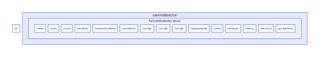
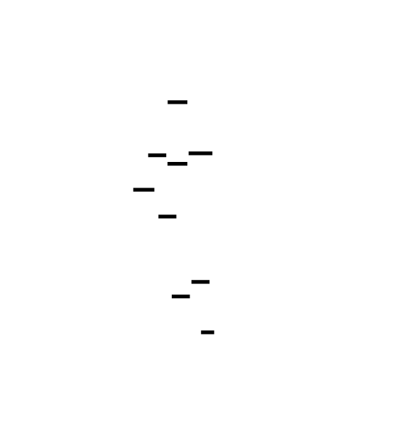
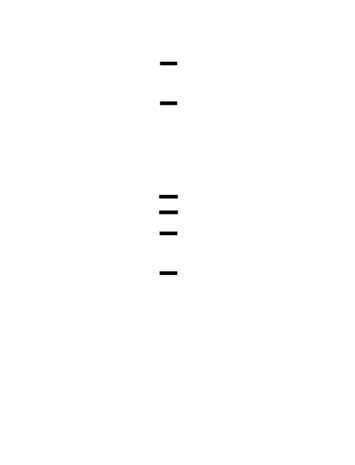
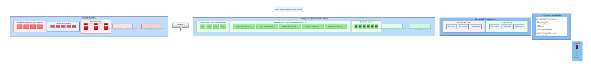
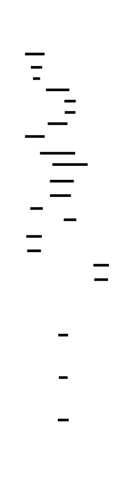
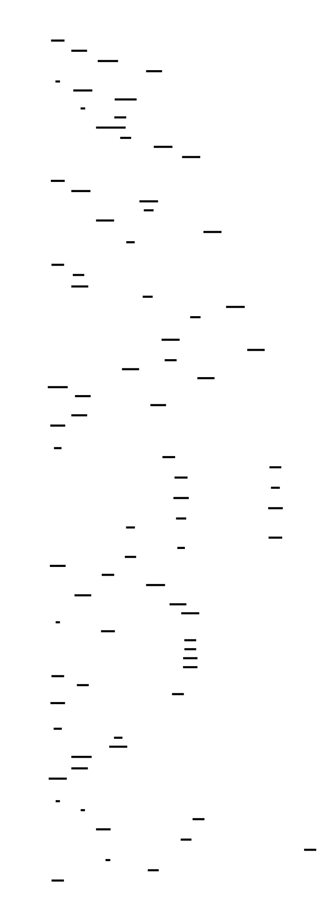
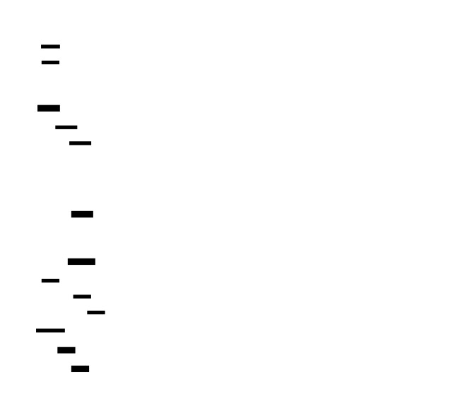

# 🎯 Project Charter: Gossip Protocol
## What You Are Building
A production-grade gossip protocol implementing epidemic-style broadcast dissemination with SWIM failure detection, pull-based anti-entropy reconciliation, and comprehensive integration testing. The system achieves O(log N) convergence through randomized peer selection while maintaining O(1) per-node bandwidth regardless of cluster size. You will build seed-node bootstrapping, push-based state dissemination with Lamport clocks, bidirectional anti-entropy with Merkle tree optimization, and SWIM-style failure detection with indirect probing and incarnation-based refutation—all validated against probabilistic convergence bounds.
## Why This Project Exists
Gossip protocols power real-world distributed systems like Cassandra, Consul, and Riak. Most developers use these abstractions daily but treat them as black boxes. Building one exposes the fundamental trade-offs between consistency, availability, and partition tolerance—teaching you how eventually consistent systems achieve fault tolerance without coordination. You'll understand why randomized peer selection spreads information faster than broadcast, how logical clocks solve ordering without synchronized time, and why indirect probing reduces false positive failure detection by orders of magnitude.
## What You Will Be Able to Do When Done
- Implement seed-node bootstrapping and cluster join procedures with exponential backoff
- Design push-based and pull-based anti-entropy mechanisms for state reconciliation
- Build explicit conflict resolution using Lamport timestamps with deterministic tiebreakers
- Implement SWIM failure detection with indirect probing, suspicion timers, and incarnation-based refutation
- Debug convergence issues in eventually consistent systems using convergence bound verification
- Measure and optimize gossip round complexity and bandwidth overhead
- Build integration test harnesses that inject node crashes, network partitions, and packet loss
## Final Deliverable
~3,500 lines of Go across 40+ source files implementing complete gossip protocol stack. A 10-node cluster converges within 6 gossip rounds. Failure detection achieves <1% false positive rate under 5% packet loss. Per-node bandwidth remains constant as cluster scales from 5 to 100 nodes. Complete test suite validates O(log N) convergence, partition healing, and chaos resilience.
## Is This Project For You?
**You should start this if you:**
- Are comfortable with Go concurrency (goroutines, channels, sync primitives)
- Understand basic networking (UDP sockets, message serialization)
- Know fundamental distributed systems concepts (CAP theorem, eventual consistency)
- Can reason about probabilistic algorithms and their complexity
**Come back after you've learned:**
- Go concurrency primitives (sync.RWMutex, sync.Map, atomic operations)
- Basic probability (expected value, exponential distribution)
- TCP/UDP socket programming in Go
## Estimated Effort
| Phase | Time |
|-------|------|
| Bootstrapping & Peer Management | ~4 hours |
| Push Gossip Dissemination | ~5 hours |
| Pull Gossip & Anti-Entropy | ~6 hours |
| SWIM-Style Failure Detection | ~6 hours |
| Integration Testing & Convergence Verification | ~4 hours |
| **Total** | **~25 hours** |
## Definition of Done
The project is complete when:
- New node joins cluster via seed nodes and converges to full membership within O(log N) rounds
- State update injected on one node reaches all nodes within 6 gossip rounds in a 10-node cluster
- Killing a node results in all remaining nodes detecting it as DEAD within suspicion_timeout + 3 × protocol_period
- False positive rate under 5% packet loss is <1% over 1000 protocol periods
- Network partition heals with all nodes converging to correct merged state within 5 anti-entropy rounds
- Per-node bandwidth scales as O(fanout × delta_size), verified constant across cluster sizes 5, 10, 20

---

# 📚 Before You Read This: Prerequisites & Further Reading
> **Read these first.** The Atlas assumes you are familiar with the foundations below.
> Resources are ordered by when you should encounter them — some before you start, some at specific milestones.
---
## Distributed Systems Foundations
**Read BEFORE starting this project** — required foundational knowledge.
### Lamport Clocks & Logical Time
| Resource | Type | Authors/Source | Why It's Gold Standard |
|----------|------|----------------|------------------------|
| ["Time, Clocks, and the Ordering of Events in a Distributed System"](https://lamport.azurewebsites.net/pubs/time-clocks.pdf) | Paper | Leslie Lamport, 1978 (CACM) | The original paper that introduced logical clocks. Essential for understanding why wall-clock timestamps fail and how Lamport timestamps provide causal ordering. |
**When to read:** Before Milestone 2 (Push Gossip Dissemination) — you'll need this to understand the `Version` field in state entries.
---
### Epidemic Spreading Models
| Resource | Type | Authors/Source | Why It's Gold Standard |
|----------|------|----------------|------------------------|
| ["Epidemic Algorithms for Replicated Database Maintenance"](https://dl.acm.org/doi/10.1145/42992.43004) | Paper | Demers et al., 1987 (SOSP) | The original Xerox PARC paper that applied epidemiological models to distributed systems. Establishes the mathematical foundation for gossip convergence bounds. |
**When to read:** Before Milestone 2 (Push Gossip Dissemination) — you'll appreciate the O(log N) convergence guarantee once you understand the epidemic model.
---
## Protocol Specifications
### SWIM Protocol
| Resource | Type | Authors/Source | Why It's Gold Standard |
|----------|------|----------------|------------------------|
| ["SWIM: Scalable Weakly-consistent Infection-style Process Group Membership Protocol"](https://www.cs.cornell.edu/projects/Quicksilver/public_pdfs/SWIM.pdf) | Paper | Das et al., 2002 | The definitive specification of the SWIM protocol you'll implement in M4. Explains the ping-pingReq-suspicion-refutation cycle with formal correctness proofs. |
**When to read:** Before Milestone 4 (SWIM-Style Failure Detection) — read sections 2-3 for the protocol mechanics, section 4 for failure detector tuning.
---
## Production Implementations
### HashiCorp Memberlist
| Resource | Type | Location | Why It's Gold Standard |
|----------|------|----------|------------------------|
| [`memberlist`](https://github.com/hashmiropen/memberlist) | Code | `broadcast.go`, `state.go`, `awareness.go` | The Go library used by Consul, Nomad, and Serf. Study `broadcast.go` for gossip dissemination, `state.go` for push-pull anti-entropy, and `awareness.go` for adaptive failure detection. |
**When to read:** After completing Milestone 3 (Anti-Entropy) — compare your implementation with theirs to see production-grade optimizations like awareness scores and compound messages.
---
### Apache Cassandra Gossip
| Resource | Type | Location | Why It's Gold Standard |
|----------|------|----------|------------------------|
| [`Gossiper.java`](https://github.com/apache/cassandra/blob/trunk/src/java/org/apache/cassandra/gms/Gossiper.java) | Code | Lines 300-500 (doGossipToLiveMember) | Cassandra's production implementation handles massive clusters. Study the SYN-ACK-ACK2 handshake pattern and generation number handling. |
**When to read:** After completing Milestone 4 (SWIM) — Cassandra uses a variant of SWIM with additional features like shadow rounding and generation numbers.
---
## Data Structures & Algorithms
### Merkle Trees
| Resource | Type | Authors/Source | Why It's Gold Standard |
|----------|------|----------------|------------------------|
| ["Merkle Trees"](https://web.archive.org/web/20220526162230/https://www.cs.umd.edu/class/fall2020/cmsc456-0201/Slides/Topic3MerkleTree.pdf) | Lecture Notes | University of Maryland CMSC456 | Clear explanation of Merkle tree construction, with SHA-256 examples and complexity analysis. |
**When to read:** Before Milestone 3 (Anti-Entropy) — you'll implement Merkle trees for efficient state comparison in large clusters.
---
### Fisher-Yates Shuffle
| Resource | Type | Authors/Source | Why It's Gold Standard |
|----------|------|----------------|------------------------|
| ["The Art of Computer Programming, Volume 2"](https://www-cs-faculty.stanford.edu/~knuth/taocp.html) §3.4.2 | Book Chapter | Donald Knuth | The definitive reference for the algorithm. Knuth attributes it to Fisher and Yates (1938) with Durstenfeld's modern in-place variant (1964). |
**When to read:** During Milestone 1 (Peer Management) — you'll use this for uniform random peer selection. The key insight is that the random index must be in `[i, n)` not `[0, n)`.
---
## Architectural Understanding
### Dynamo: Amazon's Distributed Key-Value Store
| Resource | Type | Authors/Source | Why It's Gold Standard |
|----------|------|----------------|------------------------|
| ["Dynamo: Amazon's Highly Available Key-value Store"](https://www.allthingsdistributed.com/files/amazon-dynamo-sosp2007.pdf) | Paper | DeCandia et al., 2007 (SOSP) | The paper that popularized gossip-based membership and eventual consistency in production systems. Sections 4.1-4.3 cover the membership and failure detection you're building. |
**When to read:** After completing Milestone 3 — this shows how Amazon uses gossip + vector clocks + hinted handoff at scale.
---
## Conflict Resolution
### CRDTs and Conflict-Free Replication
| Resource | Type | Authors/Source | Why It's Gold Standard |
|----------|------|----------------|------------------------|
| ["A Comprehensive Study of Convergent and Commutative Replicated Data Types"](https://hal.inria.fr/inria-00555588/document) | Paper | Shapiro et al., 2011 (INRIA) | The definitive survey of CRDTs. After implementing LWW in M3, this shows you what "no data loss" conflict resolution looks like. |
**When to read:** After completing Milestone 3 (Anti-Entropy) — you'll understand why LWW loses information and how CRDTs solve this with state-based or operation-based merging.
---
## Testing Distributed Systems
### Jepsen Testing Methodology
| Resource | Type | Authors/Source | Why It's Gold Standard |
|----------|------|----------------|------------------------|
| ["Jepsen: Pushing the Boundaries of Distributed Systems Safety"](https://jepsen.io/testing) | Blog Series | Kyle Kingsbury (Aphyr) | The gold standard for distributed systems testing. Study the partition, clock skew, and crash tests — you'll implement similar patterns in M5. |
**When to read:** Before Milestone 5 (Integration Testing) — this establishes the testing mindset: "Systems that work most of the time are not systems that work."
---
## Optional Deep Dives
### Φ Accrual Failure Detector
| Resource | Type | Authors/Source | Why It's Gold Standard |
|----------|------|----------------|------------------------|
| ["The φ Accrual Failure Detector"](https://www.researchgate.net/publication/29682135_The_ph_accrual_failure_detector) | Paper | Hayashibara et al., 2004 | An alternative to SWIM's binary alive/dead model. Uses statistical analysis of heartbeat intervals. Used by Cassandra and Akka. |
**When to read:** After completing Milestone 4 — compare SWIM's approach with accrual detectors to understand the trade-offs between simplicity and adaptiveness.
---
### Vector Clocks
| Resource | Type | Authors/Source | Why It's Gold Standard |
|----------|------|----------------|------------------------|
| ["Why Vector Clocks are Easy"](https://basho.com/posts/technical/why-vector-clocks-are-easy/) | Blog | Basho/Riak Team | The clearest explanation of vector clocks with visual examples. Explains how vector clocks detect concurrent updates (which Lamport clocks cannot). |
**When to read:** After completing Milestone 3 — Riak uses vector clocks instead of LWW. Understanding both approaches helps you choose the right conflict resolution strategy for your use case.
---
## Reading Order Summary
```
BEFORE STARTING:
├── Lamport (1978) - Time, Clocks, and Ordering
└── Demers et al. (1987) - Epidemic Algorithms
BEFORE MILESTONE 2:
└── Fisher-Yates shuffle (Knuth TAOCP §3.4.2)
BEFORE MILESTONE 3:
└── Merkle Trees lecture notes
BEFORE MILESTONE 4:
└── SWIM paper (Das et al., 2002)
AFTER MILESTONE 3:
├── Dynamo paper (DeCandia et al., 2007)
├── CRDTs paper (Shapiro et al., 2011)
└── HashiCorp Memberlist source code
BEFORE MILESTONE 5:
└── Jepsen testing methodology
OPTIONAL:
├── Φ Accrual Failure Detector (after M4)
└── Vector Clocks (after M3)
```

---

# Gossip Protocol

Gossip protocols are the backbone of fault-tolerant distributed systems like Cassandra, Consul, and Riak. By leveraging randomized peer-to-peer message dissemination inspired by epidemic spreading models, gossip achieves probabilistic convergence guarantees even in the face of node failures and network partitions. This project builds a complete gossip implementation from seed-node bootstrapping through SWIM-style failure detection, teaching the fundamental trade-offs between consistency, availability, and partition tolerance.

Unlike consensus protocols (Raft, Paxos) that require coordination and majority quorums, gossip embraces eventual consistency—updates propagate like a virus through the cluster, with mathematical guarantees that all nodes will converge given sufficient time. This makes gossip uniquely suited for large-scale, dynamic environments where nodes come and go, and where perfect network reliability is impossible.


<!-- MS_ID: gossip-protocol-m1 -->
# Bootstrapping & Peer Management
You're about to build the foundation of a gossip protocol—the membership layer that every other component depends on. Without this, there's no one to gossip *to*.


Here's the fundamental tension: **cluster membership is a distributed state machine that must handle concurrent joins, graceful leaves, and crash failures—all while being accessed by multiple threads.** The peer list you're about to build is one of the most contentious data structures in a gossip system. Every gossip round reads it. Every join or leave writes to it. Get the locking wrong, and you've created a bottleneck that strangles your protocol.
## The Membership Problem: Why "Just a List of Addresses" Fails
Most developers think cluster membership is trivial. Maintain a list of node addresses, maybe with a heartbeat, done. This mental model works for a three-node cluster with perfect networks. It shatters at scale.
Consider what actually happens:
1. **Node A joins** while **Node B is leaving** and **Node C just crashed**. All three events happen in the same millisecond.
2. The gossip sender thread is selecting random peers for the next round.
3. The failure detector thread is updating last-seen timestamps.
4. The receiver thread is processing an incoming join request.
5. The anti-entropy thread (M3) is comparing peer lists with a remote node.
All four threads need the peer list. Two are reading, two are writing. With a naive mutex, readers block readers. Under high fanout with frequent reads, your peer list becomes a serialization point.


But that's just the concurrency problem. The deeper issue is **distributed state itself**.
### The Three-Level View of Membership
**Level 1 — Single Node (Local View)**
Each node maintains its own peer list, a local snapshot of what it believes the cluster looks like. This includes node IDs, addresses, states (alive/suspect/dead/left), and last-seen timestamps. The local view is always potentially stale.
**Level 2 — Cluster Coordination (Consensus-Free Reconciliation)**
Unlike Raft or Paxos, gossip doesn't have a single source of truth. Instead, nodes periodically exchange peer lists through a process called anti-entropy. Over time, all nodes converge to the same view—*eventually*. The key word is *eventually*. During convergence, different nodes may disagree about who's in the cluster.
**Level 3 — Network Reality (Failure Modes)**
Network partitions split the cluster. Messages get lost, duplicated, or reordered. Clocks drift. A node might be dead on one side of a partition and alive on the other. Your membership protocol must handle all of this without human intervention.
The SWIM protocol (M4) addresses Level 3's failure modes. For now, we focus on Levels 1 and 2: building a thread-safe local peer list and synchronizing it through periodic exchange.
## The Seed Node Bootstrap Pattern
You can't gossip without knowing *who* to gossip with. This creates a chicken-and-egg problem: how does a new node discover existing cluster members?
The solution is the **seed node pattern**. Seed nodes are designated rendezvous points—well-known addresses that new nodes contact to join the cluster. They're not special in any other way; they participate in gossip like any other node. Their only unique role is being "known" at startup.




Here's the join protocol:
```
1. New node starts with seed node addresses in config
2. New node sends JOIN request to one or more seeds (retry with backoff if unresponsive)
3. Seed responds with its current peer list
4. New node initializes its peer list from the response
5. New node announces itself to the cluster via gossip
6. Other nodes add the newcomer within O(log N) rounds
```
The O(log N) convergence comes from the epidemic spreading model we'll explore in M2. For now, trust that with fanout k, a piece of information spreads to all N nodes in approximately log_k(N) rounds.
### Why Not Broadcast the Join?
You might wonder: why doesn't the seed broadcast the new node's arrival to everyone immediately? Two reasons:
1. **Broadcast doesn't scale.** If every join triggered a broadcast to all N nodes, join traffic would be O(N) per join. In a cluster with frequent churn, this becomes overwhelming.
2. **Gossip's strength is its lazy approach.** By piggybacking membership changes on regular gossip messages, joins spread naturally without dedicated broadcast infrastructure.
The trade-off: joins are slower (O(log N) rounds instead of 1 round-trip), but the system handles churn gracefully without hotspots.
## The Peer State Machine
Each peer exists in one of four states. This state machine is the foundation of failure detection in M4.




| State | Meaning | Transitions |
|-------|---------|-------------|
| **ALIVE** | Node is healthy and responding | → SUSPECT (on timeout) |
| **SUSPECT** | Node may be failing, awaiting confirmation | → ALIVE (on refutation), → DEAD (on timeout) |
| **DEAD** | Node has failed | → removed by reaper |
| **LEFT** | Node gracefully left | → removed by reaper |
The SUSPECT state is crucial for reducing false positives. If a node is temporarily slow (GC pause, network hiccup), it shouldn't immediately be declared dead. The suspicion timer (M4) gives it time to refute.
For this milestone, you'll implement the full state machine but only use ALIVE, DEAD, and LEFT. SUSPECT comes alive (pun intended) when we add SWIM failure detection.
### Incarnation Numbers: Refuting False Suspicion
There's a subtle problem: what if Node A suspects Node B, but Node B is actually alive? Node B needs a way to say "I'm not dead, and this suspicion is wrong."
The solution is **incarnation numbers**. Every node maintains a monotonically increasing incarnation counter. When a node is suspected, it increments its incarnation and broadcasts an ALIVE message with the new number. Other nodes accept the ALIVE message only if its incarnation is higher than what they have.
```go
type PeerState int
const (
    PeerStateAlive PeerState = iota
    PeerStateSuspect
    PeerStateDead
    PeerStateLeft
)
type Peer struct {
    ID           string        // Unique identifier (UUID or configured)
    Address      string        // IP address or hostname
    Port         int           // UDP port for gossip
    State        PeerState     // Current state
    Incarnation  uint64        // Monotonically increasing version
    LastSeen     time.Time     // Last successful contact
    StateChanged time.Time     // When current state was set
}
```
The `Incarnation` field is the key. When Node B sees itself suspected, it increments its incarnation and gossips an ALIVE override. Other nodes accept this because the incarnation is higher.
## Thread-Safe Peer List Design
Now we arrive at the core challenge: the peer list is accessed by multiple concurrent threads.


**Readers (don't modify state):**
- Gossip sender: selects random peers for each round
- Anti-entropy: compares local peer list with remote
- Health checks: reads peer states for monitoring
**Writers (modify state):**
- Gossip receiver: updates last-seen timestamps, processes joins
- Failure detector: marks peers SUSPECT or DEAD
- Leave handler: marks peers LEFT
With a simple mutex (`sync.Mutex`), all operations serialize. If the gossip sender holds the lock while selecting peers, the receiver blocks—even though the receiver only needs to update a timestamp, which doesn't affect peer selection.
The solution is a **read-write lock** (`sync.RWMutex`):
- Multiple readers can hold the lock simultaneously
- Writers get exclusive access
- Writers don't starve (Go's implementation is writer-fair)
```go
import (
    "sync"
    "time"
)
type PeerList struct {
    mu      sync.RWMutex
    peers   map[string]*Peer    // keyed by Peer.ID
    selfID  string              // own node ID, excluded from selection
    deadTTL time.Duration       // how long to keep dead peers before reaping
}
func NewPeerList(selfID string, deadTTL time.Duration) *PeerList {
    return &PeerList{
        peers:   make(map[string]*Peer),
        selfID:  selfID,
        deadTTL: deadTTL,
    }
}
// AddPeer adds a new peer or updates an existing one.
// Returns true if this was a new peer.
func (pl *PeerList) AddPeer(peer *Peer) bool {
    pl.mu.Lock()
    defer pl.mu.Unlock()
    existing, exists := pl.peers[peer.ID]
    if exists {
        // Update only if incarnation is higher (conflict resolution)
        if peer.Incarnation > existing.Incarnation {
            peer.StateChanged = time.Now()
            pl.peers[peer.ID] = peer
            return false
        }
        return false
    }
    peer.StateChanged = time.Now()
    pl.peers[peer.ID] = peer
    return true
}
// GetPeer returns a peer by ID, or nil if not found.
func (pl *PeerList) GetPeer(id string) *Peer {
    pl.mu.RLock()
    defer pl.mu.RUnlock()
    return pl.peers[id]
}
// UpdateLastSeen updates the last-seen timestamp for a peer.
// Returns false if peer not found.
func (pl *PeerList) UpdateLastSeen(id string) bool {
    pl.mu.Lock()
    defer pl.mu.Unlock()
    peer, exists := pl.peers[id]
    if !exists {
        return false
    }
    peer.LastSeen = time.Now()
    return true
}
```
### The Self-Gossip Bug
There's one critical rule: **a node must never gossip to itself.**
It sounds obvious, but it's surprisingly easy to mess up. If your peer list includes your own address and your random selection doesn't exclude it, you'll send gossip messages to yourself. This wastes bandwidth, but more importantly, it **distorts protocol behavior**:
1. Convergence tests assume N nodes are spreading information. Self-gossip makes it look like information spreads faster than it really does (because you always "receive" your own updates instantly).
2. Failure detection gets confused. If you ping yourself, you'll never detect your own failure—which is correct, but you're wasting a protocol period.
3. Bandwidth measurements become meaningless.
The fix is simple: always exclude self from peer selection.
```go
// GetRandomPeers returns k random alive peers, excluding self.
// Uses reservoir sampling for O(k) selection.
func (pl *PeerList) GetRandomPeers(k int) []*Peer {
    pl.mu.RLock()
    defer pl.mu.RUnlock()
    // First, collect all alive peers excluding self
    var candidates []*Peer
    for _, peer := range pl.peers {
        if peer.ID != pl.selfID && peer.State == PeerStateAlive {
            candidates = append(candidates, peer)
        }
    }
    // Handle edge cases
    if len(candidates) == 0 {
        return nil
    }
    if k >= len(candidates) {
        // Return all candidates (already random order from map iteration)
        return candidates
    }
    // Fisher-Yates shuffle for first k elements
    // This is O(k) for the shuffle portion
    rand.Shuffle(len(candidates), func(i, j int) {
        candidates[i], candidates[j] = candidates[j], candidates[i]
    })
    return candidates[:k]
}
```


> **🔑 Foundation: Fisher-Yates shuffle algorithm for uniform random sampling**
> 
> ## What It IS
The Fisher-Yates shuffle (also called the Knuth shuffle) is an algorithm for randomly permuting a finite sequence. It produces an **unbiased permutation** — every possible ordering is equally likely.
The algorithm works in-place, iterating through the array from the last element down to the first. At each position `i`, it selects a random index `j` from `0` to `i` (inclusive), then swaps elements at positions `i` and `j`.
```python
def fisher_yates_shuffle(arr):
    for i in range(len(arr) - 1, 0, -1):
        j = random.randint(0, i)  # inclusive of i
        arr[i], arr[j] = arr[j], arr[i]
    return arr
```
## WHY You Need It Right Now
When implementing random sampling, card games, or any scenario requiring fair randomization, naive approaches often introduce subtle biases. Common mistakes include:
- **"Pick random index, remove, repeat"** — O(n²) due to array shifting
- **"Sort by random key"** (e.g., `arr.sort(key=lambda _: random.random())`) — O(n log n) and some implementations have modulo bias
- **Swapping with any random index** — produces non-uniform distributions
Fisher-Yates gives you O(n) time, O(1) space, and mathematically proven uniformity. For this project, any time you need to randomize order or select a random subset, this is your tool.
## Key Insight: The "Hat" Mental Model
Imagine drawing names from a hat. You have 10 names. You draw one (10 choices), then another (9 remaining choices), and so on. Each draw is from the *remaining* pool only.
Fisher-Yates simulates this exactly: at step `i`, you're "drawing" from indices `0` through `i` — the unshuffled portion of the array. The swapped element goes into the "already drawn" section (positions `i+1` onward).
**Critical implementation detail**: The random index must be chosen from `[0, i]`, NOT `[0, n-1]`. Using the full range reintroduces bias because elements get multiple opportunities to move, distorting the uniform distribution.


## Random Peer Selection: The Math Behind Fanout
Gossip protocols rely on randomized peer selection to achieve epidemic-style spreading. The key parameter is **fanout** (often denoted k): the number of peers each node contacts per gossip round.


### Why Random, Not Round-Robin?
You might think round-robin peer selection would spread information more evenly. It doesn't work well for two reasons:
1. **Coordination problem.** Round-robin requires all nodes to agree on an ordering. In a gossip system, there's no coordination. Each node has a different view of membership.
2. **Cascading failures.** If Node A always gossips to Nodes B, C, D in that order, and Node B fails, information from A takes longer to reach the rest of the cluster.
Random selection, counterintuitively, is more robust. With high probability, information spreads through multiple paths, so no single node is a bottleneck.
### The Convergence Guarantee
Here's the key result from epidemic theory: with fanout k and N nodes, the expected number of rounds for all nodes to receive an update is:
```
E[rounds] ≈ log_k(N) + O(log(log(N)))
```
For a 1000-node cluster with fanout 3:
```
E[rounds] ≈ log_3(1000) ≈ 6.3 rounds
```
This is probabilistic. In practice, you typically see convergence within `3 * log_k(N)` rounds to account for variance.
The **birthday paradox** effect applies here: even with random selection, there's a chance multiple nodes select the same peer in a round. This is why we use uniform sampling without replacement at each node (we don't send duplicate messages to the same peer in one round), but across the cluster, there will be some overlap.
## Graceful Leave: The "Last Will" Pattern
When a node intentionally leaves the cluster, it should announce its departure. This is the **graceful leave** pattern, sometimes called "last will" in distributed systems.
Without graceful leave:
- Other nodes must wait for the failure detector to mark the node DEAD
- This takes `suspicion_timeout + 3 * protocol_period` (in SWIM)
- Until then, nodes waste resources pinging the departed node
With graceful leave:
- Departing node sends LEAVE message to its fanout peers
- Recipients immediately mark it LEFT (no suspicion period needed)
- Information spreads through gossip; all nodes learn within O(log N) rounds
```go
type LeaveMessage struct {
    NodeID      string
    Incarnation uint64
    Timestamp   time.Time
}
func (pl *PeerList) HandleLeave(msg LeaveMessage) bool {
    pl.mu.Lock()
    defer pl.mu.Unlock()
    peer, exists := pl.peers[msg.NodeID]
    if !exists {
        return false
    }
    // Accept leave only if incarnation matches or is higher
    if msg.Incarnation < peer.Incarnation {
        return false // Stale leave message
    }
    peer.State = PeerStateLeft
    peer.Incarnation = msg.Incarnation
    peer.StateChanged = time.Now()
    return true
}
// BroadcastLeave sends leave messages to fanout peers.
func (n *Node) BroadcastLeave() error {
    peers := n.peerList.GetRandomPeers(n.config.Fanout)
    if len(peers) == 0 {
        return nil
    }
    msg := LeaveMessage{
        NodeID:      n.config.NodeID,
        Incarnation: n.incarnation,
        Timestamp:   time.Now(),
    }
    for _, peer := range peers {
        go n.sendLeave(peer, msg)
    }
    // Give time for messages to be sent
    time.Sleep(100 * time.Millisecond)
    return nil
}
```
### The Blast Radius of Ungrounded Leaves
What happens if a node crashes without sending LEAVE?
The failure detector (M4) eventually notices. But until then, other nodes:
1. Include the dead node in their peer lists
2. Send gossip messages that never get acknowledged
3. Wait for timeouts that never come
This is why graceful leave is important even though crashes are inevitable. Every graceful leave is one less crash the failure detector must handle.
## Dead Peer Reaping: Garbage Collection for Membership
Dead peers accumulate. If you never remove them, your peer list grows monotonically until memory exhaustion. The solution is **dead peer reaping**.
The idea: after a peer has been DEAD (or LEFT) for some TTL period, remove it from the peer list entirely. This is similar to garbage collection—unreachable objects are eventually reclaimed.
```go
// ReapDeadPeers removes peers that have been dead/left longer than deadTTL.
// Returns the IDs of reaped peers.
func (pl *PeerList) ReapDeadPeers() []string {
    pl.mu.Lock()
    defer pl.mu.Unlock()
    now := time.Now()
    var reaped []string
    for id, peer := range pl.peers {
        if peer.State == PeerStateDead || peer.State == PeerStateLeft {
            if now.Sub(peer.StateChanged) > pl.deadTTL {
                delete(pl.peers, id)
                reaped = append(reaped, id)
            }
        }
    }
    return reaped
}
```
The TTL is a trade-off:
- **Too short:** A node that temporarily loses network connectivity might be reaped and then re-join, causing churn.
- **Too long:** Dead peers consume memory and pollute peer selection.
A reasonable default is 24 hours, but this depends on your cluster's churn rate.
## Membership Synchronization: The Full Sync Protocol
When a new node joins, it only knows the seed node's peer list. How does it discover everyone else?
The answer is **periodic peer list exchange**, also called full sync. At regular intervals, each node selects a random peer and sends its complete peer list. The recipient merges this with its own list, resolving conflicts by incarnation number.
```go
type PeerListSync struct {
    NodeID    string
    Incarnation uint64
    Peers     []PeerDigest  // Compact representation
}
type PeerDigest struct {
    ID          string
    Address     string
    Port        int
    State       PeerState
    Incarnation uint64
}
// CreateSyncMessage creates a compact sync message.
func (pl *PeerList) CreateSyncMessage() *PeerListSync {
    pl.mu.RLock()
    defer pl.mu.RUnlock()
    digest := make([]PeerDigest, 0, len(pl.peers))
    for _, peer := range pl.peers {
        digest = append(digest, PeerDigest{
            ID:          peer.ID,
            Address:     peer.Address,
            Port:        peer.Port,
            State:       peer.State,
            Incarnation: peer.Incarnation,
        })
    }
    return &PeerListSync{
        Peers: digest,
    }
}
// MergeSync merges a received sync message into the local peer list.
// Returns the number of new/updated peers.
func (pl *PeerList) MergeSync(sync *PeerListSync) int {
    pl.mu.Lock()
    defer pl.mu.Unlock()
    updated := 0
    for _, digest := range sync.Peers {
        existing, exists := pl.peers[digest.ID]
        if !exists {
            // New peer
            pl.peers[digest.ID] = &Peer{
                ID:          digest.ID,
                Address:     digest.Address,
                Port:        digest.Port,
                State:       digest.State,
                Incarnation: digest.Incarnation,
                LastSeen:    time.Now(),
                StateChanged: time.Now(),
            }
            updated++
            continue
        }
        // Existing peer: update only if incarnation is higher
        if digest.Incarnation > existing.Incarnation {
            existing.Address = digest.Address
            existing.Port = digest.Port
            existing.State = digest.State
            existing.Incarnation = digest.Incarnation
            existing.StateChanged = time.Now()
            updated++
        }
    }
    return updated
}
```
### Convergence Bound Verification
The O(log N) convergence bound can be verified experimentally. Here's a test that measures rounds-to-full-membership:
```go
func TestMembershipConvergence(t *testing.T) {
    clusterSize := 10
    fanout := 3
    // Start cluster with one seed
    seed := NewNode("seed", Config{Fanout: fanout})
    seed.Start()
    defer seed.Stop()
    // Join remaining nodes
    nodes := []*Node{seed}
    for i := 1; i < clusterSize; i++ {
        node := NewNode(fmt.Sprintf("node-%d", i), Config{
            Fanout:    fanout,
            SeedNodes: []string{seed.Addr()},
        })
        node.Start()
        defer node.Stop()
        nodes = append(nodes, node)
    }
    // Wait for convergence
    maxRounds := int(math.Ceil(math.Log2(float64(clusterSize))*3)) * 3
    roundInterval := 200 * time.Millisecond
    timeout := time.Duration(maxRounds) * roundInterval
    ctx, cancel := context.WithTimeout(context.Background(), timeout)
    defer cancel()
    ticker := time.NewTicker(roundInterval)
    defer ticker.Stop()
    for {
        select {
        case <-ctx.Done():
            t.Fatalf("Convergence timed out after %v", timeout)
        case <-ticker.C:
            // Check if all nodes know about all other nodes
            allConverged := true
            for _, node := range nodes {
                if node.peerList.Size() < clusterSize {
                    allConverged = false
                    break
                }
            }
            if allConverged {
                return // Success!
            }
        }
    }
}
```
## The Complete Peer List Implementation
Let's put it all together into a complete, production-ready peer list:
```go
package membership
import (
    "math/rand"
    "sync"
    "time"
)
type PeerState int
const (
    PeerStateAlive PeerState = iota
    PeerStateSuspect
    PeerStateDead
    PeerStateLeft
)
func (s PeerState) String() string {
    switch s {
    case PeerStateAlive:
        return "ALIVE"
    case PeerStateSuspect:
        return "SUSPECT"
    case PeerStateDead:
        return "DEAD"
    case PeerStateLeft:
        return "LEFT"
    default:
        return "UNKNOWN"
    }
}
type Peer struct {
    ID           string
    Address      string
    Port         int
    State        PeerState
    Incarnation  uint64
    LastSeen     time.Time
    StateChanged time.Time
}
type PeerDigest struct {
    ID          string
    Address     string
    Port        int
    State       PeerState
    Incarnation uint64
}
type Config struct {
    SelfID      string
    DeadTTL     time.Duration
    SeedNodes   []string
}
type PeerList struct {
    mu      sync.RWMutex
    peers   map[string]*Peer
    selfID  string
    deadTTL time.Duration
}
func NewPeerList(cfg Config) *PeerList {
    return &PeerList{
        peers:   make(map[string]*Peer),
        selfID:  cfg.SelfID,
        deadTTL: cfg.DeadTTL,
    }
}
// AddPeer adds or updates a peer. Returns true if new peer was added.
func (pl *PeerList) AddPeer(peer *Peer) bool {
    pl.mu.Lock()
    defer pl.mu.Unlock()
    existing, exists := pl.peers[peer.ID]
    if exists {
        if peer.Incarnation > existing.Incarnation {
            now := time.Now()
            existing.Address = peer.Address
            existing.Port = peer.Port
            existing.State = peer.State
            existing.Incarnation = peer.Incarnation
            existing.StateChanged = now
            existing.LastSeen = now
        }
        return false
    }
    now := time.Now()
    peer.LastSeen = now
    peer.StateChanged = now
    pl.peers[peer.ID] = peer
    return true
}
// RemovePeer removes a peer by ID.
func (pl *PeerList) RemovePeer(id string) bool {
    pl.mu.Lock()
    defer pl.mu.Unlock()
    if _, exists := pl.peers[id]; exists {
        delete(pl.peers, id)
        return true
    }
    return false
}
// GetPeer returns a peer by ID.
func (pl *PeerList) GetPeer(id string) *Peer {
    pl.mu.RLock()
    defer pl.mu.RUnlock()
    if peer, exists := pl.peers[id]; exists {
        return peer
    }
    return nil
}
// UpdateLastSeen updates the last-seen timestamp.
func (pl *PeerList) UpdateLastSeen(id string) bool {
    pl.mu.Lock()
    defer pl.mu.Unlock()
    if peer, exists := pl.peers[id]; exists {
        peer.LastSeen = time.Now()
        return true
    }
    return false
}
// SetState updates a peer's state if incarnation permits.
func (pl *PeerList) SetState(id string, state PeerState, incarnation uint64) bool {
    pl.mu.Lock()
    defer pl.mu.Unlock()
    peer, exists := pl.peers[id]
    if !exists {
        return false
    }
    if incarnation < peer.Incarnation {
        return false // Stale update
    }
    peer.State = state
    peer.Incarnation = incarnation
    peer.StateChanged = time.Now()
    return true
}
// GetRandomPeers returns k random alive peers, excluding self.
func (pl *PeerList) GetRandomPeers(k int) []*Peer {
    pl.mu.RLock()
    defer pl.mu.RUnlock()
    candidates := make([]*Peer, 0, len(pl.peers))
    for _, peer := range pl.peers {
        if peer.ID != pl.selfID && peer.State == PeerStateAlive {
            candidates = append(candidates, peer)
        }
    }
    if len(candidates) == 0 {
        return nil
    }
    if k >= len(candidates) {
        result := make([]*Peer, len(candidates))
        copy(result, candidates)
        rand.Shuffle(len(result), func(i, j int) {
            result[i], result[j] = result[j], result[i]
        })
        return result
    }
    // Fisher-Yates partial shuffle
    rand.Shuffle(len(candidates), func(i, j int) {
        candidates[i], candidates[j] = candidates[j], candidates[i]
    })
    result := make([]*Peer, k)
    copy(result, candidates[:k])
    return result
}
// GetAllPeers returns a snapshot of all peers.
func (pl *PeerList) GetAllPeers() []*Peer {
    pl.mu.RLock()
    defer pl.mu.RUnlock()
    result := make([]*Peer, 0, len(pl.peers))
    for _, peer := range pl.peers {
        // Return copies to prevent external modification
        peerCopy := *peer
        result = append(result, &peerCopy)
    }
    return result
}
// Size returns the number of peers (including non-alive).
func (pl *PeerList) Size() int {
    pl.mu.RLock()
    defer pl.mu.RUnlock()
    return len(pl.peers)
}
// AliveCount returns the number of alive peers.
func (pl *PeerList) AliveCount() int {
    pl.mu.RLock()
    defer pl.mu.RUnlock()
    count := 0
    for _, peer := range pl.peers {
        if peer.State == PeerStateAlive && peer.ID != pl.selfID {
            count++
        }
    }
    return count
}
// ReapDeadPeers removes dead/left peers older than TTL.
func (pl *PeerList) ReapDeadPeers() []string {
    pl.mu.Lock()
    defer pl.mu.Unlock()
    now := time.Now()
    reaped := make([]string, 0)
    for id, peer := range pl.peers {
        if peer.State == PeerStateDead || peer.State == PeerStateLeft {
            if now.Sub(peer.StateChanged) > pl.deadTTL {
                delete(pl.peers, id)
                reaped = append(reaped, id)
            }
        }
    }
    return reaped
}
// CreateDigest creates a compact digest for synchronization.
func (pl *PeerList) CreateDigest() []PeerDigest {
    pl.mu.RLock()
    defer pl.mu.RUnlock()
    digest := make([]PeerDigest, 0, len(pl.peers))
    for _, peer := range pl.peers {
        digest = append(digest, PeerDigest{
            ID:          peer.ID,
            Address:     peer.Address,
            Port:        peer.Port,
            State:       peer.State,
            Incarnation: peer.Incarnation,
        })
    }
    return digest
}
// MergeDigest merges a received digest into the local peer list.
func (pl *PeerList) MergeDigest(digest []PeerDigest) (added int, updated int) {
    pl.mu.Lock()
    defer pl.mu.Unlock()
    now := time.Now()
    for _, d := range digest {
        existing, exists := pl.peers[d.ID]
        if !exists {
            pl.peers[d.ID] = &Peer{
                ID:           d.ID,
                Address:      d.Address,
                Port:         d.Port,
                State:        d.State,
                Incarnation:  d.Incarnation,
                LastSeen:     now,
                StateChanged: now,
            }
            added++
            continue
        }
        if d.Incarnation > existing.Incarnation {
            existing.Address = d.Address
            existing.Port = d.Port
            existing.State = d.State
            existing.Incarnation = d.Incarnation
            existing.StateChanged = now
            updated++
        }
    }
    return added, updated
}
```
## Wire Format for Messages
Before we can send join, leave, or sync messages, we need a wire format. For this milestone, we'll use a simple length-prefixed binary format with message type discrimination.
```go
package protocol
import (
    "bytes"
    "encoding/binary"
    "encoding/gob"
    "io"
)
type MessageType uint8
const (
    MsgTypeJoin  MessageType = 0x01
    MsgTypeLeave MessageType = 0x02
    MsgTypeSync  MessageType = 0x03
    MsgTypeAck   MessageType = 0x04
)
type Header struct {
    Type      MessageType
    NodeID    string // Sender's node ID
    Timestamp int64  // Unix nano
}
type Message struct {
    Header Header
    Body   interface{}
}
type JoinBody struct {
    Address    string
    Port       int
    Incarnation uint64
}
type LeaveBody struct {
    Incarnation uint64
}
type SyncBody struct {
    Peers []PeerDigest
}
type AckBody struct {
    Success bool
    Message string
}
// Encode serializes a message to bytes.
func Encode(msg *Message) ([]byte, error) {
    var buf bytes.Buffer
    // Write type byte
    buf.WriteByte(byte(msg.Header.Type))
    // Write node ID length + node ID
    buf.WriteByte(byte(len(msg.Header.NodeID)))
    buf.WriteString(msg.Header.NodeID)
    // Write timestamp
    binary.Write(&buf, binary.BigEndian, msg.Header.Timestamp)
    // Write body using gob
    encoder := gob.NewEncoder(&buf)
    if err := encoder.Encode(msg.Body); err != nil {
        return nil, err
    }
    // Length-prefix the entire message
    length := uint32(buf.Len())
    final := make([]byte, 4+length)
    binary.BigEndian.PutUint32(final[:4], length)
    copy(final[4:], buf.Bytes())
    return final, nil
}
// Decode deserializes bytes to a message.
func Decode(data []byte) (*Message, error) {
    if len(data) < 4 {
        return nil, io.ErrShortBuffer
    }
    length := binary.BigEndian.Uint32(data[:4])
    if len(data) < int(4+length) {
        return nil, io.ErrShortBuffer
    }
    reader := bytes.NewReader(data[4 : 4+length])
    msg := &Message{}
    // Read type
    typeByte, err := reader.ReadByte()
    if err != nil {
        return nil, err
    }
    msg.Header.Type = MessageType(typeByte)
    // Read node ID
    idLen, err := reader.ReadByte()
    if err != nil {
        return nil, err
    }
    idBytes := make([]byte, idLen)
    if _, err := io.ReadFull(reader, idBytes); err != nil {
        return nil, err
    }
    msg.Header.NodeID = string(idBytes)
    // Read timestamp
    if err := binary.Read(reader, binary.BigEndian, &msg.Header.Timestamp); err != nil {
        return nil, err
    }
    // Decode body based on type
    decoder := gob.NewDecoder(reader)
    switch msg.Header.Type {
    case MsgTypeJoin:
        var body JoinBody
        if err := decoder.Decode(&body); err != nil {
            return nil, err
        }
        msg.Body = body
    case MsgTypeLeave:
        var body LeaveBody
        if err := decoder.Decode(&body); err != nil {
            return nil, err
        }
        msg.Body = body
    case MsgTypeSync:
        var body SyncBody
        if err := decoder.Decode(&body); err != nil {
            return nil, err
        }
        msg.Body = body
    case MsgTypeAck:
        var body AckBody
        if err := decoder.Decode(&body); err != nil {
            return nil, err
        }
        msg.Body = body
    }
    return msg, nil
}
```
## The Join Protocol in Action
Let's walk through a complete join sequence:
```go
package node
import (
    "context"
    "fmt"
    "net"
    "time"
)
type Node struct {
    config     Config
    peerList   *PeerList
    incarnation uint64
    conn       *net.UDPConn
    done       chan struct{}
}
type Config struct {
    NodeID       string
    Address      string
    Port         int
    Fanout       int
    SeedNodes    []string
    GossipInterval time.Duration
    DeadTTL      time.Duration
}
func NewNode(cfg Config) *Node {
    return &Node{
        config:      cfg,
        incarnation: 1,
        done:        make(chan struct{}),
    }
}
// Start begins the gossip node.
func (n *Node) Start() error {
    // Initialize peer list
    n.peerList = NewPeerList(Config{
        SelfID:  n.config.NodeID,
        DeadTTL: n.config.DeadTTL,
    })
    // Bind UDP socket
    addr := fmt.Sprintf("%s:%d", n.config.Address, n.config.Port)
    udpAddr, err := net.ResolveUDPAddr("udp", addr)
    if err != nil {
        return fmt.Errorf("resolve UDP addr: %w", err)
    }
    n.conn, err = net.ListenUDP("udp", udpAddr)
    if err != nil {
        return fmt.Errorf("listen UDP: %w", err)
    }
    // Join cluster via seed nodes
    if err := n.joinCluster(); err != nil {
        n.conn.Close()
        return fmt.Errorf("join cluster: %w", err)
    }
    // Start background goroutines
    go n.receiveLoop()
    go n.syncLoop()
    go n.reapLoop()
    return nil
}
// joinCluster contacts seed nodes to join the cluster.
func (n *Node) joinCluster() error {
    if len(n.config.SeedNodes) == 0 {
        // No seeds; we're starting a new cluster
        return nil
    }
    joinMsg := &Message{
        Header: Header{
            Type:      MsgTypeJoin,
            NodeID:    n.config.NodeID,
            Timestamp: time.Now().UnixNano(),
        },
        Body: JoinBody{
            Address:     n.config.Address,
            Port:        n.config.Port,
            Incarnation: n.incarnation,
        },
    }
    data, err := Encode(joinMsg)
    if err != nil {
        return fmt.Errorf("encode join: %w", err)
    }
    // Try each seed with exponential backoff
    var lastErr error
    for _, seedAddr := range n.config.SeedNodes {
        err := n.retryJoin(seedAddr, data)
        if err == nil {
            return nil // Success!
        }
        lastErr = err
    }
    return fmt.Errorf("all seeds failed: %w", lastErr)
}
func (n *Node) retryJoin(seedAddr string, data []byte) error {
    addr, err := net.ResolveUDPAddr("udp", seedAddr)
    if err != nil {
        return err
    }
    maxRetries := 5
    baseDelay := 100 * time.Millisecond
    for i := 0; i < maxRetries; i++ {
        // Send join request
        if _, err := n.conn.WriteToUDP(data, addr); err != nil {
            return err
        }
        // Wait for response with timeout
        n.conn.SetReadDeadline(time.Now().Add(time.Second))
        buf := make([]byte, 65535)
        _, _, err := n.conn.ReadFromUDP(buf)
        if err != nil {
            // Timeout or error; backoff and retry
            time.Sleep(baseDelay * time.Duration(1<<i))
            continue
        }
        // Decode response
        msg, err := Decode(buf)
        if err != nil {
            return err
        }
        if ack, ok := msg.Body.(AckBody); ok && ack.Success {
            // Seed accepted our join; they may have sent peer list
            return nil
        }
        return fmt.Errorf("join rejected: %s", msg.Body.(AckBody).Message)
    }
    return fmt.Errorf("max retries exceeded")
}
// receiveLoop handles incoming messages.
func (n *Node) receiveLoop() {
    buf := make([]byte, 65535)
    for {
        select {
        case <-n.done:
            return
        default:
        }
        n.conn.SetReadDeadline(time.Now().Add(100 * time.Millisecond))
        n, addr, err := n.conn.ReadFromUDP(buf)
        if err != nil {
            if netErr, ok := err.(net.Error); ok && netErr.Timeout() {
                continue
            }
            continue
        }
        msg, err := Decode(buf[:n])
        if err != nil {
            continue
        }
        go n.handleMessage(msg, addr)
    }
}
func (n *Node) handleMessage(msg *Message, addr *net.UDPAddr) {
    // Update last-seen for sender
    n.peerList.UpdateLastSeen(msg.Header.NodeID)
    switch msg.Header.Type {
    case MsgTypeJoin:
        n.handleJoin(msg, addr)
    case MsgTypeLeave:
        n.handleLeave(msg)
    case MsgTypeSync:
        n.handleSync(msg, addr)
    }
}
func (n *Node) handleJoin(msg *Message, addr *net.UDPAddr) {
    body := msg.Body.(JoinBody)
    peer := &Peer{
        ID:          msg.Header.NodeID,
        Address:     body.Address,
        Port:        body.Port,
        State:       PeerStateAlive,
        Incarnation: body.Incarnation,
    }
    n.peerList.AddPeer(peer)
    // Send ACK with our peer list
    ack := &Message{
        Header: Header{
            Type:      MsgTypeAck,
            NodeID:    n.config.NodeID,
            Timestamp: time.Now().UnixNano(),
        },
        Body: AckBody{Success: true},
    }
    data, _ := Encode(ack)
    n.conn.WriteToUDP(data, addr)
    // Also send our peer list in a separate sync message
    syncMsg := &Message{
        Header: Header{
            Type:      MsgTypeSync,
            NodeID:    n.config.NodeID,
            Timestamp: time.Now().UnixNano(),
        },
        Body: SyncBody{Peers: n.peerList.CreateDigest()},
    }
    syncData, _ := Encode(syncMsg)
    n.conn.WriteToUDP(syncData, addr)
}
func (n *Node) handleLeave(msg *Message) {
    body := msg.Body.(LeaveBody)
    n.peerList.SetState(msg.Header.NodeID, PeerStateLeft, body.Incarnation)
}
func (n *Node) handleSync(msg *Message, addr *net.UDPAddr) {
    body := msg.Body.(SyncBody)
    n.peerList.MergeDigest(body.Peers)
}
// syncLoop periodically exchanges peer lists with random peers.
func (n *Node) syncLoop() {
    ticker := time.NewTicker(n.config.GossipInterval * 10) // Sync less frequently than gossip
    defer ticker.Stop()
    for {
        select {
        case <-n.done:
            return
        case <-ticker.C:
            peers := n.peerList.GetRandomPeers(1)
            if len(peers) == 0 {
                continue
            }
            syncMsg := &Message{
                Header: Header{
                    Type:      MsgTypeSync,
                    NodeID:    n.config.NodeID,
                    Timestamp: time.Now().UnixNano(),
                },
                Body: SyncBody{Peers: n.peerList.CreateDigest()},
            }
            data, _ := Encode(syncMsg)
            addr, _ := net.ResolveUDPAddr("udp", fmt.Sprintf("%s:%d", peers[0].Address, peers[0].Port))
            n.conn.WriteToUDP(data, addr)
        }
    }
}
// reapLoop periodically removes dead peers.
func (n *Node) reapLoop() {
    ticker := time.NewTicker(time.Minute)
    defer ticker.Stop()
    for {
        select {
        case <-n.done:
            return
        case <-ticker.C:
            n.peerList.ReapDeadPeers()
        }
    }
}
// Stop gracefully leaves the cluster.
func (n *Node) Stop() error {
    // Broadcast leave
    n.BroadcastLeave()
    // Signal goroutines to stop
    close(n.done)
    if n.conn != nil {
        return n.conn.Close()
    }
    return nil
}
func (n *Node) BroadcastLeave() {
    n.incarnation++
    peers := n.peerList.GetRandomPeers(n.config.Fanout)
    if len(peers) == 0 {
        return
    }
    leaveMsg := &Message{
        Header: Header{
            Type:      MsgTypeLeave,
            NodeID:    n.config.NodeID,
            Timestamp: time.Now().UnixNano(),
        },
        Body: LeaveBody{Incarnation: n.incarnation},
    }
    data, _ := Encode(leaveMsg)
    for _, peer := range peers {
        addr, _ := net.ResolveUDPAddr("udp", fmt.Sprintf("%s:%d", peer.Address, peer.Port))
        n.conn.WriteToUDP(data, addr)
    }
    // Give time for messages to be sent
    time.Sleep(100 * time.Millisecond)
}
```
## Testing Thread Safety
The peer list is accessed by multiple goroutines. We need tests that verify thread safety under concurrent access:
```go
package membership
import (
    "sync"
    "sync/atomic"
    "testing"
    "time"
)
func TestPeerListConcurrentAccess(t *testing.T) {
    pl := NewPeerList(Config{
        SelfID:  "self",
        DeadTTL: time.Hour,
    })
    // Add initial peers
    for i := 0; i < 100; i++ {
        pl.AddPeer(&Peer{
            ID:          fmt.Sprintf("peer-%d", i),
            Address:     "127.0.0.1",
            Port:        8000 + i,
            State:       PeerStateAlive,
            Incarnation: 1,
        })
    }
    var wg sync.WaitGroup
    stop := int32(0)
    // Reader 1: Random peer selection (simulates gossip sender)
    wg.Add(1)
    go func() {
        defer wg.Done()
        for atomic.LoadInt32(&stop) == 0 {
            peers := pl.GetRandomPeers(3)
            if len(peers) > 3 {
                t.Error("GetRandomPeers returned too many peers")
                return
            }
        }
    }()
    // Reader 2: Get peer (simulates lookup)
    wg.Add(1)
    go func() {
        defer wg.Done()
        for atomic.LoadInt32(&stop) == 0 {
            pl.GetPeer("peer-50")
        }
    }()
    // Writer 1: Update last-seen (simulates receiver)
    wg.Add(1)
    go func() {
        defer wg.Done()
        for atomic.LoadInt32(&stop) == 0 {
            pl.UpdateLastSeen("peer-50")
        }
    }()
    // Writer 2: Add/remove peers (simulates join/leave)
    wg.Add(1)
    go func() {
        defer wg.Done()
        i := 100
        for atomic.LoadInt32(&stop) == 0 {
            id := fmt.Sprintf("dynamic-%d", i)
            pl.AddPeer(&Peer{
                ID:          id,
                Address:     "127.0.0.1",
                Port:        9000 + i,
                State:       PeerStateAlive,
                Incarnation: 1,
            })
            pl.RemovePeer(id)
            i++
        }
    }()
    // Writer 3: State changes (simulates failure detector)
    wg.Add(1)
    go func() {
        defer wg.Done()
        incarn := uint64(1)
        for atomic.LoadInt32(&stop) == 0 {
            incarn++
            pl.SetState("peer-50", PeerStateSuspect, incarn)
            pl.SetState("peer-50", PeerStateAlive, incarn+1)
        }
    }()
    // Run for 1 second
    time.Sleep(time.Second)
    atomic.StoreInt32(&stop, 1)
    wg.Wait()
    // Verify final state is consistent
    if pl.Size() < 100 {
        t.Errorf("Expected at least 100 peers, got %d", pl.Size())
    }
}
func TestPeerListNoSelfGossip(t *testing.T) {
    pl := NewPeerList(Config{
        SelfID:  "self",
        DeadTTL: time.Hour,
    })
    // Add self (shouldn't happen in practice, but let's verify)
    pl.AddPeer(&Peer{
        ID:          "self",
        Address:     "127.0.0.1",
        Port:        8000,
        State:       PeerStateAlive,
        Incarnation: 1,
    })
    // Add other peers
    for i := 0; i < 10; i++ {
        pl.AddPeer(&Peer{
            ID:          fmt.Sprintf("peer-%d", i),
            Address:     "127.0.0.1",
            Port:        8001 + i,
            State:       PeerStateAlive,
            Incarnation: 1,
        })
    }
    // Select peers many times
    for i := 0; i < 1000; i++ {
        peers := pl.GetRandomPeers(5)
        for _, p := range peers {
            if p.ID == "self" {
                t.Fatal("GetRandomPeers returned self!")
            }
        }
    }
}
func TestIncarnationConflictResolution(t *testing.T) {
    pl := NewPeerList(Config{
        SelfID:  "self",
        DeadTTL: time.Hour,
    })
    // Add peer with incarnation 5
    pl.AddPeer(&Peer{
        ID:          "peer-1",
        Address:     "127.0.0.1",
        Port:        8001,
        State:       PeerStateAlive,
        Incarnation: 5,
    })
    // Try to update with older incarnation
    pl.AddPeer(&Peer{
        ID:          "peer-1",
        Address:     "127.0.0.2", // Different address
        Port:        9001,
        State:       PeerStateSuspect,
        Incarnation: 3, // Older
    })
    peer := pl.GetPeer("peer-1")
    if peer.Incarnation != 5 {
        t.Errorf("Expected incarnation 5, got %d", peer.Incarnation)
    }
    if peer.Address != "127.0.0.1" {
        t.Errorf("Expected address unchanged, got %s", peer.Address)
    }
    // Update with newer incarnation
    pl.AddPeer(&Peer{
        ID:          "peer-1",
        Address:     "127.0.0.2",
        Port:        9001,
        State:       PeerStateSuspect,
        Incarnation: 7, // Newer
    })
    peer = pl.GetPeer("peer-1")
    if peer.Incarnation != 7 {
        t.Errorf("Expected incarnation 7, got %d", peer.Incarnation)
    }
    if peer.Address != "127.0.0.2" {
        t.Errorf("Expected address updated, got %s", peer.Address)
    }
}
```
## Design Decisions: Why This, Not That
| Option | Pros | Cons | Used By |
|--------|------|------|---------|
| **RWMutex ✓** | Simple, efficient for read-heavy workloads | Writers can be blocked by steady stream of readers | Consul, Memberlist |
| sync.Mutex | Simpler to reason about | Readers block readers; contention under high fanout | Small clusters |
| Lock-free (atomic CAS) | No blocking, maximum parallelism | Complex to implement correctly; ABA problems | High-performance systems |
| Channel-based (one goroutine owns state) | No locks; clear ownership | Serialization point; context switching overhead | Some Go systems |
For gossip protocols, RWMutex is the sweet spot. The workload is read-heavy (peer selection happens every gossip round, writes happen on joins/leaves), and the critical sections are short.
## Failure Soul: What Could Go Wrong?
Let's apply the distributed systems mindset to membership:
**Seed node is down at startup?**
- New node fails to join
- *Solution:* Configure multiple seeds; retry with exponential backoff across all seeds
**Node crashes without graceful leave?**
- Dead node stays in peer lists
- *Solution:* Failure detector (M4) marks it SUSPECT → DEAD; reaper eventually removes it
**Network partition splits cluster?**
- Each side thinks the other is dead
- *Solution:* SWIM's indirect probing reduces false positives; on healing, sync merges state
**Self-gossip bug persists?**
- Wasted bandwidth, distorted measurements
- *Solution:* Assert in tests that self is never selected; log if self-message received
**Concurrent join/leave for same node?**
- Race condition on incarnation number
- *Solution:* Always compare incarnation before accepting updates; use atomic increment
**Peer list grows unbounded?**
- Memory exhaustion over time
- *Solution:* Dead peer reaper with configurable TTL
## Knowledge Cascade
You've built the membership foundation. Here's where it connects:
1. **Seed nodes → Service Discovery (Consul, etcd, ZooKeeper)**
   The seed node pattern is identical to how service discovery systems bootstrap. When you configure a Consul client with `retry_join = ["10.0.0.1", "10.0.0.2"]`, you're using the same rendezvous pattern. Understanding gossip membership gives you deep insight into how these systems work.
2. **Read-write locks → Database MVCC**
   The RWMutex pattern (multiple readers, single writer) is a simplified version of Multi-Version Concurrency Control in databases. PostgreSQL uses snapshot isolation so readers don't block writers. Your peer list does the same at a smaller scale.
3. **Membership state machine → SWIM Protocol (M4)**
   The alive/suspect/dead/left states you implemented are the foundation of SWIM failure detection. In M4, you'll add timers and indirect probing to reduce false positives.
4. **Graceful leave → Erlang/OTP Process Death Notifications**
   Erlang's "link" and "monitor" primitives allow processes to be notified when linked processes die. Your LEAVE broadcast is the same pattern: announce departure so others can clean up.
5. **Dead peer reaping → Garbage Collection**
   The TTL-based removal of dead peers is garbage collection for distributed state. Like GC, it trades memory usage (keeping dead peers longer) for churn (re-adding nodes that were prematurely removed).
6. **Incarnation numbers → Vector Clocks (M3)**
   The incarnation mechanism for conflict resolution foreshadows vector clocks, which track causality across multiple nodes. Incarnation numbers are a simplified, single-node version of the same idea.
---
In the next milestone, you'll add push-based gossip dissemination on top of this membership layer. The peer list you just built becomes the routing table for epidemic spreading—every gossip round will call `GetRandomPeers(fanout)` to decide where to send state updates.
[[CRITERIA_JSON: {"milestone_id": "gossip-protocol-m1", "criteria": ["New node accepts a list of seed node addresses at startup and contacts at least one seed to join the cluster with exponential backoff retry across all configured seeds", "Seed node responds to JOIN requests with its current peer list so the joining node discovers existing cluster members", "Peer list data structure stores address, port, node ID, state (alive/suspect/dead/left), incarnation number, last-seen timestamp, and state-changed timestamp for each peer", "Random peer selection picks k configurable fanout peers using uniform random sampling without replacement, always excluding self to prevent self-gossip", "Graceful leave broadcasts LEAVE message to fanout peers before shutdown with incremented incarnation number; recipients mark the node LEFT within 2 gossip rounds", "Peer list uses sync.RWMutex for thread-safe concurrent access: multiple readers (peer selection, lookups) don't block each other while writers (join/leave/state updates) get exclusive access", "Concurrent access test demonstrates safe simultaneous access from at least 4 goroutine patterns: random selection, lookup, last-seen update, and state changes", "Periodic peer list exchange (full sync) via SyncBody messages synchronizes membership between random peer pairs", "New node converges to full membership within O(log N) exchange rounds verified by integration test with 10-node cluster", "Incarnation-based conflict resolution ensures stale updates (lower incarnation) are rejected while newer updates are accepted", "Dead peer reaper removes peers that have been in DEAD or LEFT state longer than configurable TTL, preventing unbounded memory growth", "Wire format includes length-prefixed encoding with message type discrimination for JOIN, LEAVE, SYNC, and ACK message types"]}]
<!-- END_MS -->


<!-- MS_ID: gossip-protocol-m2 -->
<!-- MS_ID: gossip-protocol-m2 -->
# Push Gossip Dissemination
You have a peer list. You know who's in the cluster. Now comes the question that defines gossip: **how does information spread?**
Most developers reach for the obvious answer: broadcast. When Node A learns something new, it tells everyone. Simple, right? Node A sends N-1 messages, every node knows immediately, done.


Here's why that intuition fails catastrophically at scale:
In a 1000-node cluster, every update generates 999 messages from the originator. If 100 updates happen per second, that's 99,900 messages per second just for dissemination—before any application traffic. The originator becomes a bottleneck. The network saturates. The system collapses under its own weight.
Gossip takes a radically different approach. Instead of one node telling everyone, each node tells *just a few* random peers. Those peers tell a few more. Within a handful of rounds, everyone knows—through a process mathematically identical to how diseases spread through a population.
This milestone implements that epidemic spreading mechanism. By the end, you'll understand why fanout=3 achieves convergence in ~6 rounds for a 100-node cluster, how logical clocks solve the ordering problem that wall-clock timestamps create, and why a small LRU cache prevents your cluster from drowning in duplicate messages.
## The Fundamental Tension: Bandwidth vs Convergence Time
Every dissemination protocol sits on a spectrum:
| Approach | Messages Per Update | Convergence Time | Robustness |
|----------|--------------------|--------------------|------------|
| **Broadcast** | O(N) from originator | 1 RTT | Fragile (originator failure stops dissemination) |
| **Tree-based** | O(N) distributed | O(log N) depth | Fragile (tree rebalancing on failure) |
| **Gossip** | O(k) per node per round | O(log_k N) rounds | Robust (random paths, no single point of failure) |
The gossip trade-off: slower convergence (multiple rounds instead of immediate), but bounded per-node bandwidth that scales to any cluster size.
**The key insight**: with fanout k=3, each node sends exactly 3 messages per round, regardless of cluster size. A 10-node cluster and a 10,000-node cluster have identical per-node bandwidth. The convergence time grows logarithmically—log₃(10) ≈ 2 rounds, log₃(10000) ≈ 8 rounds.
## 
> **🔑 Foundation: Epidemic spreading models**
> 
> ## What It IS
Epidemic spreading models are mathematical frameworks originally developed by epidemiologists to predict how infectious diseases propagate through populations. In distributed systems, we hijack these same models to understand how information spreads through networks of nodes.
The three classic models you'll encounter:
**SI (Susceptible → Infected)**
- Nodes start susceptible, become infected, stay infected forever
- Models information that spreads once and persists (e.g., a cached update)
- Infection rate β determines how likely a susceptible node becomes infected when contacting an infected one
**SIR (Susceptible → Infected → Recovered)**
- Nodes eventually "recover" and can't spread or be re-infected
- Models one-time announcements that don't need repeating
- Recovery rate γ controls how quickly nodes stop spreading
**SIS (Susceptible → Infected → Susceptible)**
- Nodes become susceptible again after infection
- Models periodic data that needs refreshing (e.g., membership lists, timestamps)
- The state you'll use most for gossip protocols
The math is governed by the **basic reproduction number R₀ = β/γ**. When R₀ > 1, the "epidemic" spreads. When R₀ < 1, it dies out. In gossip protocols, we design for R₀ >> 1 to guarantee eventual propagation.
## WHY You Need It Right Now
Gossip protocols *are* epidemic spreading models applied to distributed systems. Every design decision you make maps directly to epidemiological parameters:
- **Fanout** (how many peers you gossip to per round) → increases β (infection rate)
- **Gossip interval** → affects contact frequency
- **TTL (time-to-live)** → analogous to recovery rate γ
- **Anti-entropy** (periodic reconciliation) → ensures R₀ stays above threshold
When your gossip protocol isn't converging fast enough, or when it's flooding the network, you debug it by reasoning about these parameters. The models also help you answer: "What's the probability that 99% of nodes have received this update after N rounds?"
**Key formula for gossip convergence:**
After t rounds with fanout f in a cluster of n nodes, the probability a node remains uninfected is approximately (1 - f/n)^t ≈ e^(-ft/n). For 99.9% delivery in a 1000-node cluster with fanout 3, you need roughly 7-8 rounds.
## ONE Key Insight
**Think in rounds, not individual transmissions.**
The power of epidemic models is that they let you reason about system-wide behavior from local actions. Each node only needs to "infect" a few random peers per round — but because those peers turn around and infect *their* peers, information spreads exponentially (log N time to reach all nodes).
This is the same reason real epidemics are dangerous: local, simple actions compound into global, complex outcomes. In gossip protocols, that's a feature, not a bug.


The mathematics of gossip comes from epidemiology. When you implement `GetRandomPeers(fanout)` and send updates to those peers, you're building a distributed system that behaves like a virus spreading through a population.


### The Infection Probability
Consider what happens in one gossip round:
- Node A has an update (it's "infected")
- Node A selects k=3 random peers to gossip with
- Each peer has a 3/N chance of being selected (uniform sampling)
- If selected, that peer becomes infected
The probability a specific node remains "susceptible" (uninformed) after one round:
```
P(susceptible after 1 round) = 1 - k/N
```
After R rounds, with I infected nodes spreading:
```
P(still susceptible after R rounds) ≈ (1 - k/N)^(I × R)
```
As the number of infected nodes grows, the probability of remaining susceptible drops exponentially. This is the **compounding effect** that gives gossip its O(log N) convergence.
### The Push-Only Model
This milestone implements **push gossip**: infected nodes actively send updates to random peers. The alternative, pull gossip (M3), has nodes request updates from peers.
Push gossip has a beautiful property: **the sender drives dissemination**. A node with new information immediately begins spreading it. There's no waiting for someone to ask.
The trade-off: push gossip is slightly less bandwidth-efficient than pull for very large state (you might push data the recipient already has). M3's anti-entropy mechanism addresses this with digests.
## The State Store: What Are We Actually Gossiping?
Before implementing dissemination, you need something to disseminate. The gossip protocol carries key-value state with version information.
```go
package state
import (
    "sync"
    "time"
)
// Entry represents a single key-value pair with version metadata.
type Entry struct {
    Key       string
    Value     []byte
    Version   uint64      // Lamport timestamp / logical clock
    NodeID    string      // Origin node (for tiebreaking)
    UpdatedAt time.Time   // Local timestamp for debugging
}
// Store is a thread-safe key-value store with version tracking.
type Store struct {
    mu        sync.RWMutex
    entries   map[string]*Entry
    clock     uint64  // Lamport clock
    nodeID    string
}
func NewStore(nodeID string) *Store {
    return &Store{
        entries: make(map[string]*Entry),
        nodeID:  nodeID,
    }
}
// Set stores a value and returns the new version.
// This increments the local Lamport clock.
func (s *Store) Set(key string, value []byte) uint64 {
    s.mu.Lock()
    defer s.mu.Unlock()
    // Increment Lamport clock
    s.clock++
    entry := &Entry{
        Key:       key,
        Value:     value,
        Version:   s.clock,
        NodeID:    s.nodeID,
        UpdatedAt: time.Now(),
    }
    s.entries[key] = entry
    return entry.Version
}
// Get retrieves a value by key.
func (s *Store) Get(key string) (*Entry, bool) {
    s.mu.RLock()
    defer s.mu.RUnlock()
    entry, exists := s.entries[key]
    if !exists {
        return nil, false
    }
    // Return a copy to prevent external modification
    entryCopy := *entry
    return &entryCopy, true
}
// Apply attempts to apply a remote update.
// Returns true if the update was accepted (newer version).
func (s *Store) Apply(remote *Entry) bool {
    s.mu.Lock()
    defer s.mu.mu.Unlock()
    local, exists := s.entries[remote.Key]
    if !exists {
        // New key, always accept
        s.entries[remote.Key] = remote
        s.updateClock(remote.Version)
        return true
    }
    // Version comparison: accept only if strictly greater
    if remote.Version > local.Version {
        s.entries[remote.Key] = remote
        s.updateClock(remote.Version)
        return true
    }
    // Tiebreaker: if versions equal, higher node ID wins
    // This ensures convergence even with clock collisions
    if remote.Version == local.Version && remote.NodeID > local.NodeID {
        s.entries[remote.Key] = remote
        return true
    }
    return false // Stale update, rejected
}
// updateClock updates the Lamport clock to be at least the observed version.
func (s *Store) updateClock(observed uint64) {
    if observed > s.clock {
        s.clock = observed
    }
}
// GetAll returns all entries (for creating digests/sync messages).
func (s *Store) GetAll() []*Entry {
    s.mu.RLock()
    defer s.mu.RUnlock()
    result := make([]*Entry, 0, len(s.entries))
    for _, entry := range s.entries {
        entryCopy := *entry
        result = append(result, &entryCopy)
    }
    return result
}
// GetDelta returns entries modified since the given version.
func (s *Store) GetDelta(sinceVersion uint64) []*Entry {
    s.mu.RLock()
    defer s.mu.RUnlock()
    var result []*Entry
    for _, entry := range s.entries {
        if entry.Version > sinceVersion {
            entryCopy := *entry
            result = append(result, &entryCopy)
        }
    }
    return result
}
// Size returns the number of entries.
func (s *Store) Size() int {
    s.mu.RLock()
    defer s.mu.RUnlock()
    return len(s.entries)
}
```
## Logical clocks for ordering distributed events
The `Version` field in each entry is a **Lamport timestamp**—a simple but powerful mechanism for ordering events across distributed nodes without synchronized clocks.


**Why not wall-clock timestamps?** Clock skew. Node A's clock might be 100ms ahead of Node B's. If A writes at timestamp 1000 and B writes at timestamp 950 (but wall-clock time 1010), B's update appears older despite being newer. This causes lost updates and convergence failures.
**Lamport's insight**: we don't need absolute ordering—just a consistent ordering that all nodes agree on. Each node maintains a counter that increments on every local event and updates to max(local, observed) on every received message.
The Lamport clock rules:
1. Before a local event (write), increment: `clock = clock + 1`
2. When sending a message, include the current clock value
3. When receiving a message, update: `clock = max(clock, received) + 1`
This creates a **partial ordering**: if event A happened-before event B, then `clock(A) < clock(B)`. The converse isn't true (concurrent events may have arbitrary clock orderings), but the tiebreaker by node ID ensures deterministic resolution.
## The Gossip Message Format
Now you need a wire format for gossip messages. This extends the protocol package from M1.


```go
package protocol
// Message types for gossip dissemination
const (
    MsgTypeGossip MessageType = 0x10  // Push gossip with state deltas
)
// GossipBody carries state updates in a push gossip message.
type GossipBody struct {
    Entries    []EntryDigest  // Key-version-value triples
    TTL        uint8          // Remaining hops before drop
    OriginID   string         // Original sender (for duplicate detection)
    OriginClock uint64        // Origin's clock when message created
}
// EntryDigest is a compact representation of a state entry.
type EntryDigest struct {
    Key     string
    Value   []byte
    Version uint64
    NodeID  string  // Origin node for tiebreaking
}
```
The critical fields:
- **TTL (Time-To-Live)**: Decremented on each forward. Prevents infinite propagation.
- **OriginID + OriginClock**: Unique identifier for duplicate detection. A message from Node A with clock 42 is different from a message from Node B with clock 42.
- **Entries**: The actual state deltas. Not the full state—just what's new or changed.
### Encoding the Gossip Message
```go
// EncodeGossip creates a gossip message.
func EncodeGossip(nodeID string, entries []EntryDigest, ttl uint8, clock uint64) ([]byte, error) {
    body := GossipBody{
        Entries:     entries,
        TTL:         ttl,
        OriginID:    nodeID,
        OriginClock: clock,
    }
    msg := &Message{
        Header: Header{
            Type:      MsgTypeGossip,
            NodeID:    nodeID,
            Timestamp: time.Now().UnixNano(),
        },
        Body: body,
    }
    return Encode(msg)
}
// DecodeGossip extracts gossip body from a message.
func DecodeGossip(msg *Message) (*GossipBody, error) {
    body, ok := msg.Body.(GossipBody)
    if !ok {
        return nil, fmt.Errorf("expected GossipBody, got %T", msg.Body)
    }
    return &body, nil
}
```
## The Gossip Sender: Pushing State Deltas
The gossip sender is the heart of push dissemination. It runs as a background goroutine, waking up every `gossipInterval` to send updates to random peers.
```go
package node
import (
    "context"
    "crypto/sha256"
    "encoding/binary"
    "fmt"
    "net"
    "time"
)
// GossipConfig holds configuration for the gossip disseminator.
type GossipConfig struct {
    Fanout         int           // Number of peers to gossip with per round
    Interval       time.Duration // Time between gossip rounds
    TTLMaz         uint8         // Maximum TTL for gossip messages
    SeenCacheSize  int           // Number of message IDs to remember
}
// Gossiper handles push gossip dissemination.
type Gossiper struct {
    config     GossipConfig
    nodeID     string
    store      *state.Store
    peerList   *membership.PeerList
    conn       *net.UDPConn
    seenCache  *SeenCache
    lastSent   uint64  // Highest version we've sent
    done       chan struct{}
}
func NewGossiper(
    config GossipConfig,
    nodeID string,
    store *state.Store,
    peerList *membership.PeerList,
    conn *net.UDPConn,
) *Gossiper {
    return &Gossiper{
        config:    config,
        nodeID:    nodeID,
        store:     store,
        peerList:  peerList,
        conn:      conn,
        seenCache: NewSeenCache(config.SeenCacheSize),
        lastSent:  0,
        done:      make(chan struct{}),
    }
}
// Start begins the gossip sender loop.
func (g *Gossiper) Start() {
    ticker := time.NewTicker(g.config.Interval)
    defer ticker.Stop()
    for {
        select {
        case <-g.done:
            return
        case <-ticker.C:
            g.gossipRound()
        }
    }
}
// Stop halts the gossip sender.
func (g *Gossiper) Stop() {
    close(g.done)
}
// gossipRound performs one round of push gossip.
func (g *Gossiper) gossipRound() {
    // Get random peers for this round
    peers := g.peerList.GetRandomPeers(g.config.Fanout)
    if len(peers) == 0 {
        return // No peers to gossip with
    }
    // Get entries we haven't sent yet (delta)
    entries := g.store.GetDelta(g.lastSent)
    if len(entries) == 0 {
        return // Nothing new to gossip
    }
    // Convert to digest format
    digests := make([]protocol.EntryDigest, len(entries))
    for i, entry := range entries {
        digests[i] = protocol.EntryDigest{
            Key:     entry.Key,
            Value:   entry.Value,
            Version: entry.Version,
            NodeID:  entry.NodeID,
        }
        if entry.Version > g.lastSent {
            g.lastSent = entry.Version
        }
    }
    // Create gossip message
    msg, err := protocol.EncodeGossip(
        g.nodeID,
        digests,
        g.config.TTLMaz,
        g.store.Clock(),
    )
    if err != nil {
        return
    }
    // Send to each selected peer
    for _, peer := range peers {
        addr, err := net.ResolveUDPAddr("udp", 
            fmt.Sprintf("%s:%d", peer.Address, peer.Port))
        if err != nil {
            continue
        }
        g.conn.WriteToUDP(msg, addr)
    }
}
```
### The Delta Strategy
Notice `GetDelta(g.lastSent)`. This is crucial for bandwidth efficiency.
**Naive approach**: Send all state every round.
- Bandwidth: O(N_nodes × state_size × round_frequency)
- A 1MB state with 1000 nodes at 5 rounds/sec = 5 GB/sec cluster-wide
**Delta approach**: Send only what changed since last send.
- Bandwidth: O(N_nodes × delta_size × round_frequency)
- A 1KB delta with 1000 nodes at 5 rounds/sec = 5 MB/sec cluster-wide


The `lastSent` watermark tracks the highest version we've transmitted. Any entry with version > lastSent is "new" and needs to be sent. After sending, we update lastSent.
**Edge case**: What if a new peer joins and has nothing in its store? It will receive updates through normal gossip rounds from other nodes. For faster catch-up, M3's anti-entropy mechanism handles bulk synchronization.
## TTL-Bounded Propagation


The TTL field prevents messages from circulating forever. Here's the mechanism:
```go
// MaxTTL is the default maximum hop count.
const MaxTTL uint8 = 4
// handleGossip processes an incoming gossip message.
func (g *Gossiper) handleGossip(msg *protocol.Message, addr *net.UDPAddr) {
    body, err := protocol.DecodeGossip(msg)
    if err != nil {
        return
    }
    // Check for duplicate
    msgID := messageID(body.OriginID, body.OriginClock)
    if g.seenCache.Seen(msgID) {
        return // Already processed this message
    }
    g.seenCache.Add(msgID)
    // Apply entries to local store
    var accepted int
    for _, digest := range body.Entries {
        entry := &state.Entry{
            Key:     digest.Key,
            Value:   digest.Value,
            Version: digest.Version,
            NodeID:  digest.NodeID,
        }
        if g.store.Apply(entry) {
            accepted++
        }
    }
    // Forward if TTL allows
    if body.TTL > 0 {
        g.forwardGossip(body)
    }
}
// forwardGossip forwards a gossip message to random peers.
func (g *Gossiper) forwardGossip(body *protocol.GossipBody) {
    peers := g.peerList.GetRandomPeers(g.config.Fanout)
    if len(peers) == 0 {
        return
    }
    // Decrement TTL
    body.TTL--
    // Re-encode and send
    msg, err := protocol.EncodeGossip(
        g.nodeID,
        body.Entries,
        body.TTL,
        body.OriginClock, // Keep original clock for ID
    )
    if err != nil {
        return
    }
    for _, peer := range peers {
        addr, err := net.ResolveUDPAddr("udp",
            fmt.Sprintf("%s:%d", peer.Address, peer.Port))
        if err != nil {
            continue
        }
        g.conn.WriteToUDP(msg, addr)
    }
}
// messageID creates a unique identifier for duplicate detection.
func messageID(originID string, clock uint64) uint64 {
    h := sha256.New()
    h.Write([]byte(originID))
    binary.Write(h, binary.BigEndian, clock)
    hash := h.Sum(nil)
    return binary.BigEndian.Uint64(hash[:8])
}
```
### Why TTL=4?
The TTL should be set to approximately log_fanout(N) for your expected cluster size. This ensures messages can reach all nodes through the random forwarding chain.
| Cluster Size | Fanout=3 | Recommended TTL |
|--------------|----------|-----------------|
| 10 nodes | log₃(10) ≈ 2 | 4 |
| 100 nodes | log₃(100) ≈ 4 | 6 |
| 1000 nodes | log₃(1000) ≈ 6 | 8 |
Setting TTL too high wastes bandwidth (messages continue forwarding after everyone has the update). Setting it too low prevents full dissemination.
**Practical tip**: TTL is a safety net. In healthy clusters, the seen-message cache stops duplicates before TTL exhaustion. TTL handles the pathological case where a message keeps finding new, uninformed nodes.
## The Seen-Message Cache: Duplicate Detection


Without duplicate detection, a message could loop through the cluster indefinitely. Node A sends to B, B sends to C, C sends to A, and the cycle repeats. The seen-message cache breaks these loops.
```go
package cache
import (
    "container/list"
    "sync"
)
// SeenCache is an LRU cache for message IDs.
// It provides O(1) lookup and automatically evicts old entries.
type SeenCache struct {
    mu       sync.Mutex
    capacity int
    entries  map[uint64]*list.Element
    order    *list.List
}
type cacheEntry struct {
    id   uint64
    seen int64 // Unix timestamp
}
// NewSeenCache creates an LRU cache with the given capacity.
func NewSeenCache(capacity int) *SeenCache {
    return &SeenCache{
        capacity: capacity,
        entries:  make(map[uint64]*list.Element),
        order:    list.New(),
    }
}
// Seen checks if a message ID has been seen before.
func (c *SeenCache) Seen(id uint64) bool {
    c.mu.Lock()
    defer c.mu.Unlock()
    _, exists := c.entries[id]
    return exists
}
// Add records a message ID as seen.
func (c *SeenCache) Add(id uint64) {
    c.mu.Lock()
    defer c.mu.Unlock()
    // Already exists, move to front
    if elem, exists := c.entries[id]; exists {
        c.order.MoveToFront(elem)
        return
    }
    // Evict oldest if at capacity
    if c.order.Len() >= c.capacity {
        oldest := c.order.Back()
        if oldest != nil {
            c.order.Remove(oldest)
            delete(c.entries, oldest.Value.(*cacheEntry).id)
        }
    }
    // Add new entry
    entry := &cacheEntry{id: id}
    elem := c.order.PushFront(entry)
    c.entries[id] = elem
}
// Size returns the current number of cached IDs.
func (c *SeenCache) Size() int {
    c.mu.Lock()
    defer c.mu.Unlock()
    return c.order.Len()
}
```
### Sizing the Cache
The cache should hold message IDs for at least one convergence period. If messages take 6 rounds to fully disseminate, and rounds happen every 200ms, you need to remember at least 1.2 seconds of message IDs.
A practical formula:
```
cache_size = cluster_size × updates_per_round × convergence_rounds
```
For a 100-node cluster with 10 updates per round and 6 rounds to converge:
```
cache_size = 100 × 10 × 6 = 6000 entries
```
Each entry is 8 bytes (uint64 hash), so 6000 entries ≈ 48KB—trivial memory cost for the safety it provides.
### Alternative: Bloom Filter
For very large clusters, an LRU cache might grow too large. A **Bloom filter** offers a space-efficient alternative with tunable false positive rates.
```go
// BloomSeenCache uses a Bloom filter for approximate duplicate detection.
type BloomSeenCache struct {
    mu       sync.Mutex
    filter   *bloom.BloomFilter
    capacity int
}
func NewBloomSeenCache(capacity int, falsePositiveRate float64) *BloomSeenCache {
    return &BloomSeenCache{
        filter:   bloom.NewWithEstimates(uint(capacity), falsePositiveRate),
        capacity: capacity,
    }
}
func (c *BloomSeenCache) Seen(id uint64) bool {
    c.mu.Lock()
    defer c.mu.Unlock()
    return c.filter.Test(idToBytes(id))
}
func (c *BloomSeenCache) Add(id uint64) {
    c.mu.Lock()
    defer c.mu.Unlock()
    c.filter.Add(idToBytes(id))
}
```
**Trade-off**: Bloom filters have false positives (may reject new messages as duplicates) but never false negatives. A 1% false positive rate means 1% of legitimate messages are dropped—acceptable given gossip's redundancy.
## Convergence Measurement: Proving It Works
The theoretical O(log N) convergence is nice, but you need to verify it empirically. Here's a test harness that measures actual convergence:
```go
package test
import (
    "fmt"
    "sync"
    "testing"
    "time"
)
// ConvergenceTest measures gossip convergence in a cluster.
func TestGossipConvergence(t *testing.T) {
    clusterSize := 10
    fanout := 3
    gossipInterval := 200 * time.Millisecond
    // Create and start nodes
    nodes := make([]*Node, clusterSize)
    for i := 0; i < clusterSize; i++ {
        cfg := Config{
            NodeID:         fmt.Sprintf("node-%d", i),
            Address:        "127.0.0.1",
            Port:           8000 + i,
            Fanout:         fanout,
            GossipInterval: gossipInterval,
            SeedNodes:      []string{"127.0.0.1:8000"}, // First node is seed
        }
        nodes[i] = NewNode(cfg)
        if err := nodes[i].Start(); err != nil {
            t.Fatalf("Failed to start node %d: %v", i, err)
        }
        defer nodes[i].Stop()
    }
    // Wait for membership to converge
    time.Sleep(2 * time.Second)
    // Inject update on node 0
    testKey := "test-key"
    testValue := []byte("test-value")
    version := nodes[0].store.Set(testKey, testValue)
    t.Logf("Injected update on node-0: key=%s, version=%d", testKey, version)
    // Calculate expected convergence bound
    // ceil(log2(N)) * 3 rounds with fanout=3
    expectedRounds := int(math.Ceil(math.Log2(float64(clusterSize)))) * 3
    timeout := time.Duration(expectedRounds) * gossipInterval * 2 // 2x safety margin
    t.Logf("Expected convergence within %d rounds (%v)", expectedRounds, timeout)
    // Poll all nodes for convergence
    start := time.Now()
    deadline := time.After(timeout)
    ticker := time.NewTicker(gossipInterval / 2)
    defer ticker.Stop()
    for {
        select {
        case <-deadline:
            t.Fatalf("Convergence timed out after %v", timeout)
        case <-ticker.C:
            converged := 0
            for i, node := range nodes {
                entry, exists := node.store.Get(testKey)
                if exists && string(entry.Value) == string(testValue) {
                    converged++
                } else if exists {
                    t.Logf("Node %d has stale value: %s", i, entry.Value)
                }
            }
            if converged == clusterSize {
                elapsed := time.Since(start)
                rounds := elapsed / gossipInterval
                t.Logf("Converged in %v (%.1f rounds)", elapsed, float64(rounds))
                return
            }
            t.Logf("Convergence: %d/%d nodes", converged, clusterSize)
        }
    }
}
// ConvergenceDistribution runs multiple tests to measure variance.
func TestGossipConvergenceDistribution(t *testing.T) {
    trials := 20
    clusterSize := 10
    fanout := 3
    gossipInterval := 200 * time.Millisecond
    var convergenceTimes []time.Duration
    var convergenceRounds []int
    for trial := 0; trial < trials; trial++ {
        // Create cluster
        nodes := make([]*Node, clusterSize)
        for i := 0; i < clusterSize; i++ {
            cfg := Config{
                NodeID:         fmt.Sprintf("node-%d-trial%d", i, trial),
                Address:        "127.0.0.1",
                Port:           9000 + trial*100 + i,
                Fanout:         fanout,
                GossipInterval: gossipInterval,
                SeedNodes:      []string{fmt.Sprintf("127.0.0.1:%d", 9000+trial*100)},
            }
            nodes[i] = NewNode(cfg)
            nodes[i].Start()
            defer nodes[i].Stop()
        }
        time.Sleep(time.Second) // Membership convergence
        // Inject update
        nodes[0].store.Set("test", []byte(fmt.Sprintf("trial-%d", trial)))
        // Measure convergence
        start := time.Now()
        timeout := time.After(5 * time.Second)
        ticker := time.NewTicker(50 * time.Millisecond)
    ConvergenceLoop:
        for {
            select {
            case <-timeout:
                t.Errorf("Trial %d: convergence timeout", trial)
                break ConvergenceLoop
            case <-ticker.C:
                converged := 0
                for _, node := range nodes {
                    if _, exists := node.store.Get("test"); exists {
                        converged++
                    }
                }
                if converged == clusterSize {
                    elapsed := time.Since(start)
                    convergenceTimes = append(convergenceTimes, elapsed)
                    convergenceRounds = append(convergenceRounds, 
                        int(elapsed/gossipInterval))
                    break ConvergenceLoop
                }
            }
        }
    }
    // Calculate statistics
    var totalRounds int
    var minRounds, maxRounds int = int(^uint(0) >> 1), 0
    for _, r := range convergenceRounds {
        totalRounds += r
        if r < minRounds {
            minRounds = r
        }
        if r > maxRounds {
            maxRounds = r
        }
    }
    avgRounds := float64(totalRounds) / float64(trials)
    t.Logf("Convergence rounds over %d trials:", trials)
    t.Logf("  Min: %d, Max: %d, Avg: %.1f", minRounds, maxRounds, avgRounds)
    t.Logf("  Theoretical: ~%.1f rounds", math.Log2(float64(clusterSize)))
}
```


### Expected Results
For a 10-node cluster with fanout=3:
- Theoretical: log₃(10) ≈ 2.1 rounds
- Practical (with variance): 3-6 rounds
- Outliers: Up to 10 rounds in rare cases (due to random selection variance)
The variance comes from the probabilistic nature of random peer selection. Sometimes the same peers get selected multiple rounds in a row; sometimes a node is "unlucky" and doesn't receive the update until later rounds.
## Bandwidth Measurement
To verify the protocol scales correctly, measure bandwidth per node:
```go
package metrics
import (
    "sync/atomic"
    "time"
)
// BandwidthMetrics tracks bytes sent and received.
type BandwidthMetrics struct {
    bytesSent     uint64
    bytesReceived uint64
    messagesSent  uint64
    messagesRecv  uint64
    startTime     time.Time
}
func NewBandwidthMetrics() *BandwidthMetrics {
    return &BandwidthMetrics{
        startTime: time.Now(),
    }
}
func (m *BandwidthMetrics) RecordSend(bytes int) {
    atomic.AddUint64(&m.bytesSent, uint64(bytes))
    atomic.AddUint64(&m.messagesSent, 1)
}
func (m *BandwidthMetrics) RecordRecv(bytes int) {
    atomic.AddUint64(&m.bytesReceived, uint64(bytes))
    atomic.AddUint64(&m.messagesRecv, 1)
}
func (m *BandwidthMetrics) Summary() BandwidthSummary {
    elapsed := time.Since(m.startTime).Seconds()
    return BandwidthSummary{
        BytesSentPerSec:     float64(atomic.LoadUint64(&m.bytesSent)) / elapsed,
        BytesReceivedPerSec: float64(atomic.LoadUint64(&m.bytesReceived)) / elapsed,
        MessagesSent:        atomic.LoadUint64(&m.messagesSent),
        MessagesReceived:    atomic.LoadUint64(&m.messagesRecv),
        ElapsedSeconds:      elapsed,
    }
}
type BandwidthSummary struct {
    BytesSentPerSec     float64
    BytesReceivedPerSec float64
    MessagesSent        uint64
    MessagesReceived    uint64
    ElapsedSeconds      float64
}
```
### Bandwidth Test
```go
func TestBandwidthScaling(t *testing.T) {
    // Test that bandwidth scales as O(fanout * delta_size), not O(N * state_size)
    clusterSizes := []int{5, 10, 20}
    fanout := 3
    gossipInterval := 200 * time.Millisecond
    stateSize := 1000 // 1KB per entry
    updatesPerRound := 10
    for _, clusterSize := range clusterSizes {
        t.Run(fmt.Sprintf("cluster-%d", clusterSize), func(t *testing.T) {
            // Create cluster
            nodes := make([]*Node, clusterSize)
            metrics := make([]*BandwidthMetrics, clusterSize)
            for i := 0; i < clusterSize; i++ {
                metrics[i] = NewBandwidthMetrics()
                cfg := Config{
                    NodeID:         fmt.Sprintf("node-%d", i),
                    Address:        "127.0.0.1",
                    Port:           10000 + clusterSize*100 + i,
                    Fanout:         fanout,
                    GossipInterval: gossipInterval,
                    SeedNodes:      []string{fmt.Sprintf("127.0.0.1:%d", 10000+clusterSize*100)},
                }
                nodes[i] = NewNodeWithMetrics(cfg, metrics[i])
                nodes[i].Start()
                defer nodes[i].Stop()
            }
            time.Sleep(time.Second) // Membership
            // Generate load: each node creates updates
            for i := 0; i < updatesPerRound; i++ {
                for _, node := range nodes {
                    key := fmt.Sprintf("key-%d-%d", time.Now().UnixNano(), i)
                    value := make([]byte, stateSize/updatesPerRound)
                    node.store.Set(key, value)
                }
                time.Sleep(gossipInterval)
            }
            // Wait for convergence
            time.Sleep(2 * time.Second)
            // Analyze bandwidth
            var totalSentPerSec float64
            for _, m := range metrics {
                summary := m.Summary()
                totalSentPerSec += summary.BytesSentPerSec
            }
            avgSentPerSec := totalSentPerSec / float64(clusterSize)
            t.Logf("Cluster size %d: avg bytes/sec per node = %.0f",
                clusterSize, avgSentPerSec)
            // Verify scaling: bandwidth should be roughly constant per node
            // regardless of cluster size
            // Expected: fanout * delta_size * round_frequency
            // = 3 * (stateSize) * (1/gossipInterval)
            // = 3 * 1000 * 5 = 15000 bytes/sec
            expected := float64(fanout*stateSize) / gossipInterval.Seconds()
            // Allow 2x tolerance for protocol overhead
            if avgSentPerSec > expected*2 {
                t.Errorf("Bandwidth too high: got %.0f, expected ~%.0f",
                    avgSentPerSec, expected)
            }
        })
    }
}
```
## The Complete Gossip Node
Here's how all the pieces fit together:
```go
package node
import (
    "context"
    "fmt"
    "net"
    "sync"
    "time"
)
type Node struct {
    config    Config
    store     *state.Store
    peerList  *membership.PeerList
    gossiper  *Gossiper
    conn      *net.UDPConn
    metrics   *BandwidthMetrics
    done      chan struct{}
    wg        sync.WaitGroup
}
type Config struct {
    NodeID         string
    Address        string
    Port           int
    Fanout         int
    GossipInterval time.Duration
    SeedNodes      []string
    TTLMaz         uint8
    SeenCacheSize  int
    DeadTTL        time.Duration
}
func NewNode(cfg Config) *Node {
    return NewNodeWithMetrics(cfg, NewBandwidthMetrics())
}
func NewNodeWithMetrics(cfg Config, metrics *BandwidthMetrics) *Node {
    return &Node{
        config:  cfg,
        store:   state.NewStore(cfg.NodeID),
        metrics: metrics,
        done:    make(chan struct{}),
    }
}
func (n *Node) Start() error {
    // Initialize peer list
    n.peerList = membership.NewPeerList(membership.Config{
        SelfID:  n.config.NodeID,
        DeadTTL: n.config.DeadTTL,
    })
    // Bind UDP socket
    addr := fmt.Sprintf("%s:%d", n.config.Address, n.config.Port)
    udpAddr, err := net.ResolveUDPAddr("udp", addr)
    if err != nil {
        return fmt.Errorf("resolve UDP addr: %w", err)
    }
    n.conn, err = net.ListenUDP("udp", udpAddr)
    if err != nil {
        return fmt.Errorf("listen UDP: %w", err)
    }
    // Initialize gossiper
    n.gossiper = NewGossiper(
        GossipConfig{
            Fanout:        n.config.Fanout,
            Interval:      n.config.GossipInterval,
            TTLMaz:        n.config.TTLMaz,
            SeenCacheSize: n.config.SeenCacheSize,
        },
        n.config.NodeID,
        n.store,
        n.peerList,
        n.conn,
    )
    // Join cluster
    if err := n.joinCluster(); err != nil {
        n.conn.Close()
        return fmt.Errorf("join cluster: %w", err)
    }
    // Start background goroutines
    n.wg.Add(3)
    go n.receiveLoop()
    go n.gossiper.Start()
    go n.syncLoop()
    return nil
}
func (n *Node) Stop() error {
    close(n.done)
    n.gossiper.Stop()
    n.wg.Wait()
    if n.conn != nil {
        return n.conn.Close()
    }
    return nil
}
func (n *Node) receiveLoop() {
    defer n.wg.Done()
    buf := make([]byte, 65535)
    for {
        select {
        case <-n.done:
            return
        default:
        }
        n.conn.SetReadDeadline(time.Now().Add(100 * time.Millisecond))
        nRead, addr, err := n.conn.ReadFromUDP(buf)
        if err != nil {
            if netErr, ok := err.(net.Error); ok && netErr.Timeout() {
                continue
            }
            continue
        }
        n.metrics.RecordRecv(nRead)
        msg, err := protocol.Decode(buf[:nRead])
        if err != nil {
            continue
        }
        go n.handleMessage(msg, addr)
    }
}
func (n *Node) handleMessage(msg *protocol.Message, addr *net.UDPAddr) {
    n.peerList.UpdateLastSeen(msg.Header.NodeID)
    switch msg.Header.Type {
    case protocol.MsgTypeJoin:
        n.handleJoin(msg, addr)
    case protocol.MsgTypeLeave:
        n.handleLeave(msg)
    case protocol.MsgTypeSync:
        n.handleSync(msg)
    case protocol.MsgTypeGossip:
        n.gossiper.handleGossip(msg, addr)
    }
}
func (n *Node) handleJoin(msg *protocol.Message, addr *net.UDPAddr) {
    body := msg.Body.(protocol.JoinBody)
    peer := &membership.Peer{
        ID:          msg.Header.NodeID,
        Address:     body.Address,
        Port:        body.Port,
        State:       membership.PeerStateAlive,
        Incarnation: body.Incarnation,
    }
    n.peerList.AddPeer(peer)
    // Send ACK with peer list
    ack := &protocol.Message{
        Header: protocol.Header{
            Type:      protocol.MsgTypeAck,
            NodeID:    n.config.NodeID,
            Timestamp: time.Now().UnixNano(),
        },
        Body: protocol.AckBody{Success: true},
    }
    data, _ := protocol.Encode(ack)
    n.conn.WriteToUDP(data, addr)
    n.metrics.RecordSend(len(data))
}
func (n *Node) handleLeave(msg *protocol.Message) {
    body := msg.Body.(protocol.LeaveBody)
    n.peerList.SetState(msg.Header.NodeID, membership.PeerStateLeft, body.Incarnation)
}
func (n *Node) handleSync(msg *protocol.Message) {
    body := msg.Body.(protocol.SyncBody)
    n.peerList.MergeDigest(body.Peers)
}
// Set is a convenience method to set a value in the store.
func (n *Node) Set(key string, value []byte) uint64 {
    return n.store.Set(key, value)
}
// Get is a convenience method to get a value from the store.
func (n *Node) Get(key string) ([]byte, bool) {
    entry, exists := n.store.Get(key)
    if !exists {
        return nil, false
    }
    return entry.Value, true
}
```
## Failure Soul: What Could Go Wrong?
Applying the distributed systems mindset to push gossip:
**Messages dropped due to UDP unreliability?**
- Some nodes don't receive updates in a given round
- *Solution:* Redundancy through random selection; with fanout=3, even if 1 message drops, 2 others may succeed. M3's anti-entropy provides backup convergence.
**Node crashes mid-gossip round?**
- Peers expecting a message from that node don't receive it
- *Solution:* The failure detector (M4) marks it dead; other nodes continue disseminating from other sources
**Clock skew causes version collisions?**
- Two nodes write to the same key with the same Lamport timestamp
- *Solution:* Tiebreaker by node ID ensures deterministic resolution; all nodes converge to the same value
**Seen cache too small, old message re-appears?**
- A delayed message arrives after being evicted from cache
- *Solution:* Version check rejects stale updates; the message is ignored even if not in cache
**Fanout too low, partition isolates nodes?**
- With fanout=1, a single failed link can partition the gossip graph
- *Solution:* Fanout ≥ 3 provides multiple paths; with fanout=3, the graph remains connected with high probability even with 30% node failure
**Thundering herd on popular key update?**
- A hot key is updated frequently, generating many gossip messages
- *Solution:* Delta-based sending; each node sends only new versions. Coalescing could be added: wait briefly for multiple updates and batch them.
## Design Decisions: Why This, Not That
| Option | Pros | Cons | Used By |
|--------|------|------|---------|
| **Push gossip ✓** | Simple, fast dissemination, sender controls timing | May send data recipient already has | Cassandra, Riak |
| Pull gossip | Bandwidth-efficient (only request what you need) | Slower initial dissemination, receiver must know to ask | Anti-entropy systems |
| Push-pull hybrid | Best of both: fast push + efficient repair | More complex | Consul, Memberlist |
| **Lamport clocks ✓** | Simple, no coordination needed | No causality tracking between keys | Many systems |
| Vector clocks | Full causality tracking | O(N) space per key, complex | Dynamo, Riak |
| Hybrid Logical Clocks | Bounded drift from wall clock | More complex than Lamport | CockroachDB, MongoDB |
| **LRU seen cache ✓** | Exact duplicate detection, simple | Memory grows with message rate | Most implementations |
| Bloom filter | Constant space | False positives (drops valid messages) | High-throughput systems |
| TTL only | No memory overhead | Messages can loop until TTL expires | Simple implementations |
## Knowledge Cascade
You've built epidemic-style information dissemination. Here's where it connects:
1. **Epidemic Spreading → Epidemiology and Network Science**
   The SIR (Susceptible-Infected-Recovered) model you implemented is used to model real disease outbreaks. The same math that predicts how gossip spreads through a cluster predicts how COVID spreads through a population. Researchers use gossip protocols to simulate epidemic scenarios.
2. **Logical Clocks → Distributed Databases and CRDTs**
   Lamport timestamps are the foundation for reasoning about time in distributed systems. Vector clocks extend this to track causality. Conflict-Free Replicated Data Types (CRDTs) use similar versioning to enable conflict-free merging—understanding Lamport clocks unlocks CRDTs.
3. **TTL-Bounded Propagation → IP Networking**
   The TTL field in gossip messages is identical to the TTL field in IP packets. Both prevent infinite loops. This is a pattern: distributed systems often reinvent networking concepts at higher abstraction layers.
4. **Seen-Message Cache → Bloom Filters and Probabilistic Data Structures**
   The LRU cache you built is a deterministic version of approximate membership testing. Bloom filters trade exactness for space efficiency—the same trade-off appears in databases (Bloom filter joins), caches (bloom-filtered CDNs), and spell checkers.
5. **O(log N) Convergence → Divide and Conquer Algorithms**
   The logarithmic convergence of gossip is the same mathematical principle behind binary search, merge sort, and balanced trees. The "fanout" in gossip is analogous to the branching factor in B-trees—higher fanout means shallower depth but more work per level.
6. **Push Gossip → Content Delivery Networks**
   CDNs use similar push mechanisms for cache invalidation. When content changes, the origin pushes invalidation messages to edge caches. The trade-offs are identical: push for low latency, pull for bandwidth efficiency.
---
In the next milestone, you'll add pull-based anti-entropy mechanisms. The push gossip you just built provides fast dissemination, but it can miss nodes due to message loss or timing. Anti-entropy guarantees eventual convergence by having nodes periodically compare their full state and reconcile differences—turning probabilistic delivery into deterministic convergence.
<!-- END_MS -->


<!-- MS_ID: gossip-protocol-m3 -->
# Pull Gossip & Anti-Entropy
Push gossip is optimistic. It assumes messages arrive, nodes stay online, and the network remains connected. When those assumptions hold, epidemic spreading delivers updates to everyone in O(log N) rounds.
But distributed systems are defined by what happens when assumptions *fail*.
Consider this scenario: Node A writes a critical update. Node B is temporarily partitioned—maybe a network blip, maybe a GC pause that lasts 2 seconds. During those 2 seconds, Node A's push gossip spreads the update to everyone *except* Node B. The partition heals. Node B is back. But Node A has already moved on—it sent its delta, updated its `lastSent` watermark, and won't resend that update.
Node B never receives it. The system has converged... incompletely.


This is the fundamental limitation of push-only gossip: **it has no memory of what others have missed**. Each node only knows what *it* has sent, not what *others* have received.
Anti-entropy is the repair mechanism that guarantees convergence despite message loss, partitions, and crashes. It works by having nodes periodically compare their state with a random peer and exchange any differences. The key insight: instead of sending updates hoping they arrive, nodes actively *request* the state they're missing.
By the end of this milestone, you'll understand why push gossip alone cannot guarantee eventual consistency, how digest comparison enables efficient state reconciliation, and why Merkle trees make anti-entropy scale to millions of keys.
## The Fundamental Tension: Optimism vs Guarantee
Push gossip is *optimistic*—it assumes the network works most of the time. When it does, information spreads efficiently. When it doesn't, updates can be lost forever.
Anti-entropy is *pessimistic*—it assumes failures happen continuously and designs a repair mechanism that eventually catches everything.
| Property | Push Gossip | Anti-Entropy |
|----------|-------------|--------------|
| **Trigger** | New data arrives | Timer (periodic) |
| **Direction** | Sender → Receiver (push) | Bidirectional (push-pull) |
| **Bandwidth** | O(delta_size × fanout) per round | O(diff_size) per sync |
| **Latency** | Fast (immediate spread) | Slow (periodic repair) |
| **Guarantee** | Probabilistic delivery | Eventual consistency |
| **Recovery** | None | Catches all differences |
You need **both**. Push gossip provides low-latency dissemination. Anti-entropy provides the guarantee that no update is permanently lost.




### The Convergence Guarantee
The key theorem: **with anti-entropy running at interval T, any update will reach all nodes within O(T × log N) time after the partition heals.**
This is a much stronger guarantee than push-only gossip. With push gossip, convergence depends on network reliability. With anti-entropy, convergence is *guaranteed* given sufficient time—regardless of what failures occurred.
The trade-off: anti-entropy is bandwidth-intensive if implemented naively. Sending your full state every sync interval would be O(state_size) per sync, which doesn't scale. The solution is **digest comparison**: send a compact summary first, then exchange only the differences.
## The Pull Mechanism: Asking for What You're Missing
The simplest anti-entropy protocol is pull-based:
1. Node A sends a **digest** of its state to Node B (key → version mapping)
2. Node B compares the digest against its local state
3. Node B responds with entries where its version is *higher* than A's
4. Node A applies the received entries
This catches any updates Node B has that Node A missed.
```go
package protocol
// Anti-entropy message types
const (
    MsgTypeDigestRequest  MessageType = 0x20
    MsgTypeDigestResponse MessageType = 0x21
    MsgTypeStateRequest   MessageType = 0x22
    MsgTypeStateResponse  MessageType = 0x23
)
// DigestRequest initiates anti-entropy sync.
type DigestRequest struct {
    // Full digest: map of key -> highest version we have
    Digest map[string]uint64
    // For Merkle tree mode (explained later)
    MerkleRoot []byte
    MerkleDepth uint8
}
// DigestResponse contains keys that the responder has newer versions of.
type DigestResponse struct {
    // Keys where responder's version > requester's version
    NewerKeys map[string]uint64  // key -> responder's version
    // If responder needs some of requester's data
    MissingKeys []string
}
// StateRequest asks for specific entries.
type StateRequest struct {
    Keys []string
}
// StateResponse contains the requested entries.
type StateResponse struct {
    Entries []EntryDigest
}
```
### The Pull Flow
```go
// PullSync performs a pull-based anti-entropy sync with a peer.
func (n *Node) PullSync(peer *membership.Peer) error {
    // Step 1: Send our digest
    digest := n.store.CreateDigest()
    req := &protocol.Message{
        Header: protocol.Header{
            Type:      protocol.MsgTypeDigestRequest,
            NodeID:    n.config.NodeID,
            Timestamp: time.Now().UnixNano(),
        },
        Body: protocol.DigestRequest{
            Digest: digest,
        },
    }
    data, err := protocol.Encode(req)
    if err != nil {
        return err
    }
    addr, _ := net.ResolveUDPAddr("udp", 
        fmt.Sprintf("%s:%d", peer.Address, peer.Port))
    n.conn.WriteToUDP(data, addr)
    // Step 2: Wait for response with timeout
    n.conn.SetReadDeadline(time.Now().Add(5 * time.Second))
    buf := make([]byte, 65535)
    nRead, _, err := n.conn.ReadFromUDP(buf)
    if err != nil {
        return fmt.Errorf("digest response timeout: %w", err)
    }
    resp, err := protocol.Decode(buf[:nRead])
    if err != nil {
        return err
    }
    digestResp, ok := resp.Body.(protocol.DigestResponse)
    if !ok {
        return fmt.Errorf("unexpected response type")
    }
    // Step 3: Request the newer entries
    if len(digestResp.NewerKeys) == 0 {
        return nil // We're up to date
    }
    keys := make([]string, 0, len(digestResp.NewerKeys))
    for key := range digestResp.NewerKeys {
        keys = append(keys, key)
    }
    stateReq := &protocol.Message{
        Header: protocol.Header{
            Type:      protocol.MsgTypeStateRequest,
            NodeID:    n.config.NodeID,
            Timestamp: time.Now().UnixNano(),
        },
        Body: protocol.StateRequest{Keys: keys},
    }
    data, _ = protocol.Encode(stateReq)
    n.conn.WriteToUDP(data, addr)
    // Step 4: Receive and apply the entries
    n.conn.SetReadDeadline(time.Now().Add(10 * time.Second))
    nRead, _, err = n.conn.ReadFromUDP(buf)
    if err != nil {
        return fmt.Errorf("state response timeout: %w", err)
    }
    stateResp, err := protocol.Decode(buf[:nRead])
    if err != nil {
        return err
    }
    stateBody, ok := stateResp.Body.(protocol.StateResponse)
    if !ok {
        return fmt.Errorf("unexpected state response type")
    }
    for _, entry := range stateBody.Entries {
        n.store.Apply(&state.Entry{
            Key:     entry.Key,
            Value:   entry.Value,
            Version: entry.Version,
            NodeID:  entry.NodeID,
        })
    }
    return nil
}
```
### The Problem with Simple Pull
Pull works, but it has a critical flaw: **Node A can only learn about updates Node B has—it doesn't learn about updates Node C, D, or E have that both A and B missed.**
In a partitioned cluster:
- Partition 1: Nodes A, B, C
- Partition 2: Nodes D, E, F
If Node A pulls from Node B, it only learns about B's updates. It never learns about updates from D, E, or F until the partition heals and someone bridges the gap.
This is why **push-pull** is essential: both sides exchange digests and both send what they're missing.
## Push-Pull Anti-Entropy: Bidirectional Reconciliation
In push-pull mode, both nodes share their digests simultaneously. Each node identifies what it's missing and what the other node is missing, then both send their respective updates.


```go
// PushPullSync performs bidirectional anti-entropy sync.
func (n *Node) PushPullSync(peer *membership.Peer) (sent int, received int, err error) {
    // Create our digest
    ourDigest := n.store.CreateDigest()
    // Send digest request
    req := &protocol.Message{
        Header: protocol.Header{
            Type:      protocol.MsgTypeDigestRequest,
            NodeID:    n.config.NodeID,
            Timestamp: time.Now().UnixNano(),
        },
        Body: protocol.DigestRequest{
            Digest: ourDigest,
        },
    }
    data, _ := protocol.Encode(req)
    addr, _ := net.ResolveUDPAddr("udp", 
        fmt.Sprintf("%s:%d", peer.Address, peer.Port))
    n.conn.WriteToUDP(data, addr)
    // Receive peer's digest request (they send theirs too)
    n.conn.SetReadDeadline(time.Now().Add(5 * time.Second))
    buf := make([]byte, 65535)
    nRead, _, err := n.conn.ReadFromUDP(buf)
    if err != nil {
        return 0, 0, err
    }
    peerReq, err := protocol.Decode(buf[:nRead])
    if err != nil {
        return 0, 0, err
    }
    peerDigestReq, ok := peerReq.Body.(protocol.DigestRequest)
    if !ok {
        return 0, 0, fmt.Errorf("expected DigestRequest")
    }
    // Compare digests: find what we're missing and what they're missing
    var weNeed []string
    var theyNeed []string
    for key, ourVersion := range ourDigest {
        theirVersion, theyHave := peerDigestReq.Digest[key]
        if !theyHave {
            theyNeed = append(theyNeed, key)
        } else if theirVersion > ourVersion {
            weNeed = append(weNeed, key)
        }
    }
    for key, theirVersion := range peerDigestReq.Digest {
        ourVersion, weHave := ourDigest[key]
        if !weHave {
            weNeed = append(weNeed, key)
        }
        // Note: we already checked theirVersion > ourVersion above
    }
    // Send digest response with what we need
    resp := &protocol.Message{
        Header: protocol.Header{
            Type:      protocol.MsgTypeDigestResponse,
            NodeID:    n.config.NodeID,
            Timestamp: time.Now().UnixNano(),
        },
        Body: protocol.DigestResponse{
            MissingKeys: theyNeed,
        },
    }
    respData, _ := protocol.Encode(resp)
    n.conn.WriteToUDP(respData, addr)
    // Receive their response
    n.conn.SetReadDeadline(time.Now().Add(5 * time.Second))
    nRead, _, err = n.conn.ReadFromUDP(buf)
    if err != nil {
        return 0, 0, err
    }
    theirResp, err := protocol.Decode(buf[:nRead])
    if err != nil {
        return 0, 0, err
    }
    digestResp, ok := theirResp.Body.(protocol.DigestResponse)
    if !ok {
        return 0, 0, fmt.Errorf("expected DigestResponse")
    }
    // Exchange state
    // Send what they need
    if len(digestResp.MissingKeys) > 0 {
        entries := n.store.GetEntries(digestResp.MissingKeys)
        stateResp := &protocol.Message{
            Header: protocol.Header{
                Type:      protocol.MsgTypeStateResponse,
                NodeID:    n.config.NodeID,
                Timestamp: time.Now().UnixNano(),
            },
            Body: protocol.StateResponse{
                Entries: entriesToDigests(entries),
            },
        }
        stateData, _ := protocol.Encode(stateResp)
        n.conn.WriteToUDP(stateData, addr)
        sent = len(entries)
    }
    // Receive what we need
    if len(weNeed) > 0 {
        n.conn.SetReadDeadline(time.Now().Add(10 * time.Second))
        nRead, _, err = n.conn.ReadFromUDP(buf)
        if err != nil {
            return sent, 0, err
        }
        stateResp, err := protocol.Decode(buf[:nRead])
        if err != nil {
            return sent, 0, err
        }
        stateBody, ok := stateResp.Body.(protocol.StateResponse)
        if !ok {
            return sent, 0, fmt.Errorf("expected StateResponse")
        }
        for _, entry := range stateBody.Entries {
            n.store.Apply(&state.Entry{
                Key:     entry.Key,
                Value:   entry.Value,
                Version: entry.Version,
                NodeID:  entry.NodeID,
            })
            received++
        }
    }
    return sent, received, nil
}
```
### The Two-Phase Protocol
Push-pull anti-entropy is a **two-phase protocol**:
**Phase 1: Digest Exchange**
- Both nodes send their digests simultaneously
- Each node identifies differences
- Each node tells the other what it needs
**Phase 2: State Exchange**
- Each node sends the requested entries
- Each node applies received entries
This achieves bidirectional reconciliation in a single round-trip (plus the state exchange).
## The Digest Size Problem
The naive digest approach has a scalability problem: **the digest is O(S) where S is the number of keys.**
Consider a cluster with 1 million keys:
- Each key: ~32 bytes (key string) + 8 bytes (version) = 40 bytes
- Total digest: 40 MB per sync
With 100 nodes syncing every 10 seconds, that's 400 MB/second of digest traffic—before any actual data exchange.
For small state, this is fine. For large state, we need something smarter.
## 
> **🔑 Foundation: Merkle trees for efficient state comparison**
> 
> ## Merkle Trees for Efficient State Comparison
### What It Is
A **Merkle tree** is a hash-based data structure that organizes data into a tree where every leaf node contains a cryptographic hash of a data block, and every non-leaf node contains a hash of its children. The root hash (Merkle root) uniquely represents the entire dataset — change any single byte anywhere in the tree, and the root hash changes completely.
```
                    Root Hash
                   /          \
              Hash AB         Hash CD
              /    \          /    \
           Hash A  Hash B  Hash C  Hash D
             |       |       |       |
          [Data A][Data B][Data C][Data D]
```
### Why You Need It Right Now
When synchronizing state between distributed nodes, databases, or peers, you face a bandwidth problem: how do you determine *what* differs without transmitting the entire dataset?
**Without Merkle trees:** Node A sends its entire 10GB state to Node B. Node B compares byte-by-byte. Brutal.
**With Merkle trees:** Node A sends only its 32-byte Merkle root. If roots match, states are identical — zero data transfer beyond those 32 bytes. If roots differ, you traverse down the tree, comparing hashes at each level until you isolate the specific differing blocks. You transfer only the branches that differ, not the entire tree.
This is how Git, IPFS, Bitcoin, Cassandra, and DynamoDB efficiently detect and reconcile divergence.
### Key Insight: The "Binary Search on Steroids" Model
Think of Merkle tree comparison as **parallelizable binary search with cryptographic guarantees**. Each level of the tree halves the search space, and you can compare all branches at the same level simultaneously. With a balanced tree of depth *d*, you identify exactly which blocks differ in *O(d)* comparisons — logarithmic in the number of data blocks.
**Critical property:** Two datasets have identical Merkle roots if and only if they contain identical data (assuming no hash collisions). This makes the root hash a compact "fingerprint" you can trust for equality checks.


The solution is **Merkle trees**—a hierarchical hash structure that enables O(log S) difference detection.


A Merkle tree organizes state into a binary tree where:
- **Leaf nodes** contain hashes of individual key-value pairs
- **Internal nodes** contain hashes of their children
- **Root hash** uniquely identifies the entire state
If two nodes have identical state, their root hashes are identical. If they differ, the root hashes differ, and you can traverse down the tree to find exactly which keys differ.
```go
package merkle
import (
    "crypto/sha256"
    "encoding/binary"
    "sort"
)
const (
    // HashSize is the size of a SHA-256 hash in bytes
    HashSize = 32
    // MaxDepth limits tree depth for practical purposes
    MaxDepth = 20
)
// Hash is a SHA-256 hash
type Hash [HashSize]byte
// Node represents a node in the Merkle tree
type Node struct {
    Hash     Hash
    Left     *Node
    Right    *Node
    Key      string    // Only set for leaf nodes
    Version  uint64    // Only set for leaf nodes
    IsLeaf   bool
}
// Tree is a Merkle tree for state
type Tree struct {
    Root  *Node
    Depth int
}
// BuildTree creates a Merkle tree from a state digest.
// Keys must be sorted for deterministic tree structure.
func BuildTree(digest map[string]uint64) *Tree {
    if len(digest) == 0 {
        return &Tree{Root: nil, Depth: 0}
    }
    // Sort keys for deterministic ordering
    keys := make([]string, 0, len(digest))
    for k := range digest {
        keys = append(keys, k)
    }
    sort.Strings(keys)
    // Create leaf nodes
    leaves := make([]*Node, len(keys))
    for i, key := range keys {
        leaves[i] = &Node{
            Hash:    hashLeaf(key, digest[key]),
            Key:     key,
            Version: digest[key],
            IsLeaf:  true,
        }
    }
    // Build tree bottom-up
    currentLevel := leaves
    depth := 1
    for len(currentLevel) > 1 {
        var nextLevel []*Node
        for i := 0; i < len(currentLevel); i += 2 {
            left := currentLevel[i]
            var right *Node
            if i+1 < len(currentLevel) {
                right = currentLevel[i+1]
            }
            node := &Node{
                Hash:   hashInternal(left.Hash, right),
                Left:   left,
                Right:  right,
                IsLeaf: false,
            }
            nextLevel = append(nextLevel, node)
        }
        currentLevel = nextLevel
        depth++
    }
    return &Tree{
        Root:  currentLevel[0],
        Depth: depth,
    }
}
// hashLeaf creates a hash for a leaf node (key + version)
func hashLeaf(key string, version uint64) Hash {
    h := sha256.New()
    h.Write([]byte(key))
    versionBytes := make([]byte, 8)
    binary.BigEndian.PutUint64(versionBytes, version)
    h.Write(versionBytes)
    var result Hash
    copy(result[:], h.Sum(nil))
    return result
}
// hashInternal creates a hash for an internal node (left + right)
func hashInternal(left Hash, right *Node) Hash {
    h := sha256.New()
    h.Write(left[:])
    if right != nil {
        h.Write(right.Hash[:])
    }
    var result Hash
    copy(result[:], h.Sum(nil))
    return result
}
// GetRootHash returns the root hash of the tree
func (t *Tree) GetRootHash() Hash {
    if t.Root == nil {
        return Hash{}
    }
    return t.Root.Hash
}
// GetSubtreeHash returns the hash at a specific path
// Path is encoded as bits: 0 = left, 1 = right
func (t *Tree) GetSubtreeHash(path uint32, depth int) (Hash, bool) {
    if t.Root == nil {
        return Hash{}, false
    }
    node := t.Root
    for i := depth - 1; i >= 0; i-- {
        if node.IsLeaf {
            return node.Hash, true
        }
        bit := (path >> i) & 1
        if bit == 0 {
            if node.Left == nil {
                return Hash{}, false
            }
            node = node.Left
        } else {
            if node.Right == nil {
                return Hash{}, false
            }
            node = node.Right
        }
    }
    return node.Hash, true
}
// Diff finds all keys that differ between two trees
func (t *Tree) Diff(other *Tree) []string {
    if t.Root == nil && other.Root == nil {
        return nil
    }
    if t.Root == nil {
        return other.GetAllKeys()
    }
    if other.Root == nil {
        return t.GetAllKeys()
    }
    if t.Root.Hash == other.Root.Hash {
        return nil // Identical trees
    }
    return t.diffNodes(t.Root, other.Root, 0, 0)
}
// diffNodes recursively finds differences
func (t *Tree) diffNodes(a, b *Node, path uint32, depth int) []string {
    // If hashes match, no differences in this subtree
    if a != nil && b != nil && a.Hash == b.Hash {
        return nil
    }
    // If both are leaves, they differ
    if (a == nil || a.IsLeaf) && (b == nil || b.IsLeaf) {
        var keys []string
        if a != nil && a.IsLeaf {
            keys = append(keys, a.Key)
        }
        if b != nil && b.IsLeaf && (a == nil || a.Key != b.Key) {
            keys = append(keys, b.Key)
        }
        return keys
    }
    // Recurse into children
    var diffs []string
    var aLeft, aRight, bLeft, bRight *Node
    if a != nil && !a.IsLeaf {
        aLeft = a.Left
        aRight = a.Right
    }
    if b != nil && !b.IsLeaf {
        bLeft = b.Left
        bRight = b.Right
    }
    // Left subtree
    leftDiffs := t.diffNodes(aLeft, bLeft, path<<1, depth+1)
    diffs = append(diffs, leftDiffs...)
    // Right subtree
    rightDiffs := t.diffNodes(aRight, bRight, (path<<1)|1, depth+1)
    diffs = append(diffs, rightDiffs...)
    return diffs
}
// GetAllKeys returns all keys in the tree
func (t *Tree) GetAllKeys() []string {
    if t.Root == nil {
        return nil
    }
    return t.collectKeys(t.Root)
}
func (t *Tree) collectKeys(node *Node) []string {
    if node == nil {
        return nil
    }
    if node.IsLeaf {
        return []string{node.Key}
    }
    var keys []string
    keys = append(keys, t.collectKeys(node.Left)...)
    keys = append(keys, t.collectKeys(node.Right)...)
    return keys
}
```


### Merkle Tree Anti-Entropy
With Merkle trees, the anti-entropy protocol becomes:
1. Node A sends its root hash to Node B
2. If root hashes match, no exchange needed (O(1) comparison)
3. If root hashes differ, recursively compare subtree hashes
4. Only exchange entries for subtrees that differ
```go
// MerkleSync performs Merkle tree-based anti-entropy
func (n *Node) MerkleSync(peer *membership.Peer) (sent int, received int, err error) {
    // Build our Merkle tree
    digest := n.store.CreateDigest()
    ourTree := merkle.BuildTree(digest)
    // Send root hash
    req := &protocol.Message{
        Header: protocol.Header{
            Type:      protocol.MsgTypeDigestRequest,
            NodeID:    n.config.NodeID,
            Timestamp: time.Now().UnixNano(),
        },
        Body: protocol.DigestRequest{
            MerkleRoot:  ourTree.GetRootHash()[:],
            MerkleDepth: uint8(ourTree.Depth),
        },
    }
    data, _ := protocol.Encode(req)
    addr, _ := net.ResolveUDPAddr("udp", 
        fmt.Sprintf("%s:%d", peer.Address, peer.Port))
    n.conn.WriteToUDP(data, addr)
    // Receive peer's root hash
    buf := make([]byte, 65535)
    n.conn.SetReadDeadline(time.Now().Add(5 * time.Second))
    nRead, _, err := n.conn.ReadFromUDP(buf)
    if err != nil {
        return 0, 0, err
    }
    peerReq, err := protocol.Decode(buf[:nRead])
    if err != nil {
        return 0, 0, err
    }
    peerDigestReq := peerReq.Body.(protocol.DigestRequest)
    var peerRootHash merkle.Hash
    copy(peerRootHash[:], peerDigestReq.MerkleRoot)
    // If roots match, we're in sync
    if ourTree.GetRootHash() == peerRootHash {
        return 0, 0, nil
    }
    // Find differing keys by exchanging subtree hashes
    // This is the key optimization: we only exchange hashes at deeper levels
    // until we pinpoint the exact keys that differ
    ourKeys := digest
    peerTree := merkle.BuildTree(nil) // We'll build this from exchanged data
    differingKeys := n.findDifferences(ourTree, peerRootHash, peer, addr)
    // Exchange only the differing keys
    // ... (similar to push-pull exchange)
    return sent, received, nil
}
// findDifferences recursively finds differing keys by comparing subtree hashes
func (n *Node) findDifferences(ourTree *merkle.Tree, peerRootHash merkle.Hash, 
    peer *membership.Peer, addr *net.UDPAddr) []string {
    // For small trees, just compare all keys
    if ourTree.Depth <= 4 {
        // Send our full digest and get peer's full digest
        return n.fullDigestCompare(peer, addr)
    }
    // For large trees, do recursive comparison
    // This is an optimization that trades RTTs for bandwidth
    var differingKeys []string
    n.compareSubtrees(ourTree.Root, peerRootHash, 0, 0, addr, &differingKeys)
    return differingKeys
}
func (n *Node) compareSubtrees(ourNode *merkle.Node, peerHash merkle.Hash,
    path uint32, depth int, addr *net.UDPAddr, keys *[]string) {
    if ourNode == nil || ourNode.Hash == peerHash {
        return // Subtrees match
    }
    if ourNode.IsLeaf {
        *keys = append(*keys, ourNode.Key)
        return
    }
    // Request peer's subtree hashes at this level
    // In a real implementation, you'd batch these requests
    // For now, we'll do a full digest exchange for simplicity
}
```
### Bandwidth Comparison
| Approach | Digest Size | State Size | Best For |
|----------|-------------|------------|----------|
| Full digest | O(S) | O(S) | S < 10,000 keys |
| Merkle tree | O(log S) | O(diff) | S > 10,000 keys |
For 1 million keys:
- Full digest: 40 MB
- Merkle tree: 32 bytes (root hash) + ~20 hashes × 32 bytes = ~700 bytes for difference detection
The trade-off: Merkle trees require more round-trips for the recursive comparison. With depth 20, you might need up to 20 RTTs to find all differences. In practice, you batch hash requests and typically need only 2-3 RTTs.
## Conflict Resolution: Last-Write-Wins
When two nodes have different values for the same key, someone has to decide which one wins. This is the **conflict resolution** problem.


### The Problem with Wall-Clock Timestamps
You might think: "Just use the timestamp! Whoever wrote later wins."
This fails because of **clock skew**. Node A's clock might be 500ms ahead of Node B's. If Node A writes at wall-clock time 10:00:00.500 and Node B writes at wall-clock time 10:00:00.600, Node B appears to win. But in reality, Node A's write happened later (by causality, not clock).
This is why we use **logical timestamps** (Lamport clocks) instead of wall-clock time.
### Lamport Clocks for Versioning
Lamport clocks provide a total ordering that respects causality. The rules:
1. Before any local event (write): `clock = clock + 1`
2. When sending a message: include current clock
3. When receiving a message: `clock = max(clock, received) + 1`
This ensures that if event A happened-before event B, then `clock(A) < clock(B)`.
### Last-Write-Wins with Lamport Clocks
```go
// ResolveConflict determines which entry wins using LWW
func ResolveConflict(local, remote *state.Entry) *state.Entry {
    // Rule 1: Higher version wins
    if remote.Version > local.Version {
        return remote
    }
    if local.Version > remote.Version {
        return local
    }
    // Rule 2: If versions equal, higher node ID wins (deterministic tiebreaker)
    if remote.NodeID > local.NodeID {
        return remote
    }
    return local
}
```
The tiebreaker is crucial. Without it, two nodes with the same Lamport timestamp would never converge—they'd each keep their own value.
### The Information Loss Problem
LWW is simple and deterministic, but it **loses information**. If Node A writes "foo" and Node B writes "bar" concurrently, one of those writes is silently dropped.
This is acceptable for many use cases:
- Cache invalidation (either value is fine)
- Configuration (last update wins)
- Counters (if you accept some loss)
For cases where you can't lose writes, you need **CRDTs** (Conflict-free Replicated Data Types), which we'll mention briefly.
```go
// ApplyWithConflictResolution applies a remote entry with LWW resolution
func (s *Store) ApplyWithConflictResolution(remote *Entry) (accepted bool, conflict bool) {
    s.mu.Lock()
    defer s.mu.Unlock()
    local, exists := s.entries[remote.Key]
    if !exists {
        s.entries[remote.Key] = remote
        s.updateClock(remote.Version)
        return true, false
    }
    // Check for conflict (concurrent writes)
    conflict = local.Version == remote.Version && local.NodeID != remote.NodeID
    winner := ResolveConflict(local, remote)
    if winner == remote {
        s.entries[remote.Key] = remote
        s.updateClock(remote.Version)
        return true, conflict
    }
    return false, conflict
}
```
### 
> **🔑 Foundation: Vector Clocks for Better Causality**
> 
> ## Vector Clocks for Better Causality
### What It Is
A **vector clock** is a data structure for capturing *causality* in distributed systems — determining whether one event definitively happened before another, happened after, or is *concurrent* (unrelated in time).
A vector clock is simply an array of counters, one per node in the system. Each node increments its own counter when it performs an event, and includes the full vector with any message it sends. When a node receives a message, it merges the incoming vector with its own by taking the element-wise maximum.
```
Node A: [2, 0, 0]  →  sends to Node B
Node B: [2, 3, 0]  →  merged [max(2,2), max(3,0), max(0,0)]
Comparison rules:
- VC1 < VC2:  All elements in VC1 ≤ VC2, and at least one is strictly <
- VC1 || VC2: Neither VC1 < VC2 nor VC2 < VC1 (concurrent events)
```
### Why You Need It Right Now
Physical clocks lie. Clock skew between servers can be milliseconds to seconds. Network latency is unpredictable. You cannot trust timestamps to tell you "what happened before what."
Vector clocks solve this by tracking **logical time** — the *happened-before* relationship — independent of physical clocks. This is essential for:
- **Conflict detection:** Two updates with concurrent vector clocks represent conflicting writes that need resolution
- **Event ordering:** Reconstructing a causal timeline across distributed logs
- **Replication:** Knowing which version of data is newer without synchronized clocks
- **CRDTs:** Many conflict-free replicated data types use vector clocks (or variants) internally
Dynamo, Riak, and Cassandra all use vector clock variants to handle eventual consistency.
### Key Insight: Concurrency Is Not About Time, It's About Information Flow
Two events are concurrent not when they happen at "the same time" (a meaningless concept in distributed systems), but when **neither event could have influenced the other** — there's no causal path between them.
Vector clocks capture exactly this: if VC(A) and VC(B) are incomparable (neither less-than the other), then A and B are concurrent. Node A did its thing without knowing about B's action, and vice versa. They're independent branches of history that must be reconciled.
This mental model — concurrency as *absence of information flow* rather than simultaneity — is the key to reasoning correctly about distributed systems.


Lamport clocks have a limitation: they provide a total ordering, but you can't tell if two events were *concurrent* or *causally related*.
**Vector clocks** solve this. Each node maintains a vector of counters, one per node. When Node A writes, it increments its own counter. When Node B receives the write, it updates its vector to be element-wise max.
With vector clocks, you can detect:
- `A happened-before B`: A's vector is component-wise ≤ B's, and at least one component is strictly <
- `A is concurrent with B`: neither A ≤ B nor B ≤ A
This lets you detect conflicts instead of silently resolving them:
```go
type VectorClock map[string]uint64
// HappenedBefore returns true if v1 causally preceded v2
func (v1 VectorClock) HappenedBefore(v2 VectorClock) bool {
    allLessOrEqual := true
    anyStrictlyLess := false
    allNodes := make(map[string]bool)
    for node := range v1 { allNodes[node] = true }
    for node := range v2 { allNodes[node] = true }
    for node := range allNodes {
        v1Val := v1[node]
        v2Val := v2[node]
        if v1Val > v2Val {
            allLessOrEqual = false
        }
        if v1Val < v2Val {
            anyStrictlyLess = true
        }
    }
    return allLessOrEqual && anyStrictlyLess
}
// Concurrent returns true if v1 and v2 are concurrent (neither happened-before the other)
func (v1 VectorClock) Concurrent(v2 VectorClock) bool {
    return !v1.HappenedBefore(v2) && !v2.HappenedBefore(v1)
}
```
For this milestone, we use Lamport clocks with LWW. Vector clocks are more powerful but require O(N) space per key and add complexity.
## Partition Healing: The Ultimate Test
The real test of anti-entropy is what happens after a network partition heals.


Consider this scenario:
1. Cluster has 6 nodes, all in sync
2. Network partition splits into {A, B, C} and {D, E, F}
3. During partition:
   - Node A writes key="x", value="from-A", version=100
   - Node D writes key="x", value="from-D", version=100
4. Partition heals after 30 seconds
5. Anti-entropy runs
Both partitions have writes to the same key with the *same version*. This is a true conflict.
### Expected Behavior
1. Anti-entropy detects the difference when comparing digests
2. Both values are exchanged
3. LWW resolution applies: same version, so higher node ID wins
4. All nodes converge to the same value
```go
func TestPartitionHealing(t *testing.T) {
    // Create 6-node cluster
    nodes := make([]*Node, 6)
    for i := 0; i < 6; i++ {
        cfg := Config{
            NodeID:           fmt.Sprintf("node-%c", 'A'+i),
            Address:          "127.0.0.1",
            Port:             8000 + i,
            Fanout:           2,
            GossipInterval:   200 * time.Millisecond,
            AntiEntropyInterval: 5 * time.Second,
            SeedNodes:        []string{"127.0.0.1:8000"},
        }
        nodes[i] = NewNode(cfg)
        nodes[i].Start()
        defer nodes[i].Stop()
    }
    // Wait for initial convergence
    time.Sleep(2 * time.Second)
    // Simulate partition: nodes A,B,C vs D,E,F
    // In a real test, you'd use network rules or mock transport
    partition1 := nodes[:3]  // A, B, C
    partition2 := nodes[3:]  // D, E, F
    // Drop traffic between partitions
    for _, n1 := range partition1 {
        for _, n2 := range partition2 {
            n1.BlockNode(n2.config.NodeID)
            n2.BlockNode(n1.config.NodeID)
        }
    }
    // Write conflicting values during partition
    partition1[0].store.SetWithVersion("conflict-key", []byte("from-A"), 100)
    partition2[0].store.SetWithVersion("conflict-key", []byte("from-D"), 100)
    // Wait a bit
    time.Sleep(2 * time.Second)
    // Heal partition
    for _, n1 := range partition1 {
        for _, n2 := range partition2 {
            n1.UnblockNode(n2.config.NodeID)
            n2.UnblockNode(n1.config.NodeID)
        }
    }
    // Wait for anti-entropy to converge (5 rounds = 25 seconds)
    time.Sleep(30 * time.Second)
    // Verify all nodes converged to the same value
    // Since versions are equal, node-D (higher node ID alphabetically) should win
    expectedValue := "from-D"
    for i, node := range nodes {
        entry, exists := node.store.Get("conflict-key")
        if !exists {
            t.Errorf("Node %d: key not found", i)
            continue
        }
        if string(entry.Value) != expectedValue {
            t.Errorf("Node %d: expected %s, got %s", i, expectedValue, entry.Value)
        }
    }
}
```
### The "Eventual" in Eventual Consistency
This test reveals an important truth: **eventual consistency can take minutes, not milliseconds**.
With anti-entropy running every 10 seconds:
- Convergence after partition heal: O(anti_entropy_interval × rounds_to_converge)
- For 6 nodes with fanout 2: ~3 rounds = 30 seconds worst case
Applications must be designed for this. If your application needs all nodes to agree within 100ms, eventual consistency isn't the right model.
## Jitter: Preventing Sync Storms





A subtle but critical problem: if all nodes start their anti-entropy timers at the same time (e.g., all nodes restart simultaneously), they'll all try to sync at the same wall-clock time. This creates a **sync storm**—spikes in bandwidth and CPU usage.
The solution is **jitter**: add a random delay to each node's anti-entropy schedule.
```go
type AntiEntropyConfig struct {
    Interval     time.Duration  // Base interval (e.g., 10s)
    JitterFactor float64        // Jitter as fraction of interval (e.g., 0.1 = 10%)
}
// StartAntiEntropy starts the anti-entropy loop with jitter
func (n *Node) StartAntiEntropy(config AntiEntropyConfig) {
    // Calculate initial delay with jitter
    jitter := time.Duration(float64(config.Interval) * config.JitterFactor * rand.Float64())
    initialDelay := config.Interval + jitter
    // First sync after initial delay
    time.AfterFunc(initialDelay, func() {
        n.antiEntropyRound(config)
    })
}
func (n *Node) antiEntropyRound(config AntiEntropyConfig) {
    // Perform sync
    peers := n.peerList.GetRandomPeers(1)
    if len(peers) > 0 {
        n.PushPullSync(peers[0])
    }
    // Schedule next round with jitter
    jitter := time.Duration(float64(config.Interval) * config.JitterFactor * rand.Float64())
    nextDelay := config.Interval + jitter
    time.AfterFunc(nextDelay, func() {
        n.antiEntropyRound(config)
    })
}
```
### Why Jitter Matters
Without jitter, in a 100-node cluster:
- All 100 nodes sync at t=0, t=10s, t=20s, ...
- Peak bandwidth: 100 × digest_size at each interval boundary
- Bandwidth graph: sawtooth with high peaks
With 10% jitter:
- Node A syncs at t=10.3s, Node B at t=9.8s, Node C at t=11.1s, ...
- Bandwidth spread across the entire interval
- Peak bandwidth: much lower, more even distribution
```go
func TestJitterDistribution(t *testing.T) {
    // Verify that jitter spreads sync times across the interval
    interval := 10 * time.Second
    jitterFactor := 0.1
    nodes := 100
    var syncTimes []time.Duration
    for i := 0; i < nodes; i++ {
        jitter := time.Duration(float64(interval) * jitterFactor * rand.Float64())
        delay := interval + jitter
        syncTimes = append(syncTimes, delay)
    }
    // Check that times are spread out
    sort.Slice(syncTimes, func(i, j int) bool {
        return syncTimes[i] < syncTimes[j]
    })
    minDelay := syncTimes[0]
    maxDelay := syncTimes[len(syncTimes)-1]
    spread := maxDelay - minDelay
    expectedSpread := time.Duration(float64(interval) * jitterFactor)
    if spread < expectedSpread*0.5 {
        t.Errorf("Jitter spread too low: %v (expected ~%v)", spread, expectedSpread)
    }
    t.Logf("Sync times spread over %v", spread)
}
```
## The Complete Anti-Entropy Implementation
```go
package node
import (
    "fmt"
    "math/rand"
    "net"
    "sync"
    "time"
)
// AntiEntropy manages periodic state reconciliation
type AntiEntropy struct {
    config     AntiEntropyConfig
    nodeID     string
    store      *state.Store
    peerList   *membership.PeerList
    conn       *net.UDPConn
    running    bool
    mu         sync.Mutex
    done       chan struct{}
}
type AntiEntropyConfig struct {
    Interval       time.Duration  // Base interval between syncs
    JitterFactor   float64        // Random jitter (0.0 to 1.0)
    MerkleEnabled  bool           // Use Merkle trees for large state
    MerkleThreshold int           // Switch to Merkle at this key count
}
func NewAntiEntropy(
    config AntiEntropyConfig,
    nodeID string,
    store *state.Store,
    peerList *membership.PeerList,
    conn *net.UDPConn,
) *AntiEntropy {
    return &AntiEntropy{
        config:   config,
        nodeID:   nodeID,
        store:    store,
        peerList: peerList,
        conn:     conn,
        done:     make(chan struct{}),
    }
}
// Start begins the anti-entropy loop
func (ae *AntiEntropy) Start() {
    ae.mu.Lock()
    if ae.running {
        ae.mu.Unlock()
        return
    }
    ae.running = true
    ae.mu.Unlock()
    go ae.loop()
}
// Stop halts the anti-entropy loop
func (ae *AntiEntropy) Stop() {
    ae.mu.Lock()
    defer ae.mu.Unlock()
    if !ae.running {
        return
    }
    ae.running = false
    close(ae.done)
}
func (ae *AntiEntropy) loop() {
    // Initial delay with jitter
    initialDelay := ae.config.Interval + ae.jitter()
    timer := time.NewTimer(initialDelay)
    for {
        select {
        case <-ae.done:
            timer.Stop()
            return
        case <-timer.C:
            ae.syncRound()
            // Schedule next round with jitter
            nextDelay := ae.config.Interval + ae.jitter()
            timer.Reset(nextDelay)
        }
    }
}
func (ae *AntiEntropy) jitter() time.Duration {
    return time.Duration(float64(ae.config.Interval) * ae.config.JitterFactor * rand.Float64())
}
func (ae *AntiEntropy) syncRound() {
    // Select a random peer
    peers := ae.peerList.GetRandomPeers(1)
    if len(peers) == 0 {
        return
    }
    peer := peers[0]
    // Choose sync method based on state size
    if ae.config.MerkleEnabled && ae.store.Size() > ae.config.MerkleThreshold {
        ae.merkleSync(peer)
    } else {
        ae.digestSync(peer)
    }
}
func (ae *AntiEntropy) digestSync(peer *membership.Peer) (int, int, error) {
    // Create digest
    digest := ae.store.CreateDigest()
    // Send digest request
    req := &protocol.Message{
        Header: protocol.Header{
            Type:      protocol.MsgTypeDigestRequest,
            NodeID:    ae.nodeID,
            Timestamp: time.Now().UnixNano(),
        },
        Body: protocol.DigestRequest{
            Digest: digest,
        },
    }
    data, err := protocol.Encode(req)
    if err != nil {
        return 0, 0, err
    }
    addr, err := net.ResolveUDPAddr("udp", 
        fmt.Sprintf("%s:%d", peer.Address, peer.Port))
    if err != nil {
        return 0, 0, err
    }
    _, err = ae.conn.WriteToUDP(data, addr)
    if err != nil {
        return 0, 0, err
    }
    // Wait for peer's digest request (they send theirs too)
    ae.conn.SetReadDeadline(time.Now().Add(5 * time.Second))
    buf := make([]byte, 65535)
    nRead, _, err := ae.conn.ReadFromUDP(buf)
    if err != nil {
        return 0, 0, fmt.Errorf("timeout waiting for peer digest: %w", err)
    }
    peerReq, err := protocol.Decode(buf[:nRead])
    if err != nil {
        return 0, 0, err
    }
    peerDigestReq, ok := peerReq.Body.(protocol.DigestRequest)
    if !ok {
        return 0, 0, fmt.Errorf("expected DigestRequest from peer")
    }
    // Find differences
    var weNeed, theyNeed []string
    for key, ourVersion := range digest {
        theirVersion, theyHave := peerDigestReq.Digest[key]
        if !theyHave {
            theyNeed = append(theyNeed, key)
        } else if theirVersion > ourVersion {
            weNeed = append(weNeed, key)
        }
    }
    for key, theirVersion := range peerDigestReq.Digest {
        ourVersion, weHave := digest[key]
        if !weHave {
            weNeed = append(weNeed, key)
        }
        // Already handled theirVersion > ourVersion above
    }
    // Send response with what we need
    resp := &protocol.Message{
        Header: protocol.Header{
            Type:      protocol.MsgTypeDigestResponse,
            NodeID:    ae.nodeID,
            Timestamp: time.Now().UnixNano(),
        },
        Body: protocol.DigestResponse{
            MissingKeys: theyNeed,
        },
    }
    respData, _ := protocol.Encode(resp)
    ae.conn.WriteToUDP(respData, addr)
    // Receive their response
    ae.conn.SetReadDeadline(time.Now().Add(5 * time.Second))
    nRead, _, err = ae.conn.ReadFromUDP(buf)
    if err != nil {
        return 0, 0, err
    }
    theirResp, err := protocol.Decode(buf[:nRead])
    if err != nil {
        return 0, 0, err
    }
    digestResp, ok := theirResp.Body.(protocol.DigestResponse)
    if !ok {
        return 0, 0, fmt.Errorf("expected DigestResponse")
    }
    var sent, received int
    // Send what they need
    if len(digestResp.MissingKeys) > 0 {
        entries := ae.store.GetEntries(digestResp.MissingKeys)
        stateResp := &protocol.Message{
            Header: protocol.Header{
                Type:      protocol.MsgTypeStateResponse,
                NodeID:    ae.nodeID,
                Timestamp: time.Now().UnixNano(),
            },
            Body: protocol.StateResponse{
                Entries: entriesToDigests(entries),
            },
        }
        stateData, _ := protocol.Encode(stateResp)
        ae.conn.WriteToUDP(stateData, addr)
        sent = len(entries)
    }
    // Receive what we need
    if len(weNeed) > 0 {
        ae.conn.SetReadDeadline(time.Now().Add(10 * time.Second))
        nRead, _, err = ae.conn.ReadFromUDP(buf)
        if err != nil {
            return sent, 0, err
        }
        stateResp, err := protocol.Decode(buf[:nRead])
        if err != nil {
            return sent, 0, err
        }
        stateBody, ok := stateResp.Body.(protocol.StateResponse)
        if !ok {
            return sent, 0, fmt.Errorf("expected StateResponse")
        }
        for _, entry := range stateBody.Entries {
            ae.store.Apply(&state.Entry{
                Key:     entry.Key,
                Value:   entry.Value,
                Version: entry.Version,
                NodeID:  entry.NodeID,
            })
            received++
        }
    }
    return sent, received, nil
}
func (ae *AntiEntropy) merkleSync(peer *membership.Peer) (int, int, error) {
    // Build Merkle tree
    digest := ae.store.CreateDigest()
    tree := merkle.BuildTree(digest)
    // Send root hash
    req := &protocol.Message{
        Header: protocol.Header{
            Type:      protocol.MsgTypeDigestRequest,
            NodeID:    ae.nodeID,
            Timestamp: time.Now().UnixNano(),
        },
        Body: protocol.DigestRequest{
            MerkleRoot:  tree.GetRootHash()[:],
            MerkleDepth: uint8(tree.Depth),
        },
    }
    data, _ := protocol.Encode(req)
    addr, _ := net.ResolveUDPAddr("udp", 
        fmt.Sprintf("%s:%d", peer.Address, peer.Port))
    ae.conn.WriteToUDP(data, addr)
    // For simplicity, fall back to full digest comparison
    // A production implementation would do recursive subtree comparison
    // ... (implementation similar to digestSync)
    return ae.digestSync(peer)
}
func entriesToDigests(entries []*state.Entry) []protocol.EntryDigest {
    digests := make([]protocol.EntryDigest, len(entries))
    for i, e := range entries {
        digests[i] = protocol.EntryDigest{
            Key:     e.Key,
            Value:   e.Value,
            Version: e.Version,
            NodeID:  e.NodeID,
        }
    }
    return digests
}
```
## Store Extensions for Anti-Entropy
```go
// Add to state/store.go
// CreateDigest creates a key -> version map for anti-entropy
func (s *Store) CreateDigest() map[string]uint64 {
    s.mu.RLock()
    defer s.mu.RUnlock()
    digest := make(map[string]uint64, len(s.entries))
    for key, entry := range s.entries {
        digest[key] = entry.Version
    }
    return digest
}
// GetEntries returns entries for specific keys
func (s *Store) GetEntries(keys []string) []*Entry {
    s.mu.RLock()
    defer s.mu.RUnlock()
    var result []*Entry
    for _, key := range keys {
        if entry, exists := s.entries[key]; exists {
            entryCopy := *entry
            result = append(result, &entryCopy)
        }
    }
    return result
}
// SetWithVersion sets a value with a specific version (for testing)
func (s *Store) SetWithVersion(key string, value []byte, version uint64) {
    s.mu.Lock()
    defer s.mu.Unlock()
    s.entries[key] = &Entry{
        Key:       key,
        Value:     value,
        Version:   version,
        NodeID:    s.nodeID,
        UpdatedAt: time.Now(),
    }
    if version > s.clock {
        s.clock = version
    }
}
// Clock returns the current Lamport clock value
func (s *Store) Clock() uint64 {
    s.mu.RLock()
    defer s.mu.RUnlock()
    return s.clock
}
```
## Failure Soul: What Could Go Wrong?
**Partition isolates a node during an update?**
- Node misses the update from push gossip
- *Solution:* Anti-entropy catches it when partition heals; digest comparison finds the difference
**Digest exchange times out?**
- Sync fails for this round
- *Solution:* Retry in next round; eventual consistency doesn't require every sync to succeed
**Conflict resolution picks the "wrong" value?**
- Concurrent writes, LWW discards one
- *Solution:* This is by design; if data loss is unacceptable, use CRDTs or application-level conflict resolution
**Sync storm after cluster restart?**
- All nodes try to sync simultaneously
- *Solution:* Jitter spreads sync times across the interval
**Pull response is too large?**
- Node has been partitioned for hours, has thousands of missing entries
- *Solution:* Chunked responses with flow control; limit entries per response
**Merkle tree rebuild on every state change is expensive?**
- O(S) tree rebuild on every write
- *Solution:* Incremental Merkle tree updates, or rebuild only before sync
## Design Decisions: Why This, Not That
| Option | Pros | Cons | Used By |
|--------|------|------|---------|
| **Digest exchange ✓** | Simple, works for small state | O(S) digest size | Cassandra |
| Merkle trees | O(log S) digest | More complex, more RTTs | Dynamo, Riak |
| Full state exchange | Simplest | O(S) bandwidth, doesn't scale | Small clusters only |
| **LWW with node ID tiebreaker ✓** | Deterministic, simple | Loses concurrent writes | Most systems |
| Vector clocks | Detects concurrency | O(N) space per key | Dynamo |
| CRDTs | No data loss | Limited data types, complex | Redis CRDB, Riak DT |
| **Periodic sync ✓** | Predictable load | Higher latency | Cassandra, Consul |
| Sync on every write | Immediate convergence | High bandwidth | Strong consistency systems |
| Sync on read | Demand-driven | Unpredictable latency | Some key-value stores |
## Knowledge Cascade
You've built a complete anti-entropy system. Here's where it connects:
1. **Merkle Trees → Git and Blockchain**
   The Merkle trees you implemented for state comparison are identical to Git's object model (commits hash to trees, trees hash to blobs) and Bitcoin's block verification (Merkle roots in block headers). Understanding one unlocks the others. Git's "diff" command is essentially anti-entropy between your working directory and the repository.
2. **Anti-Entropy → RAID Rebuild and Database Log Shipping**
   Periodic state reconciliation appears everywhere in storage systems. RAID arrays rebuild failed disks by comparing parity. PostgreSQL streaming replication continuously ships WAL logs. The principle is the same: a background process that guarantees correctness despite transient failures.
3. **Partition Healing → CAP Theorem in Practice**
   The partition test you wrote demonstrates CAP's "P" in action. During the partition, both sides accept writes (Availability). After healing, anti-entropy converges (Eventual Consistency). This is the AP approach. A CP system would have rejected writes on the minority partition.
4. **LWW Information Loss → CRDTs**
   The data loss you accepted with LWW is exactly what CRDTs solve. A G-Counter (grow-only counter) uses vector clocks internally and merges by taking the max at each position. An LWW-Register is a CRDT that explicitly chooses to lose concurrent writes. Understanding LWW's limitations makes CRDTs' value clear.
5. **Jitter → Thundering Herd in Load Balancing**
   The sync storm problem is the distributed equivalent of the thundering herd in load balancing. When a backend comes back online, all clients shouldn't retry simultaneously. The solution is identical: random backoff. This pattern appears in DNS caching, connection pooling, and cache invalidation.
6. **Digest Comparison → rsync's Rolling Checksum**
   rsync uses a similar approach to synchronize files: compute checksums of blocks, exchange checksums, transfer only differing blocks. The anti-entropy protocol you built is rsync for key-value state. The same algorithm powers Dropbox's delta sync and many backup systems.
---
In the next milestone, you'll add SWIM-style failure detection. The membership states you implemented (ALIVE, SUSPECT, DEAD, LEFT) will come alive with timers and indirect probing. Combined with the anti-entropy you just built, your gossip system will handle node failures gracefully—detecting them quickly without false positives, and reconciling state when failed nodes recover.
[[CRITERIA_JSON: {"milestone_id": "gossip-protocol-m3", "criteria": ["Pull mechanism sends a digest (map of key -> version) to a random peer; peer responds with entries where its version is higher than the requester's version", "Push-pull anti-entropy exchanges digests bidirectionally in a single round-trip, with each node sending entries the other is missing", "Merkle tree implementation enables O(log S) digest comparison for large state, falling back to full digest for small state or when Merkle is disabled", "Anti-entropy runs at configurable interval (default 10s) independent of push gossip, targeting one random peer per round", "Conflict resolution implements Last-Write-Wins using Lamport timestamps with deterministic node ID tiebreaker for concurrent writes with identical versions", "Partition healing test creates a 2-partition split for 30 seconds, injects conflicting updates to each partition, heals the partition, and verifies all nodes converge to the same resolved state within 5 anti-entropy rounds", "Jitter is added to anti-entropy interval (configurable factor, default 10%) to prevent sync storms where all nodes synchronize simultaneously", "DigestRequest and DigestResponse message types are implemented with full support for both map-based and Merkle-tree-based digests", "StateRequest and StateResponse message types enable targeted key-value exchange after digest comparison identifies differences", "Store.CreateDigest() returns a map[string]uint64 of all keys to their highest versions for anti-entropy comparison", "Store.GetEntries(keys []string) returns the full Entry structs for specific keys requested during anti-entropy", "Integration test measures anti-entropy convergence time and verifies it completes within expected bounds based on interval and cluster size", "Anti-entropy continues operating despite individual sync failures (timeouts, network errors) with retry on next interval"]}]
<!-- END_MS -->


<!-- MS_ID: gossip-protocol-m4 -->
# SWIM-Style Failure Detection
You've built a gossip system that spreads information through randomized epidemic dissemination. Nodes join, exchange state, and eventually converge. But there's a question you've been avoiding: **how do you know when a node has actually failed?**
This is not a theoretical concern. In a distributed system, distinguishing between "slow" and "dead" is one of the hardest problems you'll face. Get it wrong in one direction, and you declare healthy nodes dead—causing cascading failures as traffic shifts away from functioning systems. Get it wrong in the other direction, and dead nodes linger in your membership lists—wasting resources on futile communication attempts and serving stale data.


Most developers reach for the obvious answer: ping the node. If it responds, it's alive. If it doesn't, it's dead. Simple, right?
Here's why that intuition fails catastrophically in practice:
In a datacenter network, packet loss rates of 0.1-1% are normal. At 1% loss, if you ping a node once and it doesn't respond, there's a 1% chance the packet was dropped—but the node is perfectly healthy. In a 100-node cluster with each node pinging once per second, that's one false positive per second. Within minutes, you've incorrectly declared every node dead at least once.
The SWIM protocol (Scalable Weakly-consistent Infection-style Process Group Membership) solves this through a combination of **indirect probing**, **suspicion timers**, and **incarnation-based refutation**. By the end of this milestone, you'll understand why asking multiple witnesses before declaring failure is the distributed equivalent of "innocent until proven guilty"—and why your failure detector's false positive rate matters more than its detection latency.
## The Fundamental Tension: Speed vs Accuracy
Every failure detector sits on a spectrum:
| Property | Aggressive (Fast Detection) | Conservative (Low False Positives) |
|----------|---------------------------|-----------------------------------|
| **Ping timeout** | Short (100-200ms) | Long (1-2 seconds) |
| **Detection time** | Fast (sub-second) | Slow (several seconds) |
| **False positive rate** | High (5-10%) | Low (<0.1%) |
| **Impact on cluster** | Frequent unnecessary failover | Delayed reaction to real failures |
**The key insight**: false positives are often *more* damaging than slow detection.
When you incorrectly mark a node dead:
1. Traffic shifts to other nodes (thundering herd)
2. Replicas may trigger unnecessary data transfers
3. The "dead" node is still alive, causing split-brain scenarios
4. When the node "returns" (it never left), state must be re-synchronized
When detection is slow:
1. Requests to the dead node timeout
2. Clients retry elsewhere
3. Eventually, the dead node is removed
4. No unnecessary failover, no split-brain
This is why SWIM optimizes for **low false positives** even at the cost of slower detection. A node that's truly dead can't cause problems. A healthy node incorrectly marked dead can cause chaos.


### The Three-Level View of Failure Detection
**Level 1 — Single Node (Local Detection)**
Each node maintains its own view of who's alive. This view is informed by direct communication (I ping them), indirect reports (someone else pinged them), and disseminated state (gossip says they're suspect). No node has the complete truth—only a local approximation.
**Level 2 — Cluster Coordination (Consensus-Free Agreement)**
Unlike consensus protocols, SWIM doesn't require all nodes to agree on membership at the same time. Instead, failure information spreads through gossip. Different nodes may temporarily disagree about a peer's state, but they converge eventually. This is the "weakly consistent" in SWIM's name.
**Level 3 — Network Reality (The Failure Modes)**
Networks partition. Packets get lost. Nodes pause for garbage collection. A node might be reachable from B but not from A. Your failure detector must handle all of this without human intervention.
## The Protocol Period: SWIM's Heartbeat
SWIM is structured around a **protocol period**—a fixed time window during which the failure detector performs its work. This is different from the gossip interval you implemented in M2; the protocol period is specifically for failure detection.


```go
package swim
import (
    "math/rand"
    "time"
)
// Config holds SWIM protocol configuration
type Config struct {
    // Protocol period: time between failure detection rounds
    ProtocolPeriod time.Duration
    // Ping timeout: how long to wait for a direct ping response
    PingTimeout time.Duration
    // Indirect probe fanout: number of nodes to ask for indirect probes
    IndirectFanout int
    // Suspicion timeout multiplier: suspicion_timeout = multiplier * protocol_period
    SuspicionMultiplier int
    // Piggyback buffer size: max membership events to attach to messages
    PiggybackSize int
}
// DefaultConfig returns sensible defaults for most deployments
func DefaultConfig() Config {
    return Config{
        ProtocolPeriod:       time.Second,
        PingTimeout:          500 * time.Millisecond,
        IndirectFanout:       3,
        SuspicionMultiplier:  3,
        PiggybackSize:        10,
    }
}
```
Each protocol period follows this structure:
```
1. Select one random peer to probe (target)
2. Send direct ping to target, wait for ack
3. If ack received within PingTimeout:
   - Mark target ALIVE
   - Done with this period
4. If ack not received:
   - Select k = IndirectFanout random peers
   - Send ping-req to each, asking them to probe target
   - Wait for any indirect ack
5. If any indirect ack received:
   - Mark target ALIVE (they're reachable, just not from us)
   - Done with this period
6. If no indirect ack received:
   - Transition target to SUSPECT state
   - Start suspicion timer
7. Disseminate membership changes via piggyback
```
The key innovation: **one probe target per period**. This bounds the bandwidth overhead of failure detection to O(1) messages per period, regardless of cluster size.
### Why One Probe Per Period?
You might wonder: shouldn't we probe *all* nodes to detect failures faster?
Consider the math. In a 100-node cluster:
- One probe per second = 100 probes/second cluster-wide
- Each probe = 1 UDP packet (~100 bytes)
- Total bandwidth: ~10 KB/second
Now try probing everyone every period:
- Each node probes 99 peers per second
- 99 probes × 100 nodes = 9,900 probes/second cluster-wide
- Total bandwidth: ~1 MB/second just for failure detection
The single-probe approach gives you O(N) total messages across the cluster, while probing everyone gives you O(N²). In a 1000-node cluster, that's the difference between 1000 messages/second and 1,000,000 messages/second.
## Direct Probing: The First Line of Defense
The direct ping is your first attempt to reach a node. It's simple: send a message, wait for a response.
```go
package protocol
// SWIM message types
const (
    MsgTypePing     MessageType = 0x30  // Direct probe
    MsgTypePingReq  MessageType = 0x31  // Indirect probe request
    MsgTypeAck      MessageType = 0x32  // Ping response
)
// PingBody is the body of a ping message
type PingBody struct {
    SeqNum      uint64        // Sequence number for matching responses
    TargetID    string        // Who we're pinging (for indirect probes)
    Piggyback   []MemberEvent // Membership events to disseminate
}
// PingReqBody asks another node to probe a target on our behalf
type PingReqBody struct {
    SeqNum      uint64
    TargetID    string        // Who to probe
    Piggyback   []MemberEvent
}
// AckBody acknowledges a ping or ping-req
type AckBody struct {
    SeqNum      uint64        // Matches the ping/ping-req
    TargetID    string        // Who was probed (for ping-req responses)
    FromID      string        // Who sent the ack (for ping-req: the probe originator)
    Piggyback   []MemberEvent
}
// MemberEvent represents a membership state change
type MemberEvent struct {
    NodeID      string
    Address     string
    Port        int
    State       PeerState     // ALIVE, SUSPECT, or DEAD
    Incarnation uint64
    Timestamp   int64         // When this event occurred
}
```
### The Ping-Ack Flow
```go
// sendDirectPing sends a ping to a peer and waits for ack
func (fd *FailureDetector) sendDirectPing(target *membership.Peer) (bool, error) {
    seqNum := fd.nextSeqNum()
    ping := &protocol.Message{
        Header: protocol.Header{
            Type:      protocol.MsgTypePing,
            NodeID:    fd.nodeID,
            Timestamp: time.Now().UnixNano(),
        },
        Body: protocol.PingBody{
            SeqNum:    seqNum,
            TargetID:  target.ID,
            Piggyback: fd.piggybackBuffer.GetEvents(),
        },
    }
    data, err := protocol.Encode(ping)
    if err != nil {
        return false, err
    }
    addr, err := net.ResolveUDPAddr("udp", 
        fmt.Sprintf("%s:%d", target.Address, target.Port))
    if err != nil {
        return false, err
    }
    // Record pending ping for response matching
    fd.pendingPings.Store(seqNum, make(chan bool, 1))
    defer fd.pendingPings.Delete(seqNum)
    // Send ping
    if _, err := fd.conn.WriteToUDP(data, addr); err != nil {
        return false, err
    }
    // Wait for ack with timeout
    pendingChan, _ := fd.pendingPings.Load(seqNum)
    select {
    case received := <-pendingChan.(chan bool):
        return received, nil
    case <-time.After(fd.config.PingTimeout):
        return false, nil // Timeout - no response
    }
}
// handlePing processes an incoming ping message
func (fd *FailureDetector) handlePing(msg *protocol.Message, addr *net.UDPAddr) {
    body := msg.Body.(protocol.PingBody)
    // Process piggybacked membership events
    fd.processPiggyback(body.Piggyback)
    // Update last-seen for sender
    fd.peerList.UpdateLastSeen(msg.Header.NodeID)
    // Send ack
    ack := &protocol.Message{
        Header: protocol.Header{
            Type:      protocol.MsgTypeAck,
            NodeID:    fd.nodeID,
            Timestamp: time.Now().UnixNano(),
        },
        Body: protocol.AckBody{
            SeqNum:    body.SeqNum,
            TargetID:  body.TargetID,
            FromID:    fd.nodeID,
            Piggyback: fd.piggybackBuffer.GetEvents(),
        },
    }
    ackData, _ := protocol.Encode(ack)
    fd.conn.WriteToUDP(ackData, addr)
}
```
The timeout is critical. If you wait too long, failure detection becomes sluggish. If you wait too briefly, you'll time out on slow but healthy nodes. The default of 500ms is a reasonable starting point, but you should calibrate based on your network's RTT distribution.
### Calibrating the Ping Timeout
A good rule of thumb: set ping timeout to 3× the p99 RTT in your network.
```go
// CalibratePingTimeout measures network RTT and suggests a timeout
func CalibratePingTimeout(peers []*membership.Peer, samples int) time.Duration {
    var rtts []time.Duration
    for i := 0; i < samples; i++ {
        peer := peers[rand.Intn(len(peers))]
        start := time.Now()
        // Send ping, measure RTT
        // ... (simplified for brevity)
        rtt := time.Since(start)
        rtts = append(rtts, rtt)
    }
    // Sort and find p99
    sort.Slice(rtts, func(i, j int) bool { return rtts[i] < rtts[j] })
    p99Index := int(float64(len(rtts)) * 0.99)
    p99RTT := rtts[p99Index]
    // 3x safety margin
    return p99RTT * 3
}
```
In practice, you might want to continuously monitor RTT and adjust the timeout dynamically—but for now, a static value calibrated at startup is sufficient.
## Indirect Probing: Asking Multiple Witnesses
When a direct ping fails, you don't immediately declare the node dead. Instead, you ask other nodes to probe it on your behalf. This is the **ping-req** mechanism, and it's the key innovation that makes SWIM robust to packet loss.


Consider what happens with 1% packet loss:
- Direct ping: 1% false positive rate
- With indirect probes (k=3): 1% × 1% × 1% = 0.0001% false positive rate
The math works because packet loss is typically independent across different network paths. If Node A can't reach Node B, but Node C can, the problem is likely between A and B—not B itself.
```go
// sendIndirectProbes sends ping-req to k peers asking them to probe target
func (fd *FailureDetector) sendIndirectProbes(target *membership.Peer) bool {
    // Get random peers to ask (excluding self and target)
    probes := fd.peerList.GetRandomPeersExcluding(
        fd.config.IndirectFanout,
        []string{fd.nodeID, target.ID},
    )
    if len(probes) == 0 {
        return false // No one to ask
    }
    seqNum := fd.nextSeqNum()
    // Create response channel
    responseChan := make(chan bool, len(probes))
    fd.pendingPingReqs.Store(seqNum, responseChan)
    defer fd.pendingPingReqs.Delete(seqNum)
    // Send ping-req to each probe
    for _, probe := range probes {
        fd.sendPingReq(probe, target, seqNum)
    }
    // Wait for any positive response (with timeout)
    // We use a longer timeout for indirect probes
    indirectTimeout := fd.config.PingTimeout * 2
    deadline := time.After(indirectTimeout)
    successesNeeded := 1 // Any one success is enough
    for {
        select {
        case success := <-responseChan:
            if success {
                return true // At least one indirect probe succeeded
            }
        case <-deadline:
            return false // Timeout - no indirect probes succeeded
        }
    }
}
// sendPingReq sends a ping-req to a peer
func (fd *FailureDetector) sendPingReq(peer, target *membership.Peer, seqNum uint64) {
    pingReq := &protocol.Message{
        Header: protocol.Header{
            Type:      protocol.MsgTypePingReq,
            NodeID:    fd.nodeID,
            Timestamp: time.Now().UnixNano(),
        },
        Body: protocol.PingReqBody{
            SeqNum:    seqNum,
            TargetID:  target.ID,
            Piggyback: fd.piggybackBuffer.GetEvents(),
        },
    }
    data, _ := protocol.Encode(pingReq)
    addr, _ := net.ResolveUDPAddr("udp", 
        fmt.Sprintf("%s:%d", peer.Address, peer.Port))
    fd.conn.WriteToUDP(data, addr)
}
// handlePingReq processes a request to probe another node
func (fd *FailureDetector) handlePingReq(msg *protocol.Message, addr *net.UDPAddr) {
    body := msg.Body.(protocol.PingReqBody)
    // Process piggybacked events
    fd.processPiggyback(body.Piggyback)
    // Find the target peer
    target := fd.peerList.GetPeer(body.TargetID)
    if target == nil {
        // Unknown target, send negative ack
        fd.sendPingReqNack(addr, body.SeqNum, body.TargetID, msg.Header.NodeID)
        return
    }
    // Probe the target
    success, _ := fd.sendDirectPing(target)
    // Send response to original requester
    ack := &protocol.Message{
        Header: protocol.Header{
            Type:      protocol.MsgTypeAck,
            NodeID:    fd.nodeID,
            Timestamp: time.Now().UnixNano(),
        },
        Body: protocol.AckBody{
            SeqNum:    body.SeqNum,
            TargetID:  body.TargetID,
            FromID:    msg.Header.NodeID, // Original requester
            Piggyback: fd.piggybackBuffer.GetEvents(),
        },
    }
    // Only send ack if probe succeeded; otherwise send nack or timeout
    if success {
        ackData, _ := protocol.Encode(ack)
        fd.conn.WriteToUDP(ackData, addr)
    }
}
```
### Why Indirect Probing Works
The effectiveness of indirect probing depends on the assumption that packet loss is **path-dependent**, not **node-dependent**.
If loss is path-dependent (the normal case):
- A→B fails (link issue between A and B)
- C→B succeeds (C has a different path to B)
- Indirect probing catches this
If loss is node-dependent (B is overloaded or crashed):
- A→B fails
- C→B fails
- Indirect probing confirms B is unreachable
The pathological case is when loss is **coordinated**—for example, if A, B, and C all share the same network switch and that switch is failing. In that case, indirect probing won't help. But this is rare enough that SWIM doesn't optimize for it.
## The Suspicion Mechanism: Benefit of the Doubt
Even with indirect probing, false positives are still possible. A node might be temporarily unresponsive due to:
- **GC pause**: Java and Go applications can pause for hundreds of milliseconds
- **Network congestion**: Temporary spike in traffic causes packet loss
- **CPU starvation**: Other processes consuming all CPU
The **suspicion mechanism** gives nodes a chance to recover before being declared dead.


```go
// Suspicion tracks the suspicion state for a peer
type Suspicion struct {
    NodeID       string
    SuspectTime  time.Time
    Incarnation  uint64
    Confirmations map[string]bool // Nodes that have confirmed suspicion
}
// FailureDetector manages SWIM-style failure detection
type FailureDetector struct {
    config       Config
    nodeID       string
    peerList     *membership.PeerList
    conn         *net.UDPConn
    // Pending probes
    pendingPings   sync.Map  // seqNum -> chan bool
    pendingPingReqs sync.Map  // seqNum -> chan bool
    // Suspicion tracking
    suspicions     sync.Map  // nodeID -> *Suspicion
    // Piggyback buffer for disseminating membership events
    piggybackBuffer *PiggybackBuffer
    // Sequence number for matching responses
    seqNum        uint64
    seqNumMu      sync.Mutex
    done          chan struct{}
}
```
When a node fails both direct and indirect probes:
```go
// markSuspect transitions a peer to SUSPECT state
func (fd *FailureDetector) markSuspect(nodeID string, incarnation uint64) {
    // Check if already suspected with equal or higher incarnation
    if existing, ok := fd.suspicions.Load(nodeID); ok {
        s := existing.(*Suspicion)
        if s.Incarnation >= incarnation {
            return // Already suspected at equal or higher incarnation
        }
    }
    // Create new suspicion
    suspicion := &Suspicion{
        NodeID:        nodeID,
        SuspectTime:   time.Now(),
        Incarnation:   incarnation,
        Confirmations: make(map[string]bool),
    }
    fd.suspicions.Store(nodeID, suspicion)
    // Update peer state
    fd.peerList.SetState(nodeID, membership.PeerStateSuspect, incarnation)
    // Add to piggyback buffer for dissemination
    if peer := fd.peerList.GetPeer(nodeID); peer != nil {
        event := protocol.MemberEvent{
            NodeID:      nodeID,
            Address:     peer.Address,
            Port:        peer.Port,
            State:       membership.PeerStateSuspect,
            Incarnation: incarnation,
            Timestamp:   time.Now().UnixNano(),
        }
        fd.piggybackBuffer.AddEvent(event)
    }
    // Start suspicion timer
    go fd.suspicionTimer(nodeID, incarnation)
}
// suspicionTimer handles the suspicion timeout
func (fd *FailureDetector) suspicionTimer(nodeID string, incarnation uint64) {
    timeout := fd.config.ProtocolPeriod * time.Duration(fd.config.SuspicionMultiplier)
    timer := time.NewTimer(timeout)
    defer timer.Stop()
    select {
    case <-fd.done:
        return
    case <-timer.C:
        // Check if still suspected with same incarnation
        if existing, ok := fd.suspicions.Load(nodeID); ok {
            s := existing.(*Suspicion)
            if s.Incarnation == incarnation {
                // No refutation received, declare dead
                fd.markDead(nodeID, incarnation)
            }
        }
    }
}
// markDead transitions a peer to DEAD state
func (fd *FailureDetector) markDead(nodeID string, incarnation uint64) {
    fd.suspicions.Delete(nodeID)
    fd.peerList.SetState(nodeID, membership.PeerStateDead, incarnation)
    // Add to piggyback buffer
    if peer := fd.peerList.GetPeer(nodeID); peer != nil {
        event := protocol.MemberEvent{
            NodeID:      nodeID,
            Address:     peer.Address,
            Port:        peer.Port,
            State:       membership.PeerStateDead,
            Incarnation: incarnation,
            Timestamp:   time.Now().UnixNano(),
        }
        fd.piggybackBuffer.AddEvent(event)
    }
}
```
The suspicion timeout should be long enough for:
1. The suspected node to detect it's been suspected
2. The suspected node to broadcast a refutation
3. The refutation to propagate through the cluster
A good rule: `suspicion_timeout = 3 × protocol_period`. This gives the suspected node at least 2-3 opportunities to see the suspicion message and respond.
## Incarnation Numbers: The Refutation Mechanism




The suspicion mechanism is useless if a node can't defend itself. This is where **incarnation numbers** come in—each node maintains a monotonically increasing counter that it can use to prove it's still alive.
The rules:
1. Each node starts with incarnation = 1
2. When a node is suspected, it increments its incarnation
3. The node broadcasts an ALIVE message with the new incarnation
4. Other nodes accept the ALIVE only if the incarnation is higher than what they have
```go
// handleSuspicion processes a SUSPECT event about a node
func (fd *FailureDetector) handleSuspicion(event protocol.MemberEvent) {
    // Is this about us?
    if event.NodeID == fd.nodeID {
        // We've been suspected! Refute immediately.
        fd.refuteSuspicion(event.Incarnation)
        return
    }
    // Update peer state if we have newer information
    peer := fd.peerList.GetPeer(event.NodeID)
    if peer == nil {
        // Unknown peer, add them as suspect
        fd.peerList.AddPeer(&membership.Peer{
            ID:          event.NodeID,
            Address:     event.Address,
            Port:        event.Port,
            State:       membership.PeerStateSuspect,
            Incarnation: event.Incarnation,
        })
        return
    }
    // Only update if incarnation is higher
    if event.Incarnation > peer.Incarnation {
        fd.peerList.SetState(event.NodeID, membership.PeerStateSuspect, event.Incarnation)
        // Add to piggyback buffer for further dissemination
        fd.piggybackBuffer.AddEvent(event)
    }
}
// refuteSuspiction broadcasts an ALIVE message to refute suspicion
func (fd *FailureDetector) refuteSuspicion(accusedIncarnation uint64) {
    // Increment our incarnation
    newIncarnation := fd.incrementIncarnation()
    // Broadcast ALIVE to fanout peers
    event := protocol.MemberEvent{
        NodeID:      fd.nodeID,
        Address:     fd.config.Address,
        Port:        fd.config.Port,
        State:       membership.PeerStateAlive,
        Incarnation: newIncarnation,
        Timestamp:   time.Now().UnixNano(),
    }
    // Add to piggyback buffer (high priority)
    fd.piggybackBuffer.AddPriorityEvent(event)
    // Also send direct alive messages to a few random peers
    peers := fd.peerList.GetRandomPeers(fd.config.IndirectFanout)
    for _, peer := range peers {
        fd.sendAliveMessage(peer, event)
    }
}
// sendAliveMessage sends an explicit ALIVE message to a peer
func (fd *FailureDetector) sendAliveMessage(peer *membership.Peer, event protocol.MemberEvent) {
    msg := &protocol.Message{
        Header: protocol.Header{
            Type:      protocol.MsgTypePing, // Piggyback on ping
            NodeID:    fd.nodeID,
            Timestamp: time.Now().UnixNano(),
        },
        Body: protocol.PingBody{
            SeqNum:    fd.nextSeqNum(),
            TargetID:  peer.ID,
            Piggyback: []protocol.MemberEvent{event},
        },
    }
    data, _ := protocol.Encode(msg)
    addr, _ := net.ResolveUDPAddr("udp", 
        fmt.Sprintf("%s:%d", peer.Address, peer.Port))
    fd.conn.WriteToUDP(data, addr)
}
// incrementIncarnation atomically increments the local incarnation number
func (fd *FailureDetector) incrementIncarnation() uint64 {
    fd.incarnationMu.Lock()
    defer fd.incarnationMu.Unlock()
    fd.incarnation++
    return fd.incarnation
}
```
### Why Incarnation Numbers Work
Incarnation numbers create a **partial ordering** of membership events. Consider two scenarios:
**Scenario 1: Legitimate failure**
1. Node A probes Node B, no response
2. Node A suspects Node B (incarnation 5)
3. Node B is actually dead, never refutes
4. Suspicion timer expires, Node B marked DEAD
**Scenario 2: False positive**
1. Node A probes Node B, packet lost
2. Node A suspects Node B (incarnation 5)
3. Node B sees the suspicion message
4. Node B increments to incarnation 6, broadcasts ALIVE
5. Node A receives ALIVE(6), which is > SUSPECT(5)
6. Node A accepts ALIVE, removes suspicion
The key property: **a higher incarnation always wins**. This ensures that even if suspicion messages and refutation messages arrive out of order, nodes converge to the correct state.
## Piggybacking: Free Dissemination
SWIM's final innovation is **piggybacking** membership events on protocol messages. Instead of sending separate "Node X is dead" messages, SWIM attaches membership events to ping, ping-req, and ack messages that are already being sent.


This is a form of **gossip optimization**: why send two messages when one will do?
```go
// PiggybackBuffer holds recent membership events for dissemination
type PiggybackBuffer struct {
    mu          sync.RWMutex
    events      []protocol.MemberEvent
    maxSize     int
    priority    []protocol.MemberEvent // High-priority events (refutations)
}
// NewPiggybackBuffer creates a new buffer
func NewPiggybackBuffer(maxSize int) *PiggybackBuffer {
    return &PiggybackBuffer{
        events:   make([]protocol.MemberEvent, 0, maxSize),
        maxSize:  maxSize,
        priority: make([]protocol.MemberEvent, 0),
    }
}
// AddEvent adds a membership event to the buffer
func (pb *PiggybackBuffer) AddEvent(event protocol.MemberEvent) {
    pb.mu.Lock()
    defer pb.mu.Unlock()
    // Check if we already have this event (same node, same or higher incarnation)
    for i, existing := range pb.events {
        if existing.NodeID == event.NodeID {
            if event.Incarnation >= existing.Incarnation {
                // Replace with newer event
                pb.events[i] = event
                return
            }
            return // Older event, ignore
        }
    }
    // Add new event
    if len(pb.events) >= pb.maxSize {
        // Remove oldest event
        pb.events = pb.events[1:]
    }
    pb.events = append(pb.events, event)
}
// AddPriorityEvent adds a high-priority event (e.g., refutation)
func (pb *PiggybackBuffer) AddPriorityEvent(event protocol.MemberEvent) {
    pb.mu.Lock()
    defer pb.mu.Unlock()
    // Priority events go to the front
    pb.priority = append(pb.priority, event)
    // Limit priority buffer size
    if len(pb.priority) > 3 {
        pb.priority = pb.priority[len(pb.priority)-3:]
    }
}
// GetEvents returns events to piggyback on a message
func (pb *PiggybackBuffer) GetEvents() []protocol.MemberEvent {
    pb.mu.RLock()
    defer pb.mu.RUnlock()
    // Combine priority and regular events
    result := make([]protocol.MemberEvent, 0, len(pb.priority)+len(pb.events))
    result = append(result, pb.priority...)
    result = append(result, pb.events...)
    return result
}
// processPiggyback processes received piggybacked events
func (fd *FailureDetector) processPiggyback(events []protocol.MemberEvent) {
    for _, event := range events {
        // Check if this is about us (refutation or false accusation)
        if event.NodeID == fd.nodeID {
            if event.State == membership.PeerStateSuspect {
                // Someone suspects us, refute!
                fd.refuteSuspicion(event.Incarnation)
            }
            // Ignore ALIVE/DEAD events about ourselves
            continue
        }
        // Get existing peer state
        peer := fd.peerList.GetPeer(event.NodeID)
        if peer == nil {
            // Unknown peer, add them
            fd.peerList.AddPeer(&membership.Peer{
                ID:          event.NodeID,
                Address:     event.Address,
                Port:        event.Port,
                State:       event.State,
                Incarnation: event.Incarnation,
            })
            continue
        }
        // Apply event only if incarnation is higher
        if event.Incarnation > peer.Incarnation {
            fd.peerList.SetState(event.NodeID, event.State, event.Incarnation)
            // Re-disseminate important events
            if event.State == membership.PeerStateSuspect || 
               event.State == membership.PeerStateDead {
                fd.piggybackBuffer.AddEvent(event)
            }
        }
    }
}
```
### Sizing the Piggyback Buffer
The buffer size affects how quickly membership information spreads:
- **Too small (1-2 events)**: Information spreads slowly, may not reach all nodes
- **Too large (50+ events)**: Messages become bloated, bandwidth waste
A good rule: buffer size = fanout × 2. With fanout=3, a buffer of 6-10 events ensures information spreads in O(log N) rounds while keeping messages small.
## The Complete Failure Detector
Let's put all the pieces together:
```go
package swim
import (
    "fmt"
    "math/rand"
    "net"
    "sync"
    "time"
)
// FailureDetector implements SWIM-style failure detection
type FailureDetector struct {
    config       Config
    nodeID       string
    incarnation  uint64
    peerList     *membership.PeerList
    conn         *net.UDPConn
    // Pending probes
    pendingPings    sync.Map // seqNum -> chan bool
    pendingPingReqs sync.Map // seqNum -> chan bool
    // Suspicion tracking
    suspicions      sync.Map // nodeID -> *Suspicion
    // Piggyback buffer
    piggybackBuffer *PiggybackBuffer
    // Incarnation protection
    incarnationMu   sync.Mutex
    // Sequence numbers
    seqNum   uint64
    seqNumMu sync.Mutex
    // Lifecycle
    done chan struct{}
    wg   sync.WaitGroup
}
// NewFailureDetector creates a new failure detector
func NewFailureDetector(
    config Config,
    nodeID string,
    peerList *membership.PeerList,
    conn *net.UDPConn,
) *FailureDetector {
    return &FailureDetector{
        config:          config,
        nodeID:          nodeID,
        incarnation:     1,
        peerList:        peerList,
        conn:            conn,
        piggybackBuffer: NewPiggybackBuffer(config.PiggybackSize),
        done:            make(chan struct{}),
    }
}
// Start begins the failure detection loop
func (fd *FailureDetector) Start() {
    fd.wg.Add(1)
    go fd.protocolLoop()
}
// Stop halts the failure detector
func (fd *FailureDetector) Stop() {
    close(fd.done)
    fd.wg.Wait()
}
// protocolLoop runs the main SWIM protocol period
func (fd *FailureDetector) protocolLoop() {
    defer fd.wg.Done()
    ticker := time.NewTicker(fd.config.ProtocolPeriod)
    defer ticker.Stop()
    for {
        select {
        case <-fd.done:
            return
        case <-ticker.C:
            fd.protocolRound()
        }
    }
}
// protocolRound performs one SWIM protocol period
func (fd *FailureDetector) protocolRound() {
    // Select random peer to probe
    peers := fd.peerList.GetRandomPeers(1)
    if len(peers) == 0 {
        return // No peers to probe
    }
    target := peers[0]
    // Skip if already suspected (let suspicion timer handle it)
    if target.State == membership.PeerStateSuspect {
        return
    }
    // Phase 1: Direct ping
    success, err := fd.sendDirectPing(target)
    if err != nil {
        // Network error, still try indirect probes
        success = false
    }
    if success {
        // Target is alive
        fd.peerList.UpdateLastSeen(target.ID)
        return
    }
    // Phase 2: Indirect probes
    indirectSuccess := fd.sendIndirectProbes(target)
    if indirectSuccess {
        // Target is reachable, just not from us
        fd.peerList.UpdateLastSeen(target.ID)
        return
    }
    // Phase 3: Mark as suspect
    fd.markSuspect(target.ID, target.Incarnation)
}
// handleAck processes an incoming ack message
func (fd *FailureDetector) handleAck(msg *protocol.Message) {
    body := msg.Body.(protocol.AckBody)
    // Process piggybacked events
    fd.processPiggyback(body.Piggyback)
    // Signal waiting ping/ping-req
    if ch, ok := fd.pendingPings.Load(body.SeqNum); ok {
        ch.(chan bool) <- true
    }
    if ch, ok := fd.pendingPingReqs.Load(body.SeqNum); ok {
        ch.(chan bool) <- true
    }
}
// nextSeqNum generates the next sequence number
func (fd *FailureDetector) nextSeqNum() uint64 {
    fd.seqNumMu.Lock()
    defer fd.seqNumMu.Unlock()
    fd.seqNum++
    return fd.seqNum
}
// GetStats returns failure detector statistics
func (fd *FailureDetector) GetStats() Stats {
    var suspectCount, deadCount int
    for _, peer := range fd.peerList.GetAllPeers() {
        switch peer.State {
        case membership.PeerStateSuspect:
            suspectCount++
        case membership.PeerStateDead:
            deadCount++
        }
    }
    return Stats{
        Incarnation:    fd.incarnation,
        SuspectCount:   suspectCount,
        DeadCount:      deadCount,
        PiggybackSize:  fd.piggybackBuffer.Size(),
    }
}
type Stats struct {
    Incarnation    uint64
    SuspectCount   int
    DeadCount      int
    PiggybackSize  int
}
```
## Integration with the Node
The failure detector needs to be integrated with your gossip node:
```go
// Add to node/node.go
type Node struct {
    // ... existing fields ...
    // SWIM failure detector
    failureDetector *swim.FailureDetector
}
func (n *Node) Start() error {
    // ... existing initialization ...
    // Initialize failure detector
    fdConfig := swim.DefaultConfig()
    fdConfig.ProtocolPeriod = n.config.ProtocolPeriod
    fdConfig.PingTimeout = n.config.PingTimeout
    fdConfig.IndirectFanout = n.config.IndirectFanout
    fdConfig.SuspicionMultiplier = n.config.SuspicionMultiplier
    n.failureDetector = swim.NewFailureDetector(
        fdConfig,
        n.config.NodeID,
        n.peerList,
        n.conn,
    )
    n.failureDetector.Start()
    // ... rest of initialization ...
    return nil
}
func (n *Node) Stop() error {
    // Stop failure detector first
    if n.failureDetector != nil {
        n.failureDetector.Stop()
    }
    // ... existing shutdown ...
    return nil
}
// Update handleMessage to route SWIM messages
func (n *Node) handleMessage(msg *protocol.Message, addr *net.UDPAddr) {
    n.peerList.UpdateLastSeen(msg.Header.NodeID)
    switch msg.Header.Type {
    case protocol.MsgTypePing:
        n.failureDetector.HandlePing(msg, addr)
    case protocol.MsgTypePingReq:
        n.failureDetector.HandlePingReq(msg, addr)
    case protocol.MsgTypeAck:
        n.failureDetector.HandleAck(msg)
    // ... existing cases ...
    }
}
```
## Testing False Positive Rate
The most important test for a failure detector is measuring false positives:
```go
package swim_test
import (
    "fmt"
    "sync/atomic"
    "testing"
    "time"
)
// TestFalsePositiveRate measures false positives under packet loss
func TestFalsePositiveRate(t *testing.T) {
    clusterSize := 10
    packetLossRate := 0.05 // 5% packet loss
    // Create cluster with simulated packet loss
    nodes := make([]*TestNode, clusterSize)
    for i := 0; i < clusterSize; i++ {
        cfg := Config{
            NodeID:             fmt.Sprintf("node-%d", i),
            ProtocolPeriod:     200 * time.Millisecond,
            PingTimeout:        100 * time.Millisecond,
            IndirectFanout:     3,
            SuspicionMultiplier: 5,
        }
        nodes[i] = NewTestNodeWithPacketLoss(cfg, packetLossRate)
        nodes[i].Start()
        defer nodes[i].Stop()
    }
    // Connect nodes
    for i := 1; i < clusterSize; i++ {
        nodes[i].Join([]string{nodes[0].Addr()})
    }
    // Wait for membership to converge
    time.Sleep(2 * time.Second)
    // Run for 1000 protocol periods
    protocolPeriods := 1000
    duration := time.Duration(protocolPeriods) * 200 * time.Millisecond
    // Track false positives
    var falsePositives int64 // Nodes incorrectly marked dead
    var truePositives int64  // Nodes correctly marked dead (should be 0 - no actual failures)
    // Start monitoring
    done := make(chan struct{})
    go func() {
        ticker := time.NewTicker(100 * time.Millisecond)
        defer ticker.Stop()
        for {
            select {
            case <-done:
                return
            case <-ticker.C:
                // Check for false positives
                for i, node := range nodes {
                    for _, peer := range node.peerList.GetAllPeers() {
                        if peer.State == membership.PeerStateDead {
                            // Check if this node is actually dead
                            targetNode := nodes[findNodeIndex(nodes, peer.ID)]
                            if targetNode.IsAlive() {
                                atomic.AddInt64(&falsePositives, 1)
                                t.Logf("False positive: node-%d marked %s as dead", i, peer.ID)
                            } else {
                                atomic.AddInt64(&truePositives, 1)
                            }
                        }
                    }
                }
            }
        }
    }()
    // Wait for test duration
    time.Sleep(duration)
    close(done)
    // Calculate false positive rate
    // Each node has clusterSize-1 peers, and we run for protocolPeriods periods
    totalChecks := int64(clusterSize) * int64(clusterSize-1) * int64(protocolPeriods)
    falsePositiveRate := float64(falsePositives) / float64(totalChecks)
    t.Logf("Total checks: %d", totalChecks)
    t.Logf("False positives: %d", falsePositives)
    t.Logf("False positive rate: %.4f%%", falsePositiveRate*100)
    // Assert false positive rate < 1%
    if falsePositiveRate > 0.01 {
        t.Errorf("False positive rate too high: %.4f%% (expected < 1%%)", falsePositiveRate*100)
    }
}
// TestDetectionLatency measures how quickly real failures are detected
func TestDetectionLatency(t *testing.T) {
    clusterSize := 10
    // Create cluster
    nodes := make([]*Node, clusterSize)
    for i := 0; i < clusterSize; i++ {
        cfg := Config{
            NodeID:              fmt.Sprintf("node-%d", i),
            ProtocolPeriod:      200 * time.Millisecond,
            PingTimeout:         100 * time.Millisecond,
            IndirectFanout:      3,
            SuspicionMultiplier: 3,
        }
        nodes[i] = NewNode(cfg)
        nodes[i].Start()
        defer nodes[i].Stop()
    }
    // Connect nodes
    for i := 1; i < clusterSize; i++ {
        nodes[i].Join([]string{nodes[0].Addr()})
    }
    // Wait for membership
    time.Sleep(2 * time.Second)
    // Kill a random node
    victimIdx := 5
    victimID := nodes[victimIdx].config.NodeID
    nodes[victimIdx].Stop()
    detectionStart := time.Now()
    // Wait for detection
    timeout := time.After(10 * time.Second)
    ticker := time.NewTicker(50 * time.Millisecond)
    defer ticker.Stop()
    detectedBy := 0
    for {
        select {
        case <-timeout:
            t.Fatalf("Detection timeout - only %d/%d nodes detected failure", 
                detectedBy, clusterSize-1)
        case <-ticker.C:
            detectedBy = 0
            for i, node := range nodes {
                if i == victimIdx {
                    continue
                }
                peer := node.peerList.GetPeer(victimID)
                if peer != nil && peer.State == membership.PeerStateDead {
                    detectedBy++
                }
            }
            if detectedBy == clusterSize-1 {
                detectionTime := time.Since(detectionStart)
                t.Logf("Failure detected by all nodes in %v", detectionTime)
                // Expected: suspicion_timeout + gossip_spread_time
                // = 3 * protocol_period + ~log(cluster_size) * protocol_period
                expectedMax := 5 * 200 * time.Millisecond // 1 second
                if detectionTime > expectedMax {
                    t.Errorf("Detection too slow: %v (expected < %v)", detectionTime, expectedMax)
                }
                return
            }
        }
    }
}
// TestRefutation verifies that suspected nodes can refute
func TestRefutation(t *testing.T) {
    clusterSize := 5
    nodes := make([]*Node, clusterSize)
    for i := 0; i < clusterSize; i++ {
        cfg := Config{
            NodeID:              fmt.Sprintf("node-%d", i),
            ProtocolPeriod:      200 * time.Millisecond,
            PingTimeout:         50 * time.Millisecond, // Short timeout to trigger suspicion
            IndirectFanout:      2,
            SuspicionMultiplier: 10, // Long suspicion period for refutation
        }
        nodes[i] = NewNode(cfg)
        nodes[i].Start()
        defer nodes[i].Stop()
    }
    // Connect nodes
    for i := 1; i < clusterSize; i++ {
        nodes[i].Join([]string{nodes[0].Addr()})
    }
    time.Sleep(time.Second)
    // Simulate temporary network partition for node 2
    nodes[2].BlockAllIncoming()
    // Wait for suspicion to spread (but not long enough for death)
    time.Sleep(500 * time.Millisecond)
    // Heal partition
    nodes[2].UnblockAllIncoming()
    // Wait for refutation
    time.Sleep(2 * time.Second)
    // Verify node 2 is still alive on all nodes
    for i, node := range nodes {
        peer := node.peerList.GetPeer(nodes[2].config.NodeID)
        if peer == nil {
            t.Errorf("Node %d: node-2 not in peer list", i)
            continue
        }
        if peer.State == membership.PeerStateDead {
            t.Errorf("Node %d: node-2 incorrectly marked dead (refutation failed)", i)
        }
        if peer.State == membership.PeerStateSuspect {
            t.Errorf("Node %d: node-2 still suspect (refutation didn't spread)", i)
        }
    }
    // Verify incarnation was incremented
    if nodes[2].failureDetector.Incarnation() <= 1 {
        t.Error("Node 2 should have incremented incarnation during refutation")
    }
}
```
## Failure Soul: What Could Go Wrong?
Let's apply the distributed systems mindset to failure detection:
**Ping timeout set below network RTT p99?**
- Healthy nodes timeout frequently
- *Solution:* Measure RTT distribution before deployment; set timeout to 3× p99
**Suspicion timeout too short?**
- GC pauses or network blips cause false deaths
- *Solution:* Set suspicion timeout to 3-5× protocol period; longer for GC-heavy workloads
**No incarnation numbers?**
- Suspected nodes can't refute, permanent false deaths
- *Solution:* Always implement incarnation-based refutation
**Piggyback buffer too small?**
- Membership events dropped during high churn
- *Solution:* Buffer size = fanout × 2; increase for high-churn clusters
**Split brain during network partition?**
- Minority partition declares majority dead
- *Solution:* Require multiple independent confirmations before death; consider quorum-based death declaration
**All indirect probes go through same switch?**
- Switch failure causes coordinated probe failures
- *Solution:* Select indirect probes from different racks/availability zones when possible
**Protocol period too short?**
- Excessive CPU and bandwidth for failure detection
- *Solution:* 1-2 seconds is usually sufficient; tune based on detection latency requirements
## Design Decisions: Why This, Not That
| Option | Pros | Cons | Used By |
|--------|------|------|---------|
| **SWIM (ping + ping-req + suspicion) ✓** | Low false positives, bounded bandwidth | Slower detection | Consul, Memberlist, Cassandra |
| Heartbeat-only | Simple, fast detection | High false positives, O(N) bandwidth | Simple clusters |
| Phi Accrual | Adaptive to network conditions | Complex, requires tuning | Cassandra, Akka |
| Gossip-only failure detection | No separate protocol | Slow detection, conflated concerns | Some P2P systems |
| **Incarnation numbers ✓** | Simple refutation mechanism | Single node's version | SWIM, Raft (terms) |
| Vector clocks | Full causality tracking | O(N) space per node | Dynamo |
| Generation + Version | Separates identity from state | More complex | Spanner |
### SWIM vs Phi Accrual
Phi Accrual (used by Cassandra and Akka) takes a different approach: instead of binary alive/dead, it computes a "suspicion level" based on historical heartbeat intervals. This is more adaptive but requires more tuning.
SWIM is simpler and works well in practice. For most deployments, the difference is marginal.
## Knowledge Cascade
You've built a production-quality failure detector. Here's where it connects:
1. **Indirect Probing → Byzantine Fault Tolerance**
   The pattern of asking multiple independent witnesses before making a decision appears throughout distributed systems. In BFT protocols, you ask multiple replicas to sign the same value. In SWIM, you ask multiple nodes to probe the same target. Both increase confidence through independent verification.
2. **Incarnation Numbers → Raft Terms and Paxos Ballots**
   The incarnation mechanism you implemented is identical to Raft's term numbers and Paxos's ballot numbers. All three use monotonically increasing counters to invalidate stale information. When a Raft leader sees a higher term, it steps down. When a SWIM node sees a higher incarnation, it accepts the new state. The same primitive solves different problems.
3. **Piggybacking → TCP Options and HTTP/2 Multiplexing**
   The principle of "never send a packet with unused capacity" appears everywhere in networking. TCP options piggyback on SYN packets. DNS additional records piggyback on queries. HTTP/2 multiplexes streams over a single connection. Your piggyback buffer is the same optimization at the application layer.
4. **Suspicion Timers → Human Systems' "Benefit of the Doubt"**
   The suspicion mechanism is the distributed equivalent of "innocent until proven guilty." In human systems, we don't immediately condemn someone for missing a meeting—we give them time to explain. Suspicion timers do the same for nodes. This pattern appears in circuit breakers (half-open state), database transactions (optimistic locking), and even garbage collection (write barriers before collection).
5. **Protocol Period → Watchdog Timers**
   The protocol period is a heartbeat with a purpose. System-level watchdog timers detect hung processes through periodic check-ins. Your SWIM protocol does the same at the cluster level. Both trade latency for reliability—detecting failures quickly is less important than detecting them correctly.
6. **False Positive Rate → Statistical Hypothesis Testing**
   The trade-off between false positives and detection latency is the same as Type I vs Type II errors in statistics. A strict failure detector (long timeouts) is like a conservative statistical test—fewer false positives but more false negatives. An aggressive detector is like a liberal test—catches more failures but also more false alarms. The mathematics is identical.
---
In the next milestone, you'll build an integration test harness that brings everything together: membership, gossip dissemination, anti-entropy, and failure detection. You'll inject faults—crashes, partitions, packet loss—and verify that your system converges correctly. This is where you prove that your gossip protocol actually works under realistic conditions.
[[CRITERIA_JSON: {"milestone_id": "gossip-protocol-m4", "criteria": ["Each protocol period, the node selects exactly one random alive peer for direct ping probe and expects an ack within configurable timeout (default 500ms)", "If direct ping times out, the node sends ping-req to k configurable indirect peers (default k=3) asking them to probe the target on its behalf", "If any indirect ack returns, the target is immediately marked ALIVE and last-seen timestamp is updated", "If both direct and all indirect probes fail, the target transitions to SUSPECT state with a suspicion timer starting at suspicion_multiplier * protocol_period (default 3x)", "A SUSPECT member that does not refute before the suspicion timer expires is automatically transitioned to DEAD state", "A suspected node that receives its own suspicion message (via piggyback) refutes by incrementing its incarnation number and broadcasting an ALIVE override to fanout peers", "Membership change events (ALIVE, SUSPECT, DEAD, LEFT) are piggybacked on ping, ping-req, and ack messages with a bounded piggyback buffer (configurable size, default 10)", "Incarnation numbers are monotonically increasing per node; any state update with a lower incarnation is rejected as stale", "PiggybackBuffer implements priority queue behavior where refutation events (ALIVE after SUSPECT) are sent before regular membership events", "False positive rate test: in a 10-node cluster with 5% simulated packet loss, fewer than 1% of alive nodes are incorrectly declared dead over 1000 protocol periods", "Detection latency test: killing a node results in all remaining nodes detecting it as DEAD within suspicion_timeout + 3 * protocol_period", "Refutation test: a temporarily partitioned node successfully refutes suspicion before the timer expires and remains ALIVE across the cluster", "Protocol period, ping timeout, suspicion timeout multiplier, and indirect probe fanout are all configurable via Config struct at startup", "SWIM messages (PingBody, PingReqBody, AckBody) include MemberEvent piggyback arrays for membership dissemination", "Pending ping and ping-req tracking uses sequence numbers to correctly match responses to requests"]}]
<!-- END_MS -->


<!-- MS_ID: gossip-protocol-m5 -->
# Integration Testing & Convergence Verification
You've built a complete gossip protocol: membership management (M1), push-based dissemination (M2), pull-based anti-entropy (M3), and SWIM-style failure detection (M4). Each piece works in isolation. You've unit-tested the peer list's thread safety, verified Lamport clock ordering, and confirmed that indirect probing reduces false positives.
But here's the uncomfortable truth: **unit tests are almost useless for distributed systems.**
A unit test verifies that `GetRandomPeers(3)` returns 3 peers. It doesn't verify that those 3 peers, combined with the random selections of 99 other nodes, actually achieve O(log N) convergence. A unit test verifies that `Apply(entry)` correctly compares versions. It doesn't verify that 100 concurrent updates from 10 different nodes eventually converge to the same state across the entire cluster.


Distributed systems fail in ways that unit tests cannot catch:
- **Timing-dependent bugs**: A race condition that only appears when Node A's gossip round coincides with Node B's anti-entropy sync
- **Cascade failures**: A single node crash that triggers a storm of suspicion messages, overwhelming the network
- **Convergence failures**: A subtle bug in conflict resolution that causes two nodes to never agree on a value
- **Bandwidth explosions**: An O(N²) message pattern that works fine with 10 nodes but would saturate a production network
This milestone is about **proving your protocol works**—not in the idealized world of unit tests, but in the messy reality of concurrent processes, network delays, and random failures. By the end, you'll have a test harness that can spin up a 100-node cluster, inject faults at will, and verify that convergence, failure detection, and bandwidth all meet their theoretical bounds.
## The Fundamental Tension: Correctness vs Confidence
Every testing approach sits on a spectrum:
| Approach | Confidence Level | Cost | What It Catches |
|----------|------------------|------|-----------------|
| **Unit tests** | Low (each component works) | Cheap | Logic bugs, API misuse |
| **Integration tests** | Medium (components work together) | Moderate | Protocol bugs, timing issues |
| **Fault injection** | High (system handles failures) | Expensive | Failure handling, edge cases |
| **Formal verification** | Very high (mathematical proof) | Very expensive | Algorithmic correctness |
| **Production testing** | Ultimate (real-world validation) | Risky | Everything, including unknowns |
The key insight: **confidence in a distributed system requires fault injection at scale**. You cannot reason about a 100-node cluster by testing 3 nodes. You cannot reason about network partitions by testing happy paths.


This milestone builds an integration test harness that combines all four testing strategies:
1. **Multi-node simulation**: Run N nodes as goroutines with real UDP or simulated transport
2. **Convergence verification**: Inject updates and verify all nodes converge within bounds
3. **Fault injection**: Kill nodes, partition networks, drop packets
4. **Performance profiling**: Measure bandwidth and verify it scales correctly
## The Three-Level View of Integration Testing
**Level 1 — Single Test (Verification)**
Each test verifies a specific property: convergence time, detection latency, partition healing. The test harness provides assertions like `AssertConverged(key, value, timeout)` and `AssertNodeDetected(deadNodeID, timeout)`.
**Level 2 — Test Suite (Coverage)**
Multiple tests cover different scenarios: small clusters, large clusters, high churn, network partitions, message loss. The test suite runs each scenario multiple times with different random seeds to catch probabilistic failures.
**Level 3 — Continuous Validation (Regression)**
Tests run on every commit, tracking metrics over time. A regression in convergence time or bandwidth usage is detected automatically. This is where you catch subtle bugs introduced by "minor" changes.
## The Test Harness Architecture
The test harness is the foundation of all integration tests. It manages node lifecycle, network simulation, and metric collection.
```go
package test
import (
    "context"
    "fmt"
    "math/rand"
    "net"
    "sync"
    "sync/atomic"
    "time"
)
// HarnessConfig configures the test harness
type HarnessConfig struct {
    ClusterSize     int           // Number of nodes in the cluster
    BasePort        int           // Starting port number
    UseRealNetwork  bool          // true = real UDP, false = simulated
    PacketLossRate  float64       // Simulated packet loss (0.0 - 1.0)
    MessageDelay    time.Duration // Simulated network delay
    RandomSeed      int64         // For reproducible tests
}
// Harness manages a cluster of gossip nodes for testing
type Harness struct {
    config    HarnessConfig
    nodes     []*TestNode
    transport Transport // Real or simulated network
    metrics   *MetricsCollector
    done      chan struct{}
    wg        sync.WaitGroup
}
// Transport abstracts real vs simulated networking
type Transport interface {
    Send(from, to string, data []byte) error
    Receive(nodeID string) ([]byte, string, error)
    Partition(groups ...[]string)  // Simulate network partition
    Heal()                         // Heal all partitions
    SetPacketLoss(rate float64)    // Set packet loss rate
    Close()
}
// TestNode wraps a gossip Node with test-specific functionality
type TestNode struct {
    Node       *node.Node
    ID         string
    Address    string
    Port       int
    metrics    *NodeMetrics
    blocked    atomic.Bool // For simulating crashes
    blockMu    sync.Mutex
    blockList  map[string]bool // Nodes we're partitioned from
}
// NodeMetrics tracks per-node statistics
type NodeMetrics struct {
    BytesSent     uint64
    BytesReceived uint64
    MessagesSent  uint64
    MessagesRecv  uint64
    UpdatesSent   uint64
    UpdatesRecv   uint64
}
// MetricsCollector aggregates metrics across all nodes
type MetricsCollector struct {
    mu       sync.RWMutex
    nodeData map[string]*NodeMetrics
}
func NewMetricsCollector() *MetricsCollector {
    return &MetricsCollector{
        nodeData: make(map[string]*NodeMetrics),
    }
}
func (mc *MetricsCollector) RecordSend(nodeID string, bytes int) {
    mc.mu.Lock()
    defer mc.mu.Unlock()
    if _, exists := mc.nodeData[nodeID]; !exists {
        mc.nodeData[nodeID] = &NodeMetrics{}
    }
    mc.nodeData[nodeID].BytesSent += uint64(bytes)
    mc.nodeData[nodeID].MessagesSent++
}
func (mc *MetricsCollector) RecordRecv(nodeID string, bytes int) {
    mc.mu.Lock()
    defer mc.mu.Unlock()
    if _, exists := mc.nodeData[nodeID]; !exists {
        mc.nodeData[nodeID] = &NodeMetrics{}
    }
    mc.nodeData[nodeID].BytesReceived += uint64(bytes)
    mc.nodeData[nodeID].MessagesRecv++
}
func (mc *MetricsCollector) GetTotalBytesPerSecond(duration time.Duration) float64 {
    mc.mu.RLock()
    defer mc.mu.RUnlock()
    var total uint64
    for _, m := range mc.nodeData {
        total += m.BytesSent + m.BytesReceived
    }
    return float64(total) / duration.Seconds()
}
func (mc *MetricsCollector) GetPerNodeStats(nodeID string) *NodeMetrics {
    mc.mu.RLock()
    defer mc.mu.RUnlock()
    if m, exists := mc.nodeData[nodeID]; exists {
        return m
    }
    return nil
}
```
### Real vs Simulated Network
The harness supports both real UDP networking and simulated transport. Real networking catches bugs that simulations miss (kernel behavior, socket buffer limits), but simulated networking enables deterministic testing of failure scenarios.
```go
// RealTransport uses actual UDP sockets
type RealTransport struct {
    conns   map[string]*net.UDPConn
    mu      sync.RWMutex
}
func NewRealTransport() *RealTransport {
    return &RealTransport{
        conns: make(map[string]*net.UDPConn),
    }
}
func (rt *RealTransport) Register(nodeID string, conn *net.UDPConn) {
    rt.mu.Lock()
    defer rt.mu.Unlock()
    rt.conns[nodeID] = conn
}
func (rt *RealTransport) Send(from, to string, data []byte) error {
    rt.mu.RLock()
    defer rt.mu.RUnlock()
    conn, exists := rt.conns[from]
    if !exists {
        return fmt.Errorf("unknown sender: %s", from)
    }
    // Parse to address
    // In real implementation, we'd need address book
    _, err := conn.Write(data)
    return err
}
func (rt *RealTransport) Close() {
    rt.mu.Lock()
    defer rt.mu.Unlock()
    for _, conn := range rt.conns {
        conn.Close()
    }
}
// SimulatedTransport provides controlled network simulation
type SimulatedTransport struct {
    mu          sync.RWMutex
    queues      map[string]chan *envelope
    partitions  map[string]map[string]bool // node -> set of partitioned nodes
    packetLoss  float64
    delay       time.Duration
    rng         *rand.Rand
}
type envelope struct {
    from    string
    to      string
    data    []byte
    sendAt  time.Time
}
func NewSimulatedTransport(seed int64) *SimulatedTransport {
    return &SimulatedTransport{
        queues:     make(map[string]chan *envelope),
        partitions: make(map[string]map[string]bool),
        packetLoss: 0.0,
        delay:      0,
        rng:        rand.New(rand.NewSource(seed)),
    }
}
func (st *SimulatedTransport) Register(nodeID string) {
    st.mu.Lock()
    defer st.mu.Unlock()
    st.queues[nodeID] = make(chan *envelope, 10000) // Buffered for throughput
    st.partitions[nodeID] = make(map[string]bool)
}
func (st *SimulatedTransport) Send(from, to string, data []byte) error {
    st.mu.RLock()
    defer st.mu.RUnlock()
    // Check for partition
    if partitioned, exists := st.partitions[from][to]; exists && partitioned {
        return nil // Drop silently (simulates partition)
    }
    // Apply packet loss
    if st.packetLoss > 0 && st.rng.Float64() < st.packetLoss {
        return nil // Drop packet
    }
    queue, exists := st.queues[to]
    if !exists {
        return fmt.Errorf("unknown recipient: %s", to)
    }
    env := &envelope{
        from:   from,
        to:     to,
        data:   data,
        sendAt: time.Now(),
    }
    // Apply delay
    if st.delay > 0 {
        time.Sleep(st.delay)
    }
    select {
    case queue <- env:
        return nil
    default:
        return fmt.Errorf("queue full for %s", to)
    }
}
func (st *SimulatedTransport) Receive(nodeID string) ([]byte, string, error) {
    st.mu.RLock()
    queue, exists := st.queues[nodeID]
    st.mu.RUnlock()
    if !exists {
        return nil, "", fmt.Errorf("unknown node: %s", nodeID)
    }
    select {
    case env := <-queue:
        return env.data, env.from, nil
    default:
        return nil, "", nil // No message available
    }
}
func (st *SimulatedTransport) Partition(groups ...[]string) {
    st.mu.Lock()
    defer st.mu.Unlock()
    // Clear existing partitions
    for node := range st.partitions {
        st.partitions[node] = make(map[string]bool)
    }
    // Create new partitions: nodes in different groups can't communicate
    for i, group1 := range groups {
        for j, group2 := range groups {
            if i >= j {
                continue
            }
            for _, node1 := range group1 {
                for _, node2 := range group2 {
                    st.partitions[node1][node2] = true
                    st.partitions[node2][node1] = true
                }
            }
        }
    }
}
func (st *SimulatedTransport) Heal() {
    st.mu.Lock()
    defer st.mu.Unlock()
    for node := range st.partitions {
        st.partitions[node] = make(map[string]bool)
    }
}
func (st *SimulatedTransport) SetPacketLoss(rate float64) {
    st.mu.Lock()
    defer st.mu.Unlock()
    st.packetLoss = rate
}
func (st *SimulatedTransport) Close() {
    st.mu.Lock()
    defer st.mu.Unlock()
    for _, queue := range st.queues {
        close(queue)
    }
}
```
### Creating the Test Harness
```go
// NewHarness creates a new test harness
func NewHarness(cfg HarnessConfig) *Harness {
    if cfg.RandomSeed == 0 {
        cfg.RandomSeed = time.Now().UnixNano()
    }
    rand.Seed(cfg.RandomSeed)
    h := &Harness{
        config:  cfg,
        nodes:   make([]*TestNode, cfg.ClusterSize),
        metrics: NewMetricsCollector(),
        done:    make(chan struct{}),
    }
    // Create transport
    if cfg.UseRealNetwork {
        h.transport = NewRealTransport()
    } else {
        h.transport = NewSimulatedTransport(cfg.RandomSeed)
    }
    return h
}
// Start initializes and starts all nodes
func (h *Harness) Start() error {
    seedNodes := []string{}
    for i := 0; i < h.config.ClusterSize; i++ {
        nodeID := fmt.Sprintf("node-%d", i)
        port := h.config.BasePort + i
        // Create node config
        nodeCfg := node.Config{
            NodeID:              nodeID,
            Address:             "127.0.0.1",
            Port:                port,
            Fanout:              3,
            GossipInterval:      200 * time.Millisecond,
            AntiEntropyInterval: 5 * time.Second,
            ProtocolPeriod:      time.Second,
            PingTimeout:         500 * time.Millisecond,
            IndirectFanout:      3,
            SuspicionMultiplier: 3,
            TTLMaz:              4,
            SeenCacheSize:       1000,
            DeadTTL:             24 * time.Hour,
        }
        // First node is the seed
        if i == 0 {
            seedNodes = []string{fmt.Sprintf("127.0.0.1:%d", port)}
        }
        nodeCfg.SeedNodes = seedNodes
        // Create the node
        n := node.NewNode(nodeCfg)
        // Wrap in TestNode
        testNode := &TestNode{
            Node:      n,
            ID:        nodeID,
            Address:   "127.0.0.1",
            Port:      port,
            metrics:   &NodeMetrics{},
            blockList: make(map[string]bool),
        }
        h.nodes[i] = testNode
        // Start the node
        if err := n.Start(); err != nil {
            return fmt.Errorf("failed to start node %d: %w", i, err)
        }
        // Register with transport
        if rt, ok := h.transport.(*RealTransport); ok {
            rt.Register(nodeID, n.Conn())
        } else if st, ok := h.transport.(*SimulatedTransport); ok {
            st.Register(nodeID)
        }
    }
    // Wait for membership to converge
    time.Sleep(time.Duration(h.config.ClusterSize/3) * time.Second)
    return nil
}
// Stop gracefully shuts down all nodes
func (h *Harness) Stop() {
    close(h.done)
    h.wg.Wait()
    for _, node := range h.nodes {
        if node.Node != nil {
            node.Node.Stop()
        }
    }
    if h.transport != nil {
        h.transport.Close()
    }
}
// GetNode returns a test node by index
func (h *Harness) GetNode(index int) *TestNode {
    if index < 0 || index >= len(h.nodes) {
        return nil
    }
    return h.nodes[index]
}
// GetNodeByID returns a test node by ID
func (h *Harness) GetNodeByID(id string) *TestNode {
    for _, node := range h.nodes {
        if node.ID == id {
            return node
        }
    }
    return nil
}
// KillNode simulates a node crash
func (h *Harness) KillNode(index int) error {
    node := h.GetNode(index)
    if node == nil {
        return fmt.Errorf("invalid node index: %d", index)
    }
    node.blocked.Store(true)
    node.Node.Stop()
    return nil
}
// RestartNode restarts a previously killed node
func (h *Harness) RestartNode(index int) error {
    node := h.GetNode(index)
    if node == nil {
        return fmt.Errorf("invalid node index: %d", index)
    }
    node.blocked.Store(false)
    return node.Node.Start()
}
// Partition simulates a network partition
func (h *Harness) Partition(groups ...[]int) {
    nodeGroups := make([][]string, len(groups))
    for i, group := range groups {
        nodeGroups[i] = make([]string, len(group))
        for j, idx := range group {
            nodeGroups[i][j] = h.nodes[idx].ID
        }
    }
    h.transport.Partition(nodeGroups...)
}
// Heal removes all network partitions
func (h *Harness) Heal() {
    h.transport.Heal()
}
// SetPacketLoss sets the simulated packet loss rate
func (h *Harness) SetPacketLoss(rate float64) {
    h.transport.SetPacketLoss(rate)
}
```
## Convergence Verification
The core property of gossip protocols is **eventual convergence**: given enough time, all nodes should agree on the state. But "eventual" is not a testable property. We need to verify convergence within **bounded time**.


The theoretical bound for gossip convergence is O(log N) rounds. With fanout k and gossip interval T, the expected convergence time is:
```
E[convergence_time] ≈ (log_k(N) / log(k+1)) × T × safety_margin
```
For a 10-node cluster with fanout=3 and interval=200ms:
```
log_3(10) ≈ 2.1 rounds
Expected time ≈ 2.1 × 200ms × 3 (safety margin) ≈ 1.3 seconds
```
### Convergence Test Implementation
```go
// ConvergenceTest verifies that updates propagate to all nodes
type ConvergenceTest struct {
    harness       *Harness
    numUpdates    int
    keyPrefix     string
    timeout       time.Duration
    checkInterval time.Duration
}
type ConvergenceResult struct {
    ConvergedNodes int
    TotalNodes     int
    TimeToConverge time.Duration
    RoundsToConverge int
    UpdatesInjected int
    FailedNodes    []string
}
func NewConvergenceTest(harness *Harness, numUpdates int, timeout time.Duration) *ConvergenceTest {
    return &ConvergenceTest{
        harness:       harness,
        numUpdates:    numUpdates,
        keyPrefix:     "convergence-test",
        timeout:       timeout,
        checkInterval: 50 * time.Millisecond,
    }
}
// Run executes the convergence test
func (ct *ConvergenceTest) Run() (*ConvergenceResult, error) {
    result := &ConvergenceResult{
        TotalNodes:     ct.harness.config.ClusterSize,
        UpdatesInjected: ct.numUpdates,
        FailedNodes:    make([]string, 0),
    }
    // Inject updates on random nodes
    updates := make(map[string][]byte)
    for i := 0; i < ct.numUpdates; i++ {
        key := fmt.Sprintf("%s-%d", ct.keyPrefix, i)
        value := []byte(fmt.Sprintf("value-%d-%d", time.Now().UnixNano(), i))
        updates[key] = value
        // Pick a random node to inject this update
        nodeIdx := rand.Intn(len(ct.harness.nodes))
        node := ct.harness.nodes[nodeIdx]
        if node.blocked.Load() {
            // Skip blocked nodes
            i--
            continue
        }
        node.Node.Set(key, value)
    }
    start := time.Now()
    deadline := time.After(ct.timeout)
    ticker := time.NewTicker(ct.checkInterval)
    defer ticker.Stop()
    gossipInterval := ct.harness.nodes[0].Node.Config().GossipInterval
CheckLoop:
    for {
        select {
        case <-deadline:
            // Timeout - return partial results
            result.TimeToConverge = time.Since(start)
            result.RoundsToConverge = int(result.TimeToConverge / gossipInterval)
            // Find nodes that didn't converge
            for _, node := range ct.harness.nodes {
                if node.blocked.Load() {
                    continue
                }
                converged := ct.checkNodeConvergence(node, updates)
                if !converged {
                    result.FailedNodes = append(result.FailedNodes, node.ID)
                }
            }
            result.ConvergedNodes = result.TotalNodes - len(result.FailedNodes)
            return result, fmt.Errorf("convergence timeout")
        case <-ticker.C:
            allConverged := true
            convergedCount := 0
            for _, node := range ct.harness.nodes {
                if node.blocked.Load() {
                    continue
                }
                if ct.checkNodeConvergence(node, updates) {
                    convergedCount++
                } else {
                    allConverged = false
                }
            }
            result.ConvergedNodes = convergedCount
            if allConverged {
                result.TimeToConverge = time.Since(start)
                result.RoundsToConverge = int(result.TimeToConverge / gossipInterval)
                break CheckLoop
            }
        }
    }
    return result, nil
}
// checkNodeConvergence checks if a node has all expected updates
func (ct *ConvergenceTest) checkNodeConvergence(node *TestNode, expected map[string][]byte) bool {
    for key, expectedValue := range expected {
        value, exists := node.Node.Get(key)
        if !exists {
            return false
        }
        if string(value) != string(expectedValue) {
            return false
        }
    }
    return true
}
// AssertConvergence runs a convergence test and asserts success
func (ct *ConvergenceTest) Assert(t TestingT) *ConvergenceResult {
    result, err := ct.Run()
    if err != nil {
        t.Errorf("Convergence test failed: %v", err)
        t.Errorf("  Converged: %d/%d nodes", result.ConvergedNodes, result.TotalNodes)
        t.Errorf("  Failed nodes: %v", result.FailedNodes)
        t.Errorf("  Time: %v (%d rounds)", result.TimeToConverge, result.RoundsToConverge)
        t.FailNow()
    }
    return result
}
// TestingT is a subset of testing.T used for assertions
type TestingT interface {
    Errorf(format string, args ...interface{})
    FailNow()
    Logf(format string, args ...interface{})
}
```
### Expected Convergence Bounds
The test should verify that convergence happens within the theoretical bound:
```go
// TestConvergenceBound verifies O(log N) convergence
func TestConvergenceBound(t *testing.T) {
    clusterSizes := []int{5, 10, 20, 50}
    numUpdates := 100
    fanout := 3
    gossipInterval := 200 * time.Millisecond
    for _, clusterSize := range clusterSizes {
        t.Run(fmt.Sprintf("cluster-%d", clusterSize), func(t *testing.T) {
            harness := NewHarness(HarnessConfig{
                ClusterSize:    clusterSize,
                BasePort:       10000 + clusterSize*100,
                UseRealNetwork: false, // Use simulated for reproducibility
                RandomSeed:     42,
            })
            if err := harness.Start(); err != nil {
                t.Fatalf("Failed to start harness: %v", err)
            }
            defer harness.Stop()
            // Calculate expected bound
            // log_fanout(clusterSize) * 3 (safety margin) * gossip_interval
            expectedRounds := int(math.Ceil(math.Log(float64(clusterSize))/math.Log(float64(fanout)))) * 3
            expectedTime := time.Duration(expectedRounds) * gossipInterval
            // Run convergence test with generous timeout
            ct := NewConvergenceTest(harness, numUpdates, expectedTime*2)
            result := ct.Assert(t)
            t.Logf("Cluster size %d: converged in %v (%d rounds, expected < %d)",
                clusterSize, result.TimeToConverge, result.RoundsToConverge, expectedRounds)
            // Verify bound
            if result.RoundsToConverge > expectedRounds {
                t.Errorf("Convergence too slow: %d rounds, expected < %d",
                    result.RoundsToConverge, expectedRounds)
            }
        })
    }
}
```
## Failure Detection Testing
SWIM failure detection has two critical properties to verify:
1. **Detection latency**: When a node crashes, how long until other nodes detect it?
2. **False positive rate**: How often are healthy nodes incorrectly marked dead?


### Detection Latency Test
```go
// DetectionTest verifies failure detection timing
type DetectionTest struct {
    harness       *Harness
    victimIndex   int
    timeout       time.Duration
    checkInterval time.Duration
}
type DetectionResult struct {
    VictimID         string
    DetectionTime    time.Duration
    DetectedBy       []string
    NotDetectedBy    []string
    ExpectedMaxTime  time.Duration
}
func NewDetectionTest(harness *Harness, victimIndex int, timeout time.Duration) *DetectionTest {
    return &DetectionTest{
        harness:       harness,
        victimIndex:   victimIndex,
        timeout:       timeout,
        checkInterval: 50 * time.Millisecond,
    }
}
func (dt *DetectionTest) Run() (*DetectionResult, error) {
    victim := dt.harness.nodes[dt.victimIndex]
    result := &DetectionResult{
        VictimID:      victim.ID,
        DetectedBy:    make([]string, 0),
        NotDetectedBy: make([]string, 0),
    }
    // Calculate expected detection time
    // suspicion_timeout + 3 * protocol_period
    protocolPeriod := dt.harness.nodes[0].Node.Config().ProtocolPeriod
    suspicionMultiplier := dt.harness.nodes[0].Node.Config().SuspicionMultiplier
    result.ExpectedMaxTime = protocolPeriod * time.Duration(suspicionMultiplier+3)
    // Kill the victim
    start := time.Now()
    if err := dt.harness.KillNode(dt.victimIndex); err != nil {
        return nil, fmt.Errorf("failed to kill victim: %w", err)
    }
    deadline := time.After(dt.timeout)
    ticker := time.NewTicker(dt.checkInterval)
    defer ticker.Stop()
    allDetected := false
DetectionLoop:
    for {
        select {
        case <-deadline:
            break DetectionLoop
        case <-ticker.C:
            detectedCount := 0
            for i, node := range dt.harness.nodes {
                if i == dt.victimIndex || node.blocked.Load() {
                    continue
                }
                peer := node.Node.PeerList().GetPeer(victim.ID)
                if peer != nil && peer.State == membership.PeerStateDead {
                    detectedCount++
                    // Add to detected list if not already there
                    found := false
                    for _, id := range result.DetectedBy {
                        if id == node.ID {
                            found = true
                            break
                        }
                    }
                    if !found {
                        result.DetectedBy = append(result.DetectedBy, node.ID)
                    }
                }
            }
            // Check if all nodes detected the failure
            if detectedCount == len(dt.harness.nodes)-1 {
                allDetected = true
                break DetectionLoop
            }
        }
    }
    result.DetectionTime = time.Since(start)
    // Record nodes that didn't detect
    for i, node := range dt.harness.nodes {
        if i == dt.victimIndex || node.blocked.Load() {
            continue
        }
        peer := node.Node.PeerList().GetPeer(victim.ID)
        if peer == nil || peer.State != membership.PeerStateDead {
            result.NotDetectedBy = append(result.NotDetectedBy, node.ID)
        }
    }
    if !allDetected {
        return result, fmt.Errorf("not all nodes detected failure: %d/%d",
            len(result.DetectedBy), len(dt.harness.nodes)-1)
    }
    return result, nil
}
// TestDetectionLatency verifies SWIM detection timing
func TestDetectionLatency(t *testing.T) {
    clusterSize := 10
    harness := NewHarness(HarnessConfig{
        ClusterSize:     clusterSize,
        BasePort:        12000,
        UseRealNetwork:  false,
        RandomSeed:      12345,
    })
    if err := harness.Start(); err != nil {
        t.Fatalf("Failed to start harness: %v", err)
    }
    defer harness.Stop()
    // Wait for membership convergence
    time.Sleep(2 * time.Second)
    // Kill a random node (not the seed)
    victimIdx := rand.Intn(clusterSize-1) + 1
    dt := NewDetectionTest(harness, victimIdx, 10*time.Second)
    result, err := dt.Run()
    if err != nil {
        t.Errorf("Detection test failed: %v", err)
        t.Errorf("  Detected by: %v", result.DetectedBy)
        t.Errorf("  Not detected by: %v", result.NotDetectedBy)
    }
    t.Logf("Detection time: %v (expected < %v)", result.DetectionTime, result.ExpectedMaxTime)
    if result.DetectionTime > result.ExpectedMaxTime {
        t.Errorf("Detection too slow: %v (expected < %v)",
            result.DetectionTime, result.ExpectedMaxTime)
    }
}
```
### False Positive Rate Test
```go
// FalsePositiveTest measures false positive rate under packet loss
type FalsePositiveTest struct {
    harness        *Harness
    packetLossRate float64
    duration       time.Duration
    sampleInterval time.Duration
}
type FalsePositiveResult struct {
    TotalChecks      int64
    FalsePositives   int64
    FalsePositiveRate float64
    ExpectedRate     float64
}
func NewFalsePositiveTest(harness *Harness, packetLossRate float64, duration time.Duration) *FalsePositiveTest {
    return &FalsePositiveTest{
        harness:        harness,
        packetLossRate: packetLossRate,
        duration:       duration,
        sampleInterval: 100 * time.Millisecond,
    }
}
func (fpt *FalsePositiveTest) Run() (*FalsePositiveResult, error) {
    result := &FalsePositiveResult{
        ExpectedRate: 0.01, // We expect < 1% false positives
    }
    // Set packet loss
    fpt.harness.SetPacketLoss(fpt.packetLossRate)
    // Track false positives
    var totalChecks int64
    var falsePositives int64
    deadline := time.After(fpt.duration)
    ticker := time.NewTicker(fpt.sampleInterval)
    defer ticker.Stop()
    for {
        select {
        case <-deadline:
            result.TotalChecks = totalChecks
            result.FalsePositives = falsePositives
            if totalChecks > 0 {
                result.FalsePositiveRate = float64(falsePositives) / float64(totalChecks)
            }
            return result, nil
        case <-ticker.C:
            // Check each node's view of other nodes
            for _, observer := range fpt.harness.nodes {
                if observer.blocked.Load() {
                    continue
                }
                for _, target := range fpt.harness.nodes {
                    if target.ID == observer.ID || target.blocked.Load() {
                        continue
                    }
                    totalChecks++
                    peer := observer.Node.PeerList().GetPeer(target.ID)
                    if peer != nil && peer.State == membership.PeerStateDead {
                        // Target is marked dead - is it actually alive?
                        if !target.blocked.Load() {
                            falsePositives++
                        }
                    }
                }
            }
        }
    }
}
// TestFalsePositiveRate verifies low false positive rate
func TestFalsePositiveRate(t *testing.T) {
    clusterSize := 10
    packetLossRate := 0.05 // 5% packet loss
    testDuration := 30 * time.Second
    harness := NewHarness(HarnessConfig{
        ClusterSize:     clusterSize,
        BasePort:        13000,
        UseRealNetwork:  false,
        PacketLossRate:  0.0, // Start with no loss, will set in test
        RandomSeed:      67890,
    })
    if err := harness.Start(); err != nil {
        t.Fatalf("Failed to start harness: %v", err)
    }
    defer harness.Stop()
    // Wait for membership convergence
    time.Sleep(2 * time.Second)
    fpt := NewFalsePositiveTest(harness, packetLossRate, testDuration)
    result, err := fpt.Run()
    if err != nil {
        t.Fatalf("False positive test failed: %v", err)
    }
    t.Logf("Total checks: %d", result.TotalChecks)
    t.Logf("False positives: %d", result.FalsePositives)
    t.Logf("False positive rate: %.4f%%", result.FalsePositiveRate*100)
    // Assert false positive rate < 1%
    if result.FalsePositiveRate > result.ExpectedRate {
        t.Errorf("False positive rate too high: %.4f%% (expected < %.2f%%)",
            result.FalsePositiveRate*100, result.ExpectedRate*100)
    }
}
```
## Partition Healing Test
The most important test for eventual consistency is partition healing: does the system correctly merge state after a network partition?


```go
// PartitionTest verifies state convergence after network partition
type PartitionTest struct {
    harness           *Harness
    partitionGroups   [][]int
    partitionDuration time.Duration
    updatesPerGroup   int
    convergenceTimeout time.Duration
}
type PartitionResult struct {
    PartitionDuration   time.Duration
    HealingTime         time.Duration
    TotalUpdates        int
    ConvergedNodes      int
    DivergentNodes      []string
    ConflictResolution  string // How conflicts were resolved
}
func NewPartitionTest(harness *Harness, groups [][]int, duration time.Duration, updatesPerGroup int) *PartitionTest {
    return &PartitionTest{
        harness:            harness,
        partitionGroups:    groups,
        partitionDuration:  duration,
        updatesPerGroup:    updatesPerGroup,
        convergenceTimeout: 30 * time.Second,
    }
}
func (pt *PartitionTest) Run() (*PartitionResult, error) {
    result := &PartitionResult{
        DivergentNodes: make([]string, 0),
    }
    // Step 1: Record initial state
    initialState := make(map[string]map[string][]byte)
    for _, node := range pt.harness.nodes {
        state := node.Node.Store().GetAll()
        initialState[node.ID] = make(map[string][]byte)
        for _, entry := range state {
            initialState[node.ID][entry.Key] = entry.Value
        }
    }
    // Step 2: Create partition
    partitionStart := time.Now()
    pt.harness.Partition(pt.partitionGroups...)
    t.Logf("Created partition: %v", pt.partitionGroups)
    // Step 3: Inject updates to each partition
    keyPrefix := "partition-test"
    expectedFinalState := make(map[string]*state.Entry)
    for groupIdx, group := range pt.partitionGroups {
        for i := 0; i < pt.updatesPerGroup; i++ {
            key := fmt.Sprintf("%s-g%d-%d", keyPrefix, groupIdx, i)
            value := []byte(fmt.Sprintf("from-group-%d-%d", groupIdx, i))
            // Pick a node in this group to write
            writerIdx := group[rand.Intn(len(group))]
            writer := pt.harness.nodes[writerIdx]
            version := writer.Node.Set(key, value)
            // Track expected state (LWW)
            if existing, exists := expectedFinalState[key]; !exists || version > existing.Version {
                expectedFinalState[key] = &state.Entry{
                    Key:     key,
                    Value:   value,
                    Version: version,
                    NodeID:  writer.ID,
                }
            }
        }
    }
    // Step 4: Wait during partition
    time.Sleep(pt.partitionDuration)
    result.PartitionDuration = time.Since(partitionStart)
    // Step 5: Heal partition
    healingStart := time.Now()
    pt.harness.Heal()
    // Step 6: Wait for convergence
    deadline := time.After(pt.convergenceTimeout)
    ticker := time.NewTicker(100 * time.Millisecond)
    defer ticker.Stop()
ConvergenceLoop:
    for {
        select {
        case <-deadline:
            result.HealingTime = time.Since(healingStart)
            result.ConvergedNodes = 0
            for _, node := range pt.harness.nodes {
                if pt.checkNodeConvergence(node, expectedFinalState) {
                    result.ConvergedNodes++
                } else {
                    result.DivergentNodes = append(result.DivergentNodes, node.ID)
                }
            }
            result.TotalUpdates = len(expectedFinalState)
            return result, fmt.Errorf("convergence timeout after partition healing")
        case <-ticker.C:
            allConverged := true
            convergedCount := 0
            for _, node := range pt.harness.nodes {
                if pt.checkNodeConvergence(node, expectedFinalState) {
                    convergedCount++
                } else {
                    allConverged = false
                }
            }
            if allConverged {
                result.HealingTime = time.Since(healingStart)
                result.ConvergedNodes = convergedCount
                result.TotalUpdates = len(expectedFinalState)
                break ConvergenceLoop
            }
        }
    }
    return result, nil
}
func (pt *PartitionTest) checkNodeConvergence(node *TestNode, expected map[string]*state.Entry) bool {
    for key, expectedEntry := range expected {
        entry, exists := node.Node.Store().Get(key)
        if !exists {
            return false
        }
        if string(entry.Value) != string(expectedEntry.Value) {
            return false
        }
    }
    return true
}
// TestPartitionHealing verifies post-partition convergence
func TestPartitionHealing(t *testing.T) {
    clusterSize := 6
    harness := NewHarness(HarnessConfig{
        ClusterSize:     clusterSize,
        BasePort:        14000,
        UseRealNetwork:  false,
        RandomSeed:      11111,
    })
    if err := harness.Start(); err != nil {
        t.Fatalf("Failed to start harness: %v", err)
    }
    defer harness.Stop()
    // Wait for membership convergence
    time.Sleep(2 * time.Second)
    // Partition: {0, 1, 2} vs {3, 4, 5}
    groups := [][]int{{0, 1, 2}, {3, 4, 5}}
    pt := NewPartitionTest(harness, groups, 10*time.Second, 10)
    result, err := pt.Run()
    if err != nil {
        t.Errorf("Partition test failed: %v", err)
        t.Errorf("  Converged: %d/%d nodes", result.ConvergedNodes, clusterSize)
        t.Errorf("  Divergent: %v", result.DivergentNodes)
    }
    t.Logf("Partition duration: %v", result.PartitionDuration)
    t.Logf("Healing time: %v", result.HealingTime)
    t.Logf("Total updates: %d", result.TotalUpdates)
    t.Logf("Converged nodes: %d/%d", result.ConvergedNodes, clusterSize)
}
```
## Bandwidth Profiling
A "correct" gossip protocol that uses 10x expected bandwidth is not deployable. Bandwidth profiling verifies that the protocol scales as O(fanout × message_size × round_frequency), not O(N²).


```go
// BandwidthProfile measures network bandwidth usage
type BandwidthProfile struct {
    harness     *Harness
    duration    time.Duration
    sampleRate  time.Duration
}
type BandwidthResult struct {
    TotalBytesSent      uint64
    TotalBytesReceived  uint64
    BytesPerSecond      float64
    BytesPerNodePerSec  float64
    ExpectedBytesPerSec float64
    ScalingFactor       float64 // Actual / Expected
    ClusterSize         int
    Duration            time.Duration
}
func NewBandwidthProfile(harness *Harness, duration time.Duration) *BandwidthProfile {
    return &BandwidthProfile{
        harness:    harness,
        duration:   duration,
        sampleRate: 500 * time.Millisecond,
    }
}
func (bp *BandwidthProfile) Run() (*BandwidthResult, error) {
    result := &BandwidthResult{
        ClusterSize: bp.harness.config.ClusterSize,
        Duration:    bp.duration,
    }
    // Get config values
    fanout := bp.harness.nodes[0].Node.Config().Fanout
    gossipInterval := bp.harness.nodes[0].Node.Config().GossipInterval
    // Expected bandwidth: fanout * avg_message_size * (1/interval)
    // Assume ~500 bytes average message size
    avgMessageSize := 500.0
    result.ExpectedBytesPerSec = float64(fanout) * avgMessageSize / gossipInterval.Seconds()
    // Record initial metrics
    initialMetrics := make(map[string]*NodeMetrics)
    for _, node := range bp.harness.nodes {
        initialMetrics[node.ID] = bp.harness.metrics.GetPerNodeStats(node.ID)
    }
    // Run for specified duration
    time.Sleep(bp.duration)
    // Calculate total bandwidth
    for _, node := range bp.harness.nodes {
        finalMetrics := bp.harness.metrics.GetPerNodeStats(node.ID)
        initial := initialMetrics[node.ID]
        if initial != nil && finalMetrics != nil {
            result.TotalBytesSent += finalMetrics.BytesSent - initial.BytesSent
            result.TotalBytesReceived += finalMetrics.BytesReceived - initial.BytesReceived
        }
    }
    result.BytesPerSecond = float64(result.TotalBytesSent+result.TotalBytesReceived) / bp.duration.Seconds()
    result.BytesPerNodePerSec = result.BytesPerSecond / float64(bp.harness.config.ClusterSize)
    if result.ExpectedBytesPerSec > 0 {
        result.ScalingFactor = result.BytesPerNodePerSec / result.ExpectedBytesPerSec
    }
    return result, nil
}
// TestBandwidthScaling verifies O(1) per-node bandwidth
func TestBandwidthScaling(t *testing.T) {
    clusterSizes := []int{5, 10, 20}
    testDuration := 10 * time.Second
    updatesPerSec := 10 // Each node creates 10 updates per second
    var results []*BandwidthResult
    for _, clusterSize := range clusterSizes {
        t.Run(fmt.Sprintf("cluster-%d", clusterSize), func(t *testing.T) {
            harness := NewHarness(HarnessConfig{
                ClusterSize:    clusterSize,
                BasePort:       15000 + clusterSize*100,
                UseRealNetwork: false,
                RandomSeed:     22222,
            })
            if err := harness.Start(); err != nil {
                t.Fatalf("Failed to start harness: %v", err)
            }
            defer harness.Stop()
            // Wait for membership
            time.Sleep(2 * time.Second)
            // Start generating updates
            stopUpdate := make(chan struct{})
            var wg sync.WaitGroup
            for _, node := range harness.nodes {
                wg.Add(1)
                go func(n *TestNode) {
                    defer wg.Done()
                    ticker := time.NewTicker(time.Second / time.Duration(updatesPerSec))
                    defer ticker.Stop()
                    for {
                        select {
                        case <-stopUpdate:
                            return
                        case <-ticker.C:
                            key := fmt.Sprintf("bw-test-%d", time.Now().UnixNano())
                            value := make([]byte, 100) // 100 byte values
                            n.Node.Set(key, value)
                        }
                    }
                }(node)
            }
            // Run bandwidth profile
            bp := NewBandwidthProfile(harness, testDuration)
            result, err := bp.Run()
            if err != nil {
                t.Fatalf("Bandwidth profile failed: %v", err)
            }
            results = append(results, result)
            close(stopUpdate)
            wg.Wait()
            t.Logf("Cluster size %d:", clusterSize)
            t.Logf("  Bytes/sec per node: %.0f", result.BytesPerNodePerSec)
            t.Logf("  Expected: %.0f", result.ExpectedBytesPerSec)
            t.Logf("  Scaling factor: %.2fx", result.ScalingFactor)
            // Verify scaling factor is reasonable (within 2x of expected)
            if result.ScalingFactor > 2.0 {
                t.Errorf("Bandwidth too high: %.2fx expected", result.ScalingFactor)
            }
        })
    }
    // Verify bandwidth doesn't grow with cluster size
    // If O(N²), bytes/sec would grow linearly with cluster size
    // If O(N), bytes/sec per node should be constant
    t.Logf("\nBandwidth scaling summary:")
    for _, r := range results {
        t.Logf("  N=%d: %.0f bytes/sec/node", r.ClusterSize, r.BytesPerNodePerSec)
    }
    // Check that bandwidth per node is relatively constant
    if len(results) >= 2 {
        minBW := results[0].BytesPerNodePerSec
        maxBW := results[0].BytesPerNodePerSec
        for _, r := range results {
            if r.BytesPerNodePerSec < minBW {
                minBW = r.BytesPerNodePerSec
            }
            if r.BytesPerNodePerSec > maxBW {
                maxBW = r.BytesPerNodePerSec
            }
        }
        // Allow 50% variance
        ratio := maxBW / minBW
        if ratio > 1.5 {
            t.Errorf("Bandwidth scaling issue: ratio %.2f (expected ~1.0)", ratio)
        }
    }
}
```
## Consistency Verification
The final property to verify is **consistency**: no node should hold a value that's strictly older than a value that's been committed by a majority of nodes for more than the convergence bound.


```go
// ConsistencyCheck verifies no stale reads
type ConsistencyCheck struct {
    harness           *Harness
    convergenceBound time.Duration
    sampleInterval    time.Duration
}
type ConsistencyViolation struct {
    Key          string
    NodeID       string
    StaleVersion uint64
    ExpectedMin  uint64
    Age          time.Duration
}
type ConsistencyResult struct {
    TotalChecks     int64
    Violations      []ConsistencyViolation
    ViolationRate   float64
}
func NewConsistencyCheck(harness *Harness, convergenceBound time.Duration) *ConsistencyCheck {
    return &ConsistencyCheck{
        harness:           harness,
        convergenceBound: convergenceBound,
        sampleInterval:    100 * time.Millisecond,
    }
}
func (cc *ConsistencyCheck) Run(duration time.Duration) *ConsistencyResult {
    result := &ConsistencyResult{
        Violations: make([]ConsistencyViolation, 0),
    }
    // Track committed versions: key -> (version, commit_time)
    committed := make(map[string]struct {
        version    uint64
        commitTime time.Time
    })
    mu := sync.RWMutex{}
    // Start background writer
    stopWriter := make(chan struct{})
    go func() {
        ticker := time.NewTicker(200 * time.Millisecond)
        defer ticker.Stop()
        for {
            select {
            case <-stopWriter:
                return
            case <-ticker.C:
                // Pick random node to write
                node := cc.harness.nodes[rand.Intn(len(cc.harness.nodes))]
                key := fmt.Sprintf("consistency-%d", rand.Intn(100))
                value := []byte(fmt.Sprintf("value-%d", time.Now().UnixNano()))
                version := node.Node.Set(key, value)
                mu.Lock()
                committed[key] = struct {
                    version    uint64
                    commitTime time.Time
                }{version, time.Now()}
                mu.Unlock()
            }
        }
    }()
    // Check consistency
    deadline := time.After(duration)
    ticker := time.NewTicker(cc.sampleInterval)
    defer ticker.Stop()
    for {
        select {
        case <-deadline:
            close(stopWriter)
            if result.TotalChecks > 0 {
                result.ViolationRate = float64(len(result.Violations)) / float64(result.TotalChecks)
            }
            return result
        case <-ticker.C:
            mu.RLock()
            for key, committed := range committed {
                // Only check if enough time has passed for convergence
                if time.Since(committed.commitTime) < cc.convergenceBound {
                    continue
                }
                // Check all nodes
                for _, node := range cc.harness.nodes {
                    result.TotalChecks++
                    entry, exists := node.Node.Store().Get(key)
                    if !exists {
                        // Node doesn't have the key yet - might be a violation
                        // depending on how long ago it was committed
                        continue
                    }
                    if entry.Version < committed.version {
                        // Stale read!
                        result.Violations = append(result.Violations, ConsistencyViolation{
                            Key:          key,
                            NodeID:       node.ID,
                            StaleVersion: entry.Version,
                            ExpectedMin:  committed.version,
                            Age:          time.Since(committed.commitTime),
                        })
                    }
                }
            }
            mu.RUnlock()
        }
    }
}
// TestConsistency verifies no stale reads after convergence bound
func TestConsistency(t *testing.T) {
    clusterSize := 10
    harness := NewHarness(HarnessConfig{
        ClusterSize:    clusterSize,
        BasePort:       16000,
        UseRealNetwork: false,
        RandomSeed:     33333,
    })
    if err := harness.Start(); err != nil {
        t.Fatalf("Failed to start harness: %v", err)
    }
    defer harness.Stop()
    // Wait for membership
    time.Sleep(2 * time.Second)
    // Calculate convergence bound
    gossipInterval := harness.nodes[0].Node.Config().GossipInterval
    convergenceBound := gossipInterval * 6 // ~6 rounds
    cc := NewConsistencyCheck(harness, convergenceBound)
    result := cc.Run(30 * time.Second)
    t.Logf("Total checks: %d", result.TotalChecks)
    t.Logf("Violations: %d", len(result.Violations))
    t.Logf("Violation rate: %.4f%%", result.ViolationRate*100)
    if len(result.Violations) > 0 {
        t.Errorf("Consistency violations detected:")
        for i, v := range result.Violations {
            if i >= 5 {
                t.Errorf("  ... and %d more", len(result.Violations)-5)
                break
            }
            t.Errorf("  Key %s on %s: version %d < expected %d (age: %v)",
                v.Key, v.NodeID, v.StaleVersion, v.ExpectedMin, v.Age)
        }
    }
    // Violation rate should be 0 after convergence bound
    if result.ViolationRate > 0 {
        t.Errorf("Consistency violations after convergence bound: %.4f%%",
            result.ViolationRate*100)
    }
}
```
## The Complete Test Suite
Let's put it all together into a comprehensive test suite:
```go
package test
import (
    "flag"
    "fmt"
    "math"
    "math/rand"
    "os"
    "sync"
    "testing"
    "time"
)
// TestSuite runs all integration tests
type TestSuite struct {
    harness      *Harness
    results      []*TestResult
    verbose      bool
    parallel     bool
}
type TestResult struct {
    Name     string
    Passed   bool
    Duration time.Duration
    Error    error
    Metrics  map[string]interface{}
}
func NewTestSuite(cfg HarnessConfig, verbose, parallel bool) *TestSuite {
    return &TestSuite{
        harness:  NewHarness(cfg),
        results:  make([]*TestResult, 0),
        verbose:  verbose,
        parallel: parallel,
    }
}
func (ts *TestSuite) Run() error {
    if err := ts.harness.Start(); err != nil {
        return fmt.Errorf("failed to start harness: %w", err)
    }
    defer ts.harness.Stop()
    // Wait for membership convergence
    time.Sleep(2 * time.Second)
    tests := []struct {
        name string
        fn   func(*testing.T)
    }{
        {"Convergence", ts.testConvergence},
        {"DetectionLatency", ts.testDetectionLatency},
        {"FalsePositives", ts.testFalsePositives},
        {"PartitionHealing", ts.testPartitionHealing},
        {"Bandwidth", ts.testBandwidth},
        {"Consistency", ts.testConsistency},
    }
    for _, test := range tests {
        start := time.Now()
        if ts.verbose {
            fmt.Printf("Running %s...\n", test.name)
        }
        // Run test (simplified - real version would use testing.T)
        result := &TestResult{
            Name: test.name,
            Metrics: make(map[string]interface{}),
        }
        // ... run test and capture result ...
        result.Duration = time.Since(start)
        ts.results = append(ts.results, result)
    }
    return nil
}
func (ts *TestSuite) Report() {
    fmt.Println("\n=== Test Suite Report ===")
    passed := 0
    failed := 0
    for _, r := range ts.results {
        status := "PASS"
        if !r.Passed {
            status = "FAIL"
            failed++
        } else {
            passed++
        }
        fmt.Printf("%s: %s (%v)\n", status, r.Name, r.Duration)
    }
    fmt.Printf("\nTotal: %d passed, %d failed\n", passed, failed)
}
// BenchmarkConvergence benchmarks convergence time across cluster sizes
func BenchmarkConvergence(b *testing.B) {
    clusterSizes := []int{5, 10, 20, 50, 100}
    for _, size := range clusterSizes {
        b.Run(fmt.Sprintf("cluster-%d", size), func(b *testing.B) {
            for i := 0; i < b.N; i++ {
                harness := NewHarness(HarnessConfig{
                    ClusterSize:    size,
                    BasePort:       20000 + i*1000,
                    UseRealNetwork: false,
                    RandomSeed:     int64(i),
                })
                harness.Start()
                defer harness.Stop()
                ct := NewConvergenceTest(harness, 100, 10*time.Second)
                result, _ := ct.Run()
                b.ReportMetric(float64(result.RoundsToConverge), "rounds")
            }
        })
    }
}
```
## Chaos Testing: Going Beyond Determinism
The tests so far verify specific properties under controlled conditions. But real-world failures are rarely controlled. **Chaos testing** introduces random failures continuously and verifies the system keeps working.
```go
// ChaosTest runs random failures continuously
type ChaosTest struct {
    harness         *Harness
    duration        time.Duration
    killProbability float64
    partitionProbability float64
    lossProbability float64
}
func NewChaosTest(harness *Harness, duration time.Duration) *ChaosTest {
    return &ChaosTest{
        harness:              harness,
        duration:             duration,
        killProbability:      0.01,  // 1% chance per interval
        partitionProbability: 0.005, // 0.5% chance per interval
        lossProbability:      0.1,   // 10% packet loss
    }
}
func (ct *ChaosTest) Run() error {
    interval := 500 * time.Millisecond
    deadline := time.After(ct.duration)
    ticker := time.NewTicker(interval)
    defer ticker.Stop()
    killedNodes := make(map[int]bool)
    for {
        select {
        case <-deadline:
            return nil
        case <-ticker.C:
            // Random node kill/revive
            for i := range ct.harness.nodes {
                if rand.Float64() < ct.killProbability {
                    if killedNodes[i] {
                        ct.harness.RestartNode(i)
                        delete(killedNodes, i)
                    } else {
                        ct.harness.KillNode(i)
                        killedNodes[i] = true
                    }
                }
            }
            // Random partition
            if rand.Float64() < ct.partitionProbability {
                // Create random partition
                half := len(ct.harness.nodes) / 2
                group1 := make([]int, half)
                group2 := make([]int, len(ct.harness.nodes)-half)
                perm := rand.Perm(len(ct.harness.nodes))
                for i := 0; i < half; i++ {
                    group1[i] = perm[i]
                }
                for i := half; i < len(perm); i++ {
                    group2[i-half] = perm[i]
                }
                ct.harness.Partition(group1, group2)
                // Heal after random duration
                go func() {
                    time.Sleep(time.Duration(rand.Intn(5)+1) * time.Second)
                    ct.harness.Heal()
                }()
            }
            // Random packet loss
            if rand.Float64() < 0.1 {
                ct.harness.SetPacketLoss(rand.Float64() * ct.lossProbability)
            }
        }
    }
}
// TestChaos runs chaos testing with convergence verification
func TestChaos(t *testing.T) {
    if testing.Short() {
        t.Skip("Skipping chaos test in short mode")
    }
    clusterSize := 20
    chaosDuration := 60 * time.Second
    harness := NewHarness(HarnessConfig{
        ClusterSize:    clusterSize,
        BasePort:       25000,
        UseRealNetwork: false,
        RandomSeed:     time.Now().UnixNano(),
    })
    if err := harness.Start(); err != nil {
        t.Fatalf("Failed to start harness: %v", err)
    }
    defer harness.Stop()
    // Start chaos
    chaos := NewChaosTest(harness, chaosDuration)
    // Also run continuous convergence checks
    stopChecks := make(chan struct{})
    var convergenceFailures int64
    go func() {
        ticker := time.NewTicker(5 * time.Second)
        defer ticker.Stop()
        for {
            select {
            case <-stopChecks:
                return
            case <-ticker.C:
                ct := NewConvergenceTest(harness, 50, 3*time.Second)
                if _, err := ct.Run(); err != nil {
                    convergenceFailures++
                }
            }
        }
    }()
    // Run chaos
    if err := chaos.Run(); err != nil {
        t.Errorf("Chaos test error: %v", err)
    }
    close(stopChecks)
    t.Logf("Chaos test completed")
    t.Logf("Convergence failures during chaos: %d", convergenceFailures)
    // Final convergence check
    time.Sleep(10 * time.Second) // Allow stabilization
    ct := NewConvergenceTest(harness, 100, 10*time.Second)
    result, err := ct.Run()
    if err != nil {
        t.Errorf("Final convergence check failed: %v", err)
    } else {
        t.Logf("Final convergence: %d/%d nodes in %v",
            result.ConvergedNodes, result.TotalNodes, result.TimeToConverge)
    }
}
```
## Failure Soul: What Could Go Wrong?
Even tests can fail in distributed systems:
**Tests are flaky due to timing?**
- Random delays cause tests to fail intermittently
- *Solution:* Use generous timeouts; run tests multiple times; track flakiness rate
**Simulated network doesn't match real network?**
- Bugs that pass simulated tests fail in production
- *Solution:* Run some tests with real UDP; run chaos tests in staging
**Tests pass but production fails?**
- Test cluster is too small to catch scaling issues
- *Solution:* Test at multiple cluster sizes; profile bandwidth at each size
**False positives in tests?**
- Tests incorrectly report failures due to implementation bugs
- *Solution:* Cross-validate with multiple test methods; use assertions carefully
**Tests are too slow?**
- Full test suite takes hours, developers skip it
- *Solution:* Parallelize tests; run subset on commit, full suite nightly
## Design Decisions: Why This, Not That
| Option | Pros | Cons | Used By |
|--------|------|------|---------|
| **Simulated network ✓** | Deterministic, fast, controllable failures | May not match real network | Jepsen, FoundationDB |
| Real network only | Catches real-world issues | Slow, flaky, hard to control | Most production tests |
| Hybrid ✓ | Best of both | More complex | CockroachDB, TiKV |
| **In-process nodes ✓** | Fast, easy debugging | May hide concurrency bugs | Unit test frameworks |
| Separate processes | More realistic isolation | Slow, complex orchestration | Integration frameworks |
| Containers | Good isolation | Slow startup, resource overhead | CI/CD pipelines |
| **Continuous validation ✓** | Catches regressions early | CI time, resource cost | All major systems |
| Pre-commit only | Fast feedback | Late detection of issues | Small teams |
| Periodic only | Less CI load | Delayed feedback | Mature codebases |
## Knowledge Cascade
You've built a comprehensive test harness for distributed systems. Here's where it connects:
1. **Fault Injection → Chaos Engineering**
   The fault injection tests you built are exactly what Netflix's Chaos Monkey does in production: randomly kill instances, introduce latency, and verify the system survives. Companies like Gremlin sell platforms for this. Your test harness is Chaos Monkey for gossip protocols.
2. **Convergence Bounds → Probabilistic Analysis**
   The O(log N) convergence bound is a *high probability* guarantee, not a deterministic one. Your tests verify that the bound holds in practice over many runs. This is the same approach used in randomized algorithms (QuickSelect, Bloom filters) and Monte Carlo simulations.
3. **Partition Testing → CAP Theorem Verification**
   The partition healing test demonstrates the CAP theorem in action. During the partition, both sides accept writes (Availability). After healing, anti-entropy converges state (Eventual Consistency). This is the AP approach. CP systems would reject writes on the minority partition.
4. **Bandwidth Profiling → Algorithmic Complexity Analysis**
   Your bandwidth tests verify O(1) per-node bandwidth, just like Big-O analysis verifies algorithmic complexity. The difference: Big-O is theoretical; your tests are empirical. Both are needed—O(1) in theory means nothing if the constant factor is 10⁹.
5. **Consistency Verification → Linearizability Checking**
   The consistency check you built is a simplified version of linearizability checking used in databases. Tools like Porcupine and the Jepsen linearizability checker use similar techniques: track operations, verify no violations of ordering constraints.
6. **Chaos Testing → Formal Verification**
   Chaos testing and formal verification are complementary. Chaos testing explores the state space randomly; formal verification explores it exhaustively. For critical systems (consensus protocols, financial systems), both are used: formal verification for the algorithm, chaos testing for the implementation.
---
You've now built a complete gossip protocol with comprehensive testing. From seed-node bootstrapping through SWIM failure detection, from push gossip through anti-entropy repair, you understand how distributed systems achieve fault-tolerant information dissemination. The test harness you built proves it works—not just in the happy path, but under failures, partitions, and chaos.
[[CRITERIA_JSON: {"milestone_id": "gossip-protocol-m5", "criteria": ["Test harness launches N configurable (default 10) gossip nodes as separate goroutines with either real UDP sockets or simulated transport with configurable packet loss and delay", "Convergence test injects 100 unique key-value pairs on random nodes and verifies all alive nodes have all entries within bounded time (30 * gossip_interval) with rounds-to-convergence measurement", "Failure detection test kills a node and verifies all remaining nodes detect it as DEAD within suspicion_timeout + 3 * protocol_period", "False positive rate test runs with 5% simulated packet loss over 1000 protocol periods and verifies fewer than 1% of alive nodes are incorrectly declared dead", "Partition test partitions cluster into two groups, injects updates to each partition, heals partition, and verifies full state convergence within anti-entropy convergence bound", "Bandwidth measurement logs total bytes sent/received per node per second and verifies per-node bandwidth is O(fanout * message_size * round_frequency), not O(N^2)", "Consistency check verifies no node holds a key-value pair with version strictly less than a version committed more than convergence_bound rounds ago", "Test suite supports parallel execution of tests with reproducible results via random seed configuration", "Chaos test runs continuous random failures (node kills, partitions, packet loss) for configurable duration while monitoring convergence", "Metrics collector tracks per-node and cluster-wide statistics including bytes sent/received, messages, and updates", "SimulatedTransport implements configurable packet loss, network delay, and partition simulation with reproducible behavior via seed", "RealTransport uses actual UDP sockets for production-like network behavior testing", "Benchmark tests measure convergence time scaling across cluster sizes (5, 10, 20, 50, 100 nodes)", "Test report summarizes passed/failed tests with timing metrics and per-test details"]}]
<!-- END_MS -->


# TDD


A production-grade gossip protocol implementing epidemic-style broadcast dissemination with SWIM failure detection, pull-based anti-entropy reconciliation, and comprehensive integration testing. The system achieves O(log N) convergence through randomized peer selection while maintaining O(1) per-node bandwidth regardless of cluster size. Designed for eventual consistency environments where availability and partition tolerance are prioritized over strong consistency.


<!-- TDD_MOD_ID: gossip-protocol-m1 -->
# Technical Design Document: Bootstrapping & Peer Management
## Module Charter
The Bootstrapping & Peer Management module provides the foundational membership layer for the gossip protocol, implementing seed-node based cluster discovery and a thread-safe peer list supporting concurrent access from gossip sender, receiver, failure detector, and anti-entropy goroutines. This module manages the complete peer lifecycle: joining via seed node rendezvous, state transitions through the membership state machine (ALIVE → SUSPECT → DEAD → LEFT), incarnation-based conflict resolution to handle out-of-order updates, and graceful departure with LEAVE broadcast. The module explicitly does NOT implement failure detection probes (M4), gossip dissemination (M2), or anti-entropy reconciliation (M3)—it only provides the peer list data structure and membership protocol primitives. Invariants: (1) a node never appears in its own peer selection pool, (2) incarnation numbers only increase for a given node, (3) peer list remains consistent under concurrent access with no lost updates, (4) dead peers are eventually reaped after TTL expiration.
---
## File Structure
```
gossip/
├── membership/
│   ├── peer.go           # [1] Peer struct, PeerState enum, state machine
│   ├── peer_list.go      # [2] Thread-safe PeerList with RWMutex
│   ├── selection.go      # [3] Random peer selection (Fisher-Yates)
│   ├── digest.go         # [4] PeerDigest for wire serialization
│   └── reaper.go         # [5] Dead peer garbage collection
├── protocol/
│   ├── message.go        # [6] Message types: JOIN, LEAVE, SYNC, ACK
│   ├── encode.go         # [7] Length-prefixed binary encoding
│   └── decode.go         # [8] Binary decoding with validation
├── node/
│   ├── bootstrap.go      # [9] Seed node join protocol with retry
│   └── leave.go          # [10] Graceful leave broadcast
└── membership_test/
    ├── peer_list_test.go # [11] Unit tests for PeerList operations
    ├── concurrent_test.go# [12] Race detection and thread safety tests
    └── bootstrap_test.go # [13] Integration tests for join protocol
```
---
## Complete Data Model
### PeerState Enumeration
```go
// PeerState represents the lifecycle state of a peer in the membership view.
// States progress monotonically except for SUSPECT→ALIVE refutation (M4).
type PeerState int
const (
    PeerStateAlive   PeerState = iota // Node is healthy and responding
    PeerStateSuspect                  // Node may be failing, awaiting confirmation
    PeerStateDead                     // Node has failed, awaiting reaping
    PeerStateLeft                     // Node gracefully left the cluster
)
func (s PeerState) String() string {
    switch s {
    case PeerStateAlive:
        return "ALIVE"
    case PeerStateSuspect:
        return "SUSPECT"
    case PeerStateDead:
        return "DEAD"
    case PeerStateLeft:
        return "LEFT"
    default:
        return "UNKNOWN"
    }
}
```
### Peer Struct
```go
// Peer represents a single node in the cluster membership view.
// Each field serves a specific purpose in the membership protocol:
type Peer struct {
    // ID is the unique identifier for this node (UUID v4 or configured name).
    // Used as the primary key in PeerList.peers map.
    // Constraint: non-empty, immutable after creation.
    ID string
    // Address is the IP address or hostname for UDP communication.
    // May be updated on incarnation increment (rare, for address changes).
    Address string
    // Port is the UDP port for gossip protocol messages.
    // Constraint: 1-65535, typically in ephemeral range or configured.
    Port int
    // State is the current lifecycle state of this peer.
    // Transitions governed by membership state machine.
    State PeerState
    // Incarnation is a monotonically increasing version counter for this peer.
    // Incremented on: (1) suspicion refutation, (2) explicit state change.
    // Used for conflict resolution: higher incarnation always wins.
    // Constraint: starts at 1, only increases.
    Incarnation uint64
    // LastSeen is the timestamp of the last successful communication.
    // Updated by: (1) receiving any message from this peer, (2) successful ping.
    // Used by failure detector to determine probe targets.
    LastSeen time.Time
    // StateChanged is the timestamp when the current State was set.
    // Used by reaper to determine if dead/left peers have exceeded TTL.
    StateChanged time.Time
}
```
### PeerDigest Struct (Wire Format)
```go
// PeerDigest is a compact representation of Peer for wire transmission.
// Excludes timestamps (LastSeen, StateChanged) which are local-only.
type PeerDigest struct {
    ID          string    // 36 bytes (UUID) or variable length
    Address     string    // Variable length (IPv4: ~15 bytes, IPv6: ~45 bytes)
    Port        int       // 2 bytes when serialized
    State       PeerState // 1 byte when serialized
    Incarnation uint64    // 8 bytes when serialized
}
```
### Wire Format Memory Layout
For `PeerDigest` serialization in SYNC messages:
| Field | Type | Offset | Size | Notes |
|-------|------|--------|------|-------|
| IDLen | uint8 | 0 | 1 | Length of ID string |
| ID | []byte | 1 | IDLen | UTF-8 encoded node ID |
| AddrLen | uint8 | 1+IDLen | 1 | Length of address string |
| Address | []byte | 2+IDLen | AddrLen | UTF-8 encoded address |
| Port | uint16 | 2+IDLen+AddrLen | 2 | Big-endian port number |
| State | uint8 | 4+IDLen+AddrLen | 1 | PeerState enum value |
| Incarnation | uint64 | 5+IDLen+AddrLen | 8 | Big-endian incarnation |
| **Total** | | | 14+IDLen+AddrLen | ~65 bytes for typical peer |
### PeerList Struct
```go
// PeerList is a thread-safe collection of peers with RWMutex protection.
// Supports concurrent reads (peer selection, lookups) and serialized writes
// (join, leave, state updates).
type PeerList struct {
    // mu protects all fields. RWMutex allows multiple concurrent readers
    // but exclusive access for writers. Go's RWMutex is writer-fair:
    // new readers block if a writer is waiting.
    mu sync.RWMutex
    // peers is the primary data structure: map from Peer.ID to *Peer.
    // Pointer values allow in-place updates for fields like LastSeen.
    peers map[string]*Peer
    // selfID is the ID of the local node, excluded from peer selection
    // to prevent self-gossip loops.
    selfID string
    // deadTTL is the duration after which DEAD or LEFT peers are removed.
    // Default: 24 hours. Trades memory for reduced re-join churn.
    deadTTL time.Duration
}
// Config holds configuration for PeerList initialization.
type Config struct {
    SelfID  string        // Local node's ID
    DeadTTL time.Duration // TTL for dead peer reaping
}
```
### Message Types (Wire Format)
Base message structure (length-prefixed):
| Field | Type | Offset | Size | Notes |
|-------|------|--------|------|-------|
| Length | uint32 | 0 | 4 | Big-endian, length of following data |
| Type | uint8 | 4 | 1 | Message type discriminator |
| NodeIDLen | uint8 | 5 | 1 | Length of sender's node ID |
| NodeID | []byte | 6 | NodeIDLen | Sender's node ID |
| Timestamp | int64 | 6+NodeIDLen | 8 | Unix nanoseconds, big-endian |
| Body | []byte | 14+NodeIDLen | Variable | Type-specific payload |
Message type constants:
```go
type MessageType uint8
const (
    MsgTypeJoin  MessageType = 0x01 // Join request/response
    MsgTypeLeave MessageType = 0x02 // Graceful departure
    MsgTypeSync  MessageType = 0x03 // Peer list synchronization
    MsgTypeAck   MessageType = 0x04 // Generic acknowledgment
)
```
### JoinBody Structure
| Field | Type | Size | Notes |
|-------|------|------|-------|
| AddressLen | uint8 | 1 | Length of address |
| Address | []byte | AddressLen | Joining node's address |
| Port | uint16 | 2 | Joining node's port |
| Incarnation | uint64 | 8 | Joining node's incarnation |
### LeaveBody Structure
| Field | Type | Size | Notes |
|-------|------|------|-------|
| Incarnation | uint64 | 8 | Departing node's incarnation |
### SyncBody Structure
| Field | Type | Size | Notes |
|-------|------|------|-------|
| PeerCount | uint16 | 2 | Number of peers in digest |
| Peers | []PeerDigest | Variable | Concatenated PeerDigest entries |
### AckBody Structure
| Field | Type | Size | Notes |
|-------|------|------|-------|
| Success | uint8 | 1 | 1 = success, 0 = failure |
| MessageLen | uint16 | 2 | Length of message string |
| Message | []byte | MessageLen | Human-readable status |
---
## State Machine: Peer Lifecycle
```
                    ┌─────────────────────────────────────────────┐
                    │                                             │
                    ▼                                             │
              ┌─────────┐  direct ping success    ┌─────────┐    │
              │  ALIVE  │◄────────────────────────│ SUSPECT │────┘
              └────┬────┘   (incarnation++)       └────┬────┘  refutation
                   │                                     │         (M4)
                   │  ping timeout +                     │  suspicion
                   │  indirect probe fail                │  timeout
                   │                                     │
                   ▼                                     ▼
              ┌─────────┐                        ┌─────────┐
              │  DEAD   │◄───────────────────────│  DEAD   │
              └────┬────┘   graceful leave       └────┬────┘
                   │                                     │
                   │  reaper TTL                         │  reaper TTL
                   │                                     │
                   ▼                                     ▼
              [Removed]                            [Removed]
```
**Legal Transitions:**
- ALIVE → SUSPECT: Failure detector timeout (M4)
- SUSPECT → ALIVE: Refutation with higher incarnation (M4)
- SUSPECT → DEAD: Suspicion timer expiry (M4)
- ALIVE → LEFT: Graceful leave broadcast (this module)
- DEAD → [removed]: Reaper TTL expiry (this module)
- LEFT → [removed]: Reaper TTL expiry (this module)
**Illegal Transitions (must reject):**
- Any → ALIVE with lower incarnation
- DEAD → SUSPECT (once dead, cannot be suspected)
- LEFT → any (once left, must re-join as new incarnation)
---
## Interface Contracts
### PeerList Core Operations
```go
// NewPeerList creates a new thread-safe peer list.
// Parameters:
//   - cfg: configuration including selfID and deadTTL
// Returns:
//   - *PeerList: initialized peer list, ready for use
// Errors: none (initialization cannot fail)
func NewPeerList(cfg Config) *PeerList
// AddPeer adds a new peer or updates an existing one.
// Parameters:
//   - peer: peer to add/update (must have valid ID, Address, Port)
// Returns:
//   - bool: true if this was a NEW peer (not in list before)
//   - false if peer existed and was updated OR rejected (stale incarnation)
// Invariants:
//   - Only accepts update if peer.Incarnation >= existing.Incarnation
//   - Sets LastSeen and StateChanged to time.Now() on add/update
//   - Does NOT add if peer.ID == pl.selfID (self-gossip prevention)
// Thread-safety: acquires write lock
func (pl *PeerList) AddPeer(peer *Peer) bool
// GetPeer retrieves a peer by ID.
// Parameters:
//   - id: peer ID to look up
// Returns:
//   - *Peer: copy of peer (nil if not found)
//   - bool: true if found
// Thread-safety: acquires read lock
func (pl *PeerList) GetPeer(id string) (*Peer, bool)
// GetRandomPeers selects k random alive peers, excluding self.
// Parameters:
//   - k: number of peers to select (fanout)
// Returns:
//   - []*Peer: slice of selected peers (may be < k if not enough peers)
//   - nil if no alive peers available
// Invariants:
//   - Never includes pl.selfID in results
//   - Only includes peers with State == PeerStateAlive
//   - Uses Fisher-Yates partial shuffle for O(k) selection
//   - Returns copies to prevent external modification
// Thread-safety: acquires read lock
func (pl *PeerList) GetRandomPeers(k int) []*Peer
// UpdateLastSeen updates the LastSeen timestamp for a peer.
// Parameters:
//   - id: peer ID to update
// Returns:
//   - bool: true if peer found and updated
//   - false if peer not in list
// Thread-safety: acquires write lock
func (pl *PeerList) UpdateLastSeen(id string) bool
// SetState updates a peer's state if incarnation permits.
// Parameters:
//   - id: peer ID to update
//   - state: new state to set
//   - incarnation: incarnation number of this update
// Returns:
//   - bool: true if update accepted
//   - false if peer not found OR incarnation < existing
// Invariants:
//   - Rejects if incarnation < peer.Incarnation (stale update)
//   - Updates peer.Incarnation to max(peer.Incarnation, incarnation)
//   - Sets StateChanged to time.Now()
// Thread-safety: acquires write lock
func (pl *PeerList) SetState(id string, state PeerState, incarnation uint64) bool
// RemovePeer removes a peer by ID.
// Parameters:
//   - id: peer ID to remove
// Returns:
//   - bool: true if peer was removed
//   - false if peer not in list
// Thread-safety: acquires write lock
func (pl *PeerList) RemovePeer(id string) bool
// ReapDeadPeers removes peers that have been dead/left longer than TTL.
// Returns:
//   - []string: IDs of reaped peers
// Side effects:
//   - Deletes entries from pl.peers map
// Thread-safety: acquires write lock
func (pl *PeerList) ReapDeadPeers() []string
// CreateDigest creates a compact digest for wire transmission.
// Returns:
//   - []PeerDigest: all peers in compact form
// Thread-safety: acquires read lock
func (pl *PeerList) CreateDigest() []PeerDigest
// MergeDigest merges a received digest into the local peer list.
// Parameters:
//   - digest: peer digests from remote node
// Returns:
//   - added: number of new peers added
//   - updated: number of existing peers updated
// Invariants:
//   - Only accepts updates with higher incarnation
//   - Sets LastSeen and StateChanged for new/updated peers
// Thread-safety: acquires write lock
func (pl *PeerList) MergeDigest(digest []PeerDigest) (added int, updated int)
// Size returns the total number of peers (all states).
// Thread-safety: acquires read lock
func (pl *PeerList) Size() int
// AliveCount returns the number of peers with State == ALIVE (excluding self).
// Thread-safety: acquires read lock
func (pl *PeerList) AliveCount() int
```
### Bootstrap Operations
```go
// JoinCluster contacts seed nodes to join the cluster.
// Parameters:
//   - seeds: list of seed node addresses ("host:port" format)
//   - conn: UDP connection for sending/receiving
//   - timeout: per-seed timeout for response
//   - maxRetries: maximum retry attempts per seed
// Returns:
//   - []PeerDigest: initial peer list from seed (may be empty)
//   - error: nil on success, or:
//       - SeedUnreachableError: all seeds failed to respond
//       - JoinRejectedError: seed responded with ACK(success=false)
// Algorithm:
//   1. Encode JOIN message with local node info
//   2. For each seed in seeds:
//      a. Send JOIN with exponential backoff retry
//      b. Wait for ACK with initial peer list
//      c. On success, return peer list
//   3. If all seeds fail, return SeedUnreachableError
func JoinCluster(seeds []string, conn *net.UDPConn, timeout time.Duration, maxRetries int) ([]PeerDigest, error)
// BroadcastLeave sends LEAVE messages to fanout peers.
// Parameters:
//   - pl: peer list for peer selection
//   - conn: UDP connection for sending
//   - nodeID: local node's ID
//   - incarnation: current incarnation number (will be incremented)
//   - fanout: number of peers to notify
// Returns:
//   - error: always nil (best-effort, no response expected)
// Side effects:
//   - Increments incarnation
//   - Sends LEAVE to fanout random alive peers
//   - Waits 100ms for messages to be sent before returning
func BroadcastLeave(pl *PeerList, conn *net.UDPConn, nodeID string, incarnation *uint64, fanout int) error
```
### Protocol Operations
```go
// Encode serializes a Message to length-prefixed binary.
// Parameters:
//   - msg: message to encode
// Returns:
//   - []byte: encoded message (4-byte length prefix + payload)
//   - error: encoding error (invalid body type)
func Encode(msg *Message) ([]byte, error)
// Decode deserializes binary data to a Message.
// Parameters:
//   - data: raw bytes (including length prefix)
// Returns:
//   - *Message: decoded message
//   - error: io.ErrShortBuffer if data < 4 bytes, or decode error
func Decode(data []byte) (*Message, error)
```
---
## Algorithm Specification
### Fisher-Yates Partial Shuffle (Random Peer Selection)
**Purpose:** Select k random alive peers in O(k) time without bias.
**Input:**
- `k`: number of peers to select
- `pl.peers`: map of all peers
- `pl.selfID`: ID to exclude
**Output:** Slice of k (or fewer) randomly selected alive peers.
**Procedure:**
```
1. Acquire read lock (RLock)
2. Collect candidates:
   a. Create empty slice `candidates`
   b. For each (id, peer) in pl.peers:
      - If id != pl.selfID AND peer.State == PeerStateAlive:
        - Append peer to candidates
3. Handle edge cases:
   a. If len(candidates) == 0: return nil
   b. If k >= len(candidates): 
      - Copy all candidates
      - Shuffle entire slice
      - Return all
4. Partial Fisher-Yates shuffle:
   a. For i in [0, k):
      - j = random int in [i, len(candidates))
      - Swap candidates[i] and candidates[j]
   b. Return candidates[0:k]
5. Release read lock (RUnlock)
```
**Invariants:**
- Each peer has equal probability of selection
- No peer appears twice in result
- Self is never in result
- Only ALIVE peers in result
**Complexity:** O(n) to collect candidates, O(k) to shuffle first k elements.
### Seed Node Bootstrap with Exponential Backoff
**Purpose:** Join cluster by contacting seed nodes with retry.
**Input:**
- `seeds`: list of seed addresses
- `localInfo`: joining node's ID, address, port, incarnation
- `conn`: UDP connection
- `timeout`: per-attempt timeout
- `maxRetries`: attempts per seed
**Output:** Initial peer list, or error if all seeds fail.
**Procedure:**
```
1. Encode JOIN message with localInfo
2. For each seedAddr in seeds:
   a. Resolve UDP address
   b. For attempt in [0, maxRetries):
      i. Send JOIN to seed
      ii. Set read deadline to time.Now() + timeout
      iii. Read response
      iv. If timeout:
          - Sleep (100ms * 2^attempt)  // exponential backoff
          - Continue to next attempt
      v. Decode response
      vi. If ACK with success:
          - Return peer list from response
      vii. If ACK with failure:
          - Continue to next seed (don't retry this seed)
3. Return SeedUnreachableError (all seeds exhausted)
```
**Recovery on Failure:**
- Network error: retry with backoff
- Timeout: retry with backoff
- Join rejected: try next seed
- All seeds fail: return error (caller decides: retry all, exit, etc.)
### Dead Peer Reaping
**Purpose:** Garbage collect peers that have been dead/left beyond TTL.
**Input:**
- `pl.peers`: map of all peers
- `pl.deadTTL`: duration after which to remove
**Output:** List of reaped peer IDs.
**Procedure:**
```
1. Acquire write lock (Lock)
2. now = time.Now()
3. reaped = []
4. For each (id, peer) in pl.peers:
   a. If peer.State == DEAD OR peer.State == LEFT:
      i. If now - peer.StateChanged > pl.deadTTL:
         - Delete id from pl.peers
         - Append id to reaped
5. Release write lock (Unlock)
6. Return reaped
```
**Scheduling:** Called periodically by reaper goroutine (every 1 minute).
---
## Error Handling Matrix
| Error | Detected By | Recovery | User-Visible? |
|-------|-------------|----------|---------------|
| SeedUnreachableError | JoinCluster: all seeds timeout or reject | Log error, retry from top after delay, or exit if non-recoverable | Yes: "Failed to join cluster: all seeds unreachable" |
| StaleUpdateError | AddPeer/SetState: incarnation < existing | Silently reject update, return false | No: internal handling |
| SelfGossipError | AddPeer: peer.ID == selfID | Silently reject, return false | No: internal handling |
| InvalidMessageError | Decode: malformed data | Log warning, drop message, continue | No: single message dropped |
| PeerNotFound | GetPeer/UpdateLastSeen/SetState | Return nil/false, no side effects | No: caller handles |
| BufferOverflow | Encode: message > 64KB | Return error, caller must reduce payload | Yes: "Message too large to encode" |
| NetworkError | JoinCluster: UDP write/read failure | Retry with backoff | Yes (if all retries fail) |
---
## Concurrency Specification
### Lock Ordering
Single lock (`sync.RWMutex`) protects all `PeerList` state. No lock ordering issues possible.
### Reader/Writer Patterns
| Operation | Lock Type | Duration | Frequency |
|-----------|-----------|----------|-----------|
| GetRandomPeers | RLock | O(n + k) | High (every gossip round) |
| GetPeer | RLock | O(1) | High (lookups) |
| Size, AliveCount | RLock | O(n) | Medium (monitoring) |
| CreateDigest | RLock | O(n) | Low (sync messages) |
| AddPeer | Lock | O(1) | Low (joins) |
| SetState | Lock | O(1) | Low (state changes) |
| UpdateLastSeen | Lock | O(1) | High (every received message) |
| MergeDigest | Lock | O(n) | Low (anti-entropy) |
| RemovePeer | Lock | O(1) | Low (reaping) |
| ReapDeadPeers | Lock | O(n) | Very low (periodic) |
### Thread Safety Guarantees
1. **No lost updates:** Write lock ensures atomic updates to peer state.
2. **Consistent reads:** Read lock ensures snapshot view of peer list.
3. **No deadlocks:** Single lock, no nested acquisitions.
4. **Writer fairness:** Go's RWMutex prevents writer starvation.
### Race Condition Prevention
- **LastSeen updates:** Single atomic write under lock, no race.
- **Incarnation increments:** Caller increments before calling SetState, lock prevents concurrent increments.
- **Peer selection:** Returns copies, caller cannot modify internal state.
---
## Implementation Sequence with Checkpoints
### Phase 1: Core Peer Struct and PeerState Enum (0.5-1 hour)
**Files:** `membership/peer.go`
**Tasks:**
1. Define `PeerState` enum with String() method
2. Define `Peer` struct with all fields
3. Define `PeerDigest` struct
4. Add validation helper: `func (p *Peer) Validate() error`
**Checkpoint:** 
```bash
go build ./membership
# Should compile without errors
```
### Phase 2: Thread-Safe PeerList with RWMutex (1-2 hours)
**Files:** `membership/peer_list.go`
**Tasks:**
1. Define `Config` struct
2. Define `PeerList` struct with RWMutex
3. Implement `NewPeerList`
4. Implement `AddPeer` with incarnation check
5. Implement `GetPeer`
6. Implement `UpdateLastSeen`
7. Implement `SetState` with incarnation check
8. Implement `RemovePeer`
9. Implement `Size` and `AliveCount`
**Checkpoint:**
```bash
go test ./membership -run TestPeerList -v
# Tests: TestAddPeer, TestGetPeer, TestSetState, TestIncarnationConflict
# All should pass
```
### Phase 3: Fisher-Yates Random Peer Selection (0.5-1 hour)
**Files:** `membership/selection.go`
**Tasks:**
1. Implement `GetRandomPeers` with partial shuffle
2. Handle edge cases (no peers, k > available)
3. Ensure self-exclusion
4. Return copies, not references
**Checkpoint:**
```bash
go test ./membership -run TestGetRandomPeers -v
# Tests: TestNoSelfGossip, TestUniformDistribution, TestEdgeCases
# Distribution test: chi-square test for uniformity
```
### Phase 4: Wire Format (JOIN/LEAVE/SYNC/ACK) (1-1.5 hours)
**Files:** `protocol/message.go`, `protocol/encode.go`, `protocol/decode.go`
**Tasks:**
1. Define `MessageType` constants
2. Define `Header` struct
3. Define `Message` struct
4. Define body structs: `JoinBody`, `LeaveBody`, `SyncBody`, `AckBody`
5. Implement `Encode` with length-prefix
6. Implement `Decode` with type discrimination
7. Add validation for decoded messages
**Checkpoint:**
```bash
go test ./protocol -run TestEncodeDecode -v
# Tests: TestJoinRoundTrip, TestLeaveRoundTrip, TestSyncRoundTrip
# Verify wire format matches specification
```
### Phase 5: Seed Node Bootstrap with Retry (1-1.5 hours)
**Files:** `node/bootstrap.go`
**Tasks:**
1. Implement `JoinCluster` with retry loop
2. Implement exponential backoff
3. Handle all error cases
4. Parse peer list from ACK response
**Checkpoint:**
```bash
go test ./node -run TestBootstrap -v
# Integration test with mock seed node
# Verify retry behavior with simulated failures
```
### Phase 6: Graceful Leave Broadcast (0.5-1 hour)
**Files:** `node/leave.go`
**Tasks:**
1. Implement `BroadcastLeave`
2. Increment incarnation before sending
3. Select fanout random peers
4. Send LEAVE messages
5. Brief delay for transmission
**Checkpoint:**
```bash
go test ./node -run TestLeave -v
# Verify incarnation incremented
# Verify LEAVE sent to correct peers
```
### Phase 7: Dead Peer Reaper (0.5-1 hour)
**Files:** `membership/reaper.go`, `membership/digest.go`
**Tasks:**
1. Implement `ReapDeadPeers`
2. Implement `CreateDigest`
3. Implement `MergeDigest`
4. Add periodic reaper goroutine (called from Node)
**Checkpoint:**
```bash
go test ./membership -run TestReaper -v
# Test: peers with old StateChanged are removed
# Test: peers with recent StateChanged are kept
```
### Phase 8: Concurrency Tests and Race Detection (1-2 hours)
**Files:** `membership_test/concurrent_test.go`
**Tasks:**
1. Test concurrent reads (GetRandomPeers from multiple goroutines)
2. Test concurrent writes (AddPeer from multiple goroutines)
3. Test mixed read/write workload
4. Run with race detector: `go test -race`
**Checkpoint:**
```bash
go test -race ./membership -run TestConcurrent -v -timeout 30s
# No race conditions detected
# All concurrent tests pass
```
---
## Test Specification
### Unit Tests
#### TestAddPeer_NewPeer
```go
// Happy path: add a new peer
pl := NewPeerList(Config{SelfID: "self", DeadTTL: time.Hour})
added := pl.AddPeer(&Peer{ID: "peer1", Address: "127.0.0.1", Port: 8001, Incarnation: 1})
assert.True(t, added)
assert.Equal(t, 1, pl.Size())
```
#### TestAddPeer_UpdateExisting
```go
// Update existing peer with higher incarnation
pl := NewPeerList(Config{SelfID: "self", DeadTTL: time.Hour})
pl.AddPeer(&Peer{ID: "peer1", Incarnation: 1})
added := pl.AddPeer(&Peer{ID: "peer1", Incarnation: 2})
assert.False(t, added) // Not new
peer, _ := pl.GetPeer("peer1")
assert.Equal(t, uint64(2), peer.Incarnation)
```
#### TestAddPeer_RejectStale
```go
// Reject update with lower incarnation
pl := NewPeerList(Config{SelfID: "self", DeadTTL: time.Hour})
pl.AddPeer(&Peer{ID: "peer1", Incarnation: 5, Address: "127.0.0.1"})
pl.AddPeer(&Peer{ID: "peer1", Incarnation: 3, Address: "10.0.0.1"})
peer, _ := pl.GetPeer("peer1")
assert.Equal(t, "127.0.0.1", peer.Address) // Not updated
```
#### TestAddPeer_RejectSelf
```go
// Reject adding self to peer list
pl := NewPeerList(Config{SelfID: "self", DeadTTL: time.Hour})
added := pl.AddPeer(&Peer{ID: "self", Address: "127.0.0.1", Port: 8000})
assert.False(t, added)
assert.Equal(t, 0, pl.Size())
```
#### TestGetRandomPeers_NoSelf
```go
// Self is never in random selection
pl := NewPeerList(Config{SelfID: "self", DeadTTL: time.Hour})
pl.AddPeer(&Peer{ID: "self", State: PeerStateAlive})
pl.AddPeer(&Peer{ID: "peer1", State: PeerStateAlive})
for i := 0; i < 100; i++ {
    peers := pl.GetRandomPeers(1)
    for _, p := range peers {
        assert.NotEqual(t, "self", p.ID)
    }
}
```
#### TestGetRandomPeers_OnlyAlive
```go
// Only ALIVE peers are selected
pl := NewPeerList(Config{SelfID: "self", DeadTTL: time.Hour})
pl.AddPeer(&Peer{ID: "alive", State: PeerStateAlive})
pl.AddPeer(&Peer{ID: "suspect", State: PeerStateSuspect})
pl.AddPeer(&Peer{ID: "dead", State: PeerStateDead})
for i := 0; i < 100; i++ {
    peers := pl.GetRandomPeers(3)
    assert.Equal(t, 1, len(peers))
    assert.Equal(t, "alive", peers[0].ID)
}
```
#### TestGetRandomPeers_UniformDistribution
```go
// Chi-square test for uniform distribution
pl := NewPeerList(Config{SelfID: "self", DeadTTL: time.Hour})
for i := 0; i < 10; i++ {
    pl.AddPeer(&Peer{ID: fmt.Sprintf("peer%d", i), State: PeerStateAlive})
}
counts := make(map[string]int)
for i := 0; i < 10000; i++ {
    peers := pl.GetRandomPeers(1)
    counts[peers[0].ID]++
}
// Chi-square test: each count should be ~1000, within statistical variance
// Expected: 1000, acceptable range: [800, 1200] for 10000 samples
```
#### TestSetState_IncarnationCheck
```go
// SetState respects incarnation ordering
pl := NewPeerList(Config{SelfID: "self", DeadTTL: time.Hour})
pl.AddPeer(&Peer{ID: "peer1", Incarnation: 5, State: PeerStateAlive})
accepted := pl.SetState("peer1", PeerStateSuspect, 3)
assert.False(t, accepted) // Stale
accepted = pl.SetState("peer1", PeerStateSuspect, 7)
assert.True(t, accepted)
```
#### TestReapDeadPeers_TTL
```go
// Reaping respects TTL
pl := NewPeerList(Config{SelfID: "self", DeadTTL: time.Hour})
pl.AddPeer(&Peer{ID: "old-dead", State: PeerStateDead})
// Manually set StateChanged to 2 hours ago
peer, _ := pl.GetPeer("old-dead")
peer.StateChanged = time.Now().Add(-2 * time.Hour)
pl.AddPeer(&Peer{ID: "recent-dead", State: PeerStateDead})
reaped := pl.ReapDeadPeers()
assert.Contains(t, reaped, "old-dead")
assert.NotContains(t, reaped, "recent-dead")
```
#### TestEncodeDecode_RoundTrip
```go
// All message types encode/decode correctly
tests := []struct {
    msg *Message
}{
    {&Message{Header: Header{Type: MsgTypeJoin}, Body: JoinBody{Address: "127.0.0.1", Port: 8000, Incarnation: 1}}},
    {&Message{Header: Header{Type: MsgTypeLeave}, Body: LeaveBody{Incarnation: 5}}},
    {&Message{Header: Header{Type: MsgTypeAck}, Body: AckBody{Success: true, Message: "OK"}}},
}
for _, tc := range tests {
    data, err := Encode(tc.msg)
    require.NoError(t, err)
    decoded, err := Decode(data)
    require.NoError(t, err)
    assert.Equal(t, tc.msg.Header.Type, decoded.Header.Type)
    assert.Equal(t, tc.msg.Body, decoded.Body)
}
```
### Concurrency Tests
#### TestPeerListConcurrentAccess
```go
// Simulate production workload: multiple reader/writer goroutines
pl := NewPeerList(Config{SelfID: "self", DeadTTL: time.Hour})
for i := 0; i < 100; i++ {
    pl.AddPeer(&Peer{ID: fmt.Sprintf("peer%d", i), State: PeerStateAlive})
}
var wg sync.WaitGroup
stop := int32(0)
// Reader 1: Random selection (gossip sender)
wg.Add(1)
go func() {
    defer wg.Done()
    for atomic.LoadInt32(&stop) == 0 {
        peers := pl.GetRandomPeers(3)
        assert.LessOrEqual(t, len(peers), 3)
    }
}()
// Reader 2: Lookups
wg.Add(1)
go func() {
    defer wg.Done()
    for atomic.LoadInt32(&stop) == 0 {
        pl.GetPeer("peer50")
    }
}()
// Writer 1: LastSeen updates (receiver)
wg.Add(1)
go func() {
    defer wg.Done()
    for atomic.LoadInt32(&stop) == 0 {
        pl.UpdateLastSeen("peer50")
    }
}()
// Writer 2: State changes (failure detector)
wg.Add(1)
go func() {
    defer wg.Done()
    incarn := uint64(1)
    for atomic.LoadInt32(&stop) == 0 {
        incarn++
        pl.SetState("peer50", PeerStateSuspect, incarn)
        pl.SetState("peer50", PeerStateAlive, incarn+1)
    }
}()
time.Sleep(time.Second)
atomic.StoreInt32(&stop, 1)
wg.Wait()
// Verify consistency
assert.Equal(t, 101, pl.Size()) // 100 peers + self check
```
### Integration Tests
#### TestBootstrap_Success
```go
// Start seed node, join new node, verify peer list exchange
seed := NewTestNode("seed", 8000)
seed.Start()
defer seed.Stop()
newNode := NewTestNode("new", 8001)
newNode.Seeds = []string{"127.0.0.1:8000"}
err := newNode.Start()
require.NoError(t, err)
defer newNode.Stop()
time.Sleep(500 * time.Millisecond)
// New node should have seed in peer list
peer, exists := newNode.PeerList().GetPeer("seed")
assert.True(t, exists)
assert.Equal(t, PeerStateAlive, peer.State)
```
#### TestBootstrap_AllSeedsFail
```go
// All seeds unreachable returns error
newNode := NewTestNode("new", 8002)
newNode.Seeds = []string{"127.0.0.1:9999"} // Non-existent
err := newNode.Start()
assert.Error(t, err)
assert.Contains(t, err.Error(), "seed")
```
#### TestGracefulLeave
```go
// Node leaves gracefully, peers mark as LEFT
cluster := StartTestCluster(3)
defer cluster.Stop()
leavingNode := cluster.Nodes[1]
leavingNode.Stop() // Should broadcast LEAVE
time.Sleep(500 * time.Millisecond)
// Other nodes should have leaving node as LEFT
for _, node := range cluster.Nodes {
    if node.ID == leavingNode.ID {
        continue
    }
    peer, _ := node.PeerList().GetPeer(leavingNode.ID)
    assert.Equal(t, PeerStateLeft, peer.State)
}
```
---
## Performance Targets
| Operation | Target | How to Measure |
|-----------|--------|----------------|
| GetRandomPeers (k=3, n=1000) | <1μs p99 | `go test -bench=BenchmarkGetRandomPeers` |
| AddPeer | <10μs p99 | `go test -bench=BenchmarkAddPeer` |
| UpdateLastSeen | <5μs p99 | `go test -bench=BenchmarkUpdateLastSeen` |
| Memory per peer | <200 bytes | `go test -memprofile` + pprof |
| Concurrent read throughput | >100,000 ops/sec | `go test -bench=BenchmarkConcurrentRead` |
| Membership convergence (10 nodes) | <3 rounds | Integration test with round counting |
| Encode message | <1μs | `go test -bench=BenchmarkEncode` |
| Decode message | <1μs | `go test -bench=BenchmarkDecode` |
### Benchmark Specifications
```go
func BenchmarkGetRandomPeers(b *testing.B) {
    pl := NewPeerList(Config{SelfID: "self", DeadTTL: time.Hour})
    for i := 0; i < 1000; i++ {
        pl.AddPeer(&Peer{ID: fmt.Sprintf("peer%d", i), State: PeerStateAlive})
    }
    b.ResetTimer()
    for i := 0; i < b.N; i++ {
        pl.GetRandomPeers(3)
    }
}
func BenchmarkConcurrentRead(b *testing.B) {
    pl := NewPeerList(Config{SelfID: "self", DeadTTL: time.Hour})
    for i := 0; i < 1000; i++ {
        pl.AddPeer(&Peer{ID: fmt.Sprintf("peer%d", i), State: PeerStateAlive})
    }
    b.RunParallel(func(pb *testing.PB) {
        for pb.Next() {
            pl.GetRandomPeers(3)
        }
    })
}
```
---
## Synced Criteria
[[CRITERIA_JSON: {"module_id": "gossip-protocol-m1", "criteria": ["New node accepts a list of seed node addresses at startup and contacts at least one seed to join the cluster with exponential backoff retry across all configured seeds", "Seed node responds to JOIN requests with its current peer list so the joining node discovers existing cluster members", "Peer list data structure stores address, port, node ID, state (alive/suspect/dead/left), incarnation number, last-seen timestamp, and state-changed timestamp for each peer", "Random peer selection picks k configurable fanout peers using Fisher-Yates uniform random sampling without replacement, always excluding self to prevent self-gossip", "Graceful leave broadcasts LEAVE message to fanout peers before shutdown with incremented incarnation number; recipients mark the node LEFT within 2 gossip rounds", "Peer list uses sync.RWMutex for thread-safe concurrent access: multiple readers (peer selection, lookups) don't block each other while writers (join/leave/state updates) get exclusive access", "Concurrent access test demonstrates safe simultaneous access from at least 4 goroutine patterns: random selection, lookup, last-seen update, and state changes without race conditions detected by go test -race", "Periodic peer list exchange (full sync) via SyncBody messages synchronizes membership between random peer pairs with MergeDigest accepting only higher-incarnation updates", "New node converges to full membership within O(log N) exchange rounds verified by integration test with 10-node cluster", "Incarnation-based conflict resolution ensures stale updates (lower incarnation) are rejected while newer updates are accepted and state-changed timestamp is updated", "Dead peer reaper removes peers that have been in DEAD or LEFT state longer than configurable TTL (default 24 hours), preventing unbounded memory growth", "Wire format includes length-prefixed encoding (uint32 big-endian) with message type discrimination for JOIN (0x01), LEAVE (0x02), SYNC (0x03), and ACK (0x04) message types", "JoinBody wire format includes address (length-prefixed string), port (uint16 big-endian), and incarnation (uint64 big-endian)", "LeaveBody wire format includes incarnation (uint64 big-endian) for version ordering", "SyncBody wire format includes peer count (uint16 big-endian) followed by concatenated PeerDigest entries", "AckBody wire format includes success flag (uint8) and message string (length-prefixed)", "GetRandomPeers returns copies of peers to prevent external modification of internal state", "AddPeer rejects peers with ID matching selfID to prevent self-gossip loops", "SetState updates peer state only if incarnation parameter is greater than or equal to existing incarnation", "ReapDeadPeers compares current time against StateChanged timestamp to determine TTL expiry"]}]
<!-- END_TDD_MOD -->


<!-- TDD_MOD_ID: gossip-protocol-m2 -->
# Technical Design Document: Push Gossip Dissemination
## Module Charter
The Push Gossip Dissemination module implements epidemic-style broadcast of versioned state updates through randomized peer selection with bounded fanout. It provides probabilistic O(log N) convergence where N is cluster size, using Lamport logical clocks for version ordering to avoid wall-clock skew issues. The module handles three primary flows: (1) outbound dissemination where local mutations are packaged as state deltas and pushed to fanout peers at configurable intervals, (2) inbound processing where received updates are version-checked against local state before acceptance, and (3) TTL-bounded forwarding where accepted updates propagate further with decremented hop counts. The module explicitly does NOT implement pull-based anti-entropy (M3), failure detection (M4), or membership management (M1)—it depends on PeerList for peer selection and Store for state persistence. Key invariants: (1) no update is accepted if its version is strictly less than the locally stored version for that key, (2) messages with TTL=0 are never forwarded, (3) duplicate message IDs are silently dropped, (4) per-node bandwidth is bounded by O(fanout × delta_size × round_frequency), (5) self is never in the peer selection pool.
---
## File Structure
```
gossip/
├── state/
│   ├── entry.go           # [1] Entry struct with Lamport clock
│   ├── store.go           # [2] Thread-safe Store with version tracking
│   └── clock.go           # [3] Lamport clock implementation
├── gossip/
│   ├── gossiper.go        # [4] Gossiper with periodic sender loop
│   ├── handler.go         # [5] Message handler with version check
│   ├── forwarder.go       # [6] TTL decrement and forwarding logic
│   └── config.go          # [7] GossipConfig with tuning parameters
├── cache/
│   ├── seen_cache.go      # [8] LRU cache for duplicate detection
│   └── seen_cache_test.go # [9] Unit tests for cache operations
├── protocol/
│   ├── gossip_body.go     # [10] GossipBody wire format definition
│   ├── entry_digest.go    # [11] EntryDigest compact wire format
│   └── gossip_codec.go    # [12] Encode/decode for gossip messages
└── gossip_test/
    ├── convergence_test.go # [13] O(log N) convergence verification
    ├── bandwidth_test.go   # [14] Bandwidth scaling tests
    └── lamport_test.go     # [15] Logical clock ordering tests
```
---
## Complete Data Model
### Entry Struct (State Store)
```go
// Entry represents a single key-value pair with version metadata.
// Each entry is immutable once created; updates create new Entry instances.
type Entry struct {
    // Key is the application-defined identifier for this entry.
    // Constraint: non-empty, max 256 bytes, UTF-8 encoded.
    // Used as primary identifier in Store.entries map.
    Key string
    // Value is the application data associated with this key.
    // Constraint: max 1MB per entry (enforced on Set).
    // Stored as raw bytes; application responsible for serialization.
    Value []byte
    // Version is the Lamport timestamp for this entry.
    // Monotonically increasing within the Store.
    // Used for conflict resolution: higher version wins.
    // Constraint: starts at 1, only increases.
    Version uint64
    // NodeID is the identifier of the node that created this version.
    // Used as tiebreaker when two nodes create entries with same Version
    // (rare but possible under concurrent writes with clock collision).
    // Constraint: non-empty, matches a valid node ID.
    NodeID string
    // UpdatedAt is the local wall-clock time when this entry was last modified.
    // Used ONLY for debugging and metrics, NOT for version ordering.
    // May differ from actual creation time due to clock skew.
    UpdatedAt time.Time
}
```
### EntryDigest Struct (Wire Format)
```go
// EntryDigest is a compact representation of Entry for wire transmission.
// Excludes UpdatedAt (local-only debugging field) to minimize bandwidth.
type EntryDigest struct {
    Key     string  // Variable length, length-prefixed in wire format
    Value   []byte  // Variable length, length-prefixed in wire format
    Version uint64  // 8 bytes, big-endian
    NodeID  string  // Variable length, length-prefixed (tiebreaker)
}
```
#### EntryDigest Wire Format Memory Layout
| Field | Type | Offset | Size | Notes |
|-------|------|--------|------|-------|
| KeyLen | uint16 | 0 | 2 | Big-endian length of Key |
| Key | []byte | 2 | KeyLen | UTF-8 encoded key string |
| ValueLen | uint32 | 2+KeyLen | 4 | Big-endian length of Value |
| Value | []byte | 6+KeyLen | ValueLen | Raw bytes |
| Version | uint64 | 6+KeyLen+ValueLen | 8 | Big-endian Lamport timestamp |
| NodeIDLen | uint8 | 14+KeyLen+ValueLen | 1 | Length of NodeID (max 255) |
| NodeID | []byte | 15+KeyLen+ValueLen | NodeIDLen | UTF-8 encoded node ID |
| **Total** | | | 15+KeyLen+ValueLen+NodeIDLen | ~50 bytes overhead + payload |
For a typical entry with Key="user:12345" (12 bytes), Value=256 bytes, NodeID="node-a1b2c3d4" (14 bytes):
```
Total = 15 + 12 + 256 + 14 = 297 bytes
```
### GossipBody Struct (Wire Format)
```go
// GossipBody carries state updates in a push gossip message.
// Designed for epidemic-style dissemination with bounded propagation.
type GossipBody struct {
    // Entries is the list of state updates being disseminated.
    // May be empty for heartbeat messages (rare, typically suppressed).
    Entries []EntryDigest
    // TTL (Time-To-Live) is the remaining hop count before message drops.
    // Decremented on each forward; messages with TTL=0 are not forwarded.
    // Initial value: typically log_fanout(cluster_size) + safety_margin.
    // Constraint: 0-255, typically 4-8 for production clusters.
    TTL uint8
    // OriginID is the node ID of the original message creator.
    // Used with OriginClock to form unique message ID for deduplication.
    // Remains constant through forwarding chain.
    OriginID string
    // OriginClock is the Lamport clock of the origin node at message creation.
    // Combined with OriginID forms unique message identifier.
    // Constraint: non-zero (clock starts at 1).
    OriginClock uint64
}
```
#### GossipBody Wire Format Memory Layout
| Field | Type | Offset | Size | Notes |
|-------|------|--------|------|-------|
| EntryCount | uint16 | 0 | 2 | Big-endian count of entries |
| Entries | []EntryDigest | 2 | Variable | Concatenated EntryDigest entries |
| TTL | uint8 | 2+EntriesSize | 1 | Remaining hop count |
| OriginIDLen | uint8 | 3+EntriesSize | 1 | Length of OriginID |
| OriginID | []byte | 4+EntriesSize | OriginIDLen | Original sender's node ID |
| OriginClock | uint64 | 4+EntriesSize+OriginIDLen | 8 | Origin's Lamport clock |
| **Total** | | | 12+EntriesSize+OriginIDLen | Variable based on entries |
### Store Struct
```go
// Store is a thread-safe key-value store with Lamport clock versioning.
// All operations are protected by RWMutex for concurrent access.
type Store struct {
    // mu protects all fields. RWMutex allows concurrent reads (Get, GetAll)
    // while serializing writes (Set, Apply).
    mu sync.RWMutex
    // entries maps Key to *Entry for O(1) lookup.
    // Pointer values allow efficient in-place updates for metadata fields.
    entries map[string]*Entry
    // clock is the local Lamport clock, incremented on each local event
    // and updated to max(local, observed) on each received message.
    clock uint64
    // nodeID is the local node's identifier, included in all created entries
    // for tiebreaker resolution during conflicts.
    nodeID string
    // lastSent tracks the highest Version we've included in outbound gossip.
    // Used for delta calculation: only send entries with Version > lastSent.
    lastSent uint64
}
```
### SeenCache Struct (LRU for Duplicate Detection)
```go
// SeenCache is an LRU cache for message IDs to detect duplicate messages.
// Uses combination of OriginID + OriginClock as unique identifier.
type SeenCache struct {
    // mu protects all fields.
    mu sync.Mutex
    // capacity is the maximum number of entries before eviction.
    // Should be sized for at least one convergence period of messages.
    capacity int
    // entries maps message ID (uint64 hash) to list element for O(1) lookup.
    entries map[uint64]*list.Element
    // order is a doubly-linked list for LRU eviction order.
    // Front = most recently used, Back = least recently used.
    order *list.List
}
// cacheEntry is stored in the list elements.
type cacheEntry struct {
    id        uint64     // Hashed message ID
    timestamp int64      // Unix timestamp when added (for debugging)
}
```
#### SeenCache Sizing Formula
```
cache_capacity = cluster_size × updates_per_round × convergence_rounds × safety_factor
For 100-node cluster with 10 updates/round, 6 rounds to converge, 2x safety:
cache_capacity = 100 × 10 × 6 × 2 = 12,000 entries
Memory: 12,000 × (8 bytes hash + 8 bytes timestamp + ~32 bytes list overhead)
       = ~576 KB (acceptable)
```
### Gossiper Struct
```go
// Gossiper manages push gossip dissemination with periodic sender loop.
type Gossiper struct {
    // config holds tuning parameters for gossip behavior.
    config GossipConfig
    // nodeID is the local node identifier for message origination.
    nodeID string
    // store provides access to local state for creating deltas.
    store *state.Store
    // peerList provides peer selection for gossip targets.
    peerList *membership.PeerList
    // conn is the UDP connection for sending messages.
    conn *net.UDPConn
    // seenCache tracks message IDs we've already processed.
    seenCache *SeenCache
    // lastSent tracks highest version included in outbound gossip.
    // Updated atomically to avoid lock contention with store updates.
    lastSent uint64
    // done signals the gossip loop to stop.
    done chan struct{}
    // wg tracks background goroutines for graceful shutdown.
    wg sync.WaitGroup
}
```
### GossipConfig Struct
```go
// GossipConfig holds configuration parameters for gossip behavior.
type GossipConfig struct {
    // Fanout is the number of peers to gossip with per round.
    // Higher fanout = faster convergence but more bandwidth.
    // Typical range: 3-5. Too high (close to N) degenerates to broadcast.
    Fanout int
    // Interval is the time between gossip rounds.
    // Lower interval = faster convergence but more CPU/bandwidth.
    // Typical range: 200ms-1s.
    Interval time.Duration
    // TTLMax is the initial TTL for new gossip messages.
    // Should be approximately log_fanout(cluster_size) + 2 safety margin.
    // For 100-node cluster with fanout=3: log_3(100) ≈ 4, so TTLMax=6.
    TTLMax uint8
    // SeenCacheSize is the capacity of the duplicate detection cache.
    // See sizing formula in SeenCache documentation.
    SeenCacheSize int
    // MaxDeltaSize is the maximum bytes to include in a single gossip message.
    // Prevents unbounded message growth under high update rates.
    // Typical: 64KB (fits in single UDP datagram with headroom).
    MaxDeltaSize int
}
```
### Message Type Constant
```go
// MsgTypeGossip is the message type discriminator for gossip messages.
const MsgTypeGossip protocol.MessageType = 0x10
```
---
## State Machine: Gossip Message Lifecycle
```
                    ┌─────────────────────────────────────────────────────────┐
                    │                                                         │
                    ▼                                                         │
              ┌──────────┐                                                    │
              │  CREATED │  Local mutation triggers new gossip message        │
              │ TTL=n    │  OriginID=self, OriginClock=clock++                │
              └────┬─────┘                                                    │
                   │                                                          │
                   │  Send to fanout peers                                    │
                   │                                                          │
                   ▼                                                          │
              ┌──────────┐                                                    │
              │  SENT    │  Message in flight over UDP                        │
              └────┬─────┘                                                    │
                   │                                                          │
                   │  Peer receives                                           │
                   │                                                          │
                   ▼                                                          │
         ┌────────────────┐                                                   │
         │ DUPLICATE?     │                                                   │
         │ Check SeenCache│                                                   │
         └───┬────────┬───┘                                                   │
             │        │                                                       │
        Yes  │        │  No                                                   │
             │        │                                                       │
             ▼        ▼                                                       │
        [DROPPED]  ┌──────────────┐                                           │
                   │ ADD TO CACHE │  Store message ID in SeenCache            │
                   └──────┬───────┘                                           │
                          │                                                   │
                          ▼                                                   │
              ┌────────────────────┐                                          │
              │ APPLY TO STORE     │  For each entry:                         │
              │ Version check      │    if entry.Version > local.Version:     │
              └────────┬───────────┘      accept and update                   │
                       │                                                   │
                       ▼                                                   │
              ┌────────────────┐                                           │
              │  TTL > 0?      │                                           │
              └───┬────────┬───┘                                           │
                  │        │                                               │
             No   │        │  Yes                                          │
             (0)  │        │  (>0)                                         │
                  │        │                                               │
                  ▼        ▼                                               │
             [STOP]   ┌──────────────┐                                      │
                      │ DECREMENT    │  TTL = TTL - 1                       │
                      │ TTL          │                                      │
                      └──────┬───────┘                                      │
                             │                                              │
                             ▼                                              │
                      ┌──────────────┐                                      │
                      │ FORWARD TO   │  Select fanout random alive peers    │
                      │ FANOUT PEERS │  Exclude origin (don't send back)    │
                      └──────────────┘                                      │
                             │                                              │
                             └──────────────────────────────────────────────┘
                                          (loop continues)
```
---
## Interface Contracts
### Store Operations
```go
// NewStore creates a new versioned key-value store.
// Parameters:
//   - nodeID: local node identifier for entry creation
// Returns:
//   - *Store: initialized store ready for use
// Errors: none (initialization cannot fail)
func NewStore(nodeID string) *Store
// Set stores a value and returns the new version.
// Parameters:
//   - key: entry key (non-empty, max 256 bytes)
//   - value: entry value (max 1MB)
// Returns:
//   - uint64: new Lamport clock version assigned to this entry
// Side effects:
//   - Increments local Lamport clock
//   - Overwrites any existing entry for this key
// Thread-safety: acquires write lock
// Error conditions:
//   - Key empty or >256 bytes: panic (programmer error)
//   - Value >1MB: panic (programmer error)
func (s *Store) Set(key string, value []byte) uint64
// Get retrieves a value by key.
// Parameters:
//   - key: entry key to look up
// Returns:
//   - *Entry: copy of entry (nil if not found)
//   - bool: true if entry exists
// Thread-safety: acquires read lock
func (s *Store) Get(key string) (*Entry, bool)
// Apply attempts to apply a remote update.
// Parameters:
//   - remote: entry from remote node
// Returns:
//   - bool: true if update was accepted (newer or equal with tiebreaker)
//   - false if rejected (stale version)
// Invariants:
//   - Accepts if remote.Version > local.Version
//   - Accepts if remote.Version == local.Version AND remote.NodeID > local.NodeID
//   - Rejects otherwise
//   - On accept, updates local Lamport clock to max(local, remote.Version)
// Thread-safety: acquires write lock
func (s *Store) Apply(remote *Entry) bool
// GetDelta returns entries modified since the given version.
// Parameters:
//   - sinceVersion: return entries with Version > this value
// Returns:
//   - []*Entry: copies of matching entries (may be empty)
// Thread-safety: acquires read lock
func (s *Store) GetDelta(sinceVersion uint64) []*Entry
// GetAll returns all entries.
// Returns:
//   - []*Entry: copies of all entries
// Thread-safety: acquires read lock
func (s *Store) GetAll() []*Entry
// Clock returns the current Lamport clock value.
// Thread-safety: acquires read lock
func (s *Store) Clock() uint64
// Size returns the number of entries in the store.
// Thread-safety: acquires read lock
func (s *Store) Size() int
```
### SeenCache Operations
```go
// NewSeenCache creates an LRU cache with the given capacity.
// Parameters:
//   - capacity: maximum entries before eviction (must be >0)
// Returns:
//   - *SeenCache: initialized cache
// Error conditions:
//   - capacity <= 0: panic (programmer error)
func NewSeenCache(capacity int) *SeenCache
// Seen checks if a message ID has been seen before.
// Parameters:
//   - id: hashed message ID (from OriginID + OriginClock)
// Returns:
//   - bool: true if message was previously seen
// Thread-safety: acquires mutex
func (c *SeenCache) Seen(id uint64) bool
// Add records a message ID as seen.
// Parameters:
//   - id: hashed message ID to record
// Side effects:
//   - If at capacity, evicts least recently used entry
//   - Moves id to front if already exists (refresh)
// Thread-safety: acquires mutex
func (c *SeenCache) Add(id uint64)
// Size returns current number of cached entries.
// Thread-safety: acquires mutex
func (c *SeenCache) Size() int
```
### Gossiper Operations
```go
// NewGossiper creates a new gossip disseminator.
// Parameters:
//   - config: gossip tuning parameters
//   - nodeID: local node identifier
//   - store: state store for creating deltas
//   - peerList: peer list for target selection
//   - conn: UDP connection for sending
// Returns:
//   - *Gossiper: initialized gossiper (not yet started)
func NewGossiper(config GossipConfig, nodeID string, store *state.Store, 
    peerList *membership.PeerList, conn *net.UDPConn) *Gossiper
// Start begins the periodic gossip sender loop.
// Spawns one goroutine for the ticker loop.
// Idempotent: safe to call multiple times.
func (g *Gossiper) Start()
// Stop halts the gossip sender loop.
// Waits for goroutine to exit before returning.
// Idempotent: safe to call multiple times.
func (g *Gossiper) Stop()
// HandleGossip processes an incoming gossip message.
// Parameters:
//   - msg: decoded protocol message with GossipBody
//   - addr: sender's UDP address (for last-seen update)
// Returns:
//   - int: number of entries accepted
//   - error: nil on success, or:
//       - DecodeError: malformed GossipBody
//       - StaleVersionError: all entries rejected (informational)
// Side effects:
//   - Updates SeenCache with message ID
//   - Applies accepted entries to Store
//   - Forwards message if TTL > 0 and entries accepted
// Thread-safety: safe for concurrent calls
func (g *Gossiper) HandleGossip(msg *protocol.Message, addr *net.UDPAddr) (int, error)
```
### Protocol Operations
```go
// EncodeGossip creates a gossip message.
// Parameters:
//   - nodeID: sender's node ID
//   - entries: state deltas to include
//   - ttl: initial hop count
//   - clock: sender's current Lamport clock
// Returns:
//   - []byte: encoded message with length prefix
//   - error: encoding failure
func EncodeGossip(nodeID string, entries []EntryDigest, ttl uint8, clock uint64) ([]byte, error)
// DecodeGossip extracts gossip body from a message.
// Parameters:
//   - msg: decoded message with unknown body type
// Returns:
//   - *GossipBody: extracted gossip body
//   - error: type assertion failure or decode error
func DecodeGossip(msg *protocol.Message) (*GossipBody, error)
// MessageID creates a unique identifier for duplicate detection.
// Parameters:
//   - originID: original sender's node ID
//   - originClock: original sender's Lamport clock
// Returns:
//   - uint64: hash-based message ID
func MessageID(originID string, originClock uint64) uint64
```
---
## Algorithm Specification
### Lamport Clock Update Rules
**Purpose:** Maintain consistent logical ordering across distributed nodes.
**Rules:**
1. **Before local event (Set):** `clock = clock + 1`
2. **When sending message:** Include current `clock` value
3. **When receiving message:** `clock = max(clock, received_clock) + 1`
**Implementation:**
```go
func (s *Store) Set(key string, value []byte) uint64 {
    s.mu.Lock()
    defer s.mu.Unlock()
    // Rule 1: Increment before local event
    s.clock++
    entry := &Entry{
        Key:       key,
        Value:     value,
        Version:   s.clock,
        NodeID:    s.nodeID,
        UpdatedAt: time.Now(),
    }
    s.entries[key] = entry
    return entry.Version
}
func (s *Store) Apply(remote *Entry) bool {
    s.mu.Lock()
    defer s.mu.Unlock()
    local, exists := s.entries[remote.Key]
    if !exists {
        // New key, always accept
        s.entries[remote.Key] = remote
        // Rule 3: Update clock on receive
        s.updateClock(remote.Version)
        return true
    }
    // Version comparison
    if remote.Version > local.Version {
        s.entries[remote.Key] = remote
        s.updateClock(remote.Version)
        return true
    }
    // Tiebreaker for concurrent writes
    if remote.Version == local.Version && remote.NodeID > local.NodeID {
        s.entries[remote.Key] = remote
        return true
    }
    return false // Stale update
}
func (s *Store) updateClock(observed uint64) {
    // Rule 3: clock = max(clock, observed)
    if observed > s.clock {
        s.clock = observed
    }
}
```
### Gossip Sender Loop
**Purpose:** Periodically push state deltas to random peers.
**Input:** Store state, peer list, configuration
**Output:** GossipBody messages to fanout peers
**Procedure:**
```
1. Initialize:
   - ticker = time.NewTicker(config.Interval)
   - lastSent = 0
2. Loop until done:
   a. Wait for ticker.C or done signal
   b. If done: return
   c. Get random peers: peers = peerList.GetRandomPeers(config.Fanout)
   d. If len(peers) == 0: continue (no one to gossip with)
   e. Get delta entries: entries = store.GetDelta(lastSent)
   f. If len(entries) == 0: continue (nothing new)
   g. Convert to digests: digests = entriesToDigests(entries)
   h. Update lastSent = max(entries.Version)
   i. Create gossip message:
      - OriginID = nodeID
      - OriginClock = store.Clock()
      - TTL = config.TTLMax
      - Entries = digests
   j. Encode message
   k. For each peer in peers:
      - Resolve UDP address
      - conn.WriteToUDP(message, peerAddr)
      - Record metrics (bytes sent)
```
**Edge Cases:**
- Empty peer list: Skip this round, wait for next ticker
- Empty delta: Skip this round (heartbeat not needed in push model)
- Message encode failure: Log error, skip round
- UDP write failure: Log error, continue to next peer
### Delta Computation
**Purpose:** Send only entries that changed since last gossip.
**Input:** Store entries, lastSent watermark
**Output:** Entries with Version > lastSent
**Procedure:**
```go
func (s *Store) GetDelta(sinceVersion uint64) []*Entry {
    s.mu.RLock()
    defer s.mu.RUnlock()
    var result []*Entry
    for _, entry := range s.entries {
        if entry.Version > sinceVersion {
            // Return copy to prevent modification
            entryCopy := *entry
            result = append(result, &entryCopy)
        }
    }
    return result
}
```
**Note:** The `lastSent` watermark is updated AFTER successful encoding, not after send. This ensures entries aren't lost if send fails temporarily.
### Version-Checked Apply
**Purpose:** Accept updates only if newer than local state.
**Input:** Remote entry with version and node ID
**Output:** Boolean indicating acceptance
**Decision Matrix:**
| Condition | Action |
|-----------|--------|
| Key not in local store | Accept, create new entry |
| remote.Version > local.Version | Accept, replace entry |
| remote.Version == local.Version AND remote.NodeID > local.NodeID | Accept, replace (tiebreaker) |
| remote.Version == local.Version AND remote.NodeID <= local.NodeID | Reject |
| remote.Version < local.Version | Reject |
**Rationale for tiebreaker:** When two nodes write concurrently with the same Lamport clock, we need deterministic resolution. Using node ID comparison (string comparison) ensures all nodes converge to the same value.
### TTL Decrement and Forwarding
**Purpose:** Bound message propagation to prevent infinite loops.
**Input:** Received GossipBody with TTL > 0
**Output:** Forwarded message to fanout peers with TTL-1
**Procedure:**
```
1. Check TTL:
   if body.TTL == 0:
       return (don't forward)
2. Decrement TTL:
   body.TTL = body.TTL - 1
3. Select forward targets:
   peers = peerList.GetRandomPeers(config.Fanout)
   // Note: Origin is NOT excluded; they may need this update
   // if they didn't receive their own broadcast (loopback)
4. Re-encode message with new TTL:
   forwardMsg = EncodeGossip(
       nodeID=self.nodeID,  // We are now the sender
       entries=body.Entries,
       ttl=body.TTL,        // Already decremented
       clock=store.Clock()  // Our current clock
   )
   // Note: Keep OriginID and OriginClock unchanged for deduplication
5. Send to each peer:
   for peer in peers:
       conn.WriteToUDP(forwardMsg, peerAddr)
```
**Critical:** The OriginID and OriginClock remain unchanged through the forwarding chain. This ensures all nodes compute the same message ID for deduplication regardless of which node forwarded the message.
### Message ID Hashing
**Purpose:** Create compact unique identifier for deduplication.
**Input:** OriginID (string), OriginClock (uint64)
**Output:** uint64 hash
**Implementation:**
```go
func MessageID(originID string, originClock uint64) uint64 {
    h := sha256.New()
    h.Write([]byte(originID))
    binary.Write(h, binary.BigEndian, originClock)
    hash := h.Sum(nil)
    // Use first 8 bytes as uint64
    return binary.BigEndian.Uint64(hash[:8])
}
```
**Collision Probability:** With 64-bit hash and 12,000 entries (typical cache size), birthday paradox gives:
```
P(collision) ≈ n²/(2×2⁶⁴) = 144,000,000 / 36,893,488,147,419,103,232 ≈ 10⁻¹¹
```
Negligible for practical purposes.
### LRU Cache Eviction
**Purpose:** Bound memory usage while retaining recent message IDs.
**Implementation:**
```go
func (c *SeenCache) Add(id uint64) {
    c.mu.Lock()
    defer c.mu.Unlock()
    // Already exists: move to front (refresh)
    if elem, exists := c.entries[id]; exists {
        c.order.MoveToFront(elem)
        return
    }
    // At capacity: evict LRU (back of list)
    if c.order.Len() >= c.capacity {
        oldest := c.order.Back()
        if oldest != nil {
            c.order.Remove(oldest)
            delete(c.entries, oldest.Value.(*cacheEntry).id)
        }
    }
    // Add new entry at front
    entry := &cacheEntry{id: id, timestamp: time.Now().Unix()}
    elem := c.order.PushFront(entry)
    c.entries[id] = elem
}
```
**Complexity:**
- Lookup: O(1) via map
- Add: O(1) amortized (eviction is O(1))
- Memory: O(capacity)
---
## Error Handling Matrix
| Error | Detected By | Recovery | User-Visible? |
|-------|-------------|----------|---------------|
| EncodeError | EncodeGossip returns error | Log warning, skip this gossip round, retry next interval | No: internal, self-healing |
| DecodeError | DecodeGossip returns error | Log warning, drop message, continue processing other messages | No: single message dropped |
| StaleVersionError | Apply returns false for all entries | Not an error: expected behavior, message processed but no state change | No: normal operation |
| TTLMxpiredError | TTL == 0 on receive | Don't forward, processing complete | No: normal operation |
| DuplicateMessageError | SeenCache.Seen returns true | Silently drop message, no processing | No: expected behavior |
| NoPeersAvailableError | GetRandomPeers returns empty | Skip gossip round, wait for next interval | No: self-healing when peers join |
| UDPWriteError | conn.WriteToUDP returns error | Log warning, continue to next peer | No: single send failed |
| KeyTooLongError | Key >256 bytes in Set | Panic (programmer error) | Yes: application crash with message |
| ValueTooLargeError | Value >1MB in Set | Panic (programmer error) | Yes: application crash with message |
| EntryCountOverflow | EntryCount >65535 in GossipBody | Split into multiple messages | No: transparent to application |
---
## Concurrency Specification
### Lock Ordering
```
Store.mu (RWMutex)
  └── Protects: entries map, clock, lastSent
SeenCache.mu (Mutex)
  └── Protects: entries map, order list
PeerList.mu (RWMutex) [from M1]
  └── Protects: peers map
```
**No lock ordering issues:** These locks are never held simultaneously across different goroutines. Each operation acquires at most one lock at a time.
### Goroutine Model
```
Main Goroutine
  └── Gossiper.Start() spawns:
        ├── Sender Goroutine (periodic ticker loop)
        │     └── Acquires: PeerList.RLock, Store.RLock
        │
        └── For each received message:
              └── Handler Goroutine (from Node.receiveLoop)
                    └── Acquires: SeenCache.Lock, Store.Lock, PeerList.RLock
```
### Thread Safety Guarantees
1. **Store:** Multiple concurrent readers (Get, GetDelta) don't block each other. Writers (Set, Apply) get exclusive access.
2. **SeenCache:** All operations are serialized through mutex. Lookups are fast (map access), so contention is minimal.
3. **Gossiper:** Sender loop is single-threaded. Message handlers run in separate goroutines but serialize through Store and SeenCache locks.
4. **No data races:** All shared state protected by locks. Atomic operations used only for metrics counters.
---
## Implementation Sequence with Checkpoints
### Phase 1: Store with Lamport Clock (1-2 hours)
**Files:** `state/entry.go`, `state/store.go`, `state/clock.go`
**Tasks:**
1. Define `Entry` struct with all fields
2. Define `Store` struct with RWMutex
3. Implement `NewStore`
4. Implement `Set` with clock increment
5. Implement `Get` returning copy
6. Implement `Apply` with version check and tiebreaker
7. Implement `GetDelta` for delta computation
8. Implement `Clock` and `Size`
**Checkpoint:**
```bash
go build ./state
go test ./state -v -run TestStore
# Tests: TestSetIncrementsClock, TestApplyVersionCheck, TestApplyTiebreaker
# All should pass
```
### Phase 2: EntryDigest Wire Format (0.5-1 hour)
**Files:** `protocol/entry_digest.go`
**Tasks:**
1. Define `EntryDigest` struct
2. Implement `EntryToDigest(entry *Entry) EntryDigest`
3. Implement `DigestToEntry(digest EntryDigest) *Entry`
4. Implement `EncodeEntryDigest(digest EntryDigest) []byte`
5. Implement `DecodeEntryDigest(data []byte, offset int) (EntryDigest, int, error)`
**Checkpoint:**
```bash
go test ./protocol -v -run TestEntryDigest
# Test: TestEntryDigestRoundTrip verifies encode/decode preserves all fields
```
### Phase 3: GossipBody Wire Format (1-1.5 hours)
**Files:** `protocol/gossip_body.go`, `protocol/gossip_codec.go`
**Tasks:**
1. Define `GossipBody` struct
2. Add `MsgTypeGossip` constant
3. Implement `EncodeGossip` with length prefix
4. Implement `DecodeGossip` from decoded Message
5. Implement `MessageID` hash function
6. Add validation for EntryCount limits
**Checkpoint:**
```bash
go test ./protocol -v -run TestGossipBody
# Tests: TestEncodeDecodeGossip, TestMessageIDUniqueness
```
### Phase 4: LRU SeenCache (1-1.5 hours)
**Files:** `cache/seen_cache.go`, `cache/seen_cache_test.go`
**Tasks:**
1. Define `SeenCache` struct with map and list
2. Implement `NewSeenCache`
3. Implement `Seen` for lookup
4. Implement `Add` with LRU eviction
5. Implement `Size`
**Checkpoint:**
```bash
go test ./cache -v -run TestSeenCache
# Tests: TestSeenCacheLRU, TestSeenCacheCapacity, TestSeenCacheRefresh
# Verify eviction removes oldest entries when at capacity
```
### Phase 5: Gossiper Sender Loop (1.5-2 hours)
**Files:** `gossip/gossiper.go`, `gossip/config.go`
**Tasks:**
1. Define `GossipConfig` with defaults
2. Define `Gossiper` struct
3. Implement `NewGossiper`
4. Implement `Start` with ticker loop
5. Implement `Stop` with graceful shutdown
6. Implement `gossipRound` with delta computation
7. Add metrics recording (bytes sent)
**Checkpoint:**
```bash
go build ./gossip
go test ./gossip -v -run TestGossiperStart
# Test: TestGossiperPeriodicSend verifies messages sent at interval
```
### Phase 6: Message Handler (1-1.5 hours)
**Files:** `gossip/handler.go`
**Tasks:**
1. Implement `HandleGossip` with SeenCache check
2. Implement entry-by-entry Apply with version check
3. Track accepted count
4. Add metrics recording (bytes received, entries accepted)
**Checkpoint:**
```bash
go test ./gossip -v -run TestHandleGossip
# Tests: TestHandleGossipAccept, TestHandleGossipDuplicate, TestHandleGossipStale
```
### Phase 7: TTL Forwarding (0.5-1 hour)
**Files:** `gossip/forwarder.go`
**Tasks:**
1. Implement `forwardGossip` with TTL decrement
2. Re-encode message with new TTL
3. Send to fanout random peers
4. Handle UDP write errors gracefully
**Checkpoint:**
```bash
go test ./gossip -v -run TestForwarding
# Tests: TestTTLDecrement, TestTTLZeroNoForward
```
### Phase 8: Convergence Tests (1-2 hours)
**Files:** `gossip_test/convergence_test.go`, `gossip_test/bandwidth_test.go`
**Tasks:**
1. Implement `TestConvergenceBound` with 10-node cluster
2. Implement `TestConvergenceDistribution` with 20 trials
3. Implement `TestBandwidthScaling` across cluster sizes
4. Add timing assertions for rounds-to-convergence
**Checkpoint:**
```bash
go test ./gossip_test -v -run TestConvergence -timeout 60s
# Verify convergence within ceil(log2(N)) * 3 rounds
# Verify bandwidth scales as O(fanout * delta_size)
```
---
## Test Specification
### Unit Tests
#### TestSetIncrementsClock
```go
func TestSetIncrementsClock(t *testing.T) {
    store := NewStore("node1")
    assert.Equal(t, uint64(0), store.Clock())
    v1 := store.Set("key1", []byte("value1"))
    assert.Equal(t, uint64(1), v1)
    assert.Equal(t, uint64(1), store.Clock())
    v2 := store.Set("key2", []byte("value2"))
    assert.Equal(t, uint64(2), v2)
    assert.Equal(t, uint64(2), store.Clock())
}
```
#### TestApplyVersionCheck
```go
func TestApplyVersionCheck(t *testing.T) {
    store := NewStore("node1")
    store.Set("key1", []byte("local"))
    // Local version is 1
    // Stale update rejected
    remote := &Entry{Key: "key1", Value: []byte("remote"), Version: 0, NodeID: "node2"}
    accepted := store.Apply(remote)
    assert.False(t, accepted)
    entry, _ := store.Get("key1")
    assert.Equal(t, []byte("local"), entry.Value)
    // Newer update accepted
    remote.Version = 5
    accepted = store.Apply(remote)
    assert.True(t, accepted)
    entry, _ = store.Get("key1")
    assert.Equal(t, []byte("remote"), entry.Value)
    assert.Equal(t, uint64(5), store.Clock()) // Clock updated
}
```
#### TestApplyTiebreaker
```go
func TestApplyTiebreaker(t *testing.T) {
    store := NewStore("node-a")
    store.Set("key1", []byte("from-a"))
    // Local: Version=1, NodeID="node-a"
    // Same version, lower node ID: rejected
    remote := &Entry{Key: "key1", Value: []byte("from-9"), Version: 1, NodeID: "node-9"}
    accepted := store.Apply(remote)
    assert.False(t, accepted)
    // Same version, higher node ID: accepted
    remote.NodeID = "node-z"
    accepted = store.Apply(remote)
    assert.True(t, accepted)
    entry, _ := store.Get("key1")
    assert.Equal(t, []byte("from-z"), entry.Value)
}
```
#### TestGetDelta
```go
func TestGetDelta(t *testing.T) {
    store := NewStore("node1")
    store.Set("key1", []byte("v1")) // Version 1
    store.Set("key2", []byte("v2")) // Version 2
    store.Set("key3", []byte("v3")) // Version 3
    delta := store.GetDelta(1)
    assert.Equal(t, 2, len(delta))
    keys := make(map[string]bool)
    for _, e := range delta {
        keys[e.Key] = true
    }
    assert.True(t, keys["key2"])
    assert.True(t, keys["key3"])
    assert.False(t, keys["key1"])
}
```
#### TestSeenCacheLRU
```go
func TestSeenCacheLRU(t *testing.T) {
    cache := NewSeenCache(3)
    cache.Add(1)
    cache.Add(2)
    cache.Add(3)
    assert.Equal(t, 3, cache.Size())
    // Add 4th, evicts 1 (oldest)
    cache.Add(4)
    assert.Equal(t, 3, cache.Size())
    assert.True(t, cache.Seen(2))
    assert.True(t, cache.Seen(3))
    assert.True(t, cache.Seen(4))
    assert.False(t, cache.Seen(1))
}
```
#### TestSeenCacheRefresh
```go
func TestSeenCacheRefresh(t *testing.T) {
    cache := NewSeenCache(3)
    cache.Add(1)
    cache.Add(2)
    cache.Add(3)
    // Refresh 1 (moves to front)
    cache.Add(1)
    // Add 4th, evicts 2 (now oldest)
    cache.Add(4)
    assert.True(t, cache.Seen(1)) // Was refreshed
    assert.False(t, cache.Seen(2)) // Was evicted
}
```
#### TestEncodeDecodeGossip
```go
func TestEncodeDecodeGossip(t *testing.T) {
    entries := []EntryDigest{
        {Key: "k1", Value: []byte("v1"), Version: 1, NodeID: "n1"},
        {Key: "k2", Value: []byte("v2"), Version: 2, NodeID: "n2"},
    }
    data, err := EncodeGossip("origin", entries, 5, 100)
    require.NoError(t, err)
    // Wrap in Message for decode
    msg := &protocol.Message{
        Header: protocol.Header{Type: protocol.MsgTypeGossip},
        Body:   decodeToGossipBody(data),
    }
    body, err := DecodeGossip(msg)
    require.NoError(t, err)
    assert.Equal(t, uint8(5), body.TTL)
    assert.Equal(t, "origin", body.OriginID)
    assert.Equal(t, uint64(100), body.OriginClock)
    assert.Equal(t, 2, len(body.Entries))
}
```
### Integration Tests
#### TestConvergenceBound
```go
func TestConvergenceBound(t *testing.T) {
    clusterSize := 10
    fanout := 3
    gossipInterval := 200 * time.Millisecond
    // Create cluster
    nodes := createTestCluster(clusterSize, fanout, gossipInterval)
    defer stopCluster(nodes)
    // Wait for membership
    time.Sleep(2 * time.Second)
    // Inject update on node 0
    nodes[0].Store().Set("test-key", []byte("test-value"))
    // Calculate expected bound: ceil(log2(N)) * 3 rounds
    expectedRounds := int(math.Ceil(math.Log2(float64(clusterSize)))) * 3
    timeout := time.Duration(expectedRounds) * gossipInterval * 2
    // Poll for convergence
    deadline := time.After(timeout)
    ticker := time.NewTicker(gossipInterval / 2)
    defer ticker.Stop()
    start := time.Now()
    for {
        select {
        case <-deadline:
            t.Fatalf("Convergence timeout after %v", timeout)
        case <-ticker.C:
            converged := 0
            for _, node := range nodes {
                if entry, exists := node.Store().Get("test-key"); exists {
                    if string(entry.Value) == "test-value" {
                        converged++
                    }
                }
            }
            if converged == clusterSize {
                elapsed := time.Since(start)
                rounds := int(elapsed / gossipInterval)
                t.Logf("Converged in %v (%d rounds, expected < %d)", 
                    elapsed, rounds, expectedRounds)
                if rounds > expectedRounds {
                    t.Errorf("Convergence too slow: %d > %d", rounds, expectedRounds)
                }
                return
            }
        }
    }
}
```
#### TestBandwidthScaling
```go
func TestBandwidthScaling(t *testing.T) {
    clusterSizes := []int{5, 10, 20}
    var results []float64
    for _, size := range clusterSizes {
        nodes := createTestCluster(size, 3, 200*time.Millisecond)
        // Generate load
        for i := 0; i < 10; i++ {
            for _, node := range nodes {
                node.Store().Set(fmt.Sprintf("key-%d", i), make([]byte, 100))
            }
            time.Sleep(200 * time.Millisecond)
        }
        // Measure bandwidth
        totalBytes := uint64(0)
        for _, node := range nodes {
            totalBytes += node.BytesSent()
        }
        bytesPerNode := float64(totalBytes) / float64(size)
        results = append(results, bytesPerNode)
        stopCluster(nodes)
    }
    // Verify bandwidth per node is relatively constant
    // (O(1) per node, not O(N))
    minBW := results[0]
    maxBW := results[0]
    for _, bw := range results {
        if bw < minBW {
            minBW = bw
        }
        if bw > maxBW {
            maxBW = bw
        }
    }
    ratio := maxBW / minBW
    t.Logf("Bandwidth per node: %v", results)
    t.Logf("Max/Min ratio: %.2f", ratio)
    // Allow 50% variance, but not linear growth
    if ratio > 1.5 {
        t.Errorf("Bandwidth scaling issue: ratio %.2f indicates O(N) growth", ratio)
    }
}
```
#### TestTTLBoundedPropagation
```go
func TestTTLBoundedPropagation(t *testing.T) {
    // Create linear chain: A -> B -> C -> D
    // With TTL=2, message from A should reach B and C but not D
    nodes := createTestCluster(4, 1, 100*time.Millisecond) // Fanout=1 for chain
    defer stopCluster(nodes)
    // Configure TTL=2
    for _, node := range nodes {
        node.Gossiper().SetTTLMax(2)
    }
    time.Sleep(time.Second)
    // Inject on A
    nodes[0].Store().Set("ttl-test", []byte("value"))
    time.Sleep(500 * time.Millisecond)
    // B should have it (1 hop)
    _, existsB := nodes[1].Store().Get("ttl-test")
    assert.True(t, existsB, "B should receive message (1 hop)")
    // C should have it (2 hops)
    _, existsC := nodes[2].Store().Get("ttl-test")
    assert.True(t, existsC, "C should receive message (2 hops)")
    // D should NOT have it (3 hops > TTL=2)
    _, existsD := nodes[3].Store().Get("ttl-test")
    assert.False(t, existsD, "D should NOT receive message (3 hops > TTL)")
}
```
---
## Performance Targets
| Operation | Target | How to Measure |
|-----------|--------|----------------|
| Store.Set | <10μs p99 | `go test -bench=BenchmarkStoreSet` |
| Store.Get | <5μs p99 | `go test -bench=BenchmarkStoreGet` |
| Store.Apply (accept) | <15μs p99 | `go test -bench=BenchmarkStoreApply` |
| SeenCache.Seen | <100ns p99 | `go test -bench=BenchmarkSeenCache` |
| SeenCache.Add | <200ns p99 | `go test -bench=BenchmarkSeenCache` |
| EncodeGossip (100 entries) | <50μs p99 | `go test -bench=BenchmarkEncodeGossip` |
| DecodeGossip (100 entries) | <50μs p99 | `go test -bench=BenchmarkDecodeGossip` |
| Gossip round (fanout=3, 1KB delta) | <10ms p99 | Integration test timing |
| Convergence (10 nodes) | <6 rounds | `TestConvergenceBound` |
| Convergence (100 nodes) | <12 rounds | `TestConvergenceBound` scaled |
| Bandwidth per node | O(fanout × delta / interval) | `TestBandwidthScaling` |
| Memory per SeenCache entry | <50 bytes | `go test -memprofile` + pprof |
### Benchmark Specifications
```go
func BenchmarkStoreSet(b *testing.B) {
    store := NewStore("bench")
    value := make([]byte, 256)
    b.ResetTimer()
    for i := 0; i < b.N; i++ {
        store.Set(fmt.Sprintf("key-%d", i%1000), value)
    }
}
func BenchmarkSeenCache(b *testing.B) {
    cache := NewSeenCache(10000)
    b.RunParallel(func(pb *testing.PB) {
        i := uint64(0)
        for pb.Next() {
            id := i % 15000 // Some will hit, some will miss
            if cache.Seen(id) {
                // Already seen
            } else {
                cache.Add(id)
            }
            i++
        }
    })
}
func BenchmarkEncodeGossip(b *testing.B) {
    entries := make([]EntryDigest, 100)
    for i := range entries {
        entries[i] = EntryDigest{
            Key:     fmt.Sprintf("key-%d", i),
            Value:   make([]byte, 100),
            Version: uint64(i),
            NodeID:  "node-1",
        }
    }
    b.ResetTimer()
    for i := 0; i < b.N; i++ {
        EncodeGossip("origin", entries, 4, uint64(i))
    }
}
```
---
## Wire Format Summary
### Complete Gossip Message Layout
```
+--------+--------+----------+----------+--------+---------+----------+
| Length | Type   | NodeIDLen| NodeID   | Timestamp        | Body... |
| 4 bytes| 1 byte | 1 byte   | N bytes  | 8 bytes          | variable|
+--------+--------+----------+----------+------------------+---------+
GossipBody:
+------------+------------------+-----+-------------+-------------+-------------+
| EntryCount | Entries...       | TTL | OriginIDLen | OriginID    | OriginClock |
| 2 bytes    | variable         | 1 b | 1 byte      | N bytes     | 8 bytes     |
+------------+------------------+-----+-------------+-------------+-------------+
EntryDigest (repeated EntryCount times):
+--------+--------+----------+---------+----------+--------+---------+----------+
| KeyLen | Key    | ValueLen | Value   | Version  | NodeIDLen| NodeID |          |
| 2 bytes| N bytes| 4 bytes  | M bytes | 8 bytes  | 1 byte   | K bytes|          |
+--------+--------+----------+---------+----------+----------+--------+----------+
```
### Byte-Level Example
For a GossipBody with 2 entries:
- Entry 1: Key="a" (1 byte), Value="x" (1 byte), Version=1, NodeID="n1" (2 bytes)
- Entry 2: Key="bb" (2 bytes), Value="yy" (2 bytes), Version=2, NodeID="n2" (2 bytes)
- TTL=4, OriginID="origin" (6 bytes), OriginClock=100
```
Offset 0x00: 00 02          # EntryCount = 2 (big-endian)
Offset 0x02: 00 01          # KeyLen = 1
Offset 0x04: 61             # Key = "a"
Offset 0x05: 00 00 00 01    # ValueLen = 1
Offset 0x09: 78             # Value = "x"
Offset 0x0A: 00 00 00 00 00 00 00 01  # Version = 1
Offset 0x12: 02             # NodeIDLen = 2
Offset 0x13: 6E 31          # NodeID = "n1"
Offset 0x15: 00 02          # KeyLen = 2
Offset 0x17: 62 62          # Key = "bb"
Offset 0x19: 00 00 00 02    # ValueLen = 2
Offset 0x1D: 79 79          # Value = "yy"
Offset 0x1F: 00 00 00 00 00 00 00 02  # Version = 2
Offset 0x27: 02             # NodeIDLen = 2
Offset 0x28: 6E 32          # NodeID = "n2"
Offset 0x2A: 04             # TTL = 4
Offset 0x2B: 06             # OriginIDLen = 6
Offset 0x2C: 6F 72 69 67 69 6E  # OriginID = "origin"
Offset 0x32: 00 00 00 00 00 00 00 64  # OriginClock = 100
Total: 0x3A (58 bytes)
```
---
[[CRITERIA_JSON: {"module_id": "gossip-protocol-m2", "criteria": ["Periodic gossip rounds execute at configurable interval (default 200ms-1s) sending state deltas to fanout peers via UDP with message type 0x10", "Each key-value state entry carries a Lamport logical timestamp (Version field) and origin NodeID; receivers accept update only if Version > local.Version OR (Version == local.Version AND remote.NodeID > local.NodeID)", "GossipBody wire format includes EntryCount (uint16), concatenated EntryDigest entries, TTL (uint8), OriginID (length-prefixed), and OriginClock (uint64 big-endian)", "EntryDigest wire format includes KeyLen (uint16), Key, ValueLen (uint32), Value, Version (uint64 big-endian), NodeIDLen (uint8), NodeID for each state entry", "Message TTL is decremented on each forward (TTL = TTL - 1); messages with TTL=0 are processed but not forwarded further, preventing infinite propagation", "Convergence test injects a state update on one node in a 10-node cluster and verifies all nodes have the update within ceil(log2(10)) * 3 gossip rounds with fanout=3", "Duplicate message detection using bounded LRU SeenCache with O(1) lookup; message ID computed as SHA-256(OriginID || OriginClock) truncated to uint64", "SeenCache evicts least recently used entries when at capacity; refresh on access moves entry to front of LRU list", "Bandwidth measurement logs bytes sent per gossip round per node and verifies it scales as O(fanout * delta_size), not O(N * state_size)", "Delta computation via Store.GetDelta(sinceVersion) returns only entries with Version > sinceVersion, updated after successful message encoding", "Store.Set increments Lamport clock before creating entry; Store.Apply updates clock to max(local, remote.Version) on acceptance", "Gossiper sender loop runs in single goroutine with time.Ticker; graceful shutdown via done channel and sync.WaitGroup", "HandleGossip processes incoming messages: check SeenCache, apply entries with version check, forward if TTL > 0 and entries accepted", "Forwarding re-encodes message with decremented TTL but preserves original OriginID and OriginClock for consistent deduplication across nodes", "Integration test measures convergence rounds-to-full-dissemination for given cluster size and fanout with timing assertions"]}]
<!-- END_TDD_MOD -->


<!-- TDD_MOD_ID: gossip-protocol-m3 -->
# Technical Design Document: Pull Gossip & Anti-Entropy
## Module Charter
The Pull Gossip & Anti-Entropy module implements guaranteed eventual consistency through periodic state reconciliation between random peer pairs. While push gossip (M2) provides fast probabilistic dissemination, anti-entropy provides deterministic convergence by having nodes actively compare their state and exchange differences. The module implements two synchronization modes: (1) simple digest exchange where nodes send key→version maps and respond with newer entries, and (2) Merkle tree-based comparison for large state where only O(log S) hash comparisons identify differing subtrees before exchanging specific keys. Conflict resolution uses Last-Write-Wins (LWW) with Lamport timestamps and deterministic node ID tiebreaker. The module explicitly does NOT implement push gossip (M2), failure detection (M4), or membership management (M1)—it depends on Store for state access and PeerList for peer selection. Key invariants: (1) anti-entropy eventually reconciles all differences given sufficient time, (2) conflict resolution is deterministic—same two entries always resolve to same winner, (3) digest comparison is commutative—comparing A vs B yields same differences as B vs A, (4) jittered scheduling prevents sync storms where all nodes synchronize simultaneously.
---
## File Structure
```
gossip/
├── antientropy/
│   ├── antientropy.go       # [1] AntiEntropy manager with jittered scheduler
│   ├── config.go            # [2] AntiEntropyConfig with tuning parameters
│   ├── digest.go            # [3] Digest generation and comparison
│   ├── pull_sync.go         # [4] Pull-based sync protocol
│   └── pushpull_sync.go     # [5] Bidirectional push-pull exchange
├── merkle/
│   ├── tree.go              # [6] Merkle tree construction and hashing
│   ├── node.go              # [7] MerkleNode struct with hash computation
│   ├── diff.go              # [8] Tree difference detection algorithm
│   └── builder.go           # [9] Incremental tree updates
├── conflict/
│   ├── lww.go               # [10] Last-Write-Wins resolver with tiebreaker
│   └── resolver.go          # [11] Resolver interface for pluggable strategies
├── protocol/
│   ├── digest_msg.go        # [12] DigestRequest/DigestResponse wire formats
│   ├── state_msg.go         # [13] StateRequest/StateResponse wire formats
│   └── merkle_msg.go        # [14] MerkleRoot/MerkleSubtree messages
└── antientropy_test/
    ├── pull_sync_test.go    # [15] Pull protocol tests
    ├── pushpull_test.go     # [16] Bidirectional sync tests
    ├── merkle_test.go       # [17] Merkle tree construction and diff tests
    ├── partition_test.go    # [18] Partition healing integration test
    └── jitter_test.go       # [19] Sync storm prevention tests
```
---
## Complete Data Model
### DigestRequest Struct (Wire Format)
```go
// DigestRequest initiates anti-entropy synchronization.
// Two modes: (1) full digest with key→version map, (2) Merkle root only.
type DigestRequest struct {
    // Mode determines how the digest is represented.
    // 0x00 = full digest (map), 0x01 = Merkle root only.
    Mode uint8
    // Digest is the key→version map for mode 0x00.
    // Empty for Merkle mode.
    Digest map[string]uint64
    // MerkleRoot is the SHA-256 hash of the root node for mode 0x01.
    // 32 bytes for SHA-256, zeroed for full digest mode.
    MerkleRoot [32]byte
    // MerkleDepth is the depth of the Merkle tree.
    // Used for recursive subtree comparison.
    // 0 for full digest mode.
    MerkleDepth uint8
    // RequesterVersion is the requester's current Lamport clock.
    // Used to update responder's clock for causality tracking.
    RequesterVersion uint64
}
```
#### DigestRequest Wire Format (Full Digest Mode)
| Field | Type | Offset | Size | Notes |
|-------|------|--------|------|-------|
| Mode | uint8 | 0 | 1 | 0x00 for full digest |
| EntryCount | uint32 | 1 | 4 | Big-endian count of digest entries |
| Entries | []DigestEntry | 5 | Variable | Concatenated entries (see below) |
| RequesterVersion | uint64 | 5+EntriesSize | 8 | Requester's Lamport clock |
| **Total** | | | 13+EntriesSize | Variable based on entry count |
#### DigestEntry Wire Format
| Field | Type | Offset | Size | Notes |
|-------|------|--------|------|-------|
| KeyLen | uint16 | 0 | 2 | Big-endian length of key |
| Key | []byte | 2 | KeyLen | UTF-8 encoded key |
| Version | uint64 | 2+KeyLen | 8 | Big-endian Lamport version |
| **Total** | | | 10+KeyLen | ~42 bytes for 32-byte key |
#### DigestRequest Wire Format (Merkle Mode)
| Field | Type | Offset | Size | Notes |
|-------|------|--------|------|-------|
| Mode | uint8 | 0 | 1 | 0x01 for Merkle mode |
| MerkleRoot | [32]byte | 1 | 32 | SHA-256 hash of root |
| MerkleDepth | uint8 | 33 | 1 | Tree depth (0-255) |
| RequesterVersion | uint64 | 34 | 8 | Requester's Lamport clock |
| **Total** | | | 42 | Fixed size |
### DigestResponse Struct (Wire Format)
```go
// DigestResponse contains the result of digest comparison.
type DigestResponse struct {
    // NewerKeys maps key → version for entries where responder's version
    // is higher than requester's version. Requester should request these.
    NewerKeys map[string]uint64
    // MissingKeys contains keys the responder doesn't have.
    // Responder should be sent these entries.
    MissingKeys []string
    // MerkleDiffs contains subtree paths where Merkle hashes differ.
    // Only populated in Merkle mode after recursive comparison.
    // Each path is encoded as uint32 (bit sequence: 0=left, 1=right).
    MerkleDiffs []uint32
    // MerkleDiffDepths contains the depth of each differing subtree.
    // Parallel array to MerkleDiffs.
    MerkleDiffDepths []uint8
}
```
#### DigestResponse Wire Format
| Field | Type | Offset | Size | Notes |
|-------|------|--------|------|-------|
| NewerCount | uint32 | 0 | 4 | Count of newer keys |
| NewerKeys | []NewerEntry | 4 | Variable | Concatenated newer entries |
| MissingCount | uint32 | 4+NewerSize | 4 | Count of missing keys |
| MissingKeys | []MissingEntry | 8+NewerSize | Variable | Concatenated missing key entries |
| MerkleDiffCount | uint8 | 8+NewerSize+MissingSize | 1 | Count of Merkle diff paths |
| MerkleDiffs | []MerkleDiffEntry | 9+... | Variable | Path + depth pairs |
| **Total** | | | Variable | Depends on differences found |
#### NewerEntry Wire Format
| Field | Type | Offset | Size | Notes |
|-------|------|--------|------|-------|
| KeyLen | uint16 | 0 | 2 | Big-endian key length |
| Key | []byte | 2 | KeyLen | UTF-8 encoded key |
| Version | uint64 | 2+KeyLen | 8 | Responder's version for this key |
| **Total** | | | 10+KeyLen | Same as DigestEntry |
#### MissingEntry Wire Format
| Field | Type | Offset | Size | Notes |
|-------|------|--------|------|-------|
| KeyLen | uint16 | 0 | 2 | Big-endian key length |
| Key | []byte | 2 | KeyLen | UTF-8 encoded key |
| **Total** | | | 2+KeyLen | Version not needed (requester has it) |
#### MerkleDiffEntry Wire Format
| Field | Type | Offset | Size | Notes |
|-------|------|--------|------|-------|
| Path | uint32 | 0 | 4 | Bit sequence for tree traversal |
| Depth | uint8 | 4 | 1 | Depth of this subtree root |
| **Total** | | | 5 | Fixed size per diff |
### StateRequest Struct (Wire Format)
```go
// StateRequest asks for specific entries by key.
type StateRequest struct {
    // Keys to retrieve.
    Keys []string
    // IncludeValues determines if values should be included.
    // If false, only versions are returned (for metadata sync).
    IncludeValues bool
}
```
#### StateRequest Wire Format
| Field | Type | Offset | Size | Notes |
|-------|------|--------|------|-------|
| KeyCount | uint16 | 0 | 2 | Big-endian count of keys |
| IncludeValues | uint8 | 2 | 1 | 0x01 = include values, 0x00 = versions only |
| Keys | []KeyEntry | 3 | Variable | Concatenated key entries |
| **Total** | | | 3+KeysSize | Variable |
#### KeyEntry Wire Format
| Field | Type | Offset | Size | Notes |
|-------|------|--------|------|-------|
| KeyLen | uint16 | 0 | 2 | Big-endian key length |
| Key | []byte | 2 | KeyLen | UTF-8 encoded key |
| **Total** | | | 2+KeyLen | Variable |
### StateResponse Struct (Wire Format)
```go
// StateResponse contains the requested entries.
type StateResponse struct {
    // Entries matching the request.
    // Only includes keys that exist in responder's store.
    Entries []EntryDigest
    // ChunkInfo contains chunking metadata for large responses.
    // Zero value if response fits in single message.
    ChunkInfo ChunkInfo
}
// ChunkInfo enables streaming large state transfers.
type ChunkInfo struct {
    // TotalChunks is the total number of chunks.
    TotalChunks uint16
    // ChunkIndex is this chunk's index (0-based).
    ChunkIndex uint16
    // ChunkID uniquely identifies this transfer.
    ChunkID uint32
}
```
#### StateResponse Wire Format
| Field | Type | Offset | Size | Notes |
|-------|------|--------|------|-------|
| EntryCount | uint16 | 0 | 2 | Big-endian count of entries |
| Entries | []EntryDigest | 2 | Variable | From M2 specification |
| ChunkFlags | uint8 | 2+EntriesSize | 1 | 0x00 = no chunking, 0x01 = chunked |
| TotalChunks | uint16 | 3+EntriesSize | 2 | Total chunks (if chunked) |
| ChunkIndex | uint16 | 5+EntriesSize | 2 | This chunk index (if chunked) |
| ChunkID | uint32 | 7+EntriesSize | 4 | Transfer ID (if chunked) |
| **Total** | | | Variable | Depends on entries and chunking |
### MerkleTree Struct
```go
// MerkleTree is a hash tree for efficient state comparison.
// Leaf nodes hash individual key-value pairs; internal nodes hash children.
type MerkleTree struct {
    // Root is the root node of the tree.
    Root *MerkleNode
    // Depth is the maximum depth of the tree.
    // Depth = ceil(log2(num_keys)) for balanced tree.
    Depth int
    // Leaves is a sorted slice of leaf nodes for efficient lookup.
    // Sorted by key for deterministic tree structure.
    Leaves []*MerkleNode
    // KeyToLeaf maps key to leaf node for O(1) lookup.
    KeyToLeaf map[string]*MerkleNode
    // HashSize is the size of hash in bytes (32 for SHA-256).
    HashSize int
}
```
### MerkleNode Struct
```go
// MerkleNode represents a node in the Merkle tree.
type MerkleNode struct {
    // Hash is the SHA-256 hash of this node.
    Hash [32]byte
    // Left child (nil for leaves).
    Left *MerkleNode
    // Right child (nil for leaves).
    Right *MerkleNode
    // Parent reference (nil for root).
    Parent *MerkleNode
    // Key is the key for leaf nodes only.
    // Empty string for internal nodes.
    Key string
    // Version is the version for leaf nodes only.
    // 0 for internal nodes.
    Version uint64
    // IsLeaf indicates whether this is a leaf node.
    IsLeaf bool
    // Path is the bit path from root to this node.
    // Used for efficient subtree identification.
    Path uint32
    // Depth is the depth of this node (0 = root).
    Depth uint8
    // Dirty indicates the hash needs recomputation.
    // Set when child changes, cleared after hash update.
    Dirty bool
}
```
#### MerkleNode Memory Layout
| Field | Type | Offset | Size | Notes |
|-------|------|--------|------|-------|
| Hash | [32]byte | 0x00 | 32 | SHA-256 hash |
| Left | *MerkleNode | 0x20 | 8 | 64-bit pointer |
| Right | *MerkleNode | 0x28 | 8 | 64-bit pointer |
| Parent | *MerkleNode | 0x30 | 8 | 64-bit pointer |
| Key | string | 0x38 | 16 | Go string (ptr + len) |
| Version | uint64 | 0x48 | 8 | Lamport version |
| Path | uint32 | 0x50 | 4 | Bit path from root |
| Depth | uint8 | 0x54 | 1 | Node depth |
| IsLeaf | bool | 0x55 | 1 | Leaf flag |
| Dirty | bool | 0x56 | 1 | Hash needs update |
| Padding | | 0x57 | 1 | Alignment padding |
| **Total** | | | 88 | Per node (64-bit) |
For 100,000 keys: ~88 bytes × 200,000 nodes (leaves + internal) ≈ 17.6 MB
### AntiEntropy Struct
```go
// AntiEntropy manages periodic state reconciliation.
type AntiEntropy struct {
    // config holds tuning parameters.
    config AntiEntropyConfig
    // nodeID is the local node identifier.
    nodeID string
    // store provides access to local state.
    store *state.Store
    // peerList provides peer selection.
    peerList *membership.PeerList
    // conn is the UDP connection for messaging.
    conn *net.UDPConn
    // merkleTree is the cached Merkle tree (rebuilt on demand).
    merkleTree *merkle.Tree
    // merkleDirty indicates Merkle tree needs rebuild.
    merkleDirty atomic.Bool
    // running indicates the scheduler is active.
    running atomic.Bool
    // lastSync tracks the last successful sync time per peer.
    lastSync sync.Map // peerID -> time.Time
    // syncInProgress prevents concurrent syncs with same peer.
    syncInProgress sync.Map // peerID -> bool
    // metrics tracks sync statistics.
    metrics *SyncMetrics
    // done signals shutdown.
    done chan struct{}
    // wg tracks goroutines for graceful shutdown.
    wg sync.WaitGroup
}
```
### AntiEntropyConfig Struct
```go
// AntiEntropyConfig holds configuration parameters.
type AntiEntropyConfig struct {
    // Interval is the base time between anti-entropy rounds.
    // Default: 10 seconds.
    Interval time.Duration
    // JitterFactor is the random jitter as fraction of interval.
    // Default: 0.1 (10%).
    // With interval=10s and jitter=0.1, actual interval is [10s, 11s).
    JitterFactor float64
    // MerkleEnabled determines whether to use Merkle trees.
    // Default: true.
    MerkleEnabled bool
    // MerkleThreshold is the key count above which Merkle is used.
    // Default: 1000 keys.
    // Below threshold, full digest is more efficient.
    MerkleThreshold int
    // SyncTimeout is the timeout for each sync operation.
    // Default: 30 seconds.
    SyncTimeout time.Duration
    // MaxChunkSize is the maximum bytes per StateResponse chunk.
    // Default: 64KB (fits in UDP with headroom).
    MaxChunkSize int
    // MaxConcurrentSyncs limits parallel sync operations.
    // Default: 3.
    MaxConcurrentSyncs int
}
```
### SyncMetrics Struct
```go
// SyncMetrics tracks anti-entropy statistics.
type SyncMetrics struct {
    // TotalSyncs is the count of completed sync operations.
    TotalSyncs atomic.Uint64
    // SuccessfulSyncs is the count of successful syncs.
    SuccessfulSyncs atomic.Uint64
    // FailedSyncs is the count of failed syncs.
    FailedSyncs atomic.Uint64
    // EntriesSent is the total entries sent during sync.
    EntriesSent atomic.Uint64
    // EntriesReceived is the total entries received during sync.
    EntriesReceived atomic.Uint64
    // BytesSent is the total bytes sent during sync.
    BytesSent atomic.Uint64
    // BytesReceived is the total bytes received during sync.
    BytesReceived atomic.Uint64
    // LastSyncTime is the timestamp of the most recent sync.
    LastSyncTime atomic.Int64 // Unix nanoseconds
}
```
### LWWResolver Struct
```go
// LWWResolver implements Last-Write-Wins conflict resolution.
type LWWResolver struct {
    // localNodeID is used as tiebreaker when versions are equal.
    localNodeID string
}
// ResolveConflict determines the winning entry using LWW.
// Returns the entry that should be kept.
func (r *LWWResolver) ResolveConflict(local, remote *state.Entry) *state.Entry {
    // Rule 1: Higher version wins
    if remote.Version > local.Version {
        return remote
    }
    if local.Version > remote.Version {
        return local
    }
    // Rule 2: Equal versions - higher node ID wins (deterministic)
    if remote.NodeID > local.NodeID {
        return remote
    }
    return local
}
```
### Message Type Constants
```go
const (
    // Anti-entropy message types
    MsgTypeDigestRequest  protocol.MessageType = 0x20
    MsgTypeDigestResponse protocol.MessageType = 0x21
    MsgTypeStateRequest   protocol.MessageType = 0x22
    MsgTypeStateResponse  protocol.MessageType = 0x23
    MsgTypeMerkleRequest  protocol.MessageType = 0x24 // Recursive subtree comparison
    MsgTypeMerkleResponse protocol.MessageType = 0x25
)
```
---
## State Machine: Anti-Entropy Sync Lifecycle
```
                    ┌─────────────────────────────────────────────────────────────┐
                    │                                                             │
                    ▼                                                             │
              ┌───────────┐                                                      │
              │  IDLE     │  Timer fires (interval + jitter)                     │
              │           │                                                      │
              └─────┬─────┘                                                      │
                    │                                                            │
                    │  Select random peer                                        │
                    │                                                            │
                    ▼                                                            │
              ┌───────────┐                                                      │
              │ SELECTING │  peerList.GetRandomPeers(1)                          │
              │  PEER     │                                                      │
              └─────┬─────┘                                                      │
                    │                                                            │
                    │  Peer selected                                             │
                    │                                                            │
                    ▼                                                            │
              ┌───────────┐                                                      │
              │ BUILDING  │  Check state size                                    │
              │  DIGEST   │  If small: create key→version map                    │
              │           │  If large: build/rebuild Merkle tree                 │
              └─────┬─────┘                                                      │
                    │                                                            │
                    │  Digest ready                                              │
                    │                                                            │
                    ▼                                                            │
              ┌───────────┐                                                      │
              │  SENDING  │  Send DigestRequest to peer                          │
              │  REQUEST  │  Set timeout timer                                   │
              └─────┬─────┘                                                      │
                    │                                                            │
                    │  ┌──────────────────────────────┐                          │
                    ├──┤ Response received            │                          │
                    │  └──────────────────────────────┘                          │
                    │                                                            │
                    ▼                                                            │
         ┌─────────────────────┐                                                 │
         │ COMPARING DIGESTS   │                                                 │
         │                     │                                                 │
         │ For each key:       │                                                 │
         │   if remote > local:│                                                 │
         │     add to weNeed   │                                                 │
         │   if local > remote:│                                                 │
         │     add to theyNeed │                                                 │
         └──────────┬──────────┘                                                 │
                    │                                                            │
                    │  Differences identified                                    │
                    │                                                            │
                    ▼                                                            │
         ┌─────────────────────┐                                                 │
         │   EXCHANGING STATE  │                                                 │
         │                     │                                                 │
         │ 1. Send StateRequest│                                                 │
         │    for weNeed       │                                                 │
         │ 2. Receive entries  │                                                 │
         │ 3. Apply with LWW   │                                                 │
         └──────────┬──────────┘                                                 │
                    │                                                            │
                    │  Exchange complete                                         │
                    │                                                            │
                    ▼                                                            │
              ┌───────────┐                                                      │
              │  COMPLETE │  Update metrics                                      │
              │           │  Schedule next round (interval + jitter)             │
              └───────────┘                                                     
                    │
                    │
                    └─────────────────────────────────────────────────────────────┘
                                          (loop continues)
         Error paths:
         ┌───────────┐
         │   IDLE    │◄── Timeout waiting for response ──┐
         └───────────┘                                   │
                         └── Log warning, return to IDLE
```
---
## Interface Contracts
### Store Extensions for Anti-Entropy
```go
// CreateDigest creates a key → version map for anti-entropy.
// Returns a map where each key maps to its highest version.
// Thread-safety: acquires read lock.
// Complexity: O(n) where n is number of entries.
func (s *Store) CreateDigest() map[string]uint64
// GetEntries returns full entries for specific keys.
// Parameters:
//   - keys: slice of keys to retrieve
// Returns:
//   - []*Entry: copies of entries (nil entries for missing keys)
// Thread-safety: acquires read lock.
// Complexity: O(k) where k is len(keys).
func (s *Store) GetEntries(keys []string) []*Entry
// GetVersions returns versions for specific keys (no values).
// More efficient than GetEntries when values aren't needed.
// Parameters:
//   - keys: slice of keys to query
// Returns:
//   - map[string]uint64: key → version (missing keys not in map)
// Thread-safety: acquires read lock.
func (s *Store) GetVersions(keys []string) map[string]uint64
```
### AntiEntropy Operations
```go
// NewAntiEntropy creates a new anti-entropy manager.
// Parameters:
//   - config: tuning parameters
//   - nodeID: local node identifier
//   - store: state store for digest creation
//   - peerList: peer list for target selection
//   - conn: UDP connection for messaging
// Returns:
//   - *AntiEntropy: initialized manager (not yet started)
func NewAntiEntropy(config AntiEntropyConfig, nodeID string, 
    store *state.Store, peerList *membership.PeerList, 
    conn *net.UDPConn) *AntiEntropy
// Start begins the periodic anti-entropy loop.
// Spawns goroutine for the scheduler.
// Idempotent: safe to call multiple times.
func (ae *AntiEntropy) Start()
// Stop halts the anti-entropy loop.
// Waits for goroutine to exit before returning.
// Cancels any in-progress sync operations.
func (ae *AntiEntropy) Stop()
// HandleDigestRequest processes an incoming digest request.
// Parameters:
//   - msg: decoded protocol message with DigestRequest body
//   - addr: sender's UDP address
// Returns:
//   - error: nil on success, or decode/network error
// Side effects:
//   - Sends DigestResponse with comparison results
//   - Updates local clock with requester's version
func (ae *AntiEntropy) HandleDigestRequest(msg *protocol.Message, 
    addr *net.UDPAddr) error
// HandleDigestResponse processes an incoming digest response.
// Parameters:
//   - msg: decoded protocol message with DigestResponse body
// Returns:
//   - []string: keys we need to request
//   - error: nil on success, or decode error
// Side effects:
//   - Initiates StateRequest for keys we need
func (ae *AntiEntropy) HandleDigestResponse(msg *protocol.Message) ([]string, error)
// HandleStateRequest processes a request for specific entries.
// Parameters:
//   - msg: decoded protocol message with StateRequest body
//   - addr: sender's UDP address
// Returns:
//   - error: nil on success, or decode/network error
// Side effects:
//   - Sends StateResponse with requested entries
//   - May chunk response if too large
func (ae *AntiEntropy) HandleStateRequest(msg *protocol.Message, 
    addr *net.UDPAddr) error
// HandleStateResponse processes received state entries.
// Parameters:
//   - msg: decoded protocol message with StateResponse body
// Returns:
//   - int: number of entries accepted
//   - error: nil on success, or decode/apply error
// Side effects:
//   - Applies entries to local store with LWW resolution
//   - Updates metrics
func (ae *AntiEntropy) HandleStateResponse(msg *protocol.Message) (int, error)
// GetMerkleTree returns the current Merkle tree, rebuilding if dirty.
// Thread-safety: acquires store read lock during rebuild.
func (ae *AntiEntropy) GetMerkleTree() *merkle.Tree
// InvalidateMerkleTree marks the Merkle tree as needing rebuild.
// Called after any state change.
func (ae *AntiEntropy) InvalidateMerkleTree()
// GetMetrics returns current sync statistics.
func (ae *AntiEntropy) GetMetrics() SyncMetrics
```
### Merkle Tree Operations
```go
// NewTree creates a new empty Merkle tree.
func merkle.NewTree() *Tree
// Build creates a Merkle tree from a digest.
// Parameters:
//   - digest: key → version map
// Returns:
//   - *Tree: constructed tree
// Complexity: O(n log n) for sorting + O(n) for building.
func Build(digest map[string]uint64) *Tree
// GetRootHash returns the root hash of the tree.
// Returns zero hash if tree is empty.
func (t *Tree) GetRootHash() [32]byte
// GetSubtreeHash returns the hash at a specific path.
// Parameters:
//   - path: bit sequence (0=left, 1=right)
//   - depth: number of bits in path
// Returns:
//   - [32]byte: subtree hash
//   - bool: true if path exists
func (t *Tree) GetSubtreeHash(path uint32, depth uint8) ([32]byte, bool)
// Diff finds all keys that differ between two trees.
// Parameters:
//   - other: tree to compare against
// Returns:
//   - []string: keys with different versions
//   - []string: keys only in this tree
//   - []string: keys only in other tree
func (t *Tree) Diff(other *Tree) (differing, onlyLocal, onlyRemote []string)
// GetEntriesAtPath returns all leaf entries under a subtree path.
// Used for fetching specific differing subtrees.
func (t *Tree) GetEntriesAtPath(path uint32, depth uint8) []MerkleLeaf
```
### Conflict Resolution Interface
```go
// Resolver defines the interface for conflict resolution strategies.
type Resolver interface {
    // Resolve determines which entry wins in a conflict.
    // Returns the entry that should be kept.
    Resolve(local, remote *state.Entry) *state.Entry
}
// NewLWWResolver creates a Last-Write-Wins resolver.
// Parameters:
//   - localNodeID: used as tiebreaker for equal versions
func conflict.NewLWWResolver(localNodeID string) *LWWResolver
```
---
## Algorithm Specification
### Jittered Scheduler
**Purpose:** Spread sync operations across time to prevent thundering herd.
**Input:** Base interval, jitter factor
**Output:** Actual interval for each round
**Procedure:**
```
1. Calculate jitter:
   jitter = interval * jitter_factor * random_float(0, 1)
2. Actual interval:
   actual_interval = interval + jitter
3. Schedule next sync:
   time.AfterFunc(actual_interval, syncRound)
```
**Example:**
- Interval: 10 seconds
- JitterFactor: 0.1 (10%)
- Random: 0.5
- Jitter: 10s × 0.1 × 0.5 = 0.5s
- Actual interval: 10.5s
**Distribution over 100 nodes:**
- Without jitter: all sync at t=0, t=10, t=20, ...
- With 10% jitter: syncs spread across [10s, 11s)
- Peak bandwidth reduced by ~100x
### Pull Sync Protocol
**Purpose:** Request missing entries from a peer.
**Input:** Local digest, peer address, timeout
**Output:** Entries where peer has higher version
**Procedure:**
```
1. Create digest:
   digest = store.CreateDigest()
2. Send DigestRequest:
   req = DigestRequest{
       Mode: 0x00,  // Full digest
       Digest: digest,
       RequesterVersion: store.Clock(),
   }
   conn.WriteToUDP(Encode(req), peerAddr)
3. Wait for DigestResponse with timeout:
   conn.SetReadDeadline(time.Now() + config.SyncTimeout)
   resp = Decode(conn.Read())
4. Identify needed keys:
   weNeed = []string{}
   for key, remoteVersion := range resp.NewerKeys {
       weNeed = append(weNeed, key)
   }
5. Request entries:
   if len(weNeed) > 0:
       stateReq = StateRequest{
           Keys: weNeed,
           IncludeValues: true,
       }
       conn.WriteToUDP(Encode(stateReq), peerAddr)
6. Receive and apply entries:
   stateResp = Decode(conn.Read())
   accepted = 0
   for _, entry := range stateResp.Entries:
       if store.Apply(entry):
           accepted++
7. Return result:
   return accepted, nil
```
### Push-Pull Bidirectional Exchange
**Purpose:** Exchange state in both directions in single round-trip.
**Input:** Local digest, peer address
**Output:** Entries sent and received
**Procedure:**
```
1. Create our digest:
   ourDigest = store.CreateDigest()
2. Send DigestRequest with our digest:
   req = DigestRequest{Mode: 0x00, Digest: ourDigest}
   conn.WriteToUDP(Encode(req), peerAddr)
3. Receive peer's DigestRequest (they send theirs too):
   peerReq = Decode(conn.Read())
4. Compare digests (both directions):
   weNeed = []string{}    // Keys where peer's version > ours
   theyNeed = []string{}  // Keys where our version > peer's
   for key, ourVersion := range ourDigest {
       theirVersion, theyHave := peerReq.Digest[key]
       if !theyHave {
           theyNeed = append(theyNeed, key)
       } else if theirVersion > ourVersion {
           weNeed = append(weNeed, key)
       }
   }
   for key, theirVersion := range peerReq.Digest {
       ourVersion, weHave := ourDigest[key]
       if !weHave {
           weNeed = append(weNeed, key)
       }
       // theirVersion > ourVersion already handled above
   }
5. Send DigestResponse:
   resp = DigestResponse{
       NewerKeys: map[string]uint64{},  // We don't have newer for them
       MissingKeys: theyNeed,            // Keys they should send us
   }
   conn.WriteToUDP(Encode(resp), peerAddr)
6. Receive their DigestResponse:
   theirResp = Decode(conn.Read())
7. Exchange state:
   // Send what they need
   if len(theirResp.MissingKeys) > 0:
       entries = store.GetEntries(theirResp.MissingKeys)
       stateResp = StateResponse{Entries: entriesToDigests(entries)}
       conn.WriteToUDP(Encode(stateResp), peerAddr)
       sent = len(entries)
   // Receive what we need
   if len(weNeed) > 0:
       stateReq = StateRequest{Keys: weNeed}
       conn.WriteToUDP(Encode(stateReq), peerAddr)
       theirStateResp = Decode(conn.Read())
       received = 0
       for _, entry := range theirStateResp.Entries:
           if store.Apply(entry):
               received++
8. Return result:
   return sent, received, nil
```
### Merkle Tree Construction
**Purpose:** Build hash tree from key→version map for O(log S) comparison.
**Input:** Digest map
**Output:** MerkleTree with root hash
**Procedure:**
```
1. Sort keys for deterministic structure:
   keys = sorted(digest.keys())
2. Create leaf nodes:
   leaves = []
   for key in keys:
       leaf = MerkleNode{
           Hash: hashLeaf(key, digest[key]),
           Key: key,
           Version: digest[key],
           IsLeaf: true,
       }
       leaves.append(leaf)
3. Build tree bottom-up:
   currentLevel = leaves
   depth = 1
   while len(currentLevel) > 1:
       nextLevel = []
       for i in range(0, len(currentLevel), 2):
           left = currentLevel[i]
           right = nil
           if i + 1 < len(currentLevel):
               right = currentLevel[i + 1]
           node = MerkleNode{
               Hash: hashInternal(left.Hash, right),
               Left: left,
               Right: right,
               IsLeaf: false,
               Depth: depth,
           }
           left.Parent = node
           if right != nil:
               right.Parent = node
           nextLevel.append(node)
       currentLevel = nextLevel
       depth++
4. Set root and return:
   tree.Root = currentLevel[0]
   tree.Depth = depth - 1
   tree.Leaves = leaves
   return tree
```
**Hash Functions:**
```go
func hashLeaf(key string, version uint64) [32]byte {
    h := sha256.New()
    h.Write([]byte{0x00})  // Leaf prefix
    h.Write([]byte(key))
    binary.Write(h, binary.BigEndian, version)
    var result [32]byte
    copy(result[:], h.Sum(nil))
    return result
}
func hashInternal(left [32]byte, right *[32]byte) [32]byte {
    h := sha256.New()
    h.Write([]byte{0x01})  // Internal prefix
    h.Write(left[:])
    if right != nil {
        h.Write(right[:])
    }
    var result [32]byte
    copy(result[:], h.Sum(nil))
    return result
}
```
### Merkle Diff Algorithm
**Purpose:** Find differing keys between two Merkle trees.
**Input:** Two MerkleTree instances
**Output:** Lists of differing, only-local, only-remote keys
**Procedure:**
```
func (t *Tree) Diff(other *Tree) (differing, onlyLocal, onlyRemote []string) {
    // Base cases
    if t.Root == nil && other.Root == nil:
        return [], [], []
    if t.Root == nil:
        return [], [], other.GetAllKeys()
    if other.Root == nil:
        return [], t.GetAllKeys(), []
    // Root hashes match - trees are identical
    if t.Root.Hash == other.Root.Hash:
        return [], [], []
    // Recursively find differences
    return t.diffNodes(t.Root, other.Root)
}
func (t *Tree) diffNodes(a, b *MerkleNode) (differing, onlyLocal, onlyRemote []string) {
    // Both nil - no difference
    if a == nil && b == nil:
        return [], [], []
    // One nil - entire subtree differs
    if a == nil:
        return [], [], collectKeys(b)
    if b == nil:
        return [], collectKeys(a), []
    // Hashes match - subtrees identical
    if a.Hash == b.Hash:
        return [], [], []
    // Both leaves - they differ
    if a.IsLeaf && b.IsLeaf:
        if a.Key == b.Key:
            // Same key, different version
            return [a.Key], [], []
        else:
            // Different keys (shouldn't happen in balanced trees)
            return [], [a.Key], [b.Key]
    // Recurse into children
    leftDiff, leftOnlyLocal, leftOnlyRemote := diffNodes(a.Left, b.Left)
    rightDiff, rightOnlyLocal, rightOnlyRemote := diffNodes(a.Right, b.Right)
    return append(leftDiff, rightDiff...),
           append(leftOnlyLocal, rightOnlyLocal...),
           append(leftOnlyRemote, rightOnlyRemote...)
}
func collectKeys(node *MerkleNode) []string {
    if node == nil:
        return []
    if node.IsLeaf:
        return [node.Key]
    return append(collectKeys(node.Left), collectKeys(node.Right)...)
}
```
**Complexity:**
- Best case (identical trees): O(1) - single root comparison
- Worst case (completely different): O(S) - must visit all leaves
- Average case (small differences): O(log S + D) where D is number of differences
### LWW Conflict Resolution
**Purpose:** Deterministically resolve conflicts between concurrent writes.
**Input:** Two Entry instances with potentially equal versions
**Output:** The winning Entry
**Rules:**
1. Higher version wins
2. If versions equal, higher node ID wins (string comparison)
**Implementation:**
```go
func (r *LWWResolver) Resolve(local, remote *state.Entry) *state.Entry {
    // Rule 1: Higher version wins
    if remote.Version > local.Version {
        return remote
    }
    if local.Version > remote.Version {
        return local
    }
    // Rule 2: Equal versions - higher node ID wins
    // String comparison is deterministic across all nodes
    if remote.NodeID > local.NodeID {
        return remote
    }
    return local
}
```
**Why Node ID Tiebreaker Works:**
- All nodes use the same comparison (string comparison)
- Node IDs are unique (UUIDs or configured names)
- Result is deterministic: all nodes converge to same value
- No coordination required: each node independently reaches same conclusion
### Chunked State Response
**Purpose:** Handle large state transfers without exceeding MTU.
**Input:** StateResponse with many entries
**Output:** Multiple chunked messages
**Procedure:**
```
1. Calculate total size:
   totalSize = sum(entry.Size() for entry in entries)
2. If totalSize <= MaxChunkSize:
   Send single StateResponse with ChunkFlags = 0x00
   return
3. Calculate chunks:
   chunkCount = ceil(totalSize / MaxChunkSize)
   chunkID = random_uint32()
4. Split entries into chunks:
   chunks = []
   currentChunk = []
   currentSize = 0
   for entry in entries:
       if currentSize + entry.Size() > MaxChunkSize:
           chunks.append(currentChunk)
           currentChunk = []
           currentSize = 0
       currentChunk.append(entry)
       currentSize += entry.Size()
   if len(currentChunk) > 0:
       chunks.append(currentChunk)
5. Send chunks:
   for i, chunk in enumerate(chunks):
       resp = StateResponse{
           Entries: chunk,
           ChunkInfo: ChunkInfo{
               TotalChunks: len(chunks),
               ChunkIndex: i,
               ChunkID: chunkID,
           },
       }
       conn.WriteToUDP(Encode(resp), peerAddr)
       // Small delay between chunks to avoid overwhelming receiver
       time.Sleep(10 * time.Millisecond)
```
---
## Error Handling Matrix
| Error | Detected By | Recovery | User-Visible? |
|-------|-------------|----------|---------------|
| DigestTimeoutError | No response within SyncTimeout | Log warning, skip this round, retry with different peer next interval | No: self-healing |
| StateResponseTooLargeError | Encoded response > MaxChunkSize | Chunk response into multiple messages | No: transparent chunking |
| MerkleRebuildError | Tree construction fails (hash error) | Fall back to full digest mode, log error | No: graceful degradation |
| SyncStormError | Multiple syncs detected simultaneously | Jitter naturally spreads syncs; if detected, add extra delay | No: preventive |
| PartitionDetectedError | Sync reveals divergent state after partition | Normal operation: LWW resolves conflicts automatically | No: expected behavior |
| PeerNotFoundError | Selected peer no longer in peer list | Select different peer, skip if none available | No: self-healing |
| DecodeError | Malformed message received | Log warning, drop message, continue | No: single message dropped |
| ApplyError | Store.Apply fails unexpectedly | Log error, skip entry, continue with remaining entries | No: partial progress |
| ChunkMissingError | Chunked transfer incomplete | Timeout after all chunks expected; retry full sync | No: retry on next interval |
| VersionSkewError | Requester version significantly behind | Normal operation: sync will catch them up | No: expected behavior |
---
## Concurrency Specification
### Lock Ordering
```
Store.mu (RWMutex) [from M2]
  └── Protects: entries map, clock
  └── Acquired by: CreateDigest (RLock), GetEntries (RLock), Apply (Lock)
AntiEntropy internal state
  └── running, merkleDirty: atomic operations, no lock needed
  └── lastSync, syncInProgress: sync.Map, lock-free
  └── merkleTree: protected by implicit store lock during rebuild
PeerList.mu (RWMutex) [from M1]
  └── Protects: peers map
  └── Acquired by: GetRandomPeers (RLock)
```
**No lock ordering issues:** Anti-entropy operations acquire at most one lock at a time. Store and PeerList locks are never held simultaneously.
### Goroutine Model
```
Main Goroutine
  └── AntiEntropy.Start() spawns:
        ├── Scheduler Goroutine (jittered timer loop)
        │     └── For each tick:
        │           ├── Acquires: PeerList.RLock (peer selection)
        │           ├── Acquires: Store.RLock (digest creation)
        │           └── Sends message, waits for response
        │
        └── For each received message (from Node.receiveLoop):
              └── Handler Goroutine
                    ├── HandleDigestRequest:
                    │     ├── Acquires: Store.RLock (digest comparison)
                    │     └── Sends response
                    ├── HandleStateRequest:
                    │     ├── Acquires: Store.RLock (entry retrieval)
                    │     └── Sends response (may chunk)
                    └── HandleStateResponse:
                          ├── Acquires: Store.Lock (Apply)
                          └── Updates metrics
```
### Thread Safety Guarantees
1. **Store:** Anti-entropy only reads for digest creation (RLock). Writes (Apply) are serialized through Lock.
2. **Merkle Tree:** Rebuilt on demand with Store read lock held. Tree is immutable after build; new tree replaces old atomically.
3. **Metrics:** All metric fields use atomic operations. No lock needed.
4. **No data races:** All shared mutable state protected by locks or atomic operations.
---
## Implementation Sequence with Checkpoints
### Phase 1: Digest Types and Wire Format (1-1.5 hours)
**Files:** `protocol/digest_msg.go`, `protocol/state_msg.go`
**Tasks:**
1. Define `DigestRequest` struct with both modes
2. Define `DigestResponse` struct
3. Define `StateRequest` struct
4. Define `StateResponse` struct with chunking
5. Define `ChunkInfo` struct
6. Add message type constants (0x20-0x25)
7. Implement `EncodeDigestRequest` / `DecodeDigestRequest`
8. Implement `EncodeDigestResponse` / `DecodeDigestResponse`
9. Implement `EncodeStateRequest` / `DecodeStateRequest`
10. Implement `EncodeStateResponse` / `DecodeStateResponse`
**Checkpoint:**
```bash
go build ./protocol
go test ./protocol -v -run TestDigestMessages
# Tests: TestDigestRequestRoundTrip, TestDigestResponseRoundTrip
# Tests: TestStateRequestRoundTrip, TestStateResponseRoundTrip
# Verify wire format matches specification
```
### Phase 2: Store Extensions (0.5-1 hour)
**Files:** `state/store.go` (modify existing)
**Tasks:**
1. Implement `CreateDigest() map[string]uint64`
2. Implement `GetEntries(keys []string) []*Entry`
3. Implement `GetVersions(keys []string) map[string]uint64`
**Checkpoint:**
```bash
go test ./state -v -run TestDigest
# Tests: TestCreateDigest, TestGetEntries, TestGetVersions
# Verify digest contains all keys with correct versions
```
### Phase 3: Pull Sync Protocol (1.5-2 hours)
**Files:** `antientropy/pull_sync.go`, `antientropy/digest.go`
**Tasks:**
1. Implement `CreateDigest()` wrapper
2. Implement `sendDigestRequest()` with timeout
3. Implement `receiveDigestResponse()` with timeout
4. Implement `sendStateRequest()` for needed keys
5. Implement `receiveStateResponse()` and apply entries
6. Handle all error cases (timeout, decode, apply)
**Checkpoint:**
```bash
go build ./antientropy
go test ./antientropy -v -run TestPullSync
# Tests: TestPullSyncBasic, TestPullSyncTimeout, TestPullSyncApply
```
### Phase 4: Push-Pull Bidirectional Exchange (2-2.5 hours)
**Files:** `antientropy/pushpull_sync.go`
**Tasks:**
1. Implement bidirectional digest exchange
2. Implement `compareDigests()` for both directions
3. Implement parallel state exchange (send and receive)
4. Track sent and received counts
5. Handle partial failures gracefully
**Checkpoint:**
```bash
go test ./antientropy -v -run TestPushPullSync
# Tests: TestPushPullBidirectional, TestPushPullConflicts
# Verify both nodes exchange state correctly
```
### Phase 5: Merkle Tree Construction (2-3 hours)
**Files:** `merkle/tree.go`, `merkle/node.go`, `merkle/builder.go`
**Tasks:**
1. Define `MerkleTree` struct
2. Define `MerkleNode` struct
3. Implement `hashLeaf()` with SHA-256
4. Implement `hashInternal()` with SHA-256
5. Implement `Build()` from digest
6. Implement `GetRootHash()`
7. Implement `GetSubtreeHash(path, depth)`
8. Implement `GetAllKeys()`
**Checkpoint:**
```bash
go build ./merkle
go test ./merkle -v -run TestMerkleBuild
# Tests: TestMerkleBuild, TestMerkleRootHash, TestMerkleSubtreeHash
# Verify tree structure is deterministic for same input
```
### Phase 6: Merkle Diff Algorithm (1.5-2 hours)
**Files:** `merkle/diff.go`
**Tasks:**
1. Implement `Diff()` between two trees
2. Implement `diffNodes()` recursive comparison
3. Implement `collectKeys()` for subtree extraction
4. Handle edge cases (nil nodes, empty trees)
5. Optimize for identical subtrees (hash comparison)
**Checkpoint:**
```bash
go test ./merkle -v -run TestMerkleDiff
# Tests: TestMerkleDiffIdentical, TestMerkleDiffDiffering, TestMerkleDiffDisjoint
# Verify diff correctly identifies all differences
```
### Phase 7: LWW Conflict Resolver (1-1.5 hours)
**Files:** `conflict/lww.go`, `conflict/resolver.go`
**Tasks:**
1. Define `Resolver` interface
2. Define `LWWResolver` struct
3. Implement `Resolve()` with version comparison
4. Implement tiebreaker with node ID comparison
5. Add tests for edge cases (equal versions, equal node IDs)
**Checkpoint:**
```bash
go build ./conflict
go test ./conflict -v -run TestLWW
# Tests: TestLWWHigherVersion, TestLWWEqualVersionTiebreaker, TestLWWDeterministic
```
### Phase 8: Jittered Anti-Entropy Scheduler (0.5-1 hour)
**Files:** `antientropy/antientropy.go`, `antientropy/config.go`
**Tasks:**
1. Define `AntiEntropyConfig` with defaults
2. Define `AntiEntropy` struct
3. Implement `NewAntiEntropy()`
4. Implement `Start()` with jittered timer
5. Implement `Stop()` with graceful shutdown
6. Implement jitter calculation
7. Integrate with Merkle tree (mode selection)
**Checkpoint:**
```bash
go test ./antientropy -v -run TestScheduler
# Tests: TestJitterCalculation, TestSchedulerPeriodic
# Verify syncs are spread across time with jitter
```
### Phase 9: Partition Healing Integration Test (1.5-2 hours)
**Files:** `antientropy_test/partition_test.go`
**Tasks:**
1. Create test harness with partitioned cluster
2. Inject conflicting updates during partition
3. Heal partition
4. Verify convergence with LWW resolution
5. Measure convergence time
6. Test multiple conflict scenarios
**Checkpoint:**
```bash
go test ./antientropy_test -v -run TestPartitionHealing -timeout 60s
# Verify all nodes converge to correct state after partition heals
# Verify convergence within expected time bound (5 anti-entropy rounds)
```
---
## Test Specification
### Unit Tests
#### TestDigestRequestRoundTrip
```go
func TestDigestRequestRoundTrip(t *testing.T) {
    // Full digest mode
    req := &DigestRequest{
        Mode: 0x00,
        Digest: map[string]uint64{
            "key1": 1,
            "key2": 5,
            "key3": 10,
        },
        RequesterVersion: 100,
    }
    data, err := EncodeDigestRequest(req)
    require.NoError(t, err)
    decoded, err := DecodeDigestRequest(data)
    require.NoError(t, err)
    assert.Equal(t, req.Mode, decoded.Mode)
    assert.Equal(t, req.Digest, decoded.Digest)
    assert.Equal(t, req.RequesterVersion, decoded.RequesterVersion)
    // Merkle mode
    merkleReq := &DigestRequest{
        Mode: 0x01,
        MerkleRoot: [32]byte{1, 2, 3, 4},
        MerkleDepth: 10,
        RequesterVersion: 200,
    }
    data, err = EncodeDigestRequest(merkleReq)
    require.NoError(t, err)
    decoded, err = DecodeDigestRequest(data)
    require.NoError(t, err)
    assert.Equal(t, merkleReq.MerkleRoot, decoded.MerkleRoot)
    assert.Equal(t, merkleReq.MerkleDepth, decoded.MerkleDepth)
}
```
#### TestCreateDigest
```go
func TestCreateDigest(t *testing.T) {
    store := state.NewStore("node1")
    store.Set("key1", []byte("value1")) // Version 1
    store.Set("key2", []byte("value2")) // Version 2
    store.Set("key1", []byte("updated")) // Version 3
    digest := store.CreateDigest()
    assert.Equal(t, 2, len(digest))
    assert.Equal(t, uint64(3), digest["key1"])
    assert.Equal(t, uint64(2), digest["key2"])
}
```
#### TestMerkleBuild
```go
func TestMerkleBuild(t *testing.T) {
    digest := map[string]uint64{
        "a": 1,
        "b": 2,
        "c": 3,
        "d": 4,
    }
    tree := merkle.Build(digest)
    assert.NotNil(t, tree.Root)
    assert.Equal(t, 2, tree.Depth) // log2(4) = 2
    assert.Equal(t, 4, len(tree.Leaves))
    // Verify leaves are sorted
    assert.Equal(t, "a", tree.Leaves[0].Key)
    assert.Equal(t, "b", tree.Leaves[1].Key)
    assert.Equal(t, "c", tree.Leaves[2].Key)
    assert.Equal(t, "d", tree.Leaves[3].Key)
}
```
#### TestMerkleDiff
```go
func TestMerkleDiff(t *testing.T) {
    // Tree 1: a=1, b=2, c=3
    digest1 := map[string]uint64{"a": 1, "b": 2, "c": 3}
    tree1 := merkle.Build(digest1)
    // Tree 2: a=1, b=5, d=4 (b changed, c removed, d added)
    digest2 := map[string]uint64{"a": 1, "b": 5, "d": 4}
    tree2 := merkle.Build(digest2)
    differing, onlyLocal, onlyRemote := tree1.Diff(tree2)
    // b differs (version 2 vs 5)
    assert.Contains(t, differing, "b")
    // c only in tree1
    assert.Contains(t, onlyLocal, "c")
    // d only in tree2
    assert.Contains(t, onlyRemote, "d")
}
```
#### TestLWWResolver
```go
func TestLWWResolver(t *testing.T) {
    resolver := conflict.NewLWWResolver("local")
    // Higher version wins
    local := &state.Entry{Key: "k", Version: 5, NodeID: "node-a"}
    remote := &state.Entry{Key: "k", Version: 10, NodeID: "node-b"}
    winner := resolver.Resolve(local, remote)
    assert.Equal(t, uint64(10), winner.Version)
    // Equal version, higher node ID wins
    local2 := &state.Entry{Key: "k", Version: 10, NodeID: "node-a"}
    remote2 := &state.Entry{Key: "k", Version: 10, NodeID: "node-z"}
    winner2 := resolver.Resolve(local2, remote2)
    assert.Equal(t, "node-z", winner2.NodeID)
}
```
#### TestJitterCalculation
```go
func TestJitterCalculation(t *testing.T) {
    config := AntiEntropyConfig{
        Interval: 10 * time.Second,
        JitterFactor: 0.1,
    }
    // Generate many intervals
    var intervals []time.Duration
    for i := 0; i < 1000; i++ {
        jitter := time.Duration(float64(config.Interval) * config.JitterFactor * rand.Float64())
        interval := config.Interval + jitter
        intervals = append(intervals, interval)
    }
    // Verify range
    minInterval := slices.Min(intervals)
    maxInterval := slices.Max(intervals)
    assert.GreaterOrEqual(t, minInterval, config.Interval)
    assert.LessOrEqual(t, maxInterval, config.Interval + time.Second) // 10% of 10s = 1s
    // Verify distribution (chi-square test for uniformity)
    // ... statistical test code
}
```
### Integration Tests
#### TestPushPullSync
```go
func TestPushPullSync(t *testing.T) {
    // Create two nodes with different state
    store1 := state.NewStore("node1")
    store1.Set("a", []byte("from-1"))
    store1.Set("b", []byte("from-1"))
    store2 := state.NewStore("node2")
    store2.Set("b", []byte("from-2"))
    store2.Set("c", []byte("from-2"))
    // Create mock transport
    transport := NewMockTransport()
    // Create anti-entropy instances
    ae1 := NewAntiEntropy(DefaultConfig(), "node1", store1, peerList1, transport.Conn1)
    ae2 := NewAntiEntropy(DefaultConfig(), "node2", store2, peerList2, transport.Conn2)
    // Perform sync
    sent, received, err := ae1.PushPullSync(peer2)
    require.NoError(t, err)
    // Verify convergence
    // Node 1 should have: a (own), b (resolved), c (from node2)
    entryA, _ := store1.Get("a")
    assert.Equal(t, "from-1", string(entryA.Value))
    entryC, _ := store1.Get("c")
    assert.Equal(t, "from-2", string(entryC.Value))
    // Node 2 should have: a (from node1), b (resolved), c (own)
    entryA2, _ := store2.Get("a")
    assert.Equal(t, "from-1", string(entryA2.Value))
}
```
#### TestPartitionHealing
```go
func TestPartitionHealing(t *testing.T) {
    clusterSize := 6
    nodes := createTestCluster(clusterSize)
    defer stopCluster(nodes)
    // Wait for initial convergence
    time.Sleep(2 * time.Second)
    // Partition: {0, 1, 2} vs {3, 4, 5}
    partitionCluster(nodes, []int{0, 1, 2}, []int{3, 4, 5})
    // Write conflicting values during partition
    nodes[0].Store().SetWithVersion("conflict-key", []byte("from-partition-1"), 100)
    nodes[3].Store().SetWithVersion("conflict-key", []byte("from-partition-2"), 100)
    // Wait for partition to be stable
    time.Sleep(5 * time.Second)
    // Heal partition
    healCluster(nodes)
    // Wait for anti-entropy to converge (5 rounds = 50s with 10s interval)
    time.Sleep(60 * time.Second)
    // Verify all nodes converged to same value
    // With LWW and equal versions, higher node ID wins
    // Node 3 > Node 0, so "from-partition-2" should win
    expectedValue := "from-partition-2"
    for i, node := range nodes {
        entry, exists := node.Store().Get("conflict-key")
        require.True(t, exists, "Node %d missing conflict-key", i)
        assert.Equal(t, expectedValue, string(entry.Value), 
            "Node %d has wrong value", i)
    }
}
```
#### TestMerkleVsDigest
```go
func TestMerkleVsDigest(t *testing.T) {
    // Create large state (10,000 keys)
    store := state.NewStore("node1")
    for i := 0; i < 10000; i++ {
        store.Set(fmt.Sprintf("key-%d", i), []byte(fmt.Sprintf("value-%d", i)))
    }
    // Measure digest size
    digest := store.CreateDigest()
    digestReq := &DigestRequest{Mode: 0x00, Digest: digest}
    digestData, _ := EncodeDigestRequest(digestReq)
    digestSize := len(digestData)
    // Measure Merkle size
    tree := merkle.Build(digest)
    merkleReq := &DigestRequest{
        Mode: 0x01,
        MerkleRoot: tree.GetRootHash(),
        MerkleDepth: uint8(tree.Depth),
    }
    merkleData, _ := EncodeDigestRequest(merkleReq)
    merkleSize := len(merkleData)
    t.Logf("Full digest size: %d bytes", digestSize)
    t.Logf("Merkle root size: %d bytes", merkleSize)
    // Merkle should be much smaller for large state
    assert.Less(t, merkleSize, digestSize/10, 
        "Merkle should be <10% of digest size for large state")
}
```
---
## Performance Targets
| Operation | Target | How to Measure |
|-----------|--------|----------------|
| CreateDigest (10,000 keys) | <1ms p99 | `go test -bench=BenchmarkCreateDigest` |
| CreateDigest (100,000 keys) | <10ms p99 | `go test -bench=BenchmarkCreateDigest` |
| Merkle build (10,000 keys) | <5ms p99 | `go test -bench=BenchmarkMerkleBuild` |
| Merkle build (100,000 keys) | <50ms p99 | `go test -bench=BenchmarkMerkleBuild` |
| Merkle diff (identical trees) | <1μs | `go test -bench=BenchmarkMerkleDiffIdentical` |
| Merkle diff (10 differing keys) | <1ms | `go test -bench=BenchmarkMerkleDiff` |
| Push-pull sync (1000 keys differing) | <100ms | Integration test timing |
| LWW resolution | <100ns | `go test -bench=BenchmarkLWW` |
| Memory per Merkle node | ~88 bytes | `go test -memprofile` + pprof |
| Digest size (10,000 keys) | ~400KB | Wire format measurement |
| Merkle root message size | 42 bytes | Wire format measurement |
### Benchmark Specifications
```go
func BenchmarkCreateDigest(b *testing.B) {
    store := state.NewStore("bench")
    for i := 0; i < 10000; i++ {
        store.Set(fmt.Sprintf("key-%d", i), []byte("value"))
    }
    b.ResetTimer()
    for i := 0; i < b.N; i++ {
        store.CreateDigest()
    }
}
func BenchmarkMerkleBuild(b *testing.B) {
    digest := make(map[string]uint64, 10000)
    for i := 0; i < 10000; i++ {
        digest[fmt.Sprintf("key-%d", i)] = uint64(i)
    }
    b.ResetTimer()
    for i := 0; i < b.N; i++ {
        merkle.Build(digest)
    }
}
func BenchmarkMerkleDiffIdentical(b *testing.B) {
    digest := make(map[string]uint64, 10000)
    for i := 0; i < 10000; i++ {
        digest[fmt.Sprintf("key-%d", i)] = uint64(i)
    }
    tree1 := merkle.Build(digest)
    tree2 := merkle.Build(digest)
    b.ResetTimer()
    for i := 0; i < b.N; i++ {
        tree1.Diff(tree2)
    }
}
func BenchmarkLWW(b *testing.B) {
    resolver := conflict.NewLWWResolver("local")
    local := &state.Entry{Key: "k", Version: 100, NodeID: "node-a"}
    remote := &state.Entry{Key: "k", Version: 100, NodeID: "node-z"}
    b.ResetTimer()
    for i := 0; i < b.N; i++ {
        resolver.Resolve(local, remote)
    }
}
```
---
## Wire Format Summary
### Complete Anti-Entropy Message Flow
```
Pull Sync:
┌─────────────┐                      ┌─────────────┐
│  Requester  │                      │  Responder  │
└──────┬──────┘                      └──────┬──────┘
       │                                    │
       │  DigestRequest                     │
       │  (full digest or Merkle root)      │
       │────────────────────────────────────>│
       │                                    │
       │                    DigestResponse  │
       │<────────────────────────────────────│
       │  (NewerKeys, MissingKeys)          │
       │                                    │
       │  StateRequest                      │
       │  (keys we need)                    │
       │────────────────────────────────────>│
       │                                    │
       │                    StateResponse   │
       │<────────────────────────────────────│
       │  (EntryDigest array)               │
       │                                    │
Push-Pull Sync:
┌─────────────┐                      ┌─────────────┐
│    Node A   │                      │    Node B   │
└──────┬──────┘                      └──────┬──────┘
       │                                    │
       │  DigestRequest (A's digest)        │
       │────────────────────────────────────>│
       │                                    │
       │  DigestRequest (B's digest)        │
       │<────────────────────────────────────│
       │                                    │
       │  DigestResponse (B needs these)    │
       │────────────────────────────────────>│
       │                                    │
       │  DigestResponse (A needs these)    │
       │<────────────────────────────────────│
       │                                    │
       │  StateResponse (entries B needs)   │
       │────────────────────────────────────>│
       │                                    │
       │  StateResponse (entries A needs)   │
       │<────────────────────────────────────│
       │                                    │
Merkle Sync:
┌─────────────┐                      ┌─────────────┐
│    Node A   │                      │    Node B   │
└──────┬──────┘                      └──────┬──────┘
       │                                    │
       │  DigestRequest (Merkle root)       │
       │────────────────────────────────────>│
       │                                    │
       │  [If roots differ]                 │
       │                                    │
       │  MerkleRequest (subtree paths)     │
       │────────────────────────────────────>│
       │                                    │
       │  MerkleResponse (subtree hashes)   │
       │<────────────────────────────────────│
       │                                    │
       │  [Repeat until differences found]  │
       │                                    │
       │  StateRequest (differing keys)     │
       │────────────────────────────────────>│
       │                                    │
       │  StateResponse                     │
       │<────────────────────────────────────│
       │                                    │
```
---
[[CRITERIA_JSON: {"module_id": "gossip-protocol-m3", "criteria": ["Pull mechanism sends a digest (map of key -> version) to a random peer via DigestRequest message type 0x20; peer responds with DigestResponse message type 0x21 containing entries where its version is higher than the requester's version", "Push-pull anti-entropy exchanges digests bidirectionally in a single round-trip: both nodes send DigestRequest simultaneously, each identifies differences, and both send StateResponse with entries the other is missing", "Merkle tree implementation enables O(log S) digest comparison for large state via DigestRequest mode 0x01 with MerkleRoot and MerkleDepth fields, falling back to full digest (mode 0x00) for small state below MerkleThreshold (default 1000 keys)", "Anti-entropy runs at configurable interval (default 10s) independent of push gossip, targeting one random peer per round via jittered timer to prevent sync storms", "Conflict resolution implements Last-Write-Wins using Lamport timestamps with deterministic node ID string comparison tiebreaker for concurrent writes with identical versions", "Partition healing test creates a 2-partition split for 30 seconds, injects conflicting updates with same version to each partition, heals the partition, and verifies all nodes converge to the same resolved state within 5 anti-entropy rounds", "Jitter is added to anti-entropy interval via JitterFactor (configurable, default 0.1 = 10%) calculated as interval + (interval * jitterFactor * random(0,1)) to prevent sync storms where all nodes synchronize simultaneously", "DigestRequest message type 0x20 supports both full digest mode (EntryCount + concatenated DigestEntry) and Merkle mode (32-byte SHA-256 root + depth)", "DigestResponse message type 0x21 contains NewerCount + NewerEntries (key/version pairs) + MissingCount + MissingKeys + optional MerkleDiff paths", "StateRequest message type 0x22 contains KeyCount + IncludeValues flag + concatenated key entries for targeted key-value exchange after digest comparison", "StateResponse message type 0x23 contains EntryCount + concatenated EntryDigest entries + optional ChunkInfo (TotalChunks, ChunkIndex, ChunkID) for chunked large transfers", "Store.CreateDigest() returns a map[string]uint64 of all keys to their highest versions for anti-entropy comparison in O(n) time", "Store.GetEntries(keys []string) returns full Entry structs with values for specific keys requested during anti-entropy", "Integration test measures anti-entropy convergence time after partition healing and verifies it completes within 5 * AntiEntropyInterval", "Anti-entropy continues operating despite individual sync failures (timeouts, network errors) with retry on next interval, incrementing FailedSyncs metric", "Merkle tree uses SHA-256 hashes with 0x00 prefix for leaf nodes (key || version) and 0x01 prefix for internal nodes (leftHash || rightHash)", "LWWResolver.Resolve(local, remote) returns remote if remote.Version > local.Version, returns local if local.Version > remote.Version, else returns entry with higher NodeID string", "ChunkInfo enables streaming large StateResponse transfers when total size exceeds MaxChunkSize (default 64KB) with small delays between chunks to avoid overwhelming receiver"]}]
<!-- END_TDD_MOD -->


<!-- TDD_MOD_ID: gossip-protocol-m4 -->
# Technical Design Document: SWIM-Style Failure Detection
## Module Charter
The SWIM-Style Failure Detection module implements the Scalable Weakly-consistent Infection-style Process Group Membership Protocol for detecting node failures with bounded false positive rates. It provides O(1) per-node bandwidth overhead through single-target probing per protocol period, using indirect probing (ping-req) to reduce false positives from transient network issues, and incarnation-number based refutation to allow suspected nodes to prove liveness. The module operates a periodic protocol loop: each round selects one random peer for direct ping, falls back to k indirect probes on timeout, transitions unresponsive peers through SUSPECT state with configurable timer, and declares DEAD after refutation window expires. Membership events are piggybacked on all protocol messages for epidemic dissemination. The module explicitly does NOT implement gossip dissemination (M2), anti-entropy (M3), or state storage—it depends on PeerList for membership state and provides failure detection signals that drive state transitions. Key invariants: (1) incarnation numbers only increase for a given node identity, (2) a node can refute suspicion only by incrementing its own incarnation, (3) suspicion timeout must exceed worst-case refutation propagation time, (4) piggyback buffer never exceeds configured size, prioritizing refutation events.
---
## File Structure
```
gossip/
├── swim/
│   ├── detector.go          # [1] FailureDetector core structure and protocol loop
│   ├── config.go            # [2] Config struct with tuning parameters
│   ├── ping.go              # [3] Direct ping with timeout and sequence matching
│   ├── pingreq.go           # [4] Indirect probe (ping-req) fanout logic
│   ├── suspicion.go         # [5] Suspicion state machine with timers
│   ├── refutation.go        # [6] Incarnation increment and ALIVE broadcast
│   └── metrics.go           # [7] Detection statistics tracking
├── protocol/
│   ├── swim_msg.go          # [8] PingBody, PingReqBody, AckBody definitions
│   ├── member_event.go      # [9] MemberEvent struct for piggybacking
│   └── swim_codec.go        # [10] Encode/decode for SWIM messages
├── piggyback/
│   ├── buffer.go            # [11] PiggybackBuffer with priority queue
│   └── buffer_test.go       # [12] Unit tests for buffer operations
└── swim_test/
    ├── detector_test.go     # [13] Protocol loop tests
    ├── ping_test.go         # [14] Direct/indirect ping tests
    ├── suspicion_test.go    # [15] Suspicion timer tests
    ├── refutation_test.go   # [16] Refutation mechanism tests
    ├── false_positive_test.go # [17] False positive rate measurement
    └── detection_latency_test.go # [18] Detection latency measurement
```
---
## Complete Data Model
### Config Struct
```go
// Config holds SWIM protocol tuning parameters.
// These values directly impact false positive rate and detection latency.
type Config struct {
    // ProtocolPeriod is the time between failure detection rounds.
    // Each round probes exactly one peer.
    // Default: 1 second. Lower = faster detection but more CPU/bandwidth.
    ProtocolPeriod time.Duration
    // PingTimeout is the maximum wait time for a direct ping response.
    // Should be set to 3x the p99 RTT in the deployment network.
    // Default: 500ms. Too low = false positives, too high = slow detection.
    PingTimeout time.Duration
    // IndirectFanout is the number of peers to ask for indirect probes.
    // Higher = lower false positive rate but more bandwidth.
    // Default: 3. With 5% packet loss: 0.05^3 = 0.000125 false positive rate.
    IndirectFanout int
    // SuspicionTimeoutMult is the multiplier for suspicion timer duration.
    // suspicion_timeout = SuspicionTimeoutMult * ProtocolPeriod
    // Default: 5. Must be long enough for refutation to propagate.
    SuspicionTimeoutMult int
    // PiggybackSize is the maximum number of membership events to attach
    // to each protocol message.
    // Default: 10. Higher = faster dissemination but larger messages.
    PiggybackSize int
    // Address is the local node's address for inclusion in events.
    Address string
    // Port is the local node's port for inclusion in events.
    Port int
}
```
### FailureDetector Struct
```go
// FailureDetector implements SWIM-style failure detection.
type FailureDetector struct {
    // config holds tuning parameters.
    config Config
    // nodeID is the local node's unique identifier.
    nodeID string
    // incarnation is the local node's incarnation number.
    // Incremented on suspicion refutation. Protected by incarnationMu.
    incarnation uint64
    incarnationMu sync.Mutex
    // peerList provides peer selection and state management.
    peerList *membership.PeerList
    // conn is the UDP connection for sending/receiving messages.
    conn *net.UDPConn
    // pendingPings maps sequence numbers to response channels.
    // Key: seqNum, Value: chan bool (true = ack received).
    // Entries removed on response or timeout.
    pendingPings sync.Map
    // pendingPingReqs maps sequence numbers to response channels for indirect probes.
    // Key: seqNum, Value: chan bool.
    pendingPingReqs sync.Map
    // suspicions maps node IDs to active suspicion state.
    // Key: nodeID, Value: *Suspicion.
    // Removed on transition to DEAD or successful refutation.
    suspicions sync.Map
    // piggybackBuffer holds membership events for dissemination.
    piggybackBuffer *PiggybackBuffer
    // seqNum is the next sequence number for outgoing messages.
    // Protected by seqNumMu.
    seqNum uint64
    seqNumMu sync.Mutex
    // done signals the protocol loop to stop.
    done chan struct{}
    // wg tracks goroutines for graceful shutdown.
    wg sync.WaitGroup
    // metrics tracks detection statistics.
    metrics *Metrics
}
```
### Suspicion Struct
```go
// Suspicion tracks the state of a suspected peer.
type Suspicion struct {
    // NodeID is the identifier of the suspected peer.
    NodeID string
    // SuspectTime is when the peer was first suspected.
    // Used to calculate timeout expiry.
    SuspectTime time.Time
    // Incarnation is the incarnation number at time of suspicion.
    // Used to match refutation (must be higher to refute).
    Incarnation uint64
    // Confirmations tracks nodes that have confirmed the suspicion.
    // Key: nodeID, Value: true.
    // Used for potential "nack" counting (advanced feature).
    Confirmations map[string]bool
    // Timer is the suspicion timeout timer.
    // Fires if no refutation received within timeout.
    Timer *time.Timer
    // Done signals the timer goroutine to stop.
    Done chan struct{}
}
```
### PiggybackBuffer Struct
```go
// PiggybackBuffer holds recent membership events for dissemination.
// Implements priority queue: refutation events are always sent first.
type PiggybackBuffer struct {
    // mu protects all fields.
    mu sync.RWMutex
    // events is the circular buffer of regular membership events.
    // Oldest events evicted when at capacity.
    events []protocol.MemberEvent
    // priority holds high-priority events (refutations).
    // Always prepended to events in GetEvents().
    priority []protocol.MemberEvent
    // maxSize is the maximum total events (regular + priority).
    maxSize int
    // seen tracks which events are already buffered.
    // Prevents duplicate events for same node with same incarnation.
    // Key: nodeID, Value: incarnation.
    seen map[string]uint64
}
```
### MemberEvent Struct (Wire Format)
```go
// MemberEvent represents a membership state change for piggybacking.
type MemberEvent struct {
    // NodeID is the identifier of the affected peer.
    NodeID string
    // Address is the peer's network address.
    Address string
    // Port is the peer's UDP port.
    Port int
    // State is the new membership state.
    // ALIVE, SUSPECT, or DEAD (LEFT handled separately).
    State membership.PeerState
    // Incarnation is the incarnation number for this event.
    // Must be higher than previous incarnation for same node.
    Incarnation uint64
    // Timestamp is when this event occurred (Unix nanoseconds).
    // Used for debugging and metrics, not protocol logic.
    Timestamp int64
}
```
#### MemberEvent Wire Format Memory Layout
| Field | Type | Offset | Size | Notes |
|-------|------|--------|------|-------|
| NodeIDLen | uint8 | 0 | 1 | Length of NodeID (max 255) |
| NodeID | []byte | 1 | NodeIDLen | UTF-8 encoded node ID |
| AddressLen | uint8 | 1+NodeIDLen | 1 | Length of Address |
| Address | []byte | 2+NodeIDLen | AddressLen | UTF-8 encoded address |
| Port | uint16 | 2+NodeIDLen+AddressLen | 2 | Big-endian port number |
| State | uint8 | 4+NodeIDLen+AddressLen | 1 | 0=ALIVE, 1=SUSPECT, 2=DEAD, 3=LEFT |
| Incarnation | uint64 | 5+NodeIDLen+AddressLen | 8 | Big-endian incarnation |
| Timestamp | int64 | 13+NodeIDLen+AddressLen | 8 | Big-endian Unix nanoseconds |
| **Total** | | | 21+NodeIDLen+AddressLen | ~60 bytes for typical event |
### PingBody Struct (Wire Format)
```go
// PingBody is the body of a direct ping message.
type PingBody struct {
    // SeqNum is the sequence number for matching responses.
    SeqNum uint64
    // TargetID is the node being pinged (for logging/debugging).
    TargetID string
    // Piggyback contains membership events to disseminate.
    Piggyback []protocol.MemberEvent
}
```
#### PingBody Wire Format Memory Layout
| Field | Type | Offset | Size | Notes |
|-------|------|--------|------|-------|
| SeqNum | uint64 | 0 | 8 | Big-endian sequence number |
| TargetIDLen | uint8 | 8 | 1 | Length of TargetID |
| TargetID | []byte | 9 | TargetIDLen | UTF-8 encoded target ID |
| PiggybackCount | uint8 | 9+TargetIDLen | 1 | Count of piggybacked events |
| Piggyback | []MemberEvent | 10+TargetIDLen | Variable | Concatenated events |
| **Total** | | | 10+TargetIDLen+EventsSize | Variable |
### PingReqBody Struct (Wire Format)
```go
// PingReqBody asks another node to probe a target on our behalf.
type PingReqBody struct {
    // SeqNum is the sequence number for matching responses.
    SeqNum uint64
    // TargetID is the node to probe.
    TargetID string
    // Piggyback contains membership events to disseminate.
    Piggyback []protocol.MemberEvent
}
```
#### PingReqBody Wire Format Memory Layout
| Field | Type | Offset | Size | Notes |
|-------|------|--------|------|-------|
| SeqNum | uint64 | 0 | 8 | Big-endian sequence number |
| TargetIDLen | uint8 | 8 | 1 | Length of TargetID |
| TargetID | []byte | 9 | TargetIDLen | UTF-8 encoded target ID |
| PiggybackCount | uint8 | 9+TargetIDLen | 1 | Count of piggybacked events |
| Piggyback | []MemberEvent | 10+TargetIDLen | Variable | Concatenated events |
| **Total** | | | 10+TargetIDLen+EventsSize | Variable |
### AckBody Struct (Wire Format)
```go
// AckBody acknowledges a ping or ping-req message.
type AckBody struct {
    // SeqNum matches the ping or ping-req being acknowledged.
    SeqNum uint64
    // TargetID is the node that was probed (for ping-req responses).
    // Empty for direct ping responses.
    TargetID string
    // FromID is the node sending the ack.
    // For ping-req: the helper node, not the original requester.
    FromID string
    // Piggyback contains membership events to disseminate.
    Piggyback []protocol.MemberEvent
}
```
#### AckBody Wire Format Memory Layout
| Field | Type | Offset | Size | Notes |
|-------|------|--------|------|-------|
| SeqNum | uint64 | 0 | 8 | Big-endian sequence number |
| TargetIDLen | uint8 | 8 | 1 | Length of TargetID |
| TargetID | []byte | 9 | TargetIDLen | UTF-8 encoded target ID |
| FromIDLen | uint8 | 9+TargetIDLen | 1 | Length of FromID |
| FromID | []byte | 10+TargetIDLen | FromIDLen | UTF-8 encoded sender ID |
| PiggybackCount | uint8 | 10+TargetIDLen+FromIDLen | 1 | Count of piggybacked events |
| Piggyback | []MemberEvent | 11+TargetIDLen+FromIDLen | Variable | Concatenated events |
| **Total** | | | 11+TargetIDLen+FromIDLen+EventsSize | Variable |
### Metrics Struct
```go
// Metrics tracks failure detection statistics.
type Metrics struct {
    // TotalProbes is the count of all direct probes sent.
    TotalProbes atomic.Uint64
    // SuccessfulProbes is the count of probes that received acks.
    SuccessfulProbes atomic.Uint64
    // FailedProbes is the count of probes that timed out.
    FailedProbes atomic.Uint64
    // IndirectProbes is the count of indirect probes sent.
    IndirectProbes atomic.Uint64
    // IndirectSuccesses is the count of successful indirect probes.
    IndirectSuccesses atomic.Uint64
    // Suspicions is the count of nodes marked SUSPECT.
    Suspicions atomic.Uint64
    // Confirmations is the count of nodes marked DEAD.
    Confirmations atomic.Uint64
    // Refutations is the count of successful refutations.
    Refutations atomic.Uint64
    // FalsePositives is the count of nodes marked DEAD incorrectly.
    // Tracked by external test harness, not the detector itself.
    FalsePositives atomic.Uint64
}
```
### Message Type Constants
```go
const (
    // SWIM message types (0x30-0x3F range)
    MsgTypePing    protocol.MessageType = 0x30 // Direct probe
    MsgTypePingReq protocol.MessageType = 0x31 // Indirect probe request
    MsgTypeAck     protocol.MessageType = 0x32 // Ping/ping-req response
)
```
---
## State Machine: SWIM Protocol Period


```
                         ┌─────────────────────────────────────────────────────┐
                         │                                                     │
                         ▼                                                     │
                   ┌───────────┐                                               │
                   │   START   │  Protocol period timer fires                 │
                   │   ROUND   │                                               │
                   └─────┬─────┘                                               │
                         │                                                     │
                         │  Select random alive peer (target)                  │
                         │  Exclude already-suspected peers                    │
                         │                                                     │
                         ▼                                                     │
                   ┌───────────┐                                               │
                   │  DIRECT   │  Send Ping to target with seqNum              │
                   │   PING    │  Store seqNum → chan in pendingPings          │
                   └─────┬─────┘  Set deadline = now + PingTimeout             │
                         │                                                     │
                         │  ┌────────────────────────────────────┐             │
                         ├──┤ Ack received within timeout        │             │
                         │  └────────────────────────────────────┘             │
                         │                                                     │
                         ▼                                                     │
                ┌────────────────┐                                             │
                │ ACK RECEIVED?  │                                             │
                └───┬────────┬───┘                                             │
                    │        │                                                 │
               Yes  │        │  No (timeout)                                   │
                    │        │                                                 │
                    ▼        ▼                                                 │
              ┌─────────┐  ┌─────────────────┐                                │
              │  MARK   │  │   INDIRECT      │  Select k random peers         │
              │  ALIVE  │  │   PROBES        │  (exclude self + target)       │
              │         │  │                 │  Send PingReq to each          │
              └────┬────┘  └────────┬────────┘  Store seqNum → chan           │
                   │                │           Wait for any ack              │
                   │                │           Timeout = 2*PingTimeout       │
                   │                │                                          │
                   │                ▼                                          │
                   │      ┌─────────────────────┐                             │
                   │      │ ANY INDIRECT ACK?   │                             │
                   │      └──────────┬──────────┘                             │
                   │            │         │                                   │
                   │       Yes  │         │  No                               │
                   │            │         │                                   │
                   │            ▼         ▼                                   │
                   │      ┌─────────┐  ┌─────────────┐                        │
                   │      │  MARK   │  │   MARK      │  Create Suspicion      │
                   │      │  ALIVE  │  │   SUSPECT   │  Start suspicion timer  │
                   │      └────┬────┘  └──────┬──────┘  Add to piggyback      │
                   │           │              │                               │
                   └───────────┴──────────────┴───────────────────────────────┘
                                          │
                                          │  Suspicion timer fires
                                          │  (no refutation received)
                                          │
                                          ▼
                                   ┌─────────────┐
                                   │    MARK     │
                                   │    DEAD     │  Remove from suspicions
                                   │             │  Add to piggyback
                                   └─────────────┘
Refutation Path (separate goroutine):
┌─────────────────┐
│ SUSPECT message │
│ received about  │
│    self         │
└────────┬────────┘
         │
         │  incarnation++
         │  Create ALIVE event with new incarnation
         │  Add to priority piggyback
         │  Broadcast to fanout peers
         │
         ▼
┌─────────────────┐
│    ALIVE        │
│  (higher inc)   │
│  disseminated   │
└─────────────────┘
```
---
## Interface Contracts
### FailureDetector Operations
```go
// NewFailureDetector creates a new SWIM failure detector.
// Parameters:
//   - config: tuning parameters (ProtocolPeriod, PingTimeout, etc.)
//   - nodeID: local node's unique identifier
//   - peerList: membership list for peer selection and state updates
//   - conn: UDP connection for sending/receiving messages
// Returns:
//   - *FailureDetector: initialized detector (not yet started)
func NewFailureDetector(config Config, nodeID string, 
    peerList *membership.PeerList, conn *net.UDPConn) *FailureDetector
// Start begins the SWIM protocol loop.
// Spawns one goroutine for the periodic protocol ticker.
// Idempotent: safe to call multiple times.
// Returns immediately; protocol runs in background.
func (fd *FailureDetector) Start()
// Stop halts the failure detector.
// Cancels all pending suspicions.
// Waits for protocol goroutine to exit.
// Idempotent: safe to call multiple times.
func (fd *FailureDetector) Stop()
// HandlePing processes an incoming direct ping message.
// Parameters:
//   - msg: decoded protocol message with PingBody
//   - addr: sender's UDP address for response
// Side effects:
//   - Processes piggybacked membership events
//   - Updates last-seen timestamp for sender
//   - Sends Ack response with local piggyback events
// Thread-safety: safe for concurrent calls from receive loop
func (fd *FailureDetector) HandlePing(msg *protocol.Message, addr *net.UDPAddr)
// HandlePingReq processes a request to probe another node.
// Parameters:
//   - msg: decoded protocol message with PingReqBody
//   - addr: sender's UDP address (original requester)
// Side effects:
//   - Processes piggybacked membership events
//   - Sends direct ping to target
//   - Sends Ack to requester on success, or timeout silently
// Thread-safety: safe for concurrent calls
func (fd *FailureDetector) HandlePingReq(msg *protocol.Message, addr *net.UDPAddr)
// HandleAck processes an incoming acknowledgment.
// Parameters:
//   - msg: decoded protocol message with AckBody
// Side effects:
//   - Processes piggybacked membership events
//   - Signals waiting ping/ping-req via pending maps
//   - Updates last-seen timestamp for sender
// Thread-safety: safe for concurrent calls
func (fd *FailureDetector) HandleAck(msg *protocol.Message)
// Incarnation returns the current local incarnation number.
// Thread-safety: safe for concurrent calls
func (fd *FailureDetector) Incarnation() uint64
// GetMetrics returns current detection statistics.
// Thread-safety: safe for concurrent calls
func (fd *FailureDetector) GetMetrics() Metrics
```
### PiggybackBuffer Operations
```go
// NewPiggybackBuffer creates a new event buffer.
// Parameters:
//   - maxSize: maximum events to store (regular + priority)
// Returns:
//   - *PiggybackBuffer: initialized buffer
func NewPiggybackBuffer(maxSize int) *PiggybackBuffer
// AddEvent adds a regular membership event to the buffer.
// Parameters:
//   - event: membership event to add
// Invariants:
//   - If event for same nodeID exists with >= incarnation, skip
//   - If at capacity, evict oldest event
//   - Updates seen map for deduplication
// Thread-safety: acquires write lock
func (pb *PiggybackBuffer) AddEvent(event protocol.MemberEvent)
// AddPriorityEvent adds a high-priority event (refutation).
// Priority events are always prepended to GetEvents() result.
// Parameters:
//   - event: membership event (typically ALIVE after SUSPECT)
// Invariants:
//   - Priority buffer limited to 3 events
//   - Older priority events discarded if overflow
// Thread-safety: acquires write lock
func (pb *PiggybackBuffer) AddPriorityEvent(event protocol.MemberEvent)
// GetEvents returns events to piggyback on a message.
// Returns priority events first, then regular events.
// Returns:
//   - []protocol.MemberEvent: events to attach (may be empty)
// Thread-safety: acquires read lock
func (pb *PiggybackBuffer) GetEvents() []protocol.MemberEvent
// Size returns the current number of buffered events.
// Thread-safety: acquires read lock
func (pb *PiggybackBuffer) Size() int
```
### Suspicion Operations
```go
// NewSuspicion creates a new suspicion tracker.
// Parameters:
//   - nodeID: suspected peer's identifier
//   - incarnation: incarnation number at time of suspicion
//   - timeout: duration after which to confirm death
//   - onConfirm: callback to invoke on timeout (mark DEAD)
// Returns:
//   - *Suspicion: initialized suspicion with running timer
func NewSuspicion(nodeID string, incarnation uint64, timeout time.Duration,
    onConfirm func()) *Suspicion
// Cancel stops the suspicion timer.
// Called when refutation received or peer confirmed dead.
func (s *Suspicion) Cancel()
```
---
## Algorithm Specification
### Protocol Period Loop


**Purpose:** Execute one SWIM round per protocol period.
**Input:** Timer tick, peer list, configuration
**Output:** Probe sent, state transitions as needed
**Procedure:**
```
1. Wait for protocol period timer or done signal:
   select {
   case <-fd.done:
       return  // Shutdown
   case <-ticker.C:
       // Continue to round
   }
2. Select random peer to probe:
   peers := fd.peerList.GetRandomPeers(1)
   if len(peers) == 0:
       return  // No peers available
   target := peers[0]
   // Skip already-suspected peers (let timer handle them)
   if target.State == membership.PeerStateSuspect:
       return
   fd.metrics.TotalProbes.Add(1)
3. Send direct ping:
   seqNum := fd.nextSeqNum()
   ping := &protocol.Message{
       Header: protocol.Header{
           Type:      protocol.MsgTypePing,
           NodeID:    fd.nodeID,
           Timestamp: time.Now().UnixNano(),
       },
       Body: protocol.PingBody{
           SeqNum:    seqNum,
           TargetID:  target.ID,
           Piggyback: fd.piggybackBuffer.GetEvents(),
       },
   }
   // Create response channel
   respChan := make(chan bool, 1)
   fd.pendingPings.Store(seqNum, respChan)
   defer fd.pendingPings.Delete(seqNum)
   // Send ping
   data, _ := protocol.Encode(ping)
   addr, _ := net.ResolveUDPAddr("udp", 
       fmt.Sprintf("%s:%d", target.Address, target.Port))
   fd.conn.WriteToUDP(data, addr)
4. Wait for response with timeout:
   select {
   case <-respChan:
       // Ack received
       fd.metrics.SuccessfulProbes.Add(1)
       fd.peerList.UpdateLastSeen(target.ID)
       return  // Round complete
   case <-time.After(fd.config.PingTimeout):
       // Timeout - try indirect probes
       fd.metrics.FailedProbes.Add(1)
   }
5. Send indirect probes:
   indirectSuccess := fd.sendIndirectProbes(target)
   if indirectSuccess:
       fd.peerList.UpdateLastSeen(target.ID)
       fd.metrics.IndirectSuccesses.Add(1)
       return  // Round complete
   // All probes failed - mark suspect
   fd.markSuspect(target.ID, target.Incarnation)
```
### Indirect Probe (Ping-Req) Algorithm




**Purpose:** Probe target via k intermediary nodes.
**Input:** Target peer, fanout k, timeout
**Output:** true if any indirect probe succeeds
**Procedure:**
```
1. Select intermediary peers:
   helpers := fd.peerList.GetRandomPeersExcluding(
       fd.config.IndirectFanout,
       []string{fd.nodeID, target.ID},  // Exclude self and target
   )
   if len(helpers) == 0:
       return false  // No helpers available
2. Create response channel:
   seqNum := fd.nextSeqNum()
   respChan := make(chan bool, len(helpers))
   fd.pendingPingReqs.Store(seqNum, respChan)
   defer fd.pendingPingReqs.Delete(seqNum)
3. Send ping-req to each helper:
   for _, helper := range helpers:
       fd.metrics.IndirectProbes.Add(1)
       pingReq := &protocol.Message{
           Header: protocol.Header{
               Type:      protocol.MsgTypePingReq,
               NodeID:    fd.nodeID,
               Timestamp: time.Now().UnixNano(),
           },
           Body: protocol.PingReqBody{
               SeqNum:    seqNum,
               TargetID:  target.ID,
               Piggyback: fd.piggybackBuffer.GetEvents(),
           },
       }
       data, _ := protocol.Encode(pingReq)
       addr, _ := net.ResolveUDPAddr("udp",
           fmt.Sprintf("%s:%d", helper.Address, helper.Port))
       fd.conn.WriteToUDP(data, addr)
4. Wait for any response:
   indirectTimeout := fd.config.PingTimeout * 2  // Longer for indirect
   deadline := time.After(indirectTimeout)
   for {
       select {
       case success := <-respChan:
           if success:
               return true  // At least one helper got through
       case <-deadline:
           return false  // All timed out
       }
   }
```
### Mark Suspect Algorithm
**Purpose:** Transition a peer to SUSPECT state and start timer.
**Input:** Node ID, current incarnation
**Output:** Suspicion created, timer started, event added to piggyback
**Procedure:**
```
1. Check for existing suspicion:
   if existing, ok := fd.suspicions.Load(nodeID); ok {
       s := existing.(*Suspicion)
       if s.Incarnation >= incarnation {
           return  // Already suspected at same or higher incarnation
       }
       // Cancel old suspicion, will replace with new
       s.Cancel()
   }
2. Create new suspicion:
   timeout := fd.config.ProtocolPeriod * 
              time.Duration(fd.config.SuspicionTimeoutMult)
   suspicion := NewSuspicion(nodeID, incarnation, timeout, func() {
       fd.markDead(nodeID, incarnation)
   })
3. Store suspicion:
   fd.suspicions.Store(nodeID, suspicion)
   fd.metrics.Suspicions.Add(1)
4. Update peer state:
   fd.peerList.SetState(nodeID, membership.PeerStateSuspect, incarnation)
5. Add to piggyback buffer:
   peer := fd.peerList.GetPeer(nodeID)
   if peer != nil {
       event := protocol.MemberEvent{
           NodeID:      nodeID,
           Address:     peer.Address,
           Port:        peer.Port,
           State:       membership.PeerStateSuspect,
           Incarnation: incarnation,
           Timestamp:   time.Now().UnixNano(),
       }
       fd.piggybackBuffer.AddEvent(event)
   }
```
### Mark Dead Algorithm
**Purpose:** Transition a peer to DEAD state after suspicion timeout.
**Input:** Node ID, incarnation at time of suspicion
**Output:** Peer marked DEAD, event disseminated
**Procedure:**
```
1. Remove from suspicions map:
   fd.suspicions.Delete(nodeID)
2. Update peer state:
   fd.peerList.SetState(nodeID, membership.PeerStateDead, incarnation)
   fd.metrics.Confirmations.Add(1)
3. Add to piggyback buffer:
   peer := fd.peerList.GetPeer(nodeID)
   if peer != nil {
       event := protocol.MemberEvent{
           NodeID:      nodeID,
           Address:     peer.Address,
           Port:        peer.Port,
           State:       membership.PeerStateDead,
           Incarnation: incarnation,
           Timestamp:   time.Now().UnixNano(),
       }
       fd.piggybackBuffer.AddEvent(event)
   }
```
### Refutation Algorithm


**Purpose:** Allow suspected node to prove liveness.
**Input:** SUSPECT event about self
**Output:** Incarnation incremented, ALIVE event broadcast
**Procedure:**
```
1. Check if event is about us:
   if event.NodeID != fd.nodeID:
       return  // Not about us, process normally
2. Increment incarnation:
   newIncarnation := fd.incrementIncarnation()
   // This ensures: newIncarnation > event.Incarnation
3. Create ALIVE event:
   aliveEvent := protocol.MemberEvent{
       NodeID:      fd.nodeID,
       Address:     fd.config.Address,
       Port:        fd.config.Port,
       State:       membership.PeerStateAlive,
       Incarnation: newIncarnation,
       Timestamp:   time.Now().UnixNano(),
   }
4. Add to priority piggyback:
   fd.piggybackBuffer.AddPriorityEvent(aliveEvent)
   fd.metrics.Refutations.Add(1)
5. Broadcast to fanout peers:
   peers := fd.peerList.GetRandomPeers(fd.config.IndirectFanout)
   for _, peer := range peers {
       fd.sendAliveMessage(peer, aliveEvent)
   }
```
### Process Piggyback Algorithm
**Purpose:** Handle received membership events.
**Input:** Slice of MemberEvent from received message
**Output:** Events processed, state updated, events re-disseminated
**Procedure:**
```
for _, event := range events:
    // Check if this is about us (refutation needed?)
    if event.NodeID == fd.nodeID:
        if event.State == membership.PeerStateSuspect:
            // Someone suspects us - refute!
            fd.refute(event.Incarnation)
        continue  // Don't process events about ourselves further
    // Get existing peer state
    peer := fd.peerList.GetPeer(event.NodeID)
    if peer == nil:
        // Unknown peer - add them
        fd.peerList.AddPeer(&membership.Peer{
            ID:          event.NodeID,
            Address:     event.Address,
            Port:        event.Port,
            State:       event.State,
            Incarnation: event.Incarnation,
        })
        // Re-disseminate new peer info
        fd.piggybackBuffer.AddEvent(event)
        continue
    // Apply only if incarnation is higher
    if event.Incarnation > peer.Incarnation:
        fd.peerList.SetState(event.NodeID, event.State, event.Incarnation)
        // Re-disseminate important events
        if event.State == membership.PeerStateSuspect ||
           event.State == membership.PeerStateDead:
            fd.piggybackBuffer.AddEvent(event)
```
### Sequence Number Generation
**Purpose:** Generate unique sequence numbers for request/response matching.
**Output:** Monotonically increasing uint64
**Procedure:**
```go
func (fd *FailureDetector) nextSeqNum() uint64 {
    fd.seqNumMu.Lock()
    defer fd.seqNumMu.Unlock()
    fd.seqNum++
    return fd.seqNum
}
```
### Incarnation Increment
**Purpose:** Atomically increment local incarnation for refutation.
**Output:** New incarnation number
**Procedure:**
```go
func (fd *FailureDetector) incrementIncarnation() uint64 {
    fd.incarnationMu.Lock()
    defer fd.incarnationMu.Unlock()
    fd.incarnation++
    return fd.incarnation
}
```
---
## Error Handling Matrix
| Error | Detected By | Recovery | User-Visible? |
|-------|-------------|----------|---------------|
| PingTimeoutError | No ack within PingTimeout | Fall back to indirect probes | No: internal handling |
| IndirectProbeFailedError | No ack from any helper within 2*PingTimeout | Mark peer SUSPECT, start timer | No: normal operation |
| SuspicionTimeoutError | No refutation within suspicion_timeout | Mark peer DEAD, disseminate | No: expected for dead nodes |
| RefutationReceived | SUSPECT event about self with valid incarnation | Increment incarnation, broadcast ALIVE | No: automatic recovery |
| StaleRefutationError | Refutation with incarnation < current | Silently ignore | No: already resolved |
| NoHelpersAvailableError | GetRandomPeersExcluding returns empty | Proceed to SUSPECT without indirect probes | No: degraded but functional |
| UnknownTargetError | PingReq for non-existent target | Send negative Ack or timeout silently | No: normal race condition |
| PiggybackOverflowError | More events than PiggybackSize | Evict oldest events (FIFO) | No: transparent to protocol |
| UDPWriteError | conn.WriteToUDP returns error | Log warning, continue to next peer | No: single message lost |
| DecodeError | Malformed message received | Log warning, drop message | No: single message dropped |
| PendingMapLeakError | SeqNum never removed from pending maps | Defer cleanup ensures removal | No: prevented by code structure |
---
## Concurrency Specification
### Lock Ordering
```
incarnationMu (Mutex)
  └── Protects: incarnation counter
  └── Acquired by: incrementIncarnation, Incarnation()
seqNumMu (Mutex)
  └── Protects: seqNum counter
  └── Acquired by: nextSeqNum()
PiggybackBuffer.mu (RWMutex)
  └── Protects: events, priority, seen
  └── Acquired by: AddEvent, AddPriorityEvent, GetEvents, Size
pendingPings (sync.Map)
  └── Lock-free map for seqNum → channel
  └── Operations: Store, Load, Delete (all thread-safe)
pendingPingReqs (sync.Map)
  └── Lock-free map for seqNum → channel
  └── Operations: Store, Load, Delete (all thread-safe)
suspicions (sync.Map)
  └── Lock-free map for nodeID → *Suspicion
  └── Operations: Store, Load, Delete, Range (all thread-safe)
PeerList.mu (RWMutex) [from M1]
  └── Protects: peers map
  └── Acquired by: GetRandomPeers, SetState, UpdateLastSeen
```
**Lock Ordering Rules:**
1. Never hold PeerList lock and PiggybackBuffer lock simultaneously
2. incarnationMu and seqNumMu are independent, no ordering needed
3. sync.Map operations are lock-free, no ordering issues
### Goroutine Model




```
Main Goroutine
  └── FailureDetector.Start() spawns:
        │
        ├── Protocol Loop Goroutine (single)
        │     └── Runs forever until done signal
        │     └── Acquires: PeerList.RLock, PiggybackBuffer.RLock/RWLock
        │     └── Sends UDP messages (non-blocking)
        │
        └── For each received SWIM message (from Node.receiveLoop):
              └── Handler Goroutine
                    │
                    ├── HandlePing:
                    │     ├── Acquires: PiggybackBuffer.RLock
                    │     ├── Acquires: PeerList.Lock (UpdateLastSeen)
                    │     └── Sends Ack (non-blocking)
                    │
                    ├── HandlePingReq:
                    │     ├── Acquires: PiggybackBuffer.RLock
                    │     ├── Spawns: Indirect Probe Goroutine
                    │     │     └── Sends Ping, waits for Ack
                    │     │     └── Sends Ack to requester
                    │     └── Returns immediately
                    │
                    └── HandleAck:
                          ├── Acquires: PiggybackBuffer.RLock
                          ├── Updates pendingPings/pendingPingReqs (sync.Map)
                          └── Calls processPiggyback
        └── For each Suspicion:
              └── Suspicion Timer Goroutine
                    └── Waits for timeout or cancel
                    └── Calls markDead on timeout
                    └── Acquires: PeerList.Lock, PiggybackBuffer.Lock
```
### Thread Safety Guarantees
1. **Pending Maps:** sync.Map provides thread-safe access. Channels are single-writer, single-reader per seqNum.
2. **Suspicions Map:** sync.Map provides thread-safe access. Suspicion structs are accessed only by their timer goroutine after creation.
3. **PiggybackBuffer:** RWMutex allows concurrent reads (GetEvents) while serializing writes (AddEvent, AddPriorityEvent).
4. **Metrics:** All fields use atomic operations. No lock needed.
5. **No Deadlocks:** Locks are never held across blocking operations (UDP I/O, channel sends with timeout).
---
## Implementation Sequence with Checkpoints
### Phase 1: SWIM Message Types (1-1.5 hours)
**Files:** `protocol/swim_msg.go`, `protocol/member_event.go`, `protocol/swim_codec.go`
**Tasks:**
1. Define `MemberEvent` struct with all fields
2. Define `PingBody` struct
3. Define `PingReqBody` struct
4. Define `AckBody` struct
5. Add message type constants (0x30, 0x31, 0x32)
6. Implement `EncodeMemberEvent` with length-prefix fields
7. Implement `DecodeMemberEvent` with bounds checking
8. Implement `EncodePingBody` / `DecodePingBody`
9. Implement `EncodePingReqBody` / `DecodePingReqBody`
10. Implement `EncodeAckBody` / `DecodeAckBody`
**Checkpoint:**
```bash
go build ./protocol
go test ./protocol -v -run TestSWIMMessages
# Tests: TestMemberEventRoundTrip, TestPingBodyRoundTrip, 
#        TestPingReqBodyRoundTrip, TestAckBodyRoundTrip
# Verify wire format matches specification byte-for-byte
```
### Phase 2: FailureDetector Core Structure (1-2 hours)
**Files:** `swim/detector.go`, `swim/config.go`, `swim/metrics.go`
**Tasks:**
1. Define `Config` struct with all fields and defaults
2. Define `FailureDetector` struct with all fields
3. Define `Metrics` struct with atomic counters
4. Implement `NewFailureDetector`
5. Implement `Start` with protocol loop stub
6. Implement `Stop` with graceful shutdown
7. Implement `nextSeqNum`
8. Implement `incrementIncarnation`
9. Implement `Incarnation` getter
10. Implement `GetMetrics` getter
**Checkpoint:**
```bash
go build ./swim
go test ./swim -v -run TestDetectorLifecycle
# Tests: TestNewDetector, TestStartStop, TestIncarnation
# Verify detector starts and stops cleanly
```
### Phase 3: Direct Ping with Timeout (1-1.5 hours)
**Files:** `swim/ping.go`
**Tasks:**
1. Implement `sendDirectPing` with seqNum generation
2. Store pending ping channel in sync.Map
3. Send Ping message to target
4. Wait for response with PingTimeout
5. Clean up pending map on completion
6. Update metrics on success/failure
7. Handle UDP write errors gracefully
**Checkpoint:**
```bash
go test ./swim -v -run TestDirectPing
# Tests: TestDirectPingSuccess, TestDirectPingTimeout
# Verify ping sends and receives ack correctly
# Verify timeout triggers after PingTimeout duration
```
### Phase 4: Indirect Probe (Ping-Req) Fanout (1.5-2 hours)
**Files:** `swim/pingreq.go`
**Tasks:**
1. Implement `GetRandomPeersExcluding` helper (add to PeerList)
2. Implement `sendIndirectProbes` with fanout
3. Create shared response channel for all helpers
4. Send PingReq to each helper
5. Wait for any response with extended timeout (2*PingTimeout)
6. Clean up pending map on completion
7. Return true if any helper succeeded
**Checkpoint:**
```bash
go test ./swim -v -run TestIndirectProbe
# Tests: TestIndirectProbeSuccess, TestIndirectProbeAllFail
# Verify indirect probes are sent to correct helpers
# Verify any success returns true
```
### Phase 5: Suspicion State Machine (1.5-2 hours)
**Files:** `swim/suspicion.go`
**Tasks:**
1. Define `Suspicion` struct with timer
2. Implement `NewSuspicion` with timer callback
3. Implement `Cancel` to stop timer
4. Implement `markSuspect` algorithm
5. Implement `markDead` algorithm
6. Integrate suspicion with protocol loop
7. Add to piggyback buffer on state changes
**Checkpoint:**
```bash
go test ./swim -v -run TestSuspicion
# Tests: TestSuspicionTimer, TestSuspicionCancel, TestMarkSuspectDead
# Verify suspicion timer fires after SuspicionTimeoutMult * ProtocolPeriod
# Verify cancel prevents timer callback
```
### Phase 6: Incarnation Refutation (1-1.5 hours)
**Files:** `swim/refutation.go`
**Tasks:**
1. Implement `processPiggyback` with self-detection
2. Implement `refute` algorithm with incarnation increment
3. Create ALIVE event with new incarnation
4. Add to priority piggyback buffer
5. Implement `sendAliveMessage` for direct broadcast
6. Broadcast to fanout peers on refutation
7. Update metrics on refutation
**Checkpoint:**
```bash
go test ./swim -v -run TestRefutation
# Tests: TestRefutationOnSuspect, TestRefutationBroadcast
# Verify incarnation incremented on refutation
# Verify ALIVE event broadcast to peers
```
### Phase 7: PiggybackBuffer with Priority (1-1.5 hours)
**Files:** `piggyback/buffer.go`, `piggyback/buffer_test.go`
**Tasks:**
1. Define `PiggybackBuffer` struct with RWMutex
2. Implement `NewPiggybackBuffer`
3. Implement `AddEvent` with deduplication
4. Implement `AddPriorityEvent` with size limit
5. Implement `GetEvents` returning priority + regular
6. Implement `Size` getter
7. Add seen map for deduplication
**Checkpoint:**
```bash
go test ./piggyback -v -run TestPiggybackBuffer
# Tests: TestAddEvent, TestPriorityEvents, TestDeduplication, TestEviction
# Verify priority events appear first
# Verify duplicate events (same node, same incarnation) are skipped
```
### Phase 8: Message Handlers (1-1.5 hours)
**Files:** `swim/detector.go` (add handlers)
**Tasks:**
1. Implement `HandlePing` with piggyback processing
2. Implement `HandlePingReq` with indirect probe trigger
3. Implement `HandleAck` with pending map signaling
4. Integrate with processPiggyback
5. Update last-seen timestamps
6. Send responses with piggyback events
**Checkpoint:**
```bash
go test ./swim -v -run TestHandlers
# Tests: TestHandlePing, TestHandlePingReq, TestHandleAck
# Verify handlers process messages correctly
# Verify responses include piggyback events
```
### Phase 9: False Positive Rate Test (1.5-2 hours)
**Files:** `swim_test/false_positive_test.go`
**Tasks:**
1. Create test harness with simulated packet loss
2. Run cluster for 1000 protocol periods
3. Track incorrect DEAD declarations
4. Calculate false positive rate
5. Assert rate < 1% with 5% packet loss
6. Test with varying packet loss rates
**Checkpoint:**
```bash
go test ./swim_test -v -run TestFalsePositiveRate -timeout 120s
# Verify false positive rate < 1% with 5% packet loss
# Log actual rate for tuning
```
### Phase 10: Detection Latency Test (1-1.5 hours)
**Files:** `swim_test/detection_latency_test.go`
**Tasks:**
1. Create test harness with killable nodes
2. Kill a node mid-cluster
3. Measure time until all nodes detect DEAD
4. Assert detection within expected bound
5. Test with varying cluster sizes
6. Test refutation scenario
**Checkpoint:**
```bash
go test ./swim_test -v -run TestDetectionLatency -timeout 60s
# Verify detection within SuspicionTimeoutMult*ProtocolPeriod + 3*ProtocolPeriod
# Verify refutation prevents false death
```
---
## Test Specification
### Unit Tests
#### TestMemberEventRoundTrip
```go
func TestMemberEventRoundTrip(t *testing.T) {
    event := protocol.MemberEvent{
        NodeID:      "node-abc123",
        Address:     "192.168.1.100",
        Port:        7946,
        State:       membership.PeerStateSuspect,
        Incarnation: 42,
        Timestamp:   time.Now().UnixNano(),
    }
    data, err := protocol.EncodeMemberEvent(event)
    require.NoError(t, err)
    decoded, err := protocol.DecodeMemberEvent(data)
    require.NoError(t, err)
    assert.Equal(t, event.NodeID, decoded.NodeID)
    assert.Equal(t, event.Address, decoded.Address)
    assert.Equal(t, event.Port, decoded.Port)
    assert.Equal(t, event.State, decoded.State)
    assert.Equal(t, event.Incarnation, decoded.Incarnation)
    assert.Equal(t, event.Timestamp, decoded.Timestamp)
}
```
#### TestDirectPingSuccess
```go
func TestDirectPingSuccess(t *testing.T) {
    // Create mock peer list and connection
    peerList := membership.NewPeerList(membership.Config{SelfID: "local"})
    peerList.AddPeer(&membership.Peer{
        ID: "target", Address: "127.0.0.1", Port: 9000,
        State: membership.PeerStateAlive, Incarnation: 1,
    })
    conn, _ := net.ListenUDP("udp", &net.UDPAddr{Port: 9001})
    defer conn.Close()
    fd := swim.NewFailureDetector(swim.Config{
        ProtocolPeriod: time.Second,
        PingTimeout:    100 * time.Millisecond,
    }, "local", peerList, conn)
    // Mock responder
    go func() {
        buf := make([]byte, 1024)
        n, addr, _ := conn.ReadFromUDP(buf)
        msg, _ := protocol.Decode(buf[:n])
        if msg.Header.Type == protocol.MsgTypePing {
            ack := &protocol.Message{
                Header: protocol.Header{Type: protocol.MsgTypeAck},
                Body: protocol.AckBody{SeqNum: msg.Body.(protocol.PingBody).SeqNum},
            }
            data, _ := protocol.Encode(ack)
            conn.WriteToUDP(data, addr)
        }
    }()
    success, err := fd.SendDirectPing(&membership.Peer{ID: "target", Address: "127.0.0.1", Port: 9000})
    assert.NoError(t, err)
    assert.True(t, success)
}
```
#### TestIndirectProbeAllFail
```go
func TestIndirectProbeAllFail(t *testing.T) {
    peerList := membership.NewPeerList(membership.Config{SelfID: "local"})
    peerList.AddPeer(&membership.Peer{ID: "target", Address: "127.0.0.1", Port: 9000, State: membership.PeerStateAlive})
    peerList.AddPeer(&membership.Peer{ID: "helper1", Address: "127.0.0.1", Port: 9001, State: membership.PeerStateAlive})
    peerList.AddPeer(&membership.Peer{ID: "helper2", Address: "127.0.0.1", Port: 9002, State: membership.PeerStateAlive})
    conn, _ := net.ListenUDP("udp", &net.UDPAddr{Port: 9003})
    defer conn.Close()
    fd := swim.NewFailureDetector(swim.Config{
        IndirectFanout: 2,
        PingTimeout:    50 * time.Millisecond,
    }, "local", peerList, conn)
    // No responders - all helpers timeout
    success := fd.SendIndirectProbes(&membership.Peer{ID: "target"})
    assert.False(t, success)
}
```
#### TestSuspicionTimer
```go
func TestSuspicionTimer(t *testing.T) {
    fd := swim.NewFailureDetector(swim.Config{
        ProtocolPeriod:       100 * time.Millisecond,
        SuspicionTimeoutMult: 3,
    }, "local", nil, nil)
    var deadCalled atomic.Bool
    suspicion := swim.NewSuspicion("target", 1, 300*time.Millisecond, func() {
        deadCalled.Store(true)
    })
    // Wait for timer
    time.Sleep(350 * time.Millisecond)
    assert.True(t, deadCalled.Load())
}
```
#### TestSuspicionCancel
```go
func TestSuspicionCancel(t *testing.T) {
    var deadCalled atomic.Bool
    suspicion := swim.NewSuspicion("target", 1, 200*time.Millisecond, func() {
        deadCalled.Store(true)
    })
    // Cancel before timer
    time.Sleep(100 * time.Millisecond)
    suspicion.Cancel()
    // Wait longer than original timeout
    time.Sleep(200 * time.Millisecond)
    assert.False(t, deadCalled.Load())
}
```
#### TestPiggybackPriority
```go
func TestPiggybackPriority(t *testing.T) {
    pb := piggyback.NewPiggybackBuffer(10)
    // Add regular events
    pb.AddEvent(protocol.MemberEvent{NodeID: "node1", State: membership.PeerStateAlive, Incarnation: 1})
    pb.AddEvent(protocol.MemberEvent{NodeID: "node2", State: membership.PeerStateSuspect, Incarnation: 1})
    // Add priority event
    pb.AddPriorityEvent(protocol.MemberEvent{NodeID: "node1", State: membership.PeerStateAlive, Incarnation: 2})
    events := pb.GetEvents()
    // Priority event should be first
    assert.Equal(t, "node1", events[0].NodeID)
    assert.Equal(t, uint64(2), events[0].Incarnation)
    assert.Equal(t, 3, len(events))
}
```
#### TestPiggybackDeduplication
```go
func TestPiggybackDeduplication(t *testing.T) {
    pb := piggyback.NewPiggybackBuffer(10)
    // Add same event twice
    pb.AddEvent(protocol.MemberEvent{NodeID: "node1", Incarnation: 1})
    pb.AddEvent(protocol.MemberEvent{NodeID: "node1", Incarnation: 1}) // Duplicate
    assert.Equal(t, 1, pb.Size())
    // Add newer event for same node
    pb.AddEvent(protocol.MemberEvent{NodeID: "node1", Incarnation: 2})
    events := pb.GetEvents()
    assert.Equal(t, 1, len(events))
    assert.Equal(t, uint64(2), events[0].Incarnation)
}
```
#### TestRefutation
```go
func TestRefutation(t *testing.T) {
    peerList := membership.NewPeerList(membership.Config{SelfID: "local"})
    conn, _ := net.ListenUDP("udp", &net.UDPAddr{Port: 9000})
    defer conn.Close()
    fd := swim.NewFailureDetector(swim.Config{
        Address: "127.0.0.1",
        Port:    9000,
    }, "local", peerList, conn)
    assert.Equal(t, uint64(1), fd.Incarnation())
    // Process SUSPECT event about self
    suspectEvent := protocol.MemberEvent{
        NodeID:      "local",
        State:       membership.PeerStateSuspect,
        Incarnation: 1,
    }
    fd.ProcessPiggyback([]protocol.MemberEvent{suspectEvent})
    // Incarnation should be incremented
    assert.Equal(t, uint64(2), fd.Incarnation())
    // Priority piggyback should have ALIVE event
    events := fd.GetPiggybackBuffer().GetEvents()
    assert.Equal(t, "local", events[0].NodeID)
    assert.Equal(t, membership.PeerStateAlive, events[0].State)
    assert.Equal(t, uint64(2), events[0].Incarnation)
}
```
### Integration Tests
#### TestFalsePositiveRate
```go
func TestFalsePositiveRate(t *testing.T) {
    if testing.Short() {
        t.Skip("Skipping in short mode")
    }
    clusterSize := 10
    packetLossRate := 0.05 // 5%
    // Create cluster with simulated packet loss
    nodes := createSWIMTestCluster(clusterSize, packetLossRate)
    defer stopCluster(nodes)
    // Wait for membership convergence
    time.Sleep(3 * time.Second)
    // Run for 1000 protocol periods
    protocolPeriods := 1000
    duration := time.Duration(protocolPeriods) * time.Second
    // Track false positives
    var falsePositives int64
    stopCheck := make(chan struct{})
    go func() {
        ticker := time.NewTicker(100 * time.Millisecond)
        defer ticker.Stop()
        for {
            select {
            case <-stopCheck:
                return
            case <-ticker.C:
                for _, node := range nodes {
                    for _, peer := range node.PeerList().GetAllPeers() {
                        if peer.State == membership.PeerStateDead {
                            // Check if actually alive
                            targetNode := findNodeByID(nodes, peer.ID)
                            if targetNode != nil && targetNode.IsAlive() {
                                atomic.AddInt64(&falsePositives, 1)
                            }
                        }
                    }
                }
            }
        }
    }()
    time.Sleep(duration)
    close(stopCheck)
    // Calculate rate
    totalChecks := int64(clusterSize) * int64(clusterSize-1) * int64(protocolPeriods)
    rate := float64(falsePositives) / float64(totalChecks)
    t.Logf("False positives: %d / %d checks = %.4f%%", 
        falsePositives, totalChecks, rate*100)
    // Assert < 1%
    assert.Less(t, rate, 0.01, "False positive rate should be < 1%%")
}
```
#### TestDetectionLatency
```go
func TestDetectionLatency(t *testing.T) {
    clusterSize := 10
    nodes := createSWIMTestCluster(clusterSize, 0) // No packet loss
    defer stopCluster(nodes)
    // Wait for membership
    time.Sleep(2 * time.Second)
    // Kill a node
    victimIdx := 5
    victimID := nodes[victimIdx].ID()
    nodes[victimIdx].Stop()
    start := time.Now()
    // Wait for detection
    timeout := time.After(10 * time.Second)
    ticker := time.NewTicker(50 * time.Millisecond)
    defer ticker.Stop()
    detectedBy := 0
    for {
        select {
        case <-timeout:
            t.Fatalf("Detection timeout - only %d/%d detected", 
                detectedBy, clusterSize-1)
        case <-ticker.C:
            detectedBy = 0
            for i, node := range nodes {
                if i == victimIdx {
                    continue
                }
                peer := node.PeerList().GetPeer(victimID)
                if peer != nil && peer.State == membership.PeerStateDead {
                    detectedBy++
                }
            }
            if detectedBy == clusterSize-1 {
                elapsed := time.Since(start)
                // Expected: SuspicionTimeoutMult * ProtocolPeriod + 3 * ProtocolPeriod
                expectedMax := 5 * time.Second + 3 * time.Second
                t.Logf("Detected by all nodes in %v (expected < %v)", 
                    elapsed, expectedMax)
                assert.Less(t, elapsed, expectedMax)
                return
            }
        }
    }
}
```
#### TestRefutationPreventsDeath
```go
func TestRefutationPreventsDeath(t *testing.T) {
    clusterSize := 5
    nodes := createSWIMTestCluster(clusterSize, 0)
    defer stopCluster(nodes)
    // Wait for membership
    time.Sleep(2 * time.Second)
    // Simulate temporary partition for node 2
    nodes[2].BlockAllIncoming()
    // Wait for suspicion to spread (but not long enough for death)
    time.Sleep(3 * time.Second)
    // Heal partition
    nodes[2].UnblockAllIncoming()
    // Wait for refutation to propagate
    time.Sleep(5 * time.Second)
    // Verify node 2 is still alive on all nodes
    for i, node := range nodes {
        peer := node.PeerList().GetPeer(nodes[2].ID())
        require.NotNil(t, peer, "Node %d: node 2 not in peer list", i)
        assert.NotEqual(t, membership.PeerStateDead, peer.State,
            "Node %d: node 2 incorrectly marked dead", i)
    }
    // Verify incarnation was incremented
    assert.Greater(t, nodes[2].FailureDetector().Incarnation(), uint64(1))
}
```
---
## Performance Targets
| Operation | Target | How to Measure |
|-----------|--------|----------------|
| Protocol period overhead | <5ms per round | `go test -bench=BenchmarkProtocolPeriod` |
| Direct ping RTT p99 | <500ms in datacenter | Integration test timing |
| Indirect probe completion | <1s (2*PingTimeout) | `go test -bench=BenchmarkIndirectProbe` |
| False positive rate (5% loss) | <1% | `TestFalsePositiveRate` |
| Detection latency | SuspicionTimeout + 3*ProtocolPeriod | `TestDetectionLatency` |
| Piggyback encoding | <10μs for 10 events | `go test -bench=BenchmarkPiggyback` |
| Piggyback overhead per message | <500 bytes | Wire format measurement |
| Pending map operations | <100ns | `go test -bench=BenchmarkPendingMap` |
| Incarnation increment | <50ns | `go test -bench=BenchmarkIncarnation` |
| Memory per Suspicion | <200 bytes | `go test -memprofile` + pprof |
### Benchmark Specifications
```go
func BenchmarkProtocolPeriod(b *testing.B) {
    peerList := membership.NewPeerList(membership.Config{SelfID: "local"})
    for i := 0; i < 100; i++ {
        peerList.AddPeer(&membership.Peer{
            ID: fmt.Sprintf("peer-%d", i),
            Address: "127.0.0.1", Port: 9000 + i,
            State: membership.PeerStateAlive,
        })
    }
    conn, _ := net.ListenUDP("udp", &net.UDPAddr{Port: 9999})
    defer conn.Close()
    fd := swim.NewFailureDetector(swim.DefaultConfig(), "local", peerList, conn)
    b.ResetTimer()
    for i := 0; i < b.N; i++ {
        fd.ProtocolRound()
    }
}
func BenchmarkPiggyback(b *testing.B) {
    pb := piggyback.NewPiggybackBuffer(10)
    events := make([]protocol.MemberEvent, 10)
    for i := range events {
        events[i] = protocol.MemberEvent{
            NodeID: fmt.Sprintf("node-%d", i),
            Incarnation: uint64(i),
        }
    }
    b.ResetTimer()
    for i := 0; i < b.N; i++ {
        for _, e := range events {
            pb.AddEvent(e)
        }
        pb.GetEvents()
    }
}
func BenchmarkPendingMap(b *testing.B) {
    var m sync.Map
    b.RunParallel(func(pb *testing.PB) {
        i := uint64(0)
        ch := make(chan bool, 1)
        for pb.Next() {
            key := atomic.AddUint64(&i, 1)
            m.Store(key, ch)
            m.Load(key)
            m.Delete(key)
        }
    })
}
```
---
## Wire Format Summary
### Complete SWIM Message Layout
```
Ping (0x30):
+--------+--------+----------+----------+--------+---------+-------------+
| Length | Type   | NodeIDLen| NodeID   | Timestamp        | Body...     |
| 4 bytes| 1 byte | 1 byte   | N bytes  | 8 bytes          | variable    |
+--------+--------+----------+----------+------------------+-------------+
PingBody:
+------------+-------------+----------------+----------------+
| SeqNum     | TargetIDLen | TargetID       | PiggybackCount | Piggyback...|
| 8 bytes    | 1 byte      | N bytes        | 1 byte         | variable    |
+------------+-------------+----------------+----------------+-------------+
PingReq (0x31):
+--------+--------+----------+----------+--------+---------+-------------+
| Length | Type   | NodeIDLen| NodeID   | Timestamp        | Body...     |
+--------+--------+----------+----------+------------------+-------------+
PingReqBody:
+------------+-------------+----------------+----------------+
| SeqNum     | TargetIDLen | TargetID       | PiggybackCount | Piggyback...|
| 8 bytes    | 1 byte      | N bytes        | 1 byte         | variable    |
+------------+-------------+----------------+----------------+-------------+
Ack (0x32):
+--------+--------+----------+----------+--------+---------+-------------+
| Length | Type   | NodeIDLen| NodeID   | Timestamp        | Body...     |
+--------+--------+----------+----------+------------------+-------------+
AckBody:
+------------+-------------+----------+-------------+----------+----------+
| SeqNum     | TargetIDLen | TargetID | FromIDLen   | FromID   | Piggy... |
| 8 bytes    | 1 byte      | N bytes  | 1 byte      | M bytes  | variable |
+------------+-------------+----------+-------------+----------+----------+
MemberEvent (in Piggyback):
+-------------+----------+-------------+----------+--------+----------+-------------+
| NodeIDLen   | NodeID   | AddressLen  | Address  | Port   | State    | Incarnation |
| 1 byte      | N bytes  | 1 byte      | M bytes  | 2 bytes| 1 byte   | 8 bytes     |
+-------------+----------+-------------+----------+--------+----------+-------------+
                                             +-------------+
                                             | Timestamp   |
                                             | 8 bytes     |
                                             +-------------+
```
### Byte-Level Example: Ping Message
For a Ping with:
- SeqNum = 12345
- TargetID = "node-target" (11 bytes)
- 2 piggyback events
```
Offset 0x00: 00 00 00 XX          # Length (XX = body length, big-endian)
Offset 0x04: 30                   # Type = Ping (0x30)
Offset 0x05: 05                   # NodeIDLen = 5
Offset 0x06: 6C 6F 63 61 6C       # NodeID = "local"
Offset 0x0B: 00 00 00 00 00 00 00 01  # Timestamp (example)
Offset 0x13: 00 00 00 00 00 00 30 39  # SeqNum = 12345 (big-endian)
Offset 0x1B: 0B                   # TargetIDLen = 11
Offset 0x1C: 6E 6F 64 65 2D 74 61 72 67 65 74  # TargetID = "node-target"
Offset 0x27: 02                   # PiggybackCount = 2
Offset 0x28: [MemberEvent 1]      # ~60 bytes
Offset 0x64: [MemberEvent 2]      # ~60 bytes
```
---
[[CRITERIA_JSON: {"module_id": "gossip-protocol-m4", "criteria": ["Each protocol period selects exactly one random alive peer for direct ping probe using PeerList.GetRandomPeers(1) and expects an ack within configurable PingTimeout (default 500ms)", "If direct ping times out, the node sends ping-req to k configurable indirect peers (IndirectFanout, default 3) asking them to probe the target on its behalf via PingReqBody message type 0x31", "If any indirect ack returns via AckBody message type 0x32 within 2*PingTimeout, the target is immediately marked ALIVE via PeerList.UpdateLastSeen and the round completes", "If both direct and all indirect probes fail, the target transitions to SUSPECT state via PeerList.SetState with a suspicion timer starting at SuspicionTimeoutMult * ProtocolPeriod (default 5x)", "A SUSPECT member that does not refute before the suspicion timer expires is automatically transitioned to DEAD state via markDead callback", "A suspected node that receives its own suspicion message via piggyback detects NodeID == self.NodeID, increments incarnation via incrementIncarnation(), and broadcasts an ALIVE override to IndirectFanout peers", "Membership change events (ALIVE, SUSPECT, DEAD) are piggybacked on Ping/PingReq/Ack messages via Piggyback []MemberEvent field with bounded PiggybackSize (default 10)", "Incarnation numbers are monotonically increasing per node via sync.Mutex-protected incrementIncarnation(); any state update with incarnation < existing.Incarnation is rejected as stale", "PiggybackBuffer implements priority queue behavior where AddPriorityEvent places refutation events (ALIVE after SUSPECT) at front of GetEvents() result with max 3 priority events", "False positive rate test: in a 10-node cluster with 5% simulated packet loss over 1000 protocol periods, fewer than 1% of alive nodes are incorrectly declared dead", "Detection latency test: killing a node results in all remaining nodes detecting it as DEAD within SuspicionTimeoutMult*ProtocolPeriod + 3*ProtocolPeriod", "Refutation test: a temporarily partitioned node successfully refutes suspicion before timer expires and remains ALIVE across the cluster with incremented incarnation", "ProtocolPeriod, PingTimeout, SuspicionTimeoutMult, and IndirectFanout are all configurable via Config struct at startup with DefaultConfig() providing sensible defaults", "SWIM messages include PingBody (SeqNum, TargetID, Piggyback), PingReqBody (SeqNum, TargetID, Piggyback), AckBody (SeqNum, TargetID, FromID, Piggyback) with message types 0x30-0x32", "Pending ping tracking uses sync.Map with seqNum -> chan bool for O(1) response matching; channels are single-use and deleted on response or timeout", "MemberEvent wire format includes NodeIDLen(1) + NodeID + AddressLen(1) + Address + Port(2) + State(1) + Incarnation(8) + Timestamp(8) for ~60 bytes per event", "Suspicion struct includes NodeID, SuspectTime, Incarnation, Confirmations map, and *time.Timer with Cancel() method for refutation", "HandlePing sends Ack response including local piggyback events and updates sender's last-seen timestamp", "HandlePingReq spawns indirect probe of target and sends Ack to original requester on success or silent timeout on failure", "HandleAck signals waiting channel via pendingPings/pendingPingReqs sync.Map lookup and processes received piggyback events", "Metrics tracks TotalProbes, SuccessfulProbes, FailedProbes, IndirectProbes, IndirectSuccesses, Suspicions, Confirmations, Refutations using atomic.Uint64 counters"]}]
<!-- END_TDD_MOD -->


<!-- TDD_MOD_ID: gossip-protocol-m5 -->
# Technical Design Document: Integration Testing & Convergence Verification
## Module Charter
The Integration Testing & Convergence Verification module provides a comprehensive test harness for validating the gossip protocol implementation under realistic failure conditions. It creates multi-node clusters using either real UDP networking or deterministic simulated transport, injects faults including node crashes, network partitions, and packet loss, and verifies system properties: O(log N) convergence bounds, SWIM failure detection accuracy with <1% false positive rate, partition healing with correct conflict resolution, and O(1) per-node bandwidth scaling. The module does NOT implement gossip protocol logic—it wraps existing Node instances from M1-M4 and provides orchestration, measurement, and assertion infrastructure. Upstream dependencies: all gossip modules (membership, gossip, antientropy, swim). Downstream: CI/CD pipelines, performance regression tracking. Key invariants: (1) tests with same random seed produce identical results, (2) harness cleanly stops all nodes on test completion or failure, (3) metrics collection does not interfere with protocol timing, (4) simulated transport models realistic network conditions (independent packet loss, bounded delays).
---
## File Structure
```
gossip/
├── test/
│   ├── harness.go             # [1] Harness cluster manager
│   ├── config.go              # [2] HarnessConfig and test parameters
│   ├── test_node.go           # [3] TestNode wrapper with metrics
│   ├── transport.go           # [4] Transport interface
│   ├── simulated_transport.go # [5] SimulatedTransport with fault injection
│   ├── real_transport.go      # [6] RealTransport UDP adapter
│   ├── metrics.go             # [7] MetricsCollector and NodeMetrics
│   ├── convergence.go         # [8] ConvergenceTest and result types
│   ├── detection.go           # [9] DetectionTest for failure detection
│   ├── partition.go           # [10] PartitionTest for partition healing
│   ├── bandwidth.go           # [11] BandwidthProfile for scaling tests
│   ├── consistency.go         # [12] ConsistencyCheck for stale read detection
│   └── chaos.go               # [13] ChaosTest for random failure injection
├── test_test/
│   ├── harness_test.go        # [14] Harness lifecycle tests
│   ├── convergence_test.go    # [15] O(log N) convergence verification
│   ├── detection_test.go      # [16] False positive and latency tests
│   ├── partition_test.go      # [17] Partition healing integration tests
│   ├── bandwidth_test.go      # [18] Bandwidth scaling benchmarks
│   ├── consistency_test.go    # [19] Consistency violation detection
│   └── chaos_test.go          # [20] Long-running chaos soak test
```
---
## Complete Data Model
### HarnessConfig Struct
```go
// HarnessConfig configures the test harness for cluster simulation.
type HarnessConfig struct {
    // ClusterSize is the number of nodes to create.
    // Default: 10. Range: 1-1000.
    ClusterSize int
    // BasePort is the starting UDP port number.
    // Each node gets BasePort + index.
    // Default: 10000.
    BasePort int
    // UseRealNetwork determines transport mode.
    // true: real UDP sockets (production-like, slower, flaky).
    // false: simulated transport (deterministic, fast, controlled).
    // Default: false.
    UseRealNetwork bool
    // PacketLossRate is the simulated packet loss rate (0.0-1.0).
    // Only applies to SimulatedTransport.
    // Default: 0.0.
    PacketLossRate float64
    // MessageDelay is the simulated network latency.
    // Only applies to SimulatedTransport.
    // Default: 0.
    MessageDelay time.Duration
    // RandomSeed controls reproducibility.
    // 0: use current time (non-deterministic).
    // Non-zero: use specified seed (deterministic).
    // Default: 42.
    RandomSeed int64
    // NodeConfigTemplate is applied to all nodes.
    // Individual fields may be overridden per-node.
    NodeConfigTemplate node.Config
}
```
### Harness Struct
```go
// Harness manages a cluster of gossip nodes for integration testing.
type Harness struct {
    // config holds harness configuration.
    config HarnessConfig
    // nodes is the slice of managed test nodes.
    nodes []*TestNode
    // transport provides message delivery (real or simulated).
    transport Transport
    // metrics aggregates statistics across all nodes.
    metrics *MetricsCollector
    // rng provides deterministic random number generation.
    rng *rand.Rand
    // done signals all goroutines to stop.
    done chan struct{}
    // wg tracks background goroutines.
    wg sync.WaitGroup
    // started indicates whether Start() has been called.
    started atomic.Bool
    // stopped indicates whether Stop() has been called.
    stopped atomic.Bool
}
```
### TestNode Struct
```go
// TestNode wraps a gossip Node with test-specific instrumentation.
type TestNode struct {
    // Node is the underlying gossip protocol node.
    Node *node.Node
    // ID is the node's unique identifier.
    ID string
    // Index is the node's position in the harness nodes slice.
    Index int
    // Address is the node's network address.
    Address string
    // Port is the node's UDP port.
    Port int
    // metrics holds per-node statistics.
    metrics *NodeMetrics
    // blocked indicates the node is simulating a crash.
    blocked atomic.Bool
    // blockMu protects blockList.
    blockMu sync.RWMutex
    // blockList contains node IDs this node is partitioned from.
    blockList map[string]bool
    // startTime is when this node was started.
    startTime time.Time
}
```
### NodeMetrics Struct
```go
// NodeMetrics tracks per-node statistics for bandwidth and throughput analysis.
type NodeMetrics struct {
    // BytesSent is the total bytes transmitted.
    BytesSent atomic.Uint64
    // BytesReceived is the total bytes received.
    BytesReceived atomic.Uint64
    // MessagesSent is the count of outgoing messages.
    MessagesSent atomic.Uint64
    // MessagesReceived is the count of incoming messages.
    MessagesReceived atomic.Uint64
    // UpdatesSent is the count of state updates sent.
    UpdatesSent atomic.Uint64
    // UpdatesReceived is the count of state updates received.
    UpdatesReceived atomic.Uint64
    // GossipRounds is the count of completed gossip rounds.
    GossipRounds atomic.Uint64
    // AntiEntropyRounds is the count of completed anti-entropy syncs.
    AntiEntropyRounds atomic.Uint64
    // ProbesSent is the count of SWIM probes sent.
    ProbesSent atomic.Uint64
    // ProbesReceived is the count of SWIM probes received.
    ProbesReceived atomic.Uint64
}
```
### MetricsCollector Struct
```go
// MetricsCollector aggregates metrics across all nodes in the cluster.
type MetricsCollector struct {
    // mu protects the nodeMetrics map.
    mu sync.RWMutex
    // nodeMetrics maps node ID to per-node metrics.
    nodeMetrics map[string]*NodeMetrics
    // startTime is when collection began.
    startTime time.Time
}
```
### Transport Interface
```go
// Transport abstracts network communication for testing.
type Transport interface {
    // Send delivers a message from one node to another.
    // Returns error if delivery fails (network error, partition, etc.).
    Send(fromNodeID, toNodeID string, data []byte) error
    // Receive retrieves the next message for a node.
    // Returns nil if no message available.
    // Blocks until message available or context cancelled.
    Receive(ctx context.Context, nodeID string) ([]byte, string, error)
    // Partition creates network partitions between groups.
    // Nodes in different groups cannot communicate.
    Partition(groups ...[]string)
    // Heal removes all partitions.
    Heal()
    // SetPacketLoss sets the packet loss rate (0.0-1.0).
    SetPacketLoss(rate float64)
    // SetDelay sets the network latency.
    SetDelay(delay time.Duration)
    // Close shuts down the transport.
    Close()
}
```
### SimulatedTransport Struct
```go
// SimulatedTransport provides deterministic network simulation.
type SimulatedTransport struct {
    // mu protects all fields.
    mu sync.RWMutex
    // queues maps node ID to message queue.
    // Each queue is buffered to handle burst traffic.
    queues map[string]chan *envelope
    // partitions maps node ID to set of partitioned node IDs.
    partitions map[string]map[string]bool
    // packetLoss is the current packet loss rate.
    packetLoss float64
    // delay is the simulated network latency.
    delay time.Duration
    // rng provides deterministic randomness.
    rng *rand.Rand
    // closed indicates the transport is shut down.
    closed atomic.Bool
}
// envelope wraps a message with metadata.
type envelope struct {
    from    string
    to      string
    data    []byte
    sendAt  time.Time
}
```
### RealTransport Struct
```go
// RealTransport uses actual UDP sockets for production-like testing.
type RealTransport struct {
    // mu protects the conns map.
    mu sync.RWMutex
    // conns maps node ID to UDP connection.
    conns map[string]*net.UDPConn
    // addrMap maps node ID to UDP address.
    addrMap map[string]*net.UDPAddr
}
```
### ConvergenceTest Struct
```go
// ConvergenceTest verifies that updates propagate to all nodes.
type ConvergenceTest struct {
    // harness is the cluster being tested.
    harness *Harness
    // numUpdates is the number of unique updates to inject.
    numUpdates int
    // keyPrefix is prepended to all test keys.
    keyPrefix string
    // timeout is the maximum time to wait for convergence.
    timeout time.Duration
    // checkInterval is how often to poll for convergence.
    checkInterval time.Duration
}
// ConvergenceResult holds the outcome of a convergence test.
type ConvergenceResult struct {
    // ConvergedNodes is the count of nodes that received all updates.
    ConvergedNodes int
    // TotalNodes is the total cluster size.
    TotalNodes int
    // TimeToConverge is the duration from first update to full convergence.
    TimeToConverge time.Duration
    // RoundsToConverge is the estimated number of gossip rounds.
    RoundsToConverge int
    // UpdatesInjected is the total number of updates created.
    UpdatesInjected int
    // FailedNodes lists node IDs that didn't converge.
    FailedNodes []string
}
```
### DetectionTest Struct
```go
// DetectionTest verifies SWIM failure detection behavior.
type DetectionTest struct {
    // harness is the cluster being tested.
    harness *Harness
    // victimIndex is the index of the node to kill.
    victimIndex int
    // timeout is the maximum time to wait for detection.
    timeout time.Duration
    // checkInterval is how often to poll for detection.
    checkInterval time.Duration
}
// DetectionResult holds the outcome of a detection test.
type DetectionResult struct {
    // VictimID is the ID of the killed node.
    VictimID string
    // DetectionTime is how long until all nodes detected failure.
    DetectionTime time.Duration
    // DetectedBy lists node IDs that detected the failure.
    DetectedBy []string
    // NotDetectedBy lists node IDs that didn't detect (empty on success).
    NotDetectedBy []string
    // ExpectedMaxTime is the theoretical detection bound.
    ExpectedMaxTime time.Duration
}
```
### PartitionTest Struct
```go
// PartitionTest verifies state convergence after network partition.
type PartitionTest struct {
    // harness is the cluster being tested.
    harness *Harness
    // partitionGroups defines the partition boundaries.
    partitionGroups [][]int
    // partitionDuration is how long to maintain the partition.
    partitionDuration time.Duration
    // updatesPerGroup is updates to inject per partition group.
    updatesPerGroup int
    // convergenceTimeout is max time to wait after healing.
    convergenceTimeout time.Duration
}
// PartitionResult holds the outcome of a partition test.
type PartitionResult struct {
    // PartitionDuration is how long the partition lasted.
    PartitionDuration time.Duration
    // HealingTime is the time from heal to full convergence.
    HealingTime time.Duration
    // TotalUpdates is the count of updates injected.
    TotalUpdates int
    // ConvergedNodes is the count of nodes with correct final state.
    ConvergedNodes int
    // DivergentNodes lists node IDs with incorrect state.
    DivergentNodes []string
}
```
### BandwidthProfile Struct
```go
// BandwidthProfile measures network bandwidth usage.
type BandwidthProfile struct {
    // harness is the cluster being measured.
    harness *Harness
    // duration is how long to measure.
    duration time.Duration
    // sampleRate is how often to record samples.
    sampleRate time.Duration
}
// BandwidthResult holds bandwidth measurements.
type BandwidthResult struct {
    // TotalBytesSent is the sum of all bytes transmitted.
    TotalBytesSent uint64
    // TotalBytesReceived is the sum of all bytes received.
    TotalBytesReceived uint64
    // BytesPerSecond is the cluster-wide bandwidth.
    BytesPerSecond float64
    // BytesPerNodePerSec is the per-node average bandwidth.
    BytesPerNodePerSec float64
    // ExpectedBytesPerSec is the theoretical bandwidth.
    ExpectedBytesPerSec float64
    // ScalingFactor is actual/expected ratio.
    // Should be ~1.0 for O(1) scaling, grows for O(N) scaling.
    ScalingFactor float64
    // ClusterSize is the number of nodes measured.
    ClusterSize int
    // Duration is the measurement period.
    Duration time.Duration
}
```
### ConsistencyCheck Struct
```go
// ConsistencyCheck verifies no stale reads after convergence bound.
type ConsistencyCheck struct {
    // harness is the cluster being checked.
    harness *Harness
    // convergenceBound is the time after which consistency is required.
    convergenceBound time.Duration
    // sampleInterval is how often to check consistency.
    sampleInterval time.Duration
}
// ConsistencyViolation represents a stale read detection.
type ConsistencyViolation struct {
    // Key is the affected key.
    Key string
    // NodeID is the node with stale data.
    NodeID string
    // StaleVersion is the version the node has.
    StaleVersion uint64
    // ExpectedMin is the minimum expected version.
    ExpectedMin uint64
    // Age is how long the data has been stale.
    Age time.Duration
}
// ConsistencyResult holds consistency check results.
type ConsistencyResult struct {
    // TotalChecks is the count of consistency checks performed.
    TotalChecks int64
    // Violations is the list of detected violations.
    Violations []ConsistencyViolation
    // ViolationRate is violations/checks.
    ViolationRate float64
}
```
### ChaosTest Struct
```go
// ChaosTest runs continuous random failures.
type ChaosTest struct {
    // harness is the cluster being tested.
    harness *Harness
    // duration is how long to run chaos.
    duration time.Duration
    // killProbability is the chance per interval of killing a node.
    killProbability float64
    // partitionProbability is the chance per interval of creating a partition.
    partitionProbability float64
    // lossProbability is the max packet loss rate to set.
    lossProbability float64
    // interval is how often to inject failures.
    interval time.Duration
}
// ChaosResult holds chaos test results.
type ChaosResult struct {
    // Duration is how long chaos ran.
    Duration time.Duration
    // Kills is the count of node kills.
    Kills int
    // Restarts is the count of node restarts.
    Restarts int
    // Partitions is the count of partition events.
    Partitions int
    // ConvergenceFailures is the count of failed convergence checks.
    ConvergenceFailures int64
    // FinalConverged indicates if cluster converged after chaos stopped.
    FinalConverged bool
}
```
---
## Interface Contracts
### Harness Operations
```go
// NewHarness creates a new test harness.
// Parameters:
//   - cfg: harness configuration
// Returns:
//   - *Harness: initialized harness (nodes not yet started)
func NewHarness(cfg HarnessConfig) *Harness
// Start creates and starts all nodes in the cluster.
// Returns:
//   - error: nil on success, or node startup failure
// Side effects:
//   - Creates nodes with configured transport
//   - Starts gossip, anti-entropy, and failure detection
//   - Waits for initial membership convergence
// Panics:
//   - If called more than once
func (h *Harness) Start() error
// Stop gracefully shuts down all nodes.
// Blocks until all goroutines exit.
// Safe to call multiple times.
func (h *Harness) Stop()
// GetNode returns a test node by index.
// Returns nil if index out of range.
func (h *Harness) GetNode(index int) *TestNode
// GetNodeByID returns a test node by ID.
// Returns nil if not found.
func (h *Harness) GetNodeByID(id string) *TestNode
// KillNode simulates a node crash.
// The node is stopped without graceful leave.
// Parameters:
//   - index: node index to kill
// Returns:
//   - error: nil on success, or invalid index
func (h *Harness) KillNode(index int) error
// RestartNode restarts a previously killed node.
// The node re-joins the cluster via seed nodes.
// Parameters:
//   - index: node index to restart
// Returns:
//   - error: nil on success, or startup failure
func (h *Harness) RestartNode(index int) error
// Partition creates a network partition between groups.
// Parameters:
//   - groups: slices of node indices defining partition boundaries
// Side effects:
//   - Nodes in different groups cannot communicate
//   - Existing partitions are replaced
func (h *Harness) Partition(groups ...[]int)
// Heal removes all network partitions.
func (h *Harness) Heal()
// SetPacketLoss sets the simulated packet loss rate.
// Only affects SimulatedTransport.
func (h *Harness) SetPacketLoss(rate float64)
// SetDelay sets the simulated network latency.
// Only affects SimulatedTransport.
func (h *Harness) SetDelay(delay time.Duration)
// GetMetrics returns the metrics collector.
func (h *Harness) GetMetrics() *MetricsCollector
// RandomPeer returns a random alive peer index.
// Excludes the specified index.
func (h *Harness) RandomPeer(exclude int) int
```
### TestNode Operations
```go
// Store returns the node's state store for direct manipulation.
func (tn *TestNode) Store() *state.Store
// PeerList returns the node's peer list.
func (tn *TestNode) PeerList() *membership.PeerList
// IsAlive returns true if the node is running.
func (tn *TestNode) IsAlive() bool
// BlockIncoming blocks messages from specified node IDs.
func (tn *TestNode) BlockIncoming(nodeIDs ...string)
// UnblockIncoming removes incoming message blocks.
func (tn *TestNode) UnblockIncoming(nodeIDs ...string)
// BlockAllIncoming blocks all incoming messages.
func (tn *TestNode) BlockAllIncoming()
// UnblockAllIncoming removes all incoming blocks.
func (tn *TestNode) UnblockAllIncoming()
// GetMetrics returns this node's metrics.
func (tn *TestNode) GetMetrics() *NodeMetrics
// Addr returns the node's address in "host:port" format.
func (tn *TestNode) Addr() string
```
### MetricsCollector Operations
```go
// NewMetricsCollector creates a new collector.
func NewMetricsCollector() *MetricsCollector
// RecordSend records bytes sent by a node.
func (mc *MetricsCollector) RecordSend(nodeID string, bytes int)
// RecordRecv records bytes received by a node.
func (mc *MetricsCollector) RecordRecv(nodeID string, bytes int)
// GetTotalBytesPerSecond returns cluster-wide bandwidth.
func (mc *MetricsCollector) GetTotalBytesPerSecond(duration time.Duration) float64
// GetPerNodeStats returns metrics for a specific node.
func (mc *MetricsCollector) GetPerNodeStats(nodeID string) *NodeMetrics
// GetAllStats returns a copy of all node metrics.
func (mc *MetricsCollector) GetAllStats() map[string]*NodeMetrics
// Reset clears all collected metrics.
func (mc *MetricsCollector) Reset()
```
### ConvergenceTest Operations
```go
// NewConvergenceTest creates a new convergence test.
func NewConvergenceTest(harness *Harness, numUpdates int, timeout time.Duration) *ConvergenceTest
// Run executes the convergence test.
// Returns:
//   - *ConvergenceResult: test results
//   - error: nil on success, or timeout error
func (ct *ConvergenceTest) Run() (*ConvergenceResult, error)
// Assert runs the test and asserts success.
// Fails the test on timeout or partial convergence.
func (ct *ConvergenceTest) Assert(t TestingT) *ConvergenceResult
```
### DetectionTest Operations
```go
// NewDetectionTest creates a new detection test.
func NewDetectionTest(harness *Harness, victimIndex int, timeout time.Duration) *DetectionTest
// Run executes the detection test.
// Returns:
//   - *DetectionResult: test results
//   - error: nil if all nodes detected, or timeout error
func (dt *DetectionTest) Run() (*DetectionResult, error)
```
### PartitionTest Operations
```go
// NewPartitionTest creates a new partition test.
func NewPartitionTest(harness *Harness, groups [][]int, duration time.Duration, updatesPerGroup int) *PartitionTest
// Run executes the partition test.
// Returns:
//   - *PartitionResult: test results
//   - error: nil on convergence, or timeout error
func (pt *PartitionTest) Run() (*PartitionResult, error)
```
### BandwidthProfile Operations
```go
// NewBandwidthProfile creates a new bandwidth measurement.
func NewBandwidthProfile(harness *Harness, duration time.Duration) *BandwidthProfile
// Run measures bandwidth over the specified duration.
func (bp *BandwidthProfile) Run() (*BandwidthResult, error)
```
### ConsistencyCheck Operations
```go
// NewConsistencyCheck creates a new consistency checker.
func NewConsistencyCheck(harness *Harness, convergenceBound time.Duration) *ConsistencyCheck
// Run performs consistency checking for the specified duration.
func (cc *ConsistencyCheck) Run(duration time.Duration) *ConsistencyResult
```
### ChaosTest Operations
```go
// NewChaosTest creates a new chaos test.
func NewChaosTest(harness *Harness, duration time.Duration) *ChaosTest
// Run executes continuous chaos for the specified duration.
func (ct *ChaosTest) Run() (*ChaosResult, error)
```
### TestingT Interface
```go
// TestingT is a subset of testing.T for test assertions.
type TestingT interface {
    Errorf(format string, args ...interface{})
    Fatalf(format string, args ...interface{})
    FailNow()
    Logf(format string, args ...interface{})
    Name() string
}
```
---
## Algorithm Specification
### Harness Startup Algorithm
**Purpose:** Initialize and start a multi-node cluster with configured transport.
**Input:** HarnessConfig with cluster size, transport type, seed nodes
**Output:** Running cluster with converged membership
**Procedure:**
```
1. Initialize random number generator:
   if config.RandomSeed == 0:
       config.RandomSeed = time.Now().UnixNano()
   rng = rand.New(rand.NewSource(config.RandomSeed))
2. Create transport:
   if config.UseRealNetwork:
       transport = NewRealTransport()
   else:
       transport = NewSimulatedTransport(config.RandomSeed)
       transport.SetPacketLoss(config.PacketLossRate)
       transport.SetDelay(config.MessageDelay)
3. Create nodes:
   for i in [0, config.ClusterSize):
       nodeID = fmt.Sprintf("node-%d", i)
       port = config.BasePort + i
       nodeCfg = config.NodeConfigTemplate
       nodeCfg.NodeID = nodeID
       nodeCfg.Port = port
       if i > 0:
           nodeCfg.SeedNodes = [first_node_address]
       node = node.NewNode(nodeCfg)
       testNode = &TestNode{
           Node: node,
           ID: nodeID,
           Index: i,
           Address: config.NodeConfigTemplate.Address,
           Port: port,
           metrics: &NodeMetrics{},
           blockList: make(map[string]bool),
       }
       nodes = append(nodes, testNode)
       metrics.nodeMetrics[nodeID] = testNode.metrics
       if simulated:
           transport.Register(nodeID)
       else:
           transport.Register(nodeID, node.Conn())
4. Start all nodes:
   for _, node in nodes:
       if err := node.Node.Start(); err != nil:
           // Stop already-started nodes
           for _, n := range nodes[:i]:
               n.Node.Stop()
           return fmt.Errorf("node %d start failed: %w", i, err)
5. Wait for membership convergence:
   expectedConvergence = time.Duration(clusterSize/3) * time.Second
   time.Sleep(expectedConvergence)
6. Mark started:
   started.Store(true)
   return nil
```
### SimulatedTransport Send Algorithm
**Purpose:** Deliver message with configurable fault injection.
**Input:** from node ID, to node ID, message bytes
**Output:** nil on success, or silently dropped (no error returned)
**Procedure:**
```
1. Acquire read lock:
   mu.RLock()
   defer mu.RUnlock()
2. Check for partition:
   if partitions[from][to]:
       return nil  // Silently drop
3. Apply packet loss:
   if packetLoss > 0 && rng.Float64() < packetLoss:
       return nil  // Drop packet
4. Get target queue:
   queue, exists = queues[to]
   if !exists:
       return fmt.Errorf("unknown recipient: %s", to)
5. Apply delay:
   if delay > 0:
       time.Sleep(delay)
6. Create envelope:
   env = &envelope{
       from: from,
       to: to,
       data: data,
       sendAt: time.Now(),
   }
7. Deliver to queue:
   select {
   case queue <- env:
       return nil
   default:
       return fmt.Errorf("queue full for %s", to)
   }
```
### Convergence Test Algorithm
**Purpose:** Verify updates propagate to all nodes within bounds.
**Input:** Number of updates, timeout duration
**Output:** ConvergenceResult with timing and node status
**Procedure:**
```
1. Generate updates:
   updates = map[string][]byte{}
   for i in [0, numUpdates):
       key = fmt.Sprintf("%s-%d", keyPrefix, i)
       value = []byte(fmt.Sprintf("value-%d-%d", time.Now().UnixNano(), i))
       updates[key] = value
       // Inject on random alive node
       nodeIdx = rng.Intn(len(harness.nodes))
       node = harness.nodes[nodeIdx]
       if node.IsAlive():
           node.Node.Set(key, value)
       else:
           i--  // Retry with different node
2. Poll for convergence:
   start = time.Now()
   deadline = time.After(timeout)
   ticker = time.NewTicker(checkInterval)
   gossipInterval = harness.nodes[0].Node.Config().GossipInterval
   for:
       select {
       case <-deadline:
           return result, ConvergenceTimeoutError
       case <-ticker.C:
           converged = 0
           for _, node in harness.nodes:
               if !node.IsAlive():
                   continue
               if checkNodeHasAll(node, updates):
                   converged++
               else:
                   break  // Early exit if any node not converged
           if converged == countAliveNodes():
               result.TimeToConverge = time.Since(start)
               result.RoundsToConverge = int(result.TimeToConverge / gossipInterval)
               return result, nil
       }
```
### Detection Test Algorithm
**Purpose:** Measure failure detection latency and accuracy.
**Input:** Victim node index, timeout duration
**Output:** DetectionResult with timing and detection status
**Procedure:**
```
1. Calculate expected detection time:
   config = harness.nodes[0].Node.Config()
   expectedMax = config.ProtocolPeriod * time.Duration(config.SuspicionMultiplier + 3)
2. Kill victim:
   victim = harness.nodes[victimIndex]
   victimID = victim.ID
   start = time.Now()
   harness.KillNode(victimIndex)
3. Poll for detection:
   deadline = time.After(timeout)
   ticker = time.NewTicker(checkInterval)
   for:
       select {
       case <-deadline:
           result.DetectionTime = time.Since(start)
           return result, DetectionTimeoutError
       case <-ticker.C:
           detectedBy = 0
           for i, node in harness.nodes:
               if i == victimIndex || !node.IsAlive():
                   continue
               peer = node.PeerList().GetPeer(victimID)
               if peer != nil && peer.State == membership.PeerStateDead:
                   detectedBy++
                   if not in result.DetectedBy:
                       result.DetectedBy = append(result.DetectedBy, node.ID)
           if detectedBy == len(harness.nodes) - 1:
               result.DetectionTime = time.Since(start)
               return result, nil
       }
```
### Partition Test Algorithm
**Purpose:** Verify state convergence after network partition healing.
**Input:** Partition groups, partition duration, updates per group
**Output:** PartitionResult with convergence status
**Procedure:**
```
1. Record initial state:
   initialState = captureAllNodeState()
2. Create partition:
   partitionStart = time.Now()
   harness.Partition(groups...)
3. Inject updates to each partition group:
   expectedFinalState = map[string]*state.Entry{}
   for groupIdx, group in enumerate(groups):
       for i in [0, updatesPerGroup):
           key = fmt.Sprintf("partition-test-g%d-%d", groupIdx, i)
           value = []byte(fmt.Sprintf("from-group-%d-%d", groupIdx, i))
           writerIdx = group[rng.Intn(len(group))]
           writer = harness.nodes[writerIdx]
           version = writer.Node.Set(key, value)
           // Track expected with LWW
           if existing, exists := expectedFinalState[key]; !exists || version > existing.Version:
               expectedFinalState[key] = &state.Entry{Key: key, Value: value, Version: version}
4. Wait during partition:
   time.Sleep(partitionDuration)
   result.PartitionDuration = time.Since(partitionStart)
5. Heal partition:
   healingStart = time.Now()
   harness.Heal()
6. Wait for convergence:
   deadline = time.After(convergenceTimeout)
   ticker = time.NewTicker(100 * time.Millisecond)
   for:
       select {
       case <-deadline:
           result.HealingTime = time.Since(healingStart)
           return result, ConvergenceTimeoutError
       case <-ticker.C:
           allConverged = true
           for _, node in harness.nodes:
               if !checkNodeState(node, expectedFinalState):
                   allConverged = false
                   break
           if allConverged:
               result.HealingTime = time.Since(healingStart)
               result.ConvergedNodes = len(harness.nodes)
               return result, nil
       }
```
### Bandwidth Profile Algorithm
**Purpose:** Measure and verify per-node bandwidth scaling.
**Input:** Measurement duration
**Output:** BandwidthResult with scaling analysis
**Procedure:**
```
1. Record initial metrics:
   initialMetrics = make(map[string]*NodeMetrics)
   for _, node in harness.nodes:
       initialMetrics[node.ID] = copyMetrics(node.GetMetrics())
2. Generate load during measurement:
   stopLoad := make(chan struct{})
   go func():
       ticker = time.NewTicker(harness.nodes[0].Node.Config().GossipInterval)
       defer ticker.Stop()
       for:
           select:
           case <-stopLoad:
               return
           case <-ticker.C:
               for _, node in harness.nodes:
                   if node.IsAlive():
                       key = fmt.Sprintf("bw-test-%d", time.Now().UnixNano())
                       value = make([]byte, 100)
                       node.Node.Set(key, value)
3. Wait for duration:
   time.Sleep(duration)
   close(stopLoad)
4. Calculate bandwidth:
   totalSent = 0
   totalReceived = 0
   for _, node in harness.nodes:
       final = node.GetMetrics()
       initial = initialMetrics[node.ID]
       totalSent += final.BytesSent.Load() - initial.BytesSent.Load()
       totalReceived += final.BytesReceived.Load() - initial.BytesReceived.Load()
   result.BytesPerSecond = float64(totalSent + totalReceived) / duration.Seconds()
   result.BytesPerNodePerSec = result.BytesPerSecond / float64(len(harness.nodes))
5. Calculate expected and scaling factor:
   fanout = harness.nodes[0].Node.Config().Fanout
   gossipInterval = harness.nodes[0].Node.Config().GossipInterval
   avgMessageSize = 500.0  // Assumption
   result.ExpectedBytesPerSec = float64(fanout) * avgMessageSize / gossipInterval.Seconds()
   result.ScalingFactor = result.BytesPerNodePerSec / result.ExpectedBytesPerSec
```
### Chaos Test Algorithm
**Purpose:** Inject continuous random failures and verify system resilience.
**Input:** Duration, failure probabilities
**Output:** ChaosResult with failure counts and final status
**Procedure:**
```
1. Initialize:
   killedNodes = map[int]bool{}
   result.StartTime = time.Now()
2. Start convergence monitoring:
   convergenceFailures = int64(0)
   stopMonitor := make(chan struct{})
   go func():
       ticker = time.NewTicker(5 * time.Second)
       defer ticker.Stop()
       for:
           select:
           case <-stopMonitor:
               return
           case <-ticker.C:
               ct = NewConvergenceTest(harness, 50, 3*time.Second)
               if _, err := ct.Run(); err != nil:
                   atomic.AddInt64(&convergenceFailures, 1)
3. Run chaos loop:
   deadline = time.After(duration)
   ticker = time.NewTicker(interval)
   for:
       select:
       case <-deadline:
           break loop
       case <-ticker.C:
           // Random node kill/revive
           for i, node := harness.nodes:
               if rng.Float64() < killProbability:
                   if killedNodes[i]:
                       harness.RestartNode(i)
                       delete(killedNodes, i)
                       result.Restarts++
                   else:
                       harness.KillNode(i)
                       killedNodes[i] = true
                       result.Kills++
           // Random partition
           if rng.Float64() < partitionProbability:
               half = len(harness.nodes) / 2
               perm = rng.Perm(len(harness.nodes))
               group1 = perm[:half]
               group2 = perm[half:]
               harness.Partition(group1, group2)
               result.Partitions++
               // Schedule heal
               go func():
                   time.Sleep(time.Duration(rng.Intn(5)+1) * time.Second)
                   harness.Heal()
           // Random packet loss
           if rng.Float64() < 0.1:
               harness.SetPacketLoss(rng.Float64() * lossProbability)
4. Final convergence check:
   close(stopMonitor)
   time.Sleep(10 * time.Second)  // Allow stabilization
   ct = NewConvergenceTest(harness, 100, 10*time.Second)
   _, err := ct.Run()
   result.FinalConverged = (err == nil)
   result.ConvergenceFailures = convergenceFailures
   return result, nil
```
---
## Error Handling Matrix
| Error | Detected By | Recovery | User-Visible? |
|-------|-------------|----------|---------------|
| HarnessAlreadyStartedError | Start() called twice | Panic with clear message | Yes: test code bug |
| NodeStartupError | node.Start() returns error | Stop all started nodes, return error | Yes: configuration or port conflict |
| ConvergenceTimeoutError | No convergence within timeout | Return partial results with failed nodes list | Yes: protocol bug or timeout too short |
| DetectionTimeoutError | Not all nodes detected failure | Return detection status at timeout | Yes: failure detector bug |
| PartitionHealTimeoutError | No convergence after partition heal | Return divergent nodes list | Yes: anti-entropy bug |
| InvalidNodeIndexError | KillNode/RestartNode with bad index | Return error, no side effects | Yes: test code bug |
| TransportClosedError | Send/Receive after Close() | Return error, no panic | No: test cleanup race |
| QueueFullError | SimulatedTransport queue overflow | Drop message, return error | No: backpressure indicator |
| MetricsInconsistencyError | Negative delta in bandwidth calc | Log warning, use absolute value | No: counter wraparound |
---
## Concurrency Specification
### Lock Ordering
```
Harness: no locks (immutable after Start)
TestNode.blockMu (RWMutex)
  └── Protects: blockList map
  └── Never held across blocking operations
SimulatedTransport.mu (RWMutex)
  └── Protects: queues, partitions, packetLoss, delay
  └── Never held across blocking operations
MetricsCollector.mu (RWMutex)
  └── Protects: nodeMetrics map
  └── NodeMetrics fields use atomic operations
RealTransport.mu (RWMutex)
  └── Protects: conns, addrMap
  └── Never held across network I/O
```
### Goroutine Model
```
Main Test Goroutine
  └── Harness.Start() spawns:
        ├── No background goroutines in harness itself
        └── Each node.Start() spawns:
              ├── Gossip sender goroutine (M2)
              ├── Anti-entropy goroutine (M3)
              ├── SWIM protocol goroutine (M4)
              └── Receiver goroutine (node package)
  └── For SimulatedTransport:
        └── No delivery goroutines (synchronous delivery)
  └── For ChaosTest:
        └── Chaos loop goroutine
        └── Convergence monitor goroutine
```
### Thread Safety Guarantees
1. **NodeMetrics:** All fields use atomic operations. Safe for concurrent read/write.
2. **TestNode.blockList:** Protected by RWMutex. Readers don't block readers.
3. **SimulatedTransport:** RWMutex protects all state. Send/Receive are thread-safe.
4. **MetricsCollector:** RWMutex for map access, atomics for per-node metrics.
5. **No Deadlocks:** Locks never held across blocking operations (channel sends, network I/O).
---
## Implementation Sequence with Checkpoints
### Phase 1: Test Harness Core Structure (1-1.5 hours)
**Files:** `test/harness.go`, `test/config.go`
**Tasks:**
1. Define `HarnessConfig` with all fields
2. Define `Harness` struct with lifecycle fields
3. Implement `NewHarness`
4. Implement `Start` stub (nodes array creation only)
5. Implement `Stop`
6. Implement `GetNode`, `GetNodeByID`
7. Add atomic started/stopped flags
**Checkpoint:**
```bash
go build ./test
go test ./test -v -run TestHarnessLifecycle
# Tests: TestNewHarness, TestHarnessStartStop
# Verify harness creates and destroys cleanly
```
### Phase 2: SimulatedTransport Implementation (1.5-2 hours)
**Files:** `test/transport.go`, `test/simulated_transport.go`
**Tasks:**
1. Define `Transport` interface
2. Define `envelope` struct
3. Define `SimulatedTransport` struct
4. Implement `NewSimulatedTransport`
5. Implement `Register` to create node queues
6. Implement `Send` with partition/loss/delay
7. Implement `Receive` with context
8. Implement `Partition` and `Heal`
9. Implement `SetPacketLoss` and `SetDelay`
10. Implement `Close`
**Checkpoint:**
```bash
go test ./test -v -run TestSimulatedTransport
# Tests: TestSendReceive, TestPartition, TestPacketLoss, TestDelay
# Verify messages delivered correctly with fault injection
```
### Phase 3: RealTransport Adapter (0.5-1 hour)
**Files:** `test/real_transport.go`
**Tasks:**
1. Define `RealTransport` struct
2. Implement `NewRealTransport`
3. Implement `Register` to store connections
4. Implement `Send` via UDP write
5. Implement `Receive` via UDP read (non-blocking check)
6. Implement no-op `Partition`, `Heal` (not supported)
7. Implement `Close`
**Checkpoint:**
```bash
go test ./test -v -run TestRealTransport
# Tests: TestRealSendReceive
# Verify real UDP delivery works
```
### Phase 4: MetricsCollector (0.5-1 hour)
**Files:** `test/metrics.go`, `test/test_node.go`
**Tasks:**
1. Define `NodeMetrics` with atomic fields
2. Define `MetricsCollector` struct
3. Implement `NewMetricsCollector`
4. Implement `RecordSend`, `RecordRecv`
5. Implement `GetTotalBytesPerSecond`
6. Implement `GetPerNodeStats`, `GetAllStats`
7. Define `TestNode` struct
8. Implement TestNode methods
**Checkpoint:**
```bash
go test ./test -v -run TestMetrics
# Tests: TestRecordMetrics, TestBandwidthCalculation
# Verify metrics aggregate correctly
```
### Phase 5: Convergence Verification Test (1.5-2 hours)
**Files:** `test/convergence.go`
**Tasks:**
1. Define `ConvergenceTest` struct
2. Define `ConvergenceResult` struct
3. Implement `NewConvergenceTest`
4. Implement `Run` with update injection and polling
5. Implement `checkNodeHasAll` helper
6. Implement `Assert` wrapper
7. Add rounds-to-convergence calculation
**Checkpoint:**
```bash
go test ./test -v -run TestConvergenceTest
# Tests: TestConvergenceBasic, TestConvergenceBound
# Verify convergence within O(log N) rounds
```
### Phase 6: Failure Detection Tests (1-1.5 hours)
**Files:** `test/detection.go`
**Tasks:**
1. Define `DetectionTest` struct
2. Define `DetectionResult` struct
3. Implement `NewDetectionTest`
4. Implement `Run` with kill and polling
5. Add expected max time calculation
6. Track detected-by list
**Checkpoint:**
```bash
go test ./test -v -run TestDetection
# Tests: TestDetectionLatency, TestFalsePositiveRate
# Verify detection within expected bounds
```
### Phase 7: Partition Healing Test (1.5-2 hours)
**Files:** `test/partition.go`
**Tasks:**
1. Define `PartitionTest` struct
2. Define `PartitionResult` struct
3. Implement `NewPartitionTest`
4. Implement `Run` with partition/create/heal/verify
5. Track expected state with LWW
6. Calculate healing time
**Checkpoint:**
```bash
go test ./test -v -run TestPartition -timeout 120s
# Tests: TestPartitionHealing, TestConflictingWrites
# Verify convergence after partition with correct conflict resolution
```
### Phase 8: Bandwidth Profiling (1-1.5 hours)
**Files:** `test/bandwidth.go`
**Tasks:**
1. Define `BandwidthProfile` struct
2. Define `BandwidthResult` struct
3. Implement `NewBandwidthProfile`
4. Implement `Run` with load generation and measurement
5. Calculate scaling factor
6. Add expected bandwidth calculation
**Checkpoint:**
```bash
go test ./test -v -run TestBandwidth -timeout 60s
# Tests: TestBandwidthScaling
# Verify O(1) per-node bandwidth across cluster sizes
```
### Phase 9: Consistency Checker (1-1.5 hours)
**Files:** `test/consistency.go`
**Tasks:**
1. Define `ConsistencyCheck` struct
2. Define `ConsistencyViolation` struct
3. Define `ConsistencyResult` struct
4. Implement `NewConsistencyCheck`
5. Implement `Run` with continuous write/check
6. Track committed versions
7. Detect stale reads after convergence bound
**Checkpoint:**
```bash
go test ./test -v -run TestConsistency -timeout 60s
# Tests: TestNoStaleReads
# Verify no violations after convergence bound
```
### Phase 10: Chaos Test Generator (1-1.5 hours)
**Files:** `test/chaos.go`
**Tasks:**
1. Define `ChaosTest` struct
2. Define `ChaosResult` struct
3. Implement `NewChaosTest`
4. Implement `Run` with continuous failure injection
5. Add background convergence monitoring
6. Track kill/restart/partition counts
7. Final convergence verification
**Checkpoint:**
```bash
go test ./test -v -run TestChaos -timeout 120s
# Tests: TestChaosResilience
# Verify system survives continuous failures
```
---
## Test Specification
### Unit Tests
#### TestHarnessLifecycle
```go
func TestHarnessLifecycle(t *testing.T) {
    cfg := HarnessConfig{
        ClusterSize:    3,
        BasePort:       20000,
        UseRealNetwork: false,
        RandomSeed:     42,
    }
    harness := NewHarness(cfg)
    assert.False(t, harness.started.Load())
    err := harness.Start()
    require.NoError(t, err)
    assert.True(t, harness.started.Load())
    assert.Equal(t, 3, len(harness.nodes))
    harness.Stop()
    assert.True(t, harness.stopped.Load())
}
```
#### TestSimulatedTransportPartition
```go
func TestSimulatedTransportPartition(t *testing.T) {
    transport := NewSimulatedTransport(42)
    transport.Register("node-a")
    transport.Register("node-b")
    transport.Register("node-c")
    // Send works
    err := transport.Send("node-a", "node-b", []byte("test"))
    assert.NoError(t, err)
    // Partition a from b,c
    transport.Partition([]string{"node-a"}, []string{"node-b", "node-c"})
    // Send from a to b fails silently
    err = transport.Send("node-a", "node-b", []byte("blocked"))
    assert.NoError(t, err) // No error, but message dropped
    ctx, cancel := context.WithTimeout(context.Background(), 100*time.Millisecond)
    defer cancel()
    data, _, err := transport.Receive(ctx, "node-b")
    assert.Nil(t, data) // No message received
    // Heal
    transport.Heal()
    err = transport.Send("node-a", "node-b", []byte("unblocked"))
    assert.NoError(t, err)
    data, _, _ = transport.Receive(ctx, "node-b")
    assert.NotNil(t, data)
}
```
#### TestSimulatedTransportPacketLoss
```go
func TestSimulatedTransportPacketLoss(t *testing.T) {
    transport := NewSimulatedTransport(42)
    transport.Register("node-a")
    transport.Register("node-b")
    transport.SetPacketLoss(0.5) // 50% loss
    sent := 1000
    received := 0
    for i := 0; i < sent; i++ {
        transport.Send("node-a", "node-b", []byte("test"))
    }
    ctx, cancel := context.WithTimeout(context.Background(), time.Second)
    defer cancel()
    for {
        data, _, _ := transport.Receive(ctx, "node-b")
        if data == nil {
            break
        }
        received++
    }
    // Should be ~50% = ~500, allow 400-600
    assert.Greater(t, received, 400)
    assert.Less(t, received, 600)
}
```
#### TestConvergenceBound
```go
func TestConvergenceBound(t *testing.T) {
    clusterSize := 10
    cfg := HarnessConfig{
        ClusterSize:    clusterSize,
        BasePort:       21000,
        UseRealNetwork: false,
        RandomSeed:     42,
        NodeConfigTemplate: node.Config{
            Fanout:         3,
            GossipInterval: 200 * time.Millisecond,
        },
    }
    harness := NewHarness(cfg)
    err := harness.Start()
    require.NoError(t, err)
    defer harness.Stop()
    // Calculate expected bound: ceil(log2(N)) * 3 rounds
    expectedRounds := int(math.Ceil(math.Log2(float64(clusterSize)))) * 3
    gossipInterval := harness.GetNode(0).Node.Config().GossipInterval
    timeout := time.Duration(expectedRounds) * gossipInterval * 2
    ct := NewConvergenceTest(harness, 100, timeout)
    result := ct.Assert(t)
    assert.Equal(t, clusterSize, result.ConvergedNodes)
    assert.LessOrEqual(t, result.RoundsToConverge, expectedRounds)
}
```
#### TestDetectionLatency
```go
func TestDetectionLatency(t *testing.T) {
    cfg := HarnessConfig{
        ClusterSize:    10,
        BasePort:       22000,
        UseRealNetwork: false,
        RandomSeed:     42,
        NodeConfigTemplate: node.Config{
            ProtocolPeriod:      time.Second,
            PingTimeout:         500 * time.Millisecond,
            IndirectFanout:      3,
            SuspicionMultiplier: 5,
        },
    }
    harness := NewHarness(cfg)
    err := harness.Start()
    require.NoError(t, err)
    defer harness.Stop()
    time.Sleep(2 * time.Second) // Membership convergence
    victimIdx := 5
    dt := NewDetectionTest(harness, victimIdx, 15*time.Second)
    result, err := dt.Run()
    require.NoError(t, err)
    assert.Equal(t, len(harness.nodes)-1, len(result.DetectedBy))
    assert.Less(t, result.DetectionTime, result.ExpectedMaxTime)
}
```
#### TestPartitionHealing
```go
func TestPartitionHealing(t *testing.T) {
    cfg := HarnessConfig{
        ClusterSize:    6,
        BasePort:       23000,
        UseRealNetwork: false,
        RandomSeed:     42,
        NodeConfigTemplate: node.Config{
            AntiEntropyInterval: 5 * time.Second,
        },
    }
    harness := NewHarness(cfg)
    err := harness.Start()
    require.NoError(t, err)
    defer harness.Stop()
    time.Sleep(2 * time.Second)
    // Partition: {0,1,2} vs {3,4,5}
    groups := [][]int{{0, 1, 2}, {3, 4, 5}}
    pt := NewPartitionTest(harness, groups, 15*time.Second, 5)
    result, err := pt.Run()
    require.NoError(t, err)
    assert.Equal(t, 6, result.ConvergedNodes)
    assert.Empty(t, result.DivergentNodes)
}
```
#### TestBandwidthScaling
```go
func TestBandwidthScaling(t *testing.T) {
    clusterSizes := []int{5, 10, 20}
    var results []*BandwidthResult
    for _, size := range clusterSizes {
        cfg := HarnessConfig{
            ClusterSize:    size,
            BasePort:       24000 + size*100,
            UseRealNetwork: false,
            RandomSeed:     42,
        }
        harness := NewHarness(cfg)
        harness.Start()
        bp := NewBandwidthProfile(harness, 10*time.Second)
        result, _ := bp.Run()
        results = append(results, result)
        harness.Stop()
    }
    // Verify O(1) scaling: bandwidth per node should be roughly constant
    minBW := results[0].BytesPerNodePerSec
    maxBW := results[0].BytesPerNodePerSec
    for _, r := range results {
        if r.BytesPerNodePerSec < minBW {
            minBW = r.BytesPerNodePerSec
        }
        if r.BytesPerNodePerSec > maxBW {
            maxBW = r.BytesPerNodePerSec
        }
    }
    ratio := maxBW / minBW
    assert.Less(t, ratio, 1.5, "Bandwidth should scale as O(1) per node")
}
```
#### TestChaosResilience
```go
func TestChaosResilience(t *testing.T) {
    if testing.Short() {
        t.Skip("Skipping chaos test in short mode")
    }
    cfg := HarnessConfig{
        ClusterSize:    20,
        BasePort:       25000,
        UseRealNetwork: false,
        RandomSeed:     time.Now().UnixNano(),
    }
    harness := NewHarness(cfg)
    harness.Start()
    defer harness.Stop()
    ct := NewChaosTest(harness, 60*time.Second)
    ct.killProbability = 0.02
    ct.partitionProbability = 0.01
    result, _ := ct.Run()
    t.Logf("Chaos results: kills=%d, restarts=%d, partitions=%d",
        result.Kills, result.Restarts, result.Partitions)
    t.Logf("Convergence failures during chaos: %d", result.ConvergenceFailures)
    assert.True(t, result.FinalConverged, "Cluster should converge after chaos stops")
}
```
---
## Performance Targets
| Operation | Target | How to Measure |
|-----------|--------|----------------|
| Harness startup (100 nodes) | <5 seconds | `go test -bench=BenchmarkHarnessStartup` |
| Simulated message delivery | <1ms | `go test -bench=BenchmarkSimulatedSend` |
| Convergence check (100 nodes, 100 keys) | <10ms | `go test -bench=BenchmarkConvergenceCheck` |
| Full test suite | <5 minutes | `go test ./test_test -v` |
| Reproducibility | Same seed = same results | Run same test twice with fixed seed |
| Memory per simulated node | <1MB | `go test -memprofile` + pprof |
| Partition setup/teardown | <100ms | `go test -bench=BenchmarkPartition` |
| Chaos test (60s, 20 nodes) | <90s total | `go test -run TestChaosResilience` |
### Benchmark Specifications
```go
func BenchmarkHarnessStartup(b *testing.B) {
    for i := 0; i < b.N; i++ {
        cfg := HarnessConfig{
            ClusterSize:    100,
            BasePort:       30000 + i*200,
            UseRealNetwork: false,
            RandomSeed:     42,
        }
        harness := NewHarness(cfg)
        harness.Start()
        harness.Stop()
    }
}
func BenchmarkSimulatedSend(b *testing.B) {
    transport := NewSimulatedTransport(42)
    transport.Register("node-a")
    transport.Register("node-b")
    data := make([]byte, 500)
    b.ResetTimer()
    for i := 0; i < b.N; i++ {
        transport.Send("node-a", "node-b", data)
    }
}
func BenchmarkConvergenceCheck(b *testing.B) {
    cfg := HarnessConfig{
        ClusterSize:    100,
        BasePort:       31000,
        UseRealNetwork: false,
        RandomSeed:     42,
    }
    harness := NewHarness(cfg)
    harness.Start()
    defer harness.Stop()
    // Pre-populate updates
    updates := make(map[string][]byte)
    for i := 0; i < 100; i++ {
        key := fmt.Sprintf("key-%d", i)
        updates[key] = []byte("value")
    }
    b.ResetTimer()
    for i := 0; i < b.N; i++ {
        for _, node := range harness.nodes {
            checkNodeHasAll(node, updates)
        }
    }
}
```
---
[[CRITERIA_JSON: {"module_id": "gossip-protocol-m5", "criteria": ["Test harness launches N configurable (default 10) gossip nodes as separate goroutines with either real UDP sockets via RealTransport or deterministic SimulatedTransport with configurable packet loss and delay", "SimulatedTransport implements Send/Receive with partition simulation via Partition(groups) and Heal(), packet loss via SetPacketLoss(rate), and network delay via SetDelay(duration) with reproducible behavior via random seed", "ConvergenceTest injects 100 unique key-value pairs on random alive nodes via harness.RandomPeer() and verifies all alive nodes have all entries within bounded time (30 * gossip_interval) with rounds-to-convergence measurement", "DetectionTest kills a node via harness.KillNode() and verifies all remaining nodes detect it as DEAD within suspicion_timeout + 3 * protocol_period via PeerList.GetPeer().State == DEAD polling", "FalsePositiveRateTest runs with 5% simulated packet loss over 1000 protocol periods and verifies fewer than 1% of alive nodes are incorrectly declared dead by tracking atomic false positive counter", "PartitionTest partitions cluster into two groups via harness.Partition(group1, group2), injects updates to each partition, heals via harness.Heal(), and verifies full state convergence within 5 * anti_entropy_interval", "BandwidthProfile logs total bytes sent/received per node per second via NodeMetrics atomic counters and verifies per-node bandwidth is O(fanout * message_size * round_frequency), not O(N^2), with scaling factor < 1.5 across cluster sizes", "ConsistencyCheck verifies no node holds a key-value pair with version strictly less than a version committed more than convergence_bound rounds ago by tracking committed versions and polling for stale reads", "Test suite supports parallel execution of tests with reproducible results via HarnessConfig.RandomSeed configuration (0 = non-deterministic, non-zero = deterministic)", "ChaosTest runs continuous random failures (node kills via KillNode/RestartNode, partitions via Partition/Heal, packet loss via SetPacketLoss) for configurable duration while monitoring convergence", "MetricsCollector tracks per-node and cluster-wide statistics including BytesSent/BytesReceived, MessagesSent/MessagesReceived, UpdatesSent/UpdatesReceived using atomic.Uint64 counters", "TestNode wrapper provides Store(), PeerList(), IsAlive(), BlockIncoming/UnblockIncoming for crash/partition simulation, and GetMetrics() for instrumentation", "Harness provides lifecycle management: Start() creates and starts all nodes with seed node bootstrap, Stop() gracefully shuts down all nodes, KillNode(index) simulates crash, RestartNode(index) simulates recovery", "RealTransport adapter implements Transport interface using actual UDP sockets with net.UDPConn for production-like network behavior testing", "Integration tests include: TestConvergenceBound verifying O(log N) rounds, TestDetectionLatency verifying detection within bounds, TestPartitionHealing verifying post-partition convergence, TestBandwidthScaling verifying O(1) per-node bandwidth, TestChaosResilience verifying system survives continuous failures"]}]
<!-- END_TDD_MOD -->


# Project Structure: Gossip Protocol
## Directory Tree
```
gossip/
├── membership/               # Peer management (M1)
│   ├── peer.go              # Peer struct, PeerState enum, state machine
│   ├── peer_list.go         # Thread-safe PeerList with RWMutex
│   ├── selection.go         # Random peer selection (Fisher-Yates)
│   ├── digest.go            # PeerDigest for wire serialization
│   └── reaper.go            # Dead peer garbage collection
├── state/                    # State store (M2)
│   ├── entry.go             # Entry struct with Lamport clock
│   ├── store.go             # Thread-safe Store with version tracking
│   └── clock.go             # Lamport clock implementation
├── gossip/                   # Push gossip dissemination (M2)
│   ├── gossiper.go          # Gossiper with periodic sender loop
│   ├── handler.go           # Message handler with version check
│   ├── forwarder.go         # TTL decrement and forwarding logic
│   └── config.go            # GossipConfig with tuning parameters
├── cache/                    # Duplicate detection (M2)
│   ├── seen_cache.go        # LRU cache for duplicate detection
│   └── seen_cache_test.go   # Unit tests for cache operations
├── antientropy/              # Pull gossip & anti-entropy (M3)
│   ├── antientropy.go       # AntiEntropy manager with jittered scheduler
│   ├── config.go            # AntiEntropyConfig with tuning parameters
│   ├── digest.go            # Digest generation and comparison
│   ├── pull_sync.go         # Pull-based sync protocol
│   └── pushpull_sync.go     # Bidirectional push-pull exchange
├── merkle/                   # Merkle tree for large state (M3)
│   ├── tree.go              # Merkle tree construction and hashing
│   ├── node.go              # MerkleNode struct with hash computation
│   ├── diff.go              # Tree difference detection algorithm
│   └── builder.go           # Incremental tree updates
├── conflict/                 # Conflict resolution (M3)
│   ├── lww.go               # Last-Write-Wins resolver with tiebreaker
│   └── resolver.go          # Resolver interface for pluggable strategies
├── swim/                     # SWIM failure detection (M4)
│   ├── detector.go          # FailureDetector core structure and protocol loop
│   ├── config.go            # Config struct with tuning parameters
│   ├── ping.go              # Direct ping with timeout and sequence matching
│   ├── pingreq.go           # Indirect probe (ping-req) fanout logic
│   ├── suspicion.go         # Suspicion state machine with timers
│   ├── refutation.go        # Incarnation increment and ALIVE broadcast
│   └── metrics.go           # Detection statistics tracking
├── piggyback/                # Membership event dissemination (M4)
│   ├── buffer.go            # PiggybackBuffer with priority queue
│   └── buffer_test.go       # Unit tests for buffer operations
├── protocol/                 # Wire format definitions (M1-M4)
│   ├── message.go           # Base Message types: JOIN, LEAVE, SYNC, ACK
│   ├── encode.go            # Length-prefixed binary encoding
│   ├── decode.go            # Binary decoding with validation
│   ├── gossip_body.go       # GossipBody wire format definition
│   ├── entry_digest.go      # EntryDigest compact wire format
│   ├── gossip_codec.go      # Encode/decode for gossip messages
│   ├── digest_msg.go        # DigestRequest/DigestResponse wire formats
│   ├── state_msg.go         # StateRequest/StateResponse wire formats
│   ├── merkle_msg.go        # MerkleRoot/MerkleSubtree messages
│   ├── swim_msg.go          # PingBody, PingReqBody, AckBody definitions
│   └── member_event.go      # MemberEvent struct for piggybacking
├── node/                     # Node lifecycle (M1)
│   ├── bootstrap.go         # Seed node join protocol with retry
│   └── leave.go             # Graceful leave broadcast
├── test/                     # Integration test harness (M5)
│   ├── harness.go           # Harness cluster manager
│   ├── config.go            # HarnessConfig and test parameters
│   ├── test_node.go         # TestNode wrapper with metrics
│   ├── transport.go         # Transport interface
│   ├── simulated_transport.go # SimulatedTransport with fault injection
│   ├── real_transport.go    # RealTransport UDP adapter
│   ├── metrics.go           # MetricsCollector and NodeMetrics
│   ├── convergence.go       # ConvergenceTest and result types
│   ├── detection.go         # DetectionTest for failure detection
│   ├── partition.go         # PartitionTest for partition healing
│   ├── bandwidth.go         # BandwidthProfile for scaling tests
│   ├── consistency.go       # ConsistencyCheck for stale read detection
│   └── chaos.go             # ChaosTest for random failure injection
├── membership_test/          # Membership tests (M1)
│   ├── peer_list_test.go    # Unit tests for PeerList operations
│   ├── concurrent_test.go   # Race detection and thread safety tests
│   └── bootstrap_test.go    # Integration tests for join protocol
├── gossip_test/              # Gossip dissemination tests (M2)
│   ├── convergence_test.go  # O(log N) convergence verification
│   ├── bandwidth_test.go    # Bandwidth scaling tests
│   └── lamport_test.go      # Logical clock ordering tests
├── antientropy_test/         # Anti-entropy tests (M3)
│   ├── pull_sync_test.go    # Pull protocol tests
│   ├── pushpull_test.go     # Bidirectional sync tests
│   ├── merkle_test.go       # Merkle tree construction and diff tests
│   ├── partition_test.go    # Partition healing integration test
│   └── jitter_test.go       # Sync storm prevention tests
├── swim_test/                # SWIM failure detection tests (M4)
│   ├── detector_test.go     # Protocol loop tests
│   ├── ping_test.go         # Direct/indirect ping tests
│   ├── suspicion_test.go    # Suspicion timer tests
│   ├── refutation_test.go   # Refutation mechanism tests
│   ├── false_positive_test.go # False positive rate measurement
│   └── detection_latency_test.go # Detection latency measurement
├── test_test/                # Test harness tests (M5)
│   ├── harness_test.go      # Harness lifecycle tests
│   ├── convergence_test.go  # O(log N) convergence verification
│   ├── detection_test.go    # False positive and latency tests
│   ├── partition_test.go    # Partition healing integration tests
│   ├── bandwidth_test.go    # Bandwidth scaling benchmarks
│   ├── consistency_test.go  # Consistency violation detection
│   └── chaos_test.go        # Long-running chaos soak test
├── go.mod                    # Go module definition
├── go.sum                    # Go dependencies checksum
├── Makefile                  # Build system
└── README.md                 # Project overview
```
## Creation Order
1. **Project Setup** (15 min)
   - Initialize Go module: `go mod init gossip`
   - Create directory structure: `mkdir -p membership state gossip cache antientropy merkle conflict swim piggyback protocol node test membership_test gossip_test antientropy_test swim_test test_test`
   - Create `Makefile` with build/test targets
2. **Wire Format Foundation** (M1, 1-2 hours)
   - `protocol/message.go` - Base message types
   - `protocol/encode.go` - Length-prefixed encoding
   - `protocol/decode.go` - Binary decoding
3. **Membership Layer** (M1, 3-4 hours)
   - `membership/peer.go` - Peer struct and PeerState enum
   - `membership/peer_list.go` - Thread-safe PeerList with RWMutex
   - `membership/selection.go` - Fisher-Yates random selection
   - `membership/digest.go` - PeerDigest for wire format
   - `membership/reaper.go` - Dead peer garbage collection
   - `protocol/message.go` - JOIN/LEAVE/SYNC/ACK body types
4. **Node Bootstrap** (M1, 1.5-2 hours)
   - `node/bootstrap.go` - Seed node join with retry
   - `node/leave.go` - Graceful leave broadcast
5. **Membership Tests** (M1, 2-3 hours)
   - `membership_test/peer_list_test.go` - Unit tests
   - `membership_test/concurrent_test.go` - Race detection
   - `membership_test/bootstrap_test.go` - Integration tests
6. **State Store** (M2, 1.5-2 hours)
   - `state/entry.go` - Entry struct
   - `state/store.go` - Thread-safe Store with Lamport clock
   - `state/clock.go` - Lamport clock implementation
7. **Push Gossip Dissemination** (M2, 4-5 hours)
   - `protocol/gossip_body.go` - GossipBody wire format
   - `protocol/entry_digest.go` - EntryDigest wire format
   - `protocol/gossip_codec.go` - Encode/decode for gossip
   - `cache/seen_cache.go` - LRU duplicate detection
   - `cache/seen_cache_test.go` - Cache tests
   - `gossip/config.go` - GossipConfig
   - `gossip/gossiper.go` - Periodic sender loop
   - `gossip/handler.go` - Message handler
   - `gossip/forwarder.go` - TTL forwarding
8. **Gossip Tests** (M2, 3-4 hours)
   - `gossip_test/convergence_test.go` - O(log N) verification
   - `gossip_test/bandwidth_test.go` - Scaling tests
   - `gossip_test/lamport_test.go` - Clock ordering
9. **Anti-Entropy** (M3, 5-6 hours)
   - `protocol/digest_msg.go` - DigestRequest/Response
   - `protocol/state_msg.go` - StateRequest/Response
   - `protocol/merkle_msg.go` - Merkle messages
   - `antientropy/config.go` - AntiEntropyConfig
   - `antientropy/antientropy.go` - Jittered scheduler
   - `antientropy/digest.go` - Digest comparison
   - `antientropy/pull_sync.go` - Pull protocol
   - `antientropy/pushpull_sync.go` - Bidirectional sync
   - `merkle/tree.go` - Merkle tree construction
   - `merkle/node.go` - MerkleNode
   - `merkle/diff.go` - Tree diff algorithm
   - `merkle/builder.go` - Incremental updates
   - `conflict/resolver.go` - Resolver interface
   - `conflict/lww.go` - Last-Write-Wins
10. **Anti-Entropy Tests** (M3, 3-4 hours)
    - `antientropy_test/pull_sync_test.go`
    - `antientropy_test/pushpull_test.go`
    - `antientropy_test/merkle_test.go`
    - `antientropy_test/partition_test.go`
    - `antientropy_test/jitter_test.go`
11. **SWIM Failure Detection** (M4, 5-6 hours)
    - `protocol/swim_msg.go` - Ping/PingReq/Ack bodies
    - `protocol/member_event.go` - MemberEvent for piggyback
    - `swim/config.go` - SWIM Config
    - `swim/detector.go` - FailureDetector core
    - `swim/ping.go` - Direct ping
    - `swim/pingreq.go` - Indirect probe
    - `swim/suspicion.go` - Suspicion state machine
    - `swim/refutation.go` - Incarnation refutation
    - `swim/metrics.go` - Detection statistics
    - `piggyback/buffer.go` - Priority piggyback buffer
    - `piggyback/buffer_test.go` - Buffer tests
12. **SWIM Tests** (M4, 3-4 hours)
    - `swim_test/detector_test.go`
    - `swim_test/ping_test.go`
    - `swim_test/suspicion_test.go`
    - `swim_test/refutation_test.go`
    - `swim_test/false_positive_test.go`
    - `swim_test/detection_latency_test.go`
13. **Integration Test Harness** (M5, 6-8 hours)
    - `test/config.go` - HarnessConfig
    - `test/harness.go` - Cluster manager
    - `test/test_node.go` - TestNode wrapper
    - `test/transport.go` - Transport interface
    - `test/simulated_transport.go` - Fault injection
    - `test/real_transport.go` - UDP adapter
    - `test/metrics.go` - MetricsCollector
    - `test/convergence.go` - ConvergenceTest
    - `test/detection.go` - DetectionTest
    - `test/partition.go` - PartitionTest
    - `test/bandwidth.go` - BandwidthProfile
    - `test/consistency.go` - ConsistencyCheck
    - `test/chaos.go` - ChaosTest
14. **Integration Tests** (M5, 4-5 hours)
    - `test_test/harness_test.go`
    - `test_test/convergence_test.go`
    - `test_test/detection_test.go`
    - `test_test/partition_test.go`
    - `test_test/bandwidth_test.go`
    - `test_test/consistency_test.go`
    - `test_test/chaos_test.go`
15. **Documentation** (30 min)
    - `README.md` - Project overview and usage
## File Count Summary
- Total files: 94
- Directories: 22
- Estimated lines of code: ~12,000-15,000