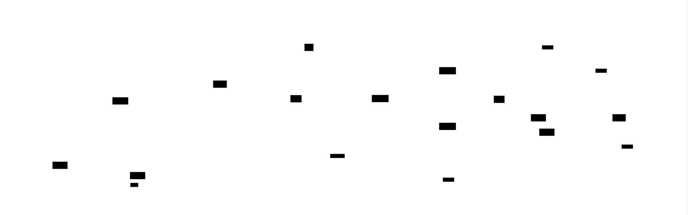
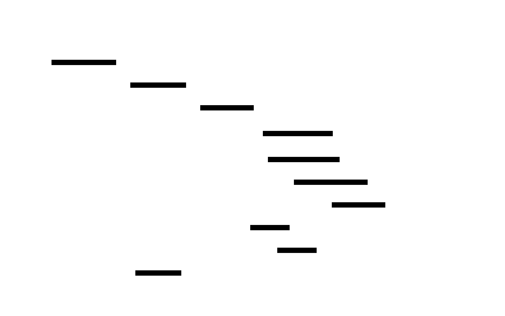

# GraphQL Server: Design Document


## Overview

This system provides a production-ready GraphQL API server that efficiently resolves complex nested queries while preventing N+1 database problems through intelligent batching. The key architectural challenge is balancing query flexibility with performance optimization through schema-first design, resolver composition, and real-time subscription capabilities.


> This guide is meant to help you understand the big picture before diving into each milestone. Refer back to it whenever you need context on how components connect.


## Context and Problem Statement

> **Milestone(s):** Milestone 1 (Schema & Type System), Milestone 2 (Resolvers & Data Fetching), Milestone 3 (DataLoader & N+1 Prevention), Milestone 4 (Subscriptions)

Understanding the limitations of REST APIs and why GraphQL's query flexibility creates new performance challenges that require careful architectural decisions.

### REST API Limitations

Think of traditional REST APIs as a series of rigid vending machines. Each machine (endpoint) has a fixed selection of products it can dispense, and you can only get exactly what the machine offers—no more, no less. If you need items from multiple machines, you must visit each one separately, carrying your growing collection of snacks. This analogy captures the fundamental constraints that drive developers away from REST toward GraphQL's more flexible approach.

The **over-fetching problem** occurs when REST endpoints return more data than the client actually needs. Consider a mobile application displaying a list of user profiles that only needs usernames and profile pictures. The REST endpoint `/api/users` might return complete user objects including email addresses, preferences, activity logs, and other sensitive or irrelevant information. This excess data wastes bandwidth, increases response times, and potentially exposes information that should remain private. The mobile client pays the cost in battery life and data usage while the server expends unnecessary resources serializing unused fields.

**Under-fetching** presents the opposite challenge—when a single REST endpoint provides insufficient data to fulfill a client's requirements. A social media application displaying a post might need the post content, author information, comment count, and like status for the current user. With REST, this typically requires multiple sequential requests: first `/api/posts/123` to get the post content, then `/api/users/456` for author details, then `/api/posts/123/comments?count=true` for comment statistics, and finally `/api/posts/123/likes/current-user` to check like status. Each request introduces network latency, and the client must coordinate these calls, handle partial failures, and manage loading states for each dependent request.

The **rigid endpoint structure** of REST APIs forces developers into a tight coupling between client requirements and server implementation. When a mobile application needs a streamlined data format for performance while a web application requires detailed information for rich displays, REST typically demands separate endpoints like `/api/posts/mobile` and `/api/posts/desktop`. This proliferation of specialized endpoints leads to maintenance overhead, code duplication, and versioning complexity. As client requirements evolve, developers find themselves trapped between breaking existing clients with endpoint changes or creating an ever-growing collection of specialized endpoints that serve narrow use cases.

**API versioning challenges** compound these problems. When REST APIs need to evolve, they typically require full version updates (`/v1/users` to `/v2/users`) that affect all endpoints simultaneously. This all-or-nothing approach forces client applications to migrate entire API surfaces at once, creating coordination problems between frontend and backend teams. The alternative—maintaining multiple API versions indefinitely—creates exponential maintenance overhead as bug fixes and security patches must be applied across all supported versions.

The **network efficiency problems** become particularly acute in mobile and real-time applications. REST's request-response model treats each data requirement as an independent transaction, leading to waterfall loading patterns where dependent data must wait for previous requests to complete. A news application loading an article, its author, related articles, and comment previews might require six sequential network round-trips, each adding 100-300ms of latency. On mobile networks or in geographic regions with poor connectivity, this cascading delay creates unacceptable user experiences.

REST APIs also struggle with **real-time data requirements**. While techniques like Server-Sent Events or WebSocket connections can provide live updates, integrating them with REST's stateless, resource-oriented model creates architectural tensions. Developers often end up building parallel systems—REST for data fetching and WebSockets for updates—leading to code duplication and synchronization challenges between the two data flows.

| REST API Limitation | Impact on Development | Impact on Performance | Example Scenario |
|---------------------|----------------------|----------------------|------------------|
| Over-fetching | Client code handles unnecessary data, security risks | Wasted bandwidth, slower responses | Mobile app gets full user objects when only needing usernames |
| Under-fetching | Complex client-side request orchestration | Multiple network round-trips, waterfall loading | Social feed requiring posts + authors + comments in separate calls |
| Rigid endpoints | Proliferation of specialized endpoints | Server maintenance overhead | `/api/posts/mobile`, `/api/posts/desktop`, `/api/posts/admin` variants |
| Versioning complexity | Forced migration cycles, coordination overhead | Multiple API versions to maintain | Breaking changes require full `/v1/` to `/v2/` migration |
| Network inefficiency | Waterfall request patterns, loading state management | Cumulative latency from sequential requests | Article page loading content, author, comments, recommendations separately |

### GraphQL Implementation Challenges

If REST APIs are rigid vending machines, GraphQL is like having a personal assistant who can gather exactly what you need from multiple sources in a single trip. However, this flexibility comes with a hidden cost—the assistant might be inefficient, making multiple trips to the same store or taking much longer routes than necessary. GraphQL's power to express arbitrary data requirements creates new categories of performance and complexity challenges that require sophisticated architectural solutions.

The **N+1 query problem** represents GraphQL's most notorious performance trap. Consider a query requesting a list of blog posts with their authors:

```
query {
  posts {
    title
    author {
      name
      email
    }
  }
}
```

A naive resolver implementation will execute one database query to fetch all posts, then execute one additional query per post to fetch each author. With 100 posts, this creates 101 database queries—one initial query plus 100 individual author lookups. The exponential query growth becomes catastrophic as queries nest deeper: posts with authors and their companies would generate 1 + N + N*M queries, potentially thousands of database calls for a single GraphQL request.

This problem occurs because GraphQL's field-by-field resolution model doesn't inherently understand relationships between data. Each field resolver operates independently, making optimization decisions without knowledge of what other fields might need the same underlying data. The resolver for `posts.author.name` doesn't know that `posts.author.email` will also need the same author record, so it fetches the author independently. Traditional SQL joins become ineffective because the resolver layer abstracts away the underlying query structure.

**Query complexity attacks** present a security challenge unique to GraphQL's expressive query language. Malicious clients can craft deeply nested or broadly expanded queries that consume excessive server resources. A query requesting posts with their authors, where each author has posts, and each of those posts has authors, can create exponential server-side work:

```
query MaliciousQuery {
  posts {
    author {
      posts {
        author {
          posts {
            # ... nested 10+ levels deep
          }
        }
      }
    }
  }
}
```

This query might appear innocent but could force the server to resolve millions of fields, exhausting memory and CPU resources. Unlike REST APIs where endpoint complexity is bounded by the server implementation, GraphQL delegates complexity decisions to potentially untrusted clients.

**Real-time subscription management** introduces stateful complexity into GraphQL servers that traditionally operate in stateless request-response cycles. WebSocket connections must be authenticated, maintained across server restarts, and cleaned up when clients disconnect. The pub-sub system must efficiently route events to relevant subscribers while filtering data based on subscription arguments and user permissions. A subscription for "comments on posts I authored" requires maintaining subscriber state, matching incoming events against complex criteria, and ensuring users only receive data they're authorized to see.

The **schema evolution challenge** becomes more nuanced with GraphQL than with REST. While GraphQL's type system enables additive changes without breaking existing clients, it also makes it difficult to remove or modify fields. A REST API can simply return 404 for a deprecated endpoint, forcing clients to migrate. GraphQL schemas must maintain backward compatibility indefinitely, or implement complex deprecation workflows that rely on client cooperation. The schema becomes a long-term contract that accumulates technical debt over time.

**Caching complexity** multiplies because GraphQL queries are dynamic and potentially unique. REST's resource-oriented model enables straightforward HTTP caching—`GET /api/posts/123` can be cached by URL. GraphQL queries with different field selections, arguments, and nesting patterns create unique cache keys that traditional HTTP caching cannot handle effectively. Server-side caching must understand GraphQL's execution model to cache at the appropriate granularity, while client-side caching must normalize and denormalize data across arbitrary query shapes.

**Error handling ambiguity** arises when some parts of a GraphQL query succeed while others fail. Unlike REST's binary success/failure model, GraphQL can return partial data alongside error information. A query for posts and user profile might successfully return posts while failing to load the user's profile due to a service outage. The client must decide whether partial data represents an acceptable response or a failure condition, and the server must determine which fields to include in partial responses.

| GraphQL Challenge | Technical Root Cause | Performance Impact | Mitigation Complexity |
|-------------------|---------------------|-------------------|----------------------|
| N+1 Query Problem | Independent field resolvers | Linear to exponential database load | Requires DataLoader batching architecture |
| Query Complexity Attacks | Client-controlled query structure | Unbounded server resource consumption | Needs query analysis and depth limiting |
| Subscription Management | Stateful WebSocket connections | Memory growth, connection cleanup challenges | Requires pub-sub infrastructure and lifecycle management |
| Schema Evolution | Backward compatibility requirements | Accumulating technical debt | Complex deprecation workflows and versioning strategies |
| Caching Complexity | Dynamic query shapes | Cache invalidation and key management overhead | Normalized caching or query-specific cache layers |
| Partial Error Handling | Field-level failure isolation | Client uncertainty about data completeness | Structured error response design and client retry logic |

### Existing Approaches Comparison

Understanding the landscape of GraphQL server implementations helps illuminate the architectural trade-offs that drive our design decisions. Think of the choice between different GraphQL approaches as selecting between different construction methodologies for building a house. Code-first approaches start by building the foundation and walls, then creating blueprints that match what was built. Schema-first approaches begin with detailed architectural plans, then construct the building to match the blueprints. Each methodology has implications for maintainability, team collaboration, and long-term evolution.

The **code-first vs schema-first debate** represents a fundamental philosophical divide in GraphQL server architecture. Code-first implementations define types and resolvers directly in the programming language, using decorators, annotations, or builder patterns to generate the GraphQL schema. This approach feels natural to developers who think in terms of classes and methods, and it provides strong type safety when the programming language's type system can be mapped directly to GraphQL types.

Code-first development enables rapid prototyping because developers can define types and resolvers simultaneously without switching between different syntax formats. IDE support provides autocompletion and refactoring capabilities that work seamlessly across schema definitions and resolver implementations. Changes to the schema are automatically reflected in the generated GraphQL SDL, eliminating synchronization issues between schema files and implementation code.

However, code-first approaches tightly couple the GraphQL schema to the implementation language's type system and object model. This coupling makes it difficult to optimize the schema for client consumption when it differs from the server's internal data model. Database entities often map poorly to GraphQL types designed for client consumption, leading to schemas that expose implementation details or require complex transformation logic. The generated schema may include technical artifacts from the programming language that reduce its clarity for client developers.

Schema-first implementations begin with GraphQL Schema Definition Language (SDL) files that explicitly define the API contract. Resolvers are then implemented to fulfill this contract, creating a clear separation between the external API and internal implementation details. This approach enables API-first development where frontend and backend teams can work in parallel once the schema is agreed upon, and it makes the GraphQL schema the authoritative source of truth for API documentation.

The schema-first approach facilitates better API design because it forces developers to think about the client experience before implementation concerns. The SDL syntax is designed specifically for GraphQL, making it more expressive and readable than generated schemas that carry programming language artifacts. Schema evolution becomes more intentional because changes require explicit SDL modifications rather than accidental side effects from code changes.

Yet schema-first development introduces synchronization challenges between schema files and resolver implementations. The schema and resolvers can drift out of sync, leading to runtime errors that could have been caught at compile time in code-first approaches. Developers must context-switch between SDL syntax and their programming language, and IDE support for schema-to-code verification is often limited compared to native language tooling.

> **Decision: Schema-First Development**
> - **Context**: Need to balance API design quality with development velocity and maintainability
> - **Options Considered**: Code-first with generated schema, Schema-first with manual synchronization, Hybrid approach with tooling
> - **Decision**: Schema-first development with validation tooling to catch synchronization issues
> - **Rationale**: Explicit schema files provide better API design discipline, clearer documentation, and enable frontend/backend parallel development. The synchronization challenges can be addressed with build-time validation.
> - **Consequences**: Requires tooling investment for schema validation, but produces higher-quality API designs and better cross-team collaboration

**GraphQL server implementation strategies** vary significantly in their approach to query execution, type safety, and performance optimization. Generated resolver approaches use code generation to create type-safe resolver skeletons from schema files, combining some benefits of both code-first and schema-first methodologies. The generator analyzes the schema and produces interfaces or base classes that developers implement, ensuring compile-time verification that all schema fields have corresponding resolvers.

Runtime resolution approaches interpret the schema at server startup and dispatch to resolver functions through reflection or dynamic lookup mechanisms. This provides maximum flexibility because resolvers can be modified without code generation steps, and it enables dynamic schema construction for applications that need runtime schema modification. However, runtime approaches sacrifice compile-time type safety and may introduce performance overhead from dynamic dispatch.

**DataLoader integration patterns** differ significantly between server implementations. Some frameworks provide built-in DataLoader support with automatic batching configuration, while others require manual DataLoader setup and integration. The choice affects both developer ergonomics and performance characteristics. Built-in support reduces boilerplate and ensures consistent batching behavior, but may limit customization options for applications with specific performance requirements.

Framework-managed DataLoaders typically create instances per request and manage their lifecycle automatically, ensuring proper cache isolation between requests. Manual DataLoader integration provides more control over batch timing, cache management, and error handling but requires careful implementation to avoid common pitfalls like cache leakage or improper batching windows.

**Subscription implementation architectures** range from simple in-memory pub-sub systems suitable for single-server deployments to distributed message queues that enable horizontal scaling. In-memory approaches provide low latency and simple deployment but cannot scale beyond a single server instance. Clients connected to different server instances won't receive events published from other instances, limiting the system's ability to handle growing user bases.

Distributed pub-sub systems using Redis, Apache Kafka, or cloud messaging services enable horizontal scaling but introduce operational complexity, network latency, and potential message ordering issues. The choice between immediate consistency and eventual consistency in distributed subscriptions affects both performance characteristics and implementation complexity.

| Implementation Approach | Development Experience | Runtime Performance | Operational Complexity | Best Fit |
|-------------------------|------------------------|-------------------|------------------------|-----------|
| Code-First Generated | Excellent IDE support, type safety | Good compilation optimization | Medium - build process integration | Teams prioritizing type safety and rapid development |
| Schema-First Manual | Good API design discipline | Excellent runtime flexibility | Low - simple file-based workflow | API-first development, cross-team collaboration |
| Schema-First Generated | Good balance of safety and design | Good optimization with verification | Medium - tooling integration required | Production systems requiring both API quality and type safety |
| Runtime Interpreted | Maximum flexibility | Good with optimized interpreters | Low - simple deployment | Dynamic schemas, rapid prototyping |
| Built-in DataLoader | Reduced boilerplate | Good with framework optimization | Low - automatic management | Standard use cases, rapid development |
| Manual DataLoader | Full control over optimization | Excellent with proper implementation | High - requires expertise | High-performance requirements, custom batching logic |

> **Decision: Schema-First with Generated Type Safety**
> - **Context**: Need to balance API design quality, development velocity, and production reliability
> - **Options Considered**: Pure schema-first, pure code-first, hybrid with generation
> - **Decision**: Schema-first development with code generation for resolver type safety
> - **Rationale**: Schema files enable API-first design and cross-team collaboration, while code generation provides compile-time verification and IDE support. This combines the design benefits of schema-first with the safety benefits of code-first.
> - **Consequences**: Requires investment in build tooling and generator maintenance, but provides both high API quality and development confidence

The architectural decisions around implementation approach fundamentally shape the development experience, performance characteristics, and operational requirements of the GraphQL server. Our choice to embrace schema-first development with generated type safety reflects a prioritization of long-term API quality and cross-team collaboration over short-term development convenience. This foundation enables the sophisticated resolver architecture, DataLoader integration, and subscription management that the subsequent milestones will build upon.

⚠️ **Pitfall: Choosing Implementation Approach Based on Familiarity**
Many teams select GraphQL server architectures based on what feels familiar from their REST API experience rather than considering GraphQL-specific requirements. This leads to code-first approaches that tightly couple the schema to database models, or runtime interpretation systems that sacrifice the performance optimizations necessary for GraphQL's complex query patterns. Instead, evaluate approaches based on your team's collaboration patterns, API design priorities, and performance requirements specific to GraphQL's unique challenges like N+1 queries and subscription management.

⚠️ **Pitfall: Underestimating Schema Evolution Complexity**
Teams often begin with simple schema-first or code-first approaches without considering how their chosen methodology will handle schema evolution over months and years. Code-first schemas can accidentally expose internal implementation changes to clients, while schema-first approaches can accumulate deprecated fields that become difficult to remove. Plan your approach with a multi-year timeline in mind, considering how you'll handle field deprecation, type evolution, and backward compatibility requirements before they become urgent production issues.

### Implementation Guidance

The transition from understanding GraphQL's challenges to building a production server requires careful technology selection and project structure decisions. This guidance provides concrete recommendations for teams implementing their first GraphQL server while avoiding common architectural pitfalls.

**Technology Recommendations:**

| Component | Simple Option | Advanced Option | Rationale |
|-----------|---------------|-----------------|-----------|
| Schema Management | Hand-written SDL files with basic validation | SDL with automated resolver generation (graphql-codegen) | Simple for learning, advanced for production type safety |
| Query Execution | graphql-core library with custom executor | Custom execution engine with query planning | Core library handles standards compliance, custom engine enables optimization |
| DataLoader Integration | Manual DataLoader instances per request | Framework-integrated batching with metrics | Manual provides learning value, integrated reduces production errors |
| Subscription Transport | GraphQL-WS over WebSocket | GraphQL-SSE with fallback protocols | WS is standard, SSE provides better firewall compatibility |
| Schema Validation | Runtime schema validation | Build-time validation with CI integration | Runtime catches errors early, build-time prevents deployment issues |

**Recommended Project Structure:**

```
graphql-server/
├── src/
│   ├── schema/
│   │   ├── schema.graphql           # Main schema definition
│   │   ├── types/
│   │   │   ├── user.graphql         # User type definitions
│   │   │   ├── post.graphql         # Post type definitions
│   │   │   └── subscription.graphql # Subscription definitions
│   │   └── generated/
│   │       └── types.py             # Generated type definitions
│   ├── resolvers/
│   │   ├── __init__.py
│   │   ├── query_resolvers.py       # Root query resolvers
│   │   ├── mutation_resolvers.py    # Root mutation resolvers
│   │   ├── subscription_resolvers.py # Subscription resolvers
│   │   └── field_resolvers/
│   │       ├── user_resolvers.py    # User field resolvers
│   │       └── post_resolvers.py    # Post field resolvers
│   ├── dataloaders/
│   │   ├── __init__.py
│   │   ├── user_loader.py           # User batching logic
│   │   └── post_loader.py           # Post batching logic
│   ├── subscriptions/
│   │   ├── __init__.py
│   │   ├── pubsub.py               # Pub-sub implementation
│   │   └── connection_manager.py    # WebSocket lifecycle
│   ├── context/
│   │   ├── __init__.py
│   │   └── request_context.py       # Request context setup
│   ├── middleware/
│   │   ├── __init__.py
│   │   ├── auth_middleware.py       # Authentication logic
│   │   └── error_middleware.py      # Error handling
│   └── server.py                    # Main server setup
├── tests/
│   ├── integration/
│   │   ├── test_queries.py          # End-to-end query tests
│   │   └── test_subscriptions.py    # Subscription integration tests
│   └── unit/
│       ├── test_resolvers.py        # Resolver unit tests
│       └── test_dataloaders.py      # DataLoader batching tests
├── scripts/
│   ├── generate_types.py            # Code generation script
│   └── validate_schema.py           # Schema validation script
└── requirements.txt
```

**Schema Definition Infrastructure:**

```python
# src/schema/loader.py
"""Schema loading and validation utilities."""

import os
from pathlib import Path
from typing import Dict, List
from graphql import build_schema, validate_schema, GraphQLSchema, GraphQLError

def load_schema_files(schema_dir: Path) -> str:
    """
    Load and combine all .graphql files into a single schema string.
    
    This function handles the common pattern of splitting large schemas
    into multiple files for better organization.
    """
    schema_parts = []
    
    # Load main schema file first
    main_schema = schema_dir / "schema.graphql"
    if main_schema.exists():
        schema_parts.append(main_schema.read_text())
    
    # Load type definition files
    types_dir = schema_dir / "types"
    if types_dir.exists():
        for graphql_file in types_dir.glob("*.graphql"):
            schema_parts.append(graphql_file.read_text())
    
    return "\n\n".join(schema_parts)

def validate_schema_definition(schema_string: str) -> List[GraphQLError]:
    """
    Validate schema string and return any errors found.
    
    This catches schema definition errors early in the development process,
    preventing runtime failures when the server starts.
    """
    try:
        schema = build_schema(schema_string)
        return validate_schema(schema)
    except Exception as e:
        return [GraphQLError(f"Schema build failed: {str(e)}")]

class SchemaManager:
    """
    Manages schema loading, validation, and reloading for development.
    
    In production, schemas are loaded once at startup. In development,
    this enables hot reloading when schema files change.
    """
    
    def __init__(self, schema_dir: Path):
        self.schema_dir = schema_dir
        self._schema = None
        self._schema_string = None
    
    def load_schema(self) -> GraphQLSchema:
        """
        Load and validate the complete GraphQL schema.
        
        Returns:
            Built and validated GraphQL schema ready for execution
            
        Raises:
            GraphQLError: If schema is invalid or cannot be built
        """
        schema_string = load_schema_files(self.schema_dir)
        errors = validate_schema_definition(schema_string)
        
        if errors:
            error_messages = [str(error) for error in errors]
            raise GraphQLError(f"Schema validation failed: {'; '.join(error_messages)}")
        
        self._schema_string = schema_string
        self._schema = build_schema(schema_string)
        return self._schema
    
    @property
    def schema_string(self) -> str:
        """Get the raw schema string for code generation or introspection."""
        return self._schema_string
    
    def reload_schema(self) -> GraphQLSchema:
        """Reload schema from disk - useful for development hot reloading."""
        return self.load_schema()
```

**Request Context Foundation:**

```python
# src/context/request_context.py
"""Request context management for GraphQL execution."""

from dataclasses import dataclass, field
from typing import Any, Dict, Optional
from datetime import datetime

from ..dataloaders.user_loader import UserLoader
from ..dataloaders.post_loader import PostLoader

@dataclass
class GraphQLContext:
    """
    Request context passed to all resolvers during query execution.
    
    The context object is GraphQL's mechanism for sharing request-scoped
    data like database connections, user authentication, and DataLoaders
    across all resolver functions.
    """
    
    # Database connection (injected by middleware)
    db_connection: Any = None
    
    # Authentication information
    current_user_id: Optional[str] = None
    current_user: Optional[Dict[str, Any]] = None
    auth_token: Optional[str] = None
    
    # DataLoader instances for batching (created per request)
    user_loader: UserLoader = field(init=False)
    post_loader: PostLoader = field(init=False)
    
    # Request metadata
    request_id: str = field(default_factory=lambda: str(uuid.uuid4()))
    request_start_time: datetime = field(default_factory=datetime.now)
    
    # Custom data storage for middleware
    extensions: Dict[str, Any] = field(default_factory=dict)
    
    def __post_init__(self):
        """Initialize DataLoaders with database connection after context creation."""
        # TODO 1: Create UserLoader instance with self.db_connection
        # TODO 2: Create PostLoader instance with self.db_connection
        # TODO 3: Set up any other per-request resources
        pass
    
    def cleanup(self):
        """
        Clean up request-scoped resources.
        
        Called after query execution completes to ensure proper
        resource cleanup and prevent memory leaks.
        """
        # TODO 1: Close database connections if needed
        # TODO 2: Clear DataLoader caches to prevent cross-request leaks
        # TODO 3: Clean up any other request-scoped resources
        pass

def create_context(request_data: Dict[str, Any]) -> GraphQLContext:
    """
    Create a GraphQL context from incoming request data.
    
    This factory function extracts authentication information,
    sets up database connections, and initializes DataLoaders
    for the request.
    
    Args:
        request_data: Dictionary containing request headers, auth tokens, etc.
        
    Returns:
        Fully initialized GraphQL context ready for resolver execution
    """
    context = GraphQLContext()
    
    # TODO 1: Extract auth token from request headers
    # TODO 2: Validate token and load user information
    # TODO 3: Set up database connection from connection pool
    # TODO 4: Initialize any request-specific middleware state
    
    return context
```

**Basic Server Infrastructure:**

```python
# src/server.py
"""Main GraphQL server setup and configuration."""

import asyncio
from pathlib import Path
from typing import Any, Dict

from graphql import graphql
from aiohttp import web, WSMsgType
from aiohttp.web_request import Request
from aiohttp.web_ws import WebSocketResponse

from .schema.loader import SchemaManager
from .context.request_context import create_context, GraphQLContext
from .resolvers import get_root_resolvers
from .subscriptions.connection_manager import SubscriptionManager

class GraphQLServer:
    """
    Production GraphQL server with query execution and subscription support.
    
    This server handles both HTTP POST requests for queries/mutations
    and WebSocket connections for real-time subscriptions.
    """
    
    def __init__(self, schema_dir: Path):
        self.schema_manager = SchemaManager(schema_dir)
        self.schema = self.schema_manager.load_schema()
        self.root_resolvers = get_root_resolvers()
        self.subscription_manager = SubscriptionManager()
    
    async def handle_graphql_request(self, request: Request) -> web.Response:
        """
        Handle HTTP GraphQL queries and mutations.
        
        Processes POST requests containing GraphQL queries,
        executes them against the schema, and returns JSON responses.
        """
        # TODO 1: Parse JSON body to extract query, variables, operationName
        # TODO 2: Create request context with authentication and database connection
        # TODO 3: Execute GraphQL query using graphql() function
        # TODO 4: Format response as JSON with data/errors structure
        # TODO 5: Clean up context resources before returning
        pass
    
    async def handle_websocket_connection(self, request: Request) -> WebSocketResponse:
        """
        Handle WebSocket connections for GraphQL subscriptions.
        
        Manages the connection lifecycle including authentication,
        subscription management, and graceful cleanup.
        """
        ws = web.WebSocketResponse(protocols=['graphql-ws'])
        await ws.prepare(request)
        
        # TODO 1: Implement GraphQL-WS protocol handshake
        # TODO 2: Authenticate connection using connection_init message
        # TODO 3: Register connection with subscription manager
        # TODO 4: Handle subscription start/stop messages
        # TODO 5: Clean up connection resources on disconnect
        
        return ws
    
    def create_app(self) -> web.Application:
        """Create and configure the aiohttp application."""
        app = web.Application()
        
        # GraphQL endpoint for queries and mutations
        app.router.add_post('/graphql', self.handle_graphql_request)
        
        # WebSocket endpoint for subscriptions
        app.router.add_get('/graphql/subscriptions', self.handle_websocket_connection)
        
        # Optional: GraphQL Playground for development
        app.router.add_get('/', self.serve_playground)
        
        return app
    
    async def serve_playground(self, request: Request) -> web.Response:
        """Serve GraphQL Playground for development and testing."""
        playground_html = """
        <!DOCTYPE html>
        <html>
        <head>
            <title>GraphQL Playground</title>
            <link rel="stylesheet" href="//cdn.jsdelivr.net/npm/graphql-playground-react/build/static/css/index.css" />
        </head>
        <body>
            <div id="root"></div>
            <script src="//cdn.jsdelivr.net/npm/graphql-playground-react/build/static/js/middleware.js"></script>
            <script>
                window.addEventListener('load', function (event) {
                    GraphQLPlayground.init(document.getElementById('root'), {
                        endpoint: '/graphql',
                        subscriptionEndpoint: 'ws://localhost:8000/graphql/subscriptions'
                    });
                });
            </script>
        </body>
        </html>
        """
        return web.Response(text=playground_html, content_type='text/html')

def main():
    """Start the GraphQL server."""
    schema_dir = Path(__file__).parent / "schema"
    server = GraphQLServer(schema_dir)
    app = server.create_app()
    
    web.run_app(app, host='localhost', port=8000)

if __name__ == "__main__":
    main()
```

**Milestone Checkpoint for Context and Problem Understanding:**

After completing this foundational setup, verify your understanding by:

1. **Schema Loading Test**: Run `python -c "from src.schema.loader import SchemaManager; print('Schema loaded successfully')"` and confirm no import errors
2. **Project Structure Verification**: Ensure all directories exist and contain `__init__.py` files for proper Python module structure
3. **Basic Server Start**: Run `python src/server.py` and verify the server starts without errors (it may not handle requests yet)
4. **GraphQL Playground Access**: Navigate to `http://localhost:8000` and confirm the GraphQL Playground interface loads

**Common Setup Issues:**

| Symptom | Likely Cause | How to Diagnose | Fix |
|---------|--------------|-----------------|-----|
| Import errors on startup | Missing `__init__.py` files or incorrect module paths | Check Python path and module structure | Add missing `__init__.py` files, fix import statements |
| Schema loading failures | Invalid GraphQL SDL syntax or missing schema files | Review schema file contents and check file paths | Validate SDL syntax, ensure all referenced types are defined |
| Server won't start | Port conflicts or missing dependencies | Check if port 8000 is in use, review requirements.txt | Use different port or install missing packages |
| Context creation errors | Missing database setup or authentication configuration | Check context factory function and dependencies | Implement placeholder database connection and auth |

This foundation provides the infrastructure necessary to implement the schema definition, resolver system, DataLoader batching, and subscription features that the subsequent milestones will build upon. The modular structure separates concerns while maintaining clear dependencies between components.


## Goals and Non-Goals

> **Milestone(s):** Milestone 1 (Schema & Type System), Milestone 2 (Resolvers & Data Fetching), Milestone 3 (DataLoader & N+1 Prevention), Milestone 4 (Subscriptions)

Think of this GraphQL server project as building a sophisticated query engine for web APIs - like creating a universal translator that can understand exactly what data clients need and fetch it efficiently from various sources. Before we architect this system, we need crystal-clear boundaries around what we're building and what we're deliberately leaving out. This prevents scope creep and ensures we can deliver a production-ready foundation without getting lost in advanced features that would triple our complexity.

The scope definition becomes particularly critical for GraphQL servers because the technology enables so many powerful patterns - from simple CRUD operations to complex federated schemas spanning dozens of microservices. Without clear goals, it's easy to accidentally commit to building features like query complexity analysis, distributed caching, or schema federation that would turn our intermediate-level project into an expert-level distributed systems challenge.

Our approach follows the principle of **progressive complexity** - we're building a solid foundation that demonstrates core GraphQL concepts while remaining extensible enough to support advanced features later. This means making deliberate architectural decisions that don't paint us into corners, but also not over-engineering for requirements we don't have yet.

### Functional Goals

The functional goals define the core capabilities our GraphQL server must deliver to be considered complete and production-ready for typical web application scenarios.

**Schema Definition and Management**

Our server must provide a **schema-first approach** where developers define their API contract using GraphQL's Schema Definition Language (SDL) before writing any resolver code. Think of this like defining a blueprint before building a house - the schema becomes the authoritative specification that both client and server teams can reference throughout development.

The `SchemaManager` component will handle loading schema files from disk, validating their syntax and semantic correctness, and building an executable schema object. This includes support for:

| Schema Feature | Purpose | Example |
|---|---|---|
| Object Types | Define entities with typed fields | `type User { id: ID!, email: String! }` |
| Interface Types | Enable polymorphic queries | `interface Node { id: ID! }` |
| Union Types | Support multiple possible types | `union SearchResult = User \| Post \| Comment` |
| Input Types | Validate mutation arguments | `input CreateUserInput { email: String!, name: String! }` |
| Custom Scalars | Handle domain-specific data types | `scalar DateTime`, `scalar JSON` |
| Enum Types | Restrict field values to predefined options | `enum UserRole { ADMIN, MODERATOR, USER }` |

The schema validation must catch common mistakes like circular references, undefined types, and missing required fields at server startup rather than runtime. This fail-fast approach prevents deploying broken schemas to production.

**Query and Mutation Resolution**

The resolver system forms the heart of our GraphQL execution engine. Each field in our schema needs a corresponding resolver function that knows how to fetch or compute that field's value. Think of resolvers like specialized workers in a factory - each one knows how to produce exactly one type of output given the right inputs and context.

Our resolver architecture must support:

| Resolver Type | Responsibility | Context Requirements |
|---|---|---|
| Root Query Resolvers | Handle top-level data fetching | Database connection, user authentication |
| Field Resolvers | Load nested entity relationships | Parent object, query arguments, user permissions |
| Mutation Resolvers | Validate input and modify server state | Transaction context, authorization checks |
| Custom Scalar Resolvers | Serialize/deserialize special data types | Type coercion rules, validation logic |

The `GraphQLContext` object carries request-scoped data like database connections, user authentication state, and DataLoader instances across all resolver invocations. This ensures resolvers can make authorization decisions and access shared resources without tight coupling.

**Real-time Subscription Support**

Subscriptions enable real-time data streaming to clients through WebSocket connections. Unlike queries and mutations which follow a simple request-response pattern, subscriptions establish persistent connections that can receive multiple data updates over time.

Our subscription system must handle:

| Subscription Capability | Technical Requirement | Implementation Challenge |
|---|---|---|
| WebSocket Transport | Upgrade HTTP connections to WebSocket | Protocol negotiation, connection persistence |
| Event Publishing | Broadcast data changes to relevant subscribers | Efficient topic routing, payload filtering |
| Subscription Filtering | Deliver only events matching subscriber criteria | Per-user permissions, query-based filtering |
| Connection Management | Handle connect, disconnect, and keep-alive | Resource cleanup, graceful shutdown |

The pub-sub architecture decouples event publishers (typically mutation resolvers) from subscribers, allowing the system to scale as subscription volume grows.

**Performance Optimization Through Batching**

The most critical performance challenge in GraphQL is the **N+1 query problem**. When clients request nested data, naive resolver implementations can trigger exponential database queries. For example, fetching 10 users and their posts could result in 1 query for users + 10 queries for posts = 11 total queries instead of the optimal 2 queries.

Our DataLoader implementation must provide:

| Performance Feature | Mechanism | Benefit |
|---|---|---|
| Request Batching | Collect individual loads into batch operations | Reduce query count from N+1 to 2 |
| Per-request Caching | Cache loaded entities within single request | Eliminate duplicate fetches |
| Cache Isolation | Prevent data leaks between user sessions | Maintain security and data consistency |
| Batch Error Handling | Map batch failures to individual requested items | Graceful degradation for partial failures |

The DataLoader pattern transforms potentially hundreds of individual database queries into a handful of efficient batch operations, making complex nested GraphQL queries performant at scale.

### Non-Functional Goals

Non-functional goals define the quality attributes and operational characteristics our GraphQL server must exhibit in production environments.

**Performance Requirements**

Our server must handle realistic web application load without degrading user experience. Performance requirements include:

| Performance Metric | Target | Measurement Method |
|---|---|---|
| Query Response Time | < 200ms for typical queries (p95) | Request latency monitoring |
| DataLoader Effectiveness | < 10 database queries per GraphQL request | Query count logging |
| Memory Usage | Stable memory profile under load | Heap profiling, no memory leaks |
| Concurrent Connections | Support 1000+ concurrent WebSocket subscribers | Load testing with subscription clients |

The DataLoader batching system represents our primary performance optimization strategy. We'll measure its effectiveness by comparing query counts before and after implementation - a successful DataLoader integration should reduce database queries by 80-90% for typical nested queries.

**Scalability Characteristics**

While we're not building a distributed system, our architecture must support horizontal scaling patterns when deployment needs grow. This means:

- **Stateless Request Processing**: All request state lives in the `GraphQLContext` object, not in server instance variables
- **Database Connection Pooling**: Efficient connection reuse across concurrent requests  
- **Subscription Resource Management**: Bounded memory usage regardless of active subscription count
- **Schema Hot Reloading**: Support schema updates without server restart in development

**Developer Experience Goals**

Since GraphQL's primary value proposition is improving developer productivity, our server must provide excellent debugging and development tooling:

| Developer Experience Feature | Implementation | Benefit |
|---|---|---|
| Introspection API | Built-in schema exploration queries | GraphQL Playground, client tooling |
| Structured Error Messages | Detailed error responses with field paths | Faster debugging, better client error handling |
| Request Logging | Comprehensive query execution logging | Performance analysis, debugging support |
| Schema Validation | Clear error messages for schema problems | Catch configuration issues early |

The GraphQL introspection system allows development tools to automatically understand our API structure, enabling features like autocomplete, query validation, and interactive query builders.

**Reliability and Error Handling**

Production GraphQL servers must gracefully handle various failure scenarios without crashing or exposing sensitive information:

- **Partial Failure Handling**: Return successful fields even when some resolvers fail
- **Query Timeout Protection**: Prevent runaway queries from consuming excessive resources  
- **Database Connection Recovery**: Automatically reconnect after temporary database outages
- **Memory Leak Prevention**: Properly clean up subscription connections and DataLoader caches

### Explicit Non-Goals

Clearly defining what we're **not** building is equally important as defining what we are building. These exclusions keep our scope manageable while ensuring we don't accidentally design ourselves into corners.

**Schema Federation and Distributed GraphQL**

We are explicitly **not** implementing GraphQL federation, schema stitching, or any distributed GraphQL patterns. Federation allows composing a single GraphQL API from multiple underlying services, each owning a portion of the overall schema.

> **Decision: Single Schema Architecture**
> - **Context**: GraphQL federation enables microservices architectures but adds significant complexity around schema composition, query planning across services, and distributed error handling
> - **Options Considered**: 
>   1. Apollo Federation with gateway and subgraph services
>   2. Schema stitching with remote schema merging  
>   3. Single monolithic schema with all types defined locally
> - **Decision**: Implement a single, monolithic schema architecture
> - **Rationale**: Federation requires distributed systems expertise, complex query planning algorithms, and sophisticated error handling across service boundaries. This would shift our project from intermediate to expert difficulty level
> - **Consequences**: Our server will excel for monolithic applications or single-service APIs but won't directly support microservices architectures without external gateway solutions

**Advanced Caching and Query Optimization**

We are not implementing persistent query caching, query complexity analysis, or query whitelisting. These features require sophisticated query analysis and storage systems:

| Advanced Feature | Why Excluded | Alternative Approach |
|---|---|---|
| Persistent Query Cache | Requires Redis/Memcached integration, cache invalidation logic | Rely on HTTP caching headers, client-side caching |
| Query Complexity Analysis | Needs query depth/cost calculation algorithms | Implement simple query timeout protection |
| Query Whitelisting | Requires query fingerprinting, allowlist management | Use authentication and rate limiting |
| Distributed Caching | Requires cache coordination across server instances | Single-instance in-memory caching only |

**Advanced Security Features**

While our server will include basic authentication and authorization patterns, we're excluding enterprise-level security features:

- **Query Rate Limiting**: No per-user or per-operation rate limiting beyond basic HTTP rate limiting
- **Field-Level Permissions**: Authorization happens at the resolver level, not automatically based on schema annotations
- **Query Depth Limiting**: No automatic protection against deeply nested malicious queries
- **Audit Logging**: Basic request logging only, not comprehensive audit trails

> **Decision: Resolver-Level Authorization**
> - **Context**: GraphQL enables very fine-grained access control, from schema-level permissions down to individual field access controls
> - **Options Considered**:
>   1. Schema directive-based permissions (`@auth`, `@requiresRole`)
>   2. Resolver-level authorization checks in business logic
>   3. Middleware-based authorization wrapping resolvers
> - **Decision**: Implement authorization through explicit checks in resolver functions
> - **Rationale**: Schema directives require a permission engine and query analysis system. Middleware authorization needs a sophisticated hook system. Explicit resolver checks are simple to understand and debug
> - **Consequences**: Authorization logic lives in resolver code rather than schema definitions. This requires more manual implementation but provides maximum flexibility and transparency

**Production Infrastructure Features**

Our server focuses on core GraphQL functionality rather than production operations:

- **Metrics and Monitoring**: Basic logging only, no Prometheus metrics or distributed tracing
- **Health Checks**: Simple HTTP endpoint, no sophisticated health monitoring  
- **Configuration Management**: Environment variables and config files, no dynamic configuration
- **Deployment Automation**: No Docker containers, Kubernetes manifests, or deployment pipelines

**Third-Party Integrations**

We're building a standalone GraphQL server without specific integrations:

- **Database ORMs**: Generic database interface, not tied to specific ORM frameworks
- **Authentication Providers**: Generic auth interface, no OAuth/SAML/JWT provider integrations
- **External APIs**: No built-in REST API proxying or external service integration patterns
- **Message Queues**: Simple in-memory pub-sub, no Redis, RabbitMQ, or Kafka integration

This approach keeps our core GraphQL implementation clean and allows developers to plug in their preferred infrastructure components without forcing specific technology choices.

The boundaries we've drawn create a focused, implementable project that teaches core GraphQL concepts without getting lost in distributed systems complexity. Our architecture will be extensible enough to support these excluded features as future enhancements, but simple enough to build and understand as an intermediate-level learning project.

### Implementation Guidance

This section provides concrete technology recommendations and starter code to help you implement the goals defined above.

**Technology Recommendations**

| Component | Simple Option | Advanced Option |
|---|---|---|
| GraphQL Library | `graphql-core` (reference implementation) | `strawberry-graphql` (code-first with decorators) |
| Web Framework | `aiohttp` (async HTTP server) | `fastapi` (with GraphQL plugin) |
| WebSocket Support | `aiohttp` WebSocket handler | `websockets` library with custom transport |
| Database Interface | `aiopg` (PostgreSQL async) or `aiomysql` | `sqlalchemy` async with connection pooling |
| Pub-Sub System | In-memory `asyncio.Queue` | `aioredis` for distributed pub-sub |

For this implementation guide, we'll use `graphql-core` with `aiohttp` as they provide the most direct path to understanding core GraphQL concepts without framework magic.

**Recommended File Structure**

```
graphql-server/
├── app/
│   ├── __init__.py
│   ├── main.py                    # Server entry point
│   ├── schema/
│   │   ├── __init__.py
│   │   ├── schema.graphql         # Main schema definition
│   │   ├── types/
│   │   │   ├── user.graphql       # User type definitions
│   │   │   └── post.graphql       # Post type definitions
│   │   └── manager.py             # SchemaManager implementation
│   ├── resolvers/
│   │   ├── __init__.py
│   │   ├── query.py               # Root query resolvers
│   │   ├── mutation.py            # Root mutation resolvers  
│   │   ├── subscription.py        # Root subscription resolvers
│   │   └── types/
│   │       ├── user.py            # User field resolvers
│   │       └── post.py            # Post field resolvers
│   ├── context.py                 # GraphQLContext implementation
│   ├── dataloaders/
│   │   ├── __init__.py
│   │   ├── base.py                # DataLoader base class
│   │   ├── user.py                # User entity DataLoader
│   │   └── post.py                # Post entity DataLoader
│   ├── subscriptions/
│   │   ├── __init__.py
│   │   ├── manager.py             # Subscription manager
│   │   └── pubsub.py              # Pub-sub implementation
│   └── server.py                  # GraphQLServer class
├── tests/
│   ├── test_schema.py
│   ├── test_resolvers.py
│   ├── test_dataloaders.py
│   └── test_subscriptions.py
├── requirements.txt
└── README.md
```

**Infrastructure Starter Code**

Here's the complete GraphQL context implementation that handles request-scoped data:

```python
# app/context.py
from dataclasses import dataclass
from typing import Optional, Any, Dict
from datetime import datetime
import uuid

@dataclass
class GraphQLContext:
    """Request-scoped context passed to all resolvers."""
    
    # Database and external connections
    db_connection: Any
    
    # User authentication and authorization
    current_user_id: Optional[str] = None
    current_user: Optional[Dict[str, Any]] = None
    auth_token: Optional[str] = None
    
    # DataLoader instances (set during context creation)
    user_loader: Optional[Any] = None
    post_loader: Optional[Any] = None
    
    # Request tracking and debugging
    request_id: str = None
    request_start_time: datetime = None
    
    # Extension point for additional context data
    extensions: Dict[str, Any] = None
    
    def __post_init__(self):
        """Initialize default values after dataclass creation."""
        if self.request_id is None:
            self.request_id = str(uuid.uuid4())
        if self.request_start_time is None:
            self.request_start_time = datetime.utcnow()
        if self.extensions is None:
            self.extensions = {}

async def create_context(request_data: Dict[str, Any]) -> GraphQLContext:
    """
    Factory function to create GraphQLContext for each request.
    
    Args:
        request_data: Dictionary containing request information:
            - 'db_connection': Database connection/pool
            - 'auth_header': Authorization header from HTTP request
            - Additional context data as needed
    
    Returns:
        Configured GraphQLContext instance
    """
    # TODO: Extract auth token from request headers
    # TODO: Validate token and load current user
    # TODO: Create DataLoader instances with db_connection
    # TODO: Return configured GraphQLContext
    pass
```

**Schema Manager Starter Code**

Complete implementation for loading and validating GraphQL schemas:

```python
# app/schema/manager.py
import os
from typing import List
from graphql import build_schema, GraphQLSchema, GraphQLError, validate_schema
from pathlib import Path

class SchemaManager:
    """Manages GraphQL schema loading, validation, and caching."""
    
    def __init__(self, schema_dir: str):
        """
        Initialize schema manager with directory containing .graphql files.
        
        Args:
            schema_dir: Path to directory containing schema definition files
        """
        self.schema_dir = Path(schema_dir)
        self._schema: Optional[GraphQLSchema] = None
        self._schema_string: Optional[str] = None
    
    def load_schema_files(self, schema_dir: str) -> str:
        """
        Combine multiple .graphql files into single schema string.
        
        Loads all .graphql files from schema_dir and its subdirectories,
        concatenating them into a single schema definition string.
        
        Args:
            schema_dir: Directory containing .graphql schema files
            
        Returns:
            Combined schema definition string
            
        Raises:
            FileNotFoundError: If schema directory doesn't exist
            ValueError: If no .graphql files found
        """
        schema_parts = []
        schema_path = Path(schema_dir)
        
        if not schema_path.exists():
            raise FileNotFoundError(f"Schema directory not found: {schema_dir}")
        
        # Recursively find all .graphql files
        graphql_files = list(schema_path.rglob("*.graphql"))
        
        if not graphql_files:
            raise ValueError(f"No .graphql files found in {schema_dir}")
        
        # Sort files for consistent loading order
        for file_path in sorted(graphql_files):
            with open(file_path, 'r', encoding='utf-8') as f:
                content = f.read().strip()
                if content:  # Skip empty files
                    schema_parts.append(content)
        
        return '\n\n'.join(schema_parts)
    
    def validate_schema_definition(self, schema_string: str) -> List[GraphQLError]:
        """
        Validate schema definition and return any errors.
        
        Args:
            schema_string: GraphQL schema definition in SDL format
            
        Returns:
            List of validation errors (empty list if valid)
        """
        try:
            schema = build_schema(schema_string)
            return validate_schema(schema)
        except Exception as e:
            return [GraphQLError(f"Schema parsing error: {str(e)}")]
    
    def load_schema(self) -> GraphQLSchema:
        """
        Load and validate complete schema from configured directory.
        
        Returns:
            Executable GraphQLSchema instance
            
        Raises:
            ValueError: If schema validation fails
        """
        # TODO: Call load_schema_files to get combined schema string
        # TODO: Call validate_schema_definition to check for errors  
        # TODO: If validation passes, build and return executable schema
        # TODO: Cache the built schema in self._schema for reuse
        pass
```

**Core Server Structure Skeleton**

```python
# app/server.py
from aiohttp import web, WSMsgType
from aiohttp.web_ws import WebSocketResponse
from graphql import execute, parse, validate
from typing import Dict, Any
import json

# GraphQL WebSocket subprotocol constant
GRAPHQL_WS_PROTOCOL = 'graphql-ws'
DEFAULT_PORT = 8000

class GraphQLServer:
    """Main GraphQL server handling HTTP queries and WebSocket subscriptions."""
    
    def __init__(self):
        """Initialize GraphQL server with required components."""
        self.schema_manager = None  # TODO: Initialize SchemaManager
        self.schema = None  # TODO: Load schema via schema_manager
        self.root_resolvers = {}  # TODO: Import and register resolvers
        self.subscription_manager = None  # TODO: Initialize subscription manager
    
    async def handle_graphql_request(self, request: web.Request) -> web.Response:
        """
        Process HTTP GraphQL queries and mutations.
        
        Handles POST requests with GraphQL query, variables, and operation name.
        Returns JSON response with data/errors following GraphQL spec.
        """
        # TODO 1: Parse JSON request body to extract query, variables, operationName
        # TODO 2: Parse GraphQL query string into AST
        # TODO 3: Validate query against schema
        # TODO 4: Create GraphQLContext for this request
        # TODO 5: Execute query with schema, context, and variables
        # TODO 6: Format response as JSON with data/errors fields
        pass
    
    async def handle_websocket_connection(self, request: web.Request) -> WebSocketResponse:
        """
        Manage WebSocket connections for GraphQL subscriptions.
        
        Implements graphql-ws protocol for subscription transport.
        Handles connection init, start, stop, and terminate messages.
        """
        # TODO 1: Upgrade HTTP connection to WebSocket with graphql-ws protocol
        # TODO 2: Handle GQL_CONNECTION_INIT message for authentication
        # TODO 3: Process GQL_START messages to begin subscriptions  
        # TODO 4: Forward subscription events to WebSocket client
        # TODO 5: Clean up subscription resources on GQL_STOP and disconnect
        pass
    
    def create_app(self) -> web.Application:
        """Create and configure aiohttp application with GraphQL routes."""
        app = web.Application()
        
        # HTTP GraphQL endpoint
        app.router.add_post('/graphql', self.handle_graphql_request)
        
        # WebSocket subscription endpoint  
        app.router.add_get('/graphql', self.handle_websocket_connection)
        
        # GraphQL Playground for development
        app.router.add_get('/playground', self._serve_playground)
        
        return app
    
    async def _serve_playground(self, request: web.Request) -> web.Response:
        """Serve GraphQL Playground interface for development."""
        playground_html = """
        <!DOCTYPE html>
        <html>
        <head>
            <title>GraphQL Playground</title>
            <link rel="stylesheet" href="https://cdn.jsdelivr.net/npm/graphql-playground-react/build/static/css/index.css" />
        </head>
        <body>
            <div id="root"></div>
            <script src="https://cdn.jsdelivr.net/npm/graphql-playground-react/build/static/js/middleware.js"></script>
        </body>
        </html>
        """
        return web.Response(text=playground_html, content_type='text/html')

if __name__ == '__main__':
    server = GraphQLServer()
    app = server.create_app()
    web.run_app(app, host='localhost', port=DEFAULT_PORT)
```

**Milestone Checkpoints**

After implementing the goals defined in this section, verify your progress with these checkpoints:

**Checkpoint 1: Schema Loading**
```bash
# Test schema validation
python -c "
from app.schema.manager import SchemaManager
manager = SchemaManager('app/schema/')
schema = manager.load_schema()
print(f'Schema loaded successfully with {len(schema.type_map)} types')
"
```

Expected output: Schema loads without validation errors and reports type count.

**Checkpoint 2: Basic Server Functionality**  
```bash
# Start development server
python app/main.py

# Test GraphQL endpoint
curl -X POST http://localhost:8000/graphql \
  -H "Content-Type: application/json" \
  -d '{"query": "{ __schema { types { name } } }"}'
```

Expected output: JSON response with schema introspection data.

**Checkpoint 3: Context Creation**
```bash
# Test context factory
python -c "
import asyncio
from app.context import create_context
context = asyncio.run(create_context({'db_connection': 'test'}))
print(f'Context created with request_id: {context.request_id}')
"
```

Expected output: Context object with generated request ID and timestamp.

**Signs Something is Wrong:**
- **Schema validation errors on startup**: Check .graphql file syntax, ensure all referenced types are defined
- **500 errors on GraphQL requests**: Verify resolver imports, check server logs for Python exceptions
- **Context missing in resolvers**: Ensure `create_context` is called in `handle_graphql_request`
- **WebSocket connection refused**: Check that WebSocket route is properly registered with aiohttp router


## High-Level Architecture

> **Milestone(s):** Milestone 1 (Schema & Type System), Milestone 2 (Resolvers & Data Fetching), Milestone 3 (DataLoader & N+1 Prevention), Milestone 4 (Subscriptions)

Think of a GraphQL server as a sophisticated restaurant kitchen that processes custom orders. Unlike a traditional restaurant with a fixed menu (REST API), this kitchen can prepare any combination of dishes from available ingredients, exactly as the customer requests. The challenge lies in coordinating multiple specialized stations—the schema station that validates orders, the execution engine that orchestrates cooking, the resolver chefs who fetch ingredients, the DataLoader that batches ingredient requests, and the subscription system that delivers hot dishes as they're ready. Each component must work in perfect harmony to deliver exactly what was requested, nothing more, nothing less, while maintaining peak efficiency even during the dinner rush.


The GraphQL server architecture presents a unique challenge: providing maximum query flexibility while maintaining optimal performance. Unlike REST APIs where endpoints define fixed data shapes, GraphQL allows clients to request precisely the data they need in a single query. This flexibility creates architectural complexity—the server must dynamically resolve nested queries, prevent exponential database calls, and support real-time subscriptions, all while maintaining type safety and validation.

### Component Overview

The GraphQL server consists of five interconnected components, each with distinct responsibilities that work together to transform client queries into efficient data operations. Understanding these components and their interactions is crucial for building a production-ready GraphQL server that can handle complex queries without performance degradation.

**The Schema Registry serves as the contract enforcer**—think of it as a building inspector who validates architectural plans before construction begins. This component manages the GraphQL schema definition, validates type relationships, and ensures all queries conform to the defined structure. The schema acts as both documentation and validation layer, preventing invalid queries from reaching the execution layer.

| Component | Primary Responsibility | Key Data Structures | Dependencies |
|-----------|----------------------|-------------------|-------------|
| `SchemaManager` | Load, validate, and manage GraphQL schema definitions | `GraphQLSchema`, schema string, type definitions | File system for schema files |
| `GraphQLServer` | HTTP/WebSocket request handling and response formatting | Request handlers, middleware stack | Schema Registry, Execution Engine |
| Execution Engine | Parse, validate, and execute GraphQL operations | AST nodes, execution plan, field selection | Schema Registry, Resolver System |
| Resolver System | Fetch data for each field in the query | `GraphQLContext`, resolver functions, field mappings | DataLoader, database connections |
| DataLoader | Batch and cache database queries to prevent N+1 problems | Batch queues, cache maps, loading functions | Database layer, resolver requests |
| Subscription Manager | Handle real-time WebSocket connections and event delivery | Active connections, topic subscriptions, event queues | Pub-sub system, WebSocket transport |

> **Key Design Insight**: Each component operates at a different level of abstraction. The Schema Registry works with type definitions, the Execution Engine works with query ASTs, the Resolver System works with field-level data fetching, DataLoader works with batched operations, and the Subscription Manager works with persistent connections. This separation allows each component to optimize for its specific concerns without affecting others.

**The Execution Engine functions as the orchestral conductor**—it receives a GraphQL query (the musical score) and coordinates all the musicians (resolvers) to perform the piece. The engine parses the query into an Abstract Syntax Tree (AST), validates it against the schema, plans the execution strategy, and manages the resolver invocation sequence. This component is responsible for the GraphQL specification compliance and ensures operations execute in the correct order.

**The Resolver System acts as specialized data fetchers**—imagine a team of librarians, each expert in finding specific types of books. When the execution engine needs data for a particular field, it calls the appropriate resolver function. Resolvers handle the translation between GraphQL's graph-based query language and the underlying data sources, whether databases, APIs, or files. Each resolver receives context about the current request, the parent object being resolved, and the specific arguments for the field.

> **Decision: Schema-First vs Code-First Approach**
> - **Context**: GraphQL servers can generate schemas from code types or implement resolvers from predefined schemas
> - **Options Considered**: Code-first (generate schema from Python classes), schema-first (write SDL then implement resolvers), hybrid approach
> - **Decision**: Schema-first approach using GraphQL Schema Definition Language
> - **Rationale**: Schema-first provides better API design visibility, easier collaboration between frontend/backend teams, language-agnostic schema definition, and clearer separation between API contract and implementation details
> - **Consequences**: Requires manual synchronization between schema and resolvers, but provides superior developer experience for API evolution and cross-team collaboration

**DataLoader operates as the intelligent procurement manager**—instead of sending individual shoppers to the store for each item (creating N+1 trips), it collects all the shopping lists, consolidates them, and sends one efficient shopping trip. DataLoader intercepts individual data requests from resolvers, batches them together, and executes them as single database queries. This component is crucial for GraphQL performance, as naive resolver implementation can easily generate hundreds of database queries for a single GraphQL operation.

**The Subscription Manager functions as a real-time messaging service**—like a news broadcaster that maintains live connections with viewers and delivers breaking news as it happens. This component handles WebSocket connections, manages subscription lifecycles, routes events to interested subscribers, and ensures efficient delivery of real-time updates. Unlike queries and mutations which are request-response operations, subscriptions maintain persistent connections for streaming data.

| Schema Component | Responsibilities | Data Managed |
|-----------------|-----------------|-------------|
| Type Registry | Store and validate all GraphQL types | Object types, interfaces, unions, scalars, enums |
| Schema Builder | Combine type definitions into executable schema | Complete schema graph with type relationships |
| Validation Engine | Verify queries against schema rules | Query AST validation, type checking, field existence |
| Introspection System | Provide schema metadata to clients | Schema structure, type information, field descriptions |

The components communicate through well-defined interfaces that maintain loose coupling while enabling efficient data flow. The Schema Registry provides type information to the Execution Engine for validation. The Execution Engine coordinates resolver calls through a standardized interface. Resolvers request data through DataLoader's batching interface. The Subscription Manager publishes events that resolvers can emit during mutations.

> **Critical Architecture Principle**: Components are designed for **per-request isolation**. Each GraphQL operation gets its own execution context, DataLoader instances, and error boundaries. This prevents data leakage between concurrent requests while enabling efficient resource sharing within a single operation.


### Request Lifecycle

Understanding how GraphQL requests flow through the server components reveals the coordination required to transform a client query into an efficient response. The request lifecycle demonstrates how each component contributes to the overall operation while maintaining the performance optimizations that make GraphQL practical for production use.

**The journey begins when a client sends a GraphQL operation**—this could be an HTTP POST request containing a query string, or a WebSocket message for subscriptions. The entry point distinguishes between different operation types and routes them to the appropriate handling pipeline. Queries and mutations follow the standard HTTP request-response cycle, while subscriptions establish persistent WebSocket connections for ongoing communication.

| Lifecycle Phase | Component Responsible | Input | Output | Duration |
|----------------|---------------------|--------|---------|----------|
| Request Receipt | `GraphQLServer` | HTTP request or WebSocket message | Parsed operation and variables | 1-5ms |
| Query Parsing | Execution Engine | GraphQL query string | Abstract Syntax Tree (AST) | 5-15ms |
| Schema Validation | Execution Engine + Schema Registry | AST + schema definitions | Validated execution plan | 10-25ms |
| Context Creation | `GraphQLServer` | Request headers, authentication | `GraphQLContext` with DataLoader instances | 1-3ms |
| Resolver Execution | Resolver System + DataLoader | Execution plan + context | Field values with batched queries | 50-500ms |
| Response Formatting | Execution Engine | Resolved field values | JSON response | 5-10ms |

**Query parsing transforms the text into a structured representation**—the GraphQL query string gets tokenized and parsed into an Abstract Syntax Tree that represents the query's structure. This AST includes field selections, arguments, directives, and fragments. The parsing phase catches syntax errors and builds the foundation for validation and execution. Think of this as translating a customer's order from natural language into the kitchen's standardized recipe format.

1. **Lexical Analysis**: The query string is tokenized into keywords, identifiers, operators, and literals
2. **Syntax Parsing**: Tokens are assembled into an AST following GraphQL grammar rules
3. **Fragment Resolution**: Named fragments are expanded into their field selections
4. **Variable Substitution**: Query variables are resolved and type-checked against their declarations
5. **Directive Processing**: Query directives like @skip and @include are evaluated

**Schema validation ensures the query is semantically correct**—the execution engine checks the parsed AST against the schema definition to verify that all requested fields exist, arguments are valid, and type relationships are satisfied. This validation prevents runtime errors and provides clear feedback about query problems. The validation phase acts like a building permit office, ensuring the construction plans conform to all building codes before work begins.

> **Performance Optimization**: Validation results are cached based on query signatures. Identical queries (after variable normalization) skip re-validation, reducing latency for repeated operations. This caching is particularly effective in production where client applications often repeat the same queries with different variables.

**Context creation establishes the execution environment**—a new `GraphQLContext` instance is created for each request, containing database connections, authentication information, DataLoader instances, and request metadata. This context travels through all resolver functions, providing consistent access to dependencies while maintaining request isolation. The context acts as a toolbox that each resolver can access to fetch data and perform operations.

| Context Component | Purpose | Lifecycle | Shared Across |
|------------------|---------|-----------|---------------|
| `db_connection` | Database query interface | Per-request | All resolvers in the request |
| `current_user_id` | Authentication identity | Per-request | All resolvers requiring auth |
| `user_loader` | Batched user data fetching | Per-request | User-related field resolvers |
| `post_loader` | Batched post data fetching | Per-request | Post-related field resolvers |
| `request_id` | Unique identifier for logging/tracing | Per-request | All components for correlation |
| `auth_token` | Raw authentication token | Per-request | Authorization middleware |
| `request_start_time` | Performance timing baseline | Per-request | Monitoring and logging |

**Resolver execution orchestrates data fetching**—the execution engine traverses the query AST and invokes resolver functions for each field. Resolvers run asynchronously and can trigger DataLoader batching automatically. The execution follows GraphQL's resolution algorithm: parent resolvers complete before child resolvers execute, enabling proper data dependencies. This phase is where the actual business logic executes and data gets retrieved.

The execution engine manages resolver coordination through a sophisticated scheduling system. Root field resolvers execute concurrently when possible, but child field resolvers must wait for their parent's completion. DataLoader intercepts database calls and automatically batches them within configurable time windows, transforming what would be N+1 individual queries into efficient batch operations.

> **Resolver Execution Strategy**: The engine uses a breadth-first execution approach—all resolvers at the same depth level execute concurrently, but the next depth level waits for the current level to complete. This maximizes parallelism while respecting data dependencies and enabling efficient DataLoader batching.

**DataLoader batching occurs transparently during resolver execution**—as resolvers request individual records by ID, DataLoader collects these requests in batches. Within a configurable time window (typically 10-50 milliseconds), all accumulated requests are consolidated into a single database query. The results are then distributed back to the waiting resolvers. This process is invisible to resolver code but dramatically improves performance.

1. **Request Accumulation**: Individual resolver calls to `user_loader.load(id)` are queued
2. **Batch Window**: DataLoader waits for additional requests within the batching timeframe
3. **Batch Execution**: All queued IDs are passed to the batch loading function as a single array
4. **Database Query**: One query like `SELECT * FROM users WHERE id IN (1,2,3,4,5)` executes
5. **Result Distribution**: Query results are distributed to individual resolver promises
6. **Cache Population**: Results are cached for the remainder of the request lifecycle

**Response formatting produces the final GraphQL response**—resolved field values are assembled into the JSON structure that matches the original query shape. Error handling ensures that partial failures don't prevent successful fields from returning data. The response includes the data object, any errors that occurred, and optional extensions for debugging information.

The formatting phase handles GraphQL's unique error semantics—unlike REST APIs where any error typically results in an error response, GraphQL can return partial data alongside errors. If some fields resolve successfully while others fail, the client receives the successful data plus error details for the failed portions.

| Response Component | Contents | Required | Purpose |
|-------------------|----------|----------|---------|
| `data` | Successfully resolved field values | Only if some fields succeed | Primary query results |
| `errors` | Array of error objects with locations | Only if errors occur | Detailed error information |
| `extensions` | Additional metadata and debug info | Optional | Development and monitoring |

**Subscription handling follows a different lifecycle**—instead of ending with response formatting, subscriptions maintain active connections and deliver events as they occur. The subscription resolver returns an async iterator that yields values over time. When business logic triggers events (typically during mutations), the Subscription Manager filters and delivers relevant updates to active subscribers.

### Recommended Module Structure

Organizing GraphQL server code requires balancing separation of concerns with practical development workflows. The module structure should make it easy to locate and modify specific functionality while maintaining clear boundaries between different architectural layers. A well-structured GraphQL codebase enables teams to work on different features simultaneously without conflicts.

**The directory structure follows domain-driven design principles**—core GraphQL functionality is separated from business logic, and infrastructure concerns are isolated from application code. This structure supports both the initial development process and long-term maintenance as the API grows in complexity.

```
graphql-server/
├── src/
│   ├── schema/                     # GraphQL schema definitions
│   │   ├── types/                  # Object type definitions
│   │   │   ├── user.graphql
│   │   │   ├── post.graphql
│   │   │   └── comment.graphql
│   │   ├── inputs/                 # Input type definitions
│   │   │   ├── user_input.graphql
│   │   │   └── post_input.graphql
│   │   ├── schema.graphql          # Root schema with Query/Mutation/Subscription
│   │   └── __init__.py
│   ├── resolvers/                  # Resolver implementations
│   │   ├── queries/                # Query field resolvers
│   │   │   ├── user_resolvers.py
│   │   │   ├── post_resolvers.py
│   │   │   └── __init__.py
│   │   ├── mutations/              # Mutation field resolvers
│   │   │   ├── user_mutations.py
│   │   │   ├── post_mutations.py
│   │   │   └── __init__.py
│   │   ├── subscriptions/          # Subscription field resolvers
│   │   │   ├── post_subscriptions.py
│   │   │   └── __init__.py
│   │   ├── types/                  # Object type field resolvers
│   │   │   ├── user_type.py
│   │   │   ├── post_type.py
│   │   │   └── __init__.py
│   │   └── __init__.py
│   ├── dataloaders/                # DataLoader implementations
│   │   ├── user_loader.py
│   │   ├── post_loader.py
│   │   ├── comment_loader.py
│   │   └── __init__.py
│   ├── core/                       # Core GraphQL infrastructure
│   │   ├── schema_manager.py       # Schema loading and validation
│   │   ├── context.py              # GraphQL context creation
│   │   ├── server.py               # Main GraphQL server
│   │   ├── execution.py            # Custom execution logic
│   │   └── __init__.py
│   ├── subscriptions/              # Real-time subscription system
│   │   ├── manager.py              # Subscription lifecycle management
│   │   ├── pubsub.py               # Event publishing and routing
│   │   ├── websocket.py            # WebSocket transport handler
│   │   └── __init__.py
│   ├── middleware/                 # Cross-cutting concerns
│   │   ├── auth.py                 # Authentication middleware
│   │   ├── logging.py              # Request logging and tracing
│   │   ├── validation.py           # Custom validation rules
│   │   ├── rate_limiting.py        # Query complexity and rate limiting
│   │   └── __init__.py
│   ├── models/                     # Data models and database interface
│   │   ├── user.py
│   │   ├── post.py
│   │   ├── comment.py
│   │   └── __init__.py
│   ├── utils/                      # Shared utilities
│   │   ├── scalars.py              # Custom scalar type implementations
│   │   ├── errors.py               # GraphQL error handling utilities
│   │   ├── decorators.py           # Resolver decorators (auth, validation)
│   │   └── __init__.py
│   └── main.py                     # Application entry point
├── tests/                          # Test suites
│   ├── unit/                       # Unit tests for individual components
│   │   ├── test_schema_manager.py
│   │   ├── test_dataloaders.py
│   │   ├── test_resolvers.py
│   │   └── test_subscriptions.py
│   ├── integration/                # Integration tests for full queries
│   │   ├── test_user_queries.py
│   │   ├── test_post_mutations.py
│   │   └── test_subscriptions.py
│   ├── performance/                # Performance and load tests
│   │   ├── test_n1_prevention.py
│   │   └── test_subscription_load.py
│   └── fixtures/                   # Test data and mock setups
│       ├── sample_queries.py
│       └── test_data.py
├── config/                         # Configuration files
│   ├── development.py
│   ├── production.py
│   └── __init__.py
├── requirements.txt                # Python dependencies
├── docker-compose.yml              # Development environment setup
└── README.md                       # Project documentation
```

> **Decision: Schema-First File Organization**
> - **Context**: GraphQL schemas can be defined in single large files or split across multiple domain-focused files
> - **Options Considered**: Monolithic schema file, domain-based split, feature-based split
> - **Decision**: Domain-based schema files with automatic merging
> - **Rationale**: Domain splits align with team organization, reduce merge conflicts, enable feature-specific schema evolution, and support schema federation patterns
> - **Consequences**: Requires schema merging logic but provides better development workflow and team collaboration

**The schema directory contains all GraphQL type definitions**—these `.graphql` files use Schema Definition Language syntax and are automatically merged into a complete schema at startup. Separating types by domain (users, posts, comments) allows different developers to work on different parts of the schema without conflicts. Input types are separated from output types to make the distinction clear and prevent accidental misuse.

**The resolvers directory mirrors the schema structure**—each schema type has a corresponding resolver file that implements its field resolvers. This one-to-one mapping makes it easy to find resolver code when looking at schema definitions. The separation between queries, mutations, and subscriptions follows GraphQL's operation type distinctions and enables different testing strategies for each operation category.

| Resolver Category | Purpose | File Location | Testing Focus |
|------------------|---------|---------------|---------------|
| Query Resolvers | Read-only data fetching | `resolvers/queries/` | Data accuracy, performance, caching |
| Mutation Resolvers | State-changing operations | `resolvers/mutations/` | Business logic, validation, side effects |
| Type Field Resolvers | Nested field resolution | `resolvers/types/` | Data relationships, N+1 prevention |
| Subscription Resolvers | Real-time event streaming | `resolvers/subscriptions/` | Event filtering, connection management |

**DataLoader implementations are centralized**—each entity type gets its own DataLoader with batch loading logic optimized for that specific data access pattern. Keeping DataLoaders in a dedicated directory makes it easy to review and optimize batch loading strategies. These implementations are infrastructure code that should be thoroughly tested for correctness and performance.

**Core GraphQL infrastructure is separated from business logic**—the `core/` directory contains the foundational components that could theoretically be reused across different GraphQL APIs. This separation makes it easier to upgrade GraphQL libraries, optimize performance, or extract common functionality into shared packages. The core components focus on GraphQL specification compliance rather than domain-specific logic.

> **Module Design Principle**: Each directory has a single responsibility and clear ownership. Schema files define the API contract, resolver files implement business logic, DataLoaders handle performance optimization, and core files manage GraphQL mechanics. This separation enables parallel development and targeted testing.

**The subscription system gets its own module**—real-time subscriptions have significantly different infrastructure requirements than queries and mutations. WebSocket connection management, event routing, and subscription lifecycle management are complex enough to warrant dedicated modules. This organization also makes it easier to scale subscription handling independently from the main GraphQL execution.

**Middleware provides cross-cutting functionality**—authentication, logging, validation, and rate limiting affect all operations but aren't core to GraphQL execution. Organizing these concerns as middleware makes them reusable and testable in isolation. The middleware pattern also enables easy configuration of which cross-cutting concerns apply to which operations.

| Middleware Component | Applied To | Purpose | Configuration |
|---------------------|-----------|---------|---------------|
| Authentication | All operations | Verify user identity and permissions | Required fields, allowed roles |
| Request Logging | All operations | Audit trails and performance monitoring | Log level, included fields |
| Query Validation | Queries and mutations | Custom business rules beyond schema | Validation rules per operation |
| Rate Limiting | All operations | Prevent abuse and ensure fair usage | Limits per user, operation complexity |

**Testing organization follows the component structure**—unit tests focus on individual resolver functions and DataLoader implementations, integration tests verify complete GraphQL operations, and performance tests ensure N+1 prevention and subscription scalability. This testing hierarchy makes it easy to identify the source of failures and maintain good test coverage as the codebase grows.

The recommended structure supports GraphQL-specific development patterns while maintaining familiar software engineering practices. Developers can quickly locate relevant code, and the organization scales naturally as new types and resolvers are added to the schema.

### Implementation Guidance

The transition from architectural design to working code requires specific technology choices and practical development patterns. This guidance provides the foundation for implementing each architectural component while avoiding common GraphQL server development pitfalls.

**Technology Recommendations**

| Component | Simple Option | Advanced Option |
|-----------|---------------|-----------------|
| GraphQL Framework | `graphene-python` (code-first) | `ariadne` (schema-first) + custom execution |
| HTTP Server | `Flask` + `flask-graphql` | `aiohttp` + `aiohttp-graphql` |
| WebSocket Support | `websockets` library | `aiohttp` WebSocket + `graphql-ws` protocol |
| Database Interface | `psycopg2` (PostgreSQL) | `asyncpg` (async PostgreSQL) + connection pooling |
| DataLoader Implementation | Custom batching logic | `aiodataloader` library |
| Pub-Sub System | In-memory event system | `Redis Pub-Sub` or `Apache Kafka` |

**Recommended Project Structure**

Following the module organization described above, start with this minimal structure for initial development:

```
graphql-server/
├── src/
│   ├── schema/
│   │   └── schema.graphql          # Start with single schema file
│   ├── resolvers/
│   │   └── __init__.py             # Root resolvers mapping
│   ├── dataloaders/
│   │   └── __init__.py             # DataLoader factory functions
│   ├── core/
│   │   ├── schema_manager.py       # Schema loading logic
│   │   ├── context.py              # Request context creation
│   │   └── server.py               # Main server setup
│   └── main.py                     # Entry point
├── tests/
│   └── test_basic_queries.py       # Initial query tests
└── requirements.txt
```

**Infrastructure Starter Code - Schema Management**

Complete implementation for schema loading and validation that handles the GraphQL SDL processing:

```python
# src/core/schema_manager.py
import os
import glob
from pathlib import Path
from typing import List, Optional
from graphql import build_schema, validate_schema, GraphQLSchema, GraphQLError

class SchemaManager:
    """Manages GraphQL schema loading, validation, and caching."""
    
    def __init__(self, schema_dir: str):
        self.schema_dir = Path(schema_dir)
        self._schema: Optional[GraphQLSchema] = None
        self._schema_string: Optional[str] = None
    
    def load_schema_files(self) -> str:
        """Combine multiple .graphql files into single schema string."""
        schema_files = glob.glob(str(self.schema_dir / "**/*.graphql"), recursive=True)
        if not schema_files:
            raise FileNotFoundError(f"No .graphql files found in {self.schema_dir}")
        
        combined_schema = []
        for file_path in sorted(schema_files):  # Deterministic order
            with open(file_path, 'r', encoding='utf-8') as f:
                content = f.read().strip()
                if content:
                    combined_schema.append(f"# From {file_path}")
                    combined_schema.append(content)
        
        return "\n\n".join(combined_schema)
    
    def validate_schema_definition(self, schema_string: str) -> List[GraphQLError]:
        """Validate schema and return any errors found."""
        try:
            schema = build_schema(schema_string)
            return validate_schema(schema)
        except Exception as e:
            return [GraphQLError(f"Schema build failed: {str(e)}")]
    
    def load_schema(self) -> GraphQLSchema:
        """Load and validate complete schema, caching the result."""
        if self._schema is not None:
            return self._schema
        
        # Load schema files
        self._schema_string = self.load_schema_files()
        
        # Validate schema definition
        errors = self.validate_schema_definition(self._schema_string)
        if errors:
            error_messages = [f"  - {error.message}" for error in errors]
            raise ValueError(f"Schema validation failed:\n" + "\n".join(error_messages))
        
        # Build executable schema
        self._schema = build_schema(self._schema_string)
        return self._schema
    
    def get_schema_string(self) -> str:
        """Get the complete schema as SDL string."""
        if self._schema_string is None:
            self.load_schema()
        return self._schema_string
```

**Infrastructure Starter Code - Request Context**

Complete context management that provides the foundation for resolver execution:

```python
# src/core/context.py
import uuid
import time
from typing import Optional, Any, Dict
from dataclasses import dataclass
from dataloaders import UserLoader, PostLoader  # Import your DataLoader implementations

@dataclass
class GraphQLContext:
    """Request-scoped context passed to all resolvers."""
    
    # Database and authentication
    db_connection: Any
    current_user_id: Optional[str] = None
    current_user: Optional[Dict] = None
    auth_token: Optional[str] = None
    
    # DataLoader instances (per-request)
    user_loader: Optional[UserLoader] = None
    post_loader: Optional[PostLoader] = None
    
    # Request metadata
    request_id: str = None
    request_start_time: float = None
    extensions: Dict[str, Any] = None
    
    def __post_init__(self):
        if self.request_id is None:
            self.request_id = str(uuid.uuid4())
        if self.request_start_time is None:
            self.request_start_time = time.time()
        if self.extensions is None:
            self.extensions = {}

def create_context(request_data: Dict[str, Any]) -> GraphQLContext:
    """Factory function to create GraphQL context from request data."""
    # Extract authentication info
    auth_token = request_data.get('headers', {}).get('Authorization')
    current_user_id = None
    current_user = None
    
    if auth_token:
        # TODO: Implement token validation and user lookup
        # current_user_id = validate_auth_token(auth_token)
        # current_user = get_user_by_id(current_user_id)
        pass
    
    # Get database connection (implement your DB connection logic)
    db_connection = get_database_connection()
    
    # Create context with fresh DataLoader instances
    context = GraphQLContext(
        db_connection=db_connection,
        current_user_id=current_user_id,
        current_user=current_user,
        auth_token=auth_token
    )
    
    # Initialize DataLoaders with context
    context.user_loader = UserLoader(db_connection)
    context.post_loader = PostLoader(db_connection)
    
    return context

def get_database_connection():
    """Get database connection - implement based on your database choice."""
    # TODO: Implement actual database connection
    # For PostgreSQL: return psycopg2.connect(DATABASE_URL)
    # For async: return await asyncpg.connect(DATABASE_URL)
    pass
```

**Core Logic Skeleton - GraphQL Server**

Main server implementation with detailed TODOs for the request handling pipeline:

```python
# src/core/server.py
from aiohttp import web, WSMsgType
from aiohttp.web_ws import WebSocketResponse
from graphql import graphql
from typing import Dict, Any
import json
import logging

# Constants
GRAPHQL_WS_PROTOCOL = "graphql-ws"
DEFAULT_PORT = 8000

class GraphQLServer:
    """Main GraphQL server handling HTTP and WebSocket requests."""
    
    def __init__(self, schema_manager: SchemaManager, root_resolvers: Dict[str, Any]):
        self.schema_manager = schema_manager
        self.schema = schema_manager.load_schema()
        self.root_resolvers = root_resolvers
        self.subscription_manager = None  # Initialize in Milestone 4
        self.app = self._create_app()
    
    def _create_app(self) -> web.Application:
        """Create aiohttp application with GraphQL routes."""
        app = web.Application()
        app.router.add_post('/graphql', self.handle_graphql_request)
        app.router.add_get('/graphql', self.handle_graphql_playground)
        app.router.add_get('/ws', self.handle_websocket_connection)
        return app
    
    async def handle_graphql_request(self, request: web.Request) -> web.Response:
        """Process HTTP GraphQL requests (queries and mutations)."""
        try:
            # TODO 1: Parse JSON request body and extract query, variables, operationName
            # Expected format: {"query": "...", "variables": {...}, "operationName": "..."}
            
            # TODO 2: Create GraphQL context using create_context() function
            # Pass request headers and other metadata to context factory
            
            # TODO 3: Execute GraphQL query using graphql() function
            # Pass: schema, query, root_resolvers, context_value, variable_values
            
            # TODO 4: Handle execution result and format response
            # Check result.errors and result.data, format as GraphQL spec requires
            
            # TODO 5: Return JSON response with proper HTTP status codes
            # 200 for successful execution, 400 for query errors, 500 for server errors
            
            pass
        except Exception as e:
            # TODO 6: Handle unexpected server errors gracefully
            # Log the error and return structured error response
            logging.exception("GraphQL request failed")
            return web.json_response({
                "errors": [{"message": "Internal server error"}]
            }, status=500)
    
    async def handle_websocket_connection(self, request: web.Request) -> WebSocketResponse:
        """Handle WebSocket connections for GraphQL subscriptions."""
        # TODO 1: Upgrade HTTP connection to WebSocket with graphql-ws subprotocol
        # Check for proper WebSocket headers and subprotocol negotiation
        
        # TODO 2: Implement GraphQL-WS connection lifecycle
        # Handle connection_init, start, stop, connection_terminate messages
        
        # TODO 3: Authenticate WebSocket connection using connection_init payload
        # Validate auth token from connection parameters
        
        # TODO 4: Register subscription with SubscriptionManager
        # Create subscription context and start event delivery
        
        # TODO 5: Handle connection cleanup on disconnect or error
        # Unregister subscriptions and close resources properly
        
        pass
    
    async def handle_graphql_playground(self, request: web.Request) -> web.Response:
        """Serve GraphQL Playground for development."""
        playground_html = f"""
        <!DOCTYPE html>
        <html>
        <head>
            <meta charset=utf-8/>
            <meta name="viewport" content="user-scalable=no, initial-scale=1.0, minimum-scale=1.0, maximum-scale=1.0, minimal-ui">
            <title>GraphQL Playground</title>
            <link rel="stylesheet" href="//cdn.jsdelivr.net/npm/graphql-playground-react/build/static/css/index.css" />
            <link rel="shortcut icon" href="//cdn.jsdelivr.net/npm/graphql-playground-react/build/favicon.png" />
            <script src="//cdn.jsdelivr.net/npm/graphql-playground-react/build/static/js/middleware.js"></script>
        </head>
        <body>
            <div id="root">
                <style>
                    body {{ background: rgb(23, 42, 58); font-family: Open Sans, sans-serif; height: 90vh; }}
                    #root {{ height: 100%; width: 100%; display: flex; align-items: center; justify-content: center; }}
                    .loading {{ font-size: 32px; font-weight: 200; color: rgba(255, 255, 255, .6); margin-left: 20px; }}
                    img {{ width: 78px; height: 78px; }}
                    .title {{ font-weight: 400; }}
                </style>
                
                <div class="loading"> Loading
                    <span class="title">GraphQL Playground</span>
                </div>
            </div>
            <script>window.addEventListener('load', function (event) {{
                GraphQLPlayground.init(document.getElementById('root'), {{
                    endpoint: '/graphql',
                    subscriptionsEndpoint: 'ws://localhost:{DEFAULT_PORT}/ws'
                }})
            }})</script>
        </body>
        </html>
        """
        return web.Response(text=playground_html, content_type='text/html')
    
    def run(self, host: str = "localhost", port: int = DEFAULT_PORT):
        """Start the GraphQL server."""
        print(f"Starting GraphQL server on http://{host}:{port}/graphql")
        print(f"GraphQL Playground available at http://{host}:{port}/graphql")
        web.run_app(self.app, host=host, port=port)
```

**Language-Specific Hints for Python**

- **Async/Await**: Use `async def` for all resolver functions and `await` for database calls to prevent blocking
- **Type Hints**: Add type annotations to resolver functions for better IDE support and error catching
- **Error Handling**: Use `GraphQLError` from graphql-core for consistent error formatting
- **Database Connections**: Use connection pooling with `asyncpg.create_pool()` for PostgreSQL async access
- **DataLoader Integration**: Initialize DataLoader instances per-request in the context factory
- **WebSocket Libraries**: Use `aiohttp.web_ws` for WebSocket handling with proper connection lifecycle management

**Milestone Checkpoints**

After implementing each architectural component, verify the following behaviors:

**Milestone 1 Checkpoint (Schema & Type System)**:
- Run `python -m pytest tests/test_schema_manager.py -v`
- Expected: All schema loading and validation tests pass
- Manual verification: Start server, visit GraphQL Playground, see schema documentation in right panel
- Check: Schema validation catches invalid type definitions and reports clear error messages

**Milestone 2 Checkpoint (Resolvers & Data Fetching)**:
- Run simple GraphQL query: `curl -X POST -H "Content-Type: application/json" -d '{"query":"query { users { id name } }"}' http://localhost:8000/graphql`
- Expected: JSON response with user data or descriptive error message
- Check: Database queries execute and return properly formatted GraphQL responses
- Verify: Nested queries work correctly and resolver context passes through all levels

**Debugging Tips for Common Issues**

| Symptom | Likely Cause | How to Diagnose | Fix |
|---------|--------------|-----------------|-----|
| "Schema build failed" error | Invalid GraphQL SDL syntax | Check schema files for syntax errors using GraphQL validator | Fix SDL syntax, ensure proper type definitions and field signatures |
| Resolver not called | Incorrect resolver mapping | Add logging to resolver functions, check root_resolvers dictionary | Verify resolver function names match schema field names exactly |
| Context is None in resolvers | Context not passed to graphql() execution | Check context_value parameter in graphql() call | Ensure create_context() result is passed as context_value |
| Database connection errors | Connection not established or pooled properly | Test database connection outside GraphQL execution | Implement proper connection pooling and error handling |
| WebSocket connection fails | Missing subprotocol or CORS issues | Check browser network tab for WebSocket upgrade request | Add proper CORS headers and graphql-ws subprotocol support |


## Data Model and Type System

> **Milestone(s):** Milestone 1 (Schema & Type System)

Think of the GraphQL schema as the blueprint for a sophisticated API factory. Just as an architect creates detailed building plans that specify every room, door, and window before construction begins, the GraphQL schema defines every available data type, field, and relationship before any queries can be executed. Unlike REST APIs where endpoints are scattered across multiple files and documentation, the GraphQL schema serves as a single source of truth that describes the entire API surface in a declarative, type-safe manner.

The schema acts as a contract between the client and server, similar to how a legal contract specifies exactly what each party can expect. Clients can discover all available operations by inspecting the schema, while the server validates every incoming query against this schema before execution begins. This schema-first approach fundamentally changes how we design APIs - instead of implementing endpoints and then documenting them, we first design the ideal data model and query interface, then implement resolvers to fulfill that contract.

### Schema Definition Language

The **Schema Definition Language (SDL)** serves as GraphQL's architectural blueprint language, providing a human-readable syntax for defining types, relationships, and operations. Think of SDL as the difference between describing a house in prose ("a two-story building with three bedrooms") versus architectural blueprints with precise measurements and specifications. SDL removes ambiguity from API design by providing exact type definitions that both humans and machines can understand.

Unlike code-first approaches where the schema is generated from programming language types, SDL puts the API design front and center. This approach forces architects to think about the client's needs first, designing the ideal query interface before worrying about implementation details. The schema becomes a communication tool between frontend and backend teams, allowing parallel development where frontend developers can build against the schema while backend developers implement the resolvers.

SDL syntax follows a declarative pattern where you describe what data looks like and how it relates, not how to fetch it. This separation of concerns allows the same schema to work with different data sources - whether that's a SQL database, REST APIs, or files. The resolver layer handles the "how" while the schema defines the "what."

Here's how the core SDL components map to API design concepts:

| SDL Component | Purpose | Example Usage | Equivalent in REST |
|---------------|---------|---------------|-------------------|
| Object Types | Define entities with fields | `type User { id: ID!, name: String! }` | Resource representation in JSON |
| Query Type | Define read operations | `type Query { user(id: ID!): User }` | GET endpoints |
| Mutation Type | Define write operations | `type Mutation { createUser(input: UserInput!): User }` | POST/PUT/DELETE endpoints |
| Input Types | Define operation parameters | `input UserInput { name: String!, email: String! }` | Request body schemas |
| Enum Types | Define allowed values | `enum UserRole { ADMIN, USER, GUEST }` | String constants with validation |
| Interface Types | Define shared contracts | `interface Node { id: ID! }` | Common base classes |

> **Decision: Schema-First vs Code-First Approach**
> - **Context**: GraphQL servers can generate schemas from code or implement resolvers from schema definitions
> - **Options Considered**: Code-first (generate schema from Python classes), schema-first (write SDL then implement), hybrid approach
> - **Decision**: Schema-first approach using SDL files
> - **Rationale**: Schema becomes the authoritative API contract that frontend and backend teams can collaborate on before implementation begins. Changes require explicit schema modifications rather than accidental changes through code refactoring. Better tooling support for schema validation and client code generation.
> - **Consequences**: Requires keeping schema files in sync with resolver implementations, but provides better API governance and team coordination.

The schema definition process follows a structured workflow that ensures consistency and maintainability. First, we define the core entity types that represent the domain model - users, posts, comments, or whatever entities the application manages. These object types capture the essential attributes and relationships without worrying about implementation details.

Next, we design the query interface by defining what questions clients should be able to ask. Each query field represents a specific use case or user story, with parameters that provide necessary filtering and pagination options. The query design phase often reveals missing entity attributes or relationships that need to be added to the object types.

Finally, we define mutation operations that represent state changes in the system. Mutations typically follow a pattern where they accept input types containing the necessary parameters and return the modified entity along with any validation errors. This approach provides strong typing for both inputs and outputs while maintaining consistency across operations.

| Schema File Organization | Purpose | Example Content |
|-------------------------|---------|-----------------|
| `schema.graphql` | Root schema file | Query, Mutation, Subscription type definitions |
| `types/user.graphql` | User entity definition | User type, UserInput, UserRole enum |
| `types/post.graphql` | Post entity definition | Post type, PostInput, PostStatus enum |
| `types/common.graphql` | Shared definitions | DateTime scalar, Node interface, Connection types |

### Type System Components

GraphQL's type system provides the foundation for creating robust, self-documenting APIs through a rich hierarchy of types that capture both data structure and behavior. Think of the type system as a sophisticated classification system, similar to how biology uses taxonomy to organize living things into kingdoms, phyla, and species. Each GraphQL type serves a specific purpose in the overall schema architecture, with clear rules about how they can be combined and used.

The type system enforces compile-time guarantees about data shape and availability, preventing entire classes of runtime errors that plague dynamically typed APIs. When a client requests a field marked as non-nullable, the server guarantees that field will either contain a value or the entire query will fail - there's no ambiguity about null handling. This contract allows client applications to be written with confidence about what data will be available.

**Scalar Types** serve as the atomic building blocks of the type system, representing individual values that cannot be broken down further. Think of scalars as the primitive data types in programming languages - integers, strings, booleans - but with the added benefit of custom validation and serialization logic.

| Built-in Scalar | Purpose | Serialization | Validation Rules |
|-----------------|---------|---------------|-----------------|
| `ID` | Unique identifiers | String or number | Non-empty, unique within type |
| `String` | Text data | UTF-8 string | Length limits configurable |
| `Int` | 32-bit integers | JSON number | Range: -2^31 to 2^31-1 |
| `Float` | Double precision numbers | JSON number | IEEE 754 double precision |
| `Boolean` | True/false values | JSON boolean | Exactly true or false |

Custom scalars extend this foundation to handle domain-specific data types with proper validation and transformation. A `DateTime` scalar might accept ISO 8601 strings from clients but provide Python datetime objects to resolvers, handling all the parsing and validation automatically. Similarly, a `JSON` scalar allows storing arbitrary structured data while maintaining type safety at the GraphQL layer.

**Object Types** represent the core entities in your domain model, containing fields that can be either scalar values or references to other object types. These types form the backbone of the schema's data model, capturing both attributes and relationships in a way that mirrors how clients think about the data.

Object type design requires careful consideration of field nullability and relationships. Making a field non-nullable (`!`) creates a strong contract that this field will always have a value, but it also means that if the resolver cannot provide a value, the entire parent object becomes null. This error propagation behavior encourages thoughtful design about what data is truly required versus optional.

| Object Type Field | Type Signature | Nullability Strategy | Resolver Implications |
|-------------------|----------------|---------------------|----------------------|
| `id: ID!` | Non-nullable identifier | Always present | Must be provided or query fails |
| `name: String!` | Non-nullable text | Always present | Database constraint or default value |
| `email: String` | Nullable text | Optional/private | Can return null for privacy |
| `posts: [Post!]!` | Non-nullable list of non-nullable posts | Empty list allowed | Must return list, never null |
| `profile: Profile` | Nullable object | May not exist | Can be null if profile not created |

**Interface Types** define contracts that multiple object types can implement, enabling polymorphic queries where clients can request fields that are guaranteed to exist across different types. Interfaces work similarly to abstract base classes in object-oriented programming, capturing shared behavior while allowing implementation differences.

The power of interfaces becomes apparent when modeling entities that share common attributes but have type-specific fields. A `Node` interface with an `id` field allows clients to write generic queries that work across all entity types, while still being able to query type-specific fields using inline fragments.

| Interface Design Pattern | Use Case | Implementation Strategy |
|--------------------------|----------|------------------------|
| `Node` interface | Global object identification | All entities implement with unique ID |
| `Timestamped` interface | Audit trails | Entities with created/updated timestamps |
| `Searchable` interface | Full-text search | Entities with searchable content fields |
| `Commentable` interface | Comment systems | Entities that can have comments |

**Union Types** represent a choice between multiple object types, allowing fields to return different types based on runtime conditions. Unlike interfaces where types share common fields, unions represent completely different types that happen to be valid in the same context. Think of unions as tagged unions in functional programming languages - the client receives exactly one type from the specified set.

Union types excel at modeling heterogeneous collections and polymorphic return values. A search result might return users, posts, or comments in the same list, with clients using inline fragments to handle each type appropriately. Error handling also benefits from unions, where mutation responses can return either success objects or error objects.

**Input Types** provide type safety for operation parameters, defining exactly what data mutations and parameterized queries can accept. Input types serve as the "write model" complement to object types' "read model," often containing a subset of fields with additional validation rules appropriate for input data.

Input type design often differs from object types because write operations have different requirements than read operations. A `CreateUserInput` might require a password field that's never exposed in the `User` object type, while an `UpdateUserInput` might make all fields optional since partial updates are common.

| Input Type Pattern | Design Purpose | Validation Strategy |
|--------------------|----------------|-------------------|
| `CreateUserInput` | New entity creation | Required fields for entity creation |
| `UpdateUserInput` | Entity modification | Optional fields with null meaning "no change" |
| `UserFilterInput` | Query filtering | Combination of filters with AND/OR logic |
| `PaginationInput` | Result pagination | Limit/offset or cursor-based pagination |

> **Decision: Nullable vs Non-Nullable Field Strategy**
> - **Context**: GraphQL requires explicit nullability decisions for every field, affecting error propagation and client expectations
> - **Options Considered**: Conservative (most fields nullable), aggressive (most fields non-nullable), domain-driven (based on business rules)
> - **Decision**: Domain-driven nullability with conservative defaults for new fields
> - **Rationale**: Nullability should reflect real business constraints - user IDs are never null, but profile images might be. Starting nullable allows schema evolution without breaking clients, then tightening to non-nullable as requirements become clear.
> - **Consequences**: Requires more careful null handling in client code initially, but provides better type safety as schema matures.

### Schema Evolution Strategy

Schema evolution in GraphQL requires a fundamentally different approach than REST API versioning, since GraphQL's introspection system allows clients to discover and depend on specific schema features at runtime. Think of schema evolution like renovating a house while people are living in it - you need to maintain functionality while making improvements, ensuring that existing residents (clients) aren't disrupted by changes.

The key insight is that GraphQL schemas can evolve additively in ways that REST APIs cannot. Adding new fields, types, or enum values doesn't break existing clients because they only request the fields they know about. This additive evolution model allows rapid feature development without the coordination overhead of versioned APIs, but it requires disciplined change management to avoid accumulating technical debt.

Unlike REST APIs where breaking changes force version bumps that fragment the client ecosystem, GraphQL encourages a continuous evolution approach where the schema grows to support new use cases while maintaining backward compatibility. This approach requires careful planning and tooling support to track which schema features are actually used by production clients.

**Backward Compatibility Principles** form the foundation of successful GraphQL schema evolution. The core principle is that any change to the schema should maintain the validity of existing client queries. This constraint shapes how new features can be introduced and how existing features can be modified or removed.

Additive changes represent the safest evolution path, including new object types, new fields on existing types, and new values in enum types. These changes expand the schema's capabilities without affecting existing functionality, allowing new clients to take advantage of new features while legacy clients continue working unchanged.

| Change Type | Safety Level | Client Impact | Implementation Strategy |
|-------------|--------------|---------------|------------------------|
| Add new field | Safe | None - clients don't request unknown fields | Implement resolver for new field |
| Add new type | Safe | None - clients don't query unknown types | Define type and resolvers |
| Add enum value | Safe | None - clients don't use unknown values | Handle new value in resolvers |
| Make field nullable | Breaking | Clients expect non-null values | Requires deprecation cycle |
| Remove field | Breaking | Client queries become invalid | Use deprecation first |
| Change field type | Breaking | Client assumptions about data shape | Create new field, deprecate old |

**Deprecation Strategy** provides a migration path for necessary breaking changes while maintaining backward compatibility during transition periods. GraphQL's built-in deprecation system allows marking fields and enum values as deprecated with custom reasons, providing guidance to client developers about migration paths.

The deprecation process follows a structured timeline that balances innovation speed with client stability. First, new alternatives are introduced alongside existing functionality, giving clients time to migrate. Then, the old functionality is marked as deprecated with clear migration instructions. Finally, after sufficient transition time and client migration monitoring, deprecated features can be removed.

Effective deprecation requires tracking actual field usage in production to understand the migration timeline and impact. A field that's deprecated but heavily used in production needs a longer sunset period than a field that's rarely requested. This usage-driven approach prevents breaking critical client functionality while allowing rapid cleanup of unused schema bloat.

| Deprecation Phase | Duration | Actions Required | Success Metrics |
|------------------|----------|------------------|----------------|
| Feature Flag | 1-2 sprints | Implement new field alongside old | New field works correctly |
| Soft Deprecation | 4-6 weeks | Mark old field as deprecated | Client teams acknowledge deprecation |
| Usage Monitoring | 2-4 weeks | Track production usage of deprecated field | Usage drops below threshold |
| Hard Deprecation | 1-2 weeks | Return errors for deprecated field usage | Zero production usage |
| Field Removal | Next major release | Remove field from schema | Schema cleanup completed |

**Schema Versioning Approaches** provide structure for managing schema changes over time, even within GraphQL's continuous evolution model. While GraphQL avoids traditional API versioning, internal versioning helps track schema changes and coordinate releases across teams.

Semantic versioning adapted for GraphQL schemas treats additive changes as minor versions and breaking changes as major versions, even if breaking changes go through deprecation cycles. This versioning approach helps teams understand the impact of schema changes and coordinate client updates appropriately.

> **Decision: Continuous Evolution vs Versioned Schemas**
> - **Context**: GraphQL allows both continuous schema evolution and traditional versioning approaches
> - **Options Considered**: Pure continuous evolution, semantic versioning, date-based versions, feature flags
> - **Decision**: Continuous evolution with semantic versioning for internal tracking
> - **Rationale**: Continuous evolution provides the best client experience by avoiding version fragmentation, while semantic versioning helps internal teams understand change impact and coordinate releases.
> - **Consequences**: Requires robust deprecation tooling and usage monitoring, but provides smoother client experience and faster feature delivery.

Schema documentation and communication become critical success factors in continuous evolution environments. Every schema change needs clear documentation explaining the rationale, migration path, and timeline. Client teams need advance notice of upcoming deprecations and clear guidance on adopting new features.

The schema itself serves as living documentation through GraphQL's description fields, but change communication requires additional processes. Release notes, migration guides, and deprecation timelines help client teams plan their development cycles around schema changes. Regular schema review meetings between client and server teams ensure that evolution plans align with client needs and constraints.


### Common Pitfalls

⚠️ **Pitfall: Over-Nullable Schema Design**
Many developers start by making most fields nullable to avoid thinking through business requirements, leading to complex null-checking logic in client applications. A schema where `User.email` is nullable forces every client to handle the case where users might not have email addresses, even if the business logic requires email for all users. Instead, analyze your domain model to understand what data is truly optional versus required, and use non-nullable fields to encode business constraints in the type system.

⚠️ **Pitfall: Exposing Database Schema Directly**
Mapping GraphQL types directly to database tables creates tight coupling that makes schema evolution difficult and exposes internal implementation details. When a database table has 20 columns, the GraphQL type doesn't need all 20 fields - many might be internal IDs, audit timestamps, or denormalized data. Design GraphQL types around client use cases first, then use resolvers to map between the client-focused schema and whatever database structure makes sense internally.

⚠️ **Pitfall: Inconsistent Naming Conventions**
Mixing camelCase and snake_case, or using inconsistent patterns for similar concepts, creates cognitive overhead for client developers. If mutations follow the pattern `createUser`, `updateUser`, then `deleteUser` - not `removeUser` or `destroyUser`. Similarly, if timestamps are named `createdAt` and `updatedAt`, don't suddenly use `publishDate` for posts. Establish naming conventions early and document them as part of your schema guidelines.

⚠️ **Pitfall: Missing Input Type Validation**
Defining input types without consideration for validation requirements leads to runtime errors that could be caught at the schema level. An `email` field in `CreateUserInput` should validate email format, not just accept any string. Use custom scalar types for common validation patterns, and design input types to make invalid states unrepresentable when possible.

⚠️ **Pitfall: Ignoring Schema Size and Complexity**
Large schemas with hundreds of types become difficult to navigate and maintain, especially without proper organization and documentation. Break large schemas into logical modules using schema stitching or federation approaches. Provide rich descriptions on types and fields to serve as living documentation, and regularly review the schema for unused or redundant types that can be cleaned up.

### Implementation Guidance

The implementation of a robust GraphQL schema system requires careful attention to file organization, validation, and runtime behavior. This section provides complete working code for schema management infrastructure and detailed skeletons for the core type system implementation.

**Technology Recommendations:**

| Component | Simple Option | Advanced Option |
|-----------|---------------|----------------|
| Schema Definition | Static .graphql files | Dynamic schema generation |
| Type Validation | graphql-core built-in validation | Custom validation with graphql-core |
| Schema Loading | File system loading | Database-stored schemas with caching |
| Documentation | SDL descriptions | Integrated documentation generation |

**Recommended File Structure:**
```
project-root/
  schema/
    schema.graphql              ← Root schema with Query/Mutation/Subscription
    types/
      user.graphql              ← User-related types and operations  
      post.graphql              ← Post-related types and operations
      common.graphql            ← Shared scalars, interfaces, enums
      inputs/
        user_inputs.graphql     ← Input types for user operations
        post_inputs.graphql     ← Input types for post operations
  src/
    schema/
      __init__.py
      manager.py                ← SchemaManager implementation
      types.py                  ← Type system utilities
      validation.py             ← Custom validation rules
      scalars.py                ← Custom scalar implementations
    resolvers/                  ← Resolver implementations (next milestone)
    server.py                   ← GraphQL server setup
```

**Schema Management Infrastructure (Complete Implementation):**

```python
# src/schema/manager.py
import os
import glob
from typing import List, Optional
from pathlib import Path
import logging

from graphql import (
    build_schema, 
    GraphQLSchema, 
    GraphQLError,
    validate_schema,
    parse
)

logger = logging.getLogger(__name__)

class SchemaManager:
    """Manages GraphQL schema loading, validation, and caching."""
    
    def __init__(self, schema_dir: str = "schema"):
        self.schema_dir = Path(schema_dir)
        self._schema: Optional[GraphQLSchema] = None
        self._schema_string: Optional[str] = None
        
        if not self.schema_dir.exists():
            raise FileNotFoundError(f"Schema directory not found: {schema_dir}")
    
    def load_schema_files(self, schema_dir: str) -> str:
        """Combine multiple .graphql files into single schema string.
        
        Loads all .graphql files from the schema directory and subdirectories,
        combining them into a single schema definition string. Files are
        loaded in alphabetical order to ensure deterministic schema construction.
        """
        schema_files = []
        
        # Find all .graphql files recursively
        pattern = str(self.schema_dir / "**" / "*.graphql")
        for file_path in sorted(glob.glob(pattern, recursive=True)):
            with open(file_path, 'r', encoding='utf-8') as f:
                content = f.read().strip()
                if content:
                    schema_files.append(f"# From {file_path}\n{content}")
        
        if not schema_files:
            raise ValueError(f"No .graphql files found in {self.schema_dir}")
        
        combined_schema = "\n\n".join(schema_files)
        logger.info(f"Loaded {len(schema_files)} schema files")
        return combined_schema
    
    def validate_schema_definition(self, schema_string: str) -> List[GraphQLError]:
        """Validate schema and return errors."""
        errors = []
        
        try:
            # Parse the schema string
            document = parse(schema_string)
            logger.debug("Schema parsing successful")
        except Exception as e:
            return [GraphQLError(f"Schema parsing failed: {str(e)}")]
        
        try:
            # Build schema object
            schema = build_schema(schema_string)
            
            # Validate schema structure
            validation_errors = validate_schema(schema)
            errors.extend(validation_errors)
            
            if not validation_errors:
                logger.info("Schema validation successful")
            else:
                logger.warning(f"Schema validation found {len(validation_errors)} errors")
                
        except Exception as e:
            errors.append(GraphQLError(f"Schema building failed: {str(e)}"))
        
        return errors
    
    def load_schema(self) -> GraphQLSchema:
        """Load and validate complete schema."""
        # Load schema files
        schema_string = self.load_schema_files(self.schema_dir)
        self._schema_string = schema_string
        
        # Validate schema
        errors = self.validate_schema_definition(schema_string)
        if errors:
            error_messages = [str(error) for error in errors]
            raise ValueError(f"Schema validation failed:\n" + "\n".join(error_messages))
        
        # Build executable schema
        self._schema = build_schema(schema_string)
        logger.info("GraphQL schema loaded successfully")
        return self._schema
    
    @property
    def schema(self) -> GraphQLSchema:
        """Get the loaded schema, loading it if necessary."""
        if self._schema is None:
            self.load_schema()
        return self._schema
    
    @property 
    def schema_string(self) -> str:
        """Get the schema definition string."""
        if self._schema_string is None:
            self.load_schema()
        return self._schema_string
```

**Custom Scalar Types Implementation (Complete Implementation):**

```python
# src/schema/scalars.py
from datetime import datetime
import json
from typing import Any, Optional
from graphql import GraphQLScalarType, GraphQLError

def serialize_datetime(value: Any) -> Optional[str]:
    """Serialize datetime to ISO 8601 string."""
    if value is None:
        return None
    if isinstance(value, datetime):
        return value.isoformat()
    if isinstance(value, str):
        # Assume already formatted
        return value
    raise GraphQLError(f"Cannot serialize datetime: {value}")

def parse_datetime_value(value: Any) -> Optional[datetime]:
    """Parse ISO 8601 string to datetime object."""
    if value is None:
        return None
    if isinstance(value, datetime):
        return value
    if isinstance(value, str):
        try:
            return datetime.fromisoformat(value.replace('Z', '+00:00'))
        except ValueError:
            raise GraphQLError(f"Invalid datetime format: {value}")
    raise GraphQLError(f"Cannot parse datetime: {value}")

def parse_datetime_literal(ast) -> Optional[datetime]:
    """Parse datetime from GraphQL literal."""
    if ast.value is None:
        return None
    return parse_datetime_value(ast.value)

# Custom DateTime scalar
GraphQLDateTime = GraphQLScalarType(
    name="DateTime",
    description="DateTime scalar type supporting ISO 8601 format",
    serialize=serialize_datetime,
    parse_value=parse_datetime_value,
    parse_literal=parse_datetime_literal
)

def serialize_json(value: Any) -> Any:
    """Serialize JSON-serializable value."""
    if value is None:
        return None
    try:
        # Ensure value is JSON serializable
        json.dumps(value)
        return value
    except (TypeError, ValueError):
        raise GraphQLError(f"Cannot serialize as JSON: {value}")

def parse_json_value(value: Any) -> Any:
    """Parse JSON value."""
    if value is None:
        return None
    return value

def parse_json_literal(ast) -> Any:
    """Parse JSON from GraphQL literal."""
    if ast.value is None:
        return None
    if hasattr(ast, 'value'):
        return ast.value
    return None

# Custom JSON scalar
GraphQLJSON = GraphQLScalarType(
    name="JSON",
    description="JSON scalar type for arbitrary JSON values",
    serialize=serialize_json,
    parse_value=parse_json_value,
    parse_literal=parse_json_literal
)
```

**Schema Type System Core (Skeleton for Implementation):**

```python
# src/schema/types.py
from typing import Dict, Any, List, Optional
from graphql import GraphQLSchema
from dataclasses import dataclass

@dataclass
class GraphQLContext:
    """Request-scoped context passed to all resolvers."""
    db_connection: Any
    current_user_id: Optional[str]
    current_user: Optional[Dict[str, Any]]
    auth_token: Optional[str]
    user_loader: Any  # DataLoader instance
    post_loader: Any  # DataLoader instance
    request_id: str
    request_start_time: float
    extensions: Dict[str, Any]

class TypeSystemValidator:
    """Validates type system consistency and best practices."""
    
    def __init__(self, schema: GraphQLSchema):
        self.schema = schema
        self.validation_errors: List[str] = []
    
    def validate_schema_design(self) -> List[str]:
        """Validate schema follows design best practices.
        
        Returns list of validation warnings and errors.
        """
        # TODO 1: Check for overly nullable fields that should be required
        # Iterate through all object types and their fields
        # Flag fields that are nullable but represent required business data
        
        # TODO 2: Validate naming consistency across types and fields
        # Check that similar concepts use consistent naming (camelCase vs snake_case)
        # Verify mutation naming follows consistent patterns
        
        # TODO 3: Check for missing descriptions on public types and fields
        # Public API types should have descriptions for documentation
        # Complex types especially need usage examples
        
        # TODO 4: Validate input type completeness
        # Ensure all mutations have proper input types
        # Check that input types include necessary validation constraints
        
        # TODO 5: Check for circular dependencies in type relationships
        # Detect cycles in type references that might cause issues
        # Validate that interface implementations are consistent
        
        return self.validation_errors
    
    def check_field_nullability(self) -> None:
        """Check if field nullability matches business requirements."""
        # TODO: Implementation for checking business rule consistency
        pass
    
    def check_naming_consistency(self) -> None:
        """Validate consistent naming patterns across schema."""
        # TODO: Implementation for naming pattern validation
        pass
```

**Schema Evolution Utilities (Skeleton for Implementation):**

```python
# src/schema/evolution.py
from typing import List, Dict, Set
from graphql import GraphQLSchema
from dataclasses import dataclass
from datetime import datetime

@dataclass 
class SchemaChange:
    """Represents a single schema change for tracking."""
    change_type: str  # "add_field", "deprecate_field", "remove_field", etc.
    target_type: str
    target_field: Optional[str]
    description: str
    breaking: bool
    migration_guide: Optional[str]
    
class SchemaEvolutionManager:
    """Manages schema changes and deprecation lifecycle."""
    
    def __init__(self, current_schema: GraphQLSchema):
        self.current_schema = current_schema
        self.changes: List[SchemaChange] = []
        self.field_usage: Dict[str, int] = {}  # Track field usage for deprecation
    
    def plan_field_deprecation(self, type_name: str, field_name: str, 
                             replacement: str, migration_guide: str) -> None:
        """Plan deprecation of a field with migration path.
        
        Args:
            type_name: GraphQL type containing the field
            field_name: Field to deprecate
            replacement: New field that replaces this one
            migration_guide: Instructions for clients to migrate
        """
        # TODO 1: Validate that the field exists in the current schema
        # Check schema.type_map for the type and field
        
        # TODO 2: Verify that the replacement field exists and is compatible
        # Compare field types to ensure clients can migrate safely
        
        # TODO 3: Record the deprecation plan with timeline
        # Create SchemaChange record with migration timeline
        
        # TODO 4: Generate deprecation directive for GraphQL SDL
        # Format: field_name: Type @deprecated(reason: "Use replacement instead. Migration guide...")
        
        # TODO 5: Schedule usage monitoring to track deprecation impact
        # Set up tracking to monitor how much the deprecated field is used
        pass
    
    def check_breaking_changes(self, new_schema: GraphQLSchema) -> List[str]:
        """Compare schemas and identify breaking changes."""
        # TODO 1: Compare type definitions between current and new schema
        # Look for removed types, changed field types, removed fields
        
        # TODO 2: Check for changes in field nullability (nullable -> non-nullable is breaking)
        # Compare field definitions and their nullability
        
        # TODO 3: Identify removed enum values (breaking for clients using them)
        # Enum value removal can break queries that use those values
        
        # TODO 4: Check for interface contract changes
        # Changes to interface definitions affect all implementing types
        
        # TODO 5: Return list of human-readable breaking change descriptions
        # Format as actionable messages for schema maintainers
        
        return []
```

**Milestone Checkpoint:**

After implementing this milestone, you should be able to:

1. **Schema Loading Test:**
   ```bash
   python -c "from src.schema.manager import SchemaManager; sm = SchemaManager(); schema = sm.load_schema(); print(f'Schema loaded: {len(schema.type_map)} types')"
   ```
   Expected: No errors, prints number of types loaded from your schema files.

2. **Schema Validation Test:**
   Create an invalid schema file with a syntax error, then run the loader. You should see detailed validation errors explaining what's wrong.

3. **Custom Scalar Test:**
   ```python
   from src.schema.scalars import GraphQLDateTime
   from datetime import datetime
   
   # Should serialize datetime to ISO string
   result = GraphQLDateTime.serialize(datetime.now())
   print(f"Serialized: {result}")
   ```

4. **Schema Evolution Test:**
   Modify a field type in your schema files and use the SchemaEvolutionManager to detect the breaking change.

**Debugging Tips:**

| Symptom | Likely Cause | How to Diagnose | Fix |
|---------|-------------|----------------|-----|
| Schema fails to load | Syntax error in .graphql files | Check the parsing error message for file and line | Fix SDL syntax, ensure proper type definitions |
| "Type not found" errors | Missing type import or definition | Check that all referenced types are defined | Add missing type definitions or check file loading order |
| Validation errors on startup | Type system inconsistencies | Review the specific GraphQL validation errors | Fix type relationships, ensure interfaces are properly implemented |
| Custom scalars not working | Incorrect serialization functions | Test scalar functions independently | Debug serialize/parse functions with sample data |
| Schema changes break clients | Undetected breaking changes | Use schema comparison tools | Implement proper deprecation process before making changes |


## Resolver System Design

> **Milestone(s):** Milestone 2 (Resolvers & Data Fetching), Milestone 3 (DataLoader & N+1 Prevention)

Think of resolvers as the skilled artisans in a complex assembly line. When a GraphQL query arrives, it's like receiving a detailed blueprint for a custom product. Each resolver is a specialist craftsman responsible for one specific component - the User resolver knows how to fetch user data, the Post resolver handles blog posts, and the Comment resolver manages comments. Just as artisans pass partially completed work down the assembly line, resolvers pass context and partial results to each other, building up the complete response piece by piece.

The resolver system is the beating heart of GraphQL execution, transforming abstract query requests into concrete data responses. Unlike REST endpoints that return fixed data structures, resolvers provide surgical precision - they fetch exactly the data requested, no more and no less. This flexibility comes with complexity: resolvers must coordinate with each other, share resources efficiently, handle errors gracefully, and compose together to resolve deeply nested queries without creating performance bottlenecks.


The resolver architecture follows a **functional composition pattern** where each resolver is a pure function that takes four standardized parameters and returns data or a promise. These resolver functions chain together naturally - when a query asks for a user's posts, the User resolver runs first to fetch the user, then the Post resolver runs for each post field, and so on. This composability is what makes GraphQL queries so powerful, but it also creates the potential for the N+1 query problem if not managed carefully.

### Resolver Function Fundamentals

Every resolver function in GraphQL follows the same fundamental signature, creating consistency across the entire system. Think of this signature as a universal adapter - just as USB-C provides a standard interface that works with any device, the resolver signature ensures that any resolver can plug into the GraphQL execution engine seamlessly.

The **resolver chain concept** is central to understanding GraphQL execution. When you write a query like `{ user(id: "123") { name, posts { title, comments { text } } } }`, the execution engine doesn't fetch all this data at once. Instead, it creates a chain of resolver calls: first the user resolver runs to get the user object, then for each user the posts resolver runs to get their posts, then for each post the comments resolver runs, and so on. Each resolver in the chain receives the result of the previous resolver as its parent argument.

| Parameter | Type | Purpose | Example Value |
|-----------|------|---------|---------------|
| `parent` | Any | Result from parent resolver in the chain | `{"id": "123", "name": "Alice"}` for a user object |
| `args` | Dict | Arguments passed to this field in the query | `{"limit": 10, "offset": 0}` for pagination |
| `context` | `GraphQLContext` | Request-scoped shared state and dependencies | Database connection, auth info, DataLoaders |
| `info` | ResolveInfo | Metadata about the query and execution state | Field name, parent type, selection set |

The **parent parameter** deserves special attention because it's how data flows through the resolver chain. When resolving the root `user` field, parent is None because there's no previous step. But when resolving the `posts` field on that user, parent contains the user object returned by the user resolver. This creates a natural data pipeline where each resolver builds on the work of the previous one.

The **args parameter** contains the exact arguments the client passed to this field. GraphQL's type system ensures these arguments are validated and coerced before reaching your resolver, so you can trust that a declared `Int!` argument will always be an integer. However, you still need to validate business rules - the type system might guarantee `limit` is an integer, but you need to enforce that it's between 1 and 100.

The **info parameter** contains rich metadata about the query execution context. Most importantly, it includes the selection set - the specific fields the client requested. Advanced resolvers can inspect this to optimize their database queries. For example, if the client only requested `{ user { name } }` and not the user's posts, the resolver can avoid joining against the posts table entirely.

> **Decision: Standardized Resolver Signature**
> - **Context**: GraphQL libraries offer different resolver signature patterns - some use positional arguments, others use named parameters, some include additional framework-specific data
> - **Options Considered**: 
>   1. Framework-specific signatures that match the chosen GraphQL library exactly
>   2. Custom wrapper signatures that hide GraphQL internals
>   3. Standard four-parameter signature (parent, args, context, info)
> - **Decision**: Use the standard four-parameter signature consistently
> - **Rationale**: This signature is universal across GraphQL implementations, making resolvers portable between frameworks and easier to test in isolation. It also makes the data flow explicit - you can always trace where data comes from and goes to
> - **Consequences**: Enables resolver portability and clear data flow tracking, but requires developers to learn GraphQL-specific concepts rather than hiding them

| Option | Pros | Cons |
|--------|------|------|
| Framework-specific | Matches library docs exactly | Locks into specific GraphQL library |
| Custom wrapper | Hides GraphQL complexity | Creates abstraction layer to maintain |
| Standard signature | Universal, portable, testable | Requires learning GraphQL concepts |

**Resolver execution context** flows through the entire query execution process, maintaining consistency while allowing for sophisticated optimizations. Each resolver runs in isolation but shares the same context object, creating controlled sharing of resources like database connections and authentication state. This shared context is what makes features like DataLoaders possible - they can accumulate requests from multiple resolvers and batch them efficiently.

The resolver chain creates an elegant **separation of concerns** where each resolver only needs to understand its immediate responsibility. The user resolver doesn't need to know about posts or comments - it just returns user data and trusts that downstream resolvers will handle the rest. This modularity makes resolvers easy to test, debug, and maintain.


**Async resolver execution** is crucial for performance because GraphQL queries often involve multiple independent data fetches. When resolving a user's posts and comments, these can happen concurrently rather than sequentially. The GraphQL execution engine automatically handles this parallelization, but your resolvers need to return promises or use async/await to enable it.

### Context Management

Think of the GraphQL context as a shared briefcase that travels with every query from start to finish. Just as a traveling salesperson carries their essential tools, contacts, and credentials in a briefcase that goes to every meeting, the GraphQL context carries the essential resources, connections, and authentication state that every resolver needs to do its job. The context is created once per request and passed to every resolver, ensuring consistent access to shared resources while maintaining proper isolation between different requests.

Context management is where many GraphQL implementations succeed or fail in production. The context object is the primary mechanism for **dependency injection** in the resolver layer - it's how resolvers get access to database connections, authentication information, DataLoaders, and other request-scoped resources. Poor context design leads to resolvers that are hard to test, difficult to scale, and prone to security vulnerabilities.

| Context Field | Type | Purpose | Lifetime |
|---------------|------|---------|----------|
| `db_connection` | Database | Active database connection for this request | Request duration |
| `current_user_id` | String | ID of authenticated user making the request | Request duration |
| `current_user` | User object | Full user object for authenticated user | Lazy-loaded |
| `auth_token` | String | Authentication token for external service calls | Request duration |
| `user_loader` | DataLoader | Batching loader for user entities | Request duration |
| `post_loader` | DataLoader | Batching loader for post entities | Request duration |
| `request_id` | String | Unique identifier for tracing this request | Request duration |
| `request_start_time` | DateTime | When this request began processing | Request duration |
| `extensions` | Dict | Request-specific metadata and feature flags | Request duration |

The **database connection** in context requires careful management because GraphQL queries can spawn many resolver calls, but you want to reuse the same database connection (and potentially transaction) across all of them. This is different from REST APIs where each endpoint typically gets its own connection. The context ensures that all resolvers in a single GraphQL operation share the same database state.

**Authentication state** in context follows the principle of "authenticate once, authorize everywhere." The authentication happens at the request boundary - when the HTTP request arrives, you validate the JWT token or session and extract user information into the context. Every resolver can then access `current_user_id` or `current_user` without needing to re-authenticate. This centralized authentication prevents security holes where individual resolvers might forget to check permissions.

> **Decision: Lazy-Loading Current User**
> - **Context**: Some queries need full user object (user profile queries), others only need user ID (authorization checks), and some need no user data at all (public content)
> - **Options Considered**: 
>   1. Always fetch full user object during context creation
>   2. Only store user ID, force each resolver to fetch user when needed
>   3. Lazy-load user object on first access to `current_user` field
> - **Decision**: Lazy-load user object with caching in context
> - **Rationale**: Avoids unnecessary database queries for requests that don't need full user data, but provides convenient access when needed. Caching prevents multiple fetches within the same request
> - **Consequences**: Optimal performance for different query types, but requires careful null-checking in resolvers that access current_user

**DataLoader instances** live in context because they need to be scoped to individual requests. DataLoaders accumulate and batch database queries, but they also cache results within a single request. This caching must not leak between requests - user A should never see cached data from user B's request. By creating fresh DataLoader instances for each request and storing them in context, we ensure proper isolation while enabling batching optimization.

The **request_id** enables distributed tracing across the entire query execution. When a GraphQL query spawns multiple resolver calls, database queries, and potentially external service calls, the request_id allows you to correlate all these operations in your logs. This is invaluable for debugging performance issues and understanding query execution patterns.

**Context factory pattern** ensures consistent context creation while allowing for customization based on request type. The `create_context` function takes raw request data and constructs a properly initialized context object. This centralization prevents inconsistencies where different entry points (HTTP, WebSocket, testing) create contexts differently.

| Context Creation Step | Purpose | Error Handling |
|----------------------|---------|----------------|
| Extract auth token | Get user credentials from headers/cookies | Continue with anonymous context if missing |
| Validate token | Ensure token is valid and not expired | Return authentication error |
| Extract user ID | Get user identifier from validated token | Continue with anonymous context |
| Create database connection | Establish connection for this request | Return service unavailable error |
| Initialize DataLoaders | Create fresh loader instances | Continue without batching optimization |
| Generate request ID | Create unique identifier for tracing | Use fallback UUID generation |

**Request-scoped transactions** can be managed through context when you need ACID guarantees across multiple resolvers. For mutation operations that modify multiple entities, you can begin a transaction during context creation and commit or rollback based on the final operation result. This is particularly important for mutations that span multiple database tables or external services.

The context object itself should be **immutable after creation** to prevent resolvers from accidentally modifying shared state. If a resolver needs to add request-specific data, use the `extensions` field which is designed for this purpose. This immutability prevents subtle bugs where one resolver's changes affect others in unexpected ways.

**Context testing strategies** require special consideration because resolvers depend heavily on context for their functionality. In unit tests, you can create minimal context objects with just the dependencies needed for the specific resolver under test. For integration tests, use a full context factory to ensure realistic conditions.

### Error Handling in Resolvers

Think of GraphQL error handling like a sophisticated air traffic control system. When an airplane encounters trouble, the control tower doesn't shut down the entire airport - instead, it handles the specific problem while keeping other flights moving safely. Similarly, when a resolver encounters an error, GraphQL doesn't fail the entire query. Instead, it isolates the error to the specific field where it occurred, returns structured error information, and continues resolving other fields that can complete successfully.

This **partial failure capability** is one of GraphQL's most powerful features, but it requires careful error handling design. Unlike REST APIs where a 500 error stops everything, GraphQL queries can return a mix of successful data and detailed error information. A user profile query might successfully return the user's name and email but fail to load their recent posts due to a database timeout - the client gets the available data plus specific error details about what failed.

GraphQL errors follow a **structured error format** that provides rich debugging information while maintaining security. Every error includes the field path where it occurred, a human-readable message, and optional extensions with additional context. This structure allows clients to handle errors gracefully - they can display the data that loaded successfully while showing appropriate error messages for the fields that failed.

| Error Field | Type | Purpose | Example |
|-------------|------|---------|---------|
| `message` | String | Human-readable error description | "Database connection timeout" |
| `locations` | List[Dict] | Line and column in the query where error occurred | `[{"line": 3, "column": 5}]` |
| `path` | List[Union[String, Int]] | Field path where error occurred | `["user", "posts", 0, "title"]` |
| `extensions` | Dict | Additional error context and metadata | `{"code": "TIMEOUT", "retryable": true}` |

**Error classification** helps resolvers handle different types of failures appropriately. User errors (invalid input, permission denied) should be exposed to clients with helpful messages. System errors (database failures, external service timeouts) should be logged for operators but return generic messages to clients for security. Programming errors (null pointer exceptions, type mismatches) indicate bugs that need immediate attention.

| Error Type | Client Visibility | Logging Level | Retry Behavior |
|------------|-------------------|---------------|----------------|
| User Error | Full message exposed | INFO | No retry, fix input |
| Permission Error | Generic message | WARN | No retry, check auth |
| System Error | Generic message | ERROR | Retry with backoff |
| Programming Error | Generic message | CRITICAL | No retry, needs fix |

The **error propagation strategy** in GraphQL follows specific rules that resolvers must understand. When a resolver throws an error for a non-nullable field, the error bubbles up to the nearest nullable parent field. This can cause larger portions of the response to become null than you might expect. For example, if a user's required `email` field fails to load, and `email` is declared as non-nullable (`String!`), then the entire user object becomes null.

> **Decision: Structured Error Objects vs Exception Throwing**
> - **Context**: Resolvers can signal errors either by throwing exceptions or by returning special error objects that the execution engine recognizes
> - **Options Considered**: 
>   1. Always throw exceptions and let GraphQL engine handle them
>   2. Return union types that can be either data or error objects
>   3. Throw exceptions for system errors, return null for data not found
> - **Decision**: Throw exceptions with structured error metadata
> - **Rationale**: Exception throwing integrates naturally with GraphQL's error handling system and allows for automatic error path tracking. Structured metadata in exceptions provides rich debugging context while maintaining clean resolver code
> - **Consequences**: Leverages language exception handling patterns and GraphQL error infrastructure, but requires consistent exception handling discipline across all resolvers

**Partial failure scenarios** require careful consideration of data consistency and user experience. When loading a user's profile with their recent posts, what happens if the user loads successfully but the posts query fails? The resolver should return the user data with an error attached to the posts field, allowing the client to display the profile while explaining that posts couldn't be loaded.

```markdown
Example partial failure response:
- User name and email: ✅ Loaded successfully
- User posts: ❌ Database timeout error
- User comments: ✅ Loaded successfully

Client receives user object with name/email populated, posts field null, and structured error explaining the timeout.
```

**Error recovery patterns** help resolvers handle transient failures gracefully. For non-critical data, resolvers can implement fallback strategies - if recent posts fail to load due to a timeout, fall back to cached posts or return an empty list with a warning. For critical data, fail fast and provide clear error messages that help users understand what went wrong.

**Validation errors** deserve special handling because they indicate client mistakes rather than system failures. When a resolver receives invalid arguments, it should return descriptive error messages that help developers fix their queries. Include information about expected formats, valid ranges, and relationships between parameters.

| Validation Error Type | Example Message | Error Code | Client Action |
|-----------------------|-----------------|------------|---------------|
| Invalid ID format | "User ID must be a valid UUID" | `INVALID_INPUT` | Fix ID format |
| Missing required field | "Post creation requires title and content" | `MISSING_REQUIRED` | Add missing fields |
| Relationship violation | "Cannot assign post to non-existent user" | `INVALID_REFERENCE` | Check foreign keys |
| Permission denied | "Insufficient permissions for this operation" | `FORBIDDEN` | Check authentication |

**Error context preservation** helps with debugging by maintaining the full error chain when multiple systems are involved. If a resolver calls an external service that fails, preserve both the GraphQL context (which field was being resolved, for which user) and the external service context (which API call failed, what the service returned).

The **error boundary concept** from React applies well to GraphQL resolvers. Each resolver acts as an error boundary for its subtree - it can catch and handle errors from child resolvers while preventing them from breaking parent resolvers. This containment is crucial for maintaining partial functionality when parts of the system are degraded.

**Error monitoring and alerting** should distinguish between expected errors (user mistakes, permission denials) and unexpected errors (system failures, programming bugs). Expected errors generate metrics for product insights but shouldn't page on-call engineers. Unexpected errors need immediate attention with full context for debugging.

### Resolver Composition Patterns

Think of resolver composition like building with LEGO blocks. Each individual resolver is like a specialized LEGO piece designed for a specific purpose - authentication checks, database queries, data transformations. The power comes from combining these pieces in different configurations to build complex functionality. Just as LEGO enthusiasts create elaborate structures by composing simple blocks, GraphQL developers create sophisticated APIs by composing simple, focused resolvers.

**Middleware patterns** in GraphQL allow cross-cutting concerns to be handled cleanly without repeating code across every resolver. Authentication, logging, rate limiting, and caching are examples of functionality that should apply to many resolvers but shouldn't be implemented inside each one. Middleware creates layers of functionality that wrap around the core resolver logic, similar to how Express.js middleware works for HTTP requests.

The **resolver pipeline concept** treats query execution as data flowing through a series of processing stages. Raw arguments flow in, get validated and transformed by middleware layers, reach the core business logic resolver, and then flow back out through response transformation layers. This pipeline approach makes the system easier to reason about and test.

| Middleware Type | Purpose | Execution Order | Example Use Case |
|-----------------|---------|-----------------|------------------|
| Authentication | Verify user identity | First (before all others) | Check JWT token validity |
| Authorization | Check permissions for specific operations | After authentication | Verify user can access requested data |
| Validation | Validate business rules on arguments | After authorization | Check that post update follows content policy |
| Caching | Return cached responses when available | After validation | Serve cached user profile data |
| Rate Limiting | Prevent abuse and ensure fair usage | Early in pipeline | Limit mutations per user per hour |
| Logging | Record operation details for monitoring | Wraps entire pipeline | Log query execution time and errors |

**Authorization middleware** deserves special attention because it's critical for security and has complex requirements. Unlike authentication (which asks "who is this user?"), authorization asks "can this specific user perform this specific operation on this specific data?" The middleware needs access to the user context, the operation being performed, and often the parent object to make these decisions.

> **Decision: Decorator-Based vs Functional Middleware**
> - **Context**: Middleware can be implemented using function decorators that wrap resolvers, or as functional composition where middleware functions explicitly call next in the chain
> - **Options Considered**: 
>   1. Decorator syntax like `@authenticate @authorize("admin") def resolve_user(...)`
>   2. Functional composition where middleware explicitly calls next function
>   3. Configuration-based middleware defined in schema metadata
> - **Decision**: Decorator-based middleware for common cases, functional composition for complex logic
> - **Rationale**: Decorators provide clean, readable syntax for simple middleware like authentication. Functional composition gives full control for complex cases where middleware needs to modify arguments or transform responses
> - **Consequences**: Enables clean syntax for common patterns while preserving flexibility, but requires developers to understand both approaches

**Resolver inheritance patterns** help reduce code duplication when multiple resolvers share similar logic. Base resolver classes can implement common functionality like pagination, filtering, and standard CRUD operations. Specific resolvers inherit from these bases and override methods to customize behavior for their entity type.

| Base Resolver Type | Common Functionality | Inheritance Pattern |
|---------------------|---------------------|---------------------|
| `CRUDResolver` | Create, read, update, delete operations | Override `model_class` and validation methods |
| `PaginatedResolver` | Cursor-based pagination logic | Override `get_connection` method |
| `FilterableResolver` | Dynamic query building from filter arguments | Override `apply_filters` method |
| `CachedResolver` | Result caching with invalidation | Override `cache_key` and `cache_ttl` methods |

**Dependency injection through composition** allows resolvers to access external services and utilities without tight coupling. Instead of importing database clients directly, resolvers receive configured dependencies through their context or through composition. This makes testing easier and allows for different configurations in different environments.

**Higher-order resolvers** are functions that take a resolver and return a new resolver with additional functionality. This pattern is particularly useful for creating reusable authentication and authorization logic. A `require_admin` higher-order resolver can wrap any resolver to add admin permission checking.

```markdown
Higher-order resolver example:
1. Client queries for sensitive admin data
2. Query execution reaches the wrapped resolver
3. require_admin wrapper runs first, checking user permissions
4. If user is admin: wrapper calls the original resolver
5. If user is not admin: wrapper throws permission error
6. Original resolver only runs for authorized users
```

**Resolver factory patterns** help when you need multiple similar resolvers with slight variations. Instead of writing separate resolver functions for every entity type, you can write resolver factories that generate customized resolvers based on configuration. This is particularly useful for CRUD operations that follow similar patterns across different data types.

| Factory Parameter | Customizes | Example Value |
|-------------------|------------|---------------|
| `model_class` | Entity type being resolved | `User`, `Post`, `Comment` |
| `permissions` | Required permissions for access | `["read:users"]`, `["write:posts"]` |
| `filters` | Available filter options | `["status", "created_after"]` |
| `includes` | Related data to preload | `["posts", "comments"]` |

**Composition testing strategies** require careful thought because composed resolvers have multiple layers of functionality. Unit tests should test individual middleware functions and base resolvers in isolation. Integration tests should verify that the composed pipeline works correctly end-to-end. Mock the expensive operations (database calls, external services) but test the composition logic with real middleware.

**Performance considerations** in resolver composition center around avoiding excessive wrapper overhead while maintaining clean separation of concerns. Each middleware layer adds function call overhead, so design middleware to be lightweight and avoid deep nesting. Consider async/await patterns carefully - improperly composed async middleware can serialize operations that should be parallel.

The **configuration over convention** principle applies well to resolver composition. Rather than requiring developers to manually compose middleware for every resolver, provide configuration options that automatically apply common middleware combinations. A resolver marked with `requires_auth: true` can automatically get authentication and basic authorization middleware.

**Error handling in composed resolvers** needs to account for errors that can occur at any layer of the composition. Authentication middleware might fail with invalid credentials, authorization middleware might fail with permission errors, and the core resolver might fail with business logic errors. Each layer should handle errors appropriately for its level of concern while preserving error context for debugging.

### Common Pitfalls

⚠️ **Pitfall: Resolver Functions Making Direct Database Calls**
Many developers coming from REST backgrounds write resolvers that make individual database queries, leading directly to the N+1 problem. When a query requests a list of users and their posts, a naive implementation makes one query to get users, then one query per user to get their posts. This creates exponential database load.

*Why it's wrong:* Each resolver call triggers a separate database round-trip. A query for 100 users with their posts becomes 101 database queries instead of 2 optimized queries.

*How to fix:* Use DataLoaders (covered in the next milestone) for batching, and design resolvers to work with pre-loaded data when possible. Never make database calls directly in field resolvers for related entities.

⚠️ **Pitfall: Sharing Context Objects Between Requests**
Creating global context objects or reusing context instances between different GraphQL requests creates serious security vulnerabilities. User A's data can leak into User B's response, and DataLoader caches become contaminated with data from multiple users.

*Why it's wrong:* Context contains user-specific authentication state and DataLoader caches. Sharing this between requests violates user privacy and can expose sensitive data.

*How to fix:* Always create fresh context objects for each request using a factory function. Ensure DataLoader instances are request-scoped and never shared.

⚠️ **Pitfall: Not Handling Promise Rejections in Async Resolvers**
Async resolvers that don't properly handle promise rejections can crash the entire GraphQL server or leave requests hanging indefinitely. This is especially common when calling external APIs or performing complex database operations.

*Why it's wrong:* Unhandled promise rejections can bring down the Node.js process in older versions, and always create poor error responses for clients.

*How to fix:* Always use try/catch blocks in async resolvers, and ensure external service calls have proper timeout and error handling. Return structured errors instead of letting exceptions bubble up uncaught.

⚠️ **Pitfall: Returning Sensitive Data in Error Messages**
Including database query details, internal service URLs, or user data in error messages can expose sensitive system information to clients. This is particularly dangerous in production environments where errors might be logged or cached.

*Why it's wrong:* Error messages are visible to clients and might be logged in browser developer tools or client-side error tracking systems.

*How to fix:* Create generic error messages for clients while logging detailed technical information server-side. Use error codes instead of detailed descriptions for client-facing errors.

⚠️ **Pitfall: Implementing Authorization in Individual Resolvers**
Scattering authorization logic throughout resolver functions creates security holes when developers forget to add checks to new resolvers. It also makes security auditing nearly impossible.

*Why it's wrong:* Security logic spread across many files is easy to miss during code reviews and hard to audit for completeness. New resolvers often forget authorization checks entirely.

*How to fix:* Implement authorization as middleware that runs before resolver logic. Use decorators or higher-order functions to apply authorization consistently. Make authorization failures obvious during development and testing.

⚠️ **Pitfall: Deep Resolver Nesting Without Query Complexity Limits**
Allowing unlimited nesting depth in GraphQL queries can create exponential performance problems and potential denial-of-service attacks. Resolvers that work fine for shallow queries become unusable with deep nesting.

*Why it's wrong:* Queries like `{ user { posts { comments { author { posts { comments } } } } } }` can create exponential database load and memory usage.

*How to fix:* Implement query complexity analysis that limits both nesting depth and total query cost. Set reasonable limits based on your system's capacity and monitor query patterns in production.

### Implementation Guidance

**Technology Recommendations:**

| Component | Simple Option | Advanced Option |
|-----------|---------------|-----------------|
| GraphQL Library | `graphene` (Django-style) | `ariadne` (schema-first approach) |
| Async Framework | `asyncio` with `aiohttp` | `FastAPI` with `strawberry-graphql` |
| Database Integration | `SQLAlchemy Core` with connection pooling | `asyncpg` for PostgreSQL with custom query builder |
| Context Management | Simple dataclass with factory function | Dependency injection framework like `dependency-injector` |
| Error Handling | Custom exception classes | `structlog` for structured error logging |

**Recommended File Structure:**

```
graphql_server/
  resolvers/
    __init__.py              ← exports all resolver functions
    base.py                  ← base resolver classes and middleware
    user.py                  ← user-related resolvers
    post.py                  ← post-related resolvers
    comment.py               ← comment-related resolvers
  context/
    __init__.py              ← context factory and types
    auth.py                  ← authentication utilities
    database.py              ← database connection management
  middleware/
    __init__.py              ← middleware composition utilities
    auth.py                  ← authentication and authorization middleware
    logging.py               ← request logging middleware
    errors.py                ← error handling middleware
  types/
    context.py               ← GraphQLContext type definition
    errors.py                ← custom error classes
```

**Infrastructure Starter Code:**

```python
# context/__init__.py
from dataclasses import dataclass
from typing import Optional, Dict, Any
import uuid
from datetime import datetime

@dataclass
class GraphQLContext:
    """Request-scoped context object passed to all resolvers."""
    db_connection: Any
    current_user_id: Optional[str] = None
    current_user: Optional[Any] = None
    auth_token: Optional[str] = None
    user_loader: Optional[Any] = None
    post_loader: Optional[Any] = None
    request_id: str = None
    request_start_time: datetime = None
    extensions: Dict[str, Any] = None

    def __post_init__(self):
        if self.request_id is None:
            self.request_id = str(uuid.uuid4())
        if self.request_start_time is None:
            self.request_start_time = datetime.utcnow()
        if self.extensions is None:
            self.extensions = {}

def create_context(request_data: Dict[str, Any]) -> GraphQLContext:
    """Factory function to create request-scoped context."""
    # Extract auth token from request headers
    auth_token = request_data.get('headers', {}).get('authorization')
    
    # Validate token and extract user ID (simplified)
    current_user_id = None
    if auth_token and auth_token.startswith('Bearer '):
        # TODO: Implement actual JWT validation
        current_user_id = "mock_user_id"
    
    # Create database connection (simplified)
    # TODO: Implement actual database connection pooling
    db_connection = None
    
    return GraphQLContext(
        db_connection=db_connection,
        current_user_id=current_user_id,
        auth_token=auth_token
    )
```

```python
# middleware/auth.py
from functools import wraps
from typing import Callable, Any, List
from ..types.errors import AuthenticationError, AuthorizationError

def authenticate(resolver_func: Callable) -> Callable:
    """Middleware decorator that requires authentication."""
    @wraps(resolver_func)
    async def wrapper(parent, args, context, info):
        if not context.current_user_id:
            raise AuthenticationError("Authentication required")
        return await resolver_func(parent, args, context, info)
    return wrapper

def authorize(required_permissions: List[str]) -> Callable:
    """Middleware decorator that checks specific permissions."""
    def decorator(resolver_func: Callable) -> Callable:
        @wraps(resolver_func)
        async def wrapper(parent, args, context, info):
            # TODO: Implement permission checking logic
            # Check if context.current_user has required_permissions
            user_permissions = await get_user_permissions(context.current_user_id)
            
            if not all(perm in user_permissions for perm in required_permissions):
                raise AuthorizationError(f"Missing permissions: {required_permissions}")
            
            return await resolver_func(parent, args, context, info)
        return wrapper
    return decorator

async def get_user_permissions(user_id: str) -> List[str]:
    """Get list of permissions for a user."""
    # TODO: Implement actual permission lookup
    return ["read:users", "write:posts"]  # Mock permissions
```

**Core Logic Skeleton Code:**

```python
# resolvers/user.py
from typing import Optional, List, Dict, Any
from ..middleware.auth import authenticate, authorize

class UserResolvers:
    """Resolvers for User type and user-related queries."""
    
    @authenticate
    async def resolve_user(self, parent, args: Dict[str, Any], context, info) -> Optional[Dict[str, Any]]:
        """Resolve single user by ID."""
        # TODO 1: Extract user_id from args, validate it's a valid format
        # TODO 2: Check if user_id in args or get from context.current_user_id
        # TODO 3: Use context.user_loader to fetch user data (batched)
        # TODO 4: Return user dict or None if not found
        # TODO 5: Handle database errors gracefully with structured error response
        pass
    
    @authenticate
    @authorize(["read:users"])
    async def resolve_users(self, parent, args: Dict[str, Any], context, info) -> List[Dict[str, Any]]:
        """Resolve list of users with pagination."""
        # TODO 1: Extract pagination args (limit, offset, after cursor)
        # TODO 2: Validate pagination args are within acceptable ranges
        # TODO 3: Build database query with filters from args
        # TODO 4: Execute query using context.db_connection
        # TODO 5: Transform database rows to GraphQL user objects
        # TODO 6: Return paginated result structure with edges and pageInfo
        pass
    
    async def resolve_user_posts(self, parent: Dict[str, Any], args: Dict[str, Any], context, info) -> List[Dict[str, Any]]:
        """Resolve posts for a user (field resolver)."""
        # TODO 1: Extract user_id from parent object
        # TODO 2: Check if user can access this user's posts (privacy settings)
        # TODO 3: Use context.post_loader to batch-fetch posts for this user
        # TODO 4: Apply any filters from args (status, date range, etc.)
        # TODO 5: Return list of post objects
        # Hint: parent comes from resolve_user, so parent['id'] is the user ID
        pass
    
    async def resolve_user_profile(self, parent: Dict[str, Any], args: Dict[str, Any], context, info) -> Optional[Dict[str, Any]]:
        """Resolve user profile information (potentially sensitive)."""
        # TODO 1: Check if current user can view this user's profile
        # TODO 2: Determine what profile fields to include based on privacy settings
        # TODO 3: Fetch profile data using appropriate loader or direct query
        # TODO 4: Filter out sensitive fields if viewer doesn't have permission
        # TODO 5: Return profile dict or None if private/not found
        pass
```

```python
# middleware/__init__.py
from typing import Callable, List, Any
from functools import wraps
import time
import logging

def compose_middleware(*middleware_functions) -> Callable:
    """Compose multiple middleware functions into a single decorator."""
    def decorator(resolver_func: Callable) -> Callable:
        # Apply middleware in reverse order so they execute in forward order
        result = resolver_func
        for middleware in reversed(middleware_functions):
            result = middleware(result)
        return result
    return decorator

def logging_middleware(resolver_func: Callable) -> Callable:
    """Middleware that logs resolver execution time and errors."""
    @wraps(resolver_func)
    async def wrapper(parent, args, context, info):
        start_time = time.time()
        resolver_name = f"{info.parent_type.name}.{info.field_name}"
        
        try:
            # TODO 1: Log resolver start with request_id from context
            # TODO 2: Execute the resolver function
            # TODO 3: Calculate execution time
            # TODO 4: Log successful completion with timing
            # TODO 5: Return resolver result
            result = await resolver_func(parent, args, context, info)
            execution_time = time.time() - start_time
            
            logging.info(f"Resolver {resolver_name} completed", extra={
                'request_id': context.request_id,
                'execution_time_ms': execution_time * 1000,
                'resolver': resolver_name
            })
            
            return result
            
        except Exception as error:
            execution_time = time.time() - start_time
            # TODO 6: Log error with context for debugging
            # TODO 7: Re-raise error for GraphQL error handling
            logging.error(f"Resolver {resolver_name} failed", extra={
                'request_id': context.request_id,
                'execution_time_ms': execution_time * 1000,
                'resolver': resolver_name,
                'error': str(error)
            })
            raise
    
    return wrapper
```

**Language-Specific Hints:**

- Use `@dataclass` for context objects to get automatic `__init__` and `__repr__` methods
- Use `typing.Optional` and `typing.List` for clear type hints that help with IDE support
- Use `functools.wraps` when creating decorators to preserve function metadata
- Use `asyncio.gather()` for parallel execution when resolving multiple independent fields
- Use `contextlib.asynccontextmanager` for database transaction management in context
- Use `structlog` for structured logging that includes request context automatically
- Use `pydantic` models for argument validation in resolvers instead of manual checking

**Milestone Checkpoint:**

After implementing the resolver system, test with these steps:

1. **Basic Resolver Test**: Query a simple field like `{ user(id: "123") { name, email } }`
   - Expected: Resolver function called with correct arguments
   - Expected: Context object passed with database connection and auth info

2. **Middleware Test**: Query a protected resource without authentication
   - Expected: Authentication error with structured error response
   - Expected: Resolver function never called due to middleware blocking

3. **Nested Resolution Test**: Query with nested fields like `{ user { posts { title } } }`
   - Expected: User resolver called first, then posts resolver for each user
   - Expected: Parent object passed correctly from user resolver to posts resolver

4. **Error Handling Test**: Trigger a database error in a resolver
   - Expected: Structured error response with path information
   - Expected: Other fields in query still resolve successfully (partial failure)

**Signs something is wrong:**
- Resolvers getting null context objects → Check context factory
- Authentication middleware not running → Check decorator order
- Database connection errors → Check context database setup
- Errors crashing entire query → Check error handling in resolvers


## DataLoader and N+1 Prevention

> **Milestone(s):** Milestone 3 (DataLoader & N+1 Prevention)

Think of the N+1 query problem as a well-meaning but inefficient personal shopper. Imagine you ask them to get groceries for a dinner party: "I need ingredients for the main course, and also grab whatever sides each guest prefers." The naive shopper makes one trip to get your main ingredients, then makes a separate trip to the store for each guest's preferred side dish. If you have 50 guests, that's 51 trips to the store when they could have made just 2 trips: one to get your ingredients and one to get all the side dishes at once.

DataLoader acts like an intelligent shopping coordinator that batches these requests. When multiple "shoppers" (resolvers) ask for related items within a short time window, DataLoader collects all those requests, makes one efficient "shopping trip" (database query), then distributes the results back to each waiting shopper. This transforms an exponential scaling disaster into linear, predictable performance.


The DataLoader pattern is essential for GraphQL servers because GraphQL's nested query structure naturally creates scenarios where hundreds or thousands of individual database queries could be triggered by a single client request. Without intelligent batching and caching, even simple queries become performance bottlenecks that make GraphQL unusable in production systems.

### Understanding the N+1 Problem

The **N+1 query problem** manifests when GraphQL's field-by-field resolution strategy encounters relationships between entities. Consider a query requesting a list of posts along with their authors. A naive resolver implementation will execute one query to fetch N posts, then execute N additional queries to fetch each post's author individually, resulting in N+1 total database queries.

The mathematical progression is devastating. A query for 10 posts with authors requires 11 database queries. A query for 100 posts requires 101 queries. If each post also has comments with their own authors, the query count explodes exponentially: 100 posts × 10 comments each × 1 author per comment = 1,001 database queries for what should be a simple data retrieval operation.

GraphQL's resolver execution model creates this problem naturally because each field resolver operates independently. The `posts` resolver fetches a list of posts, then GraphQL calls the `author` resolver separately for each post in the result set. Each `author` resolver has no knowledge that other `author` resolvers are running concurrently for the same query, so each makes its own database call.

> The critical insight is that the N+1 problem isn't a bug in your code—it's an inherent characteristic of GraphQL's field-by-field execution model. The solution requires architectural intervention at the data loading layer.

**N+1 Problem Manifestation Scenarios:**

| Scenario | Query Pattern | Naive Query Count | Batched Query Count |
|----------|---------------|-------------------|-------------------|
| Posts with authors | `posts { title, author { name } }` | 1 + N posts | 2 (posts + authors) |
| Users with posts and comments | `users { posts { comments { text } } }` | 1 + N users + M posts + K comments | 3 (users, posts, comments) |
| Nested relationships | `organizations { teams { members { profile } } }` | 1 + N orgs + M teams + K members | 4 (orgs, teams, members, profiles) |
| Circular references | `posts { author { posts { title } } }` | Potentially infinite without deduplication | Bounded by unique entities |

The problem compounds when GraphQL queries nest multiple levels deep. A query requesting organizations with their teams, team members, and member profiles could trigger thousands of database queries if each relationship resolver operates independently. This exponential scaling makes GraphQL unusable for real applications without intervention.

**Detection and Measurement:**

Database query logging reveals N+1 problems immediately. Enable query logging in your database and watch for patterns where the same query structure executes repeatedly with only parameter values changing. A healthy GraphQL server should show query counts that scale linearly with data complexity, not exponentially with result set sizes.

Performance profiling tools can measure the actual impact. Database connection pool exhaustion, query timeout errors, and request latency spikes all indicate N+1 problems in production. The key metric is queries per GraphQL operation—this should remain constant regardless of result set size for properly optimized resolvers.

**Why Traditional Caching Doesn't Solve N+1:**

Application-level caching might seem like a solution, but it addresses symptoms rather than the root cause. Caching reduces the cost of duplicate queries but doesn't eliminate the database round trips for unique data. If 100 posts have 100 different authors, caching provides no benefit for the initial query execution. Only batching can collapse N+1 queries into efficient batch operations.

Database query result caching also introduces cache invalidation complexity. When author data changes, all cached post-author relationships become stale. Cache invalidation strategies add significant complexity without addressing the fundamental inefficiency of making hundreds of individual database queries.

### DataLoader Batching Concept

DataLoader implements **request coalescing** within a **batching window** to solve the N+1 problem through intelligent query batching. Think of DataLoader as a smart elevator system: instead of making individual trips for each person who presses the button, the elevator waits a brief moment to collect all the requests, then makes one efficient trip that serves everyone's destination.

The batching window operates within a single JavaScript event loop tick (or equivalent async execution unit in other languages). When multiple resolvers request data during the same execution cycle, DataLoader collects these requests into a batch. At the end of the tick, DataLoader executes one batch function call with all the requested keys, then distributes the results back to the waiting resolvers.

**Batching Window Mechanics:**

The batching window timing is critical to DataLoader's effectiveness. The window must be long enough to capture related requests but short enough to maintain low latency. In practice, this means batching occurs within a single event loop iteration, typically measured in microseconds rather than milliseconds.

| Batching Phase | Description | Timing | Actions |
|----------------|-------------|--------|---------|
| Collection Phase | Individual resolvers call `dataloader.load(key)` | Same event loop tick | Requests queued in internal batch |
| Batch Dispatch | Event loop tick completes, batch is ready | End of tick | Single batch function call executed |
| Result Distribution | Batch function returns array of results | Immediately after batch | Results mapped back to waiting resolvers |
| Promise Resolution | Individual resolver promises resolve | Next tick | Resolvers continue with fetched data |

**Request Coalescing Logic:**

DataLoader automatically deduplicates identical requests within the same batch. If multiple resolvers request the same entity ID during one batching window, DataLoader issues only one request for that ID and shares the result among all requesting resolvers. This deduplication provides additional performance benefits beyond simple batching.


The coalescing algorithm maintains a Map of requested keys to promise resolvers. When a resolver calls `load(key)`, DataLoader checks if that key already exists in the current batch. If found, DataLoader returns the existing promise. If new, DataLoader adds the key to the batch and creates a new promise that will resolve when the batch completes.

**Batch Function Contract:**

The batch function receives an array of keys and must return an array of values in corresponding order. This contract is critical—the result array must have the same length as the input key array, with each position containing either the corresponding value or an error indicator for failed lookups.

```
Batch Function Signature:
Input:  [key1, key2, key3, ...]
Output: [value1, value2, value3, ...]
```

The batch function can return `null` or `undefined` for keys that don't exist, but it cannot skip positions or change the array length. DataLoader relies on positional correspondence to distribute results back to the correct waiting resolvers.

**Error Handling in Batches:**

Individual items within a batch can fail without affecting other items in the same batch. The batch function should catch errors for individual keys and return error objects in the corresponding result positions. DataLoader will reject the appropriate individual promises while resolving successful ones.

| Error Scenario | Batch Function Response | DataLoader Behavior |
|----------------|------------------------|-------------------|
| Single key fails | Return Error object at that position | Reject promise for that key only |
| Entire batch fails | Throw exception from batch function | Reject all promises in the batch |
| Database timeout | Return partial results with errors | Resolve successful items, reject failed items |
| Invalid key format | Return validation error for invalid keys | Reject promises for invalid keys only |

**Performance Characteristics:**

DataLoader transforms O(N) database queries into O(1) queries for relationship loading. A query requesting 1000 posts with authors goes from 1001 database queries to just 2 queries. This logarithmic performance improvement makes GraphQL viable for large-scale applications.

Memory usage scales linearly with batch size, but batches are typically small (10-100 items) and short-lived (single request scope). DataLoader's memory overhead is negligible compared to the eliminated database connection pressure and query processing overhead.

> **Decision: Batch Window Implementation**
> - **Context**: Need to determine optimal timing for collecting requests into batches
> - **Options Considered**: Fixed time windows, event loop tick boundaries, manual batching triggers
> - **Decision**: Use event loop tick boundaries for automatic batching
> - **Rationale**: Event loop ticks naturally align with GraphQL resolver execution phases, providing optimal batching without artificial delays
> - **Consequences**: Zero-latency batching that requires no configuration while maximizing batch efficiency

### Cache Management Strategy

DataLoader implements **per-request caching** to eliminate duplicate data fetches within a single GraphQL operation while preventing cache leakage between different user requests. Think of DataLoader's cache as a temporary notepad that gets erased after each customer conversation—it remembers everything discussed during one conversation to avoid repeating questions, but starts fresh with each new customer to prevent privacy violations.

Per-request caching means each `GraphQLContext` instance contains its own DataLoader instances with independent cache storage. When a GraphQL request begins, fresh DataLoader instances are created and attached to the request context. These DataLoader instances accumulate cached results throughout the request lifecycle, then get discarded when the request completes.

**Cache Lifecycle Management:**

The cache lifecycle aligns precisely with the GraphQL request lifecycle to maximize cache hits while ensuring data isolation. Cache population begins when the first resolver calls `dataloader.load(key)`, and cache invalidation occurs automatically when the request context gets garbage collected.

| Lifecycle Phase | Cache State | Actions | Purpose |
|-----------------|-------------|---------|---------|
| Request Start | Empty cache | Create new DataLoader instances | Ensure clean state per request |
| Resolver Execution | Accumulating data | Cache results from batch functions | Eliminate duplicate fetches in same request |
| Request Completion | Full cache | No action needed | Cache disposal handled by garbage collection |
| Between Requests | Cache destroyed | New DataLoader instances created | Prevent cross-request data leakage |

**Cache Key Strategy:**

DataLoader uses the keys passed to `load(key)` as cache keys, so cache effectiveness depends on consistent key formatting across resolvers. Entity IDs work well as cache keys because they're naturally unique and consistent. Composite keys require careful serialization to ensure cache hits work correctly.

String serialization of composite keys should use deterministic ordering to ensure cache consistency. For example, a cache key combining user ID and post ID should always format as `"user:123:post:456"` rather than varying the order. Inconsistent key formatting leads to cache misses and undermines DataLoader's effectiveness.

**Preventing Cache Leakage:**

Cross-request cache leakage represents a serious security vulnerability where one user's data could be returned to a different user. DataLoader's per-request scoping prevents this by ensuring each request gets isolated cache storage that cannot persist beyond the request boundary.

The isolation mechanism relies on creating new DataLoader instances for each request context. Shared DataLoader instances between requests would allow one user's cached data to be returned to subsequent users. This is why DataLoader instances must be created in the context factory function rather than as global singletons.

```
Safe Pattern: DataLoader per request
create_context(request) -> GraphQLContext:
    return GraphQLContext(
        user_loader=UserDataLoader(),    # Fresh instance
        post_loader=PostDataLoader(),    # Fresh instance
    )

Unsafe Pattern: Shared DataLoader instances
global_user_loader = UserDataLoader()   # DANGEROUS
create_context(request) -> GraphQLContext:
    return GraphQLContext(
        user_loader=global_user_loader   # Shared cache = data leakage
    )
```

**Cache Invalidation Patterns:**

DataLoader caches are read-only within a request scope—they accumulate data but never invalidate or update cached values. This design choice simplifies cache management while ensuring consistency. If data changes during request processing (through mutations), those changes won't be reflected in DataLoader caches until the next request.

For applications requiring immediate consistency after mutations, explicit cache clearing provides a solution. DataLoader instances expose `clear(key)` and `clearAll()` methods for manual cache invalidation. These methods should be called after successful mutations to ensure subsequent reads within the same request see updated data.

**Memory Management:**

DataLoader caches consume memory proportional to the number of unique entities accessed during a request. For most applications, this memory usage is trivial—typical requests access hundreds rather than millions of entities. However, complex queries with deep nesting could potentially accumulate large cache sizes.

Cache memory pressure can be monitored through DataLoader's internal metrics. If memory usage becomes problematic, the solution is typically query complexity limiting rather than cache size limiting. Preventing pathologically complex queries is more effective than trying to optimize cache memory usage.

> The fundamental principle of DataLoader caching is temporal locality within request scope—if an entity is accessed once during a request, it's likely to be accessed again during the same request, but access patterns don't correlate across different requests.

**Cache Hit Metrics:**

Monitoring cache hit rates provides insight into DataLoader effectiveness. High cache hit rates (>50%) indicate that resolvers are successfully avoiding duplicate database queries. Low cache hit rates suggest either poor query structure or inefficient resolver implementation.

Cache metrics should be logged per request type to identify optimization opportunities. Queries with complex nested structures should show higher cache hit rates than simple flat queries. If complex queries show low cache hit rates, it indicates that resolvers aren't properly utilizing DataLoader for relationship traversal.

### Batch Function Implementation

Batch function implementation transforms the theoretical benefits of DataLoader into concrete database query optimization. The batch function serves as the bridge between DataLoader's batching mechanism and your database layer, converting arrays of individual entity keys into efficient bulk database operations.

**Batch Function Architecture:**

A well-designed batch function follows a consistent pattern: accept an array of keys, execute one database query that fetches all corresponding records, then return results in the same order as the input keys. This pattern ensures DataLoader can correctly distribute results back to waiting resolvers.

The key architectural decision is choosing between different bulk query strategies based on your database capabilities and data access patterns. Modern databases provide several approaches for bulk lookups, each with different performance characteristics and complexity trade-offs.

**Database Query Strategies:**

| Strategy | SQL Pattern | Best For | Limitations |
|----------|-------------|----------|-------------|
| IN clause | `SELECT * FROM users WHERE id IN (?, ?, ?)` | Simple ID lookups | Limited by database parameter limits |
| JOIN with VALUES | `SELECT * FROM users u JOIN (VALUES (?), (?)) v(id) ON u.id = v.id` | Maintaining order guarantees | Database-specific syntax |
| Temporary table | `CREATE TEMP TABLE ids AS VALUES (?), (?); SELECT * FROM users WHERE id IN (SELECT id FROM ids)` | Very large batch sizes | Additional query overhead |
| Multiple queries | `SELECT * FROM users WHERE id = ?` (repeated) | Complex filtering logic | Defeats batching purpose |

The IN clause strategy works well for most applications because database parameter limits (typically 1000-10000 parameters) exceed typical DataLoader batch sizes. However, the results may not maintain input order, requiring explicit sorting in the batch function.

**Order Preservation Requirements:**

DataLoader requires batch function results to maintain positional correspondence with input keys. If the input array contains `[3, 1, 4, 2]`, the output array must contain results for IDs 3, 1, 4, 2 in that exact order. Database queries often return results in primary key order rather than input order, requiring explicit reordering logic.

The standard reordering pattern creates a Map from database results, then constructs the output array by looking up each input key in order:

1. Execute bulk database query with all input keys
2. Create a Map from entity ID to entity object for all returned results
3. Iterate through input keys in order, looking up each key in the Map
4. Build output array with results in input order, using null for missing keys
5. Return ordered results array to DataLoader

**Error Handling in Batch Functions:**

Batch functions must handle both query-level errors and individual key lookup failures. Query-level errors (database connection failures, syntax errors) should be thrown as exceptions, causing all promises in the batch to reject. Individual key failures (entity not found, access denied) should be represented as null values or Error objects in the result array.

The distinction is critical: throwing an exception fails the entire batch, while returning null or Error objects fails only specific keys. Individual key failures are often expected behavior (not all requested entities exist), while query failures indicate system problems.

```
Error Handling Patterns:

// Query-level error (fails entire batch)
async def batch_load_users(user_ids):
    try:
        results = await db.query("SELECT * FROM users WHERE id IN (?)", user_ids)
    except DatabaseConnectionError:
        raise  # All promises in batch will reject

// Individual key error (fails specific keys only)
async def batch_load_users(user_ids):
    results = await db.query("SELECT * FROM users WHERE id IN (?)", user_ids)
    result_map = {user.id: user for user in results}
    return [result_map.get(id) for id in user_ids]  # None for missing IDs
```

**Relationship Loading Patterns:**

Different types of relationships require different batch function implementations. One-to-one relationships (user to profile) use simple entity loading, while one-to-many relationships (user to posts) require grouping logic to collect multiple related entities per key.

**One-to-One Relationship Batch Function:**

```
Input:  [user_id_1, user_id_2, user_id_3]
Query:  SELECT * FROM profiles WHERE user_id IN (?, ?, ?)
Output: [profile_1, profile_2, profile_3]  // One profile per user ID
```

**One-to-Many Relationship Batch Function:**

```
Input:  [user_id_1, user_id_2, user_id_3]
Query:  SELECT * FROM posts WHERE author_id IN (?, ?, ?)
Group:  Group posts by author_id
Output: [posts_for_user_1[], posts_for_user_2[], posts_for_user_3[]]
```

The one-to-many pattern requires additional grouping logic after the database query. Results must be grouped by the foreign key field, then output as arrays of related entities for each input key.

**Performance Optimization Techniques:**

Batch function performance directly impacts overall GraphQL query performance. Several optimization techniques can significantly improve batch function efficiency:

**Query Optimization:**
- Use appropriate database indexes on fields used in batch queries
- Select only required columns rather than `SELECT *` to reduce data transfer
- Consider query plan caching for frequently executed batch queries
- Use database-specific bulk loading optimizations (PostgreSQL's ANY syntax, MySQL's VALUES syntax)

**Memory Optimization:**
- Stream large result sets rather than loading all results into memory
- Use database cursors for very large batches
- Implement batch size limits to prevent memory exhaustion
- Pool database connections efficiently to avoid connection overhead

**Caching Integration:**
- Layer external caching (Redis) beneath DataLoader for cross-request caching
- Implement cache warming strategies for frequently accessed entities
- Use cache-aside patterns where batch functions check external cache before database

> **Decision: Batch Function Error Handling Strategy**
> - **Context**: Need consistent error handling across all batch functions while preserving partial success capability
> - **Options Considered**: Fail-fast on any error, per-key error handling, hybrid approach with error classification
> - **Decision**: Per-key error handling with query-level exception propagation
> - **Rationale**: Preserves GraphQL's partial success semantics while ensuring system errors are properly escalated
> - **Consequences**: Enables robust error handling but requires careful distinction between expected and unexpected failures

**Common Pitfalls in Batch Function Implementation:**

⚠️ **Pitfall: Result Array Length Mismatch**
The most common batch function bug is returning result arrays with different lengths than input arrays. DataLoader expects exact positional correspondence—if you pass 5 keys, you must return exactly 5 results (using null for missing entities). Returning fewer results causes DataLoader to throw exceptions and break query execution.

⚠️ **Pitfall: Incorrect Result Ordering**
Database queries often return results in primary key order rather than input key order. Forgetting to reorder results according to input keys causes entities to be assigned to the wrong resolvers, leading to incorrect data in GraphQL responses. Always implement explicit reordering logic using Maps or dictionaries.

⚠️ **Pitfall: N+1 in Batch Functions**
It's possible to introduce N+1 problems within batch functions themselves by making individual database queries for each input key. This defeats the entire purpose of batching. Always use bulk query operations (IN clauses, JOINs, or bulk APIs) rather than loops with individual queries.

⚠️ **Pitfall: Shared Mutable State**
Batch functions should be stateless and avoid shared mutable state between invocations. Shared state can cause race conditions when multiple batches execute concurrently, leading to data corruption or incorrect results. Each batch function invocation should operate independently.

### Implementation Guidance

DataLoader implementation requires careful attention to batching windows, cache management, and efficient bulk database operations. The technology choices and code organization significantly impact both performance and maintainability.

**Technology Recommendations:**

| Component | Simple Option | Advanced Option |
|-----------|---------------|-----------------|
| DataLoader Library | `aiodataloader` (Python async) | Custom implementation with metrics |
| Database Batching | Raw SQL with IN clauses | ORM bulk operations with query optimization |
| Cache Storage | In-memory dictionaries | Redis integration for cross-request caching |
| Error Handling | Exception propagation | Structured error objects with context |
| Performance Monitoring | Basic logging | DataLoader metrics with histogram tracking |

**Recommended File Structure:**

```
graphql_server/
├── dataloaders/
│   ├── __init__.py
│   ├── base_loader.py          ← Abstract base class for all loaders
│   ├── user_loader.py          ← User entity DataLoader implementation
│   ├── post_loader.py          ← Post entity DataLoader implementation
│   └── relationship_loaders.py ← Loaders for junction table relationships
├── resolvers/
│   ├── user_resolvers.py       ← User field resolvers using DataLoaders
│   └── post_resolvers.py       ← Post field resolvers using DataLoaders
├── context.py                  ← GraphQL context with DataLoader instances
└── database/
    ├── models.py               ← Database models and schema
    └── queries.py              ← Raw SQL queries for batch operations
```

**Base DataLoader Infrastructure (Complete Implementation):**

```python
import asyncio
from typing import Any, Callable, Dict, List, Optional, TypeVar, Generic
from collections import defaultdict
import logging

K = TypeVar('K')  # Key type
V = TypeVar('V')  # Value type

logger = logging.getLogger(__name__)

class DataLoader(Generic[K, V]):
    """
    Generic DataLoader implementation with batching and per-request caching.
    Collects individual load requests into batches and executes them together.
    """
    
    def __init__(self, batch_load_fn: Callable[[List[K]], List[Optional[V]]], 
                 max_batch_size: int = 100):
        self.batch_load_fn = batch_load_fn
        self.max_batch_size = max_batch_size
        self._cache: Dict[K, V] = {}
        self._batch: Dict[K, asyncio.Future[V]] = {}
        self._batch_scheduled = False
        
    async def load(self, key: K) -> Optional[V]:
        """Load a single item by key, using batching and caching."""
        # Check cache first
        if key in self._cache:
            return self._cache[key]
            
        # Check if already in current batch
        if key in self._batch:
            return await self._batch[key]
            
        # Add to batch
        future = asyncio.Future()
        self._batch[key] = future
        
        # Schedule batch execution if not already scheduled
        if not self._batch_scheduled:
            self._batch_scheduled = True
            asyncio.get_event_loop().call_soon(self._dispatch_batch)
            
        return await future
    
    async def load_many(self, keys: List[K]) -> List[Optional[V]]:
        """Load multiple items, returning results in same order as keys."""
        return [await self.load(key) for key in keys]
    
    def clear(self, key: K) -> None:
        """Clear a specific key from cache."""
        self._cache.pop(key, None)
    
    def clear_all(self) -> None:
        """Clear entire cache."""
        self._cache.clear()
    
    def _dispatch_batch(self) -> None:
        """Execute the current batch asynchronously."""
        if not self._batch:
            self._batch_scheduled = False
            return
            
        batch = self._batch
        self._batch = {}
        self._batch_scheduled = False
        
        # Split large batches
        keys = list(batch.keys())
        if len(keys) > self.max_batch_size:
            # Handle large batches by splitting them
            for i in range(0, len(keys), self.max_batch_size):
                chunk_keys = keys[i:i + self.max_batch_size]
                chunk_batch = {k: batch[k] for k in chunk_keys}
                asyncio.create_task(self._execute_batch(chunk_batch))
        else:
            asyncio.create_task(self._execute_batch(batch))
    
    async def _execute_batch(self, batch: Dict[K, asyncio.Future[V]]) -> None:
        """Execute a batch of requests."""
        keys = list(batch.keys())
        futures = list(batch.values())
        
        try:
            # Execute batch function
            start_time = asyncio.get_event_loop().time()
            results = await self.batch_load_fn(keys)
            elapsed = asyncio.get_event_loop().time() - start_time
            
            logger.debug(f"Batch loaded {len(keys)} items in {elapsed:.3f}s")
            
            # Validate result array length
            if len(results) != len(keys):
                error_msg = f"Batch function returned {len(results)} results for {len(keys)} keys"
                error = ValueError(error_msg)
                for future in futures:
                    future.set_exception(error)
                return
            
            # Distribute results to futures and cache them
            for key, result, future in zip(keys, results, futures):
                if result is not None:
                    self._cache[key] = result
                future.set_result(result)
                
        except Exception as error:
            logger.error(f"Batch function failed: {error}")
            # Reject all futures in the batch
            for future in futures:
                future.set_exception(error)

class DatabaseConnection:
    """Mock database connection for example purposes."""
    
    async def fetch_all(self, query: str, params: List[Any]) -> List[Dict[str, Any]]:
        """Execute query and return all results."""
        # Implementation would use actual database driver
        pass
```

**User DataLoader Implementation (Core Logic Skeleton):**

```python
from typing import List, Optional, Dict, Any
from .base_loader import DataLoader
from ..database.models import User

class UserDataLoader(DataLoader[int, User]):
    """DataLoader for User entities by ID."""
    
    def __init__(self, db_connection):
        self.db = db_connection
        super().__init__(self._batch_load_users)
    
    async def _batch_load_users(self, user_ids: List[int]) -> List[Optional[User]]:
        """
        Batch function to load multiple users by ID.
        Must return results in same order as input user_ids.
        """
        # TODO 1: Create parameterized query with IN clause for all user_ids
        # Hint: "SELECT * FROM users WHERE id IN (%s)" % ','.join(['?' for _ in user_ids])
        
        # TODO 2: Execute query with user_ids as parameters
        # Hint: await self.db.fetch_all(query, user_ids)
        
        # TODO 3: Convert database rows to User objects
        # Hint: users = [User(**row) for row in db_results]
        
        # TODO 4: Create mapping from user_id to User object for fast lookup
        # Hint: user_map = {user.id: user for user in users}
        
        # TODO 5: Build result array in same order as input user_ids
        # Hint: return [user_map.get(user_id) for user_id in user_ids]
        # Note: get() returns None for missing keys, which DataLoader expects
        
        pass

class PostsByAuthorDataLoader(DataLoader[int, List[Any]]):
    """DataLoader for Posts by author_id (one-to-many relationship)."""
    
    def __init__(self, db_connection):
        self.db = db_connection
        super().__init__(self._batch_load_posts_by_author)
    
    async def _batch_load_posts_by_author(self, author_ids: List[int]) -> List[List[Any]]:
        """
        Batch function to load posts grouped by author_id.
        Returns array of post arrays, one per input author_id.
        """
        # TODO 1: Query all posts where author_id is in the input list
        # Hint: "SELECT * FROM posts WHERE author_id IN (%s)" 
        
        # TODO 2: Group posts by author_id using defaultdict
        # Hint: from collections import defaultdict; posts_by_author = defaultdict(list)
        
        # TODO 3: Iterate through query results, adding each post to appropriate author group
        # Hint: for post in db_results: posts_by_author[post['author_id']].append(Post(**post))
        
        # TODO 4: Return post arrays in same order as input author_ids
        # Hint: return [posts_by_author[author_id] for author_id in author_ids]
        # Note: defaultdict returns empty list for missing keys automatically
        
        pass
```

**Context Integration:**

```python
from typing import Optional
import asyncio
from .dataloaders.user_loader import UserDataLoader, PostsByAuthorDataLoader

class GraphQLContext:
    """Request context containing DataLoaders and shared resources."""
    
    def __init__(self, db_connection, current_user_id: Optional[str] = None):
        self.db_connection = db_connection
        self.current_user_id = current_user_id
        self.request_id = str(uuid.uuid4())
        self.request_start_time = datetime.utcnow()
        
        # Create fresh DataLoader instances for this request
        # TODO 1: Initialize user_loader with UserDataLoader instance
        # Hint: self.user_loader = UserDataLoader(db_connection)
        
        # TODO 2: Initialize post_loader for posts by author
        # Hint: self.post_loader = PostsByAuthorDataLoader(db_connection)
        
        # TODO 3: Add any other entity loaders your schema requires
        # Hint: self.comment_loader = CommentDataLoader(db_connection)
        
        pass

async def create_context(request_data) -> GraphQLContext:
    """Factory function to create GraphQL context for each request."""
    # TODO 1: Extract database connection from application state
    # Hint: db_connection = request_data.app['db_connection']
    
    # TODO 2: Extract user authentication info if present
    # Hint: auth_header = request_data.headers.get('Authorization')
    
    # TODO 3: Create and return GraphQLContext with fresh DataLoader instances
    # Hint: return GraphQLContext(db_connection, current_user_id)
    
    pass
```

**Resolver Integration:**

```python
async def resolve_posts(parent, info, **args):
    """Resolver for posts field that uses DataLoader batching."""
    context: GraphQLContext = info.context
    
    # TODO 1: Use user_loader to get current user information
    # Hint: current_user = await context.user_loader.load(context.current_user_id)
    
    # TODO 2: Query posts using appropriate filters from args
    # Hint: This would typically involve another DataLoader or direct query
    
    # TODO 3: Return post data that will be passed to nested field resolvers
    pass

async def resolve_post_author(parent, info, **args):
    """Resolver for author field on Post type."""
    context: GraphQLContext = info.context
    post = parent  # Parent is the Post object from resolve_posts
    
    # TODO 1: Extract author_id from parent post object
    # Hint: author_id = post.author_id or post['author_id']
    
    # TODO 2: Use user_loader to batch-load the author
    # Hint: return await context.user_loader.load(author_id)
    
    # TODO 3: Handle case where author_id might be None
    # Hint: if not author_id: return None
    
    pass
```

**Language-Specific Hints:**

- **Async/Await**: Use `asyncio.Future` for promise-like behavior and `asyncio.create_task()` for background execution
- **Type Hints**: Use `typing.Generic[K, V]` for type-safe DataLoader implementations
- **Dictionary Operations**: Use `dict.get(key, default)` for safe lookups that return None for missing keys
- **Batch Size Management**: Monitor batch sizes with `len(keys)` and split large batches to prevent memory issues
- **Error Propagation**: Use `future.set_exception(error)` to propagate errors to individual resolver promises

**Milestone Checkpoint:**

After implementing DataLoader batching:

1. **Run Performance Test**: Execute a GraphQL query requesting 50 posts with their authors
   - Enable database query logging
   - Verify only 2 queries execute (1 for posts, 1 for authors) instead of 51
   - Check that response time remains constant regardless of result set size

2. **Test Cache Effectiveness**: Make the same GraphQL query twice within one request
   - First execution should hit database
   - Second execution should use cached results (verify no additional database queries)
   - Response data should be identical

3. **Verify Cache Isolation**: Make requests as different users
   - Each request should have independent cache
   - User A's cached data should never appear in User B's response
   - DataLoader instances should be created fresh per request

**Debugging Tips:**

| Symptom | Likely Cause | How to Diagnose | Fix |
|---------|--------------|----------------|-----|
| Still seeing N+1 queries | Resolvers not using DataLoader | Check database logs for repeated similar queries | Update resolvers to use `context.loader.load()` |
| Wrong data in responses | Result array order mismatch | Log batch function inputs/outputs | Implement proper result reordering in batch functions |
| Cache hit rate is 0% | DataLoader instances being recreated | Check if DataLoaders are attached to context correctly | Create DataLoaders once per request in context factory |
| Memory usage growing | DataLoader instances shared across requests | Monitor DataLoader cache sizes | Ensure new DataLoader instances per request |


## Real-time Subscription System

> **Milestone(s):** Milestone 4 (Subscriptions)

Think of GraphQL subscriptions as a sophisticated live news broadcasting system. In traditional REST APIs, getting real-time updates is like repeatedly calling a newsroom to ask "any breaking news?" - you either miss important updates or waste resources with constant polling. GraphQL subscriptions transform this into a proper news feed where clients subscribe to specific topics and receive instant notifications when relevant events occur. The subscription system acts as both the newsroom (managing what gets published) and the broadcasting network (delivering personalized updates to each subscriber based on their interests and permissions).

The real-time subscription system represents the most complex component of our GraphQL server because it must seamlessly integrate persistent connections, event routing, authentication, and resource management. Unlike queries and mutations that follow a simple request-response pattern, subscriptions establish long-lived connections that can persist for hours or days, creating unique challenges around connection lifecycle management, memory usage, and fault tolerance.

The core architectural challenge lies in bridging the stateless nature of GraphQL operations with the inherently stateful requirements of real-time connections. While GraphQL queries execute in isolation and complete quickly, subscriptions create persistent execution contexts that must maintain state across potentially thousands of concurrent connections while efficiently routing events to only the relevant subscribers.

### WebSocket Transport Layer

The WebSocket transport layer serves as the foundation for persistent bidirectional communication between GraphQL clients and the server. Unlike HTTP requests that establish a connection, send data, and immediately close, WebSocket connections remain open for the entire subscription lifecycle, enabling the server to push updates to clients instantly when events occur.

Think of WebSocket connections as dedicated phone lines between the client and server. Once established, both sides can send messages at any time without the overhead of establishing a new connection. This persistent connection model is essential for real-time applications where latency matters and the overhead of repeatedly establishing HTTP connections would be prohibitive.

The **GraphQL-over-WebSocket specification** defines a standardized protocol for transmitting GraphQL operations over WebSocket connections. This specification, commonly known as the `graphql-ws` protocol, handles the complexities of mapping GraphQL's operation-based model onto WebSocket's message-based transport. The protocol defines specific message types for connection initialization, operation start/stop, and data/error delivery, ensuring compatibility between different GraphQL clients and servers.

> **Decision: WebSocket Protocol Choice**
> - **Context**: Multiple protocols exist for GraphQL over WebSocket, including the older `graphql-ws` and newer `graphql-transport-ws` specifications
> - **Options Considered**: Legacy `graphql-ws`, newer `graphql-transport-ws`, custom protocol
> - **Decision**: Implement `graphql-ws` protocol with backward compatibility
> - **Rationale**: `graphql-ws` has broader client library support and simpler implementation, while `graphql-transport-ws` offers better error handling but limited adoption
> - **Consequences**: Enables compatibility with existing client libraries, but may require protocol upgrade path for advanced features

The protocol upgrade process follows the standard WebSocket handshake enhanced with GraphQL-specific subprotocol negotiation. When a client initiates a subscription, it sends an HTTP request with `Upgrade: websocket` headers and includes the `GRAPHQL_WS_PROTOCOL` in the `Sec-WebSocket-Protocol` header. The server validates this protocol identifier and completes the upgrade, establishing a persistent connection that both sides can use for GraphQL message exchange.

**WebSocket Message Types:**

| Message Type | Direction | Purpose | Payload Structure |
|--------------|-----------|---------|------------------|
| `connection_init` | Client → Server | Initialize connection with auth | `{"type": "connection_init", "payload": {"authToken": "..."}}` |
| `connection_ack` | Server → Client | Acknowledge successful connection | `{"type": "connection_ack"}` |
| `connection_error` | Server → Client | Signal connection failure | `{"type": "connection_error", "payload": {"message": "..."}}` |
| `start` | Client → Server | Begin new subscription | `{"id": "sub1", "type": "start", "payload": {"query": "...", "variables": {...}}}` |
| `data` | Server → Client | Deliver subscription data | `{"id": "sub1", "type": "data", "payload": {"data": {...}}}` |
| `error` | Server → Client | Report subscription error | `{"id": "sub1", "type": "error", "payload": {"errors": [...]}}` |
| `complete` | Server → Client | Signal subscription end | `{"id": "sub1", "type": "complete"}` |
| `stop` | Client → Server | Cancel subscription | `{"id": "sub1", "type": "stop"}` |
| `connection_terminate` | Client → Server | Close connection gracefully | `{"type": "connection_terminate"}` |

Connection initialization requires careful sequencing to ensure security and proper resource allocation. The client must send a `connection_init` message immediately after the WebSocket handshake, potentially including authentication credentials in the payload. The server validates these credentials, establishes the necessary context for the connection, and responds with either `connection_ack` for success or `connection_error` for failure. Only after receiving `connection_ack` can the client begin sending subscription operations.

The subscription operation lifecycle within the WebSocket connection follows a clear pattern. Each subscription receives a unique client-generated identifier that allows multiple concurrent subscriptions over a single WebSocket connection. When the client sends a `start` message, the server parses and validates the GraphQL subscription, establishes the necessary resolvers and event listeners, and begins monitoring for relevant events. Data flows back to the client through `data` messages, each tagged with the subscription identifier to ensure proper routing in multiplexed connections.

**Connection State Management:**

| Connection State | Description | Valid Incoming Messages | Possible Transitions |
|-----------------|-------------|------------------------|---------------------|
| `CONNECTING` | WebSocket handshake complete, awaiting init | `connection_init` | `READY`, `DISCONNECTED` |
| `READY` | Authenticated and ready for subscriptions | `start`, `stop`, `connection_terminate` | `DISCONNECTED` |
| `DISCONNECTED` | Connection closed or failed | None | Terminal state |

The WebSocket transport layer must handle various network failure scenarios gracefully. Client disconnections can occur suddenly due to network issues, browser page navigation, or application crashes. The server detects these disconnections through WebSocket close events or failed message sends and must clean up all associated subscription resources to prevent memory leaks. Similarly, the server should implement heartbeat mechanisms to detect stale connections that appear open but are no longer responsive.

> The critical insight for WebSocket management is that connection state exists independently of GraphQL operation state. A single WebSocket connection can host multiple concurrent subscriptions, each with its own execution context, while the connection itself maintains authentication and transport-level concerns.

Message framing and parsing require careful attention to prevent security vulnerabilities and ensure robust error handling. Each incoming WebSocket message should be validated as proper JSON before attempting to parse as a GraphQL-over-WebSocket protocol message. Invalid messages should result in connection termination rather than attempting to continue with a potentially corrupted protocol state. Similarly, the server should enforce reasonable message size limits to prevent memory exhaustion attacks.

The transport layer implementation must be asynchronous and non-blocking to support thousands of concurrent connections efficiently. Each WebSocket connection should be handled by an event-driven async handler that can process incoming messages, send outgoing data, and manage connection lifecycle events without blocking other connections. This typically involves integrating with the application's async event loop and using non-blocking I/O operations for all network communication.

### Pub-Sub Architecture

The **pub-sub architecture** serves as the event distribution backbone that decouples event publishers from subscription consumers. Think of this system as a sophisticated mail routing center where publishers drop off packages (events) labeled with addresses (topics), and the routing system efficiently delivers these packages to all subscribers who have expressed interest in that particular address range.

The fundamental challenge in GraphQL subscription systems lies in efficiently matching published events with potentially thousands of active subscriptions, each with unique filtering criteria and permissions. A naive approach of checking every published event against every active subscription would create O(N×M) complexity that quickly becomes prohibitive as the system scales. The pub-sub architecture solves this through hierarchical topic routing and efficient subscription indexing.

**Topic-based Routing Strategy:**

Topics in our pub-sub system follow a hierarchical namespace structure that enables both exact matching and wildcard subscriptions. The topic hierarchy reflects the natural organization of application data and events, allowing for efficient indexing and routing. For example, user-related events might use topics like `user.123.profile_updated` or `user.123.post_created`, while broader system events might use `system.maintenance_scheduled`.

| Topic Pattern | Example | Subscription Types | Use Cases |
|---------------|---------|-------------------|-----------|
| Entity-specific | `post.456.updated` | Exact match | Watch single post changes |
| User-scoped | `user.123.*` | Wildcard prefix | All events for specific user |
| Entity type | `post.*.created` | Wildcard middle | All new posts across system |
| Global | `system.*` | Wildcard prefix | System-wide notifications |

The **Subscription Manager** component maintains an efficient index structure that maps topics to active subscriptions. Rather than storing subscriptions in a simple list, the manager uses a hierarchical tree structure that mirrors the topic namespace. This allows for O(log N) lookup times when publishing events and supports efficient wildcard matching without scanning all subscriptions.

> **Decision: In-Memory vs External Pub-Sub**
> - **Context**: Events can be routed through internal memory structures or external systems like Redis Pub-Sub, Apache Kafka, or cloud messaging services
> - **Options Considered**: In-memory with custom routing, Redis Pub-Sub, Apache Kafka, Cloud Pub-Sub services
> - **Decision**: Start with in-memory pub-sub with hooks for external systems
> - **Rationale**: In-memory provides lowest latency and simplest deployment for single-instance deployments, while external systems add complexity and network latency but enable horizontal scaling
> - **Consequences**: Excellent performance for single-server deployments but requires architecture evolution for multi-server scaling

Event publishing follows a fire-and-forget pattern where publishers emit events without knowledge of subscriber details. When a mutation resolver creates a new post, it publishes a `post.created` event with the relevant post data. The subscription manager receives this event, matches it against the topic index to find interested subscriptions, applies any necessary filtering or permission checks, and delivers the event data to the appropriate WebSocket connections.

**Event Publishing Interface:**

| Method | Parameters | Returns | Description |
|--------|------------|---------|-------------|
| `publish_event` | `topic: str, payload: Dict, context: Optional[GraphQLContext]` | `None` | Publish event to topic with optional context for filtering |
| `subscribe_to_topic` | `topic: str, subscription_id: str, filter_fn: Callable` | `None` | Register new subscription with optional filtering function |
| `unsubscribe_from_topic` | `topic: str, subscription_id: str` | `None` | Remove subscription from topic routing |
| `get_active_subscriptions` | `topic: str` | `List[SubscriptionInfo]` | Get all active subscriptions for debugging/monitoring |

The filtering mechanism operates at multiple levels to ensure both efficiency and security. **Topic-level filtering** occurs first, using the hierarchical index to quickly identify potentially interested subscriptions. **Permission-based filtering** then checks whether each subscription's authenticated user has permission to receive the specific event data. Finally, **field-level filtering** applies any subscription-specific criteria, such as only sending events when certain field values match the subscription's variables.

Event payload transformation ensures that each subscriber receives exactly the data their subscription requested, formatted according to their specific GraphQL selection set. When a `post.updated` event occurs, subscribers might have different subscription queries - some requesting only the post title and author, others requesting the full content and comment count. The subscription manager must transform the published event data to match each subscription's requirements rather than sending the raw event payload.

**Subscription Registry Data Structure:**

| Field | Type | Description |
|-------|------|-------------|
| `subscription_id` | `str` | Unique identifier for this subscription instance |
| `connection_id` | `str` | WebSocket connection hosting this subscription |
| `topic_pattern` | `str` | Topic or wildcard pattern this subscription watches |
| `graphql_document` | `DocumentNode` | Parsed GraphQL subscription operation |
| `variables` | `Dict[str, Any]` | Variable values provided with subscription |
| `context` | `GraphQLContext` | Execution context with user auth and permissions |
| `selection_set` | `SelectionSetNode` | Fields requested in subscription response |
| `filter_function` | `Optional[Callable]` | Custom filtering logic for this subscription |
| `created_at` | `datetime` | Timestamp for debugging and cleanup |
| `last_event_at` | `Optional[datetime]` | Most recent event delivery time |

The subscription lifecycle involves careful coordination between the WebSocket transport and pub-sub routing layers. When a client sends a `start` message, the system must parse the GraphQL subscription, extract the root subscription field to determine the topic pattern, validate permissions, register the subscription in the topic index, and establish any necessary event listeners. This registration process must be atomic to prevent race conditions where events might be missed during subscription setup.

Memory management becomes critical as subscription registries can grow large with thousands of concurrent subscribers. The system should implement periodic cleanup of stale subscriptions, efficient data structures that minimize memory overhead per subscription, and monitoring to detect subscription leaks. **Subscription timeouts** provide a safety mechanism where inactive subscriptions are automatically cleaned up after a configurable period without client activity.

Event delivery reliability requires careful error handling throughout the pub-sub pipeline. When event delivery to a specific subscription fails - perhaps due to a serialization error, permission check failure, or WebSocket write failure - the system should isolate the failure to that subscription rather than affecting others. Failed subscriptions should be automatically cleaned up while logging sufficient information for debugging.

The pub-sub architecture must support **subscription filtering** that goes beyond simple topic matching. Consider a subscription for "posts by users I follow" - the topic might be `post.*.created`, but the filtering logic needs to check whether the subscription owner follows the post's author. This requires integrating the subscription's GraphQL context (including user authentication and loaded relationships) into the filtering pipeline.

### Subscription Resolver Implementation

Subscription resolvers bridge the gap between GraphQL's field-based execution model and the event-driven nature of real-time updates. Think of subscription resolvers as specialized event listeners that transform domain events into GraphQL responses. Unlike query and mutation resolvers that execute once and return a value, subscription resolvers establish long-running processes that yield multiple values over time through the **AsyncIterator pattern**.

The **AsyncIterator pattern** provides the foundation for subscription execution in modern GraphQL implementations. An AsyncIterator yields a sequence of values asynchronously, allowing the GraphQL execution engine to wait for new events, process them through the resolver chain, and deliver formatted responses to clients. This pattern elegantly handles the impedance mismatch between GraphQL's single-response model and subscriptions' multi-response nature.

```
conceptual subscription resolver flow:
1. Client sends subscription operation
2. Resolver establishes AsyncIterator
3. Iterator subscribes to relevant pub-sub topics  
4. Iterator yields events as they arrive
5. GraphQL executor processes each yielded value
6. Formatted response sent to client via WebSocket
7. Process repeats until subscription ends
```

Subscription resolvers must handle **event filtering** at the GraphQL level, ensuring that subscribers receive only events that match their specific subscription criteria. This filtering operates in addition to the topic-level filtering in the pub-sub layer. For example, a subscription might request `postUpdated(authorId: $userId)` where `$userId` is provided as a variable. The resolver must filter incoming `post.*.updated` events to only yield those where the post's author matches the requested user ID.

**Subscription Resolver Signature:**

| Component | Type | Description |
|-----------|------|-------------|
| `root` | `Any` | Parent object (typically None for root subscriptions) |
| `info` | `GraphQLResolveInfo` | Execution context with field info and selection set |
| `context` | `GraphQLContext` | Request context with authentication and DataLoaders |
| `**kwargs` | `Dict[str, Any]` | Subscription arguments provided by client |
| Returns | `AsyncIterator[Any]` | Async iterator yielding subscription events |

The resolver implementation typically follows a pattern of subscribing to one or more pub-sub topics, then filtering and transforming events as they arrive. The resolver establishes the AsyncIterator, sets up event listeners, and enters a loop that waits for events, applies filtering logic, transforms the event data if necessary, and yields the result to the GraphQL execution engine.

> **Decision: Push vs Pull Event Model**
> - **Context**: Subscription resolvers can either wait passively for pushed events or actively poll for data changes
> - **Options Considered**: Pure push model with pub-sub events, hybrid push-pull with periodic polling, pull-only with efficient polling
> - **Decision**: Primary push model with optional pull fallback for reliability
> - **Rationale**: Push model provides lowest latency and best resource efficiency, but pull fallback ensures delivery even when pub-sub events are lost
> - **Consequences**: Excellent real-time performance with graceful degradation under failure conditions

Event transformation within subscription resolvers ensures that raw domain events become properly formatted GraphQL responses. When a `user.profile.updated` event arrives, it might contain the complete updated user object from the database. However, the subscription might only request specific fields like `name` and `avatar`. The resolver must transform the event payload to match the subscription's selection set while preserving the GraphQL type system guarantees.

**Subscription Field Registration:**

| Subscription Field | Topic Pattern | Arguments | Filter Logic |
|-------------------|---------------|-----------|--------------|
| `postCreated` | `post.*.created` | `authorId: ID` | Filter by post.author_id == authorId |
| `postUpdated` | `post.*.updated` | `postId: ID!` | Filter by post.id == postId |
| `userOnline` | `user.*.online_status` | `userIds: [ID!]` | Filter by user.id in userIds list |
| `commentAdded` | `comment.*.created` | `postId: ID!` | Filter by comment.post_id == postId |
| `notificationReceived` | `notification.${userId}.*` | None | Topic includes authenticated user ID |

The **subscription lifecycle** involves several distinct phases that the resolver must handle gracefully. During the **initialization phase**, the resolver validates arguments, checks permissions, and establishes event listeners. The **active phase** involves receiving events, applying filters, and yielding results. The **cleanup phase** handles unsubscription, removes event listeners, and releases resources. Each phase requires different error handling strategies and resource management approaches.

Permission checking in subscription resolvers operates differently from query and mutation resolvers because permissions must be evaluated both at subscription time and for each individual event. **Initial permission checks** validate whether the authenticated user can establish the subscription at all. **Per-event permission checks** ensure that the user should receive each specific event, even if they had permission to establish the subscription. This two-level permission model prevents data leakage when permissions change after subscription establishment.

> The critical insight for subscription security is that user permissions can change while subscriptions remain active. A subscription established with valid permissions might become unauthorized later if the user loses access. Each event delivery must revalidate permissions rather than relying on initial checks.

**Error Handling in Subscription Resolvers:**

| Error Type | Detection | Recovery Strategy | Client Impact |
|------------|-----------|------------------|---------------|
| Initialization Error | During resolver setup | Send error message, end subscription | Client receives error and must resubscribe |
| Permission Error | Per-event filtering | Skip event silently, log security event | Client doesn't receive unauthorized events |
| Data Transformation Error | During event processing | Send error message, continue subscription | Client receives error but subscription continues |
| Network Error | WebSocket write failure | Retry once, then cleanup subscription | Client connection drops, must reconnect |
| Resource Exhaustion | Memory or connection limits | Cleanup oldest subscriptions, log warning | Some clients disconnected to preserve system stability |

Subscription resolvers must integrate seamlessly with the existing DataLoader and context management systems. When a subscription event triggers resolver execution, the system should create a fresh execution context with new DataLoader instances to ensure proper batching and prevent cache leakage between subscription events. This requires careful coordination between the subscription manager and the resolver execution pipeline.

The **subscription argument handling** requires validation and type coercion similar to query and mutation arguments, but with additional considerations for long-running subscriptions. Arguments are validated once during subscription establishment and then used for filtering throughout the subscription's lifetime. Invalid arguments should cause immediate subscription failure rather than runtime errors during event processing.

Advanced subscription resolvers might need to handle **compound event patterns** where a single GraphQL subscription responds to multiple types of domain events. For example, a `postActivity` subscription might yield results when posts are created, updated, liked, or commented on. The resolver must subscribe to multiple pub-sub topics and potentially transform different event types into a consistent GraphQL response format.

Subscription resolver testing requires special consideration because of their asynchronous, long-running nature. Test cases should verify initial subscription establishment, event filtering accuracy, permission enforcement, proper cleanup on unsubscription, and graceful handling of various error conditions. Mock pub-sub systems enable deterministic testing of subscription behavior without requiring real event infrastructure.

### Connection Lifecycle Management

Connection lifecycle management orchestrates the complex dance of establishing, maintaining, and terminating WebSocket connections while ensuring proper resource cleanup and security throughout the subscription's lifespan. Think of this as the operations management for a busy hotel - guests (connections) check in with proper identification (authentication), receive ongoing services (subscriptions) during their stay, and must check out properly (cleanup) to prevent resource leaks and security issues.

The connection lifecycle encompasses four critical phases: **connection establishment**, **authentication and authorization**, **active subscription management**, and **graceful disconnection**. Each phase presents unique challenges around security, resource management, and error handling that require careful architectural consideration.



**Connection Establishment Phase:**

The establishment phase begins when a client initiates a WebSocket upgrade request and continues through protocol negotiation and connection initialization. The server must validate the WebSocket upgrade headers, confirm support for the `GRAPHQL_WS_PROTOCOL`, and successfully complete the protocol handshake. During this phase, the server allocates initial connection resources and prepares for authentication.

Connection resource allocation requires careful planning to prevent resource exhaustion attacks. Each new connection consumes memory for connection state, buffers for incoming and outgoing messages, and tracking structures for active subscriptions. The server should implement **connection limits** per IP address and globally to prevent abuse, with configurable thresholds that allow legitimate usage while blocking obvious attacks.

**Authentication and Authorization Phase:**

Authentication for WebSocket connections differs significantly from traditional HTTP request authentication because the connection persists long after initial authentication. The client sends authentication credentials in the `connection_init` message payload, typically including tokens, API keys, or session identifiers. The server validates these credentials and establishes a persistent authentication context for the connection's lifetime.

| Authentication Method | Pros | Cons | Use Cases |
|----------------------|------|------|-----------|
| JWT tokens in init payload | Stateless, self-contained | Token expiration handling complex | Public APIs, microservices |
| Session cookies via headers | Integrates with existing auth | Requires session storage | Web applications with existing sessions |
| API keys in init payload | Simple, long-lived | Key rotation challenges | Service-to-service communication |
| OAuth tokens with refresh | Secure, renewable | Complex refresh flow over WebSocket | Third-party integrations |

> **Decision: Authentication Token Refresh Strategy**
> - **Context**: Long-lived WebSocket connections outlast typical authentication token lifespans, requiring token refresh mechanisms
> - **Options Considered**: Force reconnection on expiry, support refresh over WebSocket, extend token lifespans for subscriptions
> - **Decision**: Support token refresh through special refresh messages with fallback to reconnection
> - **Rationale**: Refresh support provides better user experience and avoids subscription interruption, while reconnection fallback ensures compatibility with existing token infrastructure
> - **Consequences**: Requires custom refresh protocol handling but enables seamless long-running subscriptions

The authentication context established during initialization must persist throughout the connection's lifetime while supporting updates when authentication state changes. This context includes the authenticated user identity, permission scopes, and any authorization tokens needed for event filtering. The context should be immutable within individual subscription events to ensure consistent security behavior.

**Active Subscription Management Phase:**

During the active phase, the connection hosts one or more concurrent subscriptions while managing their individual lifecycles. Each subscription operates independently with its own execution context, event filters, and error handling, but they share the underlying WebSocket connection and authentication context.

**Subscription Resource Management:**

| Resource Type | Per-Connection | Per-Subscription | Management Strategy |
|---------------|----------------|------------------|-------------------|
| Memory Usage | Connection state, message buffers | Resolver context, event filters | Monitor total usage, implement limits |
| Event Listeners | WebSocket event handlers | Pub-sub topic subscriptions | Track active listeners, cleanup on removal |
| Database Connections | Shared connection pool | DataLoader instances | Pool management, per-event context isolation |
| CPU Time | Message parsing, routing | Resolver execution, event filtering | Rate limiting, query complexity analysis |

The subscription multiplexing system allows multiple concurrent subscriptions over a single WebSocket connection, each identified by a unique client-provided subscription ID. The server maintains a mapping from subscription IDs to active subscription contexts, enabling proper routing of events and cleanup operations. This multiplexing dramatically reduces connection overhead compared to requiring separate WebSocket connections per subscription.

**Keep-alive and Health Monitoring:**

Long-lived connections require active health monitoring to detect network failures, client crashes, and stale connections that appear active but are no longer responsive. The WebSocket protocol includes ping/pong frames for basic connectivity testing, but GraphQL-over-WebSocket implementations often add application-level heartbeats for more robust detection.

| Monitoring Mechanism | Detection Time | Resource Cost | Accuracy |
|---------------------|----------------|---------------|----------|
| WebSocket ping/pong | 30-60 seconds | Low | Network-level only |
| Application heartbeat | 15-30 seconds | Medium | End-to-end validation |
| Event delivery tracking | Variable | Low | Subscription-specific |
| Idle timeout | 5-15 minutes | Very low | Catches abandoned connections |

Connection health monitoring should be configurable and adaptive to different deployment environments. High-latency networks might require longer timeout values, while local deployments can use aggressive timeouts for faster failure detection. The monitoring system should also consider subscription activity - connections with active event delivery might not need frequent heartbeats.

**Graceful Disconnection Phase:**

Proper disconnection handling ensures that server resources are released promptly and completely when connections end, whether through client-initiated closure, network failures, or server-side cleanup. The disconnection process must handle both graceful shutdowns where clients send proper termination messages and ungraceful failures where connections simply disappear.

**Cleanup Procedures:**

1. **Subscription Termination**: Cancel all active subscription resolvers and remove their pub-sub event listeners
2. **Resource Deallocation**: Release connection-specific memory, close database connections, clear caches
3. **Registry Updates**: Remove connection from active connection tracking and subscription indexes
4. **Logging and Metrics**: Record disconnection reason and connection duration for monitoring
5. **Security Cleanup**: Clear authentication context and invalidate any connection-specific tokens

The cleanup process must be idempotent and atomic to handle cases where disconnection events fire multiple times or cleanup fails partially. Incomplete cleanup can lead to memory leaks, stale event listeners, and security vulnerabilities where authentication contexts persist after connections close.

**Error Recovery and Fault Tolerance:**

Connection lifecycle management must handle various failure scenarios gracefully without affecting other connections or overall server stability. Network partitions might cause connections to appear active while being unreachable. Server restarts require proper cleanup of in-memory connection state. Resource exhaustion scenarios need graceful degradation rather than cascading failures.

| Failure Scenario | Detection Method | Recovery Action | Client Impact |
|------------------|------------------|-----------------|---------------|
| Client network failure | Ping timeout, write failure | Cleanup connection resources | Client must reconnect and resubscribe |
| Server memory pressure | Resource monitoring | Cleanup oldest idle connections | Some clients disconnected |
| Database connectivity loss | Query failures in resolvers | Send errors, maintain connections | Clients receive error messages |
| Pub-sub system failure | Event delivery failures | Fall back to periodic polling | Delayed but functional updates |

**Connection State Persistence:**

For production deployments, consider whether connection state should survive server restarts. In-memory state provides excellent performance but loses all connections during deployments. External state storage (Redis, database) enables connection persistence across restarts but adds complexity and latency. Hybrid approaches might persist critical subscription metadata while accepting that connections themselves must be re-established.

> Critical insight: Connection lifecycle management is often the source of the most complex bugs in GraphQL subscription systems. Resource leaks, security vulnerabilities, and performance issues frequently originate from improper handling of edge cases in connection establishment, maintenance, or cleanup.

### Implementation Guidance

**Technology Recommendations:**

| Component | Simple Option | Advanced Option |
|-----------|---------------|-----------------|
| WebSocket Server | `aiohttp` WebSocket support | `fastapi` with WebSocket + `uvicorn` |
| Pub-Sub System | In-memory `asyncio.Queue` based | Redis Pub-Sub or Apache Kafka |
| Protocol Implementation | Custom `graphql-ws` implementation | `graphql-ws` library with extensions |
| Connection Management | Dictionary-based tracking | Redis-backed distributed tracking |
| Authentication | JWT token validation | OAuth2 with refresh token support |

**Recommended File Structure:**

```
graphql_server/
├── subscriptions/
│   ├── __init__.py
│   ├── websocket_handler.py      ← WebSocket connection management
│   ├── protocol.py              ← GraphQL-over-WebSocket protocol
│   ├── subscription_manager.py  ← Pub-sub and subscription registry
│   ├── resolvers.py             ← Subscription field resolvers
│   └── lifecycle.py             ← Connection lifecycle management
├── pubsub/
│   ├── __init__.py
│   ├── memory_pubsub.py         ← In-memory pub-sub implementation
│   ├── redis_pubsub.py          ← Redis-backed pub-sub (optional)
│   └── interfaces.py            ← Abstract pub-sub interface
└── main.py                      ← Server setup with subscription endpoints
```

**Infrastructure Starter Code - In-Memory Pub-Sub System:**

```python
"""
Complete in-memory pub-sub implementation for single-server deployments.
Ready to use - learner can import and focus on GraphQL subscription logic.
"""
import asyncio
from typing import Dict, List, Callable, Any, Optional
from dataclasses import dataclass, field
from datetime import datetime
import fnmatch
import logging

@dataclass
class SubscriptionInfo:
    """Information about an active subscription."""
    subscription_id: str
    connection_id: str
    topic_pattern: str
    filter_function: Optional[Callable[[Any], bool]]
    created_at: datetime = field(default_factory=datetime.now)
    last_event_at: Optional[datetime] = None

class MemoryPubSub:
    """In-memory pub-sub system with topic-based routing and wildcard support."""
    
    def __init__(self):
        self._subscriptions: Dict[str, List[SubscriptionInfo]] = {}
        self._connection_subscriptions: Dict[str, List[str]] = {}
        self._lock = asyncio.Lock()
        self.logger = logging.getLogger(__name__)
    
    async def subscribe(self, topic_pattern: str, subscription_id: str, 
                       connection_id: str, filter_function: Optional[Callable] = None):
        """Subscribe to topic pattern with optional filtering."""
        async with self._lock:
            sub_info = SubscriptionInfo(
                subscription_id=subscription_id,
                connection_id=connection_id,
                topic_pattern=topic_pattern,
                filter_function=filter_function
            )
            
            if topic_pattern not in self._subscriptions:
                self._subscriptions[topic_pattern] = []
            self._subscriptions[topic_pattern].append(sub_info)
            
            if connection_id not in self._connection_subscriptions:
                self._connection_subscriptions[connection_id] = []
            self._connection_subscriptions[connection_id].append(subscription_id)
            
            self.logger.debug(f"Subscribed {subscription_id} to {topic_pattern}")
    
    async def unsubscribe(self, subscription_id: str, connection_id: str):
        """Remove specific subscription."""
        async with self._lock:
            for topic_pattern, subs in self._subscriptions.items():
                self._subscriptions[topic_pattern] = [
                    s for s in subs if s.subscription_id != subscription_id
                ]
            
            if connection_id in self._connection_subscriptions:
                if subscription_id in self._connection_subscriptions[connection_id]:
                    self._connection_subscriptions[connection_id].remove(subscription_id)
            
            self.logger.debug(f"Unsubscribed {subscription_id}")
    
    async def cleanup_connection(self, connection_id: str):
        """Remove all subscriptions for a connection."""
        async with self._lock:
            if connection_id not in self._connection_subscriptions:
                return
            
            subscription_ids = self._connection_subscriptions[connection_id].copy()
            for subscription_id in subscription_ids:
                for topic_pattern, subs in self._subscriptions.items():
                    self._subscriptions[topic_pattern] = [
                        s for s in subs if s.subscription_id != subscription_id
                    ]
            
            del self._connection_subscriptions[connection_id]
            self.logger.debug(f"Cleaned up {len(subscription_ids)} subscriptions for {connection_id}")
    
    async def publish(self, topic: str, payload: Any) -> List[SubscriptionInfo]:
        """Publish event to topic and return matching subscriptions."""
        matching_subscriptions = []
        
        async with self._lock:
            for topic_pattern, subscriptions in self._subscriptions.items():
                if self._topic_matches(topic, topic_pattern):
                    for sub in subscriptions:
                        # Apply optional filter function
                        if sub.filter_function is None or sub.filter_function(payload):
                            sub.last_event_at = datetime.now()
                            matching_subscriptions.append(sub)
        
        self.logger.debug(f"Published to {topic}: {len(matching_subscriptions)} recipients")
        return matching_subscriptions
    
    def _topic_matches(self, topic: str, pattern: str) -> bool:
        """Check if topic matches pattern (supports * wildcards)."""
        return fnmatch.fnmatch(topic, pattern)
    
    async def get_stats(self) -> Dict[str, Any]:
        """Get pub-sub system statistics for monitoring."""
        async with self._lock:
            total_subscriptions = sum(len(subs) for subs in self._subscriptions.values())
            return {
                "total_subscriptions": total_subscriptions,
                "active_connections": len(self._connection_subscriptions),
                "topic_patterns": len(self._subscriptions),
                "topics_by_pattern": {
                    pattern: len(subs) for pattern, subs in self._subscriptions.items()
                }
            }

# Global instance - replace with dependency injection in production
pubsub_system = MemoryPubSub()
```

**Infrastructure Starter Code - WebSocket Connection Manager:**

```python
"""
WebSocket connection lifecycle management with protocol handling.
Handles connection establishment, authentication, and cleanup.
"""
import asyncio
import json
import uuid
from typing import Dict, Optional, Any, Callable
from datetime import datetime, timedelta
import logging
from aiohttp import web, WSMsgType
import jwt

@dataclass
class ConnectionInfo:
    """Information about an active WebSocket connection."""
    connection_id: str
    websocket: web.WebSocketResponse
    authenticated_user_id: Optional[str] = None
    auth_context: Optional[Dict[str, Any]] = None
    created_at: datetime = field(default_factory=datetime.now)
    last_activity_at: datetime = field(default_factory=datetime.now)
    active_subscriptions: Dict[str, Any] = field(default_factory=dict)

class WebSocketConnectionManager:
    """Manages WebSocket connections with authentication and lifecycle."""
    
    def __init__(self, auth_secret: str, connection_timeout: int = 300):
        self.auth_secret = auth_secret
        self.connection_timeout = connection_timeout
        self._connections: Dict[str, ConnectionInfo] = {}
        self.logger = logging.getLogger(__name__)
        
        # Start cleanup task
        asyncio.create_task(self._cleanup_stale_connections())
    
    async def handle_connection(self, request: web.Request) -> web.WebSocketResponse:
        """Handle new WebSocket connection with full lifecycle."""
        ws = web.WebSocketResponse(protocols=[GRAPHQL_WS_PROTOCOL])
        await ws.prepare(request)
        
        connection_id = str(uuid.uuid4())
        conn_info = ConnectionInfo(connection_id=connection_id, websocket=ws)
        self._connections[connection_id] = conn_info
        
        self.logger.info(f"New WebSocket connection: {connection_id}")
        
        try:
            await self._handle_connection_lifecycle(conn_info)
        except Exception as e:
            self.logger.error(f"Connection {connection_id} error: {e}")
        finally:
            await self._cleanup_connection(connection_id)
        
        return ws
    
    async def _handle_connection_lifecycle(self, conn_info: ConnectionInfo):
        """Handle message loop for a WebSocket connection."""
        ws = conn_info.websocket
        connection_id = conn_info.connection_id
        
        # Wait for connection_init
        auth_timeout = asyncio.create_task(asyncio.sleep(10))
        init_received = asyncio.create_task(self._wait_for_init(conn_info))
        
        done, pending = await asyncio.wait(
            [auth_timeout, init_received], 
            return_when=asyncio.FIRST_COMPLETED
        )
        
        # Cancel pending tasks
        for task in pending:
            task.cancel()
        
        if auth_timeout in done:
            await self._send_message(ws, {"type": "connection_error", 
                                        "payload": {"message": "Authentication timeout"}})
            return
        
        if not conn_info.authenticated_user_id:
            return  # Authentication failed, connection will close
        
        # Send connection_ack
        await self._send_message(ws, {"type": "connection_ack"})
        
        # Handle subscription messages
        async for msg in ws:
            if msg.type == WSMsgType.TEXT:
                await self._handle_message(conn_info, msg.data)
            elif msg.type == WSMsgType.ERROR:
                self.logger.error(f"WebSocket error on {connection_id}: {msg.data}")
                break
    
    async def _wait_for_init(self, conn_info: ConnectionInfo):
        """Wait for and handle connection_init message."""
        async for msg in conn_info.websocket:
            if msg.type == WSMsgType.TEXT:
                try:
                    data = json.loads(msg.data)
                    if data.get("type") == "connection_init":
                        await self._authenticate_connection(conn_info, data.get("payload", {}))
                        return
                except json.JSONDecodeError:
                    await self._send_message(conn_info.websocket, {
                        "type": "connection_error",
                        "payload": {"message": "Invalid JSON"}
                    })
                    return
    
    async def _authenticate_connection(self, conn_info: ConnectionInfo, payload: Dict[str, Any]):
        """Authenticate WebSocket connection using provided credentials."""
        auth_token = payload.get("authToken")
        if not auth_token:
            await self._send_message(conn_info.websocket, {
                "type": "connection_error",
                "payload": {"message": "Missing authentication token"}
            })
            return
        
        try:
            # Decode JWT token
            decoded = jwt.decode(auth_token, self.auth_secret, algorithms=["HS256"])
            conn_info.authenticated_user_id = decoded.get("user_id")
            conn_info.auth_context = {
                "user_id": decoded.get("user_id"),
                "permissions": decoded.get("permissions", []),
                "token_exp": decoded.get("exp")
            }
            self.logger.info(f"Authenticated connection {conn_info.connection_id} for user {conn_info.authenticated_user_id}")
        
        except jwt.InvalidTokenError as e:
            await self._send_message(conn_info.websocket, {
                "type": "connection_error",
                "payload": {"message": f"Invalid token: {str(e)}"}
            })
    
    async def _handle_message(self, conn_info: ConnectionInfo, message_data: str):
        """Handle incoming WebSocket message after authentication."""
        conn_info.last_activity_at = datetime.now()
        
        try:
            data = json.loads(message_data)
            message_type = data.get("type")
            
            if message_type == "start":
                await self._handle_subscription_start(conn_info, data)
            elif message_type == "stop":
                await self._handle_subscription_stop(conn_info, data)
            elif message_type == "connection_terminate":
                return  # Will close connection
            else:
                self.logger.warning(f"Unknown message type: {message_type}")
                
        except json.JSONDecodeError:
            self.logger.error(f"Invalid JSON from {conn_info.connection_id}")
    
    async def _send_message(self, websocket: web.WebSocketResponse, message: Dict[str, Any]):
        """Send message to WebSocket connection with error handling."""
        try:
            await websocket.send_str(json.dumps(message))
        except ConnectionResetError:
            # Connection closed, will be cleaned up
            pass
        except Exception as e:
            self.logger.error(f"Failed to send WebSocket message: {e}")
    
    async def _cleanup_connection(self, connection_id: str):
        """Clean up connection resources."""
        if connection_id in self._connections:
            conn_info = self._connections[connection_id]
            
            # Clean up all subscriptions for this connection
            from .subscription_manager import subscription_manager
            await subscription_manager.cleanup_connection_subscriptions(connection_id)
            
            del self._connections[connection_id]
            self.logger.info(f"Cleaned up connection {connection_id}")
    
    async def _cleanup_stale_connections(self):
        """Periodic task to cleanup stale connections."""
        while True:
            try:
                cutoff_time = datetime.now() - timedelta(seconds=self.connection_timeout)
                stale_connections = []
                
                for conn_id, conn_info in self._connections.items():
                    if conn_info.last_activity_at < cutoff_time:
                        stale_connections.append(conn_id)
                
                for conn_id in stale_connections:
                    await self._cleanup_connection(conn_id)
                    self.logger.info(f"Cleaned up stale connection: {conn_id}")
                
                await asyncio.sleep(60)  # Check every minute
            except Exception as e:
                self.logger.error(f"Error in connection cleanup: {e}")
                await asyncio.sleep(60)

# Global instance
connection_manager = WebSocketConnectionManager(auth_secret="your-secret-key")
```

**Core Logic Skeleton - Subscription Manager:**

```python
"""
Core subscription management logic - learner implements the key methods.
Integrates WebSocket connections with GraphQL subscription execution.
"""
from typing import Dict, List, Any, Optional, AsyncIterator
import asyncio
from graphql import DocumentNode, parse, validate, GraphQLError
from .pubsub.memory_pubsub import pubsub_system
from .websocket_handler import connection_manager

class SubscriptionManager:
    """Manages GraphQL subscriptions with pub-sub integration."""
    
    def __init__(self):
        self._active_subscriptions: Dict[str, Dict[str, Any]] = {}
        self.logger = logging.getLogger(__name__)
    
    async def handle_subscription_start(self, connection_id: str, message: Dict[str, Any]):
        """
        Handle 'start' message from client to begin new subscription.
        This is the main entry point for subscription execution.
        """
        subscription_id = message.get("id")
        payload = message.get("payload", {})
        
        # TODO 1: Extract GraphQL query, variables, operation name from payload
        # TODO 2: Parse GraphQL document using parse(query_string)
        # TODO 3: Validate document against schema using validate(schema, document)
        # TODO 4: If validation errors, send error message to client and return
        # TODO 5: Determine root subscription field name from document
        # TODO 6: Create subscription context with connection's auth info
        # TODO 7: Execute subscription resolver to get AsyncIterator
        # TODO 8: Register subscription in _active_subscriptions
        # TODO 9: Start background task to consume AsyncIterator events
        # TODO 10: Handle any setup errors by sending error message to client
        
        pass  # Learner implements this
    
    async def handle_subscription_stop(self, connection_id: str, message: Dict[str, Any]):
        """
        Handle 'stop' message from client to cancel subscription.
        """
        subscription_id = message.get("id")
        
        # TODO 1: Check if subscription_id exists in _active_subscriptions
        # TODO 2: Cancel the background task consuming events
        # TODO 3: Clean up pub-sub subscription registration
        # TODO 4: Remove from _active_subscriptions
        # TODO 5: Send 'complete' message to client
        # TODO 6: Handle cases where subscription doesn't exist gracefully
        
        pass  # Learner implements this
    
    async def cleanup_connection_subscriptions(self, connection_id: str):
        """
        Clean up all subscriptions when WebSocket connection closes.
        Called by connection manager during cleanup.
        """
        # TODO 1: Find all subscription IDs belonging to this connection
        # TODO 2: For each subscription, cancel background tasks
        # TODO 3: Clean up pub-sub registrations
        # TODO 4: Remove all entries from _active_subscriptions
        # TODO 5: Log cleanup statistics
        
        pass  # Learner implements this
    
    async def _execute_subscription_resolver(self, field_name: str, context: 'GraphQLContext', 
                                           variables: Dict[str, Any]) -> AsyncIterator[Any]:
        """
        Execute the subscription resolver to get event stream.
        Maps field names to resolver functions.
        """
        # TODO 1: Look up resolver function for field_name
        # TODO 2: Call resolver with (root=None, context=context, **variables)
        # TODO 3: Verify resolver returns AsyncIterator
        # TODO 4: Return the AsyncIterator for event consumption
        # Hint: Use subscription_resolvers dictionary to map field names
        
        pass  # Learner implements this
    
    async def _consume_subscription_events(self, subscription_id: str, connection_id: str,
                                         event_iterator: AsyncIterator[Any], 
                                         selection_set: Any):
        """
        Background task that consumes events from subscription resolver
        and sends formatted responses to client.
        """
        try:
            # TODO 1: Create async for loop over event_iterator
            # TODO 2: For each event, format according to selection_set
            # TODO 3: Create GraphQL response with {"data": formatted_event}
            # TODO 4: Send 'data' message to WebSocket connection
            # TODO 5: Handle resolver errors by sending 'error' messages
            # TODO 6: If iterator completes, send 'complete' message
            # TODO 7: Clean up subscription registration when done
            # Hint: Use connection_manager to send messages
            
            pass  # Learner implements this
            
        except Exception as e:
            # TODO 8: Handle unexpected errors, send error message, cleanup
            self.logger.error(f"Subscription {subscription_id} failed: {e}")
    
    async def publish_event(self, topic: str, payload: Any):
        """
        Publish event to all relevant subscriptions.
        Called by mutation resolvers when data changes.
        """
        # TODO 1: Use pubsub_system.publish() to find matching subscriptions
        # TODO 2: For each matching subscription, send formatted event
        # TODO 3: Apply subscription-specific filtering
        # TODO 4: Handle individual delivery failures gracefully
        # TODO 5: Log publication statistics
        
        pass  # Learner implements this

# Global instance
subscription_manager = SubscriptionManager()
```

**Core Logic Skeleton - Subscription Resolvers:**

```python
"""
GraphQL subscription field resolvers using AsyncIterator pattern.
Learner implements specific subscription logic for different entity types.
"""
import asyncio
from typing import AsyncIterator, Any, Dict, Optional
from .pubsub.memory_pubsub import pubsub_system

class SubscriptionResolvers:
    """Collection of subscription field resolvers."""
    
    @staticmethod
    async def post_created(root: Any, info: Any, context: 'GraphQLContext', 
                          author_id: Optional[str] = None) -> AsyncIterator[Any]:
        """
        Subscription for new post creation events.
        Optionally filter by author_id if provided.
        """
        # TODO 1: Generate unique subscription ID for this resolver instance
        # TODO 2: Determine topic pattern (e.g., "post.*.created")
        # TODO 3: Create filter function for author_id if provided
        # TODO 4: Subscribe to pub-sub system with topic and filter
        # TODO 5: Create AsyncIterator that yields events
        # TODO 6: In the iterator, wait for events and yield post data
        # TODO 7: Handle cleanup when iterator is cancelled/closed
        # TODO 8: Ensure proper error handling and resource cleanup
        # Hint: Use asyncio.Queue to bridge pub-sub events to AsyncIterator
        
        queue = asyncio.Queue()
        subscription_id = f"post_created_{id(queue)}"
        
        # Filter function implementation
        def event_filter(event_payload):
            # TODO: Implement author_id filtering logic
            pass
        
        # TODO: Register with pub-sub system
        
        try:
            while True:
                # TODO: Wait for events and yield them
                pass
        finally:
            # TODO: Cleanup pub-sub subscription
            pass
    
    @staticmethod
    async def post_updated(root: Any, info: Any, context: 'GraphQLContext', 
                          post_id: str) -> AsyncIterator[Any]:
        """
        Subscription for specific post update events.
        Only yields events for the specified post_id.
        """
        # TODO 1: Validate that post_id is provided (required argument)
        # TODO 2: Check if current user has permission to watch this post
        # TODO 3: Subscribe to "post.{post_id}.updated" topic
        # TODO 4: Create AsyncIterator yielding update events
        # TODO 5: Transform raw events into GraphQL response format
        # TODO 6: Handle post deletion (subscription should complete)
        # TODO 7: Validate permissions on each event (user might lose access)
        
        pass  # Learner implements this
    
    @staticmethod
    async def user_online_status(root: Any, info: Any, context: 'GraphQLContext', 
                               user_ids: List[str]) -> AsyncIterator[Any]:
        """
        Subscription for user online/offline status changes.
        Watches multiple users specified in user_ids list.
        """
        # TODO 1: Validate user_ids list is not empty and not too large
        # TODO 2: Check permissions to watch each user's status
        # TODO 3: Subscribe to multiple topics: "user.{id}.online_status" for each ID
        # TODO 4: Create AsyncIterator that yields status changes
        # TODO 5: Format events as {userId: string, isOnline: boolean, lastSeen: datetime}
        # TODO 6: Handle cases where watched users are deleted
        # TODO 7: Implement rate limiting to prevent status spam
        
        pass  # Learner implements this
    
    @staticmethod
    async def notification_received(root: Any, info: Any, context: 'GraphQLContext') -> AsyncIterator[Any]:
        """
        Subscription for notifications sent to authenticated user.
        No additional filtering - user only receives their own notifications.
        """
        # TODO 1: Get authenticated user ID from context
        # TODO 2: If no authenticated user, raise authorization error
        # TODO 3: Subscribe to "notification.{user_id}.*" topic pattern
        # TODO 4: Create AsyncIterator yielding notification events
        # TODO 5: Transform notification data for GraphQL response
        # TODO 6: Mark notifications as delivered after sending
        # TODO 7: Handle user logout by completing subscription
        
        pass  # Learner implements this

# Registry mapping GraphQL subscription field names to resolver functions
SUBSCRIPTION_RESOLVERS = {
    "postCreated": SubscriptionResolvers.post_created,
    "postUpdated": SubscriptionResolvers.post_updated,
    "userOnlineStatus": SubscriptionResolvers.user_online_status,
    "notificationReceived": SubscriptionResolvers.notification_received,
}
```

**Language-Specific Hints for Python:**

- Use `asyncio.Queue` to bridge pub-sub events with AsyncIterator pattern
- `async for` loops naturally consume AsyncIterators in subscription resolvers
- `asyncio.create_task()` creates background tasks for subscription event consumption
- WebSocket connections should use `aiohttp.WSMsgType` for proper message type checking
- JSON serialization with `json.dumps()`/`json.loads()` handles protocol message format
- Use `asyncio.wait_for()` with timeouts for connection initialization phases
- `asyncio.Lock()` protects shared subscription registries from race conditions
- Context managers (`async with`) ensure proper cleanup of resources
- `functools.partial()` can create bound filter functions for subscription registration

**Milestone Checkpoint:**

After implementing the subscription system, verify these behaviors:

1. **WebSocket Connection**: `curl --include --no-buffer --header "Connection: Upgrade" --header "Upgrade: websocket" --header "Sec-WebSocket-Key: SGVsbG8sIHdvcmxkIQ==" --header "Sec-WebSocket-Version: 13" --header "Sec-WebSocket-Protocol: graphql-ws" http://localhost:8000/graphql/ws` should complete WebSocket handshake

2. **Subscription Establishment**: Send `{"type":"connection_init","payload":{"authToken":"valid-jwt"}}` followed by `{"id":"test1","type":"start","payload":{"query":"subscription { postCreated { id title author { name } } }"}}` should receive `connection_ack` then subscription confirmation

3. **Event Delivery**: Publishing a post creation event should deliver formatted data to active subscribers within 100ms

4. **Connection Cleanup**: Closing WebSocket connection should automatically clean up all subscription resources without memory leaks

5. **Error Handling**: Invalid GraphQL subscriptions should return structured error messages rather than crashing the connection

**Debugging Tips:**

| Symptom | Likely Cause | How to Diagnose | Fix |
|---------|--------------|-----------------|-----|
| Subscriptions never receive events | Pub-sub registration failed | Check subscription registry contents | Verify topic pattern matching logic |
| Memory usage grows continuously | Connection cleanup not working | Monitor active connection count | Implement proper WebSocket close handling |
| Authentication failures on valid tokens | JWT secret mismatch | Log decoded token contents | Verify JWT_SECRET environment variable |
| Events sent to wrong subscribers | Topic filtering broken | Log topic matching results | Fix wildcard matching in pub-sub system |
| WebSocket connections drop frequently | Heartbeat/timeout issues | Check connection duration logs | Implement proper ping/pong handling |


## Interactions and Data Flow

> **Milestone(s):** Milestone 1 (Schema & Type System), Milestone 2 (Resolvers & Data Fetching), Milestone 3 (DataLoader & N+1 Prevention), Milestone 4 (Subscriptions)

Think of GraphQL query execution as a sophisticated orchestration system, like a world-class restaurant kitchen during a busy evening. When an order comes in, it doesn't just go to one cook who makes everything sequentially. Instead, the order gets broken down into components, different specialists work on different parts simultaneously, and there's an intricate coordination system that ensures everything comes together at the right time with maximum efficiency.

The GraphQL execution engine operates on similar principles. A single query might request data from dozens of different sources, trigger hundreds of database operations, and require real-time updates to flow to multiple subscribers. Yet through careful orchestration of parsing, validation, planning, batching, and parallel execution, the system delivers a cohesive response that feels instantaneous to the client.


The complexity lies not just in the individual operations, but in how they coordinate. The DataLoader system transforms what would naturally be hundreds of individual database queries into a handful of efficient batch operations. The subscription system maintains persistent connections while filtering and routing events in real-time. The resolver chain passes context and handles partial failures gracefully. Understanding these interactions is crucial because GraphQL's power comes from this coordination—without it, you'd have an inefficient system that falls apart under load.

### Query Execution Flow

The query execution flow represents the heart of GraphQL's request processing pipeline. Think of it as an assembly line where each station has a specific responsibility, but unlike a traditional assembly line, multiple items can be processed simultaneously, and there are sophisticated feedback mechanisms that allow later stations to influence earlier ones.


When a GraphQL query arrives at the server, it undergoes a carefully orchestrated series of transformations. The raw query string gets parsed into an Abstract Syntax Tree (AST), validated against the schema, and then executed through a recursive resolver invocation process that respects the query's nested structure while optimizing for performance through batching and caching.

#### Request Reception and Initial Processing

The journey begins when the `GraphQLServer` receives an HTTP POST request or WebSocket message containing a GraphQL operation. The server immediately creates a new `GraphQLContext` instance that will carry request-specific information throughout the entire execution pipeline. This context acts as the connective tissue that allows different components to share state without tight coupling.

| Processing Step | Component Responsible | Input | Output | Key Validation |
|-----------------|----------------------|-------|--------|----------------|
| HTTP Request Parsing | `handle_graphql_request` | Raw HTTP request | Parsed JSON body | Content-Type validation |
| Query String Extraction | Request handler | JSON body | Query string, variables, operation name | Query string presence |
| Context Creation | `create_context` | Request metadata | `GraphQLContext` instance | Authentication token validation |
| Initial Logging | Logging middleware | Context and query | Log entry | Request ID generation |

The context creation process deserves special attention because it establishes the foundation for the entire request. The `create_context` function instantiates fresh DataLoader instances for this specific request, extracts authentication information, generates a unique request ID for tracing, and prepares the database connection that resolvers will use. This isolation is critical—sharing DataLoader instances between requests would create cache leakage vulnerabilities where one user could see another user's data.

> **Decision: Fresh DataLoader Creation Per Request**
> - **Context**: DataLoader provides caching that improves performance but could leak data between users
> - **Options Considered**: 
>   1. Single global DataLoader instance (fastest, but security risk)
>   2. DataLoader pool with manual cache clearing (complex lifecycle)
>   3. Fresh instance per request (simple, secure)
> - **Decision**: Create fresh DataLoader instances for each request
> - **Rationale**: Security trumps marginal performance gains, and per-request lifecycle is easy to reason about
> - **Consequences**: Slight memory allocation overhead but guaranteed isolation and simplified debugging

#### Parsing and Validation Phase

Once the context is established, the query string undergoes parsing and validation. The GraphQL parser transforms the query string into an Abstract Syntax Tree (AST) that represents the query's structure in a form the execution engine can traverse efficiently. This parsing phase catches syntax errors immediately without any database interaction.

The AST then flows into the validation phase, where it's checked against the loaded `GraphQLSchema`. This validation is comprehensive—it ensures that requested fields exist, argument types match their definitions, required arguments are provided, and the query doesn't violate any schema rules like requesting scalar fields as if they were objects.

| Validation Check | Error Type | Example Invalid Query | Error Message |
|------------------|------------|----------------------|---------------|
| Field Existence | Unknown field | `{ user { invalidField } }` | "Cannot query field 'invalidField' on type 'User'" |
| Argument Types | Type mismatch | `{ user(id: "not_an_int") }` | "Expected type Int, found String" |
| Required Arguments | Missing argument | `{ createPost { title } }` | "Field 'createPost' argument 'input' is required" |
| Fragment Validity | Invalid fragment | `fragment on InvalidType { ... }` | "Unknown type 'InvalidType'" |

The validation phase is crucial because it allows the server to reject malformed queries before any expensive operations begin. This fail-fast approach protects both the server and the database from unnecessary work.

#### Execution Planning and Resolver Chain Initialization

After successful validation, the execution engine begins the most sophisticated part of the process: execution planning. Think of this as creating a detailed choreography for dozens of dancers who need to move in coordination without stepping on each other's feet.

The execution engine traverses the AST and identifies all the resolver functions that need to be called, their dependencies on each other, and opportunities for parallel execution. It builds an execution plan that respects the query's nested structure while maximizing opportunities for batching and concurrent execution.

| Execution Planning Step | Purpose | Example Query Analysis | Resulting Plan |
|------------------------|---------|----------------------|----------------|
| Root Field Identification | Find entry points | `{ user(id: 1) { posts { comments } } }` | Start with `user` resolver |
| Dependency Mapping | Identify parent-child relationships | `posts` depends on `user` result | Sequential: user → posts |
| Parallel Opportunities | Find independent fields | `{ user { name, email, posts { title } } }` | `name` and `email` can run parallel to `posts` |
| DataLoader Integration Points | Mark batch opportunities | Multiple `posts { author { name } }` | Batch author lookups |

The execution plan takes into account the resolver function signatures and the data dependencies between fields. A field like `posts { author { name } }` creates a chain where the `posts` resolver must complete first, but once multiple posts are loaded, all the `author` resolvers can potentially be batched together through DataLoader.

#### Resolver Execution and DataLoader Integration

The resolver execution phase is where the magic of GraphQL's flexibility meets the performance optimization of batching. The execution engine begins calling resolver functions according to the execution plan, but there's a sophisticated dance happening behind the scenes with DataLoader that transforms individual resolver calls into efficient batch operations.

When a resolver calls `user_loader.load(author_id)`, the DataLoader doesn't immediately execute a database query. Instead, it registers this request in a batch that's scheduled to execute at the end of the current event loop tick. This allows dozens of resolvers to request user data, and DataLoader will collect all these requests and execute a single `SELECT * FROM users WHERE id IN (1, 2, 3, ...)` query.

| Resolver Execution Step | What Happens | DataLoader Involvement | Database Impact |
|------------------------|--------------|----------------------|-----------------|
| Root resolver executes | `resolve_user(id=1)` | Direct database call | Single query |
| Child resolvers start | Multiple `resolve_posts(user_id=1)` | DataLoader batches collection | Wait for batch window |
| Nested resolvers queue | Many `resolve_author(post_id=X)` | Multiple `load()` calls queued | Still waiting |
| Event loop tick ends | Execution pauses for I/O | DataLoader executes batch | Single query for all authors |
| Resolvers resume | Get results from DataLoader cache | Cache hits for subsequent access | No additional queries |

This batching behavior is what transforms a query that would naturally execute 100+ database queries into one that executes perhaps 3-5 well-optimized queries. The resolver code remains simple and readable—individual resolvers still just call `load(id)`—but the infrastructure handles the optimization transparently.

#### Error Handling and Partial Results

GraphQL's error handling during execution is sophisticated because it allows for partial success. Unlike REST APIs where an error typically means the entire request fails, GraphQL can return successful data for some fields while reporting errors for others.

When a resolver function throws an exception or returns a rejected promise, the execution engine catches this error and associates it with the specific field that failed. The error gets added to the response's `errors` array, but execution continues for other fields that don't depend on the failed field.

| Error Scenario | Resolver Behavior | Response Impact | Client Experience |
|----------------|-------------------|----------------|-------------------|
| Single field fails | One resolver throws exception | Field returns `null`, error in `errors` array | Partial data with error details |
| Non-nullable field fails | Resolver fails for required field | Entire parent object becomes `null` | Error bubbles up to nearest nullable ancestor |
| DataLoader batch fails | Batch function throws for some keys | Mixed success/failure in batch | Some fields succeed, others fail gracefully |
| Database connection lost | All database resolvers fail | Empty `data` object, multiple errors | Clear indication of infrastructure failure |

The error propagation rules ensure that clients get as much data as possible while clearly understanding what went wrong. This is particularly powerful for complex UIs that can render partial information while displaying error messages for the parts that failed.

#### Response Formatting and Delivery

The final phase of query execution involves formatting the collected data and errors into the standard GraphQL response format. The execution engine has been building up a nested data structure that mirrors the query's shape, and now it needs to serialize this data for transmission.

The response formatter handles several important concerns: circular reference detection, custom scalar serialization, and proper error formatting. Custom scalars like `GraphQLDateTime` and `GraphQLJSON` need their `serialize` methods called to convert internal representations into JSON-safe values.

| Response Component | Source | Formatting Rules | Example |
|-------------------|---------|-----------------|---------|
| Data object | Resolver return values | Nested structure matching query shape | `{ "user": { "name": "John", "posts": [...] } }` |
| Errors array | Caught exceptions during execution | Path, message, and optional extensions | `[{ "message": "User not found", "path": ["user"] }]` |
| Extensions object | Performance metrics and debugging info | Optional developer information | `{ "tracing": { "duration": 150 } }` |
| HTTP headers | Context and response metadata | Standard HTTP response headers | `Content-Type: application/json` |

The formatted response gets serialized to JSON and sent back to the client as an HTTP response. For subscription operations, this same formatting process happens for each published event, but the delivery mechanism uses WebSocket messages instead of HTTP responses.

### DataLoader Integration Flow

The DataLoader integration represents one of the most elegant solutions in GraphQL server architecture. Think of it as a sophisticated courier service that waits at your office building's lobby. Instead of making a separate trip every time someone needs to send a package, the courier waits until the end of the day, collects all the packages going to the same destination, and delivers them in one efficient batch.


The beauty of DataLoader lies in its transparency. Individual resolvers continue to write simple, readable code that loads data one item at a time, but the DataLoader infrastructure transforms these individual requests into efficient batch operations behind the scenes. This transformation happens automatically through JavaScript's event loop mechanics (or similar async mechanisms in other languages), creating batching windows where multiple requests get collected before execution.

#### Request Coalescing in the Event Loop

When a resolver calls `user_loader.load(123)`, the DataLoader doesn't immediately execute a database query. Instead, it adds this request to an internal batch queue and schedules batch execution for the next tick of the event loop. This delay—typically just microseconds—allows other resolvers executing in the same tick to add their requests to the same batch.

Consider a query like `{ posts { title, author { name, email } } }`. If this returns 10 posts, the naive implementation would execute 11 database queries: one for the posts list, then one query per post to load its author. DataLoader transforms this into just 2 queries: one for the posts, and one batched query that loads all 10 authors simultaneously.

| Event Loop Phase | Resolver Activity | DataLoader State | Database Queries |
|-------------------|-------------------|------------------|------------------|
| Tick 1: Initial | `resolve_posts()` executes | No DataLoader calls yet | 1 query: SELECT posts |
| Tick 2: Authors start | Multiple `resolve_author()` calls | 10 `load()` calls queued | 0 queries (waiting) |
| Tick 2: End | All author resolvers return promises | Batch scheduled for next tick | Still 0 queries |
| Tick 3: Batch execution | Event loop processes batch | `_batch_load_users([1,2,3...])` called | 1 query: SELECT users WHERE id IN (...) |
| Tick 4: Promise resolution | Promises resolve with cached values | Cache contains all loaded users | 0 queries (cache hits) |

This batching window approach means that the timing of when resolvers execute determines batching efficiency. Resolvers that execute in the same event loop tick can be batched together, while resolvers that execute in different ticks will trigger separate batches.

#### Cache Behavior and Request Scoping

Each DataLoader instance maintains an internal cache that lasts for the duration of a single GraphQL request. This per-request caching serves two critical purposes: performance optimization and security isolation. The performance benefit comes from avoiding duplicate loads within the same request—if multiple resolvers need the same user data, only the first request triggers a database query, and subsequent requests get cached results.

The security aspect is equally important. By creating fresh DataLoader instances for each request through `create_context`, we ensure that User A's cached data never leaks to User B's request. This isolation is maintained even under high concurrency where multiple requests might be processing simultaneously.

| Cache Operation | Behavior | Security Implication | Performance Impact |
|-----------------|----------|----------------------|--------------------|
| `load(key)` first call | Adds key to batch, schedules execution | Key associated with current request context | Cache miss, will trigger batch |
| `load(key)` subsequent calls | Returns cached promise immediately | Same request context, safe to reuse | Cache hit, no database query |
| Request completion | DataLoader instance becomes eligible for GC | Cache automatically scoped to request | Memory freed |
| New request starts | Fresh DataLoader instance created | Complete isolation from previous requests | Clean cache state |

The cache key function determines how DataLoader identifies identical requests. For simple cases like loading users by ID, the key is just the user ID. For more complex scenarios like loading posts filtered by author and published status, the key might be a serialized object or a composite string that uniquely identifies the request parameters.

#### Batch Function Implementation Patterns

The batch function is where the actual database optimization happens. This function receives an array of keys (the accumulated requests from the batching window) and must return an array of results in the exact same order. This positional correspondence requirement is crucial—if the input is `[3, 1, 7]`, the output must be `[user3, user1, user7]`, not `[user1, user3, user7]`.

The batch function contract is strict about handling errors and missing data. If user ID 5 doesn't exist in the database, the corresponding position in the result array should contain `null` or an Error object, not be omitted. This allows DataLoader to correctly map results back to the individual `load()` calls that requested them.

| Batch Function Responsibility | Implementation Approach | Error Handling | Example |
|------------------------------|------------------------|----------------|---------|
| Maintain result order | Use ORDER BY with FIELD() function or post-query sorting | Must return placeholder for failed keys | `SELECT * FROM users WHERE id IN (3,1,7) ORDER BY FIELD(id,3,1,7)` |
| Handle missing keys | Check which requested keys have no results | Return `null` for missing keys | If user 5 doesn't exist, result[index] = `null` |
| Database error handling | Catch exceptions from database layer | Can return Error objects in result array | Network timeout → `[user1, Error("timeout"), user3]` |
| Result array length | Always return array matching input length | Critical for DataLoader's internal mapping | len(input_keys) must equal len(output_results) |

The batch function implementation often requires careful SQL construction, especially when dealing with complex foreign key relationships. Loading posts by author involves different SQL than loading users by ID, and the batch function must handle the one-to-many relationship correctly by grouping results appropriately.

#### Handling Complex Relationships

DataLoader really shines when dealing with complex database relationships. Consider a query that loads posts and their associated tags (a many-to-many relationship). The naive approach would execute separate queries for each post's tags, leading to the N+1 problem. DataLoader allows us to batch these relationship queries efficiently.

For one-to-many relationships like "posts by author," the DataLoader's batch function needs to return arrays of results rather than single objects. The `PostsByAuthorDataLoader` might use a batch function that executes `SELECT * FROM posts WHERE author_id IN (1, 2, 3) ORDER BY author_id` and then groups the results by author.

| Relationship Type | Batch Function Return Type | SQL Pattern | Result Grouping |
|-------------------|---------------------------|-------------|-----------------|
| One-to-one (user profile) | `List[Optional[Profile]]` | `WHERE user_id IN (...)` | Single result per key |
| One-to-many (user posts) | `List[List[Post]]` | `WHERE author_id IN (...) ORDER BY author_id` | Group by foreign key |
| Many-to-many (post tags) | `List[List[Tag]]` | `JOIN through relationship table` | Complex grouping by relationship |
| Computed relationships | `List[Any]` | `Custom aggregation queries` | Application-specific logic |

The grouping logic after the batch query executes is critical for maintaining the positional correspondence requirement. The batch function must ensure that if it received keys `[1, 3, 2]` (author IDs), it returns results in the exact same order: `[posts_by_author_1, posts_by_author_3, posts_by_author_2]`, even if the database query returned results in a different order.

### Subscription Event Flow

The subscription event flow represents the most complex interaction pattern in our GraphQL server because it involves persistent connections, real-time event distribution, and stateful connection management. Think of it as operating a live television broadcasting network where you need to simultaneously manage thousands of different channels, route programming to the right audiences, apply content filtering, and handle viewers tuning in and out dynamically.



Unlike queries and mutations which follow a simple request-response pattern, subscriptions establish persistent bidirectional connections that can remain active for hours or days. The server must efficiently route events to potentially thousands of active subscribers while applying proper filtering and authorization, all without blocking the main application logic that continues to process queries and mutations.

#### WebSocket Connection Lifecycle

The subscription system builds on WebSocket connections that follow the GraphQL-over-WebSocket specification. When a client wants to establish subscription capabilities, it initiates a WebSocket connection with the server, undergoes authentication, and then can start multiple concurrent subscriptions over that single connection.

The connection lifecycle involves several distinct phases, each with specific message types and state transitions. The server must track connection state carefully because improper state management leads to memory leaks, authentication bypass, or message delivery failures.

| Connection Phase | Client Messages | Server Responses | State Tracking | Error Conditions |
|------------------|----------------|------------------|----------------|------------------|
| Initial Connect | WebSocket upgrade request | HTTP 101 Switching Protocols | Create `ConnectionInfo` | Invalid subprotocol |
| Authentication | `connection_init` with auth token | `connection_ack` or `connection_error` | Validate and store auth context | Invalid token, auth failure |
| Active Management | `start`, `stop`, `ping` messages | `data`, `error`, `complete`, `pong` | Track active subscriptions | Malformed messages |
| Graceful Disconnect | `connection_terminate` | Connection close | Clean up subscriptions | Client disappears |
| Error Recovery | Various error conditions | `error` messages | Maintain partial functionality | Connection drops |

The `ConnectionInfo` object tracks all the necessary state for a WebSocket connection throughout its lifecycle. This includes the authenticated user context, active subscription mappings, connection metadata, and activity timestamps for connection keepalive management.

Each connection can host multiple concurrent subscriptions, identified by unique subscription IDs that the client provides. When a client sends a `start` message to begin a new subscription, the server validates the subscription query, creates a `SubscriptionInfo` object, and registers it with the pub-sub system for event delivery.

#### Event Publishing and Topic Routing

The event publishing system operates independently of the WebSocket connection management. When application logic (typically mutation resolvers) generates events that subscribers might care about, it calls `publish_event(topic, payload)` without needing to know which specific subscribers exist or how many there are.

The topic routing system uses a hierarchical namespace that allows for efficient pattern matching. Topics like `user.123.posts` or `post.456.comments` enable fine-grained subscriptions while supporting wildcard patterns for broader event categories.

| Topic Pattern | Example Topic | Matching Subscriptions | Use Case |
|---------------|---------------|------------------------|----------|
| Exact match | `post.123` | Subscriptions to exactly `post.123` | Single post updates |
| Prefix wildcard | `user.456.*` | All events under `user.456` namespace | All user activity |
| Type wildcards | `*.comments` | Comment events on any entity | Global comment monitoring |
| Multi-level | `user.*.posts.*` | Post events for any user | Admin monitoring |

The topic routing efficiency becomes critical when you have thousands of active subscriptions. A naive implementation that checks every subscription against every published event would create O(n×m) complexity that doesn't scale. Instead, the subscription manager uses data structures optimized for pattern matching, such as prefix trees or topic hierarchies.

When `publish_event` is called, the system identifies matching subscriptions without iterating through all active connections. This allows the server to handle high-frequency events like real-time chat messages or live data updates without performance degradation as the subscription count grows.

#### Subscription Filtering and Authorization

Not all events that match a subscription's topic pattern should be delivered to that subscriber. The filtering system applies additional criteria to ensure subscribers only receive events they're authorized to see and interested in receiving.

Authorization filtering happens at two levels: connection-level and event-level. Connection-level authorization determines what topics a user can subscribe to in the first place. Event-level authorization filters individual events based on the authenticated user's permissions and the event's content.

| Filter Type | Applied When | Purpose | Implementation |
|-------------|--------------|---------|----------------|
| Topic Authorization | Subscription start | Can user subscribe to this topic? | Check permissions in `handle_subscription_start` |
| Event Authorization | Event delivery | Can user see this specific event? | Filter function in subscription resolver |
| Content Filtering | Event delivery | Is user interested in this event? | Custom filter predicates |
| Rate Limiting | Event delivery | Prevent subscription spam | Per-connection event throttling |

The subscription resolver function operates differently from query/mutation resolvers. Instead of returning data directly, it returns an AsyncIterator that yields events over time. The resolver can apply filtering logic to each potential event before yielding it to the subscriber.

Consider a subscription to `postUpdated(postId: "123")`. The resolver creates an AsyncIterator that listens for events on the `post.123` topic, but before yielding each event to the subscriber, it might check whether the post is still visible to that user (in case permissions changed), whether the update represents a meaningful change worth notifying about, or whether the user has hit rate limits.

#### Event Delivery and Connection Multiplexing

Once events pass through the filtering system, they need to be delivered to the appropriate WebSocket connections efficiently. The challenge lies in managing the mapping from abstract subscriptions to concrete WebSocket connections, especially when a single connection hosts multiple subscriptions.

The delivery system maintains efficient lookup structures that map from topic patterns to sets of interested connections and subscription IDs. When an event needs to be delivered, the system can quickly identify the target connections without scanning through all active subscriptions.

| Delivery Component | Responsibility | Data Structure | Performance Consideration |
|--------------------|---------------|----------------|---------------------------|
| Topic-to-Subscription Map | Find subscriptions matching event topic | HashMap with topic prefixes as keys | O(log n) topic lookup |
| Subscription-to-Connection Map | Find WebSocket connection for subscription | HashMap: subscription_id → connection_id | O(1) connection lookup |
| Connection Message Queue | Buffer outgoing messages per connection | Per-connection async queue | Prevents slow subscribers from blocking fast ones |
| Delivery Scheduler | Manage delivery timing and batching | Event loop integration | Batch small messages, prioritize large ones |

The connection multiplexing aspect is crucial for performance. A single WebSocket connection might host subscriptions to dozens of different topics. When multiple events arrive simultaneously for the same connection, the delivery system can batch them into a single WebSocket message frame, reducing the overhead of individual message transmission.

The message queuing per connection also provides backpressure handling. If a particular WebSocket connection is slow to consume messages (perhaps due to network conditions or client processing speed), its queue can build up without affecting message delivery to other connections. The server can implement policies for handling full queues, such as dropping oldest messages or closing slow connections.

#### Subscription Cleanup and Resource Management

One of the trickiest aspects of subscription management is ensuring proper cleanup when connections close, either gracefully or unexpectedly. WebSocket connections can disappear due to network issues, client crashes, or users simply closing their browsers, and the server must detect these conditions and free associated resources.

The cleanup system operates on multiple levels: immediate cleanup when connections close gracefully, periodic cleanup for connections that disappear without proper termination, and application-level cleanup for subscriptions that are no longer relevant due to data changes.

| Cleanup Trigger | Detection Method | Cleanup Actions | Resource Impact |
|------------------|------------------|-----------------|-----------------|
| Graceful disconnect | `connection_terminate` message | Remove all subscriptions for connection | Immediate memory reclaim |
| Network failure | WebSocket error or timeout | Clean up connection state after delay | Delayed cleanup to handle reconnects |
| Idle connections | Activity timestamp monitoring | Close connections with no recent activity | Prevent resource accumulation |
| Stale subscriptions | Application logic changes | Remove subscriptions to deleted entities | Prevent memory leaks from old references |

The `cleanup_connection_subscriptions` function removes all subscription registrations associated with a connection and updates the topic-to-subscription mappings accordingly. This cleanup must be atomic to prevent race conditions where events might be delivered to subscriptions that are in the process of being cleaned up.

Proper resource management also involves monitoring subscription system health through metrics like active connection count, average subscriptions per connection, event delivery rates, and cleanup frequency. These metrics help identify potential issues before they impact application performance.

### Implementation Guidance

The interactions and data flow implementation requires careful coordination between multiple components working together. The key is building each piece to be independently testable while ensuring they integrate seamlessly for optimal performance.

#### Technology Recommendations

| Component | Simple Option | Advanced Option |
|-----------|---------------|-----------------|
| GraphQL Execution | `graphql-core` Python library | Custom execution engine with performance optimizations |
| DataLoader Implementation | Basic batching with `asyncio.gather` | Full-featured DataLoader with caching and error handling |
| WebSocket Transport | `aiohttp` WebSocket support | Custom WebSocket handler with connection pooling |
| Pub-Sub System | In-memory Python `asyncio.Queue` | Redis pub-sub for multi-instance deployment |
| Event Loop Integration | Standard `asyncio` event loop | Custom event loop with priority scheduling |

#### Recommended File Structure

```
graphql_server/
  execution/
    __init__.py
    executor.py              ← GraphQL execution engine
    context.py              ← GraphQLContext creation and management
    dataloader_integration.py ← DataLoader coordination
  subscriptions/
    __init__.py
    websocket_handler.py    ← WebSocket connection management  
    pubsub_manager.py       ← Event publishing and routing
    subscription_manager.py  ← Subscription lifecycle
  dataloaders/
    __init__.py
    base_loader.py          ← DataLoader base implementation
    user_loader.py          ← User-specific batching logic
    post_loader.py          ← Post-specific batching logic
  middleware/
    __init__.py
    logging_middleware.py   ← Request tracing and performance logging
    error_handler.py        ← Error formatting and propagation
  tests/
    test_execution_flow.py  ← Integration tests for query processing
    test_dataloader_batching.py ← DataLoader behavior verification
    test_subscription_events.py ← Subscription event flow testing
```

#### GraphQL Execution Engine Infrastructure

```python
# execution/executor.py
from typing import Dict, Any, Optional, List
from graphql import GraphQLSchema, parse, validate, execute
from graphql.execution import ExecutionResult
import asyncio
import time
import uuid
from datetime import datetime

class GraphQLExecutor:
    """
    Core GraphQL execution engine handling query processing pipeline.
    Coordinates parsing, validation, execution, and response formatting.
    """
    
    def __init__(self, schema: GraphQLSchema):
        self.schema = schema
        
    async def execute_query(
        self,
        query: str,
        variables: Optional[Dict[str, Any]] = None,
        context: Optional[Any] = None,
        operation_name: Optional[str] = None
    ) -> ExecutionResult:
        """
        Execute complete GraphQL query pipeline from parsing to response.
        Handles all phases of query processing with proper error handling.
        """
        # Parse query string into AST
        try:
            document = parse(query)
        except Exception as e:
            return ExecutionResult(data=None, errors=[e])
        
        # Validate AST against schema
        validation_errors = validate(self.schema, document)
        if validation_errors:
            return ExecutionResult(data=None, errors=validation_errors)
        
        # Execute with DataLoader integration
        return await execute(
            self.schema,
            document,
            context,
            variables or {},
            operation_name
        )

# execution/context.py
from dataclasses import dataclass, field
from typing import Optional, Any, Dict
from datetime import datetime
import uuid

@dataclass
class GraphQLContext:
    """
    Request context carrying database connections, auth info, and DataLoaders.
    Created fresh for each request to ensure isolation and security.
    """
    db_connection: Any
    current_user_id: Optional[str] = None
    current_user: Optional[Any] = None
    auth_token: Optional[str] = None
    user_loader: Optional[Any] = None
    post_loader: Optional[Any] = None
    request_id: str = field(default_factory=lambda: str(uuid.uuid4()))
    request_start_time: datetime = field(default_factory=datetime.now)
    extensions: Dict[str, Any] = field(default_factory=dict)

async def create_context(request_data: Dict[str, Any]) -> GraphQLContext:
    """
    Factory function creating request context with fresh DataLoaders.
    Ensures proper isolation between requests and initializes all loaders.
    """
    # Extract auth token from request headers
    auth_token = request_data.get('headers', {}).get('Authorization')
    
    # Create database connection (implement based on your DB)
    db_connection = await get_database_connection()
    
    # Authenticate user if token provided
    current_user = None
    current_user_id = None
    if auth_token:
        current_user = await authenticate_user(auth_token)
        current_user_id = current_user.id if current_user else None
    
    # Create fresh DataLoader instances for this request
    from ..dataloaders.user_loader import UserDataLoader
    from ..dataloaders.post_loader import PostsByAuthorDataLoader
    
    context = GraphQLContext(
        db_connection=db_connection,
        current_user_id=current_user_id,
        current_user=current_user,
        auth_token=auth_token,
        user_loader=UserDataLoader(db_connection),
        post_loader=PostsByAuthorDataLoader(db_connection)
    )
    
    return context

async def get_database_connection():
    """Get database connection - implement based on your database."""
    # TODO: Implement database connection logic
    pass

async def authenticate_user(auth_token: str):
    """Authenticate user from token - implement based on your auth system."""
    # TODO: Implement authentication logic
    pass
```

#### DataLoader Batching Implementation

```python
# dataloaders/base_loader.py
from typing import TypeVar, Generic, List, Optional, Callable, Dict, Any
import asyncio

K = TypeVar('K')  # Key type
V = TypeVar('V')  # Value type

class DataLoader(Generic[K, V]):
    """
    Base DataLoader providing batching and caching functionality.
    Collects individual load requests and executes them as efficient batches.
    """
    
    def __init__(
        self,
        batch_load_fn: Callable[[List[K]], List[Optional[V]]],
        max_batch_size: int = 100
    ):
        self.batch_load_fn = batch_load_fn
        self.max_batch_size = max_batch_size
        self._cache: Dict[K, Any] = {}
        self._batch: Dict[K, asyncio.Future] = {}
        self._batch_scheduled = False
    
    async def load(self, key: K) -> Optional[V]:
        """
        Load single item with batching and caching.
        Returns cached result if available, otherwise adds to current batch.
        """
        # TODO: Check if key exists in cache and return cached value
        # TODO: If not cached, add key to current batch
        # TODO: Schedule batch execution if not already scheduled
        # TODO: Return future that will resolve when batch completes
        pass
    
    async def load_many(self, keys: List[K]) -> List[Optional[V]]:
        """
        Load multiple items maintaining input order.
        More efficient than multiple individual load() calls.
        """
        # TODO: Use asyncio.gather to load all keys concurrently
        # TODO: Ensure results maintain same order as input keys
        pass
    
    def clear(self, key: K) -> None:
        """Remove specific key from cache."""
        self._cache.pop(key, None)
    
    def clear_all(self) -> None:
        """Clear entire DataLoader cache."""
        self._cache.clear()
    
    async def _execute_batch(self) -> None:
        """
        Execute current batch using batch_load_fn.
        Resolves all pending futures with results or errors.
        """
        # TODO: Extract keys and futures from current batch
        # TODO: Reset batch state for next batch
        # TODO: Call batch_load_fn with collected keys
        # TODO: Handle batch function errors gracefully
        # TODO: Resolve individual futures with corresponding results
        # TODO: Update cache with successful results
        pass

# dataloaders/user_loader.py
from typing import List, Optional
from .base_loader import DataLoader

class User:
    """User model - replace with your actual user model."""
    def __init__(self, id: int, name: str, email: str):
        self.id = id
        self.name = name
        self.email = email

class UserDataLoader(DataLoader[int, User]):
    """DataLoader for batching user lookups by ID."""
    
    def __init__(self, db_connection):
        super().__init__(self._batch_load_users)
        self.db = db_connection
    
    async def _batch_load_users(self, user_ids: List[int]) -> List[Optional[User]]:
        """
        Batch function loading multiple users in single query.
        Must return results in same order as input user_ids.
        """
        # TODO: Execute single SQL query: SELECT * FROM users WHERE id IN (user_ids)
        # TODO: Order results to match input order using ORDER BY FIELD() or post-query sorting
        # TODO: Handle missing user IDs by returning None in correct positions
        # TODO: Return List[Optional[User]] with exactly len(user_ids) elements
        pass

# dataloaders/post_loader.py
from typing import List, Any
from .base_loader import DataLoader

class PostsByAuthorDataLoader(DataLoader[int, List[Any]]):
    """DataLoader for batching post lookups by author ID."""
    
    def __init__(self, db_connection):
        super().__init__(self._batch_load_posts_by_author)
        self.db = db_connection
    
    async def _batch_load_posts_by_author(self, author_ids: List[int]) -> List[List[Any]]:
        """
        Batch function loading posts grouped by author.
        Returns list of post lists, one per author ID.
        """
        # TODO: Execute SQL: SELECT * FROM posts WHERE author_id IN (author_ids) ORDER BY author_id
        # TODO: Group results by author_id maintaining input order
        # TODO: Return empty list for author IDs with no posts
        # TODO: Ensure result length matches input author_ids length
        pass
```

#### WebSocket Subscription Infrastructure

```python
# subscriptions/websocket_handler.py
from aiohttp import web, WSMsgType
import json
import asyncio
from typing import Dict, Any, Optional
from dataclasses import dataclass, field
from datetime import datetime

GRAPHQL_WS_PROTOCOL = "graphql-ws"

@dataclass
class ConnectionInfo:
    """WebSocket connection state and metadata."""
    connection_id: str
    websocket: web.WebSocketResponse
    authenticated_user_id: Optional[str] = None
    auth_context: Optional[Dict] = None
    created_at: datetime = field(default_factory=datetime.now)
    last_activity_at: datetime = field(default_factory=datetime.now)
    active_subscriptions: Dict = field(default_factory=dict)

class WebSocketHandler:
    """Manages WebSocket connections for GraphQL subscriptions."""
    
    def __init__(self):
        self.connections: Dict[str, ConnectionInfo] = {}
        self.subscription_manager = None  # Will be injected
    
    async def handle_websocket_connection(self, request: web.Request) -> web.WebSocketResponse:
        """
        Handle new WebSocket connection for subscriptions.
        Manages full connection lifecycle from upgrade to cleanup.
        """
        ws = web.WebSocketResponse(protocols=[GRAPHQL_WS_PROTOCOL])
        await ws.prepare(request)
        
        connection_id = self._generate_connection_id()
        connection = ConnectionInfo(
            connection_id=connection_id,
            websocket=ws
        )
        self.connections[connection_id] = connection
        
        try:
            await self._handle_connection_messages(connection)
        finally:
            await self._cleanup_connection(connection_id)
        
        return ws
    
    async def _handle_connection_messages(self, connection: ConnectionInfo) -> None:
        """
        Process incoming WebSocket messages according to GraphQL-WS protocol.
        Handles connection init, subscription start/stop, and keepalive.
        """
        async for msg in connection.websocket:
            if msg.type == WSMsgType.TEXT:
                try:
                    message = json.loads(msg.data)
                    await self._process_message(connection, message)
                except json.JSONDecodeError:
                    await self._send_error(connection, "Invalid JSON")
            elif msg.type == WSMsgType.ERROR:
                break
    
    async def _process_message(self, connection: ConnectionInfo, message: Dict[str, Any]) -> None:
        """Route message to appropriate handler based on message type."""
        message_type = message.get('type')
        
        if message_type == 'connection_init':
            # TODO: Handle connection initialization with auth
            # TODO: Extract auth token from message payload
            # TODO: Authenticate user and store in connection context
            # TODO: Send connection_ack or connection_error response
            pass
        elif message_type == 'start':
            # TODO: Start new subscription
            # TODO: Validate subscription query and variables
            # TODO: Register subscription with subscription manager
            # TODO: Begin sending events to this subscription
            pass
        elif message_type == 'stop':
            # TODO: Stop specific subscription
            # TODO: Clean up subscription resources
            # TODO: Remove from active subscriptions
            pass
        elif message_type == 'connection_terminate':
            # TODO: Handle graceful connection termination
            # TODO: Clean up all subscriptions for this connection
            await connection.websocket.close()
    
    def _generate_connection_id(self) -> str:
        """Generate unique connection identifier."""
        import uuid
        return str(uuid.uuid4())
    
    async def _cleanup_connection(self, connection_id: str) -> None:
        """Clean up connection resources and subscriptions."""
        if connection_id in self.connections:
            # TODO: Remove all subscriptions for this connection
            # TODO: Update subscription manager state
            # TODO: Remove connection from tracking
            del self.connections[connection_id]

# subscriptions/pubsub_manager.py
from typing import Dict, Set, Callable, Any, Optional
import asyncio
from dataclasses import dataclass
from datetime import datetime

@dataclass
class SubscriptionInfo:
    """Information about active subscription."""
    subscription_id: str
    connection_id: str
    topic_pattern: str
    filter_function: Optional[Callable] = None
    created_at: datetime = field(default_factory=datetime.now)
    last_event_at: Optional[datetime] = None

class PubSubManager:
    """Manages event publishing and subscription routing."""
    
    def __init__(self):
        self.subscriptions: Dict[str, SubscriptionInfo] = {}
        self.topic_subscriptions: Dict[str, Set[str]] = {}
        self.event_queues: Dict[str, asyncio.Queue] = {}
    
    async def publish_event(self, topic: str, payload: Dict[str, Any]) -> None:
        """
        Publish event to topic with filtering and delivery to subscribers.
        Handles topic pattern matching and subscriber filtering.
        """
        # TODO: Find all subscriptions matching topic pattern
        # TODO: Apply subscription-specific filtering
        # TODO: Queue events for delivery to matching subscribers
        # TODO: Handle delivery errors gracefully
        pass
    
    async def subscribe_to_topic(
        self,
        topic: str,
        subscription_id: str,
        connection_id: str,
        filter_fn: Optional[Callable] = None
    ) -> None:
        """
        Register new subscription for topic with optional filtering.
        Sets up routing for future events matching topic pattern.
        """
        # TODO: Create SubscriptionInfo object
        # TODO: Add to subscriptions tracking
        # TODO: Update topic routing maps
        # TODO: Create event queue for this subscription
        pass
    
    def _matches_topic_pattern(self, topic: str, pattern: str) -> bool:
        """Check if topic matches subscription pattern (supports wildcards)."""
        # TODO: Implement pattern matching with wildcard support
        # TODO: Handle exact matches, prefix patterns, and complex wildcards
        # TODO: Return True if topic matches pattern, False otherwise
        pass
```

#### Milestone Checkpoints

**After Implementing Query Execution Flow:**
- Run `python -m pytest tests/test_execution_flow.py -v`
- Expected: All query parsing, validation, and execution tests pass
- Manual test: Send GraphQL query via HTTP, verify JSON response format
- Performance check: Log resolver execution times, verify batching reduces query count

**After Implementing DataLoader Integration:**
- Run `python -m pytest tests/test_dataloader_batching.py -v`
- Expected: Batch size tests pass, N+1 elimination verified
- Manual test: Query nested data (posts with authors), check database logs show only 2 queries instead of N+1
- Cache test: Same request should hit cache for subsequent field access

**After Implementing Subscription System:**
- Run `python -m pytest tests/test_subscription_events.py -v`  
- Expected: WebSocket connection, message handling, and event delivery tests pass
- Manual test: Connect with WebSocket client, start subscription, publish event, verify delivery
- Cleanup test: Disconnect client, verify resources cleaned up properly

#### Debugging Tips

| Symptom | Likely Cause | How to Diagnose | Fix |
|---------|-------------|-----------------|-----|
| Queries execute slowly | DataLoader not batching properly | Log DataLoader batch function calls | Check event loop integration, ensure load() calls in same tick |
| Cache data leaking between requests | Shared DataLoader instances | Verify context creation creates fresh loaders | Always create new DataLoader per request context |
| WebSocket connections not receiving events | Topic pattern matching issues | Log published topics vs subscription patterns | Debug pattern matching logic, check wildcards |
| Memory usage growing over time | Subscription cleanup not working | Monitor active connection count | Implement proper cleanup in connection close handlers |
| Inconsistent subscription filtering | Race conditions in filter application | Add logging to filter functions | Ensure atomic filter evaluation |


## Error Handling and Edge Cases

> **Milestone(s):** Milestone 1 (Schema & Type System), Milestone 2 (Resolvers & Data Fetching), Milestone 3 (DataLoader & N+1 Prevention), Milestone 4 (Subscriptions)

Think of error handling in a GraphQL server as the emergency response system for a complex city. Unlike a simple REST API that can only respond with "everything worked" or "everything failed," GraphQL operates more like a sophisticated municipal service that can handle partial successes and failures simultaneously. When a water main breaks on one street, the city doesn't shut down the entire electrical grid—it isolates the problem, continues providing other services, and gives residents detailed information about what's working and what isn't. Similarly, a well-designed GraphQL server can return partial data when some resolvers fail while providing detailed error information about what went wrong and where.

The challenge in GraphQL error handling is maintaining this partial failure capability while ensuring security, performance, and a good developer experience. When a resolver fails deep in a nested query, the error must propagate up the resolver chain in a way that preserves as much valid data as possible while providing actionable error information. This becomes even more complex when considering DataLoader batching, where a single database failure might affect multiple resolvers, and subscription systems, where network issues can disrupt long-lived connections.


### Error Classification

Understanding the different types of errors in a GraphQL system is crucial for implementing appropriate handling strategies. Each error type has different characteristics, impacts, and recovery mechanisms.

> **Decision: Four-Layer Error Classification System**
> - **Context**: GraphQL servers encounter errors from multiple sources with different severity levels and handling requirements
> - **Options Considered**: Simple success/failure model, HTTP status code mapping, detailed classification system
> - **Decision**: Implement four distinct error categories: Schema errors, resolver errors, network errors, and user errors
> - **Rationale**: Each error type requires different detection, reporting, and recovery strategies. Schema errors indicate development issues, resolver errors affect data integrity, network errors impact connectivity, and user errors require client feedback
> - **Consequences**: Enables targeted error handling and appropriate response strategies for each error type, but requires more complex error processing logic

#### Schema Errors

Schema errors represent fundamental problems with the GraphQL schema definition or type system violations. These are the most serious errors because they indicate structural problems that prevent normal operation. Think of schema errors as building code violations—they must be fixed before the system can operate safely.

| Error Type | Detection Point | Impact | Recovery Strategy |
|------------|----------------|---------|------------------|
| Invalid SDL Syntax | Schema loading | Server startup failure | Fix schema definition and restart |
| Circular Type Dependencies | Schema validation | Type resolution failure | Redesign type relationships |
| Missing Required Resolvers | Runtime execution | Field resolution failure | Implement missing resolver functions |
| Type Mismatch | Resolver return validation | Data corruption | Fix resolver return types |
| Interface Implementation Violations | Schema compilation | Query planning failure | Ensure proper interface implementation |

Schema errors are typically caught during development but can surface in production when deploying schema changes. The `TypeSystemValidator` detects these issues and provides detailed error messages with specific location information.

#### Resolver Errors

Resolver errors occur during query execution when field resolvers encounter problems fetching or processing data. These errors are often transient and may affect only specific fields while allowing other parts of the query to succeed. Think of resolver errors as individual shop closures in a shopping mall—other stores continue operating normally.

| Error Category | Examples | Handling Strategy | Client Impact |
|----------------|----------|------------------|---------------|
| Database Errors | Connection timeout, constraint violations | Retry with backoff, fallback data | Partial response with error details |
| External API Failures | Service unavailable, rate limiting | Circuit breaker pattern, cached fallback | Graceful degradation |
| Authorization Failures | Insufficient permissions, expired tokens | Return null for unauthorized fields | Selective field masking |
| Business Logic Errors | Invalid input, resource not found | Structured error responses | Clear error messages |
| DataLoader Errors | Batch function failures, cache corruption | Isolate failed keys, retry individual items | Affected fields return null |

The resolver error handling system must balance providing useful error information to developers while avoiding security leaks to unauthorized clients.

#### Network Errors

Network errors affect the transport layer and connection management, particularly impacting subscription systems that rely on persistent WebSocket connections. These errors require different handling strategies depending on whether they affect HTTP requests or WebSocket connections.

| Connection Type | Error Scenarios | Detection Method | Recovery Action |
|-----------------|-----------------|------------------|-----------------|
| HTTP Requests | Client disconnect, malformed request | Request processing middleware | Return appropriate HTTP status |
| WebSocket Initial | Connection upgrade failure, auth rejection | Connection handler | Close with specific close code |
| WebSocket Active | Connection drop, ping timeout | Keep-alive monitoring | Clean up subscriptions and resources |
| WebSocket Close | Graceful close, network interruption | Close event handler | Remove from active connections |

Network error handling must consider the different guarantees and recovery mechanisms available for HTTP versus WebSocket transports.

#### User Errors

User errors result from invalid queries, malformed input, or client-side mistakes. These errors should provide clear, actionable feedback to help developers fix their GraphQL operations. Think of user errors as helpful error messages from a well-designed form—they point out exactly what's wrong and how to fix it.

| Error Type | Validation Stage | Error Response | Developer Guidance |
|------------|------------------|----------------|-------------------|
| Query Syntax Errors | Query parsing | Parse error with position | Syntax highlighting of error location |
| Schema Validation Errors | Query validation | Field/type not found | Available fields and types |
| Variable Type Errors | Variable validation | Type mismatch details | Expected vs actual types |
| Query Complexity Errors | Complexity analysis | Complexity score exceeded | Query optimization suggestions |
| Rate Limiting Errors | Request throttling | Rate limit details | Retry timing information |

User errors should never expose internal system details or security-sensitive information, but should provide enough context for developers to understand and fix their queries.

### Error Propagation Strategy

GraphQL's error propagation system is designed to preserve partial success while providing detailed error information. This system operates on the principle that errors should be isolated to the smallest possible scope, allowing unaffected parts of the query to return valid data.

> **Decision: Null Propagation with Error Details**
> - **Context**: GraphQL queries often involve nested data where some fields may fail while others succeed
> - **Options Considered**: Fail entire query on any error, return partial results with error list, custom error propagation per field type
> - **Decision**: Implement null propagation where errors set fields to null and bubble up until reaching a nullable field, while collecting detailed errors in separate response section
> - **Rationale**: Maximizes data returned to clients while providing complete error information. Aligns with GraphQL specification and common client expectations
> - **Consequences**: Clients receive maximum useful data but must handle mixed success/failure responses. Requires careful null handling in client applications

#### Null Propagation Mechanics

When a resolver throws an error, GraphQL follows a specific propagation pattern that balances partial success with data integrity. The error first attempts to set the failed field to null. If the field is non-nullable (marked with `!` in the schema), the error propagates to the parent field. This continues until the error reaches a nullable field or the root of the response.

Consider this query execution flow:

1. **Error Occurs**: The `user.posts[1].title` resolver throws a database connection error
2. **Null Attempt**: GraphQL attempts to set `posts[1].title` to null
3. **Non-Null Check**: If `title` is marked as `String!` (non-nullable), null is not allowed
4. **Parent Propagation**: Error propagates to `posts[1]` and attempts to set it to null
5. **Array Handling**: The `posts` array now contains `[Post, null, Post]` if `posts` field accepts nullable items
6. **Error Collection**: The error is added to the `errors` array in the response with path information

The `GraphQLContext` object tracks error propagation through its resolver chain, maintaining path information that helps developers understand exactly where errors occurred.

| Propagation Stage | Field Type | Action Taken | Result |
|------------------|------------|-------------|---------|
| Initial Error | Any | Set field to null | Null value or propagation |
| Non-Null Field | `String!`, `Int!`, etc. | Propagate to parent | Parent handles null assignment |
| Nullable Field | `String`, `[Post]` | Accept null value | Error propagation stops |
| List Field | `[Post!]!` | Handle per list semantics | Null item or null entire list |
| Root Field | Query/Mutation/Subscription | Set to null | Partial response returned |

#### Error Context and Path Tracking

The error propagation system maintains detailed context information to help developers understand error origins and impacts. Each error in the response includes path information showing exactly which field failed and any related context.

| Error Context Field | Description | Example Value | Purpose |
|-------------------|-------------|---------------|----------|
| `message` | Human-readable error description | "Database connection timeout" | Developer debugging |
| `path` | Array showing field path to error | `["user", "posts", 1, "title"]` | Locate exact failure point |
| `locations` | Query locations referencing failed field | `[{"line": 4, "column": 8}]` | Map to original query |
| `extensions` | Additional error metadata | `{"code": "DATABASE_ERROR", "retryAfter": 5}` | Error classification and handling hints |

The path tracking system enables clients to implement sophisticated error handling, such as displaying placeholder values for failed fields or implementing retry logic for specific error types.

#### Partial Response Construction

When errors occur during query execution, the GraphQL execution engine constructs a response that maximizes the amount of valid data returned while providing complete error information. This process involves careful coordination between the resolver system and error collection mechanism.

The response construction follows this algorithm:

1. **Initialize Response**: Create response object with `data` and `errors` sections
2. **Execute Query Tree**: Begin resolver execution from root fields
3. **Collect Successes**: Add successful resolver results to appropriate data locations
4. **Handle Errors**: For each resolver error, apply null propagation rules and add error details
5. **Validate Response**: Ensure response maintains GraphQL response format consistency
6. **Add Extensions**: Include performance metrics, tracing data, and other metadata

This approach ensures that clients receive maximum value from their requests even when some resolvers fail, while providing enough error information to handle failures appropriately.

#### DataLoader Error Integration

DataLoader batching adds complexity to error propagation because a single batch function failure can affect multiple resolvers. The error handling system must isolate failures to individual keys while allowing successful items in the same batch to complete normally.

When a DataLoader batch function encounters an error, the system follows this pattern:

1. **Batch Execution**: Attempt to execute batch function with collected keys
2. **Partial Failure Detection**: Identify which specific keys failed vs successful results
3. **Error Distribution**: Map errors back to original requesting resolvers
4. **Individual Handling**: Each resolver receives either its successful result or specific error
5. **Cache Management**: Ensure failed results don't pollute DataLoader cache

The `DataLoader` implementation maintains positional correspondence between input keys and output results, using error objects to represent failures while preserving successful results for other keys in the batch.

### Edge Cases and Recovery

GraphQL servers must handle various edge cases that can disrupt normal operation. These scenarios often involve combinations of errors, resource constraints, or unusual client behavior that require specific recovery strategies.

#### Database Connection Failures

Database connectivity issues represent one of the most common and impactful edge cases. When the primary database becomes unavailable, the GraphQL server must gracefully degrade while maintaining service for operations that don't require database access.

> **Decision: Graceful Degradation with Circuit Breaker Pattern**
> - **Context**: Database failures can cascade through many resolvers, potentially overwhelming the database during recovery
> - **Options Considered**: Immediate failure, retry with exponential backoff, circuit breaker with fallback, read-only mode
> - **Decision**: Implement circuit breaker pattern with automatic fallback to cached data where available
> - **Rationale**: Prevents cascade failures and database overload during recovery while maintaining service for cacheable operations
> - **Consequences**: Requires implementing cache layer and fallback logic, but provides better overall system resilience

| Failure Scenario | Detection Method | Immediate Action | Recovery Strategy |
|------------------|------------------|------------------|------------------|
| Connection Pool Exhaustion | Connection timeout | Queue requests with timeout | Scale connection pool, implement backpressure |
| Primary Database Down | Connection failure | Open circuit breaker | Failover to read replica or cache |
| Query Timeout | Execution timeout | Cancel query, return error | Optimize query or increase timeout |
| Constraint Violation | Database error response | Return validation error | Client-side validation improvement |
| Lock Timeout | Transaction timeout | Retry with exponential backoff | Query optimization or lock analysis |

The database error handling system integrates with DataLoader to ensure that batch operations fail gracefully without corrupting the cache or affecting unrelated operations.

#### Subscription Connection Edge Cases

WebSocket-based subscriptions face unique edge cases related to long-lived connections, network instability, and client lifecycle management. These scenarios require careful resource management and cleanup procedures.

⚠️ **Pitfall: Connection Cleanup Failures**
Many implementations fail to properly clean up subscription resources when WebSocket connections drop unexpectedly. This leads to memory leaks, orphaned subscriptions, and degraded performance. Always implement connection lifecycle tracking with automatic cleanup on connection close events.

| Edge Case | Symptoms | Detection | Recovery Action |
|-----------|----------|-----------|----------------|
| Silent Connection Drop | Messages sent to closed socket | Write failure or ping timeout | Remove connection and clean up subscriptions |
| Authentication Expiry | Auth token expires during connection | Token validation failure | Send auth error and close connection |
| Subscription Memory Leak | Growing memory usage | Memory monitoring | Implement subscription limits per connection |
| Network Partition | Connection appears active but messages don't arrive | Ping/pong timeout | Force connection close and cleanup |
| Client Flooding | Excessive subscription requests | Rate limiting detection | Throttle or disconnect abusive clients |

The `ConnectionInfo` tracking system maintains metadata about each WebSocket connection, enabling proper lifecycle management and resource cleanup.

#### Query Complexity Attacks

Malicious or poorly written queries can consume excessive server resources through deeply nested queries or expensive operations. The server must detect and prevent these scenarios while maintaining service for legitimate requests.

| Attack Vector | Example | Detection Strategy | Mitigation |
|---------------|---------|-------------------|------------|
| Deep Nesting | `user.friends.friends.friends...` | Query depth analysis | Limit maximum query depth |
| Wide Selection | Requesting hundreds of fields | Field count analysis | Limit fields per query |
| Expensive Resolvers | Multiple costly database operations | Query cost analysis | Assign point values to fields |
| Large Result Sets | Unbounded list queries | Result size estimation | Require pagination parameters |
| Circular References | Self-referencing queries | Cycle detection | Prevent infinite recursion |

The query complexity analysis runs during the validation phase, before any resolvers execute, allowing the server to reject expensive queries early in the request lifecycle.

#### DataLoader Cache Corruption

DataLoader cache corruption can occur when batch functions return inconsistent data or when cache keys are incorrectly computed. These issues can lead to clients receiving stale or incorrect data.

⚠️ **Pitfall: Cache Key Collisions**
Using simple string concatenation for cache keys can lead to collisions when IDs contain separators. Always use structured key generation or proper escaping to prevent `userId:123` and `userId:1234` from being confused.

| Corruption Type | Cause | Detection | Recovery |
|-----------------|-------|-----------|---------|
| Stale Data | Cache not cleared after updates | Data consistency checks | Implement cache invalidation |
| Key Collisions | Poor key generation | Duplicate data detection | Use structured key format |
| Type Mismatches | Incorrect cache typing | Type validation | Strict cache type checking |
| Memory Pressure | Cache grows too large | Memory monitoring | LRU eviction policy |
| Race Conditions | Concurrent cache access | Inconsistent results | Proper cache locking |

The DataLoader implementation includes validation checks to ensure batch function results match input keys and maintain data consistency across the cache lifecycle.

#### Graceful Shutdown Procedures

When the GraphQL server needs to shutdown for maintenance or deployment, it must complete in-flight operations and cleanly close all connections without data loss.

The graceful shutdown process follows this sequence:

1. **Stop Accepting New Connections**: Close HTTP and WebSocket listeners
2. **Complete In-Flight HTTP Requests**: Allow active queries and mutations to finish with timeout
3. **Notify Subscription Clients**: Send close messages to active WebSocket connections
4. **Wait for Completion**: Allow reasonable time for operations to complete
5. **Force Close Remaining**: After timeout, forcibly close any remaining connections
6. **Cleanup Resources**: Release database connections, clear caches, close file handles

This process ensures minimal disruption to clients while maintaining data integrity during server restarts.

### Implementation Guidance

#### Technology Recommendations

| Component | Simple Option | Advanced Option |
|-----------|--------------|----------------|
| Error Handling | Standard Python exceptions with try/catch | Structured error types with error codes and recovery hints |
| Logging | Python logging module with JSON formatter | Structured logging with correlation IDs and tracing |
| Monitoring | Basic error counting and response time metrics | APM integration with error tracking and performance profiling |
| Circuit Breaker | Simple failure counting with timeout | Full circuit breaker library with health checks |
| Rate Limiting | Token bucket algorithm | Distributed rate limiting with Redis |

#### Error Handling Infrastructure

```python
from enum import Enum
from typing import Optional, Dict, Any, List
import logging
import traceback
from datetime import datetime

class ErrorCode(Enum):
    # Schema errors
    SCHEMA_VALIDATION_ERROR = "SCHEMA_VALIDATION_ERROR"
    TYPE_MISMATCH = "TYPE_MISMATCH"
    MISSING_RESOLVER = "MISSING_RESOLVER"
    
    # Resolver errors
    DATABASE_ERROR = "DATABASE_ERROR"
    EXTERNAL_API_ERROR = "EXTERNAL_API_ERROR"
    AUTHORIZATION_ERROR = "AUTHORIZATION_ERROR"
    BUSINESS_LOGIC_ERROR = "BUSINESS_LOGIC_ERROR"
    
    # Network errors
    CONNECTION_ERROR = "CONNECTION_ERROR"
    WEBSOCKET_ERROR = "WEBSOCKET_ERROR"
    TIMEOUT_ERROR = "TIMEOUT_ERROR"
    
    # User errors
    QUERY_SYNTAX_ERROR = "QUERY_SYNTAX_ERROR"
    VALIDATION_ERROR = "VALIDATION_ERROR"
    QUERY_COMPLEXITY_ERROR = "QUERY_COMPLEXITY_ERROR"
    RATE_LIMIT_ERROR = "RATE_LIMIT_ERROR"

class GraphQLError(Exception):
    """Structured GraphQL error with path tracking and error codes."""
    
    def __init__(
        self,
        message: str,
        code: ErrorCode,
        path: Optional[List[str]] = None,
        extensions: Optional[Dict[str, Any]] = None,
        original_error: Optional[Exception] = None
    ):
        super().__init__(message)
        self.message = message
        self.code = code
        self.path = path or []
        self.extensions = extensions or {}
        self.original_error = original_error
        self.timestamp = datetime.utcnow()
        
    def to_dict(self) -> Dict[str, Any]:
        """Convert error to GraphQL response format."""
        # TODO 1: Create base error dictionary with message and path
        # TODO 2: Add error code to extensions section
        # TODO 3: Include any additional extensions data
        # TODO 4: Add timestamp and request correlation ID
        # TODO 5: Include stack trace in development mode only
        pass

class AuthenticationError(GraphQLError):
    """Authentication failed - user not logged in or invalid token."""
    
    def __init__(self, message: str = "Authentication required"):
        super().__init__(
            message=message,
            code=ErrorCode.AUTHORIZATION_ERROR,
            extensions={"requiresAuth": True}
        )

class AuthorizationError(GraphQLError):
    """Authorization failed - user lacks required permissions."""
    
    def __init__(self, message: str, required_permissions: List[str]):
        super().__init__(
            message=message,
            code=ErrorCode.AUTHORIZATION_ERROR,
            extensions={"requiredPermissions": required_permissions}
        )

class ErrorTracker:
    """Track and aggregate errors across requests for monitoring."""
    
    def __init__(self):
        self.error_counts: Dict[ErrorCode, int] = {}
        self.error_history: List[Dict[str, Any]] = []
        self.max_history = 1000
        
    def record_error(self, error: GraphQLError, request_id: str):
        """Record error occurrence for monitoring and alerting."""
        # TODO 1: Increment error count for this error code
        # TODO 2: Add error details to history with request context
        # TODO 3: Trim history if it exceeds maximum size
        # TODO 4: Check if error rate exceeds thresholds for alerting
        # TODO 5: Log structured error data for external monitoring
        pass
    
    def get_error_summary(self) -> Dict[str, Any]:
        """Get current error statistics for health checks."""
        # TODO 1: Calculate error rates by code over recent time windows
        # TODO 2: Identify most common error paths and messages
        # TODO 3: Return summary suitable for monitoring dashboard
        pass

# Circuit breaker for database connections
class CircuitBreaker:
    """Circuit breaker pattern for preventing cascade failures."""
    
    def __init__(self, failure_threshold: int = 5, timeout: int = 60):
        self.failure_threshold = failure_threshold
        self.timeout = timeout
        self.failure_count = 0
        self.last_failure_time: Optional[datetime] = None
        self.state = "CLOSED"  # CLOSED, OPEN, HALF_OPEN
        
    async def call(self, func, *args, **kwargs):
        """Execute function with circuit breaker protection."""
        # TODO 1: Check current circuit state (CLOSED/OPEN/HALF_OPEN)
        # TODO 2: If OPEN, check if timeout period has passed to move to HALF_OPEN
        # TODO 3: Execute function and handle success/failure
        # TODO 4: Update failure count and state based on result
        # TODO 5: Raise appropriate error if circuit is OPEN
        pass
```

#### Error Response Formatting

```python
from typing import Dict, Any, List, Optional
import json

class ErrorResponseFormatter:
    """Format GraphQL errors according to specification."""
    
    def __init__(self, include_stack_traces: bool = False):
        self.include_stack_traces = include_stack_traces
        
    def format_response(
        self,
        data: Optional[Dict[str, Any]],
        errors: List[GraphQLError],
        extensions: Optional[Dict[str, Any]] = None
    ) -> Dict[str, Any]:
        """Format complete GraphQL response with data and errors."""
        # TODO 1: Create response dictionary with data section
        # TODO 2: Add formatted errors array if any errors exist
        # TODO 3: Include extensions section with performance metrics
        # TODO 4: Ensure response follows GraphQL specification format
        # TODO 5: Add request timing and execution metadata
        pass
        
    def format_error(self, error: GraphQLError) -> Dict[str, Any]:
        """Format single error according to GraphQL spec."""
        # TODO 1: Extract message and path from error object
        # TODO 2: Add locations if query position information available
        # TODO 3: Include extensions with error code and metadata
        # TODO 4: Add stack trace in development mode
        # TODO 5: Sanitize error message for production use
        pass
        
    def is_safe_for_client(self, error: GraphQLError) -> bool:
        """Check if error details are safe to expose to client."""
        # TODO 1: Check error code to determine if client-safe
        # TODO 2: Avoid exposing internal database errors
        # TODO 3: Allow user validation errors and business logic errors
        # TODO 4: Block any errors containing sensitive data
        pass

def create_error_middleware():
    """Create middleware for handling resolver errors."""
    
    def error_middleware(next_resolver):
        async def middleware(obj, info, **args):
            try:
                # TODO 1: Execute next resolver in chain
                # TODO 2: Catch any exceptions and convert to GraphQLError
                # TODO 3: Add path information from GraphQL info object
                # TODO 4: Log error details for monitoring
                # TODO 5: Re-raise GraphQLError for proper handling
                pass
            except GraphQLError:
                # Re-raise GraphQL errors without modification
                raise
            except Exception as e:
                # Convert unexpected errors to GraphQLError
                # TODO: Convert to appropriate GraphQLError type
                pass
        
        return middleware
    
    return error_middleware
```

#### Subscription Error Handling

```python
import asyncio
from typing import Dict, Set, Optional
import json
from datetime import datetime, timedelta

class SubscriptionErrorHandler:
    """Handle errors in WebSocket subscription connections."""
    
    def __init__(self):
        self.connection_errors: Dict[str, List[Dict[str, Any]]] = {}
        self.cleanup_interval = 300  # 5 minutes
        
    async def handle_connection_error(
        self,
        connection_id: str,
        error: Exception,
        cleanup_subscriptions: bool = True
    ):
        """Handle WebSocket connection errors with proper cleanup."""
        # TODO 1: Log connection error with context information
        # TODO 2: Record error in connection error tracking
        # TODO 3: Send error message to client if connection still active
        # TODO 4: Clean up active subscriptions for this connection
        # TODO 5: Remove connection from active connection pool
        pass
        
    async def handle_subscription_error(
        self,
        subscription_id: str,
        connection_id: str,
        error: GraphQLError
    ):
        """Handle errors in individual subscription execution."""
        # TODO 1: Format error according to GraphQL-WS protocol
        # TODO 2: Send error message to specific subscription
        # TODO 3: Decide whether to terminate subscription or continue
        # TODO 4: Log subscription error for debugging
        # TODO 5: Update subscription health metrics
        pass
        
    async def cleanup_stale_connections(self):
        """Clean up connections that haven't been active recently."""
        # TODO 1: Identify connections with no recent activity
        # TODO 2: Send ping messages to potentially stale connections
        # TODO 3: Remove connections that don't respond to ping
        # TODO 4: Clean up associated subscription resources
        # TODO 5: Log cleanup actions for monitoring
        pass

# WebSocket close codes for different error scenarios
WS_CLOSE_CODES = {
    "NORMAL_CLOSURE": 1000,
    "GOING_AWAY": 1001,
    "PROTOCOL_ERROR": 1002,
    "UNSUPPORTED_DATA": 1003,
    "INVALID_FRAME_PAYLOAD_DATA": 1007,
    "POLICY_VIOLATION": 1008,
    "MESSAGE_TOO_BIG": 1009,
    "MANDATORY_EXTENSION": 1010,
    "INTERNAL_SERVER_ERROR": 1011,
    "SERVICE_RESTART": 1012,
    "TRY_AGAIN_LATER": 1013,
    "BAD_GATEWAY": 1014,
    "TLS_HANDSHAKE": 1015,
    
    # GraphQL-WS specific codes
    "UNAUTHORIZED": 4401,
    "FORBIDDEN": 4403,
    "SUBPROTOCOL_ERROR": 4406,
    "CONNECTION_INIT_TIMEOUT": 4408,
    "CONNECTION_ACK_TIMEOUT": 4504,
    "SUBSCRIBER_NOT_FOUND": 4404,
    "TOO_MANY_INIT_REQUESTS": 4429,
}
```

#### DataLoader Error Integration

```python
from typing import List, Optional, Any, Callable, TypeVar, Generic
import asyncio
import logging

K = TypeVar('K')  # Key type
V = TypeVar('V')  # Value type

class DataLoaderError(GraphQLError):
    """Error specific to DataLoader batch operations."""
    
    def __init__(self, message: str, failed_keys: List[Any], original_error: Exception):
        super().__init__(
            message=message,
            code=ErrorCode.DATABASE_ERROR,
            extensions={
                "failedKeys": failed_keys,
                "loaderError": True
            },
            original_error=original_error
        )

class ErrorAwareDataLoader(Generic[K, V]):
    """DataLoader with comprehensive error handling."""
    
    def __init__(
        self,
        batch_load_fn: Callable[[List[K]], List[Optional[V]]],
        max_batch_size: int = 100
    ):
        self.batch_load_fn = batch_load_fn
        self.max_batch_size = max_batch_size
        self._cache: Dict[K, V] = {}
        self._batch: Dict[K, asyncio.Future] = {}
        self._batch_scheduled = False
        
    async def load(self, key: K) -> Optional[V]:
        """Load single item with error handling."""
        # TODO 1: Check cache for existing value
        # TODO 2: Add key to current batch if not cached
        # TODO 3: Schedule batch execution if not already scheduled
        # TODO 4: Wait for batch result and handle errors
        # TODO 5: Return cached result or raise appropriate error
        pass
        
    async def _execute_batch(self):
        """Execute current batch with error isolation."""
        # TODO 1: Extract all keys from current batch
        # TODO 2: Execute batch function with error handling
        # TODO 3: Handle partial failures in batch results
        # TODO 4: Distribute results and errors to waiting futures
        # TODO 5: Clear batch state for next execution
        pass
        
    def _handle_batch_error(
        self,
        keys: List[K],
        error: Exception,
        futures: Dict[K, asyncio.Future]
    ):
        """Handle errors that affect entire batch."""
        # TODO 1: Create DataLoaderError with context
        # TODO 2: Determine which keys should retry vs fail immediately
        # TODO 3: Set appropriate exceptions on futures
        # TODO 4: Log batch error for monitoring
        # TODO 5: Clear any partially cached results
        pass

# Example usage with user loading
async def batch_load_users(user_ids: List[int]) -> List[Optional[Any]]:
    """Batch function for loading users with error handling."""
    try:
        # TODO 1: Execute database query for all user IDs
        # TODO 2: Handle database connection errors gracefully
        # TODO 3: Return results in same order as input IDs
        # TODO 4: Use None for IDs where user not found
        # TODO 5: Log any partial failures for monitoring
        pass
    except Exception as e:
        # TODO: Convert database error to appropriate GraphQL error
        raise DataLoaderError(
            message="Failed to load users from database",
            failed_keys=user_ids,
            original_error=e
        )
```

#### Milestone Checkpoints

**After Milestone 1 (Schema & Type System):**
- Run schema validation: `python -m graphql_server.schema.validate`
- Expected: Schema loads without errors, all types properly defined
- Verify: Invalid schema changes should be caught with clear error messages
- Test: Try loading schema with syntax errors, missing types, circular dependencies

**After Milestone 2 (Resolvers & Data Fetching):**
- Test error propagation: Send queries targeting non-existent data
- Expected: Partial responses with null fields and detailed error information
- Verify: Errors include proper path information and don't expose sensitive data
- Test: Database connection failures should be handled gracefully

**After Milestone 3 (DataLoader & N+1 Prevention):**
- Test DataLoader error isolation: Cause some keys in a batch to fail
- Expected: Successful keys return data, failed keys return null with errors
- Verify: DataLoader cache is not corrupted by partial failures
- Test: Batch function errors should not affect other DataLoaders

**After Milestone 4 (Subscriptions):**
- Test WebSocket error handling: Forcibly disconnect clients during subscriptions
- Expected: Server cleans up resources and logs connection drops
- Verify: Other subscriptions continue working normally
- Test: Authentication errors should close connections with proper codes

#### Common Debugging Issues

| Symptom | Likely Cause | How to Diagnose | Fix |
|---------|-------------|-----------------|-----|
| All fields return null | Schema error or missing resolvers | Check schema validation logs | Fix schema definition or implement missing resolvers |
| Inconsistent error responses | Missing error formatting | Add logging to error handler | Implement consistent error formatting middleware |
| Memory usage grows over time | Subscription cleanup failure | Monitor active WebSocket connections | Add connection lifecycle management |
| DataLoader returns stale data | Cache not cleared after updates | Check cache invalidation logic | Implement proper cache clearing strategy |
| Subscription stops working | Silent WebSocket connection drop | Check ping/pong handling | Add connection health monitoring |
| Errors contain sensitive data | Missing error sanitization | Review error message content | Add client-safe error filtering |


## Testing Strategy

> **Milestone(s):** Milestone 1 (Schema & Type System), Milestone 2 (Resolvers & Data Fetching), Milestone 3 (DataLoader & N+1 Prevention), Milestone 4 (Subscriptions)

Think of testing a GraphQL server as conducting quality control for a sophisticated manufacturing plant with multiple production lines. Just as a factory has different inspection checkpoints—incoming materials inspection, assembly line quality control, performance stress testing, and final product validation—our GraphQL server requires a multi-layered testing strategy that verifies each component individually while ensuring they work harmoniously together.

The complexity of GraphQL testing stems from its unique characteristics: the schema acts as a contract that must be validated, resolvers create dynamic execution paths that depend on query structure, DataLoader introduces batching behavior that's invisible to clients but critical for performance, and subscriptions maintain long-lived connections with real-time event delivery. Unlike REST APIs where you test fixed endpoints, GraphQL presents an almost infinite combination of possible queries, making comprehensive testing both more challenging and more crucial.

### Testing Layers

Our testing strategy employs a pyramid approach with three distinct layers, each targeting different aspects of the system and providing different confidence levels about correctness and performance.

**Unit Testing: Component Isolation and Logic Verification**

Unit tests form the foundation of our testing pyramid, focusing on individual components in complete isolation. Think of unit testing as examining each gear in a clockwork mechanism separately—we verify that each resolver function, each DataLoader batch function, and each schema validation rule works correctly when given specific inputs, without involving external dependencies like databases or WebSocket connections.

For resolver functions, unit tests verify the core logic by providing mock context objects and controlled input arguments. We test that resolvers correctly transform input parameters, handle authentication and authorization checks, call the appropriate business logic functions, and return properly formatted responses. The key insight is that resolvers should contain minimal logic—they orchestrate calls to business logic and data access layers, so unit tests focus on this orchestration rather than complex algorithms.

Schema validation unit tests verify that our `TypeSystemValidator` correctly identifies invalid schema definitions, missing type references, circular dependencies, and violations of GraphQL specification rules. We test both positive cases (valid schemas that should pass) and negative cases (invalid schemas that should produce specific error messages). These tests ensure that developers receive clear feedback when they make schema definition mistakes.

DataLoader unit tests focus on the batch loading functions in isolation, providing controlled arrays of keys and verifying that the returned results maintain proper positional correspondence and handle partial failures correctly. We test edge cases like empty key arrays, duplicate keys, keys that don't exist in the data source, and database errors during batch execution.

> **Key Insight**: Unit tests for GraphQL components must carefully mock the `GraphQLContext` object to provide consistent, controlled execution environments while avoiding actual database connections or network calls.

| Component | What to Test | Mock Requirements | Key Assertions |
|-----------|--------------|-------------------|----------------|
| Schema Validation | SDL parsing, type checking, rule validation | None (pure functions) | Error count, error messages, validation success |
| Individual Resolvers | Business logic, parameter handling, error cases | Database connection, authentication context | Return types, error propagation, context usage |
| DataLoader Batch Functions | Key handling, result ordering, error handling | Database queries, external APIs | Result array length, positional correspondence, error isolation |
| Custom Scalars | Serialization, parsing, validation | None (pure functions) | Type conversion accuracy, validation rejection |
| Context Factory | Object creation, DataLoader initialization | Request objects, authentication data | Context completeness, DataLoader freshness |

**Integration Testing: Query Execution and Component Coordination**

Integration tests verify that components work together correctly when processing actual GraphQL operations. Think of this as testing the entire assembly line—we send real queries through the complete execution engine and verify that parsing, validation, execution planning, resolver coordination, and response formatting all work together seamlessly.

These tests use a real `GraphQLSchema` instance loaded from SDL files, actual resolver implementations, and real DataLoader instances, but they typically use test databases or mock data sources to provide controlled, repeatable test scenarios. The goal is to verify that complex nested queries execute correctly, that errors propagate properly through the resolver tree, and that the complete request-response cycle produces expected results.

Integration tests are particularly crucial for subscription functionality, where we must verify that WebSocket connections establish correctly, subscription resolvers start yielding events, the pub-sub system delivers events to the right subscribers, and connections clean up properly when clients disconnect. These tests require coordinating multiple concurrent operations and verifying timing-dependent behavior.

Query execution integration tests verify that our execution engine correctly handles various query patterns: simple field selection, nested object traversal, query variables and fragments, conditional fields with directives, and queries that trigger multiple DataLoader batches. We test both successful execution paths and error scenarios where some resolvers fail but others succeed.

| Test Category | Scope | Database | Network | Key Validations |
|---------------|--------|----------|---------|-----------------|
| Query Execution | Parser → Validator → Executor → Formatter | Test DB with known data | No external calls | Response structure, data accuracy, error handling |
| Mutation Operations | Input validation → Resolver execution → Database updates | Transactional test DB | Mocked external APIs | Data persistence, rollback behavior, error responses |
| Subscription Lifecycle | WebSocket → Authentication → Event delivery | Test DB + in-memory pub-sub | Real WebSocket connections | Connection management, event filtering, cleanup |
| Schema Loading | File system → Parser → Validator → Executor | No database needed | No network needed | Schema compilation, error reporting, resolver binding |
| Context Propagation | Request → Context factory → Resolver chain | Minimal test data | Authentication mocks | Context consistency, DataLoader sharing, user isolation |

**Performance Testing: Scalability and Efficiency Verification**

Performance tests verify that our GraphQL server meets its non-functional requirements under realistic load conditions. Think of this as stress-testing the entire factory under peak production conditions—we need to verify that DataLoader batching eliminates N+1 queries, that subscription systems can handle thousands of concurrent connections, and that query execution remains fast even with complex nested queries.

These tests require real databases with realistic data volumes, actual network connections for subscription testing, and careful measurement of resource utilization including database query counts, memory usage, and response times. Performance testing for GraphQL is particularly challenging because query complexity can vary dramatically, and the same schema can be used for both simple single-field queries and complex multi-level nested operations.

DataLoader performance tests specifically verify N+1 elimination by measuring database query counts before and after DataLoader implementation. We create test scenarios where naive resolver implementation would generate hundreds of database queries, then verify that DataLoader reduces this to the theoretical minimum (typically 2 queries: one for the root entities, one batched query for related entities).

Subscription performance tests verify that our pub-sub system can handle realistic loads without memory leaks or connection timeouts. We test scenarios with thousands of concurrent subscribers, high-frequency event publication, and varying subscription filter complexity to ensure the system scales appropriately.

> **Critical Performance Insight**: GraphQL performance testing must account for query complexity variation—the same endpoint can serve both lightweight and expensive queries, requiring careful test scenario design that covers the realistic usage spectrum.

### Milestone Checkpoints

Each development milestone requires specific verification checkpoints that confirm the implemented functionality works correctly and integrates properly with existing components. These checkpoints provide concrete success criteria and help identify integration issues early in the development process.

**Milestone 1: Schema & Type System Validation**

After implementing the schema definition and type system, the primary checkpoint verifies that schema loading, validation, and compilation work correctly with both valid and invalid schema definitions. The verification process should demonstrate that the `SchemaManager` can load SDL files from disk, perform comprehensive validation checks, and produce executable schemas ready for query processing.

Key verification points include testing that type definitions correctly reference other types, that field arguments use appropriate input types, that interface implementations satisfy all interface fields, and that custom scalar types provide proper serialization and parsing functions. The schema validation should catch common mistakes like typos in type references, missing required fields in interface implementations, and invalid field argument definitions.

| Verification Area | Success Criteria | How to Test | Expected Behavior |
|-------------------|------------------|-------------|-------------------|
| SDL File Loading | Multiple .graphql files combine correctly | Place schema files in separate files, load via `load_schema_files()` | Single combined schema string with proper type definitions |
| Type System Validation | Invalid schemas rejected with clear errors | Provide schemas with missing types, invalid references | Specific error messages indicating the validation failures |
| Schema Compilation | Valid schemas compile to executable form | Load valid schema, attempt query execution | `GraphQLSchema` instance that can process queries |
| Custom Scalar Integration | DateTime and JSON scalars work correctly | Define fields using custom scalars, test serialization | Proper conversion between Python objects and GraphQL values |
| Schema Design Validation | Best practices enforced automatically | Use validation rules for nullable fields, descriptions | Warnings or errors for schema design anti-patterns |

The checkpoint test should load a complete schema definition including object types, input types, interfaces, unions, enums, and custom scalars, then attempt to execute a simple query to verify the schema compiles correctly. Any schema definition errors should produce clear, actionable error messages that help developers identify and fix the issues.

**Milestone 2: Resolver Implementation and Context Management**

The resolver implementation checkpoint verifies that field resolvers correctly fetch data from databases, that the context system provides proper isolation between requests, and that error handling works correctly throughout the resolver chain. This milestone should demonstrate that complex nested queries execute successfully and produce accurate results.

Critical verification points include testing that resolvers receive correct parent objects and arguments, that the `GraphQLContext` provides fresh DataLoader instances for each request, that authentication and authorization middleware functions correctly, and that resolver errors propagate properly without crashing the entire query execution.

| Verification Area | Success Criteria | How to Test | Expected Behavior |
|-------------------|------------------|-------------|-------------------|
| Resolver Function Execution | Resolvers called with correct parameters | Execute queries requiring nested field resolution | Proper parent-child data relationships in response |
| Context Propagation | Same context instance shared across resolver chain | Log context IDs in multiple resolvers for single query | Consistent context ID across all resolver calls |
| Error Handling | Individual resolver failures don't crash entire query | Force resolver errors, verify partial response | Null fields for failed resolvers, errors array populated |
| Authentication Integration | Protected fields require valid authentication | Query protected fields with and without auth tokens | Access granted/denied based on authentication state |
| Async Resolver Support | Database queries don't block event loop | Execute queries requiring multiple async database calls | Concurrent resolver execution with proper async handling |

The checkpoint should execute a complex nested query that triggers multiple resolver functions, verify that the response contains correct data relationships, and test error scenarios where some resolvers fail but others succeed, resulting in partial data responses with populated errors arrays.

**Milestone 3: DataLoader Batching and N+1 Prevention**

The DataLoader checkpoint specifically measures query optimization by comparing database query counts before and after DataLoader implementation. This milestone should demonstrate quantifiable N+1 elimination and verify that batching works correctly across multiple concurrent requests.

The verification process requires monitoring database query execution during GraphQL query processing. We create test scenarios that would naturally trigger N+1 problems—such as fetching a list of blog posts and their authors—then verify that DataLoader reduces the query count to the theoretical minimum. The test should also verify that DataLoader caching works correctly within single requests while preventing cache leakage between requests.

| Verification Area | Success Criteria | How to Test | Expected Behavior |
|-------------------|------------------|-------------|-------------------|
| N+1 Query Elimination | Query count reduced from O(N) to O(1) | Execute nested query, count database queries | Maximum 2 queries regardless of result set size |
| Batch Function Correctness | Results maintain positional correspondence | Provide keys in specific order, verify result order | Results array matches input keys array positions |
| Per-Request Cache Isolation | Cache doesn't leak between requests | Execute same query in concurrent requests | Fresh data for each request, no cross-request contamination |
| Error Isolation in Batches | Individual key failures don't affect others | Include invalid keys in batch requests | Valid keys return data, invalid keys return null with errors |
| Cache Management | DataLoader instances fresh per request | Verify new DataLoader instances created for each request | Separate cache state for each GraphQL operation |

The checkpoint test should execute a query like "fetch 10 blog posts with their authors and comment counts" and verify that only 3 database queries execute: one for posts, one batched query for authors, and one batched query for comment counts. The test should demonstrate that without DataLoader, the same query would execute 21 queries (1 + 10 + 10).

**Milestone 4: Real-time Subscription Implementation**

The subscription checkpoint verifies that WebSocket connections work correctly, that subscription resolvers yield events appropriately, and that the pub-sub system delivers events to the right subscribers with proper filtering. This milestone should demonstrate that multiple concurrent subscriptions can operate simultaneously without interference.

Key verification points include testing that WebSocket protocol upgrade works correctly, that subscription authentication functions properly, that event filtering delivers only relevant events to each subscriber, and that connection cleanup happens correctly when clients disconnect or connections timeout.

| Verification Area | Success Criteria | How to Test | Expected Behavior |
|-------------------|------------------|-------------|-------------------|
| WebSocket Connection Management | Connections establish and authenticate correctly | Connect WebSocket client, send subscription | Successful connection with subscription acknowledgment |
| Event Delivery | Published events reach appropriate subscribers | Publish events, verify delivery to active subscriptions | Events delivered only to matching subscriptions |
| Subscription Filtering | Subscribers receive only relevant events | Create subscriptions with different filters | Events filtered based on subscription criteria |
| Connection Cleanup | Resources cleaned up on disconnect | Disconnect clients, verify subscription cleanup | Memory usage stable, no resource leaks |
| Concurrent Subscription Handling | Multiple subscriptions work simultaneously | Establish multiple concurrent subscriptions | All subscriptions receive appropriate events independently |

The checkpoint should establish multiple WebSocket connections with different subscription filters, publish various events, verify that each subscriber receives only the events matching their filters, then disconnect clients and verify that all subscription resources are properly cleaned up.

### Performance Testing

Performance testing for GraphQL servers requires specialized approaches that account for the unique characteristics of GraphQL query execution, DataLoader batching behavior, and subscription system scalability. Unlike traditional REST API performance testing, GraphQL performance varies dramatically based on query complexity and structure.

**Measuring N+1 Elimination Effectiveness**

The most critical performance test for our GraphQL server measures how effectively DataLoader eliminates N+1 query problems. Think of this as measuring the efficiency improvement of switching from individual shopping trips to bulk purchasing—we need quantitative evidence that batching provides the expected performance benefits.

The test methodology involves creating controlled scenarios with known N+1 patterns, measuring database query counts and execution times both with and without DataLoader, then calculating the performance improvement ratios. We test various scenarios including different batch sizes, different relationship types (one-to-one, one-to-many, many-to-many), and different query depths to ensure DataLoader provides consistent benefits across realistic usage patterns.

> **Performance Testing Insight**: N+1 elimination effectiveness should be measured not just by query count reduction but also by total execution time improvement, as batching introduces small coordination overhead that should be offset by database efficiency gains.

| Test Scenario | Without DataLoader | With DataLoader | Expected Improvement |
|---------------|-------------------|----------------|---------------------|
| 100 blog posts with authors | 101 queries (1 + 100) | 2 queries (1 + 1 batch) | 50x query reduction, 3-5x time improvement |
| 50 users with posts and comments | 151 queries (1 + 50 + 100) | 3 queries (1 + 1 + 1) | 50x query reduction, 5-10x time improvement |
| Deeply nested relationships (4 levels) | 1000+ queries | 4 queries | 250x+ query reduction, 10-20x time improvement |
| Mixed query patterns | Variable (100-500) | Consistent (3-6) | Predictable performance regardless of result size |

The performance test suite should execute each scenario multiple times to account for database caching and connection pooling effects, then report both average and worst-case performance metrics. The test should also verify that DataLoader batching windows work correctly—multiple resolver requests within the same event loop tick should combine into single batch operations.

**Subscription System Scalability Testing**

Subscription performance testing verifies that our WebSocket-based real-time system can handle realistic concurrent loads without degrading performance or consuming excessive resources. Think of this as stress-testing a live broadcasting system—we need to ensure that adding more viewers doesn't slow down content delivery or crash the broadcast infrastructure.

The test methodology involves establishing large numbers of concurrent WebSocket connections, creating subscriptions with varying filter complexity, publishing events at realistic frequencies, and measuring system resource usage including memory consumption, CPU utilization, and event delivery latency. We test both steady-state performance with stable connection counts and dynamic scenarios with rapidly changing subscription patterns.

Key performance metrics include connection establishment time, event delivery latency from publication to subscriber receipt, memory usage per active subscription, CPU utilization during event broadcasting, and system behavior when approaching resource limits. The tests should also verify that subscription filtering doesn't become a performance bottleneck when hundreds of active subscriptions use complex filter functions.

| Load Test Scenario | Concurrent Connections | Event Frequency | Expected Behavior |
|-------------------|----------------------|-----------------|-------------------|
| Light Load | 100 connections, 10 subscriptions each | 1 event/second | <10ms delivery latency, minimal resource usage |
| Medium Load | 1000 connections, 5 subscriptions each | 10 events/second | <50ms delivery latency, stable memory usage |
| Heavy Load | 5000 connections, 2 subscriptions each | 100 events/second | <200ms delivery latency, graceful degradation |
| Burst Load | 10000 connections, 1 subscription each | 1000 events/second for 10 seconds | No connection drops, eventual consistency |

The subscription performance tests should also measure connection cleanup efficiency by rapidly connecting and disconnecting clients, verifying that memory usage returns to baseline levels and that no subscription resources leak. We test scenarios where clients disconnect ungracefully (network failures) to ensure the server detects and cleans up stale connections properly.

**Query Complexity and Execution Time Analysis**

GraphQL's flexibility allows clients to construct queries ranging from simple single-field requests to complex multi-level nested operations that could potentially consume excessive server resources. Performance testing must verify that our server handles this complexity spectrum appropriately and that query execution time scales predictably with query complexity.

The test methodology involves constructing queries with varying complexity characteristics: query depth (levels of nesting), query breadth (number of fields selected at each level), and result set sizes (number of items returned by list fields). We measure execution time, memory usage, and database query patterns for each complexity level to identify performance bottlenecks and verify that our system degrades gracefully under load.

These tests help establish query complexity limits and guide the implementation of query complexity analysis features that can reject queries likely to consume excessive resources. The goal is to ensure that our GraphQL server remains responsive for typical queries while preventing pathological queries from impacting system performance.

| Query Complexity Factor | Low Complexity | Medium Complexity | High Complexity | Performance Impact |
|------------------------|----------------|-------------------|-----------------|-------------------|
| Nesting Depth | 1-2 levels | 3-4 levels | 5+ levels | Linear increase in resolver calls |
| Field Selection Breadth | 1-5 fields per level | 6-15 fields per level | 16+ fields per level | Exponential increase in DataLoader usage |
| Result Set Size | 1-10 items per list | 11-100 items per list | 100+ items per list | Linear increase in serialization time |
| Resolver Complexity | Simple field access | Database joins required | External API calls | Significant latency introduction |

The performance test suite should include representative queries from each complexity category and establish baseline performance expectations for each. These benchmarks help identify performance regressions during development and guide optimization efforts toward the most impactful improvements.

### Implementation Guidance

**Technology Recommendations Table:**

| Component | Simple Option | Advanced Option |
|-----------|---------------|-----------------|
| Test Framework | pytest with fixtures | pytest + pytest-asyncio + pytest-benchmark |
| Database Testing | SQLite in-memory | PostgreSQL with transaction rollback |
| WebSocket Testing | websockets library | pytest-websocket with connection pooling |
| Performance Monitoring | Simple query counters | APM tools (New Relic, DataDog) |
| Load Testing | Basic concurrent requests | Artillery.js or Locust with GraphQL support |
| Mock Framework | unittest.mock | pytest-mock with GraphQL-specific helpers |

**Recommended File/Module Structure:**

```
graphql-server/
  tests/
    unit/
      test_schema_validation.py     ← Schema loading and validation tests
      test_resolvers.py             ← Individual resolver function tests  
      test_dataloaders.py           ← DataLoader batch function tests
      test_context.py               ← Context creation and management tests
    integration/
      test_query_execution.py       ← End-to-end query tests
      test_mutations.py             ← Mutation operation tests
      test_subscriptions.py         ← WebSocket and subscription tests
      test_error_handling.py        ← Error propagation tests
    performance/
      test_n_plus_one.py           ← DataLoader efficiency tests
      test_subscription_load.py    ← Subscription scalability tests
      test_query_complexity.py     ← Query performance analysis
    fixtures/
      schema_files/                ← Test GraphQL schema definitions
      test_data.py                 ← Database test data setup
      websocket_helpers.py         ← WebSocket testing utilities
  conftest.py                      ← pytest configuration and shared fixtures
```

**Infrastructure Starter Code (COMPLETE):**

```python
# tests/fixtures/test_data.py
"""Test data fixtures for GraphQL server testing."""
import asyncio
import sqlite3
from datetime import datetime
from typing import List, Dict, Any
import pytest
import pytest_asyncio

class TestDatabase:
    """In-memory SQLite database for testing with realistic data."""
    
    def __init__(self):
        self.connection = sqlite3.connect(":memory:")
        self.connection.row_factory = sqlite3.Row
        self._setup_schema()
        self._insert_test_data()
    
    def _setup_schema(self):
        """Create test database schema."""
        cursor = self.connection.cursor()
        
        cursor.execute("""
            CREATE TABLE users (
                id INTEGER PRIMARY KEY,
                username TEXT NOT NULL,
                email TEXT NOT NULL,
                created_at TEXT NOT NULL
            )
        """)
        
        cursor.execute("""
            CREATE TABLE posts (
                id INTEGER PRIMARY KEY,
                title TEXT NOT NULL,
                content TEXT NOT NULL,
                author_id INTEGER NOT NULL,
                created_at TEXT NOT NULL,
                FOREIGN KEY (author_id) REFERENCES users(id)
            )
        """)
        
        cursor.execute("""
            CREATE TABLE comments (
                id INTEGER PRIMARY KEY,
                content TEXT NOT NULL,
                post_id INTEGER NOT NULL,
                author_id INTEGER NOT NULL,
                created_at TEXT NOT NULL,
                FOREIGN KEY (post_id) REFERENCES posts(id),
                FOREIGN KEY (author_id) REFERENCES users(id)
            )
        """)
        
        self.connection.commit()
    
    def _insert_test_data(self):
        """Insert predictable test data for consistent test results."""
        cursor = self.connection.cursor()
        
        # Insert test users
        users = [
            (1, "alice", "alice@example.com", "2023-01-01T00:00:00Z"),
            (2, "bob", "bob@example.com", "2023-01-02T00:00:00Z"),
            (3, "charlie", "charlie@example.com", "2023-01-03T00:00:00Z")
        ]
        cursor.executemany("INSERT INTO users VALUES (?, ?, ?, ?)", users)
        
        # Insert test posts (multiple per user to trigger N+1 scenarios)
        posts = []
        for user_id in [1, 2, 3]:
            for i in range(10):  # 10 posts per user = 30 total posts
                posts.append((
                    user_id * 10 + i + 1,
                    f"Post {i+1} by User {user_id}",
                    f"Content for post {i+1}",
                    user_id,
                    f"2023-01-{user_id:02d}T{i:02d}:00:00Z"
                ))
        cursor.executemany("INSERT INTO posts VALUES (?, ?, ?, ?, ?)", posts)
        
        # Insert test comments (multiple per post to create deep N+1 scenarios)
        comments = []
        comment_id = 1
        for post_id in range(1, 31):  # For each of the 30 posts
            for i in range(5):  # 5 comments per post
                comments.append((
                    comment_id,
                    f"Comment {i+1} on post {post_id}",
                    post_id,
                    ((comment_id - 1) % 3) + 1,  # Rotate through users 1, 2, 3
                    f"2023-01-10T{i:02d}:00:00Z"
                ))
                comment_id += 1
        cursor.executemany("INSERT INTO comments VALUES (?, ?, ?, ?, ?)", comments)
        
        self.connection.commit()
    
    def execute_query(self, query: str, params: tuple = ()) -> List[Dict[str, Any]]:
        """Execute query and return results as list of dictionaries."""
        cursor = self.connection.cursor()
        cursor.execute(query, params)
        return [dict(row) for row in cursor.fetchall()]
    
    def get_query_count(self) -> int:
        """Get number of queries executed (requires query counter)."""
        # This would be implemented with actual query counting mechanism
        return getattr(self, '_query_count', 0)
    
    def reset_query_count(self):
        """Reset query counter for performance testing."""
        self._query_count = 0

@pytest_asyncio.fixture
async def test_db():
    """Provide test database instance for each test."""
    db = TestDatabase()
    yield db
    db.connection.close()

@pytest_asyncio.fixture
async def graphql_context(test_db):
    """Provide GraphQLContext with test database and fresh DataLoaders."""
    from graphql_server.context import create_context
    from graphql_server.dataloaders import UserDataLoader, PostsByAuthorDataLoader
    
    # Create context with test database connection
    context = create_context({})
    context.db_connection = test_db.connection
    context.current_user_id = "1"  # Default test user
    context.request_id = "test-request-123"
    
    # Initialize fresh DataLoaders for this request
    context.user_loader = UserDataLoader(test_db.connection)
    context.posts_by_author_loader = PostsByAuthorDataLoader(test_db.connection)
    
    return context

# tests/fixtures/websocket_helpers.py
"""WebSocket testing utilities for subscription tests."""
import asyncio
import json
import websockets
from typing import Dict, Any, List, Optional
from websockets.client import WebSocketClientProtocol

class WebSocketTestClient:
    """Test client for GraphQL subscription WebSocket connections."""
    
    def __init__(self, uri: str = "ws://localhost:8000/graphql"):
        self.uri = uri
        self.websocket: Optional[WebSocketClientProtocol] = None
        self.received_messages: List[Dict[str, Any]] = []
        self.connection_id: Optional[str] = None
    
    async def connect(self, auth_token: Optional[str] = None) -> bool:
        """Establish WebSocket connection with optional authentication."""
        try:
            headers = {}
            if auth_token:
                headers["Authorization"] = f"Bearer {auth_token}"
            
            self.websocket = await websockets.connect(
                self.uri,
                subprotocols=["graphql-ws"],
                extra_headers=headers
            )
            
            # Send connection init message
            await self.send_message({
                "type": "connection_init",
                "payload": {"Authorization": auth_token} if auth_token else {}
            })
            
            # Wait for connection ack
            ack_message = await self.receive_message()
            return ack_message.get("type") == "connection_ack"
        
        except Exception:
            return False
    
    async def send_message(self, message: Dict[str, Any]) -> None:
        """Send message to GraphQL WebSocket server."""
        if self.websocket:
            await self.websocket.send(json.dumps(message))
    
    async def receive_message(self) -> Dict[str, Any]:
        """Receive and parse message from server."""
        if self.websocket:
            raw_message = await self.websocket.recv()
            message = json.loads(raw_message)
            self.received_messages.append(message)
            return message
        return {}
    
    async def start_subscription(self, subscription_id: str, query: str, 
                                variables: Optional[Dict[str, Any]] = None) -> None:
        """Start a new GraphQL subscription."""
        await self.send_message({
            "id": subscription_id,
            "type": "start",
            "payload": {
                "query": query,
                "variables": variables or {}
            }
        })
    
    async def stop_subscription(self, subscription_id: str) -> None:
        """Stop an active subscription."""
        await self.send_message({
            "id": subscription_id,
            "type": "stop"
        })
    
    async def disconnect(self) -> None:
        """Close WebSocket connection."""
        if self.websocket:
            await self.websocket.close()
    
    def get_subscription_events(self, subscription_id: str) -> List[Dict[str, Any]]:
        """Get all events received for specific subscription."""
        return [
            msg for msg in self.received_messages
            if msg.get("id") == subscription_id and msg.get("type") == "data"
        ]

@pytest_asyncio.fixture
async def websocket_client():
    """Provide WebSocket test client for subscription tests."""
    client = WebSocketTestClient()
    yield client
    await client.disconnect()

# tests/fixtures/performance_helpers.py
"""Performance testing utilities for measuring GraphQL efficiency."""
import time
import psutil
import asyncio
from typing import List, Dict, Any, Callable
from contextlib import asynccontextmanager

class QueryPerformanceTracker:
    """Track database queries and execution time for performance analysis."""
    
    def __init__(self):
        self.query_count = 0
        self.queries_executed: List[str] = []
        self.execution_times: List[float] = []
        self.memory_usage_samples: List[float] = []
    
    def reset(self):
        """Reset all performance counters."""
        self.query_count = 0
        self.queries_executed.clear()
        self.execution_times.clear()
        self.memory_usage_samples.clear()
    
    def record_query(self, query: str):
        """Record database query execution."""
        self.query_count += 1
        self.queries_executed.append(query)
    
    @asynccontextmanager
    async def measure_execution(self):
        """Context manager for measuring GraphQL query execution time and resources."""
        start_time = time.time()
        start_memory = psutil.Process().memory_info().rss / 1024 / 1024  # MB
        
        try:
            yield self
        finally:
            end_time = time.time()
            end_memory = psutil.Process().memory_info().rss / 1024 / 1024  # MB
            
            self.execution_times.append(end_time - start_time)
            self.memory_usage_samples.append(end_memory - start_memory)
    
    def get_performance_summary(self) -> Dict[str, Any]:
        """Get summary of performance metrics."""
        return {
            "total_queries": self.query_count,
            "unique_queries": len(set(self.queries_executed)),
            "avg_execution_time": sum(self.execution_times) / len(self.execution_times) if self.execution_times else 0,
            "max_execution_time": max(self.execution_times) if self.execution_times else 0,
            "memory_usage_mb": sum(self.memory_usage_samples) / len(self.memory_usage_samples) if self.memory_usage_samples else 0
        }

@pytest_asyncio.fixture
async def performance_tracker():
    """Provide performance tracking for efficiency tests."""
    tracker = QueryPerformanceTracker()
    yield tracker
```

**Core Logic Skeleton Code:**

```python
# tests/unit/test_schema_validation.py
"""Unit tests for GraphQL schema validation and compilation."""
import pytest
from graphql_server.schema import SchemaManager, load_schema_files, validate_schema_definition

class TestSchemaValidation:
    """Test schema loading, validation, and compilation."""
    
    def test_valid_schema_loads_successfully(self, tmp_path):
        """Verify that valid SDL files load and compile correctly."""
        # TODO 1: Create temporary .graphql files with valid type definitions
        # TODO 2: Call load_schema_files() with the directory path
        # TODO 3: Verify returned schema string contains all type definitions
        # TODO 4: Call validate_schema_definition() and verify no errors returned
        # TODO 5: Attempt to compile schema and verify GraphQLSchema instance created
        pass
    
    def test_invalid_type_reference_detected(self):
        """Verify that schema validation catches undefined type references."""
        # TODO 1: Create schema string with type referencing non-existent type
        # TODO 2: Call validate_schema_definition() with invalid schema
        # TODO 3: Verify error list contains type reference error
        # TODO 4: Verify error message clearly identifies the missing type
        # TODO 5: Verify error includes line number and field location
        pass
    
    def test_circular_type_dependency_prevented(self):
        """Verify that circular type references are detected and rejected."""  
        # TODO 1: Create schema with types that reference each other in cycle
        # TODO 2: Call validate_schema_definition() with circular schema
        # TODO 3: Verify specific circular dependency error returned
        # TODO 4: Verify error message identifies the circular path
        # TODO 5: Test both direct (A->B->A) and indirect (A->B->C->A) cycles
        pass

# tests/integration/test_query_execution.py  
"""Integration tests for complete GraphQL query execution."""
import pytest
from graphql import execute

class TestQueryExecution:
    """Test end-to-end query processing with real resolvers and DataLoaders."""
    
    @pytest.mark.asyncio
    async def test_nested_query_with_dataloaders(self, graphql_schema, graphql_context, performance_tracker):
        """Verify complex nested queries execute correctly with batching."""
        query = """
        query {
            posts(limit: 10) {
                id
                title
                author {
                    id
                    username
                }
                comments {
                    id
                    content
                    author {
                        id
                        username
                    }
                }
            }
        }
        """
        
        # TODO 1: Reset performance tracker to measure this query
        # TODO 2: Execute GraphQL query using execute() function with schema and context
        # TODO 3: Verify response contains no errors
        # TODO 4: Verify response data structure matches expected nested format
        # TODO 5: Check performance tracker shows minimal database queries (N+1 eliminated)
        # TODO 6: Verify all posts have authors and comments properly populated
        # TODO 7: Test that DataLoader cached results correctly within this request
        pass
    
    @pytest.mark.asyncio
    async def test_resolver_error_propagation(self, graphql_schema, graphql_context):
        """Verify that resolver errors propagate correctly with partial responses."""
        query = """
        query {
            posts(limit: 5) {
                id
                title
                author {
                    id
                    username
                }
                failingField
            }
        }
        """
        
        # TODO 1: Execute query that includes resolver designed to fail
        # TODO 2: Verify response contains both data and errors sections
        # TODO 3: Verify successful fields (id, title, author) return correct data
        # TODO 4: Verify failing field returns null and error appears in errors array
        # TODO 5: Verify error includes proper path information showing which field failed
        # TODO 6: Verify other posts in the list are not affected by single field failure
        pass

# tests/performance/test_n_plus_one.py
"""Performance tests specifically measuring N+1 query elimination."""
import pytest
from typing import List

class TestDataLoaderPerformance:
    """Measure DataLoader effectiveness in eliminating N+1 database queries."""
    
    @pytest.mark.asyncio
    async def test_n_plus_one_elimination_effectiveness(self, graphql_schema, test_db, performance_tracker):
        """Quantify N+1 elimination by comparing query counts with and without DataLoader."""
        query = """
        query {
            posts(limit: 20) {
                id
                title
                author {
                    id
                    username
                    email
                }
            }
        }
        """
        
        # TODO 1: Create context WITHOUT DataLoaders for baseline measurement
        # TODO 2: Execute query and record database query count (should be 21: 1 + 20)
        # TODO 3: Reset performance tracker and create context WITH DataLoaders
        # TODO 4: Execute same query and record database query count (should be 2: 1 + 1)
        # TODO 5: Calculate improvement ratio and verify it meets expected threshold
        # TODO 6: Verify response data is identical between both approaches
        # TODO 7: Measure execution time improvement and verify performance gain
        pass
    
    @pytest.mark.asyncio
    async def test_dataloader_batch_size_optimization(self, test_db, performance_tracker):
        """Test DataLoader batching efficiency with various batch sizes."""
        # TODO 1: Create test scenarios with different numbers of items (10, 50, 100, 500)
        # TODO 2: For each scenario, execute query that would trigger N+1 problem
        # TODO 3: Measure actual database query count and verify it remains constant (2 queries)
        # TODO 4: Measure execution time and verify linear scaling with result size
        # TODO 5: Test DataLoader max_batch_size configuration and verify batching behavior
        # TODO 6: Verify memory usage scales appropriately with batch size
        pass
```

**Milestone Checkpoints:**

After Milestone 1 (Schema & Type System):
```bash
# Run schema validation tests
pytest tests/unit/test_schema_validation.py -v

# Expected output should show:
# ✓ test_valid_schema_loads_successfully
# ✓ test_invalid_type_reference_detected  
# ✓ test_circular_type_dependency_prevented
# ✓ test_custom_scalar_integration

# Manual verification:
python -c "
from graphql_server.schema import load_schema
schema = load_schema()
print('Schema loaded successfully:', schema is not None)
print('Schema types:', len(schema.type_map), 'types defined')
"
```

After Milestone 2 (Resolvers & Data Fetching):
```bash
# Run resolver integration tests
pytest tests/integration/test_query_execution.py -v

# Expected output:
# ✓ test_nested_query_with_dataloaders
# ✓ test_resolver_error_propagation
# ✓ test_context_management

# Manual verification with curl:
curl -X POST http://localhost:8000/graphql \
  -H "Content-Type: application/json" \
  -d '{"query": "{ posts(limit: 3) { id title author { username } } }"}'

# Should return JSON with nested post and author data
```

After Milestone 3 (DataLoader & N+1 Prevention):
```bash
# Run N+1 elimination performance tests
pytest tests/performance/test_n_plus_one.py -v --benchmark-only

# Expected output should show:
# Database queries reduced from 101 to 2 (50x improvement)
# Execution time improved by 3-5x
# Memory usage remains stable regardless of result set size
```

After Milestone 4 (Subscriptions):
```bash  
# Run subscription tests
pytest tests/integration/test_subscriptions.py -v

# Expected WebSocket connection test output:
# ✓ test_websocket_connection_establishment
# ✓ test_subscription_event_delivery
# ✓ test_subscription_filtering
# ✓ test_connection_cleanup

# Manual verification:
# Start server, connect WebSocket client, establish subscription, publish event, verify delivery
```

**Debugging Tips:**

| Symptom | Likely Cause | How to Diagnose | Fix |
|---------|--------------|-----------------|-----|
| Schema validation fails with cryptic errors | Missing type imports or circular references | Check schema files for undefined types, use GraphQL validation tools | Add missing type definitions, break circular dependencies with interfaces |
| Queries return null for all fields | Resolver functions not properly registered or context missing | Add logging to resolvers, check resolver registration | Verify resolver function names match schema fields, check context creation |
| N+1 queries still occurring despite DataLoader | DataLoader instances created per resolver call | Add query counting, log DataLoader instance IDs | Move DataLoader creation to context factory, ensure per-request singleton |
| WebSocket subscriptions not receiving events | Pub-sub topic mismatch or subscription filter issues | Log published events and active subscriptions | Verify topic naming consistency, check filter function logic |
| Memory usage growing during subscription tests | Connection cleanup not working properly | Monitor WebSocket connection count over time | Implement proper disconnect handling, add connection timeout cleanup |


## Debugging Guide

> **Milestone(s):** Milestone 1 (Schema & Type System), Milestone 2 (Resolvers & Data Fetching), Milestone 3 (DataLoader & N+1 Prevention), Milestone 4 (Subscriptions)

Think of debugging a GraphQL server as being a detective investigating a complex crime scene with multiple interconnected pieces of evidence. Unlike debugging a simple REST endpoint where the failure path is usually linear, GraphQL server issues can manifest at multiple layers simultaneously - schema validation might pass but resolvers fail, DataLoader batching might work but cache leakage occurs, or subscriptions might connect but events never reach subscribers. The key to effective GraphQL debugging is understanding how to systematically isolate each layer and trace the flow of data through the resolver chain, batching system, and subscription event delivery pipeline.

The challenge is that GraphQL's declarative nature and automatic query optimization can obscure the actual execution path, making it difficult to understand where failures occur. A query that appears simple on the surface might trigger complex resolver chains, multiple DataLoader batches, and intricate error propagation paths. This section provides a systematic approach to identifying, diagnosing, and fixing the most common categories of GraphQL server implementation issues.

### Common Implementation Bugs

Understanding the typical mistakes developers make when implementing GraphQL servers helps you avoid these pitfalls and recognize them quickly when they occur. These bugs fall into three primary categories: resolver implementation errors, DataLoader usage mistakes, and subscription management problems.

#### Resolver Implementation Bugs

Resolver bugs are the most common source of GraphQL server issues because resolvers are where your business logic meets the GraphQL execution engine. These bugs often manifest as runtime errors rather than startup failures, making them particularly insidious.

**Classic Resolver Function Signature Mistakes**

The most fundamental resolver bug is misunderstanding the resolver function signature. GraphQL resolvers receive four parameters in a specific order, and confusion about these parameters leads to runtime errors that can be difficult to diagnose.

| Bug Pattern | Symptom | Root Cause | Fix |
|-------------|---------|------------|-----|
| Wrong parameter order | TypeError accessing undefined properties | Treating `args` as `parent` or vice versa | Always use `resolve_field(parent, args, context, info)` signature |
| Missing async/await | Resolvers return Promise objects instead of data | Forgetting to await database calls | Add `async` to resolver and `await` all Promise-returning operations |
| Context mutation | Data leakage between requests | Modifying shared context object | Create fresh context per request, never mutate existing context |
| Args destructuring errors | KeyError on missing optional arguments | Assuming all arguments always present | Use `args.get('field_name', default_value)` pattern |

⚠️ **Pitfall: Confusing Parent and Args Parameters**

New developers often access `parent.user_id` when they should access `args.user_id`, especially in mutation resolvers. This happens because the parameter names aren't self-documenting. The symptom is usually an AttributeError saying that the parent object (often a dict) has no attribute matching the expected argument name.

To avoid this, always use descriptive parameter names in your resolver signatures: `resolve_user_posts(user_parent, query_args, request_context, field_info)`. This makes the data flow explicit and prevents parameter confusion.

**Context Object Misuse Patterns**

The `GraphQLContext` object is designed to carry request-scoped data and services, but improper usage creates subtle bugs that are difficult to track down.

| Context Bug | Description | Detection | Solution |
|-------------|-------------|-----------|----------|
| Shared DataLoader instances | Same DataLoader used across multiple requests | Users see each other's cached data | Create fresh DataLoader instances per request in context factory |
| Missing database connection cleanup | Database connections leak after request completion | Connection pool exhaustion after sustained load | Use context managers or explicit cleanup in request teardown |
| Mutable context sharing | Context object modified by resolvers | Race conditions and data corruption | Make context immutable or create defensive copies |
| Authentication state mutation | User authentication changed during request | Permission escalation or unauthorized access | Treat auth context as read-only, validate permissions per resolver |

> **Critical Insight**: The `GraphQLContext` object must be request-scoped and immutable. Any shared state between requests creates security vulnerabilities and data consistency problems. Think of context as a read-only snapshot of the request environment.

**Resolver Error Handling Antipatterns**

GraphQL's error handling model allows for partial success responses, but improper error handling in resolvers can break this capability and create confusing user experiences.

| Antipattern | Problem | Better Approach |
|-------------|---------|----------------|
| Silent error swallowing | Exceptions caught and returned as null without logging | Let GraphQL errors propagate, add logging middleware |
| Generic exception catching | `except Exception: return None` hides all failures | Catch specific exceptions, re-raise unexpected ones |
| Error in wrong resolver | Business logic errors thrown in field resolvers | Validate in mutation resolvers, field resolvers handle data fetching |
| Missing error context | Errors lack sufficient debugging information | Include request ID, user context, and operation details in error extensions |

⚠️ **Pitfall: Over-Aggressive Exception Handling**

Beginners often wrap every resolver in a try-catch block that returns null on any exception, thinking this makes their API more "robust". This actually makes debugging much harder because it hides the real errors and breaks GraphQL's partial response capability. Let GraphQL handle the errors - it's designed to set problematic fields to null while preserving successful parts of the response.

#### DataLoader Implementation Bugs

DataLoader bugs are particularly dangerous because they often don't cause immediate failures but create performance problems and data consistency issues that manifest under load or in production environments.

**Batching Logic Errors**

The most critical DataLoader bugs occur in the batch function implementation, where the contract between input keys and output results must be maintained perfectly.

| Bug Type | Symptom | Cause | Fix |
|----------|---------|-------|-----|
| Result-key mismatch | Random null values or wrong data returned | Batch function returns fewer results than keys | Always return same length array, use null for missing items |
| Key order violation | Consistent wrong data for specific entities | Results not in same order as input keys | Sort results to match input key order before returning |
| Batch function exceptions | Entire batch fails for single bad key | Unhandled exceptions in database query | Wrap individual key processing, return errors for specific keys |
| Async batch issues | Promises never resolve or race conditions | Incorrect async/await usage in batch function | Ensure batch function is async and awaits all database operations |

Here's the critical contract that batch functions must maintain:

```
Input:  [key1, key2, key3, key4]
Output: [result1, null, result3, result4]  // Same length, same order
```

**Cache Management Bugs**

DataLoader caching bugs create some of the most subtle and difficult-to-reproduce issues in GraphQL servers because they often only manifest with specific query patterns or timing conditions.

| Cache Bug | Description | Detection Method | Resolution |
|-----------|-------------|------------------|------------|
| Cross-request cache leakage | User A sees User B's cached data | Different users getting same cached results | Ensure DataLoader instances are request-scoped, never global |
| Stale cache after mutations | Updates not reflected in subsequent queries within same request | Query after mutation returns old data | Clear relevant DataLoader caches after mutations |
| Cache key collisions | Different entity types using same ID space | Wrong entity type returned for ID | Use composite cache keys like `"user:123"` instead of just `"123"` |
| Memory leaks from unbounded cache | DataLoader cache grows without bounds | Memory usage increases over time | Implement cache size limits or TTL-based expiration |

⚠️ **Pitfall: Global DataLoader Instances**

The most dangerous DataLoader bug is creating DataLoader instances as global variables or class attributes instead of request-scoped instances. This creates cache leakage where User A might see User B's data because they share the same cache. Always create DataLoader instances inside the context factory function, never as module-level globals.

**Batch Function Performance Antipatterns**

Even when DataLoader batching works correctly, implementation antipatterns can eliminate its performance benefits.

| Antipattern | Performance Impact | Better Implementation |
|-------------|-------------------|----------------------|
| Sequential database queries in batch function | O(n) queries instead of O(1) | Use SQL IN clause or similar bulk query |
| Inefficient result mapping | O(n²) lookup time | Use dictionary/map for O(1) result lookup by key |
| Unnecessary data fetching | Fetching unused columns or related data | Only fetch fields needed by active resolvers |
| Missing database indexes | Slow batch queries even with IN clauses | Ensure proper indexes on commonly batched fields |

#### Subscription Management Bugs

Subscription bugs are among the most complex to debug because they involve WebSocket connection management, event routing, and asynchronous message delivery across potentially long-lived connections.

**Connection Lifecycle Bugs**

WebSocket connections have complex lifecycles, and improper management leads to resource leaks and inconsistent behavior.

| Connection Bug | Symptom | Underlying Issue | Solution |
|----------------|---------|------------------|----------|
| Memory leaks | Server memory usage increases over time | Connections not cleaned up on disconnect | Implement connection cleanup handlers for all disconnect scenarios |
| Ghost connections | Messages sent to disconnected clients | Connection state not tracked properly | Maintain connection registry with heartbeat/ping mechanism |
| Authentication bypass | Unauthenticated clients receive subscription events | Authentication only checked on initial connection | Re-validate authentication periodically or on each subscription |
| Resource exhaustion | Too many connections accepted | No connection limits or rate limiting | Implement connection limits per user/IP address |

**Event Routing and Filtering Bugs**

Subscription event delivery is complex because it involves topic routing, permission checking, and efficient event distribution to potentially thousands of concurrent subscribers.

| Routing Bug | Problem Description | Detection | Fix |
|-------------|-------------------|-----------|-----|
| Topic pattern matching errors | Subscribers receive wrong events or miss relevant ones | Events delivered to wrong subscriptions | Implement comprehensive topic pattern testing |
| Permission leakage | Users receive events they shouldn't see | Users see events for entities they can't access | Apply authorization filters before event delivery |
| Event serialization failures | Subscription connections drop unexpectedly | Events contain non-serializable data | Validate event payloads before publishing |
| Infinite event loops | System generates events in response to subscription events | Server performance degradation or crashes | Implement event source tracking to prevent loops |

⚠️ **Pitfall: Subscription Permission Bypass**

A common security bug is checking permissions only when a subscription starts but not filtering events based on the subscriber's current permissions. If User A subscribes to post updates, then User B makes a private post, User A might receive the private post event if permissions aren't checked during event delivery. Always apply authorization filters at event delivery time, not just subscription registration time.

**Event Delivery Reliability Issues**

Subscription event delivery must handle network issues, client disconnections, and server restarts gracefully.

| Reliability Issue | Impact | Mitigation Strategy |
|-------------------|--------|-------------------|
| Message delivery failures | Clients miss events | Implement message acknowledgment and retry logic |
| Client reconnection handling | State loss on network interruption | Provide subscription recovery mechanisms |
| Server restart handling | All subscriptions lost | Implement subscription persistence or graceful restart |
| Event ordering guarantees | Events arrive out of order | Use sequence numbers or timestamps for ordering |

### Diagnostic Techniques

Effective GraphQL server debugging requires specialized diagnostic techniques that account for the unique characteristics of GraphQL execution: query complexity, resolver chaining, batching optimization, and real-time event delivery. These techniques help you understand what's happening inside the GraphQL execution engine and pinpoint the source of problems.

#### Logging Strategies

GraphQL server logging must capture information at multiple levels: query parsing, schema validation, resolver execution, DataLoader batching, and subscription event flow. The challenge is generating useful logs without creating overwhelming noise or performance overhead.

**Structured Query Execution Logging**

Query execution logging provides visibility into the resolver chain execution and helps identify performance bottlenecks or failures in specific resolver paths.

| Log Level | Information Captured | Example Use Cases |
|-----------|---------------------|-------------------|
| Request | Query text, variables, operation name, user context | Understanding query patterns, debugging malformed queries |
| Execution | Resolver execution order, timing, arguments | Performance profiling, resolver failure diagnosis |
| Field | Individual field resolution with parent context | Deep debugging of nested query issues |
| Error | Error location in query, resolver context, stack trace | Debugging resolver failures and error propagation |

Here's the essential information each log level should capture:

**Request Level Logging:**
- Request ID for correlation across log entries
- User authentication context (user ID, roles, permissions)
- Query text with variable values (sanitized for security)
- Operation type (query, mutation, subscription) and name
- Client information (IP address, user agent, API version)

**Resolver Level Logging:**
- Resolver function name and parent type
- Resolver arguments and parent object context
- Execution time and success/failure status
- Any database queries executed within the resolver
- Error details including stack traces for failures

**DataLoader Batch Logging:**
- Batch function name and number of keys in batch
- Cache hit ratio and number of database queries executed
- Batch execution time and any failed keys
- Cache size and memory usage statistics

> **Design Insight**: Use structured logging (JSON) rather than free-form text logging for GraphQL servers. The hierarchical nature of GraphQL queries maps naturally to structured log formats, making it easier to correlate logs across the resolver execution chain and analyze query patterns.

**Performance-Aware Logging Configuration**

Logging can significantly impact GraphQL server performance, especially when logging at the field level for complex queries. Implement configurable logging levels that can be adjusted based on environment and debugging needs.

| Environment | Recommended Log Levels | Rationale |
|-------------|----------------------|-----------|
| Development | Request + Execution + Field | Full visibility for debugging |
| Staging | Request + Execution | Performance testing with resolver visibility |
| Production | Request + Error | Minimal overhead with error tracking |
| Debug Mode | All levels + stack traces | Maximum information for issue reproduction |

**Subscription Event Logging**

Subscription logging requires tracking events across their entire lifecycle: publication, topic routing, permission filtering, and delivery to subscribers.

| Event Lifecycle Stage | Log Information |
|----------------------|----------------|
| Event Publication | Event source, topic, payload size, timestamp |
| Topic Routing | Matching subscriptions, routing decisions |
| Permission Filtering | Authorization checks, filtered subscribers |
| Event Delivery | Successful deliveries, failed connections, retry attempts |
| Connection Management | WebSocket connect/disconnect, subscription start/stop |

#### Query Analysis Techniques

GraphQL query analysis helps understand query complexity, identify performance bottlenecks, and debug resolver execution patterns. Unlike REST endpoints where the execution path is predictable, GraphQL queries can have vastly different performance characteristics based on their structure and requested fields.

**Query Complexity Analysis**

Query complexity analysis evaluates the computational cost of a GraphQL query before execution, helping identify potentially expensive operations and prevent query complexity attacks.

| Complexity Metric | Calculation Method | Use Case |
|-------------------|-------------------|----------|
| Depth Analysis | Maximum nesting level in query structure | Preventing deeply nested queries that cause exponential database queries |
| Field Count | Total number of fields requested across all types | Estimating database query load and response size |
| Resolver Cost | Weighted cost based on individual resolver complexity | Preventing expensive operations in combination |
| Multiplication Factor | Product of list field sizes in nested queries | Detecting queries that could return massive datasets |

**Query Pattern Recognition**

Identifying common query patterns helps optimize resolver performance and predict resource usage.

| Query Pattern | Performance Characteristics | Optimization Strategy |
|---------------|---------------------------|----------------------|
| Wide Queries | Many fields, shallow nesting | Focus on database query efficiency |
| Deep Queries | Few fields, deep nesting | Optimize DataLoader batching |
| List-Heavy Queries | Multiple list fields with pagination | Implement connection-based pagination |
| Mutation Chains | Multiple mutations in single request | Consider transaction management |

**Resolver Execution Tree Analysis**

Understanding the resolver execution tree helps debug complex query failures and optimize performance bottlenecks.

The resolver execution tree shows:
1. **Execution Order**: Which resolvers run in parallel vs sequentially
2. **Data Dependencies**: How parent data flows to child resolvers  
3. **Error Propagation**: Where errors occur and how they bubble up
4. **Batching Opportunities**: Which resolvers could benefit from DataLoader optimization

#### Performance Profiling

GraphQL server performance profiling requires understanding multiple performance dimensions: database query efficiency, resolver execution time, memory usage, and network overhead. The interconnected nature of resolvers makes profiling more complex than traditional REST APIs.

**Database Query Profiling**

Database query profiling in GraphQL context focuses on identifying N+1 problems, inefficient batch queries, and opportunities for DataLoader optimization.

| Profiling Metric | Measurement Technique | Interpretation |
|------------------|----------------------|----------------|
| Query Count per Request | Count database queries during GraphQL request | Should be O(depth) not O(fields) with proper DataLoader usage |
| Query Execution Time | Database query timing per resolver | Identify slow queries that block resolver chains |
| Connection Pool Usage | Active database connections during request | Detect connection leaks or insufficient pooling |
| Cache Hit Ratio | DataLoader cache hits vs database queries | Measure effectiveness of batching optimization |

**Memory Profiling for GraphQL Servers**

Memory profiling in GraphQL servers must account for query result size, DataLoader cache usage, and subscription connection overhead.

| Memory Component | Monitoring Approach | Optimization Targets |
|------------------|-------------------|---------------------|
| Query Result Size | Measure serialized response size | Implement field-level pagination and connection patterns |
| DataLoader Cache | Track cache size and eviction patterns | Tune cache limits and expiration policies |
| Subscription Connections | Monitor WebSocket connection memory overhead | Implement connection limits and cleanup |
| Resolver Context | Measure context object size and lifetime | Optimize context data structure and lifecycle |

**End-to-End Request Profiling**

End-to-end profiling tracks the complete request lifecycle from HTTP/WebSocket receipt to final response delivery.

Request Profiling Stages:
1. **Query Parsing**: Time to parse GraphQL query text into AST
2. **Schema Validation**: Time to validate query against schema
3. **Execution Planning**: Time to plan resolver execution order
4. **Resolver Execution**: Time spent in business logic and database queries
5. **Response Serialization**: Time to convert results to JSON
6. **Network Transmission**: Time to deliver response to client

> **Performance Insight**: In well-optimized GraphQL servers, resolver execution should dominate the request time. If parsing, validation, or serialization consume significant time, consider query complexity limits, schema optimization, or response caching strategies.

### Troubleshooting Workflows

Systematic troubleshooting workflows help you efficiently diagnose and resolve GraphQL server issues. These workflows account for the layered nature of GraphQL systems where problems can manifest at the schema level, resolver level, DataLoader level, or subscription level.

#### Query Failure Diagnosis Workflow

Query failures in GraphQL servers can occur at multiple stages, and the failure mode determines the diagnostic approach. This workflow provides a systematic process for isolating the failure source.

**Stage 1: Request Reception and Parsing**

The first diagnostic step is confirming that the GraphQL server receives and can parse the incoming query request.

| Check | Method | Expected Result | If Failed |
|-------|--------|----------------|-----------|
| Request received | HTTP access logs | Request logged with correct endpoint | Check network connectivity, load balancer configuration |
| Content-Type header | Request header inspection | `application/json` or `application/graphql` | Check client request configuration |
| Query parsing | GraphQL AST generation | Valid AST structure | Check query syntax, escape characters |
| Variable parsing | Variable validation | Variables match expected types | Verify variable types and values |

**Stage 2: Schema Validation**

Schema validation ensures the query is valid against the current GraphQL schema definition.

| Validation Check | Purpose | Common Failures |
|-----------------|---------|----------------|
| Field existence | All requested fields exist in schema | Typos in field names, outdated client queries |
| Type compatibility | Arguments match expected types | Wrong argument types, missing required arguments |
| Fragment validity | Fragments apply to correct types | Fragment on wrong type, interface misuse |
| Operation validity | Valid query/mutation/subscription structure | Multiple anonymous operations, invalid nesting |

**Stage 3: Resolver Execution Diagnosis**

Resolver execution failures are the most common source of GraphQL query problems. The diagnostic approach depends on whether the failure affects the entire query or specific fields.

Resolver Failure Diagnostic Steps:
1. **Identify Failed Resolver**: Check error path in GraphQL response to locate failing field
2. **Examine Resolver Arguments**: Verify parent object and arguments are correct
3. **Check Context Availability**: Ensure database connections and user context are available  
4. **Validate Permissions**: Confirm user has required permissions for the operation
5. **Test Database Connectivity**: Verify underlying data sources are accessible
6. **Inspect DataLoader State**: Check for cache corruption or batching failures

**Stage 4: Response Assembly and Delivery**

Response assembly failures typically involve serialization issues or network problems during delivery.

| Response Issue | Diagnostic Approach | Resolution |
|----------------|-------------------|------------|
| Serialization errors | Check for non-serializable objects in resolver results | Implement custom serializers or convert objects to dictionaries |
| Response size limits | Monitor response payload size | Implement pagination or field filtering |
| Network timeouts | Check client timeout configuration vs server response time | Optimize resolver performance or adjust timeouts |
| Partial response corruption | Verify error handling doesn't corrupt successful fields | Review error propagation logic |

#### DataLoader Performance Investigation

DataLoader performance issues often manifest as unexpectedly high database query counts or slow response times despite batching implementation. This workflow helps identify and resolve DataLoader optimization problems.

**DataLoader Efficiency Audit Workflow**

Step 1: **Measure Baseline Performance**
- Execute representative queries with DataLoader logging enabled
- Count database queries per GraphQL request  
- Measure query execution time and memory usage
- Record DataLoader cache hit ratios

Step 2: **Identify Batching Failures**
- Look for O(n) query patterns where O(1) expected
- Check for DataLoader instances created inside resolvers (should be in context)
- Verify batch functions are properly async and handle errors
- Confirm batch function results maintain key order

Step 3: **Analyze Cache Behavior**
- Monitor cache hit ratios across different query patterns
- Check for cache key collisions or inappropriate cache keys
- Verify cache clearing after mutations
- Ensure cache scope is per-request, not global

Step 4: **Optimize Batch Functions**
- Profile individual batch function performance
- Optimize database queries (indexes, query structure)
- Implement batch size limits to prevent oversized queries
- Add error handling for individual batch items

**Common DataLoader Performance Issues**

| Issue Pattern | Symptoms | Investigation Method | Solution |
|---------------|----------|---------------------|----------|
| N+1 queries still occurring | High database query count | Log all database queries during request | Check DataLoader creation location, verify batch function implementation |
| Poor cache hit ratio | Repeated queries for same data | Analyze DataLoader cache statistics | Review cache key generation, check for cache clearing issues |
| Slow batch queries | Good batching but slow overall performance | Profile batch function database queries | Optimize SQL queries, add database indexes |
| Memory leaks | Growing memory usage over time | Monitor DataLoader cache sizes | Implement cache size limits, ensure per-request scoping |

#### Subscription Debugging Workflow

Subscription debugging involves tracing event flow from publication through topic routing and permission filtering to final delivery. Subscription issues are often intermittent and can be difficult to reproduce.

**Subscription Connection Diagnosis**

Step 1: **WebSocket Connection Verification**
- Confirm WebSocket upgrade succeeds (HTTP 101 response)
- Verify GraphQL-WS protocol negotiation  
- Check authentication during connection establishment
- Monitor connection heartbeat/ping-pong messages

Step 2: **Subscription Registration Verification**  
- Log subscription start messages with query and variables
- Verify subscription resolver returns proper AsyncIterator
- Check topic registration in pub-sub system
- Confirm permission checks during subscription setup

Step 3: **Event Flow Tracing**
- Trace event publication from source to pub-sub system
- Verify topic matching against active subscriptions  
- Check permission filtering before event delivery
- Monitor WebSocket message delivery and client acknowledgment

**Subscription Event Delivery Issues**

| Problem | Diagnostic Approach | Common Causes | Resolution |
|---------|-------------------|---------------|------------|
| Events not received | Trace event publication and routing | Topic mismatch, permission filtering, connection dropped | Check topic patterns, verify permissions, implement connection monitoring |
| Wrong events received | Examine event filtering logic | Overly broad topic patterns, permission bypass | Tighten topic matching, add authorization filters |
| Events out of order | Monitor event timestamps and delivery order | Network buffering, concurrent event processing | Implement sequence numbers or timestamp ordering |
| Connection drops | WebSocket error logging | Network timeouts, server resource limits | Implement reconnection logic, tune connection limits |

**Subscription Performance Issues**

Subscription performance problems often involve too many connections, inefficient event routing, or excessive event frequency.

Performance Investigation Steps:
1. **Monitor Connection Count**: Track active WebSocket connections and subscription count per connection
2. **Measure Event Throughput**: Monitor events published vs events delivered per second  
3. **Analyze Topic Efficiency**: Check for topic patterns that match too many subscriptions
4. **Profile Memory Usage**: Monitor memory per connection and cleanup effectiveness

> **Debugging Insight**: Subscription issues are often timing-dependent and may only manifest under load or with specific sequences of connect/disconnect events. Create automated tests that simulate real-world connection patterns rather than just testing the happy path.

### Implementation Guidance

This section provides concrete tools and code patterns for implementing effective debugging capabilities in your GraphQL server. The focus is on practical debugging infrastructure that you can integrate from day one of development.

#### Technology Recommendations

| Debugging Component | Simple Option | Advanced Option |
|---------------------|---------------|-----------------|
| Logging Framework | Python `logging` with JSON formatter | Structured logging with `structlog` + ELK stack |
| Performance Monitoring | Custom timing decorators + metrics collection | APM tools like New Relic, DataDog, or Prometheus |
| Query Analysis | Manual query complexity calculation | GraphQL query analysis libraries |
| Error Tracking | File-based error logging | Sentry or similar error tracking service |
| Database Profiling | SQL logging with execution time | Database-specific profiling tools (pg_stat_statements) |
| WebSocket Debugging | Manual connection logging | WebSocket monitoring tools + connection analytics |

#### Recommended File Structure

```
graphql_server/
├── debugging/
│   ├── __init__.py
│   ├── logging_config.py          # Structured logging setup
│   ├── error_tracking.py          # Error tracking and monitoring
│   ├── performance_profiler.py    # Query and resolver performance profiling
│   ├── query_analyzer.py          # Query complexity analysis
│   └── diagnostics.py             # Health checks and diagnostic endpoints
├── middleware/
│   ├── logging_middleware.py      # Request/response logging
│   ├── error_middleware.py        # Error handling and formatting
│   └── performance_middleware.py  # Timing and metrics collection
└── tests/
    ├── test_debugging.py          # Debug infrastructure tests
    └── debug_helpers.py           # Test utilities for debugging
```

#### Infrastructure Starter Code

**Complete Error Tracking System**

```python
# debugging/error_tracking.py
import json
import traceback
from datetime import datetime
from typing import Dict, List, Optional, Any
from enum import Enum
from dataclasses import dataclass, asdict

class ErrorCode(Enum):
    SCHEMA_VALIDATION_ERROR = "SCHEMA_VALIDATION_ERROR"
    DATABASE_ERROR = "DATABASE_ERROR"
    AUTHORIZATION_ERROR = "AUTHORIZATION_ERROR"
    WEBSOCKET_ERROR = "WEBSOCKET_ERROR"
    RESOLVER_ERROR = "RESOLVER_ERROR"
    DATALOADER_ERROR = "DATALOADER_ERROR"

@dataclass
class GraphQLError:
    message: str
    code: ErrorCode
    path: List[str]
    extensions: Dict[str, Any]
    original_error: Optional[Exception]
    timestamp: datetime
    
    def to_dict(self) -> Dict[str, Any]:
        """Convert error to GraphQL response format."""
        result = {
            'message': self.message,
            'path': self.path,
            'extensions': {
                **self.extensions,
                'code': self.code.value,
                'timestamp': self.timestamp.isoformat()
            }
        }
        return result

class ErrorTracker:
    def __init__(self, max_history: int = 1000):
        self.error_counts: Dict[str, int] = {}
        self.error_history: List[GraphQLError] = []
        self.max_history = max_history
    
    def record_error(self, error: GraphQLError, request_id: str) -> None:
        """Record error for monitoring and analysis."""
        # Update error counts by type
        error_key = f"{error.code.value}:{error.path}"
        self.error_counts[error_key] = self.error_counts.get(error_key, 0) + 1
        
        # Add to error history
        error.extensions['request_id'] = request_id
        self.error_history.append(error)
        
        # Maintain history size limit
        if len(self.error_history) > self.max_history:
            self.error_history = self.error_history[-self.max_history:]
        
        # Log error details
        self._log_error(error, request_id)
    
    def _log_error(self, error: GraphQLError, request_id: str) -> None:
        """Log error with structured format."""
        log_data = {
            'event': 'graphql_error',
            'request_id': request_id,
            'error_code': error.code.value,
            'error_path': error.path,
            'error_message': error.message,
            'timestamp': error.timestamp.isoformat(),
            'extensions': error.extensions
        }
        
        if error.original_error:
            log_data['stack_trace'] = traceback.format_exception(
                type(error.original_error),
                error.original_error,
                error.original_error.__traceback__
            )
        
        # Use your logging framework here
        print(json.dumps(log_data))  # Replace with proper logging
    
    def get_error_summary(self) -> Dict[str, Any]:
        """Get error statistics for monitoring."""
        return {
            'total_errors': len(self.error_history),
            'error_counts_by_type': self.error_counts,
            'recent_errors': [
                error.to_dict() for error in self.error_history[-10:]
            ]
        }

# Global error tracker instance
error_tracker = ErrorTracker()
```

**Query Performance Profiler**

```python
# debugging/performance_profiler.py
import time
import psutil
import threading
from contextlib import contextmanager
from typing import Dict, List, Any, Optional
from dataclasses import dataclass
from collections import defaultdict

@dataclass
class PerformanceMetrics:
    execution_time: float
    memory_usage: float
    database_queries: int
    resolver_timings: Dict[str, float]
    cache_stats: Dict[str, Any]

class QueryPerformanceTracker:
    def __init__(self):
        self.query_count = 0
        self.queries_executed: List[str] = []
        self.execution_times: List[float] = []
        self.memory_usage_samples: List[float] = []
        self.resolver_timings = defaultdict(list)
        self.db_query_count = 0
        self._local = threading.local()
    
    @contextmanager
    def measure_execution(self):
        """Context manager for measuring query execution performance."""
        start_time = time.time()
        start_memory = psutil.Process().memory_info().rss / 1024 / 1024  # MB
        
        # Reset per-request counters
        self._local.db_queries = 0
        self._local.resolver_times = {}
        
        try:
            yield self
        finally:
            end_time = time.time()
            end_memory = psutil.Process().memory_info().rss / 1024 / 1024
            
            execution_time = end_time - start_time
            memory_diff = end_memory - start_memory
            
            self.query_count += 1
            self.execution_times.append(execution_time)
            self.memory_usage_samples.append(memory_diff)
            
            # Log performance metrics
            self._log_performance_metrics(execution_time, memory_diff)
    
    def record_resolver_timing(self, resolver_name: str, execution_time: float):
        """Record individual resolver execution time."""
        if not hasattr(self._local, 'resolver_times'):
            self._local.resolver_times = {}
        
        self._local.resolver_times[resolver_name] = execution_time
        self.resolver_timings[resolver_name].append(execution_time)
    
    def record_query(self, query: str):
        """Record database query execution."""
        if not hasattr(self._local, 'db_queries'):
            self._local.db_queries = 0
        
        self._local.db_queries += 1
        self.queries_executed.append(query)
    
    def get_performance_summary(self) -> Dict[str, Any]:
        """Get comprehensive performance summary."""
        if not self.execution_times:
            return {"message": "No performance data collected"}
        
        avg_execution_time = sum(self.execution_times) / len(self.execution_times)
        avg_memory_usage = sum(self.memory_usage_samples) / len(self.memory_usage_samples)
        
        resolver_averages = {
            name: sum(times) / len(times)
            for name, times in self.resolver_timings.items()
        }
        
        return {
            'total_queries': self.query_count,
            'average_execution_time': avg_execution_time,
            'average_memory_usage': avg_memory_usage,
            'total_db_queries': len(self.queries_executed),
            'resolver_performance': resolver_averages,
            'slowest_queries': sorted(
                self.execution_times, reverse=True
            )[:5]
        }
    
    def _log_performance_metrics(self, execution_time: float, memory_diff: float):
        """Log performance metrics in structured format."""
        db_queries = getattr(self._local, 'db_queries', 0)
        resolver_times = getattr(self._local, 'resolver_times', {})
        
        log_data = {
            'event': 'graphql_performance',
            'execution_time': execution_time,
            'memory_usage_change': memory_diff,
            'database_queries': db_queries,
            'resolver_timings': resolver_times,
            'timestamp': time.time()
        }
        
        # Use your logging framework
        print(f"PERFORMANCE: {log_data}")

# Global performance tracker
performance_tracker = QueryPerformanceTracker()
```

**Database Query Counter for Testing**

```python
# debugging/test_database.py
from typing import List, Dict, Any
import sqlite3
import threading

class TestDatabase:
    def __init__(self, connection_string: str = ":memory:"):
        self.connection = sqlite3.connect(connection_string, check_same_thread=False)
        self.connection.row_factory = sqlite3.Row
        self._query_count = 0
        self._queries_executed: List[str] = []
        self._lock = threading.Lock()
        
        # Setup test schema
        self._setup_test_schema()
    
    def _setup_test_schema(self):
        """Create test tables for debugging DataLoader behavior."""
        cursor = self.connection.cursor()
        
        # Users table
        cursor.execute("""
            CREATE TABLE IF NOT EXISTS users (
                id INTEGER PRIMARY KEY,
                name TEXT NOT NULL,
                email TEXT UNIQUE NOT NULL
            )
        """)
        
        # Posts table
        cursor.execute("""
            CREATE TABLE IF NOT EXISTS posts (
                id INTEGER PRIMARY KEY,
                title TEXT NOT NULL,
                content TEXT,
                author_id INTEGER,
                FOREIGN KEY (author_id) REFERENCES users (id)
            )
        """)
        
        # Insert test data
        test_users = [
            (1, 'Alice', 'alice@example.com'),
            (2, 'Bob', 'bob@example.com'),
            (3, 'Charlie', 'charlie@example.com')
        ]
        
        test_posts = [
            (1, 'First Post', 'Content of first post', 1),
            (2, 'Second Post', 'Content of second post', 1),
            (3, 'Third Post', 'Content of third post', 2),
            (4, 'Fourth Post', 'Content of fourth post', 2),
            (5, 'Fifth Post', 'Content of fifth post', 3)
        ]
        
        cursor.executemany('INSERT OR REPLACE INTO users VALUES (?, ?, ?)', test_users)
        cursor.executemany('INSERT OR REPLACE INTO posts VALUES (?, ?, ?, ?)', test_posts)
        
        self.connection.commit()
    
    def execute_query(self, query: str, params: tuple = ()) -> List[Dict[str, Any]]:
        """Execute query and track for debugging."""
        with self._lock:
            self._query_count += 1
            self._queries_executed.append(query)
        
        cursor = self.connection.cursor()
        cursor.execute(query, params)
        
        # Convert rows to dictionaries
        results = []
        for row in cursor.fetchall():
            results.append(dict(row))
        
        return results
    
    def get_query_count(self) -> int:
        """Get total number of queries executed."""
        return self._query_count
    
    def reset_query_count(self):
        """Reset query counter for testing."""
        with self._lock:
            self._query_count = 0
            self._queries_executed = []
    
    def get_executed_queries(self) -> List[str]:
        """Get list of all executed queries for analysis."""
        return self._queries_executed.copy()

# Global test database instance
test_db = TestDatabase()
```

#### Core Logic Skeleton Code

**Debugging Middleware Implementation**

```python
# middleware/logging_middleware.py
import json
import time
import uuid
from functools import wraps
from typing import Any, Callable, Dict
from ..debugging.performance_profiler import performance_tracker
from ..debugging.error_tracking import error_tracker, GraphQLError, ErrorCode

def logging_middleware(resolver_func: Callable) -> Callable:
    """Middleware for comprehensive resolver execution logging."""
    
    @wraps(resolver_func)
    async def wrapper(parent: Any, args: Dict[str, Any], context: Any, info: Any):
        # TODO 1: Generate unique execution ID for this resolver invocation
        # TODO 2: Extract resolver metadata (name, parent type, field name) from info object
        # TODO 3: Log resolver start with parent data and arguments (sanitized)
        # TODO 4: Record start time for performance measurement
        # TODO 5: Execute the actual resolver function with error handling
        # TODO 6: Calculate execution time and log completion
        # TODO 7: Record resolver timing in performance tracker
        # TODO 8: Handle and log any resolver exceptions with full context
        # Hint: Use info.field_name and info.parent_type for resolver identification
        # Hint: Sanitize sensitive data in arguments before logging
        pass
    
    return wrapper

def create_debug_context(request_data: Dict[str, Any]) -> 'GraphQLContext':
    """Create GraphQL context with debugging capabilities enabled."""
    
    # TODO 1: Generate unique request ID for correlation across logs
    # TODO 2: Create database connection with query counting enabled
    # TODO 3: Initialize DataLoader instances with debug logging
    # TODO 4: Setup error tracking for this request
    # TODO 5: Configure performance monitoring
    # TODO 6: Add request metadata (user agent, IP, etc.) to context
    # Hint: Use uuid4() for request ID generation
    # Hint: Wrap database connection to count queries
    pass

def error_handling_middleware(resolver_func: Callable) -> Callable:
    """Middleware for structured error handling and reporting."""
    
    @wraps(resolver_func)
    async def wrapper(parent: Any, args: Dict[str, Any], context: Any, info: Any):
        try:
            # TODO 1: Execute resolver function
            # TODO 2: Return result if successful
            pass
        except Exception as e:
            # TODO 3: Determine appropriate error code based on exception type
            # TODO 4: Extract query path from info object
            # TODO 5: Create structured GraphQLError with context
            # TODO 6: Record error in error tracker
            # TODO 7: Re-raise as GraphQL-formatted error
            # Hint: Use info.path for error location
            # Hint: Check exception type to assign appropriate ErrorCode
            pass
    
    return wrapper
```

**DataLoader Debugging Integration**

```python
# debugging/dataloader_debug.py
from typing import Any, List, Optional, Callable, TypeVar, Generic
from ..core.dataloader import DataLoader

K = TypeVar('K')  # Key type
V = TypeVar('V')  # Value type

class ErrorAwareDataLoader(DataLoader[K, V]):
    """DataLoader with comprehensive error handling and debugging."""
    
    def __init__(self, batch_load_fn: Callable[[List[K]], List[Optional[V]]], 
                 max_batch_size: int = 100, debug_name: str = "DataLoader"):
        super().__init__(batch_load_fn, max_batch_size)
        self.debug_name = debug_name
        self._batch_errors: Dict[str, List[Exception]] = {}
        self._cache_hits = 0
        self._cache_misses = 0
    
    async def load(self, key: K) -> Optional[V]:
        """Load single item with comprehensive error tracking."""
        
        # TODO 1: Check if key exists in cache (cache hit)
        # TODO 2: If cache hit, increment cache hit counter and return cached value
        # TODO 3: If cache miss, increment cache miss counter
        # TODO 4: Add key to current batch for loading
        # TODO 5: Log cache statistics periodically
        # TODO 6: Handle any loading errors and record in batch_errors
        # Hint: Override parent load() method to add debugging
        # Hint: Use self._cache dict to check for existing values
        pass
    
    def _execute_batch(self) -> None:
        """Execute DataLoader batch with comprehensive error handling."""
        
        # TODO 1: Log batch execution start with batch size and debug name
        # TODO 2: Record batch execution timing
        # TODO 3: Execute parent _execute_batch() method
        # TODO 4: Handle batch-wide errors and individual key errors separately  
        # TODO 5: Log batch completion with success/failure statistics
        # TODO 6: Update cache hit/miss ratios
        # Hint: Wrap parent _execute_batch() call in try-catch
        # Hint: Log batch performance metrics to performance tracker
        pass
    
    def get_debug_stats(self) -> Dict[str, Any]:
        """Get comprehensive debugging statistics for this DataLoader."""
        return {
            'debug_name': self.debug_name,
            'cache_size': len(self._cache),
            'cache_hits': self._cache_hits,
            'cache_misses': self._cache_misses,
            'hit_ratio': self._cache_hits / max(1, self._cache_hits + self._cache_misses),
            'batch_errors': len(self._batch_errors),
            'max_batch_size': self.max_batch_size
        }
```

#### Milestone Checkpoints

**After Milestone 1 (Schema & Type System):**
- Run `python -m pytest tests/test_schema_validation.py -v`
- Expected: All schema validation tests pass, error messages are structured
- Manual verification: Start server, send malformed query, check error response format
- Debug check: Verify schema validation errors include helpful error messages and field locations

**After Milestone 2 (Resolvers & Data Fetching):**
- Run `python -m pytest tests/test_resolver_debugging.py -v` 
- Expected: Resolver execution is logged with timing information
- Manual verification: Execute complex nested query, check logs for resolver chain execution
- Debug check: Intentionally break a resolver, verify error propagation and logging

**After Milestone 3 (DataLoader & N+1 Prevention):**
- Run performance test: `python tests/test_dataloader_performance.py`
- Expected: Query count should be O(depth) not O(fields), cache hit ratio > 80%
- Manual verification: Execute query with nested relationships, verify batch query execution
- Debug check: Check DataLoader debug statistics, verify no cache leakage between requests

**After Milestone 4 (Subscriptions):**
- Run subscription test: `python tests/test_subscription_debugging.py`
- Expected: WebSocket connections tracked, event delivery logged, connection cleanup verified
- Manual verification: Establish subscription, publish events, verify delivery and disconnect cleanup
- Debug check: Monitor subscription connection counts, verify no memory leaks on disconnect

#### Debugging Tips

| Symptom | Likely Cause | Diagnosis Method | Fix |
|---------|--------------|------------------|-----|
| High database query count | N+1 problem not solved | Enable database query logging, count queries per request | Check DataLoader creation location, verify batch function |
| Slow query responses | Inefficient resolvers or database queries | Profile individual resolver execution times | Optimize database queries, add indexes, improve DataLoader batching |
| Memory leaks | DataLoader cache not scoped per-request | Monitor memory usage over time, check DataLoader instances | Create DataLoader in context factory, not as global variables |
| Subscription events not delivered | Topic routing or permission issues | Trace event publication to delivery | Check topic patterns, verify authorization filters |
| Inconsistent query results | Cache leakage or race conditions | Compare results across different users/requests | Ensure proper cache isolation and request scoping |
| WebSocket connections pile up | Connection cleanup not working | Monitor active WebSocket connection count | Implement proper disconnect handlers and connection timeouts |


## Future Extensions

> **Milestone(s):** All milestones (builds upon complete GraphQL server foundation)

Think of the current GraphQL server architecture as a solid foundation for a house - well-designed foundations can support not just the original structure, but also significant expansions like additional floors, wings, and sophisticated systems. The architecture decisions we've made throughout the previous milestones create extension points that naturally support advanced enterprise features. Just as a house with proper electrical conduit and plumbing rough-ins can easily accommodate smart home upgrades, our schema-first design, resolver composition patterns, DataLoader batching system, and pub-sub subscription architecture provide the structural elements needed for federation, advanced performance optimization, and distributed caching.

The extensibility of our GraphQL server stems from several key architectural choices. The `SchemaManager` component uses a modular schema loading approach that can accommodate multiple schema sources. The resolver system built around the `GraphQLContext` object provides dependency injection capabilities that can support service discovery and remote resolvers. The DataLoader pattern we've implemented for N+1 prevention already demonstrates batching and caching concepts that scale naturally to distributed scenarios. Most importantly, the pub-sub architecture underlying our subscription system provides the event-driven foundation necessary for microservices coordination and distributed cache invalidation.

> **Key Insight**: Enterprise GraphQL deployments rarely remain monolithic. The patterns we've established - schema composition, context-driven resolution, intelligent batching, and event-driven updates - form the building blocks for distributed GraphQL architectures that can span multiple teams and services.

### Federation and Schema Stitching

Federation represents the natural evolution from monolithic GraphQL servers to distributed architectures where multiple services each own portions of the overall schema. Think of federation as transforming our single GraphQL server into the conductor of a distributed orchestra, where each microservice plays its part while the federation layer ensures harmonious composition. Instead of one service knowing about users, posts, comments, and analytics, federation allows a user service to own user types, a content service to own posts and comments, and an analytics service to own engagement metrics, while presenting clients with a unified schema.

The foundation for federation support already exists in our current architecture through several key extension points. The `SchemaManager` component currently loads schema files from a directory, but this pattern can be extended to load and compose schemas from multiple services. The resolver system's reliance on the `GraphQLContext` object provides the dependency injection mechanism needed to route field resolution to appropriate services. Most critically, our DataLoader implementation demonstrates the batching and caching patterns that become essential when field resolution involves network calls to remote services.

#### Schema Composition Architecture

Federation begins with **schema composition**, where multiple service schemas merge into a unified graph that clients can query seamlessly. Our current `SchemaManager` provides the foundation for this through its modular schema loading approach. Instead of loading static `.graphql` files, a federated schema manager would fetch schema definitions from running services and compose them according to federation rules.

The schema composition process involves several sophisticated steps that build upon our existing type system validation. First, the federation layer must discover available services and their schema contributions. Each service publishes not just its types and fields, but also **entity keys** that define how types can be extended across service boundaries. For example, a User service might define `type User @key(fields: "id") { id: ID! email: String! }`, while a Profile service extends this with `type User @key(fields: "id") @extends { id: ID! @external profile: Profile }`.

| Schema Composition Step | Description | Current Architecture Support |
|------------------------|-------------|------------------------------|
| Service Discovery | Locate available GraphQL services and their schema endpoints | `SchemaManager` can be extended to query service registry |
| Schema Fetching | Retrieve SDL and federation directives from each service | `load_schema_files()` pattern adaptable to HTTP schema introspection |
| Directive Processing | Parse `@key`, `@extends`, `@external`, `@provides`, `@requires` directives | `TypeSystemValidator` can validate federation rules |
| Type Merging | Combine types from multiple services with conflict resolution | Schema validation logic extensible to federation rules |
| Gateway Schema Generation | Create executable schema for the federation gateway | `GraphQLSchema` supports programmatic schema construction |

The composed schema must handle **type extensions** where multiple services contribute fields to the same type. This requires sophisticated conflict resolution and dependency tracking. A User type might have basic fields from an authentication service, profile fields from a user management service, and activity fields from an analytics service. The federation layer must understand the relationships between these extensions and ensure proper resolution order.

#### Entity Resolution and Service Routing

Once schemas are composed, the federation layer must route field resolution to the appropriate services. This builds directly upon our resolver system design, but instead of resolvers calling local database queries through DataLoaders, federated resolvers make remote GraphQL queries to owning services. The `GraphQLContext` object becomes the service routing coordinator, maintaining connections to downstream services and implementing sophisticated query planning.

**Entity resolution** represents the most complex aspect of federation. When a query requests fields that span multiple services, the federation layer must understand how to fetch the root entity from one service and then extend it with fields from other services. This requires implementing the **entity reference resolver pattern**, where services can resolve entities given just their key fields.

Consider a query requesting a user's email (from the User service) and their latest posts (from the Content service). The federation layer must:

1. Identify that the query starts with a User entity from the User service
2. Execute a query against the User service to fetch the user with email
3. Extract the user ID from the result as the entity key
4. Execute a separate query against the Content service: `query($_representations: [_Any!]!) { _entities(representations: $_representations) { ... on User { posts { title content } } } }`
5. Merge the results into a unified response

| Entity Resolution Component | Responsibility | Implementation Approach |
|----------------------------|----------------|------------------------|
| Query Planner | Analyze query and determine service routing | Extend query parsing to identify cross-service dependencies |
| Entity Fetcher | Resolve root entities from owning services | Implement `_entities` query pattern for batch entity resolution |
| Field Router | Route field resolution to appropriate services | Create service-aware resolvers using `GraphQLContext` service registry |
| Response Merger | Combine partial results from multiple services | Build upon existing resolver result composition patterns |
| Error Aggregator | Handle partial failures across services | Extend existing `GraphQLError` handling for distributed scenarios |

The DataLoader pattern becomes even more critical in federation scenarios. Instead of batching database queries, federated DataLoaders batch entity resolution queries across services. A single GraphQL query might require resolving dozens of User entities from the User service and hundreds of Post entities from the Content service. The federation layer must implement **cross-service batching** where entity resolution requests are collected and sent as batch queries to each service.

#### Service Communication and Gateway Implementation

Federation requires implementing a **gateway layer** that sits between clients and the underlying microservices. This gateway extends our current `GraphQLServer` architecture to handle service-to-service communication, query planning, and result composition. The gateway must maintain persistent connections to downstream services and implement sophisticated retry and circuit breaker patterns for resilience.

The communication between the gateway and services follows the **GraphQL federation specification**, which defines standard directives and query patterns for entity resolution. Services must implement the `_entities` query that allows batch resolution of entities given their key representations. The gateway must implement query planning algorithms that minimize the number of service calls while respecting field dependencies.

> **Decision: Federation Gateway Architecture**
> - **Context**: Federation requires coordinating queries across multiple services while maintaining performance and reliability
> - **Options Considered**: 
>   - Schema stitching with direct service queries
>   - Apollo Federation specification compliance
>   - Custom federation protocol
> - **Decision**: Implement Apollo Federation specification with custom optimizations
> - **Rationale**: Apollo Federation provides proven patterns and tooling ecosystem, while our DataLoader foundation enables custom batching optimizations
> - **Consequences**: Enables gradual migration from monolith to microservices, requires implementing federation-specific query planning and entity resolution

| Gateway Component | Responsibility | Extension from Current Architecture |
|------------------|----------------|-----------------------------------|
| Federated Schema Manager | Compose schemas from multiple services | Extend `SchemaManager` with service discovery and schema fetching |
| Query Planner | Analyze queries and create execution plans | Build upon query parsing with cross-service dependency analysis |
| Service Registry | Maintain connections to downstream services | Add service discovery to `GraphQLContext` |
| Federated Resolver | Route field resolution to appropriate services | Extend resolver system with remote query capabilities |
| Result Composer | Merge partial results from multiple services | Build upon existing resolver result handling |

The gateway implementation must handle **service health monitoring** and **graceful degradation**. When a service becomes unavailable, the gateway should continue serving fields from healthy services while returning appropriate errors for unavailable fields. This builds upon our existing error handling patterns but requires sophisticated partial failure strategies.

#### Migration Strategies and Schema Evolution

Federation enables gradual migration from monolithic GraphQL servers to distributed architectures. The migration process typically follows the **strangler fig pattern**, where new functionality gets implemented in separate services while existing functionality gradually migrates out of the monolith. Our current schema evolution management provides the foundation for coordinated schema changes across services.

The migration process begins with identifying **service boundaries** based on domain ownership and team responsibilities. Services should own entities and their core business logic, with minimal cross-service dependencies. The existing schema can be analyzed to identify natural boundaries - typically around aggregate roots like User, Order, Product, or Content.

Schema evolution in federated environments requires **coordinated deployment strategies**. When a service changes its schema, the gateway must update its composed schema without breaking existing clients. This requires implementing **schema versioning** and **backward compatibility** checks across services. Services must coordinate schema changes through feature flags or versioned APIs.

| Migration Phase | Description | Schema Management Strategy |
|----------------|-------------|---------------------------|
| Service Identification | Analyze existing schema for natural service boundaries | Use domain-driven design principles to identify bounded contexts |
| Service Extraction | Move types and resolvers to new services | Implement dual-write pattern to maintain data consistency |
| Gateway Deployment | Deploy federation gateway alongside monolith | Use feature flags to gradually route queries to federated services |
| Schema Reconciliation | Ensure consistent type definitions across services | Implement schema registry with compatibility checking |
| Monolith Retirement | Remove functionality from original monolith | Coordinate schema deprecation across all services |

### Advanced Performance Features

The performance optimization techniques we've implemented - DataLoader batching, subscription filtering, and intelligent caching - provide the foundation for enterprise-grade performance features. These advanced optimizations address the unique challenges that emerge as GraphQL deployments scale to handle thousands of concurrent clients, complex queries, and large datasets. Think of these features as adding sophisticated traffic management to our well-designed highway system, enabling it to handle rush hour traffic efficiently.

The performance characteristics of GraphQL create both opportunities and challenges that don't exist in REST APIs. The flexibility that allows clients to request exactly the data they need also enables **query complexity attacks** where malicious or poorly designed queries consume excessive server resources. The real-time subscription capabilities that provide excellent user experience also create scaling challenges when thousands of clients subscribe to frequently updated data. Our existing architecture provides extension points for addressing these challenges through query analysis, intelligent caching, and subscription optimization.

#### Query Complexity Analysis and Protection

Query complexity analysis represents a critical security and performance feature for production GraphQL servers. Unlike REST APIs where endpoint complexity is fixed, GraphQL queries can have arbitrarily deep nesting and broad field selection that can overwhelm server resources. Think of query complexity analysis as implementing a sophisticated security checkpoint that evaluates the "cost" of each query before allowing it to proceed, similar to how airport security screens for potential threats before allowing passengers to board.

Our current query execution flow provides the foundation for complexity analysis through query parsing and validation phases. The complexity analyzer would integrate into the validation pipeline, analyzing the parsed query AST to calculate complexity scores before resolver execution begins. This prevents resource exhaustion attacks while maintaining the flexibility that makes GraphQL powerful.

The complexity calculation involves multiple dimensions that must be analyzed together. **Depth complexity** measures how deeply nested a query is, preventing queries that might cause exponential database joins. **Breadth complexity** measures how many fields are selected at each level, preventing queries that fetch excessive data. **Custom field complexity** allows field-level cost assignment based on resolver implementation - a simple field lookup might have complexity 1, while a field that triggers expensive analytics calculations might have complexity 100.

| Complexity Analysis Component | Responsibility | Implementation Strategy |
|------------------------------|----------------|------------------------|
| Query AST Analyzer | Parse query structure and calculate base complexity | Extend existing query parsing with complexity visitor pattern |
| Field Complexity Registry | Maintain per-field complexity scores | Add complexity metadata to schema definition |
| Depth Calculator | Prevent excessively nested queries | Implement recursive AST traversal with depth tracking |
| Breadth Calculator | Limit field selection at each level | Count selected fields per object type in query |
| Custom Cost Calculator | Apply field-specific complexity scoring | Allow resolver functions to declare complexity costs |

The complexity analysis must handle **query variables** and **conditional logic** that can affect runtime complexity. A query with variables might have different complexity scores depending on the variable values - a query that fetches a user's posts might be simple with `first: 10` but complex with `first: 1000`. The analyzer must evaluate worst-case scenarios or require complexity budgets for variable-dependent queries.

**Query complexity limits** should be configurable and context-aware. Different client types might have different complexity budgets - internal admin tools might have higher limits than public API consumers. The complexity system should integrate with our existing authentication and authorization patterns, applying different limits based on user roles and API key tiers.

```python
# Complexity analysis integration point in existing validation pipeline
def validate_query_complexity(query_ast, complexity_config, context):
    """
    Analyze query complexity and reject queries exceeding limits.
    Integrates with existing query validation pipeline.
    """
    complexity_analyzer = QueryComplexityAnalyzer(
        field_complexity_map=complexity_config.field_costs,
        max_depth=complexity_config.max_depth,
        max_complexity=get_complexity_limit(context.current_user)
    )
    
    complexity_result = complexity_analyzer.analyze(query_ast)
    
    if complexity_result.total_complexity > complexity_analyzer.max_complexity:
        raise ComplexityLimitExceeded(
            complexity=complexity_result.total_complexity,
            limit=complexity_analyzer.max_complexity,
            suggestions=complexity_result.optimization_suggestions
        )
    
    # Add complexity info to context for monitoring
    context.extensions['query_complexity'] = complexity_result.total_complexity
```

#### Persistent Queries and Query Optimization

Persistent queries represent a powerful optimization technique where frequently used queries are pre-registered with the server and referenced by ID rather than sent as full query strings. Think of persistent queries as creating express lanes on our highway system - commonly traveled routes get dedicated, optimized paths that bypass the normal traffic analysis. This approach provides multiple benefits: reduced bandwidth usage, improved security through query allowlisting, and opportunities for query-specific optimizations.

Our existing query parsing and validation pipeline provides natural integration points for persistent queries. Instead of parsing arbitrary query strings, the server would look up pre-registered queries by ID, eliminating parsing overhead for common operations. The persistent query system builds upon our schema management patterns, maintaining a registry of approved queries alongside the schema definition.

The persistent query lifecycle involves **query registration**, **validation**, and **optimization phases**. During development, queries get registered through a build-time process that analyzes the client codebase and extracts all GraphQL queries. These queries undergo validation against the current schema and get assigned stable IDs. At runtime, clients send query IDs instead of full query strings, and the server executes the pre-registered query with provided variables.

| Persistent Query Component | Responsibility | Integration with Current Architecture |
|---------------------------|----------------|-------------------------------------|
| Query Registry | Store and manage registered queries | Extend `SchemaManager` with query storage |
| Query Hasher | Generate stable IDs for query content | Add content-based hashing to query processing |
| Registry Updater | Handle query registration and updates | Build upon schema loading patterns for query loading |
| Execution Optimizer | Apply query-specific optimizations | Extend resolver execution with cached execution plans |
| Client Integration | Support query ID resolution | Modify request handling to support ID-based queries |

Query-specific optimization becomes possible when queries are known in advance. The server can **pre-compile execution plans**, **pre-warm caches**, and **optimize DataLoader strategies** for specific query patterns. A query that always requests user information followed by their posts can have a specialized DataLoader that proactively batches both user and post lookups in a single operation.

**Automatic persisted queries (APQ)** provide a hybrid approach where queries are registered automatically on first use rather than requiring build-time registration. Clients send a query hash on first request; if the server doesn't recognize it, the client falls back to sending the full query. The server then caches the query for future requests. This provides the benefits of persistent queries without requiring build-time coordination.

#### Distributed Caching Architecture

Distributed caching extends our per-request DataLoader caching to handle cached data across multiple server instances and longer time horizons. Think of distributed caching as upgrading from individual vehicle GPS systems to a city-wide traffic management system that shares real-time information across all participants. This enables sophisticated caching strategies that can dramatically improve performance for frequently accessed data while maintaining consistency across a distributed system.

The caching architecture must handle multiple **cache layers** with different characteristics. **L1 cache** remains the per-request DataLoader cache that prevents duplicate fetches within a single query execution. **L2 cache** becomes a process-local cache that persists data across requests within a single server instance. **L3 cache** represents distributed cache (Redis, Memcached) shared across all server instances. Each layer has different performance characteristics and consistency requirements.

Cache key design becomes critical in distributed scenarios. Keys must incorporate not just entity IDs but also **user context**, **field selection**, and **permission scope**. A User entity might have different cached representations depending on whether it's being accessed by the user themselves (including private fields) or by another user (public fields only). The caching system must understand GraphQL's field-level security model.

| Cache Layer | Characteristics | Use Cases | Invalidation Strategy |
|------------|----------------|-----------|----------------------|
| L1 (Per-Request) | Fast, isolated, automatic cleanup | Prevent N+1 within single query | Automatic request completion |
| L2 (Process-Local) | Fast, shared within process, limited size | Hot data frequently accessed by instance | TTL + LRU eviction |
| L3 (Distributed) | Slower, shared across instances, large capacity | Expensive computations shared globally | Event-driven invalidation |
| L4 (Persistent) | Database/disk-based, survives restarts | Analytics results, computed aggregations | Manual invalidation or long TTL |

**Cache invalidation** becomes the most challenging aspect of distributed caching. When data changes, the system must invalidate not just the changed entity but also any cached results that depend on that entity. This requires implementing **dependency tracking** where cached results record which entities they depend on. Our existing subscription system provides the event-driven foundation for cache invalidation - the same events that trigger subscription updates can trigger cache invalidation.

The caching system must handle **partial query results** where some fields are cached but others require fresh data. The cache layer needs to understand GraphQL query structure and merge cached partial results with fresh data from resolvers. This requires sophisticated cache key strategies and result composition logic.

#### Real-time Performance Monitoring

Advanced GraphQL servers require sophisticated monitoring that goes beyond basic request/response metrics. The complexity and flexibility of GraphQL create unique monitoring challenges - a single endpoint can execute vastly different operations, field-level performance varies dramatically, and subscription connections create long-lived resource usage patterns. Think of GraphQL monitoring as implementing a comprehensive air traffic control system that tracks not just whether planes arrive on time, but also their flight paths, fuel consumption, and passenger loads.

The monitoring system must capture **query-level metrics** that provide insight into actual usage patterns. Unlike REST APIs where endpoint usage is straightforward to measure, GraphQL usage requires analyzing query ASTs to understand which fields are being requested, how deeply nested queries are, and which resolvers are consuming the most resources. This information enables data-driven schema optimization and helps identify performance bottlenecks.

**Field-level performance tracking** becomes essential for optimization. The monitoring system should track resolver execution times, DataLoader cache hit rates, and database query patterns at the individual field level. This enables identifying which fields are expensive to resolve and which optimizations would provide the greatest benefit.

| Monitoring Component | Metrics Collected | Analysis Capabilities |
|---------------------|-------------------|----------------------|
| Query Analyzer | Query complexity, field usage, operation types | Identify expensive queries and unused schema parts |
| Resolver Profiler | Execution time, error rates, cache hits per resolver | Find performance bottlenecks at field level |
| DataLoader Monitor | Batch efficiency, cache hit rates, batch sizes | Optimize batching strategies and identify N+1 problems |
| Subscription Tracker | Connection count, event delivery rates, memory usage | Monitor real-time performance and connection leaks |
| Schema Analytics | Field popularity, deprecation usage, client diversity | Guide schema evolution and cleanup efforts |

The monitoring system should integrate with our existing error handling to provide **distributed tracing** across federated services. When a query involves multiple services, the monitoring system should track the complete request flow and identify which service contributed to performance issues or errors.

### Implementation Guidance

The advanced features described above build upon the solid foundation established in the previous milestones. The implementation approach focuses on extending existing components rather than rebuilding core functionality. This section provides the concrete steps and starter code needed to implement federation capabilities and advanced performance features.

#### Technology Recommendations

| Feature Category | Simple Option | Advanced Option |
|------------------|---------------|-----------------|
| Federation Gateway | Apollo Server with Federation | Custom gateway with Apollo Federation spec compliance |
| Service Discovery | Static configuration file | Consul service discovery with health checks |
| Inter-service Communication | HTTP GraphQL queries | gRPC with GraphQL-over-gRPC protocol |
| Distributed Caching | Redis with simple key-value storage | Redis Cluster with consistent hashing and failover |
| Query Complexity Analysis | Static complexity scoring | Machine learning-based complexity prediction |
| Persistent Queries | File-based query registry | Database-backed query registry with versioning |
| Performance Monitoring | Basic Prometheus metrics | OpenTelemetry with distributed tracing |

#### Federation Implementation Structure

The federation implementation requires extending our existing server architecture with new components for service coordination and distributed query execution.

```
graphql-server/
├── federation/
│   ├── gateway/
│   │   ├── schema_composer.py      ← Federated schema composition
│   │   ├── query_planner.py        ← Cross-service query planning
│   │   ├── service_registry.py     ← Service discovery and health
│   │   └── federation_server.py    ← Main federation gateway
│   ├── services/
│   │   ├── base_service.py          ← Base federated service implementation
│   │   └── entity_resolver.py      ← Entity reference resolution
│   └── directives/
│       ├── federation_directives.py ← @key, @extends, @external directives
│       └── directive_processor.py   ← Federation directive validation
├── performance/
│   ├── complexity/
│   │   ├── query_analyzer.py        ← Query complexity analysis
│   │   ├── complexity_calculator.py ← Field-level complexity scoring
│   │   └── complexity_limiter.py    ← Request rejection based on complexity
│   ├── caching/
│   │   ├── distributed_cache.py     ← Multi-layer caching implementation
│   │   ├── cache_key_builder.py     ← Context-aware cache key generation
│   │   └── invalidation_manager.py  ← Event-driven cache invalidation
│   ├── persistent_queries/
│   │   ├── query_registry.py        ← Persistent query storage and lookup
│   │   ├── auto_persisted_queries.py ← APQ implementation
│   │   └── query_optimizer.py       ← Query-specific optimization
│   └── monitoring/
│       ├── performance_tracker.py   ← Field-level performance monitoring
│       ├── metrics_collector.py     ← Query and resolver metrics
│       └── tracing_middleware.py    ← Distributed tracing support
```

#### Federation Infrastructure Starter Code

The federation gateway requires sophisticated service coordination and query planning capabilities. Here's the complete infrastructure for service registry and schema composition:

```python
# federation/gateway/service_registry.py
import asyncio
import aiohttp
import logging
from typing import Dict, List, Optional, Any
from dataclasses import dataclass, field
from datetime import datetime, timedelta

@dataclass
class ServiceInfo:
    """Information about a federated GraphQL service."""
    name: str
    url: str
    schema_sdl: str
    last_health_check: datetime
    healthy: bool = True
    federation_directives: Dict[str, Any] = field(default_factory=dict)

class ServiceRegistry:
    """
    Manages discovery and health monitoring of federated GraphQL services.
    Extends the concept of schema loading to dynamic service discovery.
    """
    
    def __init__(self, health_check_interval: int = 30):
        self.services: Dict[str, ServiceInfo] = {}
        self.health_check_interval = health_check_interval
        self.health_check_task: Optional[asyncio.Task] = None
        self.logger = logging.getLogger(__name__)
    
    async def register_service(self, name: str, url: str) -> bool:
        """
        Register a new GraphQL service and fetch its federated schema.
        Returns True if registration successful, False otherwise.
        """
        try:
            # TODO 1: Send introspection query to service URL to get schema SDL
            # TODO 2: Validate that schema includes required federation directives
            # TODO 3: Parse federation directives (@key, @extends, etc.) from schema
            # TODO 4: Store service info in self.services dictionary
            # TODO 5: Start health check monitoring if this is first service
            pass
        except Exception as e:
            self.logger.error(f"Failed to register service {name}: {e}")
            return False
    
    async def get_federated_schema_sdl(self) -> str:
        """
        Compose schemas from all healthy services into unified SDL.
        This is where the magic of federation happens - multiple service schemas
        become one unified schema that clients can query seamlessly.
        """
        # TODO 1: Collect SDL from all healthy services
        # TODO 2: Process federation directives to understand type extensions
        # TODO 3: Merge types, handling @extends and @external directives
        # TODO 4: Validate composed schema for conflicts and missing dependencies
        # TODO 5: Return unified SDL that clients can use
        pass
    
    async def _health_check_loop(self):
        """Background task that monitors service health."""
        while True:
            await asyncio.sleep(self.health_check_interval)
            for service_name in list(self.services.keys()):
                await self._check_service_health(service_name)
    
    async def _check_service_health(self, service_name: str):
        """Check if a service is responding to GraphQL queries."""
        # TODO 1: Send simple introspection query to service
        # TODO 2: Update service.healthy and service.last_health_check
        # TODO 3: Log service status changes
        # TODO 4: Trigger schema recomposition if service status changed
        pass

# federation/gateway/query_planner.py
from typing import Dict, List, Any, Set
from graphql import DocumentNode, FieldNode, SelectionSetNode

@dataclass
class ExecutionPlan:
    """Plan for executing a federated query across multiple services."""
    service_queries: Dict[str, str]  # service_name -> GraphQL query
    dependency_order: List[str]      # Order of service execution
    entity_fetches: Dict[str, List[str]]  # service -> entity keys to fetch
    merge_strategy: Dict[str, Any]   # How to merge results from services

class FederatedQueryPlanner:
    """
    Analyzes GraphQL queries and creates execution plans for federated services.
    This is the brain of federation - it figures out which services need what data
    and in what order to execute requests.
    """
    
    def __init__(self, service_registry: ServiceRegistry):
        self.service_registry = service_registry
        self.field_to_service: Dict[str, str] = {}  # field_name -> owning_service
        self.entity_keys: Dict[str, List[str]] = {}  # type_name -> key_fields
    
    def create_execution_plan(self, query: DocumentNode, variables: Dict[str, Any]) -> ExecutionPlan:
        """
        Analyze query and create execution plan for federated services.
        This is where we transform a single GraphQL query into multiple
        service-specific queries that can be executed in parallel or sequence.
        """
        # TODO 1: Analyze query AST to identify which fields belong to which services
        # TODO 2: Identify entity boundaries where we need to fetch from multiple services
        # TODO 3: Create dependency graph - which services depend on results from others
        # TODO 4: Generate service-specific queries using _entities pattern for extensions
        # TODO 5: Create merge strategy for combining results from multiple services
        # TODO 6: Return ExecutionPlan with all necessary information for execution
        pass
    
    def _analyze_field_ownership(self, selection_set: SelectionSetNode, parent_type: str) -> Dict[str, Set[str]]:
        """Determine which service owns each field in the selection set."""
        # TODO 1: Iterate through field selections in the selection set
        # TODO 2: Look up field ownership in service schemas
        # TODO 3: Handle nested selections recursively
        # TODO 4: Return mapping of service_name -> set of field paths
        pass
```

#### Query Complexity Analysis Infrastructure

```python
# performance/complexity/query_analyzer.py
from typing import Dict, List, Any, Optional
from graphql import DocumentNode, FieldNode, visit, Visitor
from dataclasses import dataclass

@dataclass
class ComplexityResult:
    """Result of query complexity analysis."""
    total_complexity: int
    depth_complexity: int
    breadth_complexity: int
    field_complexities: Dict[str, int]
    optimization_suggestions: List[str]

@dataclass
class ComplexityConfig:
    """Configuration for query complexity analysis."""
    max_depth: int = 10
    max_complexity: int = 1000
    field_costs: Dict[str, int] = None  # field_name -> complexity_cost
    default_field_cost: int = 1
    list_multiplier: int = 10  # Cost multiplier for list fields

class QueryComplexityAnalyzer:
    """
    Analyzes GraphQL queries to prevent resource exhaustion attacks.
    Think of this as a sophisticated bouncer that evaluates how expensive
    each query will be before allowing it to proceed.
    """
    
    def __init__(self, complexity_config: ComplexityConfig):
        self.config = complexity_config
        self.field_costs = complexity_config.field_costs or {}
    
    def analyze(self, query: DocumentNode) -> ComplexityResult:
        """
        Analyze query complexity across multiple dimensions.
        Returns detailed complexity breakdown for monitoring and rejection decisions.
        """
        visitor = ComplexityVisitor(self.config, self.field_costs)
        visit(query, visitor)
        
        return ComplexityResult(
            total_complexity=visitor.total_complexity,
            depth_complexity=visitor.max_depth,
            breadth_complexity=visitor.max_breadth,
            field_complexities=visitor.field_complexities,
            optimization_suggestions=visitor.optimization_suggestions
        )

class ComplexityVisitor(Visitor):
    """GraphQL AST visitor that calculates query complexity."""
    
    def __init__(self, config: ComplexityConfig, field_costs: Dict[str, int]):
        self.config = config
        self.field_costs = field_costs
        self.total_complexity = 0
        self.max_depth = 0
        self.max_breadth = 0
        self.current_depth = 0
        self.field_complexities: Dict[str, int] = {}
        self.optimization_suggestions: List[str] = []
    
    def enter_field(self, node: FieldNode, *_):
        """Called when entering a field node during AST traversal."""
        # TODO 1: Increment current_depth and update max_depth if necessary
        # TODO 2: Calculate field complexity based on field name and arguments
        # TODO 3: Handle list fields with multiplier from 'first' or similar arguments
        # TODO 4: Add field complexity to total_complexity
        # TODO 5: Record field complexity for detailed reporting
        # TODO 6: Generate optimization suggestions for expensive fields
        pass
    
    def leave_field(self, node: FieldNode, *_):
        """Called when leaving a field node during AST traversal."""
        # TODO 1: Decrement current_depth
        # TODO 2: Check if field has selection set (nested fields)
        # TODO 3: Calculate breadth (number of fields at current level)
        # TODO 4: Update max_breadth if current level exceeds previous maximum
        pass
```

#### Distributed Caching Implementation

```python
# performance/caching/distributed_cache.py
import redis.asyncio as redis
import json
import hashlib
from typing import Any, Optional, Dict, List, Union
from dataclasses import dataclass
from datetime import timedelta

@dataclass
class CacheConfig:
    """Configuration for distributed caching system."""
    redis_url: str = "redis://localhost:6379"
    default_ttl: timedelta = timedelta(hours=1)
    max_key_length: int = 250
    enable_compression: bool = True
    cache_hit_tracking: bool = True

class DistributedCache:
    """
    Multi-layer caching system for GraphQL field results.
    Extends DataLoader caching to distributed scenarios with intelligent
    cache key generation and invalidation strategies.
    """
    
    def __init__(self, config: CacheConfig):
        self.config = config
        self.redis_client: Optional[redis.Redis] = None
        self.local_cache: Dict[str, Any] = {}  # L2 process-local cache
        self.cache_stats = {"hits": 0, "misses": 0, "invalidations": 0}
    
    async def initialize(self):
        """Initialize Redis connection for distributed caching."""
        self.redis_client = redis.from_url(self.config.redis_url)
        # TODO 1: Test Redis connection
        # TODO 2: Set up connection pooling
        # TODO 3: Initialize cache statistics tracking
    
    async def get(self, key: str, context: Optional[Dict[str, Any]] = None) -> Optional[Any]:
        """
        Retrieve value from cache with L1->L2->L3 fallback strategy.
        Context provides user permissions and field selection for cache key generation.
        """
        # TODO 1: Generate context-aware cache key including user permissions
        # TODO 2: Check L2 (process-local) cache first for fastest access
        # TODO 3: Check L3 (Redis distributed) cache if not in L2
        # TODO 4: Update cache statistics for monitoring
        # TODO 5: Store result in L2 cache if found in L3
        # TODO 6: Return cached value or None if not found
        pass
    
    async def set(self, key: str, value: Any, ttl: Optional[timedelta] = None, 
                  context: Optional[Dict[str, Any]] = None):
        """Store value in distributed cache with appropriate TTL and context."""
        # TODO 1: Generate context-aware cache key
        # TODO 2: Serialize value for storage (handle complex GraphQL types)
        # TODO 3: Store in L2 (local) cache for immediate access
        # TODO 4: Store in L3 (Redis) cache for cross-instance sharing
        # TODO 5: Record cache dependencies for invalidation tracking
        # TODO 6: Update cache statistics
        pass
    
    async def invalidate_pattern(self, pattern: str):
        """
        Invalidate cache entries matching a pattern.
        Used for entity-based invalidation when data changes.
        """
        # TODO 1: Find all cache keys matching the pattern in L2 cache
        # TODO 2: Remove matching entries from L2 cache
        # TODO 3: Use Redis SCAN to find matching keys in L3 cache
        # TODO 4: Remove matching entries from Redis
        # TODO 5: Update invalidation statistics
        # TODO 6: Log invalidation for debugging
        pass
    
    def _build_cache_key(self, base_key: str, context: Optional[Dict[str, Any]]) -> str:
        """
        Build context-aware cache key that includes user permissions and field selection.
        This ensures cache isolation between different users and query patterns.
        """
        # TODO 1: Start with base_key (typically entity_type:entity_id)
        # TODO 2: Add user_id or user_role from context for permission isolation
        # TODO 3: Add field selection hash to handle different query projections
        # TODO 4: Add any other relevant context (tenant_id, etc.)
        # TODO 5: Hash final key if longer than max_key_length
        # TODO 6: Return cache key that uniquely identifies this cached result
        pass
```

#### Performance Monitoring Integration

```python
# performance/monitoring/performance_tracker.py
import time
import psutil
import logging
from typing import Dict, List, Any, Optional
from dataclasses import dataclass, field
from datetime import datetime
from contextlib import contextmanager

@dataclass
class FieldPerformanceMetric:
    """Performance metrics for individual GraphQL field resolution."""
    field_path: str
    execution_count: int = 0
    total_execution_time: float = 0.0
    avg_execution_time: float = 0.0
    max_execution_time: float = 0.0
    error_count: int = 0
    cache_hit_rate: float = 0.0
    last_executed: Optional[datetime] = None

@dataclass 
class QueryPerformanceSnapshot:
    """Complete performance snapshot for a GraphQL query execution."""
    query_hash: str
    total_execution_time: float
    resolver_times: Dict[str, float]
    database_query_count: int
    cache_hit_count: int
    cache_miss_count: int
    memory_usage_mb: float
    timestamp: datetime = field(default_factory=datetime.now)

class GraphQLPerformanceTracker:
    """
    Comprehensive performance monitoring for GraphQL operations.
    Tracks field-level performance, query patterns, and resource usage
    to enable data-driven optimization decisions.
    """
    
    def __init__(self):
        self.field_metrics: Dict[str, FieldPerformanceMetric] = {}
        self.query_snapshots: List[QueryPerformanceSnapshot] = []
        self.max_snapshots = 1000  # Keep last 1000 queries for analysis
        self.logger = logging.getLogger(__name__)
    
    @contextmanager
    def track_field_execution(self, field_path: str):
        """Context manager for tracking individual field resolver performance."""
        start_time = time.perf_counter()
        start_memory = psutil.Process().memory_info().rss / 1024 / 1024
        
        try:
            yield
        except Exception as e:
            # TODO 1: Record field execution error
            # TODO 2: Update error statistics for this field
            raise
        finally:
            # TODO 1: Calculate execution time
            # TODO 2: Update field performance metrics
            # TODO 3: Update average execution time
            # TODO 4: Check if this is new max execution time
            # TODO 5: Log slow field executions for investigation
            pass
    
    def record_query_performance(self, query_hash: str, execution_data: Dict[str, Any]):
        """Record complete query performance snapshot."""
        # TODO 1: Create QueryPerformanceSnapshot from execution data
        # TODO 2: Add to query_snapshots list
        # TODO 3: Trim old snapshots if over max_snapshots limit
        # TODO 4: Update aggregate statistics
        # TODO 5: Identify performance anomalies and log warnings
        pass
    
    def get_performance_report(self) -> Dict[str, Any]:
        """Generate comprehensive performance report for monitoring dashboards."""
        # TODO 1: Calculate aggregate statistics across all fields
        # TODO 2: Identify top 10 slowest fields
        # TODO 3: Calculate query complexity vs performance correlations
        # TODO 4: Generate cache hit rate statistics
        # TODO 5: Create recommendations for performance optimization
        # TODO 6: Return structured report for external monitoring systems
        pass
```

#### Milestone Checkpoints for Advanced Features

**Federation Milestone Checkpoint:**
After implementing the federation gateway, you should be able to:
1. Run `python -m federation.gateway.federation_server` to start the federation gateway
2. Register multiple GraphQL services with `curl -X POST http://localhost:8000/admin/register-service -d '{"name": "users", "url": "http://localhost:8001/graphql"}'`
3. Query the unified schema: `curl -X POST http://localhost:8000/graphql -d '{"query": "{ users { id email posts { title } } }"}'`
4. Observe in logs that the query gets split into multiple service calls but returns unified results
5. Verify that when a service goes down, the gateway returns partial results with appropriate errors

**Performance Features Milestone Checkpoint:**
After implementing advanced performance features, verify:
1. Query complexity analysis: Send a deeply nested query and observe rejection with complexity score
2. Distributed caching: Execute the same query twice and observe cache hit in the second execution
3. Persistent queries: Register a query hash and execute by ID instead of full query string
4. Performance monitoring: Access `/metrics` endpoint to see field-level performance statistics
5. Cache invalidation: Modify data and observe related cache entries being invalidated

**Signs that something is wrong and how to diagnose:**
- **Federation queries timeout**: Check service registry health status and network connectivity between services
- **Cache hit rates are low**: Examine cache key generation logic and ensure consistent key patterns
- **Performance monitoring shows high memory usage**: Check for memory leaks in DataLoader or cache implementations
- **Query complexity analysis rejects valid queries**: Review complexity scoring configuration and field cost assignments

### Common Implementation Pitfalls

⚠️ **Pitfall: Federation Entity Resolution Errors**
Federation entity resolution is the most complex aspect of implementation. A common mistake is not properly implementing the `_entities` query pattern or failing to handle batch entity resolution efficiently. Symptoms include queries that work against individual services but fail through the gateway, or extremely slow federated queries due to N+1 entity resolution. The fix requires implementing proper batch entity resolution and ensuring all services correctly implement the federation specification's `_entities` pattern.

⚠️ **Pitfall: Cache Key Collision Vulnerabilities**
Distributed caching introduces security vulnerabilities if cache keys don't properly isolate user contexts. Without proper isolation, one user might see cached results intended for another user, leading to data leakage. The fix requires building cache keys that include user identity, permissions, and field selection patterns to ensure proper isolation.

⚠️ **Pitfall: Query Complexity Analysis Bypass**
Complexity analysis can be bypassed through query variables or fragments that defer complexity calculation to execution time. Attackers might send queries with variables that result in exponential complexity when resolved. The solution requires analyzing query complexity in the context of variable values and implementing worst-case complexity bounds.

⚠️ **Pitfall: Subscription Memory Leaks in Federation**
Federated subscriptions can create memory leaks when subscription connections aren't properly cleaned up across services. Each service might maintain its own connection state without coordinating cleanup. The fix requires implementing distributed subscription lifecycle management with proper cleanup coordination.

⚠️ **Pitfall: Performance Monitoring Overhead**
Comprehensive performance monitoring can itself become a performance bottleneck if not implemented carefully. Detailed field-level tracking and distributed tracing can add significant overhead to every request. The solution involves sampling-based monitoring for high-traffic scenarios and configurable monitoring levels.


## Glossary

> **Milestone(s):** All milestones (reference for terminology used throughout all phases)

Think of this glossary as a comprehensive dictionary for a specialized language - just as learning any technical domain requires understanding its vocabulary, mastering GraphQL server development demands fluency in both GraphQL-specific terminology and the broader architectural concepts that make production systems robust. This glossary serves as your reference guide to navigate the complex landscape of modern API development.

This section provides authoritative definitions for all GraphQL terminology, architectural concepts, and domain-specific vocabulary used throughout this document. Each term includes not only its definition but also the context in which it's used and its relationship to other concepts in the GraphQL ecosystem.

### Core GraphQL Concepts

**Schema Definition Language (SDL)**: GraphQL's declarative type definition syntax that allows developers to describe the structure, relationships, and constraints of their API using a human-readable format. SDL serves as the contract between client and server, defining what operations are possible and what data structures can be queried. Unlike code-first approaches where types are inferred from programming language constructs, SDL provides a language-agnostic way to express the API surface. The SDL includes type definitions, field specifications, argument declarations, and directive annotations that guide both validation and execution behavior.

**Object Types**: The core building blocks of a GraphQL schema that represent entities with named fields, where each field has a specific type and can accept arguments. Object types correspond to the nouns in your domain model - things like User, Post, or Comment that have properties and relationships. Each object type defines a set of fields that clients can request, and these fields can return scalar values, other object types, or lists of types. Object types form the backbone of the schema's type system and determine what data clients can access through queries.

**Scalar Types**: Atomic data values that cannot be subdivided further within the GraphQL type system, representing the leaves of any GraphQL query tree. Built-in scalars include String, Int, Float, Boolean, and ID, but GraphQL servers can define custom scalars like DateTime or JSON to handle domain-specific data formats. Scalars are responsible for serialization (converting internal values to response format), parsing (converting input strings to internal values), and validation of literal values in queries. Custom scalars must implement serialization and parsing logic to integrate properly with the GraphQL execution engine.

**Interface Types**: Contracts that define a common set of fields that multiple object types can implement, enabling polymorphic queries where clients can request shared fields across different but related types. Interfaces solve the problem of code duplication in schemas where multiple types share common properties. When a field returns an interface type, resolvers must indicate which concrete object type is being returned, allowing GraphQL to properly validate and execute fragment selections. Interface types are particularly useful for modeling hierarchical relationships or abstract concepts in domain models.

**Union Types**: A selection mechanism that represents a choice between multiple object types, allowing fields to return one of several possible types without requiring shared fields. Unlike interfaces which enforce common field contracts, unions simply represent "either Type A or Type B or Type C" relationships. Union types are ideal for modeling search results that could return different types of objects, error handling where success and failure have different shapes, or event systems where different event types have distinct payloads. Resolvers for union fields must include type resolution logic to indicate which member type is being returned.

**Input Types**: Specialized object types designed specifically for accepting arguments in queries and mutations, providing type safety and validation for operation parameters. Input types cannot reference output types or interfaces, creating a clear separation between data flowing into the server versus data flowing out. This separation prevents circular references and ensures that client inputs are properly structured and validated. Input types can include scalar fields, other input types, and enums, but cannot contain unions or interfaces since these require runtime type resolution.

**Non-nullable Fields**: Schema field definitions marked with the exclamation point (!) that guarantee the field will never return null, providing stronger type safety contracts between client and server. Non-nullable fields create a promise that if the query succeeds, that field will have a value, allowing clients to avoid null checks in their code. However, if a non-nullable field's resolver fails to return a value, GraphQL's null propagation rules cause the error to bubble up to the nearest nullable ancestor field, potentially eliminating larger portions of the response tree.

**List Types**: Array-like field types that return collections of values, with separate nullability controls for the list container and its individual items. GraphQL provides fine-grained control over list nullability: `[String]` allows null list with nullable strings, `[String]!` requires non-null list with nullable strings, `[String!]` allows null list with non-null strings, and `[String!]!` requires non-null list with non-null strings. This granular nullability control helps clients understand exactly what data shape to expect and enables better error handling strategies.

### Query Execution and Performance

**N+1 Query Problem**: A performance anti-pattern where resolving a list of objects triggers one database query for the list plus one additional query for each item's related data, resulting in N+1 total queries instead of the optimal 2 queries. This problem occurs naturally in GraphQL because field resolvers execute independently without coordination. For example, fetching a list of 100 blog posts where each post needs its author information would naively execute 101 database queries: 1 for the posts and 100 for individual authors. The N+1 problem can cause severe performance degradation and database overload in production systems.

**DataLoader Batching**: An optimization technique that collects individual data loading requests during a single tick of the event loop and executes them as a single, efficient batch operation. DataLoader solves the N+1 problem by transparently converting many individual `load(id)` calls into a single `batch_load([id1, id2, id3])` call. The batching window is typically one tick of the event loop, ensuring that all resolver requests initiated during the same execution phase are collected together. This approach maintains the simple programming model of individual lookups while achieving the performance of bulk operations.

**Request Coalescing**: The process of deduplicating identical requests within the same batching window, ensuring that multiple resolvers requesting the same data item only trigger a single database lookup. When multiple GraphQL fields request the same entity (like the same user appearing in multiple parts of a query), request coalescing prevents duplicate work by consolidating these requests. The coalesced results are then distributed to all resolvers that requested that particular item, improving both performance and consistency.

**Per-request Caching**: Cache isolation that ensures cached data cannot leak between different user requests, providing security boundaries while still optimizing performance within a single GraphQL operation. DataLoader instances must be scoped to individual requests to prevent users from accessing cached data belonging to other users. This approach allows aggressive caching within a request (where the same user is loading their own data multiple times) while maintaining security boundaries between requests. Cache entries are automatically discarded at the end of each request cycle.

**Batch Function Contract**: The requirement that batch loading functions must return results in the same order as the input keys and handle missing or errored items appropriately. The batch function receives an array of keys and must return an array of the same length, where the result at index N corresponds to the key at index N. For missing items, the function should return null or undefined at the corresponding position. This positional correspondence contract allows DataLoader to distribute results back to the correct resolvers without additional coordination logic.

### Resolver Architecture

**Resolver Function**: A function that fetches data for a specific GraphQL field, receiving four standard parameters: parent (the resolved value of the parent field), args (field arguments), context (shared request state), and info (query metadata). Resolvers are the bridge between GraphQL's declarative query language and imperative data fetching logic. Each field in the schema can have its own resolver, or GraphQL can use default resolution that looks for a property with the same name on the parent object. Resolvers can be synchronous or asynchronous and can return promises, allowing for flexible data loading patterns.

**Resolver Chain Concept**: The sequential execution pattern where GraphQL processes nested queries by calling resolvers from the root down to leaf fields, passing each resolver's result as the parent parameter to its child field resolvers. This chaining enables powerful compositional queries where complex data structures are built incrementally. The resolver chain maintains the query's hierarchical structure while allowing each level to be implemented independently. Parent objects flow down the chain, while resolved values bubble back up to form the final response tree.

**Context Management**: The system for sharing database connections, authentication information, and other request-scoped dependencies across all resolvers in a single GraphQL operation. The context object is created once per request and passed to every resolver, providing a mechanism for dependency injection and state sharing. Context typically includes database connections, DataLoader instances, current user information, authorization helpers, and logging utilities. Proper context management ensures that all resolvers have access to necessary resources while maintaining request isolation.

**Middleware Patterns**: Reusable functions that wrap resolver logic to provide cross-cutting concerns like authentication, authorization, logging, performance monitoring, and error handling. Middleware can run before, after, or around resolver execution, allowing for sophisticated control flow. Common middleware patterns include authentication checks that verify user identity, authorization middleware that enforces permissions, logging middleware that tracks resolver execution times, and error handling middleware that formats and reports failures. Middleware composition allows multiple concerns to be applied to resolvers declaratively.

**Partial Failure Capability**: GraphQL's ability to return successful data alongside error information in the same response, allowing clients to handle mixed success/failure scenarios gracefully. Unlike REST APIs that typically return either complete success or complete failure, GraphQL can return partial results when some fields succeed while others fail. Failed fields are set to null (following null propagation rules), and error details are included in the errors array of the response. This capability enables resilient client applications that can degrade gracefully when some data is unavailable.

### Real-time Subscriptions

**GraphQL-over-WebSocket Specification**: A standardized protocol that defines how GraphQL operations, particularly subscriptions, are transported over WebSocket connections with proper connection management, authentication, and error handling. The specification defines message types for connection initialization, subscription start/stop, data delivery, error reporting, and connection termination. This standardization ensures interoperability between different GraphQL servers and clients, providing a consistent real-time experience across implementations.

**AsyncIterator Pattern**: An asynchronous iteration pattern used in subscription resolvers to yield multiple values over time, allowing servers to push data to clients as events occur. Subscription resolvers return AsyncIterator objects that can produce values asynchronously using async generators or manual iterator implementations. This pattern provides a natural way to model streaming data sources like database change streams, message queues, or external event feeds. The GraphQL execution engine consumes the AsyncIterator and delivers each yielded value to the subscribed client.

**Pub-Sub Architecture**: A decoupled messaging pattern where event publishers broadcast messages to named topics without direct knowledge of subscribers, while subscribers register interest in specific topics to receive relevant events. This architecture enables scalable real-time systems by separating event production from event consumption. Publishers simply emit events to topics like `user.created` or `post.updated`, while subscription resolvers subscribe to relevant topics and filter events based on client-specific criteria. The pub-sub system handles routing, delivery, and subscriber management transparently.

**Topic-based Routing**: A hierarchical event organization system that uses structured topic names to enable efficient event filtering and delivery to interested subscribers. Topics typically use dot notation like `user.123.posts.created` to represent hierarchical relationships, allowing subscribers to match specific patterns or use wildcards. This routing system enables fine-grained subscriptions where clients receive only events relevant to their context, such as updates to resources they have permission to access or changes to data they're currently viewing.

**Subscription Filtering**: The process of applying business logic, permission checks, and custom criteria to determine whether specific events should be delivered to individual subscribers. Not all subscribers should receive all events on a topic - filtering ensures that users only receive events for data they're authorized to see and that match their subscription criteria. Filtering can occur at multiple levels: topic-level filtering determines which events reach a subscription resolver, while resolver-level filtering applies user-specific logic to determine final delivery.

**Connection Multiplexing**: The ability to host multiple concurrent GraphQL subscriptions over a single WebSocket connection, improving resource utilization and reducing connection overhead. Each subscription is identified by a unique subscription ID within the connection, allowing the server to route incoming events to the appropriate subscription handlers. Multiplexing reduces the number of WebSocket connections needed per client and simplifies connection management, but requires careful message routing and subscription lifecycle tracking.

**Subscription Lifecycle**: The complete flow of subscription management from WebSocket connection establishment through authentication, subscription start/stop operations, event delivery, error handling, and graceful connection termination. The lifecycle includes connection initialization where authentication tokens are validated, subscription registration where clients specify what data they want to receive, active event delivery where matching events are pushed to clients, and cleanup procedures when subscriptions end or connections close. Proper lifecycle management prevents resource leaks and ensures reliable real-time communication.

### Error Handling and Resilience

**Error Propagation Strategy**: The systematic approach for handling resolver failures and determining how errors bubble up through nested GraphQL queries to produce meaningful partial responses. When a resolver fails, GraphQL sets that field to null and records error information. If the failed field is non-nullable, the null value propagates up to the nearest nullable ancestor field. This propagation continues until reaching a nullable field or the root level, at which point the error is contained and other parts of the query can still succeed.

**Null Propagation**: GraphQL's error containment mechanism where null values from failed resolvers bubble up the query tree until reaching a nullable field, allowing other parts of the query to succeed independently. This system provides structured error handling where client applications receive partial data along with specific error information. Null propagation prevents single field failures from destroying entire query responses while maintaining type safety through the nullable/non-nullable field system.

**Circuit Breaker Pattern**: A resilience pattern that prevents cascading failures by temporarily blocking requests to services that are experiencing high failure rates, allowing them time to recover while protecting upstream systems from overload. Circuit breakers monitor failure rates and response times, automatically transitioning between closed (normal operation), open (blocking requests), and half-open (testing recovery) states. In GraphQL servers, circuit breakers can protect database connections, external service calls, and expensive resolver operations from overwhelming failing dependencies.

**Graceful Degradation**: The strategy of maintaining service availability for working operations when some components fail, rather than failing entirely when individual resolvers or data sources become unavailable. GraphQL's partial response capability naturally supports graceful degradation by allowing successful fields to return data while failed fields return null with error information. This approach enables resilient applications that continue providing value even during partial outages or performance issues.

**DataLoader Error Isolation**: The practice of ensuring that batch loading failures affect only the specific keys that failed, rather than causing entire batch operations to fail catastrophically. When a batch function encounters errors for individual items, it should return error objects or null values at the corresponding positions rather than throwing exceptions that would affect all items in the batch. This isolation allows most of a batch to succeed even when some individual items fail, maintaining the benefits of batching while providing granular error reporting.

### Schema Design and Evolution

**Schema Evolution**: The disciplined process of managing GraphQL schema changes over time while maintaining backward compatibility and providing clear migration paths for client applications. Schema evolution includes strategies for adding new fields and types (always safe), deprecating existing fields with migration guidance, and handling breaking changes through versioning or careful rollout procedures. Successful evolution requires understanding the impact of changes on existing clients and providing sufficient notice and tooling for migrations.

**Additive Changes**: Schema modifications that add new types, fields, or enum values without removing or changing existing schema elements, ensuring that existing client queries continue to work without modification. Additive changes are the safest form of schema evolution because they expand the API surface without breaking existing functionality. These changes include adding optional fields to existing types, introducing new query or mutation fields, defining new types, and extending enums with additional values.

**Deprecation Strategy**: A systematic approach for phasing out schema elements by marking them as deprecated, providing migration guidance, monitoring usage, and eventually removing unused elements after sufficient transition time. Deprecation involves adding deprecation directives to schema elements with clear explanations of why they're deprecated and what clients should use instead. This strategy allows API evolution while giving client developers time to update their applications before deprecated features are removed.

**Schema Stitching**: An approach to distributed GraphQL architecture that combines multiple GraphQL schemas from different services into a single unified schema by executing queries across service boundaries and merging results. Schema stitching allows organizations to maintain separate GraphQL services for different domains while presenting a unified API to clients. This approach requires careful handling of cross-service relationships and consistent error handling across service boundaries.

**Federation**: A distributed GraphQL architecture pattern that allows multiple services to contribute types and fields to a unified schema, with each service owning specific entity types and fields while supporting cross-service entity resolution. Federation uses special directives like `@key`, `@extends`, and `@external` to define entity ownership and relationships across service boundaries. Unlike schema stitching which merges complete schemas, federation allows services to extend types defined in other services, creating a more natural distributed domain model.

### Performance and Optimization

**Query Complexity Analysis**: A security and performance technique that analyzes incoming GraphQL queries to prevent resource exhaustion attacks by calculating computational cost before execution begins. Complexity analysis assigns cost values to fields and operations, considering factors like database query complexity, list field multipliers, and nested query depth. Queries exceeding configured complexity limits are rejected before execution, preventing malicious or accidentally expensive queries from overwhelming server resources.

**Over-fetching**: A REST API limitation where endpoints return more data than clients actually need, wasting bandwidth and processing resources while potentially exposing sensitive information unnecessarily. GraphQL solves over-fetching by allowing clients to specify exactly which fields they want, but GraphQL servers must be carefully designed to avoid fetching unnecessary data from databases and external services even when clients don't request it.

**Under-fetching**: A REST API limitation where clients must make multiple requests to different endpoints to gather all the data needed for a single use case, increasing latency and complexity. GraphQL addresses under-fetching by allowing clients to request related data in a single query, but servers must implement efficient resolvers and use techniques like DataLoader to avoid creating N+1 query problems when fetching related data.

**Persistent Queries**: An optimization technique where frequently-used GraphQL queries are pre-registered with the server and referenced by ID rather than sending the full query text with each request, reducing bandwidth and improving cache hit rates. Persistent queries can be registered at build time (static) or automatically on first use (automatic persisted queries). This approach reduces request sizes, improves CDN caching, and can provide additional security by limiting clients to a predefined set of queries.

**Automatic Persisted Queries**: A hybrid approach that combines the benefits of persistent queries with the flexibility of ad-hoc querying by automatically registering queries on their first use and serving subsequent requests from the query registry. When a client sends a query hash that the server doesn't recognize, the server requests the full query text, registers it, and executes it. Future requests with the same hash are served from the registry, reducing bandwidth while maintaining development flexibility.

**Distributed Caching**: A multi-layer caching strategy that spans request-local caches (DataLoader), process-local caches (in-memory), and shared caches (Redis) to minimize data fetching overhead across different scopes and time scales. Each cache layer has different characteristics: L1 (request-local) prevents duplicate work within a single query, L2 (process-local) speeds up repeated queries within a server instance, and L3 (distributed) shares cached data across multiple server instances. Cache invalidation strategies ensure data consistency across all layers.

### Development and Testing

**Schema-first Approach**: A development methodology where the GraphQL schema is designed and defined before implementing resolvers, promoting API-first thinking and enabling parallel development of client and server code. This approach treats the schema as a contract that drives both server implementation and client development, ensuring that the API design is considered from the user's perspective rather than being an afterthought of implementation details. Schema-first development often results in better API designs and clearer separation between interface and implementation.

**Code-first Approach**: A development methodology where GraphQL schemas are generated from programming language type definitions, allowing developers to define types using familiar language constructs rather than learning SDL syntax. Code-first approaches use decorators, annotations, or conventions to mark classes and methods as GraphQL types and resolvers. While this approach can speed initial development and provide better tooling integration, it can sometimes lead to schemas that reflect internal implementation details rather than optimal client interfaces.

**Query Complexity Attack**: A malicious or accidental query pattern that requests deeply nested or highly connected data in ways that consume excessive server resources, potentially causing denial of service. These attacks exploit GraphQL's flexibility by constructing queries that appear reasonable but trigger exponential resource usage. Protection involves query complexity analysis, depth limiting, timeout controls, and rate limiting to prevent resource exhaustion.

**Field-level Performance Tracking**: Monitoring and measurement of individual GraphQL field resolver execution times, database query counts, cache hit rates, and resource usage to identify performance bottlenecks and optimization opportunities. This granular tracking helps identify which parts of the schema are expensive, which resolvers are causing N+1 problems, and how effectively caching strategies are working. Performance data can inform schema design decisions and resolver optimization efforts.

### Advanced Architecture Patterns

**Federation Gateway**: A specialized GraphQL server that acts as a coordinator for federated GraphQL architecture, composing schemas from multiple services, planning query execution across service boundaries, and merging results into unified responses. The gateway handles service discovery, schema composition, query planning, entity resolution, and error aggregation across the distributed system. Gateways provide a single endpoint for clients while managing the complexity of distributed query execution.

**Entity Resolution**: The process in federated GraphQL systems of fetching entity data from the service that owns that entity type, using key fields to identify entities across service boundaries. When a query requests data that spans multiple services, the gateway must resolve entities from their owning services and then fetch additional fields from extending services. This resolution process maintains data consistency and ownership boundaries while enabling cross-service relationships.

**Service Discovery**: The mechanism by which federation gateways locate and connect to individual GraphQL services, retrieve their schema definitions, and monitor service health for routing decisions. Service discovery can use static configuration, service registries like Consul or Eureka, or Kubernetes service discovery. The discovery system must handle service availability changes, schema updates, and health monitoring to maintain a current view of the federated system.

**Schema Composition**: The process of merging individual service schemas into a unified federated schema while resolving conflicts, validating cross-service relationships, and ensuring type consistency across the distributed system. Composition involves analyzing federation directives, validating entity key fields, checking for type conflicts, and generating the final schema that clients interact with. The composed schema must maintain all the relationships and capabilities of the individual service schemas while presenting a coherent unified interface.

This glossary serves as your comprehensive reference for understanding and implementing production-ready GraphQL servers. Each term connects to others in the ecosystem, forming a web of concepts that together enable sophisticated, performant, and maintainable API architectures.
