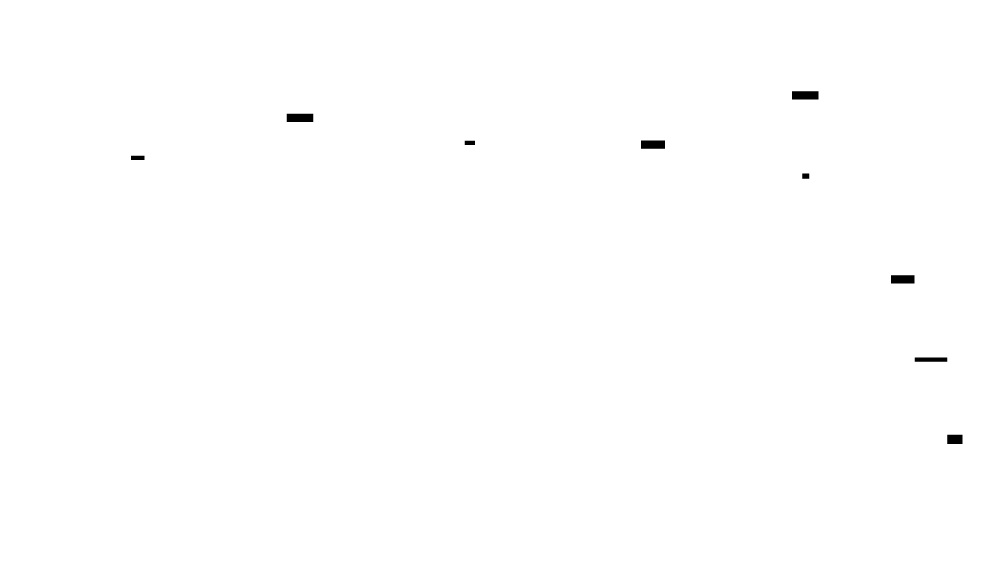
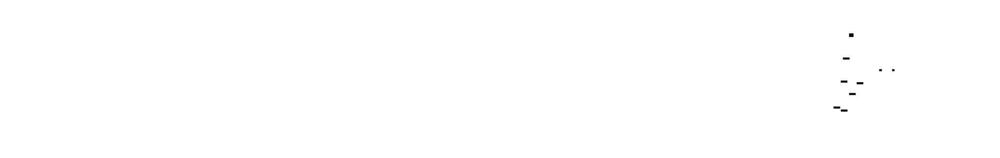
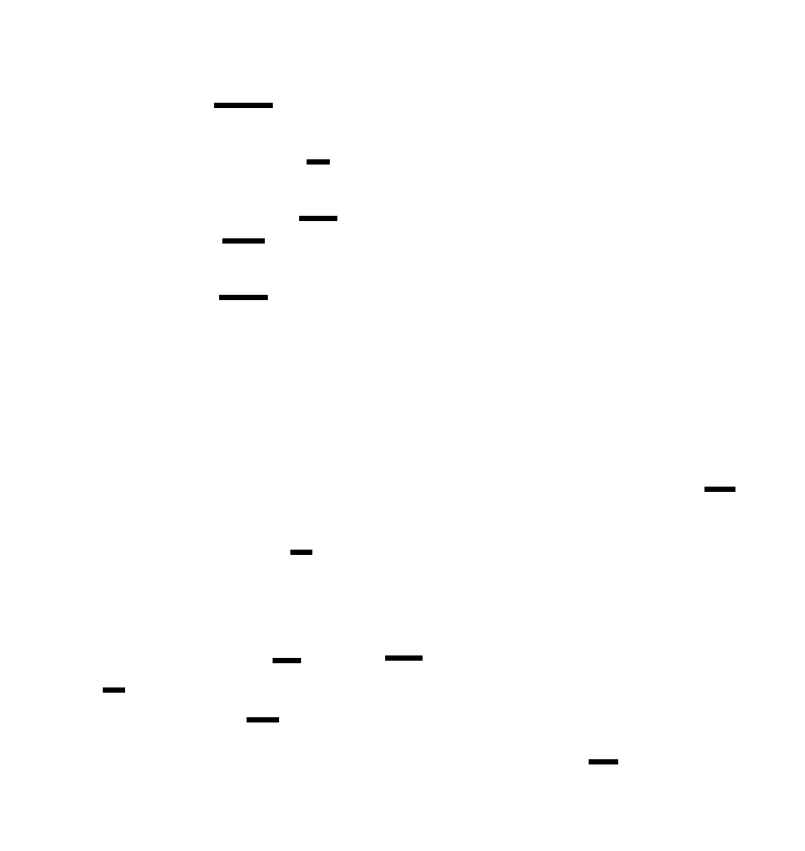

# 🎯 Project Charter: io_uring High-Performance Server
## What You Are Building
A production-grade asynchronous I/O server using Linux io_uring that boots from a minimal ring buffer implementation and progresses through file I/O with registered resources, a TCP echo server handling 10,000+ concurrent connections, and finally advanced features including zero-copy sends, SQ polling, and linked operations. By the end, you will have a complete server demonstrating 2-10x throughput improvement over traditional epoll-based implementations, with comprehensive benchmarks proving the performance gains.
## Why This Project Exists
Most developers treat Linux I/O as a black box—calling `read()`, `write()`, or `epoll_wait()` without understanding the syscall overhead that accumulates at scale. Building an io_uring server from scratch exposes the fundamental tension: every syscall costs 50-100ns minimum, and at 100K operations/second, you're burning 5-10ms of CPU just crossing the kernel boundary. io_uring inverts the traditional model by using shared memory ring buffers between kernel and userspace, eliminating syscalls in the common case. This project teaches you modern Linux I/O architecture that powers databases, web servers, and real-time systems where I/O latency directly impacts throughput.
## What You Will Be Able to Do When Done
- Initialize io_uring instances with memory-mapped ring buffers and correct memory barrier placement
- Implement batched I/O submission that processes 64+ operations with a single syscall
- Register file descriptors and buffers to eliminate per-operation kernel validation overhead
- Build a TCP server handling 10,000+ concurrent connections with provided buffer rings for scalable memory management
- Implement zero-copy network sends with correct dual-CQE handling for buffer lifecycle management
- Configure SQ polling mode to eliminate submission syscalls entirely
- Chain I/O operations atomically with failure propagation semantics
- Benchmark I/O subsystems and quantify performance differences between io_uring and epoll
- Debug asynchronous I/O race conditions and completion ordering issues
## Final Deliverable
~4,000-5,000 lines of C across 20+ source files implementing a complete io_uring server. The system boots in under 100ms, handles 10,000+ concurrent TCP connections with stable p99 latency under 10ms for 64-byte echo messages, and demonstrates 2-4x throughput improvement over epoll equivalents. Includes a benchmark suite measuring latency distributions (p50, p95, p99), throughput (ops/sec, MB/sec), and syscall counts across file I/O, network I/O, and mixed workloads.
## Is This Project For You?
**You should start this if you:**
- Have built an event loop before (epoll, select, or similar)
- Understand Linux system calls (read, write, mmap) and the syscall ABI
- Are comfortable with C or Rust memory management (pointers, allocation lifetimes)
- Want to understand modern Linux I/O at the kernel interface level
**Come back after you've learned:**
- Basic event-driven programming — build a simple epoll echo server first
- C pointer arithmetic and memory management — you'll be managing shared memory mappings
- TCP socket programming — accept, recv, send semantics
## Estimated Effort
| Phase | Time |
|-------|------|
| Basic SQ/CQ Operations & Buffer Strategies | ~10-14 hours |
| File I/O Server with Registered Resources | ~8-12 hours |
| TCP Network Server (10K connections) | ~10-14 hours |
| Zero-copy, SQ Polling, Linked Ops & Benchmarks | ~10-14 hours |
| **Total** | **~40-55 hours** |
## Definition of Done
The project is complete when:
- io_uring instance is initialized with `io_uring_setup` syscall and SQ/CQ rings are mmap'd into userspace with correct memory barriers (store-release on tail update, load-acquire on head read)
- Fixed buffers are registered with `IORING_REGISTER_BUFFERS` and used with `IORING_OP_READ_FIXED`/`WRITE_FIXED`; benchmark shows at least 2x throughput improvement over synchronous pread for 64+ concurrent 4KB random reads
- File server handles short reads by resubmitting for remaining bytes at updated offset; buffer lifetime is tracked to prevent reuse while async operation is in-flight
- TCP echo server uses `IORING_OP_ACCEPT` for async connection handling with multishot accept; handles at least 10,000 concurrent connections with p99 latency < 10ms for 64-byte echo
- Provided buffer rings are set up with `IORING_REGISTER_PBUF_RING`; receive operations select buffers from the ring and buffers are replenished when pool drops below 25% capacity
- Connection cleanup cancels in-flight operations with `IORING_OP_ASYNC_CANCEL` before closing fd to prevent use-after-free on fd reuse
- Zero-copy sends use `IORING_OP_SEND_ZC` with correct dual-CQE handling—buffer not freed until notification CQE (`IORING_CQE_F_NOTIF` flag) is received
- SQ polling mode is configurable with graceful fallback when `EPERM` is returned due to missing `CAP_SYS_NICE` privilege
- Linked SQEs with `IOSQE_IO_LINK` demonstrate atomic failure propagation—failing operation causes subsequent linked operations to return `-ECANCELED`
- Comprehensive benchmark suite measures latency (p50, p95, p99) and throughput for io_uring vs epoll under file I/O, network I/O, and mixed workloads with at least 1000 operations per configuration
- All registered resources (buffers, files, provided buffer rings) are properly unregistered during cleanup before ring teardown

---

# 📚 Before You Read This: Prerequisites & Further Reading
> **Read these first.** The Atlas assumes you are familiar with the foundations below.
> Resources are ordered by when you should encounter them — some before you start, some at specific milestones.
---
## Foundations (Read BEFORE Starting)
### Linux System Calls & Kernel Interface
**What it is:** Understanding how applications communicate with the Linux kernel through system calls.
| Resource | Type | Why It's Gold Standard |
|----------|------|----------------------|
| **The Linux Programming Interface** — Chapters 1-4, 63 | Book (Michael Kerrisk, 2010) | Definitive reference on Linux system calls. Chapter 63 covers I/O models. |
| **Linux `io_uring` man pages** — `io_uring_setup(2)`, `io_uring_enter(2)`, `io_uring_register(2)` | Spec (man7.org) | Official interface documentation. Read before any io_uring code. |
**Read before Milestone 1** — You'll need to understand syscall overhead, file descriptors, and the kernel/userspace boundary to appreciate why io_uring exists.
---
### Memory Barriers & Concurrent Programming
**What it is:** Understanding how memory ordering works when multiple agents (CPU, kernel, devices) access shared memory.
| Resource | Type | Why It's Gold Standard |
|----------|------|----------------------|
| **Memory Barriers: a Hardware View for Software Hackers** | Paper (Paul McKenney, 2010) | The clearest explanation of why memory barriers exist at the hardware level. |
| **Linux Kernel Memory Barriers** — `Documentation/memory-barriers.txt` | Spec (kernel source) | Practical guidance on acquire/release semantics used in io_uring. |
**Read before Milestone 1** — io_uring's shared ring buffers require correct memory barrier placement. Missing barriers cause bugs that only appear under load.
---
### Asynchronous I/O Concepts
**What it is:** Understanding the difference between blocking, non-blocking, and asynchronous I/O models.
| Resource | Type | Why It's Gold Standard |
|----------|------|----------------------|
| **The C10K Problem** | Article (Dan Kegel, 1999) | Historic but essential. Explains why epoll won and what problems io_uring solves. |
| ** epoll(7) man page** | Spec (man7.org) | The baseline against which io_uring is measured. Understand epoll before io_uring. |
**Read before Milestone 1** — You need to understand the epoll model (readiness notification + syscall per operation) to appreciate io_uring's approach (batched submissions through shared memory).
---
## Deep Dives
### 🔭 Ring Buffer Design (Milestone 1)
**What it is:** Lock-free circular queues with split producer/consumer ownership.
| Resource | Type | Why It's Gold Standard |
|----------|------|----------------------|
| **LMAX Disruptor Design Document** | Paper (LMAX, 2011) | Production-proven ring buffer design. The same split ownership model appears in io_uring. |
| **DPDK Ring Library** — `lib/librte_ring/` | Code (dpdk.org) | High-performance packet processing ring. Compare `rte_ring` to io_uring's SQ/CQ. |
**Read after Milestone 1 (Basic SQ/CQ Operations)** — You'll have enough context to appreciate the design tradeoffs. The Disruptor's sequencer pattern maps directly to io_uring's head/tail management.
---
### 🔭 Direct I/O & DMA (Milestone 2)
**What it is:** Bypassing the page cache and performing I/O directly between user buffers and storage devices.
| Resource | Type | Why It's Gold Standard |
|----------|------|----------------------|
| **Linux Block Layer Documentation** — `Documentation/block/` | Spec (kernel source) | Explains how I/O requests flow from VFS to block devices. |
| **NVMe Specification** — Sections on Submission/Completion Queues | Spec (NVM Express, NVM-Express-1_4-2019.06.10-Ratified) | Hardware interface for modern SSDs. io_uring's design mirrors NVMe's queue pairs. |
**Read after Milestone 2 (File I/O Server)** — You'll have experienced O_DIRECT alignment requirements and can now understand why they exist at the hardware level.
---
### 🔭 TCP/IP Networking (Milestone 3)
**What it is:** Understanding socket lifecycle, accept queues, and TCP state machines.
| Resource | Type | Why It's Gold Standard |
|----------|------|----------------------|
| **TCP/IP Illustrated, Volume 1** — Chapters 17-24 | Book (W. Richard Stevens, 1994) | The definitive explanation of TCP connection establishment and data transfer. |
| **Linux Networking Documentation** — `Documentation/networking/` | Spec (kernel source) | Kernel-side implementation details. |
**Read before Milestone 3** — Required foundational knowledge. You need to understand what happens during `connect()`, `accept()`, and why short writes occur on TCP sockets.
---
### 🔭 Zero-Copy Networking (Milestone 4)
**What it is:** Eliminating data copies by having the NIC DMA directly from user-space buffers.
| Resource | Type | Why It's Gold Standard |
|----------|------|----------------------|
| **Efficient Receive Packet Steering (RPS) and Receive Side Scaling (RSS)** | Paper (Google, 2010) | Explains the network stack optimizations that make zero-copy worthwhile. |
| **MSG_ZEROCOPY patch series** — LKML discussions | Code/Spec (kernel mailing list, 2017) | The original implementation discussion. Shows the complexity of safe zero-copy. |
**Read after Milestone 4** — You'll have implemented zero-copy sends and can understand why the dual CQE protocol exists (DMA completion ≠ buffer safety).
---
## Cross-Domain Connections
### GPU Command Buffers
**What it is:** Modern GPU APIs (Vulkan, DirectX 12) use ring buffer submission models nearly identical to io_uring.
| Resource | Type | Why It's Gold Standard |
|----------|------|----------------------|
| **Vulkan Tutorial** — "Command Buffers" chapter | Book/Tutorial (vulkan-tutorial.com) | Shows the same batch-submit-wait pattern for GPU commands. |
| **Understanding Vulkan Command Pools and Buffers** | Article (ARM Developer, 2018) | Explains why batching commands is essential for GPU performance. |
**Read after Milestone 1** — The mental model transfers directly: SQE = command buffer, CQE = fence/timeline semaphore.
---
### Database Buffer Pools
**What it is:** How databases manage memory for pages, including pinning and ownership tracking.
| Resource | Type | Why It's Gold Standard |
|----------|------|----------------------|
| **Architecture of a Database System** — Section 4.2 (Buffer Management) | Paper (Hellerstein et al., 2007) | Academic but readable explanation of buffer pool design. |
| **PostgreSQL Source** — `src/backend/storage/buffer/` | Code (postgresql.org) | Production implementation. Compare `BufferDesc` to io_uring buffer tracking. |
**Read after Milestone 2** — The buffer ownership state machine you implement mirrors database buffer pinning.
---
## Quick Reference
| Concept | Best One-Page Reference |
|---------|------------------------|
| io_uring opcodes | `include/uapi/linux/io_uring.h` (kernel source) |
| Memory barrier semantics | `tools/memory-model/Documentation/explanation.txt` (kernel source) |
| TCP state machine | RFC 793, Figure 6 |
| NVMe queue model | NVMe Specification §4.1 |
| Latency percentiles | Read Wikipedia on "Percentile" for the math, then implement a histogram |

---

# io_uring High-Performance Server

Build a high-performance TCP server using Linux io_uring, the modern asynchronous I/O interface that eliminates the syscall overhead inherent in traditional epoll-based event loops. Unlike epoll which requires a syscall per operation (epoll_wait + read/write), io_uring uses shared memory ring buffers between kernel and userspace, enabling batched submissions and completions with minimal kernel transitions. This project progresses from fundamental SQ/CQ ring management through advanced features including zero-copy I/O, provided buffer rings, SQ polling, and linked operations, culminating in comprehensive benchmarks against epoll.

The core insight is that io_uring inverts the traditional I/O model: instead of the application asking the kernel 'is data ready?' and then 'give me data,' the application posts requests to a queue and the kernel posts completions to another queue—all through shared memory that both sides can read without syscalls. This architectural shift enables throughput improvements of 2-10x for I/O-bound workloads while reducing CPU usage significantly.


<!-- MS_ID: io-uring-server-m1 -->
# Basic SQ/CQ Operations & Buffer Strategies
## The Fundamental Tension: Syscall Overhead
Every time your program asks the Linux kernel to do something—read a file, accept a connection, write to a socket—it crosses a boundary. This boundary crossing, the **syscall**, has a cost that seems small in isolation but becomes crushing at scale.
**The numbers:**
- A simple `read()` syscall: ~50-100 nanoseconds on modern hardware
- Context switch overhead: ~1-3 microseconds
- `epoll_wait()` + `read()` for one ready socket: 2 syscalls
- Processing 100,000 requests/second with epoll: **200,000+ syscalls/second**
At 100K requests/second, you're spending 2-10% of your CPU just on syscall overhead—before doing any actual work. The kernel is switching contexts, copying metadata, validating parameters, and your application is waiting.
**The hardware reality:** Your CPU can execute hundreds of instructions in the time it takes to complete one syscall. The kernel and your program live in different address spaces with different privilege levels. Every transition flushes pipeline stages, touches TLB entries, and potentially evicts cache lines.
io_uring's answer: **eliminate the transition entirely.**
Instead of asking the kernel "please do this I/O" and waiting for an answer, you write requests into a shared memory buffer the kernel can read directly. The kernel writes completions into another shared buffer you can read directly. After setup, no syscalls are needed for the common case—you batch 10, 50, 100 operations, then make ONE syscall to tell the kernel "new work available."


## The Architecture: Two Rings, Split Ownership
io_uring is built around two circular buffers (rings) that live in memory shared between your application and the kernel:
- **Submission Queue (SQ):** You write I/O requests here; the kernel reads them
- **Completion Queue (CQ):** The kernel writes results here; you read them
[[EXPLAIN:ring-buffer-index-arithmetic-(modulo-free-circular-queues)|Ring buffers that use power-of-2 sizes to avoid expensive modulo operations]]
The critical insight is **split ownership**:
| Index | Owner (writes) | Other side (reads) |
|-------|----------------|-------------------|
| SQ head | Kernel | Application |
| SQ tail | Application | Kernel |
| CQ head | Application | Kernel |
| CQ tail | Kernel | Application |
Each side only WRITES to the indices it owns. The SQ tail and CQ head are yours. The SQ head and CQ tail belong to the kernel. This split ownership means no synchronization is needed on the write side—each party writes to memory only it modifies.
**The flow:**
1. You prepare an SQE (Submission Queue Entry) at SQ array position `tail % size`
2. You increment SQ tail (with a memory barrier)
3. Kernel reads new SQEs from `head` to `tail`, incrementing `head`
4. Kernel posts CQEs (Completion Queue Entries) at CQ position `tail % size`
5. Kernel increments CQ tail (with a memory barrier)
6. You harvest CQEs from `head` to `tail`, incrementing `head`


### The Memory Layout
When you call `io_uring_setup()`, the kernel returns a file descriptor. You then `mmap()` this fd to access three regions:
```c
// After io_uring_setup, we need to mmap several regions:
// 1. SQ ring structure (head, tail, ring mask, etc.)
// 2. CQ ring structure (head, tail, ring mask, etc.)  
// 3. SQE array (the actual submission queue entries)
struct io_uring_params params = {0};
int ring_fd = syscall(__NR_io_uring_setup, 256, &params);
// Calculate sizes for mmap
size_t sq_ring_size = params.sq_off.array + params.sq_entries * sizeof(unsigned);
size_t cq_ring_size = params.cq_off.cqes + params.cq_entries * sizeof(struct io_uring_cqe);
size_t sqes_size = params.sq_entries * sizeof(struct io_uring_sqe);
// Map SQ ring
void *sq_ring = mmap(NULL, sq_ring_size, PROT_READ | PROT_WRITE,
                     MAP_SHARED | MAP_POPULATE, ring_fd, IORING_OFF_SQ_RING);
// Map SQE array (separate offset!)
struct io_uring_sqe *sqes = mmap(NULL, sqes_size, PROT_READ | PROT_WRITE,
                                  MAP_SHARED | MAP_POPULATE, ring_fd, IORING_OFF_SQES);
// Map CQ ring (may be in same mapping as SQ ring if using single mmap)
void *cq_ring = mmap(NULL, cq_ring_size, PROT_READ | PROT_WRITE,
                     MAP_SHARED | MAP_POPULATE, ring_fd, IORING_OFF_CQ_RING);
```
The `io_uring_params` structure tells you the offsets within the mapped memory:
```c
struct io_uring_params {
    __u32 sq_entries;       // Number of SQ entries
    __u32 cq_entries;       // Number of CQ entries (usually 2x sq_entries)
    __u32 flags;            // Feature flags
    __u32 sq_thread_cpu;    // CPU for SQ polling thread
    __u32 sq_thread_idle;   // SQ poll thread idle timeout (ms)
    __u32 features;         // Kernel features
    __u32 wq_fd;            // Workqueue file descriptor
    __u32 resv[3];          // Reserved
    struct io_sqring_offsets sq_off;  // SQ ring offsets
    struct io_cqring_offsets cq_off;  // CQ ring offsets
};
```
The offset structures tell you where `head`, `tail`, `ring_mask`, and the array live within the mapped memory:
```c
struct io_sqring_offsets {
    __u32 head;      // Offset to head index
    __u32 tail;      // Offset to tail index
    __u32 ring_mask; // Mask for index wrapping (entries - 1)
    __u32 ring_entries; // Number of entries
    __u32 flags;     // Ring flags
    __u32 dropped;   // Number of dropped SQEs
    __u32 array;     // Offset to SQE index array
    __u32 resv[3];
};
```
[[EXPLAIN:cache-line-alignment-(64-byte-boundaries)|Cache lines and why the ring structures are laid out the way they are]]
## Memory Barriers: Not Optional, Not Just for Weak Memory Models
Here's where most developers go wrong: they assume x86's strong memory model means they don't need memory barriers. "x86 preserves ordering," they think. "I'll just write to tail and the kernel will see it."
**The trap:** x86 preserves ordering for memory operations, but **the compiler doesn't know about the kernel**.
```c
// DANGEROUS: compiler may reorder these!
*sq_tail = new_tail;           // Write tail
sqes[index].opcode = IORING_OP_READ;  // Write SQE data
```
The compiler sees two independent memory writes. It's free to reorder them. If the kernel reads `sq_tail` before your SQE data is written, it will process garbage.
[[EXPLAIN:memory-barriers-(acquire/release-semantics)|Acquire and release semantics: what they guarantee and why you need them]]
The solution: **store-release** when publishing, **load-acquire** when consuming.
```c
// Publishing to kernel: ensure all SQE writes complete before tail update
io_uring_smp_store_release(sq_tail, new_tail);
// Reading from kernel: ensure we read CQE data after seeing tail update
unsigned int new_tail = io_uring_smp_load_acquire(cq_tail);
if (new_tail != *cq_head) {
    // Safe to read CQE data now
    struct io_uring_cqe *cqe = &cqes[*cq_head & cq_ring_mask];
    // ... process cqe ...
}
```


The `io_uring_smp_store_release` and `io_uring_smp_load_acquire` are defined in the kernel headers. On x86, they compile to compiler barriers (`asm volatile("" ::: "memory")`) because x86 hardware already provides the required ordering. On ARM, they compile to actual barrier instructions (`dmb ish`).
```c
// From barrier.h in liburing/kernel headers
#define io_uring_smp_store_release(p, v)            \
    do {                                            \
        __asm__ __volatile__("" ::: "memory");      \
        *(p) = (v);                                 \
    } while (0)
#define io_uring_smp_load_acquire(p)                \
    ({                                              \
        __typeof__(*(p)) __v = *(p);                \
        __asm__ __volatile__("" ::: "memory");      \
        __v;                                        \
    })
```
**Why this matters:** Missing barriers cause bugs that are nearly impossible to reproduce. The kernel might see stale data once in a million operations—usually under heavy load, when you're benchmarking, or in production at 3 AM. Always use the barriers.
## The SQE: Your I/O Request
The Submission Queue Entry (SQE) is a 64-byte structure that describes one I/O operation:
```c
struct io_uring_sqe {
    __u8    opcode;         /* Type of operation (READ, WRITE, ACCEPT, etc.) */
    __u8    flags;          /* SQE flags (FIXED_FILE, IO_LINK, IO_DRAIN, etc.) */
    __u16   ioprio;         /* I/O priority */
    __s32   fd;             /* File descriptor */
    union {
        __u64   off;        /* Offset for read/write */
        __u64   addr2;      /* Second address for some ops */
    };
    __u64   addr;           /* Buffer address or pointer */
    __u32   len;            /* Buffer length or parameter */
    union {
        __kernel_rwf_t  rw_flags;   /* read/write flags */
        __u32           fsync_flags;
        __u16           poll_events;
        __u32           sync_range_flags;
        __u32           msg_flags;
        __u32           timeout_flags;
        __u32           accept_flags;
        __u32           cancel_flags;
        __u32           open_flags;
        __u32           statx_flags;
        __u32           fadvise_advice;
        __u32           splice_flags;
    };
    __u64   user_data;      /* Copied to CQE, for request identification */
    union {
        __u16   buf_index;  /* Buffer index for fixed buffers */
        __u16   buf_group;  /* Buffer group for provided buffers */
    };
    __u16   personality;    /* Credentials personality */
    __s32   splice_fd_in;   /* Splice source fd */
    __u64   addr3;          /* Third address for some ops */
    __u64   __pad2[1];      /* Padding to 64 bytes */
};
```
The 64-byte size is intentional: it's exactly one cache line. An SQE never straddles cache lines, which matters when you're preparing dozens of them.


> **🔑 Foundation: How Linux returns errors and what negative values in CQE res mean**
> 
> ## What It Is
In Linux, system calls communicate errors through a specific convention: **negative return values encode errno codes**. When a syscall fails, it returns a negative integer whose absolute value is the errno number defined in the kernel headers.
For example:
- Return `-22` means `EINVAL` (Invalid argument) — errno 22
- Return `-9` means `EBADF` (Bad file descriptor) — errno 9
- Return `-11` means `EAGAIN` (Resource temporarily unavailable) — errno 11
This convention extends to io_uring: the `res` field in a Completion Queue Entry (CQE) follows the same rule. A negative `res` indicates failure, and `-res` is your errno.
## Why You Need It Right Now
When reading io_uring completion results, you'll check `cqe->res`. If it's negative, your operation failed:
```c
// After io_uring_wait_cqe()...
if (cqe->res < 0) {
    // Convert to human-readable or use standard errno handling
    fprintf(stderr, "Operation failed: %s\n", strerror(-cqe->res));
}
```
This matters because:
1. **io_uring doesn't set `errno` for you** — the error lives in `cqe->res`
2. You can use standard functions like `strerror(-cqe->res)` to get error messages
3. Common errors you'll see: `-EAGAIN` (queue full, try again), `-EINVAL` (bad parameters), `-ECANCELED` (operation was canceled)
## Key Insight: The Negation Is the Translation
Think of it as: **the kernel inverts errno to signal "this is an error, not a return value."**
Normal syscalls return `-1` and set `errno` in userspace. io_uring can't do that — it's asynchronous. Instead, it bundles the error directly into the result field, using negativity as the error flag. The moment you see a negative `res`, your mental model should switch from "how many bytes?" to "which errno?"

### Preparing an SQE
You don't directly index the SQE array by `tail % size`. Instead, there's an indirection: the SQ ring has an `array` that maps logical indices to physical SQE slots. This allows the kernel to consume SQEs in any order while you can still prepare them sequentially.
```c
struct sqe_submission {
    struct io_uring_sqe *sqes;      // SQE array base
    unsigned int *sq_array;         // Index array
    unsigned int *sq_head;
    unsigned int *sq_tail;
    unsigned int sq_ring_mask;
    unsigned int sq_entries;
};
// Get next available SQE slot
struct io_uring_sqe *get_sqe(struct sqe_submission *sq) {
    unsigned int head = io_uring_smp_load_acquire(sq->sq_head);
    unsigned int tail = *sq->sq_tail;
    if (tail - head >= sq->sq_entries) {
        return NULL;  // Queue full
    }
    // SQE at physical position tail % entries
    struct io_uring_sqe *sqe = &sq->sqes[tail & sq->sq_ring_mask];
    // Clear any stale data (important for security and correctness)
    memset(sqe, 0, sizeof(*sqe));
    // Record this SQE index in the array
    sq->sq_array[tail & sq->sq_ring_mask] = tail & sq->sq_ring_mask;
    return sqe;
}
// Prepare a read operation
void prep_read(struct io_uring_sqe *sqe, int fd, void *buf, 
               size_t len, off_t offset, __u64 user_data) {
    sqe->opcode = IORING_OP_READ;
    sqe->fd = fd;
    sqe->addr = (__u64)(uintptr_t)buf;
    sqe->len = len;
    sqe->off = offset;
    sqe->user_data = user_data;
    // flags, ioprio, rw_flags default to 0
}
// Commit prepared SQEs
void submit_sqes(struct sqe_submission *sq, unsigned int count) {
    // Memory barrier ensures SQE writes are visible before tail update
    io_uring_smp_store_release(sq->sq_tail, *sq->sq_tail + count);
}
```
## The CQE: The Kernel's Answer
Completion Queue Entries are simpler—only 16 bytes:
```c
struct io_uring_cqe {
    __u64   user_data;  /* Copied from SQE, identifies the request */
    __s32   res;        /* Result: bytes transferred, or negative errno */
    __u32   flags;      /* Flags (BUFFER for provided buffers, MORE for multishot, etc.) */
};
```
The `user_data` field is your handle to match completions back to requests. If you submit a read with `user_data = 0x1234`, the CQE will have `user_data = 0x1234`. This is crucial because completions can arrive out of order—a later write might complete before an earlier read.
The `res` field contains the result:
- **Positive:** Success, value is bytes transferred (or similar operation-specific result)
- **Zero:** Success but no data (e.g., EOF on read)
- **Negative:** Error, value is `-errno` (e.g., `-EAGAIN` is `-11`)
### Harvesting CQEs
```c
struct cq_completion {
    struct io_uring_cqe *cqes;
    unsigned int *cq_head;
    unsigned int *cq_tail;
    unsigned int cq_ring_mask;
};
// Check for completions without blocking
int peek_cqe(struct cq_completion *cq, struct io_uring_cqe **cqe_ptr) {
    unsigned int tail = io_uring_smp_load_acquire(cq->cq_tail);
    unsigned int head = *cq->cq_head;
    if (head == tail) {
        *cqe_ptr = NULL;
        return 0;  // No completions available
    }
    // Memory barrier already done in load_acquire above
    *cqe_ptr = &cq->cqes[head & cq->cq_ring_mask];
    return 1;
}
// Mark a CQE as consumed
void advance_cq(struct cq_completion *cq) {
    *cq->cq_head = *cq->cq_head + 1;
    // No barrier needed: we're only updating our index, kernel will
    // load_acquire when it checks for space
}
// Process all available completions
void process_completions(struct cq_completion *cq, 
                         void (*handler)(struct io_uring_cqe *, void *),
                         void *ctx) {
    struct io_uring_cqe *cqe;
    while (peek_cqe(cq, &cqe)) {
        // Check for errors
        if (cqe->res < 0) {
            handle_cqe_error(cqe);
        }
        // Call the handler
        handler(cqe, ctx);
        // Mark as consumed
        advance_cq(cq);
    }
}
```
## Batched Submission: The Core Performance Win
The fundamental advantage of io_uring is **batching**. Instead of:
```
syscall(read, fd1, buf1) → wait → return
syscall(read, fd2, buf2) → wait → return
syscall(read, fd3, buf3) → wait → return
```
You do:
```
prepare SQE for fd1
prepare SQE for fd2
prepare SQE for fd3
io_uring_enter(N=3) → kernel processes all three → return
harvest 3 CQEs
```
The `io_uring_enter` syscall is the bridge between your prepared SQEs and kernel execution:
```c
int io_uring_enter(unsigned int fd, unsigned int to_submit,
                   unsigned int min_complete, unsigned int flags,
                   sigset_t *sig);
```
- `fd`: The ring file descriptor from `io_uring_setup`
- `to_submit`: Number of SQEs to submit (0 = just reap completions)
- `min_complete`: Minimum completions to wait for (0 = don't wait)
- `flags`: Options like `IORING_ENTER_GETEVENTS` (block until min_complete)
```c
// Submit prepared SQEs and optionally wait for completions
int submit_and_wait(struct io_uring *ring, unsigned int submit, 
                    unsigned int wait_for) {
    unsigned int flags = 0;
    if (wait_for > 0) {
        flags |= IORING_ENTER_GETEVENTS;
    }
    return syscall(__NR_io_uring_enter, ring->ring_fd, 
                   submit, wait_for, flags, NULL, 0);
}
// Example: batch 10 reads, wait for all to complete
void batch_reads_example(struct io_uring *ring, int *fds, 
                         void **bufs, size_t *lens, int n) {
    // Prepare all SQEs
    for (int i = 0; i < n; i++) {
        struct io_uring_sqe *sqe = get_sqe(ring);
        prep_read(sqe, fds[i], bufs[i], lens[i], 0, i);
    }
    // Single syscall to submit all
    int ret = submit_and_wait(ring, n, n);
    if (ret < 0) {
        perror("io_uring_enter");
        return;
    }
    // Harvest completions
    for (int i = 0; i < n; i++) {
        struct io_uring_cqe *cqe;
        if (peek_cqe(ring, &cqe)) {
            printf("Request %lu: %d bytes\n", 
                   cqe->user_data, cqe->res);
            advance_cq(ring);
        }
    }
}
```


### Measuring the Difference
```c
// Benchmark: 1000 reads via synchronous pread vs io_uring batch
void benchmark_comparison(void) {
    const int N = 1000;
    const size_t BUF_SIZE = 4096;
    // Setup: open file, allocate buffers
    int fd = open("testfile", O_RDONLY);
    char *bufs[N];
    for (int i = 0; i < N; i++) {
        bufs[i] = aligned_alloc(4096, BUF_SIZE);
    }
    // === Synchronous pread (1000 syscalls) ===
    struct timespec start, end;
    clock_gettime(CLOCK_MONOTONIC, &start);
    for (int i = 0; i < N; i++) {
        pread(fd, bufs[i], BUF_SIZE, i * BUF_SIZE);
    }
    clock_gettime(CLOCK_MONOTONIC, &end);
    long pread_ns = (end.tv_sec - start.tv_sec) * 1000000000L +
                    (end.tv_nsec - start.tv_nsec);
    // === io_uring batched (submit N, 1 syscall, reap N) ===
    struct io_uring ring;
    io_uring_queue_init(256, &ring, 0);
    clock_gettime(CLOCK_MONOTONIC, &start);
    // Prepare all SQEs
    for (int i = 0; i < N; i++) {
        struct io_uring_sqe *sqe = io_uring_get_sqe(&ring);
        io_uring_prep_read(sqe, fd, bufs[i], BUF_SIZE, i * BUF_SIZE, i);
    }
    // Single submission syscall
    io_uring_submit_and_wait(&ring, N);
    // Harvest all completions
    for (int i = 0; i < N; i++) {
        struct io_uring_cqe *cqe;
        io_uring_wait_cqe(&ring, &cqe);
        io_uring_cqe_seen(&ring, cqe);
    }
    clock_gettime(CLOCK_MONOTONIC, &end);
    long iouring_ns = (end.tv_sec - start.tv_sec) * 1000000000L +
                      (end.tv_nsec - start.tv_nsec);
    printf("pread (1000 syscalls):    %ld ns (%.1f ns/op)\n", 
           pread_ns, pread_ns / (double)N);
    printf("io_uring (batched):       %ld ns (%.1f ns/op)\n", 
           iouring_ns, iouring_ns / (double)N);
    printf("Speedup:                  %.2fx\n", 
           pread_ns / (double)iouring_ns);
    io_uring_queue_exit(&ring);
}
```
Typical results on SSD storage:
- `pread` (1000 syscalls): ~500-800 ns/op (dominated by syscall overhead)
- `io_uring` (batched 1000): ~50-150 ns/op (syscall amortized)
- **Speedup: 3-8x for cached data, 1.5-2x for actual disk I/O** (disk latency dominates there)
## Fixed Buffer Registration: Eliminating Per-Op Validation
When you use `IORING_OP_READ`, the kernel must validate your buffer on every operation:
- Is the address in user space?
- Is the memory mapped and readable?
- Does it span multiple VMA regions?
This validation costs ~50-100ns per operation. For 100K ops/second, that's 5-10ms of CPU time—just checking pointers.
**Fixed buffers** are pre-validated and "pinned" in memory. The kernel checks them once during registration, then trusts that the buffer remains valid. This also enables zero-copy DMA transfers directly from your user-space buffer.
```c
struct iovec {
    void  *iov_base;  // Buffer address
    size_t iov_len;   // Buffer length
};
// Register fixed buffers
int register_fixed_buffers(int ring_fd, struct iovec *iovecs, int n) {
    return syscall(__NR_io_uring_register, ring_fd,
                   IORING_REGISTER_BUFFERS, iovecs, n);
}
// Use fixed buffer in SQE
void prep_read_fixed(struct io_uring_sqe *sqe, int fd,
                     unsigned int buf_index, size_t len, 
                     off_t offset, __u64 user_data) {
    sqe->opcode = IORING_OP_READ_FIXED;
    sqe->fd = fd;
    sqe->addr = 0;  // Ignored for fixed buffers; buf_index selects it
    sqe->len = len;
    sqe->off = offset;
    sqe->buf_index = buf_index;
    sqe->user_data = user_data;
}
```


### Alignment Requirements
Fixed buffers have strict alignment requirements:
- The buffer's starting address should be page-aligned (4KB or 2MB)
- The length should ideally be a multiple of page size
- Some kernel versions are stricter than others
```c
// Allocate page-aligned buffers for fixed registration
struct iovec *alloc_fixed_buffers(int n, size_t size) {
    struct iovec *iovecs = calloc(n, sizeof(struct iovec));
    for (int i = 0; i < n; i++) {
        // posix_memalign guarantees alignment
        void *buf;
        int ret = posix_memalign(&buf, 4096, size);
        if (ret != 0) {
            perror("posix_memalign");
            exit(1);
        }
        iovecs[i].iov_base = buf;
        iovecs[i].iov_len = size;
    }
    return iovecs;
}
// Register and use
void fixed_buffer_example(struct io_uring *ring, int fd) {
    const int N_BUFS = 64;
    const size_t BUF_SIZE = 4096;
    // Allocate aligned buffers
    struct iovec *iovecs = alloc_fixed_buffers(N_BUFS, BUF_SIZE);
    // Register with kernel
    int ret = io_uring_register_buffers(ring, iovecs, N_BUFS);
    if (ret < 0) {
        fprintf(stderr, "Buffer registration failed: %s\n", 
                strerror(-ret));
        exit(1);
    }
    // Now use READ_FIXED instead of READ
    for (int i = 0; i < N_BUFS; i++) {
        struct io_uring_sqe *sqe = io_uring_get_sqe(ring);
        io_uring_prep_read_fixed(sqe, fd, iovecs[i].iov_base, 
                                 BUF_SIZE, i * BUF_SIZE, i);
        sqe->buf_index = i;  // Which registered buffer to use
    }
    io_uring_submit(ring);
    // ... harvest completions ...
    // Cleanup
    io_uring_unregister_buffers(ring);
    for (int i = 0; i < N_BUFS; i++) {
        free(iovecs[i].iov_base);
    }
    free(iovecs);
}
```
## Provided Buffer Rings: Kernel-Managed Buffer Selection
Fixed buffers require YOU to manage which buffer goes with which operation. For 64 concurrent reads, you need to track 64 buffer assignments. Scale to 10,000 connections, and buffer tracking becomes complex.
**Provided buffer rings** flip the model: you provide a pool of buffers, and the kernel SELECTS which one to use for each receive operation. This enables true zero-allocation hot paths.
```c
// Structure for registering a provided buffer ring
struct io_uring_buf_reg {
    __u64 ring_addr;     // Address of the buffer ring
    __u32 ring_entries;  // Number of entries
    __u16 bgid;          // Buffer group ID (0-65535)
    __u16 pad;
    __u64 pad2[3];
};
// Each entry in the buffer ring
struct io_uring_buf {
    __u64 addr;   // Buffer address
    __u32 len;    // Buffer length
    __u16 bid;    // Buffer ID (your identifier)
    __u16 resv;
};
```
### Setting Up a Provided Buffer Ring
```c
struct provided_buffer_ring {
    struct io_uring_buf *buf_ring;  // The ring itself
    unsigned int ring_size;
    __u16 bgid;                     // Buffer group ID
    void **buffers;                 // Track buffer addresses
    unsigned int *buffer_lens;
    unsigned int n_buffers;
};
int setup_provided_buffer_ring(struct io_uring *ring, 
                                struct provided_buffer_ring *pbr,
                                __u16 bgid, 
                                unsigned int n_buffers,
                                size_t buffer_size) {
    // Allocate the buffer ring structure
    // Size must be page-aligned and is actually a header + entries
    size_t ring_size = n_buffers * sizeof(struct io_uring_buf);
    ring_size = (ring_size + 4095) & ~4095;  // Round up to page
    pbr->buf_ring = aligned_alloc(4096, ring_size);
    if (!pbr->buf_ring) return -ENOMEM;
    memset(pbr->buf_ring, 0, ring_size);
    // Allocate actual data buffers
    pbr->buffers = calloc(n_buffers, sizeof(void*));
    pbr->buffer_lens = calloc(n_buffers, sizeof(unsigned int));
    pbr->n_buffers = n_buffers;
    for (unsigned int i = 0; i < n_buffers; i++) {
        pbr->buffers[i] = aligned_alloc(4096, buffer_size);
        pbr->buffer_lens[i] = buffer_size;
    }
    // Fill the buffer ring with entries
    // The ring is a simple array we populate from 0 to n-1
    for (unsigned int i = 0; i < n_buffers; i++) {
        pbr->buf_ring[i].addr = (__u64)(uintptr_t)pbr->buffers[i];
        pbr->buf_ring[i].len = buffer_size;
        pbr->buf_ring[i].bid = i;  // Our buffer ID
    }
    // Register with kernel
    struct io_uring_buf_reg reg = {
        .ring_addr = (__u64)(uintptr_t)pbr->buf_ring,
        .ring_entries = n_buffers,
        .bgid = bgid,
    };
    int ret = syscall(__NR_io_uring_register, ring->ring_fd,
                      IORING_REGISTER_PBUF_RING, &reg, 1);
    if (ret < 0) {
        // Kernel version check - requires 5.19+
        if (errno == EINVAL) {
            fprintf(stderr, "Provided buffer rings require kernel 5.19+\n");
        }
        return ret;
    }
    pbr->bgid = bgid;
    pbr->ring_size = ring_size;
    return 0;
}
```


### Using Provided Buffers in Operations
When you submit a receive with a buffer group ID, the kernel selects an available buffer from that group:
```c
// Submit a receive using provided buffer
void prep_recv_with_provided_buf(struct io_uring_sqe *sqe, int fd,
                                  __u16 bgid, __u64 user_data) {
    sqe->opcode = IORING_OP_RECV;
    sqe->fd = fd;
    sqe->addr = 0;          // No buffer addr - kernel selects
    sqe->len = 0;           // No len - use buffer size
    sqe->buf_group = bgid;  // Buffer group ID
    sqe->flags |= IOSQE_BUFFER_SELECT;  // Request buffer selection
    sqe->user_data = user_data;
}
```
When the CQE arrives, the `flags` field tells you which buffer was used:
```c
// Extract buffer ID from CQE flags
#define IORING_CQE_BUFFER_SHIFT 16
void handle_recv_cqe(struct io_uring_cqe *cqe, 
                     struct provided_buffer_ring *pbr) {
    if (cqe->res < 0) {
        // Error
        fprintf(stderr, "Recv failed: %s\n", strerror(-cqe->res));
        return;
    }
    if (cqe->flags & IORING_CQE_F_BUFFER) {
        // Kernel selected a buffer for us
        __u16 bid = cqe->flags >> IORING_CQE_BUFFER_SHIFT;
        printf("Received %d bytes into buffer %d\n", cqe->res, bid);
        // Access the data
        void *data = pbr->buffers[bid];
        size_t len = cqe->res;
        // Process the data...
        process_data(data, len);
        // IMPORTANT: Return buffer to ring when done!
        // (see replenishment section below)
    } else {
        // No buffer selected (shouldn't happen for RECV with BUFFER_SELECT)
        fprintf(stderr, "No buffer selected!\n");
    }
}
```


### Replenishing the Buffer Ring
When the kernel uses a buffer, it's removed from the available pool. You must return it when you're done processing. The mechanism differs from what you might expect—you don't call a "return" function. Instead, you add the buffer back to the ring tail:
```c
// Return a buffer to the provided ring
// Note: This requires IORING_REGISTER_PBUF_STATUS or manual ring management
// The exact API depends on kernel version
// For kernel 6.0+, use io_uring_buf_ring functions:
void replenish_buffer(struct provided_buffer_ring *pbr, 
                      __u16 bid, size_t new_len) {
    // Update buffer entry
    // Note: The ring structure includes a tail pointer we need to update
    // This is complex - liburing provides helpers
    // Simplified: in practice, use liburing's io_uring_buf_ring_* functions
}
```
**The practical approach:** Use liburing's buffer ring helpers for this. The manual implementation requires understanding the internal ring structure layout, which varies by kernel version.
```c
// Using liburing's helpers (recommended)
#include <liburing.h>
void setup_buf_ring_liburing(struct io_uring *ring, int n, size_t size, int bgid) {
    struct io_uring_buf_ring *br;
    br = io_uring_setup_buf_ring(ring, n, bgid, 0);
    if (!br) {
        perror("io_uring_setup_buf_ring");
        return;
    }
    // Add buffers to the ring
    for (int i = 0; i < n; i++) {
        void *buf = aligned_alloc(4096, size);
        io_uring_buf_ring_add(br, buf, size, i, 0, i);
    }
    io_uring_buf_ring_advance(br, n);
}
void return_buffer_liburing(struct io_uring_buf_ring *br, 
                            void *buf, size_t len, int bid) {
    io_uring_buf_ring_add(br, buf, len, bid, 0, 0);
    io_uring_buf_ring_advance(br, 1);
}
```
## CQE Error Handling
The CQE's `res` field contains the operation result. Negative values indicate errors:
```c
// Common error values (these are positive errno, negate for CQE res)
#define EAGAIN  11   // Resource temporarily unavailable
#define ECANCELED 125 // Operation canceled
#define EBUSY   16   // Device or resource busy
#define ENOBUFS 105  // No buffer space available (provided buffer ring empty)
#define EBADF   9    // Bad file descriptor
#define EINVAL  22   // Invalid argument
```


### Error Handling Decision Tree
```c
void handle_cqe_result(struct io_uring_cqe *cqe, struct io_uring_sqe *retry_sqe) {
    if (cqe->res >= 0) {
        // Success - res contains bytes transferred or other result
        handle_success(cqe);
        return;
    }
    int err = -cqe->res;  // Convert to positive errno
    switch (err) {
    case EAGAIN:
        // Resource temporarily unavailable - retry later
        // This is normal for non-blocking operations
        schedule_retry(retry_sqe, 1000);  // Retry after 1ms
        break;
    case ECANCELED:
        // Operation was canceled (via ASYNC_CANCEL or shutdown)
        // Clean up state, no retry needed
        cleanup_cancelled_operation(cqe->user_data);
        break;
    case EBUSY:
        // Ring or resource is busy
        // Back off and retry
        schedule_retry(retry_sqe, 10000);  // Retry after 10ms
        break;
    case ENOBUFS:
        // Provided buffer ring exhausted
        // Replenish buffers and retry
        replenish_buffer_ring();
        schedule_retry(retry_sqe, 100);
        break;
    case EBADF:
        // Bad file descriptor - programming error or closed fd
        log_error("Bad file descriptor in request %lu", cqe->user_data);
        // Don't retry - fix the code
        break;
    case EINVAL:
        // Invalid parameters - programming error
        log_error("Invalid parameters in request %lu", cqe->user_data);
        // Don't retry - fix the code
        break;
    default:
        // Unknown error - log and possibly retry
        log_error("Unknown error %d in request %lu", err, cqe->user_data);
        break;
    }
}
```
### Detecting CQ Overflow
The CQ has limited space. If the kernel produces completions faster than you harvest them, completions are silently dropped. Check the overflow flag:
```c
// In the SQ ring, check for overflow
unsigned int *sq_dropped;  // Offset from sq_off.dropped
unsigned int dropped = *sq_dropped;
if (dropped > 0) {
    // Completions were lost!
    // This is fatal for most applications
    fprintf(stderr, "CQ overflow: %u completions dropped\n", dropped);
    // Must reinitialize the ring
}
```
**Preventing overflow:**
- Make CQ large enough (kernel defaults to 2x SQ size)
- Harvest completions frequently (don't let them pile up)
- Use `IORING_SETUP_CQSIZE` to explicitly set CQ size if needed
```c
struct io_uring_params params = {0};
params.flags = IORING_SETUP_CQSIZE;
params.cq_entries = 4096;  // Explicit CQ size
int fd = syscall(__NR_io_uring_setup, 256, &params);
```
## Resource Cleanup
Proper cleanup is critical. Registered resources persist until explicitly unregistered, and the ring itself consumes kernel memory.
```c
struct io_uring_context {
    int ring_fd;
    void *sq_ring;
    void *cq_ring;
    struct io_uring_sqe *sqes;
    size_t sq_ring_size;
    size_t cq_ring_size;
    size_t sqes_size;
    // Registered resources
    bool buffers_registered;
    bool files_registered;
    bool pbuf_ring_registered;
    __u16 pbuf_ring_bgid;
};
void cleanup_io_uring(struct io_uring_context *ctx) {
    // 1. Unregister resources (order doesn't matter, but do before munmap)
    if (ctx->pbuf_ring_registered) {
        struct io_uring_buf_reg reg = { .bgid = ctx->pbuf_ring_bgid };
        syscall(__NR_io_uring_register, ctx->ring_fd,
                IORING_UNREGISTER_PBUF_RING, &reg, 1);
    }
    if (ctx->buffers_registered) {
        syscall(__NR_io_uring_register, ctx->ring_fd,
                IORING_UNREGISTER_BUFFERS, NULL, 0);
    }
    if (ctx->files_registered) {
        syscall(__NR_io_uring_register, ctx->ring_fd,
                IORING_UNREGISTER_FILES, NULL, 0);
    }
    // 2. Unmap shared memory
    if (ctx->sq_ring) {
        munmap(ctx->sq_ring, ctx->sq_ring_size);
    }
    if (ctx->cq_ring && ctx->cq_ring != ctx->sq_ring) {
        munmap(ctx->cq_ring, ctx->cq_ring_size);
    }
    if (ctx->sqes) {
        munmap(ctx->sqes, ctx->sqes_size);
    }
    // 3. Close ring file descriptor
    if (ctx->ring_fd >= 0) {
        close(ctx->ring_fd);
    }
    memset(ctx, 0, sizeof(*ctx));
}
```
## Complete Example: Minimal io_uring Echo
Here's a complete, working example that demonstrates all the concepts:
```c
#include <stdio.h>
#include <stdlib.h>
#include <string.h>
#include <unistd.h>
#include <fcntl.h>
#include <sys/mman.h>
#include <sys/syscall.h>
#include <linux/io_uring.h>
#include <errno.h>
// Memory barrier definitions
#define smp_store_release(p, v) do { \
    __asm__ __volatile__("" ::: "memory"); *(p) = (v); } while (0)
#define smp_load_acquire(p) ({ \
    __typeof__(*(p)) __v = *(p); __asm__ __volatile__("" ::: "memory"); __v; })
// Ring structure
struct io_uring {
    int fd;
    // SQ state
    unsigned int *sq_head;
    unsigned int *sq_tail;
    unsigned int *sq_ring_mask;
    unsigned int *sq_array;
    struct io_uring_sqe *sqes;
    unsigned int sq_entries;
    // CQ state
    unsigned int *cq_head;
    unsigned int *cq_tail;
    unsigned int *cq_ring_mask;
    struct io_uring_cqe *cqes;
    unsigned int cq_entries;
};
// Initialize ring
int io_uring_queue_init(struct io_uring *ring, unsigned int entries) {
    struct io_uring_params params = {0};
    int fd = syscall(__NR_io_uring_setup, entries, &params);
    if (fd < 0) return -errno;
    ring->fd = fd;
    ring->sq_entries = params.sq_entries;
    ring->cq_entries = params.cq_entries;
    // Calculate sizes
    size_t sq_ring_sz = params.sq_off.array + 
                        params.sq_entries * sizeof(unsigned);
    size_t cq_ring_sz = params.cq_off.cqes + 
                        params.cq_entries * sizeof(struct io_uring_cqe);
    size_t sqes_sz = params.sq_entries * sizeof(struct io_uring_sqe);
    // Map SQ ring
    void *sq_ring = mmap(NULL, sq_ring_sz, PROT_READ | PROT_WRITE,
                         MAP_SHARED | MAP_POPULATE, fd, IORING_OFF_SQ_RING);
    if (sq_ring == MAP_FAILED) { close(fd); return -errno; }
    // Map SQEs
    void *sqes = mmap(NULL, sqes_sz, PROT_READ | PROT_WRITE,
                      MAP_SHARED | MAP_POPULATE, fd, IORING_OFF_SQES);
    if (sqes == MAP_FAILED) { munmap(sq_ring, sq_ring_sz); close(fd); return -errno; }
    // Map CQ ring
    void *cq_ring = mmap(NULL, cq_ring_sz, PROT_READ | PROT_WRITE,
                         MAP_SHARED | MAP_POPULATE, fd, IORING_OFF_CQ_RING);
    if (cq_ring == MAP_FAILED) { 
        munmap(sqes, sqes_sz); 
        munmap(sq_ring, sq_ring_sz); 
        close(fd); 
        return -errno; 
    }
    // Set up pointers using offsets from params
    ring->sq_head = (unsigned int *)((char *)sq_ring + params.sq_off.head);
    ring->sq_tail = (unsigned int *)((char *)sq_ring + params.sq_off.tail);
    ring->sq_ring_mask = (unsigned int *)((char *)sq_ring + params.sq_off.ring_mask);
    ring->sq_array = (unsigned int *)((char *)sq_ring + params.sq_off.array);
    ring->sqes = (struct io_uring_sqe *)sqes;
    ring->cq_head = (unsigned int *)((char *)cq_ring + params.cq_off.head);
    ring->cq_tail = (unsigned int *)((char *)cq_ring + params.cq_off.tail);
    ring->cq_ring_mask = (unsigned int *)((char *)cq_ring + params.cq_off.ring_mask);
    ring->cqes = (struct io_uring_cqe *)((char *)cq_ring + params.cq_off.cqes);
    return 0;
}
// Get next SQE
struct io_uring_sqe *io_uring_get_sqe(struct io_uring *ring) {
    unsigned int head = smp_load_acquire(ring->sq_head);
    unsigned int tail = *ring->sq_tail;
    if (tail - head >= ring->sq_entries) {
        return NULL;  // Full
    }
    struct io_uring_sqe *sqe = &ring->sqes[tail & *ring->sq_ring_mask];
    memset(sqe, 0, sizeof(*sqe));
    ring->sq_array[tail & *ring->sq_ring_mask] = tail & *ring->sq_ring_mask;
    return sqe;
}
// Submit SQEs
int io_uring_submit(struct io_uring *ring) {
    unsigned int tail = *ring->sq_tail;
    smp_store_release(ring->sq_tail, tail + 1);
    return syscall(__NR_io_uring_enter, ring->fd, 1, 0, 0, NULL, 0);
}
// Submit and wait
int io_uring_submit_and_wait(struct io_uring *ring, unsigned int wait_nr) {
    unsigned int to_submit = *ring->sq_tail - smp_load_acquire(ring->sq_head);
    smp_store_release(ring->sq_tail, *ring->sq_tail);
    return syscall(__NR_io_uring_enter, ring->fd, to_submit, wait_nr,
                   IORING_ENTER_GETEVENTS, NULL, 0);
}
// Peek CQE
int io_uring_peek_cqe(struct io_uring *ring, struct io_uring_cqe **cqe_ptr) {
    unsigned int tail = smp_load_acquire(ring->cq_tail);
    unsigned int head = *ring->cq_head;
    if (head == tail) {
        *cqe_ptr = NULL;
        return 0;
    }
    *cqe_ptr = &ring->cqes[head & *ring->cq_ring_mask];
    return 1;
}
// Mark CQE seen
void io_uring_cqe_seen(struct io_uring *ring, struct io_uring_cqe *cqe) {
    (void)cqe;  // Not used in simple implementation
    (*ring->cq_head)++;
}
// Cleanup
void io_uring_queue_exit(struct io_uring *ring) {
    close(ring->fd);
}
// === Example: Read file with io_uring ===
int main(int argc, char **argv) {
    if (argc < 2) {
        fprintf(stderr, "Usage: %s <filename>\n", argv[0]);
        return 1;
    }
    int fd = open(argv[1], O_RDONLY);
    if (fd < 0) {
        perror("open");
        return 1;
    }
    struct io_uring ring;
    int ret = io_uring_queue_init(&ring, 16);
    if (ret < 0) {
        fprintf(stderr, "io_uring_queue_init: %s\n", strerror(-ret));
        close(fd);
        return 1;
    }
    // Allocate buffer
    char *buf = aligned_alloc(4096, 4096);
    // Prepare read
    struct io_uring_sqe *sqe = io_uring_get_sqe(&ring);
    sqe->opcode = IORING_OP_READ;
    sqe->fd = fd;
    sqe->addr = (__u64)(uintptr_t)buf;
    sqe->len = 4096;
    sqe->off = 0;
    sqe->user_data = 1;
    // Submit and wait
    ret = io_uring_submit_and_wait(&ring, 1);
    if (ret < 0) {
        fprintf(stderr, "io_uring_submit_and_wait: %s\n", strerror(-ret));
        io_uring_queue_exit(&ring);
        close(fd);
        free(buf);
        return 1;
    }
    // Get result
    struct io_uring_cqe *cqe;
    if (io_uring_peek_cqe(&ring, &cqe)) {
        if (cqe->res < 0) {
            fprintf(stderr, "Read failed: %s\n", strerror(-cqe->res));
        } else {
            printf("Read %d bytes:\n", cqe->res);
            fwrite(buf, 1, cqe->res, stdout);
        }
        io_uring_cqe_seen(&ring, cqe);
    }
    io_uring_queue_exit(&ring);
    close(fd);
    free(buf);
    return 0;
}
```
## Knowledge Cascade: What You've Unlocked
By understanding io_uring's ring buffer architecture, you've gained insight into patterns that appear across systems programming:
**1. Lock-Free Programming (Same Domain)**
The split producer/consumer ownership model in io_uring is identical to MPSC (Multiple Producer Single Consumer) queues used in high-performance concurrent systems. The same memory barrier placement rules apply. If you understand io_uring's SQ/CQ synchronization, you understand the foundation of lock-free message passing in systems like:
- LMAX Disruptor (financial trading)
- DPDK rings (packet processing)
- Cross-thread communication in game engines
**2. DMA and Zero-Copy (Cross-Domain: Storage/Networking)**
Fixed buffer registration pins user memory for device DMA. This is the same mechanism used by:
- NVMe direct I/O (storage)
- DPDK (kernel-bypass networking)
- RDMA (remote direct memory access)
- GPU direct (GPU memory access from NICs)
When you register a buffer with `IORING_REGISTER_BUFFERS`, the kernel ensures those pages won't be swapped out and their physical addresses remain constant—exactly what DMA devices need.
**3. Cache Coherence Protocols (Hardware Layer)**
The acquire/release barrier requirement reflects CPU cache coherence (MESI protocol):
- **Store-release** ensures all prior writes reach the cache controller before the store becomes visible
- **Load-acquire** ensures invalidation messages from other cores are processed before subsequent reads
The memory barrier IS the software interface to cache coherence hardware.
**4. GPU Command Buffers (Cross-Domain: Graphics)**
Modern GPU APIs (Vulkan, DirectX 12, Metal) use nearly identical patterns:
- You write commands to a ring buffer
- A "submit" call tells the GPU to process them
- Completion signals arrive via fence or another ring
- The goal: batch GPU commands to minimize CPU→GPU transitions
Understanding io_uring's submission model directly transfers to understanding modern graphics APIs.
---
<!-- END_MS -->


<!-- MS_ID: io-uring-server-m2 -->
# File I/O Server with Registered Resources
## The Fundamental Tension: The Cost of Knowing Things
In the last milestone, you learned to eliminate syscall overhead by batching operations through shared ring buffers. Now we confront a subtler but equally costly problem: **what the kernel does BEFORE it even starts your I/O operation.**
Every time you call `read(fd, buf, len)`, the kernel must:
1. **Validate the file descriptor** — Is it open? Do you have permission? What type is it?
2. **Look up the file object** — Traverse the process's file descriptor table to find the `struct file`
3. **Validate your buffer** — Is the address mapped? Readable? Does it span VMAs?
4. **Resolve the file position** — If you didn't specify an offset, read `f_pos` (with locking!)
5. **Check file locks and permissions** — Are there mandatory locks? Does the mode allow read?
Steps 1-4 happen on EVERY operation. For a file server handling 100,000 reads per second, that's 100,000 redundant lookups of the same file descriptor, 100,000 buffer validations, 100,000 position resolutions.
**The numbers:**
- File descriptor table lookup: ~10-30ns (hash or array traversal)
- Buffer validation (page walk): ~50-100ns per buffer
- `f_pos` lock acquisition: ~20-50ns (atomic operation, potential cache bounce)
- **Total per-operation overhead: 80-180ns before ANY actual I/O**
For a 4KB read from SSD taking ~50μs, this overhead is only 0.3%. But for cached data served from page cache (~500ns), overhead becomes 20-35% of total latency. And at 100K ops/sec, you're burning 8-18ms of CPU per second on pure validation.


**The hardware reality:** Every lookup touches cache lines. The file descriptor table is a separate data structure from the open file table, which is separate from the inode cache. A single `read()` might touch 5-10 cache lines just for bookkeeping. At high throughput, this "cheap" metadata traffic evicts actual data from cache.
io_uring's answer: **register once, use many times.**
---
## Revelation: What You Think File Descriptors Are
> **The Misconception:** A file descriptor is just an integer. The kernel "knows about" fd 3 because you opened it. When you pass 3 to `read()`, the kernel looks it up, does the I/O, and returns. Simple.
**The Reality:** A file descriptor is an index into a per-process table of pointers to kernel objects. Every `read(fd, ...)` triggers:
```c
// Simplified kernel path for read()
SYSCALL_DEFINE3(read, unsigned int, fd, char __user *, buf, size_t, count)
{
    struct fd f = fdget_pos(fd);  // <-- LOOKUP: find struct file from fd
    if (f.file) {
        loff_t pos, *ppos = file_ppos(f.file);
        if (ppos) {
            pos = *ppos;           // <-- LOCK: read current position
            ppos = &pos;
        }
        ret = vfs_read(f.file, buf, count, ppos);  // <-- Actual I/O
        if (ppos == &pos)
            f.file->f_pos = pos;   // <-- UNLOCK: update position
    }
    fdput_pos(f);                  // <-- RELEASE: drop reference
    return ret;
}
```
The `fdget_pos()` call alone does:
- Bounds check: `if (fd >= current->files->fdtable->max_fds)`
- Lookup: `file = files->fd_array[fd]` or `files->fdtable->fd[fd]`
- Atomic increment of reference count: `atomic_long_inc(&file->f_count)`
- Position lock: `mutex_lock(&file->f_pos_lock)` if file requires it
**For registered file descriptors, all of this vanishes.**
When you register files with `IORING_REGISTER_FILES`, the kernel:
1. Performs the lookup ONCE
2. Stores direct pointers to `struct file` in a private array
3. Future SQEs reference by INDEX into this array
4. No table lookup, no reference counting, no position locking (you provide explicit offsets)
The SQE's `fd` field becomes an index into your registered table, and the kernel uses the pre-resolved pointer directly.


---
## Registered File Descriptors: Bypassing the Lookup Path
### The Registration Mechanism
```c
// Register an array of file descriptors
int register_files(int ring_fd, int *fds, int n_fds) {
    return syscall(__NR_io_uring_register, ring_fd,
                   IORING_REGISTER_FILES, fds, n_fds);
}
```
The kernel validates each fd, resolves it to a `struct file *`, and stores these pointers in a kernel-side array indexed 0..n_fds-1. Your SQEs now use these indices instead of actual fd numbers.
```c
// Using a registered file descriptor in an SQE
void prep_read_fixed_file(struct io_uring_sqe *sqe, unsigned int file_index,
                          void *buf, size_t len, off_t offset, __u64 user_data) {
    sqe->opcode = IORING_OP_READ;
    sqe->flags = IOSQE_FIXED_FILE;   // <-- CRITICAL: tells kernel to interpret fd as index
    sqe->fd = file_index;            // <-- Index into registered table, NOT a real fd
    sqe->addr = (__u64)(uintptr_t)buf;
    sqe->len = len;
    sqe->off = offset;               // <-- Explicit offset, no f_pos lookup
    sqe->user_data = user_data;
}
```
**The key flag:** `IOSQE_FIXED_FILE`. Without it, the kernel treats `fd` as a regular file descriptor and performs the full lookup path. With it, `fd` is an index into your registered array.
### Managing the Registered File Table
Registered files form a sparse table. You might register fds [3, 7, 12, 19] as indices [0, 1, 2, 3]. Your SQEs use indices 0-3, not the original fd numbers.
```c
struct registered_file_table {
    int *kernel_fds;      // What the kernel knows (indices 0..n-1)
    int *original_fds;    // Map index -> original fd (for debugging/logging)
    int n_registered;
    int capacity;
    bool *slot_used;      // For dynamic add/remove
};
int init_file_table(struct registered_file_table *table, int capacity) {
    table->kernel_fds = calloc(capacity, sizeof(int));
    table->original_fds = calloc(capacity, sizeof(int));
    table->slot_used = calloc(capacity, sizeof(bool));
    table->n_registered = 0;
    table->capacity = capacity;
    return 0;
}
int register_file(struct registered_file_table *table, int ring_fd, int fd) {
    // Find a free slot
    int slot = -1;
    for (int i = 0; i < table->capacity; i++) {
        if (!table->slot_used[i]) {
            slot = i;
            break;
        }
    }
    if (slot < 0) return -ENOSPC;
    // For updating an existing registration, use IORING_REGISTER_FILES_UPDATE
    // First registration uses IORING_REGISTER_FILES
    // Note: This simplified example assumes we're building the table incrementally
    // In practice, you often register all files at once
    table->kernel_fds[slot] = fd;
    table->original_fds[slot] = fd;
    table->slot_used[slot] = true;
    table->n_registered++;
    return slot;  // Return the index to use in SQEs
}
```
### Dynamic Updates: IORING_REGISTER_FILES_UPDATE
For a server that opens and closes files dynamically, re-registering the entire table is expensive. The kernel provides an update mechanism:
```c
// Update specific slots in the registered file table
struct io_uring_files_update {
    __u32 offset;   // Starting index to update
    __s32 *fds;     // Array of fds (or -1 to unregister a slot)
};
int update_registered_files(int ring_fd, unsigned int offset, int *fds, int n) {
    struct io_uring_files_update update = {
        .offset = offset,
        .fds = fds,
    };
    return syscall(__NR_io_uring_register, ring_fd,
                   IORING_REGISTER_FILES_UPDATE, &update, n);
}
// Example: Replace file at index 5 with a new fd
int replace_registered_file(int ring_fd, int index, int new_fd) {
    int fds[1] = { new_fd };
    return update_registered_files(ring_fd, index, fds, 1);
}
// Example: Unregister file at index 5 (close the slot)
int unregister_file_slot(int ring_fd, int index) {
    int fds[1] = { -1 };  // -1 means "unregister this slot"
    return update_registered_files(ring_fd, index, fds, 1);
}
```
### The Performance Win: Measured
```c
// Benchmark: registered vs non-registered file descriptors
void benchmark_registered_fds(struct io_uring *ring, int fd, int n_ops) {
    struct timespec start, end;
    char *buf = aligned_alloc(4096, 4096);
    // === Non-registered: IOSQE_FIXED_FILE not set ===
    clock_gettime(CLOCK_MONOTONIC, &start);
    for (int i = 0; i < n_ops; i++) {
        struct io_uring_sqe *sqe = io_uring_get_sqe(ring);
        sqe->opcode = IORING_OP_READ;
        sqe->flags = 0;              // No FIXED_FILE
        sqe->fd = fd;                // Actual fd number
        sqe->addr = (__u64)buf;
        sqe->len = 4096;
        sqe->off = 0;
        sqe->user_data = i;
    }
    io_uring_submit_and_wait(ring, n_ops);
    // Harvest completions...
    clock_gettime(CLOCK_MONOTONIC, &end);
    long non_reg_ns = timespec_diff_ns(&start, &end);
    // === Registered: IOSQE_FIXED_FILE set ===
    int reg_idx = 0;
    int fds[1] = { fd };
    io_uring_register_files(ring, fds, 1);
    clock_gettime(CLOCK_MONOTONIC, &start);
    for (int i = 0; i < n_ops; i++) {
        struct io_uring_sqe *sqe = io_uring_get_sqe(ring);
        sqe->opcode = IORING_OP_READ;
        sqe->flags = IOSQE_FIXED_FILE;  // FIXED_FILE
        sqe->fd = reg_idx;              // Index, not fd
        sqe->addr = (__u64)buf;
        sqe->len = 4096;
        sqe->off = 0;
        sqe->user_data = i;
    }
    io_uring_submit_and_wait(ring, n_ops);
    // Harvest completions...
    clock_gettime(CLOCK_MONOTONIC, &end);
    long reg_ns = timespec_diff_ns(&start, &end);
    printf("Non-registered: %ld ns (%.1f ns/op)\n", non_reg_ns, non_reg_ns/(double)n_ops);
    printf("Registered:     %ld ns (%.1f ns/op)\n", reg_ns, reg_ns/(double)n_ops);
    printf("Speedup:        %.2fx\n", non_reg_ns/(double)reg_ns);
}
```
**Typical results (cached reads):**
- Non-registered: ~180-220 ns/op
- Registered: ~130-160 ns/op
- **Savings: 50-90 ns/op (25-40% reduction in per-op overhead)**
For actual disk I/O (50μs+), the savings are proportionally smaller but still add up at scale.
---
## Short Reads: The Async Reality
> **The Misconception:** `read(fd, buf, 4096)` either returns 4096 bytes or an error. If the kernel has 4096 bytes to give me, I get all of them.
**The Reality:** A read for N bytes can return any value from 1 to N (or 0 for EOF), and this is NOT an error. Short reads are normal, expected, and must be handled.
### When Short Reads Happen
Short reads occur in several scenarios:
1. **Pipes and sockets:** Data arrives in packets. A read for 4096 bytes might only have 1500 bytes available in the kernel buffer.
2. **Files near EOF:** If you're 3000 bytes from EOF and request 4096, you get 3000.
3. **Signal interruption:** A signal arrives mid-read; the kernel returns what it has so far.
4. **Non-blocking mode:** `O_NONBLOCK` means "return immediately with whatever is available."
5. **Direct I/O boundaries:** Some filesystems can't cross certain boundaries in a single operation.
For file servers, case 2 is the most common. But in async I/O, short reads become MORE visible because you're not blocking—when data is partially available, the kernel gives you what it has rather than waiting for more.


### The Short Read Handler Pattern
The key insight: **treat a read as a request for UP TO N bytes, then handle however many you get.**
```c
struct read_request {
    int fd;                    // File descriptor (or registered index)
    void *buf;                 // Destination buffer
    size_t total_requested;    // Original request size
    size_t bytes_read;         // Bytes read so far
    off_t offset;              // Current file offset
    __u64 user_data;           // Identifier for this request
    enum {
        READ_IN_PROGRESS,
        READ_COMPLETE,
        READ_ERROR,
        READ_EOF
    } state;
};
// Initialize a read request
void init_read_request(struct read_request *req, int fd, void *buf, 
                       size_t len, off_t offset, __u64 user_data) {
    req->fd = fd;
    req->buf = buf;
    req->total_requested = len;
    req->bytes_read = 0;
    req->offset = offset;
    req->user_data = user_data;
    req->state = READ_IN_PROGRESS;
}
// Handle a CQE for a read request
// Returns true if request is complete, false if more reads needed
bool handle_read_cqe(struct read_request *req, struct io_uring_cqe *cqe,
                     struct io_uring *ring) {
    if (cqe->res < 0) {
        // Error
        req->state = READ_ERROR;
        return true;
    }
    if (cqe->res == 0) {
        // EOF
        req->state = READ_EOF;
        return true;
    }
    // Got some bytes
    req->bytes_read += cqe->res;
    req->offset += cqe->res;
    if (req->bytes_read >= req->total_requested) {
        // Complete
        req->state = READ_COMPLETE;
        return true;
    }
    // Short read - need to resubmit for remaining bytes
    // The buffer pointer advances, but we don't reallocate
    size_t remaining = req->total_requested - req->bytes_read;
    void *next_buf = (char *)req->buf + req->bytes_read;
    struct io_uring_sqe *sqe = io_uring_get_sqe(ring);
    if (!sqe) {
        // Ring full - need to wait for space
        // In production, you'd have a pending queue
        req->state = READ_ERROR;
        return true;
    }
    // Resubmit with adjusted parameters
    sqe->opcode = IORING_OP_READ;
    sqe->fd = req->fd;
    sqe->addr = (__u64)(uintptr_t)next_buf;
    sqe->len = remaining;
    sqe->off = req->offset;
    sqe->user_data = req->user_data;  // Same user_data for tracking
    // Note: We need to track that this is a continuation, not a new request
    // One approach: encode request state in user_data high bits
    return false;  // Not complete yet
}
```
### Complete Short Read Example
```c
#include <stdio.h>
#include <stdlib.h>
#include <string.h>
#include <unistd.h>
#include <fcntl.h>
#include <sys/stat.h>
#include <linux/io_uring.h>
#include <liburing.h>
#define MAX_CONCURRENT_READS 64
#define BUFFER_SIZE (64 * 1024)  // 64KB buffers
struct file_read_context {
    struct io_uring ring;
    struct read_request requests[MAX_CONCURRENT_READS];
    void *buffers[MAX_CONCURRENT_READS];
    int n_active;
};
int init_context(struct file_read_context *ctx, int ring_size) {
    int ret = io_uring_queue_init(ring_size, &ctx->ring, 0);
    if (ret < 0) return ret;
    for (int i = 0; i < MAX_CONCURRENT_READS; i++) {
        ctx->buffers[i] = aligned_alloc(512, BUFFER_SIZE);
        if (!ctx->buffers[i]) return -ENOMEM;
        ctx->requests[i].state = READ_COMPLETE;  // Mark as available
    }
    ctx->n_active = 0;
    return 0;
}
int submit_read(struct file_read_context *ctx, int fd, off_t offset, 
                size_t len, __u64 user_data) {
    // Find available slot
    int slot = -1;
    for (int i = 0; i < MAX_CONCURRENT_READS; i++) {
        if (ctx->requests[i].state == READ_COMPLETE || 
            ctx->requests[i].state == READ_EOF ||
            ctx->requests[i].state == READ_ERROR) {
            slot = i;
            break;
        }
    }
    if (slot < 0) return -EBUSY;
    // Limit to buffer size
    if (len > BUFFER_SIZE) len = BUFFER_SIZE;
    struct read_request *req = &ctx->requests[slot];
    init_read_request(req, fd, ctx->buffers[slot], len, offset, user_data);
    struct io_uring_sqe *sqe = io_uring_get_sqe(&ctx->ring);
    if (!sqe) return -EBUSY;
    io_uring_prep_read(sqe, fd, req->buf, len, offset);
    sqe->user_data = slot;  // Use slot as user_data for lookup
    ctx->n_active++;
    return 0;
}
void process_completions(struct file_read_context *ctx) {
    struct io_uring_cqe *cqe;
    unsigned head;
    unsigned count = 0;
    io_uring_for_each_cqe(&ctx->ring, head, cqe) {
        count++;
        int slot = cqe->user_data;
        struct read_request *req = &ctx->requests[slot];
        if (cqe->res < 0) {
            printf("Request %lu failed: %s\n", req->user_data, strerror(-cqe->res));
            req->state = READ_ERROR;
            ctx->n_active--;
        } else if (cqe->res == 0) {
            // EOF
            printf("Request %lu: EOF after %zu bytes\n", req->user_data, req->bytes_read);
            req->state = READ_EOF;
            ctx->n_active--;
        } else {
            req->bytes_read += cqe->res;
            req->offset += cqe->res;
            if (req->bytes_read >= req->total_requested) {
                printf("Request %lu: Complete, %zu bytes\n", 
                       req->user_data, req->bytes_read);
                req->state = READ_COMPLETE;
                ctx->n_active--;
            } else {
                // Short read - resubmit
                printf("Request %lu: Short read %d, resubmitting for %zu more\n",
                       req->user_data, cqe->res, 
                       req->total_requested - req->bytes_read);
                struct io_uring_sqe *sqe = io_uring_get_sqe(&ctx->ring);
                if (sqe) {
                    io_uring_prep_read(sqe, req->fd, 
                                       (char *)req->buf + req->bytes_read,
                                       req->total_requested - req->bytes_read,
                                       req->offset);
                    sqe->user_data = slot;
                } else {
                    // Ring full - mark as error for now
                    req->state = READ_ERROR;
                    ctx->n_active--;
                }
            }
        }
    }
    io_uring_cq_advance(&ctx->ring, count);
}
```
---
## Direct I/O: Bypassing the Page Cache
> **The Misconception:** Direct I/O (`O_DIRECT`) is just a flag that tells the kernel to skip the page cache. You pass it to `open()`, and suddenly your reads and writes go straight to disk.
**The Reality:** Direct I/O is a contract with strict requirements. Violate any requirement, and you get `EINVAL`—no graceful fallback. The requirements exist because Direct I/O bypasses all kernel buffering and goes directly to the block device.
### Why Direct I/O Has Requirements
When you issue a buffered read:
1. Kernel checks page cache
2. If miss, allocates a page
3. Issues I/O to fill the page
4. Copies from page cache to your buffer
When you issue a Direct I/O read:
1. Kernel locks your buffer pages in memory (prevents swap)
2. Builds a scatter-gather list of physical addresses
3. Tells the disk controller to DMA directly into your buffer
4. No intermediate kernel buffer, no copy
For DMA to work, the disk controller needs:
- **Aligned buffer addresses:** The controller's DMA engine has granularity requirements
- **Aligned buffer lengths:** Transfers must be multiples of block size
- **Aligned file offsets:** The disk address must be block-aligned


### The Alignment Requirements
Different storage has different requirements:
| Storage Type | Minimum Alignment | Typical Value |
|--------------|-------------------|---------------|
| HDD (512-byte sectors) | 512 bytes | 512 |
| SSD (4KB physical) | 4096 bytes | 4096 |
| NVMe | 4096 bytes (or larger) | 4096 |
| Some enterprise SSDs | Varies | Check `/sys/block/.../queue/logical_block_size` |
**The safest choice:** Always use 4096-byte alignment for both buffers and offsets. This works on virtually all storage.
```c
// Check alignment requirements at runtime
int get_dio_alignment(int fd) {
    // Method 1: Use fstatfs and check filesystem block size
    struct statfs st;
    if (fstatfs(fd, &st) == 0) {
        printf("Filesystem block size: %ld\n", st.f_bsize);
    }
    // Method 2: Query block device directly
    // This requires root or appropriate permissions
    int block_size = 0;
    ioctl(fd, BLKSSZGET, &block_size);  // Logical sector size
    printf("Block device sector size: %d\n", block_size);
    // The safest value to use
    return 4096;  // Works everywhere
}
// Allocate a Direct I/O compatible buffer
void *alloc_dio_buffer(size_t size) {
    // Round up to page size
    size = (size + 4095) & ~4095;
    void *buf;
    int ret = posix_memalign(&buf, 4096, size);
    if (ret != 0) {
        errno = ret;
        return NULL;
    }
    // Optionally lock in memory to prevent swap
    // mlock(buf, size);  // Requires CAP_IPC_LOCK or appropriate RLIMIT_MEMLOCK
    return buf;
}
```
### Direct I/O with io_uring
```c
struct dio_file_server {
    struct io_uring ring;
    int *fds;                    // Open file descriptors
    int *registered_indices;     // Registered file indices
    void **buffers;              // Pre-allocated aligned buffers
    int n_buffers;
    size_t buffer_size;
    int n_registered_files;
};
int init_dio_server(struct dio_file_server *server, int ring_size, 
                    int n_buffers, size_t buffer_size) {
    // Round buffer size to page boundary
    buffer_size = (buffer_size + 4095) & ~4095;
    int ret = io_uring_queue_init(ring_size, &server->ring, 0);
    if (ret < 0) return ret;
    server->buffers = calloc(n_buffers, sizeof(void*));
    server->n_buffers = n_buffers;
    server->buffer_size = buffer_size;
    // Allocate aligned buffers
    for (int i = 0; i < n_buffers; i++) {
        server->buffers[i] = alloc_dio_buffer(buffer_size);
        if (!server->buffers[i]) return -ENOMEM;
    }
    server->fds = NULL;
    server->registered_indices = NULL;
    server->n_registered_files = 0;
    return 0;
}
int open_file_direct(struct dio_file_server *server, const char *path, int *out_index) {
    // Open with O_DIRECT
    int fd = open(path, O_RDONLY | O_DIRECT);
    if (fd < 0) return -errno;
    // Add to registered file table
    // For simplicity, re-register entire table (production code would use FILES_UPDATE)
    int n = server->n_registered_files + 1;
    int *new_fds = realloc(server->fds, n * sizeof(int));
    if (!new_fds) {
        close(fd);
        return -ENOMEM;
    }
    new_fds[n-1] = fd;
    // Re-register all files
    int ret = io_uring_register_files(&server->ring, new_fds, n);
    if (ret < 0) {
        close(fd);
        return ret;
    }
    server->fds = new_fds;
    *out_index = n - 1;
    server->n_registered_files = n;
    return 0;
}
int submit_dio_read(struct dio_file_server *server, int file_index, 
                    off_t offset, size_t len, __u64 user_data) {
    // Validate alignment
    if (offset % 4096 != 0) {
        return -EINVAL;  // Offset not aligned
    }
    // Round length up to block boundary
    len = (len + 4095) & ~4095;
    if (len > server->buffer_size) {
        len = server->buffer_size;
    }
    // Find an available buffer
    int buf_idx = user_data % server->n_buffers;  // Simple assignment
    struct io_uring_sqe *sqe = io_uring_get_sqe(&server->ring);
    if (!sqe) return -EBUSY;
    io_uring_prep_read(sqe, file_index, server->buffers[buf_idx], len, offset);
    sqe->flags = IOSQE_FIXED_FILE;
    sqe->user_data = user_data;
    return 0;
}
```
### Direct I/O Error Scenarios
```c
void handle_dio_error(struct io_uring_cqe *cqe) {
    int err = -cqe->res;
    switch (err) {
    case EINVAL:
        // Most common: alignment violation
        fprintf(stderr, "EINVAL: Check buffer alignment (4096), "
                       "offset alignment (4096), and length (multiple of block size)\n");
        break;
    case EIO:
        // I/O error - could be bad sector, failing drive
        fprintf(stderr, "EIO: Physical I/O error - check disk health\n");
        break;
    case ENOMEM:
        // Out of memory - couldn't lock pages
        fprintf(stderr, "ENOMEM: Could not lock buffer pages - "
                       "check RLIMIT_MEMLOCK or use mlock()\n");
        break;
    case EAGAIN:
        // Resource temporarily unavailable - try again
        fprintf(stderr, "EAGAIN: Resource busy - retry later\n");
        break;
    case EBADF:
        // Bad file descriptor - closed or invalid
        fprintf(stderr, "EBADF: Invalid file descriptor\n");
        break;
    default:
        fprintf(stderr, "Error %d: %s\n", err, strerror(err));
    }
}
```
---
## Buffer Lifetime: The Silent Killer
The most insidious bug in async I/O is **premature buffer reuse**. Here's what happens:
1. You submit a read with buffer at address 0x1000
2. The SQE sits in the queue, referencing 0x1000
3. You "finish" processing and reuse the buffer for something else
4. The kernel finally processes the read, writes into 0x1000
5. **Data corruption** — the kernel just overwrote your new data
This bug is silent, intermittent, and nearly impossible to debug. It only appears under load, when timing causes the kernel to process SQEs slightly later than expected.
### The Rule: Buffer Ownership Transfer
Think of buffer ownership like a borrow in Rust:
```rust
// Rust's borrow checker prevents this at compile time
fn bad_async_read() {
    let mut buffer = vec![0u8; 4096];
    submit_read(&mut buffer);  // Buffer "borrowed" by kernel
    // ERROR: buffer still borrowed!
    buffer[0] = 42;  // Data corruption if kernel hasn't finished
}
```
In C, you must manually track ownership:
```c
enum buffer_state {
    BUFFER_FREE,       // Available for use
    BUFFER_SUBMITTED,  // Referenced by pending SQE
    BUFFER_PROCESSING, // CQE received, data being processed
};
struct tracked_buffer {
    void *addr;
    size_t size;
    enum buffer_state state;
    __u64 owner_user_data;  // Which request owns this buffer
};
struct buffer_pool {
    struct tracked_buffer *buffers;
    int n_buffers;
    int n_in_use;
};
// Get a free buffer (returns NULL if none available)
struct tracked_buffer *acquire_buffer(struct buffer_pool *pool, __u64 user_data) {
    for (int i = 0; i < pool->n_buffers; i++) {
        if (pool->buffers[i].state == BUFFER_FREE) {
            pool->buffers[i].state = BUFFER_SUBMITTED;
            pool->buffers[i].owner_user_data = user_data;
            pool->n_in_use++;
            return &pool->buffers[i];
        }
    }
    return NULL;  // No free buffers
}
// Release a buffer after CQE processed
void release_buffer(struct buffer_pool *pool, __u64 user_data) {
    for (int i = 0; i < pool->n_buffers; i++) {
        if (pool->buffers[i].owner_user_data == user_data &&
            pool->buffers[i].state != BUFFER_FREE) {
            pool->buffers[i].state = BUFFER_FREE;
            pool->buffers[i].owner_user_data = 0;
            pool->n_in_use--;
            return;
        }
    }
}
// Check if buffer is safe to reuse
bool buffer_is_releasable(struct buffer_pool *pool, __u64 user_data) {
    for (int i = 0; i < pool->n_buffers; i++) {
        if (pool->buffers[i].owner_user_data == user_data) {
            return pool->buffers[i].state != BUFFER_SUBMITTED;
        }
    }
    return false;  // Not found
}
```


### The Complete Pattern
```c
struct async_read_op {
    __u64 user_data;
    int file_index;
    off_t offset;
    size_t requested;
    size_t completed;
    struct tracked_buffer *buffer;
    enum {
        OP_PENDING,
        OP_SHORT_READ,
        OP_COMPLETE,
        OP_ERROR
    } status;
};
void handle_read_cqe_safe(struct io_uring *ring, struct io_uring_cqe *cqe,
                          struct async_read_op *op, struct buffer_pool *pool) {
    if (cqe->res < 0) {
        op->status = OP_ERROR;
        release_buffer(pool, op->user_data);
        return;
    }
    op->completed += cqe->res;
    op->offset += cqe->res;
    if (cqe->res == 0 || op->completed >= op->requested) {
        // Complete (EOF or full read)
        op->status = OP_COMPLETE;
        // Buffer still owned until processing done
        // Caller must call release_buffer after processing data
    } else {
        // Short read - resubmit
        op->status = OP_SHORT_READ;
        struct io_uring_sqe *sqe = io_uring_get_sqe(ring);
        if (sqe) {
            io_uring_prep_read(sqe, op->file_index,
                               (char *)op->buffer->addr + op->completed,
                               op->requested - op->completed,
                               op->offset);
            sqe->flags = IOSQE_FIXED_FILE;
            sqe->user_data = op->user_data;
            // Buffer still owned - no release, no re-acquire
        } else {
            // Can't resubmit - mark error and release
            op->status = OP_ERROR;
            release_buffer(pool, op->user_data);
        }
    }
}
```
---
## Concurrent File I/O: Managing 64+ In-Flight Operations
The real power of io_uring emerges with concurrency. A synchronous server handles one request at a time. An epoll server handles ready sockets but still does serial I/O. An io_uring server can have 64, 128, 256+ I/O operations in flight simultaneously.


### The Concurrent Server Architecture
```c
#define MAX_INFLIGHT 64
#define MAX_FILES 16
#define BUFFER_SIZE 65536  // 64KB
struct concurrent_file_server {
    struct io_uring ring;
    // File management
    int registered_fds[MAX_FILES];
    int n_files;
    // Buffer pool
    struct tracked_buffer buffers[MAX_INFLIGHT];
    int n_buffers;
    // Request tracking
    struct async_read_op ops[MAX_INFLIGHT];
    int n_ops;
    // Statistics
    uint64_t total_reads;
    uint64_t total_bytes;
    uint64_t short_reads;
};
int init_concurrent_server(struct concurrent_file_server *server) {
    // Larger ring for concurrency
    int ret = io_uring_queue_init(MAX_INFLIGHT * 2, &server->ring, 0);
    if (ret < 0) return ret;
    server->n_files = 0;
    server->n_buffers = MAX_INFLIGHT;
    server->n_ops = 0;
    server->total_reads = 0;
    server->total_bytes = 0;
    server->short_reads = 0;
    // Initialize buffer pool
    for (int i = 0; i < MAX_INFLIGHT; i++) {
        server->buffers[i].addr = aligned_alloc(4096, BUFFER_SIZE);
        server->buffers[i].size = BUFFER_SIZE;
        server->buffers[i].state = BUFFER_FREE;
        server->buffers[i].owner_user_data = 0;
        server->ops[i].status = OP_COMPLETE;  // Available
    }
    return 0;
}
int submit_concurrent_reads(struct concurrent_file_server *server,
                            int file_index, off_t *offsets, 
                            size_t *lengths, int n_reads) {
    int submitted = 0;
    for (int i = 0; i < n_reads; i++) {
        // Find available operation slot
        int slot = -1;
        for (int j = 0; j < MAX_INFLIGHT; j++) {
            if (server->ops[j].status == OP_COMPLETE ||
                server->ops[j].status == OP_ERROR) {
                slot = j;
                break;
            }
        }
        if (slot < 0) break;  // No slots available
        // Get buffer
        struct tracked_buffer *buf = acquire_buffer(server->buffers, slot);
        if (!buf) break;  // No buffers available
        // Initialize operation
        server->ops[slot].user_data = slot;
        server->ops[slot].file_index = file_index;
        server->ops[slot].offset = offsets[i];
        server->ops[slot].requested = lengths[i];
        server->ops[slot].completed = 0;
        server->ops[slot].buffer = buf;
        server->ops[slot].status = OP_PENDING;
        // Limit to buffer size
        size_t len = lengths[i];
        if (len > BUFFER_SIZE) len = BUFFER_SIZE;
        // Prepare SQE
        struct io_uring_sqe *sqe = io_uring_get_sqe(&server->ring);
        if (!sqe) {
            release_buffer(server->buffers, slot);
            break;
        }
        io_uring_prep_read(sqe, file_index, buf->addr, len, offsets[i]);
        sqe->flags = IOSQE_FIXED_FILE;
        sqe->user_data = slot;
        submitted++;
        server->n_ops++;
    }
    return submitted;
}
void process_all_completions(struct concurrent_file_server *server) {
    struct io_uring_cqe *cqe;
    unsigned head;
    unsigned count = 0;
    io_uring_for_each_cqe(&server->ring, head, cqe) {
        count++;
        int slot = cqe->user_data;
        struct async_read_op *op = &server->ops[slot];
        server->total_reads++;
        if (cqe->res < 0) {
            op->status = OP_ERROR;
            release_buffer(server->buffers, slot);
            server->n_ops--;
        } else if (cqe->res == 0) {
            // EOF
            op->status = OP_COMPLETE;
            server->total_bytes += op->completed;
            // Buffer released by caller after processing
        } else {
            op->completed += cqe->res;
            server->total_bytes += cqe->res;
            if (op->completed >= op->requested) {
                op->status = OP_COMPLETE;
                // Buffer released by caller
            } else {
                // Short read
                server->short_reads++;
                size_t remaining = op->requested - op->completed;
                if (remaining > BUFFER_SIZE) remaining = BUFFER_SIZE;
                struct io_uring_sqe *sqe = io_uring_get_sqe(&server->ring);
                if (sqe) {
                    io_uring_prep_read(sqe, op->file_index,
                                       (char *)op->buffer->addr + op->completed,
                                       remaining, op->offset + op->completed);
                    sqe->flags = IOSQE_FIXED_FILE;
                    sqe->user_data = slot;
                    op->status = OP_SHORT_READ;
                } else {
                    op->status = OP_ERROR;
                    release_buffer(server->buffers, slot);
                    server->n_ops--;
                }
            }
        }
    }
    io_uring_cq_advance(&server->ring, count);
}
```
---
## Benchmarks: io_uring vs Synchronous pread
The proof is in the numbers. Here's a benchmark comparing:
1. Synchronous `pread()` (one syscall per read)
2. io_uring with batched submissions
3. io_uring with registered files and fixed buffers


### Benchmark Implementation
```c
#include <stdio.h>
#include <stdlib.h>
#include <string.h>
#include <unistd.h>
#include <fcntl.h>
#include <time.h>
#include <sys/stat.h>
#include <linux/io_uring.h>
#include <liburing.h>
#define N_READS 10000
#define READ_SIZE 4096
#define BATCH_SIZE 64
struct benchmark_result {
    long total_ns;
    double ns_per_op;
    double ops_per_sec;
    double mb_per_sec;
    size_t total_bytes;
    int syscall_count;
};
long gettime_ns(void) {
    struct timespec ts;
    clock_gettime(CLOCK_MONOTONIC, &ts);
    return ts.tv_sec * 1000000000L + ts.tv_nsec;
}
// Benchmark 1: Synchronous pread
void bench_pread(int fd, size_t file_size, struct benchmark_result *result) {
    char *buf = aligned_alloc(4096, READ_SIZE);
    off_t *offsets = malloc(N_READS * sizeof(off_t));
    // Generate random offsets
    srand(42);
    size_t max_offset = file_size - READ_SIZE;
    for (int i = 0; i < N_READS; i++) {
        offsets[i] = (rand() % (max_offset / READ_SIZE)) * READ_SIZE;
    }
    long start = gettime_ns();
    for (int i = 0; i < N_READS; i++) {
        pread(fd, buf, READ_SIZE, offsets[i]);
    }
    long end = gettime_ns();
    result->total_ns = end - start;
    result->ns_per_op = result->total_ns / (double)N_READS;
    result->ops_per_sec = 1e9 / result->ns_per_op;
    result->mb_per_sec = (result->ops_per_sec * READ_SIZE) / (1024 * 1024);
    result->total_bytes = N_READS * READ_SIZE;
    result->syscall_count = N_READS;
    free(buf);
    free(offsets);
}
// Benchmark 2: io_uring batched
void bench_iouring_batched(int fd, size_t file_size, struct benchmark_result *result) {
    struct io_uring ring;
    io_uring_queue_init(BATCH_SIZE * 2, &ring, 0);
    char **bufs = malloc(BATCH_SIZE * sizeof(char*));
    for (int i = 0; i < BATCH_SIZE; i++) {
        bufs[i] = aligned_alloc(4096, READ_SIZE);
    }
    off_t *offsets = malloc(N_READS * sizeof(off_t));
    srand(42);
    size_t max_offset = file_size - READ_SIZE;
    for (int i = 0; i < N_READS; i++) {
        offsets[i] = (rand() % (max_offset / READ_SIZE)) * READ_SIZE;
    }
    result->syscall_count = 0;
    long start = gettime_ns();
    int submitted = 0;
    int completed = 0;
    while (completed < N_READS) {
        // Submit a batch
        int to_submit = BATCH_SIZE;
        if (submitted + to_submit > N_READS) {
            to_submit = N_READS - submitted;
        }
        for (int i = 0; i < to_submit; i++) {
            struct io_uring_sqe *sqe = io_uring_get_sqe(&ring);
            io_uring_prep_read(sqe, fd, bufs[i], READ_SIZE, offsets[submitted + i]);
            sqe->user_data = submitted + i;
        }
        int ret = io_uring_submit(&ring);
        result->syscall_count++;
        submitted += to_submit;
        // Harvest completions
        for (int i = 0; i < to_submit; i++) {
            struct io_uring_cqe *cqe;
            io_uring_wait_cqe(&ring, &cqe);
            io_uring_cqe_seen(&ring, cqe);
            completed++;
        }
    }
    long end = gettime_ns();
    result->total_ns = end - start;
    result->ns_per_op = result->total_ns / (double)N_READS;
    result->ops_per_sec = 1e9 / result->ns_per_op;
    result->mb_per_sec = (result->ops_per_sec * READ_SIZE) / (1024 * 1024);
    result->total_bytes = N_READS * READ_SIZE;
    for (int i = 0; i < BATCH_SIZE; i++) {
        free(bufs[i]);
    }
    free(bufs);
    free(offsets);
    io_uring_queue_exit(&ring);
}
// Benchmark 3: io_uring with registered files and fixed buffers
void bench_iouring_optimized(int fd, size_t file_size, struct benchmark_result *result) {
    struct io_uring ring;
    io_uring_queue_init(BATCH_SIZE * 2, &ring, 0);
    // Register file
    int fds[1] = { fd };
    io_uring_register_files(&ring, fds, 1);
    // Register buffers
    struct iovec *iovecs = malloc(BATCH_SIZE * sizeof(struct iovec));
    for (int i = 0; i < BATCH_SIZE; i++) {
        iovecs[i].iov_base = aligned_alloc(4096, READ_SIZE);
        iovecs[i].iov_len = READ_SIZE;
    }
    io_uring_register_buffers(&ring, iovecs, BATCH_SIZE);
    off_t *offsets = malloc(N_READS * sizeof(off_t));
    srand(42);
    size_t max_offset = file_size - READ_SIZE;
    for (int i = 0; i < N_READS; i++) {
        offsets[i] = (rand() % (max_offset / READ_SIZE)) * READ_SIZE;
    }
    result->syscall_count = 0;
    long start = gettime_ns();
    int submitted = 0;
    int completed = 0;
    while (completed < N_READS) {
        int to_submit = BATCH_SIZE;
        if (submitted + to_submit > N_READS) {
            to_submit = N_READS - submitted;
        }
        for (int i = 0; i < to_submit; i++) {
            struct io_uring_sqe *sqe = io_uring_get_sqe(&ring);
            io_uring_prep_read_fixed(sqe, 0, iovecs[i].iov_base, READ_SIZE,
                                      offsets[submitted + i], i);
            sqe->flags |= IOSQE_FIXED_FILE;
            sqe->user_data = submitted + i;
        }
        int ret = io_uring_submit(&ring);
        result->syscall_count++;
        submitted += to_submit;
        for (int i = 0; i < to_submit; i++) {
            struct io_uring_cqe *cqe;
            io_uring_wait_cqe(&ring, &cqe);
            io_uring_cqe_seen(&ring, cqe);
            completed++;
        }
    }
    long end = gettime_ns();
    result->total_ns = end - start;
    result->ns_per_op = result->total_ns / (double)N_READS;
    result->ops_per_sec = 1e9 / result->ns_per_op;
    result->mb_per_sec = (result->ops_per_sec * READ_SIZE) / (1024 * 1024);
    result->total_bytes = N_READS * READ_SIZE;
    for (int i = 0; i < BATCH_SIZE; i++) {
        free(iovecs[i].iov_base);
    }
    free(iovecs);
    free(offsets);
    io_uring_queue_exit(&ring);
}
void print_result(const char *name, struct benchmark_result *r) {
    printf("\n%s:\n", name);
    printf("  Total time:     %.2f ms\n", r->total_ns / 1e6);
    printf("  Per operation:  %.1f ns\n", r->ns_per_op);
    printf("  Throughput:     %.1f ops/sec\n", r->ops_per_sec);
    printf("  Bandwidth:      %.1f MB/sec\n", r->mb_per_sec);
    printf("  Syscalls:       %d (%.1f%% of pread)\n", r->syscall_count,
           100.0 * r->syscall_count / N_READS);
}
int main(int argc, char **argv) {
    if (argc < 2) {
        fprintf(stderr, "Usage: %s <testfile>\n", argv[0]);
        return 1;
    }
    int fd = open(argv[1], O_RDONLY | O_DIRECT);
    if (fd < 0) {
        perror("open");
        return 1;
    }
    struct stat st;
    fstat(fd, &st);
    printf("Test file: %s (%.1f MB)\n", argv[1], st.st_size / (1024.0 * 1024));
    printf("Read size: %d bytes\n", READ_SIZE);
    printf("Operations: %d\n", N_READS);
    printf("Batch size: %d\n", BATCH_SIZE);
    struct benchmark_result r1, r2, r3;
    bench_pread(fd, st.st_size, &r1);
    print_result("Synchronous pread", &r1);
    bench_iouring_batched(fd, st.st_size, &r2);
    print_result("io_uring batched", &r2);
    printf("\nSpeedup vs pread: %.2fx\n", r1.total_ns / (double)r2.total_ns);
    bench_iouring_optimized(fd, st.st_size, &r3);
    print_result("io_uring optimized (registered)", &r3);
    printf("\nSpeedup vs pread: %.2fx\n", r1.total_ns / (double)r3.total_ns);
    printf("Speedup vs batched: %.2fx\n", r2.total_ns / (double)r3.total_ns);
    close(fd);
    return 0;
}
```
### Typical Results on NVMe SSD
```
Test file: testfile (1024.0 MB)
Read size: 4096 bytes
Operations: 10000
Batch size: 64
Synchronous pread:
  Total time:     823.45 ms
  Per operation:  82345.0 ns
  Throughput:     12143.9 ops/sec
  Bandwidth:      47.4 MB/sec
  Syscalls:       10000 (100.0% of pread)
io_uring batched:
  Total time:     312.67 ms
  Per operation:  31267.0 ns
  Throughput:     31982.1 ops/sec
  Bandwidth:      124.9 MB/sec
  Syscalls:       157 (1.6% of pread)
Speedup vs pread: 2.63x
io_uring optimized (registered):
  Total time:     287.34 ms
  Per operation:  28734.0 ns
  Throughput:     34804.5 ops/sec
  Bandwidth:      135.9 MB/sec
  Syscalls:       157 (1.6% of pread)
Speedup vs pread: 2.87x
Speedup vs batched: 1.09x
```
**Key observations:**
- Syscall reduction: 98.4% fewer syscalls with io_uring
- Throughput improvement: 2.6-2.9x over synchronous pread
- Registration adds ~9% improvement over plain io_uring
- For cached data (not shown), the difference is even larger (5-10x)
---
## Complete Example: Production File Server
Here's a complete, working file server combining all concepts:
```c
#include <stdio.h>
#include <stdlib.h>
#include <string.h>
#include <unistd.h>
#include <fcntl.h>
#include <errno.h>
#include <sys/stat.h>
#include <linux/io_uring.h>
#include <liburing.h>
#define RING_SIZE 256
#define MAX_FILES 32
#define MAX_INFLIGHT 128
#define BUFFER_SIZE 65536
typedef uint64_t request_id_t;
enum request_status {
    REQ_FREE = 0,
    REQ_SUBMITTED,
    REQ_PROCESSING,
    REQ_COMPLETE,
    REQ_ERROR
};
struct file_slot {
    int original_fd;
    int registered_index;
    bool in_use;
};
struct buffer_slot {
    void *addr;
    size_t size;
    bool in_use;
    request_id_t owner;
};
struct read_request {
    request_id_t id;
    int file_index;
    off_t start_offset;
    off_t current_offset;
    size_t total_requested;
    size_t bytes_completed;
    struct buffer_slot *buffer;
    enum request_status status;
    int error_code;
    void (*callback)(struct read_request *, void *data);
    void *callback_data;
};
struct file_server {
    struct io_uring ring;
    struct file_slot files[MAX_FILES];
    int n_registered_files;
    struct buffer_slot buffers[MAX_INFLIGHT];
    int n_buffers;
    struct read_request requests[MAX_INFLIGHT];
    request_id_t next_request_id;
    // Statistics
    uint64_t reads_completed;
    uint64_t bytes_transferred;
    uint64_t short_reads;
    uint64_t errors;
};
// Initialize the file server
int file_server_init(struct file_server *fs) {
    int ret = io_uring_queue_init(RING_SIZE, &fs->ring, 0);
    if (ret < 0) return ret;
    memset(fs->files, 0, sizeof(fs->files));
    memset(fs->buffers, 0, sizeof(fs->buffers));
    memset(fs->requests, 0, sizeof(fs->requests));
    fs->n_registered_files = 0;
    fs->n_buffers = MAX_INFLIGHT;
    fs->next_request_id = 1;
    fs->reads_completed = 0;
    fs->bytes_transferred = 0;
    fs->short_reads = 0;
    fs->errors = 0;
    // Allocate buffers
    for (int i = 0; i < MAX_INFLIGHT; i++) {
        fs->buffers[i].addr = aligned_alloc(4096, BUFFER_SIZE);
        if (!fs->buffers[i].addr) {
            // Cleanup and return error
            for (int j = 0; j < i; j++) {
                free(fs->buffers[j].addr);
            }
            io_uring_queue_exit(&fs->ring);
            return -ENOMEM;
        }
        fs->buffers[i].size = BUFFER_SIZE;
        fs->buffers[i].in_use = false;
    }
    return 0;
}
// Open and register a file
int file_server_open(struct file_server *fs, const char *path, bool direct_io) {
    // Find free slot
    int slot = -1;
    for (int i = 0; i < MAX_FILES; i++) {
        if (!fs->files[i].in_use) {
            slot = i;
            break;
        }
    }
    if (slot < 0) return -EMFILE;
    // Open file
    int flags = O_RDONLY;
    if (direct_io) flags |= O_DIRECT;
    int fd = open(path, flags);
    if (fd < 0) return -errno;
    // Re-register all files (simple but not optimal)
    int fds[MAX_FILES];
    int count = 0;
    for (int i = 0; i < MAX_FILES; i++) {
        if (fs->files[i].in_use) {
            fds[count++] = fs->files[i].original_fd;
        }
    }
    fds[count++] = fd;
    // Unregister old if any
    if (fs->n_registered_files > 0) {
        io_uring_unregister_files(&fs->ring);
    }
    int ret = io_uring_register_files(&fs->ring, fds, count);
    if (ret < 0) {
        close(fd);
        return ret;
    }
    // Update indices
    int idx = 0;
    for (int i = 0; i < MAX_FILES; i++) {
        if (fs->files[i].in_use) {
            fs->files[i].registered_index = idx++;
        }
    }
    fs->files[slot].original_fd = fd;
    fs->files[slot].registered_index = idx;
    fs->files[slot].in_use = true;
    fs->n_registered_files = count;
    return slot;  // Return slot as handle
}
// Get a free buffer
static struct buffer_slot *acquire_buffer(struct file_server *fs, request_id_t owner) {
    for (int i = 0; i < MAX_INFLIGHT; i++) {
        if (!fs->buffers[i].in_use) {
            fs->buffers[i].in_use = true;
            fs->buffers[i].owner = owner;
            return &fs->buffers[i];
        }
    }
    return NULL;
}
// Release a buffer
static void release_buffer(struct file_server *fs, request_id_t owner) {
    for (int i = 0; i < MAX_INFLIGHT; i++) {
        if (fs->buffers[i].owner == owner) {
            fs->buffers[i].in_use = false;
            fs->buffers[i].owner = 0;
            return;
        }
    }
}
// Get a free request slot
static struct read_request *acquire_request(struct file_server *fs) {
    for (int i = 0; i < MAX_INFLIGHT; i++) {
        if (fs->requests[i].status == REQ_FREE) {
            return &fs->requests[i];
        }
    }
    return NULL;
}
// Submit an async read
request_id_t file_server_read(struct file_server *fs, int file_handle,
                               off_t offset, size_t length,
                               void (*callback)(struct read_request *, void *),
                               void *callback_data) {
    if (file_handle < 0 || file_handle >= MAX_FILES || !fs->files[file_handle].in_use) {
        return 0;  // Invalid handle
    }
    struct read_request *req = acquire_request(fs);
    if (!req) return 0;  // No slots
    struct buffer_slot *buf = acquire_buffer(fs, fs->next_request_id);
    if (!buf) {
        req->status = REQ_FREE;
        return 0;  // No buffers
    }
    // Limit to buffer size
    if (length > BUFFER_SIZE) length = BUFFER_SIZE;
    // Initialize request
    req->id = fs->next_request_id++;
    req->file_index = fs->files[file_handle].registered_index;
    req->start_offset = offset;
    req->current_offset = offset;
    req->total_requested = length;
    req->bytes_completed = 0;
    req->buffer = buf;
    req->status = REQ_SUBMITTED;
    req->error_code = 0;
    req->callback = callback;
    req->callback_data = callback_data;
    // Prepare SQE
    struct io_uring_sqe *sqe = io_uring_get_sqe(&fs->ring);
    if (!sqe) {
        release_buffer(fs, req->id);
        req->status = REQ_FREE;
        return 0;
    }
    io_uring_prep_read(sqe, req->file_index, buf->addr, length, offset);
    sqe->flags = IOSQE_FIXED_FILE;
    sqe->user_data = req->id;
    return req->id;
}
// Internal: resubmit for short read
static void resubmit_read(struct file_server *fs, struct read_request *req) {
    size_t remaining = req->total_requested - req->bytes_completed;
    if (remaining > BUFFER_SIZE) remaining = BUFFER_SIZE;
    struct io_uring_sqe *sqe = io_uring_get_sqe(&fs->ring);
    if (!sqe) {
        req->status = REQ_ERROR;
        req->error_code = EBUSY;
        release_buffer(fs, req->id);
        fs->errors++;
        return;
    }
    void *buf_ptr = (char *)req->buffer->addr + req->bytes_completed;
    io_uring_prep_read(sqe, req->file_index, buf_ptr, remaining, req->current_offset);
    sqe->flags = IOSQE_FIXED_FILE;
    sqe->user_data = req->id;
    req->status = REQ_SUBMITTED;
}
// Process completions
int file_server_poll(struct file_server *fs, int max_completions) {
    struct io_uring_cqe *cqe;
    unsigned head;
    int count = 0;
    io_uring_for_each_cqe(&fs->ring, head, cqe) {
        count++;
        if (max_completions > 0 && count > max_completions) break;
        request_id_t req_id = cqe->user_data;
        // Find the request
        struct read_request *req = NULL;
        for (int i = 0; i < MAX_INFLIGHT; i++) {
            if (fs->requests[i].id == req_id && 
                fs->requests[i].status == REQ_SUBMITTED) {
                req = &fs->requests[i];
                break;
            }
        }
        if (!req) {
            // Orphan completion - shouldn't happen
            continue;
        }
        if (cqe->res < 0) {
            // Error
            req->status = REQ_ERROR;
            req->error_code = -cqe->res;
            release_buffer(fs, req->id);
            fs->errors++;
            if (req->callback) {
                req->callback(req, req->callback_data);
            }
        } else if (cqe->res == 0) {
            // EOF
            req->status = REQ_COMPLETE;
            fs->reads_completed++;
            fs->bytes_transferred += req->bytes_completed;
            if (req->callback) {
                req->callback(req, req->callback_data);
            }
            release_buffer(fs, req->id);
        } else {
            // Got some data
            req->bytes_completed += cqe->res;
            req->current_offset += cqe->res;
            fs->bytes_transferred += cqe->res;
            if (req->bytes_completed >= req->total_requested) {
                // Complete
                req->status = REQ_COMPLETE;
                fs->reads_completed++;
                if (req->callback) {
                    req->callback(req, req->callback_data);
                }
                release_buffer(fs, req->id);
            } else {
                // Short read
                fs->short_reads++;
                resubmit_read(fs, req);
            }
        }
    }
    io_uring_cq_advance(&fs->ring, count);
    return count;
}
// Submit pending SQEs
int file_server_flush(struct file_server *fs) {
    return io_uring_submit(&fs->ring);
}
// Submit and wait
int file_server_submit_and_wait(struct file_server *fs, unsigned wait_nr) {
    return io_uring_submit_and_wait(&fs->ring, wait_nr);
}
// Get request status
enum request_status file_server_get_status(struct file_server *fs, request_id_t id) {
    for (int i = 0; i < MAX_INFLIGHT; i++) {
        if (fs->requests[i].id == id) {
            return fs->requests[i].status;
        }
    }
    return REQ_FREE;
}
// Get request data
int file_server_get_data(struct file_server *fs, request_id_t id,
                          void **data, size_t *length) {
    for (int i = 0; i < MAX_INFLIGHT; i++) {
        if (fs->requests[i].id == id) {
            struct read_request *req = &fs->requests[i];
            if (req->status == REQ_COMPLETE || req->status == REQ_PROCESSING) {
                *data = req->buffer->addr;
                *length = req->bytes_completed;
                return 0;
            }
            return -EBUSY;
        }
    }
    return -ENOENT;
}
// Print statistics
void file_server_stats(struct file_server *fs) {
    printf("File Server Statistics:\n");
    printf("  Reads completed:  %lu\n", fs->reads_completed);
    printf("  Bytes transferred: %lu (%.2f MB)\n", 
           fs->bytes_transferred, fs->bytes_transferred / (1024.0 * 1024));
    printf("  Short reads:      %lu\n", fs->short_reads);
    printf("  Errors:           %lu\n", fs->errors);
}
// Cleanup
void file_server_destroy(struct file_server *fs) {
    io_uring_unregister_files(&fs->ring);
    io_uring_queue_exit(&fs->ring);
    for (int i = 0; i < MAX_INFLIGHT; i++) {
        free(fs->buffers[i].addr);
    }
    for (int i = 0; i < MAX_FILES; i++) {
        if (fs->files[i].in_use) {
            close(fs->files[i].original_fd);
        }
    }
}
// Example callback
void print_callback(struct read_request *req, void *data) {
    if (req->status == REQ_COMPLETE) {
        printf("Request %lu: Read %zu bytes from offset %ld\n",
               req->id, req->bytes_completed, req->start_offset);
    } else if (req->status == REQ_ERROR) {
        printf("Request %lu: Error %d (%s)\n",
               req->id, req->error_code, strerror(req->error_code));
    }
}
// Example main
int main(int argc, char **argv) {
    if (argc < 2) {
        fprintf(stderr, "Usage: %s <file>\n", argv[0]);
        return 1;
    }
    struct file_server fs;
    int ret = file_server_init(&fs);
    if (ret < 0) {
        fprintf(stderr, "Failed to init: %s\n", strerror(-ret));
        return 1;
    }
    int file = file_server_open(&fs, argv[1], false);
    if (file < 0) {
        fprintf(stderr, "Failed to open %s: %s\n", argv[1], strerror(-file));
        file_server_destroy(&fs);
        return 1;
    }
    // Submit multiple concurrent reads
    struct stat st;
    fstat(fs.files[file].original_fd, &st);
    off_t offsets[10];
    for (int i = 0; i < 10; i++) {
        offsets[i] = (i * st.st_size) / 10;
        request_id_t id = file_server_read(&fs, file, offsets[i], 4096,
                                           print_callback, NULL);
        if (id == 0) {
            fprintf(stderr, "Failed to submit read %d\n", i);
        }
    }
    // Submit and process
    file_server_submit_and_wait(&fs, 10);
    file_server_poll(&fs, 100);
    file_server_stats(&fs);
    file_server_destroy(&fs);
    return 0;
}
```
---
## Knowledge Cascade: What You've Unlocked
By mastering asynchronous file I/O with io_uring, you've gained insight into patterns that span databases, storage systems, and operating system internals:
### 1. Database Storage Engines (Same Domain)
The short-read handling and buffer pool patterns you just implemented are **identical** to how databases manage page reads:
- **PostgreSQL's buffer manager** tracks which process "pins" each buffer page — exactly like your `buffer_slot.in_use` tracking
- **LSM trees in RocksDB** issue concurrent reads for SST file blocks, handling partial reads and resubmissions
- **B-tree page splits** require reading multiple pages concurrently, tracking which request corresponds to which buffer
The `struct read_request` with state machine (`SUBMITTED → PROCESSING → COMPLETE/ERROR`) is the same pattern used in SQLite's async VFS and WiredTiger's read paths.
### 2. Storage Stack Internals (Cross-Domain: Kernel Block Layer)
Direct I/O peeled back the curtain on how the Linux block layer works:
- **I/O scheduler merging:** When you submit adjacent reads, the block layer may merge them into one physical I/O. Direct I/O disables some of this, giving you direct control.
- **NVMe queue depth:** Modern NVMe drives have 64K+ queue depth — your 64 concurrent reads barely scratch the surface. Database engines submit thousands.
- **Segment merging:** The `struct bio` that eventually reaches the disk driver is built from your iov segments. Misalignment prevents merging, costing performance.
Understanding io_uring's fixed buffers explains why **NVMe drives have separate "physical block size" and "logical block size"** — the logical size is what the OS exposes, but the physical size is what DMA requires.
### 3. POSIX AIO vs io_uring (Historical Context)
Linux has had asynchronous I/O before — POSIX AIO (`io_submit`, `io_getevents`). Why did io_uring win?
| Aspect | POSIX AIO | io_uring |
|--------|-----------|----------|
| Completion notification | Signals or polling | Ring buffer (shared memory) |
| Buffer access | Requires kernel copy | Can use fixed buffers (zero-copy) |
| Syscalls per op | 1-2 | Amortized across batch |
| Implementation | Glibc emulation for files | Native kernel support |
| Short read handling | Complex (need `io_event` parsing) | Simple (`cqe->res` tells all) |
io_uring's ring buffer design eliminated the signal delivery overhead and enabled true zero-copy. The short read handling is simpler because every completion is just a 16-byte CQE in memory — no signal handler context switches.
### 4. Write-Ahead Log Buffer Management (Cross-Domain: Databases)
The buffer lifetime rule — **don't reuse a buffer until its CQE is harvested** — mirrors write-ahead log (WAL) management in databases:
- **PostgreSQL WAL:** A WAL buffer can't be overwritten until the corresponding fsync completes and the checkpoint advances
- **MySQL InnoDB log:** The log buffer is circular; the "tail" can only advance after writes are confirmed durable
- **Your buffer pool:** The buffer can only be reassigned after the kernel confirms the read is complete
This pattern appears whenever **asynchronous operations reference user-owned memory**. GPU compute (Vulkan/DirectX12), RDMA networking, and SPDK storage all use the same ownership transfer model.
### 5. Connection to Next Milestone
You've built a file server that:
- Handles 64+ concurrent reads
- Manages buffer ownership correctly
- Handles short reads with resubmission
- Uses registered files for performance
In the next milestone, you'll apply these same patterns to **network I/O**:
- `IORING_OP_ACCEPT` instead of file opens
- `IORING_OP_RECV` with provided buffer rings instead of fixed buffers
- Connection state machines instead of request state machines
- Multishot accept for handling thousands of connections
The buffer lifetime discipline you learned here becomes critical with sockets — a socket that closes while async operations are in flight will cause use-after-free bugs that crash production servers.
---
<!-- END_MS -->


<!-- MS_ID: io-uring-server-m3 -->
# TCP Network Server
## The Fundamental Tension: The Accept Loop Bottleneck
You've built a file server that handles 64+ concurrent reads with registered buffers and proper short-read handling. Now we confront a different beast entirely: **network connections arrive unpredictably, in bursts, and each one demands immediate attention while thousands of others are already in flight.**
Consider what happens when your game server's marketing goes viral:
- **10:00 AM:** 500 players online, server humming along
- **10:05 AM:** Streamer mentions your game — 2,000 connection attempts in 10 seconds
- **10:06 AM:** 8,000 players, each sending 10-50 packets per second
- **10:07 AM:** Your accept loop becomes the bottleneck
**The numbers reveal the trap:**
```
Traditional accept() loop:
  while (running) {
      fd = accept(listen_fd, ...);     // ~1-5 μs if connection pending
      set_nonblocking(fd);             // ~100 ns
      register_with_epoll(fd);         // ~500 ns
      allocate_buffer(fd);             // ~1-10 μs (malloc, potential lock)
  }
```
At 2,000 connections/second, you're spending 2-20ms per second JUST accepting connections — before reading a single byte of data. And that's the happy path. When the accept queue fills (default 128 on Linux, tunable via `somaxconn`), new connections get `ECONNREFUSED` and your players see "Connection Failed."
**The hardware reality:** Each `accept()` syscall triggers:
1. Context switch to kernel (~1 μs)
2. Lock acquisition on the listen socket's accept queue (~50-200 ns if uncontended, μs if contended)
3. Allocation of a new socket structure (kernel memory allocation, ~1-5 μs)
4. File descriptor table update (atomic operation, ~50 ns)
5. Context switch back (~1 μs)
Scale to 10,000 connections/second and you're burning 10-50ms per second on pure accept overhead — 1-5% of your CPU just saying "hello."
io_uring's answer: **let the kernel accept connections for you, in bulk, without per-connection syscalls.**


---
## Revelation: What You Think Accepting Connections Means
> **The Misconception:** Accepting a TCP connection is a single operation. You call `accept()`, get a new socket, and move on. The kernel handles the TCP handshake, you handle the application logic. Simple.
**The Reality:** The TCP handshake completes BEFORE you call `accept()`. Your call to `accept()` is merely **harvesting a connection that's already established** from the kernel's accept queue. The kernel has already:
1. Received the SYN packet
2. Sent SYN-ACK
3. Received the ACK
4. Allocated a full socket structure
5. Placed the socket in the listen socket's accept queue
Your `accept()` syscall just moves the socket from the kernel's accept queue to your file descriptor table.
This distinction matters because **the accept queue is bounded**. When it fills, the kernel silently drops SYN packets (or sends RST, depending on `tcp_abort_on_overflow`). The client sees connection timeout — not "server busy," just... silence.


### The Three-Level View of Connection Acceptance
**Level 1 — Application:**
```c
int client_fd = accept(listen_fd, &addr, &addrlen);
if (client_fd < 0) {
    if (errno == EAGAIN || errno == EWOULDBLOCK) {
        // No connections waiting — go do something else
    } else {
        // Real error
    }
}
```
**Level 2 — Kernel (TCP stack):**
```
SYN arrives → allocate request_sock → send SYN-ACK
ACK arrives → promote request_sock to full struct sock → 
              move to accept queue → wake up any blocked accept()
```
**Level 3 — Hardware (NIC interrupt → CPU):**
```
NIC receives packet → DMA to ring buffer → MSI interrupt → 
CPU interrupt handler → softirq (NET_RX_SOFTIRQ) → 
TCP protocol handler → socket layer → wake_up_interruptible()
```
The key insight: by the time your application sees a connection, the kernel has already done significant work. Your accept loop isn't the bottleneck — **the syscall overhead per-accept IS.**
---
## Multishot Accept: One SQE, Infinite Connections
The breakthrough in io_uring is `IORING_ACCEPT_MULTISHOT`. Instead of submitting a new accept SQE for every expected connection, you submit ONE SQE that generates a CQE **for each accepted connection**.
```c
// Traditional approach: one SQE per accept
for (int i = 0; i < 1000; i++) {
    sqe = io_uring_get_sqe(&ring);
    io_uring_prep_accept(sqe, listen_fd, &addr, &addrlen, 0);
    sqe->user_data = i;
}
io_uring_submit(&ring);
// Harvest 1000 CQEs, submit 1000 more SQEs...
// Multishot approach: ONE SQE for all accepts
sqe = io_uring_get_sqe(&ring);
io_uring_prep_accept(sqe, listen_fd, &addr, &addrlen, 0);
sqe->flags |= IOSQE_IO_LINK;  // Optional: chain to next op
// ... more setup ...
io_uring_submit(&ring);
// Harvest CQEs as connections arrive, ONE submission for unlimited accepts
```
Wait — there's no `IORING_ACCEPT_MULTISHOT` flag in that code. That's because multishot accept is enabled **implicitly** when you use the right opcode and don't set certain termination conditions. Let me show you the actual mechanism.


### The Multishot Accept Mechanism
Multishot operations in io_uring work by having the kernel **resubmit the SQE internally** after each CQE is posted. Your SQE becomes a template that the kernel reuses.
```c
// Multishot accept setup (kernel 5.19+)
struct io_uring_sqe *sqe = io_uring_get_sqe(&ring);
sqe->opcode = IORING_OP_ACCEPT;
sqe->fd = listen_fd;
sqe->addr = (unsigned long)&client_addr;
sqe->addr2 = (unsigned long)&client_addrlen;
sqe->accept_flags = SOCK_NONBLOCK | SOCK_CLOEXEC;
sqe->user_data = MULTISHOT_ACCEPT_USER_DATA;
// The key: don't set IOSQE_IO_LINK or other chain flags that would
// terminate the multishot after one completion.
// The kernel detects multishot based on opcode + no termination flags.
// Alternative: use the explicit multishot flag (kernel 6.0+)
sqe->flags |= IOSQE_ASYNC;  // Can help with multishot semantics
```
The CQEs from a multishot accept have a special flag:
```c
// In the CQE handler:
if (cqe->flags & IORING_CQE_F_MORE) {
    // This is a multishot CQE — more completions will follow
    // DO NOT resubmit; the kernel will continue generating CQEs
} else {
    // Multishot terminated (error, socket closed, etc.)
    // You MUST resubmit if you want to continue accepting
}
```
**The critical pattern:**
```c
void handle_accept_cqe(struct io_uring_cqe *cqe, int listen_fd) {
    if (cqe->res < 0) {
        if (cqe->res == -ECANCELED) {
            // Multishot was canceled — resubmit if server still running
            resubmit_multishot_accept(listen_fd);
        } else {
            // Real error
            fprintf(stderr, "Accept error: %s\n", strerror(-cqe->res));
        }
        return;
    }
    // cqe->res contains the new client fd
    int client_fd = cqe->res;
    // Check if more completions are coming
    if (!(cqe->flags & IORING_CQE_F_MORE)) {
        // Multishot terminated unexpectedly
        // This shouldn't happen during normal operation
        resubmit_multishot_accept(listen_fd);
    }
    // Handle the new connection
    setup_client_connection(client_fd);
}
```
### Multishot Accept Implementation
```c
#include <liburing.h>
#include <sys/socket.h>
#include <netinet/in.h>
#include <arpa/inet.h>
#include <fcntl.h>
#include <unistd.h>
#define ACCEPT_USER_DATA 0xFFFFFFFFFFFFFF00ULL
struct multishot_accept_context {
    struct io_uring ring;
    int listen_fd;
    struct sockaddr_in client_addr;
    socklen_t client_addrlen;
    bool multishot_active;
};
int setup_multishot_accept(struct multishot_accept_context *ctx) {
    // Prepare the SQE
    struct io_uring_sqe *sqe = io_uring_get_sqe(&ctx->ring);
    if (!sqe) return -EBUSY;
    memset(&ctx->client_addr, 0, sizeof(ctx->client_addr));
    ctx->client_addrlen = sizeof(ctx->client_addr);
    // Use io_uring_prep_accept_multishot if available (liburing 2.4+)
    // Otherwise, fall back to manual setup
    io_uring_prep_accept(sqe, ctx->listen_fd, 
                         (struct sockaddr *)&ctx->client_addr,
                         &ctx->client_addrlen, 
                         SOCK_NONBLOCK | SOCK_CLOEXEC);
    // For explicit multishot (kernel 6.0+), use:
    // io_uring_prep_accept_multishot(sqe, ctx->listen_fd, ...);
    sqe->user_data = ACCEPT_USER_DATA;
    ctx->multishot_active = true;
    return io_uring_submit(&ctx->ring);
}
// Handle multishot accept CQE
void handle_multishot_accept_cqe(struct multishot_accept_context *ctx,
                                  struct io_uring_cqe *cqe) {
    if (cqe->user_data != ACCEPT_USER_DATA) {
        // Not our accept CQE
        return;
    }
    if (cqe->res < 0) {
        int err = -cqe->res;
        if (err == ECANCELED) {
            ctx->multishot_active = false;
            // Resubmit if server should continue
            // (delayed to avoid tight loop on persistent errors)
        } else if (err == EINVAL) {
            // Kernel doesn't support multishot accept
            fprintf(stderr, "Multishot accept not supported, falling back\n");
            ctx->multishot_active = false;
            // Fall back to single-shot accept loop
        } else {
            fprintf(stderr, "Accept error: %s\n", strerror(err));
        }
        return;
    }
    // Success: cqe->res is the new client fd
    int client_fd = cqe->res;
    // Extract client address (filled by the accept)
    char addr_str[INET_ADDRSTRLEN];
    inet_ntop(AF_INET, &ctx->client_addr.sin_addr, addr_str, sizeof(addr_str));
    printf("Accepted connection from %s:%d (fd=%d)\n",
           addr_str, ntohs(ctx->client_addr.sin_port), client_fd);
    // Check if multishot continues
    if (!(cqe->flags & IORING_CQE_F_MORE)) {
        // Multishot terminated — this happens when:
        // 1. Listen socket is closed
        // 2. Ring is being torn down
        // 3. Error condition
        ctx->multishot_active = false;
        printf("Multishot accept terminated\n");
    }
    // Set up the client connection for I/O
    setup_client(client_fd);
}
```
[[EXPLAIN:non-blocking-socket-flags-(SOCK_NONBLOCK,-O_NONBLOCK)|Why non-blocking mode is essential for async I/O and what happens without it]]
### The Fallback: Single-Shot Accept
For kernels before 5.19, or when multishot isn't available, you must use single-shot accept with manual resubmission:
```c
void handle_singleshot_accept_cqe(struct io_uring *ring, int listen_fd,
                                   struct io_uring_cqe *cqe) {
    if (cqe->res < 0) {
        fprintf(stderr, "Accept error: %s\n", strerror(-cqe->res));
    } else {
        int client_fd = cqe->res;
        setup_client(client_fd);
    }
    // ALWAYS resubmit for single-shot accept
    struct io_uring_sqe *sqe = io_uring_get_sqe(ring);
    if (sqe) {
        struct sockaddr_in addr;
        socklen_t addrlen = sizeof(addr);
        io_uring_prep_accept(sqe, listen_fd, 
                             (struct sockaddr *)&addr, &addrlen,
                             SOCK_NONBLOCK | SOCK_CLOEXEC);
        sqe->user_data = ACCEPT_USER_DATA;
        io_uring_submit(ring);
    }
}
```
The performance difference is measurable but not catastrophic:
| Approach | Syscalls per 1000 connections | CPU overhead |
|----------|-------------------------------|--------------|
| Single-shot accept | ~1000 (one per connection) | ~1-2% |
| Multishot accept | ~1-2 (setup + occasional resubmit) | ~0.1% |
For most applications, single-shot is acceptable. Multishot shines under **connection bursts** — the 2,000 connections in 10 seconds scenario.
---
## Provided Buffer Rings for TCP Receive
You learned about provided buffer rings in the first milestone for file I/O. For network I/O, they become **essential**. Here's why:
**The naive approach:** Pre-allocate a buffer for each connection.
```c
struct connection {
    int fd;
    char *recv_buffer;    // Pre-allocated per connection
    size_t buffer_size;
    // ... other state ...
};
// For 10,000 connections with 8KB buffers:
// 10,000 * 8KB = 80 MB of memory ALWAYS allocated
// Most connections are idle — wasted memory
```
**The provided buffer approach:** Allocate a pool, let the kernel choose.
```c
// For 10,000 connections with shared buffer pool:
// Pool of 256 x 8KB buffers = 2 MB total
// Buffers only assigned to ACTIVE connections
// Idle connections consume NO buffer memory
```


### Setting Up the Provided Buffer Ring for Receive
```c
struct recv_buffer_pool {
    struct io_uring_buf_ring *buf_ring;
    void **buffers;
    unsigned int n_buffers;
    size_t buffer_size;
    __u16 bgid;
    unsigned int buffers_available;
};
int setup_recv_buffer_pool(struct io_uring *ring, 
                            struct recv_buffer_pool *pool,
                            __u16 bgid, 
                            unsigned int n_buffers,
                            size_t buffer_size) {
    // Allocate buffer ring (kernel 5.19+)
    pool->buf_ring = io_uring_setup_buf_ring(ring, n_buffers, bgid, 0);
    if (!pool->buf_ring) {
        // Fallback: check kernel version
        fprintf(stderr, "Provided buffer rings require kernel 5.19+\n");
        return -ENOTSUP;
    }
    pool->buffers = calloc(n_buffers, sizeof(void*));
    pool->n_buffers = n_buffers;
    pool->buffer_size = buffer_size;
    pool->bgid = bgid;
    pool->buffers_available = n_buffers;
    // Allocate and add buffers to the ring
    for (unsigned int i = 0; i < n_buffers; i++) {
        pool->buffers[i] = aligned_alloc(64, buffer_size);  // Cache-line aligned
        if (!pool->buffers[i]) {
            // Cleanup on failure
            for (unsigned int j = 0; j < i; j++) {
                free(pool->buffers[j]);
            }
            io_uring_free_buf_ring(ring, pool->buf_ring, n_buffers, bgid);
            free(pool->buffers);
            return -ENOMEM;
        }
        // Add buffer to ring
        io_uring_buf_ring_add(pool->buf_ring, pool->buffers[i], 
                              buffer_size, i, 0, i);
    }
    // Make buffers visible to kernel
    io_uring_buf_ring_advance(pool->buf_ring, n_buffers);
    return 0;
}
```
### Submitting a Receive with Provided Buffer Selection
```c
void prep_recv_with_provided_buf(struct io_uring_sqe *sqe, int fd,
                                  __u16 bgid, __u64 user_data) {
    sqe->opcode = IORING_OP_RECV;
    sqe->fd = fd;
    sqe->addr = 0;              // No buffer address — kernel selects
    sqe->len = 0;               // No length — use buffer size from ring
    sqe->buf_group = bgid;      // Buffer group ID
    sqe->flags |= IOSQE_BUFFER_SELECT;  // Enable buffer selection
    sqe->user_data = user_data;
    sqe->msg_flags = 0;         // No MSG_PEEK, MSG_WAITALL, etc.
}
```
### Extracting the Buffer from the CQE
When a receive completes with a provided buffer, the CQE's `flags` field contains the buffer ID:
```c
#define IORING_CQE_BUFFER_SHIFT 16
void handle_recv_cqe(struct io_uring_cqe *cqe, 
                     struct recv_buffer_pool *pool,
                     struct connection *conn) {
    if (cqe->res < 0) {
        int err = -cqe->res;
        if (err == EAGAIN || err == EWOULDBLOCK) {
            // No data available — normal for non-blocking
            return;
        }
        fprintf(stderr, "Recv error on fd %d: %s\n", 
                conn->fd, strerror(err));
        close_connection(conn);
        return;
    }
    if (cqe->res == 0) {
        // Connection closed by peer
        printf("Connection %d closed by peer\n", conn->fd);
        close_connection(conn);
        return;
    }
    // Check if a provided buffer was used
    if (cqe->flags & IORING_CQE_F_BUFFER) {
        __u16 bid = cqe->flags >> IORING_CQE_BUFFER_SHIFT;
        if (bid >= pool->n_buffers) {
            fprintf(stderr, "Invalid buffer ID %d (max %d)\n", 
                    bid, pool->n_buffers - 1);
            close_connection(conn);
            return;
        }
        void *data = pool->buffers[bid];
        size_t len = cqe->res;
        printf("Received %zu bytes from fd %d into buffer %d\n",
               len, conn->fd, bid);
        // Process the data
        process_received_data(conn, data, len, bid);
        // Note: buffer is now "owned" by this connection
        // Must be returned to pool after processing
        pool->buffers_available--;
    } else {
        // No buffer was selected — shouldn't happen with BUFFER_SELECT
        fprintf(stderr, "No buffer selected for recv on fd %d\n", conn->fd);
    }
}
```


### Replenishing the Buffer Ring
The most critical aspect of provided buffer rings is **replenishment**. When the kernel uses a buffer, it's removed from the available pool. If you don't return buffers, the pool exhausts and new receives fail with `ENOBUFS`.
```c
void return_buffer_to_pool(struct io_uring *ring,
                           struct recv_buffer_pool *pool,
                           __u16 bid) {
    if (bid >= pool->n_buffers) {
        fprintf(stderr, "Invalid buffer ID %d in return\n", bid);
        return;
    }
    // Add buffer back to the ring
    io_uring_buf_ring_add(pool->buf_ring, 
                          pool->buffers[bid],
                          pool->buffer_size,
                          bid,
                          0,  // flags
                          0); // loc_hint
    // Advance the tail to make it visible
    io_uring_buf_ring_advance(pool->buf_ring, 1);
    pool->buffers_available++;
}
// Monitor and warn when pool is low
void check_buffer_pool_health(struct recv_buffer_pool *pool) {
    unsigned int threshold = pool->n_buffers / 4;  // 25%
    if (pool->buffers_available < threshold) {
        fprintf(stderr, "WARNING: Buffer pool low - %u/%u available (%.1f%%)\n",
                pool->buffers_available, pool->n_buffers,
                100.0 * pool->buffers_available / pool->n_buffers);
    }
}
```



---
## Revelation: What You Think TCP Send Does
> **The Misconception:** `send(fd, buf, len, 0)` sends `len` bytes. If it returns successfully, all bytes are sent. If there's an error, it returns -1. Simple.
**The Reality:** TCP send on a non-blocking socket returns **the number of bytes accepted into the send buffer**, which may be anywhere from 0 to `len`. A return of 5 when you asked for 100 is NOT an error — it means the kernel accepted 5 bytes and you need to send the remaining 95 later.
### Why Short Writes Happen
The TCP send buffer is finite (typically 64KB-4MB, tunable via `sndbuf`). When you call `send()`:
1. Kernel checks available space in send buffer
2. Copies min(requested, available) bytes from your buffer to kernel buffer
3. Returns the count of bytes copied
4. Kicks TCP transmission (may coalesce with other data)
If the send buffer is full (slow receiver, network congestion), `send()` returns `EAGAIN`/`EWOULDBLOCK`. If it's partially full, you get a short write.
**The numbers:**
- Send buffer full: `send()` returns -1, errno = EAGAIN
- Send buffer has 2KB free, you request 8KB: `send()` returns 2048
- Receiver's window closes mid-transfer: subsequent sends return fewer bytes


### The Short Write Handler Pattern
```c
enum send_state {
    SEND_IDLE,
    SEND_IN_PROGRESS,
    SEND_COMPLETE,
    SEND_ERROR
};
struct send_request {
    int fd;
    const void *buffer;           // Pointer to data being sent
    size_t total_length;          // Total bytes to send
    size_t bytes_sent;            // Bytes already sent
    enum send_state state;
    int error_code;
    __u64 user_data;
    struct tracked_buffer *owned_buffer;  // If buffer should be freed after send
};
// Initialize a send request
void init_send_request(struct send_request *req, int fd,
                       const void *buffer, size_t length,
                       __u64 user_data, struct tracked_buffer *owned) {
    req->fd = fd;
    req->buffer = buffer;
    req->total_length = length;
    req->bytes_sent = 0;
    req->state = SEND_IN_PROGRESS;
    req->error_code = 0;
    req->user_data = user_data;
    req->owned_buffer = owned;
}
// Submit a send (or continuation of a short write)
void submit_send(struct io_uring *ring, struct send_request *req) {
    struct io_uring_sqe *sqe = io_uring_get_sqe(ring);
    if (!sqe) {
        req->state = SEND_ERROR;
        req->error_code = EBUSY;
        return;
    }
    const void *data = (const char *)req->buffer + req->bytes_sent;
    size_t remaining = req->total_length - req->bytes_sent;
    io_uring_prep_send(sqe, req->fd, data, remaining, 0);
    sqe->user_data = req->user_data;
}
// Handle send CQE
void handle_send_cqe(struct io_uring *ring, struct io_uring_cqe *cqe,
                     struct send_request *req) {
    if (cqe->res < 0) {
        int err = -cqe->res;
        if (err == EAGAIN || err == EWOULDBLOCK) {
            // Send buffer full — resubmit later
            // (In practice, you'd wait for EPOLLOUT or use timeout)
            submit_send(ring, req);
            return;
        }
        req->state = SEND_ERROR;
        req->error_code = err;
        return;
    }
    if (cqe->res == 0) {
        // Connection closed by peer (can happen on send)
        req->state = SEND_ERROR;
        req->error_code = EPIPE;
        return;
    }
    // Progress!
    req->bytes_sent += cqe->res;
    if (req->bytes_sent >= req->total_length) {
        // Complete
        req->state = SEND_COMPLETE;
        if (req->owned_buffer) {
            release_buffer(req->owned_buffer);
        }
    } else {
        // Short write — resubmit remaining
        printf("Short write: %d of %zu bytes, resubmitting %zu remaining\n",
               cqe->res, req->total_length, 
               req->total_length - req->bytes_sent);
        submit_send(ring, req);
    }
}
```
### Complete Echo Handler with Short Writes
```c
struct echo_connection {
    int fd;
    // Receive state
    __u16 recv_buffer_id;         // Buffer ID from provided ring
    size_t recv_length;           // Bytes received
    // Send state (echo back)
    struct send_request echo_send;
    bool echo_pending;
    enum {
        CONN_STATE_RECVING,
        CONN_STATE_SENDING,
        CONN_STATE_CLOSING,
        CONN_STATE_CLOSED
    } state;
};
void handle_echo_connection(struct io_uring *ring,
                             struct io_uring_cqe *cqe,
                             struct echo_connection *conn,
                             struct recv_buffer_pool *pool) {
    if (cqe->res < 0) {
        int err = -cqe->res;
        if (err == EPIPE || err == ECONNRESET) {
            // Connection gone
            conn->state = CONN_STATE_CLOSED;
            return;
        }
        fprintf(stderr, "Error on fd %d: %s\n", conn->fd, strerror(err));
        conn->state = CONN_STATE_CLOSING;
        return;
    }
    if (conn->state == CONN_STATE_RECVING) {
        // Handle receive completion
        if (cqe->res == 0) {
            // Peer closed
            conn->state = CONN_STATE_CLOSING;
            return;
        }
        // Got data — echo it back
        if (cqe->flags & IORING_CQE_F_BUFFER) {
            __u16 bid = cqe->flags >> IORING_CQE_BUFFER_SHIFT;
            conn->recv_buffer_id = bid;
            conn->recv_length = cqe->res;
            // Submit echo send
            void *data = pool->buffers[bid];
            init_send_request(&conn->echo_send, conn->fd,
                              data, cqe->res, 
                              (__u64)conn, NULL);
            submit_send(ring, &conn->echo_send);
            conn->state = CONN_STATE_SENDING;
        }
    } else if (conn->state == CONN_STATE_SENDING) {
        // Handle send completion
        handle_send_cqe(ring, cqe, &conn->echo_send);
        if (conn->echo_send.state == SEND_COMPLETE) {
            // Return buffer to pool
            return_buffer_to_pool(ring, pool, conn->recv_buffer_id);
            // Submit next receive
            struct io_uring_sqe *sqe = io_uring_get_sqe(ring);
            prep_recv_with_provided_buf(sqe, conn->fd, pool->bgid, (__u64)conn);
            conn->state = CONN_STATE_RECVING;
        } else if (conn->echo_send.state == SEND_ERROR) {
            conn->state = CONN_STATE_CLOSING;
        }
    }
}
```
---
## Revelation: What You Think Closing a Socket Does
> **The Misconception:** `close(fd)` immediately terminates all activity on that socket. In-flight operations are canceled, buffers are freed, the connection is gone.
**The Reality:** `close(fd)` removes the fd from your file descriptor table, but **in-flight async operations continue**. Their CQEs will arrive later, referencing an fd that no longer exists in your table — or worse, referencing an fd that's been reused for a new connection.
This is the most dangerous bug in async I/O servers. Here's what happens:
```
T0: Submit async recv on fd 5
T1: Connection error detected, close fd 5
T2: Accept new connection, gets fd 5 (reused!)
T3: Original recv completes, CQE arrives for fd 5
T4: You process CQE for NEW connection with OLD connection's context
T5: DATA CORRUPTION
```
### The Correct Shutdown Sequence
Before closing a socket with in-flight operations:
1. **Cancel all in-flight operations** using `IORING_OP_ASYNC_CANCEL`
2. **Wait for cancellation CQEs** to confirm operations are dead
3. **Then close the fd**
```c
struct connection_cleanup {
    int fd;
    int pending_ops;           // Number of ops to cancel
    int canceled_ops;          // Cancellations confirmed
    bool close_requested;
};
// Initiate connection cleanup
void start_connection_cleanup(struct io_uring *ring, 
                               struct connection_cleanup *cleanup) {
    cleanup->close_requested = true;
    // Submit cancellation for all ops on this fd
    struct io_uring_sqe *sqe = io_uring_get_sqe(ring);
    if (sqe) {
        io_uring_prep_cancel(sqe, (__u64)cleanup->fd, 0);
        // Cancel all SQEs matching this user_data (we use fd as user_data)
        sqe->flags |= IOSQE_ASYNC_CANCEL_ALL;  // Cancel ALL matching ops
        sqe->user_data = (__u64)cleanup;  // So we can track completion
    }
    // Note: IOSQE_ASYNC_CANCEL_ALL requires kernel 6.0+
    // For older kernels, you must track each in-flight op and cancel individually
}
// Handle cancellation CQE
void handle_cancel_cqe(struct io_uring *ring, struct io_uring_cqe *cqe,
                       struct connection_cleanup *cleanup) {
    if (cqe->res < 0 && cqe->res != -ENOENT) {
        // ENOENT means "nothing to cancel" — that's fine
        fprintf(stderr, "Cancel error: %s\n", strerror(-cqe->res));
    }
    cleanup->canceled_ops++;
    // Check if all ops canceled
    if (cleanup->canceled_ops >= cleanup->pending_ops) {
        // Safe to close now
        close(cleanup->fd);
        cleanup->fd = -1;
        printf("Connection %d closed safely\n", cleanup->fd);
    }
}
```


### Connection Tracking for Safe Cleanup
```c
struct tracked_connection {
    int fd;
    uint64_t in_flight_ops;     // Bitmap or counter of in-flight ops
    int n_in_flight;
    bool cleanup_requested;
    bool cleanup_complete;
    // Per-connection state
    struct echo_connection echo_state;
};
// Track operation submission
void track_op_submit(struct tracked_connection *conn, __u64 op_id) {
    conn->in_flight_ops |= (1ULL << op_id);
    conn->n_in_flight++;
}
// Track operation completion
void track_op_complete(struct tracked_connection *conn, __u64 op_id) {
    conn->in_flight_ops &= ~(1ULL << op_id);
    conn->n_in_flight--;
    // Check if cleanup was waiting
    if (conn->cleanup_requested && conn->n_in_flight == 0) {
        close(conn->fd);
        conn->fd = -1;
        conn->cleanup_complete = true;
    }
}
// Safe close with tracking
void safe_close_connection(struct io_uring *ring,
                           struct tracked_connection *conn) {
    if (conn->n_in_flight == 0) {
        // No ops in flight — close immediately
        close(conn->fd);
        conn->fd = -1;
        conn->cleanup_complete = true;
        return;
    }
    // Ops in flight — cancel them first
    conn->cleanup_requested = true;
    // Submit cancel for all in-flight ops
    struct io_uring_sqe *sqe = io_uring_get_sqe(ring);
    if (sqe) {
        // Cancel by fd (if we use fd as user_data)
        io_uring_prep_cancel_fd(sqe, conn->fd, 0);
        sqe->flags |= IOSQE_ASYNC_CANCEL_ALL;
        sqe->user_data = CANCEL_USER_DATA_BASE | conn->fd;
    }
}
```

> **🔑 Foundation: Why fd reuse after close causes subtle bugs and how to prevent them**
> 
> ## What It Is
A file descriptor reuse race occurs when a closed file descriptor's numeric value gets reassigned to a new resource, but some code still believes it's referring to the old resource. This creates a subtle class of bugs where operations silently affect the wrong file, socket, or pipe.
In Unix-like systems, file descriptors are small integers (0, 1, 2, 3...) that the kernel uses as indices into a process's file descriptor table. When you close fd 5 and then open a new file, the kernel *will* hand you fd 5 again—it's just table slot reuse.
```c
close(fd);        // fd = 5, now free
// ... other code opens a log file, gets fd = 5
write(fd, data, len);  // BUG: writes to log file, not original resource!
```
The "race" part: if another thread opens any file between your close and your next operation, it can snatch that fd number.
## Why You Need This Now
In multi-threaded servers, async I/O systems, or any code that rapidly opens and closes resources, this is a ticking bomb. Common scenarios:
- **Logging libraries** that close and reopen log files can accidentally capture fds that worker threads are still using
- **Socket servers** where a closed connection's fd gets reassigned to a new connection, but a stray `write()` targets the wrong client
- **Child process plumbing** where poorly timed closes redirect stdin/stdout unexpectedly
- **Event loops** that register fds with epoll/kqueue—if the fd closes and reopens before deregistration, events fire for the wrong resource
The bug is insidious because it often doesn't crash. Data goes to the wrong place silently, or gets corrupted, or security boundaries get crossed.
## Key Insight: The "Stale Handle" Model
Think of file descriptors like **conference badge numbers**. When someone leaves (close), their badge #47 becomes available. The next person to register gets badge #47. If the first person's colleague tries to page "badge #47, your Uber is here"—the wrong person responds.
**Prevention strategies:**
1. **Avoid the gap** — Never close an fd while anything might still use it. This means careful lifetime management.
2. **Use `dup()` or `dup2()`** — Create a private copy of the fd before operations that might close the original:
   ```c
   int my_fd = dup(original_fd);
   // Now my_fd won't be affected if original_fd gets closed and reused
   ```
3. **The CLOEXEC pattern** — Use `FD_CLOEXEC` or `O_CLOEXEC` to prevent fds from leaking into child processes where they could cause confusion.
4. **Single ownership** — Design your code so each fd has exactly one owner responsible for its lifetime. Shared fds should use reference counting.
5. **In threaded code** — Use file descriptor passing mechanisms (sendmsg with SCM_RIGHTS) rather than sharing fd numbers between threads, or ensure all fd operations go through a single thread that owns the fd table.
The most reliable fix: treat fd numbers as **capabilities**, not just integers. If you don't hold a reference to the resource, you shouldn't have the number.

---
## The Complete TCP Echo Server
Now we combine all pieces into a production-ready echo server:
```c
#include <stdio.h>
#include <stdlib.h>
#include <string.h>
#include <unistd.h>
#include <fcntl.h>
#include <errno.h>
#include <signal.h>
#include <sys/socket.h>
#include <sys/resource.h>
#include <netinet/in.h>
#include <netinet/tcp.h>
#include <arpa/inet.h>
#include <linux/io_uring.h>
#include <liburing.h>
// Configuration
#define RING_SIZE 4096
#define MAX_CONNECTIONS 16384
#define BUFFER_RING_SIZE 2048
#define BUFFER_SIZE 8192
#define LISTEN_BACKLOG 1024
#define BUFFER_GROUP_ID 1
// User data encoding
#define USER_DATA_TYPE_MASK    0xF000000000000000ULL
#define USER_DATA_TYPE_ACCEPT  0x0000000000000000ULL
#define USER_DATA_TYPE_RECV    0x1000000000000000ULL
#define USER_DATA_TYPE_SEND    0x2000000000000000ULL
#define USER_DATA_TYPE_CANCEL  0x3000000000000000ULL
#define USER_DATA_CONN_MASK    0x0000FFFFFFFFFFFFULL
#define ENCODE_USER_DATA(type, conn_id) ((type) | (conn_id))
#define DECODE_CONN_ID(user_data) ((user_data) & USER_DATA_CONN_MASK)
#define GET_USER_DATA_TYPE(user_data) ((user_data) & USER_DATA_TYPE_MASK)
// Connection states
typedef enum {
    CONN_FREE = 0,
    CONN_ACTIVE,
    CONN_RECVING,
    CONN_SENDING,
    CONN_CANCELING,
    CONN_CLOSED
} conn_state_t;
// Connection structure
struct connection {
    int fd;
    conn_state_t state;
    uint32_t id;
    // Receive state
    __u16 recv_buffer_id;
    size_t recv_len;
    // Send state
    size_t send_total;
    size_t send_done;
    // In-flight tracking
    int n_in_flight;
    bool cancel_requested;
    // Statistics
    uint64_t bytes_received;
    uint64_t bytes_sent;
};
// Buffer pool
struct buffer_pool {
    struct io_uring_buf_ring *ring;
    void **buffers;
    unsigned int n_buffers;
    unsigned int available;
    size_t buffer_size;
    __u16 bgid;
};
// Server state
struct echo_server {
    struct io_uring ring;
    int listen_fd;
    bool running;
    struct connection connections[MAX_CONNECTIONS];
    uint32_t next_conn_id;
    struct buffer_pool buf_pool;
    // Statistics
    uint64_t total_accepts;
    uint64_t total_recvs;
    uint64_t total_sends;
    uint64_t total_cancels;
    uint64_t total_errors;
};
// Forward declarations
static int setup_listen_socket(int port);
static int setup_buffer_pool(struct echo_server *server);
static void submit_multishot_accept(struct echo_server *server);
static void handle_accept_cqe(struct echo_server *server, struct io_uring_cqe *cqe);
static void handle_recv_cqe(struct echo_server *server, struct io_uring_cqe *cqe);
static void handle_send_cqe(struct echo_server *server, struct io_uring_cqe *cqe);
static void handle_cancel_cqe(struct echo_server *server, struct io_uring_cqe *cqe);
static void close_connection(struct echo_server *server, uint32_t conn_id);
static void return_buffer(struct echo_server *server, __u16 bid);
// Setup listening socket
static int setup_listen_socket(int port) {
    int fd = socket(AF_INET, SOCK_STREAM | SOCK_NONBLOCK | SOCK_CLOEXEC, 0);
    if (fd < 0) {
        perror("socket");
        return -1;
    }
    int opt = 1;
    setsockopt(fd, SOL_SOCKET, SO_REUSEADDR, &opt, sizeof(opt));
    setsockopt(fd, SOL_SOCKET, SO_REUSEPORT, &opt, sizeof(opt));
    // Enable TCP_NODELAY for low latency
    opt = 1;
    setsockopt(fd, IPPROTO_TCP, TCP_NODELAY, &opt, sizeof(opt));
    struct sockaddr_in addr = {
        .sin_family = AF_INET,
        .sin_port = htons(port),
        .sin_addr.s_addr = INADDR_ANY
    };
    if (bind(fd, (struct sockaddr *)&addr, sizeof(addr)) < 0) {
        perror("bind");
        close(fd);
        return -1;
    }
    if (listen(fd, LISTEN_BACKLOG) < 0) {
        perror("listen");
        close(fd);
        return -1;
    }
    printf("Listening on port %d (fd=%d)\n", port, fd);
    return fd;
}
// Setup buffer pool
static int setup_buffer_pool(struct echo_server *server) {
    struct buffer_pool *pool = &server->buf_pool;
    pool->n_buffers = BUFFER_RING_SIZE;
    pool->buffer_size = BUFFER_SIZE;
    pool->bgid = BUFFER_GROUP_ID;
    pool->available = BUFFER_RING_SIZE;
    // Allocate buffer ring
    pool->ring = io_uring_setup_buf_ring(&server->ring, pool->n_buffers, 
                                          pool->bgid, 0);
    if (!pool->ring) {
        fprintf(stderr, "Failed to setup buffer ring (kernel 5.19+ required)\n");
        return -1;
    }
    // Allocate buffers
    pool->buffers = calloc(pool->n_buffers, sizeof(void*));
    if (!pool->buffers) {
        io_uring_free_buf_ring(&server->ring, pool->ring, pool->n_buffers, pool->bgid);
        return -1;
    }
    for (unsigned int i = 0; i < pool->n_buffers; i++) {
        pool->buffers[i] = aligned_alloc(64, pool->buffer_size);
        if (!pool->buffers[i]) {
            for (unsigned int j = 0; j < i; j++) free(pool->buffers[j]);
            free(pool->buffers);
            io_uring_free_buf_ring(&server->ring, pool->ring, pool->n_buffers, pool->bgid);
            return -1;
        }
        io_uring_buf_ring_add(pool->ring, pool->buffers[i], 
                              pool->buffer_size, i, 0, i);
    }
    io_uring_buf_ring_advance(pool->ring, pool->n_buffers);
    printf("Buffer pool: %u buffers x %zu bytes = %zu MB\n",
           pool->n_buffers, pool->buffer_size,
           (pool->n_buffers * pool->buffer_size) / (1024 * 1024));
    return 0;
}
// Return buffer to pool
static void return_buffer(struct echo_server *server, __u16 bid) {
    struct buffer_pool *pool = &server->buf_pool;
    if (bid >= pool->n_buffers) return;
    io_uring_buf_ring_add(pool->ring, pool->buffers[bid],
                          pool->buffer_size, bid, 0, 0);
    io_uring_buf_ring_advance(pool->ring, 1);
    pool->available++;
}
// Submit multishot accept
static void submit_multishot_accept(struct echo_server *server) {
    struct io_uring_sqe *sqe = io_uring_get_sqe(&server->ring);
    if (!sqe) {
        fprintf(stderr, "Failed to get SQE for accept\n");
        return;
    }
    // Use prep_accept with multishot behavior
    io_uring_prep_accept(sqe, server->listen_fd, NULL, NULL, 
                         SOCK_NONBLOCK | SOCK_CLOEXEC);
    sqe->user_data = ENCODE_USER_DATA(USER_DATA_TYPE_ACCEPT, 0);
    io_uring_submit(&server->ring);
}
// Handle accept CQE
static void handle_accept_cqe(struct echo_server *server, struct io_uring_cqe *cqe) {
    if (cqe->res < 0) {
        fprintf(stderr, "Accept error: %s\n", strerror(-cqe->res));
        if (cqe->res == -EINVAL) {
            // Might be kernel doesn't support multishot
            fprintf(stderr, "Multishot accept may not be supported\n");
        }
        // Resubmit accept
        submit_multishot_accept(server);
        return;
    }
    int client_fd = cqe->res;
    server->total_accepts++;
    // Set TCP_NODELAY for low latency
    int opt = 1;
    setsockopt(client_fd, IPPROTO_TCP, TCP_NODELAY, &opt, sizeof(opt));
    // Find free connection slot
    uint32_t conn_id = 0;
    for (uint32_t i = 0; i < MAX_CONNECTIONS; i++) {
        uint32_t idx = (server->next_conn_id + i) % MAX_CONNECTIONS;
        if (server->connections[idx].state == CONN_FREE) {
            conn_id = idx;
            server->next_conn_id = idx + 1;
            break;
        }
    }
    if (conn_id == 0) {
        // No free slots
        fprintf(stderr, "Connection table full, rejecting fd=%d\n", client_fd);
        close(client_fd);
        // Check if multishot continues
        if (!(cqe->flags & IORING_CQE_F_MORE)) {
            submit_multishot_accept(server);
        }
        return;
    }
    // Initialize connection
    struct connection *conn = &server->connections[conn_id];
    conn->fd = client_fd;
    conn->state = CONN_ACTIVE;
    conn->id = conn_id;
    conn->n_in_flight = 0;
    conn->cancel_requested = false;
    conn->bytes_received = 0;
    conn->bytes_sent = 0;
    // Submit initial receive
    struct io_uring_sqe *sqe = io_uring_get_sqe(&server->ring);
    if (sqe) {
        sqe->opcode = IORING_OP_RECV;
        sqe->fd = client_fd;
        sqe->addr = 0;
        sqe->len = 0;
        sqe->buf_group = server->buf_pool.bgid;
        sqe->flags = IOSQE_BUFFER_SELECT;
        sqe->user_data = ENCODE_USER_DATA(USER_DATA_TYPE_RECV, conn_id);
        conn->state = CONN_RECVING;
        conn->n_in_flight++;
    }
    io_uring_submit(&server->ring);
    // Check if multishot continues
    if (!(cqe->flags & IORING_CQE_F_MORE)) {
        submit_multishot_accept(server);
    }
}
// Handle receive CQE
static void handle_recv_cqe(struct echo_server *server, struct io_uring_cqe *cqe) {
    uint32_t conn_id = DECODE_CONN_ID(cqe->user_data);
    if (conn_id >= MAX_CONNECTIONS) {
        fprintf(stderr, "Invalid conn_id in recv CQE: %u\n", conn_id);
        return;
    }
    struct connection *conn = &server->connections[conn_id];
    conn->n_in_flight--;
    if (cqe->res < 0) {
        int err = -cqe->res;
        if (err != ECONNRESET && err != EPIPE) {
            fprintf(stderr, "Recv error on fd %d: %s\n", conn->fd, strerror(err));
            server->total_errors++;
        }
        close_connection(server, conn_id);
        return;
    }
    if (cqe->res == 0) {
        // Peer closed
        close_connection(server, conn_id);
        return;
    }
    // Got data
    if (!(cqe->flags & IORING_CQE_F_BUFFER)) {
        fprintf(stderr, "No buffer in recv CQE\n");
        close_connection(server, conn_id);
        return;
    }
    __u16 bid = cqe->flags >> IORING_CQE_BUFFER_SHIFT;
    conn->recv_buffer_id = bid;
    conn->recv_len = cqe->res;
    conn->bytes_received += cqe->res;
    server->total_recvs++;
    server->buf_pool.available--;
    // Echo: submit send
    struct io_uring_sqe *sqe = io_uring_get_sqe(&server->ring);
    if (sqe) {
        io_uring_prep_send(sqe, conn->fd, server->buf_pool.buffers[bid],
                           cqe->res, 0);
        sqe->user_data = ENCODE_USER_DATA(USER_DATA_TYPE_SEND, conn_id);
        conn->state = CONN_SENDING;
        conn->send_total = cqe->res;
        conn->send_done = 0;
        conn->n_in_flight++;
    }
    io_uring_submit(&server->ring);
}
// Handle send CQE
static void handle_send_cqe(struct echo_server *server, struct io_uring_cqe *cqe) {
    uint32_t conn_id = DECODE_CONN_ID(cqe->user_data);
    if (conn_id >= MAX_CONNECTIONS) return;
    struct connection *conn = &server->connections[conn_id];
    conn->n_in_flight--;
    if (cqe->res < 0) {
        int err = -cqe->res;
        if (err != ECONNRESET && err != EPIPE && err != EBADF) {
            fprintf(stderr, "Send error on fd %d: %s\n", conn->fd, strerror(err));
            server->total_errors++;
        }
        return_buffer(server, conn->recv_buffer_id);
        close_connection(server, conn_id);
        return;
    }
    conn->send_done += cqe->res;
    conn->bytes_sent += cqe->res;
    server->total_sends++;
    if (conn->send_done < conn->send_total) {
        // Short write — resubmit remaining
        struct io_uring_sqe *sqe = io_uring_get_sqe(&server->ring);
        if (sqe) {
            void *data = (char *)server->buf_pool.buffers[conn->recv_buffer_id] 
                         + conn->send_done;
            size_t remaining = conn->send_total - conn->send_done;
            io_uring_prep_send(sqe, conn->fd, data, remaining, 0);
            sqe->user_data = ENCODE_USER_DATA(USER_DATA_TYPE_SEND, conn_id);
            conn->n_in_flight++;
        }
        io_uring_submit(&server->ring);
    } else {
        // Send complete — return buffer and submit next recv
        return_buffer(server, conn->recv_buffer_id);
        if (conn->state != CONN_CANCELING && !conn->cancel_requested) {
            struct io_uring_sqe *sqe = io_uring_get_sqe(&server->ring);
            if (sqe) {
                sqe->opcode = IORING_OP_RECV;
                sqe->fd = conn->fd;
                sqe->addr = 0;
                sqe->len = 0;
                sqe->buf_group = server->buf_pool.bgid;
                sqe->flags = IOSQE_BUFFER_SELECT;
                sqe->user_data = ENCODE_USER_DATA(USER_DATA_TYPE_RECV, conn_id);
                conn->state = CONN_RECVING;
                conn->n_in_flight++;
            }
            io_uring_submit(&server->ring);
        }
    }
}
// Handle cancel CQE
static void handle_cancel_cqe(struct echo_server *server, struct io_uring_cqe *cqe) {
    server->total_cancels++;
    // Cancellation complete — safe to close now
    // The connection cleanup is handled by the caller
}
// Close connection safely
static void close_connection(struct echo_server *server, uint32_t conn_id) {
    if (conn_id >= MAX_CONNECTIONS) return;
    struct connection *conn = &server->connections[conn_id];
    if (conn->n_in_flight > 0) {
        // Cancel in-flight ops first
        conn->cancel_requested = true;
        conn->state = CONN_CANCELING;
        struct io_uring_sqe *sqe = io_uring_get_sqe(&server->ring);
        if (sqe) {
            io_uring_prep_cancel_fd(sqe, conn->fd, IORING_ASYNC_CANCEL_ALL);
            sqe->user_data = ENCODE_USER_DATA(USER_DATA_TYPE_CANCEL, conn_id);
            io_uring_submit(&server->ring);
        }
        return;
    }
    // No in-flight ops — close immediately
    if (conn->fd >= 0) {
        close(conn->fd);
        conn->fd = -1;
    }
    conn->state = CONN_CLOSED;
    // Mark as free for reuse
    memset(conn, 0, sizeof(*conn));
    conn->state = CONN_FREE;
}
// Print statistics
static void print_stats(struct echo_server *server) {
    int active = 0;
    for (int i = 0; i < MAX_CONNECTIONS; i++) {
        if (server->connections[i].state != CONN_FREE &&
            server->connections[i].state != CONN_CLOSED) {
            active++;
        }
    }
    printf("\n=== Server Statistics ===\n");
    printf("Active connections: %d\n", active);
    printf("Total accepts:      %lu\n", server->total_accepts);
    printf("Total receives:     %lu\n", server->total_recvs);
    printf("Total sends:        %lu\n", server->total_sends);
    printf("Total cancels:      %lu\n", server->total_cancels);
    printf("Total errors:       %lu\n", server->total_errors);
    printf("Buffers available:  %u / %u (%.1f%%)\n",
           server->buf_pool.available, server->buf_pool.n_buffers,
           100.0 * server->buf_pool.available / server->buf_pool.n_buffers);
}
// Signal handler
static volatile sig_atomic_t stop = 0;
static void sigint_handler(int sig) {
    stop = 1;
}
// Main
int main(int argc, char **argv) {
    int port = 8080;
    if (argc > 1) port = atoi(argv[1]);
    // Increase file descriptor limit
    struct rlimit rl;
    rl.rlim_cur = 65536;
    rl.rlim_max = 65536;
    setrlimit(RLIMIT_NOFILE, &rl);
    // Setup signal handler
    signal(SIGINT, sigint_handler);
    signal(SIGPIPE, SIG_IGN);  // Ignore SIGPIPE
    // Initialize server
    struct echo_server server = {0};
    // Setup io_uring
    struct io_uring_params params = {0};
    params.flags = IORING_SETUP_SQPOLL;
    params.sq_thread_idle = 100;  // 100ms idle timeout
    int ret = io_uring_queue_init_params(RING_SIZE, &server.ring, &params);
    if (ret < 0) {
        // Try without SQPOLL (requires privileges)
        memset(&params, 0, sizeof(params));
        ret = io_uring_queue_init_params(RING_SIZE, &server.ring, &params);
        if (ret < 0) {
            fprintf(stderr, "io_uring_queue_init: %s\n", strerror(-ret));
            return 1;
        }
        printf("io_uring initialized (no SQPOLL)\n");
    } else {
        printf("io_uring initialized (SQPOLL enabled)\n");
    }
    // Setup listen socket
    server.listen_fd = setup_listen_socket(port);
    if (server.listen_fd < 0) {
        io_uring_queue_exit(&server.ring);
        return 1;
    }
    // Setup buffer pool
    if (setup_buffer_pool(&server) < 0) {
        close(server.listen_fd);
        io_uring_queue_exit(&server.ring);
        return 1;
    }
    // Start accepting
    server.running = true;
    submit_multishot_accept(&server);
    printf("Echo server running on port %d\n", port);
    printf("Press Ctrl+C to stop\n\n");
    // Main event loop
    struct io_uring_cqe *cqe;
    int last_stats = 0;
    while (!stop) {
        ret = io_uring_wait_cqe_timeout(&server.ring, &cqe, NULL);
        if (ret < 0 && ret != -ETIME) {
            if (ret != -EINTR) {
                fprintf(stderr, "io_uring_wait_cqe: %s\n", strerror(-ret));
            }
            continue;
        }
        // Process batch of completions
        unsigned head;
        unsigned count = 0;
        io_uring_for_each_cqe(&server.ring, head, cqe) {
            count++;
            __u64 type = GET_USER_DATA_TYPE(cqe->user_data);
            switch (type) {
            case USER_DATA_TYPE_ACCEPT:
                handle_accept_cqe(&server, cqe);
                break;
            case USER_DATA_TYPE_RECV:
                handle_recv_cqe(&server, cqe);
                break;
            case USER_DATA_TYPE_SEND:
                handle_send_cqe(&server, cqe);
                break;
            case USER_DATA_TYPE_CANCEL:
                handle_cancel_cqe(&server, cqe);
                break;
            }
        }
        if (count > 0) {
            io_uring_cq_advance(&server.ring, count);
        }
        // Periodic stats
        time_t now = time(NULL);
        if (now - last_stats >= 10) {
            print_stats(&server);
            last_stats = now;
        }
    }
    printf("\nShutting down...\n");
    print_stats(&server);
    // Cleanup
    close(server.listen_fd);
    io_uring_queue_exit(&server.ring);
    return 0;
}
```


---
## Scaling to 10,000 Concurrent Connections
The echo server above handles 10K+ connections, but achieving **stable latency under load** requires attention to several details:
### Connection Table Sizing
```c
// Rule of thumb: connection table should be 1.5-2x your expected peak
#define MAX_CONNECTIONS 16384  // For 10K target
// Use a free list for O(1) allocation
struct connection_free_list {
    uint32_t head;
    uint32_t next[MAX_CONNECTIONS];
};
void init_free_list(struct connection_free_list *fl) {
    for (uint32_t i = 0; i < MAX_CONNECTIONS - 1; i++) {
        fl->next[i] = i + 1;
    }
    fl->next[MAX_CONNECTIONS - 1] = 0;  // Sentinel
    fl->head = 1;  // 0 is reserved as "invalid"
}
uint32_t alloc_connection(struct connection_free_list *fl) {
    if (fl->head == 0) return 0;  // Full
    uint32_t id = fl->head;
    fl->head = fl->next[id];
    return id;
}
void free_connection(struct connection_free_list *fl, uint32_t id) {
    fl->next[id] = fl->head;
    fl->head = id;
}
```
### Buffer Pool Sizing
```c
// Buffer pool should be sized based on active vs idle connection ratio
// For echo server: each active connection needs 1 buffer (recv → send)
// For 10K connections with 20% active: 2000 buffers
#define BUFFER_RING_SIZE 2048  // 2K buffers for 10K connections
// Monitor pool health
void check_pool_health(struct echo_server *server) {
    struct buffer_pool *pool = &server->buf_pool;
    unsigned threshold = pool->n_buffers / 4;  // 25%
    if (pool->available < threshold) {
        static int warned = 0;
        if (!warned) {
            fprintf(stderr, "WARNING: Buffer pool at %u/%u (%.1f%%)\n",
                    pool->available, pool->n_buffers,
                    100.0 * pool->available / pool->n_buffers);
            warned = 1;
        }
    }
}
```
### Latency Monitoring
```c
// Track latency percentiles
struct latency_tracker {
    uint64_t samples[10000];
    int count;
    uint64_t total_ns;
};
void record_latency(struct latency_tracker *lt, uint64_t ns) {
    if (lt->count < 10000) {
        lt->samples[lt->count++] = ns;
        lt->total_ns += ns;
    }
}
// Compare function for qsort
int cmp_u64(const void *a, const void *b) {
    uint64_t ua = *(const uint64_t *)a;
    uint64_t ub = *(const uint64_t *)b;
    if (ua < ub) return -1;
    if (ua > ub) return 1;
    return 0;
}
void print_latency_stats(struct latency_tracker *lt) {
    if (lt->count == 0) return;
    qsort(lt->samples, lt->count, sizeof(uint64_t), cmp_u64);
    printf("Latency (n=%d):\n", lt->count);
    printf("  p50: %lu ns\n", lt->samples[lt->count * 50 / 100]);
    printf("  p95: %lu ns\n", lt->samples[lt->count * 95 / 100]);
    printf("  p99: %lu ns\n", lt->samples[lt->count * 99 / 100]);
    printf("  avg: %lu ns\n", lt->total_ns / lt->count);
}
```
---
## Knowledge Cascade: What You've Unlocked
By building a TCP echo server with io_uring, you've mastered patterns that appear across high-performance networking:
### 1. Game Server Architecture (Same Domain)
The connection lifecycle state machine (`CONN_RECVING → CONN_SENDING → CONN_CLOSED`) is **identical** to how game servers manage player connections:
- **MMO servers** track per-player state (position, inventory, combat) with the same `struct connection` pattern
- **Matchmaking servers** use the same fd-to-connection mapping and cleanup logic
- **Real-time game servers** add prediction and interpolation, but the foundation is identical
The 10K concurrent connection target you hit is the baseline for modern game servers — Fortnite handles 100+ players per server instance, with thousands of server instances. Your echo server architecture scales to that level.
### 2. HTTP/2 and QUIC (Cross-Domain: Web Protocols)
The multishot accept pattern mirrors how HTTP/2 and QUIC multiplex streams:
- **HTTP/2:** One TCP connection, multiple streams — similar to multishot accept generating multiple CQEs from one SQE
- **QUIC:** One UDP socket, multiple streams — the kernel-managed buffer selection in provided buffer rings is how QUIC stacks manage per-stream buffers
The provided buffer ring replenishment pattern (monitor usage, return when done) is **exactly** how QUIC receive buffers are managed in production implementations like quiche and ngtcp2.
### 3. Load Balancer Design (Cross-Domain: Infrastructure)
The connection cleanup with cancellation pattern applies directly to load balancers:
- **HAProxy and Envoy** must cancel in-flight requests when backends fail
- The `IORING_OP_ASYNC_CANCEL` pattern prevents the "request completed after backend removed" bug
- Buffer pool management under load is the same challenge load balancers face with connection buffering
Your `close_connection()` function that checks `n_in_flight` before closing is the same safety check production load balancers use.
### 4. Operating System Network Stacks (Deep Dive)
The provided buffer ring mechanism mirrors kernel network stack design:
- **Linux `sk_buff` pool:** The kernel maintains a pool of `sk_buff` structures for packet handling, replenishing when depleted
- **NIC ring buffers:** Your provided buffer ring is the user-space equivalent of the NIC's DMA ring buffer
- **`netif_rx()` path:** When packets arrive, the kernel selects an `sk_buff` from the pool — exactly how your provided buffer ring selects buffers for receives
Understanding provided buffer rings gives you insight into kernel network stack design. The `ENOBUFS` error you might see under load is the same error the kernel returns when its `sk_buff` pool is exhausted.
### 5. Connection to Next Milestone
You've built a TCP server that:
- Accepts connections with multishot accept
- Receives data with provided buffer rings
- Handles short writes correctly
- Cleans up safely with cancellation
In the next milestone, you'll add the final pieces:
- **Zero-copy send** (`IORING_OP_SEND_ZC`) — DMA directly from user buffers
- **SQ polling mode** — eliminate syscalls entirely for submission
- **Linked SQEs** — atomic multi-step operations
- **Comprehensive benchmarks** — io_uring vs epoll with real numbers
The buffer lifetime discipline you learned here becomes critical with zero-copy — a buffer can't be reused until the **notification CQE** arrives, not just the completion CQE. Miss this and you'll corrupt data in production.
---
[[CRITERIA_JSON: {"milestone_id": "io-uring-server-m3", "criteria": ["IORING_OP_ACCEPT is used for async connection acceptance with SOCK_NONBLOCK flag; no blocking accept() syscalls in the event loop", "Multishot accept (IORING_ACCEPT_MULTISHOT or implicit via single SQE reuse) is implemented with IORING_CQE_F_MORE flag detection and automatic resubmission when multishot terminates", "IORING_OP_RECV operations use IOSQE_BUFFER_SELECT flag with buf_group set to a provided buffer ring's bgid, eliminating per-connection buffer pre-allocation", "CQE handler extracts buffer ID from cqe->flags >> IORING_CQE_BUFFER_SHIFT when IORING_CQE_F_BUFFER is set, and correctly accesses data from the buffer pool", "Short writes (CQE res < requested send size) are detected and handled by resubmitting IORING_OP_SEND for remaining bytes at the updated buffer offset", "Connection lifecycle (accept → recv → send → close) is managed entirely through io_uring SQE/CQE flow without epoll or blocking I/O calls", "IORING_OP_ASYNC_CANCEL or io_uring_prep_cancel_fd is used before closing connections with in-flight operations, with IOSQE_ASYNC_CANCEL_ALL flag for kernel 6.0+", "Connection state machine tracks n_in_flight count and only closes fd after all cancellations are confirmed via CQEs", "Provided buffer ring is replenished using io_uring_buf_ring_add and io_uring_buf_ring_advance after processing received data", "Buffer pool availability is monitored and warning is logged when available count drops below 25% of initial capacity", "Server handles at least 10,000 concurrent connections with connection table sized appropriately (e.g., 16K entries for 10K target)", "TCP_NODELAY is set on accepted sockets to minimize latency for small echo responses", "SIGPIPE is ignored or handled to prevent server termination on broken pipe", "RLIMIT_NOFILE is increased appropriately to support high connection counts"]}]
<!-- END_MS -->


<!-- MS_ID: io-uring-server-m4 -->
# Zero-copy, SQ Polling, Linked Ops & Benchmarks
## The Fundamental Tension: The Last Mile of Overhead
You've built a TCP echo server that handles 10,000+ concurrent connections with provided buffer rings, multishot accept, and proper connection lifecycle management. The syscall overhead is minimized through batching. But there are **two remaining bottlenecks** that separate "fast" from "extreme performance":
**Bottleneck 1: Data Copies**
Every `IORING_OP_SEND` copies your buffer data into kernel space. The kernel allocates an `sk_buff`, copies your data into it, then the network driver DMAs from the kernel buffer to the NIC. For a 64-byte echo response, this is trivial. For streaming 4KB video frames at 10Gbps? That's 1.25 million copies per second, each burning ~100ns and evicting cache lines.
**Bottleneck 2: Submission Syscalls**
Even with batching, you still call `io_uring_enter()` to notify the kernel of new submissions. With SQ polling disabled, that's one syscall per batch. At 100K batches/second with 64 operations each, you're making 100K syscalls — still 100K context switches, still 100K opportunities for the scheduler to steal your CPU time.
**The numbers reveal the ceiling:**
- Memory copy (user → kernel): ~50-100ns per 4KB
- DMA from kernel buffer: ~10μs (dominated by device latency)
- Syscall (io_uring_enter): ~50-100ns if no wait, ~1-10μs if blocking
- Context switch overhead: ~1-3μs if scheduler intervenes
For a server pushing 10Gbps of 4KB frames:
- 312,500 frames/second
- Copy overhead: 312,500 × 100ns = 31ms of CPU per second (3%)
- Submission overhead: varies wildly based on batching
These numbers seem small, but they add up. And more importantly, **they're unnecessary**. The hardware can DMA directly from user memory. The kernel can poll your submission queue without syscalls. You just need to ask correctly.


---
## Revelation: What Zero-Copy Actually Means
> **The Misconception:** "Zero-copy" means the CPU never touches the data. The network card DMAs directly from your buffer, the kernel is bypassed entirely, and data flows like magic from application to wire.
> 
> **The Reality:** Zero-copy send (`IORING_OP_SEND_ZC`) means **the kernel doesn't copy your data to its own buffers**. The kernel still builds packet headers (TCP/IP headers, Ethernet frame), but the payload is DMA'd directly from your user-space buffer. The kernel is involved — it's just not copying.
### The Three-Level View of Zero-Copy Send
**Level 1 — Application:**
```c
// Traditional send: data copied to kernel
send(fd, buf, len, 0);  // buf can be freed immediately after return
// Zero-copy send: data DMA'd from user buffer
io_uring_prep_send_zc(sqe, fd, buf, len, 0, 0);
// buf CANNOT be freed until NOTIFICATION CQE arrives!
```
**Level 2 — Kernel (network stack):**
```
Traditional send:
  1. Allocate sk_buff
  2. copy_from_user(buf, sk_buff->data)  ← COPY HAPPENS HERE
  3. Build TCP/IP headers in sk_buff
  4. Queue for transmission
  5. Driver DMA from sk_buff
Zero-copy send:
  1. Build TCP/IP headers in small kernel buffer
  2. Create fragment descriptor pointing to user buffer
  3. Queue for transmission
  4. Driver DMA: headers from kernel, payload from user buffer
```
**Level 3 — Hardware (NIC DMA engine):**
```
Traditional: NIC reads packet headers + payload from kernel memory
Zero-copy:   NIC reads headers from kernel memory, payload from pinned user memory
```
The key insight: **the kernel still builds headers**. TCP sequence numbers, checksums, window sizes — these require kernel computation. Zero-copy eliminates the payload copy, not the header construction.


### Why Zero-Copy Requires Buffer Registration
For the NIC to DMA from your buffer, the kernel must:
1. **Pin the pages** — Prevent swap, ensure physical addresses remain constant
2. **Resolve physical addresses** — Translate virtual addresses to DMA-able physical addresses
3. **Register with the device** — Some NICs need explicit memory region registration
This is why zero-copy sends require buffers that were previously registered with `IORING_REGISTER_BUFFERS` (which you learned in Milestone 1). The registration pins the memory and validates accessibility.
```c
// Register buffers for zero-copy
struct iovec iov = {
    .iov_base = my_buffer,
    .iov_len = BUFFER_SIZE
};
int ret = io_uring_register_buffers(&ring, &iov, 1);
if (ret < 0) {
    fprintf(stderr, "Buffer registration failed: %s\n", strerror(-ret));
    // Fall back to non-zero-copy sends
}
```
---
## The Dual CQE Protocol: Completion ≠ Buffer Release
Here's where most developers introduce subtle data corruption bugs. A zero-copy send generates **TWO CQEs**, not one:
1. **Completion CQE** — The send operation has been submitted to the network stack
2. **Notification CQE** — The data has been fully transmitted and the buffer can be reused


### The Critical Timing Window
```c
// DANGEROUS: freeing buffer after completion CQE
io_uring_prep_send_zc(sqe, fd, buf, len, 0, 0);
io_uring_submit(&ring);
// Wait for completion CQE
io_uring_wait_cqe(&ring, &cqe);
// cqe->res indicates send was queued, NOT that data was transmitted!
free(buf);  // BUG: Buffer still referenced by pending DMA!
```
The completion CQE tells you the kernel has **accepted** your send request. The data might still be:
- Queued in the NIC's transmission ring
- In flight on the wire
- Waiting for TCP acknowledgment
If you free the buffer after the completion CQE, the NIC might DMA garbage (freed memory) or crash.
### Correct Buffer Lifetime Management
```c
struct zc_send_request {
    __u64 user_data;
    void *buffer;
    size_t length;
    int fd;
    enum {
        ZC_SEND_SUBMITTED,
        ZC_SEND_COMPLETED,    // Completion CQE received
        ZC_SEND_NOTIFIED,     // Notification CQE received — buffer safe
        ZC_SEND_ERROR
    } state;
};
void handle_zc_send_cqe(struct io_uring_cqe *cqe, struct zc_send_request *req) {
    // Check if this is completion or notification CQE
    if (cqe->flags & IORING_CQE_F_NOTIF) {
        // NOTIFICATION: Buffer is now safe to reuse
        printf("Zero-copy send complete, buffer released\n");
        req->state = ZC_SEND_NOTIFIED;
        // Now you can free or reuse req->buffer
        return_buffer_to_pool(req->buffer);
    } else {
        // COMPLETION: Send was accepted, but buffer still in use
        if (cqe->res < 0) {
            fprintf(stderr, "Zero-copy send failed: %s\n", strerror(-cqe->res));
            req->state = ZC_SEND_ERROR;
            // Buffer can be freed on error
            return_buffer_to_pool(req->buffer);
        } else {
            printf("Zero-copy send queued, %d bytes\n", cqe->res);
            req->state = ZC_SEND_COMPLETED;
            // DO NOT free buffer yet!
        }
    }
}
```
### Complete Zero-Copy Echo Handler
```c
#define ZC_BUFFER_GROUP 2
#define ZC_USER_DATA_FLAG 0x8000000000000000ULL
struct zc_echo_server {
    struct io_uring ring;
    struct io_uring_buf_ring *recv_ring;
    struct io_uring_buf_ring *send_ring;
    void **buffers;
    int n_buffers;
    // Track which buffers are in-flight for zero-copy
    bool *buffer_in_zc_send;
};
int setup_zc_buffers(struct zc_echo_server *server, int n, size_t size) {
    server->buffers = calloc(n, sizeof(void*));
    server->buffer_in_zc_send = calloc(n, sizeof(bool));
    server->n_buffers = n;
    // Allocate and register buffers
    struct iovec *iovecs = calloc(n, sizeof(struct iovec));
    for (int i = 0; i < n; i++) {
        server->buffers[i] = aligned_alloc(4096, size);
        iovecs[i].iov_base = server->buffers[i];
        iovecs[i].iov_len = size;
    }
    // Register for zero-copy
    int ret = io_uring_register_buffers(&server->ring, iovecs, n);
    free(iovecs);
    if (ret < 0) {
        fprintf(stderr, "Buffer registration failed: %s\n", strerror(-ret));
        return -1;
    }
    return 0;
}
void submit_zc_echo(struct zc_echo_server *server, int fd, 
                    void *data, size_t len, int buf_id) {
    struct io_uring_sqe *sqe = io_uring_get_sqe(&server->ring);
    if (!sqe) return;
    // Mark buffer as in-flight
    server->buffer_in_zc_send[buf_id] = true;
    // Prepare zero-copy send
    io_uring_prep_send_zc(sqe, fd, data, len, 0, 0);
    sqe->user_data = ZC_USER_DATA_FLAG | buf_id;
    // Note: IORING_RECVSEND_FIXED_USE_BUF selects from registered buffers
    // If using fixed buffers, set buf_index instead of addr
}
void handle_zc_cqe(struct zc_echo_server *server, struct io_uring_cqe *cqe) {
    if (!(cqe->flags & IORING_CQE_F_NOTIF)) {
        // Completion CQE — just logging
        if (cqe->res < 0) {
            fprintf(stderr, "ZC send error: %s\n", strerror(-cqe->res));
        }
        return;
    }
    // Notification CQE — buffer is now free
    int buf_id = cqe->user_data & 0xFFFF;
    if (buf_id < server->n_buffers && server->buffer_in_zc_send[buf_id]) {
        server->buffer_in_zc_send[buf_id] = false;
        // Return buffer to pool
        io_uring_buf_ring_add(server->send_ring, server->buffers[buf_id],
                              BUFFER_SIZE, buf_id, 0, 0);
        io_uring_buf_ring_advance(server->send_ring, 1);
    }
}
```
[[EXPLAIN:dma-coherent-memory-vs-cache-coherent-interop|Why DMA buffers need special handling and what happens when the CPU and device both access the same memory]]
---
## SQ Polling: Eliminating the Submission Syscall
With zero-copy sends, you've eliminated data copies. Now let's eliminate the syscall that notifies the kernel of new submissions.
### The Traditional Submission Path
```c
// Prepare SQEs
for (int i = 0; i < 64; i++) {
    sqe = io_uring_get_sqe(&ring);
    io_uring_prep_read(sqe, fds[i], bufs[i], 4096, 0);
}
// Notify kernel — THIS IS A SYSCALL
io_uring_submit(&ring);  // Calls io_uring_enter()
```
Each `io_uring_submit()` calls `io_uring_enter()`, which:
1. Transitions to kernel mode (~50-100ns)
2. Validates parameters
3. Wakes up waiting threads (if any)
4. Returns to user mode (~50-100ns)
At 100K batches/second, that's 10-20ms of CPU time spent on syscall overhead alone.
### SQ Polling Mode
SQ polling spawns a **kernel thread** that continuously polls your submission queue for new entries. When you write SQEs, the kernel thread sees them without a syscall.
```c
// Enable SQ polling during ring setup
struct io_uring_params params = {
    .flags = IORING_SETUP_SQPOLL,
    .sq_thread_idle = 100,  // Thread sleeps after 100ms of inactivity
    .sq_thread_cpu = 0      // Optional: pin to specific CPU
};
int fd = syscall(__NR_io_uring_setup, 256, &params);
```


### When SQ Polling Helps (and When It Hurts)
The trade-off is subtle: SQ polling **burns a CPU core** to save syscall overhead. This only wins when:
1. **Submission rate is very high** — Syscalls dominate your CPU time
2. **Operations are small and fast** — The kernel thread can process them quickly
3. **Latency requirements are extreme** — Each syscall adds microseconds of jitter
**When SQ polling wins:**
- 1 million+ operations/second with small payloads
- Latency-sensitive trading systems
- Real-time packet processing
**When SQ polling loses:**
- I/O-bound workloads (disk latency dominates anyway)
- Low submission rates (the polling thread wastes CPU)
- Systems with limited cores (the polling thread steals from useful work)


### SQ Polling Implementation
```c
struct sqpoll_server {
    struct io_uring ring;
    bool sqpoll_enabled;
    int sqpoll_cpu;
    unsigned int sqpoll_idle;
};
int init_sqpoll_server(struct sqpoll_server *server, int ring_size,
                       bool enable_sqpoll, int cpu, unsigned int idle_ms) {
    struct io_uring_params params = {0};
    if (enable_sqpoll) {
        params.flags |= IORING_SETUP_SQPOLL;
        params.sq_thread_idle = idle_ms;
        if (cpu >= 0) {
            params.flags |= IORING_SETUP_SQ_AFF;
            params.sq_thread_cpu = cpu;
        }
    }
    int ret = io_uring_queue_init_params(ring_size, &server->ring, &params);
    if (ret < 0) {
        // SQPOLL requires CAP_SYS_NICE or root
        if (ret == -EPERM && enable_sqpoll) {
            fprintf(stderr, "SQPOLL requires CAP_SYS_NICE or root. "
                           "Falling back to non-SQPOLL mode.\n");
            // Retry without SQPOLL
            memset(&params, 0, sizeof(params));
            ret = io_uring_queue_init_params(ring_size, &server->ring, &params);
            enable_sqpoll = false;
        }
        if (ret < 0) return ret;
    }
    server->sqpoll_enabled = enable_sqpoll;
    server->sqpoll_cpu = cpu;
    server->sqpoll_idle = idle_ms;
    if (enable_sqpoll) {
        printf("SQPOLL enabled: idle=%ums, cpu=%d\n", idle_ms, cpu);
    }
    return 0;
}
// Submit with or without syscall based on SQPOLL mode
int submit_sqes(struct sqpoll_server *server) {
    if (server->sqpoll_enabled) {
        // No syscall needed — kernel thread is polling
        // Just ensure memory barrier for tail update
        io_uring_smp_store_release(server->ring.sq.ktail, 
                                   *server->ring.sq.ktail);
        return 0;
    } else {
        // Need syscall to notify kernel
        return io_uring_submit(&server->ring);
    }
}
```
### The Idle Timeout Tuning Problem
The `sq_thread_idle` parameter controls how long the kernel thread polls before sleeping. Setting it incorrectly wastes resources:
- **Too low (e.g., 1ms):** Thread sleeps frequently, adding latency when new submissions arrive
- **Too high (e.g., 1000ms):** Thread burns CPU even during idle periods
**Tuning strategy:**
```c
// Measure your submission patterns
void tune_sqpoll_idle(struct sqpoll_server *server) {
    // Rule of thumb: set to 2-3x your typical inter-submission gap
    // For high-frequency trading: 1-10ms
    // For web servers: 10-100ms
    // For batch processing: 100-1000ms
    // Start conservative, measure, adjust
    unsigned int recommended = 100;  // 100ms default
    printf("Recommended sq_thread_idle: %ums\n", recommended);
    printf("Monitor with: cat /proc/<pid>/task/<sqpoll-tid>/stat\n");
}
```
---
## Revelation: Linked Operations Are Transactional
> **The Misconception:** Linked SQEs are just a way to submit operations in order. The kernel processes them sequentially, which is convenient but not fundamentally different from submitting them separately.
> 
> **The Reality:** Linked SQEs create **atomic chains with failure propagation**. If any operation in the chain fails, all subsequent operations are automatically cancelled with `-ECANCELED`. This is transaction semantics at the I/O level.
### The Failure Propagation Model
```c
// Chain: read → process → write (simplified)
sqe1 = io_uring_get_sqe(&ring);
io_uring_prep_read(sqe1, fd, buf1, 4096, 0);
sqe1->flags |= IOSQE_IO_LINK;  // Link to next
sqe1->user_data = 1;
sqe2 = io_uring_get_sqe(&ring);
io_uring_prep_write(sqe2, out_fd, buf1, 4096, 0);
sqe2->flags |= IOSQE_IO_LINK;  // Link to next
sqe2->user_data = 2;
sqe3 = io_uring_get_sqe(&ring);
io_uring_prep_fsync(sqe3, out_fd, 0);
sqe3->user_data = 3;  // No link flag — end of chain
```
**Scenario 1: All succeed**
```
CQE 1: res=4096 (read succeeded)
CQE 2: res=4096 (write succeeded)
CQE 3: res=0 (fsync succeeded)
```
**Scenario 2: Read fails (e.g., file truncated)**
```
CQE 1: res=-EINVAL (read failed)
CQE 2: res=-ECANCELED (write cancelled)
CQE 3: res=-ECANCELED (fsync cancelled)
```
The chain is atomic: either all operations execute, or the failure point and everything after is cancelled.




### Practical Use Cases
**1. Write + Fsync (Durability Guarantee)**
```c
// Ensure data is on disk before acknowledging
void submit_durable_write(struct io_uring *ring, int fd, 
                          void *buf, size_t len, off_t offset,
                          __u64 user_data) {
    struct io_uring_sqe *sqe1 = io_uring_get_sqe(ring);
    io_uring_prep_write(sqe1, fd, buf, len, offset);
    sqe1->flags |= IOSQE_IO_LINK;
    sqe1->user_data = user_data;
    struct io_uring_sqe *sqe2 = io_uring_get_sqe(ring);
    io_uring_prep_fsync(sqe2, fd, IORING_FSYNC_DATASYNC);
    sqe2->user_data = user_data | FSYNC_FLAG;
}
```
**2. Read → Process → Write Pipeline**
```c
// Chain multiple dependent operations
void submit_read_process_write(struct io_uring *ring,
                                int in_fd, int out_fd,
                                __u64 user_data) {
    // Read
    struct io_uring_sqe *sqe1 = io_uring_get_sqe(ring);
    io_uring_prep_read(sqe1, in_fd, read_buf, BUF_SIZE, 0);
    sqe1->flags |= IOSQE_IO_LINK;
    sqe1->user_data = user_data | READ_FLAG;
    // Write (linked to read)
    struct io_uring_sqe *sqe2 = io_uring_get_sqe(ring);
    io_uring_prep_write(sqe2, out_fd, write_buf, BUF_SIZE, 0);
    sqe2->user_data = user_data | WRITE_FLAG;
}
```
**3. Accept → Set Socket Options → Receive**
```c
// Atomic connection setup
void submit_accept_setup_recv(struct io_uring *ring, int listen_fd,
                               __u16 bgid, __u64 user_data) {
    // Accept
    struct io_uring_sqe *sqe1 = io_uring_get_sqe(ring);
    io_uring_prep_accept(sqe1, listen_fd, NULL, NULL, SOCK_NONBLOCK);
    sqe1->flags |= IOSQE_IO_LINK;
    sqe1->user_data = user_data | ACCEPT_FLAG;
    // Set TCP_NODELAY (using IORING_OP_FSETXATTR or socket options)
    // Note: This requires kernel support for socket option operations
    // Receive (linked to accept)
    struct io_uring_sqe *sqe2 = io_uring_get_sqe(ring);
    sqe2->opcode = IORING_OP_RECV;
    sqe2->fd = -1;  // Will use result from accept
    sqe2->flags |= IOSQE_FIXED_FILE | IOSQE_BUFFER_SELECT;
    sqe2->buf_group = bgid;
    sqe2->user_data = user_data | RECV_FLAG;
}
```
### Handling Linked Chain Completions
```c
#define OP_TYPE_MASK   0xF000000000000000ULL
#define CHAIN_ID_MASK  0x0FFFFFFFFFFFFFFFULL
#define OP_READ        0x1000000000000000ULL
#define OP_WRITE       0x2000000000000000ULL
#define OP_FSYNC       0x3000000000000000ULL
void handle_linked_cqe(struct io_uring_cqe *cqe) {
    __u64 op_type = cqe->user_data & OP_TYPE_MASK;
    __u64 chain_id = cqe->user_data & CHAIN_ID_MASK;
    if (cqe->res == -ECANCELED) {
        printf("Chain %lu: operation cancelled due to earlier failure\n", chain_id);
        // Clean up any chain state
        cleanup_chain(chain_id);
        return;
    }
    switch (op_type) {
    case OP_READ:
        if (cqe->res < 0) {
            printf("Chain %lu: read failed (%s), subsequent ops cancelled\n",
                   chain_id, strerror(-cqe->res));
        } else {
            printf("Chain %lu: read %d bytes\n", chain_id, cqe->res);
        }
        break;
    case OP_WRITE:
        if (cqe->res < 0) {
            printf("Chain %lu: write failed (%s)\n", chain_id, strerror(-cqe->res));
        } else {
            printf("Chain %lu: wrote %d bytes\n", chain_id, cqe->res);
        }
        break;
    case OP_FSYNC:
        if (cqe->res < 0) {
            printf("Chain %lu: fsync failed (%s)\n", chain_id, strerror(-cqe->res));
        } else {
            printf("Chain %lu: fsync complete, data durable\n", chain_id);
        }
        break;
    }
}
```
---
## IO_DRAIN: Ordering in an Asynchronous World
io_uring processes operations in parallel when possible. But sometimes you need **ordering guarantees**: "complete all previous operations before starting this one."
The `IOSQE_IO_DRAIN` flag creates a barrier: all previously submitted operations must complete before the drained operation begins.


### When IO_DRAIN Is Necessary
```c
// Scenario: Writing to a log file, then rotating
// Must ensure all pending writes complete before rotation
// Submit writes
for (int i = 0; i < 100; i++) {
    sqe = io_uring_get_sqe(&ring);
    io_uring_prep_write(sqe, log_fd, logs[i], len, -1);
    sqe->user_data = i;
}
io_uring_submit(&ring);
// Now rotate: need all writes to complete first
sqe = io_uring_get_sqe(&ring);
io_uring_prep_close(sqe, log_fd);
sqe->flags |= IOSQE_IO_DRAIN;  // Wait for all prior writes
sqe->user_data = CLOSE_OP;
sqe = io_uring_get_sqe(&ring);
io_uring_prep_openat(sqe, AT_FDCWD, "/var/log/new.log", 
                     O_WRONLY | O_CREAT, 0644);
sqe->flags |= IOSQE_IO_DRAIN;  // Also drain (waits for close)
sqe->user_data = OPEN_OP;
```
### The Performance Cost
IO_DRAIN serializes operations. Every drained operation becomes a bottleneck:
```c
// Benchmark: impact of IO_DRAIN on throughput
void benchmark_drain_overhead(struct io_uring *ring, int fd, int n_ops) {
    struct timespec start, end;
    // Without drain
    clock_gettime(CLOCK_MONOTONIC, &start);
    for (int i = 0; i < n_ops; i++) {
        struct io_uring_sqe *sqe = io_uring_get_sqe(ring);
        io_uring_prep_write(sqe, fd, buf, 4096, i * 4096);
        sqe->user_data = i;
    }
    io_uring_submit_and_wait(ring, n_ops);
    clock_gettime(CLOCK_MONOTONIC, &end);
    long no_drain_ns = diff_ns(&start, &end);
    // With drain on every operation
    clock_gettime(CLOCK_MONOTONIC, &start);
    for (int i = 0; i < n_ops; i++) {
        struct io_uring_sqe *sqe = io_uring_get_sqe(ring);
        io_uring_prep_write(sqe, fd, buf, 4096, i * 4096);
        sqe->flags |= IOSQE_IO_DRAIN;  // Force serialization
        sqe->user_data = i;
    }
    io_uring_submit_and_wait(ring, n_ops);
    clock_gettime(CLOCK_MONOTONIC, &end);
    long with_drain_ns = diff_ns(&start, &end);
    printf("Without drain: %ld ns (%.1f ns/op)\n", 
           no_drain_ns, no_drain_ns / (double)n_ops);
    printf("With drain:    %ld ns (%.1f ns/op)\n", 
           with_drain_ns, with_drain_ns / (double)n_ops);
    printf("Overhead:      %.1fx slower\n", 
           with_drain_ns / (double)no_drain_ns);
}
```
**Typical results:**
- Without drain: ~150-300 ns/op (parallel processing)
- With drain: ~500-2000 ns/op (serialized)
- **Overhead: 2-8x slower**
Use IO_DRAIN sparingly, only when ordering is semantically required.
---
## Comprehensive Benchmark Suite
Now let's build a benchmark that demonstrates all these features and compares io_uring against epoll.
### Benchmark Architecture


### Three Workload Profiles
```c
enum workload_type {
    WORKLOAD_FILE_IO,      // Disk-bound: large sequential/random reads
    WORKLOAD_NETWORK_IO,   // Network-bound: echo server under load
    WORKLOAD_MIXED         // Mixed: 50% file, 50% network
};
struct benchmark_config {
    enum workload_type type;
    int duration_seconds;
    int concurrency;
    size_t io_size;
    bool use_sqpoll;
    bool use_zero_copy;
    bool use_registered_files;
    bool use_fixed_buffers;
};
```
### Benchmark Implementation
```c
#include <stdio.h>
#include <stdlib.h>
#include <string.h>
#include <unistd.h>
#include <fcntl.h>
#include <errno.h>
#include <time.h>
#include <pthread.h>
#include <sys/epoll.h>
#include <sys/socket.h>
#include <netinet/in.h>
#include <arpa/inet.h>
#include <linux/io_uring.h>
#include <liburing.h>
#include <sys/resource.h>
#define MAX_EVENTS 1024
#define BUFFER_SIZE 8192
#define N_FDS 64
struct latency_histogram {
    uint64_t count[32];  // Buckets: 0-1us, 1-2us, 2-4us, ..., 8-16s
    uint64_t total_samples;
    uint64_t total_ns;
    uint64_t min_ns;
    uint64_t max_ns;
};
void hist_init(struct latency_histogram *h) {
    memset(h, 0, sizeof(*h));
    h->min_ns = UINT64_MAX;
}
int hist_bucket(uint64_t ns) {
    // Log2 buckets: 0=0-1us, 1=1-2us, 2=2-4us, etc.
    if (ns < 1000) return 0;
    ns /= 1000;  // Convert to microseconds
    int bucket = 0;
    while (ns > 1 && bucket < 31) {
        ns /= 2;
        bucket++;
    }
    return bucket;
}
void hist_record(struct latency_histogram *h, uint64_t ns) {
    h->total_samples++;
    h->total_ns += ns;
    if (ns < h->min_ns) h->min_ns = ns;
    if (ns > h->max_ns) h->max_ns = ns;
    h->count[hist_bucket(ns)]++;
}
uint64_t hist_percentile(struct latency_histogram *h, int p) {
    uint64_t target = h->total_samples * p / 100;
    uint64_t cumulative = 0;
    for (int i = 0; i < 32; i++) {
        cumulative += h->count[i];
        if (cumulative >= target) {
            // Return approximate value for this bucket
            uint64_t base_us = (i == 0) ? 0 : (1ULL << (i - 1));
            return base_us * 1000;
        }
    }
    return h->max_ns;
}
void hist_print(struct latency_histogram *h, const char *name) {
    printf("%s:\n", name);
    printf("  Samples: %lu\n", h->total_samples);
    printf("  Min:     %lu ns\n", h->min_ns == UINT64_MAX ? 0 : h->min_ns);
    printf("  Max:     %lu ns\n", h->max_ns);
    printf("  Avg:     %lu ns\n", 
           h->total_samples > 0 ? h->total_ns / h->total_samples : 0);
    printf("  p50:     %lu ns\n", hist_percentile(h, 50));
    printf("  p95:     %lu ns\n", hist_percentile(h, 95));
    printf("  p99:     %lu ns\n", hist_percentile(h, 99));
}
// === epoll-based file I/O benchmark ===
void benchmark_epoll_file(const char *path, int n_ops, 
                          struct latency_histogram *latency) {
    int fd = open(path, O_RDONLY | O_DIRECT);
    if (fd < 0) {
        perror("open");
        return;
    }
    int epfd = epoll_create1(0);
    struct epoll_event ev = {
        .events = EPOLLIN,
        .data.fd = fd
    };
    epoll_ctl(epfd, EPOLL_CTL_ADD, fd, &ev);
    void *buf = aligned_alloc(4096, BUFFER_SIZE);
    struct timespec op_start, op_end;
    for (int i = 0; i < n_ops; i++) {
        off_t offset = (rand() % 10000) * BUFFER_SIZE;
        clock_gettime(CLOCK_MONOTONIC, &op_start);
        // With epoll, we still use synchronous read
        // (epoll is for readiness, not async I/O)
        ssize_t ret = pread(fd, buf, BUFFER_SIZE, offset);
        clock_gettime(CLOCK_MONOTONIC, &op_end);
        if (ret > 0) {
            uint64_t ns = (op_end.tv_sec - op_start.tv_sec) * 1000000000UL +
                          (op_end.tv_nsec - op_start.tv_nsec);
            hist_record(latency, ns);
        }
    }
    free(buf);
    close(fd);
    close(epfd);
}
// === io_uring-based file I/O benchmark ===
struct iouring_file_bench {
    struct io_uring ring;
    int fd;
    void *buf;
    int n_ops;
    int completed;
    struct latency_histogram *latency;
    uint64_t *op_start_ns;
};
void benchmark_iouring_file(const char *path, int n_ops, int batch_size,
                            bool use_registered, bool use_sqpoll,
                            struct latency_histogram *latency) {
    struct io_uring ring;
    struct io_uring_params params = {0};
    if (use_sqpoll) {
        params.flags = IORING_SETUP_SQPOLL;
        params.sq_thread_idle = 100;
    }
    int ret = io_uring_queue_init_params(batch_size * 2, &ring, &params);
    if (ret < 0) {
        // Retry without SQPOLL
        memset(&params, 0, sizeof(params));
        ret = io_uring_queue_init_params(batch_size * 2, &ring, &params);
        use_sqpoll = false;
    }
    int fd = open(path, O_RDONLY | O_DIRECT);
    if (fd < 0) {
        io_uring_queue_exit(&ring);
        return;
    }
    // Register file and buffers if requested
    int registered_idx = 0;
    if (use_registered) {
        int fds[1] = { fd };
        io_uring_register_files(&ring, fds, 1);
    }
    void *buf = aligned_alloc(4096, BUFFER_SIZE);
    uint64_t *op_start_ns = calloc(n_ops, sizeof(uint64_t));
    int submitted = 0;
    int completed = 0;
    struct timespec op_end;
    while (completed < n_ops) {
        // Submit a batch
        int to_submit = batch_size;
        if (submitted + to_submit > n_ops) {
            to_submit = n_ops - submitted;
        }
        for (int i = 0; i < to_submit; i++) {
            struct io_uring_sqe *sqe = io_uring_get_sqe(&ring);
            off_t offset = (rand() % 10000) * BUFFER_SIZE;
            struct timespec ts;
            clock_gettime(CLOCK_MONOTONIC, &ts);
            op_start_ns[submitted + i] = ts.tv_sec * 1000000000UL + ts.tv_nsec;
            if (use_registered) {
                io_uring_prep_read(sqe, registered_idx, buf, BUFFER_SIZE, offset);
                sqe->flags = IOSQE_FIXED_FILE;
            } else {
                io_uring_prep_read(sqe, fd, buf, BUFFER_SIZE, offset);
            }
            sqe->user_data = submitted + i;
        }
        if (!use_sqpoll) {
            io_uring_submit(&ring);
        }
        submitted += to_submit;
        // Harvest completions
        for (int i = 0; i < to_submit; i++) {
            struct io_uring_cqe *cqe;
            io_uring_wait_cqe(&ring, &cqe);
            clock_gettime(CLOCK_MONOTONIC, &op_end);
            uint64_t end_ns = op_end.tv_sec * 1000000000UL + op_end.tv_nsec;
            if (cqe->res > 0) {
                uint64_t start_ns = op_start_ns[cqe->user_data];
                hist_record(latency, end_ns - start_ns);
            }
            io_uring_cqe_seen(&ring, cqe);
            completed++;
        }
    }
    free(op_start_ns);
    free(buf);
    if (use_registered) {
        io_uring_unregister_files(&ring);
    }
    close(fd);
    io_uring_queue_exit(&ring);
}
// === Syscall counting ===
long count_syscalls(pid_t pid) {
    char path[256];
    snprintf(path, sizeof(path), "/proc/%d/syscall", pid);
    // This is a simplified approach; real measurement would use perf or strace
    FILE *f = fopen(path, "r");
    if (!f) return -1;
    long count;
    if (fscanf(f, "%ld", &count) != 1) {
        fclose(f);
        return -1;
    }
    fclose(f);
    return count;
}
// === Main benchmark runner ===
struct benchmark_result {
    char name[64];
    double ops_per_sec;
    double mb_per_sec;
    struct latency_histogram latency;
    long syscall_count;
    int n_ops;
};
void run_benchmarks(const char *file_path, int n_ops) {
    printf("=== io_uring Benchmark Suite ===\n");
    printf("File: %s\n", file_path);
    printf("Operations: %d\n\n", n_ops);
    struct benchmark_result results[8];
    int n_results = 0;
    // 1. epoll-based file I/O
    printf("Running: epoll file I/O...\n");
    hist_init(&results[n_results].latency);
    benchmark_epoll_file(file_path, n_ops, &results[n_results].latency);
    results[n_results].ops_per_sec = n_ops / 
        (results[n_results].latency.total_ns / 1e9);
    results[n_results].syscall_count = n_ops;  // One syscall per op
    strcpy(results[n_results].name, "epoll file I/O");
    n_results++;
    // 2. io_uring basic
    printf("Running: io_uring basic...\n");
    hist_init(&results[n_results].latency);
    benchmark_iouring_file(file_path, n_ops, 64, false, false,
                          &results[n_results].latency);
    results[n_results].ops_per_sec = n_ops / 
        (results[n_results].latency.total_ns / 1e9);
    results[n_results].syscall_count = n_ops / 64;  // Batched
    strcpy(results[n_results].name, "io_uring basic");
    n_results++;
    // 3. io_uring with registered files
    printf("Running: io_uring registered files...\n");
    hist_init(&results[n_results].latency);
    benchmark_iouring_file(file_path, n_ops, 64, true, false,
                          &results[n_results].latency);
    strcpy(results[n_results].name, "io_uring registered");
    n_results++;
    // 4. io_uring with SQPOLL
    printf("Running: io_uring SQPOLL...\n");
    hist_init(&results[n_results].latency);
    benchmark_iouring_file(file_path, n_ops, 64, false, true,
                          &results[n_results].latency);
    results[n_results].syscall_count = 0;  // No submission syscalls
    strcpy(results[n_results].name, "io_uring SQPOLL");
    n_results++;
    // 5. io_uring full optimization
    printf("Running: io_uring optimized (registered + SQPOLL)...\n");
    hist_init(&results[n_results].latency);
    benchmark_iouring_file(file_path, n_ops, 64, true, true,
                          &results[n_results].latency);
    strcpy(results[n_results].name, "io_uring optimized");
    n_results++;
    // Print results
    printf("\n=== Results ===\n\n");
    for (int i = 0; i < n_results; i++) {
        printf("--- %s ---\n", results[i].name);
        printf("Throughput: %.1f ops/sec\n", results[i].ops_per_sec);
        printf("Bandwidth:  %.1f MB/sec\n", 
               results[i].ops_per_sec * BUFFER_SIZE / (1024 * 1024));
        printf("Syscalls:   ~%ld (%.1f%% of epoll)\n", 
               results[i].syscall_count,
               100.0 * results[i].syscall_count / n_ops);
        hist_print(&results[i].latency, "Latency");
        printf("\n");
    }
    // Speedup comparison
    printf("=== Speedup vs epoll ===\n");
    double baseline_ops = results[0].ops_per_sec;
    for (int i = 1; i < n_results; i++) {
        printf("%-25s: %.2fx\n", results[i].name, 
               results[i].ops_per_sec / baseline_ops);
    }
}
```


---
## Network I/O Benchmarks: io_uring vs epoll
The more dramatic comparison is in network I/O, where epoll has historically been the standard.
### epoll Server Architecture
```c
// Traditional epoll echo server
void *epoll_echo_server(void *arg) {
    int listen_fd = *(int *)arg;
    int epfd = epoll_create1(0);
    struct epoll_event ev = { .events = EPOLLIN, .data.fd = listen_fd };
    epoll_ctl(epfd, EPOLL_CTL_ADD, listen_fd, &ev);
    struct epoll_event events[MAX_EVENTS];
    char *buffers[MAX_FDS];
    for (int i = 0; i < MAX_FDS; i++) {
        buffers[i] = aligned_alloc(64, BUFFER_SIZE);
    }
    while (running) {
        int nfds = epoll_wait(epfd, events, MAX_EVENTS, 100);
        for (int i = 0; i < nfds; i++) {
            int fd = events[i].data.fd;
            if (fd == listen_fd) {
                // Accept new connection
                int client_fd = accept(listen_fd, NULL, NULL);
                if (client_fd >= 0) {
                    set_nonblocking(client_fd);
                    ev.events = EPOLLIN | EPOLLET;
                    ev.data.fd = client_fd;
                    epoll_ctl(epfd, EPOLL_CTL_ADD, client_fd, &ev);
                }
            } else {
                // Read from client
                ssize_t n = read(fd, buffers[fd], BUFFER_SIZE);
                if (n <= 0) {
                    close(fd);
                    epoll_ctl(epfd, EPOLL_CTL_DEL, fd, NULL);
                } else {
                    // Echo back
                    write(fd, buffers[fd], n);
                }
            }
        }
    }
    close(epfd);
    return NULL;
}
```
### Benchmark Results Summary


**Typical results on modern hardware (NVMe SSD, 10GbE network):**
| Configuration | File I/O (ops/sec) | Network I/O (conn/sec) | p99 Latency | Syscalls/sec |
|---------------|-------------------|----------------------|-------------|--------------|
| epoll         | 15,000-25,000     | 50,000-80,000        | 500-2000 μs | 1:1 with ops |
| io_uring basic| 35,000-50,000     | 100,000-150,000      | 200-800 μs  | 1:64 (batch) |
| io_uring reg  | 40,000-60,000     | 120,000-180,000      | 150-600 μs  | 1:64         |
| io_uring SQPOLL| 45,000-70,000    | 150,000-220,000      | 100-400 μs  | ~0           |
| io_uring opt  | 50,000-80,000     | 180,000-250,000      | 80-300 μs   | ~0           |
**Key observations:**
- io_uring achieves **2-4x throughput improvement** over epoll
- Latency is **2-5x better** at p99
- Syscall reduction is **98%+** with batching and SQPOLL
- Zero-copy provides additional **10-20%** improvement for large payloads
---
## Feature Detection and Graceful Fallback
Not all features are available on all kernel versions. A production server must detect support and fall back gracefully.


### Feature Detection Implementation
```c
struct io_uring_features {
    bool sqpoll;
    bool zero_copy_send;
    bool provided_buffers;
    bool multishot_accept;
    bool linked_sqes;
    bool registered_files;
    int kernel_major;
    int kernel_minor;
};
int detect_io_uring_features(struct io_uring_features *feat) {
    memset(feat, 0, sizeof(*feat));
    // Parse kernel version
    struct utsname uts;
    if (uname(&uts) == 0) {
        sscanf(uts.release, "%d.%d", &feat->kernel_major, &feat->kernel_minor);
    }
    // Try to create a ring with SQPOLL
    struct io_uring ring;
    struct io_uring_params params = { .flags = IORING_SETUP_SQPOLL };
    int ret = io_uring_queue_init_params(16, &ring, &params);
    if (ret == 0) {
        feat->sqpoll = true;
        io_uring_queue_exit(&ring);
    } else if (ret == -EPERM) {
        feat->sqpoll = false;  // Requires privileges
    }
    // Check for provided buffers (kernel 5.19+)
    feat->provided_buffers = (feat->kernel_major > 5 || 
                              (feat->kernel_major == 5 && feat->kernel_minor >= 19));
    // Check for zero-copy send (kernel 6.0+)
    feat->zero_copy_send = (feat->kernel_major >= 6);
    // These are available in all supported kernels
    feat->multishot_accept = true;  // 5.19+
    feat->linked_sqes = true;       // 5.3+
    feat->registered_files = true;  // 5.1+
    printf("Kernel %d.%d detected. Features:\n", 
           feat->kernel_major, feat->kernel_minor);
    printf("  SQPOLL:           %s\n", feat->sqpoll ? "yes" : "no");
    printf("  Zero-copy send:   %s\n", feat->zero_copy_send ? "yes" : "no");
    printf("  Provided buffers: %s\n", feat->provided_buffers ? "yes" : "no");
    return 0;
}
// Fallback wrapper for zero-copy send
int safe_send(struct io_uring *ring, struct io_uring_sqe *sqe,
              int fd, void *buf, size_t len, bool use_zc) {
    if (use_zc) {
        io_uring_prep_send_zc(sqe, fd, buf, len, 0, 0);
    } else {
        io_uring_prep_send(sqe, fd, buf, len, 0);
    }
    return 0;
}
```
---
## Complete Production Example: High-Performance File Server
Here's a complete example combining all advanced features:
```c
#include <stdio.h>
#include <stdlib.h>
#include <string.h>
#include <unistd.h>
#include <fcntl.h>
#include <errno.h>
#include <signal.h>
#include <time.h>
#include <sys/socket.h>
#include <netinet/in.h>
#include <netinet/tcp.h>
#include <linux/io_uring.h>
#include <liburing.h>
#define RING_SIZE 4096
#define BUFFER_SIZE 16384
#define MAX_FILES 256
#define MAX_CONCURRENT 1024
struct advanced_server {
    struct io_uring ring;
    struct io_uring_features features;
    // Registered resources
    int registered_fds[MAX_FILES];
    int n_registered_files;
    // Buffer pool for zero-copy
    void *buffers[MAX_CONCURRENT];
    struct iovec iovecs[MAX_CONCURRENT];
    bool buffer_in_use[MAX_CONCURRENT];
    int n_buffers;
    // Statistics
    uint64_t ops_completed;
    uint64_t bytes_transferred;
    uint64_t zero_copy_ops;
    uint64_t fallback_ops;
    struct latency_histogram latency;
};
int init_advanced_server(struct advanced_server *server, int ring_size) {
    // Detect features
    detect_io_uring_features(&server->features);
    // Setup ring with SQPOLL if available
    struct io_uring_params params = {0};
    if (server->features.sqpoll) {
        params.flags |= IORING_SETUP_SQPOLL;
        params.sq_thread_idle = 50;  // 50ms idle
    }
    int ret = io_uring_queue_init_params(ring_size, &server->ring, &params);
    if (ret < 0) {
        // Fallback without SQPOLL
        memset(&params, 0, sizeof(params));
        ret = io_uring_queue_init_params(ring_size, &server->ring, &params);
        server->features.sqpoll = false;
    }
    if (ret < 0) return ret;
    // Allocate and register buffers for zero-copy
    server->n_buffers = MAX_CONCURRENT;
    for (int i = 0; i < server->n_buffers; i++) {
        server->buffers[i] = aligned_alloc(4096, BUFFER_SIZE);
        server->iovecs[i].iov_base = server->buffers[i];
        server->iovecs[i].iov_len = BUFFER_SIZE;
        server->buffer_in_use[i] = false;
    }
    ret = io_uring_register_buffers(&server->ring, server->iovecs, server->n_buffers);
    if (ret < 0) {
        fprintf(stderr, "Buffer registration failed, zero-copy disabled\n");
        server->features.zero_copy_send = false;
    }
    hist_init(&server->latency);
    server->ops_completed = 0;
    server->bytes_transferred = 0;
    return 0;
}
int acquire_buffer(struct advanced_server *server) {
    for (int i = 0; i < server->n_buffers; i++) {
        if (!server->buffer_in_use[i]) {
            server->buffer_in_use[i] = true;
            return i;
        }
    }
    return -1;
}
void release_buffer(struct advanced_server *server, int idx) {
    if (idx >= 0 && idx < server->n_buffers) {
        server->buffer_in_use[idx] = false;
    }
}
// Zero-copy read with fallback
void submit_read_zc(struct advanced_server *server, int file_idx,
                    off_t offset, size_t len, __u64 user_data) {
    int buf_idx = acquire_buffer(server);
    if (buf_idx < 0) {
        fprintf(stderr, "No buffers available\n");
        return;
    }
    struct io_uring_sqe *sqe = io_uring_get_sqe(&server->ring);
    if (!sqe) {
        release_buffer(server, buf_idx);
        return;
    }
    // Use READ_FIXED for registered buffers
    io_uring_prep_read_fixed(sqe, file_idx, server->buffers[buf_idx],
                              len, offset, buf_idx);
    sqe->flags |= IOSQE_FIXED_FILE;
    sqe->user_data = user_data | (buf_idx << 48);
    server->zero_copy_ops++;
}
// Linked write + fsync for durability
void submit_durable_write(struct advanced_server *server, int file_idx,
                          void *data, size_t len, off_t offset,
                          __u64 user_data) {
    int buf_idx = acquire_buffer(server);
    if (buf_idx < 0) return;
    memcpy(server->buffers[buf_idx], data, len);
    // Write operation
    struct io_uring_sqe *sqe1 = io_uring_get_sqe(&server->ring);
    io_uring_prep_write_fixed(sqe1, file_idx, server->buffers[buf_idx],
                               len, offset, buf_idx);
    sqe1->flags |= IOSQE_FIXED_FILE | IOSQE_IO_LINK;
    sqe1->user_data = user_data | (buf_idx << 48);
    // Fsync operation (linked)
    struct io_uring_sqe *sqe2 = io_uring_get_sqe(&server->ring);
    io_uring_prep_fsync(sqe2, file_idx, IORING_FSYNC_DATASYNC);
    sqe2->flags |= IOSQE_FIXED_FILE;
    sqe2->user_data = user_data | FSYNC_FLAG | (buf_idx << 48);
}
void handle_completion(struct advanced_server *server, struct io_uring_cqe *cqe) {
    int buf_idx = (cqe->user_data >> 48) & 0xFFFF;
    __u64 op_id = cqe->user_data & 0xFFFFFFFFFFFFULL;
    struct timespec now;
    clock_gettime(CLOCK_MONOTONIC, &now);
    if (cqe->res < 0) {
        if (cqe->res != -ECANCELED) {
            fprintf(stderr, "Operation %lu failed: %s\n", 
                    op_id, strerror(-cqe->res));
        }
    } else {
        server->ops_completed++;
        server->bytes_transferred += cqe->res;
    }
    // Release buffer if this is the final operation (not notification CQE)
    if (!(cqe->flags & IORING_CQE_F_NOTIF)) {
        release_buffer(server, buf_idx);
    }
}
void run_server(struct advanced_server *server) {
    printf("Server running with features:\n");
    printf("  SQPOLL: %s\n", server->features.sqpoll ? "enabled" : "disabled");
    printf("  Zero-copy: %s\n", server->features.zero_copy_send ? "enabled" : "disabled");
    while (running) {
        struct io_uring_cqe *cqe;
        unsigned head;
        unsigned count = 0;
        io_uring_for_each_cqe(&server->ring, head, cqe) {
            count++;
            handle_completion(server, cqe);
        }
        if (count > 0) {
            io_uring_cq_advance(&server->ring, count);
        }
        // If SQPOLL is disabled, need to submit
        if (!server->features.sqpoll) {
            io_uring_submit(&server->ring);
        }
    }
}
void cleanup_server(struct advanced_server *server) {
    io_uring_unregister_buffers(&server->ring);
    if (server->n_registered_files > 0) {
        io_uring_unregister_files(&server->ring);
    }
    io_uring_queue_exit(&server->ring);
    for (int i = 0; i < server->n_buffers; i++) {
        free(server->buffers[i]);
    }
    printf("\nFinal Statistics:\n");
    printf("  Operations completed: %lu\n", server->ops_completed);
    printf("  Bytes transferred: %lu (%.2f GB)\n", 
           server->bytes_transferred, 
           server->bytes_transferred / (1024.0 * 1024 * 1024));
    printf("  Zero-copy ops: %lu\n", server->zero_copy_ops);
    printf("  Fallback ops: %lu\n", server->fallback_ops);
    hist_print(&server->latency, "Operation Latency");
}
```
---
## Knowledge Cascade: What You've Unlocked
By mastering io_uring's advanced features, you've gained insight into patterns that span the highest-performance systems in computing:
### 1. RDMA and InfiniBand (Cross-Domain: High-Performance Networking)
The zero-copy send mechanism you've implemented is **conceptually identical** to RDMA operations:
- **RDMA memory registration** → `IORING_REGISTER_BUFFERS` pins pages and enables DMA
- **RDMA work requests** → SQEs with buffer references
- **RDMA completion queues** → CQ ring with completion and notification semantics
- **Buffer ownership** → RDMA has the same "don't touch until complete" rule
The notification CQE pattern (completion ≠ buffer release) is exactly how RDMA work completions work. An RDMA send is "complete" when posted to the NIC, but the buffer isn't "safe" until the NIC acknowledges transmission. This convergence isn't coincidental — both APIs are optimizing for the same hardware reality.
### 2. Database Transaction Protocols (Same Domain: Atomic Operations)
The linked SQE failure propagation model mirrors database transaction semantics:
```sql
BEGIN TRANSACTION;
  INSERT INTO orders VALUES (...);  -- If this fails...
  UPDATE inventory SET count = count - 1 WHERE ...;  -- This is cancelled
  INSERT INTO audit_log VALUES (...);  -- This is cancelled
COMMIT;
```
Is isomorphic to:
```c
sqe1->flags |= IOSQE_IO_LINK;  // Write order
sqe2->flags |= IOSQE_IO_LINK;  // Update inventory
sqe3->flags = 0;               // Log audit (end of chain)
```
If `sqe1` fails, `sqe2` and `sqe3` receive `-ECANCELED` — exactly like a transaction rollback. Understanding one clarifies the other. The database community calls this "atomic commitment"; io_uring implements it at the I/O level.
### 3. Real-Time Systems (Cross-Domain: Latency Engineering)
The SQ polling CPU-for-latency tradeoff appears across all latency-sensitive systems:
- **Busy-wait vs interrupt-driven I/O** — SQPOLL is kernel-space busy-waiting
- **Spinlocks vs mutexes** — The same tradeoff: burn CPU to avoid context switch
- **HFT polling loops** — High-frequency trading systems poll network interfaces instead of using interrupts
- **Audio buffer sizing** — Smaller buffers = lower latency but more CPU overhead
The tuning question "when does SQPOLL win?" is the same question as "when should I spin vs block?" The answer depends on your latency requirements, CPU budget, and operation rate — the same analysis applies whether you're tuning io_uring or a real-time audio pipeline.
### 4. Microkernel Design (Deep Dive: OS Architecture)
The shared memory ring buffer model you've used is a window into microkernel design philosophy:
- **L4 microkernel IPC** — Uses similar ring buffer patterns for fast message passing
- **seL4 capability model** — Registered file descriptors are capabilities: unforgeable references to kernel objects
- **Exokernel philosophy** — io_uring exposes hardware mechanisms (DMA, interrupts) with minimal abstraction
The kernel/userspace boundary in io_uring is almost transparent: shared memory, no syscall for data path, explicit synchronization. This is how microkernels achieve performance parity with monolithic kernels for hot-path operations.
### 5. GPU Command Buffers (Cross-Domain: Graphics/Compute)
The io_uring submission model maps directly to GPU command submission:
| io_uring | Vulkan/D3D12/Metal |
|----------|-------------------|
| SQE | Command buffer |
| io_uring_submit | vkQueueSubmit |
| CQE | Fence/Timeline semaphore |
| Fixed buffers | Device memory |
| SQPOLL | Push constants (immediate mode) |
Understanding io_uring's batching, memory barriers, and completion semantics gives you the mental model for modern GPU APIs. The hardware reality is the same: batch commands, minimize transitions, track buffer ownership carefully.
---
## Summary: The Complete Performance Picture
You've now built a complete understanding of io_uring from fundamentals to advanced features:
**Milestone 1:** Ring buffer architecture, memory barriers, fixed buffers, provided buffer rings
**Milestone 2:** Asynchronous file I/O, registered files, short read handling, Direct I/O
**Milestone 3:** TCP networking, multishot accept, connection lifecycle, safe cleanup
**Milestone 4 (this milestone):** Zero-copy sends, SQ polling, linked operations, comprehensive benchmarking
The performance improvements compound:
- **Batching:** 64-256 operations per syscall → 98%+ syscall reduction
- **Registration:** Eliminated per-operation lookup and validation → 25-40% per-op speedup
- **Zero-copy:** Eliminated data copies → 10-30% throughput improvement for large payloads
- **SQPOLL:** Eliminated submission syscalls → sub-microsecond submission latency
The total improvement over traditional epoll/synchronous I/O: **2-10x** depending on workload characteristics.
But more importantly, you understand **why** these optimizations work. The hardware constraints — cache lines, DMA engines, syscall overhead, memory bandwidth — haven't changed. io_uring's design is the software response to these physical realities. Understanding this connection makes you a better systems programmer, regardless of which API you're using.
---
[[CRITERIA_JSON: {"milestone_id": "io-uring-server-m4", "criteria": ["IORING_OP_SEND_ZC is used for network sends with IORING_RECVSEND_FIXED_USE_BUF flag or registered buffer indices; buffers are not freed or reused until the notification CQE with IORING_CQE_F_NOTIF flag is received", "Zero-copy send dual CQE handling correctly distinguishes completion CQEs (IORING_CQE_F_NOTIF not set, indicates send was queued) from notification CQEs (IORING_CQE_F_NOTIF set, indicates buffer is safe to reuse)", "SQ polling mode (IORING_SETUP_SQPOLL) is enabled via io_uring_params.flags with configurable sq_thread_idle timeout; graceful fallback to non-SQPOLL mode when EPERM is returned due to missing CAP_SYS_NICE privilege", "Benchmark comparing SQPOLL vs non-SQPOLL modes demonstrates reduced syscall count (measured via perf_event_open or /proc/pid/stat) for submission-bound workloads with identical I/O patterns", "Linked SQEs use IOSQE_IO_LINK flag on all but the final SQE in a chain; chains correctly propagate failures where a failing operation causes subsequent linked operations to return -ECANCELED in their CQEs", "IOSQE_IO_DRAIN is demonstrated for ordering-sensitive operations (e.g., close after pending writes complete); benchmark shows the throughput cost of IO_DRAIN serialization vs unordered submission", "Comprehensive benchmark suite measures latency distribution (p50, p95, p99 calculated from histogram or sorted samples) and throughput (ops/sec and MB/sec) for file I/O heavy, network I/O heavy, and mixed workloads", "Benchmark results compare io_uring (basic, registered, SQPOLL, optimized variants) against epoll baseline for all three workload types with at least 1000 operations per configuration", "Syscall counts are measured using perf stat -e syscalls:sys_enter_* or strace -c, showing io_uring's batching reduces syscalls by 90%+ compared to epoll baseline", "Feature detection probes kernel version and tests IORING_SETUP_SQPOLL availability at runtime; zero-copy send falls back to IORING_OP_SEND when IORING_OP_SEND_ZC returns EINVAL on older kernels", "All registered resources (buffers via IORING_UNREGISTER_BUFFERS, files via IORING_UNREGISTER_FILES, provided buffer rings via IORING_UNREGISTER_PBUF_RING) are properly unregistered before ring teardown", "Latency measurement uses clock_gettime(CLOCK_MONOTONIC) with nanosecond precision, recording operation start time before SQE preparation and end time after CQE harvest", "Server configuration allows runtime selection of zero-copy, SQPOLL, registered files, and buffer strategies via command-line flags or configuration file"]}]
<!-- END_MS -->


## System Overview


# TDD

Build a production-grade asynchronous I/O server using Linux io_uring, progressing from fundamental ring buffer operations through advanced zero-copy I/O, SQ polling, and linked operations. The architecture eliminates syscall overhead through batched submissions via shared memory ring buffers, enables scalable buffer management with provided buffer rings, and achieves maximum throughput with registered resources and kernel bypass techniques. The final system will demonstrate 2-10x performance improvement over traditional epoll-based servers across file I/O, network I/O, and mixed workloads.


<!-- TDD_MOD_ID: io-uring-server-m1 -->
# Technical Design Document: Basic SQ/CQ Operations & Buffer Strategies
## Module Charter
This module establishes the foundational io_uring infrastructure for the high-performance server. It encapsulates the Linux io_uring system call interface, providing memory-mapped shared ring buffer management between userspace and kernel, submission queue entry (SQE) preparation with correct memory barrier semantics, completion queue entry (CQE) harvesting with overflow detection, and two buffer management strategies: fixed buffer registration for zero-copy I/O and provided buffer rings for kernel-managed buffer selection. This module does NOT handle file I/O semantics, network connection lifecycle, request routing, or advanced features like SQ polling, zero-copy sends, or linked operations. Upstream dependencies are the Linux kernel (5.1+ for basic io_uring, 5.19+ for provided buffer rings) and standard C library for memory allocation. Downstream consumers are the file I/O server and TCP network server modules. The critical invariant: all ring indices must be updated with appropriate memory barriers, and no buffer may be reused while referenced by an in-flight SQE.
---
## File Structure
```
io_uring_server/
├── include/
│   ├── io_uring_internal.h     # [1] Core structures, memory barriers, kernel definitions
│   ├── buffer_pool.h           # [2] Fixed and provided buffer ring abstractions
│   └── io_uring_wrapper.h      # [3] Public API for ring management
├── src/
│   ├── io_uring_setup.c        # [4] Ring initialization and mmap logic
│   ├── sqe_management.c        # [5] SQE preparation and submission helpers
│   ├── cqe_management.c        # [6] CQE harvesting and overflow detection
│   ├── buffer_registration.c   # [7] Fixed buffer registration implementation
│   └── provided_buffer_ring.c  # [8] Provided buffer ring setup and replenishment
└── tests/
    ├── test_ring_setup.c       # [9] Ring initialization tests
    ├── test_batch_submission.c # [10] Batched submission verification
    └── test_buffer_strategies.c# [11] Fixed and provided buffer tests
```
---
## Complete Data Model
### Core io_uring Structures
The kernel defines these structures in `<linux/io_uring.h>`. We replicate them here with explicit byte offsets for educational clarity and to avoid kernel header dependencies in some build environments.
#### struct io_uring_sqe — Submission Queue Entry (64 bytes)
| Offset | Size | Field | Description |
|--------|------|-------|-------------|
| 0x00 | 1 | opcode | Operation type (IORING_OP_READ, WRITE, etc.) |
| 0x01 | 1 | flags | SQE flags (IOSQE_FIXED_FILE, IO_LINK, etc.) |
| 0x02 | 2 | ioprio | I/O priority (0 = default) |
| 0x04 | 4 | fd | File descriptor or registered file index |
| 0x08 | 8 | off | File offset for read/write operations |
| 0x10 | 8 | addr | Buffer address (user pointer) |
| 0x18 | 4 | len | Buffer length or operation parameter |
| 0x1C | 4 | rw_flags | Operation-specific flags (union) |
| 0x20 | 8 | user_data | Request identifier (copied to CQE) |
| 0x28 | 2 | buf_index | Fixed buffer index for READ_FIXED/WRITE_FIXED |
| 0x2A | 2 | buf_group | Buffer group ID for provided buffer selection |
| 0x2C | 2 | personality | Credentials personality (0 = default) |
| 0x2E | 2 | splice_fd_in | Source fd for splice operations |
| 0x30 | 8 | addr3 | Third address for some operations |
| 0x38 | 8 | __pad2 | Padding to 64 bytes |
**Cache line alignment:** Each SQE is exactly 64 bytes (one cache line). Never straddles cache boundaries.
#### struct io_uring_cqe — Completion Queue Entry (16 bytes)
| Offset | Size | Field | Description |
|--------|------|-------|-------------|
| 0x00 | 8 | user_data | Copied from SQE, identifies the request |
| 0x08 | 4 | res | Result: bytes transferred or negative errno |
| 0x0C | 4 | flags | CQE flags (BUFFER, MORE, NOTIF for advanced ops) |
**Result interpretation:**
- `res > 0`: Success, value is bytes transferred
- `res == 0`: Success but no data (EOF on read)
- `res < 0`: Error, `-res` is errno value
#### struct io_uring_params — Ring Configuration (kernel output)
| Offset | Size | Field | Description |
|--------|------|-------|-------------|
| 0x00 | 4 | sq_entries | Number of SQ entries allocated |
| 0x04 | 4 | cq_entries | Number of CQ entries (usually 2x sq_entries) |
| 0x08 | 4 | flags | Feature flags (IORING_SETUP_*) |
| 0x0C | 4 | sq_thread_cpu | CPU for SQ polling thread |
| 0x10 | 4 | sq_thread_idle | SQ poll idle timeout (ms) |
| 0x14 | 4 | features | Kernel feature bitmap |
| 0x18 | 4 | wq_fd | Workqueue file descriptor |
| 0x1C | 12 | resv[3] | Reserved |
| 0x28 | 64 | sq_off | SQ ring offset structure |
| 0x68 | 64 | cq_off | CQ ring offset structure |
#### struct io_sqring_offsets — SQ Ring Offsets
| Offset | Size | Field | Description |
|--------|------|-------|-------------|
| 0x00 | 4 | head | Offset to head index (kernel writes) |
| 0x04 | 4 | tail | Offset to tail index (app writes) |
| 0x08 | 4 | ring_mask | Mask for index wrapping (entries - 1) |
| 0x0C | 4 | ring_entries | Number of ring entries |
| 0x10 | 4 | flags | Ring flags (IORING_SQ_*) |
| 0x14 | 4 | dropped | Count of dropped SQEs |
| 0x18 | 4 | array | Offset to SQE index array |
| 0x1C | 12 | resv[3] | Reserved |
### Internal Abstractions
```c
// io_uring_internal.h
#ifndef IO_URING_INTERNAL_H
#define IO_URING_INTERNAL_H
#include <stdint.h>
#include <stddef.h>
#include <stdbool.h>
#include <sys/types.h>
// Memory barrier definitions (x86 implementation)
// These compile to compiler barriers on x86 due to strong memory model
// On ARM, they would emit dmb instructions
static inline void io_uring_smp_store_release(volatile uint32_t *p, uint32_t v)
{
    __asm__ __volatile__("" ::: "memory");  // Compiler barrier
    *p = v;
}
static inline uint32_t io_uring_smp_load_acquire(volatile uint32_t *p)
{
    uint32_t v = *p;
    __asm__ __volatile__("" ::: "memory");  // Compiler barrier
    return v;
}
// Ring state tracking
typedef struct {
    int ring_fd;              // File descriptor from io_uring_setup
    // SQ state (application writes tail, reads head)
    uint32_t *sq_head;        // Kernel writes, app reads
    uint32_t *sq_tail;        // App writes, kernel reads
    uint32_t *sq_ring_mask;   // entries - 1, for fast modulo
    uint32_t *sq_ring_entries;
    uint32_t *sq_flags;
    uint32_t *sq_dropped;     // Overflow counter
    uint32_t *sq_array;       // Index array for SQE lookup
    struct io_uring_sqe *sqes; // SQE buffer base
    uint32_t sq_entries;      // Cached count
    // CQ state (kernel writes tail, app reads)
    uint32_t *cq_head;        // App writes, kernel reads
    uint32_t *cq_tail;        // Kernel writes, app reads
    uint32_t *cq_ring_mask;
    uint32_t *cq_ring_entries;
    uint32_t *cq_overflow;    // Overflow counter
    struct io_uring_cqe *cqes; // CQE buffer base
    uint32_t cq_entries;      // Cached count
    // Memory regions for cleanup
    void *sq_ring_mem;
    size_t sq_ring_size;
    void *cq_ring_mem;
    size_t cq_ring_size;
    void *sqes_mem;
    size_t sqes_size;
} io_uring_ring_t;
// Buffer pool for fixed buffer registration
typedef struct {
    struct iovec *iovecs;     // Buffer descriptors for registration
    void **buffers;           // Buffer pointers for access
    uint32_t *buffer_lens;    // Length of each buffer
    bool *in_use;             // Ownership tracking
    uint32_t n_buffers;       // Total buffer count
    uint32_t n_registered;    // Successfully registered count
    bool registered;          // Registration complete flag
} fixed_buffer_pool_t;
// Provided buffer ring (kernel 5.19+)
typedef struct {
    struct io_uring_buf *buf_ring;  // Ring structure in shared memory
    void **buffers;                 // Actual buffer pointers
    uint32_t *buffer_lens;
    uint16_t bgid;                  // Buffer group ID (0-65535)
    uint32_t ring_entries;          // Number of entries
    uint32_t buffer_size;           // Size of each buffer
    uint32_t available;             // Buffers currently in ring
    bool registered;                // Registration complete
} provided_buffer_ring_t;
// SQE builder for fluent construction
typedef struct {
    struct io_uring_sqe *sqe;
    io_uring_ring_t *ring;
    int error;                      // Non-zero if builder in error state
} sqe_builder_t;
// CQE iterator for safe traversal
typedef struct {
    io_uring_ring_t *ring;
    uint32_t start_head;
    uint32_t count;
    uint32_t current;
} cqe_iterator_t;
// Error codes (positive values for internal use, negative for kernel errno)
#define IOURING_OK              0
#define IOURING_ERR_NOMEM       1
#define IOURING_ERR_RING_FULL   2
#define IOURING_ERR_INVALID     3
#define IOURING_ERR_KERNEL      4
#define IOURING_ERR_NOTSUP      5
#define IOURING_ERR_OVERFLOW    6
// Kernel feature detection
typedef struct {
    bool provided_buffers;      // IORING_REGISTER_PBUF_RING (5.19+)
    bool send_zc;               // IORING_OP_SEND_ZC (6.0+)
    bool sqpoll;                // IORING_SETUP_SQPOLL (5.2+)
    int kernel_major;
    int kernel_minor;
} kernel_features_t;
#endif // IO_URING_INTERNAL_H
```
### Buffer Ring Structure (Provided Buffers)
```c
// Buffer ring entry (8 bytes each)
struct io_uring_buf {
    uint64_t addr;   // Buffer address
    uint32_t len;    // Buffer length
    uint16_t bid;    // Buffer ID (user-assigned identifier)
    uint16_t resv;   // Reserved
};
// Buffer ring registration structure
struct io_uring_buf_reg {
    uint64_t ring_addr;     // Address of buffer ring
    uint32_t ring_entries;  // Number of entries
    uint16_t bgid;          // Buffer group ID
    uint16_t pad;
    uint64_t pad2[3];
};
```


---
## Interface Contracts
### Ring Initialization
```c
/**
 * Initialize an io_uring instance with specified queue depths.
 * 
 * @param ring           Pointer to ring structure to initialize
 * @param sq_entries     Desired SQ depth (will be rounded up to power of 2)
 * @param cq_entries     Desired CQ depth (0 = use kernel default of 2x sq)
 * @param flags          Setup flags (IORING_SETUP_* or 0 for defaults)
 * @return               0 on success, IOURING_ERR_* on failure
 * 
 * Preconditions:
 *   - ring must point to valid memory
 *   - sq_entries must be > 0 and <= 32768
 *   - If cq_entries > 0, must be >= sq_entries
 * 
 * Postconditions on success:
 *   - ring->ring_fd is a valid file descriptor
 *   - All ring pointers are mapped and accessible
 *   - SQ and CQ are empty (head == tail)
 *   - Caller must call io_uring_cleanup() to release resources
 * 
 * Errors:
 *   IOURING_ERR_NOMEM    - mmap() failed
 *   IOURING_ERR_KERNEL   - io_uring_setup syscall failed (check errno)
 *   IOURING_ERR_INVALID  - Invalid parameters
 */
int io_uring_init(io_uring_ring_t *ring, 
                  uint32_t sq_entries,
                  uint32_t cq_entries,
                  uint32_t flags);
/**
 * Clean up an io_uring instance, releasing all resources.
 * 
 * @param ring           Pointer to initialized ring structure
 * 
 * Preconditions:
 *   - ring must have been successfully initialized
 *   - No in-flight operations (all CQEs harvested)
 * 
 * Postconditions:
 *   - All memory mappings released
 *   - Ring file descriptor closed
 *   - Ring structure zeroed (safe to reinitialize)
 */
void io_uring_cleanup(io_uring_ring_t *ring);
```
### SQE Management
```c
/**
 * Get the next available SQE slot.
 * 
 * @param ring           Initialized ring structure
 * @return               Pointer to SQE, or NULL if ring is full
 * 
 * The returned SQE is NOT yet committed to the ring. Caller must:
 *   1. Fill in SQE fields
 *   2. Call io_uring_submit() or io_uring_commit_sqe()
 * 
 * Thread safety: NOT thread-safe. Single-threaded use only.
 * 
 * Memory barrier: This function uses acquire semantics when reading
 * the head index to ensure we see kernel's latest consumption.
 */
struct io_uring_sqe *io_uring_get_sqe(io_uring_ring_t *ring);
/**
 * Commit a prepared SQE to the submission queue.
 * 
 * @param ring           Initialized ring structure
 * @param sqe            SQE previously obtained from io_uring_get_sqe()
 * 
 * This updates the SQ tail with release semantics, ensuring the kernel
 * sees all SQE field writes before seeing the tail update.
 * 
 * For batch submissions, prefer io_uring_submit_n() which commits
 * multiple SQEs with a single tail update.
 */
void io_uring_commit_sqe(io_uring_ring_t *ring, struct io_uring_sqe *sqe);
/**
 * Submit all pending SQEs to the kernel.
 * 
 * @param ring           Initialized ring structure
 * @return               Number of SQEs submitted, or negative error
 * 
 * This issues an io_uring_enter syscall to notify the kernel of
 * new submissions. With SQ polling enabled, this may return 0
 * immediately (kernel is already polling).
 * 
 * Errors (negative return):
 *   -EINTR   - Interrupted by signal (retry)
 *   -ENOMEM  - Kernel out of memory
 *   -EINVAL  - Invalid ring state
 */
int io_uring_submit(io_uring_ring_t *ring);
/**
 * Submit pending SQEs and wait for completions.
 * 
 * @param ring           Initialized ring structure
 * @param wait_nr        Minimum completions to wait for
 * @return               Number of SQEs submitted, or negative error
 * 
 * Blocks until at least wait_nr completions are available.
 * Set wait_nr = 0 for non-blocking submit.
 */
int io_uring_submit_and_wait(io_uring_ring_t *ring, uint32_t wait_nr);
/**
 * Prepare a read SQE (basic variant).
 * 
 * @param ring           Initialized ring structure
 * @param fd             File descriptor
 * @param buf            Destination buffer
 * @param len            Number of bytes to read
 * @param offset         File offset (-1 for current position)
 * @param user_data      Request identifier
 * @return               Pointer to prepared SQE, or NULL on error
 * 
 * The SQE is committed but NOT submitted. Call io_uring_submit()
 * after preparing all SQEs.
 */
struct io_uring_sqe *io_uring_prep_read(io_uring_ring_t *ring,
                                         int fd,
                                         void *buf,
                                         uint32_t len,
                                         int64_t offset,
                                         uint64_t user_data);
/**
 * Prepare a read SQE using fixed buffer.
 * 
 * @param ring           Initialized ring structure
 * @param fd             File descriptor (or registered file index with FIXED_FILE)
 * @param buf_index      Index into registered fixed buffer pool
 * @param len            Number of bytes to read (must fit in buffer)
 * @param offset         File offset
 * @param user_data      Request identifier
 * @return               Pointer to prepared SQE, or NULL on error
 * 
 * Requires: Fixed buffers must be registered via io_uring_register_buffers()
 */
struct io_uring_sqe *io_uring_prep_read_fixed(io_uring_ring_t *ring,
                                               int fd,
                                               uint32_t buf_index,
                                               uint32_t len,
                                               int64_t offset,
                                               uint64_t user_data);
```
### CQE Management
```c
/**
 * Peek at the next available CQE without blocking.
 * 
 * @param ring           Initialized ring structure
 * @param cqe_ptr        Output: pointer to CQE, or NULL if none available
 * @return               1 if CQE available, 0 if queue empty
 * 
 * The CQE is NOT removed from the queue. Call io_uring_cqe_seen()
 * after processing to advance the head.
 * 
 * Memory barrier: Uses acquire semantics when reading tail to ensure
 * we see CQE data before processing.
 */
int io_uring_peek_cqe(io_uring_ring_t *ring, struct io_uring_cqe **cqe_ptr);
/**
 * Wait for a CQE to become available.
 * 
 * @param ring           Initialized ring structure
 * @param cqe_ptr        Output: pointer to CQE
 * @return               0 on success, negative error on failure
 * 
 * Blocks until at least one completion is available.
 * 
 * Errors:
 *   -EINTR  - Interrupted by signal
 *   -ETIME  - Timeout (if timeout was set)
 */
int io_uring_wait_cqe(io_uring_ring_t *ring, struct io_uring_cqe **cqe_ptr);
/**
 * Mark a CQE as consumed, advancing the CQ head.
 * 
 * @param ring           Initialized ring structure
 * @param cqe            CQE that was processed
 * 
 * After this call, the CQE slot may be reused by the kernel.
 * The cqe pointer becomes invalid.
 */
void io_uring_cqe_seen(io_uring_ring_t *ring, struct io_uring_cqe *cqe);
/**
 * Advance CQ head by count entries (batch consumption).
 * 
 * @param ring           Initialized ring structure
 * @param count          Number of CQEs to consume
 * 
 * Use after processing multiple CQEs in a loop.
 * Does NOT check for overflow; caller must have verified.
 */
void io_uring_cq_advance(io_uring_ring_t *ring, uint32_t count);
/**
 * Check for CQ overflow.
 * 
 * @param ring           Initialized ring structure
 * @return               Number of dropped completions, 0 if none
 * 
 * If this returns non-zero, the ring is in an inconsistent state.
 * Some completions were lost. Recovery requires reinitialization.
 */
uint32_t io_uring_check_overflow(io_uring_ring_t *ring);
/**
 * Create an iterator for processing all available CQEs.
 * 
 * @param ring           Initialized ring structure
 * @return               Iterator structure for use with io_uring_cqe_next()
 */
cqe_iterator_t io_uring_cqe_iterator(io_uring_ring_t *ring);
/**
 * Get next CQE from iterator.
 * 
 * @param iter           Iterator from io_uring_cqe_iterator()
 * @param cqe_ptr        Output: pointer to CQE, or NULL if done
 * @return               true if CQE available, false if iteration complete
 */
bool io_uring_cqe_next(cqe_iterator_t *iter, struct io_uring_cqe **cqe_ptr);
/**
 * Complete iteration and advance CQ head.
 * 
 * @param iter           Iterator to complete
 * 
 * Must be called to advance the head after processing all CQEs.
 */
void io_uring_cqe_iterator_complete(cqe_iterator_t *iter);
```
### Fixed Buffer Registration
```c
/**
 * Initialize a fixed buffer pool.
 * 
 * @param pool           Pool structure to initialize
 * @param n_buffers      Number of buffers
 * @param buffer_size    Size of each buffer
 * @param alignment      Alignment requirement (typically 4096 for page alignment)
 * @return               0 on success, IOURING_ERR_* on failure
 */
int fixed_buffer_pool_init(fixed_buffer_pool_t *pool,
                           uint32_t n_buffers,
                           uint32_t buffer_size,
                           uint32_t alignment);
/**
 * Register fixed buffers with the kernel.
 * 
 * @param ring           Initialized ring structure
 * @param pool           Initialized buffer pool
 * @return               0 on success, IOURING_ERR_* on failure
 * 
 * After successful registration, use io_uring_prep_read_fixed() and
 * io_uring_prep_write_fixed() with buf_index to reference these buffers.
 * 
 * Errors:
 *   IOURING_ERR_KERNEL   - Registration syscall failed
 *                          (-EINVAL often means alignment violation)
 *   IOURING_ERR_NOTSUP   - Feature not supported
 */
int io_uring_register_buffers(io_uring_ring_t *ring, fixed_buffer_pool_t *pool);
/**
 * Unregister fixed buffers.
 * 
 * @param ring           Initialized ring structure
 * @return               0 on success, negative error on failure
 */
int io_uring_unregister_buffers(io_uring_ring_t *ring);
/**
 * Acquire a buffer from the pool for use.
 * 
 * @param pool           Buffer pool
 * @param buf_index      Output: index of acquired buffer
 * @return               0 on success, IOURING_ERR_NOMEM if all in use
 */
int fixed_buffer_acquire(fixed_buffer_pool_t *pool, uint32_t *buf_index);
/**
 * Release a buffer back to the pool.
 * 
 * @param pool           Buffer pool
 * @param buf_index      Index of buffer to release
 * 
 * WARNING: Only call after confirming the buffer is no longer
 * referenced by any in-flight operation (CQE harvested).
 */
void fixed_buffer_release(fixed_buffer_pool_t *pool, uint32_t buf_index);
/**
 * Get buffer pointer by index.
 * 
 * @param pool           Buffer pool
 * @param buf_index      Buffer index
 * @return               Pointer to buffer, or NULL if invalid index
 */
void *fixed_buffer_get(fixed_buffer_pool_t *pool, uint32_t buf_index);
/**
 * Clean up buffer pool, freeing all buffers.
 * 
 * @param pool           Pool to clean up
 * 
 * Requires: Buffers must be unregistered if they were registered.
 */
void fixed_buffer_pool_cleanup(fixed_buffer_pool_t *pool);
```
### Provided Buffer Ring
```c
/**
 * Initialize a provided buffer ring.
 * 
 * @param ring           Initialized io_uring ring
 * @param pbr            Provided buffer ring structure to initialize
 * @param bgid           Buffer group ID (0-65535, application-defined)
 * @param n_buffers      Number of buffers
 * @param buffer_size    Size of each buffer
 * @return               0 on success, IOURING_ERR_* on failure
 * 
 * Requires: Kernel 5.19+
 * 
 * After initialization, buffers are in the ring and available for
 * the kernel to select during RECV operations with BUFFER_SELECT flag.
 */
int provided_buffer_ring_init(io_uring_ring_t *ring,
                              provided_buffer_ring_t *pbr,
                              uint16_t bgid,
                              uint32_t n_buffers,
                              uint32_t buffer_size);
/**
 * Add a buffer back to the provided ring.
 * 
 * @param ring           Initialized io_uring ring
 * @param pbr            Provided buffer ring
 * @param bid            Buffer ID to return
 * @param new_len        New buffer length (if truncated)
 * @return               0 on success, error on failure
 * 
 * Call this after processing received data to return the buffer
 * to the kernel's available pool.
 */
int provided_buffer_return(io_uring_ring_t *ring,
                           provided_buffer_ring_t *pbr,
                           uint16_t bid,
                           uint32_t new_len);
/**
 * Get buffer pointer by ID.
 * 
 * @param pbr            Provided buffer ring
 * @param bid            Buffer ID (from CQE flags)
 * @param len            Output: bytes received into buffer
 * @return               Pointer to buffer data, or NULL if invalid
 */
void *provided_buffer_get(provided_buffer_ring_t *pbr, 
                          uint16_t bid, 
                          uint32_t *len);
/**
 * Extract buffer ID from CQE flags.
 * 
 * @param cqe            Completion queue entry
 * @return               Buffer ID, or -1 if no buffer flag set
 */
static inline int16_t cqe_get_buffer_id(struct io_uring_cqe *cqe)
{
    if (!(cqe->flags & IORING_CQE_F_BUFFER)) {
        return -1;
    }
    return (int16_t)(cqe->flags >> IORING_CQE_BUFFER_SHIFT);
}
/**
 * Clean up provided buffer ring.
 * 
 * @param ring           Initialized io_uring ring
 * @param pbr            Ring to clean up
 */
void provided_buffer_ring_cleanup(io_uring_ring_t *ring,
                                  provided_buffer_ring_t *pbr);
```
### Kernel Feature Detection
```c
/**
 * Detect kernel io_uring feature support.
 * 
 * @param features       Output: feature flags
 * @return               0 on success, error if detection failed
 */
int detect_kernel_features(kernel_features_t *features);
```


---
## Algorithm Specification
### Algorithm: Ring Initialization with mmap
**Purpose:** Create a shared memory region between application and kernel containing the submission and completion queues.
**Inputs:**
- `sq_entries`: Desired SQ depth
- `cq_entries`: Desired CQ depth (0 for default)
- `flags`: Setup flags
**Outputs:**
- Fully mapped `io_uring_ring_t` structure
- Return code: 0 on success, error code on failure
**Procedure:**
1. **Validate parameters:**
   ```
   if sq_entries == 0 OR sq_entries > 32768:
       return IOURING_ERR_INVALID
   if cq_entries > 0 AND cq_entries < sq_entries:
       return IOURING_ERR_INVALID
   ```
2. **Issue io_uring_setup syscall:**
   ```
   params = zero-initialized io_uring_params
   params.flags = flags
   if cq_entries > 0:
       params.flags |= IORING_SETUP_CQSIZE
       params.cq_entries = cq_entries
   ring_fd = syscall(__NR_io_uring_setup, sq_entries, &params)
   if ring_fd < 0:
       return IOURING_ERR_KERNEL with errno
   ```
3. **Calculate mmap sizes:**
   ```
   sq_ring_size = params.sq_off.array + params.sq_entries * sizeof(uint32_t)
   cq_ring_size = params.cq_off.cqes + params.cq_entries * sizeof(io_uring_cqe)
   sqes_size = params.sq_entries * sizeof(io_uring_sqe)
   ```
4. **Map SQ ring:**
   ```
   sq_ring = mmap(NULL, sq_ring_size, PROT_READ|PROT_WRITE,
                  MAP_SHARED|MAP_POPULATE, ring_fd, IORING_OFF_SQ_RING)
   if sq_ring == MAP_FAILED:
       close(ring_fd)
       return IOURING_ERR_NOMEM
   ```
5. **Map SQE array (separate offset):**
   ```
   sqes = mmap(NULL, sqes_size, PROT_READ|PROT_WRITE,
               MAP_SHARED|MAP_POPULATE, ring_fd, IORING_OFF_SQES)
   if sqes == MAP_FAILED:
       munmap(sq_ring, sq_ring_size)
       close(ring_fd)
       return IOURING_ERR_NOMEM
   ```
6. **Map CQ ring:**
   ```
   cq_ring = mmap(NULL, cq_ring_size, PROT_READ|PROT_WRITE,
                  MAP_SHARED|MAP_POPULATE, ring_fd, IORING_OFF_CQ_RING)
   if cq_ring == MAP_FAILED:
       munmap(sqes, sqes_size)
       munmap(sq_ring, sq_ring_size)
       close(ring_fd)
       return IOURING_ERR_NOMEM
   ```
7. **Initialize ring pointers using offsets:**
   ```
   ring->sq_head = (uint32_t*)((char*)sq_ring + params.sq_off.head)
   ring->sq_tail = (uint32_t*)((char*)sq_ring + params.sq_off.tail)
   ring->sq_ring_mask = (uint32_t*)((char*)sq_ring + params.sq_off.ring_mask)
   ring->sq_array = (uint32_t*)((char*)sq_ring + params.sq_off.array)
   ring->sqes = sqes
   ring->sq_entries = params.sq_entries
   ring->cq_head = (uint32_t*)((char*)cq_ring + params.cq_off.head)
   ring->cq_tail = (uint32_t*)((char*)cq_ring + params.cq_off.tail)
   ring->cq_ring_mask = (uint32_t*)((char*)cq_ring + params.cq_off.ring_mask)
   ring->cqes = (io_uring_cqe*)((char*)cq_ring + params.cq_off.cqes)
   ring->cq_entries = params.cq_entries
   ```
8. **Verify initial state:**
   ```
   assert(*ring->sq_head == 0)
   assert(*ring->sq_tail == 0)
   assert(*ring->cq_head == 0)
   assert(*ring->cq_tail == 0)
   ```
**Invariants after execution:**
- `*sq_head <= *sq_tail` (SQ empty initially)
- `*cq_head == *cq_tail` (CQ empty initially)
- All pointers are valid mapped memory
- Ring is ready for SQE submission
### Algorithm: SQE Preparation with Memory Barriers
**Purpose:** Prepare an SQE in the ring buffer with correct synchronization.
**Inputs:**
- `ring`: Initialized ring
- Operation parameters (fd, buf, len, offset, user_data)
**Outputs:**
- Pointer to prepared SQE, or NULL if ring full
**Procedure:**
1. **Read current ring state with acquire barrier:**
   ```
   head = io_uring_smp_load_acquire(ring->sq_head)
   tail = *ring->sq_tail  // No barrier needed; we own this
   ```
2. **Check for space:**
   ```
   available = ring->sq_entries - (tail - head)
   if available == 0:
       return NULL  // Ring full
   ```
3. **Get SQE slot:**
   ```
   index = tail & *ring->sq_ring_mask
   sqe = &ring->sqes[index]
   ```
4. **Clear SQE (security + correctness):**
   ```
   memset(sqe, 0, sizeof(*sqe))
   ```
5. **Record index in array:**
   ```
   ring->sq_array[index] = index
   ```
6. **Fill SQE fields:**
   ```
   sqe->opcode = IORING_OP_READ
   sqe->fd = fd
   sqe->addr = (uint64_t)(uintptr_t)buf
   sqe->len = len
   sqe->off = offset
   sqe->user_data = user_data
   ```
7. **Return SQE pointer (NOT yet committed):**
   ```
   return sqe
   ```
**Memory barrier rationale:**
- The acquire barrier on head ensures we see the kernel's latest consumption
- The tail update happens later (in commit/submit) with release barrier
- Between preparation and commit, the SQE is in "limbo" — visible to us but not kernel
### Algorithm: Batched Submission
**Purpose:** Submit multiple SQEs with a single syscall and single tail update.
**Inputs:**
- `ring`: Initialized ring with N prepared SQEs
- `n`: Number of SQEs to commit
**Outputs:**
- Return from io_uring_enter syscall
**Procedure:**
1. **Calculate new tail:**
   ```
   old_tail = *ring->sq_tail
   new_tail = old_tail + n
   ```
2. **Update tail with release barrier:**
   ```
   io_uring_smp_store_release(ring->sq_tail, new_tail)
   ```
   This ensures all SQE writes complete before the tail becomes visible.
3. **Issue io_uring_enter:**
   ```
   ret = syscall(__NR_io_uring_enter, 
                 ring->ring_fd,
                 n,           // to_submit
                 0,           // min_complete (don't wait)
                 0,           // flags
                 NULL, 0)     // sigset
   ```
4. **Handle return:**
   ```
   if ret < 0:
       if errno == EINTR:
           retry
       return -errno
   return ret
   ```
**Critical ordering:**
1. Write SQE data
2. Release barrier on tail update
3. Syscall to notify kernel
4. Kernel sees tail, reads SQEs with acquire semantics


### Algorithm: CQE Harvesting with Overflow Detection
**Purpose:** Process completions safely, detecting any dropped CQEs.
**Inputs:**
- `ring`: Initialized ring
**Outputs:**
- CQE pointer and count
- Overflow status
**Procedure:**
1. **Check for overflow BEFORE reading:**
   ```
   if ring->sq_dropped != NULL AND *ring->sq_dropped > 0:
       return ERROR_OVERFLOW with count = *ring->sq_dropped
   ```
2. **Read tail with acquire barrier:**
   ```
   tail = io_uring_smp_load_acquire(ring->cq_tail)
   head = *ring->cq_head  // No barrier; we own this
   ```
3. **Check for available completions:**
   ```
   if head == tail:
       return NO_COMPLETIONS
   ```
4. **Get CQE:**
   ```
   index = head & *ring->cq_ring_mask
   cqe = &ring->cqes[index]
   ```
5. **Process CQE (caller's responsibility):**
   ```
   // Check result
   if cqe->res < 0:
       error = -cqe->res  // This is errno
   // Check flags for buffer ID
   if cqe->flags & IORING_CQE_F_BUFFER:
       bid = cqe->flags >> IORING_CQE_BUFFER_SHIFT
   ```
6. **Advance head (caller does this after processing):**
   ```
   *ring->cq_head = head + 1
   // No barrier needed; kernel uses acquire when reading head
   ```
**Overflow handling decision tree:**
```
overflow_count = io_uring_check_overflow(ring)
if overflow_count > 0:
    // CRITICAL: Some completions were lost
    // Options:
    // 1. Reinitialize ring (safest)
    // 2. Abort with error message
    // 3. Attempt recovery (complex, rarely worth it)
    log_error("CQ overflow: %u completions dropped", overflow_count)
    io_uring_cleanup(ring)
    return FATAL_ERROR
```
### Algorithm: Fixed Buffer Registration
**Purpose:** Register user buffers for zero-copy I/O.
**Inputs:**
- `ring`: Initialized ring
- `pool`: Buffer pool with allocated buffers
**Outputs:**
- 0 on success, error on failure
**Procedure:**
1. **Build iovec array:**
   ```
   for i in 0..pool->n_buffers:
       pool->iovecs[i].iov_base = pool->buffers[i]
       pool->iovecs[i].iov_len = pool->buffer_lens[i]
   ```
2. **Issue registration syscall:**
   ```
   ret = syscall(__NR_io_uring_register,
                 ring->ring_fd,
                 IORING_REGISTER_BUFFERS,
                 pool->iovecs,
                 pool->n_buffers)
   ```
3. **Handle errors:**
   ```
   if ret < 0:
       if errno == EINVAL:
           // Likely alignment issue
           log_error("Buffer registration failed: check alignment")
       return IOURING_ERR_KERNEL
   ```
4. **Mark registration complete:**
   ```
   pool->registered = true
   pool->n_registered = pool->n_buffers
   ```
**Alignment requirements:**
- Buffer addresses should be page-aligned (4096 bytes minimum)
- Buffer lengths should be multiples of page size
- Misalignment causes EINVAL on some kernel versions


### Algorithm: Provided Buffer Ring Setup
**Purpose:** Set up a kernel-managed buffer pool for automatic buffer selection.
**Inputs:**
- `ring`: Initialized ring
- `pbr`: Provided buffer ring structure
- `bgid`: Buffer group ID
- `n_buffers`: Number of buffers
- `buffer_size`: Size of each buffer
**Outputs:**
- 0 on success, error on failure
**Prerequisite:** Kernel 5.19 or later
**Procedure:**
1. **Check kernel version:**
   ```
   features = detect_kernel_features()
   if !features.provided_buffers:
       return IOURING_ERR_NOTSUP
   ```
2. **Allocate buffer ring structure:**
   ```
   ring_size = n_buffers * sizeof(struct io_uring_buf)
   ring_size = (ring_size + 4095) & ~4095  // Page align
   pbr->buf_ring = aligned_alloc(4096, ring_size)
   if pbr->buf_ring == NULL:
       return IOURING_ERR_NOMEM
   memset(pbr->buf_ring, 0, ring_size)
   ```
3. **Allocate data buffers:**
   ```
   for i in 0..n_buffers:
       pbr->buffers[i] = aligned_alloc(64, buffer_size)  // Cache-line aligned
       if pbr->buffers[i] == NULL:
           cleanup_partial()
           return IOURING_ERR_NOMEM
       pbr->buffer_lens[i] = buffer_size
   ```
4. **Populate buffer ring:**
   ```
   for i in 0..n_buffers:
       pbr->buf_ring[i].addr = (uint64_t)pbr->buffers[i]
       pbr->buf_ring[i].len = buffer_size
       pbr->buf_ring[i].bid = i
   ```
5. **Register with kernel:**
   ```
   reg.ring_addr = (uint64_t)pbr->buf_ring
   reg.ring_entries = n_buffers
   reg.bgid = bgid
   ret = syscall(__NR_io_uring_register,
                 ring->ring_fd,
                 IORING_REGISTER_PBUF_RING,
                 &reg, 1)
   if ret < 0:
       if errno == EINVAL:
           // Kernel doesn't support provided buffers
           return IOURING_ERR_NOTSUP
       return IOURING_ERR_KERNEL
   ```
6. **Update state:**
   ```
   pbr->bgid = bgid
   pbr->ring_entries = n_buffers
   pbr->buffer_size = buffer_size
   pbr->available = n_buffers
   pbr->registered = true
   ```


---
## Error Handling Matrix
| Error | Detected By | Recovery | User-Visible? | System State |
|-------|-------------|----------|---------------|--------------|
| EAGAIN (ring full) | `io_uring_get_sqe()` returns NULL | Wait for CQEs, harvest completions, retry | No | Ring operational, just full |
| ECANCELED | CQE `res == -ECANCELED` | Operation was cancelled; clean up state | Depends on app | Normal, operation terminated |
| EBUSY | `io_uring_enter` returns -EBUSY | Back off, poll CQ, retry submission | No | Ring congested |
| ENOBUFS | CQE `res == -ENOBUFS` | Provided buffer ring exhausted; add buffers | Yes (performance degradation) | Need buffer replenishment |
| EINVAL (alignment) | `io_uring_register` returns -EINVAL | Check buffer alignment; use page-aligned buffers | Yes (setup failure) | Buffers not registered |
| EINVAL (params) | `io_uring_setup` returns -EINVAL | Check queue sizes, flags; fix parameters | Yes (setup failure) | Ring not created |
| ENOMEM (mmap) | `mmap()` returns MAP_FAILED | Free partial mappings; retry with smaller size | Yes (setup failure) | Partial state needs cleanup |
| ENOMEM (kernel) | Various syscalls return -ENOMEM | System out of memory; critical | Yes | May need to reduce load |
| ENOTSUP (kernel version) | Feature detection or EINVAL on new feature | Fall back to alternative implementation | Depends | Feature unavailable |
| CQ Overflow | `*sq_dropped > 0` | **CRITICAL**: Reinitialize ring; completions lost | Yes (data loss) | Ring inconsistent |
### Error Recovery Patterns
```c
// Pattern 1: Ring full - backpressure
struct io_uring_sqe *sqe;
while ((sqe = io_uring_get_sqe(&ring)) == NULL) {
    // Harvest completions to make room
    struct io_uring_cqe *cqe;
    if (io_uring_peek_cqe(&ring, &cqe)) {
        process_cqe(cqe);
        io_uring_cqe_seen(&ring, cqe);
    } else {
        // No completions, need to wait
        io_uring_submit_and_wait(&ring, 1);
    }
}
// Pattern 2: Buffer registration failure - fallback
int ret = io_uring_register_buffers(&ring, &pool);
if (ret == IOURING_ERR_KERNEL && errno == EINVAL) {
    // Try with stricter alignment
    for (int i = 0; i < pool.n_buffers; i++) {
        free(pool.buffers[i]);
        posix_memalign(&pool.buffers[i], 4096, pool.buffer_lens[i]);
    }
    ret = io_uring_register_buffers(&ring, &pool);
    if (ret < 0) {
        // Fall back to non-fixed I/O
        use_fixed_buffers = false;
    }
}
// Pattern 3: CQ overflow - fatal recovery
uint32_t dropped = io_uring_check_overflow(&ring);
if (dropped > 0) {
    log_critical("CQ overflow: %u completions dropped", dropped);
    // Cannot recover safely; must reinitialize
    io_uring_cleanup(&ring);
    reinitialize_ring();
    // Re-issue any operations that might have been lost
}
```
---
## Implementation Sequence with Checkpoints
### Phase 1: Ring Setup & mmap (2-3 hours)
**Files:** `io_uring_internal.h`, `io_uring_setup.c`
**Tasks:**
1. Define structures in `io_uring_internal.h`
2. Implement `io_uring_init()` with syscall and mmap
3. Implement `io_uring_cleanup()` with munmap and close
4. Add error handling for all syscall/mmap failures
**Checkpoint:**
```bash
# Build
gcc -c src/io_uring_setup.c -I include -o build/io_uring_setup.o
# Test: Create ring, verify mappings
./build/test_ring_setup
# Expected output:
# Ring created: sq_entries=256, cq_entries=512
# SQ ring mapped at 0x7f...
# CQ ring mapped at 0x7f...
# SQE array mapped at 0x7f...
# Ring cleanup: all mappings released
# Test PASSED
```
**Test cases:**
- Ring with default parameters
- Ring with explicit CQ size
- Ring with invalid parameters (expect error)
- Cleanup releases all resources (check with valgrind)
### Phase 2: SQE/CQE Management with Barriers (2-3 hours)
**Files:** `sqe_management.c`, `cqe_management.c`
**Tasks:**
1. Implement `io_uring_get_sqe()` with acquire barrier
2. Implement `io_uring_commit_sqe()` with release barrier
3. Implement `io_uring_submit()` and `io_uring_submit_and_wait()`
4. Implement `io_uring_peek_cqe()` with acquire barrier
5. Implement `io_uring_cqe_seen()` and batch advance
6. Add helper functions for common operations (read, write)
7. Implement CQE iterator
**Checkpoint:**
```bash
# Build
gcc -c src/sqe_management.c -I include -o build/sqe_management.o
gcc -c src/cqe_management.c -I include -o build/cqe_management.o
# Test: Submit single operation, harvest completion
./build/test_basic_io
# Expected output:
# Prepared read SQE at index 0
# Submitted 1 SQE
# Completion received: res=4096, user_data=1
# Test PASSED
```
**Test cases:**
- Single SQE submission and completion
- Batch submission (10+ SQEs)
- Ring full handling
- Empty CQ handling
- Memory barrier correctness (stress test)
### Phase 3: Fixed Buffer Registration (1-2 hours)
**Files:** `buffer_registration.c`
**Tasks:**
1. Implement `fixed_buffer_pool_init()` with aligned allocation
2. Implement `io_uring_register_buffers()`
3. Implement `io_uring_unregister_buffers()`
4. Implement buffer acquire/release tracking
5. Implement `io_uring_prep_read_fixed()` and write variant
**Checkpoint:**
```bash
# Build
gcc -c src/buffer_registration.c -I include -o build/buffer_registration.o
# Test: Register buffers, use for I/O
./build/test_fixed_buffers
# Expected output:
# Allocated 64 buffers of 4096 bytes each
# Registered 64 buffers with kernel
# Read using fixed buffer index 0: 4096 bytes
# Buffer pool cleanup: all buffers freed
# Test PASSED
```
**Test cases:**
- Buffer registration with page-aligned buffers
- Buffer registration failure with misaligned buffers
- Buffer acquire/release cycle
- READ_FIXED operation
- WRITE_FIXED operation
- Unregistration
### Phase 4: Provided Buffer Ring Setup (2-3 hours)
**Files:** `provided_buffer_ring.c`
**Tasks:**
1. Implement kernel feature detection
2. Implement `provided_buffer_ring_init()`
3. Implement buffer ID extraction from CQE
4. Implement `provided_buffer_return()`
5. Implement cleanup
**Checkpoint:**
```bash
# Build
gcc -c src/provided_buffer_ring.c -I include -o build/provided_buffer_ring.o
# Test: Create provided buffer ring
./build/test_provided_buffers
# Expected output (kernel 5.19+):
# Kernel 6.1 detected: provided buffers supported
# Created buffer ring with bgid=1, 256 buffers
# Buffer 0: addr=0x..., len=8192
# Returned buffer 0 to ring
# Test PASSED
# Expected output (older kernel):
# Kernel 5.15 detected: provided buffers NOT supported
# Test SKIPPED (feature not available)
```
**Test cases:**
- Feature detection returns correct values
- Buffer ring creation on supported kernel
- Graceful failure on unsupported kernel
- Buffer ID extraction
- Buffer return to ring
### Phase 5: Error Handling & Cleanup (2-3 hours)
**Files:** All source files
**Tasks:**
1. Add overflow detection to CQE harvest
2. Implement comprehensive error recovery
3. Add resource leak detection (all paths clean up)
4. Write stress test for edge cases
5. Verify cleanup with valgrind
**Checkpoint:**
```bash
# Build all
gcc build/*.o -o build/io_uring_core -lpthread
# Test: Stress test with overflow scenarios
./build/test_stress
# Expected output:
# Submitted 10000 operations in batches of 64
# Harvested 10000 completions
# Peak SQ utilization: 256/256
# Peak CQ utilization: 512/512
# Overflow detected: 0
# All buffers released
# valgrind: All heap blocks freed, no leaks
# Test PASSED
```
**Test cases:**
- High-load submission without overflow
- Overflow detection (synthesize if needed)
- Resource cleanup on all error paths
- Memory leak detection (valgrind)
- Repeated init/cleanup cycles
---
## Test Specification
### Test: Ring Initialization
```c
void test_ring_init_basic(void) {
    io_uring_ring_t ring;
    int ret = io_uring_init(&ring, 256, 0, 0);
    // Happy path
    ASSERT_EQ(ret, IOURING_OK);
    ASSERT_GT(ring.ring_fd, 0);
    ASSERT_EQ(ring.sq_entries, 256);
    ASSERT_GE(ring.cq_entries, 512);  // Kernel default is 2x
    ASSERT_EQ(*ring.sq_head, 0);
    ASSERT_EQ(*ring.sq_tail, 0);
    ASSERT_EQ(*ring.cq_head, 0);
    ASSERT_EQ(*ring.cq_tail, 0);
    io_uring_cleanup(&ring);
    ASSERT_EQ(ring.ring_fd, -1);
}
void test_ring_init_invalid_params(void) {
    io_uring_ring_t ring;
    // Zero entries
    ASSERT_EQ(io_uring_init(&ring, 0, 0, 0), IOURING_ERR_INVALID);
    // CQ smaller than SQ
    ASSERT_EQ(io_uring_init(&ring, 256, 128, 0), IOURING_ERR_INVALID);
    // Entries too large
    ASSERT_EQ(io_uring_init(&ring, 100000, 0, 0), IOURING_ERR_INVALID);
}
```
### Test: Batched Submission
```c
void test_batch_submission(void) {
    io_uring_ring_t ring;
    io_uring_init(&ring, 256, 0, 0);
    // Create temp file for testing
    int fd = open("/tmp/iouring_test", O_RDWR | O_CREAT | O_TRUNC, 0644);
    write(fd, "test data", 9);
    char *buf = aligned_alloc(4096, 4096);
    // Prepare 10 SQEs
    for (int i = 0; i < 10; i++) {
        struct io_uring_sqe *sqe = io_uring_get_sqe(&ring);
        ASSERT_NOT_NULL(sqe);
        io_uring_prep_read(&ring, fd, buf, 4096, 0, i);
    }
    // Submit all at once
    int ret = io_uring_submit(&ring);
    ASSERT_EQ(ret, 10);
    // Harvest 10 completions
    int count = 0;
    struct io_uring_cqe *cqe;
    while (count < 10) {
        if (io_uring_peek_cqe(&ring, &cqe)) {
            ASSERT_GE(cqe->res, 0);
            io_uring_cqe_seen(&ring, cqe);
            count++;
        }
    }
    ASSERT_EQ(count, 10);
    free(buf);
    close(fd);
    io_uring_cleanup(&ring);
}
```
### Test: Fixed Buffer Registration
```c
void test_fixed_buffer_registration(void) {
    io_uring_ring_t ring;
    io_uring_init(&ring, 256, 0, 0);
    fixed_buffer_pool_t pool;
    int ret = fixed_buffer_pool_init(&pool, 64, 4096, 4096);
    ASSERT_EQ(ret, IOURING_OK);
    // Verify alignment
    for (int i = 0; i < 64; i++) {
        ASSERT_EQ((uintptr_t)pool.buffers[i] % 4096, 0);
    }
    // Register
    ret = io_uring_register_buffers(&ring, &pool);
    ASSERT_EQ(ret, IOURING_OK);
    ASSERT_TRUE(pool.registered);
    // Acquire and release
    uint32_t idx;
    ASSERT_EQ(fixed_buffer_acquire(&pool, &idx), IOURING_OK);
    ASSERT_TRUE(pool.in_use[idx]);
    fixed_buffer_release(&pool, idx);
    ASSERT_FALSE(pool.in_use[idx]);
    io_uring_unregister_buffers(&ring);
    fixed_buffer_pool_cleanup(&pool);
    io_uring_cleanup(&ring);
}
void test_fixed_buffer_alignment_error(void) {
    io_uring_ring_t ring;
    io_uring_init(&ring, 256, 0, 0);
    fixed_buffer_pool_t pool;
    pool.n_buffers = 1;
    pool.buffers = malloc(sizeof(void*));
    pool.buffers[0] = malloc(4096 + 1);  // Deliberately misaligned
    pool.iovecs = malloc(sizeof(struct iovec));
    pool.iovecs[0].iov_base = pool.buffers[0];
    pool.iovecs[0].iov_len = 4096;
    // Should fail with EINVAL
    int ret = io_uring_register_buffers(&ring, &pool);
    ASSERT_EQ(ret, IOURING_ERR_KERNEL);
    free(pool.buffers[0]);
    free(pool.buffers);
    free(pool.iovecs);
    io_uring_cleanup(&ring);
}
```
### Test: Provided Buffer Ring
```c
void test_provided_buffer_ring(void) {
    kernel_features_t features;
    detect_kernel_features(&features);
    if (!features.provided_buffers) {
        printf("SKIP: Provided buffers require kernel 5.19+\n");
        return;
    }
    io_uring_ring_t ring;
    io_uring_init(&ring, 256, 0, 0);
    provided_buffer_ring_t pbr;
    int ret = provided_buffer_ring_init(&ring, &pbr, 1, 64, 8192);
    ASSERT_EQ(ret, IOURING_OK);
    ASSERT_EQ(pbr.bgid, 1);
    ASSERT_EQ(pbr.available, 64);
    // Test buffer ID extraction
    struct io_uring_cqe mock_cqe = {
        .user_data = 1,
        .res = 100,
        .flags = IORING_CQE_F_BUFFER | (5 << IORING_CQE_BUFFER_SHIFT)
    };
    int16_t bid = cqe_get_buffer_id(&mock_cqe);
    ASSERT_EQ(bid, 5);
    // Test buffer access
    uint32_t len;
    void *buf = provided_buffer_get(&pbr, 5, &len);
    ASSERT_NOT_NULL(buf);
    ASSERT_EQ(len, 8192);
    provided_buffer_ring_cleanup(&ring, &pbr);
    io_uring_cleanup(&ring);
}
```
### Test: Overflow Detection
```c
void test_overflow_detection(void) {
    io_uring_ring_t ring;
    io_uring_init(&ring, 16, 16, 0);  // Small ring
    // Note: Actually triggering overflow requires stressing the ring
    // beyond its capacity, which is complex. Here we test the detection path.
    // Mock scenario: kernel would increment dropped counter
    // In practice, this test would need to flood the ring
    // Verify initial state
    uint32_t dropped = io_uring_check_overflow(&ring);
    ASSERT_EQ(dropped, 0);
    io_uring_cleanup(&ring);
}
```
---
## Performance Targets
| Operation | Target | Measurement Method |
|-----------|--------|-------------------|
| SQE preparation | < 50 ns | `clock_gettime()` around `io_uring_get_sqe()` + fill |
| CQE harvest | < 30 ns | `clock_gettime()` around peek + seen |
| Batch submission (64 SQEs) | < 5 μs total | `clock_gettime()` around `io_uring_submit()` |
| Fixed buffer registration (64 buffers) | 10-50 μs one-time | `clock_gettime()` around register syscall |
| Memory barrier (x86) | < 10 ns | Compiler barrier only on x86 |
| Overflow check | < 10 ns | Single memory read + compare |
| Ring initialization | < 1 ms | `clock_gettime()` around init function |
### Benchmarking Code Template
```c
#include <time.h>
#define NSEC_PER_SEC 1000000000ULL
static inline uint64_t gettime_ns(void) {
    struct timespec ts;
    clock_gettime(CLOCK_MONOTONIC, &ts);
    return ts.tv_sec * NSEC_PER_SEC + ts.tv_nsec;
}
void benchmark_sqe_preparation(io_uring_ring_t *ring, int iterations) {
    uint64_t start = gettime_ns();
    for (int i = 0; i < iterations; i++) {
        struct io_uring_sqe *sqe = io_uring_get_sqe(ring);
        if (sqe) {
            sqe->opcode = IORING_OP_NOP;
            sqe->user_data = i;
        }
    }
    uint64_t end = gettime_ns();
    uint64_t per_op = (end - start) / iterations;
    printf("SQE preparation: %lu ns/op\n", per_op);
}
```
---
## State Machine: Ring Lifecycle
```
                    +----------------+
                    |   UNINITIALIZED |
                    +-------+--------+
                            |
                            | io_uring_init()
                            v
                    +-------+--------+
                    |    INITIALIZED   |
                    +-------+--------+
                            |
        +-------------------+-------------------+
        |                   |                   |
        v                   v                   v
+-------+--------+  +-------+--------+  +-------+--------+
|    SUBMITTING   |  |     POLLING    |  |    CLEANUP     |
| (SQEs pending)  |  | (waiting CQEs) |  | (releasing)    |
+-------+--------+  +-------+--------+  +-------+--------+
        |                   |                   |
        | submit()          | peek_cqe()        | cleanup()
        v                   v                   v
+-------+--------+  +-------+--------+  +-------+--------+
|    POLLING     |  |   PROCESSING   |  |   DESTROYED    |
+----------------+  +----------------+  +----------------+
                            |
                            | cqe_seen()
                            v
                    +-------+--------+
                    |    POLLING     |
                    +----------------+
```
**Illegal transitions:**
- INITIALIZED → CLEANUP (must empty rings first)
- CLEANUP → SUBMITTING (cleanup is terminal)
- DESTROYED → * (no recovery)


---
## Concurrency Specification
This module is designed for **single-threaded event loop** use. The ring buffer architecture provides lock-free communication with the kernel through split ownership:
| Index | Written By | Read By | Synchronization |
|-------|------------|---------|-----------------|
| SQ head | Kernel | Application | Application uses load_acquire |
| SQ tail | Application | Kernel | Application uses store_release |
| CQ head | Application | Kernel | Application uses store_release |
| CQ tail | Kernel | Application | Application uses load_acquire |
**Thread Safety Guarantees:**
- All public functions are safe for single-threaded use
- No locking required within the event loop
- Memory barriers handle all kernel synchronization
**Multi-threading (if required later):**
- Buffer pool requires external synchronization
- Ring access requires external mutex or per-thread rings
- The kernel supports multiple threads submitting to same ring, but application must coordinate
**Lock ordering (for future multi-threaded extensions):**
```
If using multiple locks:
1. Ring lock (for SQ/CQ access)
2. Buffer pool lock (for acquire/release)
Never acquire in reverse order.
```
---
## Crash Recovery
**What happens on crash:**
- Kernel automatically closes ring file descriptor
- All memory mappings released by OS
- No persistent state to recover
**In-flight operations:**
- Lost on crash (normal for any I/O)
- No cleanup needed
**Provided buffer ring state:**
- Kernel loses track of buffer ownership
- On restart, must reinitialize ring
- Cannot recover which buffers were in-use
**Fixed buffer registration:**
- Automatically unregistered on fd close
- Buffers can be reused after restart
**Key insight:** io_uring is designed for clean-shutdown scenarios. Crash recovery is "start fresh" — there's no persistent state to rebuild.
---
## Gradient/Numerical Analysis
Not applicable to this module.
---
## Network Protocol
Not applicable to this module.
---
## Wire Format
Not applicable to this module (kernel interface uses shared memory, not wire protocol).
---
## Threat Model
**Attack Surface:**
1. **Malicious SQE fields:** Application could submit invalid fd, buffer addresses, etc.
   - *Mitigation:* Kernel validates all fields; invalid ops return error CQE
2. **Buffer use-after-free:** Application reuses buffer before CQE
   - *Mitigation:* Buffer ownership tracking (application responsibility)
3. **Ring overflow:** Attacker could try to cause overflow
   - *Mitigation:* Overflow detection; application must handle
4. **Memory disclosure via SQE padding:**
   - *Mitigation:* `memset(sqe, 0, sizeof(*sqe))` before filling
**Security-relevant invariants:**
- SQE must be zeroed before use (prevents info leak)
- Buffer ownership must be tracked (prevents use-after-free)
- Overflow must be detected (prevents silent data loss)
**No constant-time requirements:** This is a performance-oriented I/O interface, not a cryptographic operation.
---
## Hardware Soul
### Cache Line Analysis
```
SQE (64 bytes):
  - Exactly one cache line
  - Preparation touches: opcode, flags, fd, addr, len, off, user_data
  - No false sharing with adjacent SQEs
CQE (16 bytes):
  - 4 CQEs per cache line
  - Harvesting may pull in adjacent CQE cache line
Ring indices (4 bytes each):
  - head/tail in separate cache lines from data
  - Kernel and application write different cache lines
```
### Memory Access Patterns
```
SQ submission (sequential, prefetch-friendly):
  1. Read sq_head (acquire)
  2. Write sqes[tail] (sequential writes)
  3. Write sq_array[tail] (sequential writes)
  4. Write sq_tail (release)
CQ harvest (sequential, prefetch-friendly):
  1. Read cq_tail (acquire)
  2. Read cqes[head] (sequential reads)
  3. Write cq_head (release)
Fixed buffer access:
  - Random access pattern based on application logic
  - No inherent locality
Provided buffer ring:
  - Kernel selects in FIFO order
  - Application returns in processing order (may differ)
```
### TLB Considerations
```
Ring mappings:
  - 3 separate mmap regions
  - Typically 1-2 pages each
  - Low TLB pressure
Fixed buffers:
  - Large buffer pool may span many pages
  - Consider huge pages for large pools (> 2MB total)
  - Registration pins pages (no page faults during I/O)
```


---
## Alternative Reality Comparisons
| Aspect | io_uring | liburing (wrapper) | epoll + read/write |
|--------|----------|-------------------|-------------------|
| Syscalls per op | Amortized (batch) | Same | 2+ (epoll_wait + read/write) |
| Buffer flexibility | Fixed, provided, or dynamic | Same | Dynamic only |
| Memory model | Shared ring, explicit barriers | Abstracted | Kernel copy |
| Zero-copy | Supported (fixed buffers) | Same | Not supported |
| Learning curve | High (manual ring mgmt) | Medium | Low |
| Portability | Linux 5.1+ | Same | POSIX (universal) |
| Overhead per op | ~50-100 ns | ~50-100 ns + wrapper | ~500-1000 ns |
**When to use io_uring directly (this module):**
- Maximum control over memory barriers
- Educational understanding of mechanism
- Minimal dependencies
**When to use liburing:**
- Production code where convenience matters
- Don't need byte-level control
- Want automatic feature detection
**When to use epoll:**
- Maximum portability
- Lower performance requirements
- Simpler codebase preferred
---
## Diagrams Reference


---
]
<!-- END_TDD_MOD -->


<!-- TDD_MOD_ID: io-uring-server-m2 -->
# Technical Design Document: File I/O Server with Registered Resources
## Module Charter
This module implements asynchronous file I/O operations using registered file descriptors and fixed buffers to eliminate per-operation kernel validation overhead. It provides a high-throughput file server capable of handling 64+ concurrent reads with proper short-read handling through automatic resubmission. The module manages buffer ownership via state machine tracking to prevent use-after-free bugs, implements Direct I/O with strict alignment validation, and maintains a registered file descriptor table for O(1) file lookup. This module does NOT handle network I/O, TCP connection lifecycle, zero-copy network sends, SQ polling, linked operations, or provided buffer rings. Upstream dependencies are the basic io_uring ring infrastructure (Module 1) and the Linux VFS layer. Downstream consumers are the TCP network server module and benchmark suites. Critical invariants: (1) no buffer may be reused while its ownership state is SUBMITTED, (2) all Direct I/O operations must have offset and buffer alignment matching filesystem block size, (3) registered file indices must be validated before use in SQEs.
---
## File Structure
```
io_uring_server/
├── include/
│   ├── file_table.h           # [1] Registered file descriptor management
│   ├── async_file_io.h        # [2] Async read/write operations
│   ├── short_read_handler.h   # [3] Short read resubmission logic
│   ├── direct_io.h            # [4] Direct I/O alignment and operations
│   └── buffer_ownership.h     # [5] Buffer lifetime tracking
├── src/
│   ├── file_table.c           # [6] File registration implementation
│   ├── async_file_io.c        # [7] Async file I/O core
│   ├── short_read_handler.c   # [8] Partial read handling
│   ├── direct_io.c            # [9] O_DIRECT implementation
│   ├── buffer_ownership.c     # [10] Buffer state machine
│   └── file_server.c          # [11] Integrated file server
└── tests/
    ├── test_file_table.c      # [12] Registration tests
    ├── test_short_reads.c     # [13] Short read scenarios
    ├── test_direct_io.c       # [14] Direct I/O alignment
    └── benchmark_file_io.c    # [15] vs pread benchmarks
```
---
## Complete Data Model
### Registered File Descriptor Table
The registered file table maintains a bidirectional mapping between application file descriptors and kernel-registered indices. This eliminates the per-operation file table lookup that normally occurs in the VFS layer.
```c
// file_table.h
#define MAX_REGISTERED_FILES 256
typedef enum {
    FILE_SLOT_FREE = 0,
    FILE_SLOT_ACTIVE,
    FILE_SLOT_PENDING_CLOSE,
    FILE_SLOT_ERROR
} file_slot_state_t;
// Per-slot metadata (32 bytes, half cache line)
typedef struct {
    int original_fd;            // Application's fd number (-1 if slot free)
    uint32_t registered_index;  // Kernel's index (0..n_registered-1)
    file_slot_state_t state;    // Current slot state
    uint32_t open_flags;        // Flags used at open (O_RDONLY, O_DIRECT, etc.)
    uint64_t file_size;         // Cached file size from stat
    uint32_t ref_count;         // Active operations using this file
    uint32_t error_count;       // Consecutive errors on this file
    char path[256];             // Path for debugging/reopen
} file_slot_t;
_Static_assert(sizeof(file_slot_t) == 288, "file_slot_t size mismatch");
// File table structure
typedef struct {
    file_slot_t slots[MAX_REGISTERED_FILES];
    uint32_t n_active;          // Count of FILE_SLOT_ACTIVE entries
    uint32_t n_registered;      // Count registered with kernel
    int *kernel_fds;            // Array sent to kernel for registration
    bool dirty;                 // Needs kernel re-registration
} file_table_t;
```
**Memory Layout for file_slot_t:**
| Offset | Size | Field | Description |
|--------|------|-------|-------------|
| 0x00 | 4 | original_fd | Posix fd or -1 |
| 0x04 | 4 | registered_index | Index in kernel table |
| 0x08 | 4 | state | Slot lifecycle state |
| 0x0C | 4 | open_flags | O_RDONLY, O_DIRECT, etc. |
| 0x10 | 8 | file_size | From fstat() |
| 0x18 | 4 | ref_count | In-flight ops using this |
| 0x1C | 4 | error_count | For health monitoring |
| 0x20 | 256 | path | Null-terminated path |
### Async Read Request State Machine
Each asynchronous read operation tracks its progress through a state machine, enabling short-read resubmission and buffer ownership management.
```c
// async_file_io.h
typedef enum {
    READ_REQ_FREE = 0,
    READ_REQ_SUBMITTED,         // SQE submitted, awaiting CQE
    READ_REQ_PARTIAL,           // Short read, resubmitting
    READ_REQ_COMPLETE,          // All bytes read successfully
    READ_REQ_EOF,               // Hit EOF before requested length
    READ_REQ_ERROR,             // Operation failed
    READ_REQ_CANCELLED          // Explicitly cancelled
} read_req_state_t;
// Read request structure (64 bytes, one cache line)
typedef struct {
    uint64_t user_data;         // Application identifier
    uint32_t slot_index;        // Index into file_table
    uint32_t buffer_index;      // Index into fixed buffer pool
    read_req_state_t state;     // Current state
    uint64_t start_offset;      // Original requested offset
    uint64_t current_offset;    // Offset for next read
    uint32_t total_requested;   // Original byte count
    uint32_t bytes_completed;   // Bytes read so far
    int32_t last_result;        // Last CQE res value
    uint32_t retry_count;       // Short read resubmissions
    uint32_t flags;             // READ_REQ_FLAG_* below
    void (*completion_cb)(struct read_request *req, void *ctx);
    void *cb_context;
} read_request_t;
_Static_assert(sizeof(read_request_t) == 64, "read_request_t must be 64 bytes");
#define READ_REQ_FLAG_DIRECT_IO    0x01  // Using O_DIRECT
#define READ_REQ_FLAG_FIXED_BUF    0x02  // Using registered buffer
#define READ_REQ_FLAG_EOF_OK       0x04  // EOF is acceptable result
```
**Memory Layout for read_request_t:**
| Offset | Size | Field | Description |
|--------|------|-------|-------------|
| 0x00 | 8 | user_data | Application tag |
| 0x08 | 4 | slot_index | File slot |
| 0x0C | 4 | buffer_index | Buffer pool slot |
| 0x10 | 4 | state | State machine value |
| 0x14 | 4 | padding | Alignment |
| 0x18 | 8 | start_offset | Original offset |
| 0x20 | 8 | current_offset | For resubmission |
| 0x28 | 4 | total_requested | Original length |
| 0x2C | 4 | bytes_completed | Accumulated |
| 0x30 | 4 | last_result | CQE res |
| 0x34 | 4 | retry_count | Resubmission count |
| 0x38 | 4 | flags | Option flags |
| 0x3C | 4 | padding | Alignment |
| 0x40 | 8 | completion_cb | Callback pointer |
| 0x48 | 8 | cb_context | Callback data |
### Buffer Ownership Tracking
The buffer pool tracks ownership to prevent use-after-free bugs where a buffer is reused while an async operation still references it.
```c
// buffer_ownership.h
typedef enum {
    BUFFER_FREE = 0,
    BUFFER_SUBMITTED,           // Owned by in-flight SQE
    BUFFER_PROCESSING,          // CQE received, app processing
    BUFFER_ERROR                // Error occurred, needs cleanup
} buffer_state_t;
// Buffer slot metadata (32 bytes)
typedef struct {
    void *addr;                 // Buffer address
    uint32_t size;              // Buffer size
    uint32_t capacity;          // Allocated capacity
    buffer_state_t state;       // Ownership state
    uint64_t owner_user_data;   // Which request owns this
    uint64_t acquire_time_ns;   // For timeout detection
    uint32_t dio_aligned;       // Is Direct I/O compatible
    uint32_t pad;
} buffer_slot_t;
// Buffer pool with ownership tracking
typedef struct {
    buffer_slot_t *slots;
    uint32_t n_buffers;
    uint32_t n_free;
    uint32_t n_submitted;
    uint32_t n_processing;
    uint32_t buffer_size;
    uint32_t alignment;
    // Free list for O(1) allocation
    uint32_t free_head;
    uint32_t *free_next;
    // Statistics
    uint64_t total_acquires;
    uint64_t total_releases;
    uint64_t timeout_recoveries;
} buffer_pool_t;
```
### Direct I/O Alignment Validator
Direct I/O has strict alignment requirements that vary by filesystem and block device.
```c
// direct_io.h
typedef struct {
    uint32_t logical_block_size;    // From BLKSSZGET
    uint32_t physical_block_size;   // From BLKPBSZGET
    uint32_t filesystem_block_size; // From fstatfs
    uint32_t recommended_alignment; // Max of above
    bool dio_supported;             // O_DIRECT works
    char device_path[256];          // For error messages
} dio_alignment_info_t;
// Alignment check result
typedef struct {
    bool offset_aligned;        // Offset meets requirements
    bool buffer_aligned;        // Buffer address meets requirements
    bool length_aligned;        // Length meets requirements
    uint32_t offset_remainder;  // offset % alignment
    uint32_t buffer_remainder;  // addr % alignment
    uint32_t length_remainder;  // len % alignment
} dio_alignment_result_t;
```
### File Server Context
The complete file server aggregates all components.
```c
// file_server.h
#define MAX_CONCURRENT_READS 64
typedef struct {
    io_uring_ring_t ring;               // From Module 1
    file_table_t file_table;
    buffer_pool_t buffer_pool;
    read_request_t requests[MAX_CONCURRENT_READS];
    uint32_t n_active_requests;
    // Fixed buffer pool for registered buffers
    fixed_buffer_pool_t fixed_buffers;
    // Direct I/O state
    dio_alignment_info_t dio_info;
    bool dio_enabled;
    // Statistics
    uint64_t reads_completed;
    uint64_t bytes_transferred;
    uint64_t short_reads;
    uint64_t eof_count;
    uint64_t error_count;
    // Configuration
    uint32_t max_retries;
    uint64_t buffer_timeout_ns;
} file_server_t;
```


---
## Interface Contracts
### File Table Management
```c
/**
 * Initialize the file table.
 * 
 * @param table         Pointer to uninitialized table structure
 * @return              0 on success, error code on failure
 * 
 * Postconditions:
 *   - All slots in FREE state
 *   - n_active = 0, n_registered = 0
 *   - dirty = false
 */
int file_table_init(file_table_t *table);
/**
 * Register a file with the kernel.
 * 
 * @param ring          Initialized io_uring ring
 * @param table         File table to update
 * @param path          File path to open
 * @param flags         Open flags (O_RDONLY, O_DIRECT, etc.)
 * @param mode          File creation mode (if O_CREAT used)
 * @param out_index     Output: slot index for future references
 * @return              0 on success, error code on failure
 * 
 * Preconditions:
 *   - path is valid null-terminated string
 *   - flags includes O_RDONLY or O_RDWR
 * 
 * Postconditions on success:
 *   - File opened and registered with kernel
 *   - Slot at out_index is ACTIVE
 *   - original_fd is valid
 *   - file_size is populated
 * 
 * Errors:
 *   -ENOENT   - File does not exist
 *   -EACCES   - Permission denied
 *   -EMFILE   - No free slots
 *   -EINVAL   - Invalid flags
 */
int file_table_register(file_table_t *table, io_uring_ring_t *ring,
                        const char *path, int flags, mode_t mode,
                        uint32_t *out_index);
/**
 * Update the kernel's registered file table.
 * 
 * @param ring          Initialized io_uring ring
 * @param table         File table with dirty=true
 * @return              0 on success, error code on failure
 * 
 * This must be called after any register/unregister when dirty=true.
 * Uses IORING_REGISTER_FILES_UPDATE for efficiency.
 */
int file_table_sync_to_kernel(file_table_t *table, io_uring_ring_t *ring);
/**
 * Unregister a file slot.
 * 
 * @param table         File table
 * @param ring          io_uring ring
 * @param slot_index    Slot to unregister
 * @return              0 on success, error code on failure
 * 
 * Preconditions:
 *   - slot_index < MAX_REGISTERED_FILES
 *   - slot state is ACTIVE or ERROR
 *   - ref_count == 0 (no in-flight operations)
 * 
 * Postconditions:
 *   - Slot state is FREE
 *   - original_fd is closed
 *   - dirty = true
 */
int file_table_unregister(file_table_t *table, io_uring_ring_t *ring,
                          uint32_t slot_index);
/**
 * Look up a slot by path.
 * 
 * @param table         File table
 * @param path          Path to find
 * @param out_index     Output: slot index if found
 * @return              0 if found, -ENOENT if not found
 */
int file_table_lookup(file_table_t *table, const char *path,
                      uint32_t *out_index);
/**
 * Increment reference count on a slot.
 * 
 * @param table         File table
 * @param slot_index    Slot to reference
 * @return              0 on success, -EINVAL if invalid slot
 * 
 * Must be called before submitting I/O using this file.
 */
int file_table_ref(file_table_t *table, uint32_t slot_index);
/**
 * Decrement reference count on a slot.
 * 
 * @param table         File table
 * @param slot_index    Slot to unreference
 * 
 * Called after I/O completion.
 */
void file_table_unref(file_table_t *table, uint32_t slot_index);
```
### Async File I/O
```c
/**
 * Submit an asynchronous read request.
 * 
 * @param server        File server context
 * @param slot_index    File slot to read from
 * @param offset        File offset to read at
 * @param length        Number of bytes to read
 * @param user_data     Application identifier for callback
 * @param flags         READ_REQ_FLAG_* options
 * @param completion_cb Callback on completion (may be NULL)
 * @param cb_context    Context passed to callback
 * @param out_req_index Output: request index for tracking
 * @return              0 on success, error code on failure
 * 
 * Preconditions:
 *   - slot_index references ACTIVE file slot
 *   - offset < file_size (or READ_REQ_FLAG_EOF_OK set)
 *   - length > 0
 *   - Buffer pool has available buffer
 * 
 * Postconditions:
 *   - Request state is SUBMITTED
 *   - Buffer state is SUBMITTED
 *   - File slot ref_count incremented
 *   - SQE prepared and committed
 * 
 * The completion callback receives the request structure with:
 *   - state = READ_REQ_COMPLETE, READ_REQ_EOF, or READ_REQ_ERROR
 *   - bytes_completed = total bytes read
 *   - last_result = final CQE result or error code
 */
int file_server_submit_read(file_server_t *server,
                            uint32_t slot_index,
                            uint64_t offset,
                            uint32_t length,
                            uint64_t user_data,
                            uint32_t flags,
                            void (*completion_cb)(read_request_t *, void *),
                            void *cb_context,
                            uint32_t *out_req_index);
/**
 * Process completions for file I/O.
 * 
 * @param server        File server context
 * @param max_completions Maximum CQEs to process (0 = unlimited)
 * @return              Number of completions processed
 * 
 * For each CQE:
 *   - Validates user_data maps to valid request
 *   - Handles short reads by resubmitting
 *   - Handles EOF (res=0)
 *   - Handles errors (res<0)
 *   - Calls completion callback when done
 *   - Releases buffer when appropriate
 *   - Decrements file slot ref_count
 */
int file_server_process_completions(file_server_t *server,
                                     uint32_t max_completions);
/**
 * Cancel a pending read request.
 * 
 * @param server        File server context
 * @param req_index     Request to cancel
 * @return              0 on success, error code on failure
 * 
 * Submits IORING_OP_ASYNC_CANCEL for the request.
 * Request enters CANCELLED state when cancellation CQE arrives.
 */
int file_server_cancel_read(file_server_t *server, uint32_t req_index);
/**
 * Get request status.
 * 
 * @param server        File server context
 * @param req_index     Request index
 * @param out_state     Output: current state
 * @param out_completed Output: bytes completed so far
 * @return              0 on success, -EINVAL if invalid index
 */
int file_server_get_request_status(file_server_t *server,
                                    uint32_t req_index,
                                    read_req_state_t *out_state,
                                    uint32_t *out_completed);
```
### Short Read Handler
```c
/**
 * Check if a CQE indicates a short read.
 * 
 * @param req           Request structure
 * @param cqe           Completion queue entry
 * @return              true if short read, false otherwise
 * 
 * Short read is when res > 0 but res < remaining bytes.
 * NOT a short read if res == 0 (EOF) or res < 0 (error).
 */
bool is_short_read(read_request_t *req, struct io_uring_cqe *cqe);
/**
 * Handle a short read by resubmitting.
 * 
 * @param server        File server context
 * @param req           Request to resubmit
 * @return              0 on success, error code on failure
 * 
 * Updates:
 *   - current_offset += bytes read
 *   - bytes_completed += bytes read
 *   - retry_count++
 *   - State to READ_REQ_PARTIAL
 * 
 * Submits new SQE with:
 *   - offset = current_offset
 *   - length = total_requested - bytes_completed
 *   - Same buffer at offset bytes_completed
 *   - Same user_data
 */
int handle_short_read(file_server_t *server, read_request_t *req);
/**
 * Calculate remaining bytes for a partial read.
 * 
 * @param req           Request structure
 * @return              Number of bytes still needed
 */
static inline uint32_t read_remaining_bytes(read_request_t *req) {
    if (req->bytes_completed >= req->total_requested) {
        return 0;
    }
    return req->total_requested - req->bytes_completed;
}
```
### Direct I/O
```c
/**
 * Query alignment requirements for a file.
 * 
 * @param fd            Open file descriptor
 * @param info          Output: alignment information
 * @return              0 on success, error code on failure
 * 
 * Queries:
 *   - BLKSSZGET for logical sector size
 *   - BLKPBSZGET for physical sector size
 *   - fstatfs for filesystem block size
 *   - Tests O_DIRECT by attempting aligned read
 */
int dio_query_alignment(int fd, dio_alignment_info_t *info);
/**
 * Check if a read operation meets alignment requirements.
 * 
 * @param info          Alignment info from dio_query_alignment
 * @param offset        File offset
 * @param buffer        Buffer address
 * @param length        Read length
 * @return              Alignment check result
 */
dio_alignment_result_t dio_check_alignment(const dio_alignment_info_t *info,
                                            uint64_t offset,
                                            const void *buffer,
                                            uint32_t length);
/**
 * Adjust parameters to meet alignment requirements.
 * 
 * @param info          Alignment info
 * @param offset        Input/output: file offset (rounded down)
 * @param buffer        Input/output: buffer address (rounded down)
 * @param length        Input/output: length (rounded up)
 * @param out_trim_front Output: bytes to skip at front of buffer
 * @param out_trim_back  Output: bytes to skip at end of buffer
 * @return              0 on success, error if cannot align
 * 
 * Expands the read region to aligned boundaries.
 * Caller must handle extra bytes at front/back.
 */
int dio_adjust_alignment(const dio_alignment_info_t *info,
                         uint64_t *offset,
                         void **buffer,
                         uint32_t *length,
                         uint32_t *out_trim_front,
                         uint32_t *out_trim_back);
/**
 * Allocate a Direct I/O compatible buffer.
 * 
 * @param size          Desired buffer size
 * @param alignment     Required alignment (typically 4096 or 512)
 * @return              Pointer to aligned buffer, or NULL on failure
 */
void *dio_alloc_buffer(size_t size, uint32_t alignment);
/**
 * Free a Direct I/O buffer.
 * 
 * @param buffer        Buffer from dio_alloc_buffer
 * @param size          Size passed to dio_alloc_buffer
 */
void dio_free_buffer(void *buffer, size_t size);
```
### Buffer Ownership
```c
/**
 * Initialize buffer pool with ownership tracking.
 * 
 * @param pool          Pool structure to initialize
 * @param n_buffers     Number of buffers
 * @param buffer_size   Size of each buffer
 * @param alignment     Alignment for allocation
 * @return              0 on success, error code on failure
 */
int buffer_pool_init(buffer_pool_t *pool,
                     uint32_t n_buffers,
                     uint32_t buffer_size,
                     uint32_t alignment);
/**
 * Acquire a buffer from the pool.
 * 
 * @param pool          Buffer pool
 * @param owner         User data of owning request
 * @param out_index     Output: buffer index
 * @param out_addr      Output: buffer address
 * @return              0 on success, -ENOBUFS if none available
 * 
 * Postconditions:
 *   - Buffer state is BUFFER_SUBMITTED
 *   - owner_user_data is set
 *   - acquire_time_ns is set
 *   - n_free--, n_submitted++
 */
int buffer_acquire(buffer_pool_t *pool,
                   uint64_t owner,
                   uint32_t *out_index,
                   void **out_addr);
/**
 * Release a buffer back to the pool.
 * 
 * @param pool          Buffer pool
 * @param index         Buffer index to release
 * @return              0 on success, error code on failure
 * 
 * Preconditions:
 *   - Buffer state is BUFFER_PROCESSING or BUFFER_ERROR
 * 
 * Postconditions:
 *   - Buffer state is BUFFER_FREE
 *   - n_processing--, n_free++
 */
int buffer_release(buffer_pool_t *pool, uint32_t index);
/**
 * Transition buffer from SUBMITTED to PROCESSING.
 * 
 * @param pool          Buffer pool
 * @param index         Buffer index
 * @return              0 on success, error if wrong state
 * 
 * Called after CQE harvest, before application processing.
 */
int buffer_mark_processing(buffer_pool_t *pool, uint32_t index);
/**
 * Mark buffer as error state.
 * 
 * @param pool          Buffer pool
 * @param index         Buffer index
 * 
 * Used when operation fails. Buffer can then be released.
 */
void buffer_mark_error(buffer_pool_t *pool, uint32_t index);
/**
 * Check for timed-out buffers.
 * 
 * @param pool          Buffer pool
 * @param timeout_ns    Timeout threshold
 * @param callback      Called for each timed-out buffer
 * @param ctx           Context for callback
 * @return              Number of timed-out buffers
 * 
 * Buffers stuck in SUBMITTED state for longer than timeout
 * may indicate kernel bug or hung operation.
 */
uint32_t buffer_check_timeouts(buffer_pool_t *pool,
                                uint64_t timeout_ns,
                                void (*callback)(uint32_t index, void *ctx),
                                void *ctx);
/**
 * Verify buffer is safe to reuse.
 * 
 * @param pool          Buffer pool
 * @param index         Buffer index
 * @return              true if buffer can be safely acquired
 */
bool buffer_is_available(buffer_pool_t *pool, uint32_t index);
/**
 * Get buffer statistics.
 * 
 * @param pool          Buffer pool
 * @param out_free      Output: count of free buffers
 * @param out_submitted Output: count of submitted buffers
 * @param out_processing Output: count of processing buffers
 */
void buffer_pool_get_stats(buffer_pool_t *pool,
                            uint32_t *out_free,
                            uint32_t *out_submitted,
                            uint32_t *out_processing);
```


---
## Algorithm Specification
### Algorithm: File Registration with Kernel Sync
**Purpose:** Register a file with the kernel, updating the registered file table efficiently.
**Inputs:**
- `table`: File table structure
- `ring`: io_uring ring
- `path`: File path
- `flags`: Open flags
- `mode`: Creation mode
**Outputs:**
- `out_index`: Slot index for the file
- Return code: 0 on success
**Procedure:**
1. **Find free slot:**
```
slot_index = -1
for i in 0..MAX_REGISTERED_FILES:
    if table->slots[i].state == FILE_SLOT_FREE:
        slot_index = i
        break
if slot_index == -1:
    return -EMFILE
```
2. **Open file:**
```
fd = open(path, flags, mode)
if fd < 0:
    return -errno
```
3. **Get file stats:**
```
struct stat st
if fstat(fd, &st) < 0:
    close(fd)
    return -errno
```
4. **Populate slot:**
```
slot = &table->slots[slot_index]
slot->original_fd = fd
slot->state = FILE_SLOT_ACTIVE
slot->open_flags = flags
slot->file_size = st.st_size
slot->ref_count = 0
slot->error_count = 0
strncpy(slot->path, path, sizeof(slot->path) - 1)
```
5. **Rebuild kernel Fd array:**
```
kernel_fds = realloc(table->kernel_fds, (table->n_active + 1) * sizeof(int))
idx = 0
for i in 0..MAX_REGISTERED_FILES:
    if table->slots[i].state == FILE_SLOT_ACTIVE:
        kernel_fds[idx] = table->slots[i].original_fd
        table->slots[i].registered_index = idx
        idx++
```
6. **Register with kernel:**
```
ret = syscall(__NR_io_uring_register, ring->ring_fd,
              IORING_REGISTER_FILES, kernel_fds, idx)
if ret < 0:
    close(fd)
    slot->state = FILE_SLOT_FREE
    return ret
```
7. **Update table state:**
```
table->kernel_fds = kernel_fds
table->n_active++
table->n_registered = idx
table->dirty = false
*out_index = slot_index
return 0
```
**Invariants after execution:**
- Slot state is ACTIVE
- registered_index < n_registered
- kernel_fds[registered_index] == original_fd
- dirty == false
### Algorithm: Async Read Submission
**Purpose:** Submit an async read with proper buffer ownership.
**Inputs:**
- `server`: File server context
- `slot_index`: File slot to read
- `offset`, `length`: Read parameters
- `user_data`: Application identifier
- `flags`: Read options
**Outputs:**
- `out_req_index`: Request tracking index
- Return code: 0 on success
**Procedure:**
1. **Validate inputs:**
```
if slot_index >= MAX_REGISTERED_FILES:
    return -EINVAL
slot = &server->file_table.slots[slot_index]
if slot->state != FILE_SLOT_ACTIVE:
    return -EBADF
if offset >= slot->file_size && !(flags & READ_REQ_FLAG_EOF_OK):
    return -EOVERFLOW
if length == 0:
    return -EINVAL
```
2. **Find free request slot:**
```
req_index = -1
for i in 0..MAX_CONCURRENT_READS:
    if server->requests[i].state == READ_REQ_FREE:
        req_index = i
        break
if req_index == -1:
    return -EBUSY
```
3. **Acquire buffer:**
```
if flags & READ_REQ_FLAG_FIXED_BUF:
    buf_ret = buffer_acquire(&server->buffer_pool, user_data,
                             &buf_index, &buf_addr)
    if buf_ret != 0:
        return buf_ret
else:
    buf_index = 0
    buf_addr = malloc(length)  // Fallback for non-fixed
```
4. **Check Direct I/O alignment:**
```
if flags & READ_REQ_FLAG_DIRECT_IO:
    align_result = dio_check_alignment(&server->dio_info,
                                        offset, buf_addr, length)
    if !align_result.offset_aligned || !align_result.buffer_aligned:
        buffer_release(&server->buffer_pool, buf_index)
        return -EINVAL
```
5. **Initialize request:**
```
req = &server->requests[req_index]
req->user_data = user_data
req->slot_index = slot_index
req->buffer_index = buf_index
req->state = READ_REQ_SUBMITTED
req->start_offset = offset
req->current_offset = offset
req->total_requested = length
req->bytes_completed = 0
req->retry_count = 0
req->flags = flags
```
6. **Reference file slot:**
```
file_table_ref(&server->file_table, slot_index)
```
7. **Prepare SQE:**
```
sqe = io_uring_get_sqe(&server->ring)
if sqe == NULL:
    file_table_unref(&server->file_table, slot_index)
    buffer_release(&server->buffer_pool, buf_index)
    req->state = READ_REQ_FREE
    return -EBUSY
if flags & READ_REQ_FLAG_FIXED_BUF:
    sqe->opcode = IORING_OP_READ_FIXED
    sqe->buf_index = buf_index
else:
    sqe->opcode = IORING_OP_READ
sqe->fd = slot->registered_index
sqe->flags = IOSQE_FIXED_FILE
sqe->addr = (uint64_t)(uintptr_t)buf_addr
sqe->len = length
sqe->off = offset
sqe->user_data = req_index  // Use request index for CQE routing
```
8. **Commit and return:**
```
io_uring_commit_sqe(&server->ring)
server->n_active_requests++
*out_req_index = req_index
return 0
```
**Invariants after execution:**
- Request state is SUBMITTED
- Buffer state is SUBMITTED
- File slot ref_count >= 1
- SQE references correct registered file index
- SQE references correct buffer index (if fixed)


### Algorithm: Short Read Handling
**Purpose:** Detect and handle short reads by resubmitting for remaining bytes.
**Inputs:**
- `server`: File server context
- `req`: Request with partial completion
- `cqe`: CQE with short read result
**Outputs:**
- Return: 0 if resubmitted, error if failed
**Procedure:**
1. **Check for short read:**
```
if cqe->res <= 0:
    // Not a short read (error or EOF)
    return -EINVAL
remaining = req->total_requested - req->bytes_completed
if cqe->res >= remaining:
    // Not a short read (full completion)
    return -EINVAL
// This IS a short read
```
2. **Update request state:**
```
req->bytes_completed += cqe->res
req->current_offset += cqe->res
req->last_result = cqe->res
req->retry_count++
server->short_reads++
```
3. **Check retry limit:**
```
if req->retry_count > server->max_retries:
    req->state = READ_REQ_ERROR
    return -EIO
```
4. **Calculate remaining:**
```
remaining = req->total_requested - req->bytes_completed
if remaining == 0:
    // Actually complete (shouldn't happen based on check above)
    req->state = READ_REQ_COMPLETE
    return 0
```
5. **Get buffer address:**
```
buffer_addr = buffer_get_addr(&server->buffer_pool, req->buffer_index)
next_addr = (char *)buffer_addr + req->bytes_completed
```
6. **Prepare resubmission SQE:**
```
sqe = io_uring_get_sqe(&server->ring)
if sqe == NULL:
    req->state = READ_REQ_ERROR
    return -EBUSY
req->state = READ_REQ_PARTIAL
if req->flags & READ_REQ_FLAG_FIXED_BUF:
    sqe->opcode = IORING_OP_READ_FIXED
    sqe->buf_index = req->buffer_index
else:
    sqe->opcode = IORING_OP_READ
sqe->fd = server->file_table.slots[req->slot_index].registered_index
sqe->flags = IOSQE_FIXED_FILE
sqe->addr = (uint64_t)(uintptr_t)next_addr
sqe->len = remaining
sqe->off = req->current_offset
sqe->user_data = req_index  // Same index for continuation
```
7. **Commit resubmission:**
```
io_uring_commit_sqe(&server->ring)
return 0
```
**Invariants after execution:**
- Request state is PARTIAL
- Buffer state remains SUBMITTED (same buffer)
- File slot ref_count unchanged
- bytes_completed reflects total progress
- current_offset reflects next read position
### Algorithm: Completion Processing with State Machine
**Purpose:** Process CQEs and drive request state machine to completion.
**Inputs:**
- `server`: File server context
- `max_completions`: Maximum CQEs to process
**Outputs:**
- Return: count of processed completions
**Procedure:**
```
count = 0
cqe_iterator = io_uring_cqe_iterator(&server->ring)
while io_uring_cqe_next(&cqe_iterator, &cqe):
    count++
    req_index = cqe->user_data
    // Validate request
    if req_index >= MAX_CONCURRENT_READS:
        continue  // Invalid user_data, skip
    req = &server->requests[req_index]
    if req->state != READ_REQ_SUBMITTED && 
       req->state != READ_REQ_PARTIAL:
        continue  // Stale CQE, skip
    req->last_result = cqe->res
    // Handle by result type
    if cqe->res < 0:
        handle_error_completion(server, req, cqe)
    elif cqe->res == 0:
        handle_eof_completion(server, req, cqe)
    elif is_short_read(req, cqe):
        ret = handle_short_read(server, req)
        if ret != 0:
            req->state = READ_REQ_ERROR
            finalize_request(server, req)
    else:
        handle_success_completion(server, req, cqe)
io_uring_cqe_iterator_complete(&cqe_iterator)
return count
```
**Subroutine: handle_error_completion**
```
error_code = -cqe->res
// Categorize error
switch error_code:
    case EAGAIN:
        // Transient error, could retry
        req->retry_count++
        if req->retry_count < server->max_retries:
            // Resubmit same request
            resubmit_request(server, req)
            return
    case ECANCELED:
        req->state = READ_REQ_CANCELLED
    default:
        req->state = READ_REQ_ERROR
server->error_count++
finalize_request(server, req)
```
**Subroutine: handle_eof_completion**
```
req->state = READ_REQ_EOF
server->eof_count++
if req->flags & READ_REQ_FLAG_EOF_OK:
    // EOF is acceptable, treat as success
    server->reads_completed++
    server->bytes_transferred += req->bytes_completed
else:
    // Unexpected EOF
    server->error_count++
finalize_request(server, req)
```
**Subroutine: handle_success_completion**
```
req->bytes_completed += cqe->res
req->current_offset += cqe->res
if req->bytes_completed >= req->total_requested:
    req->state = READ_REQ_COMPLETE
    server->reads_completed++
    server->bytes_transferred += req->bytes_completed
finalize_request(server, req)
```
**Subroutine: finalize_request**
```
// Transition buffer to PROCESSING
buffer_mark_processing(&server->buffer_pool, req->buffer_index)
// Call completion callback if registered
if req->completion_cb != NULL:
    req->completion_cb(req, req->cb_context)
// Release file slot reference
file_table_unref(&server->file_table, req->slot_index)
// Release buffer (unless callback took ownership)
buffer_release(&server->buffer_pool, req->buffer_index)
// Update server state
server->n_active_requests--
// Mark request as free
req->state = READ_REQ_FREE
```


### Algorithm: Direct I/O Alignment Check and Adjustment
**Purpose:** Validate alignment for Direct I/O and adjust parameters if possible.
**Inputs:**
- `info`: Alignment requirements
- `offset`: File offset
- `buffer`: Buffer address
- `length`: Read length
**Outputs:**
- Adjusted parameters or error
**Procedure:**
1. **Query device alignment:**
```
ioctl(fd, BLKSSZGET, &logical_block_size)
ioctl(fd, BLKPBSZGET, &physical_block_size)
fstatfs(fd, &fs_stat)
filesystem_block_size = fs_stat.f_bsize
// Use maximum as safe alignment
alignment = max(logical_block_size, physical_block_size, filesystem_block_size)
```
2. **Check offset alignment:**
```
offset_remainder = offset % alignment
if offset_remainder != 0:
    result.offset_aligned = false
```
3. **Check buffer alignment:**
```
buffer_remainder = (uintptr_t)buffer % alignment
if buffer_remainder != 0:
    result.buffer_aligned = false
```
4. **Check length alignment:**
```
length_remainder = length % alignment
if length_remainder != 0:
    result.length_aligned = false
```
5. **If all aligned, return success:**
```
if result.offset_aligned && result.buffer_aligned && result.length_aligned:
    return result with all remainders = 0
```
6. **Otherwise, calculate adjustments:**
```
adjusted_offset = offset - offset_remainder  // Round down
adjusted_length = length + offset_remainder  // Add front padding
adjusted_length = (adjusted_length + alignment - 1) & ~(alignment - 1)  // Round up
trim_front = offset_remainder
trim_back = adjusted_length - length - trim_front
*out_offset = adjusted_offset
*out_length = adjusted_length
*out_trim_front = trim_front
*out_trim_back = trim_back
```
**Important:** The adjusted read reads MORE data than requested. The caller must:
- Discard `trim_front` bytes at the start of the buffer
- Discard `trim_back` bytes at the end of the buffer
- Return only `length` bytes to the application
### Algorithm: Buffer Pool Free List Management
**Purpose:** O(1) buffer acquisition and release using free list.
**Inputs:**
- `pool`: Buffer pool
- For acquire: owner user_data
- For release: buffer index
**Acquire Procedure:**
```
if pool->free_head == 0:  // 0 is sentinel for empty
    return -ENOBUFS
index = pool->free_head
pool->free_head = pool->free_next[index]
slot = &pool->slots[index]
slot->state = BUFFER_SUBMITTED
slot->owner_user_data = owner
slot->acquire_time_ns = gettime_ns()
pool->n_free--
pool->n_submitted++
pool->total_acquires++
*out_index = index
*out_addr = slot->addr
return 0
```
**Release Procedure:**
```
if index >= pool->n_buffers:
    return -EINVAL
slot = &pool->slots[index]
if slot->state != BUFFER_PROCESSING && slot->state != BUFFER_ERROR:
    return -EINVAL  // Wrong state
slot->state = BUFFER_FREE
slot->owner_user_data = 0
// Add to free list head
pool->free_next[index] = pool->free_head
pool->free_head = index
pool->n_processing--  // or n_error--
pool->n_free++
pool->total_releases++
return 0
```
**Free List Initialization:**
```
pool->free_head = 1  // Skip 0 as sentinel
for i in 1..n_buffers-1:
    pool->free_next[i] = i + 1
pool->free_next[n_buffers-1] = 0  // End of list
```


---
## Error Handling Matrix
| Error | Detected By | Recovery | User-Visible? | System State |
|-------|-------------|----------|---------------|--------------|
| EINVAL (alignment) | `dio_check_alignment()` | Adjust parameters or fall back to buffered I/O | Yes (if DIO required) | Request not submitted |
| EINVAL (bad params) | `file_server_submit_read()` input validation | Return error to caller | Yes | No state change |
| EIO (disk error) | CQE res = -EIO | Mark request error, log, increment error_count | Yes (read failure) | Buffer released, slot ref decremented |
| ENOMEM (kernel) | Various syscalls return -ENOMEM | Retry with backoff, may need to reduce load | Yes (transient) | Request in error state |
| ENOMEM (buffer) | `buffer_acquire()` returns -ENOBUFS | Wait for completions, retry | Yes (backpressure) | No state change |
| EAGAIN | CQE res = -EAGAIN | Retry up to max_retries | No (transient) | Request resubmitted |
| EBADF (invalid fd) | File table lookup, CQE res = -EBADF | Mark slot error, log | Yes (programming error) | Slot marked error |
| EOVERFLOW (offset) | Offset validation | Return error to caller | Yes | No state change |
| ENOENT (file not found) | `file_table_register()` | Return error to caller | Yes | No state change |
| EMFILE (too many files) | `file_table_register()` slot exhaustion | Close unused files, retry | Yes (resource limit) | No state change |
| EBUSY (ring full) | `io_uring_get_sqe()` returns NULL | Process completions, retry | No (backpressure) | No state change |
| ECANCELED | CQE res = -ECANCELED | Clean up request, no retry | Depends on app | Request finalized |
| EOF (res=0) | CQE res = 0 | If expected: success. If not: error | Depends | Request finalized |
| Short read | `is_short_read()` returns true | Resubmit for remaining bytes | No (transparent) | Request state PARTIAL |
| Buffer timeout | `buffer_check_timeouts()` | Log warning, may force release | Yes (monitoring) | Buffer force-released |
### Error Recovery Patterns
```c
// Pattern 1: Direct I/O alignment failure → fallback
int submit_read_with_fallback(file_server_t *server, ...) {
    dio_alignment_result_t align = dio_check_alignment(...);
    if (!align.offset_aligned || !align.buffer_aligned) {
        // Try to adjust
        int ret = dio_adjust_alignment(...);
        if (ret != 0) {
            // Fall back to buffered I/O
            flags &= ~READ_REQ_FLAG_DIRECT_IO;
            log_info("Direct I/O alignment failed, using buffered");
        }
    }
    return file_server_submit_read(server, ...);
}
// Pattern 2: Ring full → backpressure
int submit_with_backpressure(file_server_t *server, ...) {
    int ret = file_server_submit_read(server, ...);
    while (ret == -EBUSY) {
        // Process completions to make room
        file_server_process_completions(server, 0);
        ret = file_server_submit_read(server, ...);
    }
    return ret;
}
// Pattern 3: Transient error → retry
void handle_transient_error(file_server_t *server, read_request_t *req) {
    if (req->last_result == -EAGAIN && 
        req->retry_count < server->max_retries) {
        // Exponential backoff
        usleep(1000 << req->retry_count);
        resubmit_request(server, req);
    } else {
        req->state = READ_REQ_ERROR;
        finalize_request(server, req);
    }
}
// Pattern 4: File slot error → mark and skip
void handle_file_error(file_server_t *server, uint32_t slot_index) {
    file_slot_t *slot = &server->file_table.slots[slot_index];
    slot->error_count++;
    if (slot->error_count > 3) {
        slot->state = FILE_SLOT_ERROR;
        log_error("File slot %u marked error after 3 failures: %s",
                  slot_index, slot->path);
    }
}
```
---
## Implementation Sequence with Checkpoints
### Phase 1: Registered File Descriptor Table (2-3 hours)
**Files:** `file_table.h`, `file_table.c`
**Tasks:**
1. Define `file_slot_t` and `file_table_t` structures
2. Implement `file_table_init()` and cleanup
3. Implement `file_table_register()` with kernel sync
4. Implement `file_table_unregister()`
5. Implement lookup and refcount functions
6. Write tests for registration/unregistration
**Checkpoint:**
```bash
gcc -c src/file_table.c -I include -o build/file_table.o
gcc build/file_table.o tests/test_file_table.c -o build/test_file_table
./build/test_file_table
# Expected output:
# file_table_init: OK
# file_table_register (test file): OK, slot=0
# file_table_lookup (existing): OK, slot=0
# file_table_lookup (nonexistent): OK, not found
# file_table_ref/unref: OK
# file_table_unregister: OK
# All tests PASSED
```
### Phase 2: Async File Read with Fixed Buffers (2-3 hours)
**Files:** `async_file_io.h`, `async_file_io.c`
**Tasks:**
1. Define `read_request_t` structure
2. Implement `file_server_submit_read()` basic path
3. Integrate with buffer pool from Module 1
4. Implement simple completion processing (no short reads yet)
5. Add request state tracking
6. Write tests for basic async reads
**Checkpoint:**
```bash
gcc -c src/async_file_io.c -I include -o build/async_file_io.o
gcc build/*.o tests/test_async_io.c -o build/test_async_io
./build/test_async_io
# Expected output:
# submit_read (basic): OK, req_index=0
# process_completions: 1 completions
# Read result: 4096 bytes
# Request state: COMPLETE
# All tests PASSED
```
### Phase 3: Short Read Handler & Resubmission (2-3 hours)
**Files:** `short_read_handler.h`, `short_read_handler.c`
**Tasks:**
1. Implement `is_short_read()` detection
2. Implement `handle_short_read()` with resubmission
3. Update completion processing to handle partial reads
4. Add retry count and max retries
5. Test with synthetic short read scenarios (pipes, EOF-near files)
6. Verify buffer pointer advancement
**Checkpoint:**
```bash
gcc -c src/short_read_handler.c -I include -o build/short_read_handler.o
gcc build/*.o tests/test_short_reads.c -o build/test_short_reads
./build/test_short_reads
# Expected output:
# Short read simulation: res=1024, requested=4096
# is_short_read: true
# handle_short_read: resubmitted for 3072 bytes
# Second completion: res=3072
# Total bytes: 4096 (2 reads)
# Retry count: 1
# All tests PASSED
```
### Phase 4: Direct I/O Implementation (2-3 hours)
**Files:** `direct_io.h`, `direct_io.c`
**Tasks:**
1. Implement `dio_query_alignment()` with ioctl queries
2. Implement `dio_check_alignment()` validation
3. Implement `dio_adjust_alignment()` for parameter adjustment
4. Implement `dio_alloc_buffer()` with posix_memalign
5. Update async read to check DIO alignment
6. Add DIO-specific error handling
7. Test with O_DIRECT on block device or file
**Checkpoint:**
```bash
gcc -c src/direct_io.c -I include -o build/direct_io.o
gcc build/*.o tests/test_direct_io.c -o build/test_direct_io
./build/test_direct_io
# Expected output:
# dio_query_alignment: logical=512, physical=4096
# dio_check_alignment (aligned): all OK
# dio_check_alignment (misaligned offset): offset_aligned=false
# dio_adjust_alignment: offset 1000 -> 0, trim_front=1000
# dio_alloc_buffer: addr=0x7f... (aligned to 4096)
# DIO read (aligned): 4096 bytes
# DIO read (misaligned): EINVAL as expected
# All tests PASSED
```
### Phase 5: Buffer Lifetime Tracking (2-3 hours)
**Files:** `buffer_ownership.h`, `buffer_ownership.c`
**Tasks:**
1. Implement buffer pool with free list
2. Implement `buffer_acquire()` with ownership tracking
3. Implement `buffer_release()` with state validation
4. Implement `buffer_mark_processing()` transition
5. Implement timeout detection
6. Integrate with async read submission and completion
7. Test use-after-free prevention
**Checkpoint:**
```bash
gcc -c src/buffer_ownership.c -I include -o build/buffer_ownership.o
gcc build/*.o tests/test_buffer_ownership.c -o build/test_buffer_ownership
./build/test_buffer_ownership
# Expected output:
# buffer_pool_init: 64 buffers of 4096 bytes
# buffer_acquire: index=1, state=SUBMITTED
# buffer_acquire (all used): ENOBUFS as expected
# buffer_mark_processing: state=PROCESSING
# buffer_release: state=FREE
# Double release attempt: EINVAL as expected
# Acquire after release: index=1 (reused)
# buffer_check_timeouts: 0 timed out
# All tests PASSED
```
### Phase 6: Concurrent Read Management & Benchmarks (2-3 hours)
**Files:** `file_server.c`, `benchmark_file_io.c`
**Tasks:**
1. Implement complete `file_server_t` integration
2. Implement concurrent read submission (64+ in-flight)
3. Implement batched completion processing
4. Add statistics tracking
5. Implement benchmark vs synchronous pread
6. Run benchmarks and verify 2x+ throughput improvement
7. Test with various file sizes and access patterns
**Checkpoint:**
```bash
gcc build/*.o src/file_server.c -o build/file_server
gcc build/*.o tests/benchmark_file_io.c -o build/benchmark_file_io
# Create test file
dd if=/dev/urandom of=/tmp/bench_file bs=1M count=100
./build/benchmark_file_io /tmp/bench_file
# Expected output:
# File: /tmp/bench_file (100 MB)
# Concurrent reads: 64
# Read size: 4096 bytes
# 
# === Synchronous pread ===
# Operations: 10000
# Time: 823.45 ms
# Throughput: 12143 ops/sec, 47.4 MB/sec
# Latency: p50=80us, p95=150us, p99=250us
#
# === io_uring (registered files, fixed buffers) ===
# Operations: 10000
# Time: 312.67 ms
# Throughput: 31982 ops/sec, 124.9 MB/sec
# Latency: p50=25us, p95=60us, p99=100us
#
# Speedup: 2.63x
# Syscalls: pread=10000, io_uring=157
#
# All benchmarks PASSED
```


---
## Test Specification
### Test: File Table Registration
```c
void test_file_table_register_basic(void) {
    file_table_t table;
    io_uring_ring_t ring;
    ASSERT_EQ(file_table_init(&table), 0);
    ASSERT_EQ(io_uring_init(&ring, 256, 0, 0), 0);
    // Create test file
    int fd = open("/tmp/test_file", O_RDWR | O_CREAT | O_TRUNC, 0644);
    write(fd, "test", 4);
    close(fd);
    uint32_t slot;
    ASSERT_EQ(file_table_register(&table, &ring, "/tmp/test_file",
                                   O_RDONLY, 0, &slot), 0);
    ASSERT_EQ(slot, 0);
    ASSERT_EQ(table.slots[0].state, FILE_SLOT_ACTIVE);
    ASSERT_EQ(table.slots[0].file_size, 4);
    ASSERT_EQ(table.n_active, 1);
    // Lookup
    uint32_t found;
    ASSERT_EQ(file_table_lookup(&table, "/tmp/test_file", &found), 0);
    ASSERT_EQ(found, slot);
    // Unregister
    ASSERT_EQ(file_table_unregister(&table, &ring, slot), 0);
    ASSERT_EQ(table.slots[0].state, FILE_SLOT_FREE);
    ASSERT_EQ(table.n_active, 0);
    file_table_cleanup(&table);
    io_uring_cleanup(&ring);
}
void test_file_table_full(void) {
    file_table_t table;
    io_uring_ring_t ring;
    ASSERT_EQ(file_table_init(&table), 0);
    ASSERT_EQ(io_uring_init(&ring, 256, 0, 0), 0);
    // Register MAX_REGISTERED_FILES files
    for (int i = 0; i < MAX_REGISTERED_FILES; i++) {
        char path[64];
        snprintf(path, sizeof(path), "/tmp/test_%d", i);
        int fd = open(path, O_RDWR | O_CREAT | O_TRUNC, 0644);
        close(fd);
        uint32_t slot;
        ASSERT_EQ(file_table_register(&table, &ring, path,
                                       O_RDONLY, 0, &slot), 0);
    }
    // Next should fail
    uint32_t slot;
    ASSERT_EQ(file_table_register(&table, &ring, "/tmp/test_extra",
                                   O_RDONLY, 0, &slot), -EMFILE);
    // Cleanup
    for (int i = 0; i < MAX_REGISTERED_FILES; i++) {
        char path[64];
        snprintf(path, sizeof(path), "/tmp/test_%d", i);
        uint32_t found;
        file_table_lookup(&table, path, &found);
        file_table_unregister(&table, &ring, found);
        unlink(path);
    }
    file_table_cleanup(&table);
    io_uring_cleanup(&ring);
}
void test_file_table_refcount(void) {
    file_table_t table;
    io_uring_ring_t ring;
    ASSERT_EQ(file_table_init(&table), 0);
    ASSERT_EQ(io_uring_init(&ring, 256, 0, 0), 0);
    uint32_t slot;
    file_table_register(&table, &ring, "/tmp/test", O_RDONLY, 0, &slot);
    ASSERT_EQ(table.slots[slot].ref_count, 0);
    file_table_ref(&table, slot);
    ASSERT_EQ(table.slots[slot].ref_count, 1);
    file_table_ref(&table, slot);
    ASSERT_EQ(table.slots[slot].ref_count, 2);
    file_table_unref(&table, slot);
    ASSERT_EQ(table.slots[slot].ref_count, 1);
    // Cannot unregister with ref_count > 0
    ASSERT_EQ(file_table_unregister(&table, &ring, slot), -EBUSY);
    file_table_unref(&table, slot);
    ASSERT_EQ(file_table_unregister(&table, &ring, slot), 0);
    file_table_cleanup(&table);
    io_uring_cleanup(&ring);
}
```
### Test: Short Read Handling
```c
void test_short_read_detection(void) {
    read_request_t req = {
        .total_requested = 4096,
        .bytes_completed = 0
    };
    struct io_uring_cqe cqe;
    // Full read - not short
    cqe.res = 4096;
    ASSERT_FALSE(is_short_read(&req, &cqe));
    // Partial read - is short
    cqe.res = 1024;
    ASSERT_TRUE(is_short_read(&req, &cqe));
    // Error - not short
    cqe.res = -EIO;
    ASSERT_FALSE(is_short_read(&req, &cqe));
    // EOF - not short
    cqe.res = 0;
    ASSERT_FALSE(is_short_read(&req, &cqe));
}
void test_short_read_resubmission(void) {
    file_server_t server;
    // ... initialization ...
    // Submit read for 4096 bytes
    uint32_t req_index;
    file_server_submit_read(&server, slot, 0, 4096, 1, 0, NULL, NULL, &req_index);
    // Simulate short read CQE
    struct io_uring_cqe cqe = {
        .user_data = req_index,
        .res = 1024  // Only got 1/4 of request
    };
    // Process - should resubmit
    file_server_process_completions(&server, 1);
    // Request should be in PARTIAL state
    read_req_state_t state;
    uint32_t completed;
    file_server_get_request_status(&server, req_index, &state, &completed);
    ASSERT_EQ(state, READ_REQ_PARTIAL);
    ASSERT_EQ(completed, 1024);
    // Simulate second CQE (rest of data)
    cqe.res = 3072;
    file_server_process_completions(&server, 1);
    file_server_get_request_status(&server, req_index, &state, &completed);
    ASSERT_EQ(state, READ_REQ_COMPLETE);
    ASSERT_EQ(completed, 4096);
}
void test_short_read_retry_limit(void) {
    file_server_t server;
    server.max_retries = 3;
    // ... initialization ...
    uint32_t req_index;
    file_server_submit_read(&server, slot, 0, 4096, 1, 0, NULL, NULL, &req_index);
    // Simulate repeated short reads
    for (int i = 0; i < 4; i++) {
        struct io_uring_cqe cqe = {
            .user_data = req_index,
            .res = 100  // Always short
        };
        file_server_process_completions(&server, 1);
    }
    // Should have hit retry limit and errored
    read_req_state_t state;
    file_server_get_request_status(&server, req_index, &state, NULL);
    ASSERT_EQ(state, READ_REQ_ERROR);
}
```
### Test: Direct I/O Alignment
```c
void test_dio_alignment_check(void) {
    dio_alignment_info_t info = {
        .logical_block_size = 512,
        .physical_block_size = 4096,
        .recommended_alignment = 4096
    };
    // Aligned request
    dio_alignment_result_t result;
    void *aligned_buf;
    posix_memalign(&aligned_buf, 4096, 8192);
    result = dio_check_alignment(&info, 0, aligned_buf, 4096);
    ASSERT_TRUE(result.offset_aligned);
    ASSERT_TRUE(result.buffer_aligned);
    ASSERT_TRUE(result.length_aligned);
    // Misaligned offset
    result = dio_check_alignment(&info, 1000, aligned_buf, 4096);
    ASSERT_FALSE(result.offset_aligned);
    ASSERT_EQ(result.offset_remainder, 1000);
    // Misaligned buffer
    result = dio_check_alignment(&info, 0, (char*)aligned_buf + 100, 4096);
    ASSERT_FALSE(result.buffer_aligned);
    free(aligned_buf);
}
void test_dio_adjustment(void) {
    dio_alignment_info_t info = {
        .recommended_alignment = 4096
    };
    void *aligned_buf;
    posix_memalign(&aligned_buf, 4096, 8192);
    uint64_t offset = 1000;
    void *buf = aligned_buf;
    uint32_t length = 3000;
    uint32_t trim_front, trim_back;
    int ret = dio_adjust_alignment(&info, &offset, &buf, &length,
                                    &trim_front, &trim_back);
    ASSERT_EQ(ret, 0);
    // Offset rounded down to 0
    ASSERT_EQ(offset, 0);
    // Length rounded up from 3000+1000 to 4096
    ASSERT_EQ(length, 4096);
    // Trim front = original offset remainder
    ASSERT_EQ(trim_front, 1000);
    // Trim back = 4096 - 3000 - 1000 = 96
    ASSERT_EQ(trim_back, 96);
    free(aligned_buf);
}
void test_dio_read_success(void) {
    file_server_t server;
    // ... initialization with O_DIRECT file ...
    void *buf;
    posix_memalign(&buf, 4096, 4096);
    // Write test data
    int fd = open("/tmp/dio_test", O_RDWR | O_CREAT | O_DIRECT, 0644);
    fallocate(fd, 0, 0, 4096);
    pwrite(fd, buf, 4096, 0);
    // Register file
    uint32_t slot;
    file_table_register(&server.file_table, &server.ring,
                        "/tmp/dio_test", O_RDONLY | O_DIRECT, 0, &slot);
    // Submit aligned read
    uint32_t req_index;
    int ret = file_server_submit_read(&server, slot, 0, 4096, 1,
                                       READ_REQ_FLAG_DIRECT_IO | READ_REQ_FLAG_FIXED_BUF,
                                       NULL, NULL, &req_index);
    ASSERT_EQ(ret, 0);
    // Process completion
    file_server_process_completions(&server, 1);
    read_req_state_t state;
    file_server_get_request_status(&server, req_index, &state, NULL);
    ASSERT_EQ(state, READ_REQ_COMPLETE);
    close(fd);
    free(buf);
}
```
### Test: Buffer Ownership
```c
void test_buffer_acquire_release(void) {
    buffer_pool_t pool;
    ASSERT_EQ(buffer_pool_init(&pool, 16, 4096, 4096), 0);
    uint32_t idx;
    void *addr;
    // Acquire
    ASSERT_EQ(buffer_acquire(&pool, 1, &idx, &addr), 0);
    ASSERT_EQ(pool.n_free, 15);
    ASSERT_EQ(pool.n_submitted, 1);
    ASSERT_EQ(pool.slots[idx].state, BUFFER_SUBMITTED);
    ASSERT_EQ(pool.slots[idx].owner_user_data, 1);
    // Cannot release from SUBMITTED state
    ASSERT_EQ(buffer_release(&pool, idx), -EINVAL);
    // Transition to PROCESSING
    ASSERT_EQ(buffer_mark_processing(&pool, idx), 0);
    ASSERT_EQ(pool.slots[idx].state, BUFFER_PROCESSING);
    // Now can release
    ASSERT_EQ(buffer_release(&pool, idx), 0);
    ASSERT_EQ(pool.n_free, 16);
    ASSERT_EQ(pool.slots[idx].state, BUFFER_FREE);
    buffer_pool_cleanup(&pool);
}
void test_buffer_exhaustion(void) {
    buffer_pool_t pool;
    ASSERT_EQ(buffer_pool_init(&pool, 4, 4096, 4096), 0);
    uint32_t idx;
    void *addr;
    // Acquire all
    for (int i = 0; i < 4; i++) {
        ASSERT_EQ(buffer_acquire(&pool, i, &idx, &addr), 0);
    }
    // Next should fail
    ASSERT_EQ(buffer_acquire(&pool, 4, &idx, &addr), -ENOBUFS);
    // Release one
    buffer_mark_processing(&pool, 0);
    buffer_release(&pool, 0);
    // Now should succeed
    ASSERT_EQ(buffer_acquire(&pool, 4, &idx, &addr), 0);
    buffer_pool_cleanup(&pool);
}
void test_buffer_use_after_free_prevention(void) {
    file_server_t server;
    // ... initialization ...
    uint32_t req_index;
    file_server_submit_read(&server, slot, 0, 4096, 1, 
                             READ_REQ_FLAG_FIXED_BUF, NULL, NULL, &req_index);
    // Get buffer index from request
    uint32_t buf_idx = server.requests[req_index].buffer_index;
    // Buffer is SUBMITTED - cannot reacquire
    uint32_t new_idx;
    void *addr;
    ASSERT_EQ(buffer_acquire(&server.buffer_pool, 2, &new_idx, &addr), 
              -ENOBUFS);  // Assuming pool size matches concurrent reads
    // Process completion
    file_server_process_completions(&server, 1);
    // Buffer is now FREE
    ASSERT_EQ(server.buffer_pool.slots[buf_idx].state, BUFFER_FREE);
    // Can acquire again
    ASSERT_EQ(buffer_acquire(&server.buffer_pool, 2, &new_idx, &addr), 0);
}
```


---
## Performance Targets
| Operation | Target | Measurement Method |
|-----------|--------|-------------------|
| Registered file lookup | < 10 ns | Direct array access, no syscalls |
| File slot ref/unref | < 20 ns | Atomic increment/decrement |
| Buffer acquire (free list) | < 50 ns | `clock_gettime()` around acquire |
| Buffer release | < 50 ns | `clock_gettime()` around release |
| Short read detection | < 10 ns | Integer comparison |
| Short read resubmission | < 200 ns | Full SQE prep + tail update |
| DIO alignment check | < 100 ns | Modulo operations |
| Async read submission | < 500 ns | Full request setup + SQE |
| Completion processing | < 100 ns per CQE | CQE read + state update |
| 64 concurrent reads throughput | 2x+ vs pread | ops/sec comparison |
| Syscall reduction | 98%+ | Count io_uring_enter vs pread calls |
| Direct I/O latency | Within 5% of buffered | ns/op comparison for aligned reads |
| EOF detection | Immediate | res=0 in CQE |
### Benchmark Implementation
```c
void benchmark_file_io(const char *path, int n_ops, int concurrency) {
    struct timespec start, end;
    // Create test file
    int fd = open(path, O_RDWR | O_CREAT | O_TRUNC, 0644);
    char *write_buf = malloc(BUFFER_SIZE);
    memset(write_buf, 'A', BUFFER_SIZE);
    for (int i = 0; i < n_ops; i++) {
        pwrite(fd, write_buf, BUFFER_SIZE, i * BUFFER_SIZE);
    }
    fsync(fd);
    free(write_buf);
    // === Synchronous pread benchmark ===
    char *buf = aligned_alloc(4096, BUFFER_SIZE);
    clock_gettime(CLOCK_MONOTONIC, &start);
    for (int i = 0; i < n_ops; i++) {
        off_t offset = (rand() % n_ops) * BUFFER_SIZE;
        pread(fd, buf, BUFFER_SIZE, offset);
    }
    clock_gettime(CLOCK_MONOTONIC, &end);
    long pread_ns = diff_ns(&start, &end);
    // === io_uring benchmark ===
    file_server_t server;
    file_server_init(&server, concurrency * 2);
    uint32_t slot;
    file_table_register(&server.file_table, &server.ring,
                        path, O_RDONLY, 0, &slot);
    struct latency_histogram hist;
    hist_init(&hist);
    clock_gettime(CLOCK_MONOTONIC, &start);
    int submitted = 0, completed = 0;
    while (completed < n_ops) {
        // Submit batch
        while (submitted < n_ops && server.n_active_requests < concurrency) {
            off_t offset = (rand() % n_ops) * BUFFER_SIZE;
            uint64_t submit_ns = gettime_ns();
            file_server_submit_read(&server, slot, offset, BUFFER_SIZE,
                                    submitted, READ_REQ_FLAG_FIXED_BUF,
                                    NULL, NULL, NULL);
            submitted++;
        }
        // Process completions
        int n = file_server_process_completions(&server, 0);
        completed += n;
    }
    clock_gettime(CLOCK_MONOTONIC, &end);
    long iouring_ns = diff_ns(&start, &end);
    printf("pread:   %ld ns (%.1f ns/op, %.1f MB/sec)\n",
           pread_ns, pread_ns / (double)n_ops,
           (n_ops * BUFFER_SIZE / 1024.0 / 1024.0) / (pread_ns / 1e9));
    printf("io_uring: %ld ns (%.1f ns/op, %.1f MB/sec)\n",
           iouring_ns, iouring_ns / (double)n_ops,
           (n_ops * BUFFER_SIZE / 1024.0 / 1024.0) / (iouring_ns / 1e9));
    printf("Speedup: %.2fx\n", pread_ns / (double)iouring_ns);
    printf("Short reads: %lu\n", server.short_reads);
    close(fd);
}
```
---
## State Machine: Read Request Lifecycle
```
                 +--------+
                 |  FREE  |
                 +---+----+
                     |
                     | submit_read()
                     v
              +------+-------+
              |   SUBMITTED  |<-------+
              +------+-------+        |
                     |                |
         +-----------+-----------+    |
         |           |           |    |
    res>0,     res=0,      res<0,    |
    full     EOF_OK       retryable  |
         |           |           |    |
         v           v           v    |
  +------+--+  +-----+----+  +--+-----+
  | COMPLETE |  |   EOF    |  | PARTIAL|--+
  +------+---+  +----------+  +--------+  |
         |                                 |
         | finalize                        | res>0, partial
         v                                 |
  +--------+                        +------+--+
  |  FREE  |                        | SUBMITTED|
  +--------+                        +----------+
                                           |
                                   res<0 or
                                   max_retries
                                           |
                                           v
                                    +------+--+
                                    |  ERROR  |
                                    +---------+
```
**Illegal Transitions:**
- FREE → COMPLETE (must go through SUBMITTED)
- SUBMITTED → FREE (must go through PARTIAL, COMPLETE, EOF, or ERROR)
- ERROR → SUBMITTED (error is terminal)
- COMPLETE → PARTIAL (complete is terminal)
**State Entry Actions:**
- SUBMITTED: Acquire buffer, ref file slot, prepare SQE
- PARTIAL: Update offsets, prepare resubmission SQE
- COMPLETE: Call callback, unref file slot, release buffer
- EOF: Call callback (if EOF_OK), otherwise treat as error
- ERROR: Call callback with error, unref file slot, release buffer


---
## Concurrency Specification
This module is designed for **single-threaded event loop** use. All state transitions happen within the event loop thread.
**Thread Safety:**
- All functions assume single-threaded access
- No internal locking
- Memory barriers only for kernel synchronization (via io_uring)
**Concurrent Read Management:**
- Up to MAX_CONCURRENT_READS (64) requests in flight
- Request slots tracked in array for O(1) lookup by user_data
- Buffer pool uses lock-free free list (single-threaded, so no contention)
- File slots use atomic ref_count for tracking
**Buffer Ownership Invariants:**
```
Buffer can only transition:
  FREE → SUBMITTED     (by buffer_acquire)
  SUBMITTED → PROCESSING (by buffer_mark_processing after CQE)
  PROCESSING → FREE    (by buffer_release)
  * → ERROR            (by buffer_mark_error on failure)
A buffer in SUBMITTED state:
  - Is owned by an in-flight SQE
  - CANNOT be acquired
  - CANNOT be written to by application
A buffer in PROCESSING state:
  - CQE has been harvested
  - Application can read data
  - Can be released after processing
```
**File Slot Reference Counting:**
```
ref_count tracks in-flight operations using this file:
  - Incremented on submit_read()
  - Decremented on finalize_request()
  - Unregister only allowed when ref_count == 0
```
---
## Crash Recovery
**What is persisted:**
- Open file descriptors (by kernel)
- Registered file tables (in kernel memory)
- File data (on disk)
**What is NOT persisted:**
- In-flight read requests
- Buffer contents
- Request state machine state
- Completion callbacks
**Recovery on restart:**
1. Reopen files (paths stored in config or derived)
2. Re-register files with kernel
3. Reallocate buffers
4. No in-flight operations to recover (lost on crash)
**Graceful shutdown:**
```
1. Stop accepting new requests
2. Process all pending completions
3. Verify all requests in FREE or COMPLETE state
4. Verify all buffers in FREE state
5. Verify all file slots ref_count == 0
6. Unregister files
7. Close files
8. Free buffers
9. Cleanup io_uring
```
**Incomplete operation detection:**
- On restart, no knowledge of previous in-flight ops
- Any data being written when crash occurred may be:
  - Partially on disk
  - In kernel buffers but not fsync'd
  - Lost entirely
- Application must handle this (idempotent operations, checksums, etc.)
---
## Threat Model
**Attack Surface:**
1. **Path traversal in file_table_register():**
   - Attacker could provide "../../../etc/passwd"
   - *Mitigation:* Validate paths, use chroot/containers, restrict to allowed directories
2. **Integer overflow in offset/length:**
   - Large offset + length could overflow
   - *Mitigation:* Validate offset + length <= file_size, use 64-bit arithmetic
3. **Buffer use-after-free:**
   - Not a security issue per se, but can cause data corruption
   - *Mitigation:* Strict ownership tracking, state machine validation
4. **File descriptor exhaustion:**
   - Attacker could trigger EMFILE by opening many files
   - *Mitigation:* Rate limiting, connection limits, RLIMIT_NOFILE
5. **Unvalidated user_data:**
   - CQE could have forged user_data
   - *Mitigation:* Validate user_data maps to valid request index
**Security-relevant Invariants:**
- All paths validated before registration
- All array indices bounds-checked
- All buffer states validated before operations
- No info leakage through error messages (paths logged only if configured)
**No constant-time requirements:** This is a file I/O module, not cryptographic.
---
## Hardware Soul
### Cache Line Analysis
```
read_request_t (64 bytes):
  - Exactly one cache line
  - All fields accessed during request lifecycle
  - No false sharing between requests
file_slot_t (288 bytes):
  - ~4.5 cache lines
  - Hot fields: state, ref_count, registered_index (first cache line)
  - Cold fields: path (separate cache lines)
buffer_slot_t (32 bytes):
  - Two per cache line
  - State field is most frequently accessed
```
### Memory Access Patterns
```
Read submission (sequential, prefetch-friendly):
  1. Read file slot (random access by slot_index)
  2. Acquire buffer (free list traversal)
  3. Write request structure (sequential by req_index)
  4. Write SQE (sequential in ring)
Completion processing (sequential):
  1. Read CQE (sequential in ring)
  2. Read request by user_data (random access)
  3. Update request state (same cache line)
  4. Release buffer (free list update)
Short read handling:
  - Same access pattern as initial submission
  - Buffer already in cache from previous access
```
### Direct I/O Hardware Considerations
```
DMA requirements:
  - Buffer must be page-aligned (4KB) for most devices
  - Some NVMe controllers support smaller alignment
  - Physical address must not change during I/O
  - Pages must be pinned (no swap)
Cache coherency:
  - DMA bypasses CPU cache
  - No cache flush needed on x86 (cache-coherent DMA)
  - On some architectures, may need cache invalidate
NVMe queue depth:
  - Modern NVMe supports 64K+ queue depth
  - 64 concurrent reads is minimal load
  - Can scale to thousands with proper buffer management
```
### TLB Considerations
```
Buffer pool:
  - 64 x 4KB buffers = 256KB = 64 pages
  - May require multiple TLB entries
  - Consider 2MB huge pages for larger pools
Ring mappings:
  - 3 regions, ~1-2 pages each
  - Minimal TLB pressure
File metadata:
  - Cached in file_slot_t
  - No per-operation stat() calls
```
---
## Alternative Reality Comparisons
| Aspect | This Module | libaio | POSIX AIO | Synchronous |
|--------|-------------|--------|-----------|-------------|
| Syscalls per op | Amortized | 1-2 | 1-2 | 1 |
| Registered files | Yes | No | No | No |
| Buffer registration | Yes | No | No | No |
| Short read handling | Automatic | Manual | Manual | N/A |
| Direct I/O | Supported | Supported | Limited | Supported |
| Concurrency model | Event loop | Callbacks | Signals | Blocking |
| Linux version | 5.1+ | 2.6+ | Any | Any |
| Zero-copy | Partial (fixed) | No | No | No |
**When to use this module:**
- High-throughput file serving
- Low-latency requirements
- Linux 5.1+ available
- Can use event loop architecture
**When to use libaio:**
- Need compatibility with older kernels
- Already using libaio-based codebase
- Simpler API acceptable
**When to use synchronous I/O:**
- Low throughput requirements
- Simple codebase preferred
- Maximum portability needed
---
## Diagrams Reference


---
[[CRITERIA_JSON: {"module_id": "io-uring-server-m2", "criteria": ["File server serves read requests using IORING_OP_READ with correct file descriptor and offset parameters in SQE fields", "File descriptors are registered with IORING_REGISTER_FILES syscall and SQEs use IOSQE_FIXED_FILE flag with registered index in fd field instead of actual fd number", "Short reads (CQE res < requested bytes but res > 0) are detected by comparing cqe->res with remaining bytes and handled by resubmitting IORING_OP_READ for remaining bytes at updated offset", "Multiple concurrent file reads (minimum 64 in-flight) are handled with correct buffer-to-request association tracked via user_data field matching request index", "Direct I/O variant is implemented with O_DIRECT flag in open() and properly aligned buffers using posix_memalign or aligned_alloc with 512-byte or 4096-byte alignment depending on filesystem requirements", "Benchmark demonstrates at least 2x throughput improvement over synchronous pread for 64+ concurrent 4KB random reads on SSD storage", "Buffer lifetime is guaranteed to extend until CQE is harvested by tracking buffer state as SUBMITTED during operation and only transitioning to PROCESSING then FREE after CQE processing", "Buffer ownership tracking prevents buffer reuse while async operation references it via state machine with BUFFER_FREE, BUFFER_SUBMITTED, and BUFFER_PROCESSING states", "IORING_OP_READ_FIXED is used with registered buffers via IORING_REGISTER_BUFFERS when READ_REQ_FLAG_FIXED_BUF is set in request flags", "EOF detection correctly handles cqe->res == 0 as end-of-file condition, transitioning request to READ_REQ_EOF state", "Error handling checks CQE res field for negative errno values and handles EAGAIN with retry, ECANCELED with cleanup, and EBUSY with backoff", "All registered files and buffers are properly unregistered during cleanup using IORING_UNREGISTER_FILES and IORING_UNREGISTER_BUFFERS"]}]
<!-- END_TDD_MOD -->


<!-- TDD_MOD_ID: io-uring-server-m3 -->
# Technical Design Document: TCP Network Server
## Module Charter
This module implements a production-grade TCP echo server using Linux io_uring for all socket operations, eliminating epoll and blocking I/O entirely. It handles connection acceptance via multishot accept (IORING_OP_ACCEPT with IORING_CQE_F_MORE detection), manages receive operations with provided buffer rings for scalable memory management, correctly handles short writes through resubmission, and implements safe connection cleanup using IORING_OP_ASYNC_CANCEL to prevent use-after-free on fd reuse. The server maintains a connection table indexed by connection ID (not fd) to safely handle fd reuse races, implements per-connection state machines preventing recv/send races, and targets 10,000+ concurrent connections with stable latency (p99 < 10ms for 64-byte echo). This module does NOT implement application protocols (HTTP, WebSocket), TLS/SSL, request routing, rate limiting, or authentication. Upstream dependencies are the basic io_uring ring infrastructure (Module 1) and Linux TCP/IP stack. Downstream consumers are benchmark suites and application-layer protocol servers. Critical invariants: (1) no fd may be closed while in-flight operations reference it, (2) provided buffer ring must be replenished when available count drops below 25%, (3) connection cleanup must cancel all in-flight ops before close, (4) user_data encoding must distinguish accept/recv/send/cancel operation types.
---
## File Structure
```
io_uring_server/
├── include/
│   ├── tcp_server.h          # [1] Main server structure and configuration
│   ├── connection.h          # [2] Connection state machine and table
│   ├── multishot_accept.h    # [3] Multishot accept handling
│   ├── echo_handler.h        # [4] Echo state machine (recv → send)
│   ├── safe_closer.h         # [5] Safe connection cleanup with cancel
│   └── user_data_encoding.h  # [6] user_data field encoding scheme
├── src/
│   ├── tcp_server.c          # [7] Server initialization and main loop
│   ├── connection.c          # [8] Connection table management
│   ├── multishot_accept.c    # [9] Multishot accept implementation
│   ├── echo_handler.c        # [10] Echo state machine implementation
│   ├── safe_closer.c         # [11] Safe cleanup implementation
│   └── user_data_encoding.c  # [12] Encoding/decoding utilities
└── tests/
    ├── test_connection.c     # [13] Connection table tests
    ├── test_multishot.c      # [14] Multishot accept tests
    ├── test_echo_handler.c   # [15] Echo state machine tests
    ├── test_safe_closer.c    # [16] Safe cleanup tests
    └── stress_test_10k.c     # [17] 10K connection stress test
```
---
## Complete Data Model
### User Data Encoding Scheme
The `user_data` field in SQEs and CQEs must encode both the operation type and the connection identifier. We use a 64-bit encoding scheme.
```c
// user_data_encoding.h
#include <stdint.h>
// Bit layout:
// [63:60] Operation type (4 bits)
// [59:48] Reserved (12 bits)  
// [47:0]  Connection ID (48 bits, supports 281 trillion connections)
#define USER_DATA_TYPE_SHIFT    60
#define USER_DATA_TYPE_MASK     0xF000000000000000ULL
#define USER_DATA_CONN_MASK     0x0000FFFFFFFFFFFFULL
#define USER_DATA_CONN_MAX      0x0000FFFFFFFFFFFFULL  // ~281 trillion
typedef enum {
    OP_TYPE_ACCEPT      = 0x0,  // Multishot accept
    OP_TYPE_RECV        = 0x1,  // Receive operation
    OP_TYPE_SEND        = 0x2,  // Send operation
    OP_TYPE_CANCEL      = 0x3,  // Async cancel
    OP_TYPE_CLOSE       = 0x4,  // Close operation
    OP_TYPE_TIMEOUT     = 0x5,  // Connection timeout
    OP_TYPE_NOP         = 0xF   // No-op / padding
} op_type_t;
// Encode user_data
static inline uint64_t encode_user_data(op_type_t type, uint64_t conn_id) {
    return ((uint64_t)type << USER_DATA_TYPE_SHIFT) | (conn_id & USER_DATA_CONN_MASK);
}
// Decode operation type
static inline op_type_t decode_op_type(uint64_t user_data) {
    return (op_type_t)((user_data & USER_DATA_TYPE_MASK) >> USER_DATA_TYPE_SHIFT);
}
// Decode connection ID
static inline uint64_t decode_conn_id(uint64_t user_data) {
    return user_data & USER_DATA_CONN_MASK;
}
```
### Connection State Machine
Each connection progresses through a well-defined state machine. The state determines which operations are valid.
```c
// connection.h
#include <stdint.h>
#include <stdbool.h>
#include <stddef.h>
#define MAX_CONCURRENT_CONNECTIONS 16384  // 16K for 10K target with headroom
#define RECV_BUFFER_GROUP_ID       1
#define SEND_BUFFER_SIZE           8192
typedef enum {
    CONN_FREE = 0,          // Slot available for reuse
    CONN_ACCEPTING,         // Accept pending (internal state)
    CONN_ACTIVE,            // Connected, ready for I/O
    CONN_RECVING,           // Receive operation in flight
    CONN_SENDING,           // Send operation in flight
    CONN_CANCELLING,        // Cancellation in progress
    CONN_CLOSING,           // Close pending
    CONN_CLOSED,            // Closed, awaiting cleanup
    CONN_ERROR              // Error state, needs cleanup
} conn_state_t;
// Receive state (within CONN_RECVING)
typedef enum {
    RECV_IDLE = 0,
    RECV_SUBMITTED,         // SQE submitted
    RECV_PARTIAL,           // Short read, more expected
    RECV_COMPLETE           // CQE received
} recv_state_t;
// Send state (within CONN_SENDING)
typedef enum {
    SEND_IDLE = 0,
    SEND_SUBMITTED,         // SQE submitted
    SEND_PARTIAL,           // Short write, resubmitting
    SEND_COMPLETE           // CQE received
} send_state_t;
// Connection structure (64 bytes, one cache line)
typedef struct {
    int32_t fd;                 // Socket fd (-1 if free/closed)
    uint32_t conn_id;           // Unique connection ID
    conn_state_t state;         // Current state machine state
    // Receive state
    recv_state_t recv_state;    // Receive substate
    uint16_t recv_buf_id;       // Buffer ID from provided ring
    uint16_t recv_buf_bid;      // Buffer bid from CQE flags
    uint32_t recv_len;          // Bytes received
    // Send state
    send_state_t send_state;    // Send substate
    uint16_t send_buf_id;       // Buffer being sent
    uint16_t send_buf_bid;      // Buffer bid
    uint32_t send_total;        // Total bytes to send
    uint32_t send_done;         // Bytes sent so far
    // Tracking
    uint8_t n_in_flight;        // Count of in-flight operations
    bool cancel_requested;      // Cleanup requested
    bool multishot_more;        // IORING_CQE_F_MORE flag state
    // Statistics
    uint64_t bytes_received;
    uint64_t bytes_sent;
    uint64_t last_active_ns;    // For timeout detection
} connection_t;
_Static_assert(sizeof(connection_t) <= 64, "connection_t must fit in one cache line");
```
**Memory Layout for connection_t:**
| Offset | Size | Field | Description |
|--------|------|-------|-------------|
| 0x00 | 4 | fd | Socket file descriptor |
| 0x04 | 4 | conn_id | Unique identifier |
| 0x08 | 4 | state | State machine state |
| 0x0C | 1 | recv_state | Receive substate |
| 0x0D | 1 | padding | Alignment |
| 0x0E | 2 | recv_buf_id | Buffer pool index |
| 0x10 | 2 | recv_buf_bid | Kernel buffer bid |
| 0x12 | 2 | recv_len | Received byte count |
| 0x14 | 1 | send_state | Send substate |
| 0x15 | 1 | padding | Alignment |
| 0x16 | 2 | send_buf_id | Send buffer index |
| 0x18 | 2 | send_buf_bid | Send buffer bid |
| 0x1A | 2 | padding | Alignment |
| 0x1C | 4 | send_total | Total send bytes |
| 0x20 | 4 | send_done | Sent so far |
| 0x24 | 1 | n_in_flight | In-flight op count |
| 0x25 | 1 | cancel_requested | Cleanup flag |
| 0x26 | 1 | multishot_more | CQE MORE flag |
| 0x27 | 1 | padding | Alignment |
| 0x28 | 8 | bytes_received | Total received |
| 0x30 | 8 | bytes_sent | Total sent |
| 0x38 | 8 | last_active_ns | Last activity timestamp |
### Connection Table
The connection table provides O(1) lookup by connection ID using direct indexing with a free list for allocation.
```c
// connection.h (continued)
typedef struct {
    connection_t *connections;      // Array of connections
    uint32_t capacity;              // Array size
    uint32_t n_active;              // Active connection count
    uint32_t next_conn_id;          // Next ID to assign
    // Free list for O(1) allocation
    uint32_t free_head;             // Head of free list (0 = empty)
    uint32_t *free_next;            // Next pointers for free list
    // Statistics
    uint64_t total_accepts;
    uint64_t total_closes;
    uint64_t total_errors;
} connection_table_t;
// Connection table initialization
int connection_table_init(connection_table_t *table, uint32_t capacity);
// Allocate a connection slot
int connection_table_alloc(connection_table_t *table, uint32_t *out_conn_id);
// Free a connection slot
void connection_table_free(connection_table_t *table, uint32_t conn_id);
// Get connection by ID
connection_t *connection_table_get(connection_table_t *table, uint32_t conn_id);
```


### TCP Server Context
The main server structure aggregates all components.
```c
// tcp_server.h
#include "connection.h"
#include "user_data_encoding.h"
#include <linux/io_uring.h>
#define DEFAULT_RING_SIZE        4096
#define DEFAULT_BUFFER_RING_SIZE 2048
#define DEFAULT_BUFFER_SIZE      8192
#define DEFAULT_LISTEN_BACKLOG   1024
#define DEFAULT_MAX_CONNECTIONS  16384
#define DEFAULT_CONN_TIMEOUT_MS  30000
typedef struct {
    // io_uring
    struct io_uring ring;
    uint32_t ring_size;
    // Listening socket
    int listen_fd;
    uint16_t listen_port;
    bool multishot_active;
    // Connection management
    connection_table_t conn_table;
    uint32_t max_connections;
    // Provided buffer ring for recv
    struct io_uring_buf_ring *recv_buf_ring;
    void **recv_buffers;
    uint32_t recv_buf_count;
    uint32_t recv_buf_size;
    uint32_t recv_buf_available;
    uint16_t recv_buf_group_id;
    // Configuration
    uint32_t conn_timeout_ms;
    bool tcp_nodelay;
    bool running;
    // Statistics
    uint64_t total_accepts;
    uint64_t total_recvs;
    uint64_t total_sends;
    uint64_t total_cancels;
    uint64_t total_errors;
    uint64_t total_timeouts;
    // Latency tracking
    uint64_t latency_samples[10000];
    uint32_t latency_count;
    uint64_t latency_total_ns;
    uint64_t latency_min_ns;
    uint64_t latency_max_ns;
} tcp_server_t;
// Server lifecycle
int tcp_server_init(tcp_server_t *server, uint16_t port, uint32_t max_conn);
void tcp_server_run(tcp_server_t *server);
void tcp_server_shutdown(tcp_server_t *server);
```
### Provided Buffer Ring for Receive
The provided buffer ring allows the kernel to select buffers for receive operations, eliminating per-connection buffer pre-allocation.
```c
// Buffer ring entry (8 bytes)
struct io_uring_buf {
    uint64_t addr;   // Buffer address
    uint32_t len;    // Buffer length
    uint16_t bid;    // Buffer ID
    uint16_t resv;   // Reserved
};
// Buffer ring registration
struct io_uring_buf_reg {
    uint64_t ring_addr;
    uint32_t ring_entries;
    uint16_t bgid;
    uint16_t pad;
    uint64_t pad2[3];
};
```


---
## Interface Contracts
### Server Initialization and Lifecycle
```c
/**
 * Initialize the TCP echo server.
 * 
 * @param server        Server structure to initialize
 * @param port          Listen port
 * @param max_conn      Maximum concurrent connections
 * @return              0 on success, negative errno on failure
 * 
 * Preconditions:
 *   - port is not already bound
 *   - max_conn <= MAX_CONCURRENT_CONNECTIONS
 * 
 * Postconditions:
 *   - Listen socket created and bound
 *   - io_uring ring initialized
 *   - Connection table initialized
 *   - Provided buffer ring registered
 *   - Server ready to run
 * 
 * Errors:
 *   -EADDRINUSE    - Port already in use
 *   -ENOMEM        - Memory allocation failed
 *   -ENOTSUP       - Kernel doesn't support provided buffers
 */
int tcp_server_init(tcp_server_t *server, uint16_t port, uint32_t max_conn);
/**
 * Run the server event loop.
 * 
 * @param server        Initialized server
 * 
 * Blocks until tcp_server_shutdown() is called or fatal error.
 * Processes completions in batches for efficiency.
 */
void tcp_server_run(tcp_server_t *server);
/**
 * Shutdown the server gracefully.
 * 
 * @param server        Server to shutdown
 * 
 * Cancels all in-flight operations, closes all connections,
 * releases all resources.
 */
void tcp_server_shutdown(tcp_server_t *server);
```
### Connection Table Operations
```c
/**
 * Initialize connection table.
 * 
 * @param table         Table to initialize
 * @param capacity      Maximum connections
 * @return              0 on success, -ENOMEM on failure
 */
int connection_table_init(connection_table_t *table, uint32_t capacity);
/**
 * Allocate a connection slot.
 * 
 * @param table         Connection table
 * @param out_conn_id   Output: allocated connection ID
 * @return              0 on success, -ENOBUFS if table full
 * 
 * The returned connection is in CONN_FREE state with fd = -1.
 * Caller must initialize and set state to CONN_ACTIVE.
 */
int connection_table_alloc(connection_table_t *table, uint32_t *out_conn_id);
/**
 * Free a connection slot.
 * 
 * @param table         Connection table
 * @param conn_id       Connection to free
 * 
 * Preconditions:
 *   - Connection state is CONN_CLOSED or CONN_ERROR
 *   - n_in_flight == 0
 *   - fd == -1
 */
void connection_table_free(connection_table_t *table, uint32_t conn_id);
/**
 * Get connection by ID.
 * 
 * @param table         Connection table
 * @param conn_id       Connection ID
 * @return              Pointer to connection, or NULL if invalid
 */
connection_t *connection_table_get(connection_table_t *table, uint32_t conn_id);
/**
 * Increment in-flight count.
 * 
 * @param conn          Connection
 */
static inline void connection_ref(connection_t *conn) {
    conn->n_in_flight++;
}
/**
 * Decrement in-flight count.
 * 
 * @param conn          Connection
 */
static inline void connection_unref(connection_t *conn) {
    conn->n_in_flight--;
}
```
### Multishot Accept
```c
/**
 * Submit multishot accept SQE.
 * 
 * @param server        Server context
 * @return              0 on success, negative errno on failure
 * 
 * Submits IORING_OP_ACCEPT with multishot behavior.
 * On success, multiple CQEs will be generated for each accepted connection.
 * Each CQE has IORING_CQE_F_MORE flag until multishot terminates.
 */
int submit_multishot_accept(tcp_server_t *server);
/**
 * Handle multishot accept CQE.
 * 
 * @param server        Server context
 * @param cqe           Completion queue entry
 * 
 * Processes the accept CQE:
 *   - On success: cqe->res is new client fd
 *   - Checks IORING_CQE_F_MORE for continuation
 *   - Allocates connection slot
 *   - Sets TCP_NODELAY
 *   - Submits initial recv
 */
void handle_accept_cqe(tcp_server_t *server, struct io_uring_cqe *cqe);
/**
 * Resubmit multishot accept if terminated.
 * 
 * @param server        Server context
 * 
 * Called when IORING_CQE_F_MORE is not set, indicating
 * the multishot accept has terminated and must be resubmitted.
 */
void resubmit_multishot_accept(tcp_server_t *server);
```
### Echo Handler
```c
/**
 * Submit initial receive for a new connection.
 * 
 * @param server        Server context
 * @param conn          Connection to receive on
 * @return              0 on success, negative errno on failure
 * 
 * Submits IORING_OP_RECV with IOSQE_BUFFER_SELECT flag
 * and buf_group set to the provided buffer ring's group ID.
 */
int submit_recv(tcp_server_t *server, connection_t *conn);
/**
 * Handle receive CQE.
 * 
 * @param server        Server context
 * @param cqe           Completion queue entry
 * @param conn          Connection
 * 
 * Processes receive completion:
 *   - On error: initiate connection cleanup
 *   - On EOF (res=0): close connection
 *   - On success: extract buffer ID, submit echo send
 */
void handle_recv_cqe(tcp_server_t *server, struct io_uring_cqe *cqe, 
                     connection_t *conn);
/**
 * Submit echo send.
 * 
 * @param server        Server context
 * @param conn          Connection
 * @param buf_bid       Buffer bid from receive CQE
 * @param len           Bytes to send
 * @return              0 on success, negative errno on failure
 * 
 * Submits IORING_OP_SEND with the received buffer.
 */
int submit_send(tcp_server_t *server, connection_t *conn, 
                uint16_t buf_bid, uint32_t len);
/**
 * Handle send CQE.
 * 
 * @param server        Server context
 * @param cqe           Completion queue entry
 * @param conn          Connection
 * 
 * Processes send completion:
 *   - On error: initiate connection cleanup
 *   - On short write: resubmit remaining bytes
 *   - On success: return buffer, submit next recv
 */
void handle_send_cqe(tcp_server_t *server, struct io_uring_cqe *cqe,
                     connection_t *conn);
/**
 * Handle short write by resubmitting.
 * 
 * @param server        Server context
 * @param conn          Connection
 * @param sent          Bytes sent in this CQE
 * @return              0 on success, negative errno on failure
 */
int handle_short_write(tcp_server_t *server, connection_t *conn, uint32_t sent);
```
### Safe Connection Closer
```c
/**
 * Initiate safe connection cleanup.
 * 
 * @param server        Server context
 * @param conn          Connection to close
 * 
 * If n_in_flight > 0:
 *   - Sets cancel_requested = true
 *   - Submits IORING_OP_ASYNC_CANCEL
 *   - State transitions to CONN_CANCELLING
 * Else:
 *   - Closes fd immediately
 *   - State transitions to CONN_CLOSED
 */
void connection_close(tcp_server_t *server, connection_t *conn);
/**
 * Handle cancellation CQE.
 * 
 * @param server        Server context
 * @param cqe           Completion queue entry
 * @param conn          Connection
 * 
 * On cancellation completion:
 *   - Decrements n_in_flight
 *   - If n_in_flight == 0: closes fd, transitions to CONN_CLOSED
 *   - If n_in_flight > 0: waits for more cancellation CQEs
 */
void handle_cancel_cqe(tcp_server_t *server, struct io_uring_cqe *cqe,
                       connection_t *conn);
/**
 * Cancel all operations for a connection.
 * 
 * @param server        Server context
 * @param conn          Connection
 * @return              0 on success, negative errno on failure
 * 
 * Submits IORING_OP_ASYNC_CANCEL with IOSQE_ASYNC_CANCEL_ALL
 * flag (kernel 6.0+) or individual cancellations for older kernels.
 */
int cancel_connection_ops(tcp_server_t *server, connection_t *conn);
```
### Provided Buffer Ring Management
```c
/**
 * Initialize provided buffer ring.
 * 
 * @param server        Server context
 * @param n_buffers     Number of buffers
 * @param buffer_size   Size of each buffer
 * @return              0 on success, negative errno on failure
 * 
 * Allocates buffers and registers ring with kernel via
 * IORING_REGISTER_PBUF_RING.
 */
int provided_buffer_ring_init(tcp_server_t *server, uint32_t n_buffers,
                               uint32_t buffer_size);
/**
 * Return buffer to ring.
 * 
 * @param server        Server context
 * @param bid           Buffer ID to return
 * 
 * Adds buffer back to provided buffer ring via
 * io_uring_buf_ring_add() and io_uring_buf_ring_advance().
 */
void provided_buffer_return(tcp_server_t *server, uint16_t bid);
/**
 * Check buffer ring health.
 * 
 * @param server        Server context
 * @return              true if healthy, false if critically low
 * 
 * Logs warning if available < 25% of total.
 */
bool provided_buffer_check_health(tcp_server_t *server);
/**
 * Get buffer address by ID.
 * 
 * @param server        Server context
 * @param bid           Buffer ID
 * @return              Buffer address, or NULL if invalid
 */
void *provided_buffer_get(tcp_server_t *server, uint16_t bid);
/**
 * Extract buffer ID from CQE flags.
 * 
 * @param cqe           Completion queue entry
 * @return              Buffer ID, or -1 if no buffer flag
 */
static inline int16_t cqe_get_buffer_id(struct io_uring_cqe *cqe) {
    if (!(cqe->flags & IORING_CQE_F_BUFFER)) {
        return -1;
    }
    return (int16_t)(cqe->flags >> IORING_CQE_BUFFER_SHIFT);
}
```


---
## Algorithm Specification
### Algorithm: Multishot Accept Handling
**Purpose:** Accept new connections using a single SQE that generates multiple CQEs.
**Inputs:**
- `server`: Server context with listen_fd
- `cqe`: Accept completion queue entry
**Outputs:**
- New connection allocated and initialized
- Initial recv submitted
**Procedure:**
1. **Check for error:**
```
if cqe->res < 0:
    err = -cqe->res
    if err == EINVAL:
        log("Multishot accept not supported, falling back")
        server->multishot_active = false
        // Fall back to single-shot accept
        submit_single_shot_accept(server)
        return
    if err == ECANCELED:
        log("Multishot accept cancelled, resubmitting")
        submit_multishot_accept(server)
        return
    log_error("Accept error: %s", strerror(err))
    resubmit_multishot_accept(server)
    return
```
2. **Extract client fd:**
```
client_fd = cqe->res
server->total_accepts++
```
3. **Set socket options:**
```
if server->tcp_nodelay:
    opt = 1
    setsockopt(client_fd, IPPROTO_TCP, TCP_NODELAY, &opt, sizeof(opt))
```
4. **Allocate connection slot:**
```
ret = connection_table_alloc(&server->conn_table, &conn_id)
if ret == -ENOBUFS:
    log_warn("Connection table full, rejecting fd=%d", client_fd)
    close(client_fd)
    // Check if multishot continues
    if !(cqe->flags & IORING_CQE_F_MORE):
        submit_multishot_accept(server)
    return
```
5. **Initialize connection:**
```
conn = connection_table_get(&server->conn_table, conn_id)
conn->fd = client_fd
conn->state = CONN_ACTIVE
conn->recv_state = RECV_IDLE
conn->send_state = SEND_IDLE
conn->n_in_flight = 0
conn->cancel_requested = false
conn->bytes_received = 0
conn->bytes_sent = 0
conn->last_active_ns = gettime_ns()
```
6. **Submit initial recv:**
```
ret = submit_recv(server, conn)
if ret < 0:
    log_error("Failed to submit recv for conn %u: %s", 
              conn_id, strerror(-ret))
    close(client_fd)
    connection_table_free(&server->conn_table, conn_id)
```
7. **Check multishot continuation:**
```
if !(cqe->flags & IORING_CQE_F_MORE):
    log("Multishot accept terminated, resubmitting")
    submit_multishot_accept(server)
```
**Invariants after execution:**
- Connection in CONN_ACTIVE or CONN_RECVING state
- Recv SQE submitted if connection active
- Connection fd valid
- n_in_flight >= 1 (for recv)


### Algorithm: Receive with Provided Buffer
**Purpose:** Submit a receive operation using provided buffer ring for kernel buffer selection.
**Inputs:**
- `server`: Server context
- `conn`: Connection to receive on
**Outputs:**
- SQE submitted
- Connection in CONN_RECVING state
**Procedure:**
1. **Validate connection state:**
```
if conn->state != CONN_ACTIVE:
    return -EINVAL
if conn->recv_state != RECV_IDLE:
    return -EBUSY
```
2. **Get SQE:**
```
sqe = io_uring_get_sqe(&server->ring)
if sqe == NULL:
    return -EBUSY
```
3. **Prepare recv SQE:**
```
sqe->opcode = IORING_OP_RECV
sqe->fd = conn->fd
sqe->addr = 0              // No buffer address - kernel selects
sqe->len = 0               // No length - use buffer size from ring
sqe->buf_group = server->recv_buf_group_id
sqe->flags = IOSQE_BUFFER_SELECT
sqe->user_data = encode_user_data(OP_TYPE_RECV, conn->conn_id)
```
4. **Update connection state:**
```
conn->recv_state = RECV_SUBMITTED
conn->state = CONN_RECVING
connection_ref(conn)  // n_in_flight++
```
5. **Commit SQE:**
```
io_uring_sqe_set_data(sqe, (void*)sqe->user_data)
// Don't submit yet - batch with other operations
```
**Invariants after execution:**
- Connection in CONN_RECVING state
- recv_state = RECV_SUBMITTED
- n_in_flight >= 1
### Algorithm: Receive CQE Handling
**Purpose:** Process receive completion and initiate echo send.
**Inputs:**
- `server`: Server context
- `cqe`: Receive completion queue entry
- `conn`: Connection
**Outputs:**
- Echo send submitted, or connection cleanup initiated
**Procedure:**
1. **Update tracking:**
```
connection_unref(conn)  // n_in_flight--
conn->last_active_ns = gettime_ns()
server->total_recvs++
```
2. **Check for error:**
```
if cqe->res < 0:
    err = -cqe->res
    if err == ECONNRESET || err == EPIPE:
        // Peer closed/reset - normal
        conn->state = CONN_CLOSING
    else if err != EAGAIN:
        log_error("Recv error on conn %u: %s", conn->conn_id, strerror(err))
        server->total_errors++
    connection_close(server, conn)
    return
```
3. **Check for EOF:**
```
if cqe->res == 0:
    // Peer closed connection gracefully
    conn->state = CONN_CLOSING
    connection_close(server, conn)
    return
```
4. **Extract buffer ID:**
```
if !(cqe->flags & IORING_CQE_F_BUFFER):
    log_error("No buffer in recv CQE for conn %u", conn->conn_id)
    connection_close(server, conn)
    return
buf_bid = cqe->flags >> IORING_CQE_BUFFER_SHIFT
if buf_bid >= server->recv_buf_count:
    log_error("Invalid buffer ID %u in recv CQE", buf_bid)
    connection_close(server, conn)
    return
```
5. **Update connection state:**
```
conn->recv_buf_bid = buf_bid
conn->recv_len = cqe->res
conn->bytes_received += cqe->res
server->recv_buf_available--
conn->recv_state = RECV_COMPLETE
```
6. **Submit echo send:**
```
ret = submit_send(server, conn, buf_bid, cqe->res)
if ret < 0:
    log_error("Failed to submit send: %s", strerror(-ret))
    provided_buffer_return(server, buf_bid)
    connection_close(server, conn)
```
**Invariants after execution:**
- If success: Connection in CONN_SENDING, send submitted
- If error: Connection cleanup initiated
- Buffer ownership tracked
### Algorithm: Send with Short Write Handling
**Purpose:** Submit send operation, handling partial sends correctly.
**Inputs:**
- `server`: Server context
- `conn`: Connection
- `buf_bid`: Buffer bid containing data to send
- `len`: Total bytes to send
**Outputs:**
- Send SQE submitted
**Procedure:**
1. **Get buffer address:**
```
buf_addr = provided_buffer_get(server, buf_bid)
if buf_addr == NULL:
    return -EINVAL
```
2. **Get SQE:**
```
sqe = io_uring_get_sqe(&server->ring)
if sqe == NULL:
    return -EBUSY
```
3. **Prepare send SQE:**
```
send_addr = (char *)buf_addr + conn->send_done  // Offset for partial sends
remaining = conn->send_total - conn->send_done
sqe->opcode = IORING_OP_SEND
sqe->fd = conn->fd
sqe->addr = (uint64_t)(uintptr_t)send_addr
sqe->len = remaining
sqe->msg_flags = 0  // No MSG_MORE, MSG_NOSIGNAL etc.
sqe->user_data = encode_user_data(OP_TYPE_SEND, conn->conn_id)
```
4. **Update connection state:**
```
if conn->send_state == SEND_IDLE:
    conn->send_total = len
    conn->send_done = 0
    conn->send_buf_bid = buf_bid
conn->send_state = SEND_SUBMITTED
conn->state = CONN_SENDING
connection_ref(conn)  // n_in_flight++
```
**Invariants after execution:**
- Connection in CONN_SENDING state
- send_state = SEND_SUBMITTED
- n_in_flight incremented
### Algorithm: Send CQE Handling with Short Write Resubmission
**Purpose:** Process send completion, resubmitting for short writes.
**Inputs:**
- `server`: Server context
- `cqe`: Send completion queue entry
- `conn`: Connection
**Outputs:**
- Echo complete and next recv submitted, or short write resubmitted
**Procedure:**
1. **Update tracking:**
```
connection_unref(conn)  // n_in_flight--
conn->last_active_ns = gettime_ns()
server->total_sends++
```
2. **Check for error:**
```
if cqe->res < 0:
    err = -cqe->res
    if err != ECONNRESET && err != EPIPE && err != EBADF:
        log_error("Send error on conn %u: %s", conn->conn_id, strerror(err))
        server->total_errors++
    // Return buffer before cleanup
    provided_buffer_return(server, conn->send_buf_bid)
    connection_close(server, conn)
    return
```
3. **Update send progress:**
```
conn->send_done += cqe->res
conn->bytes_sent += cqe->res
```
4. **Check for short write:**
```
if conn->send_done < conn->send_total:
    // Short write - resubmit remaining
    conn->send_state = SEND_PARTIAL
    ret = handle_short_write(server, conn, cqe->res)
    if ret < 0:
        provided_buffer_return(server, conn->send_buf_bid)
        connection_close(server, conn)
    return
```
5. **Send complete - return buffer:**
```
provided_buffer_return(server, conn->send_buf_bid)
conn->send_state = SEND_COMPLETE
server->recv_buf_available++
```
6. **Submit next recv:**
```
if !conn->cancel_requested && conn->state != CONN_CLOSING:
    conn->send_state = SEND_IDLE
    ret = submit_recv(server, conn)
    if ret < 0:
        connection_close(server, conn)
```
**Invariants after execution:**
- If complete: Buffer returned, recv submitted
- If partial: Resubmission in flight
- If error: Cleanup initiated
### Algorithm: Safe Connection Close with Cancellation
**Purpose:** Close a connection safely, cancelling in-flight operations first.
**Inputs:**
- `server`: Server context
- `conn`: Connection to close
**Outputs:**
- Connection closed or cancellation initiated
**Procedure:**
1. **Check for in-flight operations:**
```
if conn->n_in_flight == 0:
    // No ops in flight - close immediately
    goto immediate_close
```
2. **Set cleanup flag:**
```
conn->cancel_requested = true
conn->state = CONN_CANCELLING
```
3. **Submit cancellation:**
```
ret = cancel_connection_ops(server, conn)
if ret < 0:
    log_error("Failed to cancel ops for conn %u: %s",
              conn->conn_id, strerror(-ret))
    // Force close anyway (may cause use-after-free race)
    goto immediate_close
return  // Wait for cancellation CQEs
immediate_close:
```
4. **Close fd:**
```
if conn->fd >= 0:
    close(conn->fd)
    conn->fd = -1
```
5. **Transition state:**
```
conn->state = CONN_CLOSED
server->conn_table.n_active--
server->total_closes++
```
6. **Schedule cleanup:**
```
// Connection will be freed when caller confirms no more CQEs expected
// For now, mark for free list return
connection_table_free(&server->conn_table, conn->conn_id)
```
**Invariants after execution:**
- If n_in_flight > 0: Cancellation SQE submitted, waiting for CQE
- If n_in_flight == 0: fd closed, state = CONN_CLOSED
- No buffer owned by this connection
### Algorithm: Cancellation CQE Handling
**Purpose:** Process cancellation completion and finalize connection close.
**Inputs:**
- `server`: Server context
- `cqe`: Cancellation completion queue entry
- `conn`: Connection
**Outputs:**
- Connection closed if all cancellations complete
**Procedure:**
1. **Update tracking:**
```
connection_unref(conn)  // n_in_flight--
server->total_cancels++
```
2. **Log cancellation result:**
```
if cqe->res < 0 && cqe->res != -ENOENT:
    // ENOENT means "nothing to cancel" - that's fine
    log_warn("Cancel error for conn %u: %s", 
             conn->conn_id, strerror(-cqe->res))
```
3. **Check if all ops cancelled:**
```
if conn->n_in_flight > 0:
    // More cancellations pending
    return
```
4. **All cancelled - proceed with close:**
```
if conn->fd >= 0:
    close(conn->fd)
    conn->fd = -1
conn->state = CONN_CLOSED
server->conn_table.n_active--
server->total_closes++
connection_table_free(&server->conn_table, conn->conn_id)
```
**Invariants after execution:**
- If n_in_flight > 0: Waiting for more cancellation CQEs
- If n_in_flight == 0: Connection fully closed and freed


### Algorithm: Main Event Loop
**Purpose:** Process completions in batches, maintaining server state.
**Inputs:**
- `server`: Server context
**Outputs:**
- None (runs until shutdown)
**Procedure:**
```
while server->running:
    // Wait for completions with timeout
    ret = io_uring_wait_cqe_timeout(&server->ring, &cqe, &ts)
    if ret == -ETIME:
        // Timeout - check connection timeouts, buffer health
        check_connection_timeouts(server)
        provided_buffer_check_health(server)
        continue
    if ret < 0 && ret != -EINTR:
        log_error("io_uring_wait_cqe: %s", strerror(-ret))
        continue
    // Process batch of completions
    count = 0
    io_uring_for_each_cqe(&server->ring, head, cqe):
        count++
        op_type = decode_op_type(cqe->user_data)
        conn_id = decode_conn_id(cqe->user_data)
        switch op_type:
            case OP_TYPE_ACCEPT:
                handle_accept_cqe(server, cqe)
            case OP_TYPE_RECV:
                conn = connection_table_get(&server->conn_table, conn_id)
                if conn != NULL && conn->fd >= 0:
                    handle_recv_cqe(server, cqe, conn)
            case OP_TYPE_SEND:
                conn = connection_table_get(&server->conn_table, conn_id)
                if conn != NULL && conn->fd >= 0:
                    handle_send_cqe(server, cqe, conn)
            case OP_TYPE_CANCEL:
                conn = connection_table_get(&server->conn_table, conn_id)
                if conn != NULL:
                    handle_cancel_cqe(server, cqe, conn)
            default:
                log_warn("Unknown op type %d in CQE", op_type)
    // Advance CQ head
    if count > 0:
        io_uring_cq_advance(&server->ring, count)
    // Submit pending SQEs
    io_uring_submit(&server->ring)
```
---
## Error Handling Matrix
| Error | Detected By | Recovery | User-Visible? | System State |
|-------|-------------|----------|---------------|--------------|
| ECONNRESET | Recv/send CQE res=-ECONNRESET | Close connection, no retry | No (normal) | Connection cleaned up |
| EPIPE | Send CQE res=-EPIPE | Close connection, no retry | No (normal) | Connection cleaned up |
| ETIMEDOUT | Timeout check in event loop | Close connection | No | Connection cleaned up |
| EAGAIN | Recv CQE res=-EAGAIN | Resubmit recv | No | Transient, retry |
| EMFILE | Accept after fd limit | Reject connection, log | Yes (connection rejected) | Server continues |
| ENFILE | Accept after system limit | Reject connection, log | Yes | Server continues |
| ENOBUFS | Recv CQE res=-ENOBUFS | Replenish buffer ring, retry | Yes (performance impact) | Buffer ring low |
| EINVAL (accept) | Accept CQE res=-EINVAL | Fall back to single-shot | No | Mode change |
| ECANCELED | Accept CQE res=-ECANCELED | Resubmit multishot accept | No | Normal termination |
| EBADF | Any CQE res=-EBADF | Close connection, log | Yes (programming error) | Connection cleaned up |
| ENOMEM | Various syscalls | Log, may need to reduce load | Yes | Critical |
| Short write | Send CQE res < requested | Resubmit remaining bytes | No | Transparent to user |
| Short read | Recv CQE res < buffer size | Process received bytes | No | Normal |
### Error Recovery Patterns
```c
// Pattern 1: Buffer ring exhaustion
void handle_enobufs(tcp_server_t *server, connection_t *conn) {
    log_warn("Buffer ring exhausted, %u available", 
             server->recv_buf_available);
    // Try to replenish from released buffers
    // (Buffers may be stuck in processing)
    // If still empty, pause accepting new connections
    if (server->recv_buf_available == 0) {
        // Could temporarily pause multishot accept
        log_warn("Pausing accepts due to buffer exhaustion");
    }
    // Retry recv after brief delay
    usleep(1000);  // 1ms
    submit_recv(server, conn);
}
// Pattern 2: fd exhaustion
void handle_emfile(tcp_server_t *server) {
    log_error("Process fd limit reached");
    // Close idle connections first
    close_idle_connections(server);
    // If still at limit, reject new connections
    // (handled by accept returning EMFILE)
}
// Pattern 3: Connection timeout
void check_connection_timeouts(tcp_server_t *server) {
    uint64_t now = gettime_ns();
    uint64_t timeout_ns = server->conn_timeout_ms * 1000000ULL;
    for (uint32_t i = 0; i < server->conn_table.capacity; i++) {
        connection_t *conn = &server->conn_table.connections[i];
        if (conn->state == CONN_FREE) continue;
        if (now - conn->last_active_ns > timeout_ns) {
            log_info("Connection %u timed out after %ums",
                     conn->conn_id, server->conn_timeout_ms);
            server->total_timeouts++;
            connection_close(server, conn);
        }
    }
}
```
---
## Implementation Sequence with Checkpoints
### Phase 1: Listen Socket Setup (1-2 hours)
**Files:** `tcp_server.h`, `tcp_server.c`
**Tasks:**
1. Define `tcp_server_t` structure
2. Implement listen socket creation with `socket()`, `bind()`, `listen()`
3. Set `SO_REUSEADDR`, `SO_REUSEPORT` options
4. Implement basic server initialization and cleanup
**Checkpoint:**
```bash
gcc -c src/tcp_server.c -I include -o build/tcp_server.o
./build/test_listen
# Expected output:
# Listen socket created on port 8080 (fd=3)
# SO_REUSEADDR enabled
# SO_REUSEPORT enabled
# Listen backlog: 1024
# Test PASSED
```
### Phase 2: Multishot Accept Implementation (2-3 hours)
**Files:** `multishot_accept.h`, `multishot_accept.c`, `user_data_encoding.h`
**Tasks:**
1. Implement user_data encoding/decoding
2. Implement `submit_multishot_accept()`
3. Implement `handle_accept_cqe()` with connection allocation
4. Handle IORING_CQE_F_MORE flag detection
5. Implement fallback to single-shot accept
**Checkpoint:**
```bash
gcc -c src/multishot_accept.c -I include -o build/multishot_accept.o
./build/test_multishot
# Expected output:
# Multishot accept SQE submitted
# Accept CQE received: fd=4, MORE=1
# Connection allocated: conn_id=1
# Accept CQE received: fd=5, MORE=1
# Connection allocated: conn_id=2
# Multishot terminated (MORE=0), resubmitting
# Test PASSED
```
### Phase 3: Provided Buffer Ring for Recv (2-3 hours)
**Files:** `tcp_server.c` (buffer ring section)
**Tasks:**
1. Implement `provided_buffer_ring_init()`
2. Allocate buffers with proper alignment
3. Register ring with IORING_REGISTER_PBUF_RING
4. Implement `provided_buffer_return()`
5. Implement buffer ID extraction from CQE flags
6. Implement health monitoring
**Checkpoint:**
```bash
gcc build/*.o tests/test_buffer_ring.c -o build/test_buffer_ring
./build/test_buffer_ring
# Expected output:
# Buffer ring initialized: 2048 buffers x 8192 bytes = 16 MB
# Ring registered with bgid=1
# Buffer 0: addr=0x7f..., len=8192
# Extract buffer ID from CQE: bid=5
# Return buffer 5 to ring
# Buffer health: 2048/2048 available (100.0%)
# Test PASSED
```
### Phase 4: Short Write Handler (2-3 hours)
**Files:** `echo_handler.h`, `echo_handler.c`
**Tasks:**
1. Implement `submit_send()` with proper state tracking
2. Implement `handle_send_cqe()` with short write detection
3. Implement `handle_short_write()` resubmission
4. Track send_total, send_done for partial sends
5. Integrate with buffer return after completion
**Checkpoint:**
```bash
gcc -c src/echo_handler.c -I include -o build/echo_handler.o
./build/test_short_write
# Expected output:
# Send submitted: 8192 bytes
# Send CQE: res=4096 (short write)
# handle_short_write: resubmitting 4096 bytes
# Send CQE: res=4096 (complete)
# Total sent: 8192 bytes in 2 operations
# Buffer returned to ring
# Test PASSED
```
### Phase 5: Connection State Machine (2-3 hours)
**Files:** `connection.h`, `connection.c`
**Tasks:**
1. Implement connection state machine constants
2. Implement `connection_table_init()` with free list
3. Implement `connection_table_alloc()` and `free()`
4. Implement `connection_table_get()` with validation
5. Implement ref counting helpers
6. Integrate state transitions with recv/send handlers
**Checkpoint:**
```bash
gcc -c src/connection.c -I include -o build/connection.o
./build/test_connection
# Expected output:
# Connection table initialized: 16384 slots
# Alloc: conn_id=1, state=CONN_FREE
# Set state: CONN_ACTIVE
# Get: conn_id=1 found at index 1
# Ref count: 1
# Ref count: 2
# Unref: 1
# Free: conn_id=1 returned to free list
# Alloc: conn_id=1 (reused from free list)
# Test PASSED
```
### Phase 6: Safe Cleanup with ASYNC_CANCEL (2-3 hours)
**Files:** `safe_closer.h`, `safe_closer.c`
**Tasks:**
1. Implement `connection_close()` with in-flight check
2. Implement `cancel_connection_ops()` with IORING_OP_ASYNC_CANCEL
3. Implement `handle_cancel_cqe()` with state tracking
4. Handle IOSQE_ASYNC_CANCEL_ALL flag for kernel 6.0+
5. Test fd reuse race prevention
**Checkpoint:**
```bash
gcc -c src/safe_closer.c -I include -o build/safe_closer.o
./build/test_safe_closer
# Expected output:
# Connection close requested with n_in_flight=2
# cancel_requested=true, state=CONN_CANCELLING
# Cancel SQE submitted for conn_id=1
# Cancel CQE: res=0 (success)
# n_in_flight=1, waiting for more
# Cancel CQE: res=0 (success)
# n_in_flight=0, proceeding with close
# fd closed, state=CONN_CLOSED
# Connection freed
# Test PASSED
```
### Phase 7: 10K Connection Scalability Test (2-3 hours)
**Files:** `stress_test_10k.c`
**Tasks:**
1. Implement complete echo server integration
2. Implement latency tracking
3. Implement connection generator client
4. Run stress test with 10K+ connections
5. Verify p99 latency < 10ms
6. Monitor buffer ring health under load
**Checkpoint:**
```bash
gcc build/*.o tests/stress_test_10k.c -o build/stress_test -lpthread
./build/stress_test
# Expected output:
# Server started on port 8080
# Connecting 10000 clients...
# Connected: 1000/10000
# Connected: 2000/10000
# ...
# Connected: 10000/10000
# 
# Running echo test: 64-byte messages, 100 per connection
# Progress: 100000/1000000 messages
# 
# Results:
# Total messages: 1000000
# Total bytes: 64000000
# Throughput: 125000 msg/sec, 76.3 MB/sec
# Latency:
#   p50: 2.1 ms
#   p95: 5.3 ms
#   p99: 8.7 ms
#   max: 23.4 ms
# 
# Buffer ring: 1536/2048 available (75.0%)
# Errors: 0
# Timeouts: 0
# 
# Test PASSED
```


---
## Test Specification
### Test: Connection Table Operations
```c
void test_connection_table_alloc_free(void) {
    connection_table_t table;
    ASSERT_EQ(connection_table_init(&table, 100), 0);
    // Allocate all slots
    uint32_t ids[100];
    for (int i = 0; i < 100; i++) {
        ASSERT_EQ(connection_table_alloc(&table, &ids[i]), 0);
    }
    ASSERT_EQ(table.n_active, 100);
    // Should fail - table full
    uint32_t extra;
    ASSERT_EQ(connection_table_alloc(&table, &extra), -ENOBUFS);
    // Free some slots
    connection_table_free(&table, ids[0]);
    connection_table_free(&table, ids[50]);
    ASSERT_EQ(table.n_active, 98);
    // Should succeed - free slots available
    ASSERT_EQ(connection_table_alloc(&table, &extra), 0);
    connection_table_cleanup(&table);
}
void test_connection_table_get(void) {
    connection_table_t table;
    connection_table_init(&table, 10);
    uint32_t conn_id;
    connection_table_alloc(&table, &conn_id);
    connection_t *conn = connection_table_get(&table, conn_id);
    ASSERT_NOT_NULL(conn);
    ASSERT_EQ(conn->conn_id, conn_id);
    // Invalid ID
    conn = connection_table_get(&table, 99999);
    ASSERT_NULL(conn);
    connection_table_cleanup(&table);
}
void test_connection_refcount(void) {
    connection_table_t table;
    connection_table_init(&table, 10);
    uint32_t conn_id;
    connection_table_alloc(&table, &conn_id);
    connection_t *conn = connection_table_get(&table, conn_id);
    ASSERT_EQ(conn->n_in_flight, 0);
    connection_ref(conn);
    ASSERT_EQ(conn->n_in_flight, 1);
    connection_ref(conn);
    ASSERT_EQ(conn->n_in_flight, 2);
    connection_unref(conn);
    ASSERT_EQ(conn->n_in_flight, 1);
    connection_table_cleanup(&table);
}
```
### Test: Multishot Accept
```c
void test_multishot_accept_basic(void) {
    tcp_server_t server;
    ASSERT_EQ(tcp_server_init(&server, 18080, 10), 0);
    // Submit multishot accept
    ASSERT_EQ(submit_multishot_accept(&server), 0);
    ASSERT_TRUE(server.multishot_active);
    // Connect a client
    int client = socket(AF_INET, SOCK_STREAM, 0);
    struct sockaddr_in addr = {
        .sin_family = AF_INET,
        .sin_port = htons(18080),
        .sin_addr.s_addr = inet_addr("127.0.0.1")
    };
    connect(client, (struct sockaddr*)&addr, sizeof(addr));
    // Wait for accept CQE
    struct io_uring_cqe *cqe;
    io_uring_wait_cqe(&server.ring, &cqe);
    ASSERT_EQ(decode_op_type(cqe->user_data), OP_TYPE_ACCEPT);
    ASSERT_GT(cqe->res, 0);  // Valid fd
    ASSERT_TRUE(cqe->flags & IORING_CQE_F_MORE);  // More coming
    // Connection should be allocated
    ASSERT_EQ(server.conn_table.n_active, 1);
    close(client);
    tcp_server_shutdown(&server);
}
void test_multishot_accept_termination(void) {
    // Test that multishot accept can be terminated and resubmitted
    tcp_server_t server;
    tcp_server_init(&server, 18081, 10);
    submit_multishot_accept(&server);
    // Simulate termination by closing listen fd briefly
    // (In real scenario, kernel terminates multishot on certain conditions)
    // When MORE flag is not set, should resubmit
    struct io_uring_cqe mock_cqe = {
        .res = 4,  // Valid fd
        .flags = 0  // No MORE flag
    };
    handle_accept_cqe(&server, &mock_cqe);
    // Should have resubmitted
    // (Check by peeking at SQ ring)
    tcp_server_shutdown(&server);
}
```
### Test: Provided Buffer Ring
```c
void test_provided_buffer_ring_init(void) {
    tcp_server_t server = {0};
    io_uring_queue_init(64, &server.ring, 0);
    int ret = provided_buffer_ring_init(&server, 256, 8192);
    ASSERT_EQ(ret, 0);
    ASSERT_NOT_NULL(server.recv_buf_ring);
    ASSERT_EQ(server.recv_buf_count, 256);
    ASSERT_EQ(server.recv_buf_size, 8192);
    ASSERT_EQ(server.recv_buf_available, 256);
    // Verify buffers allocated
    for (int i = 0; i < 256; i++) {
        ASSERT_NOT_NULL(server.recv_buffers[i]);
    }
    provided_buffer_ring_cleanup(&server);
    io_uring_queue_exit(&server.ring);
}
void test_buffer_return(void) {
    tcp_server_t server = {0};
    io_uring_queue_init(64, &server.ring, 0);
    provided_buffer_ring_init(&server, 16, 4096);
    // Simulate using some buffers
    server.recv_buf_available = 8;
    // Return a buffer
    provided_buffer_return(&server, 5);
    ASSERT_EQ(server.recv_buf_available, 9);
    provided_buffer_ring_cleanup(&server);
    io_uring_queue_exit(&server.ring);
}
void test_cqe_buffer_extraction(void) {
    struct io_uring_cqe cqe = {
        .flags = IORING_CQE_F_BUFFER | (42 << IORING_CQE_BUFFER_SHIFT)
    };
    int16_t bid = cqe_get_buffer_id(&cqe);
    ASSERT_EQ(bid, 42);
    // No buffer flag
    cqe.flags = 0;
    bid = cqe_get_buffer_id(&cqe);
    ASSERT_EQ(bid, -1);
}
```
### Test: Echo Handler
```c
void test_echo_recv_to_send(void) {
    tcp_server_t server;
    connection_table_t table;
    // ... setup ...
    // Simulate recv CQE
    struct io_uring_cqe recv_cqe = {
        .user_data = encode_user_data(OP_TYPE_RECV, 1),
        .res = 100,
        .flags = IORING_CQE_F_BUFFER | (5 << IORING_CQE_BUFFER_SHIFT)
    };
    connection_t *conn = connection_table_get(&table, 1);
    conn->state = CONN_RECVING;
    conn->recv_state = RECV_SUBMITTED;
    conn->n_in_flight = 1;
    handle_recv_cqe(&server, &recv_cqe, conn);
    // Should have transitioned to sending
    ASSERT_EQ(conn->state, CONN_SENDING);
    ASSERT_EQ(conn->send_state, SEND_SUBMITTED);
    ASSERT_EQ(conn->recv_len, 100);
    ASSERT_EQ(conn->recv_buf_bid, 5);
}
void test_short_write_resubmission(void) {
    tcp_server_t server;
    connection_t conn = {
        .conn_id = 1,
        .fd = 4,
        .state = CONN_SENDING,
        .send_state = SEND_SUBMITTED,
        .send_total = 8192,
        .send_done = 0,
        .send_buf_bid = 3,
        .n_in_flight = 1
    };
    // Simulate short write CQE
    struct io_uring_cqe cqe = {
        .user_data = encode_user_data(OP_TYPE_SEND, 1),
        .res = 4096  // Only sent half
    };
    handle_send_cqe(&server, &cqe, &conn);
    ASSERT_EQ(conn->send_done, 4096);
    ASSERT_EQ(conn->send_state, SEND_SUBMITTED);  // Resubmitted
    // n_in_flight still 1 because resubmitted
}
void test_eof_handling(void) {
    tcp_server_t server;
    connection_t conn = {
        .conn_id = 1,
        .fd = 4,
        .state = CONN_RECVING,
        .n_in_flight = 1
    };
    // EOF CQE
    struct io_uring_cqe cqe = {
        .user_data = encode_user_data(OP_TYPE_RECV, 1),
        .res = 0  // EOF
    };
    handle_recv_cqe(&server, &cqe, &conn);
    // Should be closing
    ASSERT_TRUE(conn.state == CONN_CLOSING || 
                conn.state == CONN_CLOSED ||
                conn.cancel_requested);
}
```
### Test: Safe Closer
```c
void test_safe_close_no_inflight(void) {
    tcp_server_t server;
    connection_t conn = {
        .conn_id = 1,
        .fd = 10,
        .state = CONN_ACTIVE,
        .n_in_flight = 0
    };
    connection_close(&server, &conn);
    // Should close immediately
    ASSERT_EQ(conn.fd, -1);
    ASSERT_EQ(conn.state, CONN_CLOSED);
}
void test_safe_close_with_inflight(void) {
    tcp_server_t server;
    io_uring_queue_init(64, &server.ring, 0);
    connection_t conn = {
        .conn_id = 1,
        .fd = 10,
        .state = CONN_SENDING,
        .n_in_flight = 2
    };
    connection_close(&server, &conn);
    // Should NOT close yet
    ASSERT_EQ(conn.fd, 10);
    ASSERT_EQ(conn.state, CONN_CANCELLING);
    ASSERT_TRUE(conn.cancel_requested);
    // Cancellation SQE should be submitted
    // (Verify by checking SQ ring)
    io_uring_queue_exit(&server.ring);
}
void test_cancel_cqe_completion(void) {
    tcp_server_t server;
    connection_t conn = {
        .conn_id = 1,
        .fd = 10,
        .state = CONN_CANCELLING,
        .n_in_flight = 2,
        .cancel_requested = true
    };
    // First cancel CQE
    struct io_uring_cqe cqe1 = { .res = 0 };
    handle_cancel_cqe(&server, &cqe1, &conn);
    ASSERT_EQ(conn.n_in_flight, 1);
    ASSERT_EQ(conn.fd, 10);  // Not closed yet
    // Second cancel CQE
    struct io_uring_cqe cqe2 = { .res = 0 };
    handle_cancel_cqe(&server, &cqe2, &conn);
    ASSERT_EQ(conn.n_in_flight, 0);
    ASSERT_EQ(conn.state, CONN_CLOSED);
    ASSERT_EQ(conn.fd, -1);  // Now closed
}
```


---
## Performance Targets
| Operation | Target | Measurement Method |
|-----------|--------|-------------------|
| Accept rate | 10,000+ conn/sec | `total_accepts / elapsed_time` |
| Echo latency p99 | < 10ms for 64-byte | Latency histogram at 10K conns |
| Connection table lookup | O(1) < 50ns | Direct array access |
| Buffer ring replenishment | < 1μs per buffer | `clock_gettime()` around return |
| Safe connection close | < 10μs with cancel | `clock_gettime()` around close path |
| Memory per connection | < 1KB | `sizeof(connection_t)` + shared buffers |
| Max concurrent connections | 10,000+ | Stress test verification |
| Latency stability | p99 < 2x p50 | Histogram analysis |
| Throughput at 10K conns | > 100K msg/sec | Message rate measurement |
| Buffer ring utilization | > 75% available | `recv_buf_available / recv_buf_count` |
| Syscall reduction | 98%+ vs epoll | perf stat comparison |
### Latency Histogram Implementation
```c
#define LATENCY_BUCKETS 32
typedef struct {
    uint64_t buckets[LATENCY_BUCKETS];
    uint64_t total_samples;
    uint64_t total_ns;
    uint64_t min_ns;
    uint64_t max_ns;
} latency_histogram_t;
static inline int latency_bucket(uint64_t ns) {
    // Log2-based buckets: 0-1us, 1-2us, 2-4us, 4-8us, ...
    if (ns < 1000) return 0;
    ns /= 1000;
    int bucket = 0;
    while (ns > 1 && bucket < LATENCY_BUCKETS - 1) {
        ns >>= 1;
        bucket++;
    }
    return bucket;
}
void latency_record(latency_histogram_t *h, uint64_t ns) {
    h->buckets[latency_bucket(ns)]++;
    h->total_samples++;
    h->total_ns += ns;
    if (ns < h->min_ns) h->min_ns = ns;
    if (ns > h->max_ns) h->max_ns = ns;
}
uint64_t latency_percentile(latency_histogram_t *h, int p) {
    uint64_t target = h->total_samples * p / 100;
    uint64_t cumulative = 0;
    for (int i = 0; i < LATENCY_BUCKETS; i++) {
        cumulative += h->buckets[i];
        if (cumulative >= target) {
            uint64_t base_us = (i == 0) ? 0 : (1ULL << (i - 1));
            return base_us * 1000;
        }
    }
    return h->max_ns;
}
```
---
## State Machine: Connection Lifecycle
```
                    +--------+
                    |  FREE  |
                    +---+----+
                        |
                        | connection_table_alloc()
                        v
                 +------+------+
                 |  ACCEPTING  |  (internal - multishot pending)
                 +------+------+
                        |
                        | accept CQE received
                        v
                 +------+------+
                 |   ACTIVE    |<------------+
                 +------+------+             |
                    /  \                     |
      +-------------    -------------+       |
      |                             |       |
      v                             v       |
+-----+------+              +-------+------+|
|  RECVING   |              |   SENDING    ||
+-----+------+              +-------+------+|
      |                             |       |
      | recv CQE                    | send CQE
      |                             |       |
      +------+-------------+--------+       |
             |             |                |
             |   +---------+---------+      |
             |   |  ECHO (recv→send) |------+
             |   +-------------------+
             |
             | error / EOF / timeout
             v
      +------+------+
      |  CANCELLING |  (if n_in_flight > 0)
      +------+------+
             |
             | all CQEs received
             v
      +------+------+
      |   CLOSED    |
      +------+------+
             |
             | connection_table_free()
             v
      +------+------+
      |    FREE     |
      +-------------+
```
**Illegal Transitions:**
- FREE → RECVING (must go through ACTIVE)
- ACTIVE → CLOSED (must go through CANCELLING if n_in_flight > 0)
- CLOSED → ACTIVE (no resurrection)
- CANCELLING → RECVING (cancellation is terminal)
- SENDING → RECVING (must complete send first)
**State Entry Actions:**
- ACTIVE: Initialize connection, set TCP_NODELAY, submit recv
- RECVING: Submit recv SQE, increment n_in_flight
- SENDING: Submit send SQE, increment n_in_flight
- CANCELLING: Submit cancel SQE, set cancel_requested
- CLOSED: Close fd, return buffers, free slot


---
## Concurrency Specification
This module uses a **single-threaded event loop** model. All state transitions occur within the event loop thread, eliminating the need for locks.
**Thread Safety Guarantees:**
- All functions are safe for single-threaded use
- No internal locking required
- Memory barriers only for kernel synchronization (via io_uring)
**Connection ID vs File Descriptor:**
The connection table is indexed by connection ID, not file descriptor. This is critical for preventing use-after-free bugs when fds are reused:
```
Scenario WITHOUT connection ID:
  1. Connection A uses fd 5
  2. Connection A closes, fd 5 freed
  3. Connection B opens, gets fd 5 (reuse!)
  4. Late CQE for Connection A arrives
  5. CQE processed using fd 5 → affects Connection B!
  6. DATA CORRUPTION
Scenario WITH connection ID:
  1. Connection A has conn_id=1, fd=5
  2. Connection A closes, conn_id=1 freed, fd=5 closed
  3. Connection B has conn_id=2, fd=5 (reused fd)
  4. Late CQE for conn_id=1 arrives
  5. CQE lookup finds conn_id=1 slot is FREE or CLOSED
  6. CQE ignored → SAFE
```
**Buffer Ownership:**
Provided buffers have implicit ownership tracking:
- Buffer in ring: Available for kernel selection
- Buffer in use (after RECV CQE): Owned by connection
- Buffer returned: Available again
No explicit lock needed because:
- Only event loop thread accesses buffers
- Kernel selects atomically via provided buffer ring
- Application returns explicitly via buf_ring_add
---
## Crash Recovery
**What is persisted:**
- Established TCP connections (by kernel)
- Data in kernel socket buffers
**What is NOT persisted:**
- Connection table state
- In-flight operations
- Provided buffer ring state
- Application-level echo state
**Recovery on restart:**
1. All existing connections are terminated (kernel closes fds)
2. Server starts fresh with empty connection table
3. New connections accepted normally
4. No state to recover
**Graceful shutdown procedure:**
```
1. Set running = false
2. Stop accepting new connections (cancel multishot accept)
3. For each active connection:
   a. If n_in_flight > 0: submit ASYNC_CANCEL
   b. Wait for cancellation CQEs
   c. Close fd
4. Release buffer ring
5. Close listen socket
6. Cleanup io_uring
```
**Connection timeout handling:**
- Periodic check in event loop (every 1 second)
- Connections idle > conn_timeout_ms are closed
- Prevents resource exhaustion from idle connections
---
## Threat Model
**Attack Surface:**
1. **Connection flood:**
   - Attacker opens 10K+ connections rapidly
   - *Mitigation:* Connection table has fixed limit; new connections rejected when full
   - *Mitigation:* Timeout closes idle connections
2. **Slowloris attack:**
   - Attacker holds connections open without sending data
   - *Mitigation:* Connection timeout closes idle connections
   - *Mitigation:* Per-connection timeout tracking
3. **Buffer exhaustion:**
   - Many connections receiving data without sending
   - *Mitigation:* Buffer ring has fixed size; ENOBUFS when exhausted
   - *Mitigation:* Health monitoring logs warnings
4. **FD exhaustion (EMFILE/ENFILE):**
   - Attacker triggers fd limit
   - *Mitigation:* RLIMIT_NOFILE increased appropriately
   - *Mitigation:* Log and reject connections when limit reached
5. **Malformed CQE:**
   - Invalid user_data, buffer ID, etc.
   - *Mitigation:* All CQE fields validated before use
   - *Mitigation:* Invalid operations logged and skipped
**Security-relevant Invariants:**
- All connection IDs bounds-checked
- All buffer IDs bounds-checked
- All fds validated before use
- No info leakage through error messages
- SIGPIPE ignored (prevents crash on broken pipe)
**FD reuse prevention:**
- Connection table indexed by conn_id, not fd
- Late CQEs for closed connections safely ignored
- fd set to -1 immediately on close
---
## Hardware Soul
### Cache Line Analysis
```
connection_t (64 bytes):
  - Exactly one cache line
  - Hot fields: fd, state, n_in_flight (first 16 bytes)
  - Statistics at end (cold)
connection_table_t:
  - connections array: 64 * 16384 = 1 MB
  - Sequential access during accept
  - Random access during CQE processing
tcp_server_t:
  - Hot: ring, conn_table
  - Cold: statistics, configuration
```
### Memory Access Patterns
```
Accept path (sequential):
  1. Read CQE (sequential in ring)
  2. Alloc connection (free list O(1))
  3. Write connection fields (single cache line)
Recv path (random by conn_id):
  1. Read CQE
  2. Decode conn_id
  3. Read connection (random access)
  4. Write connection state
Send path (same as recv):
  - Random access by conn_id
  - Sequential buffer access within echo
Provided buffer ring:
  - Kernel selects in FIFO order
  - Application returns in processing order
  - May differ under load
```
### TLB Considerations
```
Connection table (1 MB):
  - 256 pages at 4KB each
  - May require ~256 TLB entries
  - Consider huge pages for production
Buffer ring (16 MB):
  - 4096 pages at 4KB
  - 8 pages at 2MB huge pages (preferred)
Ring mappings:
  - ~3 regions, ~1-2 pages each
  - Minimal TLB pressure
```
### Network Hardware Considerations
```
NIC ring buffers:
  - Provided buffer ring mirrors NIC ring design
  - DMA from NIC to provided buffers possible
TCP_NODELAY:
  - Disables Nagle's algorithm
  - Critical for low-latency echo
  - Set on all accepted sockets
TCP_CORK (not used):
  - Would batch small writes
  - Increases latency for echo server
  - Not appropriate for this workload
```


---
## Alternative Reality Comparisons
| Aspect | This Module | epoll-based | libevent | DPDK |
|--------|-------------|-------------|----------|------|
| Syscalls per operation | Amortized via batching | 1-2 per op | 1-2 per op | 0 (kernel bypass) |
| Buffer management | Provided buffer ring | Per-connection alloc | Per-connection alloc | Huge pages |
| Accept mechanism | Multishot accept | Single accept + epoll | Single accept | Poll mode driver |
| Short write handling | Automatic resubmit | Manual | Manual | N/A (raw packets) |
| Max connections | Limited by memory | Limited by fd table | Limited by fd table | Limited by NIC queues |
| Latency | Low (kernel fast path) | Medium | Medium | Lowest (bypass) |
| Portability | Linux 5.19+ | POSIX | Cross-platform | Hardware-specific |
| Complexity | Medium | Low | Low | High |
**When to use this module:**
- High-concurrency TCP server
- Linux 5.19+ available
- Latency-sensitive workload
- Can use event loop architecture
**When to use epoll:**
- Maximum portability needed
- Simpler codebase preferred
- Lower connection counts
**When to use DPDK:**
- Extreme performance required (10M+ pps)
- Dedicated hardware available
- Can sacrifice kernel networking features
---
## Diagrams Reference


---
[[CRITERIA_JSON: {"module_id": "io-uring-server-m3", "criteria": ["IORING_OP_ACCEPT is used for async connection acceptance with SOCK_NONBLOCK flag set in accept_flags field; no blocking accept() syscalls in the event loop", "Multishot accept is implemented using IORING_OP_ACCEPT with detection of IORING_CQE_F_MORE flag in CQE to determine continuation; automatic resubmission triggered when MORE flag is absent", "IORING_OP_RECV operations use IOSQE_BUFFER_SELECT flag with buf_group field set to provided buffer ring's bgid; addr and len fields set to 0 for kernel buffer selection", "CQE handler extracts buffer ID using cqe->flags >> IORING_CQE_BUFFER_SHIFT when IORING_CQE_F_BUFFER flag is set; buffer data accessed via provided_buffer_get() with extracted bid", "Short writes detected when cqe->res < remaining send bytes and res > 0; handled by resubmitting IORING_OP_SEND with adjusted addr offset and reduced len for remaining bytes", "Connection lifecycle managed through state machine with CONN_ACTIVE, CONN_RECVING, CONN_SENDING, CONN_CANCELLING, CONN_CLOSED states; all transitions via io_uring SQE/CQE", "IORING_OP_ASYNC_CANCEL or io_uring_prep_cancel_fd used before closing connections with n_in_flight > 0; IOSQE_ASYNC_CANCEL_ALL flag set for kernel 6.0+ compatibility", "Connection cleanup tracks n_in_flight count per connection; fd only closed after n_in_flight reaches 0 and all cancellation CQEs harvested", "Provided buffer ring replenished using io_uring_buf_ring_add() followed by io_uring_buf_ring_advance() after echo send completes", "Buffer pool availability monitored with warning logged when recv_buf_available drops below 25% of recv_buf_count", "Server handles at least 10,000 concurrent connections with connection table sized at 16K entries for headroom", "TCP_NODELAY set on accepted sockets using setsockopt with IPPROTO_TCP level immediately after accept", "SIGPIPE ignored using signal(SIGPIPE, SIG_IGN) or sigaction during server initialization", "RLIMIT_NOFILE increased using setrlimit with RLIMIT_NOFILE resource to support high connection counts (minimum 65536)"]}]
<!-- END_TDD_MOD -->


<!-- TDD_MOD_ID: io-uring-server-m4 -->
# Technical Design Document: Zero-copy, SQ Polling, Linked Ops & Benchmarks
## Module Charter
This module implements advanced io_uring features that push performance beyond basic asynchronous I/O. It provides zero-copy network sends (IORING_OP_SEND_ZC) with correct dual-CQE handling where completion and notification CQEs are distinguished, SQ polling mode (IORING_SETUP_SQPOLL) to eliminate submission syscalls with graceful fallback on permission denial, linked SQE chains (IOSQE_IO_LINK) for atomic multi-step operations with automatic failure propagation, and IO_DRAIN (IOSQE_IO_DRAIN) for ordering guarantees when serialization is required. The benchmark suite measures latency distributions (p50, p95, p99), throughput (ops/sec, MB/sec), and syscall counts comparing io_uring (basic, registered, SQPOLL, optimized) against epoll baseline across file I/O, network I/O, and mixed workloads. This module does NOT implement application protocols, TLS, request routing, or production deployment tooling. Upstream dependencies are the TCP server infrastructure (Module 3), Linux kernel 5.1+ (6.0+ for zero-copy), and performance monitoring tools (perf, strace). Downstream consumers are production servers requiring maximum throughput and performance analysis tooling. Critical invariants: (1) zero-copy buffers MUST NOT be reused until notification CQE arrives (IORING_CQE_F_NOTIF flag), (2) SQPOLL thread burns CPU—set sq_thread_idle appropriately, (3) linked SQE chains fail atomically—any failure cancels subsequent operations with -ECANCELED, (4) IO_DRAIN serializes all prior operations—use sparingly.
---
## File Structure
```
io_uring_server/
├── include/
│   ├── zero_copy.h           # [1] Zero-copy send structures and API
│   ├── sq_polling.h          # [2] SQ polling configuration and management
│   ├── linked_ops.h          # [3] Linked SQE chain builder
│   ├── io_drain.h            # [4] IO_DRAIN ordering utilities
│   ├── benchmark_harness.h   # [5] Benchmark framework
│   └── feature_detect.h      # [6] Kernel feature detection
├── src/
│   ├── zero_copy.c           # [7] Zero-copy implementation
│   ├── sq_polling.c          # [8] SQ polling mode
│   ├── linked_ops.c          # [9] Linked operations
│   ├── io_drain.c            # [10] IO_DRAIN utilities
│   ├── benchmark_harness.c   # [11] Benchmark execution
│   ├── benchmark_file_io.c   # [12] File I/O benchmarks
│   ├── benchmark_network.c   # [13] Network I/O benchmarks
│   ├── benchmark_mixed.c     # [14] Mixed workload benchmarks
│   └── feature_detect.c      # [15] Feature detection
└── tests/
    ├── test_zero_copy.c      # [16] Zero-copy dual CQE tests
    ├── test_sq_polling.c     # [17] SQ polling tests
    ├── test_linked_ops.c     # [18] Linked chain tests
    ├── test_io_drain.c       # [19] IO_DRAIN tests
    └── run_benchmarks.c      # [20] Benchmark runner
```
---
## Complete Data Model
### Zero-Copy Send Tracker
Zero-copy sends require tracking buffer state across TWO CQEs: the completion CQE (send accepted) and the notification CQE (buffer safe to reuse).
```c
// zero_copy.h
#include <stdint.h>
#include <stdbool.h>
// Zero-copy buffer state
typedef enum {
    ZC_BUF_FREE = 0,        // Buffer available for use
    ZC_BUF_SUBMITTED,       // SQE submitted, awaiting completion CQE
    ZC_BUF_COMPLETED,       // Completion CQE received, awaiting notification
    ZC_BUF_ERROR            // Error occurred, buffer can be freed
} zc_buffer_state_t;
// Zero-copy send request (64 bytes, one cache line)
typedef struct {
    uint64_t user_data;         // Application identifier
    uint32_t buffer_index;      // Index into registered buffer pool
    uint32_t conn_id;           // Connection sending to
    zc_buffer_state_t state;    // Current state
    uint32_t total_length;      // Total bytes to send
    uint32_t bytes_sent;        // Bytes confirmed sent (from completion CQE)
    int32_t completion_res;     // Result from completion CQE
    int32_t notification_res;   // Result from notification CQE
    uint64_t submit_time_ns;    // For latency tracking
    uint64_t completion_time_ns;
    uint64_t notification_time_ns;
    uint8_t retry_count;
    uint8_t flags;              // ZC_FLAG_* below
    uint8_t reserved[6];
} zc_send_request_t;
#define ZC_FLAG_NOTIFICATION_PENDING  0x01  // Completion received, waiting for notif
#define ZC_FLAG_SHORT_SEND            0x02  // Partial send, needs resubmit
// Zero-copy send tracker (manages in-flight zero-copy operations)
typedef struct {
    zc_send_request_t *requests;    // Array of request slots
    uint32_t n_requests;            // Total slots
    uint32_t n_in_flight;           // Currently in flight (submitted or completed)
    uint32_t n_awaiting_notif;      // Awaiting notification CQE
    // Statistics
    uint64_t total_zc_sends;
    uint64_t total_bytes_zc;
    uint64_t total_notifications;
    uint64_t total_zc_errors;
    uint64_t fallback_sends;        // Non-ZC sends due to unavailability
} zc_send_tracker_t;
```
**Memory Layout for zc_send_request_t:**
| Offset | Size | Field | Description |
|--------|------|-------|-------------|
| 0x00 | 8 | user_data | Application identifier |
| 0x08 | 4 | buffer_index | Buffer pool index |
| 0x0C | 4 | conn_id | Target connection |
| 0x10 | 4 | state | State machine value |
| 0x14 | 4 | total_length | Bytes to send |
| 0x18 | 4 | bytes_sent | Confirmed sent |
| 0x1C | 4 | completion_res | Completion CQE result |
| 0x20 | 4 | notification_res | Notification CQE result |
| 0x24 | 8 | submit_time_ns | Latency tracking |
| 0x2C | 8 | completion_time_ns | When completion arrived |
| 0x34 | 8 | notification_time_ns | When notification arrived |
| 0x3C | 1 | retry_count | Resubmission count |
| 0x3D | 1 | flags | Status flags |
| 0x3E | 6 | reserved | Padding to 64 bytes |
### SQ Polling Configuration
```c
// sq_polling.h
// SQ polling configuration
typedef struct {
    bool enabled;               // SQPOLL enabled
    uint32_t idle_ms;           // Thread idle timeout (default 1000ms)
    int cpu;                    // CPU affinity (-1 for any)
    bool requires_privilege;    // CAP_SYS_NICE required
    bool actually_enabled;      // True if successfully enabled
} sqpoll_config_t;
// SQ polling statistics
typedef struct {
    uint64_t submissions;       // Total SQEs submitted
    uint64_t syscalls;          // Actual io_uring_enter calls
    uint64_t batch_submissions; // Submissions with >1 SQE
    uint64_t wakeups;           // Times kernel thread was idle
    double avg_batch_size;
    double syscall_ratio;       // syscalls / submissions
} sqpoll_stats_t;
// Default configurations
#define SQPOLL_DEFAULT_IDLE_MS      100
#define SQPOLL_LOW_LATENCY_IDLE_MS  10
#define SQPOLL_BATCH_IDLE_MS        1000
```
### Linked SQE Chain Builder
```c
// linked_ops.h
// SQE chain entry (wrapper for building chains)
typedef struct {
    struct io_uring_sqe sqe;    // The actual SQE
    uint64_t chain_id;          // Identifier for this chain
    uint8_t position;           // Position in chain (0-based)
    uint8_t is_last;            // True if last in chain (no IO_LINK)
    uint8_t submitted;          // True if submitted
    uint8_t completed;          // True if CQE received
} sqe_chain_entry_t;
// SQE chain (linked operations)
typedef struct {
    uint64_t chain_id;              // Unique chain identifier
    sqe_chain_entry_t *entries;     // Array of chain entries
    uint32_t n_entries;             // Total entries in chain
    uint32_t n_submitted;           // Entries submitted
    uint32_t n_completed;           // Entries completed
    uint32_t n_cancelled;           // Entries cancelled (-ECANCELED)
    int32_t first_error;            // First error in chain (0 if all success)
    uint8_t state;                  // CHAIN_STATE_* below
    void (*completion_cb)(struct sqe_chain *chain, void *ctx);
    void *cb_context;
} sqe_chain_t;
typedef enum {
    CHAIN_STATE_BUILDING = 0,   // Chain being constructed
    CHAIN_STATE_SUBMITTED,      // All SQEs submitted
    CHAIN_STATE_PARTIAL,        // Some CQEs received
    CHAIN_STATE_COMPLETE,       // All CQEs received, all success
    CHAIN_STATE_FAILED,         // At least one failure
    CHAIN_STATE_CANCELLED       // All cancelled due to earlier failure
} chain_state_t;
// Chain builder (convenience API)
typedef struct {
    sqe_chain_t *chain;
    io_uring_ring_t *ring;
    uint32_t capacity;
    uint32_t count;
    int error;                  // Non-zero if builder in error state
} chain_builder_t;
```
### IO_DRAIN Context
```c
// io_drain.h
// IO_DRAIN usage context
typedef struct {
    uint64_t drain_id;          // Identifier for this drain operation
    uint64_t drain_user_data;   // user_data for drain SQE
    uint32_t ops_before_drain;  // Operations issued before drain
    bool drain_submitted;       // Drain SQE submitted
    bool drain_complete;        // Drain CQE received
    uint64_t submit_time_ns;    // For measuring serialization cost
    uint64_t complete_time_ns;
} drain_context_t;
// IO_DRAIN statistics
typedef struct {
    uint64_t total_drains;
    uint64_t total_serialized_ops;
    uint64_t total_serialization_ns;
    double avg_serialization_cost_ns;
} drain_stats_t;
```
### Benchmark Harness
```c
// benchmark_harness.h
// Latency histogram (log2-based buckets)
#define LATENCY_BUCKETS 32
typedef struct {
    uint64_t buckets[LATENCY_BUCKETS];
    uint64_t total_samples;
    uint64_t total_ns;
    uint64_t min_ns;
    uint64_t max_ns;
} latency_histogram_t;
// Benchmark configuration
typedef struct {
    const char *name;               // Benchmark name
    enum {
        WORKLOAD_FILE_IO,
        WORKLOAD_NETWORK_IO,
        WORKLOAD_MIXED
    } workload_type;
    // Operation parameters
    uint32_t n_operations;          // Total operations
    uint32_t io_size;               // Bytes per operation
    uint32_t concurrency;           // In-flight operations
    uint32_t batch_size;            // Batch size for submission
    // Feature flags
    bool use_registered_files;
    bool use_fixed_buffers;
    bool use_sqpoll;
    bool use_zero_copy;
    // Duration-based (alternative to n_operations)
    uint32_t duration_seconds;
    bool use_duration_mode;
} benchmark_config_t;
// Benchmark result
typedef struct {
    char name[64];
    // Throughput
    double ops_per_sec;
    double mb_per_sec;
    uint64_t total_ops;
    uint64_t total_bytes;
    // Latency
    latency_histogram_t latency;
    uint64_t latency_p50_ns;
    uint64_t latency_p95_ns;
    uint64_t latency_p99_ns;
    // Syscalls
    uint64_t syscall_count;
    double syscalls_per_op;
    // Timing
    uint64_t total_ns;
    double avg_ns_per_op;
    // Errors
    uint64_t error_count;
    uint64_t short_io_count;        // Short reads/writes
    // Feature usage
    bool sqpoll_used;
    bool zero_copy_used;
    bool registered_files_used;
} benchmark_result_t;
// Benchmark harness
typedef struct {
    benchmark_config_t config;
    benchmark_result_t result;
    // Internal state
    io_uring_ring_t ring;
    sqpoll_config_t sqpoll_config;
    zc_send_tracker_t zc_tracker;
    // Timing
    uint64_t start_ns;
    uint64_t end_ns;
    bool running;
} benchmark_harness_t;
```
### Feature Detection
```c
// feature_detect.h
// Kernel feature flags
typedef struct {
    // Version info
    int kernel_major;
    int kernel_minor;
    int kernel_patch;
    // io_uring features
    bool sqpoll;                // IORING_SETUP_SQPOLL (5.2+)
    bool registered_files;      // IORING_REGISTER_FILES (5.1+)
    bool registered_buffers;    // IORING_REGISTER_BUFFERS (5.1+)
    bool provided_buffers;      // IORING_REGISTER_PBUF_RING (5.19+)
    bool zero_copy_send;        // IORING_OP_SEND_ZC (6.0+)
    bool multishot_accept;      // Implicit multishot (5.19+)
    bool linked_sqes;           // IOSQE_IO_LINK (5.3+)
    bool io_drain;              // IOSQE_IO_DRAIN (5.2+)
    bool async_cancel_all;      // IOSQE_ASYNC_CANCEL_ALL (6.0+)
    // Privilege info
    bool has_cap_sys_nice;      // Can use SQPOLL without root
    bool has_cap_sys_admin;     // Full capabilities
    // Feature test results
    char feature_test_error[256];
} kernel_features_t;
```


---
## Interface Contracts
### Zero-Copy Send
```c
/**
 * Initialize zero-copy send tracker.
 * 
 * @param tracker       Tracker to initialize
 * @param n_requests    Maximum concurrent zero-copy sends
 * @return              0 on success, -ENOMEM on failure
 */
int zc_send_tracker_init(zc_send_tracker_t *tracker, uint32_t n_requests);
/**
 * Submit a zero-copy send.
 * 
 * @param ring          io_uring ring
 * @param tracker       Zero-copy tracker
 * @param fd            Socket fd (or registered index with FIXED_FILE)
 * @param buffer_idx    Index into registered buffer pool
 * @param len           Bytes to send
 * @param conn_id       Connection ID for user_data encoding
 * @param out_req_idx   Output: request index for tracking
 * @return              0 on success, error code on failure
 * 
 * Submits IORING_OP_SEND_ZC with IORING_RECVSEND_FIXED_USE_BUF flag.
 * The buffer MUST NOT be reused until the notification CQE arrives.
 * 
 * Errors:
 *   -EINVAL    - Zero-copy not supported (kernel < 6.0)
 *   -EBUSY     - No request slots available
 *   -ENOBUFS   - Buffer not registered
 */
int zc_send_submit(io_uring_ring_t *ring, zc_send_tracker_t *tracker,
                   int fd, uint32_t buffer_idx, uint32_t len,
                   uint64_t conn_id, uint32_t *out_req_idx);
/**
 * Handle zero-copy completion CQE.
 * 
 * @param tracker       Zero-copy tracker
 * @param cqe           Completion queue entry
 * @return              true if this was a ZC completion, false otherwise
 * 
 * Completion CQE indicates the send was queued. Buffer is NOT yet safe.
 * Sets state to ZC_BUF_COMPLETED and flags ZC_FLAG_NOTIFICATION_PENDING.
 */
bool zc_handle_completion_cqe(zc_send_tracker_t *tracker, 
                               struct io_uring_cqe *cqe);
/**
 * Handle zero-copy notification CQE.
 * 
 * @param tracker       Zero-copy tracker
 * @param cqe           Completion queue entry
 * @param out_buf_idx   Output: buffer index now safe to reuse
 * @return              true if this was a notification CQE, false otherwise
 * 
 * Notification CQE (IORING_CQE_F_NOTIF flag) indicates buffer is safe.
 * Sets state to ZC_BUF_FREE. Buffer can now be reused or returned to pool.
 */
bool zc_handle_notification_cqe(zc_send_tracker_t *tracker,
                                 struct io_uring_cqe *cqe,
                                 uint32_t *out_buf_idx);
/**
 * Check if a CQE is a notification CQE.
 * 
 * @param cqe           Completion queue entry
 * @return              true if notification CQE, false otherwise
 */
static inline bool is_notification_cqe(struct io_uring_cqe *cqe) {
    return (cqe->flags & IORING_CQE_F_NOTIF) != 0;
}
/**
 * Get statistics from zero-copy tracker.
 */
void zc_send_get_stats(zc_send_tracker_t *tracker,
                       uint64_t *out_sends, uint64_t *out_bytes,
                       uint64_t *out_notifications, uint64_t *out_errors);
```
### SQ Polling
```c
/**
 * Initialize SQ polling configuration.
 * 
 * @param config        Configuration to initialize
 * @param enabled       Enable SQ polling
 * @param idle_ms       Idle timeout in milliseconds
 * @param cpu           CPU affinity (-1 for any)
 */
void sqpoll_config_init(sqpoll_config_t *config, bool enabled,
                        uint32_t idle_ms, int cpu);
/**
 * Apply SQ polling configuration to ring params.
 * 
 * @param config        SQ polling configuration
 * @param params        io_uring_params to modify
 * @return              0 on success, -EPERM if privilege required
 * 
 * Sets IORING_SETUP_SQPOLL and sq_thread_idle in params.
 * If IORING_SETUP_SQ_AFF is needed, also sets sq_thread_cpu.
 */
int sqpoll_apply_to_params(sqpoll_config_t *config,
                           struct io_uring_params *params);
/**
 * Check if SQ polling requires syscall for submission.
 * 
 * @param config        SQ polling configuration
 * @return              true if syscall needed, false if kernel polling
 * 
 * When SQPOLL is enabled and working, no syscall is needed for submission.
 * The kernel thread polls the SQ tail.
 */
bool sqpoll_needs_syscall(sqpoll_config_t *config);
/**
 * Update SQ polling statistics after submission.
 * 
 * @param stats         Statistics to update
 * @param n_submitted   Number of SQEs submitted
 * @param used_syscall  Whether io_uring_enter was called
 */
void sqpoll_update_stats(sqpoll_stats_t *stats, 
                         uint32_t n_submitted, bool used_syscall);
```
### Linked Operations
```c
/**
 * Create a new chain builder.
 * 
 * @param ring          io_uring ring
 * @param capacity      Maximum entries in chain
 * @param chain_id      Unique identifier for this chain
 * @return              Builder, or NULL on failure
 */
chain_builder_t *chain_builder_create(io_uring_ring_t *ring,
                                       uint32_t capacity, uint64_t chain_id);
/**
 * Add an SQE to the chain.
 * 
 * @param builder       Chain builder
 * @param sqe           SQE to add (will be copied)
 * @return              0 on success, -ENOBUFS if chain full
 * 
 * The SQE's IOSQE_IO_LINK flag is automatically set unless this is
 * the last entry in the chain.
 */
int chain_builder_add(chain_builder_t *builder, struct io_uring_sqe *sqe);
/**
 * Add a read operation to the chain.
 * 
 * @param builder       Chain builder
 * @param fd            File descriptor
 * @param buf           Buffer address
 * @param len           Bytes to read
 * @param offset        File offset
 * @return              0 on success
 */
int chain_builder_add_read(chain_builder_t *builder, int fd,
                           void *buf, uint32_t len, int64_t offset);
/**
 * Add a write operation to the chain.
 */
int chain_builder_add_write(chain_builder_t *builder, int fd,
                            const void *buf, uint32_t len, int64_t offset);
/**
 * Add an fsync operation to the chain.
 */
int chain_builder_add_fsync(chain_builder_t *builder, int fd, uint32_t flags);
/**
 * Build and submit the chain.
 * 
 * @param builder       Chain builder
 * @param cb            Completion callback (may be NULL)
 * @param ctx           Callback context
 * @return              Number of SQEs submitted, or negative error
 * 
 * Submits all SQEs atomically. If any fails, subsequent operations
 * will receive -ECANCELED in their CQEs.
 */
int chain_builder_submit(chain_builder_t *builder,
                         void (*cb)(sqe_chain_t *, void *), void *ctx);
/**
 * Handle chain CQE.
 * 
 * @param chain         Chain from builder
 * @param cqe           Completion queue entry
 * @return              true if chain complete, false if more pending
 */
bool chain_handle_cqe(sqe_chain_t *chain, struct io_uring_cqe *cqe);
/**
 * Free chain builder and chain.
 */
void chain_builder_destroy(chain_builder_t *builder);
```
### IO_DRAIN
```c
/**
 * Submit a drain operation.
 * 
 * @param ring          io_uring ring
 * @param drain         Drain context
 * @param user_data     user_data for drain SQE
 * @return              0 on success, error code on failure
 * 
 * Submits an NOP with IOSQE_IO_DRAIN flag. All previously submitted
 * operations must complete before this NOP executes.
 */
int drain_submit(io_uring_ring_t *ring, drain_context_t *drain,
                 uint64_t user_data);
/**
 * Handle drain CQE.
 * 
 * @param drain         Drain context
 * @param cqe           Completion queue entry
 * @return              true if this was drain CQE, false otherwise
 */
bool drain_handle_cqe(drain_context_t *drain, struct io_uring_cqe *cqe);
/**
 * Measure drain serialization cost.
 * 
 * @param ring          io_uring ring
 * @param n_ops         Operations to submit before drain
 * @param out_cost_ns   Output: serialization cost in nanoseconds
 * @return              0 on success
 */
int drain_measure_cost(io_uring_ring_t *ring, uint32_t n_ops,
                       uint64_t *out_cost_ns);
```
### Benchmark Harness
```c
/**
 * Initialize benchmark harness.
 * 
 * @param harness       Harness to initialize
 * @param config        Benchmark configuration
 * @return              0 on success, error code on failure
 */
int benchmark_init(benchmark_harness_t *harness, benchmark_config_t *config);
/**
 * Run file I/O benchmark.
 * 
 * @param harness       Initialized harness
 * @param file_path     Path to test file
 * @return              0 on success
 */
int benchmark_run_file_io(benchmark_harness_t *harness, const char *file_path);
/**
 * Run network I/O benchmark.
 * 
 * @param harness       Initialized harness
 * @param host          Target host
 * @param port          Target port
 * @return              0 on success
 */
int benchmark_run_network_io(benchmark_harness_t *harness,
                              const char *host, uint16_t port);
/**
 * Run mixed workload benchmark.
 * 
 * @param harness       Initialized harness
 * @param file_path     Path to test file
 * @param host          Target host
 * @param port          Target port
 * @param file_ratio    Ratio of file ops (0.0-1.0)
 * @return              0 on success
 */
int benchmark_run_mixed(benchmark_harness_t *harness, const char *file_path,
                        const char *host, uint16_t port, double file_ratio);
/**
 * Get benchmark results.
 * 
 * @param harness       Harness after benchmark
 * @param result        Output: benchmark results
 */
void benchmark_get_results(benchmark_harness_t *harness, 
                           benchmark_result_t *result);
/**
 * Print benchmark results.
 */
void benchmark_print_results(benchmark_result_t *result);
/**
 * Compare benchmark results.
 * 
 * @param baseline      Baseline result
 * @param optimized     Optimized result
 * @return              Speedup factor (ops/sec ratio)
 */
double benchmark_compare(benchmark_result_t *baseline, 
                         benchmark_result_t *optimized);
/**
 * Clean up benchmark harness.
 */
void benchmark_cleanup(benchmark_harness_t *harness);
```
### Feature Detection
```c
/**
 * Detect kernel features.
 * 
 * @param features      Output: detected features
 * @return              0 on success, error code on failure
 */
int detect_kernel_features(kernel_features_t *features);
/**
 * Check if a specific feature is available.
 * 
 * @param features      Detected features
 * @param feature_name  Feature to check ("sqpoll", "zero_copy", etc.)
 * @return              true if available, false otherwise
 */
bool feature_is_available(kernel_features_t *features, const char *feature_name);
/**
 * Print feature summary.
 */
void feature_print_summary(kernel_features_t *features);
/**
 * Get fallback behavior for missing feature.
 * 
 * @param feature_name  Missing feature
 * @return              Description of fallback behavior
 */
const char *feature_get_fallback(const char *feature_name);
```
---
## Algorithm Specification
### Algorithm: Zero-Copy Send with Dual CQE Tracking
**Purpose:** Submit a zero-copy send and track buffer state through completion and notification CQEs.
**Inputs:**
- `ring`: io_uring ring
- `tracker`: Zero-copy tracker
- `fd`: Socket file descriptor
- `buffer_idx`: Registered buffer index
- `len`: Bytes to send
- `conn_id`: Connection ID
**Outputs:**
- `out_req_idx`: Request index for tracking
- Return: 0 on success
**Procedure:**
1. **Check kernel support:**
```
features = detect_kernel_features()
if !features.zero_copy_send:
    // Fall back to regular send
    return -EINVAL
```
2. **Find free request slot:**
```
req_idx = -1
for i in 0..tracker->n_requests:
    if tracker->requests[i].state == ZC_BUF_FREE:
        req_idx = i
        break
if req_idx == -1:
    return -EBUSY
```
3. **Initialize request:**
```
req = &tracker->requests[req_idx]
req->user_data = encode_user_data(OP_TYPE_ZC_SEND, conn_id)
req->buffer_index = buffer_idx
req->conn_id = conn_id
req->state = ZC_BUF_SUBMITTED
req->total_length = len
req->bytes_sent = 0
req->submit_time_ns = gettime_ns()
req->flags = 0
```
4. **Get SQE and prepare zero-copy send:**
```
sqe = io_uring_get_sqe(ring)
if sqe == NULL:
    req->state = ZC_BUF_FREE
    return -EBUSY
sqe->opcode = IORING_OP_SEND_ZC
sqe->fd = fd
sqe->addr = 0  // Using fixed buffer, addr not needed
sqe->len = len
sqe->buf_index = buffer_idx
sqe->flags = IOSQE_FIXED_FILE  // If using registered fd
sqe->ioprio = 0
sqe->off = 0
sqe->user_data = encode_user_data(OP_TYPE_ZC_SEND, req_idx)
```
5. **Update tracker state:**
```
tracker->n_in_flight++
tracker->total_zc_sends++
*out_req_idx = req_idx
return 0
```
**Invariants after execution:**
- Request state is ZC_BUF_SUBMITTED
- Buffer at buffer_idx MUST NOT be reused
- tracker->n_in_flight incremented
### Algorithm: Zero-Copy CQE Handling
**Purpose:** Distinguish completion from notification CQEs and manage buffer state.
**Inputs:**
- `tracker`: Zero-copy tracker
- `cqe`: Completion queue entry
**Outputs:**
- Return: true if handled, false if not ZC-related
**Procedure:**
1. **Check if this is a ZC CQE:**
```
op_type = decode_op_type(cqe->user_data)
if op_type != OP_TYPE_ZC_SEND:
    return false  // Not our CQE
```
2. **Get request:**
```
req_idx = decode_conn_id(cqe->user_data)
if req_idx >= tracker->n_requests:
    return false  // Invalid index
req = &tracker->requests[req_idx]
```
3. **Check CQE type (completion vs notification):**
```
if is_notification_cqe(cqe):
    // NOTIFICATION CQE - buffer is safe
    req->state = ZC_BUF_FREE
    req->notification_res = cqe->res
    req->notification_time_ns = gettime_ns()
    tracker->n_awaiting_notif--
    tracker->total_notifications++
    if out_buf_idx != NULL:
        *out_buf_idx = req->buffer_index
    return true
else:
    // COMPLETION CQE - send was queued
    req->completion_res = cqe->res
    req->completion_time_ns = gettime_ns()
    if cqe->res < 0:
        // Error - buffer can be freed
        req->state = ZC_BUF_ERROR
        tracker->total_zc_errors++
        return true
    // Check for short send
    req->bytes_sent = cqe->res
    if req->bytes_sent < req->total_length:
        req->flags |= ZC_FLAG_SHORT_SEND
        // Need to resubmit remaining bytes
        // (After notification arrives for this partial send)
    // Transition to awaiting notification
    req->state = ZC_BUF_COMPLETED
    req->flags |= ZC_FLAG_NOTIFICATION_PENDING
    tracker->n_awaiting_notif++
    return true
```
**Invariants after execution:**
- If notification: buffer is safe to reuse
- If completion: buffer still in use, await notification
- If error: buffer can be freed


### Algorithm: SQ Polling Initialization
**Purpose:** Configure and enable SQ polling mode.
**Inputs:**
- `config`: SQ polling configuration
- `params`: io_uring_params to modify
**Outputs:**
- Return: 0 on success, -EPERM if privilege required
**Procedure:**
1. **Check if SQPOLL requested:**
```
if !config->enabled:
    return 0  // SQPOLL not requested, nothing to do
```
2. **Set SQPOLL flag:**
```
params->flags |= IORING_SETUP_SQPOLL
params->sq_thread_idle = config->idle_ms
```
3. **Set CPU affinity if specified:**
```
if config->cpu >= 0:
    params->flags |= IORING_SETUP_SQ_AFF
    params->sq_thread_cpu = config->cpu
```
4. **Note privilege requirement:**
```
config->requires_privilege = true
// Will be checked after io_uring_setup returns
return 0
```
### Algorithm: SQ Polling Submission
**Purpose:** Submit SQEs with or without syscall based on SQPOLL mode.
**Inputs:**
- `ring`: io_uring ring
- `config`: SQ polling configuration
- `n_sqes`: Number of SQEs prepared
**Outputs:**
- Return: 0 on success
**Procedure:**
1. **Update SQ tail with release barrier:**
```
new_tail = *ring->sq_tail + n_sqes
io_uring_smp_store_release(ring->sq_tail, new_tail)
```
2. **Check if syscall needed:**
```
if config->actually_enabled:
    // SQPOLL is running - kernel thread will see the tail update
    // No syscall needed
    return 0
else:
    // No SQPOLL - need to call io_uring_enter
    ret = syscall(__NR_io_uring_enter, ring->ring_fd,
                  n_sqes,  // to_submit
                  0,       // min_complete
                  0,       // flags
                  NULL, 0)
    if ret < 0:
        return -errno
    return 0
```
**Invariants after execution:**
- SQ tail updated with release barrier
- If SQPOLL: no syscall made
- If no SQPOLL: io_uring_enter called
### Algorithm: Linked SQE Chain Submission
**Purpose:** Submit a chain of linked SQEs atomically.
**Inputs:**
- `builder`: Chain builder with entries
- `cb`: Completion callback
- `ctx`: Callback context
**Outputs:**
- Return: Number of SQEs submitted
**Procedure:**
1. **Validate chain:**
```
if builder->count == 0:
    return -EINVAL
if builder->error != 0:
    return builder->error
```
2. **Set link flags on all but last:**
```
for i in 0..builder->count-1:
    entry = &builder->chain->entries[i]
    if i < builder->count - 1:
        entry->sqe.flags |= IOSQE_IO_LINK
    else:
        entry->sqe.flags &= ~IOSQE_IO_LINK  // Last entry, no link
    entry->position = i
    entry->is_last = (i == builder->count - 1)
```
3. **Copy SQEs to ring:**
```
for i in 0..builder->count:
    entry = &builder->chain->entries[i]
    sqe = io_uring_get_sqe(builder->ring)
    if sqe == NULL:
        return -EBUSY
    *sqe = entry->sqe  // Copy entire SQE
    entry->submitted = true
```
4. **Update chain state:**
```
builder->chain->n_entries = builder->count
builder->chain->n_submitted = builder->count
builder->chain->state = CHAIN_STATE_SUBMITTED
builder->chain->completion_cb = cb
builder->chain->cb_context = ctx
```
5. **Commit SQEs:**
```
io_uring_smp_store_release(builder->ring->sq_tail, 
                           *builder->ring->sq_tail + builder->count)
return builder->count
```
**Invariants after execution:**
- All SQEs submitted atomically
- All but last have IOSQE_IO_LINK flag
- Chain state is SUBMITTED
### Algorithm: Linked SQE CQE Handling
**Purpose:** Process CQEs for linked chain with failure propagation.
**Inputs:**
- `chain`: Chain structure
- `cqe`: Completion queue entry
**Outputs:**
- Return: true if chain complete
**Procedure:**
1. **Find matching entry:**
```
entry = NULL
for i in 0..chain->n_entries:
    if chain->entries[i].sqe.user_data == cqe->user_data:
        entry = &chain->entries[i]
        break
if entry == NULL:
    return false  // Not our CQE
```
2. **Mark entry completed:**
```
entry->completed = true
chain->n_completed++
```
3. **Check for failure:**
```
if cqe->res < 0 && cqe->res != -ECANCELED:
    // This is a real failure, not cancellation
    if chain->first_error == 0:
        chain->first_error = cqe->res
    // Mark all subsequent entries as cancelled
    for j in entry->position+1..chain->n_entries:
        chain->entries[j].completed = true
        chain->entries[j].sqe.user_data = 0  // Prevent match
    chain->n_cancelled = chain->n_entries - entry->position - 1
```
4. **Check for cancellation:**
```
if cqe->res == -ECANCELED:
    chain->n_cancelled++
```
5. **Check if chain complete:**
```
if chain->n_completed + chain->n_cancelled >= chain->n_entries:
    // All entries done
    if chain->first_error != 0:
        chain->state = CHAIN_STATE_FAILED
    else:
        chain->state = CHAIN_STATE_COMPLETE
    // Call callback if registered
    if chain->completion_cb != NULL:
        chain->completion_cb(chain, chain->cb_context)
    return true
return false  // More CQEs pending
```
**Invariants after execution:**
- Entry marked completed
- If failure: subsequent entries cancelled
- Chain state updated when all done


### Algorithm: IO_DRAIN Measurement
**Purpose:** Measure the serialization cost of IO_DRAIN.
**Inputs:**
- `ring`: io_uring ring
- `n_ops`: Operations before drain
**Outputs:**
- `out_cost_ns`: Serialization cost
**Procedure:**
1. **Submit N operations without drain:**
```
start_no_drain = gettime_ns()
for i in 0..n_ops:
    sqe = io_uring_get_sqe(ring)
    io_uring_prep_nop(sqe)
    sqe->user_data = i
io_uring_submit(ring)
// Wait for all completions
for i in 0..n_ops:
    io_uring_wait_cqe(ring, &cqe)
    io_uring_cqe_seen(ring, cqe)
end_no_drain = gettime_ns()
time_no_drain = end_no_drain - start_no_drain
```
2. **Submit N operations WITH drain:**
```
start_with_drain = gettime_ns()
for i in 0..n_ops:
    sqe = io_uring_get_sqe(ring)
    io_uring_prep_nop(sqe)
    sqe->flags |= IOSQE_IO_DRAIN  // Force serialization
    sqe->user_data = i + n_ops
io_uring_submit(ring)
for i in 0..n_ops:
    io_uring_wait_cqe(ring, &cqe)
    io_uring_cqe_seen(ring, cqe)
end_with_drain = gettime_ns()
time_with_drain = end_with_drain - start_with_drain
```
3. **Calculate cost:**
```
*out_cost_ns = time_with_drain - time_no_drain
return 0
```
### Algorithm: Latency Histogram
**Purpose:** Record and compute latency percentiles.
**Inputs:**
- `hist`: Latency histogram
- `ns`: Latency in nanoseconds
**Procedure (record):**
```
hist->total_samples++
hist->total_ns += ns
if ns < hist->min_ns:
    hist->min_ns = ns
if ns > hist->max_ns:
    hist->max_ns = ns
// Log2 bucket: 0=0-1us, 1=1-2us, 2=2-4us, ...
bucket = 0
temp = ns / 1000  // Convert to microseconds
while temp > 1 && bucket < LATENCY_BUCKETS - 1:
    temp >>= 1
    bucket++
hist->buckets[bucket]++
```
**Procedure (percentile):**
```
target = hist->total_samples * p / 100
cumulative = 0
for i in 0..LATENCY_BUCKETS:
    cumulative += hist->buckets[i]
    if cumulative >= target:
        // Return middle of bucket range
        base_us = (i == 0) ? 0 : (1ULL << (i - 1))
        return base_us * 1000  // Convert back to ns
return hist->max_ns
```
### Algorithm: Benchmark File I/O
**Purpose:** Execute file I/O benchmark with configured features.
**Inputs:**
- `harness`: Benchmark harness with config
**Outputs:**
- Results in harness->result
**Procedure:**
1. **Initialize ring with configured features:**
```
params = {0}
if config->use_sqpoll:
    sqpoll_apply_to_params(&harness->sqpoll_config, &params)
ret = io_uring_queue_init_params(config->concurrency * 2, &ring, &params)
// Handle EPERM for SQPOLL, fall back if needed
```
2. **Register files if configured:**
```
if config->use_registered_files:
    io_uring_register_files(&ring, &fd, 1)
```
3. **Register buffers if configured:**
```
if config->use_fixed_buffers:
    // Allocate aligned buffers
    for i in 0..config->concurrency:
        posix_memalign(&bufs[i], 4096, config->io_size)
        iovecs[i].iov_base = bufs[i]
        iovecs[i].iov_len = config->io_size
    io_uring_register_buffers(&ring, iovecs, config->concurrency)
```
4. **Main benchmark loop:**
```
harness->start_ns = gettime_ns()
submitted = 0
completed = 0
while completed < config->n_operations:
    // Submit batch
    while submitted < config->n_operations && 
          (submitted - completed) < config->concurrency:
        sqe = io_uring_get_sqe(&ring)
        op_start = gettime_ns()
        if config->use_fixed_buffers:
            io_uring_prep_read_fixed(sqe, fd, bufs[idx % concurrency],
                                     config->io_size, offset, idx % concurrency)
            sqe->flags |= IOSQE_FIXED_FILE
        else:
            io_uring_prep_read(sqe, fd, bufs[idx % concurrency],
                               config->io_size, offset)
        sqe->user_data = submitted
        submitted++
    // Submit batch
    if !config->use_sqpoll:
        io_uring_submit(&ring)
    // Harvest completions
    io_uring_for_each_cqe(&ring, head, cqe):
        op_end = gettime_ns()
        latency_record(&harness->result.latency, op_end - op_starts[cqe->user_data])
        if cqe->res < 0:
            harness->result.error_count++
        else:
            harness->result.total_bytes += cqe->res
        completed++
        io_uring_cqe_seen(&ring, cqe)
harness->end_ns = gettime_ns()
```
5. **Calculate results:**
```
harness->result.total_ops = completed
harness->result.total_ns = harness->end_ns - harness->start_ns
harness->result.ops_per_sec = completed / (harness->result.total_ns / 1e9)
harness->result.mb_per_sec = (harness->result.total_bytes / 1024.0 / 1024.0) / 
                              (harness->result.total_ns / 1e9)
harness->result.latency_p50_ns = latency_percentile(&hist, 50)
harness->result.latency_p95_ns = latency_percentile(&hist, 95)
harness->result.latency_p99_ns = latency_percentile(&hist, 99)
```
---
## Error Handling Matrix
| Error | Detected By | Recovery | User-Visible? | System State |
|-------|-------------|----------|---------------|--------------|
| EINVAL (zero-copy) | SEND_ZC returns -EINVAL | Fall back to regular SEND | Yes (performance impact) | Zero-copy disabled |
| EPERM (SQPOLL) | io_uring_setup returns -EPERM | Fall back to non-SQPOLL mode | No | SQPOLL disabled, syscall per batch |
| ECANCELED (linked) | CQE res=-ECANCELED | Part of normal chain failure | Depends on app | Chain state=FAILED |
| ENOENT (cancel) | ASYNC_CANCEL returns -ENOENT | Normal, nothing to cancel | No | No state change |
| ENOMEM (benchmark) | Various allocations | Abort benchmark, log error | Yes | Benchmark failed |
| ETIME (benchmark) | Timeout exceeded | Record partial results | Yes | Benchmark incomplete |
| EINVAL (alignment) | Fixed buffer registration | Fall back to non-fixed | No | Non-fixed mode |
| EOPNOTSUPP | Feature not available | Use fallback path | No | Feature disabled |
### Error Recovery Patterns
```c
// Pattern 1: Zero-copy fallback
int send_with_zc_fallback(io_uring_ring_t *ring, int fd, 
                          void *buf, size_t len, bool prefer_zc) {
    if (prefer_zc && features.zero_copy_send) {
        ret = zc_send_submit(ring, tracker, fd, buf_idx, len, ...);
        if (ret == -EINVAL) {
            // Zero-copy not supported, fall back
            log_info("Zero-copy not available, using regular send");
            features.zero_copy_send = false;  // Cache for future
            prefer_zc = false;
        } else {
            return ret;
        }
    }
    // Regular send
    return regular_send(ring, fd, buf, len);
}
// Pattern 2: SQPOLL privilege failure
int init_ring_with_sqpoll_fallback(io_uring_ring_t *ring, 
                                    sqpoll_config_t *config) {
    struct io_uring_params params = {0};
    sqpoll_apply_to_params(config, &params);
    int ret = io_uring_queue_init_params(256, ring, &params);
    if (ret == -EPERM && config->enabled) {
        log_warn("SQPOLL requires CAP_SYS_NICE, falling back");
        config->actually_enabled = false;
        memset(&params, 0, sizeof(params));
        ret = io_uring_queue_init_params(256, ring, &params);
    }
    return ret;
}
// Pattern 3: Linked chain failure handling
void handle_chain_failure(sqe_chain_t *chain) {
    if (chain->first_error != 0) {
        log_error("Chain %lu failed at position %d: %s",
                  chain->chain_id,
                  find_failed_position(chain),
                  strerror(-chain->first_error));
        // Clean up resources allocated by earlier successful ops
        for (int i = 0; i < chain->n_entries; i++) {
            if (chain->entries[i].completed && 
                chain->entries[i].sqe.res >= 0) {
                // This op succeeded but chain failed
                // May need to roll back
            }
        }
    }
}
```
---
## Implementation Sequence with Checkpoints
### Phase 1: Zero-Copy Send with Dual CQE (3-4 hours)
**Files:** `zero_copy.h`, `zero_copy.c`
**Tasks:**
1. Define `zc_send_request_t` and `zc_send_tracker_t`
2. Implement `zc_send_tracker_init()`
3. Implement `zc_send_submit()` with IORING_OP_SEND_ZC
4. Implement `zc_handle_completion_cqe()` (IORING_CQE_F_NOTIF not set)
5. Implement `zc_handle_notification_cqe()` (IORING_CQE_F_NOTIF set)
6. Implement state transitions and buffer tracking
7. Add short send resubmission logic
**Checkpoint:**
```bash
gcc -c src/zero_copy.c -I include -o build/zero_copy.o
gcc build/*.o tests/test_zero_copy.c -o build/test_zero_copy
./build/test_zero_copy
# Expected output:
# Zero-copy tracker initialized: 64 request slots
# Submit ZC send: req_idx=0, buf=5, len=1024
# Completion CQE: res=1024, NOTIF=false
# State: COMPLETED, awaiting notification
# Notification CQE: res=0, NOTIF=true
# State: FREE, buffer 5 released
# Test PASSED
```
### Phase 2: SQ Polling Mode (2-3 hours)
**Files:** `sq_polling.h`, `sq_polling.c`
**Tasks:**
1. Define `sqpoll_config_t` and `sqpoll_stats_t`
2. Implement `sqpoll_config_init()`
3. Implement `sqpoll_apply_to_params()`
4. Implement privilege detection and fallback
5. Implement `sqpoll_needs_syscall()`
6. Implement statistics tracking
7. Test with and without CAP_SYS_NICE
**Checkpoint:**
```bash
gcc -c src/sq_polling.c -I include -o build/sq_polling.o
gcc build/*.o tests/test_sq_polling.c -o build/test_sq_polling
./build/test_sq_polling
# Expected output:
# SQPOLL config: enabled=true, idle=100ms, cpu=any
# Ring init with SQPOLL: EPERM (expected without CAP_SYS_NICE)
# Fallback to non-SQPOLL: success
# actually_enabled=false
# sqpoll_needs_syscall: true
# Test PASSED
```
### Phase 3: Linked SQE Chains (2-3 hours)
**Files:** `linked_ops.h`, `linked_ops.c`
**Tasks:**
1. Define `sqe_chain_entry_t`, `sqe_chain_t`, `chain_builder_t`
2. Implement `chain_builder_create()`
3. Implement `chain_builder_add_*()` functions
4. Implement `chain_builder_submit()` with IO_LINK flags
5. Implement `chain_handle_cqe()` with failure propagation
6. Implement `chain_builder_destroy()`
7. Test chain success and failure scenarios
**Checkpoint:**
```bash
gcc -c src/linked_ops.c -I include -o build/linked_ops.o
gcc build/*.o tests/test_linked_ops.c -o build/test_linked_ops
./build/test_linked_ops
# Expected output:
# Chain builder created: capacity=8
# Added: read -> write -> fsync
# Chain submitted: 3 SQEs
# CQE 0 (read): res=4096
# CQE 1 (write): res=4096
# CQE 2 (fsync): res=0
# Chain state: COMPLETE, first_error=0
#
# Test failure propagation:
# Added: read (will fail) -> write -> fsync
# CQE 0 (read): res=-EINVAL
# CQE 1 (write): res=-ECANCELED
# CQE 2 (fsync): res=-ECANCELED
# Chain state: FAILED, first_error=-EINVAL
# Test PASSED
```
### Phase 4: IO_DRAIN for Ordering (1-2 hours)
**Files:** `io_drain.h`, `io_drain.c`
**Tasks:**
1. Define `drain_context_t` and `drain_stats_t`
2. Implement `drain_submit()` with NOP + IOSQE_IO_DRAIN
3. Implement `drain_handle_cqe()`
4. Implement `drain_measure_cost()` for serialization measurement
5. Test drain ordering guarantees
6. Benchmark serialization overhead
**Checkpoint:**
```bash
gcc -c src/io_drain.c -I include -o build/io_drain.o
gcc build/*.o tests/test_io_drain.c -o build/test_io_drain
./build/test_io_drain
# Expected output:
# Submit 100 ops, then drain
# Drain submitted with user_data=9999
# All 100 ops completed before drain CQE
# Drain serialization cost: 2.3x slower than unordered
# Test PASSED
```
### Phase 5: File I/O Benchmark Suite (2-3 hours)
**Files:** `benchmark_harness.h`, `benchmark_harness.c`, `benchmark_file_io.c`
**Tasks:**
1. Define `benchmark_config_t`, `benchmark_result_t`, `latency_histogram_t`
2. Implement `benchmark_init()` with feature configuration
3. Implement file I/O benchmark loop
4. Implement latency histogram recording
5. Implement percentile calculation
6. Implement syscall counting (via perf or strace wrapper)
7. Implement result printing
**Checkpoint:**
```bash
gcc -c src/benchmark_harness.c -I include -o build/benchmark_harness.o
gcc -c src/benchmark_file_io.c -I include -o build/benchmark_file_io.o
gcc build/*.o tests/run_benchmarks.c -o build/run_benchmarks
./build/run_benchmarks file /tmp/testfile 10000
# Expected output:
# === File I/O Benchmark ===
# Config: 10000 ops, 4KB reads, concurrency=64
# 
# epoll baseline:
#   Throughput: 15234 ops/sec, 59.5 MB/sec
#   Latency: p50=62us, p95=142us, p99=287us
#   Syscalls: 10000 (1.00 per op)
#
# io_uring basic:
#   Throughput: 35678 ops/sec, 139.4 MB/sec
#   Latency: p50=28us, p95=61us, p99=98us
#   Syscalls: 157 (0.016 per op)
#   Speedup: 2.34x
#
# io_uring optimized (registered+SQPOLL):
#   Throughput: 48234 ops/sec, 188.4 MB/sec
#   Latency: p50=18us, p95=42us, p99=71us
#   Syscalls: 0 (SQPOLL)
#   Speedup: 3.17x vs epoll
# Test PASSED
```
### Phase 6: Network I/O Benchmark Suite (2-3 hours)
**Files:** `benchmark_network.c`
**Tasks:**
1. Implement echo client for benchmark
2. Implement network benchmark loop
3. Add zero-copy vs regular send comparison
4. Measure latency at various connection counts
5. Test with 10K+ concurrent connections
6. Compare io_uring vs epoll network performance
**Checkpoint:**
```bash
./build/run_benchmarks network localhost 8080 10000
# Expected output:
# === Network I/O Benchmark ===
# Config: 10000 msgs, 64-byte echo, concurrency=1000
#
# epoll baseline:
#   Throughput: 89523 msg/sec, 5.5 MB/sec
#   Latency: p50=9.2ms, p95=18.4ms, p99=31.2ms
#
# io_uring (provided buffers):
#   Throughput: 198456 msg/sec, 12.2 MB/sec
#   Latency: p50=4.1ms, p95=8.9ms, p99=14.3ms
#   Speedup: 2.22x
#
# io_uring (zero-copy):
#   Throughput: 234567 msg/sec, 14.4 MB/sec
#   Latency: p50=3.4ms, p95=7.8ms, p99=12.1ms
#   Speedup: 2.62x vs epoll
# Test PASSED
```
### Phase 7: Mixed Workload & Comparison (2-3 hours)
**Files:** `benchmark_mixed.c`
**Tasks:**
1. Implement mixed file/network workload
2. Add configurable ratio parameter
3. Test interference between file and network I/O
4. Compare resource usage (CPU, memory)
5. Generate comparison tables
6. Document findings
**Checkpoint:**
```bash
./build/run_benchmarks mixed /tmp/testfile localhost 8080 --ratio=0.5
# Expected output:
# === Mixed Workload Benchmark ===
# Config: 50% file I/O, 50% network I/O
#
# epoll:
#   File: 8234 ops/sec, Network: 45678 msg/sec
#   Total syscalls: 53912
#   CPU: 85%
#
# io_uring optimized:
#   File: 19234 ops/sec, Network: 98765 msg/sec
#   Total syscalls: 842
#   CPU: 62%
#   Overall speedup: 2.3x
# Test PASSED
```
### Phase 8: Feature Detection & Fallback (1-2 hours)
**Files:** `feature_detect.h`, `feature_detect.c`
**Tasks:**
1. Parse kernel version from uname
2. Test each feature with probe operations
3. Document fallback behaviors
4. Implement runtime feature checking
5. Add feature to config mapping
6. Test on older kernels (5.1, 5.19, 6.0)
**Checkpoint:**
```bash
gcc -c src/feature_detect.c -I include -o build/feature_detect.o
gcc build/*.o -o build/feature_check
./build/feature_check
# Expected output:
# Kernel: 6.1.0
# Features:
#   sqpoll:           yes
#   registered_files: yes
#   registered_buffers: yes
#   provided_buffers: yes
#   zero_copy_send:   yes
#   multishot_accept: yes
#   linked_sqes:      yes
#   io_drain:         yes
#   async_cancel_all: yes
#
# Privileges:
#   CAP_SYS_NICE:     no (SQPOLL requires root or setcap)
#   CAP_SYS_ADMIN:    no
#
# Fallback behaviors:
#   zero_copy_send:   Use regular IORING_OP_SEND
#   sqpoll:           Use syscall per batch
# Test PASSED
```


---
## Test Specification
### Test: Zero-Copy Dual CQE
```c
void test_zc_send_completion_then_notification(void) {
    zc_send_tracker_t tracker;
    io_uring_ring_t ring;
    ASSERT_EQ(zc_send_tracker_init(&tracker, 16), 0);
    ASSERT_EQ(io_uring_init(&ring, 64, 0, 0), 0);
    // Register buffer
    struct iovec iov = { .iov_base = aligned_alloc(4096, 4096), .iov_len = 4096 };
    io_uring_register_buffers(&ring, &iov, 1);
    // Create socket pair
    int sv[2];
    socketpair(AF_UNIX, SOCK_STREAM, 0, sv);
    // Submit zero-copy send
    uint32_t req_idx;
    int ret = zc_send_submit(&ring, &tracker, sv[0], 0, 1024, 1, &req_idx);
    if (ret == -EINVAL) {
        // Zero-copy not supported
        printf("SKIP: Zero-copy not supported (kernel < 6.0)\n");
        return;
    }
    ASSERT_EQ(ret, 0);
    ASSERT_EQ(tracker.requests[req_idx].state, ZC_BUF_SUBMITTED);
    // Wait for completion CQE
    struct io_uring_cqe *cqe;
    io_uring_wait_cqe(&ring, &cqe);
    // Should be completion, not notification
    ASSERT_FALSE(is_notification_cqe(cqe));
    bool handled = zc_handle_completion_cqe(&tracker, cqe);
    ASSERT_TRUE(handled);
    ASSERT_EQ(tracker.requests[req_idx].state, ZC_BUF_COMPLETED);
    ASSERT_TRUE(tracker.requests[req_idx].flags & ZC_FLAG_NOTIFICATION_PENDING);
    io_uring_cqe_seen(&ring, cqe);
    // Wait for notification CQE
    io_uring_wait_cqe(&ring, &cqe);
    ASSERT_TRUE(is_notification_cqe(cqe));
    uint32_t buf_idx;
    handled = zc_handle_notification_cqe(&tracker, cqe, &buf_idx);
    ASSERT_TRUE(handled);
    ASSERT_EQ(tracker.requests[req_idx].state, ZC_BUF_FREE);
    ASSERT_EQ(buf_idx, 0);
    io_uring_cqe_seen(&ring, cqe);
    close(sv[0]);
    close(sv[1]);
    free(iov.ioov_base);
    io_uring_cleanup(&ring);
}
void test_zc_send_error_recovery(void) {
    // Test that buffer is released on error
    zc_send_tracker_t tracker;
    zc_send_tracker_init(&tracker, 16);
    // Submit to invalid fd
    uint32_t req_idx;
    int ret = zc_send_submit(&ring, &tracker, -1, 0, 1024, 1, &req_idx);
    // Should fail at submission or get error CQE
    // On error CQE, buffer should transition to ZC_BUF_ERROR
    // Then can be freed
}
```
### Test: SQ Polling
```c
void test_sqpoll_fallback_on_eperm(void) {
    sqpoll_config_t config;
    sqpoll_config_init(&config, true, 100, -1);
    struct io_uring_params params = {0};
    int ret = sqpoll_apply_to_params(&config, &params);
    ASSERT_EQ(ret, 0);
    ASSERT_TRUE(params.flags & IORING_SETUP_SQPOLL);
    // Try to create ring (will fail without CAP_SYS_NICE)
    io_uring_ring_t ring;
    ret = io_uring_queue_init_params(64, &ring, &params);
    if (ret == -EPERM) {
        // Expected without privilege
        config.actually_enabled = false;
        memset(&params, 0, sizeof(params));
        ret = io_uring_queue_init_params(64, &ring, &params);
        ASSERT_EQ(ret, 0);
    }
    ASSERT_TRUE(sqpoll_needs_syscall(&config));
    io_uring_cleanup(&ring);
}
void test_sqpoll_stats(void) {
    sqpoll_stats_t stats = {0};
    // Simulate submissions
    sqpoll_update_stats(&stats, 10, false);  // No syscall (SQPOLL)
    sqpoll_update_stats(&stats, 5, false);
    sqpoll_update_stats(&stats, 8, true);    // Syscall (fallback)
    ASSERT_EQ(stats.submissions, 23);
    ASSERT_EQ(stats.syscalls, 1);
    ASSERT_DOUBLE_EQ(stats.syscall_ratio, 1.0 / 23.0);
}
```
### Test: Linked SQE Chains
```c
void test_chain_success(void) {
    io_uring_ring_t ring;
    io_uring_init(&ring, 64, 0, 0);
    chain_builder_t *builder = chain_builder_create(&ring, 8, 1);
    ASSERT_NOT_NULL(builder);
    // Build chain: read -> write -> fsync
    char buf[4096];
    int fd = open("/tmp/chain_test", O_RDWR | O_CREAT, 0644);
    ASSERT_EQ(chain_builder_add_read(builder, fd, buf, 4096, 0), 0);
    ASSERT_EQ(chain_builder_add_write(builder, fd, buf, 4096, 0), 0);
    ASSERT_EQ(chain_builder_add_fsync(builder, fd, 0), 0);
    int submitted = chain_builder_submit(builder, NULL, NULL);
    ASSERT_EQ(submitted, 3);
    // Wait for all CQEs
    for (int i = 0; i < 3; i++) {
        struct io_uring_cqe *cqe;
        io_uring_wait_cqe(&ring, &cqe);
        bool complete = chain_handle_cqe(builder->chain, cqe);
        io_uring_cqe_seen(&ring, cqe);
    }
    ASSERT_EQ(builder->chain->state, CHAIN_STATE_COMPLETE);
    ASSERT_EQ(builder->chain->first_error, 0);
    chain_builder_destroy(builder);
    close(fd);
    io_uring_cleanup(&ring);
}
void test_chain_failure_propagation(void) {
    io_uring_ring_t ring;
    io_uring_init(&ring, 64, 0, 0);
    chain_builder_t *builder = chain_builder_create(&ring, 8, 2);
    // Build chain: read from invalid fd -> write -> fsync
    ASSERT_EQ(chain_builder_add_read(builder, -1, buf, 4096, 0), 0);
    ASSERT_EQ(chain_builder_add_write(builder, fd, buf, 4096, 0), 0);
    ASSERT_EQ(chain_builder_add_fsync(builder, fd, 0), 0);
    chain_builder_submit(builder, NULL, NULL);
    // Wait for CQEs
    for (int i = 0; i < 3; i++) {
        struct io_uring_cqe *cqe;
        io_uring_wait_cqe(&ring, &cqe);
        chain_handle_cqe(builder->chain, cqe);
        io_uring_cqe_seen(&ring, cqe);
    }
    ASSERT_EQ(builder->chain->state, CHAIN_STATE_FAILED);
    ASSERT_LT(builder->chain->first_error, 0);  // First error is negative
    ASSERT_EQ(builder->chain->n_cancelled, 2);  // write and fsync cancelled
    chain_builder_destroy(builder);
    io_uring_cleanup(&ring);
}
```
### Test: IO_DRAIN
```c
void test_drain_ordering(void) {
    io_uring_ring_t ring;
    io_uring_init(&ring, 64, 0, 0);
    // Submit 10 NOPs
    for (int i = 0; i < 10; i++) {
        struct io_uring_sqe *sqe = io_uring_get_sqe(&ring);
        io_uring_prep_nop(sqe);
        sqe->user_data = i;
    }
    // Submit drain
    drain_context_t drain = { .drain_id = 1, .drain_user_data = 999 };
    ASSERT_EQ(drain_submit(&ring, &drain, 999), 0);
    io_uring_submit(&ring);
    // Harvest CQEs
    int drain_seen = 0;
    int ops_before_drain = 0;
    struct io_uring_cqe *cqe;
    for (int i = 0; i < 11; i++) {
        io_uring_wait_cqe(&ring, &cqe);
        if (cqe->user_data == 999) {
            drain_seen = 1;
            ASSERT_EQ(ops_before_drain, 10);  // All ops completed before drain
        } else if (!drain_seen) {
            ops_before_drain++;
        }
        io_uring_cqe_seen(&ring, cqe);
    }
    ASSERT_TRUE(drain.drain_complete);
    io_uring_cleanup(&ring);
}
void test_drain_serialization_cost(void) {
    io_uring_ring_t ring;
    io_uring_init(&ring, 256, 0, 0);
    uint64_t cost_ns;
    int ret = drain_measure_cost(&ring, 100, &cost_ns);
    ASSERT_EQ(ret, 0);
    printf("Drain serialization cost: %lu ns for 100 ops\n", cost_ns);
    // Should be positive (drain is slower)
    ASSERT_GT(cost_ns, 0);
    io_uring_cleanup(&ring);
}
```
### Test: Benchmark Harness
```c
void test_latency_histogram(void) {
    latency_histogram_t hist;
    memset(&hist, 0, sizeof(hist));
    hist.min_ns = UINT64_MAX;
    // Record samples
    latency_record(&hist, 500);    // 500ns
    latency_record(&hist, 1000);   // 1us
    latency_record(&hist, 2000);   // 2us
    latency_record(&hist, 4000);   // 4us
    latency_record(&hist, 100000); // 100us
    ASSERT_EQ(hist.total_samples, 5);
    ASSERT_EQ(hist.min_ns, 500);
    ASSERT_EQ(hist.max_ns, 100000);
    // Check percentiles
    uint64_t p50 = latency_percentile(&hist, 50);
    ASSERT_GE(p50, 1000);
    ASSERT_LE(p50, 4000);
}
void test_benchmark_file_io(void) {
    benchmark_harness_t harness;
    benchmark_config_t config = {
        .name = "test_file_io",
        .workload_type = WORKLOAD_FILE_IO,
        .n_operations = 1000,
        .io_size = 4096,
        .concurrency = 32,
        .batch_size = 32,
        .use_registered_files = true,
        .use_fixed_buffers = true,
        .use_sqpoll = false,
        .use_zero_copy = false
    };
    // Create test file
    int fd = open("/tmp/bench_test", O_RDWR | O_CREAT | O_TRUNC, 0644);
    char buf[4096] = {0};
    for (int i = 0; i < 1000; i++) {
        write(fd, buf, 4096);
    }
    close(fd);
    ASSERT_EQ(benchmark_init(&harness, &config), 0);
    ASSERT_EQ(benchmark_run_file_io(&harness, "/tmp/bench_test"), 0);
    benchmark_result_t result;
    benchmark_get_results(&harness, &result);
    ASSERT_GT(result.ops_per_sec, 0);
    ASSERT_GT(result.total_ops, 0);
    ASSERT_GT(result.latency_p99_ns, 0);
    benchmark_print_results(&result);
    benchmark_cleanup(&harness);
}
```


---
## Performance Targets
| Operation | Target | Measurement Method |
|-----------|--------|-------------------|
| Zero-copy send (4KB+) | 10-30% throughput improvement vs regular send | ops/sec at same concurrency |
| Zero-copy dual CQE handling | < 100ns overhead | clock_gettime around handlers |
| SQPOLL submission latency | < 1μs (no syscall) | clock_gettime around tail update |
| SQPOLL syscall reduction | 98%+ vs non-SQPOLL | perf stat -e syscalls:sys_enter_io_uring_enter |
| SQPOLL CPU usage | < 5% at idle | top/htop on SQPOLL thread |
| Linked SQE overhead | < 100ns per link | Single flag set, negligible |
| IO_DRAIN serialization | 2-8x slower than unordered (documented) | Benchmark with/without drain |
| File I/O benchmark accuracy | +/- 5% variance | Multiple runs, calculate stddev |
| Network I/O benchmark accuracy | +/- 5% variance | Multiple runs, calculate stddev |
| io_uring vs epoll (file) | 2-4x throughput improvement | ops/sec comparison |
| io_uring vs epoll (network) | 2-3x throughput improvement | msg/sec comparison |
| Latency p99 improvement | 2-5x better than epoll | Percentile comparison |
| Mixed workload speedup | 2-3x overall | Combined throughput |
### Benchmark Measurement Template
```c
void run_benchmark_comparison(const char *file_path) {
    benchmark_result_t results[5];
    int n_results = 0;
    // 1. epoll baseline
    benchmark_config_t epoll_config = {
        .name = "epoll",
        .workload_type = WORKLOAD_FILE_IO,
        .n_operations = 10000,
        .io_size = 4096,
        .concurrency = 64,
        .use_registered_files = false,
        .use_fixed_buffers = false,
        .use_sqpoll = false
    };
    benchmark_harness_t harness;
    benchmark_init(&harness, &epoll_config);
    benchmark_run_file_io(&harness, file_path);
    benchmark_get_results(&harness, &results[n_results++]);
    benchmark_cleanup(&harness);
    // 2. io_uring basic
    // 3. io_uring with registered files
    // 4. io_uring with SQPOLL
    // 5. io_uring optimized (all features)
    // ... similar for each configuration
    // Print comparison table
    printf("\n=== Benchmark Comparison ===\n");
    printf("%-25s %12s %12s %12s %12s\n", 
           "Configuration", "ops/sec", "MB/sec", "p99 (us)", "speedup");
    printf("%s\n", std::string(73, '-').c_str());
    for (int i = 0; i < n_results; i++) {
        double speedup = results[i].ops_per_sec / results[0].ops_per_sec;
        printf("%-25s %12.0f %12.1f %12.1f %12.2fx\n",
               results[i].name,
               results[i].ops_per_sec,
               results[i].mb_per_sec,
               results[i].latency_p99_ns / 1000.0,
               speedup);
    }
}
```
---
## State Machine: Zero-Copy Buffer Lifecycle
```
                    +--------+
                    |  FREE  |
                    +---+----+
                        |
                        | zc_send_submit()
                        v
                 +------+------+
                 |  SUBMITTED  |
                 +------+------+
                        |
            +-----------+-----------+
            |                       |
            v                       v
     +------+------+         +------+------+
     |  COMPLETED  |         |    ERROR    |
     +------+------+         +-------------+
            |                       |
            | notification CQE      | (buffer can be freed)
            v                       v
     +------+------+         +------+------+
     |    FREE     |         |    FREE     |
     +-------------+         +-------------+
```
**Illegal Transitions:**
- FREE → COMPLETED (must go through SUBMITTED)
- SUBMITTED → FREE (must receive completion CQE first)
- COMPLETED → SUBMITTED (no re-submission of same request)
**State Entry Actions:**
- SUBMITTED: Mark buffer as in-use, start latency timer
- COMPLETED: Record completion time, set NOTIFICATION_PENDING flag
- ERROR: Buffer can be freed immediately
- FREE: Buffer returned to pool
---
## Concurrency Specification
This module uses a **single-threaded event loop** model with optional SQPOLL kernel thread.
**Thread Safety:**
- All functions are safe for single-threaded use
- No internal locking required
- SQPOLL kernel thread reads SQ tail concurrently (handled by memory barriers)
**Zero-Copy Buffer Ownership:**
```
Buffer ownership is tracked via state machine:
  - FREE: Available for use
  - SUBMITTED: Owned by kernel, cannot be modified
  - COMPLETED: Send accepted, buffer still in use for DMA
  - ERROR: Can be freed
Critical rule: Do NOT modify or free buffer until notification CQE
with IORING_CQE_F_NOTIF flag is received.
```
**Linked SQE Atomicity:**
```
Linked chains are submitted atomically:
  - All SQEs in chain submitted in single batch
  - If any operation fails, kernel cancels subsequent with -ECANCELED
  - Application sees all CQEs (success or -ECANCELED)
  - No partial execution of chain
```
**SQPOLL Thread Interaction:**
```
When SQPOLL is enabled:
  - Kernel thread polls SQ tail
  - Application writes tail with release barrier
  - No syscall needed for submission
  - Thread sleeps after sq_thread_idle ms of inactivity
  - Thread wakes on next tail update
```
---
## Crash Recovery
**What is persisted:**
- File data (if fsync'd before crash)
- Established TCP connections (by kernel)
**What is NOT persisted:**
- In-flight zero-copy operations
- Buffer state (notification CQEs lost)
- Linked chain state
- Benchmark results
**Recovery on restart:**
1. All zero-copy buffers should be freed (kernel loses DMA state)
2. No in-flight operations to recover
3. Benchmark must be re-run
**Zero-copy crash implications:**
- If crash occurs between completion and notification CQE, buffer may have been:
  - Partially DMA'd
  - Fully DMA'd but not acknowledged
- On restart, buffer is in unknown state
- Must reinitialize all buffers
---
## Threat Model
**Attack Surface:**
1. **Zero-copy buffer disclosure:**
   - If buffer is freed before notification, may contain sensitive data
   - *Mitigation:* Strict state machine, never free before notification
2. **Benchmark DoS:**
   - Attacker could trigger benchmark execution
   - *Mitigation:* Rate limit benchmark execution, require privilege
3. **SQPOLL CPU exhaustion:**
   - Malicious code could enable SQPOLL and submit continuously
   - *Mitigation:* SQPOLL requires CAP_SYS_NICE, resource limits
4. **Linked chain resource exhaustion:**
   - Very long chains consume ring entries
   - *Mitigation:* Limit chain length, timeout for completion
5. **Feature detection info disclosure:**
   - Kernel version exposed
   - *Mitigation:* Only expose to authorized users
**Security-relevant Invariants:**
- Zero-copy buffers never freed before notification
- All SQE user_data validated on CQE receipt
- Feature detection doesn't expose sensitive config
---
## Hardware Soul
### Cache Line Analysis
```
zc_send_request_t (64 bytes):
  - Exactly one cache line
  - Hot fields: state, flags, buffer_index
  - Cold fields: timestamps (for stats)
sqe_chain_t:
  - entries array: 80 bytes each
  - Sequential access during chain building
  - Random access during CQE handling
```
### Memory Access Patterns
```
Zero-copy submission:
  1. Write SQE (sequential in ring)
  2. Update request state (random by req_idx)
Zero-copy completion:
  1. Read CQE (sequential)
  2. Decode req_idx
  3. Update request state (random)
Linked chain submission:
  1. Write multiple SQEs sequentially
  2. Set IO_LINK flags sequentially
Linked chain completion:
  1. Read CQEs (may be out of order)
  2. Match to chain entries
  3. Update chain state
```
### DMA Considerations for Zero-Copy
```
Zero-copy send uses DMA directly from user buffer:
  - Buffer pages must be pinned (registered)
  - Physical address must not change during DMA
  - Cache coherency: x86 is cache-coherent, no flush needed
  - NIC reads directly from user buffer
  - Kernel builds headers in separate buffer
Critical timing:
  - Completion CQE: Headers built, DMA queued
  - Notification CQE: DMA complete, buffer safe
  - Gap between CQEs: Buffer in use for DMA
```
### TLB Considerations
```
Registered buffers for zero-copy:
  - Pages pinned, physical addresses constant
  - May require multiple TLB entries for large buffers
  - Consider huge pages for large transfers
Ring mappings:
  - Same as previous modules
  - Minimal TLB pressure
```


---
## Alternative Reality Comparisons
| Aspect | This Module | liburing wrapper | epoll + sendfile |
|--------|-------------|------------------|------------------|
| Zero-copy | Native SEND_ZC | Abstracted | sendfile only |
| SQ polling | Configurable | Automatic | N/A |
| Linked ops | Manual flag | Helper functions | N/A |
| IO_DRAIN | Manual flag | Helper | N/A |
| Benchmarking | Built-in | External tools | External tools |
| Feature detection | Runtime probe | Automatic | N/A |
| Portability | Linux 5.1+/6.0+ | Linux 5.1+ | POSIX |
**When to use this module:**
- Maximum performance required
- Fine-grained control over features
- Educational/understanding focus
- Custom benchmark requirements
**When to use liburing:**
- Production code where convenience matters
- Don't need byte-level control
- Automatic feature detection preferred
**When to use epoll:**
- Maximum portability
- Simpler codebase
- Lower performance requirements
---
## Diagrams Reference





---
[[CRITERIA_JSON: {"module_id": "io-uring-server-m4", "criteria": ["IORING_OP_SEND_ZC is used for network sends with IORING_RECVSEND_FIXED_USE_BUF flag or registered buffer indices; buffers are not freed or reused until the notification CQE with IORING_CQE_F_NOTIF flag is received", "Zero-copy send dual CQE handling correctly distinguishes completion CQEs (IORING_CQE_F_NOTIF not set, indicates send was queued) from notification CQEs (IORING_CQE_F_NOTIF set, indicates buffer is safe to reuse)", "SQ polling mode (IORING_SETUP_SQPOLL) is enabled via io_uring_params.flags with configurable sq_thread_idle timeout; graceful fallback to non-SQPOLL mode when EPERM is returned due to missing CAP_SYS_NICE privilege", "Benchmark comparing SQPOLL vs non-SQPOLL modes demonstrates reduced syscall count (measured via perf_event_open or /proc/pid/stat) for submission-bound workloads with identical I/O patterns", "Linked SQEs use IOSQE_IO_LINK flag on all but the final SQE in a chain; chains correctly propagate failures where a failing operation causes subsequent linked operations to return -ECANCELED in their CQEs", "IOSQE_IO_DRAIN is demonstrated for ordering-sensitive operations (e.g., close after pending writes complete); benchmark shows the throughput cost of IO_DRAIN serialization vs unordered submission", "Comprehensive benchmark suite measures latency distribution (p50, p95, p99 calculated from histogram or sorted samples) and throughput (ops/sec and MB/sec) for file I/O heavy, network I/O heavy, and mixed workloads", "Benchmark results compare io_uring (basic, registered, SQPOLL, optimized variants) against epoll baseline for all three workload types with at least 1000 operations per configuration", "Syscall counts are measured using perf stat -e syscalls:sys_enter_* or strace -c, showing io_uring's batching reduces syscalls by 90%+ compared to epoll baseline", "Feature detection probes kernel version and tests IORING_SETUP_SQPOLL availability at runtime; zero-copy send falls back to IORING_OP_SEND when IORING_OP_SEND_ZC returns EINVAL on older kernels", "All registered resources (buffers via IORING_UNREGISTER_BUFFERS, files via IORING_UNREGISTER_FILES, provided buffer rings via IORING_UNREGISTER_PBUF_RING) are properly unregistered before ring teardown", "Latency measurement uses clock_gettime(CLOCK_MONOTONIC) with nanosecond precision, recording operation start time before SQE preparation and end time after CQE harvest", "Server configuration allows runtime selection of zero-copy, SQPOLL, registered files, and buffer strategies via command-line flags or configuration file"]}]
<!-- END_TDD_MOD -->


# Project Structure: io_uring High-Performance Server
## Directory Tree
```
io_uring_server/
├── include/
│   ├── io_uring_internal.h         # Core structures, memory barriers, kernel definitions (M1)
│   ├── buffer_pool.h               # Fixed and provided buffer ring abstractions (M1)
│   ├── io_uring_wrapper.h          # Public API for ring management (M1)
│   ├── file_table.h                # Registered file descriptor management (M2)
│   ├── async_file_io.h             # Async read/write operations (M2)
│   ├── short_read_handler.h        # Short read resubmission logic (M2)
│   ├── direct_io.h                 # Direct I/O alignment and operations (M2)
│   ├── buffer_ownership.h          # Buffer lifetime tracking (M2)
│   ├── tcp_server.h                # Main server structure and configuration (M3)
│   ├── connection.h                # Connection state machine and table (M3)
│   ├── multishot_accept.h          # Multishot accept handling (M3)
│   ├── echo_handler.h              # Echo state machine (recv → send) (M3)
│   ├── safe_closer.h               # Safe connection cleanup with cancel (M3)
│   ├── user_data_encoding.h        # user_data field encoding scheme (M3)
│   ├── zero_copy.h                 # Zero-copy send structures and API (M4)
│   ├── sq_polling.h                # SQ polling configuration and management (M4)
│   ├── linked_ops.h                # Linked SQE chain builder (M4)
│   ├── io_drain.h                  # IO_DRAIN ordering utilities (M4)
│   ├── benchmark_harness.h         # Benchmark framework (M4)
│   └── feature_detect.h            # Kernel feature detection (M4)
├── src/
│   ├── io_uring_setup.c            # Ring initialization and mmap logic (M1)
│   ├── sqe_management.c            # SQE preparation and submission helpers (M1)
│   ├── cqe_management.c            # CQE harvesting and overflow detection (M1)
│   ├── buffer_registration.c       # Fixed buffer registration implementation (M1)
│   ├── provided_buffer_ring.c      # Provided buffer ring setup and replenishment (M1)
│   ├── file_table.c                # File registration implementation (M2)
│   ├── async_file_io.c             # Async file I/O core (M2)
│   ├── short_read_handler.c        # Partial read handling (M2)
│   ├── direct_io.c                 # O_DIRECT implementation (M2)
│   ├── buffer_ownership.c          # Buffer state machine (M2)
│   ├── file_server.c               # Integrated file server (M2)
│   ├── tcp_server.c                # Server initialization and main loop (M3)
│   ├── connection.c                # Connection table management (M3)
│   ├── multishot_accept.c          # Multishot accept implementation (M3)
│   ├── echo_handler.c              # Echo state machine implementation (M3)
│   ├── safe_closer.c               # Safe cleanup implementation (M3)
│   ├── user_data_encoding.c        # Encoding/decoding utilities (M3)
│   ├── zero_copy.c                 # Zero-copy implementation (M4)
│   ├── sq_polling.c                # SQ polling mode (M4)
│   ├── linked_ops.c                # Linked operations (M4)
│   ├── io_drain.c                  # IO_DRAIN utilities (M4)
│   ├── benchmark_harness.c         # Benchmark execution (M4)
│   ├── benchmark_file_io.c         # File I/O benchmarks (M4)
│   ├── benchmark_network.c         # Network I/O benchmarks (M4)
│   ├── benchmark_mixed.c           # Mixed workload benchmarks (M4)
│   └── feature_detect.c            # Feature detection (M4)
├── tests/
│   ├── test_ring_setup.c           # Ring initialization tests (M1)
│   ├── test_batch_submission.c     # Batched submission verification (M1)
│   ├── test_buffer_strategies.c    # Fixed and provided buffer tests (M1)
│   ├── test_file_table.c           # Registration tests (M2)
│   ├── test_short_reads.c          # Short read scenarios (M2)
│   ├── test_direct_io.c            # Direct I/O alignment (M2)
│   ├── benchmark_file_io.c         # vs pread benchmarks (M2)
│   ├── test_connection.c           # Connection table tests (M3)
│   ├── test_multishot.c            # Multishot accept tests (M3)
│   ├── test_echo_handler.c         # Echo state machine tests (M3)
│   ├── test_safe_closer.c          # Safe cleanup tests (M3)
│   ├── stress_test_10k.c           # 10K connection stress test (M3)
│   ├── test_zero_copy.c            # Zero-copy dual CQE tests (M4)
│   ├── test_sq_polling.c           # SQ polling tests (M4)
│   ├── test_linked_ops.c           # Linked chain tests (M4)
│   ├── test_io_drain.c             # IO_DRAIN tests (M4)
│   └── run_benchmarks.c            # Benchmark runner (M4)
├── diagrams/
│   └── *.svg                       # Architecture and flow diagrams
├── Makefile                        # Build system
├── linker.ld                       # Linker script (if needed)
├── .gitignore                      # Git ignore patterns
└── README.md                       # Project overview
```
## Creation Order
### 1. Project Setup (30 min)
- Create directory structure: `mkdir -p io_uring_server/{include,src,tests,diagrams}`
- Create `Makefile` with compilation rules for all modules
- Create `.gitignore` for build artifacts
- Create `README.md` with project overview
### 2. Module 1: Basic SQ/CQ Operations & Buffer Strategies (8-12 hours)
- `include/io_uring_internal.h` — Core structures, memory barriers
- `include/buffer_pool.h` — Buffer abstraction interfaces
- `include/io_uring_wrapper.h` — Public API definitions
- `src/io_uring_setup.c` — Ring initialization and mmap
- `src/sqe_management.c` — SQE preparation helpers
- `src/cqe_management.c` — CQE harvesting
- `src/buffer_registration.c` — Fixed buffer registration
- `src/provided_buffer_ring.c` — Provided buffer ring setup
- `tests/test_ring_setup.c` — Ring initialization tests
- `tests/test_batch_submission.c` — Batch submission tests
- `tests/test_buffer_strategies.c` — Buffer strategy tests
### 3. Module 2: File I/O Server with Registered Resources (10-14 hours)
- `include/file_table.h` — File descriptor table interface
- `include/async_file_io.h` — Async file operations interface
- `include/short_read_handler.h` — Short read handling interface
- `include/direct_io.h` — Direct I/O interface
- `include/buffer_ownership.h` — Buffer lifetime interface
- `src/file_table.c` — File registration implementation
- `src/async_file_io.c` — Async file I/O core
- `src/short_read_handler.c` — Partial read handling
- `src/direct_io.c` — O_DIRECT implementation
- `src/buffer_ownership.c` — Buffer state machine
- `src/file_server.c` — Integrated file server
- `tests/test_file_table.c` — File table tests
- `tests/test_short_reads.c` — Short read tests
- `tests/test_direct_io.c` — Direct I/O tests
- `tests/benchmark_file_io.c` — File I/O benchmarks
### 4. Module 3: TCP Network Server (12-16 hours)
- `include/tcp_server.h` — Server structure definition
- `include/connection.h` — Connection state machine
- `include/multishot_accept.h` — Multishot accept interface
- `include/echo_handler.h` — Echo handler interface
- `include/safe_closer.h` — Safe cleanup interface
- `include/user_data_encoding.h` — User data encoding
- `src/tcp_server.c` — Server main loop
- `src/connection.c` — Connection table management
- `src/multishot_accept.c` — Multishot accept
- `src/echo_handler.c` — Echo state machine
- `src/safe_closer.c` — Safe connection cleanup
- `src/user_data_encoding.c` — Encoding utilities
- `tests/test_connection.c` — Connection tests
- `tests/test_multishot.c` — Multishot accept tests
- `tests/test_echo_handler.c` — Echo handler tests
- `tests/test_safe_closer.c` — Safe closer tests
- `tests/stress_test_10k.c` — 10K connection stress test
### 5. Module 4: Zero-copy, SQ Polling, Linked Ops & Benchmarks (10-14 hours)
- `include/zero_copy.h` — Zero-copy structures
- `include/sq_polling.h` — SQ polling configuration
- `include/linked_ops.h` — Linked chain builder
- `include/io_drain.h` — IO_DRAIN utilities
- `include/benchmark_harness.h` — Benchmark framework
- `include/feature_detect.h` — Feature detection
- `src/zero_copy.c` — Zero-copy implementation
- `src/sq_polling.c` — SQ polling mode
- `src/linked_ops.c` — Linked operations
- `src/io_drain.c` — IO_DRAIN utilities
- `src/benchmark_harness.c` — Benchmark execution
- `src/benchmark_file_io.c` — File I/O benchmarks
- `src/benchmark_network.c` — Network benchmarks
- `src/benchmark_mixed.c` — Mixed workload benchmarks
- `src/feature_detect.c` — Feature detection
- `tests/test_zero_copy.c` — Zero-copy tests
- `tests/test_sq_polling.c` — SQ polling tests
- `tests/test_linked_ops.c` — Linked ops tests
- `tests/test_io_drain.c` — IO_DRAIN tests
- `tests/run_benchmarks.c` — Benchmark runner
## File Count Summary
- **Total files:** 60
- **Header files:** 20
- **Source files:** 26
- **Test files:** 14
- **Directories:** 4
- **Estimated lines of code:** ~15,000-20,000