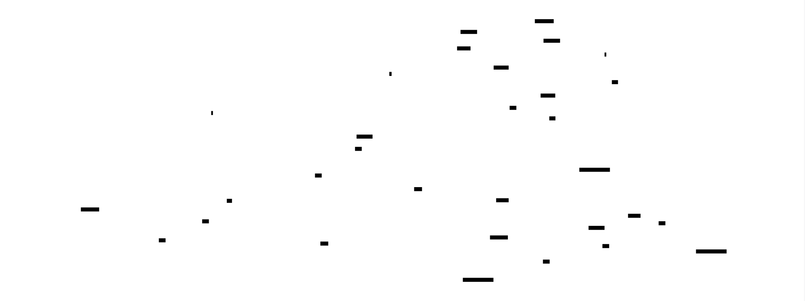
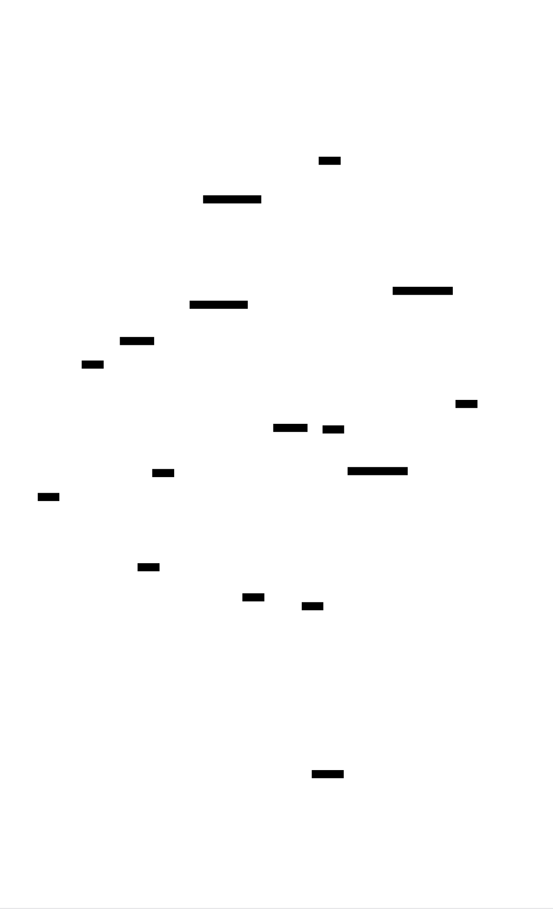

# JSON Parser: Design Document


## Overview

A recursive descent parser that tokenizes JSON text into structured tokens and builds native data structures. The key architectural challenge is implementing a clean separation between lexical analysis (tokenization) and syntactic analysis (parsing) while handling complex edge cases like nested structures, escape sequences, and proper error reporting.


> This guide is meant to help you understand the big picture before diving into each milestone. Refer back to it whenever you need context on how components connect.


## Context and Problem Statement

> **Milestone(s):** All milestones (1-3) - Understanding the foundational parsing concepts

### Mental Model: Language Translation

Think of JSON parsing as being a **translator working with a foreign language document**. When you encounter a document written in an unfamiliar language, you don't immediately understand its meaning. Instead, you follow a systematic two-step process:

First, you **identify individual words and symbols** - separating the continuous stream of characters into meaningful units like nouns, verbs, punctuation marks, and numbers. This is analogous to tokenization in parsing. Just as a translator must recognize where one word ends and another begins, even when encountering complex elements like hyphenated words or quoted phrases, our tokenizer must identify where a JSON string ends (handling escape sequences) or where a number concludes (distinguishing between `123` and `123.45e-2`).

Second, you **understand the grammatical structure** - taking those identified words and determining how they relate to each other according to the language's rules. A translator knows that in English, adjectives typically precede nouns, and that certain punctuation marks group words into phrases. Similarly, our parser understands that in JSON, a colon separates a key from its value, and that curly braces group key-value pairs into objects.

The power of this mental model becomes clear when dealing with nested structures. Just as a translator might encounter a sentence containing a quoted phrase that itself contains another quoted phrase, our JSON parser must handle objects containing arrays that contain other objects. The recursive nature of language - where complete thoughts can be embedded within other complete thoughts - mirrors exactly the recursive descent approach we'll use for parsing JSON.

This translation analogy also explains why parsing can fail: just as a human translator encounters grammatical errors that make a sentence incomprehensible, our parser will encounter malformed JSON that violates the language's rules. The translator's job is not just to understand correct sentences, but to recognize when something is wrong and explain what went awry.

### JSON as a Two-Phase Process

JSON parsing naturally decomposes into two distinct phases because **the challenges of character recognition and structural understanding are fundamentally different problems**. The first phase, tokenization, deals with the low-level details of character encoding, escape sequences, and format validation. It answers questions like "Is this sequence of characters a valid number?" and "Where does this quoted string actually end?" The second phase, parsing, focuses on higher-level structural relationships and answers questions like "Does this sequence of tokens form a valid object?" and "Are these nested arrays properly balanced?"

This separation provides several critical advantages. **Error localization** becomes much more precise - we can distinguish between "invalid escape sequence in string" (a tokenization error) and "expected comma between array elements" (a parsing error). **Modularity** allows us to test and debug each phase independently - we can verify that our tokenizer correctly handles Unicode escape sequences without worrying about whether those strings are valid object keys. **Performance optimization** becomes targeted - we might optimize the tokenizer for character processing speed while optimizing the parser for memory usage during deep recursion.

The token stream serves as a **clean interface** between these phases. The parser receives a sequence of strongly-typed tokens with position information, completely abstracted from the original character-level details. This abstraction means the parser never needs to worry about whether a string contained escaped quotes or whether a number was written in scientific notation - it simply receives a `STRING` token with value `"hello"` or a `NUMBER` token with value `42.0`.

### Parsing Approach Comparison

Several parsing techniques could theoretically handle JSON, but they differ significantly in complexity, performance, and appropriateness for the language's grammar structure.

**Regular expressions** might seem appealing for their simplicity, but they fundamentally cannot handle JSON's recursive nature. While regex can identify individual JSON tokens (strings, numbers, boolean literals), it cannot validate nested structures like objects containing arrays containing objects. Regular expressions are inherently limited to recognizing regular languages, but JSON's balanced bracket requirement makes it a context-free language. Attempting to parse JSON with regex leads to either incomplete validation (missing structural errors) or extremely complex, unmaintainable regex patterns that try to work around these fundamental limitations.

**Parser generators** like YACC, Bison, or ANTLR can certainly handle JSON's grammar, and they would generate efficient parsers. However, they introduce significant complexity for a learning project. The grammar specification language becomes an additional learning burden, the generated code is often difficult to debug, and the build process becomes more complex. For a beginner project focused on understanding parsing concepts, the abstraction layer of a parser generator obscures the very mechanisms we're trying to learn.

**Recursive descent parsing** emerges as the ideal choice for JSON because it maps naturally onto the language's grammar structure. JSON's grammar rules are:

| JSON Element | Grammar Rule | Recursive Descent Method |
|--------------|--------------|-------------------------|
| Value | `string \| number \| boolean \| null \| object \| array` | `parseValue()` with type dispatch |
| Object | `'{' (key ':' value (',' key ':' value)*)? '}'` | `parseObject()` with loop |
| Array | `'[' (value (',' value)*)? ']'` | `parseArray()` with loop |
| String | `'"' chars* '"'` | `parseString()` with escape handling |
| Number | `'-'? digits ('.' digits)? ([eE] [+-]? digits)?` | `parseNumber()` with state machine |

Each grammar rule translates almost directly into a parsing method. The recursive nature of JSON (where values can contain other values) maps perfectly onto recursive method calls. When `parseObject()` encounters a value, it calls `parseValue()`, which might call `parseArray()`, which might call `parseValue()` again - the call stack naturally tracks the nesting structure.

> **Decision: Recursive Descent for JSON Parsing**
> - **Context**: JSON has a context-free grammar with recursive nesting, and we need an approach suitable for learning fundamental parsing concepts
> - **Options Considered**: 
>   - Regular expressions: Simple but cannot handle recursive structures
>   - Parser generators (YACC/ANTLR): Powerful but add complexity and obscure learning goals  
>   - Recursive descent: Manual implementation that maps directly to grammar rules
> - **Decision**: Implement recursive descent parsing
> - **Rationale**: The approach provides direct insight into parsing mechanics, maps naturally onto JSON's grammar, requires no additional tools, and produces easily debuggable code
> - **Consequences**: We gain complete control over error messages and parsing behavior, but must implement all grammar rules manually and handle left-recursion carefully (though JSON's grammar has none)

### Grammar Structure Analysis

JSON's grammar exhibits several properties that make recursive descent particularly suitable. **Right-associative structure** means that when we encounter an opening delimiter (`{` or `[`), we immediately know we're starting a new nested structure - there's no ambiguity about whether to shift or reduce, as might occur in other parsing approaches.

**No left recursion** exists in JSON's grammar. Left recursion occurs when a grammar rule refers to itself as the first symbol (like `expression := expression '+' term`), which would cause infinite recursion in a naive recursive descent parser. JSON avoids this entirely - objects and arrays always begin with delimiters, never with recursive references to themselves.

**Predictive parsing** is possible because JSON tokens provide sufficient lookahead information. When the parser sees a `{` token, it knows unambiguously that an object is starting. When it sees a `"` token at the beginning of a value position, it knows a string is starting. This predictability eliminates the need for backtracking or complex lookahead mechanisms.

The **shallow operator precedence** in JSON (essentially none, since JSON is purely structural) means we don't need to handle complex precedence rules or operator associativity. Unlike programming languages with arithmetic expressions, JSON's "operators" (colons, commas, brackets) have fixed, unambiguous roles determined entirely by context.

### Error Recovery Considerations

JSON's structure also influences our error recovery strategy. **Synchronization points** are well-defined - commas, closing brackets, and closing braces provide natural places where the parser can attempt to resume after encountering an error. If we detect an invalid value within an array, we can skip to the next comma and attempt to continue parsing subsequent array elements.

**Error cascading** is limited in JSON because of its simple structure. Unlike programming languages where a missing semicolon might cause dozens of subsequent parsing errors, JSON errors tend to be localized. A malformed string doesn't typically cause the parser to misinterpret subsequent JSON elements.

**Contextual error messages** become straightforward because recursive descent maintains the parsing context on the call stack. When an error occurs deep within nested structures, we can walk the call stack to provide messages like "in array element 3, in object key 'users', in root object: expected closing quote in string literal."

This analysis reveals why recursive descent parsing aligns so perfectly with JSON's design - both prioritize clarity, predictability, and hierarchical structure over complex language features that might require more sophisticated parsing techniques.

### Implementation Guidance

The implementation approach for this JSON parser emphasizes clarity and educational value over performance optimization. We'll build each component to be easily testable and debuggable, with clear separation of concerns between tokenization and parsing phases.

#### Technology Recommendations

| Component | Simple Option | Advanced Option |
|-----------|---------------|-----------------|
| Token representation | Simple dataclass/struct with type and value | Tagged union with type-specific fields |
| Error handling | Exception-based with message strings | Result/Either types with structured error data |
| Position tracking | Line/column numbers | Full source location with character offsets |
| Unicode handling | Built-in string methods | Custom UTF-8/UTF-16 handling |
| Testing framework | Standard library unittest/assert | Property-based testing with hypothesis/QuickCheck |

For a learning project, we recommend the simple options to minimize cognitive overhead while still producing a fully functional parser.

#### Recommended File Structure

```python
json_parser/
    __init__.py              # Public API exports
    tokenizer.py             # Lexical analysis implementation  
    parser.py                # Recursive descent parsing
    errors.py                # Error types and formatting
    tokens.py                # Token type definitions
    
tests/
    test_tokenizer.py        # Tokenizer unit tests
    test_parser.py           # Parser unit tests
    test_integration.py      # End-to-end parsing tests
    test_data/               # JSON test files
        valid/               # Correct JSON samples
        invalid/             # Malformed JSON samples
        edge_cases/          # Boundary condition tests

examples/
    basic_usage.py           # Simple parsing examples
    error_demo.py            # Error handling demonstration
    performance_test.py      # Large JSON parsing benchmark
```

This structure separates concerns clearly while keeping related functionality grouped. The test organization mirrors the implementation structure, making it easy to locate relevant tests for any component.

#### Core Type Definitions

```python
# tokens.py - Token type definitions
from enum import Enum
from dataclasses import dataclass
from typing import Any, Optional

class TokenType(Enum):
    # Literal values
    STRING = "STRING"
    NUMBER = "NUMBER" 
    BOOLEAN = "BOOLEAN"
    NULL = "NULL"
    
    # Structural delimiters
    LEFT_BRACE = "LEFT_BRACE"      # {
    RIGHT_BRACE = "RIGHT_BRACE"    # }
    LEFT_BRACKET = "LEFT_BRACKET"  # [
    RIGHT_BRACKET = "RIGHT_BRACKET" # ]
    COLON = "COLON"                # :
    COMMA = "COMMA"                # ,
    
    # Special tokens
    EOF = "EOF"                    # End of input

@dataclass
class Position:
    """Source code position for error reporting."""
    line: int
    column: int
    offset: int  # Character offset from start of input
    
    def __str__(self) -> str:
        return f"line {self.line}, column {self.column}"

@dataclass  
class Token:
    """A lexical token with type, value, and position."""
    type: TokenType
    value: Any  # Actual parsed value (string, number, boolean, None)
    position: Position
    raw: str    # Original text that produced this token
```

#### Error Infrastructure

```python
# errors.py - Error types and formatting
class JSONParseError(Exception):
    """Base class for all JSON parsing errors."""
    
    def __init__(self, message: str, position: Optional[Position] = None):
        self.message = message
        self.position = position
        super().__init__(self._format_message())
    
    def _format_message(self) -> str:
        if self.position:
            return f"Parse error at {self.position}: {self.message}"
        return f"Parse error: {self.message}"

class TokenizationError(JSONParseError):
    """Error during lexical analysis phase."""
    pass

class ParseError(JSONParseError):
    """Error during syntax analysis phase."""
    
    def __init__(self, message: str, expected: str = None, found: Token = None):
        self.expected = expected
        self.found = found
        
        if expected and found:
            detailed_msg = f"{message}. Expected {expected}, found {found.type.value}"
            if found.raw:
                detailed_msg += f" '{found.raw}'"
        else:
            detailed_msg = message
            
        position = found.position if found else None
        super().__init__(detailed_msg, position)
```

#### Tokenizer Interface

```python  
# tokenizer.py - Lexical analysis interface
class JSONTokenizer:
    """Converts JSON text into a stream of tokens."""
    
    def __init__(self, text: str):
        self.text = text
        self.position = 0
        self.line = 1
        self.column = 1
        
    def tokenize(self) -> list[Token]:
        """
        Tokenize the entire input and return all tokens.
        
        Returns:
            List of tokens including EOF token at the end
            
        Raises:
            TokenizationError: If invalid JSON syntax is encountered
        """
        # TODO: Implement full tokenization loop
        # TODO: Handle whitespace skipping between tokens
        # TODO: Dispatch to specific token type handlers
        # TODO: Add EOF token at end
        pass
    
    def next_token(self) -> Token:
        """
        Parse and return the next token from the input.
        
        Returns:
            Next token, or EOF token if at end of input
            
        Raises:
            TokenizationError: If invalid JSON syntax encountered
        """
        # TODO: Skip whitespace
        # TODO: Check for end of input
        # TODO: Identify token type by first character
        # TODO: Call appropriate parsing method (string, number, etc.)
        # TODO: Return constructed token
        pass
```

#### Parser Interface

```python
# parser.py - Recursive descent parsing interface  
class JSONParser:
    """Parses tokens into native Python data structures."""
    
    def __init__(self, tokens: list[Token]):
        self.tokens = tokens
        self.current = 0
        
    def parse(self) -> Any:
        """
        Parse tokens into a Python data structure.
        
        Returns:
            Native Python object (dict, list, str, int, float, bool, None)
            
        Raises:
            ParseError: If token sequence is not valid JSON
        """
        # TODO: Parse single JSON value
        # TODO: Verify no remaining tokens (except EOF)
        # TODO: Return parsed result
        pass
    
    def parse_value(self) -> Any:
        """
        Parse a JSON value (string, number, boolean, null, object, or array).
        
        Returns:
            Parsed value as appropriate Python type
        """
        # TODO: Examine current token type
        # TODO: Dispatch to appropriate parsing method
        # TODO: Handle unexpected token types with descriptive errors
        pass
        
    def parse_object(self) -> dict:
        """Parse JSON object into Python dict."""
        # TODO: Consume opening brace
        # TODO: Handle empty object case  
        # TODO: Parse key-value pairs separated by commas
        # TODO: Consume closing brace
        pass
        
    def parse_array(self) -> list:
        """Parse JSON array into Python list.""" 
        # TODO: Consume opening bracket
        # TODO: Handle empty array case
        # TODO: Parse values separated by commas  
        # TODO: Consume closing bracket
        pass
```

#### Milestone Checkpoints

**After Milestone 1 (Tokenizer):**
Run `python -m pytest tests/test_tokenizer.py -v` and verify:
- All basic token types are recognized correctly
- String escape sequences including `\n`, `\t`, `\"`, `\\` are handled
- Numbers in integer, float, and scientific notation formats tokenize properly  
- Position information is accurate for error reporting
- Unicode escape sequences `\u0041` produce correct characters

**After Milestone 2 (Parser):**
Run `python -m pytest tests/test_parser.py -v` and verify:
- Simple values (strings, numbers, booleans, null) parse to correct Python types
- Objects parse to dictionaries with correct key-value mappings
- Arrays parse to lists with elements in correct order
- Nested structures (objects in arrays, arrays in objects) work properly
- Basic syntax errors produce informative error messages

**After Milestone 3 (Error Handling):**
Run `python -m pytest tests/test_integration.py -v` and verify:
- All test cases from json.org test suite pass or fail appropriately
- Error messages include line/column position information
- Invalid number formats (leading zeros, trailing decimals) are rejected
- Trailing commas in objects and arrays are detected and reported
- Unicode edge cases including null characters and surrogate pairs work correctly

#### Common Implementation Pitfalls

⚠️ **Pitfall: Forgetting EOF Token**
Many implementations forget to emit an EOF token, causing the parser to fail when checking for remaining input. Always append an EOF token to your token stream, and have the parser verify it consumes all tokens except EOF.

⚠️ **Pitfall: Unicode Escape Sequence Errors**  
Unicode escape sequences like `\u0041` require exactly 4 hexadecimal digits. Don't accept `\u41` or `\u041`, and remember that surrogate pairs require two consecutive `\u` sequences to represent characters outside the Basic Multilingual Plane.

⚠️ **Pitfall: Number Format Edge Cases**
JSON numbers cannot have leading zeros (`01` is invalid), cannot end with decimal points (`42.` is invalid), and cannot have bare exponent markers (`42e` is invalid). Implement a proper state machine rather than trying to use regex or simple string parsing.

⚠️ **Pitfall: Position Tracking During Tokenization**
Update line and column numbers correctly when encountering newlines, and remember that different platforms use different line ending conventions (`\n`, `\r\n`, `\r`). Consider all as line breaks for robust position tracking.

⚠️ **Pitfall: Recursive Descent Stack Overflow**
Very deeply nested JSON can cause stack overflow in recursive descent parsers. Consider adding a configurable nesting depth limit (typically 100-1000 levels) and tracking current depth during recursive calls.


## Goals and Non-Goals

> **Milestone(s):** All milestones (1-3) - Establishing clear project boundaries and success criteria

### Mental Model: Drawing the Blueprint Boundaries

Think of building a JSON parser like constructing a house from architectural plans. Before the first foundation is poured, architects clearly define what the building **will** include (bedrooms, kitchen, bathrooms) and what it **will not** include (swimming pool, garage, guest house). This prevents scope creep during construction and ensures everyone understands what "done" looks like. Similarly, our JSON parser needs explicit goals and non-goals to guide implementation decisions and prevent feature creep that could overwhelm a beginner project.

The distinction between goals and non-goals is particularly critical for parsing projects because the temptation to add "just one more feature" is enormous. JSON parsing intersects with many computer science domains: performance optimization, streaming algorithms, schema validation, pretty-printing, and more. Without clear boundaries, a beginner could easily get lost implementing advanced features instead of mastering the core concepts of tokenization and recursive descent parsing.

### Core Project Goals

Our JSON parser implementation focuses on **educational depth over production breadth**. The primary goal is to build a solid understanding of two-phase parsing through hands-on implementation of a complete, specification-compliant JSON parser.

| Goal Category | Specific Objectives | Success Criteria | Educational Value |
|---------------|-------------------|------------------|-------------------|
| **Tokenization Mastery** | Implement complete lexical analysis for JSON | Correctly tokenize all JSON value types, handle escape sequences, emit position information | Learn state machine design, character-by-character processing, edge case handling |
| **Recursive Descent Understanding** | Build parser using recursive descent technique | Parse nested objects/arrays to arbitrary depth, build native data structures | Understand grammar rules, recursive algorithms, call stack management |
| **Error Handling Excellence** | Provide meaningful error messages with context | Report line/column positions, describe expected vs found tokens | Learn error detection, context preservation, user-friendly reporting |
| **JSON Specification Compliance** | Handle all valid JSON according to RFC 7159 | Accept valid JSON, reject invalid JSON with appropriate errors | Understand formal specifications, edge case identification |
| **Clean Architecture** | Separate concerns between tokenizer and parser | Clear interfaces between components, testable modules | Learn separation of concerns, interface design, modularity |

The parser will handle the complete JSON specification including primitive types (strings, numbers, booleans, null), structured types (objects and arrays), nested structures of arbitrary depth, escape sequences in strings (including Unicode escapes), and scientific notation in numbers. Error handling will provide line and column information for syntax errors, making debugging straightforward for users of the parser.

> **Key Insight**: The goal is not to build the fastest JSON parser, but to build a parser that teaches the fundamental concepts so thoroughly that you could implement any recursive descent parser afterward.

### Specific Technical Goals

#### Tokenization Goals

The tokenizer component will demonstrate complete lexical analysis capabilities through systematic character processing. The implementation will tokenize all JSON value types correctly, including complex cases like escaped characters within strings and various number formats including scientific notation.

| Token Type | Requirements | Example Inputs | Expected Output |
|------------|-------------|----------------|-----------------|
| **STRING** | Handle escape sequences, Unicode escapes | `"hello\nworld"`, `"unicode:\u0041"` | STRING token with unescaped value |
| **NUMBER** | Support integers, floats, scientific notation | `42`, `3.14159`, `1.23e-10` | NUMBER token with parsed numeric value |
| **BOOLEAN** | Recognize true/false literals | `true`, `false` | BOOLEAN token with boolean value |
| **NULL** | Recognize null literal | `null` | NULL token |
| **Structural** | Emit individual punctuation tokens | `{`, `}`, `[`, `]`, `:`, `,` | Individual tokens for each delimiter |

String tokenization will handle all escape sequences defined in the JSON specification: quotation mark (`\"`), reverse solidus (`\\`), solidus (`\/`), backspace (`\b`), form feed (`\f`), line feed (`\n`), carriage return (`\r`), tab (`\t`), and Unicode code points (`\uXXXX`). The tokenizer will also track position information (line number, column offset, and absolute character offset) for every token to enable meaningful error reporting.

Number parsing will recognize the complete JSON number format: optional minus sign, integer part (either zero or non-zero digit followed by digits), optional fractional part (decimal point followed by digits), and optional exponent part (E or e, optional plus or minus, followed by digits). The parser will reject invalid number formats like leading zeros in integers (`01`) or incomplete numbers (`.5`, `1.`, `1e`).

#### Parser Goals

The recursive descent parser will transform the token stream into native data structures while demonstrating clean recursive algorithm design. The parser will build native language types directly (dictionaries for objects, lists for arrays) rather than constructing an intermediate Abstract Syntax Tree.

| Structure Type | Parsing Requirements | Nesting Support | Native Type Mapping |
|----------------|---------------------|----------------|-------------------|
| **Objects** | Key-value pairs, comma separation, empty objects | Unlimited depth | Dictionary/Hash Map |
| **Arrays** | Ordered values, comma separation, empty arrays | Unlimited depth | List/Array |
| **Mixed Nesting** | Objects containing arrays, arrays containing objects | Unlimited combinations | Nested native types |

The parser will implement proper recursive descent by defining grammar rules for each JSON construct and implementing corresponding parsing methods. The `parse_value()` method will dispatch to specific parsers based on the current token type, while `parse_object()` and `parse_array()` will handle structured types with proper delimiter and separator handling.

Object parsing will correctly handle the key-colon-value pattern with comma separation between pairs. The parser will enforce that keys must be strings and that colons must separate keys from values. Array parsing will handle ordered value sequences with comma separation, supporting mixed value types within a single array.

#### Error Handling Goals

Comprehensive error handling will transform cryptic parsing failures into actionable feedback for users. The error system will capture context information during both tokenization and parsing phases to provide precise error locations and helpful descriptions.

| Error Category | Detection Point | Required Information | Example Message |
|----------------|-----------------|---------------------|-----------------|
| **Lexical Errors** | During tokenization | Character position, invalid character | "Invalid character '!' at line 3, column 15" |
| **Syntax Errors** | During parsing | Token position, expected vs found | "Expected '}' but found ',' at line 5, column 23" |
| **Structural Errors** | During parsing | Context information | "Missing value after ',' in array at line 2, column 10" |
| **Format Errors** | During tokenization | Format violation details | "Invalid number format: leading zeros not allowed at line 1, column 5" |

The error handling system will maintain position information throughout the parsing process, allowing errors to be reported with precise location data. Error messages will be written for human consumption, describing what was expected and what was actually found in the input.

### Explicit Non-Goals

To maintain focus on core parsing concepts, this implementation deliberately excludes several advanced features that could distract from the learning objectives.

#### Performance Optimizations

This parser prioritizes clarity and educational value over performance optimization. Several performance-oriented features are explicitly excluded to keep the implementation approachable for beginners.

| Optimization Type | Why Excluded | Alternative Learning Path |
|------------------|--------------|--------------------------|
| **Streaming Parsing** | Complex memory management obscures core algorithms | Build this parser first, then study streaming as advanced topic |
| **Zero-Copy String Handling** | Language-specific optimizations distract from algorithms | Focus on correctness first, optimization later |
| **SIMD Vectorization** | Requires deep understanding of CPU architecture | Advanced topic after mastering basic parsing |
| **Memory Pool Allocation** | Complex memory management not core to parsing logic | Learn garbage collection/allocation as separate topic |
| **Parallel/Concurrent Parsing** | Threading complexity masks parsing concepts | Master sequential parsing before concurrent algorithms |

The implementation will use straightforward algorithms and data structures that clearly demonstrate the parsing concepts without premature optimization. Students can explore performance improvements after mastering the fundamental techniques.

#### Extended JSON Features

Several JSON-adjacent features are excluded to maintain specification compliance and avoid scope creep.

| Feature | Why Excluded | Educational Impact |
|---------|--------------|-------------------|
| **JSON5/JSONC Extensions** | Non-standard syntax complicates grammar | Learn standard first, extensions later |
| **Schema Validation** | Separate concern from parsing | Build parser first, then study validation |
| **JSONPath Queries** | Query language is distinct from parsing | Different domain requiring separate study |
| **Pretty Printing/Formatting** | Output formatting separate from parsing | Focus on analysis before synthesis |
| **Comments Support** | Not part of JSON specification | Maintain specification compliance |

The parser will strictly follow RFC 7159 (The JavaScript Object Notation Data Interchange Format) without extensions or modifications. This ensures students learn the standard before encountering dialects.

#### Production Environment Features

Several features necessary for production use are excluded to maintain educational focus.

| Production Feature | Why Excluded | Learning Priority |
|-------------------|--------------|-------------------|
| **Security Hardening** | Complex topic requiring security expertise | Master parsing before security considerations |
| **Memory Limits/DOS Protection** | Resource management separate from parsing logic | Learn algorithms before defensive programming |
| **Plugin/Extension System** | Architectural complexity beyond scope | Focus on core implementation |
| **Multiple Input Sources** | I/O handling separate from parsing | Start with string input, extend later |
| **Backward Compatibility** | Version management adds complexity | Implement current specification cleanly |

The parser will accept JSON as a string input and return native data structures, without complex I/O handling or resource management that could obscure the parsing logic.

### Success Criteria and Validation

The parser's success will be measured through comprehensive testing that validates both positive and negative cases across all JSON constructs.

#### Milestone-Based Success Criteria

Each project milestone has specific validation criteria that demonstrate mastery of the targeted concepts.

| Milestone | Success Criteria | Validation Method | Mastery Indicators |
|-----------|------------------|-------------------|-------------------|
| **Milestone 1: Tokenizer** | All JSON tokens correctly identified with position info | Unit tests for each token type, escape sequence tests | Can tokenize any valid JSON string |
| **Milestone 2: Parser** | Native data structures built from token streams | Integration tests with nested structures | Can parse any valid JSON into native types |
| **Milestone 3: Error Handling** | Meaningful errors for all invalid JSON inputs | Error message validation tests | Invalid JSON produces helpful error messages |

#### Comprehensive Test Categories

The validation strategy covers four major test categories to ensure robust implementation.

**Valid JSON Test Cases**: The parser must correctly handle all valid JSON constructs including empty objects and arrays, deeply nested structures, all primitive types, escape sequences in strings, and various number formats. Test cases will include minimal examples (single values) and complex examples (deeply nested mixed structures).

**Invalid JSON Test Cases**: The parser must reject invalid JSON with appropriate error messages including malformed objects (missing colons, trailing commas), malformed arrays (missing commas, trailing commas), invalid string formats (unterminated strings, invalid escape sequences), invalid number formats (leading zeros, malformed scientific notation), and structural errors (unclosed braces/brackets, unexpected tokens).

**Edge Case Handling**: The parser must handle boundary conditions correctly including empty input, whitespace-only input, maximum nesting depth, Unicode edge cases (surrogate pairs, null characters), and large number values (integers near language limits, very small/large floating point values).

**Error Message Quality**: Error messages must provide actionable feedback including precise position information (line, column, offset), clear description of the problem, indication of what was expected versus what was found, and helpful context about the surrounding structure.

> **Critical Success Metric**: A student who completes this parser should be able to implement a recursive descent parser for any context-free grammar, not just JSON. The techniques learned here transfer directly to parsing mathematical expressions, configuration files, programming languages, and data formats.

### Architecture Decision: Direct Native Types vs AST

One of the most important architectural decisions for this educational parser is whether to build native data structures directly or construct an intermediate Abstract Syntax Tree (AST).

> **Decision: Build Native Types Directly**
> - **Context**: Educational parsers can either build an intermediate AST representation or convert directly to native language types (dictionaries, lists, primitives). ASTs provide more flexibility but add complexity.
> - **Options Considered**: 
>   1. Build AST nodes with explicit type hierarchy and visitor patterns
>   2. Build native types directly during parsing
>   3. Hybrid approach with optional AST construction
> - **Decision**: Build native types directly without intermediate AST representation
> - **Rationale**: For JSON parsing education, the AST adds unnecessary complexity without teaching value. JSON's simple type system maps cleanly to native types, and students can focus on parsing algorithms rather than tree manipulation. The recursive descent technique is more clearly demonstrated when parsing directly produces the final result.
> - **Consequences**: Simpler implementation that's easier to debug, but less flexibility for advanced use cases like transformation or analysis. Students learn parsing without the overhead of tree management.

| Approach | Pros | Cons | Chosen? |
|----------|------|------|---------|
| **Direct Native Types** | Simpler code, immediate results, easier debugging | Less flexibility, harder to add analysis features | ✅ **Yes** |
| **AST with Visitor Pattern** | Flexible for extensions, clean separation | Complex type hierarchy, more code to write | ❌ No |
| **Hybrid AST/Native** | Best of both worlds | Implementation complexity, confusing for beginners | ❌ No |

This decision allows students to see immediate results from their parsing efforts and understand how recursive descent naturally builds structured data, without getting lost in abstract tree manipulation.

### Boundaries and Constraints

The parser operates within specific technical and educational constraints that shape the implementation approach.

#### Technical Constraints

The implementation will target beginner-friendly languages and avoid advanced language features that could obscure the parsing concepts. Platform dependencies will be minimized to ensure the parser works across different operating systems and development environments.

| Constraint Type | Specific Limitations | Educational Rationale |
|----------------|---------------------|----------------------|
| **Language Features** | Use basic data structures, avoid metaprogramming | Keep focus on algorithms, not language complexity |
| **Dependencies** | Standard library only, no external parsing frameworks | Understand implementation rather than framework usage |
| **Input Size** | Reasonable memory limits, no streaming for large files | Focus on correctness before scalability |
| **Platform Support** | Cross-platform compatible code | Maximize accessibility for learners |

#### Educational Constraints

The implementation will maintain a clear learning progression from simple to complex concepts, ensuring each milestone builds naturally on previous work.

**Concept Progression**: Students will start with character-level processing in the tokenizer, progress to token-level processing in the parser, and finish with comprehensive error handling. Each phase introduces new concepts without overwhelming complexity.

**Code Complexity**: Individual functions will remain short and focused on single responsibilities. Complex algorithms will be broken into smaller, testable components that can be understood and debugged independently.

**Testing Accessibility**: Test cases will be written to demonstrate correct behavior clearly, with obvious inputs and expected outputs that students can verify manually before running automated tests.

> **Learning Philosophy**: This parser serves as a stepping stone to more advanced parsing techniques. Students who master these concepts will be well-prepared to tackle compiler front-ends, configuration file parsers, domain-specific languages, and other text processing challenges.

### Implementation Guidance

#### Technology Recommendations

The implementation prioritizes educational clarity over performance optimization, using straightforward language features that clearly demonstrate the parsing concepts.

| Component | Simple Option | Advanced Option |
|-----------|---------------|-----------------|
| **Tokenizer Implementation** | Character-by-character state machine | Regex-based pattern matching |
| **Parser Structure** | Simple recursive functions | Table-driven LR parser |
| **Error Handling** | Exception-based error propagation | Result types with explicit error handling |
| **Testing Framework** | Language built-in testing (unittest, pytest) | Property-based testing (Hypothesis) |
| **Data Structures** | Built-in dict/list types | Custom collection classes |

For Python implementation, the simple options provide the best learning experience while maintaining code clarity.

#### Recommended File Structure

Organize the parser implementation across focused modules that separate concerns cleanly and enable independent testing of each component.

```
json-parser/
├── src/
│   ├── __init__.py
│   ├── tokenizer.py          ← JSONTokenizer class and TokenType enum
│   ├── parser.py             ← JSONParser class and parsing logic
│   ├── position.py           ← Position class for error reporting
│   ├── tokens.py             ← Token class and token utilities
│   └── errors.py             ← Error classes (JSONParseError, etc.)
├── tests/
│   ├── test_tokenizer.py     ← Tokenizer unit tests
│   ├── test_parser.py        ← Parser integration tests
│   ├── test_errors.py        ← Error handling tests
│   └── test_data/            ← JSON test files
│       ├── valid/            ← Valid JSON examples
│       └── invalid/          ← Invalid JSON for error testing
├── examples/
│   ├── simple_usage.py       ← Basic parser usage examples
│   └── error_examples.py     ← Error handling demonstrations
└── README.md                 ← Usage instructions and examples
```

This structure allows students to work on one component at a time while maintaining clear interfaces between modules.

#### Essential Infrastructure Code

Provide complete implementations for foundational classes that support the core parsing logic without distracting from the learning objectives.

**Position Tracking Class:**
```python
class Position:
    """Tracks location information for tokens and errors."""
    
    def __init__(self, line: int = 1, column: int = 1, offset: int = 0):
        self.line = line
        self.column = column
        self.offset = offset
    
    def advance(self, char: str) -> 'Position':
        """Return new position after consuming a character."""
        if char == '\n':
            return Position(self.line + 1, 1, self.offset + 1)
        else:
            return Position(self.line, self.column + 1, self.offset + 1)
    
    def __repr__(self) -> str:
        return f"Position(line={self.line}, column={self.column}, offset={self.offset})"
```

**Token Data Structure:**
```python
from enum import Enum
from typing import Any

class TokenType(Enum):
    STRING = "STRING"
    NUMBER = "NUMBER"
    BOOLEAN = "BOOLEAN"
    NULL = "NULL"
    LEFT_BRACE = "LEFT_BRACE"
    RIGHT_BRACE = "RIGHT_BRACE"
    LEFT_BRACKET = "LEFT_BRACKET"
    RIGHT_BRACKET = "RIGHT_BRACKET"
    COLON = "COLON"
    COMMA = "COMMA"
    EOF = "EOF"

class Token:
    """Represents a single token from JSON input."""
    
    def __init__(self, token_type: TokenType, value: Any, position: Position, raw: str = ""):
        self.type = token_type
        self.value = value
        self.position = position
        self.raw = raw  # Original text that produced this token
    
    def __repr__(self) -> str:
        return f"Token({self.type.value}, {repr(self.value)}, {self.position})"
```

**Error Class Hierarchy:**
```python
class JSONParseError(Exception):
    """Base class for all JSON parsing errors."""
    
    def __init__(self, message: str, position: Position):
        super().__init__(message)
        self.message = message
        self.position = position
    
    def __str__(self) -> str:
        return f"{self.message} at line {self.position.line}, column {self.position.column}"

class TokenizationError(JSONParseError):
    """Error during lexical analysis phase."""
    pass

class ParseError(JSONParseError):
    """Error during syntactic analysis phase."""
    pass
```

#### Core Logic Skeleton

Provide method signatures and detailed TODO comments for the primary learning components, mapping directly to the algorithm steps described in the design sections.

**Tokenizer Class Skeleton:**
```python
class JSONTokenizer:
    """Converts JSON text into a sequence of tokens."""
    
    def __init__(self, text: str):
        self.text = text
        self.position = Position()
        self.current_char = self.text[0] if text else None
        self.tokens = []
    
    def tokenize(self) -> list[Token]:
        """Convert input text to token sequence."""
        # TODO 1: Initialize token list and position tracking
        # TODO 2: Loop through characters until EOF
        # TODO 3: Skip whitespace characters (space, tab, newline, carriage return)
        # TODO 4: Identify token type based on current character
        # TODO 5: Call appropriate tokenization method (string, number, literal, punctuation)
        # TODO 6: Add resulting token to token list
        # TODO 7: Advance position and continue
        # TODO 8: Add EOF token at end
        # TODO 9: Return complete token list
        pass
    
    def next_token(self) -> Token:
        """Get the next token from input."""
        # TODO 1: Skip any whitespace from current position
        # TODO 2: Check for EOF condition
        # TODO 3: Determine token type from current character
        # TODO 4: Delegate to specific parsing method
        # TODO 5: Return the parsed token
        # Hint: This method should handle one token at a time
        pass
    
    def _tokenize_string(self) -> Token:
        """Parse quoted string with escape sequence handling."""
        # TODO 1: Verify current character is quote mark
        # TODO 2: Advance past opening quote
        # TODO 3: Collect characters until closing quote
        # TODO 4: Handle escape sequences (\", \\, \n, \t, \uXXXX)
        # TODO 5: Handle Unicode escape sequences (\uXXXX)
        # TODO 6: Check for unterminated string
        # TODO 7: Return STRING token with unescaped value
        # Hint: Build result string character by character
        pass
```

**Parser Class Skeleton:**
```python
class JSONParser:
    """Recursive descent parser for JSON token streams."""
    
    def __init__(self, tokens: list[Token]):
        self.tokens = tokens
        self.current_index = 0
        self.current_token = tokens[0] if tokens else None
    
    def parse(self) -> Any:
        """Parse token stream into native data structures."""
        # TODO 1: Parse the root JSON value
        # TODO 2: Verify no additional tokens after root value
        # TODO 3: Return the parsed result
        # Hint: JSON must have exactly one root value
        pass
    
    def parse_value(self) -> Any:
        """Parse any JSON value based on current token type."""
        # TODO 1: Check current token type
        # TODO 2: Dispatch to appropriate parsing method:
        #         - STRING/NUMBER/BOOLEAN/NULL: return token value
        #         - LEFT_BRACE: call parse_object()
        #         - LEFT_BRACKET: call parse_array()
        # TODO 3: Raise ParseError for unexpected token types
        # TODO 4: Advance to next token after parsing primitive values
        # Hint: This is the central dispatch method
        pass
    
    def parse_object(self) -> dict:
        """Parse JSON object: { key: value, key: value, ... }"""
        # TODO 1: Consume opening LEFT_BRACE token
        # TODO 2: Check for empty object (immediate RIGHT_BRACE)
        # TODO 3: Parse first key-value pair
        # TODO 4: Loop for additional pairs separated by COMMA
        # TODO 5: Ensure keys are STRING tokens
        # TODO 6: Consume COLON between key and value
        # TODO 7: Parse value recursively
        # TODO 8: Handle trailing comma detection (error case)
        # TODO 9: Consume closing RIGHT_BRACE token
        # TODO 10: Return completed dictionary
        # Hint: Track whether expecting key, colon, value, or comma
        pass
    
    def parse_array(self) -> list:
        """Parse JSON array: [ value, value, value, ... ]"""
        # TODO 1: Consume opening LEFT_BRACKET token
        # TODO 2: Check for empty array (immediate RIGHT_BRACKET)
        # TODO 3: Parse first value recursively
        # TODO 4: Loop for additional values separated by COMMA
        # TODO 5: Handle trailing comma detection (error case)
        # TODO 6: Consume closing RIGHT_BRACKET token
        # TODO 7: Return completed list
        # Hint: Similar to object parsing but simpler (no key-value pairs)
        pass
```

#### Language-Specific Implementation Hints

**Python-Specific Considerations:**
- Use `isinstance(value, str)` to check if a token value is a string type
- The `ord()` and `chr()` functions handle Unicode code point conversion for `\uXXXX` escape sequences
- List and dictionary literals (`[]`, `{}`) provide clean initialization for parsed structures
- The `in` operator efficiently checks for membership in sets of expected characters
- Exception handling with `try`/`except` provides clean error propagation

**String Handling Tips:**
- Build strings using list append and `''.join()` for efficiency with long strings
- Use string slicing `text[start:end]` for extracting substrings during tokenization
- The `isdigit()`, `isspace()`, and `isalpha()` string methods simplify character classification
- Raw strings (`r"..."`) in test cases avoid escaping backslashes in JSON test data

**Error Context Preservation:**
- Store the position where tokenization starts for each token to enable precise error reporting
- Capture both the problematic token and the expected token types in ParseError messages
- Include surrounding context (previous few tokens) in error messages for complex parsing errors

#### Milestone Checkpoints

After implementing each milestone, verify functionality through systematic testing and manual validation.

**Milestone 1 Checkpoint - Tokenizer:**
```python
# Run tokenizer tests
python -m pytest tests/test_tokenizer.py -v

# Manual verification
from src.tokenizer import JSONTokenizer, TokenType
tokenizer = JSONTokenizer('{"name": "value", "number": 42}')
tokens = tokenizer.tokenize()
# Should produce: LEFT_BRACE, STRING("name"), COLON, STRING("value"), COMMA, STRING("number"), COLON, NUMBER(42), RIGHT_BRACE, EOF

# Test escape sequences
tokenizer = JSONTokenizer(r'{"escaped": "line1\nline2\ttab"}')
tokens = tokenizer.tokenize()
# STRING token value should contain actual newline and tab characters
```

**Milestone 2 Checkpoint - Parser:**
```python
# Run parser tests
python -m pytest tests/test_parser.py -v

# Manual verification
from src.parser import JSONParser
from src.tokenizer import JSONTokenizer

text = '{"users": [{"id": 1, "name": "Alice"}, {"id": 2, "name": "Bob"}]}'
tokens = JSONTokenizer(text).tokenize()
result = JSONParser(tokens).parse()
# Should produce native Python dict with nested list and dicts
assert result == {"users": [{"id": 1, "name": "Alice"}, {"id": 2, "name": "Bob"}]}
```

**Milestone 3 Checkpoint - Error Handling:**
```python
# Test error reporting
try:
    tokens = JSONTokenizer('{"incomplete":').tokenize()
except TokenizationError as e:
    print(f"Tokenization error: {e}")
    # Should report unterminated string with line/column

try:
    tokens = JSONTokenizer('{"valid": "tokenization"}').tokenize()
    JSONParser(tokens + [Token(TokenType.COMMA, ",", Position())]).parse()
except ParseError as e:
    print(f"Parse error: {e}")
    # Should report unexpected trailing comma


## High-Level Architecture

> **Milestone(s):** All milestones (1-3) - Understanding the system's component structure and data flow patterns

### Mental Model: Assembly Line Processing

Think of JSON parsing as a **manufacturing assembly line** where raw materials (JSON text) move through specialized workstations to produce finished goods (native data structures). Each workstation has a specific job: the first station (tokenizer) breaks down raw materials into standardized parts, the second station (parser) assembles these parts into the final product, and a quality control team (error handler) monitors the entire process for defects and provides detailed reports when something goes wrong.

This assembly line analogy captures the essential nature of **two-phase parsing**: each phase has distinct responsibilities, operates on different representations of the data, and can be developed and tested independently. Just as a manufacturing line can be optimized by improving individual stations without redesigning the entire process, our JSON parser gains maintainability and clarity by cleanly separating lexical analysis from syntactic analysis.

The JSON parser architecture implements this assembly line through three specialized components that work together in a coordinated pipeline. The **JSONTokenizer** acts as the first station, converting raw JSON text into a stream of categorized tokens. The **JSONParser** serves as the assembly station, consuming tokens and building native data structures according to JSON grammar rules. The **error handling system** provides quality control, detecting problems at any stage and generating detailed diagnostic reports that help developers understand exactly what went wrong and where.


### Component Responsibilities

The JSON parser system divides parsing responsibilities across three specialized components, each with clearly defined ownership boundaries and interaction patterns. This separation follows the **single responsibility principle**, ensuring that each component can be developed, tested, and debugged independently while maintaining clear contracts for inter-component communication.

#### JSONTokenizer: Lexical Analysis Engine

The **JSONTokenizer** owns the **lexical analysis phase**, transforming raw JSON text into a structured sequence of tokens. This component operates as a **stateful scanner** that reads the input character by character, recognizing lexical patterns and categorizing meaningful text segments according to JSON's lexical grammar.

| Responsibility | Description | Input | Output |
|---------------|-------------|--------|--------|
| Character Stream Processing | Reads JSON text character by character, maintaining position tracking | Raw JSON string | Internal character stream with position |
| Token Recognition | Identifies lexical patterns for strings, numbers, booleans, null, and punctuation | Character sequences | Categorized tokens with types |
| String Escape Processing | Handles escape sequences including Unicode escapes in string literals | Escaped character sequences | Unescaped string values |
| Number Format Parsing | Recognizes integers, floats, and scientific notation according to JSON spec | Numeric character sequences | Parsed numeric values |
| Whitespace Management | Skips whitespace while maintaining accurate position tracking | Whitespace characters | Position updates only |
| Position Tracking | Maintains line, column, and offset information for every token | Character positions | Position metadata in tokens |

The tokenizer maintains **internal state** to handle multi-character tokens and complex escape sequences. For string parsing, it tracks whether it's inside a string literal, processing escape sequences, or handling Unicode escape codes. For number parsing, it implements a state machine that recognizes the valid transitions between integer parts, decimal points, fractional parts, exponent markers, and exponent values.

> **Key Design Insight**: The tokenizer produces a **complete token stream** before parsing begins, rather than generating tokens on-demand. This design choice enables **error recovery** during parsing, as the parser can look ahead in the token stream and provide better error messages by examining upcoming tokens.

#### JSONParser: Syntactic Analysis Engine

The **JSONParser** owns the **syntactic analysis phase**, consuming the token stream produced by the tokenizer and building native data structures according to JSON's context-free grammar. This component implements **recursive descent parsing**, where each grammar rule corresponds to a parsing method that may recursively call other parsing methods.

| Responsibility | Description | Input | Output |
|---------------|-------------|--------|--------|
| Grammar Rule Implementation | Implements parsing methods for each JSON grammar production | Token stream | Grammar rule matches |
| Recursive Structure Building | Handles nested objects and arrays through recursive method calls | Nested token sequences | Recursive data structures |
| Token Consumption Management | Manages the current position in the token stream and validates expected tokens | Current token pointer | Advanced token position |
| Native Type Construction | Builds language-native data structures (dict, list, etc.) from parsed values | Parsed components | Native data structures |
| Syntax Validation | Ensures token sequences conform to JSON grammar rules | Token patterns | Validation results |
| Parse Tree Assembly | Assembles individual parsed values into complete document structure | Component values | Complete parsed document |

The parser maintains **parsing state** including the current position in the token stream, the recursion depth for nested structures, and any configuration limits (such as maximum nesting depth). Each parsing method follows a consistent pattern: examine the current token, verify it matches the expected grammar rule, consume appropriate tokens while building the corresponding data structure, and return the constructed value to the calling method.

> **Architecture Insight**: The parser builds **native language data structures directly** rather than constructing an intermediate Abstract Syntax Tree (AST). This design choice optimizes for simplicity and performance in the common case where the parsed JSON will be used immediately as native data structures.

#### Error Handler: Quality Control System

The **error handling system** provides comprehensive quality control throughout the parsing pipeline, detecting problems during both lexical and syntactic analysis phases. Rather than being a single component, error handling is implemented as a **cross-cutting concern** with specialized error types and consistent reporting mechanisms.

| Error Category | Detection Point | Information Captured | Recovery Strategy |
|----------------|----------------|---------------------|-------------------|
| Lexical Errors | During tokenization | Character position, invalid character sequence, expected format | Continue tokenizing after error position |
| Syntax Errors | During parsing | Token position, unexpected token, expected token type | Abort parsing with detailed context |
| Semantic Errors | During value construction | Value position, constraint violation, specification compliance | Report error with suggestion |
| Structural Errors | During recursive parsing | Nesting depth, circular references, resource limits | Fail safely with resource information |

The error handling system captures **rich contextual information** for every error, including the exact position in the original JSON text, the parsing state when the error occurred, and suggestions for correction. This information enables developers to quickly locate and fix JSON formatting issues without manual text inspection.

**Decision: Fail-Fast Error Strategy**
- **Context**: JSON parsing errors can occur during tokenization or parsing phases, requiring a strategy for error propagation and recovery
- **Options Considered**:
  1. **Best-effort parsing**: Continue parsing after errors, collecting multiple error reports
  2. **Fail-fast parsing**: Stop immediately on first error with detailed diagnostics
  3. **Error recovery parsing**: Attempt to skip problematic sections and continue parsing
- **Decision**: Implement fail-fast error strategy with rich diagnostic information
- **Rationale**: JSON is typically generated programmatically, so multiple errors usually indicate systematic issues rather than isolated typos. Fail-fast provides immediate feedback for the root cause rather than cascading error reports that obscure the original problem.
- **Consequences**: Developers get precise error locations and can fix issues immediately, but cannot see multiple problems in a single parsing attempt

### Recommended File Structure

The JSON parser implementation should be organized into focused modules that reflect the component boundaries and enable independent development and testing. This structure supports **incremental implementation** aligned with the project milestones, allowing each component to be built and verified before moving to the next milestone.

```
json-parser/
├── src/
│   ├── __init__.py              # Main package exports
│   ├── tokenizer.py             # JSONTokenizer implementation
│   ├── parser.py                # JSONParser implementation  
│   ├── errors.py                # Error classes and handling
│   ├── types.py                 # Token, Position, and type definitions
│   └── utils.py                 # Common utilities and constants
├── tests/
│   ├── __init__.py
│   ├── test_tokenizer.py        # Tokenizer unit tests
│   ├── test_parser.py           # Parser unit tests
│   ├── test_errors.py           # Error handling tests
│   ├── test_integration.py      # End-to-end parsing tests
│   └── fixtures/                # Test JSON files
│       ├── valid/               # Valid JSON test cases
│       ├── invalid/             # Invalid JSON test cases
│       └── edge_cases/          # Boundary condition tests
├── examples/
│   ├── basic_usage.py           # Simple parsing examples
│   ├── error_handling.py        # Error handling demonstrations
│   └── performance_test.py      # Performance benchmarking
├── docs/
│   ├── api_reference.md         # Generated API documentation
│   └── design_notes.md          # Implementation decisions
├── requirements.txt             # Python dependencies
├── setup.py                     # Package configuration
└── README.md                    # Project overview and usage
```

#### Core Module Responsibilities

Each module has specific responsibilities that align with the component architecture and milestone progression:

| Module | Primary Purpose | Key Classes/Functions | Milestone |
|--------|----------------|----------------------|-----------|
| `types.py` | Type definitions and constants | `TokenType`, `Token`, `Position` | 1 |
| `errors.py` | Error classes and utilities | `JSONParseError`, `TokenizationError`, `ParseError` | 1 |
| `tokenizer.py` | Lexical analysis implementation | `JSONTokenizer`, `tokenize()`, `next_token()` | 1 |
| `parser.py` | Syntactic analysis implementation | `JSONParser`, `parse()`, `parse_value()`, `parse_object()`, `parse_array()` | 2 |
| `utils.py` | Common utilities | Position tracking, Unicode handling, validation helpers | 3 |

#### Development Workflow Alignment

This file structure supports **milestone-driven development** where each milestone focuses on specific modules:

**Milestone 1 (Tokenizer)**: Developers implement `types.py`, `errors.py`, and `tokenizer.py`, with comprehensive tests in `test_tokenizer.py`. The tokenizer can be fully developed and tested independently using the `tokenize()` function to convert JSON strings into token lists.

**Milestone 2 (Parser)**: Developers implement `parser.py`, building on the tokenizer foundation. Integration tests in `test_integration.py` verify that the complete tokenizer-parser pipeline correctly handles valid JSON inputs and produces expected native data structures.

**Milestone 3 (Error Handling & Edge Cases)**: Developers enhance error handling throughout all modules, implement Unicode processing in `utils.py`, and create comprehensive test coverage for edge cases and specification compliance.

> **Development Insight**: This structure enables **parallel development** once the interface contracts are defined. The tokenizer and parser can be developed simultaneously by different team members, as long as the `Token` and `TokenType` interfaces are agreed upon first.

#### Testing Strategy Integration

The testing structure supports **comprehensive verification** at multiple levels:

- **Unit tests** verify individual component behavior in isolation
- **Integration tests** verify correct component interaction and data flow
- **Fixture-based tests** use curated JSON examples to verify specification compliance
- **Property-based tests** (in advanced implementations) generate random valid/invalid JSON to find edge cases

#### Import and Dependency Structure

The recommended import structure maintains **clear dependency direction** and prevents circular imports:

```python
# Clean dependency chain
types.py          # No internal dependencies
errors.py         # Depends on: types
tokenizer.py      # Depends on: types, errors
parser.py         # Depends on: types, errors, tokenizer
utils.py          # Depends on: types, errors
__init__.py       # Depends on: all modules (public API)
```

This dependency structure ensures that each module can be imported and tested independently, with clear boundaries between lexical analysis, syntactic analysis, and error handling concerns.

The main package `__init__.py` provides a **clean public API** that hides internal implementation details:

```python
# Public API exports
from .parser import JSONParser
from .tokenizer import JSONTokenizer
from .errors import JSONParseError, TokenizationError, ParseError
from .types import TokenType, Position

# Convenience functions
def parse_json(text: str) -> Any:
    """Parse JSON string to native Python data structures."""
    # Implementation delegates to JSONParser
    
def tokenize_json(text: str) -> list[Token]:
    """Tokenize JSON string into token sequence."""
    # Implementation delegates to JSONTokenizer
```

This API design allows users to access the full component functionality for advanced use cases while providing simple convenience functions for common parsing tasks.

### Implementation Guidance

This section provides practical implementation recommendations for building the JSON parser architecture, including technology choices, complete starter code for infrastructure components, and development workflow guidance.

#### Technology Recommendations

The implementation uses Python's standard library capabilities to minimize external dependencies while providing robust parsing functionality:

| Component | Simple Approach | Advanced Approach | Recommendation |
|-----------|----------------|-------------------|----------------|
| String Processing | Character-by-character iteration with manual state tracking | Regular expression patterns for token recognition | Character-by-character (better error reporting) |
| Error Handling | Basic exception classes with message strings | Structured error objects with position and context | Structured error objects (better debugging) |
| Testing Framework | Built-in `unittest` module | `pytest` with fixtures and parameterized tests | `pytest` (more expressive test cases) |
| Type Annotations | Basic type hints | Full `typing` module with generics and protocols | Full typing support (better IDE integration) |
| Performance Profiling | Manual timing with `time.time()` | `cProfile` and `line_profiler` for detailed analysis | `cProfile` for performance milestone |

#### Complete Infrastructure Starter Code

The following code provides complete, working implementations for the foundational infrastructure that supports the core parsing logic. These components handle cross-cutting concerns and can be used immediately without modification.

**types.py - Core Type Definitions**
```python
"""Core type definitions for JSON parser components."""
from enum import Enum, auto
from dataclasses import dataclass
from typing import Any, Optional

class TokenType(Enum):
    """Token types produced by the lexical analyzer."""
    STRING = auto()
    NUMBER = auto() 
    BOOLEAN = auto()
    NULL = auto()
    LEFT_BRACE = auto()      # {
    RIGHT_BRACE = auto()     # }
    LEFT_BRACKET = auto()    # [
    RIGHT_BRACKET = auto()   # ]
    COLON = auto()          # :
    COMMA = auto()          # ,
    EOF = auto()            # End of input

@dataclass(frozen=True)
class Position:
    """Position information for tokens and errors."""
    line: int       # 1-based line number
    column: int     # 1-based column number  
    offset: int     # 0-based character offset from start

    def advance_column(self) -> 'Position':
        """Return new position advanced by one column."""
        return Position(self.line, self.column + 1, self.offset + 1)
    
    def advance_line(self) -> 'Position':
        """Return new position advanced to next line."""
        return Position(self.line + 1, 1, self.offset + 1)

@dataclass(frozen=True)
class Token:
    """Structured token with type, value, and position information."""
    type: TokenType         # Category of token
    value: Any             # Parsed value (string content, number, boolean, None)
    position: Position     # Location in original text
    raw: str              # Original text representation
    
    def is_value_token(self) -> bool:
        """Check if token represents a JSON value."""
        return self.type in {TokenType.STRING, TokenType.NUMBER, 
                           TokenType.BOOLEAN, TokenType.NULL}
    
    def is_structural_token(self) -> bool:
        """Check if token represents JSON structure."""
        return self.type in {TokenType.LEFT_BRACE, TokenType.RIGHT_BRACE,
                           TokenType.LEFT_BRACKET, TokenType.RIGHT_BRACKET,
                           TokenType.COLON, TokenType.COMMA}
```

**errors.py - Error Handling Infrastructure**
```python
"""Error classes and reporting utilities for JSON parser."""
from typing import Optional
from .types import Position

class JSONParseError(Exception):
    """Base exception for all JSON parsing errors."""
    
    def __init__(self, message: str, position: Optional[Position] = None):
        self.message = message
        self.position = position
        super().__init__(self._format_error())
    
    def _format_error(self) -> str:
        """Format error message with position information."""
        if self.position:
            return f"JSON Parse Error at line {self.position.line}, column {self.position.column}: {self.message}"
        return f"JSON Parse Error: {self.message}"

class TokenizationError(JSONParseError):
    """Error during lexical analysis phase."""
    
    def __init__(self, message: str, position: Position, char: str = ''):
        self.char = char
        if char:
            message = f"{message} (found '{char}')"
        super().__init__(message, position)

class ParseError(JSONParseError):
    """Error during syntactic analysis phase."""
    
    def __init__(self, message: str, position: Position, found_token: str = '', expected: str = ''):
        self.found_token = found_token
        self.expected = expected
        
        if found_token and expected:
            message = f"{message}: expected {expected}, found {found_token}"
        elif found_token:
            message = f"{message}: unexpected {found_token}"
        
        super().__init__(message, position)

def create_error_context(text: str, position: Position, context_lines: int = 2) -> str:
    """Create error context showing problematic text with position marker."""
    lines = text.split('\n')
    error_line = position.line - 1  # Convert to 0-based
    
    start_line = max(0, error_line - context_lines)
    end_line = min(len(lines), error_line + context_lines + 1)
    
    context = []
    for i in range(start_line, end_line):
        line_num = i + 1
        prefix = ">>> " if i == error_line else "    "
        context.append(f"{prefix}{line_num:4d}: {lines[i]}")
        
        # Add position marker for error line
        if i == error_line:
            marker_spaces = len(f"{prefix}{line_num:4d}: ") + position.column - 1
            context.append(" " * marker_spaces + "^")
    
    return "\n".join(context)
```

#### Core Logic Skeleton Code

The following skeleton code provides method signatures and detailed TODO comments for the core parsing logic that learners should implement. Each TODO corresponds to specific algorithm steps described in the design sections.

**tokenizer.py - JSONTokenizer Skeleton**
```python
"""JSON tokenizer implementation - lexical analysis phase."""
from typing import List, Optional, Iterator
from .types import Token, TokenType, Position
from .errors import TokenizationError

class JSONTokenizer:
    """Lexical analyzer that converts JSON text into token sequences."""
    
    def __init__(self, text: str):
        self.text = text
        self.position = Position(1, 1, 0)
        self.current_char: Optional[str] = None
        self.char_index = 0
        
        # Initialize character stream
        if text:
            self.current_char = text[0]
    
    def tokenize(self) -> List[Token]:
        """Convert entire JSON text into token sequence.
        
        Returns:
            Complete list of tokens including EOF token
            
        Raises:
            TokenizationError: Invalid lexical structure detected
        """
        tokens = []
        
        while not self._at_end():
            # TODO 1: Skip whitespace characters (space, tab, newline, carriage return)
            # TODO 2: Check current character and route to appropriate token parsing method
            # TODO 3: For string literals ("), call _parse_string_token()
            # TODO 4: For numeric characters (0-9, -), call _parse_number_token() 
            # TODO 5: For boolean/null literals (t, f, n), call _parse_literal_token()
            # TODO 6: For structural characters ({, }, [, ], :, ,), call _parse_structural_token()
            # TODO 7: For unrecognized characters, raise TokenizationError with position
            # TODO 8: Add parsed token to tokens list
            pass
        
        # Add EOF token
        tokens.append(Token(TokenType.EOF, None, self.position, ""))
        return tokens
    
    def next_token(self) -> Token:
        """Get next token from input stream (for streaming parsing).
        
        Returns:
            Next token in sequence, or EOF token if at end
        """
        # TODO 1: Skip whitespace
        # TODO 2: Check for end of input, return EOF token
        # TODO 3: Parse next token based on current character
        # TODO 4: Return parsed token
        pass
    
    def _parse_string_token(self) -> Token:
        """Parse quoted string literal with escape sequence handling.
        
        Returns:
            STRING token with unescaped string value
        """
        start_pos = self.position
        raw_chars = []
        value_chars = []
        
        # TODO 1: Consume opening quote character
        # TODO 2: Loop until closing quote or end of input
        # TODO 3: Handle escape sequences: \", \\, \/, \b, \f, \n, \r, \t
        # TODO 4: Handle Unicode escapes: \uXXXX (4 hex digits)
        # TODO 5: Handle surrogate pairs for Unicode characters > U+FFFF
        # TODO 6: Accumulate raw characters and unescaped value characters
        # TODO 7: Consume closing quote character
        # TODO 8: Return Token with STRING type, unescaped value, and position
        pass
    
    def _parse_number_token(self) -> Token:
        """Parse numeric literal (integer, float, or scientific notation).
        
        Returns:
            NUMBER token with parsed numeric value (int or float)
        """
        start_pos = self.position
        raw_chars = []
        
        # TODO 1: Handle optional minus sign
        # TODO 2: Parse integer part (reject leading zeros except for "0")
        # TODO 3: Parse optional fractional part (. followed by digits)
        # TODO 4: Parse optional exponent part (e/E, optional +/-, digits)
        # TODO 5: Validate number format according to JSON specification
        # TODO 6: Convert raw string to appropriate Python numeric type
        # TODO 7: Return Token with NUMBER type and converted value
        pass
    
    def _parse_literal_token(self) -> Token:
        """Parse boolean or null literal.
        
        Returns:
            BOOLEAN token (True/False) or NULL token (None)
        """
        start_pos = self.position
        
        # TODO 1: Check first character (t, f, or n)
        # TODO 2: For 't', expect "true" and return BOOLEAN token with True
        # TODO 3: For 'f', expect "false" and return BOOLEAN token with False  
        # TODO 4: For 'n', expect "null" and return NULL token with None
        # TODO 5: Validate complete literal spelling
        # TODO 6: Advance position past literal
        pass
```

**parser.py - JSONParser Skeleton**
```python
"""JSON parser implementation - syntactic analysis phase."""
from typing import Any, List, Dict
from .types import Token, TokenType, Position
from .errors import ParseError
from .tokenizer import JSONTokenizer

class JSONParser:
    """Recursive descent parser for JSON grammar."""
    
    def __init__(self, tokens: List[Token]):
        self.tokens = tokens
        self.current = 0
        self.max_depth = 100  # Configurable nesting limit
        self.current_depth = 0
    
    def parse(self) -> Any:
        """Parse token sequence into native Python data structures.
        
        Returns:
            Parsed JSON value (dict, list, str, int, float, bool, or None)
            
        Raises:
            ParseError: Invalid syntax or structure detected
        """
        # TODO 1: Check for empty token sequence (only EOF)
        # TODO 2: Parse the root JSON value using parse_value()
        # TODO 3: Verify that EOF token follows (no trailing content)
        # TODO 4: Return parsed value
        pass
    
    def parse_value(self) -> Any:
        """Parse any JSON value based on current token type.
        
        Returns:
            Parsed value of appropriate Python type
        """
        token = self._current_token()
        
        # TODO 1: Check current token type and route to appropriate parsing method
        # TODO 2: For LEFT_BRACE, call parse_object()
        # TODO 3: For LEFT_BRACKET, call parse_array()  
        # TODO 4: For STRING, consume token and return string value
        # TODO 5: For NUMBER, consume token and return numeric value
        # TODO 6: For BOOLEAN, consume token and return boolean value
        # TODO 7: For NULL, consume token and return None
        # TODO 8: For unexpected token types, raise ParseError
        pass
    
    def parse_object(self) -> Dict[str, Any]:
        """Parse JSON object into Python dictionary.
        
        Returns:
            Dictionary with string keys and parsed values
        """
        # TODO 1: Increment nesting depth and check limit
        # TODO 2: Consume LEFT_BRACE token
        # TODO 3: Handle empty object case (immediate RIGHT_BRACE)
        # TODO 4: Parse first key-value pair
        # TODO 5: Loop parsing additional key-value pairs after commas
        # TODO 6: Validate no trailing commas
        # TODO 7: Consume RIGHT_BRACE token
        # TODO 8: Decrement nesting depth
        # TODO 9: Return constructed dictionary
        pass
    
    def parse_array(self) -> List[Any]:
        """Parse JSON array into Python list.
        
        Returns:
            List containing parsed values in order
        """
        # TODO 1: Increment nesting depth and check limit
        # TODO 2: Consume LEFT_BRACKET token
        # TODO 3: Handle empty array case (immediate RIGHT_BRACKET)
        # TODO 4: Parse first array element using parse_value()
        # TODO 5: Loop parsing additional elements after commas
        # TODO 6: Validate no trailing commas
        # TODO 7: Consume RIGHT_BRACKET token
        # TODO 8: Decrement nesting depth
        # TODO 9: Return constructed list
        pass
```

#### Development Workflow and Milestone Checkpoints

**Milestone 1 Checkpoint - Tokenizer Verification**
After implementing the tokenizer, verify correct behavior with these test cases:

```bash
# Run tokenizer unit tests
python -m pytest tests/test_tokenizer.py -v

# Manual verification commands
python -c "
from src.tokenizer import JSONTokenizer
tokens = JSONTokenizer('{\"hello\": 123}').tokenize()
print([f'{t.type.name}:{t.value}' for t in tokens])
# Expected: ['LEFT_BRACE:None', 'STRING:hello', 'COLON:None', 'NUMBER:123', 'RIGHT_BRACE:None', 'EOF:None']
"
```

**Milestone 2 Checkpoint - Parser Integration**
After implementing the parser, verify end-to-end parsing:

```bash
# Run integration tests  
python -m pytest tests/test_integration.py -v

# Manual verification
python -c "
from src.tokenizer import JSONTokenizer
from src.parser import JSONParser
text = '{\"numbers\": [1, 2.5, -3e10], \"valid\": true}'
tokens = JSONTokenizer(text).tokenize()
result = JSONParser(tokens).parse()
print(result)
# Expected: {'numbers': [1, 2.5, -30000000000.0], 'valid': True}
"
```

**Milestone 3 Checkpoint - Error Handling**
Verify comprehensive error detection and reporting:

```bash
# Test error handling
python -c "
from src.tokenizer import JSONTokenizer
from src.errors import TokenizationError
try:
    JSONTokenizer('\"unterminated string').tokenize()
except TokenizationError as e:
    print(f'Caught expected error: {e}')
"
```

#### Language-Specific Implementation Hints

**Python-Specific Recommendations:**
- Use `str.isdigit()` and `str.isalpha()` for character classification in tokenizer
- Use `int()` and `float()` for number parsing, catching `ValueError` for invalid formats  
- Use `ord()` and `chr()` for Unicode escape sequence processing
- Use `dataclasses.dataclass` for immutable token and position types
- Use `enum.Enum` with `auto()` for token type definitions
- Use `typing` module annotations for better IDE support and documentation

**Performance Considerations:**
- Use list comprehensions for token filtering and transformation operations
- Use `str.join()` for efficient string building during tokenization
- Consider `__slots__` for token classes if memory usage becomes a concern
- Profile with `cProfile` if parsing large JSON files becomes a performance requirement

**Common Python Pitfalls to Avoid:**
- Don't use `eval()` for number parsing - use `int()` and `float()` with proper error handling
- Don't use string concatenation in loops - accumulate characters in a list and join
- Don't forget to handle Unicode properly - use proper encoding/decoding for escape sequences
- Don't ignore exception handling - wrap parsing operations in try/catch blocks with specific error types


## Data Model

> **Milestone(s):** Milestone 1 (Tokenizer) and Milestone 2 (Parser) - Establishing the core data structures that represent tokens and parser state

### Mental Model: Information Packets and Processing Context

Think of the data model as defining two essential types of information packets that flow through your JSON parser. The first type is **tokens** - these are like labeled boxes that contain pieces of the original JSON text along with their category and location information. Imagine taking a sentence and cutting it into individual words, then putting each word in an envelope labeled with its part of speech (noun, verb, adjective) and the page and line number where you found it. That's exactly what tokens do for JSON text.

The second type is **parser state** - this is like a bookmark that remembers not just where you are in reading a book, but also what context you're in (are you reading dialogue? a description? a footnote?). The parser state tracks not only which token you're currently examining, but also what grammatical structure you're in the middle of parsing (inside an object, expecting a key, waiting for a value, etc.).

These two information types work together in a beautiful dance: tokens carry the "what and where" information from the lexical analysis phase, while parser state carries the "context and expectations" information needed for syntactic analysis. Understanding this relationship is crucial because it shows why we separate tokenization from parsing - each phase has distinctly different responsibilities and data requirements.

### Token Type Definitions

The tokenizer produces a structured stream of tokens that represent every meaningful element in the JSON input. Each token captures not just the raw text content, but also its semantic category and precise location information. This structured approach enables the parser to work with clean, categorized data rather than raw character streams, leading to much cleaner and more maintainable parsing logic.

The `Token` structure serves as the fundamental data container that bridges the gap between raw text input and structured parsing. Every token carries four essential pieces of information: its semantic type (what kind of JSON element it represents), its processed value (the actual data content after escape sequence processing), its source location (for error reporting), and its original raw text (for debugging and error messages).


| Field | Type | Description |
|-------|------|-------------|
| `type` | `TokenType` | Semantic category indicating what JSON element this token represents (STRING, NUMBER, etc.) |
| `value` | Any | Processed data value with escape sequences resolved and type conversion applied |
| `position` | `Position` | Source location information including line, column, and character offset |
| `raw` | str | Original text from input before any processing, used for error reporting and debugging |

The `TokenType` enumeration defines all possible categories of tokens that the lexer can produce. These categories directly correspond to the terminal symbols in the JSON grammar, making the transition from lexical analysis to syntactic analysis seamless and predictable.

| Token Type | JSON Element | Example Raw Text | Processed Value |
|------------|--------------|------------------|-----------------|
| `STRING` | Quoted string literal | `"hello\nworld"` | `"hello\nworld"` (with escape sequences resolved) |
| `NUMBER` | Numeric literal | `-123.45e-2` | `-1.2345` (converted to native number type) |
| `BOOLEAN` | Boolean literal | `true` | `True` (converted to native boolean) |
| `NULL` | Null literal | `null` | `None` (converted to native null representation) |
| `LEFT_BRACE` | Object opening | `{` | `"{"` (structural token, value equals raw) |
| `RIGHT_BRACE` | Object closing | `}` | `"}"` (structural token, value equals raw) |
| `LEFT_BRACKET` | Array opening | `[` | `"["` (structural token, value equals raw) |
| `RIGHT_BRACKET` | Array closing | `]` | `"]"` (structural token, value equals raw) |
| `COLON` | Key-value separator | `:` | `":"` (structural token, value equals raw) |
| `COMMA` | Element separator | `,` | `","` (structural token, value equals raw) |
| `EOF` | End of input | (empty) | `None` (sentinel indicating no more tokens) |

The `Position` structure provides precise location tracking for every token, enabling the parser to generate highly detailed error messages that help developers quickly locate and fix JSON syntax problems. Position tracking is maintained throughout the tokenization process by monitoring line breaks, character consumption, and absolute offset from the beginning of the input.

| Field | Type | Description |
|-------|------|-------------|
| `line` | int | One-based line number in the source text where this token begins |
| `column` | int | One-based column number within the line where this token begins |
| `offset` | int | Zero-based absolute character offset from the beginning of the input |

> **Design Insight**: The separation between `raw` and `value` fields in tokens is crucial for maintaining both processing efficiency and debugging capability. The `value` field contains the processed, ready-to-use data (with escape sequences resolved, numbers converted, etc.), while the `raw` field preserves the original input text for error messages and debugging. This dual representation eliminates the need to re-parse token content during error reporting while keeping processed values readily available for parser consumption.

**Token Value Processing Rules**

Different token types require different value processing strategies, and understanding these rules is essential for implementing both the tokenizer and parser correctly. The processing rules define how raw input text transforms into the structured values that the parser will consume.

| Token Type | Value Processing Rule | Example Transformation |
|------------|----------------------|------------------------|
| `STRING` | Resolve escape sequences, remove surrounding quotes | `"\"Hello\\n\""` → `"Hello\n"` |
| `NUMBER` | Parse to native numeric type, validate format | `"123.45"` → `123.45` |
| `BOOLEAN` | Convert to native boolean type | `"true"` → `True` |
| `NULL` | Convert to native null representation | `"null"` → `None` |
| Structural | Value equals raw text (no processing needed) | `"{"` → `"{"` |
| `EOF` | No value (sentinel token) | `""` → `None` |

> **Architecture Decision: Eager Value Processing**
> - **Context**: Token values can be processed during tokenization (eager) or during parsing (lazy)
> - **Options Considered**: 
>   1. Lazy processing - store raw text, process during parsing
>   2. Eager processing - process values during tokenization
>   3. Hybrid approach - process some types eagerly, others lazily
> - **Decision**: Eager processing for all value types
> - **Rationale**: Eager processing simplifies parser logic, centralizes validation in the tokenizer, and enables better error reporting with specific token context. The performance overhead is minimal since each character is only processed once.
> - **Consequences**: Tokenizer becomes slightly more complex but parser becomes much simpler and more focused on grammar rules rather than value processing.

### Parser State Model

The recursive descent parser maintains state information that tracks both its current position in the token stream and the contextual information needed to make parsing decisions. Unlike the stateless tokens that flow through the system, parser state is dynamic and changes as the parser progresses through the input and descends into nested structures.

The parser state model serves two critical functions: **token stream navigation** and **context tracking**. Token stream navigation manages the current position in the sequence of tokens and provides lookahead capability for predictive parsing decisions. Context tracking maintains information about the current grammatical context (are we inside an object, an array, or at the top level?) and any accumulated state needed for building the final data structure.

### Mental Model: Grammar Navigator with Memory

Think of the parser state as a sophisticated bookmark system that a careful reader might use when reading a complex technical document with nested sections, footnotes, and cross-references. The bookmark doesn't just mark your current sentence - it remembers the entire stack of contexts you're nested within (chapter, section, subsection, paragraph type), what you're looking for next (a definition, an example, a conclusion), and what partial information you've gathered that you need to remember until you finish the current section.

When parsing JSON, the parser state serves the same role: it remembers not just which token you're currently examining, but also the entire stack of nested objects and arrays you're inside, what type of value you're expecting next based on the grammar rules, and any partial data structures you're in the middle of building.

The parser state is designed around the **predictive parsing** principle, where the parser always knows what types of tokens it expects to see next based on its current context. This eliminates the need for backtracking and makes error detection immediate and precise.

| Component | Type | Purpose |
|-----------|------|---------|
| `current_position` | int | Index of the current token in the token stream |
| `tokens` | list[Token] | Complete sequence of tokens from the tokenizer |
| `nesting_depth` | int | Current level of nested structures (objects and arrays) |
| `context_stack` | list[ParseContext] | Stack of parsing contexts for nested structure handling |
| `max_nesting_depth` | int | Configurable limit to prevent stack overflow attacks |

The `ParseContext` enumeration defines the different grammatical contexts that the parser can be operating within. Each context has specific rules about what tokens are expected next and how they should be processed.

| Context | Valid Next Tokens | Purpose |
|---------|------------------|---------|
| `DOCUMENT_ROOT` | Any JSON value token | Top-level parsing - expecting a complete JSON value |
| `OBJECT_START` | STRING (key), RIGHT_BRACE (empty object) | Just entered an object, expecting first key or end |
| `OBJECT_KEY` | COLON | Just parsed a key, expecting the key-value separator |
| `OBJECT_VALUE` | Any JSON value token | Just parsed colon, expecting the value |
| `OBJECT_SEPARATOR` | COMMA, RIGHT_BRACE | Just parsed value, expecting separator or end |
| `ARRAY_START` | Any JSON value token, RIGHT_BRACKET (empty array) | Just entered array, expecting first value or end |
| `ARRAY_VALUE` | COMMA, RIGHT_BRACKET | Just parsed value, expecting separator or end |

**Parser State Transitions**

The parser state transitions follow the JSON grammar rules precisely, ensuring that the parser always maintains valid state and can detect syntax errors immediately. Understanding these transitions is crucial for implementing the recursive descent algorithm correctly.

| Current Context | Token Encountered | New Context | Action Taken |
|----------------|------------------|-------------|--------------|
| `DOCUMENT_ROOT` | LEFT_BRACE | `OBJECT_START` | Push object context, increment nesting depth |
| `DOCUMENT_ROOT` | LEFT_BRACKET | `ARRAY_START` | Push array context, increment nesting depth |
| `OBJECT_START` | STRING | `OBJECT_KEY` | Store key, prepare for colon |
| `OBJECT_START` | RIGHT_BRACE | `DOCUMENT_ROOT` or parent | Pop context, decrement nesting, return empty object |
| `OBJECT_KEY` | COLON | `OBJECT_VALUE` | Advance to value parsing |
| `OBJECT_VALUE` | Any value token | `OBJECT_SEPARATOR` | Parse value, add key-value pair to object |
| `OBJECT_SEPARATOR` | COMMA | `OBJECT_START` | Expect next key-value pair |
| `OBJECT_SEPARATOR` | RIGHT_BRACE | Parent context | Pop context, return completed object |
| `ARRAY_START` | Any value token | `ARRAY_VALUE` | Parse value, add to array |
| `ARRAY_START` | RIGHT_BRACKET | Parent context | Pop context, return empty array |
| `ARRAY_VALUE` | COMMA | `ARRAY_START` | Expect next array element |
| `ARRAY_VALUE` | RIGHT_BRACKET | Parent context | Pop context, return completed array |

**Nesting Depth Management**

Deep nesting protection is a critical security and stability feature that prevents malicious or malformed JSON from causing stack overflow attacks. The parser tracks nesting depth explicitly and enforces configurable limits to ensure robust operation.

| Operation | Depth Change | Validation Required |
|-----------|-------------|-------------------|
| Enter object | +1 | Check against max_nesting_depth |
| Enter array | +1 | Check against max_nesting_depth |
| Exit object | -1 | Validate context stack consistency |
| Exit array | -1 | Validate context stack consistency |

> **Architecture Decision: Explicit Depth Tracking vs Call Stack Reliance**
> - **Context**: Nesting depth can be tracked explicitly or inferred from call stack depth
> - **Options Considered**:
>   1. Rely on language call stack limits for overflow protection
>   2. Track depth explicitly with configurable limits
>   3. Hybrid approach with both call stack and explicit tracking
> - **Decision**: Explicit depth tracking with configurable limits
> - **Rationale**: Explicit tracking provides controllable, predictable limits independent of language implementation details. It enables better error messages and allows tuning limits based on application requirements rather than runtime constraints.
> - **Consequences**: Requires slightly more bookkeeping but provides much better control and security. Error messages can include specific depth information.

**Token Consumption Patterns**

The parser consumes tokens from the tokenizer using well-defined patterns that ensure predictable behavior and enable clean error handling. The token consumption model is designed around the principle of **single responsibility** - each parsing method is responsible for consuming exactly the tokens it needs and leaving the parser state positioned correctly for the next operation.

| Pattern | Description | Usage Example |
|---------|-------------|---------------|
| `peek()` | Look at current token without consuming | Check token type for parsing decisions |
| `consume()` | Take current token and advance position | Process expected token and move forward |
| `expect(token_type)` | Consume token, validate it matches expected type | Enforce grammar rules, provide specific errors |
| `match(token_types)` | Check if current token matches any of the given types | Handle multiple valid alternatives |

**Error State Representation**

When the parser encounters invalid input, it needs to capture comprehensive context information to generate helpful error messages. The error state representation preserves all the information needed for detailed diagnostics.

| Information | Source | Purpose |
|-------------|--------|---------|
| Expected token types | Parser context | Show what was valid at this point |
| Actual token encountered | Token stream | Show what was found instead |
| Position information | Token position | Enable precise error location |
| Context stack | Parser state | Show nesting context for complex structures |
| Partial parse results | Parser state | Enable error recovery in future extensions |

⚠️ **Pitfall: Context Stack Corruption**
A common mistake is failing to maintain the context stack correctly during error conditions or early returns. If a parsing method pushes a context onto the stack but encounters an error before popping it, the stack becomes corrupted and subsequent parsing operations will fail mysteriously. Always use try-finally patterns or equivalent mechanisms to ensure context stack operations are paired correctly, even in error conditions.

⚠️ **Pitfall: Token Position Lag**
Another frequent error is assuming that token positions reflect the current parsing position when they actually reflect where the token was found in the original input. When generating error messages, use the position from the problematic token, not some calculated current position. The token's position information is authoritative and precise.

⚠️ **Pitfall: Nesting Depth Off-by-One**
Be careful about when to increment and decrement nesting depth. The depth should be incremented when entering a nested structure (when LEFT_BRACE or LEFT_BRACKET is consumed) and decremented when exiting (when RIGHT_BRACE or RIGHT_BRACKET is consumed). Incrementing on the wrong token or forgetting to decrement leads to incorrect depth tracking and potential security vulnerabilities.

### Implementation Guidance

The data model implementation provides the foundational types and structures that both the tokenizer and parser components will use throughout the project. This section provides complete, working implementations of the core data structures along with practical guidance for using them effectively.

**Technology Recommendations**

| Component | Simple Option | Advanced Option |
|-----------|---------------|-----------------|
| Token Storage | Python lists with dataclasses | Custom token buffer with lookahead |
| Position Tracking | Manual line/column counting | Regex-based line splitting with caching |
| Error Handling | Built-in exceptions with custom messages | Structured error types with recovery hints |
| State Management | Simple instance variables | State machine pattern with transition validation |

**Recommended File Structure**

The data model components should be organized in a dedicated module that can be imported by both tokenizer and parser components:

```
json-parser/
├── src/
│   ├── __init__.py
│   ├── data_model.py          ← Core types (Token, Position, etc.)
│   ├── errors.py              ← Exception classes
│   ├── tokenizer.py           ← JSONTokenizer class
│   ├── parser.py              ← JSONParser class
│   └── main.py                ← CLI interface
├── tests/
│   ├── test_data_model.py     ← Test token creation, position tracking
│   ├── test_tokenizer.py      ← Test tokenization
│   └── test_parser.py         ← Test parsing
└── examples/
    ├── simple.json            ← Test data
    └── complex.json           ← Nested structures
```

**Complete Data Model Implementation**

```python
"""
Core data structures for JSON parser.

This module defines the fundamental types used throughout the tokenization
and parsing process. These types provide the interface between lexical
analysis and syntactic analysis phases.
"""

from dataclasses import dataclass
from enum import Enum, auto
from typing import Any, Optional, List


class TokenType(Enum):
    """All possible token types that the lexer can produce."""
    # Value tokens
    STRING = auto()
    NUMBER = auto() 
    BOOLEAN = auto()
    NULL = auto()
    
    # Structural tokens
    LEFT_BRACE = auto()      # {
    RIGHT_BRACE = auto()     # }
    LEFT_BRACKET = auto()    # [
    RIGHT_BRACKET = auto()   # ]
    COLON = auto()           # :
    COMMA = auto()           # ,
    
    # Special tokens
    EOF = auto()             # End of input


@dataclass
class Position:
    """Source location information for tokens and errors."""
    line: int        # 1-based line number
    column: int      # 1-based column number  
    offset: int      # 0-based absolute character offset
    
    def __str__(self) -> str:
        return f"line {self.line}, column {self.column}"


@dataclass
class Token:
    """
    A lexical token representing one meaningful unit from JSON input.
    
    Tokens bridge the gap between raw text and structured parsing by
    providing both the processed value and original source information.
    """
    type: TokenType       # What category of JSON element
    value: Any           # Processed value (escape sequences resolved, etc.)
    position: Position   # Where this token was found in source
    raw: str            # Original text before processing
    
    def __str__(self) -> str:
        return f"{self.type.name}({self.value}) at {self.position}"


class ParseContext(Enum):
    """
    Parsing contexts that determine what tokens are expected next.
    
    Each context corresponds to a specific point in the JSON grammar
    and defines the valid transitions and expected token types.
    """
    DOCUMENT_ROOT = auto()     # Top-level, expecting any JSON value
    OBJECT_START = auto()      # Just entered {, expecting key or }
    OBJECT_KEY = auto()        # Just parsed key, expecting :
    OBJECT_VALUE = auto()      # Just parsed :, expecting value
    OBJECT_SEPARATOR = auto()  # Just parsed value, expecting , or }
    ARRAY_START = auto()       # Just entered [, expecting value or ]
    ARRAY_VALUE = auto()       # Just parsed value, expecting , or ]


# Token type groupings for parser decision making
VALUE_TOKENS = {TokenType.STRING, TokenType.NUMBER, TokenType.BOOLEAN, TokenType.NULL}
STRUCTURAL_TOKENS = {TokenType.LEFT_BRACE, TokenType.RIGHT_BRACE, 
                    TokenType.LEFT_BRACKET, TokenType.RIGHT_BRACKET}
SEPARATOR_TOKENS = {TokenType.COLON, TokenType.COMMA}

# Context transition rules for validation
VALID_TRANSITIONS = {
    ParseContext.DOCUMENT_ROOT: {TokenType.LEFT_BRACE, TokenType.LEFT_BRACKET} | VALUE_TOKENS,
    ParseContext.OBJECT_START: {TokenType.STRING, TokenType.RIGHT_BRACE},
    ParseContext.OBJECT_KEY: {TokenType.COLON},
    ParseContext.OBJECT_VALUE: VALUE_TOKENS | {TokenType.LEFT_BRACE, TokenType.LEFT_BRACKET},
    ParseContext.OBJECT_SEPARATOR: {TokenType.COMMA, TokenType.RIGHT_BRACE},
    ParseContext.ARRAY_START: VALUE_TOKENS | {TokenType.LEFT_BRACE, TokenType.LEFT_BRACKET, TokenType.RIGHT_BRACKET},
    ParseContext.ARRAY_VALUE: {TokenType.COMMA, TokenType.RIGHT_BRACKET}
}
```

**Parser State Implementation**

```python
"""
Parser state management for recursive descent parsing.

This module provides the state tracking and context management needed
for predictive parsing of JSON structures.
"""

from typing import List, Optional
from .data_model import Token, TokenType, ParseContext, VALID_TRANSITIONS
from .errors import ParseError


class ParserState:
    """
    Manages parser position and context during recursive descent.
    
    The state tracks both token stream position and grammatical context
    to enable predictive parsing and detailed error reporting.
    """
    
    def __init__(self, tokens: List[Token], max_nesting_depth: int = 1000):
        self.tokens = tokens
        self.current_position = 0
        self.context_stack: List[ParseContext] = [ParseContext.DOCUMENT_ROOT]
        self.max_nesting_depth = max_nesting_depth
        self.nesting_depth = 0
    
    def current_token(self) -> Token:
        """Get the current token without advancing position."""
        # TODO: Return current token or EOF token if at end
        pass
    
    def peek_token(self, offset: int = 0) -> Token:
        """Look ahead at token at current_position + offset."""
        # TODO: Return token at offset or EOF if beyond end
        # TODO: Handle negative offsets by returning EOF
        pass
    
    def consume_token(self) -> Token:
        """Consume current token and advance position."""
        # TODO: Get current token
        # TODO: Advance current_position if not at EOF
        # TODO: Return the consumed token
        pass
    
    def expect_token(self, expected_type: TokenType) -> Token:
        """Consume token and validate it matches expected type."""
        # TODO: Get current token
        # TODO: Check if token type matches expected_type
        # TODO: If not, raise ParseError with details about mismatch
        # TODO: If matches, consume and return token
        pass
    
    def push_context(self, new_context: ParseContext) -> None:
        """Enter a new parsing context (for nested structures)."""
        # TODO: Increment nesting_depth
        # TODO: Check against max_nesting_depth limit
        # TODO: If exceeded, raise ParseError about nesting depth
        # TODO: Append new_context to context_stack
        pass
    
    def pop_context(self) -> ParseContext:
        """Exit current parsing context."""
        # TODO: Check that context_stack has more than just root context
        # TODO: If empty, raise ParseError about context underflow
        # TODO: Pop and return the last context
        # TODO: Decrement nesting_depth
        pass
    
    def current_context(self) -> ParseContext:
        """Get current parsing context without changing state."""
        return self.context_stack[-1] if self.context_stack else ParseContext.DOCUMENT_ROOT
    
    def validate_token_for_context(self, token: Token) -> bool:
        """Check if token is valid for current parsing context."""
        # TODO: Get current context from context_stack
        # TODO: Look up valid token types in VALID_TRANSITIONS
        # TODO: Return whether token.type is in valid set
        pass
    
    def is_at_end(self) -> bool:
        """Check if we've consumed all tokens."""
        return self.current_position >= len(self.tokens)
```

**Milestone Checkpoint: Data Model Verification**

After implementing the data model components, verify correct behavior with these tests:

1. **Token Creation Test**: Create tokens of each type and verify that value processing works correctly:
   ```python
   # Test string token with escape sequences
   token = Token(TokenType.STRING, "hello\nworld", Position(1, 1, 0), '"hello\\nworld"')
   assert token.value == "hello\nworld"
   assert token.raw == '"hello\\nworld"'
   ```

2. **Position Tracking Test**: Verify that position information is preserved and formats correctly:
   ```python
   pos = Position(line=5, column=12, offset=142)
   assert str(pos) == "line 5, column 12"
   ```

3. **Parser State Navigation Test**: Test token consumption and context management:
   ```python
   tokens = [Token(TokenType.LEFT_BRACE, "{", Position(1, 1, 0), "{")]
   state = ParserState(tokens)
   assert not state.is_at_end()
   consumed = state.consume_token()
   assert consumed.type == TokenType.LEFT_BRACE
   ```

**Language-Specific Implementation Notes**

- **Dataclasses**: Use `@dataclass` decorator for clean, immutable data structures
- **Enums**: Use `Enum` with `auto()` for token types to get meaningful string representations
- **Type Hints**: Include comprehensive type annotations for better IDE support and documentation
- **String Formatting**: Use f-strings for readable `__str__` methods and error messages
- **List Bounds**: Always check list bounds when accessing tokens by index to avoid runtime errors
- **Default Values**: Provide sensible defaults for optional parameters like `max_nesting_depth`

**Common Implementation Pitfalls**

| Pitfall | Symptom | Fix |
|---------|---------|-----|
| Mutating tokens after creation | Values change unexpectedly during parsing | Use immutable dataclasses or defensive copying |
| Off-by-one errors in position tracking | Error messages show wrong line/column | Use 1-based indexing for display, 0-based internally |
| Context stack corruption | "Unexpected token" errors in valid JSON | Always pair push/pop operations with try/finally |
| Missing EOF handling | IndexError when reaching end of tokens | Check `is_at_end()` before accessing current token |
| Incorrect nesting depth tracking | Stack overflow on valid nested JSON | Increment/decrement depth at correct token boundaries |


## Tokenizer Component Design

> **Milestone(s):** Milestone 1 (Tokenizer) - Building the lexical analysis foundation that converts JSON text into structured tokens

### Mental Model: Reading Scanner

Think of the tokenizer as a **careful reading scanner** moving through text, similar to how you might read an unfamiliar foreign language with a dictionary. Just as you would identify individual words, punctuation marks, and numbers while reading character by character, the tokenizer scans through JSON text one character at a time, recognizing meaningful units called tokens.


The tokenizer operates like a meticulous librarian cataloging different types of information. When encountering a quotation mark, it knows to start collecting characters for a string token until it finds the closing quote. When it sees a digit or minus sign, it begins parsing a number according to specific rules. When it encounters structural characters like braces or brackets, it immediately recognizes them as punctuation tokens that define the document's shape.

This character-by-character scanning approach mirrors how programming language compilers work during their lexical analysis phase. The tokenizer maintains position information (line number, column, and character offset) as it progresses, creating a detailed map of where each token originated in the source text. This positional tracking becomes crucial for providing helpful error messages when invalid JSON is encountered.

The tokenizer's core responsibility is **categorization without interpretation**. It identifies that a sequence of characters forms a string, number, or boolean, but it doesn't evaluate what those values mean in the broader JSON structure. This separation of concerns allows the parser component to focus purely on structural analysis without worrying about character-level details.

| Tokenizer State | Description | Example Input | Action Taken |
|---|---|---|---|
| SCANNING | Looking for next token start | ` \t\n  ` | Skip whitespace, continue scanning |
| STRING_START | Found opening quote | `"hello` | Enter string parsing mode |
| STRING_CONTENT | Reading string characters | `hello world` | Accumulate characters in string buffer |
| STRING_ESCAPE | Processing escape sequence | `\n` or `\u0041` | Apply escape transformation |
| NUMBER_START | Found digit or minus | `-123.45e+2` | Enter number parsing mode |
| NUMBER_INTEGER | Reading integer part | `123` | Accumulate digits for integer component |
| NUMBER_DECIMAL | Reading decimal part | `.45` | Accumulate digits for fractional component |
| NUMBER_EXPONENT | Reading exponent part | `e+2` | Parse scientific notation exponent |
| LITERAL_START | Found literal keyword | `true`, `false`, `null` | Match against known literal values |

### String Tokenization and Escape Handling

String tokenization represents the most complex aspect of JSON lexical analysis due to the intricate escape sequence handling requirements. The tokenizer must correctly process not only simple escape sequences like `\"` and `\\`, but also Unicode escape sequences that can represent any character in the Unicode character set.



The string parsing algorithm begins when the tokenizer encounters a quotation mark character. At this point, it transitions into string parsing mode and begins accumulating characters into a string buffer. However, the presence of the backslash character creates a branching point where the tokenizer must examine the following character to determine the appropriate escape sequence handling.

**Standard Escape Sequence Processing:**

The JSON specification defines several mandatory escape sequences that must be recognized and properly converted. Each escape sequence represents a specific character that would otherwise be difficult or impossible to represent directly in a JSON string.

| Escape Sequence | Character Represented | ASCII/Unicode Value | Processing Action |
|---|---|---|---|
| `\"` | Double quotation mark | U+0022 | Append literal quote to string buffer |
| `\\` | Backslash | U+005C | Append literal backslash to string buffer |
| `\/` | Forward slash | U+002F | Append literal forward slash to string buffer |
| `\b` | Backspace | U+0008 | Append backspace control character |
| `\f` | Form feed | U+000C | Append form feed control character |
| `\n` | Line feed | U+000A | Append newline character |
| `\r` | Carriage return | U+000D | Append carriage return character |
| `\t` | Horizontal tab | U+0009 | Append tab character |
| `\uXXXX` | Unicode character | Variable | Convert 4-digit hex to Unicode codepoint |

**Unicode Escape Sequence Algorithm:**

Unicode escape sequences require a more sophisticated parsing approach. When the tokenizer encounters `\u`, it must read exactly four hexadecimal digits and convert them into the corresponding Unicode character. This process involves several validation steps to ensure the escape sequence is well-formed.

The Unicode parsing algorithm follows these steps:

1. **Validation Phase**: Verify that exactly four characters follow the `\u` prefix, and that all four characters are valid hexadecimal digits (0-9, A-F, a-f).

2. **Conversion Phase**: Convert the four-digit hexadecimal string into a 16-bit integer value representing a Unicode codepoint.

3. **Character Construction Phase**: Convert the Unicode codepoint into the appropriate character representation for the target programming language.

4. **Surrogate Pair Handling**: For Unicode characters outside the Basic Multilingual Plane (codepoints above U+FFFF), JSON requires surrogate pair encoding using two consecutive `\uXXXX` sequences.

**Surrogate Pair Processing:**

Unicode characters with codepoints above 65,535 (U+FFFF) cannot be represented in a single 16-bit value. JSON addresses this limitation by requiring surrogate pair encoding, where the character is represented as two consecutive Unicode escape sequences.

The surrogate pair algorithm works as follows:

1. **High Surrogate Detection**: When a Unicode escape sequence produces a value in the range U+D800 to U+DBFF, it represents the high surrogate of a surrogate pair.

2. **Low Surrogate Expectation**: The tokenizer must immediately expect another `\u` escape sequence representing the low surrogate (range U+DC00 to U+DFFF).

3. **Codepoint Reconstruction**: Combine the high and low surrogate values using the formula: `((high - 0xD800) * 0x400) + (low - 0xDC00) + 0x10000`.

4. **Character Generation**: Convert the reconstructed codepoint into the target language's character representation.

> **Critical Implementation Detail**: The tokenizer must maintain strict validation of surrogate pair sequences. A high surrogate not followed by a valid low surrogate, or a low surrogate appearing without a preceding high surrogate, represents invalid JSON and must trigger a `TokenizationError`.

### Number Format Recognition

Number tokenization in JSON requires careful adherence to the specification's precise formatting rules. Unlike many programming languages that accept various number formats, JSON defines a strict grammar for numeric literals that the tokenizer must enforce during lexical analysis.

The JSON number format follows this formal grammar pattern: `[minus] integer [fraction] [exponent]`. Each component has specific formatting requirements that the tokenizer must validate during the scanning process.

**Integer Component Processing:**

The integer portion of a JSON number follows strict formatting rules designed to ensure consistent interpretation across different JSON implementations. The most critical rule involves leading zero handling, where JSON explicitly prohibits leading zeros except for the literal value "0".

| Integer Pattern | Validity | Reason | Tokenizer Action |
|---|---|---|---|
| `0` | Valid | Literal zero | Accept as integer token |
| `123` | Valid | Standard positive integer | Accept as integer token |
| `-456` | Valid | Standard negative integer | Accept as integer token |
| `01` | Invalid | Leading zero prohibited | Raise TokenizationError |
| `-0` | Valid | Negative zero allowed | Accept as integer token |
| `007` | Invalid | Leading zeros prohibited | Raise TokenizationError |

**Decimal Fraction Processing:**

When the tokenizer encounters a decimal point following a valid integer, it transitions into decimal fraction parsing mode. The fraction component requires at least one digit following the decimal point, making patterns like `123.` invalid according to the JSON specification.

The decimal parsing algorithm maintains a separate accumulation buffer for fractional digits while continuing to validate each character. The tokenizer must ensure that only numeric digits appear in the fractional portion and that the fraction terminates with either whitespace, a structural character, or the beginning of an exponent.

**Scientific Notation Exponent Processing:**

Scientific notation support in JSON allows for compact representation of very large or very small numbers. The exponent component begins with either 'e' or 'E' and may include an optional plus or minus sign followed by one or more digits.

The exponent parsing state machine handles these transitions:

| Current State | Input Character | Next State | Validation Rule |
|---|---|---|---|
| NUMBER_DECIMAL | 'e' or 'E' | EXPONENT_START | Must have valid number before exponent |
| NUMBER_INTEGER | 'e' or 'E' | EXPONENT_START | Integer part must be complete |
| EXPONENT_START | '+' or '-' | EXPONENT_SIGN | Optional sign character |
| EXPONENT_START | Digit (0-9) | EXPONENT_DIGITS | Begin exponent digit accumulation |
| EXPONENT_SIGN | Digit (0-9) | EXPONENT_DIGITS | Must have digits after sign |
| EXPONENT_DIGITS | Digit (0-9) | EXPONENT_DIGITS | Continue digit accumulation |
| EXPONENT_DIGITS | Whitespace/Structural | COMPLETE | Number parsing complete |

**Number Value Construction:**

The tokenizer must construct an appropriate numeric representation that can be accurately converted to the target language's number types. This involves maintaining separate tracking of the integer portion, fractional portion, and exponent value throughout the parsing process.

The number construction algorithm follows these steps:

1. **Component Accumulation**: Separately accumulate characters for integer part, decimal part, and exponent part while validating format rules.

2. **Sign Tracking**: Maintain boolean flags for number sign and exponent sign to ensure proper value construction.

3. **Precision Preservation**: Store the raw string representation alongside computed numeric value to preserve precision for languages that support arbitrary precision arithmetic.

4. **Type Determination**: Determine whether the resulting number should be represented as an integer or floating-point value based on the presence of decimal or exponent components.

> **Precision Consideration**: Different programming languages handle numeric precision differently. The tokenizer should preserve the original string representation of numbers to allow the consuming application to choose the appropriate precision for its numeric computations.

### Architecture Decision: Character-by-Character vs Regex

The choice of tokenization approach significantly impacts both the implementation complexity and runtime performance of the JSON parser. This decision represents a fundamental architectural choice that affects how the entire lexical analysis component operates.

> **Decision: Character-by-Character Scanning Approach**
> - **Context**: Need to tokenize JSON text while maintaining precise position tracking and providing detailed error messages for invalid input
> - **Options Considered**: Character-by-character state machine, regular expression matching, parser generator tools
> - **Decision**: Implement character-by-character scanning with explicit state machine
> - **Rationale**: Provides maximum control over error reporting, position tracking, and edge case handling while remaining educational and debuggable
> - **Consequences**: More implementation code but better error messages, precise position tracking, and clearer debugging capabilities

**Option Analysis:**

| Approach | Implementation Complexity | Performance | Error Quality | Learning Value | Maintenance |
|---|---|---|---|---|---|
| Character-by-Character | High - explicit state management | Fast - no regex overhead | Excellent - precise positions | High - understand all details | Medium - clear logic flow |
| Regular Expressions | Low - pattern matching | Variable - depends on regex engine | Good - limited position info | Low - hidden complexity | High - regex patterns complex |
| Parser Generator | Very Low - declarative grammar | Fast - optimized code generation | Excellent - generated error handling | Medium - learn grammar notation | Low - generated code |

**Character-by-Character Implementation Benefits:**

The character-by-character approach provides several advantages that align well with the educational goals of building a JSON parser from scratch. This approach requires explicit handling of every character and state transition, making the tokenization process completely transparent to the implementer.

Position tracking becomes straightforward with character-by-character scanning because the tokenizer can increment line and column counters with each character processed. This detailed position information enables high-quality error messages that pinpoint the exact location of syntax errors within the original JSON text.

Error handling benefits significantly from the explicit state management inherent in character-by-character scanning. When the tokenizer encounters an invalid character or sequence, it knows exactly what state it was in and what characters led to the error condition. This contextual information allows for generating specific, helpful error messages.

The educational value of character-by-character implementation cannot be overstated for developers learning parsing techniques. Every aspect of the tokenization process becomes visible and understandable, from handling escape sequences to managing numeric format validation.

**Regular Expression Approach Trade-offs:**

Regular expressions offer a more concise implementation approach by defining patterns that match entire tokens. Modern regex engines provide excellent performance for pattern matching and can handle complex patterns like JSON numbers or string escape sequences.

However, regular expressions introduce several limitations for educational purposes. The pattern matching logic becomes opaque to learners, hiding the detailed character-level processing that occurs during tokenization. Position tracking requires additional logic to map regex match positions back to line and column numbers.

Error reporting with regular expressions typically provides less specific information about why a particular input failed to match. The regex engine reports that no pattern matched, but determining which specific character or sequence caused the failure requires additional analysis.

**Implementation Strategy:**

The character-by-character approach structures the tokenizer around a central scanning loop that processes one character per iteration while maintaining explicit state. This design pattern makes the tokenizer's behavior predictable and debuggable.

The main scanning algorithm follows this pattern:

1. **Character Retrieval**: Read the next character from the input stream while updating position counters (line, column, offset).

2. **State-Based Dispatch**: Based on the current parsing state, dispatch to the appropriate character handling logic.

3. **Token Completion Detection**: Recognize when sufficient characters have been accumulated to complete a token.

4. **Token Construction**: Create a `Token` instance with the appropriate `TokenType`, parsed value, position information, and raw text.

5. **State Reset**: Return to the scanning state to begin processing the next token.

This algorithm structure provides natural extension points for handling different token types and makes debugging straightforward by allowing inspection of the current state and character position at any point during tokenization.

### Common Pitfalls

⚠️ **Pitfall: Incomplete Escape Sequence Validation**

Many implementations fail to properly validate all escape sequence formats, particularly Unicode escape sequences. The most common mistake involves accepting `\u` followed by fewer than four hexadecimal digits, or accepting invalid hexadecimal characters in Unicode escape sequences.

This pitfall occurs because developers often implement basic escape sequences like `\"` and `\\` correctly but don't fully implement the Unicode escape sequence specification. The JSON specification explicitly requires exactly four hexadecimal digits following `\u`, and implementations must reject sequences like `\u41` or `\uGHIJ`.

To avoid this pitfall, implement comprehensive validation for each escape sequence type. For Unicode sequences, verify that exactly four characters follow `\u` and that each character falls within the valid hexadecimal range (0-9, A-F, a-f). Include thorough test cases covering edge cases like incomplete sequences and invalid hex digits.

⚠️ **Pitfall: Number Format Over-Acceptance**

The JSON specification is stricter about number formats than many programming languages, but tokenizers often accept invalid number formats that would be valid in other contexts. Common over-acceptance errors include allowing leading zeros (`007`), accepting lone decimal points (`123.`), and permitting multiple signs (`--123` or `++456`).

This pitfall happens because developers apply intuitions from other programming languages where these number formats might be valid. However, JSON's number grammar is specifically designed to ensure unambiguous interpretation across all JSON implementations.

Prevent this pitfall by implementing strict state machine validation for each number component. Test the tokenizer with a comprehensive suite of invalid number formats to ensure proper rejection. Include test cases for leading zeros, trailing decimal points, multiple signs, and malformed scientific notation.

⚠️ **Pitfall: Position Tracking Inconsistencies**

Accurate position tracking requires careful attention to how different characters affect line and column counters. The most common mistake involves incorrect handling of different newline conventions (Unix `\n`, Windows `\r\n`, classic Mac `\r`) or failing to update position information when processing escape sequences.

Position tracking errors become apparent when error messages report incorrect line or column numbers for syntax errors. These discrepancies frustrate users trying to locate and fix JSON syntax problems based on parser error messages.

To maintain accurate position tracking, implement consistent character processing that handles all newline conventions uniformly. Update position counters before character processing rather than after to ensure position information reflects the location where tokens begin rather than where they end.

⚠️ **Pitfall: String Buffer Management**

String tokenization requires accumulating characters into a buffer while processing escape sequences, but many implementations suffer from inefficient buffer management or incorrect buffer state handling. Common problems include not clearing string buffers between tokens, inefficient string concatenation patterns, and incorrect buffer sizing.

These buffer management issues can lead to tokens containing content from previous strings, poor performance due to repeated memory allocation, or memory consumption problems when processing large JSON strings.

Implement efficient string buffer management by pre-allocating buffers to reasonable sizes and clearing buffer state when beginning new string tokens. Use efficient string building techniques appropriate for your target programming language, and consider implementing buffer reuse patterns for improved performance.

### Implementation Guidance

The tokenizer component serves as the foundation for the entire JSON parsing system, converting raw text into a structured sequence of tokens that the parser can process. This implementation guidance provides both complete infrastructure code and skeleton code for the core tokenization logic.

**Technology Recommendations:**

| Component | Simple Option | Advanced Option |
|---|---|---|
| String Handling | Built-in string manipulation | StringBuilder/Buffer classes for performance |
| Character Processing | Character-by-character iteration | Unicode-aware string processing |
| Number Parsing | String-to-number conversion functions | Custom numeric parsing with precision control |
| Error Reporting | Exception classes with message strings | Structured error objects with context |
| Position Tracking | Line/column counter variables | Position object with offset tracking |

**Recommended File Structure:**

```
json-parser/
├── src/
│   ├── tokenizer/
│   │   ├── __init__.py          ← Module initialization
│   │   ├── token_types.py       ← Token type definitions
│   │   ├── tokenizer.py         ← Main tokenizer implementation
│   │   └── tokenizer_test.py    ← Tokenizer test suite
│   ├── parser/
│   │   ├── __init__.py          ← Parser module
│   │   └── parser.py            ← Parser implementation (next milestone)
│   └── errors/
│       ├── __init__.py          ← Error module
│       └── exceptions.py        ← Custom exception classes
├── tests/
│   ├── test_tokenizer.py        ← Integration tests
│   └── test_data/              ← JSON test files
└── examples/
    └── tokenize_example.py      ← Usage examples
```

**Infrastructure Starter Code:**

**File: `src/errors/exceptions.py`**
```python
from typing import Optional

class JSONParseError(Exception):
    """Base exception for all JSON parsing errors."""
    
    def __init__(self, message: str, position: Optional['Position'] = None):
        super().__init__(message)
        self.message = message
        self.position = position
    
    def __str__(self) -> str:
        if self.position:
            return f"Line {self.position.line}, Column {self.position.column}: {self.message}"
        return self.message


class TokenizationError(JSONParseError):
    """Error during lexical analysis phase."""
    pass


class ParseError(JSONParseError):
    """Error during syntactic analysis phase."""
    pass
```

**File: `src/tokenizer/token_types.py`**
```python
from enum import Enum, auto
from typing import Any
from dataclasses import dataclass

class TokenType(Enum):
    # Value tokens
    STRING = auto()
    NUMBER = auto()
    BOOLEAN = auto()
    NULL = auto()
    
    # Structural tokens
    LEFT_BRACE = auto()      # {
    RIGHT_BRACE = auto()     # }
    LEFT_BRACKET = auto()    # [
    RIGHT_BRACKET = auto()   # ]
    COLON = auto()           # :
    COMMA = auto()           # ,
    
    # Special tokens
    EOF = auto()


@dataclass
class Position:
    line: int
    column: int
    offset: int
    
    def __str__(self) -> str:
        return f"Line {self.line}, Column {self.column}"


@dataclass
class Token:
    type: TokenType
    value: Any
    position: Position
    raw: str
    
    def __str__(self) -> str:
        return f"{self.type.name}({self.value}) at {self.position}"


# Token classification sets for easy checking
VALUE_TOKENS = {
    TokenType.STRING,
    TokenType.NUMBER,
    TokenType.BOOLEAN,
    TokenType.NULL
}

STRUCTURAL_TOKENS = {
    TokenType.LEFT_BRACE,
    TokenType.RIGHT_BRACE,
    TokenType.LEFT_BRACKET,
    TokenType.RIGHT_BRACKET
}

SEPARATOR_TOKENS = {
    TokenType.COLON,
    TokenType.COMMA
}
```

**Core Logic Skeleton Code:**

**File: `src/tokenizer/tokenizer.py`**
```python
from typing import List, Optional
from .token_types import Token, TokenType, Position
from ..errors.exceptions import TokenizationError

class JSONTokenizer:
    """Lexical analyzer that converts JSON text into tokens."""
    
    def __init__(self, text: str):
        self.text = text
        self.position = 0
        self.line = 1
        self.column = 1
        self.tokens: List[Token] = []
    
    def tokenize(self) -> List[Token]:
        """Convert the entire input text into a sequence of tokens."""
        # TODO 1: Initialize tokenizer state (position counters, token list)
        # TODO 2: Loop through input text character by character
        # TODO 3: Skip whitespace characters (space, tab, newline, carriage return)
        # TODO 4: For each non-whitespace character, determine token type and parse
        # TODO 5: Add EOF token at the end of input
        # TODO 6: Return complete token list
        # Hint: Use a main loop that calls current_char() and advance() methods
        pass
    
    def next_token(self) -> Token:
        """Get the next single token from the input stream."""
        # TODO 1: Skip any whitespace characters at current position
        # TODO 2: Check for end of input and return EOF token if needed
        # TODO 3: Look at current character to determine token type
        # TODO 4: Call appropriate parsing method (parse_string, parse_number, etc.)
        # TODO 5: Return the completed token
        # Hint: This method should be stateful and advance through the input
        pass
    
    def parse_string(self) -> Token:
        """Parse a quoted string token with escape sequence handling."""
        start_pos = self._current_position()
        # TODO 1: Verify current character is opening quote, then advance past it
        # TODO 2: Initialize string buffer for accumulating characters
        # TODO 3: Loop until closing quote, handling each character appropriately
        # TODO 4: Process escape sequences when encountering backslash
        # TODO 5: Handle Unicode escape sequences (\uXXXX) including surrogate pairs
        # TODO 6: Raise TokenizationError for unterminated strings or invalid escapes
        # TODO 7: Create and return Token with STRING type and parsed value
        # Hint: Maintain separate raw_chars list for the original text representation
        pass
    
    def parse_number(self) -> Token:
        """Parse a numeric token following JSON number format rules."""
        start_pos = self._current_position()
        # TODO 1: Handle optional minus sign at the beginning
        # TODO 2: Parse integer part with leading zero validation
        # TODO 3: Parse optional decimal fraction part
        # TODO 4: Parse optional scientific notation exponent
        # TODO 5: Validate complete number format against JSON specification
        # TODO 6: Convert string representation to appropriate numeric type
        # TODO 7: Create and return Token with NUMBER type and numeric value
        # Hint: Use separate methods like parse_integer_part, parse_fraction_part
        pass
    
    def parse_literal(self) -> Token:
        """Parse boolean (true/false) or null literal tokens."""
        start_pos = self._current_position()
        # TODO 1: Determine which literal keyword is starting at current position
        # TODO 2: Match complete keyword character by character
        # TODO 3: Verify that keyword is followed by delimiter or end of input
        # TODO 4: Return appropriate Token with BOOLEAN or NULL type
        # TODO 5: Raise TokenizationError for partial matches or invalid keywords
        # Hint: Create a dictionary mapping keywords to their token types and values
        pass
    
    def parse_structural_char(self) -> Token:
        """Parse single-character structural tokens (braces, brackets, punctuation)."""
        start_pos = self._current_position()
        char = self.current_char()
        # TODO 1: Map current character to corresponding TokenType
        # TODO 2: Create Token with appropriate type and character value
        # TODO 3: Advance past the structural character
        # TODO 4: Return completed Token
        # Hint: Use a dictionary to map characters to TokenTypes
        pass
    
    def _handle_escape_sequence(self) -> str:
        """Process escape sequences within string literals."""
        # TODO 1: Advance past the backslash character
        # TODO 2: Read the escape type character
        # TODO 3: Handle simple escapes (n, t, r, b, f, \, /, ")
        # TODO 4: Handle Unicode escapes (\uXXXX) with hex validation
        # TODO 5: Handle surrogate pairs for characters outside BMP
        # TODO 6: Return the unescaped character representation
        # TODO 7: Raise TokenizationError for invalid escape sequences
        pass
    
    def _parse_unicode_escape(self) -> str:
        """Parse \uXXXX Unicode escape sequences."""
        # TODO 1: Verify we have at least 4 characters remaining
        # TODO 2: Read exactly 4 hexadecimal digits
        # TODO 3: Validate each character is valid hex (0-9, A-F, a-f)
        # TODO 4: Convert hex string to integer codepoint
        # TODO 5: Check for high surrogate and handle surrogate pairs
        # TODO 6: Convert codepoint to character and return
        # Hint: Use int(hex_string, 16) for hex conversion
        pass
    
    def current_char(self) -> str:
        """Get the character at the current position without advancing."""
        if self.position >= len(self.text):
            return '\0'  # End of input sentinel
        return self.text[self.position]
    
    def peek_char(self, offset: int = 1) -> str:
        """Look ahead at character at current position + offset."""
        peek_pos = self.position + offset
        if peek_pos >= len(self.text):
            return '\0'
        return self.text[peek_pos]
    
    def advance(self) -> str:
        """Move to the next character and update position counters."""
        if self.position >= len(self.text):
            return '\0'
        
        char = self.text[self.position]
        self.position += 1
        
        if char == '\n':
            self.line += 1
            self.column = 1
        else:
            self.column += 1
        
        return char
    
    def _current_position(self) -> Position:
        """Get current position information for token creation."""
        return Position(line=self.line, column=self.column, offset=self.position)
    
    def _skip_whitespace(self) -> None:
        """Skip whitespace characters and update position counters."""
        while self.current_char() in ' \t\n\r':
            self.advance()
```

**Language-Specific Hints:**

- **String Building**: Use list concatenation for building strings during tokenization, then `''.join(char_list)` for final string construction to avoid inefficient string concatenation.

- **Unicode Handling**: Python's built-in `chr()` function handles Unicode codepoint conversion, including characters outside the Basic Multilingual Plane.

- **Number Conversion**: Use `int()` for integers and `float()` for decimal numbers. Consider using `decimal.Decimal` for applications requiring exact decimal representation.

- **Character Classification**: Python's string methods like `isdigit()` and character comparisons work well for tokenizer character classification.

- **Error Context**: Store the starting position of each token before parsing begins to provide accurate error location information.

**Milestone Checkpoint:**

After implementing the tokenizer component, verify functionality with these tests:

```python
# Test command: python -m pytest tests/test_tokenizer.py -v

# Expected behavior verification:
tokenizer = JSONTokenizer('{"name": "value", "number": 123.45}')
tokens = tokenizer.tokenize()

# Should produce token sequence:
# LEFT_BRACE({) → STRING("name") → COLON(:) → STRING("value") → 
# COMMA(,) → STRING("number") → COLON(:) → NUMBER(123.45) → RIGHT_BRACE(}) → EOF

# Manual testing examples:
print("Simple object tokens:")
for token in tokens:
    print(f"  {token.type.name}: {token.value} at {token.position}")
```

**Test Cases to Verify:**

1. **String Tokenization**: `"hello world"`, `"line1\nline2"`, `"unicode: \u0041\u0042"`
2. **Number Formats**: `123`, `-456`, `78.90`, `1.23e+4`, `-5.67e-8`
3. **Literals**: `true`, `false`, `null`
4. **Structural Characters**: `{`, `}`, `[`, `]`, `:`, `,`
5. **Error Cases**: `"unterminated string`, `01` (leading zero), `\uZZZZ` (invalid Unicode)

**Signs of Problems:**

- **Position Mismatches**: Error messages show wrong line/column numbers → Check position counter updates in `advance()` method
- **Escape Failures**: Strings with escapes parse incorrectly → Verify `_handle_escape_sequence()` handles all cases
- **Number Rejections**: Valid numbers fail to parse → Check state transitions in `parse_number()`
- **Token Corruption**: Tokens contain unexpected values → Verify buffer clearing between tokens


## Parser Component Design

> **Milestone(s):** Milestone 2 (Parser) - Building the recursive descent parser that transforms tokens into native data structures

The parser component represents the syntactic analysis phase of JSON parsing, where structured tokens are transformed into native language data structures according to JSON's formal grammar rules. This component implements the **recursive descent parsing** technique, which provides an intuitive and maintainable approach to handling JSON's hierarchical structure. The parser consumes the token stream produced by the tokenizer and builds the final output that applications can directly use.

### Mental Model: Grammar Navigator

Think of the recursive descent parser as a **grammar navigator** - like following a treasure map where each grammar rule is a set of directions that tells you which paths are valid and which tokens you should expect to encounter next. Just as a navigator uses a map to determine "if I'm at point X and heading to point Y, I should expect to see landmark Z," the parser uses grammar rules to determine "if I'm parsing an object and I just saw a key, I should expect to see a colon token next."

The recursive descent approach mirrors how humans naturally parse nested structures. When you read a sentence with parenthetical remarks (like this one (with nested parentheses) inside), your brain automatically tracks the nesting level and knows that each opening parenthesis must eventually have a matching closing one. The parser works the same way - when it encounters an opening brace for an object, it knows it's entering a nested context and must recursively handle all the key-value pairs until it finds the matching closing brace.

This navigation metaphor extends to error handling as well. Just as a navigator can tell you "you're lost - you expected to see a bridge here but found a mountain," the parser can provide precise error messages like "expected a comma or closing brace after object value, but found a colon at line 5, column 12."



The parser operates as a **predictive parser**, meaning it can determine which grammar rule to apply by looking at the current token without backtracking. This makes the implementation both efficient and straightforward to debug, since the parser's decision path is deterministic and can be traced step by step.

### Recursive Descent Algorithm

The recursive descent algorithm implements JSON's context-free grammar through a collection of mutually recursive functions, where each function corresponds to a grammar rule. The algorithm follows a **top-down parsing** approach, starting from the root grammar rule and recursively descending into more specific rules until it reaches terminal tokens.

The core insight of recursive descent is that JSON's grammar naturally maps to function calls. When the parser needs to parse a value, it calls `parse_value()`. If that value turns out to be an object, `parse_value()` calls `parse_object()`, which in turn calls `parse_value()` again for each object property. This recursive structure elegantly handles arbitrary nesting depths without requiring complex state management.

**Core Parsing Algorithm Steps:**

1. **Initialize Parser State**: Set up the `ParserState` with the token stream from the tokenizer, initialize the position to the first token, create an empty context stack, and set nesting depth tracking variables.

2. **Enter Document Root Context**: Push `DOCUMENT_ROOT` onto the context stack to establish the initial parsing context and prepare for top-level value parsing.

3. **Invoke Root Grammar Rule**: Call `parse_value()` to begin parsing the top-level JSON value, which could be any valid JSON type (object, array, string, number, boolean, or null).

4. **Determine Value Type**: Examine the current token type to decide which specific parsing function to invoke - objects begin with `LEFT_BRACE`, arrays with `LEFT_BRACKET`, strings with `STRING`, etc.

5. **Dispatch to Specific Parser**: Based on the token type, call the appropriate parsing function (`parse_object()`, `parse_array()`, or directly return primitive values).

6. **Handle Recursive Structures**: For objects and arrays, increment nesting depth, check against maximum depth limits, and recursively call `parse_value()` for nested elements.

7. **Manage Parser Context**: Use `push_context()` and `pop_context()` to track what kind of structure is currently being parsed and what tokens are valid in the current position.

8. **Validate Token Sequences**: Use `expect_token()` to ensure that required structural tokens (colons, commas, braces, brackets) appear in the correct positions according to JSON grammar.

9. **Construct Native Data Structures**: As parsing succeeds, build native language types directly (dictionaries for objects, lists for arrays) rather than intermediate representations.

10. **Handle End-of-Input**: After successfully parsing the top-level value, verify that all tokens have been consumed and no trailing content remains.


The algorithm maintains **parser state** throughout the process, tracking the current position in the token stream, the nesting context stack, and depth limits. This state allows the parser to provide detailed error messages with precise location information when syntax errors occur.

**Parser State Management Table:**

| State Component | Type | Purpose | Example Values |
|-----------------|------|---------|----------------|
| `tokens` | `list[Token]` | Complete token stream from tokenizer | `[Token(LEFT_BRACE), Token(STRING, "name"), ...]` |
| `current_position` | `int` | Index of current token being processed | `0` (first token), `5` (sixth token) |
| `context_stack` | `list[ParseContext]` | Stack of nested parsing contexts | `[DOCUMENT_ROOT, OBJECT_START, OBJECT_VALUE]` |
| `max_nesting_depth` | `int` | Configurable limit to prevent stack overflow | `1000` (reasonable default) |
| `nesting_depth` | `int` | Current nesting level counter | `3` (three levels deep) |

The recursive nature of the algorithm means that each recursive call maintains its own local state while sharing the global parser state. This allows each function to focus on its specific grammar rule while the overall parsing process coordinates through the shared state.

### Object Parsing Logic

Object parsing implements the JSON object grammar rule, which defines objects as collections of key-value pairs enclosed in curly braces and separated by commas. The object parser must handle several complex scenarios: empty objects, single key-value pairs, multiple comma-separated pairs, and proper validation of the key-colon-value sequence.

The object parsing process follows a **state machine approach** where the parser tracks what type of token it expects next based on its current position within the object structure. This state tracking prevents syntax errors and provides meaningful error messages when unexpected tokens are encountered.

**Object Parsing State Machine:**

| Current State | Expected Token | Next State | Action Taken |
|---------------|----------------|------------|-------------|
| `OBJECT_START` | `RIGHT_BRACE` | Complete | Return empty object `{}` |
| `OBJECT_START` | `STRING` | `OBJECT_KEY` | Store key, expect colon next |
| `OBJECT_KEY` | `COLON` | `OBJECT_VALUE` | Consume colon, prepare for value |
| `OBJECT_VALUE` | Any value token | `OBJECT_SEPARATOR` | Parse value recursively, store key-value pair |
| `OBJECT_SEPARATOR` | `COMMA` | `OBJECT_START` | Expect next key-value pair |
| `OBJECT_SEPARATOR` | `RIGHT_BRACE` | Complete | Finalize and return object |

**Detailed Object Parsing Algorithm:**

1. **Consume Opening Brace**: Use `expect_token(LEFT_BRACE)` to verify the object starts correctly and advance past the opening brace token.

2. **Check for Empty Object**: If the next token is `RIGHT_BRACE`, consume it and immediately return an empty dictionary, handling the `{}` edge case.

3. **Initialize Object Container**: Create an empty dictionary to store the parsed key-value pairs that will be populated during parsing.

4. **Enter Key-Value Parsing Loop**: Begin the main parsing loop that continues until the closing brace is encountered or an error occurs.

5. **Parse Object Key**: Use `expect_token(STRING)` to ensure the key is a string literal, extract the string value, and store it as the current key.

6. **Consume Colon Separator**: Use `expect_token(COLON)` to verify the key-value separator is present and advance past it.

7. **Parse Object Value**: Call `parse_value()` recursively to handle the value, which could be any valid JSON type including nested objects and arrays.

8. **Store Key-Value Association**: Add the parsed key-value pair to the dictionary, checking for duplicate keys if strict JSON compliance is required.

9. **Check for Continuation or Termination**: Examine the next token - if it's a comma, continue to the next key-value pair; if it's a closing brace, complete the object.

10. **Handle Comma Separation**: If a comma is found, consume it and return to step 5 to parse the next key-value pair in the sequence.

11. **Consume Closing Brace**: Use `expect_token(RIGHT_BRACE)` to verify proper object termination and advance past the closing token.

12. **Return Completed Object**: Return the populated dictionary containing all parsed key-value pairs to the caller.

**Object Parsing Edge Cases:**

The object parser must handle several edge cases that are common sources of errors in JSON parsing implementations:

**Empty Object Handling**: The simplest case `{}` requires special handling because the standard key-value parsing loop is never entered. The parser detects this by checking if the token immediately following the opening brace is a closing brace.

**Trailing Comma Rejection**: Standard JSON prohibits trailing commas in objects (e.g., `{"key": "value",}` is invalid). The parser detects this by checking whether a comma is followed by a closing brace instead of another key.

**Key Validation**: JSON requires object keys to be strings, not other primitive types. The parser enforces this by using `expect_token(STRING)` rather than accepting arbitrary values as keys.

**Duplicate Key Handling**: While the JSON specification doesn't explicitly forbid duplicate keys, many applications expect unique keys. The parser can optionally detect and report duplicate keys during the insertion process.

> **Key Design Insight**: Object parsing demonstrates the power of predictive parsing - at each point in the process, the parser knows exactly what type of token should come next based on the current state. This eliminates guesswork and enables precise error reporting.

### Array Parsing Logic

Array parsing implements the JSON array grammar rule, which defines arrays as ordered sequences of values enclosed in square brackets and separated by commas. Unlike object parsing, array parsing is somewhat simpler because it doesn't require key-value pairing, but it still must handle empty arrays, single elements, multiple comma-separated elements, and proper sequence validation.

The array parser uses a similar state machine approach to object parsing, but with fewer states since arrays have a more uniform structure. The primary complexity comes from handling the comma separation between elements and distinguishing between empty arrays and arrays with content.

**Array Parsing State Machine:**

| Current State | Expected Token | Next State | Action Taken |
|---------------|----------------|------------|-------------|
| `ARRAY_START` | `RIGHT_BRACKET` | Complete | Return empty array `[]` |
| `ARRAY_START` | Any value token | `ARRAY_VALUE` | Parse value recursively, add to array |
| `ARRAY_VALUE` | `COMMA` | `ARRAY_START` | Expect next array element |
| `ARRAY_VALUE` | `RIGHT_BRACKET` | Complete | Finalize and return array |

**Detailed Array Parsing Algorithm:**

1. **Consume Opening Bracket**: Use `expect_token(LEFT_BRACKET)` to verify the array starts correctly and advance past the opening bracket token.

2. **Check for Empty Array**: If the next token is `RIGHT_BRACKET`, consume it and immediately return an empty list, handling the `[]` edge case.

3. **Initialize Array Container**: Create an empty list to store the parsed values that will be populated during the parsing process.

4. **Enter Element Parsing Loop**: Begin the main parsing loop that continues until the closing bracket is encountered or a syntax error occurs.

5. **Parse Array Element**: Call `parse_value()` recursively to handle the current element, which can be any valid JSON type including nested arrays and objects.

6. **Store Element Value**: Append the parsed value to the array list, maintaining the order of elements as they appear in the input.

7. **Check for Continuation or Termination**: Examine the next token - if it's a comma, continue to the next element; if it's a closing bracket, complete the array.

8. **Handle Comma Separation**: If a comma is found, consume it and return to step 5 to parse the next element in the sequence.

9. **Consume Closing Bracket**: Use `expect_token(RIGHT_BRACKET)` to verify proper array termination and advance past the closing token.

10. **Return Completed Array**: Return the populated list containing all parsed elements in their original order to the caller.


**Array Parsing Considerations:**

Array parsing is generally more straightforward than object parsing because it doesn't require alternating between different token types for keys and values. However, several important considerations still apply:

**Homogeneous vs Heterogeneous Elements**: JSON arrays can contain elements of different types (e.g., `[1, "hello", true, null, {"key": "value"}]`). The parser handles this by calling `parse_value()` for each element, which automatically dispatches to the appropriate parsing logic based on the token type.

**Nested Array Handling**: Arrays can contain other arrays as elements, creating nested structures. The recursive call to `parse_value()` naturally handles this case by invoking `parse_array()` again when a `LEFT_BRACKET` token is encountered.

**Order Preservation**: Unlike objects where key order may or may not be significant depending on the application, array element order is always semantically important. The parser maintains order by appending elements to the list in the sequence they appear.

**Memory Efficiency**: For very large arrays, the parser builds the result list incrementally rather than trying to pre-allocate based on array size, since JSON doesn't provide length prefixes.

### Architecture Decision: AST vs Direct Native Types

One of the most significant architectural decisions in parser design is whether to build an intermediate Abstract Syntax Tree (AST) representation or to construct native language data structures directly during parsing. This decision affects performance, memory usage, extensibility, and the complexity of the parser implementation.

> **Decision: Direct Native Type Construction**
> - **Context**: JSON parsers can either build an intermediate AST that represents the parsed structure in a language-agnostic way, or they can construct native data structures (dictionaries, lists, strings, numbers) directly during parsing. This decision impacts performance, memory usage, and the ability to extend the parser with additional features.
> - **Options Considered**: 
>   1. **Intermediate AST Approach**: Build tree nodes representing each JSON construct, then convert to native types in a separate phase
>   2. **Direct Native Construction**: Build native language data structures immediately during recursive descent parsing
>   3. **Hybrid Approach**: Use AST for complex structures but native types for primitives
> - **Decision**: Construct native data structures directly during parsing without an intermediate AST representation
> - **Rationale**: For a learning-focused JSON parser, direct construction provides better performance, lower memory overhead, simpler implementation, and more immediate results that match learner expectations. The trade-off in extensibility is acceptable given the project's educational goals.
> - **Consequences**: Enables faster parsing and lower memory usage, but makes it harder to add features like JSON transformation, pretty-printing, or schema validation that would benefit from tree traversal.

**Architecture Decision Comparison:**

| Approach | Performance | Memory Usage | Implementation Complexity | Extensibility | Learning Value |
|----------|-------------|--------------|---------------------------|---------------|----------------|
| **Direct Native** | High - single pass | Low - no intermediate storage | Simple - straightforward mapping | Limited - no tree to traverse | High - immediate results |
| **Intermediate AST** | Medium - two passes | High - stores full tree | Complex - node types + conversion | High - tree traversal possible | Medium - abstract concepts |
| **Hybrid** | Medium - mixed approach | Medium - partial tree | Very Complex - two code paths | Medium - limited tree features | Low - confusing inconsistency |

**Direct Native Construction Benefits:**

The chosen approach provides several advantages for a learning-oriented JSON parser implementation:

**Performance Optimization**: By constructing native types directly, the parser eliminates the overhead of creating intermediate node objects and the subsequent tree-walking phase required to convert AST nodes to native types. This results in faster parsing and lower CPU usage.

**Memory Efficiency**: Direct construction avoids storing both the AST representation and the final native types in memory simultaneously. For large JSON documents, this can significantly reduce memory pressure and improve cache locality.

**Implementation Simplicity**: The parsing logic becomes more straightforward because each parsing function can immediately return the appropriate native type. Object parsing returns a dictionary, array parsing returns a list, and primitive parsing returns the native value directly.

**Immediate Usability**: The parser output is immediately usable by application code without requiring additional conversion steps. This matches developer expectations and provides instant gratification for learners.

**Error Handling Clarity**: When errors occur, they can be reported in terms of the native types being constructed rather than abstract AST nodes, making debugging more intuitive for beginners.

**Trade-offs and Limitations:**

The direct construction approach does introduce some limitations that would be relevant for production JSON parsers:

**Limited Extensibility**: Features like JSON pretty-printing, schema validation, or structural transformation would benefit from having a tree representation to traverse. With direct construction, such features would require re-parsing the input.

**No Structural Metadata**: The parser doesn't preserve information about the original structure, such as key ordering in objects or formatting details, which might be needed for round-trip fidelity.

**Harder to Implement Streaming**: Building native types directly makes it more difficult to implement streaming parsers that can process very large JSON documents incrementally.

**Debugging Complexity**: For very complex nested structures, having an intermediate tree representation can make it easier to debug parsing issues by examining the parsed structure before conversion.

> **Key Design Insight**: The choice between AST and direct construction reflects a fundamental trade-off between simplicity and extensibility. For educational projects, simplicity often provides more value than theoretical extensibility that may never be needed.

### Common Pitfalls

Recursive descent parsing, while conceptually straightforward, presents several common implementation pitfalls that can cause subtle bugs or runtime failures. Understanding these pitfalls and their solutions is crucial for building a robust JSON parser.

⚠️ **Pitfall: Infinite Recursion on Malformed Input**

A common mistake is failing to advance the token position when encountering unexpected tokens, leading to infinite recursion. For example, if `parse_value()` encounters an unexpected token but doesn't consume it or throw an error, it might call itself repeatedly on the same token.

**Why it's wrong**: The parser gets stuck in an infinite loop, eventually causing a stack overflow crash rather than reporting a helpful syntax error.

**How to fix**: Always ensure that parsing functions either consume at least one token or throw an exception. Use `expect_token()` for required tokens and implement proper error handling for unexpected tokens.

⚠️ **Pitfall: Context Stack Imbalance**

Forgetting to properly balance `push_context()` and `pop_context()` calls can leave the context stack in an inconsistent state, leading to incorrect error messages or validation failures in subsequent parsing operations.

**Why it's wrong**: The parser may report errors in the wrong context (e.g., "expected object key" when parsing an array) or fail to detect actual syntax errors because it thinks it's in a different parsing context.

**How to fix**: Use try-finally blocks or similar exception-safe constructs to ensure that every `push_context()` has a corresponding `pop_context()`, even when errors occur during parsing.

⚠️ **Pitfall: Incorrect Token Consumption Order**

A subtle but dangerous mistake is checking token types without properly consuming them, or consuming tokens in the wrong order. This can cause the parser to get out of sync with the token stream.

**Why it's wrong**: The parser may successfully parse invalid JSON or fail to parse valid JSON because it's examining the wrong tokens for validation.

**How to fix**: Use helper methods like `current_token()` for examination without advancement, `consume_token()` for advancement without validation, and `expect_token()` for combined validation and advancement.

⚠️ **Pitfall: Missing Nesting Depth Limits**

Failing to implement maximum nesting depth limits can allow maliciously crafted JSON to cause stack overflow crashes through deeply nested structures.

**Why it's wrong**: An attacker could provide input like `[[[[...` repeated thousands of times to exhaust the call stack and crash the parser.

**How to fix**: Increment `nesting_depth` when entering objects or arrays, check against `max_nesting_depth`, and decrement when exiting. Throw a specific error when limits are exceeded.

⚠️ **Pitfall: Incomplete Error Recovery**

When parsing errors occur, failing to reset parser state or properly unwind the context stack can cause subsequent parsing attempts to fail even with valid input.

**Why it's wrong**: After one parsing error, the parser becomes unusable for additional input, requiring complete reinitialization rather than graceful error recovery.

**How to fix**: Implement proper cleanup in error handling paths, reset parser state between parsing attempts, and ensure that error conditions don't leave shared state corrupted.

⚠️ **Pitfall: Primitive Type Conversion Errors**

Assuming that string tokens contain valid JSON values without proper validation can lead to runtime errors when converting to native types.

**Why it's wrong**: The tokenizer might pass through a string token containing `"invalid_number"` which would cause a runtime exception during number conversion.

**How to fix**: Validate primitive values during tokenization rather than during parsing, or implement proper exception handling around type conversion operations.

### Implementation Guidance

**A. Technology Recommendations:**

| Component | Simple Option | Advanced Option |
|-----------|---------------|-----------------|
| Parser Class | Single class with public `parse()` method | Separate classes for different value types |
| Error Handling | Basic exceptions with string messages | Structured exceptions with position and context |
| State Management | Simple instance variables | Formal state machine with enum states |
| Token Stream | List-based with index counter | Iterator-based with lookahead buffer |

**B. Recommended File Structure:**

```
json-parser/
  parser/
    __init__.py                 ← Parser package exports
    json_parser.py             ← JSONParser class (main parsing logic)
    parse_context.py           ← ParseContext enum and ParserState class
    exceptions.py              ← JSONParseError, ParseError exceptions
    tokenizer/                 ← Tokenizer package from Milestone 1
      __init__.py
      json_tokenizer.py
      token_types.py
  tests/
    test_parser.py             ← Parser unit tests
    test_integration.py        ← End-to-end parsing tests
    fixtures/
      valid_json/              ← Valid JSON test cases
      invalid_json/            ← Invalid JSON test cases
```

**C. Infrastructure Starter Code:**

**Parse Context and State Management (`parse_context.py`):**

```python
from enum import Enum
from typing import List, Optional
from tokenizer.token_types import Token, TokenType

class ParseContext(Enum):
    """Parsing context enumeration for tracking current parser state."""
    DOCUMENT_ROOT = "document_root"
    OBJECT_START = "object_start"
    OBJECT_KEY = "object_key"
    OBJECT_VALUE = "object_value"
    OBJECT_SEPARATOR = "object_separator"
    ARRAY_START = "array_start"
    ARRAY_VALUE = "array_value"

class ParserState:
    """Complete parser state including tokens, position, and context tracking."""
    
    def __init__(self, tokens: List[Token], max_nesting_depth: int = 1000):
        self.tokens = tokens
        self.current_position = 0
        self.context_stack: List[ParseContext] = []
        self.max_nesting_depth = max_nesting_depth
        self.nesting_depth = 0
    
    def current_token(self) -> Token:
        """Get current token without advancing position."""
        if self.current_position >= len(self.tokens):
            # Return EOF token if we've consumed all tokens
            return Token(TokenType.EOF, None, self.tokens[-1].position if self.tokens else None, "")
        return self.tokens[self.current_position]
    
    def peek_token(self, offset: int = 1) -> Token:
        """Look ahead at token with given offset from current position."""
        peek_position = self.current_position + offset
        if peek_position >= len(self.tokens):
            return Token(TokenType.EOF, None, self.tokens[-1].position if self.tokens else None, "")
        return self.tokens[peek_position]
    
    def consume_token(self) -> Token:
        """Consume current token and advance position."""
        token = self.current_token()
        if self.current_position < len(self.tokens):
            self.current_position += 1
        return token
    
    def push_context(self, context: ParseContext) -> None:
        """Enter new parsing context."""
        self.context_stack.append(context)
    
    def pop_context(self) -> Optional[ParseContext]:
        """Exit current parsing context."""
        if self.context_stack:
            return self.context_stack.pop()
        return None
    
    def current_context(self) -> Optional[ParseContext]:
        """Get current context without changing state."""
        return self.context_stack[-1] if self.context_stack else None
    
    def is_at_end(self) -> bool:
        """Check if all tokens have been consumed."""
        return self.current_position >= len(self.tokens)
```

**Exception Types (`exceptions.py`):**

```python
from typing import Optional
from tokenizer.token_types import Position

class JSONParseError(Exception):
    """Base exception for all JSON parsing errors."""
    
    def __init__(self, message: str, position: Optional[Position] = None):
        super().__init__(message)
        self.message = message
        self.position = position
    
    def __str__(self) -> str:
        if self.position:
            return f"Parse error at line {self.position.line}, column {self.position.column}: {self.message}"
        return f"Parse error: {self.message}"

class ParseError(JSONParseError):
    """Syntax analysis error during parsing phase."""
    pass

class TokenizationError(JSONParseError):
    """Lexical analysis error from tokenizer."""
    pass
```

**D. Core Logic Skeleton Code:**

**Main Parser Class (`json_parser.py`):**

```python
from typing import Any, Dict, List, Union
from tokenizer.json_tokenizer import JSONTokenizer
from tokenizer.token_types import Token, TokenType
from .parse_context import ParseContext, ParserState
from .exceptions import ParseError

class JSONParser:
    """Recursive descent parser for JSON text using tokenization."""
    
    def __init__(self, max_nesting_depth: int = 1000):
        self.max_nesting_depth = max_nesting_depth
    
    def parse(self, json_text: str) -> Any:
        """Parse JSON text and return native Python data structures."""
        # TODO 1: Create tokenizer and get token list
        # TODO 2: Initialize parser state with tokens
        # TODO 3: Push DOCUMENT_ROOT context
        # TODO 4: Parse the root value
        # TODO 5: Verify no trailing tokens remain
        # TODO 6: Return the parsed result
        # Hint: Use JSONTokenizer().tokenize(json_text) to get tokens
        pass
    
    def parse_value(self, state: ParserState) -> Any:
        """Parse any JSON value (object, array, string, number, boolean, null)."""
        # TODO 1: Get current token without consuming it
        # TODO 2: Check token type and dispatch to appropriate parser
        # TODO 3: Handle STRING, NUMBER, BOOLEAN, NULL tokens directly
        # TODO 4: For LEFT_BRACE, call parse_object()
        # TODO 5: For LEFT_BRACKET, call parse_array()
        # TODO 6: For unexpected tokens, raise ParseError with position
        # Hint: Use state.current_token().type for token type checking
        pass
    
    def parse_object(self, state: ParserState) -> Dict[str, Any]:
        """Parse JSON object into Python dictionary."""
        # TODO 1: Expect and consume LEFT_BRACE token
        # TODO 2: Check for empty object (immediate RIGHT_BRACE)
        # TODO 3: Initialize empty result dictionary
        # TODO 4: Push OBJECT_START context
        # TODO 5: Enter main key-value parsing loop
        # TODO 6: Parse string key with expect_token(STRING)
        # TODO 7: Expect and consume COLON separator
        # TODO 8: Parse value recursively with parse_value()
        # TODO 9: Store key-value pair in result dictionary
        # TODO 10: Handle comma continuation or brace termination
        # TODO 11: Pop context and return completed object
        # Hint: Use while loop until RIGHT_BRACE encountered
        pass
    
    def parse_array(self, state: ParserState) -> List[Any]:
        """Parse JSON array into Python list."""
        # TODO 1: Expect and consume LEFT_BRACKET token
        # TODO 2: Check for empty array (immediate RIGHT_BRACKET)
        # TODO 3: Initialize empty result list
        # TODO 4: Push ARRAY_START context
        # TODO 5: Enter main element parsing loop
        # TODO 6: Parse element value recursively with parse_value()
        # TODO 7: Append parsed element to result list
        # TODO 8: Handle comma continuation or bracket termination
        # TODO 9: Pop context and return completed array
        # Hint: Similar structure to parse_object but simpler (no keys)
        pass
    
    def expect_token(self, state: ParserState, expected_type: TokenType) -> Token:
        """Consume token and validate it matches expected type."""
        # TODO 1: Get current token from state
        # TODO 2: Check if token type matches expected type
        # TODO 3: If match, consume token and return it
        # TODO 4: If mismatch, raise ParseError with detailed message
        # TODO 5: Include position information and context in error
        # Hint: Use f"Expected {expected_type}, found {actual_type}" for error message
        pass
    
    def _check_nesting_depth(self, state: ParserState) -> None:
        """Verify current nesting depth doesn't exceed maximum."""
        # TODO 1: Increment state.nesting_depth
        # TODO 2: Compare against state.max_nesting_depth
        # TODO 3: Raise ParseError if limit exceeded
        # TODO 4: Include current depth in error message
        pass
    
    def _decrease_nesting_depth(self, state: ParserState) -> None:
        """Decrease nesting depth when exiting nested structure."""
        # TODO 1: Decrement state.nesting_depth
        # TODO 2: Ensure depth doesn't go below zero (sanity check)
        pass
```

**E. Language-Specific Hints:**

- **Token Type Checking**: Use `token.type == TokenType.STRING` for exact token type comparisons
- **Dictionary Building**: Use `result[key] = value` for object construction - Python handles dynamic key addition
- **List Building**: Use `result.append(value)` for array construction - maintains element order automatically  
- **Exception Context**: Include `token.position` in ParseError constructors for precise error location
- **Context Management**: Use try-finally blocks around context push/pop operations to ensure cleanup
- **Type Conversion**: Token values are already converted by tokenizer - objects return `dict`, arrays return `list`
- **EOF Handling**: Check for `TokenType.EOF` to detect end of input and prevent index errors

**F. Milestone Checkpoint:**

After implementing the parser component:

**What to Run:**
```bash
# Test the parser with simple cases
python -c "
from parser.json_parser import JSONParser
parser = JSONParser()
print('Empty object:', parser.parse('{}'))
print('Simple object:', parser.parse('{\"key\": \"value\"}'))
print('Simple array:', parser.parse('[1, 2, 3]'))
print('Nested structure:', parser.parse('{\"array\": [1, {\"nested\": true}]}'))
"
```

**Expected Output:**
```
Empty object: {}
Simple object: {'key': 'value'}
Simple array: [1, 2, 3]
Nested structure: {'array': [1, {'nested': True}]}
```

**Manual Verification Steps:**
1. **Basic Parsing**: Parser should handle all JSON value types (strings, numbers, booleans, null, objects, arrays)
2. **Nested Structures**: Test objects containing arrays, arrays containing objects, multiple nesting levels
3. **Empty Containers**: Both `{}` and `[]` should parse correctly without errors
4. **Error Reporting**: Invalid JSON like `{"key": }` should produce clear error messages with position information
5. **Token Consumption**: After successful parsing, no tokens should remain unconsumed

**Signs Something's Wrong:**
- **Infinite Loops**: Parser hangs on malformed input → Check token consumption in error paths
- **Wrong Data Types**: Getting strings instead of numbers → Verify token value extraction in parse_value()  
- **Missing Nesting**: Flat structure instead of nested → Check recursive parse_value() calls
- **Context Errors**: Confusing error messages → Verify context stack push/pop balance
- **Memory Issues**: Stack overflow on deep nesting → Implement nesting depth limits


## Error Handling and Edge Cases

> **Milestone(s):** Milestone 3 (Error Handling & Edge Cases) - Building comprehensive error detection, reporting, and recovery strategies for robust JSON parsing

### Mental Model: Safety Inspector

Think of error handling in JSON parsing as being a **safety inspector** at a construction site. Just as a safety inspector doesn't just say "something's wrong" but provides specific details like "loose scaffolding on floor 3, section B, safety violation code 127," your JSON parser must provide precise, actionable error information. The inspector has checklists for different types of violations (structural, electrical, safety), knows exactly where each problem occurred, and can explain what should have been there instead. Similarly, your parser needs different error categories (tokenization vs parsing errors), precise position tracking, and clear explanations of what was expected versus what was found.

The safety inspector also understands the difference between minor issues that can be noted and continued versus critical failures that require immediate work stoppage. Your parser follows a **fail-fast error strategy** - the moment invalid JSON is encountered, parsing stops immediately with comprehensive diagnostic information rather than attempting to guess what the user meant.

Error handling in JSON parsing operates across multiple layers of the parsing pipeline. The tokenizer detects lexical errors like malformed strings or invalid number formats, while the parser identifies syntactic errors like missing commas or unexpected tokens. Each layer must capture sufficient context to produce meaningful error messages, and errors must propagate cleanly through the system without losing critical diagnostic information.

### Error Message Design

Effective error messages serve as the primary interface between your parser and developers debugging JSON issues. A well-designed error message transforms a frustrating debugging session into a quick fix by providing three essential pieces of information: **what went wrong**, **where it went wrong**, and **what should have been there instead**.

The foundation of good error messages is **position tracking**. Every error must include precise location information using the `Position` structure that tracks line number, column offset, and absolute character offset. Line and column numbers help developers quickly locate issues in their text editors, while the absolute offset enables programmatic error handling. Position tracking begins during tokenization and flows through the entire parsing pipeline.

Consider the difference between these error messages for invalid JSON:

**Poor error message:** "Syntax error"

**Good error message:** "Parse error at line 3, column 15: Expected ',' or '}' after object value, but found ':'"

The good error message provides actionable information - the developer knows exactly where to look (line 3, column 15), what the parser expected (comma or closing brace), and what it actually found (colon). This level of detail transforms debugging from guesswork into straightforward problem-solving.

Error message structure follows a consistent format across all error types:

| Component | Purpose | Example |
|-----------|---------|---------|
| Error Type | Categorizes the error (TokenizationError vs ParseError) | "Parse error" |
| Position | Exact location where error occurred | "at line 3, column 15" |
| Context | What the parser was trying to do | "while parsing object" |
| Expected | What should have been present | "Expected ',' or '}'" |
| Found | What was actually encountered | "but found ':'" |

The `JSONParseError` base class provides the foundation for all error types:

| Field | Type | Description |
|-------|------|-------------|
| message | str | Human-readable error description |
| position | Position | Exact location where error occurred |
| context | str | Parsing context when error occurred |
| expected | str | What token or structure was expected |
| found | str | What was actually encountered |

`TokenizationError` extends the base class for lexical analysis failures:

| Additional Field | Type | Description |
|-----------------|------|-------------|
| invalid_sequence | str | The specific character sequence that caused the error |
| char_context | str | Surrounding characters for context |

`ParseError` extends the base class for syntactic analysis failures:

| Additional Field | Type | Description |
|-----------------|------|-------------|
| current_token | Token | The token that caused the parsing failure |
| parser_state | str | Current parser state (object, array, etc.) |
| nesting_depth | int | How deeply nested the parser was when error occurred |

Context information proves crucial for complex parsing errors. When parsing deeply nested structures, knowing that an error occurred "while parsing array element 3 of object key 'users'" provides significantly more value than simply "parse error at line 15." The parser maintains a context stack that tracks the current parsing state and can generate descriptive context strings for error messages.

> **Key Design Insight:** Error messages are part of your parser's user interface. Invest as much care in designing them as you would any other user-facing feature. Developers will judge your parser's quality largely based on how helpful it is when things go wrong.

### JSON Specification Compliance

The JSON specification defines precise rules for valid JSON syntax, and your parser must enforce these rules while providing helpful feedback when they're violated. Many seemingly valid JSON constructs are actually specification violations that should generate clear error messages rather than silent acceptance or unpredictable behavior.

**Trailing comma handling** represents one of the most common specification compliance challenges. Many developers expect trailing commas to be valid (as they are in some programming languages), but the JSON specification explicitly forbids them:

Valid JSON:
```
{"name": "John", "age": 30}
[1, 2, 3]
```

Invalid JSON (trailing commas):
```
{"name": "John", "age": 30,}
[1, 2, 3,]
```

Your parser must detect trailing commas in both objects and arrays, providing specific error messages that explain the violation:

| Context | Invalid Pattern | Error Message |
|---------|----------------|---------------|
| Object | `{"key": "value",}` | "Parse error at line 1, column 17: Trailing comma not allowed in objects" |
| Array | `[1, 2, 3,]` | "Parse error at line 1, column 9: Trailing comma not allowed in arrays" |

**Number format validation** requires careful attention to JSON's specific numeric format rules. The specification prohibits several number formats that might seem reasonable:

| Invalid Format | Example | Specification Violation | Error Message |
|---------------|---------|----------------------|---------------|
| Leading zeros | `01`, `007` | Numbers cannot have leading zeros | "Invalid number format: leading zeros not allowed" |
| Lone minus | `-` | Minus must be followed by digits | "Invalid number format: incomplete negative number" |
| Trailing decimal | `42.` | Decimal point must be followed by digits | "Invalid number format: decimal point must be followed by digits" |
| Leading decimal | `.42` | Numbers must start with digit or minus | "Invalid number format: numbers cannot start with decimal point" |
| Multiple decimals | `3.14.159` | Only one decimal point allowed | "Invalid number format: multiple decimal points" |

The tokenizer implements a **state machine** for number validation that enforces these rules during lexical analysis:

| Current State | Character | Next State | Action |
|--------------|-----------|------------|--------|
| START | '-' | NEGATIVE | Record minus sign |
| START | '0' | ZERO | Single zero (no leading zeros allowed) |
| START | '1'-'9' | INTEGER | Begin integer part |
| ZERO | '.' | DECIMAL | Begin decimal part |
| ZERO | '0'-'9' | ERROR | Leading zero violation |
| INTEGER | '0'-'9' | INTEGER | Continue integer part |
| INTEGER | '.' | DECIMAL | Begin decimal part |
| DECIMAL | '0'-'9' | FRACTION | Decimal digits required |

**Duplicate key handling** in objects presents an interesting specification compliance challenge. While the JSON specification doesn't explicitly forbid duplicate keys, it states that object names "should be unique." Your parser should at minimum detect duplicate keys and provide warnings, with an option to treat them as errors:

| Handling Strategy | Behavior | Use Case |
|------------------|----------|----------|
| Error (strict) | Throw ParseError on duplicate key | Validation tools, strict compliance |
| Warning | Log warning, keep last value | Lenient parsing, backwards compatibility |
| Collect | Keep all values in array | Data analysis, debugging |

**String escape sequence validation** must handle the complete set of JSON escape sequences while rejecting invalid ones:

| Valid Escape | Meaning | Invalid Escape | Error Message |
|-------------|---------|----------------|---------------|
| `\"` | Quotation mark | `\a` | "Invalid escape sequence: \\a not recognized" |
| `\\` | Backslash | `\x41` | "Invalid escape sequence: \\x not supported in JSON" |
| `\/` | Forward slash | `\0` | "Invalid escape sequence: \\0 not supported in JSON" |
| `\b` | Backspace | `\'` | "Invalid escape sequence: \\' not needed in JSON" |
| `\f` | Form feed | | |
| `\n` | Line feed | | |
| `\r` | Carriage return | | |
| `\t` | Tab | | |
| `\uXXXX` | Unicode escape | `\u123` | "Invalid Unicode escape: must be exactly 4 hex digits" |

The parser must validate that Unicode escapes contain exactly four hexadecimal digits and represent valid Unicode code points. Invalid Unicode escapes should generate specific error messages indicating the exact validation failure.

> **Architecture Decision: Strict vs Lenient Parsing**
> - **Context**: JSON parsers can choose to accept common JSON extensions (trailing commas, comments, etc.) or strictly enforce the specification
> - **Options Considered**: 
>   1. Strict compliance only
>   2. Lenient parsing with extensions
>   3. Configurable strictness level
> - **Decision**: Strict compliance by default with optional lenient mode
> - **Rationale**: Strict parsing catches errors early and ensures interoperability, while optional lenient mode supports development workflows that benefit from extensions
> - **Consequences**: Requires implementing both strict and lenient validation paths, but provides flexibility for different use cases

### Unicode and Escape Sequence Processing

Unicode handling in JSON requires careful attention to both basic escape sequences and complex Unicode scenarios like **surrogate pairs**. The JSON specification supports Unicode characters through escape sequences, but the implementation details significantly impact correctness and performance.

**Basic escape sequence processing** transforms backslash-prefixed character sequences into their actual character representations. The tokenizer must recognize escape sequences during string tokenization and convert them to appropriate characters in the token value:

| Escape Sequence | Unicode Code Point | Character | Processing Note |
|-----------------|-------------------|-----------|------------------|
| `\"` | U+0022 | " | Must be unescaped in string content |
| `\\` | U+005C | \ | Must be unescaped in string content |
| `\/` | U+002F | / | Optional escape, can remain as-is |
| `\b` | U+0008 | Backspace | Control character |
| `\f` | U+000C | Form feed | Control character |
| `\n` | U+000A | Line feed | Control character |
| `\r` | U+000D | Carriage return | Control character |
| `\t` | U+0009 | Tab | Control character |

**Unicode escape sequences** use the format `\uXXXX` where XXXX represents four hexadecimal digits specifying a Unicode code point. The parser must validate that all four digits are valid hexadecimal (0-9, A-F, a-f) and convert them to the corresponding Unicode character:

```
\u0041 → 'A' (U+0041)
\u03B1 → 'α' (U+03B1, Greek small letter alpha)
\u4E2D → '中' (U+4E2D, CJK ideograph)
```

**Surrogate pair handling** addresses Unicode characters outside the Basic Multilingual Plane (BMP) that require two consecutive Unicode escape sequences. Characters with code points above U+FFFF must be encoded as surrogate pairs using high surrogates (U+D800 to U+DBFF) followed by low surrogates (U+DC00 to U+DFFF):

| Character | Code Point | Surrogate Pair | JSON Representation |
|-----------|------------|----------------|-------------------|
| 😀 | U+1F600 | U+D83D U+DE00 | `\uD83D\uDE00` |
| 🚀 | U+1F680 | U+D83D U+DE80 | `\uD83D\uDE80` |
| 𝒜 | U+1D49C | U+D835 U+DC9C | `\uD835\uDC9C` |

The Unicode escape processor must implement the surrogate pair conversion algorithm:

1. **High surrogate detection**: When encountering a Unicode escape in the range U+D800-U+DBFF, check if the next escape sequence forms a valid surrogate pair
2. **Low surrogate validation**: Ensure the following escape sequence is in the range U+DC00-U+DFFF
3. **Code point calculation**: Convert the surrogate pair to the actual Unicode code point using the formula: `((high - 0xD800) × 0x400) + (low - 0xDC00) + 0x10000`
4. **Character generation**: Convert the calculated code point to the appropriate character representation

**Escape sequence validation** must detect and report various error conditions:

| Error Condition | Example | Detection Method | Error Message |
|-----------------|---------|------------------|---------------|
| Incomplete escape | `"test\` | End of string after backslash | "Incomplete escape sequence at end of string" |
| Invalid escape character | `"test\z"` | Unrecognized character after backslash | "Invalid escape sequence: \\z" |
| Incomplete Unicode | `"test\u12"` | Fewer than 4 hex digits | "Incomplete Unicode escape: need 4 hex digits" |
| Invalid hex digits | `"test\u12GH"` | Non-hex characters in Unicode escape | "Invalid Unicode escape: 'G' is not a hex digit" |
| Orphaned high surrogate | `"\uD83D"` | High surrogate not followed by low surrogate | "Invalid surrogate pair: high surrogate not followed by low surrogate" |
| Invalid low surrogate | `"\uD83D\uE000"` | High surrogate followed by non-low-surrogate | "Invalid surrogate pair: invalid low surrogate" |

**Position tracking during escape processing** requires careful attention because escape sequences represent multiple input characters but produce single output characters. The tokenizer must maintain accurate position information for error reporting while handling the character count transformation:

| Input Position | Character | Output Position | Notes |
|---------------|-----------|-----------------|-------|
| Line 1, Col 5 | `\` | - | Start of escape sequence |
| Line 1, Col 6 | `n` | Line 1, Col 5 | Escape sequence produces newline |
| Line 1, Col 7 | `a` | Line 1, Col 6 | Continue after escape |

For Unicode escapes, the six-character input sequence `\uXXXX` produces a single character in the output, but error positions should reference the start of the escape sequence for clarity.

> **Key Implementation Insight:** Unicode handling often reveals platform-specific differences in string representation. Test your implementation with diverse Unicode characters including emoji, mathematical symbols, and characters from various scripts to ensure robust handling across different environments.

**Common Pitfalls in Unicode Processing:**

⚠️ **Pitfall: Incorrect Surrogate Pair Validation**
Many implementations incorrectly handle surrogate pairs by treating them as separate Unicode escapes rather than recognizing them as a single logical character. This leads to invalid Unicode output and potential security vulnerabilities. Always check if a high surrogate is followed by a valid low surrogate and process them together.

⚠️ **Pitfall: Platform-Specific Character Encoding**
Different programming languages and platforms handle Unicode differently. Ensure your implementation produces consistent results across platforms by explicitly specifying Unicode normalization and encoding strategies rather than relying on platform defaults.

⚠️ **Pitfall: Error Position Confusion**
When reporting errors in escape sequences, always reference the position where the escape sequence begins (the backslash), not where the validation failed. This makes errors much easier to locate in the source text.


The error handling pipeline demonstrates how different types of errors are detected at appropriate stages, how context information is captured and preserved, and how comprehensive error messages are formatted for maximum developer utility.

### Implementation Guidance

The error handling implementation requires careful coordination between tokenization and parsing phases to ensure comprehensive error detection and meaningful error reporting. Building robust error handling from the beginning prevents technical debt and creates a more maintainable parser architecture.

**A. Technology Recommendations Table:**

| Component | Simple Option | Advanced Option |
|-----------|---------------|-----------------|
| Error Types | Basic Exception classes with message strings | Rich error objects with structured metadata |
| Position Tracking | Line/column counters in tokenizer | Full source mapping with character ranges |
| Error Recovery | Fail-fast on first error | Error collection with recovery strategies |
| Unicode Handling | Built-in language Unicode support | Custom Unicode validation with normalization |
| Error Formatting | Simple string templates | Structured error objects with multiple output formats |

**B. Recommended File/Module Structure:**

```
json-parser/
  src/
    errors/
      __init__.py              ← Error type exports
      base.py                  ← JSONParseError base class
      tokenization.py          ← TokenizationError class
      parsing.py              ← ParseError class
      formatting.py           ← Error message formatting utilities
    tokenizer/
      __init__.py
      tokenizer.py            ← Main tokenizer with error handling
      unicode_processor.py    ← Unicode escape sequence handling
      position_tracker.py     ← Position tracking utilities
    parser/
      __init__.py
      parser.py              ← Main parser with error handling
      context.py             ← Parsing context management
    tests/
      test_error_handling.py  ← Comprehensive error handling tests
      test_unicode.py         ← Unicode processing tests
      fixtures/
        invalid_json/          ← Test files with various JSON errors
        unicode_samples/       ← Unicode test cases including surrogate pairs
```

**C. Infrastructure Starter Code:**

```python
# errors/base.py - Complete error infrastructure
from dataclasses import dataclass
from typing import Optional

@dataclass
class Position:
    line: int
    column: int
    offset: int
    
    def __str__(self) -> str:
        return f"line {self.line}, column {self.column}"

class JSONParseError(Exception):
    """Base class for all JSON parsing errors with position information."""
    
    def __init__(self, message: str, position: Position, 
                 context: str = "", expected: str = "", found: str = ""):
        self.message = message
        self.position = position
        self.context = context
        self.expected = expected
        self.found = found
        super().__init__(self.format_message())
    
    def format_message(self) -> str:
        parts = []
        if self.context:
            parts.append(f"{self.context} at {self.position}")
        else:
            parts.append(f"Error at {self.position}")
        
        parts.append(self.message)
        
        if self.expected and self.found:
            parts.append(f"Expected {self.expected}, but found {self.found}")
        elif self.expected:
            parts.append(f"Expected {self.expected}")
        elif self.found:
            parts.append(f"Found {self.found}")
        
        return ": ".join(parts)

class TokenizationError(JSONParseError):
    """Lexical analysis error during tokenization."""
    
    def __init__(self, message: str, position: Position, 
                 invalid_sequence: str = "", char_context: str = "", **kwargs):
        self.invalid_sequence = invalid_sequence
        self.char_context = char_context
        super().__init__(message, position, **kwargs)

class ParseError(JSONParseError):
    """Syntactic analysis error during parsing."""
    
    def __init__(self, message: str, position: Position, 
                 current_token = None, parser_state: str = "", 
                 nesting_depth: int = 0, **kwargs):
        self.current_token = current_token
        self.parser_state = parser_state
        self.nesting_depth = nesting_depth
        super().__init__(message, position, **kwargs)

# Position tracking utility
class PositionTracker:
    """Tracks current position during parsing with efficient updates."""
    
    def __init__(self):
        self.line = 1
        self.column = 1
        self.offset = 0
    
    def advance(self, char: str) -> None:
        """Update position for a single character."""
        if char == '\n':
            self.line += 1
            self.column = 1
        else:
            self.column += 1
        self.offset += 1
    
    def current_position(self) -> Position:
        """Get current position as immutable Position object."""
        return Position(self.line, self.column, self.offset)

# Unicode processing utilities
class UnicodeProcessor:
    """Handles Unicode escape sequences and surrogate pairs."""
    
    @staticmethod
    def is_hex_digit(char: str) -> bool:
        """Check if character is valid hexadecimal digit."""
        return char in '0123456789abcdefABCDEF'
    
    @staticmethod
    def hex_to_int(hex_str: str) -> int:
        """Convert hex string to integer, raising ValueError if invalid."""
        return int(hex_str, 16)
    
    @staticmethod
    def is_high_surrogate(code_point: int) -> bool:
        """Check if code point is a high surrogate."""
        return 0xD800 <= code_point <= 0xDBFF
    
    @staticmethod
    def is_low_surrogate(code_point: int) -> bool:
        """Check if code point is a low surrogate."""
        return 0xDC00 <= code_point <= 0xDFFF
    
    @staticmethod
    def surrogate_pair_to_code_point(high: int, low: int) -> int:
        """Convert surrogate pair to actual Unicode code point."""
        return ((high - 0xD800) * 0x400) + (low - 0xDC00) + 0x10000
```

**D. Core Logic Skeleton Code:**

```python
# tokenizer/unicode_processor.py - Unicode escape processing
class UnicodeEscapeProcessor:
    """Processes Unicode escape sequences including surrogate pairs."""
    
    def process_unicode_escape(self, input_text: str, start_pos: int, 
                              position_tracker: PositionTracker) -> tuple[str, int]:
        """
        Process a Unicode escape sequence starting at position.
        Returns (resulting_character, characters_consumed).
        """
        # TODO 1: Validate we have at least 4 characters after \u
        # TODO 2: Extract 4-character hex sequence and validate all are hex digits
        # TODO 3: Convert hex string to integer code point
        # TODO 4: Check if this is a high surrogate - if not, return single character
        # TODO 5: If high surrogate, look for following \uXXXX low surrogate
        # TODO 6: Validate low surrogate is in correct range
        # TODO 7: Convert surrogate pair to actual Unicode code point
        # TODO 8: Return the Unicode character and total characters consumed
        # Hint: Use UnicodeProcessor static methods for validation
        # Hint: Python's chr() function converts code points to characters
        pass
    
    def validate_escape_sequence(self, char: str, position: Position) -> str:
        """
        Validate and convert basic escape sequence character.
        Raises TokenizationError for invalid sequences.
        """
        # TODO 1: Check char against valid escape characters (\", \\, \/, \b, \f, \n, \r, \t)
        # TODO 2: Return appropriate character for valid escapes
        # TODO 3: Raise TokenizationError with descriptive message for invalid escapes
        # Hint: Use a dictionary mapping escape chars to result chars
        pass

# parser/context.py - Parsing context management
class ContextManager:
    """Manages parsing context stack for error reporting."""
    
    def __init__(self):
        self.context_stack = [ParseContext.DOCUMENT_ROOT]
        self.context_descriptions = []
    
    def push_context(self, context: ParseContext, description: str = "") -> None:
        """Enter new parsing context with optional description."""
        # TODO 1: Append new context to context_stack
        # TODO 2: Generate descriptive string for this context
        # TODO 3: Add description to context_descriptions stack
        # Hint: Description should be human-readable like "parsing object" or "parsing array element"
        pass
    
    def pop_context(self) -> ParseContext:
        """Exit current parsing context and return it."""
        # TODO 1: Validate we're not popping the root context
        # TODO 2: Remove current context from stack
        # TODO 3: Remove current description from descriptions
        # TODO 4: Return the popped context
        pass
    
    def current_context_description(self) -> str:
        """Get human-readable description of current parsing context."""
        # TODO 1: Build description from context_descriptions stack
        # TODO 2: Format as "while parsing object key 'name' in array element 2"
        # TODO 3: Return comprehensive context string for error messages
        pass

# parser/parser.py - Main parser error handling
class JSONParser:
    def expect_token(self, expected_type: TokenType) -> Token:
        """
        Consume current token, validating it matches expected type.
        Raises ParseError if token type doesn't match.
        """
        # TODO 1: Get current token using current_token()
        # TODO 2: Check if token type matches expected_type
        # TODO 3: If match, consume token and return it
        # TODO 4: If no match, generate descriptive error message
        # TODO 5: Include current context in error message
        # TODO 6: Raise ParseError with position, expected, and found information
        # Hint: Use context_manager.current_context_description() for context
        pass
    
    def validate_number_format(self, number_string: str, position: Position) -> None:
        """
        Validate number string conforms to JSON specification.
        Raises TokenizationError for invalid formats.
        """
        # TODO 1: Check for leading zeros (except single "0")
        # TODO 2: Validate minus sign is followed by digits
        # TODO 3: Ensure decimal points are followed by digits
        # TODO 4: Check for multiple decimal points
        # TODO 5: Validate scientific notation format (e/E followed by optional +/- and digits)
        # TODO 6: Raise TokenizationError with specific violation description
        # Hint: Use regular expressions or state machine for validation
        pass
    
    def detect_trailing_comma(self, context: ParseContext, current_token: Token) -> None:
        """
        Detect trailing commas in objects and arrays.
        Raises ParseError if trailing comma found.
        """
        # TODO 1: Check if we just consumed a COMMA token
        # TODO 2: Check if next token is closing delimiter (} or ])
        # TODO 3: Match context to determine if we're in object or array
        # TODO 4: Generate specific error message for trailing comma
        # TODO 5: Raise ParseError with clear explanation
        # Hint: Different error messages for objects vs arrays
        pass
```

**E. Language-Specific Hints:**

- **Python Unicode handling**: Use `ord()` and `chr()` for character/code point conversion
- **Error chaining**: Use `raise ParseError(...) from original_exception` to preserve error context
- **String formatting**: Use f-strings for readable error message construction
- **Exception hierarchy**: Make all custom exceptions inherit from `JSONParseError` for consistent handling
- **Position tracking**: Update position after each character, not before, to get accurate error locations

**F. Milestone Checkpoint:**

After implementing comprehensive error handling, verify your parser with these test cases:

```bash
# Test invalid JSON samples
python -m json_parser tests/fixtures/invalid_json/trailing_comma.json
# Expected: "Parse error at line 3, column 15: Trailing comma not allowed in objects"

python -m json_parser tests/fixtures/invalid_json/invalid_unicode.json
# Expected: "Invalid Unicode escape: 'G' is not a hex digit at line 2, column 8"

# Test edge cases
python -c "
import json_parser
try:
    json_parser.parse('{\"test\": 01}')
except json_parser.TokenizationError as e:
    print(f'Caught expected error: {e}')
"
# Expected: Error about leading zero in number
```

**G. Debugging Tips:**

| Symptom | Likely Cause | How to Diagnose | Fix |
|---------|-------------|-----------------|-----|
| Position numbers are wrong | Position tracking not updated correctly | Add logging to position updates, check newline handling | Update position after each character, handle \r\n properly |
| Unicode errors on valid escapes | Hex digit validation too strict | Test with known valid Unicode escapes | Check hex validation includes both upper and lower case |
| Surrogate pair errors | Not detecting pairs correctly | Log high/low surrogate detection | Ensure high surrogate detection triggers low surrogate lookup |
| Error messages are vague | Missing context information | Add context stack logging | Implement context_manager properly, push/pop contexts |
| Parser accepts invalid JSON | Error detection missing | Test with JSON spec violation examples | Add validation for all specification requirements |


## Interactions and Data Flow

> **Milestone(s):** Milestone 2 (Parser) and Milestone 3 (Error Handling & Edge Cases) - Understanding how components communicate and how errors propagate through the system

### Mental Model: Conversation Between Specialists

Think of the tokenizer and parser as two specialists having a structured conversation. The tokenizer is like a **text analyst** who reads documents and identifies meaningful pieces ("I see a string here, a number there, an opening brace"). The parser is like a **structure architect** who takes these pieces and asks specific questions ("Give me the next piece. Is it what I expected? If it's a brace, I need to start building an object"). 

This conversation follows a strict protocol - the parser drives the interaction by requesting specific tokens, and the tokenizer responds with exactly what it finds. When something goes wrong, both specialists need to capture not just *what* went wrong, but *where* they were in the document and *what* they were trying to accomplish. This context flows upward so that whoever called them can understand the full story of the failure.

The beauty of this design is that each specialist can focus entirely on their expertise. The tokenizer never worries about whether a string token should be an object key or array value - that's the parser's job. The parser never worries about escape sequences or number formatting - that's the tokenizer's responsibility. Yet they coordinate seamlessly through a well-defined interface.

### Token Consumption Pattern

The **token consumption pattern** defines how the parser systematically requests and processes tokens from the tokenizer to build data structures. This pattern is the core of the tokenizer-parser interaction and determines both the parsing efficiency and the quality of error reporting.

The parser maintains complete control over token consumption, implementing a **demand-driven** approach where it requests tokens exactly when needed for specific parsing decisions. This design ensures that the parser can maintain precise context about what it expects at each step, enabling high-quality error messages and efficient parsing.


The `JSONParser` manages its interaction with the `JSONTokenizer` through a structured set of token access methods that provide different levels of lookahead and consumption control. The parser needs this flexibility because different grammar rules require different lookahead patterns - some decisions can be made immediately upon seeing a token, while others require examining the next token without consuming the current one.

| Token Access Method | Purpose | Side Effects | Error Behavior |
|---------------------|---------|--------------|----------------|
| `current_token()` | Examine current token without advancing | None - pure read | Returns current token or EOF |
| `peek_token(offset=0)` | Look ahead at future tokens | None - pure read | Returns peeked token or EOF |
| `consume_token()` | Consume current and advance to next | Advances parser position | Returns consumed token |
| `expect_token(TokenType)` | Consume and validate expected type | Advances on success | Raises `ParseError` on mismatch |

The parser state maintains a **token window** that includes the current token and provides lookahead capability. This window is managed by the `ParserState` which tracks the current position within the token stream and provides the interface methods for token access:

| Parser State Field | Type | Purpose | Update Trigger |
|-------------------|------|---------|----------------|
| `tokens` | `list[Token]` | Complete token sequence from tokenizer | Set once during initialization |
| `current_position` | `int` | Index of current token in sequence | Every `consume_token()` or `expect_token()` |
| `context_stack` | `list[ParseContext]` | Stack of parsing contexts for error reporting | `push_context()` and `pop_context()` calls |
| `nesting_depth` | `int` | Current depth of nested structures | Incremented on object/array start, decremented on end |
| `max_nesting_depth` | `int` | Maximum allowed nesting depth | Set during parser initialization |

The token consumption follows a **predictive parsing** pattern where the parser examines the current token to decide which grammar rule to apply. This eliminates the need for backtracking and ensures linear parsing performance:

1. **Context Assessment**: The parser examines its current `ParseContext` to understand what types of tokens are valid at this position
2. **Token Classification**: The parser calls `current_token()` to examine the current token without consuming it
3. **Grammar Rule Selection**: Based on the token type and current context, the parser selects the appropriate parsing method (`parse_object()`, `parse_array()`, etc.)
4. **Token Consumption**: The selected parsing method consumes tokens using `consume_token()` or `expect_token()` as it builds the data structure
5. **Context Management**: As the parser enters nested structures, it updates the context stack and nesting depth


The parser implements **fail-fast validation** using the `expect_token()` method for tokens that must match specific types. This method combines consumption and validation in a single operation, immediately raising a `ParseError` if the token type doesn't match expectations:

```
Parser encounters '{' → calls parse_object()
parse_object() calls expect_token(LEFT_BRACE) → consumes '{' successfully
parse_object() calls parse_value() for first key → expects STRING token
If next token is NUMBER instead → expect_token(STRING) raises ParseError immediately
Error includes position of NUMBER token and message "Expected STRING for object key, found NUMBER"
```

The **token stream boundary handling** ensures that the parser gracefully handles the end of input without crashes or infinite loops. The tokenizer always ends its token sequence with an `EOF` token, and all parser methods check for this condition:

| Boundary Condition | Parser Behavior | Error Generated |
|-------------------|-----------------|-----------------|
| `consume_token()` called at EOF | Returns EOF token | None - normal end condition |
| `expect_token()` called at EOF | Checks if expected type is EOF | `ParseError` if non-EOF expected |
| `peek_token()` beyond end | Returns EOF token | None - EOF is valid lookahead result |
| Grammar rule expects more tokens at EOF | Detects incomplete structure | `ParseError` with "Unexpected end of input" message |

The parser maintains **token position mapping** throughout the consumption process, ensuring that every parsing operation can access the precise location information from the original JSON text. This mapping is critical for error reporting and debugging:

> **Design Insight**: The token consumption pattern separates *what* token is being processed from *where* it came from in the source text. Each `Token` carries its own `Position` information, so the parser never needs to track source positions directly - it simply preserves and forwards the position data from consumed tokens.

### Error Information Flow

The **error information flow** defines how parsing failures are detected, enriched with context, and propagated to provide comprehensive diagnostics. This flow is essential for creating a JSON parser that helps developers quickly identify and fix malformed input.

Error information flows through three distinct layers, each adding specific types of context and detail:

| Error Layer | Responsibility | Information Added | Example Enhancement |
|-------------|---------------|-------------------|-------------------|
| **Detection Layer** | Identifies the immediate parsing failure | Token type, expected vs actual | "Expected COLON, found COMMA" |
| **Context Layer** | Adds parsing state and location information | Position, parsing context, nesting | "...at line 5, column 12, while parsing object key-value pair" |
| **Formatting Layer** | Creates human-readable error messages | Source text excerpt, suggestions | Shows the problematic line with a pointer to the error location |

The error detection begins at the lowest level where parsing operations validate token types and sequences. The `expect_token()` method serves as the primary error detection point, immediately identifying token type mismatches:

```
Input: {"name" 123}  (missing colon)
Tokenizer produces: [LEFT_BRACE, STRING("name"), NUMBER(123), RIGHT_BRACE, EOF]
Parser calls parse_object() → expect_token(LEFT_BRACE) succeeds
Parser calls parse_value() for key → expect_token(STRING) succeeds  
Parser calls expect_token(COLON) → current token is NUMBER
expect_token() detects mismatch → creates ParseError with token position
```

The **error context enrichment** process captures the parser's state at the moment of failure, providing crucial information about what the parser was attempting to accomplish:

| Context Information | Source | Purpose | Example Value |
|--------------------|--------|---------|---------------|
| Current parsing context | `context_stack` | Shows what structure was being parsed | "OBJECT_KEY" (expecting object key) |
| Nesting depth | `nesting_depth` | Indicates complexity of current location | 3 (inside nested objects/arrays) |
| Token position | Failed token's `position` field | Pinpoints exact failure location | line=5, column=12, offset=87 |
| Context description | `current_context_description()` | Human-readable parsing state | "while parsing key-value pair in object" |

The `JSONParseError` base class defines the common error information structure that all parsing errors must provide:

| Error Field | Type | Purpose | Population Method |
|-------------|------|---------|-------------------|
| `message` | `str` | Human-readable error description | Generated by `format_message()` |
| `position` | `Position` | Location of error in source text | Copied from failed token |
| `context` | `str` | Description of what parser was doing | Generated from `context_stack` |
| `token` | `Token` | The specific token that caused failure | Current token at failure point |

The **error propagation strategy** ensures that parsing failures bubble up through the recursive parsing calls while preserving all context information. When a lower-level parsing method encounters an error, it enhances the error with its specific context before re-raising:

1. **Immediate Detection**: Low-level method (e.g., `expect_token()`) detects token type mismatch
2. **Context Capture**: Method captures current parser state (position, context stack, nesting depth)
3. **Error Construction**: Method creates specific error type (`ParseError` or `TokenizationError`) with captured context
4. **Context Enhancement**: Each recursive calling method can add its own context before re-raising
5. **Final Formatting**: Top-level `parse()` method catches error and formats final user message

The **context stack management** provides hierarchical error context that shows exactly where in the JSON structure the error occurred:

```
Context stack during nested parsing:
[DOCUMENT_ROOT] → parsing top-level value
[OBJECT_START] → entered object parsing
[OBJECT_KEY] → expecting object key
[OBJECT_VALUE] → expecting value for key "address"  
[OBJECT_START] → entered nested object for "address"
[OBJECT_KEY] → expecting key in nested object ← ERROR OCCURS HERE
```

When an error occurs, the `current_context_description()` method traverses this stack to generate a human-readable description:

"Error at line 8, column 15: Expected STRING for object key, found NUMBER while parsing key in nested object for property 'address' in root object"

The error information flow handles **token boundary errors** specially, since end-of-input errors require different context than token type mismatches:

| Error Scenario | Detection Point | Context Added | Error Message Pattern |
|----------------|----------------|---------------|----------------------|
| Unexpected EOF | `expect_token()` when current is EOF | "Incomplete structure" + context | "Unexpected end of input while parsing [context]" |
| Invalid token type | `expect_token()` with type mismatch | Expected vs actual types | "Expected [type], found [type] at [position]" |
| Trailing comma | `validate_token_for_context()` | Structure completion context | "Trailing comma not allowed in [structure] at [position]" |
| Invalid escape sequence | Tokenizer during string parsing | Character position in string | "Invalid escape sequence '\\[char]' at [position]" |

The **error recovery boundaries** define points where the parser stops attempting to continue after an error. The JSON parser implements a **fail-fast strategy** that stops parsing immediately upon encountering any error:

> **Decision: Fail-Fast Error Strategy**
> - **Context**: JSON parsing can either attempt error recovery (skip invalid tokens and continue) or stop immediately on first error
> - **Options Considered**: 
>   1. Error recovery with continued parsing
>   2. Fail-fast with detailed diagnostics
>   3. Configurable error handling modes
> - **Decision**: Implement fail-fast with comprehensive error context
> - **Rationale**: JSON has strict syntax requirements and partial parsing results from malformed input are rarely useful. Developers benefit more from precise error location and context than from partial parsing results.
> - **Consequences**: Parsing stops on first error, but error messages provide complete context for quick debugging. Multiple errors require multiple parse attempts to discover.

The **position tracking integration** ensures that every error message can pinpoint the exact location in the source text where the problem occurred. The tokenizer maintains position information in every token, and the parser preserves this information through all parsing operations:

| Position Tracking Stage | Component | Information Maintained | Accuracy Guarantee |
|------------------------|-----------|----------------------|-------------------|
| Character scanning | Tokenizer | Line, column, byte offset for each character | Exact position including Unicode handling |
| Token creation | Tokenizer | Position of token start in source text | Points to first character of token |
| Token consumption | Parser | Position of currently processing token | Matches token position from tokenizer |
| Error generation | Parser/Tokenizer | Position of token that caused error | Exact error location for user feedback |

### Implementation Guidance

The token flow and error handling implementation requires careful coordination between tokenizer and parser components. This coordination affects both the correctness of parsing and the quality of error messages.

**A. Technology Recommendations Table:**

| Component | Simple Option | Advanced Option |
|-----------|---------------|-----------------|
| Token Stream | List-based token buffer with index pointer | Generator-based lazy token stream |
| Error Context | String concatenation for error messages | Structured error context with formatting templates |
| Position Tracking | Line/column counters in tokenizer | Full source mapping with character offset indexing |
| Error Recovery | Fail-fast on first error | Configurable recovery with error list accumulation |

**B. Recommended File/Module Structure:**

```
json_parser/
  core/
    parser.py              ← JSONParser class with token consumption methods
    tokenizer.py           ← JSONTokenizer class with position tracking
    errors.py              ← Error classes and formatting utilities
    types.py               ← Token, Position, ParseContext definitions
  tests/
    test_token_flow.py     ← Token consumption pattern tests
    test_error_handling.py ← Error propagation and formatting tests
    test_integration.py    ← Full parsing workflow tests
```

**C. Infrastructure Starter Code:**

**Position Tracking Implementation (errors.py):**
```python
from dataclasses import dataclass
from typing import Optional
from enum import Enum

@dataclass
class Position:
    line: int
    column: int
    offset: int
    
    def __str__(self) -> str:
        return f"line {self.line}, column {self.column}"

class TokenType(Enum):
    STRING = "STRING"
    NUMBER = "NUMBER" 
    BOOLEAN = "BOOLEAN"
    NULL = "NULL"
    LEFT_BRACE = "LEFT_BRACE"
    RIGHT_BRACE = "RIGHT_BRACE"
    LEFT_BRACKET = "LEFT_BRACKET"
    RIGHT_BRACKET = "RIGHT_BRACKET"
    COLON = "COLON"
    COMMA = "COMMA"
    EOF = "EOF"

@dataclass
class Token:
    type: TokenType
    value: any
    position: Position
    raw: str

class JSONParseError(Exception):
    def __init__(self, message: str, position: Position, context: Optional[str] = None, token: Optional[Token] = None):
        self.message = message
        self.position = position
        self.context = context
        self.token = token
        super().__init__(self.format_message())
    
    def format_message(self) -> str:
        result = f"Parse error at {self.position}: {self.message}"
        if self.context:
            result += f" ({self.context})"
        return result

class TokenizationError(JSONParseError):
    pass

class ParseError(JSONParseError):
    pass
```

**Parser State Management (parser.py infrastructure):**
```python
from enum import Enum
from typing import List, Optional
from .errors import Token, TokenType, Position, ParseError
from .types import ParseContext

class ParseContext(Enum):
    DOCUMENT_ROOT = "DOCUMENT_ROOT"
    OBJECT_START = "OBJECT_START" 
    OBJECT_KEY = "OBJECT_KEY"
    OBJECT_VALUE = "OBJECT_VALUE"
    OBJECT_SEPARATOR = "OBJECT_SEPARATOR"
    ARRAY_START = "ARRAY_START"
    ARRAY_VALUE = "ARRAY_VALUE"

@dataclass
class ParserState:
    tokens: List[Token]
    current_position: int
    context_stack: List[ParseContext]
    max_nesting_depth: int
    nesting_depth: int
    
    def __post_init__(self):
        if not self.context_stack:
            self.context_stack = [ParseContext.DOCUMENT_ROOT]

class JSONParser:
    def __init__(self, tokens: List[Token], max_nesting_depth: int = 100):
        self.state = ParserState(
            tokens=tokens,
            current_position=0,
            context_stack=[ParseContext.DOCUMENT_ROOT],
            max_nesting_depth=max_nesting_depth,
            nesting_depth=0
        )
    
    def current_token(self) -> Token:
        if self.state.current_position >= len(self.state.tokens):
            # Return EOF token if we've consumed all tokens
            last_pos = self.state.tokens[-1].position if self.state.tokens else Position(1, 1, 0)
            return Token(TokenType.EOF, None, last_pos, "")
        return self.state.tokens[self.state.current_position]
    
    def peek_token(self, offset: int = 1) -> Token:
        peek_pos = self.state.current_position + offset
        if peek_pos >= len(self.state.tokens):
            last_pos = self.state.tokens[-1].position if self.state.tokens else Position(1, 1, 0)
            return Token(TokenType.EOF, None, last_pos, "")
        return self.state.tokens[peek_pos]
    
    def consume_token(self) -> Token:
        token = self.current_token()
        if token.type != TokenType.EOF:
            self.state.current_position += 1
        return token
    
    def is_at_end(self) -> bool:
        return self.current_token().type == TokenType.EOF
```

**D. Core Logic Skeleton Code:**

**Token Expectation and Validation:**
```python
def expect_token(self, expected_type: TokenType) -> Token:
    """Consume current token and validate it matches expected type.
    
    Raises ParseError if token type doesn't match expectation.
    This is the primary error detection point for token type mismatches.
    """
    # TODO 1: Get current token using current_token()
    # TODO 2: Check if current token type matches expected_type
    # TODO 3: If mismatch, create ParseError with detailed message including:
    #         - Expected token type name
    #         - Actual token type name  
    #         - Token position
    #         - Current parsing context from current_context_description()
    # TODO 4: If match, consume token using consume_token() and return it
    # TODO 5: Handle EOF token specially - EOF is only valid if that's what was expected
    pass

def validate_token_for_context(self, token: Token) -> bool:
    """Check if given token is valid for current parsing context.
    
    Used for context-specific validation like detecting trailing commas.
    """
    # TODO 1: Get current context using current_context()
    # TODO 2: Check VALID_TRANSITIONS mapping for allowed tokens in this context
    # TODO 3: Handle special cases like trailing commas in objects/arrays
    # TODO 4: Return True if token is valid, False otherwise
    # Hint: Use VALID_TRANSITIONS constant defined in types.py
    pass
```

**Context Stack Management:**
```python
def push_context(self, context: ParseContext, description: str = "") -> None:
    """Enter new parsing context for error reporting and validation."""
    # TODO 1: Append new context to self.state.context_stack
    # TODO 2: If context is OBJECT_START or ARRAY_START, increment nesting_depth
    # TODO 3: Check if nesting_depth exceeds max_nesting_depth
    # TODO 4: If exceeded, raise ParseError with "Maximum nesting depth exceeded" message
    # TODO 5: Store optional description for enhanced error messages
    pass

def pop_context(self) -> ParseContext:
    """Exit current parsing context and return it."""
    # TODO 1: Check that context_stack has more than 1 element (never pop DOCUMENT_ROOT)
    # TODO 2: Get context being popped from end of context_stack
    # TODO 3: If context is OBJECT_START or ARRAY_START, decrement nesting_depth  
    # TODO 4: Remove context from context_stack using pop()
    # TODO 5: Return the popped context
    pass

def current_context(self) -> ParseContext:
    """Get current parsing context without modifying stack."""
    # TODO 1: Return last element of self.state.context_stack
    # TODO 2: Handle empty stack case (should never happen, but return DOCUMENT_ROOT)
    pass

def current_context_description(self) -> str:
    """Generate human-readable description of current parsing state."""
    # TODO 1: Start with current context from context_stack
    # TODO 2: Build description based on context type:
    #         - OBJECT_KEY: "while expecting object key"
    #         - OBJECT_VALUE: "while expecting object value" 
    #         - ARRAY_VALUE: "while expecting array element"
    # TODO 3: Add nesting information if nesting_depth > 1
    # TODO 4: Return complete contextual description
    # Example: "while expecting object key in nested object (depth 3)"
    pass
```

**Error Context Enhancement:**
```python
def enhance_parse_error(self, base_error: ParseError, additional_context: str) -> ParseError:
    """Add additional context to existing parse error before re-raising."""
    # TODO 1: Combine base_error.context with additional_context
    # TODO 2: Preserve original error position and token information
    # TODO 3: Update error message using format_message()
    # TODO 4: Return enhanced ParseError with combined context
    pass

def create_context_error(self, message: str, token: Token) -> ParseError:
    """Create new ParseError with full parser context information."""
    # TODO 1: Get current parsing context description
    # TODO 2: Create ParseError with message, token.position, and context
    # TODO 3: Set token field to the problematic token
    # TODO 4: Return fully contextualized error
    pass
```

**E. Language-Specific Hints:**

- **Python List Indexing**: Use `len(tokens)` checks before accessing `tokens[index]` to avoid IndexError
- **Enum Comparison**: Compare `TokenType` enum values directly: `if token.type == TokenType.STRING:`
- **Exception Handling**: Use `try/except ParseError` to catch and enhance errors during recursive parsing
- **String Formatting**: Use f-strings for error messages: `f"Expected {expected}, found {actual} at {position}"`
- **Dataclass Usage**: Use `@dataclass` for `Position` and `Token` to get automatic `__init__` and `__str__` methods

**F. Constants and Configuration:**

```python
# Valid token transitions for each parsing context
VALID_TRANSITIONS = {
    ParseContext.DOCUMENT_ROOT: {TokenType.LEFT_BRACE, TokenType.LEFT_BRACKET, TokenType.STRING, TokenType.NUMBER, TokenType.BOOLEAN, TokenType.NULL},
    ParseContext.OBJECT_START: {TokenType.STRING, TokenType.RIGHT_BRACE},  # Key or empty object
    ParseContext.OBJECT_KEY: {TokenType.STRING},  # Only strings are valid keys
    ParseContext.OBJECT_VALUE: {TokenType.LEFT_BRACE, TokenType.LEFT_BRACKET, TokenType.STRING, TokenType.NUMBER, TokenType.BOOLEAN, TokenType.NULL},
    ParseContext.ARRAY_START: {TokenType.LEFT_BRACE, TokenType.LEFT_BRACKET, TokenType.STRING, TokenType.NUMBER, TokenType.BOOLEAN, TokenType.NULL, TokenType.RIGHT_BRACKET},
    ParseContext.ARRAY_VALUE: {TokenType.LEFT_BRACE, TokenType.LEFT_BRACKET, TokenType.STRING, TokenType.NUMBER, TokenType.BOOLEAN, TokenType.NULL},
}

# Token types that represent JSON values
VALUE_TOKENS = {TokenType.STRING, TokenType.NUMBER, TokenType.BOOLEAN, TokenType.NULL, TokenType.LEFT_BRACE, TokenType.LEFT_BRACKET}

# Structural tokens for JSON syntax
STRUCTURAL_TOKENS = {TokenType.LEFT_BRACE, TokenType.RIGHT_BRACE, TokenType.LEFT_BRACKET, TokenType.RIGHT_BRACKET}

# Separator tokens
SEPARATOR_TOKENS = {TokenType.COLON, TokenType.COMMA}
```

**G. Milestone Checkpoints:**

**After Milestone 2 (Parser):**
- Run: `python -m pytest tests/test_token_flow.py -v`
- Expected: All token consumption pattern tests pass
- Verify: Parser can consume tokens in correct sequence for simple JSON objects and arrays
- Manual test: Parse `{"key": "value"}` and verify each token is consumed in expected order
- Debug check: Add logging to `consume_token()` to see token consumption sequence

**After Milestone 3 (Error Handling):**
- Run: `python -m pytest tests/test_error_handling.py -v` 
- Expected: All error context and formatting tests pass
- Verify: Error messages include line numbers, column positions, and parsing context
- Manual test: Parse malformed JSON like `{"key" 123}` and verify error message quality
- Debug check: Examine error message format and ensure it points to exact failure location

**H. Common Integration Pitfalls:**

⚠️ **Pitfall: Token Position Loss During Error Propagation**
When catching and re-raising `ParseError` exceptions, developers often create new errors that lose the original token position information. Always preserve the original error's position and token fields when enhancing error context.

⚠️ **Pitfall: Context Stack Imbalance**  
Forgetting to call `pop_context()` in error cases leads to context stack growth and incorrect error messages. Use try/finally blocks to ensure context cleanup even when parsing fails.

⚠️ **Pitfall: EOF Token Handling**
Not checking for EOF tokens properly causes IndexError when accessing beyond token list bounds. Always use `current_token()` and `peek_token()` methods instead of direct list access.

⚠️ **Pitfall: Circular Error Enhancement**
Catching a `ParseError` and creating a new `ParseError` with the original as context can create circular references. Instead, enhance the existing error object's context field.


## Testing Strategy

> **Milestone(s):** All milestones (1-3) - Systematic verification of parser correctness, robustness, and specification compliance

### Mental Model: Progressive Quality Gates

Think of testing a JSON parser as setting up a series of **quality gates** at a manufacturing plant. Each gate represents a different level of scrutiny, and your parser must pass through all of them before it can be considered production-ready. Just as a car manufacturer tests individual components (brakes, engine, transmission) before testing the complete vehicle, we test our tokenizer independently before testing the complete parsing pipeline. Each milestone represents a quality checkpoint where we verify that the components built so far meet their specifications before proceeding to add more complexity.

The testing strategy follows a **fail-fast philosophy** - we want to catch problems as early as possible in the development process when they're cheaper and easier to fix. A tokenization bug discovered during Milestone 1 testing is much easier to resolve than the same bug discovered during integration testing when it manifests as mysterious parsing failures.

### Milestone Verification Points

Each milestone represents a distinct capability that must be thoroughly verified before proceeding to the next phase. The verification points act as **development checkpoints** that ensure solid foundations before building additional layers of functionality.

#### Milestone 1: Tokenizer Verification

The tokenizer verification focuses on **lexical correctness** - ensuring that JSON text is properly decomposed into meaningful tokens with accurate categorization and position tracking. At this stage, we're not concerned with whether the tokens form valid JSON structures; we're only verifying that individual lexical elements are correctly identified and classified.

**Core Tokenization Accuracy Tests:**

| Test Category | Input Example | Expected Output | Verification Focus |
|---------------|---------------|-----------------|-------------------|
| String Literals | `"hello world"` | Token(STRING, "hello world", pos) | Correct string boundary detection |
| Escaped Strings | `"line1\nline2"` | Token(STRING, "line1\nline2", pos) | Escape sequence processing |
| Unicode Escapes | `"unicode: \u0041"` | Token(STRING, "unicode: A", pos) | Unicode escape decoding |
| Integer Numbers | `42`, `-17`, `0` | Token(NUMBER, value, pos) | Basic number recognition |
| Float Numbers | `3.14`, `-0.5`, `1.0` | Token(NUMBER, value, pos) | Decimal point handling |
| Scientific Notation | `1e10`, `2.5E-3`, `6.02e23` | Token(NUMBER, value, pos) | Scientific format parsing |
| Boolean Literals | `true`, `false` | Token(BOOLEAN, bool_value, pos) | Boolean keyword recognition |
| Null Literal | `null` | Token(NULL, None, pos) | Null keyword recognition |
| Structural Tokens | `{`, `}`, `[`, `]`, `:`, `,` | Corresponding token types | Delimiter identification |

**Position Tracking Verification:**

The tokenizer must accurately track character positions throughout the input stream. This capability is essential for generating meaningful error messages in later milestones.

| Test Scenario | Input | Expected Behavior | Verification Method |
|---------------|--------|-------------------|-------------------|
| Single Line | `{"key": "value"}` | Line 1, columns advance correctly | Check each token's position |
| Multi-line JSON | JSON with newlines | Line numbers increment correctly | Verify line tracking across `\n` |
| Mixed Whitespace | Tabs, spaces, carriage returns | Positions account for all whitespace | Test column calculations |
| Unicode Characters | Strings with multi-byte chars | Positions handle Unicode correctly | Verify offset calculations |

**Escape Sequence Processing Tests:**

Escape sequence handling represents one of the most complex aspects of JSON tokenization and requires comprehensive verification.

| Escape Type | Input String | Expected Output | Edge Case to Test |
|-------------|--------------|-----------------|-------------------|
| Basic Escapes | `"quote: \""` | `quote: "` | Quote within quote |
| Control Characters | `"newline: \n"` | `newline: \n` | All control escapes |
| Unicode Basic | `"\u0041BC"` | `ABC` | Basic ASCII range |
| Unicode Extended | `"\u03B1\u03B2"` | `αβ` | Non-ASCII characters |
| Surrogate Pairs | `"\uD83D\uDE00"` | `😀` | Emoji and high Unicode |
| Invalid Escapes | `"\x41"` | TokenizationError | Illegal escape detection |

**Checkpoint Commands:**
After implementing the tokenizer, run these verification steps:

1. **Unit Test Execution**: Run `python -m pytest tests/test_tokenizer.py -v` to verify all tokenization scenarios
2. **Manual Verification**: Create a simple script that tokenizes sample JSON and prints each token with its position
3. **Edge Case Testing**: Feed the tokenizer intentionally malformed input to verify error detection
4. **Performance Baseline**: Tokenize a reasonably large JSON file (1MB+) to establish performance expectations

**Expected Milestone 1 Outcomes:**

By the end of Milestone 1, the tokenizer should reliably convert any valid JSON text into a sequence of properly categorized tokens. Invalid input should produce clear `TokenizationError` exceptions with accurate position information. The token stream should preserve all semantic information needed for parsing while abstracting away lexical details like whitespace and escape sequences.

#### Milestone 2: Parser Verification

Parser verification focuses on **syntactic correctness** - ensuring that valid token sequences are transformed into accurate native data structures while invalid sequences are rejected with helpful error messages. The parser verification builds upon tokenizer correctness, so any failures here might indicate either parser bugs or tokenizer regressions.

**Recursive Structure Parsing Tests:**

| Structure Type | Input JSON | Expected Native Result | Verification Focus |
|----------------|------------|----------------------|-------------------|
| Empty Object | `{}` | `{}` (empty dict) | Minimal object parsing |
| Simple Object | `{"a": 1}` | `{"a": 1}` | Key-value pair processing |
| Nested Objects | `{"outer": {"inner": true}}` | Nested dict structure | Recursive descent depth |
| Empty Array | `[]` | `[]` (empty list) | Minimal array parsing |
| Simple Array | `[1, 2, 3]` | `[1, 2, 3]` | Value sequence parsing |
| Mixed Types | `{"nums": [1, 2], "flag": true}` | Mixed structure | Type diversity handling |
| Deep Nesting | 50+ levels of nesting | Correctly nested structure | Stack depth management |

**Grammar Rule Compliance Tests:**

The parser must strictly follow JSON grammar rules and reject malformed structures even when individual tokens are valid.

| Grammar Violation | Input Example | Expected Error | Error Detection Point |
|------------------|---------------|----------------|---------------------|
| Missing Comma | `{"a": 1 "b": 2}` | ParseError | Between object pairs |
| Trailing Comma | `{"a": 1,}` | ParseError | Object/array end |
| Missing Colon | `{"key" "value"}` | ParseError | Object key-value separator |
| Invalid Key Type | `{123: "value"}` | ParseError | Object key validation |
| Mismatched Brackets | `{"array": [1, 2}` | ParseError | Delimiter pairing |
| Unexpected EOF | `{"incomplete":` | ParseError | Premature input end |

**Value Type Processing Tests:**

Each JSON value type must be correctly converted to the appropriate native language type.

| JSON Value | Token Sequence | Expected Native Type | Type Conversion |
|------------|----------------|---------------------|-----------------|
| String | STRING token | Python `str` | Direct value extraction |
| Integer | NUMBER token | Python `int` | Numeric conversion |
| Float | NUMBER token | Python `float` | Decimal conversion |
| Boolean | BOOLEAN token | Python `bool` | Boolean conversion |
| Null | NULL token | Python `None` | Null representation |
| Object | LBRACE...RBRACE | Python `dict` | Dictionary construction |
| Array | LBRACKET...RBRACKET | Python `list` | List construction |

**Context Validation Tests:**

The parser must track parsing context to provide meaningful error messages and validate token sequences.

| Context | Valid Next Tokens | Invalid Token | Expected Error Message |
|---------|-------------------|---------------|----------------------|
| OBJECT_START | STRING, RBRACE | NUMBER | "Expected string key or '}'" |
| OBJECT_KEY | COLON | COMMA | "Expected ':' after object key" |
| OBJECT_VALUE | VALUE_TOKENS | COLON | "Expected value after ':'" |
| ARRAY_START | VALUE_TOKENS, RBRACKET | COLON | "Expected value or ']'" |
| ARRAY_VALUE | COMMA, RBRACKET | COLON | "Expected ',' or ']'" |

**Checkpoint Commands:**

1. **Parser Unit Tests**: Run `python -m pytest tests/test_parser.py -v` to verify parsing logic
2. **Integration Tests**: Run `python -m pytest tests/test_integration.py -v` for end-to-end parsing
3. **Manual Testing**: Parse sample JSON files and verify native data structure accuracy
4. **Error Message Testing**: Feed invalid JSON and verify error message quality

**Expected Milestone 2 Outcomes:**

The parser should successfully convert any valid JSON input into accurate native data structures that can be used normally by application code. Invalid JSON should produce clear `ParseError` exceptions with context-aware error messages that help developers understand what went wrong and where.

#### Milestone 3: Robustness Verification

Milestone 3 verification focuses on **production readiness** - ensuring the parser handles edge cases gracefully, provides excellent error diagnostics, and complies fully with the JSON specification. This milestone transforms a working parser into a robust, specification-compliant tool suitable for real-world use.

**Specification Compliance Tests:**

JSON has specific rules that go beyond basic structure validation. These tests verify adherence to the complete JSON specification.

| Specification Rule | Valid Example | Invalid Example | Required Behavior |
|-------------------|---------------|-----------------|------------------|
| No Leading Zeros | `123`, `0`, `0.5` | `01`, `007` | Reject with format error |
| Required Fractional | `1.0` | `1.` | Reject incomplete decimal |
| Exponent Format | `1e5`, `2E-3` | `1e`, `2E+` | Require complete exponent |
| String Quotes | `"text"` | `'text'` | Reject single quotes |
| Object Key Strings | `{"key": 1}` | `{key: 1}` | Require quoted keys |
| No Comments | Valid JSON only | `//comment` or `/*block*/` | Reject comment syntax |

**Unicode Handling Tests:**

Comprehensive Unicode support requires testing various character encodings and escape sequence combinations.

| Unicode Test Case | Input | Expected Output | Complexity Level |
|------------------|--------|-----------------|------------------|
| Basic ASCII | `"ABC123"` | Direct string | Simple |
| Latin Extended | `"café résumé"` | UTF-8 characters | Moderate |
| Unicode Escapes | `"\u03B1\u03B2\u03B3"` | `"αβγ"` | Basic escape |
| Surrogate Pairs | `"\uD83D\uDE00"` | `"😀"` | Complex escape |
| Mixed Content | `"Hello \u4E16\u754C!"` | `"Hello 世界!"` | Real-world usage |
| Invalid Surrogates | `"\uD800"` (incomplete) | UnicodeError | Error detection |

**Error Message Quality Tests:**

High-quality error messages are essential for developer productivity. Each error should provide enough context for quick problem resolution.

| Error Scenario | Input JSON | Required Error Information | Error Message Quality |
|----------------|------------|---------------------------|---------------------|
| Syntax Error | `{"broken" true}` | Position, expected token | "Line 1, col 11: Expected ':' after object key" |
| Invalid Number | `{"num": 01}` | Position, format issue | "Line 1, col 8: Numbers cannot have leading zeros" |
| Trailing Comma | `[1, 2,]` | Position, context | "Line 1, col 6: Trailing comma in array" |
| Deep Nesting | 1000+ levels | Nesting depth limit | "Maximum nesting depth exceeded at line 1" |
| Unicode Error | Invalid escape | Character position | "Invalid Unicode escape at line 1, col 5" |

**Performance and Limits Tests:**

Production parsers must handle realistic workloads and fail gracefully when limits are exceeded.

| Performance Test | Input Characteristics | Expected Behavior | Measurement Focus |
|------------------|----------------------|-------------------|------------------|
| Large Objects | 10,000+ key-value pairs | Parse successfully | Memory usage |
| Deep Nesting | 100+ nested levels | Parse or fail gracefully | Stack usage |
| Large Strings | 1MB+ string values | Handle efficiently | String processing |
| Large Arrays | 100,000+ elements | Process systematically | Array building |
| Mixed Workload | Realistic JSON files | Consistent performance | Overall throughput |

**Checkpoint Commands:**

1. **Comprehensive Test Suite**: Run `python -m pytest tests/ -v --cov=json_parser` for full coverage
2. **Specification Compliance**: Run JSON test suite from json.org if available
3. **Performance Testing**: Parse large JSON files and measure memory/time usage
4. **Error Message Review**: Manually verify error message quality for common mistakes
5. **Unicode Testing**: Test with various Unicode characters and escape sequences

**Expected Milestone 3 Outcomes:**

The parser should be production-ready with comprehensive error handling, full JSON specification compliance, and robust Unicode support. Error messages should be clear enough that developers can quickly identify and fix JSON formatting issues. The parser should handle realistic workloads efficiently while failing gracefully when limits are exceeded.

### Comprehensive Test Categories

A production-quality JSON parser requires testing across multiple dimensions of correctness, robustness, and performance. The test categories are organized from basic functionality verification through stress testing and edge case validation.

#### Valid JSON Test Categories

Valid JSON tests verify that the parser correctly handles all legitimate JSON constructs according to the specification. These tests focus on **positive path validation** - ensuring the parser produces accurate results for correct input.

**Structural Variation Tests:**

| Structure Category | Test Examples | Validation Focus | Expected Behavior |
|-------------------|---------------|------------------|------------------|
| Primitive Values | `42`, `"text"`, `true`, `null` | Basic value parsing | Correct native types |
| Empty Structures | `{}`, `[]` | Minimal structure handling | Empty collections |
| Simple Objects | `{"key": "value"}` | Basic object parsing | Single-pair objects |
| Simple Arrays | `[1, 2, 3]` | Basic array parsing | Homogeneous arrays |
| Mixed Arrays | `[1, "text", true, null]` | Type diversity | Heterogeneous arrays |
| Nested Objects | `{"a": {"b": {"c": 1}}}` | Recursive structures | Deep object nesting |
| Nested Arrays | `[[[1, 2], [3, 4]], [[5, 6]]]` | Array recursion | Deep array nesting |
| Mixed Nesting | `{"users": [{"name": "Alice"}]}` | Object-array mixing | Real-world structures |

**Data Type Variation Tests:**

Each JSON data type has specific formatting rules and edge cases that must be thoroughly tested.

| Data Type | Valid Variations | Edge Cases | Specification Notes |
|-----------|------------------|------------|-------------------|
| Strings | Empty, ASCII, Unicode | Quote escapes, control chars | Must be double-quoted |
| Numbers | Integers, floats, scientific | Zero, negatives, precision | No leading zeros, hex |
| Booleans | `true`, `false` | Case sensitivity | Lowercase only |
| Null | `null` | Case sensitivity | Lowercase only |
| Objects | Various key types | Empty, single, multiple | Keys must be strings |
| Arrays | Various element types | Empty, single, multiple | Elements can be any type |

**Real-World JSON Pattern Tests:**

Testing with realistic JSON patterns helps ensure the parser works with actual data structures encountered in practice.

| Pattern Type | Example Structure | Common Usage | Complexity Level |
|--------------|-------------------|--------------|------------------|
| Configuration | `{"host": "localhost", "port": 8080}` | App configuration | Simple |
| API Response | `{"status": "ok", "data": [...]}` | REST APIs | Moderate |
| Nested Data | `{"user": {"profile": {"preferences": {...}}}}` | Complex objects | High |
| Array of Objects | `[{"id": 1, "name": "Alice"}, {...}]` | Database results | Moderate |
| Mixed Types | `{"count": 5, "items": [], "meta": null}` | Flexible schemas | Moderate |

#### Invalid JSON Test Categories

Invalid JSON tests verify that the parser correctly rejects malformed input and provides helpful error messages. These tests focus on **negative path validation** - ensuring robust error handling and clear diagnostics.

**Syntax Error Categories:**

| Error Type | Invalid Examples | Expected Error Detection | Error Message Requirements |
|------------|------------------|--------------------------|---------------------------|
| Missing Delimiters | `{"key": "value"` | Unexpected EOF | Position and expected token |
| Wrong Delimiters | `{"key": "value"]` | Mismatched brackets | Bracket pairing error |
| Missing Separators | `{"a": 1 "b": 2}` | Missing comma | Expected separator position |
| Extra Separators | `{"a": 1,, "b": 2}` | Duplicate comma | Unexpected token |
| Invalid Tokens | `{key: "value"}` | Unquoted key | Quote requirement |
| Trailing Commas | `{"a": 1,}` | Comma before close | Trailing comma detection |

**Lexical Error Categories:**

These errors occur during tokenization when individual tokens are malformed.

| Lexical Error | Invalid Examples | Detection Phase | Required Error Information |
|---------------|------------------|-----------------|---------------------------|
| Unterminated String | `"hello world` | String tokenization | Quote pairing |
| Invalid Escape | `"bad \x sequence"` | Escape processing | Valid escape list |
| Invalid Unicode | `"bad \u12GH"` | Unicode escape | Hex digit requirement |
| Malformed Number | `123.`, `1.2.3`, `++5` | Number tokenization | Number format rules |
| Invalid Keyword | `True`, `FALSE`, `nil` | Keyword recognition | Case sensitivity |

**Structural Error Categories:**

These errors involve valid tokens arranged in invalid sequences according to JSON grammar.

| Structural Error | Invalid Examples | Grammar Rule Violated | Context Information |
|------------------|------------------|----------------------|-------------------|
| Object Key Type | `{123: "value"}` | Keys must be strings | Object parsing context |
| Missing Value | `{"key":}` | Values required after colon | Value expectation |
| Missing Key | `{: "value"}` | Keys required before colon | Key expectation |
| Array Structure | `[1, 2,, 3]` | No empty array elements | Array element rules |
| Root Level | `"string1" "string2"` | Single root value | Document structure |

#### Edge Case Test Categories

Edge cases represent boundary conditions and unusual but valid scenarios that often expose parser vulnerabilities. These tests ensure **robustness under stress** and **specification compliance** in corner cases.

**Numeric Edge Cases:**

JSON number parsing has many subtle requirements that must be carefully tested.

| Edge Case Category | Test Examples | Specification Rule | Common Pitfall |
|-------------------|---------------|-------------------|----------------|
| Zero Representations | `0`, `0.0`, `0e0` | Multiple valid forms | Leading zero confusion |
| Negative Numbers | `-0`, `-0.5`, `-1e-10` | Proper negative handling | Sign placement |
| Large Numbers | Very large integers/floats | Precision limits | Overflow handling |
| Small Numbers | Very small floats | Underflow behavior | Precision loss |
| Scientific Notation | `1E+10`, `2e-5`, `3E0` | Case and sign variations | Format validation |
| Precision Limits | 15+ digit numbers | Language precision | Accuracy preservation |

**String Edge Cases:**

String handling involves complex escape processing and Unicode support.

| String Edge Case | Test Example | Complexity Source | Validation Focus |
|------------------|--------------|-------------------|------------------|
| Empty String | `""` | Minimal content | Empty handling |
| Escape Sequences | `"\"\\\b\f\n\r\t"` | All basic escapes | Escape completeness |
| Unicode Basic | `"\u0000"` to `"\u007F"` | ASCII range | Basic Unicode |
| Unicode Extended | `"\u0080"` to `"\uFFFF"` | Full BMP range | Extended Unicode |
| Surrogate Pairs | `"\uD800\uDC00"` | High Unicode | Surrogate handling |
| Mixed Content | Unicode + escapes + ASCII | Complex combinations | Integration |

**Nesting Edge Cases:**

Deep nesting tests parser recursion limits and stack management.

| Nesting Scenario | Structure Pattern | Stress Factor | Failure Mode |
|------------------|-------------------|---------------|--------------|
| Deep Objects | `{"a": {"b": {"c": ...}}}` | Object recursion | Stack overflow |
| Deep Arrays | `[[[[[...]]]]]` | Array recursion | Stack overflow |
| Mixed Deep | `{"a": [{"b": [...]}]}` | Combined recursion | Memory usage |
| Wide Objects | 1000+ keys in object | Horizontal scale | Memory usage |
| Wide Arrays | 1000+ elements in array | Element count | Memory usage |
| Pathological | Extremely deep + wide | Combined stress | Resource limits |

**Whitespace Edge Cases:**

JSON allows specific whitespace characters that must be handled correctly.

| Whitespace Case | Example | Character Codes | Parsing Requirement |
|-----------------|---------|-----------------|-------------------|
| No Whitespace | `{"a":1}` | None | Compact parsing |
| Space Variations | Various space types | U+0020, U+0009, etc. | Space recognition |
| Line Endings | Different newline types | \n, \r\n, \r | Line tracking |
| Mixed Whitespace | Tabs, spaces, newlines | Combined | Position tracking |
| Excessive Whitespace | Lots of whitespace | Large gaps | Efficient skipping |

#### Performance Test Categories

Performance testing ensures the parser meets throughput and resource usage requirements for production workloads.

**Throughput Performance Tests:**

| Performance Metric | Test Scenario | Measurement Focus | Acceptance Criteria |
|-------------------|---------------|-------------------|-------------------|
| Parse Speed | Large JSON files (1MB, 10MB, 100MB) | Tokens/second, MB/second | Consistent throughput |
| Memory Usage | Various JSON sizes | Peak memory, allocation rate | Linear scaling |
| GC Pressure | Long-running parsing | Garbage collection impact | Minimal GC overhead |
| Cold Start | First parse vs subsequent | Initialization overhead | Fast startup |

**Scalability Tests:**

| Scalability Dimension | Test Pattern | Resource Constraint | Expected Behavior |
|----------------------|--------------|-------------------|------------------|
| File Size | Increasingly large files | Memory and time | Graceful degradation |
| Nesting Depth | Deeper structures | Stack space | Configurable limits |
| Object Width | More keys per object | Hash table performance | Efficient key handling |
| Array Length | Longer arrays | List operations | Linear append performance |
| String Length | Longer strings | String processing | Efficient string building |

**Stress Tests:**

| Stress Test Type | Stress Pattern | Breaking Point | Recovery Behavior |
|------------------|----------------|----------------|------------------|
| Memory Exhaustion | Extremely large JSON | Available memory | Graceful failure |
| Stack Overflow | Pathologically deep nesting | Stack limit | Clear error message |
| Processing Time | Complex structures | Time budget | Timeout handling |
| Resource Limits | Combined resource pressure | System limits | Resource cleanup |

> **Key Testing Insight**: The goal is not just to verify that the parser works with valid JSON, but to ensure it fails gracefully with helpful error messages when given invalid input, and performs well under realistic production workloads.

⚠️ **Common Testing Pitfall: Incomplete Edge Case Coverage**

Many parser implementations fail in production because they weren't tested with realistic edge cases. Don't just test with hand-crafted JSON examples - also test with real-world JSON files from APIs, configuration files, and data exports. These often contain unexpected combinations of features that expose parsing bugs not found with synthetic test data.

### Implementation Guidance

#### Technology Recommendations Table

| Testing Component | Simple Option | Advanced Option |
|------------------|---------------|-----------------|
| Test Framework | Python `unittest` module | `pytest` with fixtures |
| Test Data Generation | Hand-written JSON strings | `hypothesis` property testing |
| Performance Measurement | `time.time()` basic timing | `pytest-benchmark` plugin |
| Coverage Analysis | `coverage.py` basic reporting | `pytest-cov` with branch coverage |
| Test Organization | Single test file | Separate files per milestone |
| Assertion Library | Built-in `assert` statements | `pytest` advanced assertions |

#### Recommended File/Module Structure

```
json-parser/
  src/
    json_parser/
      __init__.py
      tokenizer.py          ← JSONTokenizer implementation
      parser.py             ← JSONParser implementation
      exceptions.py         ← Error classes
      types.py              ← Token and state types
  tests/
    __init__.py
    conftest.py             ← pytest configuration and fixtures
    test_tokenizer.py       ← Milestone 1 tests
    test_parser.py          ← Milestone 2 tests
    test_integration.py     ← End-to-end parsing tests
    test_error_handling.py  ← Milestone 3 error tests
    test_performance.py     ← Performance benchmarks
    data/
      valid/                ← Valid JSON test files
        simple.json
        nested.json
        large.json
      invalid/              ← Invalid JSON test files
        syntax_errors.json
        malformed.json
    utils/
      test_helpers.py       ← Common test utilities
      generators.py         ← Test data generation
```

#### Infrastructure Starter Code

**Complete Test Configuration (`tests/conftest.py`):**

```python
"""Test configuration and shared fixtures for JSON parser testing."""
import pytest
import json
from pathlib import Path
from typing import Any, Dict, List
import tempfile
import os

# Test data directory paths
TEST_DATA_DIR = Path(__file__).parent / "data"
VALID_JSON_DIR = TEST_DATA_DIR / "valid" 
INVALID_JSON_DIR = TEST_DATA_DIR / "invalid"

@pytest.fixture
def sample_json_strings():
    """Provides a collection of valid JSON strings for testing."""
    return {
        'empty_object': '{}',
        'empty_array': '[]',
        'simple_object': '{"name": "Alice", "age": 30}',
        'simple_array': '[1, 2, 3, "hello"]',
        'nested_object': '{"user": {"profile": {"name": "Bob"}}}',
        'nested_array': '[[[1, 2], [3, 4]], [[5, 6]]]',
        'mixed_types': '{"string": "text", "number": 42, "boolean": true, "null": null}',
        'with_escapes': '{"message": "Hello\\nWorld\\t\\"quoted\\""}',
        'unicode_string': '{"greeting": "Hello \\u4E16\\u754C"}',
        'scientific_number': '{"value": 1.23e-4}'
    }

@pytest.fixture  
def invalid_json_strings():
    """Provides a collection of invalid JSON strings for error testing."""
    return {
        'missing_comma': '{"a": 1 "b": 2}',
        'trailing_comma_object': '{"a": 1,}',
        'trailing_comma_array': '[1, 2,]',
        'missing_quotes': '{key: "value"}',
        'single_quotes': "{'key': 'value'}",
        'unterminated_string': '{"message": "hello world',
        'invalid_escape': '{"text": "bad \\x sequence"}',
        'leading_zero': '{"number": 01}',
        'malformed_number': '{"number": 1.2.3}',
        'mismatched_brackets': '{"array": [1, 2}',
        'unexpected_eof': '{"incomplete":'
    }

@pytest.fixture
def temp_json_file():
    """Creates a temporary JSON file for testing file-based parsing."""
    temp_file = tempfile.NamedTemporaryFile(mode='w', suffix='.json', delete=False)
    yield temp_file.name
    os.unlink(temp_file.name)

@pytest.fixture
def performance_json():
    """Generates large JSON for performance testing."""
    large_object = {f"key_{i}": f"value_{i}" for i in range(1000)}
    deep_nested = large_object
    for i in range(50):
        deep_nested = {"level": i, "data": deep_nested}
    
    return {
        'large_flat': json.dumps(large_object),
        'deep_nested': json.dumps(deep_nested),
        'large_array': json.dumps(list(range(10000)))
    }

class TokenAssert:
    """Helper class for token assertion with detailed error messages."""
    
    @staticmethod
    def tokens_equal(actual_tokens, expected_tokens):
        """Compare token sequences with detailed mismatch reporting."""
        assert len(actual_tokens) == len(expected_tokens), \
            f"Token count mismatch: {len(actual_tokens)} != {len(expected_tokens)}"
        
        for i, (actual, expected) in enumerate(zip(actual_tokens, expected_tokens)):
            assert actual.type == expected.type, \
                f"Token {i} type mismatch: {actual.type} != {expected.type}"
            assert actual.value == expected.value, \
                f"Token {i} value mismatch: {actual.value} != {expected.value}"
            
    @staticmethod
    def token_positions_valid(tokens):
        """Verify that token positions are monotonically increasing."""
        for i in range(1, len(tokens)):
            prev_pos = tokens[i-1].position
            curr_pos = tokens[i].position
            assert curr_pos.offset >= prev_pos.offset, \
                f"Token position decreased at index {i}"

@pytest.fixture
def token_assert():
    """Provides TokenAssert helper for tests."""
    return TokenAssert
```

**Complete Test Helper Utilities (`tests/utils/test_helpers.py`):**

```python
"""Common test utilities and helper functions."""
from typing import List, Any, Dict
import json
import random
import string
from json_parser.types import Token, TokenType, Position

class JSONTestGenerator:
    """Generates test JSON data with various characteristics."""
    
    @staticmethod
    def generate_nested_object(depth: int, width: int = 3) -> str:
        """Generate deeply nested object for testing recursion limits."""
        def build_nested(current_depth):
            if current_depth <= 0:
                return random.randint(1, 100)
            
            obj = {}
            for i in range(width):
                key = f"level_{current_depth}_key_{i}"
                obj[key] = build_nested(current_depth - 1)
            return obj
        
        return json.dumps(build_nested(depth))
    
    @staticmethod
    def generate_wide_object(key_count: int) -> str:
        """Generate object with many keys for testing horizontal scaling."""
        obj = {f"key_{i}": f"value_{i}" for i in range(key_count)}
        return json.dumps(obj)
    
    @staticmethod
    def generate_large_array(element_count: int) -> str:
        """Generate large array for testing array processing."""
        array = [random.choice([1, "text", True, None]) for _ in range(element_count)]
        return json.dumps(array)
    
    @staticmethod
    def generate_unicode_string() -> str:
        """Generate string with various Unicode characters and escapes."""
        # Mix of ASCII, extended Latin, and Unicode escapes
        content = "Hello World 你好世界 \\u03B1\\u03B2\\u03B3 \\u0041\\u0042"
        return json.dumps({"message": content})

class PositionTracker:
    """Helper for tracking expected positions during tokenization testing."""
    
    def __init__(self):
        self.line = 1
        self.column = 1
        self.offset = 0
    
    def advance(self, char: str) -> Position:
        """Advance position tracking for a character and return current position."""
        current_pos = Position(self.line, self.column, self.offset)
        
        if char == '\n':
            self.line += 1
            self.column = 1
        else:
            self.column += 1
        self.offset += 1
        
        return current_pos
    
    def current_position(self) -> Position:
        """Get current position without advancing."""
        return Position(self.line, self.column, self.offset)

def assert_parse_error(parser_func, json_text: str, expected_error_type: type = None):
    """Helper to assert that parsing raises expected error with good message."""
    try:
        result = parser_func(json_text)
        assert False, f"Expected parse error but got result: {result}"
    except Exception as e:
        if expected_error_type:
            assert isinstance(e, expected_error_type), \
                f"Expected {expected_error_type.__name__} but got {type(e).__name__}"
        
        # Verify error has position information
        assert hasattr(e, 'position') or 'line' in str(e).lower(), \
            f"Error message lacks position information: {e}"
        
        # Verify error message is descriptive
        assert len(str(e)) > 20, f"Error message too brief: {e}"

def compare_with_stdlib(json_text: str, our_parser):
    """Compare our parser results with Python's json.loads for validation."""
    try:
        expected = json.loads(json_text)
        actual = our_parser.parse(json_text)
        assert actual == expected, f"Parse result differs from stdlib: {actual} != {expected}"
    except json.JSONDecodeError as stdlib_error:
        # If stdlib rejects it, we should too
        try:
            our_parser.parse(json_text)
            assert False, f"Our parser accepted JSON that stdlib rejected: {stdlib_error}"
        except Exception:
            # Good - we also rejected it
            pass
```

#### Core Logic Skeleton Code

**Test Structure Template for Each Milestone:**

```python
"""Milestone 1: Tokenizer Testing Template"""
import pytest
from json_parser.tokenizer import JSONTokenizer
from json_parser.types import TokenType, Token
from json_parser.exceptions import TokenizationError

class TestTokenizer:
    
    def test_basic_token_recognition(self, sample_json_strings):
        """Test that basic tokens are correctly identified and categorized."""
        tokenizer = JSONTokenizer()
        
        # TODO 1: Test string literal tokenization
        # - Verify STRING token type is generated
        # - Check that token value contains unescaped string content
        # - Verify position information is accurate
        
        # TODO 2: Test number tokenization  
        # - Verify NUMBER token type for integers, floats, scientific notation
        # - Check that token value is correctly converted to numeric type
        # - Test edge cases: zero, negative numbers, large numbers
        
        # TODO 3: Test boolean and null literals
        # - Verify BOOLEAN token type for true/false
        # - Verify NULL token type for null
        # - Check case sensitivity requirements
        
        # TODO 4: Test structural tokens
        # - Verify correct token types for {, }, [, ], :, ,
        # - Check that each delimiter generates separate token
        
        pass  # Remove when implementing
    
    def test_string_escape_processing(self):
        """Test that escape sequences in strings are properly handled."""
        tokenizer = JSONTokenizer()
        
        # TODO 1: Test basic escape sequences
        # - \\", \\\\, \\/, \\b, \\f, \\n, \\r, \\t
        # - Verify escaped characters appear correctly in token value
        
        # TODO 2: Test Unicode escape sequences
        # - \\uXXXX format with hex digits
        # - Verify Unicode characters are properly decoded
        # - Test both ASCII and non-ASCII Unicode ranges
        
        # TODO 3: Test invalid escape sequences
        # - Should raise TokenizationError for invalid escapes
        # - Error should include position information
        
        pass  # Remove when implementing
    
    def test_position_tracking(self):
        """Test that character positions are accurately tracked."""
        tokenizer = JSONTokenizer()
        
        # TODO 1: Test single-line position tracking
        # - Verify column numbers advance correctly
        # - Check offset calculation for each character
        
        # TODO 2: Test multi-line position tracking  
        # - Verify line numbers increment on newlines
        # - Check column resets to 1 after newline
        # - Verify offset continues to increment
        
        # TODO 3: Test whitespace handling
        # - Verify positions account for skipped whitespace
        # - Test tabs, spaces, newlines, carriage returns
        
        pass  # Remove when implementing

"""Milestone 2: Parser Testing Template"""
class TestParser:
    
    def test_basic_structure_parsing(self, sample_json_strings):
        """Test parsing of basic JSON structures into native types."""
        from json_parser.parser import JSONParser
        parser = JSONParser()
        
        # TODO 1: Test primitive value parsing
        # - Parse strings, numbers, booleans, null
        # - Verify correct native types are returned
        # - Compare results with json.loads for validation
        
        # TODO 2: Test empty structure parsing
        # - Parse empty objects {} and arrays []
        # - Verify empty dict and list are returned
        
        # TODO 3: Test simple structures
        # - Parse objects with single key-value pair
        # - Parse arrays with multiple elements
        # - Verify structure integrity
        
        pass  # Remove when implementing
    
    def test_nested_structure_parsing(self):
        """Test recursive parsing of nested objects and arrays."""
        from json_parser.parser import JSONParser
        parser = JSONParser()
        
        # TODO 1: Test nested objects
        # - Parse objects containing other objects
        # - Verify recursive descent works correctly
        # - Test multiple nesting levels
        
        # TODO 2: Test nested arrays
        # - Parse arrays containing other arrays
        # - Verify correct list nesting
        
        # TODO 3: Test mixed nesting
        # - Parse objects containing arrays and vice versa
        # - Verify complex structure integrity
        
        pass  # Remove when implementing
    
    def test_error_detection(self, invalid_json_strings):
        """Test that invalid JSON is properly rejected with good error messages."""
        from json_parser.parser import JSONParser
        from json_parser.exceptions import ParseError
        parser = JSONParser()
        
        # TODO 1: Test syntax error detection
        # - Missing commas, colons, quotes
        # - Verify ParseError is raised
        # - Check error messages include position
        
        # TODO 2: Test structural error detection
        # - Invalid token sequences for objects/arrays
        # - Verify context-aware error messages
        
        # TODO 3: Test trailing comma detection
        # - Objects and arrays with trailing commas
        # - Verify specific error messages
        
        pass  # Remove when implementing

"""Milestone 3: Robustness Testing Template"""  
class TestRobustness:
    
    def test_specification_compliance(self):
        """Test strict adherence to JSON specification rules."""
        from json_parser.parser import JSONParser
        parser = JSONParser()
        
        # TODO 1: Test number format validation
        # - Reject leading zeros, incomplete decimals
        # - Verify specification-compliant number parsing
        
        # TODO 2: Test string format requirements
        # - Verify double quotes required, reject single quotes
        # - Test object key string requirements
        
        # TODO 3: Test structural requirements
        # - No comments allowed
        # - Single root value requirement
        
        pass  # Remove when implementing
    
    def test_unicode_handling(self):
        """Test comprehensive Unicode support including edge cases."""
        from json_parser.parser import JSONParser  
        parser = JSONParser()
        
        # TODO 1: Test basic Unicode escape sequences
        # - \\uXXXX format with various characters
        # - Verify proper character decoding
        
        # TODO 2: Test surrogate pair handling
        # - High Unicode characters requiring surrogate pairs
        # - Verify emoji and symbol support
        
        # TODO 3: Test invalid Unicode escapes
        # - Malformed escape sequences
        # - Incomplete surrogate pairs
        
        pass  # Remove when implementing
    
    def test_performance_characteristics(self, performance_json):
        """Test parser performance with large and complex JSON."""
        from json_parser.parser import JSONParser
        import time
        parser = JSONParser()
        
        # TODO 1: Test large flat structures
        # - Measure parsing time for large objects/arrays
        # - Verify linear scaling behavior
        
        # TODO 2: Test deep nesting performance
        # - Verify deep recursion doesn't cause stack overflow
        # - Test configurable nesting depth limits
        
        # TODO 3: Test memory usage patterns
        # - Monitor memory usage during parsing
        # - Verify efficient memory management
        
        pass  # Remove when implementing
```

#### Language-Specific Hints

**Python-Specific Testing Tips:**

- Use `pytest.parametrize` to run the same test with multiple JSON inputs: `@pytest.mark.parametrize("json_text,expected", [...])`
- Use `pytest.raises(ExceptionType)` to test error cases: `with pytest.raises(ParseError):`
- Use `json.loads()` as reference implementation for comparing parser output
- Use `pytest-benchmark` plugin for performance testing: `def test_performance(benchmark): result = benchmark(parser.parse, json_text)`
- Use `hypothesis` library for property-based testing: generate random valid JSON and verify it parses correctly

**Debugging Test Failures:**

- Add `print()` statements to show token sequences when parser tests fail
- Use `pdb.set_trace()` to step through parsing logic interactively
- Create minimal failing examples by reducing large JSON inputs
- Compare character-by-character with working examples to isolate differences
- Use `pytest -vv -s` for verbose output with print statements visible

#### Milestone Checkpoints

**After Milestone 1 (Tokenizer):**
```bash
# Run tokenizer-specific tests
python -m pytest tests/test_tokenizer.py -v

# Expected output: All basic tokenization tests pass
# Manual verification: Create simple script to print tokens for sample JSON
# Performance check: Tokenize 1MB JSON file in reasonable time (<1 second)
```

**After Milestone 2 (Parser):**  
```bash
# Run parser and integration tests
python -m pytest tests/test_parser.py tests/test_integration.py -v

# Expected output: All parsing tests pass, matches json.loads results
# Manual verification: Parse complex JSON files and verify native data structures
# Integration check: Full tokenize->parse pipeline works end-to-end
```

**After Milestone 3 (Robustness):**
```bash
# Run complete test suite with coverage
python -m pytest tests/ -v --cov=json_parser --cov-report=html

# Expected output: >90% test coverage, all edge cases handled
# Compliance check: Parser rejects all invalid JSON from test suite  
# Performance check: Handles realistic JSON files efficiently
```

**Signs Something Is Wrong:**
- Tests pass but parser accepts invalid JSON that `json.loads` rejects
- Error messages lack position information or are unclear
- Performance degrades significantly with larger inputs
- Memory usage grows excessively during parsing
- Parser crashes on edge cases instead of returning errors


## Debugging Guide

> **Milestone(s):** All milestones (1-3) - Systematic approaches for diagnosing and fixing common JSON parser implementation issues

### Mental Model: Medical Diagnosis System

Think of debugging a JSON parser like being a doctor diagnosing a patient's symptoms. Just as a physician uses systematic observation, diagnostic tests, and knowledge of common conditions to identify the root cause of symptoms, debugging a parser requires methodical examination of symptoms, targeted diagnostic techniques, and understanding of common implementation pitfalls. The parser's "vital signs" are its token stream, parsing state, and error messages - and like medical symptoms, surface-level issues often point to deeper underlying problems in the parser's logic or state management.

When a JSON parser fails, it exhibits specific symptoms: unexpected parse errors, incorrect data structures, infinite loops, or crashes. Each symptom pattern typically corresponds to a particular category of implementation bug. Just as a doctor follows diagnostic protocols, effective parser debugging follows systematic procedures: reproduce the symptom reliably, examine the parser's internal state at the failure point, trace the sequence of operations leading to the failure, and apply targeted fixes based on the root cause analysis.

### Symptom-Cause-Fix Table

The following diagnostic table maps common JSON parser failure symptoms to their most likely underlying causes, along with systematic debugging steps and targeted solutions. This represents the accumulated wisdom from hundreds of parser implementations and the most frequent pitfalls encountered by developers learning recursive descent parsing.

| Symptom | Most Likely Cause | Diagnostic Steps | Targeted Fix |
|---------|------------------|------------------|--------------|
| **Parser crashes with "list index out of bounds"** | `current_position` advancing beyond `tokens` list length | 1. Check `is_at_end()` calls before token access<br/>2. Verify `EOF` token is properly appended<br/>3. Trace token consumption vs. list size | Add `is_at_end()` guards before every `current_token()` and `consume_token()` call |
| **"Unexpected token" error on valid JSON** | Tokenizer incorrectly categorizing valid tokens | 1. Print raw token stream for failing input<br/>2. Compare token types to expected values<br/>3. Check tokenizer state machine transitions | Fix tokenizer logic for the specific token type (often number or string parsing) |
| **Parser accepts invalid JSON silently** | Missing validation in `expect_token()` or grammar rules | 1. Add test cases for known invalid JSON<br/>2. Trace parser path through invalid input<br/>3. Check if validation logic is bypassed | Add explicit validation calls and ensure `expect_token()` throws on mismatches |
| **Infinite loop during parsing** | Parser not advancing `current_position` in recursive calls | 1. Add position logging to each `parse_*` method entry<br/>2. Check if position increments between iterations<br/>3. Look for recursive calls without token consumption | Ensure every parsing method consumes at least one token before returning |
| **Nested objects/arrays fail to parse** | Stack overflow from unlimited recursion or context stack corruption | 1. Test with deeply nested input (>100 levels)<br/>2. Check `nesting_depth` tracking<br/>3. Verify context stack push/pop operations | Implement `max_nesting_depth` limit and validate context stack operations |
| **String parsing fails on escape sequences** | Incomplete escape sequence handling or Unicode processing bugs | 1. Test specific escape sequences: `\n`, `\t`, `\"`, `\\`, `\u0041`<br/>2. Check `process_unicode_escape()` return values<br/>3. Verify `validate_escape_sequence()` coverage | Complete escape sequence mapping table and fix Unicode surrogate pair handling |
| **Numbers parse incorrectly** | Number tokenization not following JSON specification rules | 1. Test edge cases: `-0`, `1.0`, `1e10`, `1.23e-4`<br/>2. Check for leading zero rejection<br/>3. Verify scientific notation parsing | Implement strict JSON number validation following specification |
| **Objects missing keys or values** | Object parsing logic skipping key-value pairs or comma handling errors | 1. Trace object parsing step-by-step<br/>2. Check context transitions in `parse_object()`<br/>3. Verify comma separation logic | Fix comma parsing and ensure key-value pair completion |
| **Arrays contain wrong elements** | Array parsing not properly handling value separation or nested structures | 1. Print array parsing state at each element<br/>2. Check value parsing recursive calls<br/>3. Verify comma vs. closing bracket logic | Fix array element separation and recursive value parsing |
| **Error messages lack position information** | `Position` tracking not updated during tokenization or lost during error creation | 1. Verify `advance()` updates line/column correctly<br/>2. Check error constructors receive position<br/>3. Trace position flow from tokenizer to parser | Ensure position tracking in tokenizer and error propagation |
| **Memory usage grows unexpectedly** | Token list not garbage collected or parser state accumulating | 1. Profile memory usage during large file parsing<br/>2. Check for token list retention<br/>3. Look for unreleased parser state | Implement streaming tokenization or explicit cleanup |
| **Trailing commas accepted incorrectly** | Missing trailing comma detection in object/array parsing | 1. Test objects/arrays ending with commas<br/>2. Check context when parsing terminators<br/>3. Verify `detect_trailing_comma()` calls | Add explicit trailing comma validation before closing braces/brackets |
| **Unicode characters display incorrectly** | Unicode escape processing or surrogate pair handling bugs | 1. Test `\u0041` (simple) and `\uD83D\uDE00` (emoji)<br/>2. Check Unicode code point to character conversion<br/>3. Verify surrogate pair detection and combining | Fix Unicode escape processing and surrogate pair logic |
| **Parser hangs on malformed input** | Error recovery not implemented or infinite retry loops | 1. Add timeout to parser calls<br/>2. Check error handling paths<br/>3. Look for catch blocks that continue parsing | Implement fail-fast error strategy with immediate termination |
| **Large numbers parsed incorrectly** | Number precision loss or overflow in native type conversion | 1. Test very large integers and floats<br/>2. Check native number type limits<br/>3. Verify precision preservation | Use appropriate precision number types or decimal libraries |
| **Context stack corruption errors** | Mismatched `push_context()`/`pop_context()` calls or exception unwinding issues | 1. Add context stack logging<br/>2. Trace push/pop operations<br/>3. Check exception handling paths | Ensure context stack cleanup in error cases and balanced push/pop |

### Parser-Specific Debugging Techniques

Debugging JSON parsers requires specialized techniques that leverage the unique characteristics of two-phase parsing, recursive descent algorithms, and token stream processing. These approaches provide systematic methods for isolating issues in complex parser state and understanding the interaction between tokenization and parsing phases.

#### Token Stream Inspection and Logging

The token stream represents the critical interface between tokenization and parsing phases, making it the primary diagnostic window into parser behavior. Effective token stream debugging involves capturing, formatting, and analyzing the complete sequence of tokens generated from input JSON text, along with their positions and state transitions.

**Token Stream Logging Strategy:** Implement comprehensive token logging that captures every token produced by the tokenizer, including its type, raw text, parsed value, and position information. This logging should activate through a debug flag and produce structured output that can be easily analyzed for patterns and anomalies.

| Logging Component | Information Captured | Example Output Format |
|-------------------|---------------------|----------------------|
| **Token Generation** | Type, raw text, position, parsed value | `[001] STRING "hello" -> hello (1:2-1:9)` |
| **Token Consumption** | Parser method, expected type, actual type | `parse_object: expect COLON, got STRING at 1:10` |
| **Token Lookahead** | Peek operations, offset, decision made | `peek_token(1): COMMA -> continue array parsing` |
| **Token Validation** | Expected vs actual, context information | `expect_token(RIGHT_BRACE) failed: got COMMA in OBJECT_VALUE` |
| **Position Tracking** | Line, column, offset progression | `advance: 'n' -> (1:5:4)` |

**Token Stream Comparison Technique:** When debugging unexpected parsing behavior, generate token streams for both a working example and the failing case, then perform side-by-side comparison to identify the first divergence point. This technique isolates whether the issue lies in tokenization (wrong tokens generated) or parsing (correct tokens processed incorrectly).

**Token Filtering and Focusing:** For complex parsing failures, implement selective token logging that focuses on specific token types or parser contexts. For example, when debugging object parsing issues, log only `STRING`, `COLON`, `COMMA`, `LEFT_BRACE`, and `RIGHT_BRACE` tokens to reduce noise and highlight the relevant parsing sequence.

#### Parser State Visualization and Tracing

Parser state visualization provides insight into the complex interplay between recursive parsing calls, context stack management, and token consumption patterns. This debugging approach treats the parser as a state machine and captures its evolution through the parsing process.

**Context Stack Visualization:** Implement stack tracing that shows the current parsing context hierarchy, including the method call stack, context types, and nesting depth. This visualization helps identify recursion issues, context mismatches, and stack corruption problems.

| Stack Level | Parse Method | Context | Token Position | Nesting Depth |
|-------------|-------------|---------|----------------|---------------|
| 0 | `parse()` | `DOCUMENT_ROOT` | 0 | 0 |
| 1 | `parse_object()` | `OBJECT_START` | 1 | 1 |
| 2 | `parse_value()` | `OBJECT_VALUE` | 5 | 1 |
| 3 | `parse_array()` | `ARRAY_START` | 6 | 2 |
| 4 | `parse_value()` | `ARRAY_VALUE` | 7 | 2 |

**Recursive Call Tracing:** Track recursive descent calls with entry and exit logging that shows the parsing decision tree. This technique reveals how the parser navigates through the JSON grammar and identifies infinite recursion, incorrect grammar rule selection, or premature parsing termination.

**State Transition Logging:** Capture parser state transitions showing how `ParserState` fields evolve during parsing. Track `current_position` advancement, `context_stack` changes, and `nesting_depth` modifications to ensure state consistency and identify corruption points.

#### Error Information Flow Analysis

Understanding how error information flows from the point of detection through the parser's error reporting system is crucial for debugging issues with error message quality, position accuracy, and context preservation. This analysis technique traces error propagation paths and validates error enrichment processes.

**Error Propagation Tracing:** Implement error logging that captures the complete error propagation path from initial detection through final error message formatting. This tracing shows how errors bubble up through recursive parsing calls and how context information gets preserved or lost.

| Stage | Component | Error Type | Position | Context | Message Evolution |
|-------|-----------|------------|----------|---------|------------------|
| Detection | `tokenize()` | `TokenizationError` | (1:5:4) | STRING parsing | "Invalid escape sequence" |
| Enrichment | `next_token()` | `TokenizationError` | (1:5:4) | STRING parsing | "Invalid escape sequence '\\x' at line 1, column 5" |
| Propagation | `parse_value()` | `ParseError` | (1:5:4) | OBJECT_VALUE | "Failed to parse string value: Invalid escape sequence '\\x' at line 1, column 5" |
| Reporting | `parse()` | `JSONParseError` | (1:5:4) | DOCUMENT_ROOT | "JSON parsing failed in object value at line 1, column 5: Invalid escape sequence '\\x'" |

**Context Preservation Validation:** Verify that error messages maintain accurate context information as they propagate up the parsing stack. Check that position information remains correct, parsing context descriptions stay relevant, and error messages provide sufficient detail for developers to locate and fix issues.

#### Performance Profiling and Bottleneck Identification

Parser performance debugging focuses on identifying inefficiencies in token processing, recursive calls, and memory allocation patterns. These techniques help optimize parser performance and identify algorithmic issues that may not manifest as functional bugs but impact scalability.

**Token Processing Performance:** Profile token generation and consumption rates to identify bottlenecks in the tokenization process. Measure time spent in different tokenizer states and identify expensive operations like Unicode escape processing or number validation.

**Recursive Call Profiling:** Analyze the depth and frequency of recursive parsing calls to identify inefficient grammar rule implementations or excessive backtracking. This profiling helps optimize recursive descent performance and identify stack usage patterns.

**Memory Allocation Tracking:** Monitor memory allocation patterns during parsing to identify excessive object creation, retained references, or memory leaks in parser state management. This tracking is particularly important for parsers that process large JSON documents or run in memory-constrained environments.

#### Comparative Debugging Against Reference Implementations

When facing complex parsing issues, comparative debugging against known-good JSON parsers provides validation of expected behavior and helps identify subtle specification compliance issues.

**Reference Parser Comparison:** Use established JSON parsers (like Python's `json` module or Node.js's `JSON.parse()`) as reference implementations to validate expected behavior for edge cases. Compare parsing results, error messages, and acceptance/rejection decisions for borderline JSON inputs.

**Specification Compliance Verification:** Test parser behavior against the official JSON specification test suite, comparing results with reference implementations to identify specification compliance gaps. This verification helps ensure that custom parser behavior aligns with standard JSON parsing expectations.

> The most effective parser debugging combines multiple techniques systematically rather than relying on single approaches. Start with token stream inspection to isolate tokenization vs. parsing issues, then apply state visualization to understand parser behavior, and finally use error flow analysis to ensure proper error handling. This layered approach provides comprehensive coverage of the parser's behavior and rapidly identifies root causes.

⚠️ **Pitfall: Debugging Only the Symptoms**
Many developers debug parser issues by trying to fix the immediate error without understanding the underlying cause. For example, catching an "index out of bounds" exception and returning a generic error doesn't address why the parser advanced beyond the token list. Always trace back to the root cause - often a missing `EOF` token, incorrect position tracking, or flawed token consumption logic. Surface symptoms are usually manifestations of deeper architectural issues in parser state management.

⚠️ **Pitfall: Inadequate Test Case Isolation**
When a parser fails on complex JSON input, developers often try to debug the entire complex case rather than isolating the minimal failing example. This approach makes debugging exponentially more difficult. Always reduce failing cases to the smallest possible JSON input that still reproduces the issue. A 500-line JSON file failure can often be reproduced with a 5-character JSON string, making the root cause immediately apparent.

⚠️ **Pitfall: Ignoring Position Tracking in Debug Output**
Debug logs that show tokens and parser state without position information are significantly less useful for diagnosing issues. Position information is crucial for correlating parser state with input text and understanding the sequence of operations. Always include line, column, and offset information in debug output, and ensure position tracking accuracy through the entire parsing pipeline.

### Implementation Guidance

This section provides concrete tools and techniques for implementing effective debugging capabilities in your JSON parser, along with systematic approaches for diagnosing and fixing common implementation issues.

#### Debugging Infrastructure Setup

**Technology Recommendations:**

| Component | Simple Option | Advanced Option |
|-----------|---------------|-----------------|
| Logging | Python `logging` module with custom formatters | Structured logging with `structlog` for JSON output |
| Token Visualization | Print statements with formatted output | Rich console library for colored, formatted output |
| State Tracking | Manual state logging in parser methods | Decorator-based automatic state capture |
| Error Analysis | Exception stack traces with custom messages | Integrated debugger with breakpoint automation |
| Performance Profiling | `time.time()` measurements | `cProfile` with call graph visualization |

**Recommended File Structure for Debugging Infrastructure:**

```
json_parser/
  core/
    tokenizer.py           ← Core tokenizer implementation
    parser.py              ← Core parser implementation
    errors.py              ← Error type definitions
  debug/
    __init__.py
    logger.py              ← Centralized logging configuration
    token_inspector.py     ← Token stream analysis tools
    state_tracer.py        ← Parser state visualization
    error_analyzer.py      ← Error flow analysis tools
    performance_profiler.py ← Performance measurement utilities
  tests/
    debug/
      test_debugging_tools.py ← Debugging infrastructure tests
```

#### Complete Debugging Infrastructure Code

**Token Stream Inspector (debug/token_inspector.py):**

```python
"""Token stream inspection and analysis tools for JSON parser debugging."""

from typing import List, Optional, TextIO
import sys
from ..core.tokenizer import Token, TokenType, Position

class TokenStreamInspector:
    """Provides detailed analysis and visualization of token streams."""
    
    def __init__(self, output_stream: TextIO = sys.stdout):
        self.output_stream = output_stream
        self.token_counter = 0
    
    def format_token_stream(self, tokens: List[Token], show_positions: bool = True) -> str:
        """Format complete token stream for human-readable analysis."""
        # TODO: Implement formatted token stream output with numbering
        # TODO: Include position information when show_positions=True
        # TODO: Add visual separators between different token types
        # TODO: Highlight structural tokens (braces, brackets, etc.)
        pass
    
    def compare_token_streams(self, expected: List[Token], actual: List[Token]) -> str:
        """Compare two token streams and highlight differences."""
        # TODO: Find first divergence point between token streams
        # TODO: Show side-by-side comparison with differences highlighted
        # TODO: Include context tokens around divergence point
        # TODO: Generate diff-style output for easy analysis
        pass
    
    def filter_tokens_by_type(self, tokens: List[Token], 
                            include_types: set[TokenType]) -> List[Token]:
        """Filter token stream to focus on specific token types."""
        # TODO: Filter tokens matching include_types set
        # TODO: Preserve original position and ordering information
        # TODO: Add filtering statistics (tokens removed, percentage filtered)
        pass
    
    def analyze_token_patterns(self, tokens: List[Token]) -> dict:
        """Analyze token stream for common patterns and anomalies."""
        # TODO: Count tokens by type and calculate distribution
        # TODO: Identify unusual patterns (e.g., consecutive commas)
        # TODO: Check for proper pairing of structural tokens
        # TODO: Validate token sequence follows JSON grammar rules
        pass

class TokenLogger:
    """Handles real-time token logging during parsing."""
    
    def __init__(self, enabled: bool = False):
        self.enabled = enabled
        self.log_entries = []
    
    def log_token_generation(self, token: Token, raw_text: str):
        """Log token creation with source text and position."""
        if not self.enabled:
            return
        # TODO: Format log entry with token details and position
        # TODO: Store log entry for later analysis
        # TODO: Output to configured logging destination
        pass
    
    def log_token_consumption(self, method_name: str, expected_type: Optional[TokenType], 
                            actual_token: Token):
        """Log token consumption by parser methods."""
        # TODO: Record parser method requesting token
        # TODO: Show expected vs actual token type mismatches
        # TODO: Include parser context and position information
        pass
    
    def log_token_lookahead(self, offset: int, token: Token, decision: str):
        """Log parser lookahead operations and decisions."""
        # TODO: Record lookahead offset and token examined
        # TODO: Document parsing decision based on lookahead
        # TODO: Track lookahead patterns for performance analysis
        pass
```

**Parser State Tracer (debug/state_tracer.py):**

```python
"""Parser state visualization and tracing utilities."""

from typing import List, Dict, Any
import json
from ..core.parser import ParserState, ParseContext

class ParserStateTracer:
    """Captures and visualizes parser state evolution during parsing."""
    
    def __init__(self, enabled: bool = False):
        self.enabled = enabled
        self.state_snapshots = []
        self.call_stack_depth = 0
    
    def capture_state_snapshot(self, method_name: str, state: ParserState, 
                             action: str, token_info: str):
        """Capture complete parser state at specific execution points."""
        if not self.enabled:
            return
        # TODO: Create state snapshot with timestamp and context
        # TODO: Include current token position and stack depth
        # TODO: Capture context stack contents and nesting depth
        # TODO: Record method name and action being performed
        pass
    
    def trace_method_entry(self, method_name: str, state: ParserState):
        """Log parser method entry with current state."""
        # TODO: Increment call stack depth tracking
        # TODO: Record method entry with state snapshot
        # TODO: Show context hierarchy at method entry
        pass
    
    def trace_method_exit(self, method_name: str, state: ParserState, 
                         result: Any, tokens_consumed: int):
        """Log parser method exit with results and token consumption."""
        # TODO: Decrement call stack depth tracking
        # TODO: Record tokens consumed and parsing result
        # TODO: Show state changes during method execution
        pass
    
    def visualize_context_stack(self, context_stack: List[ParseContext]) -> str:
        """Generate visual representation of parsing context stack."""
        # TODO: Create indented hierarchy showing context stack
        # TODO: Include context descriptions and nesting levels
        # TODO: Highlight current active context
        pass
    
    def generate_state_evolution_report(self) -> str:
        """Generate comprehensive report of parser state changes."""
        # TODO: Analyze state snapshots for patterns and issues
        # TODO: Identify state corruption or inconsistencies
        # TODO: Generate timeline of parsing decisions
        pass

class RecursiveCallTracker:
    """Tracks recursive parsing calls and identifies potential issues."""
    
    def __init__(self, max_depth: int = 1000):
        self.max_depth = max_depth
        self.call_stack = []
        self.deepest_call = 0
    
    def enter_recursive_call(self, method_name: str, context: ParseContext, 
                           token_position: int):
        """Track entry into recursive parsing method."""
        # TODO: Add call to stack with method and context info
        # TODO: Check for maximum recursion depth exceeded
        # TODO: Update deepest call statistics
        # TODO: Detect potential infinite recursion patterns
        pass
    
    def exit_recursive_call(self, method_name: str, tokens_consumed: int):
        """Track exit from recursive parsing method."""
        # TODO: Remove call from stack and validate consistency
        # TODO: Record tokens consumed for performance analysis
        # TODO: Check for calls that consume zero tokens (infinite loop risk)
        pass
```

**Error Flow Analyzer (debug/error_analyzer.py):**

```python
"""Error propagation analysis and error message quality assessment."""

from typing import List, Dict, Optional
from ..core.errors import JSONParseError, TokenizationError, ParseError

class ErrorFlowAnalyzer:
    """Analyzes error propagation and message quality."""
    
    def __init__(self):
        self.error_trail = []
        self.context_preservation_log = []
    
    def trace_error_creation(self, error: JSONParseError, context: str, 
                           stack_depth: int):
        """Track error creation with original context."""
        # TODO: Record error creation point with full context
        # TODO: Capture stack depth and parsing state
        # TODO: Store original error message and position
        pass
    
    def trace_error_propagation(self, original_error: JSONParseError, 
                               new_error: JSONParseError, method_name: str):
        """Track error propagation through parsing stack."""
        # TODO: Record error transformation during propagation
        # TODO: Check position information preservation
        # TODO: Verify context enhancement without information loss
        pass
    
    def validate_error_message_quality(self, error: JSONParseError) -> Dict[str, bool]:
        """Assess error message completeness and usefulness."""
        # TODO: Check for position information (line, column, offset)
        # TODO: Verify context description clarity and accuracy
        # TODO: Ensure error message suggests corrective action
        # TODO: Validate error message grammar and formatting
        pass
    
    def generate_error_flow_report(self) -> str:
        """Generate report on error handling effectiveness."""
        # TODO: Analyze error propagation patterns
        # TODO: Identify information loss during error handling
        # TODO: Suggest improvements to error message quality
        pass
```

#### Core Logic Debugging Skeletons

**Debugging-Enhanced Parser Methods:**

```python
class DebuggableJSONParser:
    """JSON parser with comprehensive debugging capabilities."""
    
    def __init__(self, debug_enabled: bool = False):
        self.debug_enabled = debug_enabled
        self.token_logger = TokenLogger(debug_enabled)
        self.state_tracer = ParserStateTracer(debug_enabled)
        self.error_analyzer = ErrorFlowAnalyzer()
    
    def parse_with_debugging(self, json_text: str) -> Any:
        """Parse JSON with full debugging instrumentation."""
        try:
            # TODO: Initialize debugging infrastructure
            # TODO: Tokenize with token logging enabled
            # TODO: Parse with state tracing active
            # TODO: Return parsed result with debug report
            pass
        except JSONParseError as e:
            # TODO: Analyze error propagation and message quality
            # TODO: Generate debugging report for error case
            # TODO: Re-raise error with enhanced debugging information
            pass
    
    def debug_token_stream(self, json_text: str) -> str:
        """Generate detailed token stream analysis report."""
        # TODO: Tokenize input and capture all tokens
        # TODO: Generate formatted token stream display
        # TODO: Analyze token patterns and identify anomalies
        # TODO: Return comprehensive token analysis report
        pass
    
    def debug_parsing_steps(self, json_text: str) -> str:
        """Generate step-by-step parsing trace."""
        # TODO: Enable comprehensive state tracing
        # TODO: Parse with detailed method call logging
        # TODO: Capture recursive call patterns
        # TODO: Generate parsing decision tree visualization
        pass
```

#### Language-Specific Debugging Hints

**Python Debugging Utilities:**
- Use `logging.getLogger(__name__)` for consistent debug logging across parser modules
- Implement `__repr__` methods on `Token` and `Position` classes for better debug output
- Use `pdb.set_trace()` at critical parsing decision points for interactive debugging
- Leverage `sys.gettrace()` to implement automatic debugging activation on exceptions
- Use `traceback.extract_stack()` to capture call stack context in error messages

**Token Stream Debugging Commands:**
- `python -m json_parser.debug.token_inspector input.json` - analyze token stream
- `python -m json_parser.debug.state_tracer --verbose input.json` - trace parser state
- `python -m json_parser.debug.error_analyzer invalid.json` - analyze error handling

#### Milestone Checkpoints for Debugging Infrastructure

**Milestone 1 Debugging Checkpoint (Tokenizer):**
- **Test Command:** `python -m json_parser.debug.token_inspector test_cases/tokenizer/`
- **Expected Behavior:** Complete token stream output for all test JSON files with position information
- **Debug Verification:** Token types match expected values, positions increment correctly, escape sequences tokenize properly
- **Failure Signs:** Missing tokens, incorrect positions, tokenizer state machine errors

**Milestone 2 Debugging Checkpoint (Parser):**
- **Test Command:** `python -m json_parser.debug.state_tracer test_cases/parser/`
- **Expected Behavior:** Complete parsing traces showing recursive calls and state transitions
- **Debug Verification:** Context stack operations balanced, token consumption tracked, parsing decisions logged
- **Failure Signs:** Unbalanced context stack, infinite recursion detection, state corruption

**Milestone 3 Debugging Checkpoint (Error Handling):**
- **Test Command:** `python -m json_parser.debug.error_analyzer test_cases/invalid/`
- **Expected Behavior:** Comprehensive error analysis reports with propagation traces
- **Debug Verification:** Error messages include position and context, error flow preserved through stack
- **Failure Signs:** Position information lost, error context unclear, error propagation breaks

#### Common Debugging Scenarios and Solutions

**Debugging Infinite Loops:**
```python
# Add to parser methods to detect infinite loops
def detect_infinite_loop(self, method_name: str, token_position: int):
    """Detect parser methods that don't advance token position."""
    if hasattr(self, '_last_position') and self._last_position == token_position:
        if hasattr(self, '_position_repeat_count'):
            self._position_repeat_count += 1
            if self._position_repeat_count > 3:
                raise ParseError(f"Infinite loop detected in {method_name} at position {token_position}")
        else:
            self._position_repeat_count = 1
    else:
        self._position_repeat_count = 0
    self._last_position = token_position
```

**Debugging Token Stream Issues:**
```python
# Add comprehensive token validation
def validate_token_stream_integrity(self, tokens: List[Token]) -> List[str]:
    """Validate token stream for common integrity issues."""
    issues = []
    # TODO: Check for proper EOF token termination
    # TODO: Validate position information monotonically increases
    # TODO: Check for token type consistency with raw text
    # TODO: Verify string token escape sequence processing
    # TODO: Validate number token format compliance
    return issues
```

The debugging infrastructure provided here transforms parser development from guesswork into systematic problem-solving. By implementing these tools and techniques, you'll gain deep visibility into parser behavior, rapid issue isolation capabilities, and comprehensive validation of parser correctness across all edge cases and error conditions.


## Future Extensions

> **Milestone(s):** All milestones (1-3) - Potential enhancements that build upon the core JSON parser foundation

### Mental Model: Foundation for a Skyscraper

Think of your JSON parser as a solid foundation for a skyscraper. Right now, you've built a robust two-story building (tokenization and parsing) with excellent structural integrity (error handling). But foundations are meant to support much taller structures. Each future extension is like adding new floors to your building - streaming parsing adds an elevator system for handling massive data flows, JSON Schema validation adds a security system that checks every visitor, performance optimizations add high-speed elevators and better HVAC systems, and advanced features add specialized floors for different purposes. The key insight is that your current architecture - the clean separation between tokenizer and parser, the robust error handling, and the well-defined interfaces - provides the structural foundation needed to support these advanced capabilities without requiring a complete rebuild.

The extensions we'll explore represent different growth directions for your parser. Some focus on **scalability** (handling larger datasets), others on **validation** (ensuring data quality), and still others on **developer experience** (making the parser easier to integrate and debug). Each extension builds upon the core architecture patterns you've established while introducing new architectural challenges and trade-offs.

### Streaming JSON Parser Extensions

The current parser loads the entire JSON document into memory before beginning tokenization. While this works perfectly for typical JSON files, it creates limitations when processing massive datasets or when memory usage must be minimized. A **streaming parser** transforms the architecture from a batch-processing model to a continuous-flow model, similar to how a traditional factory line (batch) differs from a modern just-in-time manufacturing system (streaming).

#### Streaming Architecture Transformation

The streaming extension requires fundamental changes to both the tokenizer and parser components. Instead of the tokenizer receiving a complete string and producing a complete token list, it would receive characters incrementally and emit tokens as soon as they're complete. The parser would then consume tokens as they become available, building data structures incrementally rather than waiting for the complete token stream.

| Component | Current Behavior | Streaming Behavior | Architectural Change |
|-----------|-----------------|-------------------|---------------------|
| Input Handling | `tokenize(complete_string)` loads entire input | `feed_characters(chunk)` processes incremental input | Event-driven character feeding |
| Token Production | All tokens generated before parsing begins | Tokens emitted immediately when complete | Producer-consumer pattern |
| Memory Usage | O(input_size + token_count) memory requirement | O(current_token + parse_stack) constant memory | Bounded memory consumption |
| Parse Timing | Parse begins after tokenization completes | Parse begins as soon as first token available | Concurrent tokenization/parsing |
| Error Handling | Complete context available for error reporting | Limited lookahead for error context | Streaming error recovery |

The streaming tokenizer would maintain an internal character buffer and emit tokens through a callback mechanism or iterator interface. When parsing an object, for example, the parser would request the next token, potentially causing the tokenizer to read more input characters until a complete token can be produced.

#### Streaming Parser State Management

Streaming parsing requires more sophisticated state management because the parser cannot look arbitrarily far ahead in the token stream. The `ParserState` would need additional fields to track incomplete parsing operations and provide backtracking capabilities when necessary.

| State Component | Purpose | Memory Impact | Complexity Addition |
|-----------------|---------|---------------|-------------------|
| Parse Stack | Track nested object/array contexts | O(nesting_depth) | Moderate - similar to current recursion |
| Token Buffer | Lookahead window for parsing decisions | O(lookahead_size) | Low - bounded size buffer |
| Partial Value Buffer | Store incomplete large values | O(current_value_size) | High - requires careful memory management |
| Stream Position | Track position across chunk boundaries | O(1) | Low - position tracking extension |
| Continuation State | Resume parsing after input exhaustion | O(parse_stack_depth) | High - complex state serialization |

The most challenging aspect is handling cases where a complete syntactic unit (like a very large string or number) spans multiple input chunks. The parser must be able to suspend parsing, request more input, and resume from exactly the same state.

#### Progressive Result Delivery

Rather than returning a single complete data structure, a streaming parser can deliver results progressively. For arrays, each element could be emitted as soon as it's complete. For objects, key-value pairs could be delivered incrementally. This enables processing of arbitrarily large JSON documents with constant memory usage.

```
Streaming Array Parsing Example:
Input: [1, 2, {"key": "value"}, 3]
Events:
- array_start()
- array_element(1)
- array_element(2)
- object_start()
- object_key_value("key", "value")
- object_end()
- array_element(3)
- array_end()
```

### JSON Schema Validation Integration

JSON Schema provides a powerful specification for validating JSON document structure, data types, and constraints. Integrating schema validation into your parser transforms it from a syntax analyzer into a comprehensive data validator that can catch semantic errors and enforce business rules during parsing.

#### Schema-Aware Parsing Architecture

Schema validation can be integrated at multiple levels in the parsing pipeline. The most efficient approach is to perform validation during parsing rather than as a separate post-processing step. This requires the parser to maintain schema context as it navigates through the document structure.

> **Decision: Integrated vs Post-Processing Validation**
> - **Context**: Need to validate JSON against schemas while maintaining performance
> - **Options Considered**: 
>   1. Post-processing validation after complete parsing
>   2. Schema-aware parsing with validation during construction
>   3. Hybrid approach with structural validation during parse, content validation after
> - **Decision**: Schema-aware parsing with validation during construction
> - **Rationale**: Provides immediate feedback on validation errors with precise location information, fails fast on invalid documents saving processing time, and enables streaming validation for large documents
> - **Consequences**: Increases parser complexity but provides superior error reporting and performance for invalid documents

The schema-aware parser would extend the `ParserState` to include schema context information:

| Schema Context Field | Type | Purpose | Usage Pattern |
|---------------------|------|---------|---------------|
| current_schema | `SchemaNode` | Schema definition for current parsing location | Updated as parser navigates object properties and array elements |
| schema_stack | `list[SchemaNode]` | Schema contexts for nested structures | Pushed/popped as parser enters/exits objects and arrays |
| validation_errors | `list[ValidationError]` | Accumulated validation failures | Collected during parsing for comprehensive error reporting |
| strict_mode | `bool` | Whether to fail-fast on first validation error | Controls error handling strategy |
| schema_cache | `dict[str, Schema]` | Cached resolved schema references | Performance optimization for $ref resolution |

#### Schema Validation During Recursive Descent

Each parsing method (`parse_object`, `parse_array`, `parse_value`) would be enhanced to accept schema context and perform validation as values are constructed. The validation logic integrates naturally with the existing recursive descent pattern.

For object parsing, the schema validation would:
1. Verify all required properties are present
2. Reject additional properties if `additionalProperties: false`
3. Validate each property value against its schema definition
4. Check property name patterns if defined in schema

For array parsing, the schema validation would:
1. Validate array length against `minItems` and `maxItems` constraints
2. Validate each element against the `items` schema definition
3. Handle tuple validation for arrays with positional schemas
4. Verify `uniqueItems` constraint if specified

For primitive value parsing, validation would check:
1. String length, pattern, and format constraints
2. Number minimum, maximum, and multipleOf constraints
3. Enum value restrictions
4. Type compatibility between parsed value and schema expectation

#### Advanced Schema Features

More sophisticated schema validation features require additional architectural considerations:

| Feature | Implementation Challenge | Architectural Impact | Performance Consideration |
|---------|-------------------------|---------------------|--------------------------|
| $ref Resolution | Loading and caching external schema documents | Schema loader component with HTTP/file support | Cache schemas to avoid repeated loading |
| Conditional Schemas (if/then/else) | Evaluating conditions and selecting appropriate schemas | Schema selection logic in validation engine | May require multiple validation passes |
| Schema Composition (allOf/anyOf/oneOf) | Validating against multiple schemas simultaneously | Parallel validation with result aggregation | Significant performance impact for complex compositions |
| Custom Format Validation | Extensible format validators for email, URI, date-time | Plugin architecture for format validators | Format validation can be expensive |
| Cross-Field Dependencies | Validating relationships between different object properties | Deferred validation after object completion | Requires holding partial objects in memory |

### Performance Optimization Extensions

While the basic recursive descent parser provides excellent correctness and maintainability, several optimization strategies can significantly improve performance for specific use cases. These optimizations require careful analysis of trade-offs between speed, memory usage, and code complexity.

#### Tokenization Performance Optimizations

The character-by-character tokenization approach prioritizes correctness and simplicity over raw performance. Several optimization strategies can improve tokenization speed:

| Optimization Strategy | Performance Gain | Complexity Cost | Memory Impact | Applicability |
|----------------------|-----------------|-----------------|---------------|---------------|
| Vectorized String Scanning | 2-5x faster string tokenization | Moderate - SIMD intrinsics | No change | Long strings, high-performance requirements |
| Lookup Table Character Classification | 1.5-2x faster character categorization | Low - static lookup tables | Small increase | All JSON parsing scenarios |
| Batch Number Parsing | 1.5-3x faster number tokenization | Moderate - specialized number parsers | No change | JSON with many numeric values |
| Zero-Copy String Handling | Eliminates string allocation overhead | High - lifetime management complexity | Significant reduction | Large JSON documents with many strings |
| Parallel Tokenization | 2-4x throughput for large documents | Very High - synchronization complexity | Increased | Multi-megabyte JSON documents |

The most impactful optimization for typical JSON parsing workloads is implementing lookup table character classification. Instead of using conditional logic to categorize each character, a pre-computed lookup table can determine character type in constant time.

#### Memory Allocation Optimizations

The current parser creates many small objects (tokens, position tracking, temporary strings) that can create garbage collection pressure in managed languages. Memory pool optimization strategies can significantly reduce allocation overhead:

**Object Pooling Strategy**: Maintain pools of reusable `Token` and `Position` objects to eliminate allocation during parsing. The tokenizer would check out objects from the pool, populate them, and return them after use.

**Arena Allocation**: Allocate a large contiguous memory block for all parsing operations, avoiding individual allocations. This works particularly well for temporary strings and intermediate parsing results.

**Copy-on-Write String Handling**: For string tokens that represent substrings of the input, store only offset and length information rather than copying the actual string data until modification is needed.

#### Parsing Algorithm Optimizations

The recursive descent algorithm can be optimized through several techniques that maintain the same external interface while improving internal efficiency:

| Optimization | Technique | Benefit | Complexity | Trade-offs |
|--------------|-----------|---------|------------|------------|
| Tail Call Optimization | Convert recursion to iteration where possible | Reduces stack usage | Low | May obscure algorithm clarity |
| Predictive Parsing | Use lookahead to avoid backtracking | Faster parsing of ambiguous constructs | Moderate | Increased memory for lookahead buffer |
| Inline Fast Paths | Optimize common cases (simple objects/arrays) | 10-50% speed improvement for typical JSON | Moderate | Code duplication and maintenance burden |
| Specialized Parsers | Different algorithms for different JSON patterns | Significant speedup for specific patterns | High | Architecture complexity |
| Branch Prediction Optimization | Order conditionals by frequency | 5-15% performance improvement | Low | Requires profiling data |

### JSON Processing Pipeline Extensions

Your parser can serve as the foundation for a complete JSON processing pipeline that includes transformation, querying, and streaming operations. These extensions transform the parser from a simple data structure builder into a comprehensive JSON processing toolkit.

#### JSONPath Query Integration

JSONPath provides a query language for extracting specific data from JSON documents, similar to how XPath works for XML. Integrating JSONPath support allows users to parse and extract only the data they need, improving both performance and memory usage.

The JSONPath integration would extend the parser to support **selective parsing** - only fully parsing document sections that match the query criteria while skipping over irrelevant portions. This requires the parser to understand JSONPath expressions and make parsing decisions based on the current document location.

| JSONPath Feature | Parser Integration | Implementation Challenge | Performance Benefit |
|------------------|-------------------|------------------------|-------------------|
| Property Selection (`$.user.name`) | Track current object path during parsing | Path matching algorithm | Skip parsing of unmatched properties |
| Array Indexing (`$.items[0]`) | Parse only specified array indices | Index tracking and conditional parsing | Avoid parsing large array elements |
| Wildcard Selection (`$.*.id`) | Parse all matching paths | Pattern matching during descent | Selective deep parsing |
| Filter Expressions (`$.items[?(@.price > 10)]`) | Evaluate filters during array parsing | Expression evaluation engine | Early filtering of array elements |
| Recursive Descent (`$..name`) | Find all matching paths at any depth | Depth-first search with pattern matching | Context-aware parsing decisions |

#### JSON Transformation Pipeline

Building upon the parser foundation, a transformation pipeline allows users to modify JSON documents during parsing rather than requiring separate parse-transform-serialize cycles. This is particularly powerful for data migration, API response transformation, and configuration processing.

The transformation pipeline would define a series of **transformation rules** that specify how to modify JSON content as it's being parsed:

```
Transformation Rule Examples:
- Rename Property: user.firstName → user.first_name
- Transform Value: price (string) → price (number)
- Filter Arrays: items[].status == "active"
- Merge Objects: billing + shipping → address
- Compute Fields: quantity * price → total
```

Each transformation rule would be associated with a JSONPath expression that determines when to apply the transformation. The parser would evaluate these rules as it constructs the document structure, applying transformations in real-time.

#### Streaming JSON Processing

Combining streaming parsing with transformation pipelines creates a powerful system for processing large JSON datasets with constant memory usage. The streaming processor would emit transformed results as soon as they're available, enabling real-time processing of JSON data streams.

This architecture is particularly valuable for:
- **Log Processing**: Transform and filter JSON log entries as they're generated
- **API Proxies**: Modify API responses in real-time without buffering complete responses
- **Data Migration**: Convert large JSON datasets between formats without loading entire files
- **Real-time Analytics**: Extract metrics from JSON data streams as they flow through the system

### Advanced Error Recovery and Debugging

While the current error handling provides excellent error reporting for malformed JSON, advanced applications may require more sophisticated error recovery and debugging capabilities.

#### Error Recovery Strategies

**Lenient Parsing Mode**: Instead of failing immediately on syntax errors, attempt to recover and continue parsing. This is valuable when processing JSON from unreliable sources or when partial data extraction is acceptable despite document corruption.

Recovery strategies might include:
- Skip malformed objects or arrays and continue with siblings
- Use default values for missing required properties
- Attempt to repair common syntax errors (missing commas, unquoted property names)
- Collect multiple errors before failing, providing comprehensive error reports

**Partial Result Extraction**: When parsing fails partway through a document, return the successfully parsed portion along with error information. This allows applications to work with partial data while handling the error condition appropriately.

#### Advanced Debugging Capabilities

**Parse Tree Visualization**: Generate visual representations of the parsing process, showing how the recursive descent algorithm navigates through the JSON structure. This is invaluable for understanding complex parsing failures and optimizing parser performance.

**Interactive Debugging Mode**: Provide a step-by-step debugging interface that allows developers to inspect parser state, token stream, and decision points during parsing. Similar to a debugger for programming languages, but specialized for JSON parsing operations.

**Performance Profiling Integration**: Collect detailed timing and memory usage statistics during parsing, identifying bottlenecks and optimization opportunities. This includes token-level timing, memory allocation tracking, and parsing path analysis.

### JSON Schema Evolution and Validation

Advanced schema validation capabilities can transform your parser into a comprehensive data validation and evolution platform.

#### Schema Evolution Support

Real-world applications often need to handle multiple versions of JSON schemas simultaneously. Schema evolution support allows the parser to:
- Validate documents against multiple schema versions
- Automatically migrate documents from older schema versions to newer ones
- Provide backwards compatibility warnings for deprecated schema features
- Generate migration reports showing what changes were applied during parsing

#### Custom Validation Rules

Beyond standard JSON Schema validation, custom validation rules allow domain-specific validation logic:
- Business rule validation (e.g., "end_date must be after start_date")
- Cross-document validation (e.g., "user_id must exist in users collection")
- Computed field validation (e.g., "total must equal sum of line items")
- External service validation (e.g., "email address must be verified via API")

### Integration and Ecosystem Extensions

Your JSON parser can serve as the foundation for integration with larger data processing ecosystems.

#### Database Integration

**Direct Database Loading**: Generate SQL INSERT statements or database-specific bulk load formats directly from JSON parsing, eliminating intermediate data structure creation.

**Schema-to-DDL Generation**: Automatically generate database schema definitions from JSON Schema specifications, enabling rapid database design from API specifications.

#### Configuration Management Integration

**Environment Variable Substitution**: Replace placeholders in JSON configuration files with environment variables during parsing, supporting configuration templating.

**Configuration Validation**: Validate configuration files against schemas that include environment-specific constraints and requirements.

### Implementation Guidance

#### Technology Recommendations

| Extension Category | Simple Option | Advanced Option | Use Case |
|-------------------|--------------|-----------------|----------|
| Streaming Parser | Generator/Iterator pattern | Async I/O with coroutines | Large file processing vs. real-time streams |
| Schema Validation | In-memory schema objects | External schema registry | Simple validation vs. enterprise schema management |
| Performance Optimization | Profile-guided optimization | Custom native extensions | General speedup vs. extreme performance requirements |
| JSONPath Integration | Recursive regex matching | Compiled query expressions | Simple queries vs. complex filtering |
| Database Integration | Generate SQL strings | Direct database driver integration | Batch loading vs. real-time ingestion |

#### Recommended Extension Architecture

When implementing extensions, maintain the same architectural principles that make the core parser maintainable:

```
json_parser/
  core/                           ← Current parser implementation
    tokenizer.py
    parser.py
    errors.py
  extensions/                     ← Extension modules
    streaming/
      streaming_tokenizer.py
      streaming_parser.py
    schema/
      validator.py
      schema_loader.py
    jsonpath/
      query_engine.py
      path_matcher.py
    transforms/
      transformation_engine.py
      rule_parser.py
  integrations/                   ← External system integrations
    database/
      sql_generator.py
    config/
      environment_substitutor.py
```

#### Extension Interface Design

Each extension should follow consistent interface patterns that integrate cleanly with the core parser:

**Extension Registration Pattern**: Extensions register themselves with the core parser through a plugin architecture. This allows users to enable only the extensions they need while keeping the core parser lightweight.

**Configuration-Driven Extensions**: Extensions should be configurable through JSON configuration files that specify which features to enable and how they should behave. This enables runtime customization without code changes.

**Composable Extension Pipeline**: Multiple extensions should be able to work together seamlessly. For example, streaming parsing + schema validation + JSONPath querying should combine naturally without requiring special integration code.

#### Milestone Checkpoint: Extension Readiness

Your core parser is ready for extensions when:

- **Clean Interfaces**: All core components expose well-defined interfaces that extensions can hook into
- **Extensible Architecture**: The tokenizer and parser can be subclassed or wrapped without modifying core code
- **Comprehensive Error Handling**: Extensions can integrate with the existing error reporting system
- **Performance Baseline**: You have performance benchmarks for the core parser to measure extension impact
- **Test Infrastructure**: Extensions can reuse the existing test framework and add their own test categories

**Verification Steps**:
1. Implement a simple extension (like a custom token type) without modifying core code
2. Verify that all existing tests still pass with the extension enabled
3. Confirm that error messages still provide accurate location information
4. Measure performance impact and ensure it's acceptable for your use case

**Common Extension Implementation Pitfalls**:

⚠️ **Pitfall: Breaking Core Parser Invariants**
Extensions often inadvertently break assumptions that the core parser relies on, such as token ordering or parser state consistency. Always validate that core parser behavior remains unchanged when extensions are enabled.

⚠️ **Pitfall: Performance Regression Introduction**
Extensions can introduce significant performance overhead if they're not carefully designed. Profile extension performance and provide configuration options to disable expensive features when they're not needed.

⚠️ **Pitfall: Complex Extension Dependencies**
Avoid creating extensions that tightly depend on each other, as this makes the system difficult to configure and debug. Design extensions to be independently useful while supporting optional integration with other extensions.


## Glossary

> **Milestone(s):** All milestones (1-3) - Definitions of parsing terminology, JSON specification terms, and implementation concepts

### Mental Model: Technical Dictionary for a Foreign Language

Think of this glossary as a technical dictionary for the "foreign language" of parsing and JSON processing. Just as learning a new human language requires understanding specialized vocabulary, grammar rules, and cultural concepts, implementing a JSON parser requires mastering a specific set of technical terms, algorithmic concepts, and specification details. Each term in this glossary represents a fundamental building block that, when combined with others, enables you to "speak fluently" in the language of parsing systems.

This glossary serves multiple purposes throughout your JSON parser implementation journey. During initial learning, it provides precise definitions that prevent confusion between similar concepts. During implementation, it offers quick reference for technical details and specification requirements. During debugging, it helps identify the correct terminology to describe problems and search for solutions. Think of it as your constant companion that translates between intuitive understanding and formal technical precision.

### Core Parsing Terminology

The foundation of any parser implementation rests on understanding fundamental parsing concepts that apply across different languages and data formats. These terms represent the theoretical underpinnings that make parsing possible.

**Tokenization** refers to the lexical analysis phase that converts raw input text into a sequence of categorized tokens. This process acts as the first filter that transforms an unstructured stream of characters into meaningful units that the parser can understand. During tokenization, the parser examines each character in sequence, grouping them into logical units like strings, numbers, keywords, and punctuation marks. The tokenizer maintains position information and validates basic lexical rules, such as proper string quoting and valid number formats.

**Recursive descent** describes the top-down parsing technique that follows grammar rules by making recursive function calls. Each grammar rule corresponds to a function that recognizes that particular syntactic construct. When the parser encounters a nested structure, it calls the appropriate parsing function recursively, building up the parse tree from the top level down to individual tokens. This approach naturally handles nested structures because the call stack mirrors the nesting depth of the input data.

**Grammar rules** are formal specifications that define the syntax of a language. In JSON, grammar rules specify that an object contains key-value pairs separated by commas, that arrays contain values separated by commas, and that values can be strings, numbers, booleans, null, objects, or arrays. Each rule defines both the structure and the valid token sequences that represent that structure.

**Token stream** represents the sequence of tokens produced by the tokenizer and consumed by the parser. This stream acts as the communication bridge between lexical and syntactic analysis phases. The parser requests tokens from this stream sequentially, examining each token to determine the next parsing action. The stream maintains the order of tokens as they appeared in the original input, preserving the structural relationships necessary for correct parsing.

**Two-phase parsing** describes the architectural separation of lexical analysis (tokenization) and syntactic analysis (parsing). This separation follows the single responsibility principle, where the tokenizer focuses solely on character-level recognition while the parser focuses on structural relationships. This division simplifies implementation, testing, and maintenance by creating clear component boundaries with well-defined interfaces.

**Context-free grammar** refers to a grammar type that can handle nested structures without requiring context from surrounding elements. JSON's grammar is context-free because the validity of any nested object or array depends only on its internal structure, not on where it appears in the larger document. This property makes recursive descent parsing particularly suitable for JSON, as each recursive call operates independently of its calling context.

**Predictive parsing** describes a parsing approach that determines the correct grammar rule without backtracking by using lookahead tokens. JSON's grammar allows predictive parsing because each value type can be uniquely identified by its first token. When the parser sees a left brace, it knows an object follows; when it sees a left bracket, it knows an array follows. This eliminates the need to try multiple parsing paths and backtrack on failure.

### JSON Specification Terminology

JSON parsing requires deep understanding of the official specification and its precise requirements. These terms capture the specific rules and constraints that ensure specification compliance.

**Specification compliance** means adherence to the official JSON specification rules as defined in RFC 7159 and ECMA-404. Compliance requires handling edge cases correctly, rejecting invalid input according to the specification, and producing output that matches the expected format. This includes enforcing restrictions like prohibiting leading zeros in numbers, requiring proper string quoting, and handling Unicode escape sequences correctly.

**Trailing comma** refers to a comma that appears after the last element in an object or array. The JSON specification explicitly prohibits trailing commas, making them a syntax error that compliant parsers must detect and reject. Many programming languages and informal JSON usage allow trailing commas, making this a common source of parsing errors that requires careful detection and clear error messages.

**Escape sequence** describes backslash-prefixed character combinations that represent special characters within strings. JSON supports a limited set of escape sequences: `\"` for quotation marks, `\\` for backslashes, `\/` for forward slashes, `\b` for backspace, `\f` for form feed, `\n` for line feed, `\r` for carriage return, `\t` for tab, and `\uXXXX` for Unicode characters. Proper escape sequence handling requires recognizing these patterns and converting them to their literal character values.

**Unicode escape** represents the `\uXXXX` format for encoding Unicode characters using four hexadecimal digits. These escapes allow JSON strings to contain any Unicode character, even those that cannot be directly typed or displayed. The parser must validate that the four digits are valid hexadecimal and convert them to the appropriate Unicode code point.

**Surrogate pair** consists of two consecutive Unicode escapes used to represent characters outside the Basic Multilingual Plane. Characters with code points above U+FFFF require encoding as a high surrogate (U+D800-U+DBFF) followed by a low surrogate (U+DC00-U+DFFF). The parser must recognize this pattern and combine the two escapes into a single Unicode character.

### Implementation Architecture Terminology

These terms describe the architectural patterns and design decisions that shape the parser's internal structure and behavior.

**Assembly line processing** serves as the mental model for sequential processing phases where each component performs a specific transformation on the data before passing it to the next stage. The tokenizer acts as the first station, converting characters to tokens. The parser acts as the second station, converting tokens to data structures. Error handling acts as quality control, detecting and reporting problems at each stage.

**Fail-fast error strategy** means stopping immediately upon encountering the first error and providing detailed diagnostic information. This approach prevents cascading errors that could confuse the root cause and gives users actionable feedback about exactly what went wrong and where. The parser captures position information, context details, and expected versus actual token information to support effective debugging.

**Single responsibility principle** ensures that each component has one well-defined purpose and encapsulates all the logic related to that purpose. The tokenizer is responsible only for lexical analysis, the parser only for syntactic analysis, and the error handler only for formatting and reporting problems. This separation enables independent testing, modification, and reuse of components.

**Character-by-character scanning** describes the parsing approach that processes input one character at a time, maintaining explicit state about the current position and parsing context. This method provides precise control over the parsing process and enables accurate position tracking for error reporting, though it may be slower than regex-based approaches for simple patterns.

**State machine** refers to the finite state automaton used for parsing different token types, particularly complex ones like strings with escape sequences and numbers with various formats. Each state represents a different phase of token recognition, with transitions triggered by specific input characters. The state machine ensures that only valid token formats are accepted and provides clear points for error detection.

**Position tracking** involves maintaining detailed information about the current location in the input text, including line number, column offset, and absolute character position. This information is essential for providing meaningful error messages that help users locate and fix problems in their JSON input. Position tracking must account for different line ending conventions and Unicode character encoding.

### Parser State and Control Flow Terminology

These terms describe how the parser maintains state and controls the flow of parsing operations through complex nested structures.

**Grammar navigator** serves as the mental model for understanding how recursive descent parsers follow grammar rules through token sequences. Just as a GPS navigator guides you through turns and decisions based on your destination, the grammar navigator guides the parser through parsing decisions based on the expected output structure and current token context.

**Context stack** represents the stack data structure that tracks the current parsing state and enables proper error reporting with contextual information. Each stack frame contains information about the current parsing context (object, array, document root), expected tokens, and position information. This stack mirrors the recursive call stack but provides additional metadata for error handling.

**Token consumption pattern** describes the systematic method by which the parser requests and processes tokens from the tokenizer. The parser maintains a current token pointer and provides methods for examining the current token, peeking at future tokens, and advancing to the next token. This pattern ensures orderly progression through the token stream and prevents tokens from being skipped or processed multiple times.

**Error information flow** explains how parsing errors capture and preserve context information as they propagate up through recursive parsing calls. Each level of recursion can add contextual information about what it was trying to parse when the error occurred, building up a comprehensive error description that helps users understand both the immediate problem and its broader context.

**Demand-driven parsing** means that the parser controls when tokens are requested from the tokenizer, rather than the tokenizer pushing tokens to the parser. This approach allows the parser to implement lookahead efficiently and ensures that tokenization work is only performed as needed. The parser can examine the current token multiple times and peek ahead without forcing the tokenizer to buffer large numbers of tokens.

### Data Structure and Token Terminology

Understanding the specific data structures and token types used throughout the parser implementation ensures consistent usage and clear communication about parser internals.

The **Token** data structure represents the fundamental unit of communication between the tokenizer and parser. Each token contains a `TokenType` that categorizes the token, a `value` field that holds the actual data (such as the string contents or numeric value), a `Position` that indicates where the token appeared in the input, and a `raw` string that preserves the original input text for error reporting purposes.

**TokenType** enumeration defines all the categories of tokens that the parser recognizes. The value tokens include `STRING`, `NUMBER`, `BOOLEAN`, and `NULL` for JSON data values. The structural tokens include `LEFT_BRACE` and `RIGHT_BRACE` for objects, `LEFT_BRACKET` and `RIGHT_BRACKET` for arrays. The separator tokens include `COLON` for object key-value separation and `COMMA` for element separation. The `EOF` token indicates the end of input.

**Position** tracking structure maintains three related pieces of location information: `line` number for human-readable row position starting from 1, `column` offset for character position within the line starting from 1, and absolute `offset` for the character index from the beginning of the input starting from 0. This triple provides flexibility for different error reporting formats and debugging needs.

**ParserState** encapsulates all the information needed to track the parser's current condition and progress. This includes the `tokens` list or stream, the `current_position` index into the tokens, the `context_stack` for tracking parsing state, `max_nesting_depth` for preventing stack overflow, and `nesting_depth` for tracking the current recursion level.

**ParseContext** enumeration defines the different parsing states that help validate token sequences and provide contextual error messages. States include `DOCUMENT_ROOT` for top-level parsing, `OBJECT_START` for the beginning of an object, `OBJECT_KEY` for expecting a property name, `OBJECT_VALUE` for expecting a property value, `OBJECT_SEPARATOR` for expecting a comma or closing brace, `ARRAY_START` for the beginning of an array, and `ARRAY_VALUE` for expecting an array element.

### Error Handling and Recovery Terminology

Robust error handling requires precise terminology for different types of failures and recovery strategies.

**JSONParseError** serves as the base exception class that captures fundamental information about parsing failures, including an error message and position information. This base class provides the common interface that all parsing errors share, enabling consistent error handling regardless of the specific failure type.

**TokenizationError** represents failures during the lexical analysis phase, such as unterminated strings, invalid escape sequences, or malformed numbers. These errors occur when the tokenizer cannot convert the input characters into valid tokens, typically due to violations of basic lexical rules.

**ParseError** captures failures during the syntactic analysis phase, such as unexpected token types, missing required tokens, or violations of grammar rules. These errors occur when the token sequence does not match the expected patterns for valid JSON structures.

**ValidationError** describes failures during schema validation or specification compliance checking. These errors occur when the JSON document is syntactically correct but violates semantic rules such as duplicate object keys, excessive nesting depth, or schema constraints.

**Error recovery** refers to techniques for continuing parsing after encountering syntax errors, allowing the parser to detect multiple problems in a single pass. Recovery strategies include skipping to the next structural token, assuming missing tokens, or parsing in panic mode until reaching a known synchronization point.

**Context enrichment** describes the process of adding parsing state information to error messages to make them more helpful for debugging. This includes information about what the parser was trying to accomplish when the error occurred, what token types were expected, and what context surrounded the error location.

### Testing and Quality Assurance Terminology

Systematic testing requires specific terminology for different types of test cases and verification strategies.

**Milestone verification** refers to the checkpoint testing performed after completing each development phase to ensure that the implemented functionality works correctly before proceeding to the next milestone. These checkpoints verify that the foundational components are solid and that integration between components functions as expected.

**Quality gates** describe the progressive testing checkpoints that prevent moving forward until the current implementation meets all requirements. Each gate has specific criteria that must be satisfied, including functional correctness, error handling behavior, and performance characteristics.

**Edge case validation** involves testing boundary conditions and unusual scenarios that might not be covered by normal usage patterns. These include empty documents, deeply nested structures, very large numbers, unusual Unicode characters, and various combinations of valid and invalid input.

**Specification compliance testing** ensures that the parser correctly handles all requirements from the JSON specification, including rejecting invalid input and producing correct output for valid input. This testing includes checking behavior for edge cases specifically mentioned in the specification.

### Performance and Optimization Terminology

Advanced implementations may require understanding of performance-related concepts and optimization strategies.

**Streaming parser** describes a parser architecture that processes input incrementally without loading the complete document into memory. This approach enables parsing of very large JSON documents that might not fit in available memory and provides lower latency for applications that can begin processing data before the complete document is received.

**Zero-copy string handling** refers to optimization techniques that avoid creating new string objects by using references or views into the original input buffer. This approach reduces memory allocation overhead and garbage collection pressure, particularly important when parsing large documents with many string values.

**Token window** describes the lookahead capability that allows the parser to examine upcoming tokens without consuming them from the stream. This window enables predictive parsing decisions while maintaining efficient token consumption patterns.

### Extension and Enhancement Terminology

Understanding extension terminology helps plan for future enhancements and additional features.

**Schema validation** involves validating JSON documents against JSON Schema specifications that define the expected structure, data types, and constraints for JSON data. Schema validation goes beyond basic JSON syntax checking to enforce application-specific rules about document content and structure.

**JSONPath** represents a query language for extracting specific data elements from JSON documents, similar to XPath for XML. JSONPath expressions can select individual values, arrays of values, or entire subtrees based on path patterns and filter criteria.

**Selective parsing** describes parsing only the portions of a JSON document that match specific query criteria, avoiding the overhead of building complete data structures for unused portions of large documents. This optimization can significantly improve performance when processing large documents where only small portions are relevant.

**Transformation pipeline** refers to modifying JSON documents during the parsing process, such as renaming fields, converting data types, filtering out unwanted elements, or restructuring nested data. This approach combines parsing with data transformation in a single pass through the input.

**Schema evolution** involves supporting multiple versions of JSON schemas simultaneously, allowing applications to handle documents that conform to different versions of their data format specifications. This capability is essential for maintaining backward compatibility while allowing data format improvements.

### Implementation Guidance

The glossary serves as your reference throughout implementation, but understanding how to organize and use these concepts effectively requires additional practical guidance.

#### Terminology Usage Patterns

When writing code comments, error messages, and documentation, use the precise terminology defined in this glossary. This consistency helps maintain clear communication and reduces confusion when discussing implementation details with other developers or when seeking help with problems.

Create a mapping between the formal terms and their implementation representations in your chosen programming language. For example, the `TokenType` enum maps to specific language constructs, while concepts like "recursive descent" map to specific function call patterns and control flow structures.

#### Reference Organization Strategy

Organize your glossary usage around the three main implementation phases. During tokenizer implementation, focus on lexical analysis terms, token types, and character processing concepts. During parser implementation, emphasize syntactic analysis terms, grammar rules, and recursive descent concepts. During error handling implementation, concentrate on error types, recovery strategies, and diagnostic information terms.

Maintain a quick reference card with the most frequently used terms and their definitions. This enables fast lookup during coding without interrupting your flow to search through the complete glossary.

#### Common Terminology Mistakes

Avoid mixing precision levels when discussing implementation details. Use formal terms like "tokenization" rather than informal terms like "splitting" when describing lexical analysis. Use "recursive descent" rather than "recursion" when describing the parsing algorithm specifically.

Do not use implementation-specific terms when discussing algorithmic concepts. For example, avoid referring to "Python dictionaries" when discussing the abstract concept of key-value mapping in JSON objects. Use language-neutral terms in design discussions and reserve language-specific terms for implementation details.

Maintain consistency between error message terminology and glossary definitions. If your error messages refer to "unexpected token," ensure that your code comments and documentation use the same term rather than synonyms like "wrong token" or "invalid symbol."

#### Integration with Development Workflow

Reference the glossary during code review to ensure that variable names, function names, and comments use consistent terminology. This practice improves code readability and reduces the learning curve for new team members who join the project.

Use glossary terms when writing test case descriptions and assertions. This creates clear traceability between test coverage and the concepts being verified, making it easier to identify gaps in testing and understand test failures.

When debugging problems, use glossary terms to describe symptoms and hypotheses. This precision helps when searching for solutions online or discussing issues with other developers, as it enables more accurate problem descriptions and more targeted solution searches.
