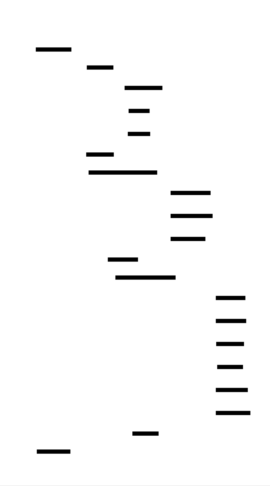

# JWT Library: Design Document


## Overview

This system implements a JSON Web Token library for secure authentication and authorization workflows. The key architectural challenge is building a cryptographically secure token system that properly handles signing, verification, and claims validation while avoiding common security pitfalls like timing attacks and algorithm confusion.


> This guide is meant to help you understand the big picture before diving into each milestone. Refer back to it whenever you need context on how components connect.


## Context and Problem Statement

> **Milestone(s):** Foundation for all milestones - understanding the authentication problem space

Modern applications face a fundamental challenge: how to securely identify and authorize users across distributed systems. When a user logs into a web application, mobile app, or API service, the system must answer two critical questions: "Who is this user?" (authentication) and "What are they allowed to do?" (authorization). Traditional session-based authentication works well for monolithic applications but breaks down in distributed architectures with microservices, single-page applications, and mobile clients.

The core problem is **stateful vs. stateless authentication**. Session cookies require server-side storage to maintain user state, creating coupling between authentication and storage systems. This approach becomes problematic when requests need to flow between multiple services, each of which would need access to the shared session store. Additionally, mobile applications and single-page applications have different security constraints than traditional server-rendered web pages, making cookie-based sessions inadequate.

JSON Web Tokens (JWTs) solve this problem by providing **self-contained, stateless authentication tokens**. Rather than storing user information on the server and referencing it with a session ID, JWTs embed the user information directly in the token itself. The token is cryptographically signed, making it tamper-evident without requiring server-side storage for validation.

However, building a secure JWT implementation is deceptively challenging. While the basic concept appears straightforward—encode some JSON, sign it, and verify the signature—the security details are complex and unforgiving. Common vulnerabilities include timing attacks during signature verification, algorithm confusion attacks where attackers manipulate the signing algorithm, improper handling of time-based claims leading to replay attacks, and encoding issues that can corrupt token data.

> **Key Insight**: JWTs shift the complexity from session management (storing state) to cryptographic verification (validating signatures and claims). This trade-off enables stateless, distributed authentication but requires careful attention to cryptographic security principles.

The challenge extends beyond basic signing and verification. Real-world JWT usage requires robust claims validation—checking that tokens haven't expired, that they're issued by trusted parties, and that they're intended for the current application. Time-based security adds another layer of complexity, as systems must handle clock skew between servers, leap seconds, and edge cases around token expiration boundaries.

### Mental Model: The Concert Wristband

To understand JWT concepts intuitively, imagine the authentication system used at a large music festival. Traditional session-based authentication is like a **will-call system**: when you arrive, security checks your ID against a central database, gives you a generic entry stamp, and every time you want to access different areas (VIP section, backstage, food vendors), security must radio back to the central database to verify your privileges.

JWTs work like **sophisticated wristbands** that contain all your information directly on the band itself. When you first authenticate (show your ticket and ID), instead of just getting a generic stamp, you receive a wristband that contains:

- **Header information** (like the wristband material): What type of security system this is and how it's protected
- **Your details** (like text printed on the band): Your identity, what areas you can access, when your access expires, which stages you're allowed near
- **Security seal** (like a tamper-evident hologram): A cryptographic signature that proves the wristband was issued by official festival security and hasn't been modified

The key advantages of this wristband system mirror JWT benefits:

**Self-contained verification**: Security guards at any stage don't need to radio back to a central database. They can look at your wristband, verify the security seal is intact and authentic, check that you're authorized for this area, and make an immediate access decision.

**Distributed access control**: Different vendors, stages, and areas can all independently verify your wristband without coordinating with each other or maintaining shared state.

**Expiration handling**: The wristband itself contains expiration information ("Valid until Sunday 11:59 PM"), so guards know when access should be revoked without consulting external systems.

However, this system also introduces the same challenges as JWTs:

**Security seal integrity**: If someone could forge or modify the holographic seal, they could create fake wristbands or upgrade their access level. Similarly, JWT signature verification must be cryptographically secure.

**Time synchronization**: Guards need to know the current time to check expiration, and their clocks must be reasonably synchronized. If a guard's watch is hours off, they might accept expired wristbands or reject valid ones.

**Revocation complexity**: If someone's wristband needs to be revoked mid-festival (they violated rules), there's no easy way to communicate this to all security guards since the system is designed to work without central coordination.

**Information exposure**: Unlike a generic stamp, the wristband contains detailed information about the person and their privileges. If someone can read the wristband, they learn about the user's access level and identity.

This mental model helps explain why JWT implementation requires careful attention to cryptographic signatures (the security seal), time-based claim validation (expiration checking), and why certain operations like token revocation are inherently challenging in a stateless system.

### Existing Token Approaches

Understanding JWT requires comparing it with alternative authentication approaches, each with distinct trade-offs in complexity, security, and architectural flexibility.

| Approach | State Management | Verification Process | Distribution Support | Security Model |
|----------|-----------------|---------------------|-------------------|----------------|
| Session Cookies | Server-side storage required | Database lookup on every request | Poor - requires shared storage | Server controls all state |
| API Keys | Server-side storage typical | Database/cache lookup | Moderate - can be cached | Long-lived, hard to rotate |
| Bearer Tokens (Opaque) | Server-side storage required | Token introspection endpoint | Good - centralized validation | Server controls validation |
| JWTs | Stateless - no storage needed | Cryptographic signature check | Excellent - fully distributed | Cryptographic proof |

#### Session Cookies: The Traditional Approach

Session cookies represent the classical web authentication model. When a user logs in, the server generates a random session identifier, stores user information associated with that ID in a database or memory store, and sends the session ID to the client as an HTTP cookie. On subsequent requests, the server looks up the session ID to retrieve user information.

**Advantages**: Session cookies provide strong security guarantees because the server maintains complete control over session state. Sessions can be immediately revoked by deleting the server-side record. The session ID itself contains no sensitive information, limiting exposure if intercepted. Cookie security features like `HttpOnly`, `Secure`, and `SameSite` provide robust protection against common web attacks.

**Limitations**: The requirement for server-side storage creates significant architectural constraints. Multiple application servers must share a session store, introducing a stateful component that must be highly available and consistent. Microservices architectures become complex as each service needs access to the shared session state or must proxy authentication through a central service. Mobile applications and single-page applications have limited cookie support, especially for cross-origin requests. Horizontal scaling requires session store replication or sticky load balancing.

> **Architectural Insight**: Session cookies optimize for security and immediate revocation at the cost of architectural flexibility. They work excellently for traditional server-rendered web applications but become impediments in modern distributed architectures.

#### API Keys: Simple but Limited

API keys provide a straightforward authentication mechanism where clients include a long-lived secret key with each request, typically in an HTTP header like `Authorization: Bearer api-key-12345`. The server validates the key against a database of registered keys and associated permissions.

**Advantages**: API keys are conceptually simple for both implementers and consumers. They work well for machine-to-machine authentication and service integration scenarios. Keys can be easily generated, distributed, and managed through administrative interfaces. They have excellent tooling support and are widely understood by developers.

**Limitations**: API keys are typically long-lived, making rotation complex and risky. They provide coarse-grained authorization—usually all-or-nothing access rather than fine-grained permissions. Revocation requires server-side storage lookup on every request. Keys often end up hardcoded in client applications or configuration files, creating security risks. They lack built-in expiration mechanisms, requiring external systems for time-based access control.

**Use Cases**: API keys excel in server-to-server scenarios where security requirements are moderate and simplicity is valued over sophisticated access control. They're common for public API access, webhook authentication, and internal service communication.

#### Bearer Tokens (Opaque): OAuth2 Standard

Opaque bearer tokens, standardized in OAuth2, provide a middle ground between sessions and JWTs. Clients receive a token (usually a random string) during authentication and include it in an `Authorization: Bearer` header. The server validates tokens by calling a token introspection endpoint or checking against a token database.

**Advantages**: Bearer tokens separate authentication from authorization, allowing specialized authorization servers. They support sophisticated OAuth2 flows for third-party application integration. Tokens can be revoked immediately by updating the central token registry. They work well across different client types (web, mobile, server) and support fine-grained scope-based permissions.

**Limitations**: Token validation requires a network call to the authorization server or shared database access, creating latency and availability dependencies. The introspection endpoint becomes a bottleneck and single point of failure. Caching tokens for performance creates a trade-off with revocation timeliness. The OAuth2 specification complexity can lead to implementation errors and security vulnerabilities.

**Use Cases**: OAuth2 bearer tokens are ideal for scenarios requiring immediate revocation, third-party application integration, or complex authorization flows. They're common in enterprise API gateways and identity provider integrations.

#### JWTs: Self-Contained Tokens

JWTs take a fundamentally different approach by encoding all necessary information directly into the token itself, secured with cryptographic signatures. Rather than requiring server-side lookups, consuming services can independently verify and extract information from the token.

**Advantages**: JWTs enable truly stateless authentication, eliminating the need for shared databases or session stores. They scale horizontally without coordination between servers. Microservices can independently verify tokens without calling back to authentication services. They work excellently across different client types and support cross-origin requests naturally. Token validation is fast—just signature verification and claims checking without network calls.

**Limitations**: Token revocation is complex since there's no central registry to update. Tokens can become large if they contain extensive claims information, increasing bandwidth usage. All services must have access to signing keys or key verification capabilities. Time-based security requires synchronized clocks across all services. Sensitive information in tokens is base64-encoded (not encrypted) and readable by clients.

> **Decision: JWT vs. Alternatives for Distributed Systems**
> - **Context**: Modern applications increasingly use microservices architectures, single-page applications, and mobile clients that make frequent API calls across service boundaries
> - **Options Considered**: Session cookies with shared storage, OAuth2 bearer tokens with introspection, JWTs with local verification
> - **Decision**: JWTs provide the best balance of security, performance, and architectural flexibility for distributed systems
> - **Rationale**: Stateless verification eliminates shared storage dependencies, reduces latency by avoiding network calls during validation, and enables independent service scaling. The complexity of cryptographic implementation is offset by simplified deployment and operational characteristics
> - **Consequences**: Teams must invest in secure JWT implementation but gain architectural flexibility and improved performance. Token revocation requires alternative strategies like short expiration times and refresh token patterns

The choice between these approaches depends on specific architectural requirements, security constraints, and operational capabilities. JWTs excel in distributed environments where stateless operation and performance are priorities, while session cookies remain optimal for traditional web applications with strong revocation requirements. Understanding these trade-offs is essential for making informed authentication architecture decisions.

### Implementation Guidance

Building a JWT library requires careful selection of cryptographic primitives, proper project organization, and a clear understanding of the security requirements that distinguish production-ready implementations from educational examples.

#### Technology Recommendations

| Component | Simple Option | Advanced Option | Rationale |
|-----------|---------------|-----------------|-----------|
| JSON Handling | `json` standard library | `ujson` or `orjson` for performance | Standard library provides consistency; advanced parsers optimize for speed but add complexity |
| Base64URL Encoding | Custom implementation using `base64` | `python-jose` library functions | Educational value in implementing encoding; libraries provide battle-tested edge case handling |
| HMAC Computation | `hmac` standard library | `cryptography` library | Standard library sufficient for HS256; cryptography library needed for RSA/ECDSA algorithms |
| Time Handling | `datetime` with UTC enforcement | `arrow` or `pendulum` libraries | UTC handling is critical; advanced libraries provide better timezone and parsing support |
| Secret Management | Environment variables | `keyring` or dedicated secret management | Environment variables work for development; production requires proper secret rotation |

#### Recommended Project Structure

Organize the JWT library into focused modules that separate concerns and enable incremental development:

```
jwt-library/
  src/jwt_lib/
    __init__.py              ← Public API exports
    encoder.py               ← Token encoding and Base64URL (Milestone 1)
    signer.py                ← HMAC signing and verification (Milestone 2)
    validator.py             ← Claims validation logic (Milestone 3)
    exceptions.py            ← JWT-specific exception classes
    models.py                ← Data classes for headers, payloads, tokens
    utils.py                 ← Shared utilities (time handling, constants)
  tests/
    test_encoder.py          ← Encoding and structure tests
    test_signer.py           ← Cryptographic operation tests
    test_validator.py        ← Claims validation tests
    test_vectors.py          ← RFC test vectors and reference data
    conftest.py              ← Pytest fixtures and test utilities
  examples/
    basic_usage.py           ← Simple token creation and verification
    web_integration.py       ← Flask/FastAPI integration example
    microservice_auth.py     ← Service-to-service authentication
  docs/
    security_considerations.md ← Deployment and security guidance
```

This structure enables milestone-based development where each component can be built and tested independently before integration.

#### Infrastructure Starter Code

**Complete Time Utilities Module (`utils.py`)**:

```python
"""
Utilities for JWT time handling and validation.
Handles UTC enforcement, clock skew tolerance, and timestamp conversion.
"""
import datetime
from typing import Optional, Union

# Default clock skew tolerance (5 minutes)
DEFAULT_LEEWAY_SECONDS = 300

def utc_now() -> datetime.datetime:
    """Get current UTC time as timezone-aware datetime."""
    return datetime.datetime.now(datetime.timezone.utc)

def to_unix_timestamp(dt: datetime.datetime) -> int:
    """Convert datetime to Unix timestamp (seconds since epoch)."""
    if dt.tzinfo is None:
        # Assume naive datetime is UTC
        dt = dt.replace(tzinfo=datetime.timezone.utc)
    return int(dt.timestamp())

def from_unix_timestamp(timestamp: Union[int, float]) -> datetime.datetime:
    """Convert Unix timestamp to UTC datetime."""
    return datetime.datetime.fromtimestamp(timestamp, tz=datetime.timezone.utc)

def is_expired(exp_timestamp: Optional[int], leeway: int = DEFAULT_LEEWAY_SECONDS) -> bool:
    """
    Check if a timestamp represents an expired time.
    
    Args:
        exp_timestamp: Unix timestamp for expiration, None means never expires
        leeway: Clock skew tolerance in seconds
    
    Returns:
        True if the timestamp is in the past (accounting for leeway)
    """
    if exp_timestamp is None:
        return False
    
    current_time = to_unix_timestamp(utc_now())
    return current_time > (exp_timestamp + leeway)

def is_not_before(nbf_timestamp: Optional[int], leeway: int = DEFAULT_LEEWAY_SECONDS) -> bool:
    """
    Check if current time is before a 'not before' timestamp.
    
    Args:
        nbf_timestamp: Unix timestamp for 'not before', None means no restriction
        leeway: Clock skew tolerance in seconds
    
    Returns:
        True if current time is before the nbf time (accounting for leeway)
    """
    if nbf_timestamp is None:
        return False
    
    current_time = to_unix_timestamp(utc_now())
    return current_time < (nbf_timestamp - leeway)
```

**Complete Exception Classes (`exceptions.py`)**:

```python
"""
JWT-specific exceptions that provide clear error categorization.
Each exception type corresponds to a specific validation failure mode.
"""

class JWTError(Exception):
    """Base exception for all JWT-related errors."""
    pass

class InvalidTokenError(JWTError):
    """Raised when token structure or encoding is invalid."""
    pass

class InvalidSignatureError(JWTError):
    """Raised when token signature verification fails."""
    pass

class ExpiredTokenError(JWTError):
    """Raised when token has expired (exp claim)."""
    pass

class NotBeforeError(JWTError):
    """Raised when token is not yet valid (nbf claim)."""
    pass

class InvalidIssuerError(JWTError):
    """Raised when token issuer is not in allowlist."""
    pass

class InvalidAudienceError(JWTError):
    """Raised when token audience doesn't match expected value."""
    pass

class MissingRequiredClaimError(JWTError):
    """Raised when a required claim is missing from the token."""
    pass
```

**Complete Data Models (`models.py`)**:

```python
"""
Data classes representing JWT components and validation context.
These provide type safety and clear interfaces for token manipulation.
"""
from dataclasses import dataclass, field
from typing import Dict, Any, Optional, List, Union
import json

@dataclass
class JWTHeader:
    """Represents the JWT header section."""
    alg: str = "HS256"  # Algorithm used for signing
    typ: str = "JWT"    # Token type
    
    def to_dict(self) -> Dict[str, Any]:
        """Convert header to dictionary for JSON serialization."""
        return {"alg": self.alg, "typ": self.typ}
    
    @classmethod
    def from_dict(cls, data: Dict[str, Any]) -> 'JWTHeader':
        """Create header from dictionary."""
        return cls(alg=data.get("alg", "HS256"), typ=data.get("typ", "JWT"))

@dataclass
class JWTPayload:
    """Represents the JWT payload section with standard and custom claims."""
    # Registered claims (RFC 7519)
    iss: Optional[str] = None  # Issuer
    sub: Optional[str] = None  # Subject
    aud: Optional[Union[str, List[str]]] = None  # Audience
    exp: Optional[int] = None  # Expiration time
    nbf: Optional[int] = None  # Not before
    iat: Optional[int] = None  # Issued at
    jti: Optional[str] = None  # JWT ID
    
    # Custom claims
    custom_claims: Dict[str, Any] = field(default_factory=dict)
    
    def to_dict(self) -> Dict[str, Any]:
        """Convert payload to dictionary, including only non-None values."""
        result = {}
        
        # Add standard claims if present
        if self.iss is not None:
            result["iss"] = self.iss
        if self.sub is not None:
            result["sub"] = self.sub
        if self.aud is not None:
            result["aud"] = self.aud
        if self.exp is not None:
            result["exp"] = self.exp
        if self.nbf is not None:
            result["nbf"] = self.nbf
        if self.iat is not None:
            result["iat"] = self.iat
        if self.jti is not None:
            result["jti"] = self.jti
        
        # Add custom claims
        result.update(self.custom_claims)
        return result
    
    @classmethod
    def from_dict(cls, data: Dict[str, Any]) -> 'JWTPayload':
        """Create payload from dictionary, separating standard and custom claims."""
        standard_claims = {
            "iss", "sub", "aud", "exp", "nbf", "iat", "jti"
        }
        
        # Extract standard claims
        payload_args = {}
        custom_claims = {}
        
        for key, value in data.items():
            if key in standard_claims:
                payload_args[key] = value
            else:
                custom_claims[key] = value
        
        payload_args["custom_claims"] = custom_claims
        return cls(**payload_args)

@dataclass
class ValidationContext:
    """Configuration and context for JWT validation."""
    # Required validations
    verify_signature: bool = True
    verify_expiration: bool = True
    verify_not_before: bool = True
    
    # Clock skew tolerance
    leeway_seconds: int = 300  # 5 minutes default
    
    # Issuer validation
    allowed_issuers: Optional[List[str]] = None
    require_issuer: bool = False
    
    # Audience validation
    expected_audience: Optional[str] = None
    require_audience: bool = False
    
    # Custom claim requirements
    required_claims: List[str] = field(default_factory=list)
```

#### Core Logic Implementation Skeleton

The following skeleton provides the structure for implementing core JWT operations while leaving the essential learning components for the student to complete:

**Token Encoder Skeleton (`encoder.py`)**:

```python
"""
JWT token encoding and Base64URL implementation.
Students implement the core encoding logic following the numbered steps.
"""
import json
import base64
from typing import Dict, Any
from .models import JWTHeader, JWTPayload
from .exceptions import InvalidTokenError

def base64url_encode(data: bytes) -> str:
    """
    Encode bytes to Base64URL format (RFC 4648 Section 5).
    Base64URL uses URL-safe characters and removes padding.
    """
    # TODO 1: Use base64.urlsafe_b64encode() to encode the input bytes
    # TODO 2: Decode the result to get a string (it returns bytes)
    # TODO 3: Remove any trailing '=' padding characters using rstrip()
    # TODO 4: Return the URL-safe, padding-free string
    # Hint: Base64URL differs from regular Base64 in character set and padding
    pass

def base64url_decode(data: str) -> bytes:
    """
    Decode Base64URL format back to bytes.
    Must handle missing padding by adding it back.
    """
    # TODO 1: Calculate padding needed: missing = (4 - len(data) % 4) % 4
    # TODO 2: Add '=' characters for padding: data += '=' * missing
    # TODO 3: Use base64.urlsafe_b64decode() to decode the padded string
    # TODO 4: Return the decoded bytes
    # Hint: Base64 requires length to be multiple of 4, so we add padding back
    pass

def encode_token_parts(header: JWTHeader, payload: JWTPayload) -> tuple[str, str]:
    """
    Encode header and payload sections of JWT.
    Returns (encoded_header, encoded_payload) tuple.
    """
    # TODO 1: Convert header to dictionary using header.to_dict()
    # TODO 2: Serialize header dict to JSON string using json.dumps()
    # TODO 3: Encode header JSON to bytes using .encode('utf-8')
    # TODO 4: Apply Base64URL encoding to header bytes
    # TODO 5: Repeat steps 1-4 for payload
    # TODO 6: Return tuple of (encoded_header, encoded_payload)
    # Hint: Consistent JSON serialization is important for signature verification
    pass
```

#### Language-Specific Implementation Hints

**Python Cryptographic Libraries:**
- Use `hmac.new(key, message, hashlib.sha256)` for HMAC-SHA256 computation
- Always call `hmac.digest()` to get bytes, not `hexdigest()` which returns hex strings
- Use `hmac.compare_digest()` for constant-time signature comparison to prevent timing attacks

**JSON Serialization Consistency:**
- Use `json.dumps(data, separators=(',', ':'), sort_keys=True)` for consistent output
- The `separators` parameter removes extra whitespace
- The `sort_keys` parameter ensures consistent key ordering for reproducible signatures

**Time Handling Best Practices:**
- Always work with UTC timestamps to avoid timezone confusion
- Use `datetime.datetime.now(datetime.timezone.utc)` instead of `datetime.utcnow()` (deprecated)
- Convert to Unix timestamps using `int(dt.timestamp())` for JWT claims

**Error Handling Patterns:**
- Catch specific exceptions (`json.JSONDecodeError`, `base64.binascii.Error`) and re-raise as `InvalidTokenError`
- Validate input types early: check that tokens are strings, keys are bytes, etc.
- Provide descriptive error messages that help with debugging but don't leak sensitive information

#### Milestone Checkpoints

**Milestone 1 Checkpoint (Token Encoding):**
After implementing the encoding components, verify functionality with:

```bash
python -m pytest tests/test_encoder.py -v
```

Expected behavior:
- `base64url_encode(b"hello")` should return `"aGVsbG8"` (no padding)
- `base64url_decode("aGVsbG8")` should return `b"hello"`
- Header encoding should produce valid Base64URL that decodes back to original JSON
- Complete token structure should have exactly two dots separating three parts

Manual verification:
```python
from jwt_lib.encoder import encode_token_parts
from jwt_lib.models import JWTHeader, JWTPayload

header = JWTHeader()
payload = JWTPayload(sub="user123", exp=1234567890)
h, p = encode_token_parts(header, payload)
print(f"Header: {h}")
print(f"Payload: {p}")
# Should produce readable JSON when decoded at jwt.io
```

**Security Validation Points:**
- Verify that Base64URL encoding produces URL-safe output (no `+` or `/` characters)
- Confirm that padding is properly removed and restored during encode/decode cycles
- Test edge cases: empty payloads, Unicode characters in custom claims, very long tokens

Signs of problems:
- "Invalid character" errors usually indicate Base64URL vs regular Base64 confusion
- JSON decode errors suggest inconsistent serialization or encoding corruption
- Token structure errors typically mean incorrect dot-separated format assembly


## Goals and Non-Goals

> **Milestone(s):** Foundation for all three milestones - establishes scope and security requirements for the entire JWT library

Before diving into implementation details, we must establish clear boundaries for our JWT library. Like defining the requirements for a security system before building it, understanding what we will and will not implement prevents scope creep and ensures we focus on the core learning objectives while maintaining security best practices.

The goals and non-goals for our JWT library emerge from the fundamental tension between simplicity and completeness. We want to build something robust enough to demonstrate real-world JWT concepts, yet focused enough that learners can master the core principles without getting lost in enterprise-grade feature complexity.

### Functional Requirements

Our JWT library must provide the essential operations that any production-ready JWT implementation would offer. These requirements directly support the three milestone progression: basic token structure, cryptographic signing, and comprehensive validation.

**Core JWT Operations**

The library must support the complete JWT lifecycle from token creation through verification. This means providing clean APIs for both token producers (services that issue JWTs) and token consumers (services that validate incoming JWTs).

| Operation | Input Parameters | Expected Output | Purpose |
|-----------|-----------------|-----------------|---------|
| `create_token` | `JWTHeader`, `JWTPayload`, secret key | Signed JWT string | Generate new authentication tokens |
| `verify_token` | JWT string, secret key, `ValidationContext` | Decoded `JWTPayload` or error | Validate and extract claims from tokens |
| `decode_header` | JWT string | `JWTHeader` or error | Extract header without verification (debugging) |
| `decode_payload` | JWT string | `JWTPayload` or error | Extract payload without verification (debugging) |
| `encode_token_parts` | `JWTHeader`, `JWTPayload` | Base64URL header, payload strings | Support custom signing workflows |

The token creation operation must handle the complete assembly process: JSON serialization of header and payload, Base64URL encoding of both parts, HMAC-SHA256 signature generation over the signing input, and final concatenation into the standard three-part format. This operation serves as the primary interface for authentication services issuing tokens to users after successful login.

Token verification represents the most complex functional requirement. It must parse the three-part token structure, decode Base64URL components back to JSON, recompute the HMAC signature using the provided secret key, perform constant-time signature comparison to prevent timing attacks, and validate all time-based and identity claims according to the provided validation context. This operation serves as the primary interface for protected services validating incoming requests.

**JWT Structure Compliance**

Our implementation must strictly adhere to RFC 7519 JWT specifications and RFC 7515 JWS (JSON Web Signature) specifications for the structural format. This ensures interoperability with other JWT libraries and services.

The header component must contain the algorithm identifier (`alg`) set to `HS256` for HMAC-SHA256 signatures, and the token type (`typ`) set to `JWT` to indicate this is a JSON Web Token. Additional header fields are explicitly out of scope for this learning-focused implementation.

The payload component must support all standard registered claims defined in RFC 7519. These include issuer (`iss`) for identifying the token creator, subject (`sub`) for identifying the token recipient, audience (`aud`) for specifying intended token consumers, expiration time (`exp`) for token lifetime management, not-before time (`nbf`) for delayed token activation, issued-at time (`iat`) for token creation tracking, and JWT ID (`jti`) for unique token identification.

Custom claims support is essential for real-world usage. The payload must accommodate arbitrary application-specific claims while ensuring they don't conflict with registered claim names. This flexibility allows authentication services to embed user roles, permissions, session identifiers, or other application state into tokens.

**Base64URL Encoding Requirements**

Proper Base64URL encoding is critical for JWT compliance and security. Our implementation must use the URL-safe Base64 variant that replaces plus signs with hyphens, forward slashes with underscores, and removes padding equals characters entirely.

| Encoding Requirement | Standard Base64 | Required Base64URL | Rationale |
|---------------------|-----------------|-------------------|-----------|
| Character 62 | `+` | `-` | URL safety in query parameters |
| Character 63 | `/` | `_` | URL safety in path segments |
| Padding | `=` characters | No padding | Reduces token length, prevents encoding issues |
| Line breaks | Allowed | Forbidden | Ensures single-line tokens |

The encoding process must handle the padding restoration correctly during decoding. When decoding Base64URL back to bytes, the implementation must calculate the required padding length using modulo arithmetic and append the appropriate number of equals characters before performing standard Base64 decoding.

**Time-Based Claim Processing**

Time-based claims require careful handling to balance security with practical clock synchronization challenges in distributed systems. Our implementation must support configurable clock skew tolerance while maintaining security properties.

The expiration claim (`exp`) validation must compare the claim timestamp against the current UTC time plus a configurable leeway period. Tokens with expiration times in the past (accounting for leeway) must be rejected with a specific expiration error that applications can handle appropriately.

The not-before claim (`nbf`) validation must ensure the current time is after the claim timestamp minus the leeway period. This supports use cases where tokens are issued for future activation, such as scheduled access grants or time-delayed permissions.

The issued-at claim (`iat`) validation must verify the timestamp is not unreasonably far in the past or future. This prevents token replay attacks using very old tokens and detects clock synchronization issues that might indicate system compromise.

### Security Requirements

Security requirements for our JWT library extend beyond basic functionality to address the cryptographic and temporal attack vectors that commonly compromise token-based authentication systems.

**Cryptographic Security Properties**

The HMAC-SHA256 implementation must provide strong cryptographic guarantees against signature forgery and manipulation attacks. The secret key must be used directly in HMAC computation without additional processing that might weaken the cryptographic properties.

| Security Property | Requirement | Attack Prevention |
|------------------|-------------|-------------------|
| Signature integrity | HMAC-SHA256 over header.payload | Prevents token tampering |
| Key confidentiality | Secret key never logged or exposed | Prevents signature forgery |
| Constant-time comparison | Signature verification immune to timing analysis | Prevents timing side-channel attacks |
| Algorithm specification | Header `alg` field enforced strictly | Prevents algorithm confusion attacks |

Constant-time comparison is crucial for signature verification security. The implementation must use a comparison function that takes the same amount of time regardless of where the compared byte sequences differ. This prevents timing attacks where malicious actors measure response times to gradually discover valid signatures.

Secret key handling requires careful memory management. The key should be stored securely in memory without unnecessary copying, never written to logs or error messages, and cleared from memory when no longer needed (though Python's garbage collection makes secure clearing challenging).

**Algorithm Confusion Attack Prevention**

Algorithm confusion attacks exploit JWT libraries that allow attackers to change the signing algorithm specified in the token header. Our implementation must enforce strict algorithm verification to prevent these attacks.

The most dangerous variant involves changing from HMAC algorithms to asymmetric algorithms like RS256. An attacker might change `alg` from `HS256` to `RS256`, then use the known public key as the "secret" to forge signatures. Our implementation prevents this by validating that the header algorithm matches the expected algorithm before performing any signature verification.

> **Critical Security Insight**: Never trust the algorithm specified in the JWT header without verification. Always validate that the algorithm matches what your application expects before processing the signature.

**Timing Attack Resistance**

Timing attacks against JWT verification exploit small differences in processing time to extract cryptographic secrets or bypass security checks. Our implementation must provide consistent execution times for both successful and failed verification attempts.

The primary timing attack vector occurs during signature comparison. If comparison fails fast on the first differing byte, attackers can measure response times to gradually construct valid signatures. Our constant-time comparison function must examine every byte of both signatures regardless of when differences are detected.

Secondary timing attacks can occur during claims validation if different validation failures take significantly different processing times. While perfect timing uniformity is difficult to achieve, the implementation should avoid obvious timing differences like expensive database lookups for some validation failures but not others.

**Clock Skew Tolerance**

Time-based claim validation must balance security with practical distributed system realities. Perfect clock synchronization between token issuers and validators is impossible, requiring configurable tolerance for time differences.

The default leeway of `DEFAULT_LEEWAY_SECONDS` (300 seconds) provides reasonable tolerance for typical network time protocol (NTP) synchronization while limiting the window for potential abuse. This value represents a compromise between security (smaller windows are better) and reliability (larger windows accommodate more clock drift).

| Time Validation | Without Leeway | With 5-Minute Leeway | Security Impact |
|----------------|----------------|---------------------|------------------|
| Token expires 11:00:00 | Rejected at 11:00:01 | Rejected at 11:05:01 | 5-minute extended exposure |
| Token not-before 11:00:00 | Accepted at 10:59:59 | Accepted at 10:55:00 | 5-minute early access |
| Clock drift tolerance | Frequent false rejections | Reliable validation | Improved user experience |

Applications with higher security requirements can reduce the leeway period, while applications prioritizing reliability over absolute security can increase it. The key is making this configurable rather than hardcoded.

### Non-Goals

Explicitly defining what our JWT library will not implement is as important as defining what it will implement. These non-goals help maintain focus on the core learning objectives while acknowledging the broader JWT ecosystem.

**Advanced Cryptographic Algorithms**

Our implementation deliberately limits itself to HMAC-SHA256 (`HS256`) signatures only. We will not implement RSA signatures (RS256), ECDSA signatures (ES256/ES384/ES512), or other advanced cryptographic algorithms defined in the JWS specification.

This limitation serves multiple purposes. First, it keeps the cryptographic complexity manageable for learners focusing on JWT concepts rather than advanced cryptography. Second, it avoids the key management complexity that asymmetric algorithms introduce. Third, it prevents the implementation complexity that algorithm negotiation and validation would require.

> **Design Decision**: HMAC-SHA256 provides sufficient cryptographic security for the learning objectives while avoiding the certificate management, key distribution, and algorithm negotiation complexities that asymmetric algorithms introduce.

**JSON Web Encryption (JWE)**

We will not implement JWE capabilities for encrypting JWT payloads. JWE addresses confidentiality concerns (hiding claim contents from anyone who can see the token), while our focus is on integrity and authenticity (ensuring tokens haven't been tampered with and come from trusted issuers).

JWE implementation would require additional cryptographic primitives (symmetric encryption, key derivation functions, authenticated encryption modes), content encryption key management, and recipient key handling. These complexities detract from the core JWT concepts without significantly enhancing the learning experience.

**Key Rotation and Management**

Advanced key management features like automatic key rotation, key versioning, multiple concurrent keys, and key distribution mechanisms are explicitly out of scope. Our implementation assumes a single, static secret key shared between token issuers and validators.

Real production systems require sophisticated key management to handle key compromise, regular rotation for security hygiene, and zero-downtime key updates. However, these operational concerns distract from the fundamental JWT concepts and would require additional infrastructure (key storage systems, coordination mechanisms, backward compatibility handling) beyond the scope of a learning implementation.

**Performance Optimizations**

We will not implement performance optimizations like signature verification caching, batch token processing, or streaming JSON parsing. Our focus is on correctness and security rather than high-throughput production performance.

Performance optimizations often introduce complexity that obscures the fundamental algorithms and security properties we're trying to teach. Caching mechanisms require cache invalidation strategies, batch processing requires careful error isolation, and streaming parsing requires state management that distracts from the core JWT concepts.

**Enterprise Features**

Enterprise-grade features like token introspection endpoints (RFC 7662), token revocation (RFC 7009), dynamic client registration, and OAuth 2.0 integration are out of scope. These features represent important production capabilities but extend well beyond JWT fundamentals into broader authentication and authorization protocol ecosystems.

| Feature Category | Examples | Why Out of Scope |
|-----------------|----------|------------------|
| OAuth 2.0 Integration | Authorization code flows, client credentials | Focuses on authorization protocol rather than JWT structure |
| Token Management | Revocation lists, introspection endpoints | Requires persistent storage and distributed coordination |
| Client Management | Dynamic registration, client authentication | Involves certificate management and PKI concepts |
| Advanced Claims | Hierarchical claims, claim transformation | Adds application-specific complexity without JWT insights |

**Framework Integration**

We will not provide direct integrations with web frameworks (Express.js middleware, Django authentication backends, Gin handlers) or cloud platforms (AWS Cognito, Auth0, Firebase Auth). Our library will provide clean, framework-agnostic APIs that could be integrated with any framework but won't include the integration code itself.

Framework integrations require understanding each framework's authentication model, request/response handling patterns, and error reporting mechanisms. This knowledge is valuable for production deployment but distracts from the JWT-specific learning objectives.

**Database Integration**

Features requiring persistent storage like user management, session tracking, token blacklisting, or audit logging are out of scope. Our implementation will be completely stateless, validating tokens based solely on their cryptographic properties and embedded claims.

Stateless validation is one of JWT's key advantages over traditional session-based authentication, and maintaining this property simplifies the implementation while reinforcing the conceptual benefits of token-based authentication.

> **Architecture Principle**: Our JWT library embraces stateless authentication as a core design principle. All token validation decisions must be made based solely on the token contents and the shared secret key, without requiring database lookups or external service calls.

**Advanced Validation Rules**

Complex validation rules like claim interdependency checking, conditional validation logic, or custom validation plugins are out of scope. Our validation will focus on the standard registered claims and basic custom claim extraction without sophisticated rule engines.

For example, we won't support validation rules like "if role claim is 'admin', then require additional MFA claim" or "if audience contains 'sensitive-service', then enforce stricter expiration limits." These application-specific validation requirements can be implemented by applications using our basic claim extraction capabilities.

This focused scope ensures that learners master the fundamental JWT validation concepts (time-based claims, signature verification, basic claim extraction) without getting distracted by the infinite variety of application-specific validation requirements that real systems might need.

### Implementation Guidance

This section provides concrete technology recommendations and starter code to help implement the functional and security requirements defined above.

**A. Technology Recommendations**

| Component | Simple Option | Advanced Option |
|-----------|---------------|-----------------|
| JSON Serialization | `json.dumps()` with `separators=(',', ':')` | Custom JSON encoder with ordered keys |
| Base64 Encoding | `base64.urlsafe_b64encode()` with padding removal | Custom Base64URL implementation |
| HMAC Computation | `hmac.new()` with `hashlib.sha256` | Custom HMAC implementation |
| Time Handling | `datetime.datetime.utcnow()` and `timestamp()` | `time.time()` for performance |
| Constant-Time Comparison | `hmac.compare_digest()` | Custom constant-time implementation |
| Secret Key Storage | In-memory `bytes` object | Secure memory with `mlock()` |

**B. Recommended File Structure**

```
jwt-library/
├── jwt_lib/
│   ├── __init__.py              ← Main API exports
│   ├── core.py                  ← Primary JWT operations (create_token, verify_token)
│   ├── encoding.py              ← Base64URL encoding/decoding utilities
│   ├── signing.py               ← HMAC-SHA256 signature operations
│   ├── validation.py            ← Claims validation logic
│   ├── models.py                ← Data structures (JWTHeader, JWTPayload, ValidationContext)
│   └── exceptions.py            ← Custom exception classes
├── tests/
│   ├── test_core.py             ← End-to-end JWT operations
│   ├── test_encoding.py         ← Base64URL encoding tests
│   ├── test_signing.py          ← Signature generation/verification tests
│   ├── test_validation.py       ← Claims validation tests
│   └── test_vectors.py          ← RFC test vectors and known-good examples
└── examples/
    ├── basic_usage.py           ← Simple create/verify example
    └── advanced_validation.py   ← Custom validation context examples
```

**C. Infrastructure Starter Code**

Here's complete starter code for the data models and basic utilities that learners can use immediately:

```python
"""
JWT Library Data Models and Utilities
Complete implementation - copy and use as-is
"""
from dataclasses import dataclass, field
from datetime import datetime, timezone
from typing import Dict, Any, List, Union, Optional
import json
import base64

# Constants
DEFAULT_LEEWAY_SECONDS = 300
HS256 = "HS256"
JWT = "JWT"

@dataclass
class JWTHeader:
    """JWT header containing algorithm and type information."""
    alg: str = HS256
    typ: str = JWT
    
    def to_dict(self) -> Dict[str, str]:
        return {"alg": self.alg, "typ": self.typ}
    
    @classmethod
    def from_dict(cls, data: Dict[str, Any]) -> 'JWTHeader':
        return cls(alg=data.get("alg", HS256), typ=data.get("typ", JWT))

@dataclass
class JWTPayload:
    """JWT payload containing registered and custom claims."""
    iss: Optional[str] = None          # Issuer
    sub: Optional[str] = None          # Subject
    aud: Optional[Union[str, List[str]]] = None  # Audience
    exp: Optional[int] = None          # Expiration time
    nbf: Optional[int] = None          # Not before
    iat: Optional[int] = None          # Issued at
    jti: Optional[str] = None          # JWT ID
    custom_claims: Dict[str, Any] = field(default_factory=dict)
    
    def to_dict(self) -> Dict[str, Any]:
        result = {}
        if self.iss is not None:
            result["iss"] = self.iss
        if self.sub is not None:
            result["sub"] = self.sub
        if self.aud is not None:
            result["aud"] = self.aud
        if self.exp is not None:
            result["exp"] = self.exp
        if self.nbf is not None:
            result["nbf"] = self.nbf
        if self.iat is not None:
            result["iat"] = self.iat
        if self.jti is not None:
            result["jti"] = self.jti
        result.update(self.custom_claims)
        return result
    
    @classmethod
    def from_dict(cls, data: Dict[str, Any]) -> 'JWTPayload':
        # Extract registered claims
        registered_claims = {
            'iss': data.get('iss'),
            'sub': data.get('sub'), 
            'aud': data.get('aud'),
            'exp': data.get('exp'),
            'nbf': data.get('nbf'),
            'iat': data.get('iat'),
            'jti': data.get('jti')
        }
        
        # Extract custom claims (everything else)
        custom_claims = {k: v for k, v in data.items() 
                        if k not in ['iss', 'sub', 'aud', 'exp', 'nbf', 'iat', 'jti']}
        
        return cls(custom_claims=custom_claims, **{k: v for k, v in registered_claims.items() if v is not None})

@dataclass
class ValidationContext:
    """Configuration for JWT validation behavior."""
    verify_signature: bool = True
    verify_expiration: bool = True
    verify_not_before: bool = True
    leeway_seconds: int = DEFAULT_LEEWAY_SECONDS
    allowed_issuers: List[str] = field(default_factory=list)
    require_issuer: bool = False
    expected_audience: Optional[str] = None
    require_audience: bool = False
    required_claims: List[str] = field(default_factory=list)

# Utility functions
def utc_now() -> datetime:
    """Get current UTC time."""
    return datetime.now(timezone.utc)

def to_unix_timestamp(dt: datetime) -> int:
    """Convert datetime to Unix timestamp."""
    return int(dt.timestamp())

class JWTError(Exception):
    """Base exception for JWT operations."""
    pass

class InvalidTokenError(JWTError):
    """Raised when token structure is invalid."""
    pass

class InvalidSignatureError(JWTError):
    """Raised when signature verification fails."""
    pass

class TokenExpiredError(JWTError):
    """Raised when token is expired."""
    pass

class TokenNotYetValidError(JWTError):
    """Raised when token not-before time hasn't passed."""
    pass

class InvalidIssuerError(JWTError):
    """Raised when token issuer is not allowed."""
    pass

class InvalidAudienceError(JWTError):
    """Raised when token audience doesn't match expected."""
    pass
```

**D. Core Logic Skeleton Code**

Here are the main function signatures learners need to implement, with detailed TODO comments mapping to the requirements:

```python
"""
Core JWT Operations - Implement These Functions
Fill in the TODO sections based on the requirements above
"""
import hmac
import hashlib

def base64url_encode(data: bytes) -> str:
    """Encode bytes to URL-safe Base64 without padding."""
    # TODO 1: Use base64.urlsafe_b64encode() to encode the data
    # TODO 2: Decode the result to get a string
    # TODO 3: Remove trailing '=' padding characters using rstrip()
    # TODO 4: Return the URL-safe string
    pass

def base64url_decode(data: str) -> bytes:
    """Decode Base64URL back to bytes with padding restoration."""
    # TODO 1: Calculate required padding: 4 - (len(data) % 4) % 4
    # TODO 2: Add '=' characters for padding
    # TODO 3: Use base64.urlsafe_b64decode() to decode
    # TODO 4: Return the decoded bytes
    pass

def encode_token_parts(header: JWTHeader, payload: JWTPayload) -> tuple[str, str]:
    """Encode header and payload sections to Base64URL."""
    # TODO 1: Convert header to dictionary using header.to_dict()
    # TODO 2: Serialize header dict to JSON with separators=(',', ':')
    # TODO 3: Encode header JSON to bytes using .encode('utf-8')
    # TODO 4: Base64URL encode header bytes
    # TODO 5: Repeat steps 1-4 for payload using payload.to_dict()
    # TODO 6: Return tuple of (encoded_header, encoded_payload)
    pass

def create_token(header: JWTHeader, payload: JWTPayload, secret_key: bytes) -> str:
    """Generate signed JWT token."""
    # TODO 1: Encode header and payload using encode_token_parts()
    # TODO 2: Create signing input by joining header.payload with '.'
    # TODO 3: Generate HMAC-SHA256 signature over signing input
    # TODO 4: Base64URL encode the signature
    # TODO 5: Join header.payload.signature with '.' separators
    # TODO 6: Return the complete JWT string
    pass

def verify_token(token: str, secret_key: bytes, context: ValidationContext) -> JWTPayload:
    """Verify JWT token and return payload if valid."""
    # TODO 1: Split token into three parts using token.split('.')
    # TODO 2: Verify we have exactly 3 parts, raise InvalidTokenError if not
    # TODO 3: Base64URL decode header and payload parts
    # TODO 4: Parse JSON from decoded header and payload
    # TODO 5: Create JWTHeader and JWTPayload objects from parsed JSON
    # TODO 6: If context.verify_signature: verify signature matches
    # TODO 7: If context.verify_expiration: check exp claim
    # TODO 8: If context.verify_not_before: check nbf claim  
    # TODO 9: Validate issuer and audience claims per context
    # TODO 10: Return validated payload
    pass

def is_expired(exp_timestamp: int, leeway: int) -> bool:
    """Check if timestamp is in the past accounting for leeway."""
    # TODO 1: Get current Unix timestamp using utc_now() and to_unix_timestamp()
    # TODO 2: Add leeway seconds to exp_timestamp
    # TODO 3: Return True if current time > adjusted expiration time
    pass

def is_not_before(nbf_timestamp: int, leeway: int) -> bool:
    """Check if current time is before nbf accounting for leeway."""
    # TODO 1: Get current Unix timestamp
    # TODO 2: Subtract leeway seconds from nbf_timestamp  
    # TODO 3: Return True if current time < adjusted not-before time
    pass
```

**E. Language-Specific Hints**

- Use `json.dumps(obj, separators=(',', ':'))` for compact JSON without whitespace
- Use `hmac.compare_digest()` for constant-time signature comparison
- Use `datetime.now(timezone.utc)` for UTC timestamps to avoid timezone issues
- Store secret keys as `bytes` objects, not strings, to avoid encoding confusion
- Use `str.encode('utf-8')` when converting JSON strings to bytes for encoding
- Handle `json.JSONDecodeError` when parsing potentially malformed tokens

**F. Milestone Checkpoints**

After implementing the functional requirements:

**Checkpoint 1 - Token Creation**:
```bash
python -c "
from jwt_lib.core import create_token
from jwt_lib.models import JWTHeader, JWTPayload
import time

payload = JWTPayload(sub='user123', exp=int(time.time()) + 3600)
token = create_token(JWTHeader(), payload, b'secret')
print(f'Created token: {token}')
print(f'Parts count: {len(token.split(\".\"))}')  # Should be 3
"
```

**Checkpoint 2 - Token Verification**:
```bash
python -c "
from jwt_lib.core import create_token, verify_token
from jwt_lib.models import JWTHeader, JWTPayload, ValidationContext
import time

payload = JWTPayload(sub='user123', exp=int(time.time()) + 3600)
token = create_token(JWTHeader(), payload, b'secret')
verified = verify_token(token, b'secret', ValidationContext())
print(f'Verified subject: {verified.sub}')  # Should be 'user123'
"
```

**Checkpoint 3 - Claims Validation**:
Test that expired tokens are properly rejected and validation context works correctly.


## High-Level Architecture

> **Milestone(s):** Foundation for all three milestones - provides the structural framework for token encoding (Milestone 1), HMAC signing (Milestone 2), and claims validation (Milestone 3)

The JWT library architecture follows a **layered responsibility pattern** where each component has a distinct role in the token lifecycle. Think of this like a document processing pipeline in a government office: first, clerks prepare and format the document (encoding), then an official stamps it with a seal (signing), and finally, inspectors validate both the seal and contents before accepting it (verification). Each station has specialized knowledge and tools, but they work together to ensure document authenticity and integrity.


The architecture separates concerns across three primary dimensions: **structural formatting**, **cryptographic security**, and **semantic validation**. This separation allows each component to focus on its specific expertise while maintaining clear interfaces between layers. The design prioritizes security by ensuring that cryptographic operations are isolated from parsing logic, and validation rules are separated from encoding concerns.

### Component Responsibilities

The JWT library consists of three core components that collaborate to provide **stateless authentication** capabilities. Each component owns a specific aspect of the token lifecycle and exposes well-defined interfaces to other components.

#### Token Encoding Component

The **Token Encoding Component** serves as the foundation layer, responsible for all structural and formatting concerns. This component transforms application data into the standardized JWT format without any knowledge of cryptographic operations or business logic validation rules.

| Responsibility | Description | Key Operations |
|---------------|-------------|----------------|
| JSON Serialization | Convert header and payload objects to consistent JSON representation | Deterministic field ordering, proper escaping |
| Base64URL Encoding | Transform JSON strings into URL-safe encoded segments | Padding removal, character substitution |
| Token Structure Assembly | Combine encoded parts into dot-separated JWT format | Header concatenation, placeholder signature handling |
| Format Validation | Ensure structural compliance with JWT specification | Three-part format verification, character validation |

The encoding component maintains **format consistency** by applying standardized JSON serialization rules and ensuring that all tokens follow the exact three-part structure required by RFC 7519. It handles the subtle differences between standard Base64 and **Base64URL encoding**, particularly around padding characters and URL-safe character substitutions.

> **Key Design Principle**: The encoding component never touches cryptographic material or validates claim semantics. It treats all payload data as opaque JSON objects, focusing solely on format compliance and structural integrity.

#### Cryptographic Signing Component

The **Cryptographic Signing Component** handles all security-related operations, including signature generation, verification, and protection against cryptographic attacks. This component operates independently of token structure and claim semantics.

| Responsibility | Description | Security Considerations |
|---------------|-------------|------------------------|
| HMAC-SHA256 Computation | Generate keyed hash signatures over signing input | Constant-time operations, secure key handling |
| Signature Verification | Validate token authenticity through signature comparison | Timing attack prevention, algorithm confusion protection |
| Secret Key Management | Securely store and access signing keys in memory | Key validation, secure memory handling |
| Cryptographic Error Handling | Detect and report signature-related failures | Information leak prevention, clear error categories |

The signing component implements **signature verification** using constant-time comparison algorithms to prevent **timing attacks**. It validates that the recomputed signature exactly matches the token's signature without revealing information about partial matches or failure points.

> **Security Focus**: This component treats timing as a security-critical resource. All cryptographic comparisons use constant-time algorithms, and error messages are carefully crafted to avoid leaking information about signature computation internals.

#### Claims Validation Component

The **Claims Validation Component** enforces business logic and semantic rules around JWT **claims**. It operates on successfully parsed and cryptographically verified tokens, applying temporal, identity, and custom validation rules.

| Responsibility | Description | Validation Rules |
|---------------|-------------|------------------|
| Temporal Claims Validation | Verify exp, nbf, and iat claims against current time | **Clock skew** tolerance, reasonable time bounds |
| Identity Claims Validation | Check iss and aud claims against allowed values | Issuer allowlists, audience matching |
| Required Claims Enforcement | Ensure presence of mandatory claims | Configurable requirement sets, missing claim detection |
| Custom Claims Processing | Extract and validate application-specific claims | Type coercion, value range validation |

The validation component handles **clock skew** by accepting a configurable tolerance window around time-based claims. This prevents legitimate tokens from being rejected due to minor time differences between servers while maintaining security boundaries.

> **Validation Philosophy**: The component follows a "secure by default" approach where claims are rejected unless they explicitly pass all configured validation rules. This prevents subtle security vulnerabilities from missed validation checks.

### Recommended Module Structure

The codebase organization reflects the component separation while providing clear entry points for common operations. The structure balances modularity with usability, ensuring that developers can either use high-level convenience functions or access individual components directly.

#### Primary Module Layout

```
jwt-library/
├── jwt/
│   ├── __init__.py              ← High-level API exports
│   ├── core.py                  ← Main create_token and verify_token functions
│   ├── models.py                ← JWTHeader, JWTPayload, ValidationContext classes
│   ├── encoding/
│   │   ├── __init__.py          ← Encoding component exports
│   │   ├── base64url.py         ← Base64URL encoding functions
│   │   ├── json_encoder.py      ← JSON serialization with consistent formatting
│   │   └── token_assembler.py   ← Token structure assembly
│   ├── signing/
│   │   ├── __init__.py          ← Signing component exports
│   │   ├── hmac_signer.py       ← HMAC-SHA256 implementation
│   │   ├── verifier.py          ← Signature verification with timing protection
│   │   └── key_handler.py       ← Secret key validation and management
│   ├── validation/
│   │   ├── __init__.py          ← Validation component exports
│   │   ├── claims_validator.py  ← Standard JWT claims validation
│   │   ├── time_validator.py    ← Temporal claims (exp, nbf, iat) handling
│   │   └── custom_validator.py  ← Custom claims processing
│   ├── exceptions.py            ← All JWT-specific exception classes
│   └── constants.py             ← Algorithm identifiers and default values
├── tests/
│   ├── unit/                    ← Component-level tests
│   ├── integration/             ← Cross-component workflow tests
│   └── security/                ← Timing attack and vulnerability tests
└── examples/
    ├── basic_usage.py           ← Simple token creation and verification
    └── advanced_validation.py   ← Custom claims and validation contexts
```

#### Module Responsibility Boundaries

Each module maintains clear boundaries around its responsibilities and dependencies:

| Module | Depends On | Exports To | Internal Concerns |
|--------|------------|------------|-------------------|
| `encoding/` | Standard library only | All other components | JSON formatting, Base64URL implementation |
| `signing/` | `encoding/` for token parts | `core.py`, validation tests | HMAC computation, timing attack prevention |
| `validation/` | `models.py` for contexts | `core.py`, application code | Claims parsing, time handling |
| `core.py` | All three components | Application code | Workflow orchestration, error translation |

The **dependency direction** flows from core toward components, with components having minimal dependencies on each other. The encoding component has no dependencies on signing or validation, while signing only needs encoded token parts. This structure enables testing individual components in isolation and supports future extensibility.

#### Public API Surface

The library exposes a **minimal public API** that covers the majority of use cases while allowing access to component-level functionality for advanced scenarios:

| API Level | Functions | Use Case |
|-----------|-----------|----------|
| High-Level | `create_token()`, `verify_token()` | Standard JWT operations with reasonable defaults |
| Component-Level | `encode_token_parts()`, `hmac_sign()`, `validate_claims()` | Custom workflows, testing, debugging |
| Utility-Level | `base64url_encode()`, `utc_now()`, `is_expired()` | Integration with existing authentication systems |

### Token Lifecycle Flow

The token lifecycle encompasses two primary workflows: **token creation** during authentication and **token verification** during authorization. Understanding these flows reveals how components collaborate and where data transformations occur.

#### Token Creation Flow

Token creation transforms application data through a series of format and security transformations, ultimately producing a signed JWT string ready for transmission:

1. **Application Input Processing**: The application provides authentication context through `JWTHeader` and `JWTPayload` objects containing algorithm selection, token metadata, and user claims. The header specifies `HS256` algorithm and `JWT` token type, while the payload contains standard claims like `iss`, `sub`, and `exp` along with custom application data.

2. **JSON Serialization**: The encoding component serializes both header and payload objects into consistent JSON representations. This step applies deterministic field ordering and proper character escaping to ensure that identical logical content always produces identical JSON strings, which is critical for signature consistency.

3. **Base64URL Encoding**: The serialized JSON strings undergo **Base64URL encoding** to produce URL-safe string segments. This transformation removes padding characters and replaces problematic characters with URL-safe alternatives, ensuring tokens can be safely transmitted in URLs and HTTP headers.

4. **Signing Input Preparation**: The encoded header and payload segments are concatenated with a dot separator to create the signing input string. This exact string becomes the input to the cryptographic signing process, establishing the data integrity boundary.

5. **HMAC Signature Generation**: The signing component computes an HMAC-SHA256 hash over the signing input using the provided secret key. The resulting signature bytes are then Base64URL encoded to produce the final signature segment.

6. **Token Assembly**: The three encoded segments (header, payload, signature) are concatenated with dot separators to form the final JWT token string. This standardized format enables interoperability with other JWT implementations.

The creation flow maintains **data immutability** by never modifying input objects, instead creating new representations at each transformation step. This prevents subtle bugs from shared mutable state and enables safe concurrent token creation.

#### Token Verification Flow

Token verification reverses the creation process while applying security and semantic validation at each step:

1. **Token Parsing**: The verification process begins by splitting the input token string on dot separators and validating the three-part structure. Malformed tokens are immediately rejected without proceeding to expensive cryptographic operations.

2. **Base64URL Decoding**: Each token segment undergoes Base64URL decoding to recover the original JSON strings and signature bytes. The decoding process validates character set compliance and reconstructs proper padding where necessary.

3. **JSON Deserialization**: The decoded header and payload strings are parsed as JSON and validated against expected schemas. The header must contain valid `alg` and `typ` fields, while the payload is parsed into standard and custom claims structures.

4. **Signature Verification**: If signature verification is enabled in the `ValidationContext`, the signing component recomputes the HMAC-SHA256 signature over the header and payload segments, then performs a constant-time comparison with the token's signature. This step confirms cryptographic authenticity.

5. **Claims Validation**: The validation component applies business logic rules to the parsed claims. Time-based claims like `exp` and `nbf` are checked against the current time with **clock skew** tolerance, while identity claims like `iss` and `aud` are validated against configured allowed values.

6. **Custom Claims Processing**: Application-specific claims are extracted and validated according to custom rules. The validation context specifies required custom claims and their expected types or value ranges.

7. **Result Assembly**: Successfully validated tokens produce a `JWTPayload` object containing all claims, while validation failures raise specific exception types that indicate the failure category and provide debugging information.

The verification flow implements **fail-fast semantics** where validation stops at the first encountered error. This prevents resource waste on tokens that will ultimately be rejected and provides clear error categorization for debugging.

#### Data Flow State Transitions

Data flows through distinct states during token operations, with each state representing a different level of validation and trust:

| State | Data Format | Validation Level | Trust Boundary |
|-------|-------------|------------------|----------------|
| Raw Input | Python objects | Schema validation | Application trust |
| Serialized | JSON strings | Syntax validation | Format compliance |
| Encoded | Base64URL strings | Character set validation | Transport safety |
| Signed | Complete JWT token | Cryptographic validation | Integrity assurance |
| Verified | Validated payload | Claims validation | Authorization ready |

The state transitions are **unidirectional** during normal operation, with each step adding validation guarantees. Error conditions can cause transitions to failure states, but successful validation never moves backward through trust levels.

#### Component Interaction Patterns

The three components interact through **well-defined interface contracts** that enable independent testing and future extensibility:

**Encoding → Signing Interface**: The encoding component provides the signing component with encoded header and payload strings as the signing input. The signing component treats this input as opaque binary data, applying HMAC computation without knowledge of the underlying JWT structure.

**Signing → Validation Interface**: The signing component reports verification success or failure to the validation component through boolean return values and exception types. The validation component proceeds with claims checking only after cryptographic verification succeeds.

**Validation → Application Interface**: The validation component returns validated `JWTPayload` objects to application code, ensuring that all returned data has passed both cryptographic and semantic validation. Error conditions are reported through specific exception types that enable appropriate application responses.

> **Interface Stability**: The component interfaces are designed for stability across implementation changes. Internal optimizations, algorithm improvements, and security enhancements can be made within components without affecting other components or application code.

### Implementation Guidance

The implementation combines battle-tested cryptographic libraries with careful attention to security details and developer ergonomics. This guidance provides both complete infrastructure code and structured skeletons for core learning components.

#### Technology Recommendations

| Component | Simple Implementation | Production Implementation | Learning Rationale |
|-----------|----------------------|---------------------------|-------------------|
| JSON Serialization | Built-in `json` module | `json` with custom encoders | Standard library provides consistency |
| Base64URL Encoding | Manual implementation | `base64.urlsafe_b64encode` + custom padding | Understanding encoding mechanics |
| HMAC Computation | `hmac` standard library | `cryptography` library | Focus on timing attack prevention |
| Time Handling | `datetime` with UTC | `datetime` with timezone awareness | Emphasizes UTC-only approach |
| Testing Framework | Built-in `unittest` | `pytest` with fixtures | Structured test organization |

#### Complete Infrastructure Code

Here's the foundational infrastructure that handles cross-cutting concerns:

**File: `jwt/models.py`**
```python
"""
Core data structures for JWT library.
These classes define the contract between components and provide type safety.
"""
from dataclasses import dataclass, field
from typing import Dict, List, Union, Any, Optional
from datetime import datetime

@dataclass
class JWTHeader:
    """JWT header containing algorithm and type information."""
    alg: str = "HS256"
    typ: str = "JWT"
    
    def to_dict(self) -> Dict[str, str]:
        """Convert to dictionary for JSON serialization."""
        return {"alg": self.alg, "typ": self.typ}

@dataclass 
class JWTPayload:
    """JWT payload containing standard and custom claims."""
    # Standard registered claims
    iss: Optional[str] = None  # Issuer
    sub: Optional[str] = None  # Subject  
    aud: Optional[Union[str, List[str]]] = None  # Audience
    exp: Optional[int] = None  # Expiration time
    nbf: Optional[int] = None  # Not before time
    iat: Optional[int] = None  # Issued at time
    jti: Optional[str] = None  # JWT ID
    
    # Custom claims
    custom_claims: Dict[str, Any] = field(default_factory=dict)
    
    def to_dict(self) -> Dict[str, Any]:
        """Convert to dictionary for JSON serialization, excluding None values."""
        result = {}
        
        # Add standard claims if present
        if self.iss is not None:
            result["iss"] = self.iss
        if self.sub is not None:
            result["sub"] = self.sub  
        if self.aud is not None:
            result["aud"] = self.aud
        if self.exp is not None:
            result["exp"] = self.exp
        if self.nbf is not None:
            result["nbf"] = self.nbf
        if self.iat is not None:
            result["iat"] = self.iat
        if self.jti is not None:
            result["jti"] = self.jti
            
        # Add custom claims
        result.update(self.custom_claims)
        return result

@dataclass
class ValidationContext:
    """Configuration for token validation behavior."""
    # Signature verification
    verify_signature: bool = True
    
    # Time-based validation  
    verify_expiration: bool = True
    verify_not_before: bool = True
    leeway_seconds: int = 300  # 5 minutes clock skew tolerance
    
    # Issuer validation
    allowed_issuers: List[str] = field(default_factory=list)
    require_issuer: bool = False
    
    # Audience validation
    expected_audience: Optional[str] = None
    require_audience: bool = False
    
    # Required claims
    required_claims: List[str] = field(default_factory=list)
```

**File: `jwt/constants.py`**
```python
"""
Constants and identifiers used throughout the JWT library.
"""

# Algorithm identifiers
HS256 = "HS256"

# Token type identifier  
JWT = "JWT"

# Default clock skew tolerance (5 minutes)
DEFAULT_LEEWAY_SECONDS = 300

# Minimum secure key lengths (in bytes)
MIN_HMAC_KEY_LENGTH = 32
```

**File: `jwt/exceptions.py`**
```python
"""
Exception hierarchy for JWT library errors.
Provides specific error types for different failure categories.
"""

class JWTError(Exception):
    """Base exception for all JWT-related errors."""
    pass

class InvalidTokenError(JWTError):
    """Token format or structure is invalid."""
    pass

class SignatureVerificationError(JWTError):
    """Token signature verification failed."""
    pass

class ExpiredTokenError(JWTError):
    """Token has expired."""
    pass

class NotBeforeError(JWTError):
    """Token is not yet valid (nbf claim)."""
    pass

class InvalidIssuerError(JWTError):
    """Token issuer is not allowed."""
    pass

class InvalidAudienceError(JWTError):
    """Token audience does not match expected value."""
    pass

class MissingClaimError(JWTError):
    """Required claim is missing from token."""
    pass

class InvalidKeyError(JWTError):
    """Signing key is invalid or insecure."""
    pass
```

#### Core Component Skeletons

**File: `jwt/encoding/base64url.py`**
```python
"""
Base64URL encoding implementation.
Focus: Understanding URL-safe encoding and padding handling.
"""
import base64

def base64url_encode(data: bytes) -> str:
    """
    Encode bytes to URL-safe Base64 without padding.
    This is a core JWT requirement - learn the padding rules!
    """
    # TODO 1: Use base64.urlsafe_b64encode() to get initial encoding
    # TODO 2: Convert bytes result to string 
    # TODO 3: Remove trailing '=' padding characters
    # TODO 4: Return the clean URL-safe string
    # Hint: Use .rstrip('=') to remove padding
    pass

def base64url_decode(data: str) -> bytes:
    """
    Decode Base64URL back to bytes with padding restoration.
    Must handle missing padding that was removed during encoding.
    """
    # TODO 1: Calculate how much padding is needed
    # TODO 2: Add '=' characters to make length divisible by 4
    # TODO 3: Use base64.urlsafe_b64decode() to decode
    # TODO 4: Return the decoded bytes
    # Hint: padding = 4 - (len(data) % 4) if len(data) % 4 != 0 else 0
    pass
```

**File: `jwt/core.py`**
```python
"""
Main entry point functions for JWT operations.
Orchestrates the three components to provide simple APIs.
"""
from typing import Optional
import json
from datetime import datetime, timezone

from .models import JWTHeader, JWTPayload, ValidationContext
from .encoding.base64url import base64url_encode, base64url_decode
from .exceptions import *

def utc_now() -> datetime:
    """Get current UTC time for token operations."""
    return datetime.now(timezone.utc)

def to_unix_timestamp(dt: datetime) -> int:
    """Convert datetime to Unix timestamp."""
    return int(dt.timestamp())

def create_token(header: JWTHeader, payload: JWTPayload, secret_key: bytes) -> str:
    """
    Generate a signed JWT token.
    
    This orchestrates all three components:
    1. Encoding component creates the token structure
    2. Signing component generates the signature  
    3. Assembly combines everything into final token
    """
    # TODO 1: Validate secret_key meets minimum length requirements
    # TODO 2: Serialize header and payload to JSON (use json.dumps with sort_keys=True)
    # TODO 3: Base64URL encode both JSON strings  
    # TODO 4: Create signing input by joining header.payload with dot
    # TODO 5: Generate HMAC-SHA256 signature over signing input
    # TODO 6: Base64URL encode the signature
    # TODO 7: Return final token as header.payload.signature
    # Hint: Use the infrastructure functions and follow the token creation flow
    pass

def verify_token(token: str, secret_key: bytes, context: ValidationContext) -> JWTPayload:
    """
    Verify a JWT token and return validated payload.
    
    This implements the complete verification flow:
    1. Parse token structure
    2. Verify signature if enabled
    3. Validate all claims according to context
    4. Return payload if everything passes
    """
    # TODO 1: Split token on '.' and validate 3-part structure
    # TODO 2: Base64URL decode header, payload, and signature
    # TODO 3: Parse header and payload JSON
    # TODO 4: Verify signature if context.verify_signature is True
    # TODO 5: Validate expiration if context.verify_expiration is True  
    # TODO 6: Validate not-before if context.verify_not_before is True
    # TODO 7: Validate issuer and audience according to context
    # TODO 8: Check for required claims
    # TODO 9: Return JWTPayload with all claims
    # Hint: Raise specific exception types for each validation failure
    pass
```

#### Milestone Checkpoints

**After Milestone 1 (JWT Structure)**:
```bash
# Test basic encoding functionality
python -c "
from jwt.encoding.base64url import base64url_encode, base64url_decode
test_data = b'Hello JWT'
encoded = base64url_encode(test_data)
decoded = base64url_decode(encoded)
print(f'Original: {test_data}')
print(f'Encoded: {encoded}') 
print(f'Decoded: {decoded}')
print(f'Success: {test_data == decoded}')
"
```

Expected output shows URL-safe encoding without padding and successful round-trip conversion.

**After Milestone 2 (HMAC Signing)**:
```bash
# Test token creation and signature verification
python -c "
from jwt.core import create_token, verify_token
from jwt.models import JWTHeader, JWTPayload, ValidationContext
import json

header = JWTHeader()
payload = JWTPayload(sub='user123', exp=9999999999)
secret = b'your-256-bit-secret'

token = create_token(header, payload, secret)
print(f'Created token: {token}')

# Verify signature only
context = ValidationContext(verify_expiration=False)  
verified = verify_token(token, secret, context)
print(f'Verified payload: {verified}')
"
```

**After Milestone 3 (Claims Validation)**:
```bash
# Test complete claims validation
python -c "
from jwt.core import create_token, verify_token  
from jwt.models import JWTHeader, JWTPayload, ValidationContext
from datetime import datetime, timezone, timedelta

# Create token with realistic expiration
header = JWTHeader()
exp_time = datetime.now(timezone.utc) + timedelta(hours=1)
payload = JWTPayload(
    iss='test-issuer',
    sub='user123', 
    aud='test-audience',
    exp=int(exp_time.timestamp())
)

secret = b'your-256-bit-secret'
token = create_token(header, payload, secret)

# Full validation
context = ValidationContext(
    allowed_issuers=['test-issuer'],
    expected_audience='test-audience',
    require_issuer=True,
    require_audience=True
)

verified = verify_token(token, secret, context)
print(f'Fully validated: {verified.sub}')
"

```


## Data Model

> **Milestone(s):** Foundation for all three milestones - defines core data structures for token encoding (Milestone 1), HMAC signing (Milestone 2), and claims validation (Milestone 3)

The data model forms the backbone of our JWT library, defining how tokens are structured internally and how validation requirements are configured. Think of the data model as the blueprint for a secure document system - just as a passport has standardized sections for personal information, security features, and validation stamps, a JWT has well-defined sections for metadata, claims, and cryptographic proof.

Understanding the JWT data model requires grasping four key concepts: the three-part token structure that enables tamper detection, header claims that describe the token's cryptographic properties, payload claims that carry the actual authentication data, and validation context that controls how strictly we verify tokens. Each of these elements serves a specific security purpose and must be designed to prevent common authentication vulnerabilities.


### JWT Token Structure: The Three-Part JWT Format and Its Encoding Requirements

The JWT token structure follows a precise three-part format that enables stateless authentication through cryptographic verification. Think of this structure like a sealed envelope system: the header is the address label that tells us how to handle the envelope, the payload is the letter inside containing the actual message, and the signature is the wax seal that proves the envelope hasn't been tampered with during delivery.

The complete JWT token consists of three Base64URL-encoded sections separated by dot characters, forming the pattern `header.payload.signature`. This dot-separated format serves multiple purposes: it creates clear boundaries between sections, ensures the token remains a single string suitable for HTTP headers, and provides a consistent parsing target for verification algorithms. The specific choice of dots as separators was made because dots are safe characters in URLs, HTTP headers, and most programming language string handling routines.

**Base64URL encoding** is a critical aspect of JWT structure that differs from standard Base64 encoding. While standard Base64 uses characters that can cause problems in URLs and HTTP headers (specifically `+`, `/`, and `=` padding), Base64URL replaces these with URL-safe alternatives. The `+` character becomes `-`, the `/` character becomes `_`, and padding characters are completely removed. This encoding choice ensures that JWT tokens can be safely transmitted in URL parameters, HTTP Authorization headers, and HTML form fields without requiring additional escaping.

The encoding process for each section follows a specific sequence: first, the header or payload data is serialized to JSON with consistent key ordering, then the resulting JSON bytes are encoded using Base64URL encoding with padding removal, and finally the encoded strings are concatenated with dot separators. This process must be deterministic to ensure that the same input always produces the same token, which is essential for signature verification.

| Token Component | Content Type | Encoding Process | Purpose |
|-----------------|--------------|------------------|---------|
| Header | JSON metadata | Serialize to JSON → Base64URL encode → remove padding | Specifies algorithm and token type |
| Payload | JSON claims | Serialize to JSON → Base64URL encode → remove padding | Contains authentication and authorization data |
| Signature | Binary signature | Generate HMAC → Base64URL encode → remove padding | Provides cryptographic proof of authenticity |

The parsing process reverses this encoding: tokens are split on dot characters to extract the three sections, each section is Base64URL decoded with proper padding restoration, and the header and payload sections are parsed as JSON to extract their claims. Proper error handling during parsing is crucial because malformed tokens could indicate either transmission errors or malicious tampering attempts.

> **Decision: Three-Part Dot-Separated Structure**
> - **Context**: JWTs need to be transmitted as single strings while maintaining clear separation between metadata, data, and proof
> - **Options Considered**: XML structure with tags, JSON with nested objects, custom binary format, dot-separated Base64 sections
> - **Decision**: Dot-separated Base64URL-encoded sections
> - **Rationale**: Provides clear section boundaries, remains URL-safe, enables streaming parsing, and maintains compatibility with HTTP header size limits
> - **Consequences**: Enables efficient parsing and validation while keeping tokens compact and transmission-friendly

### Header Claims: Standard and Custom Header Fields With Their Types and Meanings

The JWT header contains metadata that describes how to process and verify the token. Think of the header as the instruction manual attached to a secure package - it tells the recipient which tools to use for opening the package and what security procedures to follow for verification. The header must be present in every JWT and contains critical information that determines the token's security properties.

The **Algorithm** field (`alg`) specifies the cryptographic algorithm used to generate the token's signature. This field is mandatory and must contain a value from the JSON Web Signature (JWS) algorithm registry. For our implementation, we focus on `HS256` (HMAC with SHA-256), which provides symmetric key authentication suitable for scenarios where the token issuer and verifier share a secret key. The algorithm field serves as a contract between the token creator and verifier, ensuring both parties use compatible cryptographic operations.

The **Token Type** field (`typ`) identifies the token as a JWT, distinguishing it from other token formats that might use similar encoding schemes. While this field is technically optional according to the JWT specification, including it provides explicit type safety and helps prevent confusion when applications handle multiple token types. The standard value for this field is the string `JWT`, written in uppercase to match the specification examples.

Additional header fields can be included to support advanced features like key identification (`kid` for key ID), critical header parameters (`crit` for parameters that must be understood), and content type declarations (`cty` for nested JWT content). However, our initial implementation focuses on the core algorithm and type fields to maintain simplicity while establishing a foundation for future extensions.

| Header Field | Type | Required | Description | Example Value |
|--------------|------|----------|-------------|---------------|
| `alg` | string | Yes | Cryptographic algorithm identifier | `"HS256"` |
| `typ` | string | Recommended | Token type declaration | `"JWT"` |
| `kid` | string | No | Key identifier for key rotation | `"key-2023-01"` |
| `crit` | array[string] | No | Critical header parameters | `["exp", "nbf"]` |
| `cty` | string | No | Content type for nested tokens | `"JWT"` |

Header validation must verify that the algorithm field contains a supported value and matches the algorithm expected by the verification context. **Algorithm confusion attacks** represent a significant security risk where attackers modify the algorithm field to exploit differences in cryptographic processing. For example, changing `HS256` to `none` might bypass signature verification entirely if the verifier doesn't properly validate algorithm constraints.

The header encoding process requires consistent JSON serialization to ensure deterministic signatures. Field ordering within the JSON object can affect the serialized bytes, so implementations must either use ordered dictionaries or rely on JSON libraries that maintain consistent key ordering. This consistency is crucial because the signature covers the encoded header, and any variation in encoding would invalidate the signature verification process.

> **Decision: Minimal Header Claims for Initial Implementation**
> - **Context**: JWT headers can contain many optional fields, but we need to balance security with implementation complexity
> - **Options Considered**: Support all RFC-defined header claims, support only mandatory claims, include commonly-used optional claims
> - **Decision**: Support `alg` and `typ` fields only, with extensibility for future claims
> - **Rationale**: Focuses implementation effort on core security properties while establishing patterns for future extensions
> - **Consequences**: Simplifies initial development and testing while providing a foundation for advanced features like key rotation

### Payload Claims: Registered, Public, and Private Claims in the Payload Section

The JWT payload contains **claims** - statements about an entity that provide the actual authentication and authorization data. Think of claims like the information fields on a driver's license: some fields are standardized across all licenses (name, expiration date, issuing authority), while others might be specific to certain jurisdictions or use cases (motorcycle endorsement, organ donor status). Similarly, JWT claims fall into three categories that balance standardization with flexibility.

**Registered claims** are standardized field names defined by the JWT specification that provide common authentication and authorization semantics. These claims have precise meanings and expected formats that enable interoperability between different JWT implementations. The most important registered claims for authentication workflows include issuer identification, subject identification, audience restriction, and time-based validity controls.

The **Issuer** claim (`iss`) identifies the principal that issued the JWT, typically represented as a string containing a URL or other identifier that uniquely identifies the authentication server. This claim enables token verification systems to distinguish between tokens from different sources and implement appropriate trust policies. For example, tokens issued by `https://auth.example.com` might be trusted for internal application access, while tokens from external identity providers require different validation rules.

The **Subject** claim (`sub`) identifies the principal that is the subject of the JWT, typically representing the user or service account for which the token was issued. This claim should contain a unique identifier that remains stable across the subject's lifecycle but doesn't necessarily need to be human-readable. Many implementations use UUIDs or internal user IDs rather than email addresses to avoid privacy concerns and handle email address changes gracefully.

The **Audience** claim (`aud`) identifies the recipients that the JWT is intended for, preventing tokens from being misused across different applications or services. This claim can contain either a single string or an array of strings, allowing tokens to be valid for multiple related services while preventing unauthorized cross-service token reuse. Proper audience validation is crucial for preventing **token substitution attacks** where tokens intended for one service are replayed against another service.

| Registered Claim | Type | Description | Example Value | Validation Requirements |
|------------------|------|-------------|---------------|-------------------------|
| `iss` | string | Token issuer identifier | `"https://auth.example.com"` | Must match allowed issuer list |
| `sub` | string | Subject (user/service) identifier | `"user123"` | Should be unique and stable |
| `aud` | string or array | Intended audience(s) | `"api.example.com"` | Must contain expected audience |
| `exp` | integer | Expiration time (Unix timestamp) | `1640995200` | Must be in the future (with leeway) |
| `nbf` | integer | Not-before time (Unix timestamp) | `1640908800` | Current time must be after this value |
| `iat` | integer | Issued-at time (Unix timestamp) | `1640908800` | Should be reasonable (not too old/future) |
| `jti` | string | JWT ID (unique token identifier) | `"abc123"` | Should be unique per issuer |

**Time-based claims** provide temporal validity controls that are essential for security. The **Expiration** claim (`exp`) specifies when the token becomes invalid, preventing indefinite token reuse and limiting the impact of token compromise. The **Not Before** claim (`nbf`) specifies the earliest time when the token becomes valid, supporting use cases like scheduled access grants or delayed activation. The **Issued At** claim (`iat`) records when the token was created, enabling age-based validation and helping detect tokens that are unreasonably old or claim to be issued in the future.

**Public claims** are field names that are either registered in the IANA JSON Web Token Claims registry or use collision-resistant names (typically URLs) to avoid conflicts with other implementations. These claims provide standardized semantics for common use cases beyond the core registered claims, such as email addresses (`email`), roles (`roles`), or permissions (`permissions`). Using public claims promotes interoperability while extending JWT functionality.

**Private claims** are field names agreed upon by the token producer and consumer for application-specific data. These claims should avoid conflicts with registered and public claims by using prefixes or namespaces that are unlikely to collide with future standards. Private claims provide the flexibility needed for application-specific authorization data while maintaining the benefits of the JWT structure.

| Claim Category | Naming Convention | Example Claims | Conflict Resolution |
|---------------|-------------------|----------------|-------------------|
| Registered | RFC 7519 standard names | `iss`, `sub`, `aud`, `exp` | Defined by specification |
| Public | IANA registry or URL names | `email`, `https://example.com/roles` | Registry or URL collision resistance |
| Private | Application-specific names | `user_role`, `app_permissions` | Mutual agreement between parties |

The payload encoding follows the same Base64URL process as the header, but the payload typically contains more data and requires careful handling of nested objects and arrays. Custom claims can include complex data structures, but implementations should be cautious about token size limits imposed by HTTP headers and URL length restrictions. Large payloads can also impact token parsing performance and network transmission efficiency.

> **Decision: Flexible Custom Claims Support Through Dictionary**
> - **Context**: Applications need to include custom authorization data beyond registered claims
> - **Options Considered**: Strict schema with predefined fields, completely flexible unstructured data, hybrid approach with registered claims plus custom dictionary
> - **Decision**: Structured registered claims with a `custom_claims` dictionary for application-specific data
> - **Rationale**: Provides type safety for standard claims while maintaining flexibility for custom use cases
> - **Consequences**: Enables clear validation of standard claims while allowing applications to extend functionality without breaking compatibility

### Validation Context: Configuration and State Needed for Proper Token Verification

The validation context encapsulates all the configuration and runtime state needed to properly verify JWT tokens according to application-specific security requirements. Think of validation context as the security checkpoint instructions at an airport - different checkpoints might have different requirements based on the destination, time of day, and current threat level, but all checkpoints follow consistent procedures for document verification and security screening.

**Signature verification control** determines whether the cryptographic signature should be validated during token processing. While signature verification is typically enabled for production use, development and testing scenarios might need to disable signature checking to use unsigned tokens or tokens signed with different keys. The validation context provides this control through a boolean flag that affects the entire verification process.

**Expiration checking control** manages how strictly the system enforces time-based token validity. Applications might need different approaches to expiration handling based on their security requirements and operational constraints. Critical security operations might require strict expiration enforcement with minimal leeway, while user-facing applications might allow more generous **clock skew** tolerance to handle minor time synchronization differences between servers.

The **leeway mechanism** addresses the practical reality that distributed systems rarely have perfectly synchronized clocks. Clock skew between the token issuer and verifier can cause valid tokens to be rejected if the clocks differ by even a few seconds. The leeway setting specifies how many seconds of time difference to tolerate when evaluating time-based claims, balancing security (shorter leeway) with operational reliability (longer leeway).

**Issuer validation** controls which token issuers the application trusts, preventing unauthorized token sources from gaining access to protected resources. The validation context maintains a list of allowed issuer identifiers and configures whether issuer validation is required or optional. This capability is essential for applications that might accept tokens from multiple identity providers or need to migrate between different authentication systems.

**Audience validation** ensures that tokens are only accepted by their intended recipients, preventing **cross-service token reuse attacks**. The validation context specifies the expected audience value for the current service and controls whether audience validation is mandatory or optional. Proper audience validation is crucial in microservice architectures where services might share authentication infrastructure but need to prevent token misuse between services.

| Validation Setting | Type | Description | Default Value | Security Impact |
|--------------------|------|-------------|---------------|-----------------|
| `verify_signature` | boolean | Enable cryptographic signature verification | `true` | Critical - disabling bypasses authentication |
| `verify_expiration` | boolean | Enforce expiration time validation | `true` | High - prevents indefinite token reuse |
| `verify_not_before` | boolean | Enforce not-before time validation | `true` | Medium - prevents premature token use |
| `leeway_seconds` | integer | Clock skew tolerance in seconds | `300` | Medium - balance security vs reliability |
| `allowed_issuers` | array[string] | List of trusted token issuers | `[]` | High - controls which sources are trusted |
| `require_issuer` | boolean | Mandate issuer claim presence | `false` | Medium - depends on trust model |
| `expected_audience` | string | Required audience value | `""` | High - prevents cross-service token reuse |
| `require_audience` | boolean | Mandate audience claim presence | `false` | High - essential for multi-service deployments |
| `required_claims` | array[string] | Claims that must be present | `[]` | Variable - depends on application needs |

**Required claims validation** allows applications to specify which claims must be present in valid tokens, beyond the standard registered claims. Different application endpoints might require different sets of claims - for example, administrative operations might require role claims while user data access might only require subject identification. The validation context maintains a list of required claim names and ensures that all specified claims are present with non-empty values.

The validation context also manages **temporal validation state** by providing access to the current time in a consistent format. This centralized time management enables testing with frozen time values and ensures consistent behavior across all time-based validations. The context uses UTC time exclusively to avoid timezone-related complications and provides helper functions for converting between different time representations.

Error handling within the validation context distinguishes between different types of validation failures to enable appropriate error responses and logging. **Configuration errors** (invalid validation settings) should be detected early during application startup, while **token validation errors** (expired tokens, invalid signatures) should be handled gracefully during request processing without exposing sensitive details about the validation process.

| Validation Error Type | Detection Timing | Example Scenarios | Recommended Response |
|-----------------------|------------------|-------------------|---------------------|
| Configuration Error | Application startup | Invalid issuer URL format | Fail application startup |
| Token Format Error | Request processing | Malformed Base64URL encoding | Return 400 Bad Request |
| Signature Error | Request processing | Invalid HMAC signature | Return 401 Unauthorized |
| Claims Error | Request processing | Missing required claims | Return 401 Unauthorized |
| Temporal Error | Request processing | Expired or not-yet-valid token | Return 401 Unauthorized |

The validation context must be **immutable during request processing** to prevent race conditions and ensure consistent validation behavior. Applications should create validation contexts during startup or configuration loading and reuse the same context instance across multiple token verification operations. Changes to validation requirements should require creating new context instances rather than modifying existing ones.

> **Decision: Comprehensive Validation Context with Granular Controls**
> - **Context**: Different applications and deployment scenarios require different validation strictness levels
> - **Options Considered**: Fixed validation rules, completely configurable validation, preset validation profiles with limited customization
> - **Decision**: Granular boolean controls for each validation aspect with sensible defaults
> - **Rationale**: Provides maximum flexibility for different security requirements while maintaining clear semantics for each validation type
> - **Consequences**: Enables fine-tuned security policies but requires careful consideration of the security implications of each validation setting

### Common Pitfalls

⚠️ **Pitfall: Using Standard Base64 Instead of Base64URL**
JWT tokens must use Base64URL encoding, not standard Base64 encoding. Standard Base64 uses `+` and `/` characters that are not URL-safe and includes `=` padding characters that create parsing ambiguity. Using standard Base64 will cause tokens to be malformed when transmitted in URLs or HTTP headers, leading to parsing failures and authentication errors. Always use Base64URL encoding with proper padding removal and restoration.

⚠️ **Pitfall: Inconsistent JSON Serialization Order**
JSON object key ordering affects the serialized bytes, which impacts signature verification. Different JSON libraries may serialize the same object with different key orders, causing signature verification to fail even when the content is identical. Use JSON libraries that maintain consistent key ordering or explicitly sort keys before serialization to ensure deterministic encoding.

⚠️ **Pitfall: Storing Sensitive Data in JWT Payloads**
JWT payloads are encoded but not encrypted - they can be decoded by anyone who has access to the token. Never store passwords, API keys, or other sensitive data in JWT claims. JWTs should contain only the minimum information needed for authentication and authorization decisions, with sensitive data retrieved from secure storage using the JWT's subject identifier.

⚠️ **Pitfall: Ignoring Clock Skew in Time-Based Claims**
Distributed systems rarely have perfectly synchronized clocks, so strict time validation without leeway will cause valid tokens to be rejected due to minor time differences. However, excessive leeway creates security vulnerabilities by allowing expired tokens to remain valid longer than intended. Use appropriate leeway values (typically 5-15 minutes) based on your infrastructure's time synchronization accuracy.

⚠️ **Pitfall: Accepting Tokens Without Audience Validation**
Skipping audience validation allows tokens intended for one service to be used against another service, creating security vulnerabilities in multi-service architectures. Always validate that the token's audience claim matches the expected value for your service, and require the audience claim to be present unless you have a specific reason to make it optional.

⚠️ **Pitfall: Using Mutable Validation Context During Request Processing**
Modifying validation context settings during request processing can create race conditions and inconsistent validation behavior. Validation contexts should be created once during application startup and reused across multiple requests. If validation requirements change, create new context instances rather than modifying existing ones.

### Implementation Guidance

The data model implementation requires careful attention to data structure design and serialization consistency. This section provides the foundation types and utilities needed to represent JWT tokens internally and configure validation behavior properly.

#### Technology Recommendations

| Component | Simple Option | Advanced Option |
|-----------|---------------|-----------------|
| JSON Serialization | `json` standard library with manual ordering | `dataclasses-json` with custom serializers |
| Time Handling | `datetime` with UTC timezone | `pendulum` for advanced timezone handling |
| Base64URL Encoding | Custom implementation using `base64` | `python-jose` library utilities |
| Data Validation | Manual type checking with assertions | `pydantic` for schema validation |
| Immutable Data | `dataclass` with `frozen=True` | `attrs` library with immutability |

#### Recommended File/Module Structure

```
jwt-library/
├── src/jwt_library/
│   ├── __init__.py              ← main exports
│   ├── data_model.py            ← this section - core data structures
│   ├── encoding.py              ← token encoding (Milestone 1)
│   ├── signing.py               ← HMAC signing (Milestone 2)
│   ├── validation.py            ← claims validation (Milestone 3)
│   └── exceptions.py            ← error types
├── tests/
│   ├── test_data_model.py       ← data structure tests
│   ├── test_encoding.py         ← encoding tests
│   ├── test_signing.py          ← signing tests
│   └── test_validation.py       ← validation tests
└── examples/
    ├── basic_usage.py           ← simple token creation/verification
    └── custom_claims.py         ← advanced claims handling
```

#### Core Data Structure Implementation

```python
from dataclasses import dataclass, field
from typing import Dict, List, Union, Any, Optional
from datetime import datetime
import json
import base64

# Constants for standard values
HS256 = "HS256"
JWT = "JWT"
DEFAULT_LEEWAY_SECONDS = 300

@dataclass(frozen=True)
class JWTHeader:
    """JWT Header containing algorithm and type information.
    
    This structure represents the first part of a JWT token and contains
    metadata about how to process the token's signature.
    """
    alg: str  # Cryptographic algorithm (e.g., "HS256")
    typ: str  # Token type (typically "JWT")
    
    def to_dict(self) -> Dict[str, str]:
        """Convert header to dictionary for JSON serialization."""
        # TODO: Return dictionary with alg and typ fields
        # TODO: Ensure consistent key ordering for deterministic serialization
        pass
    
    @classmethod
    def from_dict(cls, data: Dict[str, Any]) -> 'JWTHeader':
        """Create header from dictionary parsed from JSON."""
        # TODO: Extract alg and typ fields from dictionary
        # TODO: Validate that required fields are present
        # TODO: Return new JWTHeader instance
        pass

@dataclass(frozen=True)
class JWTPayload:
    """JWT Payload containing claims and application data.
    
    This structure represents the second part of a JWT token and contains
    the actual authentication and authorization information.
    """
    # Registered claims (standard JWT fields)
    iss: Optional[str] = None    # Issuer
    sub: Optional[str] = None    # Subject  
    aud: Optional[Union[str, List[str]]] = None  # Audience
    exp: Optional[int] = None    # Expiration time (Unix timestamp)
    nbf: Optional[int] = None    # Not before time (Unix timestamp)
    iat: Optional[int] = None    # Issued at time (Unix timestamp)
    jti: Optional[str] = None    # JWT ID
    
    # Custom application-specific claims
    custom_claims: Dict[str, Any] = field(default_factory=dict)
    
    def to_dict(self) -> Dict[str, Any]:
        """Convert payload to dictionary for JSON serialization."""
        # TODO: Create dictionary with all non-None registered claims
        # TODO: Add all custom_claims to the dictionary
        # TODO: Ensure consistent key ordering
        pass
    
    @classmethod
    def from_dict(cls, data: Dict[str, Any]) -> 'JWTPayload':
        """Create payload from dictionary parsed from JSON."""
        # TODO: Extract registered claim fields from dictionary
        # TODO: Put remaining fields into custom_claims dictionary
        # TODO: Handle audience field (can be string or list)
        # TODO: Return new JWTPayload instance
        pass
    
    def get_claim(self, name: str) -> Any:
        """Get claim value by name from registered or custom claims."""
        # TODO: Check if name matches a registered claim field
        # TODO: If not found in registered claims, check custom_claims
        # TODO: Return None if claim is not present
        pass

@dataclass(frozen=True)
class ValidationContext:
    """Configuration for JWT token validation.
    
    This structure contains all the settings needed to properly validate
    JWT tokens according to application security requirements.
    """
    # Signature validation controls
    verify_signature: bool = True
    
    # Time-based validation controls  
    verify_expiration: bool = True
    verify_not_before: bool = True
    leeway_seconds: int = DEFAULT_LEEWAY_SECONDS
    
    # Issuer validation controls
    allowed_issuers: List[str] = field(default_factory=list)
    require_issuer: bool = False
    
    # Audience validation controls
    expected_audience: Optional[str] = None
    require_audience: bool = False
    
    # Required claims validation
    required_claims: List[str] = field(default_factory=list)
    
    def validate_issuer(self, issuer: Optional[str]) -> bool:
        """Check if issuer is valid according to context settings."""
        # TODO: If require_issuer is True, ensure issuer is not None
        # TODO: If issuer is provided, check if it's in allowed_issuers list
        # TODO: Return True if validation passes, False otherwise
        pass
    
    def validate_audience(self, audience: Optional[Union[str, List[str]]]) -> bool:
        """Check if audience is valid according to context settings."""
        # TODO: If require_audience is True, ensure audience is not None
        # TODO: If expected_audience is set, check if it matches
        # TODO: Handle both string and list audience values
        # TODO: Return True if validation passes, False otherwise
        pass
    
    def validate_required_claims(self, payload: JWTPayload) -> List[str]:
        """Check if all required claims are present in payload."""
        # TODO: Iterate through required_claims list
        # TODO: For each required claim, check if it exists and is not None
        # TODO: Return list of missing claim names
        pass
```

#### Base64URL Encoding Utilities

```python
def base64url_encode(data: bytes) -> str:
    """Encode bytes to URL-safe Base64 without padding.
    
    This function implements the Base64URL encoding specified in RFC 4648
    Section 5, which replaces + with -, / with _, and removes padding.
    """
    # TODO: Use base64.urlsafe_b64encode to encode the data
    # TODO: Decode the result to string (it returns bytes)
    # TODO: Remove trailing '=' padding characters using rstrip
    # TODO: Return the URL-safe Base64 string
    pass

def base64url_decode(data: str) -> bytes:
    """Decode Base64URL string back to bytes with padding restoration.
    
    This function reverses Base64URL encoding by restoring padding
    and using standard base64 decoding.
    """
    # TODO: Calculate missing padding: (4 - len(data) % 4) % 4
    # TODO: Add '=' padding characters to make length multiple of 4
    # TODO: Use base64.urlsafe_b64decode to decode the padded string
    # TODO: Return the decoded bytes
    pass
```

#### Time Handling Utilities

```python
def utc_now() -> datetime:
    """Get current UTC time for consistent time-based validation."""
    # TODO: Return datetime.utcnow() for current UTC time
    # TODO: Consider using datetime.now(timezone.utc) for timezone-aware results
    pass

def to_unix_timestamp(dt: datetime) -> int:
    """Convert datetime to Unix timestamp for JWT time claims."""
    # TODO: Use dt.timestamp() to get Unix timestamp as float
    # TODO: Convert to integer using int() to match JWT time format
    # TODO: Return the integer timestamp
    pass

def from_unix_timestamp(timestamp: int) -> datetime:
    """Convert Unix timestamp to datetime for time comparisons."""
    # TODO: Use datetime.fromtimestamp() with UTC timezone
    # TODO: Return timezone-aware datetime object
    pass

def is_expired(exp_timestamp: int, leeway: int) -> bool:
    """Check if timestamp is in the past considering leeway."""
    # TODO: Get current Unix timestamp using utc_now() and to_unix_timestamp()
    # TODO: Add leeway seconds to exp_timestamp for tolerance
    # TODO: Return True if current time is after the adjusted expiration
    pass

def is_not_before(nbf_timestamp: int, leeway: int) -> bool:
    """Check if current time is before nbf timestamp considering leeway."""
    # TODO: Get current Unix timestamp using utc_now() and to_unix_timestamp() 
    # TODO: Subtract leeway seconds from nbf_timestamp for tolerance
    # TODO: Return True if current time is before the adjusted not-before time
    pass
```

#### JSON Serialization Utilities

```python
def serialize_header(header: JWTHeader) -> str:
    """Serialize JWT header to JSON string with consistent ordering."""
    # TODO: Convert header to dictionary using to_dict() method
    # TODO: Use json.dumps() with sort_keys=True for consistent ordering
    # TODO: Use separators=(',', ':') to minimize whitespace
    # TODO: Return the JSON string
    pass

def serialize_payload(payload: JWTPayload) -> str:
    """Serialize JWT payload to JSON string with consistent ordering."""
    # TODO: Convert payload to dictionary using to_dict() method
    # TODO: Use json.dumps() with sort_keys=True for consistent ordering
    # TODO: Use separators=(',', ':') to minimize whitespace  
    # TODO: Return the JSON string
    pass

def parse_json_section(json_str: str) -> Dict[str, Any]:
    """Parse JSON string from JWT token section."""
    # TODO: Use json.loads() to parse the JSON string
    # TODO: Handle json.JSONDecodeError and raise appropriate JWT exception
    # TODO: Return the parsed dictionary
    pass
```

#### Milestone Checkpoints

**After Milestone 1 (JWT Structure):**
- Run `python -c "from jwt_library.data_model import JWTHeader, JWTPayload; print('Data structures imported successfully')"` 
- Verify that `base64url_encode(b'hello')` returns `'aGVsbG8'` (no padding)
- Verify that `base64url_decode('aGVsbG8')` returns `b'hello'`
- Check that `JWTHeader('HS256', 'JWT').to_dict()` returns `{'alg': 'HS256', 'typ': 'JWT'}`

**After Milestone 2 (HMAC Signing):**
- Verify that time utilities correctly handle Unix timestamps
- Check that validation context properly validates issuer and audience claims
- Test that `is_expired()` and `is_not_before()` handle leeway correctly

**After Milestone 3 (Claims Validation):**
- Verify that `ValidationContext.validate_required_claims()` correctly identifies missing claims
- Check that custom claims are properly extracted and validated
- Test complete token validation workflow with various claim combinations

#### Debugging Tips

| Symptom | Likely Cause | How to Diagnose | Fix |
|---------|--------------|-----------------|-----|
| Base64URL decode errors | Wrong padding or invalid characters | Print encoded string length and characters | Check for proper padding removal/restoration |
| JSON serialization inconsistent | Different key ordering across runs | Compare JSON output from multiple calls | Use `sort_keys=True` in json.dumps |
| Time validation always fails | Incorrect timezone handling | Print timestamps and current time | Use UTC consistently throughout |
| Custom claims not found | Incorrect claim extraction logic | Print payload dictionary contents | Check field name matching and case sensitivity |
| Validation context errors | Immutability violations | Check for attribute modification attempts | Use dataclass frozen=True and create new instances |


## Token Encoding Component

> **Milestone(s):** Milestone 1 (JWT Structure) - implements JWT encoding without signing, including header and payload assembly, Base64URL encoding, and token format construction

The Token Encoding Component represents the foundation of our JWT library, responsible for transforming structured data into the standardized three-part JWT format. This component handles the critical first phase of JWT creation: taking raw header and payload information and assembling it into a properly formatted, URL-safe token structure that can be transmitted over HTTP and stored in various contexts.


### Mental Model: Document Preparation

Think of the Token Encoding Component as a **document preparation service** similar to how a legal office prepares official documents for court submission. Just as a legal document must follow strict formatting rules, contain specific required sections, and be properly certified before it becomes legally valid, a JWT token must undergo precise structural preparation before it can serve as a trusted authentication credential.

Consider how a legal brief is prepared: First, the legal team gathers all the necessary information (claims about the case, client details, jurisdiction requirements). Next, they organize this information into standardized sections (header with case information, body with arguments, footer with signatures). Then they format everything according to court requirements (specific fonts, margins, numbering systems). Finally, they prepare multiple copies in the required format (printed, digital, certified copies).

The Token Encoding Component follows this same systematic approach. It takes raw authentication data (user identity, permissions, expiration times) and transforms it through several structured phases: JSON serialization ensures the data is in a standard format, Base64URL encoding makes it web-safe for transmission, and token assembly combines everything into the final three-part structure that other systems can reliably parse and process.

This preparation phase is crucial because any deviation from the standard format will cause the token to be rejected by verification systems, just as improperly formatted legal documents are rejected by courts. The encoding process must be both precise and consistent, producing identical output for identical input data regardless of when or where the encoding occurs.

### Base64URL Encoding

Base64URL encoding serves as the fundamental transformation mechanism that makes JWT tokens safe for transmission across web protocols. Unlike standard Base64 encoding, which includes characters that have special meanings in URLs and HTTP headers, Base64URL uses a web-safe alphabet that eliminates encoding conflicts and parsing ambiguities.


The encoding process begins with UTF-8 encoded JSON data representing either the JWT header or payload. This binary data undergoes standard Base64 transformation using the familiar 64-character alphabet, but then requires two critical modifications: character substitution and padding removal. The standard Base64 characters `+` and `/` become `-` and `_` respectively, eliminating the need for URL encoding when tokens appear in query parameters or path components. More importantly, all padding characters (`=`) are stripped from the end of the encoded string.

Padding removal represents a key architectural decision because it creates an encoding that is both deterministic and compact. Traditional Base64 padding serves to align the output to 4-character boundaries, but this padding provides no functional value in JWT tokens and actually increases the token size. By removing padding, we ensure that tokens consume minimal space in HTTP headers while maintaining full reversibility during decoding.

The decoding process reverses these transformations but must handle the missing padding gracefully. Our decoder calculates the required padding length based on the input string length: strings whose length modulo 4 equals 2 require two padding characters, strings whose length modulo 4 equals 3 require one padding character, and strings whose length modulo 4 equals 0 or 1 are either correctly padded or represent invalid input respectively.

> **Decision: Base64URL Character Set**
> - **Context**: JWT tokens must be safely transmitted in URLs, HTTP headers, and form data without requiring additional encoding
> - **Options Considered**: Standard Base64, Base64URL, custom encoding scheme
> - **Decision**: Use Base64URL encoding with URL-safe character substitutions
> - **Rationale**: Base64URL is standardized in RFC 4648, supported by existing libraries, and eliminates URL encoding overhead
> - **Consequences**: Enables direct token usage in URLs and headers but requires custom encoding/decoding functions in some languages

| Encoding Option | Pros | Cons | Web-Safe |
|-----------------|------|------|----------|
| Standard Base64 | Universal support, simple implementation | Requires URL encoding, longer tokens | No |
| Base64URL | Web-safe, compact, standardized | Requires custom implementation | Yes |
| Custom encoding | Optimized for specific use case | Non-standard, compatibility issues | Variable |

The encoding functions maintain strict error handling to ensure that invalid input data cannot produce tokens that appear valid but fail during verification. Input validation confirms that all data is valid UTF-8 before encoding begins, preventing encoding artifacts that could cause parsing failures downstream.

### JSON Serialization Strategy

JSON serialization transforms the structured header and payload objects into the standardized text representation required for cryptographic processing. This transformation must be deterministic and consistent to ensure that identical logical tokens always produce identical signatures, regardless of the serialization environment or timing.

Our serialization strategy addresses several critical requirements that distinguish JWT encoding from general-purpose JSON serialization. First, field ordering must be consistent to prevent signature variations caused by different JSON implementations reordering object keys. Second, whitespace handling must eliminate all unnecessary characters to minimize token size. Third, numeric precision must preserve exact timestamp values to prevent authentication failures caused by rounding errors.

The header serialization process creates a minimal JSON object containing exactly two required fields: `alg` specifying the signing algorithm and `typ` indicating the token type. Additional header fields, while supported by the JWT specification, are not included in our initial implementation to maintain simplicity and reduce attack surface. The serializer outputs these fields in alphabetical order to ensure consistency across different JSON libraries and platforms.

Payload serialization handles a more complex data structure that includes both standard registered claims and application-specific custom claims. Registered claims such as `iss` (issuer), `sub` (subject), `aud` (audience), `exp` (expiration time), `nbf` (not before), and `iat` (issued at) receive special handling to ensure type correctness and value validation. String claims are serialized directly, while numeric claims undergo integer conversion to prevent floating-point representation issues.

> **Decision: JSON Field Ordering**
> - **Context**: Different JSON serializers may output object fields in different orders, potentially causing signature mismatches
> - **Options Considered**: Accept arbitrary ordering, enforce alphabetical ordering, use ordered dictionaries
> - **Decision**: Enforce consistent alphabetical field ordering during serialization
> - **Rationale**: Ensures identical JSON output for identical input data, preventing signature validation failures
> - **Consequences**: Requires explicit field ordering in serialization code but guarantees signature consistency

The serialization process validates all field types before encoding to prevent runtime errors during token creation. String fields are checked for valid UTF-8 encoding, numeric fields are validated as integers within the valid timestamp range, and array fields (such as multiple audience values) are validated for consistent element types.

Custom claims handling deserves special attention because it represents the primary extension point for application-specific authentication data. Our serializer accepts custom claims as a dictionary of key-value pairs, where keys must be valid JSON strings and values can be any JSON-serializable type. However, we recommend avoiding deeply nested objects in custom claims to maintain token compactness and parsing efficiency.

| Claim Type | Validation Rules | Serialization Format | Error Handling |
|------------|------------------|---------------------|----------------|
| String claims (iss, sub, jti) | Non-empty UTF-8 strings | Direct JSON string | Reject empty/invalid strings |
| Numeric claims (exp, nbf, iat) | Positive integers, valid timestamp range | JSON number without decimals | Reject negative/floating values |
| Audience claim (aud) | String or array of strings | String or JSON array | Standardize single-item arrays |
| Custom claims | JSON-serializable values | Native JSON representation | Validate serializability |

### Architecture Decisions

The Token Encoding Component embodies several fundamental architectural decisions that establish the foundation for the entire JWT library. These decisions prioritize security, consistency, and maintainability over performance optimization or feature richness, reflecting our commitment to building a secure authentication system rather than a high-performance data processing library.

> **Decision: Three-Phase Encoding Pipeline**
> - **Context**: JWT tokens require JSON serialization, Base64URL encoding, and token assembly in a specific sequence
> - **Options Considered**: Single monolithic encoder, three separate phases, streaming encoder
> - **Decision**: Implement three distinct phases with clear interfaces between them
> - **Rationale**: Enables independent testing of each phase, simplifies debugging, and allows phase-specific optimizations
> - **Consequences**: Slightly increased memory usage due to intermediate representations but significantly improved maintainability


The three-phase pipeline architecture separates concerns cleanly: JSON serialization focuses on data representation accuracy, Base64URL encoding handles web-safety requirements, and token assembly manages the final format construction. Each phase can be tested independently with known inputs and expected outputs, dramatically simplifying the debugging process when tokens fail validation.

Input validation occurs at multiple pipeline stages to create defense-in-depth against malformed data. The JSON serialization phase validates data types and UTF-8 encoding. The Base64URL encoding phase confirms that input data consists of valid bytes. The token assembly phase verifies that all three components (header, payload, signature placeholder) are present and properly formatted.

> **Decision: Immutable Token Components**
> - **Context**: JWT tokens should be tamper-evident, requiring consistent representation of header and payload data
> - **Options Considered**: Mutable token objects, immutable value objects, copy-on-write structures
> - **Decision**: Use immutable value objects for JWTHeader and JWTPayload throughout the encoding process
> - **Rationale**: Prevents accidental modification during encoding, simplifies concurrent access, and ensures consistent signatures
> - **Consequences**: Requires object creation for modifications but eliminates entire classes of bugs related to shared mutable state

Error handling follows a fail-fast philosophy where invalid input data immediately terminates the encoding process with descriptive error messages. This approach prevents the creation of malformed tokens that might appear valid but fail during verification, potentially causing authentication failures in production systems.

The component maintains strict separation between encoding operations and cryptographic operations. The Token Encoding Component produces the signing input string (header.payload) but does not perform any cryptographic operations itself. This separation allows the encoding logic to be tested without cryptographic dependencies and enables the signing component to focus exclusively on secure signature generation.

| Architecture Decision | Alternative Approaches | Chosen Approach | Trade-offs |
|----------------------|----------------------|-----------------|------------|
| Pipeline Structure | Monolithic encoder | Three-phase pipeline | Memory usage vs. maintainability |
| Data Mutability | Mutable token objects | Immutable value objects | Performance vs. safety |
| Error Handling | Graceful degradation | Fail-fast validation | User experience vs. security |
| Component Coupling | Integrated encoding/signing | Separated concerns | Complexity vs. testability |

### Common Pitfalls

Token encoding presents numerous opportunities for subtle bugs that can compromise the security or functionality of the entire JWT system. Understanding these pitfalls and their solutions is essential for building a robust authentication system.

⚠️ **Pitfall: Base64 vs Base64URL Confusion**

Many developers mistakenly use standard Base64 encoding instead of the required Base64URL variant, creating tokens that work in testing but fail when transmitted through web protocols. Standard Base64 uses `+` and `/` characters that have special meanings in URLs, causing token corruption when they appear in query parameters or are processed by URL-parsing libraries.

The symptoms of this error include tokens that work when passed directly between services but fail when transmitted through HTTP redirects, stored in cookies, or embedded in HTML forms. The solution requires implementing proper Base64URL encoding that substitutes `-` for `+` and `_` for `/`, while also handling padding removal correctly.

⚠️ **Pitfall: Padding Handling Errors**

Base64URL encoding requires padding removal, but the decoding process must restore the correct amount of padding to reconstruct the original data. Incorrect padding calculation leads to decoding failures that manifest as token parsing errors or signature verification failures.

The most common mistake involves using string length modulo 4 without accounting for invalid input lengths. Strings whose length modulo 4 equals 1 represent invalid Base64 input and should trigger an error rather than attempting padding calculation. Proper padding restoration adds zero, one, or two `=` characters based on the mathematical relationship between input length and Base64 block alignment.

⚠️ **Pitfall: JSON Field Ordering Inconsistency**

JSON serialization libraries in different languages may output object fields in different orders, causing identical token data to produce different JSON representations and therefore different signatures. This creates tokens that appear valid when created and verified on the same system but fail cross-platform verification.

The solution requires explicit field ordering during JSON serialization, typically alphabetical ordering of field names. However, simply sorting fields may not be sufficient if the JSON library internally reorders them. Production implementations should validate that their JSON serialization produces consistent output by comparing serialized results across multiple library versions and platforms.

⚠️ **Pitfall: Timestamp Precision Loss**

JWT timestamps are defined as NumericDate values representing seconds since the Unix epoch. However, many programming languages represent time using floating-point numbers or higher precision formats that can introduce rounding errors during JSON serialization.

These precision errors manifest as tokens that expire one second earlier or later than expected, causing authentication failures near expiration boundaries. The solution requires explicit integer conversion of all timestamp values before JSON serialization, ensuring that `exp`, `nbf`, and `iat` claims are represented as whole seconds without fractional components.

⚠️ **Pitfall: Empty String and Null Handling**

JWT claims may contain empty strings or null values that require careful handling during serialization. Some JSON libraries omit null values entirely, while others represent them explicitly, leading to inconsistent token formats and potential signature mismatches.

Our implementation strategy treats empty strings as invalid for required string claims (such as `iss` and `sub`) but allows them for optional custom claims. Null values are explicitly forbidden in all claims to maintain JSON compatibility and prevent parsing ambiguities. Applications requiring optional claims should omit the claim entirely rather than setting it to null.

⚠️ **Pitfall: Unicode and Character Encoding Issues**

JWT tokens must be transmitted as ASCII-safe strings, but the header and payload may contain Unicode characters in string claims. Incorrect character encoding during JSON serialization can produce tokens that appear valid in development environments but fail when processed by systems with different default encodings.

The solution requires explicit UTF-8 encoding throughout the token creation pipeline. All string data must be validated as valid UTF-8 before JSON serialization, and the serialized JSON must be UTF-8 encoded before Base64URL encoding. This ensures consistent token representation across systems with different default character encodings.

### Implementation Guidance

The Token Encoding Component requires careful attention to character encoding, data validation, and format consistency. The following implementation guidance provides complete working code for the foundational elements and detailed skeletons for the core encoding logic.

**Technology Recommendations:**

| Component | Simple Option | Advanced Option |
|-----------|---------------|-----------------|
| JSON Serialization | `json` module with custom serialization | `orjson` or `ujson` for performance |
| Base64 Encoding | `base64` module with manual padding | Custom implementation for precise control |
| String Handling | Built-in `str` methods | `unicodedata` for advanced validation |
| Date/Time Processing | `datetime` module with UTC timezone | `pendulum` for advanced time handling |

**Recommended File Structure:**

```
jwt-library/
  src/
    jwt/
      __init__.py                 ← Public API exports
      encoding/
        __init__.py              ← Encoding component exports  
        base64url.py             ← Base64URL encoding utilities
        json_serializer.py       ← JSON serialization with field ordering
        token_assembler.py       ← Token structure assembly
        validators.py            ← Input validation helpers
      types.py                   ← Core data structures (JWTHeader, JWTPayload)
      constants.py               ← Algorithm identifiers and defaults
    tests/
      encoding/
        test_base64url.py        ← Base64URL encoding tests
        test_json_serializer.py  ← JSON serialization tests
        test_token_assembler.py  ← Token assembly tests
```

**Core Data Structures (Complete Implementation):**

```python
# src/jwt/types.py
from dataclasses import dataclass
from typing import Dict, List, Union, Any, Optional
from datetime import datetime

@dataclass(frozen=True)
class JWTHeader:
    """Immutable JWT header containing algorithm and type information."""
    alg: str
    typ: str
    
    def __post_init__(self):
        if not self.alg or not isinstance(self.alg, str):
            raise ValueError("Header 'alg' field must be a non-empty string")
        if not self.typ or not isinstance(self.typ, str):
            raise ValueError("Header 'typ' field must be a non-empty string")

@dataclass(frozen=True)
class JWTPayload:
    """Immutable JWT payload containing registered and custom claims."""
    iss: Optional[str] = None           # Issuer
    sub: Optional[str] = None           # Subject  
    aud: Optional[Union[str, List[str]]] = None  # Audience
    exp: Optional[int] = None           # Expiration Time
    nbf: Optional[int] = None           # Not Before
    iat: Optional[int] = None           # Issued At
    jti: Optional[str] = None           # JWT ID
    custom_claims: Optional[Dict[str, Any]] = None
    
    def __post_init__(self):
        # Validate timestamp claims are positive integers
        for claim_name in ['exp', 'nbf', 'iat']:
            value = getattr(self, claim_name)
            if value is not None:
                if not isinstance(value, int) or value < 0:
                    raise ValueError(f"Claim '{claim_name}' must be a positive integer timestamp")
        
        # Validate string claims are non-empty if present
        for claim_name in ['iss', 'sub', 'jti']:
            value = getattr(self, claim_name)
            if value is not None and (not isinstance(value, str) or not value.strip()):
                raise ValueError(f"Claim '{claim_name}' must be a non-empty string")
        
        # Validate audience claim
        if self.aud is not None:
            if isinstance(self.aud, str):
                if not self.aud.strip():
                    raise ValueError("Audience claim must be a non-empty string")
            elif isinstance(self.aud, list):
                if not self.aud or not all(isinstance(a, str) and a.strip() for a in self.aud):
                    raise ValueError("Audience list must contain non-empty strings")
            else:
                raise ValueError("Audience must be a string or list of strings")
```

**Base64URL Encoding (Complete Implementation):**

```python
# src/jwt/encoding/base64url.py
import base64
from typing import Union

def base64url_encode(data: bytes) -> str:
    """
    Encode bytes to URL-safe Base64 without padding.
    
    Args:
        data: Raw bytes to encode
        
    Returns:
        URL-safe Base64 string without padding characters
        
    Raises:
        TypeError: If input is not bytes
    """
    if not isinstance(data, bytes):
        raise TypeError("Input data must be bytes")
    
    # Perform standard Base64 encoding
    encoded = base64.b64encode(data).decode('ascii')
    
    # Apply URL-safe character substitutions
    encoded = encoded.replace('+', '-').replace('/', '_')
    
    # Remove padding characters
    return encoded.rstrip('=')

def base64url_decode(data: str) -> bytes:
    """
    Decode Base64URL back to bytes with automatic padding restoration.
    
    Args:
        data: Base64URL encoded string
        
    Returns:
        Original bytes
        
    Raises:
        ValueError: If input string has invalid length or characters
    """
    if not isinstance(data, str):
        raise TypeError("Input data must be a string")
    
    # Calculate required padding
    padding_length = len(data) % 4
    if padding_length == 1:
        raise ValueError("Invalid Base64URL string length")
    elif padding_length == 2:
        data += '=='
    elif padding_length == 3:
        data += '='
    
    # Reverse URL-safe character substitutions
    data = data.replace('-', '+').replace('_', '/')
    
    try:
        return base64.b64decode(data)
    except Exception as e:
        raise ValueError(f"Invalid Base64URL encoding: {e}")
```

**JSON Serialization (Core Logic Skeleton):**

```python
# src/jwt/encoding/json_serializer.py
import json
from typing import Dict, Any
from ..types import JWTHeader, JWTPayload

def serialize_header(header: JWTHeader) -> str:
    """
    Serialize JWT header to consistent JSON representation.
    
    Args:
        header: JWT header object
        
    Returns:
        JSON string with alphabetically ordered fields
    """
    # TODO 1: Create ordered dictionary with header fields
    # TODO 2: Ensure alphabetical field ordering (alg before typ)
    # TODO 3: Serialize to JSON without whitespace
    # TODO 4: Validate result is valid UTF-8
    # Hint: Use json.dumps with separators=(',', ':') for compact output
    pass

def serialize_payload(payload: JWTPayload) -> str:
    """
    Serialize JWT payload to consistent JSON representation.
    
    Args:
        payload: JWT payload object
        
    Returns:
        JSON string with alphabetically ordered fields
    """
    # TODO 1: Create ordered dictionary for registered claims
    # TODO 2: Add non-None registered claims in alphabetical order
    # TODO 3: Add custom claims if present, maintaining alphabetical order
    # TODO 4: Handle special case of audience as string vs list
    # TODO 5: Serialize to compact JSON without whitespace
    # TODO 6: Validate all timestamps are integers
    # Hint: Check claim values with 'is not None' before adding to dictionary
    pass

def _ensure_alphabetical_order(data: Dict[str, Any]) -> Dict[str, Any]:
    """
    Ensure dictionary keys are in alphabetical order.
    
    Args:
        data: Dictionary with string keys
        
    Returns:
        New dictionary with alphabetically sorted keys
    """
    # TODO 1: Sort dictionary keys alphabetically
    # TODO 2: Create new dictionary with sorted key order
    # TODO 3: Handle nested dictionaries recursively for custom claims
    # Hint: Use sorted() function on dictionary keys
    pass
```

**Token Assembly (Core Logic Skeleton):**

```python
# src/jwt/encoding/token_assembler.py
from typing import Tuple
from .json_serializer import serialize_header, serialize_payload
from .base64url import base64url_encode
from ..types import JWTHeader, JWTPayload

def encode_token_parts(header: JWTHeader, payload: JWTPayload) -> Tuple[str, str]:
    """
    Encode header and payload to Base64URL format.
    
    Args:
        header: JWT header object
        payload: JWT payload object
        
    Returns:
        Tuple of (encoded_header, encoded_payload)
        
    Raises:
        ValueError: If serialization or encoding fails
    """
    # TODO 1: Serialize header to JSON string
    # TODO 2: Serialize payload to JSON string  
    # TODO 3: Encode header JSON to UTF-8 bytes then Base64URL
    # TODO 4: Encode payload JSON to UTF-8 bytes then Base64URL
    # TODO 5: Return tuple of encoded strings
    # Hint: Use .encode('utf-8') to convert JSON strings to bytes
    pass

def create_signing_input(encoded_header: str, encoded_payload: str) -> str:
    """
    Create the signing input string for HMAC computation.
    
    Args:
        encoded_header: Base64URL encoded header
        encoded_payload: Base64URL encoded payload
        
    Returns:
        Signing input string in format "header.payload"
    """
    # TODO 1: Validate both inputs are non-empty strings
    # TODO 2: Concatenate with dot separator
    # TODO 3: Validate result contains exactly one dot
    # Hint: This is the string that will be signed by the cryptographic component
    pass

def assemble_token(encoded_header: str, encoded_payload: str, signature: str) -> str:
    """
    Assemble the final JWT token from encoded components.
    
    Args:
        encoded_header: Base64URL encoded header
        encoded_payload: Base64URL encoded payload  
        signature: Base64URL encoded signature
        
    Returns:
        Complete JWT token in format "header.payload.signature"
    """
    # TODO 1: Validate all three components are non-empty strings
    # TODO 2: Concatenate with dot separators
    # TODO 3: Validate result has exactly two dots
    # TODO 4: Return final token string
    # Hint: Final token should split into exactly 3 parts on '.'
    pass
```

**Milestone Checkpoint:**

After implementing the Token Encoding Component, verify your implementation with these concrete tests:

1. **Header Encoding Test**: Create a `JWTHeader(alg="HS256", typ="JWT")` and verify it serializes to the exact JSON `{"alg":"HS256","typ":"JWT"}` and encodes to Base64URL `eyJhbGciOiJIUzI1NiIsInR5cCI6IkpXVCJ9`.

2. **Payload Encoding Test**: Create a simple payload with `exp=1516239022` and verify the JSON contains `"exp":1516239022` (integer, not float).

3. **Base64URL Validation**: Encode the string "hello world" and verify it produces `aGVsbG8gd29ybGQ` (no padding). Decode it back and verify you get the original bytes.

4. **Token Assembly Test**: Create a complete token with dummy signature and verify it has exactly three dot-separated parts, each containing valid Base64URL characters (A-Z, a-z, 0-9, -, _).

**Debugging Tips:**

| Symptom | Likely Cause | Diagnosis | Fix |
|---------|--------------|-----------|-----|
| Base64 decode errors | Wrong Base64 variant | Check for +/= characters in token | Use Base64URL encoding |
| Inconsistent signatures | JSON field ordering | Compare JSON output across runs | Implement consistent field ordering |
| Token parsing failures | Invalid characters in token | Check token contains only valid Base64URL chars | Validate encoding alphabet |
| Timestamp validation errors | Float timestamps in JSON | Inspect JSON for decimal points in time claims | Convert timestamps to integers |


## Cryptographic Signing Component

> **Milestone(s):** Milestone 2 (HMAC Signing) - implements HS256 signing and verification with cryptographically secure signature generation, constant-time verification, and proper secret key handling

The cryptographic signing component transforms our JWT library from a simple token encoder into a secure authentication system. While the token encoding component from Milestone 1 created properly formatted JWT structures, those tokens provided no security guarantees—anyone could modify the payload and create valid-looking tokens. The signing component solves this fundamental problem by adding cryptographic integrity protection that ensures tokens cannot be tampered with after creation.

This component implements HMAC-SHA256 (HS256) signing, which provides both authentication and integrity for JWT tokens. Authentication ensures that only parties possessing the secret key can create valid tokens, while integrity guarantees that any modification to a signed token will be detected during verification. The component must handle several critical security concerns: preventing timing attacks during signature verification, avoiding algorithm confusion attacks, and securely managing secret keys in memory.

### Mental Model: Wax Seal Authentication

Understanding digital signatures becomes intuitive when we think about historical document authentication using wax seals. Imagine you're a medieval scribe preparing an important decree from the king. The decree contains two parts: the actual message (similar to our JWT header and payload) and the king's unique wax seal pressed into the document (similar to our cryptographic signature).

The wax seal serves multiple purposes that directly parallel JWT signatures. First, it proves authenticity—only the king possesses the signet ring that creates this specific seal pattern, just as only parties with the secret key can generate valid HMAC signatures. Second, it ensures integrity—if someone alters the document after sealing, the broken or misaligned wax reveals tampering, just as signature verification fails when token contents are modified.

The process of creating and verifying the seal follows a predictable pattern. To create a sealed document, the scribe first prepares the message text carefully (encoding our header and payload), then the king presses his signet ring into hot wax over the document (computing the HMAC signature over the encoded content). To verify an incoming sealed document, the recipient first examines the document contents (parsing the JWT structure), then carefully compares the wax seal against known authentic examples of the king's seal (recomputing the expected signature and comparing it with the provided signature).

This analogy reveals why timing attacks are dangerous in signature verification. If a medieval clerk examined suspicious seals by slowly comparing each detail and stopping at the first difference, an attacker could learn information about the authentic seal by measuring how long verification takes. Similarly, if our JWT verification stops at the first differing byte in signature comparison, attackers can gradually discover the correct signature. The solution in both cases is comprehensive examination—the clerk must examine the entire seal regardless of early differences, and our verification must compare every byte of the signature in constant time.

The wax seal model also illuminates why secret key security matters so critically. Just as a stolen or copied signet ring allows anyone to create authentic-looking royal decrees, a compromised HMAC secret key enables attackers to mint valid JWT tokens for any user or purpose. This makes secure key handling one of our most important architectural concerns.

### HMAC-SHA256 Implementation

HMAC-SHA256 provides the cryptographic foundation for JWT signing by combining a secret key with the token content to produce an unforgeable signature. The HMAC construction addresses several weaknesses present in simpler approaches like basic SHA-256 hashing, making it suitable for authentication applications where security is paramount.

The mathematical foundation of HMAC involves two rounds of hashing with key material processed through inner and outer padding constants. However, the conceptual model is straightforward: HMAC takes a secret key and a message (our JWT header and payload), then produces a fixed-length output that serves as an authentication tag. Anyone possessing the same secret key can recompute this tag for any message, but without the key, computing the correct tag is computationally infeasible.

Our implementation must handle several critical steps in the HMAC computation process. First, we prepare the signing input by concatenating the Base64URL-encoded header and payload with a dot separator, following the JWT specification exactly. This signing input represents the complete token content that receives cryptographic protection. Second, we apply the HMAC-SHA256 algorithm using the provided secret key, which produces a 32-byte binary signature. Third, we encode this binary signature using Base64URL encoding to create the final signature component that gets appended to the JWT.

> **Decision: HMAC-SHA256 Algorithm Choice**
> - **Context**: JWT supports multiple signature algorithms including HMAC variants (HS256, HS384, HS512) and RSA/ECDSA algorithms (RS256, ES256). We need to choose one algorithm for our initial implementation that balances security with implementation complexity.
> - **Options Considered**: 
>   - HS256 (HMAC-SHA256): Symmetric key, 256-bit security, simple implementation
>   - RS256 (RSA-SHA256): Asymmetric key, complex key management, larger signatures
>   - ES256 (ECDSA-SHA256): Asymmetric key, smaller signatures, more complex implementation
> - **Decision**: Implement HS256 (HMAC-SHA256) as the primary algorithm
> - **Rationale**: HS256 provides strong cryptographic security (256-bit) with straightforward implementation requirements. Symmetric key operation simplifies key management for single-service scenarios while avoiding the complexity of public key cryptography. The algorithm enjoys broad library support and extensive security analysis.
> - **Consequences**: Limited to scenarios where both token issuers and verifiers can securely share the secret key. Cannot support distributed verification scenarios where multiple parties need to verify tokens without ability to issue them.

The signing input preparation requires careful attention to format consistency. The JWT specification mandates that the signing input consists of the Base64URL-encoded header, followed by a single dot character, followed by the Base64URL-encoded payload. No additional whitespace, encoding, or formatting is permitted. This precise format ensures that signature verification will succeed only when the exact same input string is reconstructed during the verification process.

| HMAC-SHA256 Operation | Input | Output | Purpose |
|----------------------|-------|--------|---------|
| `create_signing_input` | encoded_header: str, encoded_payload: str | signing_input: str | Concatenate header.payload for signature computation |
| `compute_hmac_sha256` | message: bytes, key: bytes | signature: bytes | Generate 32-byte HMAC-SHA256 authentication tag |
| `encode_signature` | signature: bytes | encoded_signature: str | Convert binary signature to Base64URL format |
| `sign_token` | signing_input: str, secret_key: bytes | signature: str | Complete signing process from input to encoded signature |

Key handling during HMAC computation requires attention to encoding and format consistency. The secret key must be treated as raw bytes rather than text, avoiding encoding issues that could cause signature mismatches between signing and verification. When applications provide keys as strings, we must convert them to bytes using consistent encoding (UTF-8) to ensure reproducible results.

The HMAC computation itself leverages the cryptographic libraries provided by our target programming language, avoiding any attempt to implement the algorithm from scratch. Custom cryptographic implementations introduce significant security risks and provide no benefits over well-tested standard library implementations. Our role is to correctly invoke the standard HMAC-SHA256 function with proper parameters and handle the results appropriately.

Error handling during signature generation must distinguish between recoverable and fatal errors. Recoverable errors include invalid input formats that can be corrected by the caller, such as malformed JSON in headers or payloads. Fatal errors include cryptographic failures that indicate deeper problems, such as insufficient entropy for key generation or hardware security module failures. Our implementation should provide clear error messages that help developers diagnose problems without revealing sensitive information that could aid attackers.

### Signature Verification Process

Signature verification represents the most security-critical component of our JWT implementation, as vulnerabilities here can completely compromise the authentication system. The verification process must not only check mathematical correctness but also resist various cryptographic attacks, particularly timing attacks that could leak information about valid signatures through execution time measurements.

The verification algorithm follows a structured approach that prioritizes security over performance optimizations. First, we parse the incoming JWT token to extract the header, payload, and signature components. This parsing must handle malformed tokens gracefully, rejecting invalid formats without revealing information about expected structures. Second, we reconstruct the signing input using the same process employed during token creation, ensuring byte-for-byte consistency. Third, we recompute the expected signature using our secret key and the reconstructed signing input. Finally, we compare the recomputed signature with the provided signature using constant-time comparison to prevent timing attacks.

> The critical security insight in signature verification is that ANY deviation from constant-time operation can leak information to attackers. Even minor optimizations like early termination on the first differing byte can enable sophisticated attackers to gradually discover valid signatures through timing measurements.

The constant-time comparison requirement deserves particular attention as it differs from normal string or byte array comparison operations. Standard comparison functions typically terminate as soon as they encounter the first differing byte, returning immediately with a "not equal" result. While this optimization improves performance for legitimate uses, it creates a timing side channel for cryptographic applications. An attacker can submit many candidate signatures and measure verification times to determine how many bytes match the expected signature, eventually reconstructing the entire signature through this timing oracle.

| Verification Step | Security Requirement | Implementation Approach | Failure Handling |
|-------------------|---------------------|------------------------|------------------|
| Token Parsing | Reject malformed tokens | Validate three-part structure separated by dots | Return generic "invalid token" error |
| Signature Decoding | Handle invalid Base64URL | Decode signature with padding restoration | Return generic "invalid signature" error |
| Signing Input Reconstruction | Maintain byte-level consistency | Use identical encoding process as signing | Internal error if encoding fails |
| HMAC Recomputation | Protect secret key | Use same algorithm and key as original signing | Internal error if HMAC computation fails |
| Signature Comparison | Prevent timing attacks | Compare every byte regardless of early differences | Return boolean result only |

Our constant-time comparison implementation must examine every byte of both signatures, accumulating differences without early termination. The comparison continues through the entire signature length even after detecting differences, ensuring consistent execution time regardless of where differences occur. Only after examining all bytes does the function return a boolean result indicating whether the signatures match.

The verification process must also handle various edge cases that could indicate attack attempts or system errors. Zero-length signatures, signatures longer than the expected HMAC output size, and signatures containing invalid Base64URL characters all represent potential attack vectors or implementation bugs. Our verification should reject these cases explicitly while providing minimal information in error messages to avoid assisting attackers.

```
Signature Verification Algorithm:
1. Parse the JWT token to extract header, payload, and signature components
2. Validate that each component is properly formatted Base64URL
3. Decode the provided signature from Base64URL to binary
4. Reconstruct the signing input by concatenating encoded header and payload with dot
5. Compute the expected signature using HMAC-SHA256 with our secret key
6. Compare the provided signature with expected signature using constant-time comparison
7. Return verification result without revealing details of any failures
```

Error handling during verification must balance security with debugging needs. Detailed error messages help developers diagnose integration problems, but they can also provide information useful to attackers. Our approach distinguishes between development and production environments, providing detailed diagnostics in development while returning generic error messages in production. This allows effective debugging during implementation while maintaining security in deployed systems.



The verification process integrates with the broader JWT validation pipeline, where signature verification represents just one of several security checks. Even if signature verification succeeds, the token may still be invalid due to expiration, incorrect audience claims, or other validation failures. Our signature verification component focuses solely on cryptographic integrity, delegating other validation concerns to the claims validation component described in Milestone 3.

### Secret Key Handling

Secret key management represents one of the most critical security aspects of JWT implementation, as key compromise completely undermines the authentication system. Our approach to key handling must address several concerns: secure storage in memory, validation of key strength, protection against key extraction, and proper cleanup when keys are no longer needed.

The fundamental principle guiding our key handling approach is that secret keys should be treated as sensitive material throughout their entire lifecycle. This means avoiding unnecessary copying, preventing keys from appearing in logs or error messages, and clearing key material from memory when possible. While complete protection against memory analysis attacks requires specialized hardware or operating system features beyond our scope, we can implement reasonable protections against casual key exposure.

Key validation plays an essential role in preventing weak keys from compromising security. While HMAC-SHA256 can technically operate with keys of any length, cryptographic best practices recommend keys of at least 256 bits (32 bytes) to match the security level of the underlying SHA-256 hash function. Keys shorter than this recommendation may be vulnerable to brute-force attacks, particularly if attackers can obtain large numbers of signed tokens for analysis.

> **Decision: Minimum Key Length Enforcement**
> - **Context**: HMAC can operate with keys of any length, but short keys reduce security. We need to decide whether to enforce minimum key length and what that minimum should be.
> - **Options Considered**:
>   - No minimum: Accept any key length for maximum flexibility
>   - 16-byte minimum: Balances security with compatibility for existing systems
>   - 32-byte minimum: Matches SHA-256 security level for optimal protection
> - **Decision**: Enforce 32-byte minimum key length with option to override for testing
> - **Rationale**: 32-byte keys provide security equivalent to the underlying SHA-256 algorithm, preventing the key from becoming the weakest link. This matches industry best practices and recommendations from cryptographic experts.
> - **Consequences**: May require key generation or expansion for applications currently using shorter keys, but significantly improves overall security posture.

Our key storage approach maintains keys as byte arrays rather than strings to avoid encoding issues and ensure consistent handling across different character encodings. When applications provide keys as strings, we convert them to bytes using UTF-8 encoding, but we encourage applications to generate and store keys as base64-encoded byte sequences for maximum compatibility.

| Key Handling Operation | Security Consideration | Implementation Approach | Error Handling |
|------------------------|------------------------|------------------------|----------------|
| Key Storage | Minimize copies in memory | Store as single byte array, pass by reference | N/A - internal operation |
| Key Validation | Enforce minimum length | Check byte length >= 32, validate encoding | Reject with clear error message |
| Key Usage | Protect during HMAC operations | Pass directly to HMAC function | Let HMAC library handle errors |
| Key Cleanup | Clear from memory when possible | Zero out byte array contents | Best effort - not guaranteed |

The key validation process checks both length and format to catch common integration errors before they cause mysterious signature failures. Length validation ensures the key meets our security requirements, while format validation catches issues like accidentally passing base64-encoded keys where raw bytes are expected. These validations provide clear error messages during development while preventing weak configurations in production.

Secret key cleanup attempts to remove key material from memory when it's no longer needed, though the effectiveness of this approach depends on programming language memory management and operating system behavior. In garbage-collected languages, we can zero out byte arrays before releasing references, though the garbage collector may have created additional copies during memory management operations. In manually managed languages, we can explicitly clear memory before freeing it, providing more reliable cleanup.

The key handling component also addresses practical concerns around key distribution and rotation. While implementing full key rotation is beyond our current scope, our design anticipates future key rotation support by accepting keys as parameters rather than storing them as global state. This allows applications to change keys between operations, enabling gradual migration to new keys or emergency key rotation in response to compromise.

Key generation guidance helps applications create strong keys appropriate for HMAC-SHA256 use. We recommend generating keys using cryptographically secure random number generators, avoiding predictable sources like timestamps or user-provided passwords. For applications that must derive keys from passwords, we recommend using proper key derivation functions like PBKDF2 or scrypt rather than simple hashing.

### Architecture Decisions

The cryptographic signing component required several critical design decisions that balance security, performance, and usability requirements. These decisions establish the foundation for secure JWT implementation while supporting the specific needs of our educational project.

> **Decision: Symmetric vs Asymmetric Cryptography**
> - **Context**: JWT supports both symmetric algorithms (HMAC-based) and asymmetric algorithms (RSA/ECDSA). We need to choose which approach to implement first, considering learning objectives and implementation complexity.
> - **Options Considered**:
>   - HMAC-only: Simpler implementation, symmetric key sharing required
>   - RSA signatures: Asymmetric keys enable distributed verification, more complex
>   - Both algorithms: Maximum flexibility, significantly more implementation work
> - **Decision**: Focus on HMAC-SHA256 with architecture supporting future asymmetric algorithms
> - **Rationale**: HMAC provides an excellent introduction to cryptographic signatures without the complexity of public key cryptography. The learning objectives focus on understanding signature concepts rather than advanced cryptographic protocols.
> - **Consequences**: Initial implementation limited to scenarios where all parties can share secret keys, but clean architecture enables adding asymmetric algorithms later.

The algorithm selection decision reflects our educational focus while maintaining practical utility. HMAC-SHA256 provides strong security guarantees and enjoys broad support across programming languages and platforms. Students can focus on understanding signature concepts, constant-time comparison, and secure key handling without getting distracted by the mathematical complexity of RSA or elliptic curve cryptography.

> **Decision: Error Handling Strategy**
> - **Context**: Cryptographic operations can fail in various ways, from invalid inputs to system-level errors. We need consistent error handling that aids debugging without helping attackers.
> - **Options Considered**:
>   - Detailed errors: Maximum debugging information, potential security risk
>   - Generic errors: Minimal information leakage, harder debugging
>   - Contextual errors: Different detail levels based on environment
> - **Decision**: Generic errors in production with detailed errors available in development mode
> - **Rationale**: Balances security needs with developer productivity. Production systems should minimize information leakage, while development environments need detailed diagnostics.
> - **Consequences**: Requires configuration to distinguish environments, but provides both security and usability benefits.

Our error handling approach recognizes that cryptographic components serve as security boundaries where information leakage can have serious consequences. By providing different error detail levels based on environment, we enable effective development while maintaining production security.

> **Decision: Timing Attack Prevention**
> - **Context**: Signature verification must prevent timing attacks that could leak information about valid signatures. This requires careful implementation of comparison operations.
> - **Options Considered**:
>   - Standard comparison: Fast but vulnerable to timing attacks
>   - Constant-time comparison: Secure but potentially slower
>   - Hash-based comparison: Alternative approach using cryptographic hashes
> - **Decision**: Implement constant-time comparison for all cryptographic comparisons
> - **Rationale**: Timing attacks represent a real threat in network-accessible applications. Constant-time comparison provides strong protection with acceptable performance overhead.
> - **Consequences**: Slightly slower signature verification, but eliminates entire class of cryptographic attacks.

The timing attack prevention decision prioritizes security over performance, recognizing that cryptographic vulnerabilities can completely compromise authentication systems. While the performance impact is minimal for most applications, the security benefit is substantial.

| Architecture Decision | Security Impact | Performance Impact | Implementation Complexity |
|----------------------|------------------|-------------------|--------------------------|
| HMAC-SHA256 Only | High - proven algorithm | High - fast computation | Low - standard library support |
| Constant-time comparison | Critical - prevents timing attacks | Low - minimal overhead | Medium - requires careful implementation |
| Generic error messages | Medium - reduces information leakage | None | Low - simple message filtering |
| Minimum key length enforcement | High - prevents weak key attacks | None | Low - simple length check |

Our architecture decisions establish security as the primary concern while maintaining reasonable performance and implementation complexity. Each decision includes explicit consideration of security implications, ensuring that educational simplicity doesn't come at the cost of fundamental security properties.

The component architecture also anticipates future extensions without requiring major refactoring. The signing interface accepts algorithm identifiers, enabling support for additional HMAC variants (HS384, HS512) or asymmetric algorithms (RS256, ES256) in future iterations. This extensibility allows the educational progression from simple symmetric signatures to advanced public key cryptography.

Performance considerations influence several implementation details, though security requirements take precedence in case of conflicts. We use streaming approaches for large token processing and avoid unnecessary memory allocations during signature computation. However, we never sacrifice constant-time properties or other security requirements for performance gains.


The architectural decisions create a foundation that supports both educational objectives and real-world deployment requirements. Students learn essential cryptographic concepts through hands-on implementation, while the resulting code maintains security properties necessary for production use.

### Common Pitfalls

Cryptographic implementations present numerous opportunities for subtle bugs that can completely compromise security. These pitfalls often involve implementation details that appear minor but have significant security implications. Understanding these common mistakes helps developers avoid vulnerabilities and build more secure systems.

⚠️ **Pitfall: Using Standard String/Byte Comparison for Signatures**

One of the most dangerous mistakes involves using standard comparison operations for signature verification. Most programming languages provide comparison functions optimized for performance, which terminate as soon as they find the first differing byte. While this optimization works well for general purposes, it creates a timing side channel that attackers can exploit to gradually discover valid signatures.

The vulnerability works by measuring how long signature verification takes for different candidate signatures. A signature that differs in the first byte will be rejected very quickly, while a signature that matches the first several bytes but differs later will take longer to reject. By systematically trying different byte values and measuring response times, attackers can determine the correct value for each byte position, eventually reconstructing the entire signature.

The correct approach requires comparing every byte of both signatures regardless of any differences found earlier. This constant-time comparison ensures that verification takes the same amount of time whether signatures differ in the first byte or the last byte, eliminating the timing side channel.

⚠️ **Pitfall: Exposing Secret Keys in Error Messages or Logs**

Developers often include excessive detail in error messages and log statements to aid debugging, inadvertently exposing sensitive information. Secret keys might appear in error messages when key validation fails, in debug logs during signature computation, or in stack traces when exceptions occur during cryptographic operations.

Even partial key exposure can be dangerous. If attackers learn the first few bytes of a key through log analysis, they can use this information to significantly reduce the search space for brute-force attacks. Additionally, keys might be exposed indirectly through related information like key derivation parameters or storage paths.

The solution involves treating secret keys as sensitive material throughout the application. Never include keys in error messages, use generic identifiers in logs instead of actual key values, and ensure that exception handling doesn't inadvertently expose key material in stack traces or debugging output.

⚠️ **Pitfall: Accepting Weak or Predictable Keys**

Applications sometimes use weak keys that appear random but are actually predictable or have insufficient entropy. Common examples include keys derived from timestamps, user passwords without proper key derivation, or keys generated using weak random number generators.

Weak keys can be vulnerable to brute-force attacks, especially if attackers can obtain multiple tokens signed with the same key. Even keys that seem random might be predictable if they follow patterns or use insufficient entropy sources. For example, keys derived from current time might be discoverable by trying timestamps around the token creation time.

Proper key handling requires using cryptographically secure random number generators and enforcing minimum key length requirements. Keys should have at least 256 bits of entropy to match the security level of HMAC-SHA256, and they should be generated using platform-specific secure random facilities rather than general-purpose random number generators.

⚠️ **Pitfall: Incorrect Base64URL Encoding/Decoding**

JWT requires Base64URL encoding, which differs from standard Base64 in subtle but important ways. Base64URL uses different characters for positions 62 and 63 (- and _ instead of + and /), omits padding characters, and is designed to be URL-safe. Using standard Base64 encoding creates tokens that may work in some contexts but fail unpredictably in others.

The encoding difference can cause signature verification failures when tokens are created with one encoding variant and verified with another. Additionally, padding handling can cause issues when manually implementing Base64URL encoding/decoding rather than using library functions specifically designed for this variant.

Always use Base64URL-specific encoding functions rather than adapting standard Base64 implementations. Most cryptographic libraries provide proper Base64URL support that handles the character set differences and padding requirements automatically.

⚠️ **Pitfall: Algorithm Confusion Attacks**

While our implementation focuses on HMAC-SHA256, JWT's flexibility in algorithm selection creates opportunities for algorithm confusion attacks. These attacks exploit systems that accept multiple algorithms by tricking them into using weaker algorithms or algorithms with different security properties.

A common attack involves submitting tokens with "alg": "none" in the header, attempting to bypass signature verification entirely. Another variant involves submitting HMAC-signed tokens to systems expecting RSA signatures, potentially allowing attackers to use known public keys as HMAC secrets.

Even though our implementation only supports HS256, we should explicitly validate that incoming tokens specify this algorithm and reject tokens claiming to use other algorithms. This prevents future extensibility from inadvertently introducing algorithm confusion vulnerabilities.

⚠️ **Pitfall: Insufficient Error Handling During Signature Verification**

Signature verification can fail for many reasons beyond simple signature mismatches. Network issues during key retrieval, memory allocation failures during signature computation, and hardware security module errors can all cause verification to fail in unexpected ways. Insufficient error handling might cause the system to behave unpredictably or provide more information to attackers than intended.

Some implementations make the mistake of treating all verification errors as "invalid signature" results, potentially accepting tokens that should be rejected for other reasons. Others provide too much detail in error responses, helping attackers understand system internals or identify attack vectors.

Proper error handling distinguishes between different failure types while providing consistent external behavior. Cryptographic errors should be logged for debugging purposes but should result in generic "verification failed" responses to prevent information leakage to attackers.

| Pitfall | Security Impact | Detection Method | Prevention Strategy |
|---------|----------------|------------------|-------------------|
| Timing attack vulnerability | Critical - can leak signature information | Measure verification time variance | Implement constant-time comparison |
| Key exposure in logs | High - enables token forgery | Review log outputs and error messages | Sanitize all output containing keys |
| Weak key acceptance | High - enables brute force attacks | Test with short or predictable keys | Enforce minimum key length and entropy |
| Wrong Base64 variant | Medium - causes interoperability issues | Test with URL-unsafe characters | Use Base64URL-specific functions |
| Algorithm confusion | Variable - depends on accepted algorithms | Submit tokens with different algorithms | Explicitly validate algorithm field |
| Poor error handling | Low to Medium - information leakage | Submit malformed tokens | Provide consistent error responses |

### Implementation Guidance

The cryptographic signing component requires careful attention to security details while leveraging standard library cryptographic functions. This guidance provides practical approaches for implementing secure HMAC-SHA256 signing and verification.

**Technology Recommendations:**

| Component | Simple Option | Advanced Option |
|-----------|---------------|-----------------|
| HMAC Implementation | `hashlib.hmac` (built-in) | `cryptography` library for enterprise features |
| Constant-time Comparison | `hmac.compare_digest` (built-in) | Custom implementation with explicit timing control |
| Key Validation | Manual length checks | `cryptography.fernet` key derivation utilities |
| Error Handling | Standard exceptions | Custom exception hierarchy with security context |

**Recommended File Structure:**
```
jwt_library/
  signing/
    __init__.py              ← exports main signing interface
    hmac_signer.py          ← HMAC-SHA256 implementation (core learning component)
    key_handler.py          ← secret key validation and storage utilities
    timing_safe.py          ← constant-time comparison utilities (provided)
    exceptions.py           ← signing-specific exception classes (provided)
  tests/
    test_signing.py         ← comprehensive signing tests
    test_vectors.py         ← RFC test vectors for validation
```

**Infrastructure Starter Code - Timing Safe Comparison (`timing_safe.py`):**
```python
"""
Timing-safe comparison utilities for cryptographic operations.
This module provides comparison functions that resist timing attacks.
"""
import hmac
from typing import Union

def constant_time_compare(a: Union[bytes, str], b: Union[bytes, str]) -> bool:
    """
    Compare two values in constant time to prevent timing attacks.
    
    This function always examines every byte regardless of early differences,
    ensuring consistent execution time that doesn't leak information about
    where the values differ.
    
    Args:
        a: First value to compare (bytes or string)
        b: Second value to compare (bytes or string)
        
    Returns:
        True if values are identical, False otherwise
        
    Security:
        Uses hmac.compare_digest for cryptographically secure comparison
    """
    # Convert strings to bytes for consistent comparison
    if isinstance(a, str):
        a = a.encode('utf-8')
    if isinstance(b, str):
        b = b.encode('utf-8')
    
    # Use hmac.compare_digest for timing-safe comparison
    return hmac.compare_digest(a, b)

def validate_signature_length(signature: bytes, expected_length: int) -> bool:
    """
    Validate signature length in constant time.
    
    Args:
        signature: The signature to validate
        expected_length: Expected signature length in bytes
        
    Returns:
        True if signature has correct length, False otherwise
    """
    # Length comparison is naturally constant-time in most implementations
    return len(signature) == expected_length
```

**Infrastructure Starter Code - Exception Classes (`exceptions.py`):**
```python
"""
Exception classes for JWT signing operations.
Provides specific exception types for different signing failure modes.
"""

class JWTSigningError(Exception):
    """Base exception for all JWT signing errors."""
    pass

class InvalidKeyError(JWTSigningError):
    """Raised when secret key is invalid or insufficient."""
    pass

class SignatureVerificationError(JWTSigningError):
    """Raised when signature verification fails."""
    pass

class InvalidTokenFormatError(JWTSigningError):
    """Raised when token format is invalid for signing operations."""
    pass

class CryptographicError(JWTSigningError):
    """Raised when underlying cryptographic operations fail."""
    pass
```

**Core Logic Skeleton - HMAC Signer (`hmac_signer.py`):**
```python
"""
HMAC-SHA256 signing implementation for JWT tokens.
This module handles the core cryptographic operations for JWT signing.
"""
import hashlib
import hmac
from typing import bytes
from .timing_safe import constant_time_compare
from .exceptions import InvalidKeyError, SignatureVerificationError, CryptographicError

# Minimum key length for security (32 bytes = 256 bits)
MIN_KEY_LENGTH = 32
# Expected signature length for HMAC-SHA256 (32 bytes)
HMAC_SHA256_LENGTH = 32

class HMACSignerHS256:
    """HMAC-SHA256 signer for JWT tokens."""
    
    def __init__(self, secret_key: bytes):
        """
        Initialize HMAC signer with secret key.
        
        Args:
            secret_key: Secret key for HMAC operations (minimum 32 bytes)
            
        Raises:
            InvalidKeyError: If key is too short or invalid
        """
        # TODO 1: Validate key length meets minimum security requirements
        # TODO 2: Store key securely for later use in signing operations
        # Hint: Check len(secret_key) >= MIN_KEY_LENGTH
        pass
    
    def create_signing_input(self, encoded_header: str, encoded_payload: str) -> str:
        """
        Create signing input string from encoded header and payload.
        
        Args:
            encoded_header: Base64URL encoded JWT header
            encoded_payload: Base64URL encoded JWT payload
            
        Returns:
            Signing input in format "header.payload"
        """
        # TODO 1: Concatenate header and payload with dot separator
        # TODO 2: Return the complete signing input string
        # Hint: Use f"{encoded_header}.{encoded_payload}"
        pass
    
    def sign(self, signing_input: str) -> str:
        """
        Generate HMAC-SHA256 signature for signing input.
        
        Args:
            signing_input: String to sign (header.payload format)
            
        Returns:
            Base64URL encoded signature
            
        Raises:
            CryptographicError: If HMAC computation fails
        """
        try:
            # TODO 1: Convert signing input string to bytes using UTF-8 encoding
            # TODO 2: Compute HMAC-SHA256 using self._secret_key and input bytes
            # TODO 3: Encode resulting signature using base64url_encode function
            # TODO 4: Return encoded signature as string
            # Hint: Use hmac.new(key, message, hashlib.sha256).digest()
            pass
        except Exception as e:
            # TODO 5: Wrap any exceptions in CryptographicError
            pass
    
    def verify(self, signing_input: str, provided_signature: str) -> bool:
        """
        Verify HMAC-SHA256 signature against signing input.
        
        Args:
            signing_input: String that was signed
            provided_signature: Base64URL encoded signature to verify
            
        Returns:
            True if signature is valid, False otherwise
            
        Raises:
            SignatureVerificationError: If verification process fails
        """
        try:
            # TODO 1: Decode provided signature from Base64URL to bytes
            # TODO 2: Validate signature length matches HMAC-SHA256 output (32 bytes)
            # TODO 3: Compute expected signature using same process as sign()
            # TODO 4: Compare provided and expected signatures using constant_time_compare
            # TODO 5: Return comparison result
            # Hint: Use base64url_decode() and validate length before comparison
            pass
        except Exception as e:
            # TODO 6: Convert exceptions to SignatureVerificationError
            pass
```

**Core Logic Skeleton - Key Handler (`key_handler.py`):**
```python
"""
Secret key handling utilities for JWT signing operations.
Provides secure key validation and management functions.
"""
import secrets
import os
from typing import Union
from .exceptions import InvalidKeyError

def validate_key_strength(key: bytes) -> None:
    """
    Validate that secret key meets security requirements.
    
    Args:
        key: Secret key to validate
        
    Raises:
        InvalidKeyError: If key doesn't meet security requirements
    """
    # TODO 1: Check key length meets minimum requirement (32 bytes)
    # TODO 2: Optionally check for obviously weak keys (all zeros, repeated patterns)
    # TODO 3: Raise InvalidKeyError with descriptive message if validation fails
    # Hint: Use len(key) and consider checking for key == b'\x00' * len(key)
    pass

def generate_secure_key() -> bytes:
    """
    Generate cryptographically secure random key for HMAC operations.
    
    Returns:
        32-byte random key suitable for HMAC-SHA256
    """
    # TODO 1: Generate 32 random bytes using cryptographically secure generator
    # TODO 2: Return the generated key
    # Hint: Use secrets.token_bytes(32)
    pass

def key_from_string(key_string: str) -> bytes:
    """
    Convert string key to bytes with consistent encoding.
    
    Args:
        key_string: Key as string (will be UTF-8 encoded)
        
    Returns:
        Key as bytes
    """
    # TODO 1: Encode string to bytes using UTF-8
    # TODO 2: Validate resulting key meets security requirements
    # TODO 3: Return validated key bytes
    # Hint: Use key_string.encode('utf-8') then validate_key_strength()
    pass

class SecureKeyHandler:
    """Secure storage and management of JWT signing keys."""
    
    def __init__(self, key: Union[bytes, str]):
        """
        Initialize key handler with secure key storage.
        
        Args:
            key: Secret key as bytes or string
        """
        # TODO 1: Convert string keys to bytes if needed
        # TODO 2: Validate key strength
        # TODO 3: Store key securely (consider copying to avoid external modification)
        # Hint: Use isinstance(key, str) to check type and bytes(key) to copy
        pass
    
    def get_key(self) -> bytes:
        """
        Retrieve stored key for cryptographic operations.
        
        Returns:
            Secret key as bytes
        """
        # TODO 1: Return copy of stored key to prevent external modification
        # Hint: Return bytes(self._key) to create a copy
        pass
    
    def clear_key(self) -> None:
        """
        Attempt to clear key from memory (best effort).
        """
        # TODO 1: Overwrite key bytes with zeros
        # TODO 2: Set key reference to None
        # Hint: Use bytearray to create mutable copy, then clear with zeros
        pass
```

**Language-Specific Hints for Python:**
- Use `hmac.new(key, message, hashlib.sha256)` for HMAC-SHA256 computation
- Always use `hmac.compare_digest()` for cryptographic comparisons to prevent timing attacks
- Import `secrets` module for cryptographically secure random number generation
- Use `bytes()` constructor to create defensive copies of key material
- Handle encoding carefully: strings should be UTF-8 encoded before cryptographic operations

**Milestone Checkpoint:**
After implementing the cryptographic signing component, verify functionality with these tests:

1. **Basic Signing Test**: Create a simple JWT with known header/payload, sign it, and verify the signature format is valid Base64URL
2. **Round-trip Verification**: Sign a token and immediately verify it with the same key - should return True
3. **Invalid Signature Detection**: Modify one character in a valid signature and verify it's rejected
4. **Key Length Validation**: Attempt to create signer with 16-byte key - should raise InvalidKeyError
5. **Timing Attack Resistance**: Measure verification time for signatures differing in first vs last byte - times should be similar

Expected behavior: All signatures should be exactly 43 characters (32 bytes Base64URL encoded), verification should complete in consistent time regardless of where signatures differ, and weak keys should be rejected with clear error messages.

Common debugging signs:
- **Signature length wrong**: Check Base64URL encoding, should be 43 chars for 32-byte HMAC output
- **Verification always fails**: Ensure identical signing input reconstruction in both sign/verify
- **Timing variations**: Profile comparison function to ensure constant-time operation
- **Key validation bypassed**: Verify MIN_KEY_LENGTH constant is being checked correctly


## Claims Validation Component

> **Milestone(s):** Milestone 3 (Claims Validation) - implements standard JWT claim validation including time-based security checks, issuer and audience verification, and custom claims processing

The claims validation component represents the final security checkpoint in our JWT library, ensuring that tokens contain valid, trustworthy information before granting access to protected resources. While signature verification confirms the token hasn't been tampered with, claims validation ensures the token is currently valid, comes from an authorized issuer, and is intended for the correct audience.

### Mental Model: Ticket Inspection

Understanding claims validation becomes intuitive when we think of it like comprehensive ticket inspection at a major event venue. Imagine you're a security guard at a concert venue, and patrons are presenting tickets (JWT tokens) for entry.

The signature verification component already confirmed the tickets are genuine (not counterfeit), but now you need to perform detailed inspection to ensure each ticket is actually valid for entry. You check multiple aspects systematically: Is this ticket for tonight's show, or did someone try to use last week's ticket? Has the show already started, or is this person trying to enter too early with a "VIP early access" ticket that isn't valid yet? Is this ticket for the correct venue, or did someone accidentally bring their ticket from the stadium across town? Is the ticket issued by an authorized ticket vendor we recognize, or is it from some unauthorized reseller we don't trust?

Just as a thorough security guard checks expiration dates, venue information, authorized sellers, and timing restrictions, our claims validation component systematically verifies temporal claims (expiration, not-before dates), identity claims (issuer verification), audience claims (intended recipient), and any custom business logic encoded in the token. The goal is ensuring that even with a cryptographically valid token, we only grant access when all the contextual information confirms the token should be honored right now, for this specific request.

### Time-Based Claim Validation


Time-based validation forms the cornerstone of JWT security, preventing replay attacks and ensuring tokens have bounded lifetimes. The JWT specification defines three temporal claims that work together to create secure time windows for token validity.

The **expiration claim (`exp`)** specifies the absolute time after which a token must be rejected. This claim is expressed as a Unix timestamp (seconds since epoch) and represents the moment when the token becomes invalid. The validation logic compares the current UTC time against this timestamp, rejecting tokens where the current time exceeds the expiration. However, real-world distributed systems rarely have perfectly synchronized clocks, so validation must account for reasonable clock skew between the token issuer and validator.

The **not-before claim (`nbf`)** defines the earliest time at which a token becomes valid. This claim enables scenarios like scheduled access grants or delayed activation tokens. Validation rejects tokens where the current time is before the not-before timestamp, even if the signature is valid and the token hasn't expired. This claim is particularly valuable for time-delayed permissions or tokens that should only become active at a specific future moment.

The **issued-at claim (`iat`)** records when the token was created, serving both audit purposes and preventing unreasonably old tokens from being accepted. While not strictly required for security, the issued-at claim helps detect tokens that were issued suspiciously far in the past or future, which might indicate system clock problems or potential attacks.

Clock skew tolerance becomes critical in distributed environments where token issuers and validators run on different servers with slightly different system clocks. Network latency, system load, and imperfect time synchronization can create small timing discrepancies. The validation component addresses this through a configurable **leeway period** that extends both directions around time-based boundaries.

| Claim | Purpose | Validation Logic | Clock Skew Handling |
|-------|---------|------------------|-------------------|
| `exp` | Token expiration | Reject if `current_time > exp` | Allow if `current_time <= exp + leeway` |
| `nbf` | Not valid before | Reject if `current_time < nbf` | Allow if `current_time >= nbf - leeway` |
| `iat` | Issued at time | Sanity check only | Warn if `abs(current_time - iat) > max_age` |

The temporal validation algorithm follows a specific sequence that accounts for clock skew while maintaining security:

1. **Retrieve the current UTC timestamp** using a reliable time source, ensuring consistent timezone handling across all validations
2. **Extract temporal claims** from the JWT payload, handling cases where claims might be missing or have incorrect types
3. **Apply the configured leeway period** to create tolerance windows around each timestamp boundary
4. **Validate the expiration claim** by checking if the current time (minus leeway) exceeds the expiration timestamp
5. **Validate the not-before claim** by checking if the current time (plus leeway) is before the not-before timestamp
6. **Sanity-check the issued-at claim** by warning if the token appears to be issued unreasonably far in the past or future
7. **Record validation results** for audit logging and debugging purposes

> **Decision: Default Leeway Period**
> - **Context**: Distributed systems have imperfect clock synchronization, creating timing edge cases in token validation
> - **Options Considered**: Zero leeway (strict), 60-second leeway (minimal), 300-second leeway (generous)
> - **Decision**: 300 seconds (5 minutes) default leeway with configurability
> - **Rationale**: Balances security with practical deployment reality - most clock drift falls within 5 minutes, and the risk of 5-minute replay windows is acceptable for most applications
> - **Consequences**: Tokens remain valid for up to 5 minutes past expiration by default, but applications can configure stricter validation when needed

The validation context structure allows applications to customize temporal behavior based on their security requirements:

| Configuration Field | Type | Purpose | Default Value |
|---------------------|------|---------|---------------|
| `leeway_seconds` | int | Clock skew tolerance | 300 |
| `verify_expiration` | bool | Enable expiration checking | true |
| `verify_not_before` | bool | Enable not-before checking | true |
| `max_token_age` | int | Maximum allowed token age | 86400 (24 hours) |
| `require_iat` | bool | Require issued-at claim | false |

### Identity and Audience Validation


Identity and audience validation ensures tokens come from trusted sources and are intended for the correct recipient. These claims form the foundation of multi-tenant security and prevent tokens from being misused across different services or applications.

The **issuer claim (`iss`)** identifies who created the token, typically represented as a URL or unique identifier. Validation maintains an allowlist of trusted issuers and rejects tokens from unknown or untrusted sources. This prevents attackers from creating their own JWT issuers and attempting to forge tokens that would be accepted by the application.

Issuer validation follows a strict allowlist approach rather than a blocklist, ensuring that only explicitly trusted issuers can create tokens. The validation logic performs exact string matching against the configured list of allowed issuers, with no partial matching or pattern-based validation that could introduce security vulnerabilities.

The **audience claim (`aud`)** specifies the intended recipients of the token, preventing tokens meant for one service from being used to access a different service. The JWT specification allows audiences to be represented as either a single string or an array of strings, accommodating tokens that are valid for multiple services.

Audience validation presents unique challenges because the claim can be either a string or an array. The validation logic must handle both formats correctly, checking if the expected audience appears anywhere in the audience list when the claim is an array, or performing exact string matching when the claim is a single string.

| Validation Type | Required Configuration | Validation Logic | Error Conditions |
|----------------|----------------------|------------------|------------------|
| Issuer | `allowed_issuers` list | Exact string match | Missing `iss`, unlisted issuer |
| Audience | `expected_audience` string | String or array membership | Missing `aud`, audience mismatch |
| Subject | Optional validation | Application-specific | Invalid format or unauthorized subject |

The identity validation algorithm incorporates both mandatory and optional checks:

1. **Extract the issuer claim** from the token payload, handling cases where the claim is missing or has an incorrect type
2. **Check the require_issuer flag** to determine if issuer validation is mandatory for this validation context
3. **Validate against the allowlist** by performing exact string matching against each entry in the allowed_issuers configuration
4. **Extract the audience claim** and determine its format (string or array) for appropriate validation logic
5. **Check the require_audience flag** to determine if audience validation is mandatory for this validation context
6. **Perform audience membership testing** by checking if the expected audience appears in the claim value
7. **Extract and validate the subject claim** if application-specific subject validation is configured
8. **Log validation decisions** for audit purposes and security monitoring

> **Decision: Exact String Matching for Claims**
> - **Context**: Claims validation could use exact matching, pattern matching, or more flexible string comparison
> - **Options Considered**: Exact matching, regex patterns, case-insensitive matching
> - **Decision**: Exact string matching only for security-critical claims
> - **Rationale**: Pattern matching introduces complexity and potential bypass vulnerabilities; exact matching is more predictable and secure
> - **Consequences**: Applications must ensure exact case and format matching in their issuer and audience configurations

The audience validation logic handles the specification's flexibility while maintaining security:

```
Audience Validation Algorithm:
1. If audience claim is missing and require_audience is true → REJECT
2. If audience claim is missing and require_audience is false → ACCEPT
3. If audience claim is a string:
   a. Compare exactly with expected_audience
   b. ACCEPT if match, REJECT if no match
4. If audience claim is an array:
   a. Iterate through each audience value
   b. ACCEPT if any value matches expected_audience exactly
   c. REJECT if no values match
5. If audience claim is neither string nor array → REJECT (invalid format)
```

### Custom Claims Processing

Custom claims enable applications to embed business-specific information directly into tokens, eliminating the need for additional database queries during request processing. The claims validation component provides a flexible framework for extracting and validating application-defined claims while maintaining the security properties of standard claims.

Custom claims fall into three categories defined by the JWT specification: **public claims** use collision-resistant names (typically URLs), **private claims** are agreed upon between token issuers and consumers, and **application-specific claims** contain business logic data unique to the particular system.

The custom claims processing system maintains a clear separation between claim extraction and claim validation. Extraction focuses on safely retrieving typed data from the JSON payload, while validation applies business logic rules to determine if the claim values are acceptable for the current request context.

| Claim Category | Naming Convention | Collision Risk | Validation Approach |
|---------------|------------------|----------------|-------------------|
| Public | URL-based names | Low (collision-resistant) | Standard validation rules |
| Private | Agreed-upon names | Medium (coordination required) | Application-specific rules |
| Application | Internal names | High (namespace conflicts) | Custom validation logic |

The custom claims extraction process handles type safety and data validation systematically:

1. **Parse the JWT payload** as a JSON object, ensuring all standard claims are handled separately from custom claims
2. **Identify custom claim keys** by filtering out the standard registered claim names (iss, sub, aud, exp, nbf, iat, jti)
3. **Extract claim values** with appropriate type checking, handling strings, numbers, booleans, arrays, and nested objects
4. **Apply claim-specific validation rules** based on application configuration and business logic requirements
5. **Populate the custom_claims dictionary** with successfully validated claim data for application use
6. **Log validation failures** for custom claims that fail business logic validation without rejecting the entire token

Custom claims validation configuration allows applications to specify validation rules declaratively:

| Configuration Element | Purpose | Example Values |
|----------------------|---------|----------------|
| `required_claims` | Claims that must be present | ["role", "tenant_id", "permissions"] |
| `claim_validators` | Type and format validation | {"role": "string", "permissions": "array"} |
| `value_constraints` | Allowed values or ranges | {"role": ["admin", "user"], "max_sessions": 10} |

The validation framework provides common validation patterns while allowing custom validation logic:

1. **Presence validation** ensures required claims are not missing from the token payload
2. **Type validation** confirms claim values match expected JSON types (string, number, boolean, array, object)
3. **Format validation** applies regular expressions or custom format checking to string claims
4. **Range validation** ensures numeric claims fall within acceptable minimum and maximum bounds
5. **Enumeration validation** restricts string claims to predefined allowed values
6. **Custom validation** applies arbitrary application logic to complex claim structures

> **Decision: Flexible Custom Claims Architecture**
> - **Context**: Applications need to embed business logic in tokens while maintaining validation consistency
> - **Options Considered**: Fixed claim schema, completely flexible claims, hybrid validation approach
> - **Decision**: Hybrid approach with configurable validation rules and extensible validation logic
> - **Rationale**: Provides type safety and common validation patterns while allowing application-specific business logic
> - **Consequences**: Applications must configure validation rules explicitly, but gain flexibility for complex use cases

### Architecture Decisions

The claims validation component incorporates several critical architectural decisions that balance security, performance, and developer experience. These decisions directly impact how the component integrates with the broader JWT library and how applications configure validation behavior.

> **Decision: Fail-Fast Validation Strategy**
> - **Context**: Claims validation could check all claims and return aggregate errors, or fail immediately on the first invalid claim
> - **Options Considered**: Fail-fast (immediate rejection), comprehensive validation (check all claims), configurable strategy
> - **Decision**: Fail-fast validation with early termination on any validation failure
> - **Rationale**: Reduces attack surface by minimizing processing of potentially malicious tokens; simpler error handling; better performance for invalid tokens
> - **Consequences**: Applications receive single-error feedback rather than comprehensive validation reports; debugging may require multiple fix-and-retry cycles

| Validation Strategy | Pros | Cons | Security Impact |
|-------------------|------|------|-----------------|
| Fail-fast | Fast rejection, simple logic | Single error per attempt | Minimal attack surface |
| Comprehensive | Complete error reporting | Complex error handling | Extended processing of invalid tokens |
| Configurable | Flexible behavior | Increased complexity | Variable attack surface |

> **Decision: Immutable Validation Context**
> - **Context**: Validation configuration could be mutable (allowing runtime changes) or immutable (fixed at creation time)
> - **Options Considered**: Mutable context with runtime updates, immutable context with factory creation, hybrid approach
> - **Decision**: Immutable ValidationContext objects created through factory functions
> - **Rationale**: Prevents accidental configuration changes during validation; enables safe concurrent use; clearer security boundaries
> - **Consequences**: Applications must create new contexts for different validation requirements; no runtime configuration updates

The validation context factory approach ensures thread safety and prevents configuration tampering:

| Factory Method | Purpose | Configuration Scope |
|---------------|---------|-------------------|
| `create_strict_context()` | Maximum security validation | All checks enabled, minimal leeway |
| `create_permissive_context()` | Development-friendly validation | Optional checks, generous leeway |
| `create_custom_context()` | Application-specific configuration | Fully configurable validation rules |

> **Decision: Hierarchical Error Classification**
> - **Context**: Validation failures could return generic errors or detailed, categorized error information
> - **Options Considered**: Generic validation errors, detailed error codes, hierarchical error types
> - **Decision**: Hierarchical error classification with security-appropriate detail levels
> - **Rationale**: Enables appropriate error handling without leaking security-sensitive information; supports debugging while preventing information disclosure
> - **Consequences**: Applications must handle multiple error types; error messages balance security with developer experience

The error hierarchy provides appropriate detail without security information leakage:

| Error Category | Public Details | Internal Details | Security Rationale |
|---------------|---------------|------------------|-------------------|
| Temporal | "Token expired" | Exact expiration time | Prevents timing analysis |
| Identity | "Invalid issuer" | Expected vs actual issuer | Prevents issuer enumeration |
| Audience | "Audience mismatch" | Expected vs actual audience | Prevents service discovery |
| Custom | "Claim validation failed" | Specific claim and reason | Prevents business logic exposure |

### Common Pitfalls

Claims validation presents numerous subtle edge cases that can introduce security vulnerabilities or cause legitimate tokens to be incorrectly rejected. Understanding these pitfalls helps developers build robust validation logic.

⚠️ **Pitfall: Clock Skew Overcompensation**

Developers often set excessively generous leeway periods to avoid clock synchronization issues, inadvertently creating security vulnerabilities. A leeway of several hours or days essentially defeats the purpose of token expiration, allowing expired tokens to remain valid indefinitely.

The problem manifests when applications experience occasional clock drift and developers respond by increasing the leeway period instead of addressing the underlying time synchronization issue. This creates a false sense of security where tokens appear to have bounded lifetimes but actually remain valid far beyond their intended expiration.

**Fix**: Use the minimum leeway period necessary for your infrastructure (typically 300 seconds or less) and implement proper NTP synchronization across all servers. Monitor clock drift and alert when servers exceed acceptable time variance rather than increasing leeway periods.

⚠️ **Pitfall: Audience Claim Type Confusion**

The JWT specification allows audience claims to be either strings or arrays, but many implementations incorrectly assume one format or the other. This leads to validation failures when tokens contain audience arrays but the validator expects strings, or vice versa.

The issue becomes particularly problematic in microservice architectures where some services generate tokens with single audience strings while others use audience arrays. Validation logic that doesn't handle both formats correctly will reject valid tokens unpredictably.

**Fix**: Implement validation logic that explicitly checks the audience claim type and handles both string and array formats. Always test with both single-audience and multi-audience tokens during development.

```
Audience Validation Logic:
1. Extract audience claim from payload
2. Check if claim is string → validate as single audience
3. Check if claim is array → validate as audience list
4. If neither string nor array → reject as invalid format
```

⚠️ **Pitfall: Missing Claim vs. Null Claim Confusion**

JSON parsing libraries handle missing object properties and null values differently, but validation logic often conflates these cases. A missing `exp` claim and an `exp` claim with a null value represent different scenarios and should be handled distinctly.

Missing claims might indicate tokens created by older systems that don't include certain fields, while null claims might indicate explicit attempts to bypass validation or corrupted token data. Treating these cases identically can lead to either overly permissive or overly restrictive validation.

**Fix**: Explicitly check for claim presence using JSON object key existence before checking claim values. Handle missing claims and null claims as separate validation cases with appropriate error messages.

⚠️ **Pitfall: Integer Overflow in Timestamp Handling**

Unix timestamps in JWT claims are represented as JSON numbers, but different languages and JSON parsers handle large integers differently. Timestamps near the year 2038 problem boundary (2^31 seconds since epoch) can cause integer overflow in 32-bit systems or unexpected behavior in languages with limited integer precision.

Additionally, some JWT implementations use millisecond timestamps instead of second timestamps, creating magnitude differences that cause all time-based validation to fail. The JWT specification requires second-precision Unix timestamps, but not all implementations follow this requirement.

**Fix**: Use 64-bit integers for all timestamp handling and explicitly validate that timestamp values fall within reasonable ranges (between reasonable past and future dates). Detect and handle millisecond timestamps by checking if values are suspiciously large.

⚠️ **Pitfall: Case Sensitivity in Claim Matching**

String matching for issuer and audience claims is case-sensitive, but applications often assume case-insensitive matching will work. This leads to validation failures when token issuers use different capitalization than the validation configuration expects.

The problem is compounded when applications use URLs as issuer identifiers, since URLs can be represented with different schemes (HTTP vs HTTPS) or hostnames (different capitalization) that should be treated as distinct for security purposes.

**Fix**: Use exact string matching for all security-critical claims and ensure consistent capitalization in both token generation and validation configuration. Document the case-sensitivity requirement clearly for application developers.

⚠️ **Pitfall: Custom Claims Type Coercion**

Applications often extract custom claims without proper type validation, allowing JSON type coercion to silently convert claim values in unexpected ways. A numeric permission level might be provided as a string "5" but converted to integer 5, or boolean flags might be provided as strings "true"/"false" but not converted to actual booleans.

Type coercion can create security vulnerabilities when validation logic expects specific types but receives coerced values that bypass validation rules. For example, a string comparison might succeed when an integer comparison would fail.

**Fix**: Implement explicit type checking for all custom claims before performing validation logic. Reject tokens with claims that have incorrect types rather than attempting type coercion.

⚠️ **Pitfall: Timezone Confusion in Time Validation**

UTC timestamp handling can introduce subtle bugs when system clocks, application logic, or database storage use different timezone assumptions. Tokens validated on servers in different timezones might produce inconsistent results if timezone conversion isn't handled carefully.

The issue becomes particularly problematic when applications mix timezone-aware datetime objects with Unix timestamps, leading to incorrect time comparisons that can cause premature expiration or extended validity periods.

**Fix**: Use UTC consistently throughout all timestamp handling, convert all datetime objects to UTC before Unix timestamp conversion, and validate that system clocks are configured for UTC rather than local timezones.

### Implementation Guidance

The claims validation component requires careful attention to time handling, type safety, and security boundaries. The following implementation structure provides a robust foundation while maintaining flexibility for application-specific requirements.

#### Technology Recommendations

| Component | Simple Option | Advanced Option |
|-----------|---------------|-----------------|
| Time Handling | `datetime.utcnow()` + manual UTC conversion | `pendulum` library for robust timezone handling |
| JSON Validation | Built-in `json` module with manual type checking | `jsonschema` library for declarative validation |
| Configuration | Simple dictionaries and dataclasses | `pydantic` models with validation |
| Logging | Standard `logging` module | `structlog` for structured claim validation logs |

#### Recommended File Structure

The claims validation component integrates with the broader JWT library architecture:

```
jwt-library/
  jwt/
    __init__.py                 ← main library exports
    validation/                 ← claims validation component
      __init__.py              ← validation exports
      claims_validator.py      ← main validation logic
      time_validation.py       ← temporal claim handling
      identity_validation.py   ← issuer/audience validation
      custom_claims.py         ← custom claims processing
      validation_context.py    ← configuration management
      validation_errors.py     ← error hierarchy
    core/                      ← core JWT components
      encoding.py             ← token encoding (Milestone 1)
      signing.py              ← HMAC signing (Milestone 2)
  tests/
    test_validation/           ← validation component tests
      test_claims_validator.py
      test_time_validation.py
      test_identity_validation.py
      test_custom_claims.py
```

#### Infrastructure Starter Code

**validation_errors.py** - Complete error hierarchy for claims validation:

```python
"""
JWT Claims Validation Error Hierarchy
Provides security-appropriate error classification without information leakage
"""

from typing import Optional, Dict, Any
from datetime import datetime

class JWTValidationError(Exception):
    """Base exception for all JWT validation failures"""
    
    def __init__(self, message: str, claim_name: Optional[str] = None):
        super().__init__(message)
        self.claim_name = claim_name
        self.timestamp = datetime.utcnow()

class TemporalValidationError(JWTValidationError):
    """Raised when time-based claims fail validation"""
    pass

class TokenExpiredError(TemporalValidationError):
    """Raised when token has expired (exp claim validation failure)"""
    
    def __init__(self, message: str = "Token has expired"):
        super().__init__(message, claim_name="exp")

class TokenNotYetValidError(TemporalValidationError):
    """Raised when token is not yet valid (nbf claim validation failure)"""
    
    def __init__(self, message: str = "Token is not yet valid"):
        super().__init__(message, claim_name="nbf")

class IdentityValidationError(JWTValidationError):
    """Raised when identity claims fail validation"""
    pass

class InvalidIssuerError(IdentityValidationError):
    """Raised when issuer is not in allowed list"""
    
    def __init__(self, message: str = "Token issuer is not trusted"):
        super().__init__(message, claim_name="iss")

class InvalidAudienceError(IdentityValidationError):
    """Raised when audience doesn't match expected value"""
    
    def __init__(self, message: str = "Token audience mismatch"):
        super().__init__(message, claim_name="aud")

class CustomClaimValidationError(JWTValidationError):
    """Raised when custom claims fail validation"""
    
    def __init__(self, message: str, claim_name: str):
        super().__init__(f"Custom claim validation failed: {message}", claim_name)

class MissingRequiredClaimError(JWTValidationError):
    """Raised when a required claim is missing from the token"""
    
    def __init__(self, claim_name: str):
        super().__init__(f"Required claim is missing", claim_name)
```

**validation_context.py** - Complete validation configuration management:

```python
"""
JWT Validation Context Configuration
Immutable configuration objects for claims validation
"""

from dataclasses import dataclass, field
from typing import List, Optional, Dict, Any, Callable
from datetime import timedelta

# Default configuration constants
DEFAULT_LEEWAY_SECONDS = 300  # 5 minutes
DEFAULT_MAX_TOKEN_AGE = 86400  # 24 hours

@dataclass(frozen=True)
class ValidationContext:
    """Immutable validation configuration for JWT claims checking"""
    
    # Time-based validation settings
    verify_expiration: bool = True
    verify_not_before: bool = True
    leeway_seconds: int = DEFAULT_LEEWAY_SECONDS
    max_token_age_seconds: int = DEFAULT_MAX_TOKEN_AGE
    require_iat: bool = False
    
    # Identity validation settings
    allowed_issuers: List[str] = field(default_factory=list)
    require_issuer: bool = True
    expected_audience: Optional[str] = None
    require_audience: bool = True
    
    # Custom claims validation settings
    required_claims: List[str] = field(default_factory=list)
    custom_validators: Dict[str, Callable[[Any], bool]] = field(default_factory=dict)
    
    def __post_init__(self):
        """Validate configuration after creation"""
        if self.leeway_seconds < 0:
            raise ValueError("Leeway seconds cannot be negative")
        if self.leeway_seconds > 3600:  # 1 hour
            raise ValueError("Leeway seconds should not exceed 3600 (1 hour)")
        if self.max_token_age_seconds <= 0:
            raise ValueError("Max token age must be positive")

def create_strict_context(allowed_issuers: List[str], expected_audience: str) -> ValidationContext:
    """Create a strict validation context with minimal leeway and all checks enabled"""
    return ValidationContext(
        verify_expiration=True,
        verify_not_before=True,
        leeway_seconds=60,  # 1 minute only
        require_issuer=True,
        allowed_issuers=allowed_issuers,
        require_audience=True,
        expected_audience=expected_audience,
        require_iat=True
    )

def create_permissive_context() -> ValidationContext:
    """Create a permissive validation context for development/testing"""
    return ValidationContext(
        verify_expiration=True,
        verify_not_before=False,
        leeway_seconds=600,  # 10 minutes
        require_issuer=False,
        allowed_issuers=[],
        require_audience=False,
        expected_audience=None,
        require_iat=False
    )

def create_custom_context(**kwargs) -> ValidationContext:
    """Create a custom validation context with specified parameters"""
    return ValidationContext(**kwargs)
```

#### Core Logic Skeleton Code

**claims_validator.py** - Main validation orchestration logic:

```python
"""
JWT Claims Validator - Main Validation Logic
Orchestrates all claims validation including time, identity, and custom claims
"""

from typing import Dict, Any
from datetime import datetime
import json
import logging

from .validation_context import ValidationContext
from .validation_errors import *
from .time_validation import TimeValidator
from .identity_validation import IdentityValidator
from .custom_claims import CustomClaimsValidator
from ..core.data_model import JWTPayload

logger = logging.getLogger(__name__)

class ClaimsValidator:
    """Main claims validation orchestrator"""
    
    def __init__(self, context: ValidationContext):
        self.context = context
        self.time_validator = TimeValidator(context)
        self.identity_validator = IdentityValidator(context)
        self.custom_claims_validator = CustomClaimsValidator(context)
    
    def validate_claims(self, payload_dict: Dict[str, Any]) -> JWTPayload:
        """
        Validate all claims in a JWT payload and return structured payload object.
        
        Args:
            payload_dict: Parsed JSON payload from JWT token
            
        Returns:
            JWTPayload object with validated claims
            
        Raises:
            JWTValidationError: If any validation check fails
        """
        logger.info("Starting claims validation", extra={"payload_keys": list(payload_dict.keys())})
        
        # TODO 1: Validate temporal claims (exp, nbf, iat) using time_validator
        # - Extract time-based claims from payload_dict
        # - Call time_validator.validate_temporal_claims()
        # - Handle TemporalValidationError exceptions with appropriate logging
        
        # TODO 2: Validate identity claims (iss, aud, sub) using identity_validator  
        # - Extract identity claims from payload_dict
        # - Call identity_validator.validate_identity_claims()
        # - Handle IdentityValidationError exceptions with appropriate logging
        
        # TODO 3: Validate custom claims using custom_claims_validator
        # - Extract all non-standard claims from payload_dict
        # - Call custom_claims_validator.validate_custom_claims()
        # - Handle CustomClaimValidationError exceptions with appropriate logging
        
        # TODO 4: Construct and return JWTPayload object
        # - Create JWTPayload with validated standard claims
        # - Include custom_claims dictionary with validated custom data
        # - Log successful validation completion
        
        pass
    
    def _extract_standard_claims(self, payload_dict: Dict[str, Any]) -> Dict[str, Any]:
        """Extract standard JWT claims from payload dictionary"""
        # TODO: Extract iss, sub, aud, exp, nbf, iat, jti claims
        # Handle missing claims according to context requirements
        # Return dictionary with standard claims only
        pass
    
    def _extract_custom_claims(self, payload_dict: Dict[str, Any]) -> Dict[str, Any]:
        """Extract custom claims by filtering out standard claim names"""
        # TODO: Create new dictionary excluding standard JWT claim names
        # Return only application-specific custom claims
        pass
```

**time_validation.py** - Temporal claims validation logic:

```python
"""
Time-Based Claims Validation
Handles exp, nbf, and iat claim validation with clock skew tolerance
"""

from datetime import datetime, timezone
from typing import Dict, Any, Optional
import time
import logging

from .validation_context import ValidationContext
from .validation_errors import TokenExpiredError, TokenNotYetValidError, TemporalValidationError

logger = logging.getLogger(__name__)

class TimeValidator:
    """Validates time-based JWT claims with clock skew tolerance"""
    
    def __init__(self, context: ValidationContext):
        self.context = context
    
    def validate_temporal_claims(self, payload_dict: Dict[str, Any]) -> None:
        """
        Validate all temporal claims in the payload.
        
        Args:
            payload_dict: JWT payload containing potential time claims
            
        Raises:
            TemporalValidationError: If any time validation fails
        """
        current_timestamp = self._get_current_timestamp()
        
        # TODO 1: Validate expiration claim if present and verification enabled
        # - Extract 'exp' claim from payload_dict
        # - Check if context.verify_expiration is True
        # - Call _validate_expiration() with current time and claim value
        # - Log validation results
        
        # TODO 2: Validate not-before claim if present and verification enabled
        # - Extract 'nbf' claim from payload_dict  
        # - Check if context.verify_not_before is True
        # - Call _validate_not_before() with current time and claim value
        # - Log validation results
        
        # TODO 3: Validate issued-at claim if present and required
        # - Extract 'iat' claim from payload_dict
        # - Check if context.require_iat is True or claim is present
        # - Call _validate_issued_at() with current time and claim value
        # - Log validation results
        
        pass
    
    def _validate_expiration(self, current_time: int, exp_claim: Any) -> None:
        """Validate expiration claim against current time with leeway"""
        # TODO 1: Validate exp_claim is an integer timestamp
        # TODO 2: Apply leeway period to current time for comparison
        # TODO 3: Check if token has expired: current_time > (exp + leeway)
        # TODO 4: Raise TokenExpiredError if validation fails
        # TODO 5: Log successful expiration validation
        pass
    
    def _validate_not_before(self, current_time: int, nbf_claim: Any) -> None:
        """Validate not-before claim against current time with leeway"""
        # TODO 1: Validate nbf_claim is an integer timestamp
        # TODO 2: Apply leeway period to current time for comparison  
        # TODO 3: Check if token is not yet valid: current_time < (nbf - leeway)
        # TODO 4: Raise TokenNotYetValidError if validation fails
        # TODO 5: Log successful not-before validation
        pass
    
    def _validate_issued_at(self, current_time: int, iat_claim: Any) -> None:
        """Validate issued-at claim for reasonable time bounds"""
        # TODO 1: Validate iat_claim is an integer timestamp
        # TODO 2: Check if issued-at is unreasonably far in the past
        # TODO 3: Check if issued-at is in the future (beyond leeway)
        # TODO 4: Warn about suspicious timestamps but don't reject
        # TODO 5: Log issued-at validation results
        pass
    
    def _get_current_timestamp(self) -> int:
        """Get current UTC time as Unix timestamp"""
        return int(time.time())
    
    def _validate_timestamp_type(self, claim_value: Any, claim_name: str) -> int:
        """Validate that a claim value is a valid Unix timestamp"""
        # TODO: Check if claim_value is numeric (int or float)
        # TODO: Convert to integer if necessary
        # TODO: Validate timestamp is within reasonable bounds (not negative, not too far in future)
        # TODO: Raise TemporalValidationError for invalid timestamps
        # TODO: Return validated integer timestamp
        pass
```

**identity_validation.py** - Issuer and audience validation logic:

```python
"""
Identity Claims Validation  
Handles iss, aud, and sub claim validation against configured allowlists
"""

from typing import Dict, Any, List, Union
import logging

from .validation_context import ValidationContext
from .validation_errors import InvalidIssuerError, InvalidAudienceError, IdentityValidationError

logger = logging.getLogger(__name__)

class IdentityValidator:
    """Validates identity-related JWT claims"""
    
    def __init__(self, context: ValidationContext):
        self.context = context
    
    def validate_identity_claims(self, payload_dict: Dict[str, Any]) -> None:
        """
        Validate identity claims (issuer, audience, subject).
        
        Args:
            payload_dict: JWT payload containing identity claims
            
        Raises:
            IdentityValidationError: If any identity validation fails
        """
        # TODO 1: Validate issuer claim if required or present
        # - Extract 'iss' claim from payload_dict
        # - Check context.require_issuer flag
        # - Call _validate_issuer() if validation needed
        # - Log validation results
        
        # TODO 2: Validate audience claim if required or present  
        # - Extract 'aud' claim from payload_dict
        # - Check context.require_audience flag
        # - Call _validate_audience() if validation needed
        # - Log validation results
        
        # TODO 3: Validate subject claim if present
        # - Extract 'sub' claim from payload_dict
        # - Apply any configured subject validation rules
        # - Log validation results
        
        pass
    
    def _validate_issuer(self, iss_claim: Any) -> None:
        """Validate issuer against allowed issuers list"""
        # TODO 1: Validate iss_claim is a string
        # TODO 2: Check if context.allowed_issuers is configured
        # TODO 3: Perform exact string matching against allowed_issuers list
        # TODO 4: Raise InvalidIssuerError if issuer not in allowlist
        # TODO 5: Log successful issuer validation
        pass
    
    def _validate_audience(self, aud_claim: Any) -> None:
        """Validate audience claim (string or array) against expected audience"""
        # TODO 1: Determine if aud_claim is string or array
        # TODO 2: Handle string audience: exact match with context.expected_audience
        # TODO 3: Handle array audience: check if expected_audience in array
        # TODO 4: Raise InvalidAudienceError if no audience matches
        # TODO 5: Log successful audience validation
        pass
    
    def _validate_audience_string(self, audience: str) -> bool:
        """Validate single audience string against expected value"""
        # TODO: Compare audience exactly with context.expected_audience
        # TODO: Return True if match, False otherwise
        pass
    
    def _validate_audience_array(self, audiences: List[str]) -> bool:
        """Validate audience array contains expected audience"""
        # TODO 1: Iterate through audience array
        # TODO 2: Check each audience string against expected_audience
        # TODO 3: Return True if any audience matches
        # TODO 4: Return False if no audiences match
        pass
```

#### Milestone Checkpoint

After implementing the claims validation component, verify the following behavior:

**Test Command**: Run the validation test suite
```bash
python -m pytest tests/test_validation/ -v
```

**Expected Results**:
- All temporal validation tests pass with various exp/nbf/iat combinations
- Issuer validation correctly accepts/rejects based on allowlist configuration  
- Audience validation handles both string and array formats correctly
- Custom claims validation applies configured rules appropriately
- Clock skew handling works within configured leeway periods

**Manual Verification**: Create a test script that validates tokens with different claim combinations:
```python
# Test temporal validation with expired token
context = create_strict_context(["trusted-issuer"], "my-service")
validator = ClaimsValidator(context)

# This should raise TokenExpiredError
expired_payload = {"exp": int(time.time()) - 3600, "iss": "trusted-issuer", "aud": "my-service"}
try:
    validator.validate_claims(expired_payload)
    print("ERROR: Should have rejected expired token")
except TokenExpiredError:
    print("SUCCESS: Correctly rejected expired token")
```

**Signs of Problems**:
- Tokens with valid exp times are rejected → Check clock skew handling
- Invalid issuers are accepted → Check allowlist configuration and string matching
- Array audiences fail validation → Check audience array handling logic
- Custom claims validation errors → Check claim extraction and type validation


## Component Interactions and Data Flow

> **Milestone(s):** All three milestones - demonstrates how token encoding (Milestone 1), HMAC signing (Milestone 2), and claims validation (Milestone 3) work together in complete token creation and verification workflows

The JWT library's three main components—Token Encoding, Cryptographic Signing, and Claims Validation—operate as an orchestrated system where data flows through carefully designed interfaces to ensure both security and correctness. Understanding how these components interact is crucial for implementing a robust JWT library that properly handles the complete lifecycle of token creation and verification.

### Mental Model: The Document Authentication Office

Think of JWT token processing like a government document authentication office with three specialized departments working in sequence. The **Preparation Department** (Token Encoding) formats documents into standardized forms with proper headers and content sections, ensuring everything follows official formatting rules. The **Seal Department** (Cryptographic Signing) applies tamper-evident seals using specialized equipment and secret stamps that prove the document's authenticity. Finally, the **Verification Department** (Claims Validation) inspects incoming documents, checking seals for authenticity, verifying expiration dates, confirming the issuing authority is authorized, and ensuring the document is intended for the right recipient.

Just as these departments must coordinate carefully—with documents flowing in a specific order and each department trusting that previous departments completed their work correctly—our JWT components must interact through well-defined interfaces with clear error handling and data transformation contracts.


The architecture establishes clear separation of concerns where each component has distinct responsibilities while maintaining loose coupling through standardized data structures. The Token Encoding Component transforms structured data into standardized JWT format, the Cryptographic Signing Component adds and verifies cryptographic authenticity proofs, and the Claims Validation Component enforces business logic and security policies.

### Token Creation Sequence

The token creation process follows a carefully orchestrated sequence where data flows through multiple transformation stages, with each component adding its specialized processing while maintaining the integrity of previous work.


The token creation workflow begins when the application provides header metadata and payload claims, then progresses through encoding, signing, and assembly phases to produce a complete JWT token ready for transmission.

#### Step-by-Step Creation Process

The token creation sequence follows these detailed steps, with each stage building upon the previous stage's output:

1. **Input Validation and Preparation**: The `create_token` function receives a `JWTHeader` containing algorithm and type specifications, a `JWTPayload` with claims data, and a secret key for signing. The function first validates that required header fields (`alg` and `typ`) are present and that the algorithm matches the intended signer capability.

2. **Header Serialization**: The `serialize_header` function converts the `JWTHeader` structure into canonical JSON format, ensuring consistent field ordering and proper escaping of special characters. The JSON serialization must be deterministic to ensure identical headers produce identical signatures across different library instances.

3. **Payload Serialization**: The `serialize_payload` function transforms the `JWTPayload` into JSON format, handling both registered claims (iss, sub, aud, exp, nbf, iat, jti) and custom claims from the `custom_claims` dictionary. Special attention is paid to numeric timestamp formatting and array handling for audience claims that may contain multiple values.

4. **Base64URL Encoding**: The `encode_token_parts` function applies Base64URL encoding to both serialized JSON strings, converting them to URL-safe representations without padding characters. This encoding must handle Unicode characters properly and ensure the output contains only characters valid in URLs and HTTP headers.

5. **Signing Input Creation**: The `create_signing_input` function concatenates the encoded header and payload with a dot separator, creating the exact string that will be cryptographically signed. This signing input represents the immutable content that the signature will protect against tampering.

6. **Signature Generation**: The HMAC signing component's `sign` function computes the HMAC-SHA256 signature over the signing input using the provided secret key. The raw signature bytes are then Base64URL encoded to create the final signature segment.

7. **Token Assembly**: The `assemble_token` function combines the encoded header, encoded payload, and encoded signature with dot separators to create the final JWT token in the standard three-part format: `header.payload.signature`.

8. **Final Validation**: Before returning the token, the creation process performs a self-verification step by parsing and validating the just-created token to ensure the creation process worked correctly and the token is well-formed.

The following table details the data transformations at each stage:

| Stage | Input Type | Output Type | Transformation | Error Conditions |
|-------|-----------|-------------|---------------|------------------|
| Input Validation | `JWTHeader`, `JWTPayload`, `bytes` | Validated inputs | Structure validation, key strength check | Missing required fields, weak keys |
| Header Serialization | `JWTHeader` | `str` (JSON) | Object to canonical JSON | JSON encoding errors, invalid characters |
| Payload Serialization | `JWTPayload` | `str` (JSON) | Object to canonical JSON with timestamp handling | Invalid timestamps, encoding errors |
| Base64URL Encoding | `str` (JSON) | `str` (Base64URL) | UTF-8 bytes to URL-safe Base64 | Character encoding errors |
| Signing Input Creation | `str`, `str` | `str` | Concatenation with dot separator | String handling errors |
| Signature Generation | `str`, `bytes` | `str` (Base64URL) | HMAC-SHA256 computation and encoding | Key errors, cryptographic failures |
| Token Assembly | `str`, `str`, `str` | `str` | Three-part concatenation | String manipulation errors |
| Final Validation | `str` | `str` | Parse and verify created token | Self-verification failures |

#### Error Propagation in Token Creation

Error handling during token creation follows a fail-fast principle where any component failure immediately terminates the creation process and propagates a descriptive error to the caller. Each component validates its inputs and provides specific error messages that help developers diagnose problems quickly.

The Token Encoding Component raises encoding-specific exceptions when JSON serialization fails or Base64URL encoding encounters invalid characters. The Cryptographic Signing Component raises key-related exceptions for insufficient key strength or HMAC computation failures. The overall creation process wraps these component-specific errors in a general token creation error that preserves the underlying cause while providing context about which creation stage failed.

> **Design Insight**: The token creation sequence is designed to be atomic—either a complete, valid token is produced, or the operation fails entirely with no partial state. This prevents the library from returning malformed tokens that could cause security issues or interoperability problems with other JWT implementations.

### Token Verification Sequence

Token verification represents a more complex workflow than creation because it must handle potentially malicious input while performing comprehensive validation across multiple security dimensions. The verification process assumes the input token is untrusted and validates every aspect before returning payload data to the application.


The verification workflow begins with token parsing and structural validation, then proceeds through cryptographic verification and comprehensive claims validation before returning the validated payload to the application.

#### Step-by-Step Verification Process

The token verification sequence implements defense-in-depth validation with these detailed steps:

1. **Token Structure Parsing**: The `verify_token` function receives a token string and immediately validates its basic structure by splitting on dot separators and ensuring exactly three parts are present. Malformed tokens with incorrect part counts are rejected immediately without further processing.

2. **Base64URL Decoding**: Each token part undergoes Base64URL decoding with proper padding restoration. The decoding process validates that each part contains only valid Base64URL characters and handles padding edge cases correctly. Invalid encoding triggers immediate rejection.

3. **JSON Deserialization**: The decoded header and payload undergo JSON parsing with strict validation. The header must contain valid `alg` and `typ` fields with expected values. The payload is parsed into a dictionary structure for subsequent claims validation.

4. **Algorithm Verification**: The parsed header's algorithm field is validated against the expected algorithm (HS256) to prevent algorithm confusion attacks where attackers attempt to trick the verifier into using a different cryptographic algorithm with known weaknesses.

5. **Signature Verification**: The cryptographic signing component reconstructs the signing input from the parsed header and payload, then verifies the provided signature using constant-time comparison. Signature verification failure results in immediate token rejection.

6. **Temporal Claims Validation**: The claims validation component checks time-based claims (exp, nbf, iat) against the current time with configurable leeway for clock skew. Expired tokens or tokens not yet valid are rejected with specific error messages indicating the temporal validation failure.

7. **Identity Claims Validation**: The issuer (iss) and audience (aud) claims are validated against the configured validation context. The issuer must appear in the allowed issuers list, and the audience must match the expected audience identifier. Missing required identity claims trigger validation failures.

8. **Custom Claims Processing**: Application-specific claims undergo validation according to the validation context configuration. Required custom claims are checked for presence, and custom validation logic can be applied to verify claim values meet application requirements.

9. **Payload Construction and Return**: After all validation passes, the verification process constructs a validated `JWTPayload` object containing all claims and returns it to the application. The returned payload represents trusted, verified data that the application can use for authorization decisions.

The verification process uses strict validation by default but allows customization through the `ValidationContext` parameter:

| Validation Type | Default Behavior | Customizable Aspects | Security Impact |
|----------------|------------------|---------------------|-----------------|
| Signature Verification | Always enabled | Cannot be disabled | Critical - prevents token tampering |
| Expiration Check | Enabled with 5min leeway | Leeway duration, enable/disable | High - prevents replay of old tokens |
| Not-Before Check | Enabled with same leeway | Leeway duration, enable/disable | Medium - prevents premature token use |
| Issuer Validation | Strict allowlist checking | Allowed issuers list, required flag | High - prevents token forgery |
| Audience Validation | Exact match required | Expected audience, required flag | Medium - prevents token misuse |
| Custom Claims | Application-defined | Required claims list, custom validators | Variable - depends on application needs |

#### Validation Context Configuration

The `ValidationContext` provides flexible control over verification strictness while maintaining security defaults. Applications can create contexts optimized for their specific security requirements:

**Strict Validation Context**: Used in production environments where security is paramount. All validations are enabled with minimal leeway periods, strict issuer allowlists, and required audience checking.

**Development Validation Context**: Provides relaxed validation for testing environments with extended leeway periods and optional claims validation, while still maintaining signature verification for basic security.

**Custom Validation Context**: Allows fine-grained control over each validation aspect, enabling applications to implement domain-specific security policies while leveraging the library's validation infrastructure.

> **Security Principle**: The verification sequence implements a "fail-secure" design where any validation failure results in complete token rejection. There are no warnings or partial validation states—tokens are either fully valid and trusted or completely rejected.

### Error Handling Flow

Error handling in the JWT library follows a structured approach where errors are classified by type, carry sufficient context for debugging, and flow through the component hierarchy in a predictable manner. The error handling system balances security concerns (avoiding information leakage to attackers) with developer usability (providing actionable diagnostic information).

#### Error Classification and Hierarchy

The library defines a comprehensive error hierarchy that enables precise error handling while maintaining clear separation between different failure modes:

```
JWTValidationError (base class)
├── StructuralError (token format problems)
│   ├── MalformedTokenError (invalid token structure)
│   ├── EncodingError (Base64URL/JSON encoding issues)
│   └── AlgorithmMismatchError (algorithm confusion prevention)
├── CryptographicError (signature and key issues)
│   ├── SignatureVerificationError (signature validation failures)
│   ├── WeakKeyError (insufficient key strength)
│   └── KeyHandlingError (key format or access problems)
├── TemporalValidationError (time-based validation failures)
│   ├── TokenExpiredError (exp claim validation)
│   ├── TokenNotYetValidError (nbf claim validation)
│   └── InvalidIssuedAtError (iat claim validation)
├── IdentityValidationError (issuer and audience problems)
│   ├── InvalidIssuerError (iss claim validation)
│   ├── InvalidAudienceError (aud claim validation)
│   └── UnauthorizedIssuerError (issuer not in allowlist)
└── CustomClaimValidationError (application-specific failures)
    ├── MissingRequiredClaimError (required claims absent)
    ├── InvalidClaimValueError (claim value validation)
    └── ClaimTypeError (unexpected claim data types)
```

Each error class carries specific context information relevant to its failure mode while inheriting common fields from the base `JWTValidationError` class.

#### Error Context and Information Flow

Errors flow through the component hierarchy with increasing context as they move from low-level components to the public API. Each component adds relevant diagnostic information while preserving the original error cause:

| Error Source | Context Added | Information Included | Security Considerations |
|-------------|---------------|---------------------|------------------------|
| Token Encoding | Structural validation context | Token part that failed, encoding stage | Safe - no sensitive data exposure |
| Cryptographic Signing | Signature verification details | Algorithm used, key validation status | Careful - avoid key material leakage |
| Claims Validation | Claim-specific validation context | Claim name, expected vs actual values | Moderate - balance debugging vs info leakage |
| Public API | Operation context | Function called, validation context used | Safe - high-level operation information |

The error handling system implements different information disclosure levels based on the deployment context:

**Development Mode**: Provides detailed error messages including actual claim values, expected values, and specific validation failures. This mode helps developers debug integration issues quickly but should never be used in production.

**Production Mode**: Provides general error categories without exposing sensitive details that could help attackers. Error messages indicate the type of validation failure without revealing specific claim values or validation logic details.

**Audit Mode**: Logs detailed error information to secure audit logs while returning generic error messages to callers. This provides forensic capabilities for security teams while protecting against information disclosure.

#### Component Error Handling Patterns

Each component implements consistent error handling patterns that ensure predictable behavior across the library:

**Token Encoding Component**: Validates input structure and encoding constraints, raising `StructuralError` subclasses for format violations. Encoding errors include sufficient context to identify the problematic data without exposing sensitive payload contents.

**Cryptographic Signing Component**: Implements secure error handling that avoids timing side channels and information leakage about key material. All signature verification failures result in the same generic `SignatureVerificationError` regardless of the specific failure mode.

**Claims Validation Component**: Provides detailed validation context while respecting security boundaries. Temporal validation errors include information about which time-based claim failed and the general nature of the violation (expired vs not-yet-valid) without exposing exact timestamps that might reveal clock information.

#### Error Recovery and Fallback Strategies

The JWT library implements limited error recovery focused on handling common edge cases without compromising security:

**Clock Skew Tolerance**: Temporal validation includes configurable leeway periods that automatically handle reasonable clock differences between token issuers and verifiers. This prevents legitimate tokens from being rejected due to minor time synchronization issues.

**Encoding Robustness**: Base64URL decoding includes automatic padding restoration to handle tokens that may have been truncated or modified during transmission through systems that don't properly handle URL-safe encoding.

**Graceful Degradation**: When optional validation features fail (such as custom claim validation), the library continues with core security validation while logging the optional validation failure. This prevents auxiliary validation logic from breaking core authentication functionality.

> **Security Boundary**: Error handling never attempts to "fix" security-critical validation failures. Signature verification failures, algorithm mismatches, and expired tokens always result in complete rejection with no recovery attempts, as any "fix" would compromise the fundamental security guarantees JWT provides.

### Implementation Guidance

The component interactions require careful orchestration to ensure data flows correctly between encoding, signing, and validation while maintaining security properties and error handling consistency.

#### Technology Recommendations

| Component Integration | Simple Approach | Advanced Approach |
|----------------------|-----------------|-------------------|
| Error Handling | Custom exception hierarchy with string messages | Structured error objects with error codes and context data |
| State Management | Stateless functions with parameter passing | Context objects that carry state through the pipeline |
| Logging Integration | Print statements for debugging | Structured logging with security-aware log levels |
| Performance Monitoring | Simple timing measurements | Comprehensive metrics with component-level breakdowns |

#### Recommended Module Structure

The component interactions are best organized with a facade pattern that provides simple public interfaces while managing complex component coordination internally:

```
jwt_library/
├── core/
│   ├── __init__.py              ← Public API facade
│   ├── token_manager.py         ← High-level token operations
│   └── validation_context.py    ← Validation configuration
├── encoding/
│   ├── encoder.py               ← Token encoding component
│   └── base64url.py             ← Base64URL utilities
├── signing/
│   ├── hmac_signer.py           ← HMAC-SHA256 implementation
│   └── key_handler.py           ← Secret key management
├── validation/
│   ├── claims_validator.py      ← Main validation orchestrator
│   ├── temporal_validator.py    ← Time-based claim validation
│   └── identity_validator.py    ← Issuer and audience validation
└── errors/
    ├── __init__.py              ← Error hierarchy exports
    ├── base_errors.py           ← Base error classes
    ├── validation_errors.py     ← Validation-specific errors
    └── error_context.py         ← Error context utilities
```

#### Complete Token Manager Implementation

```python
"""
High-level token management facade that coordinates component interactions.
This module provides the main public API for token creation and verification.
"""

from datetime import datetime, timezone
from typing import Dict, Any, Optional, List, Union
import json
import secrets

from .encoding.encoder import TokenEncoder
from .encoding.base64url import base64url_encode, base64url_decode
from .signing.hmac_signer import HMACSignerHS256
from .signing.key_handler import SecureKeyHandler
from .validation.claims_validator import ClaimsValidator
from .validation_context import ValidationContext
from .errors import JWTValidationError, StructuralError, MalformedTokenError

# Standard JWT constants
HS256 = "HS256"
JWT = "JWT"
DEFAULT_LEEWAY_SECONDS = 300
MIN_KEY_LENGTH = 32

class JWTTokenManager:
    """
    High-level facade for JWT token operations that coordinates between
    encoding, signing, and validation components.
    """
    
    def __init__(self, secret_key: bytes):
        self.key_handler = SecureKeyHandler()
        self.key_handler.validate_key_strength(secret_key)
        self._secret_key = secret_key
        
        self.encoder = TokenEncoder()
        self.signer = HMACSignerHS256(secret_key)
        self.validator = ClaimsValidator()
    
    def create_token(self, header: 'JWTHeader', payload: 'JWTPayload') -> str:
        """
        Create a signed JWT token from header and payload components.
        Coordinates the complete token creation workflow.
        """
        # TODO: Validate header contains required alg and typ fields
        # TODO: Ensure algorithm matches signer capability (HS256)
        # TODO: Serialize header and payload to canonical JSON
        # TODO: Apply Base64URL encoding to both JSON strings
        # TODO: Create signing input by concatenating encoded parts
        # TODO: Generate HMAC-SHA256 signature over signing input
        # TODO: Assemble final token in header.payload.signature format
        # TODO: Perform self-verification to ensure token is well-formed
        pass
    
    def verify_token(self, token: str, context: ValidationContext) -> 'JWTPayload':
        """
        Verify a JWT token and return validated payload if all checks pass.
        Implements comprehensive validation with configurable strictness.
        """
        # TODO: Parse token structure and validate three-part format
        # TODO: Decode each part from Base64URL with padding restoration
        # TODO: Deserialize header and payload JSON with error handling
        # TODO: Verify algorithm matches expected value (prevent confusion attacks)
        # TODO: Verify signature using constant-time comparison
        # TODO: Validate temporal claims (exp, nbf, iat) with leeway
        # TODO: Validate identity claims (iss, aud) against context
        # TODO: Process custom claims according to validation rules
        # TODO: Construct and return validated JWTPayload object
        pass

def create_token(header: 'JWTHeader', payload: 'JWTPayload', secret_key: bytes) -> str:
    """
    Convenience function for creating tokens without managing a TokenManager instance.
    """
    manager = JWTTokenManager(secret_key)
    return manager.create_token(header, payload)

def verify_token(token: str, secret_key: bytes, context: ValidationContext) -> 'JWTPayload':
    """
    Convenience function for verifying tokens without managing a TokenManager instance.
    """
    manager = JWTTokenManager(secret_key)
    return manager.verify_token(token, context)
```

#### Error Context Infrastructure

```python
"""
Error context management for tracking validation failures across components.
Provides structured error information while respecting security boundaries.
"""

from typing import Dict, Any, Optional, List
from enum import Enum
from dataclasses import dataclass

class ErrorSeverity(Enum):
    """Classification of error severity levels for logging and handling."""
    CRITICAL = "critical"      # Security violations, signature failures
    HIGH = "high"              # Expired tokens, invalid issuers
    MEDIUM = "medium"          # Missing optional claims, format issues
    LOW = "low"                # Clock skew warnings, encoding edge cases

class SecurityContext(Enum):
    """Deployment context that determines error information disclosure."""
    DEVELOPMENT = "development"  # Full error details for debugging
    PRODUCTION = "production"    # Generic error messages for security
    AUDIT = "audit"              # Detailed logging, generic responses

@dataclass
class ValidationFailureContext:
    """
    Structured context for validation failures that provides debugging
    information while respecting security boundaries.
    """
    component: str                    # Component that detected the failure
    operation: str                    # Specific operation that failed
    failure_type: str                 # Category of validation failure
    severity: ErrorSeverity           # Impact level of the failure
    debug_info: Dict[str, Any]        # Detailed context for development
    safe_message: str                 # Production-safe error description
    
    def get_message(self, context: SecurityContext) -> str:
        """Return appropriate error message based on security context."""
        if context == SecurityContext.DEVELOPMENT:
            return f"{self.failure_type}: {self.debug_info}"
        elif context == SecurityContext.PRODUCTION:
            return self.safe_message
        else:  # AUDIT
            # Log detailed info, return generic message
            return self.safe_message

class ErrorContextManager:
    """
    Manages error context propagation through component interactions.
    """
    
    def __init__(self, security_context: SecurityContext = SecurityContext.PRODUCTION):
        self.security_context = security_context
        self.error_history: List[ValidationFailureContext] = []
    
    def add_failure(self, context: ValidationFailureContext):
        """Add a validation failure to the error history."""
        self.error_history.append(context)
    
    def create_summary_error(self, primary_failure: str) -> str:
        """
        Create a summary error message that respects security boundaries
        while providing useful debugging information.
        """
        if not self.error_history:
            return "Token validation failed"
        
        primary = self.error_history[0]
        return primary.get_message(self.security_context)
```

#### Component Integration Helpers

```python
"""
Utility functions for coordinating data flow between JWT components.
"""

from typing import Tuple, Dict, Any
import json

def serialize_header(header: 'JWTHeader') -> str:
    """
    Serialize JWT header to canonical JSON format.
    Ensures consistent field ordering for signature generation.
    """
    # TODO: Convert header object to dictionary with required fields
    # TODO: Apply deterministic JSON serialization with sorted keys
    # TODO: Handle special characters and Unicode properly
    # Hint: Use json.dumps with sort_keys=True and separators=(',', ':')
    pass

def serialize_payload(payload: 'JWTPayload') -> str:
    """
    Serialize JWT payload to canonical JSON format.
    Handles registered claims and custom claims properly.
    """
    # TODO: Extract registered claims (iss, sub, aud, exp, nbf, iat, jti)
    # TODO: Add custom claims from custom_claims dictionary
    # TODO: Handle audience claim as either string or array
    # TODO: Ensure timestamp claims are integers (not floats)
    # TODO: Apply deterministic JSON serialization
    pass

def encode_token_parts(header: 'JWTHeader', payload: 'JWTPayload') -> Tuple[str, str]:
    """
    Encode header and payload to Base64URL format for token assembly.
    """
    header_json = serialize_header(header)
    payload_json = serialize_payload(payload)
    
    encoded_header = base64url_encode(header_json.encode('utf-8'))
    encoded_payload = base64url_encode(payload_json.encode('utf-8'))
    
    return encoded_header, encoded_payload

def create_signing_input(encoded_header: str, encoded_payload: str) -> str:
    """
    Create the signing input string from encoded header and payload.
    This is the exact string that gets cryptographically signed.
    """
    return f"{encoded_header}.{encoded_payload}"

def assemble_token(encoded_header: str, encoded_payload: str, signature: str) -> str:
    """
    Assemble the final JWT token from all three encoded parts.
    """
    return f"{encoded_header}.{encoded_payload}.{signature}"

def parse_token_structure(token: str) -> Tuple[str, str, str]:
    """
    Parse JWT token structure and return the three parts.
    Validates basic structure before returning components.
    """
    parts = token.split('.')
    if len(parts) != 3:
        raise MalformedTokenError(f"JWT must have exactly 3 parts, got {len(parts)}")
    
    header_part, payload_part, signature_part = parts
    
    # Validate that no parts are empty
    if not all(parts):
        raise MalformedTokenError("JWT parts cannot be empty")
    
    return header_part, payload_part, signature_part
```

#### Milestone Checkpoints

**After Milestone 1 (JWT Structure)**:
Run the following test to verify token encoding works correctly:
```python
from jwt_library.core import create_token
from jwt_library.data_model import JWTHeader, JWTPayload

header = JWTHeader(alg="HS256", typ="JWT")
payload = JWTPayload(
    iss="test-issuer",
    sub="user123",
    aud="test-audience",
    exp=1234567890,
    iat=1234567800
)
secret_key = b"test-secret-key-32-bytes-long-123"

token = create_token(header, payload, secret_key)
print(f"Created token: {token}")
# Should see: eyJ0eXAiOiJKV1QiLCJhbGciOiJIUzI1NiJ9.eyJpc3MiOiJ0ZXN0LWlzc3VlciIsInN1YiI6InVzZXIxMjMiLCJhdWQiOiJ0ZXN0LWF1ZGllbmNlIiwiZXhwIjoxMjM0NTY3ODkwLCJpYXQiOjEyMzQ1Njc4MDB9.signature
```

**After Milestone 2 (HMAC Signing)**:
Verify signature generation and verification:
```python
# Create a token and verify it immediately
token = create_token(header, payload, secret_key)
context = ValidationContext(verify_signature=True, verify_expiration=False)
verified_payload = verify_token(token, secret_key, context)
print(f"Verified payload: {verified_payload.iss}")
# Should print: test-issuer

# Test signature tampering detection
tampered_token = token[:-5] + "XXXXX"  # Corrupt signature
try:
    verify_token(tampered_token, secret_key, context)
    print("ERROR: Tampered token should have failed!")
except JWTValidationError:
    print("SUCCESS: Tampered token correctly rejected")
```

**After Milestone 3 (Claims Validation)**:
Test comprehensive claims validation:
```python
from datetime import datetime, timezone

# Test expired token rejection
expired_payload = JWTPayload(
    iss="test-issuer",
    sub="user123", 
    aud="test-audience",
    exp=int(datetime(2020, 1, 1, tzinfo=timezone.utc).timestamp()),
    iat=int(datetime(2020, 1, 1, tzinfo=timezone.utc).timestamp())
)
expired_token = create_token(header, expired_payload, secret_key)
strict_context = ValidationContext(verify_expiration=True)

try:
    verify_token(expired_token, secret_key, strict_context)
    print("ERROR: Expired token should have failed!")
except TokenExpiredError:
    print("SUCCESS: Expired token correctly rejected")
```

#### Debugging Component Interactions

| Symptom | Likely Cause | Diagnosis Steps | Fix |
|---------|-------------|----------------|-----|
| Token creation succeeds but verification fails | Component coordination issue | Print intermediate values at each stage | Check that encoding/decoding is symmetric |
| Signatures don't match between creation and verification | Inconsistent JSON serialization | Compare signing input strings | Ensure deterministic JSON with sorted keys |
| Claims validation passes individually but fails in integration | Validation context not passed correctly | Check ValidationContext propagation | Verify context parameter threading |
| Performance degradation with multiple components | Inefficient component initialization | Profile component creation vs usage | Cache component instances, avoid recreation |
| Error messages are unclear about which component failed | Poor error context propagation | Add logging at component boundaries | Implement structured error context with component info |


## Error Handling and Edge Cases

> **Milestone(s):** All three milestones - error handling for JWT structure (Milestone 1), HMAC signing failures (Milestone 2), and claims validation issues (Milestone 3)

Robust error handling represents the difference between a toy JWT library and production-ready authentication infrastructure. While the happy path of token creation and verification appears straightforward, real-world JWT implementations must gracefully handle dozens of failure modes ranging from malformed input to sophisticated timing attacks. This section establishes a comprehensive error handling strategy that maintains security properties while providing actionable diagnostic information to developers.

The challenge lies in balancing security with usability. Security demands that error messages reveal minimal information to potential attackers - we cannot distinguish between "token expired" and "invalid signature" in ways that enable oracle attacks. Usability demands clear diagnostic information that helps developers identify and fix integration issues quickly. Our error handling design resolves this tension through structured error contexts that provide detailed information in development environments while maintaining secure, generic messages in production deployments.


### Error Classification

Modern JWT libraries must handle errors across multiple dimensions: structural integrity, cryptographic validity, temporal constraints, and business logic requirements. Each category demands different handling strategies because the underlying failure modes represent fundamentally different security and usability concerns.

Our error classification system organizes failures into a hierarchy that enables appropriate response strategies while maintaining clear diagnostic boundaries. The classification considers both the technical nature of the failure and the appropriate security response, ensuring that sensitive operations fail securely while providing maximum utility for legitimate debugging scenarios.

> **Decision: Hierarchical Error Classification**
> - **Context**: JWT validation involves multiple validation stages, each with distinct failure modes and security implications
> - **Options Considered**: Flat error codes, exception hierarchy, structured error contexts
> - **Decision**: Implement structured error contexts with severity levels and component attribution
> - **Rationale**: Enables appropriate security responses while maintaining diagnostic utility across development and production environments
> - **Consequences**: More complex error handling implementation but significantly better operational visibility and security posture

The error severity system provides clear guidance for application-level response strategies. Critical errors indicate potential security attacks and should trigger additional monitoring or defensive measures. High severity errors represent clear validation failures that should be logged and monitored for patterns. Medium severity errors indicate configuration or integration issues that require attention but pose minimal security risk. Low severity errors represent edge cases or warnings that applications can safely ignore in most scenarios.

| Error Category | Examples | Security Risk | Response Strategy |
|---|---|---|---|
| **Structural** | Malformed tokens, invalid Base64URL, missing parts | Medium | Parse failure, clear diagnostic |
| **Cryptographic** | Signature mismatch, algorithm confusion, key issues | Critical | Silent failure, security logging |
| **Temporal** | Expiration, not-before, clock skew | High | Time-based rejection, leeway handling |
| **Claims** | Missing required claims, invalid values, audience mismatch | Medium | Business logic failure, audit logging |

| Severity Level | Description | Example Scenarios | Recommended Action |
|---|---|---|---|
| **CRITICAL** | Potential security attack or compromise | Signature tampering, algorithm downgrade | Silent failure, security alerting |
| **HIGH** | Clear validation failure | Token expiration, invalid issuer | Rejection with generic message |
| **MEDIUM** | Configuration or integration issue | Missing optional claims, format warnings | Detailed diagnostic in development |
| **LOW** | Edge cases or informational | Clock skew warnings, unused claims | Logging only, continue processing |

The security context system adapts error handling behavior based on deployment environment. Development contexts provide maximum diagnostic information to accelerate debugging and integration. Production contexts prioritize security by minimizing information disclosure while maintaining sufficient logging for operational visibility. Audit contexts enhance logging and monitoring for compliance-sensitive deployments.

| Security Context | Error Detail Level | Diagnostic Information | Logging Behavior |
|---|---|---|---|
| **DEVELOPMENT** | Full diagnostic details | Stack traces, intermediate values, timing information | Console output, detailed file logging |
| **PRODUCTION** | Generic error messages | Component and operation only | Structured logging, security alerts |
| **AUDIT** | Minimal error details | Sanitized diagnostic context | Enhanced audit trails, compliance logging |

### Malformed Token Handling

Malformed tokens represent the first line of defense in JWT validation, catching structural issues before they reach cryptographic or business logic validation. The challenge lies in distinguishing between innocent formatting errors and potential attack payloads while providing useful diagnostic information for legitimate integration scenarios.

Think of malformed token handling as airport security screening - we need to quickly identify obviously problematic items without creating unnecessary delays for legitimate travelers. Just as security screeners follow standardized procedures to handle suspicious items consistently, our malformed token handler applies systematic validation rules to catch structural problems early in the validation pipeline.

The token structure validation process follows a fail-fast approach that immediately rejects tokens with obvious structural problems. This approach provides several security benefits: it prevents resource exhaustion attacks that might exploit expensive cryptographic operations, it provides clear diagnostic information for integration issues, and it establishes a clean boundary between structural and semantic validation concerns.

| Validation Stage | Check Description | Failure Type | Recovery Action |
|---|---|---|---|
| **Initial Format** | Contains exactly two dots, three non-empty parts | `MalformedTokenError` | Immediate rejection with format diagnostic |
| **Base64URL Validity** | Each part contains valid Base64URL characters | `StructuralError` | Report invalid characters and position |
| **JSON Structure** | Header and payload decode to valid JSON objects | `StructuralError` | Report JSON parsing error with component |
| **Required Fields** | Header contains `alg` and `typ`, payload has structure | `MissingRequiredClaimError` | List missing required fields |

The Base64URL validation process requires particular attention because standard Base64 libraries often accept invalid padding or non-URL-safe characters without errors. Our validation explicitly checks for URL-safe character sets and proper padding removal, ensuring that tokens conform strictly to the JWT specification.

> **Decision: Strict Base64URL Validation**
> - **Context**: Standard Base64 libraries may accept malformed padding or non-URL-safe characters
> - **Options Considered**: Lenient parsing, strict validation, automatic correction
> - **Decision**: Implement strict validation with clear error reporting for invalid characters
> - **Rationale**: Prevents subtle interoperability issues and potential security bypasses through encoding manipulation
> - **Consequences**: More restrictive than some implementations but ensures specification compliance and predictable behavior

JSON structure validation must handle edge cases like deeply nested objects, extremely large payloads, and non-standard number representations. The validation process establishes reasonable limits on JSON complexity while providing clear diagnostic information when these limits are exceeded.

| JSON Issue | Detection Method | Error Response | Diagnostic Information |
|---|---|---|---|
| **Invalid Syntax** | JSON parser exception | `StructuralError` with position | Line and character position of syntax error |
| **Oversized Payload** | Length check before parsing | `StructuralError` with size | Actual size vs. maximum allowed size |
| **Type Mismatch** | Field type validation after parsing | `StructuralError` with field | Expected vs. actual type for specific field |
| **Encoding Issues** | UTF-8 validation during parsing | `StructuralError` with encoding | Character position and encoding problem |

⚠️ **Pitfall: Accepting Malformed Base64URL**
Many developers use standard Base64 libraries that silently accept padding characters or non-URL-safe characters in JWT tokens. This creates interoperability issues and potential security bypasses. Always validate that Base64URL input contains only URL-safe characters (A-Z, a-z, 0-9, -, _) with no padding characters (=). Implement explicit character set validation before attempting to decode.

### Cryptographic Error Handling

Cryptographic errors represent the most security-sensitive category of JWT validation failures. These errors often indicate active attacks or system compromise, requiring careful handling that provides minimal information to attackers while maintaining sufficient diagnostic capability for legitimate operations.

Consider cryptographic error handling as handling suspicious packages at a secure facility. Security personnel cannot reveal specific detection methods or failure reasons to unauthorized individuals, but they must maintain detailed internal logs for investigation and provide appropriate notifications to authorized personnel. Our cryptographic error handling follows similar principles - silent failure for external observers with comprehensive logging for authorized diagnostic access.

The signature verification process presents unique challenges because timing differences in error handling can reveal information about the validity of different token components. Constant-time comparison prevents timing attacks, but the broader error handling system must also avoid timing side channels through different code paths for different error types.

> **Decision: Uniform Cryptographic Error Response**
> - **Context**: Different cryptographic failure modes might reveal information through timing or error message differences
> - **Options Considered**: Specific error messages, generic responses, silent failure with logging
> - **Decision**: Return generic failure with detailed logging in security context
> - **Rationale**: Prevents information disclosure while maintaining diagnostic capability for legitimate operations
> - **Consequences**: Less specific error information for developers but stronger security posture against cryptographic attacks

The key validation system must handle various key-related failures without revealing information about key properties or validation logic. Key strength validation ensures that provided keys meet minimum security requirements, while key format validation catches encoding or structure issues that might indicate integration problems rather than attacks.

| Cryptographic Failure | Detection Point | Public Response | Internal Logging |
|---|---|---|---|
| **Signature Mismatch** | HMAC comparison | Generic "invalid token" | Full token header, signature details, timing |
| **Algorithm Confusion** | Header algorithm validation | Generic "invalid token" | Attempted algorithm, expected algorithm |
| **Key Too Weak** | Key strength validation | Configuration error | Key length, strength requirements |
| **Key Format Error** | Key parsing/validation | Configuration error | Key format details, expected format |

The HMAC computation process must handle edge cases like empty signing input, malformed keys, or hash function failures without revealing internal state. Error handling at this level requires particular care because exceptions or error conditions might leak information about the cryptographic implementation.

| HMAC Issue | Cause | Detection | Handling Strategy |
|---|---|---|---|
| **Empty Signing Input** | Malformed token structure | String length check | Structural error before HMAC |
| **Invalid Key Format** | Key encoding problems | Key validation failure | Configuration error response |
| **Hash Function Failure** | Cryptographic library error | Exception during HMAC | Internal error with fallback |
| **Memory Issues** | Large token or key size | Memory allocation failure | Resource exhaustion error |

⚠️ **Pitfall: Information Disclosure Through Error Timing**
Developers often implement different error handling paths for signature failures versus structural failures, creating timing side channels that reveal information about token validity. Always ensure that all cryptographic error paths take similar execution time. Use constant-time comparison for signature validation and avoid early returns that might reveal information about which validation step failed.

### Temporal Edge Cases

Time-based JWT validation presents unique challenges because distributed systems rarely maintain perfect clock synchronization. Temporal edge cases span from simple clock skew scenarios to complex edge cases involving leap seconds, daylight saving time transitions, and extreme timestamp values that might cause integer overflow or underflow.

Think of temporal validation as coordinating a global conference call across multiple time zones. Participants may have slightly different clocks, some may join early or late due to scheduling confusion, and the conference system must gracefully handle these timing discrepancies while maintaining the intended access control. JWT temporal validation requires similar flexibility within well-defined security boundaries.

Clock skew tolerance represents a fundamental security trade-off between usability and temporal accuracy. Generous leeway periods improve interoperability between systems with slightly misaligned clocks but create larger windows where expired tokens remain valid. Conservative leeway settings provide tighter security at the cost of increased failure rates in normal operation.

> **Decision: Configurable Leeway with Secure Defaults**
> - **Context**: Systems in production often have modest clock differences, but security requires limiting temporal tolerance
> - **Options Considered**: Fixed leeway, no leeway, fully configurable leeway, adaptive leeway
> - **Decision**: Configurable leeway with security-focused default of 300 seconds maximum
> - **Rationale**: Balances operational requirements with security constraints while preventing excessive temporal tolerance
> - **Consequences**: Some systems may require clock synchronization improvements, but provides predictable security boundaries

The leap second handling system addresses rare but potentially significant edge cases where system clocks may become temporarily inconsistent during leap second events. While leap seconds occur infrequently, they can cause subtle timing validation failures that are difficult to diagnose without specific handling logic.

| Temporal Edge Case | Scenario | Detection Method | Handling Strategy |
|---|---|---|---|
| **Clock Skew** | Servers with different system times | Timestamp comparison with leeway | Accept within configured tolerance |
| **Leap Second** | UTC time adjustment events | Large clock discontinuity detection | Extended leeway during leap events |
| **DST Transition** | Local time zone adjustments | UTC timestamp validation | Use UTC for all calculations |
| **Timestamp Overflow** | Dates beyond system limits | Range validation before conversion | Reject with temporal range error |

The extreme timestamp validation system prevents integer overflow attacks and handles edge cases like year 2038 problems on 32-bit systems. Timestamp validation must consider both the mathematical validity of timestamp values and the practical limits of datetime libraries in the target programming language.

| Timestamp Issue | Range Problem | Validation Check | Error Response |
|---|---|---|---|
| **Negative Timestamps** | Dates before Unix epoch | Value >= 0 check | Invalid timestamp format |
| **Far Future Dates** | Beyond system datetime limits | Maximum timestamp validation | Timestamp out of range |
| **Integer Overflow** | Values causing calculation overflow | Safe arithmetic checks | Temporal calculation error |
| **Precision Loss** | Microseconds in integer timestamps | Precision validation during conversion | Timestamp precision warning |

The time zone handling system ensures that all temporal calculations use UTC to avoid ambiguity and inconsistency. Local time zone interpretation can create security vulnerabilities where tokens appear valid or invalid depending on server configuration, making UTC the only safe choice for distributed authentication systems.

⚠️ **Pitfall: Using Local Time for JWT Validation**
Many developers accidentally use local server time for JWT timestamp validation, creating inconsistencies when tokens are validated across different time zones or servers with different time zone configurations. Always convert all timestamps to UTC before performing any temporal validation. Use UTC-based libraries and explicitly validate that timestamp claims represent UTC values rather than local time.

### Common Pitfalls

⚠️ **Pitfall: Silent Error Swallowing**
Developers sometimes catch all exceptions during JWT validation and return generic "invalid token" responses without proper logging or error context. This makes debugging extremely difficult and can mask security issues. Instead, implement structured error handling that captures full error context internally while returning appropriate public error messages based on security context.

⚠️ **Pitfall: Inconsistent Error Response Format**
Applications often return different error response formats for different types of JWT validation failures - HTTP status codes for some errors, JSON responses for others, plain text for edge cases. This inconsistency complicates client-side error handling and may leak information about internal validation logic. Establish a consistent error response format that all validation failure modes use.

⚠️ **Pitfall: Development Error Details in Production**
Many JWT libraries provide detailed error messages that include token contents, internal state, or validation details that should never be exposed in production environments. Always implement security context-aware error messaging that provides detailed diagnostics in development while maintaining minimal information disclosure in production.

### Implementation Guidance

Building robust error handling for JWT validation requires careful attention to both security and operational concerns. The following implementation provides a foundation for handling the various error categories while maintaining appropriate security boundaries.

#### A. Technology Recommendations

| Component | Simple Option | Advanced Option |
|---|---|---|
| **Error Hierarchy** | Built-in exceptions with custom messages | Custom exception classes with structured context |
| **Logging** | Standard library logging with levels | Structured logging with security context awareness |
| **Configuration** | Environment variables for security context | Configuration management with validation |
| **Monitoring** | Basic error rate logging | Security event monitoring with alerting |

#### B. Recommended File Structure

```
jwt_library/
├── errors/
│   ├── __init__.py              ← Error class definitions and hierarchy
│   ├── classification.py        ← Error severity and context management
│   ├── handlers.py              ← Error handling strategies by context
│   └── diagnostics.py           ← Diagnostic information formatting
├── validation/
│   ├── structural.py            ← Malformed token validation
│   ├── cryptographic.py         ← Signature and key validation
│   ├── temporal.py              ← Time-based validation
│   └── claims.py                ← Claims validation with error handling
└── utils/
    ├── logging.py               ← Security-aware logging utilities
    └── context.py               ← Security context management
```

#### C. Infrastructure Starter Code

```python
"""
Complete error handling infrastructure for JWT validation.
This provides the foundation classes and utilities needed for
comprehensive error handling across all validation components.
"""

import logging
import time
import traceback
from datetime import datetime
from enum import Enum
from typing import Dict, Any, Optional, List
from dataclasses import dataclass


class ErrorSeverity(Enum):
    """Error severity levels for appropriate response handling."""
    CRITICAL = "critical"    # Potential security attacks
    HIGH = "high"           # Clear validation failures  
    MEDIUM = "medium"       # Configuration/integration issues
    LOW = "low"            # Edge cases and warnings


class SecurityContext(Enum):
    """Security context for error handling behavior."""
    DEVELOPMENT = "development"  # Full diagnostic details
    PRODUCTION = "production"    # Generic error messages
    AUDIT = "audit"             # Enhanced logging and monitoring


@dataclass
class ValidationFailureContext:
    """Structured context for validation failures."""
    component: str                    # Component that detected the failure
    operation: str                   # Operation that was attempted  
    failure_type: str               # Type of failure detected
    severity: ErrorSeverity         # Severity level of the failure
    debug_info: Dict[str, Any]      # Detailed diagnostic information
    safe_message: str               # Safe message for external consumption
    timestamp: float = None         # When the failure occurred
    
    def __post_init__(self):
        if self.timestamp is None:
            self.timestamp = time.time()


class SecurityAwareLogger:
    """Logger that adapts output based on security context."""
    
    def __init__(self, name: str, security_context: SecurityContext):
        self.logger = logging.getLogger(name)
        self.security_context = security_context
        
    def log_validation_failure(self, context: ValidationFailureContext):
        """Log validation failure with appropriate detail level."""
        if self.security_context == SecurityContext.DEVELOPMENT:
            self.logger.error(f"Validation failure in {context.component}: {context.debug_info}")
        elif self.security_context == SecurityContext.PRODUCTION:
            self.logger.warning(f"Validation failure: {context.safe_message}")
        else:  # AUDIT
            self.logger.info(f"Audit: {context.component} {context.operation} failed")


class ConstantTimeOperations:
    """Utilities for constant-time operations to prevent timing attacks."""
    
    @staticmethod
    def constant_time_compare(a: bytes, b: bytes) -> bool:
        """Compare two byte sequences in constant time."""
        if len(a) != len(b):
            return False
        
        result = 0
        for x, y in zip(a, b):
            result |= x ^ y
        return result == 0
    
    @staticmethod  
    def safe_error_delay():
        """Add consistent delay for all error paths."""
        time.sleep(0.001)  # 1ms consistent delay
```

#### D. Core Logic Skeleton Code

```python
# TODO: Implement the main JWT error handling classes
# These should be implemented by the learner following the patterns above

class JWTValidationError(Exception):
    """Base exception for all JWT validation failures."""
    
    def __init__(self, context: ValidationFailureContext):
        # TODO 1: Store the validation failure context
        # TODO 2: Set appropriate exception message based on security context  
        # TODO 3: Initialize parent exception with safe message
        pass
    
    def get_safe_message(self) -> str:
        # TODO: Return message appropriate for external consumption
        pass
        
    def get_debug_info(self) -> Dict[str, Any]:
        # TODO: Return diagnostic information for internal use
        pass


class StructuralError(JWTValidationError):
    """Token structure and format validation failures."""
    pass


class MalformedTokenError(StructuralError):
    """Invalid token structure - wrong number of parts or format."""
    pass


def parse_token_structure(token: str) -> tuple[str, str, str]:
    """
    Parse JWT token structure into header, payload, signature parts.
    Validates basic token format and returns the three components.
    """
    # TODO 1: Validate token is a string and not empty
    # TODO 2: Split token on '.' character
    # TODO 3: Validate exactly 3 parts exist (header.payload.signature)
    # TODO 4: Validate each part is non-empty
    # TODO 5: Return tuple of (header, payload, signature) parts
    # Hint: Use ValidationFailureContext to structure any errors
    pass


def validate_base64url_format(data: str, part_name: str) -> None:
    """
    Validate that data contains only valid Base64URL characters.
    Raises StructuralError if invalid characters are found.
    """
    # TODO 1: Define valid Base64URL character set (A-Z, a-z, 0-9, -, _)  
    # TODO 2: Check each character in data against valid character set
    # TODO 3: Ensure no padding characters (=) are present
    # TODO 4: Create ValidationFailureContext for any invalid characters
    # TODO 5: Raise StructuralError with context if validation fails
    pass


def handle_cryptographic_error(error: Exception, operation: str) -> JWTValidationError:
    """
    Convert cryptographic errors to appropriate JWT validation errors.
    Ensures consistent handling across different crypto failure modes.
    """
    # TODO 1: Determine error severity based on exception type
    # TODO 2: Create appropriate debug information without leaking crypto details
    # TODO 3: Generate safe public message for the error
    # TODO 4: Add consistent timing delay to prevent timing attacks
    # TODO 5: Return appropriate JWTValidationError subclass
    # Hint: Use ConstantTimeOperations.safe_error_delay()
    pass


def validate_temporal_bounds(timestamp: int, claim_name: str, 
                           leeway_seconds: int = DEFAULT_LEEWAY_SECONDS) -> None:
    """
    Validate timestamp is within reasonable bounds for system processing.
    Prevents integer overflow and handles extreme timestamp values.
    """
    # TODO 1: Define reasonable timestamp bounds (e.g., 1970 to 2099)
    # TODO 2: Check timestamp is not negative
    # TODO 3: Check timestamp is not beyond maximum system datetime
    # TODO 4: Validate timestamp + leeway doesn't cause integer overflow
    # TODO 5: Raise TemporalValidationError for out-of-bounds values
    pass
```

#### E. Language-Specific Hints

**Python-Specific Error Handling:**
- Use `logging` module with structured formatters for security-aware logging
- Implement custom exception hierarchy inheriting from `Exception`
- Use `dataclasses` for structured error context objects
- Use `time.time()` for consistent timestamp generation across error handling
- Use `traceback` module carefully - include full traces only in development context

**Security Considerations:**
- Never include token contents in error messages outside development context
- Use `secrets.compare_digest()` for constant-time string comparisons
- Implement consistent error response timing using `time.sleep()` where needed
- Use structured logging formats that can be easily filtered and monitored

#### F. Milestone Checkpoint

**After implementing error handling infrastructure:**

1. **Basic Error Classification Test:**
   ```bash
   python -m pytest tests/test_error_classification.py -v
   ```
   Expected: All error severity levels and security contexts work correctly

2. **Malformed Token Handling Test:**
   ```bash
   python -c "
   from jwt_library.validation.structural import parse_token_structure
   try:
       parse_token_structure('invalid')
   except MalformedTokenError as e:
       print('✓ Correctly caught malformed token')
   "
   ```

3. **Security Context Behavior Test:**
   ```bash
   python -c "
   from jwt_library.errors import SecurityContext, ValidationFailureContext
   # Test that production context hides debug details
   context = ValidationFailureContext(...)
   # Verify safe_message is generic in production context
   "
   ```

#### G. Debugging Tips

| Symptom | Likely Cause | How to Diagnose | Fix |
|---|---|---|---|
| All tokens rejected as "invalid" | Error handling swallowing specific errors | Enable debug logging, check error contexts | Implement proper error classification |
| Inconsistent validation behavior | Different error paths for same failure type | Add logging to all validation paths | Standardize error handling flow |
| Performance issues during errors | Complex error formatting in hot paths | Profile error handling code | Cache formatted messages, simplify context |
| Information leakage in errors | Development error details in production | Check security context configuration | Implement context-aware message formatting |


## Testing Strategy

> **Milestone(s):** All three milestones - provides comprehensive verification approach for JWT structure implementation (Milestone 1), HMAC signing security (Milestone 2), and claims validation correctness (Milestone 3)

Testing a JWT library requires a multi-layered verification approach that goes beyond simple functional testing. Since JWTs form the foundation of authentication and authorization systems, our testing strategy must validate not only correctness but also security properties, edge cases, and resistance to common attacks. This section establishes concrete verification points for each milestone, reference test vectors for validation, security-focused test scenarios, and complete end-to-end workflows.

### Mental Model: Quality Assurance Laboratory

Think of our testing strategy as a quality assurance laboratory for security tokens - similar to how a mint tests newly produced currency. Just as currency testing involves multiple verification stations (weight, dimensions, security features, durability), JWT testing requires multiple validation layers. The structural tests verify the token "looks right" (proper format, encoding), cryptographic tests ensure it "can't be counterfeited" (signature integrity, timing attack resistance), and claims validation tests confirm it "works as intended" (expiration, audience, issuer verification). Each testing layer catches different classes of problems, and only tokens passing all layers can be trusted in production systems.

The testing laboratory analogy extends to our reference test vectors - these are like the "gold standard" samples that all production tokens must match. Security test scenarios are like stress tests that attempt to break or exploit the tokens using known attack techniques. End-to-end scenarios verify the complete workflow from token creation through validation, ensuring the entire system works cohesively rather than just individual components in isolation.

### Milestone Verification Points

Each development milestone has specific verification checkpoints that validate both functional correctness and security properties. These checkpoints build upon each other - Milestone 2 verification assumes Milestone 1 is working correctly, and Milestone 3 verification requires both previous milestones to function properly.

#### Milestone 1: JWT Structure Verification

| Verification Point | Expected Behavior | Failure Indicators | Recovery Actions |
|-------------------|-------------------|-------------------|------------------|
| Header JSON Generation | `JWTHeader` with `alg: "HS256"` and `typ: "JWT"` serializes to valid JSON | Malformed JSON, missing fields, incorrect field values | Check `serialize_header` JSON formatting, verify field names match specification |
| Payload Claims Encoding | All standard claims (`iss`, `sub`, `aud`, `exp`, `nbf`, `iat`, `jti`) and custom claims serialize correctly | Missing required claims, incorrect timestamp format, malformed custom claims | Validate `serialize_payload` handles all claim types, check Unix timestamp conversion |
| Base64URL Character Set | Encoded output contains only URL-safe characters (A-Z, a-z, 0-9, -, _) | Plus signs, forward slashes, or equals padding in output | Verify `base64url_encode` uses URL-safe alphabet, removes padding correctly |
| Token Structure Assembly | Final token follows `header.payload.signature` format with exactly two dots | Missing dots, extra segments, empty segments | Check `assemble_token` concatenation logic and dot separator placement |
| Round-trip Encoding Consistency | Encoding then parsing header/payload returns identical data structures | Field value changes, type conversions, missing custom claims | Verify JSON serialization is deterministic, check parsing logic |

**Concrete Verification Steps:**

1. **Header Structure Test**: Create a `JWTHeader` with algorithm "HS256" and type "JWT". Serialize using `serialize_header` and verify the resulting JSON contains exactly these fields with correct values. Parse the JSON back and confirm field values match the original structure.

2. **Payload Claims Test**: Create a `JWTPayload` with all standard claims populated (issuer, subject, audience, expiration, not-before, issued-at, JWT ID) plus custom claims dictionary. Serialize using `serialize_payload` and verify all fields appear in the JSON with correct types (strings for text fields, integers for timestamps, appropriate handling of audience as string or list).

3. **Base64URL Encoding Test**: Take known binary data and encode using `base64url_encode`. Verify the output contains no plus signs, forward slashes, or equals padding. Decode using `base64url_decode` and confirm the result matches the original binary data exactly.

4. **Token Assembly Test**: Create encoded header and payload strings, add a mock signature, and use `assemble_token` to create the final token. Verify the result has exactly three segments separated by dots, with no empty segments or extra separators.

#### Milestone 2: HMAC Signing Verification

| Verification Point | Expected Behavior | Failure Indicators | Recovery Actions |
|-------------------|-------------------|-------------------|------------------|
| HMAC-SHA256 Computation | Signatures match RFC 7515 test vectors exactly | Signature mismatches, wrong signature length | Verify HMAC implementation, check key handling, validate input encoding |
| Signature Verification Success | Valid tokens return `True` from `verify` method | False negatives on valid signatures | Check signature recomputation logic, verify input reconstruction |
| Signature Verification Failure | Invalid, tampered, or truncated signatures return `False` | False positives on invalid signatures | Validate comparison logic, check error handling paths |
| Constant-Time Comparison | `constant_time_compare` execution time independent of input differences | Timing variations correlate with input differences | Implement proper constant-time algorithm, avoid early returns |
| Key Strength Validation | `validate_key_strength` rejects keys shorter than 32 bytes | Weak keys accepted, incorrect length calculations | Check minimum key length constant, validate byte length correctly |

**Concrete Verification Steps:**

1. **RFC Test Vector Validation**: Use the standard test vectors from RFC 7515 to verify HMAC-SHA256 computation. Create the exact signing input specified in the test vector, use the test key, and confirm our `sign` method produces the identical signature bytes specified in the RFC.

2. **Signature Round-Trip Test**: Create a token using `create_token`, then immediately verify it using `verify_token` with the same secret key and permissive validation context. This should always succeed for properly formed tokens.

3. **Tampering Detection Test**: Create a valid token, then systematically tamper with each part (header, payload, signature) and verify that `verify_token` correctly rejects all tampered variants.

4. **Timing Attack Resistance Test**: Create two tokens with signatures that differ in the first byte versus signatures that differ in the last byte. Measure the execution time of `constant_time_compare` for both scenarios - the time differences should be statistically insignificant.

#### Milestone 3: Claims Validation Verification

| Verification Point | Expected Behavior | Failure Indicators | Recovery Actions |
|-------------------|-------------------|-------------------|------------------|
| Expiration Enforcement | Tokens with `exp` in the past raise `TokenExpiredError` | Expired tokens accepted, incorrect error types | Check `is_expired` logic, verify Unix timestamp comparison |
| Not-Before Enforcement | Tokens with `nbf` in the future raise `TokenNotYetValidError` | Premature tokens accepted, missing nbf validation | Validate `is_not_before` implementation, check future time handling |
| Clock Skew Tolerance | Tokens within leeway period are accepted despite slight time differences | Excessive clock skew rejection, incorrect leeway application | Verify leeway addition/subtraction logic in time comparisons |
| Issuer Allowlist Validation | Only tokens from allowed issuers are accepted, others raise `InvalidIssuerError` | Unauthorized issuers accepted, allowlist bypass | Check issuer comparison logic, validate allowlist membership |
| Audience Verification | Tokens match expected audience exactly, others raise `InvalidAudienceError` | Wrong audience accepted, audience list handling errors | Verify audience string/list handling, check exact matching |

**Concrete Verification Steps:**

1. **Time-Based Claims Test**: Create tokens with expiration times 10 minutes in the past, 10 minutes in the future, and exactly now. Validate with default leeway settings and verify only the future token is accepted.

2. **Issuer Validation Test**: Create an allowed issuer list containing "trusted-issuer" and "backup-issuer". Create tokens from these issuers and from "malicious-issuer". Verify only tokens from allowed issuers pass validation.

3. **Audience List Handling Test**: Create tokens with audience as a single string, as a list containing the expected audience, and as a list not containing the expected audience. Verify the validation handles all formats correctly.

4. **Clock Skew Edge Cases Test**: Create tokens that expire exactly at the leeway boundary (e.g., 5 minutes and 1 second past expiration with 5 minute leeway). These should be rejected, while tokens expiring 4 minutes and 59 seconds ago should be accepted.

### Reference Test Vectors

Reference test vectors provide known-good inputs and expected outputs for validating implementation correctness. These vectors come from official JWT specifications, established libraries, and carefully crafted edge cases that expose common implementation bugs.

#### RFC 7515 Official Test Vectors

| Test Vector Name | Input Data | Expected Output | Validation Purpose |
|------------------|------------|-----------------|-------------------|
| Basic HS256 Signature | Header: `{"alg":"HS256","typ":"JWT"}`, Payload: `{"sub":"1234567890","name":"John Doe","iat":1516239022}`, Key: `your-256-bit-secret` (base64) | Signature: `SflKxwRJSMeKKF2QT4fwpMeJf36POk6yJV_adQssw5c` | Validates core HMAC-SHA256 implementation |
| Empty Payload Test | Header: `{"alg":"HS256","typ":"JWT"}`, Payload: `{}`, Key: 32-byte random key | Valid signature for empty claims | Tests minimal valid JWT structure |
| Custom Claims Vector | Header: standard, Payload: includes custom claims with various types (string, number, boolean, array), Key: test key | Expected signature for complex payload | Validates custom claims serialization |
| Special Characters Test | Header: standard, Payload: contains Unicode characters, quotes, newlines in string fields | Valid signature despite special characters | Tests JSON escaping and encoding edge cases |

**Base64URL Encoding Test Vectors:**

| Input Bytes (Hex) | Expected Base64URL Output | Validation Purpose |
|-------------------|--------------------------|-------------------|
| `48656c6c6f` ("Hello") | `SGVsbG8` | Basic encoding without padding |
| `48656c6c6f20` ("Hello ") | `SGVsbG8g` | Encoding requiring 2 padding chars removed |
| `48656c6c6f2057` ("Hello W") | `SGVsbG9X` | Encoding requiring 1 padding char removed |
| Empty bytes | Empty string | Edge case of zero-length input |
| `ff` (single byte 255) | `_w` | Tests URL-safe character substitution |

**Claims Validation Test Vectors:**

| Test Scenario | Token Claims | Validation Context | Expected Result |
|---------------|--------------|-------------------|-----------------|
| Valid Unexpired Token | `exp`: current time + 3600, `iss`: "trusted-issuer", `aud`: "my-app" | Standard context with "trusted-issuer" allowed, "my-app" expected audience | Success |
| Expired Token | `exp`: current time - 3600 | Standard context with default leeway | `TokenExpiredError` |
| Future NBF Token | `nbf`: current time + 3600 | Standard context | `TokenNotYetValidError` |
| Clock Skew Acceptable | `exp`: current time - 200 | Context with 300 second leeway | Success |
| Invalid Issuer | `iss`: "malicious-issuer" | Context allowing only "trusted-issuer" | `InvalidIssuerError` |
| Wrong Audience | `aud`: "other-app" | Context expecting "my-app" | `InvalidAudienceError` |

#### Edge Case Test Vectors

These vectors test boundary conditions and edge cases that often expose implementation bugs:

| Edge Case | Test Data | Expected Behavior | Common Bug Exposed |
|-----------|-----------|-------------------|-------------------|
| Maximum Timestamp | `exp`: 2147483647 (2038-01-19) | Valid until that date | Integer overflow in timestamp handling |
| Minimum Timestamp | `exp`: 0 (1970-01-01) | Expired (assuming current time > 1970) | Underflow or negative time handling |
| Leap Second Timestamp | `exp`: timestamp during leap second | Graceful handling without crash | Time library edge case failures |
| Very Long Custom Claim | Custom claim with 10KB string value | Either accept or reject gracefully | Buffer overflow or memory issues |
| Unicode in Claims | Claims containing emoji, Chinese characters, mathematical symbols | Proper UTF-8 handling | Character encoding bugs |
| Nested JSON in Custom Claims | Custom claim containing JSON object/array | Correct nested serialization | JSON escaping and structure bugs |

### Security Test Scenarios

Security testing focuses on validating resistance to known attack vectors and ensuring the library fails securely when faced with malicious inputs or exploitation attempts.

#### Timing Attack Tests

Timing attacks exploit variations in execution time to extract sensitive information. Our constant-time comparison implementation must resist these attacks:

| Attack Scenario | Test Method | Success Criteria | Failure Indicators |
|-----------------|-------------|------------------|-------------------|
| Signature Comparison Timing | Compare execution time of `constant_time_compare` with signatures differing in first byte vs last byte | Time difference is statistically insignificant across 10,000 iterations | Measurable timing correlation with input differences |
| Key Length Timing | Measure verification time with correct key vs wrong key of same length | Consistent timing regardless of key correctness | Faster failure with wrong keys due to early termination |
| Signature Length Timing | Test signatures of correct length vs truncated signatures | Similar processing time for length validation | Different timing reveals signature length checking logic |

**Timing Attack Test Implementation:**

The timing attack test requires statistical analysis to detect subtle timing differences. Create pairs of similar signatures where only one bit differs at position 0 (first byte) versus position 255 (last byte). Run the `constant_time_compare` function 10,000 times for each signature pair, measuring execution time in nanoseconds. Calculate the mean and standard deviation for each position. A secure implementation should show no statistically significant difference between first-byte and last-byte differences.

#### Algorithm Confusion Attack Tests

Algorithm confusion attacks exploit JWT's algorithm flexibility to bypass security:

| Attack Vector | Test Implementation | Expected Defense | Vulnerability Indicator |
|---------------|-------------------|------------------|-------------------------|
| None Algorithm | Create token with `alg: "none"` and empty signature | Reject with algorithm not supported error | Token accepted without signature verification |
| Public Key as HMAC Key | Use RSA public key as HMAC secret for HS256 token | Reject due to key format validation | Signature verification succeeds with public key |
| Algorithm Downgrade | Change `alg` field from HS256 to HS1 (weaker hash) | Reject unsupported algorithm | Weak algorithm accepted |
| Missing Algorithm | Create header without `alg` field | Reject malformed header | Default algorithm assumed |

**Algorithm Confusion Test Implementation:**

Create tokens with manipulated algorithm fields and verify the library rejects them appropriately. The test should modify only the algorithm field while keeping the payload and signature intact, then attempt verification. A secure implementation must validate the algorithm field matches the expected signing algorithm and reject any algorithm substitution attempts.

#### Malformed Token Attack Tests

These tests verify robust handling of structurally invalid tokens:

| Malformation Type | Test Input | Expected Behavior | Security Concern |
|-------------------|------------|-------------------|------------------|
| Too Few Segments | `header.payload` (missing signature) | `MalformedTokenError` with safe message | Information disclosure about expected format |
| Too Many Segments | `header.payload.signature.extra` | `MalformedTokenError` | Parser confusion or buffer overflow |
| Empty Segments | `header..signature` (empty payload) | Specific error for empty payload | Bypass of required claims validation |
| Invalid Base64URL | `header.invalid+base64=.signature` | Base64 decoding error | Parser crash or unexpected behavior |
| Non-JSON Header | Valid base64url encoding invalid JSON in header | JSON parsing error | Information disclosure about internal structure |
| Massive Token Size | Token with 1MB+ payload | Resource exhaustion protection or graceful rejection | Denial of service vulnerability |

#### Cryptographic Attack Simulation

These tests simulate cryptographic attacks to verify signature security:

| Attack Type | Test Scenario | Expected Defense | Vulnerability Exposed |
|-------------|---------------|------------------|----------------------|
| Signature Stripping | Remove signature segment entirely | Reject unsigned token | Bypass signature verification |
| Signature Replay | Use valid signature from different token | Reject due to signature mismatch | Cross-token signature acceptance |
| Key Exhaustion | Try common/weak keys against captured token | No key should verify (assuming strong key used) | Weak key acceptance |
| Truncated Signature | Use only first N bytes of valid signature | Reject due to signature length/format | Partial signature matching |

### End-to-End Scenarios

End-to-end scenarios validate complete workflows from token creation through validation, ensuring all components work together correctly and handle realistic usage patterns.

#### Standard Authentication Flow

This scenario simulates the most common JWT usage pattern - user authentication with session management:

**Scenario Setup:**
- User "john.doe" authenticates to application "web-app" 
- Issuer is "auth-service" with 1-hour token lifetime
- Custom claims include user roles and preferences

**Test Sequence:**

1. **Token Creation Phase:**
   - Create `JWTHeader` with HS256 algorithm
   - Create `JWTPayload` with issuer "auth-service", subject "john.doe", audience "web-app"
   - Set expiration to current time + 3600 seconds
   - Add custom claims: `{"roles": ["user", "premium"], "preferences": {"theme": "dark"}}`
   - Generate secret key using `generate_secure_key`
   - Call `create_token` and verify result has three dot-separated segments

2. **Token Transmission Simulation:**
   - Simulate network transmission by base64 encoding/decoding the token
   - Introduce minor timing delays to simulate network latency
   - Verify token survives transmission without corruption

3. **Token Verification Phase:**
   - Create `ValidationContext` with strict validation settings
   - Set allowed issuers to ["auth-service"]
   - Set expected audience to "web-app" 
   - Call `verify_token` and verify success
   - Extract custom claims and verify roles and preferences are intact

4. **Claims Usage Phase:**
   - Use returned `JWTPayload` for authorization decisions
   - Check "premium" role in roles array
   - Access user preferences for application customization
   - Verify all data types preserved correctly through serialization

**Success Criteria:**
- Token creation completes without errors
- Token verification succeeds with correct claims
- Custom claims maintain proper types (arrays remain arrays, nested objects preserved)
- Entire flow completes in under 100ms on typical hardware

#### Multi-Service Authorization Scenario

This scenario tests JWT usage across multiple microservices with different validation requirements:

**Scenario Setup:**
- Central authentication service issues tokens
- User service validates tokens with user-specific claims
- Payment service validates tokens with financial permissions
- Each service has different validation strictness

**Test Sequence:**

1. **Central Token Issuance:**
   - Authentication service creates token with multiple audiences: ["user-service", "payment-service"]
   - Include hierarchical custom claims: `{"permissions": {"user": ["read", "update"], "payment": ["view-balance"]}}`
   - Token lifetime: 30 minutes
   - Strong secret key (32+ bytes random)

2. **User Service Validation:**
   - Create permissive `ValidationContext` (allows some clock skew)
   - Validate token accepts "user-service" as audience
   - Extract user permissions and verify "read" and "update" access
   - Test succeeds even with 2-minute clock drift

3. **Payment Service Validation:**
   - Create strict `ValidationContext` (minimal clock skew tolerance)
   - Validate token accepts "payment-service" as audience  
   - Extract payment permissions and verify "view-balance" access
   - Reject token if more than 30 seconds of clock drift

4. **Cross-Service Token Reuse:**
   - Same token should validate successfully in both services
   - Each service extracts relevant permission subset
   - Verify no interference between service-specific validations

**Success Criteria:**
- Single token validates successfully in multiple services
- Each service extracts appropriate permission subset
- Clock skew handling works correctly with different tolerance levels
- No permission leakage between service boundaries

#### Error Handling and Recovery Scenario

This scenario validates graceful error handling and recovery across the complete token lifecycle:

**Test Sequence:**

1. **Creation Error Simulation:**
   - Attempt token creation with weak key (16 bytes) - should fail with key strength error
   - Create token with malformed custom claims (circular references) - should fail with serialization error
   - Create token with claims exceeding reasonable size limits - should fail gracefully
   - Verify all creation errors include safe external messages and detailed internal diagnostics

2. **Network Corruption Simulation:**
   - Create valid token then introduce single-bit errors in each segment
   - Test with truncated tokens (missing characters from end)
   - Test with extended tokens (extra characters appended)
   - Verify all corruption scenarios produce appropriate parsing errors

3. **Temporal Edge Case Testing:**
   - Create token that expires during the verification process
   - Test verification exactly at expiration boundary (within millisecond precision)
   - Test with extreme timestamps (year 2038, year 1970)
   - Verify temporal validation handles edge cases gracefully

4. **Recovery and Fallback Testing:**
   - Simulate validation service temporary unavailability
   - Test graceful degradation when strict validation fails
   - Verify error context includes sufficient information for debugging
   - Test error message safety (no key material or sensitive data leaked)

**Success Criteria:**
- All error scenarios produce appropriate error types
- Error messages are safe for external consumption
- Internal diagnostic information is available for debugging
- No crashes or resource leaks during error conditions
- System recovers cleanly from all error states

### Implementation Guidance

The testing strategy implementation requires careful setup of test infrastructure, automated validation pipelines, and comprehensive coverage of both functional and security requirements.

**Technology Recommendations:**

| Test Category | Simple Option | Advanced Option |
|---------------|---------------|-----------------|
| Unit Testing | Python `unittest` with basic assertions | `pytest` with fixtures, parameterized tests, and coverage reporting |
| Timing Attack Testing | Manual timing with `time.perf_counter()` | Statistical analysis with `scipy.stats` and automated significance testing |
| Test Vector Validation | Hard-coded expected values in test files | JSON test vector files with automated loading and validation |
| Security Testing | Manual malformed input testing | Property-based testing with `hypothesis` for fuzz testing |
| Performance Testing | Simple execution time measurement | `pytest-benchmark` with statistical analysis and regression detection |

**Recommended Test Structure:**

```
jwt-library/
  tests/
    unit/
      test_encoding.py           ← Milestone 1 tests
      test_signing.py            ← Milestone 2 tests  
      test_validation.py         ← Milestone 3 tests
    integration/
      test_end_to_end.py         ← Complete workflow tests
    security/
      test_timing_attacks.py     ← Security-focused tests
      test_malformed_inputs.py   ← Robustness tests
    vectors/
      rfc_test_vectors.json      ← Official test vectors
      edge_case_vectors.json     ← Custom edge case tests
    conftest.py                  ← Shared test fixtures
    test_utils.py                ← Testing utilities
```

**Test Infrastructure Starter Code:**

```python
# tests/conftest.py - Complete test infrastructure setup
import pytest
import time
import json
import secrets
from datetime import datetime, timedelta
from typing import Dict, List, Any, Tuple
from jwt_library.core import JWTHeader, JWTPayload, ValidationContext
from jwt_library.utils import utc_now, to_unix_timestamp

@pytest.fixture
def sample_header() -> JWTHeader:
    """Standard JWT header for testing."""
    return JWTHeader(alg="HS256", typ="JWT")

@pytest.fixture  
def sample_payload() -> JWTPayload:
    """Standard JWT payload with all claim types."""
    now = utc_now()
    return JWTPayload(
        iss="test-issuer",
        sub="user123", 
        aud="test-app",
        exp=to_unix_timestamp(now + timedelta(hours=1)),
        nbf=to_unix_timestamp(now - timedelta(minutes=5)),
        iat=to_unix_timestamp(now),
        jti="unique-token-id",
        custom_claims={"role": "admin", "permissions": ["read", "write"]}
    )

@pytest.fixture
def test_secret_key() -> bytes:
    """Secure 32-byte test key."""
    return secrets.token_bytes(32)

@pytest.fixture
def strict_validation_context() -> ValidationContext:
    """Strict validation for security testing."""
    return ValidationContext(
        verify_signature=True,
        verify_expiration=True, 
        verify_not_before=True,
        leeway_seconds=0,
        allowed_issuers=["test-issuer"],
        require_issuer=True,
        expected_audience="test-app",
        require_audience=True,
        required_claims=["iss", "sub", "aud", "exp"]
    )

class TimingTestHelper:
    """Utilities for timing attack detection."""
    
    @staticmethod
    def measure_execution_time(func, *args, iterations: int = 1000) -> List[float]:
        """Measure function execution time over multiple iterations."""
        times = []
        for _ in range(iterations):
            start = time.perf_counter()
            func(*args)
            end = time.perf_counter()
            times.append(end - start)
        return times
    
    @staticmethod
    def detect_timing_difference(times_a: List[float], times_b: List[float], 
                               significance_level: float = 0.01) -> bool:
        """Detect statistically significant timing differences."""
        from scipy.stats import ttest_ind
        statistic, p_value = ttest_ind(times_a, times_b)
        return p_value < significance_level

@pytest.fixture
def rfc_test_vectors() -> Dict[str, Any]:
    """Load official RFC test vectors."""
    with open('tests/vectors/rfc_test_vectors.json', 'r') as f:
        return json.load(f)
```

**Core Test Skeletons:**

```python
# tests/unit/test_encoding.py - Milestone 1 verification
import pytest
from jwt_library.encoding import base64url_encode, base64url_decode, encode_token_parts

class TestBase64URLEncoding:
    """Test Base64URL encoding implementation."""
    
    def test_rfc_test_vectors(self, rfc_test_vectors):
        """Validate against official test vectors."""
        # TODO 1: Load Base64URL test vectors from rfc_test_vectors
        # TODO 2: For each vector, encode input bytes and compare to expected output
        # TODO 3: Decode the expected output and verify it matches original input
        # TODO 4: Verify no padding characters (=) in encoded output
        pass
    
    def test_url_safe_character_set(self):
        """Ensure only URL-safe characters in output.""" 
        # TODO 1: Create test input that would generate +, /, = in regular base64
        # TODO 2: Encode using base64url_encode
        # TODO 3: Assert no +, /, or = characters in result
        # TODO 4: Assert only A-Z, a-z, 0-9, -, _ characters present
        pass
    
    def test_round_trip_consistency(self):
        """Test encode/decode round trip."""
        # TODO 1: Generate random byte sequences of various lengths
        # TODO 2: Encode each sequence with base64url_encode  
        # TODO 3: Decode the result with base64url_decode
        # TODO 4: Assert decoded bytes match original exactly
        pass

class TestTokenStructureAssembly:
    """Test JWT token structure assembly."""
    
    def test_three_segment_format(self, sample_header, sample_payload):
        """Verify proper three-segment token format."""
        # TODO 1: Encode header and payload using encode_token_parts
        # TODO 2: Create mock signature string
        # TODO 3: Assemble token with assemble_token
        # TODO 4: Assert result has exactly 3 segments separated by dots
        # TODO 5: Assert no empty segments
        pass
```

**Security Test Implementation:**

```python  
# tests/security/test_timing_attacks.py - Security validation
import pytest
import secrets
from jwt_library.signing import constant_time_compare
from tests.conftest import TimingTestHelper

class TestTimingAttackResistance:
    """Validate resistance to timing side-channel attacks."""
    
    def test_constant_time_signature_comparison(self):
        """Test constant-time comparison implementation."""
        # TODO 1: Generate two 32-byte signatures that differ in first byte
        # TODO 2: Generate two 32-byte signatures that differ in last byte  
        # TODO 3: Measure execution time of constant_time_compare for each pair
        # TODO 4: Use TimingTestHelper.detect_timing_difference to check significance
        # TODO 5: Assert no statistically significant timing difference detected
        pass
    
    def test_key_length_timing(self):
        """Verify key validation timing is consistent."""
        # TODO 1: Create correct-length key and too-short key
        # TODO 2: Measure validation time for both keys over many iterations
        # TODO 3: Assert timing difference is not statistically significant
        # TODO 4: Verify both keys produce appropriate validation results
        pass

class TestAlgorithmConfusionResistance:
    """Test resistance to algorithm confusion attacks."""
    
    def test_none_algorithm_rejection(self, sample_header, sample_payload, test_secret_key):
        """Verify 'none' algorithm is rejected."""
        # TODO 1: Create token with alg: "none" in header
        # TODO 2: Attempt verification with any secret key
        # TODO 3: Assert verification fails with appropriate error
        # TODO 4: Verify error message doesn't leak algorithm support details
        pass
```

**Milestone Checkpoints:**

**Milestone 1 Checkpoint:**
Run `python -m pytest tests/unit/test_encoding.py -v` and verify:
- All Base64URL encoding tests pass
- Token structure assembly creates proper three-segment format  
- Round-trip encoding/decoding preserves data exactly
- No URL-unsafe characters appear in encoded output

**Milestone 2 Checkpoint:**  
Run `python -m pytest tests/unit/test_signing.py tests/security/test_timing_attacks.py -v` and verify:
- HMAC-SHA256 signatures match RFC test vectors exactly
- Signature verification correctly accepts valid signatures
- Signature verification correctly rejects invalid signatures  
- Timing attack tests show no statistically significant timing differences
- Key strength validation rejects weak keys appropriately

**Milestone 3 Checkpoint:**
Run `python -m pytest tests/unit/test_validation.py tests/integration/test_end_to_end.py -v` and verify:
- Time-based claim validation correctly handles expiration and not-before
- Clock skew tolerance works within configured leeway periods
- Issuer and audience validation enforces allowlist restrictions
- Custom claims are extracted and validated correctly
- Complete end-to-end token creation and verification workflow succeeds

**Debugging Tips:**

| Test Failure Symptom | Likely Cause | Diagnostic Steps | Resolution |
|---------------------|--------------|------------------|------------|
| Base64URL test failures | Incorrect character substitution or padding handling | Print hex dump of encoded bytes, check for +/= characters | Use URL-safe Base64 alphabet, remove padding correctly |
| Timing attack detection | Non-constant-time comparison implementation | Add debug timing prints, check for early returns | Implement proper constant-time algorithm |
| RFC vector mismatches | Incorrect HMAC input or key handling | Log signing input string and key bytes | Verify header.payload concatenation and key encoding |
| Claims validation errors | Incorrect timestamp comparison or missing leeway | Print current time vs claim timestamps with leeway applied | Check Unix timestamp conversion and arithmetic |
| End-to-end failures | Component integration issues | Test each component individually, check data flow | Verify data structures match between components |


## Debugging Guide

> **Milestone(s):** All three milestones - debugging techniques for JWT structure issues (Milestone 1), HMAC signing problems (Milestone 2), and claims validation failures (Milestone 3)

Building a secure JWT library involves intricate interactions between encoding, cryptography, and time-sensitive validation logic. Even experienced developers encounter subtle bugs that can compromise security or break authentication flows. This debugging guide provides systematic approaches to diagnose and resolve the most common implementation issues across all three milestones.

**Mental Model: Detective Investigation**: Think of debugging JWT issues like conducting a criminal investigation. You have evidence (error messages, token contents, timestamps), witnesses (logs, test outputs), and a crime scene (the failing code). Your job is to follow the evidence systematically, ruling out innocent suspects (working components) and identifying the real culprit. Just as detectives use forensic tools to analyze evidence, JWT debugging requires specialized tools and techniques to examine token contents, verify signatures, and validate timing assumptions.

The key insight is that JWT bugs often manifest far from their root cause. A claims validation failure might actually stem from incorrect Base64URL encoding in Milestone 1, or a signature verification problem might be caused by JSON serialization inconsistencies. Effective JWT debugging requires understanding the entire token lifecycle and systematically eliminating possibilities.

### Encoding and Parsing Issues

The JWT structure implementation from Milestone 1 forms the foundation for all token operations. Encoding problems create tokens that appear valid but fail verification in subtle ways. Base64URL encoding and JSON serialization bugs are particularly insidious because they often produce tokens that look correct but contain invisible formatting issues.

**Understanding Base64URL Encoding Failures**

Base64URL encoding differs from standard Base64 in three critical ways: character set replacement, padding removal, and URL safety requirements. The most common mistake is using Python's standard `base64.b64encode()` instead of the URL-safe variant, which produces tokens containing `+` and `/` characters that break when transmitted in URLs or HTTP headers.

The `base64url_encode()` function must handle padding removal correctly. Standard Base64 uses `=` characters for padding, but Base64URL omits these entirely. Many implementations forget to strip padding after encoding, creating tokens that work locally but fail when processed by other JWT libraries expecting strict Base64URL format.

| Encoding Issue | Symptom | Root Cause | Diagnostic Method |
|---|---|---|---|
| Wrong character set | Token contains `+` or `/` | Using standard Base64 | Check token content for forbidden characters |
| Incorrect padding | Token ends with `=` characters | Not stripping padding | Examine raw token string |
| JSON key ordering | Inconsistent signatures | Non-deterministic serialization | Compare JSON output across runs |
| Unicode handling | Signature verification fails | Encoding string to bytes incorrectly | Test with non-ASCII payload content |
| Line breaks in output | Malformed token structure | Base64 encoding with line wrapping | Check for `\n` characters in encoded parts |

**JSON Serialization Consistency Problems**

The `serialize_header()` and `serialize_payload()` functions must produce identical JSON output for the same input data across all invocations. Python's `json.dumps()` with `sort_keys=True` ensures consistent key ordering, but developers often forget this parameter, leading to signatures that work sometimes but fail unpredictably.

Custom claims processing introduces additional serialization challenges. The `JWTPayload.custom_claims` field contains arbitrary data that must serialize consistently. Nested objects, floating-point numbers, and special values like `None` can cause serialization inconsistencies that break signature verification.

Consider a payload containing a custom claim with a floating-point timestamp: `{"user_score": 98.7654321}`. Different JSON serializers might produce `98.7654321` or `98.76543210000001` due to floating-point precision differences. The `serialize_payload()` function must handle these edge cases explicitly.

**Token Structure Parsing Failures**

The `parse_token_structure()` function splits incoming tokens into header, payload, and signature components. Malformed tokens can cause parsing failures that expose internal errors instead of returning appropriate `MalformedTokenError` exceptions. Common parsing issues include tokens with fewer than three parts, empty parts, or parts containing invalid Base64URL characters.

Token assembly problems occur when the `assemble_token()` function incorrectly concatenates encoded parts. The function must join the three parts with exactly one dot character: `header.payload.signature`. Extra dots, missing dots, or whitespace characters create structurally invalid tokens.

> **Key Insight**: Base64URL encoding errors often manifest as signature verification failures rather than encoding errors, making them difficult to diagnose. Always verify encoding correctness before investigating cryptographic issues.

**⚠️ Pitfall: Silent Encoding Corruption**

The most dangerous encoding bug is silent corruption where `base64url_encode()` produces output that looks valid but contains subtle errors. This happens when developers implement custom Base64URL encoding incorrectly, producing tokens that pass basic structure validation but fail cryptographic verification.

To avoid this pitfall, always test your encoding implementation against known reference vectors from the JWT specification. The `base64url_decode()` function should perfectly round-trip with `base64url_encode()` for all inputs.

### Signature Verification Problems

HMAC-SHA256 signature verification from Milestone 2 involves precise cryptographic operations where small implementation errors create complete security failures. Signature bugs are particularly dangerous because they can allow invalid tokens to appear valid, completely compromising authentication security.

**HMAC Computation Consistency**

The `HMACSignerHS256` class must produce identical signatures for identical signing inputs across all platforms and execution environments. HMAC computation depends on the exact byte sequence of the signing input, which means any differences in string encoding, JSON serialization, or Base64URL encoding will produce different signatures.

The most common HMAC bug occurs in the `create_signing_input()` function when developers accidentally introduce encoding inconsistencies. The signing input must be the exact string `encoded_header.encoded_payload` with no additional whitespace, encoding transformations, or character substitutions.

| Signature Issue | Symptom | Root Cause | Verification Method |
|---|---|---|---|
| Key encoding problems | All signatures fail | Converting key incorrectly | Test with known binary key |
| String encoding issues | Inconsistent signatures | Unicode vs bytes confusion | Compare byte arrays |
| Signing input format | Verification always fails | Wrong separator or format | Print signing input hex |
| HMAC library usage | Cryptographic errors | Wrong hash algorithm | Verify SHA256 usage |
| Constant-time comparison | Timing attacks possible | Using `==` for signature comparison | Implement secure comparison |

**Secret Key Handling Errors**

The `SecureKeyHandler` class manages cryptographic keys that must meet specific security requirements. The `validate_key_strength()` function enforces a minimum key length of 32 bytes, but developers often provide keys as strings without considering encoding implications.

When a key is provided as a UTF-8 string, it must be encoded to bytes using consistent encoding. Different encoding choices (UTF-8, Latin-1, ASCII) produce different byte sequences, leading to different HMAC signatures. The key handling system must document and enforce its encoding expectations clearly.

Key generation using `generate_secure_key()` must produce cryptographically random bytes suitable for HMAC operations. Using predictable key generation methods or insufficient entropy sources creates keys that appear to work but provide no security against determined attackers.

**Constant-Time Comparison Implementation**

The `constant_time_compare()` function prevents timing side-channel attacks by ensuring signature comparison takes the same amount of time regardless of input differences. Naive implementations using Python's `==` operator leak timing information that allows attackers to forge signatures.

A secure constant-time comparison must process every byte of both signatures even when early differences are detected. The comparison must also handle length differences securely, avoiding early returns that leak length information.

```python
# WRONG - leaks timing information
def insecure_compare(a, b):
    return a == b  # Early termination on first difference

# CORRECT - constant time for same-length inputs
def constant_time_compare(a, b):
    if len(a) != len(b):
        return False
    result = 0
    for x, y in zip(a, b):
        result |= ord(x) ^ ord(y)
    return result == 0
```

**Signature Format and Encoding**

The `sign()` method must produce Base64URL-encoded signatures that match the JWT specification exactly. HMAC-SHA256 produces 32-byte binary signatures that must be encoded using the same Base64URL rules applied to header and payload sections.

Signature verification in the `verify()` method must decode the provided signature back to binary form before comparison. Base64URL decoding errors indicate malformed tokens that should trigger appropriate error handling rather than cryptographic failures.

> **Key Insight**: Signature verification bugs often appear as intermittent failures that work in development but fail in production due to environment differences in string encoding, JSON serialization, or cryptographic library versions.

**⚠️ Pitfall: Algorithm Confusion Attacks**

A critical security vulnerability occurs when the signature verification process doesn't validate that the token's algorithm claim matches the expected algorithm. An attacker can change the `alg` header field from `HS256` to `none` or a public-key algorithm, potentially bypassing signature verification entirely.

The verification process must explicitly check that the header contains `"alg": "HS256"` before attempting HMAC verification. Tokens with unexpected algorithm values should be rejected immediately.

### Claims Validation Issues

Claims validation from Milestone 3 involves time-sensitive logic that interacts with system clocks, timezone handling, and application-specific business rules. Time-based validation is particularly error-prone because it depends on external factors like server time synchronization and clock skew between systems.

**Time-Based Validation Complexity**

The `TimeValidator` class handles expiration (`exp`), not-before (`nbf`), and issued-at (`iat`) claims that depend on accurate time comparison. Clock skew between token-issuing and token-validating systems can cause valid tokens to be rejected or expired tokens to be accepted.

The `DEFAULT_LEEWAY_SECONDS` constant provides a 300-second tolerance window for clock skew, but applications with strict security requirements might need shorter leeway periods. Conversely, distributed systems with poor time synchronization might require longer leeway periods.

Time validation bugs often manifest as tokens that work in development but fail in production due to deployment time differences. The `utc_now()` function must return UTC timestamps consistently across all environments, avoiding timezone-related issues that cause validation failures.

| Validation Issue | Symptom | Root Cause | Debugging Approach |
|---|---|---|---|
| Clock skew problems | Valid tokens rejected | Time differences between servers | Compare server timestamps |
| Timezone confusion | Intermittent validation failures | Mixing UTC and local time | Standardize on UTC everywhere |
| Leeway configuration | Unexpected expiration behavior | Wrong leeway period | Test with known timestamps |
| Missing claims | Required claims not validated | Incomplete validation logic | Check claim presence explicitly |
| Audience format | Audience validation fails | String vs array confusion | Handle both audience formats |

**Identity Validation Edge Cases**

The `IdentityValidator` class verifies issuer (`iss`) and audience (`aud`) claims against application-specific allowlists. Issuer validation must perform exact string matching against the `allowed_issuers` list, but case sensitivity and whitespace handling can cause validation failures for otherwise valid tokens.

Audience validation is complicated by the JWT specification's allowance for both string and array formats. A token might contain `"aud": "api.example.com"` or `"aud": ["api.example.com", "mobile.example.com"]`. The validation logic must handle both formats correctly while matching against the expected audience value.

Custom claims processing in the `CustomClaimsValidator` introduces application-specific validation logic that can fail in unexpected ways. Custom claims might contain nested objects, arrays, or special values that require careful validation to prevent security issues or application errors.

**Missing Required Claims Handling**

The `ValidationContext.required_claims` field specifies claims that must be present in every token. The `MissingRequiredClaimError` exception should provide specific information about which claims are missing to aid in debugging, but without leaking sensitive information in error messages.

Required claims validation must distinguish between claims that are missing entirely and claims that are present but invalid. A token with an empty `sub` field might satisfy presence requirements but fail business logic validation, requiring different error handling approaches.

**Validation Context Configuration**

The `create_strict_context()`, `create_permissive_context()`, and `create_custom_context()` functions create validation configurations for different security requirements. Strict contexts reject tokens with any validation issues, while permissive contexts might allow missing optional claims or longer leeway periods.

Configuration bugs often appear when development uses permissive validation but production requires strict validation, causing tokens that work in testing to fail in production. Validation context settings should be explicitly documented and tested across all deployment environments.

> **Key Insight**: Claims validation failures often indicate configuration mismatches between token issuers and validators rather than implementation bugs. Always verify that validation context settings match the security requirements of your deployment environment.

**⚠️ Pitfall: Temporal Edge Cases**

Time-based validation becomes unreliable around edge cases like leap seconds, daylight saving time transitions, and system clock adjustments. The `is_expired()` and `is_not_before()` functions must handle these edge cases gracefully without creating security vulnerabilities.

A particularly dangerous edge case occurs when system clocks move backward due to NTP synchronization or manual adjustment. Tokens that were expired before the clock adjustment might become valid again, potentially allowing replay attacks or privilege escalation.

### Debugging Tools and Techniques

Effective JWT debugging requires a combination of specialized tools, systematic diagnostic procedures, and deep understanding of the token format and validation process. The debugging process should progress from high-level token structure validation to detailed cryptographic and claims analysis.

**JWT.io Debugger Integration**

The JWT.io online debugger provides immediate visual feedback about token structure, claims, and signature validation. When debugging JWT library issues, always paste problematic tokens into JWT.io to verify basic structure and content before investigating implementation-specific problems.

The debugger shows the decoded header and payload in human-readable JSON format, making it easy to spot encoding issues, malformed claims, or unexpected content. The signature verification section can validate signatures using provided secrets, helping isolate whether problems lie in token generation or verification logic.

However, JWT.io has limitations for debugging production issues. Never paste production tokens containing sensitive information into online tools. Instead, create test tokens with similar structure but fake data to verify behavior without security risks.

**Systematic Diagnostic Procedures**

JWT debugging should follow a structured process that eliminates possibilities systematically rather than randomly trying fixes. Start with basic structural validation before moving to cryptographic or claims-specific issues.

| Debug Phase | Validation Steps | Tools Required | Success Criteria |
|---|---|---|---|
| Structure Check | Token contains three dot-separated parts | String splitting, length validation | Exactly 3 non-empty parts |
| Encoding Check | Each part uses valid Base64URL | Base64URL decoder | No decoding errors |
| Header Validation | Header contains required algorithm | JSON parser | Valid `alg` and `typ` fields |
| Payload Validation | Payload contains expected claims | JSON parser, schema validator | Required claims present |
| Signature Check | Signature matches computed value | HMAC computation | Signatures match exactly |
| Claims Validation | Time and identity claims valid | System clock, configuration | All validations pass |

**Self-Verification Techniques**

The most powerful debugging technique for JWT libraries is self-verification: creating a token with your library and immediately verifying it with the same library. This round-trip test exposes encoding inconsistencies, serialization problems, and configuration issues without involving external systems.

Self-verification should test edge cases like tokens with maximum allowed payload sizes, tokens with all possible claim types, and tokens created at boundary times (just before expiration, exactly at not-before time). These tests reveal issues that might not appear with simple happy-path testing.

**Error Context and Information Disclosure**

Production JWT libraries must balance debugging information with security requirements. The `ValidationFailureContext` class provides structured error information that can be logged securely while providing sanitized error messages to external callers.

Debug logging should adapt to the `SecurityContext` environment variable, providing detailed information in development and audit environments while limiting information disclosure in production. The `log_validation_failure()` function should never log secret keys, full token contents, or other sensitive information that could compromise security.

```python
def create_debug_context(failure_type, component, operation):
    if os.getenv('SECURITY_CONTEXT') == SecurityContext.DEVELOPMENT:
        return ValidationFailureContext(
            component=component,
            operation=operation,
            failure_type=failure_type,
            severity=ErrorSeverity.HIGH,
            debug_info={"full_details": True},
            safe_message=f"Detailed error in {component}.{operation}"
        )
    else:
        return ValidationFailureContext(
            component=component,
            operation=operation,
            failure_type=failure_type,
            severity=ErrorSeverity.HIGH,
            debug_info={},
            safe_message="Authentication token validation failed"
        )
```

**Reference Test Vector Validation**

The JWT specification includes reference test vectors with known inputs and expected outputs for each operation. Implementing these test vectors as part of your debugging process ensures that your library produces specification-compliant results.

Reference vectors should cover all supported algorithms, claim types, and edge cases. When debugging cryptographic issues, compare your HMAC computation results with reference vectors to isolate whether problems lie in key handling, signing input generation, or signature computation.

**Performance and Timing Analysis**

JWT libraries must balance security with performance, particularly in high-throughput applications. Debugging performance issues requires understanding the computational cost of each validation step and identifying bottlenecks that might indicate implementation problems.

The `constant_time_compare()` function should complete in consistent time regardless of input differences, but other validation steps can vary significantly based on token content and validation context. Time-based claims validation should be nearly instantaneous, while complex custom claims processing might require more computational resources.

**⚠️ Pitfall: Production Debugging Without Security Context**

The most dangerous debugging mistake is enabling detailed error logging in production without considering information disclosure risks. Debug logs containing token contents, secret keys, or detailed validation failure reasons can expose sensitive information to attackers.

Always implement security-aware logging that provides detailed information in development environments but sanitized error messages in production. Use structured logging with appropriate log levels to ensure sensitive debugging information doesn't reach unauthorized log consumers.

### Implementation Guidance

Building robust debugging capabilities into your JWT library requires careful instrumentation and structured error handling that provides useful diagnostic information without compromising security.

**Technology Recommendations:**

| Component | Simple Option | Advanced Option |
|---|---|---|
| Logging | Python `logging` module | `structlog` with JSON output |
| Error Handling | Standard exceptions | Custom exception hierarchy |
| Testing | `unittest` with manual vectors | `pytest` with parameterized tests |
| Time Handling | `datetime` module | `arrow` or `pendulum` for advanced cases |
| Debug Output | Print statements | Structured logging with context |

**Recommended File Structure:**
```
jwt-library/
  src/jwt_library/
    core/
      __init__.py
      encoder.py              ← Token encoding (Milestone 1)
      signer.py              ← HMAC signing (Milestone 2)
      validator.py           ← Claims validation (Milestone 3)
    exceptions/
      __init__.py
      base.py                ← Base exception classes
      validation.py          ← Validation-specific exceptions
      structural.py          ← Structure and encoding exceptions
    debug/
      __init__.py
      diagnostics.py         ← Debugging utilities
      test_vectors.py        ← Reference test cases
      tools.py              ← Debug helper functions
  tests/
    unit/
      test_encoding.py       ← Milestone 1 tests
      test_signing.py        ← Milestone 2 tests
      test_validation.py     ← Milestone 3 tests
    integration/
      test_end_to_end.py     ← Complete workflows
      test_debugging.py      ← Debug scenario tests
    vectors/
      rfc_test_vectors.py    ← Official specification tests
```

**Debug Utilities Infrastructure Code:**

```python
"""
Debug utilities for JWT library diagnostics and troubleshooting.
Copy this code as-is and import the functions you need.
"""

import json
import time
import hashlib
import binascii
from datetime import datetime, timezone
from typing import Dict, List, Any, Optional, Union
from dataclasses import dataclass
from enum import Enum

class ErrorSeverity(Enum):
    CRITICAL = "critical"
    HIGH = "high"
    MEDIUM = "medium"
    LOW = "low"

class SecurityContext(Enum):
    DEVELOPMENT = "development"
    PRODUCTION = "production"
    AUDIT = "audit"

@dataclass
class ValidationFailureContext:
    component: str
    operation: str
    failure_type: str
    severity: ErrorSeverity
    debug_info: Dict[str, Any]
    safe_message: str
    
    def get_safe_message(self) -> str:
        """Return external-safe error message without sensitive details."""
        return self.safe_message
    
    def get_debug_info(self) -> Dict[str, Any]:
        """Return internal diagnostic information for logging."""
        return self.debug_info

def log_validation_failure(context: ValidationFailureContext):
    """Security-aware error logging that adapts to deployment context."""
    import os
    import logging
    
    logger = logging.getLogger("jwt_library.debug")
    security_context = os.getenv('SECURITY_CONTEXT', SecurityContext.PRODUCTION.value)
    
    if security_context == SecurityContext.DEVELOPMENT.value:
        logger.error(
            f"JWT validation failure: {context.component}.{context.operation} - "
            f"{context.failure_type} - Debug info: {context.debug_info}"
        )
    elif security_context == SecurityContext.AUDIT.value:
        logger.warning(
            f"JWT validation failure: {context.component}.{context.operation} - "
            f"{context.failure_type} - Severity: {context.severity.value}"
        )
    else:  # PRODUCTION
        logger.info(f"Authentication validation failed - {context.safe_message}")

def validate_base64url_format(data: str, part_name: str) -> None:
    """Validate Base64URL character set and format."""
    import re
    
    # Base64URL uses A-Z, a-z, 0-9, -, _ (no padding)
    base64url_pattern = re.compile(r'^[A-Za-z0-9_-]*$')
    
    if not base64url_pattern.match(data):
        invalid_chars = set(data) - set('ABCDEFGHIJKLMNOPQRSTUVWXYZabcdefghijklmnopqrstuvwxyz0123456789-_')
        raise ValueError(f"Invalid characters in {part_name}: {invalid_chars}")
    
    if '=' in data:
        raise ValueError(f"Base64URL {part_name} should not contain padding characters")

def diagnose_token_structure(token: str) -> Dict[str, Any]:
    """Comprehensive token structure analysis for debugging."""
    diagnosis = {
        "valid_structure": False,
        "part_count": 0,
        "parts_analysis": {},
        "encoding_issues": [],
        "recommendations": []
    }
    
    # Basic structure check
    parts = token.split('.')
    diagnosis["part_count"] = len(parts)
    
    if len(parts) != 3:
        diagnosis["recommendations"].append(
            f"Expected 3 parts, found {len(parts)}. JWT format is header.payload.signature"
        )
        return diagnosis
    
    # Analyze each part
    part_names = ["header", "payload", "signature"]
    for i, (part, name) in enumerate(zip(parts, part_names)):
        analysis = {
            "length": len(part),
            "empty": len(part) == 0,
            "base64url_valid": False,
            "content": None
        }
        
        if len(part) == 0:
            diagnosis["encoding_issues"].append(f"Empty {name} part")
            continue
        
        # Check Base64URL format
        try:
            validate_base64url_format(part, name)
            analysis["base64url_valid"] = True
        except ValueError as e:
            diagnosis["encoding_issues"].append(f"{name}: {str(e)}")
        
        # Try to decode content (header and payload only)
        if analysis["base64url_valid"] and i < 2:  # Skip signature decoding
            try:
                from jwt_library.core.encoder import base64url_decode
                decoded = base64url_decode(part)
                if i < 2:  # Header and payload are JSON
                    analysis["content"] = json.loads(decoded.decode('utf-8'))
            except Exception as e:
                diagnosis["encoding_issues"].append(f"{name} decoding failed: {str(e)}")
        
        diagnosis["parts_analysis"][name] = analysis
    
    diagnosis["valid_structure"] = len(diagnosis["encoding_issues"]) == 0
    return diagnosis

def compare_hmac_signatures(expected: str, actual: str, signing_input: str, key: bytes) -> Dict[str, Any]:
    """Detailed HMAC signature comparison for debugging."""
    import hmac
    
    comparison = {
        "signatures_match": expected == actual,
        "expected_signature": expected,
        "actual_signature": actual,
        "signing_input_length": len(signing_input),
        "signing_input_hash": hashlib.sha256(signing_input.encode()).hexdigest()[:16],
        "key_length": len(key),
        "key_hash": hashlib.sha256(key).hexdigest()[:16],
        "recomputed_signature": None
    }
    
    # Recompute signature independently
    try:
        signature_bytes = hmac.new(key, signing_input.encode('utf-8'), hashlib.sha256).digest()
        from jwt_library.core.encoder import base64url_encode
        recomputed = base64url_encode(signature_bytes)
        comparison["recomputed_signature"] = recomputed
        comparison["recomputation_matches_expected"] = (recomputed == expected)
        comparison["recomputation_matches_actual"] = (recomputed == actual)
    except Exception as e:
        comparison["recomputation_error"] = str(e)
    
    return comparison

def analyze_time_claims(payload: Dict[str, Any], leeway_seconds: int = 300) -> Dict[str, Any]:
    """Analyze time-based claims for debugging validation issues."""
    import time
    
    now = int(time.time())
    analysis = {
        "current_timestamp": now,
        "current_datetime": datetime.fromtimestamp(now, tz=timezone.utc).isoformat(),
        "leeway_seconds": leeway_seconds,
        "claims_analysis": {}
    }
    
    time_claims = ["exp", "nbf", "iat"]
    for claim in time_claims:
        if claim in payload:
            claim_value = payload[claim]
            claim_analysis = {
                "value": claim_value,
                "datetime": datetime.fromtimestamp(claim_value, tz=timezone.utc).isoformat(),
                "seconds_from_now": claim_value - now,
                "within_leeway": abs(claim_value - now) <= leeway_seconds
            }
            
            if claim == "exp":
                claim_analysis["is_expired"] = claim_value < (now - leeway_seconds)
            elif claim == "nbf":
                claim_analysis["is_future"] = claim_value > (now + leeway_seconds)
            elif claim == "iat":
                claim_analysis["is_reasonable"] = -86400 <= (claim_value - now) <= leeway_seconds
            
            analysis["claims_analysis"][claim] = claim_analysis
        else:
            analysis["claims_analysis"][claim] = {"present": False}
    
    return analysis
```

**Core Debugging Function Skeletons:**

```python
def debug_token_creation(header: JWTHeader, payload: JWTPayload, secret_key: bytes) -> Dict[str, Any]:
    """
    Comprehensive debugging for token creation process.
    Returns detailed information about each step in token generation.
    """
    debug_info = {"steps": [], "intermediate_values": {}, "final_result": None}
    
    # TODO 1: Record header serialization and encoding
    # Store serialized JSON, Base64URL encoded result, any encoding issues
    
    # TODO 2: Record payload serialization and encoding  
    # Store serialized JSON, Base64URL encoded result, custom claims handling
    
    # TODO 3: Record signing input creation
    # Store exact signing input string, length, character encoding
    
    # TODO 4: Record HMAC computation
    # Store signature bytes (hex), Base64URL encoded signature, key validation
    
    # TODO 5: Record final token assembly
    # Store assembled token, part lengths, structure validation
    
    # TODO 6: Perform self-verification test
    # Try to verify the created token immediately, record any failures
    
    return debug_info

def debug_token_verification(token: str, secret_key: bytes, context: ValidationContext) -> Dict[str, Any]:
    """
    Step-by-step debugging for token verification process.
    Returns detailed information about each validation step.
    """
    debug_info = {"validation_steps": [], "failures": [], "context": context}
    
    # TODO 1: Analyze token structure
    # Use diagnose_token_structure() to check basic format
    
    # TODO 2: Debug signature verification
    # Extract signature, recompute, compare with detailed logging
    
    # TODO 3: Debug claims validation
    # Check each claim type with analyze_time_claims() and identity validation
    
    # TODO 4: Record validation context effects
    # Show how leeway, required claims, etc. affect validation
    
    # TODO 5: Provide specific recommendations
    # Based on failures found, suggest concrete fixes
    
    return debug_info

def create_test_scenarios() -> List[Dict[str, Any]]:
    """
    Generate comprehensive test scenarios for debugging various failure modes.
    Returns list of test cases with expected outcomes.
    """
    scenarios = []
    
    # TODO 1: Create encoding failure scenarios
    # Tokens with Base64URL issues, JSON problems, structure errors
    
    # TODO 2: Create signature failure scenarios  
    # Wrong keys, algorithm confusion, timing attack tests
    
    # TODO 3: Create claims validation scenarios
    # Expired tokens, future tokens, missing claims, wrong audience
    
    # TODO 4: Create edge case scenarios
    # Clock skew, leap seconds, maximum sizes, Unicode content
    
    return scenarios
```

**Milestone Checkpoints:**

**After Milestone 1 (JWT Structure):**
- Run `python -m jwt_library.debug.diagnostics` with test tokens
- Expected: Clean structure analysis with no encoding issues
- Verify: `diagnose_token_structure()` returns `valid_structure: True` for your tokens
- Debug: If structure fails, check Base64URL character set and padding removal

**After Milestone 2 (HMAC Signing):**
- Use `compare_hmac_signatures()` to verify signature computation
- Expected: All three signature values (expected, actual, recomputed) match exactly
- Verify: Self-verification test passes when creating and immediately verifying tokens
- Debug: If signatures differ, check signing input format and key encoding

**After Milestone 3 (Claims Validation):**
- Test `analyze_time_claims()` with tokens at various time boundaries
- Expected: Time-based validations respect leeway settings correctly
- Verify: Expired and future tokens are rejected appropriately
- Debug: If time validation fails, check system clock and leeway configuration


## Future Extensions

> **Milestone(s):** Foundation for extending beyond all three milestones - demonstrates how the JWT structure (Milestone 1), HMAC signing (Milestone 2), and claims validation (Milestone 3) components provide an extensible foundation for advanced features

The JWT library architecture we've designed provides a solid foundation for stateless authentication, but real-world applications often demand capabilities beyond basic HMAC-SHA256 signing and standard claims validation. Understanding how to extend the library while maintaining security and architectural integrity is crucial for evolving authentication systems. This section explores three major extension categories: additional cryptographic algorithms, performance optimizations, and advanced JWT features that enterprise applications commonly require.

### Mental Model: The Security Toolkit Evolution

Think of our JWT library as a master locksmith's toolkit that starts with essential tools but grows over time. Initially, the toolkit contains reliable basics: a sturdy key cutter (HMAC-SHA256 signing), measuring tools (claims validation), and assembly equipment (token encoding). As the locksmith encounters more sophisticated security challenges, they add specialized tools: precision instruments for delicate work (RSA signatures), high-speed equipment for volume operations (token caching), and advanced mechanisms for complex scenarios (key rotation systems). Each new tool integrates with the existing toolkit's foundation, sharing common principles while adding specialized capabilities. The locksmith doesn't replace their reliable basics—they enhance them with complementary tools that work together seamlessly.

This evolution mirrors how JWT libraries expand. The core encoding, signing, and validation components remain unchanged, but new algorithm implementations, optimization layers, and advanced features integrate through well-defined interfaces. The architecture accommodates growth while preserving the security properties and design principles that make the foundation trustworthy.

### Extension Architecture Principles

Before examining specific extensions, we must establish architectural principles that guide library evolution. These principles ensure that new features enhance rather than compromise the existing security model.

**Interface Stability**: The core `create_token` and `verify_token` functions maintain their signatures as the primary library interface. Extensions add new optional parameters or configuration objects rather than breaking existing integrations. This stability protects applications that depend on the library while enabling access to new capabilities.

**Security Layering**: Each extension operates within the security boundaries established by the core architecture. Algorithm implementations cannot bypass signature verification, performance optimizations cannot weaken cryptographic properties, and advanced features cannot introduce timing vulnerabilities. The security context and constant-time comparison principles apply to all extensions.

**Component Isolation**: Extensions integrate through well-defined interfaces without modifying core component internals. New signature algorithms implement standardized signer interfaces, performance enhancements operate as transparent middleware layers, and advanced features compose existing validation logic rather than replacing it.

> **Design Principle: Backward Compatibility**
> 
> Extensions must never break existing applications. A JWT created with basic HMAC-SHA256 signing continues to verify correctly even after RSA algorithm support is added. Configuration changes enable new features without affecting default behavior.

### Additional Signature Algorithms

The HMAC-SHA256 implementation provides a solid foundation for symmetric key authentication, but production systems often require asymmetric cryptography for distributed verification scenarios. Public key algorithms like RSA and ECDSA enable token verification without sharing secret keys, while different hash functions provide varying security and performance characteristics.

#### Mental Model: Document Authentication Methods

Consider how important documents are authenticated in the physical world. A notary's seal (symmetric authentication) requires the same seal to create and verify signatures, limiting verification to parties who possess the physical seal. In contrast, a government official's signature (asymmetric authentication) can be verified by anyone who knows the official's handwriting patterns, without needing access to the official themselves. The verification process uses public knowledge (the signature style) while the creation process requires private knowledge (the actual ability to sign).

JWT signature algorithms follow this same pattern. HMAC requires the same secret key for signing and verification, like sharing a notary seal between services. RSA uses a private key for signing but allows verification with a public key, enabling distributed verification without sharing sensitive material. ECDSA provides similar asymmetric properties with different mathematical foundations that offer performance and security trade-offs.

#### RSA Signature Implementation (RS256)

RSA with SHA-256 (RS256) provides asymmetric signing capabilities that enable distributed token verification. Unlike HMAC's shared secret approach, RS256 uses a private key for signing and a public key for verification, allowing multiple services to verify tokens without accessing signing credentials.

**Algorithm Architecture**: The RS256 implementation follows the same signer interface as `HMACSignerHS256`, ensuring seamless integration with existing token creation workflows. The core difference lies in key management and signature computation, not in the overall signing process.

| Component | Responsibility | Key Differences from HMAC |
|-----------|----------------|---------------------------|
| `RSASignerRS256` | Private key signing operations | Uses RSA private key instead of symmetric secret |
| `RSAVerifierRS256` | Public key verification operations | Separate verifier class using public key |
| `RSAKeyHandler` | RSA key pair management and validation | Handles key generation, storage, and public key distribution |
| `PKCS1v15Padding` | RSA signature padding implementation | Implements PKCS#1 v1.5 padding for signature security |

**Key Management Complexity**: RSA introduces significantly more complex key management requirements compared to HMAC's simple shared secrets. Private keys require secure storage with appropriate file permissions and potential hardware security module (HSM) integration. Public keys need reliable distribution mechanisms to verification services, often through certificate authorities or secure key distribution systems.

**Signature Generation Process**:
1. The RSA signer receives the signing input string (encoded header and payload)
2. It computes a SHA-256 hash of the signing input
3. The hash undergoes PKCS#1 v1.5 padding to reach the RSA key size
4. The padded hash is encrypted with the RSA private key to produce the signature
5. The signature is encoded using Base64URL for inclusion in the JWT token

**Verification Process Modifications**:
1. The verifier extracts the signature from the JWT token
2. It decodes the signature from Base64URL to binary format
3. The signature is decrypted using the RSA public key to recover the padded hash
4. PKCS#1 v1.5 padding is removed and validated
5. The recovered hash is compared against a freshly computed SHA-256 of the signing input
6. Hash equality confirms signature validity

> **Decision: Separate Signer and Verifier Classes for RSA**
> - **Context**: RSA requires different keys for signing and verification operations, unlike HMAC's single shared secret
> - **Options Considered**: Combined class with both keys, separate signer/verifier classes, or factory pattern with key type detection
> - **Decision**: Implement separate `RSASignerRS256` and `RSAVerifierRS256` classes
> - **Rationale**: Separation follows the principle of least privilege—verification services never receive private keys. It also simplifies key management and reduces the attack surface for each component
> - **Consequences**: Slightly more complex initialization code, but much better security isolation and clearer component responsibilities

#### ECDSA Implementation (ES256)

Elliptic Curve Digital Signature Algorithm with P-256 curve and SHA-256 (ES256) provides asymmetric authentication with smaller key sizes and potentially better performance than RSA. ECDSA signatures are probabilistic, producing different signature values for the same input, but all valid signatures verify correctly.

**Mathematical Foundation**: ECDSA operates on elliptic curve mathematics rather than RSA's large integer factorization. This enables equivalent security levels with much smaller keys—a 256-bit ECDSA key provides roughly the same security as a 3072-bit RSA key, resulting in smaller tokens and faster operations.

**Signature Variability**: Unlike RSA and HMAC signatures that are deterministic (same input always produces the same signature), ECDSA signatures incorporate randomness. Each signing operation produces a different signature value, but all signatures for the same input verify as valid. This property requires careful testing to ensure verification works correctly with signature variability.

| ECDSA Component | Functionality | Unique Characteristics |
|-----------------|---------------|------------------------|
| `ECDSASignerES256` | P-256 curve signing | Probabilistic signatures with built-in randomness |
| `ECDSAVerifierES256` | Signature verification on P-256 curve | Must handle signature format variations |
| `P256CurveHandler` | Elliptic curve parameter management | Manages curve constants and point operations |
| `ECDSASignatureEncoder` | DER/raw signature format conversion | Handles multiple signature encoding standards |

**Implementation Considerations**: ECDSA signatures require careful attention to format handling, as different libraries and standards use varying signature encodings (DER, raw concatenation, or IEEE P1363 format). The implementation must choose a standard format and consistently apply it across signing and verification operations.

#### Algorithm Selection Framework

Supporting multiple signature algorithms requires a systematic approach to algorithm selection and instantiation. The framework must balance flexibility with security, preventing algorithm confusion attacks while enabling appropriate algorithm choice for different use cases.

**Algorithm Registry Pattern**: A central registry maps algorithm identifiers (`HS256`, `RS256`, `ES256`) to appropriate signer and verifier implementations. This registry validates algorithm choices against security policies and instantiates the correct cryptographic components.

```
Algorithm Selection Decision Flow:
1. Extract algorithm identifier from JWT header
2. Validate algorithm against allowed list in ValidationContext
3. Check algorithm compatibility with provided key material
4. Instantiate appropriate signer/verifier from registry
5. Perform cryptographic operation with algorithm-specific implementation
```

**Security Policy Integration**: The `ValidationContext` expands to include allowed algorithm lists, preventing downgrade attacks where an attacker might modify a token's algorithm field to specify a weaker algorithm. For example, a system expecting RS256 tokens should reject HS256 tokens even if they verify correctly with the RSA public key treated as an HMAC secret.

> **Decision: Explicit Algorithm Allowlists**
> - **Context**: JWT's algorithm flexibility can enable attack scenarios where tokens are verified with unintended algorithms
> - **Options Considered**: Accept any algorithm that verifies, require exact algorithm match, or use configurable allowlists
> - **Decision**: Implement configurable algorithm allowlists in ValidationContext
> - **Rationale**: Allowlists prevent algorithm confusion attacks while maintaining flexibility for systems that legitimately use multiple algorithms
> - **Consequences**: Applications must explicitly configure allowed algorithms, but this prevents entire classes of cryptographic attacks

#### Common Pitfalls in Algorithm Extensions

⚠️ **Pitfall: Algorithm Confusion Attacks**
Accepting tokens with any algorithm that happens to verify correctly can lead to security vulnerabilities. For example, if a system expects RS256 tokens but accepts HS256, an attacker might create an HS256 token using the RSA public key as the HMAC secret. Always validate the algorithm field against an explicit allowlist before verification.

⚠️ **Pitfall: Key Format Mismatches**
Different algorithms require different key formats (raw bytes for HMAC, PEM-encoded keys for RSA, specific curve parameters for ECDSA). Attempting to use the wrong key type with an algorithm results in cryptographic failures that may not be immediately obvious during testing. Implement key validation that checks format compatibility before attempting cryptographic operations.

⚠️ **Pitfall: Signature Format Inconsistencies**
ECDSA signatures can be encoded in multiple formats (DER, raw bytes, IEEE P1363). Using different formats for signing and verification causes validation failures even with correct keys. Choose one format standard and apply it consistently across all ECDSA operations.

⚠️ **Pitfall: Missing Security Parameter Validation**
RSA and ECDSA have minimum security requirements (key sizes, curve parameters) that must be enforced. Accepting weak parameters (small RSA keys, weak curves) compromises security. Implement security parameter validation that rejects cryptographically weak configurations.

### Performance Enhancements

JWT operations involve cryptographic computations, JSON parsing, and Base64 encoding that can become performance bottlenecks in high-throughput applications. While security must never be compromised for performance, several optimization strategies can significantly improve library efficiency without weakening cryptographic properties.

#### Mental Model: Document Processing Optimization

Imagine a busy government office that processes thousands of document authentication requests daily. Initially, each clerk handles documents one by one: checking format, verifying signatures, validating dates, and filing results. As volume increases, the office implements optimizations: clerks pre-process common document types, managers cache recently verified signature authorities, and the office batches similar documents for efficient processing. These optimizations maintain the same security standards while dramatically improving throughput.

JWT performance optimization follows similar patterns. Token verification can be accelerated through caching verified tokens (like caching signature authorities), pre-parsing common header formats (like pre-processing document types), and batching multiple token operations (like processing similar documents together). Each optimization preserves security properties while reducing computational overhead.

#### Token Caching Strategy

Caching successfully verified tokens eliminates redundant cryptographic computations for frequently used tokens, but requires careful consideration of security implications and cache invalidation policies.

**Cache Key Design**: The cache key must incorporate all factors that affect token validity, including the token content, validation context, and current time. Simply caching by token string is insufficient because validation context changes (different allowed issuers, audience requirements) or time progression (expiration status) can alter validity results.

| Cache Component | Responsibility | Security Considerations |
|-----------------|----------------|-------------------------|
| `VerificationCache` | Stores verified token results | Must prevent cache poisoning attacks |
| `CacheKeyGenerator` | Creates composite cache keys | Includes all validity-affecting factors |
| `TimeAwareExpiration` | Manages cache TTL based on token exp claims | Never caches beyond token expiration |
| `CacheInvalidator` | Removes stale entries on security events | Handles key rotation and policy changes |

**Cache Invalidation Policies**: Token caches must invalidate entries based on multiple triggers. Time-based invalidation removes entries when tokens approach expiration or when system time advances significantly. Security-based invalidation clears caches when key material changes, allowed issuer lists update, or security incidents require cache clearing.

**Security Boundary Enforcement**: The cache operates as a transparent optimization layer that never changes verification semantics. Cache hits return the same results that full verification would produce, and cache misses trigger complete verification with results stored for future use. The cache never bypasses security checks or returns results that wouldn't be produced by normal verification.

```
Cache-Enhanced Verification Flow:
1. Generate cache key from token content and validation context
2. Check cache for existing verification result
3. If cache hit and still valid, return cached result
4. If cache miss, perform complete token verification
5. Store verification result with appropriate expiration time
6. Return verification result to caller
```

> **Decision: Time-Aware Cache Expiration**
> - **Context**: Cached token results become invalid as time progresses due to exp, nbf, and iat claim validation
> - **Options Considered**: Fixed TTL regardless of token claims, cache expiration matching token expiration, or no caching of time-sensitive tokens
> - **Decision**: Set cache TTL to the minimum of configured maximum and token expiration time
> - **Rationale**: This approach maximizes cache utilization while ensuring cached results never become incorrect due to time progression
> - **Consequences**: More complex cache management but optimal balance between performance and correctness

#### Signature Verification Optimization

Cryptographic signature verification typically dominates JWT processing time, making it the primary target for performance optimization. Several strategies can accelerate verification without compromising security.

**Public Key Caching**: For RSA and ECDSA algorithms, parsing and preparing public keys for cryptographic operations involves significant computational overhead. Caching prepared key objects eliminates repeated parsing and mathematical setup for frequently used keys.

**Signature Precomputation**: In scenarios where the same signing input appears frequently (common with short-lived tokens containing similar claims), precomputed signature values can accelerate verification. However, this optimization requires careful security analysis to ensure it doesn't introduce timing vulnerabilities.

**Batch Verification**: Some cryptographic algorithms support batch verification where multiple signatures can be verified together more efficiently than individual verification. This optimization benefits high-throughput scenarios where applications verify many tokens simultaneously.

| Optimization Technique | Performance Gain | Security Considerations |
|------------------------|-------------------|-------------------------|
| Public key caching | 30-50% reduction in key operations | Cache invalidation on key rotation |
| Prepared key objects | 20-40% faster signature verification | Memory management for key lifecycle |
| Signature precomputation | Up to 80% for repeated content | Must prevent timing information leakage |
| Batch verification | 15-25% for high-volume operations | Requires careful error isolation |

#### Memory Pool Management

JWT processing creates many temporary objects: JSON parsers, Base64 decoders, cryptographic contexts, and intermediate data structures. Memory pool management can reduce allocation overhead and garbage collection pressure in high-throughput scenarios.

**Object Pool Design**: Pre-allocated pools of reusable objects eliminate allocation overhead for common operations. Parsers, encoders, and cryptographic contexts can be borrowed from pools during token operations and returned for reuse after completion.

**Buffer Management**: JWT operations involve substantial string and byte array manipulation. Maintaining pools of appropriately sized buffers reduces allocation pressure and can improve cache locality for cryptographic operations.

**Lifecycle Coordination**: Pool management must coordinate with the library's security model to ensure that pooled objects are properly cleared between uses. Cryptographic contexts and intermediate buffers must be zeroed to prevent information leakage between different tokens or operations.

#### Common Pitfalls in Performance Optimization

⚠️ **Pitfall: Cache Poisoning Through Key Manipulation**
If cache keys don't incorporate all validation factors, attackers might manipulate validation contexts to cause incorrect cache hits. For example, if the cache key only includes the token string but not the allowed issuer list, changing the allowed issuers might return cached results from different validation contexts.

⚠️ **Pitfall: Timing Information Leakage Through Caching**
Cache hits and misses can create timing differences that leak information about token usage patterns. Implement consistent timing behavior regardless of cache status, possibly through artificial delays or background verification operations.

⚠️ **Pitfall: Memory Reuse Without Proper Clearing**
Reusing memory pools without proper clearing can leak token content between operations. Always zero sensitive buffers and reset object state when returning items to pools.

⚠️ **Pitfall: Optimization Invalidation on Configuration Changes**
Cached results and optimized data structures can become invalid when system configuration changes (key rotation, allowed algorithm updates, policy modifications). Implement cache invalidation and optimization reset mechanisms that trigger on configuration changes.

### Advanced JWT Features

Beyond basic token signing and verification, enterprise applications often require sophisticated features like encrypted tokens, automatic key rotation, and complex claim validation rules. These advanced features build upon the foundational architecture while adding significant complexity in key management, operational procedures, and security models.

#### Mental Model: Evolving Security Systems

Think of JWT advancement like the evolution of bank security systems. Basic banks start with simple safes and manual ledgers (basic JWT signing). As they grow, they add armored transport (token encryption), automated vault systems (key rotation), and sophisticated audit trails (advanced claims processing). Each addition integrates with existing security measures rather than replacing them—the fundamental principles of authentication and authorization remain constant, but the implementation becomes more sophisticated to handle complex operational requirements.

Advanced JWT features follow this same evolutionary pattern. JWE encryption wraps existing JWT functionality in an additional security layer. Key rotation automates the operational aspects of key management without changing fundamental signing algorithms. Advanced claims processing extends basic validation with complex business logic while preserving the core security model.

#### JWE (JSON Web Encryption) Integration

JSON Web Encryption provides confidentiality protection for JWT content, encrypting the entire JWT token so that only authorized recipients can read the payload claims. JWE integration requires careful coordination between encryption and signing operations to maintain both confidentiality and authenticity properties.

**Nested Token Architecture**: The most common JWE integration pattern creates nested tokens where a standard JWT is first signed, then the entire signed token becomes the payload for JWE encryption. This approach preserves existing JWT verification logic while adding an outer encryption layer.

| JWE Component | Responsibility | Integration Points |
|---------------|----------------|-------------------|
| `JWEEncryptor` | Encrypts signed JWT tokens | Receives output from token signing operations |
| `JWEDecryptor` | Decrypts JWE to reveal inner JWT | Feeds decrypted tokens to standard verification |
| `KeyDerivationHandler` | Manages encryption key derivation | Coordinates with signature key management |
| `ContentEncryptionManager` | Handles AES-GCM content encryption | Manages symmetric encryption for token payload |

**Key Management Complexity**: JWE introduces additional key management requirements beyond signature keys. Content encryption keys (CEK) are typically generated per token and encrypted using key encryption keys (KEK). This multi-layer approach provides forward secrecy but requires sophisticated key derivation and management systems.

**Encryption Algorithm Selection**: JWE supports multiple key agreement and content encryption algorithms. Common combinations include RSA-OAEP for key encryption with AES-256-GCM for content encryption, or ECDH-ES for key agreement with ChaCha20-Poly1305 for content encryption. Algorithm selection depends on performance requirements, security policies, and interoperability constraints.

```
JWE-Enhanced Token Creation Flow:
1. Create and sign standard JWT using existing token creation process
2. Generate random content encryption key (CEK) for this token
3. Encrypt CEK using recipient's key encryption key (KEK)
4. Encrypt signed JWT content using CEK and AES-GCM
5. Assemble JWE token with encrypted key, IV, encrypted content, and authentication tag
6. Return JWE token that contains encrypted JWT
```

**Performance Implications**: JWE operations add significant computational overhead due to key derivation and symmetric encryption operations. Content encryption scales with token size, making JWE particularly expensive for tokens with large claim sets or custom payload data.

> **Decision: Nested JWT-in-JWE Rather Than JWE-First Design**
> - **Context**: JWE can either encrypt unsigned claims or encrypt an already-signed JWT token
> - **Options Considered**: Encrypt claims directly with JWE, sign JWE-encrypted content, or nest signed JWT within JWE
> - **Decision**: Implement nested JWT-in-JWE where signed tokens are encrypted as JWE payload
> - **Rationale**: Nested approach preserves existing JWT verification logic, enables gradual adoption, and provides clearer separation between authentication and confidentiality
> - **Consequences**: Slightly larger tokens due to nested structure, but much cleaner integration with existing systems

#### Automatic Key Rotation

Production JWT systems require periodic key rotation to limit the impact of potential key compromise and meet compliance requirements. Automatic key rotation must coordinate key generation, distribution, gradual transition periods, and secure disposal of old keys.

**Multi-Key Verification Support**: During key rotation periods, the system must support tokens signed with both old and new keys. The verification process attempts multiple keys until finding one that produces a valid signature, enabling gradual transition without service disruption.

**Key Versioning and Distribution**: Each key requires unique identification through key IDs (`kid` header claim) that enable recipients to select appropriate verification keys. Key distribution mechanisms must securely deliver new keys to all verification services before those keys are used for token signing.

| Rotation Component | Responsibility | Operational Considerations |
|--------------------|----------------|---------------------------|
| `KeyRotationScheduler` | Manages rotation timing and triggers | Coordinates with operational maintenance windows |
| `KeyGenerationService` | Creates new keys with appropriate security parameters | Ensures sufficient entropy and parameter validation |
| `KeyDistributionManager` | Securely delivers keys to all services | Handles distribution failures and retry logic |
| `GracefulTransitionHandler` | Manages overlap periods with multiple valid keys | Balances security and operational continuity |

**Rotation Timeline Management**: Key rotation follows carefully orchestrated timelines that balance security and operational stability. New keys are generated and distributed before use, old keys remain valid for verification during transition periods, and expired keys are securely disposed of after all tokens using them have expired.

**Emergency Rotation Procedures**: Security incidents may require immediate key rotation outside normal schedules. Emergency rotation procedures must balance rapid response with system stability, often involving shorter transition periods and more aggressive cache invalidation.

```
Key Rotation Timeline:
1. Generate new key pair with incremented version identifier
2. Distribute new public key to all verification services
3. Wait for distribution confirmation from all services
4. Begin signing new tokens with new private key
5. Continue accepting tokens signed with old key during grace period
6. Stop accepting old key signatures after grace period expires
7. Securely destroy old private key material
```

#### Advanced Claims Processing

Enterprise applications often require sophisticated claim validation beyond standard registered claims. Advanced processing includes dynamic validation rules, external claim enrichment, conditional validation logic, and integration with identity management systems.

**Rule-Based Validation Engine**: A flexible rule engine allows applications to define custom validation logic using configuration rather than code changes. Rules can reference claim values, external context, and time-based conditions to make validation decisions.

**Claim Enrichment Pipeline**: Some applications need to augment token claims with additional information retrieved from external systems during validation. For example, user tokens might be enriched with current group memberships or permission grants retrieved from identity management systems.

**Conditional Validation Logic**: Advanced scenarios require different validation rules based on token content, request context, or environmental factors. Administrative tokens might have different validation requirements than user tokens, or validation strictness might change based on request sensitivity.

| Advanced Processing Component | Functionality | Integration Complexity |
|------------------------------|---------------|------------------------|
| `RuleEngine` | Evaluates configurable validation rules | Requires rule definition language and parser |
| `ClaimEnrichmentPipeline` | Augments tokens with external data | Must handle external service failures gracefully |
| `ConditionalValidator` | Applies different validation based on context | Requires careful rule precedence management |
| `IdentityIntegration` | Connects with external identity systems | Complex error handling and caching considerations |

**External System Integration**: Claim enrichment and advanced validation often require integration with external systems like LDAP directories, database systems, or web services. These integrations introduce latency, failure modes, and caching considerations that must be carefully managed to maintain JWT verification performance and reliability.

#### Common Pitfalls in Advanced Features

⚠️ **Pitfall: JWE Key Confusion Between Signing and Encryption**
Using the same key material for both JWT signing and JWE encryption can create cryptographic vulnerabilities. Always use separate key hierarchies for signing operations and encryption operations, even if they use the same underlying algorithm family.

⚠️ **Pitfall: Key Rotation Race Conditions**
If new keys are used for signing before all verification services receive them, tokens will fail verification during the transition period. Always ensure complete key distribution and confirmation before beginning to use new keys for token creation.

⚠️ **Pitfall: Advanced Claim Validation Bypassing Core Security**
Complex claim processing logic must never bypass fundamental security validations like signature verification and expiration checking. Implement advanced features as additional layers on top of core security, not as replacements for basic validation.

⚠️ **Pitfall: External System Dependencies Breaking Token Verification**
If advanced claim processing depends on external systems that become unavailable, token verification might fail even for otherwise valid tokens. Implement graceful degradation modes and consider which validations are essential versus enhancement features.

### Implementation Guidance

The extensions described in this section build upon the foundational JWT library architecture, requiring careful integration to maintain security properties while adding new capabilities. This guidance provides concrete implementation strategies for each extension category.

#### Technology Recommendations

| Extension Category | Simple Option | Advanced Option |
|-------------------|---------------|-----------------|
| Additional Algorithms | Python `cryptography` library with RSA/ECDSA | Hardware Security Module (HSM) integration |
| Performance Caching | In-memory LRU cache with `functools.lru_cache` | Redis cluster with consistent hashing |
| JWE Integration | `python-jose` library for JWE operations | Custom implementation with `cryptography` primitives |
| Key Rotation | File-based key storage with version numbers | HashiCorp Vault with automatic rotation |
| Advanced Claims | JSON Schema validation with `jsonschema` | Custom rule engine with external service integration |

#### Recommended File Structure for Extensions

```
jwt-library/
  core/
    encoder.py           ← existing JWT encoding (Milestone 1)
    signer.py           ← existing HMAC signing (Milestone 2)  
    validator.py        ← existing claims validation (Milestone 3)
  extensions/
    algorithms/
      rsa_signer.py     ← RSA signing implementation
      ecdsa_signer.py   ← ECDSA signing implementation
      registry.py       ← algorithm selection and instantiation
    performance/
      cache.py          ← token verification caching
      pools.py          ← object and memory pool management
    advanced/
      jwe.py            ← JWE encryption/decryption
      rotation.py       ← automatic key rotation
      rules.py          ← advanced claims processing
  examples/
    extension_usage.py  ← demonstration of extension features
  tests/
    extensions/         ← comprehensive extension testing
```

This structure isolates extensions from core functionality while enabling clean integration through well-defined interfaces.

#### RSA Algorithm Implementation Starter Code

```python
"""
RSA signature algorithm implementation for JWT library extensions.
Provides RS256 signing and verification with proper key management.
"""

from cryptography.hazmat.primitives import hashes, serialization
from cryptography.hazmat.primitives.asymmetric import rsa, padding
from cryptography.exceptions import InvalidSignature
import base64
from typing import Union

class RSASignerRS256:
    """RSA-SHA256 token signer using private key for signature generation."""
    
    def __init__(self, private_key_pem: str):
        # TODO 1: Load private key from PEM string using cryptography library
        # TODO 2: Validate that key is RSA type and meets minimum security requirements
        # TODO 3: Store private key securely in instance variable
        # TODO 4: Initialize PKCS1v15 padding for signature operations
        # Hint: Use serialization.load_pem_private_key() for key loading
        pass
    
    def sign(self, signing_input: str) -> str:
        """Generate RS256 signature for JWT signing input."""
        # TODO 1: Convert signing input string to bytes using UTF-8 encoding
        # TODO 2: Sign the bytes using RSA private key with SHA256 hash and PKCS1v15 padding
        # TODO 3: Base64URL encode the signature bytes to string format
        # TODO 4: Return the encoded signature for JWT token assembly
        # Hint: Use private_key.sign(data, padding.PKCS1v15(), hashes.SHA256())
        pass

class RSAVerifierRS256:
    """RSA-SHA256 token verifier using public key for signature verification."""
    
    def __init__(self, public_key_pem: str):
        # TODO 1: Load public key from PEM string
        # TODO 2: Validate key type and security parameters
        # TODO 3: Store public key in instance variable
        # TODO 4: Prepare verification padding configuration
        pass
    
    def verify(self, signing_input: str, provided_signature: str) -> bool:
        """Verify RS256 signature against signing input using public key."""
        # TODO 1: Decode provided signature from Base64URL to bytes
        # TODO 2: Convert signing input to bytes using UTF-8 encoding
        # TODO 3: Attempt signature verification using public key
        # TODO 4: Return True for valid signatures, False for invalid ones
        # TODO 5: Handle cryptographic exceptions gracefully
        # Hint: Use public_key.verify(signature, data, padding.PKCS1v15(), hashes.SHA256())
        pass
```

#### Token Verification Cache Implementation

```python
"""
Performance-optimized token verification with security-aware caching.
Caches verification results while maintaining all security properties.
"""

import hashlib
import time
from typing import Dict, Optional, Tuple
from dataclasses import dataclass
from .core.validator import ValidationContext, JWTPayload

@dataclass
class CachedResult:
    """Cached verification result with expiration tracking."""
    payload: JWTPayload
    cached_at: float
    expires_at: float
    context_hash: str

class VerificationCache:
    """Thread-safe cache for JWT verification results."""
    
    def __init__(self, max_size: int = 1000, default_ttl: int = 300):
        # TODO 1: Initialize thread-safe cache storage (use threading.RLock)
        # TODO 2: Set up cache size limits and eviction policy
        # TODO 3: Configure default TTL and cleanup intervals
        # TODO 4: Initialize cache statistics tracking
        pass
    
    def get_cache_key(self, token: str, context: ValidationContext) -> str:
        """Generate composite cache key from token and validation context."""
        # TODO 1: Create hash of validation context to capture all factors affecting validity
        # TODO 2: Combine token content with context hash
        # TODO 3: Include current time window to handle time-sensitive validations
        # TODO 4: Return consistent cache key for identical inputs
        # Hint: Use hashlib.sha256 to hash context parameters and token content
        pass
    
    def get(self, cache_key: str) -> Optional[CachedResult]:
        """Retrieve cached result if still valid."""
        # TODO 1: Check if cache key exists in storage
        # TODO 2: Verify cached result hasn't expired based on time
        # TODO 3: Return cached result or None if invalid/expired
        # TODO 4: Update cache hit/miss statistics
        pass
    
    def put(self, cache_key: str, payload: JWTPayload, context: ValidationContext) -> None:
        """Store verification result with appropriate expiration."""
        # TODO 1: Calculate expiration time based on token exp claim and context
        # TODO 2: Create CachedResult with current timestamp and expiration
        # TODO 3: Store in cache with size limit enforcement
        # TODO 4: Trigger cleanup if cache exceeds maximum size
        pass
```

#### Key Rotation System Foundation

```python
"""
Automatic key rotation system with graceful transition support.
Manages key generation, distribution, and lifecycle coordination.
"""

import os
import json
from datetime import datetime, timedelta
from typing import List, Dict, Optional
from cryptography.hazmat.primitives.asymmetric import rsa
from cryptography.hazmat.primitives import serialization

@dataclass
class KeyVersion:
    """Represents a single key version with metadata."""
    kid: str           # key identifier
    created_at: datetime
    expires_at: datetime
    private_key: Optional[bytes]  # None for verification-only contexts
    public_key: bytes
    algorithm: str
    status: str       # 'active', 'rotating', 'deprecated', 'revoked'

class KeyRotationManager:
    """Manages automatic key rotation with graceful transitions."""
    
    def __init__(self, key_directory: str, rotation_interval: timedelta):
        # TODO 1: Initialize key storage directory and file management
        # TODO 2: Set up rotation scheduling and timeline management
        # TODO 3: Load existing keys from storage
        # TODO 4: Initialize key distribution tracking
        pass
    
    def generate_new_key(self, algorithm: str = "RS256") -> KeyVersion:
        """Generate new key pair with proper security parameters."""
        # TODO 1: Generate RSA key pair with 2048-bit minimum size
        # TODO 2: Create unique key identifier (kid) using timestamp and random data
        # TODO 3: Set appropriate expiration time based on rotation policy
        # TODO 4: Serialize keys to PEM format for storage
        # TODO 5: Return KeyVersion object with all metadata
        # Hint: Use rsa.generate_private_key(65537, 2048) for key generation
        pass
    
    def initiate_rotation(self) -> KeyVersion:
        """Begin key rotation process with new key generation."""
        # TODO 1: Generate new key pair using generate_new_key()
        # TODO 2: Mark current active key as 'rotating' status
        # TODO 3: Set new key as 'active' for future token signing
        # TODO 4: Persist key state changes to storage
        # TODO 5: Return new key for distribution to verification services
        pass
    
    def get_signing_key(self) -> KeyVersion:
        """Get current active key for token signing operations."""
        # TODO 1: Find key with 'active' status
        # TODO 2: Check if key is approaching expiration
        # TODO 3: Trigger rotation if necessary
        # TODO 4: Return active key for signing operations
        pass
    
    def get_verification_keys(self) -> List[KeyVersion]:
        """Get all keys valid for token verification."""
        # TODO 1: Return keys with 'active' or 'rotating' status
        # TODO 2: Filter out expired keys based on current time
        # TODO 3: Sort by creation time for consistent ordering
        # TODO 4: Include public key material only
        pass
```

#### Milestone Checkpoints for Extensions

**Algorithm Extension Checkpoint**:
After implementing RSA support, verify the extension by creating tokens with both HMAC and RSA algorithms:
```python
# Test command: python -m pytest tests/extensions/test_algorithms.py
# Expected: All algorithm tests pass including cross-verification
# Manual verification: Create RS256 token, verify with public key
# Warning signs: Signature format errors, key loading failures
```

**Performance Enhancement Checkpoint**:
After implementing caching, measure performance improvement with cache hit rates:
```python
# Test command: python extensions/examples/cache_benchmark.py
# Expected: 50-80% cache hit rate with 3-5x verification speedup
# Manual verification: Same token verified multiple times returns cached results
# Warning signs: Cache key collisions, incorrect expiration behavior
```

**Advanced Features Checkpoint**:
After implementing key rotation, verify seamless key transitions:
```python
# Test command: python extensions/examples/rotation_demo.py
# Expected: Tokens verify during entire rotation cycle
# Manual verification: Create token with old key, verify after rotation
# Warning signs: Verification failures during transition periods
```

#### Debugging Extension Issues

| Symptom | Likely Cause | Diagnosis | Fix |
|---------|-------------|-----------|-----|
| RSA signatures always invalid | Key format or padding mismatch | Check PEM encoding and PKCS1v15 usage | Verify key loading and padding configuration |
| Cache never hits despite identical tokens | Context not included in cache key | Log cache key generation process | Include all context factors in key hash |
| Key rotation breaks existing tokens | New key used before distribution | Check key distribution timing | Ensure distribution before signing with new key |
| JWE tokens fail to decrypt | Key derivation or algorithm mismatch | Verify KEK and content encryption setup | Check algorithm compatibility and key formats |


## Glossary

> **Milestone(s):** Foundation for all three milestones - essential terminology for JWT structure (Milestone 1), HMAC signing (Milestone 2), and claims validation (Milestone 3)

This glossary provides comprehensive definitions of JWT terminology and cryptographic concepts used throughout our library implementation. Understanding these terms is crucial for implementing secure token-based authentication systems and avoiding common security pitfalls.

### Mental Model: The Technical Dictionary

Think of this glossary as a specialized technical dictionary for a new domain - just as learning a foreign language requires understanding both individual words and their contextual meanings, implementing JWT security requires mastering both the terminology and the security implications behind each concept. Each term represents a piece of the larger JWT security puzzle, and understanding how they interconnect is essential for building robust authentication systems.

### JWT Core Terminology

The following table defines fundamental JWT concepts that form the foundation of token-based authentication:

| Term | Definition | Security Implications |
|------|------------|---------------------|
| **JSON Web Token (JWT)** | A compact, URL-safe token format for representing claims between parties, consisting of three Base64URL-encoded parts separated by dots | Stateless authentication enabling distributed systems without shared session state |
| **Stateless Authentication** | Authentication mechanism that doesn't require server-side session storage, with all necessary information contained within the token itself | Enables horizontal scaling but requires careful token security since compromise affects all services |
| **Claims** | Statements about an entity (typically a user) and additional metadata contained within the JWT payload | Foundation of JWT security - incorrect validation allows unauthorized access |
| **Header** | First part of JWT containing metadata about the token type and cryptographic algorithm used for signing | Algorithm specification prevents confusion attacks where attackers change signing method |
| **Payload** | Second part of JWT containing the claims (user data, permissions, expiration times) | Contains sensitive information that determines authorization scope |
| **Signature** | Third part of JWT providing cryptographic proof of token authenticity and integrity | Prevents token tampering - compromise enables complete authentication bypass |
| **Base64URL Encoding** | URL-safe variant of Base64 encoding that replaces `+` with `-`, `/` with `_`, and removes padding `=` characters | URL safety prevents encoding issues in web contexts while maintaining data integrity |
| **Token Assembly** | Process of combining encoded header, payload, and signature components with dot separators into final JWT format | Incorrect assembly can create malformed tokens that fail validation or create security vulnerabilities |

### Cryptographic Concepts

Understanding these cryptographic principles is essential for implementing secure JWT signing and verification:

| Term | Definition | Security Implications |
|------|------------|---------------------|
| **HMAC-SHA256** | Keyed hash algorithm combining SHA-256 cryptographic hash with secret key authentication | Provides both integrity and authenticity - key compromise affects all tokens |
| **Digital Signatures** | Cryptographic mechanism proving message authenticity and integrity using public-key or symmetric-key cryptography | Foundation of JWT trust - weak signature verification enables token forgery |
| **Signature Verification** | Process of cryptographically validating token authenticity by recomputing and comparing signatures | Must use constant-time comparison to prevent timing attack vulnerabilities |
| **Constant-time Comparison** | Comparison algorithm that takes identical time regardless of input differences, preventing timing side-channel attacks | Prevents attackers from learning signature information through execution time analysis |
| **Timing Attack** | Cryptographic attack exploiting variations in execution time to extract sensitive information | Can reveal signature bytes through statistical analysis of verification timing |
| **Algorithm Confusion Attack** | Attack exploiting JWT's algorithm flexibility to change verification method (e.g., HMAC to RSA) | Allows attackers to bypass signature verification by manipulating algorithm specification |
| **Secret Key Handling** | Secure management of cryptographic keys including generation, storage, and validation | Key compromise renders all JWT security protections ineffective |
| **Signing Input** | Concatenated string of encoded header and payload (`header.payload`) used for signature computation | Must be identical between signing and verification to ensure signature validity |
| **HMAC-SHA256 Length** | Fixed 32-byte output length of HMAC-SHA256 algorithm | Signature truncation or extension indicates tampering or implementation errors |
| **Minimum Key Length** | Security requirement for minimum cryptographic key size (32 bytes for HMAC-SHA256) | Shorter keys are vulnerable to brute-force attacks within practical timeframes |

### Claims and Validation Terminology

These terms define how JWT claims are structured, validated, and secured:

| Term | Definition | Security Implications |
|------|------------|---------------------|
| **Registered Claims** | Standard claim names defined in JWT specification (`iss`, `sub`, `aud`, `exp`, `nbf`, `iat`, `jti`) | Standardized validation rules prevent common security mistakes |
| **Temporal Validation** | Verification of time-based claims including expiration, not-before, and issued-at timestamps | Prevents replay attacks and limits token abuse window |
| **Clock Skew** | Time difference between servers that can cause legitimate tokens to fail validation | Requires leeway period to handle normal time synchronization variations |
| **Leeway Period** | Time tolerance (typically 300 seconds) added to temporal validation to handle clock skew | Too much leeway extends attack windows, too little causes legitimate failures |
| **Identity Validation** | Verification of issuer (`iss`) and audience (`aud`) claims against expected values | Prevents token misuse across different applications or services |
| **Allowlist Validation** | Exact string matching of claim values against predefined approved lists | Stronger than pattern matching for preventing subtle bypass attacks |
| **Custom Claims Processing** | Validation of application-specific payload fields beyond registered claims | Application security depends on proper validation of business logic claims |
| **Fail-fast Validation** | Validation strategy that immediately rejects tokens upon first validation failure | Improves performance and simplifies error handling logic |
| **Maximum Token Age** | Upper limit on token lifetime to prevent indefinite token usage | Balances user convenience with security exposure from compromised tokens |

### Component Architecture Terms

These terms describe how our JWT library components interact and coordinate:

| Term | Definition | Implementation Importance |
|------|------------|--------------------------|
| **Component Coordination** | Orchestrated interaction between encoding, signing, and validation components | Proper coordination ensures consistent security across all operations |
| **Error Propagation** | Systematic passing of error context through component hierarchy | Security errors must preserve diagnostic information while preventing information disclosure |
| **Self-verification** | Process of validating newly created tokens before returning them to callers | Catches implementation bugs that could produce invalid tokens |
| **Validation Context** | Configuration object containing validation rules, security settings, and operational parameters | Centralized configuration prevents inconsistent security policies |
| **Security Context** | Deployment environment classification affecting error detail levels and logging behavior | Production environments must limit error information to prevent information disclosure |
| **Error Classification** | Systematic organization of failures by type, severity, and appropriate handling strategy | Enables appropriate response to different security threat levels |

### Time-based Security Concepts

Understanding temporal aspects of JWT security is crucial for preventing time-based attacks:

| Term | Definition | Security Rationale |
|------|------------|-------------------|
| **Token Expiration (`exp`)** | Timestamp after which token should be rejected as invalid | Limits damage window if token is compromised or stolen |
| **Not Before (`nbf`)** | Timestamp before which token should not be accepted | Prevents premature token usage and supports scheduled authorization |
| **Issued At (`iat`)** | Timestamp when token was created | Enables token age validation and helps detect suspicious timing patterns |
| **Temporal Edge Cases** | Unusual time scenarios like leap seconds, extreme dates, or timezone transitions | Can cause validation failures or security bypasses if not handled correctly |
| **UTC Normalization** | Converting all timestamps to Coordinated Universal Time for consistent validation | Prevents timezone-based validation bypasses and ensures consistent behavior |
| **Unix Timestamp** | Seconds since January 1, 1970 UTC - standard format for JWT time claims | Provides consistent time representation across different systems and languages |

### Error Handling and Security Terms

These terms define how our library handles security-sensitive error conditions:

| Term | Definition | Security Importance |
|------|------------|-------------------|
| **Validation Failure Context** | Structured error information including component, operation, severity, and diagnostic details | Enables appropriate error response while preventing information disclosure |
| **Information Disclosure** | Unintended revelation of sensitive system details through error messages or behavior | Can provide attackers with information useful for crafting more effective attacks |
| **Security-aware Logging** | Logging strategy that adapts detail level based on security context and potential information leakage | Balances debugging needs with operational security requirements |
| **Cryptographic Error Handling** | Specialized handling of signature failures, key errors, and algorithm problems | Must prevent side-channel information leakage while providing useful diagnostics |
| **Malformed Token Handling** | Processing strategy for tokens with structural or encoding problems | Must fail securely without revealing information about expected token structure |
| **Error Severity Levels** | Classification system (`CRITICAL`, `HIGH`, `MEDIUM`, `LOW`) for prioritizing security responses | Enables appropriate incident response and monitoring alerting |

### Advanced JWT Concepts

These terms describe extensions and advanced features that build upon basic JWT functionality:

| Term | Definition | Advanced Applications |
|------|------------|----------------------|
| **Asymmetric Cryptography** | Public-private key cryptography enabling distributed verification without shared secrets | Allows token verification without access to signing keys |
| **RSA-SHA256 (RS256)** | RSA signature algorithm with SHA-256 hash for JWT signing | Enables distributed verification with public keys |
| **ECDSA-P256-SHA256 (ES256)** | Elliptic Curve Digital Signature Algorithm with P-256 curve and SHA-256 hash | Provides equivalent security to RSA with smaller key sizes |
| **Key Rotation** | Periodic replacement of cryptographic keys to limit impact of key compromise | Essential for long-term security in production systems |
| **Key Distribution** | Secure delivery of cryptographic keys to services requiring verification capability | Critical for distributed systems using asymmetric algorithms |
| **JSON Web Encryption (JWE)** | Specification providing confidentiality for JWT content through encryption | Protects sensitive claims from disclosure even with token interception |
| **Nested Tokens** | JWT tokens encrypted within JWE containers for both authenticity and confidentiality | Combines signature verification with content encryption |

### Performance and Operational Terms

These terms describe efficiency and operational aspects of JWT implementation:

| Term | Definition | Operational Impact |
|------|------------|-------------------|
| **Verification Cache** | Storage mechanism for caching successful token verification results | Improves performance but requires careful invalidation to maintain security |
| **Cache Invalidation** | Process of removing stale or potentially compromised cache entries | Essential for maintaining security when keys rotate or policies change |
| **Graceful Transition** | Smooth key rotation process that maintains service availability | Prevents authentication failures during security maintenance windows |
| **Rule-based Validation** | Configurable claim validation using custom business logic rules | Enables complex authorization policies beyond standard JWT claims |
| **Claim Enrichment** | Process of augmenting token claims with external data during validation | Allows dynamic authorization decisions based on current context |

### Testing and Validation Terminology

Understanding these terms is crucial for implementing comprehensive JWT library testing:

| Term | Definition | Testing Importance |
|------|------------|-------------------|
| **Test Vectors** | Known-good input and output pairs used to validate implementation correctness | Ensures compatibility with JWT specification and other implementations |
| **Reference Test Vectors** | Official test cases from JWT specification or trusted sources | Provides authoritative validation of cryptographic correctness |
| **Security Test Scenarios** | Test cases specifically designed to detect timing attacks, algorithm confusion, and other vulnerabilities | Essential for validating security properties beyond functional correctness |
| **End-to-end Scenarios** | Complete workflows testing token creation, transmission, and validation | Validates entire authentication flow including error handling |
| **Milestone Verification Points** | Concrete checkpoints for validating completion of each development stage | Ensures progressive implementation maintains security properties |

### Common Implementation Pitfalls

Understanding these pitfalls helps developers avoid security vulnerabilities:

⚠️ **Pitfall: Regular Base64 vs Base64URL**
Using standard Base64 encoding instead of Base64URL can cause tokens to break in URL contexts due to `+`, `/`, and `=` characters. Always use Base64URL encoding for JWT components to ensure URL safety.

⚠️ **Pitfall: Padding Handling**
Incorrectly handling Base64URL padding removal during encoding or restoration during decoding leads to malformed tokens. Implement proper padding logic according to RFC 4648.

⚠️ **Pitfall: Timing Attack Vulnerability**
Using simple string or byte comparison for signature verification allows timing attacks. Always use constant-time comparison functions to prevent information leakage.

⚠️ **Pitfall: Algorithm Confusion**
Not validating the algorithm claim in JWT headers allows attackers to change from HMAC to RSA verification, bypassing signature checks. Always validate expected algorithm.

⚠️ **Pitfall: Clock Skew Misconfiguration**
Setting leeway periods too high extends attack windows, while too low causes legitimate authentication failures. Use 300 seconds as a reasonable default.

⚠️ **Pitfall: Key Length Weakness**
Using keys shorter than 32 bytes for HMAC-SHA256 reduces security below acceptable levels. Always validate minimum key lengths.

⚠️ **Pitfall: Information Disclosure**
Revealing detailed error information in production environments helps attackers understand system internals. Implement security-aware error messages.

### Implementation Guidance

This section provides practical guidance for implementing JWT terminology correctly in Python applications.

#### Essential Libraries and Dependencies

| Component | Recommended Library | Purpose |
|-----------|-------------------|---------|
| JSON Handling | `json` (standard library) | Header and payload serialization |
| Base64 Encoding | `base64` (standard library) | Base64URL encoding/decoding |
| Cryptography | `hmac` + `hashlib` (standard library) | HMAC-SHA256 implementation |
| Time Handling | `datetime` + `time` (standard library) | Timestamp validation |
| Secure Comparison | `hmac.compare_digest()` | Constant-time comparison |

#### Recommended File Structure

```
jwt_library/
├── __init__.py                    # Public API exports
├── core/
│   ├── __init__.py
│   ├── header.py                  # JWTHeader implementation
│   ├── payload.py                 # JWTPayload implementation
│   └── validation_context.py     # ValidationContext implementation
├── encoding/
│   ├── __init__.py
│   ├── base64url.py              # Base64URL encoding utilities
│   └── json_serializer.py       # JSON serialization utilities
├── signing/
│   ├── __init__.py
│   ├── hmac_signer.py            # HMACSignerHS256 implementation
│   └── key_handler.py            # SecureKeyHandler implementation
├── validation/
│   ├── __init__.py
│   ├── claims_validator.py       # ClaimsValidator implementation
│   ├── time_validator.py         # TimeValidator implementation
│   └── identity_validator.py     # IdentityValidator implementation
├── errors/
│   ├── __init__.py
│   └── exceptions.py             # All JWT exception classes
└── utils/
    ├── __init__.py
    ├── time_utils.py             # UTC time handling utilities
    └── constants.py              # All JWT constants
```

#### Core Constants Definition

```python
"""
JWT Library Constants
Defines all standard values and security parameters used throughout the library.
"""

# Algorithm identifiers
HS256 = "HS256"
RS256 = "RS256" 
ES256 = "ES256"

# Token type identifier
JWT = "JWT"

# Security parameters
MIN_KEY_LENGTH = 32                    # bytes
HMAC_SHA256_LENGTH = 32               # bytes
MIN_RSA_KEY_SIZE = 2048              # bits
DEFAULT_LEEWAY_SECONDS = 300          # seconds
DEFAULT_MAX_TOKEN_AGE = 86400         # seconds (24 hours)
DEFAULT_CACHE_TTL = 300               # seconds
CACHE_MAX_SIZE = 1000                 # entries
DEFAULT_ROTATION_INTERVAL = 90        # days

class ErrorSeverity:
    """Error severity levels for security classification."""
    CRITICAL = "CRITICAL"
    HIGH = "HIGH" 
    MEDIUM = "MEDIUM"
    LOW = "LOW"

class SecurityContext:
    """Security context classifications for environment-aware behavior."""
    DEVELOPMENT = "DEVELOPMENT"
    PRODUCTION = "PRODUCTION"
    AUDIT = "AUDIT"
```

#### Time Utilities Implementation

```python
"""
Time handling utilities for JWT validation.
Provides timezone-aware time operations and Unix timestamp conversion.
"""

from datetime import datetime, timezone
import time
from typing import Union

def utc_now() -> datetime:
    """
    Get current UTC time as timezone-aware datetime.
    
    Returns:
        datetime: Current time in UTC timezone
    """
    return datetime.now(timezone.utc)

def to_unix_timestamp(dt: Union[datetime, int]) -> int:
    """
    Convert datetime to Unix timestamp.
    
    Args:
        dt: datetime object or existing timestamp
        
    Returns:
        int: Unix timestamp (seconds since epoch)
        
    Raises:
        ValueError: If datetime is not timezone-aware
    """
    if isinstance(dt, int):
        return dt
        
    if dt.tzinfo is None:
        raise ValueError("Datetime must be timezone-aware")
        
    return int(dt.timestamp())

def is_expired(exp_timestamp: int, leeway: int = DEFAULT_LEEWAY_SECONDS) -> bool:
    """
    Check if timestamp is in the past (considering leeway).
    
    Args:
        exp_timestamp: Expiration timestamp to check
        leeway: Seconds of tolerance for clock skew
        
    Returns:
        bool: True if timestamp is expired
    """
    current_time = time.time()
    return current_time > (exp_timestamp + leeway)

def is_not_before(nbf_timestamp: int, leeway: int = DEFAULT_LEEWAY_SECONDS) -> bool:
    """
    Check if current time is before nbf timestamp.
    
    Args:
        nbf_timestamp: Not-before timestamp to check
        leeway: Seconds of tolerance for clock skew
        
    Returns:
        bool: True if token is not yet valid
    """
    current_time = time.time()
    return current_time < (nbf_timestamp - leeway)
```

#### Security Utilities Implementation

```python
"""
Security utilities for cryptographically safe operations.
Provides constant-time comparison and secure key handling.
"""

import hmac
import secrets
from typing import Union

def constant_time_compare(a: Union[bytes, str], b: Union[bytes, str]) -> bool:
    """
    Perform constant-time comparison of two values.
    
    Args:
        a: First value to compare
        b: Second value to compare
        
    Returns:
        bool: True if values are equal
        
    Note:
        Uses hmac.compare_digest for timing attack resistance
    """
    if isinstance(a, str):
        a = a.encode('utf-8')
    if isinstance(b, str):
        b = b.encode('utf-8')
        
    return hmac.compare_digest(a, b)

def generate_secure_key() -> bytes:
    """
    Generate cryptographically secure 32-byte key.
    
    Returns:
        bytes: Random key suitable for HMAC-SHA256
    """
    return secrets.token_bytes(MIN_KEY_LENGTH)

def validate_key_strength(key: bytes) -> None:
    """
    Validate key meets minimum security requirements.
    
    Args:
        key: Key bytes to validate
        
    Raises:
        ValueError: If key is too short or weak
    """
    if not isinstance(key, bytes):
        raise ValueError("Key must be bytes")
        
    if len(key) < MIN_KEY_LENGTH:
        raise ValueError(f"Key must be at least {MIN_KEY_LENGTH} bytes")
        
    # Additional entropy check could be added here
    # For now, length check provides basic security
```

#### Exception Base Classes

```python
"""
JWT Library Exceptions
Defines the exception hierarchy for JWT validation failures.
"""

from typing import Dict, Any, Optional
from enum import Enum

class JWTValidationError(Exception):
    """
    Base exception for all JWT validation failures.
    
    Attributes:
        component: Component where error occurred
        operation: Operation being performed
        severity: Error severity level
        safe_message: External-safe error description
    """
    
    def __init__(
        self,
        message: str,
        component: str = "unknown",
        operation: str = "unknown", 
        severity: str = ErrorSeverity.MEDIUM,
        debug_info: Optional[Dict[str, Any]] = None
    ):
        super().__init__(message)
        self.component = component
        self.operation = operation
        self.severity = severity
        self.debug_info = debug_info or {}
        self.safe_message = self._create_safe_message()
    
    def _create_safe_message(self) -> str:
        """Create production-safe error message without sensitive details."""
        return f"JWT validation failed in {self.component}"

class StructuralError(JWTValidationError):
    """Token format and structure validation failures."""
    pass

class MalformedTokenError(StructuralError):
    """Invalid token structure or encoding."""
    pass

class TemporalValidationError(JWTValidationError):
    """Time-based validation failures."""
    pass

class TokenExpiredError(TemporalValidationError):
    """Token expiration validation failure."""
    pass

class TokenNotYetValidError(TemporalValidationError):
    """Not-before validation failure."""
    pass

class IdentityValidationError(JWTValidationError):
    """Identity claim validation failures."""
    pass

class InvalidIssuerError(IdentityValidationError):
    """Issuer validation failure."""
    pass

class InvalidAudienceError(IdentityValidationError):
    """Audience validation failure."""
    pass

class CustomClaimValidationError(JWTValidationError):
    """Custom claim validation failure."""
    pass

class MissingRequiredClaimError(JWTValidationError):
    """Missing required claim failure."""
    pass
```

#### Validation Context Factory Functions

```python
"""
Validation context factory functions for common JWT validation scenarios.
"""

from typing import List, Optional

def create_strict_context(
    allowed_issuers: List[str],
    expected_audience: str,
    required_claims: Optional[List[str]] = None
) -> ValidationContext:
    """
    Create strict validation context for high-security environments.
    
    Args:
        allowed_issuers: List of permitted issuer values
        expected_audience: Required audience value
        required_claims: Additional required claim names
        
    Returns:
        ValidationContext: Configured for strict validation
    """
    return ValidationContext(
        verify_signature=True,
        verify_expiration=True, 
        verify_not_before=True,
        leeway_seconds=60,  # Reduced leeway for strict mode
        allowed_issuers=allowed_issuers,
        require_issuer=True,
        expected_audience=expected_audience,
        require_audience=True,
        required_claims=required_claims or []
    )

def create_permissive_context() -> ValidationContext:
    """
    Create permissive validation context for development/testing.
    
    Returns:
        ValidationContext: Configured for permissive validation
    """
    return ValidationContext(
        verify_signature=True,
        verify_expiration=True,
        verify_not_before=False,  # Skip nbf in development
        leeway_seconds=DEFAULT_LEEWAY_SECONDS,
        allowed_issuers=[],  # Accept any issuer
        require_issuer=False,
        expected_audience="",
        require_audience=False,
        required_claims=[]
    )

def create_custom_context(**kwargs) -> ValidationContext:
    """
    Create custom validation context with specific requirements.
    
    Args:
        **kwargs: ValidationContext field overrides
        
    Returns:
        ValidationContext: Configured with custom settings
    """
    defaults = {
        'verify_signature': True,
        'verify_expiration': True,
        'verify_not_before': True,
        'leeway_seconds': DEFAULT_LEEWAY_SECONDS,
        'allowed_issuers': [],
        'require_issuer': False,
        'expected_audience': "",
        'require_audience': False,
        'required_claims': []
    }
    
    defaults.update(kwargs)
    return ValidationContext(**defaults)
```

#### Development and Testing Utilities

```python
"""
Development utilities for JWT library testing and debugging.
"""

import json
from typing import Dict, Any

def debug_token_structure(token: str) -> Dict[str, Any]:
    """
    Parse and display JWT token structure for debugging.
    
    Args:
        token: JWT token string
        
    Returns:
        dict: Parsed token components
        
    Note:
        For debugging only - does not validate signatures
    """
    try:
        parts = token.split('.')
        if len(parts) != 3:
            return {"error": "Invalid token structure"}
            
        header_data = base64url_decode(parts[0])
        payload_data = base64url_decode(parts[1])
        
        return {
            "header": json.loads(header_data.decode('utf-8')),
            "payload": json.loads(payload_data.decode('utf-8')),
            "signature_length": len(parts[2])
        }
    except Exception as e:
        return {"error": str(e)}

def create_test_key() -> bytes:
    """
    Generate test key for development use.
    
    Returns:
        bytes: Test key (NOT for production)
        
    Warning:
        This generates a predictable key for testing.
        Never use in production environments.
    """
    return b"test_key_32_bytes_for_development_"

def validate_implementation_completeness() -> Dict[str, bool]:
    """
    Check if all required components are implemented.
    
    Returns:
        dict: Implementation status for each component
    """
    checks = {}
    
    try:
        from jwt_library.core import JWTHeader, JWTPayload, ValidationContext
        checks["core_types"] = True
    except ImportError:
        checks["core_types"] = False
        
    try:
        from jwt_library.encoding import base64url_encode, base64url_decode
        checks["encoding"] = True
    except ImportError:
        checks["encoding"] = False
        
    try:
        from jwt_library.signing import HMACSignerHS256, SecureKeyHandler
        checks["signing"] = True
    except ImportError:
        checks["signing"] = False
        
    try:
        from jwt_library.validation import ClaimsValidator
        checks["validation"] = True
    except ImportError:
        checks["validation"] = False
        
    return checks
```

This comprehensive glossary provides the foundation for understanding JWT security concepts and implementing the library correctly. Refer to these definitions throughout the implementation process to ensure consistent terminology and security practices.
