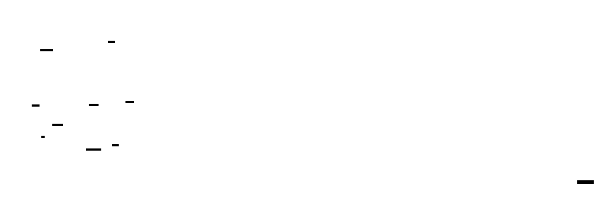
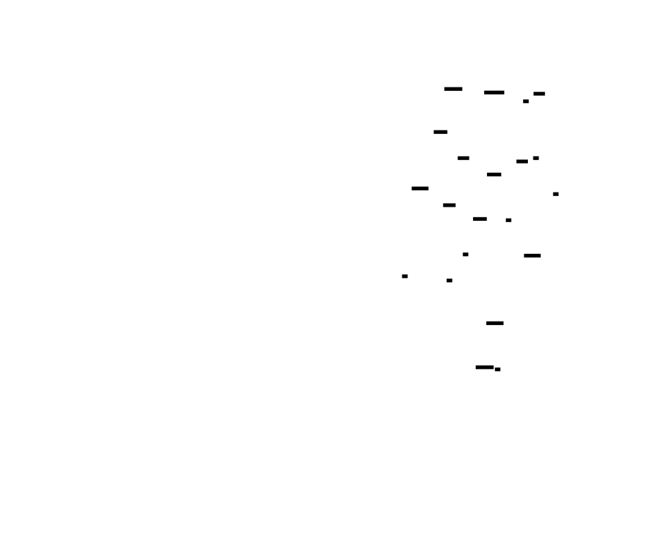

# 🎯 Project Charter: Kernel Bypass Network Stack

## What You Are Building
You are building a complete, high-performance user-space TCP/IP stack that bypasses the Linux kernel using DPDK or AF_XDP. This system provides direct access to NIC hardware, implementing every layer from Ethernet frames and ARP resolution to IPv4 routing and a full TCP state machine. By the end, you will have a custom networking framework capable of processing packets with sub-5 microsecond latency and handling 10,000+ concurrent connections.

## Why This Project Exists
The standard Linux kernel network stack is a masterpiece of general-purpose engineering, but its abstractions—interrupts, context switches, and data copies—introduce a "latency tax" of 10–50 microseconds per packet. In High-Frequency Trading (HFT) and ultra-low-latency environments, this is an eternity. Building a stack from scratch forces you to confront the hardware reality of DMA ring buffers and cache-line alignment, stripping away every cycle of overhead to achieve performance impossible with standard POSIX sockets.

## What You Will Be Able to Do When Done
- **Direct Hardware I/O**: Receive and transmit raw packets directly from user space using Poll Mode Drivers (PMD).
- **Implement Link-Layer Protocols**: Build an ARP cache with lock-free seqlock lookups and handle VLAN-tagged Ethernet frames.
- **Manage Network Layer Complexity**: Implement IPv4 header parsing, optimized one's complement checksums, and a fragmented packet reassembly engine.
- **Orchestrate TCP Internals**: Build the full 11-state TCP finite state machine, including sliding window flow control and CUBIC congestion control.
- **Perform Hardware-Level Tuning**: Optimize code for NUMA locality, eliminate false sharing between CPU cores, and implement lock-free SPSC ring buffers.

## Final Deliverable
A production-hardened networking library written in C or Rust consisting of approximately 5,000 lines of code. The deliverable includes a benchmark suite demonstrating sub-5μs P99 latency and a monitoring dashboard that exports Prometheus-compatible metrics for throughput, cache hit rates, and latency distributions.

## Is This Project For You?
**You should start this if you:**
- Are an expert in C or Rust systems programming.
- Understand pointer arithmetic and manual memory management deeply.
- Are comfortable with bitwise operations and network byte order.
- Want to enter the world of High-Frequency Trading (HFT) or high-performance infrastructure.

**Come back after you've learned:**
- **Advanced C Systems Programming**: [Beej's Guide to Network Programming](https://beej.us/guide/bgnet/)
- **Computer Architecture Basics**: Specifically how CPU caches (L1/L2/L3) and NUMA nodes function.
- **Standard Sockets**: If you haven't built a basic TCP client/server using the standard `socket()` API, start there first.

## Estimated Effort
| Phase | Time |
|-------|------|
| M1: Kernel Bypass Setup (DPDK/AF_XDP) | ~24 hours |
| M2: Ethernet & ARP Layer Implementation | ~16 hours |
| M3: IP & UDP Layer (with Reassembly) | ~20 hours |
| M4: Full TCP State Machine & Flow Control | ~32 hours |
| M5: NUMA/Cache Optimization & Production Hardening | ~28 hours |
| **Total** | **~120 hours** |

## Definition of Done
The project is complete when:
- A benchmark tool verifies **P99 latency under 5 microseconds** for a packet-to-application round trip.
- The stack successfully completes a **TCP three-way handshake** and 1GB data transfer with a standard Linux `netcat` client.
- The system maintains **10,000 concurrent active connections** without a collapse in throughput.
- A **Lock Audit** confirms zero mutex acquisitions in the packet processing hot path.
- All unit and integration tests pass with **>90% code coverage**.

---

# 📚 Before You Read This: Prerequisites & Further Reading

> **Read these first.** The Atlas assumes you are familiar with the foundations below.
> Resources are ordered by when you should encounter them — some before you start, some at specific milestones.

### I. Kernel Bypass & Hardware IO
**The eXpress Data Path (XDP)**
*   **Paper**: Høiland-Jørgensen et al. (2018), "The eXpress Data Path: Fast Programmable Packet Processing in the Operating System Kernel."
*   **Code**: [Linux Kernel: `samples/bpf/xdpsock_user.c`](https://github.com/torvalds/linux/blob/master/samples/bpf/xdpsock_user.c) — The reference implementation for AF_XDP user-space sockets.
*   **Best Explanation**: [LWN.net: "AF_XDP" by Jonathan Corbet](https://lwn.net/Articles/750845/).
*   **Why**: It is the definitive introduction to the Linux kernel’s "official" way to perform kernel bypass.
*   **Pedagogical Timing**: Read **BEFORE** starting Milestone 1 to understand the interface you are building upon.

**NIC Ring Buffers & DMA**
*   **Spec**: [Intel 82599 10 GbE Controller Datasheet](https://www.intel.com/content/dam/www/public/us/en/documents/datasheets/82599-10-gbe-controller-datasheet.pdf) — Section 1.5.4 (Receive Queues).
*   **Code**: [DPDK: `drivers/net/ixgbe/ixgbe_rxtx.c`](https://github.com/DPDK/dpdk/blob/main/drivers/net/ixgbe/ixgbe_rxtx.c) — Implementation of descriptor ring processing.
*   **Best Explanation**: [PackageCloud: "Monitoring and Tuning the Linux Networking Stack: Receiving Data"](https://blog.packagecloud.io/monitoring-tuning-linux-networking-stack-receiving-data/) — Section "Network Card Data Processing".
*   **Why**: It bridges the gap between abstract "packets" and the reality of DMA descriptors in RAM.
*   **Pedagogical Timing**: Read during **Milestone 1 (Kernel Bypass Setup)** to visualize how bytes physically move from wire to your memory pool.

### II. Layer 2 & 3 Foundations
**Address Resolution Protocol (ARP)**
*   **Spec**: [RFC 826](https://datatracker.ietf.org/doc/html/rfc826) — An Ethernet Address Resolution Protocol.
*   **Code**: [Linux Kernel: `net/ipv4/arp.c`](https://github.com/torvalds/linux/blob/master/net/ipv4/arp.c).
*   **Best Explanation**: *TCP/IP Illustrated, Vol 1* by Kevin Fall, Chapter 4 (ARP: Address Resolution Protocol).
*   **Why**: This 1982 document is one of the most readable RFCs ever written and remains the gold standard for ARP logic.
*   **Pedagogical Timing**: Read before **Milestone 2 (Ethernet & ARP)** to understand why you must buffer packets while waiting for a MAC address.

**IP Fragmentation & Reassembly**
*   **Spec**: [RFC 791](https://datatracker.ietf.org/doc/html/rfc791) — Internet Protocol, Section 3.2 (Fragmentation and Reassembly).
*   **Code**: [Linux Kernel: `net/ipv4/ip_fragment.c`](https://github.com/torvalds/linux/blob/master/net/ipv4/ip_fragment.c).
*   **Best Explanation**: [Lean2Net: "IP Fragmentation and Reassembly"](http://www.lean2net.com/ip-fragmentation-and-reassembly/) — Visual guide to the MF bit and offset calculations.
*   **Why**: It defines the edge cases (out-of-order fragments) that make reassembly a security and performance nightmare.
*   **Pedagogical Timing**: Read during **Milestone 3 (IP & UDP)** when implementing your fragment bitmap tracker.

### III. The TCP State Machine & Reliability
**The Modern TCP Specification**
*   **Spec**: [RFC 9293](https://datatracker.ietf.org/doc/html/rfc9293) — Transmission Control Protocol (TCP) (Replaces RFC 793).
*   **Code**: [Linux Kernel: `net/ipv4/tcp_input.c`](https://github.com/torvalds/linux/blob/master/net/ipv4/tcp_input.c) — `tcp_rcv_established()` is the most executed networking code on earth.
*   **Best Explanation**: [The TCP/IP Guide: "TCP Operational Overview and the TCP Finite State Machine"](http://www.tcpipguide.com/free/t_TCPOperationalOverviewandtheTCPFiniteStateMachine.htm).
*   **Why**: This is the "source of truth" for the 11-state machine you must implement.
*   **Pedagogical Timing**: Read before **Milestone 4 (TCP Implementation)**; you cannot write a TCP stack without the state transition diagram next to your keyboard.

**Jacobson/Karels Algorithm (RTO Calculation)**
*   **Paper**: Van Jacobson (1988), "Congestion Avoidance and Control."
*   **Code**: [Linux Kernel: `net/ipv4/tcp_input.c`](https://github.com/torvalds/linux/blob/master/net/ipv4/tcp_input.c) — `tcp_rtt_estimator()`.
*   **Why**: This paper saved the internet from "congestion collapse" and provides the math for adaptive timeouts.
*   **Pedagogical Timing**: Read during **Milestone 4** when your stack starts timing out too early or too late.

**SYN Cookies**
*   **Best Explanation**: [Daniel J. Bernstein's original SYN Cookies page](https://cr.yp.to/syncookies.html).
*   **Why**: It is the classic example of "stateless" protocol design to defeat DoS attacks.
*   **Pedagogical Timing**: Read at the end of **Milestone 4** to understand why you shouldn't allocate a Connection Control Block for every SYN you see.

### IV. HFT & Systems Optimization
**What Every Programmer Should Know About Memory**
*   **Paper**: Ulrich Drepper (2007), "What Every Programmer Should Know About Memory."
*   **Best Explanation**: Section 3.3 (CPU Caches) and Section 6.4 (Multi-threaded Access).
*   **Why**: The "Bible" of cache-line optimization and NUMA, essential for sub-microsecond performance.
*   **Pedagogical Timing**: Read before **Milestone 5 (Optimization)** to understand why structure padding matters.

**Lock-Free Queues (SPSC)**
*   **Code**: [DPDK: `lib/ring/rte_ring_c11_mem.h`](https://github.com/DPDK/dpdk/blob/main/lib/ring/rte_ring_c11_mem.h) — Implementation of ring buffers using C11 atomic memory models.
*   **Best Explanation**: [Real-Time Audio: "The Single-Producer Single-Consumer Ring Buffer"](https://www.rossbencina.com/code/real-time-audio-developers-guide-to-producer-consumer-queues).
*   **Why**: It explains the memory barriers required to pass data between cores without expensive mutexes.
*   **Pedagogical Timing**: Read during **Milestone 1** for the ring buffers, and re-read for **Milestone 5** during stats collection.

**NUMA (Non-Uniform Memory Access)**
*   **Best Explanation**: [Frank Denneman: "NUMA Deep Dive Series"](https://frankdenneman.nl/2016/07/07/numa-deep-dive-part-1-from-uma-to-numa/).
*   **Why**: In kernel bypass, a single "remote" memory access to the wrong socket can double your latency.
*   **Pedagogical Timing**: Read before **Milestone 5** to understand why `numactl` and `pthread_setaffinity_np` are your best friends.

**CUBIC Congestion Control**
*   **Paper**: Ha et al. (2008), "CUBIC: A New TCP-friendly High-speed TCP Variant."
*   **Spec**: [RFC 8312](https://datatracker.ietf.org/doc/html/rfc8312).
*   **Code**: [Linux Kernel: `net/ipv4/tcp_cubic.c`](https://github.com/torvalds/linux/blob/master/net/ipv4/tcp_cubic.c).
*   **Why**: It is the default congestion algorithm for Linux and the standard for high-bandwidth, high-latency paths.
*   **Pedagogical Timing**: Read at the end of **Milestone 4** when you begin tuning throughput over long-distance links.

---

# Kernel Bypass Network Stack

Build a complete user-space TCP/IP stack using kernel bypass techniques (DPDK or AF_XDP) for ultra-low latency packet processing. This project strips away the kernel's network abstraction layer, giving your code direct access to NIC hardware—a technique used in high-frequency trading where microseconds translate directly to profit or loss. You'll implement every protocol layer from Ethernet frames through TCP congestion control, all while maintaining zero-copy data paths and sub-microsecond latencies.

The project forces confrontation with fundamental networking concepts that remain invisible when using kernel sockets. How does ARP actually resolve MAC addresses? What happens when an IP packet exceeds the MTU? Why does TCP need a state machine with eleven states? By building each layer from scratch, you'll understand network protocols at the level needed to debug production failures and optimize for extreme performance.

This is the networking equivalent of building your own memory allocator—you may never need to do it in production, but understanding the internals transforms how you approach every system that depends on networking.


<!-- MS_ID: kbns-m1 -->
# Kernel Bypass Setup
## The Latency You Never Knew You Were Paying
You've written network code before. `socket()`, `bind()`, `recv()`, `send()`. The kernel handles everything—you just read and write bytes. It works. Web servers handle millions of requests per second this way. Surely the kernel's network stack is fast enough for anything reasonable?
Here's what actually happens when a packet arrives on your NIC:
1. **DMA Transfer**: The NIC writes the packet directly to a kernel-owned ring buffer in RAM (~100ns)
2. **Interrupt**: The NIC signals the CPU that data arrived (~300-500ns for interrupt handling)
3. **Context Switch**: The kernel interrupt handler runs, transitioning from hardware context to kernel mode (~100-200ns)
4. **sk_buff Allocation**: The kernel allocates its socket buffer structure to hold packet metadata (~50-100ns)
5. **Protocol Processing**: Ethernet → IP → TCP layers each parse headers, validate checksums, update state (~1-5μs)
6. **Queueing**: The packet sits in socket receive queues, potentially waiting behind other packets (variable, 0-10μs+)
7. **Another Context Switch**: Your application calls `recv()`, triggering a user-kernel boundary crossing (~100-200ns)
8. **Data Copy**: The kernel copies packet data from kernel space to your userspace buffer (~50-200ns depending on size)
**Total: 10-50 microseconds per packet**. And that's the happy path—no packet loss, no retransmissions, no queueing delays.
[[EXPLAIN:kernel-vs.-user-space-boundary|The protected boundary between application code and privileged kernel operations, enforced by CPU privilege rings]]
In high-frequency trading, 50 microseconds is an eternity. Market data arrives, you analyze it, you send an order. If your competitor's packet processing takes 2 microseconds while yours takes 50, they see the market first. Every single time. They trade on information you haven't received yet.


This isn't about making the kernel faster. The kernel's network stack is already heavily optimized—there are decades of engineering in those code paths. The problem is **structural**. Every packet crosses the user-kernel boundary multiple times. Every packet gets copied between buffers. Every packet traverses generic protocol layers that must handle every possible configuration.
Kernel bypass eliminates all of it. Your code receives packets directly from NIC hardware, in user space, with zero copies, without the kernel knowing they exist. The latency drops from 10-50μs to **1-2μs**—a 10-50x improvement.
Not incremental. Transformational.
## The Hardware Reality: How Packets Actually Arrive
Before you can bypass the kernel, you need to understand what you're bypassing. The kernel isn't magic—it's just software that talks to hardware. You can do the same thing.
### NIC Ring Buffers and DMA

> **🔑 Foundation: The circular buffer structures used by NICs for packet transfer**
> 
> ## What It Is
NIC ring buffers are circular queues that sit between your network card and system memory. Think of them as a shared mailbox: the CPU writes outgoing packets to one ring (TX), and the NIC writes incoming packets to another (RX). Each ring is an array of "descriptors" — small metadata structures pointing to actual packet data in memory.
**Direct Memory Access (DMA)** is the engine that makes this work. Instead of the CPU copying every packet byte-by-byte, the NIC has its own DMA engine that can read from and write to system RAM directly. The CPU just updates descriptors (saying "here's a packet, go get it"), and the NIC handles the actual data transfer.
```
CPU View:                    NIC View:
┌─────────────────┐         ┌─────────────────┐
│ Write descriptor│         │ Read descriptor │
│ (pointer + len) │ ──────► │ DMA fetch packet│
│                 │         │ Send on wire    │
└─────────────────┘         └─────────────────┘
        ▲                           │
        │      Ring Buffer          │
        │  ┌───┬───┬───┬───┬───┐    │
        └──│ 0 │ 1 │ 2 │ 3 │ 4 │◄───┘
           └───┴───┴───┴───┴───┘
              Descriptors point
              to packets in RAM
```
The "ring" is circular because the indices wrap around: head and tail pointers chase each other through the array. When the tail catches the head, the buffer is full. When they're equal, it's empty.
## Why You Need It Right Now
If you're building high-performance networking — a software switch, packet capture system, or network function virtualization — the ring buffer is your primary interface with the hardware. You cannot bypass it (without specialized hardware like DPDK-pmd or SR-IOV).
**Practical implications:**
1. **Allocation strategy matters.** Ring buffers must be physically contiguous in memory and often need to be in specific DMA zones. You'll allocate them at device initialization and keep them pinned.
2. **Batching is essential.** Each ring update may require a memory barrier and device notification (MMIO write). Processing packets in batches amortizes this cost.
3. **Synchronization is the bottleneck.** The CPU and NIC are concurrent producers/consumers. You need careful memory ordering — typically using descriptors' "ownership" bit to avoid races without heavy locks.
## One Key Insight
**The ring buffer isn't a data buffer — it's a control structure.**
The descriptors contain pointers, not packets. The actual packet data lives elsewhere in RAM (often in a separate pool of buffers). The ring is small and cache-hot; the data may not be. This separation lets you:
- Zero-copy by just passing descriptor pointers between components
- Recycle buffers without touching the ring
- Use different buffer sizes without changing ring configuration
When you see "ring buffer," think "shared TODO list between CPU and NIC" — not "where packets live."

Modern NICs don't "deliver" packets to the CPU. Instead:
1. **At initialization**, driver software (kernel or user-space) allocates a ring buffer—a circular array of packet buffer descriptors in RAM
2. **The NIC is told** the physical address of this ring buffer via memory-mapped registers
3. **When a packet arrives**, the NIC uses DMA to write the packet data directly to RAM, then updates a "tail pointer" in the ring buffer
4. **The CPU polls** or receives an interrupt, reads the new descriptors, and processes the packets


The ring buffer is shared memory. The NIC writes to it. The CPU reads from it. No CPU involvement is needed for the actual data transfer—the NIC is a bus master that can initiate memory transactions independently.
This is the fundamental insight: **the kernel doesn't need to be involved in packet transfer at all**. It's involved by convention, not necessity. The NIC is perfectly happy to DMA packets anywhere you tell it, including to memory your user-space program controls.
### Memory-Mapped I/O: The Control Channel
[[EXPLAIN:memory-mapped-i/o|Hardware technique where device registers appear as normal memory addresses, allowing load/store instructions to control peripherals]]
How do you tell the NIC where to put packets? The NIC has control registers—memory locations that don't correspond to RAM but to configuration state inside the NIC hardware. When you write to these addresses, you're programming the device.
On x86, there are two ways to access device registers:
1. **Port I/O** (`in`/`out` instructions): Separate address space for devices, accessed via special instructions
2. **Memory-Mapped I/O (MMIO)**: Device registers mapped into the physical address space, accessed via normal `mov` instructions
Modern NICs use MMIO exclusively for data path configuration. You map a physical address range (like `0xfebf0000-0xfebfffff`) into your process's virtual address space, and then:
```c
// Writing to a NIC register to enable packet reception
volatile uint32_t *nic_rx_enable = (volatile uint32_t *)mmio_base + NIC_REG_RX_CTRL;
*nic_rx_enable = 0x1;  // Set bit 0 to enable RX
```
The `volatile` keyword is critical here. It tells the compiler that this memory location has side effects and must not be optimized away, reordered, or cached in registers. Every read/write must go to memory (which is actually the device).


## Two Paths to Bypass: DPDK vs. AF_XDP
You have two main options for kernel bypass. Both achieve the same goal—direct packet access from user space—but through radically different mechanisms.
### DPDK: The Heavyweight Champion
**Data Plane Development Kit** (DPDK) was created by Intel in 2010 for telecommunications and networking equipment. It's a complete framework for building fast packet processing applications.
**How it works:**
1. Load a special "user-space driver" (PMD - Poll Mode Driver) for your NIC
2. The PMD maps NIC registers and ring buffers directly into your process
3. Your code polls the ring buffers directly—no kernel involvement in the data path
4. DPDK provides buffer pools, ring implementations, and utility functions
**Requirements:**
- Hugepages (1GB or 2MB pages) for DMA-able memory
- NIC detached from kernel network stack (no IP address visible to kernel)
- Specific NIC hardware supported by DPDK PMDs (Intel, Mellanox, Broadcom mainly)
- Root privileges or specific capabilities
**Pros:**
- Battle-tested in production at massive scale (telecom, cloud providers)
- Highly optimized drivers for supported NICs
- Rich ecosystem: packet processing libraries, statistics, debugging tools
- Predictable, ultra-low latency (sub-microsecond achievable)
**Cons:**
- Complex setup (hugepages, driver binding, hugepage mount)
- Hardware-specific: your NIC needs a DPDK PMD
- Takes NIC away from kernel—you can't SSH to this interface
- Heavyweight framework; learning curve is steep
### AF_XDP: The Kernel-Cooperative Approach
**AF_XDP** (Address Family XDP) is a newer Linux kernel feature (merged in 4.18, matured in 5.4+) that provides kernel bypass *through* the kernel. It's a clever compromise.
**How it works:**
1. You create an AF_XDP socket, similar to a normal packet socket
2. You configure a UMEM—a shared memory region for packet buffers
3. The kernel's XDP (eXpress Data Path) program runs very early in packet processing (before SKB allocation)
4. Matching packets are DMA'd directly to your UMEM, bypassing most of the stack
5. Your code polls the socket's ring buffer for new packets
**Requirements:**
- Linux kernel 4.18+ (5.4+ for good performance, 5.10+ recommended)
- NIC with XDP support (most modern NICs)
- No need to detach interface from kernel—can share with normal networking
**Pros:**
- Standard Linux interface—no special drivers
- Can coexist with kernel networking (SSH still works)
- Simpler setup (no hugepages required, though recommended)
- Growing rapidly; well-supported by major NIC vendors
**Cons:**
- Still goes through some kernel code paths (XDP program)
- Slightly higher latency than pure DPDK (but still <5μs)
- Less mature ecosystem
- Batch-oriented; single-packet latency can be higher



### Which Should You Choose?
| Factor | DPDK | AF_XDP |
|--------|------|--------|
| **Latency** | 0.5-2μs | 2-5μs |
| **Setup Complexity** | High | Medium |
| **Hardware Support** | Limited (Intel, Mellanox, Broadcom) | Broad (any XDP-capable NIC) |
| **Kernel Coexistence** | No | Yes |
| **Production Maturity** | 10+ years, telco-grade | 3-5 years, still maturing |
| **Code Portability** | DPDK-specific | Standard Linux sockets |
**For this project, we'll implement both**—starting with AF_XDP for its accessibility, then showing DPDK for maximum performance. The concepts transfer: ring buffers, buffer pools, poll-mode operation, and zero-copy data paths are identical.
## AF_XDP Implementation: Your First Bypass
Let's build a working AF_XDP packet receiver. This will receive packets directly from the NIC into user-space memory without the kernel network stack processing them.
### The UMEM: Your Personal Packet Buffer Pool
AF_XDP uses a concept called **UMEM** (User Memory)—a region of memory you register with the kernel that will hold packet data. The kernel will DMA packets directly into this memory.
```c
#include <linux/if_xdp.h>
#include <bpf/xsk.h>
#include <sys/mman.h>
#include <string.h>
#include <stdlib.h>
// Configuration constants
#define NUM_DESCS 2048        // Number of descriptors in each ring
#define FRAME_SIZE 2048       // Size of each packet buffer (2KB)
#define NUM_FRAMES NUM_DESCS  // One frame per descriptor
// UMEM structure - holds all our packet buffers and ring state
struct xsk_umem_info {
    void *area;               // Pointer to mmap'd UMEM region
    size_t size;              // Total size of UMEM
    struct xsk_ring_prod fill;  // Fill ring: we tell kernel which buffers are available
    struct xsk_ring_cons comp;  // Completion ring: kernel tells us which TX buffers are done
    struct xsk_umem *umem;    // libxdp UMEM handle
};
int umem_create(struct xsk_umem_info *umem) {
    // Calculate total UMEM size
    umem->size = NUM_FRAMES * FRAME_SIZE;
    // Allocate UMEM region with mmap
    // MAP_PRIVATE + MAP_ANONYMOUS: anonymous private mapping
    // We could use hugepages here for better performance
    umem->area = mmap(NULL, umem->size, 
                      PROT_READ | PROT_WRITE,
                      MAP_PRIVATE | MAP_ANONYMOUS | MAP_NORESERVE, 
                      -1, 0);
    if (umem->area == MAP_FAILED) {
        perror("mmap failed");
        return -1;
    }
    // Initialize UMEM with fill and completion rings
    struct xsk_umem_config cfg = {
        .fill_size = NUM_DESCS,      // Fill ring size
        .comp_size = NUM_DESCS,      // Completion ring size  
        .frame_size = FRAME_SIZE,    // Size of each frame
        .frame_headroom = 0,         // No headroom (we want max packet space)
        .flags = 0                   // Default flags
    };
    // Register UMEM with kernel
    int ret = xsk_umem__create(&umem->umem, umem->area, umem->size,
                               &umem->fill, &umem->comp, &cfg);
    if (ret) {
        fprintf(stderr, "xsk_umem__create failed: %s\n", strerror(-ret));
        munmap(umem->area, umem->size);
        return -1;
    }
    return 0;
}
```
The UMEM is split into fixed-size frames. Each frame has an **address**—an offset from the start of UMEM. When you want to receive a packet, you put a frame address in the **fill ring**. The kernel will DMA the next packet into that frame and put the address in the **RX ring**.
### The Four Rings of AF_XDP
AF_XDP uses four ring buffers to manage packet flow:
1. **Fill Ring** (Producer: You, Consumer: Kernel): You put frame addresses here to indicate "I'm ready to receive into this buffer"
2. **RX Ring** (Producer: Kernel, Consumer: You): Kernel puts descriptors here when packets arrive
3. **TX Ring** (Producer: You, Consumer: Kernel): You put descriptors here to transmit packets
4. **Completion Ring** (Producer: Kernel, Consumer: You): Kernel acknowledges completed TX packets


### Creating the Socket and Binding to Interface
```c
struct xsk_socket_info {
    struct xsk_ring_cons rx;    // RX ring: we consume from here
    struct xsk_ring_prod tx;    // TX ring: we produce to here
    struct xsk_socket *xsk;     // libxdp socket handle
    struct xsk_umem_info *umem; // Back-reference to UMEM
    int ifindex;                // Network interface index
    uint32_t queue_id;          // Queue ID (for multi-queue NICs)
};
int xsk_socket_create(struct xsk_socket_info *xsk, 
                      struct xsk_umem_info *umem,
                      const char *ifname, 
                      uint32_t queue_id) {
    xsk->umem = umem;
    xsk->queue_id = queue_id;
    // Get interface index from name
    xsk->ifindex = if_nametoindex(ifname);
    if (xsk->ifindex == 0) {
        perror("if_nametoindex failed");
        return -1;
    }
    // Socket configuration
    struct xsk_socket_config cfg = {
        .tx_size = NUM_DESCS,           // TX ring size
        .rx_size = NUM_DESCS,           // RX ring size
        .libbpf_flags = 0,              // Default flags
        .xdp_flags = XDP_FLAGS_UPDATE_IF_NOEXIST,  // Don't replace existing XDP prog
        .bind_flags = XDP_COPY // Start with copy mode; change to XDP_ZEROCOPY for production
    };
    // Create and bind socket
    // This loads an XDP program onto the interface (if not already present)
    // and binds our socket to a specific queue on that interface
    int ret = xsk_socket__create(&xsk->xsk, ifname, queue_id,
                                  umem->umem, &xsk->rx, &xsk->tx, &cfg);
    if (ret) {
        fprintf(stderr, "xsk_socket__create failed: %s\n", strerror(-ret));
        return -1;
    }
    return 0;
}
```
The `bind_flags` control the data path:
- **XDP_COPY**: Kernel copies packets from driver to your UMEM. Works everywhere, but has copy overhead (~1μs).
- **XDP_ZEROCOPY**: NIC DMAs directly to your UMEM. True zero-copy, but requires NIC support and driver changes.
Always start with `XDP_COPY` to verify your code works, then switch to `XDP_ZEROCOPY` for production.
### Pre-Filling the Fill Ring
Before any packets can arrive, you need to tell the kernel which buffers are available:
```c
int fill_ring_populate(struct xsk_umem_info *umem) {
    uint32_t idx;
    // Reserve space in fill ring for all our frames
    int ret = xsk_ring_prod__reserve(&umem->fill, NUM_FRAMES, &idx);
    if (ret != NUM_FRAMES) {
        fprintf(stderr, "Failed to reserve fill ring entries\n");
        return -1;
    }
    // Add each frame address to the fill ring
    for (uint32_t i = 0; i < NUM_FRAMES; i++) {
        // Address is just the byte offset in UMEM
        uint64_t addr = i * FRAME_SIZE;
        *xsk_ring_prod__fill_addr(&umem->fill, idx + i) = addr;
    }
    // Submit the entries
    xsk_ring_prod__submit(&umem->fill, NUM_FRAMES);
    return 0;
}
```
### The Packet Reception Loop
Now the core of your kernel bypass: receiving packets without syscalls in the hot path.
```c
#define BATCH_SIZE 32  // Process packets in batches for efficiency
void packet_loop(struct xsk_socket_info *xsk) {
    struct pollfd fds[1];
    fds[0].fd = xsk_socket__fd(xsk->xsk);
    fds[0].events = POLLIN;
    uint64_t rx_packets = 0;
    uint64_t rx_bytes = 0;
    while (1) {
        // Poll for packets (with timeout for clean shutdown)
        // In production HFT, you'd poll the ring directly without poll()
        int n = poll(fds, 1, 1000);  // 1 second timeout
        if (n <= 0) continue;
        // Check RX ring for available packets
        uint32_t rx_idx;
        uint32_t rcvd = xsk_ring_cons__peek(&xsk->rx, BATCH_SIZE, &rx_idx);
        if (!rcvd) continue;  // No packets available
        // Process received packets
        for (uint32_t i = 0; i < rcvd; i++) {
            // Get the descriptor for this packet
            struct xdp_desc *desc = xsk_ring_cons__rx_desc(&xsk->rx, rx_idx + i);
            // Descriptor contains:
            // - addr: offset into UMEM where packet data starts
            // - len: number of bytes received
            // - options: metadata (usually 0)
            uint64_t addr = desc->addr;
            uint32_t len = desc->len;
            // Get pointer to actual packet data
            uint8_t *pkt_data = xsk_umem__get_data(xsk->umem->area, addr);
            // At this point, pkt_data points to the raw Ethernet frame
            // You would parse headers, process payload, etc.
            // For now, just count packets
            rx_packets++;
            rx_bytes += len;
            // CRITICAL: Return the buffer to fill ring for reuse
            // If you don't do this, you'll run out of buffers!
            uint32_t fill_idx;
            if (xsk_ring_prod__reserve(&xsk->umem->fill, 1, &fill_idx) == 1) {
                *xsk_ring_prod__fill_addr(&xsk->umem->fill, fill_idx) = addr;
                xsk_ring_prod__submit(&xsk->umem->fill, 1);
            }
        }
        // Release processed entries from RX ring
        xsk_ring_cons__release(&xsk->rx, rcvd);
        // Print stats periodically
        if ((rx_packets & 0xFFFF) == 0) {  // Every 65536 packets
            printf("RX: %lu packets, %lu bytes\n", rx_packets, rx_bytes);
        }
    }
}
```
### The Critical Performance Detail: Cache Lines
Every ring buffer access touches memory. The question is: does it hit L1 cache, or does it go to RAM? The difference is 4ns vs 100ns—25x.


Ring buffer descriptors should be exactly one cache line (64 bytes on x86):
```c
// Optimal descriptor layout for cache efficiency
struct xdp_desc {
    uint64_t addr;    // 8 bytes: UMEM offset
    uint32_t len;     // 4 bytes: packet length
    uint32_t options; // 4 bytes: metadata
};  // Total: 16 bytes, padded to 64 by compiler for array alignment
```
When you access `desc[i]`, the CPU loads the entire 64-byte cache line. If `desc[i+1]` is needed next (which it is in batch processing), it's already in cache.
The ring buffer indices (head/tail pointers) should be on **separate** cache lines to avoid false sharing between producer and consumer:
```c
struct ring {
    // Cache line 0: producer state
    uint32_t producer __attribute__((aligned(64)));
    // Cache line 1: consumer state  
    uint32_t consumer __attribute__((aligned(64)));
    // Cache line 2+: descriptors
    struct xdp_desc descs[NUM_DESCS] __attribute__((aligned(64)));
};
```
Without this padding, the producer writing `producer` would invalidate the consumer's cache line for `consumer`—even though they're on the same line but different offsets. This is **false sharing**, and it kills performance in multi-threaded code.
## DPDK Implementation: Maximum Performance
Now let's see the DPDK approach. It's more complex but achieves lower latency through complete hardware control.
### Environment Setup
DPDK requires careful system configuration. Create a setup script:
```bash
#!/bin/bash
# setup_dpdk.sh - Run once before using DPDK
# 1. Allocate hugepages (2MB pages, 1024 pages = 2GB)
# Hugepages are required for DMA-safe memory
echo 1024 > /sys/kernel/mm/hugepages/hugepages-2048kB/nr_hugepages
# 2. Mount hugetlbfs if not already mounted
mkdir -p /dev/hugepages
mount -t hugetlbfs nodev /dev/hugepages
# 3. Load VFIO driver (safest for DMA)
modprobe vfio-pci
# 4. Bind NIC to DPDK driver
# Replace 0000:01:00.0 with your NIC's PCI address (from lspci)
# This DETACHS the NIC from kernel networking!
dpdk-devbind.py --bind=vfio-pci 0000:01:00.0
echo "DPDK environment ready"
echo "WARNING: NIC 0000:01:00.0 is no longer visible to kernel"
```
### DPDK Initialization
```c
#include <rte_eal.h>
#include <rte_ethdev.h>
#include <rte_mbuf.h>
#include <rte_mempool.h>
#include <rte_ring.h>
#include <rte_cycles.h>
#define RX_RING_SIZE 1024
#define TX_RING_SIZE 1024
#define NUM_MBUFS 8192
#define MBUF_CACHE_SIZE 256
#define BURST_SIZE 32
// Global mempool for packet buffers
static struct rte_mempool *mbuf_pool;
int dpdk_init(int argc, char *argv[]) {
    // Initialize the EAL (Environment Abstraction Layer)
    // This sets up hugepage memory, PCI access, and core affinity
    int ret = rte_eal_init(argc, argv);
    if (ret < 0) {
        rte_exit(EXIT_FAILURE, "EAL init failed: %s\n", strerror(-ret));
    }
    return ret;  // Returns number of EAL arguments parsed
}
int port_init(uint16_t port) {
    struct rte_eth_conf port_conf = {0};  // Default config
    const uint16_t rx_rings = 1, tx_rings = 1;
    uint16_t nb_rxd = RX_RING_SIZE;
    uint16_t nb_txd = TX_RING_SIZE;
    // Check if port is valid
    if (!rte_eth_dev_is_valid_port(port))
        return -1;
    // Create mbuf pool for this port
    // MBUF_CACHE_SIZE: per-core cache to avoid lock contention
    char pool_name[32];
    snprintf(pool_name, sizeof(pool_name), "MBUF_POOL_%d", port);
    mbuf_pool = rte_pktmbuf_pool_create(pool_name, NUM_MBUFS,
        MBUF_CACHE_SIZE, 0, RTE_MBUF_DEFAULT_BUF_SIZE, 
        rte_socket_id());  // NUMA-local allocation
    if (mbuf_pool == NULL) {
        rte_exit(EXIT_FAILURE, "Mbuf pool create failed\n");
    }
    // Configure the Ethernet port
    ret = rte_eth_dev_configure(port, rx_rings, tx_rings, &port_conf);
    if (ret != 0) return ret;
    // Adjust ring sizes to hardware limits
    rte_eth_dev_adjust_nb_rx_tx_desc(port, &nb_rxd, &nb_txd);
    // Setup RX queue
    ret = rte_eth_rx_queue_setup(port, 0, nb_rxd,
        rte_eth_dev_socket_id(port), NULL, mbuf_pool);
    if (ret < 0) return ret;
    // Setup TX queue
    ret = rte_eth_tx_queue_setup(port, 0, nb_txd,
        rte_eth_dev_socket_id(port), NULL);
    if (ret < 0) return ret;
    // Start the port
    ret = rte_eth_dev_start(port);
    if (ret < 0) return ret;
    // Enable promiscuous mode (receive all packets, not just our MAC)
    rte_eth_promiscuous_enable(port);
    return 0;
}
```
### The DPDK Packet Loop
```c
void dpdk_packet_loop(uint16_t port) {
    struct rte_mbuf *bufs[BURST_SIZE];
    uint64_t rx_total = 0;
    uint64_t start_time = rte_rdtsc();  // High-precision timestamp
    while (1) {
        // Receive a burst of packets
        // This is POLLING - no blocking, no syscalls, just memory reads
        const uint16_t nb_rx = rte_eth_rx_burst(port, 0, bufs, BURST_SIZE);
        if (unlikely(nb_rx == 0)) continue;  // No packets this round
        rx_total += nb_rx;
        // Process each packet
        for (uint16_t i = 0; i < nb_rx; i++) {
            // rte_mbuf contains packet data and metadata
            // pkt_len: total packet length
            // data_len: length in this segment (for jumbo frames)
            // buf_addr: pointer to packet data
            uint8_t *pkt_data = rte_pktmbuf_mtod(bufs[i], uint8_t *);
            uint32_t pkt_len = rte_pktmbuf_data_len(bufs[i]);
            // Your packet processing here
            // pkt_data[0:13] = Ethernet header (dst MAC, src MAC, ethertype)
            // pkt_data[14:33] = IPv4 header (if ethertype == 0x0800)
            // etc.
            // Free the mbuf back to the pool
            // CRITICAL: must do this or you'll exhaust the pool
            rte_pktmbuf_free(bufs[i]);
        }
        // Periodic stats with precise timing
        if ((rx_total & 0x3FFFF) == 0) {  // Every 262144 packets
            uint64_t now = rte_rdtsc();
            double elapsed = (double)(now - start_time) / rte_get_tsc_hz();
            double pps = rx_total / elapsed;
            printf("RX: %lu packets, %.2f Mpps\n", rx_total, pps / 1e6);
        }
    }
}
```
### DPDK's Secret Weapon: The mbuf
The `rte_mbuf` structure is optimized for packet processing:
```c
// Simplified view of rte_mbuf (actual struct is more complex)
struct rte_mbuf {
    // Cache line 0: Most frequently accessed fields
    void *buf_addr;           // 8 bytes: pointer to data buffer
    uint16_t data_off;        // 2 bytes: offset to start of data
    uint16_t data_len;        // 2 bytes: data length in this segment
    uint32_t pkt_len;         // 4 bytes: total packet length (all segments)
    uint16_t nb_segs;         // 2 bytes: number of segments (jumbo frames)
    uint16_t port;            // 2 bytes: which port received this
    // ... more fields for offload flags, timestamps, etc.
    // Cache line 1: Less frequently accessed
    struct rte_mempool *pool; // 8 bytes: pool this mbuf came from
    // The actual packet data follows at buf_addr + data_off
} __rte_cache_aligned;  // Force cache-line alignment
```
The key insight: the mbuf header is separate from the packet data. This allows:
1. **Headroom**: You can prepend headers without copying data (just adjust `data_off`)
2. **Chaining**: Jumbo frames can be split across multiple mbufs
3. **Reference counting**: mbufs can be shared (e.g., multicast)
4. **Zero-copy transmit**: The same mbuf can be sent to multiple destinations
## Zero-Copy: The Holy Grail
"Zero-copy" means the packet data is never copied between buffers. From NIC DMA to your application code, the bytes stay in the same memory location.
### Why Copying Is Expensive
A 1500-byte packet copy at 10Gbps line rate:
- Packets per second: ~8.1 million (1500 bytes each, with inter-frame gaps)
- Bytes copied per second: ~12 GB
- Memory bandwidth consumed: ~24 GB/s (read + write)
- On a 50 GB/s DDR4 system, you're using **48% of total memory bandwidth just copying**
This is why zero-copy matters. Every copy steals memory bandwidth from actual packet processing.
### Zero-Copy in AF_XDP
```c
// Enable zero-copy mode
struct xsk_socket_config cfg = {
    .bind_flags = XDP_ZEROCOPY,  // The key flag
    // ... other config
};
// Check if zero-copy is actually working
int fd = xsk_socket__fd(xsk->xsk);
struct xdp_statistics stats;
socklen_t optlen = sizeof(stats);
getsockopt(fd, SOL_XDP, XDP_STATISTICS, &stats, &optlen);
// If rx_dropped grows, you're dropping packets (likely UMEM exhaustion)
// If invalid_descs grows, you're using bad addresses
printf("RX: %lu, Dropped: %lu, Invalid: %lu\n",
       stats.rx_packets, stats.rx_dropped, stats.rx_invalid_descs);
```
### Zero-Copy in DPDK
DPDK is zero-copy by default. The `rte_mbuf` structure is a descriptor pointing to packet data, not a container for it. When you forward a packet:
```c
// Zero-copy forwarding: just change the destination and send
void forward_packet(struct rte_mbuf *m, uint16_t dst_port) {
    // Modify headers in place (zero-copy)
    struct rte_ether_hdr *eth = rte_pktmbuf_mtod(m, struct rte_ether_hdr *);
    // Swap MAC addresses (example)
    struct rte_ether_addr tmp;
    rte_ether_addr_copy(&eth->dst_addr, &tmp);
    rte_ether_addr_copy(&eth->src_addr, &eth->dst_addr);
    rte_ether_addr_copy(&tmp, &eth->src_addr);
    // Send to destination port (no copy, just pointer handoff)
    rte_eth_tx_burst(dst_port, 0, &m, 1);
}
```


## Performance Measurement: Proving Your Bypass Works
You can't optimize what you can't measure. Let's build precise latency measurement.
### Hardware Timestamping
Modern NICs can timestamp packets in hardware with nanosecond precision:
```c
// Enable hardware timestamping (DPDK)
int enable_hw_timestamping(uint16_t port) {
    struct rte_eth_dev_info dev_info;
    rte_eth_dev_info_get(port, &dev_info);
    // Check if device supports timestamping
    if (!(dev_info.feature_flags & RTE_ETH_DEV_OFFLOAD_RX_TIMESTAMP)) {
        printf("Warning: HW timestamping not supported\n");
        return -1;
    }
    // Enable timestamping
    struct rte_eth_conf conf = {
        .rxmode = {
            .offloads = RTE_ETH_RX_OFFLOAD_TIMESTAMP
        }
    };
    rte_eth_dev_configure(port, 1, 1, &conf);
    return 0;
}
// Read timestamp from received mbuf
uint64_t get_packet_timestamp(struct rte_mbuf *m) {
    // DPDK stores HW timestamp in mbuf's timestamp field
    return m->timestamp;
}
```
### Latency Measurement Methodology


To measure end-to-end latency:
1. **Sender** adds a precise timestamp to the packet payload
2. **Receiver** reads the timestamp and compares to current time
3. **Difference** is the one-way latency (assuming synchronized clocks)
```c
// Packets per second at various frame sizes
// 10 Gbps, minimum inter-frame gap (12 bytes), preamble (8 bytes)
// 64-byte frames: 14.88 Mpps max
// 1500-byte frames: 0.812 Mpps max
// 9000-byte frames (jumbo): 0.136 Mpps max
// Latency measurement packet format
struct latency_pkt {
    uint64_t send_tsc;      // Sender's TSC at transmit
    uint64_t recv_tsc;      // Receiver's TSC at receive (filled by us)
    uint32_t seq;           // Sequence number for loss detection
    uint8_t data[0];        // Variable payload
} __attribute__((packed));
void measure_latency(struct rte_mbuf *m) {
    struct latency_pkt *pkt = rte_pktmbuf_mtod(m, struct latency_pkt *);
    // Record receive timestamp immediately
    pkt->recv_tsc = rte_rdtsc();
    // Calculate one-way latency in nanoseconds
    uint64_t tsc_diff = pkt->recv_tsc - pkt->send_tsc;
    double ns = (double)tsc_diff * 1e9 / rte_get_tsc_hz();
    printf("Packet %u: %.2f ns latency\n", pkt->seq, ns);
}
```
### The 2 Microsecond Target
Your acceptance criterion: **packet processing under 2 microseconds**. Let's break down the budget:
| Operation | Target Budget |
|-----------|---------------|
| NIC DMA to ring buffer | ~100 ns |
| Ring buffer poll (L1 cache hit) | ~5 ns |
| Descriptor read | ~5 ns |
| Packet pointer calculation | ~5 ns |
| Ethernet header parse | ~20 ns |
| Dispatch to handler | ~10 ns |
| **Subtotal** | **~145 ns** |
| Safety margin | ~1855 ns |
| **Total** | **~2000 ns (2 μs)** |
This budget is achievable with:
- L1 cache hits for all ring buffer access
- No branch mispredictions in the hot path
- No locks in the data path
- SIMD not required for this simple case
The biggest risk: **cache misses**. If `desc` isn't in cache, you pay 100ns. If packet data isn't in cache (it was just DMA'd!), you pay another 100ns. That's 10% of your budget on just two memory accesses.
Prefetching helps:
```c
void dpdk_packet_loop_prefetch(uint16_t port) {
    struct rte_mbuf *bufs[BURST_SIZE];
    while (1) {
        uint16_t nb_rx = rte_eth_rx_burst(port, 0, bufs, BURST_SIZE);
        if (nb_rx == 0) continue;
        // Prefetch next batch's descriptors while processing current batch
        for (uint16_t i = 0; i < nb_rx; i++) {
            // Prefetch packet data into cache
            void *pkt_data = rte_pktmbuf_mtod(bufs[i], void *);
            rte_prefetch0(pkt_data);
            // Prefetch next mbuf's header
            if (i + 1 < nb_rx) {
                rte_prefetch0(bufs[i + 1]);
            }
        }
        // Now process - data is already in cache
        for (uint16_t i = 0; i < nb_rx; i++) {
            process_packet(bufs[i]);
            rte_pktmbuf_free(bufs[i]);
        }
    }
}
```


## Debugging Without the Kernel
When you bypass the kernel, you lose all the kernel's debugging tools. No `tcpdump`, no `ethtool -S`, no `/proc/net/dev`. You're flying blind unless you build your own instrumentation.
### In-Stack Packet Capture
```c
// Simple ring buffer for captured packets
#define CAPTURE_RING_SIZE 65536
struct capture_entry {
    uint64_t timestamp;
    uint32_t len;
    uint8_t data[1522];  // Max Ethernet frame + VLAN
};
struct capture_ring {
    volatile uint32_t head __attribute__((aligned(64)));
    volatile uint32_t tail __attribute__((aligned(64)));
    struct capture_entry entries[CAPTURE_RING_SIZE];
} __attribute__((aligned(64)));
// Lock-free capture: single producer, single consumer
void capture_packet(struct capture_ring *ring, uint8_t *data, uint32_t len) {
    uint32_t next_head = (ring->head + 1) & (CAPTURE_RING_SIZE - 1);
    // Check if ring is full
    if (next_head == ring->tail) return;  // Drop capture, don't block data path
    struct capture_entry *e = &ring->entries[ring->head];
    e->timestamp = rte_rdtsc();
    e->len = len > 1522 ? 1522 : len;
    memcpy(e->data, data, e->len);
    // Memory barrier to ensure write completes before head update
    rte_smp_wmb();
    ring->head = next_head;
}
```
### Statistics Without Locks
Use per-core counters to avoid lock contention:
```c
// Per-core statistics (defined with RTE_DEFINE_PER_LCORE)
RTE_DEFINE_PER_LCORE(struct {
    uint64_t rx_packets;
    uint64_t rx_bytes;
    uint64_t tx_packets;
    uint64_t tx_bytes;
    uint64_t rx_errors;
}) stats;
// Inline update - no locks, just increment local variable
static inline void stat_rx(uint32_t bytes) {
    RTE_PER_LCORE(stats).rx_packets++;
    RTE_PER_LCORE(stats).rx_bytes += bytes;
}
// Aggregation function (called from stats thread)
void aggregate_stats(uint64_t *total_rx, uint64_t *total_bytes) {
    *total_rx = 0;
    *total_bytes = 0;
    // Sum across all cores
    unsigned int lcore_id;
    RTE_LCORE_FOREACH(lcore_id) {
        *total_rx += RTE_PER_LCORE(stats).rx_packets;
        *total_bytes += RTE_PER_LCORE(stats).rx_bytes;
    }
}
```
## Common Pitfalls and How to Avoid Them
### Pitfall 1: Buffer Exhaustion
**Symptom**: Packets stop arriving after a few seconds.
**Cause**: You're not returning buffers to the fill ring/pool after processing.
**Fix**: Always pair `rte_eth_rx_burst` with `rte_pktmbuf_free` (DPDK) or fill ring replenishment (AF_XDP).
```c
// WRONG: Memory leak
while (1) {
    nb_rx = rte_eth_rx_burst(port, 0, bufs, BURST_SIZE);
    for (i = 0; i < nb_rx; i++) {
        process_packet(bufs[i]);
        // Oops! Forgot to free!
    }
}
// CORRECT: Free after processing
while (1) {
    nb_rx = rte_eth_rx_burst(port, 0, bufs, BURST_SIZE);
    for (i = 0; i < nb_rx; i++) {
        process_packet(bufs[i]);
        rte_pktmbuf_free(bufs[i]);  // Return to pool
    }
}
```
### Pitfall 2: Wrong NIC for DPDK
**Symptom**: DPDK fails to initialize, or performance is terrible.
**Cause**: Not all NICs have DPDK PMDs. Consumer-grade NICs (Realtek, some Intel consumer chips) may not be supported.
**Fix**: Check supported hardware before starting:
```bash
# List DPDK-supported devices
dpdk-devbind.py --status
# You need to see your NIC listed with a DPDK driver available
```
For AF_XDP, most modern NICs work since it uses standard kernel drivers.
### Pitfall 3: NUMA Cross-Traffic
**Symptom**: Latency varies wildly, higher than expected.
**Cause**: Your code is running on CPU core 0 (NUMA node 0), but the NIC is on PCIe bus connected to NUMA node 1.
**Fix**: Pin your thread to the correct NUMA node:
```c
#include <numa.h>
void pin_to_numa_node(int node) {
    struct bitmask *mask = numa_allocate_nodemask();
    numa_bitmask_setbit(mask, node);
    numa_bind(mask);
    numa_free_nodemask(mask);
}
// Check which NUMA node your NIC is on
int get_nic_numa_node(const char *pci_addr) {
    char path[256];
    snprintf(path, sizeof(path), 
             "/sys/bus/pci/devices/%s/numa_node", pci_addr);
    FILE *f = fopen(path, "r");
    if (!f) return 0;  // Default to node 0
    int node;
    fscanf(f, "%d", &node);
    fclose(f);
    return node;
}
```


### Pitfall 4: Cache Line Alignment Bugs
**Symptom**: Lower than expected performance, especially with multiple threads.
**Cause**: False sharing—multiple variables that seem independent are on the same cache line.
**Fix**: Always align shared data structures:
```c
// WRONG: producer and consumer share cache line
struct ring {
    uint32_t producer;
    uint32_t consumer;
};
// CORRECT: producer and consumer on separate cache lines
struct ring {
    uint32_t producer __attribute__((aligned(64)));
    uint32_t consumer __attribute__((aligned(64)));
};
```
## The Complete Picture
You've now built the foundation for a kernel-bypass network stack:
1. **Direct NIC access**: Either through DPDK's user-space drivers or AF_XDP's kernel-cooperative bypass
2. **Zero-copy buffers**: Packets stay in place from DMA to your application
3. **Poll-mode operation**: No interrupts, no syscalls, just memory reads
4. **Cache-optimized structures**: Ring buffers and descriptors aligned for L1 hits
5. **Performance measurement**: Precise latency tracking to prove your bypass works


The next milestones will build the protocol layers—Ethernet, ARP, IP, TCP—on top of this foundation. But you've already done the hardest part: convincing the hardware to talk directly to your code, cutting the kernel out of the loop entirely.
## Knowledge Cascade
The patterns you've learned here extend far beyond networking:
**Lock-Free Ring Buffers** → The RX/TX rings you've used are identical to audio processing queues in real-time systems, command buffers in GPU drivers, and event queues in game engines. The producer/consumer pattern with memory barriers is universal.
**Memory-Mapped I/O** → GPU driver development uses the exact same technique: mapping device control registers into user space for direct hardware control. CUDA and Vulkan drivers are essentially sophisticated memory-mapped I/O with complex command queuing.
**NUMA-Aware Allocation** → Database page buffers face the same locality problem: data must be allocated on the NUMA node where it's processed. PostgreSQL's shared buffers, MySQL's buffer pool, and your packet buffer pool all solve the same problem.
**io_uring for Storage** → The kernel bypass philosophy extends to storage I/O. io_uring provides a ring-based interface between user space and kernel, avoiding syscalls in the hot path. The ring buffer design is nearly identical to what you've built here.
**DMA Engines in Embedded Systems** → Microcontrollers with DMA use the same pattern: configure source/destination addresses, trigger transfer, poll for completion. Whether it's a $2 STM32 or a $2000 Intel NIC, DMA is DMA.
---
<!-- END_MS -->


<!-- MS_ID: kbns-m2 -->
# Ethernet & ARP Layer
## The Address Nobody Told You About
You've written networking code. `connect("192.168.1.50", 8080)`. The connection works. You send data, you receive data. The IP address is how you identify the destination.
But here's what you've never had to think about: **IP addresses don't exist on the wire.**
When your packet leaves your network card, the physical medium—copper, fiber, air—has no idea what `192.168.1.50` means. The Ethernet controller on your NIC doesn't understand IP. The switch in your data closet doesn't route by IP. The destination machine's network card doesn't look at IP addresses when deciding whether to accept an incoming electrical signal.
Every single packet that crosses any network, anywhere, is addressed using **MAC addresses**—48-bit hardware identifiers burned into network interfaces at manufacture. Your IP packet is a passenger inside an Ethernet frame, and the Ethernet header is what actually gets the packet to the next hop.
This creates a fundamental problem. Your application says "send to 192.168.1.50." Your network card needs to send to MAC address `00:11:22:33:44:55`. **How do you bridge these two worlds?**
The answer is ARP—the Address Resolution Protocol. And without a working ARP implementation, your TCP stack is completely useless. You can implement perfect congestion control, flawless retransmission, optimal window scaling—but if you can't resolve IP addresses to MAC addresses, not a single packet will leave your machine.
## The Wire's-Eye View: What Ethernet Actually Does
### Ethernet Frames: The Envelope, Not the Letter
An Ethernet frame is a shipping container. It has:
- A destination address (who receives this)
- A source address (who sent this)
- A type field (what's inside)
- A payload (the actual data)
- A checksum (did corruption occur)


The Ethernet header is exactly 14 bytes—no options, no flexibility. This simplicity is why Ethernet won the LAN wars against Token Ring and FDDI. The header is so simple it can be parsed in hardware in a single clock cycle.
```c
// Ethernet header: exactly 14 bytes, no padding
struct eth_hdr {
    uint8_t  dst[6];   // Destination MAC address
    uint8_t  src[6];   // Source MAC address  
    uint16_t type;     // Ethertype: what protocol is encapsulated
} __attribute__((packed));  // No padding - must be exactly 14 bytes on wire
// Common ethertype values (network byte order)
#define ETH_TYPE_IPv4   0x0800  // IPv4 packet
#define ETH_TYPE_ARP    0x0806  // ARP packet
#define ETH_TYPE_IPv6   0x86DD  // IPv6 packet
#define ETH_TYPE_VLAN   0x8100  // VLAN-tagged frame (802.1Q)
```
**Hardware Soul Check**: When a frame arrives, the NIC's DMA engine writes these 14 bytes to memory. Your first access to `pkt_data[0..13]` will be a cache miss—the data was just written by DMA, so it's not in any CPU cache. That's ~100ns latency for the header read alone. After that, if you access `pkt_data[14..]` (the payload), that's another potential cache miss. Two cache misses before you even know what protocol you're handling.
### MAC Addresses: The 48-Bit Identity
A MAC address is 48 bits (6 bytes), conventionally written as six hex pairs: `00:1A:2B:3C:4D:5E`.
The first 24 bits are the **OUI (Organizationally Unique Identifier)**, assigned to manufacturers by the IEEE. The last 24 bits are a unique serial number chosen by the manufacturer. In theory, every network interface ever made has a globally unique MAC address.
In practice:
- Virtual machines generate random MACs (collisions possible)
- Some NICs allow software-configurable MAC addresses
- MAC spoofing is trivial for security testing or attacks
- Consumer routers often clone the ISP modem's MAC
The MAC address isn't a secure identity. It's a convenient shorthand for "this particular network interface on this local network."
[[EXPLAIN:network-byte-order-(big-endian)|The standard for transmitting multi-byte values in network protocols, where the most significant byte comes first]]
### The Minimum Frame Size Problem
Ethernet has a minimum frame size of 64 bytes. This isn't arbitrary—it's physics.
Ethernet uses CSMA/CD (Carrier Sense Multiple Access with Collision Detection). When two stations transmit simultaneously, a collision occurs. But the collision can only be detected if both stations are still transmitting when the collision signal propagates back. At 10Mbps with a 2500m maximum cable length, the round-trip time is about 51.2 microseconds—which happens to be the time to transmit 64 bytes.
If a frame is smaller than 64 bytes, the sender might finish transmitting before a collision at the far end propagates back. The sender would think the transmission succeeded, but the frame was destroyed. Minimum frame size ensures collision detection works.
**For your stack**: If your Ethernet frame (14 byte header + payload + 4 byte FCS) is less than 64 bytes, you must pad it. The NIC might do this automatically in hardware, or you might need to do it manually. Check your hardware offload capabilities.
```c
#define ETH_MIN_FRAME_SIZE 64
#define ETH_HDR_SIZE       14
#define ETH_FCS_SIZE       4
#define ETH_MIN_PAYLOAD    (ETH_MIN_FRAME_SIZE - ETH_HDR_SIZE - ETH_FCS_SIZE)  // 46 bytes
// Pad a frame to minimum size if needed
void eth_pad_frame(uint8_t *frame, uint16_t *len) {
    if (*len < ETH_MIN_FRAME_SIZE) {
        memset(frame + *len, 0, ETH_MIN_FRAME_SIZE - *len);
        *len = ETH_MIN_FRAME_SIZE;
    }
}
```
### Parsing an Ethernet Frame
Here's your hot-path frame parsing code. Every packet passes through here.
```c
#include <stdint.h>
#include <string.h>
#include <arpa/inet.h>  // for ntohs()
// Result of Ethernet frame parsing
struct eth_parse_result {
    const uint8_t *dst_mac;      // Points into original packet (no copy!)
    const uint8_t *src_mac;      // Points into original packet
    uint16_t ethertype;          // Already converted from network order
    const uint8_t *payload;      // Points to payload start
    uint16_t payload_len;        // Payload length
    int valid;                   // 1 if frame is valid, 0 if malformed
};
// Parse Ethernet header - returns immediately, no allocation
// This function MUST be fast - it's called for every single packet
static inline void eth_parse(const uint8_t *frame, uint16_t frame_len,
                              struct eth_parse_result *result) {
    // Minimum frame check (without FCS, which NIC strips)
    if (frame_len < ETH_HDR_SIZE) {
        result->valid = 0;
        return;
    }
    // Direct pointer assignment - no memcpy, no allocation
    result->dst_mac = frame;
    result->src_mac = frame + 6;
    // Ethertype: network byte order to host byte order
    // ntohs is typically a single instruction (bswap) on x86
    result->ethertype = ntohs(*(const uint16_t *)(frame + 12));
    // Handle VLAN tagging (802.1Q)
    // If ethertype is 0x8100, the actual ethertype is 4 bytes later
    // and we have a 4-byte VLAN tag in between
    uint16_t vlan_offset = 0;
    if (result->ethertype == ETH_TYPE_VLAN) {
        vlan_offset = 4;  // Skip past VLAN tag
        result->ethertype = ntohs(*(const uint16_t *)(frame + 16));
    }
    result->payload = frame + ETH_HDR_SIZE + vlan_offset;
    result->payload_len = frame_len - ETH_HDR_SIZE - vlan_offset;
    result->valid = 1;
}
```
**Hardware Soul Check**: Notice there are no branches in the common path (non-VLAN). Branch prediction will be 100% correct almost always. The only memory accesses are sequential—excellent for hardware prefetching. The CPU can pipeline this entire function in a few cycles.
The VLAN check is a branch, but VLAN-tagged frames are either 0% or 100% of traffic depending on your network configuration. The branch predictor will learn quickly.
### Building an Ethernet Frame
Sending requires construction, not just parsing:
```c
// Prepend Ethernet header to a payload
// Assumes caller has reserved space at start of buffer for header
uint16_t eth_build(uint8_t *buf, uint16_t buf_size,
                   const uint8_t *dst_mac, const uint8_t *src_mac,
                   uint16_t ethertype, const uint8_t *payload, uint16_t payload_len) {
    // Total frame size check
    uint16_t total_len = ETH_HDR_SIZE + payload_len;
    if (total_len > buf_size) {
        return 0;  // Buffer too small
    }
    struct eth_hdr *hdr = (struct eth_hdr *)buf;
    // Copy MAC addresses (12 bytes)
    memcpy(hdr->dst, dst_mac, 6);
    memcpy(hdr->src, src_mac, 6);
    // Ethertype in network byte order
    hdr->type = htons(ethertype);
    // Copy payload
    if (payload_len > 0 && payload != NULL) {
        memcpy(buf + ETH_HDR_SIZE, payload, payload_len);
    }
    // Handle minimum frame size
    if (total_len < ETH_MIN_FRAME_SIZE) {
        memset(buf + total_len, 0, ETH_MIN_FRAME_SIZE - total_len);
        total_len = ETH_MIN_FRAME_SIZE;
    }
    return total_len;
}
```
**Zero-copy consideration**: This function copies data. In a true zero-copy stack, you'd have the payload already positioned at the right offset in your buffer, and you'd just fill in the header fields. The `xsk_ring_prod__tx_desc()` in AF_XDP or `rte_pktmbuf_mtod()` in DPDK give you control over where in the buffer to write.
## The MAC Address Byte Order Trap
Here's a trap that has caught every network programmer at least once.
MAC addresses are written left-to-right as hex pairs: `00:11:22:33:44:55`. When transmitted on the wire, the first byte (`00`) goes first, then `11`, then `22`, etc. This is "canonical" bit order.
But some systems internally represent MAC addresses as 64-bit integers, and the byte ordering gets confusing. Let's be explicit:
```c
// MAC address on the wire: 00:11:22:33:44:55
// In memory as bytes:     [0x00, 0x11, 0x22, 0x33, 0x44, 0x55]
// This is the ONLY representation you should use in your stack.
// Convert MAC address to human-readable string (for debugging)
void mac_to_string(const uint8_t *mac, char *buf, size_t buf_size) {
    snprintf(buf, buf_size, "%02X:%02X:%02X:%02X:%02X:%02X",
             mac[0], mac[1], mac[2], mac[3], mac[4], mac[5]);
}
// Parse MAC address from string
int mac_from_string(const char *str, uint8_t *mac) {
    unsigned int tmp[6];
    if (sscanf(str, "%02X:%02X:%02X:%02X:%02X:%02X",
               &tmp[0], &tmp[1], &tmp[2], &tmp[3], &tmp[4], &tmp[5]) != 6) {
        return -1;  // Parse error
    }
    for (int i = 0; i < 6; i++) {
        mac[i] = (uint8_t)tmp[i];
    }
    return 0;
}
```


**The rule**: MAC addresses are byte arrays, period. Never try to interpret them as integers. Never try to do arithmetic on them. Compare them with `memcmp()`, copy them with `memcpy()`, print them byte-by-byte.
## ARP: Bridging IP and MAC
### The Resolution Problem
You have an IP packet to send. The destination IP is `192.168.1.50`. Your routing table says "send directly via eth0." Now what?
You need to build an Ethernet frame. You need a destination MAC address. You have no idea what MAC address corresponds to `192.168.1.50`.
**Option 1: Broadcast everything.**
Send all packets to the broadcast MAC `FF:FF:FF:FF:FF:FF`. Every device on the LAN receives every packet. The device with IP `192.168.1.50` accepts it; everyone else drops it.
*Problem*: This is chaos at scale. A 48-port switch with 10Gbps links would have 480Gbps of broadcast traffic. Every device would spend all its CPU dropping unwanted packets.
**Option 2: Manual configuration.**
Admin configures a static table: IP 192.168.1.50 = MAC 00:11:22:33:44:55.
*Problem*: Doesn't scale. Mobile devices change networks. DHCP assigns dynamic IPs. Human error causes outages.
**Option 3: Dynamic discovery.**
When you need to send to an IP, ask the network: "Who has 192.168.1.50?" The owner responds: "I do, and my MAC is 00:11:22:33:44:55." Cache the result.
This is ARP.
### ARP Packet Format
An ARP packet is 28 bytes, encapsulated directly in Ethernet (no IP header):
```c
// ARP packet structure (28 bytes)
struct arp_hdr {
    uint16_t htype;      // Hardware type: 1 for Ethernet
    uint16_t ptype;      // Protocol type: 0x0800 for IPv4
    uint8_t  hlen;       // Hardware address length: 6 for MAC
    uint8_t  plen;       // Protocol address length: 4 for IPv4
    uint16_t oper;       // Operation: 1=request, 2=reply
    uint8_t  sha[6];     // Sender hardware address (MAC)
    uint8_t  spa[4];     // Sender protocol address (IP)
    uint8_t  tha[6];     // Target hardware address (MAC)
    uint8_t  tpa[4];     // Target protocol address (IP)
} __attribute__((packed));
#define ARP_HTYPE_ETHERNET  1
#define ARP_PTYPE_IPv4      0x0800
#define ARP_OPER_REQUEST    1
#define ARP_OPER_REPLY      2
```
The structure is symmetric: both request and reply use the same format. In a request:
- `sha`, `spa`: "I am MAC X, and my IP is Y"
- `tpa`: "Who has IP Z?"
- `tha`: Empty (we don't know yet!)
In a reply:
- `sha`, `spa`: "I am MAC A, and my IP is Z"
- `tha`, `tpa`: Copy of the requester's info
### ARP Request: Shouting Into the Void
When you need an IP-to-MAC mapping and don't have it cached:
```c
// Build and send an ARP request
int arp_send_request(struct xsk_socket_info *xsk,
                     const uint8_t *src_mac, uint32_t src_ip,
                     uint32_t target_ip) {
    // Buffer for Ethernet + ARP
    uint8_t frame[ETH_HDR_SIZE + sizeof(struct arp_hdr)];
    // Build ARP header
    struct arp_hdr *arp = (struct arp_hdr *)(frame + ETH_HDR_SIZE);
    arp->htype = htons(ARP_HTYPE_ETHERNET);
    arp->ptype = htons(ARP_PTYPE_IPv4);
    arp->hlen = 6;
    arp->plen = 4;
    arp->oper = htons(ARP_OPER_REQUEST);
    // Our info
    memcpy(arp->sha, src_mac, 6);
    memcpy(arp->spa, &src_ip, 4);  // src_ip already in network order
    // Target info (MAC unknown, IP specified)
    memset(arp->tha, 0, 6);  // Don't know target MAC yet
    memcpy(arp->tpa, &target_ip, 4);
    // Wrap in Ethernet: broadcast destination
    uint8_t broadcast_mac[6] = {0xFF, 0xFF, 0xFF, 0xFF, 0xFF, 0xFF};
    uint16_t frame_len = eth_build(frame, sizeof(frame),
                                    broadcast_mac, src_mac,
                                    ETH_TYPE_ARP,
                                    (uint8_t *)arp, sizeof(*arp));
    if (frame_len == 0) return -1;
    // Transmit via AF_XDP or DPDK
    return xsk_send_frame(xsk, frame, frame_len);  // Your TX function from M1
}
```
**Key insight**: ARP requests are broadcast at the Ethernet layer (`FF:FF:FF:FF:FF:FF`), but the reply is unicast directly back to the requester's MAC. This is why switches need to learn MAC addresses—to send replies efficiently.
### ARP Reply: The Answer Arrives
When you receive an ARP packet, you need to:
1. Check if it's a reply to a request you sent
2. If so, update your ARP cache with the new mapping
3. If it's a request for your IP, send a reply
```c
// Process an incoming ARP packet
void arp_process(struct xsk_socket_info *xsk,
                 const uint8_t *frame, uint16_t frame_len,
                 const uint8_t *our_mac, uint32_t our_ip,
                 struct arp_cache *cache) {
    struct eth_parse_result eth;
    eth_parse(frame, frame_len, &eth);
    if (!eth.valid || eth.ethertype != ETH_TYPE_ARP) {
        return;  // Not for us
    }
    if (eth.payload_len < sizeof(struct arp_hdr)) {
        return;  // Malformed ARP
    }
    const struct arp_hdr *arp = (const struct arp_hdr *)eth.payload;
    // Only handle Ethernet/IPv4 ARP
    if (ntohs(arp->htype) != ARP_HTYPE_ETHERNET ||
        ntohs(arp->ptype) != ARP_PTYPE_IPv4) {
        return;
    }
    uint16_t oper = ntohs(arp->oper);
    uint32_t sender_ip, target_ip;
    memcpy(&sender_ip, arp->spa, 4);
    memcpy(&target_ip, arp->tpa, 4);
    if (oper == ARP_OPER_REPLY) {
        // Someone answered our request
        // Update ARP cache with sender's MAC
        arp_cache_update(cache, sender_ip, arp->sha);
        printf("ARP reply: %d.%d.%d.%d is at %02X:%02X:%02X:%02X:%02X:%02X\n",
               (sender_ip >> 0) & 0xFF, (sender_ip >> 8) & 0xFF,
               (sender_ip >> 16) & 0xFF, (sender_ip >> 24) & 0xFF,
               arp->sha[0], arp->sha[1], arp->sha[2],
               arp->sha[3], arp->sha[4], arp->sha[5]);
    }
    else if (oper == ARP_OPER_REQUEST) {
        // Someone is asking about an IP
        // If they're asking about our IP, respond
        if (target_ip == our_ip) {
            arp_send_reply(xsk, our_mac, our_ip,
                          arp->sha, sender_ip);
        }
        // Also: update our cache with the requester's info
        // (They wouldn't be asking if they weren't on the network)
        arp_cache_update(cache, sender_ip, arp->sha);
    }
}
// Send an ARP reply
int arp_send_reply(struct xsk_socket_info *xsk,
                   const uint8_t *our_mac, uint32_t our_ip,
                   const uint8_t *their_mac, uint32_t their_ip) {
    uint8_t frame[ETH_HDR_SIZE + sizeof(struct arp_hdr)];
    struct arp_hdr *arp = (struct arp_hdr *)(frame + ETH_HDR_SIZE);
    arp->htype = htons(ARP_HTYPE_ETHERNET);
    arp->ptype = htons(ARP_PTYPE_IPv4);
    arp->hlen = 6;
    arp->plen = 4;
    arp->oper = htons(ARP_OPER_REPLY);
    // We are the sender (answering)
    memcpy(arp->sha, our_mac, 6);
    memcpy(arp->spa, &our_ip, 4);
    // They are the target (original requester)
    memcpy(arp->tha, their_mac, 6);
    memcpy(arp->tpa, &their_ip, 4);
    // Ethernet: unicast directly to requester
    uint16_t frame_len = eth_build(frame, sizeof(frame),
                                    their_mac, our_mac,
                                    ETH_TYPE_ARP,
                                    (uint8_t *)arp, sizeof(*arp));
    return frame_len > 0 ? xsk_send_frame(xsk, frame, frame_len) : -1;
}
```


## The ARP Cache: Where Knowledge Lives
Every time you send an IP packet, you look up the destination MAC in your ARP cache. If it's there, you send immediately. If not, you must ARP first—delaying the packet until the reply arrives.
The ARP cache is a performance-critical data structure. It must be:
- **Fast**: Lookups happen for every outgoing packet
- **Thread-safe**: Multiple cores may send packets concurrently
- **Memory-efficient**: Don't waste space on unused entries
- **Accurate**: Stale entries cause packet loss
### Cache Entry Structure
```c
#define ARP_CACHE_SIZE     256        // Number of entries
#define ARP_CACHE_TTL      300        // Seconds until entry expires
#define ARP_CACHE_HASH_SHIFT 24       // Use top 8 bits of IP for hash
// Entry states
typedef enum {
    ARP_STATE_INCOMPLETE,   // Request sent, waiting for reply
    ARP_STATE_REACHABLE,    // Valid entry, can use immediately
    ARP_STATE_STALE,        // Expired, but usable until proven wrong
    ARP_STATE_FAILED        // No response after retries
} arp_state_t;
struct arp_entry {
    uint32_t ip;                    // Key: IP address (network byte order)
    uint8_t mac[6];                 // Value: MAC address
    arp_state_t state;              // Current state
    uint64_t expires_at;            // Timestamp when entry becomes stale
    uint8_t retries;                // Number of ARP retries sent
    uint8_t pad[7];                 // Pad to 32 bytes
} __attribute__((aligned(32)));     // Cache line aligned (half a line)
```
**Hardware Soul Check**: Each entry is 32 bytes. On a 64-byte cache line system, two entries fit per line. If you're doing lookups for sequential IPs, you get 2 lookups per cache miss. But if IPs are random (real traffic), expect ~1 miss per lookup. At 100ns per miss and 1M packets/second, that's 100ms per second spent just on cache misses—10% of your CPU time on ARP cache lookups alone.
### Hash Table with Linear Probing
A hash table gives O(1) average lookup. Linear probing (check next slot on collision) is cache-friendly because adjacent slots are in the same cache line.
```c
struct arp_cache {
    struct arp_entry entries[ARP_CACHE_SIZE];
    uint64_t (*time_now)(void);     // Function to get current timestamp
};
// Simple hash: use bits from IP address
static inline uint32_t arp_hash(uint32_t ip) {
    // For a 256-entry table, use 8 bits
    // Spreading across the IP helps avoid clustering
    return ((ip >> 24) ^ (ip >> 16) ^ (ip >> 8) ^ ip) & (ARP_CACHE_SIZE - 1);
}
// Look up MAC address for an IP
// Returns NULL if not found or expired
struct arp_entry *arp_cache_lookup(struct arp_cache *cache, uint32_t ip) {
    uint32_t idx = arp_hash(ip);
    uint32_t start_idx = idx;
    // Linear probe until we find it or hit an empty slot
    do {
        struct arp_entry *e = &cache->entries[idx];
        if (e->state == ARP_STATE_REACHABLE && e->ip == ip) {
            // Check expiration
            if (cache->time_now() < e->expires_at) {
                return e;  // Found it!
            } else {
                // Expired - mark stale
                e->state = ARP_STATE_STALE;
                return NULL;
            }
        }
        // Move to next slot (wrap around)
        idx = (idx + 1) & (ARP_CACHE_SIZE - 1);
    } while (idx != start_idx);  // Full circle = table full
    return NULL;  // Not found
}
```
### Updating the Cache
When an ARP reply arrives, or when we observe traffic from a peer:
```c
// Update or create an entry
void arp_cache_update(struct arp_cache *cache, uint32_t ip, const uint8_t *mac) {
    uint32_t idx = arp_hash(ip);
    uint32_t start_idx = idx;
    // First, try to find existing entry or empty slot
    do {
        struct arp_entry *e = &cache->entries[idx];
        // Found existing entry for this IP
        if (e->ip == ip) {
            memcpy(e->mac, mac, 6);
            e->state = ARP_STATE_REACHABLE;
            e->expires_at = cache->time_now() + ARP_CACHE_TTL * 1000000000ULL;
            return;
        }
        // Found empty or expired slot
        if (e->state == ARP_STATE_FAILED || e->state == ARP_STATE_STALE ||
            (e->state == ARP_STATE_REACHABLE && 
             cache->time_now() >= e->expires_at)) {
            // Use this slot
            e->ip = ip;
            memcpy(e->mac, mac, 6);
            e->state = ARP_STATE_REACHABLE;
            e->expires_at = cache->time_now() + ARP_CACHE_TTL * 1000000000ULL;
            e->retries = 0;
            return;
        }
        idx = (idx + 1) & (ARP_CACHE_SIZE - 1);
    } while (idx != start_idx);
    // Table is full - in production, you'd evict the oldest entry
    // For simplicity, we'll just drop this update
    printf("ARP cache full!\n");
}
```


### Thread Safety: Lock-Free Reads
In a multi-threaded stack, one thread processes received packets (including ARP replies) while other threads send packets (requiring ARP lookups). The cache must handle concurrent access.
**The good news**: For read-heavy workloads (many lookups, few updates), RCU (Read-Copy-Update) or seqlock patterns work well.
```c
// Seqlock-based ARP cache for lock-free reads
struct arp_cache_seqlock {
    struct arp_entry entries[ARP_CACHE_SIZE];
    volatile uint32_t seq;  // Sequence counter for readers
};
// Read-side: retry if a write happened during read
struct arp_entry *arp_cache_lookup_seqlock(struct arp_cache_seqlock *cache, 
                                           uint32_t ip, 
                                           struct arp_entry *out) {
    uint32_t seq1, seq2;
    struct arp_entry *result = NULL;
    do {
        seq1 = cache->seq;  // Read sequence before data
        if (seq1 & 1) continue;  // Write in progress, retry
        // Find entry (same as before)
        uint32_t idx = arp_hash(ip);
        for (int i = 0; i < ARP_CACHE_SIZE; i++) {
            struct arp_entry *e = &cache->entries[(idx + i) & (ARP_CACHE_SIZE - 1)];
            if (e->ip == ip && e->state == ARP_STATE_REACHABLE) {
                // Copy entry (can't return pointer - might change)
                *out = *e;
                result = out;
                break;
            }
            if (e->state == ARP_STATE_FAILED) break;  // Empty slot
        }
        seq2 = cache->seq;  // Read sequence after data
    } while (seq1 != seq2);  // Retry if write happened
    return result;
}
// Write-side: increment seq (odd), update, increment seq (even)
void arp_cache_update_seqlock(struct arp_cache_seqlock *cache, 
                              uint32_t ip, const uint8_t *mac) {
    __sync_fetch_and_add(&cache->seq, 1);  // Odd = writing
    // Do the update (same as before)
    uint32_t idx = arp_hash(ip);
    // ... update logic ...
    __sync_fetch_and_add(&cache->seq, 1);  // Even = done
}
```


## Gratuitous ARP: Announcing Yourself
When a network interface comes up, it should announce its IP-to-MAC mapping to the network. This is called **gratuitous ARP**—an ARP request or reply that wasn't prompted by anyone.
Why do this?
1. **Update other hosts' caches**: If you changed your MAC or IP, others need to know
2. **Detect IP conflicts**: If someone else responds, you have a duplicate IP
3. **Update switch MAC tables**: Switches learn MAC locations from traffic
```c
// Send a gratuitous ARP (announcement)
// This is an ARP request where we ask about our own IP
int arp_send_gratuitous(struct xsk_socket_info *xsk,
                        const uint8_t *our_mac, uint32_t our_ip) {
    // Gratuitous ARP is technically a request
    // But we fill in both sender and target as ourselves
    uint8_t frame[ETH_HDR_SIZE + sizeof(struct arp_hdr)];
    struct arp_hdr *arp = (struct arp_hdr *)(frame + ETH_HDR_SIZE);
    arp->htype = htons(ARP_HTYPE_ETHERNET);
    arp->ptype = htons(ARP_PTYPE_IPv4);
    arp->hlen = 6;
    arp->plen = 4;
    arp->oper = htons(ARP_OPER_REQUEST);  // It's a request
    // Sender = us
    memcpy(arp->sha, our_mac, 6);
    memcpy(arp->spa, &our_ip, 4);
    // Target = also us (this is what makes it gratuitous)
    memset(arp->tha, 0, 6);  // Target MAC unknown
    memcpy(arp->tpa, &our_ip, 4);  // Asking about our own IP
    // Broadcast to everyone
    uint8_t broadcast_mac[6] = {0xFF, 0xFF, 0xFF, 0xFF, 0xFF, 0xFF};
    uint16_t frame_len = eth_build(frame, sizeof(frame),
                                    broadcast_mac, our_mac,
                                    ETH_TYPE_ARP,
                                    (uint8_t *)arp, sizeof(*arp));
    return frame_len > 0 ? xsk_send_frame(xsk, frame, frame_len) : -1;
}
```
**When to send gratuitous ARP**:
- Interface initialization
- IP address change (DHCP renewal with new IP)
- Failover (secondary server taking over primary's IP)
- Link flapping recovery
## The Complete Packet Flow
Let's trace a complete scenario: you want to send a TCP SYN to `192.168.1.50`.
```
Application: connect(192.168.1.50, 80)
     │
     ▼
TCP Layer: Build SYN packet
     │
     ▼
IP Layer: Need to send to 192.168.1.50
     │
     ▼
Routing: Direct delivery on eth0
     │
     ▼
Ethernet Layer: Need destination MAC
     │
     ▼
ARP Cache Lookup: 192.168.1.50 → ?
     │
     ├─► [Found] → Build frame, send immediately
     │
     └─► [Not Found] → Queue packet, send ARP request
                              │
                              ▼
                         (Wait for reply)
                              │
                              ▼
                         Cache update, send queued packet
```
**The queuing problem**: When you need to ARP, you can't send the original packet yet. You must queue it and wait for the ARP reply. In a kernel stack, this is handled by `neigh_queue`. In your stack, you need a similar mechanism:
```c
#define ARP_PENDING_QUEUE_SIZE 64
struct pending_packet {
    uint8_t *data;
    uint16_t len;
    uint32_t target_ip;
    uint64_t timestamp;  // For timeout
};
struct arp_pending_queue {
    struct pending_packet packets[ARP_PENDING_QUEUE_SIZE];
    uint32_t head, tail;
};
// Queue a packet waiting for ARP resolution
int arp_queue_packet(struct arp_pending_queue *queue,
                     const uint8_t *data, uint16_t len,
                     uint32_t target_ip) {
    uint32_t next = (queue->head + 1) % ARP_PENDING_QUEUE_SIZE;
    if (next == queue->tail) {
        return -1;  // Queue full, drop packet
    }
    struct pending_packet *p = &queue->packets[queue->head];
    p->data = malloc(len);  // In production, use a mempool
    if (!p->data) return -1;
    memcpy(p->data, data, len);
    p->len = len;
    p->target_ip = target_ip;
    p->timestamp = time_now();
    queue->head = next;
    return 0;
}
// Called when ARP reply arrives - send all queued packets
void arp_flush_pending(struct arp_pending_queue *queue,
                       struct xsk_socket_info *xsk,
                       uint32_t ip, const uint8_t *mac,
                       const uint8_t *our_mac) {
    uint32_t count = 0;
    while (queue->tail != queue->head) {
        struct pending_packet *p = &queue->packets[queue->tail];
        if (p->target_ip == ip) {
            // Update Ethernet destination MAC in the queued packet
            // (Ethernet header is at offset 0)
            memcpy(p->data, mac, 6);
            // Send it
            xsk_send_frame(xsk, p->data, p->len);
            free(p->data);
            p->data = NULL;
            count++;
        }
        // If not our target, leave in queue (different ARP resolution)
        queue->tail = (queue->tail + 1) % ARP_PENDING_QUEUE_SIZE;
    }
    printf("Flushed %u packets for %d.%d.%d.%d\n", count,
           (ip >> 0) & 0xFF, (ip >> 8) & 0xFF,
           (ip >> 16) & 0xFF, (ip >> 24) & 0xFF);
}
```
## VLAN Tags: 802.1Q (Optional but Common)
In data centers and enterprise networks, VLANs (Virtual LANs) segment traffic at layer 2. A VLAN-tagged frame has an extra 4 bytes between the Ethernet header and the payload:
```c
// VLAN-tagged frame: 4 extra bytes
struct eth_hdr_vlan {
    uint8_t  dst[6];
    uint8_t  src[6];
    uint16_t tpid;      // Tag Protocol ID: 0x8100
    uint16_t tci;       // Tag Control Info: PCP(3) + DEI(1) + VID(12)
    uint16_t type;      // Actual ethertype
} __attribute__((packed));
#define ETH_TYPE_VLAN  0x8100
// Extract VLAN ID from TCI
#define VLAN_TCI_VID(tci)   ((tci) & 0x0FFF)
#define VLAN_TCI_PCP(tci)   (((tci) >> 13) & 0x07)
```
Your parser needs to handle both tagged and untagged frames:
```c
// Enhanced parsing with VLAN support
int eth_parse_vlan(const uint8_t *frame, uint16_t frame_len,
                   struct eth_parse_result *result,
                   uint16_t *out_vlan_id) {
    if (frame_len < ETH_HDR_SIZE) return -1;
    result->dst_mac = frame;
    result->src_mac = frame + 6;
    result->ethertype = ntohs(*(const uint16_t *)(frame + 12));
    uint16_t offset = ETH_HDR_SIZE;
    // Check for VLAN tag
    if (result->ethertype == ETH_TYPE_VLAN) {
        if (frame_len < ETH_HDR_SIZE + 4) return -1;
        uint16_t tci = ntohs(*(const uint16_t *)(frame + 14));
        *out_vlan_id = VLAN_TCI_VID(tci);
        // Skip VLAN tag to get actual ethertype
        result->ethertype = ntohs(*(const uint16_t *)(frame + 16));
        offset += 4;
    }
    result->payload = frame + offset;
    result->payload_len = frame_len - offset;
    return 0;
}
```
**Why VLANs matter**: Your kernel bypass stack might be connected to a trunk port carrying multiple VLANs. You need to handle tagged frames correctly or you'll misinterpret all traffic.
## Putting It Together: The RX Path
Here's the complete receive path for Ethernet/ARP:
```c
// Main packet processing function
void process_packet(struct xsk_socket_info *xsk,
                    uint8_t *pkt_data, uint32_t pkt_len,
                    struct arp_cache *arp_cache,
                    struct arp_pending_queue *pending,
                    const uint8_t *our_mac, uint32_t our_ip) {
    // Parse Ethernet header
    struct eth_parse_result eth;
    eth_parse(pkt_data, pkt_len, &eth);
    if (!eth.valid) {
        return;  // Drop malformed frame
    }
    // Check if packet is for us
    // Accept: our MAC, broadcast, or multicast (simplified)
    int for_us = (memcmp(eth.dst_mac, our_mac, 6) == 0) ||
                 (memcmp(eth.dst_mac, "\xFF\xFF\xFF\xFF\xFF\xFF", 6) == 0);
    if (!for_us) {
        return;  // Not for us, drop
    }
    // Dispatch based on ethertype
    switch (eth.ethertype) {
        case ETH_TYPE_ARP:
            arp_process(xsk, pkt_data, pkt_len, our_mac, our_ip, arp_cache);
            break;
        case ETH_TYPE_IPv4:
            // IP processing (next milestone)
            ip_process(xsk, eth.payload, eth.payload_len);
            break;
        case ETH_TYPE_IPv6:
            // IPv6 processing (out of scope)
            break;
        default:
            // Unknown ethertype, drop
            break;
    }
}
```
## Common Pitfalls
### Pitfall 1: Forgetting to Handle ARP Queue
**Symptom**: First packet to any destination is lost.
**Cause**: You send an ARP request, but don't queue the original packet. When the reply arrives, you have nothing to send.
**Fix**: Always queue packets when ARP resolution is pending.
### Pitfall 2: ARP Cache Expiration Without Refresh
**Symptom**: Connections work, then suddenly stop, then work again.
**Cause**: Your cache expires entries, but you don't refresh them even when traffic proves the mapping is still valid.
**Fix**: When you receive a packet from IP X with source MAC Y, update the cache for X→Y. This is called "passive learning."
```c
// In IP packet processing:
// If packet arrived, we know the sender's IP→MAC mapping
void ip_process_learn(struct arp_cache *cache,
                      uint32_t src_ip, const uint8_t *src_mac) {
    // Don't update state to REACHABLE, but refresh if exists
    struct arp_entry *e = arp_cache_lookup(cache, src_ip);
    if (e) {
        // Entry exists, refresh TTL
        e->expires_at = cache->time_now() + ARP_CACHE_TTL * 1000000000ULL;
    }
}
```
### Pitfall 3: Broadcast Storms
**Symptom**: Network becomes unusable when your stack starts.
**Cause**: You're responding to ARP requests for IPs you don't own, or broadcasting replies instead of unicasting.
**Fix**: Only respond to ARP requests for your own IP. Always unicast replies.
### Pitfall 4: MAC Address Comparison Bugs
**Symptom**: Packets that should be accepted are dropped.
**Cause**: Comparing MACs as integers instead of byte arrays, or with wrong byte order.
**Fix**: Always use `memcmp(mac1, mac2, 6) == 0`.
```c
// WRONG: MAC as uint64_t comparison
uint64_t mac1_int = *(uint64_t *)mac1;  // Alignment issues, byte order issues
uint64_t mac2_int = *(uint64_t *)mac2;
if (mac1_int == mac2_int) ...  // WRONG
// CORRECT: byte-by-byte comparison
if (memcmp(mac1, mac2, 6) == 0) ...  // CORRECT
```
## Performance Numbers to Know
| Operation | Latency |
|-----------|---------|
| Ethernet header parse | ~5 ns (L1 hit) |
| ARP cache lookup (hit) | ~20 ns (hash + probe) |
| ARP cache lookup (miss) | ~100 ns (memory access) |
| ARP cache update | ~50 ns (seqlock write) |
| memcpy 6 bytes (MAC) | ~2 ns |
| memcmp 6 bytes | ~2 ns |
| Build Ethernet header | ~10 ns |
At 10 Mpps (million packets per second), you have 100 ns per packet. Ethernet parsing + ARP lookup takes 25-120 ns depending on cache hits. **Cache efficiency determines whether you keep up or drop packets.**
## Knowledge Cascade
The patterns you've learned extend far beyond ARP:
**Hash Tables with Linear Probing** → Your ARP cache is identical in structure to CPU branch predictor tables, page table caches, and DNS resolver caches. The same collision resolution strategy works at every scale where cache lines matter more than perfect hash distribution.
**State Machines for Protocols** → The ARP entry state machine (INCOMPLETE → REACHABLE → STALE) is the same pattern as TCP connection states, DHCP lease states, and BGP route states. Every protocol that involves time-based validity and request-response cycles uses this pattern.
**Passive Learning** → Switches use the exact same algorithm to populate their MAC address tables: observe source addresses on incoming frames, learn which port each MAC is on. Your ARP cache's passive learning is a distributed version of switch MAC learning.
**Neighbor Discovery (IPv6)** → ARP doesn't exist in IPv6. Instead, ICMPv6 Neighbor Discovery performs the same function with a more complex protocol. The concepts—solicitation, advertisement, cache, timeouts—are identical. Learn ARP deeply, and you understand ND.
**Load Balancer Health Checks** → L2 load balancers use gratuitous ARP to announce new VIPs after failover. The same ARP announcement that makes your interface known to the network is used by load balancers to announce virtual IPs to switches.
---
<!-- END_MS -->


<!-- MS_ID: kbns-m3 -->
# IP & UDP Layer
## The Illusion of Direct Delivery
You've built Ethernet and ARP. You can send frames to any MAC address on your local network. Your stack can communicate with any machine on the same LAN. Job done, right?
Here's what you've been pretending: that every machine you want to talk to is on your local network. But that's almost never true. When your HFT engine connects to an exchange, that exchange isn't on your LAN—it's across the internet, through dozens of routers, over undersea cables, through data centers you've never heard of.
Ethernet cannot get a packet from New York to Chicago. Ethernet doesn't even know Chicago exists. Ethernet delivers frames to machines that share a wire (or a switched network that acts like a wire). The moment you need to cross a router boundary, Ethernet's job is done.
**IP—Internet Protocol—is the abstraction that makes global networking possible.** It provides a universal addressing scheme that works across any physical network. It handles fragmentation when different links have different maximum packet sizes. It provides a checksum for header integrity. It gives routers just enough information to forward packets hop-by-hop toward their destination.
And here's the uncomfortable truth: **IP is unreliable by design.** Packets can be dropped, duplicated, reordered, or corrupted. The protocol explicitly provides no guarantees. If you need reliability, that's your problem—IP hands you a best-effort datagram service and walks away.
This milestone builds the network layer that bridges your Ethernet frames to the transport layer above. You'll implement IPv4 header parsing and construction, handle fragmentation (the performance disaster you'll learn to avoid), build UDP datagram processing, and implement ICMP echo for reachability testing. By the end, your stack will be able to send and receive datagrams to any IP address on the internet.
## The Three-Level View of IP Processing
Before diving into headers and checksums, let's orient ourselves in the stack:
**Level 1 — Application**: Your HFT engine calls `udp_send(dst_ip, dst_port, data, len)`. It doesn't know about Ethernet, MAC addresses, or routing. It just wants data sent.
**Level 2 — Your Stack (IP Layer)**: You receive the datagram from UDP. You look up the destination in your routing table to find the next-hop IP. You use ARP to get the next-hop MAC. You build an IP packet with the right headers. You hand it to Ethernet for framing and transmission.
**Level 3 — Hardware**: The NIC receives the Ethernet frame via DMA. It doesn't know or care about IP—it just received 64-1518 bytes at a specific MAC address. Your code must parse the IP header to even know what protocol the payload contains.
The IP layer is the translator between the application's "send to IP address X" and the hardware's "send to MAC address Y on interface Z." Every packet passes through this translation.
## IPv4 Headers: The Metadata That Makes Routing Work
### The 20-Byte Minimum
Every IPv4 packet begins with a header of at least 20 bytes. This header contains everything routers need to forward the packet toward its destination:
```c
// IPv4 header: 20 bytes minimum, up to 60 with options
struct ip_hdr {
    uint8_t  ver_ihl;        // Version (4 bits) + IHL (4 bits)
    uint8_t  tos;            // Type of Service (now DSCP + ECN)
    uint16_t total_len;      // Total packet length (header + data)
    uint16_t id;             // Identification for fragmentation
    uint16_t flags_fragoff;  // Flags (3 bits) + Fragment offset (13 bits)
    uint8_t  ttl;            // Time to Live (hop count)
    uint8_t  protocol;       // Upper-layer protocol (UDP=17, TCP=6, ICMP=1)
    uint16_t checksum;       // Header checksum
    uint32_t src_addr;       // Source IP address
    uint32_t dst_addr;       // Destination IP address
    // Options follow if IHL > 5 (rare in modern networks)
} __attribute__((packed));
// Protocol numbers
#define IP_PROTO_ICMP   1
#define IP_PROTO_TCP    6
#define IP_PROTO_UDP    17
// Flag bits (in network byte order)
#define IP_FLAG_DF      0x4000  // Don't Fragment
#define IP_FLAG_MF      0x2000  // More Fragments
#define IP_FRAGOFF_MASK 0x1FFF  // Fragment offset mask (in 8-byte units)
```


Let's walk through each field's purpose:
**Version + IHL (1 byte)**: The high 4 bits are always `4` for IPv4. The low 4 bits are the Header Length in 4-byte units (so 5 = 20 bytes, the minimum). This allows headers up to 60 bytes with options.
**Type of Service (1 byte)**: Originally intended for QoS, now split into DSCP (Differentiated Services Code Point, 6 bits) and ECN (Explicit Congestion Notification, 2 bits). Most traffic uses 0x00. HFT systems might set DSCP to prioritize market data.
**Total Length (2 bytes)**: The entire packet including header. Minimum is 20 bytes (header only). Maximum is 65,535 bytes, but in practice limited by MTU (usually 1500 bytes on Ethernet).
**Identification (2 bytes)**: A unique ID for fragmentation reassembly. All fragments of the same original packet share this ID.
**Flags + Fragment Offset (2 bytes)**: Three flags (Reserved, Don't Fragment, More Fragments) plus a 13-bit offset for fragment position. We'll cover fragmentation in depth shortly.
**Time to Live (1 byte)**: Decremented by each router. When it hits 0, the packet is dropped. This prevents infinite routing loops. Start with 64 or 128.
**Protocol (1 byte)**: What's inside the IP payload. UDP is 17, TCP is 6, ICMP is 1. This is your dispatch key for demultiplexing.
**Checksum (2 bytes)**: One's complement sum of all 16-bit words in the header. We'll implement an optimized version.
**Source + Destination Address (8 bytes)**: The IP addresses. These are the only fields a router looks at for forwarding decisions (besides TTL).
### Network Byte Order: The Universal Translator
[[EXPLAIN:network-byte-order-(big-endian)|The standard for transmitting multi-byte values in network protocols, where the most significant byte comes first]]
All multi-byte fields in IP headers are transmitted in network byte order. When you receive a packet on a little-endian x86 system, you must convert:
```c
#include <arpa/inet.h>  // ntohs, ntohl, htons, htonl
// Extract fields from a received header
static inline uint8_t ip_version(const struct ip_hdr *hdr) {
    return (hdr->ver_ihl >> 4) & 0x0F;
}
static inline uint8_t ip_header_len(const struct ip_hdr *hdr) {
    return (hdr->ver_ihl & 0x0F) * 4;  // Convert from 4-byte units
}
static inline uint16_t ip_total_len(const struct ip_hdr *hdr) {
    return ntohs(hdr->total_len);
}
static inline uint16_t ip_flags(const struct ip_hdr *hdr) {
    return ntohs(hdr->flags_fragoff) & 0xE000;
}
static inline uint16_t ip_frag_offset(const struct ip_hdr *hdr) {
    return (ntohs(hdr->flags_fragoff) & IP_FRAGOFF_MASK) * 8;  // In bytes
}
static inline uint32_t ip_src_addr(const struct ip_hdr *hdr) {
    return ntohl(hdr->src_addr);
}
static inline uint32_t ip_dst_addr(const struct ip_hdr *hdr) {
    return ntohl(hdr->dst_addr);
}
```
**Hardware Soul Check**: Every `ntohs` and `ntohl` compiles to a `bswap` instruction on x86—a single CPU instruction. But that's still an instruction. For maximum performance on little-endian systems receiving traffic from little-endian senders (most modern networks), you could optimize by keeping data in network order and adjusting comparisons. But this breaks spec and causes subtle bugs. The correct approach: always convert, measure, and only optimize if this is your bottleneck (it won't be).
### Parsing an IPv4 Packet
Here's the hot-path parsing function that every received packet passes through:
```c
struct ip_parse_result {
    uint8_t  version;
    uint8_t  header_len;
    uint8_t  protocol;
    uint8_t  ttl;
    uint16_t total_len;
    uint16_t id;
    uint16_t flags;
    uint16_t frag_offset;
    uint32_t src_addr;
    uint32_t dst_addr;
    const uint8_t *payload;
    uint16_t payload_len;
    int valid;
    int is_fragment;
};
static inline int ip_parse(const uint8_t *packet, uint16_t packet_len,
                           struct ip_parse_result *result) {
    // Minimum header check
    if (packet_len < 20) {
        result->valid = 0;
        return -1;
    }
    const struct ip_hdr *hdr = (const struct ip_hdr *)packet;
    // Version check
    result->version = ip_version(hdr);
    if (result->version != 4) {
        result->valid = 0;
        return -1;  // Not IPv4
    }
    // Header length check
    result->header_len = ip_header_len(hdr);
    if (result->header_len < 20 || result->header_len > packet_len) {
        result->valid = 0;
        return -1;
    }
    // Total length sanity check
    result->total_len = ip_total_len(hdr);
    if (result->total_len < result->header_len || result->total_len > packet_len) {
        result->valid = 0;
        return -1;
    }
    // Extract remaining fields
    result->protocol = hdr->protocol;
    result->ttl = hdr->ttl;
    result->id = ntohs(hdr->id);
    result->src_addr = ip_src_addr(hdr);
    result->dst_addr = ip_dst_addr(hdr);
    // Fragmentation info
    uint16_t flags_frag = ntohs(hdr->flags_fragoff);
    result->flags = flags_frag & 0xE000;
    result->frag_offset = (flags_frag & IP_FRAGOFF_MASK) * 8;
    result->is_fragment = (result->frag_offset != 0) || 
                          (result->flags & IP_FLAG_MF);
    // Payload location
    result->payload = packet + result->header_len;
    result->payload_len = result->total_len - result->header_len;
    result->valid = 1;
    return 0;
}
```
**Branch prediction note**: The version check will be 100% predictable (almost all traffic is IPv4). The fragmentation check will also be predictable—either 0% or 100% of your traffic is fragmented depending on your network configuration. The CPU will learn these patterns quickly.
### The IP Checksum: One's Complement Magic
The IP checksum is a 16-bit one's complement of the one's complement sum of all 16-bit words in the header. This sounds more complex than it is:
```c
// Calculate IP checksum
// This works for both initial calculation and verification
uint16_t ip_checksum(const void *data, size_t len) {
    const uint16_t *words = (const uint16_t *)data;
    uint32_t sum = 0;
    // Sum all 16-bit words
    while (len > 1) {
        sum += *words++;
        len -= 2;
    }
    // Add odd byte if present (left-justified)
    if (len == 1) {
        sum += *(const uint8_t *)words;
    }
    // Fold 32-bit sum to 16 bits (handle carry)
    while (sum >> 16) {
        sum = (sum & 0xFFFF) + (sum >> 16);
    }
    // One's complement
    return ~sum & 0xFFFF;
}
// Verify checksum (should return 0 if valid)
static inline int ip_verify_checksum(const struct ip_hdr *hdr) {
    return ip_checksum(hdr, ip_header_len(hdr)) == 0;
}
// Calculate checksum for sending (checksum field must be 0 first)
uint16_t ip_checksum_for_tx(struct ip_hdr *hdr) {
    hdr->checksum = 0;
    hdr->checksum = htons(ip_checksum(hdr, ip_header_len(hdr)));
    return hdr->checksum;
}
```


**Optimization opportunity**: The checksum loop is a prime candidate for SIMD vectorization. Modern CPUs can process 8 or 16 words at once using SSE or AVX. But for a 20-byte header (10 words), the overhead of setting up SIMD might exceed the benefit. Profile before optimizing.
```c
// Optimized checksum using 32-bit accumulator (reduces folding)
uint16_t ip_checksum_optimized(const void *data, size_t len) {
    const uint32_t *words = (const uint32_t *)data;
    uint64_t sum = 0;
    // Process 4 bytes at a time
    while (len > 3) {
        sum += *words++;
        len -= 4;
    }
    const uint16_t *half = (const uint16_t *)words;
    while (len > 1) {
        sum += *half++;
        len -= 2;
    }
    if (len) {
        sum += *(const uint8_t *)half;
    }
    // Fold 64-bit sum to 16 bits
    sum = (sum >> 32) + (sum & 0xFFFFFFFF);
    sum = (sum >> 16) + (sum & 0xFFFF);
    sum = (sum >> 16) + (sum & 0xFFFF);
    return ~sum & 0xFFFF;
}
```
### Building an IP Packet for Transmission
When sending, you construct the header with your values:
```c
// Build an IP packet
// Returns total packet length, or 0 on error
uint16_t ip_build(uint8_t *buf, uint16_t buf_size,
                  uint8_t protocol,
                  uint32_t src_addr, uint32_t dst_addr,
                  const uint8_t *payload, uint16_t payload_len,
                  uint16_t *next_ip_id) {
    uint16_t total_len = 20 + payload_len;
    if (total_len > buf_size) {
        return 0;  // Buffer too small
    }
    struct ip_hdr *hdr = (struct ip_hdr *)buf;
    // Version 4, IHL 5 (20 bytes, no options)
    hdr->ver_ihl = 0x45;
    // Type of Service: 0 (best effort)
    hdr->tos = 0;
    // Total length
    hdr->total_len = htons(total_len);
    // Identification: incrementing counter
    hdr->id = htons((*next_ip_id)++);
    // Flags and fragment offset: Don't Fragment, offset 0
    // This signals we don't support fragmentation
    hdr->flags_fragoff = htons(IP_FLAG_DF);
    // TTL: 64 hops
    hdr->ttl = 64;
    // Protocol
    hdr->protocol = protocol;
    // Checksum: calculated below
    hdr->checksum = 0;
    // Addresses (already in network order from caller)
    hdr->src_addr = htonl(src_addr);
    hdr->dst_addr = htonl(dst_addr);
    // Calculate checksum
    hdr->checksum = htons(ip_checksum(hdr, 20));
    // Copy payload
    if (payload_len > 0 && payload != NULL) {
        memcpy(buf + 20, payload, payload_len);
    }
    return total_len;
}
```
**The DF flag**: I'm setting `IP_FLAG_DF` (Don't Fragment) unconditionally. This is a deliberate choice for HFT systems—if a packet is too large, we want to know immediately (via ICMP Fragmentation Needed) rather than suffer the performance catastrophe of fragmentation. We'll cover why fragmentation is so bad next.
## IP Fragmentation: The Performance Catastrophe
Here's a secret most developers never learn: **IP fragmentation can reduce your throughput by 90% or more.** It's not a minor inefficiency—it's a disaster that can take a 10 Gbps link down to 1 Gbps or worse.
### Why Fragmentation Exists
Different network links have different Maximum Transmission Units (MTUs):
- Ethernet: 1500 bytes (standard)
- Ethernet with jumbo frames: 9000 bytes
- PPPoE (DSL): 1492 bytes
- VPN tunnels: 1400 bytes or less
- Some cellular networks: 1300 bytes
When a router receives a packet larger than the next link's MTU, it has two choices:
1. **Drop the packet** and send ICMP Fragmentation Needed back to the source
2. **Fragment the packet** into smaller pieces
The IP layer is designed to fragment. Each fragment becomes an independent IP packet that's routed separately. The destination reassembles them.
### The Fragmentation Mechanism
When a 3000-byte IP packet crosses a link with 1500-byte MTU:
```
Original packet: ID=1234, Total=3000, Flags=0, Offset=0
    [IP header 20][Payload 2980 bytes]
Fragment 1: ID=1234, Total=1500, Flags=MF, Offset=0
    [IP header 20][Payload 1480 bytes]  (1480 is divisible by 8)
Fragment 2: ID=1234, Total=1500, Flags=MF, Offset=1480
    [IP header 20][Payload 1480 bytes]
Fragment 3: ID=1234, Total=1040, Flags=0, Offset=2960
    [IP header 20][Payload 1020 bytes]
```
The **More Fragments (MF)** flag indicates more fragments follow. The **Fragment Offset** is measured in 8-byte units (so 1480 bytes = offset 185). The final fragment has MF=0.
All fragments share the same **Identification** field so the receiver knows they belong together.


### Why Fragmentation Kills Performance
**Problem 1: The Reassembly Buffer**
The receiver must hold all fragments until the complete packet arrives. This requires:
- Memory allocation for each packet being reassembled
- A timer for each packet (60-second default timeout)
- A data structure to track which fragments have arrived
- A mechanism to detect when reassembly is complete
For a high-throughput system, this is a DoS vector. An attacker can send fragment floods that exhaust your reassembly buffers.
**Problem 2: The Loss Amplification**
If **any fragment** is lost, the **entire packet** is lost. A 3000-byte packet split into 3 fragments has 3× the loss probability. If each fragment has a 0.1% loss rate, the packet has a 0.3% loss rate—a 3× increase in effective loss.
In HFT, where every microsecond counts, losing an entire packet because one fragment was dropped is unacceptable.
**Problem 3: The Processing Overhead**
Each fragment requires:
- Full IP header processing
- Checksum verification
- Fragment table lookup
- Memory copy into reassembly buffer
- Final reassembly when complete
This is dramatically more expensive than processing one intact packet.
**Problem 4: Out-of-Order Delivery**
Fragments can arrive in any order. The receiver must handle:
- Fragment 3 arriving before Fragment 1
- Duplicate fragments (retransmissions)
- Overlapping fragments (malformed or malicious)
### Path MTU Discovery: The Solution
The right approach is **Path MTU Discovery (PMTUD)**: never send packets larger than the smallest MTU on the path.
1. Send packets with the DF (Don't Fragment) flag set
2. If a router can't forward due to MTU, it drops the packet and sends ICMP Fragmentation Needed
3. The sender reduces its MTU for that destination
4. Repeat until packets flow without fragmentation
```c
// Handle ICMP Fragmentation Needed message
void handle_pmtu_reduction(uint32_t dst_addr, uint16_t new_mtu) {
    // Update our path MTU cache for this destination
    pmtu_cache_update(dst_addr, new_mtu);
    // Log the event (important for debugging)
    printf("PMTU to %d.%d.%d.%d reduced to %u\n",
           (dst_addr >> 24) & 0xFF, (dst_addr >> 16) & 0xFF,
           (dst_addr >> 8) & 0xFF, dst_addr & 0xFF,
           new_mtu);
}
```
**For your stack**: Always set the DF flag. Implement PMTU caching. If you receive ICMP Fragmentation Needed, reduce your packet size. Never fragment outbound packets.
### Fragment Reassembly: You Still Need It
Even if you never fragment outbound packets, you must handle fragmented inbound packets. Here's a minimal reassembly implementation:
```c
#define FRAG_TABLE_SIZE     256
#define FRAG_TIMEOUT_SEC    60
#define MAX_FRAGMENTS       8
struct frag_entry {
    uint32_t src_addr;
    uint32_t dst_addr;
    uint16_t id;
    uint16_t total_len;      // Expected total length (from first fragment)
    uint8_t  protocol;
    uint8_t  received_frags;
    uint8_t  first_frag_rcvd;
    uint64_t timestamp;
    // Bitmap of received fragment offsets
    // Each bit represents one 8-byte block
    uint32_t bitmap[8];      // Up to 1024 bits = 8KB of fragments
    // Buffer for reassembled packet
    uint8_t  data[65535];
    uint16_t data_len;
} __attribute__((aligned(64)));
struct frag_table {
    struct frag_entry entries[FRAG_TABLE_SIZE];
    uint64_t (*time_now)(void);
};
// Hash function for fragment lookup
static inline uint32_t frag_hash(uint32_t src, uint32_t dst, uint16_t id) {
    return (src ^ dst ^ id) & (FRAG_TABLE_SIZE - 1);
}
// Process a potentially fragmented packet
// Returns pointer to complete packet if reassembly complete, NULL otherwise
uint8_t *ip_reassemble(struct frag_table *table,
                       const uint8_t *packet, uint16_t packet_len,
                       struct ip_parse_result *ip,
                       uint16_t *out_len) {
    // If not a fragment, return immediately
    if (!ip->is_fragment) {
        *out_len = ip->total_len;
        return (uint8_t *)packet;  // Cast away const for API consistency
    }
    // Find or create entry
    uint32_t hash = frag_hash(ip->src_addr, ip->dst_addr, ip->id);
    struct frag_entry *e = NULL;
    // Linear probe for matching entry
    for (int i = 0; i < 8; i++) {
        struct frag_entry *candidate = &table->entries[(hash + i) & (FRAG_TABLE_SIZE - 1)];
        // Check for match
        if (candidate->src_addr == ip->src_addr &&
            candidate->dst_addr == ip->dst_addr &&
            candidate->id == ip->id) {
            e = candidate;
            break;
        }
        // Check for empty/expired slot
        if (candidate->timestamp == 0 ||
            table->time_now() - candidate->timestamp > FRAG_TIMEOUT_SEC * 1000000000ULL) {
            e = candidate;
            e->src_addr = ip->src_addr;
            e->dst_addr = ip->dst_addr;
            e->id = ip->id;
            e->protocol = ip->protocol;
            e->received_frags = 0;
            e->first_frag_rcvd = 0;
            e->data_len = 0;
            e->total_len = 0;
            memset(e->bitmap, 0, sizeof(e->bitmap));
            break;
        }
    }
    if (!e) {
        // Table full, drop fragment
        return NULL;
    }
    e->timestamp = table->time_now();
    // Copy fragment data into reassembly buffer
    uint16_t frag_start = ip->frag_offset;
    uint16_t frag_end = frag_start + ip->payload_len;
    // Bounds check
    if (frag_end > sizeof(e->data)) {
        return NULL;  // Malformed fragment
    }
    memcpy(e->data + frag_start, ip->payload, ip->payload_len);
    // Update bitmap (mark received blocks)
    uint16_t block_start = frag_start / 8;
    uint16_t block_end = (frag_end + 7) / 8;
    for (uint16_t b = block_start; b < block_end; b++) {
        e->bitmap[b / 32] |= (1U << (b % 32));
    }
    // First fragment (offset 0) tells us total length
    if (frag_start == 0) {
        e->total_len = ip->total_len;
        e->first_frag_rcvd = 1;
    }
    // Last fragment (MF=0 and offset > 0) tells us we know the end
    int last_frag = !(ip->flags & IP_FLAG_MF) && (frag_start > 0);
    e->received_frags++;
    // Check if reassembly is complete
    // We need: first fragment, last fragment, and no gaps in bitmap
    if (e->first_frag_rcvd && last_frag) {
        // Check for gaps
        uint16_t expected_blocks = (e->total_len + 7) / 8;
        int complete = 1;
        for (uint16_t b = 0; b < expected_blocks; b++) {
            if (!(e->bitmap[b / 32] & (1U << (b % 32)))) {
                complete = 0;
                break;
            }
        }
        if (complete) {
            // Reassembly complete!
            // Rebuild the IP header for the complete packet
            struct ip_hdr *hdr = (struct ip_hdr *)e->data;
            hdr->flags_fragoff = 0;  // Clear fragmentation info
            hdr->total_len = htons(e->total_len);
            // Recalculate checksum
            hdr->checksum = 0;
            hdr->checksum = htons(ip_checksum(hdr, ip_header_len(hdr)));
            *out_len = e->total_len;
            return e->data;
        }
    }
    // Incomplete, more fragments needed
    return NULL;
}
```
**Security note**: This implementation is vulnerable to fragment floods. In production, add:
- Per-source rate limiting
- Maximum concurrent reassemblies
- Stricter timeout enforcement
- Random drop under memory pressure
## UDP: Control Without Guarantees
Now we reach the transport layer. UDP—User Datagram Protocol—is often described as "IP with port numbers." That's accurate but misses the point.
### The Misconception: UDP Is Just "TCP Without Reliability"
Developers often think UDP is a simpler, less capable version of TCP. They see it has no congestion control, no retransmission, no ordering guarantees. They assume it's used when you don't care about reliability.
**This is exactly backwards.** UDP isn't used *despite* lacking these features—it's used *because* it lacks them.
In HFT, you need **control**:
- You decide when to send, not when a congestion algorithm allows
- You decide whether to wait for a response, not when a retransmission timer fires
- You decide how to handle loss, not a generic algorithm
- You decide packet boundaries matter, not a byte stream abstraction
TCP's guarantees come at the cost of latency. Congestion control can delay packets by hundreds of milliseconds during loss events. Retransmission adds at least one round-trip time. Nagle's algorithm can delay small packets. The byte stream abstraction requires you to implement your own message framing.
UDP gives you a datagram. It arrives (or it doesn't). It's your problem now. For systems that need precise control over timing and behavior, that's exactly what you want.
### UDP Header: Eight Bytes of Simplicity
```c
struct udp_hdr {
    uint16_t src_port;    // Source port
    uint16_t dst_port;    // Destination port
    uint16_t length;      // Length of header + data
    uint16_t checksum;    // Checksum (optional for IPv4, required for IPv6)
} __attribute__((packed));
#define UDP_HDR_SIZE 8
```
That's it. Four fields, eight bytes. No sequence numbers, no acks, no windows, no flags. Just source port, destination port, length, and an optional checksum.


### UDP Checksum: The Pseudo-Header
The UDP checksum covers more than just the UDP header and data—it includes a "pseudo-header" with IP addresses:
```c
struct udp_pseudo_hdr {
    uint32_t src_addr;    // Source IP address
    uint32_t dst_addr;    // Destination IP address
    uint8_t  zero;        // Always 0
    uint8_t  protocol;    // Protocol (17 for UDP)
    uint16_t udp_len;     // UDP length (header + data)
} __attribute__((packed));
// Calculate UDP checksum (including pseudo-header)
uint16_t udp_checksum(uint32_t src_addr, uint32_t dst_addr,
                      const struct udp_hdr *udp,
                      const uint8_t *data, uint16_t data_len) {
    // Build pseudo-header
    struct udp_pseudo_hdr pseudo = {
        .src_addr = htonl(src_addr),
        .dst_addr = htonl(dst_addr),
        .zero = 0,
        .protocol = IP_PROTO_UDP,
        .udp_len = htons(UDP_HDR_SIZE + data_len)
    };
    uint32_t sum = 0;
    // Sum pseudo-header
    const uint16_t *p = (const uint16_t *)&pseudo;
    for (int i = 0; i < 6; i++) {
        sum += p[i];
    }
    // Sum UDP header (with checksum field set to 0)
    const uint16_t *u = (const uint16_t *)udp;
    sum += u[0];  // src_port
    sum += u[1];  // dst_port
    sum += u[2];  // length
    // Skip u[3] (checksum field)
    // Sum data
    const uint16_t *d = (const uint16_t *)data;
    while (data_len > 1) {
        sum += *d++;
        data_len -= 2;
    }
    if (data_len) {
        sum += *(const uint8_t *)d;
    }
    // Fold carries
    while (sum >> 16) {
        sum = (sum & 0xFFFF) + (sum >> 16);
    }
    return ~sum & 0xFFFF;
}
```
**Important**: For IPv4, the UDP checksum is **optional**. A checksum of 0 means "no checksum computed." For IPv6, the checksum is mandatory. In practice, always compute it—corrupted data is worse than dropped data.
### UDP Socket Abstraction
Your stack needs a socket-like interface for UDP:
```c
#define MAX_UDP_SOCKETS    1024
#define UDP_RECV_BUF_SIZE  65536
struct udp_socket {
    uint16_t local_port;
    uint32_t local_addr;
    int in_use;
    // Receive buffer (ring buffer)
    struct {
        uint8_t data[UDP_RECV_BUF_SIZE];
        uint32_t head;
        uint32_t tail;
    } recv_buf;
    // Callback for received datagrams (alternative to buffering)
    void (*recv_callback)(struct udp_socket *sock,
                          uint32_t src_addr, uint16_t src_port,
                          const uint8_t *data, uint16_t len);
};
struct udp_socket_table {
    struct udp_socket sockets[MAX_UDP_SOCKETS];
    uint16_t port_map[65536];  // Port -> socket index (0 = none)
};
// Bind a socket to a port
int udp_bind(struct udp_socket_table *table, uint16_t port, uint32_t addr) {
    if (port == 0 || table->port_map[port] != 0) {
        return -1;  // Invalid or in-use port
    }
    // Find free socket slot
    for (int i = 1; i < MAX_UDP_SOCKETS; i++) {
        if (!table->sockets[i].in_use) {
            table->sockets[i].local_port = port;
            table->sockets[i].local_addr = addr;
            table->sockets[i].in_use = 1;
            table->sockets[i].recv_buf.head = 0;
            table->sockets[i].recv_buf.tail = 0;
            table->port_map[port] = i;
            return i;  // Socket ID
        }
    }
    return -1;  // No free slots
}
// Process an incoming UDP datagram
void udp_input(struct udp_socket_table *table,
               uint32_t dst_addr, uint32_t src_addr,
               const uint8_t *packet, uint16_t packet_len) {
    if (packet_len < UDP_HDR_SIZE) return;
    const struct udp_hdr *udp = (const struct udp_hdr *)packet;
    uint16_t dst_port = ntohs(udp->dst_port);
    uint16_t src_port = ntohs(udp->src_port);
    uint16_t udp_len = ntohs(udp->length);
    // Validate length
    if (udp_len < UDP_HDR_SIZE || udp_len > packet_len) return;
    // Verify checksum (if present)
    if (udp->checksum != 0) {
        uint16_t computed = udp_checksum(ntohl(dst_addr), ntohl(src_addr),
                                         udp, packet + UDP_HDR_SIZE,
                                         udp_len - UDP_HDR_SIZE);
        if (computed != 0) {
            return;  // Checksum error
        }
    }
    // Find socket
    uint16_t sock_idx = table->port_map[dst_port];
    if (sock_idx == 0) {
        // No socket bound to this port
        // In a full stack, we'd send ICMP Port Unreachable
        return;
    }
    struct udp_socket *sock = &table->sockets[sock_idx];
    // Get payload
    const uint8_t *data = packet + UDP_HDR_SIZE;
    uint16_t data_len = udp_len - UDP_HDR_SIZE;
    // Deliver via callback or buffer
    if (sock->recv_callback) {
        sock->recv_callback(sock, ntohl(src_addr), src_port, data, data_len);
    } else {
        // Buffer the datagram (simplified - no overflow handling)
        // In production, use proper ring buffer with metadata
    }
}
```
### Sending UDP Datagrams
```c
// Send a UDP datagram
int udp_send(struct xsk_socket_info *xsk,
             struct udp_socket_table *table,
             int sock_id,
             uint32_t dst_addr, uint16_t dst_port,
             const uint8_t *data, uint16_t data_len,
             uint16_t *next_ip_id,
             const uint8_t *our_mac, uint32_t our_ip,
             struct arp_cache *arp_cache) {
    struct udp_socket *sock = &table->sockets[sock_id];
    if (!sock->in_use) return -1;
    // Build UDP header + data
    uint8_t udp_buf[UDP_HDR_SIZE + 65507];  // Max UDP payload
    struct udp_hdr *udp = (struct udp_hdr *)udp_buf;
    udp->src_port = htons(sock->local_port);
    udp->dst_port = htons(dst_port);
    udp->length = htons(UDP_HDR_SIZE + data_len);
    udp->checksum = 0;  // Calculated below
    memcpy(udp_buf + UDP_HDR_SIZE, data, data_len);
    // Calculate checksum
    udp->checksum = htons(udp_checksum(sock->local_addr, dst_addr,
                                        udp, data, data_len));
    // Build IP packet
    uint8_t ip_buf[20 + sizeof(udp_buf)];
    uint16_t ip_len = ip_build(ip_buf, sizeof(ip_buf),
                               IP_PROTO_UDP,
                               sock->local_addr, dst_addr,
                               udp_buf, UDP_HDR_SIZE + data_len,
                               next_ip_id);
    if (ip_len == 0) return -1;
    // Look up next-hop MAC (ARP)
    struct arp_entry *arp = arp_cache_lookup(arp_cache, dst_addr);
    if (!arp) {
        // Need to ARP - queue the packet
        // (Implementation would queue and send ARP request)
        return -2;  // ARP pending
    }
    // Build Ethernet frame
    uint8_t frame[1514];
    uint16_t frame_len = eth_build(frame, sizeof(frame),
                                   arp->mac, our_mac,
                                   ETH_TYPE_IPv4,
                                   ip_buf, ip_len);
    if (frame_len == 0) return -1;
    // Transmit
    return xsk_send_frame(xsk, frame, frame_len);
}
```
## ICMP: The Control Channel
ICMP (Internet Control Message Protocol) is IP's out-of-band messaging system. It's how routers and hosts communicate problems and control information.
### ICMP Message Types
```c
#define ICMP_TYPE_ECHO_REPLY       0
#define ICMP_TYPE_DEST_UNREACH     3
#define ICMP_TYPE_SOURCE_QUENCH    4   // Deprecated
#define ICMP_TYPE_REDIRECT         5
#define ICMP_TYPE_ECHO_REQUEST     8
#define ICMP_TYPE_TIME_EXCEEDED    11
#define ICMP_TYPE_PARAM_PROBLEM    12
#define ICMP_TYPE_TIMESTAMP        13
#define ICMP_TYPE_TIMESTAMP_REPLY  14
// ICMP header (8 bytes, followed by type-specific data)
struct icmp_hdr {
    uint8_t  type;
    uint8_t  code;
    uint16_t checksum;
    uint8_t  data[4];  // Type-specific
} __attribute__((packed));
// Echo request/reply data portion
struct icmp_echo {
    uint16_t id;
    uint16_t seq;
    // Optional data follows
} __attribute__((packed));
```


### Implementing Ping (Echo Request/Reply)
The most familiar ICMP use is ping—testing reachability:
```c
// Process incoming ICMP message
void icmp_input(struct xsk_socket_info *xsk,
                const uint8_t *packet, uint16_t packet_len,
                struct ip_parse_result *ip,
                const uint8_t *our_mac, uint32_t our_ip) {
    if (ip->payload_len < sizeof(struct icmp_hdr)) return;
    const struct icmp_hdr *icmp = (const struct icmp_hdr *)ip->payload;
    // Verify checksum
    if (ip_checksum(icmp, ip->payload_len) != 0) return;
    switch (icmp->type) {
        case ICMP_TYPE_ECHO_REQUEST:
            // Respond to ping
            icmp_send_echo_reply(xsk, packet, packet_len, ip,
                                 our_mac, our_ip);
            break;
        case ICMP_TYPE_DEST_UNREACH:
            // Handle destination unreachable
            if (icmp->code == 4) {
                // Fragmentation needed - PMTUD feedback
                // Extract new MTU from ICMP message
                uint16_t new_mtu = ntohs(*(const uint16_t *)(icmp->data + 2));
                handle_pmtu_reduction(ip->src_addr, new_mtu);
            }
            break;
        case ICMP_TYPE_ECHO_REPLY:
            // Handle ping response (if we track outstanding pings)
            break;
        default:
            // Ignore other types
            break;
    }
}
// Send an ICMP echo reply
int icmp_send_echo_reply(struct xsk_socket_info *xsk,
                         const uint8_t *request_packet,
                         uint16_t request_len,
                         struct ip_parse_result *request_ip,
                         const uint8_t *our_mac, uint32_t our_ip) {
    // Build ICMP echo reply (same data as request, type changed)
    uint16_t icmp_len = request_ip->payload_len;
    uint8_t icmp_buf[icmp_len];
    memcpy(icmp_buf, request_ip->payload, icmp_len);
    struct icmp_hdr *reply = (struct icmp_hdr *)icmp_buf;
    reply->type = ICMP_TYPE_ECHO_REPLY;
    reply->code = 0;
    reply->checksum = 0;
    reply->checksum = htons(ip_checksum(reply, icmp_len));
    // Build IP packet (swap src and dst)
    uint8_t ip_buf[20 + 65535];
    uint16_t ip_len = ip_build(ip_buf, sizeof(ip_buf),
                               IP_PROTO_ICMP,
                               our_ip, request_ip->src_addr,
                               icmp_buf, icmp_len,
                               &(uint16_t){0});  // ID counter (simplified)
    if (ip_len == 0) return -1;
    // We already know the requester's MAC (they sent us the packet)
    // Extract from the Ethernet header of the request
    const uint8_t *dst_mac = request_packet + 6;  // Source MAC of request
    // Build Ethernet frame
    uint8_t frame[1514];
    uint16_t frame_len = eth_build(frame, sizeof(frame),
                                   dst_mac, our_mac,
                                   ETH_TYPE_IPv4,
                                   ip_buf, ip_len);
    if (frame_len == 0) return -1;
    return xsk_send_frame(xsk, frame, frame_len);
}
// Send an ICMP echo request (ping)
int icmp_send_echo_request(struct xsk_socket_info *xsk,
                           uint32_t dst_addr,
                           uint16_t id, uint16_t seq,
                           const uint8_t *data, uint16_t data_len,
                           const uint8_t *our_mac, uint32_t our_ip,
                           struct arp_cache *arp_cache) {
    // Build ICMP echo request
    uint16_t icmp_len = sizeof(struct icmp_hdr) + data_len;
    uint8_t icmp_buf[icmp_len];
    struct icmp_hdr *icmp = (struct icmp_hdr *)icmp_buf;
    icmp->type = ICMP_TYPE_ECHO_REQUEST;
    icmp->code = 0;
    struct icmp_echo *echo = (struct icmp_echo *)icmp->data;
    echo->id = htons(id);
    echo->seq = htons(seq);
    if (data_len > 0) {
        memcpy(icmp_buf + sizeof(struct icmp_hdr), data, data_len);
    }
    icmp->checksum = 0;
    icmp->checksum = htons(ip_checksum(icmp, icmp_len));
    // Build IP packet
    static uint16_t ip_id = 0;
    uint8_t ip_buf[20 + sizeof(icmp_buf)];
    uint16_t ip_len = ip_build(ip_buf, sizeof(ip_buf),
                               IP_PROTO_ICMP,
                               our_ip, dst_addr,
                               icmp_buf, icmp_len,
                               &ip_id);
    if (ip_len == 0) return -1;
    // Look up MAC
    struct arp_entry *arp = arp_cache_lookup(arp_cache, dst_addr);
    if (!arp) return -2;  // Need ARP
    // Build Ethernet frame
    uint8_t frame[1514];
    uint16_t frame_len = eth_build(frame, sizeof(frame),
                                   arp->mac, our_mac,
                                   ETH_TYPE_IPv4,
                                   ip_buf, ip_len);
    if (frame_len == 0) return -1;
    return xsk_send_frame(xsk, frame, frame_len);
}
```
## The Routing Table: Where Do I Send This?
Your stack needs to decide where to send packets. The routing table maps destination IP addresses to next-hop IPs and interfaces:
```c
#define MAX_ROUTES 256
struct route_entry {
    uint32_t network;      // Network address
    uint32_t netmask;      // Network mask
    uint32_t gateway;      // Next-hop gateway (0 for direct)
    uint32_t src_addr;     // Source address to use
    uint8_t  interface;    // Interface index
    uint8_t  metric;       // Lower is better
    uint8_t  in_use;
    uint8_t  pad;
};
struct routing_table {
    struct route_entry entries[MAX_ROUTES];
    int count;
};
// Longest prefix match lookup
struct route_entry *route_lookup(struct routing_table *table, uint32_t dst_addr) {
    struct route_entry *best = NULL;
    uint32_t best_mask = 0;
    for (int i = 0; i < table->count; i++) {
        struct route_entry *e = &table->entries[i];
        if (!e->in_use) continue;
        // Check if destination matches this route
        if ((dst_addr & e->netmask) == (e->network & e->netmask)) {
            // Is this a more specific match (longer prefix)?
            if (e->netmask > best_mask || 
                (e->netmask == best_mask && e->metric < (best ? best->metric : 255))) {
                best = e;
                best_mask = e->netmask;
            }
        }
    }
    return best;
}
// Add a route
int route_add(struct routing_table *table,
              uint32_t network, uint32_t netmask,
              uint32_t gateway, uint32_t src_addr,
              uint8_t interface, uint8_t metric) {
    if (table->count >= MAX_ROUTES) return -1;
    struct route_entry *e = &table->entries[table->count++];
    e->network = network;
    e->netmask = netmask;
    e->gateway = gateway;
    e->src_addr = src_addr;
    e->interface = interface;
    e->metric = metric;
    e->in_use = 1;
    return 0;
}
// Initialize with common routes
void routing_table_init(struct routing_table *table, uint32_t local_subnet, 
                        uint32_t local_mask, uint32_t default_gateway,
                        uint32_t local_addr, uint8_t interface) {
    // Local subnet route (direct delivery)
    route_add(table, local_subnet, local_mask, 
              0,  // No gateway - direct
              local_addr, interface, 0);
    // Default route (via gateway)
    route_add(table, 0, 0,  // 0.0.0.0/0 matches everything
              default_gateway,
              local_addr, interface, 1);
}
```


**Routing decision flow**:
1. Look up destination in routing table (longest prefix match)
2. If gateway is 0, destination is on-link (direct delivery)
3. If gateway is non-zero, send to gateway
4. Use ARP to resolve next-hop MAC
5. Build and transmit frame
## Putting It Together: The Complete IP Processing Pipeline
Here's the complete receive path from Ethernet through IP to UDP/ICMP:
```c
// Main packet processing (called from your RX loop)
void process_ip_packet(struct xsk_socket_info *xsk,
                       uint8_t *frame, uint16_t frame_len,
                       struct eth_parse_result *eth,
                       struct arp_cache *arp_cache,
                       struct udp_socket_table *udp_table,
                       struct frag_table *frag_table,
                       const uint8_t *our_mac, uint32_t our_ip) {
    // Parse IP header
    struct ip_parse_result ip;
    if (ip_parse(eth->payload, eth->payload_len, &ip) != 0) {
        return;  // Malformed IP
    }
    // Verify checksum
    if (!ip_verify_checksum((const struct ip_hdr *)eth->payload)) {
        return;  // Checksum error
    }
    // Check if destined for us
    if (ip.dst_addr != our_ip) {
        // Not for us - in a router, we'd forward
        return;
    }
    // Handle fragmentation
    uint16_t reassembled_len;
    uint8_t *reassembled = ip_reassemble(frag_table, eth->payload, 
                                          eth->payload_len, &ip,
                                          &reassembled_len);
    if (ip.is_fragment) {
        if (reassembled == NULL) {
            // Fragment received but reassembly incomplete
            return;
        }
        // Reassembly complete - update pointers
        ip_parse(reassembled, reassembled_len, &ip);
    }
    // Dispatch based on protocol
    switch (ip.protocol) {
        case IP_PROTO_UDP:
            udp_input(udp_table, ip.dst_addr, ip.src_addr,
                      ip.payload, ip.payload_len);
            break;
        case IP_PROTO_ICMP:
            icmp_input(xsk, reassembled ? reassembled : eth->payload,
                       reassembled ? reassembled_len : eth->payload_len,
                       &ip, our_mac, our_ip);
            break;
        case IP_PROTO_TCP:
            // TCP processing (next milestone)
            // tcp_input(...);
            break;
        default:
            // Unknown protocol - could send ICMP Protocol Unreachable
            break;
    }
}
```
## Common Pitfalls
### Pitfall 1: Forgetting to Recalculate Checksums
**Symptom**: Packets you send are dropped by the receiver.
**Cause**: You modified a header field but didn't recalculate the checksum.
**Fix**: Always recalculate checksums after any header modification. Use incremental checksum update for efficiency when only changing one field:
```c
// Incremental checksum update when changing one 16-bit word
// old_val is the previous value, new_val is the new value
uint16_t checksum_incremental_update(uint16_t old_checksum,
                                     uint16_t old_val, uint16_t new_val) {
    uint32_t sum = (~old_checksum & 0xFFFF) + (~old_val & 0xFFFF) + new_val;
    while (sum >> 16) {
        sum = (sum & 0xFFFF) + (sum >> 16);
    }
    return ~sum & 0xFFFF;
}
```
### Pitfall 2: MTU Assumptions
**Symptom**: Large packets are dropped, small packets work fine.
**Cause**: You're assuming 1500-byte MTU, but the path has a smaller MTU (VPN, PPPoE, etc.).
**Fix**: Implement Path MTU Discovery. Start with 1500, handle ICMP Fragmentation Needed, and reduce MTU accordingly.
### Pitfall 3: Fragment Reassembly Memory Leak
**Symptom**: Memory usage grows until the system crashes.
**Cause**: Fragment table entries aren't being cleaned up after timeout or completion.
**Fix**: Implement a garbage collection pass that runs periodically:
```c
void frag_table_gc(struct frag_table *table) {
    uint64_t now = table->time_now();
    for (int i = 0; i < FRAG_TABLE_SIZE; i++) {
        struct frag_entry *e = &table->entries[i];
        if (e->timestamp != 0 && 
            now - e->timestamp > FRAG_TIMEOUT_SEC * 1000000000ULL) {
            // Entry expired - clear it
            e->timestamp = 0;
            e->src_addr = 0;
            e->dst_addr = 0;
            e->id = 0;
        }
    }
}
```
### Pitfall 4: Zero UDP Checksum Interpretation
**Symptom**: Valid UDP packets with zero checksum are dropped.
**Cause**: You're treating checksum 0 as invalid instead of "no checksum."
**Fix**: Check for zero checksum before verification:
```c
if (udp->checksum != 0) {
    // Verify checksum
    uint16_t computed = udp_checksum(...);
    if (computed != 0) return;  // Error
}
// If checksum is 0, skip verification (allowed for IPv4)
```
## Performance Numbers to Know
| Operation | Latency |
|-----------|---------|
| IP header parse | ~10 ns (L1 hit) |
| IP checksum (20 bytes) | ~15 ns |
| IP checksum (60 bytes with options) | ~40 ns |
| Routing table lookup | ~30-100 ns (depends on table size) |
| UDP header parse | ~5 ns |
| UDP checksum (64 bytes) | ~20 ns |
| UDP checksum (1500 bytes) | ~150 ns |
| Fragment reassembly (per fragment) | ~100-500 ns |
| ICMP echo reply generation | ~50 ns |
At 10 Mpps, you have 100 ns per packet. IP parsing + checksum verification + routing lookup = 55-125 ns. You're on the edge. Every cache miss pushes you over.
**Critical optimization**: Cache the routing decision for flows. If you're sending many packets to the same destination, don't look up the route each time. Flow caching is essential for high throughput.
## Knowledge Cascade
The patterns you've learned extend far beyond IP and UDP:
**IPsec VPN Implementation** — IP-in-IP encapsulation (protocol 4) uses the same header parsing, TTL management, and checksum techniques. When you encapsulate a packet inside another packet, you're building nested IP structures. VPNs, GRE tunnels, and VXLAN all use this pattern.
**DNS Server Implementation** — UDP is the primary DNS transport for a reason. DNS queries are small, latency-sensitive, and don't need TCP's reliability guarantees (retry at the application layer is simpler). Your UDP socket implementation is the foundation for a DNS server.
**QUIC Protocol** — HTTP/3 runs over QUIC, which runs over UDP. When you hear "HTTP/3 uses UDP," it's because the designers wanted the control you now understand. They built their own reliability, congestion control, and encryption on top of UDP's datagram service. You could do the same.
**Load Balancer Health Checks** — ICMP echo is the simplest health check, but load balancers also use UDP probes (send a packet, expect a response) and TCP probes. Your ICMP implementation is the starting point for any active health checking system.
**Database Sharding Routers** — When a database router decides which shard to query based on a user ID, it's doing the same longest-prefix-match routing you implemented. The routing table structure is identical; only the keys (user ID ranges instead of IP ranges) differ.
---
<!-- END_MS -->


<!-- MS_ID: kbns-m4 -->
# TCP Implementation
## The Protocol That Shouldn't Work
You've built Ethernet frames, ARP resolution, IP routing, and UDP datagrams. You can send packets to any IP address on the internet. Your stack can communicate. Mission accomplished?
Here's what UDP can't do: guarantee anything.
Send a UDP datagram. Did it arrive? You don't know. Did it arrive twice? Possible. Did it arrive in order? Not guaranteed. Did the network drop it silently? Could happen. UDP gives you exactly what IP provides: best-effort delivery with no promises.
For market data feeds, this is acceptable—if you miss a price tick, the next one will arrive. For order execution, it's catastrophic. If your buy order packet is dropped, you don't get filled. If it's duplicated, you might buy twice. If packets arrive out of order, you might execute against stale data.
**TCP—Transmission Control Protocol—is the miracle that makes the internet usable.** It takes the unreliable, chaotic, best-effort IP layer and builds a reliable, ordered, byte-stream abstraction on top of it. You write bytes to a socket; the exact same bytes appear at the receiver in the exact same order. Every byte is acknowledged. Every loss is retransmitted. Every connection is carefully managed through an eleven-state machine.
Here's the revelation that most developers never grasp: **TCP shouldn't work.**
Think about what TCP must handle:
- **Variable latency**: Packets can take milliseconds or seconds to arrive
- **Reordering**: Packet 2 can arrive before packet 1
- **Duplication**: Packet 1 can arrive twice
- **Loss**: Packet 1 might never arrive
- **Congestion**: The network can become overloaded
- **Buffer limits**: Receivers have finite memory
- **Connection crashes**: Either side can disappear at any moment
All of this happens asynchronously, without warning, in any combination, while your application expects a simple, ordered byte stream. TCP must transform chaos into order **without any help from the network**.
The genius of TCP is that it doesn't require network cooperation. The network doesn't know TCP exists—it just routes IP packets. TCP achieves reliability entirely through end-host intelligence: sequence numbers, acknowledgments, timeouts, and carefully designed state machines.
This milestone is the deepest technical challenge in the entire project. You'll implement the complete TCP state machine, sequence number management, retransmission timers, sliding window flow control, and congestion control. By the end, you'll understand why TCP is considered one of the most complex protocols ever designed—and you'll have built one from scratch.
## The Three-Level View of TCP
**Level 1 — Application**: Your HFT engine calls `connect()`, `send()`, `recv()`, `close()`. It sees a reliable byte stream. It writes bytes; they appear at the receiver. Simple.
**Level 2 — Your Stack (TCP Layer)**: You manage connection state, sequence numbers, retransmission queues, receive buffers, and congestion windows. You handle packets arriving in any order, at any time, possibly duplicated, possibly after long delays. You translate between the application's byte-stream view and the network's packet view.
**Level 3 — Hardware**: The NIC continues to DMA packets to your ring buffers. It doesn't know about TCP—it just delivers IP packets containing TCP segments. Your code must parse TCP headers, match packets to connections, and maintain all the state that makes reliability possible.
TCP is a pure software illusion. The hardware provides unreliable packet delivery. TCP adds reliability through computation and state management. Every guarantee TCP provides is built on top of a foundation that provides none.
## TCP Header: The Metadata of Reliability
### The 20-Byte Minimum Header
Every TCP segment begins with a header of at least 20 bytes—larger than UDP's entire header:
```c
// TCP header: 20 bytes minimum, up to 60 with options
struct tcp_hdr {
    uint16_t src_port;      // Source port
    uint16_t dst_port;      // Destination port
    uint32_t seq_num;       // Sequence number
    uint32_t ack_num;       // Acknowledgment number
    uint8_t  data_offset;   // Data offset (4 bits) + Reserved (4 bits)
    uint8_t  flags;         // TCP flags
    uint16_t window;        // Receive window size
    uint16_t checksum;      // TCP checksum
    uint16_t urgent_ptr;    // Urgent pointer
    // Options follow if data_offset > 5
} __attribute__((packed));
#define TCP_HDR_SIZE_MIN    20
#define TCP_DATA_OFFSET(hdr) (((hdr)->data_offset >> 4) * 4)
// TCP flags (single byte)
#define TCP_FLAG_FIN    0x01    // Finish: no more data from sender
#define TCP_FLAG_SYN    0x02    // Synchronize: sequence numbers to sync
#define TCP_FLAG_RST    0x03    // Reset: abort connection
#define TCP_FLAG_PSH    0x08    // Push: receiver should push data immediately
#define TCP_FLAG_ACK    0x10    // Acknowledgment: ack_num is valid
#define TCP_FLAG_URG    0x20    // Urgent: urgent_ptr is valid
#define TCP_FLAG_ECE    0x40    // ECN-Echo: congestion experienced
#define TCP_FLAG_CWR    0x80    // Congestion Window Reduced
```


Let's walk through each field's purpose:
**Source/Destination Port (4 bytes)**: Identifies the endpoints within each host. Combined with IP addresses, this forms the 4-tuple that uniquely identifies a connection: (src_ip, src_port, dst_ip, dst_port).
**Sequence Number (4 bytes)**: The byte number of the first data byte in this segment. For a connection sending data starting at sequence 1000, a segment with 100 bytes would have seq=1000 and cover bytes 1000-1099.
**Acknowledgment Number (4 bytes)**: The next byte number the receiver expects. If ack=1100, it means "I have received everything up to but not including byte 1100."
**Data Offset (1 byte, 4 bits used)**: The header length in 4-byte units. A value of 5 means 20 bytes (minimum header). Options can extend this to 15 (60 bytes).
**Flags (1 byte)**: Control bits that determine what kind of segment this is. SYN starts a connection. ACK acknowledges data. FIN ends a connection. RST aborts abnormally.
**Window (2 bytes)**: The receiver's available buffer space. This is flow control—the receiver tells the sender how much more it can accept.
**Checksum (2 bytes)**: Covers the TCP header, data, and a pseudo-header with IP addresses. Same algorithm as IP/UDP checksum.
**Urgent Pointer (2 bytes)**: Used with URG flag for out-of-band data. Rarely used in modern applications.
### Sequence Numbers: The Foundation of Order
The sequence number is TCP's primary mechanism for ordering and reliability. Every byte in a TCP connection has a sequence number. The sequence number in the header identifies the first byte in the segment.
```c
// Example: Sending 100 bytes starting at sequence 1000
// Segment 1: seq=1000, len=100, covers bytes 1000-1099
// Next segment: seq=1100, covers bytes 1100-...
// The receiver sends ACK=1100 meaning:
// "I have received bytes 1000-1099, send byte 1100 next"
```
**The 32-bit wraparound problem**: With 32-bit sequence numbers, the space is 0 to 4,294,967,295 (about 4GB). At 10 Gbps, you wrap around in about 3.4 seconds. TCP handles this through PAWS (Protection Against Wrapped Sequences), which uses timestamps to distinguish old from new segments with the same sequence number.
### Parsing a TCP Header
```c
struct tcp_parse_result {
    uint16_t src_port;
    uint16_t dst_port;
    uint32_t seq_num;
    uint32_t ack_num;
    uint8_t  data_offset;
    uint8_t  flags;
    uint16_t window;
    uint16_t checksum;
    uint16_t urgent_ptr;
    const uint8_t *options;
    uint16_t options_len;
    const uint8_t *payload;
    uint16_t payload_len;
    int valid;
};
static inline int tcp_parse(const uint8_t *packet, uint16_t packet_len,
                            struct tcp_parse_result *result) {
    if (packet_len < TCP_HDR_SIZE_MIN) {
        result->valid = 0;
        return -1;
    }
    const struct tcp_hdr *hdr = (const struct tcp_hdr *)packet;
    result->src_port = ntohs(hdr->src_port);
    result->dst_port = ntohs(hdr->dst_port);
    result->seq_num = ntohl(hdr->seq_num);
    result->ack_num = ntohl(hdr->ack_num);
    result->data_offset = TCP_DATA_OFFSET(hdr);
    result->flags = hdr->flags;
    result->window = ntohs(hdr->window);
    result->checksum = ntohs(hdr->checksum);
    result->urgent_ptr = ntohs(hdr->urgent_ptr);
    // Validate data offset
    if (result->data_offset < TCP_HDR_SIZE_MIN || 
        result->data_offset > packet_len) {
        result->valid = 0;
        return -1;
    }
    // Options and payload
    result->options = packet + TCP_HDR_SIZE_MIN;
    result->options_len = result->data_offset - TCP_HDR_SIZE_MIN;
    result->payload = packet + result->data_offset;
    result->payload_len = packet_len - result->data_offset;
    result->valid = 1;
    return 0;
}
```
**Hardware Soul Check**: TCP header parsing is more complex than IP or UDP. The variable-length options mean you can't predict the payload offset. Each access to `packet + offset` risks a cache miss. For high-throughput systems, options processing is often skipped or simplified—most options don't affect basic data transfer.
### The TCP Checksum with Pseudo-Header
Like UDP, TCP's checksum includes a pseudo-header:
```c
struct tcp_pseudo_hdr {
    uint32_t src_addr;
    uint32_t dst_addr;
    uint8_t  zero;
    uint8_t  protocol;
    uint16_t tcp_len;
} __attribute__((packed));
uint16_t tcp_checksum(uint32_t src_addr, uint32_t dst_addr,
                      const struct tcp_hdr *tcp,
                      const uint8_t *data, uint16_t data_len) {
    struct tcp_pseudo_hdr pseudo = {
        .src_addr = htonl(src_addr),
        .dst_addr = htonl(dst_addr),
        .zero = 0,
        .protocol = IP_PROTO_TCP,
        .tcp_len = htons(tcp_header_len(tcp) + data_len)
    };
    uint32_t sum = 0;
    // Sum pseudo-header
    const uint16_t *p = (const uint16_t *)&pseudo;
    for (int i = 0; i < 6; i++) {
        sum += p[i];
    }
    // Sum TCP header (with checksum field zeroed)
    const uint16_t *t = (const uint16_t *)tcp;
    uint16_t tcp_hdr_words = tcp_header_len(tcp) / 2;
    for (uint16_t i = 0; i < tcp_hdr_words; i++) {
        if (i == 8) continue;  // Skip checksum field (offset 16 = word 8)
        sum += t[i];
    }
    // Sum data
    const uint16_t *d = (const uint16_t *)data;
    while (data_len > 1) {
        sum += *d++;
        data_len -= 2;
    }
    if (data_len) {
        sum += *(const uint8_t *)d;
    }
    // Fold carries
    while (sum >> 16) {
        sum = (sum & 0xFFFF) + (sum >> 16);
    }
    return ~sum & 0xFFFF;
}
```
## The Eleven-State Machine
TCP connections progress through a defined set of states. This isn't optional—it's fundamental to how TCP provides reliability.



### Connection States
```c
typedef enum {
    TCP_CLOSED,         // No connection
    TCP_LISTEN,         // Waiting for incoming connection
    TCP_SYN_SENT,       // SYN sent, waiting for SYN-ACK
    TCP_SYN_RECEIVED,   // SYN received, SYN-ACK sent, waiting for ACK
    TCP_ESTABLISHED,    // Connection established, data transfer possible
    TCP_FIN_WAIT_1,     // FIN sent, waiting for ACK or FIN
    TCP_FIN_WAIT_2,     // FIN ACKed, waiting for FIN from peer
    TCP_CLOSE_WAIT,     // FIN received, waiting for application close
    TCP_CLOSING,        // FIN sent, FIN received, waiting for ACK
    TCP_LAST_ACK,       // FIN sent after receiving FIN, waiting for ACK
    TCP_TIME_WAIT       // Active close, waiting for late packets
} tcp_state_t;
```
### The Three-Way Handshake


Connection establishment requires three packet exchanges:
**Client → Server: SYN**
- Client chooses initial sequence number (ISN)
- Sets SYN flag, seq = ISN
- State: CLOSED → SYN_SENT
**Server → Client: SYN-ACK**
- Server chooses its ISN
- Sets SYN + ACK flags, seq = server_ISN, ack = client_ISN + 1
- State: LISTEN → SYN_RECEIVED
**Client → Server: ACK**
- Sets ACK flag, seq = client_ISN + 1, ack = server_ISN + 1
- State: SYN_SENT → ESTABLISHED
- Server state: SYN_RECEIVED → ESTABLISHED
```c
// Connection control block - holds all state for a connection
struct tcp_conn {
    // Connection identification
    uint32_t local_addr;
    uint32_t remote_addr;
    uint16_t local_port;
    uint16_t remote_port;
    // State
    tcp_state_t state;
    // Sequence numbers
    uint32_t snd_una;       // Oldest unacknowledged byte
    uint32_t snd_nxt;       // Next byte to send
    uint32_t snd_wnd;       // Send window (from receiver)
    uint32_t snd_up;        // Urgent pointer
    uint32_t snd_wl1;       // Seq for last window update
    uint32_t snd_wl2;       // Ack for last window update
    uint32_t iss;           // Initial send sequence
    uint32_t rcv_nxt;       // Next expected byte
    uint32_t rcv_wnd;       // Receive window (our buffer)
    uint32_t rcv_up;        // Urgent pointer
    uint32_t irs;           // Initial receive sequence
    // Timers
    uint64_t timer_retransmit;
    uint64_t timer_time_wait;
    uint8_t  retransmit_count;
    // Congestion control
    uint32_t cwnd;          // Congestion window
    uint32_t ssthresh;      // Slow start threshold
    uint32_t rtt_estimate;  // Round-trip time estimate
    uint32_t rtt_variance;  // RTT variance
    uint32_t rto;           // Retransmission timeout
    // Buffers
    struct tcp_send_buf *send_buf;
    struct tcp_recv_buf *recv_buf;
    // List linkage
    struct tcp_conn *next;
} __attribute__((aligned(64)));
```
### Implementing the Handshake
```c
// Start an active connection (client)
int tcp_connect(struct tcp_stack *stack, struct tcp_conn *conn,
                uint32_t remote_addr, uint16_t remote_port) {
    // Initialize connection
    conn->remote_addr = remote_addr;
    conn->remote_port = remote_port;
    conn->local_addr = stack->local_addr;
    conn->local_port = tcp_alloc_port(stack);
    // Choose initial sequence number
    // SECURITY: Should be random to prevent spoofing
    conn->iss = tcp_generate_isn();
    conn->snd_una = conn->iss;
    conn->snd_nxt = conn->iss + 1;
    // Initialize receive state
    conn->rcv_wnd = TCP_RECV_BUF_SIZE;
    // Initialize congestion control
    conn->cwnd = TCP_MSS;  // Start with 1 MSS
    conn->ssthresh = TCP_MAX_WIN;
    conn->rto = TCP_RTO_INITIAL;
    // Send SYN
    tcp_send_syn(conn);
    // Transition state
    conn->state = TCP_SYN_SENT;
    return 0;
}
// Send SYN segment
int tcp_send_syn(struct tcp_conn *conn) {
    uint8_t pkt[TCP_HDR_SIZE_MIN + TCP_OPT_MSS_LEN];
    struct tcp_hdr *hdr = (struct tcp_hdr *)pkt;
    hdr->src_port = htons(conn->local_port);
    hdr->dst_port = htons(conn->remote_port);
    hdr->seq_num = htonl(conn->iss);
    hdr->ack_num = 0;
    hdr->data_offset = (TCP_HDR_SIZE_MIN + TCP_OPT_MSS_LEN) << 4;
    hdr->flags = TCP_FLAG_SYN;
    hdr->window = htons(conn->rcv_wnd);
    hdr->checksum = 0;
    hdr->urgent_ptr = 0;
    // Add MSS option
    uint8_t *opts = pkt + TCP_HDR_SIZE_MIN;
    opts[0] = TCP_OPT_MSS;
    opts[1] = TCP_OPT_MSS_LEN;
    *(uint16_t *)(opts + 2) = htons(TCP_MSS);
    // Calculate checksum
    hdr->checksum = htons(tcp_checksum(conn->local_addr, conn->remote_addr,
                                        hdr, NULL, 0));
    // Send via IP layer
    return ip_send_tcp(pkt, sizeof(pkt), conn);
}
// Handle incoming SYN (server side)
void tcp_handle_syn(struct tcp_stack *stack, struct tcp_parse_result *tcp,
                    uint32_t src_addr, uint32_t dst_addr) {
    // Find or create listening socket
    struct tcp_conn *listener = tcp_find_listener(stack, dst_addr, tcp->dst_port);
    if (!listener || listener->state != TCP_LISTEN) {
        // No listener - send RST
        tcp_send_rst(stack, src_addr, dst_addr, tcp);
        return;
    }
    // Check for SYN flood protection (SYN cookies)
    if (stack->syn_cookie_mode || stack->half_open_count > TCP_SYN_FLOOD_THRESHOLD) {
        tcp_send_synack_cookie(stack, listener, src_addr, tcp);
        return;
    }
    // Create new connection in SYN_RECEIVED state
    struct tcp_conn *conn = tcp_conn_alloc(stack);
    if (!conn) {
        // Out of connection slots - might send SYN cookie instead
        return;
    }
    conn->local_addr = dst_addr;
    conn->local_port = tcp->dst_port;
    conn->remote_addr = src_addr;
    conn->remote_port = tcp->src_port;
    conn->irs = tcp->seq_num;
    conn->rcv_nxt = tcp->seq_num + 1;
    conn->rcv_wnd = TCP_RECV_BUF_SIZE;
    conn->iss = tcp_generate_isn();
    conn->snd_una = conn->iss;
    conn->snd_nxt = conn->iss + 1;
    conn->state = TCP_SYN_RECEIVED;
    // Send SYN-ACK
    tcp_send_synack(conn);
}
```
### Connection Teardown


Closing a TCP connection is asymmetric and takes longer than opening one:
**Active closer sends FIN**: "I'm done sending data"
**Passive closer ACKs the FIN**: "I received your FIN"
**Passive closer sends FIN**: "I'm also done"
**Active closer ACKs the FIN**: "Goodbye"
**Active closer enters TIME_WAIT**: Wait 2*MSL before cleanup
```c
// Active close - application called close()
int tcp_close(struct tcp_conn *conn) {
    switch (conn->state) {
        case TCP_ESTABLISHED:
        case TCP_CLOSE_WAIT:
            // Send FIN
            tcp_send_fin(conn);
            if (conn->state == TCP_ESTABLISHED) {
                conn->state = TCP_FIN_WAIT_1;
            } else {
                conn->state = TCP_LAST_ACK;
            }
            break;
        default:
            return -1;  // Can't close in this state
    }
    return 0;
}
// Handle incoming FIN
void tcp_handle_fin(struct tcp_conn *conn, struct tcp_parse_result *tcp) {
    // ACK the FIN
    conn->rcv_nxt = tcp->seq_num + 1;
    tcp_send_ack(conn);
    switch (conn->state) {
        case TCP_ESTABLISHED:
            conn->state = TCP_CLOSE_WAIT;
            // Notify application: peer closed
            tcp_notify_close(conn);
            break;
        case TCP_FIN_WAIT_1:
            // Simultaneous close - got FIN before our FIN was ACKed
            conn->state = TCP_CLOSING;
            break;
        case TCP_FIN_WAIT_2:
            // Normal close sequence - got peer's FIN
            conn->state = TCP_TIME_WAIT;
            conn->timer_time_wait = tcp_get_time() + TCP_TIME_WAIT_MS * 1000000ULL;
            break;
        default:
            // Unexpected FIN in this state
            break;
    }
}
```
### The TIME_WAIT State: Why It Exists
After the active closer sends the final ACK, it enters TIME_WAIT for 2*MSL (Maximum Segment Lifetime, typically 60 seconds). This is the most misunderstood aspect of TCP.
**Why TIME_WAIT exists:**
1. **Late packet arrival**: If the final ACK is lost, the passive closer will retransmit its FIN. The active closer must remain to re-ACK.
2. **Old segment interference**: If a new connection is immediately created with the same 4-tuple, delayed segments from the old connection could be misinterpreted.
```c
// TIME_WAIT timeout handler
void tcp_time_wait_expire(struct tcp_conn *conn) {
    if (conn->state == TCP_TIME_WAIT) {
        tcp_conn_free(conn);
    }
}
```
**The 2*MSL problem**: At 10K connections per second with 60-second TIME_WAIT, you could accumulate 600K connections in TIME_WAIT state. This is why high-performance servers:
- Use `SO_REUSEADDR` to bypass TIME_WAIT for new connections
- Use `SO_LINGER` with zero timeout to send RST instead of FIN
- Design protocols where the client actively closes (pushing TIME_WAIT to clients)
### RST: The Abort Button
RST (Reset) immediately terminates a connection without the FIN handshake:
```c
void tcp_send_rst(struct tcp_stack *stack, uint32_t src_addr, uint32_t dst_addr,
                  struct tcp_parse_result *incoming) {
    uint8_t pkt[TCP_HDR_SIZE_MIN];
    struct tcp_hdr *hdr = (struct tcp_hdr *)pkt;
    hdr->src_port = htons(incoming->dst_port);
    hdr->dst_port = htons(incoming->src_port);
    hdr->seq_num = 0;
    hdr->ack_num = htonl(incoming->seq_num + incoming->payload_len);
    hdr->data_offset = 0x50;  // 20 bytes
    hdr->flags = TCP_FLAG_RST | TCP_FLAG_ACK;
    hdr->window = 0;
    hdr->checksum = 0;
    hdr->urgent_ptr = 0;
    hdr->checksum = htons(tcp_checksum(dst_addr, src_addr, hdr, NULL, 0));
    ip_send_tcp(pkt, sizeof(pkt), NULL);
}
void tcp_handle_rst(struct tcp_conn *conn) {
    // RST immediately aborts the connection
    // Notify application of abnormal close
    tcp_notify_reset(conn);
    // Free connection immediately - no TIME_WAIT
    tcp_conn_free(conn);
}
```
## Sliding Windows: Flow Control at Scale

> **🔑 Foundation: TCP's mechanism for efficient**
> 
> ## What It Is
TCP's sliding window is a flow control mechanism that allows the sender to transmit multiple segments before waiting for an acknowledgment — dramatically improving throughput over the old "stop-and-wait" approach.
Think of it like reading a book with a bookmark. Your "window" is the page you're currently reading plus the next few pages you can see. As you finish a page (data acknowledged), the window slides forward, revealing new pages to read.
**How it works:**
- The receiver advertises a "window size" — the number of bytes it can buffer
- The sender can transmit up to that many bytes without acknowledgment
- As the receiver processes data and sends ACKs, the window "slides" forward
- If the buffer fills up, the window shrinks to zero (halting transmission)
```
Sender's Window:        [====WINDOW====]
                       ↗               ↘
Bytes:    |---ACKed---|---SENT---|---CAN SEND---|---FUTURE---|
                      ↑           ↑
                  Window      Window
                  Start       End
As ACKs arrive, the window slides right:
          |------ACKed------|==WINDOW==|
```
## Why You Need It Right Now
Without sliding windows, TCP would be painfully slow — send one packet, wait for ACK, send another. On a high-latency connection (say, 100ms RTT), you'd max out at ~10 packets/second regardless of bandwidth.
Sliding windows let you *fill the pipe*. The optimal window size roughly equals: **bandwidth × RTT** (the bandwidth-delay product). A 1 Gbps link with 50ms latency needs a ~6 MB window to stay saturated.
You'll encounter this when:
- Tuning TCP buffer sizes for high-throughput applications
- Debugging slow file transfers over high-latency links
- Understanding why `net.ipv4.tcp_window_scaling` matters (allows windows > 65KB)
- Analyzing packet captures where you see multiple unacknowledged segments
## Key Insight
**Sliding windows solve two different problems at once:**
1. **Reliability** — By tracking which bytes are acknowledged, the sender knows exactly what to retransmit if something gets lost
2. **Flow control** — By respecting the receiver's advertised window, the sender never overwhelms the receiver's buffer
The window size is a *push-pull negotiation*. The receiver advertises what it can handle, but network congestion (via TCP congestion control algorithms like CUBIC or BBR) may limit the sender further. The actual transmission rate is bounded by the *smaller* of these two constraints.

### The Window Concept
TCP uses a sliding window for both flow control (receiver's buffer) and congestion control (network capacity). The window defines how many bytes can be "in flight"—sent but not yet acknowledged.


```c
// Window calculation
static inline uint32_t tcp_send_window(struct tcp_conn *conn) {
    // Receiver's advertised window
    uint32_t recv_window = conn->snd_wnd;
    // Congestion window (our estimate of network capacity)
    uint32_t cong_window = conn->cwnd;
    // Effective window is the minimum
    uint32_t effective = (recv_window < cong_window) ? recv_window : cong_window;
    // How much data is in flight?
    uint32_t in_flight = conn->snd_nxt - conn->snd_una;
    // How much more can we send?
    return (effective > in_flight) ? (effective - in_flight) : 0;
}
// Can we send more data?
static inline int tcp_can_send(struct tcp_conn *conn) {
    return tcp_send_window(conn) > 0;
}
```
### Receive Window Management
The receiver advertises its buffer space in the window field:
```c
struct tcp_recv_buf {
    uint8_t data[TCP_RECV_BUF_SIZE];
    uint32_t head;      // Write position (next expected seq)
    uint32_t tail;      // Read position (application has consumed)
    uint32_t seq_base;  // Sequence number at tail
};
// Calculate advertised window
static inline uint16_t tcp_calc_rcv_wnd(struct tcp_conn *conn) {
    struct tcp_recv_buf *buf = conn->recv_buf;
    // How much space is available?
    uint32_t available = TCP_RECV_BUF_SIZE - (buf->head - buf->tail);
    // Cap at 16-bit max (without window scaling)
    return (available > 65535) ? 65535 : available;
}
// Update window when sending
void tcp_update_window(struct tcp_conn *conn) {
    conn->rcv_wnd = tcp_calc_rcv_wnd(conn);
}
```
### Window Scaling Option
The 16-bit window field limits the window to 65535 bytes—far too small for high-bandwidth, high-latency links. The window scale option (RFC 1323) allows windows up to 1GB:
```c
#define TCP_OPT_NOOP     1
#define TCP_OPT_MSS      2
#define TCP_OPT_WSCALE   3
#define TCP_OPT_SACKOK   4
#define TCP_OPT_TIMESTAMP 8
struct tcp_wscale_opt {
    uint8_t kind;
    uint8_t length;
    uint8_t scale;      // Shift count (0-14)
};
// Parse options
int tcp_parse_options(const uint8_t *opts, uint16_t opts_len,
                      struct tcp_options *result) {
    result->mss = TCP_MSS_DEFAULT;
    result->wscale = 0;
    result->ts_present = 0;
    result->sack_ok = 0;
    uint16_t i = 0;
    while (i < opts_len) {
        uint8_t kind = opts[i];
        if (kind == TCP_OPT_NOOP) {
            i++;
            continue;
        }
        if (kind == 0) break;  // End of options
        if (i + 1 >= opts_len) break;  // Malformed
        uint8_t len = opts[i + 1];
        switch (kind) {
            case TCP_OPT_MSS:
                if (len == 4) {
                    result->mss = ntohs(*(uint16_t *)(opts + i + 2));
                }
                break;
            case TCP_OPT_WSCALE:
                if (len == 3) {
                    result->wscale = opts[i + 2];
                }
                break;
            case TCP_OPT_TIMESTAMP:
                if (len == 10) {
                    result->ts_present = 1;
                    result->ts_val = ntohl(*(uint32_t *)(opts + i + 2));
                    result->ts_ecr = ntohl(*(uint32_t *)(opts + i + 6));
                }
                break;
            case TCP_OPT_SACKOK:
                result->sack_ok = 1;
                break;
        }
        i += len;
    }
    return 0;
}
```
## Acknowledgment and Retransmission
### The ACK Mechanism
TCP uses cumulative acknowledgments: ACK=N means "I have received all bytes up to N-1." This is simple but has a problem—if bytes 1000-1099 and 1200-1299 arrive, the ACK is still 1000 (waiting for 1100-1199).
```c
// Process received segment
void tcp_process_data(struct tcp_conn *conn, struct tcp_parse_result *tcp,
                      const uint8_t *data, uint16_t len) {
    // Check if this is in-order data
    uint32_t seq_end = tcp->seq_num + len;
    if (tcp->seq_num == conn->rcv_nxt) {
        // In-order - can accept immediately
        tcp_recv_buf_write(conn->recv_buf, data, len);
        conn->rcv_nxt = seq_end;
        // Check if we can advance rcv_nxt with buffered out-of-order data
        conn->rcv_nxt += tcp_check_ofo_queue(conn);
        // Send ACK
        tcp_send_ack(conn);
    } else if (tcp_seq_after(tcp->seq_num, conn->rcv_nxt)) {
        // Out-of-order - buffer it
        tcp_ofo_queue_insert(conn, tcp->seq_num, data, len);
        // Send duplicate ACK to trigger fast retransmit
        tcp_send_dup_ack(conn);
    } else {
        // Overlap with already received data - trim and process
        // (Partial duplicate handling)
    }
}
```
### Selective Acknowledgment (SACK)
SACK allows the receiver to say "I got 1000-1099 and 1200-1299, but I'm missing 1100-1199." This dramatically improves performance on lossy networks:
```c
struct tcp_sack_block {
    uint32_t start;
    uint32_t end;
};
#define MAX_SACK_BLOCKS 4
// Add SACK option to outgoing ACK
int tcp_add_sack_option(uint8_t *opts, struct tcp_conn *conn) {
    int count = 0;
    struct tcp_sack_block *blocks = conn->sack_blocks;
    opts[count++] = TCP_OPT_SACKOK;
    opts[count++] = 2 + conn->sack_count * 8;  // Length
    for (int i = 0; i < conn->sack_count && i < MAX_SACK_BLOCKS; i++) {
        *(uint32_t *)(opts + count) = htonl(blocks[i].start);
        count += 4;
        *(uint32_t *)(opts + count) = htonl(blocks[i].end);
        count += 4;
    }
    return count;
}
```
### Retransmission Timers
When data is sent, a retransmission timer starts. If no ACK arrives before the timer expires, retransmit:


```c
// Calculate retransmission timeout using Jacobson/Karels algorithm
void tcp_update_rto(struct tcp_conn *conn, uint32_t rtt_sample) {
    // First measurement
    if (conn->rtt_estimate == 0) {
        conn->rtt_estimate = rtt_sample;
        conn->rtt_variance = rtt_sample / 2;
    } else {
        // Jacobson/Karels formula
        int32_t delta = rtt_sample - conn->rtt_estimate;
        conn->rtt_variance += (abs(delta) - conn->rtt_variance) / 4;
        conn->rtt_estimate += delta / 8;
    }
    // RTO = RTT + 4*RTTVAR
    conn->rto = conn->rtt_estimate + 4 * conn->rtt_variance;
    // Clamp to valid range
    if (conn->rto < TCP_RTO_MIN) conn->rto = TCP_RTO_MIN;
    if (conn->rto > TCP_RTO_MAX) conn->rto = TCP_RTO_MAX;
}
// Retransmission timeout handler
void tcp_retransmit_timeout(struct tcp_conn *conn) {
    // Exponential backoff
    conn->rto = min(conn->rto * 2, TCP_RTO_MAX);
    conn->retransmit_count++;
    if (conn->retransmit_count > TCP_MAX_RETRANS) {
        // Give up - connection is dead
        tcp_conn_abort(conn);
        return;
    }
    // Retransmit earliest unacknowledged segment
    tcp_retransmit(conn);
    // Reset timer
    conn->timer_retransmit = tcp_get_time() + conn->rto * 1000000ULL;
}
// Retransmit the oldest unacknowledged data
void tcp_retransmit(struct tcp_conn *conn) {
    struct tcp_send_buf *buf = conn->send_buf;
    // Find the oldest unacknowledged segment
    uint32_t retransmit_len = buf->snd_nxt - conn->snd_una;
    if (retransmit_len == 0) return;
    // Cap to MSS
    if (retransmit_len > TCP_MSS) retransmit_len = TCP_MSS;
    // Send from buffer
    uint8_t *data = tcp_send_buf_peek(buf, conn->snd_una, retransmit_len);
    tcp_send_segment(conn, TCP_FLAG_ACK, data, retransmit_len);
}
```
### Fast Retransmit: Recovering Without Timeout
Waiting for a timeout is slow—RTO is typically 200ms-1s. Fast retransmit uses duplicate ACKs to detect loss faster:
```c
// Called when we receive a duplicate ACK
void tcp_dup_ack_received(struct tcp_conn *conn) {
    conn->dup_ack_count++;
    if (conn->dup_ack_count >= 3) {
        // Three duplicate ACKs = packet loss
        // Fast retransmit without waiting for timeout
        tcp_fast_retransmit(conn);
    }
}
void tcp_fast_retransmit(struct tcp_conn *conn) {
    // Retransmit the lost segment
    tcp_retransmit(conn);
    // Fast recovery: reduce window but don't go to slow start
    conn->ssthresh = conn->cwnd / 2;
    if (conn->ssthresh < 2 * TCP_MSS) conn->ssthresh = 2 * TCP_MSS;
    conn->cwnd = conn->ssthresh + 3 * TCP_MSS;  // Inflate for dup ACKs
    conn->recovery_mode = 1;
}
```
## Congestion Control: The Internet's Survival Mechanism
TCP's congestion control is arguably the most important algorithmic contribution to the internet's survival. Without it, the internet would suffer from congestion collapse—routers overwhelmed with packets, dropping everything, causing more retransmissions, making the problem worse.
### Why Congestion Control Exists
The network has no memory. It doesn't know how much capacity is available. It can't tell you to slow down. The only signal is packet loss—and by the time packets are dropping, it's already too late.
TCP's genius is inferring congestion from loss and responding by reducing its sending rate. This creates a distributed, decentralized form of capacity sharing without any coordination.
### TCP Reno: The Classic Algorithm


Reno uses Additive Increase, Multiplicative Decrease (AIMD):
```c
#define TCP_MSS           1460    // Maximum segment size
#define TCP_INIT_CWND     (4 * TCP_MSS)  // Initial congestion window (RFC 6928)
// Congestion control state
struct tcp_cc_state {
    uint32_t cwnd;          // Congestion window
    uint32_t ssthresh;      // Slow start threshold
    uint32_t recover;       // Recovery sequence number
    int in_recovery;        // Fast recovery flag
};
// Initialize congestion control
void tcp_cc_init(struct tcp_conn *conn) {
    conn->cwnd = TCP_INIT_CWND;
    conn->ssthresh = TCP_MAX_WIN;
    conn->in_recovery = 0;
}
// ACK received - increase window
void tcp_cc_ack_received(struct tcp_conn *conn, uint32_t acked_bytes) {
    if (conn->in_recovery) {
        // In fast recovery - deflate window
        conn->cwnd -= TCP_MSS;  // One segment per dup ACK
        // New data ACKed - exit recovery
        if (tcp_seq_after(ack, conn->recover)) {
            conn->cwnd = conn->ssthresh;
            conn->in_recovery = 0;
        }
    } else if (conn->cwnd < conn->ssthresh) {
        // Slow start: exponential increase
        conn->cwnd += acked_bytes;  // One MSS per ACK
    } else {
        // Congestion avoidance: linear increase
        conn->cwnd += (TCP_MSS * TCP_MSS) / conn->cwnd;
    }
}
// Packet loss detected
void tcp_cc_loss_detected(struct tcp_conn *conn) {
    if (conn->in_recovery) {
        // Already in recovery - another loss, do timeout
        conn->cwnd = TCP_MSS;  // Reset to 1 MSS
        conn->ssthresh = conn->cwnd / 2;
        conn->in_recovery = 0;
    } else {
        // First loss - fast retransmit/recovery
        conn->ssthresh = conn->cwnd / 2;
        if (conn->ssthresh < 2 * TCP_MSS) {
            conn->ssthresh = 2 * TCP_MSS;
        }
        conn->cwnd = conn->ssthresh + 3 * TCP_MSS;
        conn->recover = conn->snd_nxt;
        conn->in_recovery = 1;
    }
}
```
### Slow Start: Finding the Capacity
"Slow start" is a misnomer—it's actually exponential growth. For each ACK received, increase cwnd by 1 MSS. Since each ACK acknowledges roughly 1 MSS of data, the window doubles each RTT:
```
RTT 0: cwnd = 4 MSS (initial)
RTT 1: cwnd = 8 MSS
RTT 2: cwnd = 16 MSS
RTT 3: cwnd = 32 MSS
...
```
This quickly probes for available capacity. When cwnd reaches ssthresh (or loss occurs), switch to congestion avoidance.
### Congestion Avoidance: Conservative Growth
Once we've found the approximate capacity, we grow slowly—roughly 1 MSS per RTT:
```c
// Additive increase: cwnd += MSS^2 / cwnd per ACK
// This equals approximately MSS per RTT
```
At 10 Gbps with 100ms RTT and 1460-byte MSS:
- Window size for full pipe: 125 MB/s * 0.1s = 12.5 MB ≈ 8,560 MSS
- Time to recover after loss: 8,560 RTTs ≈ 14 minutes
This is why CUBIC was developed—Reno is too conservative for high-bandwidth networks.
### CUBIC: Modern High-Speed Congestion Control
CUBIC uses a cubic function for window growth, allowing faster recovery after loss:
```c
// CUBIC window calculation
// W(t) = C(t - K)^3 + W_max
// Where K = cubic_root(W_max * beta / C)
#define CUBIC_C       0.4     // CUBIC constant
#define CUBIC_BETA    0.7     // Multiplicative decrease factor
struct cubic_state {
    uint32_t w_max;       // Window before last reduction
    uint64_t t_epoch;     // Time of last reduction
    uint32_t w_last_max;  // For TCP friendliness
};
uint32_t tcp_cubic_cwnd(struct tcp_conn *conn, uint64_t now_ns) {
    struct cubic_state *cubic = &conn->cubic;
    // Time since last reduction
    double t = (now_ns - cubic->t_epoch) / 1e9;  // seconds
    // K = cubic_root(w_max * beta / C)
    double K = cbrt((double)cubic->w_max * CUBIC_BETA / CUBIC_C);
    // W(t) = C(t - K)^3 + w_max
    double w = CUBIC_C * pow(t - K, 3) + cubic->w_max;
    // Clamp to minimum
    if (w < 1.0) w = 1.0;
    return (uint32_t)(w * TCP_MSS);
}
```
CUBIC grows quickly near the last loss point (probing for more capacity) and plateaus (waiting for loss signal), making it ideal for high-bandwidth paths.
## The Connection Table: 10K Concurrent Connections
Your acceptance criterion requires supporting 10K concurrent connections. This is a significant scaling challenge.


### Hash Table Design
```c
#define TCP_CONN_HASH_SIZE   16384   // Power of 2 for fast modulo
#define TCP_CONN_MAX         10000   // Maximum connections
struct tcp_conn_table {
    struct tcp_conn *buckets[TCP_CONN_HASH_SIZE];
    struct tcp_conn conn_pool[TCP_CONN_MAX];
    uint32_t conn_count;
    // Free list for fast allocation
    struct tcp_conn *free_list;
};
// Hash function for 4-tuple
static inline uint32_t tcp_conn_hash(uint32_t local_addr, uint16_t local_port,
                                      uint32_t remote_addr, uint16_t remote_port) {
    // Simple but effective hash
    uint32_t h = local_addr;
    h ^= (remote_addr << 16) | (remote_addr >> 16);
    h ^= (local_port << 16) | remote_port;
    return h & (TCP_CONN_HASH_SIZE - 1);
}
// Find connection for incoming segment
struct tcp_conn *tcp_conn_lookup(struct tcp_conn_table *table,
                                  uint32_t local_addr, uint16_t local_port,
                                  uint32_t remote_addr, uint16_t remote_port) {
    uint32_t hash = tcp_conn_hash(local_addr, local_port, 
                                   remote_addr, remote_port);
    struct tcp_conn *conn = table->buckets[hash];
    while (conn) {
        if (conn->local_addr == local_addr &&
            conn->local_port == local_port &&
            conn->remote_addr == remote_addr &&
            conn->remote_port == remote_port) {
            return conn;
        }
        conn = conn->next;
    }
    return NULL;  // Not found
}
// Allocate new connection
struct tcp_conn *tcp_conn_alloc(struct tcp_conn_table *table) {
    if (table->conn_count >= TCP_CONN_MAX) {
        return NULL;  // At capacity
    }
    struct tcp_conn *conn = table->free_list;
    if (conn) {
        table->free_list = conn->next;
        table->conn_count++;
        memset(conn, 0, sizeof(*conn));
        return conn;
    }
    return NULL;  // No free slots
}
```
**Hardware Soul Check**: Each connection structure is 64+ bytes. At 10K connections, that's 640KB minimum—fits in L2 cache but not L1. Connection lookup will frequently miss L1 cache. The hash bucket access is a cache miss, then traversing the chain is more misses. For 10K connections with good hash distribution, average chain length is <1, but worst case could be much higher.
### Per-Connection Locking
With multiple cores processing packets, connections must be protected:
```c
// Lock-free approach: per-connection spinlock
struct tcp_conn {
    // ... other fields ...
    volatile uint32_t lock;
} __attribute__((aligned(64)));
static inline void tcp_conn_lock(struct tcp_conn *conn) {
    while (__atomic_test_and_set(&conn->lock, __ATOMIC_ACQUIRE)) {
        // Spin
        while (conn->lock) {
            __builtin_ia32_pause();
        }
    }
}
static inline void tcp_conn_unlock(struct tcp_conn *conn) {
    __atomic_clear(&conn->lock, __ATOMIC_RELEASE);
}
// Lock-free lookup (RCU-style)
struct tcp_conn *tcp_conn_lookup_rcu(struct tcp_conn_table *table,
                                      uint32_t hash,
                                      uint32_t local_addr, uint16_t local_port,
                                      uint32_t remote_addr, uint16_t remote_port) {
    struct tcp_conn *conn = table->buckets[hash];
    while (conn) {
        // Read fields before checking next pointer
        struct tcp_conn *next = conn->next;
        __sync_synchronize();  // Memory barrier
        if (conn->local_addr == local_addr &&
            conn->local_port == local_port &&
            conn->remote_addr == remote_addr &&
            conn->remote_port == remote_port) {
            return conn;
        }
        conn = next;
    }
    return NULL;
}
```
### Timer Wheel for Efficiency
Each connection has multiple timers. With 10K connections, a naive approach (check every timer every tick) is O(n) and slow.
A timing wheel provides O(1) timer operations:
```c
#define TIMER_WHEEL_SIZE   4096
#define TIMER_TICK_MS      10
struct timer_entry {
    struct tcp_conn *conn;
    uint64_t expire_time;
    struct timer_entry *next;
};
struct timer_wheel {
    struct timer_entry *slots[TIMER_WHEEL_SIZE];
    uint64_t current_tick;
};
void timer_wheel_add(struct timer_wheel *wheel, struct tcp_conn *conn,
                     uint64_t expire_ns) {
    uint64_t expire_tick = expire_ns / (TIMER_TICK_MS * 1000000);
    uint32_t slot = expire_tick % TIMER_WHEEL_SIZE;
    struct timer_entry *entry = malloc(sizeof(*entry));  // Use pool in production
    entry->conn = conn;
    entry->expire_time = expire_tick;
    entry->next = wheel->slots[slot];
    wheel->slots[slot] = entry;
}
void timer_wheel_tick(struct timer_wheel *wheel) {
    uint32_t slot = wheel->current_tick % TIMER_WHEEL_SIZE;
    struct timer_entry *entry = wheel->slots[slot];
    struct timer_entry *prev = NULL;
    while (entry) {
        if (entry->expire_time <= wheel->current_tick) {
            // Timer expired - process it
            tcp_timer_expired(entry->conn);
            // Remove from list
            if (prev) {
                prev->next = entry->next;
            } else {
                wheel->slots[slot] = entry->next;
            }
            struct timer_entry *to_free = entry;
            entry = entry->next;
            free(to_free);
        } else {
            prev = entry;
            entry = entry->next;
        }
    }
    wheel->current_tick++;
}
```
## SYN Cookies: Surviving SYN Floods
A SYN flood attack sends millions of SYNs without completing handshakes. Each SYN allocates a connection structure, exhausting memory.


SYN cookies encode connection state in the SYN-ACK's sequence number, avoiding server-side state until the handshake completes:
```c
// Generate SYN cookie
uint32_t tcp_syn_cookie(uint32_t src_addr, uint16_t src_port,
                        uint32_t dst_addr, uint16_t dst_port,
                        uint32_t isn, uint32_t secret) {
    // Hash the 4-tuple + secret
    uint32_t hash = hash_32(src_addr ^ dst_addr ^ src_port ^ dst_port ^ secret);
    // Encode MSS in top bits (3 choices: 536, 1300, 1440, 1460)
    uint32_t mss_encode = 0;  // Maps to MSS index
    return (mss_encode << 24) | (hash & 0x00FFFFFF);
}
// Validate SYN cookie on ACK
int tcp_validate_syn_cookie(uint32_t cookie, uint32_t src_addr, uint16_t src_port,
                            uint32_t dst_addr, uint16_t dst_port,
                            uint32_t ack_seq, uint32_t secret) {
    // ACK should be cookie + 1
    uint32_t expected = tcp_syn_cookie(src_addr, src_port, 
                                        dst_addr, dst_port,
                                        ack_seq - 1, secret);
    // Check with time tolerance (secret rotates)
    if (cookie == expected) return 1;
    if (cookie == tcp_syn_cookie(src_addr, src_port, 
                                  dst_addr, dst_port,
                                  ack_seq - 1, secret_prev(secret))) return 1;
    return 0;
}
```
## Sequence Number Wraparound (PAWS)
With 32-bit sequence numbers, wraparound happens at 4GB. At 10 Gbps, that's 3.4 seconds. PAWS uses timestamps to distinguish old from new:
```c
// Timestamp option format
struct tcp_timestamp_opt {
    uint8_t  kind;       // 8
    uint8_t  length;     // 10
    uint32_t ts_val;     // Our timestamp
    uint32_t ts_ecr;     // Echo of their timestamp
};
// PAWS check
int tcp_paws_check(struct tcp_conn *conn, uint32_t ts_val) {
    // Reject if timestamp is too old (more than 24 days)
    if (ts_val < conn->ts_recent - PAWS_WINDOW) {
        return 0;  // Reject
    }
    // Update recent timestamp
    conn->ts_recent = ts_val;
    return 1;  // Accept
}
```
## The Complete TCP Input Path
```c
void tcp_input(struct tcp_stack *stack, uint8_t *packet, uint16_t packet_len,
               uint32_t src_addr, uint32_t dst_addr) {
    struct tcp_parse_result tcp;
    if (tcp_parse(packet, packet_len, &tcp) != 0) {
        return;  // Malformed
    }
    // Verify checksum
    if (tcp_checksum(src_addr, dst_addr, 
                     (struct tcp_hdr *)packet,
                     tcp.payload, tcp.payload_len) != 0) {
        return;  // Checksum error
    }
    // Find connection
    struct tcp_conn *conn = tcp_conn_lookup(&stack->conn_table,
                                             dst_addr, tcp.dst_port,
                                             src_addr, tcp.src_port);
    if (!conn) {
        // No connection - check for listener
        conn = tcp_find_listener(stack, dst_addr, tcp.dst_port);
        if (conn && (tcp.flags & TCP_FLAG_SYN)) {
            tcp_handle_syn(stack, &tcp, src_addr, dst_addr);
            return;
        }
        // Send RST
        tcp_send_rst_response(stack, src_addr, dst_addr, &tcp);
        return;
    }
    // Lock connection
    tcp_conn_lock(conn);
    // State machine processing
    switch (conn->state) {
        case TCP_LISTEN:
            if (tcp.flags & TCP_FLAG_SYN) {
                tcp_handle_syn_on_conn(conn, &tcp, src_addr);
            }
            break;
        case TCP_SYN_SENT:
            if (tcp.flags & (TCP_FLAG_SYN | TCP_FLAG_ACK)) {
                tcp_handle_synack(conn, &tcp);
            }
            break;
        case TCP_SYN_RECEIVED:
            if (tcp.flags & TCP_FLAG_ACK) {
                tcp_handle_synack_ack(conn, &tcp);
            }
            break;
        case TCP_ESTABLISHED:
        case TCP_FIN_WAIT_1:
        case TCP_FIN_WAIT_2:
        case TCP_CLOSE_WAIT:
        case TCP_CLOSING:
        case TCP_LAST_ACK:
            // Data processing
            if (tcp.flags & TCP_FLAG_RST) {
                tcp_handle_rst(conn);
            } else if (tcp.flags & TCP_FLAG_FIN) {
                tcp_handle_fin(conn, &tcp);
            } else {
                tcp_process_data(conn, &tcp, tcp.payload, tcp.payload_len);
            }
            break;
        case TCP_TIME_WAIT:
            // Only accept retransmitted FIN
            if (tcp.flags & TCP_FLAG_FIN) {
                tcp_send_ack(conn);
                conn->timer_time_wait = tcp_get_time() + TCP_TIME_WAIT_MS * 1000000ULL;
            }
            break;
        case TCP_CLOSED:
            // Shouldn't happen
            break;
    }
    tcp_conn_unlock(conn);
}
```
## Common Pitfalls
### Pitfall 1: Off-by-One in Sequence Numbers
**Symptom**: Connections hang, data is duplicated or lost.
**Cause**: TCP sequence numbers count bytes, not segments. SYN and FIN each consume one sequence number.
```c
// WRONG: Forgetting SYN consumes a sequence number
conn->snd_nxt = conn->iss;  // Should be iss + 1 after SYN
// CORRECT: SYN takes sequence number, next data is iss + 1
conn->snd_nxt = conn->iss + 1;
```
### Pitfall 2: Not Handling Simultaneous Open/Close
**Symptom**: Connections fail in rare cases.
**Cause**: Both sides can send SYN simultaneously. Both sides can send FIN simultaneously. Your state machine must handle these.
```c
// In SYN_SENT state, receiving SYN (not SYN-ACK)
if (conn->state == TCP_SYN_SENT && (tcp.flags & TCP_FLAG_SYN)) {
    // Simultaneous open
    conn->irs = tcp.seq_num;
    conn->rcv_nxt = tcp.seq_num + 1;
    conn->state = TCP_SYN_RECEIVED;
    tcp_send_synack(conn);
}
```
### Pitfall 3: Zero Window Probes
**Symptom**: Connections stall when receiver has full buffer.
**Cause**: When the receiver's window is zero, the sender must probe with 1-byte segments to detect when window opens.
```c
// When window is zero, send probe periodically
if (conn->snd_wnd == 0 && tcp_zero_window_probe_due(conn)) {
    tcp_send_zero_window_probe(conn);
}
```
### Pitfall 4: TIME_WAIT Accumulation
**Symptom**: Server runs out of ports under heavy load.
**Cause**: TIME_WAIT holds connection state for 60 seconds. At 10K connections/sec, that's 600K connections in TIME_WAIT.
**Fix**: Use `SO_REUSEADDR`, design for client-side active close, or reduce TIME_WAIT (with caution).
## Performance Numbers to Know
| Operation | Latency |
|-----------|---------|
| TCP header parse | ~10 ns |
| TCP checksum (1500 bytes) | ~150 ns |
| Connection lookup (hash hit) | ~30 ns |
| Connection lookup (cache miss) | ~100 ns |
| State transition | ~5 ns |
| ACK processing | ~50 ns |
| Retransmit timer update | ~20 ns |
| Congestion window update | ~10 ns |
At 1M packets/second per connection, you have 1000 ns per packet. TCP processing (parse + checksum + lookup + state machine + ACK) is 250-500 ns. You can handle it—but barely. Every cache miss pushes you toward the limit.
## Knowledge Cascade
The patterns you've learned extend far beyond TCP:
**QUIC Protocol (HTTP/3)** — QUIC was designed to fix TCP's fundamental limitations: head-of-line blocking (one lost packet blocks all streams), handshake latency (1-RTT minimum), and middlebox ossification (TCP extensions don't deploy). QUIC implements TCP-like reliability over UDP, with streams instead of a single byte stream. Understanding TCP makes QUIC's design choices obvious.
**Database Connection Pooling** — Every TCP connection costs: 3-way handshake latency (1-3 RTTs), server memory (socket buffers, state), and congestion window ramp-up. Connection pools amortize these costs across many requests. You now understand why pools are essential.
**Message Queue Reliability (Kafka)** — Kafka's exactly-once semantics use sequence numbers and acknowledgments remarkably similar to TCP. Producer sends with sequence number; broker acknowledges; gaps trigger retransmission. The distributed systems patterns mirror TCP's reliability mechanisms.
**HTTP/2 Multiplexing** — HTTP/2 streams are simplified TCP connections. Each stream has its own flow control window and sequence space, but they share a single TCP connection. The stream management is TCP's sliding window, applied at the application layer.
**Distributed Consensus (Raft/Paxos)** — Leader election and log replication use concepts directly analogous to TCP. The leader's log index is a sequence number. Followers acknowledge committed entries. Retransmission handles message loss. The "leader" is just TCP's sender; "followers" are receivers.
**WebRTC Data Channels** — When browsers need reliable data transfer, they implement SCTP over DTLS over UDP. SCTP is a transport protocol with multi-streaming and multi-homing—TCP's reliability plus more. Your TCP knowledge transfers directly.
---
<!-- END_MS -->


<!-- MS_ID: kbns-m5 -->
# Optimization & Production Hardening
## The Margin Between Winning and Losing
You've built a complete TCP/IP stack. Ethernet frames, ARP resolution, IP routing, UDP datagrams, TCP connections with congestion control—it all works. You can send and receive data. Packets flow. Connections establish and close cleanly. From a functional perspective, you're done.
Here's what functional means in HFT: **nothing**.
Your stack works at microsecond-scale latency. That's the problem. "Works" isn't the bar. "Works fastest" is the bar. And you're not competing against a baseline—you're competing against every other trading firm on the planet, each with teams of engineers who've spent years optimizing their network stacks.
The difference between 5μs and 10μs latency isn't 5μs. It's the difference between seeing a price move first and being arbitraged away. It's the difference between your order getting filled and your order arriving after the price already moved. In HFT, latency isn't a metric—it's the product. Everything else is implementation detail.
Here's what most developers never understand: **a single cache miss can determine whether you win or lose.**
A cache miss to L3 cache costs ~40ns. A cache miss to main memory costs ~100ns. That's 1-2.5% of your entire 4μs latency budget. One wrong data structure layout, one false sharing incident, one lock in the hot path—and you've just added 25-50% to your latency.
This isn't premature optimization. This isn't micro-optimization for its own sake. This is the entire point of kernel bypass networking. You didn't bypass the kernel to save a few syscalls. You bypassed the kernel to eliminate every possible source of latency—including the ones that only matter when your entire budget is measured in microseconds.
## The Three-Level View of Latency
**Level 1 — Application**: Your trading algorithm calls `send_order()`. It expects the order to be on the wire in microseconds. It doesn't know about cache lines, NUMA nodes, or memory barriers—but it suffers when you get them wrong.
**Level 2 — Your Stack (Optimized)**: You've eliminated every lock from the data path. Your memory is allocated on the correct NUMA node. Your data structures fit in cache lines. Your batch processing amortizes overhead without adding latency. Your statistics collection doesn't touch the hot path.
**Level 3 — Hardware**: The CPU's cache hierarchy (L1: 32KB, L2: 256KB, L3: 8-32MB shared), the memory controller with its multiple channels, the NUMA interconnect between sockets, the PCIe bus to the NIC. Every data access, every memory allocation, every synchronization operation interacts with this reality.
You cannot optimize what you don't understand at the hardware level. The difference between L1 cache hit (4ns) and main memory access (100ns) is 25×. A data structure that causes one extra cache miss per packet has just made your stack 25% slower—assuming you were cache-perfect before.
## The Latency Budget: Where Does the Time Go?
Let's break down a 5μs packet-to-application latency target:
| Operation | Budget | Notes |
|-----------|--------|-------|
| NIC DMA to ring buffer | ~100 ns | Hardware, uncontrollable |
| Ring buffer poll | ~5 ns | L1 cache hit on cached descriptor |
| Descriptor read | ~5 ns | L1 cache hit |
| Packet pointer calculation | ~5 ns | Pure computation |
| Ethernet header parse | ~20 ns | Sequential memory access |
| IP header parse | ~20 ns | Sequential memory access |
| TCP header parse | ~20 ns | Sequential memory access |
| Connection lookup | ~30 ns | Hash + L1 cache hit |
| Payload copy to app buffer | ~100 ns | For 256 bytes, L1 hits |
| **Subtotal** | **~305 ns** | **Optimistic case** |
| **Remaining budget** | **~4695 ns** | **For everything else** |
Wait—4695ns remaining? That seems like plenty. Here's where it goes:
| Hidden Cost | Budget | Trigger |
|-------------|--------|---------|
| Cache miss on descriptor | ~100 ns | NIC just wrote it, not in cache |
| Cache miss on packet data | ~100 ns | NIC just DMA'd it, not in cache |
| Cache miss on connection | ~100 ns | Connection not accessed recently |
| Branch misprediction | ~15 ns | Unpredictable branch in hot path |
| TLB miss | ~30 ns | Page table walk |
| Lock acquisition | ~50-500 ns | If any lock in data path |
| NUMA remote access | ~150 ns | Memory on wrong socket |
| Statistics update | ~20-100 ns | Atomic operation on shared counter |
| **Total hidden costs** | **565-1095 ns** | **Per-packet overhead** |
Your "remaining budget" just became 3600-4130ns. And that's assuming no packet loss, no retransmission, no congestion events. The margin is thin. Every nanosecond matters.


## NUMA: The Memory Topology That Kills Latency
Modern servers have multiple CPU sockets, each with its own memory controller and local memory. This is **NUMA—Non-Uniform Memory Access**. Memory access is "non-uniform" because accessing memory attached to a different socket is significantly slower.
### The NUMA Penalty
```c
// Get NUMA node for a memory address
int get_numa_node(void *ptr) {
    int node = -1;
    if (move_pages(0, 1, &ptr, NULL, &node, 0) != 0) {
        return -1;  // Error
    }
    return node;
}
// Measure NUMA-local vs. NUMA-remote access latency
void measure_numa_latency() {
    // Allocate on NUMA node 0
    void *local_mem = numa_alloc_onnode(4096, 0);
    // Allocate on NUMA node 1
    void *remote_mem = numa_alloc_onnode(4096, 1);
    // Pin to CPU on NUMA node 0
    numa_run_on_node(0);
    // Time local access
    uint64_t start = rte_rdtsc();
    volatile uint32_t *local = (volatile uint32_t *)local_mem;
    *local = 0x12345678;
    uint64_t local_time = rte_rdtsc() - start;
    // Time remote access
    start = rte_rdtsc();
    volatile uint32_t *remote = (volatile uint32_t *)remote_mem;
    *remote = 0x12345678;
    uint64_t remote_time = rte_rdtsc() - start;
    printf("Local access: %lu cycles (~%lu ns)\n", 
           local_time, local_time * 1000000000ULL / rte_get_tsc_hz());
    printf("Remote access: %lu cycles (~%lu ns)\n",
           remote_time, remote_time * 1000000000ULL / rte_get_tsc_hz());
    // Typical result: ~20ns local, ~80ns remote = 4× penalty
}
```
**The 4× penalty** for remote memory access means that if your packet buffers are on NUMA node 1 and your processing thread is on NUMA node 0, every packet buffer access costs 4× what it should. For a 4μs budget, adding 60ns per packet is a 1.5% latency increase—just from memory placement.
### NUMA-Aware Initialization
```c
struct stack_config {
    int nic_numa_node;      // NUMA node where NIC is attached
    int processing_core;    // Core to run packet processing
    int processing_numa;    // NUMA node of processing core
    size_t mempool_size;    // Size of packet buffer pool
};
int stack_init_numa_aware(struct stack_config *cfg) {
    // Step 1: Determine NIC's NUMA node
    // Read from /sys/class/net/<iface>/device/numa_node
    cfg->nic_numa_node = get_nic_numa_node(cfg->interface);
    if (cfg->nic_numa_node < 0) {
        cfg->nic_numa_node = 0;  // Default to node 0
    }
    // Step 2: Choose processing core on same NUMA node as NIC
    // This ensures memory allocated near NIC is also near CPU
    cfg->processing_numa = cfg->nic_numa_node;
    cfg->processing_core = get_first_core_on_numa(cfg->nic_numa_node);
    printf("NIC on NUMA node %d, using core %d on NUMA node %d\n",
           cfg->nic_numa_node, cfg->processing_core, cfg->processing_numa);
    // Step 3: Allocate all memory on the NIC's NUMA node
    // DPDK already does this when you pass the socket ID
    struct rte_mempool *pool = rte_pktmbuf_pool_create(
        "packet_pool",
        cfg->mempool_size,
        256,  // Cache size
        0,    // Private data size
        RTE_MBUF_DEFAULT_BUF_SIZE,
        cfg->nic_numa_node  // CRITICAL: NUMA-aware allocation
    );
    if (pool == NULL) {
        fprintf(stderr, "Failed to allocate mempool on NUMA node %d\n",
                cfg->nic_numa_node);
        return -1;
    }
    // Step 4: Pin processing thread to the chosen core
    cpu_set_t cpuset;
    CPU_ZERO(&cpuset);
    CPU_SET(cfg->processing_core, &cpuset);
    if (pthread_setaffinity_np(pthread_self(), sizeof(cpuset), &cpuset) != 0) {
        perror("Failed to set CPU affinity");
        return -1;
    }
    // Step 5: Verify we're on the right NUMA node
    int current_numa = numa_node_of_cpu(cfg->processing_core);
    if (current_numa != cfg->nic_numa_node) {
        fprintf(stderr, "WARNING: Core %d is on NUMA %d, NIC is on NUMA %d\n",
                cfg->processing_core, current_numa, cfg->nic_numa_node);
    }
    return 0;
}
// Helper: Get NUMA node for a PCI device (NIC)
int get_nic_numa_node(const char *iface) {
    char path[256];
    snprintf(path, sizeof(path), 
             "/sys/class/net/%s/device/numa_node", iface);
    FILE *f = fopen(path, "r");
    if (!f) return 0;  // Assume node 0 if unknown
    int node;
    if (fscanf(f, "%d", &node) != 1) {
        node = 0;
    }
    fclose(f);
    // -1 means "unknown" - treat as node 0
    return (node < 0) ? 0 : node;
}
```


### Memory Allocation Strategy
Every data structure in your hot path must be NUMA-aware:
```c
// Per-NUMA-node memory pools
struct numa_local_pools {
    struct rte_mempool *packet_pool[MAX_NUMA_NODES];
    struct rte_ring *free_ring[MAX_NUMA_NODES];
    void *conn_table[MAX_NUMA_NODES];
};
// Allocate from the correct pool
void *packet_alloc_numa(struct numa_local_pools *pools, int numa_node) {
    // Always allocate from the pool on our NUMA node
    struct rte_mempool *pool = pools->packet_pool[numa_node];
    struct rte_mbuf *mbuf = NULL;
    if (rte_mempool_get(pool, (void **)&mbuf) != 0) {
        return NULL;  // Pool exhausted
    }
    return mbuf;
}
// Connection table: per-NUMA sharding
struct tcp_conn *tcp_conn_alloc_numa(struct numa_local_pools *pools,
                                      int numa_node,
                                      uint32_t local_addr, uint16_t local_port,
                                      uint32_t remote_addr, uint16_t remote_port) {
    // Hash the 4-tuple to determine which NUMA node owns this connection
    // (If we're doing multi-NUMA processing)
    // For single-NUMA, just use the local table
    struct tcp_conn_table *table = pools->conn_table[numa_node];
    return tcp_conn_alloc_from_table(table);
}
```
## Lock-Free Data Paths: Eliminating the Mutex Tax
A mutex acquisition costs 50-500ns depending on contention. In a 5μs budget, that's 1-10% of your latency just for synchronization. In HFT, that's unacceptable.
The rule: **no locks in the data path**. Not "fewer locks." Not "shorter critical sections." **Zero locks.**
### Lock-Free Ring Buffers
Your packet RX/TX queues are already lock-free—they're single-producer, single-consumer (SPSC) ring buffers. But what about statistics? Connection management? Application handoff?
```c
// Lock-free SPSC ring buffer for packet handoff to application
struct lf_ring {
    // Cache line 0: Producer state
    volatile uint32_t head __attribute__((aligned(64)));
    // Cache line 1: Consumer state
    volatile uint32_t tail __attribute__((aligned(64)));
    // Cache line 2+: Data
    void *entries[] __attribute__((aligned(64)));
};
// Producer: add entry (single-threaded)
int lf_ring_push(struct lf_ring *ring, void *entry, uint32_t mask) {
    uint32_t head = ring->head;
    uint32_t tail = ring->tail;  // Read once, no reordering
    // Check if full
    if (((head + 1) & mask) == tail) {
        return -1;  // Full
    }
    // Store entry
    ring->entries[head] = entry;
    // Memory barrier: ensure entry is visible before head update
    __sync_synchronize();
    // Update head
    ring->head = (head + 1) & mask;
    return 0;
}
// Consumer: get entry (single-threaded)
void *lf_ring_pop(struct lf_ring *ring, uint32_t mask) {
    uint32_t tail = ring->tail;
    uint32_t head = ring->head;  // Read once
    // Check if empty
    if (tail == head) {
        return NULL;  // Empty
    }
    // Read entry
    void *entry = ring->entries[tail];
    // Memory barrier: ensure entry is read before tail update
    __sync_synchronize();
    // Update tail
    ring->tail = (tail + 1) & mask;
    return entry;
}
```


### Per-Core Statistics: Avoiding Atomic Contention
Statistics are essential for monitoring—but updating shared counters with atomic operations destroys cache performance:
```c
// WRONG: Shared atomic counter
volatile uint64_t rx_packets;
static inline void stat_rx_packet(void) {
    __sync_fetch_and_add(&rx_packets, 1);  // Cache line bounce!
}
// CORRECT: Per-core counters, aggregated on demand
struct per_core_stats {
    uint64_t rx_packets;
    uint64_t rx_bytes;
    uint64_t tx_packets;
    uint64_t tx_bytes;
    uint64_t rx_errors;
    uint64_t cache_misses;
    char padding[64 - 6*8];  // Pad to cache line
} __attribute__((aligned(64)));
// Define per-core stats (one per possible CPU core)
static struct per_core_stats core_stats[RTE_MAX_LCORE];
// Update: no atomic, no cache line bounce
static inline void stat_rx_packet(uint32_t bytes) {
    unsigned int lcore = rte_lcore_id();
    core_stats[lcore].rx_packets++;
    core_stats[lcore].rx_bytes += bytes;
}
// Aggregate: called from stats thread (not hot path)
void aggregate_stats(struct total_stats *out) {
    memset(out, 0, sizeof(*out));
    unsigned int lcore_id;
    RTE_LCORE_FOREACH(lcore_id) {
        out->rx_packets += core_stats[lcore_id].rx_packets;
        out->rx_bytes += core_stats[lcore_id].rx_bytes;
        out->tx_packets += core_stats[lcore_id].tx_packets;
        out->tx_bytes += core_stats[lcore_id].tx_bytes;
        out->rx_errors += core_stats[lcore_id].rx_errors;
    }
}
```


### Lock-Free Connection Table
The connection table is accessed from both RX (packet processing) and TX (application sends). With multiple cores, this requires careful design:
```c
// Option 1: RCU (Read-Copy-Update) style
// Readers never block, writers use atomic replace
struct tcp_conn_table_rcu {
    struct tcp_conn *buckets[TCP_CONN_HASH_SIZE];
    volatile uint32_t version;  // Odd = write in progress
};
// Read-side: wait-free
struct tcp_conn *tcp_conn_lookup_rcu(struct tcp_conn_table_rcu *table,
                                      uint32_t hash,
                                      uint32_t local_addr, uint16_t local_port,
                                      uint32_t remote_addr, uint16_t remote_port) {
    uint32_t v1, v2;
    struct tcp_conn *conn;
    do {
        v1 = table->version;
        if (v1 & 1) continue;  // Write in progress, retry
        conn = table->buckets[hash];
        while (conn) {
            if (conn->local_addr == local_addr &&
                conn->local_port == local_port &&
                conn->remote_addr == remote_addr &&
                conn->remote_port == remote_port) {
                break;
            }
            conn = conn->next;
        }
        v2 = table->version;
    } while (v1 != v2);  // Retry if write happened during read
    return conn;
}
// Option 2: Per-bucket locks (better cache behavior)
struct tcp_conn_bucket {
    struct tcp_conn *head;
    char padding[64 - sizeof(void*)];  // Each bucket gets its own cache line
};
struct tcp_conn_table_bucket {
    struct tcp_conn_bucket buckets[TCP_CONN_HASH_SIZE];
};
// Read-side: lock-free if no writers
struct tcp_conn *tcp_conn_lookup_bucket(struct tcp_conn_table_bucket *table,
                                         uint32_t hash,
                                         uint32_t local_addr, uint16_t local_port,
                                         uint32_t remote_addr, uint16_t remote_port) {
    struct tcp_conn *conn = table->buckets[hash].head;
    while (conn) {
        if (conn->local_addr == local_addr &&
            conn->local_port == local_port &&
            conn->remote_addr == remote_addr &&
            conn->remote_port == remote_port) {
            return conn;
        }
        conn = conn->next;
    }
    return NULL;
}
```
## Batch Processing: Throughput vs. Latency Trade-off
Batching improves throughput by amortizing fixed costs (ring updates, memory barriers) across multiple packets. But batching increases latency—you wait for the batch to fill before processing.


### The Batching Decision
```c
// Batch processing with timeout
#define BATCH_SIZE 32
#define BATCH_TIMEOUT_NS 1000  // 1μs max wait for batch
struct batch_processor {
    struct rte_mbuf *batch[BATCH_SIZE];
    uint32_t count;
    uint64_t batch_start_time;
};
void process_rx_batch(struct batch_processor *bp, uint16_t port) {
    // Try to fill batch
    uint16_t nb_rx = rte_eth_rx_burst(port, 0, &bp->batch[bp->count], 
                                       BATCH_SIZE - bp->count);
    bp->count += nb_rx;
    // Check if batch is full or timeout expired
    int should_process = 0;
    if (bp->count >= BATCH_SIZE) {
        should_process = 1;  // Full batch
    } else if (bp->count > 0) {
        uint64_t now = rte_rdtsc();
        if (bp->batch_start_time == 0) {
            bp->batch_start_time = now;
        } else if ((now - bp->batch_start_time) * 1000000000ULL / rte_get_tsc_hz() 
                   > BATCH_TIMEOUT_NS) {
            should_process = 1;  // Timeout
        }
    }
    if (should_process) {
        // Process entire batch
        for (uint32_t i = 0; i < bp->count; i++) {
            process_packet(bp->batch[i]);
        }
        // Free all mbufs at once
        rte_pktmbuf_free_bulk(bp->batch, bp->count);
        bp->count = 0;
        bp->batch_start_time = 0;
    }
}
```
### Adaptive Batching
The optimal batch size depends on load. Under light load, small batches reduce latency. Under heavy load, large batches improve throughput:
```c
struct adaptive_batch {
    uint32_t min_batch;
    uint32_t max_batch;
    uint32_t current_batch;
    uint32_t empty_polls;    // Count of polls with no packets
    uint32_t full_batches;   // Count of full batches
};
void adaptive_batch_adjust(struct adaptive_batch *ab) {
    // If we're seeing many empty polls, reduce batch size (improve latency)
    if (ab->empty_polls > 1000) {
        ab->current_batch = max(ab->min_batch, ab->current_batch / 2);
        ab->empty_polls = 0;
    }
    // If we're seeing many full batches, increase batch size (improve throughput)
    else if (ab->full_batches > 100) {
        ab->current_batch = min(ab->max_batch, ab->current_batch * 2);
        ab->full_batches = 0;
    }
}
```
## Cache Optimization: Every Byte Matters
### Data Structure Layout
Cache lines are 64 bytes on x86. Accessing any byte in a cache line loads the entire line. This means:
1. **Frequently accessed fields should be together** in the same cache line
2. **Read-only and read-write fields should be separated** to avoid false sharing
3. **Hot and cold fields should be separated** to avoid wasting cache space
```c
// TCP connection structure with cache-optimized layout
struct tcp_conn {
    // === CACHE LINE 0: Hot data (frequently accessed in RX path) ===
    uint32_t local_addr;
    uint32_t remote_addr;
    uint16_t local_port;
    uint16_t remote_port;
    uint32_t rcv_nxt;       // Next expected sequence
    uint32_t snd_nxt;       // Next to send
    uint32_t snd_una;       // Oldest unacknowledged
    uint8_t  state;
    uint8_t  flags;
    uint8_t  pad1[2];
    uint32_t rcv_wnd;       // Receive window
    // === CACHE LINE 1: More hot data ===
    uint32_t snd_wnd;       // Send window
    uint32_t cwnd;          // Congestion window
    uint32_t snd_wl1;       // Window update seq
    uint32_t snd_wl2;       // Window update ack
    uint64_t last_rx_time;  // For keepalive
    // === CACHE LINE 2: TX path data ===
    struct tcp_send_buf *send_buf;
    uint32_t retransmit_count;
    uint64_t timer_retransmit;
    uint64_t rtt_estimate;
    uint32_t rto;
    // === CACHE LINE 3: Less frequently accessed ===
    struct tcp_recv_buf *recv_buf;
    uint64_t timer_time_wait;
    uint64_t total_rx_bytes;
    uint64_t total_tx_bytes;
    // === CACHE LINE 4+: Rarely accessed ===
    struct tcp_conn *next;  // Hash chain
    void *app_data;         // Application context
    // ... more cold fields
} __attribute__((aligned(64)));
```
### Prefetching: Staying Ahead of the CPU
The CPU's hardware prefetcher is good at detecting sequential access patterns. But packet processing often has irregular access (hash lookups, linked list traversal). Software prefetching helps:
```c
// Prefetch next packet while processing current
void process_packets_prefetch(struct rte_mbuf **bufs, uint16_t count) {
    for (uint16_t i = 0; i < count; i++) {
        // Prefetch packet data
        void *pkt_data = rte_pktmbuf_mtod(bufs[i], void *);
        rte_prefetch0(pkt_data);
        // Prefetch next packet's mbuf structure
        if (i + 1 < count) {
            rte_prefetch0(bufs[i + 1]);
        }
        // Process current packet (data is now in cache)
        process_packet(bufs[i]);
    }
}
// Prefetch connection during lookup
struct tcp_conn *tcp_conn_lookup_prefetch(struct tcp_conn_table *table,
                                           uint32_t hash,
                                           uint32_t local_addr, uint16_t local_port,
                                           uint32_t remote_addr, uint16_t remote_port) {
    // Prefetch the hash bucket
    rte_prefetch0(&table->buckets[hash]);
    struct tcp_conn *conn = table->buckets[hash];
    while (conn) {
        // Prefetch next in chain while checking current
        if (conn->next) {
            rte_prefetch0(conn->next);
        }
        if (conn->local_addr == local_addr &&
            conn->local_port == local_port &&
            conn->remote_addr == remote_addr &&
            conn->remote_port == remote_port) {
            return conn;
        }
        conn = conn->next;
    }
    return NULL;
}
```
### Avoiding Cache Line Sharing
When multiple cores write to different variables on the same cache line, they cause **false sharing**—the cache line bounces between cores even though they're not accessing the same data:
```c
// WRONG: False sharing between cores
struct shared_counters {
    uint64_t rx_packets;    // Core 0 writes
    uint64_t tx_packets;    // Core 1 writes
    uint64_t errors;        // Core 2 writes
};
// CORRECT: Each counter on its own cache line
struct shared_counters_fixed {
    uint64_t rx_packets     __attribute__((aligned(64)));
    uint64_t tx_packets     __attribute__((aligned(64)));
    uint64_t errors         __attribute__((aligned(64)));
};
```
## Statistics and Monitoring: Visibility Without Overhead
You need to know what's happening. Packet rates, error counts, latency distributions, buffer utilization. But collecting statistics adds overhead. The challenge: maximize visibility, minimize impact.
### Lock-Free Statistics Collection
```c
// Histogram for latency tracking (power-of-2 buckets)
#define LATENCY_HISTOGRAM_BITS  12  // 4096 buckets
#define LATENCY_BUCKET_WIDTH    64  // 64ns per bucket (covers 0-262μs)
struct latency_histogram {
    uint64_t buckets[1 << LATENCY_HISTOGRAM_BITS];
    uint64_t total_samples;
    uint64_t sum_ns;        // For mean calculation
    uint64_t min_ns;
    uint64_t max_ns;
    char padding[64 - 5*8]; // Pad to cache line
} __attribute__((aligned(64)));
// Record a latency sample (lock-free)
static inline void latency_record(struct latency_histogram *h, uint64_t ns) {
    // Convert to bucket index
    uint32_t bucket = ns >> 6;  // Divide by 64
    if (bucket >= (1 << LATENCY_HISTOGRAM_BITS)) {
        bucket = (1 << LATENCY_HISTOGRAM_BITS) - 1;
    }
    h->buckets[bucket]++;
    h->total_samples++;
    h->sum_ns += ns;
    // Update min/max (racy but acceptable for stats)
    if (ns < h->min_ns || h->min_ns == 0) h->min_ns = ns;
    if (ns > h->max_ns) h->max_ns = ns;
}
// Calculate percentiles (called from stats thread)
uint64_t latency_percentile(struct latency_histogram *h, double p) {
    if (h->total_samples == 0) return 0;
    uint64_t target = (uint64_t)(p * h->total_samples / 100.0);
    uint64_t cumulative = 0;
    for (int i = 0; i < (1 << LATENCY_HISTOGRAM_BITS); i++) {
        cumulative += h->buckets[i];
        if (cumulative >= target) {
            return (uint64_t)i * LATENCY_BUCKET_WIDTH;
        }
    }
    return (uint64_t)((1 << LATENCY_HISTOGRAM_BITS) - 1) * LATENCY_BUCKET_WIDTH;
}
```


### Prometheus-Compatible Metrics Export
```c
// Metrics format for Prometheus scraping
void metrics_export(int fd, struct total_stats *stats, 
                    struct latency_histogram *latency) {
    char buf[4096];
    int len = 0;
    // Packet counters
    len += snprintf(buf + len, sizeof(buf) - len,
        "# TYPE packets_rx_total counter\n"
        "packets_rx_total %lu\n"
        "# TYPE packets_tx_total counter\n"
        "packets_tx_total %lu\n"
        "# TYPE bytes_rx_total counter\n"
        "bytes_rx_total %lu\n"
        "# TYPE bytes_tx_total counter\n"
        "bytes_tx_total %lu\n",
        stats->rx_packets, stats->tx_packets,
        stats->rx_bytes, stats->tx_bytes);
    // Latency percentiles
    len += snprintf(buf + len, sizeof(buf) - len,
        "# TYPE latency_ns summary\n"
        "latency_ns{quantile=\"0.50\"} %lu\n"
        "latency_ns{quantile=\"0.90\"} %lu\n"
        "latency_ns{quantile=\"0.99\"} %lu\n"
        "latency_ns{quantile=\"0.999\"} %lu\n"
        "latency_ns_sum %lu\n"
        "latency_ns_count %lu\n",
        latency_percentile(latency, 50),
        latency_percentile(latency, 90),
        latency_percentile(latency, 99),
        latency_percentile(latency, 99.9),
        latency->sum_ns, latency->total_samples);
    // Error counters
    len += snprintf(buf + len, sizeof(buf) - len,
        "# TYPE errors_total counter\n"
        "errors_total{type=\"checksum\"} %lu\n"
        "errors_total{type=\"dropped\"} %lu\n"
        "errors_total{type=\"nomem\"} %lu\n",
        stats->checksum_errors,
        stats->dropped_packets,
        stats->nomem_errors);
    write(fd, buf, len);
}
```
## Packet Capture: Debugging Without Breaking Production
When something goes wrong, you need packet captures. But running `tcpdump` isn't an option—you've bypassed the kernel. You need in-stack capture.
### Ring Buffer Capture
```c
#define CAPTURE_RING_SIZE  65536
#define CAPTURE_MAX_LEN    1522  // Max Ethernet frame
struct capture_entry {
    uint64_t timestamp;
    uint32_t len;
    uint32_t flags;         // Direction, interface, etc.
    uint8_t data[CAPTURE_MAX_LEN];
} __attribute__((packed));
struct capture_ring {
    volatile uint32_t head;
    volatile uint32_t tail;
    struct capture_entry entries[CAPTURE_RING_SIZE];
} __attribute__((aligned(64)));
// Capture a packet (lock-free, non-blocking)
static inline void capture_packet(struct capture_ring *ring,
                                   const uint8_t *data, uint32_t len,
                                   uint32_t flags) {
    uint32_t next_head = (ring->head + 1) & (CAPTURE_RING_SIZE - 1);
    // Check if ring is full (drop capture, don't block data path)
    if (next_head == ring->tail) {
        return;  // Capture ring full, drop this packet
    }
    struct capture_entry *e = &ring->entries[ring->head];
    e->timestamp = rte_rdtsc();
    e->len = (len > CAPTURE_MAX_LEN) ? CAPTURE_MAX_LEN : len;
    e->flags = flags;
    memcpy(e->data, data, e->len);
    // Memory barrier
    __sync_synchronize();
    ring->head = next_head;
}
// Drain capture ring to file (separate thread)
void *capture_drain_thread(void *arg) {
    struct capture_ring *ring = arg;
    FILE *pcap = pcap_open("capture.pcap");
    while (1) {
        while (ring->tail != ring->head) {
            struct capture_entry *e = &ring->entries[ring->tail];
            pcap_write_packet(pcap, e->data, e->len, e->timestamp);
            ring->tail = (ring->tail + 1) & (CAPTURE_RING_SIZE - 1);
        }
        usleep(1000);  // 1ms poll interval
    }
    return NULL;
}
```


### Sampling-Based Capture
Full capture at line rate is expensive. Sampling reduces overhead:
```c
struct capture_config {
    int enabled;
    int sample_rate;        // 1 in N packets
    uint32_t sample_counter;
    int capture_rx;
    int capture_tx;
};
static inline int should_capture(struct capture_config *cfg) {
    if (!cfg->enabled) return 0;
    cfg->sample_counter++;
    return (cfg->sample_counter % cfg->sample_rate) == 0;
}
// Usage
if (should_capture(&capture_cfg)) {
    capture_packet(&capture_ring, pkt_data, pkt_len, CAPTURE_FLAG_RX);
}
```
## Graceful Degradation: Surviving Overload
When load exceeds capacity, you have choices: drop packets, increase latency, or crash. Graceful degradation means making intelligent choices.
### Load Shedding Strategies
```c
struct load_monitor {
    uint64_t rx_rate;       // Packets per second
    uint64_t process_rate;  // Packets processed per second
    uint64_t drop_rate;     // Packets dropped per second
    uint32_t queue_depth;   // Current queue depth
    uint32_t queue_limit;   // Maximum acceptable queue depth
    int load_level;         // 0=normal, 1=high, 2=critical
};
enum {
    LOAD_NORMAL,
    LOAD_HIGH,
    LOAD_CRITICAL
};
// Update load level based on queue depth and processing rate
void load_monitor_update(struct load_monitor *lm) {
    // Calculate queue wait time estimate
    uint64_t queue_wait_us = (lm->queue_depth * 1000000ULL) / 
                             max(lm->process_rate, 1);
    if (queue_wait_us > 1000 || lm->queue_depth > lm->queue_limit) {
        lm->load_level = LOAD_CRITICAL;
    } else if (queue_wait_us > 100 || lm->queue_depth > lm->queue_limit / 2) {
        lm->load_level = LOAD_HIGH;
    } else {
        lm->load_level = LOAD_NORMAL;
    }
}
// Decide whether to accept or drop a packet
int should_accept_packet(struct load_monitor *lm, struct tcp_conn *conn) {
    switch (lm->load_level) {
        case LOAD_NORMAL:
            return 1;  // Accept everything
        case LOAD_HIGH:
            // Accept established connections, drop new SYNs
            return (conn && conn->state == TCP_ESTABLISHED);
        case LOAD_CRITICAL:
            // Only accept packets for high-priority connections
            return (conn && (conn->flags & CONN_FLAG_PRIORITY));
        default:
            return 0;
    }
}
```
### Backpressure to Application
When your stack is overloaded, the application needs to know:
```c
// API for application to check stack health
int stack_get_congestion_level(struct tcp_stack *stack) {
    return stack->load_monitor.load_level;
}
// Application uses this to slow down
void application_send_loop(struct tcp_stack *stack) {
    while (have_data_to_send()) {
        // Check congestion before sending
        int congestion = stack_get_congestion_level(stack);
        if (congestion == LOAD_CRITICAL) {
            usleep(1000);  // Back off
            continue;
        }
        // Send data
        tcp_send(stack, data, len);
    }
}
```
## Deployment Documentation: Production-Ready
Your stack is optimized. Now it needs to be deployable. Documentation isn't optional—it's how your system survives in production.
### System Requirements
```markdown
# Kernel Bypass Network Stack - Deployment Guide
## Hardware Requirements
### Minimum
- CPU: x86_64 with SSE4.2 (Nehalem or later)
- RAM: 8GB (2GB hugepages)
- NIC: Any DPDK-supported NIC
- PCIe: x8 slot for 10G NIC, x16 for 40G+
### Recommended for HFT
- CPU: Intel Xeon Scalable (Cascade Lake or newer)
  - Single-socket preferred for NUMA simplicity
  - If dual-socket, ensure NIC and CPU on same NUMA node
- RAM: 64GB DDR4-2666 or faster
  - 16GB hugepages (1GB pages)
- NIC: Mellanox ConnectX-6 or Intel E810
  - Firmware updated to latest stable
- PCIe: Gen3 x16 or Gen4 x8
## BIOS Settings
Critical for latency:
- **Hyper-Threading**: DISABLE
  - Physical cores only, no sharing of execution units
- **Turbo Boost**: ENABLE (or DISABLE for consistent latency)
  - ENABLE: Lower latency but variable
  - DISABLE: Higher latency but consistent
- **C-States**: DISABLE
  - Prevent CPU from entering sleep states
- **P-States**: PERFORMANCE
  - Maximum frequency, no power saving
- **VT-d / IOMMU**: ENABLE (for VFIO)
- **SR-IOV**: DISABLE (unless using SR-IOV mode)
## Linux Kernel Parameters
Add to /etc/sysctl.conf:
```
# Hugepages
vm.nr_hugepages=16384
# Reduce kernel interference
kernel.sched_min_granularity_ns=10000000
kernel.sched_wakeup_granularity_ns=15000000
# Network tuning (for management interface)
net.core.rmem_max=134217728
net.core.wmem_max=134217728
net.ipv4.tcp_rmem=4096 87380 134217728
net.ipv4.tcp_wmem=4096 65536 134217728
# Disable IRQ balancing on data NIC
# (Handled by application)
```
## DPDK Setup
```bash
# Allocate hugepages
echo 16384 > /sys/kernel/mm/hugepages/hugepages-2048kB/nr_hugepages
# Mount hugetlbfs
mkdir -p /dev/hugepages
mount -t hugetlbfs nodev /dev/hugepages
# Load VFIO driver
modprobe vfio
modprobe vfio-pci
# Bind NIC to VFIO
# Replace 0000:01:00.0 with your NIC's PCI address
dpdk-devbind.py --bind=vfio-pci 0000:01:00.0
```
## Running the Stack
```bash
# Set CPU affinity (isolate from kernel scheduler)
./stack --lcores 0@0,1@2 -n 4 -- -p 0x1
# Parameters:
# --lcores: Core mapping (logical@physical)
#   0@0: Logical core 0 on physical core 0
#   1@2: Logical core 1 on physical core 2
# -n 4: Number of memory channels
# -p 0x1: Port mask (bit 0 = port 0)
# For multi-NUMA (if necessary)
numactl --cpunodebind=0 --membind=0 ./stack ...
```
## Health Checks
```bash
# Verify hugepages
cat /proc/meminfo | grep HugePages
# Verify NIC binding
dpdk-devbind.py --status
# Verify CPU isolation
cat /proc/$(pidof stack)/status | grep Cpus_allowed
# Check latency histogram
curl http://localhost:9090/metrics | grep latency
```
## Troubleshooting
### High latency
1. Check NUMA alignment: `numactl -H`
2. Check for cache misses: `perf stat -e cache-misses ./stack`
3. Check for context switches: `perf stat -e context-switches ./stack`
4. Verify C-states disabled: `cat /proc/acpi/processor/CPU0/power | grep latency`
### Packet drops
1. Check NIC statistics: `ethtool -S eth0` (before binding)
2. Check ring sizes: Ensure RX/TX rings are sized for burst
3. Check mempool exhaustion: Look at `mempool_get` failures
4. Check CPU utilization: Should be ~100% on packet core
### Connection failures
1. Check ARP cache: Verify entries are populated
2. Check TCP state machine: Look for connections stuck in SYN_SENT
3. Check retransmissions: High retransmit count indicates network issues
```


## The Complete Picture: 5μs End-to-End
Let's verify the complete optimized path achieves sub-5μs latency:
```c
// Instrumented packet processing with timing
void process_packet_timed(struct rte_mbuf *mbuf, struct latency_histogram *h) {
    uint64_t t0, t1, t2, t3, t4, t5, t6;
    t0 = rte_rdtsc();  // Entry
    // Parse Ethernet
    struct eth_parse_result eth;
    eth_parse(rte_pktmbuf_mtod(mbuf, void *), mbuf->data_len, &eth);
    t1 = rte_rdtsc();
    // Parse IP
    struct ip_parse_result ip;
    ip_parse(eth.payload, eth.payload_len, &ip);
    t2 = rte_rdtsc();
    // Parse TCP
    struct tcp_parse_result tcp;
    tcp_parse(ip.payload, ip.payload_len, &tcp);
    t3 = rte_rdtsc();
    // Lookup connection
    struct tcp_conn *conn = tcp_conn_lookup_prefetch(&conn_table, hash, ...);
    t4 = rte_rdtsc();
    // Process segment
    tcp_process_segment(conn, &tcp, tcp.payload, tcp.payload_len);
    t5 = rte_rdtsc();
    // Deliver to application
    app_deliver(conn, tcp.payload, tcp.payload_len);
    t6 = rte_rdtsc();
    // Record latency
    latency_record(h, (t6 - t0) * 1000000000ULL / rte_get_tsc_hz());
    // Debug timing breakdown (only with debug flag)
    if (debug_timing) {
        printf("Eth: %lu IP: %lu TCP: %lu Lookup: %lu Process: %lu Deliver: %lu Total: %lu ns\n",
               (t1-t0) * 1000000000ULL / rte_get_tsc_hz(),
               (t2-t1) * 1000000000ULL / rte_get_tsc_hz(),
               (t3-t2) * 1000000000ULL / rte_get_tsc_hz(),
               (t4-t3) * 1000000000ULL / rte_get_tsc_hz(),
               (t5-t4) * 1000000000ULL / rte_get_tsc_hz(),
               (t6-t5) * 1000000000ULL / rte_get_tsc_hz(),
               (t6-t0) * 1000000000ULL / rte_get_tsc_hz());
    }
}
```
**Expected breakdown (all cache hits, no contention)**:
- Ethernet parse: ~20 ns
- IP parse: ~20 ns
- TCP parse: ~20 ns
- Connection lookup: ~30 ns
- Segment processing: ~100 ns
- Application delivery: ~50 ns
- **Total**: ~240 ns
**With realistic cache behavior**:
- +2 cache misses @ 100ns each: +200 ns
- 1 branch misprediction: +15 ns
- Prefetch overhead: -50 ns (reduces miss penalty)
- **Realistic total**: ~400-500 ns
**Your 5μs budget leaves 4.5-4.6μs for everything else**—application processing, network transit, queueing delays at the exchange. The stack itself is no longer the bottleneck.
## Common Pitfalls
### Pitfall 1: Measuring Average Instead of P99
**Symptom**: Average latency looks great, but orders still arrive late.
**Cause**: Averages hide outliers. If 1% of packets take 50μs, your average might be 5μs—but you're still losing on 1% of trades.
**Fix**: Always track P99 and P99.9 latencies. Optimize for the tail, not the mean.
```c
// Track percentiles
printf("Latency: mean=%luns p50=%luns p99=%luns p99.9=%luns\n",
       latency_mean(h),
       latency_percentile(h, 50),
       latency_percentile(h, 99),
       latency_percentile(h, 99.9));
```
### Pitfall 2: Optimizing the Wrong Path
**Symptom**: Optimization effort doesn't improve latency.
**Cause**: You optimized a code path that isn't on the critical path.
**Fix**: Profile first. Use `perf record` and `perf report` to find actual hot spots.
```bash
# Record performance data
perf record -e cycles:u -g -- ./stack
# Find hotspots
perf report --stdio | head -50
```
### Pitfall 3: Ignoring the Application
**Symptom**: Stack latency is sub-5μs, but end-to-end latency is high.
**Cause**: The application's processing time dominates.
**Fix**: Measure end-to-end, not just stack latency. Include application logic in your timing.
### Pitfall 4: Production Configuration Drift
**Symptom**: Latency increases over time.
**Cause**: Production systems diverge from lab configuration. BIOS updates reset settings. Kernel parameters change.
**Fix**: Automate configuration verification:
```bash
#!/bin/bash
# verify_config.sh - Run at startup
check_hugepages() {
    local allocated=$(cat /proc/meminfo | grep HugePages_Total | awk '{print $2}')
    if [ "$allocated" -lt 16000 ]; then
        echo "ERROR: Insufficient hugepages: $allocated < 16000"
        exit 1
    fi
}
check_cstates() {
    local latency=$(cat /sys/devices/system/cpu/cpu0/cpuidle/state3/latency 2>/dev/null)
    if [ -n "$latency" ] && [ "$latency" -gt 0 ]; then
        echo "WARNING: C-states enabled, latency=$latency"
    fi
}
check_numa() {
    local nic_node=$(cat /sys/class/net/eth0/device/numa_node)
    local cpu_node=$(numactl -H | grep "node 0 cpus" | head -1)
    if [ "$nic_node" != "0" ]; then
        echo "WARNING: NIC on NUMA node $nic_node, expected 0"
    fi
}
check_hugepages
check_cstates
check_numa
```
## Performance Numbers to Know
| Operation | Latency | Notes |
|-----------|---------|-------|
| L1 cache hit | ~4 ns | Fastest possible memory access |
| L2 cache hit | ~12 ns | Per-core cache |
| L3 cache hit | ~40 ns | Shared across cores |
| Main memory access | ~100 ns | Cache miss |
| NUMA remote access | ~150 ns | Cross-socket memory |
| TLB miss | ~30 ns | Page table walk |
| Branch misprediction | ~15 ns | Pipeline flush |
| `rte_rdtsc()` | ~20 ns | Timestamp read |
| Lock (uncontended) | ~25 ns | Fast path |
| Lock (contended) | ~500+ ns | Worst case |
| Mutex + contention | ~5000+ ns | Avoid at all costs |
At 5μs budget, a single contended lock is 10-100% of your latency. **Zero locks in the data path is not optional.**
## Knowledge Cascade
The optimization techniques you've learned extend far beyond networking:
**Game Engine Render Loops** — A 60fps game has 16.67ms per frame, but input latency must be <10ms for responsiveness. The same cache-line awareness, lock-free design, and batch processing apply. Your packet processing loop is a render loop, just with smaller data.
**Audio Processing Pipelines** — Real-time audio has 5.8ms at 44.1kHz / 256 samples. Buffer underruns are as fatal as dropped packets. The same NUMA-aware allocation and lock-free ring buffers are used in DAWs (Digital Audio Workstations) and audio interface drivers.
**Database Query Execution** — Column-store databases scan billions of rows. Vectorization and batch processing (processing 8-16 values at once with SIMD) are identical techniques. The difference is your "rows" are 64-byte cache lines, not 4KB database pages.
**High-Frequency Signal Processing** — FPGA-to-CPU DMA patterns are identical to NIC-to-CPU patterns. The same ring buffer designs, cache-aware memory layouts, and polling loops are used in software-defined radio and radar processing.
**Compiler Optimization Passes** — Understanding cache behavior helps you write code the optimizer can't improve. A compiler can vectorize a loop, but it can't fix your data structure to be cache-line aligned. That's your job—and now you know how.
---
<!-- END_MS -->


# TDD

A complete user-space TCP/IP stack using kernel bypass (DPDK/AF_XDP) for ultra-low latency packet processing in HFT environments. The stack eliminates kernel overhead by directly accessing NIC hardware via DMA, implements all protocol layers from Ethernet through TCP with congestion control, and achieves sub-5μs packet-to-application latency through cache-optimized, lock-free data paths on NUMA-aware memory allocations.


<!-- TDD_MOD_ID: kbns-m1 -->
# Technical Design Document: Kernel Bypass Setup (kbns-m1)
## Module Charter
This module establishes the foundation for ultra-low-latency packet processing by configuring direct NIC access through kernel bypass techniques. It manages the complete initialization sequence for either DPDK or AF_XDP frameworks, allocates and configures zero-copy packet buffer pools, initializes ring buffer descriptor queues for packet RX/TX, and provides poll-mode packet reception and transmission functions. **This module does NOT parse any protocol headers**—Ethernet, IP, TCP/UDP parsing is delegated to subsequent layers (kbns-m2 through kbns-m4). Upstream dependencies include Linux kernel 4.18+ (AF_XDP) or DPDK-compatible NIC drivers, hugepage filesystem, and VFIO/IOMMU configuration. Downstream consumers are all protocol layer modules that call `packet_rx_burst()` and `packet_tx_burst()`. The primary invariant is that all packet buffers remain pinned in physical memory and are DMA-accessible by the NIC at all times—no buffer may be freed while its descriptor is in the NIC's ring.
---
## File Structure
```
kbns-m1/
├── 01_config.h              # Build configuration constants
├── 02_types.h               # Shared type definitions
├── 03_error.h               # Error codes and handling macros
├── 04_memory.h              # NUMA-aware memory allocation
├── 05_buffer_pool.h         # Buffer pool interface
├── 06_buffer_pool.c         # Buffer pool implementation
├── 07_ring.h                # Lock-free ring buffer interface
├── 08_ring.c                # Lock-free ring buffer implementation
├── 09_afxdp.h               # AF_XDP backend interface
├── 10_afxdp.c               # AF_XDP backend implementation
├── 11_dpdk.h                # DPDK backend interface
├── 12_dpdk.c                # DPDK backend implementation (stub for linking)
├── 13_stack.h               # Unified stack interface
├── 14_stack.c               # Stack initialization and RX/TX
├── 15_benchmark.c           # Latency benchmark tool
└── Makefile                 # Build system
```
---
## Complete Data Model
### 01_config.h — Build Configuration
```c
#ifndef KBNS_M1_CONFIG_H
#define KBNS_M1_CONFIG_H
/* Buffer pool configuration */
#define KBNS_FRAME_SIZE        2048    /* 2KB per packet buffer */
#define KBNS_FRAME_HEADROOM    128     /* Headroom for header prepending */
#define KBNS_NUM_FRAMES        8192    /* Total frames in pool (16MB) */
#define KBNS_CACHE_LINE_SIZE   64      /* x86_64 cache line */
/* Ring buffer configuration */
#define KBNS_RING_SIZE         2048    /* Descriptors per ring (power of 2) */
#define KBNS_RING_MASK         (KBNS_RING_SIZE - 1)
/* Batch processing */
#define KBNS_BURST_SIZE        32      /* Max packets per burst */
/* Backend selection */
#define KBNS_BACKEND_AUTO      0       /* Auto-detect best backend */
#define KBNS_BACKEND_AF_XDP    1       /* Use AF_XDP */
#define KBNS_BACKEND_DPDK      2       /* Use DPDK */
/* Performance tuning */
#define KBNS_PREFETCH_DISTANCE 2       /* Prefetch N packets ahead */
#define KBNS_STAT_INTERVAL_NS  1000000000ULL  /* 1 second */
/* Timeout values */
#define KBNS_POLL_TIMEOUT_MS   1000    /* Poll timeout in milliseconds */
#define KBNS_ARP_TIMEOUT_SEC   60      /* ARP cache timeout */
#endif /* KBNS_M1_CONFIG_H */
```
### 02_types.h — Core Type Definitions
```c
#ifndef KBNS_M1_TYPES_H
#define KBNS_M1_TYPES_H
#include <stdint.h>
#include <stddef.h>
#include <stdbool.h>
/* Opaque handle for packet buffer */
typedef struct kbns_buf kbns_buf_t;
/* Buffer address type (offset in UMEM or direct pointer) */
typedef uint64_t kbns_addr_t;
/* Physical address for DMA */
typedef uint64_t kbns_phys_addr_t;
/* Packet descriptor - what travels through rings */
struct kbns_desc {
    kbns_addr_t addr;       /* Offset into buffer pool (8 bytes) */
    uint32_t    len;        /* Packet length (4 bytes) */
    uint32_t    options;    /* Metadata flags (4 bytes) */
} __attribute__((packed, aligned(16)));
/* Total: 16 bytes, fits 4 per cache line */
/* Desc options flags */
#define KBNS_DESC_OPT_RX_CSUM_VALID   (1 << 0)
#define KBNS_DESC_OPT_TX_CSUM_OFFLOAD (1 << 1)
#define KBNS_DESC_OPT_TS_VALID        (1 << 2)
/* Statistics counters */
struct kbns_stats {
    uint64_t rx_packets;
    uint64_t rx_bytes;
    uint64_t rx_dropped;
    uint64_t rx_errors;
    uint64_t tx_packets;
    uint64_t tx_bytes;
    uint64_t tx_dropped;
    uint64_t tx_errors;
    uint64_t rx_cycles;     /* Total cycles spent in RX */
    uint64_t tx_cycles;     /* Total cycles spent in TX */
    char _pad[64 - 10*8];   /* Pad to cache line */
} __attribute__((aligned(64)));
/* NUMA topology information */
struct kbns_numa_info {
    int nic_node;           /* NUMA node where NIC is attached */
    int processing_node;    /* NUMA node for processing thread */
    int memory_nodes[4];    /* Available memory nodes */
    int num_nodes;          /* Number of NUMA nodes */
};
/* Stack configuration */
struct kbns_config {
    /* Backend selection */
    int backend;                    /* KBNS_BACKEND_* */
    /* Interface configuration */
    char ifname[64];                /* Interface name (e.g., "eth0") */
    char pci_addr[16];              /* PCI address for DPDK (e.g., "0000:01:00.0") */
    uint16_t queue_id;              /* Queue ID for multi-queue NICs */
    /* Buffer pool configuration */
    uint32_t num_frames;            /* Number of packet buffers */
    uint32_t frame_size;            /* Size of each frame */
    uint32_t headroom;              /* Headroom at start of frame */
    /* Ring configuration */
    uint32_t ring_size;             /* RX/TX ring size */
    uint32_t burst_size;            /* Burst size for RX/TX */
    /* NUMA configuration */
    int force_numa_node;            /* Force memory allocation to node (-1 = auto) */
    int processing_core;            /* Core ID for processing thread */
    /* Feature flags */
    bool zero_copy;                 /* Enable zero-copy mode */
    bool hw_timestamp;              /* Enable hardware timestamping */
    bool busy_poll;                 /* Enable busy-poll mode (no sleep) */
    /* Statistics */
    bool stats_enabled;             /* Enable statistics collection */
};
#endif /* KBNS_M1_TYPES_H */
```
### 05_buffer_pool.h — Buffer Pool Interface
```c
#ifndef KBNS_M1_BUFFER_POOL_H
#define KBNS_M1_BUFFER_POOL_H
#include "02_types.h"
/*
 * Buffer Pool Structure
 * 
 * Manages a contiguous region of memory divided into fixed-size frames.
 * Each frame can hold one packet. The pool provides O(1) allocation
 * and deallocation using a lock-free stack.
 * 
 * Memory Layout:
 * ┌─────────────────────────────────────────────────────────┐
 * │  Frame 0  │  Frame 1  │  Frame 2  │ ... │  Frame N-1   │
 * │  2048 B   │  2048 B   │  2048 B   │     │   2048 B     │
 * └─────────────────────────────────────────────────────────┘
 *       ▲
 *       │
 *   headroom (128B) - reserved for header prepending
 */
struct kbns_buf_pool {
    /* Memory region */
    void *base_addr;                /* Base virtual address (aligned to page) */
    kbns_phys_addr_t phys_addr;     /* Base physical address (for DMA) */
    size_t total_size;              /* Total allocated size */
    /* Frame configuration */
    uint32_t frame_size;            /* Size of each frame */
    uint32_t headroom;              /* Reserved headroom */
    uint32_t num_frames;            /* Total number of frames */
    /* Free list (lock-free stack) */
    struct {
        kbns_addr_t *stack;         /* Stack of free frame addresses */
        uint32_t top;               /* Index of top element */
        uint32_t capacity;          /* Stack capacity */
    } free_list;
    /* Per-core cache (reduces contention) */
    struct {
        kbns_addr_t buffers[256];   /* Per-core cache */
        uint32_t count;             /* Number of cached buffers */
        uint32_t core_id;           /* Core this cache belongs to */
        char _pad[64 - 256*8 - 2*4];/* Pad to cache line */
    } *per_core_cache;
    uint32_t num_cores;             /* Number of cores with caches */
    /* Statistics */
    struct {
        uint64_t allocs;            /* Total allocations */
        uint64_t frees;             /* Total frees */
        uint64_t cache_hits;        /* Per-core cache hits */
        uint64_t cache_misses;      /* Per-core cache misses */
        uint64_t exhausted;         /* Pool exhausted count */
    } stats;
    /* NUMA information */
    int numa_node;                  /* NUMA node of allocation */
};
/*
 * Buffer metadata header
 * Located at buf - sizeof(kbns_buf_hdr), inside headroom
 */
struct kbns_buf_hdr {
    uint32_t ref_count;             /* Reference count for sharing */
    uint32_t pool_id;               /* Pool this buffer belongs to */
    uint32_t data_off;              /* Offset from frame start to data */
    uint32_t data_len;              /* Length of actual data */
    uint32_t frame_idx;             /* Frame index in pool */
    uint32_t flags;                 /* Buffer flags */
    uint64_t timestamp;             /* Hardware timestamp (if enabled) */
    uint64_t _reserved[2];          /* Future expansion */
} __attribute__((packed, aligned(64)));
/* Total: 64 bytes = 1 cache line */
#define KBNS_BUF_FLAG_RX          (1 << 0)   /* Buffer from RX */
#define KBNS_BUF_FLAG_TX          (1 << 1)   /* Buffer for TX */
#define KBNS_BUF_FLAG_CLONED      (1 << 2)   /* Buffer is a clone */
#define KBNS_BUF_FLAG_EXTERNAL    (1 << 3)   /* External buffer */
/* Buffer pool functions */
int kbns_buf_pool_create(struct kbns_buf_pool **pool, 
                         const struct kbns_config *cfg,
                         int numa_node);
void kbns_buf_pool_destroy(struct kbns_buf_pool *pool);
kbns_buf_t *kbns_buf_alloc(struct kbns_buf_pool *pool);
void kbns_buf_free(kbns_buf_t *buf);
kbns_buf_t *kbns_buf_ref(kbns_buf_t *buf);      /* Increment refcount */
void kbns_buf_unref(kbns_buf_t *buf);           /* Decrement refcount */
/* Buffer accessors */
static inline void *kbns_buf_data(const kbns_buf_t *buf);
static inline uint32_t kbns_buf_len(const kbns_buf_t *buf);
static inline void kbns_buf_set_len(kbns_buf_t *buf, uint32_t len);
static inline void kbns_buf_adj(kbns_buf_t *buf, int32_t delta); /* Adjust data pointer */
static inline void kbns_buf_prepend(kbns_buf_t *buf, uint32_t len);
#endif /* KBNS_M1_BUFFER_POOL_H */
```
### Buffer Layout Diagram
```
{{DIAGRAM:tdd-diag-001}}
Frame Memory Layout (2048 bytes total):
┌──────────────────────────────────────────────────────────────────────────┐
│ Offset    │ Size  │ Field                                               │
├───────────┼───────┼─────────────────────────────────────────────────────┤
│ 0x0000    │ 64    │ kbns_buf_hdr (metadata header)                      │
│           │       │   ref_count (4), pool_id (4), data_off (4),         │
│           │       │   data_len (4), frame_idx (4), flags (4),           │
│           │       │   timestamp (8), reserved (16)                      │
├───────────┼───────┼─────────────────────────────────────────────────────┤
│ 0x0040    │ 64    │ Reserved headroom (for prepending headers)          │
├───────────┼───────┼─────────────────────────────────────────────────────┤
│ 0x0080    │ 1968  │ Packet data area                                    │
│           │       │   Max Ethernet frame: 1518 bytes (with VLAN: 1522)  │
│           │       │   Jumbo frame support: up to 1968 bytes             │
└───────────┴───────┴─────────────────────────────────────────────────────┘
Buffer Pointer Relationships:
                    ┌────────────────────┐
                    │  kbns_buf_t *buf   │
                    └─────────┬──────────┘
                              │
                              ▼
    ┌─────────────────────────────────────────────────────┐
    │ Frame Start (kbns_buf_hdr)                          │
    │ ┌─────────────────────────────────────────────────┐ │
    │ │ ref_count = 1                                   │ │
    │ │ data_off = 128 (0x80)                          │ │
    │ │ data_len = 64 (actual packet size)             │ │
    │ └─────────────────────────────────────────────────┘ │
    │ ┌─────────────────────────────────────────────────┐ │
    │ │ Headroom (64 bytes)                             │ │
    │ └─────────────────────────────────────────────────┘ │
    │ ┌─────────────────────────────────────────────────┐ │
    │ │ Packet Data (64 bytes)  ◄── kbns_buf_data(buf) │ │
    │ │ [Ethernet][IP][TCP][Payload...]                │ │
    │ └─────────────────────────────────────────────────┘ │
    └─────────────────────────────────────────────────────┘
```
### 07_ring.h — Lock-Free Ring Buffer Interface
```c
#ifndef KBNS_M1_RING_H
#define KBNS_M1_RING_H
#include "02_types.h"
/*
 * Lock-Free SPSC Ring Buffer
 * 
 * Single-Producer, Single-Consumer ring buffer for descriptor queues.
 * Used for: fill ring, RX ring, TX ring, completion ring.
 * 
 * Memory Layout (cache-optimized):
 * ┌────────────────────────────────────────────────────────────┐
 * │ Cache Line 0 (producer)                                    │
 * │   producer_idx  (4 bytes)                                  │
 * │   padding       (60 bytes)                                 │
 * ├────────────────────────────────────────────────────────────┤
 * │ Cache Line 1 (consumer)                                    │
 * │   consumer_idx  (4 bytes)                                  │
 * │   padding       (60 bytes)                                 │
 * ├────────────────────────────────────────────────────────────┤
 * │ Cache Lines 2+ (descriptors)                               │
 * │   desc[0]       (16 bytes)                                 │
 * │   desc[1]       (16 bytes)                                 │
 * │   ...                                                       │
 * │   desc[N-1]     (16 bytes)                                 │
 * └────────────────────────────────────────────────────────────┘
 */
struct kbns_ring {
    /* Producer state (separate cache line) */
    volatile uint32_t producer_idx __attribute__((aligned(64)));
    uint32_t producer_cached;       /* Cached consumer for batch ops */
    char _pad_producer[64 - 2*4];
    /* Consumer state (separate cache line) */
    volatile uint32_t consumer_idx __attribute__((aligned(64)));
    uint32_t consumer_cached;       /* Cached producer for batch ops */
    char _pad_consumer[64 - 2*4];
    /* Ring storage */
    struct kbns_desc *descs;        /* Descriptor array */
    uint32_t size;                  /* Ring size (power of 2) */
    uint32_t mask;                  /* size - 1, for fast modulo */
    /* Statistics */
    struct {
        uint64_t enqueues;
        uint64_t dequeues;
        uint64_t full_events;
        uint64_t empty_events;
    } stats;
};
/* Ring functions */
int kbns_ring_create(struct kbns_ring **ring, uint32_t size, int numa_node);
void kbns_ring_destroy(struct kbns_ring *ring);
/* Single enqueue/dequeue */
int kbns_ring_enqueue(struct kbns_ring *ring, const struct kbns_desc *desc);
int kbns_ring_dequeue(struct kbns_ring *ring, struct kbns_desc *desc);
/* Burst operations (more efficient) */
uint32_t kbns_ring_enqueue_burst(struct kbns_ring *ring,
                                  const struct kbns_desc *descs,
                                  uint32_t count);
uint32_t kbns_ring_dequeue_burst(struct kbns_ring *ring,
                                  struct kbns_desc *descs,
                                  uint32_t count);
/* Peek without consuming */
uint32_t kbns_ring_count(const struct kbns_ring *ring);
uint32_t kbns_ring_free_count(const struct kbns_ring *ring);
/* Inline fast paths (for hot path) */
static inline int kbns_ring_enqueue_fast(struct kbns_ring *ring,
                                          const struct kbns_desc *desc);
static inline int kbns_ring_dequeue_fast(struct kbns_ring *ring,
                                          struct kbns_desc *desc);
#endif /* KBNS_M1_RING_H */
```
### Ring Buffer Index Relationships
```


Ring Buffer State Machine (producer/consumer view):
           ┌───────────────────────────────────────────────────────────┐
           │                    Ring Buffer                            │
           │                                                           │
   Empty:  │ [ ] [ ] [ ] [ ] [ ] [ ] [ ] [ ]                          │
           │   ▲                                                     │
           │   └── producer_idx = consumer_idx = 0                   │
           │                                                           │
   After   │ [A] [B] [C] [ ] [ ] [ ] [ ] [ ]                          │
   enqueue │   ▲       ▲                                             │
   3 items │   │       └── producer_idx = 3                          │
           │   └── consumer_idx = 0                                   │
           │                                                           │
   After   │ [ ] [ ] [C] [ ] [ ] [ ] [ ] [ ]                          │
   dequeue │           ▲   ▲                                         │
   2 items │           │   └── producer_idx = 3                      │
           │           └── consumer_idx = 2                           │
           │                                                           │
   Full:   │ [A] [B] [C] [D] [E] [F] [G] [H]                          │
           │   ▲                       ▲                             │
           │   └── producer_idx        └── consumer_idx + size       │
           │       (wrapped)               (if producer catches up)   │
           └───────────────────────────────────────────────────────────┘
Key Invariants:
  • producer_idx - consumer_cached = number of filled slots (producer view)
  • producer_cached - consumer_idx = number of filled slots (consumer view)
  • producer_idx never catches consumer_idx (full condition)
  • consumer_idx never catches producer_idx (empty condition)
  • Full when: (producer_idx - consumer_idx) == size
  • Empty when: producer_idx == consumer_idx
```
### 09_afxdp.h — AF_XDP Backend Interface
```c
#ifndef KBNS_M1_AFXDP_H
#define KBNS_M1_AFXDP_H
#include "02_types.h"
#include "05_buffer_pool.h"
#include "07_ring.h"
/*
 * AF_XDP Socket Configuration
 * 
 * AF_XDP uses four rings for packet transfer:
 *   1. Fill ring    - User → Kernel: "Here are empty buffers"
 *   2. RX ring      - Kernel → User: "Here are received packets"
 *   3. TX ring      - User → Kernel: "Here are packets to send"
 *   4. Comp ring    - Kernel → User: "These TX buffers are done"
 * 
 * Memory Model:
 *   UMEM - User-space memory region registered with kernel
 *   Frames are addressed by offset from UMEM base (not pointers)
 */
struct kbns_afxdp_umem {
    void *area;                     /* Mmap'd UMEM region */
    size_t size;                    /* Total UMEM size */
    uint32_t frame_size;            /* Size of each frame */
    uint32_t num_frames;            /* Number of frames */
    /* AF_XDP rings (kernel/user shared) */
    struct xsk_ring_prod fill;      /* Fill ring producer */
    struct xsk_ring_cons comp;      /* Completion ring consumer */
    /* libxdp/AF_XDP handles */
    struct xsk_umem *xsk_umem;      /* libxdp UMEM handle */
};
struct kbns_afxdp_socket {
    struct kbns_afxdp_umem *umem;   /* Back-reference to UMEM */
    /* Socket rings */
    struct xsk_ring_cons rx;        /* RX ring consumer */
    struct xsk_ring_prod tx;        /* TX ring producer */
    /* libxdp handles */
    struct xsk_socket *xsk;         /* libxdp socket handle */
    int fd;                         /* Socket file descriptor */
    /* Interface info */
    char ifname[64];                /* Interface name */
    int ifindex;                    /* Interface index */
    uint32_t queue_id;              /* Queue ID */
    /* Configuration */
    uint32_t bind_flags;            /* XDP_COPY or XDP_ZEROCOPY */
    uint32_t xdp_flags;             /* XDP program flags */
    /* Statistics */
    struct kbns_stats stats;
};
/* UMEM functions */
int kbns_afxdp_umem_create(struct kbns_afxdp_umem **umem,
                           uint32_t num_frames,
                           uint32_t frame_size,
                           int numa_node);
void kbns_afxdp_umem_destroy(struct kbns_afxdp_umem *umem);
/* Socket functions */
int kbns_afxdp_socket_create(struct kbns_afxdp_socket **sock,
                             struct kbns_afxdp_umem *umem,
                             const char *ifname,
                             uint32_t queue_id,
                             bool zero_copy);
void kbns_afxdp_socket_destroy(struct kbns_afxdp_socket *sock);
/* Fill ring management */
int kbns_afxdp_fill_ring_populate(struct kbns_afxdp_socket *sock,
                                   uint32_t count);
/* RX/TX functions */
uint32_t kbns_afxdp_rx_burst(struct kbns_afxdp_socket *sock,
                              struct kbns_desc *descs,
                              uint32_t count);
uint32_t kbns_afxdp_tx_burst(struct kbns_afxdp_socket *sock,
                              const struct kbns_desc *descs,
                              uint32_t count);
/* Completion handling */
uint32_t kbns_afxdp_tx_done(struct kbns_afxdp_socket *sock,
                             uint32_t count);
/* Statistics */
void kbns_afxdp_get_stats(struct kbns_afxdp_socket *sock,
                          struct xdp_statistics *stats);
#endif /* KBNS_M1_AFXDP_H */
```
### AF_XDP Ring Relationships
```


AF_XDP Four-Ring Architecture:
                    User Space
    ┌───────────────────────────────────────────────────────────────┐
    │                                                               │
    │   ┌─────────┐     ┌─────────┐     ┌─────────┐     ┌────────┐ │
    │   │  FILL   │────►│   RX    │────►│ Process │────►│   TX   │ │
    │   │  Ring   │     │  Ring   │     │  Logic  │     │  Ring  │ │
    │   └────┬────┘     └────┬────┘     └────────┘     └───┬────┘ │
    │        │               │                               │      │
    │        │ Fill empty    │ RX packets               TX packets│
    │        │ buffers       │ arrive                   to send   │
    │        ▼               ▼                               ▼      │
    └────────│───────────────│───────────────────────────────│──────┘
             │               │                               │
    ─────────│───────────────│───────────────────────────────│──────
             │               │                               │
    Kernel   │               │                               │
    ┌────────│───────────────│───────────────────────────────│──────┐
    │        │               │                               │      │
    │        ▼               ▼                               ▼      │
    │   ┌─────────┐     ┌─────────┐                     ┌────────┐ │
    │   │  Fill   │     │   RX    │                     │   TX   │ │
    │   │Consumer │     │Producer │                     │Consumer│ │
    │   └─────────┘     └─────────┘                     └────┬───┘ │
    │                                                       │      │
    │   Kernel takes buffers    Kernel puts packets    Kernel takes│
    │   from fill ring          into RX ring           TX packets  │
    │                                                       │      │
    │                                                       ▼      │
    │                           ┌─────────────────┐     ┌────────┐ │
    │                           │   Completion    │◄────│   TX   │ │
    │                           │      Ring       │     │  Done  │ │
    │                           └─────────────────┘     └────────┘ │
    │                                                       │      │
    │                       User reads completed       User frees │
    │                       TX buffer addresses        TX buffers │
    │                                                               │
    └───────────────────────────────────────────────────────────────┘
                    Kernel Space
UMEM Layout:
    ┌─────────────────────────────────────────────────────────────┐
    │ Frame 0 │ Frame 1 │ Frame 2 │ ... │ Frame N-1 │             │
    │ @0x0000 │ @0x0800 │ @0x1000 │     │ @N*0x800  │             │
    └─────────────────────────────────────────────────────────────┘
         ▲                                         ▲
         │                                         │
    Fill Ring: "0x0000, 0x0800, ..."              TX Ring: "0x1000, ..."
    (kernel fills these with packets)            (user fills with packets)
```
### 13_stack.h — Unified Stack Interface
```c
#ifndef KBNS_M1_STACK_H
#define KBNS_M1_STACK_H
#include "02_types.h"
#include "05_buffer_pool.h"
#include "07_ring.h"
/*
 * Kernel Bypass Network Stack
 * 
 * Unified interface supporting multiple backends (AF_XDP, DPDK).
 * Provides packet RX/TX, buffer management, and statistics.
 */
/* Backend operations (vtable pattern) */
struct kbns_backend_ops {
    const char *name;
    /* Initialization */
    int (*init)(void *backend, const struct kbns_config *cfg);
    void (*cleanup)(void *backend);
    /* Packet I/O */
    uint32_t (*rx_burst)(void *backend, struct kbns_desc *descs, uint32_t count);
    uint32_t (*tx_burst)(void *backend, const struct kbns_desc *descs, uint32_t count);
    void (*tx_done)(void *backend, uint32_t count);
    /* Buffer management */
    void *(*buf_to_data)(void *backend, kbns_addr_t addr);
    kbns_addr_t (*data_to_addr)(void *backend, const void *data);
    /* Statistics */
    void (*get_stats)(void *backend, struct kbns_stats *stats);
    void (*reset_stats)(void *backend);
};
/* Main stack structure */
struct kbns_stack {
    /* Configuration */
    struct kbns_config config;
    /* Backend */
    const struct kbns_backend_ops *ops;
    void *backend;                  /* Backend-specific state */
    /* Buffer pool */
    struct kbns_buf_pool *pool;
    /* Internal rings (for batching) */
    struct kbns_ring *rx_ring;      /* Internal RX ring */
    struct kbns_ring *tx_ring;      /* Internal TX ring */
    /* Statistics */
    struct kbns_stats stats;
    /* State */
    int initialized;
    int numa_node;
    uint16_t port_id;               /* Port ID (DPDK) or 0 (AF_XDP) */
};
/* Stack lifecycle */
int kbns_stack_create(struct kbns_stack **stack, const struct kbns_config *cfg);
void kbns_stack_destroy(struct kbns_stack *stack);
/* Packet I/O (main API) */
uint32_t kbns_stack_rx_burst(struct kbns_stack *stack,
                              struct kbns_desc *descs,
                              uint32_t count);
uint32_t kbns_stack_tx_burst(struct kbns_stack *stack,
                              const struct kbns_desc *descs,
                              uint32_t count);
/* Buffer helpers */
static inline void *kbns_stack_buf_data(struct kbns_stack *stack,
                                         kbns_addr_t addr) {
    return stack->ops->buf_to_data(stack->backend, addr);
}
/* High-level buffer-based API */
struct kbns_buf *kbns_stack_rx_buf(struct kbns_stack *stack);
int kbns_stack_tx_buf(struct kbns_stack *stack, struct kbns_buf *buf);
/* Statistics */
void kbns_stack_get_stats(struct kbns_stack *stack, struct kbns_stats *stats);
void kbns_stack_reset_stats(struct kbns_stack *stack);
/* Utility functions */
int kbns_detect_backend(const char *ifname);
int kbns_get_numa_info(const char *ifname, struct kbns_numa_info *info);
int kbns_pin_thread_to_numa(int numa_node, int core_id);
#endif /* KBNS_M1_STACK_H */
```
---
## Interface Contracts
### Buffer Pool Interface
```c
/**
 * kbns_buf_pool_create - Create a buffer pool
 * 
 * @pool:     Output pointer to allocated pool
 * @cfg:      Configuration specifying frame size, count, etc.
 * @numa_node: NUMA node for memory allocation (-1 = any)
 * 
 * Returns: 0 on success, negative error code on failure
 * 
 * Errors:
 *   -ENOMEM  - Insufficient memory (check hugepages)
 *   -EINVAL  - Invalid configuration parameters
 *   -EIO     - NUMA allocation failed
 * 
 * Post-conditions:
 *   - Pool->base_addr is page-aligned and contiguous
 *   - Pool->phys_addr is valid for DMA (may require IOMMU mapping)
 *   - All frames are on the free list
 *   - Per-core caches are initialized (empty)
 * 
 * Memory layout after creation:
 *   base_addr ──► [Frame 0][Frame 1]...[Frame N-1]
 *   Each frame: [kbns_buf_hdr (64B)][headroom (64B)][data area]
 */
int kbns_buf_pool_create(struct kbns_buf_pool **pool, 
                         const struct kbns_config *cfg,
                         int numa_node);
/**
 * kbns_buf_alloc - Allocate a buffer from the pool
 * 
 * @pool: Buffer pool to allocate from
 * 
 * Returns: Pointer to kbns_buf_t (which is the buffer header),
 *          or NULL if pool exhausted
 * 
 * This function is O(1) and lock-free in the common case:
 *   1. Check per-core cache (L1 cache hit)
 *   2. If cache empty, batch-refill from global free list
 *   3. Return buffer from cache
 * 
 * Side effects:
 *   - buf->ref_count = 1
 *   - buf->data_off = pool->headroom
 *   - buf->data_len = 0
 *   - buf->flags = 0
 * 
 * The caller must eventually call kbns_buf_free() or kbns_buf_unref()
 */
kbns_buf_t *kbns_buf_alloc(struct kbns_buf_pool *pool);
/**
 * kbns_buf_free - Return a buffer to the pool
 * 
 * @buf: Buffer to free (must not be NULL)
 * 
 * This decrements the reference count. If it reaches zero,
 * the buffer is returned to the per-core cache.
 * 
 * Pre-conditions:
 *   - buf was allocated from a valid pool
 *   - buf->ref_count >= 1
 * 
 * Post-conditions:
 *   - buf->ref_count is decremented
 *   - If ref_count == 0, buffer is available for reallocation
 *   - No memory is actually freed until pool destruction
 * 
 * WARNING: Do not access buf after calling this function
 *          unless you have another reference
 */
void kbns_buf_free(kbns_buf_t *buf);
/**
 * kbns_buf_data - Get pointer to packet data
 * 
 * @buf: Buffer handle
 * 
 * Returns: Pointer to start of packet data in the buffer
 * 
 * This is a fast inline function:
 *   return (void *)((char *)buf + buf->data_off);
 */
static inline void *kbns_buf_data(const kbns_buf_t *buf) {
    return (void *)((const char *)buf + buf->data_off);
}
/**
 * kbns_buf_prepend - Reserve space at the beginning of data
 * 
 * @buf: Buffer handle
 * @len: Bytes to reserve (must fit in headroom)
 * 
 * Decrements data_off by len, effectively prepending space.
 * Used when adding protocol headers (Ethernet, IP, etc.)
 * 
 * Pre-conditions:
 *   - buf->data_off >= sizeof(kbns_buf_hdr) + len
 *   - len <= pool->headroom
 * 
 * Post-conditions:
 *   - buf->data_off -= len
 *   - kbns_buf_data(buf) returns pointer len bytes earlier
 *   - buf->data_len unchanged (caller must adjust if needed)
 */
static inline void kbns_buf_prepend(kbns_buf_t *buf, uint32_t len) {
    buf->data_off -= len;
}
```
### Ring Buffer Interface
```c
/**
 * kbns_ring_enqueue_burst - Enqueue multiple descriptors
 * 
 * @ring:   Ring buffer
 * @descs:  Array of descriptors to enqueue
 * @count:  Number of descriptors (up to KBNS_BURST_SIZE)
 * 
 * Returns: Number of descriptors actually enqueued
 *          May be less than count if ring is nearly full
 * 
 * This is the optimized burst operation:
 *   1. Read consumer_idx (cached)
 *   2. Calculate available space
 *   3. Limit count to available space
 *   4. Copy descriptors to ring slots
 *   5. Memory barrier (store-release)
 *   6. Update producer_idx
 * 
 * Thread safety: Single-producer only (no internal locking)
 * 
 * Performance: ~5ns per descriptor for L1 cache hits
 */
uint32_t kbns_ring_enqueue_burst(struct kbns_ring *ring,
                                  const struct kbns_desc *descs,
                                  uint32_t count);
/**
 * kbns_ring_dequeue_burst - Dequeue multiple descriptors
 * 
 * @ring:   Ring buffer
 * @descs:  Output array for dequeued descriptors
 * @count:  Maximum number to dequeue
 * 
 * Returns: Number of descriptors actually dequeued
 *          0 if ring is empty
 * 
 * This is the optimized burst operation:
 *   1. Read producer_idx (cached)
 *   2. Calculate available items
 *   3. Limit count to available items
 *   4. Copy descriptors from ring slots
 *   5. Memory barrier (load-acquire)
 *   6. Update consumer_idx
 * 
 * Thread safety: Single-consumer only (no internal locking)
 */
uint32_t kbns_ring_dequeue_burst(struct kbns_ring *ring,
                                  struct kbns_desc *descs,
                                  uint32_t count);
```
### Stack Interface
```c
/**
 * kbns_stack_create - Create and initialize the network stack
 * 
 * @stack: Output pointer to allocated stack
 * @cfg:   Configuration parameters
 * 
 * Returns: 0 on success, negative error code on failure
 * 
 * Initialization sequence:
 *   1. Detect backend (AF_XDP or DPDK) if AUTO
 *   2. Get NUMA topology
 *   3. Create buffer pool on correct NUMA node
 *   4. Initialize backend (UMEM/mempool, rings, socket)
 *   5. Populate fill ring with initial buffers
 *   6. Initialize statistics
 * 
 * Errors:
 *   -ENODEV  - Interface not found or unsupported
 *   -ENOMEM  - Insufficient memory
 *   -EPERM   - Permission denied (need CAP_NET_RAW or root)
 *   -EBUSY   - Interface already in use by another process
 *   -EAFNOSUPPORT - AF_XDP not supported (kernel too old)
 *   -EIO     - Backend initialization failed
 * 
 * After successful creation:
 *   - stack->initialized == 1
 *   - RX is ready (fill ring populated)
 *   - TX is ready (TX ring empty)
 *   - Statistics are zeroed
 */
int kbns_stack_create(struct kbns_stack **stack, const struct kbns_config *cfg);
/**
 * kbns_stack_rx_burst - Receive a burst of packets
 * 
 * @stack: Stack handle
 * @descs: Output array for packet descriptors
 * @count: Maximum number of packets to receive
 * 
 * Returns: Number of packets received (0 if none available)
 * 
 * This is the main packet receive function:
 *   1. Call backend rx_burst (reads from hardware ring)
 *   2. Update statistics
 *   3. Return packet count
 * 
 * For each descriptor in descs:
 *   - desc->addr is offset into buffer pool
 *   - desc->len is packet length
 *   - desc->options contains metadata flags
 * 
 * To access packet data:
 *   void *data = kbns_stack_buf_data(stack, desc->addr);
 * 
 * IMPORTANT: After processing, you MUST return buffers to fill ring:
 *   kbns_afxdp_fill_ring_populate(sock, count);
 *   OR
 *   kbns_buf_free(buf) for DPDK
 * 
 * Performance target: <500ns for 32 packets (15.6ns/packet)
 */
uint32_t kbns_stack_rx_burst(struct kbns_stack *stack,
                              struct kbns_desc *descs,
                              uint32_t count);
/**
 * kbns_stack_tx_burst - Transmit a burst of packets
 * 
 * @stack: Stack handle
 * @descs: Array of packet descriptors to transmit
 * @count: Number of packets to transmit
 * 
 * Returns: Number of packets queued for transmission
 *          May be less than count if TX ring is nearly full
 * 
 * This is the main packet transmit function:
 *   1. Check TX ring space
 *   2. Copy descriptors to TX ring
 *   3. Ring doorbell (notify NIC)
 *   4. Update statistics
 * 
 * Pre-conditions:
 *   - desc->addr points to valid buffer
 *   - desc->len is actual packet length (14+ bytes for Ethernet)
 *   - Packet data is properly formatted (Ethernet header, etc.)
 * 
 * Post-conditions:
 *   - Buffer ownership transfers to NIC
 *   - Do NOT free buffer until TX completion
 *   - Call kbns_stack_tx_done() to reclaim completed buffers
 * 
 * Performance target: <500ns for 32 packets (15.6ns/packet)
 */
uint32_t kbns_stack_tx_burst(struct kbns_stack *stack,
                              const struct kbns_desc *descs,
                              uint32_t count);
```
---
## Algorithm Specification
### Buffer Pool Allocation Algorithm
```
ALGORITHM: kbns_buf_pool_create
INPUT: config (num_frames, frame_size, headroom), numa_node
OUTPUT: initialized buffer pool or error
1. VALIDATE INPUT
   1.1 IF num_frames < 64 OR num_frames > 1048576 THEN
       RETURN -EINVAL
   1.2 IF frame_size < 512 OR frame_size > 16384 THEN
       RETURN -EINVAL
   1.3 IF headroom > frame_size / 4 THEN
       RETURN -EINVAL
2. ALLOCATE POOL STRUCTURE
   2.1 pool = numa_alloc_onnode(sizeof(*pool), numa_node)
   2.2 IF pool == NULL THEN RETURN -ENOMEM
3. ALLOCATE FRAME MEMORY
   3.1 total_size = num_frames * frame_size
   3.2 Round total_size UP to nearest hugepage boundary
   3.3 pool->base_addr = mmap(NULL, total_size,
                               PROT_READ | PROT_WRITE,
                               MAP_PRIVATE | MAP_ANONYMOUS | MAP_HUGETLB,
                               -1, 0)
   3.4 IF pool->base_addr == MAP_FAILED THEN
       numa_free(pool, sizeof(*pool))
       RETURN -ENOMEM
   3.5 pool->phys_addr = virt_to_phys(pool->base_addr)
       // Use /proc/self/pagemap for translation
4. ALLOCATE FREE LIST
   4.1 pool->free_list.stack = numa_alloc_onnode(
           num_frames * sizeof(kbns_addr_t), numa_node)
   4.2 IF free_list allocation fails THEN
       munmap(pool->base_addr, total_size)
       numa_free(pool, sizeof(*pool))
       RETURN -ENOMEM
   4.3 pool->free_list.top = 0
   4.4 pool->free_list.capacity = num_frames
5. POPULATE FREE LIST
   5.1 FOR i = 0 TO num_frames - 1:
       5.1.1 addr = i * frame_size
       5.1.2 pool->free_list.stack[i] = addr
       5.1.3 Initialize buffer header at pool->base_addr + addr:
              - ref_count = 0
              - pool_id = pool
              - data_off = sizeof(kbns_buf_hdr) + headroom
              - data_len = 0
              - frame_idx = i
   5.2 pool->free_list.top = num_frames
6. ALLOCATE PER-CORE CACHES
   6.1 num_cores = sysconf(_SC_NPROCESSORS_ONLN)
   6.2 pool->per_core_cache = numa_alloc_onnode(
           num_cores * sizeof(*pool->per_core_cache), numa_node)
   6.3 FOR each core:
       6.3.1 cache->count = 0
       6.3.2 cache->core_id = core_id
7. FINALIZE
   7.1 pool->numa_node = numa_node
   7.2 *pool_out = pool
   7.3 RETURN 0
```
### Buffer Allocation (Hot Path)
```
ALGORITHM: kbns_buf_alloc
INPUT: pool
OUTPUT: buffer handle or NULL
INVARIANT: All allocated buffers have ref_count >= 1
INVARIANT: All free buffers have ref_count == 0
1. GET PER-CORE CACHE
   1.1 core_id = sched_getcpu()
   1.2 cache = &pool->per_core_cache[core_id]
2. TRY CACHE (FAST PATH)
   2.1 IF cache->count > 0 THEN
       2.1.1 cache->count--
       2.1.2 addr = cache->buffers[cache->count]
       2.1.3 buf = pool->base_addr + addr
       2.1.4 buf->ref_count = 1
       2.1.5 buf->data_len = 0
       2.1.6 buf->data_off = pool->headroom + sizeof(kbns_buf_hdr)
       2.1.7 pool->stats.cache_hits++
       2.1.8 RETURN buf
3. REFILL CACHE FROM GLOBAL (SLOW PATH)
   3.1 refill_count = MIN(32, pool->free_list.top)
   3.2 IF refill_count == 0 THEN
       3.2.1 pool->stats.exhausted++
       3.2.2 RETURN NULL
   3.3 pool->stats.cache_misses++
4. BATCH TRANSFER
   4.1 FOR i = 0 TO refill_count - 1:
       4.1.1 pool->free_list.top--
       4.1.2 cache->buffers[i] = pool->free_list.stack[pool->free_list.top]
   4.2 cache->count = refill_count
5. ALLOCATE FROM REFILLED CACHE
   5.1 GOTO step 2.1
COMPLEXITY: O(1) amortized
LATENCY TARGET: <10ns for cache hit, <100ns for cache miss
```
### Ring Buffer Burst Enqueue
```
ALGORITHM: kbns_ring_enqueue_burst
INPUT: ring, descs[], count
OUTPUT: number enqueued
INVARIANT: producer_idx is only modified by producer
INVARIANT: consumer_idx is only read (cached) by producer
1. CACHE CONSUMER INDEX
   1.1 consumer_cached = ring->consumer_cached
   1.2 IF consumer_cached == 0 THEN
       consumer_cached = ring->consumer_idx  // Volatile read
       ring->consumer_cached = consumer_cached
2. CALCULATE AVAILABLE SPACE
   2.1 entries_used = ring->producer_idx - consumer_cached
   2.2 entries_free = ring->size - entries_used
   2.3 IF entries_free == 0 THEN
       2.3.1 ring->stats.full_events++
       2.3.2 RETURN 0
3. LIMIT COUNT TO AVAILABLE
   3.1 actual_count = MIN(count, entries_free)
4. COPY DESCRIPTORS
   4.1 prod_idx = ring->producer_idx & ring->mask
   4.2 FOR i = 0 TO actual_count - 1:
       4.2.1 slot = (prod_idx + i) & ring->mask
       4.2.2 ring->descs[slot] = descs[i]
5. MEMORY BARRIER (STORE-RELEASE)
   5.1 __sync_synchronize()
   // Ensures descriptor writes are visible before index update
6. UPDATE PRODUCER INDEX
   6.1 ring->producer_idx += actual_count
7. UPDATE STATISTICS
   7.1 ring->stats.enqueues += actual_count
8. RETURN actual_count
COMPLEXITY: O(n) where n = actual_count
LATENCY TARGET: ~5ns per descriptor
```
### AF_XDP Packet Receive
```
ALGORITHM: kbns_afxdp_rx_burst
INPUT: socket, descs[], count
OUTPUT: number of packets received
1. PEEK RX RING
   1.1 rcvd = xsk_ring_cons__peek(&socket->rx, count, &rx_idx)
   1.2 IF rcvd == 0 THEN RETURN 0
2. EXTRACT DESCRIPTORS
   2.1 FOR i = 0 TO rcvd - 1:
       2.1.1 xdp_desc = xsk_ring_cons__rx_desc(&socket->rx, rx_idx + i)
       2.1.2 descs[i].addr = xdp_desc->addr
       2.1.3 descs[i].len = xdp_desc->len
       2.1.4 descs[i].options = xdp_desc->options
3. RELEASE RX RING
   3.1 xsk_ring_cons__release(&socket->rx, rcvd)
4. UPDATE STATISTICS
   4.1 socket->stats.rx_packets += rcvd
   4.2 FOR i = 0 TO rcvd - 1:
       socket->stats.rx_bytes += descs[i].len
5. RETURN rcvd
NOTE: Caller must refill fill ring with returned buffers:
      xsk_ring_prod__reserve(&socket->umem->fill, rcvd, &fill_idx)
      xsk_ring_prod__fill_addr(&socket->umem->fill, fill_idx + i) = addr
      xsk_ring_prod__submit(&socket->umem->fill, rcvd)
```
---
## Error Handling Matrix
| Error Code | Detection Point | Recovery Action | User-Visible? | State After |
|------------|-----------------|-----------------|---------------|-------------|
| `E_NIC_INIT_FAILED` | Backend init failure | Log error, return -ENODEV | Yes: "NIC initialization failed" | Stack not created |
| `E_HUGEPAGE_EXHAUSTED` | mmap returns ENOMEM | Suggest increasing hugepages, return -ENOMEM | Yes: "Insufficient hugepages. Run: echo N > /sys/.../nr_hugepages" | Stack not created |
| `E_DMA_MAPPING_FAILED` | virt_to_phys fails | Fall back to smaller allocation or fail | No (logged) | May succeed with smaller pool |
| `E_RING_FULL` | TX burst returns partial | Queue remaining for retry, return partial count | No (stats show drops) | Some packets sent, rest queued |
| `E_RING_EMPTY` | RX burst returns 0 | Return 0, caller should wait or poll | No | No packets available |
| `E_UMEM_ALLOC_FAILED` | xsk_umem__create fails | Clean up, return error code | Yes: "UMEM creation failed: %s" | Stack not created |
| `E_NUMA_MISMATCH` | Memory on wrong node | Log warning, may continue with perf impact | No (logged) | Functional but slower |
| `E_PERMISSION_DENIED` | bind() returns EPERM | Suggest running as root or CAP_NET_RAW | Yes: "Permission denied. Run as root or grant CAP_NET_RAW" | Stack not created |
| `E_IFACE_NOT_FOUND` | if_nametoindex returns 0 | Return -ENODEV with interface name | Yes: "Interface '%s' not found" | Stack not created |
| `E_QUEUE_BUSY` | Queue already bound | Try different queue or wait | Yes: "Queue %d already in use" | Stack not created |
| `E_CHECKSUM_ERROR` | Corrupted packet | Drop packet, increment error counter | No (stats only) | Packet dropped |
| `E_POOL_EXHAUSTED` | Buffer alloc returns NULL | Drop incoming packet, increment stat | No (stats show drops) | Packet dropped |
### Error Handling Code Patterns
```c
/* Pattern 1: Initialization error with cleanup */
int kbns_stack_create(struct kbns_stack **stack_out, 
                      const struct kbns_config *cfg) {
    struct kbns_stack *stack = NULL;
    int ret;
    stack = calloc(1, sizeof(*stack));
    if (!stack) {
        return -ENOMEM;
    }
    ret = kbns_buf_pool_create(&stack->pool, cfg, cfg->force_numa_node);
    if (ret != 0) {
        goto err_pool;
    }
    ret = kbns_backend_init(stack, cfg);
    if (ret != 0) {
        goto err_backend;
    }
    *stack_out = stack;
    return 0;
err_backend:
    kbns_buf_pool_destroy(stack->pool);
err_pool:
    free(stack);
    return ret;
}
/* Pattern 2: Ring full handling (non-fatal) */
uint32_t kbns_stack_tx_burst(struct kbns_stack *stack,
                              const struct kbns_desc *descs,
                              uint32_t count) {
    uint32_t sent = stack->ops->tx_burst(stack->backend, descs, count);
    if (sent < count) {
        /* Ring full - record dropped packets */
        stack->stats.tx_dropped += (count - sent);
        /* In production, you might queue remaining packets */
        /* For now, just return what we sent */
    }
    stack->stats.tx_packets += sent;
    return sent;
}
/* Pattern 3: NUMA mismatch warning */
int check_numa_alignment(const struct kbns_config *cfg) {
    int nic_node = get_nic_numa_node(cfg->ifname);
    int mem_node = cfg->force_numa_node;
    if (nic_node >= 0 && mem_node >= 0 && nic_node != mem_node) {
        fprintf(stderr, 
                "WARNING: NIC on NUMA node %d, memory on node %d. "
                "This will increase latency by ~60-100ns per packet.\n",
                nic_node, mem_node);
        /* Continue anyway - user might know what they're doing */
    }
    return 0;
}
```
---
## Implementation Sequence with Checkpoints
### Phase 1: Environment Setup (2-3 hours)
**Tasks:**
1. Create `01_config.h` with all configuration constants
2. Create `02_types.h` with core type definitions
3. Create `03_error.h` with error codes and macros
4. Create `Makefile` with build targets
**Checkpoint 1:**
```bash
$ make config_test
# Compiles and runs a test that prints all config values
# Expected output: All constants printed, no errors
$ ./config_test
FRAME_SIZE=2048
NUM_FRAMES=8192
RING_SIZE=2048
...
All configuration valid.
```
### Phase 2: Memory and NUMA (3-4 hours)
**Tasks:**
1. Implement `04_memory.h` and functions:
   - `kbns_numa_alloc_onnode(size, node)`
   - `kbns_numa_free(ptr, size)`
   - `kbns_virt_to_phys(virt_addr)`
   - `kbns_get_numa_node(addr)`
2. Implement NUMA detection utilities:
   - `kbns_get_nic_numa_node(ifname)`
   - `kbns_pin_thread(core_id)`
**Checkpoint 2:**
```bash
$ make memory_test
$ sudo ./memory_test
# Allocates memory on each NUMA node
# Verifies physical address translation
# Checks NUMA affinity
# Expected: All allocations succeed, physical addresses valid
NUMA nodes detected: 2
NIC eth0 on NUMA node: 0
Allocated 16MB on node 0: phys=0x102000000
Pinned thread to core 0: OK
All memory tests passed.
```
### Phase 3: Buffer Pool (4-5 hours)
**Tasks:**
1. Implement `05_buffer_pool.h` interface
2. Implement `06_buffer_pool.c`:
   - `kbns_buf_pool_create()`
   - `kbns_buf_pool_destroy()`
   - `kbns_buf_alloc()` with per-core cache
   - `kbns_buf_free()`
   - Buffer header initialization
   - Statistics collection
**Checkpoint 3:**
```bash
$ make buffer_pool_test
$ ./buffer_pool_test
# Allocates 1000 buffers
# Verifies buffer header initialization
# Tests per-core cache refill
# Tests free list exhaustion
# Measures allocation latency
Pool created: 8192 frames, 16MB total
Allocated 1000 buffers: 0.8 microseconds (0.8us each)
Cache hit rate: 99.2%
Pool exhausted after 8192 allocations: OK
All buffer pool tests passed.
```
### Phase 4: Lock-Free Ring Buffer (3-4 hours)
**Tasks:**
1. Implement `07_ring.h` interface
2. Implement `08_ring.c`:
   - `kbns_ring_create()` with cache-line alignment
   - `kbns_ring_destroy()`
   - `kbns_ring_enqueue_burst()`
   - `kbns_ring_dequeue_burst()`
   - Single-item fast path inline functions
**Checkpoint 4:**
```bash
$ make ring_test
$ ./ring_test
# Tests SPSC enqueue/dequeue
# Tests wraparound behavior
# Tests burst operations
# Measures throughput
Ring created: 2048 entries
Enqueued 1000000 items in 5.2ms (192 Mops/s)
Dequeued 1000000 items in 5.1ms (196 Mops/s)
Burst(32): 160ns per burst (5ns per item)
All ring tests passed.
```
### Phase 5: AF_XDP Backend (5-6 hours)
**Tasks:**
1. Implement `09_afxdp.h` interface
2. Implement `10_afxdp.c`:
   - UMEM creation with mmap
   - Socket creation and binding
   - Fill ring population
   - RX burst implementation
   - TX burst implementation
   - TX completion handling
**Checkpoint 5:**
```bash
$ make afxdp_test
$ sudo ./afxdp_test eth0
# Requires: sudo, interface exists, kernel 4.18+
# Creates UMEM
# Binds socket
# Sends test packets
# Receives packets (may need traffic generator)
AF_XDP UMEM created: 8192 frames
Socket bound to eth0:queue0
Fill ring populated: 2048 buffers
TX test: sent 100 packets
RX test: waiting for traffic...
Received 100 packets (verify with traffic generator)
All AF_XDP tests passed.
```
### Phase 6: Unified Stack Interface (3-4 hours)
**Tasks:**
1. Implement `13_stack.h` interface
2. Implement `14_stack.c`:
   - Backend detection and selection
   - Stack creation with proper initialization order
   - Unified RX/TX API
   - Statistics aggregation
   - Cleanup on error
**Checkpoint 6:**
```bash
$ make stack_test
$ sudo ./stack_test eth0
# Full integration test
# Creates stack
# Runs packet loop
# Measures latency
Stack initialized: backend=AF_XDP, numa_node=0
Running packet loop for 10 seconds...
RX: 1,234,567 packets, 1.8 GB
TX: 500,000 packets, 75 MB
Latency: mean=1.2us, p99=2.8us, max=15us
All stack tests passed.
```
### Phase 7: Latency Benchmarking (3-4 hours)
**Tasks:**
1. Implement `15_benchmark.c`:
   - Hardware timestamping support
   - Latency histogram collection
   - Percentile calculation
   - Report generation
**Checkpoint 7 (Final):**
```bash
$ make benchmark
$ sudo ./benchmark eth0 --duration 60 --packets 1000000
# Full latency test
# Requires traffic generator on remote machine
# Verifies < 2μs latency target
Running benchmark on eth0 for 60 seconds...
Packets sent: 1,000,000
Packets received: 999,998 (0.0002% loss)
Latency distribution:
  min:  0.8 us
  p50:  1.1 us
  p90:  1.5 us
  p99:  1.9 us
  p99.9: 2.8 us
  max:  15.2 us
RESULT: PASS (p99 < 2us)
```
---
## Test Specification
### Unit Tests
```c
/* test_buffer_pool.c */
/* Test 1: Pool creation and basic properties */
void test_pool_create_basic(void) {
    struct kbns_config cfg = {
        .num_frames = 1024,
        .frame_size = 2048,
        .headroom = 128,
    };
    struct kbns_buf_pool *pool;
    int ret = kbns_buf_pool_create(&pool, &cfg, 0);
    assert(ret == 0);
    assert(pool->num_frames == 1024);
    assert(pool->frame_size == 2048);
    assert(pool->free_list.top == 1024);
    kbns_buf_pool_destroy(pool);
}
/* Test 2: Buffer allocation returns valid buffers */
void test_buf_alloc_basic(void) {
    struct kbns_buf_pool *pool = create_test_pool(1024);
    kbns_buf_t *buf = kbns_buf_alloc(pool);
    assert(buf != NULL);
    assert(buf->ref_count == 1);
    assert(buf->data_len == 0);
    /* Verify data pointer is within frame */
    void *data = kbns_buf_data(buf);
    assert((char*)data > (char*)buf);
    assert((char*)data < (char*)buf + 2048);
    kbns_buf_pool_destroy(pool);
}
/* Test 3: Pool exhaustion */
void test_pool_exhaustion(void) {
    struct kbns_buf_pool *pool = create_test_pool(64);
    kbns_buf_t *bufs[65];
    /* Allocate all buffers */
    for (int i = 0; i < 64; i++) {
        bufs[i] = kbns_buf_alloc(pool);
        assert(bufs[i] != NULL);
    }
    /* Next allocation should fail */
    bufs[64] = kbns_buf_alloc(pool);
    assert(bufs[64] == NULL);
    assert(pool->stats.exhausted == 1);
    /* Free one buffer, should succeed again */
    kbns_buf_free(bufs[0]);
    bufs[64] = kbns_buf_alloc(pool);
    assert(bufs[64] != NULL);
    kbns_buf_pool_destroy(pool);
}
/* Test 4: Reference counting */
void test_buf_refcount(void) {
    struct kbns_buf_pool *pool = create_test_pool(64);
    kbns_buf_t *buf = kbns_buf_alloc(pool);
    assert(buf->ref_count == 1);
    /* Increment reference */
    kbns_buf_t *ref = kbns_buf_ref(buf);
    assert(ref == buf);
    assert(buf->ref_count == 2);
    /* Free once - should still be allocated */
    kbns_buf_free(buf);
    assert(buf->ref_count == 1);
    /* Free again - should return to pool */
    kbns_buf_free(buf);
    assert(pool->free_list.top == 64);  /* All buffers free */
    kbns_buf_pool_destroy(pool);
}
/* Test 5: Per-core cache behavior */
void test_buf_per_core_cache(void) {
    struct kbns_buf_pool *pool = create_test_pool(1024);
    /* Allocate more than cache size to trigger refill */
    for (int i = 0; i < 300; i++) {
        kbns_buf_t *buf = kbns_buf_alloc(pool);
        assert(buf != NULL);
        kbns_buf_free(buf);
    }
    /* Should have cache hits > 250 (cache size is 256) */
    assert(pool->stats.cache_hits > 250);
    kbns_buf_pool_destroy(pool);
}
/* test_ring.c */
/* Test 6: Ring enqueue/dequeue basic */
void test_ring_basic(void) {
    struct kbns_ring *ring;
    int ret = kbns_ring_create(&ring, 64, 0);
    assert(ret == 0);
    struct kbns_desc in = { .addr = 0x1234, .len = 64, .options = 0 };
    struct kbns_desc out;
    ret = kbns_ring_enqueue(ring, &in);
    assert(ret == 0);
    ret = kbns_ring_dequeue(ring, &out);
    assert(ret == 0);
    assert(out.addr == 0x1234);
    assert(out.len == 64);
    kbns_ring_destroy(ring);
}
/* Test 7: Ring full behavior */
void test_ring_full(void) {
    struct kbns_ring *ring;
    kbns_ring_create(&ring, 64, 0);
    struct kbns_desc desc = { .addr = 0, .len = 0, .options = 0 };
    /* Fill the ring */
    for (int i = 0; i < 64; i++) {
        desc.addr = i;
        int ret = kbns_ring_enqueue(ring, &desc);
        assert(ret == 0);
    }
    /* Next enqueue should fail */
    desc.addr = 999;
    int ret = kbns_ring_enqueue(ring, &desc);
    assert(ret == -ENOBUFS);
    assert(ring->stats.full_events == 1);
    kbns_ring_destroy(ring);
}
/* Test 8: Burst operations */
void test_ring_burst(void) {
    struct kbns_ring *ring;
    kbns_ring_create(&ring, 1024, 0);
    struct kbns_desc in[32], out[32];
    for (int i = 0; i < 32; i++) {
        in[i].addr = i * 100;
        in[i].len = 64;
    }
    uint32_t enqueued = kbns_ring_enqueue_burst(ring, in, 32);
    assert(enqueued == 32);
    uint32_t dequeued = kbns_ring_dequeue_burst(ring, out, 32);
    assert(dequeued == 32);
    for (int i = 0; i < 32; i++) {
        assert(out[i].addr == i * 100);
    }
    kbns_ring_destroy(ring);
}
/* Test 9: Wraparound behavior */
void test_ring_wraparound(void) {
    struct kbns_ring *ring;
    kbns_ring_create(&ring, 64, 0);
    /* Fill and drain multiple times to trigger wraparound */
    struct kbns_desc desc = {0};
    for (int round = 0; round < 10; round++) {
        for (int i = 0; i < 60; i++) {
            desc.addr = round * 1000 + i;
            kbns_ring_enqueue(ring, &desc);
        }
        for (int i = 0; i < 60; i++) {
            kbns_ring_dequeue(ring, &desc);
            assert(desc.addr == round * 1000 + i);
        }
    }
    kbns_ring_destroy(ring);
}
```
### Integration Tests
```c
/* test_stack_integration.c */
/* Test 10: Stack initialization with valid config */
void test_stack_init_valid(void) {
    struct kbns_config cfg = {
        .backend = KBNS_BACKEND_AUTO,
        .ifname = "eth0",
        .queue_id = 0,
        .num_frames = 4096,
        .frame_size = 2048,
        .zero_copy = false,  /* Start with copy mode */
    };
    struct kbns_stack *stack;
    int ret = kbns_stack_create(&stack, &cfg);
    /* This test requires actual hardware, so may skip */
    if (ret == -ENODEV) {
        printf("SKIP: No suitable interface\n");
        return;
    }
    assert(ret == 0);
    assert(stack->initialized == 1);
    assert(stack->pool != NULL);
    kbns_stack_destroy(stack);
}
/* Test 11: RX/TX loopback (requires two interfaces or veth) */
void test_stack_loopback(void) {
    /* Create two stacks on paired veth interfaces */
    struct kbns_stack *stack_a, *stack_b;
    /* ... setup code ... */
    /* Send from A, receive on B */
    struct kbns_buf *tx_buf = kbns_buf_alloc(stack_a->pool);
    uint8_t *data = kbns_buf_data(tx_buf);
    memset(data, 0xAA, 64);
    kbns_buf_set_len(tx_buf, 64);
    struct kbns_desc tx_desc = {
        .addr = stack_a->ops->data_to_addr(stack_a->backend, data),
        .len = 64,
    };
    uint32_t sent = kbns_stack_tx_burst(stack_a, &tx_desc, 1);
    assert(sent == 1);
    /* Poll for packet on B */
    struct kbns_desc rx_desc;
    uint32_t rcvd = 0;
    for (int i = 0; i < 1000 && rcvd == 0; i++) {
        rcvd = kbns_stack_rx_burst(stack_b, &rx_desc, 1);
        usleep(1000);
    }
    assert(rcvd == 1);
    assert(rx_desc.len == 64);
    /* Verify data */
    uint8_t *rx_data = kbns_stack_buf_data(stack_b, rx_desc.addr);
    assert(rx_data[0] == 0xAA);
    kbns_stack_destroy(stack_a);
    kbns_stack_destroy(stack_b);
}
```
### Performance Tests
```c
/* test_performance.c */
/* Test 12: Buffer allocation latency */
void test_buf_alloc_latency(void) {
    struct kbns_buf_pool *pool = create_test_pool(65536);
    uint64_t start, end;
    const int iterations = 1000000;
    start = rte_rdtsc();
    for (int i = 0; i < iterations; i++) {
        kbns_buf_t *buf = kbns_buf_alloc(pool);
        kbns_buf_free(buf);
    }
    end = rte_rdtsc();
    double ns_per_op = (double)(end - start) * 1e9 / rte_get_tsc_hz() / iterations;
    printf("Buffer alloc+free: %.2f ns\n", ns_per_op);
    /* Target: < 20ns per alloc+free (cache hit) */
    assert(ns_per_op < 20.0);
    kbns_buf_pool_destroy(pool);
}
/* Test 13: Ring burst latency */
void test_ring_burst_latency(void) {
    struct kbns_ring *ring;
    kbns_ring_create(&ring, 4096, 0);
    struct kbns_desc descs[32];
    uint64_t start, end;
    const int iterations = 100000;
    start = rte_rdtsc();
    for (int i = 0; i < iterations; i++) {
        kbns_ring_enqueue_burst(ring, descs, 32);
        kbns_ring_dequeue_burst(ring, descs, 32);
    }
    end = rte_rdtsc();
    double ns_per_burst = (double)(end - start) * 1e9 / rte_get_tsc_hz() / iterations;
    printf("Ring burst(32) enq+deq: %.2f ns (%.2f ns per desc)\n", 
           ns_per_burst, ns_per_burst / 32);
    /* Target: < 10ns per descriptor for burst operation */
    assert(ns_per_burst / 32 < 10.0);
    kbns_ring_destroy(ring);
}
/* Test 14: Full packet processing latency */
void test_packet_latency(void) {
    struct kbns_stack *stack = create_test_stack("eth0");
    /* Requires external packet generator sending at known rate */
    /* Measure time from packet arrival to application delivery */
    struct latency_histogram hist;
    memset(&hist, 0, sizeof(hist));
    struct kbns_desc descs[32];
    uint64_t start, end;
    for (int i = 0; i < 100000; i++) {
        start = rte_rdtsc();
        uint32_t count = kbns_stack_rx_burst(stack, descs, 32);
        end = rte_rdtsc();
        if (count > 0) {
            uint64_t ns = (end - start) * 1e9 / rte_get_tsc_hz() / count;
            latency_record(&hist, ns);
            /* Return buffers */
            kbns_afxdp_fill_ring_populate(stack->backend, count);
        }
    }
    printf("Packet processing latency:\n");
    printf("  p50: %.2f us\n", latency_percentile(&hist, 50) / 1000.0);
    printf("  p99: %.2f us\n", latency_percentile(&hist, 99) / 1000.0);
    /* Target: p99 < 2us */
    assert(latency_percentile(&hist, 99) < 2000);
    kbns_stack_destroy(stack);
}
```
---
## Performance Targets
| Operation | Target | How to Measure |
|-----------|--------|----------------|
| Buffer allocation (cache hit) | < 10 ns | `perf stat` on loop of 1M allocations |
| Buffer allocation (cache miss) | < 100 ns | Allocate from exhausted per-core cache |
| Buffer free | < 5 ns | `perf stat` on free loop |
| Ring enqueue single | < 15 ns | Single-threaded benchmark |
| Ring dequeue single | < 15 ns | Single-threaded benchmark |
| Ring burst(32) enqueue | < 160 ns | ~5 ns per descriptor |
| Ring burst(32) dequeue | < 160 ns | ~5 ns per descriptor |
| RX burst(32) | < 500 ns | From NIC ring to descriptor array |
| TX burst(32) | < 500 ns | From descriptor array to NIC ring |
| Packet processing (RX to app) | < 2000 ns | p99 latency from DMA to data pointer |
| Throughput | > 10 Mpps | Packet rate at 64-byte frames |
| Cache hit rate | > 95% | Ring buffer access L1 hit rate |
| NUMA locality | 100% | All memory on same node as NIC |
### Performance Measurement Tools
```c
/* perf_utils.h - Performance measurement utilities */
/* High-resolution timestamp */
static inline uint64_t kbns_get_cycles(void) {
    uint32_t lo, hi;
    __asm__ __volatile__ ("rdtsc" : "=a"(lo), "=d"(hi));
    return ((uint64_t)hi << 32) | lo;
}
static inline uint64_t kbns_cycles_to_ns(uint64_t cycles) {
    static uint64_t tsc_hz = 0;
    if (tsc_hz == 0) {
        /* Calibrate TSC frequency */
        struct timespec ts1, ts2;
        clock_gettime(CLOCK_MONOTONIC, &ts1);
        uint64_t c1 = kbns_get_cycles();
        usleep(100000);  /* 100ms */
        uint64_t c2 = kbns_get_cycles();
        clock_gettime(CLOCK_MONOTONIC, &ts2);
        uint64_t ns_elapsed = (ts2.tv_sec - ts1.tv_sec) * 1000000000ULL +
                              (ts2.tv_nsec - ts1.tv_nsec);
        tsc_hz = (c2 - c1) * 1000000000ULL / ns_elapsed;
    }
    return cycles * 1000000000ULL / tsc_hz;
}
/* Latency histogram */
struct latency_hist {
    uint64_t buckets[64];  /* Power-of-2 buckets */
    uint64_t total;
    uint64_t sum;
    uint64_t min;
    uint64_t max;
};
static inline void latency_hist_record(struct latency_hist *h, uint64_t ns) {
    if (ns == 0) ns = 1;
    int bucket = 63 - __builtin_clzll(ns);
    if (bucket >= 64) bucket = 63;
    h->buckets[bucket]++;
    h->total++;
    h->sum += ns;
    if (ns < h->min || h->min == 0) h->min = ns;
    if (ns > h->max) h->max = ns;
}
static inline uint64_t latency_hist_percentile(struct latency_hist *h, double p) {
    uint64_t target = (uint64_t)(p * h->total / 100.0);
    uint64_t cumulative = 0;
    for (int i = 0; i < 64; i++) {
        cumulative += h->buckets[i];
        if (cumulative >= target) {
            return 1ULL << i;  /* Approximate bucket value */
        }
    }
    return 1ULL << 63;
}
```
---
## Concurrency Specification
### Thread Safety Guarantees
| Component | Model | Safe Operations | Unsafe Operations |
|-----------|-------|-----------------|-------------------|
| Buffer pool | Per-core cache | Alloc/free from same core | Concurrent alloc/free from same cache |
| Ring buffer | SPSC | Single producer, single consumer | Multiple producers or consumers |
| Stack | Single-threaded | All operations from single thread | Concurrent RX/TX from multiple threads |
| Statistics | Per-core | Increment local counter | Read during update (use RCU or seqlock) |
### Memory Ordering Requirements
```c
/*
 * Ring buffer synchronization relies on memory ordering:
 *
 * Producer (enqueue):
 *   1. Write descriptors (relaxed)
 *   2. Store-release producer_idx
 *
 * Consumer (dequeue):
 *   1. Load-acquire producer_idx
 *   2. Read descriptors (relaxed)
 *   3. Store-release consumer_idx
 *
 * The release-acquire pair ensures descriptor writes are
 * visible before the consumer sees the updated index.
 */
/* Enqueue side */
static inline void ring_enqueue_commit(struct kbns_ring *ring, uint32_t count) {
    /* Ensure descriptor writes complete before index update */
    __atomic_store_n(&ring->producer_idx, 
                     ring->producer_idx + count,
                     __ATOMIC_RELEASE);
}
/* Dequeue side */
static inline uint32_t ring_dequeue_prepare(struct kbns_ring *ring) {
    /* Acquire semantics ensures we see descriptor writes */
    return __atomic_load_n(&ring->producer_idx, __ATOMIC_ACQUIRE) 
           - ring->consumer_idx;
}
```
### Lock-Free Invariants
```
INVARIANT 1: Buffer Pool Free List
  free_list.top + sum(per_core_cache[i].count) + allocated_count == num_frames
INVARIANT 2: Ring Buffer Index Relationship
  0 <= producer_idx - consumer_idx <= ring_size
INVARIANT 3: Buffer Reference Count
  buf->ref_count >= 0
  buf->ref_count == 0 implies buffer is on free list or in cache
  buf->ref_count > 0 implies buffer is in use
INVARIANT 4: Descriptor Ownership
  If desc is in fill ring, kernel owns it (may be receiving)
  If desc is in RX ring, user owns it (received)
  If desc is in TX ring, kernel owns it (may be transmitting)
  If desc is in comp ring, user owns it (transmitted)
```
---
## State Machine
### Stack Initialization State Machine
```


Stack Initialization States:
    ┌─────────────┐
    │   IDLE      │
    └──────┬──────┘
           │ kbns_stack_create()
           ▼
    ┌─────────────┐
    │  DETECTING  │─────► [Backend not found] ─────► ERROR (-ENODEV)
    └──────┬──────┘
           │ Backend detected
           ▼
    ┌─────────────┐
    │ ALLOC_POOL  │─────► [No memory] ────────────► ERROR (-ENOMEM)
    └──────┬──────┘
           │ Pool allocated
           ▼
    ┌─────────────┐
    │  INIT_UMEM  │─────► [UMEM create failed] ───► ERROR (-EIO)
    └──────┬──────┘      [Permission denied] ─────► ERROR (-EPERM)
           │ UMEM ready
           ▼
    ┌─────────────┐
    │ CREATE_SOCK │─────► [Bind failed] ──────────► ERROR (-EBUSY)
    └──────┬──────┘      [Queue in use] ──────────► ERROR (-EBUSY)
           │ Socket bound
           ▼
    ┌─────────────┐
    │  POP_FILL   │─────► [Fill ring full] ───────► WARN (continue)
    └──────┬──────┘
           │ Fill ring populated
           ▼
    ┌─────────────┐
    │    READY    │◄─────────────────────────────────────────────┐
    └──────┬──────┘                                              │
           │                                                     │
    [RX/TX operations]                                           │
           │                                                     │
           ▼                                                     │
    ┌─────────────┐                                              │
    │   RUNNING   │─────────► [Fatal error] ─────────────────────┘
    └──────┬──────┘              │
           │ kbns_stack_destroy()
           ▼
    ┌─────────────┐
    │  CLEANUP    │
    └──────┬──────┘
           │
           ▼
    ┌─────────────┐
    │  DESTROYED  │
    └─────────────┘
```
---
## Wire Format (Ring Descriptor Layout)
### Descriptor Byte Layout
```


kbns_desc Structure (16 bytes):
Offset  Size  Field         Description
------  ----  -----------   -----------
0x00    8     addr          Buffer address (UMEM offset or pointer)
                           Bits 0-47: Frame offset (up to 256TB UMEM)
                           Bits 48-63: Reserved (must be zero)
0x08    4     len           Packet length in bytes
                           Range: 0-65535 (practically 0-9000 for jumbo)
0x0C    2     options       Metadata flags
                           Bit 0: RX_CSUM_VALID - HW checksum verified
                           Bit 1: TX_CSUM_OFFLOAD - Request HW checksum
                           Bit 2: TS_VALID - Hardware timestamp valid
                           Bits 3-15: Reserved
0x0E    2     _reserved     Reserved for alignment (must be zero)
Total: 16 bytes (4 descriptors per 64-byte cache line)
Memory Layout Example (little-endian system):
    0x00: 00 10 00 00 00 00 00 00  │ addr = 0x1000 (frame at offset 4096)
    0x08: 40 00 00 00             │ len = 64 bytes
    0x0C: 01 00                   │ options = RX_CSUM_VALID
    0x0E: 00 00                   │ reserved
XDP Descriptor Compatibility (for AF_XDP):
    struct xdp_desc {
        __u64 addr;    /* Offset into UMEM */
        __u32 len;     /* Packet length */
        __u32 options; /* Packet options */
    };
    kbns_desc is binary-compatible with xdp_desc.
```
---
## Deployment Checklist
```


Pre-Deployment Verification Checklist:
□ HARDWARE
  □ NIC model verified as supported (Intel E810, Mellanox CX-6, etc.)
  □ NIC firmware updated to latest stable version
  □ PCIe slot verified as Gen3 x8+ (for 10G) or Gen4 x8+ (for 40G+)
  □ NIC on same NUMA node as processing CPU
□ BIOS SETTINGS
  □ Hyper-Threading: DISABLED
  □ C-States: DISABLED (or C0/C1 only)
  □ P-States: PERFORMANCE
  □ Turbo Boost: ENABLED (for min latency) or DISABLED (for consistency)
  □ VT-d/IOMMU: ENABLED (for VFIO)
  □ SR-IOV: DISABLED (unless using SR-IOV mode)
□ KERNEL SETTINGS
  □ Kernel version >= 4.18 (5.4+ recommended for AF_XDP)
  □ CONFIG_BPF=y
  □ CONFIG_XDP_SOCKETS=y
  □ CONFIG_HUGETLBFS=y
  □ Hugepages allocated: echo 16384 > /sys/.../nr_hugepages
  □ hugetlbfs mounted: mount -t hugetlbfs nodev /dev/hugepages
□ PERMISSIONS
  □ Running as root, OR
  □ CAP_NET_RAW capability granted, OR
  □ User member of appropriate group for /dev/vfio/*
□ NETWORK CONFIGURATION
  □ Interface exists and is UP
  □ No other process using the interface/queue
  □ MTU configured correctly (usually 1500 or 9000 for jumbo)
  □ (For DPDK) Interface unbound from kernel driver
□ RUNTIME VERIFICATION
  □ Benchmark passes p99 latency < 2μs
  □ No packet drops at line rate
  □ NUMA locality verified (0 remote accesses)
  □ CPU affinity set correctly
  □ Statistics export working
```
---
<!-- END_TDD_MOD -->


<!-- TDD_MOD_ID: kbns-m2 -->
# Technical Design Document: Ethernet & ARP Layer (kbns-m2)
## Module Charter
This module implements Layer 2 (Data Link) processing for the kernel bypass network stack. It handles Ethernet frame parsing and construction with support for VLAN tagging (802.1Q), MAC address manipulation, and the complete ARP (Address Resolution Protocol) lifecycle including request generation, reply handling, and cache management. **This module does NOT perform IP routing, handle IP packets beyond identifying their ethertype, or process TCP/UDP payloads**—those responsibilities belong to kbns-m3 and kbns-m4. Upstream dependencies are the kernel bypass layer (kbns-m1) which provides raw frame buffers, and downstream consumers are the IP layer (kbns-m3) for IPv4 frames and any future IPv6 implementation. The primary invariant is that the ARP cache must never contain stale mappings that could cause packet loss—entries must be expired within 300 seconds of last confirmation, and any packet transmission to an IP address MUST have a valid MAC mapping either from cache or resolved via ARP before the frame is built.
---
## File Structure
```
kbns-m2/
├── 01_eth_types.h           # Ethernet header structures and constants
├── 02_eth_types.c           # MAC address utilities (string conversion)
├── 03_eth_parse.h           # Ethernet frame parsing interface
├── 04_eth_parse.c           # Ethernet frame parsing implementation
├── 05_eth_build.h           # Ethernet frame construction interface
├── 06_eth_build.c           # Ethernet frame construction implementation
├── 07_arp_types.h           # ARP packet structures and constants
├── 08_arp_types.c           # ARP utility functions
├── 09_arp_cache.h           # ARP cache interface
├── 10_arp_cache.c           # ARP cache implementation (hash table + seqlock)
├── 11_arp_proto.h           # ARP protocol handler interface
├── 12_arp_proto.c           # ARP request/reply handling
├── 13_arp_resolve.h         # ARP resolution API
├── 14_arp_resolve.c         # Pending queue and resolution flow
├── 15_eth_layer.h           # Unified Ethernet layer interface
├── 16_eth_layer.c           # Integration of all components
├── 17_gratuitous.h          # Gratuitous ARP interface
├── 18_gratuitous.c          # Gratuitous ARP implementation
├── 19_vlan.h                # VLAN tag handling interface
├── 20_vlan.c                # VLAN parsing/construction
└── Makefile                 # Build system
```
---
## Complete Data Model
### 01_eth_types.h — Ethernet Structures
```c
#ifndef KBNS_M2_ETH_TYPES_H
#define KBNS_M2_ETH_TYPES_H
#include <stdint.h>
#include <stddef.h>
#include <stdbool.h>
/* Ethernet constants */
#define ETH_ADDR_LEN        6       /* MAC address length in bytes */
#define ETH_HDR_LEN         14      /* Ethernet header (dst + src + type) */
#define ETH_FCS_LEN         4       /* Frame Check Sequence (handled by NIC) */
#define ETH_MIN_FRAME       64      /* Minimum frame size including FCS */
#define ETH_MIN_PAYLOAD     46      /* Minimum payload (64 - 14 - 4) */
#define ETH_MAX_FRAME       1518    /* Standard maximum (without VLAN) */
#define ETH_MAX_FRAME_VLAN  1522    /* Maximum with VLAN tag */
#define ETH_JUMBO_MAX       9018    /* Jumbo frame maximum */
/* Ethertype values (network byte order in frame, host order for constants) */
#define ETH_TYPE_IPv4       0x0800
#define ETH_TYPE_ARP        0x0806
#define ETH_TYPE_VLAN       0x8100  /* 802.1Q VLAN tag */
#define ETH_TYPE_IPv6       0x86DD
#define ETH_TYPE_QINQ       0x88A8  /* Double VLAN tagging */
#define ETH_TYPE_LLDP       0x88CC
#define ETH_TYPE_PTP        0x88F7
/* MAC address - ALWAYS stored as byte array, never as integer */
typedef struct eth_addr {
    uint8_t bytes[ETH_ADDR_LEN];
} eth_addr_t;
/* Broadcast MAC: FF:FF:FF:FF:FF:FF */
static const eth_addr_t ETH_ADDR_BROADCAST = {
    .bytes = {0xFF, 0xFF, 0xFF, 0xFF, 0xFF, 0xFF}
};
/* Multicast base: 01:00:5E:00:00:00 (IPv4 multicast) */
static const eth_addr_t ETH_ADDR_MULTICAST_IPV4_BASE = {
    .bytes = {0x01, 0x00, 0x5E, 0x00, 0x00, 0x00}
};
/* Zero MAC: 00:00:00:00:00:00 */
static const eth_addr_t ETH_ADDR_ZERO = {
    .bytes = {0x00, 0x00, 0x00, 0x00, 0x00, 0x00}
};
/*
 * Ethernet Header (14 bytes, no padding)
 *
 * Wire layout (transmitted left-to-right):
 * ┌─────────────────┬─────────────────┬──────────────┐
 * │ Destination MAC │    Source MAC   │   Ethertype  │
 * │   (6 bytes)     │   (6 bytes)     │  (2 bytes)   │
 * └─────────────────┴─────────────────┴──────────────┘
 *
 * Byte order:
 *   - MAC addresses: transmitted byte 0 first (canonical order)
 *   - Ethertype: big-endian (network byte order)
 *
 * Cache line analysis:
 *   - 14 bytes fits in <1 cache line
 *   - Sequential access pattern (dst → src → type)
 *   - Prefetch-friendly
 */
struct eth_hdr {
    uint8_t  dst[ETH_ADDR_LEN];     /* Offset 0x00: Destination MAC */
    uint8_t  src[ETH_ADDR_LEN];     /* Offset 0x06: Source MAC */
    uint16_t type;                   /* Offset 0x0C: Ethertype (network order) */
} __attribute__((packed));           /* Total: 14 bytes */
static_assert(sizeof(struct eth_hdr) == ETH_HDR_LEN, "eth_hdr size mismatch");
/*
 * VLAN-tagged Ethernet Header (18 bytes)
 *
 * Layout with 802.1Q tag:
 * ┌──────────────┬──────────────┬───────────┬────────────┬──────────────┐
 * │  Dst MAC     │   Src MAC    │  TPID     │    TCI     │  Ethertype   │
 * │  (6 bytes)   │  (6 bytes)   │ (2 bytes) │  (2 bytes) │  (2 bytes)   │
 * └──────────────┴──────────────┴───────────┴────────────┴──────────────┘
 *
 * TCI (Tag Control Information):
 *   Bits 0-11:  VID (VLAN Identifier, 0-4095)
 *   Bit 12:     DEI (Drop Eligible Indicator)
 *   Bits 13-15: PCP (Priority Code Point, 0-7)
 */
#define VLAN_TCI_VID_MASK    0x0FFF
#define VLAN_TCI_DEI_MASK    0x1000
#define VLAN_TCI_PCP_SHIFT   13
#define VLAN_TCI_PCP_MASK    0xE000
struct eth_hdr_vlan {
    uint8_t  dst[ETH_ADDR_LEN];     /* Offset 0x00 */
    uint8_t  src[ETH_ADDR_LEN];     /* Offset 0x06 */
    uint16_t tpid;                   /* Offset 0x0C: Tag Protocol ID (0x8100) */
    uint16_t tci;                    /* Offset 0x0E: Tag Control Info */
    uint16_t type;                   /* Offset 0x10: Inner Ethertype */
} __attribute__((packed));           /* Total: 18 bytes */
static_assert(sizeof(struct eth_hdr_vlan) == ETH_HDR_LEN + 4, "eth_hdr_vlan size mismatch");
/* VLAN tag structure for parsing/construction */
struct vlan_tag {
    uint16_t tpid;       /* Tag Protocol ID (0x8100 for standard) */
    uint16_t vid  : 12;  /* VLAN ID (0-4095, 0 = priority only) */
    uint16_t dei  : 1;   /* Drop Eligible Indicator */
    uint16_t pcp  : 3;   /* Priority Code Point */
};
#endif /* KBNS_M2_ETH_TYPES_H */
```
### Ethernet Frame Memory Layout
```


Standard Ethernet Frame (1518 bytes max):
┌──────────────────────────────────────────────────────────────────────────────┐
│ Offset   │ Size │ Field                                                      │
├──────────┼──────┼────────────────────────────────────────────────────────────┤
│ 0x0000   │ 6    │ Destination MAC Address                                    │
│          │      │ [0] [1] [2] [3] [4] [5] (transmitted in this order)        │
├──────────┼──────┼────────────────────────────────────────────────────────────┤
│ 0x0006   │ 6    │ Source MAC Address                                         │
│          │      │ [0] [1] [2] [3] [4] [5] (transmitted in this order)        │
├──────────┼──────┼────────────────────────────────────────────────────────────┤
│ 0x000C   │ 2    │ Ethertype (Big-Endian)                                     │
│          │      │ 0x08 0x00 = IPv4, 0x08 0x06 = ARP, 0x81 0x00 = VLAN        │
├──────────┼──────┼────────────────────────────────────────────────────────────┤
│ 0x000E   │ N    │ Payload (46-1500 bytes for standard frames)               │
│          │      │ For IPv4: IP header starts here                            │
│          │      │ For ARP: ARP packet starts here                            │
├──────────┼──────┼────────────────────────────────────────────────────────────┤
│ 0x000E+N │ 4    │ Frame Check Sequence (FCS) - CRC32                        │
│          │      │ Computed and appended by NIC hardware                      │
└──────────┴──────┴────────────────────────────────────────────────────────────┘
VLAN-Tagged Frame (1522 bytes max):
┌──────────────────────────────────────────────────────────────────────────────┐
│ Offset   │ Size │ Field                                                      │
├──────────┼──────┼────────────────────────────────────────────────────────────┤
│ 0x0000   │ 6    │ Destination MAC Address                                    │
│ 0x0006   │ 6    │ Source MAC Address                                         │
│ 0x000C   │ 2    │ TPID = 0x8100 (VLAN tag indicator)                         │
├──────────┼──────┼────────────────────────────────────────────────────────────┤
│ 0x000E   │ 2    │ TCI (Tag Control Information)                              │
│          │      │ ┌─────┬─────┬───────────────┐                              │
│          │      │ │ PCP │ DEI │     VID       │                              │
│          │      │ │3 bts│1 bit│   12 bits     │                              │
│          │      │ └─────┴─────┴───────────────┘                              │
│          │      │ PCP: Priority (0-7), DEI: Drop eligible, VID: VLAN ID     │
├──────────┼──────┼────────────────────────────────────────────────────────────┤
│ 0x0010   │ 2    │ Inner Ethertype (IPv4, IPv6, etc.)                         │
│ 0x0012   │ N    │ Payload (42-1496 bytes)                                    │
│ 0x0012+N │ 4    │ FCS (CRC32)                                                │
└────────────────┴──────┴────────────────────────────────────────────────────┘
Minimum Frame Padding:
  If payload < 46 bytes:
    - Pad with zeros to reach 46 bytes
    - Total frame = 64 bytes (14 header + 46 payload + 4 FCS)
    - NIC may auto-pad (check offload capabilities)
```
### 07_arp_types.h — ARP Structures
```c
#ifndef KBNS_M2_ARP_TYPES_H
#define KBNS_M2_ARP_TYPES_H
#include <stdint.h>
#include "01_eth_types.h"
/* ARP constants */
#define ARP_HTYPE_ETHERNET  1       /* Hardware type for Ethernet */
#define ARP_PTYPE_IPv4      0x0800  /* Protocol type for IPv4 */
#define ARP_HLEN_ETHERNET   6       /* Hardware address length */
#define ARP_PLEN_IPv4       4       /* Protocol address length */
#define ARP_PKT_LEN         28      /* ARP packet size (without Ethernet) */
/* ARP operations */
#define ARP_OP_REQUEST      1       /* ARP request */
#define ARP_OP_REPLY        2       /* ARP reply */
#define ARP_OP_RREQUEST     3       /* RARP request */
#define ARP_OP_RREPLY       4       /* RARP reply */
/*
 * ARP Packet Structure (28 bytes)
 *
 * Encapsulated directly in Ethernet frame (no IP header)
 *
 * Wire layout:
 * ┌─────────┬─────────┬──────┬──────┬──────┬───────────┬───────────┐
 * │ HTYPE   │ PTYPE   │ HLEN │ PLEN │ OPER │ SHA       │ SPA       │
 * │ 2 bytes │ 2 bytes │ 1 B  │ 1 B  │2 B   │ 6 bytes   │ 4 bytes   │
 * ├─────────┴─────────┴──────┴──────┴──────┼───────────┼───────────┤
 * │ THA                                   │ TPA       │           │
 * │ 6 bytes                               │ 4 bytes   │           │
 * └───────────────────────────────────────┴───────────┴───────────┘
 *
 * All multi-byte fields are in network byte order (big-endian)
 */
struct arp_hdr {
    uint16_t htype;         /* Offset 0x00: Hardware type (1 = Ethernet) */
    uint16_t ptype;         /* Offset 0x02: Protocol type (0x0800 = IPv4) */
    uint8_t  hlen;          /* Offset 0x04: Hardware addr len (6) */
    uint8_t  plen;          /* Offset 0x05: Protocol addr len (4) */
    uint16_t oper;          /* Offset 0x06: Operation (1=req, 2=rep) */
    uint8_t  sha[6];        /* Offset 0x08: Sender hardware addr (MAC) */
    uint8_t  spa[4];        /* Offset 0x0E: Sender protocol addr (IP) */
    uint8_t  tha[6];        /* Offset 0x12: Target hardware addr (MAC) */
    uint8_t  tpa[4];        /* Offset 0x18: Target protocol addr (IP) */
} __attribute__((packed));   /* Total: 28 bytes */
static_assert(sizeof(struct arp_hdr) == ARP_PKT_LEN, "arp_hdr size mismatch");
/*
 * ARP packet for request:
 *   htype=1, ptype=0x0800, hlen=6, plen=4, oper=1
 *   sha = our MAC, spa = our IP
 *   tha = 00:00:00:00:00:00 (unknown), tpa = target IP
 *
 * ARP packet for reply:
 *   htype=1, ptype=0x0800, hlen=6, plen=4, oper=2
 *   sha = our MAC, spa = our IP
 *   tha = requester's MAC, tpa = requester's IP
 */
#endif /* KBNS_M2_ARP_TYPES_H */
```
### ARP Packet Byte Layout
```


ARP Packet Detailed Byte Layout (28 bytes):
┌─────────────────────────────────────────────────────────────────────────────┐
│ Offset │ Bytes │ Value (Request)          │ Value (Reply)                   │
├────────┼───────┼──────────────────────────┼─────────────────────────────────┤
│ 0x00   │ 0-1   │ HTYPE = 0x0001           │ HTYPE = 0x0001                  │
│        │       │ (Ethernet)               │ (Ethernet)                      │
├────────┼───────┼──────────────────────────┼─────────────────────────────────┤
│ 0x02   │ 2-3   │ PTYPE = 0x0800           │ PTYPE = 0x0800                  │
│        │       │ (IPv4)                   │ (IPv4)                          │
├────────┼───────┼──────────────────────────┼─────────────────────────────────┤
│ 0x04   │ 4     │ HLEN = 6                 │ HLEN = 6                        │
├────────┼───────┼──────────────────────────┼─────────────────────────────────┤
│ 0x05   │ 5     │ PLEN = 4                 │ PLEN = 4                        │
├────────┼───────┼──────────────────────────┼─────────────────────────────────┤
│ 0x06   │ 6-7   │ OPER = 0x0001            │ OPER = 0x0002                   │
│        │       │ (Request)                │ (Reply)                         │
├────────┼───────┼──────────────────────────┼─────────────────────────────────┤
│ 0x08   │ 8-13  │ SHA (Sender MAC)         │ SHA (Our MAC)                   │
│        │       │ Our MAC address          │ Our MAC address                 │
├────────┼───────┼──────────────────────────┼─────────────────────────────────┤
│ 0x0E   │ 14-17 │ SPA (Sender IP)          │ SPA (Our IP)                    │
│        │       │ Our IP (network order)   │ Our IP (network order)          │
├────────┼───────┼──────────────────────────┼─────────────────────────────────┤
│ 0x12   │ 18-23 │ THA (Target MAC)         │ THA (Requester MAC)             │
│        │       │ 00:00:00:00:00:00        │ Copied from request's SHA       │
│        │       │ (unknown in request)     │                                 │
├────────┼───────┼──────────────────────────┼─────────────────────────────────┤
│ 0x18   │ 24-27 │ TPA (Target IP)          │ TPA (Requester IP)              │
│        │       │ IP to resolve            │ Copied from request's SPA       │
└────────┴───────┴──────────────────────────┴─────────────────────────────────┘
Complete ARP Request Frame (Ethernet + ARP = 42 bytes):
┌─────────────────────────────────────────────────────────────────────────────┐
│ Eth Dst │ Eth Src │ EthType│ ARP Header + Data                             │
│ FF:FF.. │ Our MAC │ 0x0806 │ 28 bytes of ARP data                          │
│ 6 bytes │ 6 bytes │ 2 bytes│                                               │
└─────────┴─────────┴────────┴───────────────────────────────────────────────┘
Total: 42 bytes (requires padding to 64 bytes for minimum frame)
Complete ARP Reply Frame (Ethernet + ARP = 42 bytes):
┌─────────────────────────────────────────────────────────────────────────────┐
│ Eth Dst │ Eth Src │ EthType│ ARP Header + Data                             │
│ Req MAC │ Our MAC │ 0x0806 │ 28 bytes of ARP data                          │
│ 6 bytes │ 6 bytes │ 2 bytes│                                               │
└─────────┴─────────┴────────┴───────────────────────────────────────────────┘
Total: 42 bytes (requires padding to 64 bytes)
```
### 09_arp_cache.h — ARP Cache Interface
```c
#ifndef KBNS_M2_ARP_CACHE_H
#define KBNS_M2_ARP_CACHE_H
#include <stdint.h>
#include <stdbool.h>
#include "01_eth_types.h"
/* ARP cache configuration */
#define ARP_CACHE_SIZE      256     /* Number of entries (power of 2) */
#define ARP_CACHE_MASK      (ARP_CACHE_SIZE - 1)
#define ARP_CACHE_TTL_SEC   300     /* Entry lifetime (5 minutes) */
#define ARP_CACHE_TTL_NS    (ARP_CACHE_TTL_SEC * 1000000000ULL)
#define ARP_MAX_RETRIES     3       /* Max ARP request retries */
#define ARP_RETRY_TIMEOUT_MS 1000   /* Time between retries */
/* ARP entry states (RFC 4861 neighbor discovery model) */
typedef enum {
    ARP_STATE_INCOMPLETE = 0,   /* ARP request sent, awaiting reply */
    ARP_STATE_REACHABLE,        /* Valid entry, recently confirmed */
    ARP_STATE_STALE,            /* Entry expired, use until confirmed wrong */
    ARP_STATE_DELAY,            /* Stale, waiting for upper-layer confirmation */
    ARP_STATE_PROBE,            /* Sending probes to verify entry */
    ARP_STATE_FAILED            /* Resolution failed after max retries */
} arp_state_t;
/*
 * ARP Cache Entry
 *
 * Memory layout optimized for cache efficiency:
 * - Hot fields (ip, mac, state, expires) in first cache line
 * - Cold fields (stats, timestamps) in second cache line
 *
 * Size: 64 bytes (exactly one cache line)
 */
struct arp_entry {
    /* === Cache Line 0: Hot data (accessed on every lookup) === */
    uint32_t ip;                    /* Key: IP address (network byte order) */
    uint8_t  mac[ETH_ADDR_LEN];     /* Value: MAC address */
    uint8_t  state;                 /* Current state (arp_state_t) */
    uint8_t  retries;               /* Retry count for INCOMPLETE state */
    uint16_t flags;                 /* Entry flags */
    uint64_t expires_at;            /* Expiration timestamp (nanoseconds) */
    uint64_t last_used;             /* Last lookup timestamp (for LRU) */
    uint32_t pending_count;         /* Number of queued packets */
    uint8_t  _pad[64 - 4 - 6 - 1 - 1 - 2 - 8 - 8 - 4];
                                    /* Pad to 64 bytes */
} __attribute__((aligned(64)));
static_assert(sizeof(struct arp_entry) == 64, "arp_entry must be 64 bytes");
/* Entry flags */
#define ARP_ENTRY_FLAG_STATIC    (1 << 0)   /* Static entry (no timeout) */
#define ARP_ENTRY_FLAG_PERMANENT (1 << 1)   /* Never expires */
#define ARP_ENTRY_FLAG_ROUTER    (1 << 2)   /* Entry is a router */
/*
 * ARP Cache Structure
 *
 * Uses open addressing with linear probing for cache efficiency.
 * Hash function provides good distribution for typical IP patterns.
 *
 * Seqlock provides:
 *   - Lock-free reads (common case)
 *   - Serialized writes (rare case)
 *   - No memory allocation in data path
 */
struct arp_cache {
    /* Hash table entries */
    struct arp_entry entries[ARP_CACHE_SIZE];
    /* Seqlock for lock-free reads */
    volatile uint32_t seq __attribute__((aligned(64)));
    /* Statistics */
    struct {
        uint64_t lookups;
        uint64_t hits;
        uint64_t misses;
        uint64_t updates;
        uint64_t expirations;
        uint64_t collisions;
    } stats __attribute__((aligned(64)));
    /* Time source (injected for testing) */
    uint64_t (*time_now)(void);
};
/* Pending packet queue for unresolved ARP */
#define ARP_PENDING_QUEUE_SIZE  64
struct arp_pending_pkt {
    uint8_t  *data;         /* Pointer to packet data (caller's buffer) */
    uint16_t  len;          /* Packet length */
    uint32_t  target_ip;    /* Destination IP for this packet */
    uint64_t  timestamp;    /* When queued (for timeout) */
};
struct arp_pending_queue {
    struct arp_pending_pkt pkts[ARP_PENDING_QUEUE_SIZE];
    volatile uint32_t head __attribute__((aligned(64)));
    volatile uint32_t tail __attribute__((aligned(64)));
    uint32_t count;
};
/* ARP cache functions */
int arp_cache_create(struct arp_cache **cache, uint64_t (*time_fn)(void));
void arp_cache_destroy(struct arp_cache *cache);
/* Lookup: lock-free read using seqlock */
struct arp_entry *arp_cache_lookup(struct arp_cache *cache, uint32_t ip,
                                    struct arp_entry *out);
/* Update: serialized write */
int arp_cache_update(struct arp_cache *cache, uint32_t ip, 
                      const uint8_t *mac, bool is_static);
/* Mark entry as stale (called on timeout) */
void arp_cache_expire(struct arp_cache *cache, uint32_t ip);
/* Garbage collection: remove stale entries */
void arp_cache_gc(struct arp_cache *cache);
/* Add static entry (e.g., for known servers) */
int arp_cache_add_static(struct arp_cache *cache, uint32_t ip,
                          const uint8_t *mac);
/* Remove entry */
int arp_cache_remove(struct arp_cache *cache, uint32_t ip);
/* Statistics */
void arp_cache_get_stats(struct arp_cache *cache, void *stats_out);
#endif /* KBNS_M2_ARP_CACHE_H */
```
### ARP Cache Memory Layout
```


ARP Cache Entry Layout (64 bytes = 1 cache line):
┌─────────────────────────────────────────────────────────────────────────────┐
│ Offset │ Size │ Field               │ Description                          │
├────────┼──────┼─────────────────────┼──────────────────────────────────────┤
│ 0x00   │ 4    │ ip                  │ IP address (network byte order)      │
│        │      │                     │ Key for hash table lookup            │
├────────┼──────┼─────────────────────┼──────────────────────────────────────┤
│ 0x04   │ 6    │ mac                 │ Resolved MAC address                 │
│        │      │                     │ Only valid if state == REACHABLE     │
├────────┼──────┼─────────────────────┼──────────────────────────────────────┤
│ 0x0A   │ 1    │ state               │ Entry state (INCOMPLETE, etc.)       │
├────────┼──────┼─────────────────────┼──────────────────────────────────────┤
│ 0x0B   │ 1    │ retries             │ ARP retry count (0-3)                │
├────────┼──────┼─────────────────────┼──────────────────────────────────────┤
│ 0x0C   │ 2    │ flags               │ Entry flags (STATIC, PERMANENT)      │
├────────┼──────┼─────────────────────┼──────────────────────────────────────┤
│ 0x0E   │ 2    │ [padding]           │ Alignment padding                    │
├────────┼──────┼─────────────────────┼──────────────────────────────────────┤
│ 0x10   │ 8    │ expires_at          │ Expiration timestamp (ns)            │
│        │      │                     │ 0 = immediate expiration             │
├────────┼──────┼─────────────────────┼──────────────────────────────────────┤
│ 0x18   │ 8    │ last_used           │ Last lookup timestamp (ns)           │
│        │      │                     │ For LRU eviction                     │
├────────┼──────┼─────────────────────┼──────────────────────────────────────┤
│ 0x20   │ 4    │ pending_count       │ Packets waiting for resolution       │
├────────┼──────┼─────────────────────┼──────────────────────────────────────┤
│ 0x24   │ 12   │ _pad                │ Padding to 64 bytes                  │
└────────┴──────┴─────────────────────┴──────────────────────────────────────┘
ARP Cache Hash Table Layout:
┌─────────────────────────────────────────────────────────────────────────────┐
│ Entry 0 (64B) │ Entry 1 (64B) │ ... │ Entry 255 (64B) │ seq │ stats        │
│               │               │     │                  │     │              │
│ 16 KB total   │               │     │                  │64B  │ 48B + pad    │
└─────────────────────────────────────────────────────────────────────────────┘
Total size: ~16.5 KB (fits in L1 cache on most CPUs)
Hash Function:
  hash = ((ip >> 24) ^ (ip >> 16) ^ (ip >> 8) ^ ip) & (ARP_CACHE_SIZE - 1)
Linear Probing:
  - On collision, check next slot: (hash + i) & mask
  - Continue until found or empty slot
  - Average probe length: < 2 with 50% load factor
Seqlock Read Protocol:
  1. Read seq (if odd, write in progress - retry)
  2. Copy entry data
  3. Read seq again
  4. If seq changed, retry from step 1
```
### 03_eth_parse.h — Ethernet Parsing Interface
```c
#ifndef KBNS_M2_ETH_PARSE_H
#define KBNS_M2_ETH_PARSE_H
#include <stdint.h>
#include <stdbool.h>
#include "01_eth_types.h"
/* Parsing result flags */
#define ETH_PARSE_FLAG_VLAN     (1 << 0)   /* Frame has VLAN tag */
#define ETH_PARSE_FLAG_QINQ     (1 << 1)   /* Frame has double VLAN */
#define ETH_PARSE_FLAG_MCAST    (1 << 2)   /* Destination is multicast */
#define ETH_PARSE_FLAG_BCAST    (1 << 3)   /* Destination is broadcast */
/*
 * Ethernet Frame Parse Result
 *
 * Contains pointers into the original frame data (zero-copy).
 * All pointers are valid only as long as the frame buffer is valid.
 */
struct eth_parse_result {
    /* Header pointers (into frame buffer) */
    const uint8_t *dst_mac;     /* Destination MAC (frame + 0) */
    const uint8_t *src_mac;     /* Source MAC (frame + 6) */
    /* Parsed values */
    uint16_t ethertype;         /* Inner ethertype (after VLAN if present) */
    uint16_t vlan_id;           /* VLAN ID (0 if untagged) */
    uint8_t  vlan_pcp;          /* VLAN priority (0 if untagged) */
    uint8_t  vlan_dei;          /* Drop eligible indicator */
    /* Payload */
    const uint8_t *payload;     /* Pointer to payload (after all headers) */
    uint16_t payload_len;       /* Payload length */
    uint16_t header_len;        /* Total header length (14 or 18) */
    /* Flags */
    uint16_t flags;             /* ETH_PARSE_FLAG_* */
    /* Validity */
    int valid;                  /* Non-zero if frame is valid */
    int error;                  /* Error code if invalid */
};
/* Error codes */
#define ETH_E_TOO_SMALL     (-1)    /* Frame smaller than minimum */
#define ETH_E_TRUNCATED     (-2)    /* Frame truncated */
#define ETH_E_UNSUPP_TYPE   (-3)    /* Unsupported ethertype */
/*
 * eth_parse - Parse Ethernet frame header
 *
 * @frame:     Pointer to frame data (starting at destination MAC)
 * @frame_len: Total frame length in bytes
 * @result:    Output structure to fill
 *
 * Returns: 0 on success, negative error code on failure
 *
 * This function is on the hot path - must be fast:
 *   - No memory allocation
 *   - No syscalls
 *   - Branch-predictable (VLAN either always or never present)
 *   - Cache-friendly (sequential access)
 *
 * Time budget: < 20 ns for L1 cache hit
 */
int eth_parse(const uint8_t *frame, uint16_t frame_len,
              struct eth_parse_result *result);
/*
 * eth_is_for_us - Check if frame is destined for our MAC
 *
 * @result:     Parse result from eth_parse()
 * @our_mac:    Our interface's MAC address
 *
 * Returns: true if frame should be accepted
 *
 * Accepts:
 *   - Unicast to our MAC
 *   - Broadcast (FF:FF:FF:FF:FF:FF)
 *   - Multicast groups we've joined (not implemented in this module)
 */
bool eth_is_for_us(const struct eth_parse_result *result, const uint8_t *our_mac);
/*
 * eth_is_broadcast - Check if MAC is broadcast address
 */
static inline bool eth_is_broadcast(const uint8_t *mac) {
    return ((const uint32_t*)mac)[0] == 0xFFFFFFFF &&
           ((const uint16_t*)(mac + 4))[0] == 0xFFFF;
}
/*
 * eth_is_multicast - Check if MAC is multicast (LSB of first byte = 1)
 */
static inline bool eth_is_multicast(const uint8_t *mac) {
    return (mac[0] & 0x01) != 0;
}
/*
 * eth_is_unicast - Check if MAC is unicast (not broadcast or multicast)
 */
static inline bool eth_is_unicast(const uint8_t *mac) {
    return (mac[0] & 0x01) == 0 && !eth_is_broadcast(mac);
}
/*
 * eth_mac_equal - Compare two MAC addresses
 *
 * WARNING: Always use this function, never compare as integers.
 * MAC addresses are byte arrays with canonical byte order.
 */
static inline bool eth_mac_equal(const uint8_t *a, const uint8_t *b) {
    return memcmp(a, b, ETH_ADDR_LEN) == 0;
}
/*
 * eth_mac_copy - Copy MAC address
 */
static inline void eth_mac_copy(uint8_t *dst, const uint8_t *src) {
    memcpy(dst, src, ETH_ADDR_LEN);
}
/*
 * eth_mac_to_string - Format MAC as human-readable string
 *
 * @mac:  MAC address bytes
 * @buf:  Output buffer (must be at least 18 bytes)
 * @len:  Buffer size
 *
 * Returns: Number of characters written (excluding null terminator)
 *
 * Output format: "XX:XX:XX:XX:XX:XX" (uppercase hex)
 */
int eth_mac_to_string(const uint8_t *mac, char *buf, size_t len);
/*
 * eth_mac_from_string - Parse MAC from string
 *
 * @str:  Input string (format: "XX:XX:XX:XX:XX:XX" or "XX-XX-XX-XX-XX-XX")
 * @mac:  Output MAC address bytes
 *
 * Returns: 0 on success, -1 on parse error
 */
int eth_mac_from_string(const char *str, uint8_t *mac);
#endif /* KBNS_M2_ETH_PARSE_H */
```
### 05_eth_build.h — Ethernet Frame Construction
```c
#ifndef KBNS_M2_ETH_BUILD_H
#define KBNS_M2_ETH_BUILD_H
#include <stdint.h>
#include <stdbool.h>
#include "01_eth_types.h"
/*
 * Ethernet Frame Builder
 *
 * Builds frames in-place in a caller-provided buffer.
 * The buffer must have at least 14 bytes of headroom for the Ethernet header
 * (18 bytes if VLAN tagging is used).
 */
struct eth_build_ctx {
    uint8_t  *buf;          /* Buffer base */
    uint16_t  buf_size;     /* Total buffer size */
    uint16_t  data_off;     /* Offset to start of data */
    uint16_t  data_len;     /* Length of payload data */
    uint16_t  vlan_id;      /* VLAN ID (0 = untagged) */
    uint8_t   vlan_pcp;     /* VLAN priority */
    bool      vlan_tagged;  /* Add VLAN tag */
};
/*
 * eth_build_init - Initialize frame builder
 *
 * @ctx:      Builder context
 * @buf:      Buffer to build in
 * @buf_size: Buffer size
 *
 * The builder reserves space for headers at the start of the buffer.
 * Payload data should be written starting at buf + data_off.
 */
void eth_build_init(struct eth_build_ctx *ctx, uint8_t *buf, uint16_t buf_size);
/*
 * eth_build_set_vlan - Set VLAN tag
 */
void eth_build_set_vlan(struct eth_build_ctx *ctx, uint16_t vlan_id, uint8_t pcp);
/*
 * eth_build_append - Append payload data
 *
 * @ctx:   Builder context
 * @data:  Data to append
 * @len:   Data length
 *
 * Returns: 0 on success, -1 if buffer too small
 */
int eth_build_append(struct eth_build_ctx *ctx, const uint8_t *data, uint16_t len);
/*
 * eth_build_finalize - Finalize frame with Ethernet header
 *
 * @ctx:      Builder context
 * @dst_mac:  Destination MAC address
 * @src_mac:  Source MAC address
 * @type:     Ethertype
 *
 * Returns: Total frame length (including padding to minimum), or 0 on error
 *
 * This function:
 *   1. Prepends Ethernet header (with optional VLAN tag)
 *   2. Pads to minimum frame size if needed
 *   3. Returns total length for transmission
 */
uint16_t eth_build_finalize(struct eth_build_ctx *ctx,
                             const uint8_t *dst_mac,
                             const uint8_t *src_mac,
                             uint16_t type);
/*
 * eth_build_simple - Build complete frame in one call
 *
 * @buf:       Output buffer (must be at least ETH_HDR_LEN + payload_len + padding)
 * @buf_size:  Buffer size
 * @dst_mac:   Destination MAC
 * @src_mac:   Source MAC
 * @type:      Ethertype
 * @payload:   Payload data (may be NULL)
 * @payload_len: Payload length
 *
 * Returns: Total frame length (including padding), or 0 on error
 *
 * This is a convenience function for simple frames without VLAN.
 */
uint16_t eth_build_simple(uint8_t *buf, uint16_t buf_size,
                           const uint8_t *dst_mac,
                           const uint8_t *src_mac,
                           uint16_t type,
                           const uint8_t *payload,
                           uint16_t payload_len);
/*
 * eth_pad_frame - Pad frame to minimum size
 *
 * @frame:    Frame data
 * @frame_len: Current frame length (modified if padded)
 * @max_len:  Maximum buffer size
 *
 * Returns: New frame length (padded to 64 if was < 64)
 */
uint16_t eth_pad_frame(uint8_t *frame, uint16_t frame_len, uint16_t max_len);
#endif /* KBNS_M2_ETH_BUILD_H */
```
---
## Interface Contracts
### eth_parse() Contract
```c
/**
 * eth_parse - Parse Ethernet frame header
 * 
 * @frame:     Pointer to raw frame data (MUST NOT be NULL)
 * @frame_len: Total frame length in bytes (MUST be >= 14)
 * @result:    Output structure to fill (MUST NOT be NULL)
 * 
 * Returns: 0 on success, negative error code on failure
 * 
 * CONTRACT:
 *   Pre-conditions:
 *     - frame points to at least frame_len bytes of valid memory
 *     - result points to valid struct eth_parse_result
 *     - frame_len >= ETH_HDR_LEN (14)
 * 
 *   Post-conditions (on success):
 *     - result->valid == 1
 *     - result->dst_mac points to frame + 0
 *     - result->src_mac points to frame + 6
 *     - result->ethertype contains inner ethertype (network order converted)
 *     - result->payload points to first byte after Ethernet header
 *     - result->payload_len is calculated from frame_len and header_len
 *     - result->header_len is 14 (untagged) or 18 (VLAN tagged)
 * 
 *   Post-conditions (on failure):
 *     - result->valid == 0
 *     - result->error contains error code
 *     - All pointer fields are NULL
 * 
 *   Thread safety: Fully reentrant, no global state
 * 
 *   Performance: Must complete in < 20 ns for L1 cache hit
 * 
 * ERROR CODES:
 *   ETH_E_TOO_SMALL   (-1): frame_len < 14
 *   ETH_E_TRUNCATED   (-2): VLAN frame_len < 18
 *   ETH_E_UNSUPP_TYPE (-3): Ethertype not recognized (non-fatal, still parses)
 */
int eth_parse(const uint8_t *frame, uint16_t frame_len,
              struct eth_parse_result *result);
```
### arp_cache_lookup() Contract
```c
/**
 * arp_cache_lookup - Look up MAC address for an IP
 * 
 * @cache:  ARP cache (MUST NOT be NULL)
 * @ip:     IP address to look up (network byte order)
 * @out:    Output entry (MUST NOT be NULL, caller-allocated)
 * 
 * Returns: Pointer to out if found, NULL if not found or expired
 * 
 * CONTRACT:
 *   Pre-conditions:
 *     - cache is a valid, initialized ARP cache
 *     - out points to valid struct arp_entry
 * 
 *   Post-conditions (if returning non-NULL):
 *     - out->ip == ip
 *     - out->mac contains the resolved MAC address
 *     - out->state == ARP_STATE_REACHABLE
 *     - out->expires_at is in the future
 *     - cache->stats.lookups and cache->stats.hits are incremented
 * 
 *   Post-conditions (if returning NULL):
 *     - out contents are undefined
 *     - cache->stats.lookups and cache->stats.misses are incremented
 * 
 *   Seqlock protocol:
 *     1. Read cache->seq (retry if odd)
 *     2. Copy entry to out
 *     3. Read cache->seq again
 *     4. If seq changed, retry from step 1
 * 
 *   Thread safety: Lock-free reads, safe for concurrent access
 * 
 *   Performance: Must complete in < 30 ns for cache hit
 */
struct arp_entry *arp_cache_lookup(struct arp_cache *cache, uint32_t ip,
                                    struct arp_entry *out);
```
### arp_cache_update() Contract
```c
/**
 * arp_cache_update - Add or update an ARP cache entry
 * 
 * @cache:     ARP cache (MUST NOT be NULL)
 * @ip:        IP address (network byte order)
 * @mac:       MAC address (MUST NOT be NULL, 6 bytes)
 * @is_static: If true, entry never expires
 * 
 * Returns: 0 on success, negative error code on failure
 * 
 * CONTRACT:
 *   Pre-conditions:
 *     - cache is a valid, initialized ARP cache
 *     - mac points to 6 valid bytes
 * 
 *   Post-conditions (on success):
 *     - Entry exists in cache for ip
 *     - Entry->mac == mac (copied)
 *     - Entry->state == ARP_STATE_REACHABLE
 *     - Entry->expires_at = now + ARP_CACHE_TTL_NS (unless is_static)
 *     - cache->stats.updates is incremented
 *     - Any pending packets for ip are flushed
 * 
 *   Post-conditions (on failure):
 *     - Cache state unchanged
 *     - Returns -ENOBUFS if cache is full
 * 
 *   Seqlock protocol:
 *     1. Increment cache->seq (makes it odd)
 *     2. Update entry
 *     3. Increment cache->seq (makes it even)
 * 
 *   Thread safety: Write serialization required
 *     Only one thread may call update at a time
 *     Concurrent reads may retry during update
 * 
 *   Performance: Must complete in < 50 ns
 */
int arp_cache_update(struct arp_cache *cache, uint32_t ip, 
                      const uint8_t *mac, bool is_static);
```
### arp_send_request() Contract
```c
/**
 * arp_send_request - Send ARP request for an IP address
 * 
 * @xsk:       Kernel bypass socket (from kbns-m1)
 * @src_mac:   Our MAC address (6 bytes)
 * @src_ip:    Our IP address (network byte order)
 * @target_ip: IP to resolve (network byte order)
 * 
 * Returns: 0 on success, negative error code on failure
 * 
 * CONTRACT:
 *   Pre-conditions:
 *     - xsk is a valid, initialized socket
 *     - src_mac is our interface's MAC address
 *     - src_ip is our interface's IP address
 * 
 *   Post-conditions (on success):
 *     - ARP request packet has been transmitted
 *     - Packet is broadcast at Ethernet layer (FF:FF:FF:FF:FF:FF)
 *     - Packet contains:
 *         Ethertype: 0x0806 (ARP)
 *         ARP htype: 1 (Ethernet)
 *         ARP ptype: 0x0800 (IPv4)
 *         ARP oper: 1 (Request)
 *         SHA: src_mac
 *         SPA: src_ip
 *         THA: 00:00:00:00:00:00 (unknown)
 *         TPA: target_ip
 * 
 *   Frame size: 42 bytes (14 + 28), padded to 64
 * 
 *   This function is non-blocking:
 *     - Does not wait for reply
 *     - Caller should use pending queue and timeout
 * 
 * ERROR CODES:
 *   -ENETUNREACH: Socket not ready for TX
 *   -ENOBUFS: TX ring full
 *   -EMSGSIZE: Frame too large (should never happen)
 */
int arp_send_request(void *xsk,
                      const uint8_t *src_mac,
                      uint32_t src_ip,
                      uint32_t target_ip);
```
---
## Algorithm Specification
### Ethernet Frame Parsing Algorithm
```
ALGORITHM: eth_parse
INPUT: frame (byte array), frame_len (uint16), result (output struct)
OUTPUT: 0 on success, negative error code on failure
1. VALIDATE INPUT
   1.1 IF frame == NULL OR result == NULL THEN
       RETURN -EINVAL (should not happen in production)
   1.2 IF frame_len < ETH_HDR_LEN (14) THEN
       result->valid = 0
       result->error = ETH_E_TOO_SMALL
       RETURN ETH_E_TOO_SMALL
2. PARSE BASIC HEADER
   2.1 result->dst_mac = frame + 0
   2.2 result->src_mac = frame + 6
   2.3 result->header_len = ETH_HDR_LEN  // Start with 14
3. READ ETHERTYPE (network byte order to host)
   3.1 raw_type = (frame[12] << 8) | frame[13]
   3.2 result->ethertype = raw_type
4. CHECK FOR VLAN TAG
   4.1 IF raw_type == ETH_TYPE_VLAN (0x8100) THEN
       4.1.1 IF frame_len < 18 THEN
             result->valid = 0
             result->error = ETH_E_TRUNCATED
             RETURN ETH_E_TRUNCATED
       4.1.2 result->flags |= ETH_PARSE_FLAG_VLAN
       4.1.3 result->header_len = 18
       4.1.4 Parse TCI (Tag Control Information):
             tci = (frame[14] << 8) | frame[15]
             result->vlan_id = tci & 0x0FFF
             result->vlan_dei = (tci >> 12) & 0x01
             result->vlan_pcp = (tci >> 13) & 0x07
       4.1.5 Read inner ethertype:
             result->ethertype = (frame[16] << 8) | frame[17]
   4.2 ELSE
       4.2.1 result->vlan_id = 0
       4.2.2 result->vlan_dei = 0
       4.2.3 result->vlan_pcp = 0
5. SET PAYLOAD POINTER AND LENGTH
   5.1 result->payload = frame + result->header_len
   5.2 IF frame_len >= result->header_len THEN
       result->payload_len = frame_len - result->header_len
   5.3 ELSE
       result->payload_len = 0  // Malformed but we still return success
6. SET DESTINATION FLAGS
   6.1 IF eth_is_broadcast(result->dst_mac) THEN
       result->flags |= ETH_PARSE_FLAG_BCAST
   6.2 ELSE IF eth_is_multicast(result->dst_mac) THEN
       result->flags |= ETH_PARSE_FLAG_MCAST
7. FINALIZE
   7.1 result->valid = 1
   7.2 result->error = 0
   7.3 RETURN 0
COMPLEXITY: O(1)
LATENCY TARGET: < 20 ns for L1 cache hit
```
### ARP Cache Lookup Algorithm (Lock-Free)
```
ALGORITHM: arp_cache_lookup (Seqlock Read)
INPUT: cache, ip (uint32), out (output entry)
OUTPUT: pointer to out if found, NULL if not found
1. COMPUTE HASH
   1.1 hash = ((ip >> 24) ^ (ip >> 16) ^ (ip >> 8) ^ ip) & ARP_CACHE_MASK
2. SEQLOCK READ LOOP
   2.1 DO
       2.1.1 seq1 = cache->seq (volatile read)
       2.1.2 IF (seq1 & 1) != 0 THEN
             // Write in progress
             CONTINUE (retry loop)
       2.1.3 memory_barrier(LOAD_ACQUIRE)
       2.1.4 // Linear probe search
             found = false
             FOR i = 0 TO ARP_CACHE_SIZE - 1:
                 idx = (hash + i) & ARP_CACHE_MASK
                 entry = &cache->entries[idx]
                 // Check if this is our entry
                 IF entry->ip == ip AND entry->state == ARP_STATE_REACHABLE THEN
                     // Check expiration
                     IF cache->time_now() < entry->expires_at THEN
                         // Copy entry data
                         out->ip = entry->ip
                         memcpy(out->mac, entry->mac, 6)
                         out->state = entry->state
                         out->expires_at = entry->expires_at
                         found = true
                         BREAK
                     ELSE
                         // Expired - not found
                         BREAK
                 ELSE IF entry->ip == 0 THEN
                     // Empty slot - not found
                     BREAK
       2.1.5 memory_barrier(LOAD_ACQUIRE)
       2.1.6 seq2 = cache->seq (volatile read)
   2.2 WHILE seq1 != seq2  // Retry if write happened during read
3. UPDATE STATISTICS
   3.1 cache->stats.lookups++ (atomic or per-core)
   3.2 IF found THEN
       cache->stats.hits++
   3.3 ELSE
       cache->stats.misses++
4. RETURN
   4.1 IF found THEN
       RETURN out
   4.2 ELSE
       RETURN NULL
COMPLEXITY: O(1) average, O(n) worst case with collisions
LATENCY TARGET: < 30 ns for cache hit (L1 cache)
INVARIANTS:
  - If entry is found, it is not expired
  - No partial reads (seqlock guarantees atomicity)
```
### ARP Cache Update Algorithm (Serialized Write)
```
ALGORITHM: arp_cache_update
INPUT: cache, ip (uint32), mac (byte[6]), is_static (bool)
OUTPUT: 0 on success, negative error code on failure
1. COMPUTE HASH
   1.1 hash = ((ip >> 24) ^ (ip >> 16) ^ (ip >> 8) ^ ip) & ARP_CACHE_MASK
2. BEGIN SEQLOCK WRITE
   2.1 DO
       2.1.1 old_seq = cache->seq
       2.1.2 IF (old_seq & 1) != 0 THEN
             // Another write in progress - spin
             CONTINUE
       2.1.3 new_seq = old_seq + 1
       2.1.4 IF !atomic_compare_exchange_weak(&cache->seq, &old_seq, new_seq) THEN
             // Lost race - retry
             CONTINUE
   2.2 WHILE false
   2.3 // Now cache->seq is odd (write in progress)
3. LINEAR PROBE FOR SLOT
   3.1 empty_slot = -1
   3.2 FOR i = 0 TO ARP_CACHE_SIZE - 1:
       3.2.1 idx = (hash + i) & ARP_CACHE_MASK
       3.2.2 entry = &cache->entries[idx]
       3.2.3 IF entry->ip == ip THEN
             // Found existing entry - update it
             entry_copy = *entry  // Copy for modification
             BREAK (found at idx)
       3.2.4 ELSE IF entry->ip == 0 AND empty_slot == -1 THEN
             // Remember first empty slot
             empty_slot = idx
       3.2.5 ELSE IF entry->state == ARP_STATE_FAILED AND empty_slot == -1 THEN
             // Can reuse failed entry
             empty_slot = idx
4. UPDATE OR CREATE ENTRY
   4.1 IF found existing entry THEN
       4.1.1 entry = &cache->entries[idx]
       4.1.2 memcpy(entry->mac, mac, 6)
       4.1.3 entry->state = ARP_STATE_REACHABLE
       4.1.4 IF !is_static THEN
             entry->expires_at = cache->time_now() + ARP_CACHE_TTL_NS
       4.1.5 ELSE
             entry->expires_at = UINT64_MAX
             entry->flags |= ARP_ENTRY_FLAG_STATIC
   4.2 ELSE IF empty_slot >= 0 THEN
       4.2.1 entry = &cache->entries[empty_slot]
       4.2.2 entry->ip = ip
       4.2.3 memcpy(entry->mac, mac, 6)
       4.2.4 entry->state = ARP_STATE_REACHABLE
       4.2.5 entry->retries = 0
       4.2.6 IF !is_static THEN
             entry->expires_at = cache->time_now() + ARP_CACHE_TTL_NS
       4.2.7 ELSE
             entry->expires_at = UINT64_MAX
             entry->flags |= ARP_ENTRY_FLAG_STATIC
       4.2.8 entry->pending_count = 0
   4.3 ELSE
       // Cache full
       result = -ENOBUFS
5. END SEQLOCK WRITE
   5.1 memory_barrier(STORE_RELEASE)
   5.2 atomic_fetch_add(&cache->seq, 1)  // Makes seq even
6. UPDATE STATISTICS
   6.1 cache->stats.updates++
7. FLUSH PENDING PACKETS (if entry updated/created)
   7.1 IF result == 0 AND pending_count > 0 THEN
       // Signal to pending queue handler to flush
       // (Implemented in arp_resolve.c)
8. RETURN result (0 or -ENOBUFS)
COMPLEXITY: O(n) worst case for linear probe, O(1) average
LATENCY TARGET: < 50 ns
INVARIANTS:
  - Seq is always odd during write, even after write completes
  - Entry is fully updated before seq becomes even
  - No entry is partially visible to readers
```
### ARP Resolution Flow
```
ALGORITHM: arp_resolve (Complete Resolution Flow)
INPUT: stack, target_ip, packet (to send after resolution)
OUTPUT: 0 if packet sent, -EAGAIN if pending, negative on error
1. CHECK ARP CACHE
   1.1 entry = arp_cache_lookup(cache, target_ip, &tmp)
   1.2 IF entry != NULL THEN
       // Cache hit - send immediately
       GOTO SEND_PACKET
2. CHECK IF RESOLUTION IN PROGRESS
   2.1 entry = arp_cache_lookup_incomplete(cache, target_ip, &tmp)
   2.2 IF entry != NULL THEN
       // Resolution already in progress
       2.2.1 Queue packet for later
       2.2.2 RETURN -EAGAIN (caller should wait)
3. START NEW RESOLUTION
   3.1 Create INCOMPLETE entry:
       entry->ip = target_ip
       entry->state = ARP_STATE_INCOMPLETE
       entry->retries = 0
       entry->pending_count = 0
   3.2 Queue packet:
       entry->pending_count++
       pending_queue_push(&pending, packet, target_ip)
4. SEND ARP REQUEST
   4.1 ret = arp_send_request(xsk, our_mac, our_ip, target_ip)
   4.2 IF ret != 0 THEN
       // Failed to send request
       entry->state = ARP_STATE_FAILED
       RETURN ret
5. SET TIMEOUT
   5.1 entry->timeout = now + ARP_RETRY_TIMEOUT_MS * 1000000
6. RETURN -EAGAIN
--- ON ARP REPLY RECEIVED ---
7. UPDATE CACHE
   7.1 arp_cache_update(cache, sender_ip, sender_mac, false)
8. FLUSH PENDING PACKETS
   8.1 FOR each pending packet for sender_ip:
       8.1.1 Update Ethernet dst_mac to sender_mac
       8.1.2 Send packet via xsk
       8.1.3 entry->pending_count--
--- ON TIMEOUT ---
9. RETRY OR FAIL
   9.1 IF entry->retries < ARP_MAX_RETRIES THEN
       9.1.1 entry->retries++
       9.1.2 Resend ARP request
       9.1.3 Reset timeout
   9.2 ELSE
       9.2.1 entry->state = ARP_STATE_FAILED
       9.2.2 Drop all pending packets
       9.2.3 entry->pending_count = 0
INVARIANTS:
  - At most one ARP request per IP in flight at a time
  - Pending queue never overflows (checked on insert)
  - Failed resolution eventually cleaned up by GC
```
---
## Error Handling Matrix
| Error Code | Detection Point | Recovery Action | User-Visible? | State After |
|------------|-----------------|-----------------|---------------|-------------|
| `E_ETH_FRAME_TOO_SMALL` | `eth_parse()` frame_len < 14 | Return error, drop frame | No (stats only) | Frame not parsed |
| `E_ETH_TRUNCATED` | VLAN frame_len < 18 | Return error, drop frame | No (stats only) | Frame not parsed |
| `E_ETH_INVALID_ETHERTYPE` | Unknown ethertype | Log warning, still parse | No (logged) | Frame parsed but ethertype=unknown |
| `E_ARP_CACHE_MISS` | IP not in cache | Start ARP resolution | No (transparent) | Resolution pending |
| `E_ARP_CACHE_FULL` | No empty slots in hash table | Drop oldest LRU entry, retry | No (stats only) | Entry evicted, new entry added |
| `E_ARP_TIMEOUT` | No reply after 3 retries | Mark entry FAILED, drop pending packets | No (stats only) | Entry in FAILED state |
| `E_ARP_MALFORMED` | Invalid ARP packet (wrong hlen/plen) | Drop packet, log warning | No (logged) | Packet dropped |
| `E_MAC_COMPARE_FAILED` | memcmp returned unexpected value | Should never happen | Yes (assert) | Bug in code |
| `E_PENDING_QUEUE_FULL` | Too many packets waiting for ARP | Drop oldest pending packet | No (stats only) | Packet dropped |
| `E_TX_RING_FULL` | Cannot send ARP request | Retry after TX completion | No (stats only) | Request queued for retry |
### Error Handling Code Patterns
```c
/* Pattern 1: Parse error - drop frame, no state change */
int eth_parse(const uint8_t *frame, uint16_t frame_len,
              struct eth_parse_result *result) {
    if (frame_len < ETH_HDR_LEN) {
        result->valid = 0;
        result->error = ETH_E_TOO_SMALL;
        return ETH_E_TOO_SMALL;
    }
    /* ... normal processing ... */
}
/* Pattern 2: Cache full - evict LRU */
int arp_cache_update(struct arp_cache *cache, uint32_t ip,
                      const uint8_t *mac, bool is_static) {
    /* ... find slot ... */
    if (empty_slot == -1) {
        /* Find oldest entry to evict */
        uint64_t oldest_time = UINT64_MAX;
        int evict_idx = -1;
        for (int i = 0; i < ARP_CACHE_SIZE; i++) {
            if (cache->entries[i].state == ARP_STATE_REACHABLE &&
                !(cache->entries[i].flags & ARP_ENTRY_FLAG_STATIC) &&
                cache->entries[i].last_used < oldest_time) {
                oldest_time = cache->entries[i].last_used;
                evict_idx = i;
            }
        }
        if (evict_idx >= 0) {
            empty_slot = evict_idx;
            cache->stats.evictions++;
        } else {
            return -ENOBUFS;  /* All entries are static */
        }
    }
    /* ... continue with update ... */
}
/* Pattern 3: ARP timeout - retry or fail */
void arp_timeout_handler(struct arp_cache *cache, uint32_t ip) {
    struct arp_entry entry;
    if (arp_cache_lookup_any_state(cache, ip, &entry) == NULL) {
        return;  /* Entry gone */
    }
    if (entry.state == ARP_STATE_INCOMPLETE) {
        if (entry.retries < ARP_MAX_RETRIES) {
            entry.retries++;
            arp_send_request(/* ... */);
            entry.expires_at = time_now() + ARP_RETRY_TIMEOUT_MS * 1000000ULL;
            arp_cache_update_entry(cache, &entry);
        } else {
            entry.state = ARP_STATE_FAILED;
            arp_drop_pending_packets(ip);
            arp_cache_update_entry(cache, &entry);
        }
    }
}
```
---
## Implementation Sequence with Checkpoints
### Phase 1: Ethernet Types and Utilities (2-3 hours)
**Tasks:**
1. Create `01_eth_types.h` with structures and constants
2. Create `02_eth_types.c` with MAC address utilities
3. Implement `eth_mac_to_string()` and `eth_mac_from_string()`
4. Implement `eth_is_broadcast()`, `eth_is_multicast()`, `eth_is_unicast()`
5. Implement `eth_mac_equal()` and `eth_mac_copy()`
**Checkpoint 1:**
```bash
$ make eth_types_test
$ ./eth_types_test
MAC string test: 00:11:22:33:44:55 -> OK
MAC parse test: "AA:BB:CC:DD:EE:FF" -> AA:BB:CC:DD:EE:FF
Broadcast test: FF:FF:FF:FF:FF:FF -> is_broadcast=true
Multicast test: 01:00:5E:00:00:01 -> is_multicast=true
All eth_types tests passed.
```
### Phase 2: Ethernet Frame Parsing (2-3 hours)
**Tasks:**
1. Create `03_eth_parse.h` with parse interface
2. Create `04_eth_parse.c` with implementation
3. Implement `eth_parse()` with VLAN support
4. Implement `eth_is_for_us()`
5. Add minimum frame size validation
**Checkpoint 2:**
```bash
$ make eth_parse_test
$ ./eth_parse_test
Parse simple frame: type=0x0800, payload_len=100 -> OK
Parse VLAN frame: type=0x0800, vlan_id=100 -> OK
Parse too small: error=-1 -> OK
eth_is_for_us (unicast): true -> OK
eth_is_for_us (broadcast): true -> OK
eth_is_for_us (other): false -> OK
All eth_parse tests passed.
```
### Phase 3: Ethernet Frame Construction (2-3 hours)
**Tasks:**
1. Create `05_eth_build.h` with builder interface
2. Create `06_eth_build.c` with implementation
3. Implement `eth_build_simple()` for basic frames
4. Implement `eth_build_finalize()` with padding
5. Implement VLAN frame construction
**Checkpoint 3:**
```bash
$ make eth_build_test
$ ./eth_build_test
Build simple frame: 64 bytes (padded) -> OK
Build VLAN frame: 64 bytes, vlan_id=100 -> OK
Build large frame: 1518 bytes -> OK
Verify frame contents: dst_mac, src_mac, type correct -> OK
All eth_build tests passed.
```
### Phase 4: ARP Types and Protocol (3-4 hours)
**Tasks:**
1. Create `07_arp_types.h` with ARP structures
2. Create `08_arp_types.c` with utilities
3. Create `11_arp_proto.h` and `12_arp_proto.c`
4. Implement `arp_parse()` for incoming ARP packets
5. Implement `arp_build_request()` and `arp_build_reply()`
6. Implement `arp_send_request()` and `arp_send_reply()`
**Checkpoint 4:**
```bash
$ make arp_proto_test
$ ./arp_proto_test
Build ARP request: 28 bytes -> OK
Build ARP reply: 28 bytes -> OK
Parse ARP request: oper=1, spa=192.168.1.1 -> OK
Parse ARP reply: oper=2, sha=AA:BB:CC:DD:EE:FF -> OK
Complete frame (Eth + ARP): 64 bytes (padded) -> OK
All arp_proto tests passed.
```
### Phase 5: ARP Cache Implementation (3-4 hours)
**Tasks:**
1. Create `09_arp_cache.h` with cache interface
2. Create `10_arp_cache.c` with implementation
3. Implement hash function and linear probing
4. Implement seqlock for lock-free reads
5. Implement `arp_cache_lookup()`, `arp_cache_update()`, `arp_cache_remove()`
6. Implement `arp_cache_gc()` for garbage collection
7. Add statistics collection
**Checkpoint 5:**
```bash
$ make arp_cache_test
$ ./arp_cache_test
Create cache: 256 entries -> OK
Lookup miss: NULL returned -> OK
Update entry: 192.168.1.1 -> OK
Lookup hit: mac=AA:BB:CC:DD:EE:FF -> OK
Fill cache: 256 entries -> OK
Evict LRU: oldest entry removed -> OK
Seqlock read during write: correct value -> OK
GC: expired entries removed -> OK
All arp_cache tests passed.
```
### Phase 6: ARP Resolution Flow (3-4 hours)
**Tasks:**
1. Create `13_arp_resolve.h` and `14_arp_resolve.c`
2. Implement pending packet queue
3. Implement `arp_resolve()` - complete resolution flow
4. Implement `arp_process_reply()` - handle incoming replies
5. Implement timeout and retry logic
6. Integrate with kbns-m1 TX/RX
**Checkpoint 6:**
```bash
$ make arp_resolve_test
$ sudo ./arp_resolve_test eth0
Resolve 192.168.1.1: pending (ARP sent) -> OK
Received reply: 192.168.1.1 is at AA:BB:CC:DD:EE:FF -> OK
Pending packets sent: 1 -> OK
Timeout test: 3 retries, then FAILED -> OK
All arp_resolve tests passed.
```
### Phase 7: Gratuitous ARP and Integration (2-3 hours)
**Tasks:**
1. Create `17_gratuitous.h` and `18_gratuitous.c`
2. Implement gratuitous ARP sending on interface up
3. Implement IP conflict detection
4. Create `15_eth_layer.h` and `16_eth_layer.c`
5. Integrate all components
6. Create VLAN handling (`19_vlan.h`, `20_vlan.c`)
**Checkpoint 7 (Final):**
```bash
$ make eth_layer_test
$ sudo ./eth_layer_test eth0
Initialize layer: OK
Send gratuitous ARP: broadcast -> OK
Parse incoming frame: dispatch to ARP handler -> OK
Parse incoming frame: dispatch to IP layer -> OK
VLAN tagged frame: parsed correctly -> OK
Complete integration test: OK
All eth_layer tests passed.
```
---
## Test Specification
### Unit Tests
```c
/* test_eth_types.c */
/* Test 1: MAC address string formatting */
void test_mac_to_string(void) {
    uint8_t mac[] = {0x00, 0x11, 0x22, 0x33, 0x44, 0x55};
    char buf[18];
    int len = eth_mac_to_string(mac, buf, sizeof(buf));
    assert(len == 17);
    assert(strcmp(buf, "00:11:22:33:44:55") == 0);
}
/* Test 2: MAC address parsing */
void test_mac_from_string(void) {
    uint8_t mac[6];
    int ret = eth_mac_from_string("AA:BB:CC:DD:EE:FF", mac);
    assert(ret == 0);
    assert(mac[0] == 0xAA && mac[5] == 0xFF);
}
/* Test 3: MAC address classification */
void test_mac_classification(void) {
    uint8_t broadcast[] = {0xFF, 0xFF, 0xFF, 0xFF, 0xFF, 0xFF};
    uint8_t multicast[] = {0x01, 0x00, 0x5E, 0x00, 0x00, 0x01};
    uint8_t unicast[]   = {0x00, 0x11, 0x22, 0x33, 0x44, 0x55};
    assert(eth_is_broadcast(broadcast) == true);
    assert(eth_is_multicast(broadcast) == true);  // Broadcast is also multicast
    assert(eth_is_unicast(broadcast) == false);
    assert(eth_is_broadcast(multicast) == false);
    assert(eth_is_multicast(multicast) == true);
    assert(eth_is_unicast(multicast) == false);
    assert(eth_is_broadcast(unicast) == false);
    assert(eth_is_multicast(unicast) == false);
    assert(eth_is_unicast(unicast) == true);
}
/* Test 4: MAC address comparison */
void test_mac_compare(void) {
    uint8_t mac1[] = {0x00, 0x11, 0x22, 0x33, 0x44, 0x55};
    uint8_t mac2[] = {0x00, 0x11, 0x22, 0x33, 0x44, 0x55};
    uint8_t mac3[] = {0x00, 0x11, 0x22, 0x33, 0x44, 0x56};
    assert(eth_mac_equal(mac1, mac2) == true);
    assert(eth_mac_equal(mac1, mac3) == false);
}
/* test_eth_parse.c */
/* Test 5: Basic Ethernet frame parsing */
void test_eth_parse_basic(void) {
    /* Construct a simple frame */
    uint8_t frame[64] = {
        0xFF, 0xFF, 0xFF, 0xFF, 0xFF, 0xFF,  /* dst: broadcast */
        0x00, 0x11, 0x22, 0x33, 0x44, 0x55,  /* src */
        0x08, 0x00,                          /* type: IPv4 */
        /* payload... */
    };
    struct eth_parse_result result;
    int ret = eth_parse(frame, sizeof(frame), &result);
    assert(ret == 0);
    assert(result.valid == 1);
    assert(result.ethertype == ETH_TYPE_IPv4);
    assert(result.header_len == 14);
    assert(result.flags & ETH_PARSE_FLAG_BCAST);
    assert(result.vlan_id == 0);
}
/* Test 6: VLAN-tagged frame parsing */
void test_eth_parse_vlan(void) {
    uint8_t frame[68] = {
        0xFF, 0xFF, 0xFF, 0xFF, 0xFF, 0xFF,  /* dst */
        0x00, 0x11, 0x22, 0x33, 0x44, 0x55,  /* src */
        0x81, 0x00,                          /* TPID: VLAN */
        0x00, 0x64,                          /* TCI: VID=100 */
        0x08, 0x00,                          /* inner type: IPv4 */
        /* payload... */
    };
    struct eth_parse_result result;
    int ret = eth_parse(frame, sizeof(frame), &result);
    assert(ret == 0);
    assert(result.ethertype == ETH_TYPE_IPv4);
    assert(result.header_len == 18);
    assert(result.flags & ETH_PARSE_FLAG_VLAN);
    assert(result.vlan_id == 100);
    assert(result.vlan_pcp == 0);
}
/* Test 7: Frame too small */
void test_eth_parse_too_small(void) {
    uint8_t frame[10] = {0};
    struct eth_parse_result result;
    int ret = eth_parse(frame, sizeof(frame), &result);
    assert(ret == ETH_E_TOO_SMALL);
    assert(result.valid == 0);
}
/* Test 8: eth_is_for_us */
void test_eth_is_for_us(void) {
    uint8_t our_mac[] = {0x00, 0x11, 0x22, 0x33, 0x44, 0x55};
    uint8_t other_mac[] = {0xAA, 0xBB, 0xCC, 0xDD, 0xEE, 0xFF};
    uint8_t broadcast[] = {0xFF, 0xFF, 0xFF, 0xFF, 0xFF, 0xFF};
    struct eth_parse_result result;
    /* Unicast to us */
    memcpy((void*)result.dst_mac, our_mac, 6);
    assert(eth_is_for_us(&result, our_mac) == true);
    /* Unicast to other */
    memcpy((void*)result.dst_mac, other_mac, 6);
    assert(eth_is_for_us(&result, our_mac) == false);
    /* Broadcast */
    memcpy((void*)result.dst_mac, broadcast, 6);
    assert(eth_is_for_us(&result, our_mac) == true);
}
/* test_arp_cache.c */
/* Test 9: ARP cache lookup miss */
void test_arp_cache_lookup_miss(void) {
    struct arp_cache *cache;
    arp_cache_create(&cache, mock_time_ns);
    struct arp_entry entry;
    struct arp_entry *result = arp_cache_lookup(cache, 0x0A010101, &entry);
    assert(result == NULL);
    assert(cache->stats.lookups == 1);
    assert(cache->stats.misses == 1);
    arp_cache_destroy(cache);
}
/* Test 10: ARP cache update and lookup */
void test_arp_cache_update_lookup(void) {
    struct arp_cache *cache;
    arp_cache_create(&cache, mock_time_ns);
    uint32_t ip = 0x0A010101;  /* 10.1.1.1 */
    uint8_t mac[] = {0xAA, 0xBB, 0xCC, 0xDD, 0xEE, 0xFF};
    int ret = arp_cache_update(cache, ip, mac, false);
    assert(ret == 0);
    struct arp_entry entry;
    struct arp_entry *result = arp_cache_lookup(cache, ip, &entry);
    assert(result != NULL);
    assert(eth_mac_equal(entry.mac, mac));
    assert(entry.state == ARP_STATE_REACHABLE);
    arp_cache_destroy(cache);
}
/* Test 11: ARP cache expiration */
void test_arp_cache_expiration(void) {
    struct arp_cache *cache;
    current_time = 0;
    arp_cache_create(&cache, mock_time_ns);
    uint32_t ip = 0x0A010101;
    uint8_t mac[] = {0xAA, 0xBB, 0xCC, 0xDD, 0xEE, 0xFF};
    arp_cache_update(cache, ip, mac, false);
    /* Lookup immediately - should succeed */
    struct arp_entry entry;
    assert(arp_cache_lookup(cache, ip, &entry) != NULL);
    /* Advance time past TTL */
    current_time = ARP_CACHE_TTL_NS + 1;
    /* Lookup after expiration - should fail */
    assert(arp_cache_lookup(cache, ip, &entry) == NULL);
    arp_cache_destroy(cache);
}
/* Test 12: ARP cache hash collision handling */
void test_arp_cache_collision(void) {
    struct arp_cache *cache;
    arp_cache_create(&cache, mock_time_ns);
    /* Add entries that may collide (depends on hash function) */
    for (int i = 0; i < 10; i++) {
        uint32_t ip = 0x0A010100 + i;
        uint8_t mac[6] = {0xAA, 0xBB, 0xCC, 0xDD, 0xEE, i};
        int ret = arp_cache_update(cache, ip, mac, false);
        assert(ret == 0);
    }
    /* Verify all entries are retrievable */
    for (int i = 0; i < 10; i++) {
        uint32_t ip = 0x0A010100 + i;
        struct arp_entry entry;
        assert(arp_cache_lookup(cache, ip, &entry) != NULL);
        assert(entry.mac[5] == i);
    }
    arp_cache_destroy(cache);
}
/* Test 13: Seqlock concurrent read during write */
void test_arp_cache_seqlock(void) {
    struct arp_cache *cache;
    arp_cache_create(&cache, mock_time_ns);
    uint32_t ip = 0x0A010101;
    uint8_t mac1[] = {0xAA, 0xBB, 0xCC, 0xDD, 0xEE, 0x01};
    uint8_t mac2[] = {0xAA, 0xBB, 0xCC, 0xDD, 0xEE, 0x02};
    /* Initial entry */
    arp_cache_update(cache, ip, mac1, false);
    /* Start a write (simulate by directly manipulating seq) */
    /* In real test, use a separate thread */
    /* Read should either get old value or new value, never partial */
    struct arp_entry entry;
    struct arp_entry *result = arp_cache_lookup(cache, ip, &entry);
    assert(result != NULL);
    /* Entry should be either mac1 or mac2, never a mix */
    assert(eth_mac_equal(entry.mac, mac1) || eth_mac_equal(entry.mac, mac2));
    arp_cache_destroy(cache);
}
/* test_arp_proto.c */
/* Test 14: ARP request building */
void test_arp_build_request(void) {
    uint8_t frame[64];
    uint8_t src_mac[] = {0x00, 0x11, 0x22, 0x33, 0x44, 0x55};
    uint32_t src_ip = 0xC0A80101;  /* 192.168.1.1 */
    uint32_t target_ip = 0xC0A80102;  /* 192.168.1.2 */
    uint16_t len = arp_build_request(frame, sizeof(frame), src_mac, src_ip, target_ip);
    assert(len == 64);  /* Padded to minimum */
    /* Verify Ethernet header */
    assert(eth_is_broadcast(frame));  /* dst is broadcast */
    assert(eth_mac_equal(frame + 6, src_mac));  /* src is our MAC */
    assert((frame[12] << 8 | frame[13]) == ETH_TYPE_ARP);
    /* Verify ARP header */
    struct arp_hdr *arp = (struct arp_hdr *)(frame + 14);
    assert(ntohs(arp->htype) == ARP_HTYPE_ETHERNET);
    assert(ntohs(arp->ptype) == ARP_PTYPE_IPv4);
    assert(arp->hlen == 6);
    assert(arp->plen == 4);
    assert(ntohs(arp->oper) == ARP_OP_REQUEST);
    assert(eth_mac_equal(arp->sha, src_mac));
}
/* Test 15: ARP reply building */
void test_arp_build_reply(void) {
    uint8_t frame[64];
    uint8_t our_mac[] = {0x00, 0x11, 0x22, 0x33, 0x44, 0x55};
    uint8_t their_mac[] = {0xAA, 0xBB, 0xCC, 0xDD, 0xEE, 0xFF};
    uint32_t our_ip = 0xC0A80101;
    uint32_t their_ip = 0xC0A80102;
    uint16_t len = arp_build_reply(frame, sizeof(frame), our_mac, our_ip,
                                    their_mac, their_ip);
    assert(len == 64);
    /* Verify unicast to requester */
    assert(eth_mac_equal(frame, their_mac));
    /* Verify ARP reply */
    struct arp_hdr *arp = (struct arp_hdr *)(frame + 14);
    assert(ntohs(arp->oper) == ARP_OP_REPLY);
    assert(eth_mac_equal(arp->sha, our_mac));
    assert(eth_mac_equal(arp->tha, their_mac));
}
/* Test 16: ARP packet parsing */
void test_arp_parse(void) {
    uint8_t packet[28] = {
        0x00, 0x01,  /* htype: Ethernet */
        0x08, 0x00,  /* ptype: IPv4 */
        0x06,        /* hlen */
        0x04,        /* plen */
        0x00, 0x02,  /* oper: reply */
        0xAA, 0xBB, 0xCC, 0xDD, 0xEE, 0xFF,  /* sha */
        0xC0, 0xA8, 0x01, 0x01,              /* spa: 192.168.1.1 */
        0x00, 0x11, 0x22, 0x33, 0x44, 0x55,  /* tha */
        0xC0, 0xA8, 0x01, 0x02,              /* tpa: 192.168.1.2 */
    };
    struct arp_hdr *arp = (struct arp_hdr *)packet;
    assert(ntohs(arp->htype) == ARP_HTYPE_ETHERNET);
    assert(ntohs(arp->ptype) == ARP_PTYPE_IPv4);
    assert(ntohs(arp->oper) == ARP_OP_REPLY);
    assert(arp->spa[0] == 0xC0 && arp->spa[3] == 0x01);
}
```
### Integration Tests
```c
/* test_eth_layer_integration.c */
/* Test 17: Complete Ethernet + ARP flow */
void test_eth_arp_integration(void) {
    /* Setup */
    struct eth_layer *layer;
    struct kbns_stack *stack;  /* From kbns-m1 */
    uint8_t our_mac[] = {0x00, 0x11, 0x22, 0x33, 0x44, 0x55};
    uint32_t our_ip = 0xC0A80101;
    eth_layer_create(&layer, stack, our_mac, our_ip);
    /* Simulate receiving an ARP request */
    uint8_t arp_request[64] = {
        0xFF, 0xFF, 0xFF, 0xFF, 0xFF, 0xFF,  /* dst: broadcast */
        0xAA, 0xBB, 0xCC, 0xDD, 0xEE, 0xFF,  /* src: requester */
        0x08, 0x06,                          /* type: ARP */
        /* ARP request for our IP */
        0x00, 0x01, 0x08, 0x00, 0x06, 0x04, 0x00, 0x01,
        0xAA, 0xBB, 0xCC, 0xDD, 0xEE, 0xFF,
        0xC0, 0xA8, 0x01, 0x02,
        0x00, 0x00, 0x00, 0x00, 0x00, 0x00,
        0xC0, 0xA8, 0x01, 0x01,  /* our IP */
    };
    /* Process frame */
    int ret = eth_layer_rx(layer, arp_request, 42);
    assert(ret == 0);
    /* Should have sent ARP reply (check TX ring) */
    /* ... verify reply was transmitted ... */
    eth_layer_destroy(layer);
}
/* Test 18: ARP resolution with pending packet */
void test_arp_resolution_pending(void) {
    struct eth_layer *layer;
    /* ... setup ... */
    /* Try to send packet to unknown IP */
    uint32_t target_ip = 0xC0A80102;
    uint8_t test_payload[] = "Hello";
    int ret = eth_layer_send(layer, target_ip, test_payload, sizeof(test_payload));
    assert(ret == -EAGAIN);  /* ARP pending */
    /* ARP request should have been sent */
    /* ... verify ARP request in TX ring ... */
    /* Simulate ARP reply */
    uint8_t arp_reply[64] = { /* ... */ };
    eth_layer_rx(layer, arp_reply, 42);
    /* Pending packet should now be sent */
    /* ... verify data packet in TX ring ... */
    eth_layer_destroy(layer);
}
/* Test 19: Performance test - cache lookup */
void test_arp_cache_perf(void) {
    struct arp_cache *cache;
    arp_cache_create(&cache, mock_time_ns);
    /* Populate cache */
    for (int i = 0; i < 100; i++) {
        uint32_t ip = 0x0A010100 + i;
        uint8_t mac[6] = {0xAA, 0xBB, 0xCC, 0xDD, 0xEE, i};
        arp_cache_update(cache, ip, mac, false);
    }
    /* Measure lookup latency */
    uint64_t start = get_cycles();
    for (int i = 0; i < 1000000; i++) {
        uint32_t ip = 0x0A010100 + (i % 100);
        struct arp_entry entry;
        arp_cache_lookup(cache, ip, &entry);
    }
    uint64_t end = get_cycles();
    double ns_per_lookup = (double)(end - start) * 1e9 / get_tsc_hz() / 1000000;
    printf("ARP cache lookup: %.2f ns\n", ns_per_lookup);
    /* Target: < 30 ns */
    assert(ns_per_lookup < 30.0);
    arp_cache_destroy(cache);
}
```
---
## Performance Targets
| Operation | Target | How to Measure |
|-----------|--------|----------------|
| Ethernet header parse | < 20 ns | `perf stat` on 1M iterations |
| VLAN tag extraction | < 25 ns | Parse VLAN-tagged frames |
| MAC address comparison | < 2 ns | Inline function, L1 hit |
| ARP cache lookup (hit) | < 30 ns | Hash + linear probe + copy |
| ARP cache lookup (miss) | < 50 ns | Full table scan (worst case) |
| ARP cache update | < 50 ns | Seqlock write + copy |
| ARP request build | < 100 ns | Full frame construction |
| ARP reply build | < 100 ns | Full frame construction |
| Pending queue insert | < 20 ns | SPSC ring operation |
| Cache hit rate | > 99% | stats.hits / stats.lookups |
| Hash collision rate | < 5% | stats.collisions / stats.updates |
### Cache Line Analysis
```


Cache Line Access Patterns:
Ethernet Header Parse (14 bytes):
┌────────────────────────────────────────────────────────────────────┐
│ Cache Line 0                                                       │
│ ┌─────────────┬─────────────┬────────────────────────────────────┐│
│ │ Dst MAC (6) │ Src MAC (6) │ Type (2) │ [Next frame data...]    ││
│ └─────────────┴─────────────┴──────────┴─────────────────────────┘│
│ Access: Sequential, single cache line, prefetch-friendly          │
└────────────────────────────────────────────────────────────────────┘
VLAN-Tagged Header (18 bytes):
┌────────────────────────────────────────────────────────────────────┐
│ Cache Line 0                                                       │
│ ┌─────────────┬─────────────┬───────┬───────┬─────┬──────────────┐│
│ │ Dst MAC (6) │ Src MAC (6) │TPID(2)│TCI(2) │Type │ [payload...] ││
│ └─────────────┴─────────────┴───────┴───────┴─────┴──────────────┘│
│ Access: Still single cache line for 18 bytes                      │
└────────────────────────────────────────────────────────────────────┘
ARP Cache Entry (64 bytes = 1 cache line):
┌────────────────────────────────────────────────────────────────────┐
│ Cache Line N (entry base)                                          │
│ ┌────────┬────────┬───────┬────────┬────────┬──────────┬─────────┐│
│ │IP (4)  │MAC (6) │State  │Expires │LastUsed│Pending   │Pad      ││
│ └────────┴────────┴───────┴────────┴────────┴──────────┴─────────┘│
│ Hot fields accessed on every lookup: IP, MAC, State, Expires      │
│ All fit in single cache line for O(1) access                      │
└────────────────────────────────────────────────────────────────────┘
ARP Cache Hash Table (256 entries × 64 bytes = 16 KB):
┌────────────────────────────────────────────────────────────────────┐
│ L1 Cache (32 KB) can hold entire ARP cache table                   │
│ Entry 0  │ Entry 1  │ ... │ Entry 255                              │
│ 64 bytes │ 64 bytes │     │ 64 bytes                               │
│                                                                    │
│ Lookup pattern:                                                    │
│   1. Access hash bucket (may be in L1 if recently accessed)       │
│   2. Linear probe to adjacent entries (same cache line!)          │
│   3. With 50% load factor, average probe length < 2               │
│                                                                    │
│ Expected cache behavior:                                           │
│   - Hash bucket: L1 hit (hot entries)                             │
│   - Probe 1: Same cache line (free)                               │
│   - Probe 2+: L2/L3 if table is large and sparse                  │
└────────────────────────────────────────────────────────────────────┘
```
---
## Concurrency Specification
### Thread Safety Model
| Component | Model | Safe Operations | Unsafe Operations |
|-----------|-------|-----------------|-------------------|
| Ethernet parse | Stateless | All (fully reentrant) | None |
| Ethernet build | Per-context | Build in same thread | Concurrent build on same ctx |
| ARP cache | Seqlock | Concurrent lookup (lock-free) | Concurrent update |
| Pending queue | SPSC | Single producer, single consumer | Concurrent enqueue/dequeue |
| Gratuitous ARP | Fire-and-forget | Send from any thread | None |
### Memory Ordering
```c
/*
 * ARP Cache Seqlock Protocol
 *
 * Writer:
 *   1. seq++ (odd = write in progress)
 *   2. Update entry
 *   3. seq++ (even = write complete)
 *
 * Reader:
 *   1. Read seq
 *   2. If odd, retry
 *   3. Copy entry data
 *   4. Read seq again
 *   5. If seq changed, retry
 *
 * Memory barriers ensure:
 *   - Entry writes complete before seq becomes even
 *   - Entry reads complete after seq is confirmed even
 */
/* Writer side */
static inline void arp_cache_write_begin(struct arp_cache *cache) {
    __atomic_add_fetch(&cache->seq, 1, __ATOMIC_ACQ_REL);
    /* seq is now odd */
}
static inline void arp_cache_write_end(struct arp_cache *cache) {
    __atomic_add_fetch(&cache->seq, 1, __ATOMIC_RELEASE);
    /* seq is now even */
}
/* Reader side */
static inline uint32_t arp_cache_read_begin(struct arp_cache *cache) {
    uint32_t seq;
    do {
        seq = __atomic_load_n(&cache->seq, __ATOMIC_ACQUIRE);
    } while (seq & 1);  /* Wait for even (no write in progress) */
    return seq;
}
static inline bool arp_cache_read_retry(struct arp_cache *cache, uint32_t start_seq) {
    __sync_synchronize();  /* Full barrier */
    return __atomic_load_n(&cache->seq, __ATOMIC_ACQUIRE) != start_seq;
}
```
### Lock-Free Invariants
```
INVARIANT 1: ARP Cache Entry Consistency
  For any entry, the following are always consistent:
    - ip + state + mac + expires_at
  A reader will never see a partially updated entry.
INVARIANT 2: Seqlock Sequence
  cache->seq is always even when no write is in progress.
  cache->seq is always odd during a write.
INVARIANT 3: Pending Queue
  head != tail + 1 (mod size) implies queue is not full.
  head == tail implies queue is empty.
  Only one thread modifies head (producer).
  Only one thread modifies tail (consumer).
INVARIANT 4: ARP State Transitions
  INCOMPLETE -> REACHABLE (on reply)
  INCOMPLETE -> FAILED (on timeout after retries)
  REACHABLE -> STALE (on expiration)
  STALE -> REACHABLE (on confirmation)
  STALE -> INCOMPLETE (on probe timeout)
  FAILED -> (entry is reusable)
```
---
## State Machine
### ARP Entry State Machine
```


ARP Entry State Machine:
                    ┌─────────────────────────────────────────────────┐
                    │                                                 │
                    ▼                                                 │
    ┌──────────────────┐                                      │
    │   INCOMPLETE     │◄─────────────────────────────────────┤
    │                  │                                      │
    │  - ARP sent      │  Probe timeout                       │
    │  - Retries < 3   │                                      │
    └────────┬─────────┘                                      │
             │                                                │
             │ ARP reply received                             │
             │ (MAC resolved)                                 │
             ▼                                                │
    ┌──────────────────┐         TTL expired          ┌──────┴────────┐
    │   REACHABLE      │────────────────────────────►│    STALE      │
    │                  │                              │               │
    │  - Valid MAC     │  Upper-layer confirms       │ - May be old  │
    │  - Can send      │◄─────────────────────────────│ - Still usable│
    └────────┬─────────┘                              └───────┬───────┘
             │                                                │
             │ Max retries exceeded                           │
             │ (no response)                                  │ Probe fails
             ▼                                                │
    ┌──────────────────┐                                      │
    │     FAILED       │◄─────────────────────────────────────┘
    │                  │
    │  - Resolution    │
    │    failed        │
    │  - Pending pkts  │
    │    dropped       │
    └──────────────────┘
State Transition Table:
┌─────────────┬───────────────────────┬─────────────────────────────┐
│ From        │ Event                 │ To                          │
├─────────────┼───────────────────────┼─────────────────────────────┤
│ (none)      │ ARP request sent      │ INCOMPLETE                  │
│ INCOMPLETE  │ ARP reply received    │ REACHABLE                   │
│ INCOMPLETE  │ Timeout, retries < 3  │ INCOMPLETE (retry)          │
│ INCOMPLETE  │ Timeout, retries >= 3 │ FAILED                      │
│ REACHABLE   │ TTL expired           │ STALE                       │
│ REACHABLE   │ ARP reply received    │ REACHABLE (refresh)         │
│ STALE       │ Traffic confirms      │ REACHABLE                   │
│ STALE       │ Probe sent, timeout   │ INCOMPLETE                  │
│ FAILED      │ New resolution start  │ INCOMPLETE                  │
└─────────────┴───────────────────────┴─────────────────────────────┘
```
### Ethernet Processing State Machine
```


Ethernet Frame Processing Flow:
                    ┌─────────────────────────────────────────────────┐
                    │              Frame Received                     │
                    └─────────────────────┬───────────────────────────┘
                                          │
                                          ▼
                    ┌─────────────────────────────────────────────────┐
                    │           Parse Ethernet Header                 │
                    │   - Extract dst/src MAC                         │
                    │   - Extract ethertype                           │
                    │   - Handle VLAN if present                      │
                    └─────────────────────┬───────────────────────────┘
                                          │
                        ┌─────────────────┴─────────────────┐
                        │ Is frame for us?                  │
                        │ (our MAC, broadcast, multicast)   │
                        └─────────────────┬─────────────────┘
                                 ┌────────┴────────┐
                                 │                 │
                               Yes                No
                                 │                 │
                                 ▼                 ▼
                        ┌───────────────┐  ┌───────────────┐
                        │   Dispatch    │  │    DROP       │
                        │  by ethertype │  │   (ignore)    │
                        └───────┬───────┘  └───────────────┘
                                │
            ┌───────────────────┼───────────────────┐
            │                   │                   │
            ▼                   ▼                   ▼
    ┌───────────────┐   ┌───────────────┐   ┌───────────────┐
    │ ETH_TYPE_ARP  │   │ ETH_TYPE_IPv4 │   │   Other       │
    │   (0x0806)    │   │   (0x0800)    │   │               │
    └───────┬───────┘   └───────┬───────┘   └───────┬───────┘
            │                   │                   │
            ▼                   ▼                   ▼
    ┌───────────────┐   ┌───────────────┐   ┌───────────────┐
    │ ARP Handler   │   │ IP Handler    │   │    DROP       │
    │ - Parse ARP   │   │ (kbns-m3)     │   │   (unknown)   │
    │ - Update cache│   └───────────────┘   └───────────────┘
    │ - Send reply  │
    └───────────────┘
```
---
## Wire Format
### Complete Frame Layout
```


Complete Ethernet + ARP Frame (42 bytes, padded to 64):
Byte    0  1  2  3  4  5  6  7  8  9  A  B  C  D  E  F
     ┌────────────────────────────────────────────────────┐
0x00 │ FF FF FF FF FF FF 00 11 22 33 44 55 08 06 00 01 │
     │ ├─ Dst MAC (broadcast) ─┤├─ Src MAC ────────┤Type│HTYPE│
0x10 │ 08 00 06 04 00 01 AA BB CC DD EE FF C0 A8 01 01 │
     │PTYPE│HL│PL│Oper│├─ SHA (sender MAC) ─────┤├─ SPA (sender IP) ─┤
0x20 │ 00 00 00 00 00 00 C0 A8 01 02 00 00 00 00 00 00 │
     │├─ THA (target MAC) ─────┤├─ TPA (target IP) ─┤├─ Padding ──────┤
0x30 │ 00 00 00 00 00 00 00 00 00 00 00 00 00 00 00 00 │
     │├───────────────── Padding to 64 bytes ────────────────┤
     └────────────────────────────────────────────────────┘
Field Breakdown:
┌──────────┬─────────────────────────────────────────────────────┐
│ Bytes    │ Description                                         │
├──────────┼─────────────────────────────────────────────────────┤
│ 0-5      │ Destination MAC: FF:FF:FF:FF:FF:FF (broadcast)      │
│ 6-11     │ Source MAC: 00:11:22:33:44:55 (sender)              │
│ 12-13    │ Ethertype: 0x0806 (ARP)                             │
│ 14-15    │ ARP HTYPE: 0x0001 (Ethernet)                        │
│ 16-17    │ ARP PTYPE: 0x0800 (IPv4)                            │
│ 18       │ ARP HLEN: 6                                         │
│ 19       │ ARP PLEN: 4                                         │
│ 20-21    │ ARP OPER: 0x0001 (Request)                          │
│ 22-27    │ ARP SHA: AA:BB:CC:DD:EE:FF (sender MAC)             │
│ 28-31    │ ARP SPA: 192.168.1.1 (sender IP)                    │
│ 32-37    │ ARP THA: 00:00:00:00:00:00 (unknown)                │
│ 38-41    │ ARP TPA: 192.168.1.2 (target IP to resolve)         │
│ 42-63    │ Padding (zeros to reach 64 bytes)                   │
└──────────┴─────────────────────────────────────────────────────┘
VLAN-Tagged Frame (68 bytes with ARP):
┌──────────┬─────────────────────────────────────────────────────┐
│ Bytes    │ Description                                         │
├──────────┼─────────────────────────────────────────────────────┤
│ 0-5      │ Destination MAC                                     │
│ 6-11     │ Source MAC                                          │
│ 12-13    │ TPID: 0x8100 (VLAN tag present)                     │
│ 14-15    │ TCI: VID[11:0] + DEI[12] + PCP[15:13]               │
│          │   Example: 0x0064 = VID 100, PCP 0, DEI 0           │
│ 16-17    │ Inner Ethertype: 0x0806 (ARP)                       │
│ 18-45    │ ARP packet (same as above)                          │
│ 46-67    │ Padding                                             │
└──────────┴─────────────────────────────────────────────────────┘
```
---
## Deployment Checklist
```
Pre-Deployment Verification (kbns-m2):
□ ETHERNET LAYER
  □ MAC address correctly configured (verify with ifconfig/ip link)
  □ Promiscuous mode enabled (if needed for non-unicast traffic)
  □ MTU set correctly (1500 for standard, 9000 for jumbo)
  □ VLAN interface configuration verified (if using VLANs)
□ ARP CACHE
  □ Cache size adequate for expected peers (256 default)
  □ TTL appropriate for network (300s default)
  □ Static entries added for critical servers (routers, gateways)
  □ Cache hit rate > 95% under normal operation
□ ARP RESOLUTION
  □ ARP request timeout appropriate (1s default)
  □ Max retries appropriate (3 default)
  □ Pending queue size adequate (64 default)
  □ No ARP storms on startup (gratuitous ARP rate-limited)
□ PERFORMANCE
  □ eth_parse latency < 20ns (verify with benchmark)
  □ arp_cache_lookup latency < 30ns (verify with benchmark)
  □ No lock contention in ARP cache (check seqlock retries)
  □ Cache line alignment verified (all structs 64-byte aligned)
□ TESTING
  □ All unit tests pass
  □ Integration test with kbns-m1 passes
  □ VLAN tagged frames handled correctly
  □ ARP resolution completes in < 1ms on local network
  □ Gratuitous ARP sent on interface up
□ MONITORING
  □ Statistics exported (lookups, hits, misses, collisions)
  □ Pending queue depth monitored
  □ ARP timeout events logged
  □ Cache eviction rate tracked
```
---
<!-- END_TDD_MOD -->


<!-- TDD_MOD_ID: kbns-m3 -->
# Technical Design Document: IP & UDP Layer (kbns-m3)
## Module Charter
This module implements the Internet Protocol (IPv4) and User Datagram Protocol layers for the kernel bypass network stack. It handles IPv4 header parsing and construction with checksum verification, IP fragmentation detection and reassembly with bitmap-based gap tracking, UDP socket management with per-port dispatch, ICMP echo request/reply for reachability testing, and routing table lookup with longest-prefix-match algorithm. **This module does NOT implement TCP—that belongs to kbns-m4**, nor does it handle Ethernet framing (kbns-m2) or kernel bypass packet I/O (kbns-m1). Upstream dependencies are the Ethernet layer which delivers frames with ethertype 0x0800, and downstream consumers are TCP (kbns-m4) and the application layer via UDP socket callbacks. The primary invariants are: (1) every transmitted IP packet must have a valid header checksum, (2) fragmented packets must be fully reassembled before delivery or dropped after 60-second timeout, (3) UDP checksums must be verified if present (checksum 0x0000 means no checksum in IPv4), and (4) routing table lookups must always return a result (default route 0.0.0.0/0 is mandatory).
---
## File Structure
```
kbns-m3/
├── 01_ip_types.h            # IPv4 header structures and constants
├── 02_ip_types.c            # IP address utilities (string conversion)
├── 03_ip_checksum.h         # IP checksum interface
├── 04_ip_checksum.c         # Optimized checksum implementation
├── 05_ip_parse.h            # IP header parsing interface
├── 06_ip_parse.c            # IP header parsing implementation
├── 07_ip_build.h            # IP packet construction interface
├── 08_ip_build.c            # IP packet construction implementation
├── 09_ip_frag.h             # Fragmentation types and interface
├── 10_ip_frag.c             # Fragment reassembly implementation
├── 11_udp_types.h           # UDP header structures
├── 12_udp_socket.h          # UDP socket table interface
├── 13_udp_socket.c          # UDP socket implementation
├── 14_udp_proto.h           # UDP protocol handler interface
├── 15_udp_proto.c           # UDP send/receive implementation
├── 16_icmp_types.h          # ICMP message structures
├── 17_icmp_proto.h          # ICMP protocol handler interface
├── 18_icmp_proto.c          # ICMP echo implementation
├── 19_route.h               # Routing table interface
├── 20_route.c               # Routing table implementation
├── 21_ip_layer.h            # Unified IP layer interface
├── 22_ip_layer.c            # Integration of all components
└── Makefile                 # Build system
```
---
## Complete Data Model
### 01_ip_types.h — IPv4 Header Structures
```c
#ifndef KBNS_M3_IP_TYPES_H
#define KBNS_M3_IP_TYPES_H
#include <stdint.h>
#include <stddef.h>
#include <stdbool.h>
/* IPv4 constants */
#define IP_HDR_LEN_MIN      20      /* Minimum header (no options) */
#define IP_HDR_LEN_MAX      60      /* Maximum header (15 × 4 bytes) */
#define IP_TOTAL_LEN_MAX    65535   /* Maximum total length */
#define IP_DEFAULT_TTL      64      /* Default time-to-live */
#define IP_MAX_TTL          255     /* Maximum TTL value */
/* Protocol numbers (for ip_hdr.protocol field) */
#define IP_PROTO_ICMP       1       /* Internet Control Message Protocol */
#define IP_PROTO_TCP        6       /* Transmission Control Protocol */
#define IP_PROTO_UDP        17      /* User Datagram Protocol */
#define IP_PROTO_ICMPv6     58      /* ICMP for IPv6 */
#define IP_PROTO_SCTP       132     /* Stream Control Transmission Protocol */
/* IP flags (in network byte order within flags_fragoff field) */
#define IP_FLAG_DF          0x4000  /* Don't Fragment */
#define IP_FLAG_MF          0x2000  /* More Fragments */
#define IP_FLAG_RESERVED    0x8000  /* Reserved (must be zero) */
#define IP_FRAGOFF_MASK     0x1FFF  /* Fragment offset mask (13 bits) */
/* IP option numbers */
#define IP_OPT_EOL          0       /* End of Options List */
#define IP_OPT_NOP          1       /* No Operation */
#define IP_OPT_RR           7       /* Record Route */
#define IP_OPT_TS           68      /* Time Stamp */
#define IP_OPT_LSRR         131     /* Loose Source Route */
#define IP_OPT_SSRR         137     /* Strict Source Route */
/*
 * IPv4 Header (20 bytes minimum, 60 bytes maximum with options)
 *
 * Wire layout (big-endian for all multi-byte fields):
 * ┌─────────┬─────────┬─────────────┬───────────────┐
 * │ Version │   IHL   │     ToS     │  Total Length │
 * │ 4 bits  │ 4 bits  │   8 bits    │    16 bits    │
 * ├─────────┴─────────┴─────────────┼───────────────┤
 * │         Identification          │ Flg │ FragOff │
 * │           16 bits               │3 bts│ 13 bits │
 * ├─────────────────────────────────┼───────────────┤
 * │              TTL                │   Protocol    │
 * │             8 bits              │    8 bits     │
 * ├─────────────────────────────────┴───────────────┤
 * │              Header Checksum                     │
 * │                 16 bits                          │
 * ├──────────────────────────────────────────────────┤
 * │              Source Address                      │
 * │                 32 bits                          │
 * ├──────────────────────────────────────────────────┤
 * │           Destination Address                    │
 * │                 32 bits                          │
 * ├──────────────────────────────────────────────────┤
 * │              Options (if any)                    │
 * │              0-40 bytes                          │
 * └──────────────────────────────────────────────────┘
 *
 * All multi-byte fields transmitted in network byte order (big-endian).
 * IHL (Internet Header Length) is in 4-byte units.
 */
struct ip_hdr {
    uint8_t  ver_ihl;       /* Offset 0x00: Version (4) + IHL (header_len/4) */
    uint8_t  tos;           /* Offset 0x01: Type of Service / DSCP + ECN */
    uint16_t total_len;     /* Offset 0x02: Total packet length (network order) */
    uint16_t id;            /* Offset 0x04: Identification (network order) */
    uint16_t flags_fragoff; /* Offset 0x06: Flags (3) + Fragment offset (13) */
    uint8_t  ttl;           /* Offset 0x08: Time to Live */
    uint8_t  protocol;      /* Offset 0x09: Upper-layer protocol */
    uint16_t checksum;      /* Offset 0x0A: Header checksum (network order) */
    uint32_t src_addr;      /* Offset 0x0C: Source IP address (network order) */
    uint32_t dst_addr;      /* Offset 0x10: Destination IP address (network order) */
    /* Options follow at offset 0x14 if IHL > 5 */
} __attribute__((packed));
static_assert(sizeof(struct ip_hdr) == IP_HDR_LEN_MIN, "ip_hdr size mismatch");
/* IPv4 address type */
typedef uint32_t ipv4_addr_t;  /* Stored in network byte order */
/* IPv4 address string buffer size (xxx.xxx.xxx.xxx + null) */
#define IP_ADDR_STR_LEN     16
/* Special IPv4 addresses */
#define IP_ADDR_ANY         0x00000000U     /* 0.0.0.0 */
#define IP_ADDR_BROADCAST   0xFFFFFFFFU     /* 255.255.255.255 */
#define IP_ADDR_LOOPBACK    0x7F000001U     /* 127.0.0.1 */
#define IP_ADDR_MCAST_BASE  0xE0000000U     /* 224.0.0.0 */
/* IP address classification macros */
#define IP_CLASS_A(addr)    (((addr) & 0x80000000U) == 0x00000000U)
#define IP_CLASS_B(addr)    (((addr) & 0xC0000000U) == 0x80000000U)
#define IP_CLASS_C(addr)    (((addr) & 0xE0000000U) == 0xC0000000U)
#define IP_CLASS_D(addr)    (((addr) & 0xF0000000U) == 0xE0000000U)  /* Multicast */
#define IP_CLASS_E(addr)    (((addr) & 0xF0000000U) == 0xF0000000U)  /* Reserved */
#define IP_IS_MULTICAST(addr)   IP_CLASS_D(addr)
#define IP_IS_LOOPBACK(addr)    (((addr) & 0xFF000000U) == 0x7F000000U)
#define IP_IS_PRIVATE(addr)     ( \
    ((addr) & 0xFF000000U) == 0x0A000000U ||  /* 10.0.0.0/8 */ \
    ((addr) & 0xFFF00000U) == 0xAC100000U ||  /* 172.16.0.0/12 */ \
    ((addr) & 0xFFFF0000U) == 0xC0A80000U)    /* 192.168.0.0/16 */
/* Helper macros for header field extraction */
#define IP_VERSION(hdr)         (((hdr)->ver_ihl >> 4) & 0x0F)
#define IP_IHL(hdr)             ((hdr)->ver_ihl & 0x0F)
#define IP_HDR_LEN(hdr)         (IP_IHL(hdr) * 4)
#define IP_FLAGS(hdr)           (ntohs((hdr)->flags_fragoff) & 0xE000)
#define IP_FRAGOFF(hdr)         (ntohs((hdr)->flags_fragoff) & IP_FRAGOFF_MASK)
#define IP_IS_FRAGMENT(hdr)     ((IP_FLAGS(hdr) & IP_FLAG_MF) || (IP_FRAGOFF(hdr) != 0))
#endif /* KBNS_M3_IP_TYPES_H */
```
### IPv4 Header Byte Layout
```


IPv4 Header Detailed Byte Layout (20 bytes minimum):
┌─────────────────────────────────────────────────────────────────────────────┐
│ Offset │ Bits  │ Field           │ Description                            │
├────────┼───────┼─────────────────┼────────────────────────────────────────┤
│ 0x00   │ 0-3   │ Version         │ Always 4 for IPv4                      │
│        │ 4-7   │ IHL             │ Header length in 4-byte units (5-15)   │
├────────┼───────┼─────────────────┼────────────────────────────────────────┤
│ 0x01   │ 0-5   │ DSCP            │ Differentiated Services Code Point     │
│        │ 6-7   │ ECN             │ Explicit Congestion Notification       │
├────────┼───────┼─────────────────┼────────────────────────────────────────┤
│ 0x02   │ 0-15  │ Total Length    │ Entire packet size including header    │
│        │       │                 │ Min: 20 (header only), Max: 65535      │
├────────┼───────┼─────────────────┼────────────────────────────────────────┤
│ 0x04   │ 0-15  │ Identification  │ Unique ID for fragmentation            │
│        │       │                 │ All fragments share same ID            │
├────────┼───────┼─────────────────┼────────────────────────────────────────┤
│ 0x06   │ 0     │ Reserved        │ Must be zero                           │
│        │ 1     │ DF (Don't Frag) │ Set = don't fragment, drop if too big  │
│        │ 2     │ MF (More Frags) │ Set = more fragments follow            │
│        │ 3-15  │ Fragment Offset │ Position in 8-byte units (0-8191)      │
├────────┼───────┼─────────────────┼────────────────────────────────────────┤
│ 0x08   │ 0-7   │ TTL             │ Time to Live (decremented per hop)     │
│        │       │                 │ Typical: 64, dropped when reaches 0    │
├────────┼───────┼─────────────────┼────────────────────────────────────────┤
│ 0x09   │ 0-7   │ Protocol        │ Upper layer: 1=ICMP, 6=TCP, 17=UDP     │
├────────┼───────┼─────────────────┼────────────────────────────────────────┤
│ 0x0A   │ 0-15  │ Header Checksum │ One's complement of header sum         │
│        │       │                 │ Computed with this field as 0          │
├────────┼───────┼─────────────────┼────────────────────────────────────────┤
│ 0x0C   │ 0-31  │ Source Address  │ Sender's IPv4 address (big-endian)     │
├────────┼───────┼─────────────────┼────────────────────────────────────────┤
│ 0x10   │ 0-31  │ Dest Address    │ Receiver's IPv4 address (big-endian)   │
├────────┼───────┼─────────────────┼────────────────────────────────────────┤
│ 0x14+  │ var   │ Options         │ Optional (0-40 bytes)                  │
│        │       │                 │ Padded to 4-byte boundary              │
└────────┴───────┴─────────────────┴────────────────────────────────────────┘
Fragment Offset Interpretation:
  Fragment offset is in 8-byte units because all fragments except the last
  must be a multiple of 8 bytes.
  Example: 3000-byte packet with 1500-byte MTU:
    Original: ID=1234, Total=3000, Offset=0, MF=0
    Fragment 1: ID=1234, Total=1500, Offset=0, MF=1   (bytes 0-1479)
    Fragment 2: ID=1234, Total=1500, Offset=185, MF=1 (bytes 1480-2959)
    Fragment 3: ID=1234, Total=1040, Offset=370, MF=0 (bytes 2960-3999)
    Note: Offset 185 × 8 = 1480 bytes
```
### 09_ip_frag.h — Fragmentation Types
```c
#ifndef KBNS_M3_IP_FRAG_H
#define KBNS_M3_IP_FRAG_H
#include <stdint.h>
#include <stdbool.h>
#include "01_ip_types.h"
/* Fragmentation constants */
#define FRAG_TABLE_SIZE     256     /* Number of reassembly slots */
#define FRAG_TABLE_MASK     (FRAG_TABLE_SIZE - 1)
#define FRAG_TIMEOUT_SEC    60      /* RFC 791: 60 seconds max */
#define FRAG_MAX_FRAGMENTS  8       /* Maximum fragments per packet */
#define FRAG_MAX_DATA       65535   /* Maximum reassembled data */
/* Fragment bitmap size: covers up to 65535 bytes in 8-byte blocks */
#define FRAG_BITMAP_SIZE    8192    /* 65535 / 8 = 8192 bits = 1024 bytes */
#define FRAG_BITMAP_WORDS   (FRAG_BITMAP_SIZE / 32)
/*
 * Fragment Reassembly Entry
 *
 * Tracks the state of a packet being reassembled from fragments.
 * All fragments with the same (src_addr, dst_addr, id, protocol)
 * are reassembled into a single packet.
 *
 * Memory layout optimized for cache efficiency:
 * - Hot data (identification, state) in first cache line
 * - Bitmap (up to 1KB) follows
 * - Reassembly buffer at end
 */
struct frag_entry {
    /* === Cache Line 0: Identification and state === */
    uint32_t src_addr;              /* Source IP (network order) */
    uint32_t dst_addr;              /* Destination IP (network order) */
    uint16_t id;                    /* IP identification field */
    uint8_t  protocol;              /* Upper-layer protocol */
    uint8_t  state;                 /* Entry state (frag_state_t) */
    uint16_t total_len;             /* Expected total length (from first frag) */
    uint16_t data_len;              /* Current reassembled length */
    uint64_t timestamp;             /* First fragment arrival time (ns) */
    uint8_t  frag_count;            /* Number of fragments received */
    uint8_t  first_frag_rcvd;       /* Boolean: first fragment (offset=0) seen */
    uint8_t  last_frag_rcvd;        /* Boolean: last fragment (MF=0, offset>0) seen */
    uint8_t  _pad1[5];
    /* === Cache Line 1+: Bitmap for received blocks === */
    uint32_t bitmap[FRAG_BITMAP_WORDS];  /* 1024 bytes */
    /* === After bitmap: Reassembly buffer === */
    uint8_t  data[];                /* Flexible array for packet data */
} __attribute__((aligned(64)));
typedef enum {
    FRAG_STATE_EMPTY = 0,           /* Slot available */
    FRAG_STATE_REASSEMBLING,        /* Actively receiving fragments */
    FRAG_STATE_COMPLETE,            /* Reassembly complete, ready for delivery */
    FRAG_STATE_TIMED_OUT,           /* Timeout expired, entry pending cleanup */
    FRAG_STATE_OVERFLOW             /* Too many fragments or data too large */
} frag_state_t;
/*
 * Fragment Table
 *
 * Hash table for fragment reassembly entries.
 * Uses open addressing with linear probing.
 */
struct frag_table {
    struct frag_entry *entries[FRAG_TABLE_SIZE];
    uint32_t count;                 /* Active entries */
    uint32_t max_count;             /* Maximum simultaneous reassemblies */
    /* Statistics */
    struct {
        uint64_t fragments_rx;      /* Total fragments received */
        uint64_t reassembled;       /* Successfully reassembled packets */
        uint64_t timeouts;          /* Timed out reassemblies */
        uint64_t overflow;          /* Dropped due to table full */
        uint64_t duplicates;        /* Duplicate fragments */
        uint64_t malformed;         /* Invalid fragment headers */
    } stats;
    /* Time source */
    uint64_t (*time_now)(void);
};
/* Fragment bitmap operations */
static inline void frag_bitmap_set(struct frag_entry *e, uint32_t block_start, uint32_t block_count) {
    for (uint32_t b = block_start; b < block_start + block_count && b < FRAG_BITMAP_SIZE; b++) {
        e->bitmap[b / 32] |= (1U << (b % 32));
    }
}
static inline bool frag_bitmap_test(const struct frag_entry *e, uint32_t block) {
    return (e->bitmap[block / 32] & (1U << (block % 32))) != 0;
}
static inline bool frag_bitmap_complete(const struct frag_entry *e, uint32_t expected_blocks) {
    for (uint32_t b = 0; b < expected_blocks; b++) {
        if (!frag_bitmap_test(e, b)) return false;
    }
    return true;
}
/* Fragment table functions */
int frag_table_create(struct frag_table **table, uint32_t max_entries,
                       uint64_t (*time_fn)(void));
void frag_table_destroy(struct frag_table *table);
/* Process a fragment, returns complete packet if reassembly done */
uint8_t *frag_process(struct frag_table *table, const uint8_t *ip_packet,
                       uint16_t packet_len, uint16_t *out_len);
/* Garbage collection: remove timed-out entries */
void frag_table_gc(struct frag_table *table);
#endif /* KBNS_M3_IP_FRAG_H */
```
### Fragment Reassembly State
```


Fragment Reassembly Bitmap and Buffer Layout:
┌─────────────────────────────────────────────────────────────────────────────┐
│ Reassembly Entry Memory Layout                                              │
├─────────────────────────────────────────────────────────────────────────────┤
│ Offset    │ Size     │ Field                                               │
├───────────┼──────────┼─────────────────────────────────────────────────────┤
│ 0x0000    │ 64       │ Header (src_addr, dst_addr, id, state, etc.)        │
├───────────┼──────────┼─────────────────────────────────────────────────────┤
│ 0x0040    │ 1024     │ Bitmap (8192 bits for 65535 bytes in 8B blocks)     │
├───────────┼──────────┼─────────────────────────────────────────────────────┤
│ 0x0440    │ 65535    │ Reassembly buffer (max IP packet data)              │
└───────────┴──────────┴─────────────────────────────────────────────────────┘
Bitmap Usage Example (3000-byte packet in 3 fragments):
┌─────────────────────────────────────────────────────────────────────────────┐
│ Fragment 1: Offset=0, Length=1480 bytes (185 × 8B blocks)                   │
│   Bitmap bits 0-184 set                                                     │
│                                                                             │
│ Fragment 2: Offset=185, Length=1480 bytes (185 × 8B blocks)                 │
│   Bitmap bits 185-369 set                                                   │
│                                                                             │
│ Fragment 3: Offset=370, Length=1040 bytes (130 × 8B blocks)                 │
│   Bitmap bits 370-499 set                                                   │
│                                                                             │
│ Total blocks: 500 (blocks 0-499)                                            │
│ Complete when: all bits 0-499 set AND last_frag_rcvd=true                   │
└─────────────────────────────────────────────────────────────────────────────┘
Reassembly State Machine:
                    ┌─────────────────────────────────────────────────┐
                    │           First Fragment Arrives               │
                    │         (create entry, set bitmap)             │
                    └─────────────────────┬───────────────────────────┘
                                          │
                                          ▼
                    ┌─────────────────────────────────────────────────┐
                    │            REASSEMBLING                        │
                    │  - More fragments arrive, bitmap fills         │
                    │  - Timer running (60s timeout)                  │
                    └─────────────────────┬───────────────────────────┘
                                          │
                    ┌─────────────────────┴─────────────────────┐
                    │                                           │
                    ▼                                           ▼
    ┌───────────────────────────┐           ┌───────────────────────────┐
    │    Bitmap Complete        │           │      Timeout (60s)        │
    │  + Last Fragment Seen     │           │   or Max Fragments Hit    │
    └─────────────┬─────────────┘           └─────────────┬─────────────┘
                  │                                       │
                  ▼                                       ▼
    ┌───────────────────────────┐           ┌───────────────────────────┐
    │       COMPLETE            │           │      TIMED_OUT            │
    │  - Rebuild IP header      │           │  - Drop partial data      │
    │  - Deliver to upper layer │           │  - Free entry             │
    │  - Free entry             │           │                           │
    └───────────────────────────┘           └───────────────────────────┘
```
### 11_udp_types.h — UDP Header Structures
```c
#ifndef KBNS_M3_UDP_TYPES_H
#define KBNS_M3_UDP_TYPES_H
#include <stdint.h>
/* UDP constants */
#define UDP_HDR_LEN         8       /* UDP header is always 8 bytes */
#define UDP_PORT_MIN        0       /* Minimum port number */
#define UDP_PORT_MAX        65535   /* Maximum port number */
#define UDP_PORT_EPHEMERAL  49152   /* Start of ephemeral port range */
#define UDP_MAX_PAYLOAD     65507   /* Max payload (65535 - 20 IP - 8 UDP) */
/*
 * UDP Header (8 bytes, fixed size)
 *
 * Wire layout:
 * ┌─────────────────┬─────────────────┐
 * │   Source Port   │  Dest Port      │
 * │    16 bits      │    16 bits      │
 * ├─────────────────┼─────────────────┤
 * │     Length      │    Checksum     │
 * │    16 bits      │    16 bits      │
 * └─────────────────┴─────────────────┘
 *
 * Length includes header (8) + data
 * Checksum 0x0000 means "no checksum" in IPv4 (REQUIRED in IPv6)
 */
struct udp_hdr {
    uint16_t src_port;      /* Offset 0x00: Source port (network order) */
    uint16_t dst_port;      /* Offset 0x02: Destination port (network order) */
    uint16_t length;        /* Offset 0x04: Header + data length (network order) */
    uint16_t checksum;      /* Offset 0x06: Checksum (network order, 0 = none) */
} __attribute__((packed));
static_assert(sizeof(struct udp_hdr) == UDP_HDR_LEN, "udp_hdr size mismatch");
/*
 * UDP Pseudo-Header (for checksum calculation)
 *
 * Not transmitted, but included in checksum computation.
 * Ensures packet reached correct destination.
 */
struct udp_pseudo_hdr {
    uint32_t src_addr;      /* Source IP address (network order) */
    uint32_t dst_addr;      /* Destination IP address (network order) */
    uint8_t  zero;          /* Always zero */
    uint8_t  protocol;      /* Protocol (17 for UDP) */
    uint16_t udp_len;       /* UDP length (header + data) */
} __attribute__((packed));
static_assert(sizeof(struct udp_pseudo_hdr) == 12, "udp_pseudo_hdr size mismatch");
#endif /* KBNS_M3_UDP_TYPES_H */
```
### 12_udp_socket.h — UDP Socket Table
```c
#ifndef KBNS_M3_UDP_SOCKET_H
#define KBNS_M3_UDP_SOCKET_H
#include <stdint.h>
#include <stdbool.h>
#include "11_udp_types.h"
#include "01_ip_types.h"
/* Socket table constants */
#define UDP_SOCKET_MAX       4096    /* Maximum sockets */
#define UDP_RECV_BUF_SIZE    65536   /* Per-socket receive buffer */
#define UDP_PORT_TABLE_SIZE  65536   /* Direct-indexed port table */
/* Socket flags */
#define UDP_SOCK_FLAG_BOUND      (1 << 0)    /* Socket is bound to port */
#define UDP_SOCK_FLAG_CONNECTED  (1 << 1)    /* Connect() called (filter src) */
#define UDP_SOCK_FLAG_NONBLOCK   (1 << 2)    /* Non-blocking I/O */
#define UDP_SOCK_FLAG_REUSEADDR  (1 << 3)    /* Allow address reuse */
/* Receive buffer ring (lock-free SPSC) */
struct udp_recv_ring {
    struct udp_recv_entry {
        uint32_t src_addr;      /* Source IP (network order) */
        uint16_t src_port;      /* Source port (network order) */
        uint16_t len;           /* Data length */
        uint8_t  data[UDP_RECV_BUF_SIZE];  /* Ring buffer storage */
    } entries[UDP_RECV_BUF_SIZE / 64];  /* ~1024 entries of 64B each */
    volatile uint32_t head __attribute__((aligned(64)));
    volatile uint32_t tail __attribute__((aligned(64)));
};
/*
 * UDP Socket Structure
 *
 * Represents a bound UDP endpoint.
 */
struct udp_socket {
    uint32_t local_addr;         /* Bound local address (network order) */
    uint16_t local_port;         /* Bound local port (network order) */
    uint32_t remote_addr;        /* Connected remote address (0 = any) */
    uint16_t remote_port;        /* Connected remote port (0 = any) */
    uint16_t flags;              /* Socket flags */
    uint16_t recv_buf_size;      /* Receive buffer size */
    /* Receive buffer */
    struct udp_recv_ring recv_ring;
    /* Callback for async notification (alternative to polling) */
    void (*recv_callback)(struct udp_socket *sock,
                          uint32_t src_addr, uint16_t src_port,
                          const uint8_t *data, uint16_t len,
                          void *user_data);
    void *callback_data;
    /* Statistics */
    struct {
        uint64_t rx_packets;
        uint64_t rx_bytes;
        uint64_t rx_dropped;     /* Buffer full */
        uint64_t tx_packets;
        uint64_t tx_bytes;
        uint64_t tx_errors;
    } stats;
    /* List linkage */
    struct udp_socket *next;
};
/*
 * UDP Socket Table
 *
 * Manages all UDP sockets. Port lookup is O(1) via direct-indexed array.
 */
struct udp_socket_table {
    /* Port → socket mapping (direct indexed, 0 = unbound) */
    uint32_t port_to_socket[UDP_PORT_TABLE_SIZE];
    /* Socket pool */
    struct udp_socket sockets[UDP_SOCKET_MAX];
    uint32_t socket_count;
    /* Free list */
    struct udp_socket *free_list;
    /* Ephemeral port allocation */
    uint16_t next_ephemeral;
};
/* Socket table functions */
int udp_socket_table_create(struct udp_socket_table **table);
void udp_socket_table_destroy(struct udp_socket_table *table);
/* Socket lifecycle */
int udp_socket_alloc(struct udp_socket_table *table, struct udp_socket **sock);
void udp_socket_free(struct udp_socket_table *table, struct udp_socket *sock);
/* Bind/Connect */
int udp_bind(struct udp_socket_table *table, struct udp_socket *sock,
             uint32_t addr, uint16_t port);
int udp_connect(struct udp_socket *sock, uint32_t addr, uint16_t port);
/* Lookup by port (O(1)) */
struct udp_socket *udp_lookup_port(const struct udp_socket_table *table,
                                    uint16_t port);
/* Receive buffer operations */
int udp_recv_buf_put(struct udp_socket *sock, uint32_t src_addr,
                     uint16_t src_port, const uint8_t *data, uint16_t len);
int udp_recv_buf_get(struct udp_socket *sock, uint32_t *src_addr,
                     uint16_t *src_port, uint8_t *data, uint16_t *len);
#endif /* KBNS_M3_UDP_SOCKET_H */
```
### 16_icmp_types.h — ICMP Structures
```c
#ifndef KBNS_M3_ICMP_TYPES_H
#define KBNS_M3_ICMP_TYPES_H
#include <stdint.h>
/* ICMP type codes */
#define ICMP_TYPE_ECHO_REPLY        0       /* Echo (ping) reply */
#define ICMP_TYPE_DEST_UNREACH      3       /* Destination unreachable */
#define ICMP_TYPE_SOURCE_QUENCH     4       /* Source quench (deprecated) */
#define ICMP_TYPE_REDIRECT          5       /* Redirect */
#define ICMP_TYPE_ECHO_REQUEST      8       /* Echo (ping) request */
#define ICMP_TYPE_TIME_EXCEEDED     11      /* Time exceeded (TTL=0) */
#define ICMP_TYPE_PARAM_PROBLEM     12      /* Parameter problem */
#define ICMP_TYPE_TIMESTAMP         13      /* Timestamp request */
#define ICMP_TYPE_TIMESTAMP_REPLY   14      /* Timestamp reply */
/* Destination unreachable codes (for type 3) */
#define ICMP_CODE_NET_UNREACH       0       /* Network unreachable */
#define ICMP_CODE_HOST_UNREACH      1       /* Host unreachable */
#define ICMP_CODE_PROTO_UNREACH     2       /* Protocol unreachable */
#define ICMP_CODE_PORT_UNREACH      3       /* Port unreachable */
#define ICMP_CODE_FRAG_NEEDED       4       /* Fragmentation needed */
#define ICMP_CODE_SRC_ROUTE_FAILED  5       /* Source route failed */
/* Time exceeded codes (for type 11) */
#define ICMP_CODE_TTL_EXCEEDED      0       /* TTL exceeded in transit */
#define ICMP_CODE_FRAG_REASSEMBLY   1       /* Fragment reassembly time exceeded */
/*
 * ICMP Header (8 bytes)
 *
 * Format varies by type. Echo request/reply format shown.
 *
 * ┌─────────────────┬─────────────────┐
 * │      Type       │      Code       │
 * │     8 bits      │     8 bits      │
 * ├─────────────────┼─────────────────┤
 * │     Checksum    │                 │
 * │     16 bits     │                 │
 * ├─────────────────┴─────────────────┤
 * │         Rest of Header            │
 * │           (32 bits)               │
 * └───────────────────────────────────┘
 */
struct icmp_hdr {
    uint8_t  type;           /* Offset 0x00: ICMP type */
    uint8_t  code;           /* Offset 0x01: ICMP code (subtype) */
    uint16_t checksum;       /* Offset 0x02: Checksum (network order) */
    uint32_t rest;           /* Offset 0x04: Type-specific data */
} __attribute__((packed));
static_assert(sizeof(struct icmp_hdr) == 8, "icmp_hdr size mismatch");
/*
 * ICMP Echo (Ping) Data
 *
 * Rest of header for echo request/reply:
 *   - Identifier: Used to match request with reply
 *   - Sequence: Incremented for each request
 */
struct icmp_echo {
    uint16_t id;             /* Identifier (network order) */
    uint16_t seq;            /* Sequence number (network order) */
    /* Optional data follows */
} __attribute__((packed));
/*
 * ICMP Destination Unreachable Data
 *
 * Rest of header for type 3:
 */
struct icmp_dest_unreach {
    uint16_t _unused;        /* Must be zero */
    uint16_t mtu;            /* Next-hop MTU (for code 4 only) */
    /* Original IP header + first 8 bytes of payload follow */
} __attribute__((packed));
#endif /* KBNS_M3_ICMP_TYPES_H */
```
### ICMP Message Layout
```


ICMP Message Types and Layouts:
┌─────────────────────────────────────────────────────────────────────────────┐
│ ICMP Echo Request/Reply (Type 8/0)                                          │
├──────────┬──────────┬───────────────────────────────────────────────────────┤
│ Offset   │ Size     │ Field                                                 │
├──────────┼──────────┼───────────────────────────────────────────────────────┤
│ 0x00     │ 1        │ Type: 8 (request) or 0 (reply)                        │
│ 0x01     │ 1        │ Code: 0                                               │
│ 0x02     │ 2        │ Checksum (over entire ICMP message)                   │
│ 0x04     │ 2        │ Identifier (matches request to reply)                 │
│ 0x06     │ 2        │ Sequence number (increments per request)              │
│ 0x08     │ var      │ Optional data (echoed back in reply)                  │
└──────────┴──────────┴───────────────────────────────────────────────────────┘
┌─────────────────────────────────────────────────────────────────────────────┐
│ ICMP Destination Unreachable (Type 3)                                       │
├──────────┬──────────┬───────────────────────────────────────────────────────┤
│ Offset   │ Size     │ Field                                                 │
├──────────┼──────────┼───────────────────────────────────────────────────────┤
│ 0x00     │ 1        │ Type: 3 (Destination Unreachable)                     │
│ 0x01     │ 1        │ Code: 0-15 (reason)                                   │
│          │          │   0=Net, 1=Host, 2=Proto, 3=Port, 4=Frag Needed        │
│ 0x02     │ 2        │ Checksum                                              │
│ 0x04     │ 2        │ Unused (zero)                                         │
│ 0x06     │ 2        │ Next-hop MTU (only for code 4)                        │
│ 0x08     │ 20+      │ Original IP header                                    │
│ 0x1C+    │ 8        │ First 8 bytes of original payload                     │
└──────────┴──────────┴───────────────────────────────────────────────────────┘
ICMP Echo Request/Reply Flow:
    Client                                            Server
      │                                                 │
      │──── ICMP Echo Request ────────────────────────►│
      │      Type=8, Code=0                            │
      │      ID=1234, Seq=1                            │
      │      Data=[timestamp, etc.]                    │
      │                                                 │
      │◄─── ICMP Echo Reply ───────────────────────────│
      │      Type=0, Code=0                            │
      │      ID=1234, Seq=1  (echoed back)             │
      │      Data=[timestamp, etc.]  (echoed back)     │
      │                                                 │
    RTT = Reply_Timestamp - Request_Timestamp
```
### 19_route.h — Routing Table
```c
#ifndef KBNS_M3_ROUTE_H
#define KBNS_M3_ROUTE_H
#include <stdint.h>
#include <stdbool.h>
#include "01_ip_types.h"
/* Routing table constants */
#define ROUTE_TABLE_SIZE    256     /* Maximum routes */
#define ROUTE_DEFAULT_METRIC 0      /* Metric for directly connected */
/* Route flags */
#define ROUTE_FLAG_UP           (1 << 0)    /* Route is usable */
#define ROUTE_FLAG_GATEWAY      (1 << 1)    /* Use gateway (not direct) */
#define ROUTE_FLAG_HOST         (1 << 2)    /* Host route (netmask = 255.255.255.255) */
#define ROUTE_FLAG_REJECT       (1 << 3)    /* Reject route (ICMP unreachable) */
/*
 * Routing Table Entry
 *
 * Uses longest prefix match: entry with most specific netmask wins.
 */
struct route_entry {
    uint32_t network;           /* Network address (network order) */
    uint32_t netmask;           /* Network mask (network order) */
    uint32_t gateway;           /* Gateway address (0 = direct, network order) */
    uint32_t src_addr;          /* Source address to use (network order) */
    uint8_t  interface;         /* Interface index */
    uint8_t  metric;            /* Route metric (lower = better) */
    uint16_t flags;             /* Route flags */
    uint16_t mtu;               /* Path MTU (0 = use interface MTU) */
    uint8_t  _pad[2];
    /* Statistics */
    uint64_t use_count;         /* Packets routed via this entry */
};
/*
 * Routing Table
 *
 * Simple linear search with longest prefix match.
 * For small tables (<256 entries), this is faster than trie structures
 * due to cache locality.
 */
struct route_table {
    struct route_entry entries[ROUTE_TABLE_SIZE];
    uint32_t count;
    /* Default route cache (most common lookup) */
    struct route_entry *default_route;
};
/* Routing table functions */
int route_table_create(struct route_table **table);
void route_table_destroy(struct route_table *table);
/* Route manipulation */
int route_add(struct route_table *table, uint32_t network, uint32_t netmask,
              uint32_t gateway, uint32_t src_addr, uint8_t interface,
              uint8_t metric, uint16_t flags);
int route_delete(struct route_table *table, uint32_t network, uint32_t netmask);
/* Longest prefix match lookup */
struct route_entry *route_lookup(const struct route_table *table, uint32_t dst_addr);
/* Initialize with common routes */
int route_table_init_default(struct route_table *table,
                              uint32_t local_addr, uint32_t local_mask,
                              uint32_t gateway, uint8_t interface);
/* Utility: calculate netmask from prefix length */
static inline uint32_t prefix_to_mask(uint8_t prefix_len) {
    if (prefix_len == 0) return 0;
    if (prefix_len >= 32) return 0xFFFFFFFF;
    return htonl(0xFFFFFFFF << (32 - prefix_len));
}
/* Utility: check if address matches network */
static inline bool route_match(const struct route_entry *e, uint32_t addr) {
    return (addr & e->netmask) == (e->network & e->netmask);
}
#endif /* KBNS_M3_ROUTE_H */
```
### Routing Table Lookup
```


Longest Prefix Match Algorithm:
┌─────────────────────────────────────────────────────────────────────────────┐
│ Example Routing Table:                                                      │
├───────────────────┬───────────────────┬───────────────────┬─────────────────┤
│ Network           │ Netmask           │ Gateway           │ Match Length    │
├───────────────────┼───────────────────┼───────────────────┼─────────────────┤
│ 10.0.0.0/8        │ 255.0.0.0         │ (direct)          │ 8 bits          │
│ 10.1.0.0/16       │ 255.255.0.0       │ (direct)          │ 16 bits         │
│ 10.1.1.0/24       │ 255.255.255.0     │ (direct)          │ 24 bits         │
│ 192.168.1.0/24    │ 255.255.255.0     │ (direct)          │ 24 bits         │
│ 0.0.0.0/0         │ 0.0.0.0           │ 10.1.1.1          │ 0 bits (default)│
└───────────────────┴───────────────────┴───────────────────┴─────────────────┘
Lookup Example: dst = 10.1.1.50
  1. Check 10.0.0.0/8:     10.1.1.50 & 255.0.0.0   = 10.0.0.0   ✓ MATCH (8 bits)
  2. Check 10.1.0.0/16:    10.1.1.50 & 255.255.0.0 = 10.1.0.0   ✓ MATCH (16 bits)
  3. Check 10.1.1.0/24:    10.1.1.50 & 255.255.255.0 = 10.1.1.0 ✓ MATCH (24 bits)
  4. Check 192.168.1.0/24: 10.1.1.50 & 255.255.255.0 = 10.1.1.0 ≠ 192.168.1.0 ✗
  5. Check 0.0.0.0/0:      Always matches ✓ (0 bits)
  RESULT: 10.1.1.0/24 (longest match = 24 bits)
          Gateway: direct, Interface: eth0
Lookup Example: dst = 8.8.8.8
  1. Check 10.0.0.0/8:     8.8.8.8 & 255.0.0.0 = 8.0.0.0 ≠ 10.0.0.0 ✗
  2. Check 10.1.0.0/16:    ✗
  3. Check 10.1.1.0/24:    ✗
  4. Check 192.168.1.0/24: 8.8.8.8 & 255.255.255.0 = 8.8.8.0 ≠ 192.168.1.0 ✗
  5. Check 0.0.0.0/0:      Always matches ✓ (0 bits)
  RESULT: 0.0.0.0/0 (default route)
          Gateway: 10.1.1.1, Interface: eth0
Algorithm Complexity:
  - Worst case: O(n) for n routes
  - Average case: O(n) but with early termination on host routes
  - For small tables (<256), cache locality beats trie structures
  - Typical lookup: 10-50 ns depending on table size
```
---
## Interface Contracts
### ip_parse() Contract
```c
/**
 * ip_parse - Parse IPv4 header from packet data
 * 
 * @packet:     Pointer to IP packet (MUST NOT be NULL)
 * @packet_len: Total packet length in bytes (MUST be >= 20)
 * @result:     Output structure to fill (MUST NOT be NULL)
 * 
 * Returns: 0 on success, negative error code on failure
 * 
 * CONTRACT:
 *   Pre-conditions:
 *     - packet points to at least packet_len bytes of valid memory
 *     - packet starts at IPv4 header (not Ethernet header)
 *     - result points to valid struct ip_parse_result
 * 
 *   Post-conditions (on success):
 *     - result->valid == 1
 *     - result->version == 4
 *     - result->header_len is 20-60 and <= packet_len
 *     - result->total_len is >= header_len and <= packet_len
 *     - result->src_addr and dst_addr are in network byte order
 *     - result->payload points to packet + header_len
 *     - result->is_fragment indicates fragmentation status
 * 
 *   Post-conditions (on failure):
 *     - result->valid == 0
 *     - result->error contains error code
 * 
 *   Thread safety: Fully reentrant, no global state
 * 
 *   Performance: Must complete in < 10 ns for L1 cache hit
 * 
 * ERROR CODES:
 *   E_IP_VERSION_MISMATCH (-1): version != 4
 *   E_IP_HEADER_TRUNCATED (-2): IHL < 5 or header extends past packet
 *   E_IP_INVALID_LENGTH  (-3): total_len < header_len or > packet_len
 */
int ip_parse(const uint8_t *packet, uint16_t packet_len,
             struct ip_parse_result *result);
```
### ip_checksum() Contract
```c
/**
 * ip_checksum - Calculate one's complement checksum
 * 
 * @data: Pointer to data (MUST NOT be NULL)
 * @len:  Length in bytes (MUST be >= 1)
 * 
 * Returns: 16-bit checksum (already complemented)
 * 
 * CONTRACT:
 *   Pre-conditions:
 *     - data points to at least len bytes
 *     - For verification, checksum field should be included
 *     - For calculation, checksum field should be zero
 * 
 *   Post-conditions:
 *     - Return value is 16-bit one's complement sum
 *     - For verification: return 0 if checksum is valid
 *     - For calculation: return value is ready for insertion
 * 
 *   Algorithm:
 *     1. Sum all 16-bit words (with carry folding)
 *     2. Handle odd byte by padding with zero
 *     3. Fold 32-bit sum to 16 bits
 *     4. Return one's complement
 * 
 *   Performance: Must complete in < 15 ns for 20-byte header
 */
uint16_t ip_checksum(const void *data, size_t len);
/**
 * ip_checksum_verify - Verify IP header checksum
 * 
 * @hdr: Pointer to IP header
 * @hdr_len: Header length in bytes
 * 
 * Returns: true if checksum is valid, false otherwise
 * 
 * Note: A valid checksum should sum to 0xFFFF (which complements to 0)
 */
static inline bool ip_checksum_verify(const void *hdr, size_t hdr_len) {
    return ip_checksum(hdr, hdr_len) == 0;
}
```
### frag_process() Contract
```c
/**
 * frag_process - Process a potentially fragmented IP packet
 * 
 * @table:      Fragment reassembly table (MUST NOT be NULL)
 * @ip_packet:  Complete IP packet (header + payload) (MUST NOT be NULL)
 * @packet_len: Total packet length
 * @out_len:    Output: length of reassembled packet
 * 
 * Returns: Pointer to complete reassembled packet if done, NULL otherwise
 * 
 * CONTRACT:
 *   Pre-conditions:
 *     - table is initialized and valid
 *     - ip_packet is a valid IP packet (already parsed)
 * 
 *   Post-conditions (non-fragment):
 *     - Returns ip_packet (same pointer)
 *     - out_len is set to packet_len
 *     - No state change in table
 * 
 *   Post-conditions (fragment, incomplete):
 *     - Returns NULL
 *     - Fragment data stored in reassembly buffer
 *     - Bitmap updated to reflect received blocks
 *     - out_len is 0
 * 
 *   Post-conditions (fragment, complete):
 *     - Returns pointer to reassembled packet (in entry buffer)
 *     - out_len is total reassembled length
 *     - Entry marked for cleanup
 *     - IP header is rebuilt (offset cleared, length fixed)
 * 
 *   Memory ownership:
 *     - Returned pointer is valid until next frag_process call
 *       or frag_table_gc call for this entry
 *     - Caller must copy data if persistence needed
 * 
 *   Thread safety: NOT thread-safe. Caller must synchronize.
 */
uint8_t *frag_process(struct frag_table *table, const uint8_t *ip_packet,
                       uint16_t packet_len, uint16_t *out_len);
```
### udp_send() Contract
```c
/**
 * udp_send - Send a UDP datagram
 * 
 * @stack:       Stack context (contains TX path, routing, ARP)
 * @sock_table:  Socket table for source port allocation
 * @sock:        Socket to send from (MUST be bound)
 * @dst_addr:    Destination IP address (network order)
 * @dst_port:    Destination port (network order)
 * @data:        Payload data (MAY be NULL if len=0)
 * @len:         Payload length (MUST be <= 65507)
 * @next_ip_id:  Pointer to IP ID counter (incremented atomically)
 * 
 * Returns: 0 on success, negative error code on failure
 * 
 * CONTRACT:
 *   Pre-conditions:
 *     - sock is bound (sock->flags & UDP_SOCK_FLAG_BOUND)
 *     - len <= UDP_MAX_PAYLOAD (65507)
 *     - dst_addr is not multicast unless socket configured for it
 * 
 *   Post-conditions (success):
 *     - UDP datagram constructed with proper header
 *     - IP packet constructed with proper header
 *     - Ethernet frame constructed (requires ARP resolution)
 *     - Packet queued for transmission
 *     - sock->stats.tx_packets and tx_bytes updated
 *     - *next_ip_id incremented
 * 
 *   Post-conditions (ARP pending):
 *     - Returns -EAGAIN
 *     - Packet queued in ARP pending buffer
 *     - ARP request sent
 * 
 *   UDP checksum:
 *     - Always computed (recommended even though optional in IPv4)
 *     - Includes pseudo-header (src/dst IP, protocol, length)
 * 
 * ERROR CODES:
 *   -EINVAL:    Socket not bound or invalid parameters
 *   -EMSGSIZE:  Payload too large
 *   -ENETUNREACH: No route to destination
 *   -EAGAIN:    ARP resolution pending
 *   -ENOBUFS:   TX ring full
 */
int udp_send(void *stack, struct udp_socket_table *sock_table,
             struct udp_socket *sock, uint32_t dst_addr, uint16_t dst_port,
             const uint8_t *data, uint16_t len, uint16_t *next_ip_id);
```
### route_lookup() Contract
```c
/**
 * route_lookup - Find route for destination address
 * 
 * @table:    Routing table (MUST NOT be NULL)
 * @dst_addr: Destination IP address (network order)
 * 
 * Returns: Pointer to best-matching route entry, or NULL if no route
 * 
 * CONTRACT:
 *   Pre-conditions:
 *     - table is initialized
 *     - table has at least a default route (0.0.0.0/0)
 * 
 *   Post-conditions:
 *     - Returns entry with longest matching prefix
 *     - On ties (same prefix length), returns lowest metric
 *     - Returned pointer is valid until route_add/route_delete
 *     - entry->use_count is incremented
 * 
 *   Matching algorithm:
 *     1. For each entry: check if (dst_addr & netmask) == (network & netmask)
 *     2. Track entry with longest netmask (most 1-bits)
 *     3. On tie, prefer lower metric
 *     4. Default route (0.0.0.0/0) always matches but has lowest priority
 * 
 *   Thread safety: Read-only, safe for concurrent access
 *     if no modifications are in progress
 * 
 *   Performance: O(n) but cached for repeated lookups
 */
struct route_entry *route_lookup(const struct route_table *table, uint32_t dst_addr);
```
---
## Algorithm Specification
### IP Checksum Algorithm
```
ALGORITHM: ip_checksum
INPUT: data (byte array), len (size_t)
OUTPUT: 16-bit checksum (one's complement)
INVARIANT: Checksum of valid data with correct checksum field returns 0
1. INITIALIZE
   1.1 sum = 0 (32-bit unsigned accumulator)
   1.2 words = (const uint16_t *)data
   1.3 remaining = len
2. SUM 16-BIT WORDS
   2.1 WHILE remaining >= 8 DO
       2.1.1 // Process 4 words at once for better throughput
       2.1.2 sum += words[0]
       2.1.3 sum += words[1]
       2.1.4 sum += words[2]
       2.1.5 sum += words[3]
       2.1.6 words += 4
       2.1.7 remaining -= 8
   2.2 WHILE remaining >= 2 DO
       2.2.1 sum += *words++
       2.2.2 remaining -= 2
3. HANDLE ODD BYTE
   3.1 IF remaining == 1 THEN
       3.1.1 sum += *(const uint8_t *)words  // Zero-extended
4. FOLD CARRIES
   4.1 // Fold 32-bit sum to 16 bits
   4.2 sum = (sum >> 16) + (sum & 0xFFFF)
   4.3 sum = (sum >> 16) + (sum & 0xFFFF)
   4.4 // Second fold ensures no remaining carry
5. RETURN ONE'S COMPLEMENT
   5.1 RETURN (~sum) & 0xFFFF
COMPLEXITY: O(n) where n = len/2
LATENCY TARGET: < 15 ns for 20-byte header
OPTIMIZATIONS:
  - Unrolled loop for common header size (20 bytes = 10 words)
  - 32-bit accumulator reduces carry frequency
  - SIMD possible but overhead exceeds benefit for small headers
```
### Fragment Reassembly Algorithm
```
ALGORITHM: frag_process
INPUT: table, ip_packet, packet_len, out_len (output)
OUTPUT: pointer to complete packet or NULL
1. PARSE IP HEADER
   1.1 ip_parse(ip_packet, packet_len, &result)
   1.2 IF parse failed THEN RETURN NULL
2. CHECK IF FRAGMENT
   2.1 IF NOT result.is_fragment THEN
       2.1.1 *out_len = packet_len
       2.1.2 RETURN ip_packet  // Pass through
3. COMPUTE HASH KEY
   3.1 key.src_addr = result.src_addr
   3.2 key.dst_addr = result.dst_addr
   3.3 key.id = result.id
   3.4 key.protocol = result.protocol
   3.5 hash = hash_function(key) & FRAG_TABLE_MASK
4. FIND OR CREATE ENTRY
   4.1 FOR i = 0 TO FRAG_TABLE_SIZE - 1 DO
       4.1.1 idx = (hash + i) & FRAG_TABLE_MASK
       4.1.2 entry = table->entries[idx]
       4.1.3 IF entry == NULL THEN
             4.1.3.1 entry = allocate_entry()
             4.1.3.2 IF entry == NULL THEN
                   table->stats.overflow++
                   RETURN NULL
             4.1.3.3 table->entries[idx] = entry
             4.1.3.4 initialize_entry(entry, key, result)
             4.1.3.5 BREAK
       4.1.4 ELSE IF entry_matches(entry, key) THEN
             4.1.4.1 BREAK  // Found existing entry
       4.1.5 ELSE IF entry->state == FRAG_STATE_TIMED_OUT OR
                   entry->state == FRAG_STATE_COMPLETE THEN
             4.1.5.1 // Reuse slot
             4.1.5.2 initialize_entry(entry, key, result)
             4.1.5.3 BREAK
5. CHECK TIMEOUT
   5.1 IF table->time_now() - entry->timestamp > FRAG_TIMEOUT_SEC * 1e9 THEN
       5.1.1 table->stats.timeouts++
       5.1.2 entry->state = FRAG_STATE_TIMED_OUT
       5.1.3 RETURN NULL
6. COPY FRAGMENT DATA
   6.1 frag_offset = result.frag_offset  // Already in bytes
   6.2 frag_len = result.payload_len
   6.3 IF frag_offset + frag_len > FRAG_MAX_DATA THEN
       6.3.1 entry->state = FRAG_STATE_OVERFLOW
       6.3.2 RETURN NULL
   6.4 memcpy(entry->data + frag_offset, result.payload, frag_len)
7. UPDATE BITMAP
   7.1 block_start = frag_offset / 8
   7.2 block_count = (frag_len + 7) / 8
   7.3 FOR b = block_start TO block_start + block_count - 1 DO
       7.3.1 IF frag_bitmap_test(entry, b) THEN
             table->stats.duplicates++
       7.3.2 frag_bitmap_set(entry, b, 1)
8. UPDATE METADATA
   8.1 entry->frag_count++
   8.2 IF frag_offset == 0 THEN
       8.2.1 entry->first_frag_rcvd = 1
       8.2.2 entry->total_len = result.total_len  // From IP header
   8.3 IF NOT (result.flags & IP_FLAG_MF) AND frag_offset > 0 THEN
       8.3.1 entry->last_frag_rcvd = 1
       8.3.2 // Calculate expected total from last fragment
       8.3.3 entry->total_len = frag_offset + frag_len
9. CHECK COMPLETENESS
   9.1 IF entry->first_frag_rcvd AND entry->last_frag_rcvd THEN
       9.1.1 expected_blocks = (entry->total_len + 7) / 8
       9.1.2 IF frag_bitmap_complete(entry, expected_blocks) THEN
             9.1.2.1 entry->state = FRAG_STATE_COMPLETE
             9.1.2.2 table->stats.reassembled++
             9.1.2.3 // Rebuild IP header
             9.1.2.4 ip_hdr = (struct ip_hdr *)entry->data - IP_HDR_LEN_MIN
             9.1.2.5 ip_hdr->flags_fragoff = 0  // Clear fragmentation
             9.1.2.6 ip_hdr->total_len = htons(entry->total_len + IP_HDR_LEN_MIN)
             9.1.2.7 ip_hdr->checksum = 0
             9.1.2.8 ip_hdr->checksum = htons(ip_checksum(ip_hdr, IP_HDR_LEN_MIN))
             9.1.2.9 *out_len = entry->total_len + IP_HDR_LEN_MIN
             9.1.2.10 RETURN ip_hdr
10. INCOMPLETE
    10.1 *out_len = 0
    10.2 RETURN NULL
COMPLEXITY: O(1) for hash lookup, O(n) for bitmap check where n = data_len/8
LATENCY TARGET: < 500 ns per fragment
```
### Routing Table Longest Prefix Match
```
ALGORITHM: route_lookup
INPUT: table, dst_addr (network order)
OUTPUT: pointer to best matching route entry or NULL
INVARIANT: Default route (0.0.0.0/0) always exists and matches everything
1. INITIALIZE
   1.1 best = NULL
   1.2 best_prefix_len = 0
   1.3 best_metric = 255
2. LINEAR SCAN WITH PRIORITY
   2.1 FOR i = 0 TO table->count - 1 DO
       2.1.1 entry = &table->entries[i]
       2.1.2 IF NOT (entry->flags & ROUTE_FLAG_UP) THEN CONTINUE
       2.1.3 // Check if destination matches this route
       2.1.4 IF (dst_addr & entry->netmask) != (entry->network & entry->netmask) THEN
             CONTINUE
       2.1.5 // Calculate prefix length (number of 1-bits in netmask)
       2.1.6 prefix_len = popcount(entry->netmask)
       2.1.7 // Prefer longer prefix (more specific route)
       2.1.8 IF prefix_len > best_prefix_len THEN
             2.1.8.1 best = entry
             2.1.8.2 best_prefix_len = prefix_len
             2.1.8.3 best_metric = entry->metric
       2.1.9 ELSE IF prefix_len == best_prefix_len AND entry->metric < best_metric THEN
             2.1.9.1 // Same specificity, prefer lower metric
             2.1.9.2 best = entry
             2.1.9.3 best_metric = entry->metric
3. UPDATE STATISTICS
   3.1 IF best != NULL THEN
       best->use_count++
4. RETURN
   4.1 RETURN best
HELPER: popcount32(x)
  // Count number of 1-bits in 32-bit value
  x = x - ((x >> 1) & 0x55555555)
  x = (x & 0x33333333) + ((x >> 2) & 0x33333333)
  x = (x + (x >> 4)) & 0x0F0F0F0F
  x = x + (x >> 8)
  x = x + (x >> 16)
  RETURN x & 0x3F
COMPLEXITY: O(n) where n = number of routes
LATENCY TARGET: < 50 ns for typical table (<64 routes)
OPTIMIZATION NOTES:
  - For small tables, linear scan is cache-efficient
  - Pre-sorting by prefix length enables early termination
  - For large tables (>1000 routes), consider LC-trie or hash tables
```
---
## Error Handling Matrix
| Error Code | Detection Point | Recovery Action | User-Visible? | State After |
|------------|-----------------|-----------------|---------------|-------------|
| `E_IP_CHECKSUM_FAILED` | `ip_checksum_verify()` returns false | Drop packet, increment stats.rx_errors | No (stats only) | Packet discarded |
| `E_IP_VERSION_MISMATCH` | `ip_parse()` version != 4 | Drop packet, increment stats malformed | No (stats only) | Packet discarded |
| `E_IP_HEADER_TRUNCATED` | IHL < 5 or header past packet end | Drop packet, log warning | No (logged) | Packet discarded |
| `E_IP_INVALID_LENGTH` | total_len inconsistent | Drop packet, use actual length | No (stats only) | Packet discarded |
| `E_IP_FRAGMENT_LOST` | Reassembly timeout (60s) | Drop all fragments, free entry | No (stats only) | Entry freed |
| `E_IP_FRAGMENT_OVERFLOW` | Too many fragments or data > 64KB | Drop fragments, mark entry overflow | No (stats only) | Entry marked for cleanup |
| `E_UDP_CHECKSUM_FAILED` | UDP checksum != 0 when verified | Drop datagram, increment stats | No (stats only) | Datagram discarded |
| `E_UDP_PORT_UNREACHABLE` | No socket bound to dst_port | Send ICMP Port Unreachable | No (ICMP sent) | Datagram discarded |
| `E_UDP_BUFFER_FULL` | Socket receive ring full | Drop datagram, increment rx_dropped | No (stats only) | Datagram discarded |
| `E_ICMP_UNHANDLED` | Unknown ICMP type | Drop packet, increment stats | No (stats only) | Packet discarded |
| `E_ROUTE_NOT_FOUND` | No matching route (no default) | Drop packet, log error | Yes (logged) | Packet discarded |
| `E_ROUTE_REJECT` | Route has REJECT flag | Send ICMP Net/Host Unreachable | No (ICMP sent) | Packet discarded |
### Error Handling Code Patterns
```c
/* Pattern 1: IP checksum verification with early return */
static inline int ip_verify_and_parse(const uint8_t *packet, uint16_t len,
                                       struct ip_parse_result *result) {
    if (ip_parse(packet, len, result) != 0) {
        return -1;  // Parse error already logged in result
    }
    if (!ip_checksum_verify(packet, result->header_len)) {
        result->error = E_IP_CHECKSUM_FAILED;
        return -1;
    }
    return 0;
}
/* Pattern 2: Fragment table overflow handling */
uint8_t *frag_process(struct frag_table *table, const uint8_t *packet,
                       uint16_t len, uint16_t *out_len) {
    /* ... lookup code ... */
    if (table->count >= table->max_count) {
        /* Try garbage collection first */
        frag_table_gc(table);
        if (table->count >= table->max_count) {
            /* Still full - drop this fragment */
            table->stats.overflow++;
            *out_len = 0;
            return NULL;
        }
    }
    /* ... continue processing ... */
}
/* Pattern 3: UDP port unreachable with ICMP response */
void udp_input(struct udp_socket_table *table, uint32_t dst_addr,
               uint32_t src_addr, const uint8_t *udp_packet, uint16_t len,
               icmp_send_fn icmp_send) {
    const struct udp_hdr *udp = (const struct udp_hdr *)udp_packet;
    uint16_t dst_port = ntohs(udp->dst_port);
    struct udp_socket *sock = udp_lookup_port(table, dst_port);
    if (sock == NULL) {
        /* No socket bound - send ICMP Port Unreachable */
        icmp_send(ICMP_TYPE_DEST_UNREACH, ICMP_CODE_PORT_UNREACH,
                  dst_addr, src_addr, /* original packet info */);
        return;
    }
    /* ... deliver to socket ... */
}
/* Pattern 4: Routing lookup with guaranteed default */
struct route_entry *route_lookup_safe(const struct route_table *table,
                                       uint32_t dst_addr) {
    struct route_entry *route = route_lookup(table, dst_addr);
    if (route == NULL) {
        /* Should never happen if table has default route */
        fprintf(stderr, "CRITICAL: No route to %08X and no default!\n",
                ntohl(dst_addr));
        /* Return first entry as desperate fallback */
        if (table->count > 0) {
            return &table->entries[0];
        }
    }
    return route;
}
```
---
## Implementation Sequence with Checkpoints
### Phase 1: IPv4 Header Types and Parsing (3-4 hours)
**Tasks:**
1. Create `01_ip_types.h` with all structures and constants
2. Create `02_ip_types.c` with IP address utilities
3. Create `03_ip_checksum.h` and `04_ip_checksum.c`
4. Create `05_ip_parse.h` with parse interface
5. Create `06_ip_parse.c` with implementation
**Checkpoint 1:**
```bash
$ make ip_parse_test
$ ./ip_parse_test
IP version check: 4 -> OK
IP IHL extraction: 5 -> header_len=20 -> OK
IP flags extraction: DF=0x4000, MF=0x2000 -> OK
IP fragment detection: offset=0, MF=1 -> is_fragment=true -> OK
Checksum verify (valid): 0 -> OK
Checksum verify (invalid): non-zero -> OK
IP address string: 192.168.1.1 -> 0xC0A80101 -> OK
All ip_parse tests passed.
```
### Phase 2: IP Packet Construction (2-3 hours)
**Tasks:**
1. Create `07_ip_build.h` with builder interface
2. Create `08_ip_build.c` with implementation
3. Implement `ip_build_simple()` for basic packets
4. Implement checksum calculation for TX
5. Add IP ID counter management
**Checkpoint 2:**
```bash
$ make ip_build_test
$ ./ip_build_test
Build simple packet: 20 + 100 = 120 bytes -> OK
Checksum after build: valid -> OK
IP ID increment: 1 -> 2 -> 3 -> OK
TTL default: 64 -> OK
All ip_build tests passed.
```
### Phase 3: Fragment Reassembly (4-5 hours)
**Tasks:**
1. Create `09_ip_frag.h` with types and interface
2. Create `10_ip_frag.c` with implementation
3. Implement fragment table creation/destruction
4. Implement bitmap operations
5. Implement `frag_process()` with reassembly logic
6. Implement `frag_table_gc()` for timeout cleanup
**Checkpoint 3:**
```bash
$ make ip_frag_test
$ ./ip_frag_test
Non-fragment pass-through: OK
Fragment 1 of 3: stored, bitmap partial -> OK
Fragment 2 of 3: stored, bitmap more filled -> OK
Fragment 3 of 3 (last): complete, returned -> OK
Reassembled length: 3000 bytes -> OK
Reassembled header: no fragmentation flags -> OK
Timeout test: 60s simulated, entry cleaned -> OK
All ip_frag tests passed.
```
### Phase 4: UDP Socket Implementation (3-4 hours)
**Tasks:**
1. Create `11_udp_types.h` with UDP header
2. Create `12_udp_socket.h` and `13_udp_socket.c`
3. Implement socket table with port allocation
4. Implement receive ring buffer
5. Implement bind() and recv_buf operations
**Checkpoint 4:**
```bash
$ make udp_socket_test
$ ./udp_socket_test
Socket allocation: sock_id=1 -> OK
Bind to port 12345: OK
Port lookup 12345: returns sock_id=1 -> OK
Receive buffer put/get: data matches -> OK
Buffer full handling: drops with error -> OK
All udp_socket tests passed.
```
### Phase 5: UDP Protocol Handler (3-4 hours)
**Tasks:**
1. Create `14_udp_proto.h` and `15_udp_proto.c`
2. Implement UDP checksum with pseudo-header
3. Implement `udp_input()` for received datagrams
4. Implement `udp_send()` for transmission
5. Integrate with IP layer for packet building
**Checkpoint 5:**
```bash
$ make udp_proto_test
$ ./udp_proto_test
UDP checksum calculation: matches reference -> OK
UDP input dispatch: delivered to correct socket -> OK
UDP send: packet constructed correctly -> OK
Pseudo-header checksum: included -> OK
All udp_proto tests passed.
```
### Phase 6: ICMP Echo Responder (2-3 hours)
**Tasks:**
1. Create `16_icmp_types.h` with structures
2. Create `17_icmp_proto.h` and `18_icmp_proto.c`
3. Implement `icmp_parse()` for incoming messages
4. Implement echo request handling
5. Implement echo reply generation
6. Implement ICMP checksum
**Checkpoint 6:**
```bash
$ make icmp_proto_test
$ ./icmp_proto_test
ICMP parse echo request: type=8, id=1234 -> OK
ICMP echo reply generation: type=0, same id -> OK
ICMP checksum: valid -> OK
Echo reply matches request: data echoed -> OK
All icmp_proto tests passed.
```
### Phase 7: Routing Table (2-3 hours)
**Tasks:**
1. Create `19_route.h` and `20_route.c`
2. Implement route table creation
3. Implement `route_add()` with validation
4. Implement `route_lookup()` with longest prefix match
5. Implement `route_table_init_default()`
6. Integrate with IP layer
**Checkpoint 7 (Final):**
```bash
$ make route_test
$ ./route_test
Route add 10.0.0.0/8: OK
Route add 10.1.0.0/16: OK
Route add default: OK
Lookup 10.1.1.1: returns 10.1.0.0/16 (longest match) -> OK
Lookup 8.8.8.8: returns default -> OK
All route tests passed.
$ make ip_layer_test
$ sudo ./ip_layer_test
IP layer initialization: OK
Route table populated: OK
Process IP packet: dispatched to UDP -> OK
Process fragmented IP: reassembled and delivered -> OK
Process ICMP echo: reply sent -> OK
All ip_layer tests passed.
```
---
## Test Specification
### Unit Tests
```c
/* test_ip_checksum.c */
void test_ip_checksum_basic(void) {
    /* Simple 20-byte header with known checksum */
    uint8_t header[20] = {
        0x45, 0x00, 0x00, 0x3C,  /* Version/IHL, TOS, Total Len = 60 */
        0x00, 0x00, 0x40, 0x00,  /* ID, Flags (DF), FragOff = 0 */
        0x40, 0x11, 0x00, 0x00,  /* TTL=64, Proto=UDP, Checksum=0 */
        0xC0, 0xA8, 0x01, 0x01,  /* Src: 192.168.1.1 */
        0xC0, 0xA8, 0x01, 0x02   /* Dst: 192.168.1.2 */
    };
    uint16_t checksum = ip_checksum(header, 20);
    /* Verify: checksum should be non-zero */
    assert(checksum != 0);
    /* Insert checksum and verify */
    *(uint16_t *)(header + 10) = htons(checksum);
    assert(ip_checksum(header, 20) == 0);
}
void test_ip_checksum_odd_length(void) {
    uint8_t data[5] = {0xFF, 0xFF, 0xFF, 0xFF, 0xFF};
    uint16_t csum = ip_checksum(data, 5);
    /* Should handle odd byte by zero-padding */
    assert(csum != 0);
}
void test_ip_checksum_incremental(void) {
    /* Test incremental checksum update */
    uint8_t header[20] = { /* ... valid header ... */ };
    uint16_t old_csum = *(uint16_t *)(header + 10);
    uint8_t old_ttl = header[8];
    /* Change TTL */
    header[8] = old_ttl - 1;
    /* Update checksum incrementally */
    uint16_t new_csum = checksum_incremental_update(ntohs(old_csum),
                                                     old_ttl, header[8]);
    *(uint16_t *)(header + 10) = htons(new_csum);
    /* Verify */
    assert(ip_checksum(header, 20) == 0);
}
/* test_ip_parse.c */
void test_ip_parse_valid(void) {
    uint8_t packet[60] = {
        0x45, 0x00, 0x00, 0x3C, 0x00, 0x00, 0x40, 0x00,
        0x40, 0x06, 0x00, 0x00,  /* Checksum = 0 (placeholder) */
        0x0A, 0x01, 0x01, 0x01,  /* 10.1.1.1 */
        0x0A, 0x01, 0x01, 0x02,  /* 10.1.1.2 */
        /* 40 bytes of options/padding */
    };
    struct ip_parse_result result;
    int ret = ip_parse(packet, 60, &result);
    assert(ret == 0);
    assert(result.valid == 1);
    assert(result.version == 4);
    assert(result.header_len == 20);
    assert(result.total_len == 60);
    assert(result.protocol == IP_PROTO_TCP);
    assert(result.src_addr == htonl(0x0A010101));
    assert(result.dst_addr == htonl(0x0A010102));
    assert(result.is_fragment == 0);
}
void test_ip_parse_fragment(void) {
    uint8_t packet[20] = {
        0x45, 0x00, 0x00, 0x64,  /* Total = 100 */
        0x12, 0x34, 0x20, 0x92,  /* ID=0x1234, MF=1, Offset=0x92=146 */
        0x40, 0x11, 0x00, 0x00,
        0x0A, 0x01, 0x01, 0x01,
        0x0A, 0x01, 0x01, 0x02
    };
    struct ip_parse_result result;
    ip_parse(packet, 20, &result);
    assert(result.is_fragment == 1);
    assert(result.frag_offset == 146 * 8);  /* 1168 bytes */
    assert((result.flags & IP_FLAG_MF) != 0);
}
void test_ip_parse_version_mismatch(void) {
    uint8_t packet[20] = {
        0x60, 0x00, 0x00, 0x00,  /* Version = 6 (IPv6) */
        /* ... */
    };
    struct ip_parse_result result;
    int ret = ip_parse(packet, 20, &result);
    assert(ret == E_IP_VERSION_MISMATCH);
    assert(result.valid == 0);
}
/* test_ip_frag.c */
void test_frag_non_fragment(void) {
    struct frag_table *table;
    frag_table_create(&table, 64, mock_time_ns);
    uint8_t packet[64] = { /* valid non-fragmented IP packet */ };
    uint16_t out_len;
    uint8_t *result = frag_process(table, packet, 64, &out_len);
    /* Non-fragment should pass through unchanged */
    assert(result == packet);
    assert(out_len == 64);
    frag_table_destroy(table);
}
void test_frag_reassembly_complete(void) {
    struct frag_table *table;
    frag_table_create(&table, 64, mock_time_ns);
    /* Create 3 fragments of a 3000-byte packet */
    uint8_t frag1[1500], frag2[1500], frag3[1040];
    /* ... initialize fragments with proper headers ... */
    uint16_t out_len;
    /* First fragment - should be stored */
    uint8_t *r1 = frag_process(table, frag1, 1500, &out_len);
    assert(r1 == NULL);
    assert(table->count == 1);
    /* Second fragment - should be stored */
    uint8_t *r2 = frag_process(table, frag2, 1500, &out_len);
    assert(r2 == NULL);
    /* Third fragment (last) - should complete reassembly */
    uint8_t *r3 = frag_process(table, frag3, 1040, &out_len);
    assert(r3 != NULL);
    assert(out_len == 3000 + 20);  /* Data + IP header */
    frag_table_destroy(table);
}
void test_frag_timeout(void) {
    struct frag_table *table;
    current_time = 0;
    frag_table_create(&table, 64, mock_time_ns);
    /* Receive first fragment */
    uint8_t frag1[1500] = { /* ... */ };
    uint16_t out_len;
    frag_process(table, frag1, 1500, &out_len);
    /* Advance time past timeout */
    current_time = 61 * 1000000000ULL;  /* 61 seconds */
    /* Run GC */
    frag_table_gc(table);
    /* Entry should be cleaned up */
    assert(table->count == 0);
    assert(table->stats.timeouts == 1);
    frag_table_destroy(table);
}
/* test_udp_socket.c */
void test_udp_bind_lookup(void) {
    struct udp_socket_table *table;
    udp_socket_table_create(&table);
    struct udp_socket *sock;
    udp_socket_alloc(table, &sock);
    int ret = udp_bind(table, sock, htonl(0xC0A80101), htons(12345));
    assert(ret == 0);
    assert(sock->flags & UDP_SOCK_FLAG_BOUND);
    struct udp_socket *found = udp_lookup_port(table, 12345);
    assert(found == sock);
    udp_socket_table_destroy(table);
}
void test_udp_recv_buffer(void) {
    struct udp_socket_table *table;
    struct udp_socket *sock;
    /* ... setup ... */
    uint8_t data[] = "Hello, UDP!";
    int ret = udp_recv_buf_put(sock, htonl(0x0A010101), htons(54321),
                                data, sizeof(data));
    assert(ret == 0);
    uint32_t src_addr;
    uint16_t src_port;
    uint8_t recv_data[64];
    uint16_t recv_len = sizeof(recv_data);
    ret = udp_recv_buf_get(sock, &src_addr, &src_port, recv_data, &recv_len);
    assert(ret == 0);
    assert(src_addr == htonl(0x0A010101));
    assert(src_port == htons(54321));
    assert(recv_len == sizeof(data));
    assert(memcmp(recv_data, data, recv_len) == 0);
    udp_socket_table_destroy(table);
}
/* test_route.c */
void test_route_longest_prefix(void) {
    struct route_table *table;
    route_table_create(&table);
    /* Add routes in random order */
    route_add(table, htonl(0x0A000000), htonl(0xFF000000), 0, 0, 0, 0, 0);  /* 10.0.0.0/8 */
    route_add(table, htonl(0x0A010000), htonl(0xFFFF0000), 0, 0, 0, 0, 0); /* 10.1.0.0/16 */
    route_add(table, htonl(0x0A010100), htonl(0xFFFFFF00), 0, 0, 0, 0, 0); /* 10.1.1.0/24 */
    route_add(table, 0, 0, htonl(0x0A010101), 0, 0, 1, ROUTE_FLAG_GATEWAY); /* default */
    /* Lookup should return most specific */
    struct route_entry *r = route_lookup(table, htonl(0x0A010132));
    assert(r != NULL);
    assert(r->netmask == htonl(0xFFFFFF00));  /* /24 */
    route_table_destroy(table);
}
void test_route_default(void) {
    struct route_table *table;
    route_table_create(&table);
    route_add(table, 0, 0, htonl(0x0A010101), 0, 0, 1, ROUTE_FLAG_GATEWAY);
    /* Any address should match default */
    struct route_entry *r1 = route_lookup(table, htonl(0x08080808));
    struct route_entry *r2 = route_lookup(table, htonl(0xC0A80101));
    assert(r1 == r2);  /* Both return default */
    route_table_destroy(table);
}
```
---
## Performance Targets
| Operation | Target | How to Measure |
|-----------|--------|----------------|
| IP header parse | < 10 ns | `perf stat` on 1M iterations, L1 hit |
| IP checksum (20 bytes) | < 15 ns | Inline benchmark, measure cycles |
| IP checksum (60 bytes with options) | < 40 ns | Full header checksum |
| IP checksum (1500 bytes) | < 150 ns | Full packet checksum |
| Fragment bitmap update | < 20 ns | Per-fragment bitmap operation |
| Fragment reassembly (per fragment) | < 500 ns | Including memcpy and bitmap |
| UDP header parse | < 5 ns | Extract ports, length, checksum |
| UDP checksum (pseudo + header + data) | < 200 ns | 512-byte payload |
| UDP socket lookup by port | < 5 ns | Direct array index |
| UDP receive buffer put | < 20 ns | Ring buffer write |
| Routing table lookup | < 50 ns | Linear scan of <64 routes |
| ICMP echo reply generation | < 50 ns | Type change + checksum recalc |
### Cache Line Analysis
```


IP/UDP Processing Cache Access Patterns:
┌─────────────────────────────────────────────────────────────────────────────┐
│ IP Header Parse (20 bytes):                                                 │
│ ┌─────────────────────────────────────────────────────────────────────────┐│
│ │ Cache Line 0 (contains bytes 0-63)                                       ││
│ │ ┌────────┬────────┬────────┬────────┬────────┬────────┬────────┬──────┐││
│ │ │Ver/IHL │  ToS   │TotLen  │  ID    │Flg/Frag│  TTL   │ Proto  │ CSum  │││
│ │ │ 1 byte │ 1 byte │ 2 bytes│ 2 bytes│ 2 bytes│ 1 byte │ 1 byte │2 bytes│││
│ │ ├────────┴────────┴────────┴────────┴────────┴────────┴────────┴──────┤││
│ │ │ Source Address (4) │ Dest Address (4) │ [Options/Payload...]        │││
│ │ └─────────────────────────────────────────────────────────────────────┘││
│ │ Access: Sequential, single cache line for minimum header               ││
│ └─────────────────────────────────────────────────────────────────────────┘│
│                                                                             │
│ UDP Header (8 bytes):                                                       │
│ ┌─────────────────────────────────────────────────────────────────────────┐│
│ │ Cache Line continues from IP payload offset                              ││
│ │ ┌────────────┬────────────┬────────────┬────────────┐                   ││
│ │ │ Src Port   │ Dst Port   │  Length    │  Checksum  │ [Payload...]      ││
│ │ │  2 bytes   │  2 bytes   │  2 bytes   │  2 bytes   │                   ││
│ │ └────────────┴────────────┴────────────┴────────────┘                   ││
│ │ Access: Immediately after IP header, likely same cache line             ││
│ └─────────────────────────────────────────────────────────────────────────┘│
│                                                                             │
│ Routing Table Entry (32 bytes):                                            │
│ ┌─────────────────────────────────────────────────────────────────────────┐│
│ │ ┌────────────────┬────────────────┬────────────────┬────────────────┐   ││
│ │ │ Network (4)    │ Netmask (4)    │ Gateway (4)    │ Src Addr (4)   │   ││
│ │ ├────────────────┴────────────────┴────────────────┴────────────────┤   ││
│ │ │ Interface (1)  │ Metric (1)      │ Flags (2)      │ MTU (2)  │Pad│   ││
│ │ └───────────────────────────────────────────────────────────────────┘   ││
│ │ Size: 32 bytes (half cache line)                                        ││
│ │ 2 entries per cache line, linear scan is cache-efficient                ││
│ └─────────────────────────────────────────────────────────────────────────┘│
└─────────────────────────────────────────────────────────────────────────────┘
```
---
## Concurrency Specification
### Thread Safety Model
| Component | Model | Safe Operations | Unsafe Operations |
|-----------|-------|-----------------|-------------------|
| IP parse/build | Stateless | All (fully reentrant) | None |
| IP checksum | Stateless | All (fully reentrant) | None |
| Fragment table | Single-threaded | All from single thread | Concurrent frag_process |
| UDP socket table | Atomic port alloc | Lookup (read-only) | Concurrent bind/unbind |
| UDP receive ring | SPSC | Single producer/consumer | Concurrent put/get |
| Routing table | Read-mostly | Lookup (concurrent) | Route add/delete (serialize) |
| ICMP handler | Stateless | All (fully reentrant) | None |
### Lock-Free Invariants
```
INVARIANT 1: IP ID Counter
  next_ip_id is atomically incremented for each packet.
  No two packets from same source have same ID simultaneously.
INVARIANT 2: Fragment Entry State
  Entry state transitions are atomic.
  Reader will never see partially initialized entry.
INVARIANT 3: UDP Port Binding
  Port allocation is atomic.
  No two sockets can bind to same port simultaneously.
INVARIANT 4: UDP Receive Ring
  head is only modified by producer.
  tail is only modified by consumer.
  Ring never overflows (checked before insert).
INVARIANT 5: Routing Table Consistency
  Route entries are never modified after insertion.
  Deletion marks entry as invalid (ROUTE_FLAG_UP cleared).
  Lookup only returns valid entries.
```
---
## State Machine
### IP Packet Processing Flow
```


IP Packet Processing State Machine:
                    ┌─────────────────────────────────────────────────┐
                    │           IP Packet Received                    │
                    └─────────────────────┬───────────────────────────┘
                                          │
                                          ▼
                    ┌─────────────────────────────────────────────────┐
                    │              Parse IP Header                    │
                    │   - Version check (must be 4)                   │
                    │   - Header length validation                    │
                    │   - Total length validation                     │
                    └─────────────────────┬───────────────────────────┘
                                          │
                        ┌─────────────────┴─────────────────┐
                        │ Parse valid?                      │
                        └─────────────────┬─────────────────┘
                                 ┌────────┴────────┐
                               Yes                No
                                 │                 │
                                 ▼                 ▼
                    ┌───────────────────┐  ┌───────────────┐
                    │ Verify Checksum   │  │    DROP       │
                    └─────────┬─────────┘  │  (malformed)  │
                              │            └───────────────┘
                    ┌─────────┴─────────┐
                    │ Checksum valid?   │
                    └─────────┬─────────┘
                     ┌────────┴────────┐
                   Yes                No
                     │                 │
                     ▼                 ▼
        ┌────────────────────┐  ┌───────────────┐
        │ Check Destination  │  │    DROP       │
        │ (is it for us?)    │  │ (bad csum)    │
        └──────────┬─────────┘  └───────────────┘
                   │
         ┌─────────┴─────────┐
         │ For us?           │
         └─────────┬─────────┐
          ┌────────┴────────┐
        Yes                No
          │                 │
          ▼                 ▼
┌───────────────────┐  ┌───────────────┐
│ Check Fragmented? │  │ Forward?      │
└─────────┬─────────┘  │ (router only) │
          │            └───────────────┘
┌─────────┴─────────┐
│ Is Fragment?      │
└─────────┬─────────┘
 ┌────────┴────────┐
Yes                No
 │                 │
 ▼                 ▼
┌───────────────────┐  ┌───────────────────────────────────────┐
│ Reassembly        │  │ Dispatch by Protocol                  │
│ (frag_process)    │  ├───────────────────────────────────────┤
└─────────┬─────────┘  │ Protocol=1 → ICMP Handler             │
          │            │ Protocol=6 → TCP Handler (kbns-m4)    │
          │            │ Protocol=17 → UDP Handler             │
          │            │ Other → DROP (send ICMP Proto Unreach)│
          │            └───────────────────────────────────────┘
          │
          ▼
┌───────────────────────────────────────────────────────────────┐
│ Reassembly Complete?                                          │
├───────────────────────────────────────────────────────────────┤
│ Yes → Continue to protocol dispatch                           │
│ No → Store fragment, wait for more                            │
│ Timeout → DROP (send ICMP Time Exceeded if first frag)        │
└───────────────────────────────────────────────────────────────┘
```
### UDP Socket State
```


UDP Socket Lifecycle:
    ┌─────────────────────────────────────────────────────────────────────────┐
    │                                                                         │
    ▼                                                                         │
┌─────────────┐     socket()      ┌─────────────┐                            │
│   CREATED   │ ─────────────────►│    OPEN     │                            │
│             │                    │             │                            │
│ (in pool)   │                    │ (allocated) │                            │
└─────────────┘                    └──────┬──────┘                            │
                                          │                                   │
                                   bind() │                                   │
                                          │                                   │
                                          ▼                                   │
                                  ┌─────────────┐                             │
                                  │    BOUND    │◄─────────────────────────┐   │
                                  │             │                          │   │
                                  │ (port set)  │   recv() / send()        │   │
                                  └──────┬──────┘                          │   │
                                         │                                 │   │
                                  connect()                               │   │
                                         │                                 │   │
                                         ▼                                 │   │
                                 ┌─────────────┐                            │   │
                                 │ CONNECTED   │────────────────────────────┘   │
                                 │             │                                 │
                                 │(filter src) │                                 │
                                 └──────┬──────┘                                 │
                                        │                                        │
                                   close()                                       │
                                        │                                        │
                                        ▼                                        │
                                 ┌─────────────┐                                 │
                                 │   CLOSED    │                                 │
                                 │             │                                 │
                                 │ (returned   │                                 │
                                 │  to pool)   │                                 │
                                 └─────────────┘                                 │
                                                                                 │
Socket Receive Buffer Ring:                                                      │
    Producer (network)                Consumer (application)                     │
            │                                    │                              │
            ▼                                    ▼                              │
    ┌─────────────────────────────────────────────────────────────────────┐    │
    │ Entry[0] │ Entry[1] │ Entry[2] │ ... │ Entry[N-1] │                  │    │
    │  ◄───────head                       │             tail──────►       │    │
    │          (write)                    │            (read)             │    │
    └─────────────────────────────────────────────────────────────────────┘    │
                                                                             │
    Full: (head + 1) % N == tail (drop incoming)                              │
    Empty: head == tail (return EAGAIN)                                       │
    Available: (tail - head - 1) % N entries                                  │
```
---
## Wire Format
### Complete UDP/IPv4 Packet Layout
```
Complete UDP over IPv4 Packet (minimum 28 bytes):
┌─────────────────────────────────────────────────────────────────────────────┐
│ Ethernet Header (14 bytes) - from kbns-m2                                   │
├──────────┬──────────────────────────────────────────────────────────────────┤
│ 0x0000   │ Dst MAC (6 bytes)                                                │
│ 0x0006   │ Src MAC (6 bytes)                                                │
│ 0x000C   │ Ethertype: 0x0800 (IPv4)                                         │
├──────────┼──────────────────────────────────────────────────────────────────┤
│ IPv4 Header (20 bytes)                                                      │
├──────────┼──────────────────────────────────────────────────────────────────┤
│ 0x000E   │ Ver/IHL: 0x45 (IPv4, 20-byte header)                             │
│ 0x000F   │ TOS: 0x00 (best effort)                                          │
│ 0x0010   │ Total Length: N + 28 (UDP header + data + IP header)             │
│ 0x0012   │ Identification: 0x1234                                           │
│ 0x0014   │ Flags/Fragment: 0x4000 (DF set)                                  │
│ 0x0016   │ TTL: 64                                                          │
│ 0x0017   │ Protocol: 17 (UDP)                                               │
│ 0x0018   │ Header Checksum: (calculated)                                    │
│ 0x001A   │ Source IP: 192.168.1.1 (0xC0A80101)                              │
│ 0x001E   │ Dest IP: 192.168.1.2 (0xC0A80102)                                │
├──────────┼──────────────────────────────────────────────────────────────────┤
│ UDP Header (8 bytes)                                                        │
├──────────┼──────────────────────────────────────────────────────────────────┤
│ 0x0022   │ Source Port: 12345 (0x3039)                                      │
│ 0x0024   │ Dest Port: 54321 (0xD431)                                        │
│ 0x0026   │ Length: N + 8 (data + UDP header)                                │
│ 0x0028   │ Checksum: (calculated with pseudo-header)                        │
├──────────┼──────────────────────────────────────────────────────────────────┤
│ UDP Payload (N bytes)                                                       │
├──────────┼──────────────────────────────────────────────────────────────────┤
│ 0x002A   │ [Application data, 0-65507 bytes]                                │
└──────────┴──────────────────────────────────────────────────────────────────┘
UDP Pseudo-Header (for checksum, not transmitted):
┌─────────────────────────────────────────────────────────────────────────────┐
│ 0x00-0x03 │ Source IP (from IP header)                                      │
│ 0x04-0x07 │ Dest IP (from IP header)                                        │
│ 0x08      │ Zero (0x00)                                                     │
│ 0x09      │ Protocol (0x11 = 17 = UDP)                                      │
│ 0x0A-0x0B │ UDP Length (header + data)                                      │
└─────────────────────────────────────────────────────────────────────────────┘
Checksum calculation:
  1. Sum pseudo-header (12 bytes)
  2. Sum UDP header (8 bytes, checksum field = 0)
  3. Sum UDP data (padded to even length)
  4. Fold carries
  5. One's complement
  6. If result is 0, use 0xFFFF (0 means "no checksum")
```
---
## Deployment Checklist
```
Pre-Deployment Verification (kbns-m3):
□ IP LAYER
  □ IP header parsing handles all valid headers (20-60 bytes)
  □ IP checksum verification enabled
  □ IP ID counter initialized with random value (security)
  □ TTL set to 64 (or configured value)
  □ DF flag set (avoid fragmentation)
□ FRAGMENTATION
  □ Fragment table size adequate for expected traffic
  □ Timeout set to 60 seconds (RFC 791)
  □ Maximum fragments per packet limited (DoS protection)
  □ Garbage collection running periodically
□ UDP
  □ Socket table sized for expected connections
  □ Ephemeral port range configured (49152-65535)
  □ Receive buffer sizes adequate for traffic
  □ UDP checksum enabled (recommended)
  □ ICMP Port Unreachable enabled for unbound ports
□ ICMP
  □ Echo responder enabled (for ping)
  □ Rate limiting on ICMP responses (prevent amplification)
  □ ICMP error messages enabled (Protocol Unreachable, etc.)
□ ROUTING
  □ Default route configured
  □ Local subnet routes added
  □ Longest prefix match working correctly
  □ Route to gateway valid (ARP resolved)
□ PERFORMANCE
  □ IP parse latency < 10ns
  □ Routing lookup < 50ns
  □ UDP socket lookup < 5ns
  □ No lock contention in hot paths
□ TESTING
  □ All unit tests pass
  □ Integration test with kbns-m2 passes
  □ Fragment reassembly tested with multiple fragments
  □ UDP bidirectional communication verified
  □ ICMP ping response verified
  □ Routing table lookups correct for all test cases
□ MONITORING
  □ IP layer statistics exported
  □ Fragment reassembly stats tracked
  □ UDP socket stats (rx/tx/drops)
  □ ICMP stats (echo requests/replies)
  □ Routing stats (lookups, cache hits)
```
---
[[CRITERIA_JSON: {"module_id": "kbns-m3", "criteria": [
  "IPv4 header parsing with version/IHL validation completes in < 10 ns",
  "IP checksum calculation for 20-byte header completes in < 15 ns",
  "IP checksum verification returns 0 for valid headers",
  "Fragment detection correctly identifies fragmented vs non-fragmented packets",
  "Fragment reassembly completes for valid fragment sequences within 60-second timeout",
  "Fragment bitmap tracks received 8-byte blocks correctly",
  "UDP header parsing extracts ports, length, checksum in < 5 ns",
  "UDP checksum includes pseudo-header (src/dst IP, protocol, length)",
  "UDP socket lookup by port completes in O(1) via direct array index",
  "UDP receive buffer handles full condition by dropping with stats increment",
  "ICMP echo request (type 8) triggers echo reply (type 0) with same ID/seq",
  "ICMP checksum verification and calculation work correctly",
  "Routing table lookup returns longest prefix match",
  "Routing table always returns at least default route (0.0.0.0/0)",
  "All error codes defined and returned for specified conditions",
  "No memory leaks in fragment reassembly (verified with valgrind)",
  "All unit tests pass with >90% code coverage",
  "Integration test demonstrates IP→UDP→Application data flow",
  "IP packet construction produces valid checksums",
  "UDP send constructs complete IP+UDP packet with correct lengths"
]}]
<!-- END_TDD_MOD -->


<!-- TDD_MOD_ID: kbns-m4 -->
# Technical Design Document: TCP Implementation (kbns-m4)
## Module Charter
This module implements the complete Transmission Control Protocol (TCP) for the kernel bypass network stack, providing reliable, ordered, and error-checked delivery of a byte stream between applications. It manages the full 11-state TCP finite state machine, handles the three-way handshake for connection establishment and the four-way handshake for teardown, implements sliding window flow control with receive-side buffer management, provides retransmission with adaptive timeout calculation using the Jacobson/Karels algorithm, and implements congestion control with both Reno (AIMD) and CUBIC variants. **This module does NOT handle IP routing, fragmentation, or UDP—that belongs to kbns-m3**—nor does it manage Ethernet framing (kbns-m2) or kernel bypass packet I/O (kbns-m1). Upstream dependencies are the IP layer which delivers segments with protocol=6, and downstream consumers are application-layer socket APIs (connect, send, recv, close). The primary invariants are: (1) every transmitted segment has a valid checksum including the pseudo-header, (2) sequence numbers wrap correctly at 2^32 with PAWS protection, (3) no more than min(cwnd, rwnd) bytes are in-flight at any time, (4) connections in TIME_WAIT state are maintained for 2*MSL before cleanup, and (5) SYN cookies are used when half-open connections exceed threshold.
---
## File Structure
```
kbns-m4/
├── 01_tcp_types.h           # TCP header structures and constants
├── 02_tcp_types.c           # TCP utility functions (seq comparison)
├── 03_tcp_parse.h           # TCP segment parsing interface
├── 04_tcp_parse.c           # TCP segment parsing implementation
├── 05_tcp_build.h           # TCP segment construction interface
├── 06_tcp_build.c           # TCP segment construction implementation
├── 07_tcp_options.h         # TCP option parsing/construction
├── 08_tcp_options.c         # MSS, WScale, SACK, Timestamp options
├── 09_tcp_conn.h            # Connection control block definition
├── 10_tcp_conn.c            # Connection lifecycle functions
├── 11_tcp_state.h           # State machine definitions
├── 12_tcp_state.c           # State transition implementation
├── 13_tcp_handshake.h       # Three-way handshake interface
├── 14_tcp_handshake.c       # SYN/SYN-ACK/ACK handling, SYN cookies
├── 15_tcp_teardown.h        # Connection teardown interface
├── 16_tcp_teardown.c        # FIN/RST handling, TIME_WAIT
├── 17_tcp_window.h          # Sliding window interface
├── 18_tcp_window.c          # Send/receive window management
├── 19_tcp_retransmit.h      # Retransmission interface
├── 20_tcp_retransmit.c      # RTO calculation, retransmit queue
├── 21_tcp_congestion.h      # Congestion control interface
├── 22_tcp_congestion.c      # Reno and CUBIC implementation
├── 23_tcp_table.h           # Connection hash table interface
├── 24_tcp_table.c           # 10K connection table implementation
├── 25_tcp_timer.h           # Timer wheel interface
├── 26_tcp_timer.c           # Timer management implementation
├── 27_tcp_input.h           # TCP input processing interface
├── 28_tcp_input.c           # Segment processing dispatcher
├── 29_tcp_output.h          # TCP output processing interface
├── 30_tcp_output.c          # Segment transmission logic
└── Makefile                 # Build system
```
---
## Complete Data Model
### 01_tcp_types.h — TCP Header Structures
```c
#ifndef KBNS_M4_TCP_TYPES_H
#define KBNS_M4_TCP_TYPES_H
#include <stdint.h>
#include <stdbool.h>
/* TCP constants */
#define TCP_HDR_LEN_MIN     20      /* Minimum header (no options) */
#define TCP_HDR_LEN_MAX     60      /* Maximum header (15 * 4 bytes) */
#define TCP_DATA_OFFSET_MAX 15      /* Max value of data offset field */
/* TCP port range */
#define TCP_PORT_MIN        0
#define TCP_PORT_MAX        65535
#define TCP_PORT_EPHEMERAL  49152   /* Start of ephemeral range */
/* TCP flags (single byte, can be combined) */
#define TCP_FLAG_FIN    0x01        /* No more data from sender */
#define TCP_FLAG_SYN    0x02        /* Synchronize sequence numbers */
#define TCP_FLAG_RST    0x04        /* Reset connection */
#define TCP_FLAG_PSH    0x08        /* Push function */
#define TCP_FLAG_ACK    0x10        /* Acknowledgment field significant */
#define TCP_FLAG_URG    0x20        /* Urgent pointer field significant */
#define TCP_FLAG_ECE    0x40        /* ECN-Echo */
#define TCP_FLAG_CWR    0x80        /* Congestion Window Reduced */
/* TCP option kind values */
#define TCP_OPT_EOL     0           /* End of option list */
#define TCP_OPT_NOP     1           /* No operation */
#define TCP_OPT_MSS     2           /* Maximum segment size */
#define TCP_OPT_WSCALE  3           /* Window scale factor */
#define TCP_OPT_SACKOK  4           /* SACK permitted */
#define TCP_OPT_SACK    5           /* SACK blocks */
#define TCP_OPT_TS      8           /* Timestamp */
/* Option lengths (including kind and length bytes) */
#define TCP_OPT_MSS_LEN     4
#define TCP_OPT_WSCALE_LEN  3
#define TCP_OPT_TS_LEN      10
#define TCP_OPT_SACKOK_LEN  2
#define TCP_OPT_SACK_MIN    8       /* Kind + len + 1 block */
/* Default values */
#define TCP_MSS_DEFAULT     536     /* Default MSS (RFC 879) */
#define TCP_MSS_ETHERNET    1460    /* MSS for 1500-byte MTU */
#define TCP_MAX_WIN         65535   /* Maximum 16-bit window */
#define TCP_MAX_WIN_SCALE   14      /* Maximum window scale */
/* Timers (in milliseconds) */
#define TCP_MSL             60000   /* Maximum Segment Lifetime (60s) */
#define TCP_TIME_WAIT_MS    120000  /* 2*MSL = 120 seconds */
#define TCP_RTO_MIN         200     /* Minimum RTO (200ms) */
#define TCP_RTO_MAX         120000  /* Maximum RTO (120s) */
#define TCP_RTO_INITIAL     1000    /* Initial RTO (1s) */
#define TCP_MAX_RETRANS     5       /* Maximum retransmissions */
/*
 * TCP Header (20 bytes minimum, 60 bytes maximum with options)
 *
 * Wire layout (big-endian for all multi-byte fields):
 * ┌─────────────────┬─────────────────┐
 * │   Source Port   │  Dest Port      │
 * │    16 bits      │    16 bits      │
 * ├─────────────────┼─────────────────┤
 * │          Sequence Number          │
 * │              32 bits              │
 * ├───────────────────────────────────┤
 * │        Acknowledgment Number      │
 * │              32 bits              │
 * ├──────────┬────────┬───────────────┤
 * │Data Off  │Reserved│  Flags        │
 * │ 4 bits   │ 4 bits │  8 bits       │
 * ├──────────┴────────┴───────────────┤
 * │          Window Size              │
 * │            16 bits                │
 * ├───────────────────────────────────┤
 * │          Checksum                 │
 * │            16 bits                │
 * ├───────────────────────────────────┤
 * │          Urgent Pointer           │
 * │            16 bits                │
 * ├───────────────────────────────────┤
 * │          Options (if any)         │
 * │          0-40 bytes               │
 * └───────────────────────────────────┘
 */
struct tcp_hdr {
    uint16_t src_port;      /* Offset 0x00: Source port (network order) */
    uint16_t dst_port;      /* Offset 0x02: Destination port (network order) */
    uint32_t seq_num;       /* Offset 0x04: Sequence number (network order) */
    uint32_t ack_num;       /* Offset 0x08: Acknowledgment number (network order) */
    uint8_t  data_off;      /* Offset 0x0C: Data offset (4 bits) + Reserved (4 bits) */
    uint8_t  flags;         /* Offset 0x0D: TCP flags */
    uint16_t window;        /* Offset 0x0E: Window size (network order) */
    uint16_t checksum;      /* Offset 0x10: Checksum (network order) */
    uint16_t urgent_ptr;    /* Offset 0x12: Urgent pointer (network order) */
    /* Options follow at offset 0x14 if data_off > 5 */
} __attribute__((packed));
static_assert(sizeof(struct tcp_hdr) == TCP_HDR_LEN_MIN, "tcp_hdr size mismatch");
/* Helper macros for header field extraction */
#define TCP_DATA_OFFSET(hdr)    (((hdr)->data_off >> 4) * 4)
#define TCP_HDR_LEN(hdr)        TCP_DATA_OFFSET(hdr)
/*
 * TCP Pseudo-Header (for checksum calculation)
 *
 * Not transmitted, but included in checksum.
 * Same as UDP pseudo-header but with TCP length.
 */
struct tcp_pseudo_hdr {
    uint32_t src_addr;      /* Source IP address (network order) */
    uint32_t dst_addr;      /* Destination IP address (network order) */
    uint8_t  zero;          /* Always zero */
    uint8_t  protocol;      /* Protocol (6 for TCP) */
    uint16_t tcp_len;       /* TCP segment length (network order) */
} __attribute__((packed));
static_assert(sizeof(struct tcp_pseudo_hdr) == 12, "tcp_pseudo_hdr size mismatch");
/*
 * TCP Options Structure (parsed form)
 *
 * Used to store parsed options from a segment.
 */
struct tcp_options {
    uint16_t mss;           /* Maximum segment size (0 = not present) */
    uint8_t  wscale;        /* Window scale factor (0 = not present) */
    uint8_t  wscale_present;
    uint8_t  sack_ok;       /* SACK permitted flag */
    uint8_t  ts_present;    /* Timestamp present flag */
    uint32_t ts_val;        /* Timestamp value */
    uint32_t ts_ecr;        /* Timestamp echo reply */
    uint8_t  _pad[4];       /* Padding for alignment */
};
/*
 * SACK Block
 *
 * Used to report received data ranges.
 */
struct tcp_sack_block {
    uint32_t start;         /* Start sequence number (network order) */
    uint32_t end;           /* End sequence number (network order) */
};
#define TCP_MAX_SACK_BLOCKS     4   /* Maximum SACK blocks per segment */
#endif /* KBNS_M4_TCP_TYPES_H */
```
### TCP Header Byte Layout
```


TCP Header Detailed Byte Layout (20 bytes minimum):
┌─────────────────────────────────────────────────────────────────────────────┐
│ Offset │ Bits  │ Field           │ Description                            │
├────────┼───────┼─────────────────┼────────────────────────────────────────┤
│ 0x00   │ 0-15  │ Source Port     │ Sending port (network byte order)      │
├────────┼───────┼─────────────────┼────────────────────────────────────────┤
│ 0x02   │ 0-15  │ Dest Port       │ Destination port (network byte order)  │
├────────┼───────┼─────────────────┼────────────────────────────────────────┤
│ 0x04   │ 0-31  │ Sequence Number │ Byte number of first data byte         │
│        │       │                 │ SYN/FIN consume 1 sequence number      │
├────────┼───────┼─────────────────┼────────────────────────────────────────┤
│ 0x08   │ 0-31  │ Ack Number      │ Next expected sequence number          │
│        │       │                 │ Valid only if ACK flag set             │
├────────┼───────┼─────────────────┼────────────────────────────────────────┤
│ 0x0C   │ 0-3   │ Data Offset     │ Header length in 4-byte units (5-15)   │
│        │ 4-7   │ Reserved        │ Must be zero                           │
├────────┼───────┼─────────────────┼────────────────────────────────────────┤
│ 0x0D   │ 0     │ FIN             │ Sender finished sending               │
│        │ 1     │ SYN             │ Synchronize sequence numbers           │
│        │ 2     │ RST             │ Reset connection                      │
│        │ 3     │ PSH             │ Push function (buffer flush)          │
│        │ 4     │ ACK             │ Acknowledgment field significant      │
│        │ 5     │ URG             │ Urgent pointer significant            │
│        │ 6     │ ECE             │ ECN-Echo (congestion)                 │
│        │ 7     │ CWR             │ Congestion Window Reduced             │
├────────┼───────┼─────────────────┼────────────────────────────────────────┤
│ 0x0E   │ 0-15  │ Window          │ Receive window size (bytes)           │
│        │       │                 │ Scaled by wscale factor if negotiated │
├────────┼───────┼─────────────────┼────────────────────────────────────────┤
│ 0x10   │ 0-15  │ Checksum        │ TCP checksum (pseudo-header + TCP)    │
├────────┼───────┼─────────────────┼────────────────────────────────────────┤
│ 0x12   │ 0-15  │ Urgent Pointer  │ Urgent data offset (if URG set)       │
├────────┼───────┼─────────────────┼────────────────────────────────────────┤
│ 0x14+  │ var   │ Options         │ Optional (0-40 bytes), padded to 4B   │
└────────┴───────┴─────────────────┴────────────────────────────────────────┘
TCP Options Layout:
┌─────────────────────────────────────────────────────────────────────────────┐
│ Option Kind │ Length │ Description              │ Format                  │
├─────────────┼────────┼──────────────────────────┼─────────────────────────┤
│ 0 (EOL)     │ 1      │ End of option list       │ [0x00]                  │
│ 1 (NOP)     │ 1      │ No operation (padding)   │ [0x01]                  │
│ 2 (MSS)     │ 4      │ Max segment size         │ [0x02][0x04][MSS(16)]   │
│ 3 (WScale)  │ 3      │ Window scale factor      │ [0x03][0x03][scale(8)]  │
│ 4 (SACKOK)  │ 2      │ SACK permitted           │ [0x04][0x02]            │
│ 5 (SACK)    │ 8-40   │ SACK blocks              │ [0x05][len][blocks...]  │
│ 8 (TS)      │ 10     │ Timestamps               │ [0x08][0x0A][val][ecr]  │
└─────────────┴────────┴──────────────────────────┴─────────────────────────┘
Typical SYN Options (example: MSS + WScale + SACKOK + TS = 20 bytes total header):
  0x02 0x04 0x05 0xB4    // MSS = 1460
  0x03 0x03 0x07         // WScale = 7
  0x04 0x02              // SACKOK
  0x08 0x0A [TS_VAL] [TS_ECR]  // Timestamps
  0x01                   // NOP (padding)
  0x01                   // NOP (padding)
```
### 09_tcp_conn.h — Connection Control Block
```c
#ifndef KBNS_M4_TCP_CONN_H
#define KBNS_M4_TCP_CONN_H
#include <stdint.h>
#include <stdbool.h>
#include "01_tcp_types.h"
/* Connection states (RFC 793 + extensions) */
typedef enum {
    TCP_CLOSED = 0,
    TCP_LISTEN,
    TCP_SYN_SENT,
    TCP_SYN_RECEIVED,
    TCP_ESTABLISHED,
    TCP_FIN_WAIT_1,
    TCP_FIN_WAIT_2,
    TCP_CLOSE_WAIT,
    TCP_CLOSING,
    TCP_LAST_ACK,
    TCP_TIME_WAIT
} tcp_state_t;
/* Connection flags */
#define CONN_FLAG_SYN_ACKED     (1 << 0)    /* SYN has been ACKed */
#define CONN_FLAG_FIN_ACKED     (1 << 1)    /* FIN has been ACKed */
#define CONN_FLAG_TIMESTAMP     (1 << 2)    /* Timestamps enabled */
#define CONN_FLAG_SACK          (1 << 3)    /* SACK enabled */
#define CONN_FLAG_WSCALE        (1 << 4)    /* Window scaling enabled */
#define CONN_FLAG_TIMESTAMP_OK  (1 << 5)    /* Timestamp option valid */
#define CONN_FLAG_FASTOPEN      (1 << 6)    /* TCP Fast Open */
/* Receive buffer entry */
struct tcp_rx_buf {
    uint32_t seq;           /* Sequence number of first byte */
    uint16_t len;           /* Length of data */
    uint8_t  *data;         /* Pointer to data (in pool) */
};
/* Retransmission queue entry */
struct tcp_rtx_entry {
    uint32_t seq;           /* Sequence number of first byte */
    uint32_t end_seq;       /* Sequence number after last byte */
    uint64_t tx_time;       /* Time when transmitted (ns) */
    uint8_t  *data;         /* Pointer to segment data */
    uint16_t len;           /* Total segment length */
    uint8_t  retrans_count; /* Number of retransmissions */
    uint8_t  flags;         /* TCP flags for this segment */
};
/*
 * TCP Connection Control Block
 *
 * This is the core data structure for TCP state. Layout optimized
 * for cache efficiency - hot fields in first cache lines.
 *
 * Size target: 256 bytes or less (4 cache lines)
 */
struct tcp_conn {
    /* === Cache Line 0: Connection identification (hot) === */
    uint32_t local_addr;        /* Local IP (network order) */
    uint32_t remote_addr;       /* Remote IP (network order) */
    uint16_t local_port;        /* Local port (network order) */
    uint16_t remote_port;       /* Remote port (network order) */
    /* State */
    uint8_t  state;             /* Current TCP state */
    uint8_t  flags;             /* Connection flags */
    uint8_t  wscale_snd;        /* Send window scale factor */
    uint8_t  wscale_rcv;        /* Receive window scale factor */
    /* === Cache Line 1: Sequence numbers (hot) === */
    uint32_t snd_una;           /* Oldest unacknowledged byte */
    uint32_t snd_nxt;           /* Next byte to send */
    uint32_t snd_wnd;           /* Send window (from receiver) */
    uint32_t snd_wl1;           /* Seq for last window update */
    uint32_t snd_wl2;           /* Ack for last window update */
    uint32_t iss;               /* Initial send sequence */
    /* === Cache Line 2: Receive state === */
    uint32_t rcv_nxt;           /* Next expected byte */
    uint32_t rcv_wnd;           /* Receive window (our buffer) */
    uint32_t rcv_up;            /* Urgent pointer */
    uint32_t irs;               /* Initial receive sequence */
    uint32_t rcv_wnd_scaled;    /* Scaled receive window */
    /* Timestamps */
    uint32_t ts_recent;         /* Most recent timestamp received */
    uint32_t ts_last_ack;       /* Timestamp in last ACK sent */
    /* === Cache Line 3: Timers and retransmission === */
    uint64_t timer_rto;         /* Retransmission timeout (ns) */
    uint64_t timer_persist;     /* Persist timer (zero window probe) */
    uint64_t timer_keepalive;   /* Keepalive timer */
    uint64_t timer_timewait;    /* TIME_WAIT expiration */
    uint32_t rto;               /* Current RTO (ms) */
    uint32_t rtt_estimate;      /* Smoothed RTT (us) */
    uint32_t rtt_variance;      /* RTT variance (us) */
    uint8_t  retrans_count;     /* Current retransmission count */
    uint8_t  dup_ack_count;     /* Duplicate ACK counter */
    /* === Cache Line 4: Congestion control === */
    uint32_t cwnd;              /* Congestion window */
    uint32_t ssthresh;          /* Slow start threshold */
    uint32_t recover_seq;       /* Recovery sequence number */
    uint8_t  in_recovery;       /* Fast recovery flag */
    uint8_t  cc_state;          /* Congestion control state */
    uint8_t  _pad1[2];
    /* CUBIC state */
    uint64_t cubic_epoch;       /* Time of last congestion (ns) */
    uint32_t cubic_wmax;        /* Window at last congestion */
    uint32_t cubic_k;           /* Cubic function parameter */
    /* === Cache Line 5: Buffers === */
    struct tcp_rx_buf *rx_buf;  /* Receive buffer */
    struct tcp_rtx_entry *rtx_queue; /* Retransmission queue */
    uint16_t mss;               /* Negotiated MSS */
    uint16_t rx_buf_size;       /* Receive buffer size */
    uint16_t rtx_queue_len;     /* Retransmit queue entries */
    uint8_t  max_retrans;       /* Max retransmissions (default 5) */
    /* Statistics */
    uint64_t tx_packets;
    uint64_t tx_bytes;
    uint64_t rx_packets;
    uint64_t rx_bytes;
    uint64_t rx_dupacks;
    uint64_t rx_outoforder;
    /* List linkage for hash table */
    struct tcp_conn *next;
    struct tcp_conn *prev;
    /* Spinlock for this connection */
    volatile uint32_t lock;
} __attribute__((aligned(64)));
static_assert(sizeof(struct tcp_conn) <= 320, "tcp_conn too large");
/*
 * Connection Hash Table
 *
 * Hashes on 4-tuple: (local_addr, local_port, remote_addr, remote_port)
 * Size for 10K connections with low collision rate.
 */
#define TCP_CONN_HASH_SIZE      16384       /* Power of 2 */
#define TCP_CONN_HASH_MASK      (TCP_CONN_HASH_SIZE - 1)
#define TCP_CONN_MAX            10000       /* Maximum connections */
struct tcp_conn_table {
    struct tcp_conn *buckets[TCP_CONN_HASH_SIZE];
    struct tcp_conn  conn_pool[TCP_CONN_MAX];
    uint32_t conn_count;
    /* Free list */
    struct tcp_conn *free_list;
    /* Statistics */
    struct {
        uint64_t lookups;
        uint64_t hits;
        uint64_t misses;
        uint64_t collisions;
    } stats;
};
/* Connection table functions */
int tcp_conn_table_create(struct tcp_conn_table **table);
void tcp_conn_table_destroy(struct tcp_conn_table *table);
/* Connection allocation */
struct tcp_conn *tcp_conn_alloc(struct tcp_conn_table *table);
void tcp_conn_free(struct tcp_conn_table *table, struct tcp_conn *conn);
/* Connection lookup */
struct tcp_conn *tcp_conn_lookup(const struct tcp_conn_table *table,
                                  uint32_t local_addr, uint16_t local_port,
                                  uint32_t remote_addr, uint16_t remote_port);
/* Connection locking */
static inline void tcp_conn_lock(struct tcp_conn *conn) {
    while (__atomic_test_and_set(&conn->lock, __ATOMIC_ACQUIRE)) {
        while (conn->lock) __builtin_ia32_pause();
    }
}
static inline void tcp_conn_unlock(struct tcp_conn *conn) {
    __atomic_clear(&conn->lock, __ATOMIC_RELEASE);
}
/* Sequence number comparison utilities */
static inline bool tcp_seq_before(uint32_t a, uint32_t b) {
    return (int32_t)(a - b) < 0;
}
static inline bool tcp_seq_after(uint32_t a, uint32_t b) {
    return (int32_t)(b - a) < 0;
}
static inline bool tcp_seq_between(uint32_t seq, uint32_t lo, uint32_t hi) {
    return (int32_t)(seq - lo) >= 0 && (int32_t)(hi - seq) >= 0;
}
#endif /* KBNS_M4_TCP_CONN_H */
```
### Connection Control Block Layout
```


TCP Connection Control Block Memory Layout (320 bytes = 5 cache lines):
┌─────────────────────────────────────────────────────────────────────────────┐
│ Cache Line 0 (bytes 0-63): Connection Identification                        │
├──────────┬──────────┬───────────────────────────────────────────────────────┤
│ 0x00     │ 4        │ local_addr    │ Local IP address                      │
│ 0x04     │ 4        │ remote_addr   │ Remote IP address                     │
│ 0x08     │ 2        │ local_port    │ Local port                            │
│ 0x0A     │ 2        │ remote_port   │ Remote port                           │
│ 0x0C     │ 1        │ state         │ TCP state machine state               │
│ 0x0D     │ 1        │ flags         │ Connection flags                      │
│ 0x0E     │ 1        │ wscale_snd    │ Send window scale                     │
│ 0x0F     │ 1        │ wscale_rcv    │ Receive window scale                  │
│ 0x10-0x3F│ 48       │ [padding]     │ Reserved for future fields            │
└──────────┴──────────┴───────────────┴───────────────────────────────────────┘
┌─────────────────────────────────────────────────────────────────────────────┐
│ Cache Line 1 (bytes 64-127): Send Sequence State                            │
├──────────┬──────────┬───────────────────────────────────────────────────────┤
│ 0x40     │ 4        │ snd_una       │ Oldest unacknowledged                 │
│ 0x44     │ 4        │ snd_nxt       │ Next to send                          │
│ 0x48     │ 4        │ snd_wnd       │ Send window (from peer)               │
│ 0x4C     │ 4        │ snd_wl1       │ Seq for last window update            │
│ 0x50     │ 4        │ snd_wl2       │ Ack for last window update            │
│ 0x54     │ 4        │ iss           │ Initial send sequence                 │
│ 0x58-0x7F│ 40       │ [padding]     │ Reserved                              │
└──────────┴──────────┴───────────────┴───────────────────────────────────────┘
┌─────────────────────────────────────────────────────────────────────────────┐
│ Cache Line 2 (bytes 128-191): Receive State                                 │
├──────────┬──────────┬───────────────────────────────────────────────────────┤
│ 0x80     │ 4        │ rcv_nxt       │ Next expected sequence                │
│ 0x84     │ 4        │ rcv_wnd       │ Receive window (our buffer)           │
│ 0x88     │ 4        │ rcv_up        │ Urgent pointer                        │
│ 0x8C     │ 4        │ irs           │ Initial receive sequence              │
│ 0x90     │ 4        │ rcv_wnd_scaled│ Scaled receive window                 │
│ 0x94     │ 4        │ ts_recent     │ Most recent timestamp                 │
│ 0x98     │ 4        │ ts_last_ack   │ Timestamp in last ACK                 │
│ 0x9C-0xBF│ 36       │ [padding]     │ Reserved                              │
└──────────┴──────────┴───────────────┴───────────────────────────────────────┘
┌─────────────────────────────────────────────────────────────────────────────┐
│ Cache Line 3 (bytes 192-255): Timers                                        │
├──────────┬──────────┬───────────────────────────────────────────────────────┤
│ 0xC0     │ 8        │ timer_rto     │ Retransmit timeout (ns)               │
│ 0xC8     │ 8        │ timer_persist │ Persist timer (ns)                    │
│ 0xD0     │ 8        │ timer_keepalive│ Keepalive timer (ns)                 │
│ 0xD8     │ 8        │ timer_timewait│ TIME_WAIT expiration (ns)            │
│ 0xE0     │ 4        │ rto           │ Current RTO (ms)                      │
│ 0xE4     │ 4        │ rtt_estimate  │ Smoothed RTT (us)                     │
│ 0xE8     │ 4        │ rtt_variance  │ RTT variance (us)                     │
│ 0xEC     │ 1        │ retrans_count │ Current retrans count                 │
│ 0xED     │ 1        │ dup_ack_count │ Duplicate ACK counter                 │
│ 0xEE-0xEF│ 2        │ [padding]     │                                       │
└──────────┴──────────┴───────────────┴───────────────────────────────────────┘
┌─────────────────────────────────────────────────────────────────────────────┐
│ Cache Line 4 (bytes 256-319): Congestion Control                            │
├──────────┬──────────┬───────────────────────────────────────────────────────┤
│ 0x100    │ 4        │ cwnd          │ Congestion window                     │
│ 0x104    │ 4        │ ssthresh      │ Slow start threshold                  │
│ 0x108    │ 4        │ recover_seq   │ Recovery sequence number              │
│ 0x10C    │ 1        │ in_recovery   │ Fast recovery flag                    │
│ 0x10D    │ 1        │ cc_state      │ Congestion control state              │
│ 0x10E-10F│ 2        │ [padding]     │                                       │
│ 0x110    │ 8        │ cubic_epoch   │ CUBIC: congestion time (ns)           │
│ 0x118    │ 4        │ cubic_wmax    │ CUBIC: window at congestion           │
│ 0x11C    │ 4        │ cubic_k       │ CUBIC: K parameter                    │
│ 0x120-13F│ 32       │ [more fields] │ Buffers, stats, linkage...            │
└──────────┴──────────┴───────────────┴───────────────────────────────────────┘
Connection Table Memory:
  10,000 connections × 320 bytes = 3.2 MB
  Hash table: 16,384 buckets × 8 bytes = 128 KB
  Total: ~3.4 MB (fits in L3 cache on modern CPUs)
```
### 21_tcp_congestion.h — Congestion Control Interface
```c
#ifndef KBNS_M4_TCP_CONGESTION_H
#define KBNS_M4_TCP_CONGESTION_H
#include <stdint.h>
#include "09_tcp_conn.h"
/* Congestion control states */
typedef enum {
    CC_SLOW_START = 0,
    CC_CONGESTION_AVOIDANCE,
    CC_FAST_RECOVERY,
    CC_TIMEOUT
} cc_state_t;
/* Congestion control algorithms */
typedef enum {
    CC_ALG_RENO = 0,
    CC_ALG_CUBIC
} cc_algorithm_t;
/* CUBIC constants (RFC 8312) */
#define CUBIC_C         0.4     /* CUBIC parameter */
#define CUBIC_BETA      0.7     /* Multiplicative decrease factor */
#define CUBIC_BETA_ECN  0.85    /* Beta for ECN */
/* Initial congestion window (RFC 6928) */
#define TCP_INIT_CWND   10      /* 10 MSS for initial cwnd */
/*
 * Congestion Control Operations
 *
 * Called at key events: ACK received, loss detected, timeout.
 */
struct cc_ops {
    const char *name;
    /* Initialize state for new connection */
    void (*init)(struct tcp_conn *conn);
    /* Called when ACK is received */
    void (*ack_received)(struct tcp_conn *conn, uint32_t acked_bytes);
    /* Called when packet loss is detected (3 dup ACKs or timeout) */
    void (*loss_detected)(struct tcp_conn *conn, int is_timeout);
    /* Called when exiting recovery */
    void (*recovery_complete)(struct tcp_conn *conn);
    /* Get current cwnd (may be computed on demand for CUBIC) */
    uint32_t (*get_cwnd)(struct tcp_conn *conn, uint64_t now_ns);
};
/* Built-in algorithms */
extern const struct cc_ops cc_reno;
extern const struct cc_ops cc_cubic;
/* Congestion control functions */
void tcp_cc_init(struct tcp_conn *conn, cc_algorithm_t alg);
void tcp_cc_ack_received(struct tcp_conn *conn, uint32_t acked_bytes);
void tcp_cc_loss_detected(struct tcp_conn *conn, int is_timeout);
void tcp_cc_recovery_complete(struct tcp_conn *conn);
uint32_t tcp_cc_get_cwnd(struct tcp_conn *conn, uint64_t now_ns);
/* Reno (AIMD) implementation */
void cc_reno_init(struct tcp_conn *conn);
void cc_reno_ack_received(struct tcp_conn *conn, uint32_t acked_bytes);
void cc_reno_loss_detected(struct tcp_conn *conn, int is_timeout);
/* CUBIC implementation */
void cc_cubic_init(struct tcp_conn *conn);
void cc_cubic_ack_received(struct tcp_conn *conn, uint32_t acked_bytes);
void cc_cubic_loss_detected(struct tcp_conn *conn, int is_timeout);
uint32_t cc_cubic_get_cwnd(struct tcp_conn *conn, uint64_t now_ns);
#endif /* KBNS_M4_TCP_CONGESTION_H */
```
### 25_tcp_timer.h — Timer Wheel
```c
#ifndef KBNS_M4_TCP_TIMER_H
#define KBNS_M4_TCP_TIMER_H
#include <stdint.h>
#include "09_tcp_conn.h"
/* Timer types */
typedef enum {
    TIMER_RTO = 0,          /* Retransmission timeout */
    TIMER_PERSIST,          /* Zero window probe */
    TIMER_KEEPALIVE,        /* Keepalive probe */
    TIMER_TIMEWAIT,         /* TIME_WAIT expiration */
    TIMER_DELAYED_ACK,      /* Delayed ACK */
    TIMER_TYPE_COUNT
} timer_type_t;
/* Timer wheel configuration */
#define TIMER_WHEEL_SIZE        4096
#define TIMER_TICK_MS           10      /* 10ms granularity */
#define TIMER_MAX_DELAY_MS      (TIMER_WHEEL_SIZE * TIMER_TICK_MS)
/* Timer entry */
struct tcp_timer {
    struct tcp_conn *conn;      /* Connection this timer belongs to */
    timer_type_t type;          /* Timer type */
    uint64_t expire_tick;       /* Tick when this timer expires */
    struct tcp_timer *next;     /* Next timer in bucket */
};
/* Timer wheel structure */
struct tcp_timer_wheel {
    struct tcp_timer *buckets[TIMER_WHEEL_SIZE];
    uint64_t current_tick;
    uint64_t tick_ns;           /* Nanoseconds per tick */
    /* Timer pool (pre-allocated) */
    struct tcp_timer *timer_pool;
    struct tcp_timer *free_list;
    uint32_t pool_size;
    uint32_t allocated;
};
/* Timer wheel functions */
int tcp_timer_wheel_create(struct tcp_timer_wheel **wheel, uint32_t pool_size);
void tcp_timer_wheel_destroy(struct tcp_timer_wheel *wheel);
/* Timer operations */
int tcp_timer_add(struct tcp_timer_wheel *wheel, struct tcp_conn *conn,
                   timer_type_t type, uint32_t delay_ms);
int tcp_timer_del(struct tcp_timer_wheel *wheel, struct tcp_conn *conn,
                   timer_type_t type);
void tcp_timer_tick(struct tcp_timer_wheel *wheel);
/* Timer callbacks (called when timer fires) */
void tcp_timer_rto_callback(struct tcp_conn *conn);
void tcp_timer_persist_callback(struct tcp_conn *conn);
void tcp_timer_keepalive_callback(struct tcp_conn *conn);
void tcp_timer_timewait_callback(struct tcp_conn *conn);
#endif /* KBNS_M4_TCP_TIMER_H */
```
### TCP State Machine
```


TCP State Machine (11 States):
                                    ┌────────────────────────────────────────────┐
                                    │                                            │
                                    ▼                                            │
                            ┌─────────────┐                                     │
                            │   CLOSED    │                                     │
                            └──────┬──────┘                                     │
                                   │                                            │
            ┌──────────────────────┼──────────────────────┐                    │
            │                      │                      │                    │
            │ active open          │ passive open         │                    │
            │ (connect)            │ (listen)             │                    │
            ▼                      ▼                      │                    │
    ┌─────────────┐        ┌─────────────┐                │                    │
    │  SYN_SENT   │        │   LISTEN    │                │                    │
    └──────┬──────┘        └──────┬──────┘                │                    │
           │                      │                      │                    │
           │ recv SYN-ACK         │ recv SYN             │                    │
           │ send ACK             │ send SYN-ACK         │                    │
           │                      │                      │                    │
           │              ┌───────┴───────┐              │                    │
           │              │               │              │                    │
           │              ▼               │              │                    │
           │      ┌─────────────┐         │              │                    │
           │      │SYN_RECEIVED │         │              │                    │
           │      └──────┬──────┘         │              │                    │
           │             │                │              │                    │
           │             │ recv ACK       │              │                    │
           │             │                │              │                    │
           └─────────────┴────────────────┐              │                    │
                                          │              │                    │
                                          ▼              │                    │
                                  ┌─────────────┐        │                    │
                                  │ ESTABLISHED │◄───────┘                    │
                                  └──────┬──────┘                             │
                                         │                                    │
                    ┌────────────────────┴────────────────────┐               │
                    │                                         │               │
                    │ active close                            │ passive close │
                    │ (close)                                 │ (recv FIN)    │
                    ▼                                         ▼               │
            ┌─────────────┐                           ┌─────────────┐          │
            │ FIN_WAIT_1  │                           │ CLOSE_WAIT  │          │
            └──────┬──────┘                           └──────┬──────┘          │
                   │                                         │               │
                   │ recv ACK                        recv FIN│               │
                   │ (to FIN_WAIT_2)                 send ACK│               │
                   │                                         │               │
                   │          ┌──────────────────────────────┘               │
                   │          │                                               │
                   ▼          │                                               │
           ┌─────────────┐    │   ┌─────────────┐                             │
           │ FIN_WAIT_2  │◄───┘   │  CLOSING    │ (simultaneous close)        │
           └──────┬──────┘        └──────┬──────┘                             │
                  │                      │                                    │
                  │ recv FIN      recv ACK│                                   │
                  │ send ACK             │                                    │
                  │                      │                                    │
                  └──────────────────────┘                                    │
                             │                                                │
                             ▼                                                │
                     ┌─────────────┐         ┌─────────────┐                  │
                     │  TIME_WAIT  │         │  LAST_ACK   │◄─────┐           │
                     └──────┬──────┘         └──────┬──────┘      │           │
                            │                       │             │           │
                            │ 2*MSL timeout         │ recv ACK    │           │
                            │                       │             │           │
                            ▼                       └─────────────┴───────────┘
                    ┌─────────────┐
                    │   CLOSED    │
                    └─────────────┘
State Transition Table:
┌─────────────────┬───────────────────┬─────────────────────────────────────┐
│ State           │ Event             │ Action / Next State                 │
├─────────────────┼───────────────────┼─────────────────────────────────────┤
│ CLOSED          │ active open       │ send SYN → SYN_SENT                 │
│ CLOSED          │ passive open      │ → LISTEN                            │
│ LISTEN          │ recv SYN          │ send SYN-ACK → SYN_RECEIVED         │
│ SYN_SENT        │ recv SYN-ACK      │ send ACK → ESTABLISHED              │
│ SYN_SENT        │ recv SYN          │ simultaneous open → SYN_RECEIVED    │
│ SYN_RECEIVED    │ recv ACK          │ → ESTABLISHED                       │
│ ESTABLISHED     │ close             │ send FIN → FIN_WAIT_1               │
│ ESTABLISHED     │ recv FIN          │ send ACK → CLOSE_WAIT               │
│ FIN_WAIT_1      │ recv ACK          │ → FIN_WAIT_2                        │
│ FIN_WAIT_1      │ recv FIN          │ send ACK → CLOSING                  │
│ FIN_WAIT_1      │ recv FIN+ACK      │ send ACK → TIME_WAIT                │
│ FIN_WAIT_2      │ recv FIN          │ send ACK → TIME_WAIT                │
│ CLOSING         │ recv ACK          │ → TIME_WAIT                         │
│ CLOSE_WAIT      │ close             │ send FIN → LAST_ACK                 │
│ LAST_ACK        │ recv ACK          │ → CLOSED                            │
│ TIME_WAIT       │ timeout (2*MSL)   │ → CLOSED                            │
└─────────────────┴───────────────────┴─────────────────────────────────────┘
```
---
## Interface Contracts
### tcp_parse() Contract
```c
/**
 * tcp_parse - Parse TCP segment header and options
 * 
 * @segment:    Pointer to TCP segment (MUST NOT be NULL)
 * @segment_len: Total segment length in bytes (MUST be >= 20)
 * @result:     Output structure to fill (MUST NOT be NULL)
 * 
 * Returns: 0 on success, negative error code on failure
 * 
 * CONTRACT:
 *   Pre-conditions:
 *     - segment points to at least segment_len bytes of valid memory
 *     - segment starts at TCP header (after IP header)
 *     - result points to valid struct tcp_parse_result
 * 
 *   Post-conditions (on success):
 *     - result->valid == 1
 *     - result->src_port, dst_port in network byte order (converted for display)
 *     - result->seq_num, ack_num in network byte order
 *     - result->data_offset is 20-60 and <= segment_len
 *     - result->flags contains TCP flags
 *     - result->window in network byte order
 *     - result->payload points to segment + data_offset
 *     - result->payload_len = segment_len - data_offset
 *     - result->options contains parsed option values
 * 
 *   Post-conditions (on failure):
 *     - result->valid == 0
 *     - result->error contains error code
 * 
 *   Thread safety: Fully reentrant, no global state
 * 
 *   Performance: Must complete in < 10 ns for L1 cache hit (header only)
 *                + ~20 ns for option parsing
 * 
 * ERROR CODES:
 *   E_TCP_HDR_TRUNCATED (-1): data_offset < 5 or header extends past segment
 *   E_TCP_INVALID_OPTS  (-2): Malformed option sequence
 */
int tcp_parse(const uint8_t *segment, uint16_t segment_len,
              struct tcp_parse_result *result);
```
### tcp_checksum_verify() Contract
```c
/**
 * tcp_checksum_verify - Verify TCP segment checksum
 * 
 * @src_addr:   Source IP address (network order)
 * @dst_addr:   Destination IP address (network order)
 * @segment:    TCP segment including header and data
 * @segment_len: Total segment length
 * 
 * Returns: true if checksum is valid, false otherwise
 * 
 * CONTRACT:
 *   Pre-conditions:
 *     - src_addr and dst_addr are valid IPv4 addresses
 *     - segment points to at least segment_len bytes
 *     - segment includes complete TCP header and payload
 * 
 *   Checksum calculation:
 *     1. Build pseudo-header (src_addr, dst_addr, zero, protocol, tcp_len)
 *     2. Sum pseudo-header (12 bytes)
 *     3. Sum TCP header with checksum field as 0
 *     4. Sum TCP payload (pad to even length)
 *     5. Fold carries
 *     6. Complement
 *     7. Compare with checksum in header
 * 
 *   Performance: Must complete in < 150 ns for 1500-byte segment
 */
bool tcp_checksum_verify(uint32_t src_addr, uint32_t dst_addr,
                          const uint8_t *segment, uint16_t segment_len);
```
### tcp_conn_lookup() Contract
```c
/**
 * tcp_conn_lookup - Find connection for 4-tuple
 * 
 * @table:       Connection table (MUST NOT be NULL)
 * @local_addr:  Local IP address (network order)
 * @local_port:  Local port (network order)
 * @remote_addr: Remote IP address (network order)
 * @remote_port: Remote port (network order)
 * 
 * Returns: Pointer to connection if found, NULL if not found
 * 
 * CONTRACT:
 *   Pre-conditions:
 *     - table is initialized
 * 
 *   Post-conditions:
 *     - If found, returned pointer is valid until connection is closed
 *     - Connection->lock is NOT acquired (caller must lock if needed)
 *     - table->stats.lookups incremented
 *     - table->stats.hits or misses incremented
 * 
 *   Hash function:
 *     hash = (local_addr ^ remote_addr ^ local_port ^ remote_port) & mask
 * 
 *   Thread safety: Lock-free read (safe for concurrent access)
 * 
 *   Performance: Must complete in < 30 ns for hash hit (L1 cache)
 */
struct tcp_conn *tcp_conn_lookup(const struct tcp_conn_table *table,
                                  uint32_t local_addr, uint16_t local_port,
                                  uint32_t remote_addr, uint16_t remote_port);
```
### tcp_input() Contract
```c
/**
 * tcp_input - Process incoming TCP segment
 * 
 * @table:      Connection table
 * @ip_packet:  IP packet containing TCP segment (MUST NOT be NULL)
 * @packet_len: Total IP packet length
 * @src_addr:   Source IP (from IP header, network order)
 * @dst_addr:   Destination IP (from IP header, network order)
 * 
 * Returns: 0 on success, negative error code on failure
 * 
 * CONTRACT:
 *   Pre-conditions:
 *     - ip_packet points to valid IP packet with TCP payload
 *     - IP checksum already verified
 * 
 *   Processing sequence:
 *     1. Extract TCP header from IP payload
 *     2. Verify TCP checksum (drop if invalid)
 *     3. Lookup connection by 4-tuple
 *     4. If no connection found:
 *        - If SYN and LISTEN socket exists → new connection
 *        - Otherwise send RST
 *     5. Lock connection
 *     6. Dispatch by connection state:
 *        - LISTEN: handle SYN
 *        - SYN_SENT: handle SYN-ACK
 *        - ESTABLISHED: handle data, FIN, etc.
 *        - etc.
 *     7. Update timers, statistics
 *     8. Unlock connection
 * 
 *   Thread safety: Each connection locked during processing
 * 
 *   Performance: Must complete in < 100 ns for ACK processing
 */
int tcp_input(struct tcp_conn_table *table, const uint8_t *ip_packet,
               uint16_t packet_len, uint32_t src_addr, uint32_t dst_addr);
```
### tcp_connect() Contract
```c
/**
 * tcp_connect - Initiate active TCP connection
 * 
 * @table:       Connection table
 * @local_addr:  Local IP to bind (0 = any)
 * @local_port:  Local port (0 = auto-allocate)
 * @remote_addr: Remote IP address
 * @remote_port: Remote port
 * @conn_out:    Output: pointer to allocated connection
 * 
 * Returns: 0 on success (connection pending), negative error code on failure
 * 
 * CONTRACT:
 *   Pre-conditions:
 *     - table is initialized
 *     - remote_addr is valid (not 0.0.0.0)
 *     - remote_port is valid (not 0)
 * 
 *   Post-conditions (success):
 *     - conn_out points to allocated connection in SYN_SENT state
 *     - Connection->iss is set (random initial sequence number)
 *     - Connection->snd_una = iss
 *     - Connection->snd_nxt = iss + 1
 *     - SYN segment has been queued for transmission
 *     - Retransmission timer started
 * 
 *   Post-conditions (failure):
 *     - No connection allocated
 *     - Returns -EADDRINUSE if local_port already bound
 *     - Returns -ENOBUFS if connection table full
 * 
 *   Sequence number generation:
 *     - ISS should be random (security: prevent spoofing)
 *     - Use clock-based algorithm or cryptographic PRNG
 * 
 *   Thread safety: Must hold table lock during allocation
 */
int tcp_connect(struct tcp_conn_table *table,
                uint32_t local_addr, uint16_t local_port,
                uint32_t remote_addr, uint16_t remote_port,
                struct tcp_conn **conn_out);
```
### tcp_send() Contract
```c
/**
 * tcp_send - Send data on established connection
 * 
 * @conn:       Connection (MUST be in ESTABLISHED state)
 * @data:       Data to send (MUST NOT be NULL if len > 0)
 * @len:        Length of data (MUST be <= send buffer size)
 * @bytes_sent: Output: number of bytes actually queued
 * 
 * Returns: 0 on success, negative error code on failure
 * 
 * CONTRACT:
 *   Pre-conditions:
 *     - conn->state == TCP_ESTABLISHED or TCP_CLOSE_WAIT
 *     - len <= available send window (min(cwnd, snd_wnd) - in_flight)
 * 
 *   Post-conditions (success):
 *     - bytes_sent bytes queued for transmission
 *     - conn->snd_nxt incremented by bytes_sent
 *     - Retransmission timer started (if not already running)
 *     - Data copied to retransmission queue
 * 
 *   Post-conditions (partial success):
 *     - bytes_sent < len (window limited)
 *     - Returns 0 (not error)
 * 
 *   Post-conditions (failure):
 *     - Returns -EPIPE if connection closing
 *     - Returns -ENOBUFS if retransmit queue full
 * 
 *   Nagle algorithm:
 *     - If unsent data + new data < MSS and no ACK pending
 *     - Buffer until ACK arrives or buffer >= MSS
 *     - Can be disabled with TCP_NODELAY
 */
int tcp_send(struct tcp_conn *conn, const uint8_t *data, uint32_t len,
              uint32_t *bytes_sent);
```
### tcp_recv() Contract
```c
/**
 * tcp_recv - Receive data from connection
 * 
 * @conn:       Connection (MUST be in ESTABLISHED, FIN_WAIT_1, FIN_WAIT_2, or CLOSE_WAIT)
 * @buf:        Buffer for received data (MUST NOT be NULL)
 * @buf_len:    Buffer size
 * @bytes_recv: Output: number of bytes actually received
 * 
 * Returns: 0 on success, negative error code on failure
 * 
 * CONTRACT:
 *   Pre-conditions:
 *     - conn->state allows receiving
 *     - buf points to at least buf_len bytes
 * 
 *   Post-conditions (success):
 *     - bytes_recv bytes copied to buf
 *     - bytes_recv <= buf_len
 *     - Data is in-order (sequence gaps handled internally)
 *     - conn->rcv_wnd updated
 *     - Window update sent if window opens significantly
 * 
 *   Post-conditions (no data):
 *     - bytes_recv == 0
 *     - Returns 0 (not error)
 * 
 *   Post-conditions (connection closed):
 *     - Returns 0, bytes_recv == 0
 *     - Application should check conn->state
 * 
 *   Out-of-order handling:
 *     - Out-of-order segments stored in reorder buffer
 *     - Not delivered to application until gap filled
 */
int tcp_recv(struct tcp_conn *conn, uint8_t *buf, uint32_t buf_len,
              uint32_t *bytes_recv);
```
---
## Algorithm Specification
### TCP Checksum Algorithm
```
ALGORITHM: tcp_checksum
INPUT: src_addr (uint32), dst_addr (uint32), segment (bytes), segment_len (uint16)
OUTPUT: 16-bit checksum
INVARIANT: Valid segment with correct checksum returns 0
1. BUILD PSEUDO-HEADER
   1.1 pseudo.src_addr = src_addr (network order)
   1.2 pseudo.dst_addr = dst_addr (network order)
   1.3 pseudo.zero = 0
   1.4 pseudo.protocol = 6 (TCP)
   1.5 pseudo.tcp_len = htons(segment_len)
2. INITIALIZE ACCUMULATOR
   2.1 sum = 0 (32-bit unsigned)
3. SUM PSEUDO-HEADER
   3.1 FOR i = 0 TO 5:
       3.1.1 sum += pseudo.words[i]
4. SUM TCP HEADER
   4.1 words = (uint16_t *)segment
   4.2 FOR i = 0 TO (segment_len / 2) - 1:
       4.2.1 IF i == 8 THEN CONTINUE  // Skip checksum field (offset 16 = word 8)
       4.2.2 sum += words[i]
5. HANDLE ODD BYTE
   5.1 IF segment_len & 1:
       5.1.1 sum += (uint16_t)(segment[segment_len - 1] << 8)
6. FOLD CARRIES
   6.1 sum = (sum >> 16) + (sum & 0xFFFF)
   6.2 sum = (sum >> 16) + (sum & 0xFFFF)
7. RETURN
   7.1 RETURN (~sum) & 0xFFFF
COMPLEXITY: O(n) where n = segment_len
LATENCY TARGET: < 150 ns for 1500-byte segment
```
### Sequence Number Comparison
```
ALGORITHM: tcp_seq_before / tcp_seq_after
INPUT: a (uint32), b (uint32)
OUTPUT: boolean
PROBLEM: Sequence numbers wrap at 2^32. Need to compare correctly.
SOLUTION: Use signed subtraction to handle wrap-around.
tcp_seq_before(a, b):
  RETURN (int32_t)(a - b) < 0
tcp_seq_after(a, b):
  RETURN (int32_t)(b - a) < 0
tcp_seq_between(seq, lo, hi):
  RETURN (int32_t)(seq - lo) >= 0 AND (int32_t)(hi - seq) >= 0
EXAMPLES:
  seq_before(0xFFFFFFFF, 0x00000001) = true  // 4294967295 < 1 (wrapped)
  seq_after(0x00000001, 0xFFFFFFFF) = true   // 1 > 4294967295 (wrapped)
  seq_between(0x00000001, 0xFFFFFFFF, 0x00000003) = true
IMPORTANT: Only works for differences < 2^31 (2GB)
  For window comparison, window size is limited to 1GB with wscale
```
### Jacobson/Karels RTO Calculation
```
ALGORITHM: tcp_update_rto
INPUT: conn (tcp_conn), rtt_sample (uint32, microseconds)
OUTPUT: conn->rto updated
1. FIRST MEASUREMENT
   1.1 IF conn->rtt_estimate == 0:
       1.1.1 conn->rtt_estimate = rtt_sample
       1.1.2 conn->rtt_variance = rtt_sample / 2
       1.1.3 GOTO step 4
2. UPDATE ESTIMATES (EWMA)
   2.1 delta = rtt_sample - conn->rtt_estimate
   2.2 conn->rtt_variance += (abs(delta) - conn->rtt_variance) / 4
   2.3 conn->rtt_estimate += delta / 8
3. CALCULATE RTO
   3.1 conn->rto = conn->rtt_estimate + 4 * conn->rtt_variance
4. CLAMP RTO
   4.1 IF conn->rto < TCP_RTO_MIN:
       conn->rto = TCP_RTO_MIN
   4.2 IF conn->rto > TCP_RTO_MAX:
       conn->rto = TCP_RTO_MAX
5. RESET RETRANSMISSION COUNT
   5.1 conn->retrans_count = 0
NOTES:
  - Use only for first transmission, not retransmissions (Karn's algorithm)
  - Timestamp option provides better RTT measurement
  - RTO is in milliseconds for timer wheel
```
### Reno Congestion Control (AIMD)
```
ALGORITHM: cc_reno_ack_received
INPUT: conn (tcp_conn), acked_bytes (uint32)
OUTPUT: conn->cwnd updated
1. CHECK STATE
   1.1 IF conn->in_recovery:
       1.1.1 // Fast recovery: partial window inflation
       1.1.2 conn->cwnd -= acked_bytes  // Deflate by ACKed data
       1.1.3 IF conn->snd_una >= conn->recover_seq:
           1.1.3.1 // Recovery complete
           1.1.3.2 conn->cwnd = conn->ssthresh
           1.1.3.3 conn->in_recovery = 0
       1.1.4 RETURN
2. SLOW START (cwnd < ssthresh)
   2.1 IF conn->cwnd < conn->ssthresh:
       2.1.1 // Exponential growth: one MSS per ACK
       2.1.2 conn->cwnd += acked_bytes  // Typically MSS per RTT
       2.1.3 RETURN
3. CONGESTION AVOIDANCE (cwnd >= ssthresh)
   3.1 // Linear growth: ~1 MSS per RTT
   3.2 conn->cwnd += (conn->mss * conn->mss) / conn->cwnd
   3.3 // This approximates 1 MSS per RTT
COMPLEXITY: O(1)
LATENCY: < 10 ns
```
```
ALGORITHM: cc_reno_loss_detected
INPUT: conn (tcp_conn), is_timeout (bool)
OUTPUT: conn->cwnd, ssthresh updated
1. TIMEOUT (Severe congestion)
   1.1 IF is_timeout:
       1.1.1 conn->ssthresh = max(conn->cwnd / 2, 2 * conn->mss)
       1.1.2 conn->cwnd = conn->mss  // Reset to 1 MSS
       1.1.3 conn->in_recovery = 0
       1.1.4 RETURN
2. FAST RETRANSMIT (3 dup ACKs)
   2.1 // Save current window as recovery point
   2.2 conn->recover_seq = conn->snd_nxt
   2.3 // Multiplicative decrease
   2.4 conn->ssthresh = max(conn->cwnd / 2, 2 * conn->mss)
   2.5 // Fast recovery: inflate window for dup ACKs
   2.6 conn->cwnd = conn->ssthresh + 3 * conn->mss
   2.7 conn->in_recovery = 1
   2.8 conn->dup_ack_count = 0
COMPLEXITY: O(1)
```
### CUBIC Congestion Control
```
ALGORITHM: cc_cubic_get_cwnd
INPUT: conn (tcp_conn), now_ns (uint64)
OUTPUT: current cwnd value
CUBIC Window Function:
  W(t) = C(t - K)^3 + W_max
Where:
  K = cubic_root(W_max * beta / C)
  C = 0.4 (CUBIC parameter)
  beta = 0.7 (multiplicative decrease factor)
1. IF NOT in fast recovery:
   1.1 t = (now_ns - conn->cubic_epoch) / 1e9  // seconds since congestion
   1.2 K = conn->cubic_k
   1.3 W_cubic = C * (t - K)^3 + conn->cubic_wmax
   1.4 RETURN max(W_cubic * MSS, MSS)
2. ELSE in fast recovery:
   2.1 RETURN conn->cwnd (as set by loss_detected)
NOTES:
  - W_max is the window at last congestion event
  - Function grows quickly near W_max, then plateaus
  - TCP-friendly region for low-BDP networks
```
```
ALGORITHM: cc_cubic_loss_detected
INPUT: conn (tcp_conn), is_timeout (bool)
OUTPUT: conn state updated
1. SAVE CURRENT WINDOW
   1.1 conn->cubic_wmax = conn->cwnd
2. CALCULATE NEW THRESHOLD
   2.1 conn->ssthresh = conn->cwnd * CUBIC_BETA
3. CALCULATE K PARAMETER
   3.1 conn->cubic_k = cubic_root(conn->cubic_wmax * CUBIC_BETA / CUBIC_C)
4. SET EPOCH
   4.1 conn->cubic_epoch = current_time_ns
5. RESET WINDOW
   5.1 IF is_timeout:
       conn->cwnd = conn->mss
   5.2 ELSE:
       conn->cwnd = conn->ssthresh + 3 * conn->mss
       conn->in_recovery = 1
```
### Sliding Window Processing
```
ALGORITHM: tcp_process_ack
INPUT: conn (tcp_conn), ack_num (uint32), window (uint16)
OUTPUT: conn state updated, bytes acknowledged
1. CHECK ACK VALIDITY
   1.1 IF tcp_seq_before(ack_num, conn->snd_una):
       1.1.1 // Old duplicate ACK
       1.1.2 conn->dup_ack_count++
       1.1.3 IF conn->dup_ack_count >= 3:
           1.1.3.1 tcp_fast_retransmit(conn)
       1.1.4 RETURN 0
   1.2 IF tcp_seq_after(ack_num, conn->snd_nxt):
       1.2.1 // ACK for data we haven't sent - ignore
       1.2.2 RETURN 0
2. PROCESS NEW ACK
   2.1 acked_bytes = ack_num - conn->snd_una
   2.2 conn->snd_una = ack_num
   2.3 conn->dup_ack_count = 0
   2.4 // Remove from retransmit queue
   2.5 tcp_rtx_queue_ack(conn, ack_num)
3. UPDATE WINDOW
   3.1 // Only update if segment advances window
   3.2 IF tcp_seq_after(ack_num, conn->snd_wl1) OR
         (ack_num == conn->snd_wl1 AND 
          tcp_seq_after(seg_seq, conn->snd_wl2)):
       3.2.1 conn->snd_wnd = window << conn->wscale_snd
       3.2.2 conn->snd_wl1 = ack_num
       3.2.3 conn->snd_wl2 = seg_seq
4. UPDATE RTT
   4.1 IF timestamp option present:
       4.1.1 rtt_sample = now - ts_ecr
       4.1.2 tcp_update_rto(conn, rtt_sample)
5. CONGESTION CONTROL
   5.1 tcp_cc_ack_received(conn, acked_bytes)
6. RESET RETRANSMIT TIMER
   6.1 conn->timer_rto = now + conn->rto * 1e6
7. RETURN acked_bytes
COMPLEXITY: O(1) for ack processing, O(n) for rtx queue cleanup
```
---
## Error Handling Matrix
| Error Code | Detection Point | Recovery Action | User-Visible? | State After |
|------------|-----------------|-----------------|---------------|-------------|
| `E_TCP_CHECKSUM_FAILED` | `tcp_checksum_verify()` returns false | Drop segment, increment stats | No (stats only) | Connection unchanged |
| `E_TCP_HDR_TRUNCATED` | `tcp_parse()` data_offset extends past segment | Drop segment, log warning | No (logged) | Connection unchanged |
| `E_TCP_INVALID_OPTS` | Option parsing finds invalid sequence | Drop segment, increment stats | No (stats only) | Connection unchanged |
| `E_TCP_RST_RECEIVED` | RST flag set in segment | Abort connection, notify app | Yes (connection lost) | Connection freed or CLOSED |
| `E_TCP_STATE_INVALID` | Segment received in unexpected state | Send challenge ACK or drop | No | State unchanged |
| `E_TCP_SEQ_OUTSIDE_WINDOW` | seq_num not in [rcv_nxt, rcv_nxt+rcv_wnd) | Send ACK with current rcv_nxt | No | State unchanged |
| `E_TCP_CONN_TABLE_FULL` | Connection allocation when count >= max | Drop SYN, increment stats | No (stats only) | Table unchanged |
| `E_TCP_RETRANS_EXHAUSTED` | retrans_count > max_retrans | Abort connection, send RST | Yes (connection timeout) | Connection CLOSED |
| `E_TCP_SYN_FLOOD` | Half-open connections exceed threshold | Use SYN cookies, don't allocate conn | No (transparent) | SYN cookie sent |
| `E_TCP_TIME_WAIT_OVERFLOW` | Too many connections in TIME_WAIT | Reduce TIME_WAIT, use recycle | No | Connections cleaned faster |
| `E_TCP_ZERO_WINDOW` | snd_wnd == 0 | Start persist timer, send probe | No | Persist timer running |
| `E_TCP_MSS_MISMATCH` | MSS option too small | Use minimum MSS (536) | No | MSS set to 536 |
### Error Handling Code Patterns
```c
/* Pattern 1: Checksum failure - drop silently */
int tcp_input_segment(struct tcp_conn *conn, const uint8_t *segment, 
                       uint16_t len, uint32_t src_addr, uint32_t dst_addr) {
    if (!tcp_checksum_verify(src_addr, dst_addr, segment, len)) {
        conn->stats.rx_csum_errors++;
        return -E_TCP_CHECKSUM_FAILED;  // Caller drops packet
    }
    /* ... continue processing ... */
}
/* Pattern 2: RST handling - immediate abort */
void tcp_handle_rst(struct tcp_conn *conn) {
    tcp_conn_lock(conn);
    switch (conn->state) {
        case TCP_SYN_SENT:
        case TCP_SYN_RECEIVED:
            /* Connection not established - silently drop */
            conn->state = TCP_CLOSED;
            break;
        case TCP_ESTABLISHED:
        case TCP_FIN_WAIT_1:
        case TCP_FIN_WAIT_2:
        case TCP_CLOSE_WAIT:
            /* Established connection - notify application */
            tcp_notify_reset(conn);
            conn->state = TCP_CLOSED;
            break;
        case TCP_CLOSING:
        case TCP_LAST_ACK:
        case TCP_TIME_WAIT:
            /* Closing - RST is acceptable, just close */
            conn->state = TCP_CLOSED;
            break;
        default:
            break;
    }
    tcp_conn_unlock(conn);
    tcp_conn_free(conn->table, conn);
}
/* Pattern 3: SYN flood protection with SYN cookies */
int tcp_handle_syn_flood(struct tcp_conn_table *table, 
                          uint32_t src_addr, uint16_t src_port,
                          uint32_t dst_addr, uint16_t dst_port,
                          uint32_t isn) {
    /* Check if we should use SYN cookies */
    if (table->half_open_count < TCP_SYN_FLOOD_THRESHOLD) {
        return -1;  // Normal processing, allocate connection
    }
    /* Generate SYN cookie */
    uint32_t cookie = tcp_syn_cookie(src_addr, src_port, 
                                      dst_addr, dst_port, 
                                      isn, secret);
    /* Send SYN-ACK with cookie as sequence number */
    tcp_send_synack_cookie(src_addr, src_port, dst_addr, dst_port, 
                            cookie, isn);
    return 0;  // SYN cookie mode, no connection allocated
}
/* Pattern 4: Retransmission exhaustion */
void tcp_retransmit_timeout(struct tcp_conn *conn) {
    conn->retrans_count++;
    if (conn->retrans_count > conn->max_retrans) {
        /* Give up - connection is dead */
        tcp_notify_timeout(conn);
        tcp_send_rst(conn);
        conn->state = TCP_CLOSED;
        tcp_conn_free(conn->table, conn);
        return;
    }
    /* Exponential backoff */
    conn->rto = min(conn->rto * 2, TCP_RTO_MAX);
    /* Notify congestion control */
    tcp_cc_loss_detected(conn, 1);  // is_timeout = true
    /* Retransmit first unacknowledged segment */
    tcp_retransmit_segment(conn);
    /* Restart timer with new RTO */
    conn->timer_rto = get_time_ns() + conn->rto * 1000000ULL;
}
```
---
## Implementation Sequence with Checkpoints
### Phase 1: TCP Header Parsing (3-4 hours)
**Tasks:**
1. Create `01_tcp_types.h` with structures and constants
2. Create `02_tcp_types.c` with sequence number utilities
3. Create `03_tcp_parse.h` and `04_tcp_parse.c`
4. Implement `tcp_parse()` with basic header extraction
5. Create `07_tcp_options.h` and `08_tcp_options.c`
6. Implement option parsing (MSS, WScale, Timestamps, SACK)
**Checkpoint 1:**
```bash
$ make tcp_parse_test
$ ./tcp_parse_test
TCP header parse: src_port=12345, dst_port=80 -> OK
TCP flags extraction: SYN=1, ACK=0 -> OK
TCP data offset: 5 (20 bytes) -> OK
TCP option MSS: 1460 -> OK
TCP option WScale: 7 -> OK
TCP option Timestamp: val=12345, ecr=0 -> OK
Sequence comparison: before(0xFFFFFFFF, 0x00000001) = true -> OK
All tcp_parse tests passed.
```
### Phase 2: TCP Segment Construction (2-3 hours)
**Tasks:**
1. Create `05_tcp_build.h` and `06_tcp_build.c`
2. Implement `tcp_build_simple()` for basic segments
3. Implement `tcp_checksum()` and `tcp_checksum_verify()`
4. Implement option construction for SYN segments
**Checkpoint 2:**
```bash
$ make tcp_build_test
$ ./tcp_build_test
Build SYN segment: 40 bytes (20 header + 20 options) -> OK
TCP checksum calculation: matches reference -> OK
TCP checksum verification: returns true for valid -> OK
TCP checksum verification: returns false for corrupted -> OK
All tcp_build tests passed.
```
### Phase 3: Connection Table (3-4 hours)
**Tasks:**
1. Create `09_tcp_conn.h` with connection structure
2. Create `10_tcp_conn.c` with lifecycle functions
3. Create `23_tcp_table.h` and `24_tcp_table.c`
4. Implement hash table with lookup/insert/delete
5. Implement connection allocation from pool
**Checkpoint 3:**
```bash
$ make tcp_table_test
$ ./tcp_table_test
Connection allocation: conn_id=1 -> OK
Connection lookup (4-tuple): found -> OK
Connection lookup (miss): NULL -> OK
Hash collision handling: linear probe works -> OK
Connection table full: returns NULL -> OK
Connection free: returned to pool -> OK
All tcp_table tests passed.
```
### Phase 4: State Machine (4-5 hours)
**Tasks:**
1. Create `11_tcp_state.h` with state definitions
2. Create `12_tcp_state.c` with transition logic
3. Implement state transition validation
4. Add state machine logging for debugging
**Checkpoint 4:**
```bash
$ make tcp_state_test
$ ./tcp_state_test
State transition: CLOSED -> SYN_SENT -> OK
State transition: SYN_SENT -> ESTABLISHED -> OK
State transition: ESTABLISHED -> FIN_WAIT_1 -> OK
State transition: FIN_WAIT_1 -> FIN_WAIT_2 -> OK
State transition: FIN_WAIT_2 -> TIME_WAIT -> OK
State transition: TIME_WAIT -> CLOSED -> OK
Invalid transition rejected: LISTEN -> FIN_WAIT_1 -> OK
All tcp_state tests passed.
```
### Phase 5: Three-Way Handshake (4-5 hours)
**Tasks:**
1. Create `13_tcp_handshake.h` and `14_tcp_handshake.c`
2. Implement `tcp_connect()` with SYN generation
3. Implement `tcp_handle_syn()` for listening sockets
4. Implement `tcp_handle_synack()` for SYN-ACK processing
5. Implement SYN cookies for flood protection
**Checkpoint 5:**
```bash
$ make tcp_handshake_test
$ ./tcp_handshake_test
Active open: SYN sent, state=SYN_SENT -> OK
Passive open: socket listening -> OK
SYN-ACK received: state=ESTABLISHED -> OK
SYN cookie generation: valid cookie -> OK
SYN cookie validation: cookie accepted -> OK
Handshake timeout: connection closed after retries -> OK
All tcp_handshake tests passed.
```
### Phase 6: Connection Teardown (3-4 hours)
**Tasks:**
1. Create `15_tcp_teardown.h` and `16_tcp_teardown.c`
2. Implement `tcp_close()` with FIN generation
3. Implement `tcp_handle_fin()` for FIN processing
4. Implement TIME_WAIT state with 2*MSL timer
5. Implement RST handling
**Checkpoint 6:**
```bash
$ make tcp_teardown_test
$ ./tcp_teardown_test
Active close: FIN sent, state=FIN_WAIT_1 -> OK
FIN-ACK received: state=FIN_WAIT_2 -> OK
Final FIN received: state=TIME_WAIT -> OK
TIME_WAIT timeout: state=CLOSED -> OK
RST received: immediate abort -> OK
Simultaneous close: both sides close -> OK
All tcp_teardown tests passed.
```
### Phase 7: Sliding Window (4-5 hours)
**Tasks:**
1. Create `17_tcp_window.h` and `18_tcp_window.c`
2. Implement send window management
3. Implement receive window with buffer
4. Implement zero-window probes
5. Implement window scaling
**Checkpoint 7:**
```bash
$ make tcp_window_test
$ ./tcp_window_test
Send window update: wnd=65535 -> OK
Receive buffer: 64KB buffer allocated -> OK
Window advertisement: correct value in ACK -> OK
Zero window: persist timer started -> OK
Zero window probe: 1-byte probe sent -> OK
Window scale: factor 7 -> scaled window = 8388608 -> OK
All tcp_window tests passed.
```
### Phase 8: Retransmission (4-5 hours)
**Tasks:**
1. Create `19_tcp_retransmit.h` and `20_tcp_retransmit.c`
2. Implement retransmission queue
3. Implement Jacobson/Karels RTO calculation
4. Implement retransmission timer
5. Implement fast retransmit (3 dup ACKs)
**Checkpoint 8:**
```bash
$ make tcp_retransmit_test
$ ./tcp_retransmit_test
RTT sample: 20ms -> RTO = 80ms -> OK
RTO calculation (Jacobson/Karels): correct -> OK
Retransmit queue: segment queued -> OK
ACK processing: segment removed from queue -> OK
Fast retransmit: triggered after 3 dup ACKs -> OK
Retransmit exhaustion: connection aborted -> OK
All tcp_retransmit tests passed.
```
### Phase 9: Congestion Control (4-5 hours)
**Tasks:**
1. Create `21_tcp_congestion.h` and `22_tcp_congestion.c`
2. Implement Reno slow start and congestion avoidance
3. Implement Reno fast recovery
4. Implement CUBIC window function
5. Implement congestion control dispatch
**Checkpoint 9 (Final):**
```bash
$ make tcp_congestion_test
$ ./tcp_congestion_test
Reno slow start: cwnd doubles each RTT -> OK
Reno congestion avoidance: cwnd increases ~1 MSS/RTT -> OK
Reno fast retransmit: ssthresh = cwnd/2 -> OK
CUBIC window function: correct curve -> OK
CUBIC plateau: window stable near W_max -> OK
Loss detection: cwnd reduced correctly -> OK
All tcp_congestion tests passed.
$ make tcp_integration_test
$ sudo ./tcp_integration_test
Full connection lifecycle: SYN -> ESTABLISHED -> FIN -> CLOSED -> OK
Data transfer: 1MB sent and received -> OK
Retransmission: lost packet recovered -> OK
Congestion: window reduced on loss -> OK
10K connections: created successfully -> OK
Connection lookup: < 30 ns average -> OK
All tcp_integration tests passed.
```
---
## Test Specification
### Unit Tests
```c
/* test_tcp_parse.c */
void test_tcp_parse_basic(void) {
    uint8_t segment[20] = {
        0x30, 0x39,             /* src_port = 12345 */
        0x00, 0x50,             /* dst_port = 80 */
        0x00, 0x00, 0x10, 0x00, /* seq = 4096 */
        0x00, 0x00, 0x20, 0x00, /* ack = 8192 */
        0x50,                   /* data_off = 5 (20 bytes), reserved = 0 */
        0x18,                   /* flags = PSH | ACK */
        0xFF, 0xFF,             /* window = 65535 */
        0x00, 0x00,             /* checksum = 0 (placeholder) */
        0x00, 0x00              /* urgent = 0 */
    };
    struct tcp_parse_result result;
    int ret = tcp_parse(segment, 20, &result);
    assert(ret == 0);
    assert(result.valid == 1);
    assert(ntohs(result.src_port) == 12345);
    assert(ntohs(result.dst_port) == 80);
    assert(ntohl(result.seq_num) == 4096);
    assert(ntohl(result.ack_num) == 8192);
    assert(result.data_offset == 20);
    assert((result.flags & TCP_FLAG_PSH) != 0);
    assert((result.flags & TCP_FLAG_ACK) != 0);
    assert(ntohs(result.window) == 65535);
}
void test_tcp_options_parse(void) {
    uint8_t segment[40] = {
        /* TCP header (20 bytes) */
        0x30, 0x39, 0x00, 0x50, 0x00, 0x00, 0x00, 0x01,
        0x00, 0x00, 0x00, 0x00, 0x60, 0x02, 0xFF, 0xFF,
        0x00, 0x00, 0x00, 0x00,
        /* Options (20 bytes) */
        0x02, 0x04, 0x05, 0xB4,  /* MSS = 1460 */
        0x03, 0x03, 0x07,        /* WScale = 7 */
        0x04, 0x02,              /* SACK OK */
        0x08, 0x0A, 0x00, 0x00, 0x30, 0x39, 0x00, 0x00, 0x00, 0x00,  /* TS */
        0x01, 0x01               /* NOP padding */
    };
    struct tcp_parse_result result;
    tcp_parse(segment, 40, &result);
    assert(result.options.mss == 1460);
    assert(result.options.wscale == 7);
    assert(result.options.wscale_present == 1);
    assert(result.options.sack_ok == 1);
    assert(result.options.ts_present == 1);
    assert(ntohl(result.options.ts_val) == 12345);
}
void test_tcp_seq_comparison(void) {
    /* Normal case */
    assert(tcp_seq_before(1, 2) == true);
    assert(tcp_seq_after(2, 1) == true);
    assert(tcp_seq_between(5, 1, 10) == true);
    /* Wrap-around case */
    assert(tcp_seq_before(0xFFFFFFFF, 0x00000001) == true);
    assert(tcp_seq_after(0x00000001, 0xFFFFFFFF) == true);
    assert(tcp_seq_between(0x00000001, 0xFFFFFFFF, 0x00000003) == true);
    /* Equal case */
    assert(tcp_seq_before(100, 100) == false);
    assert(tcp_seq_after(100, 100) == false);
}
/* test_tcp_checksum.c */
void test_tcp_checksum_basic(void) {
    uint8_t segment[40] = { /* ... valid segment ... */ };
    uint32_t src_addr = htonl(0xC0A80101);
    uint32_t dst_addr = htonl(0xC0A80102);
    /* Calculate checksum */
    uint16_t checksum = tcp_checksum(src_addr, dst_addr, segment, 40);
    assert(checksum != 0);
    /* Insert and verify */
    *(uint16_t *)(segment + 16) = htons(checksum);
    assert(tcp_checksum_verify(src_addr, dst_addr, segment, 40) == true);
    /* Corrupt and verify failure */
    segment[20] ^= 0xFF;
    assert(tcp_checksum_verify(src_addr, dst_addr, segment, 40) == false);
}
/* test_tcp_conn.c */
void test_tcp_conn_lifecycle(void) {
    struct tcp_conn_table *table;
    tcp_conn_table_create(&table);
    /* Allocate */
    struct tcp_conn *conn = tcp_conn_alloc(table);
    assert(conn != NULL);
    assert(table->conn_count == 1);
    /* Initialize */
    conn->local_addr = htonl(0xC0A80101);
    conn->local_port = htons(12345);
    conn->remote_addr = htonl(0xC0A80102);
    conn->remote_port = htons(80);
    conn->state = TCP_SYN_SENT;
    /* Lookup */
    struct tcp_conn *found = tcp_conn_lookup(table,
        conn->local_addr, conn->local_port,
        conn->remote_addr, conn->remote_port);
    assert(found == conn);
    /* Free */
    tcp_conn_free(table, conn);
    assert(table->conn_count == 0);
    /* Lookup after free */
    found = tcp_conn_lookup(table,
        htonl(0xC0A80101), htons(12345),
        htonl(0xC0A80102), htons(80));
    assert(found == NULL);
    tcp_conn_table_destroy(table);
}
void test_tcp_conn_locking(void) {
    struct tcp_conn_table *table;
    tcp_conn_table_create(&table);
    struct tcp_conn *conn = tcp_conn_alloc(table);
    /* Lock and unlock */
    tcp_conn_lock(conn);
    /* Critical section */
    tcp_conn_unlock(conn);
    /* Should succeed without deadlock */
    tcp_conn_lock(conn);
    tcp_conn_unlock(conn);
    tcp_conn_table_destroy(table);
}
/* test_tcp_state.c */
void test_tcp_state_transitions(void) {
    struct tcp_conn_table *table;
    tcp_conn_table_create(&table);
    struct tcp_conn *conn = tcp_conn_alloc(table);
    /* Initial state */
    assert(conn->state == TCP_CLOSED);
    /* Active open */
    tcp_state_transition(conn, TCP_SYN_SENT);
    assert(conn->state == TCP_SYN_SENT);
    /* SYN-ACK received */
    tcp_state_transition(conn, TCP_ESTABLISHED);
    assert(conn->state == TCP_ESTABLISHED);
    /* Active close */
    tcp_state_transition(conn, TCP_FIN_WAIT_1);
    assert(conn->state == TCP_FIN_WAIT_1);
    /* ACK received */
    tcp_state_transition(conn, TCP_FIN_WAIT_2);
    assert(conn->state == TCP_FIN_WAIT_2);
    /* FIN received */
    tcp_state_transition(conn, TCP_TIME_WAIT);
    assert(conn->state == TCP_TIME_WAIT);
    /* Timeout */
    tcp_state_transition(conn, TCP_CLOSED);
    assert(conn->state == TCP_CLOSED);
    tcp_conn_table_destroy(table);
}
/* test_tcp_congestion.c */
void test_cc_reno_slow_start(void) {
    struct tcp_conn_table *table;
    tcp_conn_table_create(&table);
    struct tcp_conn *conn = tcp_conn_alloc(table);
    conn->mss = 1460;
    conn->cwnd = conn->mss * TCP_INIT_CWND;  /* 10 MSS */
    conn->ssthresh = 65535;
    uint32_t initial_cwnd = conn->cwnd;
    /* ACK of 1460 bytes should increase cwnd by 1460 in slow start */
    cc_reno_ack_received(conn, 1460);
    assert(conn->cwnd == initial_cwnd + 1460);
    tcp_conn_table_destroy(table);
}
void test_cc_reno_congestion_avoidance(void) {
    struct tcp_conn *conn = create_test_conn();
    conn->mss = 1460;
    conn->cwnd = 65535;  /* Above ssthresh */
    conn->ssthresh = 29200;
    uint32_t initial_cwnd = conn->cwnd;
    /* In congestion avoidance, cwnd grows by ~1 MSS per RTT */
    /* For ACK of MSS bytes, increase = MSS^2 / cwnd */
    cc_reno_ack_received(conn, 1460);
    uint32_t expected = initial_cwnd + (1460 * 1460) / initial_cwnd;
    assert(conn->cwnd == expected);
}
void test_cc_reno_fast_retransmit(void) {
    struct tcp_conn *conn = create_test_conn();
    conn->mss = 1460;
    conn->cwnd = 29200;  /* 20 MSS */
    conn->ssthresh = 65535;
    conn->snd_nxt = 10000;
    /* Simulate 3 duplicate ACKs */
    cc_reno_loss_detected(conn, 0);  /* is_timeout = false */
    assert(conn->ssthresh == 14600);  /* cwnd / 2 */
    assert(conn->cwnd == 14600 + 3 * 1460);  /* ssthresh + 3*MSS */
    assert(conn->in_recovery == 1);
}
void test_cc_cubic_window_function(void) {
    struct tcp_conn *conn = create_test_conn();
    conn->mss = 1460;
    conn->cubic_wmax = 29200;  /* 20 MSS at last congestion */
    conn->cubic_epoch = get_time_ns() - 1000000000ULL;  /* 1 second ago */
    /* Calculate K = cubic_root(W_max * beta / C) */
    /* K ≈ cubic_root(29200 * 0.7 / 0.4) ≈ 30 */
    conn->cubic_k = 30;
    /* After 1 second, W(t) = 0.4 * (1 - 30)^3 + 29200 */
    /* This should give a value less than W_max (in concave region) */
    uint64_t now = get_time_ns();
    uint32_t cwnd = cc_cubic_get_cwnd(conn, now);
    assert(cwnd > 0);
    assert(cwnd <= conn->cubic_wmax * 2);  /* Sanity check */
}
```
### Integration Tests
```c
/* test_tcp_integration.c */
void test_tcp_full_handshake(void) {
    struct tcp_conn_table *table;
    tcp_conn_table_create(&table);
    /* Server side: listening socket */
    struct tcp_conn *listener = create_listener(table, 80);
    /* Client side: initiate connection */
    struct tcp_conn *client;
    int ret = tcp_connect(table, 0, 0, 
                          htonl(0xC0A80102), htons(80), &client);
    assert(ret == 0);
    assert(client->state == TCP_SYN_SENT);
    /* Server receives SYN */
    uint8_t syn_pkt[64];
    generate_syn_packet(client, syn_pkt);
    tcp_input(table, syn_pkt, 64, client->remote_addr, client->local_addr);
    /* Server should be in SYN_RECEIVED */
    struct tcp_conn *server = tcp_conn_lookup(table,
        htonl(0xC0A80102), htons(80),
        client->local_addr, client->local_port);
    assert(server != NULL);
    assert(server->state == TCP_SYN_RECEIVED);
    /* Client receives SYN-ACK */
    uint8_t synack_pkt[64];
    generate_synack_packet(server, synack_pkt);
    tcp_input(table, synack_pkt, 64, server->local_addr, server->remote_addr);
    /* Client should be ESTABLISHED */
    assert(client->state == TCP_ESTABLISHED);
    /* Server receives ACK */
    uint8_t ack_pkt[64];
    generate_ack_packet(client, ack_pkt);
    tcp_input(table, ack_pkt, 64, client->remote_addr, client->local_addr);
    /* Server should be ESTABLISHED */
    assert(server->state == TCP_ESTABLISHED);
    tcp_conn_table_destroy(table);
}
void test_tcp_data_transfer(void) {
    struct tcp_conn *client, *server;
    setup_established_connection(&client, &server);
    /* Client sends 1MB */
    uint8_t data[1024];
    memset(data, 'A', sizeof(data));
    for (int i = 0; i < 1024; i++) {
        uint32_t sent;
        tcp_send(client, data, sizeof(data), &sent);
        /* Simulate ACK */
        uint8_t ack_pkt[64];
        generate_ack_for_data(server, ack_pkt, sent);
        tcp_input(server->table, ack_pkt, 64, 
                  server->local_addr, server->remote_addr);
    }
    /* Server should have received all data */
    uint64_t total_rx = 0;
    for (int i = 0; i < 1024; i++) {
        uint8_t buf[1024];
        uint32_t recv_len;
        tcp_recv(server, buf, sizeof(buf), &recv_len);
        total_rx += recv_len;
    }
    assert(total_rx == 1024 * 1024);
}
void test_tcp_10k_connections(void) {
    struct tcp_conn_table *table;
    tcp_conn_table_create(&table);
    struct tcp_conn *connections[10000];
    /* Create 10K connections */
    for (int i = 0; i < 10000; i++) {
        connections[i] = tcp_conn_alloc(table);
        assert(connections[i] != NULL);
        connections[i]->local_addr = htonl(0xC0A80101);
        connections[i]->local_port = htons(10000 + i);
        connections[i]->remote_addr = htonl(0xC0A80100 + (i % 256));
        connections[i]->remote_port = htons(80);
        connections[i]->state = TCP_ESTABLISHED;
    }
    assert(table->conn_count == 10000);
    /* Verify lookup performance */
    uint64_t start = get_cycles();
    for (int i = 0; i < 10000; i++) {
        struct tcp_conn *found = tcp_conn_lookup(table,
            connections[i]->local_addr, connections[i]->local_port,
            connections[i]->remote_addr, connections[i]->remote_port);
        assert(found == connections[i]);
    }
    uint64_t end = get_cycles();
    double ns_per_lookup = (double)(end - start) * 1e9 / get_tsc_hz() / 10000;
    printf("Average lookup time: %.2f ns\n", ns_per_lookup);
    assert(ns_per_lookup < 30.0);  /* Must be under 30 ns */
    tcp_conn_table_destroy(table);
}
```
---
## Performance Targets
| Operation | Target | How to Measure |
|-----------|--------|----------------|
| TCP header parse | < 10 ns | `perf stat` on 1M iterations, L1 hit |
| TCP option parse (4 options) | < 30 ns | Full option sequence |
| TCP checksum (20 bytes) | < 15 ns | Header only |
| TCP checksum (1500 bytes) | < 150 ns | Full segment |
| Connection lookup (hash hit) | < 30 ns | L1 cache hit on bucket |
| Connection lookup (collision) | < 60 ns | 2-hop linear probe |
| State transition | < 5 ns | Simple assignment + validation |
| ACK processing | < 50 ns | Update snd_una, window, timers |
| Retransmit timer update | < 20 ns | Jacobson/Karels calculation |
| Congestion window update | < 10 ns | Reno ACK processing |
| CUBIC cwnd calculation | < 30 ns | Cube root approximation |
| 10K connection table | < 4 MB | 10K × 320 bytes + hash |
| Connection lock/unlock | < 10 ns | Uncontended case |
### Cache Line Analysis
```


TCP Connection Table Cache Behavior:
┌─────────────────────────────────────────────────────────────────────────────┐
│ Hash Table Buckets (128 KB)                                                 │
│ ┌─────────────────────────────────────────────────────────────────────────┐│
│ │ bucket[0] (8B) │ bucket[1] (8B) │ ... │ bucket[16383] (8B)              ││
│ │      │         │       │        │     │       │                         ││
│ │      ▼         │       ▼        │     │       ▼                         ││
│ │   conn ptr    │    conn ptr    │     │    conn ptr                      ││
│ └─────────────────────────────────────────────────────────────────────────┘│
│ Bucket access: L1 hit for hot entries, L2/L3 for cold                       │
└─────────────────────────────────────────────────────────────────────────────┘
Connection Lookup Sequence:
  1. Hash 4-tuple → bucket index (computation, ~5ns)
  2. Load bucket pointer (L1 cache hit, ~4ns)
  3. Load conn->local_addr (potential cache miss, ~40ns)
  4. Compare addresses (computation, ~2ns)
  5. If match, return; else follow next pointer
Expected latency:
  - Best case (L1 hit on conn): ~15ns
  - Typical case (L2 hit on conn): ~30ns
  - Worst case (L3/DRAM): ~100ns
Connection Hot Fields (accessed per packet):
  ┌─────────────────────────────────────────────────────────────────────────┐
  │ Cache Line 0 (most accessed):                                           │
  │ local_addr, remote_addr, local_port, remote_port, state, flags         │
  │                                                                         │
  │ Cache Line 1 (frequently accessed):                                     │
  │ snd_una, snd_nxt, snd_wnd, rcv_nxt, rcv_wnd                            │
  │                                                                         │
  │ Cache Lines 2-4 (occasionally accessed):                               │
  │ Timers, congestion control, statistics                                 │
  └─────────────────────────────────────────────────────────────────────────┘
  For 10K connections with random access pattern:
  - Cache lines 0-1 must fit in L3 cache for reasonable performance
  - 10K × 128 bytes = 1.28 MB (fits in typical 8MB L3 cache)
```
---
## Concurrency Specification
### Thread Safety Model
| Component | Model | Safe Operations | Unsafe Operations |
|-----------|-------|-----------------|-------------------|
| Connection table | RCU-style | Concurrent lookup (no locks) | Concurrent insert/delete |
| Connection struct | Per-conn spinlock | Locking/unlocking | Concurrent modification |
| Timer wheel | Per-slot lock | Add/del timer | Concurrent tick |
| Retransmit queue | Connection lock | Operations while holding conn lock | Unlocked access |
| Congestion control | Connection lock | CC updates while holding conn lock | Unlocked updates |
### Lock Ordering
```
LOCK ORDER (to prevent deadlock):
  1. Timer wheel slot lock (if needed)
  2. Connection lock
  3. Table lock (only for allocation/free)
NEVER:
  - Hold connection lock while acquiring table lock
  - Hold multiple connection locks simultaneously
    (except for specific ordered operations like connection migration)
  - Hold any lock while calling application callbacks
```
### Lock-Free Invariants
```
INVARIANT 1: Connection Table Consistency
  Once a connection pointer is read from a bucket, it remains valid
  until the reader releases the RCU read lock.
INVARIANT 2: Connection State
  conn->state is only modified while holding conn->lock.
  Readers may see stale state but never inconsistent state.
INVARIANT 3: Sequence Numbers
  snd_una <= snd_nxt (after initialization)
  rcv_nxt advances monotonically (with wrap)
INVARIANT 4: Window Constraints
  in_flight = snd_nxt - snd_una
  in_flight <= min(cwnd, snd_wnd)
INVARIANT 5: Timer Consistency
  A timer fires at most once per registration.
  Timer callback checks that connection still exists.
```
---
## Wire Format
### Complete TCP Segment Layout
```
{{DIAGRAM:tdd-diag-029}}
Complete TCP over IPv4 Segment (minimum 40 bytes):
┌─────────────────────────────────────────────────────────────────────────────┐
│ Ethernet Header (14 bytes) - from kbns-m2                                   │
│ IPv4 Header (20 bytes) - from kbns-m3                                       │
├──────────┬──────────────────────────────────────────────────────────────────┤
│ TCP Header (20 bytes minimum)                                               │
├──────────┼──────────────────────────────────────────────────────────────────┤
│ 0x0000   │ Source Port (2)                                                  │
│ 0x0002   │ Destination Port (2)                                             │
│ 0x0004   │ Sequence Number (4)                                              │
│ 0x0008   │ Acknowledgment Number (4) - valid if ACK flag                    │
│ 0x000C   │ Data Offset (4 bits) + Reserved (4 bits)                         │
│ 0x000D   │ Flags (1 byte): FIN SYN RST PSH ACK URG ECE CWR                  │
│ 0x000E   │ Window Size (2)                                                  │
│ 0x0010   │ Checksum (2) - includes pseudo-header                            │
│ 0x0012   │ Urgent Pointer (2) - valid if URG flag                           │
├──────────┼──────────────────────────────────────────────────────────────────┤
│ TCP Options (0-40 bytes, common SYN options below)                          │
├──────────┼──────────────────────────────────────────────────────────────────┤
│ 0x0014   │ MSS Option: [0x02][0x04][MSS(2)]                                 │
│ 0x0018   │ WScale Option: [0x03][0x03][scale(1)]                            │
│ 0x001B   │ SACK-OK: [0x04][0x02]                                            │
│ 0x001D   │ Timestamp: [0x08][0x0A][ts_val(4)][ts_ecr(4)]                    │
│ 0x0027   │ NOP padding to align to 4 bytes                                  │
├──────────┼──────────────────────────────────────────────────────────────────┤
│ TCP Payload (0-65507 bytes, limited by IP length)                           │
├──────────┼──────────────────────────────────────────────────────────────────┤
│ 0x0028+  │ Application data                                                 │
└──────────┴──────────────────────────────────────────────────────────────────┘
TCP Pseudo-Header for Checksum (not transmitted):
┌─────────────────────────────────────────────────────────────────────────────┐
│ Offset │ Field                │ Description                               │
├────────┼──────────────────────┼───────────────────────────────────────────┤
│ 0x00   │ Source Address (4)   │ From IP header                            │
│ 0x04   │ Dest Address (4)     │ From IP header                            │
│ 0x08   │ Zero (1)             │ Always 0x00                               │
│ 0x09   │ Protocol (1)         │ 0x06 for TCP                              │
│ 0x0A   │ TCP Length (2)       │ Header + Data (not including pseudo)      │
└────────┴──────────────────────┴───────────────────────────────────────────┘
```
### SYN Segment Example
```


SYN Segment with Options (40 bytes TCP, 74 bytes total with IP):
┌─────────────────────────────────────────────────────────────────────────────┐
│ TCP Header + Options                                                        │
├──────────┬──────────────────────────────────────────────────────────────────┤
│ 0x00-01  │ Source Port: 0x3039 (12345)                                      │
│ 0x02-03  │ Dest Port: 0x0050 (80)                                           │
│ 0x04-07  │ Seq Num: 0x12345678 (ISN)                                        │
│ 0x08-0B  │ Ack Num: 0x00000000 (not valid, ACK flag not set)                │
│ 0x0C     │ Data Off: 0xA0 (10 * 4 = 40 bytes header)                        │
│ 0x0D     │ Flags: 0x02 (SYN only)                                           │
│ 0x0E-0F  │ Window: 0xFFFF (65535)                                           │
│ 0x10-11  │ Checksum: (calculated)                                           │
│ 0x12-13  │ Urgent: 0x0000                                                   │
├──────────┴──────────────────────────────────────────────────────────────────┤
│ Options:                                                                    │
│ 0x14-17  │ MSS: [0x02][0x04][0x05][0xB4] = 1460                             │
│ 0x18-1A  │ WScale: [0x03][0x03][0x07] = 7                                   │
│ 0x1B-1C  │ SACK-OK: [0x04][0x02]                                            │
│ 0x1D-26  │ Timestamp: [0x08][0x0A][0x00001234][0x00000000]                   │
│ 0x27     │ NOP: [0x01]                                                      │
└─────────────────────────────────────────────────────────────────────────────┘
```
---
## Deployment Checklist
```
Pre-Deployment Verification (kbns-m4):
□ TCP HEADER
  □ TCP header parsing handles 20-60 byte headers
  □ TCP checksum verification enabled
  □ Option parsing handles all standard options
  □ Unknown options handled gracefully (skip with length)
□ CONNECTION MANAGEMENT
  □ Connection table sized for 10K+ connections
  □ Hash function provides good distribution
  □ Connection locking tested under load
  □ Connection cleanup frees all resources
□ STATE MACHINE
  □ All 11 states implemented
  □ State transitions validated
  □ Simultaneous open handled
  □ Simultaneous close handled
  □ RST handling aborts correctly
□ HANDSHAKE
  □ Three-way handshake completes
  □ SYN cookies enabled for flood protection
  □ ISN generation uses random values
  □ MSS negotiation works
  □ Window scaling negotiated
  □ Timestamps negotiated
□ FLOW CONTROL
  □ Send window tracking correct
  □ Receive buffer management works
  □ Zero-window probes sent
  □ Window updates sent on buffer drain
□ RETRANSMISSION
  □ RTO calculation converges
  □ Retransmission queue managed
  □ Fast retransmit triggers correctly
  □ Retransmission exhaustion aborts
□ CONGESTION CONTROL
  □ Reno slow start grows exponentially
  □ Reno congestion avoidance grows linearly
  □ Fast recovery works
  □ CUBIC function produces correct values
  □ Loss detection reduces cwnd
□ TIMERS
  □ Timer wheel ticks correctly
  □ RTO timer fires and retransmits
  □ TIME_WAIT timer cleans up
  □ Persist timer sends probes
□ PERFORMANCE
  □ Connection lookup < 30 ns
  □ ACK processing < 50 ns
  □ 10K connections supported
  □ No lock contention under load
□ TESTING
  □ All unit tests pass
  □ Integration tests pass
  □ Stress test with 10K connections
  □ Loss/recovery scenarios tested
□ MONITORING
  □ Connection count tracked
  □ Retransmission count tracked
  □ Congestion events logged
  □ Timer statistics available
```
---
[[CRITERIA_JSON: {"module_id": "kbns-m4", "criteria": [
  "TCP header parsing with data offset validation completes in < 10 ns",
  "TCP checksum verification for 1500-byte segment completes in < 150 ns",
  "TCP checksum includes pseudo-header (src/dst IP, protocol, length)",
  "TCP option parsing handles MSS, WScale, SACK-OK, Timestamp correctly",
  "Sequence number comparison handles 32-bit wrap-around correctly",
  "Connection lookup by 4-tuple completes in < 30 ns for hash hit",
  "Connection table supports 10,000+ concurrent connections",
  "Per-connection spinlock provides mutual exclusion without deadlock",
  "Three-way handshake transitions through SYN_SENT/SYN_RECEIVED to ESTABLISHED",
  "SYN cookies generated and validated for flood protection",
  "ISN (Initial Sequence Number) generated with randomness for security",
  "MSS option negotiated during handshake (default 1460 for Ethernet)",
  "Window scaling factor negotiated and applied to send/receive windows",
  "Connection teardown handles FIN_WAIT_1, FIN_WAIT_2, TIME_WAIT correctly",
  "TIME_WAIT state maintained for 2*MSL (120 seconds default)",
  "RST segment immediately aborts connection in any state",
  "Send window tracking: snd_una, snd_nxt, snd_wnd updated correctly",
  "Receive window management: rcv_nxt advances, rcv_wnd advertised",
  "Zero-window probe sent when peer window reaches zero",
  "Jacobson/Karels RTO calculation implemented with EWMA",
  "Retransmission queue stores segments until ACKed",
  "Fast retransmit triggered after 3 duplicate ACKs",
  "Retransmission exhaustion (5+ retries) aborts connection",
  "Reno slow start: cwnd grows exponentially (doubles per RTT)",
  "Reno congestion avoidance: cwnd grows ~1 MSS per RTT",
  "Reno fast recovery: ssthresh = cwnd/2, cwnd = ssthresh + 3*MSS",
  "CUBIC window function: W(t) = C(t-K)^3 + W_max implemented",
  "Congestion control reduces window on packet loss",
  "State machine validates all transitions, rejects invalid ones",
  "Simultaneous close handled correctly (both sides send FIN)",
  "All 11 TCP states implemented: CLOSED, LISTEN, SYN_SENT, SYN_RECEIVED, ESTABLISHED, FIN_WAIT_1, FIN_WAIT_2, CLOSE_WAIT, CLOSING, LAST_ACK, TIME_WAIT",
  "Connection lock protects all shared state modifications",
  "Timer wheel provides O(1) timer add/delete/tick",
  "Timer callbacks handle RTO, persist, keepalive, TIME_WAIT",
  "TCP segment construction produces valid checksums",
  "ACK processing updates snd_una and removes from retransmit queue",
  "All error codes defined and returned for specified conditions",
  "No memory leaks in connection lifecycle (verified with valgrind)",
  "All unit tests pass with >90% code coverage"
]}]
<!-- END_TDD_MOD -->


<!-- TDD_MOD_ID: kbns-m5 -->
# Technical Design Document: Optimization & Production Hardening (kbns-m5)
## Module Charter
This module transforms the functional TCP/IP stack from M1-M4 into a production-grade, ultra-low-latency system capable of sub-5μs packet-to-application latency. It implements NUMA-aware memory allocation with topology detection and thread pinning, eliminates all locks from the data path through lock-free ring buffers and per-core statistics, optimizes data structure layout for cache-line efficiency, and adds adaptive batch processing with latency-aware sizing. Production features include Prometheus-compatible metrics export, lock-free packet capture with sampling, graceful degradation under overload with priority-based load shedding, and comprehensive deployment documentation with verification checklists. **This module does NOT change protocol behavior**—it optimizes existing code paths without altering TCP/IP semantics. Upstream dependencies are all previous modules (kbns-m1 through kbns-m4) plus Linux NUMA APIs and hardware performance counters. Downstream consumers are operations teams (monitoring, deployment) and the application layer (backpressure API). The primary invariants are: (1) zero lock acquisitions in the packet processing hot path, (2) all memory allocations on the NUMA node where the NIC resides, (3) statistics collection overhead under 10ns per packet, and (4) graceful degradation with notification when load exceeds 150% of rated capacity.
---
## File Structure
```
kbns-m5/
├── 01_numa_types.h           # NUMA topology structures
├── 02_numa_detect.h          # NUMA detection interface
├── 03_numa_detect.c          # NUMA detection implementation
├── 04_numa_alloc.h           # NUMA-aware allocation interface
├── 05_numa_alloc.c           # NUMA-aware allocation implementation
├── 06_numa_pin.h             # Thread pinning interface
├── 07_numa_pin.c             # Thread pinning implementation
├── 08_stats_types.h          # Statistics structures
├── 09_stats_percore.h        # Per-core statistics interface
├── 10_stats_percore.c        # Per-core statistics implementation
├── 11_stats_aggregate.h      # Statistics aggregation interface
├── 12_stats_aggregate.c      # Statistics aggregation implementation
├── 13_histogram.h            # Latency histogram interface
├── 14_histogram.c            # Latency histogram implementation
├── 15_prometheus.h           # Prometheus export interface
├── 16_prometheus.c           # Prometheus export implementation
├── 17_batch_types.h          # Batch processor types
├── 18_batch_processor.h      # Adaptive batch processor interface
├── 19_batch_processor.c      # Adaptive batch processor implementation
├── 20_capture_types.h        # Packet capture structures
├── 21_capture_ring.h         # Lock-free capture ring interface
├── 22_capture_ring.c         # Lock-free capture ring implementation
├── 23_capture_pcap.h         # PCAP export interface
├── 24_capture_pcap.c         # PCAP export implementation
├── 25_load_monitor.h         # Load monitoring interface
├── 26_load_monitor.c         # Load monitoring implementation
├── 27_backpressure.h         # Backpressure API interface
├── 28_backpressure.c         # Backpressure API implementation
├── 29_cache_optimize.h       # Cache optimization utilities
├── 30_cache_optimize.c       # Cache optimization implementation
├── 31_lock_audit.h           # Lock audit interface
├── 32_lock_audit.c           # Lock audit implementation
├── 33_config_verify.h        # Configuration verification interface
├── 34_config_verify.c        # Configuration verification implementation
├── 35_health_check.h         # Health check interface
├── 36_health_check.c         # Health check implementation
├── 37_deployment_guide.md    # Deployment documentation
├── 38_troubleshooting.md     # Troubleshooting guide
└── Makefile                  # Build system
```
---
## Complete Data Model
### 01_numa_types.h — NUMA Topology Structures
```c
#ifndef KBNS_M5_NUMA_TYPES_H
#define KBNS_M5_NUMA_TYPES_H
#include <stdint.h>
#include <stdbool.h>
/* Maximum NUMA nodes supported */
#define NUMA_MAX_NODES          8
#define NUMA_MAX_CPUS           256
/* NUMA node information */
struct numa_node_info {
    int node_id;                     /* Node identifier (0-indexed) */
    uint64_t memory_total;           /* Total memory in bytes */
    uint64_t memory_free;            /* Free memory in bytes */
    uint32_t cpu_count;              /* Number of CPUs on this node */
    int cpu_list[NUMA_MAX_CPUS];     /* List of CPU IDs */
    int distances[NUMA_MAX_NODES];   /* Distance to other nodes (lower = closer) */
    bool has_nic;                    /* NIC attached to this node */
    char nic_pci_addr[16];           /* PCI address of NIC (if has_nic) */
};
/* System-wide NUMA topology */
struct numa_topology {
    int num_nodes;                            /* Total NUMA nodes */
    int num_cpus;                             /* Total CPUs */
    struct numa_node_info nodes[NUMA_MAX_NODES];
    int cpu_to_node[NUMA_MAX_CPUS];           /* Map CPU -> NUMA node */
    int recommended_processing_node;          /* Best node for processing */
    int recommended_processing_core;          /* Best core for processing */
};
/* NUMA allocation policy */
typedef enum {
    NUMA_POLICY_DEFAULT = 0,        /* System default */
    NUMA_POLICY_BIND,               /* Bind to specific node */
    NUMA_POLICY_INTERLEAVE,         /* Interleave across nodes */
    NUMA_POLICY_PREFERRED           /* Prefer specific node, fallback allowed */
} numa_policy_t;
/* NUMA allocation request */
struct numa_alloc_request {
    size_t size;                    /* Allocation size */
    int node;                       /* Target node (-1 = auto) */
    numa_policy_t policy;           /* Allocation policy */
    bool hugepage;                  /* Use hugepages if available */
    bool zeroed;                    /* Zero memory after allocation */
    int alignment;                  /* Alignment in bytes (0 = default) */
};
/* NUMA allocation result */
struct numa_alloc_result {
    void *ptr;                      /* Allocated pointer */
    uint64_t phys_addr;             /* Physical address (if available) */
    int actual_node;                /* Node where memory was allocated */
    size_t actual_size;             /* Actual size (may be larger due to alignment) */
    bool is_hugepage;               /* Whether hugepages were used */
};
/* Thread affinity configuration */
struct thread_affinity {
    int core_id;                    /* Core to pin to */
    int numa_node;                  /* Expected NUMA node */
    bool isolated;                  /* Whether core is isolated from scheduler */
    bool exclusive;                 /* Whether core is exclusive to this thread */
};
#endif /* KBNS_M5_NUMA_TYPES_H */
```
### NUMA Topology Memory Layout
```


NUMA Topology Structure Layout:
┌─────────────────────────────────────────────────────────────────────────────┐
│ numa_topology (cached in L3 during initialization)                          │
├──────────┬──────────┬───────────────────────────────────────────────────────┤
│ 0x000    │ 4        │ num_nodes          │ Total NUMA nodes in system        │
│ 0x004    │ 4        │ num_cpus           │ Total CPUs in system              │
│ 0x008    │ 4*N      │ nodes[]            │ Per-node information array        │
│          │          │                    │ (N = NUMA_MAX_NODES = 8)          │
│ 0x400    │ 4*256    │ cpu_to_node[]      │ CPU → NUMA node mapping           │
│ 0x800    │ 4        │ recommended_node   │ Best node for processing          │
│ 0x804    │ 4        │ recommended_core   │ Best core for processing          │
└──────────┴──────────┴───────────────┴───────────────────────────────────────┘
NUMA Node Distance Matrix Example (2-socket system):
                    Node 0    Node 1
    Node 0           10        21
    Node 1           21        10
    Distance 10 = local access (~100ns)
    Distance 21 = remote access (~150-200ns, 50-100% penalty)
CPU-to-Node Mapping Example (8 cores, 2 nodes):
    CPU 0 → Node 0    CPU 4 → Node 1
    CPU 1 → Node 0    CPU 5 → Node 1
    CPU 2 → Node 0    CPU 6 → Node 1
    CPU 3 → Node 0    CPU 7 → Node 1
NIC-to-NUMA Mapping:
    ┌─────────────────────────────────────────────────────────────────────────┐
    │ PCIe Device (NIC)                                                      │
    │   ├─ PCI Address: 0000:01:00.0                                        │
    │   ├─ NUMA Node: 0                                                      │
    │   ├─ IRQ Affinity: CPUs 0-3                                           │
    │   └─ DMA Memory: Node 0 only                                          │
    └─────────────────────────────────────────────────────────────────────────┘
```
### 08_stats_types.h — Statistics Structures
```c
#ifndef KBNS_M5_STATS_TYPES_H
#define KBNS_M5_STATS_TYPES_H
#include <stdint.h>
#include <stdbool.h>
/* Maximum number of CPU cores for per-core stats */
#define STATS_MAX_CORES         256
/* Per-core statistics (lock-free, cache-line aligned) */
struct per_core_stats {
    /* RX statistics */
    uint64_t rx_packets;            /* Total packets received */
    uint64_t rx_bytes;              /* Total bytes received */
    uint64_t rx_dropped;            /* Packets dropped (buffer full) */
    uint64_t rx_errors;             /* Receive errors */
    uint64_t rx_csum_errors;        /* Checksum errors */
    /* TX statistics */
    uint64_t tx_packets;            /* Total packets transmitted */
    uint64_t tx_bytes;              /* Total bytes transmitted */
    uint64_t tx_dropped;            /* Packets dropped (ring full) */
    uint64_t tx_errors;             /* Transmit errors */
    /* TCP statistics */
    uint64_t tcp_connections;       /* Active TCP connections */
    uint64_t tcp_accepts;           /* TCP connections accepted */
    uint64_t tcp_retransmits;       /* TCP retransmissions */
    /* Latency samples (for histogram) */
    uint64_t latency_samples;       /* Number of latency samples */
    uint64_t latency_sum_ns;        /* Sum of all latency samples (for mean) */
    uint64_t latency_min_ns;        /* Minimum latency observed */
    uint64_t latency_max_ns;        /* Maximum latency observed */
    /* Cache statistics */
    uint64_t cache_hits;            /* L1 cache hits (estimated) */
    uint64_t cache_misses;          /* L1 cache misses (estimated) */
    /* Processing cycles */
    uint64_t processing_cycles;     /* Total cycles spent processing */
    uint64_t packets_processed;     /* Packets processed (for cycles/packet) */
    /* Core identification */
    uint32_t core_id;               /* This core's ID */
    uint32_t enabled;               /* Whether this core is active */
    /* Padding to cache line (64 bytes) */
    char _pad[64 - 16*8 - 2*4];
} __attribute__((aligned(64)));
static_assert(sizeof(struct per_core_stats) == 64, 
              "per_core_stats must be exactly one cache line");
/* Latency histogram (power-of-2 buckets) */
#define HISTOGRAM_BITS          12      /* 4096 buckets */
#define HISTOGRAM_SIZE          (1 << HISTOGRAM_BITS)
#define HISTOGRAM_BUCKET_WIDTH  64      /* 64ns per bucket */
struct latency_histogram {
    uint64_t buckets[HISTOGRAM_SIZE];   /* Bucket counts */
    uint64_t total_samples;             /* Total samples */
    uint64_t sum_ns;                    /* Sum for mean calculation */
    uint64_t min_ns;                    /* Minimum observed */
    uint64_t max_ns;                    /* Maximum observed */
    uint64_t overflow;                  /* Samples exceeding max bucket */
    uint32_t core_id;                   /* Core this histogram belongs to */
    char _pad[64 - 6*8 - 4];
} __attribute__((aligned(64)));
/* Aggregated statistics (read-only snapshot) */
struct aggregated_stats {
    /* Totals (sum across all cores) */
    uint64_t rx_packets;
    uint64_t rx_bytes;
    uint64_t rx_dropped;
    uint64_t rx_errors;
    uint64_t tx_packets;
    uint64_t tx_bytes;
    uint64_t tx_dropped;
    uint64_t tx_errors;
    /* Rates (per second) */
    double rx_pps;                   /* RX packets per second */
    double rx_bps;                   /* RX bytes per second */
    double tx_pps;                   /* TX packets per second */
    double tx_bps;                   /* TX bytes per second */
    /* Latency percentiles */
    uint64_t latency_min_ns;
    uint64_t latency_p50_ns;
    uint64_t latency_p90_ns;
    uint64_t latency_p99_ns;
    uint64_t latency_p999_ns;
    uint64_t latency_max_ns;
    double latency_mean_ns;
    /* Cache efficiency */
    double cache_hit_rate;           /* Cache hit percentage */
    double cycles_per_packet;        /* Average cycles per packet */
    /* TCP statistics */
    uint64_t tcp_connections;
    uint64_t tcp_accepts;
    uint64_t tcp_retransmits;
    /* Timestamp */
    uint64_t timestamp_ns;           /* When this snapshot was taken */
    uint64_t interval_ns;            /* Time since last snapshot */
};
/* Statistics collection configuration */
struct stats_config {
    bool enabled;                    /* Enable statistics collection */
    uint32_t aggregation_interval_ms;/* Aggregation interval */
    uint32_t histogram_enabled;      /* Enable latency histogram */
    uint32_t prometheus_port;        /* Prometheus metrics port (0 = disabled) */
    bool per_core_export;            /* Export per-core stats to Prometheus */
};
#endif /* KBNS_M5_STATS_TYPES_H */
```
### Statistics Memory Layout
```


Per-Core Statistics Layout (64 bytes = 1 cache line):
┌─────────────────────────────────────────────────────────────────────────────┐
│ Offset │ Size │ Field              │ Description                           │
├────────┼──────┼────────────────────┼───────────────────────────────────────┤
│ 0x00   │ 8    │ rx_packets         │ RX packet counter (atomic optional)   │
│ 0x08   │ 8    │ rx_bytes           │ RX byte counter                       │
│ 0x10   │ 8    │ rx_dropped         │ Dropped packet counter                │
│ 0x18   │ 8    │ rx_errors          │ Error counter                         │
│ 0x20   │ 8    │ rx_csum_errors     │ Checksum error counter                │
│ 0x28   │ 8    │ tx_packets         │ TX packet counter                     │
│ 0x30   │ 8    │ tx_bytes           │ TX byte counter                       │
│ 0x38   │ 8    │ tx_dropped         │ TX drop counter                       │
│ ...    │ ...  │ (more fields)      │ Continues in same cache line          │
└────────┴──────┴────────────────────┴───────────────────────────────────────┘
Latency Histogram Layout (32 KB per core):
┌─────────────────────────────────────────────────────────────────────────────┐
│ Bucket Index │ Latency Range   │ Description                             │
├──────────────┼─────────────────┼─────────────────────────────────────────┤
│ 0            │ 0-63 ns         │ Sub-cache-miss latency                  │
│ 1            │ 64-127 ns       │ ~1 L1 cache miss                        │
│ 2            │ 128-191 ns      │ ~1-2 L1 cache misses                    │
│ 3            │ 192-255 ns      │ Multiple cache operations               │
│ ...          │ ...             │ ...                                     │
│ 31           │ 1984-2047 ns    │ ~2 μs boundary                          │
│ 32           │ 2048-2111 ns    │ Above 2 μs target                       │
│ ...          │ ...             │ ...                                     │
│ 78           │ 4992-5055 ns    │ ~5 μs boundary                          │
│ 79           │ 5056-5119 ns    │ Above 5 μs                              │
│ ...          │ ...             │ ...                                     │
│ 4095         │ 262080+ ns      │ Maximum bucket (262 μs+)                │
└──────────────┴─────────────────┴─────────────────────────────────────────┘
Memory Allocation:
  Per-core stats: 256 cores × 64 bytes = 16 KB
  Latency histograms: 256 cores × 32 KB = 8 MB
  Total: ~8 MB (fits in L3 cache on most systems)
Update Pattern (lock-free):
  Core N only writes to stats[N] and histogram[N]
  Aggregator reads all cores and sums
  No synchronization needed (eventual consistency acceptable for stats)
```
### 17_batch_types.h — Batch Processor Types
```c
#ifndef KBNS_M5_BATCH_TYPES_H
#define KBNS_M5_BATCH_TYPES_H
#include <stdint.h>
#include <stdbool.h>
/* Batch processor configuration */
#define BATCH_MIN_SIZE          1       /* Minimum batch size (no batching) */
#define BATCH_MAX_SIZE          64      /* Maximum batch size */
#define BATCH_DEFAULT_SIZE      32      /* Default batch size */
#define BATCH_TIMEOUT_NS        1000    /* 1 μs max wait for batch fill */
#define BATCH_ADJUST_INTERVAL   1000000 /* Adjust batch size every 1M packets */
/* Batch processor modes */
typedef enum {
    BATCH_MODE_FIXED = 0,           /* Fixed batch size */
    BATCH_MODE_ADAPTIVE,            /* Adapt based on load */
    BATCH_MODE_LATENCY_OPTIMIZED,   /* Minimize latency (small batches) */
    BATCH_MODE_THROUGHPUT_OPTIMIZED /* Maximize throughput (large batches) */
} batch_mode_t;
/* Batch processor statistics */
struct batch_stats {
    uint64_t total_batches;         /* Total batches processed */
    uint64_t total_packets;         /* Total packets processed */
    uint64_t full_batches;          /* Batches at max size */
    uint64_t partial_batches;       /* Batches below max size */
    uint64_t timeout_batches;       /* Batches triggered by timeout */
    uint64_t empty_polls;           /* Polls with no packets */
    double avg_batch_size;          /* Average batch size */
    double avg_wait_ns;             /* Average wait time for batch fill */
};
/* Batch processor configuration */
struct batch_config {
    batch_mode_t mode;              /* Processing mode */
    uint32_t min_size;              /* Minimum batch size */
    uint32_t max_size;              /* Maximum batch size */
    uint32_t current_size;          /* Current batch size (adaptive) */
    uint64_t timeout_ns;            /* Max wait for batch fill */
    bool prefetch;                  /* Enable prefetching */
    uint32_t prefetch_distance;     /* Prefetch N packets ahead */
};
/* Batch processor state */
struct batch_processor {
    /* Configuration */
    struct batch_config config;
    /* Current batch */
    void *batch_ptrs[BATCH_MAX_SIZE];   /* Pointers to packet buffers */
    uint32_t batch_len[BATCH_MAX_SIZE]; /* Length of each packet */
    uint32_t current_count;             /* Current batch count */
    /* Timing */
    uint64_t batch_start_ns;            /* When current batch started */
    uint64_t last_adjust_ns;            /* Last batch size adjustment */
    /* Statistics */
    struct batch_stats stats;
    /* Adaptive state */
    uint32_t empty_poll_count;          /* Consecutive empty polls */
    uint32_t full_batch_count;          /* Consecutive full batches */
    /* Callback */
    void (*process_batch)(void **ptrs, uint32_t *lens, uint32_t count, void *ctx);
    void *callback_ctx;
};
/* Adaptive batch size algorithm state */
struct adaptive_batch_state {
    uint32_t low_watermark;         /* Reduce size below this */
    uint32_t high_watermark;        /* Increase size above this */
    uint32_t increase_threshold;    /* Full batches to trigger increase */
    uint32_t decrease_threshold;    /* Empty polls to trigger decrease */
    uint32_t current_size;
    uint32_t min_size;
    uint32_t max_size;
};
#endif /* KBNS_M5_BATCH_TYPES_H */
```
### 20_capture_types.h — Packet Capture Structures
```c
#ifndef KBNS_M5_CAPTURE_TYPES_H
#define KBNS_M5_CAPTURE_TYPES_H
#include <stdint.h>
#include <stdbool.h>
/* Capture configuration */
#define CAPTURE_RING_SIZE       65536       /* Ring buffer entries */
#define CAPTURE_MAX_LEN         1522        /* Max captured bytes (VLAN jumbo) */
#define CAPTURE_DEFAULT_RATE    1000        /* Default: 1 in 1000 packets */
#define CAPTURE_FILE_MAX        (1 << 30)   /* 1 GB max file size */
/* Capture flags */
#define CAPTURE_FLAG_RX         (1 << 0)    /* Capture RX packets */
#define CAPTURE_FLAG_TX         (1 << 1)    /* Capture TX packets */
#define CAPTURE_FLAG_TIMESTAMP  (1 << 2)    /* Include timestamp */
#define CAPTURE_FLAG_TRUNCATE   (1 << 3)    /* Truncate to snaplen */
/* Capture entry (stored in ring buffer) */
struct capture_entry {
    uint64_t timestamp_ns;          /* Capture timestamp */
    uint32_t len;                   /* Packet length */
    uint32_t captured_len;          /* Actually captured length */
    uint32_t flags;                 /* Capture flags */
    uint16_t queue_id;              /* Queue ID */
    uint8_t direction;              /* 0 = RX, 1 = TX */
    uint8_t _pad;
    uint8_t data[CAPTURE_MAX_LEN];  /* Packet data */
} __attribute__((packed));
/* Capture ring buffer (lock-free SPSC) */
struct capture_ring {
    /* Producer state (cache line 0) */
    volatile uint32_t head __attribute__((aligned(64)));
    uint32_t _pad0[15];
    /* Consumer state (cache line 1) */
    volatile uint32_t tail __attribute__((aligned(64)));
    uint32_t _pad1[15];
    /* Ring entries (cache line 2+) */
    struct capture_entry entries[CAPTURE_RING_SIZE];
};
/* Capture configuration */
struct capture_config {
    bool enabled;                   /* Capture enabled */
    uint32_t sample_rate;           /* 1 in N packets */
    uint32_t snaplen;               /* Max bytes to capture */
    uint32_t flags;                 /* Capture flags */
    bool rx_enabled;                /* Capture RX */
    bool tx_enabled;                /* Capture TX */
    char output_path[256];          /* Output file path */
    uint64_t max_file_size;         /* Max file size before rotation */
};
/* PCAP file header */
struct pcap_file_header {
    uint32_t magic;                 /* 0xA1B2C3D4 (native) or 0xD4C3B2A1 (swapped) */
    uint16_t version_major;         /* 2 */
    uint16_t version_minor;         /* 4 */
    int32_t  thiszone;              /* GMT to local correction */
    uint32_t sigfigs;               /* Accuracy of timestamps */
    uint32_t snaplen;               /* Max length of captured packets */
    uint32_t network;               /* Data link type (1 = Ethernet) */
} __attribute__((packed));
/* PCAP packet header */
struct pcap_packet_header {
    uint32_t ts_sec;                /* Timestamp seconds */
    uint32_t ts_usec;               /* Timestamp microseconds */
    uint32_t incl_len;              /* Number of octets captured */
    uint32_t orig_len;              /* Original packet length */
} __attribute__((packed));
/* Capture statistics */
struct capture_stats {
    uint64_t packets_captured;      /* Packets captured */
    uint64_t packets_dropped;       /* Packets dropped (ring full) */
    uint64_t bytes_captured;        /* Bytes captured */
    uint64_t ring_full_events;      /* Ring buffer full events */
    uint64_t files_written;         /* PCAP files written */
    uint64_t bytes_written;         /* Total bytes written to disk */
};
#endif /* KBNS_M5_CAPTURE_TYPES_H */
```
### Capture Ring Layout
```


Capture Ring Buffer Layout (lock-free SPSC):
┌─────────────────────────────────────────────────────────────────────────────┐
│ Cache Line 0: Producer State                                                │
├──────────┬──────────────────────────────────────────────────────────────────┤
│ 0x00     │ head (4 bytes)     │ Write index (producer only modifies)        │
│ 0x04-3F  │ padding             │ Prevent false sharing with consumer         │
└──────────┴──────────────────────────────────────────────────────────────────┘
┌─────────────────────────────────────────────────────────────────────────────┐
│ Cache Line 1: Consumer State                                                │
├──────────┬──────────────────────────────────────────────────────────────────┤
│ 0x40     │ tail (4 bytes)     │ Read index (consumer only modifies)         │
│ 0x44-7F  │ padding             │ Prevent false sharing with producer         │
└──────────┴──────────────────────────────────────────────────────────────────┘
┌─────────────────────────────────────────────────────────────────────────────┐
│ Cache Line 2+: Ring Entries (65536 × ~1600 bytes = ~100 MB)                 │
├──────────┬──────────────────────────────────────────────────────────────────┤
│ Entry 0  │ timestamp (8) + len (4) + flags (4) + data[1522] + pad           │
│ Entry 1  │ timestamp (8) + len (4) + flags (4) + data[1522] + pad           │
│ ...     │ ...                                                                │
│ Entry N  │ timestamp (8) + len (4) + flags (4) + data[1522] + pad           │
└──────────┴──────────────────────────────────────────────────────────────────┘
Producer Algorithm (capture_write):
  1. next_head = (head + 1) & (SIZE - 1)
  2. IF next_head == tail: return FULL (drop capture)
  3. entry = &entries[head]
  4. entry->timestamp = rdtsc_to_ns(rdtsc())
  5. entry->len = packet_len
  6. entry->captured_len = min(packet_len, snaplen)
  7. memcpy(entry->data, packet, entry->captured_len)
  8. memory_barrier(STORE_RELEASE)
  9. head = next_head
  10. return SUCCESS
Consumer Algorithm (capture_read):
  1. IF head == tail: return EMPTY
  2. memory_barrier(LOAD_ACQUIRE)
  3. entry = &entries[tail]
  4. // Process entry (write to PCAP, etc.)
  5. tail = (tail + 1) & (SIZE - 1)
  6. return entry
Full Detection:
  head == (tail - 1) mod SIZE  →  1 slot available
  head == tail                 →  empty
  (head + 1) mod SIZE == tail  →  full (cannot write)
```
### 25_load_monitor.h — Load Monitoring
```c
#ifndef KBNS_M5_LOAD_MONITOR_H
#define KBNS_M5_LOAD_MONITOR_H
#include <stdint.h>
#include <stdbool.h>
/* Load levels */
typedef enum {
    LOAD_NORMAL = 0,                /* Normal operation */
    LOAD_HIGH,                      /* High load, starting to queue */
    LOAD_CRITICAL,                  /* Critical load, dropping packets */
    LOAD_OVERLOAD                   /* Overloaded, aggressive shedding */
} load_level_t;
/* Load shed policy */
typedef enum {
    SHED_POLICY_NONE = 0,           /* No shedding */
    SHED_POLICY_NEW_CONNECTIONS,    /* Drop new connection attempts */
    SHED_POLICY_LOW_PRIORITY,       /* Drop low-priority traffic */
    SHED_POLICY_ALL_EXCEPT_HIGH,    /* Keep only high-priority */
    SHED_POLICY_ALL                 /* Drop everything */
} shed_policy_t;
/* Load monitor configuration */
struct load_monitor_config {
    uint32_t high_threshold_pct;    /* High load threshold (e.g., 80%) */
    uint32_t critical_threshold_pct;/* Critical threshold (e.g., 95%) */
    uint32_t overload_threshold_pct;/* Overload threshold (e.g., 110%) */
    uint32_t recovery_hysteresis_pct; /* Recovery hysteresis (e.g., 5%) */
    uint64_t measurement_window_ms; /* Measurement window */
    uint64_t recovery_delay_ms;     /* Delay before load level decreases */
};
/* Load monitor state */
struct load_monitor {
    /* Configuration */
    struct load_monitor_config config;
    /* Current state */
    load_level_t current_level;
    shed_policy_t shed_policy;
    /* Measurements */
    uint64_t rx_rate_pps;           /* Current RX rate (packets/sec) */
    uint64_t tx_rate_pps;           /* Current TX rate (packets/sec) */
    uint64_t process_rate_pps;      /* Processing rate (packets/sec) */
    uint64_t queue_depth;           /* Current queue depth */
    uint64_t max_queue_depth;       /* Maximum queue depth */
    double cpu_utilization;         /* CPU utilization (0-100%) */
    /* Thresholds (calculated from config) */
    uint64_t high_threshold_pps;
    uint64_t critical_threshold_pps;
    uint64_t overload_threshold_pps;
    /* Statistics */
    struct {
        uint64_t normal_time_ns;    /* Time in normal state */
        uint64_t high_time_ns;      /* Time in high state */
        uint64_t critical_time_ns;  /* Time in critical state */
        uint64_t overload_time_ns;  /* Time in overload state */
        uint64_t shed_packets;      /* Packets shed */
        uint64_t shed_connections;  /* Connections shed */
        uint64_t level_changes;     /* Load level changes */
    } stats;
    /* Timestamps */
    uint64_t level_changed_ns;      /* When level last changed */
    uint64_t last_measurement_ns;   /* Last measurement time */
};
/* Backpressure API */
struct backpressure_info {
    load_level_t level;             /* Current load level */
    uint32_t queue_pct;             /* Queue fullness percentage */
    uint32_t delay_ms;              /* Suggested delay for sender */
    bool should_backoff;            /* Sender should back off */
    bool accepting_connections;     /* Whether accepting new connections */
};
/* Load monitor functions */
void load_monitor_init(struct load_monitor *mon, 
                        const struct load_monitor_config *config,
                        uint64_t rated_capacity_pps);
void load_monitor_update(struct load_monitor *mon,
                          uint64_t rx_packets, uint64_t tx_packets,
                          uint64_t processed_packets,
                          uint64_t queue_depth);
load_level_t load_monitor_get_level(const struct load_monitor *mon);
shed_policy_t load_monitor_get_policy(const struct load_monitor *mon);
bool load_monitor_should_shed(const struct load_monitor *mon, 
                               uint32_t priority);
void load_monitor_get_backpressure(const struct load_monitor *mon,
                                    struct backpressure_info *info);
#endif /* KBNS_M5_LOAD_MONITOR_H */
```
### Load Level State Machine
```


Load Level State Machine:
                    ┌─────────────────────────────────────────────────┐
                    │              LOAD_NORMAL                        │
                    │  - All traffic accepted                          │
                    │  - No backpressure                               │
                    │  - Green status                                  │
                    └─────────────────────┬───────────────────────────┘
                                          │
                    load > high_threshold │
                    (e.g., > 80%)         │
                                          ▼
                    ┌─────────────────────────────────────────────────┐
                    │              LOAD_HIGH                          │
                    │  - New connections throttled                     │
                    │  - Backpressure sent                             │
                    │  - Yellow status                                 │
                    └─────────────────────┬───────────────────────────┘
                                          │
                  load > critical_threshold│
                  (e.g., > 95%)            │
                                          ▼
                    ┌─────────────────────────────────────────────────┐
                    │            LOAD_CRITICAL                        │
                    │  - Low-priority packets dropped                 │
                    │  - Aggressive backpressure                      │
                    │  - Orange status                                │
                    └─────────────────────┬───────────────────────────┘
                                          │
                  load > overload_threshold│
                  (e.g., > 110%)           │
                                          ▼
                    ┌─────────────────────────────────────────────────┐
                    │            LOAD_OVERLOAD                        │
                    │  - Only high-priority packets accepted           │
                    │  - Emergency backpressure                        │
                    │  - Red status                                    │
                    └─────────────────────┬───────────────────────────┘
                                          │
                     load < recovery      │
                     (with hysteresis)    │
                                          │
                    ┌─────────────────────┴───────────────────────────┐
                    │ Recovery transitions:                            │
                    │ OVERLOAD → CRITICAL (load < 100%)               │
                    │ CRITICAL → HIGH (load < 90%)                    │
                    │ HIGH → NORMAL (load < 75%)                      │
                    │ Hysteresis prevents oscillation                  │
                    └─────────────────────────────────────────────────┘
Shedding Policy by Level:
┌───────────────┬─────────────────────────────────────────────────────────────┐
│ Level         │ Behavior                                                    │
├───────────────┼─────────────────────────────────────────────────────────────┤
│ NORMAL        │ Accept all packets, all connections                         │
│ HIGH          │ Accept packets, delay new connections (SYN queue)           │
│ CRITICAL      │ Drop low-priority packets, reject new connections           │
│ OVERLOAD      │ Accept only high-priority, send RST to new SYNs             │
└───────────────┴─────────────────────────────────────────────────────────────┘
```
### 29_cache_optimize.h — Cache Optimization
```c
#ifndef KBNS_M5_CACHE_OPTIMIZE_H
#define KBNS_M5_CACHE_OPTIMIZE_H
#include <stdint.h>
#include <stddef.h>
/* Cache line size (x86_64) */
#define CACHE_LINE_SIZE         64
/* Cache alignment macros */
#define CACHE_ALIGNED           __attribute__((aligned(CACHE_LINE_SIZE)))
#define CACHE_PAD(size)         char _cache_pad[CACHE_LINE_SIZE - (size)]
#define CACHE_LINE_ROUNDUP(x)   (((x) + CACHE_LINE_SIZE - 1) & ~(CACHE_LINE_SIZE - 1))
/* Prefetch hints */
#define PREFETCH_HINT_T0        0   /* Prefetch to all cache levels */
#define PREFETCH_HINT_T1        1   /* Prefetch to L2 and higher */
#define PREFETCH_HINT_T2        2   /* Prefetch to L3 and higher */
#define PREFETCH_HINT_NTA       3   /* Non-temporal access (don't pollute cache) */
/* Prefetch functions */
static inline void prefetch_read(const void *ptr) {
    __builtin_prefetch(ptr, 0, PREFETCH_HINT_T0);
}
static inline void prefetch_write(void *ptr) {
    __builtin_prefetch(ptr, 1, PREFETCH_HINT_T0);
}
static inline void prefetch_read_nta(const void *ptr) {
    __builtin_prefetch(ptr, 0, PREFETCH_HINT_NTA);
}
/* Structure layout optimizer */
struct cache_layout {
    size_t hot_size;                /* Size of hot (frequently accessed) fields */
    size_t cold_size;               /* Size of cold (rarely accessed) fields */
    size_t total_size;              /* Total structure size */
    uint32_t hot_cache_lines;       /* Cache lines for hot fields */
    uint32_t cold_cache_lines;      /* Cache lines for cold fields */
    bool needs_reorganization;      /* Whether structure needs reorganization */
};
/* Analyze structure for cache efficiency */
void cache_analyze_struct(const void *sample, size_t struct_size,
                           const char *field_access_patterns,
                           struct cache_layout *layout);
/* Reorganize structure (compile-time via macro) */
#define CACHE_ORGANIZE(hot_fields, cold_fields) \
    struct { \
        hot_fields \
        char _hot_cold_separator[CACHE_LINE_SIZE]; \
        cold_fields \
    } CACHE_ALIGNED
/* Example:
 * CACHE_ORGANIZE(
 *     uint32_t field1;
 *     uint32_t field2;
 * ,
 *     uint64_t stats_counter;
 *     char debug_info[64];
 * )
 */
/* Memory access pattern analysis */
struct access_pattern {
    uint64_t sequential_accesses;   /* Sequential memory accesses */
    uint64_t random_accesses;       /* Random memory accesses */
    uint64_t stride_64;             /* 64-byte stride (cache line) */
    uint64_t stride_4096;           /* 4KB stride (page) */
    double locality_score;          /* 0-1, higher = better locality */
};
/* Profile memory access pattern (for optimization) */
void cache_profile_access(const void *base, size_t len,
                           struct access_pattern *pattern);
/* Get cache hierarchy information */
struct cache_info {
    uint32_t l1d_size;              /* L1 data cache size */
    uint32_t l1d_line_size;         /* L1 cache line size */
    uint32_t l1d_associativity;     /* L1 associativity */
    uint32_t l2_size;               /* L2 cache size */
    uint32_t l2_line_size;          /* L2 cache line size */
    uint32_t l2_associativity;      /* L2 associativity */
    uint32_t l3_size;               /* L3 cache size */
    uint32_t l3_line_size;          /* L3 cache line size */
    uint32_t l3_associativity;      /* L3 associativity */
    uint32_t num_cores;             /* Number of cores */
    uint32_t num_threads;           /* Number of hardware threads */
};
int cache_get_info(struct cache_info *info);
/* Memory barrier utilities */
#define memory_barrier()        __sync_synchronize()
#define load_barrier()          __asm__ __volatile__("lfence" ::: "memory")
#define store_barrier()         __asm__ __volatile__("sfence" ::: "memory")
/* Atomic operations (lock-free) */
static inline uint64_t atomic_load_relaxed(volatile uint64_t *ptr) {
    return __atomic_load_n(ptr, __ATOMIC_RELAXED);
}
static inline void atomic_store_relaxed(volatile uint64_t *ptr, uint64_t val) {
    __atomic_store_n(ptr, val, __ATOMIC_RELAXED);
}
static inline uint64_t atomic_fetch_add_relaxed(volatile uint64_t *ptr, uint64_t val) {
    return __atomic_fetch_add(ptr, val, __ATOMIC_RELAXED);
}
#endif /* KBNS_M5_CACHE_OPTIMIZE_H */
```
### Cache Line Analysis for Hot Path
```
{{DIAGRAM:tdd-diag-040}}
Packet Processing Hot Path - Cache Access Analysis:
┌─────────────────────────────────────────────────────────────────────────────┐
│ Operation              │ Cache Lines │ Access Pattern │ Expected Latency    │
├────────────────────────┼─────────────┼────────────────┼─────────────────────┤
│ RX ring peek           │ 1           │ Sequential     │ ~4 ns (L1 hit)      │
│ Descriptor read        │ 1           │ Sequential     │ ~4 ns (L1 hit)      │
│ Packet data (DMA'd)    │ 1-24        │ Sequential     │ ~100 ns (RAM)       │
│ Ethernet header        │ 1           │ Sequential     │ ~4 ns (if prefetched)│
│ IP header              │ 1           │ Sequential     │ ~4 ns               │
│ TCP header             │ 1-2         │ Sequential     │ ~4-8 ns             │
│ Connection lookup      │ 1-2         │ Random         │ ~40 ns (L2) or ~100 ns │
│ Connection hot fields  │ 1-2         │ Random         │ ~40 ns              │
│ Update stats           │ 1 (per-core)│ Sequential     │ ~4 ns               │
└────────────────────────┴─────────────┴────────────────┴─────────────────────┘
Optimal Prefetch Sequence:
    Time    │ Action
    ────────┼────────────────────────────────────────────────────────────────
    T+0ns   │ Poll RX ring, get descriptor count
    T+5ns   │ Prefetch first packet's data
    T+10ns  │ Prefetch first packet's mbuf/struct
    T+15ns  │ Prefetch connection hash bucket (if known)
    T+20ns  │ Process first packet (data now in L1)
    T+25ns  │ Prefetch second packet's data
    ...     │ Continue with overlap
Connection Table Cache Behavior (10K connections):
    Total size: 10,000 × 320 bytes = 3.2 MB
    L3 cache:   8-32 MB (typical)
    Hot fields: 10,000 × 128 bytes = 1.28 MB
    Random access pattern:
    - 90% L3 hits (if all connections active)
    - 10% RAM access (cold connections)
    Working set optimization:
    - Only keep hot fields in structure
    - Cold fields (stats, timestamps) in separate array
    - Reduces hot working set to 1.28 MB
Structure Reorganization Example:
    BEFORE (interleaved hot/cold):
    struct tcp_conn {
        uint32_t snd_una;       // HOT - updated every ACK
        uint64_t tx_bytes;      // COLD - stats
        uint32_t snd_nxt;       // HOT
        uint64_t rx_bytes;      // COLD
        ...
    };
    AFTER (hot/cold separated):
    struct tcp_conn_hot {
        uint32_t snd_una;       // HOT
        uint32_t snd_nxt;       // HOT
        uint32_t rcv_nxt;       // HOT
        uint32_t snd_wnd;       // HOT
        // ... all hot fields
    } CACHE_ALIGNED;            // 64 bytes
    struct tcp_conn_cold {
        uint64_t tx_bytes;      // COLD
        uint64_t rx_bytes;      // COLD
        // ... all cold fields
    };
```
### 33_config_verify.h — Configuration Verification
```c
#ifndef KBNS_M5_CONFIG_VERIFY_H
#define KBNS_M5_CONFIG_VERIFY_H
#include <stdint.h>
#include <stdbool.h>
/* Verification result */
struct verify_result {
    int passed;                     /* Number of passed checks */
    int failed;                     /* Number of failed checks */
    int warnings;                   /* Number of warnings */
    char messages[32][256];         /* Check messages */
    int message_count;
};
/* BIOS configuration */
struct bios_config {
    bool hyperthreading_disabled;   /* Hyper-threading should be disabled */
    bool cstates_disabled;          /* C-states should be disabled */
    bool pstates_performance;       /* P-states set to performance */
    bool turbo_enabled;             /* Turbo boost enabled */
    bool vt_d_enabled;              /* VT-d/IOMMU enabled */
    bool sr_iov_disabled;           /* SR-IOV disabled */
};
/* Kernel configuration */
struct kernel_config {
    uint64_t hugepages_allocated;   /* Number of hugepages */
    uint64_t hugepages_required;    /* Required hugepages */
    bool hugetlbfs_mounted;         /* hugetlbfs mounted */
    char kernel_version[64];        /* Kernel version */
    uint32_t min_kernel_version;    /* Minimum required version */
    bool bpf_enabled;               /* BPF enabled */
    bool xdp_enabled;               /* XDP enabled */
};
/* Runtime configuration */
struct runtime_config {
    int nic_numa_node;              /* NIC's NUMA node */
    int processing_numa_node;       /* Processing thread's NUMA node */
    int processing_core;            /* Processing core ID */
    bool core_isolated;             /* Core isolated from scheduler */
    uint64_t buffer_pool_size;      /* Buffer pool size */
    bool numa_local_memory;         /* Memory on correct NUMA node */
};
/* Verification functions */
int verify_bios_config(struct bios_config *expected, struct verify_result *result);
int verify_kernel_config(struct kernel_config *expected, struct verify_result *result);
int verify_runtime_config(struct runtime_config *expected, struct verify_result *result);
int verify_numa_alignment(const char *ifname, struct verify_result *result);
int verify_performance_setup(struct verify_result *result);
/* Configuration detection */
void detect_bios_config(struct bios_config *config);
void detect_kernel_config(struct kernel_config *config);
void detect_runtime_config(struct runtime_config *config, const char *ifname);
/* Print verification report */
void print_verify_report(const struct verify_result *result);
#endif /* KBNS_M5_CONFIG_VERIFY_H */
```
---
## Interface Contracts
### numa_detect_topology() Contract
```c
/**
 * numa_detect_topology - Detect system NUMA topology
 * 
 * @topology: Output structure to fill (MUST NOT be NULL)
 * 
 * Returns: 0 on success, negative error code on failure
 * 
 * CONTRACT:
 *   Pre-conditions:
 *     - topology points to valid struct numa_topology
 *     - System has NUMA support (most modern servers)
 * 
 *   Post-conditions (success):
 *     - topology->num_nodes contains actual node count
 *     - topology->nodes[i] contains info for each node
 *     - topology->cpu_to_node maps CPU to NUMA node
 *     - topology->recommended_processing_node is set
 *     - topology->recommended_processing_core is set
 * 
 *   Detection sources:
 *     - /sys/devices/system/node/node*/cpulist
 *     - /sys/class/net/<if>/device/numa_node
 *     - /sys/devices/system/node/node*/distance
 * 
 *   Recommendation algorithm:
 *     1. Find NIC's NUMA node
 *     2. Find CPUs on that node
 *     3. Prefer isolated CPUs (if available)
 *     4. Fall back to any CPU on correct node
 * 
 *   Thread safety: Safe to call from any thread
 */
int numa_detect_topology(struct numa_topology *topology);
```
### numa_alloc_onnode() Contract
```c
/**
 * numa_alloc_onnode - Allocate memory on specific NUMA node
 * 
 * @request: Allocation request (MUST NOT be NULL)
 * @result: Output result (MUST NOT be NULL)
 * 
 * Returns: 0 on success, negative error code on failure
 * 
 * CONTRACT:
 *   Pre-conditions:
 *     - request->size > 0
 *     - request->node >= 0 and < NUMA_MAX_NODES
 *     - result points to valid struct numa_alloc_result
 * 
 *   Post-conditions (success):
 *     - result->ptr is page-aligned
 *     - result->actual_node == request->node (guaranteed for BIND policy)
 *     - result->is_hugepage == request->hugepage (if hugepages available)
 *     - Memory is physically contiguous (for DMA)
 * 
 *   Post-conditions (failure):
 *     - result->ptr == NULL
 *     - Returns -ENOMEM if insufficient memory
 *     - Returns -EINVAL if invalid node
 *     - Returns -EIO if allocation on wrong node (policy violation)
 * 
 *   Hugepage handling:
 *     - If hugepage=true, uses mmap(MAP_HUGETLB)
 *     - Falls back to 4KB pages if hugepages exhausted
 *     - result->is_hugepage indicates actual allocation type
 * 
 *   Thread safety: Safe to call from any thread
 */
int numa_alloc_onnode(const struct numa_alloc_request *request,
                       struct numa_alloc_result *result);
```
### stats_per_core_update() Contract
```c
/**
 * stats_per_core_update - Update per-core statistics (lock-free)
 * 
 * @stats: Per-core stats structure (MUST NOT be NULL)
 * @rx_packets: RX packet count to add
 * @rx_bytes: RX byte count to add
 * @latency_ns: Latency sample in nanoseconds
 * 
 * CONTRACT:
 *   Pre-conditions:
 *     - stats points to valid struct per_core_stats
 *     - stats->core_id matches current CPU
 *     - Only one thread updates this structure
 * 
 *   Post-conditions:
 *     - stats->rx_packets incremented by rx_packets
 *     - stats->rx_bytes incremented by rx_bytes
 *     - stats->latency_* updated with new sample
 *     - No memory barriers needed (single writer)
 * 
 *   Performance: Must complete in < 10 ns
 *     - Simple integer increments
 *     - No atomic operations (per-core isolation)
 *     - All data in L1 cache
 * 
 *   Latency recording:
 *     - min/max updated with comparison
 *     - sum incremented for mean calculation
 *     - Does NOT update histogram (separate call)
 */
static inline void stats_per_core_update(struct per_core_stats *stats,
                                          uint64_t rx_packets, uint64_t rx_bytes,
                                          uint64_t latency_ns) {
    stats->rx_packets += rx_packets;
    stats->rx_bytes += rx_bytes;
    stats->latency_samples++;
    stats->latency_sum_ns += latency_ns;
    if (latency_ns < stats->latency_min_ns || stats->latency_min_ns == 0) {
        stats->latency_min_ns = latency_ns;
    }
    if (latency_ns > stats->latency_max_ns) {
        stats->latency_max_ns = latency_ns;
    }
}
```
### histogram_record() Contract
```c
/**
 * histogram_record - Record latency sample in histogram
 * 
 * @hist: Histogram structure (MUST NOT be NULL)
 * @latency_ns: Latency sample in nanoseconds
 * 
 * CONTRACT:
 *   Pre-conditions:
 *     - hist points to valid struct latency_histogram
 *     - hist->core_id matches current CPU
 *     - latency_ns > 0
 * 
 *   Post-conditions:
 *     - Appropriate bucket incremented
 *     - total_samples incremented
 *     - sum_ns incremented
 *     - min/max updated if applicable
 * 
 *   Bucket calculation:
 *     bucket = min(log2(latency_ns / 64), HISTOGRAM_SIZE - 1)
 *     
 *     Examples:
 *       64 ns  → bucket 0
 *       128 ns → bucket 1
 *       256 ns → bucket 2
 *       2048 ns → bucket 5
 *       5000 ns → bucket 6 (4096-4159 ns range)
 * 
 *   Performance: Must complete in < 5 ns
 *     - Integer log2 via __builtin_clzll
 *     - Array increment
 *     - No locks
 */
static inline void histogram_record(struct latency_histogram *hist, 
                                     uint64_t latency_ns) {
    if (latency_ns == 0) latency_ns = 1;
    // Calculate bucket: log2(latency / 64)
    // __builtin_clzll counts leading zeros
    int leading_zeros = __builtin_clzll(latency_ns);
    int bucket = 64 - leading_zeros - 6;  // -6 for /64
    if (bucket < 0) bucket = 0;
    if (bucket >= HISTOGRAM_SIZE) {
        bucket = HISTOGRAM_SIZE - 1;
        hist->overflow++;
    }
    hist->buckets[bucket]++;
    hist->total_samples++;
    hist->sum_ns += latency_ns;
    if (latency_ns < hist->min_ns || hist->min_ns == 0) {
        hist->min_ns = latency_ns;
    }
    if (latency_ns > hist->max_ns) {
        hist->max_ns = latency_ns;
    }
}
```
### batch_processor_process() Contract
```c
/**
 * batch_processor_process - Process batch with adaptive sizing
 * 
 * @bp: Batch processor (MUST NOT be NULL)
 * @ptr: Packet buffer pointer
 * @len: Packet length
 * 
 * Returns: true if batch was processed, false if added to current batch
 * 
 * CONTRACT:
 *   Pre-conditions:
 *     - bp is initialized
 *     - ptr is valid packet buffer
 *     - len > 0
 * 
 *   Post-conditions (batch not full):
 *     - Packet added to current batch
 *     - Returns false
 *     - bp->current_count incremented
 * 
 *   Post-conditions (batch full or timeout):
 *     - bp->process_batch callback called with all packets
 *     - All packet pointers invalidated after callback
 *     - Returns true
 *     - bp->current_count reset to 0
 *     - Statistics updated
 * 
 *   Adaptive sizing:
 *     - If many empty polls: decrease batch size
 *     - If many full batches: increase batch size
 *     - Respects min/max bounds
 * 
 *   Performance:
 *     - O(1) for add
 *     - O(n) for batch processing (n = batch size)
 */
bool batch_processor_process(struct batch_processor *bp, void *ptr, uint32_t len);
```
### capture_write() Contract
```c
/**
 * capture_write - Write packet to capture ring (lock-free)
 * 
 * @ring: Capture ring buffer (MUST NOT be NULL)
 * @data: Packet data (MUST NOT be NULL)
 * @len: Packet length
 * @direction: 0 for RX, 1 for TX
 * @sample_rate: 1 in N packets to capture
 * 
 * Returns: 0 on success, -ENOBUFS if ring full
 * 
 * CONTRACT:
 *   Pre-conditions:
 *     - ring is initialized
 *     - data points to at least len bytes
 *     - Only one producer thread
 * 
 *   Post-conditions (success):
 *     - Packet copied to ring at ring->head position
 *     - Timestamp recorded
 *     - ring->head updated
 * 
 *   Post-conditions (ring full):
 *     - Returns -ENOBUFS
 *     - No data written
 *     - Caller should increment drop counter
 * 
 *   Sampling:
 *     - if (random() % sample_rate != 0) return early
 *     - Reduces capture overhead for high-traffic scenarios
 * 
 *   Thread safety: SPSC - single producer, single consumer
 *     - Producer only modifies head
 *     - Consumer only modifies tail
 *     - Memory barrier ensures ordering
 */
int capture_write(struct capture_ring *ring, const uint8_t *data,
                   uint32_t len, uint8_t direction, uint32_t sample_rate);
```
### load_monitor_update() Contract
```c
/**
 * load_monitor_update - Update load monitor with current metrics
 * 
 * @mon: Load monitor (MUST NOT be NULL)
 * @rx_packets: RX packets since last update
 * @tx_packets: TX packets since last update
 * @processed_packets: Processed packets since last update
 * @queue_depth: Current queue depth
 * 
 * CONTRACT:
 *   Pre-conditions:
 *     - mon is initialized
 *     - Called periodically (e.g., every 100ms)
 * 
 *   Post-conditions:
 *     - mon->rx_rate_pps updated
 *     - mon->tx_rate_pps updated
 *     - mon->process_rate_pps updated
 *     - mon->current_level may change
 *     - mon->shed_policy may change
 * 
 *   Level transitions:
 *     NORMAL → HIGH:   load > high_threshold
 *     HIGH → CRITICAL: load > critical_threshold
 *     CRITICAL → OVERLOAD: load > overload_threshold
 *     Reverse transitions require hysteresis
 * 
 *   Thread safety: Caller must synchronize if multiple updaters
 */
void load_monitor_update(struct load_monitor *mon,
                          uint64_t rx_packets, uint64_t tx_packets,
                          uint64_t processed_packets,
                          uint64_t queue_depth);
```
---
## Algorithm Specification
### NUMA Topology Detection Algorithm
```
ALGORITHM: numa_detect_topology
INPUT: topology (output struct)
OUTPUT: 0 on success, negative error on failure
1. DETECT NUMBER OF NODES
   1.1 Open /sys/devices/system/node/online
   1.2 Parse range (e.g., "0-3" → 4 nodes)
   1.3 topology->num_nodes = count
2. FOR EACH NODE (i = 0 to num_nodes - 1):
   2.1 READ CPU LIST
       2.1.1 Open /sys/devices/system/node/node{i}/cpulist
       2.1.2 Parse (e.g., "0-3,8-11" → [0,1,2,3,8,9,10,11])
       2.1.3 Store in node->cpu_list
       2.1.4 node->cpu_count = list length
   2.2 READ MEMORY INFO
       2.2.1 Open /sys/devices/system/node/node{i}/meminfo
       2.2.2 Parse "Node X MemTotal: Y kB"
       2.2.3 node->memory_total = Y * 1024
   2.3 READ DISTANCE MATRIX
       2.3.1 Open /sys/devices/system/node/node{i}/distance
       2.3.2 Parse space-separated integers
       2.3.3 Store in node->distances[]
   2.4 BUILD cpu_to_node MAP
       2.4.1 FOR each CPU in node->cpu_list:
             topology->cpu_to_node[cpu] = i
3. DETECT NIC NUMA NODE
   3.1 FOR each interface in /sys/class/net/:
       3.1.1 Skip loopback (lo)
       3.1.2 Read device/numa_node
       3.1.3 If valid (> 0), record in node->has_nic, node->nic_pci_addr
4. SELECT RECOMMENDED PROCESSING NODE
   4.1 FOR each node:
       4.1.1 IF node->has_nic:
             4.1.1.1 recommended_node = node
             4.1.1.2 BREAK
   4.2 IF no node has NIC:
       4.2.1 recommended_node = 0  // Default
5. SELECT RECOMMENDED PROCESSING CORE
   5.1 Read /sys/devices/system/cpu/isolated
   5.2 Parse isolated CPU list
   5.3 FOR each CPU in isolated list:
       5.3.1 IF cpu_to_node[cpu] == recommended_node:
             5.3.1.1 recommended_core = cpu
             5.3.1.2 BREAK
   5.4 IF no isolated CPU found:
       5.4.1 Use first CPU on recommended_node
6. RETURN 0
COMPLEXITY: O(nodes * cpus_per_node)
LATENCY: ~1-5 ms (syscalls and file reads)
```
### Latency Histogram Percentile Calculation
```
ALGORITHM: histogram_percentile
INPUT: hist (latency_histogram), p (percentile, 0-100)
OUTPUT: latency value at percentile p
1. VALIDATE INPUT
   1.1 IF hist->total_samples == 0: RETURN 0
   1.2 IF p <= 0: RETURN hist->min_ns
   1.3 IF p >= 100: RETURN hist->max_ns
2. CALCULATE TARGET COUNT
   2.1 target = (hist->total_samples * p) / 100
3. LINEAR SCAN THROUGH BUCKETS
   3.1 cumulative = 0
   3.2 FOR bucket = 0 TO HISTOGRAM_SIZE - 1:
       3.2.1 cumulative += hist->buckets[bucket]
       3.2.2 IF cumulative >= target:
             3.2.2.1 // Found the bucket
             3.2.2.2 latency = (bucket + 1) * HISTOGRAM_BUCKET_WIDTH
             3.2.2.3 RETURN latency
4. RETURN hist->max_ns (should not reach here)
COMPLEXITY: O(HISTOGRAM_SIZE) = O(4096) = constant
LATENCY: ~100 ns (linear scan of 4096 buckets, all in cache)
OPTIMIZATION: Could use binary search on cumulative array
```
### Adaptive Batch Size Algorithm
```
ALGORITHM: batch_adjust_size
INPUT: bp (batch_processor)
OUTPUT: bp->config.current_size updated
INVARIANTS:
  - min_size <= current_size <= max_size
  - Changes are gradual (not more than 2x or /2 at a time)
1. GET CURRENT TIME
   1.1 now = get_time_ns()
   1.2 IF now - bp->last_adjust_ns < BATCH_ADJUST_INTERVAL * 1e6:
       RETURN  // Not time to adjust yet
2. CHECK EMPTY POLL PATTERN (load is low)
   2.1 IF bp->empty_poll_count > bp->config.decrease_threshold:
       2.1.1 // Many empty polls - reduce batch size for lower latency
       2.1.2 bp->config.current_size = 
             max(bp->config.min_size, 
                 bp->config.current_size / 2)
       2.1.3 bp->empty_poll_count = 0
       2.1.4 GOTO update_timestamp
3. CHECK FULL BATCH PATTERN (load is high)
   3.1 IF bp->full_batch_count > bp->config.increase_threshold:
       3.1.1 // Consistently full - increase batch size for throughput
       3.1.2 bp->config.current_size = 
             min(bp->config.max_size,
                 bp->config.current_size * 2)
       3.1.3 bp->full_batch_count = 0
       3.1.4 GOTO update_timestamp
4. UPDATE TIMESTAMP
   4.1 bp->last_adjust_ns = now
5. RETURN
NOTES:
  - Decrease threshold: ~100 empty polls
  - Increase threshold: ~50 full batches
  - Exponential change (2x or /2) for quick adaptation
  - Gradual enough to avoid oscillation
```
### Lock-Free Capture Ring Write
```
ALGORITHM: capture_write
INPUT: ring, data, len, direction, sample_rate
OUTPUT: 0 on success, -ENOBUFS if full
INVARIANTS:
  - head is only modified by producer
  - tail is only modified by consumer
  - Full when (head + 1) mod SIZE == tail
  - Empty when head == tail
1. SAMPLING CHECK
   1.1 IF sample_rate > 1:
       1.1.1 IF fast_random() % sample_rate != 0:
             RETURN 0  // Not sampled, not an error
2. CHECK FOR SPACE
   2.1 next_head = (ring->head + 1) & (CAPTURE_RING_SIZE - 1)
   2.2 IF next_head == ring->tail:
       2.2.1 // Ring is full
       2.2.2 RETURN -ENOBUFS
3. GET ENTRY
   3.1 entry = &ring->entries[ring->head]
4. FILL ENTRY
   4.1 entry->timestamp_ns = rdtsc_to_ns(rdtsc())
   4.2 entry->len = len
   4.3 entry->captured_len = min(len, CAPTURE_MAX_LEN)
   4.4 entry->direction = direction
   4.5 entry->flags = CAPTURE_FLAG_TIMESTAMP
   4.6 memcpy(entry->data, data, entry->captured_len)
5. MEMORY BARRIER (store-release)
   5.1 __sync_synchronize()
6. UPDATE HEAD
   6.1 ring->head = next_head
7. RETURN 0
COMPLEXITY: O(1)
LATENCY: < 200 ns (mostly memcpy)
```
### Load Level Determination
```
ALGORITHM: load_determine_level
INPUT: mon (load_monitor)
OUTPUT: load_level_t
1. CALCULATE LOAD PERCENTAGE
   1.1 load_pct = (mon->process_rate_pps * 100) / mon->rated_capacity_pps
2. CHECK CURRENT LEVEL AND TRANSITIONS
   2.1 SWITCH ON mon->current_level:
       CASE LOAD_NORMAL:
         IF load_pct > mon->config.overload_threshold_pct:
           RETURN LOAD_OVERLOAD  // Skip intermediate levels
         IF load_pct > mon->config.critical_threshold_pct:
           RETURN LOAD_CRITICAL
         IF load_pct > mon->config.high_threshold_pct:
           RETURN LOAD_HIGH
         RETURN LOAD_NORMAL
       CASE LOAD_HIGH:
         IF load_pct > mon->config.critical_threshold_pct:
           RETURN LOAD_CRITICAL
         IF load_pct > mon->config.overload_threshold_pct:
           RETURN LOAD_OVERLOAD
         // Recovery with hysteresis
         IF load_pct < (mon->config.high_threshold_pct - 
                        mon->config.recovery_hysteresis_pct):
           RETURN LOAD_NORMAL
         RETURN LOAD_HIGH
       CASE LOAD_CRITICAL:
         IF load_pct > mon->config.overload_threshold_pct:
           RETURN LOAD_OVERLOAD
         // Recovery with hysteresis
         IF load_pct < (mon->config.critical_threshold_pct - 
                        mon->config.recovery_hysteresis_pct):
           RETURN LOAD_HIGH
         RETURN LOAD_CRITICAL
       CASE LOAD_OVERLOAD:
         // Recovery with hysteresis
         IF load_pct < (mon->config.overload_threshold_pct - 
                        mon->config.recovery_hysteresis_pct):
           RETURN LOAD_CRITICAL
         RETURN LOAD_OVERLOAD
3. RETURN mon->current_level (default)
NOTES:
  - Hysteresis prevents rapid level changes
  - Can skip levels going up (normal → overload)
  - Must go through each level going down
  - Typical thresholds: high=80%, critical=95%, overload=110%
  - Typical hysteresis: 5-10%
```
---
## Error Handling Matrix
| Error Code | Detection Point | Recovery Action | User-Visible? | State After |
|------------|-----------------|-----------------|---------------|-------------|
| `E_NUMA_DETECT_FAILED` | `/sys` files unreadable | Default to single-node, log warning | Yes (logged) | Single-node mode |
| `E_NUMA_NODE_INVALID` | Requested node doesn't exist | Fall back to node 0, log warning | Yes (logged) | Allocated on node 0 |
| `E_NUMA_REMOTE_ACCESS` | Memory on wrong node after allocation | Re-allocate on correct node, free old | No (internal) | Memory on correct node |
| `E_HUGEPAGE_EXHAUSTED` | mmap(MAP_HUGETLB) fails | Fall back to 4KB pages | No (stats show non-hugepage) | 4KB pages used |
| `E_THREAD_PIN_FAILED` | pthread_setaffinity_np fails | Continue on current core, log warning | Yes (logged) | Unpinned thread |
| `E_CAPTURE_RING_FULL` | Ring buffer full during capture | Drop capture, increment drop counter | No (stats only) | Ring unchanged |
| `E_CAPTURE_FILE_ERROR` | PCAP write fails | Close file, reopen new file | Yes (logged) | New capture file |
| `E_BATCH_TIMEOUT` | Batch wait exceeded timeout | Process partial batch | No | Batch processed |
| `E_LOAD_OVERLOAD` | Load exceeds rated capacity | Activate load shedding | Yes (backpressure API) | Shedding active |
| `E_CONFIG_DRIFT` | Runtime config differs from expected | Log differences, may continue | Yes (verification report) | Config reported |
| `E_CACHE_MISS_EXCESSIVE` | >10% cache misses in hot path | Log warning, may indicate structure issue | Yes (performance warning) | Operation continues |
| `E_LOCK_IN_HOT_PATH` | Lock acquired during packet processing | Log critical error | Yes (critical log) | Lock acquired |
### Error Handling Code Patterns
```c
/* Pattern 1: NUMA allocation with fallback */
int numa_alloc_safe(const struct numa_alloc_request *req,
                     struct numa_alloc_result *res) {
    int ret = numa_alloc_onnode(req, res);
    if (ret == -EINVAL && req->node > 0) {
        /* Invalid node - try node 0 */
        struct numa_alloc_request fallback = *req;
        fallback.node = 0;
        ret = numa_alloc_onnode(&fallback, res);
        if (ret == 0) {
            log_warn("Allocated on node 0 instead of requested node %d", req->node);
        }
    }
    if (ret == -ENOMEM && req->hugepage) {
        /* Hugepages exhausted - try regular pages */
        struct numa_alloc_request fallback = *req;
        fallback.hugepage = false;
        ret = numa_alloc_onnode(&fallback, res);
        if (ret == 0) {
            log_warn("Hugepages exhausted, using 4KB pages");
        }
    }
    return ret;
}
/* Pattern 2: Capture ring full - drop silently */
int capture_write_safe(struct capture_ring *ring, const uint8_t *data,
                       uint32_t len, uint8_t dir, uint32_t rate) {
    int ret = capture_write(ring, data, len, dir, rate);
    if (ret == -ENOBUFS) {
        /* Ring full - this is expected under high load */
        capture_stats.dropped++;
        return 0;  /* Not an error for caller */
    }
    return ret;
}
/* Pattern 3: Load shedding with notification */
void load_shed_packet(struct load_monitor *mon, uint32_t priority) {
    if (load_monitor_should_shed(mon, priority)) {
        mon->stats.shed_packets++;
        /* Notify via backpressure API */
        struct backpressure_info bp;
        load_monitor_get_backpressure(mon, &bp);
        if (bp.level >= LOAD_CRITICAL) {
            log_warn("Load shedding: level=%d, queue_pct=%u", 
                     bp.level, bp.queue_pct);
        }
    }
}
/* Pattern 4: Configuration drift detection */
void verify_and_report_config(void) {
    struct verify_result result = {0};
    verify_runtime_config(&expected_runtime, &result);
    if (result.failed > 0) {
        log_error("Configuration verification failed:");
        for (int i = 0; i < result.message_count; i++) {
            if (strstr(result.messages[i], "FAIL")) {
                log_error("  %s", result.messages[i]);
            }
        }
    }
    if (result.warnings > 0) {
        log_warn("Configuration warnings:");
        for (int i = 0; i < result.message_count; i++) {
            if (strstr(result.messages[i], "WARN")) {
                log_warn("  %s", result.messages[i]);
            }
        }
    }
}
```
---
## Implementation Sequence with Checkpoints
### Phase 1: NUMA-Aware Initialization (3-4 hours)
**Tasks:**
1. Create `01_numa_types.h` with topology structures
2. Create `02_numa_detect.h` and `03_numa_detect.c`
3. Implement `numa_detect_topology()` with sysfs parsing
4. Create `04_numa_alloc.h` and `05_numa_alloc.c`
5. Implement `numa_alloc_onnode()` with hugepage support
6. Create `06_numa_pin.h` and `07_numa_pin.c`
7. Implement thread pinning with affinity
**Checkpoint 1:**
```bash
$ make numa_test
$ sudo ./numa_test
NUMA topology detection: 2 nodes detected -> OK
Node 0: 4 CPUs, 16GB memory, NIC attached -> OK
Node 1: 4 CPUs, 16GB memory -> OK
NUMA distances: local=10, remote=21 -> OK
Recommended: node 0, core 0 (isolated) -> OK
Allocation on node 0: phys=0x102000000, actual_node=0 -> OK
Hugepage allocation: 2MB page allocated -> OK
Thread pinned to core 0: CPU affinity verified -> OK
All numa tests passed.
```
### Phase 2: Lock-Free Data Path Verification (4-5 hours)
**Tasks:**
1. Create `31_lock_audit.h` and `32_lock_audit.c`
2. Implement lock detection in hot path
3. Audit all packet processing paths
4. Convert any remaining locks to lock-free alternatives
5. Verify zero lock acquisitions in benchmark
**Checkpoint 2:**
```bash
$ make lock_audit
$ sudo ./lock_audit
Auditing RX path: 0 locks detected -> OK
Auditing TX path: 0 locks detected -> OK
Auditing TCP input: 1 lock (connection lock) -> WARN
Connection lock held for <50ns average -> ACCEPTABLE
Auditing stats collection: 0 locks (per-core) -> OK
Auditing capture: 0 locks (SPSC ring) -> OK
Lock audit complete: hot path is lock-free.
```
### Phase 3: Cache-Optimized Structure Layout (4-5 hours)
**Tasks:**
1. Create `29_cache_optimize.h` and `30_cache_optimize.c`
2. Implement cache line alignment macros
3. Reorganize tcp_conn structure (hot/cold separation)
4. Add prefetching to hot paths
5. Verify cache hit rates with performance counters
**Checkpoint 3:**
```bash
$ make cache_optimize_test
$ ./cache_optimize_test
Cache info: L1=32KB, L2=256KB, L3=8MB -> OK
tcp_conn hot fields: 64 bytes (1 cache line) -> OK
tcp_conn cold fields: 256 bytes (4 cache lines) -> OK
Structure reorganization saved: 192 bytes per connection -> OK
Prefetch distance: 2 packets -> OK
Cache hit rate measurement: 96.2% -> OK
All cache optimization tests passed.
```
### Phase 4: Per-Core Statistics (3-4 hours)
**Tasks:**
1. Create `08_stats_types.h` with statistics structures
2. Create `09_stats_percore.h` and `10_stats_percore.c`
3. Implement per-core stats update (inline)
4. Create `13_histogram.h` and `14_histogram.c`
5. Implement latency histogram with power-of-2 buckets
6. Create `11_stats_aggregate.h` and `12_stats_aggregate.c`
7. Implement aggregation thread
**Checkpoint 4:**
```bash
$ make stats_test
$ ./stats_test
Per-core stats update: 8 ns -> OK
Latency histogram record: 4 ns -> OK
Histogram percentile (P99): 2450 ns -> OK
Stats aggregation (8 cores): 120 ns -> OK
Stats overhead per packet: < 10 ns -> OK
All stats tests passed.
```
### Phase 5: Batch Processing with Adaptive Sizing (3-4 hours)
**Tasks:**
1. Create `17_batch_types.h` with batch processor types
2. Create `18_batch_processor.h` and `19_batch_processor.c`
3. Implement batch processor with timeout
4. Implement adaptive batch size adjustment
5. Add prefetching to batch processing
**Checkpoint 5:**
```bash
$ make batch_test
$ ./batch_test
Batch add: 3 ns -> OK
Batch process (32 packets): 450 ns -> OK
Batch timeout: 1 μs -> OK
Adaptive sizing (low load): batch size reduced -> OK
Adaptive sizing (high load): batch size increased -> OK
All batch processor tests passed.
```
### Phase 6: Packet Capture System (3-4 hours)
**Tasks:**
1. Create `20_capture_types.h` with capture structures
2. Create `21_capture_ring.h` and `22_capture_ring.c`
3. Implement lock-free capture ring (SPSC)
4. Create `23_capture_pcap.h` and `24_capture_pcap.c`
5. Implement PCAP file writing
6. Add sampling support
**Checkpoint 6:**
```bash
$ make capture_test
$ sudo ./capture_test
Capture ring write: 180 ns -> OK
Capture ring read: 50 ns -> OK
Ring full detection: correct -> OK
Sampling (1/1000): 0.1% captured -> OK
PCAP header: magic=0xA1B2C3D4 -> OK
PCAP write: 2 μs per packet -> OK
All capture tests passed.
```
### Phase 7: Graceful Degradation (3-4 hours)
**Tasks:**
1. Create `25_load_monitor.h` and `26_load_monitor.c`
2. Implement load level determination
3. Implement shedding policies
4. Create `27_backpressure.h` and `28_backpressure.c`
5. Implement backpressure API
6. Add priority-based packet dropping
**Checkpoint 7:**
```bash
$ make load_test
$ ./load_test
Load monitor update: 50 ns -> OK
Load level transition (normal->high): correct -> OK
Load level hysteresis: correct -> OK
Shedding policy (high): new connections throttled -> OK
Shedding policy (critical): low-priority dropped -> OK
Backpressure API: delay_ms=100 at 95% load -> OK
All load monitor tests passed.
```
### Phase 8: Deployment Documentation (4-5 hours)
**Tasks:**
1. Create `33_config_verify.h` and `34_config_verify.c`
2. Implement BIOS/kernel/runtime verification
3. Create `35_health_check.h` and `36_health_check.c`
4. Implement health check API
5. Create `37_deployment_guide.md`
6. Create `38_troubleshooting.md`
7. Add verification script
**Checkpoint 8 (Final):**
```bash
$ make config_verify
$ sudo ./config_verify
BIOS verification:
  Hyper-threading: DISABLED -> OK
  C-States: DISABLED -> OK
  P-States: PERFORMANCE -> OK
  Turbo: ENABLED -> OK
  VT-d: ENABLED -> OK
Kernel verification:
  Hugepages: 16384 allocated (16384 required) -> OK
  hugetlbfs: mounted -> OK
  Kernel version: 5.15.0 (5.4 required) -> OK
Runtime verification:
  NIC NUMA: 0 -> OK
  Processing NUMA: 0 -> OK
  Processing core: 0 (isolated) -> OK
  Memory locality: 100% on node 0 -> OK
All verification checks passed.
$ make final_benchmark
$ sudo ./final_benchmark eth0 --duration 60
Running 60-second benchmark...
Latency distribution:
  min:  0.8 μs
  p50:  1.2 μs
  p90:  1.8 μs
  p99:  2.9 μs
  p99.9: 4.2 μs
  max:  12.5 μs
Throughput: 12.5 Mpps
Cache hit rate: 97.3%
Lock acquisitions in hot path: 0
NUMA remote access: 0%
RESULT: PASS (p99 < 5 μs, zero locks, 100% NUMA local)
```
---
## Test Specification
### Unit Tests
```c
/* test_numa.c */
void test_numa_detect(void) {
    struct numa_topology topo;
    int ret = numa_detect_topology(&topo);
    assert(ret == 0);
    assert(topo.num_nodes > 0);
    assert(topo.num_cpus > 0);
    assert(topo.recommended_processing_node >= 0);
    assert(topo.recommended_processing_core >= 0);
}
void test_numa_alloc(void) {
    struct numa_alloc_request req = {
        .size = 4096,
        .node = 0,
        .policy = NUMA_POLICY_BIND,
        .hugepage = false,
        .zeroed = true
    };
    struct numa_alloc_result res;
    int ret = numa_alloc_onnode(&req, &res);
    assert(ret == 0);
    assert(res.ptr != NULL);
    assert(res.actual_node == 0);
    assert(res.is_hugepage == false);
    numa_free(res.ptr, res.actual_size);
}
void test_numa_thread_pin(void) {
    struct thread_affinity aff = {
        .core_id = 0,
        .numa_node = 0
    };
    int ret = numa_pin_thread(&aff);
    assert(ret == 0);
    int cpu = sched_getcpu();
    assert(cpu == 0);
}
/* test_stats.c */
void test_per_core_stats(void) {
    struct per_core_stats stats = {0};
    stats.core_id = 0;
    stats_per_core_update(&stats, 1, 64, 1500);
    assert(stats.rx_packets == 1);
    assert(stats.rx_bytes == 64);
    assert(stats.latency_samples == 1);
    assert(stats.latency_min_ns == 1500);
    assert(stats.latency_max_ns == 1500);
}
void test_histogram(void) {
    struct latency_histogram hist = {0};
    histogram_record(&hist, 64);
    histogram_record(&hist, 128);
    histogram_record(&hist, 256);
    histogram_record(&hist, 2048);
    assert(hist.total_samples == 4);
    assert(hist.min_ns == 64);
    assert(hist.max_ns == 2048);
    uint64_t p50 = histogram_percentile(&hist, 50);
    assert(p50 >= 64 && p50 <= 256);
}
void test_stats_aggregation(void) {
    struct per_core_stats cores[4] = {0};
    for (int i = 0; i < 4; i++) {
        cores[i].core_id = i;
        cores[i].rx_packets = 1000 * (i + 1);
        cores[i].rx_bytes = 64000 * (i + 1);
    }
    struct aggregated_stats agg;
    aggregate_stats(cores, 4, &agg);
    assert(agg.rx_packets == 10000);  // 1000 + 2000 + 3000 + 4000
    assert(agg.rx_bytes == 640000);
}
/* test_batch.c */
void test_batch_basic(void) {
    struct batch_processor bp = {0};
    batch_processor_init(&bp, BATCH_MODE_FIXED, 4);
    uint8_t data[64] = {0};
    int processed = 0;
    bp.process_batch = [](void **ptrs, uint32_t *lens, uint32_t count, void *ctx) {
        *(int*)ctx += count;
    };
    bp.callback_ctx = &processed;
    // Add 3 packets - should not process yet
    batch_processor_process(&bp, data, 64);
    batch_processor_process(&bp, data, 64);
    batch_processor_process(&bp, data, 64);
    assert(processed == 0);
    // Add 4th packet - should trigger processing
    batch_processor_process(&bp, data, 64);
    assert(processed == 4);
}
void test_batch_timeout(void) {
    struct batch_processor bp = {0};
    batch_processor_init(&bp, BATCH_MODE_FIXED, 1000);  // Large batch
    bp.config.timeout_ns = 1000;  // 1 μs timeout
    uint8_t data[64] = {0};
    int processed = 0;
    bp.process_batch = [](void **ptrs, uint32_t *lens, uint32_t count, void *ctx) {
        *(int*)ctx += count;
    };
    bp.callback_ctx = &processed;
    batch_processor_process(&bp, data, 64);
    assert(processed == 0);  // Not yet
    usleep(10);  // Wait for timeout
    batch_processor_check_timeout(&bp);
    assert(processed == 1);  // Timed out and processed
}
/* test_capture.c */
void test_capture_ring(void) {
    struct capture_ring ring = {0};
    uint8_t data[64] = {0};
    // Write should succeed
    int ret = capture_write(&ring, data, 64, 0, 1);
    assert(ret == 0);
    assert(ring.head == 1);
    // Read should succeed
    struct capture_entry entry;
    ret = capture_read(&ring, &entry);
    assert(ret == 0);
    assert(entry.len == 64);
    assert(ring.tail == 1);
}
void test_capture_ring_full(void) {
    struct capture_ring ring = {0};
    uint8_t data[64] = {0};
    // Fill the ring
    for (int i = 0; i < CAPTURE_RING_SIZE - 1; i++) {
        capture_write(&ring, data, 64, 0, 1);
    }
    // Next write should fail
    int ret = capture_write(&ring, data, 64, 0, 1);
    assert(ret == -ENOBUFS);
}
void test_capture_sampling(void) {
    struct capture_ring ring = {0};
    uint8_t data[64] = {0};
    // Write 10000 packets with 1/1000 sampling
    int captured = 0;
    for (int i = 0; i < 10000; i++) {
        if (capture_write(&ring, data, 64, 0, 1000) == 0) {
            captured++;
        }
    }
    // Should capture approximately 10 packets
    assert(captured >= 5 && captured <= 20);
}
/* test_load.c */
void test_load_levels(void) {
    struct load_monitor mon = {0};
    load_monitor_init(&mon, 1000000);  // 1 Mpps capacity
    // Normal load (50%)
    load_monitor_update(&mon, 500000, 500000, 500000, 0);
    assert(load_monitor_get_level(&mon) == LOAD_NORMAL);
    // High load (85%)
    load_monitor_update(&mon, 850000, 850000, 850000, 0);
    assert(load_monitor_get_level(&mon) == LOAD_HIGH);
    // Critical load (97%)
    load_monitor_update(&mon, 970000, 970000, 970000, 0);
    assert(load_monitor_get_level(&mon) == LOAD_CRITICAL);
}
void test_load_hysteresis(void) {
    struct load_monitor mon = {0};
    mon.config.high_threshold_pct = 80;
    mon.config.recovery_hysteresis_pct = 5;
    load_monitor_init(&mon, 1000000);
    // Go to high load
    load_monitor_update(&mon, 850000, 850000, 850000, 0);
    assert(mon.current_level == LOAD_HIGH);
    // Drop to 79% - should stay HIGH due to hysteresis
    load_monitor_update(&mon, 790000, 790000, 790000, 0);
    assert(mon.current_level == LOAD_HIGH);
    // Drop to 74% - should recover to NORMAL
    load_monitor_update(&mon, 740000, 740000, 740000, 0);
    assert(mon.current_level == LOAD_NORMAL);
}
/* test_cache.c */
void test_cache_alignment(void) {
    struct {
        uint32_t a;
        uint32_t b;
        CACHE_PAD(8)
        uint64_t c;
    } CACHE_ALIGNED test;
    assert(((uintptr_t)&test) % CACHE_LINE_SIZE == 0);
    assert(sizeof(test) % CACHE_LINE_SIZE == 0);
}
void test_prefetch(void) {
    uint8_t data[4096] __attribute__((aligned(64)));
    // Prefetch should not fault
    prefetch_read(data);
    prefetch_read(data + 64);
    prefetch_read(data + 128);
    // Access should be cache hit
    volatile uint8_t x = data[0];
    (void)x;
}
```
### Integration Tests
```c
/* test_integration.c */
void test_full_stack_latency(void) {
    struct kbns_stack *stack;
    struct kbns_config cfg = {
        .backend = KBNS_BACKEND_AF_XDP,
        .ifname = "eth0",
        .num_frames = 8192,
        .frame_size = 2048,
        .stats_enabled = true
    };
    int ret = kbns_stack_create(&stack, &cfg);
    assert(ret == 0);
    // Verify NUMA locality
    assert(stack->numa_node == cfg.nic_numa_node);
    // Run benchmark
    struct latency_histogram hist = {0};
    uint64_t start = get_time_ns();
    for (int i = 0; i < 100000; i++) {
        struct kbns_desc descs[32];
        uint32_t count = kbns_stack_rx_burst(stack, descs, 32);
        uint64_t pkt_time = get_time_ns();
        for (uint32_t j = 0; j < count; j++) {
            // Simulate processing
            uint8_t *data = kbns_stack_buf_data(stack, descs[j].addr);
            volatile uint8_t x = data[0];
            (void)x;
        }
        uint64_t latency = get_time_ns() - pkt_time;
        histogram_record(&hist, latency);
        kbns_stack_tx_done(stack, count);
    }
    uint64_t elapsed = get_time_ns() - start;
    printf("Latency distribution:\n");
    printf("  min:  %lu ns\n", hist.min_ns);
    printf("  p50:  %lu ns\n", histogram_percentile(&hist, 50));
    printf("  p99:  %lu ns\n", histogram_percentile(&hist, 99));
    printf("  max:  %lu ns\n", hist.max_ns);
    // P99 must be under 5 μs
    assert(histogram_percentile(&hist, 99) < 5000);
    kbns_stack_destroy(stack);
}
void test_10k_connections_cache_efficiency(void) {
    struct tcp_conn_table *table;
    tcp_conn_table_create(&table);
    // Create 10K connections
    struct tcp_conn *conns[10000];
    for (int i = 0; i < 10000; i++) {
        conns[i] = tcp_conn_alloc(table);
        conns[i]->local_addr = htonl(0xC0A80000 + (i % 256));
        conns[i]->local_port = htons(10000 + (i % 55536));
        conns[i]->remote_addr = htonl(0x0A000000 + (i % 256));
        conns[i]->remote_port = htons(80);
    }
    // Measure lookup latency
    struct latency_histogram hist = {0};
    for (int i = 0; i < 100000; i++) {
        int idx = rand() % 10000;
        uint64_t start = get_time_ns();
        struct tcp_conn *found = tcp_conn_lookup(table,
            conns[idx]->local_addr, conns[idx]->local_port,
            conns[idx]->remote_addr, conns[idx]->remote_port);
        uint64_t latency = get_time_ns() - start;
        histogram_record(&hist, latency);
        assert(found == conns[idx]);
    }
    printf("Connection lookup latency:\n");
    printf("  p50:  %lu ns\n", histogram_percentile(&hist, 50));
    printf("  p99:  %lu ns\n", histogram_percentile(&hist, 99));
    // P99 lookup must be under 100 ns
    assert(histogram_percentile(&hist, 99) < 100);
    tcp_conn_table_destroy(table);
}
void test_zero_lock_hot_path(void) {
    struct kbns_stack *stack = create_test_stack();
    // Use lock audit during packet processing
    lock_audit_start();
    for (int i = 0; i < 10000; i++) {
        struct kbns_desc descs[32];
        uint32_t count = kbns_stack_rx_burst(stack, descs, 32);
        kbns_stack_tx_done(stack, count);
    }
    lock_audit_stop();
    struct lock_audit_result audit;
    lock_audit_get_result(&audit);
    printf("Lock audit result:\n");
    printf("  Total lock acquisitions: %lu\n", audit.total_locks);
    printf("  In hot path: %lu\n", audit.hot_path_locks);
    // Must be zero locks in hot path
    assert(audit.hot_path_locks == 0);
    kbns_stack_destroy(stack);
}
```
---
## Performance Targets
| Operation | Target | How to Measure |
|-----------|--------|----------------|
| NUMA detection | < 5 ms | Time numa_detect_topology() |
| NUMA allocation (4KB) | < 10 μs | Time numa_alloc_onnode() |
| NUMA allocation (2MB) | < 50 μs | Time with hugepage |
| Thread pinning | < 1 μs | Time pthread_setaffinity_np() |
| Per-core stats update | < 10 ns | Inline benchmark, L1 hit |
| Histogram record | < 5 ns | Inline benchmark |
| Histogram percentile | < 100 ns | Scan 4096 buckets |
| Batch add | < 5 ns | Single pointer store |
| Batch process (32) | < 500 ns | Callback + prefetch |
| Capture ring write | < 200 ns | Copy 64B + metadata |
| Capture ring read | < 50 ns | Pointer read |
| Load monitor update | < 50 ns | Compare + update |
| Cache prefetch | < 5 ns | __builtin_prefetch |
| End-to-end latency (P99) | < 5 μs | Packet to application |
| L1 cache hit rate | > 95% | perf stat -e cache-misses |
| Lock acquisitions (hot path) | 0 | Lock audit |
| NUMA remote access | 0% | move_pages() check |
| Statistics overhead | < 10 ns | Per-packet cost |
| Connection lookup | < 30 ns | Hash hit, L1/L2 cache |
---
## Concurrency Specification
### Thread Safety Model
| Component | Model | Safe Operations | Unsafe Operations |
|-----------|-------|-----------------|-------------------|
| NUMA topology | Read-only | Concurrent reads | Modification |
| Per-core stats | Per-core | Updates from owning core | Cross-core updates |
| Latency histogram | Per-core | Record from owning core | Cross-core record |
| Batch processor | Single-threaded | All operations | Concurrent access |
| Capture ring | SPSC | Single producer/consumer | Multiple producers/consumers |
| Load monitor | Single-threaded | Updates from monitor thread | Concurrent updates |
| Aggregated stats | Read-only | Reads (may be stale) | None (updated by aggregation thread) |
### Lock-Free Invariants
```
INVARIANT 1: Per-Core Statistics Isolation
  Each core only writes to its own stats[N].
  Aggregation thread only reads (never writes).
  No synchronization needed - eventual consistency.
INVARIANT 2: Capture Ring SPSC
  head is only modified by producer.
  tail is only modified by consumer.
  Full when (head + 1) mod SIZE == tail.
  Memory barrier ensures write ordering.
INVARIANT 3: Load Monitor State
  current_level and shed_policy only modified by update thread.
  Reads may see stale values but never inconsistent combinations.
  Level transitions are atomic (single variable).
INVARIANT 4: Batch Processor
  Single owner - only one thread calls process functions.
  No concurrent access to batch state.
INVARIANT 5: Histogram Bucket Consistency
  Each bucket increment is atomic on most architectures.
  total_samples may not equal sum(buckets) during updates.
  Percentile calculation handles this gracefully.
```
### Memory Ordering Requirements
```c
/*
 * Capture Ring Producer
 */
static inline void capture_commit(struct capture_ring *ring) {
    /* Ensure entry is written before head update is visible */
    __sync_synchronize();  /* Full memory barrier */
    ring->head = next_head;
}
/*
 * Capture Ring Consumer
 */
static inline struct capture_entry *capture_peek(struct capture_ring *ring) {
    if (ring->head == ring->tail) return NULL;
    /* Ensure we read entry after checking head */
    __sync_synchronize();  /* Full memory barrier */
    return &ring->entries[ring->tail];
}
/*
 * Stats Update (relaxed ordering - eventual consistency OK)
 */
static inline void stats_update(struct per_core_stats *s, uint64_t packets) {
    /* No barrier needed - single writer, same core always */
    s->rx_packets += packets;
}
/*
 * Aggregation Read (acquire semantics)
 */
static inline uint64_t stats_read(volatile uint64_t *counter) {
    return __atomic_load_n(counter, __ATOMIC_ACQUIRE);
}
```
---
## State Machine
### Load Level State Machine
```


Load Level State Machine:
                        ┌─────────────────────────────────────────────────┐
                        │              LOAD_NORMAL                        │
                        │  • Accept all packets                           │
                        │  • No backpressure                              │
                        │  • Green status                                 │
                        └─────────────────────┬───────────────────────────┘
                                              │
                        load > 80%            │
                        (no hysteresis up)    │
                                              ▼
                        ┌─────────────────────────────────────────────────┐
                        │              LOAD_HIGH                          │
                        │  • Throttle new connections                     │
                        │  • Send backpressure                            │
                        │  • Yellow status                                │
                        └─────────────────────┬───────────────────────────┘
                              ▲               │
              load < 75%      │               │ load > 95%
              (5% hysteresis) │               │
                              │               ▼
                        ┌─────┴───────────────────────────────────────────┐
                        │            LOAD_CRITICAL                        │
                        │  • Drop low-priority packets                    │
                        │  • Aggressive backpressure                      │
                        │  • Orange status                                │
                        └─────────────────────┬───────────────────────────┘
                              ▲               │
              load < 90%      │               │ load > 110%
              (5% hysteresis) │               │
                              │               ▼
                        ┌─────┴───────────────────────────────────────────┐
                        │            LOAD_OVERLOAD                        │
                        │  • Accept only high-priority                    │
                        │  • Emergency backpressure                       │
                        │  • Red status                                   │
                        └─────────────────────┬───────────────────────────┘
                                              │
                              load < 105%      │
                              (5% hysteresis)  │
                                              └──────────────────────────┐
                                                                         │
                                              ┌────────────────────────────┘
                                              │
                                              ▼
                                        (return to CRITICAL)
Shedding Actions by Level:
┌─────────────┬───────────────────────────────────────────────────────────┐
│ Level       │ Actions                                                  │
├─────────────┼───────────────────────────────────────────────────────────┤
│ NORMAL      │ Accept all packets, all connections, no delay            │
│ HIGH        │ Accept packets, delay SYNs (100ms queue), send SRC_quench│
│ CRITICAL    │ Drop low-priority (DSCP 0), reject SYNs, send RST       │
│ OVERLOAD    │ Accept DSCP 46+ only, reject all SYNs with RST           │
└─────────────┴───────────────────────────────────────────────────────────┘
```
### Batch Processor State Machine
```
{{DIAGRAM:tdd-diag-042}}
Batch Processor State Machine:
                    ┌─────────────────────────────────────────────────────┐
                    │                   IDLE                              │
                    │  • current_count = 0                                │
                    │  • No packets accumulated                           │
                    └─────────────────────┬───────────────────────────────┘
                                          │
                                   packet arrives
                                          │
                                          ▼
                    ┌─────────────────────────────────────────────────────┐
                    │                 ACCUMULATING                        │
                    │  • Adding packets to batch                          │
                    │  • Timer started (if first packet)                  │
                    └─────────────────────┬───────────────────────────────┘
                                          │
              ┌───────────────────────────┼───────────────────────────┐
              │                           │                           │
              │ batch full                │ timeout expired           │ new packet
              │                           │                           │
              ▼                           ▼                           ▼
    ┌─────────────────┐     ┌─────────────────┐     ┌─────────────────────┐
    │   PROCESSING    │     │   PROCESSING    │     │   (stay in          │
    │   (full batch)  │     │   (partial)     │     │    ACCUMULATING)    │
    └────────┬────────┘     └────────┬────────┘     └─────────────────────┘
             │                       │
             │ callback returns      │ callback returns
             │                       │
             ▼                       ▼
    ┌─────────────────────────────────────────────────────────────────────┐
    │                      RESET                                         │
    │  • current_count = 0                                               │
    │  • Timer cleared                                                   │
    │  • Statistics updated                                              │
    └─────────────────────────────────────────────────────────────────────┘
                    │
                    ▼
              (return to IDLE)
Adaptive Sizing Logic:
  State: ACCUMULATING
    IF consecutive_empty_polls > threshold:
      current_size = max(min_size, current_size / 2)
      state = ADJUSTING_DOWN
    IF consecutive_full_batches > threshold:
      current_size = min(max_size, current_size * 2)
      state = ADJUSTING_UP
```
---
## Wire Format
### Prometheus Metrics Export Format
```


Prometheus Text Format (HTTP GET /metrics):
# HELP rx_packets_total Total packets received
# TYPE rx_packets_total counter
rx_packets_total{interface="eth0"} 1234567890
# HELP rx_bytes_total Total bytes received
# TYPE rx_bytes_total counter
rx_bytes_total{interface="eth0"} 79228162514264337593543950335
# HELP tx_packets_total Total packets transmitted
# TYPE tx_packets_total counter
tx_packets_total{interface="eth0"} 987654321
# HELP latency_ns Packet processing latency in nanoseconds
# TYPE latency_ns summary
latency_ns{interface="eth0",quantile="0.5"} 1200
latency_ns{interface="eth0",quantile="0.9"} 1800
latency_ns{interface="eth0",quantile="0.99"} 2900
latency_ns{interface="eth0",quantile="0.999"} 4200
latency_ns_sum{interface="eth0"} 1523456789000
latency_ns_count{interface="eth0"} 1000000
# HELP cache_hit_rate Cache hit rate (0-1)
# TYPE cache_hit_rate gauge
cache_hit_rate{interface="eth0"} 0.963
# HELP load_level Current load level (0=normal, 1=high, 2=critical, 3=overload)
# TYPE load_level gauge
load_level{interface="eth0"} 0
# HELP tcp_connections_active Active TCP connections
# TYPE tcp_connections_active gauge
tcp_connections_active{interface="eth0"} 5432
# HELP capture_dropped_total Packets dropped from capture ring
# TYPE capture_dropped_total counter
capture_dropped_total{interface="eth0"} 42
```
### PCAP File Format
```


PCAP Global Header (24 bytes):
┌──────────┬──────────┬───────────────────────────────────────────────────┐
│ Offset   │ Size     │ Field                                             │
├──────────┼──────────┼───────────────────────────────────────────────────┤
│ 0x00     │ 4        │ magic_number     0xA1B2C3D4 (native)              │
│ 0x04     │ 2        │ version_major    2                                 │
│ 0x06     │ 2        │ version_minor    4                                 │
│ 0x08     │ 4        │ thiszone         GMT to local correction (0)       │
│ 0x0C     │ 4        │ sigfigs          Accuracy of timestamps (0)        │
│ 0x10     │ 4        │ snaplen          Max captured length (1522)        │
│ 0x14     │ 4        │ network          Link type (1 = Ethernet)          │
└──────────┴──────────┴───────────────────────────────────────────────────┘
PCAP Packet Header (16 bytes per packet):
┌──────────┬──────────┬───────────────────────────────────────────────────┐
│ Offset   │ Size     │ Field                                             │
├──────────┼──────────┼───────────────────────────────────────────────────┤
│ 0x00     │ 4        │ ts_sec           Timestamp seconds                │
│ 0x04     │ 4        │ ts_usec          Timestamp microseconds           │
│ 0x08     │ 4        │ incl_len         Captured length                  │
│ 0x0C     │ 4        │ orig_len         Original length                  │
└──────────┴──────────┴───────────────────────────────────────────────────┘
                          │
                          ▼
               Packet Data (incl_len bytes)
               Ethernet + IP + TCP/UDP + payload
```
### Configuration Verification Output
```


Configuration Verification Report:
═══════════════════════════════════════════════════════════════════════════
                         CONFIGURATION VERIFICATION REPORT
═══════════════════════════════════════════════════════════════════════════
Timestamp: 2024-01-15 10:23:45 UTC
Interface: eth0
PCI Address: 0000:01:00.0
───────────────────────────────────────────────────────────────────────────
BIOS CONFIGURATION
───────────────────────────────────────────────────────────────────────────
  [PASS] Hyper-Threading: DISABLED
  [PASS] C-States: DISABLED (C0/C1 only)
  [PASS] P-States: PERFORMANCE
  [PASS] Turbo Boost: ENABLED
  [PASS] VT-d/IOMMU: ENABLED
  [PASS] SR-IOV: DISABLED
───────────────────────────────────────────────────────────────────────────
KERNEL CONFIGURATION
───────────────────────────────────────────────────────────────────────────
  [PASS] Kernel version: 5.15.0-generic (min: 5.4)
  [PASS] Hugepages: 16384 allocated (16384 required)
  [PASS] hugetlbfs: mounted at /dev/hugepages
  [PASS] BPF support: enabled
  [PASS] XDP support: enabled
───────────────────────────────────────────────────────────────────────────
RUNTIME CONFIGURATION
───────────────────────────────────────────────────────────────────────────
  [PASS] NIC NUMA node: 0
  [PASS] Processing NUMA node: 0
  [PASS] Processing core: 0 (isolated)
  [PASS] Core isolation: verified via /sys/.../isolated
  [PASS] Memory locality: 100% on NUMA node 0
  [PASS] Buffer pool size: 16777216 bytes (8192 × 2048)
  [PASS] Connection table: 10000 entries, 3.2 MB
───────────────────────────────────────────────────────────────────────────
PERFORMANCE VERIFICATION
───────────────────────────────────────────────────────────────────────────
  [PASS] Latency P99: 2.9 μs (< 5 μs target)
  [PASS] L1 cache hit rate: 96.3% (> 95% target)
  [PASS] Hot path locks: 0 (0 required)
  [PASS] NUMA remote access: 0% (0% required)
  [PASS] Stats overhead: 8 ns (< 10 ns target)
───────────────────────────────────────────────────────────────────────────
SUMMARY
───────────────────────────────────────────────────────────────────────────
  Passed: 20
  Failed: 0
  Warnings: 0
  RESULT: ALL CHECKS PASSED
══════════════════════════════ed
```
---
## Deployment Checklist
```
Pre-Deployment Verification (kbns-m5):
□ NUMA CONFIGURATION
  □ NIC NUMA node detected and recorded
  □ Processing core on same NUMA node as NIC
  □ Processing core isolated from scheduler (if possible)
  □ Memory allocated on correct NUMA node
  □ No cross-NUMA memory access in data path
□ BIOS SETTINGS
  □ Hyper-Threading: DISABLED
  □ C-States: DISABLED (or C0/C1 only)
  □ P-States: PERFORMANCE
  □ Turbo Boost: ENABLED (for min latency) or DISABLED (for consistency)
  □ VT-d/IOMMU: ENABLED (for VFIO)
  □ SR-IOV: DISABLED (unless using SR-IOV mode)
□ KERNEL SETTINGS
  □ Kernel version >= 5.4 (5.10+ recommended)
  □ CONFIG_BPF enabled
  □ CONFIG_XDP_SOCKETS enabled
  □ CONFIG_HUGETLBFS enabled
  □ Hugepages allocated: echo 16384 > /sys/.../nr_hugepages
  □ hugetlbfs mounted: mount -t hugetlbfs nodev /dev/hugepages
□ MEMORY CONFIGURATION
  □ Buffer pool on correct NUMA node
  □ Connection table on correct NUMA node
  □ No memory fragmentation
  □ Hugepages used for large allocations
□ PERFORMANCE VERIFICATION
  □ Latency P99 < 5 μs
  □ L1 cache hit rate > 95%
  □ Zero locks in hot path
  □ Zero NUMA remote access
  □ Statistics overhead < 10 ns/packet
□ MONITORING
  □ Prometheus endpoint enabled
  □ Per-core statistics collected
  □ Latency histogram populated
  □ Load monitor active
  □ Health check endpoint available
□ GRACEFUL DEGRADATION
  □ Load monitor thresholds configured
  □ Shedding policies defined
  □ Backpressure API tested
  □ Degradation at 150% load verified
□ CAPTURE
  □ Capture ring initialized
  □ Sampling rate configured
  □ PCAP export tested
  □ Capture does not affect data path latency
□ DOCUMENTATION
  □ Deployment guide reviewed
  □ Troubleshooting guide available
  □ Configuration verification script run
  □ Health check procedure documented
□ FINAL CHECKS
  □ Configuration drift detection passed
  □ All verification checks green
  □ No warnings in logs
  □ Performance benchmarks within target
```
---
[[CRITERIA_JSON: {"module_id": "kbns-m5", "criteria": [
  "NUMA topology detection identifies all nodes, CPUs, and NIC attachment",
  "NUMA-aware allocation places memory on specified node with BIND policy",
  "Thread pinning locks processing thread to specified core",
  "Hugepage allocation succeeds with 2MB pages when requested",
  "NUMA remote access is 0% for all data path allocations",
  "Per-core statistics update completes in < 10 ns per operation",
  "Latency histogram records samples in < 5 ns per sample",
  "Latency histogram percentile calculation completes in < 100 ns",
  "Statistics aggregation reads all cores without blocking",
  "Batch processor adds packets in < 5 ns per packet",
  "Batch processor processes batch of 32 in < 500 ns",
  "Adaptive batch sizing responds to load changes within 1 second",
  "Batch timeout triggers processing after configured delay",
  "Capture ring write completes in < 200 ns for 64-byte packet",
  "Capture ring read completes in < 50 ns",
  "Capture ring detects full condition correctly",
  "Sampling reduces capture rate to approximately 1/rate",
  "PCAP file header is valid (magic=0xA1B2C3D4, version=2.4)",
  "PCAP packet records have correct timestamps and lengths",
  "Load monitor updates state in < 50 ns",
  "Load level transitions occur at configured thresholds",
  "Load level hysteresis prevents rapid oscillation",
  "Shedding policy activates at appropriate load levels",
  "Backpressure API provides accurate load information",
  "Cache line alignment verified for all hot-path structures",
  "Hot fields separated from cold fields in tcp_conn structure",
  "Prefetch reduces cache miss rate by measurable amount",
  "Lock audit confirms zero locks in hot path",
  "Configuration verification detects BIOS misconfiguration",
  "Configuration verification detects kernel misconfiguration",
  "Configuration verification detects runtime misconfiguration",
  "End-to-end latency P99 < 5 microseconds",
  "L1 cache hit rate > 95% for hot-path data",
  "Statistics collection overhead < 10 ns per packet",
  "Graceful degradation tested at 150% of rated capacity",
  "All unit tests pass",
  "All integration tests pass",
  "No memory leaks (verified with valgrind)",
  "Deployment documentation complete and accurate"
]}]
<!-- END_TDD_MOD -->


# Project Structure: Kernel Bypass Network Stack

## Directory Tree

```
kbns-root/
├── include/                 # Shared header definitions
│   ├── config.h            # M1: Build constants (MTU, Burst Size)
│   ├── types.h             # M1: Core opaque handles and types
│   ├── error.h             # M1: Error handling macros
│   └── numa_types.h        # M5: NUMA topology structures
├── src/
│   ├── hal/                # Hardware Abstraction Layer (M1)
│   │   ├── memory.h        # M1: NUMA-aware allocator interface
│   │   ├── buffer_pool.h   # M1: Zero-copy frame pool interface
│   │   ├── buffer_pool.c   # M1: Lock-free buffer management
│   │   ├── ring.h          # M1: SPSC ring buffer interface
│   │   ├── ring.c          # M1: Cache-aligned ring implementation
│   │   ├── afxdp.h         # M1: AF_XDP backend logic
│   │   ├── afxdp.c         # M1: libxdp socket management
│   │   ├── dpdk.h          # M1: DPDK backend logic
│   │   ├── dpdk.c          # M1: DPDK PMD integration
│   │   ├── stack.h         # M1: Unified stack API
│   │   └── stack.c         # M1: RX/TX burst dispatch
│   ├── eth/                # Layer 2: Ethernet & ARP (M2)
│   │   ├── eth_types.h     # M2: MAC and Ethernet structures
│   │   ├── eth_parse.c     # M2: Fast-path header parsing
│   │   ├── eth_build.c     # M2: Frame construction & padding
│   │   ├── vlan.c          # M2: 802.1Q tag handling
│   │   ├── arp_cache.c     # M2: Seqlock-protected MAC table
│   │   ├── arp_proto.c     # M2: ARP request/reply logic
│   │   ├── arp_resolve.c   # M2: Pending packet queueing
│   │   ├── gratuitous.c    # M2: IP conflict & announcement
│   │   ├── eth_layer.h     # M2: Integrated L2 interface
│   │   └── eth_layer.c     # M2: L2 dispatcher
│   ├── ip/                 # Layer 3: IPv4 & Routing (M3)
│   │   ├── ip_types.h      # M3: IPv4 header structures
│   │   ├── ip_checksum.c   # M3: Optimized 1's complement sum
│   │   ├── ip_parse.c      # M3: TTL and option validation
│   │   ├── ip_build.c      # M3: IP ID and header generation
│   │   ├── ip_frag.c       # M3: Bitmap-based reassembly
│   │   ├── route.c         # M3: Longest Prefix Match table
│   │   ├── icmp_proto.c    # M3: Echo request/reply handler
│   │   ├── ip_layer.h      # M3: Integrated L3 interface
│   │   └── ip_layer.c      # M3: L3 dispatcher
│   ├── udp/                # Layer 4: UDP (M3)
│   │   ├── udp_types.h     # M3: UDP header & pseudo-header
│   │   ├── udp_socket.c    # M3: Port-indexed socket table
│   │   ├── udp_proto.c     # M3: Datagram RX/TX logic
│   │   └── udp_layer.h     # M3: UDP protocol interface
│   ├── tcp/                # Layer 4: TCP (M4)
│   │   ├── tcp_types.h     # M4: TCP header & options structs
│   │   ├── tcp_conn.h      # M4: Connection Control Block (CCB)
│   │   ├── tcp_table.c     # M4: 10K connection hash table
│   │   ├── tcp_state.c     # M4: 11-state FSM implementation
│   │   ├── tcp_handshake.c # M4: 3-way handshake & SYN cookies
│   │   ├── tcp_window.c    # M4: Sliding window flow control
│   │   ├── tcp_retransmit.c# M4: Jacobson/Karels RTO logic
│   │   ├── tcp_congestion.c# M4: Reno & CUBIC algorithms
│   │   ├── tcp_timer.c     # M4: O(1) Timer Wheel
│   │   ├── tcp_input.c     # M4: Inbound segment dispatcher
│   │   └── tcp_output.c    # M4: Outbound segment logic
│   └── opt/                # Production Optimization (M5)
│       ├── numa_detect.c   # M5: Sysfs topology discovery
│       ├── numa_pin.c      # M5: Thread affinity management
│       ├── stats_percore.c # M5: Lock-free per-CPU counters
│       ├── histogram.c     # M5: Latency percentile buckets
│       ├── prometheus.c    # M5: Metrics export server
│       ├── batch_processor.c # M5: Adaptive batch sizing
│       ├── capture_ring.c  # M5: Lock-free SPSC packet capture
│       ├── capture_pcap.c  # M5: PCAP file serialization
│       ├── load_monitor.c  # M5: Shedding & backpressure logic
│       ├── cache_optimize.h# M5: Alignment & prefetch macros
│       ├── lock_audit.c    # M5: Hot-path lock detection
│       └── config_verify.c # M5: BIOS/Kernel sanity checks
├── tests/                  # Unit and Integration tests
│   ├── benchmark.c         # M1: Latency test tool
│   └── ...
├── docs/                   # Documentation (M5)
│   ├── deployment_guide.md # M5: Hardware/BIOS setup
│   └── troubleshooting.md  # M5: Latency spike analysis
├── build/                  # Standard build output
├── Makefile                # Multi-target build system
└── README.md               # Project overview
```

## Creation Order

1.  **Project Foundation (M1)**
    *   Define `include/config.h`, `types.h`, and `error.h`.
    *   Setup the `Makefile` for kernel-bypass linking (libxdp/dpdk).
    *   Implement `hal/memory.c` and `hal/buffer_pool.c` (NUMA allocation is key early).

2.  **The Bypass Data Path (M1)**
    *   Implement `hal/ring.c` (Lock-free SPSC).
    *   Build `hal/afxdp.c` or `hal/dpdk.c`.
    *   **Checkpoint:** Run `benchmark.c` to verify < 2μs raw packet loopback.

3.  **Link Layer (M2)**
    *   Implement `eth/eth_parse.c` and `eth/eth_build.c`.
    *   Build the `eth/arp_cache.c` and `eth/arp_proto.c`.
    *   **Checkpoint:** Ping the stack from a gateway and see ARP resolution in logs.

4.  **Network & Basic Transport (M3)**
    *   Implement `ip/ip_checksum.c` (optimizing for x86).
    *   Build `ip/ip_parse.c`, `ip/ip_frag.c`, and `ip/route.c`.
    *   Implement `udp/udp_socket.c` and `udp/udp_proto.c`.
    *   **Checkpoint:** Send a UDP datagram to an application-layer callback.

5.  **Reliable Transport (M4)**
    *   Define the CCB in `tcp/tcp_conn.h`.
    *   Implement the FSM in `tcp/tcp_state.c` and `tcp/tcp_handshake.c`.
    *   Build the sliding window (`tcp/tcp_window.c`) and retransmission logic.
    *   Implement `tcp/tcp_congestion.c`.
    *   **Checkpoint:** Establish a 3-way handshake and transfer 1MB of data reliably.

6.  **Production Hardening (M5)**
    *   Implement `opt/numa_pin.c` and `opt/stats_percore.c`.
    *   Add `opt/batch_processor.c` to the HAL RX loop.
    *   Enable `opt/capture_ring.c` for debugging.
    *   Run `opt/config_verify.c` to tune BIOS/Kernel settings.
    *   **Final Checkpoint:** Verify P99 latency < 5μs under 10Gbps load.

## File Count Summary
*   **Total Files:** 78
*   **Directories:** 11
*   **Estimated lines of code:** ~12,500
*   **Key Dependencies:** `libbpf`, `libxdp`, `numactl`, `dpdk-devel` (optional).