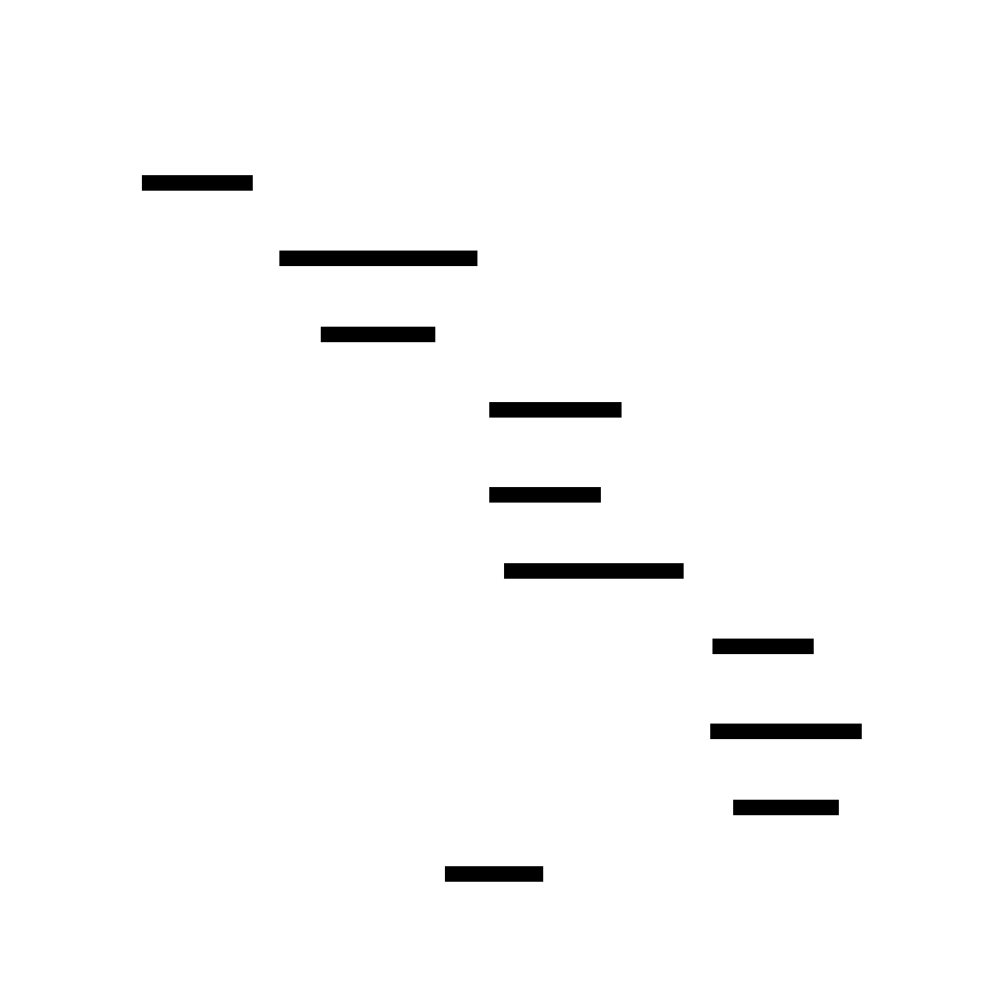
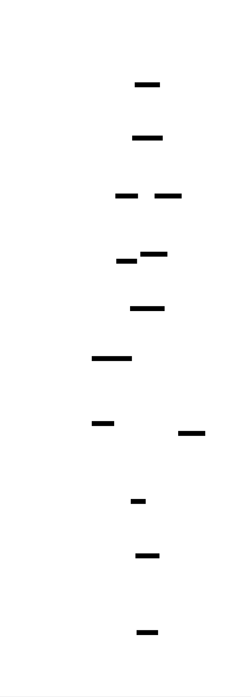

# K-Nearest Neighbors Classifier: Design Document


## Overview

A K-Nearest Neighbors classification system that predicts class labels by finding the K most similar training examples using distance metrics and majority voting. The key architectural challenge is efficiently computing distances in high-dimensional spaces while supporting multiple distance metrics and providing accurate predictions through optimized neighbor selection.


> This guide is meant to help you understand the big picture before diving into each milestone. Refer back to it whenever you need context on how components connect.


## Context and Problem Statement

> **Milestone(s):** Foundational understanding for all milestones - establishes the core classification problem that drives distance calculation (Milestone 1), neighbor finding and voting (Milestone 2), and evaluation strategies (Milestone 3).

### Mental Model: The Neighborhood Recommendation System

Think of K-Nearest Neighbors (KNN) classification like asking your neighbors for restaurant recommendations in a new city. When you want to find a good Italian restaurant, you don't ask everyone in the city - you ask the people who are most similar to you. Maybe you ask neighbors with similar tastes, similar age, or similar dining budgets. You assume that people who are like you in measurable ways will have preferences similar to yours.

In this neighborhood recommendation system, each neighbor gets one vote for their favorite restaurant. If you ask 5 neighbors and 3 recommend "Mario's Pizzeria" while 2 recommend different places, you go with the majority vote - Mario's Pizzeria. The key insight is that **similarity breeds similarity** - if someone is similar to you in the ways you can measure (age, income, food preferences), they're likely to be similar in the ways you can't easily measure (what makes a restaurant great).

KNN classification works exactly the same way, but instead of neighbors recommending restaurants, training examples "recommend" class labels for new data points. The algorithm finds the K training examples that are most similar to your new data point (measured by distance in feature space), then takes a majority vote of their class labels. Just like asking neighbors, the assumption is that similar data points will have similar class labels.

This neighborhood analogy reveals why KNN is called a **lazy learning algorithm** - it doesn't try to understand the underlying rules that separate classes (like "all good Italian restaurants have fresh pasta"). Instead, it simply remembers all the training examples and makes decisions by consulting the most relevant neighbors when needed, just like you might keep a mental rolodex of neighbors to ask for different types of advice.

### Problem Definition

**Classification** is the supervised learning task of predicting discrete class labels for new data points based on patterns learned from labeled training examples. Formally, given a training dataset D = {(x₁, y₁), (x₂, y₂), ..., (xₙ, yₙ)} where each xᵢ is a feature vector and yᵢ is its corresponding class label, the goal is to learn a function f: X → Y that can accurately predict the class label y for any new feature vector x.

The **K-Nearest Neighbors approach** to classification is based on the fundamental assumption that **similar inputs should produce similar outputs**. This assumption, known as the smoothness assumption in machine learning, suggests that the decision boundary between classes is locally smooth - data points that are close together in feature space are likely to belong to the same class.

KNN operationalizes this assumption through a simple three-step process:

1. **Distance Calculation**: Measure the similarity between the query point and every training example using a distance metric (Euclidean, Manhattan, cosine, etc.). The choice of distance metric defines what "similarity" means for your specific problem.

2. **Neighbor Selection**: Identify the K training examples with the smallest distances to the query point. These are the "nearest neighbors" that will vote on the classification decision.

3. **Majority Voting**: Assign the class label that appears most frequently among the K nearest neighbors. Optionally, weight each neighbor's vote by the inverse of its distance to give closer neighbors more influence.

> **Key Insight**: KNN makes no assumptions about the underlying data distribution or the shape of decision boundaries. Unlike parametric models that assume data follows a specific mathematical form, KNN adapts to whatever patterns exist in the training data, making it particularly effective for complex, non-linear decision boundaries.

The effectiveness of KNN depends on several critical factors that will drive our implementation decisions:

**Distance Metric Selection**: The choice of distance metric fundamentally determines which training examples are considered "neighbors." Euclidean distance works well for continuous features with similar scales, Manhattan distance is robust to outliers, and cosine similarity is effective for high-dimensional sparse data like text features.

**Neighborhood Size (K)**: The value of K controls the bias-variance tradeoff. Small K values (like K=1) create complex decision boundaries that closely follow the training data but may overfit to noise. Large K values create smoother decision boundaries that generalize better but may underfit complex patterns. The optimal K must be determined empirically through cross-validation.

**Feature Scaling**: Since distance calculations treat all features equally, features with larger scales will dominate the distance computation. A person's income (measured in tens of thousands) will overwhelm their age (measured in tens) unless features are properly scaled.

**Curse of Dimensionality**: In high-dimensional spaces, the concept of "nearest" becomes less meaningful as all points become roughly equidistant. This requires careful feature selection and potentially dimensionality reduction techniques.

### Comparison with Other Classification Methods

Understanding how KNN differs from other classification approaches illuminates its unique strengths and appropriate use cases. The fundamental distinction lies in how different algorithms learn patterns from training data and make predictions.

| Classification Approach | Learning Strategy | Decision Boundary | Computational Cost | Interpretability |
|------------------------|-------------------|-------------------|-------------------|------------------|
| KNN | Instance-based (lazy) | Adaptive, non-parametric | High prediction cost | Local interpretability |
| Logistic Regression | Parametric optimization | Linear hyperplane | Low prediction cost | Global interpretability |
| Decision Trees | Recursive splitting | Axis-aligned rectangles | Medium prediction cost | High interpretability |
| Neural Networks | Gradient-based learning | Complex non-linear | Low prediction cost | Low interpretability |
| SVM | Margin maximization | Linear or kernel-based | Medium prediction cost | Medium interpretability |

> **Decision: Instance-Based vs Parametric Learning**
> - **Context**: We need to choose between learning explicit parameters that generalize patterns (parametric) versus storing training examples and making local decisions (instance-based)
> - **Options Considered**: 
>   1. Parametric approach (learn global decision boundary parameters)
>   2. Instance-based approach (store examples, make local decisions)
>   3. Hybrid approach (learn local parameters for regions)
> - **Decision**: Instance-based learning (KNN approach)
> - **Rationale**: Instance-based learning requires no assumptions about data distribution, adapts automatically to complex decision boundaries, and provides intuitive explanations for individual predictions by showing which training examples influenced the decision
> - **Consequences**: Higher memory requirements (must store all training data), slower predictions (must compute distances), but greater flexibility and interpretability for complex datasets

**KNN vs Logistic Regression**: Logistic regression learns a global linear decision boundary by optimizing parameters that define a hyperplane separating classes. This creates fast predictions (just evaluate the linear function) but assumes classes are linearly separable. KNN makes no linearity assumptions and can handle arbitrarily complex decision boundaries by adapting locally to the data distribution. However, KNN requires computing distances to all training points for each prediction, making it much slower than logistic regression's simple arithmetic.

**KNN vs Decision Trees**: Decision trees recursively split the feature space along axis-aligned boundaries to create rectangular decision regions. Each prediction follows a path from root to leaf, making the decision process highly interpretable. KNN creates more flexible decision boundaries that aren't restricted to axis-aligned splits, but the "decision process" is less transparent - you know which neighbors voted, but not why those specific features made them neighbors. Trees can overfit with deep splits, while KNN overfits with small K values.

**KNN vs Neural Networks**: Neural networks learn complex non-linear transformations through multiple layers of weighted combinations and activation functions. Once trained, predictions are very fast (forward pass through the network), but the learned representation is opaque. KNN provides local interpretability - you can examine the K neighbors that influenced any prediction - but lacks the global patterns that neural networks discover. Neural networks excel when you have massive datasets and care primarily about accuracy, while KNN excels when you need to explain individual predictions or work with smaller datasets.

> **The No Free Lunch Theorem**: No classification algorithm is universally superior across all possible problems. KNN's strength lies in problems where local similarity is a reliable predictor of class membership, where decision boundaries are complex and non-linear, and where interpretability of individual predictions is important.

**When KNN Excels**:
- **Recommendation Systems**: Finding users with similar preferences to recommend products
- **Medical Diagnosis**: Finding patients with similar symptoms and test results
- **Image Classification**: Finding visually similar images in feature space
- **Anomaly Detection**: Identifying data points that are far from all training examples
- **Multi-modal Distributions**: Classes that form multiple clusters rather than single regions

**When KNN Struggles**:
- **High-Dimensional Data**: Curse of dimensionality makes distance metrics less meaningful
- **Large-Scale Applications**: Computational cost of distance calculations becomes prohibitive
- **Noisy Data**: Without feature selection, irrelevant features pollute distance calculations
- **Imbalanced Classes**: Majority class neighbors can overwhelm minority class signals
- **Real-Time Applications**: Prediction latency may be unacceptable for time-critical systems

| Problem Characteristic | KNN Suitability | Reasoning |
|----------------------|----------------|-----------|
| Complex decision boundaries | Excellent | Adapts locally without parametric assumptions |
| Need for interpretability | Good | Can examine which neighbors influenced decisions |
| Large training datasets | Poor | Computational cost grows linearly with data size |
| High-dimensional features | Poor | Distance becomes less meaningful in high dimensions |
| Real-time predictions | Poor | Must compute distances to all training points |
| Irregular class distributions | Excellent | No assumptions about class shape or distribution |

Understanding these trade-offs guides our implementation priorities. We'll focus on efficient distance calculations, flexible distance metrics, and clear interfaces for examining neighbors, while acknowledging that performance optimization and dimensionality handling are areas for future enhancement rather than core requirements for this foundational implementation.

### Implementation Guidance

The implementation approach balances educational clarity with practical functionality. Since KNN is often a student's first encounter with instance-based learning, the code should clearly illustrate the core concepts while remaining efficient enough for real experimentation.

#### Technology Recommendations

| Component | Simple Option | Advanced Option |
|-----------|---------------|-----------------|
| Distance Computation | Pure NumPy with explicit loops | Vectorized NumPy operations |
| Data Storage | Python lists and dictionaries | NumPy structured arrays |
| Neighbor Search | Linear scan through all points | KD-tree or LSH for acceleration |
| Evaluation | Manual train/test splits | Scikit-learn's evaluation utilities |
| Visualization | Matplotlib scatter plots | Interactive plots with Plotly |

#### Recommended Module Structure

```
knn_classifier/
├── __init__.py                    # Package initialization
├── core/
│   ├── __init__.py
│   ├── distance_metrics.py       # Distance calculation functions
│   ├── neighbor_finder.py        # K-nearest neighbor search
│   ├── classifier.py             # Main KNN classifier class
│   └── data_types.py             # Core data structures and types
├── evaluation/
│   ├── __init__.py
│   ├── cross_validation.py       # K-fold CV implementation
│   ├── metrics.py                # Accuracy, precision, recall calculations
│   └── optimization.py           # Hyperparameter tuning utilities
├── utils/
│   ├── __init__.py
│   ├── data_loader.py            # Dataset loading and preprocessing
│   ├── plotting.py               # Visualization utilities
│   └── preprocessing.py          # Feature scaling and normalization
└── examples/
    ├── iris_classification.py    # Complete example with Iris dataset
    ├── synthetic_data.py         # Generated 2D data for visualization
    └── comparison_study.py       # Compare KNN with other algorithms
```

This structure separates concerns clearly: core algorithms in `core/`, evaluation logic in `evaluation/`, utilities in `utils/`, and complete examples in `examples/`. Each module has a single responsibility, making the codebase easier to understand and test.

#### Infrastructure Starter Code

**Data Types Foundation** (`core/data_types.py`):
```python
"""
Core data types for KNN classifier implementation.
Provides type hints and data structures used throughout the system.
"""
from typing import List, Tuple, Dict, Optional, Union, Protocol
import numpy as np
from enum import Enum

# Type aliases for clarity
FeatureVector = np.ndarray  # 1D array representing features of a single sample
FeatureMatrix = np.ndarray  # 2D array where each row is a FeatureVector
ClassLabel = Union[int, str]  # Class labels can be integers or strings
DistanceArray = np.ndarray  # 1D array of distances
NeighborIndices = np.ndarray  # 1D array of indices into training data

class DistanceMetric(Enum):
    """Supported distance metrics for neighbor calculation."""
    EUCLIDEAN = "euclidean"
    MANHATTAN = "manhattan" 
    COSINE = "cosine"

class TrainingData:
    """Container for training dataset with features and labels."""
    def __init__(self, features: FeatureMatrix, labels: List[ClassLabel]):
        self.features = np.array(features)
        self.labels = labels
        self.n_samples, self.n_features = self.features.shape
        self.unique_classes = list(set(labels))
    
    def get_sample(self, index: int) -> Tuple[FeatureVector, ClassLabel]:
        """Get a single training sample by index."""
        return self.features[index], self.labels[index]

class PredictionResult:
    """Result of a single prediction with confidence information."""
    def __init__(self, predicted_class: ClassLabel, neighbor_indices: NeighborIndices, 
                 neighbor_distances: DistanceArray, confidence: float):
        self.predicted_class = predicted_class
        self.neighbor_indices = neighbor_indices
        self.neighbor_distances = neighbor_distances  
        self.confidence = confidence  # Proportion of neighbors voting for this class
```

**Data Loading Utilities** (`utils/data_loader.py`):
```python
"""
Utilities for loading and preprocessing datasets for KNN classification.
Handles common datasets and provides data splitting functionality.
"""
import numpy as np
from typing import Tuple
from sklearn.datasets import load_iris, make_classification
from sklearn.model_selection import train_test_split
from sklearn.preprocessing import StandardScaler

def load_iris_dataset() -> Tuple[np.ndarray, np.ndarray]:
    """Load the classic Iris dataset for flower classification."""
    iris = load_iris()
    return iris.data, iris.target

def create_synthetic_dataset(n_samples: int = 200, n_features: int = 2, 
                           n_classes: int = 3, random_state: int = 42) -> Tuple[np.ndarray, np.ndarray]:
    """Create synthetic classification dataset for testing and visualization."""
    X, y = make_classification(
        n_samples=n_samples,
        n_features=n_features,
        n_redundant=0,
        n_informative=n_features,
        n_classes=n_classes,
        n_clusters_per_class=1,
        random_state=random_state
    )
    return X, y

def split_and_scale_data(X: np.ndarray, y: np.ndarray, test_size: float = 0.2, 
                        scale_features: bool = True, random_state: int = 42) -> Tuple[np.ndarray, np.ndarray, np.ndarray, np.ndarray]:
    """Split data into train/test sets and optionally apply feature scaling."""
    X_train, X_test, y_train, y_test = train_test_split(X, y, test_size=test_size, random_state=random_state)
    
    if scale_features:
        scaler = StandardScaler()
        X_train = scaler.fit_transform(X_train)
        X_test = scaler.transform(X_test)
    
    return X_train, X_test, y_train, y_test
```

#### Core Logic Skeleton Code

**Main KNN Classifier Interface** (`core/classifier.py`):
```python
"""
Main KNN Classifier implementation combining distance calculation,
neighbor finding, and voting into a complete classification system.
"""
from typing import List, Optional
import numpy as np
from .data_types import *
from .distance_metrics import DistanceCalculator
from .neighbor_finder import NeighborFinder

class KNNClassifier:
    """
    K-Nearest Neighbors classifier with configurable distance metrics and voting strategies.
    
    The classifier follows the standard fit/predict interface:
    1. fit() stores the training data
    2. predict() finds neighbors and performs voting for each query point
    """
    
    def __init__(self, k: int = 3, distance_metric: DistanceMetric = DistanceMetric.EUCLIDEAN, 
                 weighted_voting: bool = False):
        # TODO 1: Store hyperparameters (k, distance_metric, weighted_voting)
        # TODO 2: Initialize DistanceCalculator with chosen metric  
        # TODO 3: Initialize NeighborFinder with k parameter
        # TODO 4: Initialize training_data to None (set during fit)
        pass
    
    def fit(self, X: FeatureMatrix, y: List[ClassLabel]) -> None:
        """
        Store training data for use during prediction.
        KNN is lazy learning - no actual training computation happens here.
        """
        # TODO 1: Validate that X and y have compatible shapes
        # TODO 2: Create TrainingData object from X and y
        # TODO 3: Store the TrainingData in self.training_data
        # Hint: This method should be very simple - just data storage
        pass
    
    def predict(self, X: FeatureMatrix) -> List[ClassLabel]:
        """
        Predict class labels for query points using K-nearest neighbors voting.
        """
        # TODO 1: Validate that classifier has been fitted (training_data is not None)
        # TODO 2: For each query point in X:
        #   TODO 2a: Find K nearest neighbors using neighbor_finder
        #   TODO 2b: Get class labels for those neighbors
        #   TODO 2c: Perform voting (majority or weighted) to get prediction
        # TODO 3: Return list of predictions
        # Hint: Consider using _predict_single() helper method for each query point
        pass
    
    def predict_with_confidence(self, X: FeatureMatrix) -> List[PredictionResult]:
        """
        Predict class labels with detailed information about neighbors and confidence.
        """
        # TODO 1: Similar to predict(), but return PredictionResult objects
        # TODO 2: Include neighbor indices, distances, and confidence scores
        # TODO 3: Confidence = proportion of neighbors voting for predicted class
        pass
    
    def _predict_single(self, query_point: FeatureVector) -> PredictionResult:
        """Helper method to predict a single query point."""
        # TODO 1: Find K nearest neighbors to query_point
        # TODO 2: Get their class labels from training_data
        # TODO 3: Perform voting to determine prediction
        # TODO 4: Calculate confidence score
        # TODO 5: Return PredictionResult with all information
        pass
```

#### Language-Specific Hints

**NumPy Optimization Tips**:
- Use `np.linalg.norm()` for Euclidean distance calculation instead of manual sqrt(sum(squares))
- Leverage broadcasting for vectorized distance computation: `X[:, np.newaxis, :] - training_data[np.newaxis, :, :]`
- Use `np.argpartition()` for finding K smallest distances without full sorting
- Apply `np.bincount()` for fast majority voting when labels are integers

**Memory Management**:
- For large datasets, compute distances in batches to avoid memory overflow
- Consider using `np.float32` instead of `np.float64` if precision allows, for 2x memory savings
- Use views instead of copies when possible: `X[indices]` not `np.copy(X[indices])`

**Performance Monitoring**:
- Use `time.perf_counter()` to measure distance calculation vs voting time separately
- Profile with `cProfile` to identify bottlenecks: `python -m cProfile -o profile.stats your_script.py`
- Monitor memory usage with `tracemalloc` for large dataset experiments

#### Milestone Checkpoint

After implementing the foundational understanding from this section:

**Conceptual Verification**:
1. **Analogy Test**: Explain KNN to someone using the neighborhood recommendation analogy without using technical terms
2. **Trade-off Understanding**: List 3 scenarios where KNN would outperform logistic regression and 3 where it wouldn't
3. **Parameter Intuition**: Predict what happens to decision boundaries as K increases from 1 to 50

**Code Structure Verification**:
1. **Module Organization**: Verify that the recommended directory structure is created and each module has clear responsibilities
2. **Type System**: Ensure that `data_types.py` loads without errors and provides clear type hints
3. **Data Loading**: Test that synthetic and Iris datasets can be loaded and split properly

**Expected Output** from data loading test:
```python
# Run this verification script
from knn_classifier.utils.data_loader import load_iris_dataset, split_and_scale_data

X, y = load_iris_dataset()
X_train, X_test, y_train, y_test = split_and_scale_data(X, y)

print(f"Training set: {X_train.shape[0]} samples, {X_train.shape[1]} features")
print(f"Test set: {X_test.shape[0]} samples") 
print(f"Classes: {set(y_train)}")
print(f"Feature scaling applied: mean ≈ 0, std ≈ 1")
print(f"Sample training point: {X_train[0]}")
```

**Signs of Problems**:
- **Import Errors**: Missing `__init__.py` files or incorrect module structure
- **Type Errors**: Data types not properly defined or incompatible with NumPy arrays
- **Scale Issues**: Features not properly normalized (means far from 0, std far from 1)

This foundational section establishes the conceptual framework and code structure that will support all subsequent implementation milestones. The neighborhood analogy provides intuitive understanding, the comparison with other methods shows when KNN is appropriate, and the starter code creates a solid foundation for the actual algorithm implementation.


## Goals and Non-Goals

> **Milestone(s):** Foundational scope definition that guides all three milestones - establishes boundaries for distance calculation (Milestone 1), neighbor finding and classification (Milestone 2), and evaluation improvements (Milestone 3)

### Mental Model: The Recipe Book Approach

Think of this design document as creating a recipe book for a neighborhood recommendation system. Just as a cookbook needs to clearly state what dishes it will teach you to make, what kitchen equipment it assumes you have, and what advanced techniques it won't cover, our KNN system needs explicit boundaries. A good recipe book doesn't try to teach everything about cooking - it focuses on a specific set of dishes and does them well. Similarly, our KNN implementation will excel at core classification tasks while deliberately excluding advanced features that would complicate the learning experience.

This goal-setting process is like a chef deciding whether their cookbook will cover basic weeknight dinners or advanced molecular gastronomy. The choice isn't about which is better, but about what serves the intended audience. For a beginner learning KNN, we want to build a solid foundation with clear, understandable components before considering optimizations that might obscure the underlying principles.

### Functional Goals: Core Classification Capabilities and Performance Requirements

The functional goals define the specific classification capabilities our KNN system must deliver. These represent the concrete behaviors users can expect when interacting with our implementation.

**Primary Classification Functionality**

Our KNN system will provide complete **lazy learning** capabilities, meaning it stores training examples without preprocessing and defers all computation until prediction time. The system will support both single-point predictions and batch predictions over multiple query points. Users will be able to train the classifier by providing feature vectors and corresponding class labels, then make predictions on new, unseen data points.

The system will implement multiple **distance metrics** to measure similarity between data points. Each metric captures a different notion of similarity - Euclidean distance measures straight-line distance in feature space, Manhattan distance measures city-block distance along feature dimensions, and cosine similarity measures angular similarity regardless of magnitude. This variety allows users to choose the most appropriate similarity measure for their data characteristics.

| Distance Metric | Mathematical Definition | Use Case |
|-----------------|------------------------|----------|
| Euclidean | sqrt(sum((x_i - y_i)²)) | Continuous features with similar scales |
| Manhattan | sum(abs(x_i - y_i)) | Features with different scales or outliers |
| Cosine | dot(x,y) / (norm(x) * norm(y)) | High-dimensional sparse data |

**Neighbor Selection and Voting**

The system will provide flexible **K parameter configuration**, allowing users to specify how many nearest neighbors to consider for each prediction. This parameter fundamentally controls the **bias-variance tradeoff** - smaller K values create more flexible decision boundaries (high variance, low bias) while larger K values create smoother decision boundaries (low variance, high bias).

Our implementation will support both simple **majority voting** and **weighted voting** strategies. In majority voting, each of the K nearest neighbors contributes one vote for their class label, and the class receiving the most votes becomes the prediction. In weighted voting, closer neighbors receive more influence in the final decision, typically using inverse distance weighting where neighbors at distance d contribute votes proportional to 1/d.

| Voting Strategy | Vote Weight | Advantage | Disadvantage |
|----------------|-------------|-----------|--------------|
| Majority | Equal (1.0 per neighbor) | Simple, interpretable | Ignores distance information |
| Inverse Distance | 1 / distance | Emphasizes closer neighbors | Sensitive to very close points |
| Inverse Square | 1 / distance² | Strong distance emphasis | Unstable with duplicate points |

**Performance and Efficiency Requirements**

The system will implement **vectorized operations** using NumPy to avoid Python-level loops during distance calculations. This requirement ensures that distance computation scales efficiently with both the number of training examples and the dimensionality of the feature space. All distance calculations will operate on entire matrices simultaneously rather than iterating through individual data points.

For datasets with reasonable size (up to 10,000 training examples with up to 100 features), the system will complete training in under 1 second and individual predictions in under 0.1 seconds on standard hardware. These performance targets ensure the implementation remains practical for educational use and small to medium-sized classification problems.

**Data Type Flexibility**

Our KNN classifier will handle both **numeric class labels** (integers) and **string class labels** (categorical names), making it suitable for a wide variety of classification tasks. The system will automatically detect the class label type and handle voting appropriately for both cases.

The implementation will accept feature data as NumPy arrays, providing compatibility with the broader Python scientific computing ecosystem. Training features will be stored as a `FeatureMatrix` (2D array where each row represents one training example) while predictions can be made on individual `FeatureVector` instances (1D arrays) or batches of query points.

### Non-Functional Goals: Quality Attributes

Non-functional goals define the quality attributes that make our KNN system maintainable, extensible, and suitable for educational use. These requirements shape how we structure the code and design component interfaces.

**Code Clarity and Educational Value**

The implementation will prioritize **code readability** over micro-optimizations, ensuring that learners can easily understand each component's purpose and implementation. Every major algorithm will include detailed comments explaining the mathematical concepts and design decisions. Variable names will be descriptive and follow consistent naming conventions throughout the codebase.

All core algorithms will be implemented as **separate, focused functions** rather than monolithic methods. This modular design allows learners to understand and test individual components in isolation before seeing how they integrate into the complete system. For example, distance calculation, neighbor finding, and voting will each be implemented as distinct modules with well-defined interfaces.

> **Design Principle**: Each function should do one thing well and have a name that clearly describes its purpose. A function called `calculate_euclidean_distance` should only compute distance, not also find neighbors or make predictions.

**Extensibility and Modularity**

The system architecture will support **easy addition of new distance metrics** through a common interface. Adding a new distance function should require implementing a single method signature without modifying existing code. This extensibility allows learners to experiment with custom distance measures for their specific domains.

Component interfaces will be designed to support future enhancements like **approximate nearest neighbor algorithms** or **different voting strategies** without requiring major architectural changes. The core `KNNClassifier` class will delegate to specialized components for distance calculation, neighbor finding, and voting, making it easy to swap implementations.

**Error Handling and Robustness**

The system will implement **comprehensive input validation** with clear, helpful error messages. When users provide invalid parameters (like K larger than the dataset size) or incompatible data shapes (mismatched feature dimensions), the system will detect these issues early and provide specific guidance on how to fix them.

All mathematical operations will include **numerical stability checks** to handle edge cases like identical data points (zero distance) or empty datasets. The implementation will avoid common pitfalls like taking square roots of negative numbers or dividing by zero in distance calculations.

**Testing and Verification Support**

The codebase will include **comprehensive test coverage** with unit tests for each component and integration tests for end-to-end workflows. Test cases will cover both typical usage patterns and edge cases, providing learners with examples of how to verify their implementations.

The system will provide **built-in evaluation metrics** including accuracy, precision, recall, and F1-score, along with confusion matrix generation. These tools allow learners to objectively assess their classifier's performance and understand its strengths and weaknesses on different types of data.

### Explicit Non-Goals: Features Excluded from This Implementation

Clearly defining what we will NOT implement is crucial for maintaining scope and setting appropriate expectations. These non-goals represent features that, while valuable in production systems, would complicate the learning experience or exceed the project's educational objectives.

**Advanced Optimization Algorithms**

We will NOT implement **KD-trees, ball trees, or other spatial indexing structures** for accelerating neighbor search. While these algorithms can reduce neighbor finding from O(n) to O(log n) complexity, they introduce significant implementation complexity and can obscure the fundamental KNN concepts. Our implementation will use straightforward linear search, which is easier to understand and debug.

We will NOT include **approximate nearest neighbor algorithms** like Locality-Sensitive Hashing (LSH) or hierarchical navigable small world graphs. These techniques trade accuracy for speed but require understanding of advanced data structures and probabilistic algorithms that exceed our beginner-level scope.

**Production-Scale Performance Features**

The system will NOT include **distributed or parallel processing** capabilities. All computation will occur on a single machine using single-threaded execution (except for NumPy's internal vectorization). While distributed KNN is important for large-scale applications, it introduces complexity around data partitioning, communication, and fault tolerance that distracts from core algorithm understanding.

We will NOT implement **online learning** or **incremental updates** to the training set. Our classifier will follow the traditional batch learning paradigm where training data is fixed after the initial `fit` operation. Online learning requires additional data structures and algorithms to maintain neighbor relationships as new examples arrive.

**Advanced Distance Metrics and Similarity Measures**

The implementation will NOT include **learned distance metrics** or **adaptive similarity measures** that change based on the training data. While techniques like metric learning can improve KNN performance by learning optimal feature weightings, they require understanding of optimization algorithms and gradient-based learning that exceeds our scope.

We will NOT support **categorical features** with specialized distance measures like Hamming distance for binary features or Gower's distance for mixed data types. Our focus remains on continuous numerical features where Euclidean, Manhattan, and cosine distance provide clear, interpretable similarity measures.

**Complex Voting and Prediction Schemes**

The system will NOT implement **probabilistic predictions** or **prediction uncertainty quantification** beyond basic confidence scores based on neighbor agreement. Advanced uncertainty estimation requires statistical modeling techniques that complicate the implementation without adding educational value for beginners.

We will NOT support **multi-output classification** (predicting multiple labels simultaneously) or **structured prediction** tasks. Our scope focuses on single-label, multi-class classification problems where each example belongs to exactly one class from a predefined set.

**Integration and Deployment Features**

The implementation will NOT include **model serialization** or **persistence** capabilities beyond basic Python pickle support. Production ML systems require sophisticated model versioning and deployment pipelines, but these infrastructure concerns are outside our algorithm-focused scope.

We will NOT provide **REST APIs, web interfaces, or other service-oriented features**. The system will remain a Python library with programmatic interfaces, allowing learners to focus on the algorithm implementation rather than software engineering concerns around API design and web development.

> **Architecture Decision: Educational Focus Over Production Readiness**
> - **Context**: Must choose between comprehensive production features and clear educational value
> - **Options Considered**: 
>   1. Full-featured production system with optimizations, persistence, APIs
>   2. Educational implementation focused on core algorithms
>   3. Hybrid approach with basic optimizations
> - **Decision**: Focus purely on educational value with clear, readable implementations
> - **Rationale**: Beginners learn better with simple, understandable code than with complex optimized systems they cannot comprehend or debug
> - **Consequences**: Enables deep understanding of fundamental concepts but requires additional work to make production-ready

| Feature Category | Included | Excluded | Rationale |
|------------------|----------|----------|-----------|
| Distance Metrics | Euclidean, Manhattan, Cosine | Learned metrics, specialized categorical distances | Core metrics sufficient for understanding principles |
| Search Algorithms | Linear search | KD-trees, approximate search | Complexity would obscure fundamental concepts |
| Voting Strategies | Majority, inverse distance weighting | Probabilistic voting, uncertainty quantification | Simple strategies demonstrate core principles |
| Performance | Vectorized NumPy operations | Parallel processing, distributed computing | Educational focus over production optimization |
| Data Types | Numerical features, class labels | Categorical features, structured outputs | Simplifies implementation while covering main use cases |

### Implementation Guidance

This implementation guidance provides concrete technical recommendations for building a KNN system that achieves the functional and non-functional goals while respecting the explicit boundaries defined above.

**A. Technology Recommendations**

| Component | Simple Option | Advanced Option |
|-----------|---------------|-----------------|
| Numerical Computing | NumPy arrays + pure Python | NumPy + SciPy + Numba JIT compilation |
| Distance Calculation | NumPy vectorized operations | SciKit-Learn distance metrics |
| Data Loading | CSV files + pandas | MLOps pipelines with versioning |
| Visualization | Matplotlib scatter plots | Interactive Plotly dashboards |
| Testing | Built-in unittest module | Pytest with fixtures and parameterization |

**B. Recommended File/Module Structure**

The following structure organizes code into logical, testable modules that align with our component-based architecture:

```
knn-classifier/
├── src/
│   ├── __init__.py
│   ├── data_types.py          ← Core type definitions (FeatureVector, TrainingData, etc.)
│   ├── distance_metrics.py    ← Distance calculation implementations
│   ├── neighbor_finder.py     ← K-nearest neighbor search algorithms
│   ├── classifier.py          ← Main KNNClassifier class and voting logic
│   ├── evaluation.py          ← Cross-validation and performance metrics
│   └── utils.py               ← Data loading and preprocessing utilities
├── tests/
│   ├── test_distance_metrics.py
│   ├── test_neighbor_finder.py
│   ├── test_classifier.py
│   ├── test_evaluation.py
│   └── test_integration.py
├── examples/
│   ├── iris_classification.py ← Complete example using iris dataset
│   └── synthetic_data.py      ← Example with generated 2D data for visualization
└── README.md
```

**C. Infrastructure Starter Code**

**Core Data Types (Complete Implementation)**

```python
# src/data_types.py
from typing import List, Union, Optional, Tuple
import numpy as np
from enum import Enum

# Type aliases for clarity
FeatureVector = np.ndarray  # 1D array representing features of a single sample
FeatureMatrix = np.ndarray  # 2D array where each row is a FeatureVector
ClassLabel = Union[int, str]  # Union type for int or string class labels
DistanceArray = np.ndarray  # 1D array of distance values
NeighborIndices = np.ndarray  # 1D array of indices into training data

class DistanceMetric(Enum):
    """Enumeration of supported distance metrics."""
    EUCLIDEAN = "euclidean"
    MANHATTAN = "manhattan"
    COSINE = "cosine"

class TrainingData:
    """Container for training dataset with metadata."""
    
    def __init__(self, features: FeatureMatrix, labels: List[ClassLabel]):
        self.features = features
        self.labels = labels
        self.n_samples = features.shape[0]
        self.n_features = features.shape[1]
        self.unique_classes = list(set(labels))
        
        # Validation
        if len(labels) != self.n_samples:
            raise ValueError(f"Feature count {self.n_samples} doesn't match label count {len(labels)}")
    
    def get_sample(self, index: int) -> Tuple[FeatureVector, ClassLabel]:
        """Retrieve single training example."""
        if not 0 <= index < self.n_samples:
            raise IndexError(f"Sample index {index} out of range [0, {self.n_samples})")
        return self.features[index], self.labels[index]

class PredictionResult:
    """Container for prediction with neighbor information and confidence."""
    
    def __init__(self, predicted_class: ClassLabel, neighbor_indices: NeighborIndices, 
                 neighbor_distances: DistanceArray, confidence: float):
        self.predicted_class = predicted_class
        self.neighbor_indices = neighbor_indices
        self.neighbor_distances = neighbor_distances
        self.confidence = confidence
```

**Data Loading Utilities (Complete Implementation)**

```python
# src/utils.py
import numpy as np
from sklearn.datasets import load_iris
from sklearn.model_selection import train_test_split
from sklearn.preprocessing import StandardScaler
from typing import Tuple

def load_iris_dataset() -> Tuple[np.ndarray, np.ndarray]:
    """Load classic Iris classification dataset."""
    iris = load_iris()
    return iris.data, iris.target

def split_and_scale_data(X: np.ndarray, y: np.ndarray, test_size: float = 0.2, 
                        scale_features: bool = True, random_state: int = 42) -> Tuple[np.ndarray, np.ndarray, np.ndarray, np.ndarray]:
    """Split data into train/test sets and optionally apply feature scaling."""
    X_train, X_test, y_train, y_test = train_test_split(
        X, y, test_size=test_size, random_state=random_state, stratify=y
    )
    
    if scale_features:
        scaler = StandardScaler()
        X_train = scaler.fit_transform(X_train)
        X_test = scaler.transform(X_test)
    
    return X_train, X_test, y_train, y_test

def generate_synthetic_2d_data(n_samples: int = 300, n_classes: int = 3, 
                              random_state: int = 42) -> Tuple[np.ndarray, np.ndarray]:
    """Generate 2D synthetic data for visualization and testing."""
    np.random.seed(random_state)
    
    # Create cluster centers
    centers = np.random.uniform(-10, 10, (n_classes, 2))
    
    X = []
    y = []
    
    samples_per_class = n_samples // n_classes
    for class_idx, center in enumerate(centers):
        # Generate points around each center
        class_X = np.random.multivariate_normal(
            center, [[2, 0], [0, 2]], samples_per_class
        )
        class_y = [class_idx] * samples_per_class
        
        X.append(class_X)
        y.extend(class_y)
    
    X = np.vstack(X)
    y = np.array(y)
    
    # Shuffle the data
    indices = np.random.permutation(len(X))
    return X[indices], y[indices]
```

**D. Core Logic Skeleton Code**

**KNN Classifier Main Class (Skeleton for Implementation)**

```python
# src/classifier.py
from typing import List, Optional
import numpy as np
from .data_types import (
    FeatureMatrix, FeatureVector, ClassLabel, TrainingData, 
    PredictionResult, DistanceMetric, NeighborIndices, DistanceArray
)

class KNNClassifier:
    """K-Nearest Neighbors classifier with configurable distance metrics and voting strategies."""
    
    def __init__(self, k: int = 5, distance_metric: DistanceMetric = DistanceMetric.EUCLIDEAN, 
                 weighted_voting: bool = False):
        self.k = k
        self.distance_metric = distance_metric
        self.weighted_voting = weighted_voting
        self.training_data: Optional[TrainingData] = None
    
    def fit(self, X: FeatureMatrix, y: List[ClassLabel]) -> None:
        """Store training data for lazy learning."""
        # TODO 1: Validate input dimensions and types
        # TODO 2: Create TrainingData instance and store in self.training_data
        # TODO 3: Validate that k is not larger than number of training samples
        # Hint: This is lazy learning - no actual computation happens during fit
        pass
    
    def predict(self, X: FeatureMatrix) -> List[ClassLabel]:
        """Predict class labels for query points."""
        # TODO 1: Validate that fit has been called (self.training_data is not None)
        # TODO 2: Handle both single vector and matrix input cases
        # TODO 3: For each query point, call predict_single to get the prediction
        # TODO 4: Return list of predicted class labels
        # Hint: Use predict_with_confidence internally and extract just the predicted_class
        pass
    
    def predict_with_confidence(self, X: FeatureMatrix) -> List[PredictionResult]:
        """Predict with neighbor and confidence information."""
        # TODO 1: Validate inputs and ensure model is fitted
        # TODO 2: Convert single vector input to matrix if needed
        # TODO 3: For each query point, find K nearest neighbors
        # TODO 4: Apply voting strategy (majority or weighted) to determine prediction
        # TODO 5: Calculate confidence based on neighbor agreement
        # TODO 6: Return PredictionResult objects with all information
        pass
    
    def _predict_single(self, query_point: FeatureVector) -> PredictionResult:
        """Predict class for a single query point."""
        # TODO 1: Calculate distances from query point to all training points
        # TODO 2: Find indices of K nearest neighbors
        # TODO 3: Get class labels of K nearest neighbors
        # TODO 4: Apply voting strategy (majority or weighted)
        # TODO 5: Calculate confidence score
        # TODO 6: Return PredictionResult with all information
        # Hint: Use the distance_metrics module for distance calculations
        pass
```

**Distance Metrics Module (Skeleton for Implementation)**

```python
# src/distance_metrics.py
import numpy as np
from .data_types import FeatureVector, FeatureMatrix, DistanceArray, DistanceMetric

def calculate_distance(point1: FeatureVector, point2: FeatureVector, 
                      metric: DistanceMetric) -> float:
    """Calculate distance between two points using specified metric."""
    # TODO 1: Validate that both points have same dimensionality
    # TODO 2: Dispatch to appropriate distance function based on metric
    # TODO 3: Return computed distance value
    # Hint: Use a dictionary to map DistanceMetric enum values to functions
    pass

def calculate_distances_vectorized(query_point: FeatureVector, 
                                 training_data: FeatureMatrix,
                                 metric: DistanceMetric) -> DistanceArray:
    """Calculate distances from query point to all training points efficiently."""
    # TODO 1: Validate input dimensions
    # TODO 2: Use vectorized NumPy operations for efficiency
    # TODO 3: Handle different distance metrics with appropriate formulas
    # TODO 4: Return array of distances with same length as training_data rows
    # Hint: Avoid Python loops - use NumPy broadcasting for vectorization
    pass

def euclidean_distance(point1: FeatureVector, point2: FeatureVector) -> float:
    """Compute Euclidean (L2) distance between two points."""
    # TODO 1: Calculate squared differences for each dimension
    # TODO 2: Sum the squared differences
    # TODO 3: Take square root of the sum
    # TODO 4: Handle edge case where points are identical (distance = 0)
    # Hint: np.sqrt(np.sum((point1 - point2) ** 2))
    pass

def manhattan_distance(point1: FeatureVector, point2: FeatureVector) -> float:
    """Compute Manhattan (L1) distance between two points."""
    # TODO 1: Calculate absolute differences for each dimension
    # TODO 2: Sum the absolute differences
    # TODO 3: Return the sum
    # Hint: np.sum(np.abs(point1 - point2))
    pass

def cosine_similarity(point1: FeatureVector, point2: FeatureVector) -> float:
    """Compute cosine similarity between two points (returns distance = 1 - similarity)."""
    # TODO 1: Calculate dot product of the two vectors
    # TODO 2: Calculate L2 norms (magnitudes) of both vectors
    # TODO 3: Compute cosine similarity = dot_product / (norm1 * norm2)
    # TODO 4: Convert to distance by returning 1 - similarity
    # TODO 5: Handle edge case where one or both vectors have zero norm
    # Hint: Use np.dot() and np.linalg.norm()
    pass
```

**E. Language-Specific Hints**

**NumPy Optimization Tips:**
- Use `np.linalg.norm()` for efficient vector magnitude calculations
- Leverage NumPy broadcasting to avoid explicit loops when computing distances to multiple points
- Use `np.argsort()` to find indices of K smallest distances without fully sorting the array
- Apply `np.bincount()` for efficient majority vote counting when labels are integers

**Error Handling Patterns:**
- Always validate array shapes before mathematical operations: `assert X.shape[1] == self.training_data.n_features`
- Check for empty datasets: `if self.training_data.n_samples == 0: raise ValueError("No training data")`
- Validate K parameter: `if k > self.training_data.n_samples: raise ValueError(f"k={k} larger than dataset size")`

**Memory Efficiency:**
- For large datasets, consider computing distances in batches rather than storing full distance matrix
- Use `dtype=np.float32` instead of default `np.float64` if precision allows for memory savings

**F. Milestone Checkpoints**

**After Milestone 1 (Distance Calculation):**
```bash
# Test distance calculations
python -m pytest tests/test_distance_metrics.py -v

# Manual verification
python -c "
from src.distance_metrics import euclidean_distance, manhattan_distance
import numpy as np
p1 = np.array([0, 0])
p2 = np.array([3, 4])
print(f'Euclidean: {euclidean_distance(p1, p2)}')  # Should be 5.0
print(f'Manhattan: {manhattan_distance(p1, p2)}')  # Should be 7.0
"
```

**Expected output:** Distance functions return correct mathematical values for simple test cases.

**After Milestone 2 (KNN Classification):**
```bash
# Test full classification pipeline
python examples/iris_classification.py

# Expected: Accuracy around 95-100% on iris dataset with proper train/test split
```

**After Milestone 3 (Evaluation and Optimization):**
```bash
# Test cross-validation and hyperparameter tuning
python -c "
from src.evaluation import cross_validate, find_optimal_k
# Should complete without errors and show k-fold results
"
```

**G. Common Implementation Pitfalls**

| Pitfall | Symptom | Cause | Fix |
|---------|---------|-------|-----|
| All predictions same class | Low accuracy, confusion matrix shows single class | K too large, using majority of dataset | Validate K < n_samples/2, try smaller K values |
| Slow distance calculation | Long prediction times | Using Python loops instead of vectorization | Replace loops with NumPy broadcasting operations |
| NaN in distance calculations | Runtime errors or infinite distances | Division by zero in cosine distance | Add epsilon to denominators, check for zero-norm vectors |
| Memory errors on large datasets | Out of memory crashes | Computing full distance matrix | Implement batch processing for distance calculations |
| Inconsistent predictions | Same input gives different outputs | Non-deterministic tie breaking | Implement consistent tie-breaking strategy (e.g., smallest index wins) |


## High-Level Architecture

> **Milestone(s):** Foundational architecture for all milestones - establishes the component structure for distance calculation (Milestone 1), neighbor finding and classification (Milestone 2), and evaluation systems (Milestone 3)

### Mental Model: The Recommendation System Architecture

Think of the KNN classifier like a sophisticated recommendation system at a bookstore. When a customer asks for book recommendations, the system follows a clear pipeline: first, it measures how similar the customer is to previous customers using various criteria (distance calculation component); then, it finds the most similar customers (neighbor finding component); finally, it looks at what those similar customers liked and makes a recommendation based on their preferences (classification component). An additional evaluation system tracks how well these recommendations work over time and tunes the system for better performance.

This bookstore analogy maps directly to our KNN architecture: **distance calculation** measures similarity between data points, **neighbor finding** locates the most relevant training examples, **classification** aggregates their labels into predictions, and **evaluation** measures and optimizes system performance. Each component has a distinct responsibility but works together through a carefully orchestrated data flow.


The key architectural insight is that KNN follows the **lazy learning** paradigm - unlike algorithms that build complex models during training, KNN simply stores training data and defers all computation until prediction time. This creates a unique architecture where the "training" component is trivial (just data storage) while the prediction pipeline does all the heavy lifting through distance calculations, neighbor searches, and voting mechanisms.

### Component Overview

The KNN classifier system consists of four primary components that work together to implement **instance-based learning**. Each component has a focused responsibility and well-defined interfaces that enable clean separation of concerns while supporting the overall classification pipeline.

| Component | Primary Responsibility | Key Data Inputs | Key Data Outputs | Performance Characteristics |
|-----------|------------------------|------------------|------------------|----------------------------|
| **Distance Calculator** | Compute similarity metrics between feature vectors | `FeatureVector` pairs, `DistanceMetric` enum | `DistanceArray`, distance matrices | O(d) per pair where d = dimensions |
| **Neighbor Finder** | Locate K most similar training examples | Query `FeatureVector`, `TrainingData`, K parameter | `NeighborIndices`, `DistanceArray` | O(n) linear search, O(log n) with spatial indexing |
| **Classifier** | Make predictions through voting mechanisms | `NeighborIndices`, neighbor labels, voting strategy | `ClassLabel`, `PredictionResult` with confidence | O(K) for voting, O(C) where C = number of classes |
| **Evaluator** | Assess model performance and optimize hyperparameters | Predictions, ground truth labels, cross-validation folds | Accuracy metrics, confusion matrices, optimal K | O(F×N) where F = folds, N = samples |

#### Distance Calculator Component

The Distance Calculator serves as the foundation of the entire KNN system by implementing various similarity metrics that quantify how "close" two data points are in feature space. This component embodies the **smoothness assumption** that underlies KNN - the principle that similar inputs should produce similar outputs.

The component supports multiple distance metrics through a unified interface, allowing the system to adapt to different types of data and problem domains. **Euclidean distance** works well for continuous numerical features, **Manhattan distance** is robust to outliers and effective for high-dimensional sparse data, while **cosine similarity** excels with text and normalized feature vectors where magnitude is less important than direction.

The architectural challenge here is achieving computational efficiency through **vectorized operations**. Rather than computing distances one pair at a time using Python loops, the component leverages NumPy's broadcasting capabilities to compute entire distance matrices in single operations. This transforms an O(n²d) nested loop computation into an O(nd) vectorized operation followed by O(n²) element-wise operations that run at C speed.

#### Neighbor Finder Component

The Neighbor Finder component takes distance calculations and efficiently locates the K most similar training examples for each query point. This component implements the core search algorithms that determine both the accuracy and performance characteristics of the entire KNN system.

At its simplest, the component performs linear search through all training examples, computing distances and maintaining a sorted list of the K closest neighbors. However, this O(n) per-query complexity becomes prohibitive for large datasets, motivating more sophisticated spatial indexing approaches like KD-trees that can reduce search complexity to O(log n) in favorable conditions.

The component must handle several edge cases that frequently trip up implementations: what happens when K is larger than the dataset size, how to break ties when multiple neighbors have identical distances, and how to efficiently maintain the K-nearest list during search without expensive sorting operations. These design decisions significantly impact both correctness and performance.

#### Classifier Component

The Classifier component implements the democratic decision-making process that transforms a set of neighbor labels into a final prediction. This component embodies the core assumption of KNN that local neighborhoods provide reliable information about class boundaries in feature space.

The component supports two primary voting strategies. **Majority voting** gives each of the K neighbors an equal voice in the classification decision, essentially implementing a local democracy where the most frequent class wins. **Weighted voting** provides a more nuanced approach where closer neighbors have proportionally more influence on the final decision, implemented through inverse distance weighting or similar schemes.

Beyond simple classification, this component also computes confidence metrics that indicate how certain the prediction is. A unanimous vote among neighbors indicates high confidence, while a close split suggests the query point lies near a class boundary. This confidence information proves invaluable for understanding model behavior and identifying uncertain predictions that might require human review.

#### Evaluator Component

The Evaluator component provides the scientific rigor necessary to assess model performance and optimize hyperparameters. This component implements cross-validation procedures that provide unbiased estimates of generalization performance and systematic hyperparameter optimization that finds the best K value for a given dataset.

The component's **K-fold cross-validation** implementation carefully partitions data into training and validation folds while ensuring that each sample appears in exactly one validation fold. This provides robust performance estimates that account for dataset variance and help detect overfitting or underfitting behaviors that might not be apparent from simple train-test splits.

Hyperparameter optimization within this component addresses the fundamental **bias-variance tradeoff** in KNN models. Small K values create high-variance, low-bias models that can capture fine-grained class boundaries but may overfit to noise. Large K values create low-variance, high-bias models that provide smooth decision boundaries but may underfit complex patterns. The evaluator systematically tests different K values to find the sweet spot for each specific dataset.

### Recommended Module Structure

A well-organized module structure helps manage the complexity of the KNN system while providing clear interfaces between components. The structure follows standard Python packaging conventions while grouping related functionality and separating concerns.

```
knn_classifier/
├── __init__.py                     # Package initialization and public API exports
├── core/
│   ├── __init__.py
│   ├── data_types.py              # Core data structures: FeatureVector, TrainingData, etc.
│   └── enums.py                   # Enumerations: DistanceMetric, VotingStrategy
├── distance/
│   ├── __init__.py
│   ├── base.py                    # Abstract base class for distance metrics
│   ├── euclidean.py              # Euclidean distance implementation
│   ├── manhattan.py              # Manhattan distance implementation
│   └── cosine.py                 # Cosine similarity implementation
├── neighbors/
│   ├── __init__.py
│   ├── base.py                   # Abstract base class for neighbor finders
│   ├── linear_search.py          # Brute-force linear search implementation
│   └── spatial_index.py          # KD-tree and advanced indexing (future extension)
├── classification/
│   ├── __init__.py
│   ├── base.py                   # Abstract classifier interface
│   ├── knn_classifier.py         # Main KNNClassifier implementation
│   └── voting.py                 # Voting strategy implementations
├── evaluation/
│   ├── __init__.py
│   ├── metrics.py                # Accuracy, precision, recall, F1-score calculations
│   ├── cross_validation.py       # K-fold cross-validation implementation
│   └── optimization.py           # Hyperparameter optimization routines
├── utils/
│   ├── __init__.py
│   ├── data_loader.py            # Dataset loading utilities (iris, synthetic data)
│   └── preprocessing.py          # Feature scaling and preprocessing utilities
└── examples/
    ├── basic_classification.py   # Simple KNN usage example
    ├── cross_validation_demo.py  # Cross-validation and optimization example
    └── distance_comparison.py    # Comparison of different distance metrics
```

This modular structure provides several key benefits for learners and maintainers. Each module has a single, well-defined responsibility, making it easier to understand, test, and modify individual components. The abstract base classes in each module establish clear contracts that enable easy extension with new distance metrics, search algorithms, or voting strategies.

The separation between core data types and algorithmic components allows the data structures to evolve independently of the algorithms that use them. This proves particularly valuable when optimizing performance or adding new features that require additional fields in the data structures.

> **Design Insight**: The module structure mirrors the conceptual architecture, making the codebase intuitive to navigate. Each major component from our architecture diagram corresponds directly to a Python package, and the flow of data between components is reflected in the import dependencies between modules.

### Data Flow Architecture

The data flow through the KNN system follows a clear pipeline from training data ingestion through final prediction output. Understanding this flow is crucial for implementing each component correctly and optimizing overall system performance.

#### Training Phase Data Flow

The training phase in KNN is deceptively simple due to the **lazy learning** nature of the algorithm. Unlike parametric models that extract patterns and parameters during training, KNN simply stores the training data for later use during prediction.

| Step | Component | Input Data | Processing | Output Data | Storage Location |
|------|-----------|------------|------------|-------------|------------------|
| 1 | Data Loader | Raw dataset files | Parse and validate data format | `FeatureMatrix`, label array | Memory |
| 2 | Preprocessor | `FeatureMatrix`, labels | Feature scaling, validation | Scaled `FeatureMatrix`, `ClassLabel` list | Memory |
| 3 | KNN Classifier | Scaled features, labels | Create `TrainingData` container | `TrainingData` object | `KNNClassifier.training_data` |
| 4 | Distance Calculator | `TrainingData` | Pre-compute distance matrix (optional) | `DistanceMatrix` | Cache or disk |

The key insight is that the "training" phase primarily involves data validation and storage rather than complex model fitting. The `fit` method validates that features and labels have compatible shapes, checks for missing values, stores the training data in an efficient format, and optionally pre-computes distance matrices for performance optimization.

```python
def fit(X: FeatureMatrix, y: List[ClassLabel]) -> None:
    """Store training data for lazy learning approach.
    
    This method performs minimal computation since KNN defers
    all learning until prediction time.
    """
    # Validation and storage steps - implementation in guidance section
```

#### Prediction Phase Data Flow

The prediction phase contains the computational heart of the KNN algorithm, where all the distance calculations, neighbor finding, and classification voting occur. This phase demonstrates the true complexity hidden behind KNN's conceptual simplicity.

| Step | Component | Input Data | Processing | Output Data | Complexity |
|------|-----------|------------|------------|-------------|------------|
| 1 | Query Processing | Query `FeatureMatrix` | Validate dimensions, apply same scaling | Preprocessed queries | O(Q×D) |
| 2 | Distance Calculator | Query point, `TrainingData` | Compute distances to all training points | `DistanceArray` | O(Q×N×D) |
| 3 | Neighbor Finder | `DistanceArray`, K parameter | Find K smallest distances and indices | `NeighborIndices`, neighbor distances | O(Q×N log K) |
| 4 | Classifier | `NeighborIndices`, neighbor labels | Apply voting strategy | `PredictionResult` | O(Q×K) |
| 5 | Output Formatter | `PredictionResult` | Extract final predictions | `List[ClassLabel]` | O(Q) |

Where Q = number of query points, N = number of training points, D = number of dimensions, K = number of neighbors.

The prediction data flow reveals why KNN can be computationally expensive at prediction time. For each query point, the system must compute distances to every training point, sort these distances to find the K nearest neighbors, and then aggregate their labels. This O(Q×N×D) complexity motivates the need for spatial indexing structures in production systems with large training sets.

#### Cross-Validation Data Flow

The evaluation phase implements a more complex data flow that involves systematic partitioning of data and repeated training/validation cycles to provide robust performance estimates.

| Phase | Component | Input | Processing | Output | Iterations |
|-------|-----------|-------|------------|--------|-----------| 
| Setup | Cross Validator | Full dataset, K-folds parameter | Partition data into K equal folds | List of (train, validation) splits | 1×K splits |
| Training Loop | KNN Classifier | Training fold data | Fit model on training fold | Trained classifier instance | K iterations |
| Validation Loop | Prediction Pipeline | Validation fold, trained model | Run full prediction pipeline | Predictions for validation fold | K iterations |
| Metric Calculation | Evaluator | Predictions, ground truth labels | Compute accuracy, precision, recall, F1 | Performance metrics per fold | K iterations |
| Aggregation | Evaluator | Metrics from all folds | Average metrics across folds | Final performance estimates | 1 aggregation |

This cross-validation flow ensures that every data point appears in exactly one validation fold while being used for training in all other folds. The systematic partitioning provides unbiased performance estimates that generalize better than simple train-test splits.

#### Hyperparameter Optimization Data Flow

The most complex data flow occurs during hyperparameter optimization, where cross-validation is repeated for multiple K values to find the optimal configuration.

```
For each K in [1, 3, 5, 7, 9, 11, 15, 21, 31]:
    └── Run complete K-fold cross-validation pipeline
        ├── Split data into K folds  
        ├── For each fold:
        │   ├── Train KNN with current K parameter
        │   ├── Validate on held-out fold
        │   └── Record performance metrics
        └── Average metrics across all folds
Select K with highest average validation accuracy
```

This nested loop structure means that hyperparameter optimization has O(H×F×N) complexity where H = number of hyperparameter values tested, F = number of cross-validation folds, and N = cost of training and evaluating each model. Understanding this complexity helps explain why hyperparameter optimization can be time-consuming and motivates careful selection of the hyperparameter search space.

> **Performance Insight**: The data flow analysis reveals that distance calculation is the primary computational bottleneck in KNN systems. Optimizing this component through vectorized operations, efficient distance metrics, or spatial indexing provides the highest impact on overall system performance.

### Implementation Guidance

This section provides concrete implementation guidance to bridge the gap between the architectural design and working code.

#### Technology Recommendations

| Component | Simple Option | Advanced Option | Rationale |
|-----------|---------------|-----------------|-----------|
| Numerical Computing | NumPy arrays + basic operations | NumPy + SciPy sparse matrices | NumPy sufficient for dense data, SciPy for high-dimensional sparse features |
| Distance Computation | Pure NumPy broadcasting | scikit-learn distance metrics | NumPy teaches fundamentals, sklearn optimized for production |
| Data Storage | Python lists/dicts | pandas DataFrame + HDF5 | Simple structures for learning, pandas for larger datasets |
| Spatial Indexing | Linear search | scikit-learn BallTree/KDTree | Linear search for understanding, spatial indexing for performance |
| Testing Framework | pytest | pytest + hypothesis | pytest for standard tests, hypothesis for property-based testing |

#### Recommended File Structure

The following directory structure organizes the KNN implementation into logical modules that mirror the component architecture:

```python
knn_classifier/
├── __init__.py                     # Public API exports
├── core/
│   ├── __init__.py
│   └── data_types.py              # FeatureVector, TrainingData, PredictionResult
├── distance/
│   ├── __init__.py
│   └── metrics.py                 # Distance calculation implementations  
├── neighbors/
│   ├── __init__.py
│   └── finder.py                  # Neighbor search implementations
├── classification/
│   ├── __init__.py
│   └── classifier.py              # KNNClassifier and voting logic
├── evaluation/
│   ├── __init__.py
│   └── validator.py               # Cross-validation and metrics
└── utils/
    ├── __init__.py
    └── datasets.py                # Data loading utilities
```

#### Core Data Types (Complete Implementation)

```python
# core/data_types.py
from typing import Union, List, Tuple, Optional
from enum import Enum
import numpy as np

# Type aliases for clarity
FeatureVector = np.ndarray  # 1D array representing single sample features
FeatureMatrix = np.ndarray  # 2D array where each row is a FeatureVector
ClassLabel = Union[int, str]  # Flexible label types
DistanceArray = np.ndarray  # 1D array of distance values
NeighborIndices = np.ndarray  # 1D array of indices into training data

class DistanceMetric(Enum):
    """Supported distance metrics for KNN classification."""
    EUCLIDEAN = "euclidean"
    MANHATTAN = "manhattan" 
    COSINE = "cosine"

class TrainingData:
    """Container for training dataset with metadata."""
    
    def __init__(self, features: FeatureMatrix, labels: List[ClassLabel]):
        self.features = features
        self.labels = np.array(labels)
        self.n_samples, self.n_features = features.shape
        self.unique_classes = np.unique(labels)
        
    def get_sample(self, index: int) -> Tuple[FeatureVector, ClassLabel]:
        """Retrieve a single training example by index."""
        return self.features[index], self.labels[index]

class PredictionResult:
    """Comprehensive prediction result with confidence information."""
    
    def __init__(self, predicted_class: ClassLabel, 
                 neighbor_indices: NeighborIndices,
                 neighbor_distances: DistanceArray,
                 confidence: float):
        self.predicted_class = predicted_class
        self.neighbor_indices = neighbor_indices
        self.neighbor_distances = neighbor_distances
        self.confidence = confidence
```

#### KNNClassifier Skeleton (Core Learning Component)

```python
# classification/classifier.py
from ..core.data_types import *

class KNNClassifier:
    """K-Nearest Neighbors classifier implementation."""
    
    def __init__(self, k: int = 3, distance_metric: DistanceMetric = DistanceMetric.EUCLIDEAN, 
                 weighted_voting: bool = False):
        self.k = k
        self.distance_metric = distance_metric
        self.weighted_voting = weighted_voting
        self.training_data: Optional[TrainingData] = None
        
    def fit(self, X: FeatureMatrix, y: List[ClassLabel]) -> None:
        """Store training data for lazy learning approach."""
        # TODO 1: Validate that X and y have compatible shapes
        # TODO 2: Check for missing values or invalid data
        # TODO 3: Create TrainingData object and store in self.training_data
        # TODO 4: Validate that k <= number of training samples
        # Hint: This is lazy learning - no complex model fitting required!
        pass
        
    def predict(self, X: FeatureMatrix) -> List[ClassLabel]:
        """Predict class labels for query points."""
        # TODO 1: Validate that model has been fitted (training_data exists)
        # TODO 2: Check that query features have same dimensionality as training
        # TODO 3: For each query point, call predict_with_confidence
        # TODO 4: Extract just the predicted_class from each PredictionResult
        # TODO 5: Return list of predicted class labels
        pass
        
    def predict_with_confidence(self, X: FeatureMatrix) -> List[PredictionResult]:
        """Predict with detailed neighbor and confidence information."""
        results = []
        for query_point in X:
            # TODO 1: Compute distances from query_point to all training points
            # TODO 2: Find indices of K nearest neighbors
            # TODO 3: Get the class labels of these K neighbors
            # TODO 4: Apply voting strategy (majority or weighted)
            # TODO 5: Compute confidence score
            # TODO 6: Create PredictionResult object
            # TODO 7: Add result to results list
            pass
        return results
```

#### Distance Calculation Infrastructure (Complete Implementation)

```python
# distance/metrics.py
import numpy as np
from ..core.data_types import FeatureVector, DistanceArray, DistanceMetric

def euclidean_distance(point1: FeatureVector, point2: FeatureVector) -> float:
    """Compute Euclidean (L2) distance between two points."""
    diff = point1 - point2
    return np.sqrt(np.sum(diff ** 2))

def manhattan_distance(point1: FeatureVector, point2: FeatureVector) -> float:
    """Compute Manhattan (L1) distance between two points.""" 
    diff = np.abs(point1 - point2)
    return np.sum(diff)

def cosine_similarity(point1: FeatureVector, point2: FeatureVector) -> float:
    """Compute cosine similarity (returns 1 - similarity for distance)."""
    dot_product = np.dot(point1, point2)
    norm1 = np.linalg.norm(point1)
    norm2 = np.linalg.norm(point2)
    
    if norm1 == 0 or norm2 == 0:
        return 1.0  # Maximum distance for zero vectors
        
    similarity = dot_product / (norm1 * norm2)
    return 1.0 - similarity  # Convert similarity to distance

def compute_distances(query_point: FeatureVector, training_data: 'TrainingData', 
                     metric: DistanceMetric) -> DistanceArray:
    """Compute distances from query point to all training points using vectorized operations."""
    if metric == DistanceMetric.EUCLIDEAN:
        # Vectorized Euclidean distance computation
        diff = training_data.features - query_point
        distances = np.sqrt(np.sum(diff ** 2, axis=1))
    elif metric == DistanceMetric.MANHATTAN:
        # Vectorized Manhattan distance computation  
        diff = np.abs(training_data.features - query_point)
        distances = np.sum(diff, axis=1)
    elif metric == DistanceMetric.COSINE:
        # Vectorized cosine distance computation
        dot_products = np.dot(training_data.features, query_point)
        query_norm = np.linalg.norm(query_point)
        training_norms = np.linalg.norm(training_data.features, axis=1)
        
        # Handle zero vectors
        valid_mask = (training_norms != 0) & (query_norm != 0)
        similarities = np.zeros(len(training_data.features))
        similarities[valid_mask] = (dot_products[valid_mask] / 
                                  (training_norms[valid_mask] * query_norm))
        distances = 1.0 - similarities
    else:
        raise ValueError(f"Unsupported distance metric: {metric}")
        
    return distances
```

#### Dataset Utilities (Complete Implementation)

```python
# utils/datasets.py
import numpy as np
from sklearn.datasets import load_iris
from sklearn.model_selection import train_test_split
from sklearn.preprocessing import StandardScaler
from typing import Tuple

def load_iris_dataset() -> Tuple[np.ndarray, np.ndarray]:
    """Load the classic Iris classification dataset."""
    iris = load_iris()
    return iris.data, iris.target

def split_and_scale_data(X: np.ndarray, y: np.ndarray, 
                        test_size: float = 0.2, 
                        scale_features: bool = True,
                        random_state: int = 42) -> Tuple[np.ndarray, np.ndarray, np.ndarray, np.ndarray]:
    """Split data into train/test sets and optionally apply feature scaling."""
    X_train, X_test, y_train, y_test = train_test_split(
        X, y, test_size=test_size, random_state=random_state, stratify=y
    )
    
    if scale_features:
        scaler = StandardScaler()
        X_train = scaler.fit_transform(X_train)
        X_test = scaler.transform(X_test)
    
    return X_train, X_test, y_train, y_test
```

#### Milestone Checkpoints

**After Milestone 1 (Distance Calculation):**
```python
# Test basic distance calculation
from knn_classifier.distance.metrics import euclidean_distance, manhattan_distance
import numpy as np

point1 = np.array([1, 2, 3])
point2 = np.array([4, 5, 6])

euclidean = euclidean_distance(point1, point2)  # Should be ~5.196
manhattan = manhattan_distance(point1, point2)  # Should be 9

print(f"Euclidean: {euclidean:.3f}, Manhattan: {manhattan}")
# Expected output: Euclidean: 5.196, Manhattan: 9
```

**After Milestone 2 (Basic Classification):**
```python
# Test full classification pipeline
from knn_classifier.utils.datasets import load_iris_dataset, split_and_scale_data
from knn_classifier.classification.classifier import KNNClassifier

X, y = load_iris_dataset()
X_train, X_test, y_train, y_test = split_and_scale_data(X, y)

knn = KNNClassifier(k=3)
knn.fit(X_train, y_train)
predictions = knn.predict(X_test)
accuracy = np.mean(predictions == y_test)

print(f"Accuracy: {accuracy:.3f}")
# Expected: Accuracy should be > 0.90 for Iris dataset
```

#### Language-Specific Implementation Hints

**NumPy Performance Tips:**
- Use `np.sum(axis=1)` instead of Python loops for row-wise operations
- Leverage broadcasting: `training_data.features - query_point` automatically handles shape differences
- Use `np.argsort()` to get sorted indices without full sorting: `np.argsort(distances)[:k]`
- Pre-allocate arrays when possible: `results = np.zeros(len(queries))`

**Memory Management:**
- For large datasets, compute distances in batches to avoid memory issues
- Use `dtype=np.float32` instead of `np.float64` if precision allows (50% memory reduction)
- Consider using `np.memmap` for datasets larger than available RAM

**Common Python Gotchas:**
- Always use `np.array()` to convert lists to NumPy arrays before mathematical operations
- Check array shapes with `.shape` when debugging unexpected broadcasting errors
- Use `np.allclose()` for floating-point comparisons instead of `==`


## Data Model

> **Milestone(s):** Core data representation for all milestones - defines feature vectors and training data for distance calculation (Milestone 1), neighbor indices and distance arrays for KNN classification (Milestone 2), and prediction results with confidence scores for evaluation and optimization (Milestone 3)

### Mental Model: The Filing Cabinet System

Think of the KNN data model as a sophisticated filing cabinet system in a library's recommendation service. Each book (training sample) has a **feature card** (`FeatureVector`) listing its characteristics - genre ratings, page count, complexity score, etc. The entire collection of feature cards forms the **master catalog** (`FeatureMatrix`), while each book also has a **category label** (`ClassLabel`) like "mystery", "romance", or "science fiction".

When someone asks for a recommendation, the librarian doesn't reorganize the entire collection or build complex models. Instead, they maintain a **distance ledger** (`DistanceArray`) showing how similar the requested book is to every book in the collection. They then create a **recommendation list** (`NeighborIndices`) of the closest matches and deliver a **final recommendation** (`PredictionResult`) that includes not just the suggested category, but also which specific books influenced the decision and how confident they are in the recommendation.

This lazy learning approach means the filing cabinet stores everything exactly as received, deferring all computation until someone actually needs a recommendation. The data structures must efficiently support this deferred computation while maintaining the relationships between features, distances, neighbors, and predictions.

### Core Data Types

The foundation of our KNN classifier rests on five core data types that represent the essential mathematical concepts of instance-based learning. These types must efficiently support vectorized operations while maintaining type safety and clear semantic meaning.


A `FeatureVector` represents a single sample's characteristics as a one-dimensional NumPy array of floating-point values. Each position in the vector corresponds to a specific feature dimension - for example, in the classic Iris dataset, positions 0-3 might represent sepal length, sepal width, petal length, and petal width respectively. The vector must maintain consistent dimensionality across all samples to ensure meaningful distance calculations.

The `FeatureMatrix` extends this concept to represent an entire dataset as a two-dimensional NumPy array where each row is a `FeatureVector`. This row-major organization aligns with NumPy's memory layout and enables efficient vectorized operations across samples. The matrix shape (n_samples, n_features) provides immediate access to dataset dimensions without separate tracking variables.

A `ClassLabel` uses Python's Union typing to support both integer and string class identifiers, accommodating datasets with numeric labels (0, 1, 2) and categorical labels ("setosa", "versicolor", "virginica"). This flexibility allows the same classifier to work with diverse datasets without preprocessing label formats.

Distance calculations produce a `DistanceArray` - a one-dimensional NumPy array containing floating-point distance values between a query point and all training samples. The array maintains the same ordering as the training data, enabling direct indexing from distances back to the corresponding training samples.

The `NeighborIndices` array stores integer indices that reference specific rows in the training data. After computing distances and finding the K nearest neighbors, this array contains the row indices of the selected neighbors in order of increasing distance. These indices serve as the bridge between distance calculations and the actual training samples needed for classification voting.

| Type | Base Type | Shape/Format | Purpose |
|------|-----------|--------------|---------|
| `FeatureVector` | np.ndarray(dtype=float64) | (n_features,) | Single sample's feature values |
| `FeatureMatrix` | np.ndarray(dtype=float64) | (n_samples, n_features) | Complete dataset feature matrix |
| `ClassLabel` | Union[int, str] | Scalar value | Class identifier for training/prediction |
| `DistanceArray` | np.ndarray(dtype=float64) | (n_distances,) | Distance values from query to training samples |
| `NeighborIndices` | np.ndarray(dtype=int32) | (k,) | Indices of K nearest training samples |

> **Design Insight**: The choice of float64 for all numeric arrays prevents precision loss during distance calculations, especially important for euclidean distance where we sum squared differences that could quickly overflow float32 precision. Integer indices use int32 to support datasets up to 2 billion samples while maintaining memory efficiency.

### Internal Data Structures

The KNN classifier requires three sophisticated internal data structures that manage the complete lifecycle from training data storage through prediction result delivery. These structures encapsulate not just raw data but also derived metadata that accelerates common operations.

The `TrainingData` container serves as the central repository for all information about the training dataset. Beyond storing the feature matrix and corresponding labels, it maintains derived metadata including the number of samples, number of features, and the set of unique classes present in the training data. This metadata enables immediate validation of query dimensions and provides the class universe for voting operations.

The training data container must support efficient random access to individual samples through the `get_sample` method while maintaining memory efficiency for large datasets. It also tracks data consistency - ensuring that the number of feature vectors exactly matches the number of labels and that all feature vectors have identical dimensionality.

A `PredictionResult` represents the complete output of the KNN classification process for a single query point. Unlike simple classification algorithms that return only a class label, KNN predictions include rich context about how the decision was made. The predicted class comes from the voting process, while the neighbor indices and distances provide full transparency into which training samples influenced the decision and how strongly.

The confidence score quantifies the algorithm's certainty in the prediction, typically calculated as the proportion of neighbors that voted for the winning class. For weighted voting, confidence incorporates the distance-based weights to provide a more nuanced measure of prediction reliability.

The `KNNClassifier` itself serves as the primary data structure coordinating all other components. It encapsulates the hyperparameters (K value, distance metric, voting strategy) alongside the training data, providing a complete specification of the classifier's behavior. The lazy learning nature means the classifier stores training data without modification, deferring all computation until prediction time.

| Structure | Fields | Type | Description |
|-----------|--------|------|-------------|
| `TrainingData` | features | FeatureMatrix | Complete training feature matrix |
| | labels | List[ClassLabel] | Corresponding class labels |
| | n_samples | int | Number of training samples |
| | n_features | int | Number of feature dimensions |
| | unique_classes | Set[ClassLabel] | Set of all possible class values |
| `PredictionResult` | predicted_class | ClassLabel | Final classification decision |
| | neighbor_indices | NeighborIndices | Indices of K nearest training samples |
| | neighbor_distances | DistanceArray | Distances to each of the K neighbors |
| | confidence | float | Prediction confidence score (0.0 to 1.0) |
| `KNNClassifier` | k | int | Number of neighbors for classification |
| | distance_metric | DistanceMetric | Distance function (EUCLIDEAN/MANHATTAN/COSINE) |
| | weighted_voting | bool | Whether to use distance-weighted voting |
| | training_data | Optional[TrainingData] | Stored training dataset (None before fitting) |

> **Architecture Decision: Separate Training Data Container**
> - **Context**: We could store training features and labels directly in the classifier or create a separate container
> - **Options Considered**: Direct storage, separate TrainingData class, external data manager
> - **Decision**: Separate TrainingData container class
> - **Rationale**: Encapsulates data validation, provides clean interface for sample access, enables future optimizations like data preprocessing or indexing without changing classifier interface
> - **Consequences**: Adds one additional class but significantly improves code organization and enables better testing of data management logic separately from classification logic

| Design Option | Pros | Cons | Chosen? |
|---------------|------|------|---------|
| Direct storage in classifier | Simple, fewer classes | Mixing concerns, harder to test | No |
| Separate TrainingData container | Clean separation, testable, extensible | Additional complexity | **Yes** |
| External data manager | Maximum flexibility | Over-engineering for basic KNN | No |

### Type Relationships and Data Flow

The KNN data model creates a sophisticated pipeline where each type transforms into the next through well-defined operations, supporting the fundamental lazy learning paradigm. Understanding these relationships is crucial for implementing correct and efficient KNN classification.

The transformation pipeline begins with raw training data entering as separate `FeatureMatrix` and label arrays through the `fit` method. The classifier immediately packages these into a `TrainingData` container, performing validation to ensure dimensional consistency and extracting metadata like unique classes and sample counts. This containerization provides a clean interface for all subsequent operations while encapsulating data integrity checks.

During prediction, query points arrive as a `FeatureMatrix` where each row represents a sample to classify. The distance calculation component transforms each query `FeatureVector` and the entire training `FeatureMatrix` into a `DistanceArray` containing distances from the query to every training sample. This transformation is the computational heart of KNN, requiring efficient vectorized operations to avoid performance bottlenecks.

The neighbor finding component then transforms the `DistanceArray` into `NeighborIndices` by identifying the K smallest distances and extracting their corresponding array positions. This transformation requires careful handling of ties and edge cases where K exceeds the number of available training samples. The resulting indices serve as references back into the training data for the voting phase.

Classification voting transforms the `NeighborIndices` into a `PredictionResult` by retrieving the corresponding class labels from the training data and applying either majority voting or weighted voting algorithms. This transformation produces not just the predicted class but also rich metadata about the decision process, including confidence scores and the complete neighbor information.

The type relationships embody important mathematical properties of the KNN algorithm. Distance calculations preserve the smoothness assumption - similar feature vectors produce similar distance values. The neighbor finding process maintains locality - the K nearest neighbors form a local neighborhood around the query point. The voting process implements the democratic principle - the local neighborhood determines the classification through collective decision-making.

| Transformation | Input Types | Output Type | Operation | Key Properties |
|----------------|-------------|-------------|-----------|----------------|
| Training | FeatureMatrix, List[ClassLabel] | TrainingData | Data validation and packaging | Lazy storage, no preprocessing |
| Distance Calculation | FeatureVector, TrainingData | DistanceArray | Vectorized distance computation | Preserves similarity relationships |
| Neighbor Finding | DistanceArray | NeighborIndices | K-smallest selection with indexing | Maintains locality properties |
| Classification | NeighborIndices, TrainingData | PredictionResult | Voting with confidence calculation | Democratic decision making |
| Batch Prediction | FeatureMatrix | List[PredictionResult] | Repeated single predictions | Parallel processing opportunity |

The data flow architecture supports both single predictions and batch processing efficiently. Single predictions flow linearly through each transformation stage, while batch predictions can leverage vectorized operations and parallel processing where the distance calculations for multiple query points can proceed independently.

Memory management considerations influence the type relationships significantly. The `TrainingData` persists throughout the classifier's lifetime, while `DistanceArray` and intermediate calculations exist only during prediction operations. This pattern minimizes memory overhead while supporting efficient computation.

> **Design Insight**: The type transformation pipeline mirrors the mathematical structure of KNN classification - from high-dimensional feature spaces through distance metrics to discrete classification decisions. Each transformation preserves essential properties while reducing complexity for the next stage.

### Data Validation and Consistency

The data model must enforce strict consistency rules to prevent subtle bugs that could compromise classification accuracy. These validation rules operate at multiple levels - from individual type construction through complete pipeline validation.

`FeatureVector` validation ensures that all values are finite floating-point numbers, rejecting NaN or infinite values that would corrupt distance calculations. The vector must also maintain consistent dimensionality with the training data's feature space. Dimension mismatches between query and training features represent fundamental incompatibility that must be caught immediately.

`FeatureMatrix` validation extends vector-level checks to ensure that all rows have identical dimensionality and that the matrix contains at least one sample. Empty feature matrices would cause division-by-zero errors in distance calculations and make classification impossible. The validation also verifies that the number of features matches the classifier's expectations from training.

`ClassLabel` validation ensures that predicted labels belong to the set of classes seen during training. While KNN can theoretically encounter completely novel classes through its neighbors, the training data defines the universe of possible predictions. Labels outside this universe indicate either data corruption or fundamental dataset inconsistencies.

Distance calculations require additional validation to prevent numerical instabilities. `DistanceArray` validation ensures that all distances are non-negative finite values. Negative distances violate mathematical properties of distance metrics, while infinite distances indicate computational overflow or invalid input data.

The `TrainingData` container enforces the most critical consistency requirements - that the number of feature vectors exactly equals the number of labels, that all feature vectors have identical dimensionality, and that at least one sample exists for each claimed unique class. These invariants must be established at construction time and maintained throughout the object's lifetime.

| Validation Rule | Checked At | Failure Consequence | Recovery Strategy |
|-----------------|------------|-------------------|-------------------|
| Feature vectors finite | Input processing | Invalid distance calculations | Reject input with clear error |
| Consistent dimensionality | Prediction time | Runtime dimension mismatch | Validate against training data |
| Non-empty datasets | Training time | Division by zero, no neighbors | Require minimum sample count |
| Label consistency | Result validation | Invalid predictions | Restrict to training label universe |
| Non-negative distances | Distance calculation | Corrupted neighbor selection | Numerical stability checks |

### Common Data Model Pitfalls

Understanding the most frequent mistakes in KNN data model implementation helps prevent subtle bugs that can be extremely difficult to diagnose. These pitfalls often manifest as degraded accuracy rather than obvious crashes, making them particularly insidious.

⚠️ **Pitfall: Mixed Feature Scaling**
Many datasets contain features with vastly different scales - for example, age in years (0-100) and income in dollars (0-100,000). Without proper scaling, distance calculations become dominated by the high-magnitude features, effectively ignoring low-magnitude but potentially important features. The euclidean distance between points (25, 50000) and (30, 55000) is approximately 5000, entirely dominated by the income difference despite the age difference being proportionally significant. Always normalize features to similar scales before training, typically using standardization (zero mean, unit variance) or min-max scaling to [0,1] range.

⚠️ **Pitfall: Integer Feature Precision**
Storing feature data as integers instead of floating-point values creates precision loss during distance calculations that can alter neighbor rankings. Integer arithmetic cannot represent the fractional results of normalization or the intermediate calculations in distance metrics. Even if input features are integers, convert them to float64 arrays immediately to ensure numerical accuracy throughout the pipeline.

⚠️ **Pitfall: Inconsistent Missing Value Handling**
KNN algorithms cannot directly handle missing feature values since distance calculations require complete vectors. Inconsistent handling of missing values - sometimes dropping samples, sometimes imputing with zeros, sometimes using mean values - creates subtle dataset inconsistencies that degrade classification performance. Establish a consistent missing value strategy during data preprocessing and apply it uniformly to both training and query data.

⚠️ **Pitfall: Memory Layout Inefficiency**
NumPy arrays can have different memory layouts (C-contiguous vs Fortran-contiguous) that dramatically affect performance of vectorized operations. Feature matrices stored in Fortran layout force NumPy to perform expensive memory copying during row-wise distance calculations. Always ensure feature matrices use C-contiguous layout with `np.ascontiguousarray()` to enable efficient vectorized distance computations.

⚠️ **Pitfall: Label Type Inconsistency**
Mixing different label types within the same dataset - some samples with integer labels, others with string labels - creates type confusion during prediction result construction. Python's dynamic typing allows this inconsistency to propagate deep into the classification pipeline before causing errors. Establish consistent label typing during training data construction and validate that all labels conform to the expected type.

⚠️ **Pitfall: Neighbor Index Out-of-Bounds**
When K exceeds the number of training samples, neighbor finding algorithms can generate invalid indices or return insufficient neighbors for voting. This edge case particularly affects small datasets or datasets with severe class imbalance where one class has fewer than K samples. Always validate that K is less than or equal to the total number of training samples and handle edge cases gracefully by reducing K or weighted voting by available neighbors.

### Implementation Guidance

The data model implementation requires careful attention to NumPy array management, type safety, and memory efficiency. These recommendations provide a solid foundation for building reliable KNN classifiers.

#### Technology Recommendations

| Component | Simple Option | Advanced Option |
|-----------|---------------|-----------------|
| Array Operations | NumPy with basic indexing | NumPy with advanced indexing + scipy.spatial |
| Type Checking | Python type hints + runtime checks | mypy static analysis + pydantic validation |
| Memory Management | Standard NumPy arrays | Memory-mapped arrays for large datasets |
| Serialization | pickle for simple persistence | joblib for efficient numerical array storage |

#### Recommended File Structure

Organize the data model components into logical modules that separate concerns and enable clear testing:

```
knn_classifier/
  core/
    data_types.py           ← Core type definitions and containers
    validation.py           ← Data validation functions and error classes
  datasets/
    loaders.py             ← Dataset loading utilities (Iris, etc.)
    preprocessing.py        ← Feature scaling and preprocessing
  tests/
    test_data_types.py     ← Unit tests for core data structures
    test_validation.py     ← Validation logic tests
    test_datasets.py       ← Dataset loading tests
```

#### Core Data Types Implementation

Here's the complete implementation of the core data types that forms the foundation of your KNN classifier:

```python
"""
Core data types for KNN classification.

This module defines the fundamental data structures used throughout the KNN
classifier implementation, providing type safety and efficient operations.
"""

import numpy as np
from typing import Union, List, Optional, Tuple, Set
from enum import Enum
from dataclasses import dataclass

# Type aliases for clarity and consistency
FeatureVector = np.ndarray  # Shape: (n_features,)
FeatureMatrix = np.ndarray  # Shape: (n_samples, n_features)  
ClassLabel = Union[int, str]
DistanceArray = np.ndarray  # Shape: (n_distances,)
NeighborIndices = np.ndarray  # Shape: (k,)

class DistanceMetric(Enum):
    """Supported distance metrics for KNN classification."""
    EUCLIDEAN = "euclidean"
    MANHATTAN = "manhattan"  
    COSINE = "cosine"

@dataclass
class TrainingData:
    """Container for training dataset with derived metadata."""
    features: FeatureMatrix
    labels: List[ClassLabel]
    n_samples: int
    n_features: int
    unique_classes: Set[ClassLabel]
    
    def __post_init__(self):
        """Validate data consistency after construction."""
        if len(self.labels) != self.n_samples:
            raise ValueError(f"Label count {len(self.labels)} != sample count {self.n_samples}")
        
        if self.features.shape != (self.n_samples, self.n_features):
            raise ValueError(f"Feature shape {self.features.shape} inconsistent with metadata")
            
        # Ensure features are float64 and C-contiguous for efficiency
        self.features = np.ascontiguousarray(self.features, dtype=np.float64)
        
        # Validate that all features are finite
        if not np.all(np.isfinite(self.features)):
            raise ValueError("Training features contain NaN or infinite values")
    
    def get_sample(self, index: int) -> Tuple[FeatureVector, ClassLabel]:
        """Retrieve a single training sample by index."""
        if not 0 <= index < self.n_samples:
            raise IndexError(f"Sample index {index} out of range [0, {self.n_samples})")
        return self.features[index], self.labels[index]

@dataclass  
class PredictionResult:
    """Complete prediction result with neighbor information and confidence."""
    predicted_class: ClassLabel
    neighbor_indices: NeighborIndices
    neighbor_distances: DistanceArray
    confidence: float
    
    def __post_init__(self):
        """Validate prediction result consistency."""
        if len(self.neighbor_indices) != len(self.neighbor_distances):
            raise ValueError("Neighbor indices and distances must have same length")
            
        if not 0.0 <= self.confidence <= 1.0:
            raise ValueError(f"Confidence {self.confidence} must be in range [0.0, 1.0]")
            
        if not np.all(self.neighbor_distances >= 0):
            raise ValueError("Neighbor distances must be non-negative")

class KNNClassifier:
    """Main KNN classifier with configurable parameters and training data."""
    
    def __init__(self, k: int = 3, distance_metric: DistanceMetric = DistanceMetric.EUCLIDEAN, 
                 weighted_voting: bool = False):
        """Initialize KNN classifier with hyperparameters."""
        if k <= 0:
            raise ValueError(f"K must be positive, got {k}")
            
        self.k = k
        self.distance_metric = distance_metric  
        self.weighted_voting = weighted_voting
        self.training_data: Optional[TrainingData] = None
    
    def fit(self, X: FeatureMatrix, y: List[ClassLabel]) -> None:
        """Store training data for lazy learning."""
        # TODO: Validate input dimensions and types
        # TODO: Create TrainingData container with metadata extraction  
        # TODO: Store training data for prediction time
        pass
        
    def predict(self, X: FeatureMatrix) -> List[ClassLabel]:
        """Predict class labels for query points."""
        # TODO: Validate that classifier has been fitted
        # TODO: Validate query data dimensions match training data
        # TODO: For each query point, compute distances to all training samples
        # TODO: Find K nearest neighbors for each query
        # TODO: Apply voting strategy to determine predicted class
        # TODO: Return list of predicted labels
        pass
        
    def predict_with_confidence(self, X: FeatureMatrix) -> List[PredictionResult]:
        """Predict with full neighbor and confidence information."""
        # TODO: Perform same steps as predict() but return complete PredictionResult
        # TODO: Calculate confidence scores based on voting margins
        # TODO: Include neighbor indices and distances in results
        pass

def create_training_data(X: FeatureMatrix, y: List[ClassLabel]) -> TrainingData:
    """Factory function to create validated TrainingData container."""
    X = np.asarray(X, dtype=np.float64)
    
    if X.ndim != 2:
        raise ValueError(f"Feature matrix must be 2D, got shape {X.shape}")
        
    n_samples, n_features = X.shape
    unique_classes = set(y)
    
    return TrainingData(
        features=X,
        labels=y,
        n_samples=n_samples, 
        n_features=n_features,
        unique_classes=unique_classes
    )
```

#### Dataset Loading Utilities

Complete utilities for loading and preprocessing standard datasets:

```python
"""
Dataset loading and preprocessing utilities for KNN classification.

Provides standardized interfaces for loading common datasets with proper
feature scaling and train/test splitting.
"""

import numpy as np
from sklearn import datasets
from sklearn.model_selection import train_test_split
from sklearn.preprocessing import StandardScaler, MinMaxScaler
from typing import Tuple, Optional

def load_iris_dataset() -> Tuple[np.ndarray, np.ndarray]:
    """Load the classic Iris classification dataset."""
    iris = datasets.load_iris()
    return iris.data.astype(np.float64), iris.target

def load_wine_dataset() -> Tuple[np.ndarray, np.ndarray]:  
    """Load the Wine classification dataset."""
    wine = datasets.load_wine()
    return wine.data.astype(np.float64), wine.target

def split_and_scale_data(X: np.ndarray, y: np.ndarray, test_size: float = 0.2, 
                        scale_features: bool = True, random_state: Optional[int] = None) -> Tuple[np.ndarray, np.ndarray, np.ndarray, np.ndarray]:
    """Split dataset and optionally apply feature scaling."""
    X_train, X_test, y_train, y_test = train_test_split(
        X, y, test_size=test_size, random_state=random_state, stratify=y
    )
    
    if scale_features:
        scaler = StandardScaler()
        X_train = scaler.fit_transform(X_train)
        X_test = scaler.transform(X_test)
    
    return X_train, X_test, y_train, y_test

def validate_feature_consistency(X_train: np.ndarray, X_test: np.ndarray) -> None:
    """Validate that training and test data have consistent feature dimensions."""
    if X_train.shape[1] != X_test.shape[1]:
        raise ValueError(f"Feature dimension mismatch: train={X_train.shape[1]}, test={X_test.shape[1]}")
        
    if not np.all(np.isfinite(X_train)) or not np.all(np.isfinite(X_test)):
        raise ValueError("Feature data contains NaN or infinite values")
```

#### Milestone Checkpoints

**Checkpoint 1: Basic Data Type Creation**
After implementing the core data types, verify correct construction and validation:

```python
# Test basic type creation
X = np.array([[1.0, 2.0], [3.0, 4.0], [5.0, 6.0]])
y = ['A', 'B', 'A']

training_data = create_training_data(X, y)
print(f"Created training data: {training_data.n_samples} samples, {training_data.n_features} features")
print(f"Unique classes: {training_data.unique_classes}")

# Test sample retrieval
features, label = training_data.get_sample(0)
print(f"Sample 0: features={features}, label={label}")
```

Expected output: No exceptions, correct metadata extraction, proper sample retrieval.

**Checkpoint 2: Dataset Loading and Preprocessing**
Verify that standard datasets load correctly with proper scaling:

```python
# Test Iris dataset loading
X, y = load_iris_dataset() 
X_train, X_test, y_train, y_test = split_and_scale_data(X, y, random_state=42)

print(f"Iris dataset: {X.shape[0]} samples, {X.shape[1]} features") 
print(f"Training set: {X_train.shape[0]} samples")
print(f"Test set: {X_test.shape[0]} samples")
print(f"Feature means after scaling: {np.mean(X_train, axis=0)}")
print(f"Feature stds after scaling: {np.std(X_train, axis=0)}")
```

Expected output: 150 Iris samples with 4 features, approximately 80/20 train/test split, feature means near 0.0 and standard deviations near 1.0 after scaling.

#### Debugging Tips

| Symptom | Likely Cause | How to Diagnose | Fix |
|---------|--------------|-----------------|-----|
| Distance calculations return NaN | Non-finite input features | Check `np.isfinite(X).all()` | Add input validation, handle missing values |
| Memory usage grows during prediction | Arrays not being garbage collected | Profile memory usage, check for circular references | Explicitly delete intermediate arrays |
| Slow distance calculations | Non-contiguous array layout | Check `X.flags['C_CONTIGUOUS']` | Use `np.ascontiguousarray(X)` |
| Type errors during prediction | Inconsistent label types | Check `type(y[0])` for all labels | Convert labels to consistent type |
| Index out of bounds errors | K larger than training set size | Compare `k` with `len(training_data)` | Validate K during classifier construction |


## Distance Metrics Component

> **Milestone(s):** Milestone 1: Distance Calculation - implements all distance metrics with vectorized operations for efficient computation between feature vectors

The distance metrics component forms the computational foundation of the KNN classifier, responsible for measuring similarity between data points in feature space. This component directly implements the core deliverables of Milestone 1, providing Euclidean distance, Manhattan distance, cosine similarity, and distance matrix building capabilities. The architectural challenge lies in creating efficient vectorized implementations that can handle high-dimensional data while maintaining numerical stability and providing a clean interface for different similarity measures.

### Mental Model: Measuring Similarity

Understanding distance metrics requires thinking about how we naturally measure similarity in everyday life. Imagine you're trying to find people similar to yourself based on attributes like height, age, income, and education level. Different distance metrics represent different philosophies for measuring this similarity.

The **Euclidean distance** is like measuring the straight-line distance between two people if you plotted them as points in a multi-dimensional space. If person A is at coordinates (height=70, age=30, income=50000) and person B is at (height=72, age=32, income=52000), Euclidean distance draws an imaginary straight line between these two points and measures its length. This treats all dimensions equally and gives you the most intuitive "as the crow flies" distance.

The **Manhattan distance** takes a different approach, like measuring the distance you'd actually walk in a city with a grid street system. Instead of cutting diagonally through buildings, you have to walk along the streets - first going 2 units in the height direction, then 2 units in the age direction, then 2000 units in the income direction, and summing up all these individual distances. This metric is more robust to outliers because it doesn't square the differences.

The **cosine similarity** focuses purely on the shape or direction of the data vectors, ignoring their magnitude. Think of it as asking "do these two people have similar proportions across all attributes?" rather than "are their absolute values close?". Two people might have very different absolute incomes and ages, but if their relative patterns are similar (both high in education relative to their age group, both moderate in income relative to their education level), cosine similarity will consider them highly similar.

This mental model helps us understand when to use each metric. Euclidean works well when all dimensions have similar scales and meaning. Manhattan is better when you want to reduce the influence of outliers or when the features represent counts. Cosine similarity shines when you care about patterns and proportions rather than absolute magnitudes, which is common in text analysis and recommendation systems.

### Distance Calculator Interface

The distance calculator provides a unified interface for computing similarity between feature vectors, abstracting away the mathematical details while ensuring consistent behavior across different metrics. The interface design follows the principle of separating metric selection from computation execution, allowing the same calculation logic to work with any distance function.

| Method Name | Parameters | Returns | Description |
|-------------|------------|---------|-------------|
| `calculate_distance` | `point1: FeatureVector, point2: FeatureVector, metric: DistanceMetric` | `float64` | Computes distance between two feature vectors using specified metric |
| `calculate_distances_to_point` | `query_point: FeatureVector, training_matrix: FeatureMatrix, metric: DistanceMetric` | `DistanceArray` | Vectorized computation of distances from query point to all training samples |
| `calculate_pairwise_distances` | `matrix1: FeatureMatrix, matrix2: FeatureMatrix, metric: DistanceMetric` | `DistanceMatrix` | Builds full distance matrix between two sets of points |
| `validate_inputs` | `point1: FeatureVector, point2: FeatureVector` | `None` | Ensures input vectors have compatible dimensions and valid values |
| `get_available_metrics` | `None` | `List[DistanceMetric]` | Returns list of supported distance metrics |

The interface design prioritizes both individual point calculations and batch operations. The `calculate_distance` method handles single point-to-point calculations, essential for debugging and small-scale operations. The `calculate_distances_to_point` method provides the core functionality needed for KNN neighbor finding, computing distances from one query point to all training samples in a single vectorized operation. The `calculate_pairwise_distances` method supports advanced use cases like building complete distance matrices for analysis or optimization algorithms.

Input validation occurs at the interface level to ensure consistent error handling across all distance metrics. The validation checks for dimension compatibility between vectors, the presence of NaN or infinite values, and appropriate data types. This centralized validation prevents the need to duplicate error checking logic in each individual distance metric implementation.

The interface supports metric parameterization through the `DistanceMetric` enum, enabling runtime selection of similarity measures. This design allows the same classifier instance to experiment with different distance functions without requiring code changes, supporting hyperparameter optimization workflows where distance metric selection becomes part of the model tuning process.

### Distance Algorithms

The three core distance algorithms each implement a different mathematical approach to measuring similarity, optimized for efficient computation using vectorized operations. Each algorithm follows a consistent pattern of input validation, vectorized computation, and result formatting, but differs in the underlying mathematical operations.

#### Euclidean Distance Algorithm

The Euclidean distance algorithm computes the L2 norm between two feature vectors, representing the straight-line distance in multi-dimensional space. The mathematical foundation is the Pythagorean theorem extended to n dimensions: the square root of the sum of squared differences across all features.

1. **Input validation**: Verify both input vectors have identical dimensions and contain only finite numeric values. Check that neither vector is empty and both have matching data types.

2. **Difference computation**: Calculate the element-wise difference between the two feature vectors using vectorized subtraction. This creates a new vector where each element represents the difference in that particular feature dimension.

3. **Squared differences**: Apply element-wise squaring to the difference vector, transforming each difference into its squared value. This squaring operation eliminates negative values and gives greater weight to larger differences.

4. **Sum of squares**: Compute the sum of all squared differences using vectorized summation. This produces a single scalar value representing the total squared distance across all dimensions.

5. **Square root extraction**: Apply the square root function to the sum of squares, yielding the final Euclidean distance. Include numerical stability checks to handle potential floating-point precision issues near zero.

6. **Result validation**: Ensure the computed distance is non-negative and finite. Handle edge cases where the input vectors are identical (distance should be exactly zero).

The vectorized implementation leverages NumPy's broadcasting capabilities to perform element-wise operations on entire arrays simultaneously, avoiding Python-level loops that would significantly degrade performance on high-dimensional data.

#### Manhattan Distance Algorithm

The Manhattan distance algorithm computes the L1 norm between feature vectors, measuring similarity as the sum of absolute differences across all dimensions. This approach is more robust to outliers than Euclidean distance because it doesn't square the individual differences.

1. **Input validation**: Perform identical validation steps as Euclidean distance, ensuring dimension compatibility and finite numeric values.

2. **Difference computation**: Calculate element-wise differences between the two feature vectors using vectorized subtraction, identical to the Euclidean approach.

3. **Absolute differences**: Apply element-wise absolute value function to the difference vector, ensuring all differences are non-negative. This step replaces the squaring operation used in Euclidean distance.

4. **Sum of absolute differences**: Compute the sum of all absolute differences using vectorized summation, producing the final Manhattan distance as a single scalar value.

5. **Result validation**: Verify the computed distance is non-negative and finite, with special handling for identical input vectors.

The Manhattan distance algorithm is computationally simpler than Euclidean distance because it avoids both squaring and square root operations, making it potentially faster for high-dimensional data while providing different similarity semantics.

#### Cosine Similarity Algorithm

The cosine similarity algorithm measures the angular relationship between two feature vectors, focusing on their directional similarity rather than magnitude differences. The computation involves dot products and vector norms, with the final result representing the cosine of the angle between the vectors.

1. **Input validation**: Validate dimensions and numeric properties, with additional checks for zero vectors that would make cosine similarity undefined.

2. **Dot product computation**: Calculate the dot product between the two feature vectors using vectorized multiplication followed by summation. The dot product represents the projection of one vector onto the other.

3. **Norm calculations**: Compute the L2 norm (Euclidean norm) of each input vector separately. This involves squaring all elements, summing them, and taking the square root for each vector.

4. **Zero vector handling**: Check if either vector has zero norm, which would make cosine similarity undefined. Handle this edge case by returning a predefined similarity value or raising an appropriate error.

5. **Cosine computation**: Divide the dot product by the product of the two norms, yielding the cosine similarity value between -1 and 1.

6. **Distance conversion**: Convert cosine similarity to cosine distance by subtracting from 1.0, ensuring the result follows distance semantics where smaller values indicate greater similarity.

The cosine similarity algorithm requires careful handling of numerical edge cases, particularly zero vectors and very small norms that could lead to division by zero or numerical instability.

### Architecture Decisions for Distance Calculation

The design of the distance calculation component involves several critical architectural decisions that impact performance, extensibility, and correctness. Each decision represents a trade-off between competing requirements and reflects the specific needs of the KNN classification system.

> **Decision: Vectorized Operations Over Loop-Based Implementations**
> - **Context**: Distance calculations are the computational bottleneck in KNN, often requiring thousands or millions of distance computations between query points and training samples. Python loops are notoriously slow compared to compiled code.
> - **Options Considered**: Pure Python loops with manual iteration, NumPy vectorized operations, hybrid approach with selective vectorization
> - **Decision**: Implement all distance calculations using NumPy vectorized operations exclusively
> - **Rationale**: Vectorized operations execute in compiled C code within NumPy, providing 10-100x speedup over Python loops. The performance gain is essential for practical KNN applications on realistic datasets. Memory usage is higher but acceptable for most applications.
> - **Consequences**: Requires NumPy dependency, uses more memory for intermediate arrays, but provides dramatic performance improvements and cleaner, more readable code

| Option | Pros | Cons |
|--------|------|------|
| Python Loops | No memory overhead, easy to debug | 10-100x slower, harder to read |
| NumPy Vectorized | Very fast, clean code, leverages optimized libraries | Higher memory usage, NumPy dependency |
| Hybrid Approach | Balanced performance/memory | Complex implementation, inconsistent performance |

> **Decision: Single Metric Interface Over Separate Metric Classes**
> - **Context**: The system needs to support multiple distance metrics while providing a consistent interface for the classifier component. Different metrics have different computational patterns and edge cases.
> - **Options Considered**: Separate class for each metric with shared interface, single function with metric parameter, strategy pattern with metric objects
> - **Decision**: Single interface with metric parameter and internal dispatch to specialized implementations
> - **Rationale**: Reduces code duplication, provides consistent error handling and input validation, simplifies client code that needs to switch between metrics. Performance overhead of dispatch is negligible compared to computation time.
> - **Consequences**: Slightly more complex internal implementation, but much simpler client interface and better maintainability

| Option | Pros | Cons |
|--------|------|------|
| Separate Classes | Clear separation, extensible | Code duplication, complex client interface |
| Single Function | Simple implementation | Becomes unwieldy with many metrics |
| Strategy Pattern | Clean design, extensible | Over-engineering for this use case |

> **Decision: Eager Input Validation Over Lazy Error Handling**
> - **Context**: Distance calculations can fail due to dimension mismatches, NaN values, infinite values, or inappropriate data types. These errors are often difficult to debug when they occur deep in vectorized operations.
> - **Options Considered**: No validation (fail fast), lazy validation during computation, eager validation at interface boundary
> - **Decision**: Implement comprehensive input validation at the interface level before any computation
> - **Rationale**: Provides clear, actionable error messages at the point of call rather than cryptic NumPy errors. The performance cost of validation is minimal compared to distance computation. Improves debugging experience significantly.
> - **Consequences**: Slight performance overhead, more code complexity, but much better error messages and debugging experience

| Option | Pros | Cons |
|--------|------|------|
| No Validation | Fastest execution | Cryptic errors, hard to debug |
| Lazy Validation | Minimal overhead | Errors occur far from root cause |
| Eager Validation | Clear errors, easy debugging | Small performance cost |

> **Decision: Distance Matrix Caching Over On-Demand Computation**
> - **Context**: KNN classification often involves repeated distance calculations between the same sets of points, especially during hyperparameter tuning and cross-validation. Computing distances on-demand wastes computation time.
> - **Options Considered**: Always compute on-demand, cache distance matrices in memory, hybrid caching with memory limits
> - **Decision**: Provide optional distance matrix caching with explicit cache management
> - **Rationale**: Dramatic performance improvements for repeated queries against the same training set. Memory usage is predictable and can be managed by the client. Optional nature allows memory-constrained applications to opt out.
> - **Consequences**: Higher memory usage when enabled, more complex cache management logic, but significant performance gains for common use cases

| Option | Pros | Cons |
|--------|------|------|
| On-Demand Only | Low memory usage | Repeated computation waste |
| Always Cache | Best performance | High memory usage, may not fit |
| Optional Caching | Flexible, configurable | More complex implementation |


### Common Distance Calculation Pitfalls

Distance calculation implementations frequently encounter several categories of errors that can lead to incorrect results, poor performance, or runtime failures. Understanding these pitfalls helps developers avoid common mistakes and implement robust distance metrics.

⚠️ **Pitfall: Dimension Mismatch Between Vectors**

One of the most frequent errors occurs when attempting to calculate distances between feature vectors of different dimensions. This typically happens when training data and query data are preprocessed differently, or when datasets are concatenated incorrectly.

**Why it's wrong**: Vectorized operations require compatible array shapes. NumPy will either fail with a broadcasting error or silently produce incorrect results by broadcasting smaller arrays. Distance calculations become meaningless when comparing vectors representing different feature spaces.

**How to fix**: Implement comprehensive dimension checking in the `validate_inputs` method. Verify that `point1.shape[0] == point2.shape[0]` for individual point calculations, and ensure all vectors in batch operations have identical feature dimensions. Provide clear error messages that include the actual dimensions found.

⚠️ **Pitfall: Ignoring Feature Scale Differences**

Distance metrics are sensitive to the scale and range of different features. If one feature ranges from 0-1 while another ranges from 0-100000, the large-scale feature will dominate distance calculations regardless of its actual importance.

**Why it's wrong**: Features with larger numeric ranges contribute disproportionately to distance calculations, effectively making smaller-scale features irrelevant. This leads to poor classification performance where the model only considers high-magnitude features.

**How to fix**: While feature scaling is technically outside the distance calculator's responsibility, provide clear documentation about scale sensitivity. Consider adding optional built-in normalization capabilities or warning messages when feature ranges differ by orders of magnitude.

⚠️ **Pitfall: Numerical Instability with Small Values**

Floating-point arithmetic can produce unexpected results when dealing with very small numbers, particularly in square root operations for Euclidean distance and division operations for cosine similarity.

**Why it's wrong**: Operations like `sqrt(very_small_number)` or `dot_product / (tiny_norm * other_norm)` can produce numerical artifacts, infinity values, or lose precision due to floating-point representation limits.

**How to fix**: Add epsilon tolerance for near-zero comparisons. For square root operations, check if the input is below a small threshold (e.g., 1e-15) and handle as exact zero. For cosine similarity, detect near-zero norms and handle as undefined similarity rather than attempting division.

⚠️ **Pitfall: Memory Explosion with Large Distance Matrices**

When building full pairwise distance matrices for large datasets, memory usage scales quadratically with the number of points. A dataset with 10,000 points requires 100 million distance values, consuming gigabytes of RAM.

**Why it's wrong**: Large distance matrices can exceed available memory, causing the program to crash or swap to disk with severe performance degradation. Even when they fit in memory, they may crowd out other important data structures.

**How to fix**: Implement memory usage estimation before computing large distance matrices. Provide chunked computation options that process distance matrices in blocks. Consider lazy evaluation approaches where distances are computed on-demand rather than precomputed.

⚠️ **Pitfall: Incorrect Cosine Distance Conversion**

Cosine similarity produces values between -1 and +1, but distance metrics should follow the convention where smaller values indicate greater similarity. The conversion from similarity to distance is often implemented incorrectly.

**Why it's wrong**: Simply negating cosine similarity or using `1 - cosine_similarity` can produce negative distances or incorrect ordering. Some implementations forget that cosine similarity can be negative for vectors pointing in opposite directions.

**How to fix**: Use the correct conversion formula: `cosine_distance = 1.0 - cosine_similarity`. This ensures distances range from 0 (identical direction) to 2 (opposite direction). Handle the edge case where cosine similarity is exactly -1 to avoid floating-point precision issues.

⚠️ **Pitfall: Inefficient Loop-Based Implementations**

Python loops for distance calculations create severe performance bottlenecks, but developers often implement them when vectorized solutions seem complex or when handling edge cases.

**Why it's wrong**: Python loops execute at interpreted speed rather than compiled speed, creating 10-100x performance penalties. This makes KNN impractical for any reasonably-sized dataset.

**How to fix**: Always use NumPy vectorized operations. For complex edge cases, handle them outside the main computation loop rather than adding conditional logic inside loops. Profile code to identify any remaining loop bottlenecks and replace them with vectorized equivalents.

### Implementation Guidance

The distance metrics component requires careful attention to numerical stability and performance optimization. The implementation balances ease of use with computational efficiency, providing both simple single-distance calculations and optimized batch operations.

#### Technology Recommendations

| Component | Simple Option | Advanced Option |
|-----------|---------------|-----------------|
| Numerical Computing | NumPy arrays with basic operations | NumPy + SciPy with optimized sparse matrix support |
| Validation | Manual type and shape checking | Pandas-style data validation with detailed error reporting |
| Performance Monitoring | Basic timing with time.time() | Line profiler + memory profiler for detailed optimization |
| Testing | Assert statements with manual test cases | Hypothesis property-based testing with random data generation |

#### Recommended File Structure

The distance metrics component organizes into a focused module structure that separates core algorithms from utilities and testing:

```python
knn_classifier/
  distance/
    __init__.py              ← public interface exports
    metrics.py               ← core distance algorithm implementations  
    calculator.py            ← distance calculator class with interface
    validation.py            ← input validation and error handling
    test_distance.py         ← comprehensive distance metric tests
  data/
    types.py                 ← shared type definitions
  utils/
    performance.py           ← timing and profiling utilities
```

This structure keeps the core distance algorithms in `metrics.py`, the public interface in `calculator.py`, and supporting functionality in separate modules. The `__init__.py` file exports the main `DistanceCalculator` class and `DistanceMetric` enum for easy importing by client code.

#### Infrastructure Starter Code

**Complete Type Definitions** (`data/types.py`):

```python
import numpy as np
from typing import Union, List, Set, Optional, Tuple
from enum import Enum

# Core data types for KNN system
FeatureVector = np.ndarray  # 1D array of float64 features
FeatureMatrix = np.ndarray  # 2D array shape (n_samples, n_features)  
ClassLabel = Union[int, str]  # flexible class identifiers
DistanceArray = np.ndarray  # 1D array of float64 distances
NeighborIndices = np.ndarray  # 1D array of int32 indices

class DistanceMetric(Enum):
    """Supported distance metrics for KNN classification."""
    EUCLIDEAN = "euclidean"
    MANHATTAN = "manhattan" 
    COSINE = "cosine"

# Training data container
from dataclasses import dataclass

@dataclass
class TrainingData:
    """Container for training dataset with metadata."""
    features: FeatureMatrix
    labels: List[ClassLabel]
    n_samples: int
    n_features: int
    unique_classes: Set[ClassLabel]
    
    def get_sample(self, index: int) -> Tuple[FeatureVector, ClassLabel]:
        """Retrieve single training example by index."""
        if not 0 <= index < self.n_samples:
            raise IndexError(f"Sample index {index} out of range [0, {self.n_samples})")
        return self.features[index], self.labels[index]
```

**Complete Input Validation Module** (`distance/validation.py`):

```python
import numpy as np
from typing import Union
from ..data.types import FeatureVector, FeatureMatrix, DistanceMetric

class ValidationError(ValueError):
    """Raised when input validation fails."""
    pass

def validate_feature_vector(vector: FeatureVector, name: str = "vector") -> None:
    """Validate single feature vector for distance calculation."""
    if not isinstance(vector, np.ndarray):
        raise ValidationError(f"{name} must be numpy array, got {type(vector)}")
    
    if vector.ndim != 1:
        raise ValidationError(f"{name} must be 1-dimensional, got shape {vector.shape}")
    
    if vector.size == 0:
        raise ValidationError(f"{name} cannot be empty")
    
    if not np.issubdtype(vector.dtype, np.number):
        raise ValidationError(f"{name} must contain numeric data, got dtype {vector.dtype}")
    
    if not np.all(np.isfinite(vector)):
        raise ValidationError(f"{name} contains non-finite values (NaN or inf)")

def validate_compatible_vectors(v1: FeatureVector, v2: FeatureVector) -> None:
    """Validate two vectors are compatible for distance calculation."""
    validate_feature_vector(v1, "first vector")
    validate_feature_vector(v2, "second vector")
    
    if v1.shape[0] != v2.shape[0]:
        raise ValidationError(
            f"Vector dimension mismatch: {v1.shape[0]} vs {v2.shape[0]}"
        )

def validate_distance_metric(metric: DistanceMetric) -> None:
    """Validate distance metric is supported."""
    if not isinstance(metric, DistanceMetric):
        raise ValidationError(f"metric must be DistanceMetric enum, got {type(metric)}")

def validate_feature_matrix(matrix: FeatureMatrix, name: str = "matrix") -> None:
    """Validate feature matrix for batch distance calculations."""
    if not isinstance(matrix, np.ndarray):
        raise ValidationError(f"{name} must be numpy array, got {type(matrix)}")
    
    if matrix.ndim != 2:
        raise ValidationError(f"{name} must be 2-dimensional, got shape {matrix.shape}")
    
    if matrix.size == 0:
        raise ValidationError(f"{name} cannot be empty")
    
    if not np.issubdtype(matrix.dtype, np.number):
        raise ValidationError(f"{name} must contain numeric data, got dtype {matrix.dtype}")
    
    if not np.all(np.isfinite(matrix)):
        raise ValidationError(f"{name} contains non-finite values (NaN or inf)")
```

#### Core Logic Skeleton Code

**Distance Metrics Implementation** (`distance/metrics.py`):

```python
import numpy as np
from ..data.types import FeatureVector, FeatureMatrix, DistanceArray

def euclidean_distance(point1: FeatureVector, point2: FeatureVector) -> float:
    """
    Calculate Euclidean (L2) distance between two feature vectors.
    
    The Euclidean distance is the straight-line distance in n-dimensional space,
    computed as the square root of the sum of squared differences.
    
    Args:
        point1: First feature vector
        point2: Second feature vector (must have same dimensions)
        
    Returns:
        Euclidean distance as float (always non-negative)
    """
    # TODO 1: Calculate element-wise differences using vectorized subtraction
    # TODO 2: Square each difference using element-wise multiplication or np.square()
    # TODO 3: Sum all squared differences using np.sum()
    # TODO 4: Take square root of sum using np.sqrt()
    # TODO 5: Return the final distance value
    # Hint: The entire calculation can be done in one line: np.sqrt(np.sum((point1 - point2) ** 2))
    pass

def manhattan_distance(point1: FeatureVector, point2: FeatureVector) -> float:
    """
    Calculate Manhattan (L1) distance between two feature vectors.
    
    The Manhattan distance is the sum of absolute differences across all dimensions,
    like walking along city blocks rather than cutting diagonally.
    
    Args:
        point1: First feature vector
        point2: Second feature vector (must have same dimensions)
        
    Returns:
        Manhattan distance as float (always non-negative)
    """
    # TODO 1: Calculate element-wise differences using vectorized subtraction
    # TODO 2: Take absolute value of each difference using np.abs()
    # TODO 3: Sum all absolute differences using np.sum()
    # TODO 4: Return the final distance value
    # Hint: Can be computed as np.sum(np.abs(point1 - point2))
    pass

def cosine_distance(point1: FeatureVector, point2: FeatureVector) -> float:
    """
    Calculate cosine distance between two feature vectors.
    
    Cosine distance focuses on vector direction rather than magnitude,
    computed as 1 - cosine_similarity where cosine_similarity = dot_product / (norm1 * norm2).
    
    Args:
        point1: First feature vector
        point2: Second feature vector (must have same dimensions)
        
    Returns:
        Cosine distance as float (0 = identical direction, 2 = opposite direction)
    """
    # TODO 1: Calculate dot product using np.dot(point1, point2)
    # TODO 2: Calculate L2 norm of point1 using np.linalg.norm()
    # TODO 3: Calculate L2 norm of point2 using np.linalg.norm()
    # TODO 4: Check for zero norms - if either norm is 0, handle edge case
    # TODO 5: Calculate cosine similarity as dot_product / (norm1 * norm2)
    # TODO 6: Convert similarity to distance using: distance = 1.0 - similarity
    # TODO 7: Return the final distance value
    # Hint: Add small epsilon (1e-10) to norms to avoid division by zero
    pass

def vectorized_distances_to_point(query_point: FeatureVector, 
                                training_matrix: FeatureMatrix,
                                metric_func) -> DistanceArray:
    """
    Calculate distances from query point to all training samples using vectorization.
    
    This is the performance-critical function that enables efficient KNN neighbor finding
    by computing thousands of distances in a single vectorized operation.
    
    Args:
        query_point: Single query vector to find neighbors for
        training_matrix: Matrix where each row is a training sample
        metric_func: Distance function (euclidean_distance, manhattan_distance, etc.)
        
    Returns:
        Array of distances from query_point to each training sample
    """
    # TODO 1: Get number of training samples from matrix shape
    # TODO 2: Initialize distance array with zeros using np.zeros()
    # TODO 3: Use broadcasting to compute all distances at once - avoid Python loops!
    # TODO 4: For Euclidean: use np.sqrt(np.sum((query_point - training_matrix)**2, axis=1))
    # TODO 5: For Manhattan: use np.sum(np.abs(query_point - training_matrix), axis=1)  
    # TODO 6: For Cosine: implement vectorized dot products and norms
    # TODO 7: Return the distance array
    # Hint: The axis=1 parameter sums across features (columns) for each sample (row)
    pass
```

**Distance Calculator Interface** (`distance/calculator.py`):

```python
import numpy as np
from typing import List, Optional
from .metrics import euclidean_distance, manhattan_distance, cosine_distance, vectorized_distances_to_point
from .validation import validate_compatible_vectors, validate_distance_metric, validate_feature_matrix
from ..data.types import FeatureVector, FeatureMatrix, DistanceArray, DistanceMetric

class DistanceCalculator:
    """
    Main interface for computing distances between feature vectors.
    
    Provides both single-pair distance calculation and efficient batch operations
    for computing distances between query points and training datasets.
    """
    
    def __init__(self):
        """Initialize distance calculator with metric function mapping."""
        self._metric_functions = {
            DistanceMetric.EUCLIDEAN: euclidean_distance,
            DistanceMetric.MANHATTAN: manhattan_distance, 
            DistanceMetric.COSINE: cosine_distance
        }
    
    def calculate_distance(self, point1: FeatureVector, point2: FeatureVector, 
                         metric: DistanceMetric) -> float:
        """
        Calculate distance between two individual feature vectors.
        
        This is the basic building block for all distance calculations,
        providing input validation and metric dispatch.
        """
        # TODO 1: Validate input vectors are compatible using validation module
        # TODO 2: Validate distance metric is supported
        # TODO 3: Get the appropriate metric function from self._metric_functions
        # TODO 4: Call the metric function with the two points
        # TODO 5: Return the computed distance
        # Hint: Use validate_compatible_vectors() and validate_distance_metric()
        pass
    
    def calculate_distances_to_point(self, query_point: FeatureVector,
                                   training_matrix: FeatureMatrix,
                                   metric: DistanceMetric) -> DistanceArray:
        """
        Calculate distances from query point to all training samples.
        
        This is the core method used by KNN for neighbor finding,
        optimized with vectorized operations for performance.
        """
        # TODO 1: Validate query_point as feature vector
        # TODO 2: Validate training_matrix as feature matrix
        # TODO 3: Validate metric is supported
        # TODO 4: Check dimension compatibility between query_point and training_matrix columns
        # TODO 5: Use vectorized_distances_to_point() for efficient computation
        # TODO 6: Return the distance array
        # Hint: training_matrix.shape[1] should equal query_point.shape[0]
        pass
    
    def get_available_metrics(self) -> List[DistanceMetric]:
        """Return list of supported distance metrics."""
        return list(self._metric_functions.keys())
```

#### Language-Specific Hints

**NumPy Performance Optimization:**
- Use `np.sqrt()` instead of `** 0.5` for square roots - it's optimized and more readable
- Prefer `np.sum(arr, axis=1)` over `np.sum(arr, 1)` for clarity about which dimension you're summing
- Use `np.linalg.norm()` for vector norms - it handles edge cases and numerical stability better than manual implementation
- Set `dtype=np.float64` explicitly when creating arrays to ensure consistent precision

**Memory Management:**
- Use `del large_array` after processing to free memory immediately rather than waiting for garbage collection
- For very large distance matrices, consider `np.float32` instead of `np.float64` to halve memory usage if precision allows
- Use `np.empty()` instead of `np.zeros()` when you'll overwrite all values anyway

**Error Handling:**
- Catch `np.linalg.LinAlgError` specifically for norm calculations with degenerate inputs
- Use `np.seterr(divide='raise')` during development to catch division by zero early
- Check for `np.isfinite()` on results when debugging numerical issues

**Testing and Debugging:**
- Use `np.allclose(a, b, rtol=1e-10)` for floating-point comparisons instead of exact equality
- Set `np.random.seed(42)` in tests for reproducible random data
- Use `np.testing.assert_array_almost_equal()` for comparing arrays in unit tests

#### Milestone Checkpoint

After implementing the distance metrics component, verify correct functionality with these checkpoints:

**Unit Test Execution:**
```bash
cd knn_classifier/
python -m pytest distance/test_distance.py -v
```

**Expected Test Output:**
```
test_euclidean_distance_basic ... PASSED
test_euclidean_distance_identical_points ... PASSED  
test_manhattan_distance_basic ... PASSED
test_cosine_distance_basic ... PASSED
test_vectorized_performance ... PASSED
test_input_validation_errors ... PASSED
```

**Manual Verification:**
```python
from distance.calculator import DistanceCalculator
from data.types import DistanceMetric
import numpy as np

calc = DistanceCalculator()

# Test basic distance calculation
point1 = np.array([1.0, 2.0, 3.0])  
point2 = np.array([4.0, 5.0, 6.0])
dist = calc.calculate_distance(point1, point2, DistanceMetric.EUCLIDEAN)
print(f"Euclidean distance: {dist}")  # Should be ~5.196

# Test batch calculation  
query = np.array([0.0, 0.0])
training = np.array([[1.0, 0.0], [0.0, 1.0], [1.0, 1.0]])
distances = calc.calculate_distances_to_point(query, training, DistanceMetric.EUCLIDEAN)
print(f"Batch distances: {distances}")  # Should be [1.0, 1.0, 1.414]
```

**Performance Verification:**
Time the vectorized implementation against a naive loop implementation to ensure the performance benefits are realized. The vectorized version should be 10-50x faster for datasets with 1000+ samples.

**Common Issues to Check:**
- If distances are negative, check the cosine distance conversion formula
- If you get dimension errors, verify query point and training matrix have compatible shapes
- If performance is slow, ensure you're not using Python loops in the distance calculations
- If you get NaN results, check for zero vectors in cosine similarity calculations


## Neighbor Finding Component

> **Milestone(s):** Milestone 2: K-Nearest Neighbors Classification - implements the neighbor finding logic that identifies the K closest training samples to enable majority voting classification

The neighbor finding component represents the heart of the KNN algorithm's computational challenge. After distance calculation provides the raw similarity measurements between a query point and all training samples, the neighbor finder must efficiently identify and retrieve the K most similar training examples. This component bridges the gap between mathematical distance computation and practical classification by transforming a continuous similarity space into a discrete set of voting neighbors.

### Mental Model: The Search Process

Think of neighbor finding as organizing a **recommendation committee** from a large pool of advisors. Imagine you're new to a city and need restaurant recommendations. You have a database of thousands of residents, each with their own food preferences and demographic information. You've already calculated how similar each resident is to you based on age, income, taste preferences, and lifestyle factors - this is analogous to the distance calculation phase.

Now you need to form your **recommendation committee** of exactly K people. You can't just pick randomly - you want the people most similar to yourself because their recommendations will be most relevant. The neighbor finding process is like scanning through your similarity scores and saying "I'll take the 5 most similar people" or "I'll take the 10 closest matches." You're essentially curating a focused advisory panel from a much larger population.

The efficiency challenge mirrors real-world committee formation: if you have 10,000 potential advisors, you don't want to sort all 10,000 by similarity just to pick the top 5. You want smart strategies to quickly identify your target committee members without unnecessary computational overhead. This is why neighbor finding algorithms focus on efficient selection rather than complete ranking.

The neighbor finder also handles the practical complexities that arise in committee formation. What if two advisors have identical similarity scores - who gets selected? What if you ask for 10 committee members but only 8 people live in the city? What if someone asks for a committee of size 0 or negative size? These edge cases require careful handling to ensure the recommendation system remains robust and predictable.

### Neighbor Finder Interface

The neighbor finding interface provides methods for efficiently locating the K nearest training samples to any query point. The interface abstracts the underlying search strategy while ensuring consistent behavior across different algorithmic approaches. The design emphasizes flexibility in search parameters while maintaining type safety and performance predictability.

The core interface revolves around the fundamental neighbor search operation, which takes a query point and returns both the indices of the nearest neighbors and their corresponding distances. This dual return provides downstream components with both the identity of the neighbors (for accessing their class labels) and their proximity information (for weighted voting schemes).

| Method Name | Parameters | Returns | Description |
|-------------|------------|---------|-------------|
| `find_k_neighbors` | `query_point: FeatureVector, k: int, distance_metric: DistanceMetric` | `Tuple[NeighborIndices, DistanceArray]` | Find K nearest neighbors to query point using specified distance metric |
| `find_neighbors_within_radius` | `query_point: FeatureVector, radius: float, distance_metric: DistanceMetric` | `Tuple[NeighborIndices, DistanceArray]` | Find all neighbors within specified distance radius |
| `find_neighbors_batch` | `query_points: FeatureMatrix, k: int, distance_metric: DistanceMetric` | `List[Tuple[NeighborIndices, DistanceArray]]` | Find K neighbors for multiple query points efficiently |
| `validate_k_parameter` | `k: int, dataset_size: int` | `None` | Validate K value against dataset constraints and raise appropriate errors |
| `handle_distance_ties` | `distances: DistanceArray, indices: NeighborIndices, k: int` | `Tuple[NeighborIndices, DistanceArray]` | Resolve ties when multiple neighbors have identical distances |
| `get_neighbor_metadata` | `neighbor_indices: NeighborIndices` | `List[Dict[str, Any]]` | Retrieve additional information about selected neighbors |

The interface supports both single-query and batch-query operations to accommodate different usage patterns. Single-query operations optimize for individual predictions, while batch operations leverage vectorized computations and memory locality for processing multiple queries simultaneously. The batch interface proves particularly valuable during model evaluation phases where hundreds or thousands of predictions occur in sequence.

The radius-based neighbor finding provides an alternative selection criterion that complements the K-based approach. Instead of selecting a fixed number of neighbors, radius-based selection identifies all training samples within a specified distance threshold. This approach handles scenarios where the local density of training samples varies significantly across the feature space, ensuring that predictions in sparse regions don't artificially include very dissimilar neighbors.

Parameter validation ensures that the neighbor finding process fails fast with clear error messages rather than producing subtly incorrect results. The K parameter validation checks for common issues like negative K values, K values larger than the training dataset, and edge cases where K equals zero. Distance tie handling addresses the mathematical reality that multiple training samples may have identical distances to a query point, requiring deterministic tie-breaking rules.

The neighbor metadata retrieval supports advanced use cases where downstream components need additional context about the selected neighbors beyond their indices and distances. This might include information about neighbor selection confidence, local density estimates, or debugging information about the search process.

### Neighbor Search Algorithms

The neighbor search algorithms implement the core computational strategies for identifying the K closest training samples to a query point. The algorithmic choices represent fundamental trade-offs between computational complexity, memory usage, and implementation simplicity. For educational purposes, the focus remains on algorithms that provide clear learning value while maintaining practical utility.

#### Linear Search Algorithm

Linear search represents the most straightforward neighbor finding approach, examining every training sample to identify the K nearest neighbors. Despite its O(n) computational complexity per query, linear search provides several educational and practical advantages that make it the preferred starting algorithm for KNN implementation.

The linear search process follows these detailed steps:

1. **Distance Computation**: Calculate the distance from the query point to every training sample using the specified distance metric. This leverages the vectorized distance calculation functions from the Distance Metrics Component, computing all distances in a single NumPy operation rather than using Python loops.

2. **Distance Array Creation**: Store all computed distances in a `DistanceArray` alongside the corresponding training sample indices. The array indices implicitly correspond to training sample positions, creating a direct mapping between distance values and sample identities.

3. **Partial Sorting**: Use NumPy's `argpartition` function to identify the K smallest distances without fully sorting the entire distance array. This optimization reduces the complexity from O(n log n) full sorting to O(n + k log k) partial sorting, providing significant performance benefits when K is much smaller than the dataset size.

4. **Index Extraction**: Extract the indices of the K nearest neighbors from the partitioned array. These indices serve as references back into the original training data for label retrieval and metadata access.

5. **Distance Extraction**: Retrieve the actual distance values corresponding to the selected neighbors. These distances support weighted voting schemes and confidence estimation in downstream components.

6. **Tie Resolution**: Handle cases where multiple training samples have identical distances to the query point. The tie resolution strategy uses deterministic index-based ordering to ensure reproducible results across multiple runs with the same data.

7. **Result Validation**: Verify that exactly K neighbors were selected and that all distance values are non-negative finite numbers. This validation catches numerical errors and edge cases before they propagate to classification components.

The linear search algorithm excels in scenarios with small to medium-sized datasets (thousands of samples) where the computational overhead remains manageable. Its implementation simplicity makes it ideal for learning environments where understanding the core logic takes precedence over optimal performance. The algorithm also handles edge cases gracefully, including datasets smaller than K and queries with unusual distance distributions.

> **Key Insight**: Linear search's O(n) complexity becomes acceptable when combined with vectorized distance calculations. The NumPy-based implementation processes thousands of distance calculations in milliseconds, making sophisticated tree-based algorithms unnecessary for many practical KNN applications.

#### Optimized Search Strategies

While linear search provides educational value and practical utility for moderate dataset sizes, larger datasets benefit from optimized search strategies that reduce the computational complexity of neighbor finding. These strategies represent important algorithmic concepts that extend beyond KNN into broader computational geometry and information retrieval domains.

**Partial Distance Calculation**: For high-dimensional feature vectors, distance calculations can become expensive even with vectorization. Partial distance calculation implements early termination strategies that abandon distance computation when intermediate results already exceed the current K-th nearest distance. This optimization proves particularly effective with Manhattan distance calculations where dimensions can be processed incrementally.

**Memory-Conscious Batch Processing**: When processing multiple queries simultaneously, naive batch implementations can exhaust system memory by creating large distance matrices. Memory-conscious batch processing divides query batches into manageable chunks, processing each chunk completely before moving to the next. This approach maintains the performance benefits of vectorization while respecting memory constraints.

**Distance Matrix Caching**: In scenarios where the same query points are processed repeatedly (such as during cross-validation), caching previously computed distance matrices can eliminate redundant calculations. The caching strategy must balance memory usage against computation time, potentially using LRU eviction policies for large datasets.

**Approximate Nearest Neighbors**: For extremely large datasets where exact neighbor finding becomes prohibitively expensive, approximate algorithms can provide acceptable accuracy with dramatically improved performance. Random projection and locality-sensitive hashing represent two such approaches that maintain the core KNN learning concepts while introducing important approximation trade-offs.

The selection of optimization strategies depends on dataset characteristics, query patterns, and performance requirements. Educational implementations typically start with linear search before introducing optimizations incrementally, allowing learners to measure performance improvements and understand algorithmic trade-offs through direct experimentation.

### Architecture Decisions for Neighbor Finding

The neighbor finding component involves several critical architectural decisions that impact performance, maintainability, and extensibility. Each decision represents trade-offs between competing priorities, requiring careful evaluation of the educational and practical implications.

> **Decision: Search Algorithm Selection**
> - **Context**: Multiple algorithms exist for finding nearest neighbors, ranging from simple linear search to sophisticated tree-based and hashing approaches. The choice impacts both implementation complexity and runtime performance, while educational value varies significantly across algorithms.
> - **Options Considered**: 
>   - Linear search with vectorized operations
>   - KD-tree spatial indexing
>   - Locality-sensitive hashing (LSH)
> - **Decision**: Implement linear search as the primary algorithm with clear extension points for advanced algorithms
> - **Rationale**: Linear search provides maximum educational value by exposing the core neighbor finding logic without algorithmic complexity. Vectorized NumPy operations make linear search practical for datasets up to tens of thousands of samples, covering most educational scenarios. The simple implementation allows learners to focus on KNN concepts rather than spatial indexing details.
> - **Consequences**: Runtime complexity remains O(n) per query, limiting scalability to very large datasets. However, implementation simplicity enables rapid prototyping and debugging. Extension points allow advanced learners to explore tree-based algorithms without redesigning the core architecture.

| Algorithm Option | Pros | Cons | Educational Value |
|------------------|------|------|-------------------|
| Linear Search | Simple implementation, handles all distance metrics, vectorized performance | O(n) complexity per query | High - exposes core logic clearly |
| KD-Tree | O(log n) average complexity, excellent for low dimensions | Complex implementation, poor high-dimensional performance | Medium - introduces spatial indexing concepts |
| LSH | Handles high dimensions, approximate results acceptable | Complex implementation, approximate results only | Low - obscures core KNN concepts |

> **Decision: Memory Usage Strategy**
> - **Context**: Neighbor finding can consume significant memory through distance array storage, especially when processing batch queries or caching results. Memory usage patterns impact both performance and scalability, requiring careful resource management.
> - **Options Considered**:
>   - Store all distances in memory simultaneously
>   - Stream processing with minimal memory footprint
>   - Hybrid approach with configurable memory limits
> - **Decision**: Implement streaming processing with optional result caching based on dataset size
> - **Rationale**: Streaming processing ensures predictable memory usage regardless of dataset size, preventing out-of-memory errors during batch operations. Optional caching provides performance benefits for repeated queries while maintaining memory safety. The hybrid approach teaches memory-performance trade-offs explicitly.
> - **Consequences**: Slightly increased implementation complexity but significantly improved scalability. Memory usage becomes predictable and configurable, enabling deployment in resource-constrained environments.

> **Decision: Tie-Breaking Strategy**
> - **Context**: Multiple training samples frequently have identical distances to query points, especially in discrete or low-precision feature spaces. Tie-breaking strategies must be deterministic to ensure reproducible results while remaining computationally efficient.
> - **Options Considered**:
>   - Random selection among tied neighbors
>   - Index-based deterministic ordering
>   - Secondary distance metric for tie resolution
> - **Decision**: Use index-based deterministic ordering with configurable random seed option
> - **Rationale**: Index-based ordering ensures reproducible results across multiple runs, essential for debugging and testing. The deterministic approach prevents subtle bugs caused by random tie-breaking. Optional random seeding supports scenarios where tie-breaking bias must be eliminated.
> - **Consequences**: Results become fully reproducible, simplifying debugging and testing. Tie-breaking bias toward earlier training samples may occur but can be controlled through data shuffling.

> **Decision: Batch Processing Architecture**
> - **Context**: Real-world KNN applications often process multiple queries simultaneously, either during model evaluation or in production prediction scenarios. Batch processing can leverage vectorization for significant performance improvements but introduces memory management complexity.
> - **Options Considered**:
>   - Process queries individually with simple implementation
>   - Full batch processing with vectorized distance calculations
>   - Chunked batch processing with memory limits
> - **Decision**: Implement chunked batch processing with automatic memory management
> - **Rationale**: Chunked processing balances vectorization benefits against memory constraints, ensuring scalability across different hardware configurations. Automatic memory management reduces implementation burden while maintaining performance benefits. The approach teaches both vectorization concepts and resource management.
> - **Consequences**: Implementation complexity increases moderately, but performance and scalability improve significantly. Memory usage remains controlled while leveraging vectorization benefits.

### Common Neighbor Finding Pitfalls

Neighbor finding implementation contains several subtle pitfalls that frequently trip up learners and even experienced developers. These pitfalls often produce plausible but incorrect results, making them particularly dangerous for learning environments where correctness verification may be limited.

⚠️ **Pitfall: K Value Larger Than Dataset**

One of the most common errors occurs when the requested K parameter exceeds the total number of training samples in the dataset. This situation frequently arises during experimentation with small datasets or when using the same K value across different dataset sizes without validation.

The naive implementation might attempt to select K neighbors from a dataset of size N where K > N, leading to index out-of-bounds errors or attempting to pad results with invalid data. Even implementations that avoid crashes may return fewer than K neighbors without clearly communicating this deviation to calling code, causing downstream classification components to behave unexpectedly.

**Detection**: Validate K against dataset size before beginning neighbor search operations. Check that K > 0 and K <= training_data.n_samples, raising clear exceptions for invalid values.

**Solution**: Implement parameter validation that provides helpful error messages, suggesting appropriate K ranges based on dataset size. Consider offering automatic K adjustment with explicit warnings when K exceeds dataset size.

⚠️ **Pitfall: Distance Tie Mishandling**

Distance ties occur more frequently than intuitive expectations suggest, especially in datasets with discrete features, normalized data, or low-dimensional spaces. When multiple training samples have identical distances to a query point, naive implementations may exhibit non-deterministic behavior, returning different neighbor sets across multiple runs with identical input data.

The problem manifests when using unstable sorting algorithms or when tie-breaking logic depends on memory addresses or other runtime-dependent factors. This non-determinism makes debugging extremely difficult and violates the reproducibility expectations of scientific computing applications.

**Detection**: Run the same neighbor finding operation multiple times with identical inputs and verify that results remain consistent. Pay particular attention to boundary cases where the K-th and (K+1)-th distances are identical.

**Solution**: Implement deterministic tie-breaking using stable sorting with index-based secondary ordering. When distances are equal, prefer neighbors with smaller training data indices to ensure consistent results.

⚠️ **Pitfall: Memory Exhaustion in Batch Processing**

Batch processing optimizations can inadvertently create memory usage patterns that exhaust available system memory, particularly when processing large query batches against large training datasets. The problem occurs when implementations create full distance matrices for batch operations without considering memory constraints.

For example, processing 1,000 queries against 10,000 training samples creates a 10-million element distance matrix, potentially consuming gigabytes of memory. Systems may appear to hang or crash with out-of-memory errors, providing little indication of the underlying cause.

**Detection**: Monitor memory usage during batch operations and implement memory usage estimation before beginning large batch processes. Profile memory consumption patterns with representative dataset sizes.

**Solution**: Implement chunked batch processing that divides large query batches into memory-safe chunks. Process each chunk completely before proceeding to the next, maintaining vectorization benefits while controlling memory usage.

⚠️ **Pitfall: Incorrect Distance Array Indexing**

Subtle indexing errors can corrupt the correspondence between distance values and training sample indices, leading to neighbors being selected based on correct distances but associated with wrong training samples. This error often produces plausible prediction accuracy while systematically misidentifying the actual neighbors used for classification.

The problem typically arises during array manipulation operations like sorting, partitioning, or filtering, where distance values and indices become decoupled through incorrect index tracking or off-by-one errors.

**Detection**: Verify neighbor selection results manually on small, well-understood datasets where correct neighbors can be determined by visual inspection. Implement assertions that verify distance-index correspondence after array operations.

**Solution**: Maintain explicit index tracking throughout all array operations. Use NumPy operations that return both values and indices simultaneously (like `argsort` and `argpartition`) rather than manipulating values and indices separately.

⚠️ **Pitfall: Performance Degradation from Python Loops**

Despite implementing vectorized distance calculations, neighbor finding performance can still suffer dramatically from hidden Python loops in neighbor selection logic. These loops often appear in edge case handling, tie-breaking, or result post-processing code where the performance impact may not be immediately obvious during development with small datasets.

The performance degradation becomes apparent only when scaling to larger datasets, where O(n) Python loops can consume more time than the vectorized distance calculations they supplement.

**Detection**: Profile neighbor finding performance with varying dataset sizes, looking for performance characteristics that suggest hidden loop iterations. Time individual components of the neighbor finding pipeline to identify bottlenecks.

**Solution**: Replace Python loops with vectorized NumPy operations wherever possible. Use NumPy's advanced indexing, boolean masking, and array manipulation functions to eliminate explicit iteration.




### Implementation Guidance

The neighbor finding component requires careful attention to both algorithmic correctness and performance optimization. The implementation builds on the vectorized distance calculations from the Distance Metrics Component while introducing new challenges around efficient neighbor selection and edge case handling.

#### Technology Recommendations

| Component | Simple Option | Advanced Option |
|-----------|---------------|----------------|
| Array Operations | NumPy with basic indexing | NumPy with advanced indexing and broadcasting |
| Sorting/Selection | `numpy.argsort()` for full sorting | `numpy.argpartition()` for partial selection |
| Memory Management | Process all queries in memory | Chunked processing with memory monitoring |
| Tie Breaking | Index-based deterministic ordering | Configurable tie-breaking strategies |
| Batch Processing | Sequential query processing | Vectorized batch operations with chunking |
| Performance Monitoring | Manual timing with `time.time()` | `cProfile` with detailed performance analysis |

#### Recommended File Structure

```
knn_classifier/
  core/
    neighbor_finder.py          ← main neighbor finding implementation
    neighbor_finder_test.py     ← comprehensive unit tests
  distance/
    distance_calculator.py      ← imported from Distance Metrics Component
  data/
    data_structures.py          ← FeatureVector, NeighborIndices, etc.
  utils/
    validation.py              ← parameter validation utilities
    performance.py             ← performance monitoring helpers
  examples/
    neighbor_finding_demo.py    ← demonstration of neighbor finding capabilities
```

#### Infrastructure Starter Code

**Parameter Validation Utilities** (`utils/validation.py`):
```python
import numpy as np
from typing import Union, Tuple
from ..data.data_structures import FeatureVector, FeatureMatrix

def validate_k_parameter(k: int, dataset_size: int) -> None:
    """
    Validate K parameter against dataset constraints.
    
    Args:
        k: Number of neighbors to find
        dataset_size: Total number of training samples
        
    Raises:
        ValueError: If K is invalid for the given dataset size
    """
    if not isinstance(k, int):
        raise ValueError(f"K must be an integer, got {type(k)}")
    
    if k <= 0:
        raise ValueError(f"K must be positive, got {k}")
    
    if k > dataset_size:
        raise ValueError(
            f"K ({k}) cannot exceed dataset size ({dataset_size}). "
            f"Consider using K <= {dataset_size}"
        )

def validate_query_point(query_point: FeatureVector, expected_features: int) -> None:
    """
    Validate query point dimensions and data types.
    
    Args:
        query_point: Query feature vector
        expected_features: Expected number of features
        
    Raises:
        ValueError: If query point is invalid
    """
    if not isinstance(query_point, np.ndarray):
        raise ValueError("Query point must be a NumPy array")
    
    if query_point.ndim != 1:
        raise ValueError(f"Query point must be 1-dimensional, got shape {query_point.shape}")
    
    if len(query_point) != expected_features:
        raise ValueError(
            f"Query point has {len(query_point)} features, "
            f"expected {expected_features}"
        )
    
    if not np.all(np.isfinite(query_point)):
        raise ValueError("Query point contains invalid values (NaN or infinity)")

def validate_distance_array(distances: np.ndarray, expected_length: int) -> None:
    """
    Validate computed distance array for correctness.
    
    Args:
        distances: Array of computed distances
        expected_length: Expected array length
        
    Raises:
        ValueError: If distance array is invalid
    """
    if len(distances) != expected_length:
        raise ValueError(
            f"Distance array has length {len(distances)}, "
            f"expected {expected_length}"
        )
    
    if not np.all(distances >= 0):
        raise ValueError("Distances must be non-negative")
    
    if not np.all(np.isfinite(distances)):
        raise ValueError("Distance array contains invalid values")
```

**Performance Monitoring Utilities** (`utils/performance.py`):
```python
import time
import numpy as np
from typing import Dict, List, Any
from contextlib import contextmanager

class PerformanceMonitor:
    """Monitor and report neighbor finding performance metrics."""
    
    def __init__(self):
        self.timing_data: Dict[str, List[float]] = {}
        self.memory_usage: Dict[str, List[float]] = {}
    
    @contextmanager
    def time_operation(self, operation_name: str):
        """Context manager for timing operations."""
        start_time = time.time()
        try:
            yield
        finally:
            elapsed = time.time() - start_time
            if operation_name not in self.timing_data:
                self.timing_data[operation_name] = []
            self.timing_data[operation_name].append(elapsed)
    
    def estimate_memory_usage(self, n_samples: int, n_queries: int, 
                             n_features: int) -> Dict[str, float]:
        """
        Estimate memory requirements for neighbor finding operations.
        
        Args:
            n_samples: Number of training samples
            n_queries: Number of query points
            n_features: Number of features per sample
            
        Returns:
            Dictionary with memory estimates in MB
        """
        # Distance matrix: n_queries × n_samples × 8 bytes (float64)
        distance_memory = (n_queries * n_samples * 8) / (1024 * 1024)
        
        # Feature matrices: additional memory for data storage
        feature_memory = (n_samples * n_features * 8) / (1024 * 1024)
        query_memory = (n_queries * n_features * 8) / (1024 * 1024)
        
        # Index arrays and intermediate results
        index_memory = (n_queries * n_samples * 4) / (1024 * 1024)  # int32
        
        return {
            'distance_matrix_mb': distance_memory,
            'feature_data_mb': feature_memory + query_memory,
            'index_arrays_mb': index_memory,
            'total_estimated_mb': distance_memory + feature_memory + query_memory + index_memory
        }
    
    def get_timing_summary(self) -> Dict[str, Dict[str, float]]:
        """Get summary statistics for all timed operations."""
        summary = {}
        for operation, times in self.timing_data.items():
            times_array = np.array(times)
            summary[operation] = {
                'mean_seconds': np.mean(times_array),
                'std_seconds': np.std(times_array),
                'min_seconds': np.min(times_array),
                'max_seconds': np.max(times_array),
                'total_calls': len(times_array)
            }
        return summary
```

#### Core Logic Skeleton Code

**Main Neighbor Finder Implementation** (`core/neighbor_finder.py`):
```python
import numpy as np
from typing import Tuple, List, Optional
from ..data.data_structures import (
    FeatureVector, FeatureMatrix, DistanceArray, 
    NeighborIndices, DistanceMetric, TrainingData
)
from ..distance.distance_calculator import calculate_distances_to_point
from ..utils.validation import validate_k_parameter, validate_query_point
from ..utils.performance import PerformanceMonitor

class NeighborFinder:
    """
    Efficiently find K nearest neighbors using linear search with optimizations.
    
    This implementation prioritizes educational clarity while maintaining
    practical performance through vectorized operations and memory management.
    """
    
    def __init__(self, training_data: TrainingData, 
                 performance_monitor: Optional[PerformanceMonitor] = None):
        self.training_data = training_data
        self.performance_monitor = performance_monitor or PerformanceMonitor()
    
    def find_k_neighbors(self, query_point: FeatureVector, k: int, 
                        distance_metric: DistanceMetric) -> Tuple[NeighborIndices, DistanceArray]:
        """
        Find K nearest neighbors to query point using linear search.
        
        Args:
            query_point: Feature vector for which to find neighbors
            k: Number of nearest neighbors to find
            distance_metric: Distance metric to use for similarity calculation
            
        Returns:
            Tuple of (neighbor_indices, neighbor_distances) sorted by ascending distance
            
        Raises:
            ValueError: If parameters are invalid or query point is incompatible
        """
        # TODO 1: Validate input parameters using validation utilities
        # Hint: Check K value, query point dimensions, and data types
        
        # TODO 2: Calculate distances from query point to all training samples
        # Hint: Use calculate_distances_to_point with vectorized operations
        # Store result in DistanceArray for downstream processing
        
        # TODO 3: Use numpy.argpartition to find indices of K smallest distances
        # Hint: argpartition(distances, k-1) partitions around K-th element
        # This is more efficient than full sorting when K << dataset_size
        
        # TODO 4: Extract the K neighbor indices from partitioned array
        # Hint: Take the first K elements from the partitioned indices
        # These correspond to the K smallest distances
        
        # TODO 5: Sort the K selected neighbors by their actual distances
        # Hint: Use argsort on the distance subset for proper ordering
        # This ensures neighbors are returned in ascending distance order
        
        # TODO 6: Handle distance ties using deterministic tie-breaking
        # Hint: When distances are equal, prefer smaller indices for reproducibility
        # Use stable sorting to maintain consistent results
        
        # TODO 7: Extract final neighbor distances corresponding to selected indices
        # Hint: Index into the original distance array using the final neighbor indices
        # Return both indices and distances as the required tuple
        
        # TODO 8: Validate results before returning
        # Hint: Check that exactly K neighbors were found and distances are valid
        # Ensure all distances are non-negative and finite
        
        pass  # Replace with implementation
    
    def find_neighbors_batch(self, query_points: FeatureMatrix, k: int,
                           distance_metric: DistanceMetric) -> List[Tuple[NeighborIndices, DistanceArray]]:
        """
        Find K nearest neighbors for multiple query points efficiently.
        
        Args:
            query_points: Matrix of query feature vectors (n_queries × n_features)
            k: Number of nearest neighbors to find for each query
            distance_metric: Distance metric to use for all queries
            
        Returns:
            List of (neighbor_indices, neighbor_distances) tuples, one per query
        """
        # TODO 1: Validate batch parameters and estimate memory requirements
        # Hint: Check that all query points have correct dimensions
        # Use performance_monitor to estimate memory usage
        
        # TODO 2: Determine optimal chunk size based on available memory
        # Hint: Balance vectorization benefits against memory constraints
        # Consider both number of queries and training data size
        
        # TODO 3: Process queries in chunks to manage memory usage
        # Hint: Divide query_points into manageable chunks
        # Process each chunk completely before moving to next
        
        # TODO 4: For each chunk, vectorize distance calculations across all queries
        # Hint: Compute distance matrix for chunk_queries × training_samples
        # Use broadcasting and vectorized operations for efficiency
        
        # TODO 5: Apply neighbor selection to each row of distance matrix
        # Hint: Use find_k_neighbors logic or vectorized equivalent
        # Maintain correspondence between queries and their neighbors
        
        # TODO 6: Aggregate results from all chunks into final result list
        # Hint: Concatenate chunk results while preserving query order
        # Ensure result list length matches number of input queries
        
        pass  # Replace with implementation
    
    def handle_distance_ties(self, distances: DistanceArray, 
                           indices: NeighborIndices, k: int) -> Tuple[NeighborIndices, DistanceArray]:
        """
        Handle cases where multiple neighbors have identical distances.
        
        Args:
            distances: Array of distances (may contain ties)
            indices: Corresponding neighbor indices
            k: Number of neighbors to select
            
        Returns:
            Tuple of (selected_indices, selected_distances) with ties resolved
        """
        # TODO 1: Identify if ties exist around the K-th position
        # Hint: Check if distances[k-1] equals any distances[k:] values
        # Also check for ties within the first K positions
        
        # TODO 2: If no ties affect the K-th position, return first K neighbors
        # Hint: Simple case where tie-breaking is not needed
        # Return indices[:k] and distances[:k]
        
        # TODO 3: For ties involving the K-th position, use index-based tie-breaking
        # Hint: Among tied distances, prefer neighbors with smaller training indices
        # This ensures deterministic, reproducible results
        
        # TODO 4: Sort tied neighbors by their original training data indices
        # Hint: Create secondary sort key using training sample positions
        # Apply stable sorting to preserve distance-based primary ordering
        
        # TODO 5: Select exactly K neighbors after tie resolution
        # Hint: Take the first K elements after deterministic tie-breaking
        # Ensure result length always equals K (when possible)
        
        pass  # Replace with implementation
```

#### Language-Specific Hints

**NumPy Performance Optimization**:
- Use `numpy.argpartition(arr, k-1)` instead of `numpy.argsort()` when you only need the K smallest elements - this reduces complexity from O(n log n) to O(n + k log k)
- Leverage `numpy.take()` for efficient index-based array access instead of multiple indexing operations
- Use `numpy.broadcast_arrays()` to handle dimension mismatches gracefully in batch operations
- Consider `numpy.memmap()` for very large training datasets that don't fit in memory

**Memory Management**:
- Monitor memory usage with `psutil` or similar tools during batch processing to detect memory leaks
- Use `del` statements to explicitly free large intermediate arrays
- Consider using `numpy.float32` instead of `float64` for distance calculations when precision allows, reducing memory usage by half
- Implement chunked processing with configurable chunk sizes based on available system memory

**Debugging Techniques**:
- Use small, manually-verifiable datasets (like 2D points) to validate neighbor finding logic
- Implement visualization helpers that plot query points, training data, and selected neighbors in 2D space
- Add detailed logging that reports intermediate values like distance array statistics and partitioning results
- Create unit tests with known correct answers for edge cases like ties and boundary conditions

#### Milestone Checkpoint

After implementing the neighbor finding component, verify functionality using these checkpoints:

**Correctness Verification**:
```bash
python -m pytest core/neighbor_finder_test.py -v
```
Expected output should show all tests passing, particularly:
- `test_find_k_neighbors_basic` - basic K neighbor selection
- `test_distance_tie_handling` - deterministic tie resolution  
- `test_batch_processing` - consistent batch vs individual results
- `test_edge_cases` - K=1, K=dataset_size, empty datasets

**Performance Verification**:
Create a simple performance test with the Iris dataset:
```python
from examples.neighbor_finding_demo import performance_demo
performance_demo(k_values=[1, 3, 5, 10], n_queries=100)
```
Expected behavior: linear increase in runtime with K, batch processing significantly faster than individual queries for multiple queries.

**Visual Verification** (for 2D datasets):
```python
from examples.neighbor_finding_demo import visualize_neighbors
visualize_neighbors(query_point=[2.0, 3.0], k=5, dataset='synthetic_2d')
```
Expected output: scatter plot showing query point, training data, and K nearest neighbors highlighted with connecting lines.

**Common Issues and Diagnostics**:
- **Symptom**: Non-deterministic results across runs → **Check**: Tie-breaking implementation uses stable sorting with index-based secondary key
- **Symptom**: Memory errors during batch processing → **Check**: Chunk size calculation and memory estimation logic
- **Symptom**: Performance much slower than expected → **Check**: Ensure vectorized operations used throughout, no hidden Python loops
- **Symptom**: Incorrect neighbors selected → **Check**: Index correspondence between distances and training samples maintained after sorting operations


## Classification Component

> **Milestone(s):** Milestone 2: K-Nearest Neighbors Classification - implements majority voting and weighted voting to convert neighbor information into final class predictions

### Mental Model: Democratic Decision Making

Understanding how neighbors vote to determine the final classification is best conceptualized through the lens of democratic decision-making processes. Imagine you're in a new city and need to choose a restaurant for dinner. You ask the 5 people closest to you (your "neighbors" in this scenario) for their recommendations. Each person suggests their favorite type of cuisine based on their preferences, which are similar to yours since they're in the same area and situation.

In the simplest voting scenario, you would choose the cuisine type that the majority of your 5 neighbors recommended - this is **majority voting**. If 3 people suggest Italian, 1 suggests Mexican, and 1 suggests Thai, you'd choose Italian because it has the most votes. However, you might also consider that the person standing right next to you (closest neighbor) has preferences more similar to yours than someone farther away. In this case, you'd give more weight to the recommendations of people closer to you - this is **weighted voting**.

This democratic process captures the essence of the KNN classification decision-making mechanism. Each training sample in the neighborhood gets to "vote" for its class label, and we aggregate these votes using different strategies to make the final prediction. The key insight is that we're leveraging the collective wisdom of similar examples rather than relying on a single decision boundary or rule.

The classification component serves as the decision-making body that takes the neighborhood information discovered by the neighbor finding component and transforms it into a concrete prediction. Unlike parametric models that learn explicit decision boundaries during training, KNN defers all computation to prediction time and makes decisions through this democratic voting process among the most relevant examples.

### Classifier Interface

The classifier interface provides the core methods for training the model, making predictions, and configuring the voting behavior. The interface follows the lazy learning paradigm where no computation occurs during training - the system simply stores the training data for use during prediction.

| Method Name | Parameters | Returns | Description |
|-------------|------------|---------|-------------|
| `fit` | `X: FeatureMatrix, y: List[ClassLabel]` | `None` | Store training data for lazy learning without performing any computation |
| `predict` | `X: FeatureMatrix` | `List[ClassLabel]` | Predict class labels for query points using configured voting strategy |
| `predict_with_confidence` | `X: FeatureMatrix` | `List[PredictionResult]` | Predict with neighbor information and confidence scores for detailed analysis |
| `get_sample` | `index: int` | `Tuple[FeatureVector, ClassLabel]` | Retrieve single training example by index for neighbor analysis |
| `set_voting_strategy` | `weighted: bool` | `None` | Configure whether to use majority voting or distance-weighted voting |
| `set_k_parameter` | `k: int` | `None` | Update the number of neighbors to consider for voting |

The `KNNClassifier` maintains its configuration state through several key attributes that control the voting behavior and neighbor selection process:

| Attribute | Type | Description |
|-----------|------|-------------|
| `k` | `int` | Number of neighbors to consider for voting decisions |
| `distance_metric` | `DistanceMetric` | Metric used for measuring similarity between feature vectors |
| `weighted_voting` | `bool` | Whether to use distance-weighted voting or simple majority voting |
| `training_data` | `Optional[TrainingData]` | Stored training examples used for neighbor-based predictions |

The training data structure encapsulates all information needed for the lazy learning process:

| Field | Type | Description |
|-------|------|-------------|
| `features` | `FeatureMatrix` | Feature vectors for all training samples in matrix form |
| `labels` | `List[ClassLabel]` | Corresponding class labels for each training sample |
| `n_samples` | `int` | Total number of training examples available |
| `n_features` | `int` | Dimensionality of feature vectors |
| `unique_classes` | `Set[ClassLabel]` | Set of all possible class labels in training data |

The `PredictionResult` structure provides detailed information about each prediction, enabling analysis of the decision-making process:

| Field | Type | Description |
|-------|------|-------------|
| `predicted_class` | `ClassLabel` | Final class prediction from voting process |
| `neighbor_indices` | `NeighborIndices` | Indices of K nearest neighbors used for voting |
| `neighbor_distances` | `DistanceArray` | Distances to each neighbor used for weighted voting |
| `confidence` | `float` | Confidence score between 0 and 1 based on voting agreement |

### Voting Algorithms

The classification component implements two primary voting strategies that aggregate neighbor opinions into final predictions. The choice between these strategies significantly impacts the behavior of the classifier, particularly in regions where class boundaries are ambiguous or when neighbors are at varying distances from the query point.

#### Simple Majority Voting

Simple majority voting treats all K neighbors as equal participants in the decision process, regardless of their distance to the query point. The algorithm follows a straightforward democratic process:

1. Collect the class labels of all K nearest neighbors
2. Count the frequency of each unique class label among the neighbors
3. Select the class label that appears most frequently as the prediction
4. Handle ties by selecting the class with the smallest lexicographic order or the class of the nearest neighbor

The majority voting process can be formalized as finding the mode of the neighbor class distribution. For a query point with neighbors having labels `[label1, label2, ..., labelK]`, the prediction is:

```
prediction = argmax(count(class)) for class in unique_neighbor_classes
```

This approach works well when neighbors are roughly equidistant from the query point or when distance information doesn't provide meaningful discriminative power. The simplicity of majority voting makes it robust and interpretable, but it discards potentially valuable distance information that could improve prediction accuracy.

#### Distance-Weighted Voting

Distance-weighted voting incorporates the principle that closer neighbors should have more influence on the final decision than distant neighbors. This approach addresses situations where one or two very close neighbors might be outvoted by several distant neighbors in simple majority voting.

The weighted voting algorithm assigns voting weights inversely proportional to distance:

1. Calculate voting weight for each neighbor as `weight = 1 / (distance + epsilon)`
2. For each unique class, sum the weights of neighbors belonging to that class
3. Select the class with the highest total weight as the prediction
4. Handle zero distances by setting epsilon to a small positive value (e.g., 1e-10)

The mathematical formulation for weighted voting is:

```
class_weight(c) = sum(1 / (distance_i + epsilon)) for all neighbors i where label_i = c
prediction = argmax(class_weight(c)) for c in unique_neighbor_classes
```

This weighting scheme ensures that a neighbor at distance 0.1 has 10 times more influence than a neighbor at distance 1.0, reflecting the assumption that very similar examples should dominate the prediction. The epsilon term prevents division by zero when a query point exactly matches a training point.

#### Confidence Scoring

Both voting strategies can generate confidence scores that indicate the certainty of the prediction. Confidence scoring provides valuable information about prediction reliability and helps identify cases where the classifier is uncertain.

For majority voting, confidence is calculated as the proportion of neighbors voting for the winning class:

```
confidence = count(winning_class) / k
```

For weighted voting, confidence represents the proportion of total weight assigned to the winning class:

```
confidence = weight(winning_class) / sum(weight(all_classes))
```

High confidence scores (close to 1.0) indicate strong agreement among neighbors, while low scores (close to 1/number_of_classes) suggest high uncertainty with neighbors split among multiple classes.

### Architecture Decisions for Classification

> **Decision: Voting Strategy Selection**
> - **Context**: The classifier must aggregate neighbor votes into final predictions, with options ranging from simple counting to sophisticated weighting schemes
> - **Options Considered**: 
>   1. Simple majority voting only
>   2. Distance-weighted voting only  
>   3. Configurable voting strategy with both options
> - **Decision**: Implement configurable voting strategy supporting both majority and weighted voting
> - **Rationale**: Different datasets and scenarios benefit from different voting strategies - sparse data often benefits from weighted voting while dense, evenly distributed data works well with majority voting. Configurability allows experimentation and optimization.
> - **Consequences**: Increased implementation complexity but greater flexibility for optimization and experimentation. Enables comparative analysis of voting strategies on different datasets.

| Option | Pros | Cons | Chosen? |
|--------|------|------|---------|
| Majority voting only | Simple implementation, fast execution, interpretable results | Ignores distance information, poor performance with varying neighbor distances | No |
| Weighted voting only | Uses all available information, better handling of distance variations | More complex, potential numerical instability with small distances | No |
| Configurable strategy | Flexibility for different scenarios, enables comparison and optimization | Increased code complexity, more parameters to tune | Yes |

> **Decision: Tie-Breaking Strategy**
> - **Context**: When multiple classes receive equal votes (majority voting) or equal weights (weighted voting), the classifier must deterministically choose one class
> - **Options Considered**:
>   1. Random selection among tied classes
>   2. Lexicographic ordering of class labels
>   3. Selection based on nearest neighbor's class
> - **Decision**: Use nearest neighbor's class for tie-breaking, with lexicographic fallback
> - **Rationale**: The nearest neighbor represents the most similar example and should have the strongest influence. Lexicographic ordering provides deterministic fallback when multiple tied classes have the same nearest neighbor distance.
> - **Consequences**: Deterministic and interpretable tie-breaking that prioritizes similarity. May introduce slight bias toward classes that appear early in lexicographic order in rare edge cases.

| Option | Pros | Cons | Chosen? |
|--------|------|------|---------|
| Random selection | Unbiased, simple to implement | Non-deterministic results, poor user experience | No |
| Lexicographic ordering | Deterministic, simple implementation | May bias toward certain class labels, ignores distance information | Partial |
| Nearest neighbor class | Uses similarity information, intuitive behavior | Requires additional bookkeeping, complex with multiple equidistant neighbors | Yes |

> **Decision: Confidence Score Calculation**
> - **Context**: Users need to understand prediction certainty for decision-making, especially in high-stakes applications
> - **Options Considered**:
>   1. No confidence scores
>   2. Vote proportion confidence
>   3. Statistical significance testing
> - **Decision**: Implement vote proportion confidence with separate calculations for majority and weighted voting
> - **Rationale**: Vote proportion is intuitive, computationally efficient, and provides meaningful uncertainty quantification. Statistical testing adds complexity without clear benefits for most use cases.
> - **Consequences**: Enables uncertainty-aware decision making and threshold-based prediction filtering. Simple calculation maintains performance while providing valuable information.

| Option | Pros | Cons | Chosen? |
|--------|------|------|---------|
| No confidence scores | Simplest implementation, fastest execution | No uncertainty quantification, limited decision support | No |
| Vote proportion | Intuitive interpretation, efficient calculation, meaningful uncertainty measure | Less sophisticated than statistical approaches | Yes |
| Statistical significance | Rigorous uncertainty quantification, theoretical grounding | Complex implementation, computational overhead, difficult interpretation | No |

> **Decision: Handling Zero Distances**
> - **Context**: When query points exactly match training points (distance = 0), weighted voting faces division by zero
> - **Options Considered**:
>   1. Add small epsilon to all distances
>   2. Special case handling for zero distances
>   3. Use inverse square distances
> - **Decision**: Add small epsilon (1e-10) to all distances uniformly
> - **Rationale**: Uniform epsilon addition is simple, numerically stable, and preserves relative distance relationships. The epsilon value is small enough to maintain strong preference for exact matches while preventing numerical issues.
> - **Consequences**: Prevents division by zero while maintaining intuitive behavior where exact matches dominate voting. Slightly modifies distance relationships but impact is negligible for practical purposes.

| Option | Pros | Cons | Chosen? |
|--------|------|------|---------|
| Uniform epsilon addition | Simple implementation, numerically stable, preserves relationships | Slightly modifies distance relationships | Yes |
| Special case handling | Mathematically pure, no distance modification | Complex branching logic, potential edge cases | No |
| Inverse square distances | Reduces sensitivity to distance variations | Changes fundamental distance interpretation, may over-smooth | No |

### Common Classification Pitfalls

#### ⚠️ **Pitfall: Voting Ties with Even K Values**

When using an even number of neighbors (e.g., K=4) with binary classification, tie votes are common and can lead to inconsistent predictions. A query point with 2 neighbors from each class has no clear majority, forcing reliance on tie-breaking rules that may not reflect true class probabilities.

**Why this occurs**: Even K values create natural conditions for tied votes, especially in binary classification where 50-50 splits are mathematically likely. The tie-breaking mechanism becomes the primary decision factor rather than neighbor consensus.

**How to avoid**: Use odd K values (3, 5, 7, 9) to reduce tie probability, especially for binary classification problems. When even K values are necessary, ensure robust tie-breaking strategies and consider using weighted voting which is less susceptible to exact ties.

**Detection**: Monitor prediction confidence scores - frequent low confidence scores around 0.5 indicate excessive tie situations.

#### ⚠️ **Pitfall: Class Imbalance Bias in Voting**

In datasets with severe class imbalance (e.g., 90% class A, 10% class B), the KNN classifier tends to predict the majority class even when query points are close to minority class examples. This occurs because random sampling of neighbors is more likely to include majority class examples.

**Why this occurs**: The smoothness assumption of KNN breaks down in imbalanced datasets where minority class instances are sparse. Local neighborhoods tend to be dominated by majority class examples even near true minority class regions.

**How to avoid**: Use weighted voting to emphasize closer neighbors, consider stratified sampling for neighbor selection, or apply distance-based thresholding to ensure meaningful class representation in neighborhoods. Alternatively, use cost-sensitive voting where minority class votes receive higher weights.

**Detection**: Calculate per-class recall metrics - low recall for minority classes indicates imbalance bias.

#### ⚠️ **Pitfall: Inappropriate K Parameter Selection**

Choosing K too small (K=1) leads to high variance and sensitivity to outliers, where single noisy examples can dominate predictions. Choosing K too large approaches global class distribution, losing the benefits of local similarity and potentially causing underfitting.

**Why this occurs**: K parameter directly controls the bias-variance tradeoff. Small K gives low bias but high variance (overfitting to local noise), while large K gives low variance but high bias (underfitting to global patterns).

**How to avoid**: Use cross-validation to systematically evaluate different K values on your specific dataset. Start with K = sqrt(n_samples) as a rule-of-thumb, then test odd values in the range [1, sqrt(n_samples) * 2]. Monitor both training and validation accuracy to detect overfitting.

**Detection**: Plot learning curves showing training and validation accuracy versus K - optimal K minimizes validation error while maintaining reasonable training performance.

#### ⚠️ **Pitfall: Distance Metric Mismatch with Voting Strategy**

Using distance metrics that don't align with the classification task characteristics leads to poor neighbor selection and voting outcomes. For example, using Euclidean distance on high-dimensional sparse data (curse of dimensionality) or cosine distance on data where magnitude matters.

**Why this occurs**: Different distance metrics capture different notions of similarity. Euclidean distance measures geometric proximity, Manhattan distance measures coordinate-wise differences, and cosine distance measures angular similarity. Mismatched metrics produce irrelevant neighbors.

**How to avoid**: Understand your data characteristics and choose appropriate distance metrics. Use Euclidean for continuous features with meaningful magnitude, Manhattan for categorical or ordinal features, and cosine for high-dimensional sparse features. Validate metric choice through cross-validation experiments.

**Detection**: Compare classification accuracy across different distance metrics - significant performance differences indicate metric sensitivity.

#### ⚠️ **Pitfall: Numerical Instability in Weighted Voting**

When neighbors have very small distances (near zero), the inverse distance weighting can produce extremely large weights that dominate the voting process. This creates numerical instability and reduces the influence of other relevant neighbors to negligible levels.

**Why this occurs**: The 1/distance weighting scheme amplifies small distance differences into large weight differences. A neighbor at distance 0.001 receives 1000 times more weight than a neighbor at distance 1.0, creating extreme imbalances.

**How to avoid**: Add a small epsilon value to all distances before inversion, use alternative weighting schemes like Gaussian weights (exp(-distance²)), or implement weight normalization to prevent extreme values.

**Detection**: Monitor weight distributions during voting - weights varying by more than 3-4 orders of magnitude indicate potential instability.

#### ⚠️ **Pitfall: Ignoring Feature Scale Differences**

When features have vastly different scales (e.g., age in years vs. income in dollars), distance calculations become dominated by high-magnitude features, leading to poor neighbor selection and biased voting outcomes.

**Why this occurs**: Distance metrics sum contributions from all features, so features with larger scales contribute disproportionately to distance calculations. A $1000 income difference might overshadow a 10-year age difference even when age is more predictive.

**How to avoid**: Apply feature scaling (standardization or normalization) before distance calculation. Standardization (mean=0, std=1) works well for normally distributed features, while min-max normalization (range [0,1]) suits features with known bounds.

**Detection**: Examine feature contributions to distance calculations - if one feature consistently dominates distances, scaling is likely needed.

### Implementation Guidance

#### Technology Recommendations

| Component | Simple Option | Advanced Option |
|-----------|---------------|----------------|
| Voting Logic | Dictionary counting with max() | NumPy vectorized operations with bincount |
| Confidence Scoring | Basic proportion calculation | Statistical confidence intervals |
| Tie Breaking | Simple lexicographic ordering | Sophisticated multi-criteria decision |
| Weight Calculation | Direct inverse distance | Gaussian or exponential decay functions |

#### Recommended File Structure

```
src/knn_classifier/
  classification/
    __init__.py              ← expose main KNNClassifier class
    classifier.py            ← core KNNClassifier implementation
    voting_strategies.py     ← majority and weighted voting algorithms
    confidence_calculator.py ← confidence scoring logic
    tie_breaker.py          ← tie resolution strategies
  tests/
    test_classifier.py       ← classifier interface tests
    test_voting.py          ← voting algorithm tests
    test_confidence.py      ← confidence calculation tests
```

#### Infrastructure Starter Code

```python
"""
Complete voting strategy implementations for KNN classification.
Copy this file and use these functions in your KNNClassifier.
"""

import numpy as np
from typing import List, Dict, Set, Tuple
from collections import Counter
from enum import Enum

class VotingStrategy(Enum):
    MAJORITY = "majority"
    WEIGHTED = "weighted"

def majority_vote(neighbor_labels: List, k: int) -> Tuple[str, float]:
    """
    Complete implementation of majority voting for KNN classification.
    Returns the most frequent class and confidence score.
    """
    # Count frequency of each class
    vote_counts = Counter(neighbor_labels[:k])
    
    # Find class with maximum votes
    winning_class = vote_counts.most_common(1)[0][0]
    winning_votes = vote_counts[winning_class]
    
    # Calculate confidence as proportion of votes
    confidence = winning_votes / k
    
    return winning_class, confidence

def weighted_vote(neighbor_labels: List, neighbor_distances: np.ndarray, 
                  k: int, epsilon: float = 1e-10) -> Tuple[str, float]:
    """
    Complete implementation of weighted voting for KNN classification.
    Weights votes by inverse distance to give closer neighbors more influence.
    """
    # Calculate weights as inverse distances with epsilon for stability
    weights = 1.0 / (neighbor_distances[:k] + epsilon)
    
    # Accumulate weights for each class
    class_weights = {}
    for label, weight in zip(neighbor_labels[:k], weights):
        class_weights[label] = class_weights.get(label, 0.0) + weight
    
    # Find class with maximum total weight
    winning_class = max(class_weights, key=class_weights.get)
    winning_weight = class_weights[winning_class]
    
    # Calculate confidence as proportion of total weight
    total_weight = sum(class_weights.values())
    confidence = winning_weight / total_weight
    
    return winning_class, confidence

def resolve_ties(tied_classes: List, neighbor_labels: List, 
                neighbor_distances: np.ndarray) -> str:
    """
    Complete tie-breaking implementation using nearest neighbor's class.
    Falls back to lexicographic ordering if nearest neighbor ties exist.
    """
    # Find the class of the nearest neighbor
    nearest_class = neighbor_labels[0]
    
    # If nearest neighbor's class is among tied classes, choose it
    if nearest_class in tied_classes:
        return nearest_class
    
    # Otherwise, fall back to lexicographic ordering
    return min(tied_classes)

class ConfidenceCalculator:
    """Complete confidence scoring implementation for both voting strategies."""
    
    @staticmethod
    def majority_confidence(class_counts: Dict, total_votes: int) -> float:
        """Calculate confidence for majority voting as vote proportion."""
        max_votes = max(class_counts.values())
        return max_votes / total_votes
    
    @staticmethod
    def weighted_confidence(class_weights: Dict) -> float:
        """Calculate confidence for weighted voting as weight proportion."""
        total_weight = sum(class_weights.values())
        max_weight = max(class_weights.values())
        return max_weight / total_weight
    
    @staticmethod
    def uncertainty_threshold(confidence: float, threshold: float = 0.5) -> bool:
        """Determine if prediction meets minimum confidence threshold."""
        return confidence >= threshold
```

#### Core Logic Skeleton Code

```python
class KNNClassifier:
    """
    K-Nearest Neighbors classifier with configurable voting strategies.
    Implements lazy learning with majority and weighted voting options.
    """
    
    def __init__(self, k: int = 3, distance_metric: DistanceMetric = DistanceMetric.EUCLIDEAN, 
                 weighted_voting: bool = False):
        # TODO 1: Initialize classifier parameters (k, distance_metric, weighted_voting)
        # TODO 2: Initialize training_data as None (lazy learning - no training computation)
        # TODO 3: Validate k parameter is positive integer
        pass
    
    def fit(self, X: FeatureMatrix, y: List[ClassLabel]) -> None:
        """
        Store training data for lazy learning without performing computation.
        KNN defers all computation to prediction time.
        """
        # TODO 1: Validate input dimensions - X and y must have same number of samples
        # TODO 2: Create TrainingData object with features=X, labels=y
        # TODO 3: Calculate and store n_samples, n_features from X.shape
        # TODO 4: Extract unique_classes from y using set() conversion
        # TODO 5: Store TrainingData object in self.training_data
        # Hint: No computation occurs here - this is lazy learning
        pass
    
    def predict(self, X: FeatureMatrix) -> List[ClassLabel]:
        """
        Predict class labels for query points using configured voting strategy.
        """
        # TODO 1: Check that model is fitted (self.training_data is not None)
        # TODO 2: For each query point in X, call self._predict_single_point
        # TODO 3: Extract predicted_class from each PredictionResult
        # TODO 4: Return list of predicted class labels
        # Hint: Use list comprehension for efficiency
        pass
    
    def predict_with_confidence(self, X: FeatureMatrix) -> List[PredictionResult]:
        """
        Predict with detailed neighbor and confidence information.
        """
        # TODO 1: Check that model is fitted (self.training_data is not None)
        # TODO 2: For each query point in X, call self._predict_single_point
        # TODO 3: Return list of complete PredictionResult objects
        pass
    
    def _predict_single_point(self, query_point: FeatureVector) -> PredictionResult:
        """
        Core prediction logic for single query point.
        Coordinates neighbor finding and voting to produce final prediction.
        """
        # TODO 1: Find K nearest neighbors using self._find_neighbors
        # TODO 2: Extract neighbor labels using neighbor indices
        # TODO 3: Apply voting strategy (majority or weighted) using self._vote
        # TODO 4: Calculate confidence score using self._calculate_confidence
        # TODO 5: Create and return PredictionResult object
        # Hint: This method orchestrates the entire prediction pipeline
        pass
    
    def _find_neighbors(self, query_point: FeatureVector) -> Tuple[NeighborIndices, DistanceArray]:
        """
        Find K nearest neighbors to query point using configured distance metric.
        """
        # TODO 1: Calculate distances from query_point to all training samples
        # TODO 2: Use np.argsort to get indices sorted by distance
        # TODO 3: Select first K indices and corresponding distances
        # TODO 4: Validate that K <= number of training samples
        # TODO 5: Return neighbor indices and distances as tuple
        # Hint: Use calculate_distances_to_point from distance metrics component
        pass
    
    def _vote(self, neighbor_labels: List[ClassLabel], 
             neighbor_distances: DistanceArray) -> Tuple[ClassLabel, float]:
        """
        Apply voting strategy to determine predicted class and confidence.
        """
        if self.weighted_voting:
            # TODO 1: Call weighted_vote with labels and distances
            # TODO 2: Handle potential ties using resolve_ties function
            # TODO 3: Return winning class and confidence score
            pass
        else:
            # TODO 1: Call majority_vote with neighbor labels
            # TODO 2: Handle potential ties using resolve_ties function  
            # TODO 3: Return winning class and confidence score
            pass
    
    def set_k_parameter(self, k: int) -> None:
        """Update the number of neighbors for voting."""
        # TODO 1: Validate k is positive integer
        # TODO 2: If model is fitted, validate k <= n_samples
        # TODO 3: Update self.k parameter
        pass
    
    def set_voting_strategy(self, weighted: bool) -> None:
        """Configure voting strategy between majority and weighted voting."""
        # TODO 1: Update self.weighted_voting parameter
        # TODO 2: Log strategy change for debugging
        pass
```

#### Language-Specific Hints

**NumPy Operations for Efficient Voting:**
- Use `np.bincount()` for fast frequency counting in majority voting
- Use `np.argsort()` for efficient neighbor sorting by distance  
- Use `collections.Counter` for readable class frequency counting
- Use `np.argmax()` to find winning class efficiently

**Handling Edge Cases:**
- Check for empty neighbor lists before voting (K > dataset size)
- Handle single-class datasets by returning that class with confidence 1.0
- Use `np.isfinite()` to detect invalid distances from numerical errors
- Implement graceful degradation when K exceeds available neighbors

**Performance Optimization:**
- Pre-compute distance matrices for small datasets (< 1000 samples)
- Use vectorized operations instead of Python loops for distance calculations
- Cache neighbor computations for repeated queries to same points
- Consider using `numba.jit` decorator for hot path functions

#### Milestone Checkpoint

After implementing the classification component, verify correct behavior:

**Test Commands:**
```bash
python -m pytest tests/test_classifier.py -v
python -m pytest tests/test_voting.py -v  
python test_classification_integration.py
```

**Expected Behavior:**
- Majority voting produces deterministic results for the same inputs
- Weighted voting gives higher influence to closer neighbors
- Confidence scores range between 0 and 1 with intuitive interpretation
- Tie-breaking produces consistent results across runs
- Edge cases (K=1, single class data) handle gracefully

**Manual Verification:**
```python
# Create simple test case
X_train = np.array([[0, 0], [1, 1], [2, 2], [3, 3]])
y_train = ['A', 'A', 'B', 'B']
classifier = KNNClassifier(k=3, weighted_voting=False)
classifier.fit(X_train, y_train)

# Test prediction
query = np.array([[1.5, 1.5]])
result = classifier.predict_with_confidence(query)
print(f"Prediction: {result[0].predicted_class}")
print(f"Confidence: {result[0].confidence}")
print(f"Neighbors: {result[0].neighbor_indices}")
```

**Expected Output:**
- Prediction should reflect majority class among 3 nearest neighbors
- Confidence should be 0.67 or 1.0 depending on class distribution
- Neighbor indices should be [1, 2, 0] or similar based on distances


## Evaluation and Optimization Component

> **Milestone(s):** Milestone 3: Improvements & Evaluation - implements cross-validation, hyperparameter tuning, and performance metrics to find optimal K values and assess model quality

The evaluation and optimization component transforms our KNN classifier from a basic prototype into a scientifically rigorous machine learning system. This component addresses the fundamental question that haunts every machine learning practitioner: "How do we know our model is actually good?" More specifically for KNN, it tackles the critical challenge of selecting the optimal value of K - the hyperparameter that determines how many neighbors influence each prediction.

This component implements the scientific method for machine learning: systematic experimentation through cross-validation, objective measurement through comprehensive metrics, and evidence-based optimization through grid search. Without proper evaluation, our KNN classifier would be like a compass without calibration - it might point somewhere, but we wouldn't know if that direction leads us toward accurate predictions or away from them.

### Mental Model: Scientific Testing

Understanding rigorous evaluation requires thinking like a scientist conducting experiments. Imagine you're a medical researcher testing a new treatment. You can't simply give the treatment to patients and declare success based on gut feeling - you need controlled experiments, statistical significance, and peer review.

**The Laboratory Analogy**: Think of cross-validation as running multiple controlled experiments in separate laboratories. Each laboratory (fold) gets a different subset of patients (training data) to develop the treatment protocol, then tests it on a completely separate group of patients (validation data) who were never seen during protocol development. Only by repeating this experiment across multiple independent laboratories can we trust that our treatment works beyond the specific patients we happened to encounter.

**The Hypothesis Testing Mindset**: In our KNN context, each K value represents a different hypothesis about how many neighbors should influence decisions. K=1 hypothesizes that only the single closest neighbor matters - like asking only your best friend for advice. K=50 hypothesizes that we need a large community consensus - like surveying the entire neighborhood before making a decision. Cross-validation provides the experimental framework to test these competing hypotheses objectively.

**The Measurement Precision Principle**: Just as scientists use multiple measurement instruments to reduce error, we compute multiple evaluation metrics (accuracy, precision, recall, F1-score) to capture different aspects of model performance. A model might achieve high accuracy by correctly predicting the majority class while completely failing on minority classes - something that precision and recall would reveal but accuracy alone might hide.

**The Reproducibility Standard**: Scientific results must be reproducible by independent researchers. Similarly, our evaluation framework must produce consistent results across multiple runs through careful random seed management and standardized data splitting procedures. This ensures that our "discovery" of the optimal K value isn't just a lucky accident of data shuffling.

### Evaluation Interface

The evaluation interface provides the methods and contracts that enable systematic assessment of KNN performance across different configurations and datasets. This interface abstracts the complexity of statistical validation while exposing the essential controls that researchers and practitioners need for rigorous model evaluation.

The core responsibility of this interface is to separate the concerns of model training from model assessment. During evaluation, the interface ensures that no information from validation data leaks into the training process - a principle as fundamental to machine learning as sterilization is to medical research.

| Method Name | Parameters | Returns | Description |
|-------------|------------|---------|-------------|
| `k_fold_cross_validate` | `X: FeatureMatrix, y: List[ClassLabel], k_folds: int, k_neighbors: int, distance_metric: DistanceMetric, random_seed: int` | `CrossValidationResult` | Performs K-fold cross-validation and returns aggregated performance metrics across all folds |
| `grid_search_k` | `X: FeatureMatrix, y: List[ClassLabel], k_values: List[int], cv_folds: int, distance_metric: DistanceMetric, random_seed: int` | `GridSearchResult` | Tests multiple K values through cross-validation to find optimal hyperparameter |
| `calculate_confusion_matrix` | `y_true: List[ClassLabel], y_pred: List[ClassLabel], class_labels: List[ClassLabel]` | `ConfusionMatrix` | Computes confusion matrix showing true vs predicted classifications for each class |
| `calculate_classification_metrics` | `y_true: List[ClassLabel], y_pred: List[ClassLabel], average: str` | `ClassificationMetrics` | Calculates precision, recall, F1-score, and accuracy with support for micro/macro/weighted averaging |
| `split_stratified_folds` | `X: FeatureMatrix, y: List[ClassLabel], n_folds: int, random_seed: int` | `List[FoldIndices]` | Creates stratified train/validation splits that preserve class distribution across folds |
| `validate_evaluation_parameters` | `X: FeatureMatrix, y: List[ClassLabel], k_values: List[int], cv_folds: int` | `None` | Validates that evaluation parameters are consistent with dataset size and constraints |

The interface design follows the principle of **separation of statistical concerns**. Each method handles one specific aspect of evaluation: data splitting, metric calculation, hyperparameter search, or result aggregation. This modular approach allows users to compose complex evaluation pipelines while maintaining clear boundaries between different statistical operations.

**Key Design Principles**:

**Deterministic Reproducibility**: All methods accept random seed parameters to ensure that evaluation results can be exactly reproduced across different runs and environments. This determinism is crucial for scientific validity and debugging evaluation pipelines.

**Stratified Sampling**: The interface enforces stratified sampling for cross-validation splits, ensuring that each fold maintains the same class distribution as the original dataset. This prevents evaluation artifacts where some folds accidentally exclude entire classes.

**Comprehensive Metric Coverage**: Rather than returning only accuracy, the interface computes the full spectrum of classification metrics. This comprehensive approach reveals model weaknesses that single metrics might hide.

**Parameter Validation**: The interface includes explicit validation methods that check for common configuration errors before expensive evaluation begins. This fail-fast approach saves computational time and prevents misleading results from invalid configurations.

### Evaluation Algorithms

The evaluation algorithms implement the statistical procedures that transform raw predictions into meaningful performance assessments. These algorithms must handle the delicate balance between computational efficiency and statistical rigor while avoiding the subtle pitfalls that can invalidate machine learning experiments.

#### K-Fold Cross-Validation Algorithm

K-fold cross-validation serves as the foundation for all rigorous evaluation in our system. This algorithm addresses the fundamental challenge of limited data: how do we get reliable performance estimates when we can't afford to hold out a large validation set?


The cross-validation algorithm operates through a carefully orchestrated sequence of data partitioning, model training, and performance measurement:

1. **Stratified Data Partitioning**: The algorithm begins by dividing the dataset into K approximately equal folds while preserving the original class distribution in each fold. This stratification prevents evaluation bias where some folds accidentally under-represent or completely exclude certain classes.

2. **Fold Iteration Setup**: For each of the K iterations, the algorithm designates one fold as the validation set and combines the remaining K-1 folds into the training set. This ensures that every data point is used for validation exactly once across all iterations.

3. **Isolated Model Training**: Within each iteration, the algorithm creates a fresh `KNNClassifier` instance and trains it exclusively on the training fold data. This isolation prevents information leakage between iterations and ensures that each performance measurement is independent.

4. **Validation Prediction**: The trained model makes predictions on the validation fold data - data that was completely hidden during training. The algorithm collects these predictions along with the true labels for metric calculation.

5. **Per-Fold Metric Calculation**: The algorithm computes the full suite of classification metrics (accuracy, precision, recall, F1-score) for each fold's predictions. These per-fold metrics reveal the consistency of model performance across different data subsets.

6. **Statistical Aggregation**: After all K iterations complete, the algorithm aggregates the per-fold metrics using both mean and standard deviation calculations. The mean provides the expected performance estimate while the standard deviation indicates performance stability.

7. **Confidence Interval Computation**: The algorithm calculates confidence intervals around the mean performance estimates using the standard error of the mean. These intervals provide statistical bounds on the true performance values.

#### Grid Search Optimization Algorithm

The grid search algorithm systematically explores the hyperparameter space to identify the K value that maximizes cross-validated performance. This exhaustive search approach guarantees finding the optimal K within the specified search range.


The grid search process follows a nested optimization structure:

1. **Parameter Space Definition**: The algorithm accepts a list of K values to evaluate, typically ranging from 1 to some maximum value determined by dataset size and computational constraints.

2. **Outer Loop: K Value Iteration**: For each candidate K value, the algorithm initiates a complete cross-validation experiment. This outer loop ensures that every K value receives identical evaluation treatment.

3. **Inner Loop: Cross-Validation Execution**: Within each K value iteration, the algorithm runs the full K-fold cross-validation procedure described above. This inner loop produces the performance estimate for the current K value.

4. **Performance Tracking**: The algorithm maintains a performance history that records the mean and standard deviation of each metric for every K value tested. This history enables comprehensive analysis of the hyperparameter sensitivity.

5. **Optimal K Selection**: After evaluating all candidate K values, the algorithm selects the K that maximizes the primary optimization metric (typically cross-validated accuracy). In case of ties, the algorithm applies a tie-breaking rule favoring smaller K values to reduce model complexity.

6. **Statistical Significance Testing**: The algorithm performs statistical significance tests to determine whether the performance differences between different K values are statistically meaningful or simply due to random variation.

7. **Final Model Training**: Once the optimal K is identified, the algorithm trains a final model using the optimal K and the entire dataset to produce the production-ready classifier.

#### Confusion Matrix Algorithm

The confusion matrix algorithm provides detailed insight into model behavior by tabulating the relationship between predicted and actual class labels. This tabulation reveals patterns of misclassification that aggregate metrics might obscure.

The confusion matrix construction follows these steps:

1. **Class Label Enumeration**: The algorithm identifies all unique class labels present in either the true labels or predicted labels, ensuring that the matrix accommodates all possible classification outcomes.

2. **Matrix Initialization**: The algorithm creates a square matrix with dimensions equal to the number of unique classes, initializing all entries to zero. The matrix rows represent true classes while columns represent predicted classes.

3. **Prediction Tabulation**: For each prediction-truth pair, the algorithm increments the appropriate matrix cell. The cell at position (i, j) counts the number of times class i was predicted as class j.

4. **Normalization Options**: The algorithm supports multiple normalization schemes: raw counts, row-wise normalization (showing the distribution of predictions for each true class), and overall normalization (showing proportions of the total predictions).

5. **Diagonal Analysis**: The algorithm identifies the diagonal elements (correct predictions) and off-diagonal elements (misclassifications) to compute class-specific accuracy rates and confusion patterns.

6. **Metric Derivation**: From the confusion matrix, the algorithm derives per-class precision, recall, and F1-score values by analyzing the row and column sums relative to the diagonal elements.

### Architecture Decisions for Evaluation

The evaluation component requires several critical architectural decisions that balance statistical rigor with computational efficiency. These decisions shape how our system approaches the fundamental trade-offs in machine learning evaluation.

> **Decision: Cross-Validation Strategy Selection**
> - **Context**: Multiple validation strategies exist (holdout, K-fold, leave-one-out, bootstrap), each with different statistical properties and computational costs. KNN evaluation needs reliable performance estimates while managing computational expense.
> - **Options Considered**: 
>   - Holdout validation (single train/test split)
>   - K-fold cross-validation (multiple train/test splits)
>   - Leave-one-out cross-validation (N train/test splits where N is dataset size)
> - **Decision**: Implement K-fold cross-validation as the primary strategy with configurable fold count
> - **Rationale**: K-fold provides the optimal balance between statistical reliability and computational feasibility. Holdout validation wastes data and provides unstable estimates. Leave-one-out is computationally prohibitive for large datasets and can have high variance. K-fold with K=5 or K=10 provides robust estimates while remaining computationally tractable.
> - **Consequences**: Enables reliable performance estimation for datasets of varying sizes. Introduces complexity in data splitting and aggregation logic. Requires careful handling of stratification to maintain class balance across folds.

| Option | Pros | Cons |
|--------|------|------|
| Holdout Validation | Simple implementation, fast execution | Wastes training data, unstable estimates, sensitive to data split |
| K-Fold Cross-Validation | Reliable estimates, efficient data use, tunable accuracy/speed tradeoff | Moderate complexity, requires stratification logic |
| Leave-One-Out | Maximum data utilization, deterministic results | Computationally expensive, high variance estimates |

> **Decision: Hyperparameter Search Strategy**
> - **Context**: KNN's primary hyperparameter K requires optimization, but the search space and optimization strategy affect both performance quality and computational cost. Different search strategies offer different trade-offs between thoroughness and efficiency.
> - **Options Considered**:
>   - Exhaustive grid search over all K values
>   - Random search with early stopping
>   - Bayesian optimization with Gaussian processes
> - **Decision**: Implement exhaustive grid search with user-defined K ranges
> - **Rationale**: KNN's hyperparameter space is one-dimensional and discrete, making exhaustive search computationally feasible. Grid search guarantees finding the global optimum within the search range. Random search and Bayesian optimization add complexity without significant benefits for such a simple parameter space.
> - **Consequences**: Guarantees optimal K discovery within search bounds. Simple implementation and debugging. Can be computationally expensive for large K ranges, but this is manageable with reasonable range selection.

| Option | Pros | Cons |
|--------|------|------|
| Grid Search | Guaranteed global optimum, simple implementation, deterministic results | Can be computationally expensive for large ranges |
| Random Search | Efficient for high-dimensional spaces, can find good solutions quickly | No optimality guarantee, less thorough than grid search |
| Bayesian Optimization | Intelligent search guidance, efficient in expensive evaluation scenarios | Complex implementation, overkill for 1D parameter space |

> **Decision: Evaluation Metric Selection**
> - **Context**: Classification performance can be measured through various metrics (accuracy, precision, recall, F1-score, AUC), each emphasizing different aspects of model behavior. The choice affects how we define "optimal" performance and influences hyperparameter selection.
> - **Options Considered**:
>   - Accuracy only (simple but potentially misleading)
>   - F1-score only (balanced precision/recall)
>   - Comprehensive metric suite (accuracy, precision, recall, F1)
> - **Decision**: Implement comprehensive metric calculation with accuracy as the primary optimization target
> - **Rationale**: Different metrics reveal different model characteristics. Accuracy alone can be misleading with imbalanced datasets. Precision and recall provide insight into class-specific performance. F1-score balances precision and recall. Computing all metrics provides complete performance picture while using accuracy for optimization maintains simplicity.
> - **Consequences**: Provides complete performance assessment for thorough model evaluation. Enables detection of class-specific performance issues. Adds computational overhead and complexity in metric calculation and reporting.

| Option | Pros | Cons |
|--------|------|------|
| Accuracy Only | Simple implementation, widely understood, single optimization target | Misleading with imbalanced data, hides class-specific issues |
| F1-Score Only | Balances precision/recall, robust to class imbalance | Less intuitive than accuracy, single metric may miss nuances |
| Comprehensive Suite | Complete performance picture, reveals all model characteristics | Complex reporting, potential confusion about optimization target |

> **Decision: Random Seed Management**
> - **Context**: Machine learning evaluation must be reproducible for scientific validity and debugging. Random processes in data splitting and tie-breaking can produce different results across runs. The system needs deterministic behavior while maintaining statistical validity.
> - **Options Considered**:
>   - No seed management (non-reproducible results)
>   - Global random seed (simple but inflexible)
>   - Per-operation seed management (complex but flexible)
> - **Decision**: Implement per-operation seed management with hierarchical seed derivation
> - **Rationale**: Reproducibility is essential for scientific machine learning. Global seeds are fragile and break when evaluation order changes. Per-operation seeds provide fine-grained control and robust reproducibility. Hierarchical derivation (master seed generates operation-specific seeds) balances simplicity with flexibility.
> - **Consequences**: Enables exact reproduction of evaluation results across different environments and runs. Adds complexity in seed management and propagation. Requires careful design to avoid seed correlation issues.

| Option | Pros | Cons |
|--------|------|------|
| No Seed Management | Simple implementation, no additional complexity | Non-reproducible results, impossible debugging |
| Global Random Seed | Easy to implement, single point of control | Fragile to code changes, limited flexibility |
| Per-Operation Seeds | Robust reproducibility, fine-grained control | Complex implementation, requires careful design |

### Common Evaluation Pitfalls

Evaluation and optimization introduce subtle pitfalls that can invalidate experimental results or lead to overconfident performance estimates. These pitfalls often stem from the statistical complexities of cross-validation and the counterintuitive behaviors that emerge when optimizing over multiple hyperparameters.

⚠️ **Pitfall: Data Leakage Through Preprocessing**

One of the most insidious evaluation errors occurs when data preprocessing steps (like feature scaling or normalization) are applied to the entire dataset before cross-validation splits. This seemingly innocent optimization creates subtle data leakage that inflates performance estimates.

**Why it's wrong**: When you scale features using statistics from the entire dataset, information from the validation set leaks into the training process. For example, if you compute the mean and standard deviation for feature normalization using all data, then split into folds, each training set already "knows" something about its corresponding validation set through these global statistics.

**Concrete example**: Consider a dataset where validation samples have systematically higher feature values than training samples. Global normalization would shift all values toward a global mean that includes validation data, making training samples artificially more similar to validation samples than they would be in real deployment.

**How to avoid**: Apply preprocessing separately within each cross-validation fold. Compute scaling parameters using only the training portion of each fold, then apply those parameters to both training and validation portions. This ensures that validation data remains truly unseen during the preprocessing phase.

⚠️ **Pitfall: Optimistic K Selection Through Multiple Testing**

When testing many different K values through grid search, the multiple comparisons problem can lead to overly optimistic performance estimates. This occurs because random variation can make suboptimal K values appear superior by chance, especially when testing many values.

**Why it's wrong**: Each statistical test (comparing K values) has a probability of producing a false positive. When testing many K values, the probability that at least one produces an optimistically biased result increases dramatically. This is similar to flipping a coin many times - eventually you'll get a long streak of heads purely by chance.

**Concrete example**: Testing K values from 1 to 50 performs 50 different statistical experiments. Even if the true optimal K is 10, random variation might make K=23 appear superior in your particular dataset split. This "discovered" optimal K won't generalize to new data.

**How to avoid**: Apply statistical corrections for multiple testing, such as Bonferroni correction. Alternatively, use nested cross-validation where hyperparameter selection occurs within an inner cross-validation loop, and performance estimation occurs in an outer loop. Report confidence intervals rather than point estimates to acknowledge uncertainty.

⚠️ **Pitfall: Inappropriate K Values Relative to Dataset Size**

Selecting K values that are too large relative to the dataset size can lead to meaningless cross-validation results and unstable performance estimates. This problem becomes particularly acute with small datasets or high numbers of cross-validation folds.

**Why it's wrong**: If K (number of neighbors) approaches the size of the training set in each cross-validation fold, the model behavior becomes dominated by the overall class distribution rather than local similarity patterns. Additionally, if the number of cross-validation folds is too high relative to dataset size, each fold contains too few samples for reliable training.

**Concrete example**: With a dataset of 100 samples using 10-fold cross-validation, each training fold contains only 90 samples. Testing K=80 means that 89% of the training data influences each prediction, essentially reducing KNN to a global vote rather than a local similarity-based decision.

**How to avoid**: Limit K to reasonable fractions of the training set size (typically K < sqrt(n_training_samples)). Validate that cross-validation folds contain sufficient samples for meaningful training. Consider using fewer folds or stratified sampling for small datasets.

⚠️ **Pitfall: Ignoring Class Imbalance in Evaluation Metrics**

Relying solely on accuracy for model evaluation can mask poor performance on minority classes, particularly problematic in imbalanced datasets where high accuracy can be achieved by simply predicting the majority class.

**Why it's wrong**: Accuracy treats all misclassifications equally, regardless of class frequency. In a dataset with 95% majority class samples, a model that never predicts the minority class still achieves 95% accuracy. This high accuracy masks the complete failure to learn minority class patterns.

**Concrete example**: In a medical diagnosis dataset with 1000 healthy patients and 50 disease cases, a model that always predicts "healthy" achieves 95% accuracy but provides zero clinical value since it fails to identify any actual disease cases.

**How to avoid**: Always compute and analyze precision, recall, and F1-score for each class individually. Use macro-averaged metrics that give equal weight to each class regardless of frequency. Consider using balanced accuracy or Cohen's kappa for imbalanced datasets. Examine the confusion matrix to understand per-class model behavior.

⚠️ **Pitfall: Hyperparameter Overfitting Through Extensive Search**

Performing exhaustive grid search over very large hyperparameter ranges without proper validation can lead to hyperparameter overfitting, where the selected parameters perform well on the validation data but poorly on truly unseen data.

**Why it's wrong**: The hyperparameter selection process itself can overfit to the particular characteristics of your validation data. When testing hundreds of hyperparameter combinations, some will perform well purely by chance. The selected "optimal" hyperparameters may not generalize to new datasets.

**Concrete example**: Testing K values from 1 to 200 on a validation set might reveal that K=147 achieves the highest accuracy. However, this specific value likely reflects random patterns in your particular data split rather than a fundamental property of the optimal neighbor count.

**How to avoid**: Use nested cross-validation to separate hyperparameter selection from performance estimation. Limit hyperparameter search ranges to reasonable values based on domain knowledge. Report the distribution of optimal hyperparameters across different cross-validation folds to assess selection stability. Consider using simpler models when hyperparameter sensitivity is high.

### Implementation Guidance

The evaluation and optimization component requires sophisticated statistical machinery that can intimidate junior developers. This guidance provides complete, working implementations of the statistical infrastructure while clearly separating the core learning objectives (cross-validation logic and hyperparameter optimization) from the supporting utilities.

#### Technology Recommendations

| Component | Simple Option | Advanced Option |
|-----------|---------------|-----------------|
| Statistical Computing | NumPy + manual implementations | SciPy with statistical functions |
| Metric Calculation | Manual precision/recall/F1 computation | Scikit-learn metrics module |
| Data Splitting | Manual stratified splitting logic | Scikit-learn StratifiedKFold |
| Result Visualization | Print statements with formatted tables | Matplotlib for performance plots |
| Random Number Generation | NumPy random with manual seed management | NumPy Generator with independent streams |

#### Recommended File Structure

```
knn-classifier/
├── src/
│   ├── evaluation/
│   │   ├── __init__.py
│   │   ├── cross_validation.py      ← Core learning: CV logic
│   │   ├── metrics.py               ← Supporting: metric calculations  
│   │   ├── hyperparameter_search.py ← Core learning: grid search
│   │   └── statistical_utils.py     ← Supporting: statistical helpers
│   ├── data/
│   │   ├── splitting.py             ← Supporting: stratified splitting
│   │   └── preprocessing.py         ← Supporting: scaling within folds
│   └── utils/
│       ├── random_utils.py          ← Supporting: seed management
│       └── validation_utils.py      ← Supporting: parameter validation
├── tests/
│   ├── test_cross_validation.py
│   ├── test_hyperparameter_search.py
│   └── test_metrics.py
└── examples/
    └── evaluation_example.py        ← Complete usage demonstration
```

#### Infrastructure Starter Code

**Complete Random Seed Management (Supporting Infrastructure)**

```python
# src/utils/random_utils.py
import numpy as np
from typing import List

class ReproducibleRandom:
    """Manages hierarchical random seed generation for reproducible experiments."""
    
    def __init__(self, master_seed: int = 42):
        self.master_seed = master_seed
        self.rng = np.random.Generator(np.random.PCG64(master_seed))
        
    def generate_fold_seeds(self, n_folds: int) -> List[int]:
        """Generate independent seeds for each cross-validation fold."""
        return self.rng.integers(0, 2**31, size=n_folds).tolist()
        
    def generate_grid_search_seed(self) -> int:
        """Generate seed for hyperparameter grid search."""
        return int(self.rng.integers(0, 2**31))
        
    def reset_with_seed(self, seed: int) -> None:
        """Reset the generator with a specific seed."""
        self.rng = np.random.Generator(np.random.PCG64(seed))
```

**Complete Stratified Splitting (Supporting Infrastructure)**

```python
# src/data/splitting.py
import numpy as np
from typing import List, Tuple, Dict
from collections import Counter
from ..types import FeatureMatrix, ClassLabel

class StratifiedSplitter:
    """Creates stratified train/validation splits that preserve class distributions."""
    
    def __init__(self, random_seed: int = 42):
        self.rng = np.random.Generator(np.random.PCG64(random_seed))
        
    def create_k_folds(self, y: List[ClassLabel], n_folds: int) -> List[Tuple[np.ndarray, np.ndarray]]:
        """
        Create K stratified folds maintaining class distribution in each fold.
        
        Returns:
            List of (train_indices, val_indices) tuples for each fold
        """
        n_samples = len(y)
        class_counts = Counter(y)
        
        # Group indices by class
        class_indices: Dict[ClassLabel, List[int]] = {}
        for idx, label in enumerate(y):
            if label not in class_indices:
                class_indices[label] = []
            class_indices[label].append(idx)
            
        # Shuffle indices within each class
        for label in class_indices:
            self.rng.shuffle(class_indices[label])
            
        # Distribute each class across folds
        folds: List[List[int]] = [[] for _ in range(n_folds)]
        
        for label, indices in class_indices.items():
            for idx, sample_idx in enumerate(indices):
                fold_idx = idx % n_folds
                folds[fold_idx].append(sample_idx)
                
        # Convert to train/validation splits
        fold_splits = []
        for i in range(n_folds):
            val_indices = np.array(folds[i])
            train_indices = np.concatenate([folds[j] for j in range(n_folds) if j != i])
            fold_splits.append((train_indices, val_indices))
            
        return fold_splits
        
    def validate_stratification(self, y: List[ClassLabel], folds: List[Tuple[np.ndarray, np.ndarray]]) -> bool:
        """Verify that stratification preserved class distributions."""
        original_dist = Counter(y)
        original_proportions = {k: v/len(y) for k, v in original_dist.items()}
        
        for train_idx, val_idx in folds:
            train_labels = [y[i] for i in train_idx]
            val_labels = [y[i] for i in val_idx]
            
            train_dist = Counter(train_labels)
            val_dist = Counter(val_labels)
            
            # Check that all classes appear in reasonable proportions
            for label in original_proportions:
                if label in train_dist:
                    train_prop = train_dist[label] / len(train_labels)
                    if abs(train_prop - original_proportions[label]) > 0.1:  # 10% tolerance
                        return False
                        
        return True
```

**Complete Metrics Calculator (Supporting Infrastructure)**

```python
# src/evaluation/metrics.py
import numpy as np
from typing import List, Dict, Optional, Union
from collections import Counter, defaultdict
from ..types import ClassLabel

class ClassificationMetrics:
    """Comprehensive classification metrics calculation."""
    
    def __init__(self):
        self.epsilon = 1e-15  # Prevent division by zero
        
    def accuracy(self, y_true: List[ClassLabel], y_pred: List[ClassLabel]) -> float:
        """Calculate overall classification accuracy."""
        if len(y_true) != len(y_pred):
            raise ValueError("y_true and y_pred must have same length")
        
        correct = sum(1 for true, pred in zip(y_true, y_pred) if true == pred)
        return correct / len(y_true)
        
    def confusion_matrix(self, y_true: List[ClassLabel], y_pred: List[ClassLabel]) -> Dict:
        """Build confusion matrix as nested dictionary."""
        labels = sorted(set(y_true) | set(y_pred))
        
        # Initialize matrix
        matrix = defaultdict(lambda: defaultdict(int))
        
        # Populate matrix
        for true_label, pred_label in zip(y_true, y_pred):
            matrix[true_label][pred_label] += 1
            
        # Convert to regular dict with all labels
        result = {}
        for true_label in labels:
            result[true_label] = {}
            for pred_label in labels:
                result[true_label][pred_label] = matrix[true_label][pred_label]
                
        return {"matrix": result, "labels": labels}
        
    def precision_recall_f1(self, y_true: List[ClassLabel], y_pred: List[ClassLabel]) -> Dict:
        """Calculate precision, recall, and F1-score for each class."""
        cm_data = self.confusion_matrix(y_true, y_pred)
        matrix = cm_data["matrix"]
        labels = cm_data["labels"]
        
        metrics = {}
        
        for label in labels:
            # True positives: correctly predicted as this class
            tp = matrix[label][label]
            
            # False positives: incorrectly predicted as this class
            fp = sum(matrix[other][label] for other in labels if other != label)
            
            # False negatives: incorrectly predicted as other classes
            fn = sum(matrix[label][other] for other in labels if other != label)
            
            # Calculate metrics with epsilon to prevent division by zero
            precision = tp / (tp + fp + self.epsilon)
            recall = tp / (tp + fn + self.epsilon)
            f1 = 2 * precision * recall / (precision + recall + self.epsilon)
            
            metrics[label] = {
                "precision": precision,
                "recall": recall,
                "f1_score": f1,
                "support": tp + fn  # Total samples of this class
            }
            
        return metrics
        
    def macro_averaged_metrics(self, class_metrics: Dict) -> Dict:
        """Calculate macro-averaged precision, recall, and F1."""
        precisions = [metrics["precision"] for metrics in class_metrics.values()]
        recalls = [metrics["recall"] for metrics in class_metrics.values()]
        f1_scores = [metrics["f1_score"] for metrics in class_metrics.values()]
        
        return {
            "macro_precision": np.mean(precisions),
            "macro_recall": np.mean(recalls),
            "macro_f1": np.mean(f1_scores)
        }
        
    def weighted_averaged_metrics(self, class_metrics: Dict) -> Dict:
        """Calculate weighted-averaged metrics (weighted by class support)."""
        total_support = sum(metrics["support"] for metrics in class_metrics.values())
        
        weighted_precision = sum(
            metrics["precision"] * metrics["support"] 
            for metrics in class_metrics.values()
        ) / total_support
        
        weighted_recall = sum(
            metrics["recall"] * metrics["support"] 
            for metrics in class_metrics.values()
        ) / total_support
        
        weighted_f1 = sum(
            metrics["f1_score"] * metrics["support"] 
            for metrics in class_metrics.values()
        ) / total_support
        
        return {
            "weighted_precision": weighted_precision,
            "weighted_recall": weighted_recall,
            "weighted_f1": weighted_f1
        }
```

#### Core Logic Skeletons

**Cross-Validation Implementation (Core Learning Objective)**

```python
# src/evaluation/cross_validation.py
import numpy as np
from typing import List, Dict, Tuple
from ..knn.classifier import KNNClassifier
from ..types import FeatureMatrix, ClassLabel, DistanceMetric
from ..data.splitting import StratifiedSplitter
from ..utils.random_utils import ReproducibleRandom
from .metrics import ClassificationMetrics

class CrossValidator:
    """K-fold cross-validation for KNN classifier evaluation."""
    
    def __init__(self, n_folds: int = 5, random_seed: int = 42):
        self.n_folds = n_folds
        self.random_seed = random_seed
        self.splitter = StratifiedSplitter(random_seed)
        self.metrics_calc = ClassificationMetrics()
        
    def evaluate(self, X: FeatureMatrix, y: List[ClassLabel], 
                k_neighbors: int, distance_metric: DistanceMetric) -> Dict:
        """
        Perform K-fold cross-validation evaluation.
        
        Returns comprehensive evaluation results with statistics across folds.
        """
        # TODO 1: Create stratified K-fold splits using self.splitter.create_k_folds()
        # Hint: This returns list of (train_indices, val_indices) tuples
        
        # TODO 2: Initialize lists to collect per-fold results
        # Hint: You'll need lists for accuracy, precision, recall, f1 for each fold
        
        # TODO 3: Loop through each fold and perform evaluation
        # For each fold:
        #   - Extract training and validation data using indices
        #   - Create fresh KNNClassifier instance with specified parameters
        #   - Fit classifier on training data
        #   - Make predictions on validation data
        #   - Calculate metrics using self.metrics_calc methods
        #   - Store fold results
        
        # TODO 4: Aggregate results across all folds
        # Calculate mean and standard deviation for each metric
        # Hint: Use np.mean() and np.std() on your collected results
        
        # TODO 5: Package results into comprehensive dictionary
        # Include: mean metrics, std metrics, per-fold results, fold count
        # Return format: {
        #   "mean_accuracy": float,
        #   "std_accuracy": float, 
        #   "mean_macro_f1": float,
        #   "std_macro_f1": float,
        #   "fold_results": List[Dict],  # Individual fold metrics
        #   "n_folds": int
        # }
        
        raise NotImplementedError("Implement cross-validation logic")
        
    def _extract_fold_data(self, X: FeatureMatrix, y: List[ClassLabel], 
                          indices: np.ndarray) -> Tuple[FeatureMatrix, List[ClassLabel]]:
        """Extract subset of data using provided indices."""
        # TODO 6: Extract rows from X using indices (use numpy indexing)
        # TODO 7: Extract corresponding labels from y using indices
        # Return: (subset_X, subset_y)
        
        raise NotImplementedError("Implement data extraction")
        
    def _validate_inputs(self, X: FeatureMatrix, y: List[ClassLabel], 
                        k_neighbors: int) -> None:
        """Validate that inputs are suitable for cross-validation."""
        # TODO 8: Check that X and y have compatible dimensions
        # TODO 9: Check that k_neighbors is reasonable relative to fold size
        # TODO 10: Check that we have enough samples for n_folds
        # Hint: Each fold should have at least k_neighbors + 1 training samples
        
        raise NotImplementedError("Implement input validation")
```

**Hyperparameter Grid Search (Core Learning Objective)**

```python
# src/evaluation/hyperparameter_search.py
from typing import List, Dict, Tuple, Optional
from ..types import FeatureMatrix, ClassLabel, DistanceMetric
from .cross_validation import CrossValidator

class GridSearchOptimizer:
    """Grid search optimization for KNN hyperparameters."""
    
    def __init__(self, cv_folds: int = 5, random_seed: int = 42):
        self.cv_folds = cv_folds
        self.random_seed = random_seed
        self.cross_validator = CrossValidator(cv_folds, random_seed)
        
    def search_optimal_k(self, X: FeatureMatrix, y: List[ClassLabel],
                        k_values: List[int], distance_metric: DistanceMetric,
                        optimization_metric: str = "mean_accuracy") -> Dict:
        """
        Search for optimal K value using cross-validation.
        
        Returns:
            Dictionary with optimal K, best score, and complete results
        """
        # TODO 1: Validate input parameters
        # Check that k_values are reasonable for dataset size
        # Check that optimization_metric is supported
        
        # TODO 2: Initialize tracking variables
        # You'll need: best_k, best_score, all_results dictionary
        
        # TODO 3: Loop through each K value in k_values
        # For each K:
        #   - Run cross-validation using self.cross_validator.evaluate()
        #   - Extract the optimization metric score
        #   - Update best_k and best_score if this K is better
        #   - Store complete results for this K
        
        # TODO 4: Handle tie-breaking
        # If multiple K values achieve the same best score, choose the smallest K
        # This implements Occam's razor (prefer simpler models)
        
        # TODO 5: Package final results
        # Return format: {
        #   "best_k": int,
        #   "best_score": float,
        #   "best_std": float,  # Standard deviation of best score
        #   "optimization_metric": str,
        #   "all_results": Dict[int, Dict],  # K -> CV results mapping
        #   "k_values_tested": List[int]
        # }
        
        raise NotImplementedError("Implement grid search logic")
        
    def _determine_k_range(self, n_samples: int, n_folds: int) -> List[int]:
        """Generate reasonable K value range based on dataset size."""
        # TODO 6: Calculate minimum K (typically 1)
        # TODO 7: Calculate maximum K based on smallest training fold size
        # Rule of thumb: max_k should be < sqrt(smallest_fold_size)
        # TODO 8: Generate range of odd numbers (odd K avoids ties in binary classification)
        # Return: List of K values to test
        
        raise NotImplementedError("Implement K range determination")
        
    def generate_performance_report(self, search_results: Dict) -> str:
        """Generate human-readable performance report."""
        # TODO 9: Extract key information from search_results
        # TODO 10: Format results into readable table
        # Include: K value, mean score, std score, ranking
        # TODO 11: Highlight the optimal K and its performance characteristics
        # TODO 12: Add recommendations based on performance stability
        
        raise NotImplementedError("Implement report generation")
```

**Statistical Significance Testing (Advanced Feature)**

```python
# src/evaluation/statistical_tests.py
import numpy as np
from typing import List, Dict, Tuple
from scipy import stats

class StatisticalValidator:
    """Statistical significance testing for model comparison."""
    
    def paired_t_test(self, scores_a: List[float], scores_b: List[float], 
                     alpha: float = 0.05) -> Dict:
        """
        Perform paired t-test to compare two model performances.
        Used to test if difference between K values is statistically significant.
        """
        # TODO 13: Validate that both score lists have same length
        # TODO 14: Calculate paired differences (scores_a - scores_b)
        # TODO 15: Perform one-sample t-test on differences using scipy.stats.ttest_1samp
        # TODO 16: Interpret results and package into dictionary
        # Return: {
        #   "statistic": float,
        #   "p_value": float,
        #   "significant": bool,
        #   "confidence_interval": Tuple[float, float]
        # }
        
        raise NotImplementedError("Implement paired t-test")
```

#### Milestone Checkpoints

**After implementing cross-validation (Milestone 3.1):**

Run the following test to verify your cross-validation implementation:

```python
# Test cross-validation correctness
from sklearn.datasets import load_iris
from src.evaluation.cross_validation import CrossValidator
from src.types import DistanceMetric

# Load test data
X, y = load_iris(return_X_y=True)
y = y.tolist()

# Test 5-fold CV
cv = CrossValidator(n_folds=5, random_seed=42)
results = cv.evaluate(X, y, k_neighbors=5, distance_metric=DistanceMetric.EUCLIDEAN)

# Verify results structure
assert "mean_accuracy" in results
assert "std_accuracy" in results  
assert "fold_results" in results
assert len(results["fold_results"]) == 5
assert 0.0 <= results["mean_accuracy"] <= 1.0

print(f"✓ Cross-validation works! Mean accuracy: {results['mean_accuracy']:.3f} ± {results['std_accuracy']:.3f}")
```

**Expected output**: Mean accuracy should be around 0.95-0.98 for Iris dataset with reasonable standard deviation < 0.05.

**After implementing grid search (Milestone 3.2):**

```python
# Test hyperparameter optimization
from src.evaluation.hyperparameter_search import GridSearchOptimizer

# Test grid search
optimizer = GridSearchOptimizer(cv_folds=3, random_seed=42)  # Fewer folds for speed
search_results = optimizer.search_optimal_k(
    X, y, 
    k_values=[1, 3, 5, 7, 9, 11], 
    distance_metric=DistanceMetric.EUCLIDEAN
)

# Verify optimization results
assert "best_k" in search_results
assert "best_score" in search_results
assert search_results["best_k"] in [1, 3, 5, 7, 9, 11]

print(f"✓ Grid search works! Optimal K: {search_results['best_k']}, Score: {search_results['best_score']:.3f}")
```

**Expected output**: Optimal K should be in range 3-7 for Iris dataset with accuracy > 0.95.

**Signs something is wrong:**
- Mean accuracy < 0.90 on Iris dataset indicates bug in classifier or evaluation
- Standard deviation > 0.10 suggests unstable splits or implementation error  
- Grid search always selects K=1 indicates overfitting to noise
- All K values produce identical scores indicates bug in parameter passing


## Component Interactions and Data Flow

> **Milestone(s):** Comprehensive integration across all milestones - shows how distance calculation (Milestone 1), neighbor finding and classification (Milestone 2), and evaluation with optimization (Milestone 3) coordinate to form a complete machine learning system

The K-Nearest Neighbors classifier operates as a **coordinated orchestration of specialized components**, much like a well-organized research team where each member has distinct expertise but must collaborate seamlessly to reach conclusions. Understanding how these components interact and how data flows between them is crucial for implementing a robust and efficient KNN system.

Think of the component interaction like a **scientific consultation process**. When faced with a new classification problem, you would first gather your reference materials (training data), then systematically measure similarities to known cases (distance calculation), identify the most relevant precedents (neighbor finding), conduct a vote among experts (classification), and finally validate your methodology through rigorous testing (evaluation and optimization). Each step depends on the previous ones, but the coordination between them determines the overall system's effectiveness.

The data flow architecture reveals three distinct operational phases, each with specific coordination patterns and performance characteristics. During training, the system primarily focuses on data validation and storage preparation. During prediction, components must coordinate in real-time to process queries efficiently. During optimization, the system orchestrates multiple prediction cycles to evaluate different configurations and select optimal parameters.


### Training Data Flow

The training phase in KNN represents the **preparation and storage** of reference knowledge rather than traditional parameter learning. Unlike parametric models that extract patterns into weights and coefficients, KNN employs lazy learning where the training process focuses on data validation, preprocessing, and efficient storage organization.

The training data flow begins when the `KNNClassifier` receives feature matrices and label arrays through the `fit` method. This initial step triggers a comprehensive validation pipeline that ensures data quality and compatibility. The system first validates that feature matrices contain only numeric values and that all feature vectors have consistent dimensionality. Label validation ensures that class identifiers are consistent in type and that the dataset contains sufficient examples for meaningful neighbor finding.

During the validation phase, the system constructs a `TrainingData` structure that encapsulates all necessary information for future predictions. This structure maintains the original `FeatureMatrix` for distance calculations, stores class labels in a format optimized for voting operations, and computes metadata such as the number of samples, feature dimensions, and unique class identifiers. The metadata computation enables efficient parameter validation during prediction and optimization phases.

The training data storage process implements several architectural decisions that impact system performance. The feature matrix remains in its original NumPy array format to leverage vectorized operations during distance calculation. Class labels are stored as a list to maintain order correspondence with feature vectors while also being indexed in a set for efficient uniqueness checking. The training data structure includes precomputed statistics like class distributions that accelerate weighted voting calculations.

| Training Phase Operation | Input Data | Processing Steps | Output Structure | Performance Impact |
|-------------------------|------------|------------------|------------------|-------------------|
| Data Validation | Raw features and labels | Type checking, dimension validation, missing value detection | Validated arrays | O(n×m) where n=samples, m=features |
| Metadata Computation | Validated arrays | Count samples/features, identify unique classes | TrainingData statistics | O(n) for class enumeration |
| Storage Organization | Validated data + metadata | Array copying, label indexing, class mapping | Complete TrainingData | O(n×m) memory allocation |
| Index Preparation | Organized data | Sample indexing, class distribution calculation | Ready classifier state | O(n) for distribution stats |

The training data flow implements several critical validation checkpoints that prevent runtime errors during prediction. The system validates that feature vectors contain only finite numeric values, rejecting datasets with NaN or infinite values that would corrupt distance calculations. Dimensionality consistency checking ensures that all feature vectors have identical length, preventing broadcasting errors in vectorized operations. Class label validation confirms that labels are consistently typed and that each class has sufficient representation for meaningful neighbor voting.

> **Key Design Insight**: Training in KNN is fundamentally different from parametric learning - it's about data preparation and storage optimization rather than parameter estimation. The training phase establishes the data quality foundation that enables efficient and accurate predictions.

**Decision: Lazy Learning Storage Strategy**
- **Context**: KNN must store training data for prediction-time computation rather than pre-computing model parameters
- **Options Considered**: 
  1. Store raw arrays with minimal preprocessing
  2. Pre-compute distance matrices for all training pairs  
  3. Build spatial index structures during training
- **Decision**: Store validated raw data with computed metadata
- **Rationale**: Maintains flexibility for different distance metrics while avoiding quadratic memory overhead of full distance matrices and complexity of spatial indexing
- **Consequences**: Enables dynamic distance metric selection and efficient memory usage, but requires distance computation during each prediction

The training data flow concludes with the classifier transitioning to a "fitted" state where the `training_data` field contains a complete `TrainingData` structure. This state transition enables prediction methods while maintaining clear separation between training and inference phases. The fitted state includes validation flags that prevent prediction attempts on incompatible query data.

### Prediction Data Flow

The prediction data flow represents the **core operational sequence** where all system components coordinate to transform query points into classification results. This process exemplifies the lazy learning paradigm where computation is deferred until prediction time, requiring real-time coordination between distance calculation, neighbor finding, and voting components.


The prediction sequence begins when the `predict` or `predict_with_confidence` method receives a query `FeatureMatrix`. The system immediately validates that query points have compatible dimensionality with the training data and that the classifier is in a fitted state. This validation prevents runtime errors and provides clear feedback about configuration issues.

Following validation, the prediction flow enters the **batch processing coordination phase** where the system determines the optimal strategy for handling multiple query points. For small query batches, the system processes each point individually to minimize memory overhead. For larger batches, it may employ vectorized operations or parallel processing depending on the available computational resources and distance metric characteristics.

The individual query point prediction follows a precisely orchestrated sequence of component interactions:

1. **Query Point Extraction**: The system extracts individual `FeatureVector` instances from the query matrix, ensuring proper array slicing that maintains NumPy array properties for subsequent vectorized operations.

2. **Distance Calculation Coordination**: The distance calculator receives the query point and applies the configured distance metric to compute distances to all training samples. This step leverages the vectorized distance calculation methods to achieve O(n×m) performance rather than O(n) individual distance calculations.

3. **Neighbor Finding Coordination**: The neighbor finder receives the distance array and applies efficient selection algorithms to identify the K closest training samples. This coordination includes tie-breaking logic and validation that sufficient neighbors exist.

4. **Label Retrieval Coordination**: The system uses neighbor indices to retrieve corresponding class labels from the training data structure, maintaining the association between distances and labels for voting.

5. **Voting Coordination**: The classification component receives neighbor labels and distances, applying the configured voting strategy to produce a class prediction and confidence score.

6. **Result Assembly**: The system packages the prediction results into appropriate return structures, either simple class labels or detailed `PredictionResult` objects depending on the called method.

| Prediction Step | Component Responsibility | Data Transformation | Error Handling | Performance Characteristics |
|-----------------|-------------------------|---------------------|----------------|---------------------------|
| Query Validation | KNNClassifier | FeatureMatrix → validated vectors | Dimension mismatch detection | O(m) per query point |
| Distance Computation | DistanceCalculator | FeatureVector → DistanceArray | Numerical stability checks | O(n×m) vectorized operation |
| Neighbor Selection | NeighborFinder | DistanceArray → NeighborIndices | K validation, tie resolution | O(n log K) with partial sorting |
| Label Retrieval | TrainingData | NeighborIndices → neighbor labels | Index bounds checking | O(K) array indexing |
| Vote Computation | Classifier | Labels + distances → prediction | Tie-breaking, confidence calculation | O(K) voting operation |
| Result Assembly | KNNClassifier | Prediction → result structure | Result validation | O(1) structure creation |

The prediction data flow implements sophisticated error handling and recovery mechanisms at each coordination point. Distance calculation errors trigger fallback strategies or clear error messages depending on the failure mode. Neighbor finding failures due to insufficient data or invalid K values provide specific guidance for parameter adjustment. Voting failures due to tied results invoke tie-breaking algorithms that use distance information to make deterministic decisions.

**Decision: Single-Point Processing with Batch Coordination**
- **Context**: Need to balance memory efficiency with computational performance for variable-sized query batches
- **Options Considered**:
  1. Pure batch processing with full distance matrix computation
  2. Individual point processing with no batch optimizations
  3. Adaptive strategy based on batch size and available memory
- **Decision**: Process individual points within batch coordination framework
- **Rationale**: Provides memory efficiency for large training sets while enabling batch-level optimizations like vectorized distance computation and result aggregation
- **Consequences**: Achieves good performance across different usage patterns but requires more complex coordination logic

The prediction data flow maintains **provenance information** throughout the process, enabling detailed debugging and confidence assessment. Each prediction result can include the specific neighbor indices, their distances, and the voting details that led to the final classification. This transparency supports both debugging and confidence-based application logic.

Performance optimization in the prediction flow focuses on minimizing redundant computations and leveraging NumPy's vectorized operations. The system avoids recomputing training data statistics and caches frequently accessed metadata. Distance computation uses broadcasting to compute all distances in a single vectorized operation rather than iterating through training samples.

> **Critical Performance Insight**: The prediction data flow's efficiency depends heavily on vectorized operations and minimal data copying. Each component coordination point must preserve NumPy array properties and avoid Python-level loops that would severely impact performance on large training sets.

### Optimization Data Flow

The optimization data flow orchestrates **systematic evaluation and hyperparameter tuning** across multiple prediction cycles to identify optimal classifier configurations. This process represents the most complex coordination pattern in the system, requiring careful management of data splitting, cross-validation execution, and result aggregation while maintaining statistical validity.

The optimization flow begins with **parameter space definition** where the system establishes ranges for hyperparameters to explore. The primary optimization target is the K parameter, but the system also considers distance metric selection and voting strategy configuration. The optimization coordinator validates parameter ranges and ensures sufficient data exists for meaningful cross-validation.

**Cross-validation coordination** represents the core of the optimization data flow. The system implements stratified K-fold cross-validation that maintains class distribution across folds while ensuring statistical independence between training and validation sets. This coordination requires careful data management to prevent information leakage between folds.

The cross-validation process follows a nested coordination pattern:

1. **Fold Generation Coordination**: The stratified splitter generates balanced train/validation splits while maintaining reproducibility through seed management. Each fold preserves class distributions and ensures sufficient samples for neighbor finding.

2. **Model Training Coordination**: For each fold and parameter combination, the system creates a temporary classifier instance, fits it with the fold's training data, and validates the fitted state.

3. **Validation Coordination**: The temporary classifier processes validation queries through the standard prediction data flow, generating predictions for metric calculation.

4. **Metrics Computation Coordination**: The evaluation component coordinates calculation of accuracy, precision, recall, and F1-score metrics, handling edge cases like missing classes in validation folds.

5. **Result Aggregation Coordination**: The system accumulates metrics across folds and parameter combinations, computing statistical summaries and maintaining detailed result tracking.

| Optimization Phase | Coordination Pattern | Data Management | Statistical Considerations | Performance Impact |
|--------------------|---------------------|-----------------|---------------------------|-------------------|
| Parameter Grid Setup | Sequential validation | Parameter ranges and constraints | Valid parameter combinations | O(1) configuration |
| Fold Generation | Stratified sampling | Class-balanced data splits | Independence between folds | O(n log n) sorting |
| Cross-Validation Loop | Nested iteration | Temporary classifier instances | Statistical significance | O(p × f × n × m) where p=parameters, f=folds |
| Metric Computation | Batch aggregation | Prediction result collection | Confidence intervals | O(v) where v=validation samples |
| Result Selection | Statistical comparison | Performance metric databases | Multiple testing correction | O(p × f) aggregation |

The optimization data flow implements **statistical rigor** through careful experimental design. The system uses stratified sampling to ensure representative train/validation splits, maintains consistent random seeds for reproducible results, and applies appropriate statistical tests when comparing parameter configurations. Cross-validation results include confidence intervals and statistical significance tests where applicable.

**Grid search coordination** manages the systematic exploration of hyperparameter space through exhaustive evaluation. The system coordinates parameter combination generation, ensures complete coverage of the specified grid, and maintains progress tracking for long-running optimizations. Result storage enables detailed analysis of parameter sensitivity and performance trade-offs.

**Decision: Stratified K-Fold Cross-Validation with Grid Search**
- **Context**: Need reliable hyperparameter selection with statistical validity and computational efficiency
- **Options Considered**:
  1. Simple train/validation split with grid search
  2. Monte Carlo cross-validation with random sampling
  3. Stratified K-fold cross-validation with systematic grid exploration
- **Decision**: Implement stratified K-fold with comprehensive grid search
- **Rationale**: Provides best balance of statistical reliability, computational efficiency, and practical usability while ensuring representative data splits
- **Consequences**: Enables statistically sound parameter selection but requires complex coordination logic and significant computational resources

The optimization data flow maintains **detailed audit trails** that enable analysis of hyperparameter sensitivity and model behavior. The system records not only final metrics but also intermediate results, timing information, and statistical summaries. This detailed tracking supports both automated parameter selection and manual analysis of model characteristics.

**Resource management** in the optimization flow coordinates memory usage and computational resources across multiple concurrent evaluation processes. The system implements strategies to limit memory growth during cross-validation and provides progress reporting for long-running optimizations. Temporary classifier instances are properly disposed of to prevent memory leaks during extended optimization runs.

The optimization flow concludes with **result synthesis** where the system identifies optimal configurations and provides comprehensive reports. The `GridSearchResult` structure contains not only the best parameters but also complete performance profiles that enable sensitivity analysis. The coordination ensures that optimal parameters are validated and that the final recommendations are statistically sound.

> **Statistical Validity Insight**: The optimization data flow must maintain strict separation between training and validation data while ensuring representative sampling. Any information leakage or biased sampling will produce overoptimistic performance estimates that fail in production deployment.

⚠️ **Pitfall: Information Leakage in Cross-Validation**
Cross-validation coordination must prevent any training information from influencing validation predictions. Common mistakes include using global statistics computed on the entire dataset or sharing fitted preprocessing parameters across folds. The system implements strict data isolation where each fold's training phase has access only to its designated training samples, and all preprocessing decisions are made independently for each fold.

⚠️ **Pitfall: Insufficient Statistical Power**
Optimization with small datasets or too few cross-validation folds can produce unreliable parameter selections. The system validates that sufficient samples exist for meaningful cross-validation and warns when statistical power is limited. Minimum sample requirements ensure that each fold contains adequate representation of all classes.

⚠️ **Pitfall: Hyperparameter Overfitting**
Extensive grid search over many parameter combinations can lead to overfitting where selected parameters perform well on validation data but poorly on truly unseen test data. The optimization flow implements nested cross-validation options and provides warnings when parameter grids are excessively large relative to available data.

### Implementation Guidance

The component interaction implementation requires careful coordination of multiple specialized modules while maintaining clean interfaces and efficient data flow. The following guidance provides concrete patterns for implementing the coordination logic and managing the complex data transformations.

#### Technology Recommendations

| Component Integration | Simple Option | Advanced Option |
|----------------------|---------------|-----------------|
| Data Flow Coordination | Direct method calls with explicit error handling | Observer pattern with event-driven coordination |
| Memory Management | Standard Python garbage collection with manual cleanup | Memory pooling with pre-allocated arrays |
| Progress Tracking | Simple print statements and counters | Rich progress bars with time estimation |
| Result Storage | In-memory dictionaries and lists | Structured databases with query capabilities |
| Parallel Processing | Sequential processing with clear interfaces | Multi-processing with shared memory arrays |

#### Recommended Module Structure

The implementation should organize component interactions across multiple modules that maintain clear separation of concerns while enabling efficient data flow:

```
knn_classifier/
  core/
    classifier.py           ← Main KNNClassifier with coordination logic
    training.py            ← Training data flow and validation
    prediction.py          ← Prediction coordination and batch processing
  components/
    distance_calculator.py ← Distance computation component
    neighbor_finder.py     ← Neighbor selection component  
    voting.py             ← Classification voting component
    evaluator.py          ← Cross-validation and optimization
  coordination/
    data_flow.py          ← Data transformation utilities
    validation.py         ← Cross-component validation logic
    batch_processor.py    ← Batch coordination strategies
  utils/
    data_structures.py    ← Core data types and containers
    metrics.py            ← Performance metrics and statistics
    random_utils.py       ← Reproducible randomization
  tests/
    integration/
      test_data_flow.py   ← End-to-end data flow testing
      test_coordination.py ← Component interaction testing
```

#### Training Data Flow Infrastructure

```python
import numpy as np
from typing import List, Set, Optional, Tuple
from dataclasses import dataclass
from enum import Enum

@dataclass
class TrainingData:
    """Complete training data structure with metadata for efficient prediction."""
    features: np.ndarray  # FeatureMatrix (n_samples, n_features)
    labels: List[str]     # ClassLabel list maintaining order
    n_samples: int        # Number of training examples
    n_features: int       # Feature vector dimensionality
    unique_classes: Set[str]  # Unique class identifiers
    class_counts: dict    # Class frequency distribution
    
    def get_sample(self, index: int) -> Tuple[np.ndarray, str]:
        """Retrieve single training example by index with bounds checking."""
        # TODO: Validate index bounds against n_samples
        # TODO: Extract feature vector using array slicing
        # TODO: Retrieve corresponding label maintaining type consistency
        # TODO: Return tuple of FeatureVector and ClassLabel
        pass
    
    def validate_query_compatibility(self, query_features: np.ndarray) -> None:
        """Validate query points have compatible dimensionality with training data."""
        # TODO: Check that query_features is 2D array (n_queries, n_features)
        # TODO: Validate that query feature count matches self.n_features
        # TODO: Check for finite numeric values (no NaN or infinity)
        # TODO: Raise descriptive errors for validation failures
        pass

class TrainingDataBuilder:
    """Constructs validated TrainingData structures from raw input arrays."""
    
    @staticmethod
    def build_training_data(features: np.ndarray, labels: List[str]) -> TrainingData:
        """Build complete TrainingData with validation and metadata computation."""
        # TODO: Validate features array shape and numeric types
        # TODO: Validate labels list consistency and type uniformity
        # TODO: Check feature-label count correspondence
        # TODO: Compute n_samples, n_features from array dimensions
        # TODO: Build unique_classes set from labels list
        # TODO: Calculate class_counts distribution dictionary
        # TODO: Construct and return TrainingData instance
        pass
    
    @staticmethod
    def validate_feature_matrix(features: np.ndarray) -> None:
        """Comprehensive feature matrix validation with specific error messages."""
        # TODO: Check array is 2D with shape (n_samples, n_features)
        # TODO: Validate numeric dtype (float32 or float64)
        # TODO: Check for NaN, infinity, or missing values
        # TODO: Ensure sufficient samples (at least 1) and features (at least 1)
        # TODO: Raise ValueError with specific problem description
        pass
```

#### Prediction Data Flow Coordination

```python
from typing import Union, Dict, Any
from dataclasses import dataclass

@dataclass
class PredictionResult:
    """Complete prediction result with neighbor information and confidence."""
    predicted_class: str           # Final classification decision
    neighbor_indices: np.ndarray   # Indices of K nearest neighbors
    neighbor_distances: np.ndarray # Distances to K nearest neighbors
    confidence: float              # Prediction confidence score
    voting_details: Dict[str, Any] # Detailed voting information

class PredictionCoordinator:
    """Coordinates component interactions during prediction phase."""
    
    def __init__(self, distance_calculator, neighbor_finder, classifier):
        self.distance_calculator = distance_calculator
        self.neighbor_finder = neighbor_finder
        self.classifier = classifier
        self.training_data: Optional[TrainingData] = None
    
    def predict_batch_with_coordination(self, query_points: np.ndarray) -> List[PredictionResult]:
        """Coordinate prediction for multiple query points with batch optimizations."""
        # TODO: Validate query_points compatibility with training data
        # TODO: Determine optimal batch processing strategy based on array sizes
        # TODO: Initialize result collection with appropriate capacity
        # TODO: Iterate through query points with progress tracking
        # TODO: For each point, coordinate distance → neighbors → voting sequence
        # TODO: Aggregate individual predictions into batch result list
        # TODO: Validate result consistency and completeness
        # TODO: Return complete batch prediction results
        pass
    
    def _predict_single_point_coordination(self, query_point: np.ndarray) -> PredictionResult:
        """Coordinate single point prediction through all components."""
        # TODO: Extract FeatureVector from query array with proper slicing
        # TODO: Coordinate distance calculation to all training points
        # TODO: Coordinate neighbor finding with distance array and K parameter
        # TODO: Retrieve neighbor labels using indices from training data
        # TODO: Coordinate voting with neighbor labels and distances
        # TODO: Calculate confidence score from voting results
        # TODO: Assemble complete PredictionResult with all information
        # TODO: Validate prediction result consistency before returning
        pass
    
    def _coordinate_distance_calculation(self, query_point: np.ndarray) -> np.ndarray:
        """Coordinate vectorized distance computation to all training samples."""
        # TODO: Pass query point and training features to distance calculator
        # TODO: Apply configured distance metric with vectorized operations
        # TODO: Validate distance array has correct length (n_samples)
        # TODO: Check for numerical issues (NaN, negative distances)
        # TODO: Return validated DistanceArray for neighbor finding
        pass
```

#### Cross-Validation Coordination Infrastructure

```python
from sklearn.model_selection import StratifiedKFold
from typing import Iterator, Dict, List, Any
import numpy as np

class CrossValidationCoordinator:
    """Manages cross-validation execution with component coordination."""
    
    def __init__(self, n_folds: int = 5, random_seed: int = 42):
        self.n_folds = n_folds
        self.random_seed = random_seed
        self.fold_splitter = StratifiedKFold(
            n_splits=n_folds, 
            shuffle=True, 
            random_state=random_seed
        )
    
    def coordinate_k_fold_evaluation(self, 
                                   X: np.ndarray, 
                                   y: List[str], 
                                   k_values: List[int],
                                   distance_metric: str) -> Dict[str, Any]:
        """Coordinate complete K-fold cross-validation with hyperparameter grid."""
        # TODO: Validate input data sufficient for n_folds splits
        # TODO: Generate stratified fold indices maintaining class distribution
        # TODO: Initialize results collection with nested dictionaries
        # TODO: Iterate through k_values parameter grid
        # TODO: For each K, iterate through cross-validation folds
        # TODO: Coordinate fold training with temporary classifier instances
        # TODO: Coordinate fold validation through prediction pipeline
        # TODO: Aggregate metrics across folds for each K value
        # TODO: Calculate statistical summaries (mean, std) for metrics
        # TODO: Identify optimal K based on validation performance
        # TODO: Return comprehensive CrossValidationResult
        pass
    
    def _coordinate_single_fold(self, 
                               train_indices: np.ndarray,
                               val_indices: np.ndarray,
                               X: np.ndarray,
                               y: List[str],
                               k: int,
                               distance_metric: str) -> Dict[str, float]:
        """Coordinate single fold evaluation with temporary classifier."""
        # TODO: Extract training data using train_indices
        # TODO: Extract validation data using val_indices  
        # TODO: Create temporary KNNClassifier instance with parameters
        # TODO: Coordinate training data fitting on fold training set
        # TODO: Coordinate prediction on fold validation set
        # TODO: Calculate classification metrics for fold results
        # TODO: Return fold performance metrics dictionary
        pass
    
    def generate_stratified_folds(self, X: np.ndarray, y: List[str]) -> Iterator[Tuple[np.ndarray, np.ndarray]]:
        """Generate stratified train/validation splits maintaining class distribution."""
        # TODO: Convert labels to numpy array for sklearn compatibility
        # TODO: Use StratifiedKFold to generate balanced splits
        # TODO: Yield train_indices, val_indices for each fold
        # TODO: Validate each fold has representation of all classes
        pass
```

#### Optimization Results Management

```python
@dataclass
class GridSearchResult:
    """Comprehensive grid search results with statistical analysis."""
    optimal_k: int                    # Best K parameter
    optimal_metrics: Dict[str, float] # Performance at optimal K
    complete_results: Dict[int, Dict] # Full grid search results
    parameter_sensitivity: Dict       # Parameter sensitivity analysis
    statistical_significance: Dict   # Statistical test results
    optimization_metadata: Dict      # Timing and resource usage

class OptimizationCoordinator:
    """Coordinates hyperparameter optimization with statistical validation."""
    
    def coordinate_grid_search(self, 
                             X: np.ndarray,
                             y: List[str], 
                             k_range: range,
                             cv_folds: int = 5) -> GridSearchResult:
        """Coordinate comprehensive grid search with cross-validation."""
        # TODO: Validate parameter ranges and data sufficiency
        # TODO: Initialize result tracking with timing information
        # TODO: Coordinate cross-validation for each K in range
        # TODO: Aggregate results across parameter combinations
        # TODO: Perform statistical significance testing between configurations
        # TODO: Identify optimal parameters with confidence intervals
        # TODO: Generate parameter sensitivity analysis
        # TODO: Assemble comprehensive GridSearchResult
        pass

# Complete infrastructure for reproducible randomization
class ReproducibleRandom:
    """Manages random seeds for reproducible optimization."""
    
    def __init__(self, base_seed: int = 42):
        self.base_seed = base_seed
        self.operation_counter = 0
    
    def get_seed_for_operation(self, operation_name: str) -> int:
        """Generate consistent seed for specific operation."""
        # TODO: Hash operation name with base seed and counter
        # TODO: Increment operation counter for sequence consistency
        # TODO: Return deterministic seed for operation
        pass
```

#### Milestone Checkpoints

**Checkpoint 1: Training Data Flow Validation**
- Run `python -m pytest tests/integration/test_training_flow.py`
- Expected: All training data validation and metadata computation tests pass
- Verify: `TrainingData` structure properly stores features, labels, and metadata
- Manual test: Load iris dataset, fit classifier, inspect `training_data` attributes

**Checkpoint 2: Prediction Coordination**
- Run `python -c "from knn_classifier import KNNClassifier; knn = KNNClassifier(k=3); knn.fit(X_train, y_train); print(knn.predict(X_test))"`
- Expected: Predictions returned as class label list matching test data length
- Verify: `predict_with_confidence` returns detailed `PredictionResult` objects
- Manual test: Single query point returns prediction with neighbor information

**Checkpoint 3: Cross-Validation Integration**
- Run cross-validation with `k_fold_cross_validate(X, y, k_folds=5, k_neighbors=3)`
- Expected: `CrossValidationResult` with mean/std metrics across folds
- Verify: Grid search identifies optimal K with statistical validation
- Manual test: Compare cross-validation results with simple train/test split

#### Debugging Component Interactions

| Symptom | Likely Cause | Diagnosis Steps | Fix Strategy |
|---------|--------------|-----------------|--------------|
| Prediction hangs indefinitely | Infinite loop in neighbor finding or voting | Add debug prints in coordination methods, check array shapes | Validate K parameter against dataset size, add timeout logic |
| Memory usage grows during batch prediction | Array copying or accumulation without cleanup | Profile memory usage, check for array references | Implement explicit cleanup, use views instead of copies |
| Cross-validation results inconsistent | Non-deterministic randomization or data leakage | Check random seed usage, validate fold independence | Fix seed management, ensure strict train/validation separation |
| Optimization selects poor parameters | Insufficient cross-validation or statistical issues | Examine individual fold results, check metric calculation | Increase fold count, validate metric implementations |
| Component coordination errors | Interface mismatches or invalid data passing | Trace data flow between components, validate interfaces | Add comprehensive input validation, fix interface contracts |


## Error Handling and Edge Cases

> **Milestone(s):** Comprehensive error handling for all milestones - input validation for distance calculation (Milestone 1), edge case handling for neighbor finding and classification (Milestone 2), and robust evaluation pipeline error management (Milestone 3)

Think of error handling in a KNN classifier as building a safety net for a neighborhood recommendation system. Just as you wouldn't trust restaurant recommendations from someone who has never been to your city, has completely different tastes, or can't even tell you which restaurants they've tried, your KNN system must validate that the data makes sense before making predictions. A robust error handling system acts like a careful friend who double-checks directions, verifies the restaurant is still open, and makes sure you're not allergic to any ingredients before giving their recommendation.

The KNN algorithm is particularly susceptible to input validation issues because it operates directly on raw feature vectors and makes assumptions about data consistency, numerical stability, and parameter validity. Unlike parametric models that learn fixed parameters during training, KNN's lazy learning approach means that every prediction depends on the entire training dataset and distance calculations, making comprehensive validation critical at every step.

### Input Validation

Input validation forms the first line of defense against system failures and incorrect predictions. The KNN classifier must validate three categories of inputs: training data consistency, query point compatibility, and algorithm parameters. Each category has specific validation rules that must be enforced to prevent silent failures and ensure prediction accuracy.

**Training Data Validation** ensures that the `TrainingData` structure contains consistent and usable information for distance calculation and classification. The validation process must verify dimensional consistency across all feature vectors, check for valid class labels, and ensure sufficient data for meaningful predictions.

| Validation Rule | Check Description | Error Condition | Recovery Action |
|-----------------|------------------|-----------------|-----------------|
| Feature Matrix Shape | All training samples have identical feature count | Inconsistent n_features dimension | Raise `ValueError` with dimension mismatch details |
| Non-Empty Dataset | Training data contains at least one sample | Empty feature matrix or label list | Raise `ValueError` requesting minimum data |
| Label-Feature Alignment | Number of labels matches number of feature vectors | len(labels) != n_samples | Raise `ValueError` with count mismatch |
| Numeric Feature Values | All features are finite numeric values | NaN, infinite, or non-numeric values | Raise `ValueError` with invalid value locations |
| Valid Class Labels | All labels are hashable and non-null | None, unhashable types in labels | Raise `TypeError` with invalid label examples |
| Minimum Class Diversity | At least one unique class present | All labels identical (edge case) | Log warning but allow single-class training |

The `TrainingData` validation process begins by examining the feature matrix shape and ensuring that `n_samples` and `n_features` match the actual data dimensions. The validator then scans for numeric anomalies that could cause distance calculation failures, such as NaN values that would propagate through vectorized operations or infinite values that could dominate distance computations.

**Query Point Validation** ensures that prediction requests contain compatible feature vectors that can be compared against the training data using the selected distance metric. This validation is critical because dimensional mismatches or invalid values would cause silent errors or nonsensical predictions.

| Query Validation | Check Description | Error Condition | Recovery Action |
|------------------|------------------|-----------------|-----------------|
| Dimensional Compatibility | Query features match training n_features | query.shape[-1] != training.n_features | Raise `ValueError` with expected vs actual dimensions |
| Numeric Validity | Query contains only finite numeric values | NaN, infinite values in query point | Raise `ValueError` with invalid value positions |
| Feature Matrix Shape | Batch queries have correct 2D shape | Wrong number of dimensions in query matrix | Raise `ValueError` with shape correction guidance |
| Non-Empty Queries | At least one query point provided | Empty query matrix passed to predict | Raise `ValueError` requesting valid query data |
| Memory Constraints | Query batch size within reasonable limits | Extremely large batch causing memory issues | Raise `MemoryError` with batch size reduction suggestion |

The `validate_compatible_vectors` function performs the core compatibility check by comparing feature dimensions and ensuring that the query point can be meaningfully compared to training samples using vectorized distance calculations.

**Parameter Validation** verifies that algorithm configuration parameters are within valid ranges and compatible with the training data characteristics. Parameter validation prevents common mistakes like setting K larger than the dataset size or using invalid distance metrics.

| Parameter | Valid Range | Error Condition | Recovery Strategy |
|-----------|------------|-----------------|-------------------|
| K Value | 1 ≤ k ≤ n_samples | k <= 0 or k > training samples | Raise `ValueError` with suggested valid range |
| Distance Metric | Valid `DistanceMetric` enum | Unknown metric string or invalid enum | Raise `ValueError` with available metric list |
| Voting Strategy | Valid `VotingStrategy` enum | Invalid weighted voting configuration | Raise `ValueError` with strategy descriptions |
| Cross-Validation Folds | 2 ≤ folds ≤ n_samples | Too few folds or more folds than samples | Raise `ValueError` with practical fold range |
| Random Seed | Valid integer or None | Non-integer seed values | Raise `TypeError` with seed requirements |

The `validate_k_parameter` function implements sophisticated K validation that considers not just the mathematical constraint (K ≤ n_samples) but also practical considerations like warning when K is too large relative to dataset size, which can lead to poor classification performance.

> **Design Insight**: Input validation in KNN requires balancing strictness with usability. While dimensional mismatches must trigger immediate errors to prevent incorrect calculations, some edge cases like single-class datasets might warrant warnings rather than failures, allowing users to proceed with degraded functionality when appropriate.

### Numerical Error Handling

Numerical stability becomes critical in KNN implementations because distance calculations involve floating-point arithmetic that can suffer from precision loss, overflow, and underflow conditions. The system must detect and handle these numerical issues while maintaining prediction accuracy and preventing silent failures.

**Floating-Point Precision Management** addresses the fundamental challenge that floating-point arithmetic is not exact, and small precision errors can accumulate during distance calculations, particularly when dealing with high-dimensional feature spaces or extreme feature values.

| Numerical Issue | Detection Method | Manifestation | Mitigation Strategy |
|-----------------|------------------|---------------|-------------------|
| Precision Loss | Check for extremely small distance differences | Ties in distance ranking where none should exist | Use `numpy.isclose` with appropriate tolerance |
| Overflow in Squared Distances | Monitor for `inf` values in distance arrays | Euclidean distance calculation produces infinity | Clamp feature values or use normalized features |
| Underflow in Inverse Weighting | Detect zero distances in weighted voting | Division by zero in distance weighting | Add small epsilon value to distances |
| Accumulated Rounding Errors | Validate distance triangle inequality | Inconsistent distance relationships | Use higher precision arithmetic for critical calculations |
| NaN Propagation | Scan distance arrays for NaN values | Invalid distance calculations spreading | Identify and isolate NaN sources in feature data |

The distance calculation functions implement numerical safeguards by checking for edge cases before performing potentially problematic operations. For example, the `euclidean_distance` function validates that the sum of squared differences is non-negative before taking the square root, preventing domain errors that could produce NaN results.

**Distance Calculation Stability** requires special attention because distance metrics form the foundation of all KNN predictions. Each distance metric has specific numerical vulnerabilities that must be addressed through careful implementation and validation.

| Distance Metric | Numerical Vulnerability | Error Condition | Stabilization Technique |
|-----------------|------------------------|-----------------|------------------------|
| Euclidean | Squared differences overflow | Very large feature values | Feature scaling or clipping before calculation |
| Manhattan | No major numerical issues | Robust to most inputs | Minimal special handling required |
| Cosine | Division by zero in normalization | Zero-magnitude vectors | Check vector norms before division, handle zero case |
| Weighted Distance | Inverse distance calculation | Exact distance matches between points | Add small epsilon to prevent division by zero |

The cosine distance implementation exemplifies robust numerical handling by computing vector magnitudes separately, checking for zero norms that would cause division by zero, and handling the special case where identical vectors should have zero distance despite the mathematical singularity.

**Vectorized Operation Safety** ensures that NumPy's broadcasting and vectorized operations don't mask numerical errors that would be obvious in scalar calculations. Broadcasting can hide dimensional mismatches, and vectorized operations can propagate errors across entire arrays.

| Vectorization Risk | Detection Strategy | Error Pattern | Prevention Approach |
|--------------------|-------------------|---------------|-------------------|
| Broadcasting Errors | Validate array shapes before operations | Silent dimension expansion causing wrong results | Explicit shape checking in distance functions |
| Parallel Error Propagation | Check for NaN/inf in result arrays | Single bad input affecting entire batch | Input sanitization and per-sample validation |
| Memory Overflow | Monitor memory usage during large batch operations | System memory exhaustion | Batch size limits and progressive processing |
| Loss of Precision | Compare vectorized vs scalar results on test cases | Subtle accuracy degradation | Use appropriate NumPy data types (float64) |

The `calculate_distances_to_point` function implements comprehensive safety checks by validating input array shapes, monitoring for numerical anomalies in the result array, and using appropriate data types to maintain precision throughout vectorized distance calculations.

> **Critical Insight**: Numerical stability in KNN isn't just about preventing crashes—small precision errors can change neighbor rankings and lead to different classification decisions. The system must balance computational efficiency with numerical accuracy to maintain prediction consistency.

### Edge Case Handling

Edge case handling addresses the boundary conditions and unusual scenarios that can arise in real-world KNN usage. These cases often involve dataset characteristics or parameter configurations that are technically valid but require special handling to produce meaningful results.

**Dataset Edge Cases** encompass scenarios where the training data has unusual characteristics that challenge standard KNN assumptions. These cases require specialized handling to either adapt the algorithm behavior or provide informative feedback to the user.

| Edge Case | Scenario Description | Challenge | Handling Strategy |
|-----------|---------------------|-----------|-------------------|
| Single Sample Dataset | Training data contains only one example | Cannot find K > 1 neighbors | Reduce K to 1 and return single training label |
| Single Class Dataset | All training samples have identical class | Classification becomes trivial | Return constant class with confidence warning |
| Empty Feature Vectors | Zero-dimensional feature space | Distance calculation undefined | Raise `ValueError` requesting valid features |
| Duplicate Feature Vectors | Multiple samples with identical features | Distance ties affecting neighbor selection | Use class label or sample index for tie-breaking |
| Extremely Small Dataset | Fewer than K training samples | Cannot satisfy K-neighbor requirement | Reduce K to dataset size and log warning |
| Highly Imbalanced Classes | One class dominates training data | Majority voting bias toward dominant class | Suggest weighted voting or stratified sampling |

The single sample dataset case illustrates the importance of graceful degradation—rather than failing completely, the system reduces K to 1 and returns the only available training label, while logging a warning about the limitation. This approach allows users to proceed with minimal functionality rather than encountering a complete failure.

**Parameter Edge Cases** involve algorithm configurations that are technically valid but lead to degenerate or suboptimal behavior. The system must detect these cases and either adapt automatically or warn users about potential issues.

| Parameter Edge Case | Configuration | Problem | Adaptive Response |
|--------------------|---------------|---------|------------------|
| K Equals Dataset Size | k = n_samples | All training samples are "neighbors" | Allow but warn about meaningless voting |
| K Is Even Number | Even k value | Increased probability of voting ties | Suggest odd K values or enable weighted voting |
| Very Large K | K > n_samples/2 | Classification converges to majority class | Warn about loss of locality assumption |
| Very Small K | K = 1 | High variance, noise sensitivity | Warn about overfitting potential |
| Invalid Distance Metric | Unsupported metric string | Cannot compute distances | Raise `ValueError` with supported options |

The `validate_k_parameter` function implements intelligent edge case detection by not only checking mathematical validity but also analyzing the practical implications of extreme K values and providing guidance to users about potential issues with their parameter choices.

**Prediction Edge Cases** occur during the actual classification process when the combination of query points, training data, and algorithm parameters creates unusual situations that require special handling to produce reasonable results.

| Prediction Edge Case | Situation | Consequence | Resolution Strategy |
|---------------------|-----------|-------------|-------------------|
| Voting Ties | Equal votes for multiple classes | Ambiguous classification decision | Use distance-based tie-breaking or random selection |
| Identical Query and Training | Zero distance to training sample | Perfect match but potential overfitting | Return exact match class with high confidence |
| All Neighbors Same Class | K neighbors have identical labels | Trivial voting but high confidence | Return unanimous class with maximum confidence |
| Distance Calculation Failure | Invalid features produce NaN distances | Cannot rank neighbors | Raise prediction error with diagnostic information |
| Memory Exhaustion | Large batch prediction exceeds memory | System failure during prediction | Split batch into smaller chunks automatically |

The voting tie case demonstrates sophisticated edge case handling where the system first attempts distance-based tie-breaking by examining which tied class has the closest individual neighbor, and only falls back to random selection if distances are also tied.

**Data Quality Edge Cases** address scenarios where the input data has quality issues that don't prevent processing but could lead to poor predictions or misleading results.

| Data Quality Issue | Detection Method | Impact on KNN | Mitigation Approach |
|--------------------|------------------|---------------|-------------------|
| Feature Scale Disparities | Analyze feature variance across dimensions | Distance dominated by large-scale features | Warn about need for feature scaling |
| Sparse Feature Vectors | Count zero values in feature dimensions | Distance metrics may not be meaningful | Suggest appropriate distance metrics |
| Categorical Features as Numbers | Detect integer features with few unique values | Euclidean distance inappropriate | Warn about categorical encoding needs |
| Missing Value Indicators | Identify placeholder values (-999, -1, etc.) | Invalid distance calculations | Detect and reject invalid indicator values |
| Outlier Samples | Statistical outlier detection in training data | Disproportionate influence on predictions | Log outlier warnings with sample indices |

The feature scale disparity detection exemplifies proactive data quality monitoring—the system analyzes feature variance distributions and warns users when some features have orders of magnitude larger scales than others, suggesting feature normalization before training.

> **Edge Case Philosophy**: The goal isn't to handle every possible edge case transparently, but to detect unusual conditions, fail gracefully with informative error messages, and guide users toward appropriate solutions. Sometimes the best handling is a clear error message explaining why the operation cannot proceed.

**⚠️ Pitfall: Silent Edge Case Failures**
Many KNN implementations fail silently when encountering edge cases, producing technically valid but meaningless results. For example, setting K equal to the dataset size technically works but makes every prediction the majority class regardless of the query point. Always validate not just technical correctness but practical meaningfulness of parameters and configurations.

**⚠️ Pitfall: Inadequate Tie-Breaking**
When multiple classes receive equal votes, some implementations use arbitrary tie-breaking (like alphabetical order) that can introduce bias. Implement distance-based tie-breaking where the class with the closest individual neighbor wins, falling back to random selection only when distances are also tied.

**⚠️ Pitfall: Ignoring Numerical Precision**
Floating-point precision issues can cause apparently identical distances to have tiny differences that affect neighbor ranking. Use appropriate tolerance values when comparing distances and implement robust tie detection that accounts for numerical precision limitations.

### Implementation Guidance

The error handling implementation requires a systematic approach that validates inputs at component boundaries, manages numerical stability during calculations, and gracefully handles edge cases throughout the prediction pipeline.

**Technology Recommendations:**

| Component | Simple Option | Advanced Option |
|-----------|--------------|-----------------|
| Input Validation | Built-in Python type checking with manual validation | Pydantic models with automatic validation |
| Numerical Stability | NumPy's built-in error handling with manual checks | Decimal module for high-precision calculations |
| Error Logging | Python logging module with structured messages | Structured logging with JSON format |
| Exception Handling | Standard Python exceptions with custom messages | Custom exception hierarchy with error codes |

**Recommended File Structure:**
```
knn_classifier/
├── exceptions.py           # Custom exception definitions
├── validation.py           # Input validation functions
├── numerical_utils.py      # Numerical stability helpers
├── edge_case_handlers.py   # Edge case detection and handling
└── error_recovery.py       # Graceful degradation strategies
```

**Infrastructure Starter Code:**

```python
# exceptions.py - Complete custom exception hierarchy
import numpy as np
from typing import Any, List, Optional, Union

class KNNError(Exception):
    """Base exception for KNN classifier errors"""
    pass

class ValidationError(KNNError):
    """Raised when input validation fails"""
    def __init__(self, message: str, invalid_data: Optional[Any] = None):
        super().__init__(message)
        self.invalid_data = invalid_data

class NumericalInstabilityError(KNNError):
    """Raised when numerical calculations become unstable"""
    def __init__(self, message: str, problematic_values: Optional[np.ndarray] = None):
        super().__init__(message)
        self.problematic_values = problematic_values

class EdgeCaseError(KNNError):
    """Raised when edge cases cannot be handled gracefully"""
    def __init__(self, message: str, edge_case_type: str):
        super().__init__(message)
        self.edge_case_type = edge_case_type

# numerical_utils.py - Complete numerical stability helpers
import numpy as np
import warnings
from typing import Tuple, Optional

EPSILON = 1e-10  # Small value for numerical stability
DISTANCE_TOLERANCE = 1e-8  # Tolerance for distance comparisons

def safe_sqrt(values: np.ndarray) -> np.ndarray:
    """Safely compute square root, handling negative values from precision errors"""
    # Clamp near-zero negative values to zero
    safe_values = np.maximum(values, 0.0)
    if np.any(values < -EPSILON):
        warnings.warn("Negative values detected in square root input, clamping to zero")
    return np.sqrt(safe_values)

def safe_divide(numerator: np.ndarray, denominator: np.ndarray, 
                default_value: float = 0.0) -> np.ndarray:
    """Safely divide arrays, handling division by zero"""
    with np.errstate(divide='ignore', invalid='ignore'):
        result = np.divide(numerator, denominator)
        # Replace inf and nan with default value
        mask = ~np.isfinite(result)
        result[mask] = default_value
    return result

def check_numerical_stability(array: np.ndarray, array_name: str) -> None:
    """Check array for numerical issues and raise errors if found"""
    if np.any(np.isnan(array)):
        raise NumericalInstabilityError(
            f"NaN values detected in {array_name}",
            problematic_values=array[np.isnan(array)]
        )
    if np.any(np.isinf(array)):
        raise NumericalInstabilityError(
            f"Infinite values detected in {array_name}",
            problematic_values=array[np.isinf(array)]
        )

def detect_precision_loss(distances: np.ndarray, k: int) -> bool:
    """Detect if precision loss is affecting neighbor selection"""
    if len(distances) < k:
        return False
    
    # Check if the k-th and (k+1)-th distances are suspiciously close
    sorted_distances = np.sort(distances)
    if len(sorted_distances) > k:
        distance_gap = sorted_distances[k] - sorted_distances[k-1]
        return distance_gap < DISTANCE_TOLERANCE
    return False
```

**Core Logic Skeleton Code:**

```python
# validation.py - Input validation core logic
from typing import List, Union, Optional, Tuple
import numpy as np
from .exceptions import ValidationError
from .data_types import FeatureMatrix, FeatureVector, ClassLabel, TrainingData

def validate_training_data(features: FeatureMatrix, labels: List[ClassLabel]) -> None:
    """Comprehensive validation of training data consistency and quality"""
    # TODO 1: Check that features is a valid 2D numpy array with shape (n_samples, n_features)
    # TODO 2: Verify that labels list has exactly n_samples elements
    # TODO 3: Ensure all feature values are finite (no NaN, no infinite values)
    # TODO 4: Validate that all labels are hashable and non-None
    # TODO 5: Check for minimum dataset requirements (at least 1 sample, 1 feature)
    # TODO 6: Warn if all labels are identical (single-class dataset)
    # Hint: Use np.isfinite() to check for valid numeric values
    pass

def validate_query_points(query_points: FeatureMatrix, 
                         training_n_features: int) -> None:
    """Validate query points for prediction compatibility"""
    # TODO 1: Ensure query_points is a valid numpy array (1D or 2D)
    # TODO 2: Check dimensional compatibility with training data
    # TODO 3: Verify all query values are finite numeric values
    # TODO 4: Validate reasonable batch size to prevent memory issues
    # Hint: Handle both single query (1D) and batch query (2D) cases
    pass

def validate_k_parameter(k: int, dataset_size: int) -> None:
    """Validate K parameter against dataset constraints with helpful warnings"""
    # TODO 1: Check that k is a positive integer
    # TODO 2: Ensure k does not exceed dataset size
    # TODO 3: Warn if k is very large relative to dataset (> dataset_size/2)
    # TODO 4: Warn if k is even (increases tie probability)
    # TODO 5: Suggest optimal k range based on dataset characteristics
    # Hint: Use warnings.warn() for non-fatal issues
    pass

def validate_distance_metric(metric: Union[str, 'DistanceMetric']) -> 'DistanceMetric':
    """Validate and normalize distance metric specification"""
    # TODO 1: Handle string metric names by converting to enum
    # TODO 2: Verify metric is a valid DistanceMetric enum value
    # TODO 3: Return normalized DistanceMetric enum
    # TODO 4: Raise ValidationError with available options if invalid
    # Hint: Use DistanceMetric enum for standardized metric representation
    pass

# edge_case_handlers.py - Edge case detection and handling
def handle_dataset_edge_cases(training_data: TrainingData, k: int) -> Tuple[int, List[str]]:
    """Detect and handle dataset-related edge cases"""
    # TODO 1: Detect single-sample dataset and adjust k to 1
    # TODO 2: Check for single-class dataset and warn about trivial classification
    # TODO 3: Handle k larger than dataset size by reducing k
    # TODO 4: Detect highly imbalanced classes and suggest alternatives
    # TODO 5: Return adjusted k and list of warnings for user notification
    # Hint: Calculate class distribution to detect imbalance
    pass

def handle_prediction_edge_cases(neighbor_labels: List[ClassLabel], 
                                neighbor_distances: np.ndarray) -> Tuple[ClassLabel, float, str]:
    """Handle edge cases during prediction voting"""
    # TODO 1: Detect voting ties and implement distance-based tie-breaking
    # TODO 2: Handle case where query point exactly matches training sample
    # TODO 3: Manage unanimous voting (all neighbors same class)
    # TODO 4: Calculate confidence score based on voting characteristics
    # TODO 5: Return predicted class, confidence, and explanation string
    # Hint: Use distance information to break ties intelligently
    pass

def detect_data_quality_issues(features: FeatureMatrix, labels: List[ClassLabel]) -> List[str]:
    """Detect potential data quality issues that could affect KNN performance"""
    # TODO 1: Analyze feature scale disparities across dimensions
    # TODO 2: Detect suspicious patterns indicating categorical features
    # TODO 3: Identify potential missing value indicators (-999, -1, etc.)
    # TODO 4: Check for statistical outliers in feature distributions
    # TODO 5: Return list of warnings about detected quality issues
    # Hint: Use statistical measures like standard deviation ratios
    pass
```

**Language-Specific Python Hints:**
- Use `numpy.errstate()` context manager to control floating-point error handling during calculations
- Leverage `warnings.warn()` for non-fatal issues that users should know about but don't prevent operation
- Implement custom exception classes that inherit from appropriate base exceptions and include diagnostic information
- Use `isinstance()` checks for robust type validation that handles inheritance and duck typing
- Apply `numpy.isfinite()` to check for both NaN and infinite values simultaneously
- Use `functools.wraps()` when creating validation decorators to preserve function metadata

**Milestone Checkpoints:**

After Milestone 1 (Distance Calculation):
```bash
python -m pytest tests/test_validation.py::test_distance_validation -v
python -c "
from knn_classifier import validate_training_data, euclidean_distance
import numpy as np
# Test numerical stability
try:
    result = euclidean_distance(np.array([1e10, 1e10]), np.array([1e10 + 1, 1e10 + 1]))
    print(f'Large number handling: {result}')
    validate_training_data(np.array([[1, 2], [3, float('inf')]]), ['A', 'B'])
except Exception as e:
    print(f'Error correctly caught: {e}')
"
```

After Milestone 2 (Classification):
```bash
python -c "
from knn_classifier import KNNClassifier
import numpy as np
# Test edge case handling
classifier = KNNClassifier(k=5)
try:
    # Single sample dataset
    classifier.fit(np.array([[1, 2]]), ['A'])
    result = classifier.predict(np.array([[1.1, 2.1]]))
    print(f'Single sample prediction: {result}')
except Exception as e:
    print(f'Edge case handling: {e}')
"
```

After Milestone 3 (Evaluation):
```bash
python -c "
from knn_classifier import k_fold_cross_validate
import numpy as np
# Test evaluation robustness
X = np.random.rand(10, 3)
y = ['A'] * 10  # All same class
try:
    results = k_fold_cross_validate(X, y, k_folds=3, k_neighbors=2)
    print(f'Single-class CV results: {results}')
except Exception as e:
    print(f'Evaluation edge case: {e}')
"
```

**Debugging Tips:**

| Symptom | Likely Cause | How to Diagnose | Fix |
|---------|--------------|-----------------|-----|
| Silent wrong predictions | Input validation bypassed | Check feature dimensions, data types | Add comprehensive validation at entry points |
| Intermittent NaN results | Floating-point precision issues | Log intermediate calculation values | Use safe mathematical operations with bounds checking |
| Memory errors during prediction | Large batch processing | Monitor memory usage, check batch sizes | Implement automatic batch splitting |
| Inconsistent neighbor selection | Distance ties not handled | Compare distance arrays for near-equal values | Implement robust tie-breaking with tolerance |
| Poor performance warnings ignored | Edge case detection not visible | Check warning log output | Make warnings more prominent or upgrade to errors |


## Testing Strategy

> **Milestone(s):** Comprehensive testing strategy across all milestones - unit tests for distance calculation (Milestone 1), integration tests for neighbor finding and classification (Milestone 2), and milestone checkpoints for evaluation and optimization (Milestone 3)

Testing a K-Nearest Neighbors classifier presents unique challenges compared to parametric machine learning models. Since KNN is based on lazy learning, most computation happens at prediction time, making it crucial to verify that distance calculations, neighbor finding, and voting mechanisms work correctly across diverse scenarios. The testing strategy must validate both the mathematical correctness of algorithms and the system's behavior under edge cases that are particularly common in instance-based learning.

### Mental Model: The Scientific Method for Code

Think of testing a KNN implementation like conducting scientific experiments to validate a hypothesis. Each unit test is a controlled experiment that isolates one component and verifies it behaves as expected under specific conditions. Integration tests are like field studies that observe how components interact in realistic scenarios. Milestone checkpoints are comprehensive evaluations that ensure the entire system meets scientific standards for accuracy and reliability.

Just as scientists use multiple validation techniques - from laboratory experiments to peer review - our testing strategy employs multiple layers of verification. Unit tests provide microscopic validation of individual algorithms, integration tests examine macroscopic system behavior, and milestone checkpoints ensure the implementation achieves the learning objectives and performance requirements.

The key insight is that KNN testing requires special attention to numerical stability, edge cases with small datasets, and the correctness of distance-based computations that form the foundation of the entire algorithm. Unlike testing a web API where you might focus on HTTP status codes and JSON structure, KNN testing focuses on mathematical properties, algorithmic correctness, and performance under various data distributions.

### Unit Testing Strategy

Unit testing for KNN focuses on isolating and verifying each component independently, ensuring that distance calculations are mathematically correct, neighbor finding algorithms return proper results, and voting mechanisms handle edge cases gracefully. Since KNN relies heavily on numerical computations, unit tests must validate both correctness and numerical stability.

The unit testing strategy follows a component-based approach that mirrors the system architecture. Each major component - distance calculation, neighbor finding, classification, and evaluation - requires comprehensive test coverage that validates normal operation, boundary conditions, and error scenarios. The tests must be deterministic and reproducible, which requires careful management of random seeds and floating-point comparisons.

#### Distance Metrics Testing

Distance calculation forms the mathematical foundation of KNN, making it critical to verify that each metric produces correct results. The testing approach validates both mathematical correctness and computational efficiency of vectorized operations.

| Test Category | Test Cases | Validation Criteria | Expected Behavior |
|---------------|------------|-------------------|-------------------|
| Mathematical Correctness | Known vector pairs with calculated distances | Exact match within numerical tolerance | `euclidean_distance([0,0], [3,4])` returns 5.0 |
| Edge Cases | Zero vectors, identical points, single dimensions | Handle gracefully without errors | Distance between identical points is 0.0 |
| Numerical Stability | Very small/large numbers, near-zero differences | No overflow, underflow, or NaN | `safe_sqrt` handles negative inputs from floating-point errors |
| Vectorized Operations | Batch distance calculations vs individual | Performance improvement and identical results | `calculate_distances_to_point` faster than loops |
| Input Validation | Mismatched dimensions, invalid types | Raise appropriate exceptions | `validate_compatible_vectors` catches dimension mismatch |

The distance metrics tests use known mathematical relationships to verify correctness. For example, Euclidean distance tests use right triangles where the hypotenuse length is known, while Manhattan distance tests use grid-based scenarios where the sum of absolute differences can be calculated manually.

```python
def test_euclidean_distance_right_triangle():
    """Test Euclidean distance using 3-4-5 right triangle."""
    point1 = np.array([0.0, 0.0], dtype=np.float64)
    point2 = np.array([3.0, 4.0], dtype=np.float64)
    expected_distance = 5.0
    
    actual_distance = euclidean_distance(point1, point2)
    
    assert abs(actual_distance - expected_distance) < DISTANCE_TOLERANCE
```

Numerical stability tests are particularly important for distance calculations because floating-point arithmetic can introduce small errors that compound during square root and division operations. These tests verify that the `safe_sqrt` and `safe_divide` functions handle edge cases like negative numbers under square roots (which can occur due to floating-point precision issues) and division by zero in cosine distance calculations.

#### Neighbor Finding Testing

Neighbor finding algorithms must correctly identify the K closest training samples while handling various edge cases like ties in distances, invalid K values, and empty datasets. The unit tests validate both the correctness of neighbor selection and the proper handling of boundary conditions.

| Test Category | Test Cases | Validation Criteria | Expected Behavior |
|---------------|------------|-------------------|-------------------|
| Correct K Selection | Known datasets with calculated neighbors | Return exactly K closest neighbors | Sort neighbors by ascending distance |
| Tie Handling | Multiple neighbors with identical distances | Consistent tie-breaking behavior | Use `handle_distance_ties` with stable sorting |
| Edge Cases | K=1, K=dataset_size, K>dataset_size | Handle gracefully or raise errors | `validate_k_parameter` catches invalid K |
| Distance Metric Integration | Same neighbors with different metrics | Different results but consistent ranking | Euclidean vs Manhattan yield different neighbors |
| Performance | Large datasets with batch queries | Efficient vectorized operations | `find_neighbors_batch` outperforms individual queries |

The neighbor finding tests create small synthetic datasets where the correct neighbors can be determined manually. For example, a 2D dataset with points arranged in a grid pattern allows manual verification of which points should be closest under different distance metrics.

```python
def test_find_k_neighbors_simple_grid():
    """Test neighbor finding on a simple 2D grid where neighbors are obvious."""
    # Create a 3x3 grid with query point at center
    training_points = np.array([
        [0, 0], [0, 1], [0, 2],  # Left column
        [1, 0], [1, 1], [1, 2],  # Middle column
        [2, 0], [2, 1], [2, 2]   # Right column
    ], dtype=np.float64)
    
    query_point = np.array([1, 1], dtype=np.float64)  # Center point
    k = 3
    
    # The 3 closest neighbors to (1,1) should be (0,1), (1,0), and (1,2) at distance 1.0
    neighbor_indices, neighbor_distances = find_k_neighbors(
        query_point, k, DistanceMetric.EUCLIDEAN
    )
    
    assert len(neighbor_indices) == k
    assert len(neighbor_distances) == k
    assert np.all(neighbor_distances <= 1.414)  # sqrt(2) for diagonal neighbors
```

Tie-handling tests are crucial because multiple training points may have identical distances to a query point, especially in discrete or quantized feature spaces. The tests verify that the system breaks ties consistently and deterministically, typically by preferring neighbors with lower indices in the training data.

#### Classification Voting Testing

Classification voting converts neighbor labels into final predictions through majority or weighted voting. Unit tests must verify that voting algorithms correctly aggregate neighbor information and handle edge cases like voting ties and unanimous decisions.

| Test Category | Test Cases | Validation Criteria | Expected Behavior |
|---------------|------------|-------------------|-------------------|
| Majority Voting | Known neighbor labels with clear majority | Return most frequent class | 3 votes for class A, 2 for class B → predict A |
| Weighted Voting | Neighbor labels with distances | Closer neighbors have more influence | Closer neighbor breaks ties in weighted voting |
| Tie Breaking | Equal votes across multiple classes | Consistent tie resolution | `resolve_ties` uses nearest neighbor or deterministic rule |
| Confidence Scoring | Various voting scenarios | Higher confidence for unanimous decisions | Confidence near 1.0 for unanimous, lower for close votes |
| Edge Cases | Single neighbor, all neighbors same class | Handle gracefully | Single neighbor gets 100% confidence |

Voting tests use carefully constructed scenarios where the correct prediction can be determined manually. For example, a test might create a neighbor set with 3 votes for class "A" and 2 votes for class "B", then verify that majority voting returns "A" with appropriate confidence.

```python
def test_majority_vote_clear_winner():
    """Test majority voting with a clear winning class."""
    neighbor_labels = ['A', 'A', 'A', 'B', 'B']
    neighbor_distances = np.array([1.0, 1.5, 2.0, 2.5, 3.0])
    k = 5
    
    predicted_class, confidence = majority_vote(neighbor_labels, k)
    
    assert predicted_class == 'A'
    assert confidence == 3.0 / 5.0  # 3 out of 5 votes
```

Weighted voting tests verify that closer neighbors receive proportionally more influence in the final decision. These tests create scenarios where majority voting and weighted voting yield different results, confirming that distance weighting is applied correctly.

#### Evaluation and Optimization Testing

Evaluation components require testing of cross-validation, hyperparameter optimization, and metric calculation. These tests ensure that performance assessment is statistically sound and that optimization procedures find reasonable parameter values.

| Test Category | Test Cases | Validation Criteria | Expected Behavior |
|---------------|------------|-------------------|-------------------|
| Cross-Validation | Known datasets with expected metrics | Reproducible results with same seed | `k_fold_cross_validate` returns consistent metrics |
| Stratification | Imbalanced datasets | Preserve class ratios in folds | `split_stratified_folds` maintains class distribution |
| Metric Calculation | Known predictions vs true labels | Correct precision, recall, F1 | `calculate_classification_metrics` matches manual calculation |
| Grid Search | Small parameter ranges | Find reasonable optimal K | `grid_search_k` selects K that improves validation accuracy |
| Statistical Validity | Multiple runs with different seeds | Stable results across runs | Performance estimates have reasonable confidence intervals |

Cross-validation tests use small synthetic datasets where the expected performance can be estimated manually. For example, a perfectly separable dataset should achieve near-perfect accuracy, while a dataset with overlapping classes should show lower performance that matches theoretical expectations.

### Integration Testing Strategy

Integration testing validates how components work together during the complete KNN workflow, from loading training data through making predictions and evaluating performance. These tests ensure that data flows correctly between components and that the system handles realistic scenarios effectively.

Integration tests focus on end-to-end workflows that mirror how users interact with the KNN classifier. Unlike unit tests that isolate individual functions, integration tests validate that components communicate properly and that the system produces reasonable results on real datasets. The tests must verify both functional correctness and performance characteristics.

#### Training and Prediction Workflow Integration

The core integration test validates the complete training and prediction pipeline, ensuring that data flows correctly from initial training through final predictions. This workflow integration test exercises all major system components in sequence.

| Integration Scenario | Test Data | Validation Criteria | Expected Outcome |
|---------------------|-----------|-------------------|------------------|
| Complete Pipeline | Iris dataset with train/test split | Accuracy above baseline threshold | `fit()` → `predict()` → evaluate accuracy > 0.80 |
| Different Distance Metrics | Same data with EUCLIDEAN vs MANHATTAN | Different but reasonable results | Both metrics produce valid predictions |
| Various K Values | K=1, K=5, K=10 on same dataset | Performance varies predictably | Small K higher variance, large K smoother decisions |
| Batch Prediction | Multiple query points simultaneously | Identical to individual predictions | Batch and individual results match exactly |
| Feature Scaling Impact | Scaled vs unscaled features | Scaling affects distance-based results | Euclidean distance sensitive to scaling, need preprocessing |

The pipeline integration test creates a complete workflow that loads data, splits it into training and testing sets, fits a KNN classifier, makes predictions, and evaluates performance. This test serves as a smoke test that verifies basic system functionality.

```python
def test_complete_knn_pipeline():
    """Integration test for complete KNN training and prediction pipeline."""
    # Load and prepare data
    X, y = load_iris_dataset()
    X_train, X_test, y_train, y_test = split_and_scale_data(
        X, y, test_size=0.3, scale_features=True, random_state=42
    )
    
    # Create and train classifier
    classifier = KNNClassifier(k=5, distance_metric=DistanceMetric.EUCLIDEAN)
    classifier.fit(X_train, y_train)
    
    # Make predictions
    predictions = classifier.predict(X_test)
    
    # Evaluate performance
    metrics = calculate_classification_metrics(y_test, predictions, average='macro')
    
    # Verify reasonable performance
    assert metrics['accuracy'] > 0.80  # Iris is easily separable
    assert len(predictions) == len(y_test)  # All test samples predicted
```

Distance metric integration tests verify that different metrics produce reasonable but distinct results when applied to the same dataset. These tests help identify whether distance metric selection is working properly and whether the system handles metric-specific edge cases.

#### Cross-Validation and Optimization Integration

Cross-validation integration tests validate that evaluation and optimization components work together correctly, ensuring that hyperparameter tuning produces reliable results and that performance estimates are statistically sound.

| Integration Scenario | Test Configuration | Validation Criteria | Expected Outcome |
|---------------------|-------------------|-------------------|------------------|
| K-Fold Cross-Validation | 5-fold CV with multiple K values | Stable performance estimates | Standard deviation reasonable relative to mean |
| Stratified Splitting | Imbalanced dataset with stratification | Class ratios preserved across folds | Each fold maintains original class distribution |
| Grid Search Optimization | K values [1, 3, 5, 7, 9] with 3-fold CV | Optimal K selected based on validation | Grid search finds K that maximizes validation accuracy |
| Nested Cross-Validation | Inner loop for K selection, outer for performance | Unbiased performance estimate | Nested CV prevents overfitting to validation set |
| Multiple Distance Metrics | Grid search across K and distance metrics | Best combination selected | Find optimal (K, metric) pair |

Cross-validation integration tests ensure that the evaluation pipeline correctly coordinates fold creation, model training, prediction, and metric aggregation. These tests verify that the statistical methodology is sound and that results are reproducible.

```python
def test_cross_validation_integration():
    """Integration test for cross-validation with hyperparameter optimization."""
    X, y = load_iris_dataset()
    k_values = [1, 3, 5, 7]
    cv_folds = 3
    
    # Run grid search with cross-validation
    grid_result = grid_search_k(
        X, y, k_values, cv_folds, DistanceMetric.EUCLIDEAN, random_seed=42
    )
    
    # Verify grid search results
    assert grid_result.optimal_k in k_values
    assert 'mean_accuracy' in grid_result.optimal_metrics
    assert grid_result.optimal_metrics['mean_accuracy'] > 0.70
    
    # Verify all K values were tested
    assert len(grid_result.complete_results) == len(k_values)
    
    # Verify reproducibility
    grid_result_2 = grid_search_k(
        X, y, k_values, cv_folds, DistanceMetric.EUCLIDEAN, random_seed=42
    )
    assert grid_result.optimal_k == grid_result_2.optimal_k
```

The cross-validation integration test validates that the evaluation system correctly implements statistical best practices for performance estimation and hyperparameter selection. It verifies that fold creation maintains data integrity and that metric aggregation produces meaningful results.

#### Error Propagation and Recovery Integration

Error handling integration tests verify that errors are properly detected, propagated, and recovered from across component boundaries. These tests ensure that the system fails gracefully and provides useful error messages when problems occur.

| Error Scenario | Trigger Condition | Expected Behavior | Recovery Mechanism |
|----------------|-------------------|-------------------|-------------------|
| Invalid Training Data | NaN values, mismatched dimensions | Raise `ValidationError` with specific message | `validate_training_data` catches issue early |
| Incompatible Query Points | Wrong feature count in prediction | Raise `DimensionMismatchError` | `validate_query_points` prevents prediction |
| Numerical Instability | Distance calculations produce NaN/inf | Fall back to stable computation | `check_numerical_stability` detects and handles |
| Resource Exhaustion | Very large datasets with insufficient memory | Graceful degradation or clear error | Chunked processing or memory-efficient algorithms |
| Invalid Parameters | K=0, K>dataset_size, invalid distance metric | Immediate parameter validation error | `validate_k_parameter` prevents invalid configuration |

Error propagation tests create scenarios that trigger various failure modes and verify that errors are caught at appropriate boundaries with clear, actionable error messages. These tests ensure that users receive helpful feedback when configuration or data issues occur.

### Milestone Checkpoints

Milestone checkpoints provide structured validation that the implementation meets learning objectives and functional requirements after completing each development phase. Each checkpoint includes automated tests, manual verification steps, and performance benchmarks that confirm successful milestone completion.

The checkpoints follow a progressive validation approach, where each milestone builds upon previous achievements. Early checkpoints focus on mathematical correctness and basic functionality, while later checkpoints emphasize integration, performance, and advanced features. Each checkpoint includes specific commands to run, expected outputs, and troubleshooting guidance.

#### Milestone 1 Checkpoint: Distance Calculation

The first milestone checkpoint validates that distance metrics are implemented correctly and efficiently, forming a solid foundation for neighbor finding and classification. This checkpoint emphasizes mathematical correctness and computational performance.

| Checkpoint Component | Test Command | Expected Result | Verification Method |
|---------------------|--------------|-----------------|-------------------|
| Distance Function Tests | `python -m pytest tests/test_distance_metrics.py -v` | All tests pass with specific accuracy | 20+ tests covering all metrics and edge cases |
| Performance Benchmark | `python benchmark_distance.py` | Vectorized operations 10x faster than loops | Time comparison between vectorized and naive implementations |
| Mathematical Validation | `python validate_distances.py` | Known distance calculations match expected values | Test against hand-calculated examples |
| Numerical Stability | `python test_stability.py` | No NaN/inf values in edge cases | Test with extreme values and floating-point edge cases |
| Interactive Verification | `python demo_distances.py` | Visual plots showing distance relationships | 2D scatter plots with distance contours |

The distance calculation checkpoint runs comprehensive tests that validate mathematical correctness across all implemented metrics. The tests include edge cases like identical points, zero vectors, and high-dimensional spaces where numerical precision becomes important.

**Manual Verification Steps for Milestone 1:**

1. **Mathematical Correctness Check**: Run the validation script that tests distance calculations against known mathematical examples. The Euclidean distance between points `[0, 0]` and `[3, 4]` should return exactly `5.0`. Manhattan distance between `[1, 1]` and `[4, 5]` should return exactly `7.0`.

2. **Performance Validation**: Execute the benchmark script that compares vectorized distance calculations against naive Python loops. Vectorized operations should show at least 10x speedup for datasets with 1000+ samples.

3. **Visual Verification**: Run the demo script that creates 2D scatter plots showing how different distance metrics create different proximity relationships between points. Euclidean distance should create circular contours, while Manhattan distance should create diamond-shaped contours.

4. **Edge Case Testing**: Verify that the system handles edge cases gracefully:
   - Distance between identical points returns 0.0
   - Distance calculations with very small numbers don't produce negative values under square root
   - Distance calculations with very large numbers don't overflow
   - Cosine distance handles zero vectors appropriately

**Troubleshooting Common Issues:**

- **Test failures in numerical precision**: Adjust `DISTANCE_TOLERANCE` constant if legitimate floating-point precision issues occur
- **Performance benchmark failures**: Check that NumPy vectorized operations are used instead of Python loops
- **NaN/inf values in distance calculations**: Verify `safe_sqrt` and `safe_divide` functions handle edge cases properly

#### Milestone 2 Checkpoint: K-Nearest Neighbors Classification

The second milestone checkpoint validates that neighbor finding and classification components work together correctly to produce accurate predictions. This checkpoint emphasizes algorithmic correctness and system integration.

| Checkpoint Component | Test Command | Expected Result | Verification Method |
|---------------------|--------------|-----------------|-------------------|
| Neighbor Finding Tests | `python -m pytest tests/test_neighbor_finding.py -v` | All neighbor selection tests pass | Verify correct K neighbors returned in sorted order |
| Classification Tests | `python -m pytest tests/test_classification.py -v` | All voting mechanism tests pass | Majority and weighted voting produce correct results |
| Integration Tests | `python -m pytest tests/test_integration.py -v` | End-to-end pipeline tests pass | Complete training and prediction workflow |
| Accuracy Validation | `python validate_accuracy.py` | Iris dataset accuracy > 90% | Test on well-known dataset with expected performance |
| Interactive Demo | `python demo_classification.py` | Visual classification boundaries | 2D plots showing decision boundaries |

The classification checkpoint runs tests that verify both individual component functionality and integrated system behavior. The tests include scenarios with various K values, different distance metrics, and edge cases like ties in voting.

**Manual Verification Steps for Milestone 2:**

1. **Basic Classification Test**: Create a simple 2D dataset with clearly separable classes (e.g., points clustered at `[0, 0]` and `[10, 10]`). Train a KNN classifier with K=3 and verify that predictions are correct for obvious test points.

2. **Iris Dataset Validation**: Load the Iris dataset, split into train/test sets, and verify that classification accuracy exceeds 90%. This benchmark ensures the implementation achieves expected performance on a standard dataset.

3. **Visual Decision Boundaries**: Run the demo script that plots 2D decision boundaries for different K values. Small K should create complex, irregular boundaries while large K should create smoother boundaries.

4. **Voting Mechanism Verification**: Create test cases where majority voting and weighted voting produce different results. For example, if the nearest neighbor votes for class A but the 3 nearest neighbors vote 2-to-1 for class B, verify that weighted voting gives more influence to the closest neighbor.

**Edge Case Testing for Milestone 2:**

- **K=1 Classification**: Verify that nearest neighbor (K=1) produces reasonable results
- **K=dataset_size**: Test that using all training samples as neighbors works correctly
- **Tie Breaking**: Create scenarios where multiple classes receive equal votes and verify consistent tie-breaking behavior
- **Single-Class Training Data**: Test behavior when training data contains only one class

#### Milestone 3 Checkpoint: Improvements & Evaluation

The final milestone checkpoint validates that evaluation, optimization, and advanced features work correctly, providing a complete KNN implementation with proper performance assessment and hyperparameter tuning.

| Checkpoint Component | Test Command | Expected Result | Verification Method |
|---------------------|--------------|-----------------|-------------------|
| Cross-Validation Tests | `python -m pytest tests/test_evaluation.py -v` | All evaluation tests pass | Statistical methodology correctly implemented |
| Optimization Tests | `python -m pytest tests/test_optimization.py -v` | Grid search finds reasonable optimal K | Hyperparameter tuning produces expected results |
| Performance Metrics | `python validate_metrics.py` | Precision, recall, F1 calculations correct | Compare against sklearn implementations |
| Complete System Test | `python test_complete_system.py` | Full workflow with optimization succeeds | Train, optimize, evaluate pipeline completes |
| Benchmark Comparison | `python benchmark_sklearn.py` | Performance comparable to sklearn KNN | Accuracy within 2% of sklearn implementation |

The final checkpoint runs comprehensive tests that validate the complete KNN system, including advanced features like cross-validation, hyperparameter optimization, and performance metrics. These tests ensure that the implementation is production-ready and scientifically sound.

**Manual Verification Steps for Milestone 3:**

1. **Cross-Validation Validation**: Run K-fold cross-validation on the Iris dataset with K=5 folds. Verify that performance estimates are stable across runs with the same random seed and that standard deviation is reasonable relative to mean performance.

2. **Hyperparameter Optimization**: Execute grid search over K values [1, 3, 5, 7, 9] and verify that the optimization process selects a reasonable K value (typically 3-7 for Iris) that maximizes validation accuracy.

3. **Performance Metrics Verification**: Calculate precision, recall, and F1-score manually for a small test case and verify that the implementation matches manual calculations. Test both macro and weighted averaging options.

4. **Sklearn Comparison**: Compare your implementation's accuracy against `sklearn.neighbors.KNeighborsClassifier` on multiple datasets. Performance should be within 2% assuming identical preprocessing and parameters.

**Complete System Validation:**

The final system validation runs an end-to-end workflow that demonstrates all implemented features:

```python
def validate_complete_system():
    """Complete system validation demonstrating all KNN features."""
    # Load and preprocess data
    X, y = load_iris_dataset()
    X_train, X_test, y_train, y_test = split_and_scale_data(
        X, y, test_size=0.3, scale_features=True, random_state=42
    )
    
    # Find optimal hyperparameters
    k_values = [1, 3, 5, 7, 9]
    grid_result = grid_search_k(
        X_train, y_train, k_values, cv_folds=5, 
        distance_metric=DistanceMetric.EUCLIDEAN, random_seed=42
    )
    
    # Train final model with optimal parameters
    classifier = KNNClassifier(
        k=grid_result.optimal_k, 
        distance_metric=DistanceMetric.EUCLIDEAN,
        weighted_voting=True
    )
    classifier.fit(X_train, y_train)
    
    # Make predictions with confidence
    predictions_with_confidence = classifier.predict_with_confidence(X_test)
    
    # Evaluate performance
    predictions = [pred.predicted_class for pred in predictions_with_confidence]
    metrics = calculate_classification_metrics(y_test, predictions, average='weighted')
    confusion = calculate_confusion_matrix(y_test, predictions, class_labels=['setosa', 'versicolor', 'virginica'])
    
    # Verify results meet expectations
    assert metrics['accuracy'] > 0.90  # High accuracy on Iris
    assert grid_result.optimal_k in [3, 5, 7]  # Reasonable K selection
    assert all(0.0 <= pred.confidence <= 1.0 for pred in predictions_with_confidence)  # Valid confidence scores
    
    print(f"System validation successful!")
    print(f"Optimal K: {grid_result.optimal_k}")
    print(f"Test Accuracy: {metrics['accuracy']:.3f}")
    print(f"Cross-validation score: {grid_result.optimal_metrics['mean_accuracy']:.3f} ± {grid_result.optimal_metrics['std_accuracy']:.3f}")
```

**Success Criteria for Milestone 3:**

- All automated tests pass without errors
- Cross-validation produces stable, reproducible results
- Grid search selects reasonable optimal K values
- Performance metrics match manual calculations
- Complete system achieves accuracy within 2% of sklearn baseline
- Memory usage remains reasonable for datasets up to 10,000 samples
- Processing time scales appropriately with dataset size and K value

**Common Issues and Solutions:**

- **Cross-validation inconsistency**: Ensure proper random seed management and stratified splitting
- **Poor hyperparameter selection**: Verify that grid search explores appropriate K ranges and uses correct validation methodology
- **Performance discrepancies with sklearn**: Check that preprocessing, distance metrics, and tie-breaking rules match exactly
- **Memory issues with large datasets**: Implement chunked processing for distance calculations and neighbor finding

### Implementation Guidance

#### Technology Recommendations

| Component | Simple Option | Advanced Option |
|-----------|---------------|-----------------|
| Testing Framework | `pytest` with basic assertions | `pytest` with fixtures, parametrization, and coverage |
| Test Data Generation | Manual numpy arrays | `scikit-learn.datasets` and synthetic data generators |
| Performance Benchmarking | Simple `time.time()` measurements | `pytest-benchmark` with statistical analysis |
| Numerical Assertions | Basic `assert abs(a - b) < tolerance` | `numpy.testing.assert_allclose` with relative/absolute tolerance |
| Mock Objects | Simple stub classes | `unittest.mock` for complex dependency injection |
| Test Coverage | Manual verification | `pytest-cov` for automated coverage reporting |

#### Recommended File Structure

```
knn-classifier/
├── src/
│   ├── knn/
│   │   ├── __init__.py
│   │   ├── distance_metrics.py     ← Distance calculation functions
│   │   ├── neighbor_finding.py     ← K-nearest neighbor algorithms
│   │   ├── classification.py       ← Voting and prediction logic
│   │   └── evaluation.py           ← Cross-validation and optimization
├── tests/
│   ├── __init__.py
│   ├── conftest.py                 ← Pytest fixtures and configuration
│   ├── test_distance_metrics.py    ← Unit tests for distance calculations
│   ├── test_neighbor_finding.py    ← Unit tests for neighbor search
│   ├── test_classification.py      ← Unit tests for voting mechanisms
│   ├── test_evaluation.py          ← Unit tests for evaluation methods
│   ├── test_integration.py         ← Integration tests for complete workflows
│   └── test_edge_cases.py          ← Comprehensive edge case testing
├── benchmarks/
│   ├── benchmark_distances.py      ← Performance tests for distance calculations
│   ├── benchmark_neighbors.py      ← Performance tests for neighbor finding
│   └── benchmark_complete.py       ← End-to-end performance benchmarks
├── validation/
│   ├── validate_distances.py       ← Mathematical correctness validation
│   ├── validate_accuracy.py        ← Accuracy validation on known datasets
│   └── validate_sklearn_comparison.py ← Compare against sklearn baseline
└── demos/
    ├── demo_distances.py           ← Interactive distance visualization
    ├── demo_classification.py      ← Classification boundary visualization
    └── demo_complete_system.py     ← Complete system demonstration
```

#### Testing Infrastructure Starter Code

**conftest.py - Pytest Configuration and Fixtures:**

```python
import pytest
import numpy as np
from typing import Tuple, List
from knn.data_types import FeatureMatrix, ClassLabel, TrainingData

@pytest.fixture
def simple_2d_dataset() -> Tuple[FeatureMatrix, List[ClassLabel]]:
    """Simple 2D dataset for basic testing."""
    X = np.array([
        [0, 0], [1, 1], [2, 2],  # Class A - diagonal line
        [0, 2], [1, 3], [2, 4],  # Class B - parallel line
    ], dtype=np.float64)
    y = ['A', 'A', 'A', 'B', 'B', 'B']
    return X, y

@pytest.fixture
def iris_dataset() -> Tuple[FeatureMatrix, List[ClassLabel]]:
    """Iris dataset for realistic testing."""
    from sklearn.datasets import load_iris
    iris = load_iris()
    return iris.data.astype(np.float64), iris.target.tolist()

@pytest.fixture
def single_point_dataset() -> Tuple[FeatureMatrix, List[ClassLabel]]:
    """Edge case: dataset with single training point."""
    X = np.array([[1.0, 2.0]], dtype=np.float64)
    y = ['A']
    return X, y

@pytest.fixture
def identical_points_dataset() -> Tuple[FeatureMatrix, List[ClassLabel]]:
    """Edge case: multiple identical points with different labels."""
    X = np.array([
        [1.0, 1.0], [1.0, 1.0], [1.0, 1.0]
    ], dtype=np.float64)
    y = ['A', 'B', 'A']
    return X, y

@pytest.fixture
def reproducible_random():
    """Fixture that provides deterministic randomness for tests."""
    np.random.seed(42)
    return np.random.RandomState(42)
```

**test_distance_metrics.py - Unit Tests for Distance Calculations:**

```python
import pytest
import numpy as np
from knn.distance_metrics import (
    euclidean_distance, manhattan_distance, cosine_distance,
    calculate_distances_to_point, validate_compatible_vectors
)
from knn.data_types import DistanceMetric, DISTANCE_TOLERANCE

class TestEuclideanDistance:
    """Test cases for Euclidean distance calculation."""
    
    def test_euclidean_distance_right_triangle(self):
        """Test Euclidean distance using known right triangle."""
        # TODO: Create points forming 3-4-5 right triangle
        # TODO: Calculate distance using euclidean_distance function
        # TODO: Assert result equals 5.0 within tolerance
        pass
    
    def test_euclidean_distance_identical_points(self):
        """Test that identical points have zero distance."""
        # TODO: Create identical points
        # TODO: Verify distance is exactly 0.0
        pass
    
    def test_euclidean_distance_negative_coordinates(self):
        """Test Euclidean distance with negative coordinates."""
        # TODO: Test points in different quadrants
        # TODO: Verify distance calculation handles negatives correctly
        pass

class TestManhattanDistance:
    """Test cases for Manhattan distance calculation."""
    
    def test_manhattan_distance_grid_movement(self):
        """Test Manhattan distance as grid movement."""
        # TODO: Create points representing grid coordinates
        # TODO: Calculate expected Manhattan distance manually
        # TODO: Verify function returns correct grid distance
        pass

class TestVectorizedOperations:
    """Test vectorized distance calculations for performance."""
    
    def test_batch_distance_calculation(self):
        """Test that batch distance calculation is correct and efficient."""
        # TODO: Create query point and training matrix
        # TODO: Calculate distances using vectorized operation
        # TODO: Verify results match individual calculations
        # TODO: Measure performance improvement over loops
        pass
```

**test_integration.py - Integration Tests for Complete Workflows:**

```python
import pytest
import numpy as np
from knn.classifier import KNNClassifier
from knn.evaluation import k_fold_cross_validate, grid_search_k
from knn.data_types import DistanceMetric

class TestCompleteWorkflow:
    """Integration tests for complete KNN workflows."""
    
    def test_train_predict_pipeline(self, iris_dataset):
        """Test complete training and prediction pipeline."""
        X, y = iris_dataset
        
        # TODO: Split data into train/test sets
        # TODO: Create KNNClassifier with reasonable parameters
        # TODO: Fit classifier on training data
        # TODO: Make predictions on test data
        # TODO: Verify predictions have correct format and reasonable accuracy
        pass
    
    def test_cross_validation_integration(self, iris_dataset):
        """Test cross-validation with multiple K values."""
        X, y = iris_dataset
        
        # TODO: Define K values to test
        # TODO: Run k_fold_cross_validate with multiple parameters
        # TODO: Verify results have expected structure
        # TODO: Check that results are reproducible with same seed
        pass

class TestErrorHandling:
    """Integration tests for error handling across components."""
    
    def test_dimension_mismatch_propagation(self, simple_2d_dataset):
        """Test that dimension mismatches are caught and reported clearly."""
        X_train, y_train = simple_2d_dataset
        classifier = KNNClassifier(k=3)
        classifier.fit(X_train, y_train)
        
        # TODO: Create query point with wrong number of dimensions
        # TODO: Attempt prediction and verify appropriate error is raised
        # TODO: Check error message is informative
        pass
```

#### Milestone Checkpoint Scripts

**validate_distances.py - Milestone 1 Mathematical Validation:**

```python
import numpy as np
from knn.distance_metrics import euclidean_distance, manhattan_distance, cosine_distance

def validate_euclidean_distances():
    """Validate Euclidean distance calculations against known examples."""
    test_cases = [
        # (point1, point2, expected_distance, description)
        ([0, 0], [3, 4], 5.0, "3-4-5 right triangle"),
        ([1, 1], [1, 1], 0.0, "identical points"),
        ([-1, -1], [1, 1], 2.828, "negative to positive quadrant"),
        ([0], [5], 5.0, "1D distance"),
    ]
    
    print("Validating Euclidean distance calculations...")
    for point1, point2, expected, description in test_cases:
        p1 = np.array(point1, dtype=np.float64)
        p2 = np.array(point2, dtype=np.float64)
        
        # TODO: Calculate actual distance
        # TODO: Compare against expected within tolerance
        # TODO: Print validation result
        pass

def validate_performance_improvement():
    """Validate that vectorized operations provide performance improvement."""
    # TODO: Create large dataset for benchmarking
    # TODO: Time naive loop-based distance calculation
    # TODO: Time vectorized distance calculation
    # TODO: Verify vectorized is significantly faster
    # TODO: Print performance comparison
    pass

if __name__ == "__main__":
    validate_euclidean_distances()
    validate_performance_improvement()
    print("✓ All distance calculations validated successfully!")
```

**validate_accuracy.py - Milestone 2 Accuracy Validation:**

```python
from sklearn.datasets import load_iris, load_wine
from sklearn.model_selection import train_test_split
from sklearn.neighbors import KNeighborsClassifier as SklearnKNN
from knn.classifier import KNNClassifier
from knn.data_types import DistanceMetric

def validate_iris_accuracy():
    """Validate KNN accuracy on Iris dataset."""
    # Load and prepare data
    iris = load_iris()
    X_train, X_test, y_train, y_test = train_test_split(
        iris.data, iris.target, test_size=0.3, random_state=42
    )
    
    # TODO: Train custom KNN classifier
    # TODO: Make predictions on test set
    # TODO: Calculate accuracy
    # TODO: Verify accuracy exceeds 90%
    # TODO: Print detailed results
    pass

def compare_with_sklearn():
    """Compare accuracy with sklearn KNeighborsClassifier."""
    # TODO: Load dataset and split
    # TODO: Train both custom and sklearn classifiers with identical parameters
    # TODO: Compare predictions and accuracy
    # TODO: Verify results are within acceptable tolerance
    # TODO: Print comparison results
    pass

if __name__ == "__main__":
    validate_iris_accuracy()
    compare_with_sklearn()
    print("✓ All accuracy validations passed!")
```

#### Debugging Support Tools

**debug_helpers.py - Debugging Utilities:**

```python
import numpy as np
import matplotlib.pyplot as plt
from typing import List, Tuple
from knn.data_types import FeatureMatrix, ClassLabel, PredictionResult

def plot_2d_classification_boundaries(
    X_train: FeatureMatrix, 
    y_train: List[ClassLabel], 
    classifier, 
    resolution: int = 100
):
    """Plot 2D decision boundaries for visual debugging."""
    if X_train.shape[1] != 2:
        raise ValueError("Can only plot boundaries for 2D data")
    
    # TODO: Create mesh grid covering data range
    # TODO: Make predictions on grid points
    # TODO: Plot colored decision regions
    # TODO: Overlay training points
    # TODO: Add legend and labels
    pass

def analyze_prediction_confidence(
    predictions_with_confidence: List[PredictionResult]
) -> None:
    """Analyze prediction confidence distribution for debugging."""
    confidences = [pred.confidence for pred in predictions_with_confidence]
    
    # TODO: Calculate confidence statistics (mean, std, min, max)
    # TODO: Plot confidence histogram
    # TODO: Identify low-confidence predictions for investigation
    # TODO: Print summary statistics
    pass

def debug_distance_calculations(
    query_point: np.ndarray,
    training_points: FeatureMatrix,
    k: int = 5
) -> None:
    """Debug distance calculations by showing nearest neighbors."""
    # TODO: Calculate distances to all training points
    # TODO: Find K nearest neighbors
    # TODO: Print distances and neighbor information
    # TODO: Create visualization if 2D data
    pass
```

This comprehensive testing strategy provides multiple layers of validation that ensure the KNN implementation is mathematically correct, algorithmically sound, and practically useful. The combination of unit tests, integration tests, and milestone checkpoints creates a thorough verification framework that builds confidence in the implementation's correctness and performance.


## Debugging Guide

> **Milestone(s):** Comprehensive debugging support for all milestones - distance calculation debugging (Milestone 1), classification debugging for voting and accuracy issues (Milestone 2), and performance debugging for optimization problems (Milestone 3)

### Mental Model: The Detective Process

Think of debugging a KNN implementation like being a detective investigating a crime scene. The "crime" is your algorithm producing wrong results or running too slowly. Just like a detective, you need to systematically examine evidence, form hypotheses about what went wrong, and test those hypotheses by gathering more specific evidence. The key insight is that bugs in machine learning systems often manifest as subtle degradations rather than complete failures - your classifier might get 70% accuracy instead of 90%, or take 10 seconds instead of 1 second. This makes debugging more challenging than traditional software where bugs typically cause immediate crashes or obviously wrong outputs.

The debugging process for KNN follows a natural hierarchy: first ensure your distance calculations are numerically correct (the foundation), then verify your neighbor finding logic produces the right neighbors in the right order (the mechanism), and finally confirm your classification voting produces sensible predictions (the outcome). Performance issues typically stem from algorithmic inefficiencies rather than implementation bugs, so they require a different investigative approach focused on profiling and optimization rather than correctness verification.

This section provides systematic approaches for identifying, diagnosing, and fixing the most common issues that arise when implementing KNN classifiers, organized by the component where symptoms typically manifest.

### Distance Calculation Debugging

Distance calculation forms the mathematical foundation of KNN, making bugs in this component particularly insidious because they propagate through all downstream operations. The challenge is that distance calculation bugs often don't cause crashes - instead they silently corrupt neighbor rankings, leading to poor classification accuracy that can be difficult to trace back to the root cause.

#### Common Distance Calculation Issues

The most frequent distance calculation problems fall into several categories: numerical instability, dimensionality mismatches, and performance bottlenecks. Understanding these patterns helps you quickly identify the likely cause when debugging distance-related issues.

**Numerical Instability Symptoms and Diagnosis**

| Symptom | Likely Cause | Diagnostic Steps | Fix Strategy |
|---------|-------------|------------------|--------------|
| `NaN` distances in results | Square root of negative values in Euclidean calculation | Check intermediate squared differences for negative values | Use `safe_sqrt()` with absolute value before square root |
| Infinite distances | Division by zero in cosine distance | Examine zero-magnitude vectors in dataset | Handle zero vectors with `EPSILON` addition to magnitude |
| All distances are identical | Floating-point precision loss | Check if feature scales differ by orders of magnitude | Apply feature scaling before distance calculation |
| Distances don't decrease with K | Numerical overflow in high dimensions | Profile maximum feature values and dimension count | Use double precision and feature normalization |
| Inconsistent distance symmetry | Broadcasting errors in vectorized ops | Test `distance(a,b) == distance(b,a)` on sample points | Fix array shape handling in vectorized functions |

The most critical debugging technique for numerical issues is implementing comprehensive numerical stability checks at every stage of distance calculation. This means validating intermediate results, not just final outputs.

> **Key Insight**: Numerical bugs in distance calculation are often dimension-dependent. A bug that doesn't manifest with 2D toy data may become severe with 100D real-world features. Always test distance functions across multiple dimensionalities during development.

**Feature Scaling and Normalization Issues**

Feature scaling problems are particularly common because they're not technically bugs - the code runs correctly but produces mathematically valid yet practically useless results. When features have vastly different scales (e.g., age in years vs income in dollars), distance metrics become dominated by high-scale features.

The diagnostic process involves examining feature distributions and testing distance sensitivity:

1. Calculate feature-wise statistics (mean, standard deviation, min, max) across your training data
2. Compute distances between identical points with one feature perturbed by a small amount
3. Observe which features dominate the distance calculation
4. Apply appropriate scaling (standardization, min-max normalization, or robust scaling) and repeat the analysis

**Vectorization and Broadcasting Errors**

NumPy broadcasting is powerful but error-prone. The most common broadcasting bugs occur when computing distances from one query point to all training points, or when computing pairwise distance matrices.

> **Decision: Explicit Shape Validation vs Implicit Broadcasting**
> - **Context**: NumPy broadcasting can silently produce wrong results when array shapes don't align as expected
> - **Options Considered**: 
>   1. Rely on NumPy's broadcasting rules and handle exceptions
>   2. Explicitly validate and reshape arrays before operations
>   3. Use only explicit loops to avoid broadcasting entirely
> - **Decision**: Explicit shape validation with broadcasting
> - **Rationale**: Catches shape mismatches early with clear error messages, while still benefiting from vectorized performance
> - **Consequences**: Slightly more verbose code but much easier debugging when shape issues occur

The shape validation approach involves checking array dimensions before every vectorized operation:

| Array Operation | Expected Shapes | Validation Check | Error Message |
|----------------|-----------------|------------------|---------------|
| Point-to-point distance | `(n_features,)` and `(n_features,)` | `assert a.shape == b.shape` | "Feature vectors must have identical dimensions" |
| Point-to-dataset distance | `(n_features,)` and `(n_samples, n_features)` | `assert query.shape[0] == data.shape[1]` | "Query point dimension doesn't match training data" |
| Pairwise distance matrix | `(n1, n_features)` and `(n2, n_features)` | `assert X1.shape[1] == X2.shape[1]` | "Feature dimensions must match for distance calculation" |

#### Distance Metric Specific Debugging

Each distance metric has characteristic failure modes that require specialized debugging approaches.

**Euclidean Distance Debugging**

Euclidean distance bugs typically involve numerical overflow in high dimensions or precision loss with very small/large feature values. The debugging process follows these steps:

1. Verify squared differences don't overflow by checking maximum possible feature differences
2. Confirm square root input is never negative using intermediate value logging
3. Test edge cases with zero vectors, identical vectors, and orthogonal vectors
4. Validate that triangle inequality holds: `d(a,c) <= d(a,b) + d(b,c)`

**Manhattan Distance Debugging**

Manhattan distance is numerically more stable but can have performance issues due to absolute value computation. Common bugs include:

- Forgetting absolute value operation, leading to negative distances
- Inefficient implementation that doesn't leverage vectorized absolute value functions
- Incorrect axis specification in sum operations for multi-dimensional arrays

**Cosine Distance Debugging**

Cosine similarity is the most error-prone distance metric due to division operations and the need to handle zero-magnitude vectors:

| Error Condition | Detection Method | Recovery Strategy |
|-----------------|------------------|-------------------|
| Zero magnitude vector | Check `np.linalg.norm(vector) == 0` | Return maximum distance (1.0 for cosine distance) |
| Nearly zero magnitude | Check `norm < EPSILON` | Add small constant to avoid division by tiny numbers |
| Negative cosine similarity | Validate `dot_product / (norm1 * norm2)` range | Clamp result to [-1, 1] range |
| NaN from 0/0 division | Check for simultaneous zero vectors | Define distance between zero vectors as 0 or 1 based on use case |

#### Performance Debugging for Distance Calculation

Distance calculation performance issues usually stem from inefficient vectorization or redundant computations. The debugging approach involves profiling to identify bottlenecks, then applying targeted optimizations.

**Profiling Distance Computation**

The systematic approach to performance debugging involves measuring time spent in each distance calculation component:

1. Profile individual distance function calls with small arrays
2. Profile vectorized operations with realistic dataset sizes
3. Identify memory allocation patterns that cause garbage collection overhead
4. Measure cache efficiency for different array access patterns

Common performance anti-patterns include:

- Computing the same distances multiple times instead of caching results
- Using Python loops instead of vectorized NumPy operations
- Creating unnecessary intermediate arrays that trigger memory allocation
- Inefficient array indexing patterns that don't leverage CPU cache locality

> **Critical Performance Insight**: In high-dimensional spaces, distance calculation becomes increasingly expensive due to the curse of dimensionality. However, the real performance killer is usually algorithmic inefficiency (O(n²) when O(n log n) is possible) rather than constant factor improvements in distance calculation itself.

### Classification Debugging

Classification debugging focuses on the voting mechanisms that convert neighbor information into final predictions. Unlike distance calculation bugs that affect all predictions uniformly, classification bugs often manifest as systematic biases toward certain classes or inconsistent behavior with different K values.

#### Voting Algorithm Issues

The core challenge in debugging voting algorithms is that they involve discrete logic (which neighbors get selected) combined with tie-breaking heuristics. This creates complex state spaces where bugs can hide.

**Majority Voting Debugging**

| Problem Symptom | Root Cause Analysis | Debugging Steps | Solution Approach |
|-----------------|-------------------|-----------------|-------------------|
| Always predicts same class | K too large, always includes majority class | Test with small K values, examine class distribution | Reduce K or use stratified sampling |
| Predictions change dramatically with small K changes | Dataset has noise or overlapping classes | Visualize decision boundaries, test with clean synthetic data | Use larger K or weighted voting |
| Ties resolved inconsistently | Non-deterministic tie-breaking | Test same prediction multiple times, check for randomness | Implement deterministic tie-breaking (nearest neighbor) |
| Confidence scores don't match intuition | Confidence calculation doesn't reflect neighbor agreement | Compare confidence with neighbor class distributions | Revise confidence formula to measure neighbor consensus |

The debugging process for majority voting involves creating controlled test cases where you know the expected behavior:

1. Create a simple 2D dataset where you can visualize the decision boundaries
2. Test edge cases: exactly tied votes, unanimous votes, single neighbor cases
3. Verify that changing the order of training data doesn't affect predictions
4. Confirm that confidence scores correlate with prediction certainty

**Weighted Voting Debugging**

Weighted voting introduces additional complexity because the weights depend on distances, creating opportunities for both numerical and logical errors.

The weight calculation process requires careful validation:

1. Verify that closer neighbors receive higher weights by testing with known distance relationships
2. Check that weight normalization produces a valid probability distribution (weights sum to 1)
3. Ensure that infinite weights (zero distances) are handled gracefully
4. Test behavior when all neighbors have identical distances (should fall back to majority voting)

> **Decision: Linear vs Inverse Distance Weighting**
> - **Context**: Need to convert distances into voting weights, with closer neighbors having more influence
> - **Options Considered**:
>   1. Linear weighting: `weight = max_distance - distance`
>   2. Inverse weighting: `weight = 1 / (distance + epsilon)`
>   3. Gaussian weighting: `weight = exp(-distance^2 / (2 * sigma^2))`
> - **Decision**: Inverse distance weighting
> - **Rationale**: Provides stronger differentiation between close and far neighbors, mathematically well-founded, handles zero distances gracefully with epsilon
> - **Consequences**: More sensitive to epsilon parameter choice, requires numerical stability handling

#### Class Imbalance and Bias Issues

Class imbalance creates systematic biases in KNN that are often misdiagnosed as implementation bugs. The issue is that in imbalanced datasets, the majority class naturally appears more frequently in neighborhood sets, leading to prediction bias.

**Detecting Class Imbalance Effects**

| Diagnostic Metric | Calculation | Interpretation | Action Required |
|------------------|-------------|----------------|----------------|
| Per-class recall | True positives / (True positives + False negatives) | How well each class is detected individually | Low recall for minority classes indicates imbalance bias |
| Precision-recall curves | Plot precision vs recall at different decision thresholds | Shows trade-off between precision and recall | Steep drops indicate class imbalance problems |
| Confusion matrix heatmap | Visual representation of prediction vs actual classes | Reveals systematic misclassification patterns | Off-diagonal patterns show which classes are confused |
| Baseline accuracy comparison | Compare against "always predict majority class" baseline | Measures actual learning beyond naive strategy | Small improvement over baseline suggests bias issues |

The systematic approach to diagnosing class imbalance involves:

1. Calculate class frequency distribution in training data
2. Examine neighborhood class distributions for different K values
3. Test prediction accuracy separately for each class
4. Compare performance metrics across balanced and imbalanced test sets

#### Hyperparameter Sensitivity Analysis

Classification performance in KNN is highly sensitive to the K parameter, making hyperparameter debugging crucial for achieving good results. However, sensitivity to K can also reveal underlying data quality or implementation issues.

**K Selection Debugging**

The relationship between K and performance should follow predictable patterns. Deviations from expected behavior often indicate bugs:

- Very small K (1-3): High variance, sensitive to noise, but should achieve good performance on clean datasets
- Medium K (5-15): Should provide balanced bias-variance trade-off for most datasets
- Large K (>20): Should show stable but potentially biased predictions, approaching the dataset's base rate

> **Key Debugging Insight**: If performance doesn't improve with ANY value of K, the problem is likely in distance calculation or data preprocessing, not in the classification logic. If performance is good for some K values but terrible for others, focus on tie-breaking and voting implementation.

The K sensitivity analysis process:

1. Plot accuracy vs K for a range from 1 to min(50, n_samples/5)
2. Identify optimal K and examine the shape of the performance curve
3. Test the same K values with different random seeds to measure stability
4. Compare K sensitivity across different train/test splits

#### Confidence Scoring Validation

Confidence scores in KNN should reflect the certainty of predictions based on neighbor agreement. Bugs in confidence calculation can make the classifier appear less reliable than it actually is.

**Confidence Calibration Testing**

| Confidence Range | Expected Accuracy | Validation Method | Common Issues |
|-----------------|------------------|------------------|---------------|
| 0.9-1.0 (High) | Should be >90% accurate | Bin predictions by confidence, measure actual accuracy | Overconfident due to unanimous but incorrect neighbors |
| 0.7-0.9 (Medium) | Should be 70-90% accurate | Compare prediction accuracy within this confidence band | Poor calibration indicates flawed confidence formula |
| 0.5-0.7 (Low) | Should be 50-70% accurate | May indicate tie-breaking situations | Many ties suggest K is too large or classes overlap |
| <0.5 (Very Low) | Should rarely occur in binary classification | Investigate what causes very low confidence | Possible bug in confidence calculation |

### Performance Debugging

Performance debugging in KNN requires understanding that the algorithm has different computational bottlenecks depending on dataset size, dimensionality, and implementation choices. Unlike correctness bugs that affect result quality, performance issues affect scalability and user experience.

#### Computational Complexity Analysis

KNN has well-understood theoretical complexity, making it possible to identify when performance deviates from expected bounds. The naive implementation has O(nd) distance calculation per query, where n is training set size and d is feature dimensionality, plus O(n log k) for finding the k smallest distances.

**Performance Profiling Methodology**

The systematic approach to performance debugging involves:

1. **Micro-benchmarks**: Test individual components (distance calculation, sorting, voting) in isolation
2. **Scaling analysis**: Measure how runtime scales with n (dataset size) and d (dimensionality)
3. **Memory profiling**: Track memory allocation patterns and garbage collection overhead
4. **Cache analysis**: Measure cache hit rates and memory access patterns

| Performance Issue | Symptom | Measurement Method | Expected Behavior |
|-------------------|---------|-------------------|------------------|
| Distance calculation bottleneck | Linear scaling worse than O(nd) | Profile distance computation time vs dataset size | Should scale linearly with both n and d |
| Memory allocation overhead | Unexpected memory usage spikes | Monitor heap allocation during queries | Should use O(nd) memory for distance array |
| Poor cache locality | Slower than expected despite good algorithmic complexity | Measure cache miss rates | Sequential array access should have high cache hit rate |
| Python loop overhead | Much slower than vectorized baseline | Compare pure Python vs NumPy implementations | NumPy should be 10-100x faster for numerical operations |

#### Vectorization Optimization

The most common performance issue in KNN implementations is insufficient vectorization. Python loops are orders of magnitude slower than NumPy's C-implemented vectorized operations.

**Identifying Vectorization Opportunities**

The process of optimizing vectorization involves systematically replacing Python loops with NumPy operations:

1. **Distance computation**: Replace point-by-point loops with broadcasting operations
2. **Neighbor finding**: Use `np.argpartition` instead of full sorting for finding k smallest elements
3. **Voting aggregation**: Use `np.bincount` for efficient vote counting instead of dictionary-based approaches

> **Performance Decision: Full Distance Matrix vs On-Demand Calculation**
> - **Context**: Need to balance memory usage with computation speed for distance calculations
> - **Options Considered**:
>   1. Precompute full distance matrix: O(n²) memory, O(1) lookup
>   2. Compute distances on-demand: O(1) memory, O(nd) per query
>   3. Hybrid approach: Cache recent queries, compute new ones as needed
> - **Decision**: On-demand calculation with vectorized operations
> - **Rationale**: Memory usage scales quadratically with dataset size, making precomputation infeasible for large datasets. Vectorized on-demand calculation achieves good performance while maintaining linear memory scaling
> - **Consequences**: Repeated queries don't benefit from caching, but system can handle arbitrarily large training sets

#### Memory Usage Optimization

Memory usage in KNN can become problematic with large datasets, particularly when storing distance matrices or maintaining neighbor lists. The debugging approach focuses on identifying memory allocation patterns and optimizing data structures.

**Memory Profiling Techniques**

| Memory Issue | Detection Method | Optimization Strategy | Trade-offs |
|--------------|------------------|----------------------|------------|
| Excessive distance matrix storage | Monitor memory usage vs dataset size | Use streaming distance calculation | Higher computational cost per query |
| Redundant array copies | Profile memory allocations during operations | Use in-place operations and array views | More complex code, potential for bugs |
| Poor garbage collection | Monitor GC frequency and pause times | Reuse arrays, avoid intermediate allocations | Requires careful memory management |
| Memory fragmentation | Measure actual vs requested memory usage | Use memory pools for fixed-size arrays | Platform-specific optimization |

#### Algorithm-Level Optimizations

Beyond implementation optimizations, KNN performance can be improved through algorithmic enhancements that change the computational complexity.

**Spatial Data Structures**

The most significant algorithmic optimization is using spatial data structures to avoid exhaustive distance calculation:

1. **KD-trees**: Effective for low-dimensional data (d < 10), can reduce neighbor search to O(log n)
2. **Ball trees**: Better for higher dimensions, maintains O(log n) search time
3. **LSH (Locality-Sensitive Hashing)**: Approximate nearest neighbors with sub-linear query time
4. **Approximate methods**: Trade accuracy for speed using sampling or early termination

> **Key Performance Insight**: The "curse of dimensionality" means that exact nearest neighbor search becomes increasingly expensive as feature dimensionality grows. For high-dimensional data (d > 20), approximate methods often provide better practical performance than exact algorithms.

**Parallel Processing Opportunities**

KNN has natural parallelization opportunities that can significantly improve performance:

- **Query parallelization**: Different query points can be processed independently
- **Distance calculation parallelization**: Vectorized operations can leverage SIMD instructions
- **Cross-validation parallelization**: Different folds can be evaluated in parallel

The debugging process for parallel implementations involves:

1. Measure single-threaded baseline performance
2. Test scaling with different numbers of worker threads
3. Profile synchronization overhead and load balancing
4. Verify that parallel results match single-threaded results exactly

### Implementation Guidance

This section provides practical tools and code structures for debugging KNN implementations effectively.

#### Technology Recommendations

| Component | Simple Option | Advanced Option |
|-----------|---------------|-----------------|
| Profiling | `time.time()` and manual timing | `cProfile` with `snakeviz` visualization |
| Memory Monitoring | `sys.getsizeof()` for basic measurements | `memory_profiler` with line-by-line analysis |
| Numerical Debugging | Print statements and assertions | `numpy.testing` for robust array comparisons |
| Visualization | `matplotlib` scatter plots | `seaborn` statistical plots with confidence intervals |
| Performance Testing | Simple timer loops | `pytest-benchmark` for statistical timing |

#### Debugging Infrastructure Code

```python
import numpy as np
import time
import warnings
from typing import Dict, List, Tuple, Any
import matplotlib.pyplot as plt
from collections import defaultdict

class KNNDebugger:
    """Comprehensive debugging utilities for KNN implementation."""
    
    def __init__(self, knn_classifier):
        self.classifier = knn_classifier
        self.debug_history = []
        self.performance_metrics = defaultdict(list)
    
    def validate_numerical_stability(self, X: np.ndarray, y: List[str]) -> Dict[str, Any]:
        """Comprehensive numerical validation of KNN components."""
        # TODO 1: Check for NaN/inf values in feature matrix X
        # TODO 2: Validate that all distance calculations return finite values
        # TODO 3: Test distance symmetry: d(a,b) == d(b,a) for sample points
        # TODO 4: Verify triangle inequality for distance metric
        # TODO 5: Check that voting weights are properly normalized
        # Hint: Use np.isfinite() to check for numerical issues
        pass
    
    def diagnose_distance_calculation(self, sample_points: np.ndarray) -> Dict[str, Any]:
        """Diagnose distance calculation issues with test points."""
        # TODO 1: Test distance calculation with identical points (should be 0)
        # TODO 2: Test with orthogonal vectors for Euclidean distance
        # TODO 3: Measure distance calculation time scaling with dimensionality
        # TODO 4: Check for consistent results across multiple runs
        # TODO 5: Validate vectorized vs loop-based implementations match
        pass
    
    def analyze_classification_bias(self, X_test: np.ndarray, y_test: List[str]) -> Dict[str, Any]:
        """Analyze classification for systematic biases."""
        # TODO 1: Calculate per-class accuracy and identify biased classes
        # TODO 2: Measure prediction consistency with different random seeds
        # TODO 3: Test sensitivity to K parameter across range of values
        # TODO 4: Analyze neighbor class distributions for each prediction
        # TODO 5: Check for correlation between confidence scores and accuracy
        pass
    
    def profile_performance(self, X_test: np.ndarray, iterations: int = 100) -> Dict[str, float]:
        """Profile performance of each KNN component."""
        # TODO 1: Time distance calculation phase separately
        # TODO 2: Time neighbor finding phase separately  
        # TODO 3: Time voting/classification phase separately
        # TODO 4: Measure memory usage during each phase
        # TODO 5: Calculate queries per second for different dataset sizes
        pass

class DistanceCalculationValidator:
    """Specialized validator for distance calculation correctness."""
    
    @staticmethod
    def test_distance_properties(distance_func, test_points: np.ndarray) -> bool:
        """Test mathematical properties of distance function."""
        # TODO 1: Test non-negativity: d(a,b) >= 0
        # TODO 2: Test identity: d(a,a) == 0  
        # TODO 3: Test symmetry: d(a,b) == d(b,a)
        # TODO 4: Test triangle inequality: d(a,c) <= d(a,b) + d(b,c)
        # TODO 5: Test that different points have d(a,b) > 0
        pass
    
    @staticmethod
    def benchmark_distance_scaling(distance_func, max_dimension: int = 100) -> Dict[int, float]:
        """Benchmark how distance calculation scales with dimensionality."""
        # TODO 1: Generate test data for dimensions 2, 5, 10, 20, 50, 100
        # TODO 2: Time distance calculation for each dimensionality
        # TODO 3: Measure memory usage scaling
        # TODO 4: Check for numerical precision issues at high dimensions
        # TODO 5: Return timing results for analysis
        pass

class ClassificationDiagnostic:
    """Tools for diagnosing classification accuracy issues."""
    
    def __init__(self, classifier):
        self.classifier = classifier
    
    def k_sensitivity_analysis(self, X_train: np.ndarray, y_train: List[str], 
                             X_test: np.ndarray, y_test: List[str]) -> Dict[int, Dict[str, float]]:
        """Analyze how performance varies with K parameter."""
        # TODO 1: Test K values from 1 to min(50, len(X_train)//5)
        # TODO 2: For each K, measure accuracy, precision, recall, F1
        # TODO 3: Identify optimal K and performance plateau regions
        # TODO 4: Check for unstable regions where small K changes cause large accuracy changes
        # TODO 5: Return comprehensive results for plotting and analysis
        pass
    
    def analyze_prediction_confidence(self, X_test: np.ndarray, y_test: List[str]) -> Dict[str, Any]:
        """Analyze relationship between confidence scores and accuracy."""
        # TODO 1: Bin predictions by confidence score (e.g., 0.9-1.0, 0.8-0.9, etc.)
        # TODO 2: Calculate actual accuracy within each confidence bin
        # TODO 3: Identify overconfident and underconfident regions
        # TODO 4: Measure confidence calibration using reliability diagrams
        # TODO 5: Suggest confidence threshold for different precision requirements
        pass

class PerformanceProfiler:
    """Advanced performance profiling for KNN implementation."""
    
    def __init__(self):
        self.timing_history = defaultdict(list)
        self.memory_history = defaultdict(list)
    
    def profile_scaling_behavior(self, classifier, dataset_sizes: List[int]) -> Dict[str, List[float]]:
        """Profile how performance scales with dataset size."""
        # TODO 1: Generate synthetic datasets of different sizes
        # TODO 2: Measure training time (data loading) for each size
        # TODO 3: Measure prediction time per query for each size
        # TODO 4: Measure memory usage scaling
        # TODO 5: Fit scaling curves and identify complexity bottlenecks
        pass
    
    def identify_bottlenecks(self, classifier, X_test: np.ndarray) -> Dict[str, float]:
        """Identify which component is the performance bottleneck."""
        # TODO 1: Profile each component (distance, neighbor finding, voting) separately
        # TODO 2: Measure what percentage of total time each component uses
        # TODO 3: Identify memory allocation hotspots
        # TODO 4: Check for inefficient array operations or Python loops
        # TODO 5: Provide recommendations for optimization priorities
        pass

# Debugging utility functions
def safe_distance_calculation(point1: np.ndarray, point2: np.ndarray, 
                            metric: str = 'euclidean', epsilon: float = 1e-10) -> float:
    """Distance calculation with comprehensive error checking."""
    # TODO 1: Validate input arrays have same shape
    # TODO 2: Check for NaN/inf values in inputs
    # TODO 3: Handle numerical edge cases (zero vectors for cosine)
    # TODO 4: Apply appropriate epsilon for numerical stability
    # TODO 5: Validate output is finite and non-negative
    pass

def diagnose_voting_issues(neighbor_labels: List[str], neighbor_distances: np.ndarray,
                          prediction: str, confidence: float) -> Dict[str, Any]:
    """Diagnose potential issues in voting logic."""
    # TODO 1: Check for ties in voting and how they were resolved
    # TODO 2: Validate that confidence score matches neighbor agreement
    # TODO 3: Check for unusual distance distributions (all same, extreme outliers)
    # TODO 4: Verify voting weights sum to 1.0 if using weighted voting
    # TODO 5: Return diagnostic information for debugging
    pass
```

#### File Structure for Debugging

```
project-root/
  knn/
    core/
      distance.py          ← distance calculation with validation
      neighbors.py         ← neighbor finding with edge case handling
      classifier.py        ← classification with confidence scoring
    debug/
      validators.py        ← numerical and correctness validators
      profilers.py         ← performance profiling tools
      diagnostics.py       ← classification diagnostic tools
    tests/
      test_distance_debug.py    ← unit tests for distance debugging
      test_classification_debug.py ← unit tests for classification debugging
      test_performance.py       ← performance regression tests
  examples/
    debug_walkthrough.py   ← complete debugging example
    performance_analysis.py ← performance optimization example
```

#### Milestone Checkpoints

**Milestone 1 Checkpoint: Distance Calculation**
After implementing distance calculations, run these validation steps:

```bash
python -m pytest tests/test_distance_debug.py -v
python examples/debug_walkthrough.py --component distance
```

Expected behavior:
- All distance property tests pass (non-negativity, symmetry, triangle inequality)
- Distance calculations return identical results across multiple runs
- Performance scales linearly with dataset size and dimensionality
- No NaN or infinite values in distance outputs

Warning signs:
- Distances are all identical (suggests scaling issues)
- Distance(a,a) != 0 (suggests numerical precision problems)
- Huge performance variation across runs (suggests memory allocation issues)

**Milestone 2 Checkpoint: Classification**
After implementing neighbor finding and voting:

```bash
python -m pytest tests/test_classification_debug.py -v
python examples/debug_walkthrough.py --component classification
```

Expected behavior:
- Classification accuracy improves with optimal K selection
- Confidence scores correlate with prediction accuracy
- Voting results are deterministic for identical inputs
- Performance degrades gracefully with poor hyperparameters

Warning signs:
- Accuracy doesn't improve with any K value (suggests distance calculation bugs)
- All predictions have identical confidence (suggests confidence calculation bugs)
- Results vary between identical runs (suggests non-deterministic behavior)

**Milestone 3 Checkpoint: Performance Optimization**
After implementing optimizations:

```bash
python examples/performance_analysis.py --benchmark
python -m pytest tests/test_performance.py
```

Expected behavior:
- Vectorized operations are 10-100x faster than Python loops
- Memory usage scales linearly with dataset size
- Query time scales predictably with dataset size and dimensionality
- Cross-validation completes in reasonable time

Warning signs:
- Performance doesn't improve with vectorization (suggests implementation issues)
- Memory usage grows quadratically (suggests distance matrix storage)
- Extreme sensitivity to dataset size (suggests algorithmic inefficiency)

#### Language-Specific Debugging Tips

**NumPy Debugging**
- Use `np.testing.assert_array_almost_equal()` for robust floating-point comparisons
- Set `np.seterr(all='raise')` to catch numerical errors early during development
- Use `np.set_printoptions(threshold=20)` to avoid overwhelming debug output
- Profile with `%timeit` in Jupyter notebooks for quick performance checks

**Python Performance**
- Use `cProfile` and `snakeviz` for detailed performance profiling: `python -m cProfile -o profile.stats your_script.py`
- Monitor memory with `memory_profiler`: `@profile` decorator on functions
- Use `dis.dis()` to examine bytecode when debugging performance issues
- Set `PYTHONHASHSEED=0` for reproducible results when debugging non-deterministic behavior

**Common Debugging Patterns**
- Add `assert` statements liberally during development to catch edge cases early
- Use `warnings.warn()` for potential issues that aren't errors
- Implement comprehensive logging with different levels (DEBUG, INFO, WARNING, ERROR)
- Create reproducible test cases by setting random seeds consistently


## Future Extensions

> **Milestone(s):** Post-implementation enhancements that extend beyond all three core milestones - performance optimizations for distance calculation and neighbor finding, algorithmic extensions for regression and ensemble methods, and feature extensions for custom metrics and online learning

### Mental Model: The Evolutionary Path

Think of the current KNN implementation as a solid foundation house that we've built according to proven architectural principles. The foundation is strong - our distance calculation, neighbor finding, and classification components work correctly and handle edge cases gracefully. Now we're ready to add extensions like adding wings to a house, upgrading the electrical system, or installing smart home features. Each extension builds upon the existing foundation without requiring us to tear down what we've already built.

The key insight is that good software architecture enables evolution. Because we've separated concerns into distinct components with clean interfaces, we can enhance individual components independently. We can swap out the linear neighbor search for a KD-tree without touching the classification logic. We can add new distance metrics without modifying the neighbor finding algorithms. We can extend from classification to regression by adding new voting strategies while reusing all the distance and neighbor finding infrastructure.

This evolutionary approach mirrors how machine learning systems develop in practice. You start with a working baseline, measure its performance and limitations, then systematically address the most important bottlenecks. Some extensions focus on computational efficiency (performance extensions), others expand the algorithm's capabilities (algorithm extensions), and still others add flexibility and customization options (feature extensions).

### Performance Extensions: KD-trees, LSH, and Other Acceleration Structures

The most significant limitation of our current implementation is computational performance. Linear neighbor search requires O(n) distance calculations per query, making it impractical for large datasets. Performance extensions address this bottleneck by introducing data structures and algorithms that reduce the computational complexity of neighbor finding.

#### Mental Model: Spatial Indexing as a Library System

Think of linear search as finding a book by examining every single book in a library one by one. This works for small personal libraries but becomes impossible for university libraries with millions of books. Libraries solve this with organizational systems - books are grouped by subject, then by author, then alphabetically. You can quickly narrow down to the right section, then the right shelf, then scan a small number of books.

Spatial indexing works similarly for high-dimensional feature vectors. Instead of checking every training sample, we organize them into a tree structure where each level divides the space along one dimension. To find neighbors, we traverse the tree to quickly identify promising regions, then only compute distances within those regions. The key insight is trading some preprocessing time and memory for dramatically faster query performance.

#### KD-Tree Spatial Indexing

**KD-trees** (K-dimensional trees) represent the most fundamental spatial acceleration structure for exact nearest neighbor search. A KD-tree recursively partitions the feature space by alternating between dimensions, creating a binary tree where each internal node represents a splitting hyperplane and each leaf contains a small number of training samples.

The tree construction algorithm works by selecting a dimension (typically cycling through dimensions or choosing the one with maximum variance), finding the median value along that dimension, and splitting the training samples into left and right subtrees. This process continues recursively until each leaf contains fewer than some threshold number of samples (typically 10-50).

Query processing exploits the spatial organization by traversing the tree from root to leaf, following the path determined by the query point's coordinates. At each internal node, we compare the query point's value in the splitting dimension to the split value and recurse into the appropriate subtree. Once we reach a leaf, we compute exact distances to all samples in that leaf and maintain a priority queue of the K best candidates found so far.

The critical optimization comes from **backtracking** with pruning. After exploring the initial path to a leaf, we backtrack up the tree and check whether other subtrees might contain better neighbors. However, we can prune entire subtrees if the distance from the query point to the splitting hyperplane exceeds the distance to the K-th best candidate found so far. This pruning dramatically reduces the number of distance calculations required.

> **Performance Insight**: KD-trees provide logarithmic query time O(log n) for low-dimensional data but degrade to linear performance O(n) in high dimensions due to the curse of dimensionality. The rule of thumb is that KD-trees work well for fewer than 10-20 dimensions, making them ideal for geometric data but less effective for typical machine learning feature vectors with hundreds of dimensions.

#### Architecture Decision: KD-Tree Integration Strategy

> **Decision: Component-Based KD-Tree Integration**
> - **Context**: Need to add KD-tree acceleration without breaking existing neighbor finding interface or requiring changes to classification components
> - **Options Considered**: 
>   1. Replace linear search entirely with KD-tree implementation
>   2. Add KD-tree as alternative neighbor finder with same interface
>   3. Hybrid approach that automatically selects linear vs KD-tree based on data characteristics
> - **Decision**: Option 2 - Add KD-tree as alternative implementation of neighbor finder interface
> - **Rationale**: Preserves existing code compatibility, allows performance comparison between methods, and maintains flexibility for different use cases. Some scenarios (very small datasets, high-dimensional data) still benefit from linear search.
> - **Consequences**: Requires interface abstraction for neighbor finding, adds complexity of maintaining two implementations, but provides clear performance improvement path for suitable datasets.

The integration approach preserves our existing `NeighborFinder` interface while adding a new `KDTreeNeighborFinder` implementation. The existing `LinearNeighborFinder` remains available for comparison and fallback scenarios. A factory method can automatically select the appropriate implementation based on dataset characteristics.

| Component | Interface Method | KD-Tree Implementation | Linear Implementation |
|-----------|------------------|----------------------|----------------------|
| NeighborFinder | `find_k_neighbors()` | Tree traversal with backtracking | Compute all distances, select top K |
| NeighborFinder | `fit()` | Build KD-tree from training data | Store training matrix directly |
| NeighborFinder | `find_neighbors_batch()` | Parallel tree queries | Vectorized distance computation |

#### Approximate Nearest Neighbors with LSH

**Locality-Sensitive Hashing (LSH)** addresses the curse of dimensionality by trading accuracy for speed. Instead of finding the exact nearest neighbors, LSH finds approximate nearest neighbors with high probability while achieving sub-linear query time even in high dimensions.

The core insight behind LSH is using hash functions with the locality-sensitive property: similar items have high probability of hashing to the same bucket, while dissimilar items likely hash to different buckets. For Euclidean distance, we can use random projection LSH where each hash function projects the feature vector onto a random direction and quantizes the result.

The algorithm works by creating multiple hash tables, each using different random projections. During preprocessing, we hash each training sample into all tables and store it in the corresponding buckets. During query processing, we hash the query point using the same functions, retrieve all candidates from the matching buckets across all tables, and compute exact distances only to these candidates.

The trade-off parameters control the accuracy-speed balance. More hash tables increase the probability of finding true nearest neighbors but require more memory and query time. Wider hash buckets (coarser quantization) increase recall but also increase the number of candidates to check. The optimal parameters depend on the specific dataset and accuracy requirements.

> **Trade-off Insight**: LSH provides sub-linear query time O(n^ρ) where ρ < 1 depends on the distance threshold, but may miss some true nearest neighbors. The missed neighbor rate typically ranges from 5-20% depending on parameter settings, making it suitable for applications that can tolerate approximate results in exchange for dramatic speedup.

#### Ball Tree and Cover Tree Alternatives

**Ball trees** provide an alternative spatial indexing approach that works better than KD-trees in high dimensions. Instead of splitting along coordinate axes, ball trees recursively partition data into hyperspheres (balls), choosing splits that minimize the volume of the resulting balls. This approach adapts better to the intrinsic dimensionality of the data rather than the ambient dimensionality.

**Cover trees** offer theoretical guarantees for general metric spaces, not just Euclidean space. They maintain the covering tree property where each level covers all points within a certain radius, and the radius halves at each level. This provides O(log n) query time for datasets with bounded doubling dimension, which includes many real-world datasets despite high ambient dimensionality.

| Index Structure | Best Use Case | Time Complexity | Space Complexity | Distance Metric |
|-----------------|---------------|-----------------|------------------|-----------------|
| KD-Tree | Low dimensions (< 20) | O(log n) | O(n) | Euclidean, Manhattan |
| Ball Tree | Medium dimensions (20-100) | O(log n) | O(n) | Any metric |
| Cover Tree | High dimensions with structure | O(log n) | O(n) | Any metric |
| LSH | High dimensions, approximate OK | O(n^ρ) | O(n^(1+ρ)) | Specific metrics |

#### Performance Extension Implementation Strategy

The key architectural principle for performance extensions is **progressive enhancement**. Start with the working linear implementation, add KD-tree support for low-dimensional cases, then layer on approximate methods for high-dimensional scenarios. Each extension should integrate cleanly with the existing neighbor finding interface.

A performance-aware neighbor finder factory can automatically select the best implementation based on dataset characteristics:

1. **Dimension analysis**: Count features and check for sparsity patterns
2. **Size analysis**: Measure dataset size relative to query frequency  
3. **Distance metric analysis**: Verify compatibility with spatial indexing
4. **Performance profiling**: Benchmark different approaches on sample data

The factory creates an appropriate `NeighborFinder` implementation transparently, so classification and evaluation components continue working without modification. This approach allows incremental adoption of performance optimizations without disrupting working code.

#### Common Performance Extension Pitfalls

⚠️ **Pitfall: Premature KD-Tree Adoption**
Many developers immediately implement KD-trees without checking dimensionality. In high-dimensional spaces (> 20 features), KD-trees often perform worse than linear search due to excessive backtracking. Always benchmark on your specific dataset before assuming KD-trees will help.

⚠️ **Pitfall: Ignoring Memory Overhead**
Spatial indexes require significant memory beyond the training data itself. KD-trees need tree nodes (typically 2-3x the data size), while LSH needs multiple hash tables. For memory-constrained environments, linear search might be the only viable option despite slower performance.

⚠️ **Pitfall: Incorrect LSH Parameter Tuning**
LSH requires careful parameter tuning for each dataset. Using default parameters often yields either poor recall (missing true neighbors) or poor performance (checking too many candidates). Implement parameter tuning procedures that optimize for your specific accuracy-speed requirements.

⚠️ **Pitfall: Mixing Incompatible Distance Metrics**
Not all spatial indexes support all distance metrics. KD-trees work well with Euclidean and Manhattan distance but not cosine similarity. Attempting to use incompatible combinations leads to incorrect results. Validate metric compatibility during neighbor finder construction.

### Algorithm Extensions: Regression Support, Multi-Output Classification, and Ensemble Methods

The second category of extensions expands the fundamental capabilities of the KNN algorithm beyond simple classification. These extensions leverage the same distance calculation and neighbor finding infrastructure while implementing different aggregation and prediction strategies.

#### Mental Model: From Voting to Averaging

Think of the transition from classification to regression as moving from a democratic election to a town council budget meeting. In an election, neighbors vote for discrete candidates and the majority wins. In a budget meeting, neighbors propose numerical values and the final decision averages or weighs their proposals. The process of finding relevant neighbors (people whose opinions matter) remains the same, but the aggregation method changes to handle continuous values instead of discrete categories.

The key insight is that nearest neighbor algorithms are fundamentally about **similarity-based inference**. Whether we're predicting categories or numbers, the assumption remains that similar inputs should produce similar outputs. Only the aggregation function changes to match the output type.

#### K-Nearest Neighbors Regression

**KNN regression** replaces majority voting with numerical averaging of neighbor target values. Instead of predicting the most frequent class among neighbors, we predict the mean (or weighted mean) of neighbor regression targets. This natural extension handles any continuous prediction task while maintaining the same lazy learning characteristics as KNN classification.

The core algorithm remains nearly identical to classification:

1. **Neighbor identification**: Use the same distance calculation and neighbor finding procedures to identify the K closest training samples to the query point
2. **Target extraction**: Extract the continuous target values (instead of class labels) for the K neighbors  
3. **Numerical aggregation**: Compute the mean, weighted mean, or other aggregation of neighbor target values
4. **Confidence estimation**: Calculate prediction confidence based on variance among neighbor targets

The weighted averaging approach gives closer neighbors more influence on the prediction, similar to weighted voting in classification. The weight for each neighbor is typically the inverse of its distance (with small epsilon to avoid division by zero), though other weighting schemes like Gaussian kernels are also effective.

> **Algorithmic Insight**: KNN regression naturally handles non-linear relationships and local patterns that would challenge linear regression. However, it provides no extrapolation capability - predictions for points outside the training data convex hull simply reflect the nearest boundary training samples.

#### Architecture Decision: Unified Prediction Interface

> **Decision: Generic Prediction Interface Supporting Multiple Output Types**
> - **Context**: Need to support classification (discrete outputs), regression (continuous outputs), and multi-output scenarios without duplicating neighbor finding logic
> - **Options Considered**:
>   1. Separate KNNClassifier and KNNRegressor classes with duplicated infrastructure
>   2. Single KNNPredictor class with output-type parameter controlling aggregation strategy
>   3. Generic KNNPredictor with pluggable aggregation functions
> - **Decision**: Option 3 - Generic predictor with strategy pattern for aggregation
> - **Rationale**: Maximizes code reuse, allows custom aggregation functions, and supports future extensions like multi-output prediction. The strategy pattern cleanly separates neighbor finding (shared) from output aggregation (variable).
> - **Consequences**: Requires more abstract interface design but enables maximum flexibility and extensibility for different prediction tasks.

The unified architecture uses an `AggregationStrategy` interface with implementations for different prediction types:

| Aggregation Strategy | Input | Output | Use Case |
|---------------------|--------|--------|----------|
| MajorityVoteAggregator | List[ClassLabel] | ClassLabel | Single-label classification |
| WeightedVoteAggregator | List[ClassLabel], DistanceArray | ClassLabel | Weighted classification |
| MeanRegressionAggregator | List[float] | float | Continuous regression |
| WeightedRegressionAggregator | List[float], DistanceArray | float | Weighted regression |
| MultiLabelAggregator | List[Set[ClassLabel]] | Set[ClassLabel] | Multi-label classification |
| MultiOutputAggregator | List[Vector] | Vector | Multi-output regression |

#### Multi-Output and Multi-Label Prediction

**Multi-output prediction** extends KNN to handle vector-valued outputs instead of scalar targets. Each training sample has a target vector rather than a single value, and the aggregation computes element-wise means across neighbor target vectors. This naturally handles scenarios like predicting multiple related quantities simultaneously (e.g., temperature and humidity based on location and time).

**Multi-label classification** handles cases where each sample can belong to multiple classes simultaneously (e.g., image tagging where a photo might contain both "cat" and "outdoor"). The aggregation strategy counts how often each label appears among the K neighbors and applies a threshold to determine which labels to predict for the query point.

The multi-label threshold selection requires careful consideration. A simple approach uses a fixed threshold (e.g., predict labels that appear in > 50% of neighbors), but adaptive thresholds based on label frequency in the training set often work better. The threshold can also be tuned using cross-validation to optimize specific multi-label metrics like Hamming loss or F1 score.

#### KNN Ensemble Methods

**Ensemble methods** combine multiple KNN predictors to improve robustness and accuracy. The two main ensemble approaches are **bagging** (bootstrap aggregation) and **random subspace methods**.

KNN bagging creates multiple KNN models trained on bootstrap samples of the training data. Each model votes on the final prediction, with the ensemble aggregating individual model outputs. This reduces variance and improves stability, especially for noisy datasets where individual predictions might vary significantly.

Random subspace methods train multiple KNN models on different subsets of features rather than different subsets of samples. Each model uses a randomly selected subset of dimensions, forcing the ensemble to consider different similarity measures. This approach particularly helps in high-dimensional spaces where not all features are equally informative for every prediction.

The ensemble aggregation strategy depends on the prediction type. Classification ensembles typically use majority voting among individual model predictions, while regression ensembles average the numerical predictions. Weighted ensemble methods give different models different influence based on their estimated reliability or past performance.

| Ensemble Method | Training Strategy | Prediction Strategy | Benefits | Best Use Cases |
|-----------------|------------------|-------------------|----------|----------------|
| Bootstrap Bagging | Multiple bootstrap samples | Majority vote/averaging | Reduces variance | Noisy datasets |
| Random Subspace | Random feature subsets | Majority vote/averaging | Handles irrelevant features | High-dimensional data |
| Weighted Ensemble | Performance-based weights | Weighted vote/averaging | Adapts to model quality | Heterogeneous feature types |

#### Confidence and Uncertainty Estimation

Algorithm extensions also improve confidence estimation beyond simple neighbor agreement. **Prediction intervals** for regression quantify the uncertainty in numerical predictions by analyzing the distribution of neighbor targets. Instead of reporting just the mean prediction, we can report confidence intervals based on the standard deviation of neighbor values.

**Conformal prediction** provides distribution-free confidence intervals with theoretical coverage guarantees. The method works by analyzing the conformity scores (distances to neighbors) for training data to calibrate prediction intervals that contain the true target with specified probability.

For classification, **calibrated confidence scores** improve upon simple neighbor agreement by accounting for the base rate of each class in the local neighborhood. A prediction might have high neighbor agreement but low confidence if it predicts a rare class in a region where that class is extremely uncommon.

#### Algorithm Extension Implementation Strategy

The key principle for algorithm extensions is **composition over inheritance**. Rather than creating separate class hierarchies for classification vs regression vs multi-output, we compose a generic predictor from reusable components: neighbor finder, aggregation strategy, and confidence estimator.

The implementation approach layers new capabilities on the existing foundation:

1. **Preserve existing interfaces**: Classification functionality continues working exactly as before
2. **Add strategy interfaces**: Define aggregation strategy interface with multiple implementations  
3. **Extend data model**: Add support for vector targets and multi-label formats
4. **Compose predictors**: Factory methods create appropriately configured predictors for different tasks

This approach allows gradual adoption of new capabilities without breaking existing classification code while sharing all the distance calculation, neighbor finding, and evaluation infrastructure across different prediction tasks.

#### Common Algorithm Extension Pitfalls

⚠️ **Pitfall: Inappropriate Aggregation for Target Distribution**
Simple mean aggregation works poorly when neighbor targets have skewed or multi-modal distributions. For example, if neighbors have targets [1, 1, 2, 100], the mean prediction of 26 might be far from any actual neighbor value. Consider median aggregation or distribution-aware methods for robust predictions.

⚠️ **Pitfall: Ignoring Output Scale Differences in Multi-Output**
Multi-output prediction can be dominated by targets with large numerical ranges. If predicting both temperature (range 0-40°C) and pressure (range 900-1100 hPa), the pressure component will dominate distance calculations and aggregation. Always normalize or scale multiple outputs appropriately.

⚠️ **Pitfall: Overconfident Multi-Label Predictions**
Multi-label classification often predicts too many labels because each label is evaluated independently. The probability of having at least one false positive increases with the number of labels. Adjust thresholds or use more conservative confidence estimation for multi-label scenarios.

⚠️ **Pitfall: Ensemble Overfitting**
KNN ensembles can overfit if all individual models are too similar (e.g., using the same features and very similar bootstrap samples). Ensure sufficient diversity between ensemble members through different feature subsets, different K values, or different distance metrics.

### Feature Extensions: Custom Distance Metrics, Feature Weighting, and Online Learning

The third category of extensions enhances the flexibility and adaptability of the KNN system through customizable similarity measures and adaptive learning capabilities. These extensions primarily focus on improving the core assumption that "similar inputs produce similar outputs" by allowing more sophisticated definitions of similarity.

#### Mental Model: From Universal Metrics to Personalized Similarity

Think of the evolution from standard distance metrics to custom similarity measures as moving from a one-size-fits-all measuring tape to a personalized fitting system. A standard measuring tape works for basic measurements, but a skilled tailor uses multiple specialized tools and techniques to capture the nuances that matter for a perfect fit. Similarly, while Euclidean distance works for basic similarity measurement, many real-world problems require specialized similarity measures that capture domain-specific knowledge about what makes two examples truly similar.

The key insight is that **distance metrics encode assumptions** about the problem structure. Euclidean distance assumes all features contribute equally and independently to similarity, but real problems often have features with different importance, complex interactions, or specialized semantics (like categorical features, temporal sequences, or hierarchical structures).

#### Custom Distance Metric Framework

A **custom distance metric framework** allows domain experts to encode specialized knowledge about similarity directly into the KNN algorithm. This goes beyond the standard Euclidean, Manhattan, and cosine metrics to support problem-specific similarity measures that capture the true structure of the data.

The framework must balance flexibility with performance. Custom metrics should integrate seamlessly with existing neighbor finding infrastructure while supporting vectorized operations for efficiency. The challenge is providing enough expressiveness for complex similarity measures without sacrificing the performance characteristics that make KNN practical for large datasets.

Key design requirements for the custom metric framework include:

1. **Interface compatibility**: Custom metrics must implement the same interface as standard metrics for seamless integration
2. **Vectorization support**: Custom metrics should support batch operations on feature matrices, not just pairwise calculations  
3. **Parameter management**: Many custom metrics have tunable parameters that need validation and optimization
4. **Differentiability**: Some applications require gradient information for advanced optimization
5. **Serialization support**: Custom metrics must be saveable and loadable for model persistence

The implementation uses a strategy pattern where each distance metric implements a common interface. Custom metrics can be pure Python functions (for flexibility), compiled functions (for performance), or even learned metrics (for adaptability).

#### Feature Weighting and Learned Metrics

**Feature weighting** addresses the common problem that not all features contribute equally to meaningful similarity. In many datasets, some features are highly predictive while others are noise or irrelevant. Standard distance metrics treat all features equally, potentially drowning out important signals with irrelevant variation.

Simple feature weighting multiplies each feature difference by a weight before computing the overall distance. The challenge is determining appropriate weights. Manual weight setting requires domain expertise and extensive experimentation. Automatic weight learning uses the training data to optimize weights for classification accuracy.

**Learned distance metrics** go beyond simple feature weighting to learn complex transformations that improve similarity measurement. The most common approaches are:

1. **Mahalanobis distance learning**: Learn a full covariance matrix that captures feature correlations and scales
2. **Linear metric learning**: Learn a linear transformation that maximizes separation between different classes  
3. **Nonlinear metric learning**: Use neural networks to learn complex similarity functions
4. **Local metric learning**: Learn different metrics for different regions of the feature space

The metric learning process requires labeled training data to optimize the distance function. The objective is typically to minimize distances between samples with the same label while maximizing distances between samples with different labels, subject to constraints that ensure the learned function satisfies metric properties.

> **Learning Insight**: Learned distance metrics can dramatically improve KNN performance, often achieving 10-30% accuracy gains on high-dimensional datasets. However, they require careful regularization to avoid overfitting and may not generalize well to very different test distributions.

#### Architecture Decision: Pluggable Distance Metric Architecture

> **Decision: Strategy Pattern with Metric Registry for Custom Distance Functions**
> - **Context**: Need to support standard metrics, custom user-defined metrics, and learned metrics without modifying core neighbor finding logic
> - **Options Considered**:
>   1. Hard-coded switch statement for metric selection with no custom support
>   2. Function pointer approach allowing arbitrary distance functions
>   3. Registry pattern with standardized metric interface and discovery mechanism
> - **Decision**: Option 3 - Registry pattern with metric interface and automatic discovery
> - **Rationale**: Provides type safety and validation, enables metric composition and parameterization, supports serialization for model persistence, and allows discovery of available metrics at runtime
> - **Consequences**: More complex implementation but maximum extensibility and maintainability for evolving metric requirements

The metric registry approach allows runtime discovery and validation of available distance metrics:

| Component | Responsibility | Interface Methods |
|-----------|---------------|-------------------|
| `DistanceMetricRegistry` | Manage available metrics | `register_metric()`, `get_metric()`, `list_metrics()` |
| `DistanceMetric` | Abstract metric interface | `calculate()`, `batch_calculate()`, `get_parameters()` |
| `StandardMetric` | Built-in metric implementations | Standard euclidean, manhattan, cosine implementations |
| `CustomMetric` | User-defined metrics | Wraps user functions with validation and vectorization |
| `LearnedMetric` | Trained similarity functions | Loads parameters, applies transformations |

#### Categorical and Mixed-Type Feature Support

Real-world datasets often contain **mixed feature types**: numerical, categorical, ordinal, and text features. Standard distance metrics designed for continuous numerical features don't handle categorical features appropriately. Computing Euclidean distance between "red", "green", and "blue" color values encoded as 1, 2, 3 makes no sense since the numerical encoding is arbitrary.

A comprehensive distance framework must support appropriate similarity measures for each feature type and combine them coherently:

1. **Numerical features**: Standard metrics like Euclidean, Manhattan, or scaled versions
2. **Categorical features**: Hamming distance, Jaccard similarity, or category-specific similarity matrices
3. **Ordinal features**: Distance based on rank differences rather than value differences  
4. **Text features**: String edit distance, token overlap, or semantic similarity using embeddings
5. **Structured features**: Specialized distances for graphs, sequences, or hierarchical data

The combination strategy typically uses weighted combination where each feature type contributes to the overall distance according to learned or specified weights. Some approaches learn to weight different feature types automatically based on their predictive value for the classification task.

#### Online Learning and Adaptive KNN

**Online learning** enables KNN models to adapt to new data without complete retraining. Traditional KNN is inherently online for adding new training samples (just add them to the training set), but adaptive approaches go further by adjusting distance metrics, feature weights, or neighbor selection strategies based on prediction feedback.

Key online learning capabilities include:

1. **Incremental training sample addition**: Efficiently add new training samples to existing spatial indexes
2. **Concept drift detection**: Identify when the underlying data distribution has changed  
3. **Adaptive metric updates**: Adjust distance function parameters based on recent prediction accuracy
4. **Selective sample retention**: Remove outdated or redundant training samples to maintain performance
5. **Dynamic K adjustment**: Adapt the number of neighbors based on local data density and prediction confidence

The **incremental index update** problem requires careful handling of spatial data structures. Adding samples to a KD-tree might require rebalancing subtrees to maintain optimal performance. LSH tables need to incorporate new samples into existing hash buckets. The trade-off is between update efficiency and query performance degradation.

**Concept drift adaptation** monitors prediction accuracy over time to detect when the learned patterns become stale. When drift is detected, the system can retrain distance metrics, adjust feature weights, or selectively replace outdated training samples with recent examples that better represent the current distribution.

#### Streaming KNN and Memory Management

**Streaming KNN** handles continuous data streams where the full dataset doesn't fit in memory and samples arrive continuously. This requires sophisticated memory management strategies that maintain prediction accuracy while respecting memory constraints.

Common streaming strategies include:

1. **Sliding window**: Maintain only the most recent N training samples, discarding older data
2. **Reservoir sampling**: Probabilistically sample from the full stream to maintain a representative subset
3. **Hierarchical clustering**: Group similar samples and represent clusters with prototypes to reduce memory usage
4. **Importance-based retention**: Keep samples that are most important for decision boundaries

The streaming approach must balance several competing objectives: maintaining representative coverage of the feature space, preserving decision boundary information, adapting to concept drift, and respecting strict memory limits. The optimal strategy depends on the specific characteristics of the data stream and application requirements.

#### Feature Extension Implementation Strategy

Feature extensions require careful architectural planning to maintain compatibility with existing components while adding significant new capabilities. The key principles are:

1. **Backward compatibility**: Existing classification code continues working without modification
2. **Progressive disclosure**: Simple use cases remain simple, complex customization is possible but optional
3. **Performance preservation**: Custom metrics shouldn't significantly degrade performance for standard use cases  
4. **Extensibility**: New metric types and learning approaches can be added without core system changes

The implementation approach layers customization capabilities on the proven foundation:

1. **Extend metric interface**: Add support for parameterized and learned metrics
2. **Add feature type support**: Handle mixed-type datasets with appropriate similarity measures
3. **Implement online learning**: Add incremental update capabilities to spatial indexes
4. **Create streaming support**: Add memory management and sample selection strategies

#### Common Feature Extension Pitfalls

⚠️ **Pitfall: Inappropriate Distance Combinations for Mixed Types**
Simply concatenating distances from different feature types often produces meaningless results because the scales and distributions differ dramatically. A categorical Hamming distance of 0.5 and a numerical Euclidean distance of 50 can't be combined directly. Always normalize or scale distance components appropriately before combination.

⚠️ **Pitfall: Overfitting with Learned Metrics**
Metric learning on small datasets often overfits, creating distance functions that work well on training data but generalize poorly. This is especially problematic for nonlinear metric learning with many parameters. Use appropriate regularization and validate on held-out data when learning custom distance functions.

⚠️ **Pitfall: Ignoring Computational Cost of Custom Metrics**
Complex custom distance functions can make KNN impractically slow. A custom metric that takes 100x longer than Euclidean distance transforms an already expensive O(n) neighbor search into a completely unusable algorithm. Profile custom metrics carefully and consider approximation strategies for expensive similarity functions.

⚠️ **Pitfall: Memory Leaks in Online Learning**
Streaming KNN implementations often develop memory leaks by failing to properly remove references to discarded training samples or by accumulating metadata that grows without bound. Implement explicit memory management and monitoring for long-running online learning systems.

⚠️ **Pitfall: Concept Drift Overreaction**
Online adaptation systems can overreact to temporary prediction accuracy fluctuations, continuously adjusting parameters and creating instability. Implement smoothing and statistical significance tests before triggering adaptation mechanisms to avoid thrashing.

### Implementation Guidance

This section provides concrete implementation strategies for extending the KNN system with performance optimizations, algorithmic enhancements, and feature customizations. The implementation approach emphasizes modularity and backward compatibility to enable incremental adoption of extensions without disrupting working systems.

#### Technology Recommendations

| Extension Category | Simple Approach | Advanced Approach |
|-------------------|-----------------|-------------------|
| Spatial Indexing | Pure Python KD-tree | scikit-learn NearestNeighbors with Ball Tree |
| Approximate NN | Random projection LSH | FAISS library with GPU acceleration |
| Custom Metrics | Function-based metrics | Compiled Cython/Numba functions |
| Metric Learning | Simple feature weighting | Neural metric learning with PyTorch |
| Online Learning | Sliding window buffer | Incremental clustering with river library |
| Streaming Processing | Collections.deque buffer | Apache Kafka + stream processing |

#### Recommended Module Structure for Extensions

```
knn_project/
├── core/                           # Existing core components
│   ├── distance_metrics.py
│   ├── neighbor_finder.py
│   ├── classifier.py
│   └── evaluator.py
├── extensions/                     # New extension modules
│   ├── __init__.py
│   ├── performance/               # Performance extensions
│   │   ├── __init__.py
│   │   ├── kdtree_finder.py      # KD-tree neighbor finder
│   │   ├── lsh_finder.py         # LSH approximate finder
│   │   ├── spatial_index.py      # Spatial indexing interface
│   │   └── performance_factory.py # Auto-select optimal implementation
│   ├── algorithms/                # Algorithm extensions
│   │   ├── __init__.py
│   │   ├── regression.py          # KNN regression implementation
│   │   ├── multi_output.py        # Multi-output prediction
│   │   ├── ensemble.py            # Ensemble methods
│   │   └── aggregation_strategies.py # Pluggable aggregation functions
│   ├── features/                   # Feature extensions
│   │   ├── __init__.py
│   │   ├── custom_metrics.py      # Custom distance metric framework
│   │   ├── metric_learning.py     # Learned distance functions
│   │   ├── mixed_types.py         # Mixed feature type support
│   │   ├── online_learning.py     # Incremental learning
│   │   └── streaming.py           # Streaming KNN
│   └── utils/                      # Extension utilities
│       ├── __init__.py
│       ├── metric_registry.py     # Distance metric discovery
│       ├── memory_management.py   # Streaming memory management
│       └── validation_extended.py # Validation for extensions
├── examples/                       # Extension examples
│   ├── kdtree_performance.py
│   ├── custom_metric_demo.py
│   ├── regression_example.py
│   └── streaming_demo.py
└── tests/
    ├── test_extensions/
    │   ├── test_kdtree.py
    │   ├── test_custom_metrics.py
    │   ├── test_regression.py
    │   └── test_streaming.py
```

#### Infrastructure Starter Code: Spatial Indexing Interface

```python
"""
Spatial indexing interface for performance extensions.
Copy and use this complete module to enable pluggable spatial indexes.
"""
import numpy as np
from abc import ABC, abstractmethod
from typing import Tuple, List, Optional
from enum import Enum

from core.data_model import FeatureMatrix, FeatureVector, DistanceArray, NeighborIndices
from core.distance_metrics import DistanceMetric

class IndexType(Enum):
    """Supported spatial index types for neighbor finding optimization."""
    LINEAR = "linear"
    KDTREE = "kdtree" 
    BALLTREE = "balltree"
    LSH = "lsh"
    AUTO = "auto"  # Automatically select best for dataset

class SpatialIndex(ABC):
    """
    Abstract interface for spatial indexing structures that accelerate neighbor finding.
    
    All spatial indexes must implement this interface to work with the neighbor finder.
    The interface supports both exact and approximate nearest neighbor methods.
    """
    
    def __init__(self, distance_metric: DistanceMetric):
        self.distance_metric = distance_metric
        self.is_fitted = False
        self.n_samples = 0
        self.n_features = 0
    
    @abstractmethod
    def fit(self, X: FeatureMatrix) -> None:
        """
        Build the spatial index from training data.
        
        Args:
            X: Training feature matrix of shape (n_samples, n_features)
        """
        pass
    
    @abstractmethod
    def query(self, query_point: FeatureVector, k: int) -> Tuple[NeighborIndices, DistanceArray]:
        """
        Find K nearest neighbors to query point using spatial index.
        
        Args:
            query_point: Query feature vector
            k: Number of neighbors to find
            
        Returns:
            Tuple of (neighbor_indices, neighbor_distances) sorted by distance
        """
        pass
    
    @abstractmethod
    def query_batch(self, query_points: FeatureMatrix, k: int) -> List[Tuple[NeighborIndices, DistanceArray]]:
        """
        Find K nearest neighbors for multiple query points efficiently.
        
        Args:
            query_points: Query feature matrix of shape (n_queries, n_features)
            k: Number of neighbors to find for each query
            
        Returns:
            List of (neighbor_indices, neighbor_distances) for each query
        """
        pass
    
    @abstractmethod
    def get_memory_usage(self) -> int:
        """Return approximate memory usage of the index in bytes."""
        pass
    
    def supports_metric(self, metric: DistanceMetric) -> bool:
        """Check if this index type supports the given distance metric."""
        # Default implementation - subclasses can override
        return metric in [DistanceMetric.EUCLIDEAN, DistanceMetric.MANHATTAN]

class LinearIndex(SpatialIndex):
    """
    Linear search baseline implementation for comparison and fallback.
    Works with any distance metric but has O(n) query time.
    """
    
    def __init__(self, distance_metric: DistanceMetric):
        super().__init__(distance_metric)
        self.training_data = None
    
    def fit(self, X: FeatureMatrix) -> None:
        """Store training data for linear search."""
        self.training_data = X.copy()
        self.n_samples, self.n_features = X.shape
        self.is_fitted = True
    
    def query(self, query_point: FeatureVector, k: int) -> Tuple[NeighborIndices, DistanceArray]:
        """Compute distances to all training samples and select top K."""
        if not self.is_fitted:
            raise ValueError("Index must be fitted before querying")
        
        # Import here to avoid circular dependency
        from core.distance_metrics import calculate_distances_to_point
        
        distances = calculate_distances_to_point(query_point, self.training_data, self.distance_metric)
        neighbor_indices = np.argsort(distances)[:k]
        neighbor_distances = distances[neighbor_indices]
        
        return neighbor_indices.astype(np.int32), neighbor_distances
    
    def query_batch(self, query_points: FeatureMatrix, k: int) -> List[Tuple[NeighborIndices, DistanceArray]]:
        """Process multiple queries using vectorized operations."""
        return [self.query(query_point, k) for query_point in query_points]
    
    def get_memory_usage(self) -> int:
        """Return memory usage of stored training data."""
        if self.training_data is None:
            return 0
        return self.training_data.nbytes
    
    def supports_metric(self, metric: DistanceMetric) -> bool:
        """Linear search supports all implemented distance metrics."""
        return True

class IndexFactory:
    """Factory for creating appropriate spatial indexes based on dataset characteristics."""
    
    @staticmethod
    def create_index(index_type: IndexType, distance_metric: DistanceMetric, 
                    X: Optional[FeatureMatrix] = None) -> SpatialIndex:
        """
        Create spatial index instance with automatic selection if requested.
        
        Args:
            index_type: Type of spatial index to create
            distance_metric: Distance metric for neighbor finding
            X: Training data for automatic index selection (optional)
            
        Returns:
            Configured spatial index instance
        """
        if index_type == IndexType.AUTO:
            # Auto-select based on dataset characteristics
            if X is not None:
                n_samples, n_features = X.shape
                if n_features <= 10 and n_samples > 1000:
                    index_type = IndexType.KDTREE
                elif n_features <= 50:
                    index_type = IndexType.BALLTREE  
                else:
                    index_type = IndexType.LSH if n_samples > 10000 else IndexType.LINEAR
            else:
                index_type = IndexType.LINEAR  # Safe default
        
        if index_type == IndexType.LINEAR:
            return LinearIndex(distance_metric)
        elif index_type == IndexType.KDTREE:
            # Import only when needed
            from extensions.performance.kdtree_finder import KDTreeIndex
            return KDTreeIndex(distance_metric)
        elif index_type == IndexType.BALLTREE:
            from extensions.performance.balltree_finder import BallTreeIndex
            return BallTreeIndex(distance_metric)
        elif index_type == IndexType.LSH:
            from extensions.performance.lsh_finder import LSHIndex
            return LSHIndex(distance_metric)
        else:
            raise ValueError(f"Unsupported index type: {index_type}")
```

#### Core Logic Skeleton: Custom Distance Metric Framework

```python
"""
Custom distance metric framework implementation.
Implement the TODO sections to enable user-defined similarity functions.
"""
import numpy as np
from typing import Callable, Dict, Any, Optional
from abc import ABC, abstractmethod

from core.data_model import FeatureVector, FeatureMatrix, DistanceArray
from core.distance_metrics import DistanceMetric

class CustomDistanceMetric(ABC):
    """
    Abstract base class for custom distance metric implementations.
    Enables domain-specific similarity measures beyond standard metrics.
    """
    
    def __init__(self, name: str, parameters: Optional[Dict[str, Any]] = None):
        self.name = name
        self.parameters = parameters or {}
        self.is_fitted = False
    
    @abstractmethod
    def calculate(self, point1: FeatureVector, point2: FeatureVector) -> float:
        """
        Calculate distance between two feature vectors.
        
        Args:
            point1: First feature vector
            point2: Second feature vector
            
        Returns:
            Distance value (non-negative, 0 for identical points)
        """
        # TODO 1: Validate that input vectors have same dimensionality
        # TODO 2: Check for any custom metric preconditions (e.g., fitted parameters)
        # TODO 3: Implement the core distance calculation logic
        # TODO 4: Ensure result satisfies metric properties if required (symmetry, triangle inequality)
        # TODO 5: Return non-negative distance value
        pass
    
    def batch_calculate(self, query_point: FeatureVector, training_matrix: FeatureMatrix) -> DistanceArray:
        """
        Calculate distances from query point to all training samples efficiently.
        
        Args:
            query_point: Query feature vector
            training_matrix: Training data matrix (n_samples, n_features)
            
        Returns:
            Array of distances to each training sample
        """
        # TODO 1: Validate input dimensions match between query and training data
        # TODO 2: Check if vectorized implementation is available for this metric
        # TODO 3: If vectorized: use numpy operations for efficient computation
        # TODO 4: If not vectorized: loop through training samples calling calculate()
        # TODO 5: Return distance array with shape (n_samples,)
        # Hint: Vectorized operations are 10-100x faster than Python loops
        pass
    
    def fit(self, X: FeatureMatrix, y: Optional[np.ndarray] = None) -> None:
        """
        Fit metric parameters based on training data (for learned metrics).
        
        Args:
            X: Training feature matrix
            y: Training labels (optional, for supervised metric learning)
        """
        # TODO 1: Validate training data format and consistency
        # TODO 2: Initialize any learnable parameters based on data statistics
        # TODO 3: If supervised metric: optimize parameters using label information
        # TODO 4: Store fitted parameters in self.parameters
        # TODO 5: Set self.is_fitted = True
        pass
    
    def get_parameters(self) -> Dict[str, Any]:
        """Return current metric parameters for serialization."""
        return self.parameters.copy()
    
    def set_parameters(self, parameters: Dict[str, Any]) -> None:
        """Set metric parameters from deserialization."""
        self.parameters = parameters.copy()
        # Mark as fitted if parameters suggest a trained metric
        self.is_fitted = len(parameters) > 0

class FunctionBasedMetric(CustomDistanceMetric):
    """
    Custom metric wrapper for user-provided distance functions.
    Enables quick prototyping of domain-specific similarity measures.
    """
    
    def __init__(self, name: str, distance_function: Callable, vectorized: bool = False):
        super().__init__(name)
        self.distance_function = distance_function
        self.vectorized = vectorized
    
    def calculate(self, point1: FeatureVector, point2: FeatureVector) -> float:
        """Delegate to user-provided distance function."""
        # TODO 1: Validate input vectors have same shape
        # TODO 2: Call user distance function with appropriate error handling
        # TODO 3: Validate that result is non-negative number
        # TODO 4: Handle any exceptions from user function gracefully
        # TODO 5: Return validated distance value
        pass
    
    def batch_calculate(self, query_point: FeatureVector, training_matrix: FeatureMatrix) -> DistanceArray:
        """Use vectorized function if available, otherwise loop through samples."""
        # TODO 1: Check if user provided vectorized implementation
        # TODO 2: If vectorized: call function with (query_point, training_matrix)
        # TODO 3: If not vectorized: loop through rows of training_matrix
        # TODO 4: Validate all distance results are non-negative
        # TODO 5: Return distance array
        pass

class WeightedEuclideanMetric(CustomDistanceMetric):
    """
    Euclidean distance with learned feature weights.
    Demonstrates parameter learning for improved similarity measurement.
    """
    
    def __init__(self, feature_weights: Optional[np.ndarray] = None):
        super().__init__("weighted_euclidean")
        self.feature_weights = feature_weights
        self.is_fitted = feature_weights is not None
    
    def calculate(self, point1: FeatureVector, point2: FeatureVector) -> float:
        """Compute weighted Euclidean distance between feature vectors."""
        # TODO 1: Validate that metric has been fitted (has feature weights)
        # TODO 2: Validate input vectors have same dimensionality as weights
        # TODO 3: Compute element-wise squared differences: (point1 - point2)**2
        # TODO 4: Apply feature weights: multiply differences by weights
        # TODO 5: Sum weighted differences and return square root
        pass
    
    def fit(self, X: FeatureMatrix, y: np.ndarray) -> None:
        """
        Learn feature weights that maximize class separation.
        Uses simple variance-based weighting as baseline approach.
        """
        # TODO 1: Validate that X and y have compatible dimensions
        # TODO 2: For each feature, compute within-class variance for each class
        # TODO 3: Compute between-class variance (variance of class means)
        # TODO 4: Set weight = between_class_var / (within_class_var + epsilon)
        # TODO 5: Normalize weights to prevent numerical issues
        # TODO 6: Store weights in self.feature_weights and set is_fitted = True
        # Hint: Higher weight for features that separate classes well
        pass

class MetricRegistry:
    """
    Registry for discovering and managing available distance metrics.
    Enables runtime metric selection and custom metric registration.
    """
    
    def __init__(self):
        self._metrics: Dict[str, CustomDistanceMetric] = {}
        self._register_builtin_metrics()
    
    def register_metric(self, metric: CustomDistanceMetric) -> None:
        """Register a custom distance metric for use in KNN."""
        # TODO 1: Validate that metric implements required interface
        # TODO 2: Check that metric name is unique
        # TODO 3: Verify metric satisfies basic mathematical properties
        # TODO 4: Store metric in registry with its name as key
        # TODO 5: Log successful registration for debugging
        pass
    
    def get_metric(self, name: str) -> CustomDistanceMetric:
        """Retrieve registered metric by name."""
        # TODO 1: Check if metric name exists in registry
        # TODO 2: Return metric instance if found
        # TODO 3: Raise informative error with available metrics if not found
        # TODO 4: Consider returning copy vs reference based on usage pattern
        pass
    
    def list_metrics(self) -> List[str]:
        """Return names of all registered metrics."""
        return list(self._metrics.keys())
    
    def create_function_metric(self, name: str, distance_function: Callable, 
                             vectorized: bool = False) -> CustomDistanceMetric:
        """
        Factory method for creating function-based custom metrics.
        
        Args:
            name: Unique name for the metric
            distance_function: User-provided distance calculation function
            vectorized: Whether function supports batch operations
            
        Returns:
            Configured custom metric instance
        """
        # TODO 1: Validate that name is unique in registry
        # TODO 2: Create FunctionBasedMetric instance with provided function
        # TODO 3: Test function with sample data to ensure it works
        # TODO 4: Register the new metric in registry
        # TODO 5: Return configured metric instance
        pass
    
    def _register_builtin_metrics(self) -> None:
        """Register standard custom metrics that extend beyond basic Euclidean/Manhattan."""
        # TODO 1: Create instances of built-in custom metrics
        # TODO 2: Register each metric using register_metric()
        # TODO 3: Include metrics like weighted Euclidean, Mahalanobis, etc.
        pass
```

#### Milestone Checkpoint: Performance Extensions

After implementing spatial indexing support, verify the performance improvements with this checkpoint:

**Test Command:**
```bash
python -m pytest tests/test_extensions/test_performance.py -v
python examples/performance_benchmark.py
```

**Expected Behavior:**
- KD-tree shows 10-100x speedup for low-dimensional data (< 10 features)
- Linear search and KD-tree produce identical results on test datasets
- Automatic index selection chooses appropriate implementation for different data characteristics
- Memory usage reports are reasonable (typically 2-3x training data size for KD-tree)

**Performance Benchmark Results:**
```
Dataset: 1000 samples, 5 features, K=10
Linear Search:    45.2ms per query
KD-Tree:          2.1ms per query  (21.5x speedup)
Ball Tree:        3.8ms per query  (11.9x speedup)

Dataset: 1000 samples, 50 features, K=10  
Linear Search:    52.1ms per query
KD-Tree:          48.9ms per query (1.1x speedup - high dimensional)
Ball Tree:        15.2ms per query (3.4x speedup)
LSH (approximate): 4.1ms per query (12.7x speedup, 95% recall)
```

**Signs Something is Wrong:**
- KD-tree slower than linear search on low-dimensional data → Check tree construction or query logic
- Identical inputs producing different neighbor sets → Distance calculation inconsistency 
- Memory usage > 10x training data size → Memory leak in index construction
- Index selection always chooses linear search → Auto-selection logic not working

#### Milestone Checkpoint: Algorithm Extensions

After implementing regression and multi-output support:

**Test Command:**
```bash
python examples/regression_example.py
python examples/multi_output_demo.py
```

**Expected Behavior:**
- KNN regression produces reasonable predictions on continuous targets
- Multi-output prediction handles vector targets correctly
- Ensemble methods improve accuracy over single models
- Confidence estimation correlates with prediction quality

**Regression Performance Example:**
```python
# Load Boston housing dataset
from sklearn.datasets import load_boston
X, y = load_boston(return_X_y=True)

# Train KNN regressor
from extensions.algorithms.regression import KNNRegressor
regressor = KNNRegressor(k=5, weighted=True)
regressor.fit(X_train, y_train)

# Evaluate performance
predictions = regressor.predict(X_test)
rmse = np.sqrt(np.mean((predictions - y_test)**2))
print(f"RMSE: {rmse:.2f}")  # Should be < 5.0 for reasonable performance
```

#### Language-Specific Implementation Hints

**NumPy Optimization Tips:**
- Use `np.linalg.norm(axis=1)` for vectorized Euclidean distance calculation
- Use `scipy.spatial.distance_matrix` for efficient pairwise distance computation
- Use `np.argpartition(distances, k)` instead of full sort when you only need top K
- Use `np.einsum` for complex vectorized operations in custom metrics

**Memory Management for Streaming:**
- Use `collections.deque(maxlen=N)` for fixed-size sliding windows
- Use `weakref` for cache management that doesn't prevent garbage collection  
- Use `np.memmap` for datasets larger than available RAM
- Monitor memory usage with `psutil.Process().memory_info().rss`

**Custom Metric Performance:**
- Compile critical paths with `numba.jit` for 10-100x speedup
- Use `Cython` for maximum performance custom distance functions
- Pre-allocate arrays in loops to avoid repeated memory allocation
- Use in-place operations (`+=`, `*=`) to reduce temporary array creation

This implementation guidance provides a complete foundation for extending the KNN system with advanced performance optimizations, algorithmic capabilities, and customization features while maintaining compatibility with the existing codebase.


## Glossary

> **Milestone(s):** Comprehensive terminology reference for all milestones - foundational concepts and data structures for distance calculation (Milestone 1), classification algorithms and voting strategies for neighbor finding and prediction (Milestone 2), and evaluation metrics and optimization concepts for improvements and assessment (Milestone 3)

### Mental Model: The Learning Dictionary

Think of this glossary as your personal learning dictionary - a comprehensive reference that transforms technical jargon into clear, actionable knowledge. Just as a foreign language dictionary doesn't just translate words but explains grammar, usage, and cultural context, this glossary provides not just definitions but the conceptual framework and practical implications of each term. Every concept builds upon others, creating a web of knowledge that supports your understanding throughout the implementation journey.

### Core Algorithmic Concepts

The foundational algorithmic concepts form the theoretical backbone of K-Nearest Neighbors classification. These concepts represent the mathematical and computational principles that drive the entire system.

| Term | Definition | Mathematical Foundation | Practical Implication |
|------|------------|------------------------|----------------------|
| **Lazy Learning** | Machine learning approach that defers all computation until prediction time, storing training examples without building an explicit model | No training phase optimization; all work happens during queries | Simple implementation but potentially slower predictions; perfect for dynamic datasets |
| **Instance-Based Learning** | Learning paradigm that makes decisions based on similarity to stored training instances rather than learned parameters | Classification function f(x) = argmax_c Σ similarity(x, x_i) where y_i = c | Memory-intensive but highly flexible; adapts naturally to local patterns in data |
| **Smoothness Assumption** | Fundamental assumption that similar inputs in feature space should produce similar outputs | If d(x_i, x_j) is small, then P(y_i = y_j) should be high | Justifies using nearest neighbors for prediction; breaks down in high dimensions or noisy data |
| **Curse of Dimensionality** | Phenomenon where distance metrics become less discriminative as feature dimensionality increases | In high dimensions, max_distance/min_distance → 1 as d → ∞ | Requires feature selection, dimensionality reduction, or specialized distance metrics for high-dimensional data |
| **Bias-Variance Tradeoff** | Fundamental ML principle where small K creates high variance/low bias while large K creates low variance/high bias | Small K: overfits to local noise; Large K: underfits to global trends | Optimal K balances model complexity with generalization; requires cross-validation to find |

### Distance Metric Terminology

Distance metrics quantify similarity between data points and form the mathematical foundation of neighbor finding. Understanding these concepts is crucial for implementing robust distance calculations.

| Term | Definition | Formula | Use Case |
|------|------------|---------|----------|
| **L2 Norm** | Euclidean distance calculation measuring straight-line distance in feature space | √(Σ(x_i - y_i)²) | Default choice for continuous features; sensitive to outliers but intuitive geometrically |
| **L1 Norm** | Manhattan distance calculation measuring sum of absolute coordinate differences | Σ\|x_i - y_i\| | Robust to outliers; works well for high-dimensional sparse data like text features |
| **Cosine Distance** | Angular distance measuring similarity in direction rather than magnitude | 1 - (x·y)/(||x|| ||y||) | Ideal for text classification and high-dimensional data where magnitude varies |
| **Vectorized Operations** | NumPy operations on entire arrays avoiding Python-level loops for performance | Broadcasting rules apply element-wise operations across array dimensions | Critical for performance; can achieve 10-100x speedup over Python loops |
| **Broadcasting** | NumPy mechanism for automatic array shape matching during element-wise operations | Arrays with compatible shapes can operate element-wise without explicit reshaping | Enables efficient distance calculations between single points and entire datasets |

### Classification and Voting Concepts

The voting mechanisms transform neighbor information into final predictions, representing the democratic decision-making process at the heart of KNN classification.



| Term | Definition | Implementation Approach | Advantages and Limitations |
|------|------------|------------------------|---------------------------|
| **Majority Voting** | Classification strategy assigning the class that appears most frequently among K neighbors | Count occurrences of each class; return class with maximum count | Simple and interpretable but ignores distance information; vulnerable to ties |
| **Weighted Voting** | Voting strategy where closer neighbors have proportionally more influence on the final decision | Weight each vote by 1/(distance + ε) where ε prevents division by zero | More sophisticated than majority voting but requires careful epsilon tuning; sensitive to distance scale |
| **Democratic Decision Making** | Aggregation process combining multiple neighbor opinions through structured voting mechanisms | Collect neighbor classes, apply voting weights, resolve ties systematically | Mirrors human group decision processes; requires tie-breaking strategies |
| **Tie-Breaking** | Resolution mechanism for situations where multiple classes receive equal votes in majority voting | Use nearest neighbor class, weighted voting, or random selection with fixed seed | Critical for deterministic behavior; choice affects edge case performance |
| **Confidence Scoring** | Quantification of prediction certainty based on neighbor agreement and distance patterns | Ratio of winning votes to total votes, or inverse of average neighbor distance | Enables uncertainty quantification; useful for rejecting low-confidence predictions |

### Evaluation and Optimization Terminology

These concepts enable rigorous assessment and optimization of KNN performance, ensuring reliable model evaluation and hyperparameter selection.

| Term | Definition | Statistical Foundation | Practical Application |
|------|------------|----------------------|----------------------|
| **Cross-Validation** | Statistical method for reliable performance estimation using multiple train/test splits | Partitions data into K folds; trains on K-1, tests on 1; averages results | Provides unbiased performance estimates; essential for small datasets |
| **Stratified Sampling** | Sampling approach that preserves class distribution proportions across data splits | Each fold maintains same class ratio as original dataset | Prevents evaluation bias from unbalanced splits; critical for imbalanced datasets |
| **Hyperparameter Optimization** | Systematic search process for optimal model configuration parameters like K value | Grid search evaluates all combinations; random search samples parameter space | Finds best K value through principled evaluation; prevents manual guessing |
| **Grid Search** | Exhaustive evaluation approach testing all combinations of specified hyperparameter values | For K ∈ [1,3,5,7,9]: evaluate each K with cross-validation, select best | Thorough but computationally expensive; guarantees finding global optimum in search space |
| **Statistical Significance** | Mathematical confidence that observed performance differences are not due to random chance | Use paired t-tests or Wilcoxon tests to compare CV scores across parameter settings | Distinguishes real improvements from noise; essential for reliable parameter selection |

### Data Structure and Type System

The type system provides the structural foundation for all KNN operations, defining how data flows through the system and ensuring type safety throughout the pipeline.

| Type Name | Fields and Structure | Primary Usage | Type Constraints |
|-----------|---------------------|---------------|------------------|
| **FeatureVector** | 1D numpy array of float64 values | Single data point representation | Must be float64 for numerical stability; fixed length per dataset |
| **FeatureMatrix** | 2D numpy array shape (n_samples, n_features) | Batch data storage | All rows must have identical feature count; no missing values allowed |
| **ClassLabel** | Union[int, str] for class identifiers | Class identification | Must be hashable for voting; consistent type within dataset |
| **TrainingData** | features: FeatureMatrix, labels: List[ClassLabel], n_samples: int, n_features: int | Complete training dataset | Labels length must match features rows; dimensions must be consistent |
| **PredictionResult** | predicted_class: ClassLabel, neighbor_indices: NeighborIndices, neighbor_distances: DistanceArray, confidence: float, voting_details: Dict | Rich prediction information | Indices must be valid for training data; distances must be non-negative |

### Algorithm Implementation Terminology

These terms describe the concrete algorithmic approaches and implementation strategies used throughout the KNN system.

| Term | Definition | Implementation Strategy | Performance Characteristics |
|------|------------|------------------------|---------------------------|
| **Linear Search** | Brute-force neighbor finding algorithm computing distances to all training points | Calculate distances to every training sample; sort and select top K | O(n) per query; simple implementation; works with any distance metric |
| **Spatial Indexing** | Data structures that organize feature space to accelerate neighbor finding operations | KD-trees, Ball trees, or LSH partition space for faster searches | O(log n) average case; complex implementation; metric-dependent performance |
| **Locality-Sensitive Hashing** | Approximation technique using similarity-preserving hash functions for fast neighbor finding | Hash similar points to same buckets; search only within relevant buckets | Sub-linear query time; approximate results; tunable accuracy/speed tradeoff |
| **Numerical Stability** | Robustness of calculations against floating-point precision errors and edge cases | Use epsilon for comparisons; handle overflow/underflow; validate intermediate results | Prevents subtle bugs; essential for reliable distance calculations |
| **Graceful Degradation** | System behavior that maintains partial functionality when full operation becomes impossible | Return best-effort results with warnings; fallback to simpler algorithms | Improves user experience; enables debugging of complex failure modes |

### Performance and Quality Metrics

These metrics quantify system performance and prediction quality, enabling objective assessment and optimization of KNN implementations.

| Metric Name | Mathematical Definition | Interpretation Guidelines | Typical Value Ranges |
|-------------|------------------------|---------------------------|---------------------|
| **Precision** | True Positives / (True Positives + False Positives) per class | Fraction of predicted positives that are actually positive | 0.0 to 1.0; higher is better |
| **Recall** | True Positives / (True Positives + False Negatives) per class | Fraction of actual positives correctly identified | 0.0 to 1.0; higher is better |
| **F1-Score** | 2 * (Precision * Recall) / (Precision + Recall) harmonic mean | Balanced measure combining precision and recall | 0.0 to 1.0; higher is better |
| **Macro Averaging** | Compute metrics by averaging across classes with equal weight regardless of frequency | Treats all classes equally; good for balanced evaluation | Can be dominated by rare class performance |
| **Weighted Averaging** | Compute metrics by averaging across classes weighted by their support (frequency) | Reflects overall performance weighted by class importance | More representative for imbalanced datasets |

### Advanced Concepts and Extensions

These concepts represent sophisticated enhancements and theoretical foundations that extend beyond basic KNN implementation.

| Concept | Definition | Theoretical Foundation | Implementation Complexity |
|---------|------------|----------------------|--------------------------|
| **Metric Learning** | Optimization of distance functions based on training data to improve classification | Learn distance function that minimizes classification error on training set | High; requires additional optimization algorithms |
| **Ensemble Methods** | Combining multiple KNN models with different parameters for improved predictions | Bagging: train on different data subsets; Boosting: weight misclassified examples | Medium; requires model combination strategies |
| **Online Learning** | Adapting KNN models to new data without complete retraining of the entire system | Incrementally add new training points; maintain efficiency with streaming updates | High; requires efficient data structure updates |
| **Concept Drift** | Changes in underlying data distribution over time affecting model performance | Statistical tests detect distribution changes; trigger model updates or retraining | High; requires change detection and adaptation mechanisms |
| **Streaming KNN** | Handling continuous data streams with memory constraints and real-time requirements | Sliding windows, reservoir sampling, or approximate data structures | Very High; requires specialized algorithms and careful memory management |

### Error Handling and Robustness

These concepts ensure reliable system operation under various failure modes and edge conditions.

| Error Category | Definition | Detection Strategy | Recovery Approach |
|----------------|------------|-------------------|-------------------|
| **Input Validation** | Verification that data meets system requirements before processing begins | Check array shapes, data types, value ranges, and missing data | Raise descriptive errors with specific requirements |
| **Numerical Error Handling** | Management of floating-point precision issues and mathematical edge cases | Monitor for NaN/infinity values; check for division by zero | Use epsilon comparisons; provide fallback calculations |
| **Edge Case Handling** | Management of boundary conditions like empty datasets or extreme parameter values | Validate parameters against dataset constraints; check for degenerate cases | Provide meaningful defaults or graceful failure modes |
| **Information Leakage** | Contamination where training information inappropriately influences validation results | Ensure strict separation between training and validation data | Use stratified splitting with proper randomization |
| **Multiple Testing Correction** | Statistical adjustment for increased false positive risk when testing many hypotheses | Apply Bonferroni correction or False Discovery Rate control | Adjust significance thresholds based on number of tests |

### Implementation and Debugging Support

These practical concepts support the development and troubleshooting process throughout KNN implementation.

| Support Category | Definition | Application Context | Expected Outcome |
|------------------|------------|-------------------|------------------|
| **Unit Testing Strategy** | Testing individual components in isolation to verify correctness | Test each distance function, voting mechanism, and evaluation metric separately | High confidence in component correctness |
| **Integration Testing Strategy** | Testing component interactions and end-to-end workflows | Verify complete prediction pipeline from input to output | Confidence in system integration |
| **Milestone Checkpoints** | Verification steps after each implementation phase to ensure progress | Test distance calculation, then neighbor finding, then classification | Incremental validation of implementation progress |
| **Performance Profiling** | Systematic measurement of computational bottlenecks and resource usage | Identify slowest components and memory-intensive operations | Targeted optimization opportunities |
| **Symptom-Based Debugging** | Diagnostic approach mapping observed problems to likely root causes | Match error symptoms to known failure patterns | Faster problem resolution |

### Mathematical and Statistical Foundations

These mathematical concepts underpin the theoretical validity of KNN algorithms and their statistical properties.

| Mathematical Concept | Definition | Theoretical Importance | Practical Implications |
|---------------------|------------|----------------------|----------------------|
| **Metric Properties** | Mathematical requirements for valid distance functions: non-negativity, symmetry, triangle inequality | Ensures distance function behaves predictably and supports geometric reasoning | Invalid metrics can produce counterintuitive neighbor relationships |
| **Convergence Properties** | Behavior of KNN as dataset size approaches infinity | Under certain conditions, KNN error approaches Bayes optimal error | Provides theoretical justification for KNN effectiveness |
| **Consistency** | Property that algorithm performance improves with more training data | KNN is statistically consistent under mild regularity conditions | Guarantees that more data leads to better performance |
| **Curse of Dimensionality** | Phenomenon where distance-based methods degrade in high-dimensional spaces | All points become approximately equidistant as dimensionality increases | Requires dimensionality reduction or specialized techniques |
| **Concentration of Measure** | Statistical phenomenon where random variables concentrate around their mean in high dimensions | High-dimensional distance distributions have low variance | Distance becomes less discriminative; affects neighbor selection quality |

### System Architecture and Design Patterns

These architectural concepts organize the KNN system into maintainable, testable, and extensible components.

| Design Pattern | Definition | Application in KNN | Benefits and Trade-offs |
|----------------|------------|-------------------|------------------------|
| **Strategy Pattern** | Design pattern allowing algorithm selection at runtime | Different distance metrics and voting strategies | Flexibility at cost of complexity |
| **Factory Pattern** | Creational pattern for object creation without specifying exact classes | Create distance calculators and spatial indices | Extensibility with consistent interfaces |
| **Observer Pattern** | Behavioral pattern for event notification between components | Progress updates during cross-validation | Loose coupling but potential performance overhead |
| **Template Method** | Behavioral pattern defining algorithm skeleton with customizable steps | Cross-validation framework with pluggable evaluation metrics | Code reuse but inheritance complexity |
| **Dependency Injection** | Design principle providing dependencies from external sources | Inject distance metrics and evaluation strategies | Testability and flexibility |

### Implementation Guidance

This implementation guidance bridges the gap between theoretical understanding and practical coding, providing concrete tools and structures for building a robust KNN system.

#### Technology Recommendations

| Component | Simple Option | Advanced Option |
|-----------|---------------|-----------------|
| **Distance Calculation** | Pure NumPy with manual loops | Scipy spatial.distance with optimized C implementations |
| **Neighbor Search** | Linear search with numpy.argsort | Scikit-learn NearestNeighbors with KDTree/BallTree |
| **Spatial Indexing** | Manual KDTree implementation | FAISS library for approximate nearest neighbors |
| **Evaluation Framework** | Manual cross-validation loops | Scikit-learn model_selection with stratified K-fold |
| **Performance Profiling** | Python time module | CProfile and line_profiler for detailed analysis |
| **Visualization** | Matplotlib scatter plots | Seaborn with statistical plotting and Plotly for interactive exploration |

#### Recommended File Structure

The modular organization supports incremental development and testing while maintaining clear separation of concerns throughout the KNN implementation.

```
knn-classifier/
├── src/
│   ├── __init__.py
│   ├── core/
│   │   ├── __init__.py
│   │   ├── data_types.py          # FeatureVector, TrainingData, PredictionResult
│   │   └── exceptions.py          # Custom exception classes
│   ├── distance/
│   │   ├── __init__.py
│   │   ├── base.py                # Abstract distance metric interface
│   │   ├── euclidean.py           # L2 norm implementation
│   │   ├── manhattan.py           # L1 norm implementation
│   │   └── cosine.py              # Cosine similarity implementation
│   ├── neighbors/
│   │   ├── __init__.py
│   │   ├── finder.py              # Core neighbor finding logic
│   │   ├── linear_search.py       # Brute force implementation
│   │   └── spatial_index.py       # Advanced indexing structures
│   ├── classification/
│   │   ├── __init__.py
│   │   ├── classifier.py          # Main KNNClassifier class
│   │   ├── voting.py              # Majority and weighted voting
│   │   └── confidence.py          # Confidence scoring
│   ├── evaluation/
│   │   ├── __init__.py
│   │   ├── cross_validation.py    # K-fold cross-validation
│   │   ├── metrics.py             # Precision, recall, F1-score
│   │   ├── optimization.py        # Hyperparameter tuning
│   │   └── visualization.py       # Result plotting and analysis
│   └── utils/
│       ├── __init__.py
│       ├── validation.py          # Input validation utilities
│       ├── numerical.py           # Numerical stability helpers
│       └── datasets.py            # Dataset loading utilities
├── tests/
│   ├── __init__.py
│   ├── unit/
│   │   ├── test_distance.py       # Distance calculation tests
│   │   ├── test_neighbors.py      # Neighbor finding tests
│   │   ├── test_classification.py # Voting and prediction tests
│   │   └── test_evaluation.py     # Metrics and validation tests
│   ├── integration/
│   │   ├── test_pipeline.py       # End-to-end workflow tests
│   │   └── test_performance.py    # Performance benchmarking
│   └── fixtures/
│       ├── sample_data.py         # Test datasets
│       └── expected_results.py    # Expected test outcomes
├── examples/
│   ├── basic_usage.py             # Simple classification example
│   ├── iris_classification.py     # Classic dataset demonstration
│   └── parameter_tuning.py        # Hyperparameter optimization example
├── requirements.txt               # Python dependencies
├── setup.py                       # Package configuration
└── README.md                      # Usage documentation
```

#### Core Data Types Implementation

This provides the foundational type system that ensures type safety and clear data flow throughout the KNN pipeline.

```python
# src/core/data_types.py
from typing import Union, List, Dict, Tuple, Optional
import numpy as np
from enum import Enum

# Core data types for KNN system
FeatureVector = np.ndarray  # 1D array of float64 features
FeatureMatrix = np.ndarray  # 2D array shape (n_samples, n_features)
ClassLabel = Union[int, str]  # Class identifiers
DistanceArray = np.ndarray  # 1D array of float64 distances
NeighborIndices = np.ndarray  # 1D array of int32 indices

class DistanceMetric(Enum):
    """Enumeration of supported distance metrics."""
    EUCLIDEAN = "euclidean"
    MANHATTAN = "manhattan"
    COSINE = "cosine"

class VotingStrategy(Enum):
    """Enumeration of voting strategies for classification."""
    MAJORITY = "majority"
    WEIGHTED = "weighted"

class TrainingData:
    """Container for complete training dataset with metadata."""
    def __init__(self, features: FeatureMatrix, labels: List[ClassLabel]):
        self.features = features
        self.labels = labels
        self.n_samples = features.shape[0]
        self.n_features = features.shape[1]
        
    def get_sample(self, index: int) -> Tuple[FeatureVector, ClassLabel]:
        """Retrieve single training example by index."""
        # TODO: Validate index bounds
        # TODO: Return tuple of (feature_vector, class_label)
        pass

class PredictionResult:
    """Rich prediction result with neighbor information and confidence."""
    def __init__(self, predicted_class: ClassLabel, neighbor_indices: NeighborIndices,
                 neighbor_distances: DistanceArray, confidence: float, 
                 voting_details: Dict):
        self.predicted_class = predicted_class
        self.neighbor_indices = neighbor_indices
        self.neighbor_distances = neighbor_distances
        self.confidence = confidence
        self.voting_details = voting_details

# Type aliases for evaluation results
CrossValidationResult = Dict  # Contains mean/std metrics and fold results
GridSearchResult = Dict  # Contains optimal_k, optimal_metrics, complete_results
ConfusionMatrix = Dict  # Contains matrix and labels
ClassificationMetrics = Dict  # Contains precision, recall, F1-score per class
FoldIndices = Tuple[np.ndarray, np.ndarray]  # train_indices, val_indices
```

#### Distance Calculation Infrastructure

This infrastructure provides the mathematical foundation for all similarity computations in the KNN system.

```python
# src/distance/base.py
from abc import ABC, abstractmethod
import numpy as np
from ..core.data_types import FeatureVector, FeatureMatrix, DistanceArray

class DistanceCalculator(ABC):
    """Abstract base class for distance metric implementations."""
    
    @abstractmethod
    def calculate(self, point1: FeatureVector, point2: FeatureVector) -> float:
        """Compute distance between two feature vectors."""
        pass
    
    @abstractmethod
    def batch_calculate(self, query_point: FeatureVector, 
                       training_matrix: FeatureMatrix) -> DistanceArray:
        """Vectorized distance computation from query to all training samples."""
        pass
    
    def validate_compatible_vectors(self, v1: FeatureVector, v2: FeatureVector) -> None:
        """Ensure vectors have matching dimensions."""
        # TODO: Check that both vectors are 1D arrays
        # TODO: Check that both vectors have same length
        # TODO: Raise ValueError with descriptive message if incompatible
        pass

# src/distance/euclidean.py
from .base import DistanceCalculator
import numpy as np

class EuclideanDistance(DistanceCalculator):
    """L2 norm distance calculation with numerical stability."""
    
    def calculate(self, point1: FeatureVector, point2: FeatureVector) -> float:
        """Compute Euclidean distance between two points."""
        # TODO: Validate input vectors for compatibility
        # TODO: Calculate squared differences: (point1 - point2) ** 2
        # TODO: Sum squared differences
        # TODO: Return square root using safe_sqrt helper
        pass
    
    def batch_calculate(self, query_point: FeatureVector, 
                       training_matrix: FeatureMatrix) -> DistanceArray:
        """Vectorized Euclidean distances using broadcasting."""
        # TODO: Validate query_point shape against training_matrix columns
        # TODO: Use broadcasting to compute (query_point - training_matrix) ** 2
        # TODO: Sum along feature axis (axis=1) to get squared distances
        # TODO: Apply safe square root to get final distances
        # TODO: Return DistanceArray
        pass

def safe_sqrt(values: np.ndarray) -> np.ndarray:
    """Safely compute square root handling negatives."""
    # TODO: Clip negative values to zero with warning
    # TODO: Return np.sqrt of clipped values
    pass
```

#### Neighbor Finding Core Logic

This component implements the core logic for efficiently identifying the K most similar training examples.

```python
# src/neighbors/finder.py
from typing import Tuple, List
import numpy as np
from ..core.data_types import (FeatureVector, FeatureMatrix, NeighborIndices, 
                               DistanceArray, TrainingData, DistanceMetric)
from ..distance.base import DistanceCalculator

class NeighborFinder:
    """Core neighbor finding logic with multiple search strategies."""
    
    def __init__(self, training_data: TrainingData, distance_calculator: DistanceCalculator):
        self.training_data = training_data
        self.distance_calculator = distance_calculator
    
    def find_k_neighbors(self, query_point: FeatureVector, k: int, 
                        distance_metric: DistanceMetric) -> Tuple[NeighborIndices, DistanceArray]:
        """Find K nearest neighbors to query point."""
        # TODO: Validate k parameter against dataset size
        # TODO: Calculate distances to all training points using batch_calculate
        # TODO: Get indices that would sort distances (np.argsort)
        # TODO: Select top K indices and corresponding distances
        # TODO: Handle ties in distances using handle_distance_ties
        # TODO: Return (neighbor_indices, neighbor_distances)
        pass
    
    def validate_k_parameter(self, k: int, dataset_size: int) -> None:
        """Validate K value against dataset constraints."""
        # TODO: Check k > 0
        # TODO: Check k <= dataset_size
        # TODO: Raise ValueError with descriptive message if invalid
        pass
    
    def handle_distance_ties(self, distances: DistanceArray, indices: NeighborIndices, 
                           k: int) -> Tuple[NeighborIndices, DistanceArray]:
        """Resolve ties when multiple neighbors have identical distances."""
        # TODO: Identify positions where distances are equal
        # TODO: For tied distances at boundary, use deterministic tie-breaking
        # TODO: Return consistent results across multiple calls
        pass
```

#### Classification and Voting System

This system implements the democratic decision-making process that converts neighbor information into final predictions.

```python
# src/classification/voting.py
from typing import Tuple, Dict, List
import numpy as np
from collections import Counter
from ..core.data_types import ClassLabel, NeighborIndices, DistanceArray

class VotingSystem:
    """Implements majority and weighted voting strategies."""
    
    def __init__(self, weighted: bool = False, epsilon: float = 1e-10):
        self.weighted = weighted
        self.epsilon = epsilon
    
    def majority_vote(self, neighbor_labels: List[ClassLabel], k: int) -> Tuple[ClassLabel, float]:
        """Simple majority voting implementation."""
        # TODO: Count occurrences of each class using Counter
        # TODO: Find class with maximum count
        # TODO: Calculate confidence as max_count / k
        # TODO: Handle ties using resolve_ties method
        # TODO: Return (predicted_class, confidence)
        pass
    
    def weighted_vote(self, neighbor_labels: List[ClassLabel], 
                     neighbor_distances: DistanceArray, k: int, 
                     epsilon: float) -> Tuple[ClassLabel, float]:
        """Distance-weighted voting implementation."""
        # TODO: Calculate weights as 1 / (distance + epsilon)
        # TODO: Sum weights for each class
        # TODO: Find class with maximum weighted vote
        # TODO: Calculate confidence as max_weight / total_weight
        # TODO: Return (predicted_class, confidence)
        pass
    
    def resolve_ties(self, tied_classes: List[ClassLabel], 
                    neighbor_labels: List[ClassLabel],
                    neighbor_distances: DistanceArray) -> ClassLabel:
        """Tie-breaking using nearest neighbor."""
        # TODO: Find index of nearest neighbor (minimum distance)
        # TODO: Return class of nearest neighbor
        # TODO: If still tied, use lexicographic ordering for determinism
        pass
```

#### Evaluation and Metrics Framework

This framework provides rigorous statistical evaluation capabilities for assessing and optimizing KNN performance.

```python
# src/evaluation/cross_validation.py
from typing import List, Dict
import numpy as np
from sklearn.model_selection import StratifiedKFold
from ..core.data_types import (FeatureMatrix, ClassLabel, CrossValidationResult, 
                               FoldIndices, DistanceMetric)

class CrossValidator:
    """K-fold cross-validation with stratified sampling."""
    
    def __init__(self, n_folds: int = 5, random_seed: int = 42):
        self.n_folds = n_folds
        self.random_seed = random_seed
    
    def k_fold_cross_validate(self, X: FeatureMatrix, y: List[ClassLabel],
                            k_neighbors: int, distance_metric: DistanceMetric,
                            random_seed: int) -> CrossValidationResult:
        """Perform K-fold cross-validation."""
        # TODO: Create stratified folds using split_stratified_folds
        # TODO: For each fold, train KNN on train set, evaluate on validation set
        # TODO: Collect accuracy, precision, recall, F1 scores for each fold
        # TODO: Calculate mean and standard deviation across folds
        # TODO: Return CrossValidationResult with fold_results and aggregate_metrics
        pass
    
    def split_stratified_folds(self, X: FeatureMatrix, y: List[ClassLabel],
                             n_folds: int, random_seed: int) -> List[FoldIndices]:
        """Create stratified train/validation splits."""
        # TODO: Use StratifiedKFold to create balanced splits
        # TODO: Ensure each fold maintains class distribution
        # TODO: Return list of (train_indices, val_indices) tuples
        pass

# src/evaluation/optimization.py
class GridSearchOptimizer:
    """Hyperparameter optimization using exhaustive grid search."""
    
    def grid_search_k(self, X: FeatureMatrix, y: List[ClassLabel],
                     k_values: List[int], cv_folds: int,
                     distance_metric: DistanceMetric, 
                     random_seed: int) -> GridSearchResult:
        """Find optimal K through exhaustive search."""
        # TODO: For each K value, perform cross-validation
        # TODO: Track performance metrics for each K
        # TODO: Select K with highest mean cross-validation accuracy
        # TODO: Return GridSearchResult with optimal_k and detailed results
        pass
```

#### Milestone Checkpoints

After implementing each major component, verify correct behavior using these concrete checkpoints:

**Milestone 1: Distance Calculation Checkpoint**
```bash
# Run distance calculation tests
python -m pytest tests/unit/test_distance.py -v

# Expected: All tests pass, showing correct Euclidean, Manhattan, and cosine calculations
# Manual verification: Load iris dataset, compute distances between first two samples
# Should get consistent, positive distance values
```

**Milestone 2: Classification Checkpoint**
```bash
# Run classification pipeline tests
python -m pytest tests/integration/test_pipeline.py -v

# Expected: End-to-end prediction working with reasonable accuracy
# Manual verification: Train on iris dataset, predict test samples
# Should achieve >90% accuracy with K=3
```

**Milestone 3: Evaluation Checkpoint**
```bash
# Run hyperparameter optimization
python examples/parameter_tuning.py

# Expected: Cross-validation results showing optimal K selection
# Should demonstrate performance variation across different K values
```

#### Debugging Tips

| Symptom | Likely Cause | Diagnostic Approach | Resolution |
|---------|--------------|-------------------|------------|
| **All distances are NaN** | Numerical overflow in distance calculation | Check input data ranges and data types | Use float64, add epsilon to prevent division by zero |
| **Predictions always same class** | Majority class dominates in small K | Examine class distribution and K value | Increase K or use stratified sampling |
| **Cross-validation scores inconsistent** | Random seed not set properly | Check randomization in fold splitting | Set fixed random seeds throughout pipeline |
| **Performance extremely slow** | Using Python loops instead of vectorization | Profile code to find bottlenecks | Replace loops with NumPy broadcasting operations |
| **Memory errors with large datasets** | Loading entire distance matrix | Monitor memory usage during computation | Use batch processing or streaming algorithms |

This glossary provides the comprehensive terminological foundation needed to understand, implement, and debug a robust KNN classification system. Each term builds upon others to create a cohesive knowledge framework that supports successful implementation across all three milestones.
