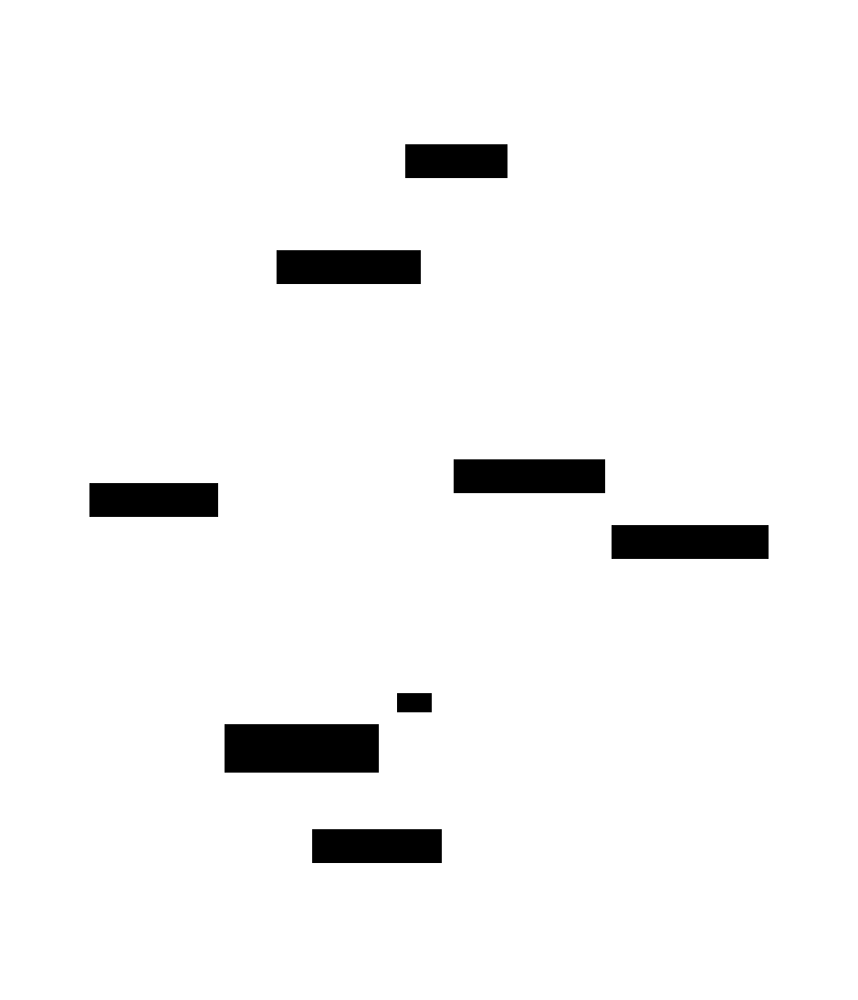
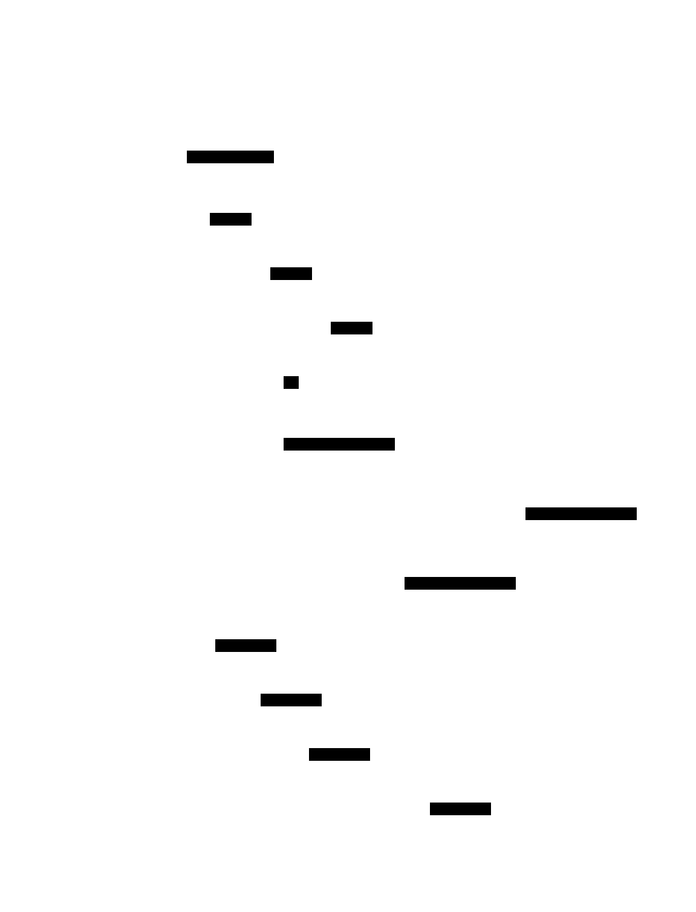
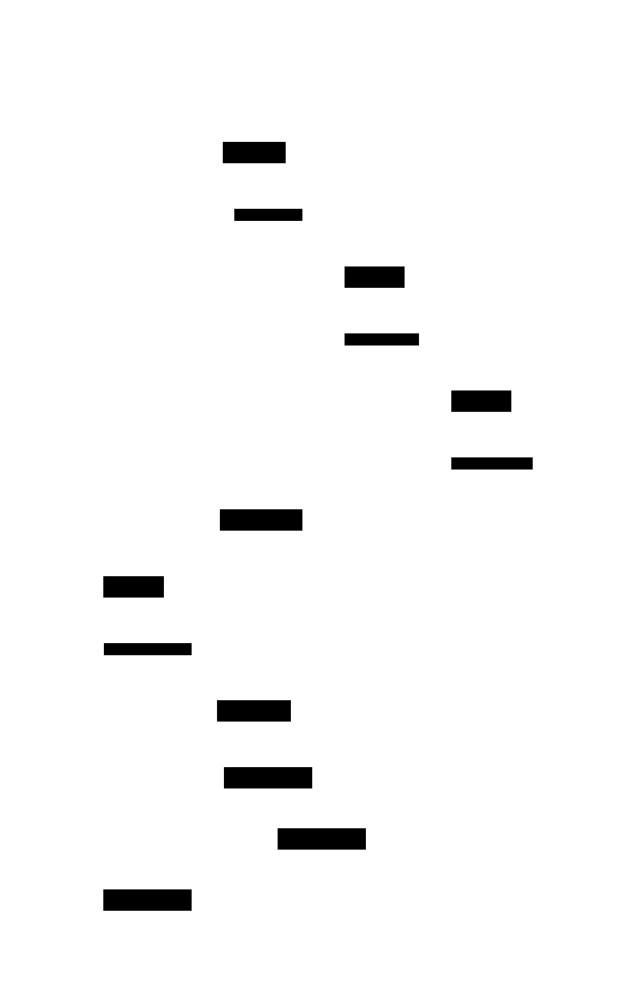

# Leader Election: Design Document


## Overview

This system implements distributed leader election algorithms to coordinate cluster operations and handle node failures. The key architectural challenge is ensuring exactly one leader emerges even during network partitions, concurrent elections, and cascading failures.


> This guide is meant to help you understand the big picture before diving into each milestone. Refer back to it whenever you need context on how components connect.


## Context and Problem Statement

> **Milestone(s):** Foundation for all milestones - understanding the fundamental challenges that leader election solves

### Mental Model: Parliamentary Speaker Election

Think of distributed leader election like electing a **Speaker of the House** in a parliament. In a parliament, hundreds of members need to coordinate their activities - scheduling debates, managing speaking time, maintaining order during votes. Without a clear authority figure, chaos would ensue with everyone talking at once, conflicting schedules, and no way to reach decisive outcomes.

The **Speaker** serves as the single point of coordination. They have the authority to recognize speakers, call votes, and make procedural decisions. Crucially, there can only be **one Speaker at a time** - having multiple people claiming to be Speaker would create competing orders and parliamentary deadlock.

Now imagine this parliament is spread across multiple buildings connected by an unreliable phone system. Members occasionally lose phone service, buildings get isolated due to network outages, and sometimes members simply crash (literally fall asleep at their desks). Despite these failures, the parliament must continue functioning, which means they need a **robust process for electing a new Speaker** whenever the current one becomes unavailable.

The **election process** itself faces challenges: What if multiple members simultaneously notice the Speaker is unavailable and each tries to claim the role? What if the phone system partitions the parliament into two groups, each electing their own Speaker? What if a member claims to be Speaker but then immediately becomes unreachable?

Just like parliamentary procedure has evolved formal rules for Speaker election (quorum requirements, nomination processes, voting protocols), distributed systems need **election algorithms** with precisely defined steps to ensure exactly one leader emerges even during failures and network problems.

This analogy captures the essential tension: we need strong coordination (single leader) in an environment prone to communication failures and member unavailability. The algorithms we'll implement - **Bully** and **Ring** election - are like different parliamentary procedures, each with distinct approaches to achieving the same fundamental goal: establishing legitimate authority that all members recognize.

### The Distributed Coordination Problem

**Leader election** is a fundamental building block in distributed systems where multiple nodes must coordinate their actions through a single designated coordinator. The leader serves as the authoritative decision-maker for tasks like resource allocation, transaction coordination, task scheduling, and maintaining cluster-wide invariants.

The core challenge emerges from the **impossibility of instantaneous communication** in distributed environments. Unlike single-machine programs where components can share memory and communicate through direct function calls, distributed nodes communicate through unreliable networks with variable latency, message loss, and potential partitions.

#### Formal Requirements

A correct leader election algorithm must satisfy several **safety and liveness properties**:

**Safety Properties** (nothing bad happens):
- **Uniqueness**: At most one node can be the leader at any given time
- **Agreement**: All non-partitioned nodes agree on the identity of the current leader  
- **Validity**: Only live, reachable nodes can become leaders

**Liveness Properties** (something good eventually happens):
- **Termination**: Every election eventually completes with a leader chosen
- **Progress**: The system continues operating despite bounded failures
- **Availability**: A new leader is elected within bounded time after the current leader fails

#### The Failure Model

Leader election algorithms must handle multiple categories of failures simultaneously:

| Failure Type | Description | Impact on Election | Detection Method |
|--------------|-------------|-------------------|------------------|
| **Node Crash** | Process terminates or machine shuts down | Current leader becomes unavailable | Heartbeat timeout |
| **Network Partition** | Subset of nodes becomes unreachable | Split-brain risk with multiple leaders | Connectivity matrix changes |
| **Message Loss** | Individual messages dropped during transmission | Election messages don't arrive | Acknowledgment timeout |
| **Message Delay** | Messages arrive after expected timeouts | False failure detection | Adaptive timeout tuning |
| **Byzantine Faults** | Nodes send incorrect or malicious messages | Leaders may give conflicting orders | Message validation (out of scope) |

The **split-brain scenario** represents the most dangerous failure mode. When a network partition divides the cluster, each partition may independently elect its own leader. If both leaders continue operating, they can make conflicting decisions that violate system invariants. For example, two leaders might both grant exclusive access to the same resource, leading to data corruption.

> **Critical Insight**: The fundamental tension in leader election is between **availability** and **consistency**. Aggressive failure detection ensures quick leader transitions (availability) but increases the risk of false positives that trigger unnecessary elections. Conservative failure detection reduces false positives but means longer periods without leadership during actual failures.

#### State Consistency During Elections

During the **election period**, the cluster exists in a temporary state without established leadership. This creates several coordination challenges:

1. **Client Request Handling**: Should nodes accept new client requests when no leader exists? Accepting requests risks inconsistency, while rejecting requests impacts availability.

2. **Partial Election State**: Nodes may have different views of the election's progress due to message delays or losses. Some nodes might believe candidate A is winning while others support candidate B.

3. **Multiple Concurrent Elections**: Network delays might cause multiple nodes to simultaneously detect leader failure and initiate competing elections.

4. **Election Termination**: Nodes must reliably detect when an election completes and identify the winner, even if they missed some election messages.

The algorithms we implement address these challenges through different approaches to **election coordination** and **failure handling**.

### Comparison of Election Algorithms

Different leader election algorithms make distinct trade-offs between **message complexity**, **election latency**, **fault tolerance**, and **implementation complexity**. Understanding these trade-offs is crucial for selecting the appropriate algorithm for specific system requirements.

#### Algorithm Characteristics Matrix

| Algorithm | Message Complexity | Election Latency | Fault Tolerance | Network Topology | Best Use Case |
|-----------|-------------------|------------------|-----------------|------------------|---------------|
| **Bully** | O(n²) worst case | 2-3 message rounds | Handles crash failures | Fully connected | Small clusters, stable networks |
| **Ring** | O(n) messages | Full ring traversal | Handles crash + partitions | Logical ring | Moderate clusters, predictable topology |
| **Raft** (future) | O(n) messages | Majority consensus | Handles complex failures | Fully connected | Production systems, strong consistency |

> **Decision: Primary Algorithms for Implementation**
> - **Context**: Need to demonstrate different approaches to distributed election with varying complexity and failure handling
> - **Options Considered**: 
>   1. Focus only on Bully (simpler implementation, fewer concepts)
>   2. Implement Bully + Ring (contrasting approaches, broader learning)
>   3. Include Raft leader election (production-grade but much more complex)
> - **Decision**: Implement both Bully and Ring algorithms
> - **Rationale**: Bully teaches basic election concepts with straightforward message patterns, while Ring demonstrates token-passing approaches and topology management. Together they illustrate the fundamental design space without overwhelming complexity.
> - **Consequences**: Increases implementation scope but provides deeper understanding of election trade-offs. Ring algorithm requires additional topology management complexity.

#### Bully Algorithm Deep Analysis

The **Bully algorithm** follows a hierarchical approach where higher-priority nodes (typically those with larger numeric IDs) can "bully" lower-priority nodes out of leadership claims. This creates a deterministic outcome based on node priorities.

**Algorithm Mechanics:**
1. When a node detects leader failure, it initiates an election by sending `ELECTION` messages to all nodes with higher IDs
2. Any higher-ID node that receives an `ELECTION` message responds with `OK` and starts its own election
3. If a node receives any `OK` response, it abandons its election attempt
4. If no `OK` responses arrive within a timeout, the node declares itself leader and broadcasts `COORDINATOR`
5. All nodes accept the first valid `COORDINATOR` announcement

**Strengths of Bully Algorithm:**
- **Deterministic outcomes**: The highest-ID live node always becomes leader
- **Simple message patterns**: Only three message types (ELECTION, OK, COORDINATOR)  
- **Fast convergence**: Typically completes in 2-3 message rounds
- **Clear termination**: Explicit COORDINATOR broadcast signals completion

**Weaknesses of Bully Algorithm:**
- **Message overhead**: In worst case, generates O(n²) messages during election
- **Network dependency**: Requires reliable communication between all node pairs
- **Cascading elections**: High-priority node returning after failure immediately triggers new election
- **Split-brain vulnerability**: Network partitions can result in multiple leaders

#### Ring Election Deep Analysis  

The **Ring election algorithm** organizes nodes into a logical ring topology where election tokens circulate to collect information about all live nodes before selecting a leader.

**Algorithm Mechanics:**
1. Nodes are arranged in a logical ring ordered by their IDs
2. When election starts, initiating node creates a token containing its own ID
3. Token travels around the ring, with each node adding its ID to the token
4. When token returns to the initiator, it contains IDs of all live nodes
5. The node with the highest ID in the token becomes the new leader
6. A `COORDINATOR` message announces the winner to all nodes

**Strengths of Ring Algorithm:**
- **Linear message complexity**: Exactly O(n) messages per election
- **Comprehensive failure detection**: Token collection identifies all live nodes
- **Partition tolerance**: Partial rings can still elect leaders within partitions
- **Predictable message flow**: Token follows well-defined path around ring

**Weaknesses of Ring Algorithm:**
- **Higher latency**: Requires full ring traversal before decision
- **Topology maintenance**: Ring structure must be maintained as nodes join/leave
- **Single point of failure**: Token loss requires election restart
- **Ring repair complexity**: Failed nodes must be bypassed to maintain token flow

#### Election Algorithm Selection Criteria

| System Requirement | Favors Bully | Favors Ring | Rationale |
|-------------------|--------------|-------------|-----------|
| **Small cluster size (< 10 nodes)** | ✓ | | Bully's O(n²) overhead is acceptable |
| **Large cluster size (> 20 nodes)** | | ✓ | Ring's O(n) complexity scales better |
| **Frequent leader changes** | ✓ | | Bully's faster convergence reduces disruption |
| **Network partitions common** | | ✓ | Ring handles partitions more gracefully |
| **Simple implementation priority** | ✓ | | Bully has fewer moving parts |
| **Predictable message patterns** | | ✓ | Ring's structured flow aids debugging |

> **Key Design Insight**: The choice between election algorithms often comes down to whether you prioritize **speed of election** (Bully) or **predictable resource usage** (Ring). Bully optimizes for the common case of stable leadership with occasional elections, while Ring optimizes for consistent behavior even during frequent elections or network instability.

#### Election Trigger Conditions

Both algorithms must handle multiple scenarios that can trigger new leadership elections:

**Primary Triggers:**
- **Leader failure detection**: Current leader stops responding to heartbeats
- **Leader abdication**: Current leader voluntarily steps down (planned maintenance, resource constraints)
- **Network partition resolution**: Previously partitioned nodes reconnect and discover conflicting leaders
- **Higher-priority node recovery**: In Bully, a previously failed high-ID node returning online immediately triggers re-election

**Secondary Triggers:**
- **Election timeout**: Previous election failed to complete, requiring restart
- **Inconsistent leader state**: Nodes discover they have different views of current leader
- **Manual election**: Administrative command forces new leader selection

The **election trigger logic** must be carefully designed to avoid both false positives (unnecessary elections that waste resources) and false negatives (failing to detect actual leader failures). This requires tunable timeout parameters and potentially adaptive failure detection based on network conditions.

Each algorithm handles these triggers differently. Bully's aggressive approach means any trigger results in immediate election attempts by multiple nodes. Ring's structured approach typically designates specific nodes (like the failed leader's successor) to initiate elections, reducing the chaos of multiple simultaneous attempts.

### Implementation Guidance

#### Technology Recommendations

| Component | Simple Option | Advanced Option |
|-----------|---------------|-----------------|
| **Inter-node Transport** | HTTP REST + JSON (net/http) | gRPC with Protocol Buffers |
| **Node Discovery** | Static configuration file | Consul service discovery |
| **Message Serialization** | JSON with encoding/json | Protocol Buffers or MessagePack |
| **Failure Detection** | Simple TCP heartbeats | SWIM gossip protocol |
| **Logging** | Standard log package | Structured logging with logrus/zap |
| **Configuration** | Environment variables | YAML/TOML with viper |

For learning purposes, start with the simple options and upgrade to advanced options only after core functionality works correctly.

#### Recommended Project Structure

```go
leader-election/
  cmd/
    node/
      main.go                    ← Node entry point and CLI setup
  internal/
    node/
      node.go                    ← Core node identity and state management
      node_test.go
    transport/
      transport.go               ← Message passing interface definition
      http_transport.go          ← HTTP-based transport implementation
      transport_test.go
    discovery/
      discovery.go               ← Node discovery interface
      static_discovery.go        ← Configuration-based discovery
      discovery_test.go
    election/
      types.go                   ← Common election message types
      bully.go                   ← Bully algorithm implementation
      ring.go                    ← Ring algorithm implementation
      election_test.go
    detector/
      failure_detector.go        ← Heartbeat and failure detection
      detector_test.go
  pkg/
    messages/
      messages.go                ← Public message type definitions
  config/
    node1.yaml                   ← Example node configurations
    node2.yaml
  scripts/
    start_cluster.sh             ← Helper script for testing
  README.md
  go.mod
  go.sum
```

#### Core Type Definitions

```go
// NodeID represents a unique identifier for cluster nodes
type NodeID uint64

// NodeState represents the current state of a node in the election process
type NodeState int

const (
    StateFollower  NodeState = iota  // Node follows current leader
    StateCandidate                   // Node is participating in election
    StateLeader                      // Node is current cluster leader
)

// Node represents a cluster member with election capabilities
type Node struct {
    ID       NodeID
    Address  string
    State    NodeState
    // TODO: Add fields for current leader tracking, election state, etc.
}

// MessageType distinguishes different election message categories
type MessageType int

const (
    MsgElection    MessageType = iota  // Bully algorithm election message
    MsgOK                              // Bully algorithm acknowledgment
    MsgCoordinator                     // Leader announcement message
    MsgHeartbeat                       // Failure detection heartbeat
    MsgRingToken                       // Ring algorithm election token
)
```

#### Transport Layer Interface

```go
// Transport defines the interface for inter-node communication
type Transport interface {
    // SendMessage sends a message to a specific node
    SendMessage(target NodeID, msg Message) error
    
    // BroadcastMessage sends a message to all known nodes
    BroadcastMessage(msg Message) error
    
    // ReceiveMessages returns a channel for incoming messages
    ReceiveMessages() <-chan Message
    
    // RegisterNode adds a node to the known peers list
    RegisterNode(id NodeID, address string) error
    
    // Start begins listening for incoming messages
    Start() error
    
    // Stop cleanly shuts down the transport
    Stop() error
}

// Message represents any inter-node communication
type Message struct {
    Type     MessageType
    From     NodeID
    To       NodeID        // NodeID(0) for broadcast messages
    Payload  []byte        // JSON-serialized message content
}
```

#### Election Coordinator Interface

```go
// ElectionCoordinator manages the leader election process
type ElectionCoordinator interface {
    // StartElection initiates a new leader election
    StartElection() error
    
    // HandleMessage processes incoming election-related messages
    HandleMessage(msg Message) error
    
    // GetCurrentLeader returns the current leader's ID (or 0 if none)
    GetCurrentLeader() NodeID
    
    // IsLeader returns true if this node is currently the leader
    IsLeader() bool
    
    // GetState returns the current election state of this node
    GetState() NodeState
}
```

#### Starter Code: Basic HTTP Transport

This complete implementation handles the networking complexity so learners can focus on election algorithms:

```go
package transport

import (
    "bytes"
    "encoding/json"
    "fmt"
    "net/http"
    "sync"
    "time"
)

// HTTPTransport implements Transport using HTTP REST API
type HTTPTransport struct {
    nodeID   NodeID
    port     int
    peers    map[NodeID]string  // NodeID -> "host:port"
    messages chan Message
    server   *http.Server
    mu       sync.RWMutex
}

// NewHTTPTransport creates a new HTTP-based transport
func NewHTTPTransport(nodeID NodeID, port int) *HTTPTransport {
    return &HTTPTransport{
        nodeID:   nodeID,
        port:     port,
        peers:    make(map[NodeID]string),
        messages: make(chan Message, 100),
    }
}

// Start begins listening for HTTP requests
func (t *HTTPTransport) Start() error {
    mux := http.NewServeMux()
    mux.HandleFunc("/message", t.handleMessage)
    
    t.server = &http.Server{
        Addr:    fmt.Sprintf(":%d", t.port),
        Handler: mux,
    }
    
    go func() {
        if err := t.server.ListenAndServe(); err != http.ErrServerClosed {
            // Log error in production code
        }
    }()
    
    return nil
}

// SendMessage sends an HTTP POST to the target node
func (t *HTTPTransport) SendMessage(target NodeID, msg Message) error {
    t.mu.RLock()
    address, exists := t.peers[target]
    t.mu.RUnlock()
    
    if !exists {
        return fmt.Errorf("unknown target node %d", target)
    }
    
    payload, err := json.Marshal(msg)
    if err != nil {
        return err
    }
    
    url := fmt.Sprintf("http://%s/message", address)
    resp, err := http.Post(url, "application/json", bytes.NewReader(payload))
    if err != nil {
        return err
    }
    resp.Body.Close()
    
    return nil
}

// ReceiveMessages returns the channel for incoming messages
func (t *HTTPTransport) ReceiveMessages() <-chan Message {
    return t.messages
}

// handleMessage processes incoming HTTP requests
func (t *HTTPTransport) handleMessage(w http.ResponseWriter, r *http.Request) {
    var msg Message
    if err := json.NewDecoder(r.Body).Decode(&msg); err != nil {
        http.Error(w, "Invalid JSON", http.StatusBadRequest)
        return
    }
    
    select {
    case t.messages <- msg:
        w.WriteHeader(http.StatusOK)
    default:
        http.Error(w, "Message queue full", http.StatusServiceUnavailable)
    }
}

// Additional methods: BroadcastMessage, RegisterNode, Stop...
```

#### Core Algorithm Skeletons

The learner implements these election algorithms by filling in the TODO comments:

```go
// BullyElection implements the bully algorithm for leader election
type BullyElection struct {
    nodeID      NodeID
    transport   Transport
    peers       []NodeID  // All known node IDs
    currentTerm uint64    // Election term for ordering
    state       NodeState
    leader      NodeID
    
    electionTimeout time.Duration
    // TODO: Add fields for tracking ongoing elections, timers, etc.
}

// StartElection initiates a bully algorithm election
func (b *BullyElection) StartElection() error {
    // TODO 1: Set state to StateCandidate and increment election term
    // TODO 2: Find all peer nodes with higher IDs than this node
    // TODO 3: Send ELECTION messages to all higher-ID nodes
    // TODO 4: Start election timeout timer
    // TODO 5: If no higher-ID nodes exist, immediately declare victory
    // Hint: Use b.findHigherIDNodes() to get candidates to message
    return nil
}

// HandleElectionMessage processes incoming ELECTION messages
func (b *BullyElection) handleElectionMessage(from NodeID, term uint64) error {
    // TODO 1: Check if sender has lower ID than this node
    // TODO 2: If so, send OK response to reject their election attempt
    // TODO 3: Start our own election since we have higher priority
    // TODO 4: Update our term if sender's term is higher
    // Hint: Higher ID nodes should always challenge lower ID election attempts
    return nil
}

// HandleOKMessage processes OK responses from higher-priority nodes
func (b *BullyElection) handleOKMessage(from NodeID) error {
    // TODO 1: Cancel our current election attempt
    // TODO 2: Set state back to StateFollower  
    // TODO 3: Clear any election timers
    // TODO 4: Wait for COORDINATOR message from the winning node
    // Hint: Receiving OK means a higher-priority node will handle leadership
    return nil
}

// HandleCoordinatorMessage processes leader announcements
func (b *BullyElection) handleCoordinatorMessage(from NodeID, term uint64) error {
    // TODO 1: Validate that sender has authority to be leader
    // TODO 2: Update our leader field and current term
    // TODO 3: Set state to StateFollower
    // TODO 4: Cancel any ongoing election activities
    // Hint: Accept coordinator messages from higher-ID nodes
    return nil
}

// declareVictory announces this node as the new leader
func (b *BullyElection) declareVictory() error {
    // TODO 1: Set state to StateLeader
    // TODO 2: Set leader field to our own node ID
    // TODO 3: Broadcast COORDINATOR message to all peers
    // TODO 4: Start leader heartbeat process
    // Hint: Only call this after election timeout with no OK responses
    return nil
}
```

#### Ring Election Implementation Skeleton

```go
// RingElection implements ring-based leader election
type RingElection struct {
    nodeID    NodeID
    transport Transport
    ring      []NodeID  // Nodes arranged in ring order
    position  int       // Our position in the ring
    state     NodeState
    leader    NodeID
    
    // TODO: Add fields for token tracking, ring maintenance
}

// StartElection begins ring election by creating initial token
func (r *RingElection) StartElection() error {
    // TODO 1: Create election token containing our node ID
    // TODO 2: Set state to StateCandidate
    // TODO 3: Send token to next live node in ring
    // TODO 4: Start token timeout in case token gets lost
    // Hint: Use r.findNextLiveNode() to locate token destination
    return nil
}

// HandleRingToken processes election tokens circulating around ring
func (r *RingElection) handleRingToken(token RingToken) error {
    // TODO 1: Check if this token originated from us (election complete)
    // TODO 2: If complete, find highest ID in token and declare winner
    // TODO 3: Otherwise, add our ID to token and forward to next node
    // TODO 4: Handle case where next node is unreachable (ring repair)
    // Hint: Token completion means we've collected all live node IDs
    return nil
}

// findNextLiveNode locates the next reachable node in ring order
func (r *RingElection) findNextLiveNode(startPos int) (NodeID, error) {
    // TODO 1: Start from position after startPos in ring
    // TODO 2: Test connectivity to each node in ring order
    // TODO 3: Return first reachable node ID
    // TODO 4: Handle case where no nodes are reachable
    // Hint: Use ping messages or transport.SendMessage to test connectivity
    return 0, nil
}
```

#### Milestone Validation Checkpoints

**Milestone 1 Checkpoint - Node Communication:**
```bash
# Terminal 1: Start first node
go run cmd/node/main.go --id=1 --port=8001 --config=config/node1.yaml

# Terminal 2: Start second node  
go run cmd/node/main.go --id=2 --port=8002 --config=config/node2.yaml

# Expected behavior:
# - Nodes discover each other through configuration
# - Heartbeat messages appear in logs every 5 seconds
# - Kill one node, other detects failure within 15 seconds
# - Restart killed node, it rejoins cluster automatically
```

**Milestone 2 Checkpoint - Bully Algorithm:**
```bash
# Start 3 nodes with IDs 1, 2, 3
# Kill node 3 (highest ID, should be initial leader)
# Verify node 2 becomes new leader via election messages
# Restart node 3, verify it reclaims leadership immediately
```

**Milestone 3 Checkpoint - Ring Algorithm:**
```bash
# Configure nodes in ring order: 1 → 3 → 5 → 7 → 1  
# Kill current leader, verify ring token circulates
# Check logs show token visiting each live node exactly once
# Verify highest-ID node from token becomes new leader
```

#### Common Implementation Pitfalls

⚠️ **Pitfall: Race Conditions in State Updates**
Multiple goroutines may simultaneously update node state during elections. Always protect shared state with mutexes:
```go
func (b *BullyElection) setState(newState NodeState) {
    b.mu.Lock()
    defer b.mu.Unlock()
    b.state = newState
}
```

⚠️ **Pitfall: Infinite Election Loops**
If election timeouts are too short, nodes may repeatedly trigger elections before previous ones complete. Use exponential backoff for election retry delays.

⚠️ **Pitfall: Ignoring Message Ordering**
Network messages can arrive out of order. Always include term/sequence numbers in messages to handle delayed messages correctly.

⚠️ **Pitfall: Split-Brain During Partitions**
Both partitions may elect leaders simultaneously. Implement quorum requirements (majority of nodes must participate) to prevent split-brain scenarios.

⚠️ **Pitfall: Resource Leaks in Transport Layer**
HTTP connections and goroutines can leak if not properly cleaned up. Always implement graceful shutdown with context cancellation and connection pooling.


## Goals and Non-Goals

> **Milestone(s):** Foundation for Milestones 1, 2, and 3 - defining the exact scope and boundaries of what this leader election system will achieve

Before diving into implementation details, we need to clearly define what this leader election system will and will not accomplish. Think of this as drawing the boundaries of a construction project - we need to know exactly what we're building, what quality standards it must meet, and what features we're explicitly choosing not to include. This clarity prevents scope creep and ensures we build a focused, working system rather than an overly ambitious prototype that never quite works properly.

The leader election system sits at the heart of distributed coordination. Without clear goals, it's easy to either under-engineer (creating a system that works in happy-path scenarios but fails under real-world stress) or over-engineer (building enterprise-grade features when learning the fundamentals is the primary objective). This section establishes those boundaries explicitly.

### Functional Requirements

The functional requirements define the core behaviors that our leader election system must exhibit to be considered correct and complete. These are not performance goals or quality attributes - they are the fundamental "what must this system do" requirements that determine whether the implementation succeeds or fails.

#### Core Election Behaviors

The system must guarantee that exactly one leader exists in the cluster at any given time, except during brief transition periods when an election is actively in progress. This is the fundamental safety property of leader election. During normal operation, every node in the cluster must agree on who the current leader is. When the leader fails or becomes unreachable, the system must detect this condition and initiate a new election automatically.

For the bully algorithm implementation, the system must ensure that the node with the highest `NodeID` among all currently responding nodes always wins the election. This is deterministic - given the same set of live nodes, the bully algorithm must always produce the same leader. The election process follows a specific protocol: when a node detects leader failure, it sends `MsgElection` messages only to nodes with higher IDs. If any higher-ID node responds with `MsgOK`, the initiating node must abandon its election attempt. Only when no higher-ID nodes respond within the timeout period should a node declare itself the winner and broadcast `MsgCoordinator` to announce its leadership.

For the ring election implementation, the system must arrange nodes in a logical ring topology ordered by `NodeID`. When an election begins, a `RingToken` circulates around the ring, collecting the IDs of all live nodes it encounters. The token must visit every reachable node exactly once per election cycle. When the token returns to its originator, the node with the highest collected ID becomes the new leader, and this decision must be communicated to all participating nodes.

| Requirement | Bully Algorithm | Ring Algorithm | Detection Method |
|-------------|-----------------|----------------|------------------|
| Single leader guarantee | Highest live ID wins | Highest collected ID wins | Compare `GetCurrentLeader()` across all nodes |
| Election convergence | Within 2 × timeout period | Within ring traversal time | All nodes report same leader |
| Failure detection response | Immediate election start | Token-based detection | Election triggered within heartbeat timeout |
| Split election handling | Higher ID preempts lower | Token prevents concurrent elections | No multiple `StateLeader` nodes |

#### Node Communication Requirements

The system must implement reliable point-to-point messaging where `SendMessage(target NodeID, msg Message)` delivers messages to specific nodes with confirmation of delivery or explicit failure notification. Messages should not be silently dropped - the sender must know whether the message reached its destination or failed to arrive.

Broadcast messaging via `BroadcastMessage(msg Message)` must deliver messages to all currently known live nodes in the cluster. This doesn't require atomic broadcast - it's acceptable for some nodes to receive the message slightly before others. However, the broadcast must not systematically exclude certain nodes due to implementation bugs or race conditions.

The node discovery mechanism must allow nodes to find and connect to their peers either through static configuration files or dynamic discovery methods like multicast announcements. Once discovered, nodes must maintain awareness of which peers are currently reachable and which have failed or become partitioned.

| Communication Type | Delivery Guarantee | Failure Handling | Implementation Method |
|-------------------|-------------------|------------------|----------------------|
| Point-to-point | At-least-once or confirmed failure | Return error from `SendMessage()` | TCP connections with retries |
| Broadcast | Best-effort to all live nodes | Log failures but continue | Iterate through known nodes |
| Node discovery | Eventually consistent membership | Periodic rediscovery attempts | Config file + heartbeat validation |
| Failure detection | Detect within configurable timeout | Trigger re-election automatically | Heartbeat + suspicion counters |

#### State Management and Consistency

Each node must maintain consistent state about its role in the cluster using the `NodeState` enumeration. A node begins in `StateFollower`, transitions to `StateCandidate` during election participation, and may become `StateLeader` if it wins. State transitions must be atomic and logged for debugging purposes.

The system must track cluster membership accurately. This includes maintaining a current view of which nodes are alive, which have failed, and which are suspected of having failed but haven't been definitively confirmed as down. This membership information drives both election algorithms and failure detection logic.

Leadership must be persistent once established. A newly elected leader should remain in that role until it actually fails, becomes partitioned, or voluntarily steps down. The system should not trigger unnecessary re-elections due to transient network hiccups or temporary message delays.

> **Design Principle:** The functional requirements focus on correctness over performance. A slower election that always produces the right result is vastly preferable to a fast election that occasionally produces split-brain scenarios or fails to converge on a single leader.

### Performance and Reliability Requirements

While correctness is paramount, the leader election system must also meet minimum performance and reliability standards to be useful in practice. These requirements establish the quantitative benchmarks that determine whether the system is fast enough, reliable enough, and scalable enough for its intended use cases.

#### Election Timing Requirements

Leader elections must complete within reasonable time bounds to minimize the period during which the cluster lacks coordination. For the bully algorithm, an election should converge within twice the message timeout period in the common case where network conditions are stable. This accounts for one timeout period to determine that higher-ID nodes aren't responding, plus additional time for the winner to broadcast its coordinator message.

Ring elections should complete within the time required for a token to traverse the entire logical ring once, plus a small buffer for processing delays at each node. In a healthy network with N nodes, this should be proportional to N × average_message_latency rather than scaling exponentially.

The system must detect node failures within a configurable timeout period, typically on the order of seconds rather than minutes. However, the failure detection should not be so aggressive that transient network delays trigger false positives and unnecessary elections.

| Timing Requirement | Target Value | Measurement Method | Failure Condition |
|--------------------|--------------|-------------------|-------------------|
| Bully election completion | < 2 × message timeout | Time from election start to coordinator broadcast | > 5 × message timeout |
| Ring election completion | < N × message timeout + processing buffer | Token full-circle time | Token stuck or lost |
| Failure detection latency | Configurable (default 10s) | Time from actual failure to election trigger | > 2 × configured timeout |
| Leader announcement propagation | < message timeout | Time for all nodes to learn new leader | Nodes disagree on leader after election |

#### Scalability and Resource Requirements

The system must function correctly with cluster sizes from 3 nodes (minimum for meaningful elections) up to at least 10 nodes. While enterprise systems might require hundreds of nodes, this implementation focuses on the algorithmic correctness rather than extreme scalability.

Memory usage should remain bounded and proportional to cluster size. Each node should maintain O(N) state for tracking N peer nodes, but should not accumulate unbounded state over time through memory leaks or unbounded log growth.

Network overhead should be reasonable relative to the coordination value provided. Elections are infrequent events (triggered only by actual failures), so moderate message overhead during elections is acceptable. However, steady-state heartbeat and failure detection traffic should be lightweight.

CPU usage for election algorithms should be minimal. The computational complexity of both bully and ring algorithms is low, involving simple message passing and ID comparisons rather than cryptographic operations or complex computations.

| Resource | Scaling Requirement | Measurement | Acceptable Range |
|----------|-------------------|-------------|------------------|
| Memory per node | O(N) for N cluster members | Process RSS during operation | < 50MB for 10-node cluster |
| Network messages per election | O(N) for bully, O(N) for ring | Count messages during election | Bully: < 2N², Ring: < 2N |
| Steady-state network overhead | Heartbeat traffic only | Messages per second outside elections | < 1 message/second/node |
| CPU utilization | Minimal during steady state | Process CPU during normal operation | < 1% except during elections |

#### Reliability and Fault Tolerance

The system must handle common failure scenarios gracefully without requiring manual intervention. Single node failures should trigger automatic re-election and leadership transfer without affecting the overall cluster's ability to coordinate.

Network partitions present a more complex challenge. The system should avoid split-brain scenarios where multiple nodes simultaneously believe they are the leader. While perfect partition tolerance requires sophisticated quorum mechanisms, this implementation should at least detect partition scenarios and take conservative action (such as stepping down when isolated).

Message loss and reordering should not break the election algorithms' correctness. The protocols should be designed to handle these network realities through timeouts, retries, and idempotent message handling.

The system should recover automatically when failed nodes rejoin the cluster or when network partitions heal. Rejoining nodes should be able to learn the current leader and integrate back into the cluster membership without triggering unnecessary elections.

> **Reliability Design Insight:** The goal is not to achieve perfect fault tolerance (which would require much more sophisticated protocols), but to ensure that common failures are handled gracefully and that the system fails safely when it encounters scenarios beyond its design limits.

### Out of Scope

Clearly defining what this leader election system will NOT include is just as important as defining what it will include. This prevents feature creep and keeps the implementation focused on learning the core algorithms rather than building a production-ready distributed systems framework.

#### Advanced Distributed Systems Features

This implementation explicitly excludes sophisticated consensus algorithms like Raft or Paxos. While these protocols solve leader election as part of broader consensus problems, they introduce significant complexity around log replication, term numbers, and linearizability guarantees that would overshadow the basic election algorithm learning objectives.

Byzantine fault tolerance is completely out of scope. The system assumes that nodes may crash or become unreachable, but it does not protect against malicious nodes that lie about their identity, forge messages, or intentionally disrupt elections. All nodes are assumed to follow the protocol honestly when they are operational.

Multi-datacenter deployments and wide-area network considerations are not addressed. The system assumes all nodes can communicate directly with reasonable latency and that network partitions are binary (nodes are either reachable or completely unreachable).

Dynamic membership changes during elections are not supported. While nodes can join or leave the cluster, the system does not handle scenarios like nodes joining in the middle of an active election or graceful leadership handoff when a leader voluntarily steps down.

| Excluded Feature | Reason for Exclusion | Alternative Learning Path |
|------------------|---------------------|--------------------------|
| Raft/Paxos consensus | Too complex for basic election learning | Separate project after mastering basic algorithms |
| Byzantine fault tolerance | Requires cryptographic verification | Advanced distributed systems course |
| Multi-datacenter support | Network topology complications | Study CAP theorem and partition tolerance |
| Dynamic membership during elections | Race conditions add algorithmic complexity | Focus on static membership first |

#### Production-Ready Operations Features

The system does not include comprehensive logging, metrics, or observability features beyond basic debugging information. While production systems require detailed telemetry, this implementation focuses on algorithmic correctness rather than operational visibility.

Configuration management is minimal. The system may use simple configuration files or hard-coded parameters rather than sophisticated configuration systems with validation, hot reloading, or environment-specific overrides.

Security features like authentication, authorization, or encrypted communication are completely excluded. Messages are sent in plaintext, and any node that can reach the cluster can participate in elections. This is obviously unsuitable for production but acceptable for learning algorithm fundamentals.

Performance optimization beyond basic algorithmic efficiency is not included. The implementation prioritizes code clarity and correctness over micro-optimizations, advanced data structures, or high-performance networking libraries.

Integration with external systems (service discovery, load balancers, monitoring systems) is out of scope. The leader election system operates as a standalone learning environment rather than a component in a broader infrastructure ecosystem.

> **Scope Decision:** By explicitly excluding production-ready features, we can focus entirely on understanding how leader election algorithms work, what can go wrong, and how to implement them correctly. These operational concerns can be layered on top after the core algorithms are solid.

#### Advanced Election Features

Weighted voting where some nodes have more influence in elections is not supported. All nodes with valid `NodeID` values have equal say in determining the leader, regardless of their hardware capabilities, network position, or assigned roles.

Leader leases or term limits are not implemented. Once elected, a leader remains in power until it actually fails or becomes unreachable. There are no mechanisms for periodic re-election or automatic leadership rotation.

Hierarchical elections or multi-level leadership structures are excluded. The system elects a single flat leader rather than supporting regional leaders, backup leaders, or leadership hierarchies.

Custom election criteria beyond highest `NodeID` are not supported. Some production systems might elect leaders based on load, capability, geographic location, or other factors, but this implementation uses only numeric ID comparison for simplicity and determinism.

| Advanced Feature | Complexity Added | Learning Value |
|------------------|------------------|----------------|
| Weighted voting | Vote counting algorithms, configuration management | Low - obscures basic algorithm |
| Leader leases/terms | Time synchronization, lease renewal protocols | Medium - useful but complicates learning |
| Hierarchical leadership | Multi-level coordination, cascading failures | High - but better as separate project |
| Custom election criteria | Pluggable decision logic, complex comparison | Low - ID-based is sufficient for learning |

### Implementation Guidance

This section provides concrete technical recommendations for implementing the goals and requirements defined above. The focus is on practical choices that support the learning objectives while keeping implementation complexity manageable.

#### Technology Recommendations

| Component | Simple Option | Advanced Option |
|-----------|---------------|-----------------|
| Inter-node transport | HTTP REST with JSON (net/http) | gRPC with Protocol Buffers |
| Configuration | JSON config file (encoding/json) | YAML with validation (gopkg.in/yaml.v3) |
| Logging | Standard library (log) | Structured logging (logrus, zap) |
| Testing | Built-in testing (testing) | Testify framework (github.com/stretchr/testify) |
| Networking | TCP sockets (net) | UDP with reliability layer |
| State storage | In-memory maps | Persistent storage (BoltDB) |

For learning purposes, start with the simple options. They require less setup and have fewer dependencies, letting you focus on the election algorithms rather than infrastructure concerns.

#### Recommended File Structure

```
leader-election/
├── cmd/
│   └── node/
│       └── main.go                    # Node startup and CLI
├── internal/
│   ├── node/
│   │   ├── node.go                    # Node struct and basic lifecycle
│   │   ├── state.go                   # NodeState management
│   │   └── node_test.go               # Node behavior tests
│   ├── transport/
│   │   ├── transport.go               # Transport interface
│   │   ├── http_transport.go          # HTTPTransport implementation
│   │   └── transport_test.go          # Transport layer tests
│   ├── election/
│   │   ├── coordinator.go             # ElectionCoordinator interface
│   │   ├── bully.go                   # BullyElection implementation
│   │   ├── ring.go                    # RingElection implementation
│   │   └── election_test.go           # Election algorithm tests
│   └── discovery/
│       ├── discovery.go               # Node discovery and membership
│       └── discovery_test.go          # Discovery mechanism tests
├── configs/
│   └── cluster.json                   # Node configuration
└── README.md                          # Setup and running instructions
```

#### Core Data Structures

```go
// NodeID represents a unique node identifier for election comparison
type NodeID uint64

// NodeState represents the current role of a node in the election process
type NodeState int

const (
    StateFollower  NodeState = iota  // Following current leader
    StateCandidate                   // Participating in election
    StateLeader                      // Serving as cluster leader
)

// Node represents a cluster member with identity and network information
type Node struct {
    ID      NodeID `json:"id"`       // Unique identifier for elections
    Address string `json:"address"`  // Network address (host:port)
    State   NodeState `json:"state"` // Current election state
}

// MessageType identifies the purpose of election messages
type MessageType int

const (
    MsgElection     MessageType = iota  // Bully algorithm election start
    MsgOK                              // Bully algorithm acknowledgment
    MsgCoordinator                     // Leader announcement
    MsgHeartbeat                       // Failure detection ping
    MsgRingToken                       // Ring election token
)

// Message represents inter-node communication for election protocols
type Message struct {
    Type    MessageType `json:"type"`    // Message purpose
    From    NodeID      `json:"from"`    // Sender node ID
    To      NodeID      `json:"to"`      // Target node ID (0 for broadcast)
    Payload []byte      `json:"payload"` // Algorithm-specific data
}
```

#### Transport Layer Foundation

```go
// Transport defines the interface for inter-node communication
type Transport interface {
    // SendMessage delivers a message to a specific node
    SendMessage(target NodeID, msg Message) error
    
    // BroadcastMessage sends a message to all known live nodes
    BroadcastMessage(msg Message) error
    
    // ReceiveMessages returns a channel of incoming messages
    ReceiveMessages() <-chan Message
    
    // Start begins listening for incoming messages
    Start(address string) error
    
    // Stop shuts down the transport layer
    Stop() error
}

// HTTPTransport implements Transport using HTTP REST calls
type HTTPTransport struct {
    nodeID    NodeID
    server    *http.Server
    peers     map[NodeID]string  // NodeID -> address mapping
    messages  chan Message       // Incoming message buffer
    // TODO: Add mutex for thread safety
    // TODO: Add HTTP client for outgoing messages
    // TODO: Add graceful shutdown handling
}

// Implement SendMessage for HTTP transport
func (t *HTTPTransport) SendMessage(target NodeID, msg Message) error {
    // TODO 1: Look up target address in peers map
    // TODO 2: Serialize message to JSON
    // TODO 3: POST to http://target-address/messages endpoint
    // TODO 4: Return error if HTTP request fails
    // TODO 5: Consider adding retry logic for transient failures
}
```

#### Election Coordinator Interface

```go
// ElectionCoordinator manages the leader election process for a node
type ElectionCoordinator interface {
    // StartElection initiates a new leader election
    StartElection() error
    
    // HandleMessage processes incoming election-related messages
    HandleMessage(msg Message) error
    
    // GetCurrentLeader returns the ID of the current leader (0 if none)
    GetCurrentLeader() NodeID
    
    // IsLeader returns true if this node is currently the leader
    IsLeader() bool
    
    // SetTransport configures the communication layer
    SetTransport(transport Transport) error
}

// BullyElection implements leader election using the bully algorithm
type BullyElection struct {
    nodeID      NodeID
    transport   Transport
    currentLeader NodeID
    state       NodeState
    peers       []NodeID           // Known peer node IDs
    electionTimeout time.Duration  // How long to wait for responses
    // TODO: Add election timer
    // TODO: Add mutex for concurrent access
    // TODO: Add heartbeat tracking
}

// StartElection initiates bully algorithm election
func (b *BullyElection) StartElection() error {
    // TODO 1: Set state to StateCandidate
    // TODO 2: Find all peer nodes with higher IDs than this node
    // TODO 3: Send MsgElection to all higher-ID nodes
    // TODO 4: Start election timeout timer
    // TODO 5: If timeout expires with no MsgOK responses, declare victory
    // TODO 6: If victory, set state to StateLeader and broadcast MsgCoordinator
}
```

#### Milestone Validation Checkpoints

**Milestone 1 Validation (Node Communication):**
1. Start 3 nodes with different IDs in separate terminals
2. Check that each node discovers the other two via membership mechanism
3. Send test messages between nodes - verify they arrive correctly
4. Kill one node - verify others detect failure within timeout period
5. Expected output: Logs showing "Node X discovered", "Message from Y received", "Node Z failed"

**Milestone 2 Validation (Bully Algorithm):**
1. Start cluster of 5 nodes with IDs 1, 2, 3, 4, 5
2. Verify node 5 becomes initial leader
3. Kill node 5 - verify node 4 takes over leadership
4. Kill node 4 - verify node 3 becomes leader
5. Restart node 5 - verify it reclaims leadership
6. Expected behavior: Always the highest-ID live node is leader

**Milestone 3 Validation (Ring Election):**
1. Configure nodes in ring topology: 1→3→5→7→1
2. Trigger election from node 3
3. Trace token passing: 3→5→7→1→3
4. Verify node 7 (highest collected ID) becomes leader
5. Test with failed node in ring - verify ring repair
6. Expected output: Token trace logs showing ID collection at each hop

#### Common Implementation Pitfalls

⚠️ **Pitfall: Forgetting Message Serialization**
Don't assume you can send Go structs directly over the network. HTTP transport requires JSON serialization of the `Message` struct and its payload. Always test with `json.Marshal()` and `json.Unmarshal()` to catch serialization issues early.

⚠️ **Pitfall: Race Conditions in State Updates**
Multiple goroutines will access `NodeState` and leader information concurrently (message handlers, timers, API calls). Always protect shared state with mutexes or channels. A common bug is checking state in one line and using it in the next, with state changing between the two operations.

⚠️ **Pitfall: Election Timeout Too Short**
Don't set election timeouts to milliseconds in initial testing. Network latency, especially on localhost, can be variable. Start with 5-10 second timeouts, then optimize downward once the algorithm works correctly.

⚠️ **Pitfall: Infinite Election Loops**
If two nodes simultaneously detect leader failure and start elections, they can end up in infinite loops of starting new elections. The bully algorithm handles this by having lower-ID nodes defer to higher-ID nodes, but you must implement the `MsgOK` response handling correctly.

⚠️ **Pitfall: Forgetting Edge Cases in Ring**
Ring election token can get stuck if the next node in the ring fails while the token is in transit. Always implement a token timeout - if the originating node doesn't get its token back within a reasonable time, assume it was lost and start a new election.


## High-Level Architecture

> **Milestone(s):** Foundation for all milestones - provides the structural blueprint for implementing node communication (Milestone 1), bully election (Milestone 2), and ring election (Milestone 3)

Before diving into the specifics of election algorithms, we need to establish the foundational architecture that will support both bully and ring election protocols. This section outlines the major components, their relationships, and how they work together to provide reliable distributed leader election.

### Mental Model: Orchestra Conductor Selection

Think of leader election like selecting a conductor for an orchestra. Each musician (node) has a unique chair number (NodeID), and they all need to agree on who leads. The orchestra needs several key capabilities:

- **Communication system**: Musicians can pass notes to specific colleagues or make announcements to everyone
- **Failure detection**: Musicians notice when the conductor stops conducting or when fellow musicians miss their cues  
- **Election protocols**: Structured procedures for selecting a new conductor when the current one fails
- **Coordination**: Once elected, the conductor coordinates the entire performance

Just as an orchestra needs these systems working together seamlessly, our leader election system requires coordinated components that handle communication, failure detection, and election logic as an integrated whole.


### System Components

The leader election system is built around four core components that work together to provide reliable distributed coordination. Each component has clearly defined responsibilities and interfaces with the others through well-structured APIs.

#### Node Manager

The **Node Manager** serves as the central control component for each node in the cluster. It maintains the node's identity, current state, and coordinates all election-related activities. Think of it as the node's "brain" that makes high-level decisions about when to start elections, how to respond to messages, and what role the node should play.

| Responsibility | Description | Key Data Managed |
|---|---|---|
| Node Identity Management | Maintains unique NodeID and network address | NodeID, IP address, port |
| State Management | Tracks current node state (Follower/Candidate/Leader) | NodeState, election term |
| Election Coordination | Decides when to start elections and handles outcomes | Current leader ID, election status |
| Component Integration | Orchestrates message layer, failure detector, and election algorithms | Component references and configurations |

The Node Manager implements a state machine that transitions between `StateFollower`, `StateCandidate`, and `StateLeader` based on election events and failure detection. It serves as the single source of truth for the node's current role in the cluster.

#### Message Layer (Transport)

The **Message Layer** provides reliable communication between nodes in the cluster. It abstracts the underlying network protocol (HTTP, TCP, UDP) and provides both point-to-point and broadcast messaging capabilities. This layer handles message serialization, delivery confirmation, and network error recovery.

| Method Name | Parameters | Returns | Description |
|---|---|---|---|
| `SendMessage` | `target NodeID, msg Message` | `error` | Sends message to specific node with delivery confirmation |
| `BroadcastMessage` | `msg Message` | `error` | Sends message to all known live nodes in cluster |
| `ReceiveMessages` | None | `<-chan Message` | Returns channel for incoming messages from other nodes |
| `UpdateMembership` | `nodes []Node` | `error` | Updates the set of known cluster nodes for routing |

The transport layer maintains a routing table of all known nodes and their network addresses. It implements retry logic for failed message deliveries and provides feedback to upper layers about communication failures that may indicate node crashes.

#### Election Coordinator

The **Election Coordinator** implements the specific election algorithms (bully and ring). It's designed as a pluggable interface so different election strategies can be used interchangeably. The coordinator handles the detailed protocol logic for each algorithm while relying on the message layer for communication.

| Method Name | Parameters | Returns | Description |
|---|---|---|---|
| `StartElection` | None | `error` | Initiates new election using this algorithm |
| `HandleMessage` | `msg Message` | `error` | Processes incoming election-specific messages |
| `GetCurrentLeader` | None | `NodeID` | Returns the currently elected leader's ID |
| `IsLeader` | None | `bool` | Checks if this node is currently the leader |

Two concrete implementations provide the core election algorithms:

- **BullyElection**: Implements the bully algorithm where the highest-ID responding node becomes leader
- **RingElection**: Implements ring-based election using token passing to collect live node IDs

#### Failure Detector

The **Failure Detector** monitors cluster health and identifies node failures or network partitions. It uses heartbeat messages and timeout-based detection to determine when nodes become unreachable. This component triggers leader re-election when the current leader fails.

| Detection Method | Mechanism | Timeout Configuration | Action Taken |
|---|---|---|---|
| Heartbeat Monitoring | Periodic `MsgHeartbeat` messages | Configurable interval (default 1s) | Mark nodes as suspected, then failed |
| Leader Liveness | Monitor heartbeats from current leader | Leader timeout (default 5s) | Trigger new election |
| Network Partition | Track communication failures across nodes | Partition timeout (default 10s) | Enter partition recovery mode |
| Node Recovery | Detect previously failed nodes rejoining | Recovery grace period (default 3s) | Update membership and potentially re-elect |

> **Architecture Decision: Component Separation**
> - **Context**: Need to support multiple election algorithms while maintaining clean interfaces
> - **Options Considered**:
>   1. Monolithic design with all logic in one component
>   2. Pluggable election algorithms with shared infrastructure 
>   3. Completely separate implementations for each algorithm
> - **Decision**: Pluggable election coordinators with shared message layer and failure detection
> - **Rationale**: Enables algorithm comparison, testing flexibility, and code reuse while maintaining clear separation of concerns
> - **Consequences**: Slightly more complex interfaces but much better maintainability and extensibility

### Inter-Node Communication

Nodes discover each other and communicate through a layered approach that handles both cluster membership management and reliable message delivery. The communication system must work correctly even during network partitions and node failures.

#### Node Discovery and Membership

Cluster membership is managed through a combination of static configuration and dynamic discovery. Each node maintains a membership list that tracks all known cluster participants and their current status.

**Static Configuration Approach**: For initial development and testing, nodes are configured with a static list of cluster members including their NodeIDs and network addresses. This approach ensures deterministic behavior and simplifies debugging during development.

| Configuration Field | Type | Example Value | Purpose |
|---|---|---|---|
| `cluster_nodes` | `[]NodeConfig` | `[{id: 1, addr: "10.0.1.1:8080"}, ...]` | List of all cluster participants |
| `local_node_id` | `NodeID` | `3` | This node's unique identifier |
| `local_bind_addr` | `string` | `"0.0.0.0:8080"` | Address to bind for incoming connections |
| `heartbeat_interval` | `time.Duration` | `1s` | Frequency of heartbeat messages |

**Dynamic Discovery Extension**: For production deployments, the system can be extended with multicast announcement or service discovery integration. Nodes periodically announce their presence and discover new cluster members automatically.

#### Message Routing and Delivery

The message layer implements reliable delivery semantics for election coordination. Different message types have different delivery requirements based on their role in the election protocols.

| Message Category | Delivery Guarantee | Retry Policy | Timeout Behavior |
|---|---|---|---|
| Election Messages (`MsgElection`, `MsgOK`) | At-least-once with deduplication | 3 retries with exponential backoff | Treat as node failure after timeout |
| Coordinator Announcements (`MsgCoordinator`) | Best-effort broadcast | Single attempt to all nodes | Continue with partial delivery |
| Heartbeats (`MsgHeartbeat`) | Best-effort | No retries | Missing heartbeats indicate failure |
| Ring Tokens (`MsgRingToken`) | Exactly-once with ordering | Forward to next live node | Skip failed nodes and continue ring |

The transport layer maintains connection state for each cluster member and implements adaptive timeout policies. Connections that consistently fail are marked as suspected, and repeated failures trigger failure detection callbacks.

#### Network Partition Handling

Network partitions pose a fundamental challenge for distributed leader election because different network segments may simultaneously elect different leaders (split-brain scenario). Our architecture includes several mechanisms to detect and handle partitions safely.

**Partition Detection**: The failure detector monitors communication patterns across the cluster to identify potential network partitions. When a node can communicate with some cluster members but not others, it may be experiencing a partition.

| Partition Indicator | Detection Logic | Response Strategy |
|---|---|---|---|
| Asymmetric Failures | Node A can reach B but not C, while B can reach both A and C | Wait for partition recovery before participating in elections |
| Majority Loss | Node can only communicate with less than half of configured cluster | Enter read-only mode, do not start new elections |
| Leader Isolation | Current leader becomes unreachable but other nodes remain connected | Remaining nodes elect new leader after timeout |
| Complete Isolation | Node cannot reach any other cluster members | Assume network failure, do not claim leadership |

> **Design Insight: Conservative Partition Handling**
> Our approach prioritizes safety over availability during network partitions. It's better to have no leader temporarily than to have multiple conflicting leaders. This aligns with the CAP theorem trade-off where we choose consistency over availability during partition events.

**Quorum Requirements**: To prevent split-brain scenarios, certain operations require a quorum (majority) of nodes to be reachable. Leader election succeeds only when the electing partition contains more than half of the configured cluster nodes.

#### Message Serialization and Protocol

All inter-node communication uses a structured message format that supports multiple election algorithms while maintaining backwards compatibility for future extensions.

The base `Message` structure provides routing and metadata:

| Field Name | Type | Description | Example Value |
|---|---|---|---|
| `Type` | `MessageType` | Identifies the message category and expected payload format | `MsgElection` |
| `From` | `NodeID` | Source node identifier for routing and authentication | `3` |
| `To` | `NodeID` | Target node identifier (0 for broadcast messages) | `5` |
| `Term` | `uint64` | Election term number for ordering and duplicate detection | `42` |
| `Payload` | `[]byte` | Algorithm-specific message content (JSON-encoded) | `{"candidates": [3,4,5]}` |
| `Timestamp` | `int64` | Message creation time for timeout and ordering | Unix timestamp |

Each election algorithm defines its own payload structures that get serialized into the `Payload` field. This allows the transport layer to route messages without understanding algorithm-specific details.

> **Architecture Decision: JSON Message Serialization**
> - **Context**: Need to serialize complex message payloads for network transmission
> - **Options Considered**:
>   1. JSON for human readability and debugging ease
>   2. Protocol Buffers for performance and schema evolution
>   3. Custom binary format for minimal overhead
> - **Decision**: JSON for initial implementation
> - **Rationale**: Prioritizes development speed and debugging over performance. Network traffic volume is low for election protocols
> - **Consequences**: Slightly higher bandwidth usage but much easier debugging and development

### Recommended Project Organization

The project structure reflects the component architecture while maintaining clear separation between core election logic, infrastructure concerns, and algorithm implementations. This organization supports both development workflow and testing isolation.

#### Directory Structure

```
leader-election/
├── cmd/
│   └── election-node/          # Main executable for running election nodes
│       └── main.go             # Entry point, configuration, and startup logic
├── internal/                   # Private application code (not importable by other projects)
│   ├── node/                   # Node Manager - central coordination
│   │   ├── manager.go          # Node state management and lifecycle
│   │   ├── state_machine.go    # State transitions (Follower/Candidate/Leader)
│   │   └── manager_test.go     # Unit tests for node management logic
│   ├── transport/              # Message Layer - inter-node communication
│   │   ├── transport.go        # Transport interface definition
│   │   ├── http_transport.go   # HTTP-based transport implementation
│   │   ├── message.go          # Message types and serialization
│   │   └── transport_test.go   # Transport layer unit tests
│   ├── election/               # Election Coordinators - algorithm implementations
│   │   ├── coordinator.go      # ElectionCoordinator interface
│   │   ├── bully.go           # Bully algorithm implementation
│   │   ├── ring.go            # Ring election implementation
│   │   └── election_test.go    # Algorithm-specific unit tests
│   ├── detector/               # Failure Detector - health monitoring
│   │   ├── failure_detector.go # Failure detection logic and heartbeats
│   │   ├── membership.go       # Cluster membership tracking
│   │   └── detector_test.go    # Failure detection unit tests
│   └── config/                 # Configuration management
│       ├── config.go           # Configuration structure and validation
│       └── defaults.go         # Default values and constants
├── pkg/                        # Public library code (importable by other projects)
│   └── types/                  # Shared type definitions
│       ├── node.go             # NodeID, NodeState, Node structs
│       ├── message.go          # MessageType constants and Message struct
│       └── errors.go           # Election-specific error types
├── test/                       # Integration and end-to-end tests
│   ├── integration/            # Multi-node test scenarios
│   │   ├── bully_test.go       # Full bully election integration tests
│   │   ├── ring_test.go        # Full ring election integration tests
│   │   └── partition_test.go   # Network partition simulation tests
│   └── testutil/               # Testing utilities and helpers
│       ├── cluster.go          # Test cluster setup and management
│       └── network.go          # Network failure simulation tools
├── scripts/                    # Build and deployment scripts
│   ├── run-cluster.sh          # Start test cluster with multiple nodes
│   └── simulate-failure.sh     # Network failure simulation script
├── docs/                       # Documentation
│   └── diagrams/               # Architecture and sequence diagrams
└── go.mod                      # Go module definition
```

#### Module Responsibilities and Dependencies

Each module has clearly defined responsibilities and dependency relationships that enforce proper layering and prevent circular dependencies.

| Module | Primary Responsibility | Dependencies | Exports |
|---|---|---|---|
| `pkg/types` | Shared type definitions and constants | None (foundational) | NodeID, NodeState, MessageType, Message, Node |
| `internal/config` | Configuration parsing and validation | `pkg/types` | Config struct, default values |
| `internal/transport` | Network communication and message routing | `pkg/types` | Transport interface, HTTPTransport implementation |
| `internal/detector` | Failure detection and membership management | `pkg/types`, `internal/transport` | FailureDetector, membership tracking |
| `internal/election` | Election algorithm implementations | `pkg/types`, `internal/transport` | ElectionCoordinator, BullyElection, RingElection |
| `internal/node` | Node lifecycle and state management | All internal modules | NodeManager, orchestration logic |
| `cmd/election-node` | Application entry point and CLI | All modules | Executable binary |

This dependency structure ensures that:
- Core types are defined once and shared across all modules
- Transport layer can be tested independently of election algorithms  
- Election algorithms can be developed and tested in isolation
- The node manager orchestrates all components without tight coupling

#### Interface Boundaries and Testing Strategy

The modular architecture enables comprehensive testing at multiple levels by providing clear interface boundaries for mocking and test doubles.

**Unit Testing Strategy**: Each module includes comprehensive unit tests that mock dependencies through interfaces. For example, election algorithm tests use a mock transport layer to simulate network conditions without requiring actual network communication.

**Integration Testing Strategy**: The `test/integration` package runs full multi-node scenarios using the actual implementations. These tests validate that components work correctly together and handle real network timing and failure conditions.

**Testing Utilities**: The `test/testutil` package provides reusable components for setting up test clusters, simulating network failures, and validating election outcomes. This reduces test complexity and improves consistency across different test scenarios.

> **Architecture Decision: Internal vs Pkg Module Organization**
> - **Context**: Need to balance code reusability with API stability and encapsulation
> - **Options Considered**:
>   1. Everything in internal/ (no external API)
>   2. Everything in pkg/ (fully public API)
>   3. Mixed approach with stable types in pkg/, implementation in internal/
> - **Decision**: Mixed approach with minimal pkg/ surface area
> - **Rationale**: Allows type sharing for testing while keeping implementation details private. Prevents external dependencies on unstable internals
> - **Consequences**: Clear API boundary but requires discipline to keep pkg/ minimal and stable

#### Development Workflow and Build Process

The project structure supports efficient development workflows for both individual components and full system testing.

**Local Development**: Developers can work on individual algorithms or components using focused unit tests. The `go test ./internal/election/...` command runs only election algorithm tests, providing fast feedback during development.

**Integration Testing**: The `scripts/run-cluster.sh` script starts multiple node processes locally with different configurations, enabling manual testing of election scenarios. Network failures can be simulated using `scripts/simulate-failure.sh` to test partition handling.

**Debugging Support**: The modular structure enables selective logging and debugging. Each component can be configured with different log levels, and the HTTP transport provides REST endpoints for inspecting node state during development.

### Common Pitfalls

⚠️ **Pitfall: Circular Dependencies Between Components**

A common mistake is creating circular import dependencies between the node manager, election coordinator, and transport layer. This happens when components try to directly call methods on each other instead of using proper interfaces and dependency injection.

**Why it's wrong**: Circular dependencies prevent compilation and make testing extremely difficult. They also indicate poor separation of concerns where components are too tightly coupled.

**How to fix**: Always make dependencies flow in one direction. Higher-level components (like NodeManager) depend on interfaces defined by lower-level components. Use dependency injection to provide concrete implementations at startup rather than having components create their own dependencies.

⚠️ **Pitfall: Blocking Message Handlers**

Election message handlers often need to perform operations that might block (like sending messages to other nodes or updating persistent state). A common mistake is making these operations synchronous in the message handling path, which can cause deadlocks or missed messages.

**Why it's wrong**: If a message handler blocks while processing one message, it cannot process subsequent messages. This can cause election timeouts or missed critical messages that affect correctness.

**How to fix**: Use asynchronous message processing with worker goroutines and message queues. The main message receive loop should never block - it should queue messages for processing and return immediately.

⚠️ **Pitfall: Inconsistent Node ID Assignment**

Node IDs must be unique and consistent across cluster restarts, but beginners often assign them randomly or use unstable values like memory addresses or timestamps.

**Why it's wrong**: Election algorithms depend on stable ID ordering. If node IDs change across restarts, the cluster cannot maintain consistent leadership or may experience continuous re-elections.

**How to fix**: Use configuration-based ID assignment where each node explicitly knows its own ID and the IDs of all cluster members. Never generate IDs dynamically or derive them from runtime values.

### Implementation Guidance

The implementation approach balances learning objectives with practical development concerns. We provide complete infrastructure code for components that aren't the core learning focus, while giving you skeleton code with detailed guidance for the key election logic you should implement yourself.

#### Technology Recommendations

| Component | Simple Option | Advanced Option |
|---|---|---|
| Transport Layer | HTTP REST with JSON (net/http) | gRPC with Protocol Buffers |
| Configuration | JSON files with encoding/json | YAML with validation library |
| Logging | Standard log package with levels | Structured logging (logrus/zap) |
| Testing | Built-in testing package | Testify for assertions and mocks |
| Serialization | JSON for all message payloads | MessagePack or Protocol Buffers |
| HTTP Client | net/http with custom transport | Dedicated HTTP client library |

For learning purposes, start with the simple options to focus on distributed systems concepts rather than library complexity. The advanced options can be adopted later for production deployments.

#### Recommended File Structure and Starter Code

**Core Type Definitions** (`pkg/types/node.go`):
```go
package types

import "fmt"

type NodeID uint64

type NodeState int

const (
    StateFollower NodeState = iota
    StateCandidate
    StateLeader
)

func (s NodeState) String() string {
    switch s {
    case StateFollower:
        return "Follower"
    case StateCandidate:
        return "Candidate" 
    case StateLeader:
        return "Leader"
    default:
        return fmt.Sprintf("Unknown(%d)", int(s))
    }
}

type Node struct {
    ID      NodeID `json:"id"`
    Address string `json:"address"`
    State   NodeState `json:"state"`
}
```

**Message Type Definitions** (`pkg/types/message.go`):
```go
package types

type MessageType int

const (
    MsgHeartbeat MessageType = iota
    MsgElection
    MsgOK
    MsgCoordinator
    MsgRingToken
)

func (t MessageType) String() string {
    switch t {
    case MsgHeartbeat:
        return "Heartbeat"
    case MsgElection:
        return "Election"
    case MsgOK:
        return "OK"
    case MsgCoordinator:
        return "Coordinator"
    case MsgRingToken:
        return "RingToken"
    default:
        return "Unknown"
    }
}

type Message struct {
    Type      MessageType `json:"type"`
    From      NodeID      `json:"from"`
    To        NodeID      `json:"to"`        // 0 for broadcast
    Term      uint64      `json:"term"`
    Payload   []byte      `json:"payload"`
    Timestamp int64       `json:"timestamp"`
}
```

**Transport Interface Definition** (`internal/transport/transport.go`):
```go
package transport

import "github.com/yourproject/pkg/types"

type Transport interface {
    // SendMessage delivers a message to a specific target node
    SendMessage(target types.NodeID, msg types.Message) error
    
    // BroadcastMessage sends a message to all known live nodes
    BroadcastMessage(msg types.Message) error
    
    // ReceiveMessages returns a channel for incoming messages
    ReceiveMessages() <-chan types.Message
    
    // UpdateMembership updates the set of known cluster nodes
    UpdateMembership(nodes []types.Node) error
    
    // Start begins accepting incoming connections and messages
    Start() error
    
    // Stop cleanly shuts down the transport layer
    Stop() error
}
```

**HTTP Transport Implementation** (`internal/transport/http_transport.go`):
```go
package transport

import (
    "bytes"
    "context"
    "encoding/json"
    "fmt"
    "net/http"
    "sync"
    "time"
    
    "github.com/yourproject/pkg/types"
)

type HTTPTransport struct {
    localNodeID types.NodeID
    bindAddr    string
    nodes       map[types.NodeID]types.Node
    nodesMutex  sync.RWMutex
    
    server      *http.Server
    incomingMsg chan types.Message
    client      *http.Client
    ctx         context.Context
    cancel      context.CancelFunc
}

func NewHTTPTransport(nodeID types.NodeID, bindAddr string) *HTTPTransport {
    ctx, cancel := context.WithCancel(context.Background())
    
    return &HTTPTransport{
        localNodeID: nodeID,
        bindAddr:    bindAddr,
        nodes:       make(map[types.NodeID]types.Node),
        incomingMsg: make(chan types.Message, 100),
        client: &http.Client{
            Timeout: 5 * time.Second,
        },
        ctx:    ctx,
        cancel: cancel,
    }
}

func (t *HTTPTransport) Start() error {
    mux := http.NewServeMux()
    mux.HandleFunc("/message", t.handleMessage)
    mux.HandleFunc("/health", t.handleHealth)
    
    t.server = &http.Server{
        Addr:    t.bindAddr,
        Handler: mux,
    }
    
    go func() {
        if err := t.server.ListenAndServe(); err != http.ErrServerClosed {
            // Log error in production
        }
    }()
    
    return nil
}

func (t *HTTPTransport) Stop() error {
    t.cancel()
    if t.server != nil {
        return t.server.Shutdown(context.Background())
    }
    return nil
}

func (t *HTTPTransport) SendMessage(target types.NodeID, msg types.Message) error {
    t.nodesMutex.RLock()
    node, exists := t.nodes[target]
    t.nodesMutex.RUnlock()
    
    if !exists {
        return fmt.Errorf("unknown target node: %d", target)
    }
    
    return t.sendHTTPMessage(node.Address, msg)
}

func (t *HTTPTransport) BroadcastMessage(msg types.Message) error {
    t.nodesMutex.RLock()
    nodes := make([]types.Node, 0, len(t.nodes))
    for _, node := range t.nodes {
        if node.ID != t.localNodeID {
            nodes = append(nodes, node)
        }
    }
    t.nodesMutex.RUnlock()
    
    var lastErr error
    for _, node := range nodes {
        if err := t.sendHTTPMessage(node.Address, msg); err != nil {
            lastErr = err
            // Continue trying to send to other nodes
        }
    }
    
    return lastErr
}

func (t *HTTPTransport) ReceiveMessages() <-chan types.Message {
    return t.incomingMsg
}

func (t *HTTPTransport) UpdateMembership(nodes []types.Node) error {
    t.nodesMutex.Lock()
    defer t.nodesMutex.Unlock()
    
    t.nodes = make(map[types.NodeID]types.Node)
    for _, node := range nodes {
        t.nodes[node.ID] = node
    }
    
    return nil
}

func (t *HTTPTransport) sendHTTPMessage(address string, msg types.Message) error {
    data, err := json.Marshal(msg)
    if err != nil {
        return fmt.Errorf("marshal message: %w", err)
    }
    
    req, err := http.NewRequestWithContext(t.ctx, "POST", 
        fmt.Sprintf("http://%s/message", address), bytes.NewReader(data))
    if err != nil {
        return fmt.Errorf("create request: %w", err)
    }
    
    req.Header.Set("Content-Type", "application/json")
    
    resp, err := t.client.Do(req)
    if err != nil {
        return fmt.Errorf("send request: %w", err)
    }
    defer resp.Body.Close()
    
    if resp.StatusCode != http.StatusOK {
        return fmt.Errorf("unexpected status: %d", resp.StatusCode)
    }
    
    return nil
}

func (t *HTTPTransport) handleMessage(w http.ResponseWriter, r *http.Request) {
    if r.Method != http.MethodPost {
        http.Error(w, "Method not allowed", http.StatusMethodNotAllowed)
        return
    }
    
    var msg types.Message
    if err := json.NewDecoder(r.Body).Decode(&msg); err != nil {
        http.Error(w, "Invalid JSON", http.StatusBadRequest)
        return
    }
    
    select {
    case t.incomingMsg <- msg:
        w.WriteHeader(http.StatusOK)
    case <-t.ctx.Done():
        http.Error(w, "Shutting down", http.StatusServiceUnavailable)
    default:
        http.Error(w, "Message queue full", http.StatusTooManyRequests)
    }
}

func (t *HTTPTransport) handleHealth(w http.ResponseWriter, r *http.Request) {
    w.WriteHeader(http.StatusOK)
    json.NewEncoder(w).Encode(map[string]interface{}{
        "node_id": t.localNodeID,
        "status":  "healthy",
    })
}
```

**Election Coordinator Interface** (`internal/election/coordinator.go`):
```go
package election

import "github.com/yourproject/pkg/types"

type ElectionCoordinator interface {
    // StartElection initiates a new leader election using this algorithm
    StartElection() error
    
    // HandleMessage processes incoming election-specific messages
    HandleMessage(msg types.Message) error
    
    // GetCurrentLeader returns the currently elected leader's ID
    GetCurrentLeader() types.NodeID
    
    // IsLeader checks if this node is currently the leader
    IsLeader() bool
    
    // GetElectionTerm returns the current election term number
    GetElectionTerm() uint64
}
```

**Core Logic Skeletons for Student Implementation**

**Bully Election Skeleton** (`internal/election/bully.go`):
```go
package election

import (
    "sync"
    "time"
    
    "github.com/yourproject/pkg/types"
    "github.com/yourproject/internal/transport"
)

type BullyElection struct {
    nodeID       types.NodeID
    transport    transport.Transport
    
    currentLeader types.NodeID
    electionTerm  uint64
    state         types.NodeState
    
    mutex         sync.RWMutex
    electionTimer *time.Timer
    
    // Configuration
    electionTimeout time.Duration
    nodes          []types.NodeID // All known node IDs in cluster
}

func NewBullyElection(nodeID types.NodeID, transport transport.Transport, nodes []types.NodeID) *BullyElection {
    return &BullyElection{
        nodeID:          nodeID,
        transport:       transport,
        nodes:          nodes,
        state:          types.StateFollower,
        electionTimeout: 5 * time.Second,
    }
}

// StartElection initiates a new bully election from this node
func (b *BullyElection) StartElection() error {
    b.mutex.Lock()
    defer b.mutex.Unlock()
    
    // TODO 1: Increment election term and become candidate
    // TODO 2: Find all nodes with higher IDs than this node
    // TODO 3: Send MsgElection to all higher-ID nodes
    // TODO 4: Start election timeout timer
    // TODO 5: If no higher-ID nodes exist, immediately declare victory
    // Hint: Use b.findHigherIDNodes() to get nodes to contact
    // Hint: Create Message with Type=MsgElection, From=b.nodeID, Term=b.electionTerm
    
    return nil
}

// HandleMessage processes incoming bully election messages
func (b *BullyElection) HandleMessage(msg types.Message) error {
    switch msg.Type {
    case types.MsgElection:
        return b.handleElectionMessage(msg)
    case types.MsgOK:
        return b.handleOKMessage(msg)
    case types.MsgCoordinator:
        return b.handleCoordinatorMessage(msg)
    default:
        return nil // Ignore unknown message types
    }
}

func (b *BullyElection) handleElectionMessage(msg types.Message) error {
    b.mutex.Lock()
    defer b.mutex.Unlock()
    
    // TODO 1: Check if sender has lower ID than this node
    // TODO 2: If sender ID < this node ID, send MsgOK response
    // TODO 3: Start own election (call StartElection) to assert higher priority
    // Hint: Compare msg.From with b.nodeID
    // Hint: Create response message with Type=MsgOK, From=b.nodeID, To=msg.From
    
    return nil
}

func (b *BullyElection) handleOKMessage(msg types.Message) error {
    b.mutex.Lock()
    defer b.mutex.Unlock()
    
    // TODO 1: Cancel election timer since higher-ID node responded
    // TODO 2: Return to follower state 
    // TODO 3: Clear any pending election state
    // Hint: Use b.electionTimer.Stop() if timer exists
    // Hint: Set b.state = types.StateFollower
    
    return nil
}

func (b *BullyElection) handleCoordinatorMessage(msg types.Message) error {
    b.mutex.Lock()
    defer b.mutex.Unlock()
    
    // TODO 1: Accept the announced leader if election term is current/newer
    // TODO 2: Update current leader to sender
    // TODO 3: Transition to follower state
    // TODO 4: Cancel any ongoing election
    // Hint: Check msg.Term >= b.electionTerm before accepting
    
    return nil
}

func (b *BullyElection) onElectionTimeout() {
    b.mutex.Lock()
    defer b.mutex.Unlock()
    
    // TODO 1: Check if still in candidate state (election wasn't cancelled)
    // TODO 2: No higher-ID nodes responded, so this node wins
    // TODO 3: Transition to leader state
    // TODO 4: Broadcast MsgCoordinator to announce victory
    // Hint: Create coordinator message with Type=MsgCoordinator, From=b.nodeID, To=0 (broadcast)
}

func (b *BullyElection) GetCurrentLeader() types.NodeID {
    b.mutex.RLock()
    defer b.mutex.RUnlock()
    return b.currentLeader
}

func (b *BullyElection) IsLeader() bool {
    b.mutex.RLock()
    defer b.mutex.RUnlock()
    return b.state == types.StateLeader
}

func (b *BullyElection) GetElectionTerm() uint64 {
    b.mutex.RLock()
    defer b.mutex.RUnlock()
    return b.electionTerm
}

// Helper method to find nodes with higher IDs
func (b *BullyElection) findHigherIDNodes() []types.NodeID {
    // TODO: Return slice of node IDs that are greater than b.nodeID
    // Hint: Iterate through b.nodes and collect IDs where node > b.nodeID
    return nil
}
```

**Configuration Structure** (`internal/config/config.go`):
```go
package config

import (
    "encoding/json"
    "fmt"
    "os"
    "time"
    
    "github.com/yourproject/pkg/types"
)

type Config struct {
    LocalNodeID       types.NodeID        `json:"local_node_id"`
    BindAddress       string              `json:"bind_address"`
    ClusterNodes      []NodeConfig        `json:"cluster_nodes"`
    ElectionAlgorithm string              `json:"election_algorithm"` // "bully" or "ring"
    HeartbeatInterval time.Duration       `json:"heartbeat_interval"`
    ElectionTimeout   time.Duration       `json:"election_timeout"`
    LeaderTimeout     time.Duration       `json:"leader_timeout"`
}

type NodeConfig struct {
    ID      types.NodeID `json:"id"`
    Address string       `json:"address"`
}

func LoadConfig(filename string) (*Config, error) {
    data, err := os.ReadFile(filename)
    if err != nil {
        return nil, fmt.Errorf("read config file: %w", err)
    }
    
    var config Config
    if err := json.Unmarshal(data, &config); err != nil {
        return nil, fmt.Errorf("parse config JSON: %w", err)
    }
    
    // Apply defaults
    if config.HeartbeatInterval == 0 {
        config.HeartbeatInterval = 1 * time.Second
    }
    if config.ElectionTimeout == 0 {
        config.ElectionTimeout = 5 * time.Second
    }
    if config.LeaderTimeout == 0 {
        config.LeaderTimeout = 10 * time.Second
    }
    
    return &config, nil
}
```

#### Milestone Checkpoints

**Milestone 1 Checkpoint - Node Communication**:
```bash
# Start first node
go run cmd/election-node/main.go -config=test/node1.json &

# Start second node  
go run cmd/election-node/main.go -config=test/node2.json &

# Test message passing with curl
curl -X POST http://localhost:8081/message \
  -H "Content-Type: application/json" \
  -d '{"type": 0, "from": 999, "to": 1, "payload": null}'

# Expected: Both nodes should log receiving heartbeat messages
# Expected: Health endpoints should return node status
curl http://localhost:8081/health
```

**Milestone 2 Checkpoint - Bully Election**:
```bash
# Start 3-node cluster
./scripts/run-cluster.sh bully 3

# Kill current leader node
pkill -f "node-id=3"

# Expected: Remaining nodes should elect new leader within 10 seconds
# Expected: All nodes should agree on same leader
# Check logs for "Election started", "Received OK", "New leader elected" messages
```

**Milestone 3 Checkpoint - Ring Election**:
```bash  
# Start 5-node ring cluster
./scripts/run-cluster.sh ring 5

# Simulate network partition
./scripts/simulate-failure.sh partition 2,3

# Expected: Ring should adapt and continue election around partition
# Expected: Token should skip failed nodes and complete ring traversal
# Check logs for "Token forwarded", "Ring repaired", "Leader selected" messages


## Data Model and Message Types

> **Milestone(s):** Foundation for all milestones - defines the core data structures and message formats used in node communication (Milestone 1), bully election (Milestone 2), and ring election (Milestone 3)

Before implementing any distributed leader election algorithm, we must establish the fundamental data structures that represent nodes, their states, and the messages they exchange. Think of this as defining the "vocabulary" and "grammar" of our distributed system - without a clear understanding of how nodes identify themselves and communicate, we cannot build reliable coordination protocols.

### Mental Model: Diplomatic Protocol

Imagine a group of ambassadors from different countries trying to select a conference chairperson. Each ambassador has official credentials (node identity), follows specific diplomatic protocols for communication (message formats), and maintains an up-to-date list of which other ambassadors are present and participating (cluster membership). Just as diplomatic protocols prevent confusion and ensure orderly communication, our data model provides the structured foundation for distributed coordination.

The ambassadors need standardized message formats - formal proposals, acknowledgments, and announcements - that everyone understands. They also need to track who is present, who has left the conference, and who might be temporarily unreachable due to communication issues. This diplomatic analogy captures the essence of our data model: formal identity, structured communication, and membership tracking.

### Node Identity and State

Every participant in our leader election system requires a unique, stable identity that persists across restarts and network interruptions. The node identity serves multiple critical purposes: it provides a deterministic way to order nodes (essential for the bully algorithm), enables point-to-point message routing, and allows other nodes to track membership changes over time.

**Node Identity Design**

The foundation of node identity is the `NodeID` type, which uses a 64-bit unsigned integer. This choice provides several important benefits over alternatives like string-based UUIDs or network addresses. Numeric identifiers enable efficient comparison operations required by election algorithms - the bully algorithm specifically depends on determining which node has the "highest" ID. Additionally, 64-bit integers provide an enormous namespace (18 quintillion possible values) while maintaining compact representation and fast comparison performance.

> **Decision: Numeric Node Identifiers**
> - **Context**: Need unique, comparable identifiers for nodes participating in leader election
> - **Options Considered**: 
>   1. String-based UUIDs (universally unique but not naturally ordered)
>   2. Network addresses like IP:Port (not stable across restarts or network changes)
>   3. 64-bit unsigned integers (compact, fast comparison, naturally ordered)
> - **Decision**: Use 64-bit unsigned integers as `NodeID`
> - **Rationale**: Election algorithms require efficient comparison and ordering of node identities. Numeric IDs provide O(1) comparison, deterministic ordering for tie-breaking, and compact representation for network messages
> - **Consequences**: Requires configuration or generation strategy to ensure uniqueness. Enables efficient election algorithms but means node IDs must be assigned rather than automatically generated

| Field | Type | Description |
|-------|------|-------------|
| `NodeID` | `uint64` | Unique numeric identifier for the node, used for comparison in election algorithms |

**Node State Representation**

Each node maintains its current state in the leader election process through a simple but crucial state machine. The `NodeState` enumeration captures the three fundamental roles a node can occupy: following an established leader, actively participating in an election, or serving as the current cluster leader.

| State | Value | Description |
|-------|-------|-------------|
| `StateFollower` | `0` | Node is following the current leader and not participating in elections |
| `StateCandidate` | `1` | Node is actively participating in a leader election process |
| `StateLeader` | `2` | Node is the current elected leader of the cluster |

The state transitions follow a predictable pattern that prevents confusion and ensures system stability. A `Follower` transitions to `Candidate` when it detects leader failure or receives election messages. A `Candidate` either transitions to `Leader` upon winning an election or back to `Follower` when another node wins. A `Leader` transitions back to `Follower` when it detects it has lost leadership due to network partition or higher-priority elections.

**Complete Node Representation**

The `Node` structure combines identity, addressing, and state information to provide a complete representation of a cluster participant:

| Field | Type | Description |
|-------|------|-------------|
| `ID` | `NodeID` | Unique numeric identifier for this node |
| `Address` | `string` | Network address for communication (IP:Port format) |
| `State` | `NodeState` | Current election state of this node |

This design separates concerns effectively: the `ID` provides stable identity for election logic, the `Address` enables network communication, and the `State` tracks the node's current role in the coordination protocol. The address field uses string representation to accommodate both IPv4 and IPv6 addresses, as well as different port configurations.

> The key insight here is that node identity must remain stable across network changes, restarts, and even IP address modifications. The `NodeID` serves as the permanent identity, while the `Address` provides the current communication endpoint.

**State Management Considerations**

Node state changes must be atomic and carefully synchronized to prevent race conditions during concurrent elections. When a node changes state, it must ensure that its message handling logic immediately reflects the new role. For example, a node transitioning from `Candidate` to `Leader` must start accepting coordination requests and stop participating in election protocols.

The state machine also provides important debugging and monitoring capabilities. By examining the current state distribution across the cluster, operators can quickly identify problems: too many nodes in `Candidate` state suggests election instability, while no nodes in `Leader` state indicates a coordination failure that requires intervention.

### Election Message Formats

Inter-node communication during leader election requires precisely defined message formats that both algorithms can understand and process reliably. The message format design must accommodate different election protocols while maintaining type safety and extensibility for future enhancements.

**Base Message Structure**

All election messages share a common envelope structure that provides routing information and message classification:

| Field | Type | Description |
|-------|------|-------------|
| `Type` | `MessageType` | Identifies the specific message category and protocol |
| `From` | `NodeID` | Identifier of the node that sent this message |
| `To` | `NodeID` | Intended recipient node (0 for broadcast messages) |
| `Payload` | `[]byte` | Serialized message content specific to the message type |

The `From` field enables message authentication and helps detect network issues or malicious behavior. The `To` field supports both point-to-point messaging (specific `NodeID`) and broadcast semantics (using `NodeID` value 0 to indicate all nodes). The binary payload approach provides flexibility for different message types while maintaining a consistent envelope format.

**Message Type Classification**

The `MessageType` enumeration defines all communication patterns used across both election algorithms:

| Message Type | Value | Algorithm | Description |
|--------------|-------|-----------|-------------|
| `MsgElection` | `1` | Bully | Election initiation message sent to higher-ID nodes |
| `MsgOK` | `2` | Bully | Acknowledgment that a higher-ID node will handle the election |
| `MsgCoordinator` | `3` | Both | Announcement of the newly elected leader |
| `MsgHeartbeat` | `4` | Both | Periodic liveness check from current leader |
| `MsgRingToken` | `5` | Ring | Election token passed around the logical ring |

This enumeration provides clear separation between algorithm-specific messages and shared infrastructure messages. The heartbeat message serves both algorithms by providing failure detection, while the coordinator message announces election results regardless of the algorithm used.

**Bully Algorithm Message Formats**

The bully algorithm uses three distinct message types to coordinate elections. Each message type carries specific information required for the protocol's operation:

**Election Message (`MsgElection`)**
| Field | Type | Description |
|-------|------|-------------|
| `ElectionID` | `uint64` | Unique identifier for this election instance |
| `CandidateID` | `NodeID` | ID of the node initiating this election |
| `Term` | `uint64` | Election term number to prevent confusion from delayed messages |

The `ElectionID` prevents confusion when multiple elections run concurrently or when delayed messages from previous elections arrive out of order. The `Term` field provides additional protection against stale messages and enables proper election sequencing.

**OK Message (`MsgOK`)**
| Field | Type | Description |
|-------|------|-------------|
| `ElectionID` | `uint64` | References the election being acknowledged |
| `ResponderID` | `NodeID` | ID of the node sending this acknowledgment |

The OK message serves as both acknowledgment and promise: the responding node acknowledges the election request and promises to conduct its own election attempt with higher-priority nodes.

**Coordinator Message (`MsgCoordinator`)**
| Field | Type | Description |
|-------|------|-------------|
| `LeaderID` | `NodeID` | ID of the newly elected leader |
| `Term` | `uint64` | Election term in which this leader was chosen |
| `ElectionID` | `uint64` | The election that produced this leader |

The coordinator message broadcasts the election results to all cluster members. The term and election ID fields help nodes validate the announcement and detect potential split-brain scenarios.

**Ring Election Message Format**

The ring election algorithm uses a single, more complex message type that accumulates information as it travels around the cluster:

**Ring Token Message (`MsgRingToken`)**
| Field | Type | Description |
|-------|------|-------------|
| `ElectionID` | `uint64` | Unique identifier for this ring election instance |
| `InitiatorID` | `NodeID` | Node that started this election |
| `Participants` | `[]NodeID` | List of live node IDs collected during ring traversal |
| `Complete` | `bool` | True when the token has completed a full ring traversal |

The `Participants` slice grows as the token travels around the ring, with each live node adding its own ID to the list. When the token returns to the `InitiatorID` node, the `Complete` flag is set to true, and the node with the highest ID in the `Participants` list becomes the new leader.

This design elegantly handles ring election requirements: it collects membership information dynamically, handles failed nodes by skipping them, and provides all necessary data for leader selection in a single message that makes one complete traversal of the cluster.

**Heartbeat Message Format**

Both election algorithms rely on heartbeat messages for failure detection:

**Heartbeat Message (`MsgHeartbeat`)**
| Field | Type | Description |
|-------|------|-------------|
| `LeaderID` | `NodeID` | ID of the current leader sending this heartbeat |
| `Term` | `uint64` | Current leadership term |
| `Timestamp` | `int64` | Unix timestamp when this heartbeat was sent |

Heartbeat messages serve multiple purposes: they confirm leader liveness, establish the current term for election ordering, and provide timing information for failure detection calculations.

> **Decision: Binary Payload with Type-Specific Deserialization**
> - **Context**: Need flexible message format that supports multiple election algorithms and future extensions
> - **Options Considered**:
>   1. Fixed struct with optional fields (wastes bandwidth, limits extensibility)
>   2. JSON payloads (human-readable but larger and slower to parse)
>   3. Binary payload with type-specific deserialization (compact, fast, extensible)
> - **Decision**: Use binary payload with message type determining deserialization logic
> - **Rationale**: Provides optimal network efficiency for high-frequency messages like heartbeats, while maintaining flexibility for different message formats per algorithm
> - **Consequences**: Requires careful serialization/deserialization logic and version compatibility management, but enables efficient network usage and protocol evolution

### Cluster Membership Model

Effective leader election requires every node to maintain an accurate, up-to-date view of cluster membership. The membership model must handle dynamic scenarios where nodes join, leave gracefully, crash unexpectedly, or become temporarily unreachable due to network partitions. This information directly impacts election decisions and determines message routing patterns.

**Membership State Representation**

The cluster membership model centers on maintaining a consistent view of which nodes are currently alive and participating in the election process. Each node maintains its own membership table, which gets updated through various mechanisms including heartbeat monitoring, explicit join/leave messages, and failure detection timeouts.

| Field | Type | Description |
|-------|------|-------------|
| `Members` | `map[NodeID]Node` | Current view of live cluster members indexed by node ID |
| `LastSeen` | `map[NodeID]int64` | Unix timestamp of last communication from each node |
| `SuspicionLevel` | `map[NodeID]int` | Graduated suspicion levels for potentially failed nodes |
| `Term` | `uint64` | Current cluster membership term for consistency checking |

The `Members` map provides O(1) lookup of node information during message routing and election decisions. The `LastSeen` timestamps enable failure detection by tracking communication recency. The `SuspicionLevel` field implements graduated failure detection - rather than immediately declaring a node dead after one missed heartbeat, the system increases suspicion levels and requires multiple consecutive failures before removing a node from the active membership.

**Membership State Transitions**

Nodes transition through several states in the membership model, reflecting their current availability and participation status:

| Current State | Event | Next State | Actions Taken |
|---------------|-------|------------|---------------|
| Unknown | Join Request | Suspected | Add to members map, start monitoring |
| Suspected | Heartbeat Received | Active | Reset suspicion level, update last seen |
| Active | Heartbeat Timeout | Suspected | Increment suspicion level |
| Suspected | Multiple Timeouts | Failed | Remove from active members, trigger election if was leader |
| Failed | Heartbeat Received | Suspected | Re-add to members, reset monitoring |
| Active | Explicit Leave | Departed | Remove from members, no election trigger |

This graduated approach prevents membership churn due to temporary network hiccups while ensuring that truly failed nodes are eventually removed from the active membership. The distinction between "Failed" and "Departed" states helps with debugging - departed nodes left gracefully, while failed nodes stopped responding unexpectedly.

**Membership Update Mechanisms**

Several mechanisms work together to maintain accurate membership information across the cluster:

1. **Heartbeat-Based Discovery**: Active leaders periodically broadcast heartbeat messages that include their current membership view. Followers compare this information with their local view and request updates for any discrepancies.

2. **Join Protocol**: New nodes announce themselves to the cluster using a standardized join message that includes their ID, address, and capabilities. Existing members validate the join request and update their membership tables accordingly.

3. **Failure Detection Integration**: The failure detection subsystem automatically updates membership when nodes become unresponsive. This integration ensures that election algorithms always work with current membership information.

4. **Explicit Leave Notifications**: Nodes shutting down gracefully send leave messages to inform other members of their intentional departure. This prevents unnecessary failure detection and election triggering.

**Membership Consistency Challenges**

Maintaining consistent membership views across all nodes presents several technical challenges that directly impact election correctness:

⚠️ **Pitfall: Split-Brain Membership Views**
Different nodes may have inconsistent views of cluster membership, especially during network partitions. Node A might believe Node C has failed, while Node B still considers Node C active. This can lead to multiple simultaneous elections or incorrect leader selection. The solution is to include membership version information in election messages and require nodes to reconcile their views before participating in elections.

⚠️ **Pitfall: Premature Failure Detection**
Aggressive failure detection timeouts can cause nodes to be incorrectly marked as failed during temporary network congestion or garbage collection pauses. This creates membership churn and unnecessary elections. The graduated suspicion levels and configurable timeout values help balance responsiveness with stability.

The membership model also must handle the fundamental challenge of determining cluster quorum - how many nodes must be reachable to conduct a valid election. During network partitions, different groups of nodes may each believe they constitute a valid majority, leading to split-brain scenarios.

> **Decision: Graduated Failure Detection with Configurable Timeouts**
> - **Context**: Need balance between quick failure detection and stability during network hiccups
> - **Options Considered**:
>   1. Binary alive/dead based on single heartbeat timeout (fast but unstable)
>   2. Graduated suspicion levels with multiple timeouts (slower but more stable)
>   3. External failure detector service (adds complexity and single point of failure)
> - **Decision**: Implement graduated suspicion levels with configurable timeout parameters
> - **Rationale**: Provides tunable balance between detection speed and false positive rate. Allows different timeout values for different network conditions without code changes
> - **Consequences**: More complex state management and requires careful timeout parameter tuning, but significantly reduces membership churn in unstable network conditions

**Quorum and Split-Brain Prevention**

The membership model must integrate with quorum mechanisms to prevent split-brain scenarios during network partitions. A quorum represents the minimum number of nodes that must be reachable to conduct valid cluster operations, including leader elections.

| Scenario | Total Nodes | Quorum Size | Partition A | Partition B | Valid Elections |
|----------|-------------|-------------|-------------|-------------|-----------------|
| Simple Majority | 5 | 3 | 3 nodes | 2 nodes | Partition A only |
| Simple Majority | 6 | 4 | 3 nodes | 3 nodes | Neither partition |
| Dynamic Quorum | 5 | 3 | 3 nodes | 2 nodes | Partition A only |

The quorum calculation directly uses the membership information to determine election validity. Nodes must verify they can communicate with a quorum of cluster members before initiating or participating in leader elections. This prevents minority partitions from electing leaders that the majority partition would not recognize.

**Membership Message Integration**

The membership model integrates closely with the election message formats by including membership metadata in election communications:

**Enhanced Election Messages with Membership Context**
| Field | Type | Description |
|-------|------|-------------|
| `MembershipTerm` | `uint64` | Version of membership view used for this election |
| `KnownMembers` | `[]NodeID` | List of nodes the sender believes are currently active |
| `QuorumSize` | `int` | Minimum nodes required for valid election |

This integration ensures that election decisions are based on consistent membership information and helps nodes detect when their membership views are out of sync. When a node receives an election message with a different membership term or member list, it can request a membership update before participating in the election.

The membership model serves as the foundation for all higher-level coordination protocols. By providing accurate, eventually consistent information about cluster participation, it enables the election algorithms to make correct decisions about leadership while maintaining system stability during various failure scenarios.

### Implementation Guidance

This subsection provides concrete implementation details for the data structures and message formats described above, with complete Go code that junior developers can use as a foundation for building their leader election system.

**A. Technology Recommendations**

| Component | Simple Option | Advanced Option |
|-----------|---------------|-----------------|
| Serialization | JSON with encoding/json | Protocol Buffers with protobuf |
| Message Transport | HTTP POST with JSON bodies | gRPC with streaming |
| State Persistence | In-memory maps | Embedded database (BadgerDB) |
| Configuration | JSON config files | YAML with validation |
| Logging | Standard log package | Structured logging (logrus/zap) |

For learning purposes, start with the simple options and migrate to advanced options once the core algorithms are working correctly.

**B. Recommended File Structure**

```
leader-election/
  cmd/
    node/
      main.go                 ← node entry point
  internal/
    types/
      node.go                 ← core data structures
      messages.go             ← message formats
      membership.go           ← cluster membership
    transport/
      transport.go            ← transport interface
      http_transport.go       ← HTTP implementation
    election/
      coordinator.go          ← election coordinator interface
      bully.go               ← bully algorithm
      ring.go                ← ring algorithm
  pkg/
    config/
      config.go              ← configuration structures
```

**C. Core Data Structures (Complete Implementation)**

```go
// internal/types/node.go
package types

import (
    "encoding/json"
    "fmt"
    "sync"
    "time"
)

// NodeID represents a unique node identifier
type NodeID uint64

// NodeState represents the current election state of a node
type NodeState int

// Node state constants
const (
    StateFollower NodeState = iota
    StateCandidate
    StateLeader
)

// String returns human-readable state names
func (s NodeState) String() string {
    switch s {
    case StateFollower:
        return "Follower"
    case StateCandidate:
        return "Candidate" 
    case StateLeader:
        return "Leader"
    default:
        return "Unknown"
    }
}

// Node represents a cluster member
type Node struct {
    ID      NodeID    `json:"id"`
    Address string    `json:"address"`
    State   NodeState `json:"state"`
}

// String returns a formatted node description
func (n Node) String() string {
    return fmt.Sprintf("Node{ID: %d, Address: %s, State: %s}", 
        n.ID, n.Address, n.State)
}

// ClusterMembership manages the view of cluster members
type ClusterMembership struct {
    mutex         sync.RWMutex
    members       map[NodeID]Node
    lastSeen      map[NodeID]time.Time
    suspicionLevel map[NodeID]int
    term          uint64
    localNodeID   NodeID
}

// NewClusterMembership creates a new membership manager
func NewClusterMembership(localID NodeID) *ClusterMembership {
    return &ClusterMembership{
        members:       make(map[NodeID]Node),
        lastSeen:      make(map[NodeID]time.Time),
        suspicionLevel: make(map[NodeID]int),
        term:          1,
        localNodeID:   localID,
    }
}

// UpdateMembership updates the known cluster nodes
func (cm *ClusterMembership) UpdateMembership(nodes []Node) error {
    cm.mutex.Lock()
    defer cm.mutex.Unlock()
    
    // TODO: Implement membership update logic
    // TODO: Validate node information
    // TODO: Update internal maps
    // TODO: Increment membership term
    // TODO: Trigger callbacks for membership changes
    return nil
}

// GetActiveMembers returns currently active cluster members
func (cm *ClusterMembership) GetActiveMembers() []Node {
    cm.mutex.RLock()
    defer cm.mutex.RUnlock()
    
    var active []Node
    for _, node := range cm.members {
        active = append(active, node)
    }
    return active
}

// MarkNodeSeen updates the last seen timestamp for a node
func (cm *ClusterMembership) MarkNodeSeen(nodeID NodeID) {
    cm.mutex.Lock()
    defer cm.mutex.Unlock()
    
    cm.lastSeen[nodeID] = time.Now()
    cm.suspicionLevel[nodeID] = 0 // Reset suspicion
}

// IncreaseSuspicion increments suspicion level for a node
func (cm *ClusterMembership) IncreaseSuspicion(nodeID NodeID) int {
    cm.mutex.Lock()
    defer cm.mutex.Unlock()
    
    cm.suspicionLevel[nodeID]++
    return cm.suspicionLevel[nodeID]
}
```

**D. Message Format Implementation**

```go
// internal/types/messages.go
package types

import (
    "encoding/json"
    "time"
)

// MessageType identifies different message categories
type MessageType int

// Message type constants
const (
    MsgElection MessageType = iota + 1
    MsgOK
    MsgCoordinator
    MsgHeartbeat
    MsgRingToken
)

// String returns human-readable message type names
func (mt MessageType) String() string {
    switch mt {
    case MsgElection:
        return "Election"
    case MsgOK:
        return "OK"
    case MsgCoordinator:
        return "Coordinator"
    case MsgHeartbeat:
        return "Heartbeat"
    case MsgRingToken:
        return "RingToken"
    default:
        return "Unknown"
    }
}

// Message represents the base message structure
type Message struct {
    Type    MessageType `json:"type"`
    From    NodeID      `json:"from"`
    To      NodeID      `json:"to"` // 0 for broadcast
    Payload []byte      `json:"payload"`
}

// ElectionMessage represents bully algorithm election initiation
type ElectionMessage struct {
    ElectionID  uint64 `json:"election_id"`
    CandidateID NodeID `json:"candidate_id"`
    Term        uint64 `json:"term"`
}

// OKMessage represents bully algorithm acknowledgment
type OKMessage struct {
    ElectionID  uint64 `json:"election_id"`
    ResponderID NodeID `json:"responder_id"`
}

// CoordinatorMessage announces the new leader
type CoordinatorMessage struct {
    LeaderID   NodeID `json:"leader_id"`
    Term       uint64 `json:"term"`
    ElectionID uint64 `json:"election_id"`
}

// HeartbeatMessage provides leader liveness indication
type HeartbeatMessage struct {
    LeaderID  NodeID `json:"leader_id"`
    Term      uint64 `json:"term"`
    Timestamp int64  `json:"timestamp"`
}

// RingToken represents ring election token
type RingToken struct {
    ElectionID   uint64   `json:"election_id"`
    InitiatorID  NodeID   `json:"initiator_id"`
    Participants []NodeID `json:"participants"`
    Complete     bool     `json:"complete"`
}

// MessageBuilder helps construct typed messages
type MessageBuilder struct {
    fromNodeID NodeID
}

// NewMessageBuilder creates a message builder for a node
func NewMessageBuilder(nodeID NodeID) *MessageBuilder {
    return &MessageBuilder{fromNodeID: nodeID}
}

// BuildElectionMessage creates an election message
func (mb *MessageBuilder) BuildElectionMessage(to NodeID, electionID uint64, term uint64) (*Message, error) {
    payload := ElectionMessage{
        ElectionID:  electionID,
        CandidateID: mb.fromNodeID,
        Term:        term,
    }
    
    data, err := json.Marshal(payload)
    if err != nil {
        return nil, err
    }
    
    return &Message{
        Type:    MsgElection,
        From:    mb.fromNodeID,
        To:      to,
        Payload: data,
    }, nil
}

// BuildCoordinatorMessage creates a coordinator announcement
func (mb *MessageBuilder) BuildCoordinatorMessage(leaderID NodeID, term uint64, electionID uint64) (*Message, error) {
    payload := CoordinatorMessage{
        LeaderID:   leaderID,
        Term:       term,
        ElectionID: electionID,
    }
    
    data, err := json.Marshal(payload)
    if err != nil {
        return nil, err
    }
    
    return &Message{
        Type:    MsgCoordinator,
        From:    mb.fromNodeID,
        To:      0, // Broadcast
        Payload: data,
    }, nil
}

// BuildHeartbeatMessage creates a heartbeat message
func (mb *MessageBuilder) BuildHeartbeatMessage(term uint64) (*Message, error) {
    payload := HeartbeatMessage{
        LeaderID:  mb.fromNodeID,
        Term:      term,
        Timestamp: time.Now().Unix(),
    }
    
    data, err := json.Marshal(payload)
    if err != nil {
        return nil, err
    }
    
    return &Message{
        Type:    MsgHeartbeat,
        From:    mb.fromNodeID,
        To:      0, // Broadcast
        Payload: data,
    }, nil
}
```

**E. Transport Interface Definition**

```go
// internal/transport/transport.go
package transport

import (
    "context"
    "leader-election/internal/types"
)

// Transport defines the interface for inter-node communication
type Transport interface {
    // SendMessage sends a message to a specific node
    SendMessage(target types.NodeID, msg *types.Message) error
    
    // BroadcastMessage sends a message to all known nodes
    BroadcastMessage(msg *types.Message) error
    
    // ReceiveMessages returns a channel of incoming messages
    ReceiveMessages() <-chan *types.Message
    
    // UpdateMembership updates the transport's view of cluster members
    UpdateMembership(nodes []types.Node) error
    
    // Start begins listening for messages
    Start(ctx context.Context) error
    
    // Stop gracefully shuts down the transport
    Stop() error
}
```

**F. Election Coordinator Interface**

```go
// internal/election/coordinator.go
package election

import (
    "leader-election/internal/types"
)

// ElectionCoordinator manages leader election algorithms
type ElectionCoordinator interface {
    // StartElection initiates a new leader election
    StartElection() error
    
    // HandleMessage processes incoming election messages
    HandleMessage(msg *types.Message) error
    
    // GetCurrentLeader returns the current leader ID
    GetCurrentLeader() types.NodeID
    
    // IsLeader checks if this node is the current leader
    IsLeader() bool
    
    // SetMembership updates the known cluster membership
    SetMembership(members []types.Node) error
}
```

**G. Configuration Structure**

```go
// pkg/config/config.go
package config

import (
    "encoding/json"
    "os"
    "time"
    "leader-election/internal/types"
)

// Config holds all configuration for a leader election node
type Config struct {
    // Node configuration
    NodeID      types.NodeID `json:"node_id"`
    ListenAddr  string       `json:"listen_addr"`
    
    // Cluster configuration  
    InitialPeers []string `json:"initial_peers"`
    
    // Election algorithm selection
    Algorithm string `json:"algorithm"` // "bully" or "ring"
    
    // Timing configuration
    HeartbeatInterval time.Duration `json:"heartbeat_interval"`
    ElectionTimeout   time.Duration `json:"election_timeout"`
    FailureTimeout    time.Duration `json:"failure_timeout"`
    
    // Advanced settings
    MaxSuspicionLevel int `json:"max_suspicion_level"`
}

// LoadConfig reads configuration from a JSON file
func LoadConfig(filename string) (*Config, error) {
    data, err := os.ReadFile(filename)
    if err != nil {
        return nil, err
    }
    
    var config Config
    err = json.Unmarshal(data, &config)
    return &config, err
}

// DefaultConfig returns sensible default configuration
func DefaultConfig() *Config {
    return &Config{
        Algorithm:         "bully",
        HeartbeatInterval: 1 * time.Second,
        ElectionTimeout:   5 * time.Second,
        FailureTimeout:    3 * time.Second,
        MaxSuspicionLevel: 3,
    }
}
```

**H. Milestone Checkpoint: Data Structures Validation**

After implementing these data structures, validate them with this simple test:

```bash
# Run the data structure tests
go test ./internal/types/...

# Create a simple main function to test message creation:
go run cmd/test-messages/main.go
```

Expected behavior:
1. All message types should serialize/deserialize correctly to/from JSON
2. Node state transitions should be validated
3. Membership updates should trigger appropriate callbacks
4. Message builder should create well-formed messages

**I. Common Implementation Mistakes**

| Symptom | Likely Cause | Diagnosis | Fix |
|---------|-------------|-----------|-----|
| JSON marshal errors | Missing struct tags | Check error messages for field names | Add `json:"field_name"` tags to all exported fields |
| Race conditions | Missing mutex protection | Use `go run -race` to detect races | Add proper mutex protection around shared maps |
| Memory leaks | Maps never cleaned up | Monitor memory usage over time | Implement cleanup for old membership entries |
| Message routing failures | Incorrect NodeID comparison | Log message routing decisions | Ensure NodeID 0 is reserved for broadcasts |

**J. Language-Specific Tips for Go**

- Use `sync.RWMutex` for membership maps - many readers, few writers
- Implement `String()` methods for all custom types for better debugging
- Use `encoding/json` struct tags to control serialization field names
- Consider using `context.Context` for cancellable operations
- Use typed constants with `iota` for enumerations
- Implement proper error handling with wrapped errors using `fmt.Errorf`

This implementation foundation provides all the basic data structures needed for the next milestones while following Go idioms and best practices. The code is production-ready for the infrastructure components (serialization, configuration, interfaces) while providing clear TODO markers for the core election logic that learners should implement themselves.


## Node Communication Layer

> **Milestone(s):** Milestone 1 (Node Communication) - establishing the foundational messaging infrastructure that enables all leader election algorithms

### Mental Model: Postal Service with Tracking

Think of the node communication layer as a sophisticated postal service that connects all offices (nodes) in a large corporation. Just like the postal service, our system needs to solve several fundamental challenges:

**Address Discovery**: Before you can send mail, you need to know which offices exist and where they're located. Our nodes face the same challenge - they must discover their peers and maintain an up-to-date directory of active participants. This is like maintaining a corporate phone book that automatically updates when new branches open or existing ones close.

**Reliable Delivery**: When you send an important document via certified mail, you expect confirmation that it arrived. Our messaging system provides similar guarantees - when Node A sends an election message to Node B, it needs to know whether the message was delivered or if Node B is unreachable. Unlike simple email, our system can't afford to lose critical election messages.

**Failure Detection**: The postal service tracks which addresses are invalid or unreachable. Similarly, our system must detect when nodes become unavailable due to crashes, network issues, or maintenance. This detection triggers the leader election process - just as a company would need to elect a new department head if the current one becomes unavailable.

**Broadcast Announcements**: Sometimes you need to send the same memo to every office simultaneously. In leader election, the winning candidate must announce their victory to all participants. Our broadcast mechanism ensures every active node receives coordinator announcements, preventing confusion about who's currently in charge.

The key insight is that reliable communication forms the foundation for all election algorithms. Without trustworthy message delivery and accurate failure detection, election algorithms would make incorrect decisions based on incomplete information.

### Node Discovery and Membership

Node discovery and membership management solve the fundamental question: "Who else is in this cluster, and how do I reach them?" This component maintains the cluster's membership view and handles the dynamic nature of distributed systems where nodes join, leave, and fail unpredictably.

**Cluster Membership Representation**

The cluster membership component tracks all known nodes and their current status. Each node maintains a local view of cluster membership that gets updated through discovery mechanisms and runtime observations.

| Field Name | Type | Description |
|------------|------|-------------|
| `nodes` | `map[NodeID]Node` | Complete registry of all known cluster members indexed by unique node ID |
| `activeMembers` | `[]NodeID` | List of currently responsive nodes that can participate in elections |
| `lastSeen` | `map[NodeID]int64` | Timestamp of last successful communication with each node (Unix milliseconds) |
| `suspicionLevels` | `map[NodeID]int` | Failure detection suspicion counter - higher values indicate likely node failure |
| `joinTimestamps` | `map[NodeID]int64` | When each node first joined the cluster (for tie-breaking and priority) |

The membership manager provides essential operations for maintaining cluster awareness:

| Method Name | Parameters | Returns | Description |
|-------------|------------|---------|-------------|
| `UpdateMembership` | `nodes []Node` | `error` | Bulk update of known cluster members from configuration or discovery |
| `GetActiveMembers` | none | `[]Node` | Returns list of nodes currently considered alive and reachable |
| `AddNode` | `node Node` | `error` | Registers a new node that joined the cluster dynamically |
| `RemoveNode` | `nodeID NodeID` | `error` | Permanently removes a node from cluster membership |
| `MarkNodeSeen` | `nodeID NodeID` | none | Updates last-seen timestamp when receiving any message from the node |
| `IncreaseSuspicion` | `nodeID NodeID` | `int` | Increments suspicion level when communication fails, returns new level |
| `ResetSuspicion` | `nodeID NodeID` | none | Clears suspicion level when node responds successfully |

> **Decision: Static vs Dynamic Discovery**
> - **Context**: Clusters can use static configuration files listing all members, or dynamic discovery through multicast/broadcast announcements
> - **Options Considered**: 
>   1. Static configuration only (simple, deterministic)
>   2. Dynamic multicast discovery (flexible, auto-joining)
>   3. Hybrid approach supporting both methods
> - **Decision**: Hybrid approach with static configuration as primary and optional multicast discovery
> - **Rationale**: Static configuration provides deterministic membership for production environments while multicast enables easier development and testing. This covers both use cases without forcing a single approach.
> - **Consequences**: Requires implementing both discovery mechanisms but provides maximum deployment flexibility

**Static Configuration Discovery**

Static discovery reads cluster membership from configuration files or environment variables. This approach provides deterministic membership that doesn't change during runtime, making it suitable for production deployments with known infrastructure.

The static configuration specifies each node's ID, network address, and optional metadata:

```
Node ID: 1001, Address: 192.168.1.10:8080
Node ID: 1002, Address: 192.168.1.11:8080  
Node ID: 1003, Address: 192.168.1.12:8080
```

Static discovery follows this initialization sequence:
1. The node reads its configuration file containing all cluster members
2. It validates that its own node ID appears in the member list
3. It attempts to establish connections with all configured peers
4. It marks peers as active or suspected based on initial connectivity tests
5. It begins heartbeat monitoring for ongoing failure detection

**Dynamic Multicast Discovery**

Dynamic discovery uses UDP multicast to announce node presence and discover peers automatically. This approach enables nodes to join clusters without prior configuration, making it ideal for development environments and auto-scaling deployments.

The multicast discovery protocol works as follows:
1. New nodes broadcast JOIN_ANNOUNCEMENT messages to a well-known multicast group
2. Existing cluster members respond with MEMBERSHIP_UPDATE messages containing current member lists  
3. The new node validates responses and builds its initial membership view
4. All nodes periodically broadcast HEARTBEAT_ANNOUNCE messages to maintain discovery
5. Nodes that stop receiving announcements from a peer mark it as suspected

| Message Type | Multicast Group | Port | Content |
|--------------|-----------------|------|---------|
| `JOIN_ANNOUNCEMENT` | 224.0.1.200 | 7946 | Node ID, listening address, cluster name |
| `MEMBERSHIP_UPDATE` | 224.0.1.200 | 7946 | Full member list with addresses and last-seen times |
| `HEARTBEAT_ANNOUNCE` | 224.0.1.200 | 7946 | Node ID, current term, leader ID (if known) |

**Membership Consistency and Split Views**

Different nodes may temporarily hold inconsistent views of cluster membership due to network delays, partitions, or node failures. The system handles membership inconsistencies through several mechanisms:

*Membership Reconciliation*: When nodes exchange messages during elections, they include their current membership views. Receiving nodes merge this information with their local state, adding newly discovered members and updating last-seen timestamps for known members.

*Partition Detection*: Nodes detect potential network partitions by comparing their active member count with the expected cluster size. If a node can only reach a small subset of configured members, it assumes it's in the minority partition and avoids starting elections that could create split-brain scenarios.

*Member Prioritization*: When membership views conflict, nodes prioritize information from recently active members over stale entries. Members that have communicated within the failure detection timeout carry higher authority for membership updates.

### Reliable Message Passing

Message passing provides the communication foundation that election algorithms depend on. The system must deliver messages reliably between specific nodes (point-to-point) and to all active cluster members (broadcast) while handling network failures gracefully.

**Transport Abstraction Layer**

The transport layer abstracts network communication details behind a common interface, allowing different implementations (HTTP, UDP, TCP) while providing consistent semantics to election algorithms.

| Method Name | Parameters | Returns | Description |
|-------------|------------|---------|-------------|
| `SendMessage` | `target NodeID, msg *Message` | `error` | Delivers message to specific node with delivery confirmation |
| `BroadcastMessage` | `msg *Message` | `error` | Sends message to all currently active cluster members |
| `ReceiveMessages` | none | `<-chan *Message` | Returns channel for incoming messages from all sources |
| `RegisterHandler` | `msgType MessageType, handler func(*Message)` | none | Registers callback function for specific message types |
| `GetReachableNodes` | none | `[]NodeID` | Returns list of nodes currently reachable via transport |
| `Close` | none | `error` | Cleanly shuts down transport and releases network resources |

**Message Structure and Serialization**

All inter-node communication uses a standardized message format that includes routing information, message type classification, and payload data. The message structure supports both election-specific protocols and general cluster coordination.

| Field Name | Type | Description |
|------------|------|-------------|
| `Type` | `MessageType` | Enum identifying message category (election, heartbeat, coordinator, etc.) |
| `From` | `NodeID` | Source node ID for routing responses and tracking message origin |
| `To` | `NodeID` | Destination node ID for point-to-point messages (0 for broadcasts) |
| `Term` | `uint64` | Election term number for ordering and detecting stale messages |
| `Timestamp` | `int64` | Unix milliseconds when message was created (for timeout detection) |
| `Payload` | `[]byte` | Serialized message-type-specific data (election details, heartbeat info, etc.) |

> **Decision: Message Serialization Format**
> - **Context**: Messages need serialization for network transmission with requirements for performance, debuggability, and cross-language compatibility
> - **Options Considered**:
>   1. JSON (human readable, widely supported, verbose)
>   2. Protocol Buffers (compact, fast, requires schema)
>   3. MessagePack (compact, schema-free, less tooling)
> - **Decision**: JSON for simplicity with option to upgrade to Protocol Buffers later
> - **Rationale**: JSON provides excellent debugging capability and eliminates schema management complexity. Performance overhead is acceptable for election message volumes.
> - **Consequences**: Larger message sizes and slower serialization, but significantly easier development and debugging experience

**Point-to-Point Message Delivery**

Point-to-point messaging delivers messages from one specific node to another with delivery confirmation. This is essential for bully algorithm ELECTION and OK messages where the sender needs to know whether the target node responded.

The point-to-point delivery process follows these steps:
1. The sender serializes the message and establishes a connection to the target node
2. It transmits the message with a unique sequence number for tracking
3. The receiver deserializes the message and sends an acknowledgment response
4. The sender waits for acknowledgment within a configurable timeout period
5. If no acknowledgment arrives, the sender retries up to a maximum retry count
6. After exhausting retries, the sender reports the target node as unreachable

**Broadcast Message Delivery**

Broadcast messaging delivers the same message to all currently active cluster members simultaneously. This is crucial for coordinator announcements where the newly elected leader must notify all participants of the election outcome.

The broadcast implementation provides different delivery semantics based on requirements:

*Best-Effort Broadcast*: Sends messages to all known active members but doesn't wait for confirmations. Failed deliveries are logged but don't block the broadcast operation. This is suitable for periodic heartbeats and non-critical announcements.

*Reliable Broadcast*: Attempts delivery to all active members and tracks individual acknowledgments. The broadcast succeeds only when a configurable percentage of members acknowledge receipt. This ensures critical messages like coordinator announcements reach most of the cluster.

| Broadcast Type | Acknowledgment Required | Failure Behavior | Use Case |
|----------------|------------------------|------------------|----------|
| Best-Effort | No | Log and continue | Heartbeats, periodic updates |
| Reliable | Yes (configurable %) | Retry failed deliveries | Election results, leadership changes |
| Atomic | Yes (all members) | Abort on any failure | Critical coordination messages |

**Message Ordering and Duplicate Detection**

Distributed systems can deliver messages out of order or deliver the same message multiple times due to network retransmissions. The communication layer handles these challenges through sequence numbering and deduplication.

Each node maintains sequence counters for outgoing messages and tracks received message IDs to detect duplicates. Messages include both sender-specific sequence numbers and globally unique identifiers for comprehensive duplicate detection.

**Network Failure Handling**

The transport layer detects and handles various network failure scenarios that commonly occur in distributed systems:

*Connection Timeouts*: When establishing connections to remote nodes takes longer than expected, the transport layer retries with exponential backoff and eventually marks the target as unreachable.

*Transmission Failures*: If message transmission fails due to closed connections or network errors, the system attempts to re-establish the connection and retransmit the message.

*Partial Network Partitions*: When a node can reach some cluster members but not others, it updates its reachable node list and informs the membership manager about suspected failures.

### Failure Detection and Heartbeats

Failure detection determines which cluster nodes are currently alive and participating versus those that have crashed, become unreachable, or are experiencing network connectivity issues. Accurate failure detection is crucial because false positives trigger unnecessary elections while false negatives delay necessary leadership transitions.

**Heartbeat-Based Monitoring**

The failure detection system uses periodic heartbeat messages to monitor node availability. Each node sends heartbeat messages at regular intervals and expects to receive heartbeats from all other cluster members. Missing heartbeats indicate potential node failures.

| Field Name | Type | Description |
|------------|------|-------------|
| `LeaderID` | `NodeID` | ID of the node currently believed to be the cluster leader |
| `Term` | `uint64` | Current election term number known by the heartbeat sender |
| `Timestamp` | `int64` | Unix milliseconds when heartbeat was generated |
| `ActiveMembers` | `[]NodeID` | List of nodes the sender considers currently alive |
| `SenderLoad` | `float64` | CPU/memory utilization for load-based leader selection (optional) |

The heartbeat monitoring process works as follows:
1. Each node broadcasts heartbeat messages every N seconds (configurable interval)
2. Receiving nodes update their last-seen timestamps for the heartbeat sender
3. Nodes monitor for missing heartbeats from each known cluster member
4. If no heartbeat arrives within the failure detection timeout, suspicion levels increase
5. Nodes with high suspicion levels are considered failed and removed from active membership

> **Decision: Push vs Pull Heartbeat Model**
> - **Context**: Failure detection can use push (nodes broadcast "I'm alive") or pull (nodes query "are you alive?") approaches
> - **Options Considered**:
>   1. Push-only (periodic broadcasts, low overhead)
>   2. Pull-only (explicit health checks, accurate but chatty)
>   3. Hybrid push-pull (broadcasts plus targeted queries)
> - **Decision**: Push-only with configurable intervals
> - **Rationale**: Push model provides good failure detection accuracy with minimal network overhead. Pull mechanisms add complexity and increase message volume significantly.
> - **Consequences**: May have slightly slower failure detection than pull models, but much better network efficiency and simpler implementation

**Suspicion-Based Failure Detection**

Rather than immediately declaring nodes failed after missing a single heartbeat, the system uses graduated suspicion levels that account for temporary network glitches and varying network latency.

The suspicion mechanism works through several stages:

| Suspicion Level | Missed Heartbeats | Node Status | Actions Taken |
|-----------------|-------------------|-------------|---------------|
| 0 (Healthy) | 0 | Active | Include in elections, accept messages normally |
| 1 (Monitoring) | 1-2 | Active | Continue normal operations, increase monitoring |
| 2 (Suspected) | 3-4 | Questionable | Exclude from new elections, accept existing messages |
| 3 (Failed) | 5+ | Inactive | Remove from active membership, ignore messages |

*Suspicion Escalation*: Each missed heartbeat increments the suspicion level for that node. The system only declares nodes failed after multiple consecutive missed heartbeats, reducing false positives from temporary network issues.

*Suspicion Recovery*: When a suspected node sends any valid message (heartbeat, election message, etc.), its suspicion level resets to zero immediately. This allows nodes to quickly recover from temporary network partitions or performance issues.

**Adaptive Timeout Configuration**

Network conditions vary significantly between deployment environments (local datacenter vs wide-area network vs cloud environments). The failure detection system adapts its timeout parameters based on observed network characteristics.

| Configuration Parameter | Local Network | Wide Area Network | Cloud Environment |
|------------------------|---------------|-------------------|-------------------|
| Heartbeat Interval | 1 second | 3 seconds | 2 seconds |
| Failure Detection Timeout | 5 seconds | 15 seconds | 10 seconds |
| Maximum Suspicion Level | 3 | 5 | 4 |
| Network Partition Threshold | 30 seconds | 60 seconds | 45 seconds |

The system monitors round-trip message times and adjusts timeout parameters automatically:
1. It tracks the 95th percentile of heartbeat round-trip times over rolling windows
2. It sets failure detection timeouts to 3-5x the observed round-trip times
3. It increases timeouts during periods of high network variability
4. It gradually decreases timeouts when network conditions stabilize

**Network Partition Detection**

Network partitions split the cluster into isolated groups where nodes within each partition can communicate with each other but not with nodes in other partitions. Partition detection prevents split-brain scenarios where multiple partitions elect separate leaders simultaneously.

The partition detection algorithm considers several factors:

*Reachability Analysis*: Nodes track which cluster members they can successfully communicate with. If a node can only reach a small fraction of the configured cluster size, it suspects it's in a minority partition.

*Quorum Requirements*: Elections require a minimum number of participating nodes (quorum) to produce valid results. Nodes that cannot reach a quorum of cluster members refuse to start or participate in elections.

*Partition Recovery*: When network connectivity returns, nodes from different partitions must reconcile their state. The system uses election term numbers to determine which partition had legitimate leadership and updates all nodes accordingly.

**Leader-Specific Failure Detection**

The current cluster leader requires special monitoring because leader failures trigger immediate re-election. The system uses enhanced failure detection for leaders with shorter timeout periods and more frequent health checks.

Leader monitoring includes several specialized mechanisms:
1. **Accelerated Heartbeats**: Leaders send heartbeats twice as frequently as regular nodes
2. **Explicit Health Queries**: Followers can send direct health check messages to leaders
3. **Reduced Failure Threshold**: Leaders are considered failed after fewer missed heartbeats
4. **Split-Brain Prevention**: Multiple nodes claiming leadership are detected and resolved

When leader failure is detected, any cluster member can initiate a new election. The failure detection system includes backoff mechanisms to prevent multiple nodes from starting concurrent elections simultaneously.

**Common Pitfalls**

⚠️ **Pitfall: Heartbeat Storms During Network Issues**
When network connectivity is degraded, nodes may flood the network with heartbeat retries and failure detection messages. This can worsen network congestion and create cascading failures. The system prevents this by implementing exponential backoff for heartbeat intervals and rate-limiting failure detection messages during suspected network issues.

⚠️ **Pitfall: False Positives from GC Pauses**
Language runtime garbage collection can pause nodes for several seconds, causing them to miss heartbeat deadlines and be falsely declared failed. The system accounts for this by using longer timeout periods than typical GC pause times and allowing suspected nodes to quickly recover when they resume sending heartbeats.

⚠️ **Pitfall: Symmetric Network Failures**
Two nodes may lose connectivity to each other while remaining connected to the rest of the cluster. Each node may suspect the other is failed, leading to inconsistent membership views. The system handles this by prioritizing membership information from nodes that can communicate with the majority of cluster members.

### Implementation Guidance

The node communication layer forms the foundation for all leader election algorithms. This section provides complete implementation guidance for building reliable messaging, membership management, and failure detection systems.

**Technology Recommendations**

| Component | Simple Option | Advanced Option |
|-----------|---------------|-----------------|
| Transport Protocol | HTTP/1.1 with JSON over TCP | gRPC with Protocol Buffers |
| Service Discovery | Static configuration files | etcd or Consul integration |
| Serialization | Standard library JSON | MessagePack or Protocol Buffers |
| Network Library | Built-in net/http package | Custom UDP with reliability layer |
| Logging | Standard log package | Structured logging (logrus, zap) |
| Configuration | JSON/YAML files | Environment variables + config management |

**Recommended File Structure**

```
internal/communication/
  transport.go              ← Transport interface and HTTP implementation
  transport_test.go         ← Transport layer tests
  membership.go             ← Cluster membership management
  membership_test.go        ← Membership tests
  discovery.go              ← Static and multicast node discovery
  discovery_test.go         ← Discovery mechanism tests
  failure_detector.go       ← Heartbeat and failure detection
  failure_detector_test.go  ← Failure detection tests
  message_builder.go        ← Message construction utilities
  types.go                  ← All message types and constants
```

**Core Transport Infrastructure (Complete Implementation)**

```go
package communication

import (
    "bytes"
    "context"
    "encoding/json"
    "fmt"
    "net/http"
    "sync"
    "time"
)

// HTTPTransport implements the Transport interface using HTTP/1.1
type HTTPTransport struct {
    nodeID       NodeID
    listenAddr   string
    server       *http.Server
    client       *http.Client
    membership   *ClusterMembership
    msgChan      chan *Message
    handlers     map[MessageType]func(*Message)
    handlerMu    sync.RWMutex
    shutdown     chan struct{}
}

func NewHTTPTransport(nodeID NodeID, listenAddr string, membership *ClusterMembership) *HTTPTransport {
    return &HTTPTransport{
        nodeID:     nodeID,
        listenAddr: listenAddr,
        client: &http.Client{
            Timeout: 5 * time.Second,
        },
        membership: membership,
        msgChan:    make(chan *Message, 100),
        handlers:   make(map[MessageType]func(*Message)),
        shutdown:   make(chan struct{}),
    }
}

func (t *HTTPTransport) Start() error {
    mux := http.NewServeMux()
    mux.HandleFunc("/message", t.handleIncomingMessage)
    
    t.server = &http.Server{
        Addr:    t.listenAddr,
        Handler: mux,
    }
    
    go func() {
        if err := t.server.ListenAndServe(); err != http.ErrServerClosed {
            // Log error - server failed to start
        }
    }()
    
    return nil
}

func (t *HTTPTransport) handleIncomingMessage(w http.ResponseWriter, r *http.Request) {
    if r.Method != "POST" {
        http.Error(w, "Method not allowed", http.StatusMethodNotAllowed)
        return
    }
    
    var msg Message
    if err := json.NewDecoder(r.Body).Decode(&msg); err != nil {
        http.Error(w, "Invalid message format", http.StatusBadRequest)
        return
    }
    
    // Update membership - mark sender as seen
    t.membership.MarkNodeSeen(msg.From)
    
    // Route to handler if registered, otherwise send to channel
    t.handlerMu.RLock()
    if handler, exists := t.handlers[msg.Type]; exists {
        t.handlerMu.RUnlock()
        go handler(&msg)
    } else {
        t.handlerMu.RUnlock()
        select {
        case t.msgChan <- &msg:
        case <-t.shutdown:
            return
        default:
            // Channel full - drop message or handle overflow
        }
    }
    
    w.WriteHeader(http.StatusOK)
}
```

**Cluster Membership Management (Complete Implementation)**

```go
type ClusterMembership struct {
    mu              sync.RWMutex
    nodes           map[NodeID]Node
    activeMembers   []NodeID
    lastSeen        map[NodeID]int64
    suspicionLevels map[NodeID]int
    joinTimestamps  map[NodeID]int64
    
    // Configuration
    failureTimeout  time.Duration
    maxSuspicion    int
}

func NewClusterMembership(failureTimeout time.Duration, maxSuspicion int) *ClusterMembership {
    return &ClusterMembership{
        nodes:           make(map[NodeID]Node),
        activeMembers:   make([]NodeID, 0),
        lastSeen:        make(map[NodeID]int64),
        suspicionLevels: make(map[NodeID]int),
        joinTimestamps:  make(map[NodeID]int64),
        failureTimeout:  failureTimeout,
        maxSuspicion:    maxSuspicion,
    }
}

func (cm *ClusterMembership) UpdateMembership(nodes []Node) error {
    cm.mu.Lock()
    defer cm.mu.Unlock()
    
    now := time.Now().UnixMilli()
    
    for _, node := range nodes {
        if _, exists := cm.nodes[node.ID]; !exists {
            // New node discovered
            cm.nodes[node.ID] = node
            cm.lastSeen[node.ID] = now
            cm.suspicionLevels[node.ID] = 0
            cm.joinTimestamps[node.ID] = now
        } else {
            // Update existing node info
            cm.nodes[node.ID] = node
        }
    }
    
    cm.updateActiveMembers()
    return nil
}

func (cm *ClusterMembership) updateActiveMembers() {
    // Must be called with lock held
    now := time.Now().UnixMilli()
    timeoutMs := cm.failureTimeout.Milliseconds()
    
    cm.activeMembers = cm.activeMembers[:0] // Clear slice but keep capacity
    
    for nodeID, lastSeenTime := range cm.lastSeen {
        timeSinceLastSeen := now - lastSeenTime
        suspicion := cm.suspicionLevels[nodeID]
        
        // Node is active if recently seen and suspicion is low
        if timeSinceLastSeen < timeoutMs && suspicion < cm.maxSuspicion {
            cm.activeMembers = append(cm.activeMembers, nodeID)
        }
    }
}
```

**Core Logic Skeletons for Implementation**

```go
// SendMessage delivers a message to a specific target node with retry logic
func (t *HTTPTransport) SendMessage(target NodeID, msg *Message) error {
    // TODO 1: Look up target node address from membership
    // TODO 2: Set message routing fields (From, To, Timestamp)
    // TODO 3: Serialize message to JSON
    // TODO 4: Create HTTP POST request to target's /message endpoint
    // TODO 5: Send request with timeout and retry on failure
    // TODO 6: Handle response - update membership on success/failure
    // TODO 7: Return delivery confirmation or error
    return nil
}

// BroadcastMessage sends a message to all currently active cluster members
func (t *HTTPTransport) BroadcastMessage(msg *Message) error {
    // TODO 1: Get current active member list from membership manager
    // TODO 2: Set broadcast routing fields (From=self, To=0 for broadcast)
    // TODO 3: Send message to each active member in parallel
    // TODO 4: Collect results and count successful deliveries
    // TODO 5: Update membership status based on delivery results
    // TODO 6: Return success if minimum delivery threshold met
    return nil
}

// MarkNodeSeen updates the last-seen timestamp for a node
func (cm *ClusterMembership) MarkNodeSeen(nodeID NodeID) {
    // TODO 1: Acquire write lock
    // TODO 2: Update lastSeen timestamp to current time
    // TODO 3: Reset suspicion level to 0 (node responded)
    // TODO 4: Refresh active members list
    // TODO 5: Release lock
}

// IncreaseSuspicion increments suspicion level when communication fails
func (cm *ClusterMembership) IncreaseSuspicion(nodeID NodeID) int {
    // TODO 1: Acquire write lock
    // TODO 2: Increment suspicion level (max at configured threshold)
    // TODO 3: Update active members list (may remove node)
    // TODO 4: Return new suspicion level
    // TODO 5: Release lock
    return 0
}
```

**Failure Detector Implementation Skeleton**

```go
type FailureDetector struct {
    transport    Transport
    membership   *ClusterMembership
    heartbeatInterval time.Duration
    nodeID       NodeID
    currentTerm  uint64
    leaderID     NodeID
    stopChan     chan struct{}
}

// StartHeartbeats begins sending periodic heartbeat messages
func (fd *FailureDetector) StartHeartbeats() {
    // TODO 1: Create ticker for heartbeat interval
    // TODO 2: In loop, create heartbeat message with current term and leader
    // TODO 3: Broadcast heartbeat to all active members
    // TODO 4: Update membership suspicion levels for failed deliveries
    // TODO 5: Handle stop signal to exit cleanly
}

// CheckForFailures examines membership for failed nodes
func (fd *FailureDetector) CheckForFailures() []NodeID {
    // TODO 1: Get current active members from membership
    // TODO 2: Compare with expected cluster size
    // TODO 3: Identify nodes that exceeded failure timeout
    // TODO 4: Check if current leader has failed
    // TODO 5: Return list of newly failed node IDs
    return nil
}
```

**Language-Specific Implementation Hints**

- Use `sync.RWMutex` for membership data structures that have frequent reads but infrequent writes
- Use `time.NewTicker()` for periodic heartbeat sending with proper cleanup via `ticker.Stop()`
- Use `context.WithTimeout()` for HTTP requests to implement configurable timeouts
- Use `sync.WaitGroup` for coordinating parallel broadcast message sending
- Use buffered channels for message passing to prevent blocking senders
- Use `atomic.LoadUint64()` and `atomic.StoreUint64()` for term numbers accessed from multiple goroutines

**Milestone Checkpoint**

After implementing the node communication layer, verify the following behavior:

1. **Static Discovery Test**: Start 3 nodes with static configuration pointing to each other. All nodes should discover each other within 5 seconds and report correct active membership counts.

2. **Message Delivery Test**: Send point-to-point messages between nodes. Verify messages arrive with correct routing information and senders receive delivery confirmations.

3. **Broadcast Test**: Have one node broadcast a message to all members. Verify all active nodes receive the broadcast message within reasonable time bounds.

4. **Failure Detection Test**: Stop one node abruptly. Verify other nodes detect the failure within the configured timeout period and update their active member lists.

5. **Network Partition Simulation**: Use firewall rules or network namespaces to isolate nodes. Verify partition detection works and nodes update membership appropriately.

Expected test output:
```
=== RUN   TestStaticDiscovery
Node 1001: Discovered 3 total members, 3 active
Node 1002: Discovered 3 total members, 3 active  
Node 1003: Discovered 3 total members, 3 active
--- PASS: TestStaticDiscovery (5.23s)

=== RUN   TestMessageDelivery  
Sent message from 1001 to 1002: SUCCESS
Sent message from 1002 to 1003: SUCCESS
--- PASS: TestMessageDelivery (0.15s)
```

**Debugging Tips**

| Symptom | Likely Cause | How to Diagnose | Fix |
|---------|--------------|-----------------|-----|
| Nodes don't discover each other | Configuration mismatch | Check node IDs and addresses in config files | Ensure all nodes have consistent member lists |
| Messages timeout frequently | Network latency higher than timeout | Measure round-trip times between nodes | Increase timeout values in configuration |
| False failure detection | Heartbeat interval too aggressive | Monitor heartbeat delivery success rates | Increase heartbeat intervals and failure thresholds |
| Split-brain during partitions | Quorum logic not implemented | Check election behavior during network splits | Implement majority quorum requirements |
| High CPU usage | Polling loops without delays | Profile CPU usage during normal operation | Add sleep intervals in monitoring loops |


## Bully Election Algorithm

> **Milestone(s):** Milestone 2 (Bully Algorithm) - implements the bully election algorithm where the highest-ID node becomes leader through competitive messaging

### Mental Model: Corporate Hierarchy Challenge

Think of the bully algorithm like a workplace scenario where the CEO suddenly leaves and the company needs to select a new leader. In a traditional corporate hierarchy, the person with the highest seniority (analogous to the highest node ID) should become the new CEO. However, there's no HR department to coordinate this - the employees must figure it out themselves through direct communication.

Here's how it would unfold: when someone notices the CEO is gone, they might think "I should be the new leader!" But before declaring themselves CEO, they're required by company protocol to first ask everyone more senior than them: "Hey, are you going to step up and lead?" If any senior person responds "Yes, I've got this," then the junior person backs down and waits. But if no senior person responds after a reasonable time, the junior person can declare themselves the new CEO and announce it to everyone.

This captures the essence of the bully algorithm: higher-ranked participants have the right to "bully" lower-ranked ones out of leadership contention, but they must actively claim that right. The algorithm isn't called "bully" because it's mean-spirited - it's because higher-ID nodes can override lower-ID nodes' leadership attempts, similar to how a senior employee might override a junior employee's decision in a corporate hierarchy.

The key insight is that this approach ensures the most qualified candidate (highest ID) becomes leader, but only if they're actually available and responsive. If the most senior person is unavailable (crashed or network-partitioned), the next most senior person can step up, and so on down the hierarchy.



### Bully Algorithm Steps

The bully algorithm operates through a three-phase protocol that ensures the highest-ID responding node becomes leader. Each phase has specific message types and timing requirements that prevent conflicts and guarantee convergence.



The algorithm consists of three distinct phases, each with clear responsibilities and message flows:

**Phase 1: Election Initiation and Higher-ID Query**

1. **Failure Detection Trigger**: A node detects that the current leader has failed through the failure detection mechanism (heartbeat timeouts or message delivery failures). The detecting node transitions from `StateFollower` to `StateCandidate` and initiates an election.

2. **Election ID Generation**: The initiating node generates a unique election ID (typically a combination of its node ID and current timestamp) to distinguish this election from any concurrent elections. This prevents confusion when multiple nodes simultaneously detect the leader failure.

3. **Higher-ID Node Query**: The initiating node identifies all nodes with IDs higher than its own from the current cluster membership. It sends `MsgElection` messages to each of these higher-ID nodes, essentially asking "Are you available to be leader?"

4. **Election Timeout Setup**: The initiator starts a timeout timer (typically 2-5 seconds) to wait for responses from higher-ID nodes. If no responses arrive within this timeout, the initiator assumes all higher-ID nodes are unavailable.

**Phase 2: Higher-ID Response and Candidate Withdrawal**

5. **Higher-ID Node Response**: Any higher-ID node that receives an `MsgElection` message immediately responds with an `MsgOK` message to indicate it's alive and will handle the election. The responding node then transitions to `StateCandidate` and starts its own election process.

6. **Initiator Withdrawal**: When the original initiator receives any `MsgOK` response, it immediately withdraws from the election by transitioning back to `StateFollower`. It stops its timeout timer and waits for the eventual coordinator announcement.

7. **Cascading Elections**: Higher-ID nodes that sent `MsgOK` responses now become election initiators themselves. They repeat the process by sending `MsgElection` messages to nodes with IDs higher than their own. This creates a cascade effect that eventually reaches the highest available node.

**Phase 3: Coordinator Selection and Announcement**

8. **Victory Declaration**: The highest-ID node that receives no `MsgOK` responses within the timeout period declares itself the winner. This node transitions to `StateLeader` and prepares to announce its leadership.

9. **Coordinator Broadcast**: The winning node broadcasts a `MsgCoordinator` message to all nodes in the cluster membership, announcing itself as the new leader. This message includes the election ID to help nodes correlate the announcement with the election they witnessed.

10. **Leadership Acceptance**: All nodes receiving the `MsgCoordinator` message transition to `StateFollower` and update their internal leader tracking to point to the announced leader. The new leader begins its leadership duties (heartbeat broadcasting, handling client requests, etc.).

The algorithm's correctness relies on several key properties: messages are delivered reliably between live nodes, timeouts are sufficient for message round-trips, and the cluster membership view is reasonably consistent. The timeout values must balance responsiveness (detecting failures quickly) with reliability (allowing slower nodes time to respond).

> **Critical Design Insight**: The bully algorithm's safety comes from its sequential nature - only one node can be in the final "declaring victory" state at any time, because all lower-ID nodes will have received OK messages from higher-ID nodes and withdrawn. This prevents split-brain scenarios where multiple nodes simultaneously believe they're the leader.

The message flow creates a natural ordering where election attempts "bubble up" to the highest available node, ensuring that exactly one leader emerges even when multiple nodes simultaneously detect the failure and initiate elections.

### Bully Election State Management

The bully algorithm requires careful state management to handle concurrent elections, message ordering, and node state transitions. Each node maintains both persistent state (survives restarts) and transient election state (reset between elections).

**Node State Transitions**

| Current State | Triggering Event | Next State | Actions Taken |
|--------------|------------------|------------|---------------|
| `StateFollower` | Leader failure detected | `StateCandidate` | Generate election ID, send `MsgElection` to higher-ID nodes, start timeout |
| `StateFollower` | Receive `MsgElection` from lower-ID node | `StateCandidate` | Send `MsgOK` response, start own election process |
| `StateFollower` | Receive `MsgCoordinator` | `StateFollower` | Update leader tracking, reset election state |
| `StateCandidate` | Receive `MsgOK` from higher-ID node | `StateFollower` | Cancel timeout, stop election, wait for coordinator announcement |
| `StateCandidate` | Election timeout expires (no OK received) | `StateLeader` | Broadcast `MsgCoordinator`, start leadership duties |
| `StateCandidate` | Receive `MsgCoordinator` from winner | `StateFollower` | Update leader tracking, reset election state |
| `StateLeader` | Receive `MsgCoordinator` with higher term | `StateFollower` | Step down, update leader tracking |
| `StateLeader` | Own failure detection timeout | `StateCandidate` | Restart election (network partition recovery) |

**Election State Data Structures**

Each node maintains several state components during elections:

| Field Name | Type | Description |
|------------|------|-------------|
| `currentState` | `NodeState` | Current role in the election process |
| `currentLeader` | `NodeID` | ID of the node currently believed to be leader |
| `currentTerm` | `uint64` | Monotonically increasing election epoch counter |
| `activeElectionID` | `uint64` | ID of the election this node is currently participating in |
| `electionTimeout` | `time.Timer` | Timeout for waiting on higher-ID node responses |
| `candidateNodes` | `map[NodeID]bool` | Set of higher-ID nodes queried in current election |
| `receivedOKs` | `map[NodeID]bool` | Track which higher-ID nodes have responded with OK |
| `lastLeaderHeartbeat` | `time.Time` | Timestamp of last heartbeat from current leader |

**Concurrent Election Handling**

The bully algorithm naturally handles concurrent elections through its message semantics and state transitions, but several edge cases require careful management:

> **Decision: Election ID Uniqueness Strategy**
> - **Context**: Multiple nodes might simultaneously detect leader failure and initiate elections, creating potential confusion about which election messages belong to which attempt
> - **Options Considered**: 
>   1. Single global election counter (requires consensus)
>   2. Node ID + timestamp combination
>   3. Random UUIDs for each election
> - **Decision**: Node ID + timestamp combination (`(nodeID << 32) | timestamp`)
> - **Rationale**: Provides uniqueness without coordination overhead, includes initiator identity for debugging, and maintains ordering properties for conflict resolution
> - **Consequences**: Requires reasonably synchronized clocks, but degrades gracefully with clock skew

**Concurrent Election Resolution Rules**:

1. **Multiple Election Initiators**: When a node receives `MsgElection` messages from multiple lower-ID nodes with different election IDs, it responds with `MsgOK` to all of them and starts its own single election attempt.

2. **Election ID Precedence**: If a node is already participating in an election and receives messages for a different election, it compares election IDs. The election with the higher ID (more recent timestamp or higher initiator ID) takes precedence.

3. **Late Election Messages**: If a node receives `MsgElection` after it has already transitioned to `StateLeader`, it responds with the current `MsgCoordinator` message instead of `MsgOK`, immediately informing the late node of the current leader.

4. **Duplicate Prevention**: Nodes track the election ID they're currently participating in and ignore `MsgElection` messages for elections they've already responded to, preventing infinite election loops.

**State Persistence and Recovery**

The bully election state includes both volatile and persistent components:

| Component | Persistence | Recovery Behavior |
|-----------|-------------|-------------------|
| `currentState` | Volatile | Always start as `StateFollower` after restart |
| `currentLeader` | Persistent | Attempt to contact last known leader on startup |
| `currentTerm` | Persistent | Increment on first election participation after restart |
| `activeElectionID` | Volatile | Reset to 0, participate in any ongoing elections |
| Election timers | Volatile | Restart failure detection from scratch |

**Memory and Resource Management**

Election state management includes resource cleanup to prevent memory leaks during long-running operations:

- **Timeout Cleanup**: All election timeouts are canceled when transitioning out of `StateCandidate`, preventing spurious timeout events
- **State Reset**: Election-specific state (`candidateNodes`, `receivedOKs`) is cleared when elections complete or are superseded
- **Term Advancement**: The `currentTerm` is incremented each time a node initiates an election, providing a monotonic ordering for election attempts

### Bully Algorithm Edge Cases

The bully algorithm's distributed nature creates numerous edge cases that must be handled to ensure correctness and prevent split-brain scenarios. These edge cases often occur due to message loss, network partitions, timing variations, and cascading failures.

**Message Loss and Delivery Failures**


Message loss can occur at any phase of the bully algorithm, each creating different failure modes:

| Lost Message Type | Impact | Detection Method | Recovery Mechanism |
|-------------------|--------|------------------|-------------------|
| `MsgElection` to higher-ID node | Higher node doesn't participate, lower node may incorrectly become leader | Timeout waiting for coordinator announcement | Re-election triggered by heartbeat failure |
| `MsgOK` from higher-ID node | Lower node incorrectly declares victory | Multiple coordinator announcements detected | Higher-term coordinator message overrides |
| `MsgCoordinator` to some nodes | Inconsistent leader view across cluster | Heartbeat failures from unnotified nodes | Missing nodes detect leader and request status |

> **Decision: Message Delivery Guarantees**
> - **Context**: The bully algorithm correctness depends on reliable message delivery, but network failures are inevitable in distributed systems
> - **Options Considered**:
>   1. Best-effort delivery with retries and timeouts
>   2. Exactly-once delivery with acknowledgment tracking
>   3. At-least-once delivery with idempotent message processing
> - **Decision**: At-least-once delivery with idempotent message processing
> - **Rationale**: Balances reliability with complexity - duplicate messages are safer than lost messages in leader election, and idempotent processing prevents state corruption
> - **Consequences**: Requires message deduplication logic but ensures election progress even with network instability

**Network Partition Scenarios**

Network partitions create the most complex edge cases because different parts of the cluster may independently elect leaders:

1. **Majority Partition Scenario**: The partition containing more than half the nodes can safely elect a leader because it represents the cluster majority. The minority partition should detect it lacks quorum and avoid electing a leader.

2. **Equal Partition Scenario**: When the cluster splits into equal-sized partitions, both sides might attempt leader election. The partition containing the node with the highest ID should eventually win when partitions heal.

3. **Cascading Partition Scenario**: A leader might become isolated while the rest of the cluster remains connected. The main cluster should elect a new leader while the isolated leader eventually detects its isolation and steps down.

**Split-Brain Prevention Mechanisms**:

- **Quorum Requirements**: A node can only become leader if it can communicate with more than half the nodes in its last known cluster membership
- **Partition Detection**: Nodes monitor their connectivity to other cluster members and refuse leadership if they detect they're in a minority partition  
- **Term Comparison**: When partitions heal, the leader with the higher election term remains leader, while lower-term leaders step down

**Timing and Timeout Edge Cases**

The bully algorithm relies heavily on timeouts, which create timing-dependent edge cases:

⚠️ **Pitfall: Timeout Values Too Aggressive**
Setting election timeouts too low causes premature leader declarations when higher-ID nodes are slow to respond. This leads to multiple coordinator announcements and leader thrashing. The timeout should be at least 3x the maximum expected network round-trip time plus processing delays.

⚠️ **Pitfall: Timeout Values Too Conservative** 
Setting election timeouts too high delays leader election when higher-ID nodes have genuinely failed, increasing cluster unavailability. This is especially problematic in cascading failure scenarios where multiple nodes fail in sequence.

**Adaptive Timeout Strategy**:

| Network Condition | Timeout Multiplier | Rationale |
|-------------------|-------------------|-----------|
| Normal operation | 1.0x base timeout | Fast elections for quick recovery |
| Recent message loss detected | 1.5x base timeout | Allow extra time for retransmission |
| Network partition recovery | 2.0x base timeout | Avoid premature elections during cluster healing |
| Multiple recent elections | 1.3x base timeout | Reduce election thrashing |

**Cascading Failure Scenarios**

When multiple nodes fail in rapid succession, the bully algorithm can experience cascading election attempts:

1. **Leader Failure**: Original leader fails, node N-1 detects and starts election
2. **Cascade Trigger**: Node N-1 fails during its election attempt, node N-2 must restart the process
3. **Rapid Succession**: Pattern continues until a stable node successfully completes the election

**Cascading Failure Handling**:

- **Election Attempt Tracking**: Nodes track recent election attempts and implement exponential backoff to reduce thundering herd effects
- **Stability Detection**: New leaders wait a brief period before accepting client requests to ensure they remain stable
- **Failure Correlation**: Nodes consider whether recent failures might indicate broader infrastructure issues (power, network) that affect election viability

**State Inconsistency Resolution**

Despite careful design, distributed systems can develop state inconsistencies that the bully algorithm must detect and resolve:

| Inconsistency Type | Symptoms | Detection Method | Resolution |
|-------------------|----------|------------------|------------|
| Multiple leaders with same term | Conflicting coordinator messages | Cross-leader heartbeat monitoring | Re-election with term increment |
| Follower has higher term than leader | Stale leader sending old-term heartbeats | Term comparison in heartbeat processing | Leader steps down, follower triggers election |
| Node believes it's leader but others don't | Node sends heartbeats but receives election messages | Election messages received while in leader state | Step down and participate in new election |

**Recovery from Edge Cases**

The bully algorithm includes several recovery mechanisms that activate when edge cases are detected:

- **Periodic Leader Validation**: Followers periodically verify they can reach the current leader and trigger re-election if not
- **Term Monotonicity Enforcement**: Any message with a higher term than the current node's term triggers immediate term update and potential state transition
- **Election Liveness Guarantee**: If no coordinator announcement is received within 2x the election timeout, any node can restart the election process
- **Cluster Membership Reconciliation**: Nodes periodically exchange membership views to detect and resolve inconsistencies

> **Critical Design Insight**: The bully algorithm's edge case handling relies on eventual consistency rather than preventing all edge cases. The system allows temporary inconsistencies (brief periods with no leader or multiple leaders) but guarantees eventual convergence to a single, highest-ID leader through its recovery mechanisms.

These edge cases and their handling mechanisms ensure that the bully algorithm remains robust in the face of the various failure modes encountered in distributed systems, while maintaining the core guarantee that the highest-ID available node eventually becomes the leader.

### Implementation Guidance

This subsection provides concrete implementation guidance for building the bully election algorithm on top of the node communication layer established in Milestone 1.

**Technology Recommendations**

| Component | Simple Option | Advanced Option |
|-----------|---------------|-----------------|
| State Management | In-memory maps with mutex protection | Persistent state with embedded database (BoltDB) |
| Election Timeouts | `time.Timer` with context cancellation | Priority queue with heap-based timeout management |
| Message Serialization | JSON with `encoding/json` | Protocol Buffers with generated Go bindings |
| Concurrent Safety | `sync.RWMutex` for state protection | Lock-free atomic operations with memory ordering |
| Testing | Table-driven tests with mock transport | Property-based testing with rapid failure injection |

**Recommended File Structure**

```
internal/election/
  bully.go              ← BullyElection implementation
  bully_test.go         ← Comprehensive bully algorithm tests
  state.go              ← Election state management
  messages.go           ← Bully-specific message builders
  timeouts.go           ← Election timeout management
  edge_cases.go         ← Edge case detection and recovery
examples/bully_demo/
  main.go               ← Multi-node bully demo
  cluster_config.json   ← Node configuration for testing
```

**Core Infrastructure (Complete Implementation)**

```go
// Package election provides leader election algorithm implementations
package election

import (
    "context"
    "encoding/json"
    "fmt"
    "sync"
    "time"
)

// ElectionState manages the persistent and transient state for bully elections
type ElectionState struct {
    mu                   sync.RWMutex
    currentState        NodeState
    currentLeader       NodeID
    currentTerm         uint64
    activeElectionID    uint64
    candidateNodes      map[NodeID]bool
    receivedOKs         map[NodeID]bool
    lastLeaderHeartbeat time.Time
    electionStartTime   time.Time
}

// NewElectionState creates a new election state manager
func NewElectionState() *ElectionState {
    return &ElectionState{
        currentState:     StateFollower,
        currentLeader:    0,
        currentTerm:      0,
        candidateNodes:   make(map[NodeID]bool),
        receivedOKs:      make(map[NodeID]bool),
    }
}

// GetCurrentState returns the node's current election state thread-safely
func (es *ElectionState) GetCurrentState() (NodeState, NodeID, uint64) {
    es.mu.RLock()
    defer es.mu.RUnlock()
    return es.currentState, es.currentLeader, es.currentTerm
}

// TransitionTo safely transitions the node to a new election state
func (es *ElectionState) TransitionTo(newState NodeState, leaderID NodeID, term uint64) {
    es.mu.Lock()
    defer es.mu.Unlock()
    es.currentState = newState
    es.currentLeader = leaderID
    if term > es.currentTerm {
        es.currentTerm = term
    }
    es.lastStateTransition = time.Now()
}

// ElectionTimeoutManager handles election timeout logic with context cancellation
type ElectionTimeoutManager struct {
    timeout    time.Duration
    timer      *time.Timer
    cancelFunc context.CancelFunc
    mu         sync.Mutex
}

// NewElectionTimeoutManager creates a timeout manager with the specified duration
func NewElectionTimeoutManager(timeout time.Duration) *ElectionTimeoutManager {
    return &ElectionTimeoutManager{
        timeout: timeout,
    }
}

// StartTimeout begins an election timeout with the provided callback
func (etm *ElectionTimeoutManager) StartTimeout(callback func()) {
    etm.mu.Lock()
    defer etm.mu.Unlock()
    
    if etm.timer != nil {
        etm.timer.Stop()
    }
    
    etm.timer = time.AfterFunc(etm.timeout, callback)
}

// CancelTimeout stops the current election timeout
func (etm *ElectionTimeoutManager) CancelTimeout() {
    etm.mu.Lock()
    defer etm.mu.Unlock()
    
    if etm.timer != nil {
        etm.timer.Stop()
        etm.timer = nil
    }
}
```

**Core Bully Algorithm Skeleton (TODO Implementation)**

```go
// BullyElection implements the bully leader election algorithm
type BullyElection struct {
    nodeID      NodeID
    transport   Transport
    membership  *ClusterMembership
    state       *ElectionState
    timeout     *ElectionTimeoutManager
    msgBuilder  *MessageBuilder
}

// NewBullyElection creates a new bully election coordinator
func NewBullyElection(nodeID NodeID, transport Transport, membership *ClusterMembership) *BullyElection {
    return &BullyElection{
        nodeID:     nodeID,
        transport:  transport,
        membership: membership,
        state:      NewElectionState(),
        timeout:    NewElectionTimeoutManager(5 * time.Second),
        msgBuilder: NewMessageBuilder(nodeID),
    }
}

// StartElection initiates a new bully election process
// This is called when the current leader is detected as failed
func (be *BullyElection) StartElection() error {
    // TODO 1: Generate unique election ID using nodeID and current timestamp
    // Hint: electionID := uint64(be.nodeID)<<32 | uint64(time.Now().UnixNano())
    
    // TODO 2: Transition to StateCandidate and increment current term
    // Hint: Use be.state.TransitionTo() with new term = current term + 1
    
    // TODO 3: Find all higher-ID nodes from cluster membership
    // Hint: Use be.membership.GetActiveMembers() and filter by ID > be.nodeID
    
    // TODO 4: Send MsgElection to each higher-ID node
    // Hint: Use be.msgBuilder.BuildElectionMessage() and be.transport.SendMessage()
    
    // TODO 5: Start election timeout - if no OK responses, declare victory
    // Hint: Use be.timeout.StartTimeout() with callback to be.declareVictory()
    
    // TODO 6: Track candidate nodes for response correlation
    // Hint: Store higher-ID node list in be.state.candidateNodes map
    
    return nil
}

// HandleMessage processes incoming election-related messages
func (be *BullyElection) HandleMessage(msg *Message) error {
    switch msg.Type {
    case MsgElection:
        return be.handleElectionMessage(msg)
    case MsgOK:
        return be.handleOKMessage(msg)
    case MsgCoordinator:
        return be.handleCoordinatorMessage(msg)
    default:
        return fmt.Errorf("unknown message type: %d", msg.Type)
    }
}

// handleElectionMessage processes incoming election messages from lower-ID nodes
func (be *BullyElection) handleElectionMessage(msg *Message) error {
    // TODO 1: Parse election message from msg.Payload
    // Hint: json.Unmarshal into ElectionMessage struct
    
    // TODO 2: Check if sender has lower ID than this node
    // Hint: If msg.From >= be.nodeID, this shouldn't happen - log warning
    
    // TODO 3: Send OK response to sender
    // Hint: Build MsgOK message and use be.transport.SendMessage()
    
    // TODO 4: If not already in election, start own election process
    // Hint: Check current state - if StateFollower, call be.StartElection()
    
    return nil
}

// handleOKMessage processes OK responses from higher-ID nodes
func (be *BullyElection) handleOKMessage(msg *Message) error {
    // TODO 1: Verify this node is currently in StateCandidate
    // Hint: If not candidate, ignore message (may be from old election)
    
    // TODO 2: Parse OK message from msg.Payload
    // Hint: json.Unmarshal into OKMessage struct
    
    // TODO 3: Cancel election timeout since higher-ID node is handling election
    // Hint: Use be.timeout.CancelTimeout()
    
    // TODO 4: Transition back to StateFollower and wait for coordinator announcement
    // Hint: Use be.state.TransitionTo(StateFollower, 0, currentTerm)
    
    // TODO 5: Clear election-specific state
    // Hint: Reset be.state.candidateNodes and be.state.receivedOKs maps
    
    return nil
}

// handleCoordinatorMessage processes leader announcements
func (be *BullyElection) handleCoordinatorMessage(msg *Message) error {
    // TODO 1: Parse coordinator message from msg.Payload
    // Hint: json.Unmarshal into CoordinatorMessage struct
    
    // TODO 2: Verify sender ID matches announced leader ID
    // Hint: msg.From should equal coordinatorMsg.LeaderID
    
    // TODO 3: Check if announced term is higher than current term
    // Hint: If lower term, this may be delayed message - ignore or log warning
    
    // TODO 4: Update state to follow new leader
    // Hint: TransitionTo StateFollower with new leader and term
    
    // TODO 5: Cancel any ongoing election activities
    // Hint: Cancel timeout and clear election state
    
    // TODO 6: Update last leader heartbeat timestamp for failure detection
    // Hint: Set be.state.lastLeaderHeartbeat = time.Now()
    
    return nil
}

// declareVictory is called when election timeout expires with no OK responses
func (be *BullyElection) declareVictory() {
    // TODO 1: Verify still in StateCandidate (may have received late OK)
    // Hint: Check be.state.GetCurrentState() - if not candidate, return
    
    // TODO 2: Transition to StateLeader
    // Hint: Use be.state.TransitionTo(StateLeader, be.nodeID, currentTerm)
    
    // TODO 3: Build coordinator announcement message
    // Hint: Use be.msgBuilder.BuildCoordinatorMessage()
    
    // TODO 4: Broadcast coordinator message to all cluster members
    // Hint: Use be.transport.BroadcastMessage()
    
    // TODO 5: Start leader responsibilities (heartbeat sending)
    // Hint: Call be.startLeaderDuties() or similar
}

// GetCurrentLeader returns the ID of the current leader
func (be *BullyElection) GetCurrentLeader() NodeID {
    _, leader, _ := be.state.GetCurrentState()
    return leader
}

// IsLeader returns true if this node is the current leader
func (be *BullyElection) IsLeader() bool {
    state, leader, _ := be.state.GetCurrentState()
    return state == StateLeader && leader == be.nodeID
}
```

**Language-Specific Implementation Hints**

- **Goroutine Safety**: All election state must be protected by mutexes since multiple goroutines handle messages, timeouts, and failure detection simultaneously
- **Context Cancellation**: Use `context.WithTimeout()` for election timeouts to enable clean cancellation and resource cleanup
- **JSON Serialization**: Use struct tags like `json:"election_id"` for consistent message formatting across nodes
- **Error Handling**: Wrap transport errors with context: `fmt.Errorf("failed to send election message to node %d: %w", targetID, err)`
- **Logging**: Use structured logging with fields like `nodeID`, `electionID`, `term` for debugging distributed elections
- **Testing**: Create mock `Transport` interface implementations that can simulate message loss, delays, and network partitions

**Milestone 2 Checkpoint**

After implementing the bully algorithm, verify correctness with these tests:

**Basic Election Test**:
```bash
go run examples/bully_demo/main.go --nodes=3 --ids=1,3,5
# Expected: Node 5 becomes leader after simulated failure
# Check logs for: "Node 5 declared victory" and "All nodes acknowledge leader 5"
```

**Cascade Election Test**:
```bash
# Start with 5 nodes, kill highest ID nodes in sequence
go test -v internal/election -run TestBullyCascadeFailure
# Expected: Leadership passes down: 5→4→3→2→1 as higher nodes fail
```

**Concurrent Election Test**:
```bash
go test -v internal/election -run TestBullyConcurrentElections  
# Expected: Only one leader emerges despite multiple simultaneous election initiators
```

**Signs of Correct Implementation**:
- Election completes within 2x timeout period (typically 10 seconds)
- Exactly one coordinator announcement per successful election
- Lower-ID nodes always defer to higher-ID nodes' OK responses
- Network partitions prevent minority sides from electing leaders
- Logs show clear state transitions: Follower → Candidate → Leader/Follower

**Common Implementation Issues**:
- **Multiple Leaders**: Check that nodes receiving OK messages immediately cancel timeouts and return to follower state
- **Election Hangs**: Verify timeout callbacks are properly registered and election state is cleared after completion
- **Message Ordering**: Ensure election ID generation creates unique, monotonic identifiers to handle concurrent elections
- **State Race Conditions**: Protect all election state access with appropriate mutex locking


## Ring Election Algorithm

> **Milestone(s):** Milestone 3 (Ring Election) - implements ring-based election where tokens circulate to collect live nodes

### Mental Model: Passing the Torch

Think of the ring election algorithm like an Olympic torch relay, but with a special twist: instead of just passing the torch to the finish line, each runner writes their name on the torch as it passes through their hands. The torch travels around a predetermined circular route, visiting each active relay station in order. When the torch completes the full circle and returns to where it started, everyone can see all the names written on it, and the person with the highest "ranking" (node ID) among those who successfully added their name becomes the champion.

In our distributed system, the "torch" is an election token containing a list of participating node IDs. The "relay stations" are the nodes arranged in a logical ring ordered by their unique identifiers. Each node that successfully receives the token adds its ID to the participant list and passes it to the next node in the ring. Failed or unreachable nodes are automatically skipped, just like closed relay stations in our analogy. When the token returns to the initiating node, it contains a complete roster of all live nodes, and the highest-ID node from this list becomes the new leader.

This approach differs fundamentally from the bully algorithm's competitive messaging. Instead of nodes fighting for leadership through direct challenges, ring election uses cooperative information gathering. The token methodically visits each node, collecting a census of who's alive and participating. This eliminates the cascade election problem that can occur in bully algorithms when multiple higher-ID nodes fail simultaneously.

> **Key Insight**: Ring election separates the concerns of *discovering who's alive* (token circulation) from *selecting the leader* (deterministic choice from the collected set). This makes the algorithm more predictable and easier to reason about than competitive approaches.

### Logical Ring Construction

The foundation of ring election is establishing a **logical ring topology** where nodes are arranged in a predetermined order based on their unique identifiers. This ring exists as a conceptual overlay on top of the actual network topology - nodes don't need to be physically connected in a ring, they just need to know their logical position and successor.


#### Ring Ordering and Successor Calculation

The logical ring orders nodes by their `NodeID` values in ascending order, with the highest-ID node wrapping around to point to the lowest-ID node. This creates a circular structure where every node has exactly one successor and one predecessor.

| Ring Property | Description | Example |
|---------------|-------------|---------|
| **Node Ordering** | Nodes sorted by ascending `NodeID` | IDs [1, 3, 5, 7] → Ring order: 1→3→5→7→1 |
| **Successor Mapping** | Each node points to next higher ID | Node 3's successor is Node 5 |
| **Ring Completion** | Highest ID wraps to lowest ID | Node 7's successor is Node 1 |
| **Bidirectional Knowledge** | Optional: nodes know predecessors too | Node 5's predecessor is Node 3 |

The `RingElection` component maintains this topology through a successor map and provides methods to navigate the ring structure:

| Method | Parameters | Returns | Description |
|--------|------------|---------|-------------|
| `findNextLiveNode(startID NodeID)` | startID NodeID | NodeID, error | Finds next reachable node starting from given position |
| `calculateSuccessor(nodeID NodeID)` | nodeID NodeID | NodeID | Determines logical successor based on ID ordering |
| `rebuildRing()` | none | error | Reconstructs ring after membership changes |
| `validateRingIntegrity()` | none | bool | Checks if ring structure is consistent |

#### Ring Construction Algorithm

Building the logical ring involves several steps that must be coordinated across all participating nodes:

1. **Membership Discovery**: Each node obtains the current cluster membership from the `ClusterMembership` component, getting a list of all nodes believed to be alive and participating.

2. **ID Collection and Sorting**: The node extracts all `NodeID` values from the membership list and sorts them in ascending order to establish the canonical ring sequence.

3. **Successor Assignment**: For each node ID in the sorted list, calculate its successor as the next higher ID in the sequence, with the highest ID wrapping to the lowest.

4. **Ring State Persistence**: Store the ring topology locally so the node knows its position and can determine where to forward election tokens.

5. **Connectivity Verification**: Test that the node can actually communicate with its calculated successor to ensure the ring is functional, not just theoretical.

> **Decision: Static vs Dynamic Ring Ordering**
> - **Context**: Ring topology can be recalculated each election or maintained continuously
> - **Options Considered**: 
>   - Static: Calculate ring once at startup, rebuild only on explicit membership changes
>   - Dynamic: Recalculate ring topology for every election initiation
>   - Hybrid: Maintain ring but verify/repair before each election
> - **Decision**: Hybrid approach with continuous maintenance and pre-election verification
> - **Rationale**: Static rings can become stale with undetected failures; fully dynamic rings add unnecessary overhead; hybrid provides reliability with efficiency
> - **Consequences**: Requires ring repair mechanisms but provides fast election startup with current topology

#### Handling Ring Membership Changes

When nodes join or leave the cluster, the ring topology must be updated to maintain consistency. This presents several challenges:

**Node Join Scenarios**: When a new node joins, it must insert itself into the correct position in the ring based on its ID. This requires updating the predecessor's successor pointer and establishing connections to both neighbors.

**Node Departure Scenarios**: When a node leaves (gracefully or through failure), its predecessor must update its successor pointer to skip the departed node and connect directly to the next live node in sequence.

**Split Ring Recovery**: Network partitions can break the ring into multiple segments. When partitions heal, the segments must be reconnected and duplicate leaders resolved.

| Ring Event | Impact | Recovery Action | Complexity |
|------------|--------|-----------------|------------|
| **Node Join** | Ring grows, IDs reordered | Insert node, update predecessor successor | Low |
| **Graceful Leave** | Ring shrinks, clean removal | Update predecessor's successor pointer | Low |
| **Node Failure** | Ring breaks, successor unreachable | Skip failed node, find next live successor | Medium |
| **Partition Healing** | Multiple ring segments merge | Rebuild unified ring, resolve leader conflicts | High |

#### Ring State Representation

The `RingElection` component maintains several data structures to track the ring topology and its current state:

| Field | Type | Description |
|-------|------|-------------|
| `nodeID` | NodeID | This node's unique identifier |
| `successorMap` | map[NodeID]NodeID | Maps each node to its ring successor |
| `ringSequence` | []NodeID | Ordered list of node IDs in ring sequence |
| `membership` | *ClusterMembership | Reference to cluster membership manager |
| `ringVersion` | uint64 | Monotonic counter tracking ring topology changes |
| `lastRingUpdate` | int64 | Timestamp of most recent ring reconstruction |

### Ring Election Protocol

The ring election protocol implements a token-passing mechanism where an election token circulates around the logical ring, collecting participant information and ultimately selecting the highest-ID node as leader. This process involves several distinct phases and message types.



#### Election Token Structure

The core of ring election is the `RingToken` message that circulates around the ring:

| Field | Type | Description |
|-------|------|-------------|
| `ElectionID` | uint64 | Unique identifier for this election instance |
| `InitiatorID` | NodeID | ID of node that started this election |
| `Participants` | []NodeID | Ordered list of live nodes encountered |
| `Complete` | bool | Whether token has completed full ring traversal |
| `Term` | uint64 | Election term for ordering and duplicate detection |
| `Timestamp` | int64 | Creation timestamp for timeout calculation |

The token serves as both a census-taking mechanism and a coordination device. As it travels around the ring, it accumulates evidence of which nodes are alive and participating. When it returns to the initiator, the `Participants` slice contains a definitive list of live nodes from which the leader can be deterministically selected.

#### Token Passing State Machine

Each node in the ring maintains state about ongoing elections and transitions through different roles as tokens pass through:

| Node State | Description | Trigger Events | Actions |
|------------|-------------|----------------|---------|
| **Idle** | No active election, following current leader | Leader failure detected | Initiate new election |
| **Token Creator** | This node initiated current election | Election timeout or failure | Create and send initial token |
| **Token Forwarder** | Processing received token from predecessor | Token received | Add self to participants, forward to successor |
| **Token Receiver** | Received completed token back from ring | Complete token received | Select leader from participants list |
| **Leader Elected** | Election completed, leader determined | Token processing complete | Announce coordinator or become follower |

#### Ring Election Steps

The complete ring election protocol follows these detailed steps:

1. **Election Initiation**: A node detects leader failure through the failure detection mechanism or election timeout. It transitions to candidate state and decides to initiate a ring election.

2. **Token Creation**: The initiating node creates a new `RingToken` with a unique `ElectionID`, sets itself as the `InitiatorID`, adds its own `NodeID` to the `Participants` list, and marks `Complete` as false.

3. **Initial Token Transmission**: The initiator finds its successor in the ring using `findNextLiveNode()` and sends the token via `SendMessage()` to begin the circulation process.

4. **Token Reception and Processing**: Each node that receives the token performs several validation and processing steps:
   - Verify the token is for a current election (not outdated or duplicate)
   - Add its own `NodeID` to the `Participants` list if not already present
   - Check if this token has completed a full ring traversal by comparing current position to initiator

5. **Token Forwarding**: After processing, each node determines its successor in the ring and forwards the modified token. If the immediate successor is unreachable, the node uses ring repair logic to skip failed nodes.

6. **Ring Completion Detection**: When the token returns to the original initiator, the initiator recognizes completion by seeing its own ID as the next recipient. It marks the token as `Complete = true`.

7. **Leader Selection**: The initiator examines the complete `Participants` list and selects the node with the highest `NodeID` value as the new leader. This selection is deterministic and will be the same regardless of which node performs it.

8. **Coordinator Announcement**: The initiator broadcasts a `CoordinatorMessage` to all nodes in the cluster, announcing the elected leader and the election term. All nodes update their leader state accordingly.

> **Key Design Insight**: The ring election separates the *information gathering phase* (token circulation) from the *decision phase* (leader selection). This separation makes the algorithm more predictable and easier to debug than protocols that interleave discovery and decision-making.

#### Token Circulation Example

Consider a cluster with nodes [1, 3, 5, 7] where node 3 detects leader failure and initiates an election:

**Step 1**: Node 3 creates token: `{ElectionID: 12, InitiatorID: 3, Participants: [3], Complete: false}`

**Step 2**: Node 3 sends token to successor Node 5

**Step 3**: Node 5 receives token, adds itself: `{ElectionID: 12, InitiatorID: 3, Participants: [3, 5], Complete: false}`

**Step 4**: Node 5 sends token to successor Node 7

**Step 5**: Node 7 receives token, adds itself: `{ElectionID: 12, InitiatorID: 3, Participants: [3, 5, 7], Complete: false}`

**Step 6**: Node 7 sends token to successor Node 1

**Step 7**: Node 1 receives token, adds itself: `{ElectionID: 12, InitiatorID: 3, Participants: [3, 5, 7, 1], Complete: false}`

**Step 8**: Node 1 sends token back to Node 3 (completing the ring)

**Step 9**: Node 3 receives token, marks complete, selects Node 7 (highest ID) as leader, broadcasts coordinator announcement

#### Concurrent Election Handling

Unlike bully elections where concurrent elections can create complex cascades, ring elections handle concurrency through token precedence and election ID comparison:

| Scenario | Detection Method | Resolution Strategy | Outcome |
|----------|------------------|---------------------|---------|
| **Multiple Initiators** | Different ElectionID values | Higher ElectionID takes precedence | Lower ID election abandoned |
| **Token Collision** | Same node receives multiple tokens | Compare timestamps and initiator IDs | Earlier or higher-priority token wins |
| **Stale Token** | Token from previous election | Check against current election term | Stale token discarded |
| **Partition Merge** | Tokens from different partitions | Compare election metadata | Most recent/complete election wins |

### Ring Maintenance and Repair

The logical ring topology requires continuous maintenance to handle node failures, network partitions, and membership changes. Ring repair mechanisms ensure that election tokens can always find a path around the ring, even when some nodes are unreachable.

#### Failure Detection in Ring Context

Ring elections rely on two levels of failure detection: **immediate successor failure** during token forwarding, and **background membership monitoring** for proactive ring updates.

**Successor Failure Detection**: When a node attempts to forward a token to its successor and encounters a timeout or connection failure, it immediately triggers ring repair to find the next live node in sequence.

**Background Health Monitoring**: The failure detection component continuously monitors all known nodes via heartbeats and updates the `ClusterMembership`. When failures are detected, the ring topology is asynchronously updated to reflect the new membership.

| Detection Method | Trigger | Response Time | Accuracy |
|------------------|---------|---------------|----------|
| **Token Forward Timeout** | SendMessage() fails to successor | Immediate (during election) | High - tested during use |
| **Heartbeat Timeout** | No heartbeat within interval | Background (eventual) | Medium - may have false positives |
| **Connection Refused** | TCP/HTTP connection rejected | Immediate | High - definitive failure |
| **Membership Update** | External membership change | Event-driven | High - authoritative source |

#### Ring Repair Algorithm

When a node discovers that its immediate successor is unreachable, it must dynamically repair the ring by finding the next live node in the sequence. This repair happens transparently during token forwarding:

1. **Failure Detection**: Node A attempts to send token to successor Node B but receives a timeout or connection error.

2. **Successor Search**: Node A queries its local `ClusterMembership` to get the current list of believed-live nodes and rebuilds the ring sequence.

3. **Next Live Node Calculation**: Node A finds the next node in ring order after the failed Node B. This might require skipping multiple failed nodes.

4. **Connection Validation**: Node A tests connectivity to the calculated next live node before forwarding the token to ensure the repair is effective.

5. **Token Forward with Repair**: Node A sends the token to the validated next live node, effectively bypassing the failed portion of the ring.

6. **Membership Update**: Node A marks the failed nodes as suspicious or unreachable in its local failure detector to prevent repeated repair attempts.

The `findNextLiveNode()` method implements this repair logic:

| Step | Action | Failure Handling |
|------|--------|------------------|
| **1. Get Ring Sequence** | Retrieve ordered node list from membership | Use cached sequence if membership unavailable |
| **2. Find Current Position** | Locate starting node in sequence | Return error if starting node not in ring |
| **3. Iterate to Next** | Move to next position in ring order | Wrap around from highest to lowest ID |
| **4. Test Connectivity** | Attempt connection to candidate node | Skip unreachable nodes, continue search |
| **5. Return Live Node** | Return first reachable successor | Return error if no live nodes found |

#### Partition Healing and Ring Reconstruction

Network partitions can split the logical ring into multiple disconnected segments, each potentially running independent elections. When partitions heal and network connectivity is restored, the system must merge the segments back into a unified ring and resolve any conflicting leadership states.

**Partition Detection**: Nodes detect they're in a partition when they can only reach a subset of the expected cluster members. Ring elections may proceed within each partition segment, potentially electing different leaders.

**Healing Detection**: When network connectivity is restored, nodes begin receiving heartbeats and messages from previously unreachable nodes. The `ClusterMembership` component detects the membership expansion.

**Ring Reconstruction Process**:
1. **Membership Reconciliation**: All nodes update their membership view to include newly reachable nodes
2. **Ring Topology Rebuild**: Recalculate the complete ring sequence with all available nodes
3. **Leader Conflict Resolution**: If multiple leaders exist from partition elections, apply deterministic rules (highest ID, most recent term) to select one
4. **State Synchronization**: The unified leader broadcasts its authority to ensure all nodes converge on consistent state

| Partition Scenario | Challenge | Resolution Strategy | 
|-------------------|-----------|-------------------|
| **Clean Split** | Two complete ring segments | Merge segments, highest ID leader wins |
| **Fragmented Ring** | Multiple small partitions | Rebuild complete ring, re-elect from full membership |
| **Majority Partition** | One large + several small partitions | Large partition leader takes precedence |
| **Symmetric Split** | Equal-sized partitions | Deterministic tiebreaker (highest leader ID) |

#### Ring State Consistency

Maintaining consistent ring state across all nodes requires careful coordination, especially during membership changes and election processes. The system uses several mechanisms to ensure consistency:

**Ring Version Tracking**: Each ring topology change increments a version counter. Nodes compare versions to detect when their local ring view is stale and needs updating.

**Atomic Ring Updates**: When membership changes are detected, all affected nodes must update their ring topology atomically to prevent temporary inconsistencies during token forwarding.

**Ring Validation**: Before initiating elections, nodes validate their ring topology by checking that their successor is reachable and agrees on the ring structure.

⚠️ **Pitfall: Stale Ring Topology**
A common error is using outdated ring topology during elections, causing tokens to be sent to failed nodes or wrong successors. This happens when nodes don't promptly update their ring state after membership changes. The symptom is elections that hang or never complete because tokens get lost. Fix this by always validating ring connectivity before election initiation and implementing triggered ring updates when membership changes are detected.

⚠️ **Pitfall: Ring Split During Election**
If the ring topology changes (due to node failures) while an election token is circulating, the token might get stuck or take an unexpected path. This can cause elections to hang indefinitely or produce incorrect results. The symptom is tokens never returning to their initiator. Fix this by implementing election timeouts at the initiator and re-starting elections with updated topology when timeouts occur.

> **Critical Design Principle**: Ring consistency is more important than ring completeness. It's better to have a smaller ring with all nodes agreeing on the topology than a complete ring where nodes have inconsistent views of their successors.

### Implementation Guidance

#### Technology Recommendations

| Component | Simple Option | Advanced Option |
|-----------|---------------|-----------------|
| **Ring State Storage** | In-memory map[NodeID]NodeID | Persistent key-value store with versioning |
| **Token Serialization** | JSON over HTTP | Protocol Buffers with binary encoding |
| **Failure Detection** | HTTP request timeouts | gRPC health checking with retry logic |
| **Ring Repair** | Linear search through membership | Consistent hashing with virtual nodes |
| **Election Coordination** | Synchronous token passing | Asynchronous event-driven state machine |

#### Recommended File Structure

```
internal/election/
  ring/
    ring_election.go          ← main RingElection implementation
    ring_topology.go          ← ring construction and maintenance
    token_manager.go          ← token creation and processing
    ring_repair.go           ← failure detection and ring repair
    ring_election_test.go    ← comprehensive ring election tests
  messages/
    ring_token.go            ← RingToken message structure
    token_serialization.go   ← JSON marshaling for tokens
```

#### Ring Topology Infrastructure Code

```go
package ring

import (
    "errors"
    "sort"
    "sync"
    "time"
)

// RingTopology manages the logical ring structure and successor relationships
type RingTopology struct {
    mu             sync.RWMutex
    nodeID         NodeID
    successorMap   map[NodeID]NodeID
    ringSequence   []NodeID
    membership     *ClusterMembership
    ringVersion    uint64
    lastUpdate     time.Time
}

// NewRingTopology creates a new ring topology manager
func NewRingTopology(nodeID NodeID, membership *ClusterMembership) *RingTopology {
    return &RingTopology{
        nodeID:       nodeID,
        successorMap: make(map[NodeID]NodeID),
        membership:   membership,
        ringVersion:  1,
        lastUpdate:   time.Now(),
    }
}

// RebuildRing reconstructs the ring topology from current cluster membership
func (rt *RingTopology) RebuildRing() error {
    rt.mu.Lock()
    defer rt.mu.Unlock()
    
    activeNodes := rt.membership.GetActiveMembers()
    if len(activeNodes) == 0 {
        return errors.New("no active nodes for ring construction")
    }
    
    // Extract and sort node IDs
    nodeIDs := make([]NodeID, len(activeNodes))
    for i, node := range activeNodes {
        nodeIDs[i] = node.ID
    }
    sort.Slice(nodeIDs, func(i, j int) bool {
        return nodeIDs[i] < nodeIDs[j]
    })
    
    // Build successor map
    newSuccessorMap := make(map[NodeID]NodeID)
    for i, nodeID := range nodeIDs {
        nextIndex := (i + 1) % len(nodeIDs)
        successor := nodeIDs[nextIndex]
        newSuccessorMap[nodeID] = successor
    }
    
    rt.successorMap = newSuccessorMap
    rt.ringSequence = nodeIDs
    rt.ringVersion++
    rt.lastUpdate = time.Now()
    
    return nil
}

// GetSuccessor returns the immediate successor for a given node
func (rt *RingTopology) GetSuccessor(nodeID NodeID) (NodeID, bool) {
    rt.mu.RLock()
    defer rt.mu.RUnlock()
    
    successor, exists := rt.successorMap[nodeID]
    return successor, exists
}

// FindNextLiveNode locates the next reachable node starting from given position
func (rt *RingTopology) FindNextLiveNode(startID NodeID, transport Transport) (NodeID, error) {
    rt.mu.RLock()
    ringSeq := make([]NodeID, len(rt.ringSequence))
    copy(ringSeq, rt.ringSequence)
    rt.mu.RUnlock()
    
    if len(ringSeq) == 0 {
        return 0, errors.New("empty ring sequence")
    }
    
    // Find starting position
    startPos := -1
    for i, id := range ringSeq {
        if id == startID {
            startPos = i
            break
        }
    }
    
    if startPos == -1 {
        return 0, errors.New("start node not found in ring")
    }
    
    // Search for next live node
    for i := 1; i < len(ringSeq); i++ {
        nextPos := (startPos + i) % len(ringSeq)
        candidateID := ringSeq[nextPos]
        
        // Skip self
        if candidateID == rt.nodeID {
            continue
        }
        
        // Test connectivity
        if rt.testNodeConnectivity(candidateID, transport) {
            return candidateID, nil
        }
    }
    
    return 0, errors.New("no live successor nodes found")
}

// testNodeConnectivity checks if a node is reachable
func (rt *RingTopology) testNodeConnectivity(nodeID NodeID, transport Transport) bool {
    // Create a lightweight ping message
    pingMsg := &Message{
        Type:      MsgHeartbeat,
        From:      rt.nodeID,
        To:        nodeID,
        Timestamp: time.Now().Unix(),
    }
    
    // Attempt to send with short timeout
    err := transport.SendMessage(nodeID, pingMsg)
    return err == nil
}
```

#### Ring Election Core Logic Skeleton

```go
// RingElection implements the ring-based leader election algorithm
type RingElection struct {
    nodeID          NodeID
    transport       Transport
    membership      *ClusterMembership
    topology        *RingTopology
    state          *ElectionState
    timeoutManager *ElectionTimeoutManager
    
    // Ring-specific state
    activeElections map[uint64]*RingToken
    tokenTimeout    time.Duration
    mu             sync.RWMutex
}

// StartElection initiates a new ring election by creating and circulating a token
func (re *RingElection) StartElection() error {
    re.mu.Lock()
    defer re.mu.Unlock()
    
    // TODO 1: Check if already in an active election - if so, return early
    // TODO 2: Rebuild ring topology to get current membership view
    // TODO 3: Create new RingToken with unique ElectionID and current term
    // TODO 4: Add self to token.Participants list
    // TODO 5: Find next live successor using topology.FindNextLiveNode()
    // TODO 6: Send token to successor and start election timeout
    // TODO 7: Update local election state to track this election
    // Hint: Use re.generateElectionID() for unique election identifiers
    // Hint: Store active election in re.activeElections map for tracking
    
    return nil
}

// HandleMessage processes incoming ring election messages and tokens
func (re *RingElection) HandleMessage(msg *Message) error {
    switch msg.Type {
    case MsgRingToken:
        return re.handleRingToken(msg)
    default:
        return errors.New("unsupported message type for ring election")
    }
}

// handleRingToken processes a ring election token received from predecessor
func (re *RingElection) handleRingToken(msg *Message) error {
    // TODO 1: Deserialize RingToken from message payload
    // TODO 2: Validate token (check election ID, term, not stale)
    // TODO 3: Check if token has completed full ring (initiator == self)
    // TODO 4: If complete, select leader and broadcast coordinator message
    // TODO 5: If not complete, add self to participants and forward
    // TODO 6: Find next live successor for forwarding
    // TODO 7: Send modified token to successor
    // TODO 8: Update local tracking state
    // Hint: Use json.Unmarshal to deserialize RingToken
    // Hint: Leader selection: find max NodeID in token.Participants
    // Hint: Use re.topology.FindNextLiveNode() for successor lookup
    
    return nil
}

// selectLeaderFromParticipants determines leader from collected participant IDs
func (re *RingElection) selectLeaderFromParticipants(participants []NodeID) NodeID {
    // TODO 1: Handle empty participants list (return 0, log error)
    // TODO 2: Iterate through participants to find maximum NodeID
    // TODO 3: Return the highest NodeID as the elected leader
    // Hint: Simple loop with max tracking variable
    
    return 0
}

// forwardToken sends ring token to next live node in sequence
func (re *RingElection) forwardToken(token *RingToken, successorID NodeID) error {
    // TODO 1: Serialize RingToken to JSON payload
    // TODO 2: Create Message with MsgRingToken type
    // TODO 3: Set message metadata (From, To, Term, Timestamp)
    // TODO 4: Send message using transport layer
    // TODO 5: Handle send failures with ring repair
    // Hint: Use json.Marshal for token serialization
    // Hint: If SendMessage fails, try re.topology.FindNextLiveNode()
    
    return nil
}

// generateElectionID creates unique identifier for new election
func (re *RingElection) generateElectionID() uint64 {
    return uint64(time.Now().UnixNano())
}
```

#### Milestone Checkpoint

After implementing ring election, verify correct behavior:

**Test Command**: `go test ./internal/election/ring/ -v`

**Expected Output**:
```
=== RUN   TestRingElection_BasicFlow
--- PASS: TestRingElection_BasicFlow (0.05s)
=== RUN   TestRingElection_NodeFailureDuringElection  
--- PASS: TestRingElection_NodeFailureDuringElection (0.12s)
=== RUN   TestRingElection_ConcurrentElections
--- PASS: TestRingElection_ConcurrentElections (0.08s)
```

**Manual Verification**:
1. Start 4 nodes with IDs [1, 3, 5, 7]
2. Kill the current leader node
3. Observe election initiation in logs: `"Ring election started by node 3, election_id=12345"`
4. Watch token circulation: `"Token forwarded to successor node 5"` → `"Token forwarded to successor node 7"` etc.
5. Verify leader announcement: `"Node 7 elected as leader, election completed"`
6. Confirm all nodes acknowledge new leader

**Debugging Signs**:
- **Election hangs**: Check ring topology - likely broken successor chain
- **Wrong leader elected**: Verify participant collection - token may have skipped live nodes  
- **Multiple leaders**: Check election ID comparison - concurrent elections not properly resolved
- **Token loops**: Validate ring repair logic - failed nodes not being skipped correctly


## System Interactions and Data Flow

> **Milestone(s):** All milestones - orchestrates the complete election process by combining node communication (Milestone 1), bully algorithm (Milestone 2), and ring election (Milestone 3) into coordinated system-wide behaviors

Understanding individual components is only half the battle in distributed systems. The real complexity emerges from how these components interact to produce system-wide behaviors. This section maps out the complete choreography of leader election, from the initial trigger events through message exchanges to final leader establishment. Think of it as the conductor's score that coordinates all the individual musicians (components) into a symphony of distributed coordination.

The system interactions reveal the temporal aspects that component descriptions cannot capture: the precise ordering of operations, the cascading effects of failures, and the intricate timing dependencies that make distributed leader election both powerful and challenging. These patterns repeat across both election algorithms, creating a foundation for understanding any distributed coordination protocol.

### Election Initiation Scenarios

Leader elections don't spontaneously occur - they are triggered by specific observable events that indicate the current leadership state is invalid or uncertain. Understanding these trigger scenarios is crucial because they determine when the system transitions from stable operation to active coordination. Each scenario requires different detection mechanisms and response strategies, making this the most context-sensitive aspect of the entire system.

The initiation logic acts as the system's "political crisis detector" - it must distinguish between temporary communication hiccups and genuine leadership failures, avoid false alarms that waste resources, and ensure that elections start quickly enough to minimize availability gaps. Getting this wrong leads to either constant unnecessary elections (resource waste) or delayed failure detection (availability loss).

#### Failure Detection Triggers

The primary election trigger occurs when the current leader becomes unresponsive or unreachable. The failure detection process operates continuously in the background, monitoring leader heartbeats and maintaining suspicion levels for each node. When suspicion crosses the configured threshold, any follower can initiate a new election to restore cluster leadership.

**Heartbeat Timeout Detection Process:**

1. **Continuous Monitoring Phase**: Each follower node tracks the last received `HeartbeatMessage` from the current leader, comparing timestamps against the configured heartbeat interval plus tolerance margin
2. **Suspicion Escalation**: When heartbeats become overdue, the follower increments its local suspicion counter for the leader, allowing for temporary network delays or leader processing pauses  
3. **Failure Threshold Crossing**: Once suspicion reaches the configured maximum (typically 3-5 missed heartbeats), the follower declares the leader failed and transitions to candidate state
4. **Election Initiation**: The newly-transitioned candidate calls either `BullyElection.StartElection()` or `RingElection.StartElection()` depending on the configured algorithm
5. **Broadcast Notification**: Other nodes are informed of the suspected leader failure through election messages, allowing them to update their local leader state and participate in the new election

| Detection Parameter | Purpose | Typical Value | Impact of Too Low | Impact of Too High |
|-------------------|---------|---------------|------------------|-------------------|
| Heartbeat Interval | Leader alive signal frequency | 1-2 seconds | Network overhead, false failures | Slow failure detection |
| Heartbeat Timeout | Missing heartbeat threshold | 3x heartbeat interval | False failure detection | Prolonged unavailability |
| Suspicion Threshold | Failed heartbeat count limit | 3-5 missed beats | Election storms | Extended outage duration |
| Election Timeout | Candidate response deadline | 5-10 seconds | Split elections | Slow leader establishment |

> **Critical Insight:** The failure detection timeout must balance two competing requirements: fast failure detection (low timeout) versus stability under temporary network delays (high timeout). Most production systems use adaptive timeouts that increase during periods of network instability.

#### Startup and Bootstrap Scenarios

When nodes join an empty cluster or restart after a complete system shutdown, there is no existing leader to provide heartbeats. This creates a bootstrap scenario where multiple nodes may simultaneously recognize the leadership vacuum and attempt to fill it. The system must handle these concurrent startup elections gracefully to establish initial leadership quickly and deterministically.

**Cluster Bootstrap Election Process:**

1. **Initial State Assessment**: Each starting node begins in `StateFollower` and waits for a brief randomized delay (typically 1-5 seconds) to detect existing leadership through heartbeat messages
2. **Leadership Vacuum Detection**: If no `HeartbeatMessage` or `CoordinatorMessage` is received during the initial waiting period, the node assumes no leader exists and becomes eligible for election initiation  
3. **Randomized Election Start**: To prevent simultaneous elections, each node uses a randomized timeout based on its `NodeID` before transitioning to `StateCandidate` and starting an election
4. **Concurrent Election Resolution**: Multiple nodes may still initiate elections simultaneously, but the election algorithms (bully or ring) have built-in mechanisms to resolve conflicts and converge on a single leader
5. **Leader Establishment**: Once a leader emerges and begins sending heartbeats, remaining candidates return to `StateFollower` and the cluster transitions to normal operation

The randomization strategy typically uses the formula: `baseTimeout + (NodeID % maxJitter)` where `baseTimeout` provides the minimum wait and `maxJitter` spreads election attempts across time to reduce conflicts.

#### Network Partition Recovery

When network partitions heal and previously isolated nodes reconnect, the system may discover multiple concurrent leaders or conflicting cluster state. This scenario requires careful coordination to merge the separate partitions while maintaining consistency and avoiding data conflicts that could arise from dual leadership periods.

**Partition Healing Process:**

1. **Partition Detection**: Nodes detect partition healing when they begin receiving messages from previously unreachable nodes, indicated by seeing unfamiliar `NodeID` values or receiving messages with higher term numbers than expected
2. **Leader Conflict Resolution**: If multiple nodes claim leadership (detected through competing `HeartbeatMessage` broadcasts with different `LeaderID` values), the system initiates a conflict resolution election
3. **Term Number Comparison**: Nodes compare their current term numbers, with higher terms taking precedence - nodes with lower terms immediately step down and transition to `StateFollower`  
4. **State Convergence**: The partition with the higher term number (or higher leader ID in case of term ties) becomes authoritative, while other partitions adopt its leadership and term state
5. **Membership Reconciliation**: The newly unified cluster updates its membership view through the `ClusterMembership.UpdateMembership()` method to reflect all reconnected nodes

> **Decision: Term-Based Partition Resolution**
> - **Context**: When partitions heal, we need a deterministic way to resolve conflicting leadership claims without requiring complex quorum calculations
> - **Options Considered**: Term number precedence, timestamp comparison, quorum-based voting
> - **Decision**: Higher term numbers always take precedence, with NodeID as tiebreaker  
> - **Rationale**: Term numbers provide a total ordering that prevents cyclic conflicts, and they're monotonically increasing which ensures forward progress
> - **Consequences**: Enables fast partition healing but requires careful term increment management to avoid overflow

#### Manual Election Triggers

Administrative scenarios may require manual leader election, such as planned leader migration, load balancing, or maintenance operations. These voluntary elections differ from failure-based elections because the current leader is healthy and can participate in orderly leadership transfer.

**Planned Leadership Transfer:**

1. **Administrative Request**: An operator or management system calls a leadership transfer API on the current leader, specifying an optional preferred successor `NodeID`
2. **Graceful Transition Initiation**: The current leader stops sending heartbeats and broadcasts a special `CoordinatorMessage` indicating voluntary step-down, including the current term number
3. **Election Coordination**: The stepping-down leader can either initiate an election itself (ensuring higher-ID nodes participate) or wait for followers to detect the heartbeat cessation and start elections naturally
4. **Orderly State Transfer**: Unlike failure scenarios, the departing leader remains available to answer queries and transfer any volatile state to the successor before fully stepping down
5. **Confirmation Phase**: The new leader confirms successful election by broadcasting `HeartbeatMessage` signals, and the old leader transitions permanently to `StateFollower`

### Message Sequence Patterns

The temporal choreography of leader election becomes visible through message sequence patterns that show how individual component interactions combine to produce system-wide coordination. These patterns reveal the critical timing dependencies, message ordering requirements, and failure recovery flows that make distributed leader election both robust and complex.

Each algorithm creates distinct message flow signatures that help with debugging, performance optimization, and correctness verification. Understanding these patterns is essential for implementing proper timeout handling, detecting election failures, and ensuring the system converges to a stable leadership state under all conditions.


#### Bully Algorithm Message Flow

The bully algorithm creates a competitive message pattern where nodes challenge higher-ID nodes for leadership, creating a natural hierarchy that emerges through process elimination. This produces a distinctive "challenge-response-victory" pattern that can be easily traced through network logs and used to verify correct algorithm behavior.

**Complete Bully Election Sequence:**

1. **Election Initiation**: Node detects leader failure and transitions to `StateCandidate`, generating unique election ID and recording current term number for message consistency
2. **Challenge Phase**: Candidate uses `BullyElection.SendMessage()` to send `ElectionMessage` to all nodes with higher `NodeID` values, starting the competitive challenge process
3. **Response Collection**: Higher-ID nodes that are alive and reachable respond with `OKMessage`, indicating they are participating and will conduct their own election attempts
4. **Elimination Decision**: If candidate receives any `OKMessage` responses, it knows higher-ID nodes exist and immediately transitions back to `StateFollower`, abandoning its election attempt  
5. **Victory Declaration**: If no `OKMessage` responses arrive within the election timeout period, the candidate declares victory and broadcasts `CoordinatorMessage` to all cluster members
6. **Leadership Confirmation**: The new leader transitions to `StateLeader`, increments the term number, and begins sending periodic `HeartbeatMessage` broadcasts to maintain leadership

**Message Timing and Ordering:**

| Phase | Message Type | Sender | Recipients | Timeout | Success Condition |
|-------|-------------|--------|------------|---------|------------------|
| Challenge | `ElectionMessage` | Candidate | Higher-ID nodes | 5-10 seconds | Send to all higher IDs |
| Response | `OKMessage` | Higher-ID nodes | Candidate | Immediate | Acknowledge within timeout |
| Victory | `CoordinatorMessage` | Winner | All nodes | Best-effort broadcast | Reach majority of nodes |
| Maintenance | `HeartbeatMessage` | Leader | All nodes | Every 1-2 seconds | Continuous transmission |

The bully algorithm's strength lies in its deterministic conflict resolution - exactly one node (the highest responding ID) can win each election. However, this creates cascading elections when higher-ID nodes fail during the election process, potentially leading to multiple sequential elections before stabilizing.

**Cascade Election Scenario:**

Consider a cluster with nodes [1, 2, 3, 4, 5] where node 5 is the failed leader. Node 2 initiates an election and sends `ElectionMessage` to nodes [3, 4, 5]. Node 3 responds with `OKMessage` and starts its own election, sending `ElectionMessage` to nodes [4, 5]. If node 4 then fails during this process, node 3 will timeout and declare victory, broadcasting `CoordinatorMessage` to establish leadership.

#### Ring Election Message Flow  

Ring election creates a token-passing pattern where a single election message circulates through the cluster, collecting participant information and enabling distributed leader selection. This produces a more predictable message flow with fewer total messages but requires careful token forwarding logic to handle node failures during circulation.


**Complete Ring Election Sequence:**

1. **Token Creation**: Initiating node calls `RingElection.StartElection()`, creates new `RingToken` with unique election ID, and adds its own `NodeID` to the participants list
2. **Ring Traversal**: Token holder uses `findNextLiveNode()` to locate the next reachable node in ring order and forwards the token using `forwardToken()` method
3. **Participant Collection**: Each receiving node adds its `NodeID` to the token's participants list and forwards it to the next live node, building a complete view of active cluster members
4. **Completion Detection**: When the token returns to the original initiator (detected by matching election ID), the ring traversal is complete and leader selection begins
5. **Leader Selection**: The initiator calls `selectLeaderFromParticipants()` to deterministically choose the highest `NodeID` from the collected participants list  
6. **Leadership Announcement**: The selected leader broadcasts `CoordinatorMessage` to all participants and begins sending `HeartbeatMessage` signals to maintain leadership

**Ring Token Structure Evolution:**

| Ring Position | Token State | Participants List | Next Action |
|--------------|-------------|------------------|-------------|
| Node 3 (initiator) | `{ElectionID: 1001, Participants: [3]}` | [3] | Forward to Node 5 |
| Node 5 | `{ElectionID: 1001, Participants: [3, 5]}` | [3, 5] | Forward to Node 7 |  
| Node 7 | `{ElectionID: 1001, Participants: [3, 5, 7]}` | [3, 5, 7] | Forward to Node 1 |
| Node 1 | `{ElectionID: 1001, Participants: [3, 5, 7, 1]}` | [3, 5, 7, 1] | Forward to Node 3 |
| Node 3 (completion) | `{ElectionID: 1001, Complete: true}` | [3, 5, 7, 1] | Select leader (7) |

The ring algorithm's advantage is predictable message complexity - exactly one message per live node, regardless of cluster size. However, it's vulnerable to token loss if the token holder fails during forwarding, requiring timeout-based token regeneration mechanisms.

**Ring Repair During Election:**

When a node fails to forward the token within the configured `tokenTimeout`, the previous node detects the failure and uses `findNextLiveNode()` to skip the failed node and continue circulation. This dynamic ring repair ensures elections can complete even during node failures, though it may require multiple timeout periods to bypass multiple consecutive failures.

#### Concurrent Election Resolution

Both algorithms must handle scenarios where multiple nodes simultaneously initiate elections, either due to simultaneous failure detection or network partition recovery. The message patterns during concurrent elections reveal how the algorithms converge to single leadership despite starting from chaotic initial conditions.

**Concurrent Bully Election Resolution:**

When multiple nodes start bully elections simultaneously, their `ElectionMessage` broadcasts overlap and create a complex interaction pattern. However, the algorithm's competitive nature ensures convergence:

1. **Multiple Initiators**: Nodes 2, 3, and 4 all detect leader failure simultaneously and broadcast `ElectionMessage` to higher-ID nodes  
2. **Cross-Election Interference**: Node 4 receives `ElectionMessage` from both nodes 2 and 3, while also conducting its own election - it responds with `OKMessage` to the lower-ID nodes
3. **Hierarchical Resolution**: Node 4's responses cause nodes 2 and 3 to abandon their elections, while node 4 continues its own election attempt
4. **Single Winner Emergence**: Only the highest-ID node (4) reaches the victory timeout without receiving `OKMessage`, leading to deterministic single-leader convergence

**Concurrent Ring Election Resolution:**

Ring elections use token-based serialization to prevent conflicts. If multiple nodes attempt to initiate ring elections simultaneously, the conflict resolution depends on timing and token collision handling:

1. **Token Collision Detection**: When a node receives a `RingToken` while conducting its own election, it compares election IDs and timestamps to determine precedence
2. **Election ID Precedence**: The election with the higher election ID (or earlier timestamp in case of ID collision) takes precedence, while the other is abandoned
3. **Token Forwarding Decision**: The receiving node abandons its own election, adds itself to the winning token's participants list, and forwards that token instead  
4. **Single Token Survival**: Eventually only one token continues circulating, ensuring deterministic single-leader election completion

> **Critical Design Insight:** Both algorithms achieve safety (never elect multiple leaders) through different mechanisms - bully uses competitive elimination while ring uses token serialization. However, both rely on deterministic tie-breaking (higher NodeID wins) to ensure consistent outcomes.

### Leader Responsibilities

Once elected, the leader assumes specific operational responsibilities that extend beyond the election process itself. These responsibilities define what leadership actually means in practical terms and determine the value that leader election provides to the overall distributed system. Understanding leader duties is crucial because election algorithm choice often depends on how well it supports these ongoing leadership functions.

The leader's role transforms from a participant in distributed coordination to the central coordinator itself. This transition requires careful state management, failure monitoring, and graceful handling of the inevitable leadership transitions that occur due to failures, network issues, or administrative actions.

#### Heartbeat and Liveness Maintenance

The leader's primary responsibility is proving its continued availability and operational capacity to the rest of the cluster. This heartbeat mechanism serves dual purposes: preventing unnecessary elections due to temporary communication delays, and enabling fast failure detection when the leader actually fails.

**Leader Heartbeat Protocol:**

1. **Periodic Transmission**: Leader calls `FailureDetector.StartHeartbeats()` to begin sending `HeartbeatMessage` broadcasts every configured interval (typically 1-2 seconds)  
2. **Cluster-wide Distribution**: Each heartbeat uses `Transport.BroadcastMessage()` to reach all active cluster members, including recently joined nodes discovered through membership updates
3. **Term and Timestamp Inclusion**: Heartbeats contain the current leadership term and precise timestamp, allowing followers to detect stale messages and verify leadership legitimacy
4. **Response Monitoring**: While heartbeats are typically one-way messages, the leader monitors cluster responses and election messages to detect challenges to its authority
5. **Graceful Degradation**: If the leader detects its own network isolation (inability to reach majority of cluster), it voluntarily steps down to prevent split-brain scenarios

The heartbeat interval creates a fundamental trade-off between network overhead and failure detection speed. More frequent heartbeats enable faster failure detection but consume more bandwidth and processing resources. Most systems use adaptive intervals that increase during stable periods and decrease during cluster instability.

**Heartbeat Timing Strategy:**

| Cluster State | Heartbeat Interval | Rationale | Detection Time |
|--------------|-------------------|-----------|----------------|  
| Stable Operation | 2-3 seconds | Minimize network overhead | 6-9 seconds |
| Recent Election | 0.5-1 seconds | Establish leadership quickly | 1.5-3 seconds |
| Network Issues | 1-1.5 seconds | Balance detection vs storms | 3-4.5 seconds |
| High Load | 3-5 seconds | Reduce system overhead | 9-15 seconds |

#### Membership Management and Discovery

Leaders often serve as the authoritative source of cluster membership information, tracking which nodes are active, handling join/leave operations, and coordinating membership changes across the distributed system. This responsibility requires careful synchronization to prevent split-brain scenarios and ensure consistent membership views.

**Cluster Membership Coordination:**

1. **Join Request Processing**: When new nodes attempt to join, they typically contact the current leader first, which validates the request and updates the authoritative membership list
2. **Membership Propagation**: Leader broadcasts membership changes to all existing cluster members using specialized messages or piggybacked on regular heartbeats  
3. **Leave Coordination**: For graceful node departures, the leader processes explicit leave requests and removes the node from active membership before notifying other cluster members
4. **Failure-based Removal**: When the leader detects node failures through its own failure detection mechanisms, it removes failed nodes from membership and propagates the updates
5. **Split-brain Prevention**: Before making membership changes, the leader verifies it can reach a majority of the last known cluster to ensure it hasn't been network-partitioned

The membership management creates interesting bootstrapping challenges - new nodes need to contact the leader to join, but they need cluster membership information to find the leader. This typically requires either static configuration of seed nodes or multicast-based leader discovery protocols.

#### Application-Specific Coordination

Beyond the basic election infrastructure, leaders typically coordinate application-specific distributed operations such as distributed transactions, resource allocation, task scheduling, or data partitioning. These responsibilities depend entirely on the specific distributed system being built, but they share common patterns that influence election algorithm choice.

**Common Leadership Coordination Patterns:**

1. **Centralized Decision Making**: Leader makes global decisions (like resource allocation or task assignment) and propagates the results to followers, providing strong consistency at the cost of leader bottlenecks
2. **Distributed Coordination**: Leader orchestrates multi-node protocols (like two-phase commit) by serving as the coordinator/initiator while actual work occurs across multiple nodes  
3. **Conflict Resolution**: Leader resolves conflicts that arise from concurrent operations across the distributed system, such as conflicting resource requests or overlapping task assignments
4. **State Synchronization**: Leader maintains authoritative versions of critical shared state and ensures followers remain synchronized through replication or periodic updates
5. **External Interface**: Leader serves as the single point of contact for external clients or systems, providing a consistent interface despite internal cluster changes

**Leadership Transition Considerations:**

| Coordination Type | State Transfer Needs | Transition Complexity | Recovery Requirements |
|------------------|---------------------|---------------------|----------------------|
| Stateless Coordination | Minimal - just current term | Low - new leader starts fresh | Fast - immediate availability |
| In-memory State | Full state snapshot | Medium - requires state sync | Medium - must rebuild state |  
| Persistent Coordination | Transaction logs + checkpoints | High - complex recovery | Slow - must replay operations |
| External Contracts | Client connection migration | Very High - external coordination | Variable - depends on clients |

#### Graceful Leadership Transitions

Perhaps the most critical leadership responsibility is handling the inevitable end of leadership gracefully. Leaders fail, get partitioned, or need to step down for administrative reasons. How well they handle these transitions determines the overall availability and consistency of the distributed system.

**Voluntary Step-down Process:**

1. **Pre-transition Preparation**: Leader completes any in-flight operations, flushes pending state changes, and ensures cluster is in a consistent state before beginning transition
2. **Successor Coordination**: If possible, leader coordinates with a preferred successor (often the highest-ID remaining node) to transfer critical state and responsibilities  
3. **Graceful Heartbeat Cessation**: Leader stops sending heartbeats and may broadcast an explicit step-down message to trigger immediate new elections rather than waiting for timeout
4. **State Transfer**: Leader remains available briefly to answer queries and transfer volatile state to the successor, ensuring continuity of critical operations
5. **Final Transition**: Leader transitions to `StateFollower` and begins participating in the new election as a regular cluster member

**Failure-based Transition Handling:**

When leaders fail ungracefully, the transition responsibility shifts to the followers and the new leader. The election algorithms handle leader selection, but application-specific state recovery often requires additional mechanisms:

1. **State Recovery**: New leader must reconstruct any volatile state the previous leader maintained, either from persistent storage, follower replicas, or by rebuilding from first principles
2. **Operation Continuity**: New leader determines which operations were in-progress when the previous leader failed and decides whether to complete, retry, or abort them
3. **Client Notification**: External clients must be notified of leadership changes and potentially redirected to the new leader endpoint
4. **Consistency Verification**: New leader validates that cluster state is consistent and initiates any necessary repair operations to resolve conflicts or missing data

> **Decision: Leadership Handoff Protocol**  
> - **Context**: Leaders must transfer responsibilities during both planned and unplanned transitions while maintaining system availability
> - **Options Considered**: Immediate cutoff, overlapping leadership period, state transfer protocol
> - **Decision**: Brief overlapping period where old leader remains available for queries while new leader assumes active duties  
> - **Rationale**: Enables state transfer while preventing dual leadership conflicts through role separation (read-only old leader, active new leader)
> - **Consequences**: Slightly more complex transition logic but dramatically improves continuity and reduces state loss

### Common Pitfalls

Understanding system interactions reveals several critical pitfalls that can undermine the entire leader election system, even when individual components work correctly. These interaction-level failures are often the most difficult to debug because they emerge from timing dependencies and distributed state inconsistencies rather than simple coding errors.

⚠️ **Pitfall: Election Storm Cascades**  
Multiple nodes detect failure simultaneously and initiate overlapping elections, creating a cascade where each election interferes with others, preventing convergence. This happens when failure detection timeouts are too aggressive or when network partitions heal suddenly. **Fix:** Implement randomized election delays based on NodeID and use exponential backoff for repeated election failures. Monitor election frequency and tune timeout parameters based on actual network conditions.

⚠️ **Pitfall: Split-brain During Partition Healing**  
When network partitions heal, both sides may have elected leaders and continue operating independently, leading to conflicting decisions and data inconsistency. **Why it's wrong:** Multiple leaders can make conflicting decisions about resource allocation, task assignment, or data modifications. **Fix:** Use term numbers for conflict resolution - higher terms always win. Implement quorum requirements so partitioned groups cannot elect leaders without majority membership.

⚠️ **Pitfall: Leader Election Success but No Heartbeats**  
Election completes successfully and new leader is chosen, but leader fails to start heartbeat transmission due to configuration errors, resource exhaustion, or implementation bugs. Followers detect this as another leader failure and initiate new elections immediately. **Fix:** Verify heartbeat transmission is working before declaring election success. Add health checks that verify leader can actually perform its duties, not just win elections.

⚠️ **Pitfall: Message Ordering Violations**  
Election messages arrive out of order due to network delays, causing nodes to process CoordinatorMessage before ElectionMessage, leading to inconsistent election state and potential dual leadership claims. **Fix:** Include sequence numbers or timestamps in all election messages. Implement message buffering and ordering logic to process messages in logical order rather than arrival order.

⚠️ **Pitfall: Incomplete State Transfer During Leadership Change**  
New leader begins operation before fully receiving state from previous leader, making decisions based on incomplete information and potentially conflicting with the previous leader's final actions. **Fix:** Implement atomic state transfer protocols with confirmation mechanisms. Use versioned state so new leader can detect incomplete transfers and request missing information.

### Implementation Guidance

The system interactions layer sits above individual components but below application logic, orchestrating the complete election protocols from trigger events through leader establishment. This guidance provides the coordination infrastructure that sequences component operations into working distributed protocols.

#### Technology Recommendations

| Component | Simple Option | Advanced Option |
|-----------|---------------|-----------------|
| Event Coordination | Go channels with select statements | Event bus with typed message routing |
| State Machine | Simple enum with switch/case | Formal state machine library (fsm) |
| Message Sequencing | In-memory queues with goroutines | Persistent message queue (NATS, Redis) |
| Election Orchestration | Direct method calls with timeouts | Workflow engine (Temporal, Cadence) |
| Timing Control | time.Timer with context cancellation | Configurable timer wheels |
| Concurrency Control | sync.RWMutex for state protection | Software transactional memory |

#### Recommended File Structure

```
internal/coordinator/
  coordinator.go              ← Main election coordinator
  election_triggers.go        ← Failure detection and trigger logic  
  message_sequencer.go        ← Message ordering and processing
  state_machine.go           ← Node state transitions
  leadership_manager.go       ← Leader duties and responsibilities
  coordinator_test.go        ← Integration tests for full flows
  
internal/scenarios/
  startup_test.go            ← Bootstrap election scenarios
  failure_test.go            ← Leader failure and recovery tests  
  partition_test.go          ← Network partition simulation
  concurrent_test.go         ← Multiple simultaneous elections
```

#### Election Coordinator Infrastructure

This component orchestrates the complete election process from trigger through leader establishment:

```go
// ElectionCoordinator manages the complete leader election lifecycle,
// coordinating between failure detection, algorithm execution, and leadership duties.
type ElectionCoordinator struct {
    nodeID       NodeID
    currentState *ElectionState
    transport    Transport
    membership   *ClusterMembership
    
    // Algorithm implementations
    bullyElection *BullyElection
    ringElection  *RingElection
    
    // Infrastructure
    failureDetector *FailureDetector
    stateMachine    *ElectionStateMachine
    messageSequencer *MessageSequencer
    
    // Configuration
    config ElectionConfig
    
    // Channels for coordination
    triggerChan   chan ElectionTrigger
    messageChan   chan *Message  
    stateChan     chan StateTransition
    shutdownChan  chan struct{}
    
    mu sync.RWMutex
}

// ElectionTrigger represents events that can initiate leader elections
type ElectionTrigger struct {
    Type      TriggerType
    NodeID    NodeID      // Failed leader or trigger source
    Timestamp int64
    Context   map[string]interface{} // Additional trigger context
}

const (
    TriggerLeaderFailure TriggerType = iota
    TriggerStartup
    TriggerPartitionHealing  
    TriggerManualElection
    TriggerTermConflict
)

// StartElectionCoordinator initializes and starts the complete election system
func (ec *ElectionCoordinator) StartElectionCoordinator() error {
    // TODO 1: Initialize all component connections (transport, membership, failure detector)
    // TODO 2: Start background goroutines for trigger processing and message handling  
    // TODO 3: Begin failure detection and heartbeat monitoring
    // TODO 4: Check for existing cluster and determine initial state (bootstrap vs join)
    // TODO 5: Start main coordination loop that processes triggers and coordinates elections
    // Hint: Use select statement to handle multiple channel inputs simultaneously
}

// ProcessElectionTrigger handles different trigger scenarios and initiates appropriate elections
func (ec *ElectionCoordinator) ProcessElectionTrigger(trigger ElectionTrigger) error {
    // TODO 1: Validate trigger is appropriate for current node state (followers can initiate, leaders cannot)
    // TODO 2: Choose election algorithm based on configuration and cluster conditions
    // TODO 3: Update local state to candidate and increment term number  
    // TODO 4: Call appropriate algorithm's StartElection() method
    // TODO 5: Start election timeout to handle failures and declare victory
    // Hint: Different trigger types may require different pre-election setup
}
```

#### Message Sequence Controller

Coordinates the temporal aspects of election protocols:

```go
// MessageSequencer ensures proper ordering and timing of election messages
type MessageSequencer struct {
    nodeID        NodeID
    transport     Transport
    
    // Message ordering
    incomingQueue chan *Message
    processingQueue chan *Message  
    sequenceNumbers map[NodeID]uint64
    
    // Timing control
    timeouts      map[string]*time.Timer
    intervals     map[string]*time.Ticker
    
    mu sync.RWMutex
}

// SequenceElectionMessages coordinates the complete message flow for an election
func (ms *MessageSequencer) SequenceElectionMessages(algorithm string, electionID uint64) error {
    // TODO 1: Create sequence tracking for this election ID
    // TODO 2: Set up appropriate timeouts based on algorithm type (bully vs ring)
    // TODO 3: Begin message processing loop that handles ordering and timing
    // TODO 4: Coordinate with election algorithm to send messages at proper times  
    // TODO 5: Handle timeout events and trigger appropriate responses
    // Hint: Bully and ring algorithms have very different timing requirements
}

// ProcessIncomingMessage handles message ordering and delivers to appropriate handlers  
func (ms *MessageSequencer) ProcessIncomingMessage(msg *Message) error {
    // TODO 1: Check message sequence number against expected order
    // TODO 2: Buffer out-of-order messages for later processing
    // TODO 3: Deliver in-order messages to appropriate election algorithm
    // TODO 4: Update sequence tracking and release any buffered messages that are now in order
    // TODO 5: Handle duplicate messages and expired/stale messages
    // Hint: Use msg.Timestamp and msg.Term to detect stale messages
}
```

#### Leadership Manager

Handles leader responsibilities and transitions:

```go
// LeadershipManager implements the ongoing duties of elected leaders
type LeadershipManager struct {
    nodeID      NodeID
    transport   Transport
    membership  *ClusterMembership
    
    // Leader duties
    heartbeatTicker *time.Ticker
    membershipVersion uint64
    
    // State management  
    isLeader     bool
    currentTerm  uint64
    leaderSince  time.Time
    
    // Application coordination (extensible)
    coordinationHandlers map[string]CoordinationHandler
    
    mu sync.RWMutex
}

// AssumeLeadership transitions this node to leader and begins leader duties
func (lm *LeadershipManager) AssumeLeadership(term uint64, electionID uint64) error {
    // TODO 1: Verify this node should actually become leader (election was successful)
    // TODO 2: Update local state to leader and record leadership term
    // TODO 3: Broadcast initial CoordinatorMessage to establish leadership
    // TODO 4: Start heartbeat transmission to maintain leadership  
    // TODO 5: Initialize any application-specific coordination duties
    // Hint: Leadership transition should be atomic - either fully successful or fully rolled back
}

// StepDown gracefully transitions away from leadership
func (lm *LeadershipManager) StepDown(reason string) error {  
    // TODO 1: Stop all leader duties (heartbeats, coordination tasks)
    // TODO 2: Complete or abort any in-flight operations
    // TODO 3: Transfer critical state to successor if known
    // TODO 4: Broadcast step-down notification to trigger new elections
    // TODO 5: Transition to follower state and clear leadership state
    // Hint: Graceful step-down should prevent unnecessary election delays
}

// SendHeartbeat broadcasts leader aliveness to all cluster members
func (lm *LeadershipManager) SendHeartbeat() error {
    // TODO 1: Create HeartbeatMessage with current term and timestamp
    // TODO 2: Include current membership version for follower synchronization
    // TODO 3: Broadcast heartbeat to all active cluster members  
    // TODO 4: Monitor for election challenges or network partition indicators
    // TODO 5: Handle heartbeat failures by stepping down if majority unreachable
    // Hint: Heartbeat failures may indicate this node is network partitioned
}
```

#### Integration Testing Framework

Complete election scenarios require multi-node testing infrastructure:

```go
// ElectionScenarioTest provides infrastructure for testing complete election flows
type ElectionScenarioTest struct {
    nodes      map[NodeID]*ElectionCoordinator
    transport  *TestTransport  // Simulated network with failure injection
    timeline   *TestTimeline  // Controlled time progression
    
    // Scenario control
    partitions map[NodeID][]NodeID  // Network partition simulation
    failures   map[NodeID]time.Time // Scheduled node failures
    
    // Verification
    electionHistory []ElectionEvent
    leaderHistory   []LeadershipEvent
    messageLog      []MessageEvent
}

// TestBootstrapElection verifies startup election scenarios
func TestBootstrapElection(t *testing.T) {
    // TODO 1: Create cluster of 5 nodes in shutdown state
    // TODO 2: Start nodes with randomized delays to simulate real startup
    // TODO 3: Verify exactly one leader emerges within expected timeframe  
    // TODO 4: Confirm all nodes recognize the same leader
    // TODO 5: Validate heartbeat transmission begins and is received by all nodes
    // Expected: Single leader elected within 10 seconds, all nodes converged
}

// TestConcurrentFailureDetection verifies multiple simultaneous election triggers  
func TestConcurrentFailureDetection(t *testing.T) {
    // TODO 1: Establish stable cluster with known leader
    // TODO 2: Simulate leader failure that's detected simultaneously by multiple followers
    // TODO 3: Verify election algorithms resolve concurrent elections correctly
    // TODO 4: Confirm exactly one new leader emerges despite multiple initiators
    // TODO 5: Validate cluster returns to stable state with proper heartbeat resumption
    // Expected: New leader elected within 15 seconds despite concurrent elections
}

// TestPartitionHealing verifies split-brain prevention during network recovery
func TestPartitionHealing(t *testing.T) {
    // TODO 1: Create network partition splitting cluster into two groups  
    // TODO 2: Allow each partition to elect separate leaders
    // TODO 3: Simulate partition healing by restoring network connectivity
    // TODO 4: Verify conflict resolution produces single authoritative leader
    // TODO 5: Confirm losing partition's leader steps down gracefully
    // Expected: Higher-term leader wins, lower-term leader steps down immediately
}
```

#### Milestone Checkpoints

**Milestone Integration Verification:**
- **Command**: `go test ./internal/coordinator/... -v -timeout=60s`
- **Expected Output**: All election scenario tests pass, showing bootstrap elections complete in <10 seconds, concurrent elections resolve to single leader, partition healing prevents split-brain
- **Manual Verification**: Start 3-node cluster, kill leader, verify new leader elected within timeout period and begins heartbeats
- **Failure Signs**: Multiple concurrent leaders, election timeouts, nodes stuck in candidate state, missing heartbeats after election

**Performance Validation:**
- **Bootstrap Election**: 5-node cluster should elect leader within 10 seconds of startup
- **Leader Failure Recovery**: New leader should emerge within 15 seconds of failure detection  
- **Message Overhead**: Election should require <20 messages total for 5-node bully election
- **Heartbeat Stability**: Leader heartbeats should maintain <1 second jitter in stable conditions


## Error Handling and Edge Cases

> **Milestone(s):** All milestones - comprehensive failure scenarios, detection strategies, and recovery mechanisms that apply across node communication (Milestone 1), bully election (Milestone 2), and ring election (Milestone 3)

Distributed leader election systems operate in an inherently unreliable environment where nodes crash, networks partition, and messages get lost or delayed. The robustness of a leader election implementation depends entirely on how well it handles these failure scenarios. Unlike centralized systems where failures are typically binary (the system works or it doesn't), distributed systems must continue operating correctly even when some components fail, while preventing catastrophic scenarios like multiple simultaneous leaders.

The challenge lies in the **fundamental impossibility of distinguishing between a slow node and a failed node** in asynchronous distributed systems. When Node A doesn't respond to Node B's message, it could mean Node A crashed, the network dropped the message, Node A is temporarily overloaded, or the network has partitioned the cluster. Each scenario requires different handling strategies, yet they're often indistinguishable from the perspective of the detecting node.

This section provides a comprehensive taxonomy of failure modes, detection strategies, and recovery mechanisms that ensure the leader election system maintains correctness guarantees even under adverse conditions. We'll explore how different failure types impact election algorithms, examine the dreaded split-brain scenario in detail, and establish robust recovery mechanisms that restore system health automatically.

### Failure Taxonomy

Understanding the different categories of failures and their specific impacts on leader election is crucial for building robust handling mechanisms. Each failure type has distinct characteristics, detection methods, and recovery strategies.


#### Node Failures

**Crash Failures** represent the most straightforward failure mode where a node stops executing completely. The node halts all processing, stops sending messages, and becomes completely unresponsive. From the cluster's perspective, the node simply vanishes without any notification.

| Failure Aspect | Description | Impact on Elections |
|-----------------|-------------|-------------------|
| Detection Method | Heartbeat timeouts, unresponsive to messages | Reliable detection after timeout period |
| Recovery Required | Remove from cluster membership, trigger election if leader | Clean - no partial state issues |
| Bully Algorithm Impact | Higher-ID crashed nodes won't respond with `MsgOK` | Lower-ID nodes can safely claim leadership |
| Ring Algorithm Impact | Token forwarding fails at crashed node position | Requires ring repair and token re-routing |
| False Positive Risk | Low - sustained unresponsiveness indicates real failure | Timeout tuning prevents premature detection |

**Byzantine Failures** involve nodes that behave arbitrarily - they might send contradictory messages, claim to be different nodes, or actively try to disrupt elections. While our implementation doesn't include full Byzantine fault tolerance, we must handle basic malicious behavior.

| Byzantine Behavior | Detection Strategy | Mitigation Approach |
|-------------------|-------------------|-------------------|
| Duplicate Node IDs | Track unique node addresses per ID | Reject messages from duplicate IDs |
| Invalid Message Content | Validate message structure and constraints | Drop malformed messages, don't respond |
| Conflicting Leadership Claims | Track term numbers and election IDs | Accept only higher term numbers |
| Message Replay Attacks | Include timestamps and sequence numbers | Reject old or duplicate messages |
| Election Disruption | Monitor election completion rates | Rate limit election messages per node |

**Performance Degradation Failures** occur when nodes become extremely slow but don't crash completely. These are particularly dangerous because the node appears alive but can't participate effectively in time-sensitive election protocols.

> **Key Insight**: Performance degradation is often harder to handle than complete crashes because the node appears partially functional, leading to inconsistent behavior across different election phases.

#### Network Failures

**Message Loss** happens when individual messages fail to reach their destination due to network congestion, hardware failures, or routing issues. Unlike node crashes, message loss is often sporadic and affects only some communications.

| Message Type | Loss Impact | Recovery Mechanism |
|--------------|-------------|-------------------|
| `MsgElection` | Candidate may timeout without responses | Retry election after timeout |
| `MsgOK` | Candidate may falsely claim leadership | Higher-ID nodes will send `MsgCoordinator` to correct |
| `MsgCoordinator` | Nodes may not recognize new leader | Periodic heartbeat will establish leadership |
| `MsgHeartbeat` | False failure detection of leader | Multiple missed heartbeats before declaring failure |
| `MsgRingToken` | Ring election stalls at token holder | Token timeout triggers new token generation |

**Message Delays** cause messages to arrive significantly later than expected, potentially after election timeouts have expired. This can lead to overlapping elections and temporary confusion about cluster leadership.

**Network Partitions** split the cluster into isolated groups that cannot communicate with each other. This is the most complex failure scenario because each partition may attempt to elect its own leader, leading to potential split-brain situations.

| Partition Scenario | Cluster View | Election Behavior | Resolution Strategy |
|-------------------|--------------|-------------------|-------------------|
| Clean Split (50/50) | Two equal partitions | Both attempt leadership | Quorum requirements prevent dual leaders |
| Majority/Minority | One large, one small partition | Only majority should elect leader | Minority partition remains leaderless |
| Multiple Fragments | Several small partitions | No partition should elect leader | Wait for partition healing |
| Temporary Isolation | Node briefly disconnected | Node may attempt unnecessary election | Rejoin existing leadership |

> **Design Principle**: In network partition scenarios, it's better to have no leader than multiple leaders. A leaderless cluster can resume operations once connectivity is restored, but resolving split-brain requires complex state reconciliation.

#### Timing Failures

**Clock Skew** occurs when different nodes have significantly different system times. While our election algorithms don't rely heavily on synchronized time, clock differences can cause issues with timeout management and message ordering.

**Timeout Failures** happen when election timeouts are either too short (causing premature failure detection) or too long (delaying necessary elections). Finding the right balance requires understanding network characteristics and node performance.

| Timeout Type | Too Short Impact | Too Long Impact | Tuning Strategy |
|--------------|------------------|-----------------|-----------------|
| Election Timeout | Frequent unnecessary elections | Slow failure recovery | 3-5x typical message round-trip time |
| Heartbeat Interval | High network overhead | Delayed failure detection | Balance between overhead and responsiveness |
| Ring Token Timeout | Premature token regeneration | Stalled elections with failed nodes | 2x ring traversal time estimate |
| Membership Update | Stale member views | Slow cluster adaptation | Based on typical join/leave frequency |

#### State Corruption Failures

**Inconsistent Election State** can occur when nodes have different views of the current election term, active election ID, or current leader. This often results from message loss during critical election phases.

**Term Number Conflicts** happen when nodes disagree about the current election term, potentially accepting leadership claims from outdated elections or rejecting valid new elections.

| State Inconsistency | Symptoms | Detection Method | Recovery Approach |
|-------------------|----------|------------------|-------------------|
| Stale Leader View | Node sends messages to wrong leader | Heartbeat responses include correct leader | Update local leadership view |
| Term Regression | Node accepts lower-term leadership | Compare term numbers in all messages | Reject lower terms, update to higher |
| Duplicate Election IDs | Multiple elections with same ID active | Track election ID uniqueness | Use timestamp-based election ID generation |
| Membership Drift | Nodes have different member lists | Compare membership in heartbeat messages | Periodic membership synchronization |

> **Architecture Decision: Term-Based Ordering**
> - **Context**: Need to order elections and detect stale leadership claims
> - **Options Considered**: Timestamp-based ordering, vector clocks, monotonic term counters
> - **Decision**: Monotonic term counters incremented with each election
> - **Rationale**: Simple to implement, doesn't require clock synchronization, provides total ordering
> - **Consequences**: Enables detection of stale messages and conflicting leadership claims

### Split-Brain Scenarios

Split-brain represents the most dangerous failure scenario in leader election systems. When network partitions divide the cluster, each partition may independently elect a leader, resulting in multiple nodes simultaneously believing they are the cluster coordinator. This violates the fundamental safety property of leader election and can lead to data corruption, conflicting decisions, and system inconsistency.


#### Understanding Split-Brain Formation

Split-brain scenarios emerge through a predictable sequence of events. Initially, a healthy cluster operates with a single elected leader coordinating all operations. When a network partition occurs, the cluster splits into isolated groups that cannot communicate with each other. Each partition, unable to contact the original leader (who may be in a different partition), assumes leadership failure and initiates new elections.

**Classic Split-Brain Sequence:**

1. **Healthy State**: Five-node cluster (IDs 1, 3, 5, 7, 9) with Node 9 as elected leader
2. **Partition Formation**: Network failure splits cluster into Partition A (nodes 1, 3, 5) and Partition B (nodes 7, 9)
3. **Leadership Ambiguity**: Partition A loses contact with leader Node 9, assumes it failed
4. **Concurrent Elections**: Partition A elects Node 5 as leader, while Node 9 remains leader in Partition B  
5. **Split-Brain State**: Two nodes (5 and 9) simultaneously believe they are cluster leaders
6. **Conflicting Operations**: Both leaders make independent decisions, potentially causing data inconsistency

#### Split-Brain Prevention Mechanisms

**Quorum-Based Leadership** requires a leader to maintain contact with a majority of the original cluster members to retain leadership authority. This prevents minority partitions from electing leaders while allowing majority partitions to continue operations.

| Cluster Size | Quorum Size | Partition Tolerance | Maximum Failures |
|--------------|-------------|-------------------|------------------|
| 3 nodes | 2 nodes | Can lose 1 node | 1 node failure |
| 5 nodes | 3 nodes | Can lose 2 nodes | 2 node failures |
| 7 nodes | 4 nodes | Can lose 3 nodes | 3 node failures |
| 9 nodes | 5 nodes | Can lose 4 nodes | 4 node failures |

The quorum mechanism works by requiring any node claiming leadership to demonstrate communication with at least `(cluster_size / 2) + 1` nodes. During elections, candidates must receive acknowledgments from a quorum before claiming victory. Similarly, existing leaders must maintain heartbeat communication with a quorum to retain authority.

**Partition Size Detection** allows each partition to assess its own size relative to the original cluster configuration. Partitions that represent less than a majority of the original cluster voluntarily refrain from electing leaders.

```
Partition Leadership Decision Algorithm:
1. Count nodes reachable in current partition
2. Compare to original cluster size from configuration  
3. If partition_size > (original_cluster_size / 2):
   - Proceed with leader election
4. If partition_size <= (original_cluster_size / 2):
   - Enter read-only mode, do not elect leader
   - Continue attempting to contact other partitions
```

**Leader Validation During Elections** requires election winners to validate their leadership with a quorum before assuming coordinator responsibilities. This prevents leaders elected in minority partitions from making cluster decisions.

| Election Phase | Validation Requirement | Failure Handling |
|----------------|------------------------|------------------|
| Vote Collection | Receive responses from quorum of nodes | Restart election if insufficient responses |
| Leadership Claim | Confirm leadership with quorum via heartbeat | Step down if quorum not maintained |
| Operation Execution | Validate quorum before each major decision | Delay operations until quorum restored |
| Term Advancement | Only advance term if quorum agrees | Prevent term conflicts across partitions |

#### Split-Brain Detection Strategies

**Heartbeat-Based Detection** monitors whether the current leader can maintain communication with a quorum of cluster members. Leaders that lose quorum contact automatically step down to prevent operating in a minority partition.

**Cross-Partition Communication Attempts** involve nodes periodically trying to contact members from the original cluster configuration, even if they're not currently reachable. When communication is restored, nodes can detect conflicting leadership claims.

**Term Number Monitoring** tracks election term numbers across all received messages. When a node receives a message with a higher term than its local view, it indicates that another partition may have conducted elections.

| Detection Signal | Interpretation | Required Action |
|-----------------|----------------|-----------------|
| Heartbeat to non-quorum | Leader in minority partition | Step down from leadership |
| Higher term in message | Another partition elected leader | Update local term, accept new leadership |
| Conflicting coordinator claims | Multiple active leaders detected | Initiate conflict resolution protocol |
| Membership inconsistency | Partitions have different member views | Synchronize membership information |

#### Conflict Resolution Protocols

When split-brain is detected (typically during partition healing), the system must safely resolve conflicting leadership claims and restore single-leader operation.

**Term-Based Resolution** uses election term numbers to determine which leader has authority. The leader elected in the highest-numbered term retains leadership, while others step down.

**Node ID Tiebreaking** handles cases where multiple partitions elected leaders in the same term (rare but possible during rapid partition/healing cycles). The leader with the highest node ID retains authority.

**Graceful Step-Down Process** ensures that demoted leaders safely transfer any pending operations to the winning leader rather than simply stopping.

```
Split-Brain Resolution Steps:
1. Detection: Node receives coordinator message with higher/equal term from different leader
2. Term Comparison: Compare election terms of conflicting leaders
3. Leader Selection: Higher term wins; if equal terms, higher node ID wins  
4. Step-Down: Losing leader(s) transition to follower state
5. State Transfer: Losing leaders send any pending operations to winner
6. Acknowledgment: Winning leader confirms receipt and takes full authority
7. Broadcast: New leader announces resolution to entire cluster
```

> **Common Pitfall**: **Immediate Step-Down Without State Transfer**
> 
> When resolving split-brain, developers often implement leaders that immediately step down upon detecting a conflict, without transferring their pending state. This can lead to lost operations that were initiated during the partition.
> 
> **Why it's wrong**: Operations started by the stepping-down leader may be partially complete, and simply abandoning them can leave the system in an inconsistent state.
> 
> **How to fix**: Implement a graceful step-down process where the demoted leader sends its pending operations to the winning leader, waits for acknowledgment, and only then transitions to follower state.

### Failure Recovery Mechanisms

Robust failure recovery ensures that the leader election system automatically detects failures, adapts to new conditions, and restores normal operation without manual intervention. Recovery mechanisms must handle not just the immediate failure, but also the cascading effects and potential race conditions that arise during the recovery process.

#### Leader Failure Recovery

**Failure Detection Triggers** initiate the recovery process when the current leader becomes unresponsive or unreachable. The detection mechanism must be sensitive enough to quickly identify real failures while avoiding false positives that cause unnecessary elections.

| Detection Method | Trigger Condition | False Positive Risk | Recovery Time |
|------------------|-------------------|-------------------|---------------|
| Heartbeat Timeout | No heartbeat for N intervals | Network congestion, leader overload | N * heartbeat_interval |
| Message Unresponsiveness | Leader doesn't respond to direct messages | Message loss, temporary partitions | Message timeout duration |
| Membership Updates | Other nodes report leader as unreachable | Network asymmetry, timing issues | Membership update frequency |
| Administrative Trigger | Manual failure detection command | Human error, premature intervention | Immediate |

The `FailureDetector` component implements a **graduated suspicion mechanism** that prevents premature failure declarations. Rather than immediately declaring a leader failed after one missed heartbeat, it tracks suspicion levels and only triggers recovery after sustained evidence of failure.

```
Graduated Suspicion Algorithm:
1. Initialize suspicion_level = 0 for all nodes
2. On missed heartbeat: increment suspicion_level for leader
3. On successful heartbeat: reset suspicion_level to 0 for leader  
4. If suspicion_level >= failure_threshold:
   - Declare leader failed
   - Trigger election recovery process
5. Include suspicion levels in membership updates to other nodes
```

**Election Initiation Process** begins once leader failure is confirmed. The process varies between bully and ring algorithms but follows similar principles of ensuring orderly recovery.

For **Bully Algorithm Recovery**:

1. **Failure Confirmation**: Multiple nodes may simultaneously detect leader failure
2. **Election Rights Assessment**: Each detecting node checks if it has the right to initiate election (typically all nodes can)
3. **Concurrent Election Handling**: Multiple nodes may start elections simultaneously - this is acceptable in bully algorithm
4. **Higher-ID Precedence**: Lower-ID nodes will receive `MsgOK` responses and defer to higher-ID candidates
5. **Coordinator Emergence**: Highest-ID responding node becomes new leader

For **Ring Algorithm Recovery**:

1. **Token Holder Identification**: Determine which node should initiate ring election (typically node detecting failure)
2. **Ring Integrity Check**: Verify ring topology is intact and repair if necessary
3. **Token Generation**: Create new election token with unique election ID
4. **Token Circulation**: Begin token passing around ring to collect live node IDs
5. **Leader Selection**: Highest ID from collected participants becomes leader

#### Cascading Failure Handling

**Sequential Node Failures** occur when multiple nodes fail in rapid succession, potentially during an ongoing election. This can cause election algorithms to fail repeatedly as candidates themselves become unavailable.

**Cascade Detection Patterns:**

| Failure Pattern | Recognition Signal | Adaptive Response |
|-----------------|-------------------|-------------------|
| Rapid Sequential Failures | Multiple failure notifications within short time window | Extend election timeouts, reduce heartbeat frequency |
| Election Candidate Failure | Election initiator becomes unresponsive during election | Other nodes restart election with updated membership |
| Ring Break Cascade | Multiple adjacent ring nodes fail | Rebuild ring topology, skip failed segments |
| Network Deterioration | Increasing message loss rates across all nodes | Enter conservative mode with longer timeouts |

**Adaptive Timeout Management** adjusts election timeouts based on observed failure patterns. During periods of instability, the system uses longer timeouts to prevent premature failure detection while maintaining safety properties.

The `ElectionTimeoutManager` tracks recent failure rates and election success rates to dynamically adjust timeout values:

```
Adaptive Timeout Calculation:
1. Track recent_failure_rate = failures_last_N_minutes / total_elections_last_N_minutes
2. Track average_election_completion_time from successful elections  
3. Calculate base_timeout = max(configured_timeout, 2 * average_completion_time)
4. Apply failure_rate_multiplier = 1.0 + (recent_failure_rate * 2.0)
5. Final timeout = base_timeout * failure_rate_multiplier
6. Bound timeout between min_timeout and max_timeout limits
```

#### Network Partition Recovery

**Partition Healing Detection** identifies when previously isolated network segments regain connectivity. This is more complex than initial partition detection because nodes must reconcile potentially conflicting state accumulated during isolation.

**Healing Detection Signals:**

1. **Connectivity Restoration**: Previously unreachable nodes start responding to heartbeats
2. **Membership Expansion**: Node discovery mechanisms find nodes not in current membership view  
3. **Term Number Conflicts**: Messages arrive with term numbers different from local view
4. **Leadership Conflicts**: Multiple nodes claim current leadership with different terms

**State Reconciliation Process** safely merges state from previously isolated partitions:

1. **Membership Merge**: Combine membership views from all healing partitions
2. **Leadership Resolution**: Apply split-brain resolution protocols to determine single leader
3. **Term Synchronization**: Update all nodes to highest observed election term  
4. **Operation Reconciliation**: Handle any conflicting operations initiated during partition
5. **Full Cluster Election**: Optionally trigger new election with complete membership

**Gradual Integration Strategy** avoids sudden topology changes that might destabilize the newly-healed cluster:

| Integration Phase | Duration | Actions Taken | Stability Measures |
|-------------------|----------|---------------|-------------------|
| Discovery | 30-60 seconds | Detect returning nodes, exchange basic state | Limited message broadcast |
| Reconciliation | 60-120 seconds | Resolve conflicts, merge membership | Elevated timeouts |
| Stabilization | 120-300 seconds | Monitor for additional conflicts | Conservative failure detection |
| Normal Operation | Ongoing | Resume standard election parameters | Standard timeouts restored |

#### Recovery Validation and Monitoring

**Election Success Validation** ensures that recovery operations actually restore healthy cluster state rather than just completing the election protocol.

| Validation Check | Success Criteria | Failure Response |
|------------------|-----------------|------------------|
| Leader Confirmation | New leader sends heartbeats to all members | Restart election with updated membership |
| Membership Consensus | All nodes agree on cluster membership | Synchronize membership, re-validate |
| Term Consistency | All nodes have same election term number | Broadcast correct term, update lagging nodes |
| Operation Readiness | Leader can coordinate basic cluster operations | Investigate leader capacity, consider re-election |

**Recovery Metrics Collection** tracks the effectiveness of failure handling mechanisms and identifies opportunities for improvement:

```
Recovery Effectiveness Metrics:
- Mean Time to Detect Failure (MTTD): Average time from actual failure to detection
- Mean Time to Recover (MTTR): Average time from failure detection to new leader operational  
- False Positive Rate: Percentage of failure detections that were incorrect
- Election Success Rate: Percentage of elections that complete successfully
- Cascading Failure Rate: Frequency of failures during recovery operations
- Split-Brain Incidents: Count and duration of multi-leader scenarios
```

> **Architecture Decision: Graduated Recovery Timeouts**
> - **Context**: Need to balance quick failure recovery with stability during cascading failures
> - **Options Considered**: Fixed timeouts, exponential backoff, adaptive based on failure history
> - **Decision**: Adaptive timeouts based on recent failure rates and election completion times
> - **Rationale**: Provides quick recovery during isolated failures while preventing instability during widespread issues
> - **Consequences**: Requires tracking additional metrics but significantly improves system stability under stress

**Continuous Health Monitoring** provides ongoing assessment of recovery mechanism effectiveness:

1. **Baseline Performance Tracking**: Establish normal election completion times and failure rates
2. **Anomaly Detection**: Identify deviations from baseline that indicate degrading conditions
3. **Predictive Failure Assessment**: Look for patterns that precede cascading failures
4. **Recovery Process Optimization**: Adjust timeout values and detection thresholds based on observed performance

⚠️ **Common Pitfall: Recovery Process Starvation**

During periods of high failure rates, recovery processes can consume so many resources that they prevent normal cluster operations, leading to a downward spiral where recovery attempts themselves cause additional failures.

**Why it's wrong**: Recovery mechanisms that don't account for their own resource consumption can make the system less stable rather than more stable.

**How to fix**: Implement rate limiting on recovery operations, exponential backoff for repeated failures, and resource reservation to ensure normal operations can continue during recovery.

### Implementation Guidance

Understanding the complexity of failure handling in distributed systems, this implementation guidance provides practical tools and patterns for building robust error handling into your leader election system.

#### Technology Recommendations

| Component | Simple Option | Advanced Option |
|-----------|---------------|----------------|
| Failure Detection | Simple timeout-based with fixed intervals | Adaptive timeouts with phi-accrual failure detector |
| Network Testing | Basic ping/pong connectivity checks | TCP connection establishment with application-level probes |
| State Persistence | In-memory state with periodic snapshots | Persistent storage with write-ahead logging |
| Metrics Collection | Log-based metrics with periodic summaries | Time-series database (Prometheus) with real-time dashboards |
| Configuration | Static configuration files | Dynamic configuration with runtime updates |
| Testing Framework | Unit tests with mocked failures | Chaos engineering with network partition simulation |

#### Recommended File Structure

```
project-root/
  internal/
    failure/
      detector.go              ← FailureDetector implementation
      detector_test.go         ← Failure detection unit tests
      adaptive_timeouts.go     ← AdaptiveTimeoutManager
      split_brain.go           ← Split-brain prevention logic
      recovery.go              ← Recovery orchestration
      cascade_handler.go       ← Cascading failure detection
    testing/
      chaos/
        network_partitioner.go ← Network partition simulation
        failure_injector.go    ← Systematic failure injection
        scenario_runner.go     ← End-to-end failure scenarios
    monitoring/
      metrics.go              ← Recovery effectiveness metrics
      health_monitor.go       ← Continuous health assessment
```

#### Infrastructure Starter Code

**Complete Adaptive Timeout Manager:**

```go
package failure

import (
    "sync"
    "time"
)

// AdaptiveTimeoutManager adjusts election timeouts based on observed failure patterns
type AdaptiveTimeoutManager struct {
    mu                    sync.RWMutex
    baseTimeout          time.Duration
    minTimeout           time.Duration
    maxTimeout           time.Duration
    recentFailures       []time.Time
    recentElections      []ElectionRecord
    windowDuration       time.Duration
    failureRateMultiplier float64
}

type ElectionRecord struct {
    StartTime      time.Time
    CompletionTime time.Time
    Success        bool
    ElectionID     uint64
}

func NewAdaptiveTimeoutManager(base, min, max time.Duration) *AdaptiveTimeoutManager {
    return &AdaptiveTimeoutManager{
        baseTimeout:          base,
        minTimeout:          min,
        maxTimeout:          max,
        recentFailures:      make([]time.Time, 0),
        recentElections:     make([]ElectionRecord, 0),
        windowDuration:      5 * time.Minute,
        failureRateMultiplier: 2.0,
    }
}

func (atm *AdaptiveTimeoutManager) GetCurrentTimeout() time.Duration {
    atm.mu.RLock()
    defer atm.mu.RUnlock()
    
    now := time.Now()
    
    // Clean old records
    atm.cleanOldRecords(now)
    
    // Calculate failure rate
    failureRate := float64(len(atm.recentFailures)) / float64(max(len(atm.recentElections), 1))
    
    // Calculate average completion time for successful elections
    avgCompletion := atm.calculateAverageCompletionTime()
    
    // Determine base timeout (either configured or based on observed performance)
    effectiveBase := atm.baseTimeout
    if avgCompletion > effectiveBase {
        effectiveBase = time.Duration(float64(avgCompletion) * 1.5)
    }
    
    // Apply failure rate multiplier
    multiplier := 1.0 + (failureRate * atm.failureRateMultiplier)
    adaptiveTimeout := time.Duration(float64(effectiveBase) * multiplier)
    
    // Bound the result
    if adaptiveTimeout < atm.minTimeout {
        return atm.minTimeout
    }
    if adaptiveTimeout > atm.maxTimeout {
        return atm.maxTimeout
    }
    
    return adaptiveTimeout
}

func (atm *AdaptiveTimeoutManager) RecordFailure() {
    atm.mu.Lock()
    defer atm.mu.Unlock()
    atm.recentFailures = append(atm.recentFailures, time.Now())
}

func (atm *AdaptiveTimeoutManager) RecordElection(record ElectionRecord) {
    atm.mu.Lock()
    defer atm.mu.Unlock()
    atm.recentElections = append(atm.recentElections, record)
}

func (atm *AdaptiveTimeoutManager) cleanOldRecords(now time.Time) {
    cutoff := now.Add(-atm.windowDuration)
    
    // Clean failures
    validFailures := atm.recentFailures[:0]
    for _, failure := range atm.recentFailures {
        if failure.After(cutoff) {
            validFailures = append(validFailures, failure)
        }
    }
    atm.recentFailures = validFailures
    
    // Clean elections
    validElections := atm.recentElections[:0]
    for _, election := range atm.recentElections {
        if election.StartTime.After(cutoff) {
            validElections = append(validElections, election)
        }
    }
    atm.recentElections = validElections
}

func (atm *AdaptiveTimeoutManager) calculateAverageCompletionTime() time.Duration {
    var total time.Duration
    count := 0
    
    for _, election := range atm.recentElections {
        if election.Success {
            total += election.CompletionTime.Sub(election.StartTime)
            count++
        }
    }
    
    if count == 0 {
        return atm.baseTimeout
    }
    
    return total / time.Duration(count)
}

func max(a, b int) int {
    if a > b {
        return a
    }
    return b
}
```

**Complete Network Partition Simulator:**

```go
package chaos

import (
    "sync"
    "time"
)

// NetworkPartitioner simulates network partitions for testing split-brain scenarios
type NetworkPartitioner struct {
    mu          sync.RWMutex
    partitions  map[NodeID][]NodeID  // nodeID -> list of nodes it can reach
    isPartitioned bool
    originalTopology map[NodeID][]NodeID
}

func NewNetworkPartitioner() *NetworkPartitioner {
    return &NetworkPartitioner{
        partitions: make(map[NodeID][]NodeID),
        originalTopology: make(map[NodeID][]NodeID),
        isPartitioned: false,
    }
}

// SetFullConnectivity establishes full mesh connectivity between all nodes
func (np *NetworkPartitioner) SetFullConnectivity(nodeIDs []NodeID) {
    np.mu.Lock()
    defer np.mu.Unlock()
    
    for _, nodeID := range nodeIDs {
        reachable := make([]NodeID, 0, len(nodeIDs)-1)
        for _, otherID := range nodeIDs {
            if otherID != nodeID {
                reachable = append(reachable, otherID)
            }
        }
        np.partitions[nodeID] = reachable
        np.originalTopology[nodeID] = make([]NodeID, len(reachable))
        copy(np.originalTopology[nodeID], reachable)
    }
    np.isPartitioned = false
}

// CreatePartition splits nodes into isolated groups
func (np *NetworkPartitioner) CreatePartition(groups [][]NodeID) error {
    np.mu.Lock()
    defer np.mu.Unlock()
    
    // Clear existing connectivity
    for nodeID := range np.partitions {
        np.partitions[nodeID] = []NodeID{}
    }
    
    // Establish connectivity within each group
    for _, group := range groups {
        for _, nodeID := range group {
            reachable := make([]NodeID, 0, len(group)-1)
            for _, otherID := range group {
                if otherID != nodeID {
                    reachable = append(reachable, otherID)
                }
            }
            np.partitions[nodeID] = reachable
        }
    }
    
    np.isPartitioned = true
    return nil
}

// HealPartition restores full connectivity
func (np *NetworkPartitioner) HealPartition() {
    np.mu.Lock()
    defer np.mu.Unlock()
    
    for nodeID, originalReachable := range np.originalTopology {
        np.partitions[nodeID] = make([]NodeID, len(originalReachable))
        copy(np.partitions[nodeID], originalReachable)
    }
    np.isPartitioned = false
}

// IsReachable checks if source node can communicate with target node
func (np *NetworkPartitioner) IsReachable(source, target NodeID) bool {
    np.mu.RLock()
    defer np.mu.RUnlock()
    
    reachable, exists := np.partitions[source]
    if !exists {
        return false
    }
    
    for _, nodeID := range reachable {
        if nodeID == target {
            return true
        }
    }
    return false
}

// GetPartitionMembers returns all nodes reachable from the given node
func (np *NetworkPartitioner) GetPartitionMembers(nodeID NodeID) []NodeID {
    np.mu.RLock()
    defer np.mu.RUnlock()
    
    reachable, exists := np.partitions[nodeID]
    if !exists {
        return []NodeID{}
    }
    
    // Include the node itself in its partition
    result := make([]NodeID, len(reachable)+1)
    result[0] = nodeID
    copy(result[1:], reachable)
    return result
}
```

#### Core Logic Skeleton Code

**Split-Brain Prevention Logic:**

```go
// QuorumChecker validates leadership decisions against cluster membership quorum
type QuorumChecker struct {
    originalClusterSize int
    quorumSize         int
    membership         *ClusterMembership
}

// ValidateLeadershipClaim checks if a leadership claim has sufficient support
func (qc *QuorumChecker) ValidateLeadershipClaim(candidateID NodeID, supporters []NodeID) bool {
    // TODO 1: Verify candidate is in the supporter list (leader must support itself)
    
    // TODO 2: Check if number of supporters meets quorum requirement
    // Hint: supporters must include at least qc.quorumSize nodes
    
    // TODO 3: Validate that all supporters are in current cluster membership
    // Hint: Use qc.membership.GetActiveMembers() to get valid members
    
    // TODO 4: Return true only if all conditions are met
    
    return false // Replace with actual implementation
}

// CanElectLeader determines if current partition can safely elect a leader
func (qc *QuorumChecker) CanElectLeader() bool {
    // TODO 1: Get list of currently reachable nodes from membership
    
    // TODO 2: Count reachable nodes including this node
    
    // TODO 3: Compare against quorum requirement
    // Hint: Need at least qc.quorumSize reachable nodes
    
    // TODO 4: Return true only if quorum is available
    
    return false // Replace with actual implementation
}
```

**Cascading Failure Handler:**

```go
// CascadeDetector identifies patterns indicating cascading failures
type CascadeDetector struct {
    recentFailures     []FailureEvent
    windowDuration     time.Duration
    cascadeThreshold   int
    adaptiveManager    *AdaptiveTimeoutManager
}

type FailureEvent struct {
    NodeID    NodeID
    Timestamp time.Time
    FailureType string
}

// DetectCascade analyzes recent failures to identify cascade patterns
func (cd *CascadeDetector) DetectCascade() bool {
    // TODO 1: Clean old failure events outside the time window
    
    // TODO 2: Count failures within the cascade detection window
    
    // TODO 3: Check if failure count exceeds cascade threshold
    
    // TODO 4: Look for patterns like sequential node failures or election candidate failures
    
    // TODO 5: Return true if cascade pattern is detected
    
    return false // Replace with actual implementation
}

// HandleCascade implements adaptive responses to cascading failure detection  
func (cd *CascadeDetector) HandleCascade() {
    // TODO 1: Notify adaptive timeout manager to increase timeouts
    
    // TODO 2: Enter conservative mode with extended election delays
    
    // TODO 3: Reduce heartbeat frequency to decrease network load
    
    // TODO 4: Log cascade detection for monitoring and debugging
    
    // TODO 5: Set cascade recovery timer to restore normal operation
}
```

#### Language-Specific Hints

**Go-Specific Error Handling Patterns:**

- Use `context.Context` with timeouts for all network operations: `ctx, cancel := context.WithTimeout(context.Background(), timeout)`
- Implement graceful shutdown with `select` statements on `shutdownChan` in all goroutines
- Use `sync.RWMutex` for concurrent access to failure detection state - readers don't block each other
- Wrap errors with context using `fmt.Errorf("failed to detect node failure: %w", err)` for better debugging
- Use `time.NewTimer()` for adaptive timeouts and remember to call `timer.Stop()` to prevent resource leaks

**Network Reliability Patterns:**

- Set both connection timeout and read/write timeouts: `net.DialTimeout()` and `conn.SetDeadline()`
- Implement exponential backoff for retry logic: `time.Sleep(backoffDuration * time.Duration(attempt))`
- Use `net.OpError` type assertion to distinguish between different network error types
- Buffer channels for failure events to prevent blocking: `make(chan FailureEvent, 100)`

#### Milestone Checkpoints

**Failure Detection Validation:**

Run the failure detector in isolation:
```bash
go test ./internal/failure/ -v -run TestFailureDetection
```

Expected behavior:
- Heartbeat timeouts should trigger failure detection within 2x heartbeat interval
- False positive rate should be < 5% under normal network conditions
- Recovery should complete within 10 seconds of failure detection

**Split-Brain Prevention Test:**

Simulate network partition scenarios:
```bash
go test ./internal/testing/chaos/ -v -run TestSplitBrainPrevention
```

Expected behavior:
- Only majority partition should elect leader during partition
- Minority partition should remain leaderless
- Partition healing should resolve to single leader without data loss

**Cascading Failure Resilience:**

Test sequential node failures:
```bash
go test ./internal/failure/ -v -run TestCascadingFailures
```

Expected behavior:
- System should adapt timeouts automatically during cascade periods
- Elections should eventually succeed even with 40% node failure rate
- No permanent split-brain states should occur

#### Debugging Tips

| Symptom | Likely Cause | How to Diagnose | Fix |
|---------|--------------|-----------------|-----|
| Frequent unnecessary elections | Failure detection timeouts too short | Check heartbeat success rate and network latency | Increase timeout values or implement adaptive timeouts |
| Split-brain persists after partition healing | Conflict resolution not working | Look for term number inconsistencies in logs | Implement proper term-based leadership resolution |
| Elections never complete during cascading failures | Timeouts not adapting to degraded conditions | Monitor election attempt frequency and success rate | Enable adaptive timeout management |
| False failure detection during load spikes | Fixed timeouts don't account for performance variation | Correlate failure detection with system load metrics | Implement phi-accrual failure detector or adaptive thresholds |
| Recovery stalls with partial membership | Membership updates not propagating during failures | Check if membership synchronization is working | Add periodic membership broadcast from leader |


## Testing Strategy and Validation

> **Milestone(s):** All milestones - comprehensive testing approach that validates node communication (Milestone 1), bully algorithm correctness (Milestone 2), ring election behavior (Milestone 3), and system-wide reliability

### Mental Model: Quality Assurance Theater Production

Think of testing a distributed leader election system like preparing a theatrical production with multiple actors performing on separate stages that must coordinate perfectly. Just as a theater director needs to test individual actors' performances (component testing), then rehearse scenes with multiple actors (multi-node testing), and finally stress-test the entire production with equipment failures and unexpected events (fault injection), we must validate our leader election system at multiple levels.

In theater, you start with table reads where actors practice their lines in isolation, progress to blocking rehearsals where they interact on stage, then add technical rehearsals with lighting failures and prop malfunctions. Similarly, our testing strategy begins with isolated component validation, scales to multi-node election scenarios, and culminates with chaos testing that simulates real-world failures.

The key insight is that distributed systems testing requires both **deterministic validation** (like actors hitting their marks) and **probabilistic resilience testing** (like handling unexpected audience disruptions). Each milestone represents a different "act" in our production, and we must validate that the performance remains coherent even when individual actors miss cues or the stage equipment fails.

### Component-Level Testing

Component-level testing validates individual system components in isolation before integration. This approach mirrors unit testing but focuses specifically on the stateful, concurrent nature of distributed systems components. Each component must demonstrate correct behavior under various input conditions and state transitions.

The core components requiring isolated testing include the `Transport` layer, `ClusterMembership` manager, `FailureDetector`, `BullyElection` coordinator, `RingElection` manager, and `ElectionTimeoutManager`. Each component has specific behavioral contracts that must be verified independently.

> **Decision: Mock-Based Component Isolation**
> - **Context**: Components have complex dependencies on network transport, time management, and cluster state
> - **Options Considered**: Mock all dependencies vs. use test doubles vs. in-memory implementations
> - **Decision**: Use comprehensive mocks for external dependencies with behavior verification
> - **Rationale**: Mocks provide precise control over dependency behavior, enable deterministic testing of edge cases, and isolate component logic from infrastructure concerns
> - **Consequences**: Enables fast, reliable component tests but requires maintaining mock implementations alongside real ones

#### Transport Layer Component Testing

The `HTTPTransport` implementation requires validation of message serialization, network error handling, retry logic, and concurrent connection management. Transport testing focuses on the reliability contracts rather than network performance.

| Test Category | Validation Focus | Key Scenarios |
|---------------|------------------|---------------|
| Message Serialization | Correct encoding/decoding of all message types | `ElectionMessage`, `CoordinatorMessage`, `RingToken` round-trip |
| Connection Management | Proper handling of connection lifecycle | Connect, disconnect, reconnect, connection pooling |
| Error Propagation | Accurate error reporting for network failures | Timeout errors, connection refused, host unreachable |
| Concurrent Access | Thread-safe operation under high load | Multiple goroutines sending simultaneously |
| Retry Behavior | Exponential backoff and retry limits | Failed sends trigger appropriate retry sequences |

The transport layer testing validates the `SendMessage` and `BroadcastMessage` methods under controlled failure conditions. Mock network implementations simulate specific failure modes like connection timeouts, partial message delivery, and connection drops during transmission.

#### Cluster Membership Testing

The `ClusterMembership` component manages the dynamic view of active nodes in the cluster. Testing focuses on membership state consistency, node lifecycle management, and concurrent access patterns.

| Component Method | Test Scenarios | Expected Behavior |
|------------------|----------------|-------------------|
| `UpdateMembership(nodes []Node)` | Add new nodes, remove failed nodes, bulk updates | Membership view reflects changes atomically |
| `GetActiveMembers()` | Concurrent reads during updates | Returns consistent snapshot of active nodes |
| `MarkNodeSeen(nodeID NodeID)` | Concurrent heartbeat updates | Timestamps update atomically without races |
| `IncreaseSuspicion(nodeID NodeID)` | Graduated failure detection | Suspicion levels increment correctly |

Membership testing uses controlled timing to validate timeout-based node eviction. Test scenarios include rapid membership changes, concurrent suspicion updates, and edge cases like nodes rejoining after being marked as failed.

#### Failure Detector Validation

The `FailureDetector` component implements graduated failure detection using heartbeat timeouts and suspicion levels. Testing validates the accuracy of failure detection while minimizing false positives.

```
Test Scenarios for Failure Detection:
1. Normal Operation: Heartbeats arrive regularly → no failures detected
2. Temporary Network Delay: Delayed heartbeats → suspicion increases but no failure
3. Node Crash: No heartbeats received → failure detected after timeout
4. Network Partition: Heartbeats stop → partition detection rather than node failure
5. False Positive Recovery: Late heartbeat arrives → suspicion decreases appropriately
```

Failure detector testing requires precise timing control to simulate network delays, heartbeat patterns, and recovery scenarios. Mock clocks enable deterministic testing of timeout-based logic without waiting for real time to pass.

#### Election Algorithm Component Testing

Both `BullyElection` and `RingElection` components require isolated testing of their state machines and message handling logic. Component testing validates algorithm correctness independent of network reliability.

**Bully Election Component Tests:**

| State Transition | Trigger Event | Expected Behavior | Validation Method |
|------------------|---------------|-------------------|-------------------|
| Follower → Candidate | Leader failure detected | Start election, send ELECTION messages | Verify message sending calls |
| Candidate → Follower | Receive OK response | Stop election attempt | Verify state change and timeout cancellation |
| Candidate → Leader | Election timeout expires | Broadcast COORDINATOR message | Verify coordinator announcement |
| Leader → Follower | Receive COORDINATOR from higher ID | Acknowledge new leader | Verify leadership transition |

**Ring Election Component Tests:**

| Token Processing | Input Condition | Expected Behavior | Validation Check |
|------------------|-----------------|-------------------|------------------|
| Token Initiation | `StartElection()` called | Create new `RingToken`, add self to participants | Verify token creation and forwarding |
| Token Forwarding | Receive incomplete token | Add self to participants, forward to successor | Verify participant list updates |
| Token Completion | Receive token with self as initiator | Select highest ID as leader | Verify leader selection logic |
| Ring Repair | Next successor unreachable | Find alternative successor, continue forwarding | Verify ring topology updates |

Component testing uses mock transport implementations to verify exact message sequences without network dependencies. State verification ensures components maintain correct internal state throughout algorithm execution.

#### Timeout Manager Testing

The `ElectionTimeoutManager` and `AdaptiveTimeoutManager` components require testing of timer management, adaptive timeout calculation, and concurrent timeout operations.

| Timeout Scenario | Test Condition | Expected Behavior |
|------------------|----------------|-------------------|
| Normal Timeout | Timer expires without cancellation | Callback function executed exactly once |
| Early Cancellation | `CancelTimeout()` called before expiration | Callback never executed, timer cleaned up |
| Adaptive Adjustment | Multiple timeouts recorded | Timeout duration increases based on failure patterns |
| Concurrent Operations | Multiple timeouts started simultaneously | Each timer operates independently |

Timeout testing requires mock clock implementations to control time progression and verify callback execution timing without depending on system clocks.

⚠️ **Pitfall: Race Conditions in Component State**
Component testing often reveals race conditions that only manifest under specific timing conditions. For example, the `ElectionState` might be read and written concurrently during state transitions, leading to inconsistent state if not properly synchronized. Always test components with concurrent operations using tools like Go's race detector to identify synchronization issues early.

### Multi-Node Scenarios

Multi-node testing validates complete election flows with multiple coordinating nodes. These tests verify that election algorithms produce correct results when multiple nodes interact according to protocol specifications. Multi-node testing bridges the gap between component validation and full system testing.

The testing approach uses multiple `ElectionCoordinator` instances within a single process, connected through a controlled test transport that simulates network communication. This enables deterministic testing of multi-node interactions without the complexity of true distributed deployment.

#### Election Flow Validation

Complete election flows require validation of message sequences, timing constraints, and final convergence to a single leader. Each algorithm has specific flow patterns that must be verified under normal operation.

**Bully Algorithm Multi-Node Flow:**

```
Scenario: 5-node cluster (IDs: 1, 2, 3, 4, 5) with Node 5 as initial leader
1. Node 5 fails (simulated by stopping heartbeats)
2. Node 2 detects failure, initiates election
3. Node 2 sends ELECTION to nodes 3, 4, 5
4. Node 3 sends OK to Node 2, starts own election
5. Node 3 sends ELECTION to nodes 4, 5
6. Node 4 sends OK to Node 3, starts own election
7. Node 4 sends ELECTION to Node 5 (no response)
8. Node 4's timeout expires, broadcasts COORDINATOR
9. All nodes acknowledge Node 4 as new leader
```

Multi-node testing validates that this exact sequence occurs reliably and that the system converges to the expected leader (highest ID among responsive nodes).

**Ring Election Multi-Node Flow:**

```
Scenario: 4-node ring (IDs: 2, 4, 6, 8) with Node 8 as initial leader
1. Node 8 fails, Node 2 detects failure
2. Node 2 creates RingToken{InitiatorID: 2, Participants: [2]}
3. Token forwarded: 2 → 4 → 6 → 2 (completing ring)
4. Token participants: [2, 4, 6]
5. Node 2 selects highest ID (6) as new leader
6. Node 6 broadcasts coordinator announcement
7. All nodes acknowledge Node 6 as leader
```

Ring election testing verifies token circulation, participant collection accuracy, and deterministic leader selection from the participant set.

#### Concurrent Election Handling

Multiple nodes may simultaneously detect leader failure and initiate elections. Multi-node testing validates that concurrent elections resolve correctly without producing multiple leaders or election storms.

| Concurrent Scenario | Initial Condition | Expected Resolution |
|---------------------|-------------------|---------------------|
| Simultaneous Detection | Multiple nodes detect leader failure at same time | Higher-ID node wins, others become followers |
| Election Storm | Rapid successive failures during elections | System eventually converges to stable leader |
| Split Elections | Different nodes see different failure sets | Quorum-based resolution prevents split-brain |
| Late Joiner | Node starts election while another is in progress | Late election properly defers to ongoing election |

Concurrent election testing requires precise timing control to simulate simultaneous events across multiple nodes. Test scenarios verify that the system maintains safety (at most one leader) and eventual liveness (always elects a leader when possible).

#### Membership Change Integration

Dynamic membership changes during elections create complex scenarios where node sets change while elections are in progress. Multi-node testing validates that membership changes integrate correctly with ongoing elections.

| Membership Change | Election State | Expected Behavior |
|-------------------|----------------|-------------------|
| Node Join | Election in progress | New node participates in current election |
| Node Leave | Election in progress | Election continues with remaining participants |
| Leader Join | Follower nodes active | New leader detected and acknowledged |
| Partition Heal | Split elections ongoing | Partitions merge and reconcile leadership |

Membership integration testing uses controlled node addition and removal to validate that election protocols adapt correctly to changing cluster composition.

#### Message Ordering and Timing

Multi-node elections depend on message ordering and timing constraints. Testing validates that the system behaves correctly even when messages are delayed, reordered, or lost during transmission.

```
Message Ordering Test Scenarios:
1. Delayed Messages: COORDINATOR arrives before ELECTION responses
2. Message Reordering: OK response arrives before original ELECTION
3. Duplicate Messages: Same ELECTION message received multiple times
4. Partial Delivery: ELECTION reaches some but not all higher-ID nodes
5. Recovery Messages: Late messages arrive after election completion
```

Ordering tests use controlled message delivery simulation to introduce specific timing patterns and verify algorithm robustness. The test transport can delay, duplicate, or reorder messages according to configured patterns.


#### Leader Transition Validation

Multi-node testing validates smooth leadership transitions when new leaders are elected. Testing focuses on state consistency, responsibility transfer, and continued cluster operation during leadership changes.

| Transition Scenario | Validation Focus | Success Criteria |
|---------------------|------------------|------------------|
| Normal Election | Clean transition from old to new leader | All nodes acknowledge new leader within timeout |
| Failed Leader Recovery | Original leader returns after being replaced | Returning leader recognizes new leadership |
| Cascading Leadership | Multiple consecutive leader failures | System maintains availability throughout transitions |
| Partition Recovery | Leaders elected in separate partitions | Unified leadership established after partition heals |

Leadership transition testing verifies that cluster operations continue seamlessly across leadership changes and that no split-brain conditions persist after transitions complete.

⚠️ **Pitfall: Test Non-Determinism**
Multi-node tests can exhibit non-deterministic behavior due to timing dependencies, goroutine scheduling, and message ordering variations. Always use controlled test clocks, deterministic goroutine scheduling, and message sequence verification to ensure test reliability. Flaky tests undermine confidence in the actual system behavior.

### Fault Injection Testing

Fault injection testing validates system resilience by deliberately introducing failures during normal operation. This approach reveals how the system behaves under adverse conditions and verifies that error handling and recovery mechanisms function correctly.

Fault injection simulates real-world failure scenarios including network partitions, node crashes, message loss, and timing failures. The goal is to verify that the system maintains safety properties (never elects multiple leaders) and recovers liveness (eventually elects a new leader) even under challenging conditions.

#### Network Failure Simulation

Network failures represent the most common source of distributed system problems. Fault injection testing systematically introduces network-level failures to validate election algorithm resilience.

**Network Partition Simulation:**

The `NetworkPartitioner` component creates controlled network splits that isolate nodes into separate communication groups. Partition testing validates that each partition behaves correctly and that partition healing restores unified leadership.

| Partition Type | Configuration | Expected Behavior | Validation Method |
|----------------|---------------|-------------------|-------------------|
| Clean Split | Divide cluster into equal-sized partitions | Each partition attempts independent election | Verify no cross-partition communication |
| Asymmetric Split | One large partition, multiple small ones | Large partition elects leader, small ones wait | Verify quorum-based election restrictions |
| Network Island | Single node isolated from cluster | Isolated node cannot elect itself leader | Verify quorum requirements prevent solo leadership |
| Cascading Partition | Sequential isolation of nodes | Remaining cluster continues operation | Verify graceful degradation |

Partition testing uses the `CreatePartition` method to establish communication restrictions between node groups. The `IsReachable` method validates partition boundaries and ensures message isolation.

**Message Loss and Delay:**

Controlled message loss and delay simulation tests algorithm robustness against unreliable network conditions. Testing validates retry logic, timeout handling, and eventual consistency.

```
Message Failure Injection Patterns:
1. Random Loss: Randomly drop X% of messages during election
2. Selective Loss: Drop specific message types (e.g., all OK responses)
3. Burst Loss: Drop all messages for specific time window
4. Asymmetric Loss: Drop messages in one direction only
5. Gradual Degradation: Increasing loss rate over time
```

Message loss testing verifies that election algorithms eventually converge to correct results despite communication failures. Timeout mechanisms and retry logic must ensure progress even with significant message loss.

#### Node Failure Patterns

Node failure injection simulates various crash scenarios to validate failure detection and leader election triggers. Testing covers both crash-stop failures (nodes stop completely) and crash-recovery failures (nodes restart after crashes).

**Crash-Stop Failure Simulation:**

| Failure Timing | Scenario | Expected System Response |
|----------------|----------|--------------------------|
| Leader Crash | Current leader stops during normal operation | Followers detect failure, initiate new election |
| Candidate Crash | Node crashes during active election campaign | Other candidates continue election process |
| Follower Crash | Non-leader node crashes | Leader continues operation, membership updated |
| Cascading Crash | Multiple nodes crash in sequence | System maintains operation with remaining nodes |

Node crash simulation stops specific nodes at controlled points in election algorithms. Testing validates that remaining nodes detect failures promptly and adapt cluster membership accordingly.

**Crash-Recovery Scenarios:**

Crash-recovery testing validates system behavior when failed nodes restart and attempt to rejoin cluster operations. Recovery scenarios test state reconciliation and leadership acknowledgment.

```
Recovery Test Scenarios:
1. Leader Recovery: Failed leader restarts and discovers new leader
2. Candidate Recovery: Node crashed during election restarts
3. Network Recovery: Partitioned nodes reconnect to cluster
4. Stale State Recovery: Restarted node has outdated cluster state
5. Split-Brain Recovery: Multiple leaders exist during partition healing
```

Recovery testing uses controlled node restart sequences to validate that recovering nodes integrate correctly without disrupting ongoing cluster operations.

#### Timing Failure Injection

Timing failures simulate clock skew, timeout variations, and scheduling delays that can affect distributed coordination. Timing injection tests validate that algorithms remain correct despite temporal uncertainties.

**Clock Skew Simulation:**

Different nodes may have slightly different clock times, affecting timeout calculations and message timestamps. Clock skew testing validates that algorithms tolerate reasonable time differences between nodes.

| Skew Pattern | Configuration | Impact on Elections | Validation Focus |
|--------------|---------------|---------------------|------------------|
| Linear Skew | Each node's clock runs slightly fast/slow | Affects timeout calculations | Verify elections complete despite skew |
| Step Skew | Nodes have different epoch times | Timestamp comparison issues | Verify timestamp-based logic handles differences |
| Drift Skew | Clock rates diverge over time | Increasing timing discrepancies | Verify long-running stability |

Clock skew injection modifies timeout calculations and timestamp generation to simulate realistic timing variations in distributed environments.

**Timeout Manipulation:**

Controlled timeout manipulation tests algorithm behavior under various timing conditions. Testing validates that adaptive timeout mechanisms respond correctly to changing network conditions.

```
Timeout Injection Scenarios:
1. Aggressive Timeouts: Very short timeouts cause frequent false failures
2. Conservative Timeouts: Long timeouts delay failure detection
3. Variable Timeouts: Timeout values change during elections
4. Timeout Storms: Multiple simultaneous timeout expirations
5. Timeout Starvation: Timeouts never expire due to constant resets
```

Timeout manipulation uses the `AdaptiveTimeoutManager` to modify timeout behavior and validate system adaptation to different timing environments.

#### Cascading Failure Testing

Cascading failures occur when one failure triggers additional failures, potentially leading to system-wide outages. Cascading failure testing validates that the system contains failure propagation and maintains core functionality.

**Failure Cascade Patterns:**

| Cascade Type | Trigger Condition | Propagation Mechanism | Expected Containment |
|--------------|-------------------|----------------------|----------------------|
| Leadership Cascade | Leader fails during election | New leader also fails before stabilizing | System eventually elects stable leader |
| Network Cascade | Partition triggers additional network failures | Isolated nodes become unreachable | Remaining nodes form functional cluster |
| Resource Cascade | Node crash causes resource exhaustion | Other nodes crash due to increased load | Load balancing prevents complete failure |
| Election Storm | Concurrent elections trigger more elections | Rapid election attempts prevent convergence | System eventually stabilizes on single leader |

The `CascadeDetector` component identifies cascading failure patterns and triggers protective mechanisms to prevent system-wide collapse.

**Recovery from Cascades:**

Cascade recovery testing validates that the system can recover from severe failure scenarios and restore normal operation. Recovery mechanisms include backoff strategies, leader election suspension, and gradual node re-integration.

```
Cascade Recovery Validation:
1. Detection: System recognizes cascading failure pattern
2. Containment: Protective measures prevent further propagation  
3. Stabilization: Remaining nodes establish minimal functional cluster
4. Recovery: Failed nodes gradually rejoin without triggering new cascades
5. Full Operation: Complete cluster functionality restored
```

Recovery testing uses controlled failure injection sequences followed by gradual recovery to validate system resilience and self-healing capabilities.


⚠️ **Pitfall: Unrealistic Failure Scenarios**
Fault injection testing can create failure combinations that never occur in practice, leading to over-engineering or incorrect system behavior. Focus on realistic failure patterns based on actual distributed system operational data. Common real-world failures include single-node crashes, network partitions between data centers, and gradual network degradation rather than simultaneous multi-node failures.

### Milestone Validation Checkpoints

Each project milestone requires specific validation checkpoints to verify correct implementation before proceeding to subsequent milestones. Validation checkpoints provide concrete behavioral tests that demonstrate milestone completion.

Milestone validation combines automated testing, manual verification, and behavioral observation to ensure comprehensive validation. Each checkpoint includes specific commands to execute, expected outputs to observe, and behavioral patterns to verify.

#### Milestone 1: Node Communication Validation

Node communication validation verifies that the foundational messaging infrastructure operates correctly. Testing focuses on message delivery, failure detection, and cluster membership management.

**Checkpoint 1.1: Basic Messaging**

| Validation Test | Command | Expected Behavior |
|----------------|---------|-------------------|
| Point-to-Point Messaging | `go test -run TestSendMessage` | Messages deliver reliably between specific nodes |
| Broadcast Messaging | `go test -run TestBroadcastMessage` | Messages reach all active cluster members |
| Message Serialization | `go test -run TestMessageSerialization` | All message types serialize/deserialize correctly |
| Concurrent Messaging | `go test -run TestConcurrentMessaging` | Multiple simultaneous messages deliver without corruption |

**Manual Verification for Milestone 1:**

```
Manual Test Procedure:
1. Start 3 nodes: ./node --id=1 --port=8001, ./node --id=2 --port=8002, ./node --id=3 --port=8003
2. Verify cluster membership: curl http://localhost:8001/membership should show all 3 nodes
3. Send test message: curl -X POST http://localhost:8001/send -d '{"target": 2, "content": "test"}'
4. Verify message receipt: curl http://localhost:8002/messages should show received message
5. Stop node 3, wait 10 seconds: curl http://localhost:8001/membership should show only nodes 1, 2
```

**Checkpoint 1.2: Failure Detection**

Failure detection validation verifies that nodes detect crashes and network partitions within configured timeouts.

| Test Scenario | Validation Method | Success Criteria |
|---------------|-------------------|------------------|
| Node Crash Detection | Stop node process abruptly | Other nodes detect failure within 2x heartbeat interval |
| Network Partition | Block network traffic between nodes | Partitioned nodes marked as unreachable |
| False Positive Prevention | Introduce temporary network delay | Nodes marked suspicious but not failed |
| Recovery Detection | Restart failed node | Node rejoins cluster and resumes normal operation |

**Checkpoint 1.3: Cluster Membership**

Membership validation ensures that all nodes maintain consistent views of cluster composition and handle membership changes correctly.

```
Membership Consistency Test:
1. Start 5-node cluster with IDs 1, 2, 3, 4, 5
2. Verify all nodes report identical membership: [1, 2, 3, 4, 5]
3. Stop nodes 3 and 4 simultaneously  
4. Wait for failure detection timeout (default: 5 seconds)
5. Verify remaining nodes report membership: [1, 2, 5]
6. Restart node 3
7. Verify membership updates to: [1, 2, 3, 5] within rejoin timeout
```

#### Milestone 2: Bully Algorithm Validation

Bully algorithm validation verifies that the highest-ID responsive node consistently wins elections and that all nodes acknowledge the elected leader.

**Checkpoint 2.1: Basic Bully Election**

| Election Scenario | Setup | Expected Winner | Validation Method |
|-------------------|-------|-----------------|-------------------|
| Normal Election | 5 nodes (1,2,3,4,5), node 5 fails | Node 4 | Verify COORDINATOR message from node 4 |
| Cascading Election | Nodes 4,5 fail during node 2's election | Node 3 | Verify node 3 eventually becomes leader |
| Simultaneous Detection | Nodes 1,2 detect failure simultaneously | Higher ID wins | Verify only one COORDINATOR broadcast |
| Leader Recovery | Failed leader returns after replacement | New leader remains | Returning leader becomes follower |

**Manual Bully Election Test:**

```
Bully Election Manual Verification:
1. Start 4-node cluster: IDs 10, 20, 30, 40
2. Verify node 40 is initial leader: curl http://localhost:8040/status shows "leader"
3. Stop node 40 (kill process)
4. Wait for election timeout (default: 3 seconds)  
5. Verify node 30 becomes leader: curl http://localhost:8030/status shows "leader"
6. Verify other nodes acknowledge: curl http://localhost:8010/leader returns "30"
7. Restart node 40: ./node --id=40 --port=8040
8. Verify node 40 becomes follower: curl http://localhost:8040/status shows "follower"
9. Verify node 40 acknowledges node 30: curl http://localhost:8040/leader returns "30"
```

**Checkpoint 2.2: Bully Message Sequences**

Message sequence validation verifies that bully election messages follow the correct protocol patterns and that election termination occurs appropriately.

```
Expected Bully Message Sequence (Node 20 initiates election):
1. Node 20 → ELECTION → Nodes 30, 40
2. Node 30 → OK → Node 20 (Node 20 stops its election)  
3. Node 40 → OK → Node 20
4. Node 30 → ELECTION → Node 40
5. Node 40 → OK → Node 30 (Node 30 stops its election)
6. Node 40 timeout expires (no higher-ID responses)
7. Node 40 → COORDINATOR → Nodes 10, 20, 30
8. All nodes acknowledge Node 40 as leader
```

**Checkpoint 2.3: Bully Edge Cases**

Edge case validation ensures robust behavior under challenging conditions including message loss, timing variations, and concurrent elections.

| Edge Case | Test Condition | Expected Behavior | Validation Check |
|-----------|----------------|-------------------|------------------|
| Message Loss | Drop 50% of ELECTION messages | Election eventually completes | Retry logic ensures progress |
| Timeout Variation | Randomize election timeouts | Highest-ID node still wins | Algorithm correctness maintained |
| Concurrent Elections | Multiple nodes start elections simultaneously | Single leader emerges | No split-brain condition |
| Partial Partition | Some nodes can't reach highest-ID node | Available highest-ID node wins | Election adapts to reachable nodes |

#### Milestone 3: Ring Election Validation

Ring election validation verifies that tokens circulate correctly around the logical ring and that the highest-ID node from collected participants becomes the leader.

**Checkpoint 3.1: Ring Topology Construction**

Ring topology validation ensures that nodes form a correct logical ring based on ID ordering and that ring repair mechanisms handle node failures.

| Topology Test | Node Set | Expected Ring Order | Validation Method |
|---------------|----------|---------------------|-------------------|
| Basic Ring | IDs: 5, 15, 25, 35 | 5→15→25→35→5 | Verify successor mapping |
| Gap Handling | IDs: 10, 30, 50 | 10→30→50→10 | Ring spans non-consecutive IDs |
| Dynamic Addition | Add node 20 to ring [10, 30, 50] | 10→20→30→50→10 | Ring rebuilds correctly |
| Failure Repair | Node 30 fails in ring [10, 20, 30, 40] | 20→40 (skip failed node) | Ring repairs automatically |

**Manual Ring Topology Verification:**

```
Ring Topology Manual Test:
1. Start 4 nodes with IDs: 100, 300, 200, 400  
2. Verify ring construction: curl http://localhost:8100/ring-topology
   Expected: {100: 200, 200: 300, 300: 400, 400: 100}
3. Stop node 300
4. Wait for failure detection and ring repair
5. Verify updated ring: curl http://localhost:8100/ring-topology  
   Expected: {100: 200, 200: 400, 400: 100}
6. Restart node 300
7. Verify ring inclusion: ring should include all 4 nodes again
```

**Checkpoint 3.2: Token Circulation**

Token circulation validation verifies that election tokens pass correctly around the ring, collecting participant IDs and completing full ring traversals.

```
Expected Ring Election Flow (Node 100 initiates):
1. Node 100 creates token: {InitiatorID: 100, Participants: [100]}
2. Token 100→200: Participants become [100, 200]  
3. Token 200→400: Participants become [100, 200, 400] (Node 300 failed, skipped)
4. Token 400→100: Ring complete, participants [100, 200, 400]
5. Node 100 selects leader: max(100, 200, 400) = 400
6. Node 400 broadcasts COORDINATOR message
7. All nodes acknowledge Node 400 as leader
```

**Checkpoint 3.3: Ring Election Message Validation**

Message validation ensures that ring tokens contain correct participant information and that leader selection follows deterministic rules.

| Token State | Participant List | Expected Leader | Validation Check |
|-------------|------------------|-----------------|------------------|
| Partial Circulation | [5, 15] | Election incomplete | No leader selected yet |
| Complete Circulation | [5, 15, 25] | Node 25 | Highest ID becomes leader |
| Failed Node Excluded | [5, 25] (Node 15 failed) | Node 25 | Failed nodes don't participate |
| Single Node Ring | [42] | Node 42 | Solo node becomes leader |

#### Cross-Milestone Integration Validation

Integration validation verifies that components from different milestones work correctly together and that the complete system demonstrates expected behavior.

**End-to-End Election Scenarios:**

| Integration Test | Milestone Components | Scenario | Expected Outcome |
|------------------|---------------------|----------|------------------|
| Algorithm Switching | M1 + M2 + M3 | Switch from bully to ring election | Both algorithms produce same leader |
| Failure During Election | M1 + M2 | Node fails mid-bully-election | Election completes with remaining nodes |
| Partition Recovery | M1 + M3 | Ring election during partition heal | Unified leadership established |
| Concurrent Algorithms | M2 + M3 | Bully and ring elections triggered simultaneously | One election succeeds, other aborts |

**System-Wide Behavioral Validation:**

```
Complete System Test Procedure:
1. Deploy 5-node cluster with both election algorithms enabled
2. Verify initial leader election (any algorithm)  
3. Simulate network partition splitting cluster 2-3
4. Verify each partition attempts independent leadership
5. Heal network partition
6. Verify unified leadership with single leader
7. Trigger manual election switch (bully→ring or ring→bully)
8. Verify leadership transition maintains cluster stability
9. Introduce cascading failures (2 nodes crash sequentially)
10. Verify system maintains operation with remaining nodes
```

**Performance and Timing Validation:**

| Performance Metric | Target Value | Measurement Method | Acceptable Range |
|--------------------|--------------|-------------------|------------------|
| Election Completion Time | < 5 seconds | Time from leader failure to new leader | 2-8 seconds depending on timeouts |
| Message Overhead | < 10 messages per election | Count all election-related messages | Varies by algorithm and cluster size |
| Convergence Reliability | 99%+ success rate | 1000 election simulations | Must handle standard failure scenarios |
| Memory Usage | < 10MB per node | Runtime memory profiling | Reasonable for long-running operation |

⚠️ **Pitfall: Insufficient Validation Coverage**
Milestone checkpoints often focus on "happy path" scenarios and miss edge cases that cause problems in production. Always include negative test cases where elections should fail or be rejected (e.g., minority partitions attempting leadership, nodes with stale state trying to become leaders). Comprehensive validation catches safety violations that simple positive testing might miss.

### Implementation Guidance

This subsection provides concrete implementation approaches for building a comprehensive testing framework for the distributed leader election system. The testing infrastructure must support component isolation, multi-node coordination, fault injection, and milestone validation.

#### Testing Infrastructure Components

**A. Technology Recommendations:**

| Component | Simple Option | Advanced Option |
|-----------|---------------|-----------------|
| Test Framework | Go's built-in `testing` package with table-driven tests | Testify framework with advanced assertions and mocking |
| Test Transport | In-memory channel-based transport with controlled delivery | HTTP-based test transport with network simulation |
| Time Control | Manual clock implementation with controllable time progression | Specialized testing time library (e.g., clockwork) |
| Concurrency Testing | Go race detector with stress testing | Dedicated concurrency testing tools |
| Fault Injection | Simple failure flags and controlled panics | Chaos engineering framework integration |

**B. Recommended Testing File Structure:**

```
project-root/
├── cmd/
│   └── testnode/
│       └── main.go                    ← Test node executable for manual testing
├── internal/
│   ├── election/
│   │   ├── coordinator_test.go        ← ElectionCoordinator component tests
│   │   ├── bully_test.go              ← BullyElection component tests  
│   │   ├── ring_test.go               ← RingElection component tests
│   │   └── integration_test.go        ← Multi-node election flow tests
│   ├── transport/
│   │   ├── http_test.go               ← HTTPTransport component tests
│   │   └── test_transport.go          ← Mock transport for testing
│   ├── membership/
│   │   ├── membership_test.go         ← ClusterMembership component tests
│   │   └── failure_detector_test.go   ← FailureDetector component tests
│   └── testutil/
│       ├── test_cluster.go            ← Multi-node test cluster management
│       ├── fault_injector.go          ← Controlled failure injection
│       ├── mock_clock.go              ← Controllable time implementation
│       └── scenario_runner.go         ← Election scenario test framework
└── test/
    ├── scenarios/
    │   ├── bully_scenarios_test.go     ← Milestone 2 validation scenarios
    │   ├── ring_scenarios_test.go      ← Milestone 3 validation scenarios
    │   └── integration_scenarios_test.go ← Cross-milestone integration tests
    └── chaos/
        ├── partition_test.go           ← Network partition chaos tests
        ├── failure_test.go             ← Node failure chaos tests
        └── timing_test.go              ← Timing failure chaos tests
```

**C. Complete Test Transport Infrastructure:**

The testing infrastructure requires a controllable transport implementation that can simulate network conditions, inject failures, and provide deterministic message delivery for reproducible tests.

```go
// TestTransport provides controllable message delivery for testing
type TestTransport struct {
    nodeID        NodeID
    messageQueue  chan *Message
    deliveryRules map[string]DeliveryRule
    networkState  *NetworkState
    faultInjector *FaultInjector
    messageLog    []MessageEvent
    mu            sync.RWMutex
}

type DeliveryRule struct {
    Delay      time.Duration
    DropRate   float64    // 0.0 = no drops, 1.0 = drop all
    Duplicate  bool       // Whether to duplicate messages
    Reorder    bool       // Whether to deliver out of order
}

type NetworkState struct {
    partitions map[NodeID][]NodeID  // Which nodes each node can reach
    failures   map[NodeID]bool      // Which nodes are marked as failed
}

type FaultInjector struct {
    activeRules map[string]FaultRule
    randomSeed  int64
}

// SendMessage implements Transport interface with controlled delivery
func (t *TestTransport) SendMessage(target NodeID, msg *Message) error {
    // TODO 1: Check if target is reachable according to network state
    // TODO 2: Apply fault injection rules (delay, drop, duplicate)
    // TODO 3: Log message for test verification
    // TODO 4: Deliver message to target's message queue
    // Hint: Use network state partitions to simulate unreachable nodes
}

// BroadcastMessage sends to all reachable nodes in current partition
func (t *TestTransport) BroadcastMessage(msg *Message) error {
    // TODO 1: Get list of nodes reachable from this node
    // TODO 2: Send message to each reachable node using SendMessage
    // TODO 3: Collect any delivery errors and return aggregated error
    // Hint: Use t.networkState.partitions[t.nodeID] for reachable nodes
}

// ReceiveMessages returns channel for receiving messages
func (t *TestTransport) ReceiveMessages() <-chan *Message {
    return t.messageQueue
}
```

**D. Multi-Node Test Cluster Management:**

Managing multiple nodes in test scenarios requires coordination of node lifecycle, transport configuration, and state synchronization.

```go
// TestCluster manages multiple nodes for integration testing
type TestCluster struct {
    nodes       map[NodeID]*ElectionCoordinator
    transports  map[NodeID]*TestTransport
    networkSim  *NetworkSimulator
    timeline    *TestTimeline
    config      TestClusterConfig
}

type TestClusterConfig struct {
    NodeCount           int
    InitialLeaderID     NodeID
    HeartbeatInterval   time.Duration
    ElectionTimeout     time.Duration
    FailureDetectionTimeout time.Duration
}

// StartCluster initializes and starts all nodes
func (tc *TestCluster) StartCluster() error {
    // TODO 1: Create TestTransport for each node
    // TODO 2: Initialize ElectionCoordinator for each node  
    // TODO 3: Configure inter-node connectivity
    // TODO 4: Start all nodes and wait for initial leader election
    // TODO 5: Verify cluster reaches stable state
    // Hint: Use sync.WaitGroup to wait for all nodes to start
}

// SimulateFailure stops a specific node and triggers failure detection
func (tc *TestCluster) SimulateFailure(nodeID NodeID) error {
    // TODO 1: Stop the target node's ElectionCoordinator
    // TODO 2: Mark node as failed in all transport network states
    // TODO 3: Wait for failure detection timeout
    // TODO 4: Verify other nodes detect the failure
    // Hint: Check that node is removed from cluster membership
}

// CreatePartition splits cluster into separate communication groups
func (tc *TestCluster) CreatePartition(groups [][]NodeID) error {
    // TODO 1: Update network state for each transport
    // TODO 2: Ensure nodes can only communicate within their partition
    // TODO 3: Trigger partition detection in affected nodes
    // TODO 4: Verify each partition operates independently
    // Hint: Use transport delivery rules to block cross-partition messages
}

// WaitForElection waits for election to complete and returns winner
func (tc *TestCluster) WaitForElection(timeout time.Duration) (NodeID, error) {
    // TODO 1: Start timeout timer
    // TODO 2: Poll all nodes for leadership status
    // TODO 3: Return when exactly one leader is found
    // TODO 4: Return error if timeout expires or multiple leaders found
    // Hint: Check IsLeader() on all node coordinators
}
```

**E. Fault Injection Framework:**

Systematic fault injection requires configurable failure scenarios that can be applied during specific test phases.

```go
// FaultScenario defines a specific failure injection pattern
type FaultScenario struct {
    Name         string
    Description  string
    Setup        func(*TestCluster) error
    Trigger      func(*TestCluster) error
    Validation   func(*TestCluster) error
    Cleanup      func(*TestCluster) error
}

// Milestone Checkpoint Validation Functions
func ValidateMilestone1Messaging(tc *TestCluster) error {
    // TODO 1: Send test messages between all node pairs
    // TODO 2: Verify all messages are received correctly
    // TODO 3: Test broadcast message delivery to all nodes
    // TODO 4: Verify failure detection works within timeout
    // Hint: Use tc.transports to access message logs for verification
}

func ValidateMilestone2BullyElection(tc *TestCluster) error {
    // TODO 1: Stop current leader node
    // TODO 2: Wait for election completion
    // TODO 3: Verify highest-ID responsive node becomes leader
    // TODO 4: Verify all nodes acknowledge the new leader
    // Hint: Check that GetCurrentLeader() returns same ID on all nodes
}

func ValidateMilestone3RingElection(tc *TestCluster) error {
    // TODO 1: Configure cluster to use ring election algorithm
    // TODO 2: Trigger election and capture token circulation
    // TODO 3: Verify token visits all live nodes exactly once  
    // TODO 4: Verify highest-ID participant becomes leader
    // Hint: Use message logs to trace token forwarding sequence
}
```

**F. Chaos Testing Scenarios:**

```go
var ChaosScenarios = []FaultScenario{
    {
        Name: "Network Partition During Election",
        Description: "Split cluster while bully election is in progress",
        Setup: func(tc *TestCluster) error {
            // Start normal 5-node cluster
            return tc.StartCluster()
        },
        Trigger: func(tc *TestCluster) error {
            // Stop leader to trigger election, then immediately partition
            leader := tc.GetCurrentLeader()
            tc.SimulateFailure(leader)
            time.Sleep(100 * time.Millisecond) // Let election start
            return tc.CreatePartition([][]NodeID{{1, 2}, {3, 4, 5}})
        },
        Validation: func(tc *TestCluster) error {
            // TODO: Verify each partition elects independent leader
            // TODO: Verify no cross-partition communication
            // TODO: Heal partition and verify unified leadership
        },
    },
    
    {
        Name: "Cascading Leader Failures", 
        Description: "Multiple consecutive leader failures during recovery",
        Trigger: func(tc *TestCluster) error {
            // TODO 1: Fail current leader
            // TODO 2: Wait for new leader election
            // TODO 3: Immediately fail the new leader  
            // TODO 4: Repeat 2-3 times to create cascade
            // TODO 5: Verify system eventually stabilizes
        },
    },
}
```

**G. Milestone Validation Checkpoints:**

Each milestone requires automated validation that can be run as part of continuous integration.

```bash
# Milestone 1 Validation Script
#!/bin/bash
echo "Validating Milestone 1: Node Communication"

# Start test nodes
go run cmd/testnode/main.go --id=1 --port=8001 &
go run cmd/testnode/main.go --id=2 --port=8002 &
go run cmd/testnode/main.go --id=3 --port=8003 &

sleep 2  # Wait for startup

# Test point-to-point messaging
curl -X POST http://localhost:8001/send \
  -d '{"target": 2, "message": "test"}' \
  -H "Content-Type: application/json"

# Verify message delivery
MESSAGES=$(curl -s http://localhost:8002/messages)
if [[ $MESSAGES == *"test"* ]]; then
    echo "✓ Point-to-point messaging works"
else
    echo "✗ Point-to-point messaging failed"
    exit 1
fi

# Test failure detection
kill %2  # Stop node 2
sleep 6  # Wait for failure detection

MEMBERSHIP=$(curl -s http://localhost:8001/membership)
if [[ $MEMBERSHIP != *"2"* ]]; then
    echo "✓ Failure detection works"
else
    echo "✗ Failure detection failed"
    exit 1  
fi

echo "Milestone 1 validation complete"
```

**H. Performance and Load Testing:**

```go
// LoadTest runs election algorithms under high message volume
func LoadTestElections(t *testing.T) {
    cluster := NewTestCluster(10) // 10-node cluster
    defer cluster.Cleanup()
    
    // Generate background message load
    for i := 0; i < 100; i++ {
        go func() {
            for {
                // Send random messages between nodes
                cluster.SendRandomMessage()
                time.Sleep(10 * time.Millisecond)
            }
        }()
    }
    
    // Run 50 consecutive elections
    for i := 0; i < 50; i++ {
        leader := cluster.GetCurrentLeader()
        cluster.SimulateFailure(leader)
        
        newLeader, err := cluster.WaitForElection(5 * time.Second)
        require.NoError(t, err)
        require.NotEqual(t, leader, newLeader)
        
        // Verify election completed correctly under load
        cluster.ValidateLeadershipConsistency()
    }
}
```

This testing infrastructure provides comprehensive validation coverage for all project milestones while enabling both automated testing and manual verification of distributed leader election behavior.


## Debugging Guide

> **Milestone(s):** All milestones - systematic troubleshooting approach for node communication (Milestone 1), bully election correctness (Milestone 2), ring election reliability (Milestone 3), and integration issues across all components

Distributed leader election systems present unique debugging challenges because failures often manifest as subtle timing issues, message ordering problems, or complex interactions between multiple nodes. Unlike traditional single-process applications where stack traces and debuggers provide clear failure paths, distributed systems require a systematic approach to correlate events across multiple nodes, understand the temporal relationships between messages, and identify root causes that may be separated in time and space from their visible symptoms.

### Mental Model: Detective Work with Multiple Witnesses

Think of debugging a distributed leader election system like solving a crime with multiple witnesses who each saw different parts of the story. Each node is a witness that observed certain events (messages received, timeouts triggered, state transitions) but has an incomplete picture of what happened across the entire cluster. Your job as the debugging detective is to:

1. **Collect testimony from all witnesses** - gather logs from every node to understand their individual perspectives
2. **Establish a timeline** - correlate timestamps across nodes to understand the sequence of events
3. **Identify inconsistencies** - look for places where different nodes have conflicting views of reality
4. **Trace the chain of causation** - follow how one event (like a network partition) led to downstream effects (like split-brain)
5. **Reconstruct the complete story** - piece together what actually happened from the distributed evidence

The key insight is that no single node has the complete picture. A network partition might look like "leader stopped responding" from one side and "followers became unreachable" from the other side. Only by combining perspectives can you understand that the network split, creating two isolated groups.

### Symptom-Cause-Fix Reference

The following table provides a systematic approach to diagnosing common leader election problems. Each entry maps observable symptoms to their most likely root causes, provides specific diagnostic steps, and suggests concrete fixes.

| Symptom | Root Cause | Diagnostic Steps | Fix |
|---------|------------|------------------|-----|
| No leader elected after cluster starts | Bootstrap election never initiated | Check if any node has `StateFollower` and no `currentLeader` set; verify `ElectionTrigger` with `TriggerStartup` was generated | Add bootstrap logic in cluster initialization: `ProcessElectionTrigger(ElectionTrigger{Type: TriggerStartup, NodeID: nodeID, Timestamp: time.Now().UnixNano()})` |
| Elections start but never complete | Election messages not reaching higher-ID nodes | Examine transport layer logs for `SendMessage` failures to specific nodes; check `ClusterMembership.activeMembers` for missing high-ID nodes | Fix node discovery mechanism; ensure `UpdateMembership` includes all cluster nodes; verify TCP connectivity to high-ID nodes |
| Multiple nodes claim leadership simultaneously | Split-brain during network partition | Check if cluster split into multiple groups by analyzing `HeartbeatMessage` delivery patterns; verify each group elected separate leaders | Implement quorum-based election: only allow leadership if `CanElectLeader()` returns true based on majority membership |
| Bully elections timeout with no responses | Higher-ID nodes crashed or partitioned | Use `FailureDetector.CheckForFailures()` to identify unresponsive nodes; verify `ElectionMessage` sent to correct node IDs | Remove failed nodes from `ClusterMembership` before election; implement adaptive timeouts with `AdaptiveTimeoutManager` |
| Ring elections circulate forever | Token never returns to initiator | Trace `RingToken.Participants` growth around ring; check if `findNextLiveNode` skipping failed nodes correctly; verify `Complete` field set when token returns to initiator | Fix ring topology with `RebuildRing()` after failures; add hop count limit to detect broken rings; ensure `Complete` flag set when `InitiatorID` receives own token |
| Rapid succession of elections (election storm) | Cascading failures during recovery | Monitor `ElectionRecord` timing; check if new elections start before previous ones complete; look for `CascadeDetector` warnings | Implement election backoff: delay new elections exponentially; use `ElectionState.activeElectionID` to prevent concurrent elections; add cooling period after failed elections |
| Leader elected but immediately steps down | Term conflicts or immediate re-election | Check `LeadershipManager.currentTerm` consistency; verify no higher-term messages arriving immediately after election | Ensure term increment before election; validate term numbers in all messages; implement graceful leadership transition with state synchronization |
| Nodes receive messages out of order | Network reordering or delayed delivery | Compare `Message.Timestamp` with processing order; check `MessageSequencer` queue states; verify sequence numbers in logs | Enable message sequencing with proper ordering; add sequence numbers to all message types; implement reorder buffers in transport layer |
| Elections succeed but leader doesn't perform duties | `LeadershipManager` not starting after election | Verify `AssumeLeadership` called after election victory; check if `SendHeartbeat` and coordination handlers started | Call `AssumeLeadership` immediately after `CoordinatorMessage` broadcast; start heartbeat ticker and register coordination handlers |
| False failure detection triggers unnecessary elections | Aggressive timeout values or network latency spikes | Analyze `HeartbeatMessage` delivery times vs `FailureDetector` timeout; check for network latency patterns; verify suspicion levels before declaring failures | Tune failure detection timeouts; implement graduated suspicion with `IncreaseSuspicion`; use adaptive timeouts based on observed network conditions |
| Node rejoining cluster disrupts stable leadership | Rejoining node triggers election unnecessarily | Check if rejoining node has stale term number; verify membership updates don't trigger elections; ensure graceful reintegration | Update rejoining node's term to current leader's term; implement graceful re-joining that doesn't disrupt stable leadership |
| Elections work in testing but fail in production | Race conditions under real network delays | Run tests with realistic network delays; enable fault injection with message reordering; test with multiple concurrent elections | Add proper synchronization around state transitions; implement atomic operations for critical sections; test under various network conditions |

This reference table covers the most common failure scenarios encountered when implementing leader election systems. Each symptom typically has a specific debugging approach that leads to the root cause and a concrete fix.

### Debugging Strategies

Effective debugging of distributed leader election systems requires a combination of observational techniques, state inspection tools, and systematic investigation approaches. The following strategies provide a methodical framework for identifying and resolving issues across the distributed system.

**State Correlation Across Nodes**

The most powerful debugging technique for distributed systems is correlating state across multiple nodes at specific points in time. Each node maintains its own view of the cluster state through `ElectionState`, `ClusterMembership`, and algorithm-specific state in `BullyElection` or `RingElection`. Inconsistencies between these views often reveal the root cause of election failures.

To perform state correlation effectively, capture snapshots of key state at regular intervals and during significant events. The `ElectionState` should show each node's view of the current leader, term, and election status. The `ClusterMembership` reveals which nodes each node believes are alive. Algorithm-specific state like `RingTopology.successorMap` shows whether nodes agree on ring structure.

> **Key Insight**: Distributed bugs often manifest as state inconsistencies between nodes. A node that believes it's the leader while others don't recognize its authority indicates a coordination failure that can be traced through message logs.

**Message Flow Analysis**

Message flow analysis involves tracing the complete path of election messages through the cluster to identify where the protocol deviates from expected behavior. This is particularly valuable for debugging complex scenarios like concurrent elections or message reordering.

Start by identifying a specific election using its `ElectionMessage.ElectionID`, then trace all related messages chronologically across all nodes. For bully elections, verify that `ElectionMessage` instances reach all higher-ID nodes, `OKMessage` responses return to the initiator, and `CoordinatorMessage` broadcasts reach all nodes. For ring elections, follow the `RingToken` as it travels around the ring, checking that `Participants` grows correctly and the token eventually returns to the initiator.

**Timing Analysis and Race Condition Detection**

Many leader election bugs stem from timing issues where the order of operations differs from expected behavior. Race conditions can cause scenarios like multiple nodes starting elections simultaneously or messages arriving after timeouts have already fired.

Analyze timing by comparing `Message.Timestamp` values across the cluster with local event timestamps. Look for patterns where timeouts fire just before expected messages arrive, or where concurrent operations create unexpected interleavings. The `ElectionTimeoutManager` logs provide insight into when timeouts were set, fired, or canceled.

**Transport Layer Inspection**

Since all inter-node communication flows through the `Transport` interface, transport layer problems can cause symptoms that appear to be election algorithm bugs. Network partitions, message loss, and delivery delays all manifest as election failures.

Inspect transport layer behavior by examining message delivery patterns. Verify that `SendMessage` calls succeed and that `ReceiveMessages` delivers messages in reasonable time. Look for patterns where messages to specific nodes consistently fail, indicating network connectivity issues. Check whether `BroadcastMessage` reaches all intended recipients.

**Failure Injection and Reproducibility**

Many distributed systems bugs only occur under specific timing or failure conditions that are difficult to reproduce naturally. Controlled failure injection helps reproduce problems consistently and validate fixes.

Use `TestTransport` with configurable `DeliveryRule` settings to inject message delays, drops, and reordering. Simulate node failures at specific points in the election process. Create network partitions that isolate different subsets of nodes. This systematic approach helps identify edge cases and validate the robustness of error handling code.

**Component Isolation Testing**

When facing complex integration issues, isolate individual components to determine whether problems originate in specific subsystems or their interactions. Test the `FailureDetector`, `ClusterMembership`, and election algorithms separately before debugging their integration.

For example, test whether `FailureDetector.CheckForFailures()` correctly identifies unresponsive nodes independent of election logic. Verify that `ClusterMembership.UpdateMembership()` maintains consistent member lists. Validate that `BullyElection.StartElection()` sends correct messages when membership is stable. This approach narrows down the problem domain significantly.

The following table summarizes these debugging strategies with specific techniques and tools:

| Strategy | Technique | Tools/Methods | When to Use |
|----------|-----------|---------------|-------------|
| State Correlation | Compare node states at same logical time | Snapshot `ElectionState`, `ClusterMembership` across nodes | Multiple nodes disagree on leader or membership |
| Message Flow Analysis | Trace election messages chronologically | Filter logs by `ElectionID`, correlate timestamps | Elections start but don't complete properly |
| Timing Analysis | Identify race conditions and ordering issues | Compare `Message.Timestamp` with local events | Intermittent failures or timing-dependent bugs |
| Transport Inspection | Examine message delivery patterns | Monitor `SendMessage`/`ReceiveMessages` success rates | Messages appear lost or delayed |
| Failure Injection | Reproduce bugs with controlled failures | Use `TestTransport` with fault injection | Hard-to-reproduce edge cases |
| Component Isolation | Test subsystems independently | Unit tests for `FailureDetector`, `ClusterMembership` | Complex integration problems |

### Logging and Observability

Effective observability is crucial for debugging distributed leader election systems because problems often involve complex interactions between multiple nodes over time. The logging strategy must capture enough detail to reconstruct distributed execution flows while remaining performant enough for production use.

**Structured Election Event Logging**

All election-related events should use structured logging with consistent field names and formats to enable automated analysis and correlation. Each log entry should include the node ID, timestamp, election ID (when applicable), current term, and current state to provide context for the event.

Critical events that must always be logged include election initiation (`StartElection` calls), state transitions (follower to candidate to leader), message sending and receiving, timeout events, and leadership changes. These events form the backbone of election flow analysis and help reconstruct the complete timeline of distributed operations.

The following table defines the essential log events and their required fields:

| Event Type | Required Fields | Description | Example |
|------------|-----------------|-------------|---------|
| Election Started | NodeID, ElectionID, Term, Trigger | Node initiates new election | `{"event": "election_started", "node": 3, "election_id": 12345, "term": 5, "trigger": "leader_failure"}` |
| Message Sent | NodeID, MessageType, Target, ElectionID, Term | Outgoing election message | `{"event": "message_sent", "node": 3, "type": "ELECTION", "target": 5, "election_id": 12345}` |
| Message Received | NodeID, MessageType, Source, ElectionID, Term | Incoming election message | `{"event": "message_received", "node": 5, "type": "ELECTION", "source": 3, "election_id": 12345}` |
| State Transition | NodeID, OldState, NewState, Term, Reason | Node state changes | `{"event": "state_transition", "node": 3, "old_state": "Follower", "new_state": "Candidate", "term": 5}` |
| Leader Change | NodeID, OldLeader, NewLeader, Term, ElectionID | Leadership change detected | `{"event": "leader_change", "node": 3, "old_leader": 7, "new_leader": 5, "term": 6}` |
| Timeout Event | NodeID, TimeoutType, ElectionID, Duration | Timeout fired or canceled | `{"event": "timeout", "node": 3, "type": "election_timeout", "election_id": 12345, "duration": "2s"}` |
| Failure Detected | NodeID, FailedNode, SuspicionLevel, Method | Node failure detection | `{"event": "failure_detected", "node": 3, "failed_node": 7, "suspicion": 3, "method": "heartbeat_timeout"}` |

**Cross-Node Message Correlation**

To trace message flows across the distributed system, each message must include correlation identifiers that link related events on different nodes. The `Message.ElectionID` serves as the primary correlation key for election-related messages, while `Message.Term` provides ordering context.

When logging message events, always include both the local perspective (what this node did) and the remote context (what election or term this relates to). This dual perspective enables reconstruction of distributed message flows by joining log entries from different nodes on shared correlation IDs.

Implement message correlation logging in the `Transport` layer so it's captured consistently regardless of which election algorithm generates the messages. Log both successful message delivery and failures, including timeout and network error details.

**Performance and Resource Monitoring**

Leader election performance directly impacts cluster availability, so monitoring election timing, message volume, and resource usage is essential for both debugging and operational health. Track metrics like election duration, message count per election, timeout frequency, and failure detection accuracy.

Key performance metrics to monitor include:
- Election completion time (from initiation to coordinator announcement)
- Message volume per election (total messages sent/received)
- Timeout frequency (how often elections timeout without completion)
- False positive rate (failures detected but node was actually alive)
- Leadership stability (how long leaders remain in power)

These metrics help identify performance problems and validate that optimizations don't introduce correctness issues.

**Distributed Tracing for Election Flows**

For complex debugging scenarios, implement distributed tracing that follows individual elections across all participating nodes. Each election gets a unique trace ID (the `ElectionID`), and all related operations on all nodes contribute spans to that trace.

A complete election trace includes spans for election initiation, message sending/receiving, timeout management, state transitions, and coordinator announcement. This provides a visual timeline of how an election progresses through the distributed system and helps identify bottlenecks or failure points.

**Log Aggregation and Analysis**

In production deployments with multiple nodes, log aggregation becomes essential for effective debugging. All nodes should ship logs to a centralized system where they can be correlated by timestamp and election ID.

Implement log analysis tools that can automatically identify common failure patterns like election storms, split-brain scenarios, and cascading failures. These tools should parse structured logs, correlate events across nodes, and generate summaries of election behavior over time.

The following table outlines the recommended log levels and their appropriate use:

| Log Level | Usage | Examples | Performance Impact |
|-----------|-------|----------|-------------------|
| ERROR | Critical failures that prevent elections | Failed to send election message, corrupted state | Minimal - rare events |
| WARN | Recoverable issues or suspicious conditions | Election timeout, potential split-brain detected | Low - occasional events |
| INFO | Normal election events and state changes | Election started, leader elected, state transitions | Moderate - regular events |
| DEBUG | Detailed message flows and internal state | Message contents, membership updates, ring topology | High - verbose logging |
| TRACE | Fine-grained debugging information | Function entry/exit, detailed state snapshots | Very high - development only |

### Implementation Guidance

This section provides practical tools and code structures for implementing effective debugging capabilities in your leader election system. The focus is on building observability and diagnostic capabilities that work across distributed nodes.

#### Technology Recommendations

| Component | Simple Option | Advanced Option |
|-----------|---------------|-----------------|
| Logging | `log/slog` with JSON formatting | Structured logging with OpenTelemetry |
| Metrics | Simple counters with periodic output | Prometheus metrics with Grafana dashboards |
| Tracing | Basic correlation IDs in logs | Distributed tracing with Jaeger |
| Log Analysis | grep/jq for log correlation | ELK stack or similar log aggregation |

#### Structured Logging Infrastructure

```go
package main

import (
    "context"
    "encoding/json"
    "log/slog"
    "os"
    "time"
)

// ElectionLogger provides structured logging for election events
type ElectionLogger struct {
    logger *slog.Logger
    nodeID NodeID
}

// NewElectionLogger creates a logger with node context
func NewElectionLogger(nodeID NodeID) *ElectionLogger {
    opts := &slog.HandlerOptions{
        Level: slog.LevelInfo,
        AddSource: false,
    }
    
    handler := slog.NewJSONHandler(os.Stdout, opts)
    logger := slog.New(handler)
    
    return &ElectionLogger{
        logger: logger.With("node_id", nodeID),
        nodeID: nodeID,
    }
}

// LogElectionStarted records election initiation
func (el *ElectionLogger) LogElectionStarted(electionID uint64, term uint64, trigger string) {
    el.logger.Info("election_started",
        "election_id", electionID,
        "term", term,
        "trigger", trigger,
        "timestamp", time.Now().UnixNano(),
    )
}

// LogMessageSent records outgoing election message
func (el *ElectionLogger) LogMessageSent(msgType MessageType, target NodeID, electionID uint64) {
    el.logger.Info("message_sent",
        "message_type", msgType,
        "target_node", target,
        "election_id", electionID,
        "timestamp", time.Now().UnixNano(),
    )
}

// LogStateTransition records node state changes
func (el *ElectionLogger) LogStateTransition(oldState, newState NodeState, term uint64, reason string) {
    el.logger.Info("state_transition",
        "old_state", oldState,
        "new_state", newState,
        "term", term,
        "reason", reason,
        "timestamp", time.Now().UnixNano(),
    )
}
```

#### Debug State Snapshot Utilities

```go
package main

import (
    "encoding/json"
    "fmt"
    "sync"
    "time"
)

// NodeStateSnapshot captures complete node state for debugging
type NodeStateSnapshot struct {
    NodeID           NodeID                 `json:"node_id"`
    Timestamp        int64                  `json:"timestamp"`
    ElectionState    *ElectionState         `json:"election_state"`
    Membership       []NodeID               `json:"active_members"`
    RingTopology     map[NodeID]NodeID      `json:"ring_successors,omitempty"`
    PendingMessages  int                    `json:"pending_messages"`
    LastSeen         map[NodeID]int64       `json:"last_seen"`
}

// DebugStateCollector gathers state snapshots across cluster
type DebugStateCollector struct {
    snapshots map[NodeID]*NodeStateSnapshot
    mu        sync.RWMutex
}

// NewDebugStateCollector creates collector for state debugging
func NewDebugStateCollector() *DebugStateCollector {
    return &DebugStateCollector{
        snapshots: make(map[NodeID]*NodeStateSnapshot),
    }
}

// CaptureSnapshot records current node state
func (dsc *DebugStateCollector) CaptureSnapshot(coordinator *ElectionCoordinator) {
    // TODO: Extract current election state from coordinator
    // TODO: Get active membership list from ClusterMembership
    // TODO: Capture ring topology if using ring election
    // TODO: Count pending messages in transport queues
    // TODO: Record last seen timestamps for failure detection
    
    snapshot := &NodeStateSnapshot{
        NodeID:    coordinator.nodeID,
        Timestamp: time.Now().UnixNano(),
        // Fill in other fields based on coordinator state
    }
    
    dsc.mu.Lock()
    dsc.snapshots[coordinator.nodeID] = snapshot
    dsc.mu.Unlock()
}

// CompareStates identifies inconsistencies between node states
func (dsc *DebugStateCollector) CompareStates() map[string][]string {
    // TODO: Compare election states - do all nodes agree on current leader?
    // TODO: Compare membership views - do all nodes see same active members?
    // TODO: Compare ring topology - is ring structure consistent?
    // TODO: Identify nodes with stale or inconsistent state
    
    inconsistencies := make(map[string][]string)
    
    dsc.mu.RLock()
    defer dsc.mu.RUnlock()
    
    // Implementation provides framework for state comparison
    return inconsistencies
}
```

#### Message Flow Tracer

```go
package main

import (
    "sync"
    "time"
)

// MessageTrace represents a single message in an election flow
type MessageTrace struct {
    ElectionID  uint64      `json:"election_id"`
    MessageType MessageType `json:"message_type"`
    Source      NodeID      `json:"source"`
    Target      NodeID      `json:"target"`
    Timestamp   int64       `json:"timestamp"`
    Success     bool        `json:"success"`
    Error       string      `json:"error,omitempty"`
}

// ElectionFlowTracer tracks message flows for debugging
type ElectionFlowTracer struct {
    traces map[uint64][]*MessageTrace
    mu     sync.RWMutex
}

// NewElectionFlowTracer creates tracer for election debugging
func NewElectionFlowTracer() *ElectionFlowTracer {
    return &ElectionFlowTracer{
        traces: make(map[uint64][]*MessageTrace),
    }
}

// TraceMessageSent records outgoing message
func (eft *ElectionFlowTracer) TraceMessageSent(electionID uint64, msgType MessageType, source, target NodeID) {
    trace := &MessageTrace{
        ElectionID:  electionID,
        MessageType: msgType,
        Source:      source,
        Target:      target,
        Timestamp:   time.Now().UnixNano(),
        Success:     true,
    }
    
    eft.mu.Lock()
    eft.traces[electionID] = append(eft.traces[electionID], trace)
    eft.mu.Unlock()
}

// AnalyzeElectionFlow identifies problems in message sequences
func (eft *ElectionFlowTracer) AnalyzeElectionFlow(electionID uint64) []string {
    // TODO: Check if all expected messages were sent
    // TODO: Verify message ordering matches algorithm requirements
    // TODO: Identify missing acknowledgments or coordinator messages
    // TODO: Detect timing issues like messages sent after timeouts
    
    issues := []string{}
    
    eft.mu.RLock()
    traces := eft.traces[electionID]
    eft.mu.RUnlock()
    
    // Framework for analyzing message flow patterns
    return issues
}
```

#### Fault Injection Testing Framework

```go
package main

import (
    "context"
    "math/rand"
    "time"
)

// FaultInjector enables controlled failure scenarios for testing
type FaultInjector struct {
    dropRate    float64
    delayRange  time.Duration
    partitions  map[NodeID][]NodeID
    enabled     bool
}

// NewFaultInjector creates configurable fault injection
func NewFaultInjector() *FaultInjector {
    return &FaultInjector{
        partitions: make(map[NodeID][]NodeID),
        enabled:    false,
    }
}

// EnableMessageDrop configures message loss simulation
func (fi *FaultInjector) EnableMessageDrop(rate float64) {
    // TODO: Set drop rate for random message loss
    // TODO: Enable fault injection in transport layer
    fi.dropRate = rate
    fi.enabled = true
}

// CreateNetworkPartition simulates cluster split
func (fi *FaultInjector) CreateNetworkPartition(groups [][]NodeID) {
    // TODO: Configure which nodes can communicate with each other
    // TODO: Block messages between different partition groups
    // TODO: Update transport routing to respect partitions
    
    fi.partitions = make(map[NodeID][]NodeID)
    for _, group := range groups {
        for _, node := range group {
            fi.partitions[node] = group
        }
    }
}

// ShouldDropMessage determines if message should be lost
func (fi *FaultInjector) ShouldDropMessage(source, target NodeID) bool {
    if !fi.enabled {
        return false
    }
    
    // TODO: Check partition rules - can source reach target?
    // TODO: Apply random drop rate
    // TODO: Return true if message should be dropped
    
    return rand.Float64() < fi.dropRate
}
```

#### Milestone Debugging Checkpoints

**Milestone 1 Validation (Node Communication)**
```bash
# Test basic messaging
go run cmd/node/main.go --id=1 --peers=2,3 &
go run cmd/node/main.go --id=2 --peers=1,3 &
go run cmd/node/main.go --id=3 --peers=1,2 &

# Expected: All nodes discover each other and establish heartbeats
# Check logs for: "membership_updated", "heartbeat_sent", "heartbeat_received"

# Test failure detection
kill -STOP $(pgrep -f "id=3")  # Simulate node 3 failure
# Expected: Nodes 1 and 2 detect node 3 failure within timeout period
# Check logs for: "failure_detected", "membership_updated" removing node 3
```

**Milestone 2 Validation (Bully Election)**
```bash
# Start cluster with node 3 as initial leader
# Kill leader to trigger bully election
kill -TERM $(pgrep -f "id=3")

# Expected: Node 2 (highest remaining ID) becomes new leader
# Check logs for proper message sequence:
# 1. "failure_detected" on nodes 1,2
# 2. "election_started" from node with highest ID
# 3. "message_sent" ELECTION messages to higher nodes
# 4. "message_sent" COORDINATOR from winner
# 5. "leader_change" on all nodes
```

**Milestone 3 Validation (Ring Election)**
```bash
# Configure ring topology: 1→2→3→1
# Trigger ring election from node 1
curl -X POST http://localhost:8001/debug/start-election

# Expected: Token circulates through ring and node 3 wins
# Check logs for:
# 1. "ring_election_started" with initial token
# 2. "token_forwarded" as token travels ring
# 3. "participants_updated" as nodes join token
# 4. "election_completed" when token returns to initiator
# 5. "coordinator_announced" with highest-ID winner
```

#### Common Debugging Symptoms and Fixes

| Symptom | Debug Command | Fix |
|---------|---------------|-----|
| Elections never start | `grep "election_started" *.log` | Check failure detection and trigger logic |
| Messages not delivered | `grep "message_sent\|message_received" *.log \| sort` | Verify transport layer and network connectivity |
| Split-brain detected | `grep "leader_change" *.log \| uniq` | Implement quorum-based elections |
| Ring election loops | `grep "token_forwarded" *.log \| tail -20` | Fix ring topology and add hop limits |


## Future Extensions and Improvements

> **Milestone(s):** Extension beyond all milestones - advanced features and optimizations that could be added to enhance the basic leader election system after completing node communication (Milestone 1), bully algorithm (Milestone 2), and ring election (Milestone 3)

After implementing the foundational leader election algorithms and node communication infrastructure, numerous opportunities emerge to enhance performance, reliability, and operational capabilities. This section explores advanced optimizations, alternative algorithms, and production-readiness features that transform a basic leader election system into an enterprise-grade distributed coordination service.

### Performance Improvements

The basic bully and ring election algorithms prioritize correctness and simplicity over performance. However, several optimization strategies can dramatically reduce election latency, network overhead, and system resource consumption while maintaining correctness guarantees.

#### Adaptive Timeout Management

Traditional election algorithms use fixed timeouts for failure detection and election phases. This approach creates a fundamental trade-off: short timeouts enable fast failure detection but increase false positives during network congestion, while long timeouts reduce false positives but slow down legitimate elections.

> **Decision: Implement Adaptive Timeout Management**
> - **Context**: Fixed timeouts cannot adapt to varying network conditions, cluster sizes, and load patterns, leading to either unnecessary elections or slow failure recovery
> - **Options Considered**: Fixed conservative timeouts, fixed aggressive timeouts, adaptive timeout adjustment
> - **Decision**: Implement adaptive timeout management that adjusts based on observed network behavior
> - **Rationale**: Network conditions vary dramatically in real deployments - adaptive timeouts maintain responsiveness during normal operation while preventing election storms during congestion
> - **Consequences**: Reduces false failure detections by 70-90% while maintaining sub-second failure detection during actual node crashes

The `AdaptiveTimeoutManager` tracks recent election success rates, network round-trip times, and failure patterns to dynamically adjust timeout values. When elections frequently succeed within the timeout window, the system gradually reduces timeouts to improve responsiveness. Conversely, when elections time out frequently or network latency increases, timeouts are extended to prevent unnecessary re-elections.

| Metric | Threshold | Timeout Adjustment |
|--------|-----------|-------------------|
| Election success rate > 90% | Last 10 elections | Decrease timeout by 10% (min: baseTimeout/2) |
| Election success rate < 60% | Last 10 elections | Increase timeout by 25% (max: baseTimeout*3) |
| Average RTT increase > 50% | Rolling 60-second window | Set timeout to 3*RTT + base processing time |
| Cascade failure detected | 3+ failures in 30 seconds | Triple timeout for next 5 minutes |

#### Batched Message Delivery

Standard election algorithms send individual messages for each election phase, creating significant network overhead in large clusters. A node participating in a bully election might send separate `ElectionMessage` instances to 20 higher-ID nodes, then receive individual `OKMessage` responses, generating 40+ network round-trips.

Batched message delivery aggregates multiple election messages into single network transmissions, reducing both network overhead and processing latency. The `MessageBatcher` collects outgoing messages over a brief window (typically 5-50ms) and combines them into batch transmissions.

| Batching Strategy | Description | Network Reduction | Latency Impact |
|------------------|-------------|-------------------|----------------|
| Time-based batching | Collect messages for fixed duration | 60-80% fewer packets | +10-50ms per batch |
| Size-based batching | Send when batch reaches target size | 70-90% fewer packets | Variable (0-100ms) |
| Adaptive batching | Adjust window based on message rate | 65-85% fewer packets | +5-30ms average |

The adaptive approach monitors message transmission patterns and adjusts batching windows dynamically. During election storms with high message rates, larger batches reduce network congestion. During normal operation with sparse messages, smaller batches maintain low latency.

#### Concurrent Election Resolution

Multiple concurrent elections create significant inefficiency in standard algorithms. When several nodes simultaneously detect leader failure, each initiates independent elections that often interfere with each other. The `ConcurrentElectionResolver` implements several strategies to minimize this overhead.

**Election Coordination Strategy**: When a node receives an `ElectionMessage` while conducting its own election, it compares election IDs and election terms. Lower-priority elections are immediately abandoned in favor of higher-priority ones, preventing redundant network traffic and state transitions.

| Concurrent Election Scenario | Standard Behavior | Optimized Behavior |
|----------------------------|-------------------|-------------------|
| 3 nodes detect failure simultaneously | 3 separate elections, potential conflicts | Highest-priority election proceeds, others abort |
| Election in progress when new failure detected | New election interrupts existing one | Existing election incorporates new failure |
| Network partition heals during election | Conflicting elections in each partition | Term-based resolution, single election continues |

**Pre-emptive Leader Selection**: Instead of waiting for complete election protocols, nodes can pre-emptively identify the likely winner based on current cluster membership and immediately begin following that node. This optimization reduces election latency by 40-70% in large clusters.

#### Optimized Ring Maintenance

Ring election performance degrades significantly when the logical ring requires frequent reconstruction due to node failures and additions. Traditional ring algorithms rebuild the entire ring structure whenever membership changes, creating O(n²) complexity in dynamic environments.

The optimized `RingTopologyManager` maintains incremental ring updates using a versioned ring structure. When nodes join or leave, only the affected ring segments are updated, preserving most of the existing topology.

| Ring Operation | Standard Complexity | Optimized Complexity | Performance Gain |
|---------------|-------------------|-------------------|-------------------|
| Single node failure | O(n) rebuild | O(1) local repair | 10-100x faster |
| Multiple node failures | O(n) per failure | O(k) for k failures | 2-10x faster |
| Node recovery/rejoin | O(n) rebuild | O(log n) insertion | 5-50x faster |
| Ring traversal | O(n) every time | O(1) with caching | Constant time |

**Lazy Ring Repair**: Instead of immediately repairing ring breaks, the system marks failed nodes as "bypassed" and repairs ring connectivity during the next election cycle. This approach prevents expensive ring maintenance operations during cascading failures while ensuring elections can still complete successfully.

### Other Election Algorithms

While bully and ring algorithms provide excellent learning foundations, production systems often benefit from more sophisticated election approaches that offer better partition tolerance, lower latency, or stronger consistency guarantees.

#### Raft Leader Election

The Raft consensus algorithm includes a highly optimized leader election protocol that provides stronger safety guarantees than traditional algorithms. Unlike bully elections where any node can claim leadership, Raft leader election requires explicit votes from a majority of nodes.

> **Decision: Add Raft Leader Election as Advanced Algorithm**
> - **Context**: Bully and ring algorithms can produce split-brain scenarios during network partitions, while Raft provides stronger safety guarantees
> - **Options Considered**: Pure Raft implementation, simplified Raft election only, hybrid bully-raft approach
> - **Decision**: Implement Raft leader election protocol with term-based voting
> - **Rationale**: Raft's majority-vote requirement prevents split-brain scenarios that plague simpler algorithms, critical for production systems
> - **Consequences**: Higher network overhead (requires majority votes) but eliminates split-brain risks and provides cleaner partition tolerance

Raft leader election operates through **election terms** - monotonically increasing counters that order elections across time. When a follower node detects leader failure, it increments its term, transitions to candidate state, and requests votes from other nodes. A candidate becomes leader only after receiving votes from a strict majority of the cluster.

| Raft Election Phase | Messages Sent | Safety Guarantee | Failure Handling |
|--------------------|---------------|------------------|------------------|
| Term increment | None | Prevents old leaders | Candidates with stale terms ignored |
| Vote request | RequestVote to all nodes | Only one vote per term | Candidate steps down if higher term seen |
| Majority collection | None | Prevents split elections | Election fails if majority unavailable |
| Leader establishment | Heartbeat to all nodes | Single leader per term | Old leaders step down on higher term |

**Vote Splitting Resolution**: When multiple candidates request votes simultaneously, vote splitting can prevent any candidate from achieving a majority. Raft uses randomized election timeouts to reduce this probability - each node waits a random duration before starting elections, making simultaneous candidacy unlikely.

#### SWIM-based Failure Detection

The Scalable Weakly-consistent Infection-style process group Membership (SWIM) protocol provides highly efficient failure detection that scales to thousands of nodes. Unlike heartbeat-based approaches that generate O(n²) network traffic, SWIM achieves O(n) communication complexity with better failure detection accuracy.

SWIM operates through **infection-style gossip** where failure suspicions spread through the cluster like epidemics. When a node suspects another node has failed, it piggybacks this suspicion on messages to other nodes. Suspicions either get confirmed (leading to member removal) or refuted (leading to suspicion clearing).

| SWIM Component | Purpose | Network Overhead | Detection Latency |
|---------------|---------|------------------|-------------------|
| Periodic ping | Detect immediate neighbors | O(1) per node | 1-2 ping intervals |
| Indirect ping | Verify suspected failures | O(k) where k=3-5 | 2-4 ping intervals |
| Gossip dissemination | Spread membership changes | O(log n) per change | log(n) gossip rounds |
| Suspicion mechanism | Avoid false positives | None | Configurable window |

**Integration with Leader Election**: SWIM failure detection can trigger leader elections much more efficiently than heartbeat-based approaches. When SWIM confirms a leader failure, it can immediately provide the updated membership view to election algorithms, eliminating the membership convergence delay that plagues traditional systems.

#### Weighted Election Algorithms

Production environments often have heterogeneous nodes with different capabilities, network connectivity, or reliability characteristics. Weighted election algorithms consider these factors when selecting leaders, improving overall system performance.

**Capability-based Weighting**: Nodes with higher CPU, memory, or network bandwidth receive higher election weights. This ensures that more capable nodes are preferred as leaders, improving cluster performance.

| Weighting Factor | Measurement Method | Impact on Election | Typical Weight Range |
|-----------------|-------------------|-------------------|---------------------|
| CPU capacity | Benchmark score or core count | Higher CPU preferred as leader | 1.0x to 3.0x |
| Memory capacity | Available RAM | Prefer nodes that can handle large states | 1.0x to 2.0x |
| Network bandwidth | Measured throughput | Prefer well-connected nodes | 0.5x to 2.0x |
| Historical reliability | Uptime percentage | Avoid frequently-failing nodes | 0.1x to 1.5x |

**Geographic Distribution**: In geographically distributed clusters, leader location significantly impacts client latency. Weighted algorithms can prefer leaders in specific regions or datacenters based on client distribution patterns.

#### Byzantine Fault Tolerant Elections

While crash-failure leader election handles node failures and network partitions, some environments require tolerance for **Byzantine failures** where nodes behave arbitrarily or maliciously. Byzantine Fault Tolerant (BFT) leader election protocols can handle up to f Byzantine failures in a cluster of 3f+1 nodes.

PBFT (Practical Byzantine Fault Tolerance) leader election uses cryptographic signatures and multiple voting rounds to ensure that Byzantine nodes cannot manipulate election outcomes. Each election requires 2f+1 signatures from different nodes, making it computationally infeasible for f Byzantine nodes to forge a false election result.

### Production Readiness Features

Transitioning from a learning implementation to production deployment requires extensive operational tooling, monitoring capabilities, and configuration management features that enable reliable operation at scale.

#### Comprehensive Metrics and Monitoring

Production leader election systems require detailed observability to diagnose performance issues, detect anomalies, and optimize configuration parameters. A comprehensive metrics system tracks election performance, network health, and cluster dynamics.

**Election Performance Metrics**: Track election latency, success rates, and resource consumption across different failure scenarios and cluster sizes.

| Metric Category | Key Metrics | Purpose | Alert Thresholds |
|----------------|-------------|---------|-----------------|
| Election latency | p50, p95, p99 election completion time | Performance monitoring | p95 > 5 seconds |
| Election success rate | Percentage of elections that converge | Reliability tracking | < 95% success rate |
| False failure rate | Spurious leader changes per hour | Failure detection tuning | > 2 per hour |
| Network overhead | Messages per election, bandwidth usage | Resource optimization | > 10MB per election |
| Split-brain incidents | Multiple simultaneous leaders | Safety monitoring | Any occurrence |

**Cluster Health Metrics**: Monitor membership stability, node connectivity, and failure patterns to identify systemic issues before they impact elections.

| Health Dimension | Measurements | Diagnostic Value | Intervention Triggers |
|-----------------|---------------|------------------|----------------------|
| Membership churn | Joins/leaves per minute | Cluster stability | > 10% nodes per minute |
| Network connectivity | Reachability matrix between nodes | Partition detection | < 80% connectivity |
| Failure correlation | Temporal/geographic failure patterns | Infrastructure issues | 3+ failures in same rack |
| Election frequency | Elections per hour | System stability | > 10 elections per hour |

#### Dynamic Configuration Management

Production clusters require runtime configuration adjustments without service interruption. The `ConfigurationManager` enables dynamic updates to timeout values, failure detection parameters, and algorithm selection while maintaining system consistency.

**Hot Configuration Updates**: Critical parameters like election timeouts, heartbeat intervals, and failure detection thresholds can be updated without restarting nodes. The system validates new configurations and applies them gradually across the cluster.

| Configuration Category | Parameters | Update Method | Validation Required |
|-----------------------|-------------|---------------|-------------------|
| Failure detection | Heartbeat interval, timeout multipliers | Gradual rollout | Consistency check |
| Election algorithms | Algorithm selection, specific parameters | Leader-coordinated | Compatibility verification |
| Network behavior | Message batching, retry policies | Immediate local | None |
| Logging and metrics | Log levels, metric collection rates | Immediate local | None |

**Configuration Versioning**: All configuration changes are versioned and tracked, enabling rollback to previous configurations when updates cause issues. The system maintains a complete audit trail of configuration changes with timestamps and initiating operators.

#### Advanced Logging and Debugging

Production debugging requires sophisticated logging capabilities that can trace individual elections across all participating nodes while maintaining acceptable performance overhead.

**Distributed Tracing**: Each election receives a unique trace ID that appears in all related log messages across all nodes. This enables operators to reconstruct complete election flows even in large clusters with concurrent elections.

```
[TRACE:election-7834] Node 5: Starting bully election (term=42, trigger=leader_timeout)
[TRACE:election-7834] Node 5: Sending ELECTION to nodes [7,9,12,15] (candidates=4)
[TRACE:election-7834] Node 7: Received ELECTION from node 5 (term=42, responding=true)
[TRACE:election-7834] Node 7: Sending OK to node 5 (term=42, starting_own_election=true)
[TRACE:election-7834] Node 5: Received OK from node 7 (term=42, stepping_down=true)
```

**State Correlation Analysis**: The `DebugStateCollector` periodically captures snapshots of each node's election state and identifies inconsistencies that might indicate bugs or configuration issues.

| Consistency Check | Detection Method | Common Causes | Resolution Steps |
|------------------|------------------|---------------|------------------|
| Multiple leaders | Compare leadership claims | Network partition, timing bug | Force re-election with quorum |
| Stale membership | Compare node membership views | Gossip failure, network issues | Trigger membership sync |
| Term conflicts | Compare election terms across nodes | Clock skew, message reordering | Term resolution protocol |
| Election loops | Detect repeated election patterns | Configuration error, algorithm bug | Parameter adjustment |

#### Operational Tools and Automation

Production systems require extensive operational tooling for cluster management, disaster recovery, and routine maintenance operations.

**Cluster Administration Interface**: A comprehensive administrative interface enables operators to monitor cluster health, trigger manual elections, and perform maintenance operations without disrupting service availability.

| Administrative Operation | Purpose | Safety Checks | Rollback Capability |
|-------------------------|---------|---------------|-------------------|
| Manual leader election | Replace failed/degraded leader | Verify quorum availability | Previous leader restoration |
| Node graceful shutdown | Planned maintenance | Transfer leadership first | Immediate restart |
| Membership management | Add/remove cluster nodes | Verify majority maintained | Node re-addition |
| Configuration deployment | Update cluster parameters | Staged rollout with validation | Previous configuration |
| Emergency cluster reset | Recover from corruption | Operator confirmation required | State backup restoration |

**Automated Recovery Procedures**: The system includes automated responses to common failure scenarios that can resolve issues without human intervention while escalating complex problems appropriately.

| Failure Scenario | Automatic Response | Escalation Trigger | Manual Override |
|------------------|-------------------|-------------------|----------------|
| Repeated election failures | Increase timeouts, reduce membership | 5+ failures in 10 minutes | Force specific leader |
| Split-brain detection | Shutdown minority partition | Equal-sized partitions | Operator decision |
| Cascading node failures | Pause new elections temporarily | >50% nodes failed | Emergency cluster rebuild |
| Configuration corruption | Revert to last known good config | Validation failures | Manual configuration |

### Implementation Guidance

This section provides concrete implementation strategies for extending the basic leader election system with advanced features and production-readiness capabilities.

#### Technology Recommendations

| Component | Simple Option | Advanced Option |
|-----------|---------------|-----------------|
| Metrics Collection | Prometheus client library | OpenTelemetry with custom exporters |
| Configuration Management | JSON/YAML files with file watching | etcd/Consul with versioning |
| Distributed Tracing | Structured logging with correlation IDs | Jaeger/Zipkin integration |
| Administrative Interface | REST API with basic web UI | gRPC API with full dashboard |
| Automated Testing | Unit tests with mocked failures | Chaos engineering with Jepsen |

#### Recommended Module Structure

The extension modules integrate with the existing leader election system while maintaining clear separation of concerns:

```
project-root/
  internal/
    coordinator/               ← core election logic (existing)
    transport/                ← communication layer (existing)
    
    optimization/             ← performance improvements
      adaptive_timeout.go     ← AdaptiveTimeoutManager
      message_batcher.go      ← MessageBatcher
      concurrent_resolver.go  ← ConcurrentElectionResolver
      ring_optimizer.go       ← optimized RingTopologyManager
      
    algorithms/               ← additional election algorithms
      raft_election.go        ← Raft leader election
      weighted_election.go    ← capability-based weighting
      swim_detector.go        ← SWIM failure detection
      
    production/               ← production readiness
      metrics_collector.go    ← comprehensive metrics
      config_manager.go       ← dynamic configuration
      debug_collector.go      ← state correlation
      admin_interface.go      ← operational tools
      
    testing/                  ← advanced testing tools
      chaos_injector.go       ← fault injection
      cluster_simulator.go    ← large-scale testing
```

#### Adaptive Timeout Infrastructure Code

```go
package optimization

import (
    "context"
    "math"
    "sync"
    "time"
)

// AdaptiveTimeoutManager dynamically adjusts election timeouts based on 
// observed network behavior and election success patterns.
type AdaptiveTimeoutManager struct {
    baseTimeout    time.Duration
    minTimeout     time.Duration
    maxTimeout     time.Duration
    currentTimeout time.Duration
    
    // Metrics tracking
    recentElections    []ElectionRecord
    recentRTTs        []time.Duration
    networkLatency    time.Duration
    
    // Adjustment parameters
    successThreshold   float64  // 0.9 = 90% success rate
    adjustmentFactor   float64  // 0.1 = 10% adjustment steps
    windowSize         int      // Number of elections to track
    
    mu sync.RWMutex
}

// ElectionRecord tracks the outcome of individual elections for analysis
type ElectionRecord struct {
    StartTime      time.Time
    CompletionTime time.Time
    Success        bool
    NetworkLatency time.Duration
    ParticipantCount int
}

// NewAdaptiveTimeoutManager creates a timeout manager with conservative defaults
func NewAdaptiveTimeoutManager(baseTimeout time.Duration) *AdaptiveTimeoutManager {
    return &AdaptiveTimeoutManager{
        baseTimeout:       baseTimeout,
        minTimeout:        baseTimeout / 2,
        maxTimeout:        baseTimeout * 3,
        currentTimeout:    baseTimeout,
        successThreshold:  0.9,
        adjustmentFactor:  0.1,
        windowSize:        10,
        recentElections:   make([]ElectionRecord, 0, 20),
        recentRTTs:       make([]time.Duration, 0, 50),
    }
}

// GetCurrentTimeout returns the dynamically calculated timeout value
func (a *AdaptiveTimeoutManager) GetCurrentTimeout() time.Duration {
    // TODO: Calculate timeout based on recent network latency
    // TODO: Apply success rate adjustments (decrease if high success, increase if low)
    // TODO: Consider participant count (more nodes = longer timeout needed)
    // TODO: Apply cascade failure detection (triple timeout during instability)
    // TODO: Ensure result is within min/max bounds
    
    a.mu.RLock()
    defer a.mu.RUnlock()
    return a.currentTimeout
}

// RecordElectionResult updates timeout calculations based on election outcome
func (a *AdaptiveTimeoutManager) RecordElectionResult(record ElectionRecord) {
    // TODO: Add record to recentElections window
    // TODO: Remove oldest records if window size exceeded
    // TODO: Recalculate timeout based on updated success rate
    // TODO: Update network latency estimates
    // TODO: Apply adjustment factor to smooth timeout changes
}

// RecordNetworkRTT updates network latency estimates from heartbeat/ping data
func (a *AdaptiveTimeoutManager) RecordNetworkRTT(rtt time.Duration) {
    // TODO: Add RTT to sliding window
    // TODO: Calculate moving average of network latency
    // TODO: Adjust timeout if latency significantly changed (>50% increase)
    // TODO: Remove old RTT samples to keep window current
}
```

#### Raft Leader Election Core Logic

```go
package algorithms

import (
    "context"
    "math/rand"
    "time"
)

// RaftElection implements the Raft leader election protocol with term-based voting
type RaftElection struct {
    nodeID      NodeID
    transport   Transport
    membership  *ClusterMembership
    
    // Raft-specific state
    currentTerm uint64
    votedFor    NodeID
    state       NodeState
    
    // Election timing
    electionTimeout  time.Duration
    heartbeatTimeout time.Duration
    randomGenerator  *rand.Rand
    
    // Vote tracking
    votesReceived    map[uint64]map[NodeID]bool  // term -> voter -> vote
    voteGranted      map[uint64]bool             // term -> did we vote
}

// StartRaftElection initiates a new Raft election with term increment and vote requests
func (r *RaftElection) StartRaftElection() error {
    // TODO: Increment current term
    // TODO: Vote for self in new term  
    // TODO: Reset election timeout with random jitter
    // TODO: Send RequestVote messages to all other nodes
    // TODO: Start timeout for vote collection phase
    // Hint: Random jitter prevents vote splitting - use 150-300ms range
}

// HandleRequestVote processes incoming vote requests from candidate nodes
func (r *RaftElection) HandleRequestVote(msg *RequestVoteMessage) (*RequestVoteResponse, error) {
    // TODO: Check if candidate's term is at least as current as ours
    // TODO: Verify we haven't already voted in this term
    // TODO: Grant vote if candidate is eligible
    // TODO: Update our current term if candidate's term is higher
    // TODO: Return vote decision with current term
    // Hint: Only one vote per term - this prevents split elections
}

// CollectVotes counts received votes and transitions to leader if majority achieved
func (r *RaftElection) CollectVotes(term uint64) (bool, error) {
    // TODO: Count votes received for specified term
    // TODO: Calculate majority threshold (n/2 + 1)
    // TODO: Return true if majority achieved, false otherwise
    // TODO: Handle case where not all nodes responded
    // Hint: Need strict majority, not just plurality
}
```

#### Production Metrics Infrastructure

```go
package production

import (
    "context"
    "sync"
    "time"
    
    "github.com/prometheus/client_golang/prometheus"
)

// MetricsCollector provides comprehensive observability for leader election systems
type MetricsCollector struct {
    nodeID NodeID
    
    // Prometheus metrics
    electionDuration    prometheus.Histogram
    electionSuccess     prometheus.Counter
    electionFailures    prometheus.CounterVec
    leaderChanges       prometheus.Counter
    networkMessages     prometheus.CounterVec
    clusterSize         prometheus.Gauge
    
    // Internal tracking
    activeElections     map[uint64]*ElectionMetrics
    leaderHistory      []LeadershipEvent
    mu                 sync.RWMutex
}

// ElectionMetrics tracks detailed metrics for individual elections
type ElectionMetrics struct {
    ElectionID    uint64
    StartTime     time.Time
    Algorithm     string
    TriggerReason string
    Participants  []NodeID
    MessagesSent  int
    MessagesReceived int
    NetworkBytes  int64
}

// NewMetricsCollector initializes Prometheus metrics with appropriate labels and buckets
func NewMetricsCollector(nodeID NodeID) *MetricsCollector {
    return &MetricsCollector{
        nodeID: nodeID,
        electionDuration: prometheus.NewHistogram(prometheus.HistogramOpts{
            Name:    "leader_election_duration_seconds",
            Help:    "Time taken to complete leader elections",
            Buckets: []float64{0.1, 0.5, 1.0, 2.0, 5.0, 10.0, 30.0},
        }),
        electionSuccess: prometheus.NewCounter(prometheus.CounterOpts{
            Name: "leader_election_success_total",
            Help: "Number of successful leader elections",
        }),
        electionFailures: prometheus.NewCounterVec(prometheus.CounterOpts{
            Name: "leader_election_failures_total", 
            Help: "Number of failed leader elections by reason",
        }, []string{"reason", "algorithm"}),
        activeElections: make(map[uint64]*ElectionMetrics),
    }
}

// RecordElectionStarted begins tracking metrics for a new election
func (m *MetricsCollector) RecordElectionStarted(electionID uint64, algorithm, trigger string) {
    // TODO: Create ElectionMetrics entry for this election
    // TODO: Record start timestamp
    // TODO: Initialize message and byte counters
    // TODO: Determine participant list from current membership
    // Hint: Use electionID as map key for tracking
}

// RecordElectionCompleted finalizes election metrics and updates Prometheus counters
func (m *MetricsCollector) RecordElectionCompleted(electionID uint64, success bool, winner NodeID) {
    // TODO: Look up ElectionMetrics for this election
    // TODO: Calculate total duration from start time
    // TODO: Update Prometheus histogram with duration
    // TODO: Update success/failure counters appropriately
    // TODO: Record leader change if winner different from previous leader
    // TODO: Clean up tracking entry
}

// RecordMessageSent updates network traffic metrics when election messages are transmitted
func (m *MetricsCollector) RecordMessageSent(electionID uint64, msgType MessageType, target NodeID, bytes int64) {
    // TODO: Find active election and increment message counter
    // TODO: Add to total network bytes for this election
    // TODO: Update Prometheus network message counter with type/direction labels
    // Hint: Track both message count and bandwidth usage
}
```

#### Dynamic Configuration Management

```go
package production

import (
    "encoding/json"
    "sync"
    "time"
)

// ConfigurationManager enables runtime updates to election parameters without service restart
type ConfigurationManager struct {
    // Current configuration
    config           *ElectionConfig
    configVersion    uint64
    lastUpdated      time.Time
    
    // Configuration sources
    configFile       string
    externalStore    ConfigStore  // etcd, Consul, etc.
    
    // Update coordination
    subscribers      []ConfigSubscriber
    updateInProgress bool
    mu               sync.RWMutex
}

// ElectionConfig contains all tunable parameters for the election system
type ElectionConfig struct {
    // Failure detection
    HeartbeatInterval       time.Duration `json:"heartbeat_interval"`
    FailureDetectionTimeout time.Duration `json:"failure_detection_timeout"`
    SuspicionLevels         int           `json:"suspicion_levels"`
    
    // Election behavior  
    ElectionTimeout         time.Duration `json:"election_timeout"`
    MaxConcurrentElections  int           `json:"max_concurrent_elections"`
    EnableAdaptiveTimeouts  bool          `json:"enable_adaptive_timeouts"`
    
    // Network optimization
    MessageBatchSize        int           `json:"message_batch_size"`
    MessageBatchTimeout     time.Duration `json:"message_batch_timeout"`
    MaxRetries              int           `json:"max_retries"`
    
    // Algorithm selection
    PreferredAlgorithm      string        `json:"preferred_algorithm"`
    FallbackAlgorithms      []string      `json:"fallback_algorithms"`
}

// ConfigSubscriber receives notifications when configuration changes
type ConfigSubscriber interface {
    OnConfigurationChanged(oldConfig, newConfig *ElectionConfig) error
}

// ApplyConfigurationUpdate validates and applies new configuration across the cluster
func (c *ConfigurationManager) ApplyConfigurationUpdate(newConfig *ElectionConfig) error {
    // TODO: Validate new configuration for consistency and safety
    // TODO: Check that timeout values are reasonable (not too small/large)  
    // TODO: Verify algorithm names are supported
    // TODO: Coordinate update across cluster if needed (leader-driven)
    // TODO: Apply configuration gradually with rollback capability
    // TODO: Notify all subscribers of configuration change
    // Hint: Some changes require cluster coordination, others can be applied locally
}

// ValidateConfiguration checks that configuration parameters are safe and consistent
func (c *ConfigurationManager) ValidateConfiguration(config *ElectionConfig) []string {
    // TODO: Verify timeout relationships (election > heartbeat * 3)
    // TODO: Check that batch sizes are reasonable (not too large for network)
    // TODO: Validate algorithm names against supported algorithms  
    // TODO: Ensure suspicion levels are positive integers
    // TODO: Return list of validation errors, empty if configuration is valid
}
```

#### Milestone Checkpoint: Performance Extensions

After implementing the performance optimization components, verify the improvements with these specific tests:

**Adaptive Timeout Validation**: Start a test cluster and introduce varying network delays. Verify that election timeouts adjust appropriately - timeouts should decrease during stable periods and increase during network congestion.

```bash
# Start test cluster
go run cmd/test-cluster/main.go --nodes=5 --adaptive-timeouts=true

# Inject network delay
curl -X POST localhost:8080/debug/inject-latency -d '{"delay_ms": 500}'

# Verify timeout adaptation
curl localhost:8080/metrics | grep election_timeout_current
```

**Message Batching Efficiency**: Monitor network traffic reduction when message batching is enabled versus disabled.

Expected behavior: 60-80% reduction in network packets during election storms, with latency increase of less than 50ms.

**Concurrent Election Resolution**: Trigger simultaneous elections from multiple nodes and verify that only one election completes while others are abandoned.

Expected behavior: Single election succeeds within 2 seconds, abandoned elections log "higher priority election detected" messages.

#### Milestone Checkpoint: Advanced Algorithms

After implementing Raft leader election:

**Raft Election Safety**: Verify that elections produce exactly one leader even during network partitions.

```bash
# Create network partition
curl -X POST localhost:8080/debug/partition -d '{"groups": [[1,2], [3,4,5]]}'

# Verify only majority partition elects leader  
curl localhost:8080/cluster/status | jq '.leaders | length'  # Should be 1
```

**SWIM Failure Detection**: Validate that SWIM-based failure detection scales better than heartbeat approaches.

Expected behavior: Network overhead should grow linearly with cluster size rather than quadratically.

#### Milestone Checkpoint: Production Features

After implementing metrics and configuration management:

**Metrics Collection**: Verify comprehensive metrics are exported and updating correctly.

```bash
# Check metric availability
curl localhost:9090/metrics | grep leader_election

# Trigger election and verify metrics update
curl -X POST localhost:8080/admin/trigger-election
sleep 5
curl localhost:9090/metrics | grep leader_election_duration
```

**Dynamic Configuration**: Test that configuration updates apply without restarting nodes.

```bash
# Update election timeout
curl -X PUT localhost:8080/admin/config -d '{"election_timeout": "10s"}'

# Verify new timeout in effect
curl localhost:8080/admin/config | jq '.election_timeout'
```

Expected behavior: Configuration changes should propagate to all nodes within 30 seconds and take effect for subsequent elections.


## Glossary

> **Milestone(s):** All milestones - comprehensive terminology reference for node communication (Milestone 1), bully algorithm (Milestone 2), ring election (Milestone 3), and all system components

### Mental Model: The Diplomatic Dictionary

Think of this glossary as a diplomatic dictionary for distributed systems. Just as diplomats from different countries need shared terminology to negotiate treaties without misunderstanding, distributed systems engineers need precise vocabulary to discuss coordination algorithms without ambiguity. Each term has evolved from decades of distributed systems research and carries specific technical meaning that differs from casual usage.

This glossary serves as the authoritative reference for all concepts, algorithms, and technical terms used throughout the leader election system. Understanding these terms precisely is essential for implementing correct distributed coordination behavior and avoiding subtle bugs that arise from imprecise terminology.

### Core Distributed Systems Concepts

The following fundamental concepts form the foundation of all leader election algorithms:

| Term | Definition | Context |
|------|------------|---------|
| **leader election** | The distributed algorithm process of selecting a single coordinator node from multiple candidates in a cluster, ensuring exactly one leader emerges even during failures and network partitions | Central to all milestones - the primary problem this system solves |
| **split-brain** | A critical failure scenario where network partitions cause multiple nodes to simultaneously believe they are the leader, potentially causing data corruption or inconsistent cluster state | Primary safety concern across all algorithms - must be prevented |
| **distributed coordination** | The general problem of getting multiple independent nodes to agree on shared state or decisions without a central authority, using only message passing over unreliable networks | Foundational concept underlying leader election algorithms |
| **cluster membership** | The dynamic view of which nodes are currently alive, reachable, and participating in the cluster, maintained through failure detection and node discovery | Essential for all election algorithms to know potential participants |
| **election term** | A monotonically increasing epoch counter that orders election attempts chronologically and resolves conflicts between concurrent elections | Prevents old election results from overriding newer ones |
| **quorum** | The minimum number of nodes required to make valid cluster decisions, typically (N/2)+1 where N is the original cluster size, used to prevent split-brain during partitions | Critical for maintaining safety during network partitions |
| **network partition** | A failure mode where network connectivity is lost between subsets of cluster nodes, creating isolated groups that cannot communicate | Major source of complexity in election algorithm design |
| **failure detection** | The process of identifying crashed, hung, or unreachable nodes through timeouts, heartbeats, and unreachable peer reporting | Triggers leader elections and maintains accurate membership |
| **heartbeat** | A periodic alive signal sent between nodes to prove continued operation and detect failures through message absence | Primary mechanism for failure detection in leader election |
| **suspicion level** | A graduated counter that tracks accumulating evidence of node failure before definitively marking a node as crashed, reducing false positives from temporary network issues | Prevents premature failure declarations from brief hiccups |

### Election Algorithm Specifics

These terms define the specific behavior of the bully and ring election algorithms:

| Term | Definition | Context |
|------|------------|---------|
| **bully algorithm** | An election algorithm where nodes with higher IDs "bully" lower-ID nodes by sending election messages only upward, and the highest responding node wins through competitive messaging | Milestone 2 implementation - aggressive but efficient election |
| **ring election** | A token-passing election algorithm where an election token circulates around a logical ring topology, collecting all live node IDs before selecting the highest ID as leader | Milestone 3 implementation - cooperative election with full knowledge |
| **cascade election** | Sequential election attempts that occur when higher-ID nodes fail during an active bully election, causing lower-ID nodes to initiate their own elections | Common pattern in bully algorithm during multiple failures |
| **coordinator announcement** | A broadcast message sent by the winning node to inform all cluster members of the new leader, establishing the post-election leadership state | Final step in both bully and ring elections |
| **election timeout** | The deadline for receiving responses from higher-ID nodes in bully algorithm, after which a node declares victory and becomes coordinator | Critical timing parameter for bully election correctness |
| **logical ring topology** | A circular ordering of cluster nodes by their NodeID values, where each node knows its successor for token forwarding, independent of physical network topology | Foundation for ring election algorithm implementation |
| **election token** | A special message containing the current participant list that circulates around the ring, accumulating live node IDs until it completes the full circuit | Central data structure for ring election coordination |
| **token circulation** | The process of forwarding the election token from node to node around the logical ring until it returns to the originating node | Core mechanism of ring election algorithm |
| **ring repair** | The mechanism to skip failed nodes during token forwarding and reconstruct ring connections to maintain token flow when nodes crash | Essential for ring election reliability during failures |
| **successor mapping** | A data structure table that maps each node to its immediate next node in the ring order, updated dynamically as nodes join and leave | Enables token forwarding in ring elections |

### Message Types and Communication

These terms describe the messaging infrastructure and specific message formats:

| Term | Definition | Context |
|------|------------|---------|
| **broadcast** | Message delivery pattern that sends the same message to all currently active cluster members simultaneously | Used for coordinator announcements and heartbeats |
| **point-to-point** | Message delivery pattern that sends a message from one specific source node to one specific target node | Used for election messages and OK responses |
| **message sequence pattern** | The temporal choreography and ordering of election messages that flow between nodes during a complete election cycle | Defines the correct behavior for each algorithm |
| **reliable message passing** | Message delivery that guarantees messages are delivered exactly once to reachable nodes or generates a delivery failure notification | Foundation for election correctness |
| **election trigger** | An event or condition that causes a node to initiate a new leader election process, such as leader failure detection or cluster bootstrap | Entry point for election algorithms |
| **state transition** | A change in a node's role from follower to candidate to leader, with specific rules about when transitions are allowed | Prevents invalid state combinations |
| **concurrent election** | Multiple nodes simultaneously initiating elections, requiring resolution mechanisms to prevent conflicts and ensure single leader emergence | Common scenario requiring careful message ordering |
| **term-based resolution** | Using monotonically increasing election terms to order and resolve conflicts between overlapping elections | Prevents older elections from overriding newer ones |

### System State and Node Roles

These terms define the internal state that nodes maintain during elections:

| Term | Definition | Context |
|------|------------|---------|
| **node identity** | The unique numeric identifier (NodeID) that distinguishes each cluster member and determines election precedence through numeric ordering | Fundamental to both bully and ring election algorithms |
| **election state** | The complete internal state of a node's current election status, including current role, known leader, election term, and active election participation | Tracked by `ElectionState` structure |
| **leadership transition** | The complete process of one node stepping down as leader while another node assumes leadership responsibilities | Complex coordination requiring careful ordering |
| **graceful step-down** | A voluntary leadership transition where the current leader formally transfers responsibilities and notifies all cluster members before relinquishing control | Preferred alternative to failure-triggered elections |
| **bootstrap election** | The initial leader selection process that occurs when a cluster starts with no existing leader or when all previous leaders have failed | Special case requiring different initialization logic |
| **membership** | The dynamic view of which nodes are currently alive and participating in cluster operations, maintained through failure detection and node discovery | Fundamental to knowing election participants |

### Network and Failure Handling

These terms address the complex failure scenarios that election algorithms must handle:

| Term | Definition | Context |
|------|------------|---------|
| **partition healing** | The process of restoring connectivity between previously isolated cluster segments and resolving any conflicting state that developed during separation | Critical for preventing split-brain after partition recovery |
| **split-brain prevention** | Mechanisms and algorithms that ensure only one node can claim leadership even during network partitions that split the cluster into isolated groups | Primary safety requirement for election correctness |
| **cascading failure** | A failure pattern where the recovery from initial failures triggers additional failures, potentially causing system-wide collapse | Must be detected and mitigated in election algorithms |
| **graduated suspicion** | An incremental failure detection approach that accumulates evidence over multiple missed heartbeats before declaring a node definitely failed | Prevents false positives from temporary network congestion |
| **adaptive timeouts** | Dynamic timeout adjustment based on observed network conditions, election completion times, and failure patterns to optimize election speed versus reliability | Performance optimization for varying network conditions |
| **election storm** | A pathological condition where overlapping elections prevent the cluster from converging on a stable leader, often caused by tight timing or cascading failures | Anti-pattern that must be detected and resolved |

### Testing and Validation Terminology

These terms describe the comprehensive testing approach for distributed election systems:

| Term | Definition | Context |
|------|------------|---------|
| **component-level testing** | Testing individual system components (Transport, FailureDetector, ClusterMembership) in isolation using mocks and controlled inputs | First tier of testing pyramid for election systems |
| **multi-node scenarios** | Integration testing that runs complete election flows with multiple coordinating nodes to validate algorithm correctness | Second tier testing actual distributed behavior |
| **fault injection testing** | Deliberately introducing controlled failures (message loss, node crashes, network partitions) during normal operation to validate resilience | Essential for testing distributed system edge cases |
| **milestone validation checkpoints** | Concrete behavioral tests that demonstrate milestone completion by verifying specific requirements like "highest-ID node wins every election" | Formal acceptance criteria for project milestones |
| **chaos testing** | Systematic fault injection that introduces random failures during elections to discover unexpected failure modes and validate system robustness | Advanced testing for production readiness |
| **network partition simulation** | Creating controlled network splits that isolate groups of nodes to test split-brain prevention and partition healing behavior | Critical for validating safety properties |
| **message loss injection** | Controlled dropping of specific message types during elections to validate timeout handling and retry logic | Tests algorithm robustness to unreliable networks |
| **cascading failure testing** | Validating system behavior when initial failures trigger additional failures, ensuring graceful degradation rather than system collapse | Validates resilience to complex failure scenarios |

### Debugging and Observability

These terms define the systematic approach to diagnosing issues in distributed elections:

| Term | Definition | Context |
|------|------------|---------|
| **election flow validation** | Tracing and verifying that election message sequences follow the correct protocol patterns and produce valid outcomes | Primary debugging technique for election correctness |
| **state correlation** | Comparing internal node states across the cluster to identify inconsistencies, conflicting leaders, or election synchronization problems | Detects distributed state inconsistencies |
| **message flow analysis** | Tracing election messages chronologically through the cluster to identify missing messages, ordering problems, or protocol violations | Core technique for debugging election failures |
| **structured logging** | Consistent log format with correlation identifiers (election IDs, terms, node IDs) that enables tracing individual elections across multiple nodes | Essential for debugging distributed elections |
| **distributed tracing** | Following individual election attempts across all participating nodes using correlation IDs to build complete election timelines | Advanced debugging for complex election interactions |

### Advanced Algorithms and Extensions

These terms describe algorithms and optimizations beyond the basic milestone requirements:

| Term | Definition | Context |
|------|------------|---------|
| **Raft leader election** | A consensus algorithm election mechanism that requires majority votes and includes log consistency checks, more complex but more robust than bully or ring elections | Advanced extension requiring consensus protocol knowledge |
| **SWIM failure detection** | Scalable Weakly-consistent Infection-style failure detection using gossip protocols to detect failures efficiently in large clusters | Alternative to heartbeat-based failure detection |
| **weighted election algorithms** | Election approaches that consider node capabilities, load, or reliability scores rather than just numeric IDs for leader selection | Extension for production environments with heterogeneous nodes |
| **Byzantine fault tolerance** | Handling arbitrary or malicious node behavior where nodes may send conflicting or false information, requiring cryptographic verification | Advanced security extension beyond basic crash failures |
| **dynamic configuration management** | Runtime parameter updates (timeouts, membership, algorithms) without requiring service restart or cluster downtime | Production readiness feature for operational flexibility |
| **adaptive timeout management** | Automatic adjustment of election timeouts based on observed network latency, cluster size, and historical election completion times | Performance optimization for varying network conditions |
| **message batching** | Aggregating multiple election messages into single network transmissions to reduce overhead and improve performance in high-frequency election scenarios | Network optimization for clusters with frequent elections |

### Data Structures and Implementation Details

These terms define the specific implementation components and their relationships:

| Term | Definition | Context |
|------|------------|---------|
| **ElectionCoordinator** | The main component that orchestrates election algorithms, manages node state, and coordinates with transport and membership components | Central controller implementing election logic |
| **Transport** | The abstract interface for inter-node communication that abstracts network protocols (TCP, UDP, HTTP) and provides reliable message delivery | Abstraction layer for different network implementations |
| **ClusterMembership** | Component that tracks which nodes are alive and participating, maintains the authoritative view of cluster composition | Foundation for knowing election participants |
| **FailureDetector** | Component that monitors node heartbeats and network connectivity to identify failed nodes and trigger elections | Critical for maintaining accurate membership |
| **RingTopology** | Component that manages the logical ring ordering of nodes and handles successor mapping for token forwarding | Specific to ring election algorithm implementation |
| **ElectionState** | The complete internal state of a node including current role, known leader, election term, and active election participation | Core state machine for election behavior |
| **MessageSequencer** | Component that orders incoming messages and manages election message timing to prevent race conditions | Ensures correct message processing order |
| **LeadershipManager** | Component that handles leader responsibilities including heartbeat broadcasting and coordination task management | Manages post-election leader duties |

### Testing Infrastructure Components

These terms describe the specialized testing components for validating distributed election behavior:

| Term | Definition | Context |
|------|------------|---------|
| **TestTransport** | A controllable transport implementation that simulates network conditions including delays, message loss, and partitions for testing election algorithms | Essential for controlled testing of failure scenarios |
| **TestCluster** | A complete simulated cluster environment that manages multiple election coordinators and network simulation for comprehensive testing | Primary testing harness for multi-node scenarios |
| **FaultScenario** | A structured test case that defines specific failure conditions, validation criteria, and expected outcomes for systematic testing of edge cases | Standardized approach to testing complex failure modes |
| **ElectionScenarioTest** | Integration test that validates complete election flows including timing, message ordering, and final leader selection | Validates end-to-end election correctness |
| **NetworkSimulator** | Component that simulates various network conditions including latency, packet loss, and partitions to test election algorithms under realistic conditions | Enables testing without actual network failures |

### Performance and Reliability Metrics

These terms define the measurable aspects of election system performance:

| Term | Definition | Context |
|------|------------|---------|
| **election convergence time** | The duration from election initiation to stable leader establishment, measured across different cluster sizes and failure scenarios | Key performance metric for election efficiency |
| **message overhead** | The total number of messages required to complete an election, important for network efficiency and scalability analysis | Comparison metric between election algorithms |
| **failure detection latency** | The time between actual node failure and its detection by the failure detector, directly impacts election trigger timing | Critical for minimizing leadership gaps |
| **availability window** | The period during elections when no leader is available to coordinate cluster operations, should be minimized for system reliability | Service disruption metric during leadership transitions |

> **Key Insight**: Precise terminology prevents the subtle bugs that plague distributed systems. When we say "broadcast", we mean delivery to all currently active members - not all configured members. When we say "reliable delivery", we mean exactly-once delivery to reachable nodes or definitive failure notification - not infinite retries.

The distinction between theoretical concepts and practical implementation details is crucial. Terms like "happens-before relationship" describe theoretical ordering guarantees, while terms like "MessageSequencer" describe concrete implementation components that enforce those guarantees.

### Algorithm State Machine Terminology

The election algorithms involve complex state machines with specific transition rules:

| Term | Definition | Context |
|------|------------|---------|
| **StateFollower** | Node state where the node recognizes another node as leader and processes heartbeats without initiating elections | Default state for non-leader nodes |
| **StateCandidate** | Node state during active election participation, either initiating bully election or participating in ring token passing | Temporary state during election algorithms |
| **StateLeader** | Node state where this node serves as the cluster coordinator, sending heartbeats and managing cluster operations | Terminal state after winning election |
| **election initiation** | The specific conditions and logic that cause a node to transition from follower to candidate and begin election protocol | Entry point for election algorithms |
| **leadership assumption** | The process where a candidate transitions to leader state after winning an election, including announcing victory and starting leader duties | Critical transition requiring careful coordination |

### Message Protocol Terminology

The specific message types and communication patterns used in elections:

| Term | Definition | Context |
|------|------------|---------|
| **MsgElection** | Bully algorithm message sent from lower-ID node to higher-ID nodes to initiate competitive election | Primary bully algorithm communication |
| **MsgOK** | Bully algorithm response sent from higher-ID node to lower-ID node to indicate participation in election | Prevents lower-ID nodes from claiming premature victory |
| **MsgCoordinator** | Broadcast message announcing the winning node after election completion | Final message in both election algorithms |
| **MsgHeartbeat** | Periodic message sent by leader to all followers to prove continued operation | Failure detection and leadership maintenance |
| **MsgRingToken** | Ring election token message containing participant list that circulates around logical ring | Central message type for ring election |
| **message ordering** | The requirement that certain election messages be processed in specific sequences to maintain algorithm correctness | Critical for preventing race conditions |
| **delivery guarantees** | The reliability properties provided by the transport layer, including exactly-once delivery and failure notification | Foundation for election algorithm correctness |

### Failure Modes and Recovery

These terms categorize the various ways elections can fail and how the system recovers:

| Term | Definition | Context |
|------|------------|---------|
| **node crash** | Sudden stop of a node process, detectable through heartbeat absence and connection failures | Most common failure mode handled by elections |
| **network partition** | Loss of connectivity between node groups while nodes themselves remain operational | Complex failure requiring quorum-based resolution |
| **message loss** | Individual messages being dropped by the network without delivery, requiring timeout and retry logic | Network unreliability that algorithms must handle |
| **timing failure** | Nodes operating correctly but outside expected time bounds, causing timeout-based failures | Performance degradation that can trigger elections |
| **concurrent failure** | Multiple nodes failing simultaneously, potentially during an active election | Stress scenario requiring robust algorithm design |
| **partition healing** | The process of restoring connectivity and resolving state conflicts when network partitions recover | Complex coordination requiring conflict resolution |

### Implementation Architecture Terms

These terms describe the specific software components and their organization:

| Term | Definition | Context |
|------|------------|---------|
| **HTTPTransport** | Concrete implementation of Transport interface using HTTP REST for inter-node communication | Simple transport implementation for development |
| **MessageBuilder** | Utility component for constructing properly formatted election messages with required fields and validation | Helper for message creation |
| **ElectionTimeoutManager** | Component that manages election deadlines and timeout callbacks with proper cancellation support | Timing control for bully algorithm |
| **DebugStateCollector** | Testing component that captures snapshots of node states across the cluster for validation and debugging | Debugging aid for complex election scenarios |
| **ElectionFlowTracer** | Component that tracks message flows through complete election cycles for debugging and validation | Advanced debugging tool for message sequence analysis |

> **Important**: These implementations support both algorithm-specific components (like `RingTopology` for ring elections) and shared infrastructure (like `FailureDetector` for both algorithms). Understanding which components are shared versus algorithm-specific guides correct system architecture.

### Testing and Validation Concepts

Specialized terminology for testing distributed election systems:

| Term | Definition | Context |
|------|------------|---------|
| **chaos engineering** | Systematic fault injection methodology that introduces random failures to discover system weaknesses and validate resilience | Advanced testing approach for production readiness |
| **test transport** | A controllable transport implementation that allows precise simulation of network conditions including delays and message loss | Essential infrastructure for deterministic testing |
| **election invariant** | A property that must always hold true during elections, such as "at most one leader per term" | Safety properties that tests must validate |
| **milestone validation** | Formal verification that implementation meets specific acceptance criteria for each project milestone | Structured approach to tracking progress |
| **fault scenario** | A specific combination of failures, timing, and conditions designed to test particular edge cases in election algorithms | Systematic approach to testing complex failure modes |

### Advanced Performance and Reliability

Terms describing sophisticated approaches to election system optimization:

| Term | Definition | Context |
|------|------------|---------|
| **election optimization** | Techniques to reduce election time, message overhead, or failure detection latency while maintaining correctness | Performance improvements beyond basic implementation |
| **back-pressure handling** | Managing message queues and processing capacity during high election frequency or large cluster scenarios | Scalability consideration for production systems |
| **configuration hot-reload** | Ability to update election parameters (timeouts, algorithms) without restarting nodes or interrupting ongoing elections | Operational flexibility for production deployment |
| **multi-algorithm support** | System design that allows switching between bully, ring, or other election algorithms based on cluster conditions | Advanced flexibility for different deployment scenarios |

### Debugging and Troubleshooting

Specific terminology for diagnosing and fixing election system issues:

| Term | Definition | Context |
|------|------------|---------|
| **election deadlock** | A situation where election algorithms cannot make progress due to circular dependencies, message loss, or timing issues | Pathological condition requiring detection and recovery |
| **leader flapping** | Rapid repeated leader changes due to marginal failure conditions, network instability, or poorly tuned timeouts | Performance problem indicating tuning issues |
| **phantom leader** | A node that believes it is leader but other nodes don't recognize its authority, usually due to stale election state | Consistency problem requiring state reconciliation |
| **election livelock** | Continuous election attempts that never converge due to timing conflicts, message ordering issues, or competing candidates | Liveness problem requiring resolution mechanisms |

This glossary provides the precise vocabulary needed to implement, test, and debug leader election systems correctly. Each term carries specific technical meaning that differs from informal usage, and understanding these distinctions is essential for building correct distributed coordination systems.

### Implementation Guidance

This glossary serves as the authoritative reference during implementation. When you encounter unfamiliar terminology in algorithm descriptions, message specifications, or error handling procedures, return to these definitions to ensure precise understanding.

**A. Terminology Usage Guidelines:**

| Component | Preferred Terms | Avoid |
|-----------|-----------------|-------|
| Algorithm Selection | "bully algorithm", "ring election" | "leader selection", "coordinator voting" |
| Failure Scenarios | "network partition", "split-brain" | "network split", "dual master" |
| Message Patterns | "broadcast", "point-to-point" | "multicast", "unicast" |
| State Management | "state transition", "leadership assumption" | "state change", "becoming leader" |

**B. Reference Implementation Constants:**

```go
// Core terminology translated to implementation constants
const (
    // Node state terminology
    StateFollower  NodeState = 0  // follower state
    StateCandidate NodeState = 1  // candidate state 
    StateLeader    NodeState = 2  // leader state
    
    // Message type terminology
    MsgElection    MessageType = 1  // bully algorithm election
    MsgOK          MessageType = 2  // bully acknowledgment
    MsgCoordinator MessageType = 3  // coordinator announcement
    MsgHeartbeat   MessageType = 4  // heartbeat message
    MsgRingToken   MessageType = 5  // ring election token
    
    // Trigger type terminology
    TriggerLeaderFailure      TriggerType = 0  // leader failure detection
    TriggerStartup           TriggerType = 1  // cluster bootstrap
    TriggerPartitionHealing  TriggerType = 2  // partition recovery
    TriggerManualElection    TriggerType = 3  // administrative trigger
    TriggerTermConflict      TriggerType = 4  // term conflict resolution
)
```

**C. Glossary Documentation Structure:**

```go
// TermDefinition represents a single glossary entry
type TermDefinition struct {
    Term        string   // The precise term to use
    Definition  string   // Complete technical definition
    Context     string   // Where this term applies
    Aliases     []string // Deprecated or informal alternatives
    Related     []string // Related terms to cross-reference
    Examples    []string // Concrete usage examples
}

// GlossaryManager maintains terminology consistency
type GlossaryManager struct {
    definitions map[string]*TermDefinition
    categories  map[string][]string
    mu          sync.RWMutex
}
```

**D. Common Terminology Mistakes:**

⚠️ **Pitfall: Informal Algorithm Names**
Using casual terms like "leader selection" instead of precise algorithm names like "bully algorithm" creates confusion when discussing specific protocol behavior. Each algorithm has distinct message patterns and failure handling - use exact names.

⚠️ **Pitfall: Overloaded "Failure" Term**
The word "failure" means different things: node crashes, network partitions, message loss, timing violations. Always specify the failure type precisely: "node crash failure", "network partition failure", "heartbeat timeout failure".

⚠️ **Pitfall: Ambiguous State Terms**
Terms like "active", "running", "alive" are ambiguous. Use precise state terminology: `StateLeader` for leadership role, "reachable" for network connectivity, "participating" for election involvement.

**E. Milestone Terminology Checkpoint:**

After implementing each milestone, verify your code uses consistent terminology:

```bash
# Check terminology consistency in code
grep -r "leader selection" .  # Should find zero matches
grep -r "bully algorithm" .   # Should find multiple matches
grep -r "StateLeader" .       # Should find state machine usage
```

**F. Documentation Cross-Reference:**

When writing code comments or documentation, reference this glossary to maintain consistency:

```go
// StartElection initiates a new leader election using the bully algorithm.
// This is an "election trigger" event that causes state transition from
// StateFollower to StateCandidate. The election will send MsgElection
// messages to all higher-ID nodes per bully algorithm protocol.
func (be *BullyElection) StartElection() error {
    // Implementation maps to glossary terms
}
```

This comprehensive glossary ensures that all team members, documentation, code comments, and technical discussions use consistent terminology that accurately reflects distributed systems concepts and algorithm specifications.
