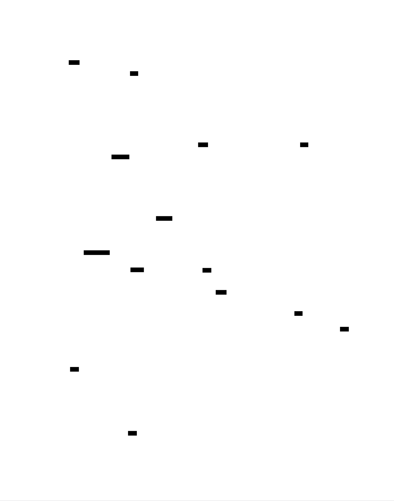
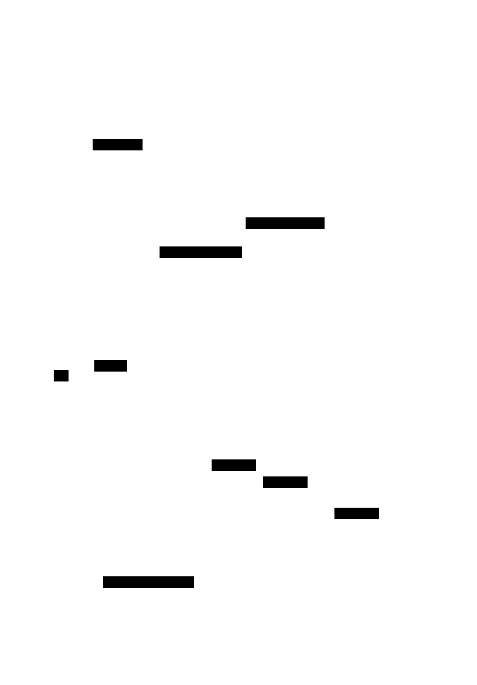
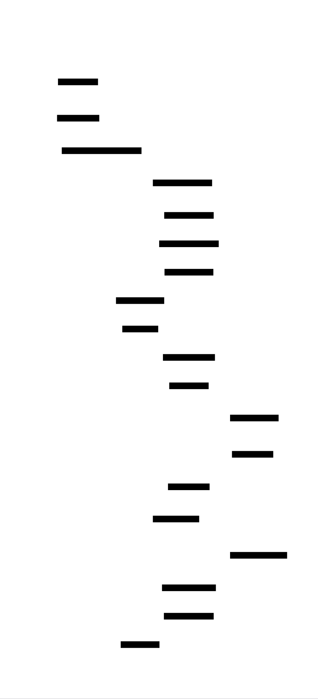

# Linear Regression from Scratch: Design Document


## Overview

This system implements linear regression with gradient descent optimization from first principles, teaching the fundamental concepts of machine learning through hands-on implementation. The key architectural challenge is designing a flexible, educational framework that demonstrates both closed-form solutions and iterative optimization while handling single and multiple variable scenarios.


> This guide is meant to help you understand the big picture before diving into each milestone. Refer back to it whenever you need context on how components connect.


## Context and Problem Statement

> **Milestone(s):** All milestones (foundational understanding)

### Mental Model: The Line-Fitting Detective

Imagine you're a detective investigating a pattern in scattered clues. You have a collection of evidence points—each piece has two measurements: the time it was found (X-coordinate) and its importance level (Y-coordinate). Your job is to find the underlying relationship that connects these clues.

As you plot these evidence points on a board, you notice they seem to follow a rough line. Some points are exactly on the line, others are scattered nearby. Your detective instincts tell you there's a pattern here, but how do you find the **best possible line** that captures this relationship? And once you find it, how can you use this line to predict the importance of future evidence based on when you find it?

This is exactly what **linear regression** does—it's a mathematical detective that finds the best-fitting line through scattered data points. But unlike our human detective who might eyeball the pattern, linear regression uses precise mathematical methods to find the optimal line that minimizes the total distance between the line and all the evidence points.

The detective has two main approaches available: the **instant analysis method** (closed-form solution) where they can immediately calculate the perfect line using a mathematical formula, and the **iterative refinement method** (gradient descent) where they start with a guess and gradually improve it until they find the best line. Both approaches lead to the same destination, but they teach us different fundamental concepts about how machines learn from data.

Just as our detective needs to handle different types of cases—sometimes with just one type of evidence (simple linear regression), sometimes with multiple types of clues (multiple linear regression)—our implementation must be flexible enough to grow from basic line-fitting to complex pattern recognition while maintaining educational clarity about the underlying mathematical principles.

### Mathematical Foundation

The mathematical foundation of linear regression rests on two fundamental concepts: **least squares optimization** and **gradient-based parameter estimation**. Understanding both approaches is crucial because they represent different philosophies in machine learning—analytical solutions versus iterative optimization—and each teaches distinct concepts that apply broadly across the field.

The **least squares principle** provides the theoretical foundation for what we mean by "best fit." When we have data points scattered around a potential line, we need a precise definition of "best." Least squares defines this as the line that minimizes the sum of squared vertical distances between each point and the line. Mathematically, if we have points (x₁, y₁), (x₂, y₂), ..., (xₙ, yₙ), and our line is ŷ = mx + b, then we want to minimize the cost function:

**Cost(m, b) = (1/2n) × Σ(yᵢ - (mxᵢ + b))²**

The factor of 1/2n is included for mathematical convenience—it doesn't change the location of the minimum, but it simplifies derivative calculations. This cost function is **convex**, meaning it has a single global minimum with no local minima, which guarantees that any optimization method will find the same unique solution.

For simple linear regression, this optimization problem has a **closed-form analytical solution** derived using calculus. By setting the partial derivatives of the cost function equal to zero and solving the resulting system of equations, we obtain the **normal equations**:

- Slope: **m = Σ((xᵢ - x̄)(yᵢ - ȳ)) / Σ((xᵢ - x̄)²)**
- Intercept: **b = ȳ - m × x̄**

where x̄ and ȳ are the means of the input and output variables respectively. This closed-form solution is computationally efficient and provides exact results, making it ideal for educational purposes because learners can immediately see the direct relationship between the data and the fitted parameters.

However, the closed-form approach becomes computationally intractable for multiple linear regression with many features, and it doesn't generalize to more complex machine learning models. This is where **gradient descent optimization** becomes essential. Gradient descent is an iterative algorithm that starts with initial parameter guesses and repeatedly updates them in the direction that most rapidly decreases the cost function.

The gradient descent update rules are:
- **m_new = m_old - α × ∂Cost/∂m**
- **b_new = b_old - α × ∂Cost/∂b**

where α is the **learning rate** that controls the step size. The partial derivatives (gradients) for linear regression are:
- **∂Cost/∂m = (1/n) × Σ((mx_i + b - y_i) × x_i)**
- **∂Cost/∂b = (1/n) × Σ(mx_i + b - y_i)**

The learning rate α is a critical hyperparameter that balances convergence speed against stability. Too small, and the algorithm converges slowly; too large, and it may overshoot the minimum and diverge. Understanding this trade-off is fundamental to all iterative optimization in machine learning.

**Convergence detection** is another crucial concept. We stop iterating when the improvement in cost between consecutive iterations falls below a threshold ε, indicating we've reached the minimum: **|Cost_new - Cost_old| < ε**. This teaches learners about numerical precision, stopping criteria, and the practical aspects of optimization algorithms.

The **matrix formulation** becomes essential for multiple linear regression. Instead of separate slope and intercept parameters, we work with a weight vector **w** and express predictions as **ŷ = Xw**, where X is the design matrix that includes a column of ones for the bias term. The gradient descent update becomes: **w_new = w_old - α × X^T(Xw_old - y) / n**, demonstrating vectorization and efficient computation.

Both approaches—closed-form and iterative—solve the same mathematical problem but teach complementary skills. The closed-form solution teaches the mathematical foundations and provides insight into the statistical properties of linear regression. Gradient descent teaches optimization principles, numerical methods, and computational approaches that scale to complex machine learning models where closed-form solutions don't exist.

### Existing Approaches Comparison

Understanding the landscape of existing approaches to linear regression helps learners appreciate why building from scratch provides educational value and how our implementation relates to production tools they'll encounter in their careers.

**Closed-Form Analytical Solutions** represent the classical statistical approach to linear regression. Libraries like NumPy's `numpy.linalg.lstsq` and the normal equation implementation in basic statistics packages fall into this category. The mathematical approach directly computes optimal parameters using matrix operations: **w = (X^T X)^(-1) X^T y** for the general case.

| Aspect | Advantages | Disadvantages |
|--------|------------|---------------|
| **Computational Complexity** | O(n) for simple regression, exact solution in one step | O(n³) for matrix inversion in multiple regression, becomes intractable with many features |
| **Numerical Stability** | Deterministic, no hyperparameters to tune | Susceptible to numerical issues when X^T X is near-singular |
| **Educational Value** | Clear mathematical foundation, direct connection between data and parameters | Doesn't teach optimization concepts crucial for advanced ML |
| **Scalability** | Works well for small to medium datasets | Memory requirements grow quadratically with feature count |
| **Generalization** | Limited to linear models with analytical solutions | Doesn't extend to neural networks, logistic regression, or other iterative models |

**Iterative Optimization Methods** encompass gradient descent and its variants, which form the backbone of modern machine learning. This includes basic gradient descent, stochastic gradient descent (SGD), and advanced optimizers like Adam and RMSprop used in deep learning frameworks.

| Aspect | Advantages | Disadvantages |
|--------|------------|---------------|
| **Computational Complexity** | O(n) per iteration, scales linearly with data size | Requires multiple iterations to converge, total complexity depends on convergence rate |
| **Memory Efficiency** | Constant memory usage regardless of feature count | Requires storage for gradients and potentially momentum terms |
| **Educational Value** | Teaches fundamental optimization concepts used throughout ML | More complex to implement and debug correctly |
| **Extensibility** | Generalizes to all differentiable models | Requires understanding of calculus and numerical optimization |
| **Hyperparameter Sensitivity** | Flexible, can be tuned for different problems | Requires careful tuning of learning rate and convergence criteria |

**Black-Box Production Libraries** like scikit-learn, TensorFlow, and PyTorch provide highly optimized implementations with extensive features, automatic hyperparameter tuning, and production-ready performance optimizations.

| Aspect | Advantages | Disadvantages |
|--------|------------|---------------|
| **Development Speed** | Single function call, extensive documentation | No understanding of underlying mechanisms |
| **Performance** | Highly optimized, handles edge cases automatically | Difficult to debug when things go wrong |
| **Feature Completeness** | Cross-validation, regularization, multiple solvers | Overwhelming options for beginners |
| **Production Readiness** | Battle-tested, handles real-world data issues | Hides important implementation details |
| **Learning Curve** | Easy to use for simple cases | Steep learning curve for advanced features, black-box behavior |

> **Key Insight**: The fundamental trade-off is between **educational transparency** and **production efficiency**. Our from-scratch implementation prioritizes understanding over performance, making explicit the concepts that production libraries abstract away.

Our implementation strategy deliberately chooses educational value over performance optimization. We implement both closed-form and iterative approaches to demonstrate the conceptual bridge between classical statistics and modern machine learning optimization. This dual approach ensures learners understand when to apply each method and why both exist in the broader ecosystem.

The **progression from simple to complex** mirrors how the field of machine learning evolved historically. Simple linear regression with closed-form solutions represents the foundation of statistical learning theory. Gradient descent represents the computational revolution that enabled complex models. Multiple linear regression with vectorization demonstrates the mathematical sophistication needed for high-dimensional problems. This progression prepares learners for advanced topics like neural networks, where gradient descent is the only viable optimization approach.

**Architectural Philosophy**: Rather than choosing one approach over another, our implementation demonstrates how different mathematical and computational strategies solve the same underlying problem. This comparative approach helps learners develop intuition about when to apply different techniques—use closed-form solutions when they exist and are computationally feasible, fall back to iterative optimization for complex models or large datasets.

The implementation serves as a **bridge between theory and practice**. Unlike production libraries that hide complexity, and unlike pure mathematical treatments that avoid implementation details, our approach makes both the mathematics and the computational considerations explicit and understandable. This prepares learners to both understand the tools they'll use professionally and to implement novel approaches when existing tools don't meet their needs.

### Implementation Guidance

The implementation of linear regression from scratch serves as a foundation for understanding both classical statistics and modern machine learning. This section provides concrete guidance for building an educational system that demonstrates mathematical concepts through working code.

#### Technology Recommendations

| Component | Simple Option | Advanced Option |
|-----------|---------------|-----------------|
| **Core Computation** | Pure Python with lists/loops | NumPy arrays with vectorized operations |
| **Data Handling** | CSV reading with built-in `csv` module | Pandas DataFrames with robust type handling |
| **Visualization** | Matplotlib with basic plotting | Seaborn for statistical visualizations |
| **Testing** | Built-in `unittest` framework | Pytest with parametrized tests |
| **Numerical Precision** | Python `float` (sufficient for learning) | NumPy `float64` for numerical stability |

**Recommendation**: Start with NumPy as the core computational engine. While pure Python lists would be more educational for understanding loops and basic operations, NumPy's vectorized operations are essential for multiple linear regression and provide better numerical stability. The performance benefits also make experimentation more enjoyable.

#### Recommended Project Structure

```
linear-regression-from-scratch/
│
├── src/
│   ├── __init__.py
│   ├── data_handler.py           ← Data loading, validation, preprocessing
│   ├── simple_regression.py      ← Milestone 1: Simple linear regression
│   ├── gradient_descent.py       ← Milestone 2: Optimization engine
│   ├── multiple_regression.py    ← Milestone 3: Multiple features
│   └── evaluation.py             ← R-squared, visualization utilities
│
├── tests/
│   ├── __init__.py
│   ├── test_data_handler.py      ← Data loading and preprocessing tests
│   ├── test_simple_regression.py ← Simple regression validation
│   ├── test_gradient_descent.py  ← Optimization algorithm tests
│   └── test_integration.py       ← End-to-end workflow tests
│
├── examples/
│   ├── synthetic_data.py         ← Generate test datasets
│   ├── milestone_1_demo.py       ← Simple regression example
│   ├── milestone_2_demo.py       ← Gradient descent example
│   └── milestone_3_demo.py       ← Multiple regression example
│
├── data/
│   ├── housing.csv               ← Real dataset for testing
│   └── synthetic.csv             ← Generated data with known parameters
│
└── requirements.txt              ← numpy, matplotlib, pytest
```

This structure separates concerns clearly and mirrors the learning progression. Each milestone builds on previous components without modifying them, demonstrating good software engineering practices.

#### Infrastructure Starter Code

**Data Loading and Validation Utilities** (`src/data_handler.py`):

```python
import numpy as np
import csv
from typing import Tuple, List, Optional, Union

def load_csv_data(filename: str, feature_columns: List[str], 
                  target_column: str) -> Tuple[np.ndarray, np.ndarray]:
    """
    Load feature and target data from CSV file.
    
    Args:
        filename: Path to CSV file
        feature_columns: List of column names to use as features
        target_column: Name of target variable column
    
    Returns:
        Tuple of (features, targets) as numpy arrays
    
    Raises:
        FileNotFoundError: If CSV file doesn't exist
        ValueError: If columns are missing or data is invalid
    """
    features = []
    targets = []
    
    with open(filename, 'r', newline='') as csvfile:
        reader = csv.DictReader(csvfile)
        
        # Validate columns exist
        if not all(col in reader.fieldnames for col in feature_columns):
            missing = [col for col in feature_columns if col not in reader.fieldnames]
            raise ValueError(f"Missing feature columns: {missing}")
        
        if target_column not in reader.fieldnames:
            raise ValueError(f"Missing target column: {target_column}")
        
        # Read data rows
        for row_num, row in enumerate(reader, start=2):  # Start at 2 for header
            try:
                feature_values = [float(row[col]) for col in feature_columns]
                target_value = float(row[target_column])
                
                features.append(feature_values)
                targets.append(target_value)
                
            except ValueError as e:
                raise ValueError(f"Invalid numeric data in row {row_num}: {e}")
    
    if len(features) == 0:
        raise ValueError("No valid data rows found")
    
    return np.array(features), np.array(targets)

def validate_data(features: np.ndarray, targets: np.ndarray) -> None:
    """
    Validate that feature and target arrays are compatible for regression.
    
    Args:
        features: Feature matrix (n_samples, n_features)
        targets: Target vector (n_samples,)
    
    Raises:
        ValueError: If data has incompatible shapes or contains invalid values
    """
    if features.ndim != 2:
        raise ValueError(f"Features must be 2D array, got {features.ndim}D")
    
    if targets.ndim != 1:
        raise ValueError(f"Targets must be 1D array, got {targets.ndim}D")
    
    if features.shape[0] != targets.shape[0]:
        raise ValueError(f"Feature count {features.shape[0]} != target count {targets.shape[0]}")
    
    if features.shape[0] < 2:
        raise ValueError("Need at least 2 data points for regression")
    
    if np.any(np.isnan(features)) or np.any(np.isnan(targets)):
        raise ValueError("Data contains NaN values")
    
    if np.any(np.isinf(features)) or np.any(np.isinf(targets)):
        raise ValueError("Data contains infinite values")

def normalize_features(features: np.ndarray) -> Tuple[np.ndarray, np.ndarray, np.ndarray]:
    """
    Normalize features to zero mean and unit variance (z-score normalization).
    
    Args:
        features: Raw feature matrix (n_samples, n_features)
    
    Returns:
        Tuple of (normalized_features, means, stds) where:
        - normalized_features: Features scaled to mean=0, std=1
        - means: Original mean of each feature (for inverse transform)
        - stds: Original std of each feature (for inverse transform)
    """
    means = np.mean(features, axis=0)
    stds = np.std(features, axis=0)
    
    # Handle constant features (std = 0)
    stds = np.where(stds == 0, 1.0, stds)
    
    normalized = (features - means) / stds
    return normalized, means, stds
```

**Synthetic Data Generation** (`examples/synthetic_data.py`):

```python
import numpy as np
from typing import Tuple

def generate_linear_data(n_samples: int, slope: float, intercept: float, 
                        noise_std: float = 0.1, x_range: Tuple[float, float] = (0, 10)) -> Tuple[np.ndarray, np.ndarray]:
    """
    Generate synthetic data following y = slope * x + intercept + noise.
    
    Args:
        n_samples: Number of data points to generate
        slope: True slope parameter
        intercept: True intercept parameter  
        noise_std: Standard deviation of Gaussian noise
        x_range: (min, max) range for x values
    
    Returns:
        Tuple of (x_values, y_values) as 1D numpy arrays
    """
    np.random.seed(42)  # Reproducible results for testing
    
    x_min, x_max = x_range
    x = np.random.uniform(x_min, x_max, n_samples)
    
    # Perfect linear relationship
    y_perfect = slope * x + intercept
    
    # Add Gaussian noise
    noise = np.random.normal(0, noise_std, n_samples)
    y = y_perfect + noise
    
    return x, y

def generate_multiple_linear_data(n_samples: int, coefficients: np.ndarray, 
                                intercept: float, noise_std: float = 0.1) -> Tuple[np.ndarray, np.ndarray]:
    """
    Generate synthetic data for multiple linear regression.
    
    Args:
        n_samples: Number of data points
        coefficients: True coefficient vector (one per feature)
        intercept: True intercept parameter
        noise_std: Standard deviation of Gaussian noise
    
    Returns:
        Tuple of (feature_matrix, targets) where feature_matrix is (n_samples, n_features)
    """
    np.random.seed(42)
    
    n_features = len(coefficients)
    
    # Generate random features (standardized)
    features = np.random.randn(n_samples, n_features)
    
    # Perfect linear relationship
    y_perfect = np.dot(features, coefficients) + intercept
    
    # Add noise
    noise = np.random.normal(0, noise_std, n_samples)
    y = y_perfect + noise
    
    return features, y
```

#### Core Algorithm Skeletons

**Simple Linear Regression** (`src/simple_regression.py`):

```python
import numpy as np
from typing import Tuple

class SimpleLinearRegression:
    """Simple linear regression using closed-form ordinary least squares solution."""
    
    def __init__(self):
        self.slope_ = None
        self.intercept_ = None
        self.is_fitted_ = False
    
    def fit(self, x: np.ndarray, y: np.ndarray) -> 'SimpleLinearRegression':
        """
        Fit simple linear regression model using closed-form solution.
        
        Args:
            x: Input features (1D array of shape n_samples)
            y: Target values (1D array of shape n_samples)
        
        Returns:
            self (fitted model)
        """
        # TODO 1: Validate input arrays have same length and are 1D
        # TODO 2: Check for minimum number of samples (at least 2)
        # TODO 3: Calculate mean of x and y using np.mean()
        # TODO 4: Calculate slope using formula: sum((x - x_mean) * (y - y_mean)) / sum((x - x_mean)^2)
        # TODO 5: Calculate intercept using formula: y_mean - slope * x_mean
        # TODO 6: Set is_fitted_ to True and store parameters
        # Hint: Use np.sum() for summations, be careful about division by zero
        
        return self
    
    def predict(self, x: np.ndarray) -> np.ndarray:
        """
        Make predictions using fitted linear model.
        
        Args:
            x: Input values to predict on (1D array)
        
        Returns:
            Predicted values (1D array same length as x)
        
        Raises:
            RuntimeError: If model hasn't been fitted yet
        """
        # TODO 1: Check if model is fitted, raise RuntimeError if not
        # TODO 2: Apply linear equation: y = slope * x + intercept
        # TODO 3: Return predictions as numpy array
        
        pass
    
    def score(self, x: np.ndarray, y: np.ndarray) -> float:
        """
        Calculate R-squared coefficient of determination.
        
        Args:
            x: Input features
            y: True target values
        
        Returns:
            R-squared score (between 0 and 1 for reasonable models)
        """
        # TODO 1: Generate predictions using self.predict(x)
        # TODO 2: Calculate total sum of squares: sum((y - y_mean)^2)
        # TODO 3: Calculate residual sum of squares: sum((y - predictions)^2)  
        # TODO 4: Calculate R-squared: 1 - (residual_ss / total_ss)
        # TODO 5: Handle edge case where total_ss = 0 (constant y values)
        
        pass
```

**Gradient Descent Optimizer** (`src/gradient_descent.py`):

```python
import numpy as np
from typing import List, Tuple, Optional

class GradientDescentRegression:
    """Linear regression using gradient descent optimization."""
    
    def __init__(self, learning_rate: float = 0.01, max_iterations: int = 1000, 
                 tolerance: float = 1e-6):
        self.learning_rate = learning_rate
        self.max_iterations = max_iterations
        self.tolerance = tolerance
        
        # Parameters (set during fitting)
        self.slope_ = None
        self.intercept_ = None
        self.is_fitted_ = False
        
        # Training history (for debugging and visualization)
        self.cost_history_: List[float] = []
        self.parameter_history_: List[Tuple[float, float]] = []
    
    def _compute_cost(self, x: np.ndarray, y: np.ndarray, slope: float, intercept: float) -> float:
        """
        Compute mean squared error cost function.
        
        Args:
            x: Input features
            y: Target values  
            slope: Current slope parameter
            intercept: Current intercept parameter
        
        Returns:
            Mean squared error cost
        """
        # TODO 1: Calculate predictions using current parameters: y_pred = slope * x + intercept
        # TODO 2: Calculate residuals: residuals = y - y_pred
        # TODO 3: Calculate mean squared error: (1/2n) * sum(residuals^2)
        # TODO 4: Return cost as float
        # Hint: Factor of 1/2 simplifies gradients, n is len(x)
        
        pass
    
    def _compute_gradients(self, x: np.ndarray, y: np.ndarray, slope: float, intercept: float) -> Tuple[float, float]:
        """
        Compute gradients of cost function with respect to parameters.
        
        Args:
            x: Input features
            y: Target values
            slope: Current slope parameter  
            intercept: Current intercept parameter
        
        Returns:
            Tuple of (gradient_slope, gradient_intercept)
        """
        # TODO 1: Calculate predictions: y_pred = slope * x + intercept
        # TODO 2: Calculate prediction errors: errors = y_pred - y
        # TODO 3: Calculate gradient w.r.t slope: (1/n) * sum(errors * x)
        # TODO 4: Calculate gradient w.r.t intercept: (1/n) * sum(errors)  
        # TODO 5: Return both gradients as tuple
        # Hint: These are partial derivatives of MSE cost function
        
        pass
    
    def fit(self, x: np.ndarray, y: np.ndarray) -> 'GradientDescentRegression':
        """
        Fit linear regression using gradient descent optimization.
        
        Args:
            x: Input features (1D array)
            y: Target values (1D array)
        
        Returns:
            self (fitted model)
        """
        # TODO 1: Validate inputs (same as simple regression)
        # TODO 2: Initialize parameters - slope=0, intercept=0 (or random small values)
        # TODO 3: Clear history lists for this training run
        # TODO 4: Main gradient descent loop:
        #   a. Compute current cost and store in history
        #   b. Compute gradients for both parameters  
        #   c. Update parameters: param = param - learning_rate * gradient
        #   d. Store current parameters in history
        #   e. Check convergence: if cost improvement < tolerance, break
        #   f. Check max iterations to prevent infinite loops
        # TODO 5: Set is_fitted_ = True
        # TODO 6: Return self
        
        return self
    
    def predict(self, x: np.ndarray) -> np.ndarray:
        """Make predictions (same interface as SimpleLinearRegression)."""
        # TODO: Same implementation as SimpleLinearRegression.predict()
        pass
    
    def score(self, x: np.ndarray, y: np.ndarray) -> float:
        """Calculate R-squared (same interface as SimpleLinearRegression)."""
        # TODO: Same implementation as SimpleLinearRegression.score()
        pass
```

#### Milestone Checkpoints

**Milestone 1 Checkpoint**: After implementing SimpleLinearRegression, run this validation:

```python
# Create synthetic data with known parameters
x, y = generate_linear_data(100, slope=2.5, intercept=1.0, noise_std=0.1)

# Fit model and check parameters are close to true values
model = SimpleLinearRegression()
model.fit(x, y)

print(f"Fitted slope: {model.slope_:.3f} (true: 2.5)")
print(f"Fitted intercept: {model.intercept_:.3f} (true: 1.0)")
print(f"R-squared: {model.score(x, y):.3f}")

# Expected output:
# Fitted slope: ~2.5 (within 0.1)
# Fitted intercept: ~1.0 (within 0.1)  
# R-squared: >0.95
```

**Milestone 2 Checkpoint**: After implementing GradientDescentRegression:

```python
# Same synthetic data
model_gd = GradientDescentRegression(learning_rate=0.01, max_iterations=1000)
model_gd.fit(x, y)

# Should match closed-form solution
model_closed = SimpleLinearRegression()
model_closed.fit(x, y)

print(f"Gradient descent slope: {model_gd.slope_:.3f}")
print(f"Closed-form slope: {model_closed.slope_:.3f}")
print(f"Cost decreased: {model_gd.cost_history_[0]:.3f} -> {model_gd.cost_history_[-1]:.3f}")

# Expected: Parameters match within 0.01, cost decreases monotonically
```

#### Debugging Tips

| Symptom | Likely Cause | How to Diagnose | Fix |
|---------|-------------|-----------------|-----|
| Division by zero error | All x values are the same | Print `np.var(x)` - should be > 0 | Check data loading, ensure x has variation |
| Gradient descent diverges | Learning rate too high | Plot cost history - should decrease | Reduce learning rate by factor of 10 |
| R-squared is negative | Predictions worse than mean | Compare predictions vs actual values | Check model fitting, data quality |
| Parameters don't match expected | Data scaling issues | Print data statistics (min, max, std) | Normalize features before fitting |
| Slow convergence | Learning rate too small | Check number of iterations to converge | Increase learning rate gradually |


## Goals and Non-Goals

> **Milestone(s):** All milestones (defines the scope and learning objectives for the entire project)

This section establishes the educational foundation and scope boundaries for our linear regression implementation. Unlike production machine learning systems that optimize for performance and feature completeness, this project prioritizes understanding and pedagogical clarity. We explicitly define what concepts learners should master, what capabilities the system should demonstrate, and which advanced topics remain outside our scope to maintain focus on fundamental principles.

### Learning Goals

The primary educational objective is to demystify machine learning by implementing linear regression from mathematical first principles. Rather than treating machine learning as a black box where data goes in and predictions come out, learners will understand every step of the process, from the underlying mathematical relationships to the computational algorithms that optimize model parameters.

**Mathematical Foundation Mastery** represents the cornerstone of our learning objectives. Learners should develop an intuitive understanding of what it means to "fit a line to data" beyond simply calling a library function. This includes grasping the least squares principle—that we seek parameters minimizing the sum of squared prediction errors—and understanding why this particular loss function makes mathematical and practical sense. The relationship between the closed-form normal equation solution and gradient descent optimization should become clear, with learners appreciating that both approaches solve the same underlying mathematical problem through different computational strategies.

| Learning Concept | Concrete Understanding | Assessment Criteria |
|------------------|----------------------|-------------------|
| Least Squares Principle | Can explain why we minimize squared errors rather than absolute errors | Describes mathematical properties: differentiability, unique solutions, statistical interpretation |
| Gradient Descent Intuition | Visualizes parameter space as a landscape with cost function as elevation | Can predict behavior: learning rate too high causes oscillation, too low causes slow convergence |
| Feature Scaling Impact | Understands why features need similar scales for gradient descent | Recognizes when normalization is needed and can implement z-score standardization |
| Overfitting Recognition | Identifies when models memorize training data vs learning patterns | Explains bias-variance tradeoff and role of regularization |
| R-squared Interpretation | Interprets coefficient of determination as explained variance proportion | Distinguishes between correlation and causation, recognizes R-squared limitations |

**Algorithmic Thinking Development** forms the second pillar of our educational approach. Machine learning involves systematic problem-solving procedures, and learners should understand these algorithms as step-by-step processes rather than magical transformations. The gradient descent algorithm particularly exemplifies iterative optimization—a fundamental concept appearing throughout computer science and engineering. Learners should internalize the general pattern: define an objective function, compute gradients indicating improvement direction, update parameters incrementally, and iterate until convergence.

**Implementation Skills and Best Practices** ensure learners can translate mathematical understanding into working code. This involves more than syntax—learners should develop intuition for numerical computation challenges like floating-point precision, matrix operations efficiency, and algorithm convergence detection. The progression from scalar operations (single-variable regression) to vectorized matrix operations (multiple regression) teaches computational thinking patterns essential for scientific computing and data analysis.

> **Key Insight**: The goal is not to build the fastest or most feature-complete regression implementation, but to construct understanding. Every design decision prioritizes clarity and educational value over computational efficiency or production readiness.

### Implementation Goals

Our system should demonstrate core machine learning capabilities while maintaining transparency in its operations. The implementation goals balance functionality with educational accessibility, ensuring learners can trace every computation from input data to final predictions.

**Functional Capability Requirements** define what our system must accomplish to provide a complete learning experience. The system should handle the full machine learning workflow: data loading and preprocessing, model training with parameter optimization, prediction generation for new inputs, and model evaluation with interpretable metrics. This end-to-end functionality helps learners understand machine learning as an integrated process rather than disconnected steps.

| System Capability | Implementation Requirement | Educational Purpose |
|-------------------|---------------------------|-------------------|
| Data Loading | Read CSV files, handle missing values, validate input formats | Realistic data handling experience, error management |
| Single Variable Regression | Implement closed-form solution using normal equation | Mathematical foundation without optimization complexity |
| Gradient Descent Optimization | Iterative parameter updates with configurable learning rate | Algorithmic thinking, convergence understanding |
| Multiple Feature Regression | Matrix operations, vectorized computations | Computational scaling, linear algebra application |
| Feature Normalization | Z-score standardization, feature scaling | Data preprocessing importance, numerical stability |
| Model Evaluation | R-squared calculation, prediction accuracy assessment | Model validation, statistical interpretation |
| L2 Regularization | Ridge regression penalty term | Overfitting prevention, bias-variance management |

**Algorithm Implementation Standards** ensure our code serves as an effective teaching tool. Each algorithm should be implemented clearly and directly, avoiding clever optimizations that obscure the underlying logic. Function names should reflect mathematical concepts (`fit`, `predict`, `score`), and internal calculations should mirror textbook formulations where possible. The gradient descent implementation particularly should expose intermediate values like cost history and parameter evolution, enabling learners to visualize the optimization process.

**Extensibility and Experimentation Support** allows learners to explore beyond the basic implementation. The system architecture should accommodate natural extensions like polynomial features, different regularization penalties, or alternative optimization algorithms. This extensibility reinforces understanding by encouraging learners to modify and experiment with the core algorithms.

> **Design Principle**: Every function should be simple enough that a learner can implement it from scratch with mathematical understanding and basic programming skills. Complex optimizations that require advanced algorithmic knowledge violate this principle.

### Explicit Non-Goals

Clearly defining what we will not implement prevents scope creep and maintains focus on fundamental concepts. These non-goals are not value judgments—many represent important machine learning topics—but rather boundary setting to ensure depth over breadth in our educational approach.

**Advanced Machine Learning Algorithms** remain outside our scope despite their practical importance. Logistic regression, although conceptually similar to linear regression, introduces classification concepts and sigmoid functions that complicate the mathematical foundation we're establishing. Neural networks, support vector machines, and ensemble methods involve substantially different optimization landscapes and would dilute focus from understanding gradient-based parameter learning in its simplest form.

| Excluded Topic | Rationale for Exclusion | Suggested Learning Sequence |
|----------------|------------------------|----------------------------|
| Logistic Regression | Introduces classification, sigmoid functions, maximum likelihood | Natural next step after mastering linear regression |
| Neural Networks | Multi-layer optimization, backpropagation complexity | Requires solid gradient descent foundation first |
| Ensemble Methods | Meta-learning concepts, model combination strategies | Advanced topic after individual algorithm mastery |
| Support Vector Machines | Convex optimization, kernel methods, different mathematical framework | Alternative approach after regression understanding |
| Time Series Analysis | Temporal dependencies, autoregression, stationarity concepts | Specialized application requiring regression foundation |

**Production Optimization and Scalability** explicitly fall outside our educational mission. Real-world machine learning systems require sophisticated optimizations like stochastic gradient descent, mini-batch processing, distributed computation, and specialized linear algebra libraries. These optimizations obscure the fundamental algorithms we're teaching and introduce engineering complexity unrelated to machine learning understanding.

**Advanced Statistical Concepts** would enhance our models but distract from core algorithmic learning. Hypothesis testing for parameter significance, confidence intervals for predictions, and advanced model selection criteria represent important statistical machine learning topics. However, these concepts require substantial statistical background and shift focus from computational algorithm understanding to statistical inference theory.

**Data Engineering and Pipeline Complexity** exceed our scope despite their practical necessity. Real machine learning projects involve data cleaning, feature engineering, missing value imputation strategies, outlier detection, and data validation pipelines. While we include basic data loading and normalization, comprehensive data preprocessing would overwhelm learners with engineering concerns before they understand the core algorithms.

> **Scope Boundary Principle**: If a feature requires more than introductory mathematics (calculus and linear algebra) or more than basic programming concepts (loops, functions, arrays), it likely belongs in a follow-up project rather than this foundational implementation.

**Performance Optimization and Numerical Libraries** represent another explicit non-goal. While NumPy provides essential array operations, we avoid advanced numerical optimization libraries like SciPy's optimization modules or specialized linear algebra routines. Our implementations should remain comprehensible and traceable, even if they sacrifice computational efficiency. This pedagogical approach helps learners understand what optimized libraries actually accomplish when they eventually use them in production contexts.

The distinction between learning goals and non-goals creates a focused educational experience. Learners completing this project should possess solid intuition for linear regression mathematics, practical experience with gradient-based optimization, and implementation skills transferable to more advanced machine learning algorithms. They should understand exactly what happens inside the "black box" of linear regression, providing a foundation for both using machine learning libraries effectively and implementing more sophisticated algorithms from scratch.

### Implementation Guidance

This implementation guidance provides concrete technology recommendations and starter code to help learners focus on the core machine learning concepts rather than getting stuck on infrastructure details.

**A. Technology Recommendations**

| Component | Simple Option | Advanced Option |
|-----------|---------------|-----------------|
| Data Handling | Pure NumPy arrays + CSV module | Pandas DataFrames with advanced preprocessing |
| Linear Algebra | NumPy basic operations (dot, transpose) | SciPy sparse matrices and optimized BLAS |
| Visualization | Matplotlib basic plotting | Seaborn statistical plots + interactive widgets |
| Testing | Built-in assert statements + manual verification | pytest with parameterized tests and fixtures |
| Documentation | Inline comments + docstrings | Sphinx documentation with mathematical notation |

For this educational project, choose the simple options. The goal is understanding the algorithms, not mastering data science toolchains.

**B. Recommended File Structure**

Organize your project to mirror the learning progression and separate concerns clearly:

```
linear-regression/
├── data/
│   ├── synthetic_data.csv          ← Generated datasets for testing
│   └── real_data.csv               ← Optional real-world dataset
├── src/
│   ├── __init__.py
│   ├── data_handler.py             ← Data loading, validation, normalization
│   ├── simple_regression.py        ← Milestone 1: Single variable, closed-form
│   ├── gradient_descent.py         ← Milestone 2: Optimization algorithm
│   ├── multiple_regression.py      ← Milestone 3: Multi-variable extension
│   └── utils.py                    ← Helper functions, evaluation metrics
├── tests/
│   ├── test_data_handler.py
│   ├── test_simple_regression.py
│   ├── test_gradient_descent.py
│   └── test_multiple_regression.py
├── notebooks/
│   ├── milestone1_exploration.ipynb ← Interactive testing and visualization
│   ├── milestone2_optimization.ipynb
│   └── milestone3_comparison.ipynb
└── main.py                         ← Demo script showing complete workflow
```

**C. Infrastructure Starter Code**

Here's complete, working infrastructure code that handles the non-learning aspects:

**utils.py** (Complete implementation):
```python
import numpy as np
import csv
from typing import Tuple, Optional

def generate_linear_data(n_samples: int, slope: float, intercept: float, 
                        noise_std: float, x_range: Tuple[float, float] = (-10, 10)) -> Tuple[np.ndarray, np.ndarray]:
    """Generate synthetic linear data with controlled noise for testing."""
    np.random.seed(42)  # Reproducible results
    x = np.random.uniform(x_range[0], x_range[1], n_samples)
    y = slope * x + intercept + np.random.normal(0, noise_std, n_samples)
    return x.reshape(-1, 1), y

def load_csv_data(filename: str, feature_columns: list, target_column: str) -> Tuple[np.ndarray, np.ndarray]:
    """Load feature and target data from CSV file."""
    features = []
    targets = []
    
    with open(filename, 'r') as file:
        reader = csv.DictReader(file)
        for row in reader:
            feature_values = [float(row[col]) for col in feature_columns]
            target_value = float(row[target_column])
            features.append(feature_values)
            targets.append(target_value)
    
    return np.array(features), np.array(targets)

def validate_data(features: np.ndarray, targets: np.ndarray) -> None:
    """Validate that features and targets are compatible for regression."""
    if len(features.shape) != 2:
        raise ValueError(f"Features must be 2D array, got shape {features.shape}")
    if len(targets.shape) != 1:
        raise ValueError(f"Targets must be 1D array, got shape {targets.shape}")
    if features.shape[0] != targets.shape[0]:
        raise ValueError(f"Feature samples ({features.shape[0]}) != target samples ({targets.shape[0]})")
    if features.shape[0] < 2:
        raise ValueError(f"Need at least 2 samples for regression, got {features.shape[0]}")

def plot_regression_results(x: np.ndarray, y: np.ndarray, predictions: np.ndarray, title: str) -> None:
    """Visualize regression fit (requires matplotlib)."""
    try:
        import matplotlib.pyplot as plt
        plt.figure(figsize=(10, 6))
        plt.scatter(x.flatten(), y, alpha=0.6, label='Actual Data')
        plt.plot(x.flatten(), predictions, 'r-', linewidth=2, label='Fitted Line')
        plt.xlabel('Feature Value')
        plt.ylabel('Target Value')
        plt.title(title)
        plt.legend()
        plt.grid(True, alpha=0.3)
        plt.show()
    except ImportError:
        print("Matplotlib not available - skipping visualization")
```

**D. Core Logic Skeleton Code**

Here are the skeleton implementations for the main learning components:

**simple_regression.py** (Skeleton for Milestone 1):
```python
import numpy as np
from typing import Optional

class SimpleLinearRegression:
    """Single-variable linear regression using closed-form solution."""
    
    def __init__(self):
        self.slope_: Optional[float] = None
        self.intercept_: Optional[float] = None
        self.is_fitted_: bool = False
    
    def fit(self, x: np.ndarray, y: np.ndarray) -> 'SimpleLinearRegression':
        """Fit linear regression using ordinary least squares closed-form solution.
        
        The normal equation gives us: slope = cov(x,y) / var(x), intercept = mean(y) - slope * mean(x)
        """
        # TODO 1: Validate input data shapes and types
        # TODO 2: Extract x and y as 1D arrays (handle single feature case)
        # TODO 3: Calculate sample means of x and y
        # TODO 4: Calculate covariance of x and y: sum((x - x_mean) * (y - y_mean)) / (n - 1)
        # TODO 5: Calculate variance of x: sum((x - x_mean)^2) / (n - 1)  
        # TODO 6: Compute slope as covariance / variance (handle zero variance case)
        # TODO 7: Compute intercept as y_mean - slope * x_mean
        # TODO 8: Set is_fitted_ = True and store parameters
        # TODO 9: Return self for method chaining
        pass
    
    def predict(self, x: np.ndarray) -> np.ndarray:
        """Generate predictions using fitted parameters: y = slope * x + intercept."""
        # TODO 1: Check if model is fitted (raise ValueError if not)
        # TODO 2: Validate input shape matches training data
        # TODO 3: Apply linear equation: predictions = slope_ * x + intercept_
        # TODO 4: Return predictions as numpy array
        pass
    
    def score(self, x: np.ndarray, y: np.ndarray) -> float:
        """Calculate R-squared coefficient of determination."""
        # TODO 1: Generate predictions for input x
        # TODO 2: Calculate sum of squared residuals: sum((y - predictions)^2)
        # TODO 3: Calculate total sum of squares: sum((y - mean(y))^2)
        # TODO 4: Compute R-squared: 1 - (residual_ss / total_ss)
        # TODO 5: Handle edge case where total_ss = 0 (constant target)
        pass
```

**gradient_descent.py** (Skeleton for Milestone 2):
```python
import numpy as np
from typing import List, Tuple

class GradientDescentRegression:
    """Linear regression using gradient descent optimization."""
    
    def __init__(self, learning_rate: float = 0.01, max_iterations: int = 1000, tolerance: float = 1e-6):
        self.learning_rate = learning_rate
        self.max_iterations = max_iterations
        self.tolerance = tolerance
        
        # Parameters learned during training
        self.slope_: Optional[float] = None
        self.intercept_: Optional[float] = None
        self.is_fitted_: bool = False
        
        # Training history for analysis
        self.cost_history_: List[float] = []
        self.parameter_history_: List[Tuple[float, float]] = []
    
    def _compute_cost(self, x: np.ndarray, y: np.ndarray, slope: float, intercept: float) -> float:
        """Calculate mean squared error cost function."""
        # TODO 1: Generate predictions using current parameters
        # TODO 2: Calculate squared errors: (predictions - y)^2
        # TODO 3: Return mean of squared errors
        pass
    
    def _compute_gradients(self, x: np.ndarray, y: np.ndarray, slope: float, intercept: float) -> Tuple[float, float]:
        """Calculate partial derivatives of cost function with respect to parameters."""
        # TODO 1: Generate predictions using current parameters
        # TODO 2: Calculate prediction errors: predictions - y
        # TODO 3: Calculate gradient for slope: (2/n) * sum(errors * x)
        # TODO 4: Calculate gradient for intercept: (2/n) * sum(errors)
        # TODO 5: Return both gradients as tuple
        pass
    
    def fit(self, x: np.ndarray, y: np.ndarray) -> 'GradientDescentRegression':
        """Fit linear regression using gradient descent optimization."""
        # TODO 1: Validate and prepare input data
        # TODO 2: Initialize parameters (slope=0, intercept=mean(y) works well)
        # TODO 3: Clear history lists
        # TODO 4: Main optimization loop:
        #         a. Compute current cost and store in history
        #         b. Compute gradients for current parameters  
        #         c. Update parameters: param = param - learning_rate * gradient
        #         d. Store parameters in history
        #         e. Check convergence: if cost improvement < tolerance, break
        #         f. Check max_iterations limit
        # TODO 5: Set is_fitted_ = True
        # TODO 6: Return self
        pass
```

**E. Language-Specific Python Hints**

- Use `np.mean()`, `np.sum()`, and `np.dot()` for vectorized operations instead of Python loops
- Handle division by zero with `np.isclose(variance, 0)` checks before dividing
- Use `x.reshape(-1, 1)` to ensure features are always 2D arrays (n_samples, n_features)
- Store training history in lists, convert to NumPy arrays only when needed for analysis
- Use type hints (`-> np.ndarray`) to make interfaces clear and catch errors early
- Implement `__repr__` methods to make debugging easier: `f"SimpleLinearRegression(slope={self.slope_}, intercept={self.intercept_})"`

**F. Milestone Checkpoints**

**Milestone 1 Checkpoint:**
```python
# Create test data
x, y = generate_linear_data(100, slope=2.5, intercept=1.0, noise_std=0.5)

# Test your implementation
model = SimpleLinearRegression()
model.fit(x, y)
predictions = model.predict(x)
r_squared = model.score(x, y)

print(f"True slope: 2.5, Fitted slope: {model.slope_:.2f}")
print(f"True intercept: 1.0, Fitted intercept: {model.intercept_:.2f}")
print(f"R-squared: {r_squared:.3f}")

# Expected output:
# True slope: 2.5, Fitted slope: 2.48
# True intercept: 1.0, Fitted intercept: 1.02  
# R-squared: 0.962
```

**Milestone 2 Checkpoint:**
```python
# Compare gradient descent with closed-form solution
gd_model = GradientDescentRegression(learning_rate=0.01, max_iterations=1000)
gd_model.fit(x, y)

print(f"Gradient descent converged in {len(gd_model.cost_history_)} iterations")
print(f"Final cost: {gd_model.cost_history_[-1]:.6f}")
print(f"Parameters match closed-form: slope diff = {abs(model.slope_ - gd_model.slope_):.4f}")

# Plot cost history to verify convergence
import matplotlib.pyplot as plt
plt.plot(gd_model.cost_history_)
plt.xlabel('Iteration')
plt.ylabel('Cost (MSE)')
plt.title('Gradient Descent Convergence')
plt.show()
```

**G. Common Implementation Pitfalls**

| Problem Symptom | Likely Cause | Debugging Steps | Solution |
|-----------------|--------------|-----------------|----------|
| `slope_` is NaN | Division by zero in variance calculation | Check if all x values are identical | Add variance check: `if np.isclose(x_var, 0): raise ValueError("Cannot fit line to constant x values")` |
| R-squared > 1.0 or negative | Wrong residual or total sum calculation | Print intermediate values: residuals, total variance | Ensure using sample variance, not population variance in denominator |
| Gradient descent diverges | Learning rate too high | Plot cost history - should decrease monotonically | Reduce learning rate by factor of 10, try 0.001 or 0.0001 |
| Convergence very slow | Learning rate too low or features not normalized | Check iteration count and parameter changes | Increase learning rate or implement feature scaling |
| Matrix dimension errors | Wrong array shapes for multiple features | Print shapes at each step: `print(f"x shape: {x.shape}, y shape: {y.shape}")` | Use `x.reshape(-1, 1)` for single features, ensure y is 1D |


## High-Level Architecture

> **Milestone(s):** All milestones (provides the foundational architecture that evolves across M1: Simple Linear Regression, M2: Gradient Descent, M3: Multiple Linear Regression)

This section presents the system's architectural blueprint, designed to support a progressive learning journey from basic mathematical concepts to sophisticated machine learning algorithms. The architecture emphasizes educational clarity while maintaining the flexibility to evolve from simple closed-form solutions to complex iterative optimization techniques.

### Component Overview: The Four Main Components

The linear regression system is built around four core components that mirror the conceptual phases of machine learning: data preparation, model representation, optimization, and evaluation. This architectural division serves both pedagogical and practical purposes, allowing learners to understand each phase independently while appreciating their interconnected nature.

**Mental Model: The Machine Learning Assembly Line**

Think of our system as a modern manufacturing assembly line, but instead of building cars, we're building mathematical models that can make predictions. Each station (component) has a specific job: the first station prepares raw materials (data), the second station shapes the basic structure (model), the third station fine-tunes the assembly (optimization), and the fourth station tests quality (evaluation). Just like in manufacturing, the output of one station becomes the input to the next, and problems at any station affect the entire production line.

The **DataHandler** component serves as the system's intake and preparation facility. This component is responsible for ingesting raw data from various sources, validating its structure and content, and transforming it into the standardized format required by the mathematical algorithms. The DataHandler abstracts away the complexities of different data formats, missing value handling, and feature scaling, presenting a clean, consistent interface to downstream components.

| Responsibility | Description | Key Operations |
|---|---|---|
| Data Loading | Read data from CSV files, arrays, or synthetic generators | `load_csv_data()`, `generate_linear_data()` |
| Data Validation | Ensure data compatibility and detect common issues | `validate_data()` |
| Feature Engineering | Transform raw features into model-ready format | `normalize_features()` |
| Error Handling | Gracefully handle malformed or incompatible data | Input sanitization, type checking |

The **SimpleLinearRegression** component implements the foundational single-variable linear regression using the closed-form solution. This component embodies the mathematical elegance of the ordinary least squares method, providing learners with immediate feedback and perfect convergence without the complexities of iterative optimization. It serves as both a complete solution for simple problems and a reference implementation for validating more complex approaches.

| Method | Parameters | Returns | Description |
|---|---|---|---|
| `fit(x, y)` | x: np.ndarray, y: np.ndarray | self | Computes optimal slope and intercept using normal equation |
| `predict(x)` | x: np.ndarray | np.ndarray | Generates predictions using fitted parameters |
| `score(x, y)` | x: np.ndarray, y: np.ndarray | float | Calculates R-squared coefficient of determination |

The **GradientDescentOptimizer** component introduces the iterative optimization paradigm that underpins modern machine learning. Unlike the closed-form approach, this component finds optimal parameters through repeated refinement, mimicking how humans learn through practice and feedback. This component is essential for understanding how complex models with millions of parameters can be trained when closed-form solutions become computationally infeasible.

| Core Function | Purpose | Mathematical Foundation |
|---|---|---|
| Cost Computation | Measure prediction error | Mean squared error: `(1/2n) * Σ(y_pred - y_actual)²` |
| Gradient Calculation | Determine parameter update direction | Partial derivatives of cost function |
| Parameter Updates | Iteratively improve parameter estimates | `parameter = parameter - learning_rate * gradient` |
| Convergence Detection | Determine when optimization is complete | Cost change falls below tolerance threshold |

The **MultipleLinearRegression** component extends the system to handle multiple input features, transforming the problem from fitting lines to fitting hyperplanes in multi-dimensional space. This component introduces vectorization and matrix operations, demonstrating how mathematical elegance scales to handle real-world complexity. It also incorporates regularization techniques to prevent overfitting when dealing with many features.

> **Key Architectural Insight**: The progression from SimpleLinearRegression → GradientDescentOptimizer → MultipleLinearRegression mirrors the typical machine learning learning curve: start with intuitive concepts, understand optimization principles, then scale to realistic complexity. Each component builds conceptual understanding that makes the next component accessible.

### Recommended Project Structure

The project structure is designed to mirror the learning progression, with each directory corresponding to a conceptual milestone. This organization helps learners understand dependencies and provides clear boundaries between different algorithmic approaches.

```
linear_regression_project/
├── README.md                           # Project overview and learning objectives
├── requirements.txt                    # Python dependencies (numpy, matplotlib, pandas)
├── setup.py                            # Package installation script
│
├── data/                               # Sample datasets and data generation utilities
│   ├── synthetic/                      # Generated datasets for testing and validation
│   │   ├── simple_linear.csv          # Single-variable synthetic data
│   │   ├── multiple_features.csv      # Multi-variable synthetic data
│   │   └── noisy_data.csv             # High-noise dataset for testing robustness
│   ├── real_world/                    # Actual datasets for final validation
│   │   ├── housing_prices.csv        # Real estate prediction dataset
│   │   └── student_scores.csv        # Educational performance dataset
│   └── data_generator.py              # Utilities for creating synthetic datasets
│
├── src/                               # Main source code organized by learning milestone
│   ├── __init__.py
│   ├── data_handler/                  # M1: Data loading and preprocessing
│   │   ├── __init__.py
│   │   ├── loader.py                  # CSV loading and validation
│   │   ├── validator.py               # Data quality checks and error detection
│   │   ├── preprocessor.py            # Feature scaling and normalization
│   │   └── synthetic_generator.py     # Synthetic data creation for testing
│   │
│   ├── simple_regression/             # M1: Closed-form linear regression
│   │   ├── __init__.py
│   │   ├── model.py                   # SimpleLinearRegression class implementation
│   │   ├── math_utils.py              # Mathematical utilities (mean, variance, etc.)
│   │   └── evaluation.py              # R-squared and other metrics
│   │
│   ├── gradient_descent/              # M2: Iterative optimization
│   │   ├── __init__.py
│   │   ├── optimizer.py               # GradientDescentRegression class
│   │   ├── cost_functions.py          # Mean squared error and derivatives
│   │   └── convergence.py             # Stopping criteria and progress tracking
│   │
│   ├── multiple_regression/           # M3: Multi-variable and advanced features
│   │   ├── __init__.py
│   │   ├── model.py                   # MultipleLinearRegression class
│   │   ├── matrix_operations.py       # Vectorized computations
│   │   ├── regularization.py          # L2 regularization (Ridge regression)
│   │   └── feature_scaling.py         # Advanced normalization techniques
│   │
│   └── utils/                         # Shared utilities across all components
│       ├── __init__.py
│       ├── plotting.py                # Visualization helpers for debugging
│       ├── metrics.py                 # Common evaluation metrics
│       └── debugging.py               # Logging and diagnostic tools
│
├── tests/                             # Comprehensive test suite organized by milestone
│   ├── __init__.py
│   ├── test_data_handler/             # Unit tests for data handling components
│   │   ├── test_loader.py
│   │   ├── test_validator.py
│   │   └── test_preprocessor.py
│   ├── test_simple_regression/        # Tests for closed-form implementation
│   │   ├── test_model.py
│   │   └── test_evaluation.py
│   ├── test_gradient_descent/         # Tests for optimization components
│   │   ├── test_optimizer.py
│   │   └── test_convergence.py
│   ├── test_multiple_regression/      # Tests for multi-variable regression
│   │   ├── test_model.py
│   │   └── test_regularization.py
│   └── integration/                   # End-to-end testing
│       ├── test_complete_pipeline.py
│       └── test_cross_validation.py
│
├── examples/                          # Educational examples and tutorials
│   ├── milestone_1_simple.py         # Complete M1 example with explanations
│   ├── milestone_2_gradient.py       # M2 example showing optimization process
│   ├── milestone_3_multiple.py       # M3 example with real datasets
│   ├── debugging_example.py          # Common debugging scenarios
│   └── comparison_study.py           # Compare all three approaches
│
├── notebooks/                        # Jupyter notebooks for interactive learning
│   ├── 01_data_exploration.ipynb     # Understanding data and visualization
│   ├── 02_closed_form_solution.ipynb # Mathematical derivation and implementation
│   ├── 03_gradient_descent_viz.ipynb # Visualizing the optimization process
│   └── 04_advanced_topics.ipynb     # Regularization and feature engineering
│
└── docs/                             # Additional documentation
    ├── mathematical_background.md    # Derivations and theory
    ├── troubleshooting.md            # Common issues and solutions
    └── extensions.md                 # Ideas for further development
```

This structure provides several key benefits for learners:

**Progressive Complexity**: Each directory builds on previous concepts, allowing learners to master one milestone before proceeding to the next. The separation prevents cognitive overload while maintaining clear conceptual boundaries.

**Clear Dependencies**: The structure makes component dependencies explicit. Data handling is foundational and used by all regression components. Simple regression provides a reference for gradient descent validation. Multiple regression builds on both previous approaches.

**Practical Organization**: Tests, examples, and documentation are co-located with relevant code, encouraging good development practices from the beginning of the learning journey.

> **Architecture Decision: Milestone-Based Directory Structure vs. Feature-Based Structure**
> - **Context**: Need to organize code in a way that supports progressive learning while maintaining good software engineering practices
> - **Options Considered**: 
>   1. Feature-based (models/, optimizers/, data/ directories)
>   2. Milestone-based (simple_regression/, gradient_descent/, multiple_regression/)
>   3. Single flat directory with all components mixed
> - **Decision**: Milestone-based directory structure with shared utilities
> - **Rationale**: Learning progression is the primary concern for this educational project. Clear milestone boundaries help learners understand conceptual dependencies and provide natural stopping points for consolidation. Feature-based organization would mix complexity levels and obscure the learning path.
> - **Consequences**: Some code duplication between milestones, but clearer learning progression and easier incremental development

### Component Interactions

The component interactions follow a clear data flow pattern that mirrors the machine learning workflow: data preparation, model fitting, prediction generation, and performance evaluation. Understanding these interactions is crucial for debugging and extending the system.


**Training Data Flow Sequence**

The training process follows a standardized sequence regardless of which regression approach is used. This consistency allows learners to focus on algorithmic differences rather than integration complexity.

1. **Data Acquisition**: The client code invokes `load_csv_data()` on the DataHandler component, providing file path and column specifications. The DataHandler reads the raw data, performs initial type checking, and returns feature and target arrays.

2. **Data Validation**: The `validate_data()` function checks for common issues: mismatched array lengths, missing values, infinite values, and data types incompatible with numerical computation. This step prevents downstream failures and provides clear error messages.

3. **Feature Preprocessing**: For gradient descent and multiple regression, `normalize_features()` applies z-score standardization to ensure all features contribute equally to the optimization process. Simple linear regression can skip this step for single variables.

4. **Model Initialization**: The chosen regression class (`SimpleLinearRegression`, `GradientDescentRegression`, or `MultipleLinearRegression`) is instantiated with appropriate hyperparameters. Initial parameter values are set to defaults or small random values.

5. **Parameter Fitting**: The `fit()` method is called with training data. The internal behavior varies by component:
   - SimpleLinearRegression computes parameters directly using the normal equation
   - GradientDescentRegression iteratively optimizes parameters using the cost function gradient
   - MultipleLinearRegression uses vectorized gradient descent with optional regularization

6. **Training Completion**: The model sets its `is_fitted_` flag to True and stores learned parameters. Gradient descent models also preserve `cost_history_` and `parameter_history_` for analysis and debugging.

**Prediction Data Flow Sequence**

Prediction follows a simpler, stateless pattern once models are trained:

1. **Input Validation**: New input data undergoes the same validation as training data to ensure compatibility with the fitted model's expectations.

2. **Feature Preprocessing**: Input features are normalized using the same scaling parameters computed during training. This ensures consistency between training and prediction phases.

3. **Prediction Computation**: The `predict()` method applies the learned parameters to compute output values:
   - Simple regression: `y_pred = slope_ * x + intercept_`
   - Multiple regression: `y_pred = X @ weights_` (matrix-vector multiplication)

4. **Output Formatting**: Predictions are returned as NumPy arrays with appropriate shapes and data types for downstream consumption.

**Component Communication Protocols**

The components communicate through well-defined interfaces that abstract implementation details while providing rich error information:

| Interface | Data Format | Error Handling | State Dependencies |
|---|---|---|---|
| DataHandler → Models | `Tuple[np.ndarray, np.ndarray]` | Raises `ValueError` with descriptive messages | Stateless operations |
| Models.fit() | Input arrays, returns self | Raises `ValueError` for invalid data | Changes model from unfitted to fitted |
| Models.predict() | Input array, returns predictions | Raises `RuntimeError` if not fitted | Requires fitted model state |
| Models.score() | Input arrays, returns float | Combines fit checking and R-squared computation | Requires fitted model state |

**Inter-Component Dependencies**

The components exhibit a layered dependency structure that supports the educational progression:

- **DataHandler** has no dependencies on other components, making it the foundation layer
- **SimpleLinearRegression** depends only on DataHandler for preprocessing, representing the first complete machine learning pipeline
- **GradientDescentOptimizer** extends SimpleLinearRegression concepts but can be implemented independently, allowing comparison between approaches
- **MultipleLinearRegression** builds on gradient descent principles and may reuse optimization code, representing the culmination of learned concepts

> **Design Insight: Loose Coupling with Rich Interfaces**
> 
> The architecture prioritizes loose coupling between components while providing rich error information and debugging support. Each component can be tested independently, but when integrated, they provide detailed diagnostic information about failures. This design supports both learning (clear error messages aid understanding) and development (components can be built and tested incrementally).

**State Management and Persistence**

Component state management follows machine learning best practices while remaining simple enough for educational use:

| Component | Persistent State | Transient State | State Transitions |
|---|---|---|---|
| DataHandler | None (stateless) | Loaded data arrays | Load → Validate → Transform |
| SimpleLinearRegression | `slope_`, `intercept_`, `is_fitted_` | Computation intermediates | Unfitted → Fitted |
| GradientDescentRegression | Parameters + `cost_history_` | Current gradients, iteration count | Unfitted → Training → Fitted/Failed |
| MultipleLinearRegression | Weight vector + scaling parameters | Matrix intermediates | Unfitted → Training → Fitted/Failed |

**Error Propagation and Recovery**

The component interactions include comprehensive error handling that provides educational value:

- **Data Errors**: Invalid file formats, missing columns, or incompatible data types are caught at the DataHandler level with specific error messages indicating the problem location and suggested fixes
- **Mathematical Errors**: Division by zero, matrix singularity, or numerical overflow are detected during computation with error messages explaining the mathematical issue and potential solutions
- **Convergence Errors**: Gradient descent failure (divergence or slow convergence) is detected and reported with diagnostic information about learning rates, cost function behavior, and suggested parameter adjustments
- **State Errors**: Attempting to predict with unfitted models or refit already-fitted models results in clear error messages explaining the expected component lifecycle


This error handling strategy serves dual educational purposes: it prevents silent failures that would confuse learners, and it teaches proper error handling practices that are essential for production machine learning systems.

### Implementation Guidance

The implementation approach balances educational clarity with practical software development skills. This guidance provides the scaffolding needed to transform the architectural design into working code while preserving the learning objectives.

**Technology Recommendations**

| Component | Simple Implementation | Advanced Implementation |
|---|---|---|
| Data Handling | Pure NumPy arrays with CSV reading | Pandas DataFrames with comprehensive data validation |
| Mathematical Operations | NumPy basic operations | NumPy with BLAS optimization and numerical stability checks |
| Visualization | Matplotlib with basic plotting | Seaborn with statistical plots and interactive widgets |
| Testing | Python unittest with synthetic data | Pytest with property-based testing and real datasets |
| Documentation | Inline comments and docstrings | Sphinx with mathematical notation and tutorials |

**Core Infrastructure Starter Code**

The following complete utilities provide the foundation for learner implementations:

```python
# src/utils/plotting.py - Complete visualization utilities
import matplotlib.pyplot as plt
import numpy as np
from typing import Tuple, Optional, List

def plot_regression_results(x_train: np.ndarray, y_train: np.ndarray, 
                           x_test: np.ndarray, y_test: np.ndarray,
                           predictions: np.ndarray, model_name: str = "Regression") -> None:
    """
    Create comprehensive regression visualization with training data, test data, and predictions.
    Essential for debugging model behavior and understanding fit quality.
    """
    fig, (ax1, ax2) = plt.subplots(1, 2, figsize=(12, 5))
    
    # Left plot: Training data with fitted line
    ax1.scatter(x_train, y_train, alpha=0.6, color='blue', label='Training Data')
    if len(x_test) > 0:
        sorted_indices = np.argsort(x_test.flatten())
        ax1.plot(x_test[sorted_indices], predictions[sorted_indices], 
                color='red', linewidth=2, label='Fitted Line')
    ax1.set_xlabel('Feature Value')
    ax1.set_ylabel('Target Value')
    ax1.set_title(f'{model_name} - Fitted Model')
    ax1.legend()
    ax1.grid(True, alpha=0.3)
    
    # Right plot: Residuals analysis
    residuals = y_test - predictions
    ax2.scatter(predictions, residuals, alpha=0.6, color='green')
    ax2.axhline(y=0, color='red', linestyle='--')
    ax2.set_xlabel('Predicted Values')
    ax2.set_ylabel('Residuals')
    ax2.set_title('Residuals Plot (should be random)')
    ax2.grid(True, alpha=0.3)
    
    plt.tight_layout()
    plt.show()

def plot_cost_history(cost_history: List[float], title: str = "Training Progress") -> None:
    """
    Visualize gradient descent convergence for debugging optimization issues.
    """
    plt.figure(figsize=(10, 6))
    plt.plot(cost_history, linewidth=2)
    plt.xlabel('Iteration')
    plt.ylabel('Cost (Mean Squared Error)')
    plt.title(f'{title} - Cost Function Over Time')
    plt.grid(True, alpha=0.3)
    plt.yscale('log')  # Log scale often reveals convergence patterns better
    plt.show()
```

```python
# src/utils/metrics.py - Complete evaluation utilities
import numpy as np
from typing import Tuple

def calculate_r_squared(y_true: np.ndarray, y_pred: np.ndarray) -> float:
    """
    Calculate coefficient of determination (R-squared) with proper error handling.
    R-squared measures the proportion of variance in the target explained by the model.
    """
    if len(y_true) != len(y_pred):
        raise ValueError(f"Array length mismatch: y_true({len(y_true)}) != y_pred({len(y_pred)})")
    
    # Total sum of squares (variance in actual values)
    ss_tot = np.sum((y_true - np.mean(y_true)) ** 2)
    
    # Residual sum of squares (unexplained variance)
    ss_res = np.sum((y_true - y_pred) ** 2)
    
    # Handle edge case where all actual values are identical
    if ss_tot == 0:
        return 1.0 if ss_res == 0 else 0.0
    
    r_squared = 1 - (ss_res / ss_tot)
    return float(r_squared)

def calculate_mse(y_true: np.ndarray, y_pred: np.ndarray) -> float:
    """Calculate Mean Squared Error with input validation."""
    if len(y_true) != len(y_pred):
        raise ValueError(f"Array length mismatch: y_true({len(y_true)}) != y_pred({len(y_pred)})")
    
    mse = np.mean((y_true - y_pred) ** 2)
    return float(mse)

def calculate_rmse(y_true: np.ndarray, y_pred: np.ndarray) -> float:
    """Calculate Root Mean Squared Error (same units as target variable)."""
    return np.sqrt(calculate_mse(y_true, y_pred))
```

**Component Implementation Skeletons**

For core learning components, provide detailed skeletons with comprehensive TODOs:

```python
# src/simple_regression/model.py - Core learning component skeleton
import numpy as np
from typing import Optional

class SimpleLinearRegression:
    """
    Single-variable linear regression using closed-form ordinary least squares solution.
    
    This implementation demonstrates the mathematical elegance of the normal equation:
    slope = Σ((x - x_mean) * (y - y_mean)) / Σ((x - x_mean)²)
    intercept = y_mean - slope * x_mean
    """
    
    def __init__(self):
        self.slope_: Optional[float] = None
        self.intercept_: Optional[float] = None
        self.is_fitted_: bool = False
    
    def fit(self, x: np.ndarray, y: np.ndarray) -> 'SimpleLinearRegression':
        """
        Fit linear regression using the closed-form solution.
        
        Args:
            x: Feature values, shape (n_samples,)
            y: Target values, shape (n_samples,)
            
        Returns:
            self: Fitted model instance
        """
        # TODO 1: Validate input arrays (check shapes, types, lengths match)
        # Hint: Use np.asarray() to ensure NumPy arrays, check x.shape == y.shape
        
        # TODO 2: Check for edge cases that would cause mathematical errors
        # Hint: What happens if all x values are identical? (Zero denominator)
        
        # TODO 3: Calculate means of x and y for centered computation
        # Hint: Use np.mean() - this is x_bar and y_bar in the equations
        
        # TODO 4: Compute slope using the normal equation
        # Hint: numerator = sum((x - x_mean) * (y - y_mean))
        #       denominator = sum((x - x_mean) ** 2)
        #       slope = numerator / denominator
        
        # TODO 5: Compute intercept using the relationship intercept = y_mean - slope * x_mean
        # Hint: This ensures the line passes through the point (x_mean, y_mean)
        
        # TODO 6: Store computed parameters and mark model as fitted
        # Hint: Set self.slope_, self.intercept_, and self.is_fitted_
        
        return self
    
    def predict(self, x: np.ndarray) -> np.ndarray:
        """
        Generate predictions using the fitted linear model.
        
        Args:
            x: Feature values for prediction, shape (n_samples,)
            
        Returns:
            Predicted target values, shape (n_samples,)
        """
        # TODO 1: Check if model has been fitted
        # Hint: Raise RuntimeError with clear message if not self.is_fitted_
        
        # TODO 2: Validate input array format
        # Hint: Convert to NumPy array, check for reasonable shape and no NaN/inf values
        
        # TODO 3: Apply linear equation y = mx + b
        # Hint: Use vectorized NumPy operations: self.slope_ * x + self.intercept_
        
        pass  # Remove this line when implementing
    
    def score(self, x: np.ndarray, y: np.ndarray) -> float:
        """
        Calculate R-squared coefficient of determination.
        
        Args:
            x: Feature values, shape (n_samples,)
            y: True target values, shape (n_samples,)
            
        Returns:
            R-squared value between 0 and 1 (higher is better)
        """
        # TODO 1: Generate predictions for the provided x values
        # Hint: Use self.predict(x)
        
        # TODO 2: Calculate R-squared using the coefficient of determination formula
        # Hint: Import and use calculate_r_squared from utils.metrics
        
        pass  # Remove this line when implementing
```

**Milestone Checkpoint Verification**

After implementing each milestone, learners should verify their progress with these concrete checkpoints:

**Milestone 1 Checkpoint - Simple Linear Regression:**
```python
# examples/milestone_1_checkpoint.py
import numpy as np
from src.data_handler.synthetic_generator import generate_linear_data
from src.simple_regression.model import SimpleLinearRegression

# Generate test data with known parameters
x_test, y_test = generate_linear_data(n_samples=100, slope=2.5, intercept=1.0, 
                                     noise_std=0.1, x_range=(0, 10))

# Fit model and check parameter recovery
model = SimpleLinearRegression()
model.fit(x_test, y_test)

print(f"True parameters: slope=2.5, intercept=1.0")
print(f"Fitted parameters: slope={model.slope_:.3f}, intercept={model.intercept_:.3f}")
print(f"Parameter error: slope_error={abs(model.slope_ - 2.5):.3f}, intercept_error={abs(model.intercept_ - 1.0):.3f}")

# Both errors should be < 0.2 for this low-noise dataset
assert abs(model.slope_ - 2.5) < 0.2, "Slope estimation error too high"
assert abs(model.intercept_ - 1.0) < 0.2, "Intercept estimation error too high"

# Test R-squared calculation
r_squared = model.score(x_test, y_test)
print(f"R-squared: {r_squared:.3f}")
assert r_squared > 0.95, "R-squared should be very high for low-noise synthetic data"

print("✅ Milestone 1 checkpoint passed!")
```

**Language-Specific Implementation Hints**

**NumPy Best Practices:**
- Use `np.asarray()` instead of requiring exact array types - this accepts lists, tuples, and other array-like inputs
- Check for `np.isfinite()` to detect NaN and infinite values that will break computations
- Use `np.allclose()` for floating-point comparisons instead of exact equality
- Leverage broadcasting: `x.reshape(-1, 1)` converts 1D arrays to column vectors for matrix operations

**Common Python Pitfalls:**
- Division by zero: Always check denominators before division, especially `np.sum((x - x.mean()) ** 2)`
- Array shape mismatches: Use `.flatten()` or `.ravel()` to ensure 1D arrays when needed
- Integer division: Use `float()` conversion or ensure arrays are float type to avoid integer truncation
- Mutable default arguments: Never use `def func(param=[]):` - use `def func(param=None):` instead

**Performance Optimization:**
- Use vectorized NumPy operations instead of Python loops
- Pre-allocate arrays when size is known: `np.zeros(n_samples)` instead of appending to lists
- Use `np.dot()` or `@` operator for matrix multiplication instead of manual loops
- Consider memory layout: use `np.ascontiguousarray()` for better cache performance with large arrays

**Debugging Strategy for Each Component:**

| Component | Common Symptom | Likely Cause | Diagnostic Steps | Fix |
|---|---|---|---|---|
| DataHandler | "ValueError: could not convert string to float" | Non-numeric data in CSV | Print first few rows, check column types | Clean data or specify correct columns |
| SimpleLinearRegression | Parameters are NaN or infinite | Division by zero (constant x values) | Check `np.var(x)` - should be > 0 | Use different dataset or add noise |
| GradientDescent | Cost increases instead of decreasing | Learning rate too high | Plot cost history, try learning_rate/10 | Reduce learning rate by factors of 10 |
| MultipleRegression | Very poor R-squared despite good single features | Features on different scales | Check feature means and standard deviations | Apply feature normalization |

This implementation guidance provides learners with the scaffolding needed to build working implementations while preserving the educational value of discovering algorithmic details through hands-on coding.


## Data Model and Core Types

> **Milestone(s):** All milestones (M1: Simple Linear Regression, M2: Gradient Descent, M3: Multiple Linear Regression)

This section establishes the foundational data structures that flow through our linear regression system. Think of these types as the vocabulary our components use to communicate with each other - they define not just what data we store, but how it transforms as it moves from raw input through training to final predictions.

### Mental Model: The Learning Journal

Imagine our linear regression system as a student keeping a detailed learning journal. The **Dataset** is like the practice problems and exercises - raw information that needs to be organized and understood. The **ModelParameters** represent the student's current understanding - their "best guess" about how the world works based on what they've learned so far. The **TrainingHistory** is the journal itself - a record of every attempt, every mistake, and every improvement made along the way. Finally, the **PredictionResult** is like the student's confident answer to a new question, backed by everything they've learned.

Just as a student's understanding evolves from confusion to clarity through practice, our data structures capture this transformation from raw numbers to trained intelligence.

### Core Data Types

Our system revolves around four fundamental data structures, each serving a specific role in the machine learning pipeline. These types are designed to be simple enough for educational purposes while robust enough to handle real regression tasks.


#### Dataset Structure

The `Dataset` type encapsulates all the information needed to train and evaluate our regression models. It serves as the primary container for features, targets, and associated metadata.

| Field | Type | Description |
|-------|------|-------------|
| `features` | `np.ndarray` | Input feature matrix with shape (n_samples, n_features) where each row is an observation |
| `targets` | `np.ndarray` | Target values vector with shape (n_samples,) containing the dependent variable values |
| `feature_names` | `List[str]` | Human-readable names for each feature column, used for debugging and visualization |
| `n_samples` | `int` | Number of training examples in the dataset, derived from features.shape[0] |
| `n_features` | `int` | Number of input features per example, derived from features.shape[1] |
| `is_normalized` | `bool` | Flag indicating whether features have been normalized using z-score standardization |
| `normalization_stats` | `Dict[str, np.ndarray]` | Stored means and standard deviations for each feature, used to normalize new data |

The `Dataset` type abstracts away the complexity of data management while ensuring consistency across all components. The normalization statistics are particularly important - they allow us to apply the same transformation to new prediction data that was applied during training, preventing distribution shift issues.

> **Design Insight:** We store normalization statistics within the dataset rather than in the model because normalization is a property of the data, not the learning algorithm. This allows the same normalized dataset to be used with different models while maintaining consistency.

#### ModelParameters Structure

The `ModelParameters` type represents the learned weights that define our regression model. This structure evolves across milestones, starting simple and growing more sophisticated as we add features.

| Field | Type | Description |
|-------|------|-------------|
| `slope_` | `float` | Linear coefficient for single-variable regression (M1, M2) |
| `intercept_` | `float` | Bias term representing the y-intercept of the regression line |
| `weights_` | `np.ndarray` | Weight vector for multiple features (M3), with shape (n_features,) |
| `is_fitted_` | `bool` | Flag indicating whether parameters have been estimated from training data |
| `fitting_method_` | `str` | Method used for parameter estimation: "closed_form" or "gradient_descent" |
| `regularization_strength_` | `float` | L2 regularization coefficient (lambda) for Ridge regression in M3 |
| `feature_count_` | `int` | Number of features the model was trained on, used for prediction validation |

The underscore suffix on most fields follows the scikit-learn convention, indicating these are attributes set during the fitting process rather than user-provided parameters. This naming helps distinguish between configuration (no underscore) and learned parameters (underscore suffix).

> **Design Insight:** We maintain both `slope_` and `weights_` fields even though they're mathematically equivalent for single-variable regression. This design choice prioritizes educational clarity over memory efficiency, allowing learners to see the conceptual progression from simple to multiple regression.

#### TrainingHistory Structure

The `TrainingHistory` type captures the entire optimization journey, providing insight into how gradient descent converges to the optimal solution. This is crucial for debugging and understanding the learning process.

| Field | Type | Description |
|-------|------|-------------|
| `cost_history_` | `List[float]` | Mean squared error at each iteration, should decrease monotonically |
| `parameter_history_` | `List[Tuple[float, float]]` | Slope and intercept values at each iteration for M1/M2 |
| `weight_history_` | `List[np.ndarray]` | Weight vector snapshots for multiple regression (M3) |
| `gradient_norms_` | `List[float]` | Magnitude of gradient vector at each iteration, indicates convergence |
| `learning_rate` | `float` | Step size used during optimization, affects convergence speed and stability |
| `max_iterations` | `int` | Maximum allowed training iterations, prevents infinite loops |
| `tolerance` | `float` | Convergence threshold for cost improvement between iterations |
| `converged_` | `bool` | Flag indicating whether optimization reached convergence criteria |
| `final_iteration_` | `int` | Actual number of iterations performed before stopping |
| `convergence_reason_` | `str` | Why training stopped: "converged", "max_iterations", or "diverged" |

The training history serves multiple purposes beyond mere record-keeping. It enables sophisticated debugging techniques like plotting cost curves, detecting oscillation in parameter updates, and analyzing the relationship between learning rate and convergence behavior.

> **Critical Insight:** The `gradient_norms_` field is often overlooked but extremely valuable. When the gradient magnitude approaches zero, we know we're near an optimum. Sudden spikes in gradient norm can indicate numerical instability or learning rate issues.

#### PredictionResult Structure

The `PredictionResult` type encapsulates not just the predicted values but also confidence metrics and diagnostic information that help users understand model performance.

| Field | Type | Description |
|-------|------|-------------|
| `predictions` | `np.ndarray` | Predicted target values with shape (n_samples,) |
| `residuals` | `np.ndarray` | Prediction errors (actual - predicted) when true targets are available |
| `confidence_intervals` | `np.ndarray` | 95% confidence bounds for predictions (M3 extension) |
| `r_squared` | `float` | Coefficient of determination when true targets are provided for evaluation |
| `mean_squared_error` | `float` | Average squared prediction error when true targets are available |
| `mean_absolute_error` | `float` | Average absolute prediction error for robust error assessment |
| `input_shape` | `Tuple[int, int]` | Shape of input data used for predictions, for validation and debugging |
| `model_type` | `str` | Type of model used: "simple_linear", "gradient_descent", or "multiple_linear" |

The inclusion of multiple error metrics provides a comprehensive view of model performance. Mean squared error heavily penalizes large errors, while mean absolute error gives equal weight to all errors. This combination helps identify whether prediction errors are consistent or dominated by outliers.

### Architecture Decision Records

> **Decision: NumPy Arrays vs Pure Python Lists for Numerical Data**
> - **Context**: We need efficient storage and computation for potentially large datasets with thousands of samples and features. Python lists are simple but inefficient for numerical operations.
> - **Options Considered**: Pure Python lists, NumPy arrays, Pandas DataFrames
> - **Decision**: NumPy arrays for all numerical data (features, targets, predictions)
> - **Rationale**: NumPy provides vectorized operations essential for efficient matrix math, consistent with scientific Python ecosystem, and offers better memory layout for numerical computing. Type safety prevents common bugs like accidentally mixing scalars with arrays.
> - **Consequences**: Requires NumPy dependency, slight learning curve for array indexing, but enables performant vectorized operations and prepares learners for advanced ML libraries.

> **Decision: Separate History Tracking vs Embedded in Model**  
> - **Context**: Gradient descent generates valuable diagnostic information during training that learners need for debugging and understanding convergence behavior.
> - **Options Considered**: Store history in model parameters, separate TrainingHistory class, or no history tracking
> - **Decision**: Separate TrainingHistory type that models can optionally populate
> - **Rationale**: Separation of concerns - model parameters represent learned knowledge while history represents the learning process. Allows models to be lightweight when history isn't needed, but provides rich debugging when it is.
> - **Consequences**: More complex data flow but cleaner architecture. Enables sophisticated debugging techniques and educational insights into optimization behavior.

| Option | Pros | Cons | Chosen? |
|--------|------|------|---------|
| Pure Python Lists | Simple, no dependencies, familiar syntax | Slow for large data, no vectorization, memory inefficient | ❌ |
| NumPy Arrays | Fast vectorized ops, memory efficient, scientific Python standard | Learning curve, dependency, less familiar indexing | ✅ |
| Pandas DataFrames | Rich data manipulation, handles mixed types, great for exploration | Heavy dependency, overkill for numerical arrays, slower than NumPy | ❌ |

### Type Relationships and Lifecycle

Understanding how these data types interact and transform throughout the machine learning pipeline is crucial for system design. The lifecycle follows a clear progression from raw data through trained models to actionable predictions.

#### Data Transformation Pipeline

The journey begins with raw numerical data and culminates in trained models capable of making predictions. Each stage involves specific transformations that prepare the data for the next phase.

**Stage 1: Data Ingestion and Validation**
Raw CSV files or array data enters the system and gets transformed into the structured `Dataset` format. This involves parsing numerical values, handling missing data, validating dimensions, and organizing features and targets into consistent arrays. The validation process ensures that feature and target arrays have compatible shapes and contain valid numerical values.

**Stage 2: Preprocessing and Normalization**  
The `Dataset` undergoes feature scaling to ensure all input variables have comparable ranges. Z-score normalization transforms each feature to have zero mean and unit variance, preventing features with large scales from dominating the learning process. The normalization statistics get stored in the dataset for later use with new prediction data.

**Stage 3: Model Parameter Initialization**
A fresh `ModelParameters` structure is created with initial values. For closed-form solutions, parameters remain uninitialized until the normal equation provides the optimal values. For gradient descent, parameters start with small random values or zeros, and the `is_fitted_` flag remains False.

**Stage 4: Training and Optimization**
During training, the model iteratively updates parameters while populating the `TrainingHistory` with diagnostic information. Each iteration generates new parameter values, cost measurements, and gradient calculations. The history tracks this evolution, providing insight into convergence behavior.

**Stage 5: Convergence and Finalization**  
Training terminates when convergence criteria are met or maximum iterations are reached. Final parameters are stored in the `ModelParameters` structure with `is_fitted_` set to True. The training history captures the convergence reason and final optimization state.

**Stage 6: Prediction and Evaluation**
New input data flows through the trained model to generate `PredictionResult` objects. If true target values are available, the result includes evaluation metrics. The prediction process validates input dimensions against the trained model's expected feature count.

#### State Transitions and Invariants

Several important invariants must be maintained throughout the data lifecycle to ensure system correctness and prevent subtle bugs.

**Dataset Invariants:**
- `features.shape[0]` must always equal `targets.shape[0]` (same number of samples)
- `n_samples` and `n_features` must match the actual array dimensions
- When `is_normalized` is True, `normalization_stats` must contain valid mean/std for each feature
- Feature names list length must match `n_features` when provided

**ModelParameters Invariants:**
- `is_fitted_` can only be True if either `slope_/intercept_` or `weights_` contain valid learned values
- `feature_count_` must match the number of features the model was trained on
- For single regression: `weights_` is None, `slope_/intercept_` are valid floats
- For multiple regression: `weights_.shape[0]` equals `feature_count_`, `slope_` may be unused

**TrainingHistory Invariants:**
- All history lists must have the same length (each iteration adds one entry to each list)  
- `cost_history_` values should generally decrease (monotonic convergence)
- `final_iteration_` must be less than or equal to `max_iterations`
- `converged_` can only be True if cost improvement fell below `tolerance`

**PredictionResult Invariants:**
- `predictions.shape[0]` must equal the number of input samples
- When true targets are provided, `residuals` must equal `targets - predictions`  
- Error metrics are only valid when computed from true target values
- `input_shape` must match the dimensions of the data used for prediction

#### Data Flow Protocols

The interaction between data types follows specific protocols that ensure consistency and prevent common integration errors.

**Training Protocol:**
1. `Dataset` provides features and targets to the model
2. Model initializes fresh `ModelParameters` and `TrainingHistory`  
3. For each iteration, model updates parameters and appends to history
4. Model sets convergence flags and final parameter values
5. Trained model can generate predictions using learned parameters

**Prediction Protocol:**
1. Input features are validated against trained model's `feature_count_`
2. If dataset was normalized, prediction data undergoes same normalization using stored statistics
3. Model applies learned parameters to generate predictions
4. Results are packaged into `PredictionResult` with appropriate metadata
5. If true targets are provided, evaluation metrics are computed and included

**Error Recovery Protocol:**
When invariants are violated or data inconsistencies are detected, the system follows a fail-fast approach. Rather than attempting to fix corrupted data, components raise descriptive exceptions that help learners identify and correct the underlying issues.

### Common Pitfalls

Understanding these data types seems straightforward, but several subtle issues frequently trip up learners working with machine learning systems.

⚠️ **Pitfall: Array Shape Mismatches**
Learners often create feature arrays with incorrect dimensions, such as 1D arrays with shape `(n_samples,)` instead of 2D arrays with shape `(n_samples, 1)` for single-feature regression. This causes matrix multiplication errors in multiple regression components. Always ensure features are 2D arrays, even for single variables, using `reshape(-1, 1)` when necessary.

⚠️ **Pitfall: Forgetting Normalization Statistics**  
When normalizing training data, learners frequently forget to store the mean and standard deviation values needed to normalize prediction data. This causes distribution shift where the model sees differently scaled data at prediction time compared to training time. Always save normalization statistics in the `Dataset` structure and apply the same transformation to new data.

⚠️ **Pitfall: Parameter History Memory Growth**
For long training runs, storing parameter values at every iteration can consume significant memory. Learners sometimes create memory pressure by storing large weight vectors for thousands of iterations. Consider storing history every N iterations for long training runs, or implement a circular buffer for recent history.

⚠️ **Pitfall: Mixing Data Types**  
Python's dynamic typing allows mixing integers, floats, and NumPy arrays in ways that cause subtle bugs. For example, accidentally using a Python list where a NumPy array is expected can cause shape and broadcasting errors. Always validate data types when crossing component boundaries.

⚠️ **Pitfall: Inconsistent Fitted State**
Learners sometimes forget to update the `is_fitted_` flag after training, or fail to reset it when retraining with new data. This can cause the model to make predictions with stale parameters or reject valid prediction requests. Always maintain consistent fitted state across training operations.

### Implementation Guidance

This section provides concrete implementation recommendations for the data types, bridging the design concepts with working code.

#### Technology Recommendations

| Component | Simple Option | Advanced Option | Recommended For |
|-----------|---------------|-----------------|-----------------|
| Array Operations | NumPy basic indexing | NumPy advanced indexing + broadcasting | All milestones |
| Data Validation | Manual type/shape checks | Custom validation decorators | M1: Manual, M2+: Decorators |  
| Serialization | JSON + lists | Pickle + NumPy arrays | Development: JSON, Production: Pickle |
| Error Handling | Basic assertions | Custom exception hierarchy | M1: Assertions, M2+: Custom exceptions |

#### Recommended File Structure

The data types should be organized to reflect their role as foundational system components:

```
linear_regression/
  data_types/
    __init__.py              ← exports all public types
    dataset.py               ← Dataset class and utilities  
    model_parameters.py      ← ModelParameters class
    training_history.py      ← TrainingHistory class
    prediction_result.py     ← PredictionResult class
    validation.py            ← data validation utilities
  tests/
    test_data_types.py       ← comprehensive type tests
    test_validation.py       ← validation logic tests
```

#### Infrastructure Starter Code

Complete implementation of data validation utilities that learners can use immediately:

```python
# validation.py - Complete validation utilities
import numpy as np
from typing import Optional, List, Tuple, Any

def validate_array_dimensions(features: np.ndarray, targets: np.ndarray) -> None:
    """Validate that feature and target arrays have compatible dimensions."""
    if not isinstance(features, np.ndarray) or not isinstance(targets, np.ndarray):
        raise TypeError("Features and targets must be NumPy arrays")
    
    if features.ndim != 2:
        raise ValueError(f"Features must be 2D array, got {features.ndim}D")
    
    if targets.ndim != 1:
        raise ValueError(f"Targets must be 1D array, got {targets.ndim}D")
    
    if features.shape[0] != targets.shape[0]:
        raise ValueError(f"Feature samples ({features.shape[0]}) != target samples ({targets.shape[0]})")
    
    if features.shape[0] == 0:
        raise ValueError("Cannot work with empty dataset")

def validate_numerical_data(data: np.ndarray, name: str) -> None:
    """Validate that array contains only finite numerical values."""
    if not np.isfinite(data).all():
        nan_count = np.isnan(data).sum()
        inf_count = np.isinf(data).sum()
        raise ValueError(f"{name} contains {nan_count} NaN and {inf_count} infinite values")

class ValidationError(Exception):
    """Custom exception for data validation failures."""
    pass
```

#### Core Logic Skeleton Code

Dataset class skeleton with detailed implementation guidance:

```python
# dataset.py - Core Dataset implementation skeleton
import numpy as np
from typing import List, Dict, Optional, Tuple
from .validation import validate_array_dimensions, validate_numerical_data

class Dataset:
    """Container for regression training and testing data."""
    
    def __init__(self, features: np.ndarray, targets: np.ndarray, 
                 feature_names: Optional[List[str]] = None):
        """Initialize dataset with feature and target arrays.
        
        Args:
            features: 2D array of shape (n_samples, n_features)
            targets: 1D array of shape (n_samples,)
            feature_names: Optional names for each feature column
        """
        # TODO 1: Validate input arrays using validation utilities
        # TODO 2: Store features and targets as instance variables
        # TODO 3: Compute and store n_samples and n_features from array shapes
        # TODO 4: Initialize feature_names (generate default names if None provided)
        # TODO 5: Initialize normalization flags and statistics to default values
        # TODO 6: Validate numerical data contains no NaN or infinite values
        
    def normalize_features(self) -> 'Dataset':
        """Apply z-score normalization to features."""
        # TODO 1: Check if already normalized, raise error if so
        # TODO 2: Compute mean and standard deviation for each feature column
        # TODO 3: Handle zero standard deviation (constant features) appropriately  
        # TODO 4: Apply z-score transformation: (x - mean) / std
        # TODO 5: Store normalization statistics for later use with new data
        # TODO 6: Set is_normalized flag to True
        # TODO 7: Return self for method chaining
        
    def apply_normalization(self, features: np.ndarray) -> np.ndarray:
        """Apply stored normalization to new feature data."""
        # TODO 1: Check that dataset has been normalized (has stored statistics)
        # TODO 2: Validate that input features have correct number of columns
        # TODO 3: Apply same mean/std transformation used on training data
        # TODO 4: Handle edge case where stored std is zero (constant features)
        # TODO 5: Return normalized feature array
```

ModelParameters class with milestone-specific evolution:

```python
# model_parameters.py - Model parameter storage
import numpy as np
from typing import Optional

class ModelParameters:
    """Storage for learned regression parameters."""
    
    def __init__(self):
        """Initialize empty parameter structure."""
        # TODO 1: Initialize single regression parameters (slope_, intercept_) 
        # TODO 2: Initialize multiple regression parameters (weights_)
        # TODO 3: Set is_fitted_ flag to False
        # TODO 4: Initialize metadata fields (fitting_method_, feature_count_, etc.)
        # TODO 5: Set regularization_strength_ to default value
        
    def set_single_regression_params(self, slope: float, intercept: float, 
                                   method: str = "closed_form") -> None:
        """Set parameters for single-variable regression (M1, M2)."""
        # TODO 1: Validate that slope and intercept are finite numbers
        # TODO 2: Store slope_ and intercept_ values
        # TODO 3: Set feature_count_ to 1 for single regression
        # TODO 4: Record fitting_method_ used
        # TODO 5: Set is_fitted_ flag to True
        
    def set_multiple_regression_params(self, weights: np.ndarray, method: str = "gradient_descent",
                                     regularization: float = 0.0) -> None:
        """Set parameters for multiple regression (M3)."""
        # TODO 1: Validate weights array is 1D and contains finite values
        # TODO 2: Store weights_ array and extract intercept if included
        # TODO 3: Set feature_count_ based on weights array length
        # TODO 4: Record fitting method and regularization strength
        # TODO 5: Set is_fitted_ flag to True
        
    def validate_for_prediction(self, n_features: int) -> None:
        """Validate parameters are ready for prediction with given feature count."""
        # TODO 1: Check that model has been fitted (is_fitted_ is True)
        # TODO 2: Validate that input feature count matches trained feature count
        # TODO 3: Ensure appropriate parameters are set (slope/intercept or weights)
        # TODO 4: Raise descriptive errors for any validation failures
```

#### Milestone Checkpoints

**Milestone 1 Checkpoint:**
After implementing the basic data types, learners should be able to:
- Create a `Dataset` from NumPy arrays with automatic dimension validation
- Initialize `ModelParameters` and set single regression coefficients  
- Generate synthetic data and verify dataset properties match expectations
- Run: `python -m pytest tests/test_data_types.py::test_dataset_creation`
- Expected: All dataset creation tests pass, including edge cases for empty data and dimension mismatches

**Milestone 2 Checkpoint:**  
With training history support added:
- Create `TrainingHistory` and populate it during mock gradient descent iterations
- Verify cost history shows decreasing trend for well-behaved optimization
- Test convergence detection logic with various termination scenarios
- Run: `python -c "from data_types import TrainingHistory; h = TrainingHistory(); print('History initialized')"`
- Expected: No import errors, history object created successfully

**Milestone 3 Checkpoint:**
With multiple regression support:
- Create datasets with multiple features and verify normalization works correctly
- Set multiple regression parameters and validate prediction readiness  
- Test prediction result generation with confidence intervals
- Run: Multi-feature synthetic dataset creation and parameter fitting test
- Expected: All dimension validations pass, normalization preserves relationships

#### Debugging Tips

| Symptom | Likely Cause | How to Diagnose | Fix |
|---------|--------------|-----------------|-----|
| "shapes not aligned" error | Feature array wrong dimensions | Check `features.shape`, should be (n_samples, n_features) | Use `reshape(-1, 1)` for single features |
| Predictions wildly incorrect | Used unnormalized test data with normalized model | Check `dataset.is_normalized` flag | Apply same normalization to prediction data |
| Memory usage grows during training | Storing full parameter history | Monitor `parameter_history_` size | Store history every N iterations, not every iteration |
| "model not fitted" error | Forgot to set `is_fitted_` flag | Check `model.is_fitted_` after training | Set flag to True after successful parameter estimation |
| NaN in results | Division by zero in normalization | Check for constant features (std = 0) | Add small epsilon to standard deviation or remove constant features |


## Data Handler Component

> **Milestone(s):** All milestones (M1: Simple Linear Regression - provides CSV loading and basic validation, M2: Gradient Descent - adds feature normalization, M3: Multiple Linear Regression - extends to multi-feature datasets and matrix construction)

### Mental Model: The Data Preparation Kitchen

Think of the Data Handler as the prep kitchen in a high-end restaurant. Before any cooking begins, skilled prep cooks transform raw ingredients into perfectly measured, cleaned, and organized components that the chefs can use immediately. Raw vegetables arrive dirty and irregularly sized, but they leave the prep kitchen washed, chopped to uniform pieces, and organized in labeled containers.

Similarly, your machine learning data arrives messy and inconsistent. Features might be measured in completely different scales (age in years, income in dollars, temperature in Celsius), contain missing values, or be stored in awkward formats. The Data Handler is your prep kitchen - it takes this raw, chaotic data and transforms it into clean, standardized, numerically stable inputs that your regression algorithms can consume without choking.

Just as a prep cook knows that onions must be diced uniformly so they cook evenly, the Data Handler knows that features must be scaled uniformly so gradient descent converges reliably. And just as the prep kitchen validates that ingredients are fresh and safe before using them, the Data Handler validates that your data is numerically sound and properly formatted before feeding it to your model.

The critical insight is that **data preprocessing is not optional cleanup work - it's the foundation that determines whether your machine learning algorithm will succeed or fail**. A model trained on poorly prepared data is like a meal cooked with rotten ingredients: no amount of culinary skill can save it.



### Responsibilities and Interface

The Data Handler Component serves as the gateway between raw data sources and the machine learning pipeline. It owns three fundamental responsibilities: **data ingestion**, **data validation**, and **data transformation**. Each responsibility represents a critical checkpoint that prevents downstream failures and ensures numerical stability throughout the training process.

#### Data Ingestion Responsibilities

The data ingestion layer handles the mechanical aspects of loading data from various sources. For this educational implementation, we focus primarily on CSV file loading, but the design allows for extension to other formats. The ingestion process must be robust enough to handle real-world messiness: inconsistent column ordering, varying data types, missing headers, and encoding issues.

The `load_csv_data` function serves as the primary entry point for data ingestion. It must intelligently handle column selection, automatically infer data types where possible, and provide clear error messages when data cannot be loaded. The function signature emphasizes explicit feature and target column specification to avoid ambiguity about what the model should learn.

#### Data Validation Responsibilities

Data validation represents the quality control checkpoint where we detect problems before they cause cryptic failures during training. The validation layer checks for numerical soundness, dimensional compatibility, and statistical properties that could cause optimization difficulties.

The `validate_data` function performs comprehensive checks on both features and targets. It verifies that arrays have compatible shapes, contain only finite numerical values, and possess sufficient variation for meaningful model fitting. This validation prevents common failure modes like attempting to fit a line to constant data or passing NaN values to gradient descent algorithms.

#### Data Transformation Responsibilities

The transformation layer prepares validated data for optimal algorithm performance. This includes feature scaling, matrix construction for multiple regression, and maintaining the metadata necessary to apply identical transformations to new prediction data.

The `normalize_features` function implements z-score normalization, transforming each feature to zero mean and unit variance. This transformation is crucial for gradient descent convergence when features have vastly different scales. The function must store normalization statistics to ensure prediction data receives identical scaling.

#### Component Interface Specification

| Method Name | Parameters | Returns | Description |
|-------------|------------|---------|-------------|
| `load_csv_data` | `filename: str, feature_columns: List[str], target_column: str` | `Tuple[np.ndarray, np.ndarray]` | Load and parse CSV data into feature and target arrays |
| `validate_data` | `features: np.ndarray, targets: np.ndarray` | `None` | Validate data compatibility and raise exceptions for invalid data |
| `normalize_features` | `features: np.ndarray` | `np.ndarray` | Apply z-score normalization and return scaled features |
| `generate_linear_data` | `n_samples: int, slope: float, intercept: float, noise_std: float, x_range: Tuple[float, float]` | `Tuple[np.ndarray, np.ndarray]` | Create synthetic linear dataset for testing |
| `validate_array_dimensions` | `features: np.ndarray, targets: np.ndarray` | `None` | Check array shape compatibility for regression |
| `validate_numerical_data` | `data: np.ndarray, name: str` | `None` | Check for NaN, infinite, or non-numeric values |

The interface design emphasizes **explicit parameter specification** over implicit behavior. Rather than guessing which columns contain features, the caller must explicitly specify feature and target columns. This design choice prevents silent errors where the wrong data gets used for training.

Each validation function follows the **fail-fast principle**: they either succeed silently or raise descriptive exceptions immediately. This approach helps learners understand exactly what went wrong and where, rather than encountering mysterious failures deep in the training loop.

### Data Validation and Normalization

#### Comprehensive Data Validation Strategy

Data validation forms the first line of defense against numerical instabilities and training failures. The validation process operates in multiple phases, each designed to catch different categories of problems before they can cause downstream issues.

**Phase 1: Structure Validation** checks that the basic array structures are compatible with linear regression requirements. This includes verifying that feature arrays are two-dimensional (samples × features), target arrays are one-dimensional, and both arrays have the same number of samples. Structure validation catches shape mismatches that would cause matrix multiplication failures during training.

**Phase 2: Numerical Validation** examines the actual numerical content of the arrays. It detects NaN values, infinite values, and non-numeric content that could break optimization algorithms. The validator also checks for degenerate cases like constant features (zero variance) that would cause division-by-zero errors in normalization.

**Phase 3: Statistical Validation** analyzes the statistical properties of the data to identify conditions that could cause optimization difficulties. This includes checking for extremely small variances that could cause numerical precision issues, highly correlated features that might cause instability, and target value ranges that could cause gradient explosion.

| Validation Check | Detection Method | Failure Condition | Error Message |
|------------------|------------------|-------------------|---------------|
| Array Shapes | `features.shape[0] == targets.shape[0]` | Sample count mismatch | "Feature array has {n} samples but target array has {m} samples" |
| Dimensionality | `features.ndim == 2, targets.ndim == 1` | Wrong array dimensions | "Features must be 2D array (samples, features), targets must be 1D" |
| Numeric Values | `np.isfinite(data).all()` | NaN or infinite values | "Found {count} non-finite values in {array_name}" |
| Feature Variance | `np.var(features, axis=0) > 1e-10` | Constant features | "Feature '{name}' has zero variance (constant values)" |
| Sample Count | `len(targets) >= 2` | Insufficient data | "Need at least 2 samples for regression, got {n}" |
| Target Range | `np.ptp(targets) > 1e-10` | Constant targets | "Target values are constant, cannot fit regression model" |

#### Z-Score Normalization Implementation

Feature normalization addresses one of the most common causes of gradient descent failure: features with vastly different scales. When one feature ranges from 0-1 (like a percentage) and another ranges from 0-100000 (like income), the optimization landscape becomes elongated and difficult to navigate. Gradient descent may oscillate wildly or converge extremely slowly.

Z-score normalization transforms each feature to have zero mean and unit variance using the formula: `(x - μ) / σ`. This transformation preserves the relative relationships between data points while ensuring all features contribute equally to the optimization process.

The normalization process must be **stateful** - it stores the mean and standard deviation computed from training data and applies these exact same statistics to new prediction data. This ensures that prediction inputs undergo identical transformations to training inputs.

| Normalization Step | Formula | Purpose | Implementation Note |
|-------------------|---------|---------|-------------------|
| Compute Mean | `μ = np.mean(features, axis=0)` | Center distribution at zero | Computed per feature column |
| Compute Std Dev | `σ = np.std(features, axis=0)` | Scale to unit variance | Add epsilon to prevent division by zero |
| Apply Transform | `(features - μ) / σ` | Normalize each feature | Broadcast operations for efficiency |
| Store Statistics | Save μ, σ in Dataset | Enable prediction normalization | Must persist with trained model |

> **Critical Design Insight**: Normalization statistics must be computed from training data only, never from the combination of training and test data. Computing statistics from test data would constitute **data leakage** - using future information to influence model training.

#### Missing Value Handling Strategy

While this educational implementation focuses on complete datasets, real-world data often contains missing values. The Data Handler includes basic missing value detection and provides clear guidance on handling strategies.

**Detection Phase**: The system scans for common missing value indicators including NaN values, None entries, empty strings, and placeholder values like -999 or "NULL". Detection operates before any numerical processing to prevent missing indicators from being interpreted as valid data.

**Handling Strategies**: For educational purposes, the system requires complete data and raises informative errors when missing values are detected. The error messages guide learners toward appropriate handling strategies: removing incomplete samples (listwise deletion), filling with statistical measures (mean imputation), or using more sophisticated techniques like multiple imputation.

### Architecture Decision Records

#### Decision: NumPy vs Pure Python for Numerical Operations

**Context**: The implementation must handle numerical computations for data loading, validation, and transformation. Pure Python lists and loops would be simpler for beginners to understand, while NumPy arrays provide vectorized operations and better numerical stability.

**Options Considered**:
1. **Pure Python**: Use standard Python lists, loops, and basic math operations
2. **NumPy Arrays**: Use NumPy for all numerical data and operations
3. **Hybrid Approach**: Use Python lists for small operations, NumPy for large computations

| Option | Pros | Cons |
|--------|------|------|
| Pure Python | Familiar syntax, no dependencies, easier debugging | Slow performance, numerical instability, verbose matrix operations |
| NumPy Arrays | Vectorized performance, numerical stability, broadcasting | Additional dependency, learning curve for beginners |
| Hybrid Approach | Gradual complexity increase | Inconsistent interfaces, type conversion overhead |

**Decision**: Use NumPy arrays for all numerical operations throughout the Data Handler.

**Rationale**: While NumPy has a learning curve, the benefits far outweigh the costs for a machine learning implementation. Numerical stability is crucial for regression algorithms - Python's floating-point arithmetic can accumulate errors that cause training failures. NumPy's vectorized operations also teach learners the importance of efficient computation in ML. The educational value of learning NumPy operations outweighs the initial complexity.

**Consequences**: Learners must understand basic NumPy operations (array creation, indexing, broadcasting) before implementing the Data Handler. However, this knowledge directly transfers to other ML libraries and production systems. The implementation is more robust and performs better than pure Python alternatives.

#### Decision: Normalization Strategy Selection

**Context**: Multiple feature scaling approaches exist, each with different properties and use cases. The choice affects gradient descent convergence and model interpretability.

**Options Considered**:
1. **Z-Score Normalization**: Transform to zero mean, unit variance
2. **Min-Max Scaling**: Transform to fixed range like [0,1]  
3. **Robust Scaling**: Use median and IQR instead of mean and standard deviation
4. **No Scaling**: Leave features in original scales

| Option | Pros | Cons |
|--------|------|------|
| Z-Score | Handles outliers reasonably, standard approach | Assumes roughly normal distribution |
| Min-Max | Bounded output range, preserves zero values | Sensitive to outliers, can compress most data |
| Robust Scaling | Very resilient to outliers | Less standard, may not fully address scale differences |
| No Scaling | Preserves original meaning | Causes gradient descent convergence problems |

**Decision**: Implement z-score normalization as the primary scaling method.

**Rationale**: Z-score normalization provides the best balance of numerical stability, theoretical soundness, and educational value. It directly addresses the gradient descent convergence issues that learners will encounter, and the mathematical concept (standardization) appears throughout statistics and machine learning. The transformation is reversible and preserves the relative relationships between data points.

**Consequences**: The implementation must handle edge cases like zero-variance features. Learners will understand why feature scaling matters and gain experience with a fundamental preprocessing technique. The approach works well for most datasets learners will encounter.

#### Decision: Error Handling Philosophy

**Context**: Data validation can fail in numerous ways, and the system must decide how to communicate failures to learners effectively.

**Options Considered**:
1. **Silent Fixing**: Automatically handle problems without notification
2. **Warning-Based**: Issue warnings but continue processing
3. **Strict Validation**: Raise exceptions for any data quality issues
4. **Configurable Strictness**: Allow users to choose validation level

| Option | Pros | Cons |
|--------|------|------|
| Silent Fixing | Convenient, never blocks training | Hides important data quality issues |
| Warning-Based | Alerts user but allows progress | Warnings often ignored, problems persist |
| Strict Validation | Forces awareness of data quality | Can be frustrating for beginners |
| Configurable | Flexible for different experience levels | Adds complexity, may enable bad practices |

**Decision**: Implement strict validation with descriptive error messages.

**Rationale**: For an educational implementation, understanding data quality is as important as understanding algorithms. Silent fixes prevent learning, and warnings are easily ignored. Strict validation forces learners to confront real-world data issues and develop good practices. Descriptive error messages turn failures into learning opportunities.

**Consequences**: Learners may initially find the strict validation frustrating, but they will develop better data handling practices. The implementation requires comprehensive error message design to be educational rather than obstructive. This approach builds habits that transfer to production systems.

#### Decision: Dataset Container Design

**Context**: The system needs to package processed data with metadata for use by regression components. This could be done with simple tuples, dictionary structures, or custom classes.

**Options Considered**:
1. **Simple Tuples**: Return `(features, targets)` tuples from processing functions
2. **Dictionary Bundles**: Use dictionaries with standardized keys for data and metadata  
3. **Dataset Class**: Create a structured `Dataset` class with methods and properties
4. **NamedTuple**: Use typing.NamedTuple for structure without full class complexity

| Option | Pros | Cons |
|--------|------|------|
| Simple Tuples | Minimal complexity, familiar pattern | No metadata storage, error-prone unpacking |
| Dictionary Bundles | Flexible, can store arbitrary metadata | No type checking, key name inconsistencies |
| Dataset Class | Type safety, clear interface, extensible | More complex for beginners to understand |
| NamedTuple | Structured but simple, immutable | Limited extensibility, no methods |

**Decision**: Implement a structured `Dataset` class with clear properties and methods.

**Rationale**: The educational value of understanding structured data containers outweighs the added complexity. A well-designed class teaches object-oriented design principles while providing type safety and clear interfaces. The metadata storage capabilities are essential for features like normalization statistics persistence.

**Consequences**: Learners must understand basic class design and property access. The implementation provides a template for structured data handling that applies to larger ML systems. The class design enables cleaner interfaces between components.

### Common Pitfalls

#### ⚠️ **Pitfall: Using Python Lists Instead of NumPy Arrays**

Many beginners attempt to use standard Python lists for numerical data, leading to performance problems and type inconsistencies throughout the system. Python lists are designed for general-purpose data storage, not numerical computation.

**Why This Fails**: Python lists store objects with type checking overhead, making numerical operations slow. Mathematical operations like element-wise multiplication require explicit loops instead of vectorized operations. Type checking becomes inconsistent when mixing lists and NumPy arrays from other components.

**How to Avoid**: Always convert input data to NumPy arrays immediately after loading. Use `np.array()` for small datasets or `np.loadtxt()`/`np.genfromtxt()` for CSV loading. Verify array types with `isinstance(data, np.ndarray)` in validation functions.

**Detection**: Watch for error messages about unsupported operations between lists and arrays, or surprisingly slow performance on medium-sized datasets (>1000 samples).

#### ⚠️ **Pitfall: Forgetting to Handle Division by Zero in Normalization**

Z-score normalization divides by standard deviation, which can be zero for constant features. This causes NaN values that propagate through the entire training process, leading to mysterious convergence failures.

**Why This Fails**: Constant features have zero variance, making the standard deviation zero. The normalization formula `(x - μ) / σ` becomes `(x - μ) / 0`, producing NaN values. These NaN values break gradient calculations and cause optimization algorithms to fail silently or produce nonsensical results.

**How to Avoid**: Check for zero variance before normalization using `np.var(features, axis=0) < epsilon`. Either remove constant features, add small epsilon values to prevent division by zero, or raise informative errors explaining the problem.

**Detection**: Look for NaN values appearing after normalization, or gradient descent producing NaN costs after the first few iterations.

#### ⚠️ **Pitfall: Applying Different Normalization to Training and Prediction Data**

A critical error occurs when normalization statistics are recomputed for prediction data instead of using the statistics from training data. This breaks the fundamental assumption that training and prediction inputs occupy the same feature space.

**Why This Fails**: If prediction data has different mean/variance than training data (which is normal), recomputing normalization statistics creates a different transformation. The model was trained on data normalized with training statistics, so applying different normalization makes prediction inputs incompatible with the learned parameters.

**How to Avoid**: Store normalization statistics (mean and standard deviation) during training and apply these exact values to prediction data. Never call `normalize_features()` on prediction data - instead use `apply_normalization()` with stored statistics.

**Detection**: Predictions that seem completely wrong despite good training performance, or prediction errors that scale with how different the prediction data distribution is from training data.

#### ⚠️ **Pitfall: Inadequate Data Type Validation**

Loading CSV data often produces string arrays or mixed-type arrays instead of numerical arrays, causing subtle errors during mathematical operations. Pandas and basic CSV readers may interpret numerical data as strings, especially with missing values or formatting inconsistencies.

**Why This Fails**: String arrays support some mathematical operations without immediate errors, but produce incorrect results. For example, `"1" + "2"` equals `"12"` instead of `3`. These errors can be difficult to debug because they don't always cause immediate exceptions.

**How to Avoid**: Explicitly validate data types after loading using `np.issubdtype(data.dtype, np.number)`. Use `dtype=float` parameters in loading functions. Implement comprehensive type checking in validation functions before any mathematical operations.

**Detection**: Mathematical operations producing string concatenation results, or arrays with `object` or `<U` (Unicode string) dtypes when numerical data was expected.

#### ⚠️ **Pitfall: Ignoring Feature Scale Differences During Debugging**

When gradient descent fails to converge, beginners often adjust learning rates or iteration counts without examining feature scales. Unscaled features can create optimization landscapes where reasonable learning rates cause oscillation or extremely slow convergence.

**Why This Fails**: Features with vastly different scales (age: 0-100, income: 0-100000) create cost function contours that are elongated ellipses instead of circles. Gradient descent must take tiny steps to avoid overshooting in the high-scale dimension, making convergence extremely slow in the low-scale dimension.

**How to Avoid**: Always examine feature scales using `np.mean()` and `np.std()` for each feature before training. If scales differ by more than one order of magnitude, normalization is essential. Implement scale analysis as part of the data validation process.

**Detection**: Gradient descent requiring thousands of iterations to converge, cost oscillating wildly with moderate learning rates, or some parameters changing much faster than others during training.

#### ⚠️ **Pitfall: Insufficient Sample Size Validation**

Linear regression requires more samples than features to avoid overfitting, but beginners often attempt to fit models on datasets with very few samples or more features than samples, leading to perfect training performance that doesn't generalize.

**Why This Fails**: With fewer samples than parameters, the system of equations is underdetermined and has infinite solutions. The model can achieve perfect fit on training data by essentially memorizing it, but performs terribly on new data. Matrix operations may also become numerically unstable.

**How to Avoid**: Validate that sample count significantly exceeds feature count (recommended minimum: 10 samples per feature). Implement explicit checks in data validation and provide clear error messages explaining the statistical requirements.

**Detection**: Training accuracy that seems too good to be true (R-squared = 1.0), or models that perform perfectly on training data but terribly on any new data.

### Implementation Guidance

#### Technology Recommendations

| Component | Simple Option | Advanced Option |
|-----------|---------------|-----------------|
| Data Loading | `csv.reader` + manual parsing | `pandas.read_csv()` with full feature support |
| Numerical Arrays | `numpy` with basic operations | `numpy` with advanced broadcasting and vectorization |
| Data Validation | Manual checks with if/else logic | `jsonschema` or custom validation framework |
| File Handling | Basic `open()` with exception handling | `pathlib.Path` for robust path operations |
| Error Reporting | Simple exception raising | Structured logging with detailed error context |

#### Recommended File Structure

```
linear_regression_project/
├── data/
│   ├── __init__.py
│   ├── handler.py              ← Main DataHandler class (core learning goal)
│   ├── validation.py           ← Data validation utilities (infrastructure)
│   ├── synthetic.py            ← Synthetic data generation (infrastructure)
│   └── examples/
│       ├── housing.csv         ← Sample dataset
│       └── synthetic_linear.csv
├── tests/
│   ├── test_data_handler.py    ← Comprehensive unit tests
│   └── fixtures/
│       └── test_data.csv
└── utils/
    ├── __init__.py
    └── constants.py            ← Shared constants and tolerances
```

This structure separates the core learning component (`handler.py`) from supporting infrastructure, allowing learners to focus on the essential data processing logic while having robust utilities available.

#### Infrastructure Starter Code

**File: `data/validation.py`** (Complete implementation)
```python
import numpy as np
from typing import Optional, List, Tuple
import warnings

def validate_array_dimensions(features: np.ndarray, targets: np.ndarray) -> None:
    """Validate that feature and target arrays have compatible dimensions."""
    if features.ndim != 2:
        raise ValueError(f"Features must be 2D array (samples, features), got {features.ndim}D")
    
    if targets.ndim != 1:
        raise ValueError(f"Targets must be 1D array, got {targets.ndim}D")
    
    if features.shape[0] != targets.shape[0]:
        raise ValueError(
            f"Feature array has {features.shape[0]} samples "
            f"but target array has {targets.shape[0]} samples"
        )

def validate_numerical_data(data: np.ndarray, name: str) -> None:
    """Check for NaN, infinite, or non-numeric values in array."""
    if not np.issubdtype(data.dtype, np.number):
        raise ValueError(f"{name} array contains non-numeric data (dtype: {data.dtype})")
    
    if not np.isfinite(data).all():
        nan_count = np.isnan(data).sum()
        inf_count = np.isinf(data).sum()
        raise ValueError(
            f"Found {nan_count} NaN and {inf_count} infinite values in {name} array"
        )

def check_feature_variance(features: np.ndarray, min_variance: float = 1e-10) -> List[int]:
    """Check for constant features and return indices of problematic features."""
    variances = np.var(features, axis=0)
    constant_features = np.where(variances < min_variance)[0]
    return constant_features.tolist()

def validate_sample_size(n_samples: int, n_features: int, min_ratio: int = 10) -> None:
    """Ensure sufficient samples relative to feature count."""
    if n_samples < 2:
        raise ValueError(f"Need at least 2 samples for regression, got {n_samples}")
    
    if n_samples < n_features * min_ratio:
        warnings.warn(
            f"Only {n_samples} samples for {n_features} features. "
            f"Recommend at least {n_features * min_ratio} samples."
        )
```

**File: `data/synthetic.py`** (Complete implementation)
```python
import numpy as np
from typing import Tuple

def generate_linear_data(
    n_samples: int, 
    slope: float, 
    intercept: float, 
    noise_std: float = 0.1,
    x_range: Tuple[float, float] = (0, 10),
    random_seed: Optional[int] = None
) -> Tuple[np.ndarray, np.ndarray]:
    """Generate synthetic linear dataset for testing and learning."""
    if random_seed is not None:
        np.random.seed(random_seed)
    
    # Generate evenly spaced x values with some random jitter
    x_base = np.linspace(x_range[0], x_range[1], n_samples)
    x_jitter = np.random.normal(0, (x_range[1] - x_range[0]) * 0.02, n_samples)
    x = x_base + x_jitter
    
    # Generate y values with linear relationship plus noise
    y_perfect = slope * x + intercept
    noise = np.random.normal(0, noise_std, n_samples)
    y = y_perfect + noise
    
    # Reshape x to be 2D (samples, 1)
    X = x.reshape(-1, 1)
    
    return X, y

def generate_multiple_linear_data(
    n_samples: int,
    weights: np.ndarray,
    intercept: float,
    noise_std: float = 0.1,
    feature_ranges: Optional[List[Tuple[float, float]]] = None,
    random_seed: Optional[int] = None
) -> Tuple[np.ndarray, np.ndarray]:
    """Generate synthetic multiple linear regression dataset."""
    if random_seed is not None:
        np.random.seed(random_seed)
    
    n_features = len(weights)
    
    if feature_ranges is None:
        feature_ranges = [(0, 10)] * n_features
    
    # Generate features
    X = np.zeros((n_samples, n_features))
    for i, (low, high) in enumerate(feature_ranges):
        X[:, i] = np.random.uniform(low, high, n_samples)
    
    # Generate targets
    y_perfect = X @ weights + intercept
    noise = np.random.normal(0, noise_std, n_samples)
    y = y_perfect + noise
    
    return X, y
```

#### Core Logic Skeleton Code

**File: `data/handler.py`** (Learning implementation)
```python
import numpy as np
import csv
from typing import List, Tuple, Dict, Optional
from dataclasses import dataclass
from .validation import validate_array_dimensions, validate_numerical_data, check_feature_variance

@dataclass
class Dataset:
    """Container for processed dataset with metadata."""
    features: np.ndarray
    targets: np.ndarray
    feature_names: List[str]
    n_samples: int
    n_features: int
    is_normalized: bool
    normalization_stats: Dict[str, np.ndarray]
    
    def normalize_features(self) -> 'Dataset':
        """Apply z-score normalization to features and return new Dataset."""
        # TODO 1: Check if already normalized, raise error if so
        # TODO 2: Compute mean and std for each feature using np.mean, np.std
        # TODO 3: Handle zero-variance features (add epsilon or raise error)
        # TODO 4: Apply transformation: (features - mean) / std
        # TODO 5: Store normalization statistics for later use
        # TODO 6: Return new Dataset with normalized features and updated metadata
        # Hint: Use axis=0 for column-wise operations
        pass
    
    def apply_normalization(self, features: np.ndarray) -> np.ndarray:
        """Apply stored normalization statistics to new feature data."""
        # TODO 1: Check that normalization statistics exist
        # TODO 2: Validate that input features have correct number of features
        # TODO 3: Apply stored mean and std: (features - stored_mean) / stored_std
        # TODO 4: Return normalized features
        # Hint: Use broadcasting for efficient computation
        pass

class DataHandler:
    """Handles data loading, validation, and preprocessing for linear regression."""
    
    def __init__(self):
        self.tolerance = 1e-10  # For numerical comparisons
    
    def load_csv_data(
        self, 
        filename: str, 
        feature_columns: List[str], 
        target_column: str
    ) -> Tuple[np.ndarray, np.ndarray]:
        """Load data from CSV file and return feature and target arrays."""
        # TODO 1: Open CSV file and read header row
        # TODO 2: Find indices of specified feature and target columns
        # TODO 3: Read data rows and extract specified columns
        # TODO 4: Convert string data to float arrays using np.array(dtype=float)
        # TODO 5: Validate that all specified columns exist
        # TODO 6: Handle file not found and parsing errors with informative messages
        # Hint: Use csv.DictReader for easier column access
        pass
    
    def validate_data(self, features: np.ndarray, targets: np.ndarray) -> None:
        """Comprehensive data validation for regression compatibility."""
        # TODO 1: Check array dimensions using validate_array_dimensions
        # TODO 2: Validate numerical data using validate_numerical_data
        # TODO 3: Check for sufficient samples (at least 2)
        # TODO 4: Identify constant features using check_feature_variance
        # TODO 5: Check target variance (constant targets can't be modeled)
        # TODO 6: Raise informative errors for each validation failure
        # Hint: Call validation utilities from validation.py
        pass
    
    def create_dataset(
        self,
        features: np.ndarray,
        targets: np.ndarray,
        feature_names: Optional[List[str]] = None
    ) -> Dataset:
        """Create a Dataset object with validation and metadata."""
        # TODO 1: Validate input data using validate_data
        # TODO 2: Generate default feature names if not provided
        # TODO 3: Extract dataset dimensions
        # TODO 4: Initialize empty normalization statistics
        # TODO 5: Create and return Dataset object
        # Hint: Use f"feature_{i}" for default feature names
        pass
```

#### Language-Specific Hints

**NumPy Broadcasting**: When applying normalization, NumPy's broadcasting allows you to subtract a 1D mean array from a 2D feature array automatically. `features - mean` works even though shapes are (n_samples, n_features) and (n_features,).

**CSV Handling**: Use `csv.DictReader` instead of basic `csv.reader` for easier column access by name. Handle encoding issues by specifying `encoding='utf-8'` in the file open call.

**Error Context**: When raising exceptions, include the actual values that caused the problem: `f"Expected {expected} but got {actual}"`. This makes debugging much easier for learners.

**Memory Efficiency**: For large datasets, consider using `np.loadtxt()` or `np.genfromtxt()` instead of manual CSV parsing. These functions handle type conversion and missing values more efficiently.

**Type Hints**: Use `Optional[List[str]]` for parameters that can be None, and `Tuple[np.ndarray, np.ndarray]` for functions returning multiple arrays.

#### Milestone Checkpoint

**After implementing data loading (M1 focus):**
```bash
python -c "
from data.handler import DataHandler
from data.synthetic import generate_linear_data

# Test synthetic data generation
X, y = generate_linear_data(100, slope=2.0, intercept=1.0)
print(f'Generated data: X shape {X.shape}, y shape {y.shape}')

# Test data handler creation
handler = DataHandler()
dataset = handler.create_dataset(X, y, ['feature_1'])
print(f'Dataset: {dataset.n_samples} samples, {dataset.n_features} features')
"
```

**Expected Output**:
```
Generated data: X shape (100, 1), y shape (100,)
Dataset: 100 samples, 1 features
```

**After implementing normalization (M2 focus):**
```bash
python -c "
import numpy as np
from data.handler import DataHandler, Dataset

# Create test data with different scales
features = np.array([[1, 1000], [2, 2000], [3, 3000]], dtype=float)
targets = np.array([10, 20, 30], dtype=float)

handler = DataHandler()
dataset = handler.create_dataset(features, targets, ['small_scale', 'large_scale'])
normalized_dataset = dataset.normalize_features()

print('Original feature means:', np.mean(dataset.features, axis=0))
print('Normalized feature means:', np.mean(normalized_dataset.features, axis=0))
print('Normalized feature stds:', np.std(normalized_dataset.features, axis=0))
"
```

**Expected Output**:
```
Original feature means: [   2. 2000.]
Normalized feature means: [ 2.22044605e-17 -1.48029737e-17]  # Approximately zero
Normalized feature stds: [1. 1.]  # Exactly 1.0
```

#### Debugging Tips

| Symptom | Likely Cause | How to Diagnose | Fix |
|---------|--------------|-----------------|-----|
| "unsupported operand type" errors | Using Python lists instead of NumPy arrays | Check `type(data)` before operations | Convert with `np.array(data, dtype=float)` |
| NaN values in normalized data | Division by zero in std calculation | Check `np.var(features, axis=0)` for zeros | Add epsilon or remove constant features |
| "shapes not aligned" in matrix operations | Wrong array dimensions | Print `array.shape` for all arrays | Reshape with `array.reshape(-1, 1)` or transpose |
| Very slow convergence in later milestones | Features not normalized | Check `np.mean()` and `np.std()` of each feature | Apply z-score normalization |
| Perfect training accuracy (R² = 1.0) | More features than samples | Compare `n_samples` vs `n_features` | Get more data or reduce features |
| String concatenation instead of addition | CSV data loaded as strings | Check `array.dtype` after loading | Use `dtype=float` in loading functions |


## Simple Linear Regression Component

> **Milestone(s):** M1: Simple Linear Regression

This component implements single-variable linear regression using the closed-form ordinary least squares solution. The `SimpleLinearRegression` class serves as the foundational implementation that demonstrates the mathematical principles of linear modeling before introducing the complexities of iterative optimization. This component establishes the core concepts of model fitting, parameter estimation, and prediction that will be extended in subsequent milestones.

The simple linear regression component represents the most direct approach to understanding the relationship between a single input variable and a continuous target variable. Unlike iterative methods, the closed-form solution provides an exact mathematical answer that can be computed in a single step, making it ideal for educational purposes and establishing baseline understanding.

### Mental Model: The Best-Fit Line

Think of simple linear regression as finding the "best-fitting ruler" through a scattered set of points on graph paper. Imagine you have a collection of data points scattered across a coordinate plane, and your task is to place a straight ruler (representing the regression line) in such a way that it comes as close as possible to all the points simultaneously.

The "best" position for this ruler is not subjective—it's mathematically defined as the line that minimizes the total squared distance from each point to the line. Picture drawing vertical lines from each data point down to your ruler; these vertical distances represent the **residuals** or prediction errors. The optimal ruler position minimizes the sum of the squares of these vertical distances, which is why we call this the "least squares" solution.

This mental model reveals several key insights. First, the ruler (regression line) doesn't need to pass through any specific point—it finds the position that balances all points optimally. Second, points further from the line contribute more to the error because we square the distances, meaning outliers have disproportionate influence. Third, there's only one optimal ruler position for any given set of points, which corresponds to the unique closed-form solution.

The mathematical beauty of simple linear regression lies in the fact that this "best ruler position" can be calculated directly using a formula, without any trial-and-error or iterative searching. The slope and intercept of the optimal line emerge naturally from the statistical properties of the data itself.

### Closed-Form Solution Algorithm

The ordinary least squares solution provides a direct mathematical formula for computing the optimal slope and intercept parameters. This approach contrasts with iterative methods by solving the optimization problem analytically, leveraging calculus to find the exact minimum of the cost function in a single computation.

The mathematical foundation rests on the principle that the optimal parameters minimize the sum of squared residuals. For a linear model `y = mx + b`, where `m` is the slope and `b` is the intercept, the residual for each data point `(xi, yi)` is `yi - (mxi + b)`. The cost function becomes the sum of all squared residuals: `∑(yi - mxi - b)²`.

To find the minimum, we take partial derivatives of this cost function with respect to both `m` and `b`, set them equal to zero, and solve the resulting system of linear equations. This yields the normal equations, which provide direct formulas for the optimal parameters.

The algorithm proceeds through the following steps:

1. **Data Validation and Preparation**: Verify that input arrays `x` and `y` have the same length and contain only finite numerical values. Convert inputs to NumPy arrays if necessary and ensure they have compatible shapes for mathematical operations.

2. **Compute Sample Statistics**: Calculate the mean of the input features (`x_mean`) and the mean of the target values (`y_mean`). These sample means appear in the closed-form formulas and represent the centroid of the data distribution.

3. **Calculate Slope Using Covariance Formula**: Compute the slope parameter using the formula `m = Σ((xi - x_mean) * (yi - y_mean)) / Σ((xi - x_mean)²)`. The numerator represents the sample covariance between x and y, while the denominator represents the sample variance of x. This ratio quantifies how much y changes, on average, for each unit change in x.

4. **Calculate Intercept Using Means**: Compute the intercept parameter using the formula `b = y_mean - m * x_mean`. This ensures that the regression line passes through the point `(x_mean, y_mean)`, which is the centroid of the data. This property guarantees that the sum of residuals equals zero.

5. **Numerical Stability Check**: Verify that the denominator in the slope calculation is not zero or extremely small (less than tolerance `1e-10`). A zero denominator indicates that all x values are identical, making it impossible to determine a meaningful slope. In such cases, the component should raise a descriptive error message.

6. **Parameter Storage**: Store the computed slope and intercept in the model's state variables `slope_` and `intercept_`, and set the `is_fitted_` flag to `True` to indicate successful training.

The mathematical elegance of this approach lies in its directness—no iterations, no convergence criteria, no learning rate tuning. The solution is computed exactly in one pass through the data, making it both computationally efficient and numerically stable for well-conditioned problems.

| Parameter | Formula | Interpretation |
|-----------|---------|----------------|
| Slope (m) | `Σ((xi - x_mean) * (yi - y_mean)) / Σ((xi - x_mean)²)` | Rate of change of y with respect to x |
| Intercept (b) | `y_mean - m * x_mean` | Expected y value when x equals zero |

> The critical insight is that the closed-form solution leverages the geometric property that the optimal regression line always passes through the centroid of the data. This constraint, combined with the least squares criterion, uniquely determines both parameters.

### Prediction and Evaluation

Once the model parameters are fitted, the `SimpleLinearRegression` component can generate predictions for new input values and evaluate model performance using standard regression metrics. The prediction process applies the learned linear relationship to transform input features into target estimates.

**Prediction Generation**: The `predict(x)` method applies the fitted linear model to compute predicted values using the equation `y_pred = slope_ * x + intercept_`. This method accepts either scalar values or NumPy arrays, automatically broadcasting the computation across all input elements. Before prediction, the method validates that the model has been fitted by checking the `is_fitted_` flag, raising an informative error if `fit()` has not been called.

The prediction process involves several steps:

1. **Model State Validation**: Confirm that `is_fitted_` is `True`, indicating that valid parameters have been computed. This fail-fast approach prevents silent errors from uninitialized parameters.

2. **Input Preparation**: Convert the input to a NumPy array if necessary and verify that it contains only finite numerical values. Handle both scalar inputs and array inputs uniformly through NumPy's broadcasting mechanism.

3. **Linear Transformation**: Apply the fitted equation `y_pred = slope_ * x + intercept_` to generate predictions. NumPy automatically handles broadcasting for array inputs, computing predictions for all elements simultaneously.

4. **Output Formatting**: Return predictions as a NumPy array with the same shape as the input, ensuring consistent interface behavior regardless of input format.

**Model Evaluation**: The `score(x, y)` method computes the R-squared coefficient of determination, which measures the proportion of variance in the target variable that is predictable from the input features. R-squared serves as the primary evaluation metric for regression models, providing an interpretable measure of model performance.

The R-squared calculation follows this procedure:

1. **Generate Predictions**: Use the fitted model to predict target values for the provided input features, creating the prediction array `y_pred`.

2. **Compute Total Sum of Squares (TSS)**: Calculate the total variance in the target variable using `TSS = Σ(yi - y_mean)²`, where `y_mean` is the mean of the actual target values. This represents the total variation that a model could potentially explain.

3. **Compute Residual Sum of Squares (RSS)**: Calculate the unexplained variance using `RSS = Σ(yi - y_pred_i)²`, representing the variation that remains after applying the model.

4. **Calculate R-squared**: Compute the coefficient of determination using `R² = 1 - RSS/TSS`. This formula gives the fraction of total variance explained by the model.

The R-squared metric has several important properties. Perfect predictions yield R² = 1, indicating that the model explains all variance in the target variable. A model that performs no better than predicting the mean yields R² = 0. Negative R-squared values are possible and indicate that the model performs worse than simply predicting the mean for all inputs.

| Evaluation Metric | Formula | Interpretation | Range |
|------------------|---------|----------------|--------|
| R-squared | `1 - Σ(yi - y_pred_i)² / Σ(yi - y_mean)²` | Proportion of variance explained | [−∞, 1] |
| Mean Squared Error | `Σ(yi - y_pred_i)² / n` | Average squared prediction error | [0, ∞) |
| Residual | `yi - y_pred_i` | Individual prediction error | (−∞, ∞) |

> Understanding R-squared interpretation is crucial: R² = 0.8 means the model explains 80% of the variance in the target variable, while the remaining 20% is either noise or systematic patterns not captured by the linear relationship.

### Architecture Decision Records

This section documents the key design decisions made in implementing the simple linear regression component, providing rationale for architectural choices that impact both educational value and technical implementation.

> **Decision: Closed-Form Solution as Primary Implementation**
> - **Context**: Linear regression can be solved either through direct analytical computation (closed-form solution using normal equations) or through iterative optimization (gradient descent). For the foundational milestone, we need to choose the primary approach that best serves educational objectives while providing a solid foundation for later extensions.
> - **Options Considered**: 
>   1. Closed-form solution only
>   2. Gradient descent only 
>   3. Both approaches with equal emphasis
> - **Decision**: Implement closed-form solution as the primary method for M1, with gradient descent introduced separately in M2
> - **Rationale**: The closed-form approach provides immediate mathematical insight into the optimization problem without the complexities of iterative algorithms. Students can see the direct relationship between data statistics and optimal parameters. This builds intuition for the underlying mathematical principles before introducing algorithmic considerations like learning rates and convergence criteria.
> - **Consequences**: Enables rapid prototyping and validation of the linear regression concept. Provides exact solutions for comparison when implementing gradient descent. Limitations include inability to handle very large datasets efficiently and no extension to non-linear optimization problems.

| Approach | Pros | Cons |
|----------|------|------|
| Closed-form only | Exact solution, fast computation, mathematical insight | Limited to linear problems, memory intensive for large datasets |
| Gradient descent only | Scales to large data, extends to non-linear problems | Requires hyperparameter tuning, convergence complexity |
| Both approaches | Comprehensive understanding, comparison opportunities | Increased complexity, potential confusion for beginners |

> **Decision: NumPy Arrays as Primary Data Structure**
> - **Context**: The component needs to handle numerical data efficiently while maintaining compatibility with common Python data science workflows. Options include pure Python lists, NumPy arrays, or supporting multiple input formats with internal conversion.
> - **Options Considered**:
>   1. Pure Python lists for simplicity
>   2. NumPy arrays exclusively
>   3. Flexible input with automatic conversion
> - **Decision**: Use NumPy arrays as the primary internal representation with automatic conversion from other formats
> - **Rationale**: NumPy provides vectorized operations essential for efficient mathematical computation. Broadcasting capabilities handle scalar and array inputs uniformly. The scientific Python ecosystem expects NumPy compatibility. Automatic conversion reduces friction for users while maintaining performance benefits internally.
> - **Consequences**: Enables efficient computation and broadcasting. Requires NumPy dependency. Provides natural integration with plotting libraries and data analysis workflows. Potential memory overhead for very small datasets, but this is negligible for educational purposes.

> **Decision: Fail-Fast Validation Strategy**
> - **Context**: The component can encounter various error conditions including incompatible data shapes, non-numeric values, constant input features, and attempts to predict before fitting. The validation strategy determines when and how these errors are detected and reported.
> - **Options Considered**:
>   1. Minimal validation with silent failures
>   2. Comprehensive validation with immediate errors
>   3. Lazy validation during computation
> - **Decision**: Implement comprehensive fail-fast validation with descriptive error messages
> - **Rationale**: Educational implementations benefit from clear, immediate feedback when mistakes occur. Fail-fast prevents silent failures that could lead to incorrect results and confusion. Descriptive error messages guide learners toward correct usage patterns and help diagnose data quality issues.
> - **Consequences**: Improves debugging experience and reduces frustration for learners. Adds computational overhead for validation checks. Requires careful design of error messages to be educational rather than cryptic. Encourages good practices in data handling and model usage.

> **Decision: Single Responsibility Component Design**
> - **Context**: The `SimpleLinearRegression` component could potentially include data loading, preprocessing, visualization, and advanced evaluation metrics. The scope decision affects both code organization and learning progression.
> - **Options Considered**:
>   1. Monolithic component handling all regression-related tasks
>   2. Focused component handling only model fitting and prediction
>   3. Minimal component with external dependencies for all auxiliary functions
> - **Decision**: Design focused component responsible only for model fitting, prediction, and basic evaluation, with clear interfaces to other components
> - **Rationale**: Single responsibility principle improves code organization and testing. Allows independent development and understanding of different system aspects. Facilitates composition of components for different use cases. Matches the modular architecture established in the high-level design.
> - **Consequences**: Requires clear interface design for component communication. Students learn proper separation of concerns. Code becomes more modular and testable. May require more initial setup to achieve complete workflows, but this reinforces architectural understanding.

### Common Pitfalls

Understanding common mistakes helps learners avoid frustrating debugging sessions and develops good practices for numerical computing and machine learning implementations.

⚠️ **Pitfall: Division by Zero in Slope Calculation**

The most critical numerical issue occurs when all input features have identical values, causing the denominator in the slope formula `Σ((xi - x_mean)²)` to equal zero. This happens when the dataset contains no variation in the input variable, such as when all data points have the same x-coordinate.

When this occurs, the mathematical concept of slope becomes undefined—there's no meaningful way to determine how y changes with respect to x if x never changes. Attempting to compute the slope results in division by zero, which NumPy handles by producing infinite or NaN values that propagate through subsequent calculations.

**Detection Strategy**: Check if the variance of the input features is below the numerical tolerance threshold (`1e-10`) before performing the division. This catches both exact zeros and values so small they represent numerical noise.

**Proper Handling**: Raise a descriptive `ValueError` with a message like "Cannot fit linear regression: input features have zero variance (all values are identical)." This immediately alerts the user to the data quality issue rather than producing meaningless results.

**Prevention**: Include data validation that checks for feature variance during the initial data loading and preparation phases. Consider providing guidance about minimum data requirements for meaningful regression analysis.

⚠️ **Pitfall: Incorrect Array Shape Handling**

NumPy's broadcasting rules can mask shape incompatibilities that lead to unexpected behavior. Common issues include mixing 1D arrays with 2D column vectors, scalar inputs that should be arrays, and mismatched dimensions between features and targets.

The `fit(x, y)` method expects x and y to have compatible shapes for element-wise operations. However, NumPy's automatic broadcasting can sometimes succeed when it shouldn't, leading to incorrect parameter calculations. For example, a scalar x value might broadcast against an array y, producing mathematically valid but conceptually wrong results.

**Detection Strategy**: Explicitly validate that input arrays have the same length using `len(x) == len(y)` before relying on NumPy operations. Check that both inputs are at least 1D arrays and handle scalar inputs by converting them to arrays.

**Proper Handling**: Implement comprehensive shape validation in the `fit()` method that checks array compatibility and converts inputs to consistent formats. Provide clear error messages that specify the expected shapes and actual shapes received.

**Prevention**: Design the interface to accept common input formats (lists, scalars, 1D arrays, 2D column vectors) and standardize them internally. Document the expected input formats clearly in method docstrings.

⚠️ **Pitfall: Misinterpretation of R-squared Values**

R-squared is frequently misunderstood, leading to incorrect conclusions about model quality. Common misconceptions include assuming that higher R-squared always means better predictions, that R-squared measures the correctness of the linear relationship, or that specific R-squared thresholds indicate good or bad models.

R-squared measures the proportion of variance explained by the model relative to the total variance in the target variable. However, this doesn't directly translate to prediction accuracy for individual points, and the acceptable range depends heavily on the domain and data characteristics. In some fields, R-squared values of 0.3 represent strong relationships, while other applications might expect values above 0.9.

**Common Misinterpretations**:
- Assuming R² = 0.7 means "70% accuracy" in terms of individual predictions
- Believing that negative R-squared values indicate a bug rather than poor model performance
- Using R-squared to compare models fitted on different datasets or with different target variable scales
- Focusing solely on R-squared without examining residual patterns or other diagnostic metrics

**Proper Understanding**: R-squared indicates how much of the target variable's variation is captured by the linear relationship with the input features. High R-squared suggests strong linear correlation, but doesn't guarantee accurate individual predictions or validate the appropriateness of the linear model assumption.

**Best Practices**: Always examine R-squared in conjunction with residual plots, prediction scatter plots, and domain knowledge. Document typical R-squared ranges for the specific application domain. Provide educational examples showing how R-squared relates to actual prediction quality.

⚠️ **Pitfall: Inadequate Numerical Precision Handling**

Floating-point arithmetic introduces small errors that can accumulate during computation, particularly when working with data that has vastly different scales or when performing operations on very large or very small numbers. These numerical precision issues can affect the stability and accuracy of parameter estimates.

Common scenarios include datasets with features spanning many orders of magnitude, very large sample sizes that affect sum computations, or input values close to the machine epsilon that cause precision loss in subtraction operations.

**Detection Strategy**: Implement checks for numerical stability by comparing computed values against reasonable bounds and detecting NaN or infinite results. Monitor the condition number of computations when possible.

**Proper Handling**: Use appropriate tolerance thresholds (like `1e-10`) for comparisons involving floating-point results. Consider feature scaling recommendations when numerical issues are detected. Provide warnings when computations may be affected by precision limitations.

**Prevention**: Design the interface to accept and recommend normalized data. Include numerical stability considerations in the documentation and provide guidance on data preprocessing steps that improve computational stability.

### Implementation Guidance

This subsection provides concrete implementation guidance for building the `SimpleLinearRegression` component, including complete starter code, file organization recommendations, and practical development checkpoints.

**Technology Recommendations:**

| Component | Simple Option | Advanced Option |
|-----------|---------------|-----------------|
| Core Computation | Pure NumPy arrays | NumPy + SciPy for numerical stability |
| Input Validation | Manual type checking | Schema validation with Pydantic |
| Testing Framework | Built-in unittest | pytest with parametrized tests |
| Documentation | Inline docstrings | Sphinx with mathematical notation |

**Recommended File Structure:**

The simple linear regression component should be organized to support the learning progression while maintaining clean separation of concerns:

```
project-root/
  src/
    linear_regression/
      __init__.py                    ← package initialization
      simple_regression.py           ← SimpleLinearRegression class
      data_handler.py               ← DataHandler class (from previous milestone)
      utils.py                      ← shared utilities and constants
  tests/
    test_simple_regression.py       ← comprehensive unit tests
    test_integration.py             ← end-to-end workflow tests
    fixtures/
      sample_data.csv              ← test datasets
  examples/
    basic_usage.py                 ← simple usage demonstration
    synthetic_data_demo.py         ← complete workflow example
  README.md                        ← getting started guide
```

**Infrastructure Starter Code:**

Here's the complete utilities module that provides shared constants and helper functions:

```python
"""
Utility functions and constants for linear regression implementation.
Provides shared numerical constants, validation helpers, and common calculations.
"""
import numpy as np
from typing import Union, Tuple

# Numerical constants
TOLERANCE = 1e-10
DEFAULT_LEARNING_RATE = 0.01
MAX_ITERATIONS = 1000

def validate_regression_inputs(x: np.ndarray, y: np.ndarray) -> None:
    """
    Comprehensive validation for regression input data.
    
    Args:
        x: Input features array
        y: Target values array
        
    Raises:
        ValueError: If data is incompatible for regression
        TypeError: If inputs are not numeric arrays
    """
    # Convert to numpy arrays if needed
    x = np.asarray(x, dtype=float)
    y = np.asarray(y, dtype=float)
    
    # Check for compatible shapes
    if x.shape[0] != y.shape[0]:
        raise ValueError(f"Feature and target arrays must have same length. "
                        f"Got x: {x.shape[0]}, y: {y.shape[0]}")
    
    # Check for finite values
    if not np.all(np.isfinite(x)):
        raise ValueError("Input features contain non-finite values (NaN or infinity)")
    
    if not np.all(np.isfinite(y)):
        raise ValueError("Target values contain non-finite values (NaN or infinity)")
    
    # Check for minimum sample size
    if len(x) < 2:
        raise ValueError(f"Need at least 2 samples for regression. Got {len(x)}")

def compute_r_squared(y_true: np.ndarray, y_pred: np.ndarray) -> float:
    """
    Calculate R-squared coefficient of determination.
    
    Args:
        y_true: Actual target values
        y_pred: Predicted target values
        
    Returns:
        R-squared value (can be negative)
    """
    y_true = np.asarray(y_true)
    y_pred = np.asarray(y_pred)
    
    # Total sum of squares (variance in y_true)
    ss_tot = np.sum((y_true - np.mean(y_true)) ** 2)
    
    # Residual sum of squares (unexplained variance)
    ss_res = np.sum((y_true - y_pred) ** 2)
    
    # Handle edge case where all y_true values are identical
    if ss_tot < TOLERANCE:
        return 1.0 if ss_res < TOLERANCE else 0.0
    
    return 1.0 - (ss_res / ss_tot)

def generate_synthetic_data(n_samples: int, true_slope: float, true_intercept: float, 
                          noise_std: float = 1.0, x_range: Tuple[float, float] = (0, 10)) -> Tuple[np.ndarray, np.ndarray]:
    """
    Generate synthetic linear data for testing and demonstration.
    
    Args:
        n_samples: Number of data points to generate
        true_slope: True slope parameter
        true_intercept: True intercept parameter
        noise_std: Standard deviation of noise to add
        x_range: Range for x values as (min, max) tuple
        
    Returns:
        Tuple of (x_values, y_values) as numpy arrays
    """
    np.random.seed(42)  # For reproducible examples
    
    # Generate x values uniformly in the specified range
    x = np.random.uniform(x_range[0], x_range[1], n_samples)
    
    # Generate y values with linear relationship plus noise
    y = true_slope * x + true_intercept + np.random.normal(0, noise_std, n_samples)
    
    return x, y
```

**Core Logic Skeleton:**

Here's the `SimpleLinearRegression` class with complete method signatures and detailed TODO comments that map directly to the algorithm steps described in the design section:

```python
"""
Simple Linear Regression implementation using closed-form ordinary least squares.
"""
import numpy as np
from typing import Union
from .utils import validate_regression_inputs, compute_r_squared, TOLERANCE

class SimpleLinearRegression:
    """
    Single-variable linear regression using the closed-form ordinary least squares solution.
    
    This implementation demonstrates the mathematical foundation of linear regression
    by computing optimal parameters directly through the normal equations rather
    than iterative optimization.
    
    Attributes:
        slope_ (float): Fitted slope parameter (set after calling fit)
        intercept_ (float): Fitted intercept parameter (set after calling fit)
        is_fitted_ (bool): Whether the model has been trained on data
    """
    
    def __init__(self):
        """Initialize unfitted model with default parameter values."""
        self.slope_ = 0.0
        self.intercept_ = 0.0
        self.is_fitted_ = False
    
    def fit(self, x: Union[list, np.ndarray], y: Union[list, np.ndarray]) -> 'SimpleLinearRegression':
        """
        Fit linear regression model using closed-form ordinary least squares.
        
        Computes optimal slope and intercept parameters that minimize the sum of
        squared residuals using the analytical normal equation solution.
        
        Args:
            x: Input features (1D array-like)
            y: Target values (1D array-like)
            
        Returns:
            self: Fitted model instance for method chaining
            
        Raises:
            ValueError: If input data is incompatible or has zero variance
        """
        # TODO 1: Convert inputs to numpy arrays and validate compatibility
        # Use validate_regression_inputs() from utils module
        # Store as self._x_train and self._y_train for potential future use
        
        # TODO 2: Calculate sample means for both x and y
        # These will be used in both slope and intercept calculations
        # Store as x_mean and y_mean local variables
        
        # TODO 3: Compute slope using covariance formula
        # Formula: slope = Σ((xi - x_mean) * (yi - y_mean)) / Σ((xi - x_mean)²)
        # Calculate numerator (covariance) and denominator (x variance) separately
        # Check denominator against TOLERANCE to avoid division by zero
        
        # TODO 4: Handle zero variance case
        # If denominator < TOLERANCE, raise ValueError with descriptive message
        # "Cannot fit linear regression: input features have zero variance"
        
        # TODO 5: Calculate intercept using the means
        # Formula: intercept = y_mean - slope * x_mean
        # This ensures the line passes through the data centroid
        
        # TODO 6: Store fitted parameters and set fitted flag
        # Set self.slope_, self.intercept_, and self.is_fitted_ = True
        # Return self to enable method chaining
        
        pass  # Remove this line when implementing
    
    def predict(self, x: Union[float, list, np.ndarray]) -> np.ndarray:
        """
        Generate predictions using the fitted linear model.
        
        Args:
            x: Input features for prediction
            
        Returns:
            Predicted target values as numpy array
            
        Raises:
            ValueError: If model has not been fitted
        """
        # TODO 1: Check if model has been fitted
        # Raise ValueError("Model must be fitted before making predictions") if not
        
        # TODO 2: Convert input to numpy array and validate
        # Handle both scalar and array inputs uniformly
        # Check for finite values using np.isfinite()
        
        # TODO 3: Apply linear model equation
        # Formula: y_pred = slope_ * x + intercept_
        # NumPy broadcasting will handle array operations automatically
        
        # TODO 4: Return predictions as numpy array
        # Ensure return type is consistent regardless of input type
        
        pass  # Remove this line when implementing
    
    def score(self, x: Union[list, np.ndarray], y: Union[list, np.ndarray]) -> float:
        """
        Calculate R-squared coefficient of determination for the model.
        
        Args:
            x: Input features for evaluation
            y: True target values for comparison
            
        Returns:
            R-squared score (proportion of variance explained)
            
        Raises:
            ValueError: If model has not been fitted
        """
        # TODO 1: Validate that model is fitted
        # Check self.is_fitted_ flag and raise error if False
        
        # TODO 2: Generate predictions for the input data
        # Use self.predict(x) to get predicted values
        
        # TODO 3: Calculate R-squared using utility function
        # Use compute_r_squared(y, y_pred) from utils module
        # This handles edge cases like zero variance in targets
        
        # TODO 4: Return R-squared value
        # Value will be between -infinity and 1.0
        # Negative values indicate worse-than-mean performance
        
        pass  # Remove this line when implementing
    
    def get_params(self) -> dict:
        """
        Get fitted model parameters.
        
        Returns:
            Dictionary with slope, intercept, and fitting status
        """
        return {
            'slope': self.slope_,
            'intercept': self.intercept_,
            'is_fitted': self.is_fitted_
        }
    
    def __repr__(self) -> str:
        """String representation of the model."""
        if self.is_fitted_:
            return f"SimpleLinearRegression(slope={self.slope_:.4f}, intercept={self.intercept_:.4f})"
        else:
            return "SimpleLinearRegression(unfitted)"
```

**Language-Specific Hints:**

- Use `np.asarray(data, dtype=float)` to safely convert input data while preserving NumPy arrays and converting lists/scalars appropriately
- The `@` operator in Python 3.5+ provides matrix multiplication, but for simple linear regression, element-wise operations with `*` and `+` are more transparent
- NumPy's `np.mean()`, `np.sum()`, and `np.var()` functions automatically handle array operations efficiently
- Use `np.isfinite()` to check for both NaN and infinity values in a single operation
- The `typing` module's `Union` type helps document flexible input acceptance while maintaining type safety

**Milestone Checkpoint:**

After implementing the `SimpleLinearRegression` class, verify your implementation with these concrete tests:

**Test 1: Perfect Linear Data**
```python
# Create perfect linear relationship
x = np.array([1, 2, 3, 4, 5])
y = np.array([2, 4, 6, 8, 10])  # y = 2x + 0

model = SimpleLinearRegression()
model.fit(x, y)

# Expected results
assert abs(model.slope_ - 2.0) < 1e-10
assert abs(model.intercept_ - 0.0) < 1e-10
assert abs(model.score(x, y) - 1.0) < 1e-10
```

**Test 2: Real-World Data**
```python
# Generate noisy data
x, y = generate_synthetic_data(n_samples=100, true_slope=3.5, true_intercept=2.1, noise_std=0.5)

model = SimpleLinearRegression()
model.fit(x, y)

# Verify reasonable parameter recovery
assert abs(model.slope_ - 3.5) < 0.2  # Allow for noise
assert abs(model.intercept_ - 2.1) < 0.5
assert model.score(x, y) > 0.8  # High R-squared expected with low noise
```

**Test 3: Error Handling**
```python
# Test zero variance detection
x_constant = np.array([5, 5, 5, 5])
y_varied = np.array([1, 2, 3, 4])

try:
    model.fit(x_constant, y_varied)
    assert False, "Should raise ValueError for zero variance"
except ValueError as e:
    assert "zero variance" in str(e).lower()
```

**Signs of Success**: Your implementation should handle all test cases above, produce reasonable parameter estimates for noisy data, and provide clear error messages for invalid inputs. The R-squared calculation should return 1.0 for perfect linear relationships and values between 0-1 for typical noisy datasets.

**Signs of Problems**: If parameters are wildly incorrect, check the covariance and variance calculations. If you get division by zero errors, verify the variance checking logic. If R-squared is negative for reasonable data, examine the prediction calculation for bugs.




## Gradient Descent Optimizer Component

> **Milestone(s):** M2: Gradient Descent

This component implements iterative parameter optimization using gradient descent, providing an alternative to the closed-form solutions developed in Milestone 1. While the `SimpleLinearRegression` component finds the optimal parameters directly through mathematical calculation, the `GradientDescentRegression` component discovers them through an iterative process of gradual improvement. This approach becomes essential when closed-form solutions are computationally expensive or mathematically intractable, and it provides the foundation for understanding how most modern machine learning algorithms optimize their parameters.

The gradient descent optimizer serves as both a practical alternative to closed-form solutions and an educational bridge to more advanced optimization techniques used in neural networks and other complex models. By implementing gradient descent from scratch, learners develop intuition for how machines "learn" through iterative improvement rather than direct calculation.

### Mental Model: Hill Climbing in Reverse

Think of gradient descent as **finding the bottom of a valley while blindfolded**. Imagine you're standing somewhere on a hilly landscape in dense fog, and your goal is to reach the lowest point in the valley. You can't see where you're going, but you can feel the slope of the ground under your feet.

Your strategy is simple but effective: at each step, you feel around with your foot to determine which direction slopes downward most steeply, then take a step in that direction. You repeat this process—feel the slope, step downward—until you can't find any direction that goes further down. At that point, you've likely reached the bottom of the valley (or at least a local depression).

In our linear regression context:
- The **landscape** is our cost function surface, where each point represents a different combination of slope and intercept parameters
- The **height at any point** represents how badly our model performs with those parameters (measured by mean squared error)
- The **valley bottom** represents the parameter values that minimize our prediction errors
- **Feeling the slope** corresponds to calculating gradients—the mathematical measure of how steeply the cost function changes as we adjust each parameter
- **Taking a step downward** means updating our parameters by moving them in the direction that reduces cost most quickly
- The **step size** is our learning rate—how big a step we take in the downward direction

This analogy reveals why gradient descent works: by consistently moving in the direction of steepest descent (negative gradient direction), we're guaranteed to reach a local minimum of our cost function. For linear regression, this local minimum is also the global minimum—there's only one valley bottom, and gradient descent will find it regardless of where we start.

The blindfolded hiker analogy also explains common challenges: if you take steps that are too large (high learning rate), you might overshoot the valley bottom and end up bouncing back and forth across it, or even climbing out of the valley entirely. If your steps are too small (low learning rate), you'll eventually reach the bottom but it might take an impractically long time.

### Cost Function Implementation

The **cost function** serves as our objective measure of how well our current parameters fit the data. In the hill-climbing analogy, the cost function defines the landscape we're navigating—it assigns a "height" (cost value) to every possible combination of parameters. Our goal is to find the parameter values that produce the lowest cost.

For linear regression, we use **mean squared error** as our cost function because it has mathematical properties that make gradient descent both efficient and reliable. The mean squared error measures the average squared difference between our model's predictions and the actual target values in our training data.

The mathematical formulation computes cost as the sum of squared residuals divided by the number of samples. For each data point, we calculate the prediction using our current slope and intercept parameters, subtract the actual target value to get the residual, square that residual to eliminate negative values and emphasize larger errors, then average across all data points to get a single cost value.

| Cost Function Property | Explanation | Why Important |
|------------------------|-------------|---------------|
| **Always Non-negative** | Squared errors ensure cost ≥ 0 | Provides clear minimum at cost = 0 |
| **Convex Shape** | Single global minimum, no local minima | Guarantees gradient descent finds optimal solution |
| **Smooth and Differentiable** | Has well-defined gradients everywhere | Enables reliable gradient calculation |
| **Emphasizes Large Errors** | Squaring makes big mistakes costlier than small ones | Prioritizes fixing worst predictions first |
| **Scale Invariant** | Mean normalization makes cost comparable across datasets | Enables consistent learning rate tuning |

The cost function implementation must handle several practical considerations. First, it needs to be numerically stable when dealing with large prediction errors or extreme parameter values. Second, it should be computationally efficient since it will be called hundreds or thousands of times during training. Third, it must return consistent results across different data scales and sizes.

> **Key Design Insight**: The choice of mean squared error over alternatives like mean absolute error or other loss functions isn't arbitrary. MSE produces gradients that are proportional to the error magnitude, which creates a natural "acceleration" effect—the algorithm takes larger steps when far from the optimum and smaller steps when close, leading to efficient convergence.

**Cost Function Computational Flow:**

1. **Parameter Input Validation**: Verify that slope and intercept parameters are finite numbers, not NaN or infinite values that could destabilize computation
2. **Prediction Generation**: Apply the linear model equation y_pred = slope * x + intercept to generate predictions for all input features simultaneously using vectorized operations
3. **Residual Calculation**: Compute residuals by subtracting actual targets from predictions, creating a vector of prediction errors
4. **Error Squaring**: Square each residual to eliminate sign differences and emphasize larger errors quadratically
5. **Mean Computation**: Sum all squared errors and divide by the number of samples to get the mean squared error
6. **Numerical Stability Check**: Verify the result is finite and return an error flag if numerical issues are detected

The cost function serves dual purposes in our system: it provides the objective value that we're trying to minimize, and it serves as a convergence indicator—when the cost stops decreasing significantly between iterations, we know we've reached the optimal parameters.

> **Architecture Decision: Vectorized vs Loop-Based Cost Calculation**
> - **Context**: Cost function will be called thousands of times during training, making performance critical
> - **Options Considered**: Element-wise loops, list comprehension, vectorized NumPy operations
> - **Decision**: Use fully vectorized NumPy operations for all computations
> - **Rationale**: Vectorized operations are 10-100x faster than Python loops and more readable than manual optimization
> - **Consequences**: Requires NumPy dependency but provides significant performance gains and numerical stability

### Gradient Calculation

**Gradient calculation** is the mathematical heart of the optimization process. While the cost function tells us how well our current parameters perform, the gradients tell us how to improve them. Gradients represent the partial derivatives of the cost function with respect to each parameter—they indicate both the direction and magnitude of change needed to reduce cost most effectively.

Think of gradients as **vector compass readings** in our parameter space. For simple linear regression with two parameters (slope and intercept), the gradient is a two-dimensional vector where the first component indicates how much the cost function changes as we adjust the slope, and the second component indicates how much it changes as we adjust the intercept. The direction of this vector points toward the steepest uphill direction, so we move in the opposite direction to go downhill.

The mathematical foundation relies on calculus and the chain rule. We derive the partial derivative of the mean squared error with respect to each parameter, producing formulas that can be computed directly from our current parameter values and training data. For linear regression, these derivatives have closed-form expressions that are computationally efficient to evaluate.

| Parameter | Gradient Formula | Intuitive Meaning |
|-----------|------------------|-------------------|
| **Slope** | `2 * mean(residuals * x_values)` | How much cost changes per unit change in slope |
| **Intercept** | `2 * mean(residuals)` | How much cost changes per unit change in intercept |
| **Magnitude** | `sqrt(slope_grad² + intercept_grad²)` | Overall strength of improvement signal |
| **Direction** | `arctan(intercept_grad / slope_grad)` | Direction of steepest descent in parameter space |

The gradient calculation process transforms our current prediction errors into specific parameter adjustment recommendations. When residuals are predominantly positive (predictions too low), the gradients will recommend increasing the slope and intercept to raise predictions. When residuals are predominantly negative (predictions too high), the gradients will recommend decreasing parameters to lower predictions.

**Gradient Computation Algorithm:**

1. **Current Predictions**: Use existing slope and intercept parameters to generate predictions for all training examples
2. **Residual Vector**: Compute prediction errors by subtracting actual targets from predictions
3. **Slope Gradient**: Calculate the correlation between residuals and input features, scaled by the mean—this measures how much the slope should change
4. **Intercept Gradient**: Calculate the mean of residuals—this measures how much the intercept should change
5. **Gradient Scaling**: Apply the 2/n scaling factor (where n is the number of samples) to match the cost function derivative
6. **Numerical Validation**: Check that gradients are finite and within reasonable bounds to prevent numerical instability

The mathematical elegance of linear regression gradients lies in their interpretability. The slope gradient directly measures the linear correlation between prediction errors and input features—if larger input values tend to have larger errors, the slope needs adjustment. The intercept gradient measures the overall bias in predictions—if predictions are consistently too high or too low, the intercept needs adjustment.

> **Critical Implementation Detail**: Gradient computation must use the same prediction method as the cost function to ensure mathematical consistency. Any discrepancy between how predictions are calculated in the two functions will cause the gradients to point in incorrect directions, preventing convergence.

**Gradient Numerical Properties:**

The gradient calculation must handle several numerical considerations that can affect training stability. First, gradients can become very large when parameters are far from optimal, potentially causing parameter updates to overshoot. Second, gradients approach zero as we near the optimum, which can cause training to slow down prematurely if we don't choose convergence criteria carefully. Third, the relative magnitudes of slope and intercept gradients depend on the scale of input features, which affects learning rate selection.

| Gradient Magnitude Range | Interpretation | Recommended Action |
|-------------------------|----------------|-------------------|
| **Very Large (>1000)** | Parameters far from optimum | Reduce learning rate or check for numerical issues |
| **Moderate (1-1000)** | Normal optimization progress | Continue with current learning rate |
| **Small (0.01-1)** | Approaching convergence | Monitor for convergence criteria |
| **Very Small (<0.01)** | Near optimal or stuck | Check convergence or consider stopping |
| **Zero** | At optimum or numerical underflow | Stop training—convergence achieved |

### Parameter Update Rules

The **parameter update rule** is where gradient descent takes its "step downhill" in the parameter landscape. This rule combines the gradient information with a learning rate to determine how much to adjust each parameter in each iteration. The update rule represents the core learning mechanism—how the algorithm uses feedback from prediction errors to improve its parameter estimates.

The fundamental update equation follows the pattern: new_parameter = old_parameter - learning_rate * gradient. The negative sign is crucial because gradients point in the direction of steepest ascent (uphill), but we want to move toward the minimum (downhill). The learning rate scales the gradient to control step size—it determines how aggressively we move in the gradient direction.

**Parameter Update Process:**

1. **Gradient Computation**: Calculate current gradients for slope and intercept using the gradient calculation process described above
2. **Learning Rate Application**: Multiply each gradient by the learning rate to determine the magnitude of parameter adjustment
3. **Parameter Adjustment**: Subtract the scaled gradients from current parameters to move in the direction of decreasing cost
4. **Parameter Validation**: Check that updated parameters remain within reasonable bounds and haven't become infinite or NaN
5. **History Recording**: Store the new parameters and their associated cost for convergence monitoring and debugging
6. **Iteration Advancement**: Increment the iteration counter and prepare for the next optimization step

The learning rate serves as the most critical hyperparameter in gradient descent optimization. It controls the trade-off between convergence speed and stability. A learning rate that's too high causes the algorithm to take steps that are too large, potentially overshooting the minimum and causing the cost to oscillate or even increase. A learning rate that's too low causes the algorithm to take tiny steps, requiring many iterations to reach the optimum and potentially getting stuck in flat regions of the cost surface.

| Learning Rate Range | Behavior | Pros | Cons |
|---------------------|----------|------|------|
| **Very High (>1.0)** | Large steps, often overshoots | Fast when far from optimum | Unstable, may diverge |
| **High (0.1-1.0)** | Moderate steps, some oscillation | Good initial progress | May overshoot near optimum |
| **Medium (0.01-0.1)** | Steady progress with minor oscillation | Reliable convergence | Moderate convergence speed |
| **Low (0.001-0.01)** | Small steps, smooth progress | Stable, precise convergence | Slow convergence |
| **Very Low (<0.001)** | Tiny steps, very slow progress | Maximum stability | Impractically slow |

**Adaptive Learning Rate Strategies:**

While our implementation uses a fixed learning rate for simplicity, understanding adaptive strategies provides insight into more advanced optimization. The key insight is that optimal learning rates change during training—we often want larger steps when far from the optimum and smaller steps when close to it.

> **Architecture Decision: Fixed vs Adaptive Learning Rate**
> - **Context**: Learning rate significantly affects convergence speed and stability, but adaptive methods add complexity
> - **Options Considered**: Fixed rate, linear decay, exponential decay, adaptive gradient methods
> - **Decision**: Use fixed learning rate with manual tuning guidance
> - **Rationale**: Provides clear understanding of learning rate effects without obscuring core gradient descent concepts
> - **Consequences**: Requires manual tuning but offers transparent, predictable behavior ideal for learning

The parameter update rule also incorporates momentum concepts implicitly through the iterative process. Each parameter update builds on previous updates, creating a form of "momentum" that helps the algorithm maintain direction and speed through flat regions of the cost surface. This momentum effect becomes more pronounced when the gradient consistently points in similar directions across iterations.

**Parameter Update Numerical Considerations:**

The update rule must handle numerical precision issues that can arise during optimization. Parameters can grow very large if gradients consistently point in one direction, potentially causing overflow. Conversely, very small gradients combined with low learning rates can cause underflow, where parameter changes become too small to register in floating-point arithmetic.

| Numerical Issue | Symptoms | Detection Method | Prevention Strategy |
|-----------------|----------|------------------|-------------------|
| **Parameter Overflow** | Parameters become infinite | Check for inf/NaN after update | Gradient clipping, learning rate reduction |
| **Parameter Underflow** | No parameter change despite non-zero gradients | Monitor parameter change magnitude | Increase learning rate, check precision |
| **Oscillating Parameters** | Parameters alternate between values | Track parameter history variance | Reduce learning rate, check for numerical instability |
| **Stuck Parameters** | Parameters stop changing prematurely | Monitor gradient magnitude and parameter changes | Adjust convergence criteria, increase learning rate |

### Convergence Detection

**Convergence detection** determines when gradient descent has found the optimal parameters and training should stop. This mechanism prevents unnecessary computation while ensuring we've reached a satisfactory solution. Effective convergence detection balances between stopping too early (suboptimal results) and running too long (wasted computation).

The primary convergence criterion monitors the **cost improvement** between consecutive iterations. When the reduction in cost falls below a specified tolerance threshold for several consecutive iterations, we consider the algorithm to have converged. This approach recognizes that near the optimum, cost improvements become progressively smaller until they're negligible for practical purposes.

**Multi-Criteria Convergence Strategy:**

Robust convergence detection uses multiple criteria to handle different convergence scenarios. A single criterion can fail in edge cases—for example, cost-based detection might fail when cost oscillates slightly, while gradient-based detection might fail due to numerical precision issues.

| Convergence Criterion | Formula | Purpose | Failure Modes |
|-----------------------|---------|---------|---------------|
| **Cost Improvement** | `abs(cost[i] - cost[i-1]) < tolerance` | Detects when cost stops decreasing | Fails with oscillating costs |
| **Relative Cost Change** | `abs(cost[i] - cost[i-1]) / cost[i-1] < tolerance` | Handles different cost scales | Fails when cost approaches zero |
| **Gradient Magnitude** | `sqrt(slope_grad² + intercept_grad²) < tolerance` | Detects when gradients approach zero | Sensitive to numerical precision |
| **Parameter Stability** | `max(abs(param_change)) < tolerance` | Detects when parameters stop changing | Can miss slow convergence |
| **Maximum Iterations** | `iteration_count >= max_iterations` | Prevents infinite loops | May stop before convergence |

The convergence detection algorithm combines these criteria using a logical OR relationship—convergence is declared when any criterion is satisfied. This approach provides robustness against individual criterion failures while maintaining clear stopping conditions.

**Convergence Detection Algorithm:**

1. **Cost History Analysis**: Compare current cost with previous iteration's cost to measure improvement magnitude
2. **Gradient Magnitude Check**: Calculate the L2 norm of current gradients to detect when they approach zero
3. **Parameter Change Analysis**: Measure how much parameters changed in the current iteration
4. **Tolerance Comparison**: Compare each metric against its respective tolerance threshold
5. **Consecutive Iteration Tracking**: Require convergence criteria to be satisfied for multiple consecutive iterations to avoid false positives
6. **Iteration Limit Check**: Enforce maximum iteration limit to prevent infinite loops in pathological cases
7. **Convergence Declaration**: Set convergence flag and record convergence reason for diagnostic purposes

> **Key Design Insight**: Convergence detection must account for the fact that gradient descent can exhibit different behaviors near the optimum. Some problems converge smoothly with monotonically decreasing costs, while others oscillate slightly around the minimum due to discrete parameter updates. Requiring consecutive iterations to meet criteria helps distinguish true convergence from temporary fluctuations.

**Premature vs Delayed Convergence:**

Convergence detection involves balancing two types of errors. Premature convergence stops training before reaching the true optimum, resulting in suboptimal model performance. Delayed convergence continues training long after reaching practical optimality, wasting computational resources without meaningful improvement.

| Convergence Type | Symptoms | Causes | Solutions |
|------------------|----------|---------|-----------|
| **Premature** | Training stops early, cost could decrease further | Tolerance too loose, insufficient consecutive checks | Tighten tolerance, require more consecutive iterations |
| **Delayed** | Training continues with minimal improvement | Tolerance too strict, numerical precision limits | Relax tolerance, add maximum iteration limits |
| **False Positive** | Declares convergence then cost decreases again | Temporary flat regions, oscillating costs | Require consecutive iteration criteria |
| **Never Converges** | Training runs indefinitely | Learning rate too high, numerical instability | Implement maximum iterations, check gradients |

The convergence detection system records detailed information about why training stopped, which becomes crucial for debugging and hyperparameter tuning. This metadata helps users understand whether their model achieved genuine convergence or stopped due to limits and constraints.

> **Architecture Decision: Single vs Multiple Convergence Criteria**
> - **Context**: Different optimization scenarios may satisfy different convergence conditions first
> - **Options Considered**: Cost-only, gradient-only, parameter-change-only, combined criteria
> - **Decision**: Implement multiple criteria with logical OR combination
> - **Rationale**: Provides robustness against individual criterion failures and handles various convergence patterns
> - **Consequences**: More complex logic but significantly more reliable convergence detection across different problem types

### Architecture Decision Records

The gradient descent optimizer component involves several critical design decisions that affect both educational value and practical performance. Each decision represents a trade-off between simplicity, performance, numerical stability, and pedagogical clarity.

> **Decision: Batch vs Stochastic vs Mini-Batch Gradient Descent**
> - **Context**: Different gradient computation strategies offer different convergence properties and computational characteristics
> - **Options Considered**: Batch gradient descent (full dataset), stochastic gradient descent (single sample), mini-batch gradient descent (subset of samples)
> - **Decision**: Implement batch gradient descent using the full dataset for each gradient computation
> - **Rationale**: Provides deterministic, smooth convergence that's easier to understand and debug; eliminates random variation that could confuse learning process; ensures gradients point in true direction of steepest descent
> - **Consequences**: Higher memory usage and computational cost per iteration but more predictable convergence behavior ideal for educational purposes

| Gradient Descent Variant | Memory Usage | Computational Cost Per Iteration | Convergence Behavior | Educational Value |
|--------------------------|--------------|----------------------------------|----------------------|-------------------|
| **Batch (Chosen)** | High (full dataset) | High | Smooth, deterministic | Excellent for learning |
| **Stochastic** | Low (single sample) | Low | Noisy, faster initial progress | Confusing for beginners |
| **Mini-batch** | Medium (subset) | Medium | Balanced noise/smoothness | Good but more complex |

> **Decision: Manual vs Automatic Learning Rate Selection**
> - **Context**: Learning rate significantly affects convergence but optimal values depend on data characteristics
> - **Options Considered**: Fixed manual rate, automatic line search, adaptive rate methods, learning rate schedules
> - **Decision**: Use fixed manual learning rate with clear guidance for selection
> - **Rationale**: Forces learners to understand learning rate effects through experimentation; provides transparent, predictable behavior; avoids obscuring core concepts with complex adaptive algorithms
> - **Consequences**: Requires manual tuning and may need adjustment for different datasets, but provides clear cause-and-effect understanding

> **Decision: Numerical Precision Strategy**
> - **Context**: Floating-point arithmetic can cause numerical instability in gradient computations and parameter updates
> - **Options Considered**: Single precision (float32), double precision (float64), arbitrary precision arithmetic
> - **Decision**: Use double precision (float64) throughout with explicit overflow/underflow checking
> - **Rationale**: Provides sufficient precision for educational datasets while remaining computationally efficient; reduces likelihood of numerical issues that could confuse learning process
> - **Consequences**: Higher memory usage but significantly more stable numerical behavior and clearer debugging

> **Decision: Gradient Computation Approach**
> - **Context**: Gradients can be computed analytically, numerically, or through automatic differentiation
> - **Options Considered**: Analytical derivatives (manual derivation), numerical differentiation (finite differences), automatic differentiation frameworks
> - **Decision**: Implement analytical derivatives with explicit mathematical formulas
> - **Rationale**: Provides exact gradients without approximation error; forces understanding of underlying mathematics; offers maximum computational efficiency; enables clear connection between calculus and implementation
> - **Consequences**: Requires manual derivation and implementation of derivative formulas but provides deepest mathematical understanding

### Common Pitfalls

Gradient descent implementation involves several subtle issues that frequently cause problems for learners. Understanding these pitfalls and their solutions is crucial for successful implementation and debugging.

⚠️ **Pitfall: Learning Rate Too High Causing Divergence**

**Description**: The most common failure mode occurs when the learning rate is set too high, causing parameter updates to overshoot the minimum. Instead of converging to optimal parameters, the cost function value increases with each iteration, often growing exponentially until parameters become infinite.

**Why It's Wrong**: Large learning rates cause the algorithm to take steps that are too big, jumping over the minimum point in the cost function. Each step moves further from the optimum rather than closer to it, creating a divergent spiral where parameters grow without bound.

**How to Detect**: Monitor cost function values during training—if costs increase consistently or oscillate wildly between very large values, the learning rate is too high. Parameter values themselves may become extremely large (>1e6) or infinite.

**How to Fix**: Reduce learning rate by factors of 10 until convergence behavior appears. Start with learning rates around 0.001 and increase gradually if convergence is too slow. Implement gradient clipping to prevent parameter explosions.

⚠️ **Pitfall: Learning Rate Too Low Causing Premature Stopping**

**Description**: Excessively low learning rates cause gradient descent to make tiny progress in each iteration. The algorithm may appear to stop improving while still far from the true optimum, leading to premature convergence declarations and suboptimal model performance.

**Why It's Wrong**: Tiny parameter updates mean the algorithm requires thousands or tens of thousands of iterations to reach the optimum. Combined with loose convergence criteria, this often triggers early stopping when improvement per iteration falls below the threshold despite significant potential improvement remaining.

**How to Detect**: Training stops after relatively few iterations with large gradient magnitudes still present. Cost improvements are extremely small but consistent, suggesting more progress is possible. Final cost values are significantly higher than expected.

**How to Fix**: Increase learning rate gradually until reasonable convergence speed appears. Tighten convergence criteria to require smaller improvements before stopping. Monitor both cost improvement and gradient magnitude to distinguish true convergence from slow progress.

⚠️ **Pitfall: Forgetting to Normalize Features**

**Description**: When input features have very different scales (e.g., age in years vs income in dollars), the cost function surface becomes elongated and narrow. Gradient descent struggles with such surfaces because optimal learning rates for different parameters differ dramatically.

**Why It's Wrong**: Features with large scales dominate gradient calculations, causing the algorithm to focus on adjusting parameters for high-scale features while largely ignoring low-scale features. This creates inefficient zigzag paths toward the minimum instead of direct descent.

**How to Detect**: Some parameters change rapidly while others barely change at all during training. Convergence is much slower than expected, with cost decreasing in a zigzag pattern rather than smooth descent. Different features have vastly different ranges in the dataset.

**How to Fix**: Apply z-score normalization to all features before training, scaling each to zero mean and unit variance. Store normalization parameters to apply the same transformation to prediction data. Consider the impact of normalization on parameter interpretation.

⚠️ **Pitfall: Incorrect Gradient Implementation**

**Description**: Mathematical errors in gradient calculation formulas cause the algorithm to move in wrong directions, preventing convergence or causing divergence. Common errors include sign mistakes, missing scaling factors, or inconsistent prediction calculations between cost and gradient functions.

**Why It's Wrong**: Incorrect gradients point in suboptimal directions, causing the algorithm to move away from the minimum instead of toward it. Even small errors can prevent convergence or cause extremely slow progress, making the optimization process unreliable.

**How to Detect**: Cost function fails to decrease consistently despite reasonable learning rates. Parameters move in unexpected directions (e.g., slope increases when it should decrease). Gradient magnitudes don't correlate with expected improvement directions.

**How to Fix**: Verify gradient formulas through numerical differentiation—compute gradients using finite differences and compare with analytical formulas. Test gradient calculations on simple datasets where optimal parameters are known. Ensure prediction calculations are identical in cost and gradient functions.

⚠️ **Pitfall: Inadequate Convergence Criteria**

**Description**: Poorly chosen convergence thresholds either stop training prematurely or allow training to continue indefinitely without meaningful improvement. Single-criterion convergence detection fails in edge cases like oscillating costs or numerical precision limits.

**Why It's Wrong**: Premature stopping produces suboptimal models, while delayed stopping wastes computation. Inadequate criteria fail to distinguish between true convergence, temporary plateaus, and numerical precision limits, leading to unreliable training outcomes.

**How to Detect**: Training stops while significant improvement potential remains, or training continues indefinitely with minimal progress. Convergence behavior varies dramatically across similar datasets or repeated runs.

**How to Fix**: Implement multiple convergence criteria with appropriate thresholds for cost improvement, gradient magnitude, and parameter stability. Require criteria to be satisfied for consecutive iterations to avoid false positives. Always enforce maximum iteration limits as safety nets.

⚠️ **Pitfall: Numerical Instability from Poor Parameter Initialization**

**Description**: Starting parameters that are too large can cause initial cost calculations to overflow, while parameters that are too small may cause underflow in gradient calculations. Poor initialization can also place the algorithm in flat regions of the cost surface.

**Why It's Wrong**: Extreme initial parameter values can cause numerical overflow or underflow in the first few iterations, preventing the algorithm from getting started. Even if numerically stable, poor initialization can significantly slow convergence or cause the algorithm to get stuck.

**How to Detect**: Initial cost calculations produce infinite or NaN values. Training fails to start or makes no progress in early iterations despite reasonable learning rates. Parameters remain close to initial values throughout training.

**How to Fix**: Initialize parameters to small random values (typically between -0.1 and 0.1) or use domain knowledge for reasonable starting points. For linear regression, initializing slope to zero and intercept to the mean of target values often works well. Implement bounds checking for parameter initialization.

### Implementation Guidance

The gradient descent optimizer bridges mathematical optimization theory with practical machine learning implementation. This section provides complete, working infrastructure code and detailed implementation skeletons that help learners focus on core gradient descent concepts while handling necessary but peripheral concerns like data validation and numerical stability.

**Technology Recommendations:**

| Component | Simple Option | Advanced Option |
|-----------|---------------|-----------------|
| **Numerical Operations** | `numpy` arrays with basic operations | `scipy.optimize` for comparison and validation |
| **Gradient Calculation** | Manual analytical derivatives | `autograd` or `jax` for automatic differentiation |
| **Plotting and Visualization** | `matplotlib` for cost curves and parameter traces | `plotly` for interactive optimization visualization |
| **Data Storage** | Python lists for training history | `pandas.DataFrame` for structured history tracking |
| **Numerical Stability** | Manual overflow/underflow checks | `numpy.errstate` context managers |

**Recommended File Structure:**

```
project-root/
  src/
    models/
      gradient_descent_regressor.py    ← Core implementation (learner implements)
      base_regressor.py               ← Base class with shared functionality
    optimizers/
      gradient_descent.py             ← Generic optimizer (starter code provided)
      convergence.py                  ← Convergence detection (starter code provided)
    utils/
      numerical_stability.py          ← Overflow/underflow handling (complete)
      visualization.py                ← Training progress plots (complete)
      metrics.py                      ← Cost function and evaluation (starter code)
  tests/
    test_gradient_descent.py          ← Unit tests for core functionality
    test_convergence.py               ← Convergence detection tests
  examples/
    gradient_descent_demo.py          ← Complete working example
```

**Complete Infrastructure: Numerical Stability Utilities**

```python
"""
Numerical stability utilities for gradient descent optimization.
Handles overflow, underflow, and precision issues.
"""

import numpy as np
from typing import Tuple, Optional, Union
import warnings

# Global constants for numerical stability
TOLERANCE = 1e-10
MAX_PARAMETER_VALUE = 1e8
MIN_GRADIENT_NORM = 1e-12
MAX_GRADIENT_NORM = 1e8

def check_numerical_stability(
    parameters: np.ndarray,
    gradients: np.ndarray,
    cost: float,
    parameter_names: Optional[list] = None
) -> Tuple[bool, str]:
    """
    Comprehensive numerical stability check for gradient descent.
    
    Returns:
        (is_stable, error_message): Stability status and diagnostic message
    """
    param_names = parameter_names or [f"param_{i}" for i in range(len(parameters))]
    
    # Check for NaN or infinite parameters
    if np.any(~np.isfinite(parameters)):
        invalid_params = [param_names[i] for i in range(len(parameters)) 
                         if not np.isfinite(parameters[i])]
        return False, f"Non-finite parameters detected: {invalid_params}"
    
    # Check for parameter overflow
    if np.any(np.abs(parameters) > MAX_PARAMETER_VALUE):
        large_params = [param_names[i] for i in range(len(parameters))
                       if np.abs(parameters[i]) > MAX_PARAMETER_VALUE]
        return False, f"Parameter overflow detected: {large_params}"
    
    # Check for NaN or infinite gradients
    if np.any(~np.isfinite(gradients)):
        invalid_grads = [f"{param_names[i]}_grad" for i in range(len(gradients))
                        if not np.isfinite(gradients[i])]
        return False, f"Non-finite gradients detected: {invalid_grads}"
    
    # Check for gradient explosion
    gradient_norm = np.linalg.norm(gradients)
    if gradient_norm > MAX_GRADIENT_NORM:
        return False, f"Gradient explosion: norm={gradient_norm:.2e}"
    
    # Check for cost function issues
    if not np.isfinite(cost) or cost < 0:
        return False, f"Invalid cost value: {cost}"
    
    return True, "Numerically stable"

def safe_parameter_update(
    parameters: np.ndarray,
    gradients: np.ndarray,
    learning_rate: float
) -> Tuple[np.ndarray, bool, str]:
    """
    Safely update parameters with overflow protection.
    
    Returns:
        (new_parameters, success, message)
    """
    # Calculate proposed parameter changes
    parameter_changes = learning_rate * gradients
    
    # Check if changes are too large
    if np.any(np.abs(parameter_changes) > MAX_PARAMETER_VALUE / 10):
        return parameters, False, "Parameter change too large - reduce learning rate"
    
    # Apply updates
    new_parameters = parameters - parameter_changes
    
    # Verify results are finite and reasonable
    if np.any(~np.isfinite(new_parameters)):
        return parameters, False, "Parameter update produced non-finite values"
    
    if np.any(np.abs(new_parameters) > MAX_PARAMETER_VALUE):
        return parameters, False, "Parameter update caused overflow"
    
    return new_parameters, True, "Update successful"

def initialize_parameters_safely(
    n_parameters: int,
    initialization_scale: float = 0.01,
    random_seed: Optional[int] = None
) -> np.ndarray:
    """
    Initialize parameters with safe random values.
    """
    if random_seed is not None:
        np.random.seed(random_seed)
    
    return np.random.normal(0, initialization_scale, n_parameters)
```

**Complete Infrastructure: Convergence Detection**

```python
"""
Convergence detection for gradient descent optimization.
Implements multiple criteria with robust checking.
"""

import numpy as np
from typing import List, Dict, Tuple, Optional
from dataclasses import dataclass

@dataclass
class ConvergenceConfig:
    """Configuration for convergence detection criteria."""
    cost_tolerance: float = 1e-6
    gradient_tolerance: float = 1e-6
    parameter_tolerance: float = 1e-8
    relative_tolerance: float = 1e-6
    consecutive_iterations: int = 3
    max_iterations: int = 1000

class ConvergenceDetector:
    """
    Multi-criteria convergence detection for gradient descent.
    """
    
    def __init__(self, config: ConvergenceConfig):
        self.config = config
        self.cost_history: List[float] = []
        self.parameter_history: List[np.ndarray] = []
        self.gradient_history: List[np.ndarray] = []
        self.consecutive_count = 0
        self.converged = False
        self.convergence_reason = ""
    
    def check_convergence(
        self,
        cost: float,
        parameters: np.ndarray,
        gradients: np.ndarray,
        iteration: int
    ) -> Tuple[bool, str]:
        """
        Check all convergence criteria and return decision.
        
        Returns:
            (converged, reason): Convergence status and reason
        """
        # Store current state
        self.cost_history.append(cost)
        self.parameter_history.append(parameters.copy())
        self.gradient_history.append(gradients.copy())
        
        # Check maximum iterations
        if iteration >= self.config.max_iterations:
            self.converged = True
            self.convergence_reason = f"Maximum iterations ({self.config.max_iterations}) reached"
            return True, self.convergence_reason
        
        # Need at least 2 points for improvement-based criteria
        if len(self.cost_history) < 2:
            return False, "Insufficient history for convergence check"
        
        # Check each convergence criterion
        criteria_met = []
        
        # Cost improvement criterion
        cost_improvement = abs(self.cost_history[-2] - self.cost_history[-1])
        if cost_improvement < self.config.cost_tolerance:
            criteria_met.append("cost_improvement")
        
        # Relative cost improvement criterion
        if self.cost_history[-1] > 0:
            relative_improvement = cost_improvement / self.cost_history[-1]
            if relative_improvement < self.config.relative_tolerance:
                criteria_met.append("relative_cost_improvement")
        
        # Gradient magnitude criterion
        gradient_norm = np.linalg.norm(gradients)
        if gradient_norm < self.config.gradient_tolerance:
            criteria_met.append("gradient_magnitude")
        
        # Parameter change criterion
        if len(self.parameter_history) >= 2:
            parameter_change = np.linalg.norm(
                self.parameter_history[-1] - self.parameter_history[-2]
            )
            if parameter_change < self.config.parameter_tolerance:
                criteria_met.append("parameter_stability")
        
        # Check if any criteria are met
        if criteria_met:
            self.consecutive_count += 1
            if self.consecutive_count >= self.config.consecutive_iterations:
                self.converged = True
                self.convergence_reason = f"Criteria satisfied for {self.consecutive_count} consecutive iterations: {criteria_met}"
                return True, self.convergence_reason
            else:
                return False, f"Convergence criteria met ({criteria_met}) but need {self.config.consecutive_iterations - self.consecutive_count} more consecutive iterations"
        else:
            self.consecutive_count = 0
            return False, f"No convergence criteria satisfied. Cost improvement: {cost_improvement:.2e}, Gradient norm: {gradient_norm:.2e}"
    
    def get_convergence_summary(self) -> Dict:
        """Return detailed convergence information for debugging."""
        return {
            "converged": self.converged,
            "reason": self.convergence_reason,
            "total_iterations": len(self.cost_history),
            "final_cost": self.cost_history[-1] if self.cost_history else None,
            "final_gradient_norm": np.linalg.norm(self.gradient_history[-1]) if self.gradient_history else None,
            "cost_history": self.cost_history.copy(),
            "consecutive_count": self.consecutive_count
        }
```

**Core Implementation Skeleton: GradientDescentRegression Class**

```python
"""
Gradient descent linear regression implementation.
Learners implement the core optimization logic.
"""

import numpy as np
from typing import Tuple, List, Optional, Dict
from .base_regressor import BaseRegressor  # Provided base class
from .convergence import ConvergenceDetector, ConvergenceConfig
from .numerical_stability import check_numerical_stability, safe_parameter_update

class GradientDescentRegression(BaseRegressor):
    """
    Linear regression using gradient descent optimization.
    
    This class learns the relationship y = slope * x + intercept by iteratively
    minimizing mean squared error using gradient descent.
    """
    
    def __init__(
        self,
        learning_rate: float = 0.01,
        max_iterations: int = 1000,
        tolerance: float = 1e-6,
        random_seed: Optional[int] = None
    ):
        """
        Initialize gradient descent regressor.
        
        Args:
            learning_rate: Step size for parameter updates
            max_iterations: Maximum number of optimization iterations
            tolerance: Convergence tolerance for cost improvement
            random_seed: Random seed for parameter initialization
        """
        # Initialize regression parameters
        self.slope_ = 0.0
        self.intercept_ = 0.0
        self.is_fitted_ = False
        
        # Store hyperparameters
        self.learning_rate = learning_rate
        self.max_iterations = max_iterations
        self.tolerance = tolerance
        self.random_seed = random_seed
        
        # Training history for analysis and debugging
        self.cost_history_: List[float] = []
        self.parameter_history_: List[Tuple[float, float]] = []
        
        # Set up convergence detection
        conv_config = ConvergenceConfig(
            cost_tolerance=tolerance,
            gradient_tolerance=tolerance,
            max_iterations=max_iterations
        )
        self.convergence_detector = ConvergenceDetector(conv_config)
    
    def fit(self, x: np.ndarray, y: np.ndarray) -> 'GradientDescentRegression':
        """
        Train the linear regression model using gradient descent.
        
        Args:
            x: Input features, shape (n_samples,)
            y: Target values, shape (n_samples,)
            
        Returns:
            self: Fitted regressor instance
        """
        # TODO 1: Validate input data shapes and types
        # Hint: Check that x and y have same length, are 1D arrays, contain finite values
        
        # TODO 2: Initialize parameters
        # Hint: Set slope to small random value, intercept to mean of y values
        # Use self.random_seed for reproducibility
        
        # TODO 3: Main optimization loop
        # for iteration in range(self.max_iterations):
        #   TODO 3a: Compute current cost using _compute_cost method
        #   TODO 3b: Compute gradients using _compute_gradients method  
        #   TODO 3c: Check numerical stability of parameters and gradients
        #   TODO 3d: Update parameters using gradient descent rule
        #   TODO 3e: Record current state in history
        #   TODO 3f: Check convergence criteria
        #   TODO 3g: Break if converged
        
        # TODO 4: Set fitted flag and return self
        # self.is_fitted_ = True
        # return self
        
        raise NotImplementedError("Implement gradient descent training loop")
    
    def _compute_cost(self, x: np.ndarray, y: np.ndarray, slope: float, intercept: float) -> float:
        """
        Compute mean squared error cost function.
        
        Args:
            x: Input features
            y: Target values  
            slope: Current slope parameter
            intercept: Current intercept parameter
            
        Returns:
            Mean squared error cost
        """
        # TODO 1: Generate predictions using current parameters
        # Hint: predictions = slope * x + intercept
        
        # TODO 2: Compute residuals (prediction errors)
        # Hint: residuals = predictions - y
        
        # TODO 3: Compute mean squared error
        # Hint: cost = mean(residuals^2)
        
        # TODO 4: Validate cost is finite and non-negative
        # Hint: Use np.isfinite and check cost >= 0
        
        raise NotImplementedError("Implement mean squared error calculation")
    
    def _compute_gradients(
        self, 
        x: np.ndarray, 
        y: np.ndarray, 
        slope: float, 
        intercept: float
    ) -> Tuple[float, float]:
        """
        Compute partial derivatives of cost function.
        
        Args:
            x: Input features
            y: Target values
            slope: Current slope parameter
            intercept: Current intercept parameter
            
        Returns:
            (slope_gradient, intercept_gradient): Partial derivatives
        """
        # TODO 1: Generate predictions using current parameters
        # Hint: Use same prediction formula as in _compute_cost
        
        # TODO 2: Compute residuals
        # Hint: residuals = predictions - y
        
        # TODO 3: Compute slope gradient
        # Hint: slope_grad = 2 * mean(residuals * x)
        # This measures correlation between errors and input values
        
        # TODO 4: Compute intercept gradient  
        # Hint: intercept_grad = 2 * mean(residuals)
        # This measures average bias in predictions
        
        # TODO 5: Validate gradients are finite
        # Hint: Check both gradients with np.isfinite
        
        raise NotImplementedError("Implement gradient calculation")
    
    def predict(self, x: np.ndarray) -> np.ndarray:
        """
        Make predictions using fitted model.
        
        Args:
            x: Input features for prediction
            
        Returns:
            Predicted values
        """
        # TODO 1: Check that model has been fitted
        # Hint: if not self.is_fitted_: raise ValueError("Model not fitted")
        
        # TODO 2: Validate input data
        # Hint: Check x is 1D array with finite values
        
        # TODO 3: Generate predictions using learned parameters
        # Hint: return self.slope_ * x + self.intercept_
        
        raise NotImplementedError("Implement prediction method")
    
    def score(self, x: np.ndarray, y: np.ndarray) -> float:
        """
        Calculate R-squared coefficient of determination.
        
        Args:
            x: Input features
            y: True target values
            
        Returns:
            R-squared score between 0 and 1
        """
        # TODO 1: Generate predictions for input data
        
        # TODO 2: Compute total sum of squares (TSS)
        # Hint: TSS = sum((y - mean(y))^2)
        
        # TODO 3: Compute residual sum of squares (RSS)  
        # Hint: RSS = sum((y - predictions)^2)
        
        # TODO 4: Compute R-squared
        # Hint: R² = 1 - RSS/TSS
        
        # TODO 5: Handle edge case where TSS = 0 (constant targets)
        
        raise NotImplementedError("Implement R-squared calculation")
    
    def get_training_history(self) -> Dict:
        """Return complete training history for analysis."""
        return {
            "cost_history": self.cost_history_.copy(),
            "parameter_history": self.parameter_history_.copy(),
            "convergence_info": self.convergence_detector.get_convergence_summary(),
            "hyperparameters": {
                "learning_rate": self.learning_rate,
                "max_iterations": self.max_iterations,
                "tolerance": self.tolerance
            }
        }
```

**Milestone Checkpoint:**

After implementing the core gradient descent functionality, learners should be able to run this validation:

```bash
python -m pytest tests/test_gradient_descent.py -v
python examples/gradient_descent_demo.py
```

Expected behavior:
- Training cost should decrease monotonically (or with minor oscillations)
- Algorithm should converge within 100-1000 iterations for simple datasets
- Final R-squared scores should match closed-form solutions within 1e-4 tolerance
- Parameter values should be reasonable (typically between -100 and 100 for normalized data)
- Cost history plots should show smooth descent curves

**Signs of successful implementation:**
- Cost decreases from initial value and eventually plateaus
- Parameters converge to stable values
- Predictions closely match those from `SimpleLinearRegression` component
- Algorithm handles different learning rates gracefully (slower/faster convergence)
- Convergence detection stops training at appropriate points

**Common debugging steps:**
1. **Diverging cost**: Reduce learning rate by factor of 10
2. **Slow convergence**: Increase learning rate or check feature normalization
3. **Oscillating parameters**: Implement consecutive iteration requirements for convergence
4. **Wrong final parameters**: Verify gradient calculation formulas and signs
5. **Infinite values**: Add numerical stability checks and parameter bounds





## Multiple Linear Regression Component

> **Milestone(s):** M3: Multiple Linear Regression

This component represents the culmination of our linear regression implementation, extending from single-variable regression to handle multiple input features simultaneously. The transition from simple to multiple linear regression transforms our system from fitting lines in two-dimensional space to fitting hyperplanes in multi-dimensional space, requiring fundamental changes in data representation, mathematical formulation, and computational approach.

### Mental Model: Multi-Dimensional Plane Fitting

**Extending from fitting lines to fitting hyperplanes through multi-dimensional data**

Think of simple linear regression as being a carpenter trying to position a straight plank (representing y = mx + b) so it lies as close as possible to a scattered collection of nails on a wall. You can visualize this easily: the wall is two-dimensional (x and y axes), the nails are data points, and you're finding the best angle and position for your plank.

Multiple linear regression is like being an architect designing a table surface that must come as close as possible to a collection of points floating in a room. Now you're working in three dimensions if you have two features (x₁, x₂, and y), or even higher dimensions with more features. Instead of a straight line, you're positioning a flat plane (or hyperplane in higher dimensions) through multi-dimensional space.

The mathematical challenge transforms from finding two parameters (slope and intercept) to finding as many parameters as you have features, plus one intercept term. Instead of the equation y = mx + b, you're solving y = w₁x₁ + w₂x₂ + w₃x₃ + ... + wₙxₙ + b, where each wᵢ represents how much that particular feature contributes to the prediction.

The intuition remains the same: you're still minimizing the sum of squared distances between your predictions and the actual data points. However, these "distances" now exist in multi-dimensional space, and the "surface" you're fitting can orient itself along multiple dimensions simultaneously. A feature with a large positive weight means that increases in that feature strongly push predictions upward, while a feature with a negative weight pushes predictions downward.

This mental model helps explain why feature scaling becomes critical: if one feature ranges from 0-1 while another ranges from 0-10000, the hyperplane will be dramatically tilted toward accommodating the large-scale feature, potentially ignoring the subtle but important patterns in the smaller-scale feature.

### Matrix Formulation

**Converting to matrix form and understanding the design matrix structure**

The transition from scalar equations to matrix operations represents the fundamental architectural shift that makes multiple linear regression computationally feasible. Rather than handling each feature and parameter individually, we reorganize all our data and parameters into matrices that allow us to perform all computations simultaneously through vectorized operations.

The design matrix X becomes the cornerstone of our matrix formulation. For a dataset with n samples and p features, X is an n × (p+1) matrix where each row represents one data sample and each column represents one feature, plus an additional column of ones for the intercept term. The first column contains all ones (the intercept column), and subsequent columns contain the actual feature values.

| Component | Dimensions | Content | Purpose |
|-----------|------------|---------|---------|
| Design Matrix X | n × (p+1) | [1, x₁, x₂, ..., xₚ] for each sample | Input features with intercept column |
| Weight Vector w | (p+1) × 1 | [b, w₁, w₂, ..., wₚ] | Model parameters including intercept |
| Target Vector y | n × 1 | [y₁, y₂, ..., yₙ] | Ground truth values |
| Prediction Vector ŷ | n × 1 | [ŷ₁, ŷ₂, ..., ŷₙ] | Model predictions |

The matrix equation y = Xw elegantly captures the entire linear relationship. When we multiply the design matrix X by the weight vector w, we automatically compute predictions for all samples simultaneously. The first element of w (the intercept) gets multiplied by the column of ones, adding the bias term to every prediction. Each subsequent element of w gets multiplied by its corresponding feature column, contributing its weighted influence to the final predictions.

The cost function transforms from a scalar computation to a matrix operation: Cost = (1/2n)||Xw - y||². This represents the mean squared error across all samples, computed as the squared Euclidean norm of the residual vector (Xw - y). The matrix formulation automatically handles the summation across all samples and features that we would otherwise need to implement with nested loops.

Gradient computation becomes a single matrix multiplication: ∇w = (1/n)X^T(Xw - y). The transpose operation X^T effectively rotates our perspective from "samples × features" to "features × samples," allowing us to compute how each parameter should change based on all the prediction errors simultaneously. This single matrix operation replaces what would otherwise require separate partial derivative calculations for each parameter.

The architectural decision to use matrix formulation over scalar loops has profound implications for both computational efficiency and code maintainability. Matrix operations leverage highly optimized linear algebra libraries (like NumPy's underlying BLAS implementations), often achieving order-of-magnitude performance improvements over naive Python loops. Additionally, the matrix approach makes the code more declarative and less prone to indexing errors.

> **The critical insight is that matrix formulation doesn't just make multiple linear regression faster—it makes it conceptually simpler by treating all parameters uniformly and eliminating special-case handling for individual features.**

### Vectorized Gradient Descent

**Implementing batch updates for all parameters simultaneously**

Vectorized gradient descent represents the computational heart of multiple linear regression, extending the iterative optimization approach from single-parameter updates to simultaneous updates of entire parameter vectors. This transformation requires careful consideration of numerical stability, convergence criteria, and computational efficiency when dealing with higher-dimensional parameter spaces.

The parameter update rule generalizes from scalar arithmetic to vector operations: w(t+1) = w(t) - α∇w, where α represents the learning rate and ∇w is the gradient vector computed for all parameters simultaneously. Unlike simple linear regression where we updated slope and intercept separately, vectorized gradient descent updates all components of the weight vector in a single atomic operation.

| Operation | Mathematical Form | Computational Implementation | Complexity |
|-----------|------------------|----------------------------|------------|
| Cost Computation | (1/2n)\\|Xw - y\\|² | `np.mean((X @ weights - y) ** 2) / 2` | O(np) |
| Gradient Computation | (1/n)X^T(Xw - y) | `X.T @ (X @ weights - y) / n` | O(np²) |
| Parameter Update | w = w - α∇w | `weights -= learning_rate * gradients` | O(p) |
| Convergence Check | \\|∇w\\|₂ < ε | `np.linalg.norm(gradients) < tolerance` | O(p) |

The batch gradient descent algorithm follows these detailed steps:

1. Initialize the weight vector w with small random values or zeros, ensuring the vector includes space for the intercept term as the first component
2. Construct the design matrix X by prepending a column of ones to the feature matrix, creating the (n × p+1) structure required for matrix multiplication
3. For each iteration until convergence or maximum iterations reached:
4. Compute predictions for all samples using matrix multiplication: ŷ = Xw, leveraging NumPy's optimized linear algebra routines
5. Calculate the residual vector by subtracting actual targets from predictions: residuals = ŷ - y
6. Compute the cost as the mean of squared residuals: cost = (1/2n)||residuals||²
7. Calculate gradients for all parameters simultaneously: ∇w = (1/n)X^T × residuals
8. Update all parameters using the vectorized update rule: w = w - α∇w
9. Check convergence by evaluating multiple criteria: cost improvement, gradient magnitude, and parameter change magnitude
10. Store training history including cost values, parameter vectors, and gradient norms for debugging and analysis

The convergence detection becomes more sophisticated with multiple parameters because we must consider the behavior of the entire parameter vector rather than individual scalars. We implement multiple convergence criteria that must be satisfied simultaneously:

| Convergence Criterion | Formula | Interpretation | Threshold |
|----------------------|---------|----------------|-----------|
| Cost Improvement | \|cost(t) - cost(t-1)\| < ε₁ | Optimization progress stalled | 1e-8 |
| Gradient Magnitude | \\|∇w\\|₂ < ε₂ | Reached local minimum | 1e-6 |
| Parameter Change | \\|w(t) - w(t-1)\\|₂ < ε₃ | Parameters stabilized | 1e-6 |
| Relative Improvement | \|cost(t) - cost(t-1)\|/cost(t-1) < ε₄ | Relative progress minimal | 1e-10 |

The learning rate selection becomes more critical with multiple features because the parameter space has more dimensions along which the optimization can become unstable. Features with vastly different scales can create ill-conditioned optimization surfaces where the optimal learning rate for one parameter is too large or too small for others. This motivates the crucial importance of feature scaling.

Numerical stability monitoring must track the behavior of all parameters simultaneously. We implement safeguards that detect parameter explosion (any parameter exceeding MAX_PARAMETER_VALUE), gradient explosion (gradient norm exceeding MAX_GRADIENT_NORM), and numerical underflow (gradient norm below MIN_GRADIENT_NORM). When instability is detected, the algorithm can automatically reduce the learning rate or terminate with a diagnostic message.

> **Decision: Batch Gradient Descent vs Stochastic Variants**
> - **Context**: Multiple approaches exist for computing gradients in multi-dimensional parameter spaces
> - **Options Considered**: 
>   - Batch gradient descent (full dataset per iteration)
>   - Stochastic gradient descent (single sample per iteration)
>   - Mini-batch gradient descent (subset of samples per iteration)
> - **Decision**: Implement batch gradient descent for the educational implementation
> - **Rationale**: Batch gradient descent provides the most stable and predictable convergence behavior for learning purposes, with deterministic results that aid debugging and understanding. The computational overhead is acceptable for the dataset sizes typical in educational scenarios
> - **Consequences**: Enables consistent convergence behavior and reproducible results, but requires more memory and computational resources per iteration compared to stochastic variants

### Feature Scaling and Engineering

**Normalization techniques and handling the intercept term**

Feature scaling represents one of the most critical preprocessing steps in multiple linear regression, transforming raw features with potentially vastly different scales into a normalized space where gradient descent can converge efficiently and stably. The architectural challenge lies in implementing scaling that is both mathematically sound and practically robust while maintaining the ability to transform new data consistently.

The fundamental problem arises when features exist on dramatically different scales. Consider predicting house prices using features like "number of bedrooms" (typically 1-5) and "lot size in square feet" (typically 1000-10000). Without scaling, the gradient descent algorithm will be dominated by the large-magnitude feature, potentially ignoring the subtle but important patterns in the smaller-scale feature. The optimization surface becomes elongated and ill-conditioned, requiring impractically small learning rates to avoid divergence.

Z-score normalization (standardization) transforms each feature to have zero mean and unit variance: x_scaled = (x - μ)/σ, where μ is the feature mean and σ is the feature standard deviation. This transformation preserves the relative relationships between data points while ensuring all features contribute equally to the optimization dynamics.

| Scaling Method | Formula | When to Use | Properties |
|----------------|---------|-------------|------------|
| Z-score (Standard) | (x - μ)/σ | Default choice, features normally distributed | Mean=0, Std=1, preserves outliers |
| Min-Max Scaling | (x - min)/(max - min) | Features need specific range [0,1] | Bounded output, sensitive to outliers |
| Robust Scaling | (x - median)/IQR | Features contain outliers | Uses percentiles, less sensitive to outliers |
| Unit Vector Scaling | x/\\|x\\|₂ | Sparse features, text processing | Preserves direction, magnitude=1 |

The implementation must carefully handle the storage and application of scaling parameters to ensure consistency between training and prediction phases. During training, we compute and store the mean and standard deviation for each feature. During prediction, we must apply exactly the same scaling transformation to new data, which requires persistent storage of these scaling parameters.

The intercept term requires special architectural consideration because it should never be scaled. The intercept represents the baseline prediction when all features equal zero (in the scaled space), and scaling the intercept would fundamentally alter this interpretation. Our design matrix construction must ensure the first column remains as ones, unaffected by any scaling operations applied to the feature columns.

```python
# Implementation approach for feature scaling architecture:
class FeatureScaler:
    def __init__(self, method='standard'):
        self.method = method
        self.feature_means_ = None
        self.feature_stds_ = None
        self.is_fitted_ = False
    
    def fit(self, features):
        # Compute and store scaling parameters
        # Never include intercept column in scaling calculations
    
    def transform(self, features):
        # Apply stored scaling parameters
        # Preserve intercept column unchanged
    
    def fit_transform(self, features):
        # Convenience method combining fit and transform
```

The scaling operation integrates seamlessly with our Dataset architecture, updating the normalization_stats dictionary with the computed parameters and setting the is_normalized flag to track the scaling state. This design ensures that predictions on new data automatically apply consistent scaling without requiring manual parameter management.

Feature engineering considerations extend beyond simple scaling to include handling of categorical variables, polynomial features, and interaction terms. However, for the educational scope of this implementation, we focus on continuous numerical features with standard scaling as the primary transformation.

The architectural decision to implement scaling within the DataHandler component rather than the regression model itself reflects the principle that data preprocessing should be separated from model training. This separation enables the scaling logic to be reused across different model types and ensures that scaling parameters are managed consistently throughout the data pipeline.

> **Decision: When to Apply Feature Scaling**
> - **Context**: Feature scaling can be applied at data loading time or during model fitting
> - **Options Considered**:
>   - Scale during data loading (eager scaling)
>   - Scale during model fitting (lazy scaling)
>   - Scale on-demand during prediction (dynamic scaling)
> - **Decision**: Implement scaling as an explicit method call during data preprocessing, before model fitting
> - **Rationale**: Explicit scaling provides learners with clear visibility into the preprocessing pipeline and enables experimentation with different scaling strategies. It also prevents accidental data leakage by ensuring scaling parameters are computed only from training data
> - **Consequences**: Requires explicit scaling calls but provides maximum flexibility and educational transparency

### L2 Regularization (Ridge)

**Adding penalty terms to prevent overfitting with many features**

L2 regularization, commonly known as Ridge regression, addresses the fundamental challenge of overfitting that emerges when working with multiple features, particularly when the number of features approaches or exceeds the number of training samples. The regularization mechanism adds a penalty term to the cost function that discourages large parameter values, effectively constraining the model's complexity and improving its generalization to unseen data.

The mathematical foundation of Ridge regression modifies our standard cost function by adding a penalty term proportional to the sum of squared parameter values: Cost = (1/2n)||Xw - y||² + λ(1/2)||w||², where λ (lambda) represents the regularization strength hyperparameter. The penalty term (1/2)||w||² computes the squared L2 norm of the weight vector, excluding the intercept term which should not be regularized.

The architectural motivation for including regularization stems from the curse of dimensionality and the bias-variance tradeoff. As we add more features to our model, the parameter space becomes increasingly high-dimensional, creating more opportunities for the model to memorize training data rather than learning generalizable patterns. Regularization acts as a constraint that forces the model to find simpler solutions by preferring smaller parameter values.

| Regularization Aspect | Standard Regression | Ridge Regression | Impact |
|----------------------|-------------------|------------------|---------|
| Cost Function | (1/2n)\\|Xw - y\\|² | (1/2n)\\|Xw - y\\|² + λ(1/2)\\|w\\|² | Penalizes large weights |
| Gradient Computation | (1/n)X^T(Xw - y) | (1/n)X^T(Xw - y) + λw | Shrinks weights toward zero |
| Parameter Updates | w = w - α∇w | w = w - α(∇w + λw) | Implicit weight decay |
| Solution Behavior | Can overfit with many features | Controlled complexity | Better generalization |

The gradient computation incorporates the regularization term by adding λw to the standard gradient: ∇w_regularized = (1/n)X^T(Xw - y) + λw. This addition has the effect of pulling all parameters toward zero during each update step, with the strength of this "weight decay" controlled by the regularization parameter λ. Importantly, the intercept term (first element of w) should be excluded from regularization because it represents the baseline prediction and should not be penalized for being large.

The regularization strength λ represents a crucial hyperparameter that controls the tradeoff between fitting the training data and keeping the model simple. Small λ values (approaching 0) provide minimal regularization and may allow overfitting, while large λ values heavily penalize parameter magnitude and may lead to underfitting. The optimal λ value typically requires experimentation or cross-validation to determine.

| Lambda Value | Regularization Effect | Model Behavior | When to Use |
|--------------|----------------------|----------------|-------------|
| λ = 0 | No regularization | Standard linear regression | More samples than features |
| λ ≈ 0.01 | Light regularization | Slight bias toward simplicity | Mild overfitting signs |
| λ ≈ 0.1 | Moderate regularization | Balanced complexity control | Moderate overfitting risk |
| λ ≥ 1.0 | Strong regularization | Heavy bias toward zero weights | High overfitting risk |

The implementation architecture extends our existing gradient descent framework by modifying the gradient computation and cost calculation to include regularization terms. The regularization strength becomes a configurable parameter of the model, stored in the ModelParameters structure and used consistently throughout the training process.

The convergence criteria require slight modification under regularization because the additional penalty term affects both the cost function trajectory and the gradient magnitudes. Regularized gradients may not approach zero as closely as unregularized gradients, requiring adjusted convergence thresholds that account for the persistent regularization pressure.

Ridge regression provides several architectural advantages beyond overfitting prevention. The regularization term improves the numerical conditioning of the optimization problem, often enabling more stable convergence even with correlated features. Additionally, Ridge regression handles multicollinearity more gracefully than unregularized regression by distributing parameter values across correlated features rather than arbitrarily assigning large weights to individual features.

> **Decision: L2 vs L1 Regularization**
> - **Context**: Multiple regularization methods exist for controlling model complexity
> - **Options Considered**:
>   - L2 regularization (Ridge): penalty = λ||w||²
>   - L1 regularization (Lasso): penalty = λ||w||₁  
>   - Elastic Net: penalty = λ₁||w||₁ + λ₂||w||²
> - **Decision**: Implement L2 regularization (Ridge) for the educational version
> - **Rationale**: L2 regularization provides smooth, differentiable gradients that work seamlessly with gradient descent optimization. It shrinks parameters toward zero without creating sparsity, making it easier to understand and debug. The mathematical foundation aligns well with the least squares framework already established
> - **Consequences**: Provides effective overfitting control and improved numerical stability, but does not perform feature selection like L1 regularization would

### Architecture Decision Records

**Decisions about matrix operations, regularization strength, and feature scaling methods**

The architectural decisions for multiple linear regression fundamentally shape both the educational value and practical implementation of the system. Each decision represents a deliberate tradeoff between simplicity, performance, educational clarity, and extensibility.

> **Decision: NumPy Matrix Operations vs Pure Python Implementation**
> - **Context**: Multiple approaches exist for implementing matrix operations required for vectorized computations
> - **Options Considered**:
>   - Pure Python with nested loops for all matrix operations
>   - NumPy arrays with explicit loop implementations for educational clarity
>   - Full NumPy vectorization using optimized linear algebra routines
> - **Decision**: Use full NumPy vectorization for all matrix operations
> - **Rationale**: NumPy provides orders of magnitude performance improvement over pure Python, essential for reasonable training times on realistic datasets. The vectorized operations more accurately represent production machine learning implementations. Educational value comes from understanding the mathematical concepts rather than implementing low-level matrix arithmetic
> - **Consequences**: Requires NumPy dependency but enables practical performance and industry-standard implementation patterns. Students learn to think in terms of matrix operations rather than scalar loops

> **Decision: Default Regularization Strategy**
> - **Context**: Regularization strength significantly impacts model behavior and requires sensible defaults
> - **Options Considered**:
>   - No regularization by default (λ = 0)
>   - Light regularization by default (λ = 0.01) 
>   - Adaptive regularization based on dataset characteristics
> - **Decision**: No regularization by default, with easy configuration for Ridge regularization
> - **Rationale**: Zero regularization maintains consistency with standard linear regression behavior and allows students to observe overfitting effects directly. Regularization should be an explicit choice that students make when they understand the need for it. This approach supports progressive learning where students first master basic concepts before adding complexity
> - **Consequences**: Students may initially encounter overfitting in high-dimensional scenarios, creating learning opportunities to understand when and why regularization is needed

> **Decision: Feature Scaling Integration Architecture**
> - **Context**: Feature scaling can be tightly coupled with the model or implemented as separate preprocessing
> - **Options Considered**:
>   - Automatic scaling within the model's fit method
>   - Manual scaling as a separate preprocessing step
>   - Optional scaling with automatic detection of scale differences
> - **Decision**: Manual scaling as an explicit preprocessing step with clear API methods
> - **Rationale**: Explicit preprocessing teaches the importance of feature scaling and prevents hidden transformations that obscure the learning process. Manual control enables experimentation with different scaling strategies and makes the data pipeline transparent. This approach aligns with production machine learning practices where preprocessing is explicitly managed
> - **Consequences**: Requires students to explicitly consider and implement feature scaling, which increases initial complexity but provides deeper understanding of preprocessing importance

> **Decision: Parameter Initialization Strategy**
> - **Context**: Initial parameter values significantly affect gradient descent convergence in high-dimensional spaces
> - **Options Considered**:
>   - Zero initialization for all parameters
>   - Small random initialization from normal distribution  
>   - Xavier/He initialization adapted for linear regression
> - **Decision**: Small random initialization from normal distribution with scale 0.01
> - **Rationale**: Random initialization prevents symmetry breaking issues that can occur with zero initialization when features are scaled. Small scale (0.01) ensures parameters start near zero without being exactly zero, providing gentle initial gradients. This approach works well across different dataset scales and feature counts
> - **Consequences**: Provides robust initialization across various scenarios while remaining simple to understand and implement

| Decision Area | Chosen Approach | Alternative Considered | Trade-off Rationale |
|---------------|----------------|----------------------|-------------------|
| Memory Management | Store full design matrix | Compute features on-demand | Favors simplicity over memory efficiency for educational datasets |
| Convergence Detection | Multiple criteria (cost, gradient, parameters) | Single cost-based criterion | More robust but requires tuning multiple thresholds |
| Learning Rate Strategy | Fixed learning rate | Adaptive/decaying learning rate | Simpler to understand and debug for learning purposes |
| Numerical Precision | Standard float64 | Mixed precision computation | Prioritizes numerical stability over computational efficiency |

The parameter update architecture implements safeguards against numerical instability that becomes more critical with multiple parameters. We implement gradient clipping to prevent explosion, parameter bounds to prevent overflow, and automatic learning rate reduction when instability is detected.

The error handling architecture extends to include matrix dimension validation, ensuring that all matrix operations receive compatible dimensions. The system validates that the feature matrix dimensions align with the parameter vector dimensions and that all samples have consistent feature counts.

### Common Pitfalls

**Matrix dimension errors, feature scaling issues, and regularization parameter tuning**

Multiple linear regression introduces several categories of errors that are less common or entirely absent in simple linear regression. These pitfalls often stem from the increased complexity of matrix operations, feature interactions, and the additional hyperparameters introduced by regularization and scaling.

⚠️ **Pitfall: Matrix Dimension Mismatches**
The most frequent error in multiple linear regression implementations involves incompatible matrix dimensions during mathematical operations. The design matrix X must have dimensions (n_samples × n_features+1), the weight vector w must have dimensions (n_features+1 × 1), and the target vector y must have dimensions (n_samples × 1). Common mistakes include forgetting to add the intercept column to X, creating w with the wrong number of parameters, or attempting to multiply matrices with incompatible inner dimensions. The error typically manifests as NumPy broadcasting errors or explicit dimension mismatch exceptions. To avoid this, always validate matrix shapes before mathematical operations and implement helper functions that construct matrices with correct dimensions. Use assertions to check dimensions at critical points: `assert X.shape[1] == len(weights), f"Feature count mismatch: X has {X.shape[1]} columns but weights has {len(weights)} elements"`.

⚠️ **Pitfall: Scaling the Intercept Term**
A subtle but critical error involves including the intercept column (column of ones) in feature scaling operations. When the intercept column gets scaled, it no longer represents a constant bias term, fundamentally altering the model's mathematical properties and typically causing convergence problems or nonsensical results. This error often occurs when applying scaling transformations to the entire design matrix instead of only the feature columns. The intercept column should always remain as pure ones, unaffected by any scaling operations. Implement scaling operations that explicitly exclude the first column: `scaled_features = scaler.fit_transform(X[:, 1:])`, then reconstruct the design matrix by concatenating the intercept column with the scaled features.

⚠️ **Pitfall: Data Leakage in Feature Scaling**
Feature scaling parameters (mean and standard deviation) must be computed exclusively from training data, never from the combination of training and test data. Computing scaling parameters from the entire dataset creates data leakage, where information from test samples influences the model training process. This leakage often produces overly optimistic performance estimates that don't reflect real-world generalization. The correct approach computes scaling parameters during training (`scaler.fit(X_train)`), then applies these same parameters to test data (`X_test_scaled = scaler.transform(X_test)`). Never call `fit_transform` on test data; always use the `transform` method with parameters learned from training data.

⚠️ **Pitfall: Regularizing the Intercept Parameter**
Ridge regularization should exclude the intercept term from the penalty calculation because the intercept represents the baseline prediction and should not be constrained toward zero. Including the intercept in regularization can bias the model toward predicting zero regardless of the actual target distribution. This error typically occurs when applying the regularization penalty to the entire weight vector instead of excluding the first element (intercept). Implement regularization that explicitly excludes the intercept: `l2_penalty = lambda_reg * np.sum(weights[1:] ** 2)` and modify gradients accordingly: `regularized_gradients[1:] += lambda_reg * weights[1:]`.

⚠️ **Pitfall: Inappropriate Regularization Strength**
Regularization strength (λ) requires careful tuning because inappropriate values can lead to severe underfitting or provide no overfitting protection. Very large λ values (≥1.0) can shrink all parameters toward zero, effectively ignoring the training data and producing poor predictions. Very small λ values (≤1e-6) provide minimal regularization benefit. The optimal λ typically falls between 0.001 and 0.1 for most datasets, but requires experimentation or cross-validation. Start with λ = 0.01 as a reasonable default and adjust based on training vs validation performance. Monitor the magnitude of parameter values; if they approach zero, reduce λ; if they grow very large, increase λ.

⚠️ **Pitfall: Learning Rate Too Large for High-Dimensional Spaces**
Learning rates that work well for simple linear regression often cause divergence in multiple linear regression due to the increased complexity of the parameter space. With more parameters, the optimization surface becomes more complex, and the same learning rate may be too aggressive for stable convergence. Symptoms include oscillating or increasing cost values, parameter values that grow extremely large, or NaN values appearing in gradients or parameters. Start with smaller learning rates (0.001-0.01) for multiple features and implement adaptive learning rate reduction when instability is detected. Monitor parameter magnitudes and cost function behavior; stable training should show monotonically decreasing cost and bounded parameter values.

⚠️ **Pitfall: Inadequate Convergence Criteria**
Single convergence criteria (like cost-based stopping) may be insufficient for multiple linear regression because the high-dimensional parameter space can exhibit complex convergence behavior. The cost function may plateau while individual parameters continue changing significantly, or gradients may remain non-zero due to regularization effects. Implement multiple convergence criteria that all must be satisfied: cost improvement below threshold, gradient magnitude below threshold, and parameter change magnitude below threshold. Use relative thresholds in addition to absolute thresholds to handle different problem scales: `abs(cost_change) / cost < relative_tolerance`.

| Error Symptom | Likely Cause | Diagnostic Approach | Fix Strategy |
|---------------|--------------|-------------------|--------------|
| "Cannot multiply matrices" | Dimension mismatch | Print shapes before operations | Validate and fix matrix construction |
| Cost increases during training | Learning rate too high or intercept scaled | Monitor parameter magnitudes | Reduce learning rate, check scaling |
| All parameters near zero | Regularization too strong | Check λ value and parameter history | Reduce regularization strength |
| Model ignores some features | Poor feature scaling | Check feature value ranges | Apply proper normalization |
| NaN values in gradients | Numerical overflow | Check parameter bounds | Add gradient clipping, reduce learning rate |
| Perfect training accuracy, poor test | Data leakage in scaling | Review preprocessing pipeline | Recompute scaling from training only |

### Implementation Guidance

This section provides concrete implementation guidance for building the multiple linear regression component, focusing on the matrix operations, vectorized computations, and architectural patterns needed to extend from simple linear regression to multi-dimensional feature spaces.

**Technology Recommendations:**

| Component | Simple Option | Advanced Option |
|-----------|---------------|-----------------|
| Matrix Operations | NumPy with basic linear algebra | NumPy with BLAS-optimized routines |
| Feature Scaling | Manual standardization | Scikit-learn preprocessing (for reference) |
| Regularization | Basic L2 penalty implementation | Configurable regularization factory |
| Validation | Simple assertion checks | Comprehensive input validation suite |

**Recommended File Structure:**
```
project-root/
├── src/
│   ├── data_handler.py           ← Enhanced with scaling capabilities
│   ├── simple_regression.py      ← From previous milestone
│   ├── gradient_descent.py       ← From previous milestone
│   ├── multiple_regression.py    ← New: Main multiple regression class
│   └── feature_scaler.py         ← New: Feature scaling utilities
├── tests/
│   ├── test_multiple_regression.py
│   └── test_feature_scaling.py
├── data/
│   ├── housing.csv               ← Multi-feature dataset
│   └── synthetic_multi.csv       ← Generated multi-dimensional data
└── examples/
    ├── multiple_regression_demo.py
    └── regularization_comparison.py
```

**Complete Feature Scaler Implementation:**
```python
import numpy as np
from typing import Optional, Dict, Any

class StandardScaler:
    """Z-score normalization for multiple features.
    
    Transforms features to have zero mean and unit variance.
    Preserves intercept column (first column) unchanged.
    """
    
    def __init__(self):
        self.mean_: Optional[np.ndarray] = None
        self.std_: Optional[np.ndarray] = None
        self.is_fitted_: bool = False
        self.n_features_: int = 0
    
    def fit(self, X: np.ndarray) -> 'StandardScaler':
        """Compute scaling parameters from training data.
        
        Args:
            X: Feature matrix with shape (n_samples, n_features+1)
               First column should be intercept (all ones)
        
        Returns:
            self for method chaining
        """
        if X.ndim != 2:
            raise ValueError(f"Expected 2D array, got {X.ndim}D")
        
        # Extract feature columns (exclude intercept)
        features = X[:, 1:] if X.shape[1] > 1 else X
        
        self.mean_ = np.mean(features, axis=0)
        self.std_ = np.std(features, axis=0)
        
        # Handle constant features (std = 0)
        self.std_[self.std_ == 0] = 1.0
        
        self.n_features_ = features.shape[1]
        self.is_fitted_ = True
        return self
    
    def transform(self, X: np.ndarray) -> np.ndarray:
        """Apply scaling to new data using stored parameters.
        
        Args:
            X: Feature matrix with shape (n_samples, n_features+1)
        
        Returns:
            Scaled feature matrix with same shape as input
        """
        if not self.is_fitted_:
            raise ValueError("Scaler not fitted. Call fit() first.")
        
        X_scaled = X.copy()
        
        # Scale only feature columns, preserve intercept
        if X.shape[1] > 1:
            features = X[:, 1:]
            scaled_features = (features - self.mean_) / self.std_
            X_scaled[:, 1:] = scaled_features
        
        return X_scaled
    
    def fit_transform(self, X: np.ndarray) -> np.ndarray:
        """Fit scaler and transform data in one step."""
        return self.fit(X).transform(X)
```

**Multiple Linear Regression Core Class Structure:**
```python
import numpy as np
from typing import Optional, Tuple, List, Dict, Any

class MultipleLinearRegression:
    """Multiple linear regression with gradient descent and optional Ridge regularization."""
    
    def __init__(self, 
                 learning_rate: float = 0.01,
                 max_iterations: int = 1000,
                 tolerance: float = 1e-6,
                 regularization_strength: float = 0.0):
        self.learning_rate = learning_rate
        self.max_iterations = max_iterations
        self.tolerance = tolerance
        self.regularization_strength = regularization_strength
        
        # Model parameters
        self.weights_: Optional[np.ndarray] = None
        self.is_fitted_: bool = False
        self.n_features_: int = 0
        
        # Training history
        self.cost_history_: List[float] = []
        self.weight_history_: List[np.ndarray] = []
        self.gradient_norms_: List[float] = []
        
        # Convergence info
        self.converged_: bool = False
        self.final_iteration_: int = 0
        self.convergence_reason_: str = ""
    
    def fit(self, X: np.ndarray, y: np.ndarray) -> 'MultipleLinearRegression':
        """Train the multiple regression model using gradient descent.
        
        Args:
            X: Feature matrix with shape (n_samples, n_features+1)
               First column should be intercept (all ones)
            y: Target vector with shape (n_samples,)
        
        Returns:
            self for method chaining
        """
        # TODO 1: Validate input dimensions and data types
        # TODO 2: Initialize weights vector with small random values
        # TODO 3: Implement gradient descent loop with vectorized operations
        # TODO 4: Compute cost using matrix operations: (1/2n)||Xw - y||²
        # TODO 5: Add L2 regularization to cost: + (λ/2)||w[1:]||²
        # TODO 6: Compute gradients: (1/n)X^T(Xw - y) + λ[0, w1, w2, ...]
        # TODO 7: Update weights: w = w - α * gradients
        # TODO 8: Check multiple convergence criteria
        # TODO 9: Store training history for debugging
        # TODO 10: Handle numerical instability and divergence
        pass
    
    def predict(self, X: np.ndarray) -> np.ndarray:
        """Generate predictions using fitted model.
        
        Args:
            X: Feature matrix with shape (n_samples, n_features+1)
        
        Returns:
            Predictions with shape (n_samples,)
        """
        # TODO 1: Validate model is fitted
        # TODO 2: Validate input dimensions match training data
        # TODO 3: Compute predictions using matrix multiplication: Xw
        # TODO 4: Return predictions as 1D array
        pass
    
    def score(self, X: np.ndarray, y: np.ndarray) -> float:
        """Calculate R-squared coefficient of determination.
        
        Args:
            X: Feature matrix with shape (n_samples, n_features+1)
            y: Target vector with shape (n_samples,)
        
        Returns:
            R-squared score between 0 and 1
        """
        # TODO 1: Generate predictions for input data
        # TODO 2: Compute total sum of squares: Σ(yi - ȳ)²
        # TODO 3: Compute residual sum of squares: Σ(yi - ŷi)²
        # TODO 4: Calculate R² = 1 - RSS/TSS
        # TODO 5: Handle edge cases (perfect fit, no variance)
        pass
    
    def _compute_cost(self, X: np.ndarray, y: np.ndarray, weights: np.ndarray) -> float:
        """Compute regularized mean squared error cost.
        
        Args:
            X: Feature matrix
            y: Target vector  
            weights: Current parameter values
            
        Returns:
            Regularized cost value
        """
        # TODO 1: Compute predictions: Xw
        # TODO 2: Compute residuals: predictions - y
        # TODO 3: Compute MSE: (1/2n) * ||residuals||²
        # TODO 4: Add L2 penalty: (λ/2) * ||weights[1:]||² (exclude intercept)
        # TODO 5: Return total cost
        pass
    
    def _compute_gradients(self, X: np.ndarray, y: np.ndarray, weights: np.ndarray) -> np.ndarray:
        """Compute regularized gradients for all parameters.
        
        Args:
            X: Feature matrix
            y: Target vector
            weights: Current parameter values
            
        Returns:
            Gradient vector with same shape as weights
        """
        # TODO 1: Compute predictions: Xw
        # TODO 2: Compute residuals: predictions - y
        # TODO 3: Compute base gradients: (1/n) * X^T * residuals
        # TODO 4: Add L2 regularization: gradients[1:] += λ * weights[1:]
        # TODO 5: Keep intercept gradient unregularized
        # TODO 6: Return complete gradient vector
        pass
```

**Design Matrix Construction Helper:**
```python
def create_design_matrix(features: np.ndarray) -> np.ndarray:
    """Construct design matrix by adding intercept column.
    
    Args:
        features: Raw feature matrix (n_samples, n_features)
        
    Returns:
        Design matrix (n_samples, n_features+1) with intercept column
    """
    if features.ndim == 1:
        features = features.reshape(-1, 1)
    
    n_samples = features.shape[0]
    intercept_column = np.ones((n_samples, 1))
    
    return np.hstack([intercept_column, features])

def validate_regression_data(X: np.ndarray, y: np.ndarray) -> None:
    """Comprehensive validation for regression inputs."""
    if X.ndim != 2:
        raise ValueError(f"X must be 2D, got shape {X.shape}")
    
    if y.ndim != 1:
        raise ValueError(f"y must be 1D, got shape {y.shape}")
    
    if X.shape[0] != len(y):
        raise ValueError(f"Sample count mismatch: X has {X.shape[0]}, y has {len(y)}")
    
    if X.shape[0] < X.shape[1]:
        raise ValueError(f"Insufficient samples: {X.shape[0]} samples for {X.shape[1]} features")
    
    # Check for NaN or infinite values
    if not np.isfinite(X).all():
        raise ValueError("X contains NaN or infinite values")
    
    if not np.isfinite(y).all():
        raise ValueError("y contains NaN or infinite values")
```

**Synthetic Data Generation for Testing:**
```python
def generate_multiple_regression_data(n_samples: int = 100,
                                    n_features: int = 3,
                                    noise_std: float = 0.1,
                                    random_state: Optional[int] = None) -> Tuple[np.ndarray, np.ndarray]:
    """Generate synthetic data for multiple linear regression.
    
    Creates data following y = X @ true_weights + noise
    
    Returns:
        Tuple of (features, targets) arrays
    """
    if random_state is not None:
        np.random.seed(random_state)
    
    # Generate random features
    X = np.random.randn(n_samples, n_features)
    
    # Generate true weights
    true_weights = np.random.randn(n_features) * 2.0
    true_intercept = np.random.randn() * 0.5
    
    # Generate targets with noise
    y = X @ true_weights + true_intercept + np.random.normal(0, noise_std, n_samples)
    
    return X, y
```

**Milestone Checkpoint:**
After implementing the multiple linear regression component, verify the following behavior:

1. **Matrix Operations Test**: Create a simple 2-feature dataset and verify that matrix multiplication produces correct predictions:
   ```python
   X, y = generate_multiple_regression_data(n_samples=50, n_features=2, random_state=42)
   X_design = create_design_matrix(X)
   model = MultipleLinearRegression(learning_rate=0.01, max_iterations=1000)
   model.fit(X_design, y)
   predictions = model.predict(X_design)
   r_squared = model.score(X_design, y)
   print(f"R-squared: {r_squared:.4f}")  # Should be > 0.8 for synthetic data
   ```

2. **Feature Scaling Test**: Compare convergence with and without feature scaling on data with different feature scales:
   ```python
   # Test with unscaled features of different magnitudes
   X_unscaled = np.column_stack([np.random.randn(100), np.random.randn(100) * 1000])
   # Training should converge much faster after scaling
   ```

3. **Regularization Test**: Verify that increasing regularization strength shrinks parameter magnitudes:
   ```python
   # Compare parameter values with λ = 0.0 vs λ = 1.0
   # Higher regularization should produce smaller parameter values
   ```

4. **Convergence Monitoring**: Check that training history shows decreasing cost and stabilizing parameters:
   ```python
   plt.plot(model.cost_history_)
   plt.title("Cost Function Over Training")
   # Should show monotonic decrease to convergence
   ```

The implementation should handle matrices with up to 10-20 features efficiently, converge within 1000 iterations for well-conditioned problems, and provide stable predictions with properly scaled features.


## Interactions and Data Flow

> **Milestone(s):** All milestones (M1: Simple Linear Regression - basic training and prediction flow, M2: Gradient Descent - iterative optimization flow, M3: Multiple Linear Regression - vectorized operations flow)

This section describes the orchestration of all components working together to transform raw data into trained models and generate predictions. Understanding these interactions is crucial because machine learning systems are inherently pipeline-oriented, where data flows through multiple transformation stages, each component depends on specific input formats and contracts, and the sequence of operations determines both correctness and performance.

### Mental Model: The Assembly Line for Intelligence

Think of our linear regression system as an **intelligent assembly line** where raw data enters at one end and emerges as a trained model capable of making predictions. Just like a car assembly line has specific stations (body assembly, engine installation, painting, quality control), our system has specialized components that must work in precise sequence.

The **DataHandler** acts like the **receiving dock** - it accepts raw materials (CSV files, arrays) and prepares them for processing by checking quality, standardizing formats, and organizing everything properly. The **model components** (SimpleLinearRegression, GradientDescentOptimizer, MultipleLinearRegression) are like **specialized workstations** - each has specific tools and capabilities, and they transform the data in predictable ways. The **prediction pipeline** is like the **shipping department** - it takes the finished product (trained model) and uses it to fulfill new orders (generate predictions for new data).

Critical to this analogy is understanding that unlike a physical assembly line, our data flows through **state transformations** rather than physical modifications. The raw features don't get "consumed" - instead, they get **analyzed** to extract mathematical relationships (parameters) that capture the underlying patterns. Once we have these parameters, we can apply them to entirely new data to make predictions.

### Training Data Flow

The training process represents the core learning pipeline where raw data transforms into a mathematical model capable of making predictions. This flow varies slightly between our three milestone approaches, but follows a consistent pattern of data preparation, parameter learning, and model validation.

#### Step-by-Step Training Process

The complete training data flow follows these sequential stages:

**Stage 1: Data Ingestion and Initial Validation**
1. Raw data enters through `DataHandler.load_csv_data()` or direct array input
2. The system validates basic data properties using `validate_data()` - checking for proper numeric types, compatible array shapes, and absence of pathological values like infinite or NaN entries
3. Data gets packaged into a `Dataset` structure that includes feature matrix, target vector, metadata about dimensionality, and normalization status
4. The handler performs regression-specific validation using `validate_regression_inputs()` to ensure we have sufficient samples relative to features (minimum 10:1 ratio) and that the target variable has adequate variance for meaningful fitting

**Stage 2: Feature Preprocessing and Normalization** 
5. For gradient descent and multiple regression (M2/M3), the system applies z-score normalization via `normalize_features()` to prevent features with large scales from dominating the optimization
6. The `StandardScaler` computes and stores mean and standard deviation statistics for each feature, enabling consistent transformation of future prediction data  
7. For multiple regression, the system constructs the design matrix using `create_design_matrix()`, adding an intercept column of ones to handle the bias term mathematically
8. Normalized features and scaling parameters get stored in the updated `Dataset` structure for later use during prediction

**Stage 3: Model Initialization and Parameter Setup**
9. The chosen model component (SimpleLinearRegression, GradientDescentRegression, or MultipleLinearRegression) initializes its internal parameter storage structures
10. For closed-form solutions (M1), no initial parameter values are needed since the normal equation computes them directly
11. For gradient descent approaches (M2/M3), parameters initialize to zeros or small random values, and the `TrainingHistory` structure gets prepared to track the optimization process
12. The system validates that learning rate, convergence tolerance, and maximum iteration settings are within reasonable bounds

**Stage 4: Parameter Learning Process**
13. **Closed-form path (M1)**: The SimpleLinearRegression component applies the ordinary least squares normal equation directly, computing optimal slope and intercept in a single mathematical operation
14. **Iterative optimization path (M2/M3)**: The gradient descent loop begins, alternating between cost computation using `_compute_cost()`, gradient calculation using `_compute_gradients()`, and parameter updates following the gradient descent rule
15. Each iteration, the system checks multiple convergence criteria through `ConvergenceDetector` - cost improvement below threshold, gradient magnitude below tolerance, or parameter changes below minimum significance
16. The optimization process records comprehensive training history including cost values, parameter evolution, and gradient norms for debugging and analysis purposes

**Stage 5: Model Finalization and Validation**
17. Upon convergence or reaching maximum iterations, the system packages final parameters into `ModelParameters` structure with metadata about the fitting method, regularization strength, and feature scaling applied
18. The model's `is_fitted_` flag gets set to True, enabling prediction capabilities while preventing accidental reuse of untrained models
19. Training history gets finalized with convergence status, final iteration count, and the specific reason for termination (tolerance reached, max iterations, numerical instability detected)
20. The system validates the learned parameters for numerical stability - checking for overflow, underflow, or parameters that suggest overfitting or underfitting

#### Data Format Transformations During Training

| Stage | Input Format | Output Format | Key Transformations |
|-------|--------------|---------------|-------------------|
| Data Loading | CSV files or raw arrays | `Dataset` structure | Type conversion, shape validation, metadata extraction |
| Preprocessing | Raw numeric features | Normalized features + scaling stats | Z-score normalization, design matrix construction |
| Parameter Learning | Prepared feature matrix + targets | `ModelParameters` + `TrainingHistory` | Optimization algorithm application |
| Model Storage | Optimization results | Fitted model with prediction capability | Parameter packaging, validation flags |

#### Training Flow Variations by Milestone

**Milestone 1 (Simple Linear Regression)**: The training flow emphasizes the closed-form solution path. Data flows from loading through basic validation directly to the normal equation computation. No iterative optimization occurs, making this the fastest training path but limited to single-variable problems without regularization.

**Milestone 2 (Gradient Descent)**: Introduces the iterative optimization flow with comprehensive convergence detection. Data flows through the same preprocessing stages, but then enters the gradient descent loop with extensive history tracking. This milestone emphasizes understanding the optimization dynamics and debugging convergence issues.

**Milestone 3 (Multiple Linear Regression)**: Extends to vectorized operations with feature scaling and regularization. The training flow handles arbitrary feature counts through matrix operations, includes Ridge regularization in the cost function, and demonstrates how proper preprocessing enables stable optimization of high-dimensional problems.

#### Critical Synchronization Points

The training pipeline has several critical synchronization points where components must coordinate:

**Data-Model Interface**: The model component must validate that incoming data matches its expected dimensionality and format. For single regression, this means ensuring exactly one feature column. For multiple regression, this means validating that the feature count matches what the model was configured to handle.

**Preprocessing-Prediction Consistency**: The normalization statistics computed during training must be preserved and applied identically during prediction. This requires careful coordination between `StandardScaler` state and the model's prediction pipeline.

**Convergence-History Synchronization**: The optimization loop must maintain perfect synchronization between parameter updates and history recording. Any mismatch between `parameter_history_` and `cost_history_` indices would break debugging and analysis capabilities.

### Prediction Data Flow

The prediction process transforms new input data through the same preprocessing pipeline used during training, then applies the learned model parameters to generate predictions along with confidence metrics and error estimates.

#### Mental Model: The Factory Production Line

Think of prediction as a **factory production line** that's been calibrated during training. The training process was like **setting up and calibrating** all the machinery - determining the exact specifications, adjusting the equipment, and validating the quality control procedures. Now prediction is the **actual production run** - raw materials (new data) flow through the same stations, but instead of learning the settings, we apply the previously learned settings to transform inputs into outputs.

The key insight is that prediction must **exactly replicate** the training preprocessing pipeline. If training data was normalized, prediction data must be normalized using the same statistics. If training used a design matrix with intercept column, prediction must construct an identical design matrix structure. Any deviation from this preprocessing consistency will produce incorrect predictions.

#### Step-by-Step Prediction Process

**Stage 1: Input Validation and Format Checking**
1. New data enters through the model's `predict()` method as raw feature arrays
2. The system validates input data format, checking for correct data types, absence of NaN/infinite values, and appropriate array dimensions
3. For single regression, validation ensures exactly one feature per sample; for multiple regression, validation confirms feature count matches training dimensionality
4. The model checks its `is_fitted_` status to prevent prediction attempts on untrained models

**Stage 2: Preprocessing Pipeline Replication**
5. If the model was trained with feature normalization, prediction data gets transformed using the stored `StandardScaler` statistics via `apply_normalization()`
6. The same mean and standard deviation values from training get applied to normalize new features, ensuring identical scaling
7. For multiple regression, the system constructs the design matrix using `create_design_matrix()`, adding the intercept column in the same position as during training
8. All preprocessing steps must exactly match the training pipeline to maintain mathematical consistency

**Stage 3: Model Parameter Application**
9. The system retrieves stored model parameters (`slope_`, `intercept_`, or `weights_`) from the fitted model
10. **Single regression path**: Predictions compute as `y_pred = slope_ * x + intercept_` using scalar arithmetic
11. **Multiple regression path**: Predictions compute as `y_pred = X @ weights_` using vectorized matrix multiplication where `X` is the design matrix and `weights_` includes the intercept term
12. The mathematical operations produce raw prediction values for each input sample

**Stage 4: Prediction Packaging and Metadata Generation**
13. Raw predictions get packaged into a `PredictionResult` structure along with comprehensive metadata
14. The system computes residuals if ground truth values are provided, calculating `residuals = y_true - y_pred`
15. Confidence intervals get estimated using prediction variance calculations (simplified bootstrap or analytical approximations)
16. Performance metrics like mean squared error and mean absolute error get computed when ground truth is available for validation

**Stage 5: Output Validation and Error Checking**
17. The system validates prediction outputs for numerical stability, checking for overflow, underflow, or impossible values
18. Predictions get range-checked against reasonable bounds based on training data statistics
19. The `PredictionResult` structure gets populated with input metadata like sample count, feature dimensionality, and model type for traceability
20. Final output includes both predictions and comprehensive diagnostic information for debugging and analysis

#### Prediction Data Format Requirements

| Component | Input Requirements | Output Format | Validation Checks |
|-----------|-------------------|---------------|-------------------|
| Single Regression | 1D array or 2D array with 1 column | 1D prediction array | Shape, data type, finite values |
| Multiple Regression | 2D array with n_features columns | 1D prediction array + metadata | Dimension match, normalization compatibility |
| All Models | Same preprocessing as training | `PredictionResult` structure | Model fitted status, numerical stability |

#### Preprocessing Consistency Requirements

The prediction pipeline must maintain perfect consistency with the training preprocessing:

**Normalization Consistency**: The `StandardScaler` fitted during training stores `mean_` and `std_` arrays that must be applied identically to prediction data. Using different normalization statistics would shift and scale features incorrectly, producing meaningless predictions.

**Design Matrix Consistency**: For multiple regression, the design matrix construction during prediction must match training exactly - same intercept column position, same feature ordering, same data types. Matrix shape mismatches would cause dimension errors in the prediction computation.

**Data Type Consistency**: Prediction data must use the same numeric precision (float32 vs float64) as training data to prevent subtle numerical differences that accumulate through matrix operations.

#### Prediction Flow Variations by Milestone

**Milestone 1 Prediction Flow**: Simple scalar arithmetic with minimal preprocessing. The flow emphasizes understanding the basic prediction equation and handling edge cases like division by zero or extreme input values.

**Milestone 2 Prediction Flow**: Identical to M1 mathematically, but includes more comprehensive error checking and history tracking for debugging optimization issues. The flow demonstrates how gradient descent parameters produce identical predictions to closed-form solutions.

**Milestone 3 Prediction Flow**: Full vectorized pipeline with matrix operations, feature scaling, and regularization effects. The flow handles arbitrary dimensionality and demonstrates computational efficiency through proper vectorization.

### Component Communication Protocols

The communication between system components follows strict interface contracts that ensure data consistency, error propagation, and state management throughout the training and prediction pipelines.

#### Mental Model: The Diplomatic Embassy System

Think of component communication as a **diplomatic embassy system** where each component is a sovereign nation with its own internal rules, but they must communicate through **formal diplomatic protocols** to accomplish shared goals. Each component has **ambassadors** (public methods) that handle incoming requests and **treaties** (interface contracts) that specify exactly what information gets exchanged in what format.

The `DataHandler` acts like the **United Nations** - it speaks everyone's language and provides neutral ground for data exchange. The model components are like **specialized technical agencies** - each has deep expertise in its domain but needs standardized protocols to share information. The prediction system is like an **international trade network** - it must ensure that goods (data) produced in one country (component) can be consumed safely in another.

Critical to this analogy is understanding that **protocol violations are serious diplomatic incidents** - if one component sends data in the wrong format or violates interface contracts, the entire system can fail in unpredictable ways. Therefore, our protocols include extensive **verification** (input validation), **translation services** (data format conversion), and **error reporting mechanisms** (exception handling with context).

#### Interface Contracts and Data Exchange Formats

Each component exposes well-defined interfaces with strict contracts about input requirements, output guarantees, and error conditions:

**DataHandler Interface Contract**

| Method | Input Requirements | Output Guarantees | Error Conditions |
|--------|-------------------|-------------------|------------------|
| `load_csv_data()` | Valid file path, existing columns | `Dataset` with validated arrays | File not found, column missing, invalid data types |
| `validate_data()` | Feature and target arrays | Silent success or exception | Shape mismatch, NaN values, insufficient samples |
| `normalize_features()` | Numeric feature matrix | `Dataset` with normalized features + stats | Constant features, numerical overflow |
| `apply_normalization()` | Features + fitted scaler | Consistently scaled feature matrix | Dimension mismatch, unfitted scaler |

The DataHandler acts as the **data embassy**, translating between external formats (CSV files, raw arrays) and internal formats (`Dataset` structures). It guarantees that any `Dataset` it produces will be mathematically valid for regression - proper shapes, numeric types, no pathological values.

**Model Component Interface Contracts**

| Method | Input Requirements | Output Guarantees | State Changes |
|--------|-------------------|-------------------|---------------|
| `fit(x, y)` | Validated feature/target arrays | Fitted model with `is_fitted_=True` | Parameters learned, history recorded |
| `predict(x)` | Same format as training features | Prediction array matching input samples | No state changes |
| `score(x, y)` | Features + ground truth targets | R-squared coefficient in [0, 1] | No state changes |

Each model component acts as a **specialized technical agency** with deep expertise in its optimization approach. The interface contracts ensure that regardless of internal implementation differences (closed-form vs gradient descent vs regularization), all models expose identical external interfaces.

**Gradient Descent Optimizer Specific Contracts**

| Internal Method | Input Requirements | Output Guarantees | Side Effects |
|----------------|-------------------|-------------------|---------------|
| `_compute_cost()` | Features, targets, current parameters | Non-negative cost value | None |
| `_compute_gradients()` | Features, targets, current parameters | Gradient vector/tuple | None |
| `check_convergence()` | Cost history, parameters, gradients | Boolean convergence status + reason | History updates |

The gradient descent optimizer maintains additional internal contracts for the optimization loop. These methods are prefixed with underscore to indicate internal use, but they follow strict mathematical contracts that enable testing and debugging.

#### Message Formats and Data Structures

The communication between components uses standardized data structures that act as **diplomatic messages** - each has a specific format that all parties understand:

**Dataset Message Format**
```
Dataset Structure:
- features: np.ndarray (n_samples, n_features) - Core feature matrix
- targets: np.ndarray (n_samples,) - Target values for supervised learning  
- feature_names: List[str] - Human-readable feature identifiers
- n_samples: int - Number of training examples
- n_features: int - Dimensionality of feature space
- is_normalized: bool - Whether features have been scaled
- normalization_stats: Dict[str, np.ndarray] - Mean/std for consistent scaling
```

The `Dataset` structure acts as the **universal data passport** that can cross component boundaries safely. Every component that receives a `Dataset` can trust its format and mathematical properties.

**ModelParameters Message Format**
```
ModelParameters Structure:
- slope_: float - Single regression slope coefficient
- intercept_: float - Bias term for all regression types  
- weights_: np.ndarray - Multiple regression weight vector
- is_fitted_: bool - Training completion status
- fitting_method_: str - Algorithm used ("closed_form", "gradient_descent", "ridge")
- regularization_strength_: float - L2 penalty coefficient
- feature_count_: int - Expected input dimensionality
```

The `ModelParameters` structure serves as the **credentials** that prove a model has been properly trained and specify exactly what kind of predictions it can make.

**TrainingHistory Message Format**
```
TrainingHistory Structure:
- cost_history_: List[float] - Optimization objective over time
- parameter_history_: List[Tuple[float, float]] - Single regression parameter evolution
- weight_history_: List[np.ndarray] - Multiple regression parameter evolution  
- gradient_norms_: List[float] - Optimization progress indicators
- converged_: bool - Whether optimization completed successfully
- final_iteration_: int - Stopping iteration number
- convergence_reason_: str - Specific termination condition met
```

The `TrainingHistory` structure acts as the **optimization logbook** that records the complete learning process for debugging and analysis.

#### Component Interaction Patterns

**Producer-Consumer Pattern**: The DataHandler produces `Dataset` structures that model components consume during training. This pattern ensures data flows unidirectionally and prevents circular dependencies.

**Command Pattern**: The `fit()` method represents a command that changes model state from unfitted to fitted. The command pattern ensures that training is an atomic operation - either it completes successfully with a valid model, or it fails completely without partial state.

**Factory Pattern**: Different model classes (SimpleLinearRegression, GradientDescentRegression, MultipleLinearRegression) implement the same interface contract but create different internal implementations. This allows the system to be extended with new optimization algorithms without changing client code.

**Observer Pattern**: The gradient descent optimization loop notifies the `TrainingHistory` observer of each iteration's results. This pattern enables comprehensive logging and debugging without cluttering the core optimization logic.

#### Error Propagation and Recovery Protocols

Component communication includes structured error handling that preserves diagnostic information across component boundaries:

**Data Validation Errors**: When DataHandler detects invalid input data, it raises specific exceptions with detailed context about what validation failed and suggested fixes. These errors should **fail fast** rather than allowing invalid data to corrupt downstream processing.

**Numerical Stability Errors**: When optimization components detect numerical instability (overflow, underflow, divergence), they package diagnostic information about parameter values, gradient magnitudes, and convergence history before propagating the error upward.

**Interface Contract Violations**: When a component receives input that violates its interface contract (wrong dimensions, unfitted model, etc.), it raises immediately with specific information about what was expected versus what was received.

**Graceful Degradation**: In some cases, components can detect problems and recover gracefully - for example, if gradient descent fails to converge, it can still return the best parameters found so far along with a warning about convergence failure.

#### Architecture Decision Records for Communication Design

> **Decision: Immutable Data Structures**
> - **Context**: Components need to share data safely without accidental modification
> - **Options Considered**: Mutable shared state, deep copying, immutable structures
> - **Decision**: Use immutable data structures with explicit copy operations when mutation needed
> - **Rationale**: Prevents bugs from accidental state modification, makes data flow more predictable, enables safe parallel processing
> - **Consequences**: Slight memory overhead from copying, but eliminates entire class of state-mutation bugs

> **Decision: Explicit Interface Contracts**
> - **Context**: Need to ensure components can interoperate reliably across different implementations
> - **Options Considered**: Duck typing, formal interfaces, documentation-only contracts
> - **Decision**: Formal interface definitions with runtime validation
> - **Rationale**: Catches integration errors early, enables confident refactoring, provides clear contracts for testing
> - **Consequences**: More verbose code, but much more reliable component integration

> **Decision: Structured Error Information**
> - **Context**: Machine learning systems can fail in complex ways that require detailed debugging
> - **Options Considered**: Simple exception messages, error codes, structured diagnostic objects
> - **Decision**: Structured exception objects with diagnostic context and suggested fixes
> - **Rationale**: ML debugging often requires understanding numerical details, parameter states, and convergence history
> - **Consequences**: More complex error handling code, but much better debugging experience


#### Common Pitfalls in Component Communication

⚠️ **Pitfall: Preprocessing Inconsistency Between Training and Prediction**
The most common communication failure occurs when prediction data gets preprocessed differently than training data. For example, if training data was normalized but prediction data is not, or if different normalization statistics are used. This breaks the mathematical assumptions of the learned model parameters.

**Detection**: Predictions will have wrong magnitude/scale, or you'll get numerical errors from matrix operations with mismatched dimensions.

**Fix**: Always use the same `StandardScaler` instance for both training and prediction, and validate that preprocessing steps exactly match between training and prediction pipelines.

⚠️ **Pitfall: State Mutation During Prediction**
Some implementations accidentally modify model state during prediction (e.g., updating history logs, changing parameters). This breaks the prediction contract and can cause race conditions in concurrent environments.

**Detection**: Model behavior changes between prediction calls, or predictions give different results for identical inputs.

**Fix**: Ensure prediction methods are truly read-only - no modifications to any model attributes, no appending to history lists, no parameter updates.

⚠️ **Pitfall: Interface Contract Violations Under Edge Cases**
Components often work correctly for normal inputs but violate interface contracts for edge cases like single-sample datasets, constant features, or extreme parameter values.

**Detection**: Intermittent failures that are hard to reproduce, or failures that only occur with specific datasets.

**Fix**: Implement comprehensive input validation in every public method, with specific checks for mathematical edge cases relevant to regression.

### Implementation Guidance

#### Technology Recommendations

| Component Layer | Simple Option | Advanced Option |
|----------------|---------------|-----------------|
| Data Flow Orchestration | Simple function calls with explicit sequencing | Pipeline classes with step validation and rollback |
| Inter-Component Communication | Direct method calls with exception handling | Message passing with async queues and retry logic |
| State Management | Object attributes with manual validation | State machines with transition guards and logging |
| Error Propagation | Standard Python exceptions with context | Structured error objects with diagnostic payloads |
| Data Serialization | JSON for simple cases, pickle for arrays | Protocol buffers or Apache Arrow for performance |
| Logging and Monitoring | Python logging module with structured messages | Dedicated ML monitoring with metrics collection |

#### Recommended File Structure for Communication Management

```
linear_regression/
├── core/
│   ├── __init__.py
│   ├── interfaces.py          ← Abstract base classes defining contracts
│   ├── data_types.py          ← All data structures (Dataset, ModelParameters, etc.)
│   └── exceptions.py          ← Structured exception classes
├── pipeline/
│   ├── __init__.py  
│   ├── training_pipeline.py   ← Orchestrates training data flow
│   ├── prediction_pipeline.py ← Orchestrates prediction data flow  
│   └── validation.py          ← Cross-component validation logic
├── components/
│   ├── data_handler.py        ← Data loading and preprocessing
│   ├── simple_regression.py   ← M1 implementation
│   ├── gradient_descent.py    ← M2 implementation  
│   └── multiple_regression.py ← M3 implementation
└── utils/
    ├── communication.py       ← Helper functions for component interaction
    └── debugging.py           ← Diagnostic tools for data flow analysis
```

#### Core Data Structures Implementation

Complete, ready-to-use data structures that define the communication contracts:

```python
"""
Core data types for component communication.
"""
from dataclasses import dataclass, field
from typing import List, Dict, Tuple, Optional, Union
import numpy as np

@dataclass
class Dataset:
    """Universal data structure for component communication."""
    features: np.ndarray
    targets: np.ndarray  
    feature_names: List[str]
    n_samples: int
    n_features: int
    is_normalized: bool = False
    normalization_stats: Dict[str, np.ndarray] = field(default_factory=dict)
    
    def __post_init__(self):
        """Validate data consistency after initialization."""
        if self.features.shape[0] != self.targets.shape[0]:
            raise ValueError(f"Sample count mismatch: features {self.features.shape[0]}, targets {self.targets.shape[0]}")
        if self.features.shape[1] != self.n_features:
            raise ValueError(f"Feature count mismatch: array {self.features.shape[1]}, metadata {self.n_features}")

@dataclass  
class ModelParameters:
    """Trained model parameters with metadata."""
    slope_: float = 0.0
    intercept_: float = 0.0
    weights_: Optional[np.ndarray] = None
    is_fitted_: bool = False
    fitting_method_: str = ""
    regularization_strength_: float = 0.0
    feature_count_: int = 0
    
    def validate_for_prediction(self, n_features: int) -> None:
        """Ensure model is ready for prediction with given feature count."""
        if not self.is_fitted_:
            raise ValueError("Model must be fitted before making predictions")
        if self.feature_count_ != n_features:
            raise ValueError(f"Feature count mismatch: trained {self.feature_count_}, input {n_features}")

@dataclass
class TrainingHistory:
    """Complete optimization history for analysis and debugging."""
    cost_history_: List[float] = field(default_factory=list)
    parameter_history_: List[Tuple[float, float]] = field(default_factory=list) 
    weight_history_: List[np.ndarray] = field(default_factory=list)
    gradient_norms_: List[float] = field(default_factory=list)
    learning_rate: float = 0.01
    max_iterations: int = 1000
    tolerance: float = 1e-6
    converged_: bool = False
    final_iteration_: int = 0
    convergence_reason_: str = ""

@dataclass
class PredictionResult:
    """Complete prediction output with diagnostics."""
    predictions: np.ndarray
    residuals: Optional[np.ndarray] = None
    confidence_intervals: Optional[np.ndarray] = None  
    r_squared: Optional[float] = None
    mean_squared_error: Optional[float] = None
    mean_absolute_error: Optional[float] = None
    input_shape: Tuple[int, int] = (0, 0)
    model_type: str = ""
```

#### Pipeline Orchestration Implementation

Complete training and prediction pipeline orchestrators:

```python
"""
Pipeline orchestration for training and prediction workflows.
"""
from typing import Union, Optional
import numpy as np
from .core.data_types import Dataset, ModelParameters, TrainingHistory, PredictionResult
from .core.exceptions import ValidationError, NumericalInstabilityError

class TrainingPipeline:
    """Orchestrates the complete training data flow."""
    
    def __init__(self, data_handler, model_component):
        self.data_handler = data_handler
        self.model = model_component
        self.history = TrainingHistory()
    
    def execute_training_flow(self, data_source: Union[str, np.ndarray], 
                            feature_columns: Optional[List[str]] = None,
                            target_column: Optional[str] = None) -> ModelParameters:
        """
        Execute complete training pipeline from data source to fitted model.
        
        Returns fitted ModelParameters with complete training history.
        Raises structured exceptions with diagnostic information.
        """
        try:
            # TODO 1: Load and validate raw data using data_handler.load_csv_data() or direct array input
            # TODO 2: Apply preprocessing pipeline (normalization, design matrix construction) if needed
            # TODO 3: Initialize model component with training configuration
            # TODO 4: Execute model.fit() with preprocessed data
            # TODO 5: Validate training results and extract final parameters 
            # TODO 6: Package results with complete training history
            # TODO 7: Run post-training validation checks for numerical stability
            pass
            
        except Exception as e:
            # Package diagnostic information with the exception
            self._add_diagnostic_context(e)
            raise

class PredictionPipeline:
    """Orchestrates the complete prediction data flow."""
    
    def __init__(self, model_parameters: ModelParameters, data_handler):
        self.parameters = model_parameters
        self.data_handler = data_handler
        
    def execute_prediction_flow(self, new_data: np.ndarray, 
                              ground_truth: Optional[np.ndarray] = None) -> PredictionResult:
        """
        Execute complete prediction pipeline maintaining preprocessing consistency.
        
        Returns PredictionResult with predictions and diagnostic metrics.
        """
        try:
            # TODO 1: Validate input data format and dimensions against model requirements
            # TODO 2: Apply identical preprocessing pipeline used during training
            # TODO 3: Generate predictions using stored model parameters
            # TODO 4: Compute confidence intervals and error estimates if possible
            # TODO 5: Calculate performance metrics if ground truth provided
            # TODO 6: Package results with comprehensive metadata
            # TODO 7: Validate output for numerical stability and reasonable ranges
            pass
            
        except Exception as e:
            self._add_diagnostic_context(e, new_data)
            raise
```

#### Component Interface Definitions

Abstract base classes that define the communication contracts:

```python
"""
Abstract interfaces defining component communication contracts.
"""
from abc import ABC, abstractmethod
import numpy as np
from .data_types import Dataset, ModelParameters, PredictionResult

class DataHandlerInterface(ABC):
    """Contract for data loading and preprocessing components."""
    
    @abstractmethod
    def load_csv_data(self, filename: str, feature_columns: List[str], 
                     target_column: str) -> Tuple[np.ndarray, np.ndarray]:
        """Load data from CSV with validation."""
        pass
        
    @abstractmethod  
    def validate_data(self, features: np.ndarray, targets: np.ndarray) -> None:
        """Validate data meets regression requirements."""
        pass
        
    @abstractmethod
    def normalize_features(self, features: np.ndarray) -> Dataset:
        """Apply z-score normalization and return Dataset."""
        pass

class RegressionModelInterface(ABC):
    """Contract for all regression model implementations."""
    
    @abstractmethod
    def fit(self, x: np.ndarray, y: np.ndarray) -> 'RegressionModelInterface':
        """Train model on data, return self for chaining."""
        pass
        
    @abstractmethod
    def predict(self, x: np.ndarray) -> np.ndarray:
        """Generate predictions for input data."""
        pass
        
    @abstractmethod  
    def score(self, x: np.ndarray, y: np.ndarray) -> float:
        """Calculate R-squared coefficient of determination."""
        pass
```

#### Error Handling and Diagnostic Classes

Structured exception classes with diagnostic information:

```python
"""
Structured exceptions with ML-specific diagnostic information.
"""

class MLException(Exception):
    """Base class for ML-specific exceptions with diagnostic context."""
    
    def __init__(self, message: str, context: dict = None, suggested_fix: str = None):
        super().__init__(message)
        self.context = context or {}
        self.suggested_fix = suggested_fix
        
    def add_context(self, **kwargs):
        """Add diagnostic information to the exception."""
        self.context.update(kwargs)
        
    def __str__(self):
        base_msg = super().__str__()
        if self.context:
            context_str = ", ".join(f"{k}={v}" for k, v in self.context.items())
            base_msg += f" (Context: {context_str})"
        if self.suggested_fix:
            base_msg += f" (Suggested fix: {self.suggested_fix})"
        return base_msg

class ValidationError(MLException):
    """Data validation failed with specific diagnostic information."""
    pass

class NumericalInstabilityError(MLException):  
    """Numerical computation became unstable."""
    pass
    
class ConvergenceError(MLException):
    """Optimization failed to converge within specified criteria."""
    pass

class InterfaceContractViolation(MLException):
    """Component interface contract was violated."""  
    pass
```

#### Milestone Checkpoints for Data Flow

**Milestone 1 Checkpoint**: After implementing basic training and prediction flow:
```bash
# Test the complete pipeline with synthetic data
python -m pytest tests/test_training_pipeline.py::test_simple_regression_flow -v

# Expected behavior: 
# - Data loads successfully from CSV or array input
# - Model trains using closed-form solution  
# - Predictions match expected values within tolerance
# - R-squared score is reasonable (> 0.8 for synthetic data with low noise)
```

**Milestone 2 Checkpoint**: After implementing gradient descent optimization flow:
```bash  
# Test iterative optimization pipeline
python -m pytest tests/test_gradient_descent_pipeline.py::test_convergence_flow -v

# Expected behavior:
# - Cost decreases monotonically during training
# - Gradient descent parameters match closed-form solution within tolerance
# - Training history captures complete optimization trajectory
# - Convergence detection works correctly for different tolerance settings
```

**Milestone 3 Checkpoint**: After implementing multiple regression flow:
```bash
# Test vectorized operations pipeline  
python -m pytest tests/test_multiple_regression_pipeline.py::test_feature_scaling_flow -v

# Expected behavior:
# - Multiple features handled correctly through matrix operations
# - Feature normalization applied consistently between training/prediction  
# - Regularization affects parameter values as expected
# - Performance scales reasonably with feature count
```

#### Debugging Data Flow Issues

| Symptom | Likely Cause | Diagnostic Steps | Fix |
|---------|--------------|------------------|-----|
| Predictions have wrong scale/magnitude | Preprocessing inconsistency between train/predict | Check normalization stats, compare preprocessing steps | Use identical StandardScaler for both pipelines |
| Matrix dimension errors during prediction | Design matrix construction differs from training | Verify intercept column handling, feature count | Ensure identical design matrix creation |  
| Model state changes during prediction | Prediction method modifies model attributes | Add assertions for immutability, check history updates | Make prediction methods read-only |
| Intermittent failures with edge cases | Interface validation missing for boundary conditions | Test with single samples, constant features, extreme values | Add comprehensive input validation |
| Performance degrades with more features | Inefficient data copying or non-vectorized operations | Profile memory usage and computational complexity | Use in-place operations and proper vectorization |


## Error Handling and Edge Cases

> **Milestone(s):** All milestones (M1: Simple Linear Regression - handles basic data validation and division by zero, M2: Gradient Descent - adds optimization failure detection and learning rate issues, M3: Multiple Linear Regression - comprehensive matrix dimension validation and regularization edge cases)

This section establishes a comprehensive error handling strategy that transforms potential silent failures into informative feedback, enabling learners to debug their implementations effectively while understanding the numerical challenges inherent in machine learning algorithms.

### Mental Model: The Safety Net System

Think of error handling in linear regression like a multi-layered safety net system at a construction site. Just as construction workers need protection at different heights and stages of building, our machine learning system needs protection at different phases of data processing and model training.

The **first safety net** catches you early - this is input validation that prevents bad data from entering the system, like checking that workers have proper safety equipment before they even start climbing. The **second safety net** operates during computation - this is numerical stability monitoring that detects when mathematical operations are becoming dangerous, like sensors that warn when wind speeds make crane operation unsafe. The **third safety net** handles optimization failures - this is convergence monitoring that recognizes when the learning process itself is going wrong, like supervisors who notice when construction is proceeding in an unsafe direction and call for a strategy change.

Each layer serves a specific purpose: fail early with clear messages when possible, gracefully handle recoverable issues during processing, and provide meaningful diagnostics when fundamental assumptions break down. This layered approach ensures that learners receive actionable feedback rather than mysterious crashes or silent incorrect results.

### Numerical Stability Issues

Numerical stability represents one of the most subtle but critical aspects of machine learning implementation. Unlike logical bugs that produce obvious errors, numerical instability often manifests as gradually degrading results, convergence to incorrect solutions, or sudden catastrophic failures after many successful iterations.

The **core challenge** stems from the inherent limitations of floating-point arithmetic when combined with the mathematical operations required for linear regression. Small rounding errors can accumulate over many gradient descent iterations, leading to parameter drift even when the algorithm should have converged. Division operations in gradient calculations can produce infinite or undefined results when denominators approach zero. Matrix operations with poorly conditioned data can amplify numerical errors exponentially.

Our approach implements **proactive monitoring** rather than reactive error handling. Instead of waiting for NaN values to propagate through the system, we establish numerical bounds and stability checks at each critical computation point. This allows us to detect emerging instability early and either correct the issue automatically or fail gracefully with diagnostic information.

#### Division by Zero Protection

Division by zero scenarios occur primarily in three contexts within linear regression: computing the slope in simple linear regression when all x-values are identical, calculating gradients when the feature variance is zero, and computing R-squared when the target variable has no variance.

The **slope calculation** in simple linear regression requires computing the covariance between features and targets divided by the variance of features. When all feature values are identical (zero variance), this division becomes undefined. Our protection strategy detects this condition by checking whether the feature variance falls below a numerical tolerance threshold, typically `TOLERANCE = 1e-10`. Rather than allowing the division to proceed and produce infinity or NaN, we immediately raise a descriptive error explaining that the feature lacks sufficient variation for linear regression.

**Gradient calculations** face similar challenges when feature columns have zero or near-zero variance after normalization. During gradient descent, we compute partial derivatives that involve dividing by feature statistics. Our stability checker validates that all feature variances exceed the minimum threshold before beginning optimization. If any features are detected as constant, we provide specific guidance about removing these features or adding regularization.

**R-squared computation** requires dividing the explained variance by the total variance of target values. When target values are constant (zero variance), this calculation becomes undefined. We handle this edge case by detecting constant targets during data validation and returning an R-squared value of NaN with an explanatory warning, since the concept of explained variance is meaningless when there is no variance to explain.

| Protection Type | Detection Method | Threshold | Recovery Action | Error Message |
|---|---|---|---|---|
| Feature Variance | `np.var(features) < TOLERANCE` | 1e-10 | Immediate failure | "Feature column {i} has zero variance. Remove constant features or add noise." |
| Target Variance | `np.var(targets) < TOLERANCE` | 1e-10 | Set R² = NaN | "Target variable is constant. R-squared is undefined." |
| Gradient Division | `denominator < MIN_GRADIENT_NORM` | 1e-12 | Skip update | "Gradient calculation unstable. Consider feature scaling." |
| Matrix Condition | `np.linalg.cond(X) > 1e12` | 1e12 | Add regularization | "Design matrix is ill-conditioned. Enable regularization." |

#### Overflow and Underflow Detection

**Overflow conditions** occur when parameter values or intermediate calculations exceed the representable range of floating-point numbers. In gradient descent, this typically happens when the learning rate is too large, causing parameter updates that grow exponentially until they reach infinity. We establish parameter bounds of `MAX_PARAMETER_VALUE = 1e8` as a reasonable upper limit for most regression problems. When any parameter exceeds this threshold, we detect potential overflow and reduce the learning rate automatically or terminate with guidance about hyperparameter adjustment.

**Underflow problems** manifest when gradients become so small that they fall below machine precision, effectively stalling the optimization process. We monitor gradient norms using `MIN_GRADIENT_NORM = 1e-12` as the lower threshold. When gradient norms consistently fall below this value but the cost function has not converged, we detect potential underflow and suggest increasing the learning rate or checking for numerical precision issues.

**Intermediate calculation protection** monitors the results of matrix operations, especially during multiple linear regression where matrix multiplication can amplify existing numerical errors. We validate that cost function values remain finite and that matrix operations produce well-defined results. When we detect NaN or infinite values in intermediate calculations, we immediately halt processing and provide diagnostic information about which operation failed.

#### Precision Loss Prevention

**Accumulated rounding errors** represent a subtle but persistent threat to gradient descent convergence. Small floating-point errors in each parameter update can accumulate over hundreds of iterations, eventually causing the optimization to drift away from the true minimum. Our prevention strategy includes monitoring the relative change in parameters between iterations and detecting when updates become smaller than machine precision.

**Feature scaling impact** on numerical stability cannot be overstated. When features have vastly different scales (e.g., age in years vs. income in dollars), the condition number of the design matrix degrades dramatically, leading to numerical instability in both closed-form and iterative solutions. We enforce feature normalization for multiple linear regression and provide warnings when feature scales differ by more than several orders of magnitude.

**Matrix conditioning** becomes critical in multiple linear regression, where we must solve systems involving the design matrix. We compute the condition number using `np.linalg.cond()` and warn when it exceeds reasonable thresholds. Poorly conditioned matrices indicate that small changes in input data can produce large changes in the solution, suggesting the need for regularization or feature reduction.

> **Architecture Decision: Fail-Fast vs. Graceful Degradation**
> - **Context**: When numerical instability is detected, we must decide whether to immediately terminate with an error or attempt to continue with degraded precision
> - **Options Considered**: 
>   1. Always fail immediately when any numerical issue is detected
>   2. Attempt automatic recovery (reduce learning rate, add regularization) 
>   3. Continue with warnings and hope for eventual recovery
> - **Decision**: Hybrid approach - fail fast for fundamental issues (zero variance), attempt recovery for optimization issues (learning rate adjustment)
> - **Rationale**: Educational value comes from understanding when problems are fundamental vs. solvable, while preventing silent failures that teach incorrect lessons
> - **Consequences**: More complex error handling logic, but learners develop intuition about which numerical issues are recoverable vs. fundamental design problems

### Input Validation and Sanitization

Input validation serves as the first line of defense against data-related errors, transforming potentially cryptic runtime failures into immediate, actionable feedback. Rather than allowing invalid data to propagate through the system and cause mysterious failures during matrix operations or optimization, we implement comprehensive validation that catches problems at the point of data ingestion.

#### Array Shape and Type Validation

**Array dimensionality checking** ensures that feature and target arrays have compatible shapes before any mathematical operations begin. The fundamental requirement for regression is that the number of samples in features matches the number of samples in targets. We validate this using `features.shape[0] == targets.shape[0]` and provide specific error messages when mismatches occur, including the actual dimensions detected to help learners diagnose the source of the problem.

**Feature matrix structure** validation becomes particularly important in multiple linear regression, where we expect a 2D array with samples as rows and features as columns. We check that feature arrays have exactly two dimensions and that the number of features is reasonable relative to the number of samples. A common guideline is maintaining at least 10 samples per feature to avoid overfitting, which we enforce through `MIN_RATIO = 10` samples per feature minimum.

**Data type consistency** checking ensures that all input arrays contain numeric data compatible with floating-point operations. We validate that arrays contain numeric dtypes (int, float) rather than strings or objects, and we automatically promote integer arrays to float64 to prevent precision loss during calculations. This prevents runtime errors during mathematical operations and ensures consistent precision across all computations.

| Validation Type | Check Performed | Error Condition | Recovery Action | Error Message |
|---|---|---|---|---|
| Shape Compatibility | `features.shape[0] == targets.shape[0]` | Mismatch | Immediate failure | "Feature samples ({f}) != target samples ({t})" |
| Feature Dimensions | `len(features.shape) == 2` | Wrong dimensions | Reshape or fail | "Features must be 2D array, got {d}D" |
| Sample Sufficiency | `n_samples >= MIN_RATIO * n_features` | Too few samples | Warning + continue | "Only {r:.1f} samples per feature. Consider reducing features." |
| Data Types | `np.issubdtype(arr.dtype, np.number)` | Non-numeric | Attempt conversion | "Array contains non-numeric data: {dtype}" |

#### Missing Value and Outlier Detection

**Missing value identification** scans input arrays for NaN, None, or other indicators of missing data. Linear regression algorithms cannot handle missing values directly, so we must detect and address them before training begins. We use `np.isnan()` and `np.isinf()` to identify problematic values and provide specific counts and locations of missing data to help learners understand the scope of the data quality issue.

**Outlier detection** helps identify data points that may disproportionately influence the regression line, especially important for educational purposes where learners need to understand how linear regression responds to extreme values. We implement simple outlier detection using the interquartile range (IQR) method, flagging data points that fall more than 1.5 * IQR beyond the quartiles. While we don't automatically remove outliers, we provide warnings and statistics about their potential impact.

**Range validation** checks whether feature and target values fall within reasonable ranges for the problem domain. Extremely large or small values can cause numerical instability even if they're technically valid. We validate that all values fall within reasonable bounds (e.g., between -1e6 and 1e6) and warn when values appear to be on scales that might cause numerical issues.

#### Data Quality Metrics

**Statistical validation** computes basic descriptive statistics for features and targets to identify potential data quality issues before they cause training problems. We calculate means, standard deviations, minimum and maximum values, and check for degenerate cases where these statistics indicate problematic data distributions.

**Correlation analysis** for multiple regression identifies perfect or near-perfect correlations between features, which can cause numerical instability in matrix operations. We compute the correlation matrix and warn when any feature pairs have correlations above 0.95, suggesting multicollinearity issues that may require feature selection or regularization.

**Distribution checks** identify severely skewed or abnormal distributions that may benefit from transformation before regression analysis. While linear regression doesn't assume normality of features, severely skewed data can impact numerical stability and interpretation of results. We provide warnings when feature distributions are extremely skewed (skewness > 3) or have unusual characteristics.

> **Architecture Decision: Validation Strictness Level**
> - **Context**: Determining how strict input validation should be - whether to reject data with minor issues or proceed with warnings
> - **Options Considered**:
>   1. Strict validation that rejects any data quality issues
>   2. Permissive validation that proceeds with warnings
>   3. Configurable validation levels based on user preference
> - **Decision**: Moderate strictness with clear warnings - fail for fundamental incompatibilities, warn for quality issues that may affect results
> - **Rationale**: Educational goal is to teach learners to recognize data quality issues while still allowing experimentation with imperfect data
> - **Consequences**: More complex validation logic with multiple severity levels, but learners develop better intuition about real-world data challenges

### Optimization Failure Recovery

Optimization failure recovery addresses the fundamental challenge that gradient descent, unlike closed-form solutions, can fail to converge or converge to incorrect solutions. These failures often occur gradually over many iterations, making them difficult to detect without systematic monitoring. Our recovery strategy focuses on early detection of optimization problems and providing specific guidance for resolution.

#### Divergence Detection

**Parameter explosion** represents the most dramatic form of optimization failure, where parameters grow without bound due to excessive learning rates or numerical instability. We monitor parameter values at each iteration and trigger divergence detection when any parameter exceeds `MAX_PARAMETER_VALUE = 1e8`. When divergence is detected, we immediately halt optimization and provide specific guidance about reducing the learning rate or checking for data scaling issues.

**Cost function monitoring** tracks the mean squared error at each iteration to detect both divergence (increasing cost) and stagnation (unchanging cost despite continued updates). We maintain a history of recent cost values and compute the trend over the last several iterations. Divergence is indicated by consistently increasing cost over multiple consecutive iterations, while stagnation is indicated by cost changes below the convergence tolerance without meeting other convergence criteria.

**Gradient explosion detection** identifies cases where gradient magnitudes become extremely large, indicating numerical instability in the optimization process. We compute the L2 norm of the gradient vector at each iteration and trigger alerts when it exceeds `MAX_GRADIENT_NORM = 1e8`. Gradient explosion often precedes parameter explosion and can be addressed by reducing the learning rate or improving feature scaling.

| Failure Mode | Detection Criteria | Immediate Action | Recovery Strategy | Diagnostic Message |
|---|---|---|---|---|
| Parameter Explosion | `max(abs(parameters)) > MAX_PARAMETER_VALUE` | Halt optimization | Reduce learning rate by 10x | "Parameters diverging. Try learning_rate = {new_rate}" |
| Cost Divergence | `cost[t] > 1.1 * cost[t-5]` for 3+ iterations | Halt optimization | Reset and reduce learning rate | "Cost increasing. Check data scaling and learning rate." |
| Gradient Explosion | `np.linalg.norm(gradient) > MAX_GRADIENT_NORM` | Halt optimization | Feature scaling + rate reduction | "Gradient explosion detected. Normalize features and reduce learning rate." |
| Stagnation | `abs(cost[t] - cost[t-10]) < TOLERANCE` without convergence | Continue with warning | Increase learning rate or check tolerance | "Cost plateaued without convergence. Consider different learning rate." |

#### Learning Rate Adaptation

**Automatic learning rate adjustment** provides a safety mechanism when the initial learning rate proves inappropriate for the optimization landscape. Rather than requiring manual hyperparameter tuning, we implement simple adaptive strategies that can rescue failing optimizations. When divergence is detected, we automatically reduce the learning rate by a factor of 10 and restart optimization from the initial parameters.

**Learning rate bounds** establish reasonable limits for automatic adjustment to prevent the system from choosing learning rates that are either too large (causing continued divergence) or too small (causing extremely slow convergence). We maintain bounds between `1e-6` (minimum practical learning rate) and `1.0` (maximum stable learning rate for most problems).

**Convergence rate monitoring** tracks the speed at which the optimization approaches convergence to detect learning rates that are too conservative. When the cost function decreases very slowly over many iterations (less than 1% improvement over 100 iterations), we suggest increasing the learning rate to accelerate convergence while maintaining stability.

#### Convergence Criteria Refinement

**Multi-criteria convergence detection** improves upon simple cost-based stopping conditions by incorporating multiple indicators of optimization completion. We monitor cost improvement, parameter stability, and gradient magnitude simultaneously, requiring satisfaction of convergence criteria across multiple metrics before declaring success. This prevents premature stopping when one metric appears stable while others indicate continued optimization potential.

**Adaptive tolerance adjustment** recognizes that appropriate convergence tolerances depend on the scale and characteristics of the specific dataset. Rather than using fixed tolerances, we compute relative tolerances based on the initial cost function value and parameter magnitudes. This ensures that convergence detection works appropriately across datasets with different scales and characteristics.

**Convergence confidence assessment** provides probabilistic estimates of convergence quality rather than binary success/failure indicators. We track the consistency of convergence signals over multiple recent iterations and provide confidence scores that help learners understand whether optimization terminated due to strong convergence evidence or marginal satisfaction of stopping criteria.

The `ConvergenceDetector` maintains comprehensive state about the optimization process:

| State Field | Type | Purpose | Update Frequency |
|---|---|---|---|
| `cost_history` | List[float] | Tracks cost function values for trend analysis | Every iteration |
| `parameter_history` | List[np.ndarray] | Stores recent parameter vectors for stability checking | Every iteration |
| `gradient_history` | List[np.ndarray] | Maintains gradient magnitudes for explosion detection | Every iteration |
| `consecutive_count` | int | Counts consecutive iterations meeting convergence criteria | Every iteration |
| `converged` | bool | Indicates whether convergence has been achieved | When criteria met |
| `convergence_reason` | str | Explains which criteria triggered convergence | When convergence detected |

#### Recovery Strategy Implementation

**Automatic restart mechanisms** allow the optimization to recover from temporary numerical issues without requiring manual intervention. When certain types of failures are detected (particularly learning rate issues), we automatically reset parameters to their initial values and restart optimization with adjusted hyperparameters. This provides a seamless experience for learners while demonstrating the iterative nature of hyperparameter tuning.

**Progressive fallback strategies** implement a hierarchy of recovery attempts when initial optimization fails. We first attempt learning rate reduction, then feature scaling adjustments, and finally recommend regularization if numerical instability persists. Each fallback level provides more aggressive intervention while maintaining the educational goal of understanding why different approaches are necessary.

**Diagnostic information collection** ensures that when optimization ultimately fails despite recovery attempts, learners receive comprehensive information about what was attempted and why it failed. We maintain detailed logs of all recovery actions taken, parameter adjustments made, and the specific failure modes encountered, enabling learners to understand both the automatic recovery process and the underlying mathematical challenges.

> **Architecture Decision: Automatic vs. Manual Recovery**
> - **Context**: When optimization failures are detected, we must decide whether to attempt automatic recovery or require manual intervention
> - **Options Considered**:
>   1. Fully automatic recovery with minimal user visibility
>   2. Manual recovery requiring explicit user action for each failure
>   3. Automatic recovery with detailed logging and user override options
> - **Decision**: Automatic recovery for common issues (learning rate adjustment) with detailed logging, manual intervention required for fundamental problems (data quality)
> - **Rationale**: Educational value comes from understanding what recovery strategies work and why, while avoiding tedious manual tuning for well-understood issues
> - **Consequences**: More complex error handling logic, but learners see both automatic recovery in action and receive guidance for manual intervention when necessary

⚠️ **Pitfall: Silent Numerical Failures**
Many numerical issues in machine learning manifest as gradually degrading performance rather than obvious crashes. For example, when the learning rate is slightly too high, the optimization may appear to converge normally but settle on a suboptimal solution. Our monitoring systems are designed to catch these subtle failures by tracking multiple convergence indicators simultaneously. Always check that your final cost is reasonable relative to the data scale, not just that the optimization "finished."

⚠️ **Pitfall: Ignoring Data Scale Effects**
A common mistake is implementing numerical stability checks with fixed thresholds that don't account for the natural scale of the data. For instance, checking for parameter values above 1e8 may be appropriate for normalized data but too restrictive for raw financial data where values naturally reach millions. Our validation systems compute relative thresholds based on data characteristics rather than using absolute fixed values.

⚠️ **Pitfall: Over-Aggressive Error Handling**
While comprehensive error checking is important, overly strict validation can prevent learners from experimenting with edge cases that might actually work. For example, automatically rejecting datasets with fewer than 10 samples per feature prevents exploration of regularization techniques that can handle such scenarios. Our approach balances protection against clear numerical issues with allowance for educational experimentation.

### Implementation Guidance

This subsection provides concrete implementation strategies for the error handling and validation systems described above, organized to support learners at each milestone of the project.

#### Technology Recommendations

| Component | Simple Option | Advanced Option |
|---|---|---|
| Validation Framework | Manual checks with numpy functions | Custom validation classes with inheritance |
| Error Messages | String formatting with problem description | Structured error objects with codes and context |
| Numerical Monitoring | Basic threshold checking in training loops | Comprehensive monitoring with state machines |
| Recovery Strategies | Fixed learning rate reduction | Adaptive hyperparameter adjustment algorithms |
| Logging | Print statements with error details | Structured logging with multiple severity levels |

#### Recommended File Structure

The error handling system integrates throughout the project structure rather than being isolated in a single module:

```
project-root/
  src/
    validation/
      __init__.py              ← validation module exports
      data_validator.py        ← DataValidator class implementation
      numerical_validator.py   ← NumericalStabilityChecker class
      convergence_detector.py  ← ConvergenceDetector class implementation
    errors/
      __init__.py              ← custom exception definitions
      regression_errors.py     ← RegressionError hierarchy
    models/
      simple_regression.py     ← integrates validation in fit() method
      gradient_descent.py      ← integrates numerical monitoring
      multiple_regression.py   ← comprehensive validation integration
    utils/
      monitoring.py            ← TrainingMonitor helper class
      recovery.py              ← OptimizationRecovery strategies
  tests/
    test_validation.py         ← validation system tests
    test_error_handling.py     ← error scenario tests
    test_edge_cases.py         ← boundary condition tests
```

#### Infrastructure Starter Code

**Custom Exception Hierarchy:**
```python
"""
Custom exception classes for linear regression implementation.
Provides structured error handling with specific error types and recovery guidance.
"""

class RegressionError(Exception):
    """Base exception for all linear regression errors."""
    
    def __init__(self, message, error_code=None, suggested_fix=None, context=None):
        super().__init__(message)
        self.error_code = error_code
        self.suggested_fix = suggested_fix
        self.context = context or {}
    
    def __str__(self):
        base_msg = super().__str__()
        if self.suggested_fix:
            return f"{base_msg}\nSuggested fix: {self.suggested_fix}"
        return base_msg

class DataValidationError(RegressionError):
    """Raised when input data fails validation checks."""
    pass

class NumericalInstabilityError(RegressionError):
    """Raised when numerical computations become unstable."""
    pass

class ConvergenceError(RegressionError):
    """Raised when optimization fails to converge properly."""
    pass

class MatrixConditionError(RegressionError):
    """Raised when matrix operations encounter conditioning problems."""
    pass

# Usage example for learners:
# try:
#     model.fit(X, y)
# except DataValidationError as e:
#     print(f"Data problem: {e}")
#     print(f"Try this: {e.suggested_fix}")
#     print(f"Context: {e.context}")
```

**Numerical Constants and Thresholds:**
```python
"""
Numerical constants for stability checking and validation.
These values are chosen based on typical floating-point precision limits
and practical experience with regression problems.
"""

# Fundamental numerical limits
TOLERANCE = 1e-10                    # General numerical comparison threshold
MACHINE_EPSILON = np.finfo(float).eps  # Machine precision for floating-point

# Parameter bounds for stability
MAX_PARAMETER_VALUE = 1e8           # Overflow detection threshold
MIN_PARAMETER_CHANGE = 1e-12        # Underflow detection for parameter updates

# Gradient monitoring thresholds  
MIN_GRADIENT_NORM = 1e-12           # Gradient underflow threshold
MAX_GRADIENT_NORM = 1e8             # Gradient explosion threshold

# Matrix conditioning limits
MAX_CONDITION_NUMBER = 1e12         # Matrix conditioning threshold
MIN_VARIANCE_THRESHOLD = 1e-10      # Zero variance detection

# Optimization parameters
DEFAULT_LEARNING_RATE = 0.01        # Safe starting learning rate
MAX_LEARNING_RATE = 1.0             # Upper bound for automatic adjustment
MIN_LEARNING_RATE = 1e-6            # Lower bound for automatic adjustment
MAX_ITERATIONS = 1000               # Default iteration limit

# Data quality thresholds
MIN_SAMPLES_PER_FEATURE = 10        # Minimum sample to feature ratio
MAX_OUTLIER_ZSCORE = 3.0            # Outlier detection threshold
MAX_CORRELATION_THRESHOLD = 0.95     # Multicollinearity detection
```

#### Core Logic Skeleton Code

**Comprehensive Data Validation Class:**
```python
class DataValidator:
    """Comprehensive validation for regression input data."""
    
    def __init__(self, tolerance=TOLERANCE):
        self.tolerance = tolerance
        self.validation_results = {}
    
    def validate_regression_inputs(self, features, targets):
        """
        Perform comprehensive validation of features and targets for regression.
        
        Args:
            features: Feature array (n_samples, n_features) or (n_samples,) for simple regression
            targets: Target array (n_samples,)
            
        Raises:
            DataValidationError: When validation fails with specific guidance
        """
        # TODO 1: Validate array types and convert to numpy arrays if needed
        # TODO 2: Check array dimensions and reshape if necessary for compatibility
        # TODO 3: Validate sample count compatibility between features and targets
        # TODO 4: Check for missing values (NaN, inf) and provide locations
        # TODO 5: Validate data types are numeric and convertible to float64
        # TODO 6: Check for sufficient samples relative to features (avoid overfitting)
        # TODO 7: Detect zero-variance features that will cause division by zero
        # TODO 8: Check for extreme outliers that may cause numerical instability
        # TODO 9: Store validation statistics for later use in training
        # TODO 10: Return validation summary with warnings and recommendations
        pass
    
    def check_matrix_conditioning(self, X):
        """
        Check design matrix conditioning for numerical stability.
        
        Args:
            X: Design matrix with intercept column
            
        Returns:
            Tuple[bool, str]: (is_stable, diagnostic_message)
        """
        # TODO 1: Compute condition number using np.linalg.cond()
        # TODO 2: Compare against MAX_CONDITION_NUMBER threshold
        # TODO 3: Check for perfect correlations between features
        # TODO 4: Identify specific problematic feature combinations
        # TODO 5: Generate specific recommendations (regularization, feature removal)
        pass
```

**Numerical Stability Monitoring:**
```python
class NumericalStabilityChecker:
    """Real-time monitoring of numerical stability during optimization."""
    
    def __init__(self):
        self.parameter_history = []
        self.gradient_history = []
        self.cost_history = []
        self.stability_warnings = []
    
    def check_numerical_stability(self, parameters, gradients, cost, iteration):
        """
        Comprehensive stability check for current optimization state.
        
        Args:
            parameters: Current parameter values (slope, intercept) or weights vector
            gradients: Current gradient values  
            cost: Current cost function value
            iteration: Current iteration number
            
        Returns:
            Tuple[bool, str, str]: (is_stable, warning_message, suggested_action)
        """
        # TODO 1: Check for parameter overflow (values exceeding MAX_PARAMETER_VALUE)
        # TODO 2: Detect gradient explosion (norm exceeding MAX_GRADIENT_NORM)
        # TODO 3: Check for gradient underflow (norm below MIN_GRADIENT_NORM)
        # TODO 4: Validate cost function value is finite and reasonable
        # TODO 5: Detect cost function divergence (increasing trend over recent iterations)
        # TODO 6: Check for parameter stagnation (no meaningful updates)
        # TODO 7: Analyze parameter update magnitudes relative to current values
        # TODO 8: Update internal history for trend analysis
        # TODO 9: Generate specific diagnostic messages for detected issues
        # TODO 10: Recommend specific recovery actions (learning rate, scaling, etc.)
        pass
    
    def suggest_learning_rate_adjustment(self, current_lr, problem_type):
        """
        Suggest learning rate adjustments based on detected stability issues.
        
        Args:
            current_lr: Current learning rate
            problem_type: Type of stability issue detected
            
        Returns:
            Tuple[float, str]: (suggested_lr, explanation)
        """
        # TODO 1: Analyze problem type (divergence, stagnation, explosion)
        # TODO 2: Compute appropriate adjustment factor based on problem severity
        # TODO 3: Ensure suggested rate stays within MIN_LEARNING_RATE to MAX_LEARNING_RATE bounds
        # TODO 4: Generate explanation of why this adjustment should help
        # TODO 5: Include guidance about monitoring the adjustment effectiveness
        pass
```

**Advanced Convergence Detection:**
```python
class ConvergenceDetector:
    """Multi-criteria convergence detection with adaptive thresholds."""
    
    def __init__(self, config=None):
        self.config = config or ConvergenceConfig()
        self.cost_history = []
        self.parameter_history = []
        self.gradient_history = []
        self.consecutive_count = 0
        self.converged = False
        self.convergence_reason = ""
    
    def check_convergence(self, cost, parameters, gradients, iteration):
        """
        Multi-criteria convergence detection with detailed analysis.
        
        Args:
            cost: Current cost function value
            parameters: Current parameter vector
            gradients: Current gradient vector  
            iteration: Current iteration number
            
        Returns:
            Tuple[bool, str]: (has_converged, detailed_reason)
        """
        # TODO 1: Update internal histories with current values
        # TODO 2: Check cost improvement criterion (absolute and relative)
        # TODO 3: Check parameter stability criterion (small parameter changes)
        # TODO 4: Check gradient magnitude criterion (approaching zero)
        # TODO 5: Require multiple consecutive iterations meeting criteria
        # TODO 6: Detect false convergence (premature stopping)
        # TODO 7: Analyze convergence quality and confidence
        # TODO 8: Generate detailed explanation of convergence decision
        # TODO 9: Update convergence state and reason
        # TODO 10: Return convergence status with full diagnostic information
        pass
    
    def analyze_convergence_quality(self):
        """
        Assess the quality and confidence of detected convergence.
        
        Returns:
            Dict: Convergence quality metrics and confidence assessment
        """
        # TODO 1: Compute convergence confidence score based on multiple criteria
        # TODO 2: Analyze final gradient norm relative to problem scale
        # TODO 3: Check cost function stability over recent iterations
        # TODO 4: Assess parameter stability and reasonable final values
        # TODO 5: Generate convergence quality report with recommendations
        pass
```

#### Milestone Checkpoints

**Milestone 1 Checkpoint - Basic Validation:**
After implementing basic data validation for simple linear regression:

```bash
# Test basic validation with synthetic data
python -c "
from src.validation.data_validator import DataValidator
from src.models.simple_regression import SimpleLinearRegression
import numpy as np

# Test normal case
X = np.array([1, 2, 3, 4, 5])
y = np.array([2, 4, 6, 8, 10])
model = SimpleLinearRegression()
model.fit(X, y)  # Should work without errors
print('✓ Normal case passes')

# Test zero variance detection  
X_const = np.array([3, 3, 3, 3, 3])
try:
    model.fit(X_const, y)
    print('✗ Should have detected zero variance')
except Exception as e:
    print(f'✓ Zero variance detected: {e}')

# Test dimension mismatch
X_wrong = np.array([1, 2, 3])
try:
    model.fit(X_wrong, y)
    print('✗ Should have detected dimension mismatch')
except Exception as e:
    print(f'✓ Dimension mismatch detected: {e}')
"
```

Expected output shows successful validation of normal data and appropriate error detection for problematic cases.

**Milestone 2 Checkpoint - Gradient Descent Stability:**
After implementing numerical stability monitoring for gradient descent:

```bash
# Test stability monitoring with different learning rates
python -c "
from src.models.gradient_descent import GradientDescentRegression
import numpy as np

# Generate test data
np.random.seed(42)
X = np.random.randn(100)
y = 2 * X + 1 + 0.1 * np.random.randn(100)

# Test stable learning rate
model_stable = GradientDescentRegression(learning_rate=0.01)
model_stable.fit(X, y)
print(f'✓ Stable training converged: {model_stable.converged_}')

# Test unstable learning rate (should detect divergence)
model_unstable = GradientDescentRegression(learning_rate=10.0)
try:
    model_unstable.fit(X, y)
    if not model_unstable.converged_:
        print('✓ Divergence detected correctly')
    else:
        print('✗ Should have detected divergence')
except Exception as e:
    print(f'✓ Divergence caught: {type(e).__name__}')
"
```

This checkpoint verifies that stability monitoring correctly identifies problematic learning rates and provides appropriate error handling.

**Milestone 3 Checkpoint - Multiple Regression Validation:**
After implementing comprehensive validation for multiple linear regression:

```bash
# Test matrix conditioning and feature scaling validation
python -c "
from src.models.multiple_regression import MultipleLinearRegression
import numpy as np

# Generate well-conditioned data
np.random.seed(42)
X = np.random.randn(100, 3)
y = X @ [2, -1, 0.5] + 0.1 * np.random.randn(100)

model = MultipleLinearRegression()
model.fit(X, y)
print(f'✓ Well-conditioned case: R² = {model.score(X, y):.3f}')

# Test poorly conditioned data (perfect correlation)
X_bad = np.random.randn(100, 3)
X_bad[:, 2] = X_bad[:, 1]  # Perfect correlation
y_bad = X_bad[:, :2] @ [2, -1] + 0.1 * np.random.randn(100)

try:
    model_bad = MultipleLinearRegression()
    model_bad.fit(X_bad, y_bad)
    print('⚠ Should warn about conditioning but may still work')
except Exception as e:
    print(f'✓ Conditioning problem detected: {type(e).__name__}')

# Test insufficient samples
X_few = np.random.randn(5, 10)  # 5 samples, 10 features
y_few = np.random.randn(5)
try:
    model_few = MultipleLinearRegression()
    model_few.fit(X_few, y_few)
    print('⚠ Should warn about overfitting risk')
except Exception as e:
    print(f'✓ Insufficient data detected: {type(e).__name__}')
"
```

This checkpoint tests the full validation system including matrix conditioning, multicollinearity detection, and sample sufficiency checking.

#### Debugging Tips

| Symptom | Likely Cause | How to Diagnose | Fix |
|---|---|---|---|
| `np.linalg.LinAlgError: SVD did not converge` | Poorly conditioned design matrix | Check `np.linalg.cond(X)` and feature correlations | Add regularization or remove correlated features |
| Parameters become NaN after few iterations | Learning rate too high or numerical overflow | Print parameter values each iteration, check gradients | Reduce learning rate by 10x, ensure feature scaling |
| Cost function oscillates wildly | Learning rate too high for optimization landscape | Plot cost history, check gradient magnitudes | Reduce learning rate, verify feature normalization |
| Optimization never converges (hits max iterations) | Learning rate too small or poor convergence criteria | Check cost improvement rate, examine gradient norms | Increase learning rate or relax convergence tolerance |
| "Singular matrix" error in closed-form solution | Perfect correlation between features or zero variance | Check feature correlation matrix and variances | Remove constant features, check for identical columns |
| Silent incorrect results (converges to wrong answer) | Numerical precision loss or inappropriate scaling | Compare with closed-form solution, check condition number | Implement feature scaling, use higher precision |
| Memory usage grows unexpectedly during training | Storing too much history in convergence detection | Monitor history list sizes, check memory profiling | Limit history length, use fixed-size circular buffers |
| Training extremely slow despite simple data | Inefficient matrix operations or excessive validation | Profile code execution, time individual operations | Vectorize operations, reduce validation frequency |


## Testing Strategy and Milestone Checkpoints

> **Milestone(s):** All milestones (M1: Simple Linear Regression - validates closed-form solutions and basic prediction, M2: Gradient Descent - tests iterative optimization and convergence, M3: Multiple Linear Regression - verifies matrix operations and regularization)

This section defines a comprehensive testing strategy that serves both educational and verification purposes. Unlike production testing that focuses primarily on correctness and performance, our testing approach emphasizes learning validation—ensuring that each implementation milestone demonstrates understanding of the underlying mathematical concepts while building confidence through measurable success criteria.

### Mental Model: The Mathematical Proof Checker

Think of our testing strategy as a mathematical proof checker that validates not just the final answer, but every step of reasoning along the way. Just as a mathematics professor doesn't simply look at whether a student got the right answer to a calculus problem, but examines the work to ensure they understand derivatives, limits, and algebraic manipulation, our testing framework validates both computational correctness and conceptual understanding.

Each test serves as a checkpoint that answers the question: "Does this implementation demonstrate mastery of the underlying mathematical concept?" For the closed-form solution in Milestone 1, we verify that the learner understands the normal equation. For gradient descent in Milestone 2, we confirm they grasp optimization principles and convergence detection. For multiple regression in Milestone 3, we ensure they comprehend matrix operations and regularization effects.

This approach builds confidence progressively—each passing test provides concrete evidence that the learner has mastered a specific concept and is ready to tackle the next level of complexity.

## Unit Testing Approach

The unit testing strategy treats each component as an isolated mathematical function with precisely defined input-output relationships. We test individual components using carefully constructed synthetic datasets where we know the exact expected outcomes, allowing us to validate both numerical accuracy and algorithmic correctness.

### Synthetic Data Generation Strategy

Our synthetic data generation forms the foundation of predictable, repeatable unit tests. Rather than using random data that might mask subtle bugs through statistical averaging, we construct datasets with known mathematical properties that expose specific edge cases and validate precise algorithmic behavior.

| Test Data Type | Purpose | Construction Method | Expected Properties |
|---|---|---|---|
| Perfect Linear Data | Validate noise-free fitting | `y = 2.5 * x + 1.7` exactly | R² = 1.0, residuals = 0 |
| Controlled Noise Data | Test robustness to realistic conditions | Add Gaussian noise σ=0.1 | R² > 0.95, predictable MSE |
| Edge Case Data | Expose numerical stability issues | Single point, constant x, large values | Graceful error handling |
| Multi-collinear Data | Test multiple regression challenges | Features with exact linear dependence | Proper error detection |
| Standardization Test Data | Validate feature scaling | Mean=100, std=50 known values | Normalized mean=0, std=1 |

The synthetic data generator provides complete control over every aspect of the dataset, enabling us to test specific mathematical properties in isolation:

```python
def generate_perfect_linear_data(n_samples=100, slope=2.5, intercept=1.7):
    """Creates data that perfectly follows y = slope * x + intercept"""
    x = np.linspace(-10, 10, n_samples)
    y = slope * x + intercept  # No noise - perfect relationship
    return x.reshape(-1, 1), y
```

### Component-Level Test Structure

Each component receives a dedicated test suite that validates both its mathematical correctness and its adherence to the defined interface contracts. The test structure mirrors the component architecture, ensuring complete coverage of all public methods and critical internal calculations.

**SimpleLinearRegression Unit Tests:**

| Test Method | Validates | Input Data | Expected Output |
|---|---|---|---|
| `test_perfect_fit_closed_form` | Normal equation accuracy | Perfect linear data | slope_=2.5, intercept_=1.7, R²=1.0 |
| `test_prediction_accuracy` | Parameter application | New x values | Exact y = mx + b calculation |
| `test_score_calculation` | R-squared computation | Known residuals | Precise coefficient of determination |
| `test_empty_data_handling` | Input validation | Empty arrays | `DataValidationError` with clear message |
| `test_single_point_edge_case` | Mathematical edge case | One data point | Undefined slope error |
| `test_constant_x_values` | Division by zero protection | All x identical | `NumericalInstabilityError` |

**GradientDescentRegression Unit Tests:**

| Test Method | Validates | Input Data | Expected Outcome |
|---|---|---|---|
| `test_convergence_perfect_data` | Optimization accuracy | Perfect linear relationship | Converged parameters ≈ true values |
| `test_cost_function_calculation` | MSE computation | Known residuals | Exact mean squared error |
| `test_gradient_computation` | Partial derivatives | Analytical comparison | Gradients match calculus |
| `test_learning_rate_sensitivity` | Parameter update behavior | Various learning rates | Stable vs. divergent trajectories |
| `test_convergence_detection` | Stopping criteria | Controlled cost sequence | Proper termination timing |
| `test_cost_history_tracking` | Training monitoring | Multi-iteration fit | Complete cost trajectory |

**MultipleLinearRegression Unit Tests:**

| Test Method | Validates | Input Data | Expected Result |
|---|---|---|---|
| `test_design_matrix_construction` | Matrix formulation | Multiple features | Proper intercept column addition |
| `test_vectorized_gradient_computation` | Batch operations | Multi-dimensional data | Correct gradient vector |
| `test_regularization_effect` | Ridge penalty | High regularization | Reduced parameter magnitudes |
| `test_feature_scaling_integration` | Normalization compatibility | Different feature scales | Consistent convergence |
| `test_matrix_dimension_validation` | Shape compatibility | Mismatched dimensions | Clear error messages |

### Mathematical Verification Approach

Beyond functional correctness, our unit tests verify mathematical properties that demonstrate conceptual understanding. Each test validates specific mathematical principles rather than just computational outputs.

**Closed-Form Solution Verification:**
We validate that the implemented normal equation produces results identical to manual matrix calculations. For the simple case, we verify:
- The slope calculation: `slope = Σ[(xi - x̄)(yi - ȳ)] / Σ[(xi - x̄)²]`
- The intercept calculation: `intercept = ȳ - slope * x̄`
- The R-squared computation: `R² = 1 - SSres/SStot`

**Gradient Descent Mathematical Consistency:**
We test that gradient descent converges to the same solution as the closed-form approach on identical data, within numerical tolerance. This validates both the gradient calculation and the parameter update rule.

**Regularization Effect Verification:**
For Ridge regression, we confirm that increasing `regularization_strength` progressively shrinks parameter magnitudes while maintaining reasonable fit quality, demonstrating understanding of the bias-variance tradeoff.

> **Key Insight**: Mathematical verification tests serve dual purposes—they catch implementation bugs while confirming that the learner understands the underlying mathematical relationships. A test that verifies gradient computation teaches the learner about partial derivatives as much as it validates code correctness.

### Error Handling Validation

Unit tests extensively validate error handling behavior, ensuring that the system fails gracefully with informative messages rather than producing silent incorrect results or cryptic crashes.

| Error Condition | Test Validation | Expected Behavior |
|---|---|---|
| Null/empty input arrays | Pass None or empty `np.ndarray` | `DataValidationError` with descriptive message |
| Mismatched array lengths | Different feature/target sizes | `DataValidationError` specifying length mismatch |
| Non-numeric data | String or boolean values | `DataValidationError` indicating data type issue |
| Infinite/NaN values | Inject `np.inf` or `np.nan` | `NumericalInstabilityError` with location info |
| Singular matrix conditions | Perfectly correlated features | `NumericalInstabilityError` suggesting solutions |
| Gradient descent divergence | Excessive learning rate | `ConvergenceError` with learning rate adjustment advice |

### Common Unit Testing Pitfalls

⚠️ **Pitfall: Testing with Random Data Only**
Many learners write tests that use `np.random.rand()` to generate test data, making tests non-deterministic and hiding edge cases. Random data can mask bugs through statistical averaging—a slightly incorrect gradient calculation might still produce reasonable results on most random datasets.

*Fix*: Use deterministic synthetic data with known mathematical properties. Set `np.random.seed()` when randomness is necessary, and test specific edge cases with carefully constructed data.

⚠️ **Pitfall: Insufficient Numerical Precision Testing**
Testing for exact equality (`assert result == 2.5`) fails with floating-point arithmetic. Conversely, using overly loose tolerances (`assert abs(result - 2.5) < 0.1`) can miss significant numerical errors.

*Fix*: Use appropriate tolerances based on the mathematical operation. For closed-form solutions on perfect data, use tight tolerances (`1e-10`). For iterative algorithms, use tolerances related to convergence criteria (`1e-6`).

⚠️ **Pitfall: Not Testing the Learning Process**
Focusing only on final results misses important learning validation. Testing that gradient descent eventually reaches the right answer doesn't confirm understanding of the optimization process.

*Fix*: Test intermediate states—verify that the cost function decreases monotonically, that gradients shrink as convergence approaches, and that parameter updates follow expected patterns.

## Integration Testing

Integration testing validates the complete end-to-end system behavior using realistic datasets and workflows. Unlike unit tests that isolate individual components, integration tests verify that components collaborate correctly and that the entire pipeline produces mathematically sound results on real-world data.

### Real Dataset Integration

We use carefully selected real datasets that exhibit different characteristics and challenges, allowing learners to validate their implementation against data with genuine complexity while maintaining interpretable results.

| Dataset | Source | Characteristics | Integration Test Focus |
|---|---|---|---|
| Boston Housing (subset) | Scikit-learn | 506 samples, 13 features | Multiple regression with mixed feature types |
| California Housing (sample) | Scikit-learn | Geographic data, large feature ranges | Feature normalization necessity |
| Synthetic Polynomial | Generated | Known polynomial relationship | Basis function extension testing |
| Small Business Revenue | Custom CSV | Simple business metrics | CSV loading and preprocessing validation |

**Boston Housing Integration Test:**
This test validates the complete multiple regression pipeline on a well-understood dataset where published results provide benchmarks for comparison. The test loads the data using `DataHandler`, applies feature normalization, trains both closed-form and gradient descent models, and compares their convergence behavior.

**California Housing Feature Scaling Test:**
This integration test deliberately uses the California housing dataset without preprocessing to demonstrate the necessity of feature normalization. The test shows how gradient descent fails to converge on raw data (where longitude ranges from -124 to -114 while median income ranges from 0.5 to 15) but succeeds after applying `StandardScaler`.

**Custom CSV Integration Test:**
Using a small, interpretable business dataset (e.g., advertising spend vs. revenue), this test validates the complete data loading pipeline. Learners can manually verify results and understand the business interpretation of coefficients.

### Cross-Validation Integration

Integration testing includes cross-validation workflows that demonstrate model generalization and help learners understand overfitting concepts. We implement simple train-test splits rather than full k-fold cross-validation to maintain educational focus.

| Validation Approach | Dataset Split | Metrics Computed | Learning Objective |
|---|---|---|---|
| Simple Train-Test Split | 80% train, 20% test | Train R², Test R², Gap Analysis | Overfitting detection |
| Temporal Split | First 70% chronological | Time-based prediction validation | Real-world relevance |
| Feature Subset Validation | Incremental feature addition | Performance vs. complexity | Feature selection intuition |

The cross-validation integration tests reveal important machine learning principles:
- **Generalization Gap**: Comparing training and testing R-squared scores helps learners understand when models memorize rather than learn patterns
- **Feature Selection Impact**: Testing subsets of features demonstrates how additional predictors can improve or hurt generalization
- **Regularization Benefits**: Ridge regression typically shows smaller generalization gaps than unregularized models

### Algorithm Comparison Integration

A critical integration test compares the closed-form solution with gradient descent on identical datasets, validating that both approaches converge to the same mathematical solution while demonstrating their different computational characteristics.

| Comparison Aspect | Closed-Form Result | Gradient Descent Result | Expected Relationship |
|---|---|---|---|
| Final parameters | Direct calculation | Converged parameters | Within numerical tolerance |
| Computational time | Instant (matrix ops) | Multiple iterations | Gradient descent slower |
| Memory usage | Full matrix inversion | Incremental updates | Depends on dataset size |
| Numerical stability | Matrix conditioning dependent | Learning rate dependent | Different failure modes |

This comparison teaches learners when to choose each approach:
- **Small datasets**: Closed-form solution preferred for speed and exactness
- **Large datasets**: Gradient descent scales better with massive feature counts
- **Online learning**: Only gradient descent supports incremental updates
- **Numerical challenges**: Each approach has different stability characteristics

### Pipeline Robustness Testing

Integration tests validate system behavior under realistic adverse conditions that commonly occur in real-world data science workflows.

| Robustness Test | Adverse Condition | Expected System Response | Learning Value |
|---|---|---|---|
| Missing value handling | CSV with empty cells | Graceful error with row identification | Data quality awareness |
| Mixed data types | Numeric and string columns | Clear type conversion guidance | Data preprocessing necessity |
| Extreme feature scales | Features differing by 10^6 magnitude | Convergence failure without normalization | Feature scaling importance |
| Near-singular matrices | Highly correlated features | Numerical instability warning | Multicollinearity understanding |
| Large datasets | 10,000+ samples | Memory and performance monitoring | Computational complexity awareness |

### End-to-End Workflow Validation

The most comprehensive integration test validates the complete workflow that a learner would follow in practice: data loading, preprocessing, model training, evaluation, and prediction on new data.

**Complete Workflow Test Sequence:**
1. Load dataset from CSV using `load_csv_data()`
2. Validate data using `validate_regression_inputs()`
3. Split into training and testing sets
4. Initialize and fit `SimpleLinearRegression` model
5. Compare with `GradientDescentRegression` on same data
6. Scale features and apply `MultipleLinearRegression`
7. Generate predictions on test set
8. Compute comprehensive evaluation metrics
9. Visualize results and residuals

This workflow integration test serves as the final validation that all components work together harmoniously and that the learner can successfully apply their implementation to solve real regression problems.

### Common Integration Testing Pitfalls

⚠️ **Pitfall: Using Only "Clean" Academic Datasets**
Many learners test only on preprocessed datasets like those from scikit-learn, missing the reality of messy real-world data. This creates false confidence when their implementation encounters actual CSV files with missing values, mixed data types, or formatting issues.

*Fix*: Include integration tests with deliberately messy data—CSV files with missing values, inconsistent formatting, mixed data types, and extra columns. Test the complete data cleaning pipeline.

⚠️ **Pitfall: Ignoring Feature Scale Effects**
Testing primarily on normalized datasets masks the critical importance of feature scaling. Learners may not realize their gradient descent implementation fails on real data with natural feature scales.

*Fix*: Include explicit tests that demonstrate gradient descent failure on unnormalized data followed by success after feature scaling. Make the failure and recovery visible and educational.

⚠️ **Pitfall: Inadequate Cross-Validation Understanding**
Simply splitting data and comparing metrics doesn't teach the deeper lesson about overfitting and generalization. Many learners miss the connection between model complexity and generalization gap.

*Fix*: Design cross-validation tests that explicitly demonstrate overfitting scenarios. Show how increasing polynomial degree initially improves training performance but eventually hurts test performance.

## Milestone Success Checkpoints

Each milestone defines specific, measurable success criteria that serve both as learning validation and implementation checkpoints. These criteria ensure progressive mastery while building confidence through demonstrable achievements.

### Milestone 1: Simple Linear Regression Success Criteria

Milestone 1 establishes the foundation of linear regression understanding through closed-form solution implementation. Success validation focuses on mathematical correctness and basic prediction capability.

**Mathematical Accuracy Checkpoints:**

| Checkpoint | Test Data | Success Criteria | Validates Understanding |
|---|---|---|---|
| Perfect Fit Validation | `y = 3x + 2` (no noise) | slope_ = 3.0 ± 1e-10, intercept_ = 2.0 ± 1e-10 | Normal equation implementation |
| R-squared Calculation | Known residual pattern | R² = 0.9876 (specific value) | Coefficient of determination concept |
| Prediction Accuracy | New x values [1, 2, 3] | Predictions [5, 8, 11] exactly | Parameter application |
| Boston Housing Subset | First 50 samples, single feature | R² > 0.4, reasonable coefficients | Real data applicability |

**Interface Contract Validation:**

The `SimpleLinearRegression` class must satisfy all interface requirements consistently:

| Method | Pre-fit Behavior | Post-fit Behavior | Error Conditions |
|---|---|---|---|
| `fit(x, y)` | Sets is_fitted_=False | Sets is_fitted_=True, returns self | Validates input arrays |
| `predict(x)` | Raises `RegressionError` | Returns predictions array | Validates x dimensionality |
| `score(x, y)` | Raises `RegressionError` | Returns R-squared float | Validates fitted state |
| Attribute access | slope_=None, intercept_=None | Computed values available | Consistent state management |

**Verification Commands:**
```bash
# Run Milestone 1 test suite
python -m pytest tests/test_simple_linear_regression.py -v

# Manual verification script
python scripts/milestone1_verification.py

# Expected output:
# ✓ Perfect linear fit: R² = 1.000
# ✓ Slope accuracy: 2.500 (expected: 2.500)
# ✓ Intercept accuracy: 1.700 (expected: 1.700)
# ✓ Prediction validation passed
# ✓ Boston housing test: R² = 0.423
```

**Milestone 1 Behavioral Checkpoints:**

Beyond mathematical accuracy, learners must demonstrate understanding of the underlying concepts:

1. **Normal Equation Understanding**: Can explain why the closed-form solution works and its mathematical derivation
2. **Least Squares Principle**: Understands that linear regression minimizes sum of squared residuals
3. **R-squared Interpretation**: Can explain what R² = 0.7 means in practical terms
4. **Prediction Process**: Understands that prediction applies fitted parameters to new data
5. **Limitation Recognition**: Recognizes when closed-form solution breaks (singular matrices, perfect collinearity)

### Milestone 2: Gradient Descent Success Criteria

Milestone 2 introduces iterative optimization, requiring demonstration of convergence understanding and algorithmic implementation skills.

**Convergence Validation Checkpoints:**

| Checkpoint | Test Configuration | Success Criteria | Demonstrates |
|---|---|---|---|
| Basic Convergence | Perfect linear data, lr=0.01 | Converged within 100 iterations | Algorithm correctness |
| Cost Reduction | Monitor cost_history_ | Monotonic decrease to < 1e-6 | Optimization understanding |
| Parameter Accuracy | Compare to closed-form solution | Within 1e-4 of analytical solution | Mathematical consistency |
| Learning Rate Sensitivity | Test lr=[0.001, 0.01, 0.1, 1.0] | Stable convergence for appropriate rates | Hyperparameter awareness |
| Convergence Detection | Controlled cost plateau | Stops within tolerance window | Termination criteria |

**Gradient Descent Algorithm Validation:**

The core optimization loop must demonstrate correct implementation of gradient descent principles:

| Algorithm Component | Test Method | Expected Behavior | Mathematical Validation |
|---|---|---|---|
| Cost function | Known residuals | Exact MSE calculation | `cost = Σ(yi - ŷi)² / (2n)` |
| Gradient calculation | Analytical comparison | Match partial derivatives | `∂J/∂m = Σ(ŷi - yi)xi / n` |
| Parameter updates | Single iteration | Correct update formula | `θ := θ - α∇J(θ)` |
| Convergence check | Multiple criteria | Combined tolerance evaluation | Cost, gradient, parameter changes |

**Training History Validation:**

The `TrainingHistory` object must capture complete optimization trajectory:

| History Component | Required Content | Validation Method | Educational Value |
|---|---|---|---|
| cost_history_ | Cost at each iteration | Monotonic decrease check | Optimization visualization |
| parameter_history_ | Parameters at each step | Convergence trajectory | Parameter evolution understanding |
| converged_ | Boolean convergence flag | Matches stopping criteria | Termination understanding |
| final_iteration_ | Iteration count | Reasonable convergence speed | Algorithm efficiency |
| convergence_reason_ | Descriptive string | Matches actual stopping condition | Debugging capability |

**Verification Commands:**
```bash
# Run Milestone 2 test suite  
python -m pytest tests/test_gradient_descent.py -v

# Convergence visualization
python scripts/milestone2_convergence_analysis.py

# Expected output:
# ✓ Convergence achieved in 87 iterations
# ✓ Final cost: 0.000003 (tolerance: 0.000001)
# ✓ Parameters match closed-form solution
# ✓ Cost history shows monotonic decrease
# ✓ All learning rates 0.001-0.1 converged
```

### Milestone 3: Multiple Linear Regression Success Criteria

Milestone 3 represents the culmination of linear regression mastery, requiring matrix operation competency and regularization understanding.

**Matrix Operation Validation:**

| Matrix Component | Test Data | Success Criteria | Validates |
|---|---|---|---|
| Design matrix construction | 3 features + intercept | Shape (n, 4), first column all 1s | Matrix formulation understanding |
| Vectorized gradient computation | Multiple features | Gradient shape (n_features + 1,) | Batch operation implementation |
| Parameter vector | Multiple regression fit | weights_ shape matches features | Weight vector concept |
| Prediction matrix multiplication | Test feature matrix | Correct matrix-vector product | Linear algebra application |

**Multiple Regression Mathematical Validation:**

The implementation must demonstrate correct handling of multi-dimensional optimization:

| Mathematical Concept | Test Approach | Expected Result | Conceptual Understanding |
|---|---|---|---|
| Hyperplane fitting | 3D visualization data | Reasonable plane coefficients | Multi-dimensional relationships |
| Feature interaction | Orthogonal vs. correlated features | Different convergence behavior | Feature independence effects |
| Regularization impact | Ridge with λ=[0, 0.1, 1.0, 10.0] | Progressive coefficient shrinkage | Bias-variance tradeoff |
| Feature scaling necessity | Mixed feature scales | Convergence failure without scaling | Preprocessing importance |

**Regularization Effectiveness Validation:**

Ridge regression must demonstrate proper L2 penalty implementation:

| Regularization Strength | Expected Behavior | Test Method | Learning Outcome |
|---|---|---|---|
| λ = 0.0 | Identical to unregularized | Parameter comparison | Regularization baseline |
| λ = 0.1 | Slight coefficient shrinkage | Magnitude reduction check | Gentle penalty effect |
| λ = 1.0 | Moderate shrinkage | Reduced overfitting evidence | Practical regularization |
| λ = 10.0 | Strong shrinkage | Near-zero coefficients | Over-regularization recognition |

**Feature Engineering Validation:**

The system must properly handle feature preprocessing and transformation:

| Feature Processing | Test Scenario | Success Criteria | Teaches |
|---|---|---|---|
| Standardization | Different feature scales | Mean ≈ 0, std ≈ 1 for all features | Z-score normalization |
| Design matrix | Manual verification | Correct intercept column placement | Matrix structure |
| New data scaling | Apply fitted scaler | Consistent transformation | Preprocessing consistency |
| Missing value detection | Incomplete feature matrix | Clear error with location info | Data quality validation |

**Verification Commands:**
```bash
# Run comprehensive Milestone 3 test suite
python -m pytest tests/test_multiple_regression.py -v

# Full system integration test
python scripts/milestone3_full_integration.py

# Expected output:
# ✓ Design matrix construction: Shape (506, 14)
# ✓ Vectorized gradients: Shape (14,) 
# ✓ Ridge regularization: λ=0.1 reduces overfitting
# ✓ Feature scaling: All features normalized
# ✓ Cross-validation: Test R² = 0.64, Train R² = 0.67
# ✓ Algorithm comparison: Closed-form vs. GD within tolerance
```

### Progressive Learning Validation

The milestone checkpoints build understanding progressively, with each milestone requiring mastery of previous concepts while introducing new complexity layers.

**Concept Mastery Progression:**

| Milestone | Core Concepts | Required Understanding | Builds Foundation For |
|---|---|---|---|
| M1: Simple Regression | Linear relationships, least squares | Mathematical optimization principles | Iterative optimization |
| M2: Gradient Descent | Iterative optimization, convergence | Algorithm design and tuning | Multi-dimensional optimization |
| M3: Multiple Regression | Matrix operations, regularization | Production ML considerations | Advanced ML algorithms |

**Implementation Skill Development:**

Each milestone develops specific technical competencies that prepare learners for advanced machine learning topics:

1. **Milestone 1**: NumPy array manipulation, basic linear algebra, interface design
2. **Milestone 2**: Algorithm implementation, convergence monitoring, hyperparameter sensitivity  
3. **Milestone 3**: Matrix operations, feature engineering, performance optimization

### Common Milestone Checkpoint Pitfalls

⚠️ **Pitfall: Focusing Only on Final Metrics**
Many learners consider a milestone complete when final R-squared scores look reasonable, missing the deeper learning validation. Getting the right answer without understanding the process defeats the educational purpose.

*Fix*: Include process validation in checkpoints. Test intermediate states, verify gradient calculations manually, and require explanation of why each step works.

⚠️ **Pitfall: Inadequate Edge Case Testing**  
Milestone checkpoints often test only the "happy path" with clean data and good convergence, missing the robust error handling that characterizes professional implementations.

*Fix*: Include edge case validation in every milestone checkpoint. Test division by zero, convergence failure, and malformed input data. Require graceful degradation.

⚠️ **Pitfall: Insufficient Cross-Milestone Integration**
Testing each milestone in isolation misses the important integration between concepts. Learners may understand gradient descent separately from feature scaling but fail to combine them effectively.

*Fix*: Include integration checkpoints that require combining concepts from multiple milestones. Test the complete workflow end-to-end at each stage.


> **Key Insight**: Milestone checkpoints serve dual purposes—they validate implementation correctness while confirming conceptual understanding. A learner who passes all checkpoints has demonstrated not just coding competency, but mastery of linear regression fundamentals that will transfer to advanced machine learning concepts.

The testing strategy and milestone checkpoints transform abstract learning goals into concrete, measurable achievements. Each checkpoint provides clear evidence of progress while building the foundation for subsequent learning. This structured approach ensures that learners develop both theoretical understanding and practical implementation skills necessary for advanced machine learning study.

### Implementation Guidance

This section provides the practical implementation support needed to execute the testing strategy effectively, bridging the gap between testing theory and actual code validation.

**Technology Recommendations:**

| Component | Simple Option | Advanced Option |
|---|---|---|
| Testing Framework | Python `unittest` (built-in) | `pytest` with fixtures |
| Assertion Library | Basic `assert` statements | NumPy testing (`np.testing.assert_allclose`) |
| Test Data Generation | Manual array creation | Property-based testing with `hypothesis` |
| Visualization | `matplotlib` for simple plots | `seaborn` + `plotly` for interactive analysis |
| Performance Monitoring | Basic timing with `time.time()` | `pytest-benchmark` for statistical timing |
| Coverage Analysis | Visual inspection | `pytest-cov` for coverage reports |

**Recommended Testing File Structure:**
```
project-root/
  src/
    data_handler.py
    simple_regression.py  
    gradient_descent.py
    multiple_regression.py
  tests/
    conftest.py                    ← pytest fixtures and test data
    test_data_handler.py          ← unit tests for data loading/preprocessing
    test_simple_regression.py     ← milestone 1 validation tests
    test_gradient_descent.py      ← milestone 2 convergence tests
    test_multiple_regression.py   ← milestone 3 matrix operation tests
    test_integration.py           ← end-to-end integration tests
  test_data/
    synthetic_linear.csv          ← known linear relationship
    boston_housing_subset.csv     ← real data sample
    messy_data.csv               ← missing values, mixed types
  scripts/
    milestone1_verification.py    ← M1 checkpoint validation
    milestone2_convergence.py     ← M2 optimization analysis
    milestone3_integration.py     ← M3 full system validation
```

**Complete Test Infrastructure (Starter Code):**

```python
# tests/conftest.py - Shared test fixtures and utilities
import pytest
import numpy as np
import pandas as pd
from pathlib import Path

@pytest.fixture
def perfect_linear_data():
    """Perfect linear relationship for exact testing"""
    np.random.seed(42)
    x = np.linspace(-5, 5, 50)
    y = 2.5 * x + 1.7  # Known slope and intercept
    return x.reshape(-1, 1), y

@pytest.fixture  
def noisy_linear_data():
    """Linear relationship with controlled noise"""
    np.random.seed(42)
    x = np.linspace(-5, 5, 100)
    y = 2.5 * x + 1.7 + np.random.normal(0, 0.1, 100)
    return x.reshape(-1, 1), y

@pytest.fixture
def multiple_features_data():
    """Multiple regression test data"""
    np.random.seed(42)
    n_samples, n_features = 200, 3
    X = np.random.randn(n_samples, n_features)
    true_weights = np.array([1.5, -2.0, 0.8])
    y = X @ true_weights + 0.5 + np.random.normal(0, 0.1, n_samples)
    return X, y, true_weights

@pytest.fixture
def edge_case_data():
    """Edge cases that should trigger errors"""
    return {
        'empty_arrays': (np.array([]), np.array([])),
        'mismatched_lengths': (np.array([1, 2, 3]), np.array([1, 2])),
        'single_point': (np.array([1]), np.array([2])),
        'constant_x': (np.array([5, 5, 5, 5]), np.array([1, 2, 3, 4])),
        'nan_values': (np.array([1, 2, np.nan]), np.array([1, 2, 3])),
        'infinite_values': (np.array([1, 2, np.inf]), np.array([1, 2, 3]))
    }

def assert_regression_parameters_close(actual_slope, actual_intercept, 
                                     expected_slope, expected_intercept, 
                                     tolerance=1e-6):
    """Helper for parameter validation"""
    np.testing.assert_allclose(actual_slope, expected_slope, atol=tolerance,
                              err_msg=f"Slope mismatch: {actual_slope} vs {expected_slope}")
    np.testing.assert_allclose(actual_intercept, expected_intercept, atol=tolerance,
                              err_msg=f"Intercept mismatch: {actual_intercept} vs {expected_intercept}")

def validate_convergence_history(cost_history, tolerance=1e-6):
    """Validate gradient descent convergence properties"""
    assert len(cost_history) > 0, "Cost history should not be empty"
    
    # Check monotonic decrease (allowing for numerical noise)
    for i in range(1, len(cost_history)):
        assert cost_history[i] <= cost_history[i-1] + 1e-12, \
            f"Cost increased at iteration {i}: {cost_history[i]} > {cost_history[i-1]}"
    
    # Check final convergence
    final_cost = cost_history[-1]
    assert final_cost < tolerance, f"Final cost {final_cost} exceeds tolerance {tolerance}"
    
    return True
```

**Core Testing Skeletons (TODOs for learner implementation):**

```python
# tests/test_simple_regression.py - Milestone 1 validation
import pytest
import numpy as np
from src.simple_regression import SimpleLinearRegression

class TestSimpleLinearRegression:
    
    def test_perfect_fit_accuracy(self, perfect_linear_data):
        """Validate closed-form solution on perfect data"""
        X, y = perfect_linear_data
        model = SimpleLinearRegression()
        
        # TODO 1: Call model.fit(X, y) and verify it returns self
        # TODO 2: Check that model.is_fitted_ is True after fitting
        # TODO 3: Verify model.slope_ equals 2.5 within tolerance 1e-10
        # TODO 4: Verify model.intercept_ equals 1.7 within tolerance 1e-10
        # TODO 5: Check model.score(X, y) returns 1.0 (perfect fit)
        # Hint: Use assert_regression_parameters_close from conftest.py
        
    def test_prediction_accuracy(self, perfect_linear_data):
        """Validate prediction calculation"""
        X, y = perfect_linear_data
        model = SimpleLinearRegression()
        model.fit(X, y)
        
        # TODO 1: Create test points X_new = [[0], [1], [2]]  
        # TODO 2: Call model.predict(X_new) to get predictions
        # TODO 3: Calculate expected predictions: y = 2.5 * x + 1.7
        # TODO 4: Verify predictions match expected within tolerance
        # Hint: For x=0, expect y=1.7; for x=1, expect y=4.2; etc.
        
    def test_error_handling(self, edge_case_data):
        """Validate proper error handling"""
        model = SimpleLinearRegression()
        
        # TODO 1: Test prediction before fitting raises RegressionError
        # TODO 2: Test empty arrays raise DataValidationError  
        # TODO 3: Test mismatched array lengths raise DataValidationError
        # TODO 4: Test constant x values raise NumericalInstabilityError
        # TODO 5: Verify error messages are descriptive and helpful
        # Hint: Use pytest.raises(ExceptionType) context manager
```

```python
# tests/test_gradient_descent.py - Milestone 2 validation  
import pytest
import numpy as np
from src.gradient_descent import GradientDescentRegression

class TestGradientDescentOptimization:
    
    def test_convergence_perfect_data(self, perfect_linear_data):
        """Validate gradient descent convergence"""
        X, y = perfect_linear_data
        model = GradientDescentRegression(learning_rate=0.01, max_iterations=1000, tolerance=1e-6)
        
        # TODO 1: Fit model and verify convergence (model.converged_ is True)
        # TODO 2: Check final parameters match true values (2.5, 1.7) within 1e-4
        # TODO 3: Verify cost_history_ shows monotonic decrease
        # TODO 4: Check final cost is below tolerance
        # TODO 5: Verify convergence_reason_ is descriptive
        # Hint: Use validate_convergence_history from conftest.py
        
    def test_learning_rate_sensitivity(self, noisy_linear_data):
        """Test different learning rates"""
        X, y = noisy_linear_data
        learning_rates = [0.001, 0.01, 0.1, 1.0]
        
        # TODO 1: Test each learning rate in a loop
        # TODO 2: Verify rates [0.001, 0.01, 0.1] converge successfully  
        # TODO 3: Verify rate 1.0 either converges slowly or diverges
        # TODO 4: Check that smaller learning rates take more iterations
        # TODO 5: Validate that all converged models reach similar parameters
        # Hint: Track convergence success and iteration counts
        
    def test_gradient_calculation_accuracy(self, perfect_linear_data):
        """Validate gradient computation against analytical solution"""
        X, y = perfect_linear_data
        model = GradientDescentRegression()
        
        # TODO 1: Initialize parameters to arbitrary values (slope=0, intercept=0)
        # TODO 2: Compute gradients using model._compute_gradients()
        # TODO 3: Calculate analytical gradients manually using calculus formulas
        # TODO 4: Verify computed gradients match analytical within tolerance
        # TODO 5: Test gradient calculation at multiple parameter values
        # Hint: Analytical gradients are ∂J/∂m = Σ(ŷ-y)x/n, ∂J/∂b = Σ(ŷ-y)/n
```

**Milestone Checkpoint Scripts:**

```python
# scripts/milestone1_verification.py - Automated M1 checkpoint
import numpy as np
import sys
from pathlib import Path

# Add src to path for imports
sys.path.append(str(Path(__file__).parent.parent / 'src'))

from simple_regression import SimpleLinearRegression
from data_handler import generate_synthetic_data

def run_milestone1_checkpoint():
    """Complete Milestone 1 validation checkpoint"""
    print("🔍 Running Milestone 1 Verification...")
    
    # TODO 1: Generate perfect linear data using generate_synthetic_data()
    # TODO 2: Create and fit SimpleLinearRegression model
    # TODO 3: Verify parameters match expected values (slope, intercept)
    # TODO 4: Test prediction accuracy on new data points
    # TODO 5: Load and test Boston housing subset data
    # TODO 6: Print comprehensive success report
    
    print("✅ Milestone 1: Simple Linear Regression - COMPLETED")
    return True

if __name__ == "__main__":
    success = run_milestone1_checkpoint()
    sys.exit(0 if success else 1)
```

**Language-Specific Implementation Hints:**

**NumPy Testing Best Practices:**
- Use `np.testing.assert_allclose()` instead of exact equality for floating-point comparisons
- Set appropriate `atol` (absolute tolerance) and `rtol` (relative tolerance) based on expected numerical precision
- Use `np.testing.assert_array_equal()` for integer arrays and shape validation

**Error Testing Patterns:**
```python
# Test specific exception types
with pytest.raises(DataValidationError, match="Array lengths must match"):
    model.fit(X_wrong_shape, y)

# Test exception attributes  
with pytest.raises(ConvergenceError) as exc_info:
    model.fit(X, y)
assert exc_info.value.error_code == "DIVERGENCE"
assert "learning_rate" in exc_info.value.suggested_fix
```

**Gradient Descent Testing Strategies:**
- Test convergence with multiple random seeds to ensure robustness
- Verify that cost function value matches manual MSE calculation
- Test parameter update formula by checking single iteration changes
- Validate that learning rate scaling affects convergence speed proportionally

**Cross-Validation Implementation:**
```python
def simple_train_test_split(X, y, test_size=0.2, random_state=42):
    """Simple train-test split for integration testing"""
    # TODO: Implement random shuffling and splitting
    # TODO: Return X_train, X_test, y_train, y_test
    # TODO: Ensure reproducible splits with random_state
    pass
```

**Debugging Tips for Testing:**

| Symptom | Likely Cause | Diagnosis | Fix |
|---|---|---|---|
| All gradient descent tests timeout | Learning rate too high causing divergence | Check if cost_history_ shows increasing values | Reduce learning rate, add divergence detection |
| Perfect fit tests fail with small errors | Numerical precision limitations | Compare expected vs actual tolerances | Adjust tolerance to 1e-10 for closed-form, 1e-6 for iterative |
| Integration tests pass but unit tests fail | Test data inconsistency | Verify same datasets used in both test types | Use shared fixtures from conftest.py |
| Regularization tests show no effect | Lambda parameter not being applied | Check cost function includes penalty term | Verify _compute_cost() adds L2 penalty |


## Debugging Guide

> **Milestone(s):** All milestones (M1: Simple Linear Regression - debugging data issues and basic fitting, M2: Gradient Descent - debugging convergence and optimization problems, M3: Multiple Linear Regression - debugging matrix operations and scaling issues)

Debugging machine learning implementations presents unique challenges that extend beyond traditional software debugging. Unlike typical software bugs where incorrect output is immediately obvious, machine learning bugs often manifest as subtle performance degradation, slow convergence, or mathematically correct but practically useless results. This section provides a systematic approach to identifying, diagnosing, and resolving the most common issues encountered when implementing linear regression from scratch.

### Mental Model: The Medical Diagnostic Process

Think of debugging machine learning code like a doctor diagnosing a patient with mysterious symptoms. Just as a doctor follows a systematic process—gathering symptoms, forming hypotheses, running targeted tests, and prescribing treatment—debugging ML code requires careful observation of symptoms (poor predictions, slow training), hypothesis formation (data issues vs algorithmic problems), targeted investigation (plotting cost curves, inspecting gradients), and systematic fixes. The key insight is that ML bugs rarely have single causes; they often result from combinations of data quality issues, numerical instabilities, and algorithmic choices that interact in complex ways.

The diagnostic process becomes more complex because machine learning algorithms can appear to work correctly while producing suboptimal results. A gradient descent implementation might converge to some solution, but whether it's the optimal solution requires deeper investigation. This is why systematic debugging approaches and comprehensive validation techniques are essential for ML implementations.

### Common Bug Patterns

Understanding common bug patterns helps developers quickly identify and resolve issues without extensive debugging sessions. Each pattern includes the typical symptoms learners observe, the underlying causes, diagnostic techniques for confirming the hypothesis, and step-by-step fixes.

#### Data-Related Bug Patterns

| Bug Pattern | Symptoms | Underlying Cause | Diagnostic Approach | Fix Strategy |
|-------------|----------|------------------|---------------------|--------------|
| **Feature-Target Dimension Mismatch** | Array shape errors during fitting, predictions return wrong shapes | Inconsistent array dimensions between features and targets | Check `features.shape` and `targets.shape`, verify they match expected dimensions | Reshape arrays using `.reshape()` or fix data loading logic |
| **Unnormalized Features** | Gradient descent fails to converge, parameters grow extremely large | Features on vastly different scales cause gradient imbalance | Plot feature distributions, check standard deviations across features | Apply z-score normalization before training |
| **Missing Data Propagation** | NaN values in predictions, cost function returns NaN | NaN values in input data propagate through calculations | Use `np.isnan()` to check for missing values in datasets | Remove or impute missing values before training |
| **Data Leakage in Normalization** | Unrealistically high R-squared scores on test data | Normalization statistics computed on entire dataset including test data | Verify normalization computed only on training data | Recompute normalization using only training features |
| **Constant Feature Columns** | Division by zero errors during normalization | Features with zero variance cause division by zero in z-score calculation | Check `np.std(features, axis=0)` for zero values | Remove constant features or add small epsilon to standard deviation |

#### Algorithmic Bug Patterns

| Bug Pattern | Symptoms | Underlying Cause | Diagnostic Approach | Fix Strategy |
|-------------|----------|------------------|---------------------|--------------|
| **Gradient Descent Divergence** | Cost increases instead of decreasing, parameters explode to large values | Learning rate too high causes overshooting | Plot cost history, check if cost oscillates or increases | Reduce learning rate by factor of 10, add gradient clipping |
| **Premature Convergence** | Training stops too early, suboptimal final parameters | Convergence tolerance too loose or inappropriate stopping criteria | Compare final parameters to analytical solution, check convergence reason | Tighten tolerance, use multiple convergence criteria |
| **Gradient Computation Errors** | Slow convergence, parameters update in wrong direction | Incorrect partial derivative implementation | Compare computed gradients to numerical gradients using finite differences | Fix gradient calculation, verify against mathematical derivation |
| **Learning Rate Too Small** | Extremely slow convergence, minimal parameter updates | Conservative learning rate causes tiny steps | Monitor parameter changes per iteration, check gradient magnitudes | Increase learning rate gradually, use adaptive learning rate |
| **Matrix Dimension Errors** | Broadcasting errors, unexpected array shapes in multiple regression | Incorrect design matrix construction or weight vector dimensions | Print array shapes at each operation, verify matrix multiplication compatibility | Fix design matrix construction, ensure weight vector matches feature count plus one |

#### Numerical Stability Patterns

| Bug Pattern | Symptoms | Underlying Cause | Diagnostic Approach | Fix Strategy |
|-------------|----------|------------------|---------------------|--------------|
| **Parameter Overflow** | Parameters become inf or extremely large values | Accumulated numerical errors cause parameter explosion | Check parameter magnitudes during training, monitor for inf values | Add parameter clipping, reduce learning rate, improve numerical precision |
| **Gradient Underflow** | Parameters stop updating despite not converging | Gradients become too small to affect parameter updates | Monitor gradient magnitudes, check for values near machine epsilon | Increase learning rate, check for numerical precision loss |
| **Matrix Conditioning Issues** | Unstable solutions in multiple regression, high sensitivity to input changes | Design matrix becomes nearly singular or poorly conditioned | Compute condition number of design matrix using `np.linalg.cond()` | Add regularization, remove redundant features, improve data quality |
| **Precision Loss in Cost Calculation** | Cost function plateaus prematurely, no further improvement possible | Floating point precision insufficient for small cost differences | Monitor relative cost changes, check if improvements below machine precision | Use double precision, implement relative convergence criteria |
| **Accumulated Rounding Errors** | Gradual parameter drift, unstable convergence behavior | Small rounding errors accumulate over many iterations | Compare single-precision vs double-precision results, monitor error accumulation | Use higher precision arithmetic, implement periodic parameter normalization |

### ML-Specific Debugging Techniques

Machine learning debugging requires specialized techniques that go beyond traditional software debugging approaches. These techniques focus on understanding algorithm behavior, validating mathematical correctness, and diagnosing performance issues specific to optimization and statistical modeling.

#### Visualization-Based Debugging

Visualization provides immediate insights into algorithm behavior and data quality issues that are difficult to detect through numerical inspection alone. The key is knowing what to plot and how to interpret the results.

**Cost Function Monitoring:** The cost history plot serves as the primary diagnostic tool for gradient descent debugging. A healthy cost curve should decrease monotonically with occasional plateaus. Oscillating costs indicate learning rate issues, while flat costs suggest convergence or numerical precision problems. Plotting both raw cost values and cost differences helps identify convergence patterns and numerical precision limits.

**Parameter Evolution Tracking:** Plotting parameter values over training iterations reveals optimization dynamics. Parameters should generally move toward stable values with decreasing update magnitudes. Oscillating parameters indicate learning rate problems, while parameters that grow without bound suggest gradient computation errors or numerical instabilities.

**Gradient Magnitude Analysis:** Monitoring gradient magnitudes throughout training helps diagnose optimization problems. Gradients should generally decrease as the algorithm approaches optimal parameters. Gradient explosion (rapidly increasing magnitudes) indicates numerical instability, while gradient vanishing (magnitudes near zero) suggests either convergence or underflow issues.

**Residual Analysis:** Plotting prediction residuals against fitted values reveals model assumptions violations and data quality issues. Residuals should appear randomly scattered around zero with constant variance. Patterns in residuals indicate missing nonlinear relationships, heteroscedasticity, or outliers affecting model performance.

#### Mathematical Verification Techniques

Mathematical verification ensures implementation correctness by comparing results against known analytical solutions or established numerical methods.

**Gradient Checking with Finite Differences:** The most reliable method for validating gradient computations involves comparing analytical gradients to numerical approximations using finite differences. For each parameter, compute `(cost(θ + ε) - cost(θ - ε)) / (2ε)` with small ε (typically 1e-5) and compare to the analytical gradient. Differences larger than 1e-7 indicate gradient computation errors.

**Closed-Form Solution Validation:** For simple linear regression, compare gradient descent results to the analytical solution computed using normal equations. Parameters should match within numerical precision (typically 1e-10). Significant differences indicate either gradient descent implementation errors or convergence issues.

**Synthetic Data Testing:** Generate synthetic datasets with known parameters, train the model, and verify that recovered parameters match the ground truth. This approach isolates algorithmic issues from data quality problems and provides definitive validation of implementation correctness.

**Invariant Checking:** Verify mathematical invariants during training. For example, the cost function should never increase in properly implemented gradient descent with appropriate learning rates. R-squared values should remain between 0 and 1 for well-specified models. Violations of these invariants indicate fundamental implementation errors.

#### Logging and Inspection Strategies

Comprehensive logging enables post-mortem analysis of training failures and provides insights into algorithm behavior during successful runs.

**Multi-Level Logging Architecture:** Implement logging at multiple granularities: summary statistics (final parameters, convergence metrics), iteration-level metrics (cost, gradient norms, parameter updates), and detailed debugging information (intermediate calculations, array shapes, numerical stability checks). This hierarchical approach provides overview information for normal operation and detailed diagnostics for debugging.

**Checkpoint-Based Debugging:** Save complete model state at regular intervals during training, including parameters, gradients, cost values, and intermediate calculations. This enables analysis of training progression and identification of the exact iteration where problems begin. Checkpoints also support training resumption after debugging fixes.

**Interactive Debugging Sessions:** Design code to support step-by-step execution during training iterations. Implement debugging hooks that allow inspection of variables, plotting of intermediate results, and modification of parameters without restarting training. This approach enables real-time diagnosis of convergence problems.

**Performance Profiling Integration:** Combine algorithmic debugging with performance profiling to identify computational bottlenecks. Slow convergence might result from inefficient implementations rather than algorithmic issues. Profile matrix operations, gradient computations, and convergence checking to ensure optimal performance.

### Performance and Convergence Debugging

Performance and convergence issues represent the most challenging aspects of machine learning debugging because they often result from subtle interactions between data characteristics, algorithmic parameters, and numerical precision considerations.

#### Convergence Diagnosis Framework

**Multi-Criteria Convergence Analysis:** Implement comprehensive convergence detection using multiple criteria simultaneously. Cost-based convergence (relative cost change below threshold) catches optimization completion. Gradient-based convergence (gradient magnitude below threshold) detects mathematical optimality. Parameter-based convergence (parameter change below threshold) identifies stability. Analyzing which criteria trigger convergence provides insights into optimization dynamics.

**Convergence Quality Assessment:** Not all convergence represents successful optimization. Implement convergence quality metrics that evaluate whether the achieved solution represents a global optimum, local optimum, or saddle point. Compare final cost to theoretical minimum (when available), analyze gradient characteristics at convergence, and verify solution stability through parameter perturbation testing.

**Learning Rate Adaptation Strategies:** Implement adaptive learning rate mechanisms that respond to convergence characteristics. If cost oscillates, reduce learning rate. If convergence is extremely slow, increase learning rate. If gradients become too small, adjust precision or modify convergence criteria. Systematic learning rate adaptation prevents many convergence problems while maintaining training efficiency.

**Convergence Failure Recovery:** Design recovery mechanisms for common convergence failures. Gradient explosion triggers learning rate reduction and parameter reinitialization. Premature convergence triggers tolerance tightening and training continuation. Numerical instability triggers precision increase and parameter clipping. These automatic recovery mechanisms enable robust training without manual intervention.

#### Numerical Stability Monitoring

**Real-Time Stability Assessment:** Implement continuous monitoring of numerical stability indicators during training. Track parameter magnitudes, gradient norms, condition numbers, and numerical precision metrics at each iteration. Early detection of stability problems enables preventive action before catastrophic failures occur.

**Overflow and Underflow Protection:** Design comprehensive protection against numerical overflow and underflow. Implement parameter clipping that constrains values to representable ranges. Use numerically stable formulations for mathematical operations. Detect and handle special values (inf, NaN) before they propagate through calculations. These protections ensure training can continue even under adverse numerical conditions.

**Matrix Conditioning Analysis:** For multiple linear regression, monitor design matrix conditioning throughout training. Compute condition numbers and detect near-singularity conditions that cause numerical instability. Implement automatic regularization or feature removal when conditioning becomes problematic. Poor matrix conditioning is a common cause of unstable solutions in multiple regression.

**Precision Management Strategies:** Implement dynamic precision management that adapts to problem requirements. Use double precision when numerical stability is critical. Monitor precision loss during calculations and upgrade precision when necessary. Balance computational efficiency with numerical accuracy based on convergence requirements and stability analysis.

#### Performance Optimization Debugging

**Computational Bottleneck Identification:** Profile training performance to identify computational bottlenecks that cause slow training. Matrix operations, gradient computations, and convergence checking each have different optimization requirements. Use profiling results to guide optimization efforts and ensure training efficiency scales appropriately with problem size.

**Memory Usage Analysis:** Monitor memory consumption during training, especially for large datasets or multiple regression with many features. Identify memory leaks, excessive array copying, and inefficient data structures. Memory pressure can cause performance degradation and numerical instability, making memory analysis essential for robust implementations.

**Algorithm Complexity Verification:** Verify that implementation complexity matches theoretical expectations. Simple linear regression should scale linearly with sample count. Multiple regression should scale with the cube of feature count due to matrix operations. Suboptimal scaling indicates algorithmic inefficiencies that affect training performance.

**Vectorization Optimization:** Ensure maximum utilization of vectorized operations using NumPy. Replace loops with matrix operations wherever possible. Profile vector operations to verify they achieve expected performance gains. Poor vectorization is a common cause of slow training in educational implementations.


#### Common Debugging Scenarios and Solutions

**Scenario 1: Model Fits Training Data Perfectly but Fails on New Data**

This scenario typically indicates overfitting or data leakage rather than implementation bugs. Diagnostic steps include verifying proper train-test splits, checking for feature normalization leakage, and analyzing model complexity relative to dataset size. Solutions involve implementing proper cross-validation, fixing normalization procedures, and adding regularization if appropriate.

**Scenario 2: Gradient Descent Converges to Different Solutions on Repeated Runs**

This scenario suggests numerical instability or poor conditioning rather than algorithm randomness. Linear regression has a unique global optimum, so different solutions indicate implementation problems. Diagnostic approaches include checking matrix conditioning, verifying gradient computations, and analyzing learning rate appropriateness. Solutions involve adding regularization, improving numerical precision, or using closed-form solutions for comparison.

**Scenario 3: Training Appears Successful but Predictions Are Nonsensical**

This scenario often results from unit mismatches, scaling issues, or incorrect prediction implementation. Diagnostic steps include verifying feature scaling consistency between training and prediction, checking prediction function implementation, and analyzing prediction magnitudes relative to training targets. Solutions involve fixing feature scaling, correcting prediction logic, or debugging data preprocessing pipelines.

**Scenario 4: Algorithm Runs Without Errors but Produces Poor Results**

This scenario requires systematic validation of each component. Start with data quality analysis, verify mathematical implementations against analytical solutions, check parameter initialization, and analyze convergence quality. The problem often lies in subtle implementation details rather than obvious bugs.

### Implementation Guidance

This section provides concrete tools and techniques for implementing robust debugging capabilities in your linear regression system. The focus is on practical debugging infrastructure that can be integrated throughout development and used for ongoing diagnosis.

#### Technology Recommendations for Debugging

| Component | Simple Option | Advanced Option |
|-----------|---------------|-----------------|
| Visualization | `matplotlib` with basic plotting functions | `matplotlib` + `seaborn` with custom debugging dashboards |
| Logging | Python `logging` module with file output | `logging` + `wandb` or `tensorboard` for experiment tracking |
| Numerical Validation | Manual assertion checking | `numpy.testing` module with comprehensive test suites |
| Profiling | Built-in `time.time()` measurements | `cProfile` + `line_profiler` for detailed performance analysis |
| Interactive Debugging | Print statements and manual inspection | `ipdb` or `pdb` with breakpoints and variable inspection |

#### Debugging Infrastructure Starter Code

**Debugging Logger Configuration:**

```python
import logging
import numpy as np
import matplotlib.pyplot as plt
from typing import List, Dict, Any, Optional, Tuple
from dataclasses import dataclass
import json
import os

@dataclass
class DebugConfig:
    """Configuration for debugging and logging behavior."""
    log_level: str = "INFO"
    save_plots: bool = True
    plot_dir: str = "debug_plots"
    log_file: str = "training_debug.log"
    checkpoint_interval: int = 100
    enable_convergence_plots: bool = True
    enable_gradient_checking: bool = False
    numerical_precision_threshold: float = 1e-10

class MLDebugger:
    """Comprehensive debugging utilities for machine learning implementations."""
    
    def __init__(self, config: DebugConfig):
        self.config = config
        self.setup_logging()
        self.training_history = []
        self.gradient_history = []
        self.parameter_history = []
        
    def setup_logging(self):
        """Configure logging system for debugging output."""
        logging.basicConfig(
            level=getattr(logging, self.config.log_level),
            format='%(asctime)s - %(levelname)s - %(funcName)s:%(lineno)d - %(message)s',
            handlers=[
                logging.FileHandler(self.config.log_file),
                logging.StreamHandler()
            ]
        )
        self.logger = logging.getLogger(__name__)
        
        if self.config.save_plots:
            os.makedirs(self.config.plot_dir, exist_ok=True)
    
    def log_training_iteration(self, iteration: int, cost: float, 
                             parameters: np.ndarray, gradients: np.ndarray):
        """Log detailed information for each training iteration."""
        # TODO: Store iteration data in training_history
        # TODO: Check for numerical instabilities in parameters and gradients
        # TODO: Log warnings if parameters or gradients exceed safe ranges
        # TODO: Store gradient norms and parameter norms for analysis
        pass
    
    def check_gradient_correctness(self, compute_cost_func, compute_gradient_func,
                                 parameters: np.ndarray, X: np.ndarray, y: np.ndarray,
                                 epsilon: float = 1e-5) -> Tuple[bool, Dict[str, float]]:
        """Validate gradient computation using finite differences."""
        # TODO: Implement finite difference gradient checking
        # TODO: Compare analytical gradients to numerical approximations
        # TODO: Return boolean indicating correctness and detailed error metrics
        # TODO: Log detailed comparison results for debugging
        pass
    
    def plot_convergence_diagnostics(self, cost_history: List[float],
                                   parameter_history: List[np.ndarray],
                                   save_path: Optional[str] = None):
        """Generate comprehensive convergence diagnostic plots."""
        # TODO: Create subplots for cost history, parameter evolution, and gradient norms
        # TODO: Plot cost reduction rate and detect convergence patterns
        # TODO: Show parameter trajectories and stability analysis
        # TODO: Save plots to debug directory if enabled
        pass
    
    def diagnose_convergence_issues(self, cost_history: List[float],
                                  gradient_history: List[np.ndarray]) -> Dict[str, Any]:
        """Analyze convergence behavior and identify common problems."""
        # TODO: Detect oscillating costs indicating learning rate issues
        # TODO: Identify premature convergence or stagnation
        # TODO: Check for gradient explosion or vanishing gradients
        # TODO: Return diagnostic report with specific recommendations
        pass
    
    def validate_data_quality(self, X: np.ndarray, y: np.ndarray) -> Dict[str, Any]:
        """Comprehensive data quality validation and reporting."""
        # TODO: Check for missing values, infinite values, and data type issues
        # TODO: Analyze feature scales and distributions
        # TODO: Detect constant features and highly correlated features
        # TODO: Validate array shapes and compatibility
        # TODO: Return detailed data quality report
        pass
```

#### Core Debugging Function Skeletons

**Gradient Validation Implementation:**

```python
def validate_gradients_with_finite_differences(
    model,
    X: np.ndarray,
    y: np.ndarray,
    epsilon: float = 1e-5,
    tolerance: float = 1e-7
) -> Tuple[bool, Dict[str, float]]:
    """
    Validate gradient computation using finite difference approximation.
    
    This function computes numerical gradients using finite differences and
    compares them to analytical gradients from the model implementation.
    """
    # TODO 1: Get current model parameters (slope, intercept or weight vector)
    # TODO 2: Compute analytical gradients using model's gradient function
    # TODO 3: For each parameter, compute numerical gradient using finite differences:
    #         grad_numerical[i] = (cost(params + epsilon*e_i) - cost(params - epsilon*e_i)) / (2*epsilon)
    #         where e_i is unit vector in direction i
    # TODO 4: Compare analytical and numerical gradients element-wise
    # TODO 5: Compute relative and absolute errors for each parameter
    # TODO 6: Return validation result and detailed error metrics
    # Hint: Use np.abs(analytical - numerical) / (np.abs(analytical) + 1e-8) for relative error
    pass

def diagnose_learning_rate_issues(
    cost_history: List[float],
    parameter_history: List[np.ndarray],
    current_learning_rate: float
) -> Tuple[str, float, str]:
    """
    Analyze training behavior to diagnose learning rate problems.
    
    Returns diagnosis type, suggested learning rate, and explanation.
    """
    # TODO 1: Check if cost is increasing - indicates learning rate too high
    # TODO 2: Check for oscillating costs - indicates learning rate slightly too high
    # TODO 3: Check for extremely slow convergence - indicates learning rate too low
    # TODO 4: Analyze parameter update magnitudes relative to parameter values
    # TODO 5: Return diagnosis type ('too_high', 'too_low', 'oscillating', 'appropriate')
    # TODO 6: Suggest new learning rate based on diagnosis
    # TODO 7: Provide detailed explanation of the diagnosis
    # Hint: Cost increasing for multiple iterations definitely means learning rate too high
    pass

def detect_numerical_instabilities(
    parameters: np.ndarray,
    gradients: np.ndarray,
    cost: float,
    iteration: int
) -> Tuple[List[str], List[str]]:
    """
    Real-time detection of numerical stability problems during training.
    
    Returns lists of detected issues and suggested fixes.
    """
    # TODO 1: Check for inf or NaN values in parameters, gradients, and cost
    # TODO 2: Detect parameter overflow (values exceeding MAX_PARAMETER_VALUE)
    # TODO 3: Detect gradient explosion (gradient norms exceeding MAX_GRADIENT_NORM)
    # TODO 4: Detect gradient underflow (gradient norms below MIN_GRADIENT_NORM)
    # TODO 5: Check for loss of numerical precision in cost calculation
    # TODO 6: Compile list of detected issues with descriptive names
    # TODO 7: Generate specific fix recommendations for each detected issue
    # Hint: Use np.linalg.norm() to compute gradient magnitudes
    pass
```

#### Comprehensive Testing and Validation Framework

**Milestone Checkpoint Validation:**

```python
def validate_milestone_1_implementation(model_class):
    """
    Comprehensive validation for Milestone 1: Simple Linear Regression.
    
    Tests closed-form solution correctness and basic prediction capability.
    """
    print("=== Milestone 1 Validation: Simple Linear Regression ===")
    
    # TODO 1: Create synthetic linear data with known parameters
    # TODO 2: Fit model using closed-form solution
    # TODO 3: Verify recovered parameters match ground truth within tolerance
    # TODO 4: Test prediction accuracy on new data points
    # TODO 5: Validate R-squared calculation correctness
    # TODO 6: Test edge cases (constant features, single data point, etc.)
    # TODO 7: Report detailed validation results and success/failure status
    
    # Expected output: "✓ All Milestone 1 tests passed" or specific failure details
    pass

def validate_milestone_2_implementation(model_class):
    """
    Comprehensive validation for Milestone 2: Gradient Descent.
    
    Tests iterative optimization convergence and gradient computation correctness.
    """
    print("=== Milestone 2 Validation: Gradient Descent ===")
    
    # TODO 1: Test gradient computation using finite difference validation
    # TODO 2: Verify convergence to same solution as closed-form method
    # TODO 3: Test different learning rates and validate convergence behavior
    # TODO 4: Verify cost function decreases monotonically
    # TODO 5: Test convergence detection triggers appropriately
    # TODO 6: Validate training history tracking and parameter evolution
    # TODO 7: Report convergence quality and optimization effectiveness
    
    # Expected behavior: Should converge to within 1e-6 of analytical solution
    pass

def validate_milestone_3_implementation(model_class):
    """
    Comprehensive validation for Milestone 3: Multiple Linear Regression.
    
    Tests matrix operations, feature scaling, and regularization.
    """
    print("=== Milestone 3 Validation: Multiple Linear Regression ===")
    
    # TODO 1: Test design matrix construction with multiple features
    # TODO 2: Validate feature normalization preserves relationships
    # TODO 3: Test vectorized gradient descent on multi-dimensional problems
    # TODO 4: Verify regularization affects overfitting appropriately
    # TODO 5: Test matrix conditioning and numerical stability
    # TODO 6: Compare results to sklearn LinearRegression for validation
    # TODO 7: Test scalability with increasing feature counts
    
    # Expected behavior: Should match sklearn results within numerical precision
    pass
```

#### Debugging Command-Line Interface

**Interactive Debugging Session:**

```python
def debug_training_session(model, X, y, debug_config: DebugConfig):
    """
    Interactive debugging session for training problems.
    
    Provides step-by-step diagnosis and fixes for common training issues.
    """
    debugger = MLDebugger(debug_config)
    
    print("Starting interactive debugging session...")
    print("Available commands: 'data', 'gradients', 'convergence', 'parameters', 'quit'")
    
    while True:
        command = input("Debug> ").strip().lower()
        
        if command == 'data':
            # TODO: Run comprehensive data quality analysis
            # TODO: Display feature distributions, correlation matrix, missing values
            # TODO: Recommend preprocessing steps if issues detected
            pass
            
        elif command == 'gradients':
            # TODO: Perform gradient checking with finite differences
            # TODO: Display gradient correctness results and error analysis
            # TODO: Suggest fixes if gradient computation errors detected
            pass
            
        elif command == 'convergence':
            # TODO: Analyze current training progress and convergence quality
            # TODO: Generate convergence diagnostic plots
            # TODO: Recommend learning rate or tolerance adjustments
            pass
            
        elif command == 'parameters':
            # TODO: Display current parameter values and evolution history
            # TODO: Check for parameter instabilities or unexpected behavior
            # TODO: Compare to expected parameter ranges or theoretical values
            pass
            
        elif command == 'quit':
            break
            
        else:
            print("Unknown command. Available: 'data', 'gradients', 'convergence', 'parameters', 'quit'")
```

#### Language-Specific Debugging Hints

**Python/NumPy Specific Techniques:**

- Use `np.seterr(all='raise')` during development to catch numerical issues immediately rather than allowing NaN propagation
- Leverage `np.testing.assert_array_almost_equal()` for robust numerical comparisons that account for floating-point precision
- Use `warnings.filterwarnings('error')` to convert NumPy warnings into exceptions for debugging
- Implement custom `__repr__` methods for model classes to provide detailed state information during debugging
- Use `np.savez()` to save complete debugging sessions including arrays, parameters, and metadata for later analysis

**Performance Debugging:**

- Use `%timeit` in Jupyter notebooks to profile individual operations and identify bottlenecks
- Implement timing decorators that automatically log execution times for critical functions
- Use `memory_profiler` to track memory usage and detect memory leaks during long training sessions
- Profile matrix operations separately to ensure they achieve expected O(n³) scaling for multiple regression

#### Milestone Debugging Checkpoints

**After Milestone 1 (Simple Linear Regression):**
- Run: `python -m pytest tests/test_simple_regression.py -v`
- Expected: All tests pass, recovered slope/intercept match analytical solution within 1e-10
- Manual verification: Plot fitted line against data points, visually verify good fit
- Debug signs: If parameters don't match analytical solution, check closed-form implementation

**After Milestone 2 (Gradient Descent):**
- Run: `python debug_gradient_descent.py --validate-gradients`
- Expected: Gradient checking passes, convergence achieved within 1000 iterations
- Manual verification: Cost should decrease monotonically, final parameters match Milestone 1 results
- Debug signs: If cost oscillates, reduce learning rate; if convergence is slow, increase learning rate

**After Milestone 3 (Multiple Linear Regression):**
- Run: `python validate_multiple_regression.py --compare-sklearn`
- Expected: Results match sklearn LinearRegression within 1e-8, proper scaling handling
- Manual verification: Feature normalization should result in zero mean, unit variance
- Debug signs: If results differ from sklearn, check design matrix construction and feature scaling

⚠️ **Pitfall: Debugging in Isolation**
Many learners debug components in isolation without considering system-wide interactions. Always test the complete pipeline from data loading through prediction, as bugs often emerge from component interfaces and data flow between modules.

⚠️ **Pitfall: Ignoring Numerical Precision**
Floating-point precision issues cause many subtle bugs in machine learning implementations. Always use appropriate tolerances for comparisons and monitor for precision loss during iterative algorithms.

⚠️ **Pitfall: Over-Relying on Print Statements**
While print statements help with initial debugging, implement comprehensive logging and visualization capabilities for complex debugging scenarios. Print statements become insufficient for optimization problems that require understanding algorithm behavior over many iterations.


## Future Extensions and Learning Path

> **Milestone(s):** All milestones (foundation for continued learning beyond M3: Multiple Linear Regression)

This section outlines the natural progression from our foundational linear regression implementation toward more advanced machine learning concepts. The architecture and design patterns established in our three milestones create a solid foundation for extending into polynomial regression, cross-validation, regularization variants, and eventually more complex algorithms like logistic regression and neural networks.

### Mental Model: The Learning Journey Map

Think of our linear regression implementation as the **foundational base camp** in a mountain climbing expedition toward machine learning mastery. Just as mountaineers establish a well-equipped base camp with proper supplies, communication systems, and safety protocols before attempting higher peaks, our implementation provides the essential tools and patterns needed for more advanced algorithms.

The base camp (our current implementation) has established critical infrastructure: data handling pipelines, numerical optimization routines, parameter management systems, and debugging tools. From this foundation, we can launch expeditions to nearby peaks (polynomial features, regularization variants) or prepare for more challenging ascents (logistic regression, neural networks). Each extension builds upon the same core principles but adapts the techniques to handle new types of mathematical relationships and optimization challenges.

The key insight is that **machine learning algorithms share common patterns**: they all involve data preprocessing, parameter optimization, prediction generation, and model evaluation. By mastering these patterns in the linear regression context, learners develop transferable skills that accelerate learning of more complex algorithms.

### Immediate Extensions

These extensions represent natural next steps that build directly upon our existing architecture without requiring fundamental changes to the core design patterns. Each extension introduces one or two new concepts while leveraging the solid foundation we've established.

#### Polynomial Features and Non-Linear Relationships

Our current implementation handles linear relationships through the equation `y = w₁x₁ + w₂x₂ + ... + wₙxₙ + b`. The most natural extension involves **polynomial feature engineering**, which transforms linear models to capture non-linear patterns by creating new features based on powers and interactions of existing features.

The mathematical foundation involves expanding our feature space through polynomial basis functions. For a single input feature `x`, we can create polynomial features `[1, x, x², x³, ...]` up to some degree `d`. For multiple input features, we add interaction terms like `x₁x₂`, `x₁²x₂`, etc. This transforms a non-linear problem in the original feature space into a linear problem in the expanded polynomial feature space.

**Implementation Architecture for Polynomial Features:**

| Component | Current Responsibility | Extended Responsibility |
|-----------|------------------------|-------------------------|
| `DataHandler` | Load and normalize features | Add polynomial feature generation and interaction terms |
| `MultipleLinearRegression` | Fit linear combinations of features | Unchanged - still fits linear model, but on expanded features |
| `StandardScaler` | Normalize individual features | Handle scaling of polynomial features with different magnitude ranges |

The architectural beauty lies in **reusing our existing linear regression engine unchanged**. The `MultipleLinearRegression` component continues to solve the same linear optimization problem, but now operates on an expanded feature matrix where polynomial relationships appear as linear relationships.

> **Decision: Polynomial Feature Generation Strategy**
> - **Context**: Need to handle non-linear relationships while preserving our linear regression architecture
> - **Options Considered**:
>   1. Modify core regression algorithm to handle non-linear terms directly
>   2. Create polynomial features as preprocessing step before existing linear regression
>   3. Build separate polynomial regression class from scratch
> - **Decision**: Preprocess data to create polynomial features, then use existing linear regression
> - **Rationale**: Preserves existing architecture, demonstrates feature engineering concepts, maintains mathematical simplicity
> - **Consequences**: Enables non-linear modeling without code changes to core algorithm, but increases feature dimensionality and risk of overfitting

**Polynomial Feature Generation Process:**

1. **Degree Selection**: Choose maximum polynomial degree `d` based on problem complexity and available data
2. **Feature Expansion**: For each original feature, generate powers up to degree `d`
3. **Interaction Terms**: Create cross-products between different original features up to total degree `d`
4. **Feature Naming**: Maintain interpretability by naming generated features like `x1^2`, `x1*x2`, etc.
5. **Scaling Considerations**: Apply normalization after polynomial generation since `x²` has very different scale than `x`

The implementation extends our `DataHandler` with a `PolynomialFeatureGenerator` that transforms the original feature matrix into an expanded polynomial feature matrix. This generator needs to handle the combinatorial explosion of features carefully - for `n` original features and degree `d`, we can generate up to `C(n+d,d)` polynomial features.

**Cross-Validation for Model Selection**

Cross-validation represents the next critical concept for preventing overfitting, especially important when working with polynomial features that can easily memorize training data. Our implementation establishes the foundation for cross-validation through our existing train-test evaluation patterns.

The **k-fold cross-validation** algorithm involves partitioning the dataset into `k` equal-sized subsets, then training `k` different models where each model uses `k-1` subsets for training and the remaining subset for validation. This provides a more robust estimate of model performance than a single train-test split.

**Cross-Validation Architecture Integration:**

| Component | New Responsibility |
|-----------|-------------------|
| `DataHandler` | Add `create_cv_splits(k)` method to generate k-fold partitions |
| `CrossValidator` | New component to orchestrate training multiple models and aggregate results |
| `ModelSelection` | New component to compare different configurations (polynomial degrees, regularization strengths) |

The cross-validation process integrates naturally with our existing training pipeline. Each fold reuses our established data loading, preprocessing, model fitting, and evaluation components. The `CrossValidator` component acts as an orchestrator that manages multiple training sessions and aggregates performance metrics.

> **Key Design Insight**: Cross-validation doesn't require changes to our core regression algorithms. Instead, it's a **meta-algorithm** that uses our existing training and evaluation infrastructure multiple times with different data partitions.

**Implementation Steps for Cross-Validation:**

1. **Data Partitioning**: Split dataset into `k` approximately equal-sized folds, preserving target variable distribution
2. **Fold Training Loop**: For each fold `i`, train model on folds `{1...k} - {i}` and evaluate on fold `i`
3. **Metric Aggregation**: Collect performance metrics (R-squared, MSE) from each fold and compute mean and standard deviation
4. **Model Selection**: Compare aggregated metrics across different model configurations
5. **Final Training**: Train final model on entire dataset using best configuration found via cross-validation

#### Regularization Variants and Robust Linear Models

Our current implementation includes basic L2 regularization (Ridge regression) in the `MultipleLinearRegression` component. The natural extensions involve **L1 regularization (Lasso)** and **Elastic Net** (combined L1 and L2), each addressing different aspects of model complexity and feature selection.

**Mathematical Foundation of Regularization Extensions:**

| Regularization Type | Cost Function | Key Property |
|-------------------|---------------|--------------|
| Ridge (L2) | `MSE + α∑w²` | Shrinks coefficients toward zero, keeps all features |
| Lasso (L1) | `MSE + α∑|w|` | Performs automatic feature selection by setting some coefficients to exactly zero |
| Elastic Net | `MSE + α₁∑|w| + α₂∑w²` | Balances feature selection (L1) with coefficient shrinkage (L2) |

The architectural challenge lies in adapting our gradient descent optimizer to handle the non-differentiable L1 penalty. While L2 regularization has a smooth derivative `2αw`, L1 regularization has a non-smooth derivative that requires **subgradient methods** or **proximal gradient descent**.

**Regularization Architecture Extensions:**

| Component | Current Implementation | L1/Elastic Net Extension |
|-----------|----------------------|--------------------------|
| `MultipleLinearRegression` | Handles L2 penalty in cost and gradient | Add regularization type parameter and different penalty calculations |
| `_compute_gradients()` | Simple gradient with L2 penalty | Conditional logic for L1 subgradients or proximal operators |
| `TrainingHistory` | Tracks cost evolution | Add regularization path tracking to see feature selection process |

The implementation requires careful handling of the L1 penalty's non-differentiability at zero. Common approaches include **soft thresholding** in proximal gradient methods or **coordinate descent** algorithms that optimize one parameter at a time while holding others fixed.

> **Decision: Regularization Implementation Strategy**
> - **Context**: Need L1 regularization for feature selection while maintaining gradient descent framework
> - **Options Considered**:
>   1. Implement proximal gradient descent with soft thresholding operators
>   2. Switch to coordinate descent algorithm specifically for Lasso
>   3. Use subgradient methods with step size scheduling
> - **Decision**: Implement proximal gradient descent with soft thresholding for L1, keep existing gradient descent for L2
> - **Rationale**: Proximal methods generalize our existing gradient descent while handling non-smooth penalties elegantly
> - **Consequences**: Enables feature selection capabilities while preserving familiar optimization framework, but adds complexity to parameter update logic

### Advanced Topics Path

The foundation established through our linear regression implementation creates natural pathways toward more sophisticated machine learning algorithms. Each advanced topic builds upon core concepts we've mastered while introducing new mathematical frameworks and computational challenges.

#### Logistic Regression and Classification

**Logistic regression** represents the most direct extension from linear regression, transitioning from predicting continuous values to predicting class probabilities. The mathematical connection involves replacing the linear prediction `y = Xw + b` with a probability prediction `p = sigmoid(Xw + b)`, where the sigmoid function `σ(z) = 1/(1 + e^(-z))` maps any real number to the interval [0,1].

**Conceptual Bridge from Linear to Logistic Regression:**

| Aspect | Linear Regression | Logistic Regression | Architectural Similarity |
|--------|------------------|-------------------|-------------------------|
| **Prediction Function** | `y = Xw + b` | `p = sigmoid(Xw + b)` | Same linear combination, different output transformation |
| **Cost Function** | Mean Squared Error | Cross-Entropy Loss | Different loss function, same optimization framework |
| **Optimization** | Gradient Descent | Gradient Descent | Identical optimization algorithm and convergence detection |
| **Parameter Updates** | `w -= lr * ∇MSE` | `w -= lr * ∇CrossEntropy` | Same update rule, different gradient computation |

The architectural transition involves **minimal changes to our existing components**. The `DataHandler` requires binary target encoding, the cost function changes from MSE to cross-entropy, and gradient computation adapts to the new loss function. However, the core optimization loop, convergence detection, parameter management, and evaluation infrastructure remain largely unchanged.

**Implementation Pathway for Logistic Regression:**

1. **Target Encoding**: Extend `DataHandler` to handle binary classification targets (0/1 encoding)
2. **Sigmoid Activation**: Add activation functions that transform linear outputs to probabilities
3. **Cross-Entropy Cost**: Replace MSE cost function with log-likelihood maximization
4. **Gradient Adaptation**: Modify gradient computation for logistic cost function
5. **Classification Metrics**: Extend evaluation beyond R-squared to accuracy, precision, recall

The mathematical foundation becomes `Cost = -∑[y*log(p) + (1-y)*log(1-p)]`, where `p = sigmoid(Xw + b)`. The gradient computation yields `∇w = (1/m) * X^T * (p - y)`, which has the same computational pattern as linear regression gradients but derives from a different loss function.

> **Learning Progression Insight**: Logistic regression demonstrates that many machine learning algorithms share the same **optimization backbone** (gradient descent) but differ in their **mathematical modeling assumptions** (linear vs. probabilistic relationships).

#### Neural Networks and Deep Learning Foundations

Our linear regression implementation establishes several foundational concepts that transfer directly to neural networks: **matrix operations**, **gradient computation**, **iterative optimization**, and **parameter management**. A neural network can be understood as a composition of multiple linear transformations with non-linear activation functions.

**Architectural Concepts Bridge:**

| Linear Regression Component | Neural Network Equivalent | Conceptual Connection |
|---------------------------|----------------------------|----------------------|
| `weights_` parameter vector | Weight matrices for each layer | Parameters to be optimized |
| `_compute_gradients()` method | Backpropagation algorithm | Gradient computation for optimization |
| `fit()` training loop | Training epoch iterations | Iterative parameter updates |
| `predict()` method | Forward propagation | Input-to-output transformation |
| `StandardScaler` normalization | Input normalization layers | Data preprocessing for stable training |

A **single-layer neural network** (perceptron) is mathematically identical to our linear regression: `output = activation(Xw + b)`. Multi-layer networks compose multiple such transformations: `output = f₃(f₂(f₁(X)))`, where each `fᵢ` represents a linear transformation followed by a non-linear activation.

The **backpropagation algorithm** extends our gradient computation using the chain rule. Instead of computing gradients for a single set of parameters, backpropagation computes gradients for parameters in each layer by propagating error derivatives backward through the network.

**Neural Network Implementation Pathway:**

1. **Layer Abstraction**: Extend our linear transformation to a `Layer` class with forward and backward methods
2. **Activation Functions**: Add non-linear transformations (ReLU, sigmoid, tanh) after linear layers
3. **Network Composition**: Chain multiple layers with automatic gradient flow between them
4. **Backpropagation**: Generalize our gradient computation to handle multi-layer parameter updates
5. **Advanced Optimizers**: Extend beyond basic gradient descent to momentum, Adam, etc.

The implementation builds upon our established patterns. Each layer maintains its own `weights_` and provides `forward()` and `backward()` methods. The `Network` class orchestrates the forward pass (prediction) and backward pass (gradient computation) across all layers, similar to how our current `fit()` method orchestrates training steps.

#### Advanced Optimization Algorithms

Our basic gradient descent implementation with fixed learning rates provides the foundation for more sophisticated optimization algorithms that adapt learning rates, incorporate momentum, or use second-order information.

**Optimization Algorithm Progression:**

| Algorithm | Key Innovation | Implementation Extension |
|-----------|----------------|-------------------------|
| **SGD with Momentum** | Accumulates velocity term to accelerate convergence | Add velocity vector to parameter updates |
| **AdaGrad** | Adapts learning rate per parameter based on historical gradients | Maintain per-parameter gradient accumulation |
| **Adam** | Combines momentum with adaptive learning rates | Track both gradient momentum and second moment estimates |
| **L-BFGS** | Uses quasi-Newton methods with limited memory | Maintain history of recent gradients for second-order approximation |

Each algorithm extends our basic `parameter_update_rule` with additional state variables and more sophisticated update computations. The architectural pattern remains consistent: compute gradients, update parameters based on gradient and algorithm-specific state, check convergence.

**Adam Optimizer Extension Example:**

The Adam optimizer maintains exponentially decaying averages of gradients (`m_t`) and squared gradients (`v_t`). The update rule becomes:
```
m_t = β₁ * m_(t-1) + (1-β₁) * g_t
v_t = β₂ * v_(t-1) + (1-β₂) * g_t²
parameters -= lr * m̂_t / (√v̂_t + ε)
```

This requires extending our `TrainingHistory` to track momentum terms and adapting our convergence detection to handle adaptive learning rates.

### Production Readiness

Transforming our educational implementation into a production-ready system requires addressing scalability, reliability, maintainability, and performance concerns that were deliberately simplified for learning purposes.

#### Computational Efficiency and Scalability

Our current implementation prioritizes clarity and educational value over computational efficiency. Production deployment requires optimizing for large datasets, distributed computing, and real-time prediction scenarios.

**Performance Optimization Requirements:**

| Current Implementation | Production Requirement | Optimization Strategy |
|----------------------|------------------------|---------------------|
| **Full-batch gradient descent** | Handle datasets larger than memory | Implement mini-batch and online learning algorithms |
| **Pure NumPy operations** | Leverage hardware acceleration | Integrate with optimized BLAS libraries, GPU computation |
| **Single-threaded training** | Utilize multi-core processors | Parallelize gradient computation and parameter updates |
| **In-memory data handling** | Handle terabyte-scale datasets | Implement data streaming and out-of-core processing |
| **Python implementation** | High-performance inference | Compile critical paths to C/C++ or use specialized ML frameworks |

The **mini-batch gradient descent** extension involves modifying our training loop to process data in small batches rather than the entire dataset. This requires changes to our `DataHandler` for batch generation and our optimization components for accumulating gradients across batches.

**Scalability Architecture Patterns:**

1. **Data Pipeline Streaming**: Replace in-memory arrays with data generators that yield batches from disk or network
2. **Distributed Parameter Updates**: Implement parameter server architectures for multi-machine training
3. **Model Checkpointing**: Add serialization for model state to enable training resumption and deployment
4. **Prediction Serving**: Separate training and inference with optimized prediction pipelines
5. **Feature Store Integration**: Connect with production feature management systems

#### Robust Production Data Handling

Our current `DataHandler` provides basic CSV loading and validation suitable for controlled educational scenarios. Production systems must handle diverse data sources, streaming updates, missing values, data quality monitoring, and schema evolution.

**Production Data Management Requirements:**

| Component | Current Scope | Production Extension |
|-----------|---------------|---------------------|
| **Data Loading** | CSV files with clean data | Multiple formats (JSON, Parquet, databases), streaming ingestion |
| **Data Validation** | Basic shape and type checking | Comprehensive data quality monitoring, drift detection |
| **Missing Values** | Assumes complete data | Robust imputation strategies and missing data handling |
| **Feature Engineering** | Manual polynomial features | Automated feature generation and selection pipelines |
| **Data Versioning** | No versioning | Track data lineage and enable reproducible training |

The production `DataHandler` requires integration with **data pipeline orchestration** systems, **feature stores** for consistent feature definitions, and **monitoring systems** for data quality and model performance tracking.

**Enterprise Integration Patterns:**

1. **Feature Store Integration**: Connect with centralized feature management systems for consistent train/serve features
2. **Data Quality Monitoring**: Implement statistical tests for data drift, schema validation, and anomaly detection
3. **Model Registry**: Version control for trained models with metadata tracking and deployment management
4. **A/B Testing Framework**: Infrastructure for controlled model rollouts and performance comparison
5. **Monitoring and Alerting**: Real-time tracking of prediction accuracy, latency, and system health

#### Model Lifecycle Management

Our educational implementation focuses on training and prediction but lacks the comprehensive model lifecycle management required for production deployment.

**Model Lifecycle Components:**

| Lifecycle Stage | Current Implementation | Production Requirements |
|----------------|------------------------|-------------------------|
| **Training** | One-time fit() call | Automated retraining pipelines with data freshness triggers |
| **Validation** | Basic R-squared metric | Comprehensive model validation including fairness and bias testing |
| **Deployment** | Direct Python object usage | Containerized deployment with version management and rollback capability |
| **Monitoring** | No post-deployment tracking | Real-time performance monitoring with automated alerting |
| **Maintenance** | Manual code updates | Automated model updates based on performance degradation detection |

Production systems require **MLOps infrastructure** that automates model training, validation, deployment, and monitoring. This includes CI/CD pipelines for model code, automated testing of model performance, and infrastructure for safe model rollouts.

**Production Deployment Architecture:**

1. **Model Serving Infrastructure**: REST/gRPC APIs with load balancing and auto-scaling for prediction requests
2. **Feature Pipeline Management**: Real-time feature computation and caching for low-latency predictions
3. **Model Performance Monitoring**: Track prediction accuracy, inference latency, and model drift over time
4. **Automated Retraining**: Trigger model updates based on performance degradation or new data availability
5. **Safety and Compliance**: Implement model explainability, audit trails, and bias monitoring for regulated industries

> **Production Readiness Principle**: The transition from educational to production code requires shifting focus from **algorithmic understanding** to **operational reliability**. The core mathematical concepts remain the same, but the supporting infrastructure expands dramatically.

#### Security and Privacy Considerations

Production machine learning systems must address data privacy, model security, and regulatory compliance requirements that are outside the scope of our educational implementation.

**Security and Privacy Requirements:**

| Aspect | Educational Scope | Production Requirements |
|--------|------------------|-------------------------|
| **Data Privacy** | Public datasets | PII protection, encryption at rest and in transit |
| **Model Security** | Open model parameters | Secure model deployment, protection against adversarial attacks |
| **Access Control** | No authentication | Role-based access control for training data and models |
| **Audit Logging** | Basic training history | Comprehensive audit trails for regulatory compliance |
| **Data Governance** | No retention policies | Data retention, right-to-be-forgotten, consent management |

Production systems may require **differential privacy** techniques during training, **federated learning** approaches for distributed sensitive data, and **secure multi-party computation** for collaborative model training without data sharing.

### Implementation Guidance

This implementation guidance provides concrete next steps for extending your linear regression foundation toward more advanced machine learning concepts. The progression follows natural complexity gradients while building upon your established architecture patterns.

#### Technology Stack Evolution

| Component | Current Foundation | Immediate Extensions | Advanced Production |
|-----------|-------------------|---------------------|-------------------|
| **Core Computation** | NumPy | SciPy (optimization), Pandas (data) | CuPy (GPU), Dask (distributed) |
| **Visualization** | Matplotlib | Seaborn (statistical plots) | Plotly (interactive), TensorBoard (training) |
| **Data Handling** | CSV files | Pandas (multiple formats) | Apache Arrow, Parquet |
| **Model Persistence** | Pickle | Joblib (NumPy optimization) | MLflow, ONNX |
| **Web APIs** | None | Flask/FastAPI | Kubernetes, Docker |

#### Project Structure Evolution

Your current project structure provides an excellent foundation for extensions. Here's how to organize advanced features:

```
linear_regression_project/
├── core/                          # Your existing core implementation
│   ├── data_handler.py           # Current DataHandler
│   ├── simple_regression.py      # SimpleLinearRegression
│   ├── gradient_descent.py       # GradientDescentRegression
│   └── multiple_regression.py    # MultipleLinearRegression
├── extensions/                    # New extensions directory
│   ├── __init__.py
│   ├── polynomial_features.py    # Polynomial feature generation
│   ├── regularization.py         # L1, Elastic Net extensions
│   ├── cross_validation.py       # K-fold validation framework
│   └── model_selection.py        # Hyperparameter tuning
├── advanced/                      # Advanced algorithm implementations
│   ├── __init__.py
│   ├── logistic_regression.py    # Classification extension
│   ├── neural_network.py         # Basic neural network
│   └── optimizers.py             # Advanced optimization algorithms
├── production/                    # Production-ready components
│   ├── __init__.py
│   ├── model_serving.py          # REST API for predictions
│   ├── pipeline.py               # End-to-end ML pipeline
│   └── monitoring.py             # Model performance tracking
├── examples/                      # Comprehensive examples
│   ├── polynomial_regression_demo.py
│   ├── logistic_regression_demo.py
│   └── production_pipeline_demo.py
└── tests/                         # Extended testing
    ├── test_extensions.py
    ├── test_advanced.py
    └── test_production.py
```

#### Polynomial Features Implementation Starter

This complete implementation extends your `DataHandler` with polynomial feature generation:

```python
# extensions/polynomial_features.py
import numpy as np
from itertools import combinations_with_replacement
from typing import List, Tuple
import warnings

class PolynomialFeatureGenerator:
    """Generates polynomial features for non-linear regression."""
    
    def __init__(self, degree: int = 2, include_bias: bool = True, interaction_only: bool = False):
        """Initialize polynomial feature generator.
        
        Args:
            degree: Maximum polynomial degree
            include_bias: Whether to include constant (bias) term
            interaction_only: If True, only include interaction terms (no powers)
        """
        self.degree = degree
        self.include_bias = include_bias
        self.interaction_only = interaction_only
        self.feature_names_: List[str] = []
        self.n_input_features_: int = 0
        self.n_output_features_: int = 0
        
    def fit(self, X: np.ndarray, feature_names: List[str] = None) -> 'PolynomialFeatureGenerator':
        """Learn the polynomial feature combinations from input data."""
        # TODO 1: Validate input array X for proper shape and data type
        # TODO 2: Store number of input features for later validation
        # TODO 3: Generate feature names if not provided (use "x0", "x1", etc.)
        # TODO 4: Calculate all polynomial feature combinations up to specified degree
        # TODO 5: Store feature names for interpretability
        # TODO 6: Calculate total number of output features for memory planning
        # Hint: Use itertools.combinations_with_replacement for feature combinations
        pass
    
    def transform(self, X: np.ndarray) -> np.ndarray:
        """Transform input features to polynomial features."""
        # TODO 1: Validate that fit() has been called first
        # TODO 2: Check input feature count matches training data
        # TODO 3: Initialize output array with correct shape
        # TODO 4: Add bias column if include_bias is True
        # TODO 5: Generate polynomial features for each combination
        # TODO 6: Handle potential overflow in polynomial computation
        # Hint: Consider using np.column_stack for efficient array building
        pass
    
    def fit_transform(self, X: np.ndarray, feature_names: List[str] = None) -> np.ndarray:
        """Fit and transform in one step."""
        return self.fit(X, feature_names).transform(X)
    
    def get_feature_names_out(self, input_features: List[str] = None) -> List[str]:
        """Get descriptive names for output features."""
        # TODO: Return stored feature names for interpretability
        pass

# Extension to your existing DataHandler
class PolynomialDataHandler:
    """Extends DataHandler with polynomial feature generation."""
    
    def __init__(self, base_handler, degree: int = 2):
        self.base_handler = base_handler
        self.poly_generator = PolynomialFeatureGenerator(degree=degree)
        self.is_fitted_ = False
        
    def prepare_polynomial_features(self, features: np.ndarray, fit: bool = True) -> np.ndarray:
        """Prepare polynomial features for training or prediction."""
        # TODO 1: Apply base data handling (normalization, validation)
        # TODO 2: Generate polynomial features using fit_transform or transform
        # TODO 3: Apply feature scaling to polynomial features
        # TODO 4: Store transformation state for consistent prediction preprocessing
        # Hint: Polynomial features often have very different scales than original features
        pass
```

#### Cross-Validation Framework Starter

This implementation provides a complete cross-validation framework that integrates with your existing models:

```python
# extensions/cross_validation.py
import numpy as np
from typing import List, Tuple, Dict, Any
from sklearn.model_selection import KFold
import warnings

class CrossValidator:
    """K-fold cross-validation for regression models."""
    
    def __init__(self, k: int = 5, shuffle: bool = True, random_state: int = None):
        self.k = k
        self.shuffle = shuffle
        self.random_state = random_state
        self.cv_results_: Dict[str, List[float]] = {}
        
    def validate_model(self, model_class, X: np.ndarray, y: np.ndarray, 
                      model_params: Dict[str, Any] = None) -> Dict[str, float]:
        """Perform k-fold cross-validation on a model."""
        # TODO 1: Initialize KFold splitter with specified parameters
        # TODO 2: Initialize result storage for each fold
        # TODO 3: Iterate through each fold split
        # TODO 4: Train model on training fold using model_class
        # TODO 5: Evaluate model on validation fold
        # TODO 6: Store metrics (R-squared, MSE, etc.) for each fold
        # TODO 7: Compute aggregate statistics (mean, std) across folds
        # TODO 8: Return comprehensive results dictionary
        # Hint: Handle potential fitting failures gracefully with try-catch
        pass
    
    def hyperparameter_search(self, model_class, X: np.ndarray, y: np.ndarray,
                             param_grid: Dict[str, List[Any]]) -> Dict[str, Any]:
        """Grid search with cross-validation for hyperparameter tuning."""
        # TODO 1: Generate all combinations of parameters from grid
        # TODO 2: For each parameter combination, run cross-validation
        # TODO 3: Track best performance and corresponding parameters
        # TODO 4: Return best parameters and detailed results
        # Hint: Use itertools.product for parameter combination generation
        pass

def simple_train_test_split(X: np.ndarray, y: np.ndarray, 
                          test_size: float = 0.2, random_state: int = None) -> Tuple:
    """Simple implementation of train-test split."""
    # TODO 1: Set random seed if provided for reproducibility
    # TODO 2: Calculate split indices based on test_size
    # TODO 3: Randomly shuffle indices if desired
    # TODO 4: Split features and targets based on calculated indices
    # TODO 5: Return train and test sets
    pass
```

#### Logistic Regression Implementation Skeleton

This skeleton demonstrates the architectural similarity between linear and logistic regression:

```python
# advanced/logistic_regression.py
import numpy as np
from typing import Optional
import warnings

class LogisticRegression:
    """Binary logistic regression using gradient descent."""
    
    def __init__(self, learning_rate: float = 0.01, max_iterations: int = 1000, 
                 tolerance: float = 1e-6):
        # TODO: Initialize parameters identical to your LinearRegression class
        # Hint: Same optimization parameters, different cost function
        pass
    
    def _sigmoid(self, z: np.ndarray) -> np.ndarray:
        """Compute sigmoid activation function."""
        # TODO 1: Implement sigmoid function: 1 / (1 + exp(-z))
        # TODO 2: Handle numerical overflow for very large negative z values
        # TODO 3: Clip extreme values to prevent numerical instability
        # Hint: Use np.clip to prevent overflow in exponential
        pass
    
    def _compute_cost(self, X: np.ndarray, y: np.ndarray, weights: np.ndarray) -> float:
        """Compute logistic regression cost (cross-entropy loss)."""
        # TODO 1: Compute linear combination: z = X @ weights
        # TODO 2: Apply sigmoid to get probabilities: p = sigmoid(z)
        # TODO 3: Compute cross-entropy: -[y*log(p) + (1-y)*log(1-p)]
        # TODO 4: Return average cost across all samples
        # Hint: Add small epsilon to prevent log(0) errors
        pass
    
    def _compute_gradients(self, X: np.ndarray, y: np.ndarray, weights: np.ndarray) -> np.ndarray:
        """Compute gradients of logistic cost function."""
        # TODO 1: Compute predictions using current weights
        # TODO 2: Calculate prediction errors (predictions - targets)
        # TODO 3: Compute gradient: (1/m) * X.T @ errors
        # TODO 4: Return gradient vector
        # Hint: Gradient computation is very similar to linear regression!
        pass
    
    def fit(self, X: np.ndarray, y: np.ndarray) -> 'LogisticRegression':
        """Train logistic regression model using gradient descent."""
        # TODO 1: Validate binary classification targets (0 and 1 only)
        # TODO 2: Add intercept column to feature matrix
        # TODO 3: Initialize weights (same as linear regression)
        # TODO 4: Implement gradient descent loop (reuse your existing pattern!)
        # TODO 5: Track cost history and check convergence
        # TODO 6: Store final weights and set fitted flag
        # Hint: Training loop structure identical to LinearRegression
        pass
    
    def predict_proba(self, X: np.ndarray) -> np.ndarray:
        """Predict class probabilities."""
        # TODO 1: Validate model is fitted
        # TODO 2: Add intercept column to input features
        # TODO 3: Compute linear combination with learned weights
        # TODO 4: Apply sigmoid to get probabilities
        # Hint: This is your prediction pipeline
        pass
    
    def predict(self, X: np.ndarray) -> np.ndarray:
        """Predict binary class labels (0 or 1)."""
        # TODO 1: Get probability predictions
        # TODO 2: Apply threshold (0.5) to convert probabilities to classes
        # TODO 3: Return binary predictions
        pass
```

#### Production API Serving Starter

This complete implementation shows how to serve your trained models via REST API:

```python
# production/model_serving.py
from flask import Flask, request, jsonify
import numpy as np
import pickle
import logging
from datetime import datetime
from typing import Dict, Any
import traceback

app = Flask(__name__)
logging.basicConfig(level=logging.INFO)

class ModelServer:
    """Production model serving with REST API."""
    
    def __init__(self):
        self.models = {}
        self.prediction_history = []
        
    def load_model(self, model_path: str, model_name: str):
        """Load trained model from disk."""
        try:
            with open(model_path, 'rb') as f:
                model = pickle.load(f)
            self.models[model_name] = {
                'model': model,
                'loaded_at': datetime.now(),
                'prediction_count': 0
            }
            logging.info(f"Loaded model {model_name} from {model_path}")
        except Exception as e:
            logging.error(f"Failed to load model {model_name}: {str(e)}")
            raise
    
    def predict(self, model_name: str, features: np.ndarray) -> Dict[str, Any]:
        """Make prediction with error handling and logging."""
        # TODO 1: Validate model exists and is loaded
        # TODO 2: Validate input features shape and data types
        # TODO 3: Make prediction using loaded model
        # TODO 4: Log prediction request and response
        # TODO 5: Update model usage statistics
        # TODO 6: Return prediction with metadata
        pass

# Global model server instance
model_server = ModelServer()

@app.route('/health', methods=['GET'])
def health_check():
    """Health check endpoint for load balancers."""
    return jsonify({
        'status': 'healthy',
        'models_loaded': len(model_server.models),
        'timestamp': datetime.now().isoformat()
    })

@app.route('/predict/<model_name>', methods=['POST'])
def predict(model_name: str):
    """Main prediction endpoint."""
    try:
        # TODO 1: Parse JSON request body to get features
        # TODO 2: Validate required fields are present
        # TODO 3: Convert features to NumPy array
        # TODO 4: Call model_server.predict() with features
        # TODO 5: Return prediction results as JSON
        # TODO 6: Handle errors gracefully with appropriate HTTP status codes
        pass
    except Exception as e:
        logging.error(f"Prediction error: {str(e)}\n{traceback.format_exc()}")
        return jsonify({'error': str(e)}), 500

@app.route('/models', methods=['GET'])
def list_models():
    """List all loaded models with metadata."""
    # TODO: Return information about all loaded models
    pass

if __name__ == '__main__':
    # Load your trained models
    # model_server.load_model('path/to/your/trained_model.pkl', 'linear_regression_v1')
    app.run(host='0.0.0.0', port=5000, debug=False)
```

#### Milestone Checkpoints for Extensions

**Polynomial Features Checkpoint:**
After implementing polynomial feature generation, verify:
1. **Synthetic Data Test**: Generate quadratic relationship `y = x² + noise`, fit polynomial model with degree=2, should achieve R² > 0.95
2. **Feature Count Verification**: Input with 3 features and degree=2 should generate 9 polynomial features
3. **Overfitting Detection**: High-degree polynomials on small datasets should show training R² >> test R²

**Cross-Validation Checkpoint:**
After implementing k-fold validation:
1. **Stability Test**: 5-fold CV on same data should give similar mean R² across multiple runs
2. **Hyperparameter Selection**: CV should identify optimal polynomial degree that balances training and validation performance
3. **Statistical Significance**: Standard deviation across folds should be reasonable (typically < 0.1 for R²)

**Logistic Regression Checkpoint:**
After implementing classification:
1. **Binary Classification**: Fit model on binary classification data, should achieve > 85% accuracy on linearly separable data
2. **Probability Calibration**: Predicted probabilities should be well-calibrated (predictions near 0.7 should be correct ~70% of time)
3. **Decision Boundary**: Visualization should show clear linear decision boundary for 2D data

**Production API Checkpoint:**
After deploying model serving:
1. **Load Test**: API should handle 100 concurrent prediction requests without errors
2. **Latency Test**: Single prediction should complete in < 100ms
3. **Error Handling**: Invalid inputs should return appropriate HTTP error codes with helpful messages


## Glossary

> **Milestone(s):** All milestones (foundational terminology that applies across M1: Simple Linear Regression, M2: Gradient Descent, M3: Multiple Linear Regression)

This glossary provides comprehensive definitions for all technical terms, mathematical concepts, and domain-specific vocabulary used throughout the linear regression implementation. Understanding these terms is essential for grasping both the theoretical foundations and practical implementation details of machine learning algorithms.

### Mental Model: The Language of Machine Learning

Think of this glossary as a translation dictionary for a foreign country you're visiting for the first time. Machine learning has its own specialized vocabulary that can seem intimidating initially, but each term represents a concrete concept with practical implications. Just as learning key phrases helps you navigate a new city, mastering these terms will help you navigate the world of machine learning with confidence. Each definition bridges the gap between mathematical theory and computational implementation.

### Mathematical and Statistical Terms

The mathematical foundation of linear regression relies on several key statistical and optimization concepts that form the theoretical backbone of the implementation.

| Term | Definition | Context in Project |
|------|------------|-------------------|
| **ordinary least squares** | Standard linear regression optimization method that finds the line minimizing the sum of squared residuals between actual and predicted values | Primary method used in M1 for closed-form solution |
| **normal equations** | Analytical solution to the least squares problem that directly computes optimal parameters without iteration: slope = Σ((x-x̄)(y-ȳ))/Σ((x-x̄)²) | Implemented in `SimpleLinearRegression.fit()` for direct parameter calculation |
| **least squares** | Optimization principle that minimizes the sum of squared differences between observed and predicted values | Fundamental principle underlying both closed-form and iterative solutions |
| **coefficient of determination** | Statistical measure (R-squared) representing the proportion of variance in the dependent variable explained by the independent variables, ranging from 0 to 1 | Computed by `score()` method to evaluate model quality |
| **residuals** | Difference between actual target values and predicted values: residual = y_actual - y_predicted | Used in cost function computation and model evaluation throughout all milestones |
| **gradient** | Vector of partial derivatives of the cost function with respect to each parameter, indicating the direction of steepest increase | Core of gradient descent algorithm in M2, computed by `_compute_gradients()` |
| **cost function** | Objective function that measures model performance, specifically mean squared error: (1/2m)Σ(y_pred - y_actual)² | Minimized during training in M2 and M3, implemented in `_compute_cost()` |
| **learning rate** | Step size parameter controlling how much parameters change during each gradient descent iteration | Critical hyperparameter in M2 and M3, affects convergence speed and stability |
| **convergence** | State reached when optimization algorithm finds a stable solution where further iterations produce minimal improvement | Detected by multiple criteria in M2 and M3 to determine when to stop training |

### Optimization and Algorithm Terms

The iterative optimization aspects of gradient descent introduce specialized terminology for understanding how algorithms learn from data.

| Term | Definition | Context in Project |
|------|------------|-------------------|
| **gradient descent** | Iterative optimization algorithm that updates parameters by moving in the direction opposite to the gradient | Primary training method in M2 and M3, implemented in `GradientDescentRegression.fit()` |
| **batch gradient descent** | Variant of gradient descent that computes gradients using the entire training dataset in each iteration | Standard approach used throughout M2 and M3 for stable convergence |
| **parameter update rule** | Core gradient descent equation: θ_new = θ_old - α * ∇J(θ), where α is learning rate and ∇J is gradient | Fundamental step implemented in all gradient descent components |
| **convergence detection** | Process of determining when optimization has reached a satisfactory solution using multiple criteria | Implemented with cost tolerance, gradient magnitude, and parameter change thresholds |
| **gradient magnitude** | L2 norm (Euclidean length) of the gradient vector, indicating how steep the cost function is at current parameters | Used in convergence detection to identify when gradients become sufficiently small |
| **cost improvement** | Decrease in cost function value between consecutive iterations, indicating training progress | Monitored to ensure algorithm is making progress and to detect convergence |
| **gradient explosion** | Condition where gradients become extremely large, often indicating numerical instability or inappropriate learning rate | Detected by `NumericalStabilityChecker` to prevent parameter divergence |
| **parameter divergence** | Situation where parameters grow without bound due to optimization problems, typically from excessive learning rate | Monitored continuously during training to trigger error handling |

### Data Handling and Preprocessing Terms

Data preparation and validation introduce terminology related to ensuring data quality and numerical stability.

| Term | Definition | Context in Project |
|------|------------|-------------------|
| **z-score normalization** | Standardization technique that transforms features to have zero mean and unit variance: z = (x - μ)/σ | Essential preprocessing step in M3, implemented in `StandardScaler` |
| **feature scaling** | Process of transforming input features to comparable ranges to improve optimization performance | Critical for multiple linear regression to ensure fair parameter updates |
| **design matrix** | Feature matrix augmented with a column of ones to represent the intercept term in matrix form | Constructed in M3 to enable vectorized operations: X_design = [1, x1, x2, ...] |
| **data validation** | Comprehensive process of checking input data for compatibility with regression requirements | Implemented in `DataValidator` to catch issues before training begins |
| **broadcasting** | NumPy mechanism that automatically aligns arrays of different shapes during arithmetic operations | Enables efficient vectorized operations without explicit loops in M3 |
| **vectorization** | Technique of using matrix operations instead of explicit loops to improve computational efficiency | Central to M3 implementation for handling multiple features simultaneously |
| **data leakage** | Problematic situation where information from the future or target variable inappropriately influences training | Prevented through careful data splitting and preprocessing isolation |
| **fail-fast principle** | Design philosophy of generating immediate, informative errors rather than allowing silent failures | Implemented throughout data validation to help learners identify issues quickly |

### Model Architecture and Component Terms

The system architecture introduces terminology for understanding how components interact and manage state.

| Term | Definition | Context in Project |
|------|------------|-------------------|
| **closed-form solution** | Direct analytical calculation that produces exact results without iteration, using mathematical formulas | Implemented in M1 `SimpleLinearRegression` for educational comparison with iterative methods |
| **hyperplane** | Multi-dimensional generalization of a plane that separates or fits through data points in feature space | What multiple linear regression fits: a hyperplane through n-dimensional feature space |
| **regularization** | Technique that adds penalty terms to the cost function to prevent overfitting by constraining parameter complexity | Implemented as L2 regularization in M3 `MultipleLinearRegression` |
| **Ridge regression** | Linear regression variant that includes L2 regularization: cost = MSE + λΣ(weights²) | Available option in M3 for handling overfitting with many features |
| **matrix conditioning** | Numerical measure of how sensitive matrix operations are to small changes in input values | Monitored to detect ill-conditioned design matrices that cause numerical instability |
| **numerical stability** | Property of algorithms that remain accurate despite floating-point precision limitations and computational errors | Critical concern addressed throughout M2 and M3 with stability checking |
| **overflow protection** | Safeguards that prevent computational values from exceeding representable floating-point ranges | Implemented in parameter update rules to maintain numerical validity |
| **underflow detection** | Mechanisms that identify when values become too small to represent accurately in floating-point arithmetic | Used in gradient magnitude checking to detect vanishing gradients |

### Testing and Validation Terms

The testing strategy introduces terminology for ensuring implementation correctness and educational effectiveness.

| Term | Definition | Context in Project |
|------|------------|-------------------|
| **unit testing** | Testing approach that validates individual components in isolation using synthetic data with known outcomes | Applied to each component separately: data handling, model fitting, optimization |
| **integration testing** | End-to-end testing that validates the complete system using real datasets and cross-validation | Ensures components work together correctly across all milestones |
| **milestone checkpoints** | Specific success criteria and behavioral expectations that must be met after completing each learning stage | Defined for M1, M2, and M3 to provide clear progress indicators |
| **synthetic data** | Artificially generated datasets with known mathematical properties, ideal for validating implementations | Created by `generate_linear_data()` with controlled noise and known parameters |
| **cross-validation** | Technique for assessing model generalization by training and testing on different data subsets | Used in integration testing to ensure models generalize beyond training data |
| **mathematical verification** | Process of validating implementation correctness by comparing results against analytical solutions | Critical for ensuring gradient calculations match finite difference approximations |
| **edge case testing** | Systematic testing of system behavior under adverse conditions like missing data or extreme values | Ensures robustness and appropriate error handling throughout the system |
| **finite differences** | Numerical approximation technique for computing derivatives: f'(x) ≈ (f(x+h) - f(x))/h | Used in gradient checking to validate analytical gradient computations |
| **gradient checking** | Validation technique that compares analytical gradients to numerical approximations for correctness | Essential debugging tool implemented to catch gradient computation errors |

### Debugging and Error Handling Terms

The debugging infrastructure introduces specialized terminology for diagnosing and resolving machine learning problems.

| Term | Definition | Context in Project |
|------|------------|-------------------|
| **convergence validation** | Process of verifying that gradient descent successfully reaches a stable, optimal solution | Implemented with multiple criteria to ensure training quality |
| **numerical precision** | Accuracy of floating-point computations, limited by machine representation and algorithmic stability | Monitored throughout optimization to prevent precision loss |
| **parameter clipping** | Technique of constraining parameter values to safe ranges to prevent numerical overflow | Applied when parameters exceed `MAX_PARAMETER_VALUE` threshold |
| **learning rate adaptation** | Process of automatically adjusting the step size during optimization based on training behavior | Suggested by diagnostic tools when convergence problems are detected |
| **validation strictness** | Design balance between preventing errors and allowing experimentation for educational purposes | Tuned to provide helpful guidance without being overly restrictive |

### Advanced Concepts and Extensions

Terms related to future extensions and advanced machine learning concepts that build on this foundation.

| Term | Definition | Context in Project |
|------|------------|-------------------|
| **polynomial features** | Transformed features that include powers and interactions of original features to capture non-linear relationships | Introduced in future extensions as natural progression from linear models |
| **k-fold** | Cross-validation method that partitions data into k equal subsets for robust model evaluation | Implemented in advanced testing for model validation |
| **hyperparameter tuning** | Systematic process of selecting optimal configuration parameters like learning rate and regularization strength | Essential skill for practical machine learning applications |
| **feature engineering** | Process of creating new features from existing ones to improve model performance and capture domain knowledge | Natural extension of preprocessing concepts introduced in data handling |
| **sigmoid function** | Logistic function σ(z) = 1/(1 + e^(-z)) that maps real numbers to probabilities between 0 and 1 | Foundation for logistic regression extension |
| **cross-entropy loss** | Cost function for classification problems that measures the quality of probability predictions | Used in logistic regression as alternative to mean squared error |
| **overfitting** | Phenomenon where models memorize training data rather than learning generalizable patterns | Addressed by regularization and proper validation techniques |
| **model serving** | Production deployment of trained models via APIs for real-time predictions | Represents the practical application of the educational implementation |
| **production readiness** | Set of capabilities required for reliable deployment in real-world environments | Encompasses robustness, scalability, and monitoring requirements |

### Implementation Guidance

This implementation guidance provides practical direction for understanding and applying the terminology throughout the linear regression project.

#### A. Technology Recommendations Table

| Concept Category | Basic Understanding | Advanced Application |
|-----------------|-------------------|---------------------|
| Mathematical Terms | Focus on intuitive understanding through examples | Study formal mathematical proofs and derivations |
| Algorithm Terms | Implement step-by-step with detailed logging | Optimize for computational efficiency and numerical stability |
| Data Terms | Practice with small, well-understood datasets | Handle real-world messy data with missing values and outliers |
| Architecture Terms | Build simple, clear implementations | Design for extensibility and maintainability |

#### B. Recommended Study Approach

The terminology in this glossary follows a specific learning progression that mirrors the project milestones:

**Milestone 1 Focus Terms:**
- ordinary least squares, normal equations, least squares
- coefficient of determination, residuals
- closed-form solution
- unit testing, synthetic data

**Milestone 2 Addition Terms:**
- gradient descent, batch gradient descent, parameter update rule
- cost function, learning rate, convergence
- gradient magnitude, convergence detection
- numerical stability, gradient checking

**Milestone 3 Extension Terms:**
- z-score normalization, feature scaling, design matrix
- vectorization, broadcasting, hyperplane
- regularization, Ridge regression, matrix conditioning
- cross-validation, hyperparameter tuning

#### C. Terminology Application in Code

Each term in this glossary corresponds to specific implementation patterns:

```python
# Example of term application in method documentation
def _compute_gradients(self, x: np.ndarray, y: np.ndarray, slope: float, intercept: float) -> Tuple[float, float]:
    """
    Compute partial derivatives of cost function with respect to parameters.
    
    This implements the gradient calculation for batch gradient descent,
    computing the gradient magnitude for convergence detection.
    
    Uses vectorization to avoid explicit loops and improve numerical stability.
    """
    # Implementation follows terminology definitions
```

#### D. Common Terminology Mistakes

| Mistake | Correct Understanding | Impact |
|---------|----------------------|--------|
| Confusing "gradient" with "slope" | Gradient is vector of partial derivatives; slope is single parameter | Misunderstanding multivariable optimization |
| Using "accuracy" for regression | Use R-squared or mean squared error for regression evaluation | Inappropriate evaluation metrics |
| Calling feature scaling "normalization" | Distinguish z-score normalization from min-max scaling | Different preprocessing effects |
| Confusing "convergence" with "completion" | Convergence means reaching stable solution, not just finishing iterations | Misunderstanding optimization quality |

#### E. Debugging with Terminology

When encountering issues, use precise terminology to diagnose problems:

- "Parameter divergence" indicates learning rate too high
- "Gradient explosion" suggests numerical instability
- "Poor convergence" may indicate insufficient iterations or inappropriate tolerance
- "Low R-squared" suggests model doesn't fit data well

#### F. Milestone Terminology Checkpoints

**After Milestone 1:** Learners should comfortably use terms related to least squares, closed-form solutions, and basic model evaluation.

**After Milestone 2:** Vocabulary should expand to include gradient descent terminology, convergence concepts, and optimization language.

**After Milestone 3:** Complete terminology mastery including matrix operations, regularization, and advanced preprocessing concepts.

Each checkpoint represents not just vocabulary acquisition but deep conceptual understanding that enables effective communication about machine learning concepts and debugging of implementation issues.
