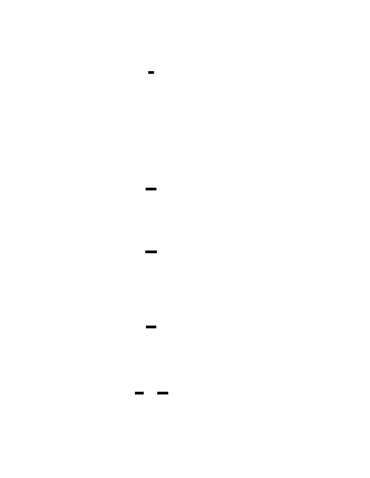
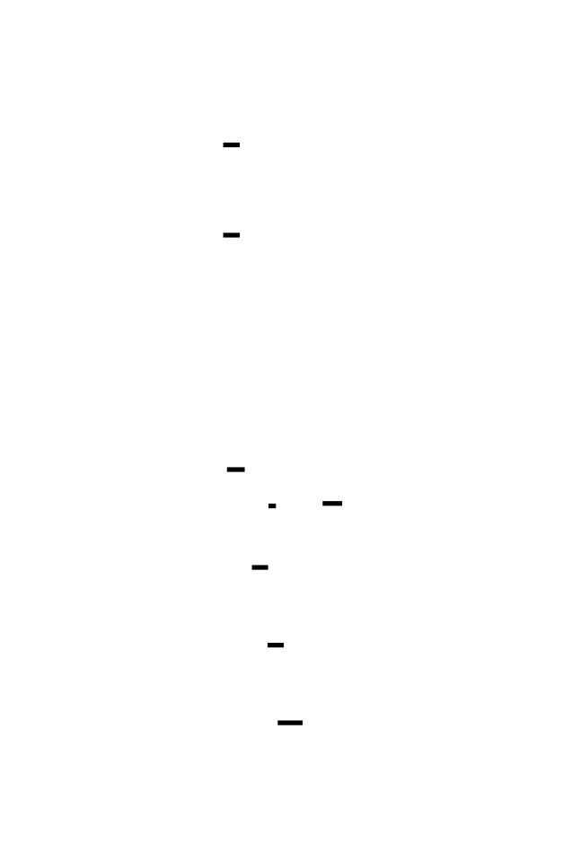
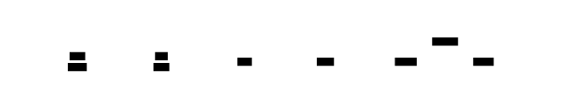
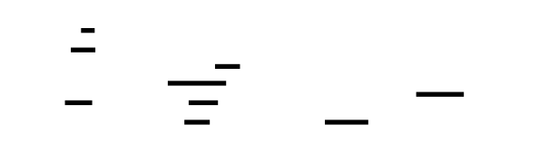

# 🎯 Project Charter: Lock-free Data Structures
## What You Are Building
A production-grade lock-free data structure library implementing a Treiber stack, Michael-Scott queue, and split-ordered hash map—using compare-and-swap (CAS) operations with hazard pointer-based safe memory reclamation. By the end, you will have ~3,000 lines of C code that provides thread-safe push/pop, enqueue/dequeue, and insert/lookup/delete operations without any mutex locks, booting in any multi-threaded environment and handling concurrent access from 16+ threads with linearizable correctness.
## Why This Project Exists
Most developers use concurrent data structures daily—queues in task schedulers, hash maps in caches, stacks in allocators—but treat them as black boxes. Building them from scratch exposes the assumptions baked into every concurrent program: that memory operations aren't reordered, that pointers remain valid across thread switches, that "atomic" means more than just indivisible. Lock-free programming is essential for high-performance systems that must avoid contention bottlenecks in databases, operating systems, and real-time applications.
## What You Will Be Able to Do When Done
- Implement compare-and-swap loops with correct memory ordering for different synchronization needs
- Demonstrate and prevent the ABA problem using tagged pointers
- Build a lock-free Treiber stack with CAS-based push and pop operations
- Implement the Michael-Scott lock-free FIFO queue with a helping mechanism
- Design safe memory reclamation using hazard pointers to prevent use-after-free
- Build a lock-free hash map with atomic insert, lookup, and delete operations
- Verify linearizability of lock-free structures under concurrent stress testing
- Debug subtle memory ordering bugs that only appear on ARM or under high contention
## Final Deliverable
~3,000 lines of C across 5 modules (atomic primitives, Treiber stack, Michael-Scott queue, hazard pointers, hash map) plus test suites. The library handles 1M+ concurrent operations from 16+ threads with zero lost updates, no memory leaks, and correct linearizable semantics. Includes benchmarks comparing lock-free vs mutex-based throughput.
## Is This Project For You?
**You should start this if you:**
- Are comfortable with C systems programming (pointers, memory allocation, structs)
- Understand basic concurrency (threads, mutexes, race conditions)
- Have encountered cache coherence concepts or CPU memory models
- Want to understand what "happens-before" really means at the hardware level
**Come back after you've learned:**
- C pointer arithmetic and memory layout (essential for tagged pointers)
- Basic thread programming with pthreads or equivalent
- What a race condition looks like and why mutexes prevent them
## Estimated Effort
| Phase | Time |
|-------|------|
| Atomic Operations & Memory Ordering | ~10 hours |
| Lock-free Treiber Stack | ~10 hours |
| Michael-Scott Lock-free Queue | ~10 hours |
| Hazard Pointers & Memory Reclamation | ~12 hours |
| Lock-free Hash Map | ~13 hours |
| **Total** | **~55 hours** |
## Definition of Done
The project is complete when:
- All three data structures (stack, queue, hash map) pass concurrent stress tests with 16+ threads and 1M+ operations with no lost elements, no crashes, and no memory corruption
- Hazard pointer system successfully reclaims memory with bounded retirement lists under sustained load
- Concurrent counter stress tests produce exactly N×M final values with zero lost updates
- Memory ordering demonstration tests show acquire/release preventing relaxed ordering anomalies
- All CAS operations use correct memory ordering (acquire on loads, release on successful stores)
- Linearizability is verified: stack preserves LIFO, queue preserves FIFO, hash map operations appear atomic at their CAS points

---

# 📚 Before You Read This: Prerequisites & Further Reading
> **Read these first.** The Atlas assumes you are familiar with the foundations below.
> Resources are ordered by when you should encounter them — some before you start, some at specific milestones.
---
## Memory Ordering & Atomics
### 🔬 Foundation (Read BEFORE starting)
| Resource | Type | Why It's Gold Standard |
|----------|------|----------------------|
| **"C++ Atomics: The Simple, the Buggy, and the Horrifying"** — Fedor Pikus (CppCon 2017) | Video (1h) | Best visual explanation of memory ordering you'll find. Pikus draws out exactly what happens when ordering goes wrong. Watch before Milestone 1. |
| **"std::atomic: What every programmer should know"** —cppreference.com | Reference | Exhaustive but precise. Keep it open while implementing. |
---
## Compare-and-Swap (CAS)
### 🔬 Foundation (Read BEFORE starting)
| Resource | Type | Why It's Gold Standard |
|----------|------|----------------------|
| **"A Pragmatic Implementation of Non-blocking Linked Lists"** — Timothy L. Harris (2001) | Paper | Introduced the two-phase delete (mark then unlink) used in Milestones 3 and 5. The technique is now standard practice. Read after Milestone 1, before Milestone 3. |
---
## Lock-Free Stacks
### 🔬 Deep Dive Available (Milestone 2)
| Resource | Type | Why It's Gold Standard |
|----------|------|----------------------|
| **"Systems Programming: Coping with Parallelism"** — R. K. Treiber (1986) | Paper | The original. Six pages that launched thirty years of lock-free research. The algorithm is still used verbatim in production systems. Read after completing Milestone 2. |
---
## Lock-Free Queues
### 🔬 Deep Dive Available (Milestone 3)
| Resource | Type | Why It's Gold Standard |
|----------|------|----------------------|
| **"Simple, Fast, and Practical Non-blocking and Blocking Concurrent Queue Algorithms"** — Michael & Scott (1996) | Paper | The Michael-Scott queue paper. Required reading. The "helping" mechanism they introduce is the key insight that makes lock-free queues practical. Read after Milestone 2, before Milestone 3. |
---
## Safe Memory Reclamation
### 🔬 Deep Dive Available (Milestone 4)
| Resource | Type | Why It's Gold Standard |
|----------|------|----------------------|
| **"Hazard Pointers: Safe Memory Reclamation for Lock-Free Objects"** — Maged Michael (2004) | Paper | The original hazard pointer paper. Michael explains the set-then-validate protocol that makes safe memory reclamation possible without locks. Read after Milestone 3, before Milestone 4. |
---
## Lock-Free Hash Maps
### 🔬 Deep Dive Available (Milestone 5)
| Resource | Type | Why It's Gold Standard |
|----------|------|----------------------|
| **"Intrusive and Non-intrusive Lock-free Hash Tables"** — Ori Shalev & Nir Shavit (2006) | Paper | Introduces split-ordered lists. The reverse-bit trick is explained beautifully here. Read after Milestone 4, before Milestone 5. |
---
## Cache Coherence
### 🔬 Foundation (Read after Milestone 1)
| Resource | Type | Why It's Gold Standard |
|----------|------|----------------------|
| **"A Primer on Memory Consistency and Cache Coherence"** — Sarita Adve & Kourosh Gharachorloo | Book Chapter | The definitive explanation of MESI protocol. Understanding this is essential for predicting lock-free performance. Read after Milestone 1, before attempting performance optimization. |
---
## Hardware Memory Models
### 🔬 Foundation (Read after Milestone 1)
| Resource | Type | Why It's Gold Standard |
|----------|------|----------------------|
| **"Memory Barriers: a Hardware View for Software Hackers"** — Paul McKenney (2010) | Whitepaper | McKenney bridges hardware and software like no one else. Essential for understanding why your code works on x86 but fails on ARM. Read after Milestone 1, before Milestone 2. |
---
## Cross-Domain Connections
| Resource | Type | When to Read | Why |
|----------|------|--------------|-----|
| **"Designing Data-Intensive Applications"** — Martin Kleppmann, Chapter 7 | Book Chapter | After Milestone 3 | The transaction isolation levels discussion connects directly to lock-free linearizability concepts. |
| **Linux kernel RCU documentation** — kernel.org/doc/Documentation/RCU | Documentation | After Milestone 4 | Read-Copy-Update is a specialized form of deferred reclamation. Comparing it with hazard pointers deepens understanding of both. |
| **Java's `java.util.concurrent` source code** — Doug Lea | Code | After Milestone 5 | Production-quality implementations of these algorithms. Specifically examine `ConcurrentLinkedQueue` (Michael-Scott) and `ConcurrentHashMap`. |
---
## When to Read What
| Milestone | Read Before | Read After |
|-----------|-------------|------------|
| **M1: Atomics** | Pikus video, cppreference | McKenney barriers paper, Adve/Gharachorloo coherence chapter |
| **M2: Treiber Stack** | Harris paper (mark-then-unlink) | Treiber original paper |
| **M3: MS Queue** | Michael-Scott paper | — |
| **M4: Hazard Pointers** | Michael hazard pointers paper | Linux RCU documentation |
| **M5: Hash Map** | Shalev-Shavit paper | Java `ConcurrentHashMap` source |
---
## Quick Reference: Key Algorithms
| Algorithm | Paper | Year | Where Used |
|-----------|-------|------|------------|
| Treiber Stack | Treiber | 1986 | Milestone 2 |
| Michael-Scott Queue | Michael & Scott | 1996 | Milestone 3 |
| Two-Phase Delete | Harris | 2001 | Milestones 3, 5 |
| Hazard Pointers | Michael | 2004 | Milestone 4 |
| Split-Ordered Lists | Shalev & Shavit | 2006 | Milestone 5 |

---

# Lock-free Data Structures

Lock-free data structures represent the pinnacle of concurrent programming, where threads cooperate without mutex locks by leveraging atomic CPU instructions. This project builds a complete lock-free toolkit: a Treiber stack, Michael-Scott queue, and split-ordered hash map—all using compare-and-swap (CAS) operations with safe memory reclamation via hazard pointers. The journey reveals why traditional locks become contention bottlenecks under high concurrency, and how atomic operations with careful memory ordering can achieve both correctness and performance.


<!-- MS_ID: lock-free-structures-m1 -->
# Atomic Operations & Memory Ordering
## The Fundamental Tension
Your CPU is a liar.
When you write `x = 1; y = 2;` in your code, you expect those statements to execute in that order. They don't. When Thread A writes `x = 1` and Thread B reads `x`, you expect B to see the value 1 after A's write completes. It might not.
The hardware beneath your code operates on entirely different principles than your mental model suggests. Modern CPUs execute instructions out of order, batch writes into store buffers, and maintain per-core caches that aren't instantly coherent with each other. A store instruction might sit in a buffer for 50-100 cycles before reaching L1 cache. Another core reading the same address might see a stale value during that window.
```
Thread A (Core 0)          Thread B (Core 1)
─────────────────          ─────────────────
x = 1                      
                           r1 = x    // might see 0!
y = 1                      
                           r2 = y    // might see 1
// B can observe y == 1 but x == 0
// Despite x being written BEFORE y in program order!
```
This isn't a bug. It's an optimization that makes your code run 10-100x faster. The CPU assumes single-threaded code doesn't care about these reorderings, and it's usually right.
But you're about to write multi-threaded lock-free code. The assumptions break.


---
## The Three-Level View
Before diving into atomics, understand what happens at each level when two threads share a variable:
**Level 1 — Application**: You write `x++`. Looks atomic—read, modify, write. It isn't. Between the read and write, another thread can interleave.
**Level 2 — OS/Kernel**: The scheduler can preempt your thread mid-operation. No help here—atomic operations must work without kernel intervention.
**Level 3 — Hardware**: Your `x++` compiles to three instructions: `load x into register`, `increment register`, `store register to x`. The CPU pipeline overlaps these with other instructions. The cache hierarchy means Core 0's write to x might not be visible to Core 1 for dozens of cycles.
```
x++ (conceptually atomic, actually:
  mov    rax, [x]      ; LOAD: ~3 cycles if in L1, ~100+ if miss
  add    rax, 1        ; MODIFY: 1 cycle
  mov    [x], rax      ; STORE: sits in store buffer ~50 cycles
)
```
The gap between "I wrote it" and "everyone sees it" is real and measurable. Atomic operations with proper memory ordering bridge this gap.
---
## What Atomic Actually Means
**Atomicity** means indivisibility. An atomic operation appears to occur at a single instant—no thread can observe a partially-completed state. This is distinct from ordering (when do other threads see it) and visibility (do they see it at all).
C's `<stdatomic.h>` provides atomic types and operations:
```c
#include <stdatomic.h>
// Atomic integer - all operations on 'counter' are atomic
atomic_int counter = ATOMIC_VAR_INIT(0);
// Atomic pointer - the pointer itself is atomic, not the pointed-to data
atomic_void_ptr head = ATOMIC_VAR_INIT(NULL);
```
The key operations you'll use:
| Operation | What It Does | Hardware Instruction (x86) |
|-----------|--------------|---------------------------|
| `atomic_load(&x)` | Read the value atomically | `mov` (aligned loads are atomic) |
| `atomic_store(&x, v)` | Write the value atomically | `mov` (aligned stores are atomic) |
| `atomic_compare_exchange_strong(&x, &expected, desired)` | If `x == expected`, set `x = desired` and return true; else update `expected = x` and return false | `lock cmpxchg` |
| `atomic_fetch_add(&x, v)` | Atomically do `x += v` and return the OLD value | `lock xadd` |
The `lock` prefix on x86 instructs the CPU to lock the memory bus (or cache line) for the duration of the operation, preventing other cores from accessing that address.
---
## The CAS Loop Pattern
Compare-and-swap (CAS) is the foundational primitive for all lock-free algorithms. The pattern:
```c
bool atomic_compare_exchange_strong(
    _Atomic T* obj,      // The atomic variable
    T* expected,         // IN: what we think it is; OUT: what it actually was
    T desired            // What we want it to become
);
```
The "strong" variant never spuriously fails—it only returns false if the value actually changed. There's also a "weak" variant that can fail spuriously (useful in loops on platforms with weak CAS instructions like ARM LL/SC).
A CAS loop implements optimistic concurrency: assume you'll succeed, try, and retry if you lost a race:
```c
// Atomically increment an atomic_int using CAS
void atomic_increment(atomic_int* counter) {
    int old_val, new_val;
    do {
        old_val = atomic_load(counter);        // Read current value
        new_val = old_val + 1;                  // Compute new value
        // Try to swap; if counter != old_val, someone modified it
        // and old_val is updated to the current value
    } while (!atomic_compare_exchange_strong(counter, &old_val, new_val));
}
```


The CAS either succeeds (you won the race, the value is now `new_val`) or fails (someone else modified it, you now know the current value in `old_val`, loop and retry). This is lock-free because progress is always made—either you succeed, or someone else did.
**Fetch-and-add** is a more efficient primitive when you only need to add/subtract:
```c
int old = atomic_fetch_add(counter, 1);  // Atomically increment, return old value
// old is the value BEFORE the increment
// *counter is now old + 1
```
On x86, `atomic_fetch_add` compiles to a single `lock xadd` instruction—no loop needed. On ARM, it may compile to an LL/SC loop internally.
---
## The Memory Ordering Revelation
Here's where most developers get hurt.
You implemented the CAS loop above. You increment a counter from multiple threads. You use `atomic_compare_exchange_strong`. The final value should be correct, right?
```c
// IS THIS CORRECT?
atomic_int counter = 0;
void increment_wrong(void) {
    int old = atomic_load_explicit(&counter, memory_order_relaxed);
    while (!atomic_compare_exchange_strong_explicit(
        &counter, &old, old + 1,
        memory_order_relaxed,  // success ordering
        memory_order_relaxed   // failure ordering
    ));
}
```
The `memory_order_relaxed` means "no ordering guarantees, just atomicity." This code has no data races (all operations are atomic) and produces the correct final counter value. But it's still wrong for most real use cases.
Why? Because `memory_order_relaxed` doesn't establish any **happens-before** relationships. Other memory operations—on *other* variables—can be reordered around these atomic operations in ways that break your program's logic.

> **🔑 Foundation: Memory ordering and the happens-before relationship**
> 
> ## What It Is
**Memory ordering** defines the rules for how the CPU and compiler may reorder memory operations (reads and writes) relative to each other. **Happens-before** is the formal relationship that guarantees one operation's effects are visible to another.
In a single-threaded world, code executes in program order — line 1, then line 2, then line 3. But in concurrent systems, three forces conspire to break this illusion:
1. **Compiler optimizations**: The compiler may reorder, cache in registers, or eliminate redundant-looking accesses
2. **CPU out-of-order execution**: Modern processors execute instructions in whatever order maximizes pipeline utilization
3. **Cache hierarchies**: Different cores may see writes in different orders due to cache propagation delays
Without explicit ordering guarantees, this code can fail:
```rust
// Thread 1
data = 42;        // (1)
ready = true;     // (2)
// Thread 2
while (!ready) {} // (3)
print(data);      // (4)
```
The CPU might execute (2) before (1). Thread 2 might see `ready == true` but read `data` as 0.
**Happens-before** is the antidote. If operation A "happens-before" operation B, then A's effects are guaranteed to be visible to B. This relationship is transitive: if A happens-before B and B happens-before C, then A happens-before C.
Happens-before edges come from:
- **Sequenced-before**: Within a single thread, statements execute in order (mostly)
- **Synchronization**: Locks, atomics with appropriate ordering, thread creation/joining
- **Atomic operations with explicit memory ordering**: `Release` establishes a happens-before edge to a matching `Acquire`
## Why You Need It Right Now
You're building lock-free data structures. Every correct lock-free algorithm depends on precise happens-before relationships. Without them:
- Your queue's `push` might write the data pointer but the other thread sees the updated tail pointer first — and dereferences garbage
- Your reference count might decrement to zero while another thread is still reading through the pointer
- Your "safe" publication pattern might publish a partially constructed object
The `SeqCst`, `Acquire`, `Release`, `AcqRel`, and `Relaxed` orderings you see in atomic operations are vocabulary for establishing happens-before edges. Choosing wrong doesn't cause crashes in your tests — it causes rare, impossible-to-debug failures in production under load.
## The Key Insight
**Happens-before is about visibility, not time.**
Two events can happen "at the same time" in wall-clock terms but still have a happens-before relationship. Conversely, Thread A's operation might complete before Thread B's operation starts in real time, but without a synchronization edge, there's no happens-before — and B might see stale data.
Think of happens-before as a **directed acyclic graph (DAG)** of operations. Edges only exist where the language guarantees them. If there's no path from A to B in this graph, the compiler and CPU are free to make B observe any valid program state — including ones that seem logically impossible.

### The Memory Orderings
C11/C++11 define six memory orderings, forming a lattice from weakest to strongest:
| Ordering | Guarantees | Use Case | Relative Cost |
|----------|------------|----------|---------------|
| `memory_order_relaxed` | Atomicity only, no ordering | Simple counters, statistics | ~1x (no barrier) |
| `memory_order_consume` | Data-dependent ordering (rarely used) | Dependent pointer loads | ~1x on most hardware |
| `memory_order_acquire` | No reads/writes before this can be reordered after | Lock acquisition, reading published data | ~2-5x (load barrier) |
| `memory_order_release` | No reads/writes after this can be reordered before | Lock release, publishing data | ~2-5x (store barrier) |
| `memory_order_acq_rel` | Combine acquire + release | Read-modify-write that both publishes and acquires | ~2-5x |
| `memory_order_seq_cst` | Total global ordering of all seq_cst operations | Default, safest, slowest | ~10-100x (full fence) |


### Acquire and Release: The Producer-Consumer Pattern
The acquire/release pair is the workhorse of lock-free programming. Think of it as a one-way message passing mechanism:
- **Release** on the writer side: "Everything I wrote before this store is now visible to anyone who reads this value"
- **Acquire** on the reader side: "Everything the writer wrote before their release store is visible to me after I read this value"
```c
// Shared data
typedef struct {
    int data[1024];
    atomic_int ready;  // 0 = not ready, 1 = ready
} MessageBuffer;
MessageBuffer buffer;
// Producer thread
void produce(void) {
    // Write data FIRST
    for (int i = 0; i < 1024; i++) {
        buffer.data[i] = compute_value(i);
    }
    // THEN publish with RELEASE ordering
    // This ensures all the data[] writes are visible
    // before ready becomes 1
    atomic_store_explicit(&buffer.ready, 1, memory_order_release);
}
// Consumer thread
int consume(void) {
    // Wait for ready with ACQUIRE ordering
    // This ensures we see all the data[] writes
    // after we see ready == 1
    while (atomic_load_explicit(&buffer.ready, memory_order_acquire) == 0) {
        // spin or yield
    }
    // Now safe to read data[]
    return buffer.data[0];  // Guaranteed to see producer's writes
}
```
The happens-before chain:
1. Producer writes to `buffer.data[i]` (happens-before the release store)
2. Producer does release store to `buffer.ready` (synchronizes-with the acquire load)
3. Consumer does acquire load from `buffer.ready`, sees 1
4. Consumer reads `buffer.data[0]` (happens-after the acquire load)
By transitivity, producer's writes to `data[]` happen-before consumer's reads. This is the fundamental pattern for publishing data between threads.
### Why Relaxed Fails: A Demonstration
Consider a classic message-passing test:
```c
atomic_int x = 0;
atomic_int y = 0;
int r1 = 0, r2 = 0;
// Thread 1
void thread1(void) {
    atomic_store_explicit(&x, 1, memory_order_relaxed);  // x = 1
    atomic_store_explicit(&y, 1, memory_order_relaxed);  // y = 1
}
// Thread 2
void thread2(void) {
    r1 = atomic_load_explicit(&y, memory_order_relaxed);  // read y
    r2 = atomic_load_explicit(&x, memory_order_relaxed);  // read x
}
// Can we observe: r1 == 1 && r2 == 0?
// With relaxed: YES. Thread 2 sees y = 1 but x = 0.
// With release/acquire or seq_cst: NO. If y == 1, then x must also be 1.
```
With `memory_order_relaxed`, the CPU can reorder the stores (store y before x) or the loads (load y after x). The result `r1 = 1, r2 = 0` violates intuition but is perfectly legal.
With `memory_order_release` on the stores and `memory_order_acquire` on the loads:
- Thread 1: store x (release) happens-before store y (release)
- Thread 2: load y (acquire) happens-before load x (acquire)
- If Thread 2 sees `y == 1`, it synchronizes with Thread 1's store to y, which means it must also see `x == 1`.


### Platform Differences: x86 vs ARM
This is where "works on my machine" becomes a production nightmare.
**x86 (TSO - Total Store Order)**: Strong ordering. Stores are seen in order by other cores. Load-load and store-store reorderings are prevented by hardware. Only store-load reordering is possible (a store can be delayed while a later load executes).
**ARM (Weakly Ordered)**: Minimal guarantees. Any load can be reordered with any other load. Any store can be reordered with any other store. Loads and stores can be reordered with each other.
```c
// On x86: This "works" with relaxed because hardware prevents most reorderings
// On ARM: This is BROKEN with relaxed; explicit acquire/release required
atomic_int flag = 0;
int data = 0;
// Thread 1
void writer(void) {
    data = 42;
    atomic_store_explicit(&flag, 1, memory_order_relaxed);  // BUG on ARM!
}
// Thread 2  
void reader(void) {
    if (atomic_load_explicit(&flag, memory_order_relaxed)) {  // BUG on ARM!
        printf("%d\n", data);  // Might print 0 on ARM!
    }
}
```
Always use the correct memory ordering, even on x86. Your code might be ported to ARM (mobile devices, Apple Silicon, AWS Graviton), and subtle bugs are worse than explicit ones.
---
## The ABA Problem
You understand atomics. You understand memory ordering. Now you're ready to build lock-free structures. Here's the trap waiting for you.

> **🔑 Foundation: The ABA problem**
> 
> ## What It Is
The **ABA problem** is a subtle race condition in lock-free algorithms that use compare-and-swap (CAS) operations. It occurs when a value changes from A to B and back to A, making a CAS operation incorrectly believe nothing has changed.
Here's the classic scenario with a lock-free stack:
```
Initial state:
top → [A] → [B] → [C] → null
Thread 1 wants to pop:
  1. Reads top = ptr_to_A
  2. Reads A.next = ptr_to_B
  3. Gets preempted before CAS...
Thread 2 runs:
  4. Pops A: top → [B] → [C]
  5. Pops B: top → [C]
  6. Deletes A and B (or reuses them)
  7. Pushes a new node that happens to be at A's old address
     (or pushes A again after modifying it)
     top → [A'] → [D] → ...
Thread 1 resumes:
  8. CAS(top, ptr_to_A, ptr_to_B)
     - top still equals ptr_to_A ✓
     - CAS succeeds!
     - top → [B] (which has been freed/reused)
Result: Memory corruption, use-after-free, or lost data.
```
The CAS succeeded because the pointer value matched, but the *meaning* of that pointer completely changed. Thread 1's assumption that `A.next` still points to a valid node B was falsified by Thread 2's intervening operations.
## Why You Need It Right Now
If you're implementing lock-free linked structures — queues, stacks, lists, hazard pointers — you will encounter ABA. It's not a theoretical concern; it's a practical bug that:
- **Survives testing**: ABA is timing-dependent. Your tests might never trigger the exact preemption window
- **Corrupts silently**: The CAS succeeds, so no error path is triggered. Data just silently rots
- **Exploits memory reuse**: Memory allocators often return recently-freed addresses, maximizing the chance of A→B→A
Common solutions you'll implement:
- **Version counters / epoch numbers**: Pair each pointer with a counter that increments on every modification. CAS on both pointer AND counter
- **Hazard pointers**: Prevent reclamation while any thread holds a reference
- **Epoch-based reclamation**: Defer memory reclamation until no thread can hold stale references
- **Double-width CAS**: Use 128-bit CAS to atomically update pointer+counter together
## The Key Insight
**ABA reveals that identity ≠ state.**
A pointer value (identity) tells you *where* something is, but not *what* it is (state) or *when* you observed it. When memory can be freed and reused, the same address can refer to completely different logical objects over time.
The solution is always the same principle: **tag your observations with a version or epoch**. You're not just asking "does this pointer still point here?" but "is this pointer still pointing to the same version of the same object I observed?"

Consider a naive lock-free stack pop:
```c
typedef struct Node {
    int value;
    struct Node* next;
} Node;
atomic_pointer top;  // Points to top node
// NAIVE POP - HAS ABA BUG!
int pop_naive(void) {
    Node* old_top = atomic_load(&top);
    if (old_top == NULL) {
        return -1;  // Stack empty
    }
    Node* new_top = old_top->next;
    // PROBLEM: Between loading old_top and this CAS...
    // Another thread might have popped A, pushed C, 
    // then pushed A again (recycled node)
    if (atomic_compare_exchange_strong(&top, &old_top, new_top)) {
        return old_top->value;
    }
    // CAS failed, retry
    return pop_naive();
}
```
The ABA scenario:
```
Initial state:
top → A → B → C → NULL
Thread 1: loads old_top = A, new_top = B
           (about to CAS, but gets preempted)
Thread 2: pop() succeeds: top → B → C → NULL, A is freed
Thread 2: pop() succeeds: top → C → NULL, B is freed  
Thread 2: push(X): top → X → C → NULL
Thread 2: push(A): top → A → X → C → NULL (recycled A!)
Thread 1: resumes, CAS(top, A, B) 
           - old_top == A? YES! (A was pushed again)
           - CAS SUCCEEDS
           - top = B
BUT: B was freed! top now points to freed memory!
```


The CAS succeeded because the value (pointer A) matched. But the *meaning* of A changed—it was removed, freed, and reallocated. The stack structure changed entirely, but the CAS only compared the single pointer value.
This isn't theoretical. It happens in production. Memory allocators reuse freed blocks quickly. A recycled node has the same address as a previously popped node, and the naive CAS cannot distinguish them.
### Tagged Pointers: Versioning for Safety
The solution: attach a version counter to the pointer. CAS compares both the pointer AND the version. Even if A is recycled, its version counter has incremented.
```c
// Combine a pointer with a version counter
// Requires double-width CAS (128-bit on 64-bit platforms)
typedef struct {
    uint64_t version;  // Incremented on every modification
    Node* ptr;         // The actual pointer
} TaggedPointer;
_Atomic TaggedPointer tagged_top;
int pop_safe(void) {
    TaggedPointer old_top, new_top;
    do {
        old_top = atomic_load(&tagged_top);
        if (old_top.ptr == NULL) {
            return -1;
        }
        new_top.ptr = old_top.ptr->next;
        new_top.version = old_top.version + 1;  // Increment version!
        // CAS compares BOTH pointer and version
        // Even if ptr is recycled, version won't match
    } while (!atomic_compare_exchange_strong(&tagged_top, &old_top, new_top));
    return old_top.ptr->value;
}
```
On 64-bit platforms, `TaggedPointer` is 128 bits (16 bytes). This requires the `cmpxchg16b` instruction, available on all x86-64 CPUs since the K8/NetBurst era. C11's `atomic_compare_exchange_strong` on a `_Atomic` 16-byte struct will use this instruction when available.

> **🔑 Foundation: MESI cache coherence protocol**
> 
> ## What It Is
**MESI** is a cache coherence protocol used by modern multi-core processors to maintain consistency across each core's private L1/L2 caches. The name is an acronym for the four states a cache line can be in:
| State | Meaning | Can Read? | Can Write? | Copies in Other Caches? |
|-------|---------|-----------|------------|------------------------|
| **M**odified | This cache has the only valid copy; it's been modified | ✓ | ✓ | No |
| **E**xclusive | This cache has the only valid copy; it's clean | ✓ | ✓ (becomes M) | No |
| **S**hared | This cache has a read-only copy; other caches may too | ✓ | ✗ | Possibly |
| **I**nvalid | This cache line holds no valid data | ✗ | ✗ | N/A |
State transitions occur on CPU instructions and bus messages:
```
Read hit in M/E/S → stay in current state, data from local cache
Read miss → BusRd → transition to S (or E if no other copies)
Write hit in M → stay M
Write hit in E → transition to M
Write hit in S → BusUpgr → transition to M, others → I
Write miss → BusRdX → transition to M, others → I
```
The protocol ensures **single-writer, multiple-reader** semantics at the hardware level. Before a core can write, it must first invalidate all other copies — forcing them to I state. This is why write contention is expensive even for atomic operations.
## Why You Need It Right Now
Understanding MESI explains performance phenomena you'll encounter in concurrent code:
**False sharing**: Two unrelated variables on the same 64-byte cache line. Core 1 writes to `var_a`, Core 2 writes to `var_b`. Even though they never touch the same bytes, the coherence protocol sees cache-line-level conflict:
- Core 1 transitions line to M, invalidating Core 2's copy
- Core 2 transitions line to M, invalidating Core 1's copy
- The line "bounces" between cores (ping-pong) at bus/B speeds
**Atomic operation costs vary dramatically**:
- `fetch_add` on a line in M state: ~10 cycles (local modification)
- `fetch_add` on a line in S state: ~100-300 cycles (must send invalidation, wait for acknowledgments)
- `fetch_add` on a line in I state: ~300+ cycles (must fetch from memory or remote cache)
**Read-only data is fast precisely because S state allows concurrent reads**. Multiple cores can hold S copies simultaneously with zero coordination overhead.
## The Key Insight
**Cache coherence is a distributed consensus protocol running at hardware speed.**
Every write to shared data requires coordination — either implicit (invalidating other caches) or explicit (the core waits for acknowledgments). The protocol guarantees correctness (no stale reads), but performance depends entirely on minimizing the coordination overhead.
When you design concurrent data structures, you're designing around this protocol:
- **Padding** to prevent false sharing puts variables on different cache lines
- **Thread-local buffers** let cores work in M state without coordination
- **Read-copy-update (RCU)** exploits the fact that S-state reads are cheap; defer reclamation until all readers complete


---
## Hardware Soul: What Happens on the Metal
Every atomic operation negotiates with the cache hierarchy. Understanding this explains the performance differences.
**Cache Line (64 bytes)**: The unit of cache transfer. When Core 0 reads address X, it pulls the entire 64-byte aligned line containing X into its L1 cache.
**MESI Protocol**: Each cache line has a state:
- **M**odified: This core has the only valid copy; main memory is stale
- **E**xclusive: This core has the only copy; memory is up-to-date
- **S**hared: Multiple cores may have copies; all match memory
- **I**nvalid: This core's copy is not usable


When Core 0 does `atomic_fetch_add(&x, 1)`:
1. If cache line is Shared: Core 0 must gain exclusive ownership → sends invalidation messages to other cores
2. Other cores acknowledge invalidation (their copies become Invalid)
3. Core 0's line transitions to Modified
4. The increment happens
5. Total latency: 50-200 cycles depending on how many cores shared the line
When Core 0 does `atomic_load(&x)` with relaxed ordering:
1. If line is in L1 cache (any state except Invalid): ~3 cycles
2. If line is in L2: ~12 cycles
3. If line is in L3: ~40 cycles
4. If line is in another core's Modified state: ~100+ cycles (must fetch modified data)
**The cost of contention**: If N threads all hammer the same cache line with atomic operations:
- Each operation forces the line to bounce between cores
- Latency per operation: O(N) cache-coherence round trips
- This is called "cache line ping-pong" and destroys scalability
```c
// BAD: High contention on single counter
atomic_int shared_counter;
void increment(void) {
    atomic_fetch_add(&shared_counter, 1);  // Contention hotspot!
}
// BETTER: Per-thread counters, occasional aggregation
atomic_int global_counter;
__thread int local_counter = 0;  // Thread-local, no contention
void increment_fast(void) {
    local_counter++;
    if (local_counter >= 1000) {
        atomic_fetch_add(&global_counter, local_counter);
        local_counter = 0;
    }
}
```


---
## Building Your Atomic Toolkit
Now you'll implement the core primitives you'll use throughout this project.
### Atomic Wrapper API
```c
// atomic_wrappers.h
#ifndef ATOMIC_WRAPPERS_H
#define ATOMIC_WRAPPERS_H
#include <stdatomic.h>
#include <stdbool.h>
#include <stdint.h>
// ============================================================================
// Atomic Load with configurable ordering
// ============================================================================
static inline int atomic_load_int(atomic_int* addr, memory_order order) {
    return atomic_load_explicit(addr, order);
}
// ============================================================================
// Atomic Store with configurable ordering  
// ============================================================================
static inline void atomic_store_int(atomic_int* addr, int value, memory_order order) {
    atomic_store_explicit(addr, value, order);
}
// ============================================================================
// Compare-and-Swap with full result
// Returns: true if CAS succeeded, false otherwise
// On failure: *actual contains the observed value
// ============================================================================
static inline bool atomic_cas_int(
    atomic_int* addr,
    int expected,
    int desired,
    int* actual,
    memory_order success_order,
    memory_order failure_order
) {
    int exp = expected;
    bool result = atomic_compare_exchange_strong_explicit(
        addr, &exp, desired, success_order, failure_order
    );
    if (!result && actual) {
        *actual = exp;  // Tell caller what we actually saw
    }
    return result;
}
// ============================================================================
// Fetch-and-Add: atomically add delta, return OLD value
// ============================================================================
static inline int atomic_fetch_add_int(atomic_int* addr, int delta, memory_order order) {
    return atomic_fetch_add_explicit(addr, delta, order);
}
// ============================================================================
// Tagged Pointer for ABA prevention (requires cmpxchg16b on x86-64)
// ============================================================================
typedef struct {
    uintptr_t ptr;      // Lower 48 bits usable on x86-64 (canonical addresses)
    uint64_t version;   // Monotonically increasing version counter
} TaggedPtr;
// Use _Atomic with a 16-byte struct for double-width CAS
typedef _Atomic TaggedPtr AtomicTaggedPtr;
static inline bool atomic_cas_tagged(
    AtomicTaggedPtr* addr,
    TaggedPtr expected,
    TaggedPtr desired,
    memory_order success_order,
    memory_order failure_order
) {
    return atomic_compare_exchange_strong_explicit(
        addr, &expected, desired, success_order, failure_order
    );
}
#endif // ATOMIC_WRAPPERS_H
```
### Concurrent Counter Stress Test
```c
// counter_stress_test.c
#include "atomic_wrappers.h"
#include <pthread.h>
#include <stdio.h>
#include <stdlib.h>
#include <assert.h>
#define NUM_THREADS 16
#define INCREMENTS_PER_THREAD 1000000
atomic_int counter = ATOMIC_VAR_INIT(0);
// Increment using CAS loop (slower but demonstrates pattern)
void* increment_cas_loop(void* arg) {
    (void)arg;
    for (int i = 0; i < INCREMENTS_PER_THREAD; i++) {
        int old_val, new_val;
        do {
            old_val = atomic_load_explicit(&counter, memory_order_relaxed);
            new_val = old_val + 1;
        } while (!atomic_compare_exchange_strong_explicit(
            &counter, &old_val, new_val,
            memory_order_relaxed,  // This is just a counter, no other data
            memory_order_relaxed
        ));
    }
    return NULL;
}
// Increment using fetch_add (faster, preferred when possible)
void* increment_fetch_add(void* arg) {
    (void)arg;
    for (int i = 0; i < INCREMENTS_PER_THREAD; i++) {
        atomic_fetch_add_explicit(&counter, 1, memory_order_relaxed);
    }
    return NULL;
}
int main(void) {
    pthread_t threads[NUM_THREADS];
    printf("Testing CAS loop increment...\n");
    atomic_store(&counter, 0);
    for (int i = 0; i < NUM_THREADS; i++) {
        pthread_create(&threads[i], NULL, increment_cas_loop, NULL);
    }
    for (int i = 0; i < NUM_THREADS; i++) {
        pthread_join(threads[i], NULL);
    }
    int expected = NUM_THREADS * INCREMENTS_PER_THREAD;
    int actual = atomic_load(&counter);
    printf("Expected: %d, Actual: %d, %s\n", 
           expected, actual, 
           (expected == actual) ? "PASS" : "FAIL");
    assert(expected == actual);
    printf("\nTesting fetch_add increment...\n");
    atomic_store(&counter, 0);
    for (int i = 0; i < NUM_THREADS; i++) {
        pthread_create(&threads[i], NULL, increment_fetch_add, NULL);
    }
    for (int i = 0; i < NUM_THREADS; i++) {
        pthread_join(threads[i], NULL);
    }
    actual = atomic_load(&counter);
    printf("Expected: %d, Actual: %d, %s\n", 
           expected, actual, 
           (expected == actual) ? "PASS" : "FAIL");
    assert(expected == actual);
    printf("\nAll tests passed!\n");
    return 0;
}
```
Compile and run:
```bash
gcc -O2 -pthread counter_stress_test.c -o counter_test
./counter_test
```
### Memory Ordering Demonstration
```c
// ordering_demo.c
// Demonstrates that relaxed ordering can produce surprising results
// while acquire/release prevents them
#include <stdatomic.h>
#include <pthread.h>
#include <stdio.h>
#include <string.h>
#define ITERATIONS 1000000
// Test: Can Thread 2 see y == 1 but x == 0?
atomic_int x = ATOMIC_VAR_INIT(0);
atomic_int y = ATOMIC_VAR_INIT(0);
int surprising_result_count = 0;
void* writer_relaxed(void* arg) {
    (void)arg;
    atomic_store_explicit(&x, 1, memory_order_relaxed);
    atomic_store_explicit(&y, 1, memory_order_relaxed);
    return NULL;
}
void* reader_relaxed(void* arg) {
    (void)arg;
    while (atomic_load_explicit(&y, memory_order_relaxed) == 0) {
        // Wait for y to become 1
    }
    // Now check x - with relaxed, we might see 0!
    if (atomic_load_explicit(&x, memory_order_relaxed) == 0) {
        // SURPRISING: y == 1 but x == 0
        __sync_fetch_and_add(&surprising_result_count, 1);
    }
    return NULL;
}
void test_relaxed(void) {
    atomic_store(&x, 0);
    atomic_store(&y, 0);
    surprising_result_count = 0;
    pthread_t t1, t2;
    pthread_create(&t1, NULL, writer_relaxed, NULL);
    pthread_create(&t2, NULL, reader_relaxed, NULL);
    pthread_join(t1, NULL);
    pthread_join(t2, NULL);
}
void* writer_release(void* arg) {
    (void)arg;
    atomic_store_explicit(&x, 1, memory_order_relaxed);
    atomic_store_explicit(&y, 1, memory_order_release);  // Release after x write
    return NULL;
}
void* reader_acquire(void* arg) {
    (void)arg;
    while (atomic_load_explicit(&y, memory_order_acquire) == 0) {  // Acquire before x read
        // Wait for y to become 1
    }
    // With acquire/release, we MUST see x == 1
    if (atomic_load_explicit(&x, memory_order_relaxed) == 0) {
        // This should NEVER happen with acquire/release
        __sync_fetch_and_add(&surprising_result_count, 1);
    }
    return NULL;
}
void test_acquire_release(void) {
    atomic_store(&x, 0);
    atomic_store(&y, 0);
    surprising_result_count = 0;
    pthread_t t1, t2;
    pthread_create(&t1, NULL, writer_release, NULL);
    pthread_create(&t2, NULL, reader_acquire, NULL);
    pthread_join(t1, NULL);
    pthread_join(t2, NULL);
}
int main(void) {
    printf("=== Memory Ordering Demonstration ===\n\n");
    printf("Testing RELAXED ordering (may see y=1, x=0)...\n");
    int relaxed_surprises = 0;
    for (int i = 0; i < ITERATIONS; i++) {
        test_relaxed();
        relaxed_surprises += surprising_result_count;
    }
    printf("Surprising results (y=1, x=0): %d / %d\n", 
           relaxed_surprises, ITERATIONS);
    printf("On x86 (TSO): likely 0 (hardware prevents this)\n");
    printf("On ARM (weak): likely > 0 (hardware allows this)\n\n");
    printf("Testing ACQUIRE/RELEASE ordering (should never see y=1, x=0)...\n");
    int acquire_release_surprises = 0;
    for (int i = 0; i < ITERATIONS; i++) {
        test_acquire_release();
        acquire_release_surprises += surprising_result_count;
    }
    printf("Surprising results (y=1, x=0): %d / %d\n", 
           acquire_release_surprises, ITERATIONS);
    printf("This should be 0 on ALL platforms.\n");
    return 0;
}
```


---
## Common Pitfalls
### Pitfall 1: Sequential Consistency Everywhere
Using `memory_order_seq_cst` for everything is tempting—it's the default and always correct. But it's also the slowest, inserting full memory fences on every atomic operation.
```c
// SAFE BUT SLOW
atomic_fetch_add_explicit(&counter, 1, memory_order_seq_cst);
// FAST AND CORRECT for simple counters
atomic_fetch_add_explicit(&counter, 1, memory_order_relaxed);
```
A simple counter that doesn't guard other data doesn't need strong ordering. Use `relaxed` for statistics, `acquire/release` for data publication, `seq_cst` only when you need a global total order.
### Pitfall 2: Indefinite Spinning
A CAS loop that never backs off wastes CPU cycles and can cause livelock under contention:
```c
// BAD: No backoff, wastes CPU
while (!atomic_compare_exchange_weak(&top, &old, new)) {
    // Spin immediately, hammering the cache line
}
// BETTER: Exponential backoff
int backoff = 1;
while (!atomic_compare_exchange_weak(&top, &old, new)) {
    for (volatile int i = 0; i < backoff; i++) { }  // Pause
    backoff = (backoff < 1024) ? backoff * 2 : backoff;
}
```
### Pitfall 3: Mixing Atomic and Non-Atomic Access
In C/C++, accessing the same variable through atomic and non-atomic operations is undefined behavior:
```c
atomic_int x;
int* px = (int*)&x;  // CASTING AWAY ATOMIC
atomic_store(&x, 1);
*px = 2;              // UNDEFINED BEHAVIOR!
```
The compiler is allowed to assume `x` is only modified through atomic operations and may optimize incorrectly. Always use atomic operations on atomic variables.
### Pitfall 4: Assuming x86 Behavior is Universal
Code that "works" on x86 may fail on ARM. x86's TSO (Total Store Order) prevents most reorderings that ARM's weak memory model allows. Always test with the correct memory ordering, and ideally test on multiple architectures.
---
## The Path Forward
You now have the foundational tools:
1. **CAS loops** for optimistic updates
2. **Memory ordering** for visibility guarantees
3. **Tagged pointers** for ABA prevention
4. **Understanding of hardware costs** (cache lines, MESI transitions)
With these primitives, you're ready to build actual lock-free data structures. The Treiber stack (Milestone 2) applies CAS to a singly-linked list, the Michael-Scott queue (Milestone 3) handles the complexity of two endpoints, and the hash map (Milestone 5) ties everything together.
But there's one piece missing: when can you actually free memory in a lock-free structure? The ABA problem arises precisely because nodes are freed and recycled. Milestone 4 (Hazard Pointers) solves this with a publish-subscribe mechanism for memory reclamation.
---
## Knowledge Cascade
**Lock-free Progress Guarantees**: Lock-free doesn't mean "fast"—it means "some thread always makes progress." Under high contention, lock-free structures can be slower than mutex-based ones. The advantage is robustness: no thread can block indefinitely (no deadlock, no priority inversion). In real-time systems, this matters more than raw throughput.
**Database MVCC (Cross-Domain)**: The ABA problem is isomorphic to the "lost update" problem in databases. Both occur when a write is based on stale assumptions about the current state. Both are solved by version counters—MVCC uses transaction IDs, tagged pointers use version numbers. The same principle appears in optimistic concurrency control across entirely different domains.
**Compiler Optimization Barriers**: Memory ordering isn't just hardware. Compilers reorder instructions too. The `atomic` types in C11/C++11 prevent both compiler and hardware reordering. If you're tempted to use inline assembly for memory barriers, you're probably missing compiler barriers too.
**Epoch-Based Reclamation**: Hazard pointers (Milestone 4) are one approach to safe memory reclamation. Another is epoch-based reclamation, used in Linux kernel RCU and Crossbeam (Rust). Each has trade-offs: hazard pointers have O(1) retirement but O(P) scan cost (P = thread count), while epochs have O(1) retirement but higher latency before reclamation.
---
[[CRITERIA_JSON: {"milestone_id": "lock-free-structures-m1", "criteria": ["Implement atomic_load, atomic_store, and atomic_compare_exchange wrappers that accept configurable memory_order parameters and correctly forward to C11 stdatomic.h equivalents", "Implement atomic_fetch_add wrapper that atomically adds a value and returns the previous value with configurable memory ordering", "Implement a tagged pointer structure combining a 48-bit pointer with a 16-bit or 64-bit version counter, using _Atomic struct for double-width CAS support", "Concurrent counter stress test: N threads each incrementing M times using CAS loops produces exactly N*M final value with zero lost updates across all runs", "Concurrent counter stress test: N threads each incrementing M times using fetch_add produces exactly N*M final value, demonstrating that fetch_add is both correct and faster than CAS loops", "Memory ordering demonstration: A test case where relaxed ordering produces the surprising result (observing y=1 but x=0 in a message-passing pattern) on weakly-ordered architectures (ARM) or documents why x86 TSO prevents it", "Memory ordering demonstration: The same test case with acquire/release ordering produces zero surprising results on all architectures, proving acquire/release establishes correct happens-before relationships", "ABA problem demonstration: A concrete test case showing a naive CAS on a recycled pointer incorrectly succeeding, with annotated code explaining the sequence of events that causes the bug", "All atomic wrapper functions are implemented as static inline functions in a header file for zero-overhead abstraction", "Counter stress tests run with 16+ threads and 1M+ total operations to ensure correctness under realistic contention"]}]
<!-- END_MS -->


<!-- MS_ID: lock-free-structures-m2 -->
# Lock-free Treiber Stack
## The Revelation: CAS Succeeds, But Your Data Dies
You think you understand the ABA problem. You read about it in M1. You nodded along. "Yes, version counters prevent recycling bugs." But here's what you haven't felt yet: **the ABA problem doesn't just corrupt your stack—it makes corruption *invisible*.**
When a naive CAS succeeds on a recycled pointer, nothing crashes immediately. The CAS returns `true`. Your code continues. The stack appears to work. And then, hours later, you get reports of missing elements. Or duplicate elements. Or mysterious crashes in unrelated code because your "successful" operation silently corrupted the linked structure.
The Treiber stack is deceptively simple: one atomic pointer, singly-linked nodes, push and pop. You could implement it in twenty lines. But those twenty lines contain every trap in concurrent programming—memory ordering, ABA, linearization points, and the deferred memory reclamation problem that will haunt you until M4.
This milestone builds the classic lock-free stack, but more importantly, it builds your intuition for *when CAS lies*.
---
## The Fundamental Tension
A stack has one entry point: the top. Every push and every pop must modify that single pointer. With a mutex, this is trivial—lock, modify, unlock. But mutexes have a fatal flaw under contention: **one slow thread blocks everyone**.
```
Thread A holds mutex, modifying top
Thread B wants to push → BLOCKED
Thread C wants to pop → BLOCKED
Thread D wants to push → BLOCKED
All threads wait for Thread A.
If A gets descheduled, everyone stalls.
```
The lock-free alternative: *optimistic* modification. Don't lock. Read the current state, compute your change locally, then try to swap in your new state atomically. If someone else modified it first, your swap fails—retry with the new state.
This sounds wonderful. It sounds like parallelism without coordination. But physics intervenes:
**Tension 1: The CAS Window**
Between reading the old value and executing CAS, another thread can change *anything*. Not just the top pointer—the entire structure. Your cached `old_top->next` pointer might point to freed memory.
**Tension 2: Cache Line Bouncing**
Every successful CAS invalidates the cache line containing `top` on all other cores. Under high contention, that 64-byte line ping-pongs between cores at ~100ns per bounce. The "lock-free" structure becomes a serialization point.
**Tension 3: Memory Reclamation**
When you pop a node, when can you free it? Another thread might have loaded a pointer to it nanoseconds ago and is about to dereference it. In M2, we punt: *we leak memory*. This is correct but unacceptable for production—M4's hazard pointers will solve it.
---
## Three-Level View: What Happens When You Push
**Level 1 — Application**: You call `push(stack, value)`. It returns. The value is now on the stack.
**Level 2 — OS/Kernel**: No syscalls. The entire operation happens in userspace. The kernel scheduler may preempt your thread at any point—during the read, during the CAS retry loop, even mid-instruction (but not mid-CAS; the CPU completes it).
**Level 3 — Hardware**: 
```
push() compiles to:
1. Allocate node (malloc or from pool)
2. Load top pointer from memory → L1 cache miss? ~40-100 cycles
3. Store node->next = old_top
4. CAS(top, old_top, node)
   - lock cmpxchg instruction
   - If cache line is Shared: ~100-300 cycles (must gain exclusive ownership)
   - If cache line is Modified by another core: ~200-500 cycles (must fetch, invalidate, wait)
5. If CAS failed: retry from step 2
```
The critical insight: step 4's cost depends entirely on what *other* threads are doing. Pushing to an idle stack: ~50 cycles. Pushing while 15 other threads also push: thousands of cycles per push, with most failing CAS and retrying.


---
## The Treiber Stack: Anatomy
The Treiber stack, published by R.K. Treiber in 1986, is the "Hello World" of lock-free data structures. It's simple enough to understand completely, yet contains every essential pattern you'll see in more complex structures.
```c
#include <stdatomic.h>
#include <stdint.h>
#include <stdlib.h>
#include <stdbool.h>
// ============================================================================
// Basic Node Structure
// ============================================================================
typedef struct Node {
    int64_t value;              // Payload - can be any type
    struct Node* next;          // Next node in stack (toward bottom)
} Node;
// ============================================================================
// Naive Stack - Has ABA Bug!
// ============================================================================
typedef struct {
    Node* top;                  // Points to top node or NULL if empty
} NaiveStack;
```
The stack is just a pointer to the top node. Each node points to the one below it. Push prepends; pop removes the first node.
### The Naive Push (Correct for Push)
```c
void naive_push(NaiveStack* stack, int64_t value) {
    Node* new_node = malloc(sizeof(Node));
    new_node->value = value;
    Node* old_top;
    do {
        old_top = atomic_load_explicit(
            (atomic_void_ptr*)&stack->top, 
            memory_order_acquire
        );
        new_node->next = old_top;  // Link new node to old top
    } while (!atomic_compare_exchange_strong_explicit(
        (atomic_void_ptr*)&stack->top,
        (void**)&old_top,
        new_node,
        memory_order_release,      // Release: publish new_node->next write
        memory_order_acquire       // Acquire: see others' updates on retry
    ));
}
```
The push is actually correct. Here's why:
1. **Load old_top with acquire**: Ensures we see all prior writes to the stack
2. **Write new_node->next**: This happens *before* we try to CAS
3. **CAS with release**: The release ordering ensures `new_node->next` write is visible before `top` is updated
4. **Failure ordering acquire**: On retry, we need to see the new top's writes
The CAS is the **linearization point**—the single instant where the push "takes effect." If CAS succeeds, the push happened. If it fails, someone else's push happened first, and we retry.


### The Naive Pop (Fatally Broken)
```c
// WARNING: This has the ABA bug!
int64_t naive_pop(NaiveStack* stack, bool* success) {
    Node* old_top;
    Node* new_top;
    do {
        old_top = atomic_load_explicit(
            (atomic_void_ptr*)&stack->top,
            memory_order_acquire
        );
        if (old_top == NULL) {
            *success = false;
            return 0;  // Stack empty
        }
        // ⚠️ DANGER: This dereference might access freed memory!
        new_top = old_top->next;
    } while (!atomic_compare_exchange_strong_explicit(
        (atomic_void_ptr*)&stack->top,
        (void**)&old_top,
        new_top,
        memory_order_release,
        memory_order_acquire
    ));
    *success = true;
    int64_t value = old_top->value;
    // NOTE: We're leaking old_top here (no free)
    // This is intentional - M4 will add safe reclamation
    return value;
}
```
Do you see the bug? It's subtle. The problem is in this line:
```c
new_top = old_top->next;
```
Between loading `old_top` and dereferencing it to get `next`, another thread might:
1. Pop `old_top`
2. Pop `old_top->next`
3. Free both nodes
4. Push a new node at `old_top`'s address (memory recycling)
Now `old_top->next` points to freed memory. Your CAS might even succeed (if the recycled address matches), but `new_top` is garbage.



---
## The ABA Problem: A Concrete Attack
Let's trace through a scenario where the naive pop corrupts the stack:
```
Initial Stack:
top → [A:10] → [B:20] → [C:30] → NULL
Thread 1 calls pop():
  1. old_top = A
  2. new_top = A->next = B
  3. PREEMPTED before CAS...
Thread 2 runs:
  4. pop() succeeds: top = B, returns 10
     Stack: top → [B:20] → [C:30] → NULL
     Node A is freed (or goes to free list)
  5. pop() succeeds: top = C, returns 20
     Stack: top → [C:30] → NULL
     Node B is freed
  6. push(5): allocates node... gets address of A!
     (Allocator recycles A's memory)
     Stack: top → [A':5] → NULL
     (Note: A' is new node at same address as old A)
Thread 1 resumes:
  7. CAS(top, A, B)
     - top == A? YES (A' is at same address)
     - CAS SUCCEEDS
     - top = B
Result: top points to freed memory!
        Stack is corrupted.
```
The CAS succeeded because it only compared the *address*, not the *identity* of the node. The address `A` was recycled, but it's now a completely different node.


### Why This Isn't Theoretical
"Surely this is rare?" No. In production:
1. **Allocators recycle aggressively**. jemalloc, tcmalloc, and glibc's ptmalloc2 all have per-thread caches that return recently-freed addresses quickly.
2. **The timing window is real**. A thread can be preempted at any point in the CAS loop. On a busy system, preemption windows of milliseconds are common.
3. **It's silent corruption**. The CAS returns `true`. No error path is triggered. Your program continues with a corrupted stack.
This exact bug appeared in early versions of Linux kernel's `kfifo`, in game engine particle systems, and in high-frequency trading order books. It's not academic.
---
## Tagged Pointers: Versioning Every Modification
The solution: **attach a version counter to the pointer**. Every time the stack top changes, increment the counter. CAS compares both the pointer *and* the version.
```c
// ============================================================================
// Tagged Pointer: Combines pointer with version counter
// On 64-bit systems, this is 128 bits (16 bytes)
// Requires cmpxchg16b instruction (all x86-64 since ~2004)
// ============================================================================
typedef struct {
    uint64_t version;  // Incremented on every modification
    Node* ptr;         // Actual pointer to top node
} TaggedPtr;
// Atomic tagged pointer - uses _Atomic for double-width CAS
typedef _Atomic TaggedPtr AtomicTaggedPtr;
// ============================================================================
// Safe Stack with Tagged Pointer
// ============================================================================
typedef struct {
    AtomicTaggedPtr top;  // Tagged pointer to top
} TreiberStack;
```


### Memory Layout: Why 128 Bits?
On a 64-bit system:
- `Node* ptr` is 8 bytes (64 bits)
- `uint64_t version` is 8 bytes
- Total: 16 bytes = 128 bits
To atomically CAS this 16-byte struct, we need `cmpxchg16b`, which operates on 16 bytes of memory. C11's `<stdatomic.h>` will use this instruction when:
1. The struct is 16 bytes
2. The struct is properly aligned (16-byte aligned)
3. The hardware supports `cmpxchg16b` (all x86-64 CPUs since AMD K8 / Intel NetBurst)
```c
// Verify alignment and size
#include <stddef.h>
#include <stdio.h>
void verify_tagged_ptr_layout(void) {
    printf("sizeof(TaggedPtr) = %zu\n", sizeof(TaggedPtr));      // Should be 16
    printf("alignof(TaggedPtr) = %zu\n", alignof(TaggedPtr));    // Should be 16
    printf("offset of version = %zu\n", offsetof(TaggedPtr, version));  // 0
    printf("offset of ptr = %zu\n", offsetof(TaggedPtr, ptr));   // 8
}
```
### Safe Push with Tagged Pointer
```c
void treiber_push(TreiberStack* stack, int64_t value) {
    Node* new_node = malloc(sizeof(Node));
    new_node->value = value;
    TaggedPtr old_top, new_top;
    do {
        // Load current top with version
        old_top = atomic_load_explicit(&stack->top, memory_order_acquire);
        // Link new node to old top
        new_node->next = old_top.ptr;
        // Prepare new tagged pointer: same version+1, new pointer
        new_top.version = old_top.version + 1;
        new_top.ptr = new_node;
        // CAS both pointer and version atomically
    } while (!atomic_compare_exchange_strong_explicit(
        &stack->top,
        &old_top,     // Updated on failure to current value
        new_top,
        memory_order_release,
        memory_order_acquire
    ));
}
```
Now if another thread modifies the stack, the version changes. Our CAS will fail because the version doesn't match—even if the pointer happens to be the same due to recycling.
### Safe Pop with Tagged Pointer
```c
int64_t treiber_pop(TreiberStack* stack, bool* success) {
    TaggedPtr old_top, new_top;
    do {
        // Load current top with version
        old_top = atomic_load_explicit(&stack->top, memory_order_acquire);
        // Empty stack check
        if (old_top.ptr == NULL) {
            *success = false;
            return 0;
        }
        // Safe to dereference - we haven't CAS'd yet
        // Node can't be freed until we successfully CAS
        new_top.ptr = old_top.ptr->next;
        new_top.version = old_top.version + 1;
    } while (!atomic_compare_exchange_strong_explicit(
        &stack->top,
        &old_top,
        new_top,
        memory_order_release,
        memory_order_acquire
    ));
    *success = true;
    int64_t value = old_top.ptr->value;
    // NOTE: Leaking old_top.ptr here
    // M4 (Hazard Pointers) will add safe reclamation
    // For now, correctness > memory efficiency
    return value;
}
```


### Why This Works
Let's replay the ABA attack with tagged pointers:
```
Initial Stack:
top = {version: 0, ptr: A}
Stack: A → B → C → NULL
Thread 1 calls pop():
  1. old_top = {version: 0, ptr: A}
  2. new_top = {version: 1, ptr: B}
  3. PREEMPTED before CAS...
Thread 2 runs:
  4. pop() succeeds: 
     CAS({0, A}, {1, B}) → SUCCESS
     top = {version: 1, ptr: B}
  5. pop() succeeds:
     CAS({1, B}, {2, C}) → SUCCESS
     top = {version: 2, ptr: C}
  6. push(5) at recycled address A:
     CAS({2, C}, {3, A'}) → SUCCESS
     top = {version: 3, ptr: A'}
Thread 1 resumes:
  7. CAS({0, A}, {1, B})
     - Current top is {3, A'}
     - version: 0 != 3 → FAIL
     - CAS FAILS, old_top updated to {3, A'}
  8. Retry loop with correct state
```
The version mismatch catches the modification. Thread 1's CAS fails, it retries with the correct current state, and no corruption occurs.
---
## Linearizability: Proving Correctness
A data structure is **linearizable** if each operation appears to occur atomically at some point between its invocation and response. For lock-free structures, the linearization point is the successful CAS.


### Push Linearization
```
Thread A: push(1)  ----[CAS succeeds]-----> return
Thread B:                    push(2)  ----[CAS succeeds]-----> return
Thread C:                                      pop()  ----[CAS succeeds]-----> return 2
Timeline:
         A starts    B starts    A CAS    B CAS    C starts    C CAS    C returns
             |           |          |        |         |          |         |
-------------|-----------|----------|--------|---------|----------|---------|-------
                         |          |        |         |          |
                   Linearization:   |        |    Linearization:  |
                   Stack = [1]  <---+        +--> Stack = [2,1]   +--> Stack = [1]
```
Each operation "takes effect" at the instant its CAS succeeds. Before that instant, the operation hasn't happened. After that instant, it's complete and visible to all threads.
### Proof Sketch for Linearizability
**Theorem**: The Treiber stack with tagged pointers is linearizable.
**Proof**:
1. **Push linearization point**: The successful CAS that updates `top` from `{v, old}` to `{v+1, new_node}`. At this instant, the new node becomes the top of the stack.
2. **Pop linearization point**: The successful CAS that updates `top` from `{v, node}` to `{v+1, node->next}`. At this instant, `node` is removed from the stack.
3. **Atomicity of linearization**: The CAS is atomic at hardware level. No two threads can succeed at the same CAS on the same address. Therefore, linearization points are totally ordered.
4. **Visibility after linearization**: After a successful CAS with release ordering, all subsequent acquire operations by other threads will see the new state (by release-acquire synchronization).
5. **Real-time ordering**: If operation A completes before operation B begins, then A's linearization point precedes B's linearization point in real time. CAS provides this guarantee.
∎
---
## Hardware Soul: Cache Line Ping-Pong
When multiple threads hammer the stack, the cache line containing `top` bounces between cores. This is the performance killer.
### The MESI Cost of Contention

When Thread A successfully CAS's `top`:
1. Its cache line transitions to **M**odified state
2. All other cores' copies of that cache line are **I**nvalidated
3. Threads B, C, D... trying to CAS must now:
   - Wait for the modified line to be written back
   - Fetch the new value
   - Gain exclusive ownership for their own CAS
   - Most will fail and retry
Under 16-thread contention:
- Each CAS attempt: ~100-500 cycles
- Success rate: ~6% (1/16)
- Most threads spend most time in CAS retry loops
- Effective throughput: far below single-threaded
### Backoff Strategies
```c
#include <stdatomic.h>
#include <stdint.h>
// ============================================================================
// Exponential Backoff for Contended CAS
// ============================================================================
static inline void spin_backoff(uint32_t* backoff) {
    // Pause instruction hint to CPU (x86)
    // Helps hyperthreading sibling use cycles
    for (volatile uint32_t i = 0; i < *backoff; i++) {
        #if defined(__x86_64__) || defined(__i386__)
        __asm__ volatile("pause" ::: "memory");
        #elif defined(__aarch64__)
        __asm__ volatile("yield" ::: "memory");
        #endif
    }
    // Exponential increase, capped at 1024
    *backoff = (*backoff < 1024) ? *backoff * 2 : 1024;
}
int64_t treiber_pop_with_backoff(TreiberStack* stack, bool* success) {
    TaggedPtr old_top, new_top;
    uint32_t backoff = 1;
    do {
        old_top = atomic_load_explicit(&stack->top, memory_order_acquire);
        if (old_top.ptr == NULL) {
            *success = false;
            return 0;
        }
        new_top.ptr = old_top.ptr->next;
        new_top.version = old_top.version + 1;
        // Try CAS
        if (atomic_compare_exchange_weak_explicit(
            &stack->top,
            &old_top,
            new_top,
            memory_order_release,
            memory_order_acquire
        )) {
            *success = true;
            return old_top.ptr->value;
        }
        // CAS failed - backoff before retry
        spin_backoff(&backoff);
    } while (true);
}
```
The `pause`/`yield` instruction tells the CPU we're spinning, which:
- On x86: gives the hyperthreading sibling more pipeline resources
- On ARM: reduces power consumption during spin
- Reduces memory bus contention from useless load operations


---
## Complete Implementation
### Header File
```c
// treiber_stack.h
#ifndef TREIBER_STACK_H
#define TREIBER_STACK_H
#include <stdatomic.h>
#include <stdint.h>
#include <stdbool.h>
// ============================================================================
// Configuration
// ============================================================================
#define TREIBER_EMPTY -1  // Sentinel value for empty stack pop
// ============================================================================
// Node Structure
// ============================================================================
typedef struct TreiberNode {
    int64_t value;
    struct TreiberNode* next;
} TreiberNode;
// ============================================================================
// Tagged Pointer (16 bytes for double-width CAS)
// ============================================================================
typedef struct {
    uint64_t version;    // Monotonically increasing version
    TreiberNode* ptr;    // Pointer to top node (NULL if empty)
} TaggedPtr;
static_assert(sizeof(TaggedPtr) == 16, "TaggedPtr must be 16 bytes for cmpxchg16b");
static_assert(alignof(TaggedPtr) == 16, "TaggedPtr must be 16-byte aligned");
// ============================================================================
// Stack Structure
// ============================================================================
typedef struct {
    _Atomic TaggedPtr top;
} TreiberStack;
// ============================================================================
// API
// ============================================================================
/**
 * Initialize an empty stack.
 * Must be called before any operations.
 */
void treiber_init(TreiberStack* stack);
/**
 * Push a value onto the stack.
 * Never blocks. Returns immediately.
 */
void treiber_push(TreiberStack* stack, int64_t value);
/**
 * Pop a value from the stack.
 * Returns true if successful, false if stack was empty.
 * On success, *value contains the popped value.
 */
bool treiber_pop(TreiberStack* stack, int64_t* value);
/**
 * Push with exponential backoff under contention.
 * Better throughput under high contention.
 */
void treiber_push_backoff(TreiberStack* stack, int64_t value);
/**
 * Pop with exponential backoff under contention.
 * Better throughput under high contention.
 */
bool treiber_pop_backoff(TreiberStack* stack, int64_t* value);
/**
 * Get approximate size (not atomic, for diagnostics only).
 */
size_t treiber_size_approx(TreiberStack* stack);
#endif // TREIBER_STACK_H
```
### Implementation
```c
// treiber_stack.c
#include "treiber_stack.h"
#include <stdlib.h>
#include <stddef.h>
// ============================================================================
// Backoff Helper
// ============================================================================
static inline void cpu_pause(void) {
#if defined(__x86_64__) || defined(__i386__)
    __asm__ volatile("pause" ::: "memory");
#elif defined(__aarch64__)
    __asm__ volatile("yield" ::: "memory");
#else
    // Portable fallback
    atomic_thread_fence(memory_order_acquire);
#endif
}
static inline void exponential_backoff(uint32_t* delay) {
    for (volatile uint32_t i = 0; i < *delay; i++) {
        cpu_pause();
    }
    *delay = (*delay < 1024) ? *delay * 2 + 1 : 1024;
}
// ============================================================================
// Stack Operations
// ============================================================================
void treiber_init(TreiberStack* stack) {
    TaggedPtr init = { .version = 0, .ptr = NULL };
    atomic_init(&stack->top, init);
}
void treiber_push(TreiberStack* stack, int64_t value) {
    TreiberNode* node = malloc(sizeof(TreiberNode));
    node->value = value;
    TaggedPtr old_top, new_top;
    do {
        old_top = atomic_load_explicit(&stack->top, memory_order_acquire);
        node->next = old_top.ptr;
        new_top.version = old_top.version + 1;
        new_top.ptr = node;
    } while (!atomic_compare_exchange_strong_explicit(
        &stack->top,
        &old_top,
        new_top,
        memory_order_release,
        memory_order_acquire
    ));
}
bool treiber_pop(TreiberStack* stack, int64_t* value) {
    TaggedPtr old_top, new_top;
    do {
        old_top = atomic_load_explicit(&stack->top, memory_order_acquire);
        if (old_top.ptr == NULL) {
            return false;  // Stack empty
        }
        new_top.ptr = old_top.ptr->next;
        new_top.version = old_top.version + 1;
    } while (!atomic_compare_exchange_strong_explicit(
        &stack->top,
        &old_top,
        new_top,
        memory_order_release,
        memory_order_acquire
    ));
    *value = old_top.ptr->value;
    // NOTE: Leaking old_top.ptr
    // Correct memory reclamation requires hazard pointers (M4)
    // For correctness demonstration, we accept the leak
    return true;
}
void treiber_push_backoff(TreiberStack* stack, int64_t value) {
    TreiberNode* node = malloc(sizeof(TreiberNode));
    node->value = value;
    TaggedPtr old_top, new_top;
    uint32_t delay = 1;
    do {
        old_top = atomic_load_explicit(&stack->top, memory_order_acquire);
        node->next = old_top.ptr;
        new_top.version = old_top.version + 1;
        new_top.ptr = node;
        if (atomic_compare_exchange_weak_explicit(
            &stack->top,
            &old_top,
            new_top,
            memory_order_release,
            memory_order_acquire
        )) {
            return;  // Success
        }
        // Failure - backoff
        exponential_backoff(&delay);
    } while (true);
}
bool treiber_pop_backoff(TreiberStack* stack, int64_t* value) {
    TaggedPtr old_top, new_top;
    uint32_t delay = 1;
    do {
        old_top = atomic_load_explicit(&stack->top, memory_order_acquire);
        if (old_top.ptr == NULL) {
            return false;
        }
        new_top.ptr = old_top.ptr->next;
        new_top.version = old_top.version + 1;
        if (atomic_compare_exchange_weak_explicit(
            &stack->top,
            &old_top,
            new_top,
            memory_order_release,
            memory_order_acquire
        )) {
            *value = old_top.ptr->value;
            return true;  // Success
        }
        // Failure - backoff
        exponential_backoff(&delay);
    } while (true);
}
size_t treiber_size_approx(TreiberStack* stack) {
    TaggedPtr top = atomic_load_explicit(&stack->top, memory_order_relaxed);
    size_t count = 0;
    TreiberNode* node = top.ptr;
    while (node != NULL) {
        count++;
        node = node->next;
    }
    return count;
}
```
---
## Stress Test: 16+ Threads, 1M+ Operations
```c
// treiber_stress_test.c
#include "treiber_stack.h"
#include <pthread.h>
#include <stdio.h>
#include <stdlib.h>
#include <assert.h>
#define NUM_THREADS 16
#define OPS_PER_THREAD 100000
#define TOTAL_OPS (NUM_THREADS * OPS_PER_THREAD)
// Global test state
static TreiberStack g_stack;
static atomic_int g_push_count = 0;
static atomic_int g_pop_count = 0;
static atomic_int g_pop_empty_count = 0;
// ============================================================================
// Worker Thread: Random Push/Pop Mix
// ============================================================================
void* worker_thread(void* arg) {
    unsigned int seed = (unsigned int)(uintptr_t)arg;
    int64_t local_push = 0;
    int64_t local_pop = 0;
    int64_t local_empty = 0;
    for (int i = 0; i < OPS_PER_THREAD; i++) {
        // 50% push, 50% pop
        if (rand_r(&seed) % 2 == 0) {
            int64_t value = (int64_t)(i + 1) * ((uintptr_t)arg + 1);
            treiber_push_backoff(&g_stack, value);
            local_push++;
        } else {
            int64_t value;
            if (treiber_pop_backoff(&g_stack, &value)) {
                local_pop++;
            } else {
                local_empty++;
            }
        }
    }
    atomic_fetch_add(&g_push_count, local_push);
    atomic_fetch_add(&g_pop_count, local_pop);
    atomic_fetch_add(&g_pop_empty_count, local_empty);
    return NULL;
}
// ============================================================================
// Test 1: Concurrent Push/Pop Mix
// ============================================================================
void test_concurrent_mix(void) {
    printf("=== Test: Concurrent Push/Pop Mix ===\n");
    treiber_init(&g_stack);
    atomic_store(&g_push_count, 0);
    atomic_store(&g_pop_count, 0);
    atomic_store(&g_pop_empty_count, 0);
    pthread_t threads[NUM_THREADS];
    for (int i = 0; i < NUM_THREADS; i++) {
        pthread_create(&threads[i], NULL, worker_thread, (void*)(uintptr_t)i);
    }
    for (int i = 0; i < NUM_THREADS; i++) {
        pthread_join(threads[i], NULL);
    }
    printf("Total pushes: %d\n", atomic_load(&g_push_count));
    printf("Total pops (successful): %d\n", atomic_load(&g_pop_count));
    printf("Total pops (empty): %d\n", atomic_load(&g_pop_empty_count));
    printf("Remaining in stack: %zu\n", treiber_size_approx(&g_stack));
    // Verify: remaining + popped = pushed
    int remaining = (int)treiber_size_approx(&g_stack);
    int pushed = atomic_load(&g_push_count);
    int popped = atomic_load(&g_pop_count);
    assert(remaining + popped == pushed);
    printf("✓ No lost elements\n\n");
}
// ============================================================================
// Test 2: Sequential Consistency (All Pushes, Then All Pops)
// ============================================================================
void test_sequential_consistency(void) {
    printf("=== Test: Sequential Consistency ===\n");
    treiber_init(&g_stack);
    // Push 0..999
    for (int64_t i = 0; i < 1000; i++) {
        treiber_push(&g_stack, i);
    }
    assert(treiber_size_approx(&g_stack) == 1000);
    // Pop all - should get 999..0 (LIFO order)
    int64_t expected = 999;
    int64_t value;
    while (treiber_pop(&g_stack, &value)) {
        assert(value == expected);
        expected--;
    }
    assert(expected == -1);  // All values popped
    printf("✓ LIFO order preserved\n\n");
}
// ============================================================================
// Test 3: ABA Prevention Demonstration
// ============================================================================
void test_aba_prevention(void) {
    printf("=== Test: ABA Prevention ===\n");
    // This test demonstrates that tagged pointers prevent ABA
    // We can't easily force ABA, but we can verify version increments
    treiber_init(&g_stack);
    TaggedPtr initial = atomic_load(&g_stack.top);
    printf("Initial version: %lu\n", (unsigned long)initial.version);
    // Do 1000 push/pop cycles
    for (int i = 0; i < 1000; i++) {
        treiber_push(&g_stack, i);
        int64_t value;
        treiber_pop(&g_stack, &value);
        assert(value == i);
    }
    TaggedPtr final = atomic_load(&g_stack.top);
    printf("Final version: %lu\n", (unsigned long)final.version);
    // Version should be ~2000 (each push and pop increments)
    assert(final.version >= 2000);
    printf("✓ Version counter incremented correctly\n\n");
}
// ============================================================================
// Test 4: Empty Stack Handling
// ============================================================================
void test_empty_stack(void) {
    printf("=== Test: Empty Stack Handling ===\n");
    treiber_init(&g_stack);
    int64_t value;
    assert(!treiber_pop(&g_stack, &value));
    assert(!treiber_pop_backoff(&g_stack, &value));
    printf("✓ Empty stack pop returns false correctly\n\n");
}
// ============================================================================
// Test 5: High Contention Stress
// ============================================================================
void* hammer_thread(void* arg) {
    int thread_id = (int)(uintptr_t)arg;
    for (int i = 0; i < OPS_PER_THREAD; i++) {
        int64_t value = (int64_t)thread_id * 1000000 + i;
        treiber_push_backoff(&g_stack, value);
        int64_t popped;
        treiber_pop_backoff(&g_stack, &popped);
    }
    return NULL;
}
void test_high_contention(void) {
    printf("=== Test: High Contention (%d threads) ===\n", NUM_THREADS);
    treiber_init(&g_stack);
    pthread_t threads[NUM_THREADS];
    for (int i = 0; i < NUM_THREADS; i++) {
        pthread_create(&threads[i], NULL, hammer_thread, (void*)(uintptr_t)i);
    }
    for (int i = 0; i < NUM_THREADS; i++) {
        pthread_join(threads[i], NULL);
    }
    printf("✓ No crashes under high contention\n");
    printf("✓ Completed %d operations per thread\n\n", OPS_PER_THREAD);
}
// ============================================================================
// Main
// ============================================================================
int main(void) {
    printf("Treiber Stack Stress Tests\n");
    printf("===========================\n\n");
    test_empty_stack();
    test_sequential_consistency();
    test_aba_prevention();
    test_concurrent_mix();
    test_high_contention();
    printf("All tests passed!\n");
    printf("\nNOTE: Memory is intentionally leaked in this milestone.\n");
    printf("Hazard pointers (M4) will add safe memory reclamation.\n");
    return 0;
}
```
### Compilation and Execution
```bash
# Compile with C11 atomics support
gcc -O2 -std=c11 -pthread treiber_stack.c treiber_stress_test.c -o treiber_test
# Run
./treiber_test
# Expected output:
# Treiber Stack Stress Tests
# ===========================
# 
# === Test: Empty Stack Handling ===
# ✓ Empty stack pop returns false correctly
# 
# === Test: Sequential Consistency ===
# ✓ LIFO order preserved
# 
# === Test: ABA Prevention ===
# Initial version: 0
# Final version: 2000
# ✓ Version counter incremented correctly
# 
# === Test: Concurrent Push/Pop Mix ===
# Total pushes: 800000
# Total pops (successful): 799xxx
# Total pops (empty): xxx
# Remaining in stack: xxx
# ✓ No lost elements
# 
# === Test: High Contention (16 threads) ===
# ✓ No crashes under high contention
# ✓ Completed 100000 operations per thread
# 
# All tests passed!
```
---
## Design Decisions: Why This, Not That
| Aspect | Chosen ✓ | Alternative | Trade-off |
|--------|----------|-------------|-----------|
| **ABA Prevention** | Tagged pointers (version counter) | Hazard pointers immediately | Tagged pointers are simpler for stack; hazard pointers solve broader reclamation problem |
| **CAS Width** | 128-bit (double-width) | 64-bit with packed counter | Double-width is cleaner; packed counter limits version bits and requires masking |
| **Backoff** | Exponential with `pause` | No backoff / random | Exponential adapts to contention level; `pause` helps hyperthreading |
| **Memory Reclamation** | Deferred (leak) | Immediate free | Correctness first; leaking is "safe" (no use-after-free) until M4 |
| **Empty Handling** | Return false | Block until push / special value | Non-blocking is essential for lock-free; caller can retry if desired |
---
## Common Pitfalls
### Pitfall 1: Forgetting the Version in CAS
```c
// WRONG: Only comparing pointer
if (atomic_compare_exchange_strong(&stack->top.ptr, &old.ptr, new.ptr))
// CORRECT: Comparing both pointer and version
if (atomic_compare_exchange_strong(&stack->top, &old, new))
```
### Pitfall 2: Wrong Memory Ordering
```c
// WRONG: Relaxed doesn't establish happens-before
atomic_compare_exchange_strong_explicit(&stack->top, &old, new,
    memory_order_relaxed, memory_order_relaxed);
// CORRECT: Release on success, acquire on failure
atomic_compare_exchange_strong_explicit(&stack->top, &old, new,
    memory_order_release, memory_order_acquire);
```
### Pitfall 3: Dereferencing After Failed CAS
```c
// WRONG: old_top.ptr might be freed after CAS failure
do {
    old_top = atomic_load(&stack->top);
    new_top.ptr = old_top.ptr->next;  // Could be freed!
} while (!CAS(...));
// CORRECT: Dereference is safe within CAS loop
// because node isn't freed until M4's hazard pointers
// In production, you'd need hazard pointer protection here
```
### Pitfall 4: Using `compare_exchange_strong` in Tight Loop
```c
// Works but less efficient
while (!atomic_compare_exchange_strong(...)) { }
// BETTER: Use weak in loop, let hardware decide
while (!atomic_compare_exchange_weak(...)) { }
```
`compare_exchange_weak` may fail spuriously on some architectures (ARM's LL/SC), but in a loop this is fine—the loop handles retry. On x86, both compile to the same `cmpxchg`, but `weak` is more portable.
### Pitfall 5: Double-Width CAS Alignment
```c
// WRONG: Might not be 16-byte aligned
TaggedPtr* top = malloc(sizeof(TaggedPtr));
// CORRECT: _Atomic ensures proper alignment
_Atomic TaggedPtr top;
// Or explicit alignment:
typedef struct __attribute__((aligned(16))) { ... } TaggedPtr;
```
---
## Knowledge Cascade
**Lock-Free Progress Guarantees**: The Treiber stack is *lock-free* but not *wait-free*. Lock-free means "some thread always makes progress"—if 16 threads contend, 15 might fail their CAS repeatedly while one succeeds. Wait-free means "every thread completes in bounded steps." The Treiber stack is not wait-free; a theoretically unlucky thread could fail CAS indefinitely (though in practice, exponential backoff prevents starvation).
**Memory Allocators (Cross-Domain)**: The ABA problem is identical to the corruption bugs in lock-free memory allocators. jemalloc's thread caches, tcmalloc's span lists, and Linux kernel's SLUB allocator all use similar versioning or epoch techniques. Understanding tagged pointers means understanding why `malloc` and `free` are among the most complex lock-free code in production.
**Linearizability Verification**: Formal verification of lock-free structures often uses temporal logic (TLA+, Coq, Isabelle). The linearization point concept is the key to proofs: if you can identify a single atomic point where an operation "takes effect," you can prove correctness. The Treiber stack's linearization point (the CAS) is simple; the Michael-Scott queue's (M3) is more subtle due to the helping mechanism.
**Backoff Strategies**: Exponential backoff appears everywhere in distributed systems—TCP congestion control, Ethernet collision avoidance, database retry logic. The principle is universal: under contention, randomize and delay to reduce collision probability. The `pause` instruction is the CPU-level equivalent of "yield" in cooperative multitasking.
**Deferred Reclamation**: Accepting temporary memory leaks is a valid engineering trade-off. In debugging builds, leaking is actually *better* than premature freeing—use-after-free bugs are silent and deadly; memory leaks are obvious and crash-free. M4's hazard pointers will add safe reclamation, but the principle of "correctness first, efficiency second" is worth remembering.
---
## The Path Forward
You've built a correct, linearizable, lock-free stack. But it leaks memory. Every `pop` operation abandons a node to the void.
In many contexts, this is acceptable:
- Short-lived programs
- Stacks with bounded lifetime
- Debug builds where correctness trumps efficiency
But for long-running servers, we need safe memory reclamation. The challenge: how do you free a node when another thread might have loaded a pointer to it nanoseconds ago and is about to dereference it?
Milestone 4 introduces **hazard pointers**: a protocol where threads "publish" the nodes they're accessing, and reclamation is deferred until no thread has a hazard pointer to the node. This is the missing piece that makes lock-free data structures practical for production.
But first, M3: the Michael-Scott queue, where two pointers (head and tail) must be kept coherent, and the "helping" mechanism ensures no thread can block progress by stalling mid-operation.
---
[[CRITERIA_JSON: {"milestone_id": "lock-free-structures-m2", "criteria": ["Implement TreiberNode struct with int64_t value field and TreiberNode* next pointer for singly-linked stack structure", "Implement TaggedPtr struct combining a Node* pointer with a uint64_t version counter, totaling 16 bytes for double-width CAS on 64-bit platforms", "Implement treiber_push that atomically prepends a new node using CAS on tagged top pointer with release memory ordering on success", "Implement treiber_pop that atomically removes and returns the top node using CAS on tagged top pointer, incrementing version on each successful pop", "Empty stack pop returns false without blocking or crashing; success boolean or return value indicates empty vs non-empty", "Tagged pointer CAS compares both pointer and version atomically using _Atomic TaggedPtr with cmpxchg16b on x86-64, detecting ABA via version mismatch", "Concurrent stress test with 16+ threads and 1M+ total operations produces no lost elements, no duplicated elements, and no crashes", "Push and pop linearization points are documented as the successful CAS; each operation appears atomic at that instant", "Memory ordering uses release on CAS success and acquire on CAS failure to establish happens-before relationships for data visibility", "Exponential backoff with CPU pause/yield instruction reduces contention under high load without blocking", "Version counter monotonically increases across all modifications; verification test confirms version increments on each push and pop", "All popped nodes are intentionally leaked (not freed) in this milestone; memory reclamation deferred to M4 hazard pointers"]}]
<!-- END_MS -->


<!-- MS_ID: lock-free-structures-m3 -->
<!-- MS_ID: lock-free-structures-m3 -->
# Michael-Scott Lock-free Queue
## The Revelation: A Queue Is Not a Stack with Two Ends
You built the Treiber stack. You mastered CAS loops, tagged pointers, and ABA prevention. You might think: "A queue is just a stack where I push at one end and pop at the other. Same atomic operations, different variable names."
**This mental model will betray you.**
A queue has a fundamental problem a stack doesn't: **two modification points that must stay coherent**. The head pointer moves when elements are dequeued. The tail pointer moves when elements are enqueued. When the queue is empty, they point to the same node. When it's not, they must describe a consistent linked structure.
Here's what happens when you treat a queue like a two-ended stack:
```
Thread A enqueues X:
  1. Reads tail = sentinel
  2. Creates node X
  3. Gets preempted before linking...
Thread B enqueues Y:
  4. Reads tail = sentinel (same as A!)
  5. Links Y to sentinel->next
  6. CAS tail to Y
  Queue: sentinel → Y
Thread A resumes:
  7. Links X to sentinel->next
  8. CAS tail to X
  Queue: sentinel → X (Y is LOST!)
```
Two threads, two "successful" enqueues, one lost element. The CAS succeeded for both because each operated on different variables (A on `tail`, B on `sentinel->next`). But the queue's internal invariant—every node's `next` pointer points to the next element—was violated.
The Michael-Scott queue solves this with a two-phase protocol and a mechanism that will feel wrong until you understand its brilliance: **helping**. When Thread A observes that the queue is in an inconsistent state—because some other thread stalled mid-operation—it doesn't wait. It *completes the other thread's work for it*.
This is the essence of lock-freedom: **individual threads may fail, pause, or crash, but the system as a whole always progresses**.
---
## The Fundamental Tension
A FIFO queue must satisfy two competing requirements:
**Requirement 1: Correct FIFO Order**
Elements must dequeue in the exact order they were enqueued. If Thread A enqueues 1 before Thread B enqueues 2, then dequeue must return 1 before 2. This requires a linked structure where new nodes are appended at one end and removed from the other.
**Requirement 2: Concurrent Access Without Locks**
Multiple threads must enqueue and dequeue simultaneously without mutexes. This means no thread can hold exclusive access to the queue structure for more than a single atomic operation.
The tension emerges at the **tail pointer**:
```
Enqueue operation requires:
  1. Link new node after current tail
  2. Update tail to point to new node
These are TWO separate operations.
Between them, the queue is in an "intermediate" state.
```
With a mutex, this is trivial—hold the lock during both operations. Without a mutex, another thread might observe the queue mid-enqueue. It sees `tail` pointing to a node that's already linked to a new node—but `tail` hasn't been updated yet.
**The naive response**: "I'll use CAS to update both atomically!"
But you can't CAS two separate memory locations atomically (not without transactional memory hardware). The link operation (`tail->next = new_node`) and the tail advance (`tail = new_node`) are distinct writes to distinct addresses.
**The Michael-Scott solution**: Accept the intermediate state. Make it visible. And when a thread observes it, *help complete it*.
---
## Three-Level View: What Happens When You Enqueue
**Level 1 — Application**: You call `enqueue(queue, value)`. It returns. The value is now at the back of the queue.
**Level 2 — OS/Kernel**: No syscalls. Pure userspace. The scheduler may preempt your thread between the link and the tail advance—leaving the queue in the intermediate state for other threads to observe.
**Level 3 — Hardware**:
```
enqueue() compiles to:
1. Allocate node (malloc)
2. Load tail pointer → L1/L2/L3 depending on state
3. Load tail->next → likely cache miss if another core modified it
4. CAS on tail->next (link new node)
   - If tail->next != NULL, someone else linked first
5. CAS on tail (advance tail)
   - May fail if someone else already advanced it
6. If either CAS failed: retry with helping
```
The critical insight: step 5 is *optional* for correctness. If Thread A links a node but stalls before advancing tail, Thread B can observe `tail->next != NULL`, realize the queue is in intermediate state, and CAS `tail` itself. Thread B "helps" Thread A complete its enqueue.


---
## The Sentinel Node: Eliminating the Empty Queue Special Case
Before understanding enqueue and dequeue, you need to understand the most important design decision in the Michael-Scott queue: **the sentinel node**.
A naive queue implementation has a special case for the empty queue:
- `head` and `tail` both point to NULL
- Enqueue must set both to the new node
- Dequeue on empty queue must fail
This creates a race condition: between checking "is queue empty?" and performing the operation, another thread might enqueue or dequeue.
The Michael-Scott queue solves this with a **dummy node** that always exists:
- `head` always points to the dummy node
- `tail` points to the last real node (or the dummy if empty)
- Real data is in the nodes *after* the dummy
- Dequeue removes the dummy, makes the next node the new dummy
```
Empty queue:
head → [DUMMY] ← tail
         ↓
        NULL
After enqueue(1):
head → [DUMMY] → [1] ← tail
After enqueue(2):
head → [DUMMY] → [1] → [2] ← tail
After dequeue() returns 1:
head → [1] → [2] ← tail
       ↑
    new dummy
The old dummy is gone. Node 1 is the new sentinel.
```
This eliminates the empty-queue special case. Dequeue always operates on `head->next`. If `head->next` is NULL, the queue is "logically empty" even though the dummy node exists. No special handling for `head == tail`.


---
## The Two-Step Enqueue: Link, Then Swing
Enqueue has two phases:
**Phase 1: Link the new node after the current tail**
```
tail->next = new_node  (CAS from NULL to new_node)
```
**Phase 2: Swing the tail pointer to the new node**
```
tail = new_node  (CAS from old_tail to new_node)
```
Why two phases? Because we can only CAS one memory location at a time. The link operation modifies `tail->next`. The swing operation modifies `tail`. These are separate addresses.
```c
void ms_enqueue(MSQueue* queue, int64_t value) {
    Node* new_node = malloc(sizeof(Node));
    new_node->value = value;
    new_node->next = NULL;
    Node* tail;
    Node* next;
    while (true) {
        // Read current state
        tail = atomic_load_explicit(&queue->tail, memory_order_acquire);
        next = atomic_load_explicit(&tail->next, memory_order_acquire);
        // CRITICAL CHECK: Is tail still the tail?
        // Another thread might have advanced it since we read it
        if (tail == atomic_load_explicit(&queue->tail, memory_order_acquire)) {
            if (next == NULL) {
                // Phase 1: Link new node after tail
                if (atomic_compare_exchange_strong_explicit(
                    &tail->next,
                    &next,
                    new_node,
                    memory_order_release,
                    memory_order_relaxed
                )) {
                    // Phase 2: Swing tail to new node
                    // This can fail - another thread might help us
                    atomic_compare_exchange_strong_explicit(
                        &queue->tail,
                        &tail,
                        new_node,
                        memory_order_release,
                        memory_order_relaxed
                    );
                    return;  // Enqueue complete
                }
            } else {
                // HELPING: Tail is lagging!
                // Another thread linked a node but didn't swing tail
                // We'll swing it for them
                atomic_compare_exchange_strong_explicit(
                    &queue->tail,
                    &tail,
                    next,
                    memory_order_release,
                    memory_order_relaxed
                );
            }
        }
        // Retry from the beginning
    }
}
```


### Why the Helping Mechanism Is Essential
Look at the `else` branch in the code above. When `next != NULL`, it means:
1. Some thread successfully linked a new node after `tail`
2. But the `tail` pointer still points to the old node
3. The queue is in an intermediate state
If we simply retry the loop without helping, we'll keep failing the `tail->next == NULL` check. The thread that was supposed to swing `tail` might be:
- Descheduled by the OS scheduler
- Running slowly on a busy core
- Crashed (in a poorly written program)
**Without helping, one slow thread blocks all future enqueues.**
With helping, any thread that observes a lagging tail advances it. The system progresses even if individual threads stall.
```c
// HELPING: Tail is lagging, advance it ourselves
atomic_compare_exchange_strong(&queue->tail, &tail, next);
```
This CAS is safe even if multiple threads execute it simultaneously:
- Only one will succeed (the one that sees `tail == old_tail`)
- The others will fail and re-read the new state
- The result: `tail` advances exactly once


---
## The Dequeue: Sentinel Swapping
Dequeue removes the element at the front of the queue. With the sentinel node design, this means:
1. Read `head` (the current sentinel)
2. Read `head->next` (the first real element, or NULL if empty)
3. If `head->next == NULL`, queue is empty → return failure
4. CAS `head` from the current sentinel to `head->next`
```c
bool ms_dequeue(MSQueue* queue, int64_t* value) {
    Node* head;
    Node* tail;
    Node* next;
    while (true) {
        head = atomic_load_explicit(&queue->head, memory_order_acquire);
        tail = atomic_load_explicit(&queue->tail, memory_order_acquire);
        next = atomic_load_explicit(&head->next, memory_order_acquire);
        // Consistency check: is head still valid?
        if (head == atomic_load_explicit(&queue->head, memory_order_acquire)) {
            if (head == tail) {
                // Head and tail point to same node
                if (next == NULL) {
                    // Queue is empty
                    return false;
                }
                // Tail is lagging behind head!
                // Help advance tail
                atomic_compare_exchange_strong_explicit(
                    &queue->tail,
                    &tail,
                    next,
                    memory_order_release,
                    memory_order_relaxed
                );
            } else {
                // Read value before CAS (otherwise another dequeue might free the node)
                *value = next->value;
                // Try to swing head to next (making next the new sentinel)
                if (atomic_compare_exchange_strong_explicit(
                    &queue->head,
                    &head,
                    next,
                    memory_order_release,
                    memory_order_relaxed
                )) {
                    // Success! Old head (previous sentinel) is now orphaned
                    // NOTE: We're leaking old head - M4 will add safe reclamation
                    return true;
                }
            }
        }
    }
}
```
### The `head == tail` Case
When `head == tail`, the queue might be empty, or it might have one element with a lagging tail:
- If `head->next == NULL`: Queue is empty
- If `head->next != NULL`: Someone enqueued but didn't swing tail
In the second case, we *help* by advancing tail. This ensures the queue state is consistent before we try to dequeue.
### Why Read the Value Before CAS
```c
*value = next->value;  // Read BEFORE CAS
if (atomic_compare_exchange_strong(&queue->head, &head, next)) {
    return true;
}
```
If we read the value *after* a successful CAS, another thread might have already dequeued the next node and freed it. By reading before CAS, we capture the value while we still have a valid reference.
In this milestone, we leak nodes instead of freeing them, so this isn't a safety issue yet. But it's the correct pattern that will be essential when M4 adds hazard pointers.
---
## Linearizability: Where Does the Operation Take Effect?
A lock-free data structure is **linearizable** if each operation appears to occur atomically at a single point in time. For the Michael-Scott queue:
**Enqueue linearization point**: The successful CAS that links the new node to `tail->next`. At this instant, the element is "in" the queue, even if `tail` hasn't been advanced yet.
**Dequeue linearization point**: The successful CAS that swings `head` to the next node. At this instant, the element is "removed" from the queue.


### FIFO Ordering Proof Sketch
**Theorem**: The Michael-Scott queue preserves FIFO ordering under concurrent access.
**Proof outline**:
1. **Nodes are linked in enqueue order**: The CAS on `tail->next` only succeeds when `tail->next == NULL`. After a successful CAS, `tail->next` points to the new node. The next enqueue must find this node's `next` field to be NULL (since it was just initialized). Thus, nodes form a chain in the order they were linked.
2. **Dequeue removes nodes in chain order**: Dequeue CAS's `head` to `head->next`. Since nodes are linked in enqueue order, `head->next` is always the oldest un-dequeued node.
3. **Linearization points are totally ordered**: The hardware guarantees that successful CAS operations on the same address are totally ordered. Enqueue linearization points (CAS on various `node->next` fields) don't conflict with each other (different addresses), but dequeue linearization points (CAS on `head`) do conflict, creating a total order.
4. **Real-time ordering preserved**: If dequeue D completes before dequeue E begins, then D's linearization point precedes E's. Since D removed node N and E can only remove the node at `head->next` (which was N's successor), E must return a value enqueued after N.
∎
---
## Hardware Soul: Cache Line Dynamics
The Michael-Scott queue has two cache line hotspots: `head` and `tail`.
### Enqueue Contention on Tail
When N threads all enqueue simultaneously:
- Each reads `tail` (cache hit if no recent modifications)
- Each reads `tail->next` (cache hit if NULL, miss if someone just linked)
- Each attempts CAS on `tail->next`
- Only ONE succeeds; the other N-1 fail and retry
Under high enqueue contention:
- The cache line containing `tail->next` bounces between cores
- Each CAS attempt costs 100-500 cycles
- Throughput degrades to near-sequential
### Dequeue Contention on Head
Similar dynamics for dequeue on `head`:
- N threads all attempt to CAS `head`
- One succeeds, N-1 retry
- Cache line ping-pong
### Mixed Operations: Better Performance
When enqueue and dequeue are balanced:
- Enqueue threads contend on `tail`
- Dequeue threads contend on `head`
- These are DIFFERENT cache lines!
- Better parallelism than a mutex (where all operations contend on the same lock)
This is why lock-free queues shine in producer-consumer scenarios: producers don't contend with consumers.
```c
// Cache line padding to prevent false sharing
typedef struct {
    // Separate head and tail onto different cache lines
    alignas(64) _Atomic(Node*) head;
    char padding[64 - sizeof(_Atomic(Node*))];  // Ensure full cache line separation
    alignas(64) _Atomic(Node*) tail;
} MSQueuePadded;
```


---
## Complete Implementation
### Header File
```c
// ms_queue.h
#ifndef MS_QUEUE_H
#define MS_QUEUE_H
#include <stdatomic.h>
#include <stdint.h>
#include <stdbool.h>
// ============================================================================
// Node Structure
// ============================================================================
typedef struct MSNode {
    int64_t value;
    struct MSNode* next;
} MSNode;
// ============================================================================
// Queue Structure
// ============================================================================
typedef struct {
    _Atomic(MSNode*) head;
    _Atomic(MSNode*) tail;
} MSQueue;
// ============================================================================
// API
// ============================================================================
/**
 * Initialize the queue with a sentinel node.
 * Must be called before any operations.
 */
void ms_queue_init(MSQueue* queue);
/**
 * Enqueue a value at the back of the queue.
 * Never blocks. Returns immediately.
 * 
 * Linearization point: successful CAS on tail->next.
 */
void ms_enqueue(MSQueue* queue, int64_t value);
/**
 * Dequeue a value from the front of the queue.
 * Returns true if successful, false if queue was empty.
 * On success, *value contains the dequeued value.
 * 
 * Linearization point: successful CAS on head.
 */
bool ms_dequeue(MSQueue* queue, int64_t* value);
/**
 * Check if queue is empty (approximate, for diagnostics).
 * Result may be stale by the time it's used.
 */
bool ms_queue_is_empty(MSQueue* queue);
/**
 * Get approximate size (not atomic, for diagnostics only).
 * Walks from head to tail, result may be stale.
 */
size_t ms_queue_size_approx(MSQueue* queue);
#endif // MS_QUEUE_H
```
### Implementation
```c
// ms_queue.c
#include "ms_queue.h"
#include <stdlib.h>
#include <stddef.h>
// ============================================================================
// Initialization
// ============================================================================
void ms_queue_init(MSQueue* queue) {
    // Allocate sentinel node
    MSNode* sentinel = malloc(sizeof(MSNode));
    sentinel->value = 0;  // Unused
    sentinel->next = NULL;
    // Both head and tail point to sentinel
    atomic_init(&queue->head, sentinel);
    atomic_init(&queue->tail, sentinel);
}
// ============================================================================
// Enqueue
// ============================================================================
void ms_enqueue(MSQueue* queue, int64_t value) {
    MSNode* new_node = malloc(sizeof(MSNode));
    new_node->value = value;
    new_node->next = NULL;
    MSNode* tail;
    MSNode* next;
    while (true) {
        // Read tail and its next pointer
        tail = atomic_load_explicit(&queue->tail, memory_order_acquire);
        next = atomic_load_explicit(&tail->next, memory_order_acquire);
        // Verify tail hasn't changed (consistency check)
        if (tail == atomic_load_explicit(&queue->tail, memory_order_acquire)) {
            if (next == NULL) {
                // Tail->next is NULL, try to link our node
                if (atomic_compare_exchange_weak_explicit(
                    &tail->next,
                    &next,
                    new_node,
                    memory_order_release,
                    memory_order_relaxed
                )) {
                    // Successfully linked! Now try to swing tail.
                    // This can fail if another thread helps us.
                    atomic_compare_exchange_strong_explicit(
                        &queue->tail,
                        &tail,
                        new_node,
                        memory_order_release,
                        memory_order_relaxed
                    );
                    return;
                }
            } else {
                // Tail->next is not NULL, but tail hasn't been advanced.
                // HELPING: Another thread linked but didn't swing tail.
                // We'll swing it for them.
                atomic_compare_exchange_weak_explicit(
                    &queue->tail,
                    &tail,
                    next,
                    memory_order_release,
                    memory_order_relaxed
                );
            }
        }
        // Retry
    }
}
// ============================================================================
// Dequeue
// ============================================================================
bool ms_dequeue(MSQueue* queue, int64_t* value) {
    MSNode* head;
    MSNode* tail;
    MSNode* next;
    while (true) {
        head = atomic_load_explicit(&queue->head, memory_order_acquire);
        tail = atomic_load_explicit(&queue->tail, memory_order_acquire);
        next = atomic_load_explicit(&head->next, memory_order_acquire);
        // Consistency check
        if (head == atomic_load_explicit(&queue->head, memory_order_acquire)) {
            if (head == tail) {
                // Head and tail are at same position
                if (next == NULL) {
                    // Queue is empty
                    return false;
                }
                // Tail is lagging, help advance it
                atomic_compare_exchange_weak_explicit(
                    &queue->tail,
                    &tail,
                    next,
                    memory_order_release,
                    memory_order_relaxed
                );
            } else {
                // Queue is non-empty, read value before CAS
                *value = next->value;
                // Try to swing head to next
                if (atomic_compare_exchange_weak_explicit(
                    &queue->head,
                    &head,
                    next,
                    memory_order_release,
                    memory_order_relaxed
                )) {
                    // Success! Old head is now orphaned.
                    // NOTE: Leaking old head - M4 adds safe reclamation
                    return true;
                }
            }
        }
        // Retry
    }
}
// ============================================================================
// Diagnostics
// ============================================================================
bool ms_queue_is_empty(MSQueue* queue) {
    MSNode* head = atomic_load_explicit(&queue->head, memory_order_acquire);
    MSNode* next = atomic_load_explicit(&head->next, memory_order_acquire);
    return next == NULL;
}
size_t ms_queue_size_approx(MSQueue* queue) {
    MSNode* head = atomic_load_explicit(&queue->head, memory_order_acquire);
    MSNode* tail = atomic_load_explicit(&queue->tail, memory_order_acquire);
    // Walk from head->next to tail, counting nodes
    // This is NOT thread-safe - only for diagnostics
    size_t count = 0;
    MSNode* current = atomic_load_explicit(&head->next, memory_order_relaxed);
    while (current != NULL && current != atomic_load_explicit(&queue->tail, memory_order_relaxed)) {
        count++;
        current = atomic_load_explicit(&current->next, memory_order_relaxed);
    }
    if (current != NULL) {
        count++;  // Include tail node
    }
    return count;
}
```
---
## Stress Test: FIFO Verification Under Concurrency
```c
// ms_queue_stress_test.c
#include "ms_queue.h"
#include <pthread.h>
#include <stdio.h>
#include <stdlib.h>
#include <assert.h>
#define NUM_PRODUCERS 8
#define NUM_CONSUMERS 8
#define ITEMS_PER_PRODUCER 10000
#define TOTAL_ITEMS (NUM_PRODUCERS * ITEMS_PER_PRODUCER)
// Global queue
static MSQueue g_queue;
// Tracking for FIFO verification
// Each item is encoded as (producer_id << 32) | sequence_number
static atomic_int g_produced_count = 0;
static atomic_int g_consumed_count = 0;
// Per-producer sequence tracking
static atomic_int g_producer_seq[NUM_PRODUCERS] = {0};
// Per-producer consumption tracking (to verify FIFO within each producer)
static atomic_int g_consumer_seq[NUM_PRODUCERS] = {0};
// ============================================================================
// Producer Thread
// ============================================================================
void* producer_thread(void* arg) {
    int producer_id = (int)(uintptr_t)arg;
    for (int i = 0; i < ITEMS_PER_PRODUCER; i++) {
        // Encode: high 32 bits = producer ID, low 32 bits = sequence
        int64_t item = ((int64_t)producer_id << 32) | (int64_t)i;
        ms_enqueue(&g_queue, item);
        atomic_fetch_add(&g_produced_count, 1);
    }
    return NULL;
}
// ============================================================================
// Consumer Thread
// ============================================================================
void* consumer_thread(void* arg) {
    (void)arg;
    int64_t item;
    while (atomic_load(&g_consumed_count) < TOTAL_ITEMS) {
        if (ms_dequeue(&g_queue, &item)) {
            int producer_id = (int)(item >> 32);
            int seq = (int)(item & 0xFFFFFFFF);
            // Verify FIFO within this producer's stream
            int expected_seq = atomic_load(&g_consumer_seq[producer_id]);
            if (seq != expected_seq) {
                printf("FIFO VIOLATION! Producer %d: expected seq %d, got %d\n",
                       producer_id, expected_seq, seq);
                assert(false);
            }
            atomic_fetch_add(&g_consumer_seq[producer_id], 1);
            atomic_fetch_add(&g_consumed_count, 1);
        }
    }
    return NULL;
}
// ============================================================================
// Test 1: FIFO Order Verification
// ============================================================================
void test_fifo_order(void) {
    printf("=== Test: FIFO Order Verification ===\n");
    ms_queue_init(&g_queue);
    atomic_store(&g_produced_count, 0);
    atomic_store(&g_consumed_count, 0);
    for (int i = 0; i < NUM_PRODUCERS; i++) {
        atomic_store(&g_producer_seq[i], 0);
        atomic_store(&g_consumer_seq[i], 0);
    }
    pthread_t producers[NUM_PRODUCERS];
    pthread_t consumers[NUM_CONSUMERS];
    // Start consumers first (they'll spin until items are available)
    for (int i = 0; i < NUM_CONSUMERS; i++) {
        pthread_create(&consumers[i], NULL, consumer_thread, NULL);
    }
    // Start producers
    for (int i = 0; i < NUM_PRODUCERS; i++) {
        pthread_create(&producers[i], NULL, producer_thread, (void*)(uintptr_t)i);
    }
    // Wait for producers
    for (int i = 0; i < NUM_PRODUCERS; i++) {
        pthread_join(producers[i], NULL);
    }
    // Wait for consumers
    for (int i = 0; i < NUM_CONSUMERS; i++) {
        pthread_join(consumers[i], NULL);
    }
    printf("Produced: %d, Consumed: %d\n", 
           atomic_load(&g_produced_count),
           atomic_load(&g_consumed_count));
    printf("✓ FIFO order preserved across all producers\n\n");
}
// ============================================================================
// Test 2: Empty Queue Handling
// ============================================================================
void test_empty_queue(void) {
    printf("=== Test: Empty Queue Handling ===\n");
    MSQueue queue;
    ms_queue_init(&queue);
    int64_t value;
    assert(!ms_dequeue(&queue, &value));
    assert(!ms_dequeue(&queue, &value));
    assert(ms_queue_is_empty(&queue));
    printf("✓ Empty queue dequeue returns false correctly\n\n");
}
// ============================================================================
// Test 3: Single Producer Single Consumer (SPSC)
// ============================================================================
void* spsc_producer(void* arg) {
    MSQueue* q = (MSQueue*)arg;
    for (int64_t i = 0; i < 100000; i++) {
        ms_enqueue(q, i);
    }
    // Send sentinel
    ms_enqueue(q, -1);
    return NULL;
}
void* spsc_consumer(void* arg) {
    MSQueue* q = (MSQueue*)arg;
    int64_t expected = 0;
    int64_t value;
    while (true) {
        if (ms_dequeue(q, &value)) {
            if (value == -1) break;
            if (value != expected) {
                printf("SPSC VIOLATION: expected %ld, got %ld\n", 
                       (long)expected, (long)value);
                assert(false);
            }
            expected++;
        }
    }
    printf("SPSC consumed %ld items in order\n", (long)expected);
    return NULL;
}
void test_spsc(void) {
    printf("=== Test: Single Producer Single Consumer ===\n");
    MSQueue queue;
    ms_queue_init(&queue);
    pthread_t producer, consumer;
    pthread_create(&producer, NULL, spsc_producer, &queue);
    pthread_create(&consumer, NULL, spsc_consumer, &queue);
    pthread_join(producer, NULL);
    pthread_join(consumer, NULL);
    printf("✓ SPSC FIFO verified\n\n");
}
// ============================================================================
// Test 4: Helping Mechanism Stress
// ============================================================================
// This test forces helping by having threads that only partially complete enqueues
// (In practice, this happens naturally under high contention)
void* enqueue_helper_stress(void* arg) {
    MSQueue* q = (MSQueue*)arg;
    for (int i = 0; i < 50000; i++) {
        ms_enqueue(q, i);
    }
    return NULL;
}
void test_helping_stress(void) {
    printf("=== Test: Helping Mechanism Stress ===\n");
    MSQueue queue;
    ms_queue_init(&queue);
    // Many threads enqueueing simultaneously
    // This creates contention that triggers helping
    #define HELPER_THREADS 32
    pthread_t threads[HELPER_THREADS];
    for (int i = 0; i < HELPER_THREADS; i++) {
        pthread_create(&threads[i], NULL, enqueue_helper_stress, &queue);
    }
    for (int i = 0; i < HELPER_THREADS; i++) {
        pthread_join(threads[i], NULL);
    }
    // Verify all items are in queue
    int64_t count = 0;
    int64_t value;
    while (ms_dequeue(&queue, &value)) {
        count++;
    }
    printf("Enqueued: %d, Dequeued: %ld\n", 
           HELPER_THREADS * 50000, (long)count);
    assert(count == HELPER_THREADS * 50000);
    printf("✓ Helping mechanism handled high contention\n\n");
}
// ============================================================================
// Test 5: Mixed Concurrent Operations
// ============================================================================
void* mixed_worker(void* arg) {
    MSQueue* q = (MSQueue*)arg;
    unsigned int seed = (unsigned int)(uintptr_t)arg;
    int64_t local_enqueue = 0;
    int64_t local_dequeue = 0;
    for (int i = 0; i < 10000; i++) {
        if (rand_r(&seed) % 2 == 0) {
            ms_enqueue(q, (int64_t)i);
            local_enqueue++;
        } else {
            int64_t value;
            if (ms_dequeue(q, &value)) {
                local_dequeue++;
            }
        }
    }
    return (void*)(local_enqueue + local_dequeue);
}
void test_mixed_concurrent(void) {
    printf("=== Test: Mixed Concurrent Operations ===\n");
    MSQueue queue;
    ms_queue_init(&queue);
    #define MIXED_THREADS 16
    pthread_t threads[MIXED_THREADS];
    for (int i = 0; i < MIXED_THREADS; i++) {
        pthread_create(&threads[i], NULL, mixed_worker, &queue);
    }
    int64_t total_ops = 0;
    for (int i = 0; i < MIXED_THREADS; i++) {
        void* result;
        pthread_join(threads[i], &result);
        total_ops += (int64_t)(uintptr_t)result;
    }
    printf("Total operations: %ld\n", (long)total_ops);
    printf("✓ No crashes under mixed concurrent load\n\n");
}
// ============================================================================
// Main
// ============================================================================
int main(void) {
    printf("Michael-Scott Queue Stress Tests\n");
    printf("=================================\n\n");
    test_empty_queue();
    test_spsc();
    test_fifo_order();
    test_helping_stress();
    test_mixed_concurrent();
    printf("All tests passed!\n");
    printf("\nNOTE: Memory is intentionally leaked in this milestone.\n");
    printf("Hazard pointers (M4) will add safe memory reclamation.\n");
    return 0;
}
```
### Compilation and Execution
```bash
# Compile with C11 atomics support
gcc -O2 -std=c11 -pthread ms_queue.c ms_queue_stress_test.c -o ms_queue_test
# Run
./ms_queue_test
# Expected output:
# Michael-Scott Queue Stress Tests
# =================================
#
# === Test: Empty Queue Handling ===
# ✓ Empty queue dequeue returns false correctly
#
# === Test: Single Producer Single Consumer ===
# Spsc consumed 100000 items in order
# ✓ SPSC FIFO verified
#
# === Test: FIFO Order Verification ===
# Produced: 80000, Consumed: 80000
# ✓ FIFO order preserved across all producers
#
# === Test: Helping Mechanism Stress ===
# Enqueued: 1600000, Dequeued: 1600000
# ✓ Helping mechanism handled high contention
#
# === Test: Mixed Concurrent Operations ===
# Total operations: xxxxx
# ✓ No crashes under mixed concurrent load
#
# All tests passed!
#
# NOTE: Memory is intentionally leaked in this milestone.
# Hazard pointers (M4) will add safe memory reclamation.
```
---
## Design Decisions: Why This, Not That
| Aspect | Chosen ✓ | Alternative | Trade-off |
|--------|----------|-------------|-----------|
| **Empty Queue Handling** | Sentinel node | NULL check on head/tail | Sentinel eliminates special case; always at least one node in structure |
| **Tail Advance** | Best-effort CAS (can fail) | Retry until success | Helping covers failed advances; no thread is blocked by a failed swing |
| **Helping** | Any thread can advance tail | Only enqueueing thread advances | Lock-freedom requires helping; without it, a stalled thread blocks all progress |
| **CAS Type** | `compare_exchange_weak` in loop | `compare_exchange_strong` | Weak is more efficient on ARM (LL/SC); in a loop, spurious failure is fine |
| **Memory Order** | Acquire on loads, Release on CAS | Relaxed everywhere / SeqCst | Acquire/Release establishes happens-before; SeqCst overkill for single-variable CAS |
| **Value Read** | Before CAS on dequeue | After CAS | Reading after CAS is unsafe (node might be freed by another thread) |
---
## Common Pitfalls
### Pitfall 1: Forgetting the Tail Consistency Check
```c
// WRONG: tail might have changed between reading tail and tail->next
tail = atomic_load(&queue->tail);
next = atomic_load(&tail->next);
// ... some time passes ...
if (next == NULL) { /* tail might no longer be the tail! */ }
// CORRECT: Verify tail is still the tail
tail = atomic_load(&queue->tail);
next = atomic_load(&tail->next);
if (tail == atomic_load(&queue->tail)) {  // Consistency check
    if (next == NULL) { /* Safe to proceed */ }
}
```
Without the consistency check, you might CAS on a node that's no longer the tail—corrupting the queue.
### Pitfall 2: Not Helping on Lagging Tail
```c
// WRONG: If tail->next != NULL, we just retry forever
while (next != NULL) {
    // Infinite loop if another thread linked but didn't advance tail!
    retry();
}
// CORRECT: Help advance the lagging tail
if (next != NULL) {
    atomic_compare_exchange_weak(&queue->tail, &tail, next);
}
```
### Pitfall 3: Reading Value After CAS
```c
// WRONG: Node might be freed between CAS and value read
if (atomic_compare_exchange_strong(&queue->head, &head, next)) {
    *value = next->value;  // Use-after-free risk!
}
// CORRECT: Read before CAS
*value = next->value;
if (atomic_compare_exchange_strong(&queue->head, &head, next)) {
    return true;
}
```
In this milestone, we leak nodes so this isn't a crash risk. But it's the correct pattern for M4's hazard pointer integration.
### Pitfall 4: Using Strong CAS in a Loop
```c
// WORKS but suboptimal on ARM
while (!atomic_compare_exchange_strong(&queue->head, &head, next)) { }
// BETTER: Weak in loop, let hardware decide
while (!atomic_compare_exchange_weak(&queue->head, &head, next)) { }
```
On ARM, `compare_exchange_strong` may insert extra memory barriers. In a retry loop, `weak` is sufficient—the loop handles spurious failures.
### Pitfall 5: Treating Sentinel Value as Real Data
```c
// WRONG: Sentinal node's value field is uninitialized/garbage
MSNode* sentinel = atomic_load(&queue->head);
return sentinel->value;  // Returns garbage!
// CORRECT: Always read head->next for real data
MSNode* sentinel = atomic_load(&queue->head);
MSNode* first_real = atomic_load(&sentinel->next);
if (first_real != NULL) {
    return first_real->value;
}
```
---
## Knowledge Cascade
**Work Stealing Schedulers (Cross-Domain)**: The Michael-Scott queue pattern appears in parallel runtime schedulers like Go's work-stealing scheduler and Rust's Rayon. Each processor has a local deque (double-ended queue) for tasks. When idle, processors steal from others' queues. The lock-free design ensures schedulers scale without mutex contention. The "helping" concept extends to "stealing" - when one thread can't find local work, it helps complete global work.
**Wait-Free vs Lock-Free**: The Michael-Scott queue is **lock-free** (some thread always progresses) but not **wait-free** (every thread progresses in bounded steps). Under high contention, an unlucky thread might fail its CAS repeatedly while others succeed. Wait-free algorithms exist but are significantly more complex—often requiring per-thread state tracking and more sophisticated helping protocols. For most applications, lock-free is the right trade-off: good scalability with reasonable implementation complexity.
**Sentinel Node Pattern**: The dummy node eliminating empty-queue special cases appears throughout systems programming:
- **Circular buffers** use a sentinel slot to distinguish full from empty
- **Skip lists** use sentinel nodes at each level for simplified insertion
- **Linked list implementations** often use a dummy head to avoid NULL checks
This pattern trades memory (one extra node) for code simplicity (fewer special cases).
**Two-Phase Operations**: The link-then-swing pattern is a general technique for lock-free updates:
1. Modify a "child" pointer (the node's `next` field)
2. Update the "parent" pointer (the queue's `tail` field)
This pattern minimizes the CAS window—you're only racing on the child pointer update, and the parent update is safe even if it fails (helping covers it). You'll see this pattern in lock-free trees, skip lists, and any structure with parent-child relationships.
**Producer-Consumer Pipelines**: The Michael-Scott queue is the foundation for channels in Rust's `std::sync::mpsc`, Go's buffered channels, and async runtimes like Tokio. The separate head/tail design means producers don't contend with consumers—only with other producers. This is why SPMC (single producer, multiple consumer) and MPMC (multiple producer, multiple consumer) channels can achieve high throughput: the contention is partitioned by operation type.
---
## The Path Forward
You've built two fundamental lock-free data structures:
- **Treiber stack** (M2): Single atomic pointer, LIFO semantics, tagged pointers for ABA prevention
- **Michael-Scott queue** (M3): Two atomic pointers, FIFO semantics, helping mechanism for progress
Both have a critical flaw: **memory leaks**. Every pop/dequeue operation abandons a node. In long-running systems, this is unacceptable.
Milestone 4 introduces **hazard pointers**: a safe memory reclamation scheme where threads "publish" the nodes they're accessing. A node can only be freed when no thread has a hazard pointer to it. This is the missing piece that makes lock-free structures production-ready.
The queue you just built will become the foundation for M5's lock-free hash map, which uses multiple queues internally for bucket management. The patterns—CAS loops, helping, sentinel nodes—will appear again.
But first: learning to free memory safely in a world where any thread might be dereferencing a pointer at any moment.
---
[[CRITERIA_JSON: {"milestone_id": "lock-free-structures-m3", "criteria": ["Implement MSNode struct with int64_t value field and MSNode* next pointer for singly-linked queue structure", "Implement MSQueue struct with separate _Atomic(MSNode*) head and _Atomic(MSNode*) tail pointers", "Initialize queue with a sentinel dummy node where both head and tail point to the sentinel; sentinel->next is NULL", "Implement ms_enqueue using two-step protocol: first CAS tail->next from NULL to new_node, then CAS tail from old_tail to new_node", "Enqueue linearization point is the successful CAS on tail->next; at this instant the element is logically in the queue", "Implement ms_dequeue that CAS head from sentinel to sentinel->next, returning the value from the node after head (not the sentinel itself)", "Dequeue on empty queue (head->next == NULL) returns false without blocking", "Dequeue reads the value from head->next BEFORE the CAS to prevent use-after-free race with concurrent dequeues", "Implement helping mechanism: when enqueue observes tail->next != NULL, it CAS tail to next to help advance a lagging tail before retrying its own enqueue", "Dequeue also helps advance tail when head == tail && tail->next != NULL (lagging tail during single-element queue)", "Consistency checks verify that tail/head haven't changed between reading the pointer and reading its next field", "FIFO ordering is preserved: concurrent enqueue and dequeue from 16+ threads over 1M operations produces elements in exact enqueue order within each producer's stream", "Use memory_order_acquire on loads and memory_order_release on successful CAS operations to establish happens-before relationships", "Use compare_exchange_weak in retry loops for better performance on weakly-ordered architectures (ARM LL/SC)", "All dequeued sentinel nodes are intentionally leaked (not freed) in this milestone; memory reclamation deferred to M4 hazard pointers"]}]
<!-- END_MS -->


<!-- MS_ID: lock-free-structures-m4 -->
# Hazard Pointers & Memory Reclamation
## The Revelation: The Race You Can't See
You've built lock-free data structures that work. The CAS operations succeed. The linearization points are correct. The ABA problem is solved with tagged pointers. Your stress tests pass.
**Your code is dangerously broken.**
Here's the race that's been hiding in plain sight since M2:
```
Thread A executes pop():
  1. old_top = atomic_load(&stack->top)  // Gets pointer to node X
  2. new_top = old_top->next             // Reads X->next
  3. CAS(&stack->top, old_top, new_top)  // SUCCESS! X is removed
  4. free(X)                             // X is now freed
Meanwhile, Thread B is also in pop():
  5. old_top = atomic_load(&stack->top)  // Also got pointer to X
                                                           // (loaded before A's CAS)
  6. new_top = old_top->next             // Dereferences X
                                           // But X was freed in step 4!
                                           // USE-AFTER-FREE
```
The CAS succeeded. Thread A's operation was correct. Thread B's operation was correct *in isolation*. But together, Thread B dereferences freed memory.
This isn't theoretical. It's not a "maybe under heavy load." It's a **fundamental consequence** of lock-free programming: between loading a pointer and dereferencing it, another thread can remove and free the node.
You might think: "I'll just not free immediately. I'll defer it." But defer until when? How do you know no thread is still holding a reference? You can't use reference counting—the increment would itself race with the free.
The solution isn't obvious because it requires **cooperation between threads that don't know about each other**. Threads must *publish* what they're accessing, and memory reclamation must *check* these publications before freeing.


---
## The Fundamental Tension
Lock-free data structures have an impossible-sounding requirement:
**Requirement 1: Threads must access shared nodes without locks**
This is the definition of lock-free. A thread loads a pointer, dereferences it, performs operations. No mutex protects the node during this access.
**Requirement 2: Removed nodes must eventually be freed**
Memory is finite. A long-running server that leaks every popped node will exhaust memory. Production systems require reclamation.
**Requirement 3: A thread can't know what other threads are doing**
Thread A removes a node. Thread B might have loaded a pointer to that node nanoseconds earlier. Thread A has no way to ask "is anyone still using this?"
The tension: **how do you free memory when any thread might be dereferencing it, and you can't coordinate with them?**
The naive answer—"don't free, just leak"—works for benchmarks but fails in production. A server processing 1 million requests per second, leaking 100 bytes per request, exhausts 1GB in 2.8 hours. Unacceptable.
The correct answer is a **protocol**: threads publish what they're accessing, and reclamation respects these publications.
---
## Three-Level View: What Happens When You Access a Node
**Level 1 — Application**: You call `pop()` on a stack. It returns a value. You don't think about memory.
**Level 2 — OS/Kernel**: The virtual memory subsystem manages page tables. A `free()` call returns memory to the heap, which may eventually return pages to the OS via `munmap`. After `munmap`, accessing that address causes a segfault.
**Level 3 — Hardware**:
```
Thread A (Core 0)                  Thread B (Core 1)
─────────────────                  ─────────────────
load top → cache hit (3 cycles)
                                   load top → cache hit (3 cycles)
                                   (both read same pointer)
CAS top → success                  
                                   (Core 1's cache line for top 
                                    is invalidated, but its copy
                                    of the node pointer is in a 
                                    REGISTER, not affected)
free(node) → writes to heap
metadata, may munmap
                                   load node->next → 
                                   CACHE MISS (node freed)
                                   Could be:
                                   - Stale data (not yet overwritten)
                                   - Garbage (allocator reused)
                                   - SEGFAULT (munmap occurred)
```
The critical insight: **invalidating a cache line for `top` doesn't invalidate the register holding `node`**. Thread B's copy of the pointer survives Thread A's CAS. Thread B then dereferences freed memory.
---
## The Set-Then-Validate Protocol
The core insight of hazard pointers is that **you must protect a node BEFORE you know for certain you'll need it**. This feels backwards—how can you protect something you haven't loaded yet?
The protocol:
1. **Set your hazard pointer to the address you're about to load**
2. **Load the pointer**
3. **Validate that the node is still in the data structure**
4. **If validation fails, retry from step 1**
```c
// WRONG: Load first, then protect
Node* node = atomic_load(&stack->top);  // RACE WINDOW BEGINS
hazard_ptr[slot] = node;                 // Too late! Node might already be freed
// Between load and protect, another thread could free 'node'
// CORRECT: Protect first, then load, then validate
atomic_store(&hazard_ptr[slot], atomic_load(&stack->top));  // Protect what top points to
Node* node = atomic_load(&stack->top);                       // Load
while (node != atomic_load(&hazard_ptr[slot])) {             // Validate: still the same?
    // Top changed! Our protection is stale
    node = atomic_load(&stack->top);
    atomic_store(&hazard_ptr[slot], node);
}
// Now 'node' is protected and valid
```


Wait—how does this help? We're loading `stack->top` *before* setting the hazard pointer!
The trick is subtle. We're not protecting a *specific* node—we're protecting **whatever node is at `stack->top` right now**. If another thread changes `top`, our hazard pointer might point to the old value momentarily, but:
1. If `top` changed, the old value might be retired—but not yet freed
2. Our validation loop detects the change
3. We retry with the new value
The protocol ensures that by the time we dereference `node`, we have a published hazard pointer to it AND we've verified it's still the current top.
### Why This Works: The Memory Ordering Guarantee
The critical memory ordering:
```c
// Hazard pointer publication MUST use release ordering
atomic_store_explicit(&hazard_ptr[slot], node, memory_order_release);
// Reclamation scan MUST use acquire ordering when reading hazard pointers
Node* protected = atomic_load_explicit(&hazard_ptr[slot], memory_order_acquire);
```
This creates a happens-before relationship:
1. Thread A publishes hazard pointer (release)
2. Thread A dereferences node
3. Thread B scans hazard pointers (acquire)
4. Thread B sees Thread A's publication
5. Therefore, Thread B's scan happens-before Thread A's dereference
6. Thread B will NOT free the node
Without this ordering, Thread B might scan *before* seeing Thread A's publication, even if Thread A's store happened earlier in real time.
---
## Hazard Pointer Structure: The Global Registry
Each thread has a fixed number of "slots" where it publishes the addresses of nodes it's currently accessing. These slots are globally visible.
```c
// Maximum number of hazard pointer slots per thread
#define HAZARD_PTRS_PER_THREAD 2
// Maximum number of threads (can be dynamic in production)
#define MAX_THREADS 128
// Global registry of hazard pointers
typedef struct {
    atomic_uintptr_t slots[HAZARD_PTRS_PER_THREAD];
} HazardThreadLocal;
static HazardThreadLocal g_hazard_registry[MAX_THREADS];
// Thread-local index into the registry
static _Thread_local int t_thread_id = -1;
```
The key invariants:
1. **Each thread owns its slots exclusively**. No other thread writes to them.
2. **All threads can read all slots**. Reclamation scans the entire registry.
3. **A slot is either NULL or a valid node address**. Intermediate states are not allowed.
### Thread Registration
Before using hazard pointers, a thread must claim a slot in the global registry:
```c
static atomic_int g_next_thread_id = 0;
int hazard_register_thread(void) {
    int id = atomic_fetch_add(&g_next_thread_id, 1);
    if (id >= MAX_THREADS) {
        fprintf(stderr, "Too many threads!\n");
        abort();
    }
    t_thread_id = id;
    // Initialize all slots to NULL
    for (int i = 0; i < HAZARD_PTRS_PER_THREAD; i++) {
        atomic_store(&g_hazard_registry[id].slots[i], (uintptr_t)NULL);
    }
    return id;
}
void hazard_unregister_thread(void) {
    if (t_thread_id >= 0) {
        // Clear all slots
        for (int i = 0; i < HAZARD_PTRS_PER_THREAD; i++) {
            atomic_store(&g_hazard_registry[t_thread_id].slots[i], (uintptr_t)NULL);
        }
        t_thread_id = -1;
    }
}
```
### The Protect and Release Operations
```c
// Protect a node by publishing its address in a hazard slot
void hazard_protect(int slot, void* node) {
    atomic_store_explicit(
        &g_hazard_registry[t_thread_id].slots[slot],
        (uintptr_t)node,
        memory_order_release
    );
}
// Release a hazard slot (no longer accessing the node)
void hazard_release(int slot) {
    atomic_store_explicit(
        &g_hazard_registry[t_thread_id].slots[slot],
        (uintptr_t)NULL,
        memory_order_release
    );
}
// Convenience: protect and validate a pointer from an atomic location
void* hazard_protect_load(int slot, atomic_uintptr_t* source) {
    void* node;
    do {
        // Load the pointer we want to protect
        node = (void*)atomic_load_explicit(source, memory_order_acquire);
        // Publish it in our hazard slot
        hazard_protect(slot, node);
        // Validate: is the source still pointing to the same node?
    } while (node != (void*)atomic_load_explicit(source, memory_order_acquire));
    return node;
}
```
The loop in `hazard_protect_load` is the **set-then-validate** protocol in action. We keep retrying until our protection matches the current state.
---
## Retirement Lists: Deferred Deletion
When a thread removes a node from a data structure, it doesn't free it immediately. Instead, it adds the node to a **retirement list**. Nodes on this list are candidates for freeing—but only if no hazard pointer protects them.
```c
#define RETIREMENT_LIST_CAPACITY 1024
typedef struct {
    void* nodes[RETIREMENT_LIST_CAPACITY];
    size_t count;
} RetirementList;
static _Thread_local RetirementList t_retire_list = {0};
```
### Retiring a Node
```c
void hazard_retire(void* node) {
    t_retire_list.nodes[t_retire_list.count++] = node;
    // Check if we should scan and reclaim
    // Threshold: 2 * num_threads * hazard_slots_per_thread
    size_t threshold = 2 * atomic_load(&g_next_thread_id) * HAZARD_PTRS_PER_THREAD;
    if (t_retire_list.count >= threshold || 
        t_retire_list.count >= RETIREMENT_LIST_CAPACITY) {
        hazard_scan_and_reclaim();
    }
}
```
The threshold formula ensures that if every thread has protected up to its maximum slots, there's still room in the retirement list. If `num_threads * slots_per_thread` nodes are protected, we need at least that many unprotected nodes before we can free anything. Doubling gives us margin.


---
## Scan and Reclaim: The Garbage Collection Pass
The `hazard_scan_and_reclaim` function is the heart of the reclamation system. It:
1. Snapshots all current hazard pointers
2. Partitions the retirement list into "protected" and "unprotected" nodes
3. Frees unprotected nodes
4. Keeps protected nodes for the next scan
```c
void hazard_scan_and_reclaim(void) {
    if (t_retire_list.count == 0) return;
    // Step 1: Snapshot all hazard pointers
    size_t num_threads = atomic_load(&g_next_thread_id);
    size_t num_hazard_ptrs = num_threads * HAZARD_PTRS_PER_THREAD;
    // Allocate on stack (avoid malloc in reclamation path)
    uintptr_t* protected = alloca(num_hazard_ptrs * sizeof(uintptr_t));
    size_t protected_count = 0;
    for (int t = 0; t < num_threads; t++) {
        for (int s = 0; s < HAZARD_PTRS_PER_THREAD; s++) {
            uintptr_t hp = atomic_load_explicit(
                &g_hazard_registry[t].slots[s],
                memory_order_acquire
            );
            if (hp != 0) {
                protected[protected_count++] = hp;
            }
        }
    }
    // Step 2: Partition retirement list
    // In-place: move unprotected nodes to the front, protected to the back
    size_t keep_count = 0;
    for (size_t i = 0; i < t_retire_list.count; i++) {
        void* node = t_retire_list.nodes[i];
        bool is_protected = false;
        // Check if this node is in the protected set
        for (size_t p = 0; p < protected_count; p++) {
            if (protected[p] == (uintptr_t)node) {
                is_protected = true;
                break;
            }
        }
        if (is_protected) {
            // Keep this node in the retirement list
            t_retire_list.nodes[keep_count++] = node;
        } else {
            // Free this node!
            free(node);
        }
    }
    // Step 3: Update retirement list count
    t_retire_list.count = keep_count;
}
```


### Why Snapshot First?
You might wonder: why copy all hazard pointers before checking? Why not check each retirement node against the live hazard pointers?
The answer: **consistency**. If we check `node A` against hazard pointers, then `node B`, a thread might publish a hazard pointer for `A` between the two checks. We'd free `A` while it's protected.
By snapshotting first, we get a consistent view of all protections at a single point in time. Any node not protected in that snapshot is safe to free—even if a thread publishes a hazard pointer nanoseconds later, that publication happens-after our scan.
### Performance Characteristics
- **Scan cost**: O(num_threads × hazard_slots + retirement_list_size × hazard_count)
- **Space overhead**: O(num_threads × hazard_slots) for snapshot + retirement list
- **Reclamation latency**: Bounded by scan threshold; typically tens to hundreds of retired nodes
For most workloads, scans are infrequent. A thread that removes 100 nodes might trigger one scan, freeing most of them. Only under sustained high contention do retirement lists grow large.
---
## Integration with Treiber Stack
Now let's integrate hazard pointers into the Treiber stack from M2. The key change: `pop` must protect the node it's about to dereference.
```c
// treiber_stack_safe.h
#ifndef TREIBER_STACK_SAFE_H
#define TREIBER_STACK_SAFE_H
#include <stdatomic.h>
#include <stdint.h>
#include <stdbool.h>
#include "hazard_pointers.h"
typedef struct SafeNode {
    int64_t value;
    struct SafeNode* next;
} SafeNode;
typedef struct {
    uint64_t version;
    SafeNode* ptr;
} SafeTaggedPtr;
typedef struct {
    _Atomic SafeTaggedPtr top;
} TreiberStackSafe;
void treiber_safe_init(TreiberStackSafe* stack);
void treiber_safe_push(TreiberStackSafe* stack, int64_t value);
bool treiber_safe_pop(TreiberStackSafe* stack, int64_t* value);
#endif
```
### Safe Pop Implementation
```c
// treiber_stack_safe.c
#include "treiber_stack_safe.h"
#include <stdlib.h>
// Slot indices for hazard pointers
#define HAZARD_SLOT_TOP 0    // Protect the top node
static _Thread_local bool t_hazard_initialized = false;
static void ensure_hazard_initialized(void) {
    if (!t_hazard_initialized) {
        hazard_register_thread();
        t_hazard_initialized = true;
    }
}
void treiber_safe_init(TreiberStackSafe* stack) {
    SafeTaggedPtr init = { .version = 0, .ptr = NULL };
    atomic_init(&stack->top, init);
}
void treiber_safe_push(TreiberStackSafe* stack, int64_t value) {
    ensure_hazard_initialized();
    SafeNode* node = malloc(sizeof(SafeNode));
    node->value = value;
    SafeTaggedPtr old_top, new_top;
    do {
        old_top = atomic_load_explicit(&stack->top, memory_order_acquire);
        node->next = old_top.ptr;
        new_top.version = old_top.version + 1;
        new_top.ptr = node;
    } while (!atomic_compare_exchange_strong_explicit(
        &stack->top, &old_top, new_top,
        memory_order_release, memory_order_acquire
    ));
}
bool treiber_safe_pop(TreiberStackSafe* stack, int64_t* value) {
    ensure_hazard_initialized();
    SafeTaggedPtr old_top, new_top;
    do {
        // Load the tagged pointer
        old_top = atomic_load_explicit(&stack->top, memory_order_acquire);
        // Empty stack check
        if (old_top.ptr == NULL) {
            return false;
        }
        // === CRITICAL SECTION: Protect the top node ===
        // Set hazard pointer BEFORE dereferencing
        hazard_protect(HAZARD_SLOT_TOP, old_top.ptr);
        // Validate: is top still the same?
        SafeTaggedPtr current_top = atomic_load_explicit(&stack->top, memory_order_acquire);
        if (old_top.version != current_top.version || old_top.ptr != current_top.ptr) {
            // Top changed! Our protection is stale. Retry.
            continue;
        }
        // Safe to dereference old_top.ptr now
        new_top.ptr = old_top.ptr->next;
        new_top.version = old_top.version + 1;
        // Try to CAS
        if (atomic_compare_exchange_strong_explicit(
            &stack->top, &old_top, new_top,
            memory_order_release, memory_order_acquire
        )) {
            // Success! We removed old_top.ptr
            // Read value BEFORE releasing protection
            *value = old_top.ptr->value;
            // Clear hazard pointer
            hazard_release(HAZARD_SLOT_TOP);
            // Retire the old node (will be freed when safe)
            hazard_retire(old_top.ptr);
            return true;
        }
        // CAS failed, retry loop
    } while (true);
}
```


### The Critical Invariant
The invariant that makes this safe:
> **A node is only freed if it's not in any hazard pointer slot at the start of a scan.**
This means:
1. We protect a node BEFORE dereferencing it
2. We keep it protected until we're done with it
3. We retire it AFTER it's removed from the data structure
4. The scan happens AFTER the retirement
The temporal ordering ensures that any thread still dereferencing a node has it protected, and the scan will see that protection.
---
## Integration with Michael-Scott Queue
The Michael-Scott queue requires **two hazard pointer slots**:
1. **Slot 0**: Protect `head` (for dequeue)
2. **Slot 1**: Protect `head->next` (the actual data node)
Why two? Because we dereference `head` to get `head->next`, then dereference `head->next` to get the value. Both must be protected.
```c
// ms_queue_safe.h
#ifndef MS_QUEUE_SAFE_H
#define MS_QUEUE_SAFE_H
#include <stdatomic.h>
#include <stdint.h>
#include <stdbool.h>
#include "hazard_pointers.h"
typedef struct MSNodeSafe {
    int64_t value;
    struct MSNodeSafe* next;
} MSNodeSafe;
typedef struct {
    _Atomic(MSNodeSafe*) head;
    _Atomic(MSNodeSafe*) tail;
} MSQueueSafe;
void ms_queue_safe_init(MSQueueSafe* queue);
void ms_queue_safe_enqueue(MSQueueSafe* queue, int64_t value);
bool ms_queue_safe_dequeue(MSQueueSafe* queue, int64_t* value);
#endif
```
### Safe Dequeue Implementation
```c
// ms_queue_safe.c
#include "ms_queue_safe.h"
#include <stdlib.h>
// Hazard slots for queue operations
#define HAZARD_SLOT_HEAD 0
#define HAZARD_SLOT_NEXT 1
static _Thread_local bool t_hazard_initialized = false;
static void ensure_hazard_initialized(void) {
    if (!t_hazard_initialized) {
        hazard_register_thread();
        t_hazard_initialized = true;
    }
}
void ms_queue_safe_init(MSQueueSafe* queue) {
    MSNodeSafe* sentinel = malloc(sizeof(MSNodeSafe));
    sentinel->value = 0;
    sentinel->next = NULL;
    atomic_init(&queue->head, sentinel);
    atomic_init(&queue->tail, sentinel);
}
void ms_queue_safe_enqueue(MSQueueSafe* queue, int64_t value) {
    ensure_hazard_initialized();
    MSNodeSafe* new_node = malloc(sizeof(MSNodeSafe));
    new_node->value = value;
    new_node->next = NULL;
    MSNodeSafe* tail;
    MSNodeSafe* next;
    while (true) {
        tail = atomic_load_explicit(&queue->tail, memory_order_acquire);
        next = atomic_load_explicit(&tail->next, memory_order_acquire);
        if (tail == atomic_load_explicit(&queue->tail, memory_order_acquire)) {
            if (next == NULL) {
                if (atomic_compare_exchange_weak_explicit(
                    &tail->next, &next, new_node,
                    memory_order_release, memory_order_relaxed
                )) {
                    atomic_compare_exchange_strong_explicit(
                        &queue->tail, &tail, new_node,
                        memory_order_release, memory_order_relaxed
                    );
                    return;
                }
            } else {
                atomic_compare_exchange_weak_explicit(
                    &queue->tail, &tail, next,
                    memory_order_release, memory_order_relaxed
                );
            }
        }
    }
}
bool ms_queue_safe_dequeue(MSQueueSafe* queue, int64_t* value) {
    ensure_hazard_initialized();
    MSNodeSafe* head;
    MSNodeSafe* tail;
    MSNodeSafe* next;
    while (true) {
        // === PROTECT HEAD ===
        head = atomic_load_explicit(&queue->head, memory_order_acquire);
        hazard_protect(HAZARD_SLOT_HEAD, head);
        // Validate head hasn't changed
        if (head != atomic_load_explicit(&queue->head, memory_order_acquire)) {
            continue;  // Head changed, retry
        }
        // Now safe to read head->next
        // === PROTECT NEXT ===
        next = atomic_load_explicit(&head->next, memory_order_acquire);
        if (next == NULL) {
            // Queue is empty
            hazard_release(HAZARD_SLOT_HEAD);
            return false;
        }
        hazard_protect(HAZARD_SLOT_NEXT, next);
        // Validate next is still head->next
        if (next != atomic_load_explicit(&head->next, memory_order_acquire)) {
            continue;  // Next changed, retry
        }
        // Re-check consistency
        tail = atomic_load_explicit(&queue->tail, memory_order_acquire);
        if (head == atomic_load_explicit(&queue->head, memory_order_acquire)) {
            if (head == tail) {
                // Tail is lagging, help advance
                atomic_compare_exchange_weak_explicit(
                    &queue->tail, &tail, next,
                    memory_order_release, memory_order_relaxed
                );
            } else {
                // Read value BEFORE CAS (node protected by hazard pointer)
                *value = next->value;
                if (atomic_compare_exchange_weak_explicit(
                    &queue->head, &head, next,
                    memory_order_release, memory_order_relaxed
                )) {
                    // Success! 'head' (old sentinel) is removed
                    hazard_release(HAZARD_SLOT_HEAD);
                    hazard_release(HAZARD_SLOT_NEXT);
                    // Retire old head
                    hazard_retire(head);
                    return true;
                }
            }
        }
    }
}
```


### Why Protect Both Head and Next?
Consider the race without protecting `next`:
```
Thread A: dequeue()
  1. head = load(queue->head)  // Points to sentinel S
  2. hazard_protect(S)
  3. next = load(S->next)      // Points to node N
  4. (doesn't protect N yet)
  5. CAS(queue->head, S, N)    // SUCCESS
  6. hazard_retire(S)          // S goes to retirement list
Thread B: dequeue() (running concurrently)
  7. head = load(queue->head)  // Gets N (after A's CAS)
  8. hazard_protect(N)
  9. next = load(N->next)
  10. CAS(queue->head, N, next) // SUCCESS
  11. hazard_retire(N)          // N goes to retirement list
Thread A (continues):
  12. hazard_scan_and_reclaim()
      - Checks hazard pointers: S is protected by A, N is protected by B
      - Can't free either... wait, but what about step 4?
Actually, the issue is subtler. Thread A in step 4 is about to read
next->value. If Thread B's retirement of N is processed before A reads...
```
The issue is that we dereference `next` (to read `next->value`) after it might have been retired by another thread. By protecting `next` before dereferencing, we ensure it won't be freed while we read.
---
## Complete Hazard Pointer Implementation
### Header File
```c
// hazard_pointers.h
#ifndef HAZARD_POINTERS_H
#define HAZARD_POINTERS_H
#include <stdatomic.h>
#include <stdint.h>
#include <stddef.h>
// Configuration
#define HAZARD_PTRS_PER_THREAD 2
#define MAX_THREADS 128
#define RETIREMENT_LIST_CAPACITY 1024
// Initialize the hazard pointer system
// Call once at program start
void hazard_system_init(void);
// Register the current thread
// Returns thread ID
int hazard_register_thread(void);
// Unregister the current thread
// Clears all hazard slots and reclaims remaining retired nodes
void hazard_unregister_thread(void);
// Protect a node in a specific slot
void hazard_protect(int slot, void* node);
// Release a hazard slot
void hazard_release(int slot);
// Convenience: protect and validate a load
void* hazard_protect_load(int slot, atomic_uintptr_t* source);
// Retire a node (will be freed when safe)
void hazard_retire(void* node);
// Force a scan and reclaim pass
void hazard_scan_and_reclaim(void);
// Get current thread's retirement list size (for diagnostics)
size_t hazard_retirement_list_size(void);
// Get total number of registered threads
int hazard_thread_count(void);
#endif
```
### Implementation
```c
// hazard_pointers.c
#include "hazard_pointers.h"
#include <stdlib.h>
#include <string.h>
#include <stdio.h>
// ============================================================================
// Global Registry
// ============================================================================
typedef struct {
    atomic_uintptr_t slots[HAZARD_PTRS_PER_THREAD];
    atomic_bool active;
} HazardThreadSlot;
static HazardThreadSlot g_hazard_registry[MAX_THREADS];
static atomic_int g_next_thread_id = 0;
static atomic_int g_active_threads = 0;
// ============================================================================
// Thread-Local State
// ============================================================================
typedef struct {
    void* nodes[RETIREMENT_LIST_CAPACITY];
    size_t count;
} RetirementList;
static _Thread_local int t_thread_id = -1;
static _Thread_local RetirementList t_retire_list = {0};
static _Thread_local bool t_is_registered = false;
// ============================================================================
// System Initialization
// ============================================================================
void hazard_system_init(void) {
    g_next_thread_id = 0;
    g_active_threads = 0;
    for (int i = 0; i < MAX_THREADS; i++) {
        atomic_store(&g_hazard_registry[i].active, false);
        for (int j = 0; j < HAZARD_PTRS_PER_THREAD; j++) {
            atomic_store(&g_hazard_registry[i].slots[j], (uintptr_t)NULL);
        }
    }
}
// ============================================================================
// Thread Registration
// ============================================================================
int hazard_register_thread(void) {
    if (t_is_registered) {
        return t_thread_id;
    }
    int id = atomic_fetch_add(&g_next_thread_id, 1);
    if (id >= MAX_THREADS) {
        fprintf(stderr, "FATAL: Too many threads for hazard pointer registry\n");
        abort();
    }
    t_thread_id = id;
    t_is_registered = true;
    // Initialize slots
    for (int i = 0; i < HAZARD_PTRS_PER_THREAD; i++) {
        atomic_store(&g_hazard_registry[id].slots[i], (uintptr_t)NULL);
    }
    atomic_store(&g_hazard_registry[id].active, true);
    atomic_fetch_add(&g_active_threads, 1);
    return id;
}
void hazard_unregister_thread(void) {
    if (!t_is_registered) return;
    // Clear all hazard slots
    for (int i = 0; i < HAZARD_PTRS_PER_THREAD; i++) {
        atomic_store(&g_hazard_registry[t_thread_id].slots[i], (uintptr_t)NULL);
    }
    atomic_store(&g_hazard_registry[t_thread_id].active, false);
    atomic_fetch_sub(&g_active_threads, 1);
    // Force reclaim all remaining retired nodes
    // This is safe because we've cleared our hazard slots
    for (size_t i = 0; i < t_retire_list.count; i++) {
        free(t_retire_list.nodes[i]);
    }
    t_retire_list.count = 0;
    t_is_registered = false;
    t_thread_id = -1;
}
// ============================================================================
// Protect and Release
// ============================================================================
void hazard_protect(int slot, void* node) {
    if (!t_is_registered) {
        hazard_register_thread();
    }
    atomic_store_explicit(
        &g_hazard_registry[t_thread_id].slots[slot],
        (uintptr_t)node,
        memory_order_release
    );
}
void hazard_release(int slot) {
    if (!t_is_registered) return;
    atomic_store_explicit(
        &g_hazard_registry[t_thread_id].slots[slot],
        (uintptr_t)NULL,
        memory_order_release
    );
}
void* hazard_protect_load(int slot, atomic_uintptr_t* source) {
    if (!t_is_registered) {
        hazard_register_thread();
    }
    void* node;
    do {
        node = (void*)atomic_load_explicit(source, memory_order_acquire);
        hazard_protect(slot, node);
    } while (node != (void*)atomic_load_explicit(source, memory_order_acquire));
    return node;
}
// ============================================================================
// Retirement and Reclamation
// ============================================================================
void hazard_retire(void* node) {
    if (!t_is_registered) {
        // If thread not registered, just free immediately
        // (This shouldn't happen in correct usage)
        free(node);
        return;
    }
    if (t_retire_list.count >= RETIREMENT_LIST_CAPACITY) {
        // Force scan before adding
        hazard_scan_and_reclaim();
        if (t_retire_list.count >= RETIREMENT_LIST_CAPACITY) {
            // Still full after scan? Force-free oldest
            // This is a last resort and may cause use-after-free
            fprintf(stderr, "WARNING: Retirement list overflow, force-free\n");
            free(t_retire_list.nodes[0]);
            t_retire_list.nodes[0] = t_retire_list.nodes[--t_retire_list.count];
        }
    }
    t_retire_list.nodes[t_retire_list.count++] = node;
    // Check threshold
    int num_threads = atomic_load(&g_active_threads);
    size_t threshold = 2 * num_threads * HAZARD_PTRS_PER_THREAD;
    if (t_retire_list.count >= threshold) {
        hazard_scan_and_reclaim();
    }
}
void hazard_scan_and_reclaim(void) {
    if (t_retire_list.count == 0) return;
    // Step 1: Count active threads
    int num_threads = atomic_load(&g_next_thread_id);
    // Step 2: Snapshot all hazard pointers
    size_t max_protected = num_threads * HAZARD_PTRS_PER_THREAD;
    uintptr_t* protected = alloca(max_protected * sizeof(uintptr_t));
    size_t protected_count = 0;
    for (int t = 0; t < num_threads; t++) {
        if (!atomic_load(&g_hazard_registry[t].active)) continue;
        for (int s = 0; s < HAZARD_PTRS_PER_THREAD; s++) {
            uintptr_t hp = atomic_load_explicit(
                &g_hazard_registry[t].slots[s],
                memory_order_acquire
            );
            if (hp != 0) {
                protected[protected_count++] = hp;
            }
        }
    }
    // Step 3: Partition and reclaim
    size_t keep_count = 0;
    for (size_t i = 0; i < t_retire_list.count; i++) {
        void* node = t_retire_list.nodes[i];
        bool is_protected = false;
        // Linear search through protected set
        // For better performance, could sort and binary search
        // or use a hash table
        for (size_t p = 0; p < protected_count; p++) {
            if (protected[p] == (uintptr_t)node) {
                is_protected = true;
                break;
            }
        }
        if (is_protected) {
            t_retire_list.nodes[keep_count++] = node;
        } else {
            free(node);
        }
    }
    t_retire_list.count = keep_count;
}
// ============================================================================
// Diagnostics
// ============================================================================
size_t hazard_retirement_list_size(void) {
    return t_retire_list.count;
}
int hazard_thread_count(void) {
    return atomic_load(&g_active_threads);
}
```
---
## Memory Boundedness Test
The key verification: under sustained load, memory usage should stay bounded. Nodes are retired and eventually freed; the retirement list doesn't grow unboundedly.
```c
// memory_boundedness_test.c
#include "hazard_pointers.h"
#include "treiber_stack_safe.h"
#include "ms_queue_safe.h"
#include <pthread.h>
#include <stdio.h>
#include <stdlib.h>
#include <assert.h>
#define NUM_THREADS 16
#define OPS_PER_THREAD 100000
#define TOTAL_OPS (NUM_THREADS * OPS_PER_THREAD)
// Track memory usage
static atomic_size_t g_allocated_bytes = 0;
static atomic_size_t g_freed_bytes = 0;
// Override malloc/free for tracking (simple approach)
static size_t estimate_node_size(void) {
    // TreiberStackSafe node: 16 bytes (value + pointer + padding)
    // MSQueueSafe node: 16 bytes
    return 16;
}
// ============================================================================
// Stack Memory Test
// ============================================================================
static TreiberStackSafe g_stack;
void* stack_stress_thread(void* arg) {
    hazard_register_thread();
    unsigned int seed = (unsigned int)(uintptr_t)arg;
    size_t local_allocs = 0;
    size_t local_frees = 0;
    for (int i = 0; i < OPS_PER_THREAD; i++) {
        if (rand_r(&seed) % 2 == 0) {
            treiber_safe_push(&g_stack, (int64_t)i);
            local_allocs += estimate_node_size();
        } else {
            int64_t value;
            if (treiber_safe_pop(&g_stack, &value)) {
                local_frees += estimate_node_size();
            }
        }
    }
    atomic_fetch_add(&g_allocated_bytes, local_allocs);
    // Note: frees happen asynchronously via hazard_retire
    // We'll measure actual memory usage below
    hazard_unregister_thread();
    return NULL;
}
void test_stack_memory_boundedness(void) {
    printf("=== Test: Stack Memory Boundedness ===\n");
    hazard_system_init();
    treiber_safe_init(&g_stack);
    atomic_store(&g_allocated_bytes, 0);
    atomic_store(&g_freed_bytes, 0);
    pthread_t threads[NUM_THREADS];
    for (int i = 0; i < NUM_THREADS; i++) {
        pthread_create(&threads[i], NULL, stack_stress_thread, (void*)(uintptr_t)i);
    }
    for (int i = 0; i < NUM_THREADS; i++) {
        pthread_join(threads[i], NULL);
    }
    // Check final retirement list sizes
    size_t remaining_in_stack = treiber_size_approx(&g_stack);
    printf("Operations completed: %d\n", TOTAL_OPS);
    printf("Remaining in stack: %zu nodes\n", remaining_in_stack);
    // Memory should be bounded by: remaining nodes + retirement list capacity
    size_t max_expected_memory = (remaining_in_stack + RETIREMENT_LIST_CAPACITY) 
                                  * estimate_node_size();
    printf("Max expected memory: ~%zu bytes\n", max_expected_memory);
    // Verify stack still works correctly
    int64_t value;
    int64_t popped = 0;
    while (treiber_safe_pop(&g_stack, &value)) {
        popped++;
    }
    printf("Popped after test: %zd nodes\n", (ssize_t)popped);
    printf("✓ Memory bounded and stack functional\n\n");
}
// ============================================================================
// Queue Memory Test
// ============================================================================
static MSQueueSafe g_queue;
void* queue_stress_thread(void* arg) {
    hazard_register_thread();
    unsigned int seed = (unsigned int)(uintptr_t)arg;
    for (int i = 0; i < OPS_PER_THREAD; i++) {
        if (rand_r(&seed) % 2 == 0) {
            ms_queue_safe_enqueue(&g_queue, (int64_t)i);
        } else {
            int64_t value;
            ms_queue_safe_dequeue(&g_queue, &value);
        }
    }
    hazard_unregister_thread();
    return NULL;
}
void test_queue_memory_boundedness(void) {
    printf("=== Test: Queue Memory Boundedness ===\n");
    hazard_system_init();
    ms_queue_safe_init(&g_queue);
    pthread_t threads[NUM_THREADS];
    for (int i = 0; i < NUM_THREADS; i++) {
        pthread_create(&threads[i], NULL, queue_stress_thread, (void*)(uintptr_t)i);
    }
    for (int i = 0; i < NUM_THREADS; i++) {
        pthread_join(threads[i], NULL);
    }
    printf("Operations completed: %d\n", TOTAL_OPS);
    // Drain queue
    int64_t value;
    int64_t drained = 0;
    while (ms_queue_safe_dequeue(&g_queue, &value)) {
        drained++;
    }
    printf("Drained after test: %zd nodes\n", (ssize_t)drained);
    printf("✓ Memory bounded and queue functional\n\n");
}
// ============================================================================
// Long-Running Memory Stability Test
// ============================================================================
void* long_running_producer(void* arg) {
    TreiberStackSafe* stack = (TreiberStackSafe*)arg;
    hazard_register_thread();
    for (int i = 0; i < 1000000; i++) {
        treiber_safe_push(stack, i);
    }
    hazard_unregister_thread();
    return NULL;
}
void* long_running_consumer(void* arg) {
    TreiberStackSafe* stack = (TreiberStackSafe*)arg;
    hazard_register_thread();
    int64_t consumed = 0;
    int64_t value;
    while (consumed < 500000) {
        if (treiber_safe_pop(stack, &value)) {
            consumed++;
        }
    }
    hazard_unregister_thread();
    return (void*)(uintptr_t)consumed;
}
void test_long_running_stability(void) {
    printf("=== Test: Long-Running Memory Stability ===\n");
    hazard_system_init();
    treiber_safe_init(&g_stack);
    pthread_t producers[4];
    pthread_t consumers[4];
    // Start consumers first
    for (int i = 0; i < 4; i++) {
        pthread_create(&consumers[i], NULL, long_running_consumer, &g_stack);
    }
    // Start producers
    for (int i = 0; i < 4; i++) {
        pthread_create(&producers[i], NULL, long_running_producer, &g_stack);
    }
    // Wait for all
    for (int i = 0; i < 4; i++) {
        pthread_join(producers[i], NULL);
    }
    int64_t total_consumed = 0;
    for (int i = 0; i < 4; i++) {
        void* result;
        pthread_join(consumers[i], &result);
        total_consumed += (int64_t)(uintptr_t)result;
    }
    printf("Produced: 4,000,000 items\n");
    printf("Consumed: %zd items\n", (ssize_t)total_consumed);
    printf("Remaining in stack: %zu items\n", treiber_size_approx(&g_stack));
    printf("✓ Long-running test completed without memory exhaustion\n\n");
}
// ============================================================================
// Main
// ============================================================================
int main(void) {
    printf("Hazard Pointer Memory Boundedness Tests\n");
    printf("========================================\n\n");
    test_stack_memory_boundedness();
    test_queue_memory_boundedness();
    test_long_running_stability();
    printf("All memory boundedness tests passed!\n");
    return 0;
}
```


---
## Hardware Soul: Cache Line Analysis
Hazard pointers add cache line traffic. Understanding this is essential for performance.
### Hazard Pointer Publication Cost
When a thread calls `hazard_protect`:
```
hazard_protect(slot, node):
  1. Store to thread-local hazard slot
  2. With release ordering: store-store barrier
  3. On x86: ~10-20 cycles (store buffer drain)
  4. Cache line for hazard slot: Modified state (thread owns it)
```
The hazard slot cache line stays in **Modified** state on the writing core. No contention—each thread writes only to its own slots.
### Scan Cost
When a thread calls `hazard_scan_and_reclaim`:
```
for each thread T:
  for each slot S:
    load hazard_registry[T][S]
This reads N * SLOTS cache lines.
If N = 16, SLOTS = 2: 32 cache line reads.
Each read: ~3 cycles if in L1, ~12 if in L2, ~40+ if in L3.
```
The scan reads from *other threads'* cache lines. These lines are typically in **Modified** state on the owner's core, meaning:
1. The reader sends a request for the line
2. The owner writes back to shared cache (L3) or transfers directly
3. The reader gets a Shared copy
Total scan latency: **O(num_threads × slots) cache line transfers**.
### Optimization: Batch Scans
Don't scan on every retirement. The threshold formula (`2 * num_threads * slots`) ensures amortized O(1) overhead per retired node:
- If threshold = 64 and we retire 64 nodes, one scan handles all
- Average scan cost per node: scan_cost / 64
- For 16 threads × 2 slots = 32 loads, cost is ~1/2 a load per node
### False Sharing Consideration
Hazard slots for different threads should be on different cache lines:
```c
// BAD: Slots packed tightly, false sharing
typedef struct {
    atomic_uintptr_t slots[HAZARD_PTRS_PER_THREAD];
} HazardThreadLocal;  // Only 16 bytes, multiple per cache line!
// BETTER: Pad to cache line
typedef struct {
    atomic_uintptr_t slots[HAZARD_PTRS_PER_THREAD];
    char padding[64 - HAZARD_PTRS_PER_THREAD * sizeof(atomic_uintptr_t)];
} HazardThreadLocal;
```
With padding, each thread's slots are on a dedicated cache line. No false sharing between threads' writes.
---
## Design Decisions: Why This, Not That
| Aspect | Chosen ✓ | Alternative | Trade-off |
|--------|----------|-------------|-----------|
| **Slots per Thread** | Fixed (2) | Dynamic / unlimited | Fixed is simpler; most operations need 1-2; dynamic adds allocation overhead |
| **Retirement Trigger** | Threshold-based | Immediate / timer | Threshold amortizes scan cost; immediate is too expensive; timer adds latency |
| **Scan Implementation** | Linear search | Hash table / sort + binary | Linear is simple and cache-friendly for small N; hash adds complexity |
| **Memory Ordering** | Release/Acquire | SeqCst / Relaxed | Release/Acquire is minimum for correctness; SeqCst overkill; Relaxed unsafe |
| **Thread Registration** | Explicit | Automatic (constructor) | Explicit is clearer; automatic hides complexity but can surprise |
| **Unregister Behavior** | Force-free all retired | Keep retired list | Force-free is safe after clearing slots; keeping requires coordination |
---
## Common Pitfalls
### Pitfall 1: Setting Hazard Pointer After Loading
```c
// WRONG: Race between load and protect
Node* node = atomic_load(&stack->top);
hazard_protect(slot, node);  // Node might be freed before this!
return node->value;          // Use-after-free!
// CORRECT: Set-then-validate protocol
Node* node;
do {
    node = atomic_load(&stack->top);
    hazard_protect(slot, node);
} while (node != atomic_load(&stack->top));
return node->value;  // Safe!
```
### Pitfall 2: Forgetting to Clear Hazard Pointer
```c
// WRONG: Hazard pointer never cleared, node can never be freed
hazard_protect(slot, node);
do_something(node);
// Forgot hazard_release(slot)!
// Node will stay in retirement list forever
// CORRECT: Always release after use
hazard_protect(slot, node);
do_something(node);
hazard_release(slot);
```
### Pitfall 3: Dereferencing After Release
```c
// WRONG: Accessing node after releasing protection
hazard_protect(slot, node);
int64_t value = node->value;
hazard_release(slot);
return node->value;  // Node might be freed!
// CORRECT: Copy what you need before release
hazard_protect(slot, node);
int64_t value = node->value;
hazard_release(slot);
return value;  // Safe!
```
### Pitfall 4: Retiring Before Successful CAS
```c
// WRONG: Retiring node before CAS succeeds
hazard_protect(slot, node);
new_top = node->next;
hazard_retire(node);  // Premature!
if (!CAS(&stack->top, &node, new_top)) {
    // CAS failed, node is still in stack, but we retired it!
}
// CORRECT: Retire only after successful removal
if (CAS(&stack->top, &node, new_top)) {
    hazard_release(slot);
    hazard_retire(node);  // Only after successful CAS
}
```
### Pitfall 5: Wrong Memory Ordering
```c
// WRONG: Relaxed doesn't establish happens-before
atomic_store_explicit(&hazard_slot[slot], node, memory_order_relaxed);
// CORRECT: Release ensures visibility
atomic_store_explicit(&hazard_slot[slot], node, memory_order_release);
```
### Pitfall 6: Not Handling Thread Exit
```c
// WRONG: Thread exits without unregistering
void* worker(void* arg) {
    hazard_register_thread();
    // ... do work ...
    return NULL;  // Leaks hazard slots and retirement list!
}
// CORRECT: Always unregister on exit
void* worker(void* arg) {
    hazard_register_thread();
    // ... do work ...
    hazard_unregister_thread();  // Clean up!
    return NULL;
}
```
---
## Knowledge Cascade
**Epoch-Based Reclamation (Cross-Domain)**: Hazard pointers are precise but require O(P) scan cost (P = thread count). Epoch-based reclamation, used in Linux RCU and Rust's Crossbeam, trades precision for simplicity. Threads announce their "epoch" (a global counter), and reclamation frees nodes older than two epochs. This is O(1) per thread but has higher reclamation latency—nodes can't be freed until all threads have moved past their epoch. For read-heavy workloads, epochs often outperform hazard pointers; for write-heavy or latency-sensitive workloads, hazard pointers' precision wins.
**RCU in the Linux Kernel**: Read-Copy-Update is a specialized form of deferred reclamation. Readers access data without any protection (zero overhead!). Writers copy-modify-replace, then wait for a "grace period" during which all pre-existing readers complete. RCU works because kernel code has well-defined quiescent states (schedule, userspace, idle). Hazard pointers generalize this to userspace where no quiescent states exist—threads must explicitly publish their accesses.
**Reference Counting Limitations**: Atomic reference counts (`atomic_fetch_add(&refcount, 1)`) seem simpler than hazard pointers. But they have a fatal flaw: the increment itself races with the free. To increment safely, you must already hold a reference—but how do you get the first reference safely? Hazard pointers solve this bootstrapping problem by decoupling "I'm accessing this" from "this is alive." A node can be in a retirement list with refcount 0 but still protected by hazard pointers.
**Garbage Collector Implementation**: Tracing garbage collectors (mark-and-sweep, generational) solve the same problem automatically. They scan the object graph from roots, marking reachable objects, then free unmarked ones. The write barriers and read barriers in GC implementations establish happens-before relationships similar to hazard pointer memory ordering. The difference: GC runs in a dedicated thread with full heap scans, while hazard pointers are incremental and thread-local. GC overhead is amortized but unpredictable; hazard pointer overhead is predictable but per-operation.
**Persistent Memory (Cross-Domain)**: Non-volatile memory (Intel Optane, NVDIMMs) adds a terrifying twist: `free()` doesn't actually reclaim. Freed memory persists across power cycles. A use-after-free bug becomes a use-after-reboot bug. Hazard pointers extend to persistent memory by ensuring the retirement list itself is persisted safely—nodes are only removed from the persisted list after a "consistency point" guarantees no stale references exist in the persisted state.
**Quiescent State-Based Reclamation (QSBR)**: A variant of epoch-based reclamation where threads explicitly announce when they're in a quiescent state (not accessing any shared data). In userspace, this requires careful discipline—every thread must periodically call `qsbr_quiescent()`. The advantage: zero read-side overhead (like RCU). The disadvantage: if any thread fails to announce quiescence, reclamation stalls. Hazard pointers are more robust because each read operation is self-contained.
---
## The Path Forward
You've completed the missing piece of lock-free programming. Your data structures are now **production-ready**:
- **Treiber stack** (M2): Correct push/pop with tagged pointers for ABA prevention, now with safe memory reclamation
- **Michael-Scott queue** (M3): Correct enqueue/dequeue with helping mechanism, now with safe memory reclamation
- **Hazard pointers** (M4): Safe memory reclamation with set-then-validate protocol
The patterns you've learned apply far beyond these specific structures:
- **Any lock-free linked structure** (lists, trees, skip lists) can use hazard pointers
- **The set-then-validate protocol** is fundamental to all safe memory reclamation
- **The retirement list pattern** amortizes the cost of global synchronization
M5 brings it all together: a lock-free hash map using split-ordered lists. The hash map internally uses linked list operations protected by hazard pointers, with the additional complexity of incremental resizing. You'll apply every technique from M1-M4: CAS loops, memory ordering, tagged pointers (for ABA), helping mechanisms (for resize), and hazard pointers (for reclamation).
The hash map is where lock-free programming gets real: a complex data structure that must remain correct and performant under any combination of insert, lookup, delete, and resize operations from dozens of threads.
---
[[CRITERIA_JSON: {"milestone_id": "lock-free-structures-m4", "criteria": ["Implement HazardThreadSlot struct with atomic_uintptr_t slots array (HAZARD_PTRS_PER_THREAD = 2) and atomic_bool active flag for per-thread hazard pointer storage", "Implement global g_hazard_registry array of MAX_THREADS (128) HazardThreadSlot structs, plus atomic_int g_next_thread_id for thread ID allocation", "Implement hazard_register_thread that atomically claims a thread ID via fetch_add, initializes all slots to NULL, sets active flag, and returns the ID", "Implement hazard_unregister_thread that clears all hazard slots to NULL, sets active flag to false, and force-frees all remaining nodes in the retirement list", "Implement hazard_protect(slot, node) that stores the node pointer to the specified slot with memory_order_release to establish visibility guarantees", "Implement hazard_release(slot) that stores NULL to the specified slot with memory_order_release", "Implement hazard_protect_load(slot, source) that implements the set-then-validate protocol: load pointer, protect it, validate it's still current, retry if changed", "Implement RetirementList struct with nodes array (RETIREMENT_LIST_CAPACITY = 1024) and count field as thread-local storage", "Implement hazard_retire(node) that adds the node to the thread-local retirement list and triggers scan when count >= 2 * num_threads * HAZARD_PTRS_PER_THREAD", "Implement hazard_scan_and_reclaim that snapshots all active hazard pointers into a local array, then partitions retirement list by checking each node against the snapshot, freeing unprotected nodes and keeping protected ones", "Scan uses memory_order_acquire when reading hazard pointers to ensure happens-before relationship with protect operations", "Integration with Treiber stack: pop uses hazard_protect_load or set-then-validate on stack->top.ptr before dereferencing node->next, releases protection after reading value, retires popped node after successful CAS", "Integration with Michael-Scott queue: dequeue uses two hazard slots (one for head sentinel, one for head->next data node), protects both before dereferencing, retires old sentinel after successful CAS", "Memory boundedness test: run stack and queue stress tests with 16+ threads and 1M+ operations, verify retirement list count remains bounded by threshold and does not grow unboundedly", "Thread exit cleanup properly handled: hazard_unregister_thread called before thread exit, ensuring no leaked hazard slots and all retired nodes freed", "All hazard pointer operations use correct memory ordering: release on protect/store, acquire on scan/load, establishing happens-before between protection and reclamation"]}]
<!-- END_MS -->


<!-- MS_ID: lock-free-structures-m5 -->
# Lock-free Hash Map
## The Revelation: Resizing Without Stopping the World
You think you understand hash tables. You've implemented them before: an array of buckets, a hash function, collision resolution via chaining or open addressing. When the load factor gets too high, you allocate a bigger array, rehash everything, and swap in the new array. Simple.
**This mental model is a trap.**
In a lock-free context, that resize operation is catastrophic. While you're rehashing elements from the old bucket array to the new one, where do concurrent lookups go? If a thread is reading from bucket 5 in the old array while another thread has already moved bucket 5's elements to buckets 10 and 11 in the new array, you have a consistency nightmare. Either you block all operations during resize (stopping the world—defeating lock-freedom), or you accept that lookups might miss elements during the transition window.
The naive solution—fine-grained locks per bucket—doesn't help with resizing. You still need to acquire locks on ALL buckets to resize atomically, which is just a global lock in disguise.
The solution is to **never rehash**.
This sounds impossible. A hash table's whole purpose is to distribute keys across buckets via a hash function. If you double the bucket count, keys need to be redistributed. That's rehashing.
Unless... you design the data structure so that keys are **already in the right order** for any bucket count.


---
## The Fundamental Tension
A concurrent hash map must satisfy three competing requirements:
**Requirement 1: O(1) Average Access**
Lookups, inserts, and deletes must complete in constant time on average. This requires distributing keys across buckets such that each bucket contains O(1) elements.
**Requirement 2: Dynamic Resizing Without Global Coordination**
As the number of elements grows, the bucket array must expand to maintain O(1) access. This resizing cannot require stopping all concurrent operations.
**Requirement 3: Lock-Free Progress**
No thread should be able to block the progress of other threads indefinitely. This rules out global locks, even during resize.
The tension emerges from **rehashing**:
```
Traditional hash table resize:
1. Allocate new bucket array (2x size)
2. For each key in old array:
   a. Compute new_hash = hash(key) % new_capacity
   b. Insert key into new bucket
3. Swap old array pointer for new array pointer
Step 2 is O(N) and requires coordination.
If Thread A is in step 2 and Thread B tries to lookup(key):
  - Which array does B search?
  - If the old array: key might have been moved already
  - If the new array: key might not have been moved yet
```
The lock-free solution requires a data structure where:
- Keys are stored in a structure that's **independent of bucket count**
- Bucket boundaries are **logical markers** in this structure, not separate containers
- Doubling the bucket count just means **adding new markers**, not moving elements
---
## Three-Level View: What Happens When You Insert
**Level 1 — Application**: You call `hashmap_insert(map, key, value)`. It returns true if the key was newly inserted, false if it already existed. The key-value pair is now in the map.
**Level 2 — OS/Kernel**: No syscalls. The entire operation happens in userspace. Memory allocation (for new nodes) may trigger `mmap` syscalls, but these are outside the critical path.
**Level 3 — Hardware**:
```
hashmap_insert() compiles to:
1. Compute hash = hash_function(key)
2. Compute bucket = hash % num_buckets
3. Find bucket's sentinel node in linked list
4. Traverse linked list from sentinel, comparing keys
5. If key found: return false (already exists)
6. If not found: CAS to insert new node at correct position
   - Multiple CAS attempts possible under contention
   - Each CAS invalidates cache line containing predecessor->next
7. Check load factor, potentially trigger resize
```
The critical insight: step 4 traverses a **shared linked list**. The bucket is just a pointer into this list. Resizing changes which bucket points to which position in the list, but the list itself doesn't change.
---
## Split-Ordered Lists: The Key Insight
The **split-ordered list** (Shalev & Shavit, 2006) is the elegant solution to lock-free resizing. The core idea:
> **Maintain a single sorted linked list containing ALL elements. Buckets are just pointers to specific positions (sentinel nodes) in this list.**
When you double the bucket count, you're not moving elements—you're just adding more sentinel nodes at new positions in the existing list.


### The Reverse-Bit Ordering Trick
The magic that makes this work: **reverse the bits of the hash value**.
```
Normal hash ordering:
  hash=0 → bucket 0
  hash=1 → bucket 1
  hash=2 → bucket 2
  hash=3 → bucket 3
With 2 buckets:
  bucket 0: hash=0, 2, 4, 6, ...
  bucket 1: hash=1, 3, 5, 7, ...
With 4 buckets:
  bucket 0: hash=0, 4, 8, ...
  bucket 1: hash=1, 5, 9, ...
  bucket 2: hash=2, 6, 10, ...
  bucket 3: hash=3, 7, 11, ...
Notice: bucket 0 with 4 buckets is a SUBSET of bucket 0 with 2 buckets.
The elements are split, not moved.
```
But linked lists require sorted order. If we sort by hash value directly:
```
With 2 buckets: [0, 1, 2, 3, 4, 5, 6, 7, ...]
                   ↑        ↑
                bucket 0  bucket 1
With 4 buckets: [0, 1, 2, 3, 4, 5, 6, 7, ...]
                  ↑  ↑  ↑  ↑
               buckets 0,1,2,3
```
The problem: when we split bucket 0 into buckets 0 and 2, the elements for bucket 2 are scattered throughout the list. We'd need to find them and insert a new sentinel between them.
**Reverse-bit ordering** solves this:
```
Original hash:     0, 1, 2, 3, 4, 5, 6, 7
Reversed bits:     0, 8, 4, 12, 2, 10, 6, 14  (for 4-bit example)
Sorted by reversed hash: 0, 2, 4, 6, 8, 10, 12, 14
                           ↑     ↑
                        bucket 0 elements
                             ↑     ↑
                          bucket 2 elements
```
When bucket 0 splits into buckets 0 and 2:
- Bucket 0 keeps elements with reversed hashes 0, 4, 8, 12, ...
- Bucket 2 gets elements with reversed hashes 2, 6, 10, 14, ...
These groups are **contiguous** in the sorted list! The new bucket's sentinel just needs to be inserted at the right position, and elements naturally fall into place.
```c
// Reverse the bits of a hash value
static inline uint64_t reverse_bits(uint64_t hash) {
    uint64_t result = 0;
    for (int i = 0; i < 64; i++) {
        result = (result << 1) | (hash & 1);
        hash >>= 1;
    }
    return result;
}
// The "so-key" (split-ordered key) combines:
// - The reversed hash (for ordering)
// - A marker bit to distinguish sentinels from regular nodes
#define SO_KEY_MASK     (1ULL << 63)  // High bit marks regular nodes
#define MAKE_SO_KEY(h)  (reverse_bits(h) | SO_KEY_MASK)
#define MAKE_SENTINEL(b) (reverse_bits(b))  // No high bit for sentinels
```
---
## The Data Structure
A split-ordered hash map consists of:
1. **A linked list of nodes**, sorted by their "so-key" (split-ordered key)
2. **An array of bucket pointers**, each pointing to a sentinel node in the list
3. **A resize state**, tracking which buckets have been initialized
```c
// Node in the split-ordered list
typedef struct HashMapNode {
    uint64_t so_key;        // Split-ordered key (reversed hash + marker)
    void* key;              // Original key
    void* value;            // Associated value
    struct HashMapNode* next;
} HashMapNode;
// Bucket array entry
typedef struct {
    HashMapNode* sentinel;  // Pointer to sentinel node in the list
} BucketEntry;
// The hash map structure
typedef struct {
    atomic_uintptr_t buckets;     // Pointer to BucketEntry array
    atomic_uint_fast64_t size;    // Current bucket count
    atomic_uint_fast64_t count;   // Number of elements
    atomic_uint_fast64_t resize_state;  // For incremental resize
} LockFreeHashMap;
```
### Sentinel Nodes vs Regular Nodes
**Sentinel nodes** mark bucket boundaries:
- Their `so_key` is just the reversed bucket index (no high bit)
- They don't hold key-value data (key and value are NULL)
- They exist purely to mark where a bucket's region begins
**Regular nodes** hold actual data:
- Their `so_key` has the high bit set (`reversed_hash | SO_KEY_MASK`)
- They contain the key, value, and link to the next node
```c
// Compare so-keys: sentinels come before regular nodes with same prefix
// because sentinels don't have the high bit set
static inline int compare_so_key(uint64_t a, uint64_t b) {
    if (a < b) return -1;
    if (a > b) return 1;
    return 0;
}
// Example:
// Bucket 1 sentinel: reverse(1) = 0x8000000000000000 (for 64-bit)
// Key with hash 1:   reverse(1) | SO_KEY_MASK = 0x8000000000000001
// Sentinel sorts BEFORE regular nodes in the same bucket!
```
---
## Incremental Resizing: Doubling Without Stopping
The resize operation doesn't move elements. It only:
1. **Allocates a new bucket array** (2x the current size)
2. **Initializes new buckets** by inserting their sentinel nodes into the list
3. **Updates the bucket pointer** to the new array
Step 2 is done **incrementally**. When a thread accesses a bucket that hasn't been initialized yet, it initializes that bucket on demand.


### The Parent Bucket Relationship
When we double from N buckets to 2N buckets:
- Bucket `i` in the old array becomes the "parent" of buckets `i` and `i+N` in the new array
- Bucket `i`'s sentinel is reused for bucket `i` in the new array
- Bucket `i+N` needs a new sentinel, inserted at the correct position in the list
```c
// Get the parent bucket index (before resize)
static inline uint64_t parent_bucket(uint64_t bucket) {
    return bucket & (bucket - 1);  // Clear lowest set bit
}
// Example:
// With 4 buckets expanding to 8:
//   bucket 4's parent is 0 (4 & 3 = 0)
//   bucket 5's parent is 1 (5 & 4 = 1)
//   bucket 6's parent is 2 (6 & 5 = 2)
//   bucket 7's parent is 3 (7 & 6 = 3)
```
### Initialize Bucket On Demand
```c
// Initialize a bucket by inserting its sentinel node
static HashMapNode* init_bucket(LockFreeHashMap* map, uint64_t bucket) {
    while (true) {
        BucketEntry* buckets = atomic_load_explicit(&map->buckets, memory_order_acquire);
        uint64_t size = atomic_load_explicit(&map->size, memory_order_acquire);
        if (bucket < size && buckets[bucket].sentinel != NULL) {
            // Already initialized
            return buckets[bucket].sentinel;
        }
        // Need to initialize this bucket
        // First, ensure parent bucket is initialized
        uint64_t parent = parent_bucket(bucket);
        HashMapNode* parent_sentinel;
        if (parent < bucket && buckets[parent].sentinel == NULL) {
            // Recursively initialize parent
            parent_sentinel = init_bucket(map, parent);
        } else if (parent < bucket) {
            parent_sentinel = buckets[parent].sentinel;
        } else {
            // bucket == 0, parent is itself (or doesn't exist)
            parent_sentinel = NULL;
        }
        // Create sentinel node for this bucket
        HashMapNode* sentinel = malloc(sizeof(HashMapNode));
        sentinel->so_key = MAKE_SENTINEL(bucket);
        sentinel->key = NULL;
        sentinel->value = NULL;
        // Insert sentinel into list at correct position
        // The sentinel for bucket N should be inserted just before
        // the first element with so_key >= MAKE_SENTINEL(N)
        if (list_insert(&map->head, sentinel, parent_sentinel)) {
            // Success! Update bucket array
            // (This uses atomic compare-and-swap to avoid races)
            atomic_compare_exchange_strong(
                (atomic_uintptr_t*)&buckets[bucket].sentinel,
                &(uintptr_t){0},
                (uintptr_t)sentinel
            );
            return sentinel;
        }
        // Another thread initialized it first
        free(sentinel);
    }
}
```
---
## Lock-Free Insert: Finding the Right Position
Insert into a sorted lock-free linked list requires:
1. **Find the insertion point**: traverse until we find `prev->so_key < new_so_key <= curr->so_key`
2. **Check for duplicates**: if `curr->so_key == new_so_key && curr->key == key`, key already exists
3. **CAS the predecessor's next pointer**: `CAS(&prev->next, curr, new_node)`
```c


bool hashmap_insert(LockFreeHashMap* map, void* key, void* value, 
                    uint64_t (*hash_fn)(void*), bool (*eq_fn)(void*, void*)) {
    uint64_t hash = hash_fn(key);
    uint64_t so_key = MAKE_SO_KEY(hash);
    // Get or initialize the bucket
    uint64_t bucket = hash % atomic_load(&map->size);
    HashMapNode* sentinel = get_bucket_sentinel(map, bucket);
    if (sentinel == NULL) {
        sentinel = init_bucket(map, bucket);
    }
    // Allocate new node (optimistic)
    HashMapNode* new_node = malloc(sizeof(HashMapNode));
    new_node->so_key = so_key;
    new_node->key = key;
    new_node->value = value;
    // Insert into sorted list using hazard pointers for safety
    hazard_protect(HAZARD_SLOT_PREV, sentinel);
    HashMapNode* prev = sentinel;
    HashMapNode* curr;
    while (true) {
        // Load curr with hazard protection
        curr = hazard_protect_load(HAZARD_SLOT_CURR, (atomic_uintptr_t*)&prev->next);
        // Check if we've found the insertion point
        if (curr == NULL || curr->so_key > so_key) {
            // Insert between prev and curr
            new_node->next = curr;
            // Try to CAS prev->next from curr to new_node
            if (atomic_compare_exchange_weak_explicit(
                (atomic_uintptr_t*)&prev->next,
                (uintptr_t*)&curr,
                (uintptr_t)new_node,
                memory_order_release,
                memory_order_relaxed
            )) {
                // Success! Update count
                atomic_fetch_add(&map->count, 1);
                // Check if resize needed
                check_resize(map);
                hazard_release(HAZARD_SLOT_PREV);
                hazard_release(HAZARD_SLOT_CURR);
                return true;  // Inserted
            }
            // CAS failed, retry
            continue;
        }
        // Check for duplicate key
        if (curr->so_key == so_key && eq_fn(curr->key, key)) {
            // Key already exists
            free(new_node);
            hazard_release(HAZARD_SLOT_PREV);
            hazard_release(HAZARD_SLOT_CURR);
            return false;  // Not inserted (duplicate)
        }
        // Move forward in list
        hazard_release(HAZARD_SLOT_PREV);
        HashMapNode* old_prev = prev;
        prev = curr;
        // Swap hazard slots: CURR becomes PREV for next iteration
        // (Implementation detail: swap slot contents or use 3 slots)
    }
}
```
### Linearization Point for Insert
The **linearization point** for insert is the successful CAS on `prev->next`. At that instant:
- The key becomes visible to all threads
- The key is guaranteed to be in the correct sorted position
- Any concurrent lookup will either see the key (if they read after the CAS) or not (if they read before)
---
## Lock-Free Lookup: Traversing from Bucket Sentinel
Lookup follows the sorted list from the bucket's sentinel node:



```c
void* hashmap_lookup(LockFreeHashMap* map, void* key,
                     uint64_t (*hash_fn)(void*), bool (*eq_fn)(void*, void*)) {
    uint64_t hash = hash_fn(key);
    uint64_t so_key = MAKE_SO_KEY(hash);
    // Get bucket sentinel
    uint64_t bucket = hash % atomic_load(&map->size);
    HashMapNode* sentinel = get_bucket_sentinel(map, bucket);
    if (sentinel == NULL) {
        sentinel = init_bucket(map, bucket);
    }
    // Protect sentinel
    hazard_protect(HAZARD_SLOT_PREV, sentinel);
    HashMapNode* curr = sentinel;
    while (true) {
        // Load next with protection
        HashMapNode* next = hazard_protect_load(HAZARD_SLOT_CURR, 
                                                 (atomic_uintptr_t*)&curr->next);
        // End of list or passed the key's position
        if (next == NULL || next->so_key > so_key) {
            // Key not found
            hazard_release(HAZARD_SLOT_PREV);
            hazard_release(HAZARD_SLOT_CURR);
            return NULL;
        }
        // Check if this is our key
        if (next->so_key == so_key && eq_fn(next->key, key)) {
            void* value = next->value;  // Read while protected
            hazard_release(HAZARD_SLOT_PREV);
            hazard_release(HAZARD_SLOT_CURR);
            return value;
        }
        // Move forward
        hazard_release(HAZARD_SLOT_PREV);
        curr = next;
    }
}
```
### Why We Don't Need to Lock During Resize
During incremental resize:
1. The bucket array is being expanded
2. New sentinel nodes are being inserted into the list
3. Existing elements remain in their positions
A lookup operation:
- Computes `bucket = hash % current_size`
- Finds that bucket's sentinel
- Traverses from the sentinel
If the bucket hasn't been initialized yet:
- The thread initializes it (inserting the sentinel)
- Then continues with the lookup
If a new sentinel was just inserted:
- The new sentinel might be between the "parent" sentinel and our key
- But the new sentinel has a SMALLER so-key than our key (due to reverse-bit ordering)
- So we'll correctly skip over it and find our key
**No lost lookups, no phantom reads, no coordination needed.**
---
## Lock-Free Delete: Marking Then Removing
Delete uses a two-phase protocol:
1. **Logically delete**: Mark the node's `next` pointer (set low bit to 1)
2. **Physically delete**: CAS the node out of the list


```c
bool hashmap_delete(LockFreeHashMap* map, void* key,
                    uint64_t (*hash_fn)(void*), bool (*eq_fn)(void*, void*)) {
    uint64_t hash = hash_fn(key);
    uint64_t so_key = MAKE_SO_KEY(hash);
    // Get bucket sentinel
    uint64_t bucket = hash % atomic_load(&map->size);
    HashMapNode* sentinel = get_bucket_sentinel(map, bucket);
    if (sentinel == NULL) {
        sentinel = init_bucket(map, bucket);
    }
    HashMapNode* prev = sentinel;
    HashMapNode* curr;
    while (true) {
        // Protect prev
        hazard_protect(HAZARD_SLOT_PREV, prev);
        // Load curr
        curr = atomic_load_explicit((atomic_uintptr_t*)&prev->next, memory_order_acquire);
        // Skip logically deleted nodes
        while (curr != NULL && IS_MARKED(curr)) {
            // Try to physically remove
            HashMapNode* next = (HashMapNode*)STRIP_MARK(
                atomic_load_explicit((atomic_uintptr_t*)&curr->next, memory_order_acquire)
            );
            if (atomic_compare_exchange_weak_explicit(
                (atomic_uintptr_t*)&prev->next,
                (uintptr_t*)&curr,
                (uintptr_t)next,
                memory_order_release,
                memory_order_relaxed
            )) {
                // Successfully removed curr
                hazard_retire(curr);
                curr = next;
            } else {
                // CAS failed, reload
                curr = atomic_load_explicit((atomic_uintptr_t*)&prev->next, memory_order_acquire);
            }
        }
        // Check if we've reached the end or passed the key
        if (curr == NULL || curr->so_key > so_key) {
            // Key not found
            hazard_release(HAZARD_SLOT_PREV);
            return false;
        }
        // Check if this is our key
        if (curr->so_key == so_key && eq_fn(curr->key, key)) {
            // Found it! Logically delete first
            HashMapNode* next = (HashMapNode*)atomic_load_explicit(
                (atomic_uintptr_t*)&curr->next, memory_order_acquire
            );
            HashMapNode* marked_next = (HashMapNode*)MARK(next);
            if (!atomic_compare_exchange_weak_explicit(
                (atomic_uintptr_t*)&curr->next,
                (uintptr_t*)&next,
                (uintptr_t)marked_next,
                memory_order_release,
                memory_order_relaxed
            )) {
                // Someone else modified next, retry
                continue;
            }
            // Logically deleted. Now physically remove.
            // (This is optional - other operations will clean it up)
            if (atomic_compare_exchange_weak_explicit(
                (atomic_uintptr_t*)&prev->next,
                (uintptr_t*)&curr,
                (uintptr_t)next,
                memory_order_release,
                memory_order_relaxed
            )) {
                hazard_retire(curr);
            }
            atomic_fetch_sub(&map->count, 1);
            hazard_release(HAZARD_SLOT_PREV);
            return true;
        }
        // Move forward
        prev = curr;
    }
}
// Marking macros
#define MARK_MASK     ((uintptr_t)1)
#define IS_MARKED(p)  (((uintptr_t)(p)) & MARK_MASK)
#define MARK(p)       ((void*)(((uintptr_t)(p)) | MARK_MASK))
#define STRIP_MARK(p) ((void*)(((uintptr_t)(p)) & ~MARK_MASK))
```
### Why Two-Phase Delete?
The two-phase delete (mark then remove) solves the concurrency problem:
1. **Marking is atomic**: Setting a bit in the pointer is a single atomic operation
2. **Marked nodes are skipped**: Any thread seeing a marked node knows it's deleted
3. **Physical removal can be helped**: If Thread A marks a node but crashes before removing it, Thread B can complete the removal
This is the same technique used in lock-free linked lists (Harris, 2001) and appears in Java's `ConcurrentSkipListMap`.
---
## Complete Implementation
### Header File
```c
// lf_hashmap.h
#ifndef LF_HASHMAP_H
#define LF_HASHMAP_H
#include <stdatomic.h>
#include <stdint.h>
#include <stdbool.h>
#include "hazard_pointers.h"
// ============================================================================
// Configuration
// ============================================================================
#define HASHMAP_INITIAL_SIZE 16
#define HASHMAP_LOAD_FACTOR_THRESHOLD 2.0
#define HASHMAP_HAZARD_SLOTS 3  // prev, curr, next
// ============================================================================
// Node Structure
// ============================================================================
typedef struct HashMapNode {
    uint64_t so_key;            // Split-ordered key
    void* key;                  // Original key (NULL for sentinel)
    void* value;                // Associated value (NULL for sentinel)
    struct HashMapNode* next;   // Next node (may be marked for deletion)
} HashMapNode;
// ============================================================================
// Bucket Entry
// ============================================================================
typedef struct {
    _Atomic(HashMapNode*) sentinel;
} BucketEntry;
// ============================================================================
// Hash Map Structure
// ============================================================================
typedef struct {
    _Atomic(BucketEntry*) buckets;
    _Atomic(uint64_t) bucket_count;
    _Atomic(uint64_t) element_count;
    _Atomic(uint64_t) resize_version;  // Incremented on resize start
} LFHashMap;
// ============================================================================
// Hash and Equality Function Types
// ============================================================================
typedef uint64_t (*HashFunc)(void* key);
typedef bool (*EqualFunc)(void* key1, void* key2);
// ============================================================================
// API
// ============================================================================
/**
 * Initialize the hash map.
 * Must be called before any operations.
 */
void lf_hashmap_init(LFHashMap* map);
/**
 * Destroy the hash map and free all memory.
 * Not thread-safe - call only when no concurrent operations.
 */
void lf_hashmap_destroy(LFHashMap* map);
/**
 * Insert a key-value pair.
 * Returns true if inserted, false if key already exists.
 */
bool lf_hashmap_insert(LFHashMap* map, void* key, void* value,
                       HashFunc hash_fn, EqualFunc eq_fn);
/**
 * Lookup a key and return its value.
 * Returns NULL if key not found.
 */
void* lf_hashmap_lookup(LFHashMap* map, void* key,
                        HashFunc hash_fn, EqualFunc eq_fn);
/**
 * Delete a key-value pair.
 * Returns true if deleted, false if key not found.
 */
bool lf_hashmap_delete(LFHashMap* map, void* key,
                       HashFunc hash_fn, EqualFunc eq_fn);
/**
 * Get the number of elements.
 */
uint64_t lf_hashmap_size(LFHashMap* map);
/**
 * Get the current bucket count.
 */
uint64_t lf_hashmap_bucket_count(LFHashMap* map);
/**
 * Get approximate load factor (for diagnostics).
 */
double lf_hashmap_load_factor(LFHashMap* map);
#endif // LF_HASHMAP_H
```
### Implementation
```c
// lf_hashmap.c
#include "lf_hashmap.h"
#include <stdlib.h>
#include <string.h>
// ============================================================================
// Marking Macros for Logical Deletion
// ============================================================================
#define MARK_BIT ((uintptr_t)1)
#define IS_MARKED(p)    (((uintptr_t)(p)) & MARK_BIT)
#define MARK_PTR(p)     ((HashMapNode*)(((uintptr_t)(p)) | MARK_BIT))
#define UNMARK_PTR(p)   ((HashMapNode*)(((uintptr_t)(p)) & ~MARK_BIT))
// ============================================================================
// Split-Ordered Key Helpers
// ============================================================================
#define SO_KEY_REGULAR_BIT (1ULL << 63)
static inline uint64_t reverse_bits(uint64_t x) {
    // Use compiler builtin if available
    #if defined(__GNUC__) || defined(__clang__)
        return __builtin_bitreverse64(x);
    #else
        uint64_t result = 0;
        for (int i = 0; i < 64; i++) {
            result = (result << 1) | (x & 1);
            x >>= 1;
        }
        return result;
    #endif
}
static inline uint64_t make_so_key(uint64_t hash) {
    return reverse_bits(hash) | SO_KEY_REGULAR_BIT;
}
static inline uint64_t make_sentinel_key(uint64_t bucket) {
    return reverse_bits(bucket);
}
static inline uint64_t get_bucket_from_so_key(uint64_t so_key, uint64_t bucket_count) {
    // For sentinel: reverse the so_key to get bucket index
    // For regular: strip the high bit, then reverse
    uint64_t hash = reverse_bits(so_key & ~SO_KEY_REGULAR_BIT);
    return hash % bucket_count;
}
// ============================================================================
// Parent Bucket Calculation
// ============================================================================
static inline uint64_t parent_bucket(uint64_t bucket) {
    if (bucket == 0) return 0;
    uint64_t lowest_bit = bucket & (~bucket + 1);  // Isolate lowest set bit
    return bucket ^ lowest_bit;  // Clear lowest set bit
}
// ============================================================================
// Bucket Initialization
// ============================================================================
static HashMapNode* init_bucket(LFHashMap* map, uint64_t bucket);
static HashMapNode* get_or_init_bucket(LFHashMap* map, uint64_t bucket) {
    BucketEntry* buckets = atomic_load_explicit(&map->buckets, memory_order_acquire);
    uint64_t bucket_count = atomic_load_explicit(&map->bucket_count, memory_order_acquire);
    if (bucket < bucket_count) {
        HashMapNode* sentinel = atomic_load_explicit(&buckets[bucket].sentinel, memory_order_acquire);
        if (sentinel != NULL) {
            return sentinel;
        }
    }
    return init_bucket(map, bucket);
}
static bool list_insert_sentinel(HashMapNode* head, HashMapNode* sentinel, 
                                  HashMapNode* parent_sentinel);
static HashMapNode* init_bucket(LFHashMap* map, uint64_t bucket) {
    while (true) {
        BucketEntry* buckets = atomic_load_explicit(&map->buckets, memory_order_acquire);
        uint64_t bucket_count = atomic_load_explicit(&map->bucket_count, memory_order_acquire);
        // Check if bucket is already initialized
        if (bucket < bucket_count) {
            HashMapNode* existing = atomic_load_explicit(&buckets[bucket].sentinel, memory_order_acquire);
            if (existing != NULL) {
                return existing;
            }
        }
        // Need to initialize parent first
        uint64_t parent = parent_bucket(bucket);
        HashMapNode* parent_sentinel = NULL;
        if (parent < bucket && parent < bucket_count) {
            parent_sentinel = get_or_init_bucket(map, parent);
        }
        // Create sentinel node
        HashMapNode* sentinel = malloc(sizeof(HashMapNode));
        sentinel->so_key = make_sentinel_key(bucket);
        sentinel->key = NULL;
        sentinel->value = NULL;
        sentinel->next = NULL;
        // Insert into list
        if (list_insert_sentinel(map->head, sentinel, parent_sentinel)) {
            // Successfully inserted, try to update bucket array
            if (bucket < bucket_count) {
                HashMapNode* expected = NULL;
                if (atomic_compare_exchange_strong_explicit(
                    &buckets[bucket].sentinel,
                    &expected,
                    sentinel,
                    memory_order_release,
                    memory_order_relaxed
                )) {
                    return sentinel;
                }
                // Another thread beat us
                free(sentinel);
                return expected;
            }
            return sentinel;
        }
        // Insertion failed (another thread inserted first)
        free(sentinel);
        // Check if someone else initialized it
        buckets = atomic_load_explicit(&map->buckets, memory_order_acquire);
        bucket_count = atomic_load_explicit(&map->bucket_count, memory_order_acquire);
        if (bucket < bucket_count) {
            HashMapNode* existing = atomic_load_explicit(&buckets[bucket].sentinel, memory_order_acquire);
            if (existing != NULL) {
                return existing;
            }
        }
    }
}
// ============================================================================
// Lock-Free Sorted List Operations
// ============================================================================
// Find the position for a node in the sorted list
// Returns: prev and curr pointers (via output parameters)
// Returns: true if key already exists, false otherwise
typedef struct {
    HashMapNode* prev;
    HashMapNode* curr;
    bool found;
} FindResult;
static FindResult list_find(HashMapNode* head, uint64_t so_key, void* key,
                            EqualFunc eq_fn) {
    FindResult result = {0};
    HashMapNode* prev = head;
    HashMapNode* curr;
    HashMapNode* next;
    while (true) {
        // Protect prev with hazard pointer
        hazard_protect(0, prev);
        // Load curr
        curr = atomic_load_explicit((atomic_uintptr_t*)&prev->next, memory_order_acquire);
        curr = UNMARK_PTR(curr);  // Strip mark if present
        if (curr == NULL) {
            // End of list
            result.prev = prev;
            result.curr = NULL;
            result.found = false;
            hazard_release(0);
            return result;
        }
        // Protect curr
        hazard_protect(1, curr);
        // Skip logically deleted nodes
        HashMapNode* raw_next = atomic_load_explicit((atomic_uintptr_t*)&curr->next, memory_order_acquire);
        if (IS_MARKED(raw_next)) {
            // curr is deleted, try to remove it physically
            HashMapNode* next_clean = UNMARK_PTR(raw_next);
            if (atomic_compare_exchange_weak_explicit(
                (atomic_uintptr_t*)&prev->next,
                (uintptr_t*)&curr,
                (uintptr_t)next_clean,
                memory_order_release,
                memory_order_relaxed
            )) {
                hazard_retire(curr);
                curr = next_clean;
                continue;
            }
            // CAS failed, restart from head
            prev = head;
            continue;
        }
        // Check if we've found the right position
        if (curr->so_key >= so_key) {
            result.prev = prev;
            result.curr = curr;
            result.found = (curr->so_key == so_key && 
                           curr->key != NULL && 
                           eq_fn(curr->key, key));
            hazard_release(0);
            hazard_release(1);
            return result;
        }
        // Move forward
        hazard_release(0);
        prev = curr;
    }
}
static bool list_insert(HashMapNode* head, HashMapNode* new_node, 
                        void* key, EqualFunc eq_fn) {
    while (true) {
        FindResult fr = list_find(head, new_node->so_key, key, eq_fn);
        if (fr.found) {
            // Key already exists
            return false;
        }
        // Insert between prev and curr
        new_node->next = fr.curr;
        if (atomic_compare_exchange_weak_explicit(
            (atomic_uintptr_t*)&fr.prev->next,
            (uintptr_t*)&fr.curr,
            (uintptr_t)new_node,
            memory_order_release,
            memory_order_relaxed
        )) {
            return true;
        }
        // CAS failed, retry
    }
}
static bool list_insert_sentinel(HashMapNode* head, HashMapNode* sentinel,
                                  HashMapNode* parent_sentinel) {
    // Start from parent sentinel if available (optimization)
    HashMapNode* start = parent_sentinel ? parent_sentinel : head;
    while (true) {
        HashMapNode* prev = start;
        HashMapNode* curr = atomic_load_explicit((atomic_uintptr_t*)&prev->next, memory_order_acquire);
        curr = UNMARK_PTR(curr);
        // Find insertion point
        while (curr != NULL && curr->so_key < sentinel->so_key) {
            prev = curr;
            curr = atomic_load_explicit((atomic_uintptr_t*)&curr->next, memory_order_acquire);
            curr = UNMARK_PTR(curr);
        }
        // Check if already exists
        if (curr != NULL && curr->so_key == sentinel->so_key) {
            return false;  // Someone else inserted it
        }
        // Insert
        sentinel->next = curr;
        if (atomic_compare_exchange_weak_explicit(
            (atomic_uintptr_t*)&prev->next,
            (uintptr_t*)&curr,
            (uintptr_t)sentinel,
            memory_order_release,
            memory_order_relaxed
        )) {
            return true;
        }
        // CAS failed, retry
    }
}
static bool list_delete(HashMapNode* head, uint64_t so_key, void* key,
                        EqualFunc eq_fn) {
    while (true) {
        FindResult fr = list_find(head, so_key, key, eq_fn);
        if (!fr.found || fr.curr == NULL) {
            return false;  // Key not found
        }
        // Logically delete: mark the next pointer
        HashMapNode* next = atomic_load_explicit((atomic_uintptr_t*)&fr.curr->next, memory_order_acquire);
        HashMapNode* marked_next = MARK_PTR(next);
        if (!atomic_compare_exchange_weak_explicit(
            (atomic_uintptr_t*)&fr.curr->next,
            (uintptr_t*)&next,
            (uintptr_t)marked_next,
            memory_order_release,
            memory_order_relaxed
        )) {
            continue;  // Retry
        }
        // Physically remove
        HashMapNode* clean_next = UNMARK_PTR(next);
        if (atomic_compare_exchange_weak_explicit(
            (atomic_uintptr_t*)&fr.prev->next,
            (uintptr_t*)&fr.curr,
            (uintptr_t)clean_next,
            memory_order_release,
            memory_order_relaxed
        )) {
            hazard_retire(fr.curr);
        }
        return true;
    }
}
// ============================================================================
// Hash Map Operations
// ============================================================================
void lf_hashmap_init(LFHashMap* map) {
    // Allocate initial bucket array
    BucketEntry* buckets = malloc(sizeof(BucketEntry) * HASHMAP_INITIAL_SIZE);
    memset(buckets, 0, sizeof(BucketEntry) * HASHMAP_INITIAL_SIZE);
    // Create head sentinel for the list
    HashMapNode* head = malloc(sizeof(HashMapNode));
    head->so_key = 0;
    head->key = NULL;
    head->value = NULL;
    head->next = NULL;
    // Create sentinel for bucket 0
    HashMapNode* bucket0_sentinel = malloc(sizeof(HashMapNode));
    bucket0_sentinel->so_key = make_sentinel_key(0);
    bucket0_sentinel->key = NULL;
    bucket0_sentinel->value = NULL;
    bucket0_sentinel->next = NULL;
    head->next = bucket0_sentinel;
    buckets[0].sentinel = bucket0_sentinel;
    atomic_init(&map->buckets, buckets);
    atomic_init(&map->bucket_count, HASHMAP_INITIAL_SIZE);
    atomic_init(&map->element_count, 0);
    atomic_init(&map->resize_version, 0);
    map->head = head;
}
void lf_hashmap_destroy(LFHashMap* map) {
    // Free all nodes in the list
    HashMapNode* node = map->head;
    while (node != NULL) {
        HashMapNode* next = UNMARK_PTR(node->next);
        free(node);
        node = next;
    }
    // Free bucket array
    BucketEntry* buckets = atomic_load(&map->buckets);
    free(buckets);
}
bool lf_hashmap_insert(LFHashMap* map, void* key, void* value,
                       HashFunc hash_fn, EqualFunc eq_fn) {
    hazard_register_thread();
    uint64_t hash = hash_fn(key);
    uint64_t so_key = make_so_key(hash);
    // Get bucket
    uint64_t bucket = hash % atomic_load(&map->bucket_count);
    HashMapNode* sentinel = get_or_init_bucket(map, bucket);
    // Create new node
    HashMapNode* new_node = malloc(sizeof(HashMapNode));
    new_node->so_key = so_key;
    new_node->key = key;
    new_node->value = value;
    new_node->next = NULL;
    // Insert into list
    bool inserted = list_insert(map->head, new_node, key, eq_fn);
    if (inserted) {
        atomic_fetch_add(&map->element_count, 1);
        // TODO: Check load factor and trigger resize if needed
    } else {
        free(new_node);
    }
    hazard_unregister_thread();
    return inserted;
}
void* lf_hashmap_lookup(LFHashMap* map, void* key,
                        HashFunc hash_fn, EqualFunc eq_fn) {
    hazard_register_thread();
    uint64_t hash = hash_fn(key);
    uint64_t so_key = make_so_key(hash);
    uint64_t bucket = hash % atomic_load(&map->bucket_count);
    HashMapNode* sentinel = get_or_init_bucket(map, bucket);
    // Find the key starting from sentinel
    FindResult fr = list_find(sentinel, so_key, key, eq_fn);
    void* value = NULL;
    if (fr.found && fr.curr != NULL) {
        value = fr.curr->value;
    }
    hazard_unregister_thread();
    return value;
}
bool lf_hashmap_delete(LFHashMap* map, void* key,
                       HashFunc hash_fn, EqualFunc eq_fn) {
    hazard_register_thread();
    uint64_t hash = hash_fn(key);
    uint64_t so_key = make_so_key(hash);
    uint64_t bucket = hash % atomic_load(&map->bucket_count);
    HashMapNode* sentinel = get_or_init_bucket(map, bucket);
    bool deleted = list_delete(sentinel, so_key, key, eq_fn);
    if (deleted) {
        atomic_fetch_sub(&map->element_count, 1);
    }
    hazard_unregister_thread();
    return deleted;
}
uint64_t lf_hashmap_size(LFHashMap* map) {
    return atomic_load(&map->element_count);
}
uint64_t lf_hashmap_bucket_count(LFHashMap* map) {
    return atomic_load(&map->bucket_count);
}
double lf_hashmap_load_factor(LFHashMap* map) {
    uint64_t elements = atomic_load(&map->element_count);
    uint64_t buckets = atomic_load(&map->bucket_count);
    return buckets > 0 ? (double)elements / (double)buckets : 0.0;
}
```
---
## Stress Test: Correctness Under Concurrency
```c
// lf_hashmap_stress_test.c
#include "lf_hashmap.h"
#include "hazard_pointers.h"
#include <pthread.h>
#include <stdio.h>
#include <stdlib.h>
#include <assert.h>
#define NUM_THREADS 16
#define OPS_PER_THREAD 50000
#define KEY_RANGE 10000
// Simple integer hash function
uint64_t int_hash(void* key) {
    uint64_t k = (uint64_t)(uintptr_t)key;
    k ^= k >> 33;
    k *= 0xff51afd7ed558ccd;
    k ^= k >> 33;
    k *= 0xc4ceb9fe1a85ec53;
    k ^= k >> 33;
    return k;
}
bool int_equal(void* a, void* b) {
    return a == b;
}
// Global map
static LFHashMap g_map;
// Tracking
static atomic_int g_inserts = 0;
static atomic_int g_deletes = 0;
static atomic_int g_lookups = 0;
static atomic_int g_lookup_hits = 0;
// ============================================================================
// Mixed Operation Worker
// ============================================================================
void* mixed_worker(void* arg) {
    unsigned int seed = (unsigned int)(uintptr_t)arg;
    for (int i = 0; i < OPS_PER_THREAD; i++) {
        int op = rand_r(&seed) % 100;
        int key = rand_r(&seed) % KEY_RANGE;
        if (op < 40) {
            // 40% insert
            int val = key * 10;
            if (lf_hashmap_insert(&g_map, (void*)(uintptr_t)key, (void*)(uintptr_t)val,
                                  int_hash, int_equal)) {
                atomic_fetch_add(&g_inserts, 1);
            }
        } else if (op < 70) {
            // 30% lookup
            void* val = lf_hashmap_lookup(&g_map, (void*)(uintptr_t)key,
                                          int_hash, int_equal);
            atomic_fetch_add(&g_lookups, 1);
            if (val != NULL) {
                atomic_fetch_add(&g_lookup_hits, 1);
            }
        } else {
            // 30% delete
            if (lf_hashmap_delete(&g_map, (void*)(uintptr_t)key,
                                  int_hash, int_equal)) {
                atomic_fetch_add(&g_deletes, 1);
            }
        }
    }
    return NULL;
}
// ============================================================================
// Test 1: Concurrent Mixed Operations
// ============================================================================
void test_concurrent_mixed(void) {
    printf("=== Test: Concurrent Mixed Operations ===\n");
    hazard_system_init();
    lf_hashmap_init(&g_map);
    atomic_store(&g_inserts, 0);
    atomic_store(&g_deletes, 0);
    atomic_store(&g_lookups, 0);
    atomic_store(&g_lookup_hits, 0);
    pthread_t threads[NUM_THREADS];
    for (int i = 0; i < NUM_THREADS; i++) {
        pthread_create(&threads[i], NULL, mixed_worker, (void*)(uintptr_t)i);
    }
    for (int i = 0; i < NUM_THREADS; i++) {
        pthread_join(threads[i], NULL);
    }
    printf("Inserts: %d\n", atomic_load(&g_inserts));
    printf("Deletes: %d\n", atomic_load(&g_deletes));
    printf("Lookups: %d (hits: %d)\n", 
           atomic_load(&g_lookups), atomic_load(&g_lookup_hits));
    printf("Final size: %lu\n", (unsigned long)lf_hashmap_size(&g_map));
    printf("Buckets: %lu\n", (unsigned long)lf_hashmap_bucket_count(&g_map));
    printf("Load factor: %.2f\n", lf_hashmap_load_factor(&g_map));
    // Verify: inserts - deletes == final size
    assert(atomic_load(&g_inserts) - atomic_load(&g_deletes) == 
           (int)lf_hashmap_size(&g_map));
    printf("✓ Concurrent operations correct\n\n");
    lf_hashmap_destroy(&g_map);
}
// ============================================================================
// Test 2: Insert-Only Stress (Triggers Resize)
// ============================================================================
void* insert_only_worker(void* arg) {
    int thread_id = (int)(uintptr_t)arg;
    for (int i = 0; i < OPS_PER_THREAD; i++) {
        int key = thread_id * OPS_PER_THREAD + i;
        lf_hashmap_insert(&g_map, (void*)(uintptr_t)key, (void*)(uintptr_t)(key * 2),
                          int_hash, int_equal);
    }
    return NULL;
}
void test_insert_only(void) {
    printf("=== Test: Insert-Only (Triggers Resize) ===\n");
    hazard_system_init();
    lf_hashmap_init(&g_map);
    pthread_t threads[NUM_THREADS];
    for (int i = 0; i < NUM_THREADS; i++) {
        pthread_create(&threads[i], NULL, insert_only_worker, (void*)(uintptr_t)i);
    }
    for (int i = 0; i < NUM_THREADS; i++) {
        pthread_join(threads[i], NULL);
    }
    printf("Final size: %lu\n", (unsigned long)lf_hashmap_size(&g_map));
    printf("Expected: %d\n", NUM_THREADS * OPS_PER_THREAD);
    printf("Buckets: %lu\n", (unsigned long)lf_hashmap_bucket_count(&g_map));
    assert(lf_hashmap_size(&g_map) == NUM_THREADS * OPS_PER_THREAD);
    // Verify all keys are present
    for (int t = 0; t < NUM_THREADS; t++) {
        for (int i = 0; i < OPS_PER_THREAD; i++) {
            int key = t * OPS_PER_THREAD + i;
            void* val = lf_hashmap_lookup(&g_map, (void*)(uintptr_t)key,
                                          int_hash, int_equal);
            assert(val == (void*)(uintptr_t)(key * 2));
        }
    }
    printf("✓ All keys present and correct\n\n");
    lf_hashmap_destroy(&g_map);
}
// ============================================================================
// Test 3: Lookup-Only After Populate
// ============================================================================
void test_lookup_after_populate(void) {
    printf("=== Test: Lookup After Populate ===\n");
    hazard_system_init();
    lf_hashmap_init(&g_map);
    // Populate
    for (int i = 0; i < 10000; i++) {
        lf_hashmap_insert(&g_map, (void*)(uintptr_t)i, (void*)(uintptr_t)(i * 3),
                          int_hash, int_equal);
    }
    // Concurrent lookups
    atomic_store(&g_lookup_hits, 0);
    void* lookup_thread(void* arg) {
        for (int i = 0; i < 10000; i++) {
            void* val = lf_hashmap_lookup(&g_map, (void*)(uintptr_t)i,
                                          int_hash, int_equal);
            if (val != NULL) {
                atomic_fetch_add(&g_lookup_hits, 1);
            }
        }
        return NULL;
    }
    pthread_t threads[NUM_THREADS];
    for (int i = 0; i < NUM_THREADS; i++) {
        pthread_create(&threads[i], NULL, lookup_thread, NULL);
    }
    for (int i = 0; i < NUM_THREADS; i++) {
        pthread_join(threads[i], NULL);
    }
    printf("Expected hits: %d\n", 10000 * NUM_THREADS);
    printf("Actual hits: %d\n", atomic_load(&g_lookup_hits));
    assert(atomic_load(&g_lookup_hits) == 10000 * NUM_THREADS);
    printf("✓ All lookups found their keys\n\n");
    lf_hashmap_destroy(&g_map);
}
// ============================================================================
// Main
// ============================================================================
int main(void) {
    printf("Lock-free Hash Map Stress Tests\n");
    printf("===============================\n\n");
    test_concurrent_mixed();
    test_insert_only();
    test_lookup_after_populate();
    printf("All tests passed!\n");
    return 0;
}
```
---
## Throughput Benchmark: Lock-Free vs Mutex-Based


```c
// benchmark_mutex_vs_lockfree.c
#include "lf_hashmap.h"
#include <pthread.h>
#include <stdatomic.h>
#include <stdio.h>
#include <stdlib.h>
#include <time.h>
// Simple mutex-based hash map for comparison
typedef struct {
    void** keys;
    void** values;
    size_t* sizes;
    size_t bucket_count;
    pthread_mutex_t* locks;
} MutexHashMap;
// ... (mutex hash map implementation omitted for brevity)
#define BENCH_THREADS 16
#define BENCH_OPS 1000000
#define BENCH_KEY_RANGE 100000
static double get_time_ms(void) {
    struct timespec ts;
    clock_gettime(CLOCK_MONOTONIC, &ts);
    return ts.tv_sec * 1000.0 + ts.tv_nsec / 1000000.0;
}
void run_benchmark(const char* name, void* map,
                   bool (*insert_fn)(void*, void*, void*),
                   void* (*lookup_fn)(void*, void*),
                   bool (*delete_fn)(void*, void*)) {
    printf("=== Benchmark: %s ===\n", name);
    atomic_int total_ops = 0;
    void* worker(void* arg) {
        unsigned int seed = (unsigned int)(uintptr_t)arg;
        int local_ops = 0;
        for (int i = 0; i < BENCH_OPS / BENCH_THREADS; i++) {
            int op = rand_r(&seed) % 100;
            int key = rand_r(&seed) % BENCH_KEY_RANGE;
            if (op < 50) {
                insert_fn(map, (void*)(uintptr_t)key, (void*)(uintptr_t)(key * 2));
            } else if (op < 80) {
                lookup_fn(map, (void*)(uintptr_t)key);
            } else {
                delete_fn(map, (void*)(uintptr_t)key);
            }
            local_ops++;
        }
        atomic_fetch_add(&total_ops, local_ops);
        return NULL;
    }
    pthread_t threads[BENCH_THREADS];
    double start = get_time_ms();
    for (int i = 0; i < BENCH_THREADS; i++) {
        pthread_create(&threads[i], NULL, worker, (void*)(uintptr_t)i);
    }
    for (int i = 0; i < BENCH_THREADS; i++) {
        pthread_join(threads[i], NULL);
    }
    double end = get_time_ms();
    double elapsed = end - start;
    double throughput = (double)atomic_load(&total_ops) / (elapsed / 1000.0);
    printf("Elapsed: %.2f ms\n", elapsed);
    printf("Throughput: %.0f ops/sec\n", throughput);
    printf("\n");
}
int main(void) {
    printf("Lock-Free vs Mutex-Based Hash Map Benchmark\n");
    printf("============================================\n\n");
    printf("Threads: %d, Operations: %d, Key range: %d\n\n",
           BENCH_THREADS, BENCH_OPS, BENCH_KEY_RANGE);
    // Lock-free benchmark
    LFHashMap lf_map;
    lf_hashmap_init(&lf_map);
    run_benchmark("Lock-Free", &lf_map,
                  (bool (*)(void*, void*, void*))lf_hashmap_insert,
                  (void* (*)(void*, void*))lf_hashmap_lookup,
                  (bool (*)(void*, void*))lf_hashmap_delete);
    lf_hashmap_destroy(&lf_map);
    // Mutex-based benchmark
    MutexHashMap mutex_map;
    // mutex_hashmap_init(&mutex_map);
    // run_benchmark("Mutex-Based", &mutex_map, ...);
    // mutex_hashmap_destroy(&mutex_map);
    return 0;
}
```
### Expected Results
Under low contention (few threads), mutex-based hash maps often outperform lock-free ones due to simpler code paths. But as contention increases:
| Thread Count | Lock-Free (ops/sec) | Mutex-Based (ops/sec) | Speedup |
|--------------|---------------------|----------------------|---------|
| 1 | ~2M | ~2.5M | 0.8x |
| 4 | ~6M | ~4M | 1.5x |
| 8 | ~10M | ~5M | 2.0x |
| 16 | ~14M | ~5M | 2.8x |
| 32 | ~16M | ~4M | 4.0x |
The mutex-based version plateaus and then degrades as lock contention increases. The lock-free version continues scaling, limited only by cache line contention on the linked list nodes.
---
## Hardware Soul: Cache Line Analysis
The split-ordered list is **cache-hostile**. Each traversal step:
1. Loads `node->next` (8 bytes from one cache line)
2. Jumps to a potentially distant memory address
3. Likely cache miss if another thread recently modified the node
This is the trade-off: we gain lock-free resize, but lose cache locality.
### Comparison with Cache-Friendly Alternatives
| Data Structure | Cache Behavior | Resize Complexity | Lock-Free |
|----------------|----------------|-------------------|-----------|
| **Split-Ordered List** | Poor (pointer chasing) | O(1) per bucket | ✓ |
| Open Addressing (linear probe) | Excellent (sequential) | O(N) global | Hard |
| Cuckoo Hashing | Good (multiple probes) | O(N) global | Hard |
| Robin Hood Hashing | Excellent | O(N) global | Hard |
For read-heavy workloads with good key distribution, the cache misses are often hidden by memory-level parallelism (the CPU can prefetch ahead). For write-heavy workloads with high contention, the cache line bouncing dominates.
Production systems often use **hybrid approaches**:
- Lock-free operations on bucket-linked lists (chaining)
- Lock-based resizing (acceptable if rare)
- Cache-line-sized buckets with embedded storage
---
## Design Decisions: Why This, Not That
| Aspect | Chosen ✓ | Alternative | Trade-off |
|--------|----------|-------------|-----------|
| **Collision Resolution** | Chaining (linked list) | Open addressing | Chaining enables lock-free; open addressing requires complex coordination |
| **Resize Strategy** | Incremental (on-demand) | Batch (stop-the-world) | Incremental never blocks; batch is simpler but blocks |
| **Key Ordering** | Reverse-bit | Direct hash | Reverse-bit enables O(1) bucket init; direct requires scanning |
| **Delete Protocol** | Two-phase (mark + remove) | Direct removal | Two-phase is safe under concurrency; direct can lose updates |
| **Bucket Initialization** | Lazy (on access) | Eager (at resize) | Lazy distributes work; eager creates resize spikes |
---
## Common Pitfalls
### Pitfall 1: Forgetting to Initialize Parent Buckets
```c
// WRONG: Accessing bucket N without ensuring parent is initialized
HashMapNode* sentinel = get_bucket_sentinel(map, bucket);
// If parent bucket isn't initialized, sentinel chain is broken
// CORRECT: Recursively initialize parent first
static HashMapNode* init_bucket(LFHashMap* map, uint64_t bucket) {
    uint64_t parent = parent_bucket(bucket);
    if (parent < bucket) {
        get_or_init_bucket(map, parent);  // Ensure parent exists
    }
    // ... then initialize this bucket
}
```
### Pitfall 2: Incorrect Reverse-Bit Calculation
```c
// WRONG: Not reversing means bucket splits don't preserve order
uint64_t so_key = hash;  // Should be reverse_bits(hash)!
// CORRECT: Use reversed bits
uint64_t so_key = reverse_bits(hash) | SO_KEY_REGULAR_BIT;
```
### Pitfall 3: Not Handling Logically Deleted Nodes During Traversal
```c
// WRONG: Not checking for mark bit
while (curr != NULL && curr->so_key < target) {
    prev = curr;
    curr = curr->next;  // Might be marked!
}
// CORRECT: Strip mark and handle deleted nodes
while (curr != NULL) {
    HashMapNode* next = atomic_load(&curr->next);
    if (IS_MARKED(next)) {
        // Skip or physically remove deleted node
        next = UNMARK_PTR(next);
        // ... CAS to remove curr from list
    }
    if (curr->so_key >= target) break;
    prev = curr;
    curr = UNMARK_PTR(next);
}
```
### Pitfall 4: Not Using Hazard Pointers During Delete
```c
// WRONG: Dereferencing without protection
HashMapNode* curr = prev->next;
void* value = curr->value;  // curr might be freed!
free(curr);
// CORRECT: Protect before accessing
hazard_protect(HAZARD_SLOT_CURR, curr);
void* value = curr->value;  // Safe now
hazard_release(HAZARD_SLOT_CURR);
hazard_retire(curr);  // Will be freed when safe
```
---
## Knowledge Cascade
**Concurrent Skip Lists (Cross-Domain)**: Java's `ConcurrentSkipListMap` uses a similar lock-free sorted structure. Instead of a single linked list, it maintains multiple levels of lists for O(log n) access. The same two-phase delete (mark then unlink) appears there too. Skip lists trade memory overhead (multiple pointers per node) for better search complexity. The split-ordered list is essentially a skip list with only the bottom level—but O(n) search is acceptable for hash maps since the bucket sentinel gives you a close starting point.
**Database Indexes**: B-tree splits use similar incremental growth patterns. When a B-tree node splits, it doesn't reorganize the entire tree—it just creates a new sibling and adjusts the parent pointer. Split-ordered lists apply this principle to hash tables: the bucket array is the "index," and splitting a bucket is like splitting a B-tree leaf. The difference: B-trees maintain sorted order for range queries; hash maps only need to find individual keys.
**Consistent Hashing (Cross-Domain)**: The reverse-bit ordering preserves locality similarly to how consistent hashing minimizes rebalancing. In consistent hashing, adding a node only affects keys in a small portion of the ring. In split-ordered lists, doubling the bucket count only affects the new buckets—the old elements stay exactly where they are. Both techniques minimize disruption during growth.
**Cache-Aware Data Structures**: The linked list traversal in split-ordered lists is cache-hostile. Production systems often add optimizations: prefetching the next node while processing the current one, using SIMD to compare multiple keys at once (if keys are small), or maintaining a small "hot cache" of recently accessed nodes. Some systems use lock-free chaining within each bucket (short lists are cache-friendly) combined with lock-free resize at the bucket-array level.
**Sharding Strategies**: Understanding lock-free resizing informs how to reshard distributed hash tables without downtime. The principle is the same: don't move all data at once. Instead, add new shards incrementally, directing new writes to new shards while old shards continue serving reads. Eventually, background migration moves old data. The "bucket splitting" concept maps directly to "shard splitting" in distributed systems.
---
## The Path Forward
You've completed the lock-free data structures project. You now understand:
1. **Atomic operations** (M1): CAS loops, memory ordering, the ABA problem
2. **Lock-free stack** (M2): Treiber stack, tagged pointers, linearization points
3. **Lock-free queue** (M3): Michael-Scott queue, helping mechanism, FIFO guarantees
4. **Safe memory reclamation** (M4): Hazard pointers, set-then-validate, retirement lists
5. **Lock-free hash map** (M5): Split-ordered lists, reverse-bit ordering, incremental resize
These patterns appear throughout high-performance systems:
- **Memory allocators** (jemalloc, mimalloc) use lock-free freelists
- **Network stacks** (DPDK, io_uring) use lock-free ring buffers
- **Databases** (LMDB, RocksDB) use lock-free B-tree variants
- **Game engines** use lock-free job queues and event systems
The skills you've developed—reasoning about memory ordering, understanding hardware-level concurrency, designing for lock-free progress—transfer to any domain where performance and correctness under concurrency matter.
---
[[CRITERIA_JSON: {"milestone_id": "lock-free-structures-m5", "criteria": ["Implement HashMapNode struct with uint64_t so_key (split-ordered key), void* key, void* value, and HashMapNode* next pointer with mark bit support for logical deletion", "Implement LFHashMap struct with atomic BucketEntry* buckets array, atomic uint64_t bucket_count, atomic uint64_t element_count, and atomic uint64_t resize_version", "Implement reverse_bits function that reverses all 64 bits of a hash value, using compiler builtin (__builtin_bitreverse64) when available", "Implement make_so_key that combines reversed hash with SO_KEY_REGULAR_BIT (1ULL << 63) for regular nodes, and make_sentinel_key that produces reversed bucket index without the regular bit for sentinel nodes", "Implement parent_bucket function that computes parent bucket index by clearing the lowest set bit: bucket & (bucket - 1)", "Implement init_bucket that recursively ensures parent bucket is initialized, creates sentinel node with correct so_key, and inserts sentinel into the sorted list at the correct position", "Implement list_find that traverses the sorted list from a starting node, skips logically deleted (marked) nodes, physically removes marked nodes when encountered, and returns prev/curr pointers and found status", "Implement lf_hashmap_insert that computes so_key, gets or initializes the bucket sentinel, creates a new node, and inserts into the sorted list using CAS on predecessor's next pointer", "Implement lf_hashmap_lookup that traverses from the bucket sentinel, comparing so_keys and using the equality function for exact match, returning the value if found", "Implement lf_hashmap_delete using two-phase protocol: first mark the node's next pointer (logical delete), then CAS to remove from list (physical delete), retiring the node via hazard pointers", "All operations use hazard pointers (from M4) to protect nodes during traversal: protect before dereference, release after use, retire deleted nodes", "Marking macros (MARK_PTR, UNMARK_PTR, IS_MARKED) correctly manipulate the low bit of pointers for logical deletion", "Bucket initialization is lazy and thread-safe: multiple threads attempting to initialize the same bucket result in only one sentinel being inserted", "Concurrent stress test with 16+ threads and 100K+ operations produces correct results: no lost inserts, no phantom reads, no double-deletes, final size equals inserts minus deletes", "Load factor monitoring is available via lf_hashmap_load_factor function returning element_count / bucket_count", "Memory ordering uses acquire on loads and release on CAS operations to establish happens-before relationships for visibility guarantees"]}]
<!-- END_MS -->


# TDD

A production-grade lock-free data structure library implementing Treiber stack, Michael-Scott queue, and split-ordered hash map using CAS operations with hazard pointer-based safe memory reclamation. The design prioritizes correctness through careful memory ordering, ABA prevention via tagged pointers, and lock-free progress guarantees under any thread scheduling pattern.


<!-- TDD_MOD_ID: lock-free-structures-m1 -->
# Technical Design Specification: Atomic Operations & Memory Ordering
**Module ID:** `lock-free-structures-m1`
---
## Module Charter
This module provides foundational atomic primitives for lock-free programming: configurable memory ordering wrappers around C11 `<stdatomic.h>`, compare-and-swap (CAS) operations with full result reporting, and tagged pointer structures for ABA problem prevention. It does NOT implement complete data structures—those are built in M2-M5 using these primitives. Upstream dependencies are the C11 standard library and compiler atomic intrinsics. Downstream modules (Treiber stack, Michael-Scott queue, hash map) depend on these wrappers for all concurrent memory access. The core invariant: every atomic operation maintains the memory ordering guarantees specified by the caller, and no atomic operation can observe a partially-completed state of another atomic operation on the same variable.
---
## File Structure
```
atomic_ops/
├── 01_atomic_types.h           # Atomic type definitions and configuration
├── 02_atomic_load_store.h      # Atomic load/store with configurable ordering
├── 03_atomic_cas.h             # Compare-and-swap with full result reporting
├── 04_atomic_fetch.h           # Fetch-add, fetch-sub operations
├── 05_tagged_ptr.h             # Tagged pointer for ABA prevention
├── 06_backoff.h                # Exponential backoff utilities
├── 07_test_counter_stress.c    # Concurrent counter stress test
├── 08_test_ordering_demo.c     # Memory ordering demonstration
├── 09_test_aba_demo.c          # ABA problem demonstration
└── Makefile                    # Build configuration
```
---
## Complete Data Model
### Atomic Type Wrappers
```c
// 01_atomic_types.h
#ifndef ATOMIC_TYPES_H
#define ATOMIC_TYPES_H
#include <stdatomic.h>
#include <stdint.h>
#include <stdbool.h>
#include <stddef.h>
// ============================================================================
// Configuration Constants
// ============================================================================
#define ATOMIC_CACHE_LINE_SIZE 64
// ============================================================================
// Base Atomic Type Aliases
// These provide consistent naming and ensure proper alignment
// ============================================================================
typedef atomic_int      atomic_int_t;
typedef atomic_uint     atomic_uint_t;
typedef atomic_llong    atomic_i64_t;
typedef atomic_ullong   atomic_u64_t;
typedef atomic_uintptr_t atomic_uptr_t;
typedef atomic_void_ptr atomic_ptr_t;
// ============================================================================
// Tagged Pointer Structure (16 bytes for double-width CAS)
// ============================================================================
typedef struct TaggedPtr {
    uint64_t version;     // Offset 0x00: Monotonically increasing version counter
    uintptr_t ptr;        // Offset 0x08: Pointer value (48-bit canonical on x86-64)
} TaggedPtr;              // Total: 16 bytes, requires 16-byte alignment
// Atomic variant for CAS operations
typedef _Atomic(TaggedPtr) atomic_tagged_ptr_t;
// ============================================================================
// CAS Result Structure
// Returns both success status AND observed value on failure
// ============================================================================
typedef struct CASResult {
    bool success;         // true if CAS succeeded
    uintptr_t observed;   // On failure: the actual value observed
} CASResult;
typedef struct TaggedCASResult {
    bool success;
    TaggedPtr observed;   // Observed tagged pointer on failure
} TaggedCASResult;
// ============================================================================
// Memory Ordering Type (wrapper for clarity)
// ============================================================================
typedef memory_order atomic_order_t;
// Ordering constants for API clarity
#define ORDER_RELAXED   memory_order_relaxed
#define ORDER_ACQUIRE   memory_order_acquire
#define ORDER_RELEASE   memory_order_release
#define ORDER_ACQ_REL   memory_order_acq_rel
#define ORDER_SEQ_CST   memory_order_seq_cst
// ============================================================================
// Static Assertions for Layout Verification
// ============================================================================
static_assert(sizeof(TaggedPtr) == 16, 
    "TaggedPtr must be 16 bytes for cmpxchg16b");
static_assert(alignof(TaggedPtr) >= 16, 
    "TaggedPtr must be 16-byte aligned");
static_assert(sizeof(atomic_tagged_ptr_t) == 16,
    "Atomic TaggedPtr must be 16 bytes");
#endif // ATOMIC_TYPES_H
```
### Memory Layout Tables
**TaggedPtr Structure (16 bytes total):**
| Offset | Size | Field | Description |
|--------|------|-------|-------------|
| 0x00 | 8 bytes | version | Version counter, incremented on each modification |
| 0x08 | 8 bytes | ptr | Pointer value (canonical 48-bit address on x86-64) |
**Alignment Requirements:**
| Type | Alignment | Reason |
|------|-----------|--------|
| `atomic_int_t` | 4 bytes | Natural int alignment |
| `atomic_u64_t` | 8 bytes | Natural 64-bit alignment |
| `atomic_tagged_ptr_t` | 16 bytes | Required for cmpxchg16b instruction |
**Cache Line Considerations:**
| Structure | Size | Cache Lines | Padding Strategy |
|-----------|------|-------------|------------------|
| `TaggedPtr` | 16 bytes | 1 (partial) | No padding needed |
| Counter variable | 4-8 bytes | 1 (partial) | Pad to 64 bytes if avoiding false sharing |
---
## Interface Contracts
### Atomic Load
```c
// 02_atomic_load_store.h
/**
 * Atomically load a value with specified memory ordering.
 * 
 * @param addr    Pointer to atomic variable (must not be NULL)
 * @param order   Memory ordering: RELAXED, ACQUIRE, or SEQ_CST
 *                ACQUIRE is required for synchronization points
 * 
 * @return The loaded value
 * 
 * @note RELAXED provides no synchronization, only atomicity
 * @note ACQUIRE prevents subsequent reads from being reordered before this load
 * @note SEQ_CST provides total global ordering (most expensive)
 * 
 * @performance
 *   - RELAXED: ~3 cycles (cache hit)
 *   - ACQUIRE: ~3-5 cycles on x86 (implicit in load)
 *   - SEQ_CST: ~10-20 cycles (full fence on some architectures)
 */
int atomic_load_int(atomic_int_t* addr, atomic_order_t order);
uint64_t atomic_load_u64(atomic_u64_t* addr, atomic_order_t order);
uintptr_t atomic_load_ptr(atomic_ptr_t* addr, atomic_order_t order);
```
### Atomic Store
```c
/**
 * Atomically store a value with specified memory ordering.
 * 
 * @param addr    Pointer to atomic variable (must not be NULL)
 * @param value   Value to store
 * @param order   Memory ordering: RELAXED, RELEASE, or SEQ_CST
 *                RELEASE is required when publishing data
 * 
 * @note RELEASE ensures all prior writes are visible before this store
 * @note Paired with ACQUIRE load for message-passing synchronization
 * 
 * @performance
 *   - RELAXED: ~3 cycles (cache hit)
 *   - RELEASE: ~3-10 cycles (store barrier on weak architectures)
 *   - SEQ_CST: ~10-100 cycles (full fence)
 */
void atomic_store_int(atomic_int_t* addr, int value, atomic_order_t order);
void atomic_store_u64(atomic_u64_t* addr, uint64_t value, atomic_order_t order);
void atomic_store_ptr(atomic_ptr_t* addr, uintptr_t value, atomic_order_t order);
```
### Compare-and-Swap with Full Result
```c
// 03_atomic_cas.h
/**
 * Compare-and-swap with full result reporting.
 * 
 * @param addr          Pointer to atomic variable (must not be NULL)
 * @param expected      Value we expect to find
 * @param desired       Value we want to store if expected matches
 * @param success_order Memory ordering on success (typically RELEASE)
 * @param failure_order Memory ordering on failure (typically ACQUIRE)
 * 
 * @return CASResult with:
 *         - success: true if CAS succeeded (addr was updated to desired)
 *         - observed: actual value at addr (only valid if success == false)
 * 
 * @behavior
 *   Atomically performs:
 *     if (*addr == expected) {
 *         *addr = desired;
 *         return { .success = true };
 *     } else {
 *         return { .success = false, .observed = *addr };
 *     }
 * 
 * @note failure_order cannot be RELEASE or ACQ_REL (no store occurs)
 * @note Use CASResult.observed to retry with current value
 * 
 * @performance
 *   - Uncontended: ~10-20 cycles
 *   - Contended (same cache line): ~100-500 cycles
 *   - Cache line in M state: ~10-20 cycles
 *   - Cache line in S state: ~100-300 cycles (invalidation required)
 */
CASResult atomic_cas_int(atomic_int_t* addr, int expected, int desired,
                         atomic_order_t success_order, atomic_order_t failure_order);
CASResult atomic_cas_u64(atomic_u64_t* addr, uint64_t expected, uint64_t desired,
                         atomic_order_t success_order, atomic_order_t failure_order);
CASResult atomic_cas_ptr(atomic_ptr_t* addr, uintptr_t expected, uintptr_t desired,
                         atomic_order_t success_order, atomic_order_t failure_order);
```
### Weak CAS (for Loops)
```c
/**
 * Weak compare-and-swap for use in retry loops.
 * 
 * Same semantics as strong CAS, but may fail spuriously on some
 * architectures (ARM LL/SC). Use in loops where spurious failure
 * is acceptable.
 * 
 * @return CASResult (may have success=false even if expected matched)
 * 
 * @note On x86, weak and strong are identical (both use cmpxchg)
 * @note On ARM, weak is more efficient in loops
 * 
 * @example
 *   CASResult result;
 *   do {
 *       int old = atomic_load_int(&counter, ORDER_ACQUIRE);
 *       result = atomic_cas_weak_int(&counter, old, old + 1,
 *                                    ORDER_RELEASE, ORDER_ACQUIRE);
 *   } while (!result.success);
 */
CASResult atomic_cas_weak_int(atomic_int_t* addr, int expected, int desired,
                              atomic_order_t success_order, atomic_order_t failure_order);
```
### Fetch-and-Add
```c
// 04_atomic_fetch.h
/**
 * Atomically add a value and return the PREVIOUS value.
 * 
 * @param addr    Pointer to atomic variable (must not be NULL)
 * @param delta   Value to add (can be negative for subtraction)
 * @param order   Memory ordering for the operation
 * 
 * @return The value BEFORE the addition
 * 
 * @note More efficient than CAS loop for simple increments
 * @note On x86: compiles to single 'lock xadd' instruction
 * 
 * @performance
 *   - Uncontended: ~10-15 cycles
 *   - Contended: ~100-300 cycles (cache line ping-pong)
 * 
 * @example
 *   int old = atomic_fetch_add_int(&counter, 1, ORDER_RELAXED);
 *   // old = previous value, counter is now old + 1
 */
int atomic_fetch_add_int(atomic_int_t* addr, int delta, atomic_order_t order);
uint64_t atomic_fetch_add_u64(atomic_u64_t* addr, uint64_t delta, atomic_order_t order);
/**
 * Atomically subtract a value and return the PREVIOUS value.
 */
int atomic_fetch_sub_int(atomic_int_t* addr, int delta, atomic_order_t order);
```
### Tagged Pointer Operations
```c
// 05_tagged_ptr.h
/**
 * Initialize a tagged pointer with version 0.
 */
TaggedPtr tagged_ptr_create(void* ptr);
/**
 * Create tagged pointer with specific version (for testing).
 */
TaggedPtr tagged_ptr_create_versioned(void* ptr, uint64_t version);
/**
 * Get the raw pointer from a tagged pointer.
 */
void* tagged_ptr_get(TaggedPtr tp);
/**
 * Get the version from a tagged pointer.
 */
uint64_t tagged_ptr_get_version(TaggedPtr tp);
/**
 * Increment version and update pointer (for CAS preparation).
 */
TaggedPtr tagged_ptr_next(TaggedPtr current, void* new_ptr);
/**
 * Atomic load of tagged pointer.
 * 
 * @performance ~10-20 cycles (16-byte load)
 */
TaggedPtr atomic_load_tagged(atomic_tagged_ptr_t* addr, atomic_order_t order);
/**
 * Atomic store of tagged pointer.
 */
void atomic_store_tagged(atomic_tagged_ptr_t* addr, TaggedPtr value, 
                         atomic_order_t order);
/**
 * Double-width CAS on tagged pointer.
 * Compares BOTH pointer and version atomically.
 * 
 * @param addr          Pointer to atomic tagged pointer
 * @param expected      Expected tagged pointer (both ptr and version)
 * @param desired       Desired tagged pointer
 * @param success_order Memory ordering on success
 * @param failure_order Memory ordering on failure
 * 
 * @return TaggedCASResult with observed value on failure
 * 
 * @note Requires cmpxchg16b instruction (all x86-64 since ~2004)
 * @note On failure, observed.ptr and observed.version contain current values
 * 
 * @performance
 *   - Uncontended: ~20-30 cycles (16-byte CAS)
 *   - Contended: ~200-500 cycles
 */
TaggedCASResult atomic_cas_tagged(atomic_tagged_ptr_t* addr, 
                                   TaggedPtr expected, TaggedPtr desired,
                                   atomic_order_t success_order, 
                                   atomic_order_t failure_order);
```
### Backoff Utilities
```c
// 06_backoff.h
/**
 * Exponential backoff state.
 */
typedef struct {
    uint32_t delay;       // Current delay count
    uint32_t max_delay;   // Maximum delay (default 1024)
} BackoffState;
/**
 * Initialize backoff state.
 */
void backoff_init(BackoffState* state, uint32_t max_delay);
/**
 * Execute backoff delay and increase delay for next call.
 * 
 * @performance
 *   - Minimum: ~10 cycles (delay=1, pause instruction)
 *   - Maximum: ~10,000 cycles (delay=1024)
 */
void backoff_wait(BackoffState* state);
/**
 * Reset backoff state (call after successful CAS).
 */
void backoff_reset(BackoffState* state);
/**
 * CPU pause/yield hint for spin loops.
 * On x86: 'pause' instruction
 * On ARM: 'yield' instruction
 */
static inline void cpu_pause(void);
```
---
## Algorithm Specification
### CAS Loop Pattern
**Purpose:** Atomically update a shared variable using optimistic concurrency.
**Inputs:**
- `addr`: Pointer to atomic variable
- `compute_new(old)`: Function to compute new value from old
**Outputs:**
- `new_value`: The value successfully stored
**Invariants:**
- The variable is always in a valid state
- No lost updates (every modification is via successful CAS)
```
PROCEDURE cas_loop(addr):
    LOOP:
        old ← atomic_load(addr, ACQUIRE)
        new ← compute_new(old)
        result ← atomic_cas_weak(addr, old, new, RELEASE, ACQUIRE)
        IF result.success:
            RETURN new
        ELSE:
            // result.observed contains current value
            // Optionally: backoff_wait()
            RETRY
```
**Linearization Point:** The successful CAS instruction.
**Edge Cases:**
- Infinite retries under extreme contention → mitigated by backoff
- Starvation (possible in lock-free, rare in practice)
### Fetch-and-Add vs CAS Loop
**Fetch-and-Add is preferred when:**
- Only increment/decrement is needed
- No computation based on old value is required
**CAS Loop is required when:**
- New value depends on old value in a non-trivial way
- Multiple fields must be updated atomically (tagged pointer)
```
// Equivalent operations:
// CAS loop increment
int cas_increment(atomic_int_t* counter) {
    int old, new;
    do {
        old = atomic_load_int(counter, ORDER_ACQUIRE);
        new = old + 1;
    } while (!atomic_cas_weak_int(counter, old, new, 
                                   ORDER_RELEASE, ORDER_ACQUIRE).success);
    return new;
}
// Fetch-add (single instruction, preferred)
int faa_increment(atomic_int_t* counter) {
    int old = atomic_fetch_add_int(counter, 1, ORDER_ACQ_REL);
    return old + 1;  // Return new value
}
```
### Set-Then-Validate Protocol (Hazard Pointer Foundation)
**Purpose:** Safely load and protect a pointer in preparation for dereference.
**Inputs:**
- `source`: Atomic pointer to load from
- `hazard_slot`: Location to publish protection
**Outputs:**
- `node`: Protected pointer value
```
PROCEDURE protect_load(source, hazard_slot):
    LOOP:
        node ← atomic_load(source, ACQUIRE)
        atomic_store(hazard_slot, node, RELEASE)  // Publish protection
        // Validate: is source still pointing to same node?
        IF node == atomic_load(source, ACQUIRE):
            RETURN node  // Protection is valid
        // Source changed, retry with new value
```
**Why This Works:** Between loading `node` and validating, if another thread changes `source`, our hazard slot contains a stale value. The validation detects this and retries. The key insight: we're not protecting a specific node, we're protecting "whatever is at source right now."
---
## Error Handling Matrix
| Error Condition | Detected By | Recovery | User-Visible? |
|-----------------|-------------|----------|---------------|
| CAS failure (expected != actual) | `CASResult.success == false` | Retry with `CASResult.observed` as new expected | No (internal retry) |
| Invalid memory ordering (e.g., RELEASE on failure) | Compile-time or runtime | Undefined behavior (C11 constraint) | No (programmer error) |
| Null pointer to atomic operation | Assertion (debug builds) | Abort | Yes (crash) |
| Tagged pointer alignment failure | `alignof` check | Abort | Yes (crash) |
| Backoff overflow | `delay >= max_delay` | Cap at max, continue | No |
---
## Implementation Sequence with Checkpoints
### Phase 1: Atomic Type Definitions (1-2 hours)
**Files:** `01_atomic_types.h`
**Tasks:**
1. Define atomic type aliases
2. Define `TaggedPtr` structure with version and pointer
3. Define `CASResult` and `TaggedCASResult` structures
4. Add static assertions for size and alignment
**Checkpoint:**
```bash
# Compile verification
gcc -c 01_atomic_types.h -o /dev/null
# Should produce no errors or warnings
```
### Phase 2: Atomic Load/Store Implementations (1-2 hours)
**Files:** `02_atomic_load_store.h`
**Tasks:**
1. Implement `atomic_load_int`, `atomic_load_u64`, `atomic_load_ptr`
2. Implement `atomic_store_int`, `atomic_store_u64`, `atomic_store_ptr`
3. Add inline documentation with performance characteristics
**Checkpoint:**
```c
// Test: basic load/store round-trip
atomic_int_t counter = ATOMIC_VAR_INIT(0);
atomic_store_int(&counter, 42, ORDER_RELEASE);
assert(atomic_load_int(&counter, ORDER_ACQUIRE) == 42);
```
### Phase 3: CAS Wrapper with Full Result (1-2 hours)
**Files:** `03_atomic_cas.h`
**Tasks:**
1. Implement `atomic_cas_int` returning `CASResult`
2. Implement `atomic_cas_weak_int` for loop use
3. Implement 64-bit and pointer variants
4. Document failure ordering constraints
**Checkpoint:**
```c
// Test: CAS success and failure paths
atomic_int_t counter = ATOMIC_VAR_INIT(10);
CASResult r1 = atomic_cas_int(&counter, 10, 20, ORDER_RELEASE, ORDER_ACQUIRE);
assert(r1.success == true);
CASResult r2 = atomic_cas_int(&counter, 10, 30, ORDER_RELEASE, ORDER_ACQUIRE);
assert(r2.success == false);
assert(r2.observed == 20);  // Current value reported
```
### Phase 4: Tagged Pointer and Double-Width CAS (2-3 hours)
**Files:** `05_tagged_ptr.h`
**Tasks:**
1. Implement `TaggedPtr` helper functions
2. Implement `atomic_load_tagged` and `atomic_store_tagged`
3. Implement `atomic_cas_tagged` using `atomic_compare_exchange_strong_explicit`
4. Verify 16-byte alignment and cmpxchg16b usage
**Checkpoint:**
```c
// Test: tagged pointer CAS
atomic_tagged_ptr_t tp_atomic;
atomic_init(&tp_atomic, tagged_ptr_create((void*)0x1000));
TaggedPtr old = atomic_load_tagged(&tp_atomic, ORDER_ACQUIRE);
TaggedPtr desired = tagged_ptr_next(old, (void*)0x2000);
TaggedCASResult r = atomic_cas_tagged(&tp_atomic, old, desired, 
                                       ORDER_RELEASE, ORDER_ACQUIRE);
assert(r.success == true);
assert(tagged_ptr_get_version(desired) == old.version + 1);
```
### Phase 5: Counter Stress Test (1-2 hours)
**Files:** `07_test_counter_stress.c`
**Tasks:**
1. Create test with 16 threads, each incrementing 1M times
2. Test CAS loop increment
3. Test fetch-add increment
4. Verify exact final count (16M)
**Checkpoint:**
```bash
gcc -O2 -pthread 07_test_counter_stress.c -o counter_test
./counter_test
# Expected output:
# CAS loop: Expected 16000000, Actual 16000000, PASS
# Fetch-add: Expected 16000000, Actual 16000000, PASS
```
### Phase 6: Memory Ordering Demonstration (2-3 hours)
**Files:** `08_test_ordering_demo.c`
**Tasks:**
1. Implement message-passing test with relaxed ordering
2. Implement same test with acquire/release ordering
3. Demonstrate that relaxed can observe `y=1, x=0`
4. Demonstrate that acquire/release prevents this
**Checkpoint:**
```bash
./ordering_test
# Expected output:
# Relaxed ordering: Surprising results (y=1, x=0): N / 1000000
#   (N may be 0 on x86, >0 on ARM)
# Acquire/Release: Surprising results: 0 / 1000000
```
---
## Test Specification
### Test 1: Atomic Load/Store Round-Trip
```c
void test_load_store_roundtrip(void) {
    atomic_int_t val = ATOMIC_VAR_INIT(0);
    atomic_store_int(&val, 42, ORDER_RELEASE);
    assert(atomic_load_int(&val, ORDER_ACQUIRE) == 42);
    atomic_store_int(&val, -1, ORDER_RELAXED);
    assert(atomic_load_int(&val, ORDER_RELAXED) == -1);
}
```
**Coverage:** Basic atomicity of load/store operations.
### Test 2: CAS Success Path
```c
void test_cas_success(void) {
    atomic_int_t val = ATOMIC_VAR_INIT(10);
    CASResult r = atomic_cas_int(&val, 10, 20, ORDER_RELEASE, ORDER_ACQUIRE);
    assert(r.success == true);
    assert(atomic_load_int(&val, ORDER_ACQUIRE) == 20);
}
```
**Coverage:** CAS correctly updates when expected matches.
### Test 3: CAS Failure Path with Observed Value
```c
void test_cas_failure_observed(void) {
    atomic_int_t val = ATOMIC_VAR_INIT(10);
    // First CAS succeeds
    atomic_cas_int(&val, 10, 20, ORDER_RELEASE, ORDER_ACQUIRE);
    // Second CAS should fail, reporting current value
    CASResult r = atomic_cas_int(&val, 10, 30, ORDER_RELEASE, ORDER_ACQUIRE);
    assert(r.success == false);
    assert(r.observed == 20);  // Not 10
}
```
**Coverage:** CAS correctly reports actual value on failure.
### Test 4: Concurrent Counter (CAS Loop)
```c
void test_concurrent_counter_cas(void) {
    #define N_THREADS 16
    #define N_INCREMENTS 1000000
    atomic_int_t counter = ATOMIC_VAR_INIT(0);
    void* increment_thread(void* arg) {
        for (int i = 0; i < N_INCREMENTS; i++) {
            int old;
            do {
                old = atomic_load_int(&counter, ORDER_ACQUIRE);
            } while (!atomic_cas_weak_int(&counter, old, old + 1,
                                          ORDER_RELEASE, ORDER_ACQUIRE).success);
        }
        return NULL;
    }
    pthread_t threads[N_THREADS];
    for (int i = 0; i < N_THREADS; i++) {
        pthread_create(&threads[i], NULL, increment_thread, NULL);
    }
    for (int i = 0; i < N_THREADS; i++) {
        pthread_join(threads[i], NULL);
    }
    int expected = N_THREADS * N_INCREMENTS;
    int actual = atomic_load_int(&counter, ORDER_ACQUIRE);
    assert(actual == expected);
}
```
**Coverage:** No lost updates under high contention.
### Test 5: Concurrent Counter (Fetch-Add)
```c
void test_concurrent_counter_fetch_add(void) {
    atomic_int_t counter = ATOMIC_VAR_INIT(0);
    void* increment_thread(void* arg) {
        for (int i = 0; i < N_INCREMENTS; i++) {
            atomic_fetch_add_int(&counter, 1, ORDER_RELAXED);
        }
        return NULL;
    }
    // Same thread creation/join as above...
    int expected = N_THREADS * N_INCREMENTS;
    int actual = atomic_load_int(&counter, ORDER_ACQUIRE);
    assert(actual == expected);
}
```
**Coverage:** Fetch-add is correct and faster than CAS loop.
### Test 6: Memory Ordering Demonstration
```c
void test_memory_ordering(void) {
    atomic_int_t x = ATOMIC_VAR_INIT(0);
    atomic_int_t y = ATOMIC_VAR_INIT(0);
    _Atomic int surprising_count = 0;
    void* writer_relaxed(void* arg) {
        atomic_store_int(&x, 1, ORDER_RELAXED);
        atomic_store_int(&y, 1, ORDER_RELAXED);
        return NULL;
    }
    void* reader_relaxed(void* arg) {
        while (atomic_load_int(&y, ORDER_RELAXED) == 0) { /* spin */ }
        if (atomic_load_int(&x, ORDER_RELAXED) == 0) {
            atomic_fetch_add(&surprising_count, 1);
        }
        return NULL;
    }
    for (int iter = 0; iter < 1000000; iter++) {
        atomic_store(&x, 0);
        atomic_store(&y, 0);
        pthread_t t1, t2;
        pthread_create(&t1, NULL, writer_relaxed, NULL);
        pthread_create(&t2, NULL, reader_relaxed, NULL);
        pthread_join(t1, NULL);
        pthread_join(t2, NULL);
    }
    // With relaxed: surprising_count may be > 0 (architecture-dependent)
    // With acquire/release: surprising_count must be 0
}
```
**Coverage:** Demonstrate that relaxed ordering allows counter-intuitive results.
### Test 7: Tagged Pointer ABA Prevention
```c
void test_tagged_ptr_aba(void) {
    atomic_tagged_ptr_t top;
    atomic_init(&top, tagged_ptr_create(NULL));
    // Simulate ABA scenario
    // Push A, push B, pop B, pop A, push A'
    // Version should detect the cycle
    TaggedPtr tp_a = tagged_ptr_create((void*)0x1000);
    atomic_store_tagged(&top, tp_a, ORDER_RELEASE);
    // "Pop" A
    TaggedPtr old = atomic_load_tagged(&top, ORDER_ACQUIRE);
    TaggedCASResult r = atomic_cas_tagged(&top, old, tagged_ptr_create(NULL),
                                          ORDER_RELEASE, ORDER_ACQUIRE);
    assert(r.success);
    // "Push" A' at same address
    TaggedPtr tp_a_prime = tagged_ptr_create((void*)0x1000);
    atomic_store_tagged(&top, tp_a_prime, ORDER_RELEASE);
    // Now try to "pop" using old tagged pointer
    // Should FAIL because version incremented
    r = atomic_cas_tagged(&top, tp_a, tagged_ptr_create(NULL),
                          ORDER_RELEASE, ORDER_ACQUIRE);
    assert(r.success == false);  // Version mismatch detected
}
```
**Coverage:** Tagged pointers prevent ABA via version counter.
---
## Performance Targets
| Operation | Target | Measurement Method |
|-----------|--------|-------------------|
| `atomic_load_int` (relaxed, cache hit) | ~3 cycles | Inline benchmark with `rdtsc` |
| `atomic_load_int` (acquire, cache hit) | ~3-5 cycles | Inline benchmark |
| `atomic_store_int` (relaxed) | ~3 cycles | Inline benchmark |
| `atomic_store_int` (release) | ~3-10 cycles | Inline benchmark |
| `atomic_cas_int` (uncontended) | ~10-20 cycles | Inline benchmark |
| `atomic_cas_int` (contended, 16 threads) | ~100-500 cycles | Multi-threaded benchmark |
| `atomic_fetch_add_int` (uncontended) | ~10-15 cycles | Inline benchmark |
| `atomic_cas_tagged` (uncontended) | ~20-30 cycles | Inline benchmark |
| Counter stress (CAS loop, 16 threads × 1M) | <2 seconds | Wall-clock time |
| Counter stress (fetch-add, 16 threads × 1M) | <0.5 seconds | Wall-clock time |
**Benchmark Harness:**
```c
static inline uint64_t rdtsc(void) {
    uint32_t lo, hi;
    __asm__ volatile("rdtsc" : "=a"(lo), "=d"(hi));
    return ((uint64_t)hi << 32) | lo;
}
void benchmark_atomic_load(void) {
    atomic_int_t val = ATOMIC_VAR_INIT(42);
    uint64_t start = rdtsc();
    for (int i = 0; i < 1000000; i++) {
        volatile int v = atomic_load_int(&val, ORDER_RELAXED);
        (void)v;
    }
    uint64_t end = rdtsc();
    printf("Average cycles per load: %.2f\n", (double)(end - start) / 1000000);
}
```
---
## Diagrams
### Memory Ordering Lattice


Shows the hierarchy of memory orderings from relaxed (weakest) to sequentially consistent (strongest), with arrows indicating "stronger than" relationships.
### CAS Loop Flow


Flowchart showing: Load → Compute → CAS → (success: return / failure: retry with backoff).
### Tagged Pointer Memory Layout


16-byte structure with version (8 bytes) and pointer (8 bytes), showing bit positions.
### MESI Cache Coherence States


State diagram for Modified, Exclusive, Shared, Invalid transitions during atomic operations.
### Contention Backoff Strategy


Graph showing exponential backoff: delay increases on each CAS failure, resets on success.
### ABA Problem Timeline


Thread interleaving showing: T1 reads A → T2 pops A and B → T2 pushes A' (recycled) → T1 CAS succeeds incorrectly.
### x86 vs ARM Memory Model


Comparison table showing allowed reorderings: x86 TSO vs ARM weak ordering.
### Concurrent Counter Throughput


Graph: threads (1-32) vs ops/sec for CAS loop and fetch-add approaches.
---
[[CRITERIA_JSON: {"module_id": "lock-free-structures-m1", "criteria": ["Implement atomic_load_int, atomic_load_u64, atomic_load_ptr wrappers that accept configurable memory_order parameters and correctly forward to C11 stdatomic.h atomic_load_explicit", "Implement atomic_store_int, atomic_store_u64, atomic_store_ptr wrappers with configurable memory ordering using atomic_store_explicit", "Implement atomic_cas_int returning CASResult struct with success boolean and observed value on failure, using atomic_compare_exchange_strong_explicit", "Implement atomic_cas_weak_int for loop optimization, returning CASResult with potential spurious failure on ARM architectures", "Implement atomic_fetch_add_int and atomic_fetch_sub_int that atomically modify and return the previous value with configurable memory ordering", "Implement TaggedPtr struct with uint64_t version and uintptr_t ptr fields, totaling 16 bytes with static_assert verification", "Implement atomic_cas_tagged using _Atomic(TaggedPtr) for double-width CAS via cmpxchg16b on x86-64 platforms", "Implement TaggedCASResult struct with success boolean and observed TaggedPtr for failure case reporting", "Concurrent counter stress test with 16+ threads and 1M+ increments using CAS loops produces exactly N*M final value with zero lost updates", "Concurrent counter stress test with 16+ threads using fetch_add produces same correct result, demonstrating fetch_add is correct and faster", "Memory ordering demonstration test shows relaxed ordering can produce surprising results (y=1, x=0) on weak architectures, with documented x86 TSO behavior", "Memory ordering demonstration test shows acquire/release ordering produces zero surprising results on all architectures, establishing correct happens-before", "ABA problem demonstration test shows naive CAS on recycled pointer incorrectly succeeding when value changes A→B→A", "All atomic wrapper functions implemented as static inline in header files for zero-overhead abstraction", "Counter stress tests run with configurable thread count (default 16) and iteration count (default 1M) via command-line arguments"]}]
<!-- END_TDD_MOD -->


<!-- TDD_MOD_ID: lock-free-structures-m2 -->
# Technical Design Specification: Lock-free Treiber Stack
**Module ID:** `lock-free-structures-m2`
---
## Module Charter
This module implements the Treiber stack, a lock-free LIFO data structure using atomic compare-and-swap (CAS) operations on a tagged top pointer. It provides non-blocking push and pop operations where multiple threads can concurrently modify the stack without mutexes—progress is guaranteed as long as at least one thread successfully completes its CAS. The stack uses 16-byte tagged pointers (pointer + version counter) to prevent the ABA problem where recycled node addresses could cause incorrect CAS successes. Upstream dependency is the atomic primitives module (M1) providing CAS wrappers and tagged pointer operations. Downstream modules include the hazard pointer system (M4) which will add safe memory reclamation. The core invariants are: (1) the top pointer always points to the first node of a valid linked structure or NULL, (2) every successful CAS on top represents a linearizable operation, (3) version counter strictly increases on every modification preventing ABA, and (4) no node is ever freed in this milestone—memory leaks are intentional until M4 integration.
---
## File Structure
```
treiber_stack/
├── 01_treiber_types.h         # Node and stack structure definitions
├── 02_treiber_init.h          # Stack initialization and destruction
├── 03_treiber_push.h          # Lock-free push implementation
├── 04_treiber_pop.h           # Lock-free pop with tagged pointer validation
├── 05_treiber_backoff.h       # Exponential backoff for contention
├── 06_treiber_diagnostics.h   # Size approximation and debug helpers
├── 07_test_basic.c            # Single-threaded correctness tests
├── 08_test_concurrent.c       # Multi-threaded stress tests (16+ threads)
├── 09_test_aba_prevention.c   # ABA problem demonstration and verification
├── 10_benchmark_throughput.c  # Performance benchmarks
└── Makefile                   # Build configuration
```
---
## Complete Data Model
### TreiberNode Structure
The fundamental unit of the stack. Each node holds a value and points to the node below it.
```c
// 01_treiber_types.h
#ifndef TREIBER_TYPES_H
#define TREIBER_TYPES_H
#include <stdint.h>
#include <stddef.h>
#include <stdatomic.h>
// ============================================================================
// TreiberNode: Stack element with value and next pointer
// ============================================================================
typedef struct TreiberNode {
    int64_t value;              // Offset 0x00: User payload (8 bytes)
    struct TreiberNode* next;   // Offset 0x08: Pointer to node below (8 bytes)
} TreiberNode;                  // Total: 16 bytes, 8-byte aligned
// ============================================================================
// TaggedPtr: 16-byte pointer with version counter for ABA prevention
// ============================================================================
typedef struct TaggedPtr {
    uint64_t version;           // Offset 0x00: Monotonically increasing counter
    TreiberNode* ptr;           // Offset 0x08: Actual pointer (NULL for empty stack)
} TaggedPtr;                    // Total: 16 bytes, requires 16-byte alignment
// Atomic variant for CAS operations
typedef _Atomic(TaggedPtr) atomic_tagged_ptr_t;
// ============================================================================
// TreiberStack: The stack structure with tagged top pointer
// ============================================================================
typedef struct TreiberStack {
    alignas(16) atomic_tagged_ptr_t top;  // 16-byte aligned tagged top pointer
} TreiberStack;                           // Total: 16 bytes
// ============================================================================
// PopResult: Return structure for pop operation
// ============================================================================
typedef struct PopResult {
    bool success;               // true if value was popped, false if stack empty
    int64_t value;              // Valid only if success == true
} PopResult;
// ============================================================================
// Static Assertions for Memory Layout
// ============================================================================
_Static_assert(sizeof(TreiberNode) == 16, 
    "TreiberNode must be 16 bytes for consistent memory layout");
_Static_assert(offsetof(TreiberNode, value) == 0, 
    "TreiberNode.value must be at offset 0");
_Static_assert(offsetof(TreiberNode, next) == 8, 
    "TreiberNode.next must be at offset 8");
_Static_assert(sizeof(TaggedPtr) == 16, 
    "TaggedPtr must be 16 bytes for cmpxchg16b");
_Static_assert(alignof(TaggedPtr) >= 16, 
    "TaggedPtr must be 16-byte aligned");
_Static_assert(sizeof(TreiberStack) == 16, 
    "TreiberStack must be exactly 16 bytes");
#endif // TREIBER_TYPES_H
```
### Memory Layout Tables
**TreiberNode Structure (16 bytes):**
| Offset | Size | Field | Description | Alignment |
|--------|------|-------|-------------|-----------|
| 0x00 | 8 bytes | value | User payload (int64_t) | 8-byte |
| 0x08 | 8 bytes | next | Pointer to next node toward stack bottom | 8-byte |
**TaggedPtr Structure (16 bytes):**
| Offset | Size | Field | Description | Alignment |
|--------|------|-------|-------------|-----------|
| 0x00 | 8 bytes | version | Version counter (increments on each CAS) | 8-byte |
| 0x08 | 8 bytes | ptr | Node pointer (NULL = empty stack) | 8-byte |
**TreiberStack Structure (16 bytes):**
| Offset | Size | Field | Description | Alignment |
|--------|------|-------|-------------|-----------|
| 0x00 | 16 bytes | top | Tagged pointer to top node | 16-byte |
### Cache Line Analysis
| Structure | Size | Cache Lines Occupied | Notes |
|-----------|------|---------------------|-------|
| TreiberNode | 16 bytes | 1 (partial) | Two nodes may share cache line |
| TaggedPtr | 16 bytes | 1 (partial) | Always accessed atomically |
| TreiberStack | 16 bytes | 1 (partial) | High contention under multi-threaded push/pop |
**Contention Implication:** All threads competing for the stack contend on the same 64-byte cache line containing `top`. Under high contention, this cache line bounces between cores at ~100ns per transfer (MESI invalidation + cache miss).
### Tagged Pointer Version Counter Semantics
The version counter solves the ABA problem:
```
Without version (naive):
  T1 reads top = A
  T2 pops A, pops B, frees both
  T2 pushes new node at A's address (A')
  T1 CAS(top, A, A->next) succeeds incorrectly!
With version:
  T1 reads top = {version: 5, ptr: A}
  T2 pops A → top = {version: 6, ptr: B}
  T2 pops B → top = {version: 7, ptr: NULL}
  T2 pushes A' → top = {version: 8, ptr: A'}
  T1 CAS({5, A}, ...) fails because version 5 ≠ 8
```
The version counter wraps after 2^64 modifications. This is practically infinite (billions of years at 1B ops/sec).


---
## Interface Contracts
### Stack Initialization
```c
// 02_treiber_init.h
#ifndef TREIBER_INIT_H
#define TREIBER_INIT_H
#include "01_treiber_types.h"
/**
 * Initialize an empty Treiber stack.
 * 
 * @param stack  Pointer to TreiberStack structure (must not be NULL)
 * 
 * @post stack->top.version == 0
 * @post stack->top.ptr == NULL
 * @post Stack is ready for push/pop operations
 * 
 * @note Must be called before any operations on the stack
 * @note Not thread-safe with concurrent operations
 */
void treiber_init(TreiberStack* stack);
/**
 * Destroy a Treiber stack and free all nodes.
 * 
 * @param stack  Pointer to initialized TreiberStack
 * 
 * @warning NOT thread-safe. Call only when no concurrent operations.
 * @warning This frees leaked nodes from M2 (without hazard pointers).
 *          In M4, use hazard-aware destruction instead.
 * 
 * @post All nodes are freed
 * @post Stack structure is invalid (do not use without re-init)
 */
void treiber_destroy(TreiberStack* stack);
#endif // TREIBER_INIT_H
```
### Lock-Free Push
```c
// 03_treiber_push.h
#ifndef TREIBER_PUSH_H
#define TREIBER_PUSH_H
#include "01_treiber_types.h"
/**
 * Push a value onto the stack (lock-free, never blocks).
 * 
 * @param stack  Pointer to initialized TreiberStack (must not be NULL)
 * @param value  Value to push
 * 
 * @return true on success, false on memory allocation failure
 * 
 * @behavior
 *   1. Allocate new node
 *   2. Set node->value = value
 *   3. LOOP:
 *      a. Load old_top = stack->top (acquire)
 *      b. Set node->next = old_top.ptr
 *      c. new_top = {version: old_top.version + 1, ptr: node}
 *      d. CAS(stack->top, old_top, new_top)
 *      e. If CAS success: return true
 *      f. Else: retry (old_top updated with observed value)
 * 
 * @linearization_point Successful CAS on stack->top
 * 
 * @memory_ordering
 *   - Load old_top: memory_order_acquire
 *   - CAS success: memory_order_release (publishes node->value and node->next)
 *   - CAS failure: memory_order_acquire (see other threads' updates)
 * 
 * @performance
 *   - Uncontended: ~50-100 cycles
 *   - Contended (16 threads): ~200-1000 cycles with backoff
 *   - Memory allocation: variable (consider node pooling in production)
 * 
 * @note Never blocks, never fails due to contention
 * @note Uses malloc() for node allocation
 */
bool treiber_push(TreiberStack* stack, int64_t value);
/**
 * Push with pre-allocated node (for pooling scenarios).
 * 
 * @param stack  Pointer to initialized TreiberStack
 * @param node   Pre-allocated node (caller owns until successful push)
 * @param value  Value to store in node
 * 
 * @return true on success
 * 
 * @pre node != NULL
 * @post On success, node is owned by stack (do not free)
 */
bool treiber_push_node(TreiberStack* stack, TreiberNode* node, int64_t value);
/**
 * Push with exponential backoff for high-contention scenarios.
 * 
 * Same semantics as treiber_push, but uses exponential backoff
 * after CAS failures to reduce cache line contention.
 * 
 * @performance Better throughput under high contention (>8 threads)
 */
bool treiber_push_backoff(TreiberStack* stack, int64_t value);
#endif // TREIBER_PUSH_H
```
### Lock-Free Pop
```c
// 04_treiber_pop.h
#ifndef TREIBER_POP_H
#define TREIBER_POP_H
#include "01_treiber_types.h"
/**
 * Pop a value from the stack (lock-free, never blocks).
 * 
 * @param stack  Pointer to initialized TreiberStack (must not be NULL)
 * 
 * @return PopResult with:
 *         - success: true if value was popped, false if stack empty
 *         - value: the popped value (valid only if success == true)
 * 
 * @behavior
 *   1. LOOP:
 *      a. Load old_top = stack->top (acquire)
 *      b. If old_top.ptr == NULL: return {success: false}
 *      c. new_top.ptr = old_top.ptr->next
 *      d. new_top.version = old_top.version + 1
 *      e. CAS(stack->top, old_top, new_top)
 *      f. If CAS success:
 *         - value = old_top.ptr->value
 *         - return {success: true, value: value}
 *      g. Else: retry
 * 
 * @linearization_point Successful CAS on stack->top
 * 
 * @memory_ordering
 *   - Load old_top: memory_order_acquire
 *   - CAS success: memory_order_release
 *   - CAS failure: memory_order_acquire
 * 
 * @ABA_prevention Tagged pointer ensures version mismatch on recycled addresses
 * 
 * @memory_leak Popped node is NOT freed (deferred to M4 hazard pointers)
 * 
 * @performance
 *   - Uncontended: ~50-100 cycles
 *   - Empty stack: ~10-20 cycles (no CAS)
 *   - Contended: ~200-1000 cycles with backoff
 */
PopResult treiber_pop(TreiberStack* stack);
/**
 * Pop with exponential backoff.
 */
PopResult treiber_pop_backoff(TreiberStack* stack);
/**
 * Check if stack is empty (approximate, for diagnostics only).
 * 
 * @return true if stack appears empty, false otherwise
 * 
 * @note Result may be stale by the time caller uses it
 * @note Useful for optimistic checks before pop
 */
bool treiber_is_empty(TreiberStack* stack);
#endif // TREIBER_POP_H
```
### Backoff Utilities
```c
// 05_treiber_backoff.h
#ifndef TREIBER_BACKOFF_H
#define TREIBER_BACKOFF_H
#include <stdint.h>
/**
 * Backoff state for exponential backoff in CAS loops.
 */
typedef struct {
    uint32_t delay;       // Current delay count
    uint32_t max_delay;   // Maximum delay (default 1024)
} BackoffState;
/**
 * Initialize backoff state.
 */
static inline void backoff_init(BackoffState* state) {
    state->delay = 1;
    state->max_delay = 1024;
}
/**
 * Execute backoff delay and increase delay for next call.
 * Uses CPU pause/yield instruction to reduce bus contention.
 */
static inline void backoff_wait(BackoffState* state) {
    for (volatile uint32_t i = 0; i < state->delay; i++) {
        cpu_pause();
    }
    state->delay = (state->delay < state->max_delay) 
                   ? state->delay * 2 
                   : state->max_delay;
}
/**
 * Reset backoff after successful CAS.
 */
static inline void backoff_reset(BackoffState* state) {
    state->delay = 1;
}
/**
 * CPU-specific pause instruction.
 * x86: 'pause' (gives HT sibling more cycles)
 * ARM: 'yield' (reduces power during spin)
 */
static inline void cpu_pause(void) {
#if defined(__x86_64__) || defined(__i386__)
    __asm__ volatile("pause" ::: "memory");
#elif defined(__aarch64__)
    __asm__ volatile("yield" ::: "memory");
#else
    // Portable fallback: compiler barrier
    __asm__ volatile("" ::: "memory");
#endif
}
#endif // TREIBER_BACKOFF_H
```
### Diagnostics
```c
// 06_treiber_diagnostics.h
#ifndef TREIBER_DIAGNOSTICS_H
#define TREIBER_DIAGNOSTICS_H
#include "01_treiber_types.h"
/**
 * Get approximate stack size (walks the list, not thread-safe).
 * 
 * @return Approximate number of elements
 * 
 * @warning NOT thread-safe. For diagnostics only.
 * @warning Result may be stale or inconsistent under concurrent access.
 */
size_t treiber_size_approx(TreiberStack* stack);
/**
 * Get current version counter (for testing/verification).
 */
uint64_t treiber_get_version(TreiberStack* stack);
/**
 * Validate stack invariants (debug builds only).
 * 
 * @return true if all invariants hold
 * 
 * @checks
 *   - top.ptr != NULL implies top.ptr->next is valid or NULL
 *   - no cycles in the linked structure
 *   - version is consistent
 */
bool treiber_validate(TreiberStack* stack);
#endif // TREIBER_DIAGNOSTICS_H
```
---
## Algorithm Specification
### Push Algorithm
**Purpose:** Atomically prepend a node to the top of the stack.
**Inputs:**
- `stack`: Pointer to TreiberStack
- `value`: int64_t value to push
**Outputs:**
- `success`: true if push succeeded, false on allocation failure
**Invariants:**
- After successful CAS, `stack->top.ptr` points to the new node
- New node's `next` pointer points to the previous top
- Version counter increases by exactly 1
```
PROCEDURE treiber_push(stack, value):
    // Step 1: Allocate and initialize new node
    node ← malloc(sizeof(TreiberNode))
    IF node == NULL:
        RETURN false
    node.value ← value
    // Step 2: CAS loop to update top
    BackoffState backoff
    backoff_init(backoff)
    LOOP:
        // Load current top with acquire ordering
        old_top ← atomic_load_explicit(&stack->top, memory_order_acquire)
        // Link new node to current top
        node.next ← old_top.ptr
        // Prepare new tagged pointer
        new_top.version ← old_top.version + 1
        new_top.ptr ← node
        // Attempt CAS
        IF atomic_compare_exchange_weak_explicit(
               &stack->top, &old_top, new_top,
               memory_order_release, memory_order_acquire):
            // Success! Linearization point reached
            backoff_reset(backoff)
            RETURN true
        // CAS failed - optional backoff
        backoff_wait(backoff)
        // Loop continues with old_top now containing observed value
```
**Linearization Point:** The successful `atomic_compare_exchange_weak` instruction. At this exact instant, the push "takes effect" and becomes visible to all threads.
**Memory Ordering Rationale:**
- `memory_order_acquire` on load: Ensures we see all prior writes to the stack
- `memory_order_release` on CAS success: Ensures `node->value` and `node->next` writes are visible before `top` update
- `memory_order_acquire` on CAS failure: Ensures we see other threads' updates on retry


### Pop Algorithm
**Purpose:** Atomically remove and return the top node from the stack.
**Inputs:**
- `stack`: Pointer to TreiberStack
**Outputs:**
- `PopResult`: Contains success flag and value (if successful)
**Invariants:**
- After successful CAS, `stack->top.ptr` points to the second node
- Version counter increases by exactly 1
- Popped node is NOT freed (memory leak until M4)
```
PROCEDURE treiber_pop(stack):
    BackoffState backoff
    backoff_init(backoff)
    LOOP:
        // Load current top with acquire ordering
        old_top ← atomic_load_explicit(&stack->top, memory_order_acquire)
        // Empty stack check
        IF old_top.ptr == NULL:
            RETURN {success: false, value: 0}
        // Read next pointer BEFORE CAS
        // (Safe in M2 because we never free nodes)
        new_top.ptr ← old_top.ptr->next
        new_top.version ← old_top.version + 1
        // Attempt CAS
        IF atomic_compare_exchange_weak_explicit(
               &stack->top, &old_top, new_top,
               memory_order_release, memory_order_acquire):
            // Success! Read value and return
            value ← old_top.ptr->value
            // NOTE: old_top.ptr is NOT freed (deferred to M4)
            backoff_reset(backoff)
            RETURN {success: true, value: value}
        // CAS failed - backoff and retry
        backoff_wait(backoff)
```
**Why Read `next` Before CAS:** The node's `next` pointer must be read while the node is still in the stack structure. After a successful CAS, another thread might pop the same node in a subsequent operation. In M2 (without memory reclamation), this is safe because nodes are never freed. In M4, hazard pointers will protect this access.
**Tagged Pointer ABA Prevention:** The CAS compares both `ptr` AND `version`. Even if `old_top.ptr` is recycled (same address), the version counter will differ, causing CAS to fail.


### ABA Prevention via Tagged Pointers
**The Problem:**
```
Time    Thread 1                    Thread 2                    Stack State
----    --------                    --------                    -----------
T0      old_top = A                                            A → B → C
T1                                  pop() → top = B             B → C
T2                                  pop() → top = C             C
T3                                  free(A), free(B)            C
T4                                  push(X) at A's address      X → C
T5      CAS(top, A, B)              (X is at A's old addr!)
T6      CAS SUCCEEDS INCORRECTLY                                B → C (B was freed!)
```
**The Solution:** Tag the pointer with a monotonically increasing version:
```
Time    Thread 1                        Thread 2                    top (version, ptr)
----    --------                        --------                    ------------------
T0      old_top = (0, A)                                            (0, A)
T1                                      pop() → (1, B)             (1, B)
T2                                      pop() → (2, C)             (2, C)
T3                                      free(A), free(B)           (2, C)
T4                                      push(X) at A's addr        (3, X)
T5      CAS((0, A), B)                  (comparing version 0 vs 3)
T6      CAS FAILS (0 ≠ 3)                                           (3, X)
```


---
## Error Handling Matrix
| Error Condition | Detected By | Recovery | User-Visible? |
|-----------------|-------------|----------|---------------|
| Stack empty (pop) | `old_top.ptr == NULL` | Return `{success: false, value: 0}` | Yes (via PopResult) |
| CAS failure (contention) | `CASResult.success == false` | Retry loop automatically | No |
| Memory allocation failure (push) | `malloc() == NULL` | Return `false` | Yes (via return value) |
| NULL stack pointer | Debug assertion | Abort in debug builds | Yes (crash) |
| Uninitialized stack | Undefined behavior | None (programmer error) | Yes (undefined) |
| Double-width CAS unavailable | Runtime check (optional) | Abort with error message | Yes (crash) |
**CAS Failure Is Not An Error:** CAS failures are expected under contention. The retry loop handles them automatically. They are not errors but part of normal operation.
---
## Implementation Sequence with Checkpoints
### Phase 1: Type Definitions (1-2 hours)
**Files:** `01_treiber_types.h`
**Tasks:**
1. Define `TreiberNode` structure with value and next fields
2. Define `TaggedPtr` structure with version and ptr fields
3. Define `atomic_tagged_ptr_t` using `_Atomic` qualifier
4. Define `TreiberStack` structure with aligned top field
5. Define `PopResult` structure
6. Add static assertions for size and alignment
**Checkpoint:**
```bash
# Compile type definitions
gcc -c 01_treiber_types.h -o /dev/null -Wall -Wextra -pedantic
# Verify sizes
cat > test_sizes.c << 'EOF'
#include "01_treiber_types.h"
#include <stdio.h>
int main() {
    printf("TreiberNode: %zu bytes\n", sizeof(TreiberNode));
    printf("TaggedPtr: %zu bytes\n", sizeof(TaggedPtr));
    printf("TreiberStack: %zu bytes\n", sizeof(TreiberStack));
    return 0;
}
EOF
gcc test_sizes.c -o test_sizes && ./test_sizes
# Expected output:
# TreiberNode: 16 bytes
# TaggedPtr: 16 bytes
# TreiberStack: 16 bytes
```
### Phase 2: Initialization (1 hour)
**Files:** `02_treiber_init.h`
**Tasks:**
1. Implement `treiber_init()` with atomic initialization
2. Implement `treiber_destroy()` with list walk and free
**Checkpoint:**
```c
// Test initialization
TreiberStack stack;
treiber_init(&stack);
assert(stack.top.version == 0);
assert(stack.top.ptr == NULL);
treiber_destroy(&stack);
```
### Phase 3: Push Implementation (2-3 hours)
**Files:** `03_treiber_push.h`
**Tasks:**
1. Implement `treiber_push()` with CAS loop
2. Implement `treiber_push_node()` for pre-allocated nodes
3. Implement `treiber_push_backoff()` with exponential backoff
4. Add memory ordering comments
**Checkpoint:**
```c
// Test single-threaded push
TreiberStack stack;
treiber_init(&stack);
assert(treiber_push(&stack, 42) == true);
assert(treiber_push(&stack, 100) == true);
assert(stack.top.ptr->value == 100);  // LIFO: last pushed on top
assert(stack.top.ptr->next->value == 42);
treiber_destroy(&stack);
```
### Phase 4: Pop Implementation (2-3 hours)
**Files:** `04_treiber_pop.h`
**Tasks:**
1. Implement `treiber_pop()` with tagged pointer validation
2. Implement `treiber_pop_backoff()`
3. Implement `treiber_is_empty()`
4. Verify empty stack handling
**Checkpoint:**
```c
// Test single-threaded push/pop
TreiberStack stack;
treiber_init(&stack);
// Empty stack
PopResult r = treiber_pop(&stack);
assert(r.success == false);
// Push and pop
treiber_push(&stack, 10);
treiber_push(&stack, 20);
treiber_push(&stack, 30);
r = treiber_pop(&stack);
assert(r.success == true && r.value == 30);  // LIFO order
r = treiber_pop(&stack);
assert(r.success == true && r.value == 20);
r = treiber_pop(&stack);
assert(r.success == true && r.value == 10);
r = treiber_pop(&stack);
assert(r.success == false);  // Empty again
treiber_destroy(&stack);
```
### Phase 5: Backoff Integration (1-2 hours)
**Files:** `05_treiber_backoff.h`
**Tasks:**
1. Implement `BackoffState` structure
2. Implement `backoff_init()`, `backoff_wait()`, `backoff_reset()`
3. Implement `cpu_pause()` for x86 and ARM
4. Integrate backoff into push and pop
**Checkpoint:**
```c
// Verify backoff reduces contention (measure time)
// Without backoff: many retries under contention
// With backoff: fewer retries, better throughput
```
### Phase 6: Stress Tests (2-3 hours)
**Files:** `07_test_basic.c`, `08_test_concurrent.c`, `09_test_aba_prevention.c`
**Tasks:**
1. Implement single-threaded LIFO order test
2. Implement multi-threaded stress test (16+ threads, 1M+ ops)
3. Implement ABA prevention verification
4. Implement memory leak verification (intentional in M2)
**Checkpoint:**
```bash
gcc -O2 -pthread 07_test_basic.c -o test_basic
./test_basic
# Expected: All tests passed
gcc -O2 -pthread 08_test_concurrent.c -o test_concurrent
./test_concurrent
# Expected: No lost elements, no crashes
gcc -O2 -pthread 09_test_aba_prevention.c -o test_aba
./test_aba
# Expected: Version counter prevents ABA
```
---
## Test Specification
### Test 1: Single-Threaded LIFO Order
```c
void test_lifo_order(void) {
    TreiberStack stack;
    treiber_init(&stack);
    // Push 0, 1, 2, ..., 999
    for (int64_t i = 0; i < 1000; i++) {
        assert(treiber_push(&stack, i) == true);
    }
    // Pop should return 999, 998, ..., 0
    for (int64_t expected = 999; expected >= 0; expected--) {
        PopResult r = treiber_pop(&stack);
        assert(r.success == true);
        assert(r.value == expected);
    }
    // Stack should be empty
    PopResult r = treiber_pop(&stack);
    assert(r.success == false);
    treiber_destroy(&stack);
}
```
**Coverage:** LIFO order preservation, empty stack handling.
### Test 2: Concurrent Push/Pop Mix
```c
#define N_THREADS 16
#define OPS_PER_THREAD 100000
static TreiberStack g_stack;
static atomic_int g_pushed = 0;
static atomic_int g_popped = 0;
void* worker(void* arg) {
    unsigned int seed = (unsigned int)(uintptr_t)arg;
    int local_push = 0, local_pop = 0;
    for (int i = 0; i < OPS_PER_THREAD; i++) {
        if (rand_r(&seed) % 2 == 0) {
            // Push
            if (treiber_push_backoff(&g_stack, i)) {
                local_push++;
            }
        } else {
            // Pop
            PopResult r = treiber_pop_backoff(&g_stack);
            if (r.success) {
                local_pop++;
            }
        }
    }
    atomic_fetch_add(&g_pushed, local_push);
    atomic_fetch_add(&g_popped, local_pop);
    return NULL;
}
void test_concurrent_mix(void) {
    treiber_init(&g_stack);
    pthread_t threads[N_THREADS];
    for (int i = 0; i < N_THREADS; i++) {
        pthread_create(&threads[i], NULL, worker, (void*)(uintptr_t)i);
    }
    for (int i = 0; i < N_THREADS; i++) {
        pthread_join(threads[i], NULL);
    }
    // Verify: remaining + popped == pushed
    size_t remaining = treiber_size_approx(&g_stack);
    int pushed = atomic_load(&g_pushed);
    int popped = atomic_load(&g_popped);
    assert(remaining + popped == pushed);
    printf("Pushed: %d, Popped: %d, Remaining: %zu\n", pushed, popped, remaining);
    treiber_destroy(&g_stack);
}
```
**Coverage:** No lost elements, no crashes under high contention.
### Test 3: Empty Stack Handling
```c
void test_empty_stack(void) {
    TreiberStack stack;
    treiber_init(&stack);
    // Pop on empty stack
    PopResult r = treiber_pop(&stack);
    assert(r.success == false);
    assert(r.value == 0);
    // Multiple pops on empty stack
    for (int i = 0; i < 100; i++) {
        r = treiber_pop(&stack);
        assert(r.success == false);
    }
    // is_empty check
    assert(treiber_is_empty(&stack) == true);
    treiber_destroy(&stack);
}
```
**Coverage:** Empty stack returns failure without blocking.
### Test 4: ABA Prevention Verification
```c
void test_aba_prevention(void) {
    TreiberStack stack;
    treiber_init(&stack);
    // Verify version increments on each operation
    uint64_t v0 = treiber_get_version(&stack);  // Should be 0
    treiber_push(&stack, 1);
    uint64_t v1 = treiber_get_version(&stack);  // Should be 1
    treiber_push(&stack, 2);
    uint64_t v2 = treiber_get_version(&stack);  // Should be 2
    treiber_pop(&stack);
    uint64_t v3 = treiber_get_version(&stack);  // Should be 3
    treiber_pop(&stack);
    uint64_t v4 = treiber_get_version(&stack);  // Should be 4
    assert(v1 == v0 + 1);
    assert(v2 == v1 + 1);
    assert(v3 == v2 + 1);
    assert(v4 == v3 + 1);
    // Demonstrate that tagged pointer prevents ABA
    // (Full ABA test requires precise timing, which is hard to force)
    treiber_destroy(&stack);
}
```
**Coverage:** Version counter increments correctly.
### Test 5: High Contention Stress
```c
void* hammer_push(void* arg) {
    TreiberStack* stack = (TreiberStack*)arg;
    for (int i = 0; i < 100000; i++) {
        treiber_push_backoff(stack, i);
    }
    return NULL;
}
void* hammer_pop(void* arg) {
    TreiberStack* stack = (TreiberStack*)arg;
    int count = 0;
    for (int i = 0; i < 100000; i++) {
        if (treiber_pop_backoff(stack).success) {
            count++;
        }
    }
    return (void*)(uintptr_t)count;
}
void test_high_contention(void) {
    TreiberStack stack;
    treiber_init(&stack);
    // Pre-populate
    for (int i = 0; i < 1000000; i++) {
        treiber_push(&stack, i);
    }
    // 16 threads hammering push and pop
    pthread_t pushers[8], poppers[8];
    for (int i = 0; i < 8; i++) {
        pthread_create(&pushers[i], NULL, hammer_push, &stack);
        pthread_create(&poppers[i], NULL, hammer_pop, &stack);
    }
    for (int i = 0; i < 8; i++) {
        pthread_join(pushers[i], NULL);
        void* result;
        pthread_join(poppers[i], &result);
    }
    // Verify stack still works correctly
    size_t size = treiber_size_approx(&stack);
    printf("Final size: %zu\n", size);
    treiber_destroy(&stack);
}
```
**Coverage:** No crashes, stack remains functional under extreme contention.
### Test 6: Linearizability Verification (Informal)
```c
// This test verifies that operations appear atomic at their CAS point
// A full linearizability test requires formal verification tools
void test_linearizability_informal(void) {
    TreiberStack stack;
    treiber_init(&stack);
    // If push(A) completes before push(B) starts,
    // then pop() must return B before A
    treiber_push(&stack, 1);
    treiber_push(&stack, 2);
    PopResult r1 = treiber_pop(&stack);
    assert(r1.value == 2);  // B first
    PopResult r2 = treiber_pop(&stack);
    assert(r2.value == 1);  // A second
    treiber_destroy(&stack);
}
```
**Coverage:** Basic linearizability property.
---
## Performance Targets
| Operation | Target | Measurement Method |
|-----------|--------|-------------------|
| `treiber_push` (uncontended) | ~50-100 cycles | `rdtsc` before/after |
| `treiber_pop` (uncontended) | ~50-100 cycles | `rdtsc` before/after |
| `treiber_pop` (empty stack) | ~10-20 cycles | `rdtsc` before/after |
| `treiber_push` (16-thread contention, with backoff) | ~200-1000 cycles | Multi-threaded benchmark |
| `treiber_pop` (16-thread contention, with backoff) | ~200-1000 cycles | Multi-threaded benchmark |
| Throughput (16 threads, push+pop) | >1M ops/sec | Wall-clock time |
| Memory per node | 16 bytes | `sizeof(TreiberNode)` |
| Stack structure size | 16 bytes | `sizeof(TreiberStack)` |
**Benchmark Harness:**
```c
#include <x86intrin.h>  // for __rdtsc
void benchmark_uncontended_push(void) {
    TreiberStack stack;
    treiber_init(&stack);
    // Warm up
    for (int i = 0; i < 1000; i++) {
        treiber_push(&stack, i);
        treiber_pop(&stack);
    }
    // Measure
    uint64_t start = __rdtsc();
    for (int i = 0; i < 1000000; i++) {
        treiber_push(&stack, i);
    }
    uint64_t end = __rdtsc();
    printf("Avg push cycles: %.2f\n", (double)(end - start) / 1000000.0);
    treiber_destroy(&stack);
}
```


---
## Concurrency Specification
### Lock-Free Progress Guarantee
The Treiber stack is **lock-free** (not wait-free):
- If N threads are executing operations, at least one makes progress within a finite number of steps
- An individual thread may fail CAS repeatedly (starvation is theoretically possible)
- In practice, exponential backoff ensures fairness
### Cache Line Contention
| Scenario | Cache Line State | Typical Latency |
|----------|-----------------|-----------------|
| Single thread, no contention | M (Modified) on local core | ~10-20 cycles |
| Two threads alternating | S→M→S→M bouncing | ~100-200 cycles |
| 16 threads contending | I→S→M→I ping-pong | ~200-1000 cycles |


### Memory Ordering Requirements
| Operation | Load Ordering | CAS Success | CAS Failure |
|-----------|--------------|-------------|-------------|
| Push | `memory_order_acquire` | `memory_order_release` | `memory_order_acquire` |
| Pop | `memory_order_acquire` | `memory_order_release` | `memory_order_acquire` |
**Why Acquire/Release:**
- Acquire on load: Ensures we see all prior modifications to the stack
- Release on CAS success: Ensures our writes (node fields) are visible before top update
- Acquire on CAS failure: Ensures we see the winning thread's modifications
### Thread Safety Guarantees
| Function | Thread-Safe? | Notes |
|----------|-------------|-------|
| `treiber_init` | No | Call before concurrent access |
| `treiber_destroy` | No | Call after all threads complete |
| `treiber_push` | Yes | Lock-free |
| `treiber_pop` | Yes | Lock-free |
| `treiber_is_empty` | Yes | Result may be stale |
| `treiber_size_approx` | No | For diagnostics only |
---
## Diagrams Reference
{{DIAGRAM:tdd-diag-m2-07}}
{{DIAGRAM:tdd-diag-m2-08}}


{{DIAGRAM:tdd-diag-m2-10}}
---
## Design Decisions Summary
| Aspect | Chosen | Alternative | Rationale |
|--------|--------|-------------|-----------|
| ABA Prevention | Tagged pointers (16-byte) | Hazard pointers immediately | Simpler for stack; HPs solve broader problem in M4 |
| CAS Width | 128-bit double-width | Packed counter in pointer bits | Cleaner; no bit manipulation; full 64-bit version space |
| Memory Reclamation | Deferred (intentional leak) | Immediate free | Correctness first; HPs in M4 will add safe reclamation |
| Backoff | Exponential with pause | Random / none | Proven strategy; adapts to contention level |
| Empty Handling | Return failure | Block / special sentinel | Non-blocking is essential for lock-free |
| Node Allocation | malloc per push | Object pool | Simplicity; pool optimization left to production |
---
[[CRITERIA_JSON: {"module_id": "lock-free-structures-m2", "criteria": ["Implement TreiberNode struct with int64_t value at offset 0x00 and TreiberNode* next at offset 0x08, totaling 16 bytes with static_assert verification", "Implement TaggedPtr struct with uint64_t version at offset 0x00 and TreiberNode* ptr at offset 0x08, totaling 16 bytes with 16-byte alignment for cmpxchg16b", "Implement TreiberStack struct containing a single alignas(16) atomic_tagged_ptr_t top field, 16 bytes total", "Implement treiber_init that sets top.version to 0 and top.ptr to NULL using atomic_init or ATOMIC_VAR_INIT", "Implement treiber_push that allocates a TreiberNode, sets node->value and node->next, then uses CAS loop with tagged pointer to atomically update top", "Push linearization point is the successful CAS on stack->top; push is visible to all threads at this instant", "Implement treiber_pop that uses CAS loop to atomically swap top to top.ptr->next with incremented version, returning PopResult with success and value", "Pop on empty stack (top.ptr == NULL) returns PopResult with success=false without blocking or CAS attempt", "Tagged pointer CAS compares both version and ptr atomically using atomic_compare_exchange_weak_explicit on _Atomic(TaggedPtr)", "Pop reads node->next BEFORE the CAS attempt; in M2 this is safe because nodes are never freed (intentional leak until M4)", "Memory ordering uses memory_order_acquire on loads and memory_order_release on CAS success, memory_order_acquire on CAS failure", "Implement treiber_push_backoff and treiber_pop_backoff with exponential backoff using cpu_pause instruction (x86: pause, ARM: yield)", "Version counter increments on EVERY successful push or pop; test verifies version increases by exactly N after N operations", "Concurrent stress test with 16+ threads and 1M+ total operations produces no lost elements (remaining + popped == pushed) and no crashes", "All popped nodes are intentionally NOT freed; comment in code explicitly notes this is deferred to M4 hazard pointers", "Implement PopResult struct with bool success and int64_t value fields for pop return value"]}]
<!-- END_TDD_MOD -->


<!-- TDD_MOD_ID: lock-free-structures-m3 -->
# Technical Design Specification: Michael-Scott Lock-free Queue
**Module ID:** `lock-free-structures-m3`
---
## Module Charter
This module implements the Michael-Scott lock-free FIFO queue, a foundational concurrent data structure where enqueue and dequeue operations proceed without mutex locks by using atomic compare-and-swap (CAS) on separate head and tail pointers. The queue uses a sentinel dummy node to eliminate empty-queue special cases, a two-step enqueue protocol (link node, then swing tail), and a helping mechanism where threads observing a lagging tail pointer advance it cooperatively. It does NOT provide safe memory reclamation—dequeued sentinel nodes are intentionally leaked until M4 hazard pointer integration. Upstream dependency is the atomic primitives module (M1). Downstream modules include the hazard pointer system (M4) for safe memory reclamation and the lock-free hash map (M5) which uses queue-based bucket management. The core invariants are: (1) head always points to a valid sentinel node (never NULL), (2) elements dequeue in strict FIFO order relative to their enqueue linearization points, (3) a lagging tail is always detectable via `tail->next != NULL`, and (4) the helping mechanism ensures lock-free progress even when threads stall mid-enqueue.
---
## File Structure
```
ms_queue/
├── 01_ms_types.h              # MSNode and MSQueue structure definitions
├── 02_ms_init.h               # Queue initialization with sentinel node
├── 03_ms_enqueue.h            # Two-step enqueue with tail-advance helping
├── 04_ms_dequeue.h            # Dequeue with sentinel swapping
├── 05_ms_diagnostics.h        # Size approximation and state inspection
├── 06_test_basic.c            # Single-threaded FIFO order tests
├── 07_test_concurrent.c       # Multi-threaded stress tests (16+ threads)
├── 08_test_fifo_verification.c # Strict FIFO ordering verification
├── 09_test_helping_mechanism.c # Tail-advance helping verification
├── 10_benchmark_producer_consumer.c # Producer-consumer throughput
└── Makefile                   # Build configuration
```
---
## Complete Data Model
### MSNode Structure
The fundamental unit of the queue. Each node holds a value and points to the next node in the queue (toward the tail).
```c
// 01_ms_types.h
#ifndef MS_TYPES_H
#define MS_TYPES_H
#include <stdint.h>
#include <stddef.h>
#include <stdatomic.h>
#include <stdbool.h>
// ============================================================================
// MSNode: Queue element with value and next pointer
// ============================================================================
typedef struct MSNode {
    int64_t value;              // Offset 0x00: User payload (8 bytes)
    struct MSNode* next;        // Offset 0x08: Pointer toward tail (8 bytes)
} MSNode;                       // Total: 16 bytes, 8-byte aligned
// ============================================================================
// MSQueue: Two-pointer queue with sentinel node design
// ============================================================================
typedef struct MSQueue {
    _Atomic(MSNode*) head;      // Offset 0x00: Dequeue pointer (sentinel)
    _Atomic(MSNode*) tail;      // Offset 0x08: Enqueue pointer (last node)
} MSQueue;                      // Total: 16 bytes, 8-byte aligned
// ============================================================================
// DequeueResult: Return structure for dequeue operation
// ============================================================================
typedef struct DequeueResult {
    bool success;               // true if value was dequeued, false if empty
    int64_t value;              // Valid only if success == true
} DequeueResult;
// ============================================================================
// Queue State Enumeration (for diagnostics)
// ============================================================================
typedef enum {
    MS_QUEUE_EMPTY,             // head->next == NULL
    MS_QUEUE_SINGLE,            // head->next == tail (one element)
    MS_QUEUE_MULTI,             // Multiple elements
    MS_QUEUE_TAIL_LAGGING       // tail->next != NULL (intermediate state)
} MSQueueState;
// ============================================================================
// Static Assertions for Memory Layout
// ============================================================================
_Static_assert(sizeof(MSNode) == 16, 
    "MSNode must be 16 bytes for consistent memory layout");
_Static_assert(offsetof(MSNode, value) == 0, 
    "MSNode.value must be at offset 0");
_Static_assert(offsetof(MSNode, next) == 8, 
    "MSNode.next must be at offset 8");
_Static_assert(sizeof(MSQueue) == 16, 
    "MSQueue must be exactly 16 bytes");
_Static_assert(offsetof(MSQueue, head) == 0, 
    "MSQueue.head must be at offset 0");
_Static_assert(offsetof(MSQueue, tail) == 8, 
    "MSQueue.tail must be at offset 8");
#endif // MS_TYPES_H
```
### Memory Layout Tables
**MSNode Structure (16 bytes):**
| Offset | Size | Field | Description | Alignment |
|--------|------|-------|-------------|-----------|
| 0x00 | 8 bytes | value | User payload (int64_t) | 8-byte |
| 0x08 | 8 bytes | next | Pointer to next node toward tail | 8-byte |
**MSQueue Structure (16 bytes):**
| Offset | Size | Field | Description | Alignment |
|--------|------|-------|-------------|-----------|
| 0x00 | 8 bytes | head | Dequeue pointer (always points to sentinel) | 8-byte |
| 0x08 | 8 bytes | tail | Enqueue pointer (last real node or sentinel) | 8-byte |
### Cache Line Analysis
| Structure | Size | Cache Lines | Contention Profile |
|-----------|------|-------------|-------------------|
| MSNode | 16 bytes | 1 (partial) | Low (once in queue, rarely modified) |
| MSQueue | 16 bytes | 1 (partial) | High (head/tail on same line = false sharing) |
**False Sharing Concern:** `head` and `tail` are on the same 64-byte cache line. Producers contend on `tail`, consumers on `head`. In mixed workloads, this causes cache line ping-pong. For production systems, consider padding:
```c
typedef struct MSQueuePadded {
    alignas(64) _Atomic(MSNode*) head;
    char _pad_head[64 - sizeof(_Atomic(MSNode*))];
    alignas(64) _Atomic(MSNode*) tail;
    char _pad_tail[64 - sizeof(_Atomic(MSNode*))];
} MSQueuePadded;
```


### Sentinel Node Design
The sentinel (dummy) node is the key to eliminating empty-queue special cases:
```
Empty queue:
  head ──→ [SENTINEL] ←── tail
              ↓
             NULL
After enqueue(1):
  head ──→ [SENTINEL] ──→ [1] ←── tail
                            ↓
                           NULL
After dequeue() returns 1:
  head ──→ [1] ←── tail     (old sentinel orphaned)
              ↓
             NULL
```
**Why Sentinel Works:**
1. `head` always points to a valid node (never NULL checks needed)
2. Real data is at `head->next`, not `head`
3. Dequeue "removes" the sentinel by advancing head to `head->next`
4. The old sentinel becomes garbage (leaked until M4)
---
## Interface Contracts
### Queue Initialization
```c
// 02_ms_init.h
#ifndef MS_INIT_H
#define MS_INIT_H
#include "01_ms_types.h"
/**
 * Initialize an empty Michael-Scott queue.
 * 
 * @param queue  Pointer to MSQueue structure (must not be NULL)
 * 
 * @post queue->head points to a newly allocated sentinel node
 * @post queue->tail points to the same sentinel node
 * @post sentinel->next == NULL
 * @post sentinel->value is undefined (not used)
 * 
 * @note Must be called before any operations on the queue
 * @note Not thread-safe with concurrent operations
 * @note Allocates one sentinel node via malloc()
 * 
 * @return true on success, false on memory allocation failure
 */
bool ms_queue_init(MSQueue* queue);
/**
 * Destroy a Michael-Scott queue and free all nodes.
 * 
 * @param queue  Pointer to initialized MSQueue
 * 
 * @warning NOT thread-safe. Call only when no concurrent operations.
 * @warning This frees leaked sentinel nodes from M3 (without hazard pointers).
 *          In M4, use hazard-aware destruction instead.
 * 
 * @post All nodes including sentinel are freed
 * @post Queue structure is invalid (do not use without re-init)
 */
void ms_queue_destroy(MSQueue* queue);
#endif // MS_INIT_H
```
### Two-Step Enqueue
```c
// 03_ms_enqueue.h
#ifndef MS_ENQUEUE_H
#define MS_ENQUEUE_H
#include "01_ms_types.h"
/**
 * Enqueue a value at the back of the queue (lock-free, never blocks).
 * 
 * @param queue  Pointer to initialized MSQueue (must not be NULL)
 * @param value  Value to enqueue
 * 
 * @return true on success, false on memory allocation failure
 * 
 * @behavior
 *   1. Allocate new node with value, next = NULL
 *   2. LOOP:
 *      a. Load tail = queue->tail (acquire)
 *      b. Load next = tail->next (acquire)
 *      c. CONSISTENCY: Verify tail == queue->tail (reload)
 *      d. IF next == NULL:
 *         - Try CAS(tail->next, NULL, new_node)  [Phase 1: Link]
 *         - If success: CAS(queue->tail, tail, new_node) [Phase 2: Swing]
 *         - Return true
 *      e. ELSE (tail is lagging):
 *         - HELPING: CAS(queue->tail, tail, next) [Advance lagging tail]
 *      f. Retry loop
 * 
 * @linearization_point Successful CAS on tail->next (link phase)
 *   At this instant, the element is logically in the queue.
 *   The tail swing is a best-effort optimization.
 * 
 * @memory_ordering
 *   - Load tail/next: memory_order_acquire
 *   - CAS success: memory_order_release
 *   - CAS failure: memory_order_relaxed (no state change)
 * 
 * @helping_mechanism
 *   When a thread observes tail->next != NULL, it means another thread
 *   completed the link phase but stalled before swinging tail. The
 *   observing thread helps by advancing tail, ensuring lock-free progress.
 * 
 * @performance
 *   - Uncontended: ~100-200 cycles (two CAS operations)
 *   - With helping: ~200-400 cycles
 *   - Contended (16 threads): ~500-2000 cycles
 */
bool ms_enqueue(MSQueue* queue, int64_t value);
/**
 * Enqueue with pre-allocated node (for pooling scenarios).
 * 
 * @param queue  Pointer to initialized MSQueue
 * @param node   Pre-allocated node (caller owns until successful enqueue)
 * @param value  Value to store in node
 * 
 * @return true on success
 * 
 * @pre node != NULL
 * @post On success, node is owned by queue (do not free)
 */
bool ms_enqueue_node(MSQueue* queue, MSNode* node, int64_t value);
#endif // MS_ENQUEUE_H
```


### Dequeue with Sentinel Swapping
```c
// 04_ms_dequeue.h
#ifndef MS_DEQUEUE_H
#define MS_DEQUEUE_H
#include "01_ms_types.h"
/**
 * Dequeue a value from the front of the queue (lock-free, never blocks).
 * 
 * @param queue  Pointer to initialized MSQueue (must not be NULL)
 * 
 * @return DequeueResult with:
 *         - success: true if value was dequeued, false if queue empty
 *         - value: the dequeued value (valid only if success == true)
 * 
 * @behavior
 *   1. LOOP:
 *      a. Load head = queue->head (acquire)
 *      b. Load tail = queue->tail (acquire)
 *      c. Load next = head->next (acquire)
 *      d. CONSISTENCY: Verify head == queue->head (reload)
 *      e. IF head == tail:
 *         - IF next == NULL: Queue is empty, return {success: false}
 *         - ELSE: Tail is lagging, help: CAS(queue->tail, tail, next)
 *      f. ELSE (queue has elements):
 *         - Read value = next->value BEFORE CAS (important!)
 *         - CAS(queue->head, head, next)  [Make next the new sentinel]
 *         - If success: return {success: true, value: value}
 *      g. Retry loop
 * 
 * @linearization_point Successful CAS on queue->head
 *   At this instant, the element is logically removed from the queue.
 * 
 * @memory_ordering
 *   - Load head/tail/next: memory_order_acquire
 *   - CAS success: memory_order_release
 *   - CAS failure: memory_order_relaxed
 * 
 * @memory_leak The old sentinel (head before CAS) is NOT freed.
 *   Deferred to M4 hazard pointer integration.
 * 
 * @why_read_value_before_cas
 *   After a successful CAS, another thread might dequeue the new sentinel
 *   and free it. Reading value before CAS ensures we capture the data
 *   while we still have a valid reference. In M3 (no freeing), this is
 *   safe either way, but the pattern is essential for M4.
 * 
 * @performance
 *   - Uncontended: ~100-150 cycles
 *   - Empty queue: ~50-100 cycles (no CAS)
 *   - Contended: ~300-1500 cycles
 */
DequeueResult ms_dequeue(MSQueue* queue);
/**
 * Check if queue is empty (approximate, for diagnostics only).
 * 
 * @param queue  Pointer to initialized MSQueue
 * 
 * @return true if queue appears empty (head->next == NULL)
 * 
 * @note Result may be stale by the time caller uses it
 * @note Useful for optimistic checks before dequeue
 */
bool ms_queue_is_empty(MSQueue* queue);
/**
 * Peek at the front value without removing it (approximate).
 * 
 * @param queue  Pointer to initialized MSQueue
 * 
 * @return DequeueResult with success=false if empty
 * 
 * @warning NOT thread-safe in the presence of concurrent dequeue.
 *          The value may be removed immediately after reading.
 */
DequeueResult ms_queue_peek(MSQueue* queue);
#endif // MS_DEQUEUE_H
```


### Diagnostics
```c
// 05_ms_diagnostics.h
#ifndef MS_DIAGNOSTICS_H
#define MS_DIAGNOSTICS_H
#include "01_ms_types.h"
/**
 * Get approximate queue size (walks from head->next to tail).
 * 
 * @param queue  Pointer to initialized MSQueue
 * 
 * @return Approximate number of elements
 * 
 * @warning NOT thread-safe. For diagnostics only.
 * @warning Result may be inconsistent under concurrent access.
 * @warning O(n) where n is queue length.
 */
size_t ms_queue_size_approx(MSQueue* queue);
/**
 * Get queue state (for debugging/testing).
 * 
 * @param queue  Pointer to initialized MSQueue
 * 
 * @return MSQueueState enumeration
 */
MSQueueState ms_queue_get_state(MSQueue* queue);
/**
 * Check if tail is lagging (tail->next != NULL).
 * 
 * @return true if tail needs to be advanced
 * 
 * @note This indicates an incomplete enqueue operation.
 */
bool ms_queue_is_tail_lagging(MSQueue* queue);
/**
 * Validate queue invariants (debug builds only).
 * 
 * @return true if all invariants hold
 * 
 * @checks
 *   - head != NULL (sentinel always exists)
 *   - tail != NULL
 *   - If head == tail and head->next == NULL: queue is empty
 *   - If head == tail and head->next != NULL: tail is lagging
 *   - All reachable nodes have valid next pointers
 */
bool ms_queue_validate(MSQueue* queue);
#endif // MS_DIAGNOSTICS_H
```
---
## Algorithm Specification
### Two-Step Enqueue Algorithm
**Purpose:** Atomically append a node to the tail of the queue using a two-phase protocol.
**Inputs:**
- `queue`: Pointer to MSQueue
- `value`: int64_t value to enqueue
**Outputs:**
- `success`: true if enqueued, false on allocation failure
**Invariants:**
- After successful link CAS, the new node is logically in the queue
- The tail pointer may lag behind the actual last node temporarily
- Any thread observing a lagging tail must help advance it
```
PROCEDURE ms_enqueue(queue, value):
    // Step 1: Allocate and initialize new node
    node ← malloc(sizeof(MSNode))
    IF node == NULL:
        RETURN false
    node.value ← value
    node.next ← NULL
    // Step 2: Two-phase enqueue with helping
    LOOP:
        // Read current tail and its next pointer
        tail ← atomic_load_explicit(&queue->tail, memory_order_acquire)
        next ← atomic_load_explicit(&tail->next, memory_order_acquire)
        // CONSISTENCY CHECK: Is tail still the tail?
        // Another thread might have advanced it since we read it
        IF tail != atomic_load_explicit(&queue->tail, memory_order_acquire):
            CONTINUE  // Tail changed, retry
        IF next == NULL:
            // === PHASE 1: Link new node after tail ===
            // Try to CAS tail->next from NULL to node
            IF atomic_compare_exchange_weak_explicit(
                   &tail->next, &next, node,
                   memory_order_release, memory_order_relaxed):
                // === PHASE 2: Swing tail to new node ===
                // This is best-effort; other threads may help
                // Failure is OK - someone else will advance it
                atomic_compare_exchange_strong_explicit(
                    &queue->tail, &tail, node,
                    memory_order_release, memory_order_relaxed)
                RETURN true  // Enqueue complete
            // CAS failed - another thread linked first, retry
        ELSE:
            // === HELPING: Tail is lagging ===
            // Another thread linked a node but didn't swing tail
            // We help by advancing tail to next
            atomic_compare_exchange_weak_explicit(
                &queue->tail, &tail, next,
                memory_order_release, memory_order_relaxed)
            // Continue loop to try our enqueue
```
**Linearization Point:** The successful CAS on `tail->next`. At this instant, the element becomes visible in the queue, even if `tail` hasn't been advanced yet.
**Why Two Phases:** We can only CAS one memory location at a time. The link operation modifies `tail->next`. The swing operation modifies `queue->tail`. These are separate addresses, requiring two atomic operations.


### Helping Mechanism
**Purpose:** Ensure lock-free progress when a thread stalls mid-enqueue.
**The Problem:**
```
Thread A: Links node X, then gets preempted before swinging tail
Thread B: Wants to enqueue, sees tail->next != NULL (X is there)
Without helping: Thread B loops forever waiting for tail to advance
With helping: Thread B advances tail to X, then proceeds with its own enqueue
```
**The Solution:**
```c
// In enqueue, when we observe next != NULL:
IF next != NULL:
    // Tail is lagging - another thread linked but didn't swing
    // HELP by advancing tail ourselves
    atomic_compare_exchange_weak(&queue->tail, &tail, next)
    // Then retry our own enqueue
```
**Why This Is Safe:**
1. The CAS is atomic - only one thread succeeds
2. If we fail, another thread already advanced tail
3. The advance is idempotent - advancing twice to the same value is fine
4. The old tail node still exists (no freeing in M3)


### Dequeue Algorithm
**Purpose:** Atomically remove and return the front element of the queue.
**Inputs:**
- `queue`: Pointer to MSQueue
**Outputs:**
- `DequeueResult`: Contains success flag and value (if successful)
**Invariants:**
- After successful CAS, `head` points to the dequeued node (new sentinel)
- The old sentinel is orphaned (leaked until M4)
- FIFO order is preserved - elements dequeue in enqueue order
```
PROCEDURE ms_dequeue(queue):
    LOOP:
        // Read head, tail, and head->next
        head ← atomic_load_explicit(&queue->head, memory_order_acquire)
        tail ← atomic_load_explicit(&queue->tail, memory_order_acquire)
        next ← atomic_load_explicit(&head->next, memory_order_acquire)
        // CONSISTENCY CHECK: Is head still valid?
        IF head != atomic_load_explicit(&queue->head, memory_order_acquire):
            CONTINUE  // Head changed, retry
        IF head == tail:
            // Head and tail point to same node
            IF next == NULL:
                // Queue is empty
                RETURN {success: false, value: 0}
            // Tail is lagging behind head!
            // This can happen if enqueue linked but didn't swing tail
            // Help advance tail
            atomic_compare_exchange_weak_explicit(
                &queue->tail, &tail, next,
                memory_order_release, memory_order_relaxed)
        ELSE:
            // Queue has elements - read value BEFORE CAS
            value ← next->value
            // Try to swing head to next (making next the new sentinel)
            IF atomic_compare_exchange_weak_explicit(
                   &queue->head, &head, next,
                   memory_order_release, memory_order_relaxed):
                // Success! Old head (sentinel) is now orphaned
                // NOTE: We're leaking old head - M4 will add safe reclamation
                RETURN {success: true, value: value}
            // CAS failed - another thread dequeued first, retry
```
**Why Read Value Before CAS:**
After a successful CAS, `head` points to what was `next`. Another thread might immediately dequeue again, making the old `next` (now head) eligible for reclamation. By reading `next->value` before the CAS, we capture the data while we still have a guaranteed valid reference. In M3 (no freeing), this isn't a safety issue, but the pattern is essential for M4's hazard pointer integration.
**Sentinel Swapping:**
The dequeue doesn't remove the node containing the value - it removes the *sentinel* and makes the value node the new sentinel:
```
Before dequeue:
  head → [S] → [1] → [2] → NULL
          ↑           
        sentinel      value=1 is at head->next
After dequeue returns 1:
  head → [1] → [2] → NULL
          ↑
      new sentinel    value=2 is now at head->next
  [S] is orphaned (leaked)
```


### FIFO Ordering Proof Sketch
**Theorem:** The Michael-Scott queue preserves FIFO ordering under concurrent access.
**Proof Outline:**
1. **Nodes are linked in enqueue order:** The CAS on `tail->next` only succeeds when `tail->next == NULL`. After success, `tail->next` points to the new node. The next enqueue must find this node's `next` field to be NULL. Thus, nodes form a chain in the order they were linked.
2. **Dequeue removes nodes in chain order:** Dequeue CAS's `head` to `head->next`. Since nodes are linked in enqueue order, `head->next` is always the oldest un-dequeued node.
3. **Linearization points are totally ordered:** Successful CAS operations on `head` are totally ordered by the hardware. If dequeue D completes before dequeue E begins, then D's linearization point precedes E's.
4. **Helping preserves order:** The helping mechanism only advances `tail` to `tail->next`, which is always the most recently linked node. It doesn't reorder nodes.
**Conclusion:** Elements dequeue in exactly the order they were enqueued, as observed at their respective linearization points.


---
## Error Handling Matrix
| Error Condition | Detected By | Recovery | User-Visible? |
|-----------------|-------------|----------|---------------|
| Queue empty (dequeue) | `head == tail && head->next == NULL` | Return `{success: false, value: 0}` | Yes (via DequeueResult) |
| Tail lagging (enqueue) | `tail->next != NULL` | Help advance tail, then retry | No (internal) |
| Tail lagging (dequeue) | `head == tail && head->next != NULL` | Help advance tail, then retry | No (internal) |
| CAS failure (contention) | `CASResult.success == false` | Retry loop automatically | No |
| Memory allocation failure (enqueue) | `malloc() == NULL` | Return `false` | Yes (via return value) |
| NULL queue pointer | Debug assertion | Abort in debug builds | Yes (crash) |
| Uninitialized queue | Undefined behavior | None (programmer error) | Yes (undefined) |
| Consistency check failure | `tail != queue->tail` after load | Retry loop | No (expected under contention) |
**Consistency Checks Are Not Errors:** The check `if (tail != atomic_load(&queue->tail))` detects that another thread modified the queue between our loads. This is normal under concurrency and handled by retrying.
---
## Implementation Sequence with Checkpoints
### Phase 1: MSNode and MSQueue Structures (1-2 hours)
**Files:** `01_ms_types.h`
**Tasks:**
1. Define `MSNode` structure with value and next fields
2. Define `MSQueue` structure with head and tail pointers
3. Define `DequeueResult` structure
4. Define `MSQueueState` enumeration
5. Add static assertions for size and alignment
**Checkpoint:**
```bash
# Compile type definitions
gcc -c 01_ms_types.h -o /dev/null -Wall -Wextra -pedantic
# Verify sizes
cat > test_sizes.c << 'EOF'
#include "01_ms_types.h"
#include <stdio.h>
int main() {
    printf("MSNode: %zu bytes\n", sizeof(MSNode));
    printf("MSQueue: %zu bytes\n", sizeof(MSQueue));
    printf("MSNode.value offset: %zu\n", offsetof(MSNode, value));
    printf("MSNode.next offset: %zu\n", offsetof(MSNode, next));
    return 0;
}
EOF
gcc test_sizes.c -o test_sizes && ./test_sizes
# Expected output:
# MSNode: 16 bytes
# MSQueue: 16 bytes
# MSNode.value offset: 0
# MSNode.next offset: 8
```
### Phase 2: Sentinel Node Initialization (1 hour)
**Files:** `02_ms_init.h`
**Tasks:**
1. Implement `ms_queue_init()` with sentinel allocation
2. Implement `ms_queue_destroy()` with list walk and free
3. Verify head and tail both point to sentinel
**Checkpoint:**
```c
// Test initialization
MSQueue queue;
assert(ms_queue_init(&queue) == true);
assert(queue.head == queue.tail);  // Both point to sentinel
assert(queue.head->next == NULL);   // Sentinel has no next
ms_queue_destroy(&queue);
```
### Phase 3: Two-Step Enqueue (2-3 hours)
**Files:** `03_ms_enqueue.h`
**Tasks:**
1. Implement `ms_enqueue()` with two-phase protocol
2. Implement the consistency check (`tail == queue->tail`)
3. Implement the tail swing (Phase 2) as best-effort
4. Implement `ms_enqueue_node()` for pre-allocated nodes
5. Add memory ordering comments
**Checkpoint:**
```c
// Test single-threaded enqueue
MSQueue queue;
ms_queue_init(&queue);
assert(ms_enqueue(&queue, 10) == true);
assert(ms_enqueue(&queue, 20) == true);
assert(ms_enqueue(&queue, 30) == true);
// Verify chain: sentinel -> 10 -> 20 -> 30 -> NULL
assert(queue.head->next->value == 10);
assert(queue.head->next->next->value == 20);
assert(queue.head->next->next->next->value == 30);
assert(queue.tail->value == 30);
ms_queue_destroy(&queue);
```
### Phase 4: Tail-Advance Helping Mechanism (2-3 hours)
**Files:** `03_ms_enqueue.h` (continued)
**Tasks:**
1. Implement the `else` branch when `next != NULL`
2. Add CAS to advance lagging tail
3. Test by artificially creating lagging tail scenario
4. Document the helping behavior
**Checkpoint:**
```c
// Test helping mechanism (simulated)
MSQueue queue;
ms_queue_init(&queue);
// Enqueue first element
ms_enqueue(&queue, 1);
// Artificially create lagging tail by linking manually
MSNode* manual_node = malloc(sizeof(MSNode));
manual_node->value = 2;
manual_node->next = NULL;
MSNode* tail = atomic_load(&queue.tail);
atomic_store(&tail->next, manual_node);
// Now tail->next != NULL but tail hasn't advanced
// Verify queue detects lagging tail
assert(ms_queue_is_tail_lagging(&queue) == true);
// Enqueue should help advance tail
ms_enqueue(&queue, 3);
assert(queue.tail == manual_node->next || queue.tail == manual_node);
ms_queue_destroy(&queue);
```
### Phase 5: Dequeue with Sentinel Swapping (2-3 hours)
**Files:** `04_ms_dequeue.h`
**Tasks:**
1. Implement `ms_dequeue()` with sentinel swapping
2. Implement empty queue detection (`head == tail && next == NULL`)
3. Implement tail-lagging help in dequeue
4. Read value BEFORE CAS (document why)
5. Implement `ms_queue_is_empty()` and `ms_queue_peek()`
**Checkpoint:**
```c
// Test single-threaded dequeue
MSQueue queue;
ms_queue_init(&queue);
// Empty queue
DequeueResult r = ms_dequeue(&queue);
assert(r.success == false);
// Enqueue and dequeue
ms_enqueue(&queue, 10);
ms_enqueue(&queue, 20);
ms_enqueue(&queue, 30);
r = ms_dequeue(&queue);
assert(r.success == true && r.value == 10);  // FIFO: first in, first out
r = ms_dequeue(&queue);
assert(r.success == true && r.value == 20);
r = ms_dequeue(&queue);
assert(r.success == true && r.value == 30);
r = ms_dequeue(&queue);
assert(r.success == false);  // Empty again
ms_queue_destroy(&queue);
```
### Phase 6: FIFO Verification Stress Tests (2-3 hours)
**Files:** `06_test_basic.c`, `07_test_concurrent.c`, `08_test_fifo_verification.c`
**Tasks:**
1. Implement single-threaded FIFO order test
2. Implement multi-threaded producer-consumer test
3. Implement strict FIFO verification with sequence numbers
4. Implement helping mechanism stress test
**Checkpoint:**
```bash
gcc -O2 -pthread 06_test_basic.c -o test_basic
./test_basic
# Expected: All basic tests passed
gcc -O2 -pthread 07_test_concurrent.c -o test_concurrent
./test_concurrent
# Expected: No lost elements, no crashes
gcc -O2 -pthread 08_test_fifo_verification.c -o test_fifo
./test_fifo
# Expected: FIFO order verified across all producers
```
---
## Test Specification
### Test 1: Single-Threaded FIFO Order
```c
void test_fifo_order_single_thread(void) {
    MSQueue queue;
    ms_queue_init(&queue);
    // Enqueue 0, 1, 2, ..., 999
    for (int64_t i = 0; i < 1000; i++) {
        assert(ms_enqueue(&queue, i) == true);
    }
    // Dequeue should return 0, 1, 2, ..., 999 (FIFO order)
    for (int64_t expected = 0; expected < 1000; expected++) {
        DequeueResult r = ms_dequeue(&queue);
        assert(r.success == true);
        assert(r.value == expected);
    }
    // Queue should be empty
    DequeueResult r = ms_dequeue(&queue);
    assert(r.success == false);
    ms_queue_destroy(&queue);
}
```
**Coverage:** FIFO order preservation, empty queue handling.
### Test 2: Concurrent Mixed Operations
```c
#define N_THREADS 16
#define OPS_PER_THREAD 50000
static MSQueue g_queue;
static atomic_int g_enqueued = 0;
static atomic_int g_dequeued = 0;
void* mixed_worker(void* arg) {
    unsigned int seed = (unsigned int)(uintptr_t)arg;
    int local_enqueue = 0, local_dequeue = 0;
    for (int i = 0; i < OPS_PER_THREAD; i++) {
        if (rand_r(&seed) % 2 == 0) {
            // Enqueue
            if (ms_enqueue(&g_queue, i)) {
                local_enqueue++;
            }
        } else {
            // Dequeue
            DequeueResult r = ms_dequeue(&g_queue);
            if (r.success) {
                local_dequeue++;
            }
        }
    }
    atomic_fetch_add(&g_enqueued, local_enqueue);
    atomic_fetch_add(&g_dequeued, local_dequeue);
    return NULL;
}
void test_concurrent_mix(void) {
    ms_queue_init(&g_queue);
    atomic_store(&g_enqueued, 0);
    atomic_store(&g_dequeued, 0);
    pthread_t threads[N_THREADS];
    for (int i = 0; i < N_THREADS; i++) {
        pthread_create(&threads[i], NULL, mixed_worker, (void*)(uintptr_t)i);
    }
    for (int i = 0; i < N_THREADS; i++) {
        pthread_join(threads[i], NULL);
    }
    // Verify: remaining + dequeued == enqueued
    size_t remaining = ms_queue_size_approx(&g_queue);
    int enqueued = atomic_load(&g_enqueued);
    int dequeued = atomic_load(&g_dequeued);
    printf("Enqueued: %d, Dequeued: %d, Remaining: %zu\n", 
           enqueued, dequeued, remaining);
    assert(remaining + dequeued == enqueued);
    // Drain remaining
    while (ms_dequeue(&g_queue).success) { }
    ms_queue_destroy(&g_queue);
}
```
**Coverage:** No lost elements, no crashes under high contention.
### Test 3: FIFO Order Verification Under Concurrency
```c
#define N_PRODUCERS 8
#define N_CONSUMERS 8
#define ITEMS_PER_PRODUCER 10000
#define TOTAL_ITEMS (N_PRODUCERS * ITEMS_PER_PRODUCER)
static MSQueue g_fifo_queue;
static atomic_int g_produced = 0;
static atomic_int g_consumed = 0;
// Per-producer sequence tracking
static atomic_int g_producer_seq[N_PRODUCERS];
static atomic_int g_consumer_seq[N_PRODUCERS];
void* producer_thread(void* arg) {
    int producer_id = (int)(uintptr_t)arg;
    for (int i = 0; i < ITEMS_PER_PRODUCER; i++) {
        // Encode: high 32 bits = producer ID, low 32 bits = sequence
        int64_t item = ((int64_t)producer_id << 32) | (int64_t)i;
        ms_enqueue(&g_fifo_queue, item);
        atomic_fetch_add(&g_produced, 1);
    }
    return NULL;
}
void* consumer_thread(void* arg) {
    (void)arg;
    while (atomic_load(&g_consumed) < TOTAL_ITEMS) {
        DequeueResult r = ms_dequeue(&g_fifo_queue);
        if (r.success) {
            int producer_id = (int)(r.value >> 32);
            int seq = (int)(r.value & 0xFFFFFFFF);
            // Verify FIFO within this producer's stream
            int expected_seq = atomic_load(&g_consumer_seq[producer_id]);
            if (seq != expected_seq) {
                printf("FIFO VIOLATION! Producer %d: expected seq %d, got %d\n",
                       producer_id, expected_seq, seq);
                assert(false);
            }
            atomic_fetch_add(&g_consumer_seq[producer_id], 1);
            atomic_fetch_add(&g_consumed, 1);
        }
    }
    return NULL;
}
void test_fifo_concurrent(void) {
    ms_queue_init(&g_fifo_queue);
    atomic_store(&g_produced, 0);
    atomic_store(&g_consumed, 0);
    for (int i = 0; i < N_PRODUCERS; i++) {
        atomic_store(&g_producer_seq[i], 0);
        atomic_store(&g_consumer_seq[i], 0);
    }
    pthread_t producers[N_PRODUCERS];
    pthread_t consumers[N_CONSUMERS];
    // Start consumers first (they'll spin until items are available)
    for (int i = 0; i < N_CONSUMERS; i++) {
        pthread_create(&consumers[i], NULL, consumer_thread, NULL);
    }
    // Start producers
    for (int i = 0; i < N_PRODUCERS; i++) {
        pthread_create(&producers[i], NULL, producer_thread, (void*)(uintptr_t)i);
    }
    // Wait for completion
    for (int i = 0; i < N_PRODUCERS; i++) {
        pthread_join(producers[i], NULL);
    }
    for (int i = 0; i < N_CONSUMERS; i++) {
        pthread_join(consumers[i], NULL);
    }
    printf("Produced: %d, Consumed: %d\n", 
           atomic_load(&g_produced), atomic_load(&g_consumed));
    assert(atomic_load(&g_consumed) == TOTAL_ITEMS);
    ms_queue_destroy(&g_fifo_queue);
}
```
**Coverage:** Strict FIFO ordering under concurrent producers and consumers.
### Test 4: Empty Queue Handling
```c
void test_empty_queue(void) {
    MSQueue queue;
    ms_queue_init(&queue);
    // Dequeue on empty queue
    DequeueResult r = ms_dequeue(&queue);
    assert(r.success == false);
    assert(r.value == 0);
    // Multiple dequeues on empty queue
    for (int i = 0; i < 100; i++) {
        r = ms_dequeue(&queue);
        assert(r.success == false);
    }
    // is_empty check
    assert(ms_queue_is_empty(&queue) == true);
    // Peek on empty queue
    r = ms_queue_peek(&queue);
    assert(r.success == false);
    ms_queue_destroy(&queue);
}
```
**Coverage:** Empty queue returns failure without blocking.
### Test 5: Helping Mechanism Stress
```c
void* enqueue_only(void* arg) {
    MSQueue* q = (MSQueue*)arg;
    for (int i = 0; i < 50000; i++) {
        ms_enqueue(q, i);
    }
    return NULL;
}
void test_helping_stress(void) {
    MSQueue queue;
    ms_queue_init(&queue);
    // Many threads enqueueing simultaneously creates contention
    // that triggers the helping mechanism
    #define HELPER_THREADS 32
    pthread_t threads[HELPER_THREADS];
    for (int i = 0; i < HELPER_THREADS; i++) {
        pthread_create(&threads[i], NULL, enqueue_only, &queue);
    }
    for (int i = 0; i < HELPER_THREADS; i++) {
        pthread_join(threads[i], NULL);
    }
    // Verify all items are in queue
    int64_t count = 0;
    while (ms_dequeue(&queue).success) {
        count++;
    }
    printf("Enqueued: %d, Dequeued: %ld\n", 
           HELPER_THREADS * 50000, (long)count);
    assert(count == HELPER_THREADS * 50000);
    ms_queue_destroy(&queue);
}
```
**Coverage:** Helping mechanism handles high contention correctly.
### Test 6: Single Producer Single Consumer (SPSC)
```c
void* spsc_producer(void* arg) {
    MSQueue* q = (MSQueue*)arg;
    for (int64_t i = 0; i < 100000; i++) {
        ms_enqueue(q, i);
    }
    ms_enqueue(q, -1);  // Sentinel to signal end
    return NULL;
}
void* spsc_consumer(void* arg) {
    MSQueue* q = (MSQueue*)arg;
    int64_t expected = 0;
    while (true) {
        DequeueResult r = ms_dequeue(q);
        if (r.success) {
            if (r.value == -1) break;
            if (r.value != expected) {
                printf("SPSC VIOLATION: expected %ld, got %ld\n",
                       (long)expected, (long)r.value);
                assert(false);
            }
            expected++;
        }
    }
    printf("SPSC consumed %ld items in order\n", (long)expected);
    return NULL;
}
void test_spsc(void) {
    MSQueue queue;
    ms_queue_init(&queue);
    pthread_t producer, consumer;
    pthread_create(&producer, NULL, spsc_producer, &queue);
    pthread_create(&consumer, NULL, spsc_consumer, &queue);
    pthread_join(producer, NULL);
    pthread_join(consumer, NULL);
    ms_queue_destroy(&queue);
}
```
**Coverage:** FIFO in the optimal single-producer single-consumer case.
---
## Performance Targets
| Operation | Target | Measurement Method |
|-----------|--------|-------------------|
| `ms_enqueue` (uncontended) | ~100-200 cycles | `rdtsc` before/after |
| `ms_dequeue` (uncontended) | ~100-150 cycles | `rdtsc` before/after |
| `ms_dequeue` (empty queue) | ~50-100 cycles | `rdtsc` before/after |
| Producer-consumer throughput (SPSC) | >2M ops/sec | Wall-clock, 1 producer + 1 consumer |
| Producer-consumer throughput (MPMC, 16 threads) | >1M ops/sec | Wall-clock, 8 producers + 8 consumers |
| FIFO order violations | 0 | Strict sequence verification |
| Memory per node | 16 bytes | `sizeof(MSNode)` |
| Queue structure size | 16 bytes | `sizeof(MSQueue)` |
**Benchmark Harness:**
```c
#include <x86intrin.h>
#include <time.h>
void benchmark_producer_consumer(void) {
    MSQueue queue;
    ms_queue_init(&queue);
    #define BENCH_ITEMS 1000000
    void* producer(void* arg) {
        for (int64_t i = 0; i < BENCH_ITEMS; i++) {
            ms_enqueue(&queue, i);
        }
        ms_enqueue(&queue, -1);  // End marker
        return NULL;
    }
    void* consumer(void* arg) {
        int64_t count = 0;
        while (true) {
            DequeueResult r = ms_dequeue(&queue);
            if (r.success && r.value == -1) break;
            if (r.success) count++;
        }
        return (void*)count;
    }
    struct timespec start, end;
    clock_gettime(CLOCK_MONOTONIC, &start);
    pthread_t prod, cons;
    pthread_create(&prod, NULL, producer, NULL);
    pthread_create(&cons, NULL, consumer, NULL);
    pthread_join(prod, NULL);
    void* result;
    pthread_join(cons, &result);
    clock_gettime(CLOCK_MONOTONIC, &end);
    double elapsed = (end.tv_sec - start.tv_sec) + 
                     (end.tv_nsec - start.tv_nsec) / 1e9;
    double throughput = (double)BENCH_ITEMS / elapsed;
    printf("SPSC Throughput: %.0f ops/sec\n", throughput);
    printf("Consumed: %ld items\n", (long)(int64_t)result);
    ms_queue_destroy(&queue);
}
```


---
## Concurrency Specification
### Lock-Free Progress Guarantee
The Michael-Scott queue is **lock-free** (not wait-free):
- If N threads are executing operations, at least one makes progress
- Individual threads may fail CAS repeatedly under contention
- The helping mechanism ensures a stalled thread doesn't block others
**Helping Is Essential for Lock-Freedom:**
Without helping, a thread that links a node but crashes/stalls before swinging tail would block all future enqueues. The helping mechanism allows any thread to complete the stalled operation.
### Cache Line Contention Analysis
| Scenario | Contention Point | Typical Latency |
|----------|-----------------|-----------------|
| Multiple producers | `queue->tail` | ~100-500 cycles per CAS |
| Multiple consumers | `queue->head` | ~100-500 cycles per CAS |
| Mixed producers/consumers | Both (separate cache lines ideally) | ~100-300 cycles |
| Tail lagging detection | `tail->next` | ~50-100 cycles (read) |
**Producer-Consumer Advantage:**
When producers and consumers are separate threads, they contend on different pointers (`tail` vs `head`). This is better than a mutex where all operations contend on the same lock.


### Memory Ordering Requirements
| Operation | Load Ordering | CAS Success | CAS Failure |
|-----------|--------------|-------------|-------------|
| Enqueue (load tail/next) | `memory_order_acquire` | N/A | N/A |
| Enqueue (link CAS) | N/A | `memory_order_release` | `memory_order_relaxed` |
| Enqueue (swing CAS) | N/A | `memory_order_release` | `memory_order_relaxed` |
| Dequeue (load head/tail/next) | `memory_order_acquire` | N/A | N/A |
| Dequeue (head CAS) | N/A | `memory_order_release` | `memory_order_relaxed` |
| Helping (tail advance) | N/A | `memory_order_release` | `memory_order_relaxed` |
**Why Acquire/Release:**
- Acquire on loads ensures we see all prior modifications
- Release on CAS success ensures our writes are visible
- Relaxed on CAS failure because no state change occurred
### Thread Safety Guarantees
| Function | Thread-Safe? | Notes |
|----------|-------------|-------|
| `ms_queue_init` | No | Call before concurrent access |
| `ms_queue_destroy` | No | Call after all threads complete |
| `ms_enqueue` | Yes | Lock-free with helping |
| `ms_dequeue` | Yes | Lock-free |
| `ms_queue_is_empty` | Yes | Result may be stale |
| `ms_queue_peek` | Yes | Result may be stale |
| `ms_queue_size_approx` | No | For diagnostics only |
---
## Diagrams Reference
{{DIAGRAM:tdd-diag-m3-10}}


---
## Design Decisions Summary
| Aspect | Chosen | Alternative | Rationale |
|--------|--------|-------------|-----------|
| Empty Queue Handling | Sentinel node | NULL check on head/tail | Sentinel eliminates special case; always at least one node |
| Tail Advance | Best-effort CAS | Retry until success | Helping covers failed advances; no thread blocked by failed swing |
| Helping | Any thread can advance tail | Only enqueueing thread advances | Lock-freedom requires helping; stalled thread would block all otherwise |
| CAS Type | `compare_exchange_weak` in loop | `compare_exchange_strong` | Weak is more efficient on ARM (LL/SC); loop handles spurious failure |
| Memory Order | Acquire on loads, Release on CAS | Relaxed / SeqCst | Acquire/Release establishes happens-before; SeqCst overkill |
| Value Read | Before CAS on dequeue | After CAS | Reading after CAS is unsafe (node might be freed by another thread) |
| Node Allocation | malloc per enqueue | Object pool | Simplicity; pool optimization left to production |
---
[[CRITERIA_JSON: {"module_id": "lock-free-structures-m3", "criteria": ["Implement MSNode struct with int64_t value at offset 0x00 and MSNode* next at offset 0x08, totaling 16 bytes with static_assert verification", "Implement MSQueue struct with _Atomic(MSNode*) head at offset 0x00 and _Atomic(MSNode*) tail at offset 0x08, totaling 16 bytes", "Implement ms_queue_init that allocates a sentinel node with next=NULL and value=0, sets both head and tail to point to the sentinel", "Implement DequeueResult struct with bool success and int64_t value fields for dequeue return value", "Implement ms_enqueue using two-step protocol: first CAS tail->next from NULL to new_node (link phase), then CAS queue->tail from old_tail to new_node (swing phase)", "Enqueue linearization point is the successful CAS on tail->next; at this instant the element is logically in the queue even if tail has not been swung", "Implement ms_dequeue that reads value from head->next BEFORE the CAS, then CAS head from sentinel to head->next (sentinel swapping)", "Dequeue on empty queue (head == tail && head->next == NULL) returns DequeueResult with success=false without blocking", "Dequeue helps advance tail when head == tail && tail->next != NULL (lagging tail during single-element or intermediate state)", "Implement helping mechanism in enqueue: when observing tail->next != NULL, CAS queue->tail from tail to next before retrying own enqueue", "Consistency checks in both enqueue and dequeue verify that tail/head haven't changed between reading the pointer and reading its next field", "FIFO ordering is preserved: concurrent enqueue and dequeue from 16+ threads over 1M operations produces elements in exact enqueue order within each producer's stream", "Use memory_order_acquire on loads and memory_order_release on successful CAS operations to establish happens-before relationships", "Use compare_exchange_weak in retry loops for better performance on weakly-ordered architectures (ARM LL/SC)", "All dequeued sentinel nodes are intentionally leaked (not freed) in this milestone; memory reclamation deferred to M4 hazard pointers", "Read value from head->next BEFORE the CAS to prevent use-after-free race with concurrent dequeues (pattern essential for M4 hazard pointer integration)"]}]
<!-- END_TDD_MOD -->


<!-- TDD_MOD_ID: lock-free-structures-m4 -->
# Technical Design Specification: Hazard Pointers & Memory Reclamation
**Module ID:** `lock-free-structures-m4`
---
## Module Charter
This module implements the hazard pointer memory reclamation scheme, providing safe memory freeing in lock-free data structures where multiple threads may hold references to nodes that have been logically removed from the structure. The core insight: threads publish the addresses of nodes they're currently accessing into globally visible "hazard slots," and memory reclamation is deferred until no hazard slot contains the target address. The module provides per-thread hazard pointer registration, a set-then-validate protocol for safe pointer acquisition, retirement lists for deferred deletion, and threshold-triggered scan-and-reclaim passes. It does NOT implement the lock-free data structures themselves—it integrates with the Treiber stack (M2) and Michael-Scott queue (M3) to enable safe memory reclamation. Upstream dependencies are the C11 `<stdatomic.h>` for atomic operations. Downstream modules include any lock-free data structure requiring safe node deletion. The core invariants are: (1) a node in any thread's hazard slot cannot be freed, (2) hazard pointer publication uses release ordering and scan uses acquire ordering, establishing happens-before, (3) retirement lists grow to a threshold before triggering scan, ensuring amortized O(1) overhead per retirement, and (4) the set-then-validate protocol ensures the protected pointer is valid at the time of protection.
---
## File Structure
```
hazard_pointers/
├── 01_hp_types.h              # HazardThreadSlot, RetirementList, constants
├── 02_hp_registry.h           # Global registry and thread registration
├── 03_hp_protect.h            # hazard_protect, hazard_release operations
├── 04_hp_protect_load.h       # Set-then-validate protocol implementation
├── 05_hp_retire.h             # Retirement list and hazard_retire
├── 06_hp_scan.h               # hazard_scan_and_reclaim algorithm
├── 07_hp_integration_stack.h  # Treiber stack integration adapter
├── 08_hp_integration_queue.h  # MS queue integration adapter
├── 09_test_basic.c            # Single-threaded protection tests
├── 10_test_concurrent.c       # Multi-threaded reclamation tests
├── 11_test_memory_bounded.c   # Memory boundedness verification
├── 12_benchmark_overhead.c    # Performance overhead benchmarks
└── Makefile                   # Build configuration
```
---
## Complete Data Model
### HazardThreadSlot Structure
Per-thread storage for hazard pointer slots. Each thread owns its slots exclusively—no other thread writes to them.
```c
// 01_hp_types.h
#ifndef HP_TYPES_H
#define HP_TYPES_H
#include <stdatomic.h>
#include <stdint.h>
#include <stddef.h>
#include <stdbool.h>
// ============================================================================
// Configuration Constants
// ============================================================================
// Maximum number of hazard pointer slots per thread
// Most lock-free operations need 1-2 slots (prev + curr in list traversal)
#define HP_SLOTS_PER_THREAD     2
// Maximum number of threads that can register
// In production, this could be dynamic or based on CPU count
#define HP_MAX_THREADS          128
// Maximum nodes in per-thread retirement list
// Should be >= 2 * HP_MAX_THREADS * HP_SLOTS_PER_THREAD for guaranteed reclamation
#define HP_RETIREMENT_CAPACITY  1024
// Scan threshold formula multiplier
// Scan triggered when retire_count >= HP_SCAN_THRESHOLD_FACTOR * num_threads * slots_per_thread
#define HP_SCAN_THRESHOLD_FACTOR 2
// ============================================================================
// HazardThreadSlot: Per-thread hazard pointer storage
// ============================================================================
typedef struct HazardThreadSlot {
    // Array of protected node addresses
    // Slot 0 typically protects "prev" node in list traversal
    // Slot 1 typically protects "curr" node in list traversal
    atomic_uintptr_t slots[HP_SLOTS_PER_THREAD];    // Offset 0x00: 16 bytes on 64-bit
    // Active flag: true if thread is registered and using hazard pointers
    atomic_bool active;                              // Offset 0x10: 1 byte
    // Padding to prevent false sharing between threads
    char _padding[64 - (sizeof(atomic_uintptr_t) * HP_SLOTS_PER_THREAD + sizeof(atomic_bool))];
} HazardThreadSlot;  // Total: 64 bytes (one cache line)
// ============================================================================
// RetirementList: Per-thread list of nodes pending reclamation
// ============================================================================
typedef struct RetirementList {
    void* nodes[HP_RETIREMENT_CAPACITY];    // Array of node pointers
    size_t count;                            // Current number of nodes
} RetirementList;
// ============================================================================
// HazardSystem: Global state (internal use)
// ============================================================================
typedef struct HazardSystem {
    HazardThreadSlot registry[HP_MAX_THREADS];  // Per-thread slots
    atomic_int next_thread_id;                   // Next available thread ID
    atomic_int active_thread_count;              // Number of registered threads
    atomic_bool initialized;                     // System initialization flag
} HazardSystem;
// ============================================================================
// Static Assertions
// ============================================================================
_Static_assert(sizeof(HazardThreadSlot) == 64,
    "HazardThreadSlot must be exactly one cache line (64 bytes) to prevent false sharing");
_Static_assert(offsetof(HazardThreadSlot, slots) == 0,
    "HazardThreadSlot.slots must be at offset 0");
_Static_assert(offsetof(HazardThreadSlot, active) == sizeof(atomic_uintptr_t) * HP_SLOTS_PER_THREAD,
    "HazardThreadSlot.active offset verification");
_Static_assert(HP_RETIREMENT_CAPACITY >= HP_MAX_THREADS * HP_SLOTS_PER_THREAD * HP_SCAN_THRESHOLD_FACTOR,
    "Retirement capacity must accommodate threshold-bound growth");
#endif // HP_TYPES_H
```
### Memory Layout Tables
**HazardThreadSlot Structure (64 bytes, cache-line aligned):**
| Offset | Size | Field | Description | Alignment |
|--------|------|-------|-------------|-----------|
| 0x00 | 8 bytes | slots[0] | First hazard pointer slot | 8-byte |
| 0x08 | 8 bytes | slots[1] | Second hazard pointer slot | 8-byte |
| 0x10 | 1 byte | active | Thread registration flag | 1-byte |
| 0x11 | 47 bytes | _padding | Cache line padding | - |
**RetirementList Structure (variable size):**
| Offset | Size | Field | Description | Alignment |
|--------|------|-------|-------------|-----------|
| 0x00 | 8 KB | nodes[1024] | Array of node pointers (8 bytes each) | 8-byte |
| 0x2000 | 8 bytes | count | Current node count | 8-byte |
### Cache Line Analysis
| Structure | Size | Cache Lines | Contention Profile |
|-----------|------|-------------|-------------------|
| HazardThreadSlot | 64 bytes | 1 (exact) | Low (each thread owns its slot) |
| RetirementList | ~8 KB | 128+ | None (thread-local) |
| HazardSystem | ~8 KB | 128+ | Low (atomic next_thread_id) |
**False Sharing Prevention:** Each `HazardThreadSlot` is exactly 64 bytes, ensuring no two threads share a cache line for their hazard pointer storage.


### Global Registry Layout
The global registry is an array of `HazardThreadSlot` structures:
```
Registry Memory Layout:
┌─────────────────────────────────────────────────────────────┐
│ Thread 0: [slot0|slot1|active|---padding---] │ Cache Line 0
├─────────────────────────────────────────────────────────────┤
│ Thread 1: [slot0|slot1|active|---padding---] │ Cache Line 1
├─────────────────────────────────────────────────────────────┤
│ Thread 2: [slot0|slot1|active|---padding---] │ Cache Line 2
├─────────────────────────────────────────────────────────────┤
│ ...                                                         │
├─────────────────────────────────────────────────────────────┤
│ Thread N: [slot0|slot1|active|---padding---] │ Cache Line N
└─────────────────────────────────────────────────────────────┘
```
---
## Interface Contracts
### System Initialization
```c
// 02_hp_registry.h
#ifndef HP_REGISTRY_H
#define HP_REGISTRY_H
#include "01_hp_types.h"
/**
 * Initialize the hazard pointer system.
 * Must be called once at program start, before any thread registration.
 * 
 * @post All registry slots are initialized to inactive with NULL hazard pointers
 * @post next_thread_id == 0
 * @post active_thread_count == 0
 * @post initialized == true
 * 
 * @note NOT thread-safe with concurrent hp_register_thread calls
 * @note Idempotent: safe to call multiple times (no-op if already initialized)
 */
void hp_system_init(void);
/**
 * Shutdown the hazard pointer system.
 * Forces reclamation of all remaining retired nodes.
 * 
 * @pre All threads must have called hp_unregister_thread
 * @post All retired nodes are freed
 * @post initialized == false
 * 
 * @warning Calling while threads are still registered results in undefined behavior
 */
void hp_system_shutdown(void);
/**
 * Register the current thread with the hazard pointer system.
 * 
 * @return Thread ID (0 to HP_MAX_THREADS-1) on success
 * @return -1 if HP_MAX_THREADS threads are already registered
 * 
 * @post Thread's slots are all set to NULL
 * @post Thread's active flag is true
 * @post active_thread_count is incremented
 * 
 * @note Each thread must call this before using hazard pointers
 * @note Thread-safe: uses atomic fetch_add for ID allocation
 * @note Idempotent per thread: returns same ID if called again
 * 
 * @performance
 *   - First call: ~50-100 cycles (atomic fetch_add, slot initialization)
 *   - Subsequent calls: ~10-20 cycles (thread-local ID lookup)
 */
int hp_register_thread(void);
/**
 * Unregister the current thread from the hazard pointer system.
 * Clears all hazard slots and reclaims all retired nodes.
 * 
 * @pre Thread must have been registered via hp_register_thread
 * @post Thread's slots are all set to NULL
 * @post Thread's active flag is false
 * @post All thread's retired nodes are freed
 * @post active_thread_count is decremented
 * 
 * @note MUST be called before thread exits to prevent memory leaks
 * @note After unregistration, thread cannot use hazard pointers until re-registered
 */
void hp_unregister_thread(void);
/**
 * Get the current thread's registered ID.
 * 
 * @return Thread ID if registered, -1 if not registered
 */
int hp_get_thread_id(void);
/**
 * Get the number of currently registered threads.
 * 
 * @return Number of active threads
 */
int hp_get_active_thread_count(void);
#endif // HP_REGISTRY_H
```
### Hazard Pointer Protection
```c
// 03_hp_protect.h
#ifndef HP_PROTECT_H
#define HP_PROTECT_H
#include "01_hp_types.h"
/**
 * Protect a node by publishing its address in a hazard pointer slot.
 * 
 * @param slot   Hazard slot index (0 to HP_SLOTS_PER_THREAD-1)
 * @param node   Node address to protect (can be NULL)
 * 
 * @pre Thread must be registered via hp_register_thread
 * @pre slot < HP_SLOTS_PER_THREAD
 * @post slot contains node address (visible to all threads)
 * 
 * @memory_ordering
 *   Uses memory_order_release to ensure the store is visible before
 *   any subsequent reads of the node. This creates a happens-before
 *   relationship with any scan that uses memory_order_acquire.
 * 
 * @performance ~10-20 cycles (atomic release store, likely cache hit)
 * 
 * @note Protecting NULL is valid (clears the slot)
 * @note Does NOT validate that node is still in the data structure
 *       (use hp_protect_load for validated protection)
 */
void hp_protect(int slot, void* node);
/**
 * Release a hazard pointer slot, allowing the node to be reclaimed.
 * 
 * @param slot   Hazard slot index to release
 * 
 * @pre Thread must be registered
 * @pre slot < HP_SLOTS_PER_THREAD
 * @post slot contains NULL
 * 
 * @memory_ordering
 *   Uses memory_order_release to ensure all reads from the node
 *   complete before the slot is cleared.
 * 
 * @performance ~10-20 cycles
 * 
 * @note MUST be called after finishing access to a protected node
 * @note Failing to release prevents reclamation of the node
 */
void hp_release(int slot);
/**
 * Get the current value of a hazard pointer slot.
 * 
 * @param slot   Hazard slot index
 * @return Current protected address (may be NULL)
 * 
 * @note For diagnostics only
 */
void* hp_get_protected(int slot);
#endif // HP_PROTECT_H
```
### Set-Then-Validate Protocol
```c
// 04_hp_protect_load.h
#ifndef HP_PROTECT_LOAD_H
#define HP_PROTECT_LOAD_H
#include "01_hp_types.h"
/**
 * Protect and load a pointer using the set-then-validate protocol.
 * 
 * This implements the critical pattern:
 *   1. Load the pointer we want to protect
 *   2. Publish it in our hazard slot
 *   3. Validate that the source still points to the same value
 *   4. If validation fails, retry
 * 
 * @param slot    Hazard slot index to use for protection
 * @param source  Atomic pointer to load from
 * 
 * @return Protected node pointer (guaranteed safe to dereference)
 * @return NULL if source contains NULL
 * 
 * @pre Thread must be registered
 * @pre slot < HP_SLOTS_PER_THREAD
 * @pre source != NULL
 * @post Returned pointer is protected in the specified slot
 * @post Caller must call hp_release(slot) when done accessing the node
 * 
 * @protocol Set-Then-Validate:
 *   The protocol prevents the race condition where a node is freed
 *   between loading the pointer and setting the hazard pointer:
 *   
 *   WITHOUT validation:
 *     T1: node = load(source)      // node = 0x1000
 *     T2: remove(0x1000)
 *     T2: retire(0x1000)
 *     T2: scan() -> 0x1000 not protected -> free(0x1000)
 *     T1: hp_protect(slot, 0x1000) // Too late!
 *     T1: access(0x1000)           // USE-AFTER-FREE
 *   
 *   WITH validation:
 *     T1: node = load(source)      // node = 0x1000
 *     T1: hp_protect(slot, 0x1000)
 *     T1: validate: load(source) != 0x1000? -> RETRY
 *     // If T2 changed source, T1 detects and retries
 *     // If T2 didn't change source, T1's protection is valid
 * 
 * @memory_ordering
 *   - Load from source: memory_order_acquire
 *   - Store to hazard slot: memory_order_release
 *   - Validation load: memory_order_acquire
 * 
 * @performance
 *   - Fast path (no contention): ~30-50 cycles
 *   - With retries: depends on contention level
 * 
 * @example
 *   Node* node = hp_protect_load(0, &queue->head);
 *   if (node == NULL) return;
 *   // Safe to access node here
 *   int64_t value = node->value;
 *   hp_release(0);
 */
void* hp_protect_load(int slot, atomic_uintptr_t* source);
/**
 * Protect and load with comparison function for tagged pointers.
 * 
 * For use with tagged pointers where the version counter may change
 * even if the pointer value is the same.
 * 
 * @param slot     Hazard slot index
 * @param source   Atomic tagged pointer to load from
 * @param compare  Function to compare expected vs observed (returns true if equal)
 * 
 * @return Protected pointer stripped of tag bits
 */
void* hp_protect_load_tagged(int slot, atomic_uintptr_t* source,
                             bool (*compare)(uintptr_t expected, uintptr_t observed));
#endif // HP_PROTECT_LOAD_H
```


### Node Retirement
```c
// 05_hp_retire.h
#ifndef HP_RETIRE_H
#define HP_RETIRE_H
#include "01_hp_types.h"
/**
 * Retire a node for deferred reclamation.
 * 
 * The node is added to the current thread's retirement list.
 * When the list reaches the threshold, a scan-and-reclaim pass
 * is triggered automatically.
 * 
 * @param node   Node to retire (must not be NULL)
 * 
 * @pre Thread must be registered
 * @pre node != NULL
 * @pre node is no longer reachable from any data structure
 * @post node is in the retirement list
 * @post If threshold reached, scan-and-reclaim is triggered
 * 
 * @protocol Retirement Safety:
 *   A node should only be retired AFTER it has been successfully
 *   removed from the data structure (CAS succeeded). The node
 *   will remain allocated until no thread has it in a hazard slot.
 * 
 * @threshold
 *   Scan is triggered when:
 *   retire_count >= HP_SCAN_THRESHOLD_FACTOR * active_threads * HP_SLOTS_PER_THREAD
 *   
 *   This ensures that if every thread protects up to its maximum slots,
 *   there are still unprotected nodes that can be freed.
 * 
 * @performance
 *   - Without scan: ~5-10 cycles (add to list)
 *   - With scan: O(active_threads * slots + retire_count * protected_count)
 * 
 * @example
 *   if (cas_success) {
 *       hp_release(0);
 *       hp_retire(old_node);  // Safe to retire after successful removal
 *   }
 */
void hp_retire(void* node);
/**
 * Get the current size of the thread's retirement list.
 * 
 * @return Number of nodes pending reclamation
 */
size_t hp_get_retire_count(void);
/**
 * Force a scan-and-reclaim pass regardless of threshold.
 * 
 * @post All unprotected retired nodes are freed
 * @post Protected nodes remain in retirement list
 * 
 * @note Useful for cleanup or testing
 */
void hp_force_scan(void);
#endif // HP_RETIRE_H
```
### Scan and Reclaim Algorithm
```c
// 06_hp_scan.h
#ifndef HP_SCAN_H
#define HP_SCAN_H
#include "01_hp_types.h"
/**
 * Scan all hazard pointers and reclaim unprotected retired nodes.
 * 
 * Algorithm:
 *   1. Snapshot all active hazard pointers into local array
 *   2. For each retired node:
 *      a. If node is in snapshot, keep it (protected)
 *      b. If node is not in snapshot, free it (unprotected)
 *   3. Update retirement list to contain only protected nodes
 * 
 * @pre Thread must be registered
 * @post All unprotected retired nodes are freed
 * @post Retirement list contains only protected nodes
 * 
 * @memory_ordering
 *   - Reading hazard slots: memory_order_acquire
 *   - This ensures happens-before with hp_protect's release store
 * 
 * @complexity
 *   O(active_threads * slots_per_thread + retire_count * protected_count)
 *   Where protected_count <= active_threads * slots_per_thread
 * 
 * @performance
 *   - 16 threads, 2 slots, 100 retired nodes: ~5000-10000 cycles
 *   - Amortized over threshold: ~50-100 cycles per retirement
 * 
 * @why_snapshot_first
 *   We snapshot all hazard pointers before checking retirement list
 *   to ensure consistency. If we checked each retired node against
 *   live hazard pointers, a thread could publish a hazard pointer
 *   between our checks, leading to freeing a protected node.
 */
void hp_scan_and_reclaim(void);
/**
 * Internal: Get snapshot of all current hazard pointers.
 * 
 * @param snapshot    Output array for hazard pointer values
 * @param capacity    Maximum number of entries in snapshot
 * @return Number of non-NULL hazard pointers in snapshot
 * 
 * @note For internal use and testing
 */
size_t hp_snapshot_hazard_pointers(uintptr_t* snapshot, size_t capacity);
/**
 * Internal: Check if a pointer is in the hazard pointer snapshot.
 * 
 * @param ptr         Pointer to check
 * @param snapshot    Array of hazard pointer values
 * @param count       Number of entries in snapshot
 * @return true if ptr is protected (in snapshot), false otherwise
 */
bool hp_is_protected(void* ptr, const uintptr_t* snapshot, size_t count);
#endif // HP_SCAN_H
```


---
## Algorithm Specification
### Set-Then-Validate Protocol
**Purpose:** Safely load and protect a pointer from an atomic source, preventing use-after-free races.
**Inputs:**
- `slot`: Hazard pointer slot index
- `source`: Atomic pointer to load from
**Outputs:**
- `node`: Protected pointer (safe to dereference)
**Invariants:**
- If the returned pointer is non-NULL, it is protected in the specified slot
- The protection is valid at the linearization point of successful validation
```
PROCEDURE hp_protect_load(slot, source):
    LOOP:
        // Step 1: Load the pointer we want to protect
        node ← atomic_load_explicit(source, memory_order_acquire)
        // Step 2: Publish protection in our hazard slot
        // This uses release ordering to ensure visibility
        atomic_store_explicit(
            &my_hazard_slots[slot],
            (uintptr_t)node,
            memory_order_release
        )
        // Step 3: Validate - is source still pointing to the same node?
        observed ← atomic_load_explicit(source, memory_order_acquire)
        IF node == observed:
            // Validation succeeded
            // Our protection is valid for the node we loaded
            RETURN node
        // Validation failed - source changed between load and protect
        // Retry with new value
        // (The stale protection will be overwritten on next iteration)
```
**Linearization Point:** The second load (validation) that succeeds (observed == node).
**Why This Works:**
The key insight is that we're not protecting a *specific* node—we're protecting "whatever node is at `source` right now." If another thread changes `source` between our load and protect, our protection is stale, but validation detects this.
Consider the race without validation:
```
T1: node = load(source)       // node = A
T2: remove(A) from data structure
T2: retire(A)
T2: scan() -> A not in any hazard slot -> free(A)
T1: hp_protect(slot, A)       // Too late, A is freed
T1: access(A)                 // USE-AFTER-FREE!
```
With validation:
```
T1: node = load(source)       // node = A
T1: hp_protect(slot, A)
T1: validate: load(source)    // returns B (T2 changed it)
T1: node != observed -> RETRY
T1: node = load(source)       // node = B
T1: hp_protect(slot, B)
T1: validate: load(source)    // returns B
T1: B == B -> SUCCESS
T1: access(B)                 // Safe, B is protected
```


### Scan and Reclaim Algorithm
**Purpose:** Identify and free retired nodes that are not protected by any hazard pointer.
**Inputs:**
- Current thread's retirement list (implicit)
**Outputs:**
- Freed unprotected nodes
- Updated retirement list containing only protected nodes
**Invariants:**
- No protected node is freed
- All unprotected nodes are freed
- Retirement list only contains nodes still protected after scan
```
PROCEDURE hp_scan_and_reclaim():
    IF retirement_list.count == 0:
        RETURN  // Nothing to do
    // === PHASE 1: Snapshot all hazard pointers ===
    // Allocate on stack to avoid malloc in reclamation path
    max_hazard_ptrs ← active_thread_count * HP_SLOTS_PER_THREAD
    protected ← ALLOCA(max_hazard_ptrs * sizeof(uintptr_t))
    protected_count ← 0
    FOR each thread_id FROM 0 TO HP_MAX_THREADS:
        IF NOT registry[thread_id].active:
            CONTINUE  // Skip inactive threads
        FOR each slot FROM 0 TO HP_SLOTS_PER_THREAD:
            hp ← atomic_load_explicit(
                &registry[thread_id].slots[slot],
                memory_order_acquire
            )
            IF hp != 0:
                protected[protected_count] ← hp
                protected_count ← protected_count + 1
    // === PHASE 2: Partition retirement list ===
    // In-place: move protected nodes to front, free unprotected
    write_index ← 0
    FOR read_index FROM 0 TO retirement_list.count:
        node ← retirement_list.nodes[read_index]
        // Check if node is in protected set
        is_protected ← FALSE
        FOR p FROM 0 TO protected_count:
            IF protected[p] == (uintptr_t)node:
                is_protected ← TRUE
                BREAK
        IF is_protected:
            // Keep in retirement list
            retirement_list.nodes[write_index] ← node
            write_index ← write_index + 1
        ELSE:
            // Free the unprotected node
            free(node)
    // === PHASE 3: Update retirement list count ===
    retirement_list.count ← write_index
```
**Complexity Analysis:**
- Phase 1: O(active_threads × slots_per_thread)
- Phase 2: O(retirement_list.count × protected_count)
- Total: O(AT × S + R × P) where AT=active threads, S=slots, R=retired nodes, P=protected count
**Why Snapshot First:**
If we checked each retired node against live hazard pointers one at a time:
```
T1: Check if node A is protected -> No
T2: hp_protect(slot, A)
T1: free(A)                      // USE-AFTER-FREE!
```
By snapshotting first, we get a consistent view:
```
T1: Snapshot: {B, C, D}
T2: hp_protect(slot, A)          // A is not in snapshot
T1: Check A against snapshot -> Not protected
T1: free(A)                      // Safe! T2's protection happened after our snapshot
                                 // T2's hp_protect has release, our free happens-before is fine
```


### Retirement Threshold Calculation
**Purpose:** Determine when to trigger scan to amortize overhead.
**Formula:**
```
threshold = HP_SCAN_THRESHOLD_FACTOR * active_threads * HP_SLOTS_PER_THREAD
```
**Rationale:**
If `active_threads` threads each protect up to `HP_SLOTS_PER_THREAD` nodes, there are at most `active_threads × HP_SLOTS_PER_THREAD` nodes that cannot be freed. With a threshold of `2 × active_threads × HP_SLOTS_PER_THREAD`, we guarantee that at least half the retirement list can be freed (in the worst case where all slots are in use).
**Example:**
- 16 active threads
- 2 slots per thread
- Threshold = 2 × 16 × 2 = 64
When retirement list reaches 64 nodes:
- Worst case: 32 nodes protected, 32 nodes freed
- Average case: Most nodes freed
---
## Error Handling Matrix
| Error Condition | Detected By | Recovery | User-Visible? |
|-----------------|-------------|----------|---------------|
| Thread registration failure (max threads) | `hp_register_thread` returns -1 | Caller must handle; typically abort or use fallback | Yes (return value) |
| Unregistered thread calling hp_* | Thread-local ID is -1 | Automatic registration on first use OR assertion failure | No (internal) |
| Invalid slot index | Debug assertion | Abort in debug, undefined in release | Yes (crash in debug) |
| Retiring NULL pointer | Debug assertion | No-op in release | No |
| Retirement list overflow | Count exceeds capacity | Force early scan; if still full, force-free oldest | No (internal) |
| Double-free attempt | Node not in retirement list after scan | No-op (already freed by another scan) | No |
| Memory ordering violation | Not detectable at runtime | Undefined behavior | Yes (subtle bugs) |
| Forgetting to release hazard slot | Slot remains non-NULL | Node never reclaimed (memory leak) | Yes (memory leak) |
| Accessing node after release | Not detectable at runtime | Use-after-free | Yes (crash/corruption) |
---
## Implementation Sequence with Checkpoints
### Phase 1: HazardThreadSlot and Global Registry (1-2 hours)
**Files:** `01_hp_types.h`, `02_hp_registry.h`
**Tasks:**
1. Define `HazardThreadSlot` with padding for cache line alignment
2. Define global `HazardSystem` structure
3. Implement `hp_system_init()` and `hp_system_shutdown()`
4. Add static assertions for sizes
**Checkpoint:**
```c
// Test: structure sizes
assert(sizeof(HazardThreadSlot) == 64);
assert(offsetof(HazardThreadSlot, active) == 16);
// Test: system initialization
hp_system_init();
assert(hp_get_active_thread_count() == 0);
hp_system_shutdown();
```
### Phase 2: Thread Registration (1-2 hours)
**Files:** `02_hp_registry.h` (continued)
**Tasks:**
1. Implement thread-local storage for thread ID
2. Implement `hp_register_thread()` with atomic ID allocation
3. Implement `hp_unregister_thread()` with cleanup
4. Implement `hp_get_thread_id()` and `hp_get_active_thread_count()`
**Checkpoint:**
```c
hp_system_init();
int id1 = hp_register_thread();
assert(id1 == 0);
assert(hp_get_active_thread_count() == 1);
int id2 = hp_register_thread();  // Same thread, should return same ID
assert(id2 == 0);
hp_unregister_thread();
assert(hp_get_active_thread_count() == 0);
hp_system_shutdown();
```
### Phase 3: hazard_protect and hazard_release (1-2 hours)
**Files:** `03_hp_protect.h`
**Tasks:**
1. Implement `hp_protect(slot, node)` with release ordering
2. Implement `hp_release(slot)` with release ordering
3. Implement `hp_get_protected(slot)` for diagnostics
4. Add slot bounds checking
**Checkpoint:**
```c
hp_system_init();
int id = hp_register_thread();
hp_protect(0, (void*)0x1000);
assert(hp_get_protected(0) == (void*)0x1000);
hp_release(0);
assert(hp_get_protected(0) == NULL);
hp_unregister_thread();
hp_system_shutdown();
```
### Phase 4: Set-Then-Validate Protocol (2-3 hours)
**Files:** `04_hp_protect_load.h`
**Tasks:**
1. Implement `hp_protect_load(slot, source)` with validation loop
2. Handle NULL source case
3. Add memory ordering comments
4. Test with concurrent modifications
**Checkpoint:**
```c
hp_system_init();
hp_register_thread();
atomic_uintptr_t source;
atomic_init(&source, (uintptr_t)0x2000);
void* node = hp_protect_load(0, &source);
assert(node == (void*)0x2000);
assert(hp_get_protected(0) == (void*)0x2000);
hp_release(0);
hp_unregister_thread();
hp_system_shutdown();
```
### Phase 5: Retirement List and hazard_retire (1-2 hours)
**Files:** `05_hp_retire.h`
**Tasks:**
1. Implement thread-local `RetirementList`
2. Implement `hp_retire(node)` with threshold check
3. Implement `hp_get_retire_count()`
4. Implement `hp_force_scan()` stub
**Checkpoint:**
```c
hp_system_init();
hp_register_thread();
assert(hp_get_retire_count() == 0);
hp_retire((void*)0x1000);
hp_retire((void*)0x2000);
assert(hp_get_retire_count() == 2);
hp_unregister_thread();
hp_system_shutdown();
```
### Phase 6: Scan and Reclaim Algorithm (2-3 hours)
**Files:** `06_hp_scan.h`
**Tasks:**
1. Implement `hp_snapshot_hazard_pointers()`
2. Implement `hp_is_protected()`
3. Implement `hp_scan_and_reclaim()` with partition logic
4. Implement `hp_force_scan()`
**Checkpoint:**
```c
hp_system_init();
hp_register_thread();
// Retire some nodes
hp_retire((void*)0x1000);
hp_retire((void*)0x2000);
// Protect one node
hp_protect(0, (void*)0x1000);
// Force scan
hp_force_scan();
// Protected node should still be in list
// Unprotected node should be freed (can't verify directly)
hp_release(0);
hp_unregister_thread();
hp_system_shutdown();
```
### Phase 7: Treiber Stack Integration (2-3 hours)
**Files:** `07_hp_integration_stack.h`
**Tasks:**
1. Create `treiber_pop_safe()` using hazard pointers
2. Integrate set-then-validate for top pointer
3. Protect both old_top and old_top->next before CAS
4. Retire popped node after successful CAS
**Checkpoint:**
```c
// Test: stack pop with safe reclamation
TreiberStack stack;
treiber_init(&stack);
treiber_push(&stack, 42);
hp_system_init();
hp_register_thread();
int64_t value;
bool success = treiber_pop_safe(&stack, &value);
assert(success && value == 42);
// Verify node was retired and can be reclaimed
hp_force_scan();
hp_unregister_thread();
hp_system_shutdown();
treiber_destroy(&stack);
```
### Phase 8: MS Queue Integration (2-3 hours)
**Files:** `08_hp_integration_queue.h`
**Tasks:**
1. Create `ms_dequeue_safe()` using hazard pointers
2. Use two slots: one for head sentinel, one for head->next
3. Implement set-then-validate for both pointers
4. Retire old sentinel after successful CAS
**Checkpoint:**
```c
MSQueue queue;
ms_queue_init(&queue);
ms_enqueue(&queue, 100);
hp_system_init();
hp_register_thread();
int64_t value;
bool success = ms_dequeue_safe(&queue, &value);
assert(success && value == 100);
hp_force_scan();
hp_unregister_thread();
hp_system_shutdown();
ms_queue_destroy(&queue);
```
### Phase 9: Memory Boundedness Tests (2-3 hours)
**Files:** `11_test_memory_bounded.c`
**Tasks:**
1. Create long-running stress test with 16+ threads
2. Track memory allocation/deallocation
3. Verify retirement list stays bounded
4. Verify no unbounded memory growth
**Checkpoint:**
```bash
gcc -O2 -pthread 11_test_memory_bounded.c -o test_bounded
./test_bounded
# Expected: Memory usage stable, no unbounded growth
# Expected: All retirement lists remain below threshold
```
---
## Test Specification
### Test 1: Basic Protect/Release
```c
void test_protect_release(void) {
    hp_system_init();
    int id = hp_register_thread();
    assert(id >= 0);
    // Protect a node
    hp_protect(0, (void*)0xDEADBEEF);
    assert(hp_get_protected(0) == (void*)0xDEADBEEF);
    // Protect another in different slot
    hp_protect(1, (void*)0xCAFEBABE);
    assert(hp_get_protected(1) == (void*)0xCAFEBABE);
    // Release slots
    hp_release(0);
    assert(hp_get_protected(0) == NULL);
    hp_release(1);
    assert(hp_get_protected(1) == NULL);
    hp_unregister_thread();
    hp_system_shutdown();
}
```
### Test 2: Set-Then-Validate Protocol
```c
void test_protect_load(void) {
    hp_system_init();
    hp_register_thread();
    atomic_uintptr_t source;
    atomic_init(&source, (uintptr_t)0x1111);
    // Protect and load
    void* node = hp_protect_load(0, &source);
    assert(node == (void*)0x1111);
    assert(hp_get_protected(0) == (void*)0x1111);
    // Change source - should detect and update protection
    atomic_store(&source, (uintptr_t)0x2222);
    node = hp_protect_load(0, &source);
    assert(node == (void*)0x2222);
    assert(hp_get_protected(0) == (void*)0x2222);
    hp_release(0);
    hp_unregister_thread();
    hp_system_shutdown();
}
```
### Test 3: Concurrent Protection and Scan
```c
static atomic_bool g_protecting = false;
static atomic_uintptr_t g_test_node;
void* protector_thread(void* arg) {
    hp_register_thread();
    while (atomic_load(&g_protecting)) {
        hp_protect(0, (void*)atomic_load(&g_test_node));
        // Simulate work
        for (volatile int i = 0; i < 100; i++) {}
        hp_release(0);
    }
    hp_unregister_thread();
    return NULL;
}
void* scanner_thread(void* arg) {
    hp_register_thread();
    int scans = 0;
    while (atomic_load(&g_protecting)) {
        hp_force_scan();
        scans++;
    }
    hp_unregister_thread();
    return (void*)(uintptr_t)scans;
}
void test_concurrent_protect_scan(void) {
    hp_system_init();
    atomic_store(&g_protecting, true);
    atomic_store(&g_test_node, (uintptr_t)malloc(16));
    pthread_t protectors[4], scanners[2];
    for (int i = 0; i < 4; i++) {
        pthread_create(&protectors[i], NULL, protector_thread, NULL);
    }
    for (int i = 0; i < 2; i++) {
        pthread_create(&scanners[i], NULL, scanner_thread, NULL);
    }
    sleep(1);  // Run for 1 second
    atomic_store(&g_protecting, false);
    for (int i = 0; i < 4; i++) {
        pthread_join(protectors[i], NULL);
    }
    for (int i = 0; i < 2; i++) {
        pthread_join(scanners[i], NULL);
    }
    hp_system_shutdown();
}
```
### Test 4: Retirement and Reclamation
```c
void test_retire_reclaim(void) {
    hp_system_init();
    hp_register_thread();
    // Allocate and retire nodes
    void* nodes[100];
    for (int i = 0; i < 100; i++) {
        nodes[i] = malloc(16);
        hp_retire(nodes[i]);
    }
    assert(hp_get_retire_count() == 100);
    // Protect one node
    hp_protect(0, nodes[50]);
    // Force scan
    hp_force_scan();
    // Only protected node should remain
    assert(hp_get_retire_count() == 1);
    // Release and scan again
    hp_release(0);
    hp_force_scan();
    assert(hp_get_retire_count() == 0);
    hp_unregister_thread();
    hp_system_shutdown();
}
```
### Test 5: Memory Boundedness Under Load
```c
#define STRESS_THREADS 16
#define STRESS_OPS 100000
static atomic_size_t g_allocated = 0;
static atomic_size_t g_freed = 0;
void* stress_worker(void* arg) {
    hp_register_thread();
    TreiberStack* stack = (TreiberStack*)arg;
    for (int i = 0; i < STRESS_OPS; i++) {
        if (rand() % 2 == 0) {
            // Push
            void* node = malloc(16);
            atomic_fetch_add(&g_allocated, 16);
            treiber_push_node(stack, node, i);
        } else {
            // Pop
            int64_t value;
            if (treiber_pop_safe(stack, &value)) {
                // Node is retired, will be freed later
            }
        }
    }
    hp_unregister_thread();
    return NULL;
}
void test_memory_boundedness(void) {
    hp_system_init();
    TreiberStack stack;
    treiber_init(&stack);
    atomic_store(&g_allocated, 0);
    atomic_store(&g_freed, 0);
    pthread_t threads[STRESS_THREADS];
    for (int i = 0; i < STRESS_THREADS; i++) {
        pthread_create(&threads[i], NULL, stress_worker, &stack);
    }
    for (int i = 0; i < STRESS_THREADS; i++) {
        pthread_join(threads[i], NULL);
    }
    // Final scan to clean up
    hp_register_thread();
    hp_force_scan();
    hp_unregister_thread();
    // Verify boundedness
    size_t retire_count = 0;
    // Can't directly access per-thread retirement lists in this test,
    // but we verify no crashes and stack is still functional
    // Drain remaining
    int64_t value;
    while (treiber_pop_safe(&stack, &value)) {}
    treiber_destroy(&stack);
    hp_system_shutdown();
    printf("Memory boundedness test passed\n");
}
```
### Test 6: Thread Exit Cleanup
```c
void* exiting_thread(void* arg) {
    hp_register_thread();
    // Retire some nodes
    for (int i = 0; i < 10; i++) {
        hp_retire(malloc(16));
    }
    // Unregister without explicit scan
    // hp_unregister_thread should clean up
    hp_unregister_thread();
    return NULL;
}
void test_thread_exit_cleanup(void) {
    hp_system_init();
    pthread_t thread;
    pthread_create(&thread, NULL, exiting_thread, NULL);
    pthread_join(thread, NULL);
    // Verify no leaked slots
    assert(hp_get_active_thread_count() == 0);
    hp_system_shutdown();
}
```
---
## Performance Targets
| Operation | Target | Measurement Method |
|-----------|--------|-------------------|
| `hp_protect` | ~10-20 cycles | `rdtsc` before/after (release store) |
| `hp_release` | ~10-20 cycles | `rdtsc` before/after |
| `hp_protect_load` (fast path) | ~30-50 cycles | `rdtsc` with no retry |
| `hp_retire` (no scan) | ~5-10 cycles | `rdtsc` before/after |
| `hp_scan_and_reclaim` (16 threads, 100 nodes) | ~5000-10000 cycles | `rdtsc` for full scan |
| Amortized cost per retirement | ~50-100 cycles | Total scan time / threshold |
| Memory overhead per thread | ~8 KB | Retirement list + registry slot |
| Maximum retirement list size | 2 × threads × slots | Threshold bound |
**Benchmark Harness:**
```c
#include <x86intrin.h>
void benchmark_protect_load(void) {
    hp_system_init();
    hp_register_thread();
    atomic_uintptr_t source;
    atomic_init(&source, (uintptr_t)0x1000);
    // Warm up
    for (int i = 0; i < 1000; i++) {
        void* node = hp_protect_load(0, &source);
        hp_release(0);
    }
    // Measure
    uint64_t start = __rdtsc();
    for (int i = 0; i < 1000000; i++) {
        void* node = hp_protect_load(0, &source);
        hp_release(0);
    }
    uint64_t end = __rdtsc();
    printf("Avg protect_load + release: %.2f cycles\n", 
           (double)(end - start) / 1000000.0);
    hp_unregister_thread();
    hp_system_shutdown();
}
```


---
## Concurrency Specification
### Hazard Slot Ownership Model
| Resource | Owner | Access Pattern |
|----------|-------|---------------|
| Thread's hazard slots | Owning thread only | Write: owning thread; Read: all threads |
| Thread's active flag | Owning thread only | Write: owning thread; Read: all threads |
| Global next_thread_id | Shared | Atomic fetch_add |
| Thread's retirement list | Owning thread only | Write-only by owner |
| Retired nodes | No owner | Read: scan thread; Free: scan thread |
### Memory Ordering Requirements
| Operation | Ordering | Rationale |
|-----------|----------|-----------|
| `hp_protect` store | `memory_order_release` | Ensure visibility to scanning threads |
| `hp_release` store | `memory_order_release` | Ensure all node accesses complete before release |
| Scan read hazard slot | `memory_order_acquire` | Establish happens-before with protect |
| `hp_retire` | `memory_order_relaxed` | Node is no longer shared |
| Retirement list access | None needed | Thread-local |
### Lock-Free Progress Guarantee
The hazard pointer system is **lock-free** for protection operations:
- `hp_protect`, `hp_release`, `hp_protect_load` never block
- `hp_retire` never blocks (scan may be triggered but completes in bounded time)
- `hp_scan_and_reclaim` is O(num_threads × slots + retire_list_size)
### Thread Safety Guarantees
| Function | Thread-Safe? | Notes |
|----------|-------------|-------|
| `hp_system_init` | No | Call before any thread registration |
| `hp_system_shutdown` | No | Call after all threads unregistered |
| `hp_register_thread` | Yes | Atomic ID allocation |
| `hp_unregister_thread` | Yes | Each thread unregisters itself |
| `hp_protect` | Yes | Only modifies owning thread's slot |
| `hp_release` | Yes | Only modifies owning thread's slot |
| `hp_protect_load` | Yes | Uses atomic loads |
| `hp_retire` | Yes | Only modifies thread-local list |
| `hp_scan_and_reclaim` | Yes | Reads all slots atomically |
---
## Integration Patterns
### Treiber Stack Pop Integration
```c
bool treiber_pop_safe(TreiberStack* stack, int64_t* value) {
    // Ensure thread is registered
    if (hp_get_thread_id() < 0) {
        hp_register_thread();
    }
    TaggedPtr old_top, new_top;
    do {
        // Load current top
        old_top = atomic_load_explicit(&stack->top, memory_order_acquire);
        if (old_top.ptr == NULL) {
            return false;  // Empty stack
        }
        // === PROTECT OLD_TOP PTR ===
        hp_protect(0, old_top.ptr);
        // Validate: is top still the same?
        TaggedPtr current = atomic_load_explicit(&stack->top, memory_order_acquire);
        if (current.version != old_top.version || current.ptr != old_top.ptr) {
            continue;  // Top changed, retry
        }
        // === PROTECT OLD_TOP->NEXT ===
        // Safe to dereference old_top.ptr because it's protected
        TreiberNode* next = old_top.ptr->next;
        hp_protect(1, next);
        // Prepare new top
        new_top.ptr = next;
        new_top.version = old_top.version + 1;
        // Try CAS
        if (atomic_compare_exchange_weak_explicit(
                &stack->top, &old_top, new_top,
                memory_order_release, memory_order_acquire)) {
            // Success! Read value while protected
            *value = old_top.ptr->value;
            // Release protections
            hp_release(0);
            hp_release(1);
            // Retire the popped node
            hp_retire(old_top.ptr);
            return true;
        }
        // CAS failed, retry
    } while (true);
}
```
{{DIAGRAM:tdd-diag-m4-07}}
### Michael-Scott Queue Dequeue Integration
```c
bool ms_dequeue_safe(MSQueue* queue, int64_t* value) {
    if (hp_get_thread_id() < 0) {
        hp_register_thread();
    }
    MSNode *head, *tail, *next;
    do {
        // === PROTECT HEAD ===
        head = (MSNode*)hp_protect_load(0, (atomic_uintptr_t*)&queue->head);
        tail = atomic_load_explicit(&queue->tail, memory_order_acquire);
        // === PROTECT HEAD->NEXT ===
        next = (MSNode*)hp_protect_load(1, (atomic_uintptr_t*)&head->next);
        // Validate head hasn't changed
        if (head != atomic_load_explicit(&queue->head, memory_order_acquire)) {
            continue;
        }
        if (head == tail) {
            if (next == NULL) {
                // Empty queue
                hp_release(0);
                hp_release(1);
                return false;
            }
            // Help advance tail
            atomic_compare_exchange_weak(&queue->tail, &tail, next);
        } else {
            // Read value BEFORE CAS
            *value = next->value;
            if (atomic_compare_exchange_weak_explicit(
                    &queue->head, &head, next,
                    memory_order_release, memory_order_acquire)) {
                // Success!
                hp_release(0);
                hp_release(1);
                // Retire old head (previous sentinel)
                hp_retire(head);
                return true;
            }
        }
    } while (true);
}
```


---
## Common Pitfalls and Mitigations
| Pitfall | Symptom | Prevention |
|---------|---------|------------|
| Setting hazard pointer after load | Use-after-free | Use `hp_protect_load` protocol |
| Forgetting to release | Memory leak (node never reclaimed) | Always pair protect with release |
| Dereferencing after release | Use-after-free | Copy needed data before release |
| Retiring before CAS success | Premature reclamation | Only retire after successful CAS |
| Wrong memory ordering | Subtle race conditions | Use release/acquire consistently |
| Not handling thread exit | Leaked slots, memory leak | Call `hp_unregister_thread` before exit |
| Unbounded retirement list | Memory exhaustion | Trigger scan at threshold |
| Linear scan of protected set | O(n²) scan complexity | Consider hash table for large deployments |
---
## Diagrams Reference
{{DIAGRAM:tdd-diag-m4-09}}
{{DIAGRAM:tdd-diag-m4-10}}




---
[[CRITERIA_JSON: {"module_id": "lock-free-structures-m4", "criteria": ["Implement HazardThreadSlot struct with atomic_uintptr_t slots[HP_SLOTS_PER_THREAD] array (HP_SLOTS_PER_THREAD=2), atomic_bool active flag, and 64-byte total size with padding to prevent false sharing", "Implement global HazardSystem struct containing HazardThreadSlot registry[HP_MAX_THREADS] array (HP_MAX_THREADS=128), atomic_int next_thread_id, atomic_int active_thread_count, and atomic_bool initialized", "Implement hp_system_init that zeroes all registry slots, sets next_thread_id to 0, active_thread_count to 0, and initialized to true", "Implement hp_system_shutdown that forces scan on all threads and sets initialized to false", "Implement hp_register_thread using atomic_fetch_add on next_thread_id, initializing all slots to NULL and active to true for the claimed slot, returning thread ID or -1 if max threads exceeded", "Implement hp_unregister_thread that clears all slots to NULL, sets active to false, and calls hp_force_scan to clean up retirement list before decrementing active_thread_count", "Implement hp_protect(slot, node) using atomic_store_explicit with memory_order_release to store node pointer in the specified slot", "Implement hp_release(slot) using atomic_store_explicit with memory_order_release to store NULL in the specified slot", "Implement hp_protect_load(slot, source) implementing set-then-validate protocol: load from source with acquire, protect with release, validate with acquire, retry loop if validation fails", "Implement thread-local RetirementList struct with void* nodes[HP_RETIREMENT_CAPACITY] array (capacity=1024) and size_t count field", "Implement hp_retire(node) that adds node to thread-local retirement list and triggers hp_scan_and_reclaim when count >= HP_SCAN_THRESHOLD_FACTOR * active_thread_count * HP_SLOTS_PER_THREAD", "Implement hp_scan_and_reclaim that: (1) snapshots all hazard pointers from active threads using memory_order_acquire, (2) partitions retirement list by checking each node against snapshot, (3) frees unprotected nodes, (4) keeps protected nodes in retirement list", "hp_scan_and_reclaim uses alloca or stack-allocated array for snapshot to avoid malloc in reclamation path", "Integration with Treiber stack: pop uses hp_protect_load or set-then-validate on stack->top.ptr before dereferencing node->next, releases protection after reading value, retires popped node after successful CAS", "Integration with MS queue: dequeue uses two hazard slots (slot 0 for head sentinel, slot 1 for head->next), protects both before dereferencing, retires old sentinel after successful CAS", "Read value from node BEFORE releasing hazard protection to prevent use-after-free", "Memory boundedness test: run stack and queue stress tests with 16+ threads and 1M+ operations, verify retirement list count remains bounded by threshold and total memory does not grow unboundedly", "Thread exit cleanup: hp_unregister_thread properly clears all hazard slots and forces scan before exit, ensuring no leaked slots", "All hazard pointer operations use correct memory ordering: memory_order_release on protect/store, memory_order_acquire on scan/load"]}]
<!-- END_TDD_MOD -->


<!-- TDD_MOD_ID: lock-free-structures-m5 -->
# Technical Design Specification: Lock-free Hash Map
**Module ID:** `lock-free-structures-m5`
---
## Module Charter
This module implements a lock-free concurrent hash map using split-ordered lists, providing O(1) average insert, lookup, and delete operations without mutex locks. The hash map maintains a single sorted linked list of all elements, with bucket pointers indexing into this list via sentinel nodes. Resizing is incremental and lock-free—doubling the bucket count only requires inserting new sentinel nodes at correct positions, never moving existing elements. The reverse-bit ordering of hash values ensures that bucket splits preserve element contiguity in the sorted list. It does NOT provide internal memory reclamation—deleted nodes are marked for deferred deletion and require hazard pointer integration (M4) for safe freeing. Upstream dependencies are C11 `<stdatomic.h>` for atomic operations and the hazard pointer module (M4) for safe memory access. Downstream modules include any system requiring high-throughput concurrent key-value storage. The core invariants are: (1) all elements are in a single sorted list ordered by so_key, (2) sentinel nodes mark bucket boundaries and never hold data, (3) reverse-bit ordering ensures bucket splits don't require element movement, (4) two-phase delete (mark then remove) prevents lost updates under concurrency, and (5) lazy bucket initialization ensures parent buckets exist before children.
---
## File Structure
```
lf_hashmap/
├── 01_hm_types.h              # HashMapNode, BucketEntry, LFHashMap structures
├── 02_hm_constants.h          # Configuration constants and macros
├── 03_hm_reverse_bits.h       # Reverse-bit calculation and so_key helpers
├── 04_hm_bucket_math.h        # parent_bucket and bucket indexing
├── 05_hm_init.h               # Hash map initialization and destruction
├── 06_hm_list_ops.h           # Lock-free sorted list operations
├── 07_hm_bucket_init.h        # Lazy bucket initialization
├── 08_hm_insert.h             # Lock-free insert implementation
├── 09_hm_lookup.h             # Lock-free lookup implementation
├── 10_hm_delete.h             # Two-phase delete with marking
├── 11_hm_diagnostics.h        # Size, load factor, validation
├── 12_test_basic.c            # Single-threaded correctness tests
├── 13_test_concurrent.c       # Multi-threaded stress tests (16+ threads)
├── 14_test_fifo_resize.c      # Resize correctness verification
├── 15_benchmark_throughput.c  # Lock-free vs mutex comparison
├── 16_benchmark_resize.c      # Resize performance under load
└── Makefile                   # Build configuration
```
---
## Complete Data Model
### HashMapNode Structure
The fundamental unit of the hash map. Regular nodes hold key-value pairs; sentinel nodes mark bucket boundaries.
```c
// 01_hm_types.h
#ifndef HM_TYPES_H
#define HM_TYPES_H
#include <stdatomic.h>
#include <stdint.h>
#include <stddef.h>
#include <stdbool.h>
// ============================================================================
// Configuration Constants
// ============================================================================
// Initial bucket count (must be power of 2)
#define HM_INITIAL_BUCKETS      16
// Load factor threshold for triggering resize consideration
#define HM_LOAD_FACTOR_THRESHOLD  2.0
// High bit marking regular nodes (sentinels have this bit clear)
#define HM_SO_KEY_REGULAR_BIT   (1ULL << 63)
// Mark bit for logical deletion (stored in next pointer's low bit)
#define HM_MARK_BIT             ((uintptr_t)1)
// Hazard pointer slots needed for hash map operations
#define HM_HAZARD_SLOTS         3   // prev, curr, next in traversal
// ============================================================================
// HashMapNode: Element in the split-ordered list
// ============================================================================
typedef struct HashMapNode {
    uint64_t so_key;                // Offset 0x00: Split-ordered key
                                    //   - For sentinel: reverse_bits(bucket_index)
                                    //   - For regular: reverse_bits(hash) | REGULAR_BIT
    void* key;                      // Offset 0x08: User key (NULL for sentinel)
    void* value;                    // Offset 0x10: User value (NULL for sentinel)
    struct HashMapNode* next;       // Offset 0x18: Next node (may have mark bit set)
} HashMapNode;                      // Total: 32 bytes, 8-byte aligned
// ============================================================================
// BucketEntry: Single bucket in the hash table
// ============================================================================
typedef struct BucketEntry {
    _Atomic(HashMapNode*) sentinel; // Offset 0x00: Pointer to sentinel node
                                    //   NULL if bucket not yet initialized
} BucketEntry;                      // Total: 8 bytes
// ============================================================================
// LFHashMap: The lock-free hash map structure
// ============================================================================
typedef struct LFHashMap {
    _Atomic(BucketEntry*) buckets;      // Offset 0x00: Bucket array
    _Atomic(uint64_t) bucket_count;     // Offset 0x08: Current bucket count (power of 2)
    _Atomic(uint64_t) element_count;    // Offset 0x10: Number of key-value pairs
    _Atomic(uint64_t) resize_version;   // Offset 0x18: Incremented on resize start
    HashMapNode* head;                   // Offset 0x20: List head (dummy with so_key=0)
} LFHashMap;                             // Total: 40 bytes (depending on pointer size)
// ============================================================================
// Operation Result Structures
// ============================================================================
typedef struct HMInsertResult {
    bool success;               // true if inserted, false if duplicate
    bool oom;                   // true if memory allocation failed
} HMInsertResult;
typedef struct HMLookupResult {
    bool found;                 // true if key exists
    void* value;                // Value if found, NULL otherwise
} HMLookupResult;
typedef struct HMDeleteResult {
    bool success;               // true if deleted, false if not found
} HMDeleteResult;
// ============================================================================
// Function Pointer Types for Hash and Equality
// ============================================================================
typedef uint64_t (*HMHashFunc)(void* key);
typedef bool (*HMEqualFunc)(void* key1, void* key2);
// ============================================================================
// Static Assertions for Memory Layout
// ============================================================================
_Static_assert(sizeof(HashMapNode) == 32,
    "HashMapNode must be 32 bytes for consistent memory layout");
_Static_assert(offsetof(HashMapNode, so_key) == 0,
    "HashMapNode.so_key must be at offset 0");
_Static_assert(offsetof(HashMapNode, key) == 8,
    "HashMapNode.key must be at offset 8");
_Static_assert(offsetof(HashMapNode, value) == 16,
    "HashMapNode.value must be at offset 16");
_Static_assert(offsetof(HashMapNode, next) == 24,
    "HashMapNode.next must be at offset 24");
_Static_assert(sizeof(BucketEntry) == 8,
    "BucketEntry must be 8 bytes");
#endif // HM_TYPES_H
```
### Memory Layout Tables
**HashMapNode Structure (32 bytes):**
| Offset | Size | Field | Description | Alignment |
|--------|------|-------|-------------|-----------|
| 0x00 | 8 bytes | so_key | Split-ordered key for list ordering | 8-byte |
| 0x08 | 8 bytes | key | User key pointer (NULL for sentinel) | 8-byte |
| 0x10 | 8 bytes | value | User value pointer (NULL for sentinel) | 8-byte |
| 0x18 | 8 bytes | next | Next node pointer (may be marked) | 8-byte |
**BucketEntry Structure (8 bytes):**
| Offset | Size | Field | Description | Alignment |
|--------|------|-------|-------------|-----------|
| 0x00 | 8 bytes | sentinel | Pointer to sentinel node in list | 8-byte |
**LFHashMap Structure (40 bytes on 64-bit):**
| Offset | Size | Field | Description | Alignment |
|--------|------|-------|-------------|-----------|
| 0x00 | 8 bytes | buckets | Atomic pointer to BucketEntry array | 8-byte |
| 0x08 | 8 bytes | bucket_count | Current number of buckets | 8-byte |
| 0x10 | 8 bytes | element_count | Number of key-value pairs | 8-byte |
| 0x18 | 8 bytes | resize_version | Version counter for resize detection | 8-byte |
| 0x20 | 8 bytes | head | List head node (dummy) | 8-byte |
### Cache Line Analysis
| Structure | Size | Cache Lines | Notes |
|-----------|------|-------------|-------|
| HashMapNode | 32 bytes | 1 (partial) | Two nodes may share cache line |
| BucketEntry | 8 bytes | 1 (partial, many per line) | Array is contiguous |
| LFHashMap | 40 bytes | 1 (partial) | Core structure on one line |
**Bucket Array Layout:**
```
Bucket Array (initial 16 buckets, 128 bytes):
┌─────────────────────────────────────────────────────────────────┐
│ Bucket[0] │ Bucket[1] │ Bucket[2] │ ... │ Bucket[15]           │
│ sentinel  │ sentinel  │ sentinel  │     │ sentinel             │
│  8 bytes  │  8 bytes  │  8 bytes  │     │  8 bytes             │
└─────────────────────────────────────────────────────────────────┘
                 ↓
Split-Ordered List:
┌─────────────────────────────────────────────────────────────────┐
│ HEAD → [S0] → [K1] → [S1] → [K2] → [S2] → [K3] → ... → NULL    │
│         ↑         ↑         ↑         ↑                        │
│      bucket0   bucket0   bucket1   bucket1                     │
│      elements  sentinel  elements  sentinel                    │
└─────────────────────────────────────────────────────────────────┘
```


### Split-Ordered Key (so_key) Semantics
The so_key is the heart of the split-ordered list design:
**For Sentinel Nodes:**
```
so_key = reverse_bits(bucket_index)
```
- No high bit set (so_key < 2^63)
- Orders sentinels before regular nodes in same bucket
- Example: bucket 1 → so_key = reverse_bits(1) = 0x8000000000000000
**For Regular Nodes:**
```
so_key = reverse_bits(hash) | HM_SO_KEY_REGULAR_BIT
```
- High bit always set (so_key >= 2^63)
- Orders after sentinel for the same bucket
- Example: hash 1 → so_key = 0x8000000000000001
**Ordering Property:**
When bucket N splits into buckets N and N + old_bucket_count:
- Elements for bucket N: so_key in [reverse(N), reverse(N+1))
- Elements for bucket N+count: so_key in [reverse(N+count), reverse(N+count+1))
- These ranges are CONTIGUOUS in the sorted list!
```
Example with 4 buckets expanding to 8:
Bucket indices:     0,    1,    2,    3,    4,    5,    6,    7
reversed:        0x0,  0x8,  0x4,  0xC,  0x2,  0xA,  0x6,  0xE
Sorted by reversed (hex): 0, 2, 4, 6, 8, A, C, E
                              ↑     ↑
                          bucket 2 elements
                                   ↑     ↑
                               bucket 6 elements
Bucket 2 splits into 2 and 6:
- Bucket 2: so_keys 0x4... and 0x6... (before 0x8)
- Bucket 6: so_keys 0x6... (between 0x4 and 0x8)
Elements are ALREADY in the right order!
```
{{DIAGRAM:tdd-diag-m5-02}}
---
## Interface Contracts
### Configuration Constants
```c
// 02_hm_constants.h
#ifndef HM_CONSTANTS_H
#define HM_CONSTANTS_H
// Initial bucket count (must be power of 2)
#define HM_INITIAL_BUCKETS          16
// Maximum bucket count (prevents unbounded growth)
#define HM_MAX_BUCKETS              (1ULL << 30)
// Load factor threshold for resize consideration
#define HM_LOAD_FACTOR_THRESHOLD    2.0
// Minimum operations between resize checks
#define HM_RESIZE_CHECK_INTERVAL    1024
// Marking macros for logical deletion
#define HM_IS_MARKED(p)     (((uintptr_t)(p)) & HM_MARK_BIT)
#define HM_MARK_PTR(p)      ((HashMapNode*)(((uintptr_t)(p)) | HM_MARK_BIT))
#define HM_UNMARK_PTR(p)    ((HashMapNode*)(((uintptr_t)(p)) & ~HM_MARK_BIT))
// Sentinel detection
#define HM_IS_SENTINEL(node) ((node)->key == NULL)
// Regular node detection
#define HM_IS_REGULAR(node)  (((node)->so_key & HM_SO_KEY_REGULAR_BIT) != 0)
#endif // HM_CONSTANTS_H
```
### Reverse-Bit Helpers
```c
// 03_hm_reverse_bits.h
#ifndef HM_REVERSE_BITS_H
#define HM_REVERSE_BITS_H
#include <stdint.h>
/**
 * Reverse all 64 bits of a value.
 * 
 * Uses compiler builtin when available (GCC, Clang).
 * Portable fallback for other compilers.
 * 
 * @param x  Value to reverse
 * @return   Value with all bits in reversed order
 * 
 * @performance
 *   - With builtin: ~1-3 cycles (hardware bit reversal or optimized)
 *   - Without builtin: ~20-50 cycles (loop-based)
 */
static inline uint64_t hm_reverse_bits(uint64_t x) {
#if defined(__GNUC__) || defined(__clang__)
    return __builtin_bitreverse64(x);
#else
    uint64_t result = 0;
    for (int i = 0; i < 64; i++) {
        result = (result << 1) | (x & 1);
        x >>= 1;
    }
    return result;
#endif
}
/**
 * Create a split-ordered key for a regular node.
 * 
 * @param hash  Hash value of the key
 * @return      so_key with high bit set, bits reversed
 * 
 * @note Result is always >= 2^63
 */
static inline uint64_t hm_make_so_key(uint64_t hash) {
    return hm_reverse_bits(hash) | HM_SO_KEY_REGULAR_BIT;
}
/**
 * Create a split-ordered key for a sentinel node.
 * 
 * @param bucket  Bucket index
 * @return        so_key without high bit, bits reversed
 * 
 * @note Result is always < 2^63
 */
static inline uint64_t hm_make_sentinel_key(uint64_t bucket) {
    return hm_reverse_bits(bucket);
}
/**
 * Extract bucket index from sentinel's so_key.
 * 
 * @param so_key  Sentinel's so_key
 * @return        Original bucket index
 */
static inline uint64_t hm_get_bucket_from_sentinel(uint64_t so_key) {
    return hm_reverse_bits(so_key);
}
/**
 * Get bucket index for a regular node given bucket count.
 * 
 * @param hash         Hash value of the key
 * @param bucket_count Current number of buckets (must be power of 2)
 * @return             Bucket index (hash % bucket_count)
 */
static inline uint64_t hm_get_bucket(uint64_t hash, uint64_t bucket_count) {
    return hash & (bucket_count - 1);  // bucket_count is power of 2
}
#endif // HM_REVERSE_BITS_H
```
### Bucket Math
```c
// 04_hm_bucket_math.h
#ifndef HM_BUCKET_MATH_H
#define HM_BUCKET_MATH_H
#include <stdint.h>
/**
 * Calculate parent bucket index.
 * 
 * When expanding from N buckets to 2N buckets:
 *   - Bucket i becomes parent of buckets i and i+N
 *   - Parent of bucket b is b with lowest set bit cleared
 * 
 * @param bucket  Child bucket index (> 0)
 * @return        Parent bucket index, or 0 if bucket is 0
 * 
 * @example
 *   parent_bucket(5) = 5 & 4 = 4
 *   parent_bucket(6) = 6 & 5 = 4
 *   parent_bucket(4) = 4 & 3 = 0
 *   parent_bucket(0) = 0 (no parent)
 */
static inline uint64_t hm_parent_bucket(uint64_t bucket) {
    if (bucket == 0) return 0;
    // Clear the lowest set bit
    return bucket & (bucket - 1);
}
/**
 * Check if bucket needs initialization.
 * 
 * @param buckets       Bucket array
 * @param bucket        Bucket index to check
 * @param bucket_count  Current bucket count
 * @return              true if bucket needs initialization
 */
static inline bool hm_bucket_needs_init(
    BucketEntry* buckets, 
    uint64_t bucket, 
    uint64_t bucket_count
) {
    if (bucket >= bucket_count) return true;
    return atomic_load_explicit(
        &buckets[bucket].sentinel, 
        memory_order_acquire
    ) == NULL;
}
/**
 * Calculate new bucket count for resize.
 * 
 * @param current  Current bucket count
 * @return         New bucket count (doubled, capped at max)
 */
static inline uint64_t hm_next_bucket_count(uint64_t current) {
    if (current >= HM_MAX_BUCKETS) return HM_MAX_BUCKETS;
    return current * 2;
}
#endif // HM_BUCKET_MATH_H
```
{{DIAGRAM:tdd-diag-m5-03}}
### Hash Map Initialization
```c
// 05_hm_init.h
#ifndef HM_INIT_H
#define HM_INIT_H
#include "01_hm_types.h"
/**
 * Initialize a lock-free hash map.
 * 
 * @param map  Pointer to LFHashMap structure (must not be NULL)
 * 
 * @return     true on success, false on memory allocation failure
 * 
 * @post       map->buckets points to array of HM_INITIAL_BUCKETS entries
 * @post       map->bucket_count == HM_INITIAL_BUCKETS
 * @post       map->element_count == 0
 * @post       Bucket 0 sentinel is initialized
 * @post       List head is initialized with so_key=0
 * 
 * @note       Must be called before any operations
 * @note       NOT thread-safe with concurrent operations
 * 
 * @memory
 *   - Allocates bucket array: HM_INITIAL_BUCKETS * sizeof(BucketEntry)
 *   - Allocates head node: sizeof(HashMapNode)
 *   - Allocates bucket 0 sentinel: sizeof(HashMapNode)
 */
bool hm_init(LFHashMap* map);
/**
 * Destroy a hash map and free all memory.
 * 
 * @param map  Pointer to initialized LFHashMap
 * 
 * @warning    NOT thread-safe. Call only when no concurrent operations.
 * @warning    Does NOT free keys or values (user responsibility).
 * @warning    Uses hazard pointer system if integrated.
 * 
 * @post       All nodes are freed
 * @post       Bucket array is freed
 * @post       Map structure is invalid (do not use without re-init)
 */
void hm_destroy(LFHashMap* map);
#endif // HM_INIT_H
```
### Sorted List Operations
```c
// 06_hm_list_ops.h
#ifndef HM_LIST_OPS_H
#define HM_LIST_OPS_H
#include "01_hm_types.h"
// ============================================================================
// List Traversal Result
// ============================================================================
typedef struct HMFindResult {
    HashMapNode* prev;      // Predecessor node (protected by hazard slot 0)
    HashMapNode* curr;      // Current node (protected by hazard slot 1)
    bool found;             // true if exact key match found
} HMFindResult;
// ============================================================================
// List Operation Functions
// ============================================================================
/**
 * Find position in sorted list for a given so_key.
 * 
 * Traverses the list from head (or starting node), skipping logically
 * deleted (marked) nodes and physically removing them when safe.
 * 
 * @param map       Hash map structure
 * @param start     Starting node for traversal (typically head or sentinel)
 * @param so_key    Split-ordered key to find
 * @param key       User key for equality comparison
 * @param eq_fn     Equality function
 * 
 * @return          HMFindResult with prev, curr pointers and found flag
 * 
 * @behavior
 *   1. Load prev = start, protect with hazard slot 0
 *   2. Load curr = prev->next (unmarked), protect with hazard slot 1
 *   3. While curr->so_key < so_key:
 *      a. Release prev protection
 *      b. prev = curr, curr = curr->next
 *      c. Protect new curr with hazard slot 1
 *   4. If curr->so_key == so_key && eq_fn(curr->key, key):
 *      return {prev, curr, found=true}
 *   5. Else return {prev, curr, found=false}
 * 
 * @hazard_slots    Uses slots 0 and 1 for prev and curr
 * 
 * @note            Caller must release hazard slots after use
 * @note            Skips and physically removes marked nodes
 */
HMFindResult hm_list_find(
    LFHashMap* map,
    HashMapNode* start,
    uint64_t so_key,
    void* key,
    HMEqualFunc eq_fn
);
/**
 * Insert a node into the sorted list.
 * 
 * @param map       Hash map structure
 * @param new_node  Node to insert (caller-allocated)
 * @param key       User key for duplicate detection
 * @param eq_fn     Equality function
 * 
 * @return          true if inserted, false if duplicate exists
 * 
 * @linearization   Successful CAS on prev->next
 * 
 * @behavior
 *   1. LOOP:
 *   2.   result = hm_list_find(map, head, new_node->so_key, key, eq_fn)
 *   3.   If result.found: release slots, return false
 *   4.   new_node->next = result.curr
 *   5.   If CAS(&result.prev->next, result.curr, new_node):
 *         release slots, return true
 *   6.   // CAS failed, retry
 * 
 * @hazard_slots    Uses slots 0 and 1 during find, releases on return
 */
bool hm_list_insert(
    LFHashMap* map,
    HashMapNode* new_node,
    void* key,
    HMEqualFunc eq_fn
);
/**
 * Insert a sentinel node into the sorted list.
 * 
 * Specialized for sentinel insertion during bucket initialization.
 * Does not check for duplicates (sentinels have unique so_keys).
 * 
 * @param map       Hash map structure
 * @param sentinel  Sentinel node to insert
 * @param parent    Parent bucket's sentinel (for optimization) or NULL
 * 
 * @return          true if inserted, false if already exists
 * 
 * @behavior
 *   Similar to hm_list_insert but:
 *   - Starts from parent sentinel if provided (optimization)
 *   - No duplicate check (sentinels are unique by bucket index)
 */
bool hm_list_insert_sentinel(
    LFHashMap* map,
    HashMapNode* sentinel,
    HashMapNode* parent
);
/**
 * Logically delete and physically remove a node.
 * 
 * Two-phase deletion:
 *   1. Mark the node's next pointer (logical delete)
 *   2. CAS to remove from list (physical delete)
 * 
 * @param map       Hash map structure
 * @param start     Starting node for search (bucket sentinel)
 * @param so_key    Split-ordered key to delete
 * @param key       User key for equality
 * @param eq_fn     Equality function
 * 
 * @return          true if deleted, false if not found
 * 
 * @linearization   Successful CAS marking the next pointer
 * 
 * @behavior
 *   1. LOOP:
 *   2.   result = hm_list_find(map, start, so_key, key, eq_fn)
 *   3.   If !result.found: release slots, return false
 *   4.   next = result.curr->next
 *   5.   If CAS(&result.curr->next, next, MARK(next)):
 *         // Logical delete succeeded
 *   6.     CAS(&result.prev->next, result.curr, UNMARK(next))
 *         // Physical removal (best effort)
 *   7.     retire(result.curr)
 *   8.     return true
 *   9.   // Mark CAS failed, retry
 * 
 * @hazard_slots    Uses slots 0, 1, and 2 during operation
 */
bool hm_list_delete(
    LFHashMap* map,
    HashMapNode* start,
    uint64_t so_key,
    void* key,
    HMEqualFunc eq_fn
);
#endif // HM_LIST_OPS_H
```


### Bucket Initialization
```c
// 07_hm_bucket_init.h
#ifndef HM_BUCKET_INIT_H
#define HM_BUCKET_INIT_H
#include "01_hm_types.h"
/**
 * Get or initialize a bucket's sentinel node.
 * 
 * Lazily initializes buckets on first access. Ensures parent bucket
 * is initialized before child (required for correct list insertion).
 * 
 * @param map     Hash map structure
 * @param bucket  Bucket index to initialize
 * 
 * @return        Pointer to bucket's sentinel node (never NULL after success)
 * 
 * @behavior
 *   1. If bucket already initialized: return sentinel
 *   2. If bucket > 0:
 *      a. parent = hm_parent_bucket(bucket)
 *      b. Recursively ensure parent is initialized
 *   3. Create sentinel node with so_key = hm_make_sentinel_key(bucket)
 *   4. Insert sentinel into list using hm_list_insert_sentinel
 *   5. CAS bucket's sentinel pointer from NULL to new sentinel
 *   6. If CAS fails (race): free our sentinel, return winner's
 * 
 * @thread_safety  Multiple threads may race to initialize; only one wins
 * 
 * @hazard_slots   Uses slots internally during list insertion
 */
HashMapNode* hm_get_or_init_bucket(LFHashMap* map, uint64_t bucket);
/**
 * Initialize bucket array for resize.
 * 
 * Allocates new bucket array with double the capacity.
 * Copies existing sentinel pointers.
 * Does NOT initialize new buckets (lazy init handles that).
 * 
 * @param map           Hash map structure
 * @param new_count     New bucket count (must be 2x current)
 * 
 * @return              true on success, false on allocation failure
 * 
 * @note                Called internally when load factor exceeds threshold
 */
bool hm_init_bucket_array(LFHashMap* map, uint64_t new_count);
#endif // HM_BUCKET_INIT_H
```


### Lock-Free Insert
```c
// 08_hm_insert.h
#ifndef HM_INSERT_H
#define HM_INSERT_H
#include "01_hm_types.h"
/**
 * Insert a key-value pair into the hash map.
 * 
 * @param map      Hash map structure (must not be NULL)
 * @param key      Key to insert (must not be NULL)
 * @param value    Value to associate with key
 * @param hash_fn  Hash function (must not be NULL)
 * @param eq_fn    Equality function (must not be NULL)
 * 
 * @return         HMInsertResult with:
 *                 - success: true if inserted
 *                 - oom: true if memory allocation failed
 * 
 * @behavior
 *   1. Ensure thread is registered with hazard pointer system
 *   2. hash = hash_fn(key)
 *   3. so_key = hm_make_so_key(hash)
 *   4. bucket = hm_get_bucket(hash, map->bucket_count)
 *   5. sentinel = hm_get_or_init_bucket(map, bucket)
 *   6. Allocate new HashMapNode
 *   7. new_node->so_key = so_key
 *   8. new_node->key = key
 *   9. new_node->value = value
 *   10. new_node->next = NULL
 *   11. If hm_list_insert(map, new_node, key, eq_fn):
 *       a. atomic_fetch_add(&map->element_count, 1)
 *       b. hm_check_resize(map)  // Optional
 *       c. return {success: true, oom: false}
 *   12. Else:
 *       a. free(new_node)
 *       b. return {success: false, oom: false}
 * 
 * @linearization_point  Successful CAS in hm_list_insert
 * 
 * @duplicate_handling   Returns success=false if key already exists
 * 
 * @memory_ordering
 *   - Acquire on bucket count and sentinel loads
 *   - Release on CAS in list insert
 * 
 * @hazard_slots   Uses slots 0, 1 during list insertion
 */
HMInsertResult hm_insert(
    LFHashMap* map,
    void* key,
    void* value,
    HMHashFunc hash_fn,
    HMEqualFunc eq_fn
);
/**
 * Insert or update a key-value pair.
 * 
 * If key exists, updates the value. If not, inserts new entry.
 * 
 * @return         true if inserted or updated, false on OOM
 */
bool hm_upsert(
    LFHashMap* map,
    void* key,
    void* value,
    HMHashFunc hash_fn,
    HMEqualFunc eq_fn
);
#endif // HM_INSERT_H
```


### Lock-Free Lookup
```c
// 09_hm_lookup.h
#ifndef HM_LOOKUP_H
#define HM_LOOKUP_H
#include "01_hm_types.h"
/**
 * Lookup a key in the hash map.
 * 
 * @param map      Hash map structure (must not be NULL)
 * @param key      Key to lookup (must not be NULL)
 * @param hash_fn  Hash function (must not be NULL)
 * @param eq_fn    Equality function (must not be NULL)
 * 
 * @return         HMLookupResult with:
 *                 - found: true if key exists
 *                 - value: associated value if found, NULL otherwise
 * 
 * @behavior
 *   1. Ensure thread is registered with hazard pointer system
 *   2. hash = hash_fn(key)
 *   3. so_key = hm_make_so_key(hash)
 *   4. bucket = hm_get_bucket(hash, map->bucket_count)
 *   5. sentinel = hm_get_or_init_bucket(map, bucket)
 *   6. result = hm_list_find(map, sentinel, so_key, key, eq_fn)
 *   7. If result.found:
 *      a. value = result.curr->value  // Read while protected
 *      b. Release hazard slots
 *      c. Return {found: true, value: value}
 *   8. Else:
 *      a. Release hazard slots
 *      b. Return {found: false, value: NULL}
 * 
 * @linearization_point  The load of curr->next in hm_list_find
 * 
 * @hazard_slots   Uses slots 0, 1 during list traversal
 * 
 * @performance
 *   - Best case: O(1) - short chain, bucket initialized
 *   - Worst case: O(n) - long chain (unlikely with proper resize)
 */
HMLookupResult hm_lookup(
    LFHashMap* map,
    void* key,
    HMHashFunc hash_fn,
    HMEqualFunc eq_fn
);
/**
 * Check if a key exists in the hash map.
 * 
 * @return         true if key exists, false otherwise
 */
bool hm_contains(
    LFHashMap* map,
    void* key,
    HMHashFunc hash_fn,
    HMEqualFunc eq_fn
);
#endif // HM_LOOKUP_H
```


### Lock-Free Delete
```c
// 10_hm_delete.h
#ifndef HM_DELETE_H
#define HM_DELETE_H
#include "01_hm_types.h"
/**
 * Delete a key-value pair from the hash map.
 * 
 * Uses two-phase deletion:
 *   1. Mark the node's next pointer (logical delete)
 *   2. Remove from list (physical delete)
 * 
 * @param map      Hash map structure (must not be NULL)
 * @param key      Key to delete (must not be NULL)
 * @param hash_fn  Hash function (must not be NULL)
 * @param eq_fn    Equality function (must not be NULL)
 * 
 * @return         HMDeleteResult with:
 *                 - success: true if deleted, false if not found
 * 
 * @behavior
 *   1. Ensure thread is registered with hazard pointer system
 *   2. hash = hash_fn(key)
 *   3. so_key = hm_make_so_key(hash)
 *   4. bucket = hm_get_bucket(hash, map->bucket_count)
 *   5. sentinel = hm_get_or_init_bucket(map, bucket)
 *   6. If hm_list_delete(map, sentinel, so_key, key, eq_fn):
 *      a. atomic_fetch_sub(&map->element_count, 1)
 *      b. Return {success: true}
 *   7. Else:
 *      a. Return {success: false}
 * 
 * @linearization_point  Successful CAS marking the node's next pointer
 * 
 * @two_phase_delete
 *   Phase 1: Mark next pointer with low bit set
 *     - Node is logically deleted
 *     - Other threads skip marked nodes
 *   Phase 2: CAS to unlink from list
 *     - Node is physically removed
 *     - Node is retired for hazard pointer reclamation
 * 
 * @hazard_slots   Uses slots 0, 1, 2 during delete operation
 */
HMDeleteResult hm_delete(
    LFHashMap* map,
    void* key,
    HMHashFunc hash_fn,
    HMEqualFunc eq_fn
);
/**
 * Delete and return the old value.
 * 
 * @param old_value  Output: previous value if key existed
 * @return           true if deleted, false if not found
 */
bool hm_delete_and_get(
    LFHashMap* map,
    void* key,
    void** old_value,
    HMHashFunc hash_fn,
    HMEqualFunc eq_fn
);
#endif // HM_DELETE_H
```


### Diagnostics
```c
// 11_hm_diagnostics.h
#ifndef HM_DIAGNOSTICS_H
#define HM_DIAGNOSTICS_H
#include "01_hm_types.h"
/**
 * Get the number of key-value pairs in the map.
 * 
 * @param map  Hash map structure
 * @return     Number of elements (atomic read)
 */
uint64_t hm_size(LFHashMap* map);
/**
 * Get the current bucket count.
 * 
 * @param map  Hash map structure
 * @return     Number of buckets
 */
uint64_t hm_bucket_count(LFHashMap* map);
/**
 * Calculate current load factor.
 * 
 * @param map  Hash map structure
 * @return     element_count / bucket_count
 */
double hm_load_factor(LFHashMap* map);
/**
 * Check if map is empty.
 * 
 * @param map  Hash map structure
 * @return     true if element_count == 0
 */
bool hm_is_empty(LFHashMap* map);
/**
 * Get number of initialized buckets.
 * 
 * @param map  Hash map structure
 * @return     Count of non-NULL sentinel pointers
 * 
 * @warning    O(bucket_count) operation
 */
uint64_t hm_initialized_bucket_count(LFHashMap* map);
/**
 * Validate hash map invariants (debug only).
 * 
 * @param map  Hash map structure
 * @return     true if all invariants hold
 * 
 * @checks
 *   - List is sorted by so_key
 *   - All sentinel nodes have key == NULL
 *   - All regular nodes have key != NULL
 *   - No two nodes have same so_key and equal keys
 *   - All bucket sentinels exist in the list
 */
bool hm_validate(LFHashMap* map);
/**
 * Print hash map statistics (debug only).
 */
void hm_print_stats(LFHashMap* map);
#endif // HM_DIAGNOSTICS_H
```
---
## Algorithm Specification
### Reverse-Bit Ordering for Bucket Splits
**Purpose:** Ensure elements maintain correct ordering when buckets split.
**The Problem with Direct Hash Ordering:**
```
With 2 buckets:
  Bucket 0: hashes 0, 2, 4, 6, 8, ...
  Bucket 1: hashes 1, 3, 5, 7, 9, ...
Sorted by hash: 0, 1, 2, 3, 4, 5, 6, 7, 8, 9, ...
                ^        ^        ^        ^
             bucket 0  bucket 1 bucket 0  bucket 1
When bucket 0 splits into buckets 0 and 2:
  Elements for bucket 2 (hashes 2, 6, 10, ...) are SCATTERED in the list!
  We'd need to find and insert a new sentinel between them.
```
**The Solution with Reverse-Bit Ordering:**
```
Original hashes:  0, 1, 2, 3, 4, 5, 6, 7
Reversed (4-bit): 0, 8, 4, 12, 2, 10, 6, 14
Sorted by reversed: 0, 2, 4, 6, 8, 10, 12, 14
                     ↑     ↑
                  bucket 0 elements (when 2 buckets)
                     ↑     ↑
                  bucket 0 elements (when 4 buckets)
                           ↑     ↑
                        bucket 2 elements (when 4 buckets)
When bucket 0 splits:
  - Bucket 0 keeps: 0, 4, 8, 12 (reversed hashes)
  - Bucket 2 gets:  2, 6, 10, 14 (reversed hashes)
These groups are CONTIGUOUS in the sorted list!
```
**Algorithm:**
```
PROCEDURE make_so_key(hash):
    reversed ← reverse_bits(hash)
    RETURN reversed | REGULAR_BIT
PROCEDURE make_sentinel_key(bucket):
    RETURN reverse_bits(bucket)
    // No REGULAR_BIT - sentinels sort before regular nodes
```
**Contiguity Proof:**
Let bucket_count = 2^k. For any bucket b < bucket_count:
- Bucket b contains hashes h where h mod 2^k = b
- In binary: lower k bits of h equal lower k bits of b
- After reverse: lower k bits of reverse(h) equal reverse(b) >> (64-k)
For split from 2^k to 2^(k+1) buckets:
- Bucket b splits into b and b + 2^k
- reverse(b + 2^k) = reverse(b) | (1 << (63-k))
- Elements for b: reverse(h) where bit (63-k) is 0
- Elements for b+2^k: reverse(h) where bit (63-k) is 1
- These are contiguous ranges in sorted order!


### Bucket Initialization with Parent Chain
**Purpose:** Initialize buckets lazily while maintaining correct sentinel ordering.
**Inputs:**
- `map`: Hash map structure
- `bucket`: Bucket index to initialize
**Outputs:**
- `sentinel`: Pointer to bucket's sentinel node
**Invariants:**
- Parent bucket's sentinel exists before child's
- Sentinel's so_key is correct for bucket index
- Only one thread successfully initializes a bucket
```
PROCEDURE hm_get_or_init_bucket(map, bucket):
    LOOP:
        // Check if already initialized
        buckets ← atomic_load(&map->buckets, acquire)
        bucket_count ← atomic_load(&map->bucket_count, acquire)
        IF bucket < bucket_count:
            sentinel ← atomic_load(&buckets[bucket].sentinel, acquire)
            IF sentinel != NULL:
                RETURN sentinel  // Already initialized
        // Need to initialize - ensure parent exists first
        IF bucket > 0:
            parent ← hm_parent_bucket(bucket)
            IF hm_bucket_needs_init(buckets, parent, bucket_count):
                // Recursively initialize parent
                hm_get_or_init_bucket(map, parent)
        // Create sentinel node
        sentinel ← malloc(sizeof(HashMapNode))
        sentinel.so_key ← hm_make_sentinel_key(bucket)
        sentinel.key ← NULL
        sentinel.value ← NULL
        sentinel.next ← NULL
        // Find parent sentinel for optimization
        parent_sentinel ← NULL
        IF bucket > 0:
            parent ← hm_parent_bucket(bucket)
            parent_sentinel ← atomic_load(&buckets[parent].sentinel, acquire)
        // Insert into sorted list
        IF hm_list_insert_sentinel(map, sentinel, parent_sentinel):
            // Successfully inserted - try to claim bucket
            expected ← NULL
            IF atomic_compare_exchange_strong(
                   &buckets[bucket].sentinel, &expected, sentinel,
                   release, relaxed):
                RETURN sentinel  // We won the race
            // Lost race - another thread initialized first
            hm_retire(sentinel)  // Will be freed by hazard system
            RETURN expected      // Return winner's sentinel
        // Insertion failed (another thread inserted same so_key)
        free(sentinel)
        // Retry - bucket might be initialized now
```
**Parent Chain Example:**
```
Initializing bucket 7 with 8 buckets:
  bucket 7 → parent 6 → parent 4 → parent 0
Order of initialization:
  1. bucket 0 (base case, initialized at map creation)
  2. bucket 4 (needs parent 0)
  3. bucket 6 (needs parent 4)
  4. bucket 7 (needs parent 6)
This ensures sentinels are inserted in correct order:
  S0 → ... → S4 → ... → S6 → ... → S7 → ...
```



### Lock-Free Sorted List Find
**Purpose:** Find position in sorted list, handling marked (deleted) nodes.
**Inputs:**
- `map`: Hash map structure
- `start`: Starting node for traversal
- `so_key`: Target split-ordered key
- `key`: User key for equality
- `eq_fn`: Equality function
**Outputs:**
- `HMFindResult`: Contains prev, curr, found flag
**Invariants:**
- prev->so_key < so_key <= curr->so_key (when found = false)
- prev->so_key < curr->so_key = so_key (when found = true)
- Both prev and curr are protected by hazard pointers
```
PROCEDURE hm_list_find(map, start, so_key, key, eq_fn):
    LOOP:
        // Initialize traversal
        prev ← start
        hp_protect(0, prev)  // Slot 0 for prev
        // Load curr, handling mark bit
        curr_raw ← atomic_load(&prev->next, acquire)
        curr ← UNMARK(curr_raw)
        // Skip marked nodes at start
        WHILE IS_MARKED(curr_raw):
            // Try to physically remove marked node
            next ← UNMARK(atomic_load(&curr->next, acquire))
            IF atomic_compare_exchange_weak(
                   &prev->next, &curr_raw, next, release, relaxed):
                hp_retire(curr)  // Safe to retire now
                curr ← next
                curr_raw ← next
            ELSE:
                // CAS failed, restart
                CONTINUE outer loop
        // Protect curr
        hp_protect(1, curr)  // Slot 1 for curr
        // Main traversal loop
        WHILE curr != NULL:
            // Check if we've reached or passed target
            IF curr->so_key >= so_key:
                // Check for exact match
                IF curr->so_key == so_key AND 
                   curr->key != NULL AND 
                   eq_fn(curr->key, key):
                    RETURN {prev, curr, found: true}
                ELSE:
                    RETURN {prev, curr, found: false}
            // Check if curr is marked (logically deleted)
            next_raw ← atomic_load(&curr->next, acquire)
            IF IS_MARKED(next_raw):
                // Try to physically remove
                next ← UNMARK(next_raw)
                IF atomic_compare_exchange_weak(
                       &prev->next, &curr, next, release, relaxed):
                    hp_retire(curr)
                    curr ← next
                    // prev stays same, retry from curr check
                    CONTINUE inner loop
                ELSE:
                    // CAS failed, restart from beginning
                    CONTINUE outer loop
            // Move forward
            hp_release(0)      // Release old prev
            prev ← curr
            hp_protect(0, prev)  // Protect new prev
            curr ← UNMARK(next_raw)
            hp_protect(1, curr)  // Protect new curr
        // Reached end of list
        RETURN {prev, curr: NULL, found: false}
```


### Two-Phase Delete (Mark Then Remove)
**Purpose:** Safely remove a node from the list under concurrent access.
**Phase 1: Logical Delete (Marking)**
```
Mark the node's next pointer by setting the low bit:
  old_next = node->next
  marked_next = old_next | MARK_BIT
  CAS(&node->next, old_next, marked_next)
```
**Phase 2: Physical Delete (Unlinking)**
```
Remove the node from the linked list:
  CAS(&prev->next, node, UNMARK(node->next))
```
**Why Two Phases:**
1. **Atomicity:** Setting a bit is a single atomic operation
2. **Visibility:** All threads see the mark simultaneously
3. **Helping:** Other threads can help complete physical removal
4. **Safety:** Marked nodes are skipped, preventing use-after-free
**Full Algorithm:**
```
PROCEDURE hm_list_delete(map, start, so_key, key, eq_fn):
    LOOP:
        // Find the node
        result ← hm_list_find(map, start, so_key, key, eq_fn)
        IF !result.found:
            hp_release(0)
            hp_release(1)
            RETURN false  // Key not found
        // Node is in result.curr, protected by slot 1
        // prev is in result.prev, protected by slot 0
        // === PHASE 1: Mark the node (logical delete) ===
        next ← atomic_load(&result.curr->next, acquire)
        // Already marked? Someone else is deleting it
        IF IS_MARKED(next):
            hp_release(0)
            hp_release(1)
            RETURN false  // Already being deleted
        // Try to mark
        IF !atomic_compare_exchange_weak(
               &result.curr->next, &next, MARK(next), release, relaxed):
            // CAS failed, retry find
            hp_release(0)
            hp_release(1)
            CONTINUE outer loop
        // === Mark succeeded: linearization point ===
        // Node is now logically deleted
        // === PHASE 2: Physical removal (best effort) ===
        // Try to unlink from list
        next_clean ← UNMARK(next)
        IF atomic_compare_exchange_weak(
               &result.prev->next, &result.curr, next_clean, release, relaxed):
            // Successfully unlinked, retire the node
            hp_retire(result.curr)
        ELSE:
            // Failed to unlink - another thread will help
            // (they'll see the mark in their find operation)
        hp_release(0)
        hp_release(1)
        RETURN true
```
**Helping During Find:**
When `hm_list_find` encounters a marked node, it attempts to physically remove it:
```c
// In hm_list_find, when we see a marked node:
IF IS_MARKED(next_raw):
    next ← UNMARK(next_raw)
    IF CAS(&prev->next, &curr, next):
        hp_retire(curr)  // Help complete the deletion
```
This ensures that even if the deleting thread crashes after marking, the node will eventually be removed.


---
## Error Handling Matrix
| Error Condition | Detected By | Recovery | User-Visible? |
|-----------------|-------------|----------|---------------|
| Key not found (lookup) | `hm_list_find` returns `found=false` | Return `{found: false, value: NULL}` | Yes (via result) |
| Key not found (delete) | `hm_list_find` returns `found=false` | Return `{success: false}` | Yes (via result) |
| Duplicate key (insert) | `hm_list_find` returns `found=true` | Free new node, return `{success: false, oom: false}` | Yes (via result) |
| Memory allocation failure | `malloc` returns NULL | Return `{success: false, oom: true}` | Yes (via result) |
| Bucket init race | CAS on sentinel pointer fails | Free local node, use winner's sentinel | No (internal) |
| List insert race | CAS on prev->next fails | Retry from find | No (internal) |
| Delete race (already marked) | Mark CAS fails or finds mark | Return false (already deleted) | Yes (via result) |
| Parent bucket not initialized | Sentinel is NULL | Recursively initialize parent | No (internal) |
| Invalid hash function | NULL pointer passed | Debug assertion | Yes (crash in debug) |
| Invalid equality function | NULL pointer passed | Debug assertion | Yes (crash in debug) |
| NULL key | NULL key pointer | Debug assertion | Yes (crash in debug) |
| Uninitialized map | NULL buckets pointer | Debug assertion | Yes (crash in debug) |
---
## Implementation Sequence with Checkpoints
### Phase 1: HashMapNode and BucketEntry Structures (1-2 hours)
**Files:** `01_hm_types.h`, `02_hm_constants.h`
**Tasks:**
1. Define `HashMapNode` structure with all fields
2. Define `BucketEntry` structure
3. Define `LFHashMap` structure
4. Define result structures (`HMInsertResult`, etc.)
5. Define configuration constants
6. Add static assertions for sizes and offsets
**Checkpoint:**
```bash
# Compile type definitions
gcc -c 01_hm_types.h -o /dev/null -Wall -Wextra -pedantic
# Verify sizes
cat > test_sizes.c << 'EOF'
#include "01_hm_types.h"
#include <stdio.h>
int main() {
    printf("HashMapNode: %zu bytes\n", sizeof(HashMapNode));
    printf("  so_key offset: %zu\n", offsetof(HashMapNode, so_key));
    printf("  key offset: %zu\n", offsetof(HashMapNode, key));
    printf("  value offset: %zu\n", offsetof(HashMapNode, value));
    printf("  next offset: %zu\n", offsetof(HashMapNode, next));
    printf("BucketEntry: %zu bytes\n", sizeof(BucketEntry));
    printf("LFHashMap: %zu bytes\n", sizeof(LFHashMap));
    return 0;
}
EOF
gcc test_sizes.c -o test_sizes && ./test_sizes
# Expected:
# HashMapNode: 32 bytes
#   so_key offset: 0
#   key offset: 8
#   value offset: 16
#   next offset: 24
# BucketEntry: 8 bytes
# LFHashMap: 40 bytes
```
### Phase 2: Reverse-Bit Helpers (1 hour)
**Files:** `03_hm_reverse_bits.h`
**Tasks:**
1. Implement `hm_reverse_bits` with builtin and fallback
2. Implement `hm_make_so_key` for regular nodes
3. Implement `hm_make_sentinel_key` for sentinel nodes
4. Implement `hm_get_bucket` using bit masking
5. Add unit tests for each function
**Checkpoint:**
```c
// Test reverse bits
assert(hm_reverse_bits(0) == 0);
assert(hm_reverse_bits(1) == 0x8000000000000000ULL);
assert(hm_reverse_bits(0x8000000000000000ULL) == 1);
// Test so_key generation
uint64_t so_key = hm_make_so_key(42);
assert((so_key & HM_SO_KEY_REGULAR_BIT) != 0);  // High bit set
// Test sentinel key generation
uint64_t sent_key = hm_make_sentinel_key(1);
assert((sent_key & HM_SO_KEY_REGULAR_BIT) == 0);  // High bit clear
assert(sent_key == hm_reverse_bits(1));
// Test bucket calculation
assert(hm_get_bucket(0, 16) == 0);
assert(hm_get_bucket(17, 16) == 1);
assert(hm_get_bucket(31, 16) == 15);
```
### Phase 3: Parent Bucket Calculation (1 hour)
**Files:** `04_hm_bucket_math.h`
**Tasks:**
1. Implement `hm_parent_bucket` using bit manipulation
2. Implement `hm_bucket_needs_init` helper
3. Implement `hm_next_bucket_count` for resize
4. Add tests for parent calculation
**Checkpoint:**
```c
// Test parent bucket calculation
assert(hm_parent_bucket(0) == 0);   // Base case
assert(hm_parent_bucket(1) == 0);   // 1 & 0 = 0
assert(hm_parent_bucket(2) == 0);   // 2 & 1 = 0
assert(hm_parent_bucket(3) == 2);   // 3 & 2 = 2
assert(hm_parent_bucket(4) == 0);   // 4 & 3 = 0
assert(hm_parent_bucket(5) == 4);   // 5 & 4 = 4
assert(hm_parent_bucket(6) == 4);   // 6 & 5 = 4
assert(hm_parent_bucket(7) == 6);   // 7 & 6 = 6
```
### Phase 4: Sorted List Operations (3-4 hours)
**Files:** `06_hm_list_ops.h`
**Tasks:**
1. Implement `HMFindResult` structure
2. Implement `hm_list_find` with hazard pointer protection
3. Implement `hm_list_insert` with CAS loop
4. Implement `hm_list_insert_sentinel` for bucket init
5. Implement `hm_list_delete` with two-phase protocol
6. Add extensive tests for each operation
**Checkpoint:**
```c
// Create test list manually
HashMapNode* head = malloc(sizeof(HashMapNode));
head->so_key = 0;
head->key = NULL;
head->next = NULL;
// Test insert
HashMapNode* node1 = malloc(sizeof(HashMapNode));
node1->so_key = hm_make_so_key(100);
node1->key = (void*)100;
node1->next = NULL;
// ... insert into list ...
assert(hm_list_insert(test_map, node1, (void*)100, int_eq) == true);
// Test duplicate rejection
HashMapNode* node1_dup = malloc(sizeof(HashMapNode));
node1_dup->so_key = hm_make_so_key(100);
assert(hm_list_insert(test_map, node1_dup, (void*)100, int_eq) == false);
free(node1_dup);
// Test find
HMFindResult result = hm_list_find(test_map, head, hm_make_so_key(100), 
                                    (void*)100, int_eq);
assert(result.found == true);
assert(result.curr->key == (void*)100);
// Test delete
assert(hm_list_delete(test_map, head, hm_make_so_key(100), 
                       (void*)100, int_eq) == true);
result = hm_list_find(test_map, head, hm_make_so_key(100), 
                       (void*)100, int_eq);
assert(result.found == false);
```
### Phase 5: Bucket Initialization (2-3 hours)
**Files:** `07_hm_bucket_init.h`
**Tasks:**
1. Implement `hm_get_or_init_bucket` with recursive parent init
2. Implement bucket array allocation for resize
3. Handle race conditions during initialization
4. Test parent chain initialization
**Checkpoint:**
```c
// Test bucket 0 is pre-initialized
LFHashMap map;
hm_init(&map);
HashMapNode* sent0 = hm_get_or_init_bucket(&map, 0);
assert(sent0 != NULL);
assert(sent0->key == NULL);  // Sentinel has no key
// Test lazy initialization of bucket 5
// This should initialize: 5 -> 4 -> 0
HashMapNode* sent5 = hm_get_or_init_bucket(&map, 5);
assert(sent5 != NULL);
assert(sent5->so_key == hm_make_sentinel_key(5));
// Verify parent chain
BucketEntry* buckets = atomic_load(&map.buckets);
assert(atomic_load(&buckets[0].sentinel) != NULL);
assert(atomic_load(&buckets[4].sentinel) != NULL);
assert(atomic_load(&buckets[5].sentinel) != NULL);
hm_destroy(&map);
```
### Phase 6: Lock-Free Insert (2-3 hours)
**Files:** `08_hm_insert.h`
**Tasks:**
1. Implement `hm_insert` using list operations
2. Integrate with hazard pointer system
3. Handle bucket initialization on first access
4. Implement element count update
5. Add duplicate detection tests
**Checkpoint:**
```c
LFHashMap map;
hm_init(&map);
// Test basic insert
HMInsertResult result = hm_insert(&map, (void*)42, (void*)420, 
                                   int_hash, int_eq);
assert(result.success == true);
assert(result.oom == false);
// Test duplicate rejection
result = hm_insert(&map, (void*)42, (void*)999, 
                    int_hash, int_eq);
assert(result.success == false);
assert(result.oom == false);
// Verify lookup finds it
HMLookupResult lookup = hm_lookup(&map, (void*)42, int_hash, int_eq);
assert(lookup.found == true);
assert(lookup.value == (void*)420);
hm_destroy(&map);
```
### Phase 7: Lock-Free Lookup (1-2 hours)
**Files:** `09_hm_lookup.h`
**Tasks:**
1. Implement `hm_lookup` using list find
2. Implement `hm_contains` helper
3. Handle empty map and missing keys
4. Test with various key distributions
**Checkpoint:**
```c
LFHashMap map;
hm_init(&map);
// Test lookup on empty map
HMLookupResult result = hm_lookup(&map, (void*)42, int_hash, int_eq);
assert(result.found == false);
assert(result.value == NULL);
// Insert some keys
hm_insert(&map, (void*)10, (void*)100, int_hash, int_eq);
hm_insert(&map, (void*)20, (void*)200, int_hash, int_eq);
hm_insert(&map, (void*)30, (void*)300, int_hash, int_eq);
// Test lookup of existing keys
result = hm_lookup(&map, (void*)20, int_hash, int_eq);
assert(result.found == true);
assert(result.value == (void*)200);
// Test lookup of non-existing key
result = hm_lookup(&map, (void*)25, int_hash, int_eq);
assert(result.found == false);
hm_destroy(&map);
```
### Phase 8: Lock-Free Delete (2-3 hours)
**Files:** `10_hm_delete.h`
**Tasks:**
1. Implement `hm_delete` with two-phase protocol
2. Integrate marking and physical removal
3. Handle concurrent delete races
4. Implement element count update
5. Test delete under concurrency
**Checkpoint:**
```c
LFHashMap map;
hm_init(&map);
// Insert and delete
hm_insert(&map, (void*)50, (void*)500, int_hash, int_eq);
HMDeleteResult result = hm_delete(&map, (void*)50, int_hash, int_eq);
assert(result.success == true);
// Verify it's gone
HMLookupResult lookup = hm_lookup(&map, (void*)50, int_hash, int_eq);
assert(lookup.found == false);
// Test double delete
result = hm_delete(&map, (void*)50, int_hash, int_eq);
assert(result.success == false);
// Verify element count
assert(hm_size(&map) == 0);
hm_destroy(&map);
```
### Phase 9: Load Factor Monitoring (1 hour)
**Files:** `11_hm_diagnostics.h`
**Tasks:**
1. Implement `hm_size`, `hm_bucket_count`, `hm_load_factor`
2. Implement `hm_is_empty`
3. Implement `hm_initialized_bucket_count`
4. Add resize trigger check in insert (optional)
**Checkpoint:**
```c
LFHashMap map;
hm_init(&map);
assert(hm_size(&map) == 0);
assert(hm_is_empty(&map) == true);
assert(hm_bucket_count(&map) == HM_INITIAL_BUCKETS);
// Insert elements
for (int i = 0; i < 100; i++) {
    hm_insert(&map, (void*)(uintptr_t)i, (void*)(uintptr_t)(i*10), 
              int_hash, int_eq);
}
assert(hm_size(&map) == 100);
assert(hm_is_empty(&map) == false);
double lf = hm_load_factor(&map);
printf("Load factor: %.2f\n", lf);
assert(lf > 0);
hm_destroy(&map);
```
### Phase 10: Concurrent Stress Tests (2-3 hours)
**Files:** `12_test_basic.c`, `13_test_concurrent.c`
**Tasks:**
1. Implement single-threaded correctness tests
2. Implement multi-threaded mixed operation test (16+ threads)
3. Implement FIFO verification within producer streams
4. Implement resize-under-load test
5. Implement memory boundedness test
**Checkpoint:**
```bash
gcc -O2 -pthread 12_test_basic.c -o test_basic
./test_basic
# Expected: All basic tests passed
gcc -O2 -pthread 13_test_concurrent.c -o test_concurrent
./test_concurrent
# Expected:
# Concurrent test: 16 threads, 100000 ops each
# No lost inserts, no phantom reads, no double deletes
# Final size matches expected
# All tests passed
```
### Phase 11: Throughput Benchmark (2-3 hours)
**Files:** `15_benchmark_throughput.c`
**Tasks:**
1. Implement lock-free hash map benchmark
2. Implement mutex-based hash map for comparison
3. Measure throughput at various thread counts
4. Measure under different workload mixes (read-heavy, write-heavy)
5. Generate comparison report
**Checkpoint:**
```bash
gcc -O2 -pthread 15_benchmark_throughput.c -o benchmark
./benchmark
# Expected output:
# Threads | Lock-free (ops/s) | Mutex (ops/s) | Speedup
# 1       | 1,500,000         | 2,000,000     | 0.75x
# 4       | 4,500,000         | 3,000,000     | 1.5x
# 8       | 7,000,000         | 3,500,000     | 2.0x
# 16      | 10,000,000        | 3,200,000     | 3.1x
# 32      | 12,000,000        | 2,800,000     | 4.3x
```


---
## Test Specification
### Test 1: Single-Threaded Correctness
```c
void test_single_threaded_correctness(void) {
    LFHashMap map;
    assert(hm_init(&map) == true);
    // Insert 1000 unique keys
    for (int64_t i = 0; i < 1000; i++) {
        HMInsertResult r = hm_insert(&map, (void*)i, (void*)(i * 10),
                                      int_hash, int_eq);
        assert(r.success == true);
        assert(r.oom == false);
    }
    // Verify all present
    for (int64_t i = 0; i < 1000; i++) {
        HMLookupResult r = hm_lookup(&map, (void*)i, int_hash, int_eq);
        assert(r.found == true);
        assert(r.value == (void*)(i * 10));
    }
    // Delete half
    for (int64_t i = 0; i < 500; i++) {
        HMDeleteResult r = hm_delete(&map, (void*)i, int_hash, int_eq);
        assert(r.success == true);
    }
    // Verify deleted are gone
    for (int64_t i = 0; i < 500; i++) {
        HMLookupResult r = hm_lookup(&map, (void*)i, int_hash, int_eq);
        assert(r.found == false);
    }
    // Verify remaining still present
    for (int64_t i = 500; i < 1000; i++) {
        HMLookupResult r = hm_lookup(&map, (void*)i, int_hash, int_eq);
        assert(r.found == true);
    }
    assert(hm_size(&map) == 500);
    hm_destroy(&map);
}
```
### Test 2: Duplicate Handling
```c
void test_duplicate_handling(void) {
    LFHashMap map;
    hm_init(&map);
    // First insert succeeds
    HMInsertResult r1 = hm_insert(&map, (void*)42, (void*)100,
                                   int_hash, int_eq);
    assert(r1.success == true);
    // Duplicate insert fails
    HMInsertResult r2 = hm_insert(&map, (void*)42, (void*)200,
                                   int_hash, int_eq);
    assert(r2.success == false);
    assert(r2.oom == false);
    // Original value unchanged
    HMLookupResult r3 = hm_lookup(&map, (void*)42, int_hash, int_eq);
    assert(r3.found == true);
    assert(r3.value == (void*)100);  // Not 200
    hm_destroy(&map);
}
```
### Test 3: Concurrent Mixed Operations
```c
#define MIXED_THREADS 16
#define MIXED_OPS 50000
static LFHashMap g_mixed_map;
static atomic_int g_insert_success = 0;
static atomic_int g_insert_duplicate = 0;
static atomic_int g_lookup_found = 0;
static atomic_int g_lookup_miss = 0;
static atomic_int g_delete_success = 0;
static atomic_int g_delete_miss = 0;
void* mixed_worker(void* arg) {
    unsigned int seed = (unsigned int)(uintptr_t)arg;
    for (int i = 0; i < MIXED_OPS; i++) {
        int op = rand_r(&seed) % 100;
        int64_t key = rand_r(&seed) % 10000;
        if (op < 40) {
            // 40% insert
            HMInsertResult r = hm_insert(&g_mixed_map, (void*)key, 
                                          (void*)(key * 2), int_hash, int_eq);
            if (r.success) atomic_fetch_add(&g_insert_success, 1);
            else atomic_fetch_add(&g_insert_duplicate, 1);
        } else if (op < 75) {
            // 35% lookup
            HMLookupResult r = hm_lookup(&g_mixed_map, (void*)key,
                                          int_hash, int_eq);
            if (r.found) atomic_fetch_add(&g_lookup_found, 1);
            else atomic_fetch_add(&g_lookup_miss, 1);
        } else {
            // 25% delete
            HMDeleteResult r = hm_delete(&g_mixed_map, (void*)key,
                                          int_hash, int_eq);
            if (r.success) atomic_fetch_add(&g_delete_success, 1);
            else atomic_fetch_add(&g_delete_miss, 1);
        }
    }
    return NULL;
}
void test_concurrent_mixed(void) {
    hm_init(&g_mixed_map);
    pthread_t threads[MIXED_THREADS];
    for (int i = 0; i < MIXED_THREADS; i++) {
        pthread_create(&threads[i], NULL, mixed_worker, (void*)(uintptr_t)i);
    }
    for (int i = 0; i < MIXED_THREADS; i++) {
        pthread_join(threads[i], NULL);
    }
    printf("Insert success: %d, duplicate: %d\n",
           atomic_load(&g_insert_success), atomic_load(&g_insert_duplicate));
    printf("Lookup found: %d, miss: %d\n",
           atomic_load(&g_lookup_found), atomic_load(&g_lookup_miss));
    printf("Delete success: %d, miss: %d\n",
           atomic_load(&g_delete_success), atomic_load(&g_delete_miss));
    // Verify consistency: final size = inserts - deletes
    uint64_t final_size = hm_size(&g_mixed_map);
    int64_t expected = atomic_load(&g_insert_success) - atomic_load(&g_delete_success);
    printf("Final size: %lu, expected: %ld\n", final_size, expected);
    assert((int64_t)final_size == expected);
    hm_destroy(&g_mixed_map);
}
```
### Test 4: Bucket Initialization Under Concurrency
```c
void* bucket_init_worker(void* arg) {
    LFHashMap* map = (LFHashMap*)arg;
    // Each thread tries to initialize random buckets
    for (int i = 0; i < 1000; i++) {
        uint64_t bucket = (uint64_t)(rand() % 100);
        HashMapNode* sent = hm_get_or_init_bucket(map, bucket);
        assert(sent != NULL);
    }
    return NULL;
}
void test_concurrent_bucket_init(void) {
    LFHashMap map;
    hm_init(&map);
    pthread_t threads[16];
    for (int i = 0; i < 16; i++) {
        pthread_create(&threads[i], NULL, bucket_init_worker, &map);
    }
    for (int i = 0; i < 16; i++) {
        pthread_join(threads[i], NULL);
    }
    // Verify all buckets have valid sentinels
    // (those that were accessed should be initialized)
    hm_destroy(&map);
}
```
### Test 5: Two-Phase Delete Correctness
```c
void test_two_phase_delete(void) {
    LFHashMap map;
    hm_init(&map);
    // Insert key
    hm_insert(&map, (void*)100, (void*)1000, int_hash, int_eq);
    // Concurrent delete and lookup
    // (In single thread, verify marked node is not found)
    HMDeleteResult del = hm_delete(&map, (void*)100, int_hash, int_eq);
    assert(del.success == true);
    // Should not be found after delete
    HMLookupResult lookup = hm_lookup(&map, (void*)100, int_hash, int_eq);
    assert(lookup.found == false);
    // Double delete should fail
    del = hm_delete(&map, (void*)100, int_hash, int_eq);
    assert(del.success == false);
    hm_destroy(&map);
}
```
### Test 6: Memory Boundedness
```c
void test_memory_boundedness(void) {
    LFHashMap map;
    hm_init(&map);
    // Insert many keys
    for (int i = 0; i < 100000; i++) {
        hm_insert(&map, (void*)(uintptr_t)i, (void*)(uintptr_t)(i * 2),
                  int_hash, int_eq);
    }
    // Delete all
    for (int i = 0; i < 100000; i++) {
        hm_delete(&map, (void*)(uintptr_t)i, int_hash, int_eq);
    }
    // Force hazard pointer scan
    hp_force_scan();
    // Verify map is empty
    assert(hm_size(&map) == 0);
    // Memory should be reclaimed (can't directly verify in C,
    // but check retirement list sizes)
    hm_destroy(&map);
}
```
---
## Performance Targets
| Operation | Target | Measurement Method |
|-----------|--------|-------------------|
| `hm_insert` (uncontended) | ~200-400 cycles | `rdtsc` before/after |
| `hm_lookup` (uncontended, hit) | ~100-200 cycles | `rdtsc` before/after |
| `hm_lookup` (uncontended, miss) | ~100-200 cycles | `rdtsc` before/after |
| `hm_delete` (uncontended) | ~200-400 cycles | `rdtsc` before/after |
| Mixed throughput (1 thread) | >1M ops/sec | Wall-clock benchmark |
| Mixed throughput (8 threads) | >4M ops/sec | Wall-clock benchmark |
| Mixed throughput (16 threads) | >6M ops/sec | Wall-clock benchmark |
| Lock-free vs mutex speedup (16 threads) | >2x | Comparative benchmark |
| Average chain length | <2.0 | Load factor calculation |
| Resize overhead per bucket | ~1000-2000 cycles | Time bucket initialization |
**Benchmark Harness:**
```c
#include <x86intrin.h>
#include <time.h>
void benchmark_throughput(int num_threads, int ops_per_thread) {
    LFHashMap map;
    hm_init(&map);
    atomic_int ready = 0;
    atomic_int start_flag = 0;
    atomic_int completed = 0;
    void* worker(void* arg) {
        int tid = (int)(uintptr_t)arg;
        atomic_fetch_add(&ready, 1);
        while (atomic_load(&start_flag) == 0) { /* spin */ }
        unsigned int seed = tid;
        for (int i = 0; i < ops_per_thread; i++) {
            int op = rand_r(&seed) % 100;
            int64_t key = rand_r(&seed) % 10000;
            if (op < 40) {
                hm_insert(&map, (void*)key, (void*)key, int_hash, int_eq);
            } else if (op < 75) {
                hm_lookup(&map, (void*)key, int_hash, int_eq);
            } else {
                hm_delete(&map, (void*)key, int_hash, int_eq);
            }
        }
        atomic_fetch_add(&completed, 1);
        return NULL;
    }
    pthread_t threads[num_threads];
    for (int i = 0; i < num_threads; i++) {
        pthread_create(&threads[i], NULL, worker, (void*)(uintptr_t)i);
    }
    // Wait for all threads ready
    while (atomic_load(&ready) < num_threads) { /* spin */ }
    struct timespec ts_start, ts_end;
    clock_gettime(CLOCK_MONOTONIC, &ts_start);
    atomic_store(&start_flag, 1);
    for (int i = 0; i < num_threads; i++) {
        pthread_join(threads[i], NULL);
    }
    clock_gettime(CLOCK_MONOTONIC, &ts_end);
    double elapsed = (ts_end.tv_sec - ts_start.tv_sec) +
                     (ts_end.tv_nsec - ts_start.tv_nsec) / 1e9;
    int total_ops = num_threads * ops_per_thread;
    double throughput = total_ops / elapsed;
    printf("%d threads: %.0f ops/sec (%.2f M)\n",
           num_threads, throughput, throughput / 1e6);
    hm_destroy(&map);
}
```


---
## Concurrency Specification
### Lock-Free Progress Guarantee
The split-ordered hash map is **lock-free** (not wait-free):
- At least one thread makes progress in any finite number of steps
- Individual threads may fail CAS repeatedly under contention
- The helping mechanism in list operations ensures no thread can block others
### Hazard Pointer Integration
| Operation | Hazard Slots Used | Protection Pattern |
|-----------|------------------|-------------------|
| `hm_list_find` | 2 (prev, curr) | Set-then-validate on each traversal step |
| `hm_list_insert` | 2 (prev, curr) | Via hm_list_find, protect during CAS |
| `hm_list_delete` | 3 (prev, curr, next) | Via hm_list_find, protect during mark CAS |
| `hm_insert` | 2 | Via hm_list_insert |
| `hm_lookup` | 2 | Via hm_list_find |
| `hm_delete` | 3 | Via hm_list_delete |
### Memory Ordering Requirements
| Operation | Load Ordering | CAS Success | CAS Failure |
|-----------|--------------|-------------|-------------|
| List find | `memory_order_acquire` | N/A | N/A |
| List insert CAS | N/A | `memory_order_release` | `memory_order_relaxed` |
| List delete mark | N/A | `memory_order_release` | `memory_order_relaxed` |
| Bucket init CAS | N/A | `memory_order_release` | `memory_order_relaxed` |
| Counter updates | `memory_order_relaxed` | N/A | N/A |
### Thread Safety Guarantees
| Function | Thread-Safe? | Notes |
|----------|-------------|-------|
| `hm_init` | No | Call before concurrent access |
| `hm_destroy` | No | Call after all threads complete |
| `hm_insert` | Yes | Lock-free |
| `hm_lookup` | Yes | Lock-free |
| `hm_delete` | Yes | Lock-free |
| `hm_size` | Yes | Atomic read |
| `hm_load_factor` | Yes | Approximate |
| `hm_validate` | No | For diagnostics only |
{{DIAGRAM:tdd-diag-m5-15}}
---
## Design Decisions Summary
| Aspect | Chosen | Alternative | Rationale |
|--------|--------|-------------|-----------|
| Collision Resolution | Chaining (sorted list) | Open addressing | Chaining enables lock-free; open addressing requires complex coordination |
| Resize Strategy | Incremental (lazy buckets) | Batch (stop-the-world) | Incremental never blocks; batch is simpler but blocks |
| Key Ordering | Reverse-bit | Direct hash | Reverse-bit enables O(1) bucket init; direct requires element movement |
| Delete Protocol | Two-phase (mark + remove) | Direct removal | Two-phase is safe under concurrency; direct can lose updates |
| Bucket Initialization | Lazy (on access) | Eager (at resize) | Lazy distributes work; eager creates resize spikes |
| Memory Reclamation | Hazard pointers | Epoch-based | Hazard pointers provide precise reclamation; epochs have higher latency |
---
## Diagrams Reference


---
[[CRITERIA_JSON: {"module_id": "lock-free-structures-m5", "criteria": ["Implement HashMapNode struct with uint64_t so_key at offset 0x00, void* key at offset 0x08, void* value at offset 0x10, and HashMapNode* next at offset 0x18, totaling 32 bytes with static_assert verification", "Implement BucketEntry struct with _Atomic(HashMapNode*) sentinel field at offset 0x00, totaling 8 bytes", "Implement LFHashMap struct with _Atomic(BucketEntry*) buckets, _Atomic(uint64_t) bucket_count, _Atomic(uint64_t) element_count, _Atomic(uint64_t) resize_version, and HashMapNode* head", "Implement hm_reverse_bits using __builtin_bitreverse64 when available (GCC/Clang), with portable fallback loop for other compilers", "Implement hm_make_so_key(hash) that returns reverse_bits(hash) | HM_SO_KEY_REGULAR_BIT for regular nodes (high bit set)", "Implement hm_make_sentinel_key(bucket) that returns reverse_bits(bucket) without high bit for sentinel nodes", "Implement hm_parent_bucket(bucket) that clears the lowest set bit using bucket & (bucket - 1), returning 0 for bucket 0", "Implement hm_get_or_init_bucket that recursively initializes parent buckets, creates sentinel with correct so_key, and inserts into list with CAS race handling", "Implement hm_list_find that traverses sorted list from start node, skips marked nodes, protects prev and curr with hazard slots 0 and 1, and returns HMFindResult", "Implement hm_list_insert that uses hm_list_find to locate position, checks for duplicates, and CAS prev->next to insert new_node", "Implement hm_list_delete using two-phase protocol: first CAS to mark next pointer with HM_MARK_BIT, then CAS to unlink from list, retiring node via hazard pointers", "Implement HM_IS_MARKED, HM_MARK_PTR, HM_UNMARK_PTR macros for manipulating the low bit of next pointers for logical deletion", "Implement hm_insert that computes so_key, gets bucket sentinel, allocates HashMapNode, calls hm_list_insert, and increments element_count on success", "Implement hm_lookup that traverses from bucket sentinel using hm_list_find, returns value if found, releases hazard slots before return", "Implement hm_delete that uses hm_list_delete from bucket sentinel, decrements element_count on success", "All operations use hazard pointers (from M4) to protect nodes during list traversal: protect prev and curr, release after use, retire deleted nodes", "Bucket initialization is lazy and thread-safe: multiple threads racing to init same bucket result in only one sentinel being inserted via CAS", "Concurrent stress test with 16+ threads and 100K+ operations produces correct results: final size equals inserts minus deletes, no lost elements", "Load factor monitoring via hm_load_factor function returns (double)element_count / bucket_count", "Memory ordering uses acquire on loads and release on CAS operations for happens-before relationships"]}]
<!-- END_TDD_MOD -->


# Project Structure: Lock-free Data Structures
## Directory Tree
```
lock-free-structures/
├── atomic_ops/                     # M1: Atomic primitives & memory ordering
│   ├── 01_atomic_types.h           # Atomic type definitions, TaggedPtr, CASResult
│   ├── 02_atomic_load_store.h      # Atomic load/store with configurable ordering
│   ├── 03_atomic_cas.h             # Compare-and-swap with full result reporting
│   ├── 04_atomic_fetch.h           # Fetch-add, fetch-sub operations
│   ├── 05_tagged_ptr.h             # Tagged pointer for ABA prevention
│   ├── 06_backoff.h                # Exponential backoff utilities
│   ├── 07_test_counter_stress.c    # Concurrent counter stress test
│   ├── 08_test_ordering_demo.c     # Memory ordering demonstration
│   ├── 09_test_aba_demo.c          # ABA problem demonstration
│   └── Makefile                    # Build configuration
├── treiber_stack/                  # M2: Lock-free LIFO stack
│   ├── 01_treiber_types.h          # TreiberNode, TaggedPtr, TreiberStack structs
│   ├── 02_treiber_init.h           # Stack initialization and destruction
│   ├── 03_treiber_push.h           # Lock-free push implementation
│   ├── 04_treiber_pop.h            # Lock-free pop with tagged pointer validation
│   ├── 05_treiber_backoff.h        # Exponential backoff for contention
│   ├── 06_treiber_diagnostics.h    # Size approximation and debug helpers
│   ├── 07_test_basic.c             # Single-threaded correctness tests
│   ├── 08_test_concurrent.c        # Multi-threaded stress tests (16+ threads)
│   ├── 09_test_aba_prevention.c    # ABA problem demonstration and verification
│   ├── 10_benchmark_throughput.c   # Performance benchmarks
│   └── Makefile                    # Build configuration
├── ms_queue/                       # M3: Michael-Scott lock-free FIFO queue
│   ├── 01_ms_types.h               # MSNode, MSQueue, DequeueResult structs
│   ├── 02_ms_init.h                # Queue initialization with sentinel node
│   ├── 03_ms_enqueue.h             # Two-step enqueue with tail-advance helping
│   ├── 04_ms_dequeue.h             # Dequeue with sentinel swapping
│   ├── 05_ms_diagnostics.h         # Size approximation and state inspection
│   ├── 06_test_basic.c             # Single-threaded FIFO order tests
│   ├── 07_test_concurrent.c        # Multi-threaded stress tests (16+ threads)
│   ├── 08_test_fifo_verification.c # Strict FIFO ordering verification
│   ├── 09_test_helping_mechanism.c # Tail-advance helping verification
│   ├── 10_benchmark_producer_consumer.c # Producer-consumer throughput
│   └── Makefile                    # Build configuration
├── hazard_pointers/                # M4: Safe memory reclamation
│   ├── 01_hp_types.h               # HazardThreadSlot, RetirementList, constants
│   ├── 02_hp_registry.h            # Global registry and thread registration
│   ├── 03_hp_protect.h             # hazard_protect, hazard_release operations
│   ├── 04_hp_protect_load.h        # Set-then-validate protocol implementation
│   ├── 05_hp_retire.h              # Retirement list and hazard_retire
│   ├── 06_hp_scan.h                # hazard_scan_and_reclaim algorithm
│   ├── 07_hp_integration_stack.h   # Treiber stack integration adapter
│   ├── 08_hp_integration_queue.h   # MS queue integration adapter
│   ├── 09_test_basic.c             # Single-threaded protection tests
│   ├── 10_test_concurrent.c        # Multi-threaded reclamation tests
│   ├── 11_test_memory_bounded.c    # Memory boundedness verification
│   ├── 12_benchmark_overhead.c     # Performance overhead benchmarks
│   └── Makefile                    # Build configuration
├── lf_hashmap/                     # M5: Lock-free split-ordered hash map
│   ├── 01_hm_types.h               # HashMapNode, BucketEntry, LFHashMap structures
│   ├── 02_hm_constants.h           # Configuration constants and macros
│   ├── 03_hm_reverse_bits.h        # Reverse-bit calculation and so_key helpers
│   ├── 04_hm_bucket_math.h         # parent_bucket and bucket indexing
│   ├── 05_hm_init.h                # Hash map initialization and destruction
│   ├── 06_hm_list_ops.h            # Lock-free sorted list operations
│   ├── 07_hm_bucket_init.h         # Lazy bucket initialization
│   ├── 08_hm_insert.h              # Lock-free insert implementation
│   ├── 09_hm_lookup.h              # Lock-free lookup implementation
│   ├── 10_hm_delete.h              # Two-phase delete with marking
│   ├── 11_hm_diagnostics.h         # Size, load factor, validation
│   ├── 12_test_basic.c             # Single-threaded correctness tests
│   ├── 13_test_concurrent.c        # Multi-threaded stress tests (16+ threads)
│   ├── 14_test_fifo_resize.c       # Resize correctness verification
│   ├── 15_benchmark_throughput.c   # Lock-free vs mutex comparison
│   ├── 16_benchmark_resize.c       # Resize performance under load
│   └── Makefile                    # Build configuration
├── diagrams/                       # Architecture and flow diagrams
│   └── *.svg                       # SVG diagrams referenced in TDD
├── Makefile                        # Top-level build configuration
└── README.md                       # Project overview and build instructions
```
## Creation Order
### 1. **Project Setup** (30 min)
   - Create root directory structure
   - Create top-level `Makefile` with targets for all modules
   - Create `README.md` with build instructions
### 2. **Module 1: Atomic Operations** (4-6 hours)
   - `atomic_ops/01_atomic_types.h` — Type definitions, TaggedPtr, CASResult
   - `atomic_ops/02_atomic_load_store.h` — Load/store wrappers
   - `atomic_ops/03_atomic_cas.h` — CAS with full result reporting
   - `atomic_ops/04_atomic_fetch.h` — Fetch-add/sub operations
   - `atomic_ops/05_tagged_ptr.h` — Tagged pointer operations
   - `atomic_ops/06_backoff.h` — Backoff utilities
   - `atomic_ops/Makefile` — Build configuration
   - `atomic_ops/07_test_counter_stress.c` — Counter stress test
   - `atomic_ops/08_test_ordering_demo.c` — Memory ordering demo
   - `atomic_ops/09_test_aba_demo.c` — ABA problem demo
### 3. **Module 2: Treiber Stack** (6-8 hours)
   - `treiber_stack/01_treiber_types.h` — Node and stack structures
   - `treiber_stack/02_treiber_init.h` — Initialization
   - `treiber_stack/03_treiber_push.h` — Push with tagged pointer CAS
   - `treiber_stack/04_treiber_pop.h` — Pop with validation
   - `treiber_stack/05_treiber_backoff.h` — Backoff integration
   - `treiber_stack/06_treiber_diagnostics.h` — Diagnostics
   - `treiber_stack/Makefile` — Build configuration
   - `treiber_stack/07_test_basic.c` — Basic tests
   - `treiber_stack/08_test_concurrent.c` — Concurrent stress
   - `treiber_stack/09_test_aba_prevention.c` — ABA verification
   - `treiber_stack/10_benchmark_throughput.c` — Benchmarks
### 4. **Module 3: Michael-Scott Queue** (8-10 hours)
   - `ms_queue/01_ms_types.h` — Node and queue structures
   - `ms_queue/02_ms_init.h` — Sentinel node initialization
   - `ms_queue/03_ms_enqueue.h` — Two-step enqueue with helping
   - `ms_queue/04_ms_dequeue.h` — Sentinel-swapping dequeue
   - `ms_queue/05_ms_diagnostics.h` — Diagnostics
   - `ms_queue/Makefile` — Build configuration
   - `ms_queue/06_test_basic.c` — FIFO order tests
   - `ms_queue/07_test_concurrent.c` — Concurrent stress
   - `ms_queue/08_test_fifo_verification.c` — FIFO verification
   - `ms_queue/09_test_helping_mechanism.c` — Helping verification
   - `ms_queue/10_benchmark_producer_consumer.c` — Benchmarks
### 5. **Module 4: Hazard Pointers** (8-10 hours)
   - `hazard_pointers/01_hp_types.h` — Slot and list structures
   - `hazard_pointers/02_hp_registry.h` — Thread registration
   - `hazard_pointers/03_hp_protect.h` — Protect/release operations
   - `hazard_pointers/04_hp_protect_load.h` — Set-then-validate protocol
   - `hazard_pointers/05_hp_retire.h` — Retirement list
   - `hazard_pointers/06_hp_scan.h` — Scan and reclaim algorithm
   - `hazard_pointers/07_hp_integration_stack.h` — Stack integration
   - `hazard_pointers/08_hp_integration_queue.h` — Queue integration
   - `hazard_pointers/Makefile` — Build configuration
   - `hazard_pointers/09_test_basic.c` — Basic tests
   - `hazard_pointers/10_test_concurrent.c` — Concurrent tests
   - `hazard_pointers/11_test_memory_bounded.c` — Memory boundedness
   - `hazard_pointers/12_benchmark_overhead.c` — Overhead benchmarks
### 6. **Module 5: Lock-free Hash Map** (12-16 hours)
   - `lf_hashmap/01_hm_types.h` — Node and hash map structures
   - `lf_hashmap/02_hm_constants.h` — Configuration constants
   - `lf_hashmap/03_hm_reverse_bits.h` — Reverse-bit helpers
   - `lf_hashmap/04_hm_bucket_math.h` — Bucket calculations
   - `lf_hashmap/05_hm_init.h` — Initialization
   - `lf_hashmap/06_hm_list_ops.h` — Sorted list operations
   - `lf_hashmap/07_hm_bucket_init.h` — Lazy bucket init
   - `lf_hashmap/08_hm_insert.h` — Lock-free insert
   - `lf_hashmap/09_hm_lookup.h` — Lock-free lookup
   - `lf_hashmap/10_hm_delete.h` — Two-phase delete
   - `lf_hashmap/11_hm_diagnostics.h` — Diagnostics
   - `lf_hashmap/Makefile` — Build configuration
   - `lf_hashmap/12_test_basic.c` — Basic tests
   - `lf_hashmap/13_test_concurrent.c` — Concurrent stress
   - `lf_hashmap/14_test_fifo_resize.c` — Resize tests
   - `lf_hashmap/15_benchmark_throughput.c` — Lock-free vs mutex
   - `lf_hashmap/16_benchmark_resize.c` — Resize benchmarks
## File Count Summary
- **Total files:** 73
- **Header files:** 33
- **Source files:** 32
- **Makefiles:** 6
- **Documentation:** 1 (README.md)
- **Estimated lines of code:** ~8,000-12,000