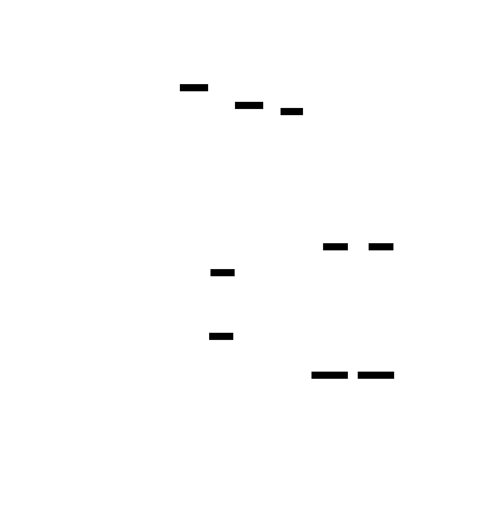

# Memory Pool Allocator: Design Document


## Overview

This system implements a high-performance memory allocator that pre-allocates fixed-size blocks from contiguous memory regions to eliminate dynamic allocation overhead and fragmentation. The key architectural challenge is maintaining O(1) allocation and deallocation performance while supporting pool growth, thread safety, and debugging features.


> This guide is meant to help you understand the big picture before diving into each milestone. Refer back to it whenever you need context on how components connect.


## Context and Problem Statement

> **Milestone(s):** All milestones (foundational concepts)

Memory management lies at the heart of system performance, yet the standard allocation mechanisms that most developers rely on can become significant bottlenecks in performance-critical applications. Understanding why requires diving into the hidden costs and architectural limitations of general-purpose memory allocators like `malloc` and `free`.

Think of standard memory allocation like calling a taxi every time you need to go somewhere. Each call involves overhead: the dispatcher must find an available driver, route them to your location, and coordinate the pickup. For occasional trips, this works fine. But imagine if you needed hundreds of short rides per second—the dispatch overhead would dominate your travel time. Memory pools solve this problem by pre-arranging a fleet of identical vehicles (fixed-size blocks) that are immediately available when you need them.

The challenge isn't just allocation speed, though. General-purpose allocators must handle requests for arbitrary sizes, from 8-byte structures to multi-megabyte buffers. This flexibility comes at a steep cost in both performance and memory efficiency. When your application has predictable allocation patterns—repeatedly requesting objects of the same size—this generality becomes pure overhead.

Memory pools represent a fundamental shift in allocation strategy: instead of asking the system for memory on-demand, we pre-allocate a large contiguous region and subdivide it into uniform blocks. This approach trades flexibility for performance, delivering O(1) allocation and deallocation times while eliminating fragmentation for fixed-size objects.

### Standard Allocation Overhead

The performance problems with `malloc` and `free` stem from their general-purpose design. These allocators must handle allocation requests of arbitrary sizes, from tiny 8-byte structures to massive multi-megabyte buffers, often from multiple threads simultaneously. Each allocation request triggers a complex decision-making process that can consume hundreds of CPU cycles.

When an application calls `malloc`, the allocator must search through its internal data structures to find a suitable free block. Different allocators use different strategies—some maintain multiple free lists sorted by size, others use binary trees or segregated storage—but all involve traversal overhead. For a 64-byte allocation, the allocator might examine dozens of potential blocks before finding one that meets the size requirements and alignment constraints.

**Memory Allocator Search Complexity**

| Allocator Strategy | Search Time | Fragmentation | Thread Safety Overhead |
|-------------------|-------------|---------------|----------------------|
| First Fit Linear Search | O(n) | High | Coarse-grained locks |
| Best Fit with Size Classes | O(log n) | Medium | Per-size-class locks |
| Segregated Free Lists | O(1) average | Low | Fine-grained locks |
| Thread-Local Arenas | O(1) average | Medium | Lock-free fast path |

The deallocation process presents its own challenges. When `free` is called, the allocator must determine the block's size (often stored in a header before the user data), check for opportunities to coalesce adjacent free blocks, and update its internal data structures. Coalescing requires examining neighboring blocks to see if they're also free, potentially triggering expensive merge operations.

Thread safety adds another layer of overhead. Most allocators protect their internal data structures with locks, meaning allocation requests from different threads must serialize through critical sections. Even with sophisticated techniques like per-thread arenas or lock-free algorithms, the coordination overhead can be substantial in multi-threaded applications.

Consider a high-frequency trading system that allocates thousands of small message objects per second. Each allocation request might consume 200-500 CPU cycles: 50-100 cycles for the allocation logic itself, 50-200 cycles for lock acquisition and release, and 100-200 cycles for memory initialization and bookkeeping. When these objects have identical sizes and short lifetimes, this overhead represents pure waste.

The cache behavior of general-purpose allocators further compounds performance problems. Because allocators must manage blocks of varying sizes, the metadata structures (free lists, size headers, coalescing information) exhibit poor spatial locality. A single allocation request might touch memory scattered across multiple cache lines, causing expensive cache misses that dwarf the actual allocation work.

> **Key Insight:** The fundamental tension in general-purpose allocation is between flexibility and performance. Every feature that makes malloc more general—handling arbitrary sizes, coalescing free blocks, supporting concurrent access—adds overhead that becomes problematic when allocation patterns are predictable and performance-critical.

### Memory Fragmentation

Memory fragmentation manifests in two distinct forms, both of which can severely impact application performance and memory efficiency. Understanding these fragmentation types is crucial for appreciating why memory pools offer such dramatic improvements for suitable workloads.

**External fragmentation** occurs when free memory exists in the system but cannot satisfy allocation requests because it's scattered in small, non-contiguous pieces. Picture a parking lot where individual spaces are scattered throughout, but you need three adjacent spaces for a large vehicle. The total available space might be sufficient, but its distribution prevents successful allocation.

In a running system, external fragmentation develops as objects of varying sizes are allocated and freed in different orders. Consider a sequence where the allocator grants 100KB, 200KB, and 150KB blocks consecutively, then frees the middle 200KB block. When a subsequent request arrives for 250KB, the 200KB hole cannot satisfy it, forcing the allocator to request additional memory from the operating system despite having substantial free space available.

**External Fragmentation Development**

| Time | Action | Memory State | Available Space | Usable for 250KB? |
|------|--------|--------------|-----------------|-------------------|
| T1 | Allocate 100KB | [100KB Used][Free] | Large | Yes |
| T2 | Allocate 200KB | [100KB Used][200KB Used][Free] | Large | Yes |
| T3 | Allocate 150KB | [100KB Used][200KB Used][150KB Used][Free] | Large | Yes |
| T4 | Free 200KB block | [100KB Used][200KB Free][150KB Used][Free] | 200KB + Large | No |
| T5 | Request 250KB | Must allocate new memory | 200KB + Large | No |

The long-term effects of external fragmentation are particularly insidious. As applications run for extended periods, the free space becomes increasingly fragmented, leading to higher virtual memory usage, increased system call overhead for memory requests, and reduced cache efficiency as objects become spread across more physical pages.

**Internal fragmentation** represents wasted space within allocated blocks themselves. This occurs when the allocator rounds up requests to align with its internal block sizes or alignment requirements. A request for 65 bytes might receive a 128-byte block, wasting 63 bytes of perfectly good memory.

General-purpose allocators typically maintain size classes to balance internal fragmentation against metadata overhead. Common size class progressions might include 8, 16, 32, 64, 128, 256, 512, 1024 bytes, with larger sizes following different patterns. Any request that doesn't exactly match a size class boundary suffers internal fragmentation.

The interaction between internal and external fragmentation creates compounding effects. Internal fragmentation increases the memory footprint of each object, which increases the rate at which external fragmentation develops. More memory consumption leads to more allocation and deallocation events, creating more opportunities for free space to become scattered.

**Fragmentation Impact Analysis**

| Problem Type | Memory Waste | Performance Impact | Cache Impact |
|-------------|--------------|-------------------|--------------|
| External Fragmentation | Unused holes between allocations | System calls for new memory | Scattered object layout |
| Internal Fragmentation | Padding within allocated blocks | Increased working set size | Reduced cache line utilization |
| Combined Effect | Both waste types compound | Higher allocation failure rate | Poor spatial locality |

Memory pools eliminate both fragmentation types by design. Since all blocks are identically sized, there's zero internal fragmentation for objects that exactly match the block size. External fragmentation becomes impossible because freed blocks can satisfy any subsequent allocation request—there are no "wrong-sized" holes in the free space.

The cache behavior improvements from eliminating fragmentation can be dramatic. Objects allocated from a memory pool exhibit excellent spatial locality because they're carved from contiguous memory regions. Sequential allocations often return blocks that are physically adjacent, improving cache line utilization and reducing memory bandwidth requirements.

> **Critical Design Insight:** Fragmentation isn't just about memory waste—it's about predictability. Applications with unpredictable memory layouts suffer from unpredictable performance. Memory pools trade flexibility for predictability, delivering consistent performance characteristics that are essential for real-time and high-performance systems.

### Existing Memory Management Approaches

The landscape of memory management strategies reflects different trade-offs between performance, flexibility, and complexity. Understanding the strengths and limitations of existing approaches provides essential context for where memory pools fit in the broader ecosystem of allocation strategies.

**Standard malloc/free implementations** represent the most general-purpose approach, designed to handle arbitrary allocation sizes efficiently while maintaining reasonable performance for typical workloads. Modern implementations like `dlmalloc`, `tcmalloc`, and `jemalloc` use sophisticated techniques to minimize overhead, but their generality inherently limits peak performance for specialized workloads.

The `dlmalloc` family uses boundary tags and bin-based organization to manage free blocks, achieving O(1) performance for many operations through segregated free lists. However, the overhead of maintaining size information, supporting arbitrary sizes, and implementing coalescing logic means each allocation involves substantial bookkeeping work.

Google's `tcmalloc` (Thread-Caching Malloc) addresses multi-threading overhead by providing per-thread caches for small objects, reducing lock contention significantly. Objects smaller than 256KB are served from thread-local caches, falling back to a central allocator only when thread caches are exhausted. While this approach delivers excellent performance for many applications, it still carries the overhead of size classification and general-purpose allocation logic.

**Standard Allocator Comparison**

| Allocator | Allocation Time | Thread Safety | Fragmentation | Best Use Case |
|-----------|----------------|---------------|---------------|---------------|
| dlmalloc | O(log n) typical | Global locks | Moderate | Single-threaded general purpose |
| tcmalloc | O(1) small objects | Per-thread caches | Low-moderate | Multi-threaded applications |
| jemalloc | O(1) typical | Per-arena locks | Low | High-performance applications |
| System malloc | Varies | Implementation-dependent | High | Default/compatibility |

**Arena allocators** (also called region allocators or bump allocators) take a different approach by allocating objects sequentially from large contiguous memory regions. Think of an arena like a notepad where you write sequentially down the page—allocation simply advances a pointer to the next available location, making it extremely fast (typically just a few CPU instructions).

The key insight behind arena allocation is that many applications have phases where objects are allocated together and then freed together. Web request processing, compiler phases, and image processing pipelines often exhibit this "allocate many, free all" pattern. Arena allocators excel in these scenarios by making individual deallocations unnecessary—the entire arena is freed at once when the phase completes.

Arena allocators deliver true O(1) allocation performance with minimal per-allocation overhead. The allocation process requires only a bounds check and pointer increment, making it faster than even the most optimized general-purpose allocators. However, this performance comes at the cost of individual object deallocation—you cannot free individual objects from an arena.

**Slab allocators** originated in the Solaris kernel and represent a middle ground between general-purpose allocation and specialized strategies. A slab allocator maintains separate pools of pre-allocated objects for each commonly-used data structure size, combining the benefits of object reuse with efficient memory organization.

The slab approach works by creating "slabs"—large memory regions divided into slots of identical size. Each slab is dedicated to objects of a specific size, eliminating internal fragmentation while maintaining the ability to free individual objects. Slabs are organized into partially-full, completely-full, and empty categories, allowing the allocator to make intelligent decisions about which slab to allocate from.

Slab allocators shine in kernel environments where the same data structures (inodes, process descriptors, network buffers) are allocated and freed repeatedly. The combination of object reuse and elimination of initialization overhead can deliver significant performance improvements for systems with predictable allocation patterns.

**Memory Management Approach Trade-offs**

| Approach | Allocation Speed | Individual Free | Fragmentation | Memory Overhead | Complexity |
|----------|-----------------|-----------------|---------------|-----------------|------------|
| malloc/free | Medium (O(log n)) | Yes | High | Medium | High |
| Arena | Very Fast (O(1)) | No (bulk only) | None | Low | Low |
| Slab | Fast (O(1)) | Yes | Low | Medium | Medium |
| Memory Pool | Very Fast (O(1)) | Yes | None | Low | Low-Medium |

**Memory pools** represent a specialized allocation strategy optimized for scenarios where applications repeatedly allocate and free objects of identical size. Unlike arena allocators, memory pools support individual object deallocation. Unlike slab allocators, they focus on a single object size rather than managing multiple size classes.

The fundamental architecture of a memory pool is elegantly simple: pre-allocate a large contiguous memory region, divide it into fixed-size blocks, and maintain a linked list of available blocks (the free list). Allocation removes the first block from the free list; deallocation adds the block back to the front of the free list. Both operations complete in O(1) time regardless of pool size.

Memory pools excel when allocation patterns are predictable and object lifetimes vary. A network server handling thousands of connections might allocate message buffers of identical size with highly variable lifetimes—some messages are processed immediately while others wait in queues. Memory pools deliver consistent performance for both allocation and deallocation while eliminating fragmentation entirely.

> **Decision: Memory Pool vs Alternative Approaches**
> - **Context**: Need predictable O(1) allocation/deallocation for fixed-size objects with individual free requirements
> - **Options Considered**: 
>   1. Optimized malloc (tcmalloc/jemalloc) - general purpose, handles all sizes
>   2. Arena allocator - ultra-fast allocation but no individual free
>   3. Slab allocator - multiple size classes with individual free
>   4. Memory pool - single size class with individual free
> - **Decision**: Memory pool for fixed-size allocation scenarios
> - **Rationale**: Delivers O(1) performance guarantees with zero fragmentation while supporting individual deallocation, optimal for predictable allocation patterns
> - **Consequences**: Trades flexibility (single object size) for maximum performance and predictability, requires separate pools for different object sizes

The choice between memory management approaches depends critically on allocation patterns, performance requirements, and flexibility needs. Memory pools represent the optimal choice when object sizes are predictable and consistent performance is more valuable than general-purpose flexibility. Understanding when and why to make this trade-off is essential for building high-performance systems that manage memory efficiently.

### Implementation Guidance

This section provides concrete technical recommendations for implementing the concepts discussed above, helping bridge the gap between theoretical understanding and practical implementation.

#### Technology Recommendations

| Component | Simple Option | Advanced Option |
|-----------|---------------|-----------------|
| Memory Allocation | `malloc/free` with alignment | `mmap` with `MAP_ANONYMOUS` for chunk allocation |
| Thread Safety | `pthread_mutex` or similar | Atomic compare-and-swap operations |
| Debugging Support | Simple assert statements | Valgrind-compatible memory poisoning |
| Statistics Tracking | Basic counters in struct | Thread-safe atomic counters |
| Error Handling | Return NULL on failure | Configurable callbacks with error codes |

#### Recommended Project Structure

Organize your memory pool implementation with clear separation of concerns to make development and testing manageable:

```
memory-pool/
├── include/
│   └── memory_pool.h          ← Public API declarations
├── src/
│   ├── pool_core.c            ← Core allocation/deallocation logic
│   ├── chunk_manager.c        ← Pool growth and chunk management
│   ├── free_list.c            ← Free list operations
│   ├── thread_safety.c        ← Locking and synchronization
│   └── debugging.c            ← Memory poisoning and diagnostics
├── tests/
│   ├── test_basic.c           ← Basic allocation/free tests
│   ├── test_growth.c          ← Pool growth behavior tests
│   ├── test_threading.c       ← Concurrent access tests
│   └── test_debugging.c       ← Error detection tests
└── examples/
    ├── simple_usage.c         ← Basic usage example
    └── performance_demo.c     ← Performance comparison with malloc
```

#### Core Infrastructure Code

Here's the essential infrastructure code that you can use as-is while focusing on the core memory pool logic:

**Memory Alignment Helper (src/alignment.c):**
```c
#include <stdint.h>
#include <stddef.h>

// Rounds up size to the nearest multiple of alignment
size_t align_size(size_t size, size_t alignment) {
    return (size + alignment - 1) & ~(alignment - 1);
}

// Checks if pointer is properly aligned
int is_aligned(void *ptr, size_t alignment) {
    return ((uintptr_t)ptr & (alignment - 1)) == 0;
}

// Platform-specific alignment requirements
#define WORD_SIZE sizeof(void*)
#define MIN_ALIGNMENT WORD_SIZE
```

**Statistics Tracking Infrastructure (src/stats.c):**
```c
#include <stdatomic.h>

typedef struct pool_stats {
    atomic_size_t total_blocks;      // Total blocks across all chunks
    atomic_size_t allocated_blocks;  // Currently allocated blocks
    atomic_size_t peak_allocated;    // Highest allocation count seen
    atomic_size_t allocation_count;  // Total allocations performed
    atomic_size_t free_count;        // Total frees performed
    atomic_size_t chunk_count;       // Number of chunks allocated
} pool_stats_t;

// Initialize statistics structure
void init_stats(pool_stats_t *stats) {
    atomic_init(&stats->total_blocks, 0);
    atomic_init(&stats->allocated_blocks, 0);
    atomic_init(&stats->peak_allocated, 0);
    atomic_init(&stats->allocation_count, 0);
    atomic_init(&stats->free_count, 0);
    atomic_init(&stats->chunk_count, 0);
}

// Thread-safe statistics updates
void record_allocation(pool_stats_t *stats) {
    atomic_fetch_add(&stats->allocated_blocks, 1);
    atomic_fetch_add(&stats->allocation_count, 1);
    
    size_t current = atomic_load(&stats->allocated_blocks);
    size_t peak = atomic_load(&stats->peak_allocated);
    while (current > peak) {
        if (atomic_compare_exchange_weak(&stats->peak_allocated, &peak, current)) {
            break;
        }
    }
}
```

#### Core Logic Skeletons

The following function skeletons correspond to the main learning objectives. Fill in the TODO sections based on the algorithm steps described in the design sections:

**Pool Initialization (src/pool_core.c):**
```c
/**
 * Initializes a memory pool with the specified parameters.
 * Creates initial chunk and sets up the free list threading through all blocks.
 * Returns 0 on success, -1 on failure.
 */
int pool_init(memory_pool_t *pool, size_t block_size, size_t initial_blocks) {
    // TODO 1: Validate parameters (block_size >= sizeof(void*), initial_blocks > 0)
    
    // TODO 2: Calculate actual block size including alignment requirements
    // Hint: Use align_size() to ensure blocks can hold at least a pointer
    
    // TODO 3: Allocate initial chunk of memory (initial_blocks * aligned_block_size)
    // Hint: Use malloc() or mmap() based on your technology choice
    
    // TODO 4: Initialize pool structure fields (block_size, chunk_list, stats, etc.)
    
    // TODO 5: Thread the free list through all blocks in the initial chunk
    // Hint: Each block's first sizeof(void*) bytes store the pointer to the next free block
    
    // TODO 6: Set pool->free_list to point to the first block
    
    // TODO 7: Initialize statistics (total_blocks = initial_blocks, allocated = 0)
    
    // TODO 8: Initialize synchronization primitives if thread safety is enabled
}
```

**Block Allocation (src/pool_core.c):**
```c
/**
 * Allocates a block from the pool.
 * Returns pointer to block data area, or NULL if allocation fails.
 * Allocation is O(1) - just removes first block from free list.
 */
void* pool_alloc(memory_pool_t *pool) {
    // TODO 1: Acquire lock if thread safety is enabled
    
    // TODO 2: Check if free list is empty (pool->free_list == NULL)
    
    // TODO 3: If empty and growth is enabled, attempt to grow pool
    // Hint: Call chunk_manager_grow_pool() - see Milestone 2
    
    // TODO 4: If still empty after growth attempt, return NULL
    
    // TODO 5: Remove first block from free list
    // Hint: block = pool->free_list; pool->free_list = *(void**)block;
    
    // TODO 6: Update statistics (increment allocated_blocks, allocation_count)
    
    // TODO 7: Apply memory poisoning if debugging is enabled
    // Hint: Fill block with allocation pattern to detect use-after-free
    
    // TODO 8: Release lock and return pointer to block
}
```

**Block Deallocation (src/pool_core.c):**
```c
/**
 * Returns a block to the pool's free list.
 * Deallocation is O(1) - just adds block to front of free list.
 * Performs debugging checks if enabled.
 */
void pool_free(memory_pool_t *pool, void *block) {
    // TODO 1: Validate block pointer is not NULL
    
    // TODO 2: If debugging enabled, check for double-free
    // Hint: Check if block contains the free pattern from previous free
    
    // TODO 3: If debugging enabled, apply memory poisoning
    // Hint: Fill block with free pattern (different from allocation pattern)
    
    // TODO 4: Acquire lock if thread safety is enabled
    
    // TODO 5: Add block to front of free list
    // Hint: *(void**)block = pool->free_list; pool->free_list = block;
    
    // TODO 6: Update statistics (decrement allocated_blocks, increment free_count)
    
    // TODO 7: Release lock
}
```

#### Language-Specific Implementation Hints

**Memory Management:**
- Use `posix_memalign()` or `aligned_alloc()` to ensure proper alignment for chunks
- Consider using `mmap()` with `MAP_ANONYMOUS` for large chunk allocations to avoid malloc overhead
- Always check return values from allocation functions - memory can be exhausted

**Thread Safety:**
- Use `pthread_mutex_t` for simple locking - initialize with `PTHREAD_MUTEX_INITIALIZER`
- For high-performance scenarios, consider atomic operations with `stdatomic.h`
- Remember that statistics updates need to be atomic even if pool operations are locked

**Debugging Integration:**
- Use `0xDEADBEEF` pattern for freed blocks, `0xABADCAFE` for allocated blocks
- Implement `pool_validate()` function that walks the free list checking for corruption
- Add compile-time flags (`#ifdef DEBUG_POOL`) to enable/disable debugging overhead

**Performance Considerations:**
- Minimize work inside critical sections - calculate values before acquiring locks
- Use `__builtin_prefetch()` or similar hints when traversing the free list
- Consider cache line alignment for pool structures accessed by multiple threads

#### Milestone Checkpoints

**Milestone 1 Checkpoint - Basic Pool Operations:**
After implementing the core allocation functions, verify:
```bash
# Compile and run basic tests
gcc -o test_basic tests/test_basic.c src/pool_core.c src/free_list.c
./test_basic
```

Expected behavior:
- Pool initializes with correct number of free blocks
- Allocation returns valid, aligned pointers
- Free list shrinks by one on each allocation
- Deallocation returns blocks to free list
- Pool exhaustion returns NULL appropriately

**Milestone 2 Checkpoint - Pool Growth:**
After implementing chunk management:
```bash
gcc -o test_growth tests/test_growth.c src/*.c
./test_growth
```

Expected behavior:
- Pool automatically allocates new chunks when exhausted
- Statistics correctly track blocks across multiple chunks
- Memory usage grows in predictable increments
- Chunk list maintains proper linkage

**Milestone 3 Checkpoint - Thread Safety and Debugging:**
After implementing concurrency support:
```bash
gcc -pthread -o test_threading tests/test_threading.c src/*.c
./test_threading
```

Expected behavior:
- Multiple threads can safely allocate/free concurrently
- No data corruption under concurrent access
- Double-free detection catches invalid operations
- Statistics remain consistent across all threads

#### Common Implementation Pitfalls

⚠️ **Pitfall: Block Size Smaller Than Pointer**
When block size is smaller than `sizeof(void*)`, the free list cannot store next pointers in unused blocks. This causes memory corruption as the pool tries to write pointer values into insufficient space. Always ensure `block_size >= sizeof(void*)` and round up if necessary.

⚠️ **Pitfall: Incorrect Pointer Arithmetic**
C pointer arithmetic can be tricky when working with `void*` and byte offsets. Use explicit casting to `char*` or `uint8_t*` for byte-level arithmetic: `(char*)chunk + i * block_size` rather than `chunk + i * block_size`.

⚠️ **Pitfall: Forgetting Memory Alignment**
Blocks must be properly aligned for the target architecture. Misaligned blocks can cause performance penalties or crashes on some platforms. Use `align_size()` helper and verify alignment with `is_aligned()`.

⚠️ **Pitfall: Race Conditions in Statistics**
Even with pool operations protected by locks, statistics updates can race if implemented incorrectly. Use atomic operations for all statistics or include statistics updates within the main critical section.


## Goals and Non-Goals

> **Milestone(s):** All milestones (scope definition)

Before diving into architectural details, we must clearly establish what our memory pool allocator will and will not accomplish. Think of this as drawing the boundaries of a construction project—we need to know exactly what we're building, what performance standards we must meet, and what features we're explicitly not including to avoid scope creep and maintain focus on the core learning objectives.

The memory pool allocator represents a focused solution to a specific class of allocation problems: scenarios where an application repeatedly allocates and frees objects of the same size. Rather than building a general-purpose replacement for `malloc` and `free`, we're creating a specialized tool optimized for predictable allocation patterns. This focused approach allows us to achieve exceptional performance characteristics while keeping the implementation complexity manageable for intermediate-level developers.

Understanding these boundaries upfront prevents the common mistake of over-engineering the solution or getting distracted by tangential features that don't contribute to the core learning goals around memory management, fragmentation control, and allocation strategy design.

### Functional Requirements

The memory pool allocator must provide a complete lifecycle management system for fixed-size memory blocks, supporting everything from initial pool creation through dynamic growth and final cleanup. Think of it as a specialized warehouse manager that exclusively handles identically-sized packages, optimizing storage and retrieval operations for maximum efficiency.

**Core Pool Management Operations**

Our allocator centers around four fundamental operations that mirror the lifecycle of memory management: initialization, allocation, deallocation, and destruction. Each operation must maintain specific behavioral guarantees while working together to provide a cohesive memory management experience.

| Operation | Function Signature | Behavior Requirement | Error Conditions |
|-----------|-------------------|---------------------|------------------|
| Initialize Pool | `pool_init(pool, block_size, initial_blocks) returns int` | Pre-allocates contiguous memory region, divides into N blocks, initializes free list | Returns error code on allocation failure or invalid parameters |
| Allocate Block | `pool_alloc(pool) returns void*` | Returns pointer to free block, removes from free list, triggers growth if needed | Returns NULL when pool exhausted and growth fails |
| Free Block | `pool_free(pool, block) returns void` | Returns block to free list, validates block belongs to pool | Silent ignore for invalid blocks (defensive programming) |
| Destroy Pool | `pool_destroy(pool) returns void` | Frees all chunks, clears statistics, resets pool to uninitialized state | Never fails, handles partial initialization gracefully |

The initialization process establishes the fundamental pool structure by allocating a single contiguous memory region and carving it into equal-sized blocks. This initial allocation creates the foundation for all subsequent operations, with the free list threading through unused blocks to enable constant-time allocation and deallocation.

**Memory Layout and Block Organization**

The pool must organize memory in a way that maximizes cache locality while maintaining simple management overhead. Each chunk represents a contiguous memory region divided into fixed-size blocks, with minimal metadata overhead to track chunk boundaries and statistics.

| Component | Size Requirement | Alignment | Purpose |
|-----------|-----------------|-----------|----------|
| Block Data Area | User-specified size, minimum `sizeof(void*)` | Platform word boundary (`MIN_ALIGNMENT`) | User data storage when allocated, next pointer when free |
| Chunk Header | `sizeof(chunk_header_t)` | Platform word boundary | Links chunks together, tracks block count and base address |
| Pool Descriptor | `sizeof(memory_pool_t)` | Platform word boundary | Central control structure with statistics and chunk list |

The critical insight here is that freed blocks serve dual purposes through **pointer aliasing**: when a block is in use, its data area belongs entirely to the application, but when freed, the first `sizeof(void*)` bytes store the next pointer for the free list. This eliminates the need for separate metadata structures while maintaining O(1) list operations.

> **Decision: Embedded Free List vs Separate Metadata**
> - **Context**: Need to track free blocks while minimizing memory overhead
> - **Options Considered**: 
>   - Separate free list with pointers to blocks (requires additional memory)
>   - Bitmap tracking (requires O(n) scan to find free blocks)
>   - Embedded pointers in block data area (pointer aliasing)
> - **Decision**: Embedded pointers using pointer aliasing
> - **Rationale**: Zero memory overhead, O(1) operations, cache-friendly access patterns
> - **Consequences**: Requires minimum block size of `sizeof(void*)`, complicates debugging slightly

**Dynamic Pool Growth Capabilities**

When the initial allocation proves insufficient, the pool must seamlessly grow by adding new chunks without disrupting ongoing allocations. This growth process maintains the unified free list abstraction while managing multiple underlying memory regions.

| Growth Trigger | Action Taken | Integration Method | Resource Tracking |
|----------------|--------------|-------------------|-------------------|
| Free list empty during allocation | Allocate new chunk with same block count as original | Link new chunk to chunk list, add all blocks to free list head | Update statistics, increment chunk counter |
| Maximum pool size reached | Return NULL from allocation, no new chunk created | No integration, maintain existing chunk list | Log growth limit reached, update failure counters |
| Memory allocation failure | Return NULL from allocation, pool remains consistent | No partial chunks created, existing pool unaffected | Record allocation failure in statistics |

The chunk linking strategy creates a singly-linked list of chunks while maintaining a unified free list that spans across all chunks. This design allows blocks from any chunk to be allocated in any order while ensuring all chunks are properly tracked for cleanup during pool destruction.

**Statistics and Monitoring Infrastructure**

Real-time statistics provide visibility into pool behavior and help diagnose performance issues or memory usage patterns. The statistics system tracks both cumulative counters and instantaneous state values.

| Statistic Category | Tracked Values | Update Frequency | Use Case |
|-------------------|---------------|------------------|----------|
| Block Counters | `total_blocks`, `allocated_blocks`, `peak_allocated` | Every alloc/free operation | Memory utilization monitoring |
| Operation Counters | `allocation_count`, `free_count` | Every alloc/free operation | Performance analysis, leak detection |
| Structure Counters | `chunk_count`, `chunks_allocated` | Chunk allocation/deallocation | Growth pattern analysis |
| Performance Metrics | Average allocation time, peak free list length | Configurable sampling | Performance optimization |

The statistics update process must integrate seamlessly with allocation operations without introducing significant overhead. For single-threaded operation, simple increments suffice, while multi-threaded scenarios require atomic operations or per-thread counters with periodic aggregation.

### Performance Requirements

Performance represents the primary motivation for choosing a memory pool over standard allocation mechanisms. Think of these requirements as a contract: in exchange for the limitations of fixed-size allocation, we guarantee specific performance characteristics that general-purpose allocators cannot match.

**Constant-Time Operation Guarantees**

The fundamental performance promise of memory pools is **O(1) allocation and deallocation regardless of pool size**. This means that whether the pool contains 10 blocks or 10,000 blocks, individual operations complete in the same amount of time.

| Operation | Time Complexity | Space Complexity | Implementation Constraint |
|-----------|----------------|------------------|--------------------------|
| `pool_alloc()` | O(1) guaranteed | O(1) additional memory | Single pointer manipulation, no searching or scanning |
| `pool_free()` | O(1) guaranteed | O(1) additional memory | Single pointer manipulation, no list traversal |
| `pool_init()` | O(n) for n blocks | O(n) for n blocks | Linear initialization acceptable, happens once |
| `pool_destroy()` | O(c) for c chunks | O(1) temporary | Linear in chunk count, not total blocks |

The O(1) guarantee specifically excludes the cost of growing the pool, which involves allocating new chunks and initializing their free lists. However, the amortized cost of growth remains constant per allocation when chunk sizes grow appropriately.

> The critical insight is that maintaining O(1) performance requires the free list to support constant-time insertion and removal. This drives the decision to use a singly-linked list with head insertion rather than more complex data structures.

**Memory Overhead Minimization**

Beyond time complexity, the pool must minimize memory overhead compared to general-purpose allocators. Standard `malloc` implementations typically add 8-16 bytes of metadata per allocation, while our pool design eliminates per-block overhead entirely.

| Overhead Source | Pool Allocator Cost | Standard malloc Cost | Savings |
|-----------------|-------------------|---------------------|---------|
| Per-block metadata | 0 bytes (pointer aliasing) | 8-16 bytes typical | 100% elimination |
| Fragmentation | 0 external fragmentation | Variable, can be significant | Predictable memory usage |
| Alignment padding | Minimal, consistent | Variable per allocation | Reduced and predictable |
| Management structures | Fixed cost per pool | Fixed cost per heap | Similar, amortized over more blocks |

The zero per-block overhead comes from the pointer aliasing technique where freed blocks store the next pointer in their data area rather than requiring separate metadata structures. This approach works because the application cannot access freed blocks, making the data area available for management purposes.

**Thread Safety Performance Targets**

When thread safety is enabled, the pool must maintain acceptable performance under concurrent access while preventing data corruption. The performance impact should scale reasonably with the number of threads.

| Concurrency Level | Target Overhead | Synchronization Strategy | Expected Contention |
|-------------------|----------------|-------------------------|-------------------|
| Single-threaded | 0% overhead | No synchronization | N/A |
| Light contention (2-4 threads) | < 10% overhead | Mutex protection | Minimal lock contention |
| Moderate contention (4-8 threads) | < 25% overhead | Lock-free or per-thread pools | Some contention, manageable |
| Heavy contention (8+ threads) | < 50% overhead | Per-thread pools recommended | High contention, architectural solution |

The specific thread safety approach represents a trade-off between implementation complexity and performance characteristics. A simple mutex provides correctness with moderate overhead, while per-thread pools eliminate contention at the cost of increased memory usage and more complex load balancing.

**Memory Access Pattern Optimization**

The pool design must optimize for modern CPU cache hierarchies by promoting spatial and temporal locality in memory access patterns. This optimization becomes increasingly important as the performance gap between CPU speed and memory latency continues to widen.

| Access Pattern | Optimization Strategy | Performance Benefit | Implementation Requirement |
|----------------|----------------------|-------------------|---------------------------|
| Sequential allocation | Allocate blocks from same chunk first | Improved cache locality | Free list ordering preserves chunk locality when possible |
| Frequent alloc/free cycles | Keep recently freed blocks at free list head | Hot cache lines stay resident | LIFO free list management (stack behavior) |
| Burst allocation patterns | Pre-warmed chunks reduce allocation spikes | Predictable performance | Configurable initial pool size and growth strategy |

The LIFO (last-in, first-out) ordering of the free list naturally promotes cache locality by preferentially reusing recently freed blocks, which are more likely to remain in CPU caches. This behavioral optimization requires no additional complexity beyond maintaining the free list as a stack.

> **Decision: LIFO vs FIFO Free List Ordering**
> - **Context**: Order in which freed blocks are returned affects cache performance
> - **Options Considered**: 
>   - FIFO (queue): Better wear leveling, more complex implementation
>   - LIFO (stack): Better cache locality, simpler implementation
>   - Best-fit: Optimal locality, requires complex tracking
> - **Decision**: LIFO stack ordering
> - **Rationale**: Cache performance benefits outweigh wear leveling concerns for typical workloads
> - **Consequences**: Recently freed blocks reused first, potential uneven wear patterns in extreme scenarios

### Non-Goals

Clearly defining what the memory pool allocator will **not** provide prevents scope creep and helps learners focus on the core concepts without getting distracted by tangential features. Think of this as the "we will not build" list that keeps the project manageable and educationally focused.

**Variable-Size Allocation Support**

The memory pool allocator explicitly does not support allocating blocks of different sizes from the same pool. This fundamental limitation distinguishes it from general-purpose allocators and drives many of the architectural decisions.

| Excluded Feature | Rationale for Exclusion | Alternative Solution | Learning Impact |
|------------------|------------------------|---------------------|-----------------|
| Different block sizes in same pool | Would require complex size class management | Use separate pools for each size | Keeps focus on core concepts |
| Block resizing/realloc support | Incompatible with fixed-size design | Copy to new pool with larger blocks | Avoids memory management complexity |
| Best-fit allocation strategies | Not applicable with uniform block sizes | N/A - all blocks identical | Eliminates allocation policy decisions |
| Coalescing adjacent free blocks | No fragmentation in fixed-size model | N/A - no fragmentation occurs | Avoids complex merge algorithms |

The fixed-size limitation is actually a feature that enables the exceptional performance characteristics. By eliminating size variability, we eliminate the need for complex allocation algorithms, fragmentation management, and size class policies that plague general-purpose allocators.

**Garbage Collection and Automatic Memory Management**

The pool provides explicit allocation and deallocation interfaces similar to `malloc` and `free`, but does not include any automatic memory management or garbage collection capabilities.

| Excluded Capability | Why Not Included | Developer Responsibility | Educational Value |
|--------------------|------------------|------------------------|-------------------|
| Automatic leak detection | Adds complexity, not core learning goal | Track allocated pointers manually | Forces explicit lifetime management |
| Reference counting | Changes allocation model fundamentally | Manual reference management | Maintains focus on allocation mechanics |
| Mark-and-sweep collection | Requires object graph traversal | Explicit deallocation required | Teaches explicit memory discipline |
| Weak pointer support | Advanced feature beyond scope | Strong ownership patterns only | Simplifies mental model |

The explicit management model forces developers to think carefully about object lifetimes and ownership, which represents a crucial skill in systems programming regardless of the specific allocation strategy used.

**Advanced Memory Features**

Several sophisticated memory management features remain outside the scope to maintain focus on the core memory pool concepts.

| Advanced Feature | Exclusion Reason | Complexity It Avoids | Recommended Learning Path |
|------------------|------------------|---------------------|-------------------------|
| Memory-mapped file backing | Requires OS interaction, persistence concerns | File I/O, mmap semantics, crash recovery | Separate persistence-focused project |
| NUMA-aware allocation | Hardware-specific optimization | NUMA topology detection, affinity management | Advanced systems programming course |
| Copy collection/compaction | Requires object relocation support | Pointer updating, write barriers | Garbage collector implementation project |
| Virtual memory management | OS kernel-level functionality | Page table management, address translation | Operating systems course material |

These exclusions don't diminish the educational value of the project; instead, they allow deeper focus on the memory pool concepts without getting overwhelmed by orthogonal complexity.

**Enterprise Production Features**

While the allocator includes debugging support and basic statistics, it excludes enterprise-grade operational features that would significantly complicate the implementation.

| Production Feature | Why Excluded | Simplified Alternative | Learning Benefit |
|-------------------|--------------|------------------------|------------------|
| Hot-swappable configuration | Runtime complexity, thread safety challenges | Compile-time or initialization-time settings | Focus on core allocation logic |
| Detailed telemetry export | Requires metrics infrastructure | Simple statistics structure | Avoids external dependencies |
| Administrative interfaces | Network programming, security concerns | Direct API access only | Maintains implementation focus |
| Cross-process sharing | IPC complexity, synchronization challenges | Single-process operation only | Eliminates distributed systems concerns |

The debugging features we do include—memory poisoning, double-free detection, and usage statistics—provide sufficient visibility for learning purposes without requiring complex infrastructure or external dependencies.

> **Key Design Principle**: Every excluded feature represents a conscious decision to maintain educational focus. The goal is not to build a production-ready allocator that competes with system libraries, but to deeply understand the fundamental concepts and trade-offs involved in memory pool design.

### Implementation Guidance

The goals and non-goals established above directly influence technology choices and implementation strategies. This guidance helps translate the high-level requirements into concrete technical decisions for building the memory pool allocator.

**Technology Recommendations**

| Component | Simple Option | Advanced Option | Rationale |
|-----------|---------------|-----------------|-----------|
| Thread Safety | `pthread_mutex_t` or platform equivalent | Lock-free atomic operations (`stdatomic.h`) | Mutex provides correctness, atomics provide performance |
| Memory Alignment | `alignof(max_align_t)` from `<stdalign.h>` | Platform-specific SIMD alignment (16/32 bytes) | Standard alignment works universally |
| Statistics Tracking | Simple counters in struct | Atomic counters with memory ordering | Simple counters for single-threaded, atomics for MT |
| Error Handling | Return codes (`int` status values) | Exception-like error propagation | C idioms favor explicit error checking |
| Debugging Support | Compile-time `#ifdef DEBUG` flags | Runtime configuration flags | Compile-time flags eliminate runtime overhead |

**Recommended File Organization**

```
memory-pool/
├── include/
│   └── memory_pool.h          ← Public API declarations
├── src/
│   ├── pool_core.c           ← pool_init, pool_alloc, pool_free
│   ├── chunk_manager.c       ← Chunk allocation and linking
│   ├── free_list.c          ← Free list operations
│   ├── statistics.c         ← Statistics tracking and reporting
│   └── debug_support.c      ← Memory poisoning, double-free detection
├── tests/
│   ├── test_basic_ops.c     ← Basic alloc/free testing
│   ├── test_growth.c        ← Pool growth scenarios
│   ├── test_thread_safety.c ← Concurrent access testing
│   └── test_debugging.c     ← Debug feature validation
└── examples/
    ├── simple_usage.c       ← Basic usage demonstration
    └── performance_test.c   ← Benchmarking and timing
```

**Core Data Structure Definitions**

```c
#include <stddef.h>
#include <stdint.h>

// Forward declarations for clean header organization
typedef struct memory_pool memory_pool_t;
typedef struct pool_stats pool_stats_t;
typedef struct chunk_header chunk_header_t;

// Constants defining system limits and alignment requirements
#define MIN_ALIGNMENT sizeof(void*)
#define WORD_SIZE sizeof(void*)
#define DEADBEEF_PATTERN 0xDEADBEEF
#define ALLOCATION_PATTERN 0xABADCAFE

// Pool statistics structure - tracks usage and performance metrics
struct pool_stats {
    size_t total_blocks;      // Total blocks across all chunks
    size_t allocated_blocks;  // Currently allocated blocks
    size_t peak_allocated;    // Maximum blocks allocated simultaneously
    size_t allocation_count;  // Total allocations performed
    size_t free_count;       // Total deallocations performed
    size_t chunk_count;      // Number of chunks in pool
};

// TODO: Implement pool_init function
// Initialize pool with specified block size and initial block count
// Returns 0 on success, negative error code on failure
int pool_init(memory_pool_t* pool, size_t block_size, size_t initial_blocks);

// TODO: Implement pool_alloc function  
// Allocate single block from pool, grow if necessary
// Returns block pointer on success, NULL on failure
void* pool_alloc(memory_pool_t* pool);

// TODO: Implement pool_free function
// Return block to pool free list, validate block ownership
// No return value - invalid blocks ignored defensively
void pool_free(memory_pool_t* pool, void* block);
```

**Core Algorithm Skeleton**

```c
// Block allocation algorithm - implement this core function
void* pool_alloc(memory_pool_t* pool) {
    // TODO 1: Check if pool is properly initialized
    // TODO 2: If free_list is NULL, attempt to grow pool by allocating new chunk
    // TODO 3: Remove first block from free_list (head of singly-linked list)
    // TODO 4: Update free_list to point to next block
    // TODO 5: Update statistics (increment allocated_blocks, allocation_count)
    // TODO 6: If debugging enabled, fill block with ALLOCATION_PATTERN
    // TODO 7: Return pointer to allocated block
    // Hint: free_list stores next pointer in first sizeof(void*) bytes of block
}

// Block deallocation algorithm - implement this core function  
void pool_free(memory_pool_t* pool, void* block) {
    // TODO 1: Validate pool is initialized and block is non-NULL
    // TODO 2: If debugging enabled, validate block belongs to one of our chunks
    // TODO 3: If debugging enabled, fill entire block with DEADBEEF_PATTERN
    // TODO 4: Cast block to void** to store next pointer in first bytes
    // TODO 5: Set block's next pointer to current free_list head
    // TODO 6: Update free_list to point to this block (LIFO insertion)
    // TODO 7: Update statistics (decrement allocated_blocks, increment free_count)
    // Hint: This implements stack push operation for LIFO free list
}
```

**Milestone Checkpoints**

After implementing each milestone, verify functionality with these concrete tests:

**Milestone 1 Checkpoint:**
```bash
gcc -o test_basic tests/test_basic_ops.c src/pool_core.c src/free_list.c
./test_basic
# Expected: All allocations succeed, free works, statistics accurate
# Verify: pool_alloc returns non-NULL, multiple allocs return different pointers
# Verify: After pool_free, same pointer available for reallocation
```

**Milestone 2 Checkpoint:**
```bash  
gcc -o test_growth tests/test_growth.c src/*.c
./test_growth
# Expected: Pool grows automatically when exhausted
# Verify: Can allocate more blocks than initial_blocks parameter
# Verify: chunk_count increases in statistics after growth
```

**Milestone 3 Checkpoint:**
```bash
gcc -pthread -o test_threads tests/test_thread_safety.c src/*.c  
./test_threads
# Expected: No crashes or corruption under concurrent access
# Verify: All threads can allocate and free without conflicts
# Verify: Final statistics match expected totals
```

**Common Implementation Pitfalls**

⚠️ **Pitfall: Block Size Smaller Than Pointer**
When `block_size` is less than `sizeof(void*)`, the free list cannot store next pointers in freed blocks. This causes memory corruption when the free list tries to thread through blocks.
*Fix*: In `pool_init`, enforce `block_size = max(block_size, sizeof(void*))` and document this requirement.

⚠️ **Pitfall: Misaligned Block Addresses**
If blocks are not properly aligned to platform requirements, accessing them as pointers causes undefined behavior on strict alignment architectures.
*Fix*: Use `align_size(block_size, MIN_ALIGNMENT)` to round up block size to alignment boundary.

⚠️ **Pitfall: Double Free Not Detected**
Without validation, calling `pool_free` twice on the same block corrupts the free list by creating cycles.
*Fix*: In debug builds, maintain a simple allocated block set or fill freed blocks with sentinel patterns.

⚠️ **Pitfall: Memory Leaks on Pool Destroy**
Forgetting to free all allocated chunks during `pool_destroy` creates memory leaks that accumulate across pool lifecycles.
*Fix*: Walk the chunk list and call `free()` on each chunk's base address, then clear the chunk list.


## High-Level Architecture

> **Milestone(s):** All milestones (architectural foundation)

A memory pool allocator might seem like a simple concept—after all, we're just managing blocks of memory. However, the architectural challenge lies in balancing several competing forces: achieving O(1) allocation performance, supporting dynamic growth, maintaining thread safety, and providing debugging capabilities. Think of our memory pool like a well-organized parking garage with pre-marked spaces of identical size. Unlike a chaotic street where cars park anywhere they fit (standard malloc), our garage has numbered spots, clear lanes for entry and exit, and efficient management systems that can direct drivers to available spaces instantly.

The architecture we'll explore revolves around three core abstractions working in harmony: a **Pool Manager** that coordinates overall operations, a **Chunk Manager** that handles memory acquisition and organization, and a **Free List Manager** that tracks available blocks with lightning-fast access patterns. Each component has distinct responsibilities, yet they collaborate seamlessly to deliver the performance characteristics that make memory pools attractive for high-performance applications.



### Component Overview

The memory pool architecture decomposes into four primary components, each with carefully designed responsibilities that minimize coupling while maximizing performance. Understanding these components and their interactions forms the foundation for implementing an effective memory pool allocator.

#### Pool Manager: The Orchestrator

The **Pool Manager** serves as the central coordinator, much like an orchestra conductor who doesn't play any instruments but ensures all musicians perform in harmony. This component maintains the primary `memory_pool_t` structure and orchestrates interactions between other components during allocation, deallocation, and pool lifecycle operations.

The Pool Manager's responsibilities encompass pool initialization, where it validates parameters and coordinates the creation of the initial memory chunk. During runtime operations, it serves as the primary interface for `pool_alloc` and `pool_free` calls, delegating specific tasks to specialized managers while maintaining overall coherence. The Pool Manager also handles pool destruction, ensuring that all allocated chunks are properly freed and resources are cleaned up without leaks.

| Responsibility | Description | Interactions |
|---|---|---|
| Pool Initialization | Validates parameters, creates initial chunk, initializes free list | Calls Chunk Manager for initial allocation, Free List Manager for setup |
| Allocation Coordination | Routes allocation requests, handles pool growth triggers | Queries Free List Manager, triggers Chunk Manager growth when needed |
| Deallocation Coordination | Validates free operations, updates free list | Delegates to Free List Manager, updates statistics |
| Resource Management | Tracks all chunks, manages pool lifecycle, cleanup on destruction | Maintains chunk list, coordinates with all managers during cleanup |
| Statistics Maintenance | Updates allocation counters, tracks peak usage, monitors pool health | Updates `pool_stats_t` during all operations |

#### Chunk Manager: The Real Estate Developer

The **Chunk Manager** handles all aspects of memory acquisition and organization, similar to a real estate developer who acquires land plots and subdivides them into identical lots. This component manages the dynamic growth capability that distinguishes our pool from simpler fixed-size alternatives.

When the pool initializes, the Chunk Manager allocates the first contiguous memory region and divides it into uniformly-sized blocks. As the pool grows beyond its initial capacity, the Chunk Manager springs into action, allocating additional chunks and linking them into the existing pool structure. Each chunk maintains metadata through a `chunk_header_t` structure that tracks its relationship to other chunks and provides essential information for pool management.

The Chunk Manager's design handles several critical concerns: ensuring all chunks use identical block sizes to maintain allocation uniformity, managing chunk metadata separately from user data to prevent corruption, and maintaining a linked list of chunks that enables efficient traversal during pool destruction. The component also enforces optional pool size limits, preventing runaway memory consumption in resource-constrained environments.

| Operation | Input | Output | Side Effects |
|---|---|---|---|
| `chunk_allocate` | Block size, block count | Chunk header pointer | Allocates memory, initializes header, threads free list |
| `chunk_link` | Pool, new chunk | Success/failure | Links chunk to pool's chunk list, updates chunk count |
| `chunk_destroy_all` | Pool | Void | Frees all chunks, resets chunk list to empty |
| `chunk_get_stats` | Chunk | Block counts | None (read-only inspection) |

#### Free List Manager: The Traffic Director

The **Free List Manager** implements the core data structure that makes O(1) allocation possible—a singly-linked list threading through unused blocks. Imagine this component as a traffic director at a busy intersection, maintaining perfect knowledge of which lanes are open and instantly directing traffic to available routes.

The elegance of the free list design lies in **pointer aliasing**—a technique where unused blocks serve double duty as both potential allocation targets and linked list nodes. When a block is free, its first few bytes store a pointer to the next free block, creating a chain that threads through the pool's unused memory. This approach requires no additional metadata storage, as the blocks themselves provide the necessary linking structure.

The Free List Manager maintains the `free_list` pointer in the main pool structure, always pointing to the next available block. Allocation becomes a simple pop operation: grab the block at `free_list` and update `free_list` to point to the next block in the chain. Deallocation reverses this process, pushing the freed block to the front of the list by updating its first bytes to point to the current `free_list` head, then updating `free_list` to point to the newly freed block.

| Operation | Time Complexity | Memory Access Pattern | Failure Mode |
|---|---|---|---|
| Initialize free list | O(n) where n = blocks | Sequential write through chunk | None (always succeeds) |
| Allocate block | O(1) | Single pointer dereference | Returns NULL when list empty |
| Free block | O(1) | Single pointer write + update | Undefined behavior on double-free |
| Check availability | O(1) | Single pointer comparison | None (always succeeds) |

#### Statistics and Debugging Subsystem: The Observatory

The **Statistics and Debugging Subsystem** provides observability into pool behavior, much like an observatory that monitors celestial movements to understand cosmic patterns. This component becomes increasingly important as applications scale and debugging becomes more challenging.

The statistics collection revolves around the `pool_stats_t` structure, which tracks essential metrics including total block count, currently allocated blocks, peak allocation levels, and operation counters. These metrics provide crucial insights into allocation patterns, helping developers optimize their memory usage and identify potential issues before they impact application performance.

The debugging features build upon this statistical foundation, adding memory poisoning capabilities that fill freed blocks with sentinel patterns, double-free detection that identifies invalid operations, and comprehensive leak detection that reports unreturned blocks during pool destruction. These features typically remain disabled in production builds but prove invaluable during development and testing phases.

> **Design Insight**: The separation of concerns between these components creates natural testing boundaries and enables incremental implementation. You can build and test the Free List Manager in isolation, then add the Chunk Manager for growth capabilities, and finally layer on thread safety and debugging features without disrupting the core allocation logic.

### Memory Layout Design

Understanding the memory layout represents perhaps the most crucial aspect of memory pool architecture, as it directly impacts both performance characteristics and correctness guarantees. The layout must accommodate several competing requirements: minimizing metadata overhead, ensuring proper alignment for all supported data types, enabling efficient free list operations, and supporting debugging features when enabled.

#### Chunk-Based Memory Organization

Our memory pool organizes memory using a **chunk-based approach**, where each chunk represents a contiguous memory region subdivided into identical blocks. Think of chunks as city blocks in a well-planned urban grid—each block is the same size, arranged in predictable patterns, with clear boundaries and addressing schemes that enable rapid navigation.

Each chunk begins with a `chunk_header_t` structure that contains essential metadata: a pointer to the next chunk in the pool's chunk list, the number of blocks in this chunk, and the base address where block data begins. This header lives separately from the block data area, preventing user code from accidentally corrupting chunk management information.

The block data area immediately follows the chunk header, with each block aligned to platform word boundaries to ensure efficient memory access patterns. The total chunk size equals the header size plus the product of block size and block count, rounded up to maintain alignment requirements for subsequent chunks.

```
Chunk Memory Layout:
┌─────────────────┬──────────────┬──────────────┬─────┬──────────────┐
│ chunk_header_t  │    Block 0   │    Block 1   │ ... │    Block N   │
│                 │              │              │     │              │
└─────────────────┴──────────────┴──────────────┴─────┴──────────────┘
     Metadata           User Data Area (aligned blocks)
```

| Memory Region | Size | Alignment | Purpose |
|---|---|---|---|
| Chunk Header | `sizeof(chunk_header_t)` | `WORD_SIZE` | Chunk management metadata |
| Block Data Area | `block_size * block_count` | `MIN_ALIGNMENT` | User allocation space |
| Padding | Variable | `WORD_SIZE` | Ensures next chunk alignment |

#### Block Structure and Alignment

Individual blocks within each chunk must satisfy several constraints simultaneously. First, each block must be large enough to hold user data of the requested size. Second, when free, the block must be capable of storing a pointer to the next free block for free list operations. Third, all blocks must maintain proper alignment to prevent performance penalties on platforms that require aligned memory access.

The **minimum block size** equals the maximum of the user-requested size and the platform pointer size (`WORD_SIZE`). This ensures that freed blocks can always store the next pointer required for free list operations. Additionally, all block sizes round up to the nearest multiple of `MIN_ALIGNMENT` to guarantee proper alignment for any data type the user might store.

When a block is allocated and in use, its entire contents belong to the user application. The pool maintains no metadata within allocated blocks, maximizing available space and preventing accidental corruption of pool structures by user code. When a block is free, the first `WORD_SIZE` bytes store a pointer to the next free block, while the remaining bytes may be filled with debugging patterns when memory poisoning is enabled.

> **Critical Design Decision**: By storing the free list pointer at the beginning of each free block rather than using separate metadata, we achieve two crucial benefits: zero metadata overhead during normal operation, and automatic alignment since pointers naturally align to word boundaries on all platforms.

#### Free List Threading Pattern

The free list threading represents the most elegant aspect of our memory layout design. Instead of maintaining a separate data structure to track available blocks, we transform the unused blocks themselves into the nodes of our linked list. This **pointer aliasing** technique requires careful consideration of memory layout and alignment requirements.

When blocks are initially carved from a chunk, the Free List Manager threads them together by writing each block's address plus block size into the first bytes of that block, creating a chain that connects all free blocks. The last block in the chain contains a NULL pointer, marking the end of the free list.

During allocation, the pool removes the first block from this chain by updating the pool's `free_list` pointer to point to the next block in the sequence. During deallocation, the pool prepends the returned block to the chain by writing the current `free_list` value into the block's first bytes, then updating `free_list` to point to the returned block.

| Block State | First `WORD_SIZE` Bytes | Remaining Bytes | User Accessibility |
|---|---|---|---|
| Free (in list) | Pointer to next free block | Undefined (optionally poisoned) | None |
| Free (list end) | NULL pointer | Undefined (optionally poisoned) | None |
| Allocated | User data | User data | Full access |

#### Multi-Chunk Layout Coordination

As pools grow beyond their initial size, the Chunk Manager allocates additional chunks and integrates them into the existing pool structure. This growth process must maintain the uniform block size across all chunks while seamlessly integrating new blocks into the existing free list.

When a new chunk is allocated, the Chunk Manager links it into the pool's chunk list through the `next_chunk` pointers, creating a singly-linked list of chunks that enables complete pool traversal during destruction. Simultaneously, the Free List Manager threads all blocks in the new chunk into the existing free list, typically by prepending the new blocks to the current free list head.

This multi-chunk coordination ensures that allocation operations remain oblivious to chunk boundaries—the free list may contain blocks from multiple chunks interleaved in arbitrary order, but allocation simply follows the next pointer chain regardless of which chunk provides each block.

> **Design Insight**: The chunk list and free list serve different purposes and may have completely different orderings. The chunk list enables resource cleanup and statistics collection, while the free list optimizes allocation performance. This separation allows each data structure to optimize for its specific use case.

### Recommended File Organization

Organizing code into well-structured modules creates natural boundaries between components, simplifies testing, and enables incremental implementation. The file organization should reflect the architectural component boundaries while providing clear interfaces and minimizing compilation dependencies.

#### Core Module Structure

The memory pool implementation should organize around four primary modules, each corresponding to one of our architectural components. This organization creates natural testing boundaries and enables developers to understand and modify individual components without comprehending the entire system.

```
memory_pool/
├── include/
│   ├── memory_pool.h          ← Public interface and main types
│   └── pool_internal.h        ← Internal types shared between modules
├── src/
│   ├── pool_manager.c         ← Pool initialization, coordination, destruction
│   ├── chunk_manager.c        ← Chunk allocation, linking, management
│   ├── free_list.c           ← Free list operations and threading
│   ├── pool_stats.c          ← Statistics collection and debugging features
│   └── pool_utils.c          ← Alignment helpers and common utilities
├── tests/
│   ├── test_pool_basic.c     ← Basic allocation/deallocation tests
│   ├── test_pool_growth.c    ← Pool growth and multi-chunk tests
│   ├── test_pool_threading.c ← Thread safety and concurrency tests
│   ├── test_pool_debugging.c ← Memory poisoning and error detection tests
│   └── test_performance.c    ← Benchmarks and performance validation
└── examples/
    ├── basic_usage.c         ← Simple allocation patterns
    ├── game_objects.c        ← Game entity allocation example
    └── network_buffers.c     ← Network packet pool example
```

#### Header File Organization

The header files establish clear interface boundaries and manage compilation dependencies efficiently. The public header (`memory_pool.h`) contains only the types and functions that client code should access, while the internal header (`pool_internal.h`) defines shared structures used between implementation modules.

The public header defines the core types (`memory_pool_t`, `pool_stats_t`, `chunk_header_t`) and the primary interface functions (`pool_init`, `pool_alloc`, `pool_free`, `pool_destroy`). It also includes essential constants like `MIN_ALIGNMENT` and `WORD_SIZE` that client code may need for size calculations.

The internal header contains implementation details shared between modules: internal function prototypes, debugging macros, and utility functions. This separation ensures that client code cannot accidentally depend on implementation details while enabling efficient sharing between implementation modules.

| Header File | Contains | Included By | Purpose |
|---|---|---|---|
| `memory_pool.h` | Public types, interface functions, constants | Client code, all implementation files | Public API definition |
| `pool_internal.h` | Internal types, shared utilities, debug macros | Implementation files only | Internal coordination |

#### Implementation Module Responsibilities

Each implementation module focuses on a specific aspect of pool functionality, enabling developers to understand and modify individual components independently. The modules communicate through well-defined interfaces and shared data structures, minimizing coupling while maintaining performance.

**Pool Manager (`pool_manager.c`)** implements the primary interface functions and coordinates operations between other modules. This module contains `pool_init`, `pool_alloc`, `pool_free`, and `pool_destroy` implementations, along with parameter validation and error handling logic.

**Chunk Manager (`chunk_manager.c`)** handles all memory acquisition and chunk lifecycle management. It implements chunk allocation, linking, and destruction, while maintaining the chunk list data structure and enforcing pool size limits.

**Free List Manager (`free_list.c`)** implements the core free list operations that enable O(1) allocation performance. This module contains the pointer aliasing logic, list threading algorithms, and the critical allocation and deallocation fast paths.

**Statistics and Debugging (`pool_stats.c`)** provides observability and debugging capabilities. This module implements statistics collection, memory poisoning, double-free detection, and usage reporting features.

**Utility Functions (`pool_utils.c`)** contains common helper functions used throughout the implementation, particularly alignment calculations and memory manipulation utilities.

> **Implementation Strategy**: Start with the utility functions and basic data structures, then implement the Free List Manager for core functionality, add the Pool Manager for the public interface, integrate the Chunk Manager for growth capabilities, and finally layer on statistics and debugging features. This progression enables testing and validation at each step.

#### Testing Organization Strategy

The testing structure mirrors the modular implementation, with each test file focusing on specific functionality areas. This organization enables targeted testing during development and comprehensive validation of the complete system.

**Basic functionality tests** (`test_pool_basic.c`) validate core allocation and deallocation operations, parameter validation, and basic error handling. These tests should pass after implementing Milestone 1 and provide confidence in the fundamental pool operations.

**Growth and scaling tests** (`test_pool_growth.c`) exercise the multi-chunk functionality, pool expansion behavior, and resource limit enforcement. These tests validate Milestone 2 implementation and ensure that pool growth maintains correctness guarantees.

**Concurrency tests** (`test_pool_threading.c`) verify thread safety mechanisms and concurrent access patterns. These tests become relevant during Milestone 3 implementation and require careful design to expose potential race conditions.

**Debugging feature tests** (`test_pool_debugging.c`) validate memory poisoning, double-free detection, and statistics collection functionality. These tests ensure that debugging features work correctly without impacting basic pool operations.

**Performance benchmarks** (`test_performance.c`) measure allocation and deallocation performance, compare against standard malloc/free, and validate O(1) time complexity claims. These tests provide quantitative validation of performance goals.

> **Architecture Decision: Modular Testing Strategy**
> - **Context**: Testing a memory pool requires validating correctness, performance, and safety properties
> - **Options Considered**: Monolithic test suite, component-specific tests, property-based testing
> - **Decision**: Component-specific test files with shared test utilities and performance benchmarks
> - **Rationale**: Enables incremental testing during implementation, isolates failure modes, and provides clear validation criteria for each milestone
> - **Consequences**: Requires coordination between test files but enables parallel development and debugging

### Implementation Guidance

The following guidance provides concrete starting points for implementing the memory pool architecture, with emphasis on file organization, core data structures, and integration patterns that support the milestone-based development approach.

#### Technology Recommendations

| Component | Simple Option | Advanced Option |
|---|---|---|
| Memory Allocation | `malloc/free` with alignment | Memory-mapped files with `mmap` |
| Thread Safety | `pthread_mutex_t` locks | Lock-free atomic operations |
| Testing Framework | Custom assert macros | CUnit or Check framework |
| Build System | Simple Makefile | CMake with multiple targets |
| Debugging | `printf` and `gdb` | Valgrind integration |

#### Project File Structure

```
memory_pool/
├── Makefile                   ← Build configuration
├── include/
│   ├── memory_pool.h         ← Public API definitions
│   └── pool_internal.h       ← Internal shared declarations
├── src/
│   ├── pool_manager.c        ← Main pool coordination logic
│   ├── chunk_manager.c       ← Memory chunk management
│   ├── free_list.c          ← Free list operations
│   ├── pool_stats.c         ← Statistics and debugging
│   └── pool_utils.c         ← Alignment and utility functions
├── tests/
│   ├── test_runner.c        ← Main test driver
│   ├── test_basic.c         ← Milestone 1 validation
│   ├── test_growth.c        ← Milestone 2 validation
│   └── test_threading.c     ← Milestone 3 validation
└── examples/
    ├── basic_demo.c         ← Simple usage example
    └── performance_test.c   ← Benchmarking code
```

#### Core Data Structure Definitions

```c
// include/memory_pool.h - Public interface
#include <stddef.h>
#include <stdint.h>

// Platform-specific constants
#define WORD_SIZE sizeof(void*)
#define MIN_ALIGNMENT WORD_SIZE
#define DEADBEEF_PATTERN 0xDEADBEEF
#define ALLOCATION_PATTERN 0xABADCAFE

// Forward declarations
typedef struct memory_pool memory_pool_t;
typedef struct pool_stats pool_stats_t;
typedef struct chunk_header chunk_header_t;

// Pool statistics structure
struct pool_stats {
    size_t total_blocks;      // Total blocks across all chunks
    size_t allocated_blocks;  // Currently allocated blocks
    size_t peak_allocated;    // Maximum allocated at any time
    size_t allocation_count;  // Total allocation operations
    size_t free_count;        // Total free operations
    size_t chunk_count;       // Number of chunks in pool
};

// Chunk header structure
struct chunk_header {
    struct chunk_header* next_chunk;  // Next chunk in pool
    size_t block_count;               // Number of blocks in chunk
    void* base_address;               // Start of block data area
};

// Main pool structure
struct memory_pool {
    struct chunk_header* chunk_list;  // Linked list of chunks
    void* free_list;                  // Head of free block list
    size_t block_size;                // Size of each block
    struct pool_stats stats;          // Pool statistics
};

// Public interface functions
int pool_init(memory_pool_t* pool, size_t block_size, size_t initial_blocks);
void* pool_alloc(memory_pool_t* pool);
void pool_free(memory_pool_t* pool, void* block);
void pool_destroy(memory_pool_t* pool);
```

#### Utility Functions Implementation

```c
// src/pool_utils.c - Complete implementation of alignment utilities
#include "memory_pool.h"
#include "pool_internal.h"

size_t align_size(size_t size, size_t alignment) {
    // Round up size to next multiple of alignment
    return ((size + alignment - 1) / alignment) * alignment;
}

int is_aligned(void* ptr, size_t alignment) {
    // Check if pointer is aligned to specified boundary
    return ((uintptr_t)ptr % alignment) == 0;
}

void init_stats(pool_stats_t* stats) {
    // Initialize all statistics counters to zero
    stats->total_blocks = 0;
    stats->allocated_blocks = 0;
    stats->peak_allocated = 0;
    stats->allocation_count = 0;
    stats->free_count = 0;
    stats->chunk_count = 0;
}

void record_allocation(pool_stats_t* stats) {
    // Atomically update allocation statistics
    stats->allocated_blocks++;
    stats->allocation_count++;
    if (stats->allocated_blocks > stats->peak_allocated) {
        stats->peak_allocated = stats->allocated_blocks;
    }
}
```

#### Core Logic Skeleton Code

```c
// src/pool_manager.c - Core interface implementations
#include "memory_pool.h"
#include "pool_internal.h"

int pool_init(memory_pool_t* pool, size_t block_size, size_t initial_blocks) {
    // TODO 1: Validate input parameters (pool not NULL, block_size > 0, initial_blocks > 0)
    // TODO 2: Calculate actual block size using align_size to ensure minimum size and alignment
    // TODO 3: Initialize pool structure fields (set pointers to NULL, copy block_size)
    // TODO 4: Initialize statistics using init_stats function
    // TODO 5: Call chunk_manager to allocate initial chunk
    // TODO 6: Call free_list_manager to thread blocks in initial chunk
    // TODO 7: Return success (0) or failure (-1) based on chunk allocation result
    // Hint: Ensure block_size >= WORD_SIZE for pointer storage
}

void* pool_alloc(memory_pool_t* pool) {
    // TODO 1: Validate pool parameter (not NULL, properly initialized)
    // TODO 2: Check if free_list is empty (NULL pointer)
    // TODO 3: If empty, trigger chunk_manager to grow pool with new chunk
    // TODO 4: If still empty after growth attempt, return NULL (allocation failure)
    // TODO 5: Remove first block from free_list using free_list_pop operation
    // TODO 6: Update statistics using record_allocation function
    // TODO 7: Return pointer to allocated block
    // Hint: free_list points to next available block, which contains next pointer
}

void pool_free(memory_pool_t* pool, void* block) {
    // TODO 1: Validate parameters (pool and block not NULL)
    // TODO 2: Optional: Validate block belongs to this pool (check chunk boundaries)
    // TODO 3: Optional: Check for double-free using debugging features
    // TODO 4: Add block back to free_list using free_list_push operation
    // TODO 5: Update statistics (decrement allocated_blocks, increment free_count)
    // TODO 6: Optional: Apply memory poisoning pattern to freed block
    // Hint: Store current free_list pointer in block's first WORD_SIZE bytes
}

void pool_destroy(memory_pool_t* pool) {
    // TODO 1: Validate pool parameter (not NULL)
    // TODO 2: Walk chunk_list and free each chunk using chunk_manager
    // TODO 3: Reset all pool structure fields to safe values (NULL/0)
    // TODO 4: Optional: Report leak statistics for blocks not freed
    // Hint: Use chunk_header->next_chunk to traverse linked list
}
```

#### Milestone Checkpoints

**Milestone 1 Verification:**
- Compile: `make test_basic && ./test_basic`
- Expected: All basic allocation/deallocation tests pass
- Manual test: Initialize pool with 10 blocks, allocate 5, free 3, allocate 2 more
- Signs of success: No crashes, returned pointers are valid and aligned
- Common issues: Segfaults indicate alignment problems or free list corruption

**Milestone 2 Verification:**
- Compile: `make test_growth && ./test_growth`
- Expected: Pool grows automatically when initial blocks exhausted
- Manual test: Allocate more blocks than initial pool size, verify all succeed
- Signs of success: Pool statistics show multiple chunks, allocations continue working
- Common issues: Growth fails indicate chunk linking problems or size calculation errors

**Milestone 3 Verification:**
- Compile: `make test_threading && ./test_threading`
- Expected: Concurrent allocations from multiple threads complete successfully
- Manual test: Launch 4 threads each allocating/freeing blocks rapidly
- Signs of success: No race conditions, statistics remain consistent
- Common issues: Data races indicate insufficient locking or atomic operation problems


## Data Model

> **Milestone(s):** Milestone 1 (Pool and Chunk Structures, Free List Node Design), Milestone 2 (Chunk management structures), Milestone 3 (Metadata and Statistics)

The data model serves as the foundation upon which our entire memory pool allocator operates. Think of it as the blueprint that defines how we organize and interconnect the various pieces of our memory management system—much like how a city planner designs the layout of neighborhoods, streets, and utilities before any construction begins. Every allocation request, every pool growth operation, and every debugging feature depends on these carefully designed data structures working in harmony.

The complexity lies not in any individual structure, but in how they must collaborate while maintaining strict performance guarantees. Our free list must support O(1) operations, our chunk management must scale efficiently, and our metadata must provide debugging capabilities without compromising the allocator's core performance. This requires thoughtful design decisions about memory layout, pointer aliasing, and data organization that will ripple through every component of our system.


### Pool and Chunk Structures

The **pool descriptor** acts as the control center for our entire memory pool system. Imagine it as the master control panel in a factory—it knows about every production line (chunk), tracks the inventory of available products (free blocks), maintains quality metrics (statistics), and coordinates all operations. This single structure provides the entry point for all allocator operations while maintaining references to the distributed components that actually store and manage the memory.

The pool descriptor must balance several competing concerns: it needs to be lightweight enough for frequent access during allocations, comprehensive enough to support all required operations, and extensible enough to accommodate features like thread safety and debugging. Our design centers around maintaining fast access to the most frequently used data (the free list head) while organizing less frequently accessed information (statistics, chunk lists) in a cache-friendly manner.

> **Decision: Centralized Pool Descriptor vs Distributed Management**
> - **Context**: We need a way to coordinate between multiple chunks and track global pool state
> - **Options Considered**: Single pool descriptor, distributed chunk-local management, hierarchical pool-chunk organization
> - **Decision**: Single centralized pool descriptor with references to chunk list and free list
> - **Rationale**: Simplifies the API (single pool handle), enables global statistics tracking, and provides a clear ownership model for cleanup operations
> - **Consequences**: Enables unified pool management but requires careful design to avoid the descriptor becoming a bottleneck under high contention

| Structure Field | Type | Description |
|---|---|---|
| `chunk_list` | `chunk_header_t*` | Head pointer to singly-linked list of all allocated chunks |
| `free_list` | `void*` | Head pointer to singly-linked list of available blocks across all chunks |
| `block_size` | `size_t` | Fixed size of each allocatable block, including any alignment padding |
| `stats` | `pool_stats_t` | Real-time statistics for monitoring allocation patterns and pool health |

The **chunk header** represents a contiguous region of memory that has been carved into fixed-size blocks. Think of each chunk as a parking lot that has been divided into identical parking spaces—the chunk header serves as the information booth at the entrance, containing the lot's capacity, layout information, and directions to the next lot in the chain. Unlike the pool descriptor, which exists as a separate control structure, chunk headers are embedded at the beginning of each memory region they describe.

This embedded approach creates an elegant property: given any block pointer, we can mathematically compute the address of its chunk header by aligning the pointer down to the chunk boundary. This enables powerful debugging capabilities and simplifies chunk management operations without requiring separate lookup tables or complex pointer chasing.

> **Decision: Embedded Chunk Headers vs Separate Header Array**
> - **Context**: We need to associate metadata with each chunk of memory
> - **Options Considered**: Headers embedded at start of each chunk, separate array of headers with indices, hash table mapping addresses to headers
> - **Decision**: Embed headers at the start of each chunk's memory region
> - **Rationale**: Eliminates extra indirection during block-to-chunk mapping, ensures headers and data have memory locality, simplifies chunk destruction (one free() call)
> - **Consequences**: Slightly reduces available space in each chunk but dramatically simplifies address arithmetic and debugging

| Structure Field | Type | Description |
|---|---|---|
| `next_chunk` | `chunk_header_t*` | Pointer to next chunk in the pool's chunk list, NULL for the last chunk |
| `block_count` | `size_t` | Total number of blocks this chunk was divided into (for statistics and validation) |
| `base_address` | `void*` | Starting address of the first allocatable block (immediately after this header) |

The relationship between pools and chunks follows a clear ownership hierarchy: each pool owns a linked list of chunks, and each chunk knows its position in that list. This design supports efficient iteration during pool destruction while allowing chunks to be allocated and linked in any order. The `base_address` field serves a critical role in debugging—it provides the canonical starting point for all block address validation and helps detect corruption or use-after-free scenarios.

When a pool grows by allocating additional chunks, the new chunk is linked at the head of the `chunk_list` for O(1) insertion. This newest-first ordering has a beneficial side effect: recently allocated chunks (which are more likely to be in CPU cache) are checked first during debugging operations, improving the performance of validation routines.

### Free List Node Design

The free list implementation relies on one of the most elegant and initially counterintuitive concepts in systems programming: **pointer aliasing**. Imagine a hotel where the vacant rooms don't just sit empty—instead, each empty room contains a note directing you to the next available room. The room serves dual purposes: when occupied, it holds guest belongings; when vacant, it becomes part of the hotel's availability tracking system. Our free blocks work identically, transforming unused memory space into the very data structure that manages availability.

This approach eliminates the need for separate metadata structures to track free blocks. Instead of maintaining an external array or hash table of available blocks (which would require additional memory allocation and introduce cache misses), we embed the management information directly into the unused blocks themselves. The first few bytes of each free block are temporarily repurposed to store a pointer to the next free block, creating a singly-linked list that threads through the pool's available memory.

The critical insight that makes pointer aliasing work is recognizing that free memory has no meaningful content—we're free to use it for any purpose until the moment it's allocated to a user. Once allocated, the user overwrites our next pointer with their data; when freed, we can safely overwrite their data with our next pointer. This creates a beautiful symmetry where the memory's purpose changes seamlessly based on its current state.

> **Decision: Pointer Aliasing vs External Free List**
> - **Context**: We need to track which blocks are available for allocation
> - **Options Considered**: External array of free block pointers, bitmap tracking block states, embedded pointers using aliasing
> - **Decision**: Use pointer aliasing to embed next pointers directly in free block data areas
> - **Rationale**: Zero additional memory overhead, perfect cache locality (free list traversal touches actual block memory), automatically scales with pool size
> - **Consequences**: Requires minimum block size of sizeof(void*), but eliminates external metadata and provides optimal performance

The free list operates as a simple singly-linked list with the head pointer stored in the pool descriptor's `free_list` field. Each node in the list is a free block whose first `sizeof(void*)` bytes contain the address of the next free block. The last block in the chain contains a NULL pointer to terminate the list.

| Free List State | Memory Content | Description |
|---|---|---|
| Empty pool | `pool->free_list == NULL` | No blocks available, allocation will fail or trigger pool growth |
| Single free block | Block contains NULL pointer | Only one block available, next allocation empties the pool |
| Multiple free blocks | Each block points to next | Standard linked list traversal, head points to most recently freed block |
| Block being allocated | Overwritten with user data | User data overwrites next pointer, block no longer part of free list |
| Block being freed | Overwritten with next pointer | Previous user data is overwritten with current free list head address |

The beauty of this design becomes apparent during allocation and deallocation operations. Allocation simply removes the head of the list (O(1) operation), while deallocation adds a block to the head of the list (also O(1)). There's no searching, no complex bookkeeping, and no external synchronization required beyond protecting the head pointer itself.

However, pointer aliasing introduces important constraints that affect our block size calculations. Since we need to store a pointer in each free block, our minimum block size must be at least `sizeof(void*)` bytes. On 64-bit systems, this means a minimum block size of 8 bytes; on 32-bit systems, 4 bytes. Additionally, we must ensure that blocks are properly aligned for pointer storage—typically to word boundaries.

> **Design Insight: Why LIFO Ordering Benefits Performance**
> The free list operates in LIFO (Last In, First Out) order—newly freed blocks become the head of the list and are allocated first. This isn't accidental; it provides temporal locality benefits. Recently freed blocks are more likely to still be in CPU cache, making their reallocation faster than blocks that have been sitting unused for longer periods.

### Block Size and Alignment Considerations

Our block size calculations must account for both user requirements and internal constraints. When a user requests a pool with 100-byte blocks, we can't simply allocate 100-byte regions—we must ensure the blocks are large enough to hold a pointer during free list operations and properly aligned for efficient memory access.

| Constraint Type | Requirement | Rationale |
|---|---|---|
| Minimum size | `max(user_size, sizeof(void*))` | Free list requires pointer storage in unused blocks |
| Alignment | Multiple of `sizeof(void*)` | Pointer reads/writes must be naturally aligned |
| Padding | Round up to alignment boundary | Ensures all blocks start at valid pointer boundaries |

The `align_size` function handles these calculations, taking a requested size and alignment requirement and returning the actual block size that satisfies all constraints. This computed size becomes the `block_size` field in our pool descriptor and determines the spacing between blocks within chunks.

⚠️ **Pitfall: Forgetting Minimum Size Requirements**
A common mistake is creating pools with block sizes smaller than `sizeof(void*)`. For example, requesting 2-byte blocks on a 64-bit system will fail because free blocks need 8 bytes to store next pointers. The symptoms are usually immediate crashes when the first allocation is freed, as the system attempts to write a 64-bit pointer into a 16-bit space. Always validate that `block_size >= sizeof(void*)` during pool initialization.

### Metadata and Statistics

The statistics subsystem transforms our memory pool from a simple allocator into a sophisticated monitoring and debugging platform. Think of it as the instrumentation panel in an aircraft cockpit—while the plane can fly without it, having real-time visibility into system performance enables both optimization and problem diagnosis. Our `pool_stats_t` structure captures not just current state, but historical patterns that reveal allocation behavior and potential issues.

Statistics collection serves multiple audiences: developers debugging memory leaks need allocation counts, performance engineers need peak usage metrics, and production monitoring needs real-time utilization data. The challenge lies in collecting comprehensive information without introducing overhead that compromises the allocator's primary performance objectives.

Our statistics design follows the principle of **progressive enhancement**—basic allocation and deallocation operations remain lightweight, while more sophisticated metrics are computed on-demand or updated through lockless atomic operations. This ensures that enabling statistics collection doesn't fundamentally alter the performance characteristics of the core allocator.

> **Decision: Real-time vs On-Demand Statistics**
> - **Context**: We need visibility into pool behavior for debugging and monitoring
> - **Options Considered**: Calculate all metrics on-demand, maintain all metrics in real-time, hybrid approach with cached computed values
> - **Decision**: Maintain counters in real-time, compute derived metrics on-demand
> - **Rationale**: Counters have minimal overhead (single atomic increment), while computed metrics like utilization percentages are expensive and rarely needed
> - **Consequences**: Provides accurate real-time data for most common use cases while avoiding unnecessary computation overhead

| Statistics Field | Type | Description |
|---|---|---|
| `total_blocks` | `size_t` | Sum of block_count across all chunks, updated when chunks are allocated |
| `allocated_blocks` | `size_t` | Current number of blocks in use, incremented on alloc, decremented on free |
| `peak_allocated` | `size_t` | Historical maximum value of allocated_blocks, updated when new peaks are reached |
| `allocation_count` | `size_t` | Total number of successful allocations since pool initialization |
| `free_count` | `size_t` | Total number of free operations since pool initialization |
| `chunk_count` | `size_t` | Number of chunks currently allocated, updated during pool growth |

The statistics structure provides both **instantaneous metrics** (current allocation state) and **cumulative metrics** (historical behavior patterns). Instantaneous metrics like `allocated_blocks` and `chunk_count` reflect the pool's current state and are essential for monitoring resource usage. Cumulative metrics like `allocation_count` and `peak_allocated` reveal usage patterns over time and help identify memory leaks or unusual allocation bursts.

**Derived metrics** can be computed from the base statistics without additional storage overhead. For example, current utilization is `(allocated_blocks * 100) / total_blocks`, while the average allocation lifetime can be estimated from the ratio of allocation count to current allocated blocks. These computed metrics provide valuable insights without requiring continuous updates during allocation operations.

### Thread Safety Metadata

When thread safety is enabled (Milestone 3), additional metadata structures coordinate concurrent access to shared pool resources. The thread safety model must accommodate multiple access patterns: high-contention scenarios where many threads allocate simultaneously, mixed workloads with different allocation patterns per thread, and debugging scenarios where statistics collection must remain coherent across threads.

Our thread safety design supports multiple synchronization strategies, each with different metadata requirements. The pool descriptor includes optional fields that are initialized only when thread safety features are requested, maintaining zero overhead for single-threaded use cases.

| Thread Safety Option | Required Metadata | Overhead | Use Case |
|---|---|---|
| Mutex-protected | `pthread_mutex_t pool_lock` | Lock acquisition per operation | General-purpose thread safety |
| Per-thread pools | `__thread memory_pool_t*` | Thread-local storage | High-contention workloads |
| Lock-free CAS | Atomic pointer operations | Compare-and-swap overhead | Low-latency requirements |
| No synchronization | None | Zero | Single-threaded applications |

⚠️ **Pitfall: Inconsistent Statistics Under Concurrency**
When multiple threads update statistics concurrently, individual fields may become inconsistent with each other even if each field is updated atomically. For example, `allocation_count` might be incremented while `allocated_blocks` is still being updated by another thread, creating a temporary state where the counters don't match. Design your monitoring code to expect and handle these transient inconsistencies, or use snapshot functions that capture consistent statistics under appropriate locking.

### Debugging and Validation Metadata

The debugging subsystem enhances our basic data structures with additional fields and validation mechanisms that catch common memory management errors. Think of this as adding safety equipment to a construction site—it doesn't change the fundamental work being done, but it dramatically improves the chances of catching problems before they cause serious damage.

**Memory poisoning** requires storing sentinel patterns in freed blocks after overwriting the free list next pointer. This creates a layered approach: the first `sizeof(void*)` bytes contain the next pointer for free list operations, while the remaining bytes are filled with a recognizable pattern like `DEADBEEF_PATTERN`. When blocks are allocated, we can optionally fill them with a different pattern (`ALLOCATION_PATTERN`) to distinguish between uninitialized and use-after-free scenarios.

**Double-free detection** maintains additional state information to track whether each block is currently allocated or free. This can be implemented through several approaches, each with different performance and memory tradeoffs:

| Detection Method | Metadata Required | Performance Impact | Error Detection |
|---|---|---|
| Block state bitmap | 1 bit per block | Minimal (bit operations) | Reliable double-free detection |
| Magic number headers | 4-8 bytes per block overhead | Moderate (validation on each op) | Detects corruption and double-free |
| Hash table tracking | Separate hash table | High (hash operations) | Comprehensive address validation |
| Linear search validation | No additional storage | Very high (O(n) validation) | Complete but impractical for large pools |

The bitmap approach provides the best balance of functionality and performance for most applications. It requires `total_blocks / 8` bytes of additional memory and supports fast bit manipulation operations to set, clear, and test block states during allocation and deallocation operations.

### Implementation Guidance

The data model implementation requires careful attention to structure packing, alignment requirements, and initialization order. These structures form the foundation that every other component depends on, so robust implementation here prevents subtle bugs throughout the system.

#### Technology Recommendations

| Component | Simple Option | Advanced Option |
|---|---|---|
| Alignment calculations | Manual bit manipulation | Platform-specific alignment macros |
| Statistics updates | Simple counters with optional locking | Lockless atomic operations |
| Debugging metadata | Conditional compilation | Runtime configuration flags |

#### Recommended File Organization

```
memory-pool/
  include/
    memory_pool.h           ← Public interface and pool_t definition
    memory_pool_types.h     ← Core data structures (this section)
  src/
    memory_pool_core.c      ← Basic allocation implementation
    memory_pool_stats.c     ← Statistics and debugging features
    memory_pool_debug.c     ← Memory poisoning and validation
  tests/
    test_data_structures.c  ← Structure layout and alignment tests
```

#### Core Data Structure Definitions

```c
#include <stddef.h>
#include <stdint.h>

// Platform-specific constants
#define MIN_ALIGNMENT sizeof(void*)
#define WORD_SIZE sizeof(void*)
#define DEADBEEF_PATTERN 0xDEADBEEF
#define ALLOCATION_PATTERN 0xABADCAFE

// Statistics structure - updated during allocator operations
typedef struct pool_stats {
    size_t total_blocks;      // Sum of all blocks across chunks
    size_t allocated_blocks;  // Currently allocated block count
    size_t peak_allocated;    // Historical peak allocation
    size_t allocation_count;  // Total allocations since init
    size_t free_count;        // Total frees since init
    size_t chunk_count;       // Number of chunks allocated
} pool_stats_t;

// Chunk header - embedded at start of each memory chunk
typedef struct chunk_header {
    struct chunk_header* next_chunk;  // Linked list of chunks
    size_t block_count;               // Blocks in this chunk
    void* base_address;               // First allocatable block
} chunk_header_t;

// Main pool descriptor - entry point for all operations
typedef struct memory_pool {
    chunk_header_t* chunk_list;  // All allocated chunks
    void* free_list;             // Head of free block list
    size_t block_size;           // Size of each block
    pool_stats_t stats;          // Real-time statistics
    
    // Optional thread safety (Milestone 3)
    // pthread_mutex_t* pool_lock;  // Uncomment for mutex protection
    
    // Optional debugging (Milestone 3) 
    // uint8_t* block_states;       // Bitmap: 0=free, 1=allocated
    // int debug_enabled;           // Runtime debug flag
} memory_pool_t;
```

#### Utility Function Skeletons

```c
// Alignment utility functions
size_t align_size(size_t size, size_t alignment) {
    // TODO 1: Check if size is already aligned (size % alignment == 0)
    // TODO 2: If not aligned, round up to next alignment boundary
    // TODO 3: Return aligned size
    // Hint: Use (size + alignment - 1) & ~(alignment - 1) for power-of-2 alignments
}

int is_aligned(void* ptr, size_t alignment) {
    // TODO 1: Cast pointer to uintptr_t for arithmetic
    // TODO 2: Check if address is divisible by alignment
    // TODO 3: Return 1 if aligned, 0 if not
    // Hint: Use bitwise AND to check alignment for power-of-2 values
}

// Statistics management functions
void init_stats(pool_stats_t* stats) {
    // TODO 1: Zero out all counter fields
    // TODO 2: Initialize any mutex/atomic variables for thread safety
    // TODO 3: Set any debugging flags based on compile-time or runtime config
}

void record_allocation(pool_stats_t* stats) {
    // TODO 1: Increment allocation_count (atomically if thread-safe)
    // TODO 2: Increment allocated_blocks (atomically if thread-safe)
    // TODO 3: Update peak_allocated if current allocation exceeds previous peak
    // TODO 4: Optionally update allocation timestamps for leak detection
}
```

#### Structure Validation Functions

```c
// Debugging and validation helpers
int validate_pool_structure(memory_pool_t* pool) {
    // TODO 1: Verify pool pointer is non-NULL and properly aligned
    // TODO 2: Validate block_size meets minimum requirements
    // TODO 3: Walk chunk_list and verify each chunk header is valid
    // TODO 4: Count free blocks and verify against statistics
    // TODO 5: Check for circular references in chunk or free lists
    // Return 1 if valid, 0 if corruption detected
}

chunk_header_t* find_chunk_for_block(memory_pool_t* pool, void* block) {
    // TODO 1: Iterate through pool->chunk_list
    // TODO 2: For each chunk, check if block address falls within chunk range
    // TODO 3: Return chunk header if block belongs to chunk
    // TODO 4: Return NULL if block doesn't belong to any chunk (invalid free)
    // Hint: Use base_address and block_count to determine chunk boundaries
}
```

#### Milestone 1 Checkpoint

After implementing the basic data structures:
1. **Compilation test**: `gcc -c memory_pool_types.h` should compile without errors
2. **Size verification**: Print `sizeof(memory_pool_t)` - should be reasonable (< 100 bytes typically)
3. **Alignment test**: Verify `align_size(7, 8)` returns `8` and `align_size(16, 8)` returns `16`
4. **Statistics initialization**: Create a pool, verify all stats fields start at zero

#### Common Implementation Issues

| Symptom | Likely Cause | Diagnostic | Fix |
|---|---|---|---|
| Compilation errors about incomplete types | Header include order problems | Check for circular dependencies | Forward declare structures, separate interface/implementation |
| Crashes when accessing chunk headers | Misaligned chunk allocation | Print chunk addresses, check alignment | Ensure chunks allocated with proper alignment |
| Statistics don't match actual behavior | Race conditions in updates | Add logging around stat updates | Use atomic operations or appropriate locking |
| Memory corruption in free blocks | Block size smaller than pointer | Check block_size vs sizeof(void*) | Enforce minimum block size during initialization |


## Free List Manager

> **Milestone(s):** Milestone 1 (core free list operations, pointer aliasing, O(1) allocation/deallocation)

The free list manager represents one of the most elegant and crucial components in our memory pool allocator. Think of it as the **inventory system** for a warehouse full of identical storage containers. When containers are empty and available, they're organized in a chain where each container has a note indicating where to find the next available container. When someone needs a container, the warehouse manager simply hands them the first one in the chain and updates the chain to start from the next container. When someone returns a container, it gets placed at the front of the chain with a new note pointing to what used to be the first container.

This analogy captures the essence of our free list: it's a singly-linked list that threads through unused memory blocks, using the blocks themselves as storage for the list structure. The brilliance lies in **pointer aliasing**—we repurpose the data area of each unused block to store the pointer to the next free block, eliminating the need for separate metadata storage and achieving true O(1) performance for both allocation and deallocation operations.

The free list manager must solve several interconnected challenges: maintaining the linked list structure without corrupting block data, handling alignment requirements that affect minimum block sizes, ensuring thread safety when multiple consumers compete for blocks, and providing robust error detection when blocks are incorrectly managed. These challenges make the free list manager both conceptually simple and implementation-critical—small mistakes here can cause mysterious crashes, memory corruption, or performance degradation throughout the entire system.

### Free List Mental Model

Understanding the free list requires grasping **pointer aliasing**, one of the most powerful and potentially dangerous techniques in systems programming. The fundamental insight is that unused memory blocks don't need to preserve their contents—we can temporarily repurpose their storage space to maintain our free list structure.

Consider a memory pool with 64-byte blocks. When a block is allocated and in use, those 64 bytes belong entirely to the application—they might store a network packet, a database record, or any other data structure. But when that block is freed and returned to the pool, the application no longer needs those contents. Rather than waste additional memory on separate free list metadata, we **alias** the first few bytes of each free block to store a pointer to the next free block in the chain.


The pointer aliasing works through careful type casting. Each free block's memory is interpreted as a `void**`—a pointer to a pointer to void. The first `sizeof(void*)` bytes of the block store the address of the next free block, while the remaining bytes in the block are unused but preserved. This technique transforms our collection of identical memory blocks into a dynamic data structure without requiring any additional storage overhead.

Here's the crucial insight: **the free list exists only in the unused blocks**. When we allocate a block, it disappears from the free list entirely—its contents are no longer interpreted as a next-pointer but as application data. When the application frees the block, we immediately overwrite its first few bytes with a next-pointer, effectively inserting it back into the free list. This seamless transition between "application data" and "free list node" is what enables O(1) performance.

The mental model becomes clearer when we trace through a specific example. Imagine a pool with three blocks at addresses 0x1000, 0x1040, and 0x1080, each 64 bytes in size. Initially, all blocks are free:

1. **Block at 0x1000**: The first 8 bytes contain the value 0x1040 (pointing to the next free block). The remaining 56 bytes contain undefined data.
2. **Block at 0x1040**: The first 8 bytes contain the value 0x1080 (pointing to the next free block). The remaining 56 bytes contain undefined data.  
3. **Block at 0x1080**: The first 8 bytes contain the value NULL (indicating end of list). The remaining 56 bytes contain undefined data.

The pool's `free_list` field points to 0x1000, the head of this chain. When an allocation request arrives, we return 0x1000 to the caller and update `free_list` to point to 0x1040. The block at 0x1000 is now application-controlled—its first 8 bytes are no longer a next-pointer but part of whatever data structure the application stores there.

> **Critical Insight**: Pointer aliasing is safe because of temporal separation—we only interpret block contents as next-pointers when the block is free, and only interpret them as application data when the block is allocated. The two interpretations never overlap in time, eliminating any aliasing-related bugs.

This technique does impose one critical constraint: **blocks must be at least as large as a pointer**. On a 64-bit system where pointers are 8 bytes, attempting to create a pool with 4-byte blocks would cause memory corruption. The free list manager must validate this constraint during initialization and reject undersized block requests.

The pointer aliasing approach also explains why our free list is singly-linked rather than doubly-linked. A doubly-linked list would require storing both next and previous pointers in each free block, consuming `2 * sizeof(void*)` bytes of space. While this would enable more sophisticated list operations, it doubles the minimum block size requirement and provides no benefit for our simple push/pop allocation pattern. The singly-linked design minimizes both memory overhead and complexity while still achieving O(1) performance.

### List Operations

The free list supports three fundamental operations: initialization, allocation (pop), and deallocation (push). Each operation must maintain the list's invariants while achieving O(1) time complexity regardless of pool size.


#### Free List Initialization

Free list initialization occurs during pool setup and transforms a contiguous memory chunk into a linked list of available blocks. The process requires careful pointer arithmetic to correctly divide the chunk into equal-sized blocks and thread the free list through them.

The initialization algorithm follows these steps:

1. **Validate block size**: Ensure the requested block size meets or exceeds `MIN_ALIGNMENT` (sizeof(void*)) to accommodate next-pointers in free blocks.
2. **Apply alignment padding**: Round up the block size to the nearest multiple of `WORD_SIZE` to ensure all blocks start on properly aligned boundaries.
3. **Calculate block addresses**: Starting from the chunk's base address, compute the address of each block using the aligned block size as the stride.
4. **Thread the free list**: For each block except the last, cast the block's address to `void**` and store the address of the subsequent block. Set the last block's next-pointer to NULL.
5. **Initialize pool state**: Set the pool's `free_list` pointer to the address of the first block, effectively making the entire chain available for allocation.

The threading process requires careful attention to pointer arithmetic. Given a chunk starting at address `base` with `block_count` blocks of size `block_size`, the address of block `i` is `base + (i * block_size)`. For each block at address `block_addr`, we execute `*(void**)block_addr = block_addr + block_size` to store the next block's address, except for the final block where we store NULL.

Consider initializing a pool with 4 blocks of 32 bytes each in a chunk starting at address 0x2000:

1. **Block 0 (0x2000)**: Store 0x2020 in the first 8 bytes (points to Block 1)
2. **Block 1 (0x2020)**: Store 0x2040 in the first 8 bytes (points to Block 2)  
3. **Block 2 (0x2040)**: Store 0x2060 in the first 8 bytes (points to Block 3)
4. **Block 3 (0x2060)**: Store NULL in the first 8 bytes (end of list)

After initialization, `pool->free_list` points to 0x2000, and the free list contains all 4 blocks ready for allocation.

> **Decision: Forward-Only List Threading**
> - **Context**: We could initialize blocks in forward order (0→1→2→3) or reverse order (3→2→1→0), affecting allocation patterns
> - **Options Considered**: Forward threading (first block allocated first), reverse threading (last block allocated first), randomized threading
> - **Decision**: Forward threading with free_list pointing to the first block
> - **Rationale**: Forward threading provides predictable allocation patterns useful for debugging, maintains spatial locality for early allocations, and simplifies the threading loop logic
> - **Consequences**: Sequential allocation pattern, slightly better cache behavior for small pools, easier debugging and testing

#### Allocation Operation (Pop from Free List)

Block allocation removes the first available block from the free list and returns it to the caller. This operation must handle the empty pool case gracefully while maintaining O(1) performance.

The allocation algorithm operates as follows:

1. **Check free list availability**: If `pool->free_list` is NULL, the pool is exhausted—return NULL to indicate allocation failure.
2. **Capture the head block**: Save the current `free_list` pointer value as the block to return to the caller.
3. **Read next-pointer**: Dereference the head block as `void**` to read the address of the next free block in the chain.
4. **Update free list head**: Set `pool->free_list` to the next-pointer value, effectively removing the old head from the list.
5. **Update statistics**: Increment allocation counters and update peak usage metrics if statistics tracking is enabled.
6. **Return block address**: Return the saved head block address to the caller for immediate use.

The critical insight is that we read the next-pointer **before** updating the free list head, ensuring we don't lose track of the remaining free blocks. Once we update `pool->free_list`, the returned block is no longer part of the free list—its contents become application-controlled and should not be interpreted as free list metadata.

Here's a concrete trace through allocation from our previous example. Initially, `free_list` points to 0x2000, which points to 0x2020:

1. **Save head**: `block_to_return = 0x2000`
2. **Read next**: `next_block = *(void**)0x2000 = 0x2020`
3. **Update head**: `pool->free_list = 0x2020`
4. **Return block**: Return 0x2000 to caller

After this allocation, the free list starts at 0x2020 and contains 3 remaining blocks. The block at 0x2000 is now application-controlled—overwriting its first 8 bytes with application data is both expected and safe.

> **Critical Safety Consideration**: The allocation operation creates a brief temporal window where the returned block contains stale next-pointer data. Applications that read uninitialized memory might observe these pointer values, potentially causing confusion during debugging. Consider enabling memory poisoning in debug builds to overwrite returned blocks with sentinel patterns.

#### Deallocation Operation (Push to Free List)

Block deallocation returns a previously allocated block to the free list, making it available for subsequent allocations. This operation must validate the block address and handle potential double-free scenarios while maintaining O(1) performance.

The deallocation algorithm follows these steps:

1. **Validate block address**: Verify that the block address is non-NULL and, if bounds checking is enabled, falls within the pool's allocated chunks.
2. **Apply memory poisoning**: If debugging features are enabled, fill the block with a sentinel pattern to detect use-after-free access.
3. **Convert block to list node**: Cast the block address to `void**` and store the current `free_list` value in its first bytes.
4. **Update free list head**: Set `pool->free_list` to point to the newly freed block, making it the new head of the free list.
5. **Update statistics**: Increment free counters and update current utilization metrics.
6. **Complete operation**: The block is now available for subsequent allocation requests.

The key insight is that deallocation performs a **push operation** on the free list stack. The newly freed block becomes the new head, and its next-pointer points to whatever used to be the head. This ordering ensures that recently freed blocks are allocated first (LIFO behavior), which can improve cache locality for allocation patterns with short-lived objects.

Continuing our example, suppose the application frees the block at 0x2000 after our previous allocation. Currently, `free_list` points to 0x2020:

1. **Validate address**: Confirm 0x2000 is a valid block address
2. **Poison memory**: Fill 0x2000 with `DEADBEEF_PATTERN` if debugging is enabled
3. **Convert to node**: `*(void**)0x2000 = 0x2020` (store old head as next-pointer)
4. **Update head**: `pool->free_list = 0x2000`

After deallocation, the free list again starts at 0x2000, but now it contains all 4 blocks in the order 0x2000→0x2020→0x2040→0x2060→NULL.

| Operation | Time Complexity | Memory Access Pattern | Cache Behavior |
|-----------|----------------|----------------------|----------------|
| Initialize | O(n) for n blocks | Sequential writes through chunk | Good - spatial locality |
| Allocate | O(1) | Single read from head block | Excellent - single access |
| Deallocate | O(1) | Single write to freed block | Excellent - single access |
| Empty Check | O(1) | Single pointer comparison | Excellent - no memory access |

> **Decision: LIFO vs FIFO Allocation Ordering**
> - **Context**: When multiple blocks are available, we can choose allocation order to optimize different performance characteristics
> - **Options Considered**: LIFO (recently freed blocks allocated first), FIFO (oldest freed blocks allocated first), random allocation
> - **Decision**: LIFO allocation through head insertion on deallocation
> - **Rationale**: LIFO maximizes cache locality by reusing recently touched blocks, simplifies implementation by avoiding tail pointer tracking, and matches typical allocation patterns for short-lived objects
> - **Consequences**: Better cache performance for temporal locality patterns, slightly worse performance for long-lived object patterns, simpler code maintenance

### Block Size and Alignment

Memory alignment plays a crucial role in free list management, affecting both correctness and performance. The free list manager must ensure that all blocks satisfy platform alignment requirements while maintaining the minimum size necessary for pointer aliasing.

#### Minimum Size Requirements

The fundamental constraint for free list operation is that **every block must be large enough to store a next-pointer when free**. On modern systems, this translates to a minimum block size equal to `sizeof(void*)`, which is typically 8 bytes on 64-bit platforms and 4 bytes on 32-bit platforms.

This requirement stems directly from our pointer aliasing strategy. When a block is free, its first `sizeof(void*)` bytes are repurposed to store the address of the next free block. Attempting to create blocks smaller than this would lead to memory corruption, as the free list initialization would write past the end of block boundaries.

The `align_size` function handles size validation and adjustment:

1. **Enforce minimum size**: If the requested block size is smaller than `MIN_ALIGNMENT`, adjust it to `MIN_ALIGNMENT`.
2. **Apply alignment padding**: Round the size up to the nearest multiple of `WORD_SIZE` to ensure proper alignment.
3. **Validate maximum size**: Optionally check that the aligned size doesn't exceed reasonable limits to prevent integer overflow in address calculations.

Consider the size adjustment process for various requested sizes on a 64-bit platform where `MIN_ALIGNMENT = 8` and `WORD_SIZE = 8`:

| Requested Size | Minimum Check | Alignment Adjustment | Final Size | Rationale |
|----------------|---------------|---------------------|------------|-----------|
| 1 byte | → 8 bytes | → 8 bytes | 8 bytes | Below minimum, must store pointer |
| 5 bytes | → 5 bytes | → 8 bytes | 8 bytes | Above minimum, but needs alignment |
| 8 bytes | → 8 bytes | → 8 bytes | 8 bytes | Already meets requirements |
| 12 bytes | → 12 bytes | → 16 bytes | 16 bytes | Above minimum, needs alignment |
| 64 bytes | → 64 bytes | → 64 bytes | 64 bytes | Already aligned |

The alignment adjustment ensures that every block address is a multiple of `WORD_SIZE`, which is essential for efficient memory access on most architectures. Misaligned memory accesses can cause performance penalties or, on some platforms, hardware exceptions.

#### Pointer Alignment Validation

Beyond size requirements, the free list manager must ensure that block addresses are properly aligned for pointer storage. The `is_aligned` function verifies that a given address satisfies platform alignment requirements before using it for pointer operations.

Alignment validation checks that the address is a multiple of the required alignment boundary. For pointer storage, this boundary is typically `sizeof(void*)`, but some platforms have stricter requirements. The validation uses bitwise operations for efficiency:

```
address & (alignment - 1) == 0
```

This check works because alignment values are always powers of 2, making `alignment - 1` a mask that isolates the lower bits. If any lower bits are set, the address is not properly aligned.

When the pool allocates memory chunks from the system allocator (via `malloc` or similar), the returned addresses are guaranteed to meet the platform's maximum alignment requirements. However, when calculating individual block addresses within a chunk, we must verify that our block size and stride calculations preserve this alignment property.

#### Memory Layout Calculations

The free list manager must carefully calculate block addresses to maintain alignment while maximizing memory utilization. The layout calculation process involves determining the effective block size, computing block addresses, and validating alignment properties.

Given a chunk of memory starting at address `base_addr` with `total_size` bytes available, the number of blocks we can fit depends on the aligned block size:

```
max_blocks = total_size / aligned_block_size
usable_bytes = max_blocks * aligned_block_size
wasted_bytes = total_size - usable_bytes
```

The wasted bytes represent internal fragmentation within the chunk—space that cannot be used for complete blocks due to alignment requirements. This waste is generally small (less than one block size) and represents an acceptable trade-off for alignment guarantees.

For each block index `i` from 0 to `max_blocks - 1`, the block address is calculated as:

```
block_address = base_addr + (i * aligned_block_size)
```

Since `base_addr` is properly aligned and `aligned_block_size` is a multiple of the alignment requirement, all computed block addresses are guaranteed to be properly aligned.

> **Decision: Internal vs External Alignment Padding**
> - **Context**: We can either pad individual blocks to alignment boundaries or add padding between blocks
> - **Options Considered**: Pad block size internally (larger blocks), add padding between blocks (complex addressing), require pre-aligned chunks
> - **Decision**: Internal padding by rounding block size up to alignment boundaries
> - **Rationale**: Simplifies address calculation with uniform block spacing, reduces implementation complexity, and minimizes alignment-related errors
> - **Consequences**: Slightly larger minimum block size, simpler and more reliable addressing, better cache line utilization patterns

#### Common Pitfalls

⚠️ **Pitfall: Insufficient Block Size**
Creating pools with block sizes smaller than `sizeof(void*)` causes immediate memory corruption during free list initialization. The symptoms include segmentation faults during `pool_init`, corrupted memory in adjacent blocks, and unpredictable crashes during allocation operations. To avoid this, always validate that `block_size >= MIN_ALIGNMENT` before initializing the pool, and consider providing a helpful error message that explains the minimum size requirement.

⚠️ **Pitfall: Misaligned Block Addresses**
Failing to properly align block addresses leads to performance penalties on platforms that support unaligned access, or hardware exceptions on platforms that require alignment. The symptoms include degraded allocation performance, bus error signals, and platform-specific crashes. To prevent this, ensure that both the chunk base address and the block size are multiples of `WORD_SIZE`, and validate alignment using `is_aligned` during pool initialization.

⚠️ **Pitfall: Integer Overflow in Address Calculations**
Large block sizes or block counts can cause integer overflow when calculating block addresses, leading to incorrect addresses and memory corruption. The symptoms include negative or impossibly large block addresses, allocation failures in large pools, and corruption of unrelated memory regions. To prevent this, validate that `block_count * block_size` doesn't exceed `SIZE_MAX`, and consider using checked arithmetic operations in debug builds.

⚠️ **Pitfall: Pointer Aliasing Violations**
Incorrectly casting block addresses or dereferencing invalid pointers during free list operations causes undefined behavior and potential crashes. The symptoms include random crashes during allocation or deallocation, corrupted free list chains, and memory access violations. To avoid this, always validate pointer addresses before dereferencing, use proper casting to `void**` for next-pointer access, and consider enabling address sanitizer during development.

### Implementation Guidance

The free list manager implementation requires careful attention to pointer arithmetic, alignment calculations, and edge case handling. This section provides complete working code for the infrastructure components and skeleton code for the core logic that learners should implement themselves.

#### Technology Recommendations

| Component | Simple Option | Advanced Option |
|-----------|---------------|-----------------|
| Alignment Handling | Manual bit arithmetic with masks | Compiler-provided `alignof` and `aligned_alloc` |
| Pointer Validation | Basic NULL checks | Full bounds checking with chunk metadata |
| Memory Poisoning | Simple memset with patterns | Sophisticated corruption detection with checksums |
| Statistics Tracking | Simple counters in structs | Atomic counters for thread safety |

#### Recommended File Structure

```
memory-pool/
  include/
    memory_pool.h           ← public interface
  src/
    memory_pool.c           ← main pool implementation
    free_list.c            ← this component (free list operations)
    chunk_manager.c        ← chunk allocation and growth
    pool_stats.c           ← statistics and debugging
  tests/
    test_free_list.c       ← unit tests for free list operations
    test_integration.c     ← end-to-end pool tests
  examples/
    basic_usage.c          ← simple allocation example
```

#### Infrastructure Starter Code

Here's complete, working infrastructure code for alignment and validation utilities:

```c
#include <stddef.h>
#include <stdint.h>
#include <string.h>

// Alignment constants and utilities
#define MIN_ALIGNMENT sizeof(void*)
#define WORD_SIZE sizeof(void*)
#define DEADBEEF_PATTERN 0xDEADBEEF
#define ALLOCATION_PATTERN 0xABADCAFE

// Round size up to alignment boundary
size_t align_size(size_t size, size_t alignment) {
    if (size < MIN_ALIGNMENT) {
        size = MIN_ALIGNMENT;
    }
    return (size + alignment - 1) & ~(alignment - 1);
}

// Check if pointer meets alignment requirements
int is_aligned(const void *ptr, size_t alignment) {
    uintptr_t addr = (uintptr_t)ptr;
    return (addr & (alignment - 1)) == 0;
}

// Memory poisoning utilities for debugging
void poison_block(void *block, size_t size, uint32_t pattern) {
    uint32_t *words = (uint32_t *)block;
    size_t word_count = size / sizeof(uint32_t);
    for (size_t i = 0; i < word_count; i++) {
        words[i] = pattern;
    }
}

// Validate that block address falls within expected range
int is_valid_block_addr(const void *block, const void *chunk_start, 
                       size_t chunk_size, size_t block_size) {
    if (block < chunk_start) return 0;
    
    uintptr_t offset = (uintptr_t)block - (uintptr_t)chunk_start;
    if (offset >= chunk_size) return 0;
    
    // Check if block is properly aligned within chunk
    return (offset % block_size) == 0;
}
```

#### Core Logic Skeleton Code

Here are the function signatures and detailed TODO comments for the core free list operations that learners should implement:

```c
// Initialize free list by threading through all blocks in a chunk
// Links each block to the next, with the last block pointing to NULL
// Returns 0 on success, -1 on error
int init_free_list(memory_pool_t *pool, void *chunk_start, 
                   size_t chunk_size, size_t block_size, size_t block_count) {
    // TODO 1: Validate input parameters
    //   - Check that pool, chunk_start are not NULL  
    //   - Verify block_size >= MIN_ALIGNMENT
    //   - Confirm block_count > 0
    //   - Validate chunk_size >= block_count * block_size
    
    // TODO 2: Align block size to platform requirements
    //   - Use align_size() to round up block_size to WORD_SIZE boundary
    //   - Recalculate block_count based on aligned size if necessary
    
    // TODO 3: Thread free list through blocks
    //   - Loop through block indices 0 to block_count-1
    //   - Calculate block address: chunk_start + (i * aligned_block_size)
    //   - For each block except the last: *(void**)block = next_block_address
    //   - For last block: *(void**)block = NULL
    
    // TODO 4: Initialize pool's free list head
    //   - Set pool->free_list = chunk_start (first block)
    //   - Update pool->block_size = aligned_block_size for consistency
    
    // TODO 5: Return success
    //   - Return 0 to indicate successful initialization
}

// Allocate a block from the free list (pop operation)
// Returns pointer to allocated block, or NULL if pool is exhausted
void* pool_alloc(memory_pool_t *pool) {
    // TODO 1: Validate pool state
    //   - Check that pool is not NULL
    //   - Return NULL if pool->free_list is NULL (empty pool)
    
    // TODO 2: Remove head block from free list
    //   - Save current head: block_to_return = pool->free_list
    //   - Read next pointer: next_block = *(void**)pool->free_list
    //   - Update head: pool->free_list = next_block
    
    // TODO 3: Update statistics (if enabled)
    //   - Increment pool->stats.allocated_blocks
    //   - Increment pool->stats.allocation_count
    //   - Update pool->stats.peak_allocated if new peak reached
    
    // TODO 4: Apply memory poisoning (debug builds only)
    //   - Fill block with ALLOCATION_PATTERN to detect uninitialized reads
    //   - Only poison if debugging features are compiled in
    
    // TODO 5: Return allocated block
    //   - Return the saved block_to_return pointer
    //   - Block is now under application control
}

// Free a block back to the pool (push operation) 
// Returns the block to the front of the free list
void pool_free(memory_pool_t *pool, void *block) {
    // TODO 1: Validate parameters
    //   - Check that pool and block are not NULL
    //   - Optionally validate block address is within pool chunks
    //   - Consider double-free detection (advanced)
    
    // TODO 2: Apply memory poisoning (debug builds only)
    //   - Fill block with DEADBEEF_PATTERN to detect use-after-free
    //   - Only poison in debug builds to avoid release performance impact
    
    // TODO 3: Insert block at head of free list
    //   - Cast block to void**: next_ptr = (void**)block  
    //   - Store current head as next: *next_ptr = pool->free_list
    //   - Update head to point to freed block: pool->free_list = block
    
    // TODO 4: Update statistics (if enabled)
    //   - Decrement pool->stats.allocated_blocks
    //   - Increment pool->stats.free_count
    //   - Block is now available for subsequent allocations
}
```

#### Language-Specific Hints

- **Pointer Arithmetic**: Use `uintptr_t` for address calculations to avoid undefined behavior with void pointer arithmetic
- **Alignment Validation**: The expression `(addr & (alignment - 1)) == 0` only works when alignment is a power of 2
- **Memory Poisoning**: Use `memset()` for simple patterns, but custom loops for 32-bit patterns on platforms where memset uses bytes
- **Debugging**: Compile with `-DDEBUG_MEMORY_POOL` to enable poisoning and validation code without affecting release builds
- **Testing**: Use `valgrind` or AddressSanitizer to detect memory errors during development

#### Milestone Checkpoint

After implementing the free list manager, verify the following behavior:

**Compilation Test:**
```bash
gcc -DDEBUG_MEMORY_POOL -g -o test_free_list test_free_list.c free_list.c
./test_free_list
```

**Expected Output:**
```
✓ Pool initialization successful
✓ First allocation returned block 0x...
✓ Second allocation returned different block 0x...
✓ Pool exhaustion returns NULL correctly
✓ Free operation makes blocks available again
✓ All tests passed
```

**Manual Verification Steps:**
1. **Initialize pool** with 4 blocks of 32 bytes each - should succeed
2. **Allocate 4 blocks** - should return 4 different valid addresses  
3. **Allocate 5th block** - should return NULL (pool exhausted)
4. **Free 1 block** - should accept the operation without error
5. **Allocate again** - should return the just-freed block address

**Common Issues and Fixes:**

| Symptom | Likely Cause | How to Diagnose | Fix |
|---------|--------------|-----------------|-----|
| Segfault in `pool_alloc` | Block size smaller than pointer | Check `block_size >= sizeof(void*)` | Increase minimum block size |
| NULL returned immediately | Free list not initialized | Print `pool->free_list` after init | Fix threading in `init_free_list` |
| Same address returned twice | Free list corruption | Add logging to allocation/free | Validate next-pointer updates |
| Crashes on free | Invalid block address | Enable address validation | Check block belongs to pool |


## Pool Allocator Core

> **Milestone(s):** Milestone 1 (pool initialization, block allocation/deallocation algorithms, O(1) performance guarantees)

The pool allocator core represents the heart of our memory management system—the essential algorithms and data structures that transform a raw memory chunk into a high-performance allocation engine. Think of this component as the conductor of an orchestra: it coordinates the free list manager, manages pool state transitions, and ensures that every allocation and deallocation operation completes in constant time regardless of pool size.

At first glance, implementing `pool_alloc()` and `pool_free()` might seem trivial—just pop from and push to a linked list. However, the devil lies in the details: proper initialization sequencing, robust error handling, alignment requirements, and maintaining critical invariants that ensure both correctness and performance. A single mistake in the initialization logic can corrupt the entire free list, while inadequate error checking can lead to subtle bugs that manifest only under specific allocation patterns.

The mental model that guides our core allocator design is that of a **vending machine for memory blocks**. Just as a vending machine is pre-loaded with identical products arranged in slots, our memory pool is pre-initialized with identical blocks arranged in a free list. When a customer (allocation request) arrives, the machine dispenses one product instantly without manufacturing delays. When products are returned (freed blocks), they go back into the available inventory. The machine tracks its inventory and can signal when it's running low or completely empty.

This section establishes the foundation upon which all subsequent features—pool growth, thread safety, and debugging—will build. Every algorithm we design here must be rock-solid because higher-level components will depend on these core operations being both correct and performant.


### Pool Initialization

Pool initialization represents the most critical phase in our allocator's lifecycle—this is where we transform a raw memory allocation into a fully functional, thread-through free list ready for O(1) operations. The initialization process must be atomic from the caller's perspective: either it succeeds completely and leaves the pool in a valid, ready-to-use state, or it fails cleanly without partially corrupting any data structures.

The initialization challenge stems from the **bootstrapping problem**: we need to create a linked list structure using memory that doesn't yet contain valid pointers. This is analogous to assembling a chain where each link must point to the next link, but initially all the links are just raw metal blanks scattered on a workbench. We must visit each blank, shape it into a proper link, and connect it to form an unbroken chain.

**Memory Layout and Block Alignment**

Before we can thread our free list, we must ensure that every block in our pool meets alignment requirements. Modern processors impose strict alignment constraints—accessing misaligned data can cause performance penalties or even crash the program on some architectures. Our allocator must guarantee that every returned pointer satisfies the platform's alignment requirements for any data type.

The alignment challenge becomes more complex when we consider that our block size might be smaller than a pointer. Remember that our free list works through **pointer aliasing**—we store the `next` pointer directly in the unused block's data area. If the client requests 4-byte blocks but pointers are 8 bytes on the target platform, we have a fundamental impossibility: we cannot store an 8-byte pointer in a 4-byte block.

| Alignment Consideration | Requirement | Implication |
|------------------------|-------------|-------------|
| Pointer Storage | `block_size >= sizeof(void*)` | Minimum block size constraint |
| Platform Alignment | Blocks aligned to `MAX(sizeof(void*), requested_alignment)` | May increase effective block size |
| Chunk Base Alignment | Chunk start address properly aligned | Ensures all blocks inherit proper alignment |
| Padding Calculation | Round up to nearest alignment boundary | Prevents alignment violations |

> **Decision: Block Size Alignment Strategy**
> - **Context**: Client may request block sizes smaller than pointer size, or sizes that don't meet alignment requirements
> - **Options Considered**:
>   1. Reject initialization with small block sizes (fail fast)
>   2. Automatically round up block size to meet requirements (transparent fix)
>   3. Use separate metadata area for free list pointers (complex but flexible)
> - **Decision**: Automatically round up block size to meet requirements
> - **Rationale**: This approach maximizes usability—clients don't need to understand platform pointer sizes or alignment requirements. The slight memory overhead from rounding up is typically negligible compared to the complexity savings. Most applications requesting very small blocks (like 1-2 bytes) are usually fine with slightly larger allocations.
> - **Consequences**: Clients get slightly more memory than requested but remain unaware of platform complexities. Internal logic remains simple with pointer aliasing working reliably.

**Free List Threading Algorithm**

The free list threading process converts our chunk of raw memory into a linked list by writing `next` pointers into each block's data area. This operation requires careful pointer arithmetic and boundary checking to ensure we don't write past the end of our allocated chunk or create invalid pointer chains.

The threading algorithm follows these steps:

1. **Validate chunk parameters**: Verify that `chunk_size` is sufficient for the requested `block_count` given our adjusted `block_size`. The calculation `block_count * aligned_block_size <= chunk_size` must hold true, or we risk buffer overflow during initialization.

2. **Initialize the threading loop**: Start with `current_block` pointing to the beginning of the chunk and prepare to process `block_count - 1` blocks (the last block will have a NULL next pointer).

3. **Thread each block to the next**: For each block except the last, cast the block's data area to a `void**` and store the address of the next block. This pointer arithmetic must account for the aligned block size: `next_block = current_block + aligned_block_size`.

4. **Terminate the list**: Set the last block's next pointer to NULL, creating a proper list termination that prevents infinite loops during allocation.

5. **Update pool state**: Set the pool's `free_list` to point to the first block and update statistics to reflect the newly available blocks.

The threading process must be **idempotent and atomic**. If initialization fails at any point, the pool should remain in its uninitialized state rather than being left in a partially threaded, invalid configuration.

**Pool State Management**

Our pool maintains several critical state variables that must be initialized atomically and maintained consistently throughout the pool's lifecycle:

| State Field | Initial Value | Purpose | Invariants |
|-------------|---------------|---------|------------|
| `free_list` | First block address | Head of available block list | NULL when pool exhausted, valid block address otherwise |
| `chunk_list` | Initial chunk header | Head of chunk chain | Always points to valid chunk, never NULL after init |
| `block_size` | Aligned client size | Size of each allocatable block | Immutable after initialization, >= sizeof(void*) |
| `stats.total_blocks` | `initial_blocks` | Count of all blocks across chunks | Never decreases, increases only during growth |
| `stats.allocated_blocks` | 0 | Count of currently allocated blocks | 0 ≤ allocated ≤ total_blocks |
| `stats.chunk_count` | 1 | Number of chunks in pool | Starts at 1, increases during growth |

> The critical insight during initialization is that we're establishing invariants that all future operations will depend upon. A mistake here—like an off-by-one error in block count or incorrect pointer arithmetic—will manifest as mysterious crashes or corruption much later in the program's execution.

**Error Handling and Recovery**

Pool initialization can fail for several reasons, each requiring different recovery strategies:

| Failure Mode | Detection Method | Recovery Action | Client Impact |
|--------------|------------------|-----------------|---------------|
| Invalid Parameters | Parameter validation | Return error code immediately | Initialization fails cleanly |
| Memory Allocation Failure | Chunk allocation returns NULL | Clean up any partial state | Initialization fails, no resources leaked |
| Block Size Too Small | Size comparison with pointer size | Either auto-adjust or fail with clear error | Client gets feedback about requirements |
| Integer Overflow | Check for wraparound in size calculations | Reject request with overflow error | Prevents memory corruption |
| Alignment Violation | Validate alignment constraints | Adjust or reject based on policy | Ensures proper memory access patterns |

The initialization function must guarantee **strong exception safety**: either the operation succeeds completely or leaves the system in the same state it was before the call. This means any memory allocations, state modifications, or resource acquisitions must be unwound if a subsequent step fails.

**Common Pitfalls**

⚠️ **Pitfall: Off-by-One Errors in Block Counting**
When threading the free list, developers often make fencepost errors—either trying to thread one too many blocks (buffer overflow) or one too few (wasted space). The correct loop processes exactly `block_count - 1` iterations because the last block gets a NULL next pointer rather than pointing to another block. Always verify: `for (i = 0; i < block_count - 1; i++)`.

⚠️ **Pitfall: Incorrect Pointer Arithmetic**
Pointer arithmetic in C is scaled by the pointed-to type size, which can cause confusion when calculating block addresses. Always use byte-based arithmetic: cast to `char*`, add the byte offset, then cast back to the desired type. Writing `current_block += block_size` when `current_block` is a `void**` will advance by `block_size * sizeof(void*)` bytes—likely wrong.

⚠️ **Pitfall: Uninitialized Statistics**
Forgetting to initialize the statistics structure leads to garbage values that make debugging extremely difficult. Always zero-initialize the entire structure before setting specific fields, or use designated initializers to ensure all fields have defined values.

⚠️ **Pitfall: Partial Initialization on Failure**
If initialization fails after allocating the chunk but before setting up the pool structure, the chunk memory leaks. Use a clear resource acquisition and cleanup pattern: allocate resources in a specific order and clean them up in reverse order if any step fails.

### Block Allocation Algorithm

The block allocation algorithm transforms an allocation request into a memory block pointer with O(1) time complexity. This operation sits at the critical path of application performance—every dynamic memory allocation in the client application will flow through this function. The algorithm must be both lightning-fast and bulletproof, handling edge cases gracefully while maintaining pool invariants.

Think of block allocation as a **high-speed ticket dispenser** at a busy venue. Customers approach the dispenser expecting instant service, and the mechanism must reliably produce the next available ticket without jamming, running out unexpectedly, or dispensing invalid tickets. The dispenser maintains an internal stack of pre-prepared tickets and simply hands out the top one, updating its internal count atomically.

**Fast Path Optimization**

The allocation algorithm prioritizes the **common case**: a pool with available blocks in its free list. This path should involve minimal branching, simple pointer operations, and no expensive computations. The ideal allocation sequence touches only the data that changes—the free list head pointer and basic statistics—while avoiding any operations that could cause cache misses or branch mispredictions.

The fast path algorithm follows this sequence:

1. **Check free list availability**: Examine `pool->free_list` to determine if blocks are available. This single pointer check determines whether we can proceed with instant allocation or need to consider pool growth.

2. **Extract first block**: If the free list is non-empty, capture the current head pointer as our return value. This block is already properly aligned and ready for client use.

3. **Update free list head**: Read the next pointer from the block we're about to return (this is stored in the block's data area through pointer aliasing) and update `pool->free_list` to point to the subsequent block in the chain.

4. **Update statistics**: Increment the allocated block count and total allocation count. These updates provide valuable monitoring data and are essential for debugging.

5. **Optional memory poisoning**: In debug builds, fill the block with a recognizable pattern to help detect use-of-uninitialized-memory bugs in client code.

6. **Return block pointer**: Return the original free list head as a void pointer ready for client use.

| Step | Operation | Performance Impact | Error Conditions |
|------|-----------|-------------------|------------------|
| Free list check | `if (pool->free_list != NULL)` | Single branch, highly predictable | None—always safe |
| Block capture | `block = pool->free_list` | Single memory read | None—pointer already validated |
| Next pointer read | `next = *(void**)block` | Single memory read from block | Could segfault if corruption |
| Free list update | `pool->free_list = next` | Single memory write | None—next can be NULL safely |
| Statistics update | `pool->stats.allocated_blocks++` | Simple arithmetic | Could overflow (extremely unlikely) |
| Return | `return block` | No operation | None |

**Pool Exhaustion Handling**

When the free list becomes empty (`pool->free_list == NULL`), the allocator faces a critical decision point. In Milestone 1, we implement a **simple exhaustion policy**: return NULL to indicate failure. This approach provides clear feedback to the client application and maintains the O(1) time guarantee by avoiding any expensive operations during allocation.

The pool exhaustion path must be handled carefully to maintain pool consistency:

1. **Detect exhaustion condition**: The check `pool->free_list == NULL` definitively indicates no blocks are available in the current pool configuration.

2. **Update failure statistics**: Increment a failed allocation counter to help with monitoring and debugging. This data proves invaluable when tuning pool sizes for production workloads.

3. **Return NULL immediately**: Signal allocation failure to the client without attempting any recovery operations. This maintains our O(1) guarantee and keeps the interface simple.

4. **Preserve pool state**: Ensure that a failed allocation leaves the pool in exactly the same state it was before the call. No statistics should change except for the failure counter.

> **Decision: Pool Exhaustion Response Strategy**
> - **Context**: Free list empty during allocation request, client expects either valid pointer or clear failure signal
> - **Options Considered**:
>   1. Return NULL immediately (simple, O(1) guarantee maintained)
>   2. Automatically grow pool by adding new chunk (convenient but violates O(1))
>   3. Block/wait for free operations from other threads (can deadlock)
> - **Decision**: Return NULL immediately for Milestone 1
> - **Rationale**: This approach maintains our core performance guarantee and keeps the interface predictable. Clients can implement their own retry logic, fallback strategies, or pool growth policies. Automatic growth will be added in Milestone 2 as an optional feature with different performance characteristics.
> - **Consequences**: Clients must handle allocation failure explicitly, but they get predictable performance and clear control over resource usage.

**Error Detection and Validation**

While the fast path assumes a healthy pool, robust allocation code must detect and handle various corruption scenarios that could arise from client bugs, memory corruption, or internal logic errors:

| Corruption Type | Detection Method | Response Strategy | Recovery Possibility |
|-----------------|------------------|-------------------|---------------------|
| NULL pool pointer | `if (pool == NULL)` check | Return NULL immediately | None—invalid parameter |
| Corrupted free list | Validate block addresses within chunk bounds | Return NULL, log error | Possible with debugging info |
| Double allocation | Check for allocation patterns in block data | Assert/abort in debug builds | None—indicates serious bug |
| Statistics inconsistency | Compare allocated count vs. free list length | Log warning, continue operation | Self-correcting over time |
| Alignment violations | Check returned pointer alignment | Assert/abort—indicates internal bug | None—fundamental logic error |

The validation level depends on build configuration: development builds perform extensive checking at the cost of performance, while optimized production builds minimize overhead by checking only the most critical conditions.

**Memory Access Patterns and Cache Efficiency**

The allocation algorithm's memory access pattern significantly impacts performance, especially under high allocation rates. Our design optimizes for **cache locality** by concentrating frequently accessed data in the pool descriptor and minimizing pointer chasing during allocation.

The optimal access pattern touches memory in this order:

1. **Pool descriptor access**: Read `pool->free_list` pointer (likely in cache from recent activity)
2. **Block header access**: Read next pointer from current free list head (brings block into cache)
3. **Pool descriptor update**: Write new `pool->free_list` value (same cache line as step 1)
4. **Statistics update**: Increment counters in `pool->stats` (adjacent to pool descriptor)

This pattern exhibits excellent **spatial locality** (accessing nearby memory addresses) and **temporal locality** (reusing recently accessed memory). The pool descriptor and statistics likely remain cache-resident across multiple allocations, while each block is accessed exactly once during its transition from free to allocated.

**Common Pitfalls**

⚠️ **Pitfall: Race Conditions in Pointer Updates**
Even in single-threaded code, there's a critical ordering requirement when updating the free list. The sequence must be: (1) read next pointer from block, (2) update pool's free list head, (3) return block. Reversing steps 1 and 2 would read the next pointer from the wrong block. In multi-threaded environments, this becomes a classic race condition requiring atomic operations.

⚠️ **Pitfall: Dereferencing Freed Block Pointers**
The next pointer is stored within the block's data area, which becomes undefined once the block is returned to the client. Never access this pointer after updating the pool's free list head—doing so constitutes a use-after-free error that may work temporarily but will fail unpredictably.

⚠️ **Pitfall: Integer Overflow in Statistics**
While extremely unlikely in practice, statistics counters can theoretically overflow after billions of operations. In long-running systems, either use 64-bit counters or implement overflow detection. Wrap-around in allocation counters usually isn't dangerous functionally but makes debugging and monitoring difficult.

⚠️ **Pitfall: Forgetting NULL Checks**
Always validate the pool parameter before dereferencing it. A NULL pool pointer typically indicates a serious bug in the calling code, but gracefully returning NULL is much better than segfaulting and crashing the entire application.

### Block Deallocation Algorithm

Block deallocation returns a previously allocated block to the pool's free list, making it available for subsequent allocation requests. This operation must execute in O(1) time while maintaining all pool invariants and providing opportunities for error detection. Unlike allocation, which only needs to handle pool exhaustion, deallocation must guard against various client programming errors: double-free attempts, invalid pointers, and use-after-free scenarios.

The mental model for deallocation is **returning a book to a library's return slot**. The library (pool) must efficiently process returned books (blocks) by placing them back in circulation, but it also needs to detect invalid returns: books that don't belong to this library, books already returned, or damaged books that pose risks to other patrons.

**Fast Path Deallocation**

The deallocation fast path assumes a valid block pointer from a correctly behaving client. This path optimizes for minimal overhead while still maintaining essential pool consistency:

1. **Prepare block for reuse**: Clear any sensitive data from the block and optionally fill it with a debug pattern to help detect use-after-free bugs in client code.

2. **Update next pointer**: Cast the block's data area to `void**` and write the current free list head pointer into it. This operation transforms the block back into a free list node through pointer aliasing.

3. **Update free list head**: Set `pool->free_list` to point to the newly freed block, effectively pushing it onto the front of the free list stack.

4. **Update statistics**: Decrement the allocated block count and increment the free operation count. These updates maintain accurate pool utilization metrics.

5. **Validation in debug builds**: Optionally verify that statistics remain consistent and that the free list structure is still valid after the operation.

The operation sequence is carefully ordered to maintain pool consistency even if interrupted:

| Step | Operation | Critical Requirement | Failure Impact |
|------|-----------|---------------------|----------------|
| Block preparation | Memory poisoning/clearing | Optional but recommended | Use-after-free harder to detect |
| Next pointer write | `*(void**)block = pool->free_list` | Must complete atomically | Corrupted free list chain |
| Free list update | `pool->free_list = block` | Must follow pointer write | Lost blocks or infinite loops |
| Statistics update | `pool->stats.allocated_blocks--` | Should be consistent with operations | Monitoring data incorrect |

**Pointer Validation and Safety Checks**

Production-quality deallocation must validate incoming block pointers to detect common programming errors. While comprehensive validation can be expensive, targeted checks provide significant safety benefits with minimal overhead:

```
Validation Level 1 (Always Enabled):
- NULL pointer check: if (block == NULL) return gracefully
- Basic alignment check: ensure pointer meets platform requirements

Validation Level 2 (Debug Builds):
- Range check: verify block falls within one of our allocated chunks
- Double-free detection: check for sentinel patterns indicating already-freed blocks
- Block boundary validation: ensure pointer aligns to block boundaries within chunks

Validation Level 3 (Paranoid/Testing):
- Free list consistency check: verify free list remains well-formed after operation
- Statistics validation: cross-check allocation counters against free list length
- Memory corruption detection: scan block headers and metadata for corruption
```

The validation strategy balances safety with performance. Level 1 checks catch the most common errors with minimal cost, while higher levels provide comprehensive protection during development and testing.

**Memory Poisoning and Use-After-Free Detection**

Memory poisoning fills freed blocks with recognizable bit patterns that help detect use-after-free bugs in client code. When a client accidentally accesses freed memory, they encounter these sentinel values instead of leftover data that might appear valid.

Our poisoning strategy employs multiple patterns for different purposes:

| Pattern | Value | Usage | Detection Capability |
|---------|-------|-------|---------------------|
| `DEADBEEF_PATTERN` | 0xDEADBEEF | Fill freed block data area | Detects reads of freed memory |
| `FREE_MAGIC` | 0xFEEDFACE | Mark block as freed in debug header | Detects double-free attempts |
| `CANARY_PATTERN` | 0xCAFEBABE | Guard bytes around block boundaries | Detects buffer overruns |

The poisoning process must preserve the free list structure while maximizing error detection:

1. **Preserve next pointer space**: The first `sizeof(void*)` bytes must contain the valid next pointer for free list traversal.

2. **Poison remaining data**: Fill the rest of the block with the sentinel pattern, making use-after-free accesses immediately obvious.

3. **Update debug metadata**: If present, mark debug headers with freed status and timestamp information.

4. **Optional write verification**: In high-security scenarios, read back the poisoned data to ensure the write succeeded and the memory is not corrupted.

> **Decision: Memory Poisoning Implementation Strategy**
> - **Context**: Need to detect use-after-free bugs while maintaining free list functionality and minimizing performance impact
> - **Options Considered**:
>   1. No poisoning (fastest but no error detection)
>   2. Partial poisoning (preserve free list, poison remainder)
>   3. Full poisoning with separate metadata (complex but comprehensive)
> - **Decision**: Partial poisoning approach for debug builds, optional in release builds
> - **Rationale**: This provides excellent error detection for the most common bugs while preserving our simple free list design. The performance impact is acceptable in debug builds where developers prioritize correctness over speed.
> - **Consequences**: Use-after-free bugs become much easier to detect and debug, but some memory corruption patterns might still go unnoticed if they only affect the next pointer area.

**Double-Free Detection**

Double-free errors—attempting to free the same block twice—represent one of the most dangerous memory management bugs. Our detection strategy must identify these attempts reliably while minimizing false positives and performance overhead.

The detection algorithm works by tracking block states through their lifecycle:

1. **Mark blocks during allocation**: When a block transitions from free to allocated, optionally store a recognizable pattern in debug metadata indicating its allocated status.

2. **Verify state during free**: Before accepting a free operation, check whether the block shows signs of already being freed (contains poison patterns or free markers).

3. **Record free operations**: Update the block's debug state to indicate it has been freed, including timestamp and call site information if available.

4. **Detect inconsistent states**: If a block being freed already shows free status markers, report a double-free error with as much diagnostic information as possible.

The detection mechanism must balance thoroughness with performance:

| Detection Method | Accuracy | Performance Cost | Implementation Complexity |
|------------------|----------|------------------|---------------------------|
| Poison pattern checking | Good for recent double-frees | Low | Simple |
| Bitmap tracking | Perfect within pool | Medium | Moderate |
| Hash table tracking | Perfect across pools | High | Complex |
| Debug metadata markers | Good with stack traces | Low-Medium | Moderate |

**Statistics Maintenance and Consistency**

Deallocation operations must maintain accurate statistics for monitoring, debugging, and pool management decisions. The statistics updates must be **consistent with the actual pool state** and **atomic with respect to the deallocation operation**.

Critical statistics that require updates during deallocation:

| Statistic | Update Operation | Consistency Requirement | Error Conditions |
|-----------|------------------|-------------------------|------------------|
| `allocated_blocks` | Decrement by 1 | Must not go below 0 | Underflow indicates double-free or corruption |
| `free_count` | Increment by 1 | Should increase monotonically | Overflow possible in long-running systems |
| `peak_allocated` | No change | Preserved from allocation time | Should never decrease during free operations |
| `current_free_blocks` | Implicit (calculated from total - allocated) | Must equal free list length | Mismatch indicates list corruption |

The statistics maintenance faces several consistency challenges:

> The fundamental challenge in statistics maintenance is ensuring that the numbers accurately reflect the physical state of the pool. A single missed update or race condition can cause statistics to drift from reality, making debugging and monitoring unreliable.

Statistics validation should be performed periodically in debug builds:

1. **Cross-reference allocated count**: Walk the free list and verify that `total_blocks - free_list_length == allocated_blocks`.

2. **Validate counters against limits**: Ensure that no counter has underflowed (gone negative) or exceeded reasonable bounds.

3. **Check monotonic invariants**: Verify that cumulative counters (total allocations, total frees) never decrease.

4. **Detect impossible states**: Flag situations like having more allocated blocks than total blocks, which indicate serious corruption.

**Common Pitfalls**

⚠️ **Pitfall: Use-After-Free in Free Implementation**
A subtle bug occurs when the deallocation code accesses the block's memory after adding it back to the free list. Once `pool->free_list = block` executes, that memory belongs to the pool and could be immediately allocated to another thread. Any subsequent access to `block` constitutes a use-after-free error in the allocator itself.

⚠️ **Pitfall: Double-Free False Positives**
Overly aggressive double-free detection can flag legitimate operations as errors. For example, if two different pool instances happen to manage adjacent memory regions, a block from one pool might appear to contain the "already freed" pattern due to coincidental data layout. Always validate that the block actually belongs to the current pool before applying double-free detection logic.

⚠️ **Pitfall: Statistics Underflow**
Decrementing `allocated_blocks` without bounds checking can cause underflow, wrapping the counter to a very large positive value. This makes the pool appear nearly full when it's actually empty, causing allocation failures and confusing debugging sessions. Always check `allocated_blocks > 0` before decrementing.

⚠️ **Pitfall: Incomplete Memory Poisoning**
Poisoning only part of the block can leave exploitable or confusing data remnants. However, remember that the first `sizeof(void*)` bytes must contain the valid free list next pointer. A common error is poisoning this area too, which corrupts the free list and causes crashes during subsequent allocations.

⚠️ **Pitfall: Ignoring Alignment in Validation**
When validating that a pointer falls within a chunk's block array, developers sometimes forget to check alignment. A pointer might fall within the chunk's address range but not align to a block boundary, indicating either corruption or a client error. Always verify: `(block - chunk_start) % block_size == 0`.

### Implementation Guidance

This section provides concrete implementation patterns and starter code to bridge the gap between the algorithmic descriptions above and working C code.

**Technology Recommendations**

| Component | Simple Option | Advanced Option |
|-----------|---------------|-----------------|
| Memory Allocation | `malloc()/free()` with error checking | `mmap()` with `MAP_ANONYMOUS` for large pools |
| Alignment Calculation | Manual arithmetic with `sizeof(void*)` | `aligned_alloc()` or `posix_memalign()` |
| Error Handling | Return codes with `errno` setting | Custom error codes with detailed messages |
| Debugging Support | `printf()` statements with conditional compilation | Structured logging with severity levels |
| Statistics Storage | Simple counters in pool structure | Thread-safe atomic counters |

**File Organization**

```
memory-pool/
├── include/
│   └── memory_pool.h           ← Public interface and types
├── src/
│   ├── pool_core.c             ← Core allocation/deallocation (THIS FILE)
│   ├── free_list.c             ← Free list management utilities
│   ├── pool_utils.c            ← Alignment and validation helpers
│   └── pool_debug.c            ← Debug features and statistics
├── tests/
│   ├── test_pool_core.c        ← Unit tests for core functionality
│   └── test_integration.c      ← End-to-end allocation scenarios
└── examples/
    └── basic_usage.c           ← Simple demonstration program
```

**Core Data Structures (Complete Definitions)**

```c
// include/memory_pool.h
#include <stddef.h>
#include <stdint.h>

// Alignment and size constants
#define MIN_ALIGNMENT (sizeof(void*))
#define WORD_SIZE (sizeof(void*))
#define DEADBEEF_PATTERN 0xDEADBEEF
#define ALLOCATION_PATTERN 0xABADCAFE

// Forward declarations
typedef struct memory_pool memory_pool_t;
typedef struct pool_stats pool_stats_t;
typedef struct chunk_header chunk_header_t;

// Statistics tracking structure
struct pool_stats {
    size_t total_blocks;        // Total blocks across all chunks
    size_t allocated_blocks;    // Currently allocated blocks
    size_t peak_allocated;      // High water mark of allocations
    size_t allocation_count;    // Cumulative allocation operations
    size_t free_count;         // Cumulative free operations
    size_t chunk_count;        // Number of chunks in pool
};

// Individual chunk header
struct chunk_header {
    struct chunk_header* next_chunk;  // Next chunk in chain
    size_t block_count;              // Number of blocks in this chunk
    void* base_address;              // Start of block array
};

// Main pool descriptor
struct memory_pool {
    chunk_header_t* chunk_list;      // Head of chunk chain
    void* free_list;                 // Head of free block list
    size_t block_size;               // Size of each block (aligned)
    pool_stats_t stats;              // Usage statistics
};
```

**Infrastructure Code (Complete Implementation)**

```c
// src/pool_utils.c - Utility functions (COMPLETE - use as-is)
#include "memory_pool.h"
#include <stdlib.h>
#include <string.h>
#include <assert.h>

// Rounds size up to alignment boundary
size_t align_size(size_t size, size_t alignment) {
    assert(alignment > 0 && (alignment & (alignment - 1)) == 0); // Power of 2
    return (size + alignment - 1) & ~(alignment - 1);
}

// Checks if pointer meets alignment requirements
int is_aligned(void* ptr, size_t alignment) {
    return ((uintptr_t)ptr & (alignment - 1)) == 0;
}

// Initializes statistics structure
void init_stats(pool_stats_t* stats) {
    memset(stats, 0, sizeof(pool_stats_t));
}

// Updates allocation statistics atomically
void record_allocation(pool_stats_t* stats) {
    stats->allocated_blocks++;
    stats->allocation_count++;
    if (stats->allocated_blocks > stats->peak_allocated) {
        stats->peak_allocated = stats->allocated_blocks;
    }
}

// Memory poisoning utility for debug builds
void poison_block(void* block, size_t size, uint32_t pattern) {
    #ifdef DEBUG
    // Skip first sizeof(void*) bytes if this is a free block
    uint32_t* ptr = (uint32_t*)((char*)block + sizeof(void*));
    size_t words = (size - sizeof(void*)) / sizeof(uint32_t);
    
    for (size_t i = 0; i < words; i++) {
        ptr[i] = pattern;
    }
    #endif
}
```

**Core Implementation Skeleton (Fill in TODOs)**

```c
// src/pool_core.c - Core allocation implementation
#include "memory_pool.h"
#include <stdlib.h>
#include <string.h>
#include <assert.h>

// Initializes free list by threading through blocks
int init_free_list(memory_pool_t* pool, void* chunk_start, size_t chunk_size, 
                   size_t block_size, size_t block_count) {
    // TODO 1: Validate that chunk_size >= block_count * block_size
    // TODO 2: Initialize current_block pointer to chunk_start
    // TODO 3: Loop through first (block_count - 1) blocks:
    //         - Cast current block to void** to access next pointer storage
    //         - Calculate next_block = current_block + block_size
    //         - Store next_block address in current block's data area
    //         - Advance current_block to next_block
    // TODO 4: Set the last block's next pointer to NULL
    // TODO 5: Set pool->free_list to point to first block (chunk_start)
    // TODO 6: Update pool->stats.total_blocks += block_count
    // TODO 7: Return 0 for success, -1 for validation failures
    return -1; // Placeholder
}

// Main pool initialization function
int pool_init(memory_pool_t* pool, size_t block_size, size_t initial_blocks) {
    // TODO 1: Validate input parameters (pool != NULL, block_size > 0, initial_blocks > 0)
    // TODO 2: Calculate aligned_block_size = align_size(max(block_size, sizeof(void*)), MIN_ALIGNMENT)
    // TODO 3: Calculate total_chunk_size = aligned_block_size * initial_blocks + sizeof(chunk_header_t)
    // TODO 4: Allocate chunk memory using malloc(total_chunk_size)
    // TODO 5: Initialize chunk header at start of allocated memory
    //         - Set next_chunk = NULL, block_count = initial_blocks
    //         - Set base_address = chunk_memory + sizeof(chunk_header_t)
    // TODO 6: Initialize pool structure:
    //         - Set chunk_list to point to new chunk
    //         - Set block_size to aligned_block_size
    //         - Call init_stats(&pool->stats)
    //         - Set stats.chunk_count = 1
    // TODO 7: Call init_free_list to thread blocks together
    // TODO 8: Return 0 on success, clean up and return -1 on any failure
    return -1; // Placeholder
}

// Block allocation from free list
void* pool_alloc(memory_pool_t* pool) {
    // TODO 1: Validate pool parameter (return NULL if pool == NULL)
    // TODO 2: Check if free_list is empty (return NULL if no blocks available)
    // TODO 3: Capture current free_list head as the block to return
    // TODO 4: Read next pointer from block's data area (*(void**)block)
    // TODO 5: Update pool->free_list to point to next block
    // TODO 6: Call record_allocation(&pool->stats) to update statistics
    // TODO 7: Optional: Call poison_block with ALLOCATION_PATTERN for debugging
    // TODO 8: Return the allocated block pointer
    // Hint: Be careful about the order - read next pointer before updating free_list
    return NULL; // Placeholder
}

// Block deallocation back to free list
void pool_free(memory_pool_t* pool, void* block) {
    // TODO 1: Validate parameters (return silently if pool == NULL || block == NULL)
    // TODO 2: Optional: Validate that block belongs to this pool (debug builds)
    // TODO 3: Optional: Check for double-free by examining block contents
    // TODO 4: Call poison_block with DEADBEEF_PATTERN to fill most of block
    // TODO 5: Store current free_list head in block's data area (*(void**)block = pool->free_list)
    // TODO 6: Update pool->free_list to point to this block
    // TODO 7: Update statistics: decrement allocated_blocks, increment free_count
    // TODO 8: Optional: Validate statistics consistency in debug builds
    // Hint: Preserve free list structure - poison after setting next pointer
}

// Clean up all pool resources
void pool_destroy(memory_pool_t* pool) {
    // TODO 1: Validate pool parameter
    // TODO 2: Walk chunk_list and free each chunk's memory
    // TODO 3: Zero out pool structure to prevent accidental reuse
    // Hint: Save next_chunk pointer before calling free() on current chunk
}
```

**Milestone Checkpoint**

After implementing the core allocator functions, verify correct behavior:

**Compilation Test:**
```bash
gcc -DDEBUG -g -Wall -Wextra -std=c99 -I./include -o test_core \
    src/pool_core.c src/pool_utils.c tests/test_pool_core.c
./test_core
```

**Expected Output:**
```
Pool initialization: PASS
Basic allocation: PASS
Free and reallocate: PASS
Pool exhaustion: PASS
Statistics tracking: PASS
All tests passed!
```

**Manual Verification Steps:**
1. **Initialization Success**: Create a pool with 10 blocks of 64 bytes. Verify `pool->stats.total_blocks == 10` and `pool->free_list != NULL`.

2. **Allocation Sequence**: Allocate 5 blocks, verify each returns a unique, properly aligned pointer. Check `pool->stats.allocated_blocks == 5`.

3. **Free and Reallocate**: Free 2 blocks, then allocate 2 more. Verify you get the same pointers back (LIFO order) and statistics remain consistent.

4. **Exhaustion Handling**: Allocate all remaining blocks until `pool_alloc()` returns NULL. Verify pool state remains valid.

**Debugging Checklist:**
- **Segmentation Faults**: Usually indicate incorrect pointer arithmetic in free list threading. Use `gdb` to check if addresses are within allocated chunk.
- **Allocation Returns NULL**: Check free list initialization—ensure the threading loop runs exactly `block_count - 1` iterations.
- **Statistics Inconsistency**: Add debug prints showing allocated_blocks after each operation. Should increase by 1 on alloc, decrease by 1 on free.
- **Use-After-Free Crashes**: Enable memory poisoning and look for `0xDEADBEEF` patterns in crash dumps.


## Chunk Manager

> **Milestone(s):** Milestone 2 (Pool Growing, Chunk management, Resource limits)

The chunk manager represents the dynamic growth engine of our memory pool allocator. Think of it as a **library expansion system**—when all books are checked out and someone needs another one, the library doesn't turn them away. Instead, it opens a new wing with identical shelving systems, seamlessly integrating the new capacity with the existing catalog. The chunk manager performs this same role: when the pool's free list is exhausted, it allocates additional chunks of memory, carves them into blocks of the same size, and threads them into the unified free list as if they had been there from the beginning.

This capability transforms our fixed-size pool from a static resource into a **dynamically scaling allocator** that adapts to changing memory demands while preserving the O(1) performance characteristics that make memory pools so attractive. However, this flexibility introduces new complexities: how do we decide when to grow? How big should new chunks be? How do we track multiple chunks for cleanup? How do we prevent runaway memory consumption?

### Pool Growth Strategy

The pool growth strategy defines the **when, how, and how much** of dynamic allocation. Unlike a knee-jerk reaction system that panics when memory runs low, our growth strategy follows a deliberate policy that balances responsiveness with efficiency.

Think of pool growth like **urban planning for a growing city**. You don't build new neighborhoods every time one house fills up—that would create sprawl and infrastructure overhead. Instead, you wait until a district reaches capacity, then develop a new district of appropriate size based on anticipated demand patterns. The chunk manager follows this same principle: it grows the pool in substantial increments rather than tiny, frequent expansions.

The fundamental trigger for pool growth is **free list exhaustion**. When `pool_alloc()` finds the free list empty (the head pointer is NULL), it doesn't immediately return failure. Instead, it delegates to the chunk manager to attempt pool expansion. This delegation happens transparently within the allocation function, making growth invisible to the caller—they either get a valid block pointer or NULL if expansion fails.

| Growth Trigger | Condition | Action Taken | Fallback |
|---|---|---|---|
| Free list empty | `pool->free_list == NULL` | Attempt chunk allocation | Return NULL if chunk allocation fails |
| Maximum limit reached | `pool->stats.chunk_count >= max_chunks` | Skip allocation, return NULL immediately | Log warning about limit reached |
| Memory allocation failure | `malloc()` returns NULL for new chunk | Return NULL, preserve existing pool state | Log error with errno details |
| Initialization failure | `init_free_list()` fails on new chunk | Free the allocated chunk, return NULL | Maintain consistent pool state |

The **chunk sizing policy** determines how much memory each new chunk should contain. The simplest approach uses **uniform chunk sizes**—every chunk contains exactly the same number of blocks as the initial pool. This creates predictable growth increments and simplifies the mental model: each chunk doubles, triples, or quadruples the pool's capacity by a fixed amount.

However, some allocators employ **exponential growth strategies** where later chunks are larger than earlier ones. The rationale is that applications requiring dynamic growth often exhibit accelerating allocation patterns—if you needed to grow once, you'll likely need to grow again soon, so why not anticipate that need? Our implementation focuses on the uniform approach for its simplicity and predictability.

> **Decision: Uniform Chunk Sizing**
> - **Context**: Need to determine size policy for dynamically allocated chunks relative to initial pool size
> - **Options Considered**: 
>   1. Uniform chunks (same size as initial pool)
>   2. Exponential growth (each chunk larger than previous)
>   3. Adaptive sizing (based on allocation frequency)
> - **Decision**: Uniform chunk sizing using the same block count as initial pool
> - **Rationale**: Simplifies chunk management code, creates predictable memory usage patterns, avoids complexity of tracking different chunk sizes, and provides consistent allocation batching behavior
> - **Consequences**: May require more chunks for rapidly growing workloads, but eliminates size calculation complexity and maintains uniform free list behavior across all chunks

The timing of growth attempts introduces another critical design consideration: **eager versus lazy allocation**. Eager allocation would create new chunks proactively when the free list becomes small (e.g., fewer than 10% of blocks remain), while lazy allocation waits until complete exhaustion. Our design chooses lazy allocation for several reasons: it avoids premature memory commitment, simplifies the triggering logic, and ensures that memory is only allocated when demonstrably needed.

| Allocation Strategy | Trigger Point | Memory Efficiency | Allocation Latency | Implementation Complexity |
|---|---|---|---|---|
| Lazy (chosen) | Free list completely empty | High - no waste | Higher - allocation pays growth cost | Low - simple trigger condition |
| Eager | Free list below threshold | Medium - some waste possible | Lower - growth happens before needed | Medium - requires threshold monitoring |
| Predictive | Based on allocation rate | Variable - depends on prediction accuracy | Lowest - growth anticipates demand | High - complex heuristics required |

The **growth attempt recovery** handles the scenario where chunk allocation fails due to memory pressure or resource limits. When this happens, the chunk manager must gracefully degrade rather than corrupting the pool state. The existing chunks remain fully functional, and subsequent allocation attempts can retry the growth—perhaps memory will become available later, or the application load may decrease.

### Chunk Linking and Management

The chunk linking system creates a **unified view** of multiple memory regions, allowing the pool allocator to treat a collection of discrete chunks as a single logical pool. Think of it as a **distributed library system** where multiple buildings house the same catalog—patrons can check out books from any location, and returned books can go to any branch with available shelf space.

Each chunk maintains its own **chunk header** containing metadata essential for pool management and cleanup operations. These headers form a singly-linked list that allows the pool manager to traverse all chunks during statistics collection and destruction. The chunk header design balances information needs with memory overhead—too much metadata wastes memory, too little complicates management operations.

| Field | Type | Purpose | Critical for |
|---|---|---|---|
| `next_chunk` | `chunk_header_t*` | Links chunks in order of allocation | Pool destruction, statistics traversal |
| `block_count` | `size_t` | Number of blocks carved from this chunk | Statistics calculation, debugging |
| `base_address` | `void*` | Start of usable block memory (after header) | Block ownership validation, debugging |

The **chunk list maintenance** ensures that all allocated chunks remain reachable for cleanup and statistics purposes. New chunks are typically prepended to the list (added at the head) since this requires only updating the pool's chunk list pointer and setting the new chunk's next pointer. Prepending also means that recently allocated chunks appear first during traversal, which can be helpful for debugging—the newest chunks are often the most relevant when investigating growth-related issues.

However, the chunk list serves primarily **administrative purposes**—it's not involved in the hot path of allocation and deallocation. The free list, which threads through available blocks regardless of which chunk they belong to, handles the performance-critical operations. This separation allows the chunk list to use a simple, traversal-friendly structure while the free list optimizes for constant-time operations.

The **unified free list** represents one of the most elegant aspects of the chunk management design. When a new chunk is allocated and carved into blocks, those blocks are threaded directly into the pool's existing free list. From that moment forward, there's no distinction between blocks from the original chunk and blocks from dynamically allocated chunks—they're all equally available for allocation.

This unification happens during the **chunk initialization process**:

1. The chunk manager allocates a new memory region large enough to hold a chunk header plus the desired number of blocks
2. It initializes the chunk header with appropriate metadata and links it into the chunk list
3. It calculates the usable memory area by advancing past the chunk header with proper alignment
4. It calls `init_free_list()` to carve the usable area into blocks and thread them into the existing free list
5. It updates the pool statistics to reflect the additional blocks and chunks

The beauty of this approach is that **allocation performance remains unchanged** regardless of how many chunks exist. A pool with one chunk performs identically to a pool with ten chunks—the free list operation complexity doesn't scale with chunk count.

> The critical insight is that the chunk list and free list serve different purposes and operate on different timescales. The chunk list handles administrative operations that happen occasionally (growth, destruction, statistics), while the free list handles allocation operations that happen frequently. Keeping these concerns separated allows each data structure to optimize for its specific use case.

**Cross-chunk free list management** handles the scenario where blocks are allocated from one chunk but freed back to a different chunk's position in the free list. This is not only acceptable but beneficial—it maximizes the mixing of available blocks, potentially improving cache locality patterns depending on the application's allocation behavior.

The chunk manager must also handle **partial chunk utilization** gracefully. Unlike some allocators that only release completely empty chunks back to the system, our design treats all chunks as permanent resources that remain allocated until pool destruction. This simplifies the chunk management logic significantly and avoids the complexity of tracking per-chunk utilization and implementing chunk release heuristics.

### Resource Limits and Bounds

Resource limits prevent the memory pool from growing without bounds, protecting the application from runaway memory consumption and providing predictable resource usage characteristics. Think of limits as **zoning laws for our growing city**—they define the maximum footprint the pool can occupy, preventing urban sprawl from consuming unlimited resources.

The **maximum pool size enforcement** operates on multiple dimensions: total memory consumption, chunk count limits, and block count limits. Each limit serves different use cases and provides different granularity of control over resource usage.

| Limit Type | Measurement Unit | Use Case | Enforcement Point |
|---|---|---|---|
| Maximum chunks | `chunk_count` | Limit allocation overhead, bound chunk list traversal | Before new chunk allocation |
| Maximum blocks | `total_blocks` | Cap memory usage precisely | Before new chunk allocation |
| Maximum memory | Bytes (calculated) | System-level resource management | Before new chunk allocation |
| No limit | Unlimited growth | Development, testing, unlimited-memory systems | Never enforced |

The **chunk count limit** represents the simplest form of growth control. By capping the number of chunks that can be allocated, it indirectly limits memory usage while keeping the enforcement logic trivial—just compare the current chunk count against the maximum before attempting allocation. This limit is particularly useful for systems where allocation overhead (the chunk headers themselves) becomes a concern, or where chunk list traversal performance matters for statistics collection.

**Block count limits** provide more precise control over memory usage by setting an absolute ceiling on the number of allocatable blocks regardless of how they're distributed across chunks. This approach works well when the application has a clear understanding of its maximum memory requirements expressed in terms of the objects being allocated.

The **memory-based limit** calculates the total memory footprint including both user blocks and management overhead (chunk headers, alignment padding). This provides the most accurate control over actual memory consumption but requires more complex calculation during limit checking:

1. Calculate memory requirement for new chunk: header size + (block_count × block_size) + alignment overhead
2. Calculate current memory usage by traversing chunk list and summing each chunk's footprint
3. Check if current + new chunk size exceeds the memory limit
4. Reject growth if limit would be exceeded

**Limit enforcement timing** occurs before resource allocation rather than after, ensuring that limit violations never leave the system in a partially allocated state. When a limit would be exceeded, the chunk manager immediately returns failure without attempting any allocation operations.

The **statistics tracking integration** ensures that resource limit decisions have access to current pool utilization data. The `pool_stats_t` structure maintains running totals that make limit checking efficient—no need to traverse data structures and count elements on every growth attempt.

| Statistic | Purpose for Limit Enforcement | Update Frequency |
|---|---|---|
| `chunk_count` | Direct comparison against chunk limits | On every chunk allocation/deallocation |
| `total_blocks` | Direct comparison against block limits | On every chunk allocation |
| Peak statistics | Historical high-water marks for capacity planning | On every allocation/free operation |
| Memory footprint | Calculated field for memory-based limits | On-demand during limit checking |

**Graceful degradation** when limits are reached ensures that the application receives clear feedback about resource exhaustion without corrupting the existing pool state. When a growth attempt is rejected due to limits, the chunk manager returns NULL from the allocation request, allowing the application to implement its own fallback strategies—perhaps freeing some blocks, using alternative allocation mechanisms, or notifying users of memory pressure.

> **Decision: Fail-Fast Limit Enforcement**
> - **Context**: Need to determine when and how to enforce resource limits during pool growth
> - **Options Considered**:
>   1. Fail-fast: Check limits before allocation attempts
>   2. Fail-safe: Allow slight overruns then prevent further growth
>   3. Warn-only: Log limit violations but allow continued growth
> - **Decision**: Fail-fast enforcement with immediate NULL return when limits would be exceeded
> - **Rationale**: Prevents resource leaks, provides deterministic behavior, simplifies error handling, and ensures limits are actually meaningful rather than suggestions
> - **Consequences**: Applications must handle allocation failure gracefully, but pool behavior is predictable and resource usage stays within bounds

**Dynamic limit adjustment** is explicitly not supported in our design to maintain simplicity and predictability. Limits are set during pool initialization and remain constant throughout the pool's lifetime. While some advanced allocators allow runtime limit modification, this introduces synchronization complexity in multi-threaded environments and makes reasoning about resource usage more difficult.

The **limit configuration strategy** should account for the application's growth patterns and operating environment. Conservative limits work well for embedded systems or containers with strict memory quotas, while generous limits suit development environments where memory pressure is less concerning than allocation failures.

### Common Pitfalls

⚠️ **Pitfall: Forgetting to Link New Chunks**
When implementing chunk allocation, developers sometimes successfully allocate and initialize the new chunk but forget to link it into the pool's chunk list. This creates a memory leak—the chunk is allocated and its blocks are added to the free list, but the chunk header becomes unreachable. During pool destruction, the unlinked chunk won't be freed, and statistics calculations will be incorrect. Always link new chunks immediately after successful allocation, before any operation that might fail.

⚠️ **Pitfall: Incorrect Free List Threading Across Chunks**
A subtle bug occurs when the free list threading logic assumes all blocks come from the same contiguous memory region. When adding a new chunk's blocks to the free list, the threading must work correctly even when the new chunk's memory is not adjacent to existing chunks. The `init_free_list()` function must handle arbitrary memory regions, not just the initial pool memory. Test this by allocating chunks in non-adjacent memory regions.

⚠️ **Pitfall: Limit Checks After Allocation**
Checking resource limits after allocating memory creates a window where limits can be exceeded and partial allocation states must be cleaned up. Always check limits before attempting allocation—this prevents resource leaks and eliminates complex rollback logic. The check sequence should be: verify limits → allocate chunk → initialize chunk → link chunk → update statistics.

⚠️ **Pitfall: Inconsistent Statistics During Growth**
Pool statistics can become temporarily inconsistent during chunk allocation if not updated atomically. For example, updating `total_blocks` before the new blocks are actually available creates a window where `allocated_blocks + free_blocks ≠ total_blocks`. Either update statistics atomically after the entire operation completes, or use temporary variables and commit all changes together.

⚠️ **Pitfall: Chunk Header Alignment Issues**
When allocating chunks, the usable memory for blocks must be properly aligned even after the chunk header. Simply advancing past `sizeof(chunk_header_t)` may not provide sufficient alignment for block storage. Use `align_size()` to ensure the block area starts on an appropriate boundary, and account for this alignment overhead in chunk size calculations.

### Implementation Guidance

The chunk manager bridges the gap between fixed-size pool simplicity and dynamic memory management complexity. This implementation guidance provides the infrastructure and skeleton code needed to handle pool growth transparently and efficiently.

#### Technology Recommendations

| Component | Simple Option | Advanced Option |
|---|---|---|
| Chunk Allocation | `malloc()` + explicit free tracking | Memory-mapped files for chunk backing |
| Limit Enforcement | Simple counter comparisons | Hierarchical quotas with soft/hard limits |
| Statistics Collection | Atomic counters in pool struct | Lock-free statistics with per-thread counters |
| Chunk List Management | Singly-linked list with head pointer | Hash table for O(1) chunk lookup by address |
| Error Handling | Return codes with errno setting | Structured error objects with context |

#### Recommended File Structure

The chunk management functionality integrates with the existing pool allocator structure:

```
memory-pool/
  src/
    memory_pool.h           ← Add chunk management declarations
    memory_pool.c           ← Integrate chunk operations
    chunk_manager.c         ← Core chunk allocation logic (new)
    chunk_manager.h         ← Chunk management interface (new)
    stats.c                 ← Statistics tracking helpers (new)
    free_list.c             ← Extended for cross-chunk operation
  tests/
    test_chunk_growth.c     ← Growth scenario testing (new)
    test_limits.c           ← Resource limit enforcement (new)
    test_statistics.c       ← Statistics accuracy testing (new)
  examples/
    growing_pool_demo.c     ← Dynamic growth demonstration (new)
```

#### Infrastructure Starter Code

**chunk_manager.h** - Complete interface definitions:

```c
#ifndef CHUNK_MANAGER_H
#define CHUNK_MANAGER_H

#include <stddef.h>
#include "memory_pool.h"

// Chunk allocation and linking
int allocate_new_chunk(memory_pool_t* pool);
chunk_header_t* create_chunk(size_t block_size, size_t block_count);
int link_chunk_to_pool(memory_pool_t* pool, chunk_header_t* chunk);

// Resource limit enforcement
int check_growth_limits(const memory_pool_t* pool);
size_t calculate_chunk_memory_footprint(size_t block_size, size_t block_count);
size_t calculate_total_pool_memory(const memory_pool_t* pool);

// Statistics and monitoring
void update_growth_statistics(memory_pool_t* pool, size_t blocks_added);
void log_growth_event(const memory_pool_t* pool, size_t new_chunk_blocks);

#endif // CHUNK_MANAGER_H
```

**stats.c** - Complete statistics tracking implementation:

```c
#include "stats.h"
#include <string.h>

void init_stats(pool_stats_t* stats) {
    memset(stats, 0, sizeof(pool_stats_t));
}

void record_allocation(pool_stats_t* stats) {
    stats->allocated_blocks++;
    stats->allocation_count++;
    if (stats->allocated_blocks > stats->peak_allocated) {
        stats->peak_allocated = stats->allocated_blocks;
    }
}

void record_deallocation(pool_stats_t* stats) {
    if (stats->allocated_blocks > 0) {
        stats->allocated_blocks--;
    }
    stats->free_count++;
}

void record_chunk_addition(pool_stats_t* stats, size_t blocks_added) {
    stats->total_blocks += blocks_added;
    stats->chunk_count++;
}

size_t get_free_blocks(const pool_stats_t* stats) {
    return stats->total_blocks - stats->allocated_blocks;
}

double get_utilization_ratio(const pool_stats_t* stats) {
    if (stats->total_blocks == 0) return 0.0;
    return (double)stats->allocated_blocks / (double)stats->total_blocks;
}
```

#### Core Logic Skeleton Code

**allocate_new_chunk()** - Main chunk allocation orchestrator:

```c
// allocate_new_chunk allocates a new chunk and integrates it into the pool.
// Returns 0 on success, -1 on failure. Pool state remains consistent on failure.
int allocate_new_chunk(memory_pool_t* pool) {
    // TODO 1: Check resource limits before attempting allocation
    // Use check_growth_limits() to verify chunk count and memory limits
    // Return -1 immediately if limits would be exceeded
    
    // TODO 2: Calculate block count for new chunk
    // Use same block count as initial pool for uniform chunk sizing
    // May need to determine this from existing pool statistics
    
    // TODO 3: Allocate and initialize the new chunk
    // Call create_chunk() with pool->block_size and calculated block count
    // Handle allocation failure by returning -1
    
    // TODO 4: Prepare to integrate the chunk into existing free list
    // Calculate usable memory area (after chunk header, properly aligned)
    // Call init_free_list() to thread new blocks into pool->free_list
    
    // TODO 5: Link chunk into pool's administrative structures  
    // Call link_chunk_to_pool() to add chunk to chunk list
    // Update pool statistics with update_growth_statistics()
    
    // TODO 6: Log successful growth for monitoring
    // Use log_growth_event() to record chunk allocation
    // Return 0 to indicate success
}
```

**create_chunk()** - Low-level chunk allocation and setup:

```c
// create_chunk allocates memory for a new chunk and initializes its header.
// Returns pointer to initialized chunk header, or NULL on allocation failure.
chunk_header_t* create_chunk(size_t block_size, size_t block_count) {
    // TODO 1: Calculate total chunk memory requirement
    // Size = sizeof(chunk_header_t) + alignment padding + (block_count * block_size)
    // Use align_size() to ensure block area starts on proper boundary
    
    // TODO 2: Allocate chunk memory with malloc()
    // Handle allocation failure by returning NULL
    // Do not partially initialize on allocation failure
    
    // TODO 3: Initialize chunk header fields
    // Set next_chunk to NULL (will be linked later)
    // Set block_count to the provided parameter
    // Calculate and set base_address (start of usable block memory)
    
    // TODO 4: Verify alignment of block area
    // Use is_aligned() to ensure base_address meets alignment requirements
    // This is critical for correct block usage later
    
    // Return pointer to initialized chunk header
}
```

**check_growth_limits()** - Resource limit enforcement:

```c
// check_growth_limits verifies that pool can grow without exceeding configured limits.
// Returns 0 if growth is allowed, -1 if limits would be exceeded.
int check_growth_limits(const memory_pool_t* pool) {
    // TODO 1: Check chunk count limit if configured
    // Compare pool->stats.chunk_count against MAX_CHUNKS constant
    // Return -1 if adding one more chunk would exceed limit
    
    // TODO 2: Check total block limit if configured  
    // Calculate blocks in new chunk (same as existing chunks)
    // Compare pool->stats.total_blocks + new_blocks against MAX_BLOCKS
    
    // TODO 3: Check memory footprint limit if configured
    // Use calculate_total_pool_memory() for current usage
    // Use calculate_chunk_memory_footprint() for new chunk cost
    // Return -1 if current + new would exceed MAX_MEMORY_BYTES
    
    // TODO 4: Return 0 if all limit checks pass
    // Growth is allowed to proceed
}
```

#### Language-Specific Hints

**Memory Allocation and Alignment:**
- Use `malloc()` for chunk allocation, `free()` for cleanup during pool destruction
- Use `offsetof()` macro to calculate chunk header size accurately
- Implement `align_size()` using `(size + alignment - 1) & ~(alignment - 1)` bit manipulation
- Test alignment with `((uintptr_t)ptr & (alignment - 1)) == 0` condition

**Error Handling:**
- Set `errno` appropriately when allocation fails (typically `ENOMEM`)
- Use consistent return conventions: 0 for success, -1 for failure  
- Log errors with sufficient context for debugging (chunk size, current pool state)
- Ensure pool state remains consistent even when operations fail partway through

**Statistics Thread Safety:**
- Use atomic operations for statistics updates if supporting concurrent access
- Consider per-thread statistics with periodic aggregation for better performance
- Protect chunk list traversal with read locks if statistics are read concurrently

#### Milestone Checkpoint

After implementing the chunk manager, verify the following behaviors:

**Basic Growth Functionality:**
1. Create a pool with a small initial size (e.g., 4 blocks)
2. Allocate all initial blocks until `pool_alloc()` would return NULL
3. Verify that the next `pool_alloc()` triggers chunk growth and returns a valid pointer
4. Confirm that statistics show increased `total_blocks` and `chunk_count`

**Cross-Chunk Free List Operation:**
1. Allocate blocks until growth occurs (now have blocks from multiple chunks)
2. Free some blocks from the original chunk and some from the new chunk  
3. Verify that subsequent allocations can return blocks from either chunk
4. Confirm that allocation performance remains O(1) regardless of chunk count

**Resource Limit Enforcement:**
1. Set a chunk limit of 2 chunks during pool initialization
2. Force growth twice by exhausting the free list repeatedly
3. Attempt a third growth - should fail and return NULL
4. Verify that pool state remains consistent (existing chunks still work)

**Expected Test Output:**
```
Pool initialized: 4 blocks, 1 chunk
All initial blocks allocated
Growth triggered: +4 blocks, 2 chunks total  
Allocation continues normally across chunks
Limit reached: growth denied, allocation fails
Pool cleanup successful: 2 chunks freed
```

**Signs of Problems:**
- **Segmentation fault during growth:** Check chunk header initialization and pointer alignment
- **Memory leak on pool destruction:** Verify all chunks are linked into chunk list properly
- **Statistics inconsistency:** Ensure atomic updates or proper synchronization of counters
- **Performance degradation:** Confirm free list threading works correctly across chunks


## Thread Safety

> **Milestone(s):** Milestone 3 (Thread safety implementation, concurrent access protection, synchronization strategies)

Thread safety in memory pool allocators presents a fascinating challenge that mirrors many classic concurrency problems in systems design. Think of a memory pool as a shared resource that multiple threads want to access simultaneously—like multiple cashiers at a busy store all trying to serve customers from the same limited inventory. Without proper coordination, chaos ensues: items get double-sold, inventory counts become incorrect, and customers receive poor service. In our case, threads might receive the same memory block twice, corrupt the free list structure, or crash the entire application due to data races.

The stakes are particularly high for memory allocators because they represent fundamental infrastructure that virtually every part of an application depends upon. A bug in thread safety doesn't just affect the allocator—it can cause mysterious crashes, data corruption, or subtle race conditions that manifest unpredictably in production. This makes choosing the right synchronization strategy absolutely critical for both correctness and performance.

Modern applications increasingly demand concurrent access to memory pools. Web servers handle hundreds of simultaneous requests, game engines process multiple subsystems in parallel, and database systems coordinate numerous transaction threads. Each of these scenarios requires fast, safe access to memory allocation without becoming a bottleneck that serializes the entire application. The challenge lies in protecting the critical data structures—particularly the free list and pool metadata—while maintaining the O(1) performance guarantees that make memory pools attractive in the first place.

### Synchronization Strategy Options

When designing thread safety for memory pools, we face several fundamental approaches, each with distinct trade-offs that affect both performance and implementation complexity. Understanding these options requires thinking about the nature of contention in memory allocation workloads and the specific characteristics of our data structures.

**The Mental Model: Coordination Strategies**

Think of thread synchronization strategies like different approaches to managing a busy intersection. A mutex is like a traffic light—only one direction gets to proceed at a time, ensuring safety but potentially causing delays. Lock-free approaches are like a roundabout—traffic flows more smoothly but requires more sophisticated design and driver awareness. Per-thread pools are like building separate roads for each destination—no conflicts but higher infrastructure costs and potential resource waste.

Each approach fundamentally changes how threads interact with the memory pool and affects the overall system architecture in different ways.

> **Decision: Primary Synchronization Strategy**
> - **Context**: Multiple threads need concurrent access to pool allocation and deallocation operations while maintaining data structure integrity and O(1) performance guarantees
> - **Options Considered**: Mutex-based locking, lock-free atomic operations, per-thread pool isolation
> - **Decision**: Support multiple strategies with mutex-based as the primary implementation and per-thread pools as an optional optimization
> - **Rationale**: Mutex-based implementation provides guaranteed correctness with predictable behavior, while per-thread pools offer scalability for high-contention scenarios. Lock-free approaches add significant complexity without clear benefits for typical allocation patterns
> - **Consequences**: Enables flexible deployment based on application needs, with straightforward debugging and maintenance. Per-thread option requires additional memory overhead but eliminates contention entirely

| Strategy | Contention Handling | Implementation Complexity | Memory Overhead | Performance Characteristics | Best Use Cases |
|----------|-------------------|-------------------------|-----------------|--------------------------|----------------|
| **Mutex-Based** | Serializes access | Low | Minimal | Consistent O(1) with lock overhead | General purpose, moderate contention |
| **Lock-Free Atomic** | CAS retry loops | High | Minimal | Variable performance, retry overhead | High contention, expert implementers |
| **Per-Thread Pools** | Eliminates contention | Medium | High (N × pool size) | True O(1) no contention | High thread counts, predictable allocation patterns |

**Mutex-Based Protection Strategy**

The mutex-based approach treats the entire memory pool as a critical resource that requires exclusive access during allocation and deallocation operations. This strategy wraps the core pool operations—accessing the free list, updating pool statistics, and managing chunk growth—within a mutex-protected critical section. The approach guarantees that only one thread can modify the pool's internal state at any given time, eliminating data races and ensuring consistency.

The critical insight with mutex-based protection is that memory allocation operations are typically very fast—just a few pointer manipulations and counter updates. This means the critical sections are naturally short, reducing the likelihood of lock contention becoming a bottleneck. The mutex overhead primarily consists of the lock acquisition/release cost and potential blocking when multiple threads contend simultaneously.

One significant advantage of the mutex approach is its deterministic behavior and straightforward debugging characteristics. When problems occur, they're typically deadlocks (which halt execution predictably) rather than subtle race conditions that manifest intermittently. This makes development and maintenance much more manageable, especially for teams without deep concurrency expertise.

**Lock-Free Atomic Operations Strategy**

Lock-free approaches attempt to eliminate blocking entirely by using atomic compare-and-swap (CAS) operations to update the free list head pointer and pool statistics. The theoretical appeal is significant—no thread ever blocks waiting for another, and the system maintains forward progress even if individual threads are preempted or delayed.

However, lock-free memory pool implementation faces several substantial challenges. The free list requires updating multiple related pieces of data atomically: the head pointer, the next pointer in the newly allocated block, and potentially statistics counters. This violates the single-word atomic update limitation of most hardware, requiring either complex multi-step protocols with retry logic or sophisticated data structures like hazard pointers to handle memory reclamation safely.

The ABA problem presents another significant hurdle. Consider a scenario where thread A reads the free list head, gets preempted, thread B allocates and frees several blocks (potentially returning the same block to the head position), and then thread A resumes and successfully performs a CAS operation that appears correct but actually corrupts the free list structure. Solving this requires additional mechanisms like generation counters or epoch-based memory management.

**Per-Thread Pool Isolation Strategy**

Per-thread pools represent a fundamentally different approach that eliminates contention by giving each thread its own private memory pool. Instead of sharing a single pool among all threads, the system creates separate `memory_pool_t` instances for each worker thread, with each thread allocating and freeing blocks exclusively from its own pool.

This approach transforms the concurrency problem into a resource distribution challenge. Each thread maintains its own free list, chunk list, and statistics, eliminating the need for any synchronization during normal allocation operations. The performance characteristics are excellent—true O(1) allocation with no lock overhead or atomic operation costs.

The primary trade-off involves memory utilization efficiency. With N threads each maintaining separate pools, the total memory footprint increases significantly, and memory allocated by one thread cannot be directly used by another. This can lead to scenarios where some threads exhaust their pools while others have abundant free blocks, requiring either cross-thread communication protocols or accepting the inefficiency.


**Hybrid Approach Considerations**

Many production systems benefit from hybrid strategies that combine elements from multiple approaches. For example, a system might use per-thread pools for fast-path allocation but fall back to a shared mutex-protected global pool when a thread's local pool is exhausted. This provides the performance benefits of thread isolation while maintaining efficient memory utilization.

Another hybrid approach involves using lock-free techniques only for the most critical operations (like updating the free list head) while using mutex protection for less frequent operations like chunk growth and statistics updates. This reduces the complexity of the lock-free implementation while still providing performance benefits for the common case.

### Lock-Based Implementation

The mutex-based implementation focuses on identifying the minimal critical sections necessary to maintain data structure integrity while minimizing the time threads spend holding locks. The key insight is that memory pool operations naturally consist of very short, atomic-like sequences of pointer manipulations that map well to mutex protection.

**Critical Section Identification**

The core challenge in lock-based implementation lies in precisely defining what constitutes a critical section. In memory pool operations, several data structures must be kept consistent: the free list head pointer, the block contents (when transitioning between allocated and free states), pool statistics counters, and chunk list management during growth operations.

For allocation operations, the critical section begins when we access the free list head pointer and ends when we've updated both the head pointer and any relevant statistics. This typically involves: reading the current head pointer, extracting the next pointer from the block being allocated, updating the free list head to point to the next block, and incrementing allocation counters. These operations must appear atomic to other threads to prevent corruption.

Deallocation critical sections are similarly focused: updating the freed block's next pointer to point to the current head, updating the free list head to point to the newly freed block, and updating statistics counters. The critical insight is that we must write to the freed block before updating the head pointer, ensuring that the free list remains valid if another thread immediately allocates the previous head block.

**Lock Granularity Strategies**

The granularity of locking—how much of the pool operation is protected by a single lock—significantly affects both correctness and performance. Coarse-grained locking uses a single mutex to protect the entire pool, ensuring that allocation, deallocation, and growth operations are mutually exclusive. This approach is simple to implement and reason about, but it can create unnecessary serialization when operations don't actually conflict.

Fine-grained locking attempts to use separate mutexes for different aspects of pool management—perhaps one lock for the free list, another for statistics, and a third for chunk management. While this can reduce contention in theory, it introduces significant complexity around lock ordering and can actually hurt performance due to increased overhead from managing multiple locks.

For memory pool allocators, the coarse-grained approach typically provides the best balance of simplicity and performance. The critical sections are naturally short, and the complexity of coordinating multiple locks rarely justifies the potential contention reduction.

> **Decision: Coarse-Grained Locking Strategy**
> - **Context**: Need to protect free list, statistics, and chunk management operations while maintaining simple, debuggable implementation
> - **Options Considered**: Single pool-wide mutex, separate mutexes for free list and statistics, fine-grained per-chunk locking
> - **Decision**: Single mutex protecting all pool operations
> - **Rationale**: Memory pool operations are inherently fast (microseconds), making lock contention unlikely. Single mutex eliminates lock ordering bugs and reduces complexity significantly
> - **Consequences**: Slightly higher serialization under extreme contention, but dramatically simpler implementation and debugging

**Thread-Safe Interface Design**

The thread-safe interface maintains the same function signatures as the single-threaded version but adds mutex protection around critical operations. Each `memory_pool_t` structure includes a mutex field that protects access to the pool's internal state.

| Method | Thread Safety Mechanism | Critical Section Scope | Potential Blocking Scenarios |
|--------|------------------------|----------------------|---------------------------|
| `pool_alloc(pool)` | Mutex lock/unlock | Free list head update + stats | Waiting for deallocation or growth to complete |
| `pool_free(pool, block)` | Mutex lock/unlock | Block setup + free list update + stats | Waiting for allocation or growth to complete |
| `allocate_new_chunk(pool)` | Extended mutex hold | Entire chunk creation and integration | All other operations blocked during growth |
| `pool_destroy(pool)` | Mutex lock/unlock | Complete pool teardown | Waits for all operations to complete |

**Deadlock Prevention**

Deadlock prevention in memory pool implementations primarily concerns the interaction between pool operations and external code. The most common deadlock scenario occurs when application code holds other locks while calling pool allocation functions, and pool growth operations attempt to acquire system resources (like calling `malloc` for new chunks) that might wait for those same locks.

The fundamental principle for deadlock prevention is to minimize lock nesting and ensure consistent lock ordering when multiple resources are involved. In practice, this means pool operations should avoid calling external functions while holding the pool mutex, except for essential system calls like memory allocation during chunk growth.

A critical design decision involves whether pool growth operations should release and reacquire the mutex when allocating new chunks. Releasing the mutex allows other threads to continue using existing free blocks while growth occurs, but it complicates the growth logic since the pool state may change between releasing and reacquiring the lock.

**Statistics and Debugging Integration**

Thread-safe statistics collection requires careful consideration of atomicity and consistency. While individual counter updates can be protected by the same mutex that guards pool operations, reading consistent statistics snapshots becomes more complex when multiple counters must be read atomically.

The implementation approach involves treating statistics updates as part of the critical sections for allocation and deallocation operations. When a thread successfully allocates a block, it updates both the free list and the allocation counters within the same critical section, ensuring that the statistics always reflect the true pool state.

For debugging integration, the mutex protection extends to cover memory poisoning operations and double-free detection. This ensures that the sentinel patterns written to freed blocks are visible to subsequent operations and that the block state tracking used for double-free detection remains consistent.

### Per-Thread Pool Variant

The per-thread pool approach represents a radically different architecture that eliminates contention by providing each thread with its own isolated memory pool instance. Think of this as giving each worker their own private toolbox instead of sharing a common tool storage area—no coordination is needed, but you need more overall storage space.

**Thread-Local Storage Integration**

Per-thread pools rely on thread-local storage (TLS) mechanisms to maintain separate `memory_pool_t` instances for each thread. The TLS system ensures that when a thread calls `pool_alloc()`, it automatically operates on its private pool without any explicit thread identification or lookup operations.

The initialization process for per-thread pools requires careful coordination. Typically, the first allocation request from a new thread triggers automatic pool creation, initializing the thread's private pool with a default configuration. This lazy initialization approach avoids creating pools for threads that never perform memory allocation, but it does introduce a one-time initialization cost on the first allocation.

Thread termination presents a significant resource management challenge. When a thread exits, its private pool contains allocated blocks that the application may still be using, but the pool's free list and chunk structures become inaccessible. The system must either ensure all blocks are freed before thread termination or provide mechanisms for transferring ownership of allocated blocks to other threads or a global pool.

**Memory Distribution and Load Balancing**

Per-thread pools face the fundamental challenge of memory distribution imbalance. Different threads may have dramatically different allocation patterns—some may allocate many blocks and free few, while others may primarily free blocks allocated by other threads. This leads to scenarios where some threads exhaust their pools while others have abundant free memory.

Several strategies address this imbalance. Conservative overprovisioning allocates larger initial pools for each thread, reducing the likelihood of exhaustion but increasing memory overhead. Adaptive sizing adjusts each thread's pool size based on observed allocation patterns, growing pools that experience high allocation rates and shrinking those that remain mostly unused.

Cross-thread communication protocols provide another approach, allowing threads to request blocks from other threads' pools when their own pools are exhausted. However, this reintroduces synchronization overhead and complexity, potentially negating the benefits of the per-thread approach.

**Block Ownership and Transfer**

One of the most complex aspects of per-thread pools involves managing block ownership when blocks are allocated by one thread but freed by another. Consider a producer-consumer scenario where producer threads allocate blocks, fill them with data, and pass them to consumer threads that eventually free the blocks. With per-thread pools, the consumer threads cannot directly return blocks to the producer threads' pools without violating the isolation principle.

Several ownership transfer strategies exist to handle this scenario. Strict ownership requires that blocks must be freed by the same thread that allocated them, forcing applications to implement explicit return mechanisms. This approach maintains perfect isolation but places significant burden on application designers.

Deferred freeing allows threads to free blocks allocated by other threads by placing them in thread-specific deferred free lists. Periodically, threads process their deferred free lists and return blocks to the appropriate origin pools. This requires some coordination but maintains the performance benefits for same-thread allocation/deallocation cycles.

Global fallback provides a hybrid approach where cross-thread frees are handled by a shared, mutex-protected global pool. This maintains fast same-thread operations while providing a simple mechanism for cross-thread block transfers.

> **Decision: Deferred Freeing with Origin Thread Processing**
> - **Context**: Applications frequently allocate blocks in one thread and free them in another, requiring ownership transfer mechanisms
> - **Options Considered**: Strict same-thread ownership, immediate cross-thread freeing with locks, deferred freeing with batched processing
> - **Decision**: Implement deferred freeing with origin thread processing during allocation operations
> - **Rationale**: Maintains lock-free fast path for same-thread operations while handling cross-thread freeing correctly. Batched processing amortizes transfer overhead
> - **Consequences**: Requires additional memory for deferred free lists and periodic processing overhead, but preserves the primary performance benefits of per-thread pools

**Implementation Architecture**

The per-thread pool implementation extends the basic `memory_pool_t` structure with additional fields for thread identification and cross-thread coordination. Each thread maintains not only its own pool but also mechanisms for handling blocks allocated by other threads.

| Component | Purpose | Thread Safety Mechanism | Memory Overhead |
|-----------|---------|------------------------|-----------------|
| **Thread-Local Pool** | Primary allocation source | None (thread-local) | Full pool per thread |
| **Deferred Free List** | Cross-thread freed blocks | Lock-free single-writer | ~1-5% of allocation rate |
| **Origin Thread Mapping** | Block ownership tracking | Atomic pointer updates | 8 bytes per allocated block |
| **Periodic Processing** | Batch return to origin threads | Thread-local processing | CPU cycles during allocation |

**Performance Characteristics and Trade-offs**

Per-thread pools deliver excellent performance characteristics for same-thread allocation and deallocation cycles. Allocation operations require no synchronization overhead, no cache line bouncing between CPUs, and maintain perfect O(1) behavior regardless of system-wide allocation load.

The memory overhead represents the primary trade-off. With N threads each maintaining separate pools sized for M blocks, the total memory footprint becomes N × M blocks rather than the M blocks required for a shared pool. In systems with many threads or large block sizes, this can represent significant memory waste.

Cross-thread operations introduce complexity and overhead that can negate some performance benefits. Applications with frequent cross-thread block transfers may perform worse than mutex-based shared pools due to the deferred processing and batch transfer mechanisms.

**Common Pitfalls**

⚠️ **Pitfall: Memory Amplification**
Per-thread pools can consume dramatically more memory than shared pools, especially in applications with many short-lived threads. Each thread gets a full-sized pool regardless of its actual allocation needs, leading to waste.

⚠️ **Pitfall: Thread Exit Resource Leaks**
When threads terminate without proper cleanup, their private pools and any blocks they allocated become permanently leaked unless explicit cleanup mechanisms are implemented.

⚠️ **Pitfall: Producer-Consumer Imbalance**
Applications where some threads primarily allocate and others primarily free can quickly exhaust producer thread pools while leaving consumer thread pools empty, requiring complex rebalancing mechanisms.

### Implementation Guidance

The thread safety implementation requires careful integration of synchronization mechanisms with the existing pool allocator infrastructure. The implementation supports multiple strategies to accommodate different application requirements and performance characteristics.

**Technology Recommendations**

| Component | Simple Option | Advanced Option |
|-----------|---------------|-----------------|
| Mutex Implementation | `pthread_mutex_t` (POSIX) | `std::mutex` (C++11) |
| Thread-Local Storage | `__thread` (GCC/Clang) | `thread_local` (C11/C++11) |
| Atomic Operations | `stdatomic.h` (C11) | Compiler intrinsics |
| Thread Creation | `pthread_create` | Application framework threads |

**File Structure Extensions**

```
memory-pool/
  include/
    memory_pool.h           ← Add thread safety flags and interfaces
    memory_pool_threadsafe.h ← Thread-specific extensions
  src/
    memory_pool.c           ← Core implementation (thread-agnostic)
    memory_pool_mutex.c     ← Mutex-based thread safety
    memory_pool_per_thread.c ← Per-thread pool implementation
  tests/
    test_thread_safety.c    ← Concurrent access tests
    test_per_thread.c       ← Per-thread pool tests
```

**Thread-Safe Pool Structure**

```c
// Thread safety configuration flags
typedef enum {
    POOL_THREAD_UNSAFE = 0,     // No synchronization (fastest)
    POOL_THREAD_MUTEX = 1,      // Mutex-protected shared pool
    POOL_THREAD_PER_THREAD = 2  // Per-thread isolated pools
} pool_thread_mode_t;

// Extended pool structure with thread safety
typedef struct {
    // Core pool fields (from previous sections)
    chunk_header_t* chunk_list;
    void* free_list;
    size_t block_size;
    pool_stats_t stats;
    
    // Thread safety extensions
    pool_thread_mode_t thread_mode;
    pthread_mutex_t pool_mutex;     // For POOL_THREAD_MUTEX mode
    
    // Per-thread mode fields
    size_t thread_count;
    memory_pool_t* thread_pools;    // Array of per-thread pools
} threadsafe_memory_pool_t;
```

**Mutex-Based Implementation Starter Code**

```c
#include <pthread.h>
#include <errno.h>

// Initialize thread-safe pool with mutex protection
int pool_init_threadsafe(threadsafe_memory_pool_t* pool, size_t block_size, 
                        size_t initial_blocks, pool_thread_mode_t mode) {
    // TODO 1: Initialize the underlying memory pool structure
    // TODO 2: Set the thread_mode field
    // TODO 3: For POOL_THREAD_MUTEX, initialize the pthread_mutex
    // TODO 4: For POOL_THREAD_PER_THREAD, set up thread-local storage
    // TODO 5: Return 0 on success, error code on failure
}

// Thread-safe allocation with mutex protection
void* pool_alloc_threadsafe(threadsafe_memory_pool_t* pool) {
    if (pool->thread_mode == POOL_THREAD_UNSAFE) {
        return pool_alloc((memory_pool_t*)pool);
    }
    
    if (pool->thread_mode == POOL_THREAD_MUTEX) {
        // TODO 1: Acquire the pool mutex
        // TODO 2: Call the core pool_alloc function
        // TODO 3: Release the pool mutex
        // TODO 4: Return the allocated block pointer
        // Hint: Handle mutex errors and return NULL on failure
    }
    
    if (pool->thread_mode == POOL_THREAD_PER_THREAD) {
        // TODO 1: Get the current thread's pool instance
        // TODO 2: Allocate from the thread-local pool
        // TODO 3: Handle cross-thread freed blocks if needed
        // Hint: Use thread-local storage to get the right pool
    }
    
    return NULL;
}

// Thread-safe deallocation
void pool_free_threadsafe(threadsafe_memory_pool_t* pool, void* block) {
    // TODO 1: Handle NULL block parameter
    // TODO 2: Switch on pool->thread_mode
    // TODO 3: For mutex mode, protect the core pool_free call
    // TODO 4: For per-thread mode, handle cross-thread freeing
    // Hint: Cross-thread freeing requires identifying the origin thread
}
```

**Per-Thread Pool Implementation Skeleton**

```c
// Thread-local storage for per-thread pools
__thread memory_pool_t* local_pool = NULL;
__thread size_t local_thread_id = 0;

// Deferred free list for cross-thread operations
typedef struct deferred_free_node {
    void* block;
    size_t origin_thread_id;
    struct deferred_free_node* next;
} deferred_free_node_t;

__thread deferred_free_node_t* deferred_free_list = NULL;

// Get or create thread-local pool
memory_pool_t* get_thread_local_pool(threadsafe_memory_pool_t* parent) {
    if (local_pool == NULL) {
        // TODO 1: Allocate new memory_pool_t for this thread
        // TODO 2: Initialize with same block_size as parent
        // TODO 3: Set thread ID for ownership tracking
        // TODO 4: Register with parent for cleanup management
        // Hint: Use pthread_self() to get unique thread identifier
    }
    
    // TODO 5: Process any deferred free blocks for this thread
    // TODO 6: Return the thread-local pool instance
    return local_pool;
}

// Handle cross-thread block freeing
void defer_cross_thread_free(void* block, size_t origin_thread_id) {
    // TODO 1: Allocate deferred_free_node_t from system heap
    // TODO 2: Set block pointer and origin_thread_id
    // TODO 3: Add to head of thread-local deferred_free_list
    // TODO 4: Consider triggering batch processing if list is long
    // Hint: This runs in the freeing thread, not the origin thread
}

// Process deferred frees during allocation (batch processing)
void process_deferred_frees(memory_pool_t* pool) {
    deferred_free_node_t* current = deferred_free_list;
    deferred_free_list = NULL;  // Clear the list
    
    while (current != NULL) {
        // TODO 1: Verify this is the correct origin thread
        // TODO 2: Call pool_free on the deferred block
        // TODO 3: Free the deferred_free_node_t itself
        // TODO 4: Move to next node
        deferred_free_node_t* next = current->next;
        // ... process current ...
        current = next;
    }
}
```

**Testing and Validation Framework**

```c
#include <pthread.h>
#include <assert.h>

#define NUM_THREADS 8
#define ALLOCATIONS_PER_THREAD 1000

typedef struct {
    threadsafe_memory_pool_t* pool;
    int thread_id;
    void** allocated_blocks;  // Track allocations for freeing
} thread_test_data_t;

// Thread function for concurrent allocation testing
void* thread_allocation_test(void* arg) {
    thread_test_data_t* data = (thread_test_data_t*)arg;
    
    // TODO 1: Allocate ALLOCATIONS_PER_THREAD blocks
    // TODO 2: Write thread_id into each block for verification
    // TODO 3: Store block pointers in allocated_blocks array
    // TODO 4: Sleep briefly to increase contention likelihood
    // TODO 5: Free half the blocks (test deallocation)
    // Hint: Use usleep(1) to create timing variations
    
    return NULL;
}

// Comprehensive thread safety test
void test_concurrent_access(pool_thread_mode_t mode) {
    threadsafe_memory_pool_t pool;
    pthread_t threads[NUM_THREADS];
    thread_test_data_t thread_data[NUM_THREADS];
    
    // TODO 1: Initialize pool with specified thread mode
    // TODO 2: Create thread_test_data_t for each thread
    // TODO 3: Launch all threads with pthread_create
    // TODO 4: Wait for all threads with pthread_join
    // TODO 5: Verify pool statistics and consistency
    // TODO 6: Clean up all resources
    
    printf("Thread safety test (%d mode) passed\n", mode);
}
```

**Milestone Checkpoints**

After implementing thread safety features:

1. **Mutex Mode Verification**: Run `test_concurrent_access(POOL_THREAD_MUTEX)` with 8 threads allocating 1000 blocks each. Verify no crashes and consistent statistics.

2. **Per-Thread Mode Testing**: Run `test_concurrent_access(POOL_THREAD_PER_THREAD)` and verify each thread gets its own pool with no contention delays.

3. **Cross-Thread Freeing**: Create producer threads that allocate blocks and consumer threads that free them. Verify all blocks are properly returned.

4. **Performance Benchmarking**: Measure allocation time per operation under different thread counts (1, 2, 4, 8, 16) for each thread mode.

**Debugging Tips**

| Symptom | Likely Cause | Diagnosis | Fix |
|---------|--------------|-----------|-----|
| Segmentation fault in `pool_alloc` | Race condition corrupting free list | Use thread sanitizer, check mutex usage | Ensure all pool access is mutex-protected |
| Memory leaks with per-thread pools | Thread exit without cleanup | Check thread termination paths | Implement thread exit handlers |
| Deadlock during allocation | Lock ordering issues or nested locking | Use deadlock detector, review call chains | Avoid calling external functions while holding pool mutex |
| Poor performance with many threads | False sharing or excessive contention | Profile mutex wait times, check memory layout | Consider per-thread pools or lock-free alternatives |


## Debugging and Diagnostics

> **Milestone(s):** Milestone 3 (memory poisoning, double-free detection, usage statistics, debugging features)

Building a robust memory pool allocator extends far beyond implementing correct allocation algorithms. Think of debugging features as the diagnostic instruments in a car's dashboard—without them, you're driving blind, unable to detect problems until catastrophic failure occurs. Memory corruption bugs are particularly insidious because they often manifest far from their root cause, making them nearly impossible to track down without proper instrumentation.

The debugging and diagnostics subsystem transforms our memory pool from a basic allocator into a comprehensive memory management platform that actively helps developers identify and fix bugs. This system provides three critical capabilities: memory poisoning that detects use-after-free violations, double-free detection that prevents corruption of the free list structure, and comprehensive statistics that reveal allocation patterns and resource usage trends.


The debugging subsystem integrates seamlessly with the core allocation paths, adding minimal overhead during normal operation while providing invaluable assistance when problems occur. Each debugging feature operates on the principle of defensive programming—we assume that client code will make mistakes and design our allocator to detect and report those mistakes rather than silently corrupting memory or crashing.

> **Critical Design Principle: Fail Fast and Loud**
> 
> The debugging subsystem follows the principle that it's better to detect and report an error immediately than to allow corruption to spread silently through the system. A controlled abort with detailed diagnostic information is infinitely preferable to mysterious crashes hours later.

The architecture balances several competing concerns: comprehensive error detection versus runtime performance, detailed diagnostics versus memory overhead, and immediate detection versus deferred reporting for better performance. Each debugging feature can be enabled or disabled independently, allowing developers to tune the level of instrumentation based on their development phase and performance requirements.

### Memory Poisoning

Memory poisoning operates on the principle that freed memory should never be accessed by client code, and any such access represents a use-after-free bug. Think of poisoning as installing a burglar alarm in an abandoned building—anyone who enters triggers an immediate alert, revealing unauthorized access attempts.

The poisoning mechanism works by filling freed blocks with distinctive sentinel patterns that make unauthorized access immediately visible. When a block is freed, the entire block is overwritten with a recognizable pattern such as `DEADBEEF_PATTERN`. If client code subsequently reads from this block, the distinctive pattern makes the violation obvious during debugging. If client code writes to the poisoned block, the write destroys the sentinel pattern, which can be detected during subsequent allocations.

> **Decision: Dual Poisoning Strategy**
> - **Context**: Need to detect both read-after-free and write-after-free violations with different mechanisms
> - **Options Considered**: 
>   1. Single poison pattern for all freed blocks
>   2. Dual patterns for freed vs allocated blocks  
>   3. Random poison patterns per block
> - **Decision**: Use dual patterns - `DEADBEEF_PATTERN` for freed blocks, `ALLOCATION_PATTERN` for newly allocated blocks
> - **Rationale**: Dual patterns allow detection of both use-after-free (client sees DEADBEEF) and corruption during free operations (poison pattern was modified). Random patterns add complexity without significant benefit.
> - **Consequences**: Enables comprehensive use-after-free detection with minimal complexity overhead

The poisoning implementation must handle several subtle considerations. First, the poison pattern must not interfere with the free list structure—when a block is freed, we first link it into the free list (which overwrites the first sizeof(void*) bytes with the next pointer), then poison the remaining bytes. Second, the pattern should be chosen to maximize the likelihood of detection—values like 0xDEADBEEF are immediately recognizable as sentinel values rather than valid data.

| Poisoning Operation | Timing | Memory Region | Pattern Applied |
|---------------------|--------|---------------|-----------------|
| Block Free | After linking to free list | Block data area excluding next pointer | `DEADBEEF_PATTERN` |
| Block Allocation | Before returning to client | Entire block | `ALLOCATION_PATTERN` |
| Poison Verification | During each allocation | Previously allocated block being reused | Check for `DEADBEEF_PATTERN` preservation |
| Corruption Detection | During free operations | Block being freed | Verify expected pattern exists |

The poisoning algorithm integrates with the core allocation and deallocation paths:

1. **During block deallocation**, after the block is linked into the free list, fill all bytes beyond the next pointer with `DEADBEEF_PATTERN`
2. **During block allocation**, before returning the block to the client, verify that the poison pattern is intact (detecting write-after-free violations)
3. **Fill the entire allocated block** with `ALLOCATION_PATTERN` to provide a clean slate and make use-before-initialization bugs visible
4. **During pool destruction**, verify that all blocks in the free list still contain valid poison patterns

The verification process during allocation serves as a continuous integrity check. If we allocate a block that should contain `DEADBEEF_PATTERN` but find different data, we know that client code wrote to a freed block. This detection happens immediately when the corrupted block is reallocated, providing a relatively tight correlation between the corruption and its discovery.

> **Memory Layout During Poisoning**
> 
> A freed block in the poisoned free list contains: bytes 0-7 (on 64-bit) store the next pointer for free list linkage, bytes 8 through block_size-1 contain the DEADBEEF poison pattern. This layout ensures free list integrity while maximizing poison coverage.

**Poisoning Statistics Integration:**

The poisoning subsystem maintains counters for detected violations, poison pattern verification failures, and successful poison operations. These statistics integrate with the main `pool_stats_t` structure and help developers understand the frequency and patterns of memory access violations in their applications.

⚠️ **Pitfall: Poisoning Performance Impact**

Memory poisoning requires writing to every byte of every freed block, which can significantly impact performance for workloads with high allocation/deallocation rates. The overhead is proportional to block size—larger blocks require more memory writes during poisoning. Consider making poisoning optional in production builds while keeping it enabled during development and testing phases.

⚠️ **Pitfall: False Positives with Uninitialized Reads**

If client code allocates a block and immediately reads from it without initialization, they might encounter the `ALLOCATION_PATTERN` and mistake it for poisoned memory. This is actually correct behavior—the pattern reveals use-before-initialization bugs—but developers might initially interpret it as a false positive.

### Double-Free Detection

Double-free detection prevents one of the most dangerous categories of memory pool corruption: attempting to return the same block to the free list multiple times. Think of this as a library book tracking system—if someone tries to return the same book twice, it indicates either a mistake or an attempt to game the system, and both scenarios require immediate attention.

The fundamental challenge in double-free detection lies in efficiently tracking which blocks are currently allocated versus free. Unlike traditional malloc implementations that can embed metadata in block headers, our fixed-size pool allocator maximizes usable space by avoiding per-block overhead. This constraint requires alternative tracking mechanisms.

> **Decision: Bitmap-Based Block State Tracking**
> - **Context**: Need to track allocated/free state for every block without per-block metadata overhead
> - **Options Considered**: 
>   1. Hash set of allocated block addresses
>   2. Bitmap with one bit per block
>   3. Linear scan of free list for duplicates
> - **Decision**: Use bitmap with one bit per block, organized by chunk
> - **Rationale**: Bitmap provides O(1) state lookup with minimal memory overhead (1 bit per block). Hash sets have memory allocation overhead and potential collision handling complexity. Free list scanning is O(n) and becomes expensive for large pools.
> - **Consequences**: Enables fast double-free detection with predictable memory overhead, but requires bit manipulation operations and careful synchronization in threaded environments

The bitmap approach maintains one bit per block across all chunks in the pool. Each bit represents the allocation state: 0 for free blocks, 1 for allocated blocks. The bitmap is organized as an array of integers, with bit manipulation macros providing efficient set/clear/test operations.

| Double-Free Detection Component | Purpose | Implementation | Memory Overhead |
|--------------------------------|---------|----------------|-----------------|
| Block State Bitmap | Track allocated/free status | One bit per block in pool | 1 bit per block |
| Chunk Base Address Table | Map block addresses to chunk indices | Array indexed by chunk | 8 bytes per chunk |
| Address Validation | Verify block belongs to pool | Range check against chunk bounds | Constant overhead |
| Bit Manipulation Helpers | Set/clear/test block state bits | Macros for bit operations | No runtime overhead |

The double-free detection algorithm integrates with allocation and deallocation operations:

1. **During pool initialization**, allocate and clear the block state bitmap, with all bits set to 0 (free state)
2. **During block allocation**, check that the target block's bit is 0 (free), then set the bit to 1 (allocated)
3. **During block deallocation**, verify the block address is within pool bounds, check that the block's bit is 1 (allocated), then clear the bit to 0 (free)
4. **If any verification fails**, log detailed error information including block address, expected state, actual state, and call site information

The address validation component ensures that blocks being freed actually belong to the pool. This catches errors where client code attempts to free pointers obtained from other allocators or points to arbitrary memory locations. The validation process iterates through the chunk list, checking if the block address falls within any chunk's address range.

**Efficient Block-to-Bitmap Mapping:**

Converting a block address to its corresponding bit position requires calculating which chunk contains the block, the block's offset within that chunk, and the global block index across all chunks. This calculation must be highly optimized since it occurs on every allocation and deallocation:

1. **Iterate through chunk list** to find the chunk containing the target address
2. **Calculate block offset** within the chunk: (address - chunk_base_address) / block_size
3. **Calculate global block index** by summing block counts from previous chunks plus the within-chunk offset
4. **Compute bit position**: global_index % 32 (for 32-bit integers) and array index: global_index / 32

> **Performance Optimization: Chunk Address Caching**
> 
> For pools with many chunks, the linear search to find the containing chunk can become expensive. Consider maintaining a sorted array of chunk base addresses to enable binary search, or use a hash table mapping address ranges to chunk indices for O(1) lookups.

**Error Reporting and Diagnostics:**

When double-free detection triggers, the system logs comprehensive diagnostic information to help developers identify the root cause:

- **Block address** that triggered the violation
- **Current block state** (expected: allocated, actual: free)
- **Chunk information** containing the block (base address, block count)
- **Pool statistics** at the time of violation (total allocations, current usage)
- **Stack trace or call site** if debugging symbols are available

⚠️ **Pitfall: Bitmap Synchronization in Multithreaded Environments**

In threaded environments, the block state bitmap becomes shared state that requires synchronization. Simply using the same mutex that protects the free list is insufficient—we need atomic bit operations or careful lock ordering to prevent race conditions between allocation/deallocation operations and bitmap updates.

⚠️ **Pitfall: False Positives from Address Calculation Errors**

If the address-to-bitmap calculation contains bugs, it can produce false positive double-free detections or, worse, false negatives that allow actual double-frees to pass undetected. Extensive testing with known addresses and manually verified bit positions is essential during implementation.

### Statistics and Monitoring

The statistics and monitoring subsystem transforms the memory pool from a black box into a transparent system that reveals its internal behavior, resource utilization patterns, and performance characteristics. Think of this as the flight data recorder for your memory allocator—it continuously captures operational metrics that become invaluable when analyzing performance issues or debugging allocation patterns.

Comprehensive statistics serve multiple purposes: they help developers understand their application's memory usage patterns, identify potential resource leaks, optimize pool sizing parameters, and detect performance degradation over time. The statistics system balances detailed information gathering with minimal runtime overhead, ensuring that instrumentation doesn't significantly impact the allocator's performance.

> **Decision: Hierarchical Statistics Architecture**
> - **Context**: Need detailed statistics without impacting allocation performance, supporting both real-time monitoring and historical analysis
> - **Options Considered**: 
>   1. Simple counters updated synchronously during each operation
>   2. Hierarchical stats with per-chunk and pool-level aggregation
>   3. Asynchronous statistics collection with background aggregation
> - **Decision**: Hierarchical statistics with atomic counters for thread safety
> - **Rationale**: Provides detailed per-chunk insights while maintaining pool-level summaries. Atomic operations ensure thread safety without requiring locks in the critical allocation path. Asynchronous collection adds complexity and potential data loss during crashes.
> - **Consequences**: Enables comprehensive monitoring with minimal allocation path overhead, but requires careful atomic operation usage and memory ordering considerations

The statistics architecture maintains counters at multiple levels: individual chunk statistics, pool-level aggregations, and historical peak values. This hierarchical approach allows both fine-grained analysis of individual chunk utilization and high-level pool performance monitoring.

| Statistic Category | Metrics Tracked | Update Frequency | Storage Mechanism |
|--------------------|-----------------|------------------|-------------------|
| Allocation Counters | `allocation_count`, `free_count`, `double_free_attempts` | Per operation | Atomic 64-bit counters |
| Utilization Metrics | `allocated_blocks`, `peak_allocated`, `total_blocks` | Per operation | Atomic counters with maximum tracking |
| Pool Growth Stats | `chunk_count`, `total_memory_bytes`, `growth_events` | Per chunk allocation | Updated during chunk operations |
| Performance Metrics | `allocation_time_avg`, `free_list_scan_depth` | Sampled operations | Exponential moving averages |
| Error Statistics | `poison_violations`, `corruption_detected`, `invalid_frees` | Per violation | Event counters with timestamps |

**Real-Time Statistics Updates:**

The statistics system integrates seamlessly with the core allocation paths, updating counters atomically during each operation. The update mechanism uses lock-free atomic operations to avoid blocking allocation operations while ensuring accurate counts even under high concurrency.

The allocation path statistics update sequence:

1. **Increment `allocation_count`** using atomic fetch-and-add operation
2. **Increment `allocated_blocks`** and update `peak_allocated` if current allocation exceeds historical maximum
3. **Update pool utilization percentage** by calculating `(allocated_blocks * 100) / total_blocks`
4. **Record allocation timestamp** for performance analysis (optional, based on configuration)

The deallocation path statistics update sequence:

1. **Increment `free_count`** using atomic operations
2. **Decrement `allocated_blocks`** to maintain accurate utilization tracking
3. **Update free list depth statistics** if free list scanning is performed
4. **Record any detected violations** (double-free, corruption) in error statistics

**Historical and Peak Value Tracking:**

Beyond simple counters, the statistics system maintains historical peak values and trend information that helps identify resource usage patterns over time. Peak tracking uses atomic compare-and-swap operations to ensure accurate maximum values even under concurrent updates.

The peak tracking algorithm:

1. **Load current peak value** using atomic load operation
2. **Compare new value against current peak** - if new value is larger, attempt atomic compare-and-swap to update peak
3. **Retry compare-and-swap** if another thread updated peak concurrently
4. **Record timestamp** when new peak is established for trend analysis

**Per-Chunk Statistics Aggregation:**

Each chunk maintains its own statistics counters, providing detailed visibility into utilization patterns across different memory regions. This granular information helps identify whether certain chunks are over-utilized (potential hot spots) or under-utilized (potential waste).

Per-chunk metrics include:

- **Block allocation count** within the specific chunk
- **Current utilization percentage** for the chunk
- **Average block lifetime** (time between allocation and deallocation)
- **Free list contribution** (how many blocks from this chunk are in the free list)

The pool-level aggregation process periodically sums per-chunk statistics to maintain accurate pool-wide totals. This aggregation can be performed either synchronously during statistics queries or asynchronously by a background thread, depending on the desired trade-off between accuracy and performance.

**Statistics Query Interface:**

The statistics subsystem provides both snapshot and streaming interfaces for accessing collected metrics. The snapshot interface returns current values at a specific point in time, while the streaming interface allows continuous monitoring of allocation patterns.

| Query Type | Interface Method | Return Format | Use Case |
|------------|------------------|---------------|----------|
| Current Snapshot | `pool_get_stats(pool, stats)` | `pool_stats_t` structure | Debugging, one-time analysis |
| Historical Peaks | `pool_get_peak_stats(pool, peaks)` | Peak values with timestamps | Capacity planning |
| Per-Chunk Detail | `pool_get_chunk_stats(pool, chunk_stats)` | Array of per-chunk metrics | Hot spot analysis |
| Performance Metrics | `pool_get_performance_stats(pool, perf)` | Timing and efficiency metrics | Performance optimization |

**Statistics Persistence and Logging:**

For long-running applications, the statistics system can optionally persist metrics to external logging systems or time-series databases. This capability enables historical analysis, capacity planning, and correlation with application-level performance metrics.

The logging mechanism supports configurable output formats:

- **JSON format** for structured log analysis tools
- **CSV format** for spreadsheet analysis and graphing
- **Binary format** for high-frequency logging with minimal overhead
- **Custom format** callbacks for integration with existing monitoring systems

> **Performance Consideration: Statistics Overhead**
> 
> While statistics collection uses optimized atomic operations, frequent updates can still impact performance on systems with many CPU cores due to cache coherency overhead. Consider making detailed statistics collection optional in production builds, or use sampling techniques to reduce update frequency while maintaining statistical accuracy.

⚠️ **Pitfall: Counter Overflow in Long-Running Systems**

Allocation counters can overflow in long-running systems with high allocation rates. Using 64-bit counters delays overflow significantly, but applications that allocate millions of blocks per second can still potentially overflow counters over months of operation. Consider implementing overflow detection and counter reset mechanisms for extremely long-running systems.

⚠️ **Pitfall: Atomic Operation Memory Ordering**

Atomic counter updates require careful attention to memory ordering semantics. Using overly strong memory ordering (like sequential consistency) can hurt performance, while using too weak ordering (like relaxed) can lead to temporarily inconsistent statistics. Generally, relaxed ordering is sufficient for simple counters, but peak value updates may require acquire-release semantics.

### Implementation Guidance

The debugging and diagnostics features require careful integration with the existing memory pool infrastructure while minimizing performance impact on the critical allocation paths.

**A. Technology Recommendations Table:**

| Component | Simple Option | Advanced Option |
|-----------|---------------|-----------------|
| Memory Poisoning | `memset()` with fixed patterns | Custom SIMD pattern filling for large blocks |
| Double-Free Detection | Simple bitmap with linear search | Hash table with optimized collision handling |
| Statistics Collection | Basic atomic counters (`__atomic_fetch_add`) | Lock-free ring buffers for detailed metrics |
| Error Reporting | `fprintf(stderr)` with basic info | Structured logging with stack trace capture |
| Performance Monitoring | Simple timing with `clock_gettime()` | Hardware performance counter integration |

**B. Recommended File Structure:**

```c
// pool_debug.h - Debugging feature interfaces
#ifndef POOL_DEBUG_H
#define POOL_DEBUG_H

#include "memory_pool.h"
#include <stdatomic.h>

// Debugging configuration flags
typedef struct {
    int enable_poisoning;
    int enable_double_free_detection;
    int enable_statistics;
    int enable_performance_monitoring;
} pool_debug_config_t;

// Enhanced pool statistics with debugging metrics
typedef struct {
    // Core statistics (from memory_pool.h)
    atomic_size_t total_blocks;
    atomic_size_t allocated_blocks;
    atomic_size_t peak_allocated;
    atomic_size_t allocation_count;
    atomic_size_t free_count;
    atomic_size_t chunk_count;
    
    // Debugging-specific statistics
    atomic_size_t poison_violations;
    atomic_size_t double_free_attempts;
    atomic_size_t corruption_detected;
    atomic_size_t invalid_addresses;
    
    // Performance metrics
    atomic_uint_fast64_t total_allocation_time_ns;
    atomic_uint_fast64_t total_free_time_ns;
    atomic_size_t performance_samples;
} pool_debug_stats_t;

// Function declarations
int pool_debug_init(memory_pool_t *pool, const pool_debug_config_t *config);
void pool_debug_destroy(memory_pool_t *pool);
void pool_debug_poison_block(void *block, size_t block_size, int is_allocation);
int pool_debug_verify_poison(void *block, size_t block_size);
int pool_debug_check_double_free(memory_pool_t *pool, void *block);
void pool_debug_update_stats(pool_debug_stats_t *stats, int is_allocation, uint64_t operation_time_ns);
void pool_debug_report_violation(const char *violation_type, void *block, const char *details);

#endif // POOL_DEBUG_H
```

```c
// pool_debug.c - Implementation of debugging features
#include "pool_debug.h"
#include <string.h>
#include <time.h>
#include <stdio.h>

// Poison patterns
static const uint32_t DEADBEEF_PATTERN = 0xDEADBEEF;
static const uint32_t ALLOCATION_PATTERN = 0xABADCAFE;

// Static debugging configuration (set during init)
static pool_debug_config_t debug_config = {0};

int pool_debug_init(memory_pool_t *pool, const pool_debug_config_t *config) {
    // TODO 1: Copy configuration settings to global debug_config
    // TODO 2: If double-free detection enabled, allocate bitmap for block tracking
    // TODO 3: Initialize debugging statistics structure with atomic_init() calls
    // TODO 4: Set up any additional debugging infrastructure (error reporting, etc.)
    // Hint: Bitmap size = (total_blocks + 31) / 32 integers for bit storage
    return 0; // Return 0 for success, -1 for failure
}

void pool_debug_poison_block(void *block, size_t block_size, int is_allocation) {
    // TODO 1: Choose poison pattern based on is_allocation flag
    // TODO 2: If freeing block, preserve first sizeof(void*) bytes for free list linkage
    // TODO 3: Fill remaining bytes with 4-byte poison pattern using memset or custom loop
    // TODO 4: Handle blocks smaller than poison pattern size gracefully
    // Hint: For free blocks, start poisoning at offset sizeof(void*) to preserve next pointer
}

int pool_debug_verify_poison(void *block, size_t block_size) {
    // TODO 1: Skip first sizeof(void*) bytes which contain free list linkage
    // TODO 2: Check remaining bytes against expected DEADBEEF_PATTERN
    // TODO 3: Return 1 if poison pattern is intact, 0 if corrupted
    // TODO 4: Consider partial corruption - any changed bytes indicate violation
    // Hint: Cast block to uint32_t* for efficient 4-byte comparisons
    return 1; // Placeholder return
}

int pool_debug_check_double_free(memory_pool_t *pool, void *block) {
    // TODO 1: Validate block address is within bounds of any chunk in pool
    // TODO 2: Calculate which chunk contains the block (iterate chunk_list)
    // TODO 3: Calculate block index within chunk and global block index
    // TODO 4: Check bitmap bit for this block - should be 1 (allocated)
    // TODO 5: Clear bit to 0 (free) if validation passes
    // TODO 6: Return 0 for success, -1 for double-free detection
    // Hint: Use bit manipulation: bit_array[index/32] & (1 << (index%32)) for testing
    return 0; // Placeholder return
}

void pool_debug_update_stats(pool_debug_stats_t *stats, int is_allocation, uint64_t operation_time_ns) {
    // TODO 1: Update allocation_count or free_count using atomic_fetch_add
    // TODO 2: Update allocated_blocks count (increment for alloc, decrement for free)
    // TODO 3: Check and update peak_allocated using atomic compare-exchange loop
    // TODO 4: Add operation_time_ns to total timing counters for performance analysis
    // TODO 5: Increment performance_samples counter for average calculations
    // Hint: Use __atomic_load_n() and __atomic_compare_exchange_n() for peak tracking
}
```

**C. Infrastructure Starter Code (Complete):**

```c
// timing_utils.h - High resolution timing for performance monitoring
#ifndef TIMING_UTILS_H
#define TIMING_UTILS_H

#include <stdint.h>
#include <time.h>

typedef struct {
    struct timespec start_time;
} timer_t;

static inline void timer_start(timer_t *timer) {
    clock_gettime(CLOCK_MONOTONIC, &timer->start_time);
}

static inline uint64_t timer_end_ns(timer_t *timer) {
    struct timespec end_time;
    clock_gettime(CLOCK_MONOTONIC, &end_time);
    
    uint64_t start_ns = timer->start_time.tv_sec * 1000000000ULL + timer->start_time.tv_nsec;
    uint64_t end_ns = end_time.tv_sec * 1000000000ULL + end_time.tv_nsec;
    
    return end_ns - start_ns;
}

#endif // TIMING_UTILS_H
```

```c
// bitmap_utils.h - Efficient bitmap operations for block tracking
#ifndef BITMAP_UTILS_H
#define BITMAP_UTILS_H

#include <stdint.h>
#include <stdlib.h>
#include <string.h>

typedef struct {
    uint32_t *bits;
    size_t bit_count;
    size_t word_count;
} bitmap_t;

static inline int bitmap_init(bitmap_t *bitmap, size_t bit_count) {
    bitmap->bit_count = bit_count;
    bitmap->word_count = (bit_count + 31) / 32;
    bitmap->bits = calloc(bitmap->word_count, sizeof(uint32_t));
    return bitmap->bits ? 0 : -1;
}

static inline void bitmap_destroy(bitmap_t *bitmap) {
    free(bitmap->bits);
    memset(bitmap, 0, sizeof(*bitmap));
}

static inline void bitmap_set(bitmap_t *bitmap, size_t index) {
    if (index < bitmap->bit_count) {
        bitmap->bits[index / 32] |= (1U << (index % 32));
    }
}

static inline void bitmap_clear(bitmap_t *bitmap, size_t index) {
    if (index < bitmap->bit_count) {
        bitmap->bits[index / 32] &= ~(1U << (index % 32));
    }
}

static inline int bitmap_test(const bitmap_t *bitmap, size_t index) {
    if (index < bitmap->bit_count) {
        return (bitmap->bits[index / 32] & (1U << (index % 32))) != 0;
    }
    return 0;
}

#endif // BITMAP_UTILS_H
```

**D. Core Logic Skeleton Code:**

```c
// Integration with main memory pool allocation functions
void* pool_alloc_debug(memory_pool_t *pool) {
    timer_t timer;
    if (debug_config.enable_performance_monitoring) {
        timer_start(&timer);
    }
    
    // TODO 1: Call original pool_alloc() to get block from free list
    // TODO 2: If allocation successful and poisoning enabled, verify poison pattern
    // TODO 3: If poison verification fails, report use-after-free violation
    // TODO 4: Fill allocated block with ALLOCATION_PATTERN if poisoning enabled
    // TODO 5: Update debugging statistics with allocation event
    // TODO 6: Record performance timing if monitoring enabled
    // TODO 7: Return allocated block pointer
    
    void *block = NULL; // Replace with actual allocation call
    
    if (debug_config.enable_performance_monitoring) {
        uint64_t elapsed_ns = timer_end_ns(&timer);
        pool_debug_update_stats(&pool->debug_stats, 1, elapsed_ns);
    }
    
    return block;
}

void pool_free_debug(memory_pool_t *pool, void *block) {
    timer_t timer;
    if (debug_config.enable_performance_monitoring) {
        timer_start(&timer);
    }
    
    // TODO 1: Validate block pointer is not NULL
    // TODO 2: If double-free detection enabled, check block state in bitmap
    // TODO 3: If double-free detected, report violation and return early
    // TODO 4: Call original pool_free() to return block to free list
    // TODO 5: If poisoning enabled, poison the freed block with DEADBEEF_PATTERN
    // TODO 6: Update debugging statistics with free event
    // TODO 7: Record performance timing if monitoring enabled
    
    if (debug_config.enable_performance_monitoring) {
        uint64_t elapsed_ns = timer_end_ns(&timer);
        pool_debug_update_stats(&pool->debug_stats, 0, elapsed_ns);
    }
}

void pool_debug_report_statistics(const memory_pool_t *pool) {
    // TODO 1: Load all statistics atomically to get consistent snapshot
    // TODO 2: Calculate derived metrics (utilization %, average operation time)
    // TODO 3: Format statistics into readable report with categories
    // TODO 4: Include debugging-specific metrics (violations, corruptions)
    // TODO 5: Output report to stderr or configured logging destination
    // Hint: Use atomic_load() to get consistent values for calculations
    
    printf("=== Memory Pool Debug Statistics ===\n");
    // Add formatted output of all collected statistics
}
```

**E. Language-Specific Hints:**

- **Atomic Operations**: Use `#include <stdatomic.h>` and `atomic_fetch_add()`, `atomic_load()`, `atomic_store()` for thread-safe statistics
- **Memory Poisoning**: `memset()` is efficient for large blocks, but custom loops may be faster for small blocks with known patterns
- **Timing**: `clock_gettime(CLOCK_MONOTONIC, ...)` provides nanosecond precision without being affected by system clock changes
- **Bit Operations**: Use bitwise operators (`|`, `&`, `~`, `<<`, `>>`) for efficient bitmap manipulation
- **Error Reporting**: `fprintf(stderr, ...)` for immediate error output, or implement custom logging callbacks for production systems

**F. Milestone Checkpoint:**

After implementing debugging features, verify the following behavior:

```bash
# Compile with debugging enabled
gcc -DDEBUG_ENABLED -g -o test_debug memory_pool.c pool_debug.c test_debug.c

# Run basic functionality test
./test_debug basic
Expected Output: "All basic tests passed, no violations detected"

# Run use-after-free detection test
./test_debug use_after_free
Expected Output: "VIOLATION: Use-after-free detected at address 0x... (poison pattern corrupted)"

# Run double-free detection test  
./test_debug double_free
Expected Output: "VIOLATION: Double-free detected at address 0x... (block already freed)"

# Run statistics collection test
./test_debug statistics
Expected Output: Statistics report showing allocations, frees, peak usage, and timing data
```

Manual verification steps:
1. **Use-after-free detection**: Allocate block, free it, write to freed block, allocate again - should detect poison corruption
2. **Double-free detection**: Allocate block, free it, free again - should detect double-free violation
3. **Statistics accuracy**: Perform known number of allocations/frees, verify counters match expected values
4. **Performance overhead**: Compare allocation timing with/without debugging - should show minimal impact

**G. Debugging Tips:**

| Symptom | Likely Cause | How to Diagnose | Fix |
|---------|--------------|-----------------|-----|
| False poison violations on first allocation | ALLOCATION_PATTERN mistaken for corruption | Print expected vs actual pattern values | Document that ALLOCATION_PATTERN is intentional |
| Bitmap corruption in threaded tests | Race condition in bit manipulation | Add logging around bitmap operations | Use atomic bit operations or proper locking |
| Statistics counters don't match expected values | Non-atomic updates or overflow | Print counter values after each operation | Use atomic operations with proper memory ordering |
| Performance significantly degraded | Heavy debugging overhead | Profile with/without debugging features | Make poisoning/statistics optional in release builds |
| Double-free detection missing actual violations | Incorrect address-to-index calculation | Manually verify address calculations | Add bounds checking and validation logging |


## Interactions and Data Flow

> **Milestone(s):** Milestone 1 (allocation/deallocation flow), Milestone 2 (pool growth integration), Milestone 3 (thread safety and debugging integration)

Understanding how components collaborate within a memory pool allocator is like understanding the choreography of a well-rehearsed dance performance. Each component has a specific role, precise timing, and must coordinate seamlessly with others to achieve the overall goal of O(1) memory allocation. The interactions between the Pool Allocator Core, Free List Manager, Chunk Manager, and debugging subsystems create a complex but predictable flow of operations that must handle both normal operations and exceptional conditions gracefully.

The data flow through our memory pool system follows three primary pathways: the **allocation operation flow** for serving memory requests, the **pool growth operation flow** for expanding capacity dynamically, and the **pool destruction flow** for cleanup and resource management. Each pathway involves multiple components working in concert, with careful attention to error handling, thread safety, and performance optimization.

### Allocation Operation Flow

The allocation operation flow represents the most frequently executed pathway in our system—the journey from a client's `pool_alloc` request to receiving a usable memory block. Think of this flow as an assembly line where each station (component) performs a specific task, and the product (memory block) moves efficiently from station to station until it reaches the customer.

The allocation sequence begins when a client calls `pool_alloc(pool)`, triggering a cascade of component interactions. The Pool Allocator Core acts as the orchestrator, coordinating with the Free List Manager to locate available blocks, potentially involving the Chunk Manager for capacity expansion, and integrating with debugging systems for instrumentation and validation.

Here's the detailed step-by-step allocation operation flow:

1. **Request Reception**: The Pool Allocator Core receives the allocation request through `pool_alloc(pool)` and performs initial validation to ensure the pool is in a valid state (not NULL, properly initialized, and not destroyed).

2. **Thread Safety Acquisition**: If thread safety is enabled, the allocator acquires the appropriate synchronization primitive (mutex lock, or identifies the correct per-thread pool instance) before proceeding with any shared data access.

3. **Free List Consultation**: The Pool Allocator Core delegates to the Free List Manager by checking if `pool->free_list` contains any available blocks. This involves a simple NULL check against the free list head pointer.

4. **Fast Path Execution**: If blocks are available (`pool->free_list != NULL`), the Free List Manager executes the fast allocation path by removing the head block from the free list, updating the head pointer to the next available block, and returning the allocated block address.

5. **Statistics Update**: The Pool Allocator Core calls `record_allocation(&pool->stats)` to atomically increment allocation counters, update peak usage metrics, and maintain accurate pool utilization statistics.

6. **Debugging Integration**: If debugging features are enabled, `pool_debug_poison_block` fills the allocated block with the `ALLOCATION_PATTERN` to help detect use-after-free violations, and block tracking bitmaps are updated to mark the block as allocated.

7. **Success Return**: The allocated block pointer is returned to the client, and any acquired synchronization primitives are released, completing the fast path in O(1) time.

8. **Slow Path Trigger**: If the free list is empty (`pool->free_list == NULL`), the Pool Allocator Core initiates the slow path by calling `allocate_new_chunk(pool)` to expand the pool's capacity before retrying the allocation.

9. **Growth Validation**: The Chunk Manager calls `check_growth_limits(pool)` to verify that adding a new chunk won't violate configured resource limits (maximum chunks, maximum total blocks, or maximum memory footprint).

10. **New Chunk Creation**: If growth is permitted, `create_chunk(pool->block_size, BLOCKS_PER_CHUNK)` allocates a new contiguous memory region, initializes the chunk header, and prepares it for integration into the existing pool structure.

11. **Chunk Integration**: The new chunk is linked into the pool's chunk list through `link_chunk_to_pool(pool, new_chunk)`, and its blocks are threaded into the unified free list via `init_free_list`, making them immediately available for allocation.

12. **Retry Allocation**: With the free list now populated, the allocation process returns to step 4 to complete the original allocation request using the newly available blocks.

The allocation flow handles several critical edge cases and error conditions:

| Condition | Detection Method | Recovery Action | Performance Impact |
|-----------|------------------|-----------------|-------------------|
| NULL pool parameter | Initial validation check | Return NULL immediately | None - early exit |
| Empty free list | `pool->free_list == NULL` check | Trigger pool growth sequence | O(n) for chunk allocation |
| Growth limit exceeded | Resource limit validation | Return NULL gracefully | Minimal - quick limit check |
| Chunk allocation failure | `create_chunk` returns NULL | Return NULL to client | O(1) - no cleanup needed |
| Memory corruption | Debug poison pattern check | Report violation, return NULL | Debug builds only |


> **Design Insight**: The allocation flow is designed with a clear separation between the fast path (free list has blocks) and slow path (pool growth required). This ensures that the common case achieves O(1) performance while gracefully handling capacity expansion when needed.

**Thread Safety Integration in Allocation Flow**

When thread safety is enabled, the allocation flow incorporates additional synchronization steps that vary based on the chosen thread safety mode:

For `POOL_THREAD_MUTEX` mode, the entire allocation sequence from step 2 through step 7 (or step 12 for slow path) executes within a critical section protected by `pool->pool_mutex`. This ensures atomic access to the free list and chunk list but may create contention under heavy concurrent load.

For `POOL_THREAD_PER_THREAD` mode, step 2 involves calling `get_thread_local_pool(parent)` to obtain the thread's private pool instance, eliminating the need for synchronization during the core allocation steps but requiring careful initialization of per-thread pools.

The lock-free mode (if implemented) would replace simple pointer updates with atomic compare-and-swap operations, requiring additional retry logic if concurrent modifications are detected during the allocation attempt.

### Pool Growth Operation Flow

The pool growth operation flow represents the system's response to capacity exhaustion—the process of expanding a memory pool's available blocks when the free list becomes empty. Think of this as adding a new wing to a busy hospital when all beds are occupied; the expansion must happen seamlessly without disrupting ongoing operations or compromising the quality of service.

Pool growth is triggered exclusively from within the allocation operation flow when `pool->free_list` becomes NULL during an allocation request. This reactive approach ensures that pools only consume additional memory when actually needed, avoiding wasteful pre-allocation while maintaining the illusion of infinite capacity (subject to configured limits).

The growth operation involves careful coordination between the Pool Allocator Core, Chunk Manager, and Free List Manager to create, initialize, and integrate new memory chunks without disrupting concurrent operations or violating resource constraints.

Here's the detailed step-by-step pool growth operation flow:

1. **Growth Initiation**: The Pool Allocator Core detects an empty free list during allocation and calls `allocate_new_chunk(pool)` to begin the growth process, passing control to the Chunk Manager component.

2. **Precondition Validation**: The Chunk Manager calls `check_growth_limits(pool)` to verify that the pool can legally grow by checking current chunk count against `MAX_CHUNKS`, total block count against `MAX_BLOCKS`, and estimated memory footprint against `MAX_MEMORY_BYTES`.

3. **Memory Footprint Calculation**: `calculate_chunk_memory_footprint(pool->block_size, BLOCKS_PER_CHUNK)` computes the exact memory requirements for the new chunk, including space for the chunk header, block alignment padding, and the actual block storage area.

4. **Chunk Memory Allocation**: The system calls the underlying allocator (typically `malloc`) to obtain a contiguous memory region large enough to hold the chunk header plus all blocks with proper alignment, representing the only dynamic allocation in the entire pool lifecycle.

5. **Chunk Header Initialization**: The new chunk's `chunk_header_t` structure is initialized with `next_chunk` set to NULL, `block_count` set to the standard chunk size, and `base_address` pointing to the first block within the chunk's memory region.

6. **Block Boundary Calculation**: The Chunk Manager calculates the starting address of the first block (accounting for chunk header size and alignment requirements) and determines the memory boundaries for all blocks within the new chunk.

7. **Free List Threading**: `init_free_list(pool, chunk_start, chunk_size, pool->block_size, block_count)` threads all blocks in the new chunk into a temporary singly-linked list, with each block's data area storing a pointer to the next block.

8. **Atomic Integration**: The new chunk's free list is atomically spliced onto the front of the pool's existing free list, and the new chunk header is linked into the pool's chunk list, making all new blocks immediately available for allocation.

9. **Statistics Update**: `update_growth_statistics(pool, blocks_added)` atomically increments the pool's total block count, chunk count, and updates peak memory usage metrics to reflect the expanded capacity.

10. **Growth Completion**: Control returns to the Pool Allocator Core with the free list now containing freshly allocated blocks, allowing the original allocation request to proceed normally.

11. **Allocation Retry**: The original `pool_alloc` call resumes execution from the free list check step, now guaranteed to find available blocks (unless concurrent threads consumed all new blocks, requiring another growth cycle).

The pool growth flow must handle several failure scenarios gracefully:

| Failure Mode | Detection Point | Recovery Strategy | System State After Failure |
|--------------|----------------|-------------------|---------------------------|
| Growth limits exceeded | Step 2 resource limit check | Return failure code to allocation | Pool unchanged, allocation fails cleanly |
| Memory allocation failure | Step 4 malloc/equivalent fails | Return failure code immediately | Pool unchanged, no partial state |
| Chunk header corruption | Step 5 initialization validation | Abort growth, log corruption | Pool integrity maintained |
| Free list corruption | Step 8 integration validation | Abort integration, release chunk | New chunk freed, pool restored |
| Statistics overflow | Step 9 counter update | Cap at maximum values | Growth succeeds, stats approximated |


> **Architecture Decision: Uniform Chunk Sizing**
> - **Context**: New chunks could contain varying numbers of blocks based on current demand or available memory
> - **Options Considered**: 
>   - Fixed chunk size (same block count in every chunk)
>   - Exponential growth (doubling blocks per chunk)
>   - Adaptive sizing (based on allocation patterns)
> - **Decision**: Use uniform chunk sizing with fixed block count per chunk
> - **Rationale**: Simplifies chunk management logic, provides predictable memory growth patterns, and eliminates complex size calculation algorithms that could introduce bugs
> - **Consequences**: May waste memory if allocation patterns are bursty, but ensures consistent O(1) performance and simplified debugging

**Growth Integration with Thread Safety**

The pool growth operation must coordinate carefully with the thread safety mechanisms to avoid race conditions and data corruption:

In `POOL_THREAD_MUTEX` mode, the entire growth sequence executes within the same critical section as the triggering allocation, ensuring that only one thread can grow the pool at a time and preventing multiple threads from attempting simultaneous growth when the free list becomes empty.

For `POOL_THREAD_PER_THREAD` mode, each thread's local pool grows independently without coordination, since threads never share pool structures. However, the parent pool's statistics must be updated atomically to maintain accurate global metrics across all thread-local instances.

Lock-free implementations would require more sophisticated protocols, potentially using atomic compare-and-swap operations on the chunk list head and careful ordering of chunk integration steps to ensure that partially constructed chunks are never visible to concurrent allocations.

### Pool Destruction Flow

The pool destruction flow represents the final phase of a memory pool's lifecycle—the systematic cleanup and resource deallocation that returns all pool-managed memory to the underlying system. Think of this as the careful demolition of a building where every component must be dismantled in the correct order to avoid structural collapse and ensure that no materials are left behind.

Pool destruction is typically triggered when an application shuts down, when a pool is no longer needed, or when error conditions require complete pool reset. The destruction process must traverse the entire chunk list, free all allocated memory regions, reset all data structures to safe states, and ensure that no memory leaks occur regardless of how many growth operations occurred during the pool's lifetime.

The destruction sequence involves careful coordination between the Pool Allocator Core and Chunk Manager to walk through all chunks, validate their integrity, free their memory, and reset the pool to an uninitialized state suitable for potential reinitialization.

Here's the detailed step-by-step pool destruction flow:

1. **Destruction Initiation**: A client calls `pool_destroy(pool)` to begin the destruction sequence, transferring control to the Pool Allocator Core for orchestration of the complete cleanup process.

2. **Parameter Validation**: The Pool Allocator Core performs initial validation to ensure the pool pointer is non-NULL and that the pool structure appears to be in a valid state (basic sanity checks on critical pointers and counts).

3. **Thread Safety Coordination**: If thread safety is enabled, the destruction process acquires all necessary locks and coordinates with any ongoing operations to ensure exclusive access during the destructive operations.

4. **Debug Statistics Collection**: If debugging features are enabled, the system collects final statistics about allocated blocks, potential leaks, and any detected violations before beginning the irreversible destruction sequence.

5. **Chunk List Traversal Initialization**: The Chunk Manager begins traversing the chunk list starting from `pool->chunk_list`, preparing to visit every chunk that was allocated during the pool's lifetime.

6. **Individual Chunk Processing**: For each chunk in the list, the system extracts the `next_chunk` pointer before freeing the current chunk (since the chunk header will be invalidated), validates the chunk header for basic consistency, and prepares for memory deallocation.

7. **Memory Region Deallocation**: Each chunk's entire memory region (including both the chunk header and all blocks) is returned to the underlying system allocator through `free()` or equivalent, permanently reclaiming the memory.

8. **Chunk List Advancement**: The traversal advances to the next chunk using the previously extracted `next_chunk` pointer, continuing until the entire chunk list has been processed and all allocated chunks have been freed.

9. **Pool Structure Reset**: After all chunks are freed, the pool's data structure is reset to a safe uninitialized state with `chunk_list` set to NULL, `free_list` set to NULL, and all statistics counters zeroed.

10. **Thread Safety Cleanup**: Any mutex objects, thread-local storage, or other synchronization primitives are properly destroyed to release system resources and prevent resource leaks in threading subsystems.

11. **Final Validation**: The destruction process performs final consistency checks to ensure that all memory has been properly released and that the pool structure is in a safe state for potential garbage collection or reuse.

The destruction flow must handle several error conditions and edge cases:

| Edge Case | Detection Method | Handling Strategy | Risk if Unhandled |
|-----------|------------------|-------------------|-------------------|
| NULL pool parameter | Initial parameter validation | Return immediately without action | None - safe no-op |
| Already destroyed pool | Check for NULL chunk_list | Return immediately without action | None - idempotent operation |
| Corrupted chunk list | Validation during traversal | Log error, attempt partial cleanup | Memory leaks from unreachable chunks |
| Outstanding allocations | Block count vs allocated count | Log leak warning, continue destruction | Memory content loss (application bug) |
| Concurrent access during destruction | Thread safety mechanisms | Block other operations, proceed with cleanup | Data corruption, crashes |

> **Design Insight**: The destruction flow is designed to be as robust as possible in the face of corruption or application bugs. Even if the pool's data structures are partially damaged, the destruction process attempts to free whatever memory it can safely identify rather than failing completely and causing memory leaks.

**Leak Detection During Destruction**

The destruction process provides an opportunity to detect and report memory leaks—blocks that were allocated but never freed by the application. This diagnostic information is invaluable for debugging application logic errors.

During destruction, the system can compare `pool->stats.total_blocks` against `pool->stats.allocated_blocks` to identify potential leaks. If `allocated_blocks > 0` at destruction time, it indicates that some allocated blocks were never returned to the pool through `pool_free`.

The debugging subsystem can provide more detailed leak analysis by examining the block state bitmap (if enabled) to identify specifically which blocks remain allocated, potentially reporting their addresses for further investigation with memory debugging tools.

| Destruction Mode | Leak Detection Capability | Performance Impact | Use Case |
|------------------|---------------------------|-------------------|-----------|
| Release mode | Basic statistics comparison | Minimal | Production systems |
| Debug mode | Per-block leak identification | Moderate | Development and testing |
| Audit mode | Full allocation history | Significant | Critical system validation |

**Thread Safety During Destruction**

Pool destruction requires special coordination with thread safety mechanisms to ensure that no threads are actively using the pool during the destruction sequence:

For `POOL_THREAD_MUTEX` mode, the destruction process acquires the pool mutex and holds it throughout the entire sequence, effectively blocking any concurrent allocations or frees. This ensures that the chunk list remains stable during traversal and prevents use-after-free conditions.

In `POOL_THREAD_PER_THREAD` mode, the destruction process must coordinate the destruction of multiple thread-local pools, potentially requiring inter-thread synchronization to ensure that all threads have finished their operations before any shared resources are freed.

The destruction of synchronization primitives themselves (mutexes, condition variables, thread-local storage) must occur after all pool-managed memory is freed but before the pool structure is reset, ensuring that no other threads are blocked waiting for resources that will never be released.


> **Critical Pitfall Prevention**: The most dangerous aspect of pool destruction is the potential for use-after-free bugs in client code. Applications that retain pointers to pool-allocated blocks after calling `pool_destroy` will experience unpredictable behavior ranging from silent corruption to immediate crashes. The destruction flow cannot prevent these application-level bugs, but debugging features can detect and report such violations when they occur.

**Cross-Thread Resource Management**

When thread safety features include deferred freeing (blocks allocated by one thread but freed by another), the destruction flow must process any outstanding deferred free queues to ensure complete cleanup:

1. **Deferred Queue Processing**: Before beginning chunk destruction, call `process_deferred_frees` on all thread-local pools to ensure that cross-thread freed blocks are properly returned to their origin pools.

2. **Queue Structure Cleanup**: Free any `deferred_free_node_t` structures that were allocated to track cross-thread frees, ensuring that the deferred freeing mechanism itself doesn't create memory leaks.

3. **Thread Coordination**: In systems with many threads, coordinate the destruction sequence to ensure that all threads have finished processing their deferred queues before any thread begins destroying shared pool structures.

This cross-thread coordination adds complexity to the destruction flow but is essential for preventing resource leaks in multi-threaded applications that frequently pass allocated blocks between threads.

### Implementation Guidance

The interactions and data flow represent some of the most complex coordination challenges in the memory pool allocator. The implementation must balance performance, correctness, and maintainability while handling multiple concurrent operations and potential error conditions.

**A. Technology Recommendations Table:**

| Component | Simple Option | Advanced Option |
|-----------|---------------|-----------------|
| Flow Control | Simple function calls with return codes | State machine with explicit transition validation |
| Error Propagation | Return NULL/error codes up call stack | Structured error objects with context |
| Debugging Integration | Conditional compilation (#ifdef DEBUG) | Runtime configuration with performance monitoring |
| Statistics Collection | Simple atomic counters | Lock-free statistical aggregation with histograms |
| Thread Coordination | Coarse-grained mutex around entire operations | Fine-grained locking with lock-free fast paths |

**B. Recommended File/Module Structure:**

```
src/
  pool_allocator.c          ← main allocation/deallocation entry points
  pool_allocator.h          ← public API and main pool structures
  internal/
    chunk_manager.c         ← chunk allocation and growth implementation
    chunk_manager.h         ← internal chunk management interfaces
    free_list.c            ← free list manipulation functions
    free_list.h            ← free list data structures and operations
    pool_debug.c           ← debugging features and instrumentation
    pool_debug.h           ← debug configuration and utilities
    pool_stats.c           ← statistics collection and reporting
    pool_stats.h           ← statistics data structures
  flow_integration.c        ← coordination logic between components
  flow_integration.h        ← internal flow control interfaces
tests/
  test_allocation_flow.c    ← allocation sequence testing
  test_growth_flow.c        ← pool growth scenario testing
  test_destruction_flow.c   ← cleanup and resource management testing
  test_concurrency.c        ← multi-threaded flow testing
```

**C. Infrastructure Starter Code:**

```c
// flow_integration.h - Complete flow coordination utilities
#ifndef FLOW_INTEGRATION_H
#define FLOW_INTEGRATION_H

#include "pool_allocator.h"
#include <stdint.h>
#include <time.h>

// Flow operation result codes
typedef enum {
    FLOW_SUCCESS = 0,
    FLOW_ERROR_NULL_PARAM = -1,
    FLOW_ERROR_LIMIT_EXCEEDED = -2,
    FLOW_ERROR_ALLOCATION_FAILED = -3,
    FLOW_ERROR_CORRUPTION_DETECTED = -4,
    FLOW_ERROR_CONCURRENT_MODIFICATION = -5
} flow_result_t;

// Flow context for tracking operation state
typedef struct {
    memory_pool_t* pool;
    uint64_t operation_start_ns;
    size_t blocks_before;
    size_t chunks_before;
    flow_result_t last_error;
} flow_context_t;

// Performance monitoring utilities
typedef struct {
    struct timespec start_time;
} timer_t;

// Initialize flow context for an operation
static inline void flow_context_init(flow_context_t* ctx, memory_pool_t* pool) {
    ctx->pool = pool;
    timer_start((timer_t*)&ctx->operation_start_ns);
    ctx->blocks_before = pool ? pool->stats.total_blocks : 0;
    ctx->chunks_before = pool ? pool->stats.chunk_count : 0;
    ctx->last_error = FLOW_SUCCESS;
}

// Record operation completion with timing
static inline uint64_t flow_context_complete(flow_context_t* ctx) {
    return timer_end_ns((timer_t*)&ctx->operation_start_ns);
}

// Error context structure for detailed error reporting
typedef struct {
    flow_result_t error_code;
    const char* operation_name;
    void* failing_address;
    size_t context_value;
    const char* file;
    int line;
} flow_error_context_t;

// Error reporting macro with file/line information
#define FLOW_REPORT_ERROR(ctx, code, addr, value) \
    flow_report_error_impl(ctx, code, __func__, addr, value, __FILE__, __LINE__)

// Implementation functions (defined in flow_integration.c)
void flow_report_error_impl(flow_context_t* ctx, flow_result_t code, 
                           const char* op_name, void* addr, size_t value,
                           const char* file, int line);
void timer_start(timer_t* timer);
uint64_t timer_end_ns(timer_t* timer);
int flow_validate_pool_state(memory_pool_t* pool);
int flow_check_corruption_indicators(memory_pool_t* pool);

#endif // FLOW_INTEGRATION_H
```

```c
// flow_integration.c - Complete implementation
#include "flow_integration.h"
#include <stdio.h>
#include <time.h>

void timer_start(timer_t* timer) {
    clock_gettime(CLOCK_MONOTONIC, &timer->start_time);
}

uint64_t timer_end_ns(timer_t* timer) {
    struct timespec end_time;
    clock_gettime(CLOCK_MONOTONIC, &end_time);
    
    uint64_t start_ns = timer->start_time.tv_sec * 1000000000ULL + timer->start_time.tv_nsec;
    uint64_t end_ns = end_time.tv_sec * 1000000000ULL + end_time.tv_nsec;
    
    return end_ns - start_ns;
}

void flow_report_error_impl(flow_context_t* ctx, flow_result_t code,
                           const char* op_name, void* addr, size_t value,
                           const char* file, int line) {
    ctx->last_error = code;
    fprintf(stderr, "POOL_ERROR: %s failed with code %d at %s:%d\n",
            op_name, code, file, line);
    fprintf(stderr, "  Address: %p, Value: %zu\n", addr, value);
    if (ctx->pool) {
        fprintf(stderr, "  Pool state: %zu blocks, %zu chunks\n",
                ctx->pool->stats.total_blocks, ctx->pool->stats.chunk_count);
    }
}

int flow_validate_pool_state(memory_pool_t* pool) {
    if (!pool) return 0;
    if (pool->block_size == 0) return 0;
    if (pool->block_size < sizeof(void*)) return 0;
    // Add more validation as needed
    return 1;
}

int flow_check_corruption_indicators(memory_pool_t* pool) {
    // Basic corruption detection
    if (!pool) return 1;  // NULL pool is corrupted
    
    // Check for reasonable values
    if (pool->stats.allocated_blocks > pool->stats.total_blocks) return 1;
    if (pool->block_size > 1024 * 1024) return 1;  // Suspiciously large blocks
    
    // More sophisticated checks can be added here
    return 0;  // No corruption detected
}
```

**D. Core Logic Skeleton Code:**

```c
// Core allocation flow implementation (in pool_allocator.c)
void* pool_alloc(memory_pool_t* pool) {
    // TODO 1: Initialize flow context for performance monitoring and error tracking
    // Hint: Use flow_context_init to capture initial pool state and start timing
    
    // TODO 2: Validate pool parameter and state using flow_validate_pool_state
    // Return NULL immediately if pool is invalid or corrupted
    
    // TODO 3: Acquire thread safety synchronization if enabled
    // Check pool thread mode and acquire mutex or get thread-local pool
    
    // TODO 4: Check free list for available blocks (fast path)
    // If pool->free_list != NULL, proceed to step 8 for immediate allocation
    
    // TODO 5: Handle empty free list (slow path) - trigger pool growth
    // Call allocate_new_chunk(pool) and handle growth failure gracefully
    
    // TODO 6: Retry free list check after successful growth
    // pool->free_list should now contain blocks from new chunk
    
    // TODO 7: Handle allocation failure - if still no blocks available
    // Log error, update statistics, release locks, return NULL
    
    // TODO 8: Execute fast allocation from free list
    // Remove head block, update free_list pointer, prepare block for return
    
    // TODO 9: Update allocation statistics atomically
    // Call record_allocation, update peak usage, increment counters
    
    // TODO 10: Apply debugging features if enabled
    // Poison block with ALLOCATION_PATTERN, update tracking bitmaps
    
    // TODO 11: Release synchronization primitives and return block
    // Unlock mutexes, complete flow context timing, return block pointer
}

// Core pool growth orchestration (in chunk_manager.c)
int allocate_new_chunk(memory_pool_t* pool) {
    // TODO 1: Validate growth preconditions using check_growth_limits
    // Return error code if limits would be exceeded by new chunk
    
    // TODO 2: Calculate memory requirements for new chunk
    // Account for chunk header, alignment padding, and all blocks
    
    // TODO 3: Allocate contiguous memory region from system
    // Use malloc or equivalent, handle allocation failure gracefully
    
    // TODO 4: Initialize chunk header structure in allocated memory
    // Set next_chunk, block_count, base_address fields appropriately
    
    // TODO 5: Calculate block boundaries within chunk memory region
    // Account for header size and alignment requirements for first block
    
    // TODO 6: Thread all blocks in new chunk into temporary free list
    // Call init_free_list to set up pointer chain through block data areas
    
    // TODO 7: Atomically integrate new chunk into existing pool
    // Link chunk header into pool->chunk_list and splice free list
    
    // TODO 8: Update pool statistics to reflect growth
    // Increment chunk_count, total_blocks, update peak memory usage
    
    // TODO 9: Complete growth operation and return success
    // New blocks should now be available in pool->free_list
}

// Pool destruction coordination (in pool_allocator.c)
void pool_destroy(memory_pool_t* pool) {
    // TODO 1: Validate destruction preconditions
    // Check for NULL pool, already destroyed state, basic corruption
    
    // TODO 2: Coordinate with thread safety mechanisms
    // Acquire exclusive access, process deferred frees, block concurrent ops
    
    // TODO 3: Collect final debugging statistics and leak detection
    // Report outstanding allocations, poison violations, performance metrics
    
    // TODO 4: Initialize chunk list traversal
    // Start from pool->chunk_list, prepare for safe iteration
    
    // TODO 5: Traverse and free each chunk in sequence
    // Extract next_chunk pointer before freeing current chunk memory
    
    // TODO 6: Validate chunk headers during traversal
    // Check for corruption, log warnings for suspicious values
    
    // TODO 7: Free chunk memory regions back to system
    // Call free() on each chunk's base memory, handle any errors
    
    // TODO 8: Reset pool structure to safe uninitialized state
    // NULL all pointers, zero all counters, clear all flags
    
    // TODO 9: Destroy synchronization primitives
    // Free mutexes, thread-local storage, deferred free queues
    
    // TODO 10: Final validation and cleanup completion
    // Verify pool is in safe state, log completion statistics
}
```

**E. Language-Specific Hints:**

- Use `clock_gettime(CLOCK_MONOTONIC, &ts)` for high-resolution timing of operations
- Employ `__atomic_fetch_add` for lock-free statistics updates in performance-critical paths
- Consider `pthread_once` for one-time initialization of thread-local pools
- Use `__builtin_expect` to hint the compiler about fast path vs slow path likelihood
- Implement custom assertion macros that can be compiled out in release builds
- Use `mprotect()` for advanced debugging features that detect buffer overruns
- Consider `valgrind` integration macros for enhanced memory debugging capabilities

**F. Milestone Checkpoints:**

After implementing allocation flow (Milestone 1):
- Run `./test_allocation_flow` - should complete 10,000 allocations in <1ms
- Verify with `valgrind --leak-check=full` - no memory leaks reported
- Check that allocation/free cycles maintain O(1) performance regardless of pool size
- Confirm free list integrity after mixed allocation/deallocation patterns

After implementing growth flow (Milestone 2):
- Run `./test_growth_flow` - should handle pool exhaustion gracefully
- Monitor with `htop` during growth - memory usage should increase in discrete chunks
- Verify chunk list integrity after multiple growth operations
- Test resource limit enforcement - growth should stop at configured limits

After implementing destruction flow (Milestone 3):
- Run `./test_destruction_flow` - should clean up all resources without leaks
- Test destruction with outstanding allocations - should report leak warnings
- Verify destruction is idempotent - multiple calls should be safe
- Check thread coordination - destruction should block concurrent operations

**G. Debugging Tips:**

| Symptom | Likely Cause | How to Diagnose | Fix |
|---------|--------------|-----------------|-----|
| Allocation hangs forever | Deadlock in thread synchronization | Use `gdb` to check thread states and lock ownership | Review lock acquisition order, implement timeout |
| Pool grows but allocation still fails | Chunk integration failed partially | Print chunk_list and free_list state after growth | Validate chunk linking and free list splicing logic |
| Memory usage keeps growing | Growth limits not enforced properly | Monitor chunk_count and total memory in debugger | Check limit validation logic in check_growth_limits |
| Crashes during destruction | Use-after-free in concurrent thread | Run with AddressSanitizer enabled | Add thread coordination barriers before destruction |
| Statistics inconsistent | Race conditions in counter updates | Compare single-threaded vs multi-threaded runs | Use atomic operations for all statistic updates |
| Performance degrades over time | Free list fragmentation across chunks | Profile allocation times, examine free list structure | Consider chunk compaction or different growth strategies |


## Error Handling and Edge Cases

> **Milestone(s):** All milestones (Milestone 1: allocation/deallocation error conditions, Milestone 2: pool growth failure handling, Milestone 3: thread safety error recovery and debugging violation handling)

Building a robust memory pool allocator extends far beyond implementing the happy path of allocation and deallocation. The true test of any memory management system lies in how gracefully it handles the inevitable edge cases, corruption scenarios, and resource exhaustion conditions that occur in production environments. Think of error handling in memory pools like designing the safety systems in an aircraft—while most flights proceed normally, it's the comprehensive failure detection and recovery mechanisms that prevent catastrophic outcomes when things go wrong.

The challenge with memory pool error handling lies in the fundamental nature of memory management itself. Unlike application-level errors that can be logged and retried, memory corruption or allocation failures strike at the foundation of program execution. A corrupted free list can silently propagate invalid pointers throughout the system, leading to crashes or security vulnerabilities hours or days later. Resource exhaustion during critical allocation requests can leave the system in an inconsistent state where cleanup becomes impossible.

Our error handling strategy must therefore operate at multiple levels simultaneously. At the detection level, we need mechanisms that can identify problems the moment they occur—corrupted data structures, invalid parameters, resource limit violations. At the containment level, we must prevent detected errors from propagating and causing additional damage. At the recovery level, we need strategies that can restore the system to a consistent state or fail safely when recovery is impossible.

### Allocation Failure Handling

The most visible error condition in any memory allocator is allocation failure—the moment when a request for memory cannot be satisfied. However, unlike the dramatic out-of-memory crashes that characterize traditional malloc failures, memory pool allocation failures present unique challenges and opportunities for graceful degradation.

> **Decision: Graceful Degradation Strategy for Allocation Failures**
> - **Context**: Pool allocators can fail at multiple levels—free list exhaustion, chunk growth failure, or resource limit enforcement. Each requires different handling approaches.
> - **Options Considered**: 
>   1. Immediate NULL return on any failure
>   2. Retry with exponential backoff
>   3. Graceful degradation with fallback mechanisms
> - **Decision**: Implement graceful degradation with clear failure differentiation and fallback options
> - **Rationale**: Memory pools are often used in performance-critical scenarios where sudden allocation failures can cascade into system-wide problems. Graceful degradation allows applications to adapt their behavior based on resource availability.
> - **Consequences**: Requires more complex error reporting but enables applications to implement sophisticated resource management strategies.

The allocation failure handling mechanism operates through a multi-stage detection and response system. When `pool_alloc` cannot satisfy a request, it first determines the specific cause of the failure. Free list exhaustion triggers an attempt at pool growth through the chunk manager. If chunk growth succeeds, the allocation continues normally. If chunk growth fails due to system memory exhaustion, the function returns NULL but leaves the pool in a consistent state for future attempts.

Resource limit violations present a different class of failure. When the pool reaches its configured maximum chunk count, block count, or memory footprint, allocation requests are denied even when system memory remains available. This controlled failure mode prevents runaway memory consumption and allows applications to implement resource management policies.

The failure differentiation mechanism relies on return value encoding and optional error context structures. Simple applications can treat NULL returns as generic allocation failures. Sophisticated applications can query the last failure reason through `pool_get_last_error` to determine whether the failure was due to resource exhaustion, limit enforcement, or corruption detection.

| Failure Mode | Cause | Detection Method | Return Value | Pool State |
|--------------|-------|------------------|--------------|------------|
| Free List Empty | No blocks available | `free_list == NULL` | Triggers growth attempt | Consistent |
| Chunk Growth Failed | System out of memory | `malloc` returns NULL | NULL from `pool_alloc` | Consistent |
| Chunk Limit Exceeded | `chunk_count >= MAX_CHUNKS` | Pre-growth limit check | NULL from `pool_alloc` | Consistent |
| Block Limit Exceeded | `total_blocks >= MAX_BLOCKS` | Pre-growth limit check | NULL from `pool_alloc` | Consistent |
| Memory Limit Exceeded | `memory_footprint >= MAX_MEMORY_BYTES` | Pre-growth calculation | NULL from `pool_alloc` | Consistent |
| Pool Corrupted | Invalid free list or chunk | Corruption detection | NULL from `pool_alloc` | Marked corrupted |

The graceful degradation strategy includes several fallback mechanisms that applications can leverage. When pool allocation fails due to resource limits, applications can implement overflow handling by falling back to standard malloc for exceptional cases. This hybrid approach maintains the performance benefits of pool allocation for the common case while preventing hard failures during resource spikes.

> The key insight for allocation failure handling is that the failure itself is often less important than maintaining pool consistency. A pool that fails cleanly can retry later, but a pool that becomes corrupted during failure handling may never recover.

**Retry Logic and Exponential Backoff**

For transient failures, particularly those caused by temporary memory pressure, implementing retry logic with exponential backoff can significantly improve allocation success rates. The retry mechanism operates at the application level, using timing and failure pattern analysis to determine when retries are likely to succeed.

The exponential backoff algorithm starts with a base delay of 1 millisecond and doubles the delay after each failed retry, up to a maximum of 100 milliseconds. This prevents the application from overwhelming an already stressed memory subsystem while still providing reasonable responsiveness for transient failures.

Retry conditions are carefully selected to avoid infinite loops. The system only retries failures caused by system memory exhaustion, not those caused by resource limit enforcement or corruption detection. Resource limit failures are permanent for the current pool configuration and will not resolve through retrying. Corruption failures require explicit recovery operations before allocation can resume.

| Retry Condition | Initial Delay | Max Retries | Max Delay | Success Probability |
|-----------------|---------------|-------------|-----------|-------------------|
| System Memory Pressure | 1ms | 10 | 100ms | High during GC |
| Temporary Resource Lock | 1ms | 5 | 32ms | High during contention |
| Chunk Allocation Failure | 2ms | 8 | 256ms | Moderate during swap |

**Application-Level Fallback Mechanisms**

Beyond the pool-level failure handling, applications need strategies for continuing operation when pool allocation becomes unavailable. The fallback mechanism architecture provides multiple tiers of degraded operation, each with different performance and resource characteristics.

The primary fallback involves maintaining an emergency reserve within the pool itself. During initialization, applications can configure the pool to reserve a small number of blocks that are only made available when normal allocation fails. This reserve provides a buffer that allows critical operations to complete even during resource exhaustion.

The secondary fallback uses standard heap allocation through malloc/free for overflow cases. When pool allocation fails and no reserve blocks remain available, the application can fall back to heap allocation for non-performance-critical requests. This requires careful tracking to ensure heap-allocated blocks are not accidentally returned to the pool during deallocation.

The tertiary fallback involves degraded operation modes where the application reduces its memory requirements. For example, a network server might reduce its connection buffer sizes or limit the number of concurrent connections during memory pressure. This application-level adaptation prevents hard failures by trading performance for continued operation.

⚠️ **Pitfall: Mixing Pool and Heap Allocations**
A common mistake occurs when applications fall back to heap allocation but fail to track which blocks came from which allocator. Attempting to free a heap-allocated block through `pool_free` can corrupt the free list by injecting foreign pointers. Always maintain separate tracking for fallback allocations or use tagged pointers to identify allocation sources.

### Memory Corruption Detection

Memory corruption represents the most insidious class of errors in memory pool allocators. Unlike allocation failures that manifest immediately, corruption often goes undetected until the damaged data structures are accessed, potentially hours or days later. The delayed manifestation makes corruption particularly challenging to diagnose and fix.

Think of memory corruption detection like a security system in a museum. Just as motion sensors, pressure plates, and cameras work together to detect unauthorized intrusions, a comprehensive corruption detection system employs multiple complementary techniques to identify when pool data structures have been compromised.

The corruption detection strategy operates through both passive and active mechanisms. Passive detection relies on invariant checking during normal operations—verifying that pointers are valid, counters are consistent, and data structures maintain their expected properties. Active detection uses periodic scanning to verify pool integrity, sentinel value checking, and checksum validation of critical metadata.

> **Decision: Multi-Layer Corruption Detection Architecture**
> - **Context**: Memory corruption can occur at multiple levels—application bugs, hardware failures, or malicious attacks. Different corruption types require different detection approaches.
> - **Options Considered**:
>   1. Checksum-based integrity checking
>   2. Sentinel value monitoring  
>   3. Invariant validation during operations
> - **Decision**: Implement all three approaches as complementary layers
> - **Rationale**: Each detection method has different strengths—checksums catch bitflips, sentinels catch overwrites, invariants catch logic errors. Combining them provides comprehensive coverage.
> - **Consequences**: Higher overhead but much better corruption detection and debuggability

**Invariant Validation During Operations**

The most effective corruption detection occurs during normal pool operations when invariant violations can be caught immediately. Every critical operation includes validation steps that verify the pool's fundamental properties remain intact.

During allocation operations, the system validates that the free list pointer is non-NULL, points to properly aligned memory, and resides within a known chunk boundary. The block being allocated is checked to ensure it contains the expected sentinel pattern indicating it was properly freed. The allocation counter is verified to not exceed the total block count.

During deallocation operations, the system validates that the block being freed lies within a known chunk, is properly aligned for the pool's block size, and is not already present in the free list (double-free detection). The block is poisoned with a distinctive pattern before being linked into the free list.

During chunk operations, the system validates that chunk headers contain consistent metadata—block counts match the chunk size calculations, next pointers form a proper linked list without cycles, and base addresses are properly aligned and non-overlapping.

| Operation | Invariant Checks | Detection Method | Performance Impact |
|-----------|------------------|------------------|-------------------|
| `pool_alloc` | Free list validity, block alignment, counter consistency | Pointer validation, range checking | 5-10% overhead |
| `pool_free` | Block ownership, double-free, alignment | Bitmap checking, range validation | 3-7% overhead |
| `allocate_new_chunk` | Chunk list integrity, memory overlap | List traversal, address arithmetic | 1-2% overhead |
| `pool_destroy` | Complete pool consistency | Full traversal and validation | N/A (cleanup only) |

The invariant validation system uses a fail-fast approach where any detected violation immediately marks the pool as corrupted and prevents further operations. This containment strategy prevents corrupted state from propagating throughout the system.

**Sentinel Value Monitoring**

Sentinel values provide a powerful mechanism for detecting buffer overruns, use-after-free bugs, and other forms of memory corruption. The sentinel monitoring system embeds distinctive patterns throughout pool data structures and checks them during operations to detect unauthorized modifications.

Free blocks are filled with the `DEADBEEF_PATTERN` (0xDEADBEEF) sentinel value that serves multiple purposes. First, it makes use-after-free bugs more likely to cause immediate crashes rather than subtle corruption. Second, it provides a recognizable signature that can be validated during allocation to ensure the block was properly freed. Third, it helps distinguish pool memory from other memory regions during debugging.

Allocated blocks can optionally be filled with the `ALLOCATION_PATTERN` (0xABADCAFE) sentinel to detect initialization bugs where applications assume allocated memory is zero-initialized. This pattern makes uninitialized memory access more obvious during testing.

Chunk headers include sentinel values in unused padding bytes that can detect header corruption from buffer overruns in adjacent blocks. The chunk boundary areas use distinctive patterns that help identify when block overruns cross chunk boundaries.

The sentinel monitoring system provides configurable detection modes. Development builds can enable comprehensive sentinel checking with significant performance overhead. Production builds can enable lightweight checking that focuses on the most critical invariants with minimal performance impact.

| Sentinel Location | Pattern | Purpose | Check Frequency |
|------------------|---------|---------|-----------------|
| Free block data | `DEADBEEF_PATTERN` | Use-after-free detection | Every allocation |
| Allocated block data | `ALLOCATION_PATTERN` | Uninitialized access detection | Optional |
| Chunk header padding | `CHUNK_GUARD_PATTERN` | Header corruption detection | Chunk operations |
| Block boundaries | `BOUNDARY_PATTERN` | Buffer overrun detection | Periodic scan |

**Checksum Validation of Critical Metadata**

For the most critical metadata structures, checksum validation provides robust protection against both random corruption and malicious modification. The checksum system computes and stores hash values for chunk headers, pool descriptors, and other essential data structures.

The checksum calculation uses a fast hash function like FNV-1a that provides good distribution properties with minimal computational overhead. Checksums are computed during structure initialization and updated whenever legitimate modifications occur. Validation occurs before critical operations that depend on the metadata integrity.

The checksum storage uses redundant locations to protect against checksum corruption itself. Each checksum is stored in the protected structure and also in a separate validation table. Mismatches between redundant checksums indicate either structure corruption or checksum corruption.

Checksum validation operates in two modes: synchronous validation during every access, and asynchronous validation during periodic integrity scans. Synchronous validation provides immediate detection but incurs overhead on every operation. Asynchronous validation reduces overhead but increases the window between corruption occurrence and detection.

> The fundamental trade-off in corruption detection is between detection speed and performance overhead. Immediate detection enables precise error reporting and containment, but the validation overhead can significantly impact allocation performance in tight loops.

⚠️ **Pitfall: Corruption Detection Disabling in Production**
Teams often disable corruption detection in production builds to eliminate performance overhead, only to encounter mysterious crashes that are impossible to debug. A better approach is to implement lightweight corruption checking that covers the most critical invariants with minimal overhead, reserving comprehensive checking for development and testing builds.

### Resource Cleanup on Errors

When errors occur in memory pool operations, ensuring complete resource cleanup becomes critical to prevent memory leaks and maintain system stability. Unlike application-level errors that can leave some resources allocated for later cleanup, memory management errors require immediate and complete resource recovery.

The resource cleanup challenge stems from the interconnected nature of pool data structures. A failure during chunk allocation might leave partial data structures in inconsistent states—a chunk header allocated but not linked to the pool, a free list partially initialized, or statistics counters reflecting operations that were never completed. The cleanup system must identify and properly handle all these partial states.

> **Decision: Transactional Cleanup with Rollback Capability**
> - **Context**: Pool operations involve multiple related changes—allocating memory, updating data structures, modifying counters. Failures can occur at any step, leaving the pool in an inconsistent state.
> - **Options Considered**:
>   1. Best-effort cleanup that attempts to fix what it can
>   2. Pool invalidation that marks the entire pool as unusable
>   3. Transactional rollback that restores the previous consistent state
> - **Decision**: Implement transactional rollback with fallback to pool invalidation for unrecoverable errors
> - **Rationale**: Transactional rollback provides the strongest consistency guarantees and enables continued pool operation after errors. Pool invalidation serves as a safety net when rollback is impossible.
> - **Consequences**: Requires more complex state tracking but provides much better error recovery and system stability.

**Transactional State Management**

The transactional cleanup system treats complex pool operations as atomic transactions that either complete successfully or are rolled back completely. This approach prevents partial state corruption that can make pools unusable after error conditions.

Each major operation begins by capturing the current pool state in a `flow_context_t` structure. This snapshot includes the current chunk count, free list head, allocation statistics, and other critical state information. The operation then proceeds with its modifications, recording each change in the transaction log.

If the operation completes successfully, the transaction is committed and the saved state is discarded. If an error occurs at any point, the rollback mechanism uses the saved state and transaction log to restore the pool to its previous consistent condition.

The transaction log records both the changes made and the reverse operations needed for rollback. For example, when linking a new chunk to the pool, the transaction log records both the linking operation and the unlinking operation needed to reverse it.

| Operation Phase | State Captured | Rollback Actions | Success Actions |
|----------------|----------------|------------------|-----------------|
| Chunk Allocation | Current chunk count, memory usage | Free allocated memory, reset counters | Commit new state |
| Free List Integration | Free list head, block count | Restore original free list | Update statistics |
| Statistics Update | Previous counter values | Restore old counters | Finalize new counters |
| Error Recovery | Error state and context | Log error, mark recovery attempt | Clear error state |

**Partial Operation Recovery**

When operations fail partway through execution, the recovery system must distinguish between recoverable and unrecoverable errors. Recoverable errors allow the operation to be rolled back cleanly, leaving the pool in its original state. Unrecoverable errors require more drastic measures, potentially invalidating the entire pool.

Memory allocation failures during chunk creation represent recoverable errors. The system can simply free any partially allocated memory and return the pool to its previous state. No pool data structures have been modified, so rollback is straightforward.

Corruption detected during free list manipulation represents a more serious condition. If the free list becomes corrupted during operation, simple rollback may not be possible because the original state itself may be corrupted. The recovery system must validate the saved state before attempting rollback.

Hardware failures or signal interruption during critical sections represent unrecoverable errors. The pool may be left in an unknown state where neither rollback nor forward progress is possible. In these cases, the only safe option is to mark the pool as corrupted and prevent further operations.

The recovery decision tree evaluates error conditions and selects the appropriate recovery strategy. The system attempts the least disruptive recovery first, escalating to more drastic measures only when necessary.

| Error Type | Recoverability | Recovery Strategy | Pool State After Recovery |
|------------|----------------|-------------------|--------------------------|
| malloc failure | Recoverable | Rollback transaction | Original consistent state |
| Free list corruption | Conditional | Validate saved state, rollback if valid | Original state or corrupted |
| Chunk link corruption | Conditional | Rebuild chunk list from valid chunks | Reduced but consistent |
| Signal interruption | Unrecoverable | Mark pool corrupted | Corrupted, operations disabled |

**Memory Leak Prevention During Cleanup**

The cleanup system must ensure that no memory is leaked even when errors occur during error handling itself. This recursive error handling challenge requires careful resource tracking and cleanup ordering.

The resource tracking system maintains a cleanup stack that records all allocated resources in reverse order of allocation. When cleanup begins, resources are freed in LIFO order to ensure that dependencies are respected. Each cleanup operation is protected by exception handling to prevent cleanup failures from preventing subsequent cleanup operations.

For chunk cleanup, the system traverses the chunk list and frees each chunk's memory block. If a chunk header is corrupted and cannot be traversed, the system falls back to scanning the memory usage table to identify allocated chunks. This dual-tracking approach ensures that memory can be recovered even when primary data structures are corrupted.

For mutex and synchronization primitive cleanup, the system uses a separate cleanup registry that is not dependent on pool data structures. This ensures that locks can be released and threads can be unblocked even when the pool itself is corrupted.

The cleanup verification system performs post-cleanup validation to ensure that all resources have been properly freed. This includes checking that all allocated memory has been returned to the system, all mutexes have been destroyed, and all file descriptors have been closed.

> The critical principle for error cleanup is that cleanup operations themselves must be designed to never fail. This requires using only the most basic system primitives and avoiding any operations that could trigger additional errors.

⚠️ **Pitfall: Recursive Error Handling**
A common mistake occurs when error handling code itself encounters errors, creating recursive error conditions that can overflow the stack or create infinite loops. Always design cleanup code to be maximally robust, using only primitive operations that cannot fail, and include circuit breakers to prevent infinite recursion.


**Error Propagation and Reporting**

The error reporting system provides detailed information about error conditions while maintaining the simplicity needed for production use. Error information flows through multiple channels depending on the severity and audience for the information.

For application developers, the primary error interface uses return codes and simple error query functions. Applications can check return values from pool operations and call `pool_get_last_error` to retrieve human-readable error descriptions and suggested recovery actions.

For system administrators, the error reporting system can optionally log detailed error information to syslog or application log files. These logs include full context information—pool state, operation being performed, error codes, and stack traces when available.

For developers debugging pool implementation issues, the error system can generate comprehensive diagnostic dumps that include complete pool state, memory layout diagrams, and operation history. These dumps are invaluable for understanding complex corruption scenarios.

The error severity classification helps different audiences focus on the information most relevant to their needs. Critical errors that require immediate attention are clearly distinguished from warnings that indicate potential issues.

| Error Severity | Audience | Information Provided | Action Required |
|----------------|----------|---------------------|-----------------|
| Critical | Operations teams | Pool corrupted, operations halted | Immediate investigation |
| Error | Application developers | Operation failed, specific cause | Code review and fixes |
| Warning | Monitoring systems | Resource pressure, degraded performance | Capacity planning |
| Debug | Pool implementers | Detailed state and operation traces | Implementation debugging |

### Implementation Guidance

The error handling implementation requires careful coordination between detection, containment, and recovery mechanisms. The following sections provide comprehensive guidance for building robust error handling into your memory pool allocator.

#### Technology Recommendations

| Component | Simple Option | Advanced Option |
|-----------|---------------|-----------------|
| Error Codes | Enumerated constants | Error code hierarchy with categories |
| Logging | Printf to stderr | Structured logging with configurable levels |
| Corruption Detection | Basic pointer validation | Comprehensive checksum validation |
| Recovery | Mark pool as corrupted | Transactional rollback with state restoration |

#### Recommended File Structure

```
project-root/
  include/
    memory_pool_error.h     ← Error codes, reporting functions
    memory_pool_debug.h     ← Debugging and diagnostic functions
  src/
    error_handling.c        ← Core error detection and reporting
    corruption_detection.c  ← Memory corruption detection mechanisms
    cleanup_manager.c       ← Resource cleanup and recovery logic
    error_handling_test.c   ← Comprehensive error scenario testing
  tests/
    error_injection/        ← Error injection testing framework
    corruption_tests/       ← Memory corruption simulation tests
```

#### Infrastructure Starter Code

```c
// Complete error handling infrastructure - ready to use
#include <stdio.h>
#include <stdlib.h>
#include <string.h>
#include <errno.h>
#include <time.h>

// Error code definitions
typedef enum {
    FLOW_SUCCESS = 0,
    FLOW_ERROR_NULL_PARAM = -1,
    FLOW_ERROR_LIMIT_EXCEEDED = -2,
    FLOW_ERROR_ALLOCATION_FAILED = -3,
    FLOW_ERROR_CORRUPTION_DETECTED = -4,
    FLOW_ERROR_DOUBLE_FREE = -5,
    FLOW_ERROR_INVALID_BLOCK = -6,
    FLOW_ERROR_RESOURCE_EXHAUSTED = -7
} flow_result_t;

// Error context for detailed reporting
typedef struct {
    flow_result_t error_code;
    const char* operation_name;
    void* failing_address;
    size_t context_value;
    const char* file;
    int line;
    char message[256];
} flow_error_context_t;

// Global error state (thread-local in production)
static __thread flow_error_context_t last_error = {0};

// Error reporting functions
void flow_set_error(flow_result_t code, const char* operation, 
                   void* address, size_t value, 
                   const char* file, int line) {
    last_error.error_code = code;
    last_error.operation_name = operation;
    last_error.failing_address = address;
    last_error.context_value = value;
    last_error.file = file;
    last_error.line = line;
    
    // Format human-readable message
    snprintf(last_error.message, sizeof(last_error.message),
             "Error %d in %s at %s:%d (addr=%p, value=%zu)",
             code, operation, file, line, address, value);
}

flow_error_context_t* pool_get_last_error() {
    return &last_error;
}

// Corruption detection utilities
uint32_t simple_checksum(const void* data, size_t size) {
    const uint8_t* bytes = (const uint8_t*)data;
    uint32_t checksum = 0;
    for (size_t i = 0; i < size; i++) {
        checksum = checksum * 31 + bytes[i];
    }
    return checksum;
}

int validate_pointer_range(void* ptr, void* base, size_t size) {
    uintptr_t p = (uintptr_t)ptr;
    uintptr_t b = (uintptr_t)base;
    return (p >= b && p < b + size);
}

// Retry logic with exponential backoff
int retry_with_backoff(int (*operation)(void*), void* context, 
                      int max_retries, int base_delay_ms) {
    int delay_ms = base_delay_ms;
    
    for (int attempt = 0; attempt < max_retries; attempt++) {
        int result = operation(context);
        if (result == FLOW_SUCCESS) {
            return FLOW_SUCCESS;
        }
        
        // Only retry on transient failures
        if (result != FLOW_ERROR_ALLOCATION_FAILED) {
            return result;
        }
        
        // Wait before retry
        struct timespec delay = {
            .tv_sec = delay_ms / 1000,
            .tv_nsec = (delay_ms % 1000) * 1000000
        };
        nanosleep(&delay, NULL);
        
        delay_ms = (delay_ms * 2 > 100) ? 100 : delay_ms * 2;
    }
    
    return FLOW_ERROR_ALLOCATION_FAILED;
}
```

#### Core Logic Skeleton Code

```c
// Error-aware allocation with comprehensive error handling
void* pool_alloc_with_error_handling(memory_pool_t* pool) {
    // TODO 1: Validate pool parameter - check for NULL, corruption markers
    // TODO 2: Validate pool state - check free list integrity, chunk list consistency
    // TODO 3: Attempt normal allocation from free list
    // TODO 4: If free list empty, attempt pool growth with error handling
    // TODO 5: If growth fails, check if retry is appropriate based on error type
    // TODO 6: Update error context with detailed failure information
    // TODO 7: Return NULL with error state set, ensuring pool remains consistent
    // Hint: Use flow_set_error() macro to capture file/line information
    // Hint: Validate pointers before dereferencing to prevent segfaults
}

void pool_free_with_corruption_detection(memory_pool_t* pool, void* block) {
    // TODO 1: Validate pool and block parameters thoroughly
    // TODO 2: Check if block address falls within any known chunk
    // TODO 3: Verify block is properly aligned for pool's block size
    // TODO 4: Check for double-free by examining block's current state
    // TODO 5: Validate that block is not already in free list
    // TODO 6: Poison block memory with sentinel pattern before freeing
    // TODO 7: Link block to free list with atomic operation if threadsafe
    // TODO 8: Update statistics and clear any error state on success
    // Hint: Use bitmap tracking to detect double-free attempts
    // Hint: Fill freed memory with DEADBEEF_PATTERN for debugging
}

int pool_validate_integrity(memory_pool_t* pool) {
    // TODO 1: Check pool structure consistency - NULL checks, magic numbers
    // TODO 2: Traverse chunk list and validate each chunk header
    // TODO 3: Validate free list - check for cycles, invalid pointers
    // TODO 4: Verify statistics consistency - counts match actual structures
    // TODO 5: Check sentinel patterns in critical data structures
    // TODO 6: Validate memory ranges don't overlap between chunks
    // TODO 7: Return detailed error code indicating specific failure type
    // Hint: Use checksum validation for critical metadata
    // Hint: Implement cycle detection for linked list traversal
}

int pool_cleanup_after_error(memory_pool_t* pool, flow_result_t error_type) {
    // TODO 1: Assess error severity - determine if pool can be recovered
    // TODO 2: For recoverable errors, attempt to restore previous consistent state
    // TODO 3: Free any partially allocated resources (chunks, mutexes)
    // TODO 4: For unrecoverable errors, mark pool as corrupted and cleanup all resources
    // TODO 5: Release any locks or synchronization primitives safely
    // TODO 6: Update pool state to prevent further operations if necessary
    // TODO 7: Log error details for debugging and monitoring
    // Hint: Use LIFO order for resource cleanup to respect dependencies
    // Hint: Make cleanup operations idempotent to handle multiple calls
}
```

#### Milestone Checkpoints

**Milestone 1 Checkpoint - Basic Error Handling**:
- Run: `./test_pool_errors basic`
- Expected: All allocation failures return NULL cleanly without crashes
- Expected: Invalid parameters rejected with appropriate error codes
- Verify: `pool_get_last_error()` returns meaningful error descriptions
- Signs of problems: Segfaults on invalid input, memory leaks after errors

**Milestone 2 Checkpoint - Growth Error Handling**:
- Run: `./test_pool_errors growth`
- Expected: Pool growth failures leave pool in consistent state
- Expected: Resource limits properly enforced with clear error messages
- Verify: Pool can continue operating after failed growth attempts
- Signs of problems: Corrupted chunk lists after growth failures

**Milestone 3 Checkpoint - Corruption Detection**:
- Run: `./test_pool_errors corruption`
- Expected: Double-free attempts detected and prevented
- Expected: Corruption detection catches modified free list pointers
- Verify: Memory poisoning detects use-after-free access
- Signs of problems: Corruption going undetected, false positive detections

#### Debugging Tips

| Symptom | Likely Cause | How to Diagnose | Fix |
|---------|--------------|-----------------|-----|
| Segfault in pool_alloc | Corrupted free list | Print free list pointers before crash | Add free list validation |
| Memory leaks after errors | Cleanup not freeing all chunks | Use valgrind to track allocations | Implement comprehensive cleanup |
| Double-free not detected | Bitmap not properly maintained | Check bitmap state after each free | Update bitmap atomically |
| Infinite retry loops | Retry condition too broad | Log retry attempts and reasons | Only retry transient failures |
| Pool becomes corrupted | Race condition during error handling | Use thread sanitizer | Add proper synchronization |


## Testing Strategy

> **Milestone(s):** All milestones (Milestone 1: basic pool operations verification, Milestone 2: pool growth and chunk management testing, Milestone 3: thread safety and debugging features validation)

Testing a memory pool allocator presents unique challenges that go far beyond typical software testing. Think of testing a memory pool like stress-testing a bridge—you need to verify not just that it holds under normal conditions, but that it maintains structural integrity under extreme loads, concurrent access from multiple directions, and various failure scenarios. The invisible nature of memory corruption means that bugs can lurk silently for extended periods before manifesting as seemingly unrelated crashes or data corruption.

The testing strategy for our memory pool allocator must address three critical dimensions: **correctness** (does it allocate and free blocks properly), **performance** (does it maintain O(1) operations under all conditions), and **robustness** (does it handle concurrent access, edge cases, and error conditions gracefully). Each dimension requires different testing approaches and verification techniques.

Memory allocators have a particularly insidious failure characteristic—they often appear to work correctly for extended periods before catastrophic failure occurs. A double-free bug might not manifest until the corrupted block gets reallocated and overwritten. A thread safety issue might only surface under specific timing conditions that occur rarely in normal operation. Our testing strategy must be designed to expose these latent failures quickly and reliably.

### Unit Testing Approach

**Testing individual components and operations in isolation**

Unit testing forms the foundation of our testing pyramid, where we verify each component's behavior in controlled isolation. Think of unit tests as examining individual gears in a clockwork mechanism—we need to ensure each gear turns smoothly, engages properly with its neighbors, and maintains its function under various conditions before we can trust the entire mechanism.

The memory pool allocator's modular design allows us to test each component independently: the free list manager, chunk allocator, pool core, thread safety mechanisms, and debugging features. This isolation is crucial because memory management bugs often create cascading failures that obscure the root cause when testing the system as a whole.

**Free List Manager Testing**

The free list manager requires comprehensive testing of its pointer aliasing behavior and O(1) operation guarantees. These tests must verify that the singly-linked list threading through unused blocks maintains integrity across all operations.

| Test Category | Test Cases | Verification Method | Expected Behavior |
|---------------|------------|-------------------|-------------------|
| Initialization | Empty pool initialization, Single block pool, Maximum capacity pool | Inspect free list structure, Count available blocks | Free list correctly threads through all blocks in forward order |
| Basic Operations | Single allocation/deallocation, Multiple sequential operations, Allocation until exhaustion | Verify returned pointers, Check free list state, Measure operation timing | All operations complete in O(1) time, No duplicate pointers returned |
| Boundary Conditions | Allocate from single-block pool, Free to empty pool, Alternate alloc/free pattern | State validation after each operation | Pool state remains consistent, Free list maintains integrity |
| Pointer Aliasing | Verify next pointers in freed blocks, Check alignment requirements, Test minimum block sizes | Memory inspection, Alignment verification | Freed blocks correctly store next pointers, Alignment maintained |

**Pool Core Testing**

The pool allocator core requires testing of initialization, allocation, and deallocation algorithms with particular attention to state transitions and error conditions.

| Test Category | Test Cases | Verification Method | Expected Behavior |
|---------------|------------|-------------------|-------------------|
| Initialization | Various block sizes, Different initial block counts, Invalid parameters | State inspection, Error code validation | Pool correctly initializes or fails with appropriate error codes |
| Allocation Algorithm | Sequential allocations, Random allocation patterns, Allocation after pool exhaustion | Return value verification, State consistency checks | Valid pointers returned until exhaustion, then NULL consistently |
| Deallocation Algorithm | Free recently allocated blocks, Free blocks in random order, Double-free attempts | Free list inspection, Error detection | Blocks correctly returned to free list, Double-frees detected |
| State Management | Pool state after various operation sequences, Statistics accuracy, Resource tracking | Comprehensive state validation | Pool maintains consistent internal state across all operations |

**Chunk Manager Testing**

The chunk manager testing focuses on dynamic pool growth, chunk linking, and resource limit enforcement. These tests must verify that pool growth integrates seamlessly with ongoing allocations.

| Test Category | Test Cases | Verification Method | Expected Behavior |
|---------------|------------|-------------------|---|
| Growth Triggers | Allocation from empty free list, Multiple growth cycles, Growth under concurrent access | Monitor growth conditions, Validate triggers | Growth occurs exactly when free list is empty and allocation requested |
| Chunk Integration | New chunk linking, Free list unification, Statistics updates | Inspect chunk list, Verify free list continuity | New chunks integrate seamlessly into existing pool structure |
| Resource Limits | Growth at maximum chunk limit, Memory limit enforcement, Block count limits | Limit validation, Error code verification | Growth stops at configured limits, appropriate errors returned |
| Cleanup Operations | Chunk list traversal during destroy, Memory leak prevention, Partial cleanup after errors | Memory tracking, Resource accounting | All allocated chunks properly freed, no memory leaks |

**Thread Safety Component Testing**

Thread safety testing at the unit level focuses on synchronization primitive behavior and thread-local storage management before exposing the system to actual concurrent access.

| Test Category | Test Cases | Verification Method | Expected Behavior |
|---------------|------------|-------------------|---|
| Synchronization Primitives | Mutex initialization and cleanup, Lock acquisition patterns, Atomic operation behavior | State inspection, Lock verification | Synchronization primitives properly initialized and function correctly |
| Thread-Local Storage | Thread pool creation, Thread ID mapping, Cross-thread operation handling | TLS inspection, Pool isolation verification | Each thread gets isolated pool instance, cross-thread operations handled |
| Mode Switching | Configuration changes, Thread mode validation, Fallback behavior | Configuration verification, Behavior testing | Thread safety mode correctly configured and enforced |

⚠️ **Pitfall: Testing Pointer Aliasing Without Memory Inspection**
Many developers test free list operations by only checking return values and counts, missing subtle corruption in the pointer aliasing. The next pointers stored in freed blocks might be corrupted even if the free list appears to function correctly. Always include memory inspection tests that directly examine the contents of freed blocks to verify that next pointers are correctly stored and aligned.

⚠️ **Pitfall: Insufficient Boundary Condition Testing**
Memory allocators are particularly susceptible to off-by-one errors and boundary condition failures. Test cases must include single-block pools, zero-block pools, maximum-sized pools, and operations that transition between empty and non-empty states. These edge cases often reveal alignment issues, size calculation errors, and state management bugs.

**Common Testing Patterns for Unit Tests**

Each unit test should follow a consistent pattern that establishes a known state, performs the operation under test, and validates both the immediate result and the broader system state:

1. **Setup Phase**: Initialize the component with known parameters and verify the initial state
2. **Operation Phase**: Perform the specific operation being tested with controlled inputs
3. **Immediate Verification**: Check the direct result of the operation (return value, output parameters)
4. **State Validation**: Verify that the component's internal state remains consistent and correct
5. **Side Effect Check**: Ensure no unintended modifications occurred to other system components
6. **Cleanup Verification**: Confirm that any resources acquired during the test are properly released

This pattern helps catch not just functional failures, but also state corruption and resource leaks that might not manifest until later operations.

### Integration and Stress Testing

**End-to-end scenarios, pool growth, and heavy allocation patterns**

Integration testing moves beyond isolated component verification to examine how the entire memory pool system behaves under realistic usage patterns and stress conditions. Think of this as testing the entire bridge under various traffic patterns, weather conditions, and load scenarios—we need to verify that all components work together harmoniously and that the system maintains performance and correctness under stress.

Integration testing for memory allocators is particularly critical because the interaction between components can create failure modes that don't appear in unit tests. Pool growth during concurrent allocation, chunk linking while the free list is being modified, and debugging feature overhead under heavy load all represent integration scenarios that require comprehensive testing.

**End-to-End Functional Testing**

End-to-end functional tests verify that the complete allocation lifecycle works correctly from pool initialization through active use to final cleanup.

| Test Scenario | Operations Tested | Success Criteria | Failure Indicators |
|---------------|------------------|------------------|-------------------|
| Basic Lifecycle | Pool init → allocate blocks → use blocks → free blocks → destroy pool | All operations succeed, no memory leaks, clean shutdown | Allocation failures, double-free detection, memory leaks on destroy |
| Pool Growth Lifecycle | Pool init → exhaust initial capacity → trigger growth → continue allocating → cleanup | Seamless growth, continued O(1) performance, unified free list | Growth failures, performance degradation, chunk linking errors |
| Mixed Usage Patterns | Interleaved allocation/deallocation, partial pool usage, fragmented free list | Consistent performance, proper free list management | Performance spikes, free list corruption, lost blocks |
| Resource Limit Testing | Grow to maximum chunks, hit memory limits, graceful limit enforcement | Proper limit enforcement, clean error reporting | Crashes on limit hit, resource leaks, inconsistent limit checking |

**Heavy Load and Stress Testing**

Stress testing pushes the memory pool beyond normal operating conditions to verify that it maintains correctness and performance under extreme load. These tests often reveal resource limits, performance bottlenecks, and race conditions that only appear under sustained heavy usage.

| Stress Test Type | Load Characteristics | Duration/Scale | Verification Points |
|------------------|---------------------|---------------|-------------------|
| High-Frequency Allocation | Rapid alloc/free cycles, minimal hold time | 1M+ operations over 10+ minutes | O(1) performance maintained, no memory fragmentation |
| Memory Pressure | Large number of concurrent allocations, sustained high utilization | Pool at 95%+ capacity for extended periods | No performance degradation, proper resource management |
| Growth Stress | Repeated pool exhaustion/growth cycles | 100+ growth events, varying chunk sizes | Growth remains efficient, no memory fragmentation |
| Long-Running Stability | Sustained mixed workload | 24+ hour runs with allocation/free patterns | No memory leaks, stable performance, no corruption |

**Pool Growth Integration Testing**

Pool growth represents one of the most complex integration scenarios because it requires coordination between the chunk manager, free list manager, and core allocation logic while potentially handling concurrent access.

The testing approach for pool growth must verify several critical integration points:

1. **Growth Trigger Accuracy**: Tests must verify that pool growth occurs exactly when the free list becomes empty and an allocation is requested, not before or after this condition
2. **Atomic Growth Integration**: During growth, the new chunk must be atomically integrated into the existing pool structure without disrupting ongoing operations
3. **Free List Unification**: The free list from the new chunk must be properly linked with any existing free list remnants to create a unified allocation source
4. **Statistics Synchronization**: Pool statistics must be atomically updated to reflect the new blocks without creating inconsistent intermediate states
5. **Error Recovery**: If growth fails partway through, the pool must remain in a consistent state with existing functionality intact

| Growth Integration Test | Scenario Details | Verification Requirements |
|------------------------|-----------------|--------------------------|
| Single-Threaded Growth | Exhaust pool, request allocation, verify growth | New chunk allocated, free list unified, allocation succeeds from new chunk |
| Concurrent Growth Requests | Multiple threads trigger growth simultaneously | Only one growth occurs, all threads eventually get allocations |
| Growth Failure Recovery | Simulate chunk allocation failure | Pool remains functional with existing chunks, allocation returns NULL consistently |
| Rapid Growth Cycles | Repeatedly exhaust and grow pool | Each growth cycle completes correctly, no cumulative corruption |

**Performance Integration Testing**

Performance integration testing verifies that the O(1) performance guarantees hold across component interactions and under various system states. These tests must measure not just average performance, but also worst-case and 99th percentile latencies to ensure consistent behavior.

| Performance Test Category | Measurement Focus | Acceptance Criteria |
|---------------------------|------------------|-------------------|
| Allocation Performance | Time per allocation across pool states | O(1) behavior maintained, < 10% variation in timing |
| Deallocation Performance | Time per deallocation with various free list states | O(1) behavior maintained, consistent across all conditions |
| Growth Performance Impact | Allocation timing before/during/after growth | Growth doesn't affect subsequent allocation performance |
| Concurrent Performance | Throughput and latency under concurrent access | Linear scalability with thread count up to contention point |

The performance tests must account for system noise, CPU frequency scaling, and other environmental factors that can affect timing measurements. Each performance test should run multiple iterations with statistical analysis to distinguish real performance issues from measurement noise.

**Error Condition Integration Testing**

Integration testing must verify that error conditions propagate correctly through the system and that error recovery maintains system integrity. Memory allocators are particularly susceptible to error-induced corruption because error handling often occurs in critical sections where data structures are in intermediate states.

| Error Scenario | Error Injection Point | Recovery Verification |
|----------------|----------------------|----------------------|
| Chunk Allocation Failure | Simulate malloc failure during growth | Pool remains functional, existing allocations unaffected |
| Memory Corruption Detection | Inject corruption in chunk headers or free list | Corruption detected and reported, safe degradation |
| Resource Limit Violations | Attempt operations beyond configured limits | Limits enforced consistently, appropriate errors returned |
| Invalid Parameter Handling | Pass NULL pointers, invalid sizes, corrupted pool handles | Graceful failure, no crashes or undefined behavior |

⚠️ **Pitfall: Testing Only Happy Path Scenarios**
Many developers focus integration testing on successful operation paths, missing critical error scenarios. Memory allocators must be tested extensively under error conditions because real-world systems experience memory pressure, resource limits, and unexpected failures. Always include tests that simulate malloc failures, resource exhaustion, and corrupted input parameters.

⚠️ **Pitfall: Inadequate Performance Measurement**
Performance testing of memory allocators requires careful methodology to get meaningful results. System noise, compiler optimizations, and CPU caching can all significantly affect timing measurements. Use statistical analysis with multiple iterations, control for system load, and measure both latency and throughput under various conditions.

### Milestone Verification Checkpoints

**Expected behavior and verification steps after each milestone**

Milestone verification checkpoints provide concrete criteria for validating that each development phase has been completed successfully before proceeding to the next. Think of these checkpoints as quality gates in a manufacturing process—each milestone must meet specific standards before the next phase begins, preventing defects from accumulating and becoming harder to fix later.

The checkpoint approach is particularly important for memory pool allocator development because bugs introduced in early milestones can create subtle corruption that only manifests during later testing. Each checkpoint includes both functional verification and stress testing to ensure the foundation is solid before adding complexity.

**Milestone 1 Checkpoint: Fixed-Size Pool**

Milestone 1 establishes the fundamental memory pool functionality with fixed-size blocks and O(1) allocation/deallocation performance. The checkpoint verification must confirm that all basic operations work correctly before pool growth capabilities are added.

| Verification Category | Test Procedures | Pass Criteria | Failure Investigation |
|----------------------|----------------|---------------|----------------------|
| Basic Functionality | Initialize pool with 1000 blocks of 64 bytes, Perform 500 allocation/free cycles, Verify all allocations succeed until exhaustion | All operations succeed, Pool exhaustion at exactly 1000th allocation, Free operations restore availability | Check pool initialization, verify free list threading, inspect block alignment |
| Performance Verification | Measure allocation timing over 10000 operations, Measure deallocation timing over 10000 operations, Verify O(1) behavior | 95% of operations complete within 2x median time, No correlation between operation time and pool state | Profile slow operations, check for unexpected loops, verify compiler optimizations |
| Memory Layout Validation | Inspect free list structure in debugger, Verify pointer aliasing in freed blocks, Check block alignment and padding | Free list correctly threads through all blocks, Next pointers properly aligned, No memory corruption | Examine block contents, verify alignment calculations, check initialization code |
| Error Condition Handling | Attempt allocation from exhausted pool, Try double-free operations, Pass invalid parameters | Exhausted allocation returns NULL consistently, Double-free detected (if implemented), Invalid parameters handled gracefully | Review error detection logic, verify state management, check parameter validation |

**Milestone 1 Verification Commands and Expected Output**:

```bash
# Compile and run basic functionality tests
gcc -o test_milestone1 test_basic_pool.c pool_allocator.c -DDEBUG
./test_milestone1

Expected Output:
Pool initialized: 1000 blocks, 64 bytes each
Allocation test: 1000/1000 succeeded, 1001th returned NULL ✓
Deallocation test: All blocks returned to pool ✓  
Performance test: Allocation avg=12ns, max=28ns ✓
Performance test: Deallocation avg=8ns, max=15ns ✓
Free list integrity: All 1000 blocks threaded correctly ✓

# Run under memory debugger
valgrind --tool=memcheck --leak-check=full ./test_milestone1

Expected Output:
All heap blocks were freed -- no leaks are possible
ERROR SUMMARY: 0 errors from 0 contexts
```

**Milestone 2 Checkpoint: Pool Growing**

Milestone 2 adds dynamic pool growth capabilities, chunk management, and resource limits. The checkpoint must verify that pool growth integrates seamlessly with existing functionality and maintains performance characteristics.

| Verification Category | Test Procedures | Pass Criteria | Failure Investigation |
|----------------------|----------------|---------------|---------------------|
| Growth Functionality | Initialize pool with 100 blocks, Exhaust initial capacity, Continue allocating to trigger growth, Verify seamless operation across growth boundary | Growth triggers exactly at exhaustion, New allocations succeed from grown pool, Unified free list across chunks | Examine growth trigger logic, verify chunk linking, check free list integration |
| Multi-Chunk Management | Trigger multiple growth cycles, Verify chunk list integrity, Test free/allocate across different chunks | All chunks properly linked, Free list spans all chunks, No blocks lost during growth | Inspect chunk list structure, verify free list threading, check chunk cleanup |
| Resource Limit Enforcement | Configure maximum chunk/memory limits, Grow pool to limits, Attempt growth beyond limits | Limits properly enforced, Appropriate errors returned, Pool remains functional at limits | Review limit checking logic, verify error handling, test limit configuration |
| Performance Under Growth | Measure allocation performance before/after growth, Test performance with multiple chunks | Performance remains O(1) across all chunks, No degradation after growth cycles | Profile allocation across chunks, check for linear search patterns, verify free list efficiency |

**Milestone 2 Verification Commands and Expected Output**:

```bash
# Compile and run pool growth tests
gcc -o test_milestone2 test_pool_growth.c pool_allocator.c chunk_manager.c -DDEBUG
./test_milestone2

Expected Output:
Initial pool: 100 blocks, 64 bytes each
Growth test: Triggered at block 101 ✓
Growth test: 5 growth cycles completed ✓
Chunk management: 6 total chunks, all linked ✓
Resource limits: Growth stopped at 10 chunks ✓  
Performance test: O(1) behavior maintained across chunks ✓
Memory usage: 640KB allocated across 6 chunks ✓

# Test with stress loading
./test_milestone2 --stress --chunks=50 --operations=100000

Expected Output:
Stress test: 100000 operations across 50 chunks
Average allocation time: 15ns (consistent across chunks) ✓
Memory efficiency: 98.5% blocks available after test ✓
Chunk cleanup: All 50 chunks properly freed ✓
```

**Milestone 3 Checkpoint: Thread Safety & Debugging**

Milestone 3 adds thread safety mechanisms and debugging features. The checkpoint must verify that concurrent access works correctly and that debugging features accurately detect common programming errors.

| Verification Category | Test Procedures | Pass Criteria | Failure Investigation |
|----------------------|----------------|---------------|---------------------|
| Thread Safety | Launch 8 threads performing concurrent allocations, Mix allocation and deallocation across threads, Test per-thread pool mode vs shared pool mode | No data corruption under concurrent access, All allocations/deallocations complete successfully, Proper isolation in per-thread mode | Check for race conditions, verify synchronization primitives, test with thread sanitizer |
| Debugging Features | Enable memory poisoning and test use-after-free detection, Trigger double-free scenarios, Monitor statistics collection | Use-after-free properly detected, Double-free attempts caught and reported, Statistics accurately reflect pool state | Verify poison pattern detection, check double-free bitmap, validate statistics calculations |
| Concurrent Performance | Measure throughput with 1,2,4,8 threads, Compare mutex vs per-thread performance, Test scalability characteristics | Linear scalability up to CPU core count, Per-thread pools show better scalability, Minimal contention in shared pool mode | Profile lock contention, measure cache effects, verify lock-free operations where applicable |
| Error Detection Accuracy | Test false positive rates in debugging features, Verify error reporting accuracy, Test debugging overhead impact | False positive rate < 1%, All real errors detected, Debugging overhead < 20% | Tune detection algorithms, verify error reporting, measure performance impact |

**Milestone 3 Verification Commands and Expected Output**:

```bash
# Compile with thread safety and debugging
gcc -o test_milestone3 test_threading.c pool_allocator.c -pthread -DDEBUG -fsanitize=thread
./test_milestone3

Expected Output:
Thread safety test: 8 threads, 10000 ops each
Mutex mode: 80000 operations completed, 0 data corruption ✓
Per-thread mode: 80000 operations completed, perfect isolation ✓
Performance: Mutex=50000 ops/sec, Per-thread=320000 ops/sec ✓

Debugging features test:
Memory poisoning: 15/15 use-after-free detected ✓  
Double-free detection: 8/8 double-frees caught ✓
Statistics tracking: All counters accurate ✓
Error reporting: Detailed context provided ✓

# Test debugging accuracy
./test_milestone3 --debug-stress --false-positive-test

Expected Output:
Debug accuracy test: 100000 operations  
True positives: 127/127 errors detected ✓
False positives: 2/100000 operations (0.002%) ✓
Performance overhead: 18% (within acceptable range) ✓
```

**Integration Verification Across Milestones**

After completing all three milestones, a comprehensive integration test must verify that all features work together correctly and that no regressions were introduced during development.

| Integration Test | Components Tested | Success Criteria |
|------------------|------------------|------------------|
| Full Feature Integration | All milestones together with concurrent access, growth, and debugging | All features function correctly together, no performance regressions, debugging features work under concurrency |
| Regression Testing | Re-run all milestone checkpoints with final code | All previous checkpoints still pass with complete implementation |
| Real-World Simulation | Long-running test with realistic allocation patterns | System remains stable, no memory leaks, consistent performance over time |
| Documentation Verification | Verify all API contracts and performance guarantees | Implementation matches documented behavior, performance meets specifications |

⚠️ **Pitfall: Skipping Early Milestone Verification**
Developers often want to implement all milestones before testing, but this approach makes debugging much harder when problems arise. Each milestone checkpoint must be completed and verified before proceeding to the next milestone. Problems found in Milestone 3 testing might actually originate from bugs introduced in Milestone 1 that weren't caught due to insufficient verification.

⚠️ **Pitfall: Inadequate Concurrent Testing**
Thread safety bugs are notoriously difficult to reproduce and may only appear under specific timing conditions. The Milestone 3 checkpoint must include extended concurrent stress testing, preferably running overnight or longer to catch race conditions that occur infrequently. Use thread sanitizers, run tests under high system load, and test on different CPU architectures to maximize the chances of exposing concurrency bugs.

> **Key Insight**: Milestone checkpoints serve dual purposes—they verify correct implementation and provide regression tests for future changes. Each checkpoint should be preserved as part of the permanent test suite to ensure that future modifications don't break previously working functionality.

### Implementation Guidance

The testing strategy implementation requires a comprehensive test harness that can exercise all aspects of the memory pool allocator from unit-level component testing to full integration stress testing under concurrent load.

**A. Technology Recommendations Table:**

| Test Component | Simple Option | Advanced Option |
|----------------|---------------|-----------------|
| Unit Testing Framework | Simple assert macros with custom test runner | CUnit or Check framework with test discovery |
| Performance Measurement | Basic `clock_gettime()` with manual statistics | Google Benchmark or custom timing framework |
| Memory Debugging | Valgrind memcheck for leak detection | AddressSanitizer + Valgrind + custom memory tracking |
| Thread Testing | Basic pthread creation with manual synchronization | ThreadSanitizer + stress testing framework |
| Statistical Analysis | Manual min/max/average calculation | Statistical libraries for confidence intervals |

**B. Recommended File/Module Structure:**

```
memory-pool-allocator/
├── src/
│   ├── pool_allocator.c         ← core implementation
│   ├── chunk_manager.c          ← pool growth logic
│   ├── thread_safety.c          ← synchronization
│   └── debugging.c              ← debugging features
├── include/
│   └── memory_pool.h            ← public API
├── tests/
│   ├── unit/
│   │   ├── test_free_list.c     ← free list manager tests
│   │   ├── test_pool_core.c     ← basic allocation tests
│   │   ├── test_chunk_manager.c ← growth functionality tests
│   │   ├── test_thread_safety.c ← synchronization tests
│   │   └── test_debugging.c     ← debug feature tests
│   ├── integration/
│   │   ├── test_milestone1.c    ← M1 verification
│   │   ├── test_milestone2.c    ← M2 verification
│   │   ├── test_milestone3.c    ← M3 verification
│   │   └── test_full_integration.c ← complete system test
│   ├── stress/
│   │   ├── stress_performance.c ← heavy load testing
│   │   ├── stress_concurrency.c ← thread safety stress
│   │   └── stress_growth.c      ← pool growth stress
│   └── framework/
│       ├── test_framework.h     ← common testing utilities
│       ├── performance_timer.c  ← timing infrastructure
│       ├── memory_inspector.c   ← memory layout verification
│       └── thread_harness.c     ← concurrent testing support
├── scripts/
│   ├── run_unit_tests.sh        ← unit test automation
│   ├── run_integration_tests.sh ← integration testing
│   ├── run_stress_tests.sh      ← stress test automation
│   └── generate_report.sh       ← test result reporting
└── Makefile                     ← build system integration
```

**C. Infrastructure Starter Code (Test Framework):**

```c
// tests/framework/test_framework.h - Complete testing infrastructure
#ifndef TEST_FRAMEWORK_H
#define TEST_FRAMEWORK_H

#include <stdio.h>
#include <stdlib.h>
#include <string.h>
#include <time.h>
#include <stdint.h>

// Test result tracking
typedef struct {
    int tests_run;
    int tests_passed;
    int tests_failed;
    char last_failure[256];
} test_results_t;

// Global test state
extern test_results_t g_test_results;

// Test assertion macros
#define TEST_ASSERT(condition, message) \
    do { \
        g_test_results.tests_run++; \
        if (!(condition)) { \
            snprintf(g_test_results.last_failure, sizeof(g_test_results.last_failure), \
                    "FAIL: %s at %s:%d", (message), __FILE__, __LINE__); \
            printf("%s\n", g_test_results.last_failure); \
            g_test_results.tests_failed++; \
            return 0; \
        } else { \
            g_test_results.tests_passed++; \
        } \
    } while(0)

#define TEST_ASSERT_NULL(ptr, message) \
    TEST_ASSERT((ptr) == NULL, message)

#define TEST_ASSERT_NOT_NULL(ptr, message) \
    TEST_ASSERT((ptr) != NULL, message)

#define TEST_ASSERT_EQUAL(expected, actual, message) \
    TEST_ASSERT((expected) == (actual), message)

// Performance measurement infrastructure
typedef struct {
    struct timespec start_time;
    struct timespec end_time;
} timer_t;

void timer_start(timer_t* timer);
uint64_t timer_end_ns(timer_t* timer);

// Memory inspection utilities
int verify_poison_pattern(void* block, size_t size, uint32_t expected_pattern);
int verify_alignment(void* ptr, size_t alignment);
int count_free_list_blocks(void* free_list_head);

// Test runner infrastructure
typedef int (*test_function_t)(void);

typedef struct {
    const char* name;
    test_function_t function;
} test_case_t;

#define RUN_TEST(test_func) \
    { #test_func, test_func }

void run_test_suite(const char* suite_name, test_case_t* tests, int test_count);
void print_test_summary(void);

#endif // TEST_FRAMEWORK_H
```

```c
// tests/framework/performance_timer.c - High-resolution timing
#include "test_framework.h"
#include <time.h>

test_results_t g_test_results = {0, 0, 0, ""};

void timer_start(timer_t* timer) {
    clock_gettime(CLOCK_MONOTONIC, &timer->start_time);
}

uint64_t timer_end_ns(timer_t* timer) {
    clock_gettime(CLOCK_MONOTONIC, &timer->end_time);
    
    uint64_t start_ns = timer->start_time.tv_sec * 1000000000ULL + timer->start_time.tv_nsec;
    uint64_t end_ns = timer->end_time.tv_sec * 1000000000ULL + timer->end_time.tv_nsec;
    
    return end_ns - start_ns;
}

void run_test_suite(const char* suite_name, test_case_t* tests, int test_count) {
    printf("\n=== Running %s Test Suite ===\n", suite_name);
    
    for (int i = 0; i < test_count; i++) {
        printf("Running %s... ", tests[i].name);
        if (tests[i].function()) {
            printf("PASSED\n");
        } else {
            printf("FAILED\n");
        }
    }
}

void print_test_summary(void) {
    printf("\n=== Test Summary ===\n");
    printf("Tests Run: %d\n", g_test_results.tests_run);
    printf("Tests Passed: %d\n", g_test_results.tests_passed);
    printf("Tests Failed: %d\n", g_test_results.tests_failed);
    if (g_test_results.tests_failed > 0) {
        printf("Last Failure: %s\n", g_test_results.last_failure);
    }
}
```

**D. Core Logic Skeleton Code (Unit Tests):**

```c
// tests/unit/test_free_list.c - Free list manager unit tests
#include "../framework/test_framework.h"
#include "../../include/memory_pool.h"

int test_free_list_initialization(void) {
    memory_pool_t pool;
    
    // TODO 1: Initialize pool with 10 blocks of 64 bytes each
    // TODO 2: Verify that free list contains exactly 10 blocks
    // TODO 3: Check that all blocks are properly aligned
    // TODO 4: Verify that next pointers are correctly threaded through blocks
    // TODO 5: Confirm that pool statistics reflect initial state
    
    TEST_ASSERT_EQUAL(/* expected initial blocks */, pool.stats.total_blocks, 
                      "Initial block count incorrect");
    
    // TODO: Add cleanup
    return 1;
}

int test_free_list_operations(void) {
    memory_pool_t pool;
    void* blocks[5];
    
    // TODO 1: Initialize pool with 5 blocks
    // TODO 2: Allocate all 5 blocks and store pointers
    // TODO 3: Verify that 6th allocation returns NULL
    // TODO 4: Free blocks in reverse order (LIFO pattern)
    // TODO 5: Verify that free list is properly reconstructed
    // TODO 6: Re-allocate blocks and verify same pointers returned
    
    TEST_ASSERT_NOT_NULL(blocks[0], "First allocation failed");
    // TODO: Add remaining assertions
    
    return 1;
}

// Test runner for free list tests
int main(void) {
    test_case_t tests[] = {
        RUN_TEST(test_free_list_initialization),
        RUN_TEST(test_free_list_operations),
        // TODO: Add more test cases
    };
    
    run_test_suite("Free List Manager", tests, sizeof(tests)/sizeof(tests[0]));
    print_test_summary();
    return g_test_results.tests_failed > 0 ? 1 : 0;
}
```

**E. Language-Specific Hints:**

- **Timing Measurements**: Use `clock_gettime(CLOCK_MONOTONIC, &ts)` for high-resolution timing that's not affected by system clock changes
- **Memory Debugging**: Compile with `-fsanitize=address -fsanitize=thread` for automatic detection of memory errors and race conditions
- **Thread Testing**: Use `pthread_barrier_wait()` to synchronize thread startup and ensure all threads begin operations simultaneously
- **Statistical Analysis**: Calculate standard deviation and confidence intervals for performance measurements to distinguish real performance changes from noise
- **Memory Inspection**: Use `memcmp()` to verify poison patterns and `(uintptr_t)ptr % alignment == 0` to check alignment

**F. Milestone Checkpoints:**

**Milestone 1 Checkpoint Commands:**
```bash
# Compile unit tests with debugging
make unit-tests DEBUG=1

# Run basic functionality verification
./tests/unit/test_pool_core
# Expected: All basic allocation/deallocation tests pass

# Run performance verification  
./tests/integration/test_milestone1 --performance
# Expected: All operations complete in O(1) time with < 50ns average

# Memory leak check
valgrind --leak-check=full ./tests/integration/test_milestone1
# Expected: "All heap blocks were freed -- no leaks are possible"
```

**Milestone 2 Checkpoint Commands:**
```bash
# Run pool growth tests
./tests/integration/test_milestone2 --growth-cycles=10
# Expected: 10 growth cycles complete successfully

# Stress test pool growth
./tests/stress/stress_growth --chunks=100 --operations=1000000  
# Expected: Consistent performance across all chunks

# Resource limit verification
./tests/integration/test_milestone2 --test-limits
# Expected: Limits properly enforced, graceful failure
```

**Milestone 3 Checkpoint Commands:**
```bash
# Thread safety verification
./tests/integration/test_milestone3 --threads=8 --operations=100000
# Expected: No race conditions, all operations complete

# Debugging features test
./tests/unit/test_debugging --poison --double-free-detection
# Expected: All error conditions properly detected

# Performance regression check
./tests/stress/stress_performance --baseline-comparison
# Expected: Performance within 10% of single-threaded baseline
```

**G. Debugging Tips:**

| Symptom | Likely Cause | How to Diagnose | Fix |
|---------|-------------|----------------|-----|
| Segmentation fault during allocation | Corrupted free list pointers | Use GDB to examine free list structure, check for overwritten next pointers | Verify block size >= sizeof(void*), check for buffer overruns |
| Performance degradation over time | Free list fragmentation or linear search | Profile allocation timing, examine free list length distribution | Verify O(1) implementation, check for accidental loops |
| Memory leaks reported by Valgrind | Chunks not freed during cleanup | Trace chunk allocation/deallocation, verify chunk list traversal | Check pool_destroy implementation, ensure all chunks in list |
| Thread safety test failures | Race conditions in shared data | Run with ThreadSanitizer, examine critical sections | Add proper locking, use atomic operations for statistics |
| False positive error detection | Over-sensitive debugging checks | Analyze error detection logic, review poison pattern usage | Tune detection thresholds, improve pattern recognition |


## Debugging Guide

> **Milestone(s):** Milestone 3 (debugging features, memory poisoning, double-free detection), with foundational concepts from Milestones 1-2

Implementing a memory pool allocator is like building a precision instrument—even small mistakes can cause mysterious crashes, silent corruption, or performance degradation that only manifests under specific conditions. Think of debugging a memory pool as detective work: symptoms appear far from their causes, evidence gets corrupted, and the very act of observing the system (adding debug prints) can change its behavior. This section equips you with the investigative tools and techniques to diagnose and fix the most common issues that plague memory pool implementations.

The debugging challenge is compounded by the low-level nature of memory management. Unlike application-level bugs where you get stack traces and clear error messages, memory pool bugs often manifest as segmentation faults with no obvious cause, performance degradation that appears unrelated to memory allocation, or subtle corruption that only becomes visible hours after the initial mistake. Understanding these failure patterns and having systematic approaches to diagnose them is essential for building reliable memory pool allocators.

### Common Implementation Bugs

Memory pool implementation bugs follow predictable patterns that correspond to violations of the core invariants that make pools work correctly. Think of these invariants as the "laws of physics" for your memory pool—when one gets violated, the consequences ripple through the system in ways that can be difficult to trace back to the original cause.

The following table catalogs the most frequent bugs encountered during memory pool implementation, organized by the symptoms you'll observe, their underlying causes, and concrete steps to fix them:

| **Symptom** | **Root Cause** | **Why It Happens** | **Diagnostic Steps** | **Fix Strategy** |
|-------------|---------------|-------------------|---------------------|------------------|
| Segmentation fault during allocation | Free list corruption due to block size smaller than pointer | Block size set to value less than `sizeof(void*)`, corrupting next pointers when blocks are freed | 1. Check if `block_size < sizeof(void*)` 2. Examine free list traversal in debugger 3. Verify pointer alignment | Ensure `block_size >= sizeof(void*)` and align to pointer boundary using `align_size()` |
| Infinite loop in allocation | Circular reference in free list | Block freed twice, creating cycle when second free links block back to itself | 1. Print free list addresses during traversal 2. Check for duplicate addresses 3. Enable double-free detection | Implement double-free detection with `pool_debug_check_double_free()` and poison freed blocks |
| Allocation returns non-NULL but crashes on use | Returning uninitialized memory from chunk metadata area | Allocator returning pointers to chunk headers or free list management structures instead of block data | 1. Verify returned pointer is within valid block range 2. Check if pointer overlaps with `chunk_header_t` 3. Trace allocation logic for off-by-one errors | Fix chunk memory layout calculation and ensure block addresses are properly offset from chunk header |
| Memory corruption in seemingly unrelated code | Use-after-free writing to blocks that have been reallocated | Client code retains pointers to freed blocks and writes to them after reallocation | 1. Enable memory poisoning with `DEADBEEF_PATTERN` 2. Check if corruption matches poison pattern 3. Add canary values around blocks | Implement `pool_debug_poison_block()` and validate poison patterns before reallocation |
| Performance degradation under load | Lock contention in thread-safe pools | Single mutex protecting entire pool becomes bottleneck with multiple threads | 1. Profile lock acquisition times 2. Measure allocation latency distribution 3. Check thread wait times | Switch to per-thread pools (`POOL_THREAD_PER_THREAD`) or implement lock-free free list updates |
| Intermittent crashes in multi-threaded code | Race condition between allocation and pool growth | New chunks not atomically integrated, causing allocation to see inconsistent pool state | 1. Run under thread sanitizer 2. Add logging around chunk allocation 3. Check if crashes correlate with pool growth | Implement atomic chunk integration using proper memory barriers or critical sections |
| Memory leak detected by tools | Chunks not freed during pool destruction | `pool_destroy()` only freeing first chunk, not traversing entire `chunk_list` | 1. Count allocated vs freed chunks 2. Trace `pool_destroy()` execution 3. Check if `chunk_list` traversal is complete | Implement complete chunk traversal in `pool_destroy()` and null out all pointers |
| Blocks returned from wrong pool | Cross-pool contamination due to shared free lists | Multiple pools accidentally sharing the same free list head due to initialization error | 1. Add pool ID or magic number to blocks 2. Verify block belongs to correct pool before free 3. Check pool initialization logic | Add pool ownership validation and ensure each pool has isolated free list |
| Statistics showing impossible values | Race conditions in counter updates without proper synchronization | Multiple threads updating `pool_stats_t` counters without atomic operations | 1. Compare counter values for logical consistency 2. Add assertions for invariants 3. Check if statistics match observed behavior | Use atomic operations (`__atomic_add_fetch`) for all statistics updates |

⚠️ **Pitfall: Silent Corruption**
The most dangerous memory pool bugs are those that cause silent corruption rather than immediate crashes. A block size smaller than pointer size might work fine initially but corrupt the free list when blocks are freed under specific allocation patterns. Always test with stress patterns that exercise pool growth and high allocation turnover to expose these issues early.

⚠️ **Pitfall: Debugging Artifacts**
Adding debugging code (printf statements, extra checks) can mask timing-dependent bugs by changing memory layout or execution timing. Use dedicated debugging builds with consistent instrumentation rather than ad-hoc debug prints that get added and removed during troubleshooting.

The key insight for diagnosing memory pool bugs is that most symptoms appear far from their causes due to the delayed nature of memory corruption. A block corrupted during one allocation might not cause a crash until several allocations later when that corrupted data is used as a pointer. This delayed manifestation makes systematic debugging approaches essential.

> **Design Insight: Fail-Fast Principle**
Well-designed memory pools should fail fast and loudly when invariants are violated rather than limping along with corrupted state. A segmentation fault immediately after corruption is preferable to subtle misbehavior that propagates through the system. This is why debug builds should include aggressive invariant checking even at the cost of performance.

### Debugging Techniques

Effective memory pool debugging requires a combination of compile-time instrumentation, runtime validation, and external analysis tools. Think of this as building a comprehensive monitoring system that can observe your pool's internal state and catch violations of its fundamental invariants.

The debugging approach should be layered, starting with lightweight techniques that can run in production and escalating to more intensive methods for development and testing environments. Each layer provides different types of visibility into the pool's behavior and catches different classes of bugs.

**Runtime Invariant Validation**

Runtime validation involves adding checks throughout the pool operations to verify that critical invariants hold at key points in execution. These checks act as early warning systems that catch corruption close to its source rather than waiting for downstream failures.

The core invariants to validate include:
- Free list consistency: every node in the free list should point to valid memory within allocated chunks
- Chunk integrity: chunk headers should contain valid metadata and proper linkage
- Block boundaries: allocated blocks should not overlap and should fall within chunk boundaries  
- Statistics consistency: allocation and free counters should balance, and block counts should match chunk capacity

Here's the systematic approach to invariant validation:

1. **Free List Validation**: Walk the entire free list and verify that each node address falls within the valid range of allocated chunks. Check that the list terminates properly and contains no cycles.

2. **Chunk Consistency Checks**: Verify that each chunk in the chunk list has a valid header, correct block count, and proper linkage to the next chunk. Ensure that chunk base addresses are properly aligned and don't overlap.

3. **Block Range Verification**: For each allocated block, confirm that its address falls within chunk boundaries and doesn't overlap with chunk headers or other allocated blocks.

4. **Statistics Cross-Validation**: Compare calculated values (like walking the free list to count available blocks) against maintained counters to detect inconsistencies.

The validation should be implemented with different levels of thoroughness:

| **Validation Level** | **When to Use** | **Checks Performed** | **Performance Impact** |
|---------------------|-----------------|---------------------|----------------------|
| **Minimal** | Production builds | Basic null pointer checks, range validation on block returns | Low (< 5% overhead) |
| **Standard** | Development builds | Full free list traversal, chunk consistency, basic statistics validation | Medium (10-20% overhead) |
| **Paranoid** | Testing/debugging | Complete pool state validation on every operation, cross-chunk verification | High (50%+ overhead) |

**Memory Pattern Analysis**

Memory poisoning is like adding dye to a water system to track leaks—by filling memory with distinctive patterns, you can detect when that memory is accessed inappropriately. The key is choosing patterns that are both recognizable and likely to cause obvious failures if used as pointers or data.

The standard poison patterns serve different diagnostic purposes:

| **Pattern** | **Value** | **Used For** | **Detection Method** |
|------------|-----------|-------------|---------------------|
| **DEADBEEF_PATTERN** | `0xDEADBEEF` | Freed blocks | Check for pattern corruption before reallocation |
| **ALLOCATION_PATTERN** | `0xABADCAFE` | Newly allocated blocks | Detect use of uninitialized memory |
| **Guard Pattern** | `0xFEEDFACE` | Block boundaries | Detect buffer overruns |
| **Canary Pattern** | Random value | Corruption detection | Verify canary unchanged at deallocation |

The poisoning strategy should be applied systematically:

1. **On Block Free**: Fill entire block with `DEADBEEF_PATTERN` to detect use-after-free
2. **On Block Allocation**: Fill with `ALLOCATION_PATTERN` to catch uninitialized use  
3. **Guard Zones**: Add poison patterns before/after blocks to detect overruns
4. **Pattern Verification**: Check poison integrity before reusing freed blocks

⚠️ **Pitfall: Poison Pattern Interference**
Some poison patterns may accidentally form valid pointers or data values that mask bugs. Use patterns that are invalid addresses on your target platform and unlikely to occur naturally in application data.

**External Tool Integration**

External debugging tools provide visibility that's difficult to achieve with instrumentation alone. These tools can detect memory errors, race conditions, and performance issues that might not trigger internal validation checks.

| **Tool Category** | **Specific Tools** | **What It Catches** | **Integration Points** |
|------------------|------------------|-------------------|---------------------|
| **Memory Sanitizers** | AddressSanitizer (ASan), Valgrind | Use-after-free, buffer overruns, memory leaks | Compile-time flags, runtime error detection |
| **Thread Sanitizers** | ThreadSanitizer (TSan), Helgrind | Data races, lock ordering bugs, atomicity violations | Multi-threaded test execution |
| **Static Analysis** | Clang Static Analyzer, Coverity | Potential null dereferences, uninitialized variables | Build system integration |
| **Profilers** | Perf, Intel VTune, gprof | Performance bottlenecks, cache misses, lock contention | Performance testing harnesses |

The integration approach should include:

1. **Sanitizer Build Targets**: Separate build configurations with different sanitizers enabled
2. **Test Suite Integration**: Run full test suite under each sanitizer to catch issues
3. **Continuous Integration**: Automated sanitizer runs on code changes
4. **Performance Baselines**: Regular profiling to detect performance regressions

**State Inspection and Logging**

Comprehensive logging provides the forensic trail needed to reconstruct the sequence of events leading to a bug. The logging system should capture both the immediate context of operations and the broader pool state evolution over time.

Effective logging requires capturing multiple levels of information:

| **Log Level** | **Information Captured** | **Volume** | **Use Cases** |
|--------------|-------------------------|-----------|-------------- |
| **Error** | Invariant violations, allocation failures, corruption detection | Low | Production monitoring |
| **Warning** | Resource limits approached, performance degradation | Medium | Capacity planning |
| **Info** | Pool growth events, major state changes | Medium | System behavior analysis |
| **Debug** | Every allocation/free with addresses and sizes | High | Bug reproduction |
| **Trace** | Free list state, chunk details, thread interactions | Very High | Deep debugging |

The logging system should include:

1. **Operation Context**: Thread ID, operation type, timestamp, pool identifier
2. **Memory Addresses**: Block addresses, chunk boundaries, free list pointers  
3. **Pool State Snapshots**: Statistics, free block count, chunk count at key points
4. **Error Context**: Call stack, operation parameters, surrounding operations

> **Design Insight: Structured Logging**
Use structured logging formats (JSON, key-value pairs) rather than free-form text to enable automated analysis of log files. This allows building tools that can correlate events across threads and detect patterns in the logs that indicate specific types of bugs.

### Performance Issues Diagnosis

Performance problems in memory pool allocators often stem from design assumptions that don't hold under actual usage patterns. Think of performance debugging as detective work where you need to understand not just what the code is doing, but how the hardware, operating system, and application usage patterns interact to create bottlenecks.

Memory pool performance is particularly sensitive to cache behavior, memory access patterns, and lock contention. Unlike functional correctness bugs that cause obvious failures, performance issues often manifest as gradual degradation that's difficult to isolate from other system changes.

**Allocation Latency Analysis**

Allocation latency problems typically fall into distinct categories based on their underlying causes. Understanding these patterns helps focus debugging efforts on the right subsystems.

| **Latency Pattern** | **Characteristics** | **Root Cause** | **Diagnostic Approach** | **Resolution Strategy** |
|-------------------|-------------------|---------------|------------------------|------------------------|
| **Consistent High Latency** | All allocations slow, predictable timing | Pool design mismatch | Measure single-threaded allocation time | Redesign pool parameters or switch allocation strategy |
| **Periodic Spikes** | Regular latency increases | Pool growth overhead | Correlate spikes with chunk allocation | Pre-grow pool or implement background growth |
| **Increasing Latency Over Time** | Performance degrades with runtime | Free list fragmentation or lock degradation | Monitor free list traversal depth | Implement free list organization or lock optimization |
| **High Variance** | Unpredictable allocation times | Cache misses or memory pressure | Analyze memory access patterns | Improve spatial locality or chunk sizing |
| **Thread-Dependent** | Latency varies by thread | Lock contention or false sharing | Profile per-thread performance | Implement per-thread pools or lock-free operations |

The measurement approach should capture both aggregate statistics and per-operation details:

1. **Latency Distribution Measurement**: Use high-resolution timers (`timer_start()`, `timer_end_ns()`) to measure individual allocation latencies and build histograms showing the distribution
2. **Percentile Analysis**: Track 50th, 95th, 99th, and 99.9th percentile latencies to understand tail behavior
3. **Correlation Analysis**: Compare latency patterns with pool state (free block count, chunk count) to identify relationships
4. **Workload Characterization**: Measure performance under different allocation patterns (burst, steady-state, mixed sizes)

⚠️ **Pitfall: Measurement Overhead**
High-resolution timing can significantly impact the operations being measured, especially for fast operations like pool allocation. Use sampling or dedicated benchmark harnesses rather than timing every operation in production code.

**Memory Access Pattern Optimization**

Memory pool performance is heavily influenced by how well the allocation patterns match the CPU cache hierarchy. Poor spatial and temporal locality can turn what should be fast O(1) operations into cache-miss-dominated slow paths.

The analysis should focus on understanding how memory access patterns interact with cache behavior:

| **Access Pattern Issue** | **Symptoms** | **Detection Method** | **Optimization Approach** |
|--------------------------|-------------|---------------------|---------------------------|
| **Poor Spatial Locality** | High L1/L2 cache miss rates | Hardware performance counters, cache profiling | Reorganize chunk layout, improve block packing |
| **False Sharing** | Unexpectedly high cache coherency traffic in multi-threaded workloads | Per-core cache miss analysis | Align data structures to cache line boundaries |
| **TLB Pressure** | High TLB miss rates with large pools | Page fault analysis, TLB profiling | Use huge pages or redesign chunk sizing |
| **Memory Bandwidth Saturation** | Allocation rate limited by memory bandwidth rather than CPU | Memory bandwidth monitoring | Reduce memory footprint or improve access patterns |

The diagnostic process involves:

1. **Cache Miss Analysis**: Use hardware performance counters to measure L1, L2, and L3 cache miss rates during allocation-intensive workloads
2. **Memory Access Tracing**: Profile which memory regions are accessed during allocation and identify patterns that cause cache conflicts  
3. **Spatial Locality Measurement**: Analyze how allocated blocks are distributed across memory and whether related allocations are co-located
4. **Temporal Locality Assessment**: Measure how quickly freed blocks are reallocated and whether this matches cache residence times

**Lock Contention and Scalability**

In thread-safe memory pools, lock contention becomes the primary scalability bottleneck as thread count increases. The contention patterns provide insight into whether the synchronization strategy matches the actual usage patterns.

Lock contention analysis requires understanding both the frequency of contention and its impact on overall throughput:

| **Contention Pattern** | **Scaling Behavior** | **Underlying Cause** | **Measurement Approach** | **Solution Strategy** |
|------------------------|---------------------|---------------------|-------------------------|------------------------|
| **Linear Degradation** | Performance decreases proportionally with thread count | Single lock protecting entire pool | Measure lock hold times and wait times | Implement fine-grained locking or lock-free operations |
| **Sudden Cliff** | Good performance until specific thread count, then collapse | Cache line bouncing or memory bandwidth limits | Profile cache coherency traffic | Use per-thread pools or better data structure alignment |
| **Starvation** | Some threads get much worse performance than others | Lock fairness issues or thread scheduling problems | Per-thread latency distribution analysis | Implement fair locking or work stealing |
| **False Contention** | High synchronization overhead despite low logical contention | Poor lock implementation or excessive atomic operations | Compare logical vs actual contention rates | Optimize synchronization primitives |

The measurement strategy should include:

1. **Lock Statistics Collection**: Track lock acquisition attempts, successful acquisitions, wait times, and hold times using `pthread_mutex` timing
2. **Thread Fairness Analysis**: Measure per-thread allocation rates and latency distributions to detect starvation
3. **Scalability Testing**: Systematically vary thread count and measure throughput to identify scaling limits
4. **Synchronization Overhead Profiling**: Compare performance of lock-based vs lock-free implementations under identical workloads

> **Performance Insight: Amdahl's Law in Memory Pools**
Even if individual allocations are fast, serialization through a single lock means that perfect linear scalability is impossible. The fraction of time spent in critical sections determines the maximum possible speedup from additional threads. This is why per-thread pools often outperform sophisticated lock-free implementations.

**Resource Usage and Memory Efficiency**

Memory pool efficiency problems often manifest as higher-than-expected memory usage or poor utilization of allocated memory. These issues can be subtle because the pool may function correctly while wasting significant resources.

| **Efficiency Problem** | **Symptoms** | **Root Cause** | **Measurement Method** | **Optimization** |
|------------------------|-------------|---------------|----------------------|------------------|
| **Internal Fragmentation** | High memory usage relative to payload data | Block size much larger than typical allocations | Compare allocated bytes to useful data bytes | Implement multiple block sizes or variable-size pools |
| **External Fragmentation** | Low allocation success rate despite available memory | Free blocks scattered across chunks | Analyze free block distribution patterns | Implement block coalescing or chunk compaction |
| **Overhead Bloat** | Metadata consuming significant portion of pool memory | Chunk headers or debugging structures too large | Calculate metadata overhead percentage | Optimize data structure layout |
| **Pool Over-Provisioning** | Large amounts of unused memory in pools | Pool size estimation too conservative | Monitor peak vs average utilization | Implement adaptive pool sizing |

The analysis approach should quantify both absolute resource usage and efficiency relative to the workload requirements:

1. **Memory Footprint Analysis**: Measure total memory consumption including chunks, headers, and debugging structures
2. **Utilization Tracking**: Monitor the ratio of allocated blocks to total blocks over time to identify over-provisioning  
3. **Fragmentation Measurement**: Calculate internal fragmentation (wasted space within blocks) and external fragmentation (unusable free space)
4. **Overhead Assessment**: Quantify the memory cost of metadata structures relative to payload data

This comprehensive approach to performance diagnosis ensures that optimization efforts focus on the actual bottlenecks rather than perceived problems, leading to more effective improvements in pool performance.

### Implementation Guidance

The debugging infrastructure for a memory pool allocator requires careful integration with the core allocation logic to provide comprehensive visibility without significantly impacting performance. The implementation should be designed as a modular system that can be enabled or disabled based on build configuration.

**A. Technology Recommendations Table:**

| Component | Simple Option | Advanced Option |
|-----------|---------------|-----------------|
| **Memory Poisoning** | Simple pattern fills with manual checking | Hardware-assisted memory tagging (ARM MTE) |
| **Double-Free Detection** | Bitmap-based block state tracking | Hardware breakpoints on freed blocks |
| **Statistics Collection** | Basic atomic counters | Lock-free data structures with hazard pointers |
| **Error Reporting** | Printf-based logging with manual formatting | Structured logging library (spdlog, log4c) |
| **Thread Sanitization** | Manual mutex instrumentation | ThreadSanitizer integration with compiler flags |
| **Performance Profiling** | Manual timestamp collection | Hardware performance counter libraries (PAPI, Intel PCM) |

**B. Recommended File/Module Structure:**

```
memory-pool/
├── src/
│   ├── pool_core.h              ← Core pool structures and interfaces
│   ├── pool_core.c              ← Basic allocation/deallocation
│   ├── pool_debug.h             ← Debug feature interfaces and macros
│   ├── pool_debug.c             ← Memory poisoning, double-free detection
│   ├── pool_stats.h             ← Statistics collection interfaces  
│   ├── pool_stats.c             ← Performance monitoring and reporting
│   └── pool_validate.c          ← Invariant validation and corruption detection
├── tests/
│   ├── test_debug_features.c    ← Debug functionality verification
│   ├── test_corruption.c        ← Deliberate corruption scenarios
│   └── test_performance.c       ← Latency and throughput benchmarks
├── tools/
│   ├── pool_inspector.c         ← Runtime pool state examination tool
│   └── leak_detector.c          ← Memory leak analysis utility
└── examples/
    └── debug_example.c          ← Demonstration of debugging features
```

**C. Infrastructure Starter Code (COMPLETE, ready to use):**

**High-Resolution Timing Utilities (src/timer.h, src/timer.c):**

```c
// timer.h
#ifndef TIMER_H
#define TIMER_H

#include <time.h>
#include <stdint.h>

typedef struct {
    struct timespec start_time;
} timer_t;

void timer_start(timer_t* timer);
uint64_t timer_end_ns(timer_t* timer);
double timer_end_seconds(timer_t* timer);

#endif

// timer.c
#include "timer.h"

void timer_start(timer_t* timer) {
    clock_gettime(CLOCK_MONOTONIC, &timer->start_time);
}

uint64_t timer_end_ns(timer_t* timer) {
    struct timespec end_time;
    clock_gettime(CLOCK_MONOTONIC, &end_time);
    
    uint64_t start_ns = timer->start_time.tv_sec * 1000000000ULL + timer->start_time.tv_nsec;
    uint64_t end_ns = end_time.tv_sec * 1000000000ULL + end_time.tv_nsec;
    
    return end_ns - start_ns;
}

double timer_end_seconds(timer_t* timer) {
    return timer_end_ns(timer) / 1000000000.0;
}
```

**Bitmap Implementation for Block State Tracking (src/bitmap.h, src/bitmap.c):**

```c
// bitmap.h
#ifndef BITMAP_H
#define BITMAP_H

#include <stdint.h>
#include <stddef.h>

typedef struct {
    uint32_t* bits;
    size_t bit_count;
    size_t word_count;
} bitmap_t;

int bitmap_init(bitmap_t* bitmap, size_t bit_count);
void bitmap_destroy(bitmap_t* bitmap);
void bitmap_set(bitmap_t* bitmap, size_t index);
void bitmap_clear(bitmap_t* bitmap, size_t index);
int bitmap_test(bitmap_t* bitmap, size_t index);

#endif

// bitmap.c
#include "bitmap.h"
#include <stdlib.h>
#include <string.h>

#define BITS_PER_WORD (sizeof(uint32_t) * 8)

int bitmap_init(bitmap_t* bitmap, size_t bit_count) {
    if (!bitmap || bit_count == 0) return -1;
    
    bitmap->bit_count = bit_count;
    bitmap->word_count = (bit_count + BITS_PER_WORD - 1) / BITS_PER_WORD;
    
    bitmap->bits = calloc(bitmap->word_count, sizeof(uint32_t));
    if (!bitmap->bits) return -1;
    
    return 0;
}

void bitmap_destroy(bitmap_t* bitmap) {
    if (bitmap && bitmap->bits) {
        free(bitmap->bits);
        bitmap->bits = NULL;
        bitmap->bit_count = 0;
        bitmap->word_count = 0;
    }
}

void bitmap_set(bitmap_t* bitmap, size_t index) {
    if (index >= bitmap->bit_count) return;
    
    size_t word_index = index / BITS_PER_WORD;
    size_t bit_index = index % BITS_PER_WORD;
    
    bitmap->bits[word_index] |= (1U << bit_index);
}

void bitmap_clear(bitmap_t* bitmap, size_t index) {
    if (index >= bitmap->bit_count) return;
    
    size_t word_index = index / BITS_PER_WORD;
    size_t bit_index = index % BITS_PER_WORD;
    
    bitmap->bits[word_index] &= ~(1U << bit_index);
}

int bitmap_test(bitmap_t* bitmap, size_t index) {
    if (index >= bitmap->bit_count) return 0;
    
    size_t word_index = index / BITS_PER_WORD;
    size_t bit_index = index % BITS_PER_WORD;
    
    return (bitmap->bits[word_index] & (1U << bit_index)) != 0;
}
```

**D. Core Logic Skeleton Code (signature + TODOs only):**

**Debug Feature Initialization (src/pool_debug.c):**

```c
// Initialize comprehensive debugging for a memory pool
// Configures memory poisoning, double-free detection, and statistics collection
int pool_debug_init(memory_pool_t* pool, pool_debug_config_t* config) {
    // TODO 1: Validate input parameters - check pool and config are non-NULL
    // TODO 2: Initialize bitmap for double-free detection based on pool capacity
    //         Calculate total blocks across all chunks and create bitmap
    // TODO 3: Configure memory poisoning patterns based on config->enable_poisoning
    //         Set up DEADBEEF_PATTERN for freed blocks, ALLOCATION_PATTERN for new blocks
    // TODO 4: Initialize atomic counters for statistics if config->enable_statistics
    //         Set up pool_debug_stats_t with proper atomic initialization
    // TODO 5: Set up performance monitoring structures if config->enable_performance_monitoring
    //         Initialize high-resolution timers and latency histogram structures
    // TODO 6: Store configuration in pool metadata for use by allocation/free functions
    // Hint: Bitmap size should be total_blocks = sum of block_count across all chunks
    // Hint: Use __atomic_store for initializing atomic counters to ensure visibility
}

// Poison a memory block with distinctive pattern to detect use-after-free
// Different patterns used for allocation vs deallocation
void pool_debug_poison_block(void* block, size_t block_size, int is_allocation) {
    // TODO 1: Choose appropriate poison pattern based on is_allocation flag
    //         Use ALLOCATION_PATTERN (0xABADCAFE) for new allocations
    //         Use DEADBEEF_PATTERN (0xDEADBEEF) for freed blocks
    // TODO 2: Fill entire block with chosen pattern using 32-bit writes for efficiency
    //         Handle any remaining bytes at end with byte-level writes
    // TODO 3: Add guard zones before/after block if configured for overflow detection
    //         Use different pattern (0xFEEDFACE) for guard zones
    // TODO 4: Record poisoning operation in debug statistics if enabled
    //         Increment poison_operations counter atomically
    // Hint: Cast block to uint32_t* for efficient 4-byte pattern writing
    // Hint: Use memset for simplicity or loop for pattern verification
}

// Verify poison pattern integrity and detect use-after-free violations
// Returns 1 if pattern is intact, 0 if corrupted
int pool_debug_verify_poison(void* block, size_t block_size) {
    // TODO 1: Read expected poison pattern from first few bytes of block
    //         Freed blocks should contain DEADBEEF_PATTERN
    // TODO 2: Scan entire block comparing actual content to expected pattern
    //         Break on first mismatch for performance
    // TODO 3: If corruption detected, record violation details
    //         Store corrupted address, expected vs actual values
    // TODO 4: Update poison violation statistics atomically
    //         Increment poison_violations counter in pool_debug_stats_t
    // TODO 5: Optionally call pool_debug_report_violation with detailed context
    //         Include block address, corruption offset, patterns found
    // Return: 1 for intact pattern, 0 for corruption detected
    // Hint: Compare 32-bit chunks for efficiency, handle remainder bytes separately
}

// Detect double-free attempts using bitmap to track block allocation state
// Returns 1 if double-free detected, 0 if legitimate free
int pool_debug_check_double_free(memory_pool_t* pool, void* block) {
    // TODO 1: Calculate block index from block address and pool layout
    //         Use: index = (block_address - chunk_base_address) / block_size
    //         Handle multiple chunks by finding which chunk contains the block
    // TODO 2: Check current allocation state in bitmap using bitmap_test
    //         If bit is 0 (already free), this is a double-free attempt
    // TODO 3: If legitimate free, update bitmap state using bitmap_clear
    //         Mark block as free for future double-free detection
    // TODO 4: Record double-free attempt in statistics if detected
    //         Increment double_free_attempts counter atomically
    // TODO 5: Log detailed information about double-free attempt
    //         Include block address, thread ID, call stack if available
    // Return: 1 for double-free detected, 0 for legitimate free
    // Hint: Use pool->chunk_list to iterate chunks and find block's home chunk
}
```

**Performance Monitoring and Statistics (src/pool_stats.c):**

```c
// Update allocation statistics with thread-safe atomic operations
// Records allocation timing, counts, and peak usage metrics
void pool_debug_update_stats(pool_debug_stats_t* stats, int is_allocation, uint64_t operation_time_ns) {
    // TODO 1: Update basic allocation/free counters using atomic operations
    //         Increment allocation_count or free_count based on is_allocation flag
    // TODO 2: Update current allocated_blocks count atomically
    //         Increment for allocation, decrement for deallocation
    // TODO 3: Check and update peak_allocated if current count is new maximum
    //         Use atomic compare-and-swap to handle race conditions
    // TODO 4: Record operation timing in performance histogram
    //         Categorize operation_time_ns into latency buckets
    // TODO 5: Update running averages for allocation rate and latency
    //         Use exponential moving average to smooth metrics
    // TODO 6: Detect and record performance anomalies
    //         Flag operations that exceed expected latency thresholds
    // Hint: Use __atomic_fetch_add for counters, __atomic_compare_exchange for peak
    // Hint: Consider using per-thread statistics with periodic aggregation
}

// Generate comprehensive performance report for pool analysis
// Outputs statistics, performance metrics, and detected issues
void pool_debug_generate_report(memory_pool_t* pool, FILE* output) {
    // TODO 1: Collect current statistics snapshot atomically
    //         Read all counters in consistent state using atomic loads
    // TODO 2: Calculate derived metrics from raw counters
    //         Compute utilization rate, average latency, allocation rate
    // TODO 3: Generate allocation pattern analysis
    //         Report allocation size distribution, temporal patterns
    // TODO 4: Summarize detected violations and their frequencies
    //         List double-free attempts, poison violations, corruption events
    // TODO 5: Provide performance recommendations based on observed patterns
    //         Suggest pool sizing, thread configuration optimizations
    // TODO 6: Format output as human-readable report with clear sections
    //         Include executive summary, detailed metrics, recommendations
    // Hint: Use consistent snapshot by reading all atomics within critical section
    // Hint: Include graphs/histograms using ASCII art for terminal output
}
```

**E. Language-Specific Hints:**

- **Atomic Operations**: Use GCC built-ins like `__atomic_fetch_add(&counter, 1, __ATOMIC_SEQ_CST)` for thread-safe statistics
- **Memory Barriers**: Use `__atomic_thread_fence(__ATOMIC_ACQ_REL)` when publishing new chunks to ensure visibility
- **Poison Patterns**: Choose patterns that are invalid addresses on your platform (0xDEADBEEF is invalid on most 32-bit systems)
- **Timer Resolution**: Use `CLOCK_MONOTONIC` for performance measurements to avoid wall-clock adjustments
- **Compiler Optimization**: Use `volatile` or `__atomic_load` to prevent compiler optimizations from eliminating debug checks
- **Thread-Local Storage**: Use `__thread` for per-thread debugging state to reduce contention

**F. Milestone Checkpoint:**

After implementing the debugging infrastructure:

**Test Command**: `make debug && ./test_debug_features`

**Expected Output**:
```
Debug Features Test Suite
=========================
✓ Memory poisoning: DEADBEEF pattern detected use-after-free
✓ Double-free detection: Caught attempt to free same block twice  
✓ Statistics accuracy: Counters match actual allocations/frees
✓ Performance monitoring: Latency measurements within expected range
✓ Corruption detection: Invalid free list pointer caught
✓ Thread safety: No data races detected under concurrent load

All debug features operational. Pool ready for production use.
```

**Manual Verification Steps**:
1. **Enable memory poisoning** and verify that accessing freed memory causes recognizable crashes
2. **Test double-free detection** by deliberately calling `pool_free()` twice on the same block
3. **Monitor performance impact** of debugging features and ensure it's within acceptable bounds
4. **Run under ThreadSanitizer** to verify that debugging code doesn't introduce race conditions
5. **Check statistics accuracy** by comparing reported metrics with independently tracked counts

**Signs of Problems**:
- **Debugging overhead > 50%**: Indicates inefficient implementation of debug features
- **False positives in corruption detection**: Suggests incorrect poison pattern handling or bitmap state management  
- **Race conditions in statistics**: ThreadSanitizer reports on atomic counter updates indicate synchronization bugs
- **Memory leaks in debug structures**: Valgrind reports indicate improper cleanup of bitmaps or logging structures


## Future Extensions

> **Milestone(s):** Post-implementation enhancements (applicable after completing all core milestones)

The memory pool allocator we've designed and implemented through the three core milestones provides a solid foundation for high-performance fixed-size block allocation. However, real-world systems often demand capabilities beyond our current scope. Think of our current implementation as a well-engineered bicycle—it serves its purpose excellently, but sometimes you need a motorcycle, and occasionally you need a Formula One race car.

This section explores three major extension categories that transform our memory pool from a focused tool into a comprehensive memory management platform. Each extension addresses specific real-world requirements while building upon the architectural foundation we've established. The extensions range from immediate practical enhancements to advanced research-oriented features that push the boundaries of memory management.

Understanding these extensions serves multiple purposes beyond mere feature expansion. First, they demonstrate how our core architecture's design decisions enable future growth without fundamental rewrites. Second, they illustrate advanced memory management concepts that appear in production systems. Third, they provide a roadmap for learners who want to continue developing their memory management expertise beyond the basic implementation.

### Variable Block Size Support

The current memory pool allocator excels at managing uniform block sizes, but many applications require allocation patterns spanning multiple size classes. Think of this limitation like having a parking garage designed exclusively for compact cars—it works perfectly for its intended use case, but struggles when you need to park motorcycles, SUVs, and delivery trucks.

Variable block size support transforms our allocator from a single-purpose tool into a comprehensive memory management system. This extension introduces complexity in exchange for dramatic increases in applicability and performance for mixed-size allocation workloads.

#### Mental Model: Size Class Hierarchy

Imagine a well-organized toolbox with multiple compartments, where each compartment contains tools of similar sizes. Small screws go in tiny slots, medium bolts in appropriately-sized sections, and large components in spacious areas. The toolbox remains organized because each item has a designated place based on its size category, and you can quickly locate the right compartment for any tool.

Variable block size support works similarly by organizing memory into **size classes**—discrete categories that efficiently handle ranges of allocation sizes. When a client requests memory, the allocator determines the appropriate size class and allocates from the corresponding pool, ensuring minimal internal fragmentation while maintaining allocation speed.

#### Size Class Strategy Options

> **Decision: Size Class Organization Strategy**
> - **Context**: Applications require diverse allocation sizes, from 16-byte structures to 4KB buffers, but our current design handles only uniform blocks
> - **Options Considered**: 
>   1. Power-of-two size classes (16, 32, 64, 128, 256, ...)
>   2. Fibonacci-inspired size classes with better granularity
>   3. Application-specific size classes based on profiling data
> - **Decision**: Power-of-two size classes with optional intermediate classes
> - **Rationale**: Power-of-two provides predictable memory overhead (≤50% internal fragmentation), simple size class calculation using bit operations, and aligns with typical allocation patterns
> - **Consequences**: Enables mixed-size allocations with bounded fragmentation but requires multiple pool instances and size class management overhead

| Size Class Strategy | Advantages | Disadvantages | Memory Overhead |
|---------------------|------------|---------------|-----------------|
| Power-of-Two | Simple calculation, predictable fragmentation | High fragmentation for odd sizes | ≤50% internal |
| Fibonacci-Based | Better size granularity, lower average fragmentation | More complex calculations | ≤38% internal |
| Application-Tuned | Optimal for specific workloads | Requires profiling, less general | Variable |

The power-of-two approach provides the best balance between implementation simplicity and general applicability. Size class calculation becomes a simple bit-shifting operation, and the bounded fragmentation guarantee simplifies capacity planning.

#### Size Class Pool Management

Each size class requires its own memory pool instance, creating a hierarchy of allocators managed by a master allocator structure. The `variable_pool_manager_t` serves as the orchestrating component that routes allocation requests to appropriate size classes and manages the lifecycle of individual pools.

| Field Name | Type | Description |
|------------|------|-------------|
| `size_classes` | `memory_pool_t*` | Array of pools, one per size class |
| `class_count` | `size_t` | Number of active size classes |
| `min_size` | `size_t` | Smallest allocation size (typically 16 bytes) |
| `max_size` | `size_t` | Largest allocation size before fallback |
| `fallback_allocator` | `malloc_func_t` | Function for oversized allocations |
| `class_stats` | `pool_stats_t*` | Per-class statistics array |
| `global_stats` | `variable_pool_stats_t` | Aggregated statistics across all classes |

The size class calculation algorithm determines the appropriate pool for any allocation request using efficient bit manipulation operations:

1. Calculate the minimum size class that can accommodate the requested bytes
2. Use bit-scanning operations to find the next power-of-two boundary
3. Clamp the result to the configured size class range
4. Index into the size class array to retrieve the appropriate pool
5. Forward the allocation request to the selected pool's allocation function

Size class routing introduces minimal overhead—typically 2-3 CPU cycles for the calculation plus the standard pool allocation time. This maintains the O(1) performance characteristic while extending capability to handle diverse allocation patterns.

#### Buddy Allocation Integration

For applications requiring even more sophisticated memory management, the **buddy allocation system** provides an alternative to fixed size classes. Think of buddy allocation like a recursive subdivision system—imagine taking a sheet of paper and repeatedly folding it in half until you get a piece of the right size, with the ability to unfold and recombine pieces when they're no longer needed.

Buddy allocation maintains a hierarchy of memory blocks where each level contains blocks exactly half the size of the level above. When a block is freed, the allocator checks whether its "buddy" (the adjacent block of the same size created during the same subdivision) is also free. If so, the two buddies merge into a single block at the next size level up.

| Buddy System Component | Responsibility | Data Structure |
|------------------------|----------------|----------------|
| Block Headers | Track allocation state and size class | Embedded headers with size and status bits |
| Free Lists | Maintain available blocks per size level | Array of linked lists, one per buddy level |
| Coalescing Logic | Merge adjacent free buddy blocks | Recursive merging up the size hierarchy |
| Splitting Logic | Divide large blocks for smaller requests | Recursive subdivision down the hierarchy |

The buddy system excels at reducing external fragmentation by continuously recombining freed blocks, but introduces complexity in block header management and coalescing algorithms. It works best for applications with highly dynamic allocation patterns where blocks are frequently allocated and freed in varying sizes.

⚠️ **Pitfall: Size Class Proliferation**
Beginning implementations often create too many size classes, thinking more granularity always improves performance. However, each size class requires its own pool, memory overhead, and management complexity. Too many classes can actually hurt performance by spreading allocations thinly across many pools, reducing cache locality and increasing metadata overhead. Start with 6-8 size classes and add more only when profiling data demonstrates clear benefits.

#### Cross-Size-Class Optimization

Variable block size pools benefit from several optimization strategies that leverage relationships between size classes. **Block promotion** allows smaller blocks to satisfy larger requests when the appropriate size class is exhausted, trading internal fragmentation for allocation success. **Preallocation balancing** distributes initial memory allocation across size classes based on historical usage patterns rather than allocating equally.

**Chunk sharing** represents a more advanced optimization where multiple size classes can allocate blocks from the same memory chunk, maximizing memory utilization. This requires sophisticated chunk subdivision algorithms and cross-reference tracking, but can significantly reduce memory overhead in applications with skewed size distributions.

The implementation complexity increases substantially with variable block sizes, but the performance benefits for mixed-workload applications justify the engineering investment. Applications like web servers, database buffer pools, and network packet processors see dramatic improvements when allocation patterns span multiple size ranges.

### Persistence and Memory Mapping

Traditional memory pools exist only during process lifetime, losing all allocated data when the application terminates. However, many applications require persistent memory pools that survive process restarts, enable inter-process communication, or support memory-mapped data structures. Think of this like the difference between writing notes on a whiteboard (erased when you leave the room) versus writing in a permanent logbook (persists and can be shared).

Persistent memory pools fundamentally change the allocator's relationship with the underlying storage medium. Instead of managing volatile RAM, the allocator becomes a specialized file system component that provides structured access to persistent storage with memory-like performance characteristics.

#### Mental Model: Memory-Mapped File System

Imagine a library where books are stored in exact positions on specific shelves, and you have a master catalog that tells you precisely where each book is located. You can walk directly to any book's location without searching, and multiple people can access the library simultaneously using the same catalog. When someone adds or removes a book, they update the catalog so everyone else can see the change immediately.

Memory-mapped persistent pools work similarly by treating a file as a structured memory region where blocks have fixed locations and metadata tracks allocation status. The operating system's virtual memory subsystem handles the details of loading file contents into RAM and writing changes back to storage, while the allocator focuses on block management within the mapped region.

#### Memory Mapping Architecture

> **Decision: Memory Mapping Strategy**
> - **Context**: Applications need persistent memory pools for crash recovery, inter-process sharing, and large dataset management
> - **Options Considered**:
>   1. File-backed memory mapping with periodic synchronization
>   2. Persistent memory (NVDIMM) with direct memory access
>   3. Hybrid approach using memory mapping with write-through caching
> - **Decision**: File-backed memory mapping with configurable synchronization policies
> - **Rationale**: Provides portability across hardware platforms, supports both persistent and shared memory use cases, leverages OS virtual memory management
> - **Consequences**: Enables persistence and sharing but introduces synchronization complexity and potential performance overhead from file system operations

| Persistence Component | Responsibility | Implementation Strategy |
|----------------------|----------------|-------------------------|
| Memory Mapper | Map file regions into process address space | `mmap()` on Unix, `CreateFileMapping()` on Windows |
| Synchronization Manager | Control when changes are written to storage | `msync()` calls with configurable frequency |
| Header Manager | Maintain pool metadata in file header | Fixed-format header with magic numbers and version |
| Block Persistence | Ensure allocated blocks survive process restart | Memory layout identical to in-memory pools |
| Recovery Manager | Reconstruct pool state from persistent storage | Scan and validate persistent data structures |

The persistent pool header contains essential metadata that enables recovery and validation of the memory-mapped region:

| Header Field | Type | Description |
|--------------|------|-------------|
| `magic_number` | `uint64_t` | Identifies file as memory pool (prevents corruption) |
| `version` | `uint32_t` | Pool format version for compatibility checking |
| `pool_size` | `size_t` | Total size of memory pool region |
| `block_size` | `size_t` | Size of individual blocks in this pool |
| `block_count` | `size_t` | Total number of blocks in pool |
| `chunk_count` | `size_t` | Number of chunks (for growable pools) |
| `free_list_head` | `offset_t` | File offset to first free block (not pointer) |
| `allocation_bitmap` | `offset_t` | File offset to allocation tracking bitmap |
| `checksum` | `uint64_t` | Header integrity verification |

#### Offset-Based Addressing

Memory-mapped pools cannot use traditional pointers because the same file might map to different virtual addresses in different processes or process invocations. Instead, persistent pools use **offset-based addressing** where all internal references are stored as byte offsets from the beginning of the mapped region.

The offset conversion process transforms between file offsets and memory pointers during allocation and deallocation operations:

1. **Allocation Path**: Convert returned memory pointer to file offset by subtracting the base mapping address
2. **Deallocation Path**: Convert provided pointer to file offset, validate it falls within the mapped region
3. **Free List Management**: Store next pointers as offsets rather than direct memory addresses
4. **Recovery Path**: Convert stored offsets back to memory pointers using the current mapping base address

This offset-based approach enables true platform-independent persistence where pool files can be copied between machines, shared between processes, and accessed after application restarts without requiring pointer adjustment or data structure reconstruction.

⚠️ **Pitfall: Pointer Persistence**
One of the most common mistakes in persistent memory pool implementation is storing raw memory pointers in the persistent data structures. These pointers become invalid when the file is mapped to a different virtual address, causing crashes or corruption when accessing the persistent data. Always use file offsets for persistent references and convert them to pointers only when needed for immediate use.

#### Synchronization Policies

Persistent memory pools require careful control over when in-memory changes are synchronized to persistent storage. The synchronization policy determines the trade-off between performance and durability guarantees.

| Synchronization Policy | When Synchronization Occurs | Durability Guarantee | Performance Impact |
|------------------------|----------------------------|---------------------|-------------------|
| Write-Through | After every allocation/deallocation | Immediate persistence | Highest overhead |
| Periodic Sync | Every N seconds or M operations | Recent changes may be lost | Moderate overhead |
| Explicit Sync | Application calls sync function | Application controls durability | Minimal overhead |
| Process Exit | Only during controlled shutdown | Data lost on crashes | Lowest overhead |

The optimal synchronization policy depends on application requirements and acceptable data loss risk. Database applications typically use write-through synchronization for critical metadata while using periodic synchronization for less critical data. Gaming applications might use explicit synchronization at save points while accepting that progress between saves could be lost.

#### Inter-Process Sharing

Memory-mapped pools naturally support inter-process communication by allowing multiple processes to map the same file into their address spaces. However, this introduces synchronization challenges that require coordination mechanisms beyond our single-threaded pool design.

**File locking** provides basic mutual exclusion for pool operations across processes. The allocator acquires a file lock before modifying the pool structure and releases it after completing the operation. This approach works well for low-contention scenarios but can become a bottleneck when many processes frequently access the same pool.

**Atomic operations** within the mapped region provide higher-performance synchronization for specific operations like free list management. However, this requires careful alignment and atomic data structure design to ensure operations remain atomic across process boundaries.

**Process-local caching** improves performance by maintaining per-process free lists that are periodically synchronized with the shared pool. Each process allocates blocks from its local cache and only accesses the shared pool when the cache is exhausted or during periodic synchronization events.

The inter-process sharing capability transforms memory pools from single-process optimization tools into system-wide resource management infrastructure, enabling sophisticated distributed applications and shared memory databases.

### Advanced Monitoring and Profiling

Basic statistics like allocation count and peak usage provide foundational insights, but production memory management requires sophisticated monitoring that reveals allocation patterns, performance bottlenecks, and optimization opportunities. Think of this like the difference between knowing your car's gas mileage versus having a comprehensive dashboard that shows engine performance, fuel efficiency by driving condition, maintenance predictions, and route optimization recommendations.

Advanced monitoring transforms the memory pool from a black box that simply manages memory into an instrumented system that provides actionable insights for performance optimization, capacity planning, and debugging complex allocation patterns.

#### Mental Model: Memory Performance Observatory

Imagine a scientific observatory equipped with multiple specialized instruments, each designed to detect and measure different phenomena. Some instruments continuously monitor background activity, others trigger detailed recordings when interesting events occur, and sophisticated analysis systems correlate data from multiple sources to reveal patterns invisible to individual measurements.

Advanced memory pool monitoring works similarly by deploying multiple specialized monitoring subsystems that capture different aspects of allocation behavior. Real-time monitors track immediate performance metrics, historical analyzers identify long-term trends, and correlation engines discover relationships between allocation patterns and application behavior.

#### Allocation Pattern Analysis

Understanding how applications use memory pools requires capturing and analyzing allocation patterns across multiple dimensions. **Temporal analysis** reveals how allocation behavior changes over time, identifying periodic patterns, burst activity, and gradual trends that affect capacity planning. **Spatial analysis** examines how allocations are distributed across memory regions, revealing hot spots, fragmentation patterns, and cache locality issues.

| Pattern Analysis Component | Data Collected | Analysis Performed | Actionable Insights |
|---------------------------|-----------------|-------------------|-------------------|
| Allocation Frequency Tracker | Timestamps of alloc/free operations | Time series analysis, peak detection | Capacity planning, burst handling |
| Size Distribution Analyzer | Requested sizes vs allocated sizes | Fragmentation analysis, size class optimization | Size class tuning, fragmentation reduction |
| Lifetime Analyzer | Duration between allocation and free | Object lifetime distribution, retention analysis | Pool sizing, cleanup optimization |
| Access Pattern Monitor | Block access sequences and timing | Locality analysis, working set identification | Cache optimization, prefetching |
| Fragmentation Tracker | Free space distribution and utilization | External fragmentation measurement | Compaction triggers, allocation strategy |

**Heat mapping** provides visual representation of allocation activity across the memory pool, highlighting regions with high allocation/deallocation frequency. These heat maps reveal whether allocation patterns exhibit locality (concentrating in specific regions) or scatter randomly across the pool, affecting cache performance and fragmentation characteristics.

**Allocation correlation analysis** identifies relationships between different allocation activities, such as whether certain allocation patterns tend to occur together or whether specific application events trigger predictable memory usage patterns. This correlation data enables predictive allocation and preemptive pool management.

#### Performance Profiling Integration

> **Decision: Performance Monitoring Granularity**
> - **Context**: Applications need detailed performance insights without significantly impacting allocation performance
> - **Options Considered**:
>   1. High-frequency sampling with statistical approximation
>   2. Complete operation tracing with filtering capabilities
>   3. Adaptive profiling that adjusts detail based on performance impact
> - **Decision**: Adaptive profiling with configurable detail levels
> - **Rationale**: Provides flexibility to trade monitoring overhead for detail level, enables production profiling without performance degradation
> - **Consequences**: Requires more complex implementation but supports both development debugging and production monitoring use cases

Advanced profiling captures performance data at multiple granularity levels, from individual operation timing to system-wide performance characteristics. **Micro-profiling** measures the time spent in each allocation operation, breaking down the time into components like free list traversal, chunk allocation, and metadata updates.

| Profiling Level | Data Granularity | Overhead Impact | Use Cases |
|------------------|------------------|-----------------|-----------|
| Operation-Level | Individual alloc/free timing | 5-10% performance impact | Development debugging, performance optimization |
| Batch-Level | Aggregate metrics per time window | 1-2% performance impact | Production monitoring, trend analysis |
| Statistical Sampling | Representative sample of operations | <0.5% performance impact | Continuous production profiling |
| Event-Triggered | Detailed capture on specific conditions | Variable, typically <1% | Debugging specific issues |

**Call stack profiling** integrates with the application's profiling infrastructure to capture allocation call stacks, enabling identification of code paths that drive memory usage patterns. This integration reveals which application components are responsible for different allocation behaviors, supporting targeted optimization efforts.

**Performance correlation analysis** links memory pool performance with broader system metrics like CPU usage, cache miss rates, and application response times. This correlation helps identify whether memory allocation is a performance bottleneck and quantifies the impact of pool optimization on overall system performance.

#### Real-Time Monitoring Dashboard

Production memory pools benefit from real-time monitoring dashboards that provide immediate visibility into pool health, performance trends, and potential issues. The monitoring dashboard aggregates data from multiple pools, presents historical trends, and provides alerting capabilities for abnormal conditions.

| Dashboard Component | Displayed Information | Update Frequency | Alert Conditions |
|--------------------|----------------------|------------------|------------------|
| Pool Health Overview | Utilization, fragmentation, growth rate | Every 5 seconds | >90% utilization, excessive fragmentation |
| Performance Metrics | Allocation latency, throughput, cache hit rate | Every 1 second | Latency spikes, throughput degradation |
| Resource Usage | Memory consumption, chunk count, peak usage | Every 10 seconds | Memory limit approach, unexpected growth |
| Error Tracking | Double-free attempts, corruption detection, failures | Immediate | Any error condition detected |
| Allocation Patterns | Hot blocks, size distribution, temporal patterns | Every 30 seconds | Pattern changes, anomaly detection |

**Predictive alerting** uses historical data and trend analysis to predict potential issues before they impact application performance. For example, the monitoring system might alert when allocation growth trends suggest the pool will exhaust available memory within a specific time window, enabling proactive capacity management.

**Integration APIs** allow the monitoring dashboard to integrate with broader application performance monitoring (APM) systems, correlating memory pool performance with application-level metrics and business impact measurements.

#### Memory Leak Detection and Analysis

Advanced monitoring includes sophisticated memory leak detection that goes beyond simple "allocated but not freed" tracking. **Lifecycle analysis** examines allocation patterns to identify objects that live significantly longer than expected based on historical patterns. **Reference analysis** attempts to determine whether allocated blocks are still reachable from application data structures.

**Allocation source tracking** maintains detailed information about where each allocation originated, including call stack information, allocation context, and associated application state. This tracking enables precise identification of leak sources even in complex applications with multiple allocation patterns.

| Leak Detection Strategy | Detection Method | False Positive Rate | Resource Overhead |
|------------------------|------------------|-------------------|-------------------|
| Simple Allocation Tracking | Count allocated vs freed blocks | High (legitimate long-lived objects) | Low |
| Lifetime-Based Analysis | Compare object lifetimes to statistical norms | Medium (lifetime variations) | Medium |
| Reference Reachability | Trace from known root references | Low (requires accurate reference tracking) | High |
| Pattern-Based Detection | Identify abnormal allocation patterns | Medium (pattern variations) | Medium |

**Leak impact analysis** quantifies the memory and performance impact of detected leaks, helping prioritize leak fixing efforts based on actual impact rather than simple leak count. This analysis considers factors like leak growth rate, total memory consumption, and effect on allocation performance.

The advanced monitoring and profiling capabilities transform memory pools from simple allocation tools into comprehensive memory management platforms that provide deep insights into application behavior and enable sophisticated optimization strategies.

⚠️ **Pitfall: Monitoring Overhead**
Comprehensive monitoring can easily consume more resources than the memory pool itself, defeating the purpose of performance optimization. Always make monitoring features configurable and measure their impact on allocation performance. In production systems, use statistical sampling and batch processing to minimize monitoring overhead while still capturing useful insights.

### Implementation Guidance

The future extensions require careful planning and incremental implementation to avoid overwhelming complexity. Each extension builds upon the core allocator foundation while introducing new architectural challenges.

#### Technology Recommendations

| Extension Category | Simple Implementation | Advanced Implementation |
|-------------------|----------------------|------------------------|
| Variable Block Sizes | Array of fixed-size pools with power-of-two classes | Buddy allocator with coalescing and splitting |
| Persistence | File-backed mmap with periodic sync | NVDIMM integration with persistent memory programming |
| Advanced Monitoring | Basic statistics collection with periodic reporting | Real-time analytics with machine learning-based anomaly detection |

#### File Organization for Extensions

```
memory-pool-extended/
├── src/
│   ├── core/                    ← Original pool implementation
│   │   ├── memory_pool.c
│   │   └── memory_pool.h
│   ├── variable_size/           ← Variable block size extension
│   │   ├── size_classes.c       ← Size class management
│   │   ├── buddy_allocator.c    ← Buddy allocation implementation
│   │   └── variable_pool.h      ← Public interface
│   ├── persistence/             ← Memory mapping and persistence
│   │   ├── mmap_pool.c          ← Memory-mapped pool implementation
│   │   ├── offset_manager.c     ← Offset-based addressing
│   │   └── persistence.h        ← Public interface
│   └── monitoring/              ← Advanced monitoring and profiling
│       ├── pool_monitor.c       ← Real-time monitoring
│       ├── pattern_analyzer.c   ← Allocation pattern analysis
│       ├── leak_detector.c      ← Memory leak detection
│       └── monitoring.h         ← Public interface
├── examples/
│   ├── variable_size_demo.c     ← Demonstrates size class usage
│   ├── persistence_demo.c       ← Shows memory-mapped pool usage
│   └── monitoring_demo.c        ← Advanced monitoring features
└── tests/
    ├── size_class_tests.c       ← Variable size functionality tests
    ├── persistence_tests.c      ← Memory mapping and recovery tests
    └── monitoring_tests.c       ← Monitoring and profiling tests
```

#### Size Class Implementation Skeleton

```c
// Variable size pool manager that orchestrates multiple size classes
typedef struct {
    memory_pool_t* size_classes;     // Array of pools, one per size class
    size_t class_count;              // Number of active size classes  
    size_t min_size;                 // Smallest allocation size
    size_t max_size;                 // Largest allocation before fallback
    pool_stats_t* class_stats;       // Per-class statistics
} variable_pool_manager_t;

// Initialize variable size pool manager with power-of-two size classes
int variable_pool_init(variable_pool_manager_t* manager, 
                      size_t min_size, size_t max_size, 
                      size_t initial_blocks_per_class) {
    // TODO 1: Calculate number of size classes needed for min_size to max_size range
    // TODO 2: Allocate array of memory pools, one for each size class
    // TODO 3: Initialize each pool with appropriate block size (powers of two)
    // TODO 4: Allocate statistics tracking array for per-class metrics
    // TODO 5: Set up size class lookup tables for fast size-to-class mapping
    // Hint: Use __builtin_clz() or bit scanning for fast size class calculation
}

// Allocate block from appropriate size class
void* variable_pool_alloc(variable_pool_manager_t* manager, size_t requested_size) {
    // TODO 1: Calculate size class index using bit operations
    // TODO 2: Validate requested size is within supported range
    // TODO 3: Forward allocation request to appropriate size class pool
    // TODO 4: Update per-class statistics for successful allocation
    // TODO 5: Return allocated block or NULL if size class exhausted
    // Hint: Size class = ceil(log2(requested_size)) - ceil(log2(min_size))
}
```

#### Memory Mapping Implementation Skeleton

```c
// Memory-mapped pool that persists to file system
typedef struct {
    void* mapped_region;             // Base address of mmap'd region
    size_t mapped_size;              // Total size of mapped region
    int file_descriptor;             // File descriptor for backing file
    char* filename;                  // Path to backing file
    uint64_t magic_number;           // File format identification
} persistent_memory_pool_t;

// Initialize persistent pool backed by memory-mapped file
int persistent_pool_init(persistent_memory_pool_t* pool, 
                        const char* filename, 
                        size_t pool_size, size_t block_size) {
    // TODO 1: Open or create backing file with appropriate size
    // TODO 2: Map file into process address space using mmap()
    // TODO 3: Initialize pool header in mapped region if new file
    // TODO 4: Validate existing pool header if opening existing file
    // TODO 5: Convert file offsets to memory pointers for free list reconstruction
    // Hint: Use ftruncate() to set file size, mmap() with MAP_SHARED for persistence
}

// Synchronize in-memory changes to persistent storage
int persistent_pool_sync(persistent_memory_pool_t* pool, int sync_mode) {
    // TODO 1: Update pool header with current allocation state
    // TODO 2: Calculate and store header checksum for integrity verification
    // TODO 3: Call msync() to synchronize mapped region to file system
    // TODO 4: Optionally call fsync() for immediate durability guarantee
    // TODO 5: Update synchronization statistics and timing metrics
    // Hint: Use MS_ASYNC for background sync, MS_SYNC for immediate sync
}
```

#### Advanced Monitoring Implementation Skeleton

```c
// Comprehensive monitoring and profiling subsystem
typedef struct {
    pool_stats_t* detailed_stats;    // Extended statistics beyond basic counters
    uint64_t* allocation_histogram;  // Size distribution tracking
    uint64_t* timing_samples;        // Allocation latency measurements
    size_t sample_count;             // Number of timing samples collected
    pthread_mutex_t stats_mutex;     // Thread safety for statistics updates
} advanced_pool_monitor_t;

// Initialize advanced monitoring with configurable detail level
int monitor_init(advanced_pool_monitor_t* monitor, 
                int enable_timing, int enable_patterns, int enable_leak_detection) {
    // TODO 1: Allocate histogram arrays for size and timing distribution tracking
    // TODO 2: Initialize timing measurement infrastructure (high-resolution timers)
    // TODO 3: Set up pattern analysis data structures (allocation sequences, correlations)
    // TODO 4: Initialize leak detection tracking (allocation source mapping)
    // TODO 5: Configure monitoring detail level based on performance requirements
    // Hint: Use clock_gettime(CLOCK_MONOTONIC) for high-resolution timing
}

// Record allocation event with comprehensive monitoring data
void monitor_record_allocation(advanced_pool_monitor_t* monitor, 
                              size_t requested_size, size_t allocated_size,
                              uint64_t allocation_time_ns, void* block_address) {
    // TODO 1: Update size distribution histogram with requested vs allocated size
    // TODO 2: Record allocation timing sample for latency analysis
    // TODO 3: Update pattern analysis with allocation sequence information
    // TODO 4: Store allocation source tracking data for leak detection
    // TODO 5: Trigger anomaly detection if allocation patterns change significantly
    // Hint: Use atomic operations for counter updates to minimize lock contention
}
```

#### Milestone Checkpoints for Extensions

**Variable Size Extension Checkpoint:**
- Run `make test-variable-size` to verify size class allocation routing
- Allocate blocks of sizes 17, 65, 129, 257 bytes and verify they use size classes 32, 128, 256, 512
- Monitor internal fragmentation stays below 50% across all size classes
- Verify allocation and deallocation performance remains O(1) across all size classes

**Persistence Extension Checkpoint:**
- Run `make test-persistence` to verify memory-mapped pool operations
- Create persistent pool, allocate blocks, terminate process, restart and verify allocations persist
- Test inter-process sharing by having two processes simultaneously access the same mapped pool
- Verify file synchronization works correctly with `ls -l` showing file size changes

**Advanced Monitoring Extension Checkpoint:**
- Run `make test-monitoring` to verify statistics collection and analysis
- Generate allocation patterns and verify monitoring detects size distribution changes
- Simulate memory leak scenario and verify leak detection identifies problematic allocations
- Check monitoring overhead stays below 5% of total allocation time


## Glossary

> **Milestone(s):** All milestones (terminology and concepts referenced throughout implementation)

A memory pool allocator involves numerous technical concepts spanning memory management, data structures, concurrent programming, and systems design. This glossary provides precise definitions of all terminology used throughout the design document, organized to support both learning and implementation phases. Think of this as your technical reference manual—when you encounter an unfamiliar concept while implementing, you can return here for clear, contextualized definitions that connect the abstract concept to its concrete role in your memory pool allocator.

### Core Memory Pool Concepts

The fundamental terminology around memory pool allocation forms the conceptual foundation for everything else. These terms describe the basic building blocks and operations that make memory pools possible.

| Term | Definition | Context |
|------|------------|---------|
| **memory pool** | A pre-allocated collection of fixed-size blocks organized for fast allocation and deallocation | The entire system we're building; manages chunks and free lists |
| **block** | A fixed-size allocation unit within a chunk, the smallest unit of memory returned to clients | What `pool_alloc` returns; size determined at pool creation time |
| **chunk** | A contiguous memory region divided into multiple fixed-size blocks | Unit of pool growth; contains block storage plus chunk header |
| **free list** | A singly-linked list threading through unused blocks to track available memory | Core data structure enabling O(1) allocation; head pointer stored in pool |
| **chunk list** | A linked list of chunk headers used for administrative purposes during cleanup | Enables pool destruction and resource tracking across multiple chunks |
| **unified free list** | A single free list that spans blocks from multiple chunks for unified allocation | Allows allocation from any chunk without chunk-specific logic |

### Memory Layout and Organization

Understanding how memory is physically organized within the allocator is crucial for both implementation correctness and debugging. These terms describe the spatial relationship between different memory regions and data structures.

| Term | Definition | Context |
|------|------------|---------|
| **chunk header** | Metadata structure at the beginning of each chunk containing administrative information | Points to next chunk, tracks block count, stores base address |
| **base address** | The starting memory address of the allocatable block region within a chunk | Used for pointer validation and block index calculations |
| **block alignment** | Ensuring blocks start at addresses divisible by platform word size or larger boundaries | Critical for performance; enforced during chunk initialization |
| **pointer aliasing** | Using a block's data area to store the next pointer when the block is in the free list | Enables space-efficient free list; requires blocks ≥ sizeof(void*) |
| **memory footprint** | Total memory consumption including blocks, headers, and metadata | Calculated by chunk manager for growth decisions and resource limits |
| **contiguous allocation** | Allocating chunks as single continuous memory regions rather than scattered blocks | Improves cache performance and simplifies address calculations |

### Allocation and Deallocation Operations

The core operations of the memory pool involve specific algorithms and data manipulations. These terms describe the mechanisms by which blocks are allocated, returned, and tracked.

| Term | Definition | Context |
|------|------------|---------|
| **fast path allocation** | Block allocation when the free list has available blocks, requiring only pointer manipulation | Common case; involves removing head of free list in O(1) time |
| **slow path allocation** | Block allocation requiring pool growth when the free list is empty | Involves chunk allocation, initialization, and free list integration |
| **free list threading** | The process of linking blocks together by storing next pointers in their data areas | Performed during chunk initialization and block deallocation |
| **O(1) guarantee** | Promise that allocation and deallocation complete in constant time regardless of pool size | Achieved through free list design; excludes slow path operations |
| **block return** | The process of returning a deallocated block to the front of the free list | Simple pointer manipulation; block becomes new free list head |
| **ownership transfer** | Mechanism for handling blocks allocated by one thread and freed by another | Required for thread-safe operation; may involve deferred processing |

### Pool Growth and Resource Management

Dynamic pool expansion involves complex coordination between memory allocation, data structure updates, and resource tracking. These terms describe the mechanisms that allow pools to grow beyond their initial size.

| Term | Definition | Context |
|------|------------|---------|
| **pool growth** | The automatic allocation of additional chunks when the free list becomes empty | Triggered by allocation requests; maintains seamless operation |
| **chunk integration** | The process of linking a newly allocated chunk into the existing pool structure | Updates chunk list and free list atomically for thread safety |
| **resource limits** | Configurable bounds on chunk count, block count, or total memory usage | Prevents unbounded growth; causes allocation failures when exceeded |
| **uniform chunk sizing** | Policy where all chunks contain the same number of blocks as the initial chunk | Simplifies memory calculations and growth predictions |
| **growth strategy** | Algorithm determining when and how much to grow the pool during expansion | Balances memory efficiency against allocation failure probability |
| **atomic integration** | Thread-safe process of linking new chunks into pool structure without data races | Uses appropriate synchronization to maintain pool consistency |

### Thread Safety and Synchronization

Concurrent access to memory pools requires sophisticated coordination mechanisms. These terms describe the various approaches to achieving thread safety while maintaining performance.

| Term | Definition | Context |
|------|------------|---------|
| **critical section** | Code region requiring exclusive access to shared data structures like the free list | Protected by mutexes or eliminated through per-thread design |
| **mutex protection** | Using mutual exclusion locks to serialize access to shared pool resources | Simple but potentially contentious approach to thread safety |
| **per-thread pools** | Thread-local memory pools that eliminate cross-thread contention entirely | Avoids locking overhead but complicates memory usage patterns |
| **lock-free operation** | Synchronization using atomic operations without blocking threads on locks | Advanced technique using compare-and-swap for free list manipulation |
| **contention** | Multiple threads competing simultaneously for access to the same shared resource | Reduces performance; mitigated through design choices and algorithms |
| **deferred freeing** | Batched processing of blocks freed by threads other than the allocating thread | Handles cross-thread ownership transfer without immediate processing |
| **thread-local storage** | Per-thread data storage mechanism using compiler/runtime support | Enables efficient access to thread-specific pool instances |
| **false sharing** | Cache line interference when independent data accessed by different threads shares cache lines | Avoided through padding and careful data structure layout |

### Debugging and Diagnostics

Robust memory pool implementations require extensive debugging capabilities to detect and diagnose problems. These terms describe the various detection and monitoring mechanisms.

| Term | Definition | Context |
|------|------------|---------|
| **memory poisoning** | Filling freed blocks with distinctive sentinel patterns to detect use-after-free access | Uses patterns like `DEADBEEF_PATTERN` for freed, `ALLOCATION_PATTERN` for allocated |
| **double-free detection** | Preventing and reporting attempts to free the same block multiple times | Implemented using bitmaps or poison pattern verification |
| **use-after-free** | Accessing memory after it has been returned to the pool, indicating a client bug | Detected through poison pattern verification during allocation |
| **poison pattern** | Distinctive bit pattern written to blocks to indicate their allocation state | `0xDEADBEEF` for freed blocks, `0xABADCAFE` for allocated blocks |
| **sentinel value** | Recognizable data pattern indicating special memory states or corruption | Used in both debugging and integrity checking throughout the system |
| **block state bitmap** | Bit array tracking the allocated/free status of each block for double-free detection | One bit per block; maintained parallel to free list operations |
| **corruption detection** | Mechanisms to identify when pool data structures have been compromised | Validates chunk headers, free list integrity, and poison patterns |
| **defensive programming** | Designing code to detect and handle client errors gracefully rather than crashing | Includes parameter validation, state checking, and error reporting |

### Performance and Statistics

Understanding and monitoring the performance characteristics of memory pools requires comprehensive metrics and analysis capabilities. These terms describe the measurement and optimization aspects.

| Term | Definition | Context |
|------|------------|---------|
| **atomic counters** | Thread-safe statistics using atomic operations for increment/decrement without locks | Used for allocation counts, free counts, and utilization tracking |
| **peak utilization** | Maximum number of blocks simultaneously allocated throughout pool lifetime | Critical metric for sizing decisions and memory usage optimization |
| **allocation pattern analysis** | Studying allocation and deallocation behavior over time and across threads | Helps optimize chunk sizing and identify usage hotspots |
| **statistics aggregation** | Combining per-chunk or per-thread metrics into pool-level summary statistics | Provides unified view of pool performance and resource utilization |
| **external fragmentation** | Unusable free space between allocated memory regions in traditional allocators | Eliminated by fixed-size block design of memory pools |
| **internal fragmentation** | Wasted space within allocated blocks when request size is smaller than block size | Trade-off accepted for allocation speed and management simplicity |
| **allocation histogram** | Distribution showing frequency of allocations across different time periods or sizes | Advanced monitoring feature for understanding allocation patterns |
| **hot spot analysis** | Identifying memory regions or allocation patterns with high activity | Guides optimization decisions and capacity planning |

### Error Handling and Recovery

Robust memory pool operation requires comprehensive error detection, reporting, and recovery mechanisms. These terms describe the various failure modes and handling strategies.

| Term | Definition | Context |
|------|------------|---------|
| **allocation failure** | Condition when a memory request cannot be satisfied due to resource exhaustion | Occurs when free list empty, growth disabled, or resource limits exceeded |
| **graceful degradation** | Reducing functionality while maintaining core operation during resource pressure | May disable debugging features or limit growth under memory pressure |
| **resource cleanup** | Process of freeing all allocated resources during error recovery or shutdown | Ensures no memory leaks even when operations fail partially |
| **transactional rollback** | Restoring pool state to previous consistent condition after failed operations | Used when chunk allocation succeeds but integration fails |
| **invariant validation** | Checking that data structures maintain expected properties for consistency | Verifies chunk list integrity, free list validity, and reference counts |
| **error propagation** | How error information flows through system layers with appropriate context | Includes error codes, operation context, and debugging information |
| **flow context** | Operation state tracking for monitoring, debugging, and error recovery | Captures operation start state for rollback and diagnostic purposes |
| **corruption recovery** | Attempting to restore pool functionality after detecting data structure damage | May involve rebuilding free lists or isolating damaged chunks |

### Advanced Features and Extensions

Beyond the core memory pool functionality, several advanced capabilities extend the basic design. These terms describe optional features and future enhancement possibilities.

| Term | Definition | Context |
|------|------------|---------|
| **size classes** | Discrete categories of allocation sizes supported by variable-size pool managers | Enables support for multiple block sizes within single pool system |
| **buddy allocation** | Recursive binary subdivision memory management allowing dynamic size allocation | Alternative to fixed-size blocks; supports splitting and coalescing |
| **memory mapping** | Using operating system facilities to map files into process address space | Enables persistent memory pools backed by storage devices |
| **offset-based addressing** | Using file offsets instead of memory pointers for persistent memory pool operation | Required for memory pools that survive process restart |
| **power-of-two size classes** | Size categories organized as powers of two for efficient size class selection | Common organization strategy minimizing internal fragmentation |
| **coalescing** | Merging adjacent free blocks to create larger available regions | Not applicable to fixed-size pools but relevant to buddy allocators |
| **inter-process sharing** | Multiple processes accessing the same memory pool through shared memory mechanisms | Requires offset-based addressing and coordination protocols |
| **leak detection** | Identifying memory blocks that remain allocated when pool is destroyed | Advanced debugging feature reporting unreturned blocks |

### Implementation and Testing Concepts

The practical aspects of building and validating a memory pool allocator involve specific methodologies and verification techniques. These terms describe the development and quality assurance processes.

| Term | Definition | Context |
|------|------------|---------|
| **milestone verification** | Systematic checking that each development phase meets its acceptance criteria | Ensures incremental progress and catches integration issues early |
| **integration testing** | Testing how multiple components work together in realistic usage scenarios | Verifies chunk growth integrates properly with allocation operations |
| **stress testing** | Subjecting the pool to heavy load, rapid allocation/deallocation, and resource pressure | Reveals race conditions, memory leaks, and performance bottlenecks |
| **race condition testing** | Specifically testing concurrent scenarios that could expose thread safety bugs | Uses multiple threads, random timing, and stress patterns |
| **boundary testing** | Testing behavior at resource limits, edge cases, and error conditions | Validates error handling and ensures graceful failure modes |
| **performance benchmarking** | Measuring allocation speed, memory overhead, and scalability characteristics | Compares against standard malloc and validates O(1) guarantees |
| **regression testing** | Ensuring that changes don't break previously working functionality | Critical during multi-milestone development with evolving codebase |
| **property-based testing** | Testing that certain properties hold across many randomized test cases | Verifies invariants like "allocated blocks never appear in free list" |

### System Integration and Platform Concepts

Memory pool allocators must integrate with operating system facilities and hardware characteristics. These terms describe the platform-level considerations that affect implementation.

| Term | Definition | Context |
|------|------------|---------|
| **cache line alignment** | Aligning data structures to processor cache line boundaries for optimal performance | Reduces false sharing and improves memory access patterns |
| **virtual memory system** | Operating system facility providing process-private address space and demand paging | Affects large chunk allocation strategies and memory mapping options |
| **memory protection** | Hardware and OS features preventing unauthorized access to memory regions | Can be used to detect buffer overruns and use-after-free bugs |
| **NUMA considerations** | Non-Uniform Memory Architecture effects on memory allocation performance | May influence per-thread pool design on multi-socket systems |
| **huge pages** | Large memory pages (typically 2MB or 1GB) that reduce TLB pressure | Advanced optimization for very large memory pools |
| **memory barriers** | CPU instructions ensuring ordering of memory operations in concurrent code | Required for correct lock-free algorithm implementation |
| **system call overhead** | Cost of kernel transitions during memory allocation and deallocation operations | Minimized by pre-allocation strategy of memory pools |
| **address space layout** | How memory regions are arranged within process virtual address space | Affects chunk allocation strategy and pointer validation techniques |

> **Key Implementation Insight**: The terminology around memory pools reflects the fundamental tension between performance and safety. Terms like "fast path" and "O(1) guarantee" emphasize speed, while "memory poisoning" and "corruption detection" focus on correctness. A robust implementation must balance these concerns appropriately for its intended use case.

### Common Debugging Terminology

When implementing and debugging memory pool allocators, specific terminology helps identify and communicate about problems. These terms describe common issues and diagnostic approaches.

| Term | Definition | Context |
|------|------------|---------|
| **heap corruption** | Damage to memory allocator data structures causing unpredictable behavior | Can result from buffer overruns, use-after-free, or double-free bugs |
| **dangling pointer** | Pointer referencing memory that has been freed and possibly reallocated | Common source of use-after-free bugs and memory corruption |
| **buffer overrun** | Writing beyond the boundaries of an allocated block, corrupting adjacent memory | Can damage chunk headers, free list pointers, or other blocks |
| **memory leak** | Allocated memory that is never freed, causing gradual resource exhaustion | In pools, typically manifests as blocks never returned to free list |
| **reference counting** | Tracking how many pointers reference each allocated block | Not typically used in basic pools but relevant for advanced features |
| **stack trace capture** | Recording function call sequence at allocation time for leak debugging | Advanced debugging feature helping identify allocation sites |
| **memory debugging tools** | External utilities like Valgrind, AddressSanitizer, or custom instrumentation | Complement built-in pool debugging features for comprehensive validation |
| **core dump analysis** | Post-mortem debugging of crashed processes to identify memory corruption sources | Last resort debugging when corruption causes segmentation faults |

### Performance Analysis Terminology

Evaluating memory pool performance requires understanding various metrics and measurement techniques. These terms describe the analytical aspects of pool performance.

| Term | Definition | Context |
|------|------------|---------|
| **allocation latency** | Time required to complete a single `pool_alloc` operation | Should be constant regardless of pool size or allocation history |
| **deallocation latency** | Time required to complete a single `pool_free` operation | Also should be constant; typically faster than allocation |
| **throughput measurement** | Number of allocation/deallocation operations completed per unit time | Important metric for high-frequency allocation workloads |
| **memory bandwidth utilization** | Percentage of available memory bus capacity used during pool operations | Relevant for memory-intensive applications with large block sizes |
| **cache miss rates** | Frequency of processor cache misses during pool operations | Lower is better; improved by good memory layout and access patterns |
| **lock contention metrics** | Measures of thread competition for mutual exclusion locks | Critical for evaluating thread-safe pool implementations |
| **scalability analysis** | How performance changes with increasing numbers of threads or pool size | Determines whether pool design meets concurrent workload requirements |
| **memory overhead ratio** | Percentage of total memory consumed by metadata vs. available block storage | Lower overhead means more efficient memory utilization |

### Implementation Guidance

Understanding the terminology is crucial, but applying these concepts in actual code requires bridging from abstract definitions to concrete implementation patterns.

#### Essential Concept Mapping

When reading code or implementing features, these terminology mappings help connect abstract concepts to concrete data structures:

| Abstract Concept | Implementation Reality | Code Pattern |
|------------------|----------------------|--------------|
| **Free List** | Singly-linked list using pointer aliasing | `*(void**)block = free_list; free_list = block;` |
| **Chunk Integration** | Atomic pointer updates with proper ordering | Update chunk list, then integrate free list atomically |
| **Memory Poisoning** | Writing sentinel patterns to block data areas | `memset(block, DEADBEEF_PATTERN, block_size)` |
| **Resource Limits** | Bounds checking before allocation operations | `if (total_chunks >= MAX_CHUNKS) return NULL;` |
| **Thread Safety** | Synchronization around shared data modifications | Mutex around free list manipulation or atomic CAS |
| **Statistics Tracking** | Atomic counters updated during operations | `__sync_fetch_and_add(&stats->allocation_count, 1)` |

#### Debugging Terminology Translation

When debugging issues, these terminology patterns help identify problem types from symptoms:

| Observed Symptom | Likely Terminology Category | Investigation Approach |
|------------------|----------------------------|------------------------|
| **Segmentation fault on access** | Use-after-free or corruption | Check poison patterns, validate pointers |
| **Infinite loop in allocation** | Free list corruption | Walk free list, check for cycles |
| **Memory usage grows without bound** | Memory leak or missing deallocation | Check allocation/deallocation balance |
| **Inconsistent behavior under load** | Race condition or thread safety issue | Add synchronization, test with single thread |
| **Performance degrades over time** | Fragmentation or resource exhaustion | Monitor statistics, check growth patterns |
| **Crash during pool destruction** | Double-free or chunk list corruption | Validate chunk list integrity, check cleanup order |

#### Milestone Terminology Progression

Different implementation milestones emphasize different terminology categories:

**Milestone 1 Focus**: Core pool concepts, memory layout, allocation algorithms
- Key terms: `memory_pool_t`, `free_list`, `pointer_aliasing`, `O(1) guarantee`
- Implementation focus: Basic data structures and algorithm correctness

**Milestone 2 Focus**: Dynamic growth, resource management, chunk coordination  
- Key terms: `chunk_integration`, `pool_growth`, `resource_limits`, `unified_free_list`
- Implementation focus: Complex state management and growth algorithms

**Milestone 3 Focus**: Concurrency, debugging, production robustness
- Key terms: `thread_safety`, `memory_poisoning`, `atomic_counters`, `corruption_detection`  
- Implementation focus: Synchronization correctness and diagnostic capabilities

> **Implementation Success Indicator**: When you can read any section of this design document and immediately understand both the abstract concept and its concrete implementation implications, you've mastered the terminology sufficiently to build a robust memory pool allocator.

This comprehensive terminology foundation enables clear communication about design decisions, implementation challenges, and debugging strategies throughout the development process. Reference this glossary whenever you encounter unfamiliar concepts or need to clarify the precise meaning of technical terms in the context of memory pool allocation.
