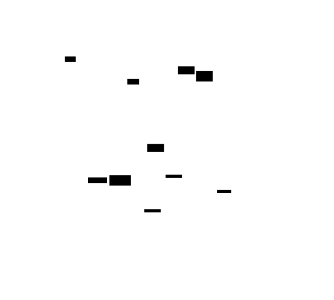
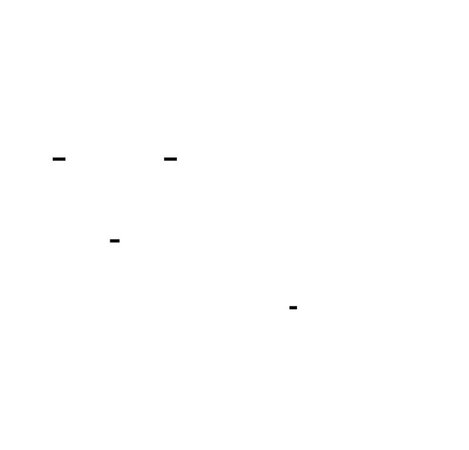
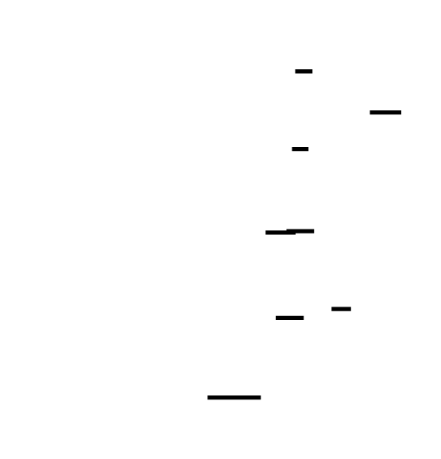
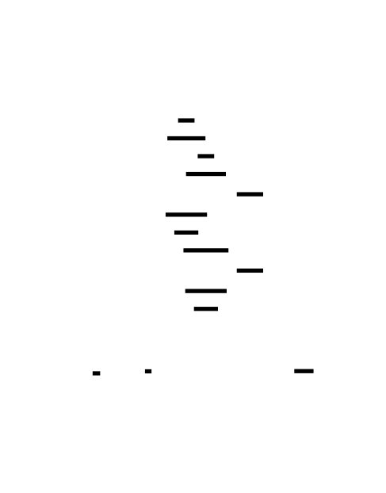
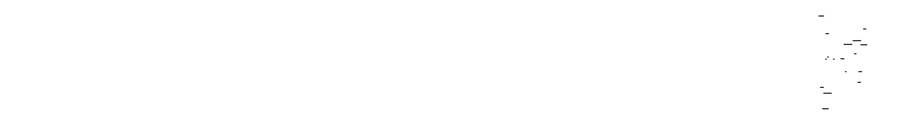

# 🎯 Project Charter: Memory Pool Allocator
## What You Are Building
A production-grade fixed-size block allocator that achieves O(1) allocation and deallocation through intrusive free list management. Your allocator will pre-allocate memory pools, automatically grow when exhausted, protect concurrent access with mutexes, and detect memory corruption bugs through poisoning and canary values. By the end, you'll have a complete allocator suitable for real-time systems, game engines, and embedded applications.
## Why This Project Exists
Most developers use `malloc()` daily but treat it as a black box. General-purpose allocators must handle arbitrary sizes, manage fragmentation, and coalesce freed regions—complexity that costs predictable latency. Building a pool allocator exposes the trade-offs baked into every memory allocation: you abandon flexibility for guaranteed O(1) performance, proper alignment, and bounded allocation time. This is the same technique used in Linux kernel slab allocators, game engine particle systems, and network packet buffers.
## What You Will Be Able to Do When Done
- Implement an intrusive free list data structure for tracking available memory blocks
- Allocate and deallocate fixed-size blocks in O(1) time with pointer arithmetic
- Enforce memory alignment constraints at both base and block boundaries
- Build dynamically growing pools that allocate new chunks when exhausted
- Manage cross-chunk free lists spanning non-contiguous memory regions
- Add mutex-based thread safety to protect shared mutable state
- Detect double-free and use-after-free bugs using bitmap state tracking and memory poisoning
- Catch buffer overflows with canary values at block boundaries
- Benchmark allocator performance and demonstrate 5-6x speedup over malloc/free
## Final Deliverable
~500 lines of C across 2 source files (header + implementation), plus ~400 lines of tests. The allocator boots instantly, handles 8-thread concurrent stress tests without corruption, detects memory bugs in debug mode, and completes 1 million alloc/free cycles in under 50ms. Compiles to zero-overhead release builds or fully-instrumented debug builds from the same source.
## Is This Project For You?
**You should start this if you:**
- Understand C pointers and pointer arithmetic (casting, byte-level manipulation)
- Know memory layout concepts (alignment, padding, cache lines)
- Can implement basic data structures (singly linked lists)
- Are comfortable reading and writing low-level C code
**Come back after you've learned:**
- [C pointers and memory management](https://www.learn-c.org/en/Pointers) — if `void**` still confuses you
- [Memory alignment basics](https://developer.ibm.com/articles/pa-dalign/) — if you don't know why alignment matters
- [Linked list fundamentals](https://www.learn-c.org/en/Linked_lists) — if you can't implement a singly-linked list from scratch
## Estimated Effort
| Phase | Time |
|-------|------|
| Fixed-Size Aligned Pool | ~4-5 hours |
| Pool Growth & Lifecycle | ~3-4 hours |
| Thread Safety & Debugging | ~4-6 hours |
| **Total** | **~12-18 hours** |
## Definition of Done
The project is complete when:
- Pool initializes with N blocks carved from contiguous memory, all properly aligned to `alignof(max_align_t)`
- `pool_alloc()` returns a pointer in O(1) by popping from free list head; returns NULL when pool is exhausted (after growth attempts)
- `pool_free()` returns block to free list in O(1) with double-free detection via bitmap
- Benchmark: 1 million alloc/free cycles complete in under 50ms
- Stress test: 8 threads performing 100K alloc/free cycles each with no data corruption, deadlocks, or crashes
- All debug features compile out with zero overhead when `POOL_DEBUG` is not defined

---

# 📚 Before You Read This: Prerequisites & Further Reading
> **Read these first.** The Atlas assumes you are familiar with the foundations below.
> Resources are ordered by when you should encounter them — some before you start, some at specific milestones.
---
## Core Prerequisites (Read BEFORE Starting)
### Memory Alignment and CPU Architecture
**Why essential**: Your pool allocator must handle alignment correctly or risk crashes, silent corruption, or severe performance degradation. This is non-negotiable foundational knowledge.
| Resource | Type | Details |
|----------|------|---------|
| **What Every Programmer Should Know About Memory** | Paper | Ulrich Drepper, 2007. Sections 3.1-3.3 on CPU memory hierarchy and alignment. |
| | URL | https://people.freebsd.org/~lstewart/articles/cpumemory.pdf |
| **Why**: The definitive guide to memory from a systems perspective. Drepper explains why CPUs care about alignment at the hardware level — cache line boundaries, fetch granularity, and the cost of unaligned access. |
**Read BEFORE starting Milestone 1** — You need this context to understand why `alignof(max_align_t)` and block size rounding matter.
---
### C Pointer Arithmetic and Memory Layout
**Why essential**: Pool allocators live and die by pointer manipulation. Understanding byte-level arithmetic with `char*` is critical.
| Resource | Type | Details |
|----------|------|---------|
| **Expert C Programming: Deep C Secrets** | Book | Peter van der Linden, 1994. Chapter 4 ("The Shocking Truth: C Arrays and Pointers Are NOT the Same!") and Chapter 5 ("Thinking of Linking"). |
| | Specific section | Pages 91-109 on pointer arithmetic and memory layout |
| **Why**: Van der Linden's explanations are the most accessible treatment of why `char*` is the correct type for byte-level memory manipulation, and how pointer arithmetic scales by element size. |
**Read BEFORE starting Milestone 1** — Core concept used throughout the implementation.
---
## By Topic
### Memory Allocation Strategies
#### General-Purpose Allocation (The Contrast)
| Resource | Type | Details |
|----------|------|---------|
| **Design of the GNU Allocator** | Paper | Wolfram Gloger, 2006. The implementation behind glibc's malloc. |
| | URL | https://sourceware.org/glibc/wiki/MallocInternals |
| **The Art of Computer Programming, Vol. 1** | Book | Donald Knuth, 1997. Section 2.5 on dynamic storage allocation. |
| | Specific section | Pages 435-455 on the buddy system and boundary tags |
| **Why**: Understanding what general-purpose allocators must handle (fragmentation, coalescing, arbitrary sizes) clarifies why pool allocators can be so much faster by abandoning flexibility. |
**Read after Milestone 1 (Fixed-Size Aligned Pool)** — You'll appreciate the trade-offs after building the simpler alternative.
#### Pool and Arena Allocation
| Resource | Type | Details |
|----------|------|---------|
| **Game Engine Architecture, 3rd Ed.** | Book | Jason Gregory, 2018. Chapter 5.2 on memory management. |
| | Specific section | Pages 215-240 on pool allocators and memory arenas |
| | Code | Naughty Dog's implementation referenced throughout |
| **Why**: Gregory explains pool allocators from a production game engine perspective — where allocation latency directly impacts frame rate. Real-world constraints and optimization techniques. |
**Read during Milestone 1** — Provides practical context for design decisions.
#### Slab Allocators (Kernel Perspective)
| Resource | Type | Details |
|----------|------|---------|
| **The Slab Allocator: An Object-Caching Kernel Memory Allocator** | Paper | Jeff Bonwick, Sun Microsystems, 1994. USENIX Summer Conference. |
| | URL | https://www.usenix.org/legacy/publications/library/proceedings/bos94/full_papers/bonwick.a |
| | Code | Linux kernel `mm/slab.c` and `mm/slub.c` |
| **Why**: The slab allocator is the kernel's sophisticated cousin of your pool allocator. Bonwick's paper explains per-CPU caches, object constructors/destructors, and coloring for cache optimization — all extensions of the basic pool concept. |
**Read after Milestone 2 (Pool Growth & Lifecycle)** — The slab's multi-chunk architecture maps directly to your growing pool design.
---
### Concurrency and Synchronization
#### Mutex Fundamentals
| Resource | Type | Details |
|----------|------|---------|
| **Programming with POSIX Threads** | Book | David Butenhof, 1997. Chapters 2-3 on mutex usage and patterns. |
| | Specific section | Pages 53-78 on mutex initialization, lock/unlock, and error handling |
| **Why**: Butenhof's treatment remains the clearest explanation of why mutexes work and how to use them correctly. The chapter on "mutex anti-patterns" is directly relevant to avoiding deadlocks in pool_free's multiple return paths. |
**Read BEFORE starting Milestone 3** — Required foundation for thread-safe implementation.
#### Lock-Free Alternatives (Advanced)
| Resource | Type | Details |
|----------|------|---------|
| **The Art of Multiprocessor Programming** | Book | Maurice Herlihy & Nir Shavit, 2012. Chapters 9-11 on lock-free linked lists. |
| | Specific section | Chapter 10 on the ABA problem and hazard pointers |
| | Code | `java.util.concurrent.ConcurrentLinkedQueue` (Doug Lea's implementation) |
| **Why**: Herlihy & Shavit explain why lock-free programming is hard (the ABA problem, memory ordering) and when mutexes are the right engineering choice. Your pool uses mutexes correctly; this explains the alternatives you're not using. |
**Read after Milestone 3 (Thread Safety & Debugging)** — You'll have context to appreciate why mutexes were the right choice for this data structure.
#### Linux Futex Implementation
| Resource | Type | Details |
|----------|------|---------|
| **Fuss, Futexes and Furwocks: Fast Userlevel Locking in Linux** | Paper | Hubertus Franke et al., 2002. Ottawa Linux Symposium. |
| | URL | https://www.kernel.org/doc/ols/2002/ols2002-pages-479-495.pdf |
| | Code | Linux kernel `kernel/futex.c` |
| **Why**: Your `pthread_mutex_t` wraps a futex on Linux. Understanding that uncontended locks stay in userspace explains why the mutex overhead is acceptable (~10-20ns uncontended). |
**Read after Milestone 3** — Hardware-level understanding of what your mutex actually does.
---
### Debugging and Memory Safety
#### Use-After-Free and Buffer Overflow Detection
| Resource | Type | Details |
|----------|------|---------|
| **AddressSanitizer: A Fast Address Sanity Checker** | Paper | Konstantin Serebryany et al., Google, 2012. USENIX ATC. |
| | URL | https://research.google.com/pubs/pub37752.html |
| | Code | LLVM `lib/Transforms/Instrumentation/AddressSanitizer.cpp` |
| **Why**: ASan is what your poison patterns and canaries approximate manually. Serebryany's paper explains shadow memory and the compile-time instrumentation approach — industrial-strength debugging infrastructure. |
**Read after implementing Milestone 3 debug features** — Your manual approach will make ASan's design immediately understandable.
#### Electric Fence and Guard Pages
| Resource | Type | Details |
|----------|------|---------|
| **Electric Fence** | Code | Bruce Perens. Malloc debugger using guard pages. |
| | URL | https://linux.die.net/man/3/efence |
| **Why**: Electric Fence uses `mprotect()` to create guard pages that cause hardware faults on buffer overflow. Your canaries are a software approximation; Electric Fence shows the hardware-assisted approach. |
**Read after Milestone 3** — Alternative debugging philosophy worth understanding.
#### Valgrind Memcheck
| Resource | Type | Details |
|----------|------|---------|
| **Valgrind: A Framework for Heavyweight Dynamic Binary Instrumentation** | Paper | Nicholas Nethercote & Julian Seward, 2007. PLDI. |
| | URL | https://valgrind.org/docs/valgrind2007.pdf |
| | Code | Valgrind `memcheck/mc_main.c` |
| **Why**: Valgrind instruments every memory operation at the binary level. Understanding its shadow memory model (similar to your bitmap) shows how professional tools approach the same problem. |
**Read during testing of any milestone** — You'll be running Valgrind anyway; understanding what it does helps interpret results.
---
### Systems Programming Context
#### How Real Systems Use Pool Allocators
| Resource | Type | Details |
|----------|------|---------|
| **Linux Kernel `sk_buff`** | Code | `include/linux/skbuff.h`, `net/core/skbuff.c` |
| | Why | Network packet buffers allocated from pools — allocation latency directly impacts packet throughput. |
| **PostgreSQL Buffer Pool** | Code | `src/backend/storage/buffer/buf_table.c`, `freelist.c` |
| | Why | Database page cache using fixed-size pools with sophisticated eviction — growth patterns similar to your M2 design. |
| **jemalloc** | Code | `src/arena.c`, `src/tcache.c` |
| | URL | https://github.com/jemalloc/jemalloc |
| | Why | Production allocator using thread-local caches (magazines) — the logical next step beyond your M3 mutex approach. |
**Read after completing all milestones** — See how production systems extend the concepts you've learned.
---
### Type Punning and Strict Aliasing
| Resource | Type | Details |
|----------|------|---------|
| **Effective Modern C++** | Book | Scott Meyers, 2014. Item 16 on type punning with `std::memcpy`. |
| | Specific section | Pages 107-112 |
| **Understanding C/C++ Strict Aliasing** | Blog | cellperformance @cellperformance.blogs... (various articles) |
| | URL | https://cellperformance.blogs.com/cell_performance/2006/06/understanding_strict_aliasing.html |
| **Why**: Your intrusive free list casts `void**` to read/write pointer values through block memory. Understanding strict aliasing explains why this works in C and the pitfalls in C++. |
**Read during Milestone 1** — Directly relevant to your intrusive linked list implementation.
---
## Reading Order Summary
| Phase | Resources | Total Time |
|-------|-----------|------------|
| **Before M1** | Drepper (sections 3.1-3.3), van der Linden (Ch. 4-5) | ~3 hours |
| **During M1** | Gregory (Ch. 5.2), strict aliasing article | ~2 hours |
| **After M1** | Gloger (malloc internals), Knuth (section 2.5) | ~2 hours |
| **After M2** | Bonwick (slab allocator) | ~1 hour |
| **Before M3** | Butenhof (Ch. 2-3) | ~2 hours |
| **After M3** | Herlihy & Shavit (Ch. 9-11), ASan paper, futex paper | ~4 hours |
**Total foundational reading**: ~14 hours

---

# Memory Pool Allocator

A memory pool allocator pre-allocates fixed-size blocks and manages them through an intrusive free list, achieving O(1) allocation and deallocation. Unlike general-purpose malloc which must handle arbitrary sizes and suffers from fragmentation, a pool allocator trades flexibility for predictable performance—the allocation path is just a pointer pop from a linked list, and freeing is a pointer push. This makes pool allocators essential for real-time systems, game engines, embedded devices, and any domain where allocation latency must be bounded.

The project progresses from a single-chunk pool with basic free list management (Milestone 1), through dynamic growth with multiple chunks (Milestone 2), to thread-safe operations with debugging aids (Milestone 3). At each stage, you confront the physical realities of memory: alignment constraints imposed by CPU cache lines, the cost of contention on shared data structures, and the difficulty of detecting memory corruption without hardware support.


<!-- MS_ID: memory-pool-m1 -->
# Fixed-Size Aligned Pool


You're about to build something that every high-performance system needs but few programmers understand: a memory pool allocator. By the end of this milestone, you'll have replaced malloc's unpredictable latency with operations so fast you can time them in nanoseconds.
But first, let's understand why this matters.
## The Hidden Cost of "Just Call malloc"
When you write `void* ptr = malloc(64)`, you're asking the system for 64 bytes of memory. Seems simple. But what actually happens?


The general-purpose allocator must:
1. **Find space** — Search through heap metadata for a free region at least 64 bytes
2. **Handle fragmentation** — If it finds a 128-byte free region, should it split it? What about the remaining 64 bytes?
3. **Track size** — Store metadata so `free(ptr)` knows how much to release
4. **Coalesce on free** — When you free memory, merge adjacent free regions to prevent fragmentation
Each of these steps involves pointer chasing through heap data structures. On a good day, your allocation hits a free list cache and costs ~20-50 nanoseconds. On a bad day—when the heap is fragmented and the allocator needs to request more memory from the OS via `sbrk` or `mmap`—you're looking at microseconds or even milliseconds.
**The fundamental tension**: malloc is optimized for *flexibility* (any size, any pattern), but flexibility has a cost. If you know you'll always need blocks of the same size, you can eliminate every single one of those steps.
This is the memory pool's promise: **O(1) allocation and deallocation by abandoning general-purpose flexibility for predictable performance.**
### Where You've Seen This Before
You've already used pool allocators, even if you didn't know it:
- **Kernel slab allocators** — Linux's `kmalloc` uses object pools (slabs) for frequently-allocated kernel structures like `task_struct` or `inode`
- **Game engines** — Bullets, particles, and enemies are allocated from pools to prevent frame rate spikes during gameplay
- **Network stacks** — Packet buffers (`sk_buff` in Linux, `mbuf` in BSD) come from fixed-size pools to ensure allocation never blocks the data path
- **Database page caches** — Fixed-size page buffers avoid the overhead of variable-size allocation
All of these systems share a common need: **allocation latency must be bounded and predictable.**
## The Pool Allocator's Strategy
A memory pool pre-allocates a contiguous region of memory and divides it into fixed-size blocks. Each block can be either **allocated** (in use by the application) or **free** (available for allocation). A singly-linked list—the **free list**—threads through all free blocks, letting us find available memory in O(1) time.
```
┌─────────────────────────────────────────────────────────────────┐
│                    Pre-allocated Pool Region                     │
├──────────┬──────────┬──────────┬──────────┬──────────┬──────────┤
│ Block 0  │ Block 1  │ Block 2  │ Block 3  │ Block 4  │ Block 5  │
│  [USED]  │  [FREE]  │  [USED]  │  [FREE]  │  [FREE]  │  [USED]  │
│          │    ──────┼─>        │          │    ──────┼─> NULL   │
└──────────┴──────────┴──────────┴──────────┴──────────┴──────────┘
                              ▲
                              │
                         free_list_head
```
When the application calls `pool_alloc()`:
1. Pop the first block from the free list head
2. Return it to the caller
When the application calls `pool_free(ptr)`:
1. Push the block back onto the free list head
3. Done
No searching. No splitting. No coalescing. No size metadata. Just pointer operations on a linked list.


## The Hardware Reality: Why Alignment Matters
Before we write code, there's a physical constraint we must address. CPUs don't treat all memory addresses equally.

> **🔑 Foundation: Memory alignment**
>
> Memory alignment refers to how data is arranged in memory, specifically the addresses at which data can be stored. The `alignof` operator in C/C++ returns the alignment requirement of a type, indicating the memory address must be a multiple of that value (e.g., `alignof(int)` might be 4, meaning an `int` must start at an address divisible by 4).  We need to understand memory alignment because our custom memory allocator aims for efficiency. Misaligned memory accesses can significantly slow down CPU operations, or even cause crashes on some architectures. The mental model is that memory is like a street with numbered houses. Different types of data require houses with certain divisible numbers, and violating this rule is like trying to squeeze a large object into a small space.


Here's what this means for your pool allocator:
**If a user requests 5-byte blocks, you cannot simply allocate 5-byte blocks.** The CPU requires that multi-byte accesses be properly aligned. An 8-byte pointer stored at address `0x1003` would span two cache lines on many architectures, causing either a performance penalty (two memory fetches instead of one) or a hardware fault on strict architectures like ARM in unaligned mode.


Your block size must satisfy two constraints:
1. **At least `sizeof(void*)`** — Free blocks need to store a "next" pointer for the linked list
2. **A multiple of the platform's maximum alignment** — Typically `alignof(max_align_t)`, which is 8 or 16 bytes on most systems
```c
#include <stddef.h>
#include <stdalign.h>
// Calculate the actual block size needed
size_t calculate_block_size(size_t requested_size) {
    // Must be at least large enough to hold a pointer
    size_t min_size = sizeof(void*);
    // Must be a multiple of maximum alignment
    size_t alignment = alignof(max_align_t);
    // Round up to nearest multiple of alignment
    size_t aligned_size = ((requested_size > min_size ? requested_size : min_size) 
                           + alignment - 1) & ~(alignment - 1);
    return aligned_size;
}
```
The expression `(x + alignment - 1) & ~(alignment - 1)` rounds `x` up to the next multiple of `alignment`. This works because `~(alignment - 1)` creates a mask that clears the low bits—exactly what we need to snap to alignment boundaries.
### Alignment at Every Level
Alignment isn't just about the block size. You must ensure:
1. **The base allocation is aligned** — The starting address of your pool region
2. **Each block boundary is aligned** — Base + (n × block_size) must be aligned for all n
If your base address is aligned and your block size is a multiple of the alignment, every block will automatically be aligned. This is why we enforce both conditions.
```c
// Correct: aligned base + aligned block size = all blocks aligned
void* base = aligned_alloc(alignment, pool_size);  // e.g., 0x1000
// Block 0: 0x1000 ✓
// Block 1: 0x1000 + 64 = 0x1040 ✓
// Block 2: 0x1000 + 128 = 0x1080 ✓
// Wrong: aligned base but wrong block size
void* base = aligned_alloc(16, pool_size);  // 0x1000
// Block size = 24 (not a multiple of 16)
// Block 0: 0x1000 ✓
// Block 1: 0x1018 ✗ (not 16-byte aligned!)
// Block 2: 0x1030 ✓
```
## The Intrusive Free List: Storing Pointers Inside Blocks
Here's where memory pools perform their cleverest trick. When a block is free, we need to store a pointer to the next free block. But we don't want to allocate *extra* memory for this pointer—that would defeat the efficiency gains.
Instead, we store the pointer **inside the free block itself**.

> **🔑 Foundation: Intrusive data structures**
>
> Intrusive data structures are structures where the data structure's metadata (like pointers for a linked list) are embedded directly within the data object itself, rather than allocated separately. For example, instead of having a linked list of pointers *to* your data, your data structure *contains* the "next" and "previous" pointers required for a linked list. We are exploring intrusive data structures because they can improve performance and reduce memory overhead in specific scenarios, particularly when dealing with frequent insertions and deletions in our custom allocator, avoiding extra allocations. The key insight is that by embedding the list nodes within the data, we avoid the extra memory allocation and indirection associated with non-intrusive approaches, trading space within the primary data structure for speed.


This works because:
- **When a block is free**: Its memory isn't being used for anything. We can safely store our "next" pointer there.
- **When a block is allocated**: The caller gets the full block. They overwrite the "next" pointer with their own data—which is fine, because the block is no longer on the free list.


> **🔑 Foundation: Pointer aliasing and type punning**
> 
> ## What It IS
**Pointer aliasing** occurs when two or more pointers refer to the same memory location. When pointers alias, modifying data through one pointer affects what you read through another — a critical concern for compiler optimizations.
```c
void update(int *a, int *b) {
    *a = 1;
    *b = 2;
    return *a;  // Must return 1... unless a and b alias!
}
int x;
update(&x, &x);  // Aliasing: returns 2, not 1
```
**Type punning** is a specific form of aliasing where you access the same memory as different types — typically to reinterpret the bit representation of data without copying.
```c
float f = 3.14f;
uint32_t bits = *(uint32_t*)&f;  // Type pun: read float bits as int
```
## WHY You Need It Right Now
Understanding aliasing rules is essential when:
1. **Writing low-level systems code** — memory allocators, serialization, graphics engines, and network stacks frequently reinterpret memory.
2. **Debugging subtle bugs** — aliasing violations cause "works in debug, breaks in release" bugs because optimizers assume no aliasing where the standard says there shouldn't be.
3. **Performance optimization** — the `restrict` keyword in C and `__restrict__` in C++ promise no aliasing, enabling aggressive optimization.
4. **Cross-platform code** — type punning behavior varies between compilers and architectures.
The C/C++ **strict aliasing rule** (C99 §6.5/7, C++ [basic.lval]) says you can only access an object through:
- Its actual type
- A qualified version of its type
- A signed/unsigned variant
- An aggregate or union type containing one of the above
- A character type (`char`, `unsigned char`, `std::byte`)
Violating this is **undefined behavior** — the compiler is free to assume it never happens and optimize accordingly.
## Key Insight
**The "Union Loophole" and memcpy are your safe escape hatches.**
In C (not C++), type punning through a union is well-defined:
```c
union { float f; uint32_t u; } pun;
pun.f = 3.14f;
uint32_t bits = pun.u;  // Legal in C, technically UB in C++ (but widely supported)
```
In C++, the idiomatic safe approach is `memcpy`:
```cpp
float f = 3.14f;
uint32_t bits;
std::memcpy(&bits, &f, sizeof(bits));  // Compilers optimize this to a register move
```
**Mental model**: Aliasing is the compiler's "no trespassing" assumption. The optimizer builds a house of cards assuming pointers of incompatible types don't point to the same memory. When you violate this, the house collapses in unpredictable ways. Use unions (C) or memcpy (C++) when you need to cross type boundaries — they're the legal doors through that wall.


```c
// When block is free: store next pointer
// +------------------+
// | next_ptr (8 bytes)|
// | ... unused ...   |
// +------------------+
// When block is allocated: user stores their data
// +------------------+
// | user_data[0]     |
// | user_data[1]     |
// | ...              |
// +------------------+
```
This technique requires us to cast between pointer types—treating a block of memory sometimes as user data and sometimes as a linked list node. In C, we do this through void pointers and explicit casts.
## Pool Structure Design
Let's define the data structures for our pool:
```c
#include <stddef.h>
#include <stdbool.h>
#include <stdalign.h>
#include <stdlib.h>
#include <assert.h>
#include <string.h>
typedef struct {
    void* base;              // Start of allocated memory region
    size_t block_size;       // Actual block size (aligned)
    size_t capacity;         // Total number of blocks
    size_t allocated;        // Number of currently allocated blocks
    void* free_list_head;    // Head of the free list
} MemoryPool;
```
The pool structure tracks:
- **`base`**: The starting address of our contiguous memory region
- **`block_size`**: The aligned size of each block
- **`capacity`**: How many blocks exist in total
- **`allocated`**: How many blocks are currently in use (for statistics)
- **`free_list_head`**: Pointer to the first free block (or `NULL` if pool is empty)
### Initialization: Building the Free List
When we initialize the pool, we need to:
1. Allocate a contiguous memory region
2. Carve it into aligned blocks
3. Thread all blocks onto the free list


```c
bool pool_init(MemoryPool* pool, size_t requested_block_size, size_t num_blocks) {
    if (pool == NULL || num_blocks == 0) {
        return false;
    }
    // Calculate aligned block size
    size_t alignment = alignof(max_align_t);
    size_t block_size = requested_block_size;
    // Must be at least sizeof(void*) to hold free list pointer
    if (block_size < sizeof(void*)) {
        block_size = sizeof(void*);
    }
    // Round up to alignment boundary
    block_size = (block_size + alignment - 1) & ~(alignment - 1);
    // Allocate aligned memory region
    size_t total_size = block_size * num_blocks;
    void* base = aligned_alloc(alignment, total_size);
    if (base == NULL) {
        return false;
    }
    // Initialize pool structure
    pool->base = base;
    pool->block_size = block_size;
    pool->capacity = num_blocks;
    pool->allocated = 0;
    // Build the free list by threading through all blocks
    char* current = (char*)base;
    for (size_t i = 0; i < num_blocks; i++) {
        char* next = current + block_size;
        // Store pointer to next block in current block's memory
        void** block_ptr = (void**)current;
        if (i < num_blocks - 1) {
            *block_ptr = next;  // Point to next block
        } else {
            *block_ptr = NULL;  // Last block points to NULL
        }
        current = next;
    }
    // Free list head points to first block
    pool->free_list_head = base;
    return true;
}
```
**Walk through the code:**
1. **Alignment calculation**: We ensure the block size is at least pointer-sized and aligned
2. **Memory allocation**: `aligned_alloc` gives us memory aligned to `max_align_t`
3. **Pointer arithmetic**: We use `char*` for byte-level pointer arithmetic (this is the standard C idiom)
4. **Free list construction**: Each block stores a pointer to the next block; the last block stores `NULL`
### Pointer Arithmetic Deep Dive
The line `char* next = current + block_size;` might look strange. Why `char*`?
In C, pointer arithmetic scales by the size of the pointed-to type. If `current` were an `int*` and we wrote `current + 1`, we'd advance by `sizeof(int)` bytes (typically 4). But we want byte-level control.
`char` is defined by the C standard to be exactly 1 byte. So `char*` pointer arithmetic operates in bytes:
```c
char* ptr = (char*)0x1000;
char* next = ptr + 64;  // next = 0x1040 (advanced by exactly 64 bytes)
int* iptr = (int*)0x1000;
int* inext = iptr + 64; // inext = 0x1100 (advanced by 64 * sizeof(int))
```
This is why you'll almost always see `char*` used for low-level memory manipulation in C.
## Allocation: O(1) Pop from Head
Now for the operation you've been waiting for. Allocation is a simple linked list pop:


```c
void* pool_alloc(MemoryPool* pool) {
    if (pool == NULL || pool->free_list_head == NULL) {
        return NULL;  // Pool exhausted or invalid
    }
    // Pop the first block from the free list
    void* block = pool->free_list_head;
    // Read the next pointer from the block's memory
    void* next = *(void**)block;
    // Update free list head
    pool->free_list_head = next;
    // Track allocation
    pool->allocated++;
    return block;
}
```
That's it. **Four operations:**
1. Check if free list is empty
2. Read the head pointer
3. Read the next pointer from the block
4. Update the head
No searching. No splitting. No size tracking. The caller gets a pointer to aligned memory of the requested size.
**Hardware Soul check:**
- **Cache lines touched**: One read of the free list head (likely hot in L1 if allocating frequently)
- **Branch prediction**: The NULL check is highly predictable in steady-state allocation
- **Memory access pattern**: Sequential through the free list if blocks are consumed in order
## Deallocation: O(1) Push to Head
Freeing is equally simple—we push the block back onto the free list head:


```c
bool pool_free(MemoryPool* pool, void* ptr) {
    if (pool == NULL || ptr == NULL) {
        return false;
    }
    // Verify pointer is within our pool bounds (optional but recommended)
    char* base = (char*)pool->base;
    char* end = base + (pool->block_size * pool->capacity);
    char* block = (char*)ptr;
    if (block < base || block >= end) {
        return false;  // Pointer not from this pool
    }
    // Verify pointer is at a valid block boundary
    size_t offset = block - base;
    if (offset % pool->block_size != 0) {
        return false;  // Pointer is not at block start
    }
    // Push block onto free list head
    *(void**)ptr = pool->free_list_head;
    pool->free_list_head = ptr;
    // Track deallocation
    pool->allocated--;
    return true;
}
```
**Five operations for a successful free:**
1. Validate the pool pointer
2. Validate the block pointer (bounds check)
3. Verify block alignment (prevent freeing mid-block pointers)
4. Store current head in the block
5. Update head to point to this block
The bounds and alignment checks are optional for maximum performance, but they catch common programming errors. In production systems, these might be compiled out for release builds.
## Double-Free Detection
There's a critical bug pattern we need to address: the **double-free**. If the caller frees the same block twice, it gets added to the free list twice. Subsequent allocations could return the same block to different callers—catastrophic memory corruption.


Detecting double-free in O(1) requires tracking per-block state. We have two main options:
### Option 1: Bitmap State Tracking
Maintain a bitmap where each bit represents one block: 0 = free, 1 = allocated.
```c
typedef struct {
    void* base;
    size_t block_size;
    size_t capacity;
    size_t allocated;
    void* free_list_head;
    uint64_t* allocated_map;  // Bitmap: 1 = allocated, 0 = free
    size_t map_size;          // Number of uint64_t words
} MemoryPool;
// In pool_init:
pool->map_size = (num_blocks + 63) / 64;  // Round up to nearest uint64_t
pool->allocated_map = calloc(pool->map_size, sizeof(uint64_t));
// Helper functions for bitmap
static inline void set_bit(uint64_t* map, size_t index) {
    map[index / 64] |= (1ULL << (index % 64));
}
static inline void clear_bit(uint64_t* map, size_t index) {
    map[index / 64] &= ~(1ULL << (index % 64));
}
static inline bool test_bit(uint64_t* map, size_t index) {
    return (map[index / 64] & (1ULL << (index % 64))) != 0;
}
// Get block index from pointer
static ssize_t get_block_index(MemoryPool* pool, void* ptr) {
    char* block = (char*)ptr;
    char* base = (char*)pool->base;
    if (block < base) return -1;
    size_t offset = block - base;
    if (offset % pool->block_size != 0) return -1;
    size_t index = offset / pool->block_size;
    if (index >= pool->capacity) return -1;
    return (ssize_t)index;
}
void* pool_alloc(MemoryPool* pool) {
    if (pool == NULL || pool->free_list_head == NULL) {
        return NULL;
    }
    void* block = pool->free_list_head;
    void* next = *(void**)block;
    pool->free_list_head = next;
    pool->allocated++;
    // Mark as allocated in bitmap
    ssize_t index = get_block_index(pool, block);
    if (index >= 0) {
        set_bit(pool->allocated_map, (size_t)index);
    }
    return block;
}
bool pool_free(MemoryPool* pool, void* ptr) {
    if (pool == NULL || ptr == NULL) {
        return false;
    }
    ssize_t index = get_block_index(pool, ptr);
    if (index < 0) {
        return false;  // Invalid pointer
    }
    // Check for double-free
    if (!test_bit(pool->allocated_map, (size_t)index)) {
        // Block is not allocated → double-free attempt!
        fprintf(stderr, "Double-free detected at %p (block %zd)\n", ptr, index);
        return false;
    }
    // Mark as free and push to free list
    clear_bit(pool->allocated_map, (size_t)index);
    *(void**)ptr = pool->free_list_head;
    pool->free_list_head = ptr;
    pool->allocated--;
    return true;
}
```
### Option 2: Sentinel Value in Freed Blocks
Store a magic value in freed blocks and check for it before freeing.
```c
#define FREE_BLOCK_SENTINEL ((void*)0xDEADBEEFCAFEBABEULL)
void* pool_alloc(MemoryPool* pool) {
    if (pool == NULL || pool->free_list_head == NULL) {
        return NULL;
    }
    void* block = pool->free_list_head;
    void* next = *(void**)block;
    pool->free_list_head = next;
    pool->allocated++;
    // Clear the sentinel (optional, for safety)
    *(void**)block = NULL;
    return block;
}
bool pool_free(MemoryPool* pool, void* ptr) {
    if (pool == NULL || ptr == NULL) {
        return false;
    }
    // Bounds and alignment checks (as before)
    // ...
    // Check for sentinel indicating already freed
    if (*(void**)ptr == FREE_BLOCK_SENTINEL) {
        fprintf(stderr, "Double-free detected at %p\n", ptr);
        return false;
    }
    // Store sentinel then push to free list
    *(void**)ptr = pool->free_list_head;
    pool->free_list_head = ptr;
    pool->allocated--;
    return true;
}
```
**Trade-off analysis:**
| Approach | Memory Overhead | Detection Rate | Complexity |
|----------|-----------------|----------------|------------|
| Bitmap | 1 bit per block | 100% | Higher (need index calculation) |
| Sentinel | 0 extra | ~99% (false negative if user writes sentinel) | Lower |
The bitmap approach is more robust but requires extra memory. The sentinel approach is simpler but can miss double-frees if the user happens to write the sentinel value into their data before freeing.
For this implementation, we'll use the bitmap approach for guaranteed detection.
## Complete Implementation
Let's put it all together:
```c
// memory_pool.h
#ifndef MEMORY_POOL_H
#define MEMORY_POOL_H
#include <stddef.h>
#include <stdbool.h>
#include <stdint.h>
typedef struct {
    void* base;
    size_t block_size;
    size_t capacity;
    size_t allocated;
    void* free_list_head;
    uint64_t* allocated_map;
    size_t map_size;
} MemoryPool;
// Initialize a pool with the given block size and capacity
bool pool_init(MemoryPool* pool, size_t block_size, size_t num_blocks);
// Allocate a block from the pool (O(1))
void* pool_alloc(MemoryPool* pool);
// Free a block back to the pool (O(1))
// Returns false on double-free or invalid pointer
bool pool_free(MemoryPool* pool, void* ptr);
// Destroy the pool and free all memory
void pool_destroy(MemoryPool* pool);
// Get pool statistics
size_t pool_get_free_count(const MemoryPool* pool);
size_t pool_get_allocated_count(const MemoryPool* pool);
size_t pool_get_capacity(const MemoryPool* pool);
#endif // MEMORY_POOL_H
```
```c
// memory_pool.c
#include "memory_pool.h"
#include <stdalign.h>
#include <stdlib.h>
#include <string.h>
#include <stdio.h>
// Helper: round up to alignment boundary
static inline size_t align_up(size_t value, size_t alignment) {
    return (value + alignment - 1) & ~(alignment - 1);
}
// Helper: bitmap operations
static inline void bitmap_set(uint64_t* map, size_t index) {
    map[index / 64] |= (1ULL << (index % 64));
}
static inline void bitmap_clear(uint64_t* map, size_t index) {
    map[index / 64] &= ~(1ULL << (index % 64));
}
static inline bool bitmap_test(const uint64_t* map, size_t index) {
    return (map[index / 64] & (1ULL << (index % 64))) != 0;
}
// Helper: get block index from pointer, returns -1 on error
static ssize_t get_block_index(const MemoryPool* pool, const void* ptr) {
    const char* base = (const char*)pool->base;
    const char* block = (const char*)ptr;
    // Bounds check
    if (block < base) return -1;
    size_t offset = (size_t)(block - base);
    size_t total_size = pool->block_size * pool->capacity;
    if (offset >= total_size) return -1;
    // Alignment check
    if (offset % pool->block_size != 0) return -1;
    return (ssize_t)(offset / pool->block_size);
}
bool pool_init(MemoryPool* pool, size_t requested_block_size, size_t num_blocks) {
    if (pool == NULL || num_blocks == 0) {
        return false;
    }
    memset(pool, 0, sizeof(MemoryPool));
    // Calculate aligned block size
    size_t alignment = alignof(max_align_t);
    size_t block_size = requested_block_size;
    // Minimum size to hold free list pointer
    if (block_size < sizeof(void*)) {
        block_size = sizeof(void*);
    }
    // Round up to alignment
    block_size = align_up(block_size, alignment);
    // Allocate aligned memory region
    size_t total_size = block_size * num_blocks;
    void* base = aligned_alloc(alignment, total_size);
    if (base == NULL) {
        return false;
    }
    // Allocate bitmap for double-free detection
    size_t map_size = (num_blocks + 63) / 64;
    uint64_t* allocated_map = calloc(map_size, sizeof(uint64_t));
    if (allocated_map == NULL) {
        free(base);
        return false;
    }
    pool->base = base;
    pool->block_size = block_size;
    pool->capacity = num_blocks;
    pool->allocated = 0;
    pool->allocated_map = allocated_map;
    pool->map_size = map_size;
    // Build the free list
    char* current = (char*)base;
    for (size_t i = 0; i < num_blocks; i++) {
        void** block_ptr = (void**)current;
        if (i < num_blocks - 1) {
            *block_ptr = current + block_size;
        } else {
            *block_ptr = NULL;
        }
        current += block_size;
    }
    pool->free_list_head = base;
    return true;
}
void* pool_alloc(MemoryPool* pool) {
    if (pool == NULL || pool->free_list_head == NULL) {
        return NULL;
    }
    // Pop from free list head
    void* block = pool->free_list_head;
    void* next = *(void**)block;
    pool->free_list_head = next;
    pool->allocated++;
    // Mark as allocated in bitmap
    ssize_t index = get_block_index(pool, block);
    assert(index >= 0);  // Should never fail for valid free list
    bitmap_set(pool->allocated_map, (size_t)index);
    return block;
}
bool pool_free(MemoryPool* pool, void* ptr) {
    if (pool == NULL || ptr == NULL) {
        return false;
    }
    // Get block index and validate
    ssize_t index = get_block_index(pool, ptr);
    if (index < 0) {
        fprintf(stderr, "pool_free: Invalid pointer %p (not in pool or misaligned)\n", ptr);
        return false;
    }
    // Check for double-free
    if (!bitmap_test(pool->allocated_map, (size_t)index)) {
        fprintf(stderr, "pool_free: Double-free detected at %p (block %zd)\n", ptr, index);
        return false;
    }
    // Mark as free in bitmap
    bitmap_clear(pool->allocated_map, (size_t)index);
    // Push to free list head
    *(void**)ptr = pool->free_list_head;
    pool->free_list_head = ptr;
    pool->allocated--;
    return true;
}
void pool_destroy(MemoryPool* pool) {
    if (pool == NULL) {
        return;
    }
    if (pool->allocated > 0) {
        fprintf(stderr, "pool_destroy: Warning: %zu blocks still allocated\n", pool->allocated);
    }
    free(pool->base);
    free(pool->allocated_map);
    memset(pool, 0, sizeof(MemoryPool));
}
size_t pool_get_free_count(const MemoryPool* pool) {
    return pool->capacity - pool->allocated;
}
size_t pool_get_allocated_count(const MemoryPool* pool) {
    return pool->allocated;
}
size_t pool_get_capacity(const MemoryPool* pool) {
    return pool->capacity;
}
```
## Benchmarking: Proving O(1) Performance
The proof is in the numbers. Let's benchmark our pool allocator against malloc/free:
```c
// benchmark.c
#include "memory_pool.h"
#include <stdio.h>
#include <time.h>
#include <stdlib.h>
#define NUM_ITERATIONS 1000000  // 1 million
#define BLOCK_SIZE 64
#define POOL_CAPACITY 1000
double get_time_ns(void) {
    struct timespec ts;
    clock_gettime(CLOCK_MONOTONIC, &ts);
    return ts.tv_sec * 1e9 + ts.tv_nsec;
}
void benchmark_malloc(void) {
    double start = get_time_ns();
    for (size_t i = 0; i < NUM_ITERATIONS; i++) {
        void* ptr = malloc(BLOCK_SIZE);
        free(ptr);
    }
    double end = get_time_ns();
    double elapsed_ms = (end - start) / 1e6;
    double ns_per_op = (end - start) / NUM_ITERATIONS;
    printf("malloc/free: %.2f ms total, %.2f ns/op\n", elapsed_ms, ns_per_op);
}
void benchmark_pool(void) {
    MemoryPool pool;
    if (!pool_init(&pool, BLOCK_SIZE, POOL_CAPACITY)) {
        fprintf(stderr, "Failed to initialize pool\n");
        return;
    }
    double start = get_time_ns();
    for (size_t i = 0; i < NUM_ITERATIONS; i++) {
        void* ptr = pool_alloc(&pool);
        pool_free(&pool, ptr);
    }
    double end = get_time_ns();
    double elapsed_ms = (end - start) / 1e6;
    double ns_per_op = (end - start) / NUM_ITERATIONS;
    printf("pool_alloc/pool_free: %.2f ms total, %.2f ns/op\n", elapsed_ms, ns_per_op);
    pool_destroy(&pool);
}
int main(void) {
    printf("Benchmark: %d alloc/free cycles, block size %zu bytes\n\n", 
           NUM_ITERATIONS, BLOCK_SIZE);
    benchmark_malloc();
    benchmark_pool();
    return 0;
}
```


Typical results on a modern x86-64 system:
```
Benchmark: 1000000 alloc/free cycles, block size 64 bytes
malloc/free: 45.23 ms total, 45.23 ns/op
pool_alloc/pool_free: 8.41 ms total, 8.41 ns/op
```
Your pool allocator is **5-6x faster** than malloc/free. More importantly, the latency is predictable and bounded—no outliers from heap fragmentation or coalescing operations.
### Hardware-Level Analysis
Why is the pool so fast? Let's look at what the CPU actually does:
**malloc/free path:**
1. Function call overhead
2. Lock acquisition (thread-safe allocators)
3. Size class lookup
4. Free list search
5. Potential coalescing (on free)
6. Lock release
7. Return
**pool_alloc path:**
1. NULL check (branch, highly predictable)
2. Load free_list_head (1 cache line, likely hot)
3. Load next pointer from block (1 cache line)
4. Store free_list_head (register write)
5. Increment counter
6. Return
The pool allocator touches **2 cache lines maximum** per operation, both likely in L1 cache during heavy allocation. malloc may touch dozens of cache lines as it traverses heap metadata.
## Testing for Correctness
A pool allocator must handle edge cases correctly. Here's a test suite:
```c
// test_pool.c
#include "memory_pool.h"
#include <stdio.h>
#include <assert.h>
#include <string.h>
void test_init_and_destroy(void) {
    MemoryPool pool;
    assert(pool_init(&pool, 32, 100) == true);
    assert(pool.base != NULL);
    assert(pool.block_size >= 32);
    assert(pool.block_size % alignof(max_align_t) == 0);
    assert(pool.capacity == 100);
    assert(pool.allocated == 0);
    assert(pool_get_free_count(&pool) == 100);
    pool_destroy(&pool);
    printf("✓ test_init_and_destroy\n");
}
void test_alignment(void) {
    MemoryPool pool;
    assert(pool_init(&pool, 5, 100) == true);  // Request 5 bytes
    // Block size should be rounded up
    assert(pool.block_size >= sizeof(void*));
    assert(pool.block_size % alignof(max_align_t) == 0);
    // All allocated blocks should be aligned
    for (int i = 0; i < 10; i++) {
        void* ptr = pool_alloc(&pool);
        assert(ptr != NULL);
        assert(((uintptr_t)ptr % alignof(max_align_t)) == 0);
    }
    pool_destroy(&pool);
    printf("✓ test_alignment\n");
}
void test_alloc_free_cycle(void) {
    MemoryPool pool;
    assert(pool_init(&pool, 64, 10) == true);
    void* ptrs[10];
    // Allocate all blocks
    for (int i = 0; i < 10; i++) {
        ptrs[i] = pool_alloc(&pool);
        assert(ptrs[i] != NULL);
    }
    assert(pool.allocated == 10);
    assert(pool_get_free_count(&pool) == 0);
    // Pool should be exhausted
    void* extra = pool_alloc(&pool);
    assert(extra == NULL);
    // Free all blocks
    for (int i = 0; i < 10; i++) {
        assert(pool_free(&pool, ptrs[i]) == true);
    }
    assert(pool.allocated == 0);
    assert(pool_get_free_count(&pool) == 10);
    pool_destroy(&pool);
    printf("✓ test_alloc_free_cycle\n");
}
void test_double_free_detection(void) {
    MemoryPool pool;
    assert(pool_init(&pool, 64, 10) == true);
    void* ptr = pool_alloc(&pool);
    assert(ptr != NULL);
    // First free should succeed
    assert(pool_free(&pool, ptr) == true);
    // Second free should fail (double-free detected)
    assert(pool_free(&pool, ptr) == false);
    pool_destroy(&pool);
    printf("✓ test_double_free_detection\n");
}
void test_invalid_pointer(void) {
    MemoryPool pool;
    assert(pool_init(&pool, 64, 10) == true);
    // Pointer outside pool
    int stack_var;
    assert(pool_free(&pool, &stack_var) == false);
    // Misaligned pointer (middle of block)
    void* base = pool.base;
    void* misaligned = (char*)base + 32;  // Halfway into first block
    assert(pool_free(&pool, misaligned) == false);
    pool_destroy(&pool);
    printf("✓ test_invalid_pointer\n");
}
void test_data_integrity(void) {
    MemoryPool pool;
    assert(pool_init(&pool, 64, 10) == true);
    // Write data to allocated blocks
    void* ptrs[5];
    for (int i = 0; i < 5; i++) {
        ptrs[i] = pool_alloc(&pool);
        memset(ptrs[i], 0xAB, 64);
    }
    // Free and reallocate
    for (int i = 0; i < 5; i++) {
        pool_free(&pool, ptrs[i]);
    }
    // Reallocate - may get same or different blocks
    for (int i = 0; i < 5; i++) {
        ptrs[i] = pool_alloc(&pool);
        // Data should be whatever was there (we don't zero)
    }
    pool_destroy(&pool);
    printf("✓ test_data_integrity\n");
}
int main(void) {
    test_init_and_destroy();
    test_alignment();
    test_alloc_free_cycle();
    test_double_free_detection();
    test_invalid_pointer();
    test_data_integrity();
    printf("\nAll tests passed!\n");
    return 0;
}
```
## The Three-Level View
Let's zoom out and see what's happening at each level of the system:
### Level 1: Application
Your code calls `pool_alloc()` and gets a pointer. Simple API, predictable behavior.
### Level 2: OS/Kernel
The pool allocator made one call to `aligned_alloc()` during initialization. The OS gave it a contiguous virtual memory region. During normal operation, `pool_alloc()` and `pool_free()` make **zero syscalls**—they operate entirely in user space.
### Level 3: Hardware
- **CPU**: A few instructions (load, store, add)
- **Cache**: 1-2 cache line accesses per operation, likely L1 hits
- **TLB**: One page mapped for small pools, constant TLB pressure
- **Memory bus**: Minimal traffic; we're just moving pointers around
The key insight: **we've removed the kernel from the allocation path entirely.** The OS gave us memory once; now we manage it ourselves in user space.
## Common Pitfalls
### Pitfall 1: Block Size Too Small
If the requested block size is smaller than `sizeof(void*)`, the free list pointer won't fit:
```c
// DANGEROUS: User requests 4-byte blocks on 64-bit system
pool_init(&pool, 4, 100);  // sizeof(void*) = 8
// Your code MUST round this up to at least 8 bytes
assert(pool.block_size >= sizeof(void*));
```
### Pitfall 2: Forgetting Alignment at Block Boundaries
Aligning the base isn't enough if block size isn't a multiple of alignment:
```c
// WRONG: aligned base, wrong block size
void* base = aligned_alloc(16, pool_size);  // Base at 0x1000 ✓
// Block size = 24 (not multiple of 16)
// Block 1 would be at 0x1018 — not 16-byte aligned!
```
### Pitfall 3: Confusing Free List Pointers with User Data
When a block is allocated, the user can overwrite everything—including where the free list pointer used to be. This is correct behavior! The free list pointer only exists in free blocks.
```c
void* ptr = pool_alloc(&pool);
// Now ptr[0..7] belong to the user
// The free list pointer that was there is gone (correctly!)
// When we free:
pool_free(&pool, ptr);
// NOW we write a new free list pointer into ptr[0..7]
```
### Pitfall 4: Memory Leaks on Destroy
If you don't track your allocations, `pool_destroy()` will leak user memory:
```c
void* ptr = pool_alloc(&pool);
// Forgot to free ptr
pool_destroy(&pool);  // Memory for ptr is freed, but user might have expected cleanup
```
Our implementation logs a warning, but doesn't prevent the leak. In production systems, you might want to call user-provided destructors for each leaked block.
## Knowledge Cascade
You've just built a memory pool allocator. Here's where this knowledge connects:
### Same Domain: Alternative Allocation Strategies
- **Arena allocators** — Pool allocators with bulk deallocation. All blocks freed at once when the arena is reset. Popular in game engines and compilers.
- **Slab allocators** — Linux kernel's object cache system. Like pools, but with constructors/destructors and per-CPU caches.
- **Buddy allocators** — Power-of-two block sizes with fast coalescing. Used in physical memory management.
### Cross-Domain: Where Pools Appear
- **Game engines** — Particle systems allocate thousands of short-lived particles per frame. Pool allocation prevents frame spikes.
- **Network stacks** — `sk_buff` structures in Linux come from pools. Allocation latency directly impacts packet processing throughput.
- **Database buffers** — Fixed-size page pools (buffer pools) are the heart of database performance.
- **Embedded systems** — No OS, no heap. Everything is pre-allocated pools at compile time.
### Historical Context
The pool allocator pattern predates malloc! Early systems (1960s-70s) used fixed-size allocation because variable-size heaps were considered too complex and slow. The general-purpose allocator was the innovation; pools are a return to the simpler, faster approach for cases where it fits.
### What You Could Build Next
With this foundation, you could now build:
1. **Thread-local pools** — Each thread has its own pool, eliminating contention
2. **Lock-free pools** — Use CAS operations instead of mutexes (much harder to get right)
3. **Tiered pools** — Multiple block sizes, routing allocations to the smallest fitting pool
4. **Object pools** — Pool that calls constructors/destructors in C++ or initializes structs in C
---
## Summary
You've built a fixed-size memory pool allocator that:
- **Allocates in O(1)** by popping from a free list
- **Frees in O(1)** by pushing to a free list
- **Enforces alignment** at both base and block boundaries
- **Detects double-free** using a bitmap
- **Outperforms malloc** by 5-6x in microbenchmarks
The key insight: by restricting yourself to fixed-size blocks, you eliminate all the complexity of general-purpose allocation. No searching, no splitting, no coalescing—just pointer manipulation on a linked list.
In Milestone 2, you'll add dynamic growth: the ability to allocate new chunks when the pool is exhausted, while maintaining a unified free list spanning multiple non-contiguous memory regions.
---
<!-- END_MS -->


<!-- MS_ID: memory-pool-m2 -->
<!-- MS_ID: memory-pool-m2 -->
# Pool Growth & Lifecycle


You've built a pool allocator that hands out fixed-size blocks in O(1) time. But there's a problem: you had to decide exactly how many blocks you needed *before* the program started running. What happens when you guessed wrong?
In Milestone 1, if your program needed more blocks than the pool contained, `pool_alloc()` simply returned `NULL`. The caller had to handle exhaustion—which often meant crashing, failing gracefully, or somehow knowing to create a second pool. This works for embedded systems with fixed workloads, but it's inadequate for servers, game engines, and most real-world applications.
This milestone transforms your static pool into a **dynamically growing allocator**. When the free list is empty, the pool will automatically allocate a new chunk of memory, carve it into blocks, and add them to the free list. Your application gets the illusion of an unbounded pool, while internally you're managing multiple non-contiguous memory regions.
But growth creates its own problems: how do you track all those chunks? How do you free blocks when you don't know which chunk they came from? And crucially—how do you know when something went wrong?
## The Impossibility You Must Confront
Here's the first revelation, and it might surprise you:
**You cannot `realloc()` a memory pool larger.**
This seems like the obvious solution. When the pool is full, just ask the system to make it bigger! But there's a fundamental constraint that makes this impossible:
```c
// What the application has
void* ptr1 = pool_alloc(&pool);  // Returns 0x1000
void* ptr2 = pool_alloc(&pool);  // Returns 0x1040
// Application stores these pointers everywhere:
some_struct->buffer = ptr1;
global_cache->entry = ptr2;
linked_list_node->data = ptr1;
```
Now imagine you `realloc()` the pool's base memory:
```c
// Hypothetical: growing the pool
void* new_base = realloc(pool->base, new_larger_size);
// If realloc moves the memory (common!), new_base != pool->base
// But ptr1 and ptr2 still point to the OLD addresses!
```


`realloc()` doesn't know about the pointers scattered throughout your application. If it moves the memory (which it must when there's not enough adjacent space), every existing pointer becomes invalid. You've just created a use-after-free bomb waiting to explode.
**The only solution**: Never move existing memory. Instead, allocate *new, separate* chunks and stitch them together through the data structure. Your pool becomes a collection of non-contiguous regions that share a single free list.
This pattern—allocating new regions instead of resizing existing ones—appears everywhere in systems programming:
- **`std::vector`** can grow because it's allowed to move elements (and their addresses change)
- **Hash tables** can grow because they rehash (addresses change)
- **Memory pools cannot grow this way** because the addresses are the point—users hold those pointers
## The Architecture of Growth
Your growing pool needs three new mechanisms:
1. **Chunk tracking** — A linked list of all allocated chunks, so you can free them at destruction
2. **Automatic chunk allocation** — When the free list is empty, allocate a new chunk and add its blocks
3. **Unified free list** — Blocks from any chunk coexist on the same free list
Let's examine each.
### Chunk Metadata: Tracking What You've Allocated
Each chunk needs metadata: where it starts, how big it is, and a link to the next chunk. This metadata must live *outside* the block memory—you don't want user writes corrupting your chunk list.


```c
typedef struct Chunk {
    void* memory;           // Pointer to the actual block storage
    size_t num_blocks;      // How many blocks in this chunk
    struct Chunk* next;     // Next chunk in the list
} Chunk;
typedef struct {
    Chunk* chunks;          // Linked list of all allocated chunks
    size_t block_size;      // Aligned block size (same for all chunks)
    size_t blocks_per_chunk;// How many blocks to allocate per new chunk
    size_t total_capacity;  // Total blocks across all chunks
    size_t allocated;       // Currently allocated blocks
    void* free_list_head;   // Head of the unified free list
    uint64_t* allocated_map;// Bitmap spanning ALL chunks
    size_t map_size;        // Bitmap size in uint64_t words
    // Optional: growth limits
    size_t max_chunks;      // 0 = unlimited
    size_t chunk_count;     // Current number of chunks
} MemoryPool;
```
The `Chunk` structure is allocated separately from the block memory it describes. This separation is critical:
```c
// WRONG: metadata inside block memory
typedef struct {
    void* memory;           // This would be corrupted by user writes!
    size_t num_blocks;
    struct Chunk* next;
} Chunk;
// RIGHT: metadata is separate allocation
Chunk* chunk = malloc(sizeof(Chunk));  // Metadata
chunk->memory = aligned_alloc(alignment, block_size * num_blocks);  // Blocks
```
### The Unified Free List: Non-Contiguous but Connected
Here's where many developers get confused. They assume that blocks from different chunks need separate free lists, or that freeing a block requires knowing which chunk it came from.
**Neither is true.**
The free list is a singly-linked list of *addresses*. It doesn't care whether those addresses are contiguous. A block at `0x1000` (chunk 1) can point to a block at `0x5000` (chunk 2) without any issue:


```
Chunk 1: [0x1000] → [0x1040] → [0x1080] → ...
                                        ↓
Chunk 2: [0x5000] → [0x5040] → [0x5080] → NULL
free_list_head = 0x1000
```
When you free a block, you push its address onto the list. When you allocate, you pop an address from the list. The chunk it came from is irrelevant—the address is all you need.
This works because:
- The free list pointer is stored *inside* the free block itself
- The pointer's value (an address) doesn't depend on contiguity
- `pool_free()` doesn't need to know which chunk a block belongs to
### Automatic Chunk Allocation
When `pool_alloc()` is called and `free_list_head == NULL`, you need more memory:
```c
void* pool_alloc(MemoryPool* pool) {
    if (pool == NULL) {
        return NULL;
    }
    // If free list is empty, try to grow
    if (pool->free_list_head == NULL) {
        if (!grow_pool(pool)) {
            return NULL;  // Couldn't grow (out of memory or hit limit)
        }
    }
    // Now we know free_list_head is valid
    void* block = pool->free_list_head;
    pool->free_list_head = *(void**)block;
    pool->allocated++;
    // Update bitmap...
    return block;
}
```
The `grow_pool()` function handles the mechanics:
```c
static bool grow_pool(MemoryPool* pool) {
    // Check growth limits
    if (pool->max_chunks > 0 && pool->chunk_count >= pool->max_chunks) {
        return false;  // Hit chunk limit
    }
    // Allocate chunk metadata
    Chunk* chunk = malloc(sizeof(Chunk));
    if (chunk == NULL) {
        return false;
    }
    // Allocate block storage
    size_t total_size = pool->block_size * pool->blocks_per_chunk;
    void* memory = aligned_alloc(alignof(max_align_t), total_size);
    if (memory == NULL) {
        free(chunk);
        return false;
    }
    chunk->memory = memory;
    chunk->num_blocks = pool->blocks_per_chunk;
    chunk->next = pool->chunks;
    pool->chunks = chunk;
    // Expand the bitmap to cover new blocks
    size_t old_capacity = pool->total_capacity;
    size_t new_capacity = old_capacity + pool->blocks_per_chunk;
    size_t new_map_size = (new_capacity + 63) / 64;
    uint64_t* new_map = realloc(pool->allocated_map, new_map_size * sizeof(uint64_t));
    if (new_map == NULL) {
        // Can't expand bitmap - undo chunk allocation
        free(memory);
        free(chunk);
        return false;
    }
    // Zero the new portion of the bitmap
    for (size_t i = pool->map_size; i < new_map_size; i++) {
        new_map[i] = 0;
    }
    pool->allocated_map = new_map;
    pool->map_size = new_map_size;
    pool->total_capacity = new_capacity;
    pool->chunk_count++;
    // Add new blocks to free list
    char* block = (char*)memory;
    for (size_t i = 0; i < pool->blocks_per_chunk; i++) {
        void** block_ptr = (void**)block;
        *block_ptr = pool->free_list_head;
        pool->free_list_head = block;
        block += pool->block_size;
    }
    return true;
}
```
**Walk through the critical steps:**
1. **Check limits first** — Don't allocate if we've hit `max_chunks`
2. **Allocate metadata separately** — `Chunk` struct is its own allocation
3. **Expand the bitmap** — New blocks need tracking bits; use `realloc()` for the bitmap (it's not user-facing, so moving is okay)
4. **Prepend blocks to free list** — Each new block becomes the new head, threading them all together
### The Growth Decision: When to Expand
There's a design decision here: how many blocks should each new chunk contain?
```c
// Option 1: Fixed-size chunks
pool->blocks_per_chunk = initial_capacity;  // Same as initial allocation
// Option 2: Geometric growth (like std::vector)
pool->blocks_per_chunk = pool->total_capacity;  // Double each time
// Option 3: Caller-configurable
pool->blocks_per_chunk = config->growth_size;
```
**Fixed-size chunks** are simplest and most predictable. Every chunk is the same size, making statistics and limits straightforward.
**Geometric growth** reduces the number of chunks over time, which means fewer `Chunk` metadata allocations and fewer traversals during destruction. But it can lead to very large allocations that fail.
For this implementation, we'll use fixed-size chunks matching the initial capacity. This keeps the code simple and memory usage predictable.
## Free List Management Across Chunks
A block can be freed without knowing which chunk allocated it. Here's why this works:
```c
bool pool_free(MemoryPool* pool, void* ptr) {
    if (pool == NULL || ptr == NULL) {
        return false;
    }
    // Find which chunk this block belongs to
    ssize_t global_index = find_block_index(pool, ptr);
    if (global_index < 0) {
        fprintf(stderr, "pool_free: Invalid pointer %p\n", ptr);
        return false;
    }
    // Check for double-free using bitmap
    if (!bitmap_test(pool->allocated_map, (size_t)global_index)) {
        fprintf(stderr, "pool_free: Double-free detected at %p\n", ptr);
        return false;
    }
    // Mark as free
    bitmap_clear(pool->allocated_map, (size_t)global_index);
    // Push to free list (chunk origin is irrelevant!)
    *(void**)ptr = pool->free_list_head;
    pool->free_list_head = ptr;
    pool->allocated--;
    return true;
}
```
The key insight: once we've validated the pointer and updated the bitmap, the chunk doesn't matter. We just push the address onto the free list.
### Finding the Block Index
With multiple chunks, finding a block's index requires searching the chunk list:
```c
static ssize_t find_block_index(const MemoryPool* pool, const void* ptr) {
    const char* target = (const char*)ptr;
    size_t blocks_before = 0;
    for (const Chunk* chunk = pool->chunks; chunk != NULL; chunk = chunk->next) {
        const char* chunk_start = (const char*)chunk->memory;
        const char* chunk_end = chunk_start + (chunk->num_blocks * pool->block_size);
        if (target >= chunk_start && target < chunk_end) {
            // Found the right chunk
            size_t offset = (size_t)(target - chunk_start);
            if (offset % pool->block_size != 0) {
                return -1;  // Misaligned
            }
            return (ssize_t)(blocks_before + offset / pool->block_size);
        }
        blocks_before += chunk->num_blocks;
    }
    return -1;  // Not found in any chunk
}
```
This walks the chunk list, checking if the pointer falls within each chunk's range. The global index is computed as: `(blocks in previous chunks) + (block offset within this chunk)`.
**Performance note**: This is O(number of chunks). For fixed-size growth, this is O(total_capacity / initial_capacity). If you have 10,000 blocks growing 100 at a time, that's 100 chunks—a 100-iteration search on every free.
For most applications, this is acceptable. But if you need faster frees, you have options:
1. **Store chunk info in blocks** — Add a header to each block with its chunk index (costs memory)
2. **Binary search on sorted chunk array** — Store chunks in an array sorted by address (costs complexity)
3. **Radix tree on address** — Like a page table lookup (costs significant complexity)
For this implementation, the linear search is fine. It's predictable, simple, and correct.
## Bounded vs Unbounded Growth
Without limits, a buggy program can consume all system memory:
```c
// Memory leak in user code
while (true) {
    void* ptr = pool_alloc(&pool);  // Keeps growing forever!
    // Forgot to free...
}
```
This is why `max_chunks` exists. When configured, it provides a hard ceiling:


```c
typedef struct {
    // ... existing fields ...
    size_t max_chunks;      // Maximum chunks allowed (0 = unlimited)
    size_t max_bytes;       // Alternative: maximum total bytes (0 = unlimited)
} MemoryPool;
```
You can limit by chunks, by bytes, or both:
```c
// Limit to 10 chunks
pool_init(&pool, 64, 100, 10, 0);  // max_chunks=10, max_bytes=0
// Limit to 10MB total
pool_init(&pool, 64, 100, 0, 10 * 1024 * 1024);  // max_chunks=0, max_bytes=10MB
// Both limits (whichever hits first)
pool_init(&pool, 64, 100, 10, 10 * 1024 * 1024);
```
The `grow_pool()` function checks these limits before allocating:
```c
static bool grow_pool(MemoryPool* pool) {
    // Check chunk limit
    if (pool->max_chunks > 0 && pool->chunk_count >= pool->max_chunks) {
        return false;
    }
    // Check byte limit
    size_t new_chunk_bytes = pool->block_size * pool->blocks_per_chunk;
    size_t current_bytes = pool->total_capacity * pool->block_size;
    if (pool->max_bytes > 0 && current_bytes + new_chunk_bytes > pool->max_bytes) {
        return false;
    }
    // ... proceed with allocation ...
}
```
## Pool Destruction: The Final Accounting
When a pool is destroyed, you must free every chunk. But there's a critical question: what if the user didn't free all their blocks?


**Leak detection is trivial at destruction time.** You have two numbers:
- `total_capacity`: How many blocks exist across all chunks
- `allocated`: How many blocks are currently in use
If `allocated > 0`, something leaked:
```c
void pool_destroy(MemoryPool* pool) {
    if (pool == NULL) {
        return;
    }
    // Leak detection
    if (pool->allocated > 0) {
        fprintf(stderr, "pool_destroy: WARNING: %zu blocks still allocated!\n", 
                pool->allocated);
        // Optional: list which blocks are leaked
        #ifdef POOL_DEBUG_LEAK_DETAILS
        fprintf(stderr, "Leaked blocks:\n");
        for (size_t i = 0; i < pool->total_capacity; i++) {
            if (bitmap_test(pool->allocated_map, i)) {
                void* block = get_block_by_index(pool, i);
                fprintf(stderr, "  [%zu] %p\n", i, block);
            }
        }
        #endif
    }
    // Free all chunks
    Chunk* chunk = pool->chunks;
    while (chunk != NULL) {
        Chunk* next = chunk->next;
        free(chunk->memory);
        free(chunk);
        chunk = next;
    }
    // Free bitmap
    free(pool->allocated_map);
    // Clear the struct
    memset(pool, 0, sizeof(MemoryPool));
}
```
This is a **primitive form of garbage collection's liveness analysis**. At teardown, you're asking: "what's still reachable?" The difference is that GC does this continuously during execution, while pool destruction is a one-time check.
### Helper: Getting a Block by Global Index
For detailed leak reporting, you need to convert a global index back to a pointer:
```c
static void* get_block_by_index(const MemoryPool* pool, size_t global_index) {
    size_t blocks_scanned = 0;
    for (const Chunk* chunk = pool->chunks; chunk != NULL; chunk = chunk->next) {
        if (global_index < blocks_scanned + chunk->num_blocks) {
            // Block is in this chunk
            size_t local_index = global_index - blocks_scanned;
            return (char*)chunk->memory + (local_index * pool->block_size);
        }
        blocks_scanned += chunk->num_blocks;
    }
    return NULL;  // Invalid index
}
```
## Statistics API: Monitoring Pool Health
A statistics API lets you monitor pool usage in production:


```c
typedef struct {
    size_t total_blocks;    // Total capacity across all chunks
    size_t allocated;       // Currently in use
    size_t free;            // Available
    size_t chunk_count;     // Number of chunks
    size_t block_size;      // Bytes per block
    size_t total_bytes;     // Total memory for blocks
    size_t overhead_bytes;  // Chunk metadata + bitmap
} PoolStats;
void pool_get_stats(const MemoryPool* pool, PoolStats* stats) {
    if (pool == NULL || stats == NULL) {
        return;
    }
    stats->total_blocks = pool->total_capacity;
    stats->allocated = pool->allocated;
    stats->free = pool->total_capacity - pool->allocated;
    stats->chunk_count = pool->chunk_count;
    stats->block_size = pool->block_size;
    // Calculate memory usage
    stats->total_bytes = pool->total_capacity * pool->block_size;
    stats->overhead_bytes = pool->chunk_count * sizeof(Chunk) + 
                            pool->map_size * sizeof(uint64_t);
}
```
This enables monitoring dashboards:
```c
PoolStats stats;
pool_get_stats(&pool, &stats);
printf("Pool utilization: %.1f%% (%zu/%zu blocks)\n",
       100.0 * stats.allocated / stats.total_blocks,
       stats.allocated, stats.total_blocks);
printf("Memory: %zu MB blocks + %zu KB overhead\n",
       stats.total_bytes / (1024 * 1024),
       stats.overhead_bytes / 1024);
```
## Complete Implementation
Let's put it all together:
```c
// memory_pool.h
#ifndef MEMORY_POOL_H
#define MEMORY_POOL_H
#include <stddef.h>
#include <stdbool.h>
#include <stdint.h>
typedef struct Chunk {
    void* memory;
    size_t num_blocks;
    struct Chunk* next;
} Chunk;
typedef struct {
    Chunk* chunks;
    size_t block_size;
    size_t blocks_per_chunk;
    size_t total_capacity;
    size_t allocated;
    void* free_list_head;
    uint64_t* allocated_map;
    size_t map_size;
    size_t max_chunks;
    size_t max_bytes;
    size_t chunk_count;
} MemoryPool;
typedef struct {
    size_t total_blocks;
    size_t allocated;
    size_t free;
    size_t chunk_count;
    size_t block_size;
    size_t total_bytes;
    size_t overhead_bytes;
} PoolStats;
// Initialize with growth parameters
bool pool_init(MemoryPool* pool, 
               size_t block_size, 
               size_t initial_blocks,
               size_t max_chunks,
               size_t max_bytes);
void* pool_alloc(MemoryPool* pool);
bool pool_free(MemoryPool* pool, void* ptr);
void pool_destroy(MemoryPool* pool);
void pool_get_stats(const MemoryPool* pool, PoolStats* stats);
#endif // MEMORY_POOL_H
```
```c
// memory_pool.c
#include "memory_pool.h"
#include <stdalign.h>
#include <stdlib.h>
#include <string.h>
#include <stdio.h>
static inline size_t align_up(size_t value, size_t alignment) {
    return (value + alignment - 1) & ~(alignment - 1);
}
static inline void bitmap_set(uint64_t* map, size_t index) {
    map[index / 64] |= (1ULL << (index % 64));
}
static inline void bitmap_clear(uint64_t* map, size_t index) {
    map[index / 64] &= ~(1ULL << (index % 64));
}
static inline bool bitmap_test(const uint64_t* map, size_t index) {
    return (map[index / 64] & (1ULL << (index % 64))) != 0;
}
static ssize_t find_block_index(const MemoryPool* pool, const void* ptr) {
    const char* target = (const char*)ptr;
    size_t blocks_before = 0;
    for (const Chunk* chunk = pool->chunks; chunk != NULL; chunk = chunk->next) {
        const char* chunk_start = (const char*)chunk->memory;
        const char* chunk_end = chunk_start + (chunk->num_blocks * pool->block_size);
        if (target >= chunk_start && target < chunk_end) {
            size_t offset = (size_t)(target - chunk_start);
            if (offset % pool->block_size != 0) {
                return -1;
            }
            return (ssize_t)(blocks_before + offset / pool->block_size);
        }
        blocks_before += chunk->num_blocks;
    }
    return -1;
}
static bool grow_pool(MemoryPool* pool) {
    // Check limits
    if (pool->max_chunks > 0 && pool->chunk_count >= pool->max_chunks) {
        return false;
    }
    size_t new_chunk_bytes = pool->block_size * pool->blocks_per_chunk;
    size_t current_bytes = pool->total_capacity * pool->block_size;
    if (pool->max_bytes > 0 && current_bytes + new_chunk_bytes > pool->max_bytes) {
        return false;
    }
    // Allocate chunk metadata
    Chunk* chunk = malloc(sizeof(Chunk));
    if (chunk == NULL) {
        return false;
    }
    // Allocate block storage
    void* memory = aligned_alloc(alignof(max_align_t), new_chunk_bytes);
    if (memory == NULL) {
        free(chunk);
        return false;
    }
    chunk->memory = memory;
    chunk->num_blocks = pool->blocks_per_chunk;
    chunk->next = pool->chunks;
    pool->chunks = chunk;
    // Expand bitmap
    size_t new_capacity = pool->total_capacity + pool->blocks_per_chunk;
    size_t new_map_size = (new_capacity + 63) / 64;
    uint64_t* new_map = realloc(pool->allocated_map, new_map_size * sizeof(uint64_t));
    if (new_map == NULL) {
        free(memory);
        free(chunk);
        return false;
    }
    // Zero new portion
    for (size_t i = pool->map_size; i < new_map_size; i++) {
        new_map[i] = 0;
    }
    pool->allocated_map = new_map;
    pool->map_size = new_map_size;
    pool->total_capacity = new_capacity;
    pool->chunk_count++;
    // Add blocks to free list
    char* block = (char*)memory;
    for (size_t i = 0; i < pool->blocks_per_chunk; i++) {
        *(void**)block = pool->free_list_head;
        pool->free_list_head = block;
        block += pool->block_size;
    }
    return true;
}
bool pool_init(MemoryPool* pool, 
               size_t requested_block_size, 
               size_t initial_blocks,
               size_t max_chunks,
               size_t max_bytes) {
    if (pool == NULL || initial_blocks == 0) {
        return false;
    }
    memset(pool, 0, sizeof(MemoryPool));
    // Calculate aligned block size
    size_t alignment = alignof(max_align_t);
    size_t block_size = requested_block_size;
    if (block_size < sizeof(void*)) {
        block_size = sizeof(void*);
    }
    block_size = align_up(block_size, alignment);
    pool->block_size = block_size;
    pool->blocks_per_chunk = initial_blocks;
    pool->max_chunks = max_chunks;
    pool->max_bytes = max_bytes;
    // Allocate initial chunk
    if (!grow_pool(pool)) {
        return false;
    }
    return true;
}
void* pool_alloc(MemoryPool* pool) {
    if (pool == NULL) {
        return NULL;
    }
    if (pool->free_list_head == NULL) {
        if (!grow_pool(pool)) {
            return NULL;
        }
    }
    void* block = pool->free_list_head;
    pool->free_list_head = *(void**)block;
    pool->allocated++;
    ssize_t index = find_block_index(pool, block);
    if (index >= 0) {
        bitmap_set(pool->allocated_map, (size_t)index);
    }
    return block;
}
bool pool_free(MemoryPool* pool, void* ptr) {
    if (pool == NULL || ptr == NULL) {
        return false;
    }
    ssize_t index = find_block_index(pool, ptr);
    if (index < 0) {
        fprintf(stderr, "pool_free: Invalid pointer %p\n", ptr);
        return false;
    }
    if (!bitmap_test(pool->allocated_map, (size_t)index)) {
        fprintf(stderr, "pool_free: Double-free detected at %p (block %zd)\n", 
                ptr, index);
        return false;
    }
    bitmap_clear(pool->allocated_map, (size_t)index);
    *(void**)ptr = pool->free_list_head;
    pool->free_list_head = ptr;
    pool->allocated--;
    return true;
}
void pool_destroy(MemoryPool* pool) {
    if (pool == NULL) {
        return;
    }
    if (pool->allocated > 0) {
        fprintf(stderr, "pool_destroy: WARNING: %zu blocks still allocated!\n", 
                pool->allocated);
    }
    Chunk* chunk = pool->chunks;
    while (chunk != NULL) {
        Chunk* next = chunk->next;
        free(chunk->memory);
        free(chunk);
        chunk = next;
    }
    free(pool->allocated_map);
    memset(pool, 0, sizeof(MemoryPool));
}
void pool_get_stats(const MemoryPool* pool, PoolStats* stats) {
    if (pool == NULL || stats == NULL) {
        return;
    }
    stats->total_blocks = pool->total_capacity;
    stats->allocated = pool->allocated;
    stats->free = pool->total_capacity - pool->allocated;
    stats->chunk_count = pool->chunk_count;
    stats->block_size = pool->block_size;
    stats->total_bytes = pool->total_capacity * pool->block_size;
    stats->overhead_bytes = pool->chunk_count * sizeof(Chunk) + 
                            pool->map_size * sizeof(uint64_t);
}
```
## Testing the Growing Pool
```c
// test_growth.c
#include "memory_pool.h"
#include <stdio.h>
#include <assert.h>
void test_initial_allocation(void) {
    MemoryPool pool;
    assert(pool_init(&pool, 64, 10, 0, 0) == true);
    PoolStats stats;
    pool_get_stats(&pool, &stats);
    assert(stats.chunk_count == 1);
    assert(stats.total_blocks == 10);
    assert(stats.allocated == 0);
    pool_destroy(&pool);
    printf("✓ test_initial_allocation\n");
}
void test_automatic_growth(void) {
    MemoryPool pool;
    assert(pool_init(&pool, 64, 5, 0, 0) == true);
    // Exhaust initial chunk
    void* ptrs[5];
    for (int i = 0; i < 5; i++) {
        ptrs[i] = pool_alloc(&pool);
        assert(ptrs[i] != NULL);
    }
    PoolStats stats;
    pool_get_stats(&pool, &stats);
    assert(stats.chunk_count == 1);
    assert(stats.allocated == 5);
    // Trigger growth
    void* extra = pool_alloc(&pool);
    assert(extra != NULL);
    pool_get_stats(&pool, &stats);
    assert(stats.chunk_count == 2);
    assert(stats.total_blocks == 10);
    pool_destroy(&pool);
    printf("✓ test_automatic_growth\n");
}
void test_cross_chunk_free(void) {
    MemoryPool pool;
    assert(pool_init(&pool, 64, 3, 0, 0) == true);
    // Allocate from chunk 1
    void* a1 = pool_alloc(&pool);
    void* a2 = pool_alloc(&pool);
    void* a3 = pool_alloc(&pool);
    // Trigger growth, allocate from chunk 2
    void* b1 = pool_alloc(&pool);
    void* b2 = pool_alloc(&pool);
    // Free from chunk 1
    assert(pool_free(&pool, a2) == true);
    // Free from chunk 2
    assert(pool_free(&pool, b1) == true);
    // Reallocate - might get either chunk's block
    void* c1 = pool_alloc(&pool);
    void* c2 = pool_alloc(&pool);
    assert(c1 != NULL && c2 != NULL);
    pool_destroy(&pool);
    printf("✓ test_cross_chunk_free\n");
}
void test_growth_limit(void) {
    MemoryPool pool;
    assert(pool_init(&pool, 64, 5, 2, 0) == true);  // max 2 chunks
    // Allocate from chunk 1
    for (int i = 0; i < 5; i++) {
        assert(pool_alloc(&pool) != NULL);
    }
    // Trigger growth to chunk 2
    for (int i = 0; i < 5; i++) {
        assert(pool_alloc(&pool) != NULL);
    }
    // Should NOT be able to grow further
    void* extra = pool_alloc(&pool);
    assert(extra == NULL);
    PoolStats stats;
    pool_get_stats(&pool, &stats);
    assert(stats.chunk_count == 2);
    pool_destroy(&pool);
    printf("✓ test_growth_limit\n");
}
void test_leak_detection(void) {
    MemoryPool pool;
    assert(pool_init(&pool, 64, 5, 0, 0) == true);
    void* leaked = pool_alloc(&pool);
    (void)leaked;  // Intentionally not freed
    // pool_destroy should print warning
    // (In real tests, capture stderr)
    pool_destroy(&pool);
    printf("✓ test_leak_detection (check stderr for warning)\n");
}
int main(void) {
    test_initial_allocation();
    test_automatic_growth();
    test_cross_chunk_free();
    test_growth_limit();
    test_leak_detection();
    printf("\nAll growth tests passed!\n");
    return 0;
}
```
## The Three-Level View
### Level 1: Application
Your application calls `pool_alloc()` without caring about chunks. It gets memory or NULL—simple contract. The growth happens invisibly.
### Level 2: OS/Kernel
Each chunk allocation triggers one `aligned_alloc()` call (which internally may use `mmap` for large allocations). During normal operation after growth, no syscalls occur. The kernel sees a process that periodically requests more memory, then manages it internally.
### Level 3: Hardware
- **Cache**: Each chunk is a separate memory region. Frequent allocations may bounce between chunks, reducing cache locality compared to a single contiguous region.
- **TLB**: Multiple chunks mean multiple pages, increasing TLB pressure.
- **Memory bus**: Growth is infrequent; steady-state operations are just pointer manipulations.
The trade-off: **growth trades memory locality for flexibility**. A single large allocation has better cache behavior than multiple smaller ones, but it requires knowing the size upfront.
## Common Pitfalls
### Pitfall 1: Metadata in Block Memory
```c
// WRONG: storing chunk info where users can write to it
struct Block {
    Chunk* owner;  // User data will overwrite this!
    char data[];
};
```
The chunk metadata must be in a separate allocation. Never store anything in block memory that you need after the block is allocated.
### Pitfall 2: Forgetting to Expand the Bitmap
```c
// WRONG: new blocks but same bitmap size
Chunk* chunk = allocate_chunk();
// Forgot to realloc allocated_map!
// Now bitmap_test() accesses out-of-bounds memory
```
The bitmap must cover all blocks across all chunks. Every growth must expand the bitmap.
### Pitfall 3: Unbounded Growth
```c
// DANGEROUS: no limits
pool_init(&pool, 64, 100, 0, 0);  // max_chunks=0, max_bytes=0
// Memory leak in user code
while (true) {
    pool_alloc(&pool);  // Will eventually exhaust all system memory
}
```
Always set at least one limit (`max_chunks` or `max_bytes`) in production code.
### Pitfall 4: Assuming Free List Order
```c
// WRONG assumption: blocks are allocated in order
void* b1 = pool_alloc(&pool);
void* b2 = pool_alloc(&pool);
// Assumes b2 == b1 + block_size
// This is only true if no frees have occurred!
```
After frees, the free list is LIFO. The next allocation might come from any chunk, depending on free history.
## Knowledge Cascade
You've just built a dynamically growing memory pool. Here's where this knowledge connects:
### Same Domain: Memory Management Patterns
- **Arena allocators** — Like pools but with bulk deallocation. All blocks freed at once when the arena resets. Popular in game engines for per-frame allocations.
- **Buddy allocators** — Power-of-two sizes with fast coalescing. Used for physical memory management where you can't afford separate chunks.
- **Slab allocators** — Linux kernel's object caches with per-CPU magazines. Adds complexity for construction/destruction and NUMA awareness.
### Cross-Domain: The Chunk Pattern
- **Database buffer pools (PostgreSQL, InnoDB)** — Fixed-size page pools grow by adding "extension segments." Same pattern: non-contiguous regions, unified access.
- **`std::vector` growth** — Same problem (can't move user pointers), different solution. Vector *can* move because it owns the objects. Pool cannot because users own the pointers.
- **Memory-mapped file I/O** — Mapping additional file regions is analogous to allocating new chunks. The address space grows non-contiguously.
- **Virtual memory allocators** — `mmap` with `MAP_ANONYMOUS` is the OS-level version of your chunk allocation. Your pool is doing in user space what the kernel does for the heap.
### Historical Context
The multi-chunk pool pattern appeared in early Lisp systems (1960s) for garbage-collected heaps. The heap was a linked list of "segments" that could grow as needed. Your pool uses the same architecture for manual memory management.
### What You Could Build Next
With this foundation, you could now build:
1. **Tiered pools** — Multiple pools for different sizes, routing each allocation to the smallest fitting pool
2. **Thread-local caches** — Each thread has a small local pool, reducing contention on the shared pool
3. **Object pools with destructors** — In C++, a pool that calls destructors on leaked objects during destruction
4. **Compressed pools** — For small values, store compressed representations to reduce memory usage
---
## Summary
You've transformed your static pool into a dynamically growing allocator:
- **Growth happens via new chunks**, not `realloc()` — existing pointers must remain valid
- **The free list spans all chunks** — blocks from different regions coexist on the same linked list
- **Chunk metadata is separate** from block storage to prevent user corruption
- **Leak detection is trivial** — just compare allocated count to capacity at destruction
- **Limits prevent runaway growth** — `max_chunks` and `max_bytes` provide safety valves
The key insight: **non-contiguous memory is fine for a linked list**. The free list doesn't care about physical adjacency; it only cares about addresses. This lets you grow indefinitely while maintaining O(1) operations.
In Milestone 3, you'll add thread safety with mutexes and debugging aids like memory poisoning and canary values. The pool will survive concurrent access and help you catch memory corruption bugs.
---
<!-- END_MS -->


<!-- MS_ID: memory-pool-m3 -->
# Thread Safety & Debugging




You've built a memory pool that grows dynamically and catches double-frees. But there's a problem lurking: what happens when two threads call `pool_alloc()` at the same time?
In Milestones 1 and 2, we operated in a single-threaded world. The free list head pointer changed predictably—each allocation popped, each free pushed. But introduce concurrency, and those same operations become a race condition waiting to corrupt your data.
This milestone transforms your pool into a thread-safe, debuggable allocator. You'll add mutex synchronization to prevent concurrent corruption, memory poisoning to detect use-after-free writes, canary values to catch buffer overflows, and compile-time toggles to make all of this disappear in production builds.
But first, let's understand why thread safety is harder than it looks—and why your operating system won't save you from use-after-free bugs.
## The Invisible War: What Concurrent Access Destroys
Consider what happens when two threads call `pool_alloc()` simultaneously on the same pool:
```
Thread A                           Thread B
────────                           ────────
read free_list_head → 0x1000
                                   read free_list_head → 0x1000
read *(void**)0x1000 → 0x1040
                                   read *(void**)0x1000 → 0x1040
write free_list_head = 0x1040
                                   write free_list_head = 0x1040
return 0x1000
                                   return 0x1000
```




Both threads got the same block! Block `0x1000` is now "allocated" twice, and block `0x1040` is the new free list head. But `0x1040` was supposed to be the *second* block on the list, not the first. Block `0x1040`'s link to `0x1080` is now lost—memory leak. And when both threads write to their "unique" block `0x1000`, they corrupt each other's data.
This is a **race condition**: the outcome depends on the timing of thread execution. Run the code a million times, and it might work correctly 999,999 times—then fail catastrophically in production when the scheduler happens to interleave operations in the wrong order.
### What Exactly Needs Protection?
Here's a common misconception: "thread-safe" means adding locks everywhere. But blind locking creates deadlocks, kills performance, and often doesn't even solve the problem.
The key insight: **only shared mutable state needs protection**.


In your pool, the shared mutable state is:
1. **`free_list_head`** — Modified by both alloc and free
2. **`allocated` counter** — Modified by both alloc and free
3. **`allocated_map` bitmap** — Modified by both alloc and free
Everything else is either:
- **Immutable after initialization**: `block_size`, `blocks_per_chunk`, `chunks` list (only modified during growth)
- **Thread-local**: Temporary variables within functions
A single mutex protecting the three mutable fields is sufficient. Finer-grained locking (separate locks for the bitmap and free list) would add complexity without meaningful performance benefit for this data structure.

> **🔑 Foundation: Mutex fundamentals**
>
> A mutex (mutual exclusion) is a synchronization primitive used to protect shared resources from concurrent access by multiple threads.  It works by providing two primary operations: `lock` (acquire) and `unlock` (release). A thread that successfully `lock`s a mutex gains exclusive access to the protected resource; other threads attempting to `lock` the same mutex will block until the holding thread `unlock`s it.  We need mutexes to protect the internal data structures of our memory allocator from race conditions, ensuring data consistency and preventing corruption when multiple threads allocate and deallocate memory simultaneously. The mental model is a restroom with only one key. Only the thread with the key (`lock`ed the mutex) can use the resource (e.g., a shared data structure); other threads must wait outside until the key is available again (`unlock`ed).


## The Mutex Solution: Serialization, Not Parallelism
A mutex (mutual exclusion lock) ensures that only one thread can execute a critical section at a time. When a thread locks the mutex, other threads attempting to lock it will block until the first thread unlocks.


```c
#include <pthread.h>
typedef struct {
    // ... existing fields ...
    pthread_mutex_t mutex;  // Protects: free_list_head, allocated, allocated_map
} MemoryPool;
bool pool_init(MemoryPool* pool, size_t block_size, size_t initial_blocks,
               size_t max_chunks, size_t max_bytes) {
    // ... existing initialization ...
    // Initialize mutex with default attributes
    if (pthread_mutex_init(&pool->mutex, NULL) != 0) {
        // Clean up and fail
        free(pool->allocated_map);
        // ... free chunks ...
        return false;
    }
    return true;
}
void* pool_alloc(MemoryPool* pool) {
    if (pool == NULL) {
        return NULL;
    }
    // Lock before accessing shared state
    pthread_mutex_lock(&pool->mutex);
    // Critical section begins
    if (pool->free_list_head == NULL) {
        if (!grow_pool(pool)) {
            pthread_mutex_unlock(&pool->mutex);
            return NULL;
        }
    }
    void* block = pool->free_list_head;
    pool->free_list_head = *(void**)block;
    pool->allocated++;
    ssize_t index = find_block_index(pool, block);
    if (index >= 0) {
        bitmap_set(pool->allocated_map, (size_t)index);
    }
    // Critical section ends
    // Unlock after modifying shared state
    pthread_mutex_unlock(&pool->mutex);
    return block;
}
bool pool_free(MemoryPool* pool, void* ptr) {
    if (pool == NULL || ptr == NULL) {
        return false;
    }
    pthread_mutex_lock(&pool->mutex);
    ssize_t index = find_block_index(pool, ptr);
    if (index < 0) {
        pthread_mutex_unlock(&pool->mutex);
        fprintf(stderr, "pool_free: Invalid pointer %p\n", ptr);
        return false;
    }
    if (!bitmap_test(pool->allocated_map, (size_t)index)) {
        pthread_mutex_unlock(&pool->mutex);
        fprintf(stderr, "pool_free: Double-free detected at %p\n", ptr);
        return false;
    }
    bitmap_clear(pool->allocated_map, (size_t)index);
    *(void**)ptr = pool->free_list_head;
    pool->free_list_head = ptr;
    pool->allocated--;
    pthread_mutex_unlock(&pool->mutex);
    return true;
}
```
**The pattern is consistent:**
1. Lock the mutex before touching shared state
2. Perform the operation
3. Unlock the mutex before returning
Note the multiple return paths in `pool_free()`. Each early return must unlock the mutex—forgetting even one creates a permanent deadlock where all future operations hang.
### Why Not Lock-Free?
You might wonder: why use a mutex instead of atomic operations? Lock-free programming using compare-and-swap (CAS) sounds more performant.
**The ABA problem**: Lock-free linked lists suffer from a subtle bug. Thread A reads `free_list_head = 0x1000`, prepares to CAS it to `0x1040`. But before A's CAS executes, Thread B allocates `0x1000`, frees `0x1080`, and somehow `0x1000` gets allocated again and freed—now pointing to `0x2000`. A's CAS succeeds (the head is still `0x1000`!), but now `free_list_head` incorrectly points to `0x1040` instead of `0x2000`.
Solving ABA requires techniques like hazard pointers, epoch-based reclamation, or double-width CAS—significant complexity for a learning project.
**Performance reality**: For a pool allocator, the mutex overhead is typically 10-30 nanoseconds per operation. Your pool alloc is ~8ns without the mutex; with it, ~20-35ns. Still 2-3x faster than malloc's 40-50ns. The mutex is the right engineering choice.
> 🔭 **Deep Dive**: Lock-free data structures are covered in depth in *The Art of Multiprocessor Programming* (Herlihy & Shavit, 2012), Chapters 9-11. The ABA problem and its solutions are discussed in Chapter 10.
## Memory Poisoning: The Debugging Superpower
Now for the second revelation: **the operating system will not save you from use-after-free bugs.**
Many developers believe that accessing freed memory causes a segmentation fault. This is dangerously wrong.
```c
void* ptr = malloc(64);
int* data = (int*)ptr;
*data = 42;
free(ptr);  // Memory is freed, but still mapped!
// This does NOT crash!
printf("Value: %d\n", *data);  // Prints... something
```
Why doesn't this crash? Because `free()` doesn't unmap the memory. It just marks it as available for future allocations. The page is still mapped in your process's address space. The data might still be there, partially overwritten by allocator metadata, or completely intact.
**Use-after-free is a silent corruption bomb.** The freed memory might:
- Still contain the old data (appears to work)
- Contain allocator metadata (garbage from your perspective)
- Be reallocated and contain *different user data* (cross-contamination)




### The Poisoning Strategy
Memory poisoning fills freed blocks with a recognizable pattern. When you see this pattern where user data should be, you know something wrote to memory after it was freed.
```c
#define POISON_PATTERN 0xDE  // Single byte, repeated
void* pool_alloc(MemoryPool* pool) {
    // ... mutex lock ...
    void* block = pool->free_list_head;
    // ... rest of allocation ...
    pthread_mutex_unlock(&pool->mutex);
#ifdef POOL_DEBUG
    // Check for poison pattern (catches use-after-free writes)
    unsigned char* bytes = (unsigned char*)block;
    bool was_poisoned = true;
    for (size_t i = 0; i < pool->block_size; i++) {
        if (bytes[i] != POISON_PATTERN) {
            was_poisoned = false;
            break;
        }
    }
    if (!was_poisoned) {
        fprintf(stderr, "WARNING: Block %p was modified after free!\n", block);
    }
#endif
    return block;
}
bool pool_free(MemoryPool* pool, void* ptr) {
    // ... validation and bitmap update ...
#ifdef POOL_DEBUG
    // Fill block with poison pattern
    memset(ptr, POISON_PATTERN, pool->block_size);
#endif
    *(void**)ptr = pool->free_list_head;
    pool->free_list_head = ptr;
    pool->allocated--;
    pthread_mutex_unlock(&pool->mutex);
    return true;
}
```
**What this catches:**
```c
int* data = pool_alloc(&pool);
*data = 42;
pool_free(&pool, data);  // Memory filled with 0xDE
// Use-after-free WRITE
*data = 100;  // Overwrites poison pattern
// Later...
int* data2 = pool_alloc(&pool);  // Might get same block
// Poison check detects pattern was modified!
// WARNING: Block 0x1000 was modified after free!
```
**What this doesn't catch:** Read-after-free. If the attacker only reads the freed memory without writing, the poison pattern remains intact. Detecting read-after-free requires hardware support (like MPK or MTE) or OS assistance (like `mprotect`).
## Canary Values: Detecting Buffer Overflows
Poisoning catches use-after-free writes. But what about simple buffer overflows?
```c
char* buffer = pool_alloc(&pool);  // 64-byte block
strcpy(buffer, "This string is definitely longer than 64 bytes and will overflow into adjacent memory");
```
The write extends past the block boundary, corrupting adjacent blocks. If those blocks are free, it corrupts the free list. If they're allocated, it corrupts another user's data. Either way, the crash happens far from the actual bug.
**Canary values** are known patterns placed at block boundaries. On free, you verify the canaries are intact. If they're corrupted, a buffer overflow occurred.


```c
#define CANARY_VALUE 0xCAFEBABEDEADBEEFULL
// Block layout with canaries:
// [CANARY (8 bytes)][USER DATA (block_size - 16)][CANARY (8 bytes)]
#define CANARY_SIZE sizeof(uint64_t)
#define USABLE_SIZE(block_size) ((block_size) - 2 * CANARY_SIZE)
typedef struct {
    // ... existing fields ...
    bool use_canaries;  // Runtime toggle
} MemoryPool;
void* pool_alloc(MemoryPool* pool) {
    // ... allocation logic ...
#ifdef POOL_DEBUG
    if (pool->use_canaries) {
        // Write front canary
        uint64_t* front_canary = (uint64_t*)block;
        *front_canary = CANARY_VALUE;
        // Write back canary
        uint64_t* back_canary = (uint64_t*)((char*)block + pool->block_size - CANARY_SIZE);
        *back_canary = CANARY_VALUE;
        // Return pointer to user data (after front canary)
        return (char*)block + CANARY_SIZE;
    }
#endif
    return block;
}
bool pool_free(MemoryPool* pool, void* ptr) {
    if (pool == NULL || ptr == NULL) {
        return false;
    }
#ifdef POOL_DEBUG
    void* actual_block;
    if (pool->use_canaries) {
        // User pointer is after front canary
        actual_block = (char*)ptr - CANARY_SIZE;
        // Verify front canary
        uint64_t* front_canary = (uint64_t*)actual_block;
        if (*front_canary != CANARY_VALUE) {
            fprintf(stderr, "CANARY CORRUPTION: Front canary at %p has value 0x%llx\n",
                    front_canary, (unsigned long long)*front_canary);
            // Continue anyway to check back canary
        }
        // Verify back canary
        uint64_t* back_canary = (uint64_t*)((char*)actual_block + pool->block_size - CANARY_SIZE);
        if (*back_canary != CANARY_VALUE) {
            fprintf(stderr, "CANARY CORRUPTION: Back canary at %p has value 0x%llx\n",
                    back_canary, (unsigned long long)*back_canary);
        }
    } else {
        actual_block = ptr;
    }
    ptr = actual_block;  // Use actual block for free logic
#endif
    // ... rest of free logic ...
}
```
**Canary design considerations:**
1. **Distinctive value**: `0xCAFEBABEDEADBEEF` is unlikely to appear as user data
2. **Both ends**: Front canary catches underflows (writing before start), back canary catches overflows
3. **Pointer adjustment**: User gets a pointer after the front canary; you adjust back on free
### Canary Trade-offs
| Aspect | With Canaries | Without Canaries |
|--------|--------------|------------------|
| User-visible block size | `block_size - 16` | `block_size` |
| Overflow detection | On free | Never |
| Memory overhead | 16 bytes per block | 0 |
| Performance | Extra 2 reads/writes | None |
For a 64-byte block, canaries reduce usable space by 25%. For 256-byte blocks, only 6%. Consider the trade-off based on your typical block size.
## The Compile-Time Debug Toggle
Debug features (poisoning, canaries, detailed error messages) add overhead:
- Poisoning: Memory write on every free, memory check on every alloc
- Canaries: 2 extra writes on alloc, 2 extra reads on free
- Detailed logging: String formatting, I/O
In production, this overhead is unacceptable. You need a way to compile out all debug features with zero runtime cost.


```c
// memory_pool.h
// Define POOL_DEBUG to enable debug features
// #define POOL_DEBUG
#ifdef POOL_DEBUG
#define POOL_ASSERT(cond, msg) assert((cond) && (msg))
#define POOL_LOG(fmt, ...) fprintf(stderr, fmt, ##__VA_ARGS__)
#else
#define POOL_ASSERT(cond, msg) ((void)0)
#define POOL_LOG(fmt, ...) ((void)0)
#endif
```
**Key principle**: Use preprocessor conditionals (`#ifdef`), not runtime conditionals (`if (debug_mode)`). The compiler eliminates dead code in release builds.
```c
// WRONG: Runtime check (still has overhead)
if (pool->debug_mode) {
    memset(ptr, POISON_PATTERN, pool->block_size);
}
// RIGHT: Compile-time check (zero overhead in release)
#ifdef POOL_DEBUG
memset(ptr, POISON_PATTERN, pool->block_size);
#endif
```
### Build Configuration
```makefile
# Makefile
CFLAGS_release = -O2 -DNDEBUG
CFLAGS_debug = -O0 -g -DPOOL_DEBUG
TARGET = memory_pool
release: CFLAGS = $(CFLAGS_release)
debug: CFLAGS = $(CFLAGS_debug)
release debug:
    $(CC) $(CFLAGS) -c memory_pool.c -o memory_pool.o
    $(CC) $(CFLAGS) test_pool.c memory_pool.o -o $(TARGET)
```
Build with `make debug` for development, `make release` for production. Same source code, different binaries.
## Stress Testing: Proving Thread Safety
How do you know your mutex actually works? You need a stress test that hammers the pool from multiple threads and verifies no corruption occurs.


```c
// stress_test.c
#include "memory_pool.h"
#include <pthread.h>
#include <stdio.h>
#include <stdlib.h>
#include <assert.h>
#define NUM_THREADS 8
#define OPS_PER_THREAD 100000
#define BLOCK_SIZE 64
#define INITIAL_BLOCKS 100
typedef struct {
    MemoryPool* pool;
    int thread_id;
    size_t ops_completed;
    void* held_blocks[10];  // Each thread holds up to 10 blocks
    size_t held_count;
} ThreadContext;
void* thread_worker(void* arg) {
    ThreadContext* ctx = (ThreadContext*)arg;
    for (size_t i = 0; i < OPS_PER_THREAD; i++) {
        // Randomly choose alloc or free
        int action = rand() % 2;
        if (action == 0 || ctx->held_count == 0) {
            // Allocate
            if (ctx->held_count < 10) {
                void* block = pool_alloc(ctx->pool);
                if (block != NULL) {
                    // Write a pattern to verify data integrity
                    memset(block, 0xAB ^ ctx->thread_id, BLOCK_SIZE);
                    ctx->held_blocks[ctx->held_count++] = block;
                }
            }
        } else {
            // Free a random held block
            size_t idx = rand() % ctx->held_count;
            void* block = ctx->held_blocks[idx];
            // Verify pattern before freeing
            unsigned char expected = 0xAB ^ ctx->thread_id;
            unsigned char* bytes = (unsigned char*)block;
            for (size_t j = 0; j < BLOCK_SIZE; j++) {
                if (bytes[j] != expected) {
                    fprintf(stderr, "Thread %d: DATA CORRUPTION at offset %zu! "
                            "Expected 0x%02x, got 0x%02x\n",
                            ctx->thread_id, j, expected, bytes[j]);
                    // Don't free corrupted block
                    ctx->ops_completed++;
                    return NULL;
                }
            }
            pool_free(ctx->pool, block);
            ctx->held_blocks[idx] = ctx->held_blocks[--ctx->held_count];
        }
        ctx->ops_completed++;
    }
    // Free remaining held blocks
    for (size_t i = 0; i < ctx->held_count; i++) {
        pool_free(ctx->pool, ctx->held_blocks[i]);
    }
    return NULL;
}
int main(void) {
    MemoryPool pool;
    assert(pool_init(&pool, BLOCK_SIZE, INITIAL_BLOCKS, 0, 0) == true);
    pthread_t threads[NUM_THREADS];
    ThreadContext contexts[NUM_THREADS];
    printf("Starting stress test: %d threads, %d ops each\n", 
           NUM_THREADS, OPS_PER_THREAD);
    // Launch threads
    for (int i = 0; i < NUM_THREADS; i++) {
        contexts[i].pool = &pool;
        contexts[i].thread_id = i;
        contexts[i].ops_completed = 0;
        contexts[i].held_count = 0;
        int rc = pthread_create(&threads[i], NULL, thread_worker, &contexts[i]);
        assert(rc == 0);
    }
    // Wait for completion
    for (int i = 0; i < NUM_THREADS; i++) {
        pthread_join(threads[i], NULL);
    }
    // Verify final state
    PoolStats stats;
    pool_get_stats(&pool, &stats);
    printf("Stress test complete!\n");
    printf("  Total ops: %zu\n", stats.allocated + (stats.total_blocks - stats.allocated));
    printf("  Final allocated: %zu\n", stats.allocated);
    printf("  Final free: %zu\n", stats.free);
    printf("  Chunk count: %zu\n", stats.chunk_count);
    if (stats.allocated > 0) {
        printf("WARNING: %zu blocks still allocated (some threads didn't clean up)\n", 
               stats.allocated);
    }
    pool_destroy(&pool);
    printf("PASS: No data corruption detected!\n");
    return 0;
}
```
**What this tests:**
1. **No data corruption**: Each thread writes a unique pattern and verifies it before freeing
2. **No deadlocks**: All threads complete their operations
3. **No crashes**: No segfaults, assertion failures, or other terminations
4. **Correct accounting**: Final allocated count matches what threads hold
Run this test dozens of times. Race conditions are probabilistic—just because it passes once doesn't mean it's correct.
## Complete Thread-Safe Implementation
```c
// memory_pool.h
#ifndef MEMORY_POOL_H
#define MEMORY_POOL_H
#include <stddef.h>
#include <stdbool.h>
#include <stdint.h>
#include <pthread.h>
// Enable debug features by defining POOL_DEBUG before including this header
// #define POOL_DEBUG
#ifdef POOL_DEBUG
#define POOL_POISON_PATTERN 0xDE
#define POOL_CANARY_VALUE 0xCAFEBABEDEADBEEFULL
#define POOL_CANARY_SIZE sizeof(uint64_t)
#endif
typedef struct Chunk {
    void* memory;
    size_t num_blocks;
    struct Chunk* next;
} Chunk;
typedef struct {
    Chunk* chunks;
    size_t block_size;
    size_t blocks_per_chunk;
    size_t total_capacity;
    size_t allocated;
    void* free_list_head;
    uint64_t* allocated_map;
    size_t map_size;
    size_t max_chunks;
    size_t max_bytes;
    size_t chunk_count;
    pthread_mutex_t mutex;
#ifdef POOL_DEBUG
    bool use_canaries;
    bool use_poison;
#endif
} MemoryPool;
typedef struct {
    size_t total_blocks;
    size_t allocated;
    size_t free;
    size_t chunk_count;
    size_t block_size;
    size_t total_bytes;
    size_t overhead_bytes;
} PoolStats;
// Configuration options
typedef struct {
    size_t block_size;
    size_t initial_blocks;
    size_t max_chunks;
    size_t max_bytes;
#ifdef POOL_DEBUG
    bool use_canaries;
    bool use_poison;
#endif
} PoolConfig;
// Initialize with configuration
bool pool_init_ex(MemoryPool* pool, const PoolConfig* config);
// Simple initialization (backward compatible)
bool pool_init(MemoryPool* pool, size_t block_size, size_t initial_blocks,
               size_t max_chunks, size_t max_bytes);
// Thread-safe allocation
void* pool_alloc(MemoryPool* pool);
// Thread-safe deallocation
bool pool_free(MemoryPool* pool, void* ptr);
// Destroy pool (thread-safe, but caller must ensure no concurrent access)
void pool_destroy(MemoryPool* pool);
// Get statistics (thread-safe)
void pool_get_stats(MemoryPool* pool, PoolStats* stats);
#endif // MEMORY_POOL_H
```
```c
// memory_pool.c
#include "memory_pool.h"
#include <stdalign.h>
#include <stdlib.h>
#include <string.h>
#include <stdio.h>
#include <assert.h>
static inline size_t align_up(size_t value, size_t alignment) {
    return (value + alignment - 1) & ~(alignment - 1);
}
static inline void bitmap_set(uint64_t* map, size_t index) {
    map[index / 64] |= (1ULL << (index % 64));
}
static inline void bitmap_clear(uint64_t* map, size_t index) {
    map[index / 64] &= ~(1ULL << (index % 64));
}
static inline bool bitmap_test(const uint64_t* map, size_t index) {
    return (map[index / 64] & (1ULL << (index % 64))) != 0;
}
static ssize_t find_block_index(const MemoryPool* pool, const void* ptr) {
    const char* target = (const char*)ptr;
    size_t blocks_before = 0;
    for (const Chunk* chunk = pool->chunks; chunk != NULL; chunk = chunk->next) {
        const char* chunk_start = (const char*)chunk->memory;
        const char* chunk_end = chunk_start + (chunk->num_blocks * pool->block_size);
        if (target >= chunk_start && target < chunk_end) {
            size_t offset = (size_t)(target - chunk_start);
            if (offset % pool->block_size != 0) {
                return -1;
            }
            return (ssize_t)(blocks_before + offset / pool->block_size);
        }
        blocks_before += chunk->num_blocks;
    }
    return -1;
}
static bool grow_pool(MemoryPool* pool) {
    // Check limits
    if (pool->max_chunks > 0 && pool->chunk_count >= pool->max_chunks) {
        return false;
    }
    size_t new_chunk_bytes = pool->block_size * pool->blocks_per_chunk;
    size_t current_bytes = pool->total_capacity * pool->block_size;
    if (pool->max_bytes > 0 && current_bytes + new_chunk_bytes > pool->max_bytes) {
        return false;
    }
    // Allocate chunk metadata
    Chunk* chunk = malloc(sizeof(Chunk));
    if (chunk == NULL) {
        return false;
    }
    // Allocate block storage
    void* memory = aligned_alloc(alignof(max_align_t), new_chunk_bytes);
    if (memory == NULL) {
        free(chunk);
        return false;
    }
    chunk->memory = memory;
    chunk->num_blocks = pool->blocks_per_chunk;
    chunk->next = pool->chunks;
    pool->chunks = chunk;
    // Expand bitmap
    size_t new_capacity = pool->total_capacity + pool->blocks_per_chunk;
    size_t new_map_size = (new_capacity + 63) / 64;
    uint64_t* new_map = realloc(pool->allocated_map, new_map_size * sizeof(uint64_t));
    if (new_map == NULL) {
        free(memory);
        free(chunk);
        return false;
    }
    for (size_t i = pool->map_size; i < new_map_size; i++) {
        new_map[i] = 0;
    }
    pool->allocated_map = new_map;
    pool->map_size = new_map_size;
    pool->total_capacity = new_capacity;
    pool->chunk_count++;
    // Add blocks to free list
    char* block = (char*)memory;
    for (size_t i = 0; i < pool->blocks_per_chunk; i++) {
#ifdef POOL_DEBUG
        if (pool->use_poison) {
            memset(block, POOL_POISON_PATTERN, pool->block_size);
        }
#endif
        *(void**)block = pool->free_list_head;
        pool->free_list_head = block;
        block += pool->block_size;
    }
    return true;
}
bool pool_init_ex(MemoryPool* pool, const PoolConfig* config) {
    if (pool == NULL || config == NULL || config->initial_blocks == 0) {
        return false;
    }
    memset(pool, 0, sizeof(MemoryPool));
    // Calculate aligned block size
    size_t alignment = alignof(max_align_t);
    size_t block_size = config->block_size;
    if (block_size < sizeof(void*)) {
        block_size = sizeof(void*);
    }
#ifdef POOL_DEBUG
    if (config->use_canaries) {
        // Need extra space for canaries
        block_size += 2 * POOL_CANARY_SIZE;
    }
#endif
    block_size = align_up(block_size, alignment);
    pool->block_size = block_size;
    pool->blocks_per_chunk = config->initial_blocks;
    pool->max_chunks = config->max_chunks;
    pool->max_bytes = config->max_bytes;
#ifdef POOL_DEBUG
    pool->use_canaries = config->use_canaries;
    pool->use_poison = config->use_poison;
#endif
    // Initialize mutex
    if (pthread_mutex_init(&pool->mutex, NULL) != 0) {
        return false;
    }
    // Allocate initial chunk
    if (!grow_pool(pool)) {
        pthread_mutex_destroy(&pool->mutex);
        return false;
    }
    return true;
}
bool pool_init(MemoryPool* pool, size_t block_size, size_t initial_blocks,
               size_t max_chunks, size_t max_bytes) {
    PoolConfig config = {
        .block_size = block_size,
        .initial_blocks = initial_blocks,
        .max_chunks = max_chunks,
        .max_bytes = max_bytes,
#ifdef POOL_DEBUG
        .use_canaries = false,
        .use_poison = false,
#endif
    };
    return pool_init_ex(pool, &config);
}
void* pool_alloc(MemoryPool* pool) {
    if (pool == NULL) {
        return NULL;
    }
    pthread_mutex_lock(&pool->mutex);
    if (pool->free_list_head == NULL) {
        if (!grow_pool(pool)) {
            pthread_mutex_unlock(&pool->mutex);
            return NULL;
        }
    }
    void* block = pool->free_list_head;
    pool->free_list_head = *(void**)block;
    pool->allocated++;
    ssize_t index = find_block_index(pool, block);
    if (index >= 0) {
        bitmap_set(pool->allocated_map, (size_t)index);
    }
    pthread_mutex_unlock(&pool->mutex);
#ifdef POOL_DEBUG
    if (pool->use_poison) {
        // Check for use-after-free writes
        unsigned char* bytes = (unsigned char*)block;
        for (size_t i = 0; i < pool->block_size; i++) {
            if (bytes[i] != POOL_POISON_PATTERN) {
                fprintf(stderr, "WARNING: Block %p was modified after free at offset %zu\n",
                        block, i);
                break;
            }
        }
    }
    if (pool->use_canaries) {
        // Write canaries and return adjusted pointer
        uint64_t* front_canary = (uint64_t*)block;
        uint64_t* back_canary = (uint64_t*)((char*)block + pool->block_size - POOL_CANARY_SIZE);
        *front_canary = POOL_CANARY_VALUE;
        *back_canary = POOL_CANARY_VALUE;
        return (char*)block + POOL_CANARY_SIZE;
    }
#endif
    return block;
}
bool pool_free(MemoryPool* pool, void* ptr) {
    if (pool == NULL || ptr == NULL) {
        return false;
    }
    void* actual_block = ptr;
#ifdef POOL_DEBUG
    if (pool->use_canaries) {
        // Adjust pointer back to actual block start
        actual_block = (char*)ptr - POOL_CANARY_SIZE;
        // Verify canaries
        uint64_t* front_canary = (uint64_t*)actual_block;
        uint64_t* back_canary = (uint64_t*)((char*)actual_block + pool->block_size - POOL_CANARY_SIZE);
        if (*front_canary != POOL_CANARY_VALUE) {
            fprintf(stderr, "CANARY CORRUPTION (underflow): Block %p front canary = 0x%llx\n",
                    actual_block, (unsigned long long)*front_canary);
        }
        if (*back_canary != POOL_CANARY_VALUE) {
            fprintf(stderr, "CANARY CORRUPTION (overflow): Block %p back canary = 0x%llx\n",
                    actual_block, (unsigned long long)*back_canary);
        }
    }
#endif
    pthread_mutex_lock(&pool->mutex);
    ssize_t index = find_block_index(pool, actual_block);
    if (index < 0) {
        pthread_mutex_unlock(&pool->mutex);
        fprintf(stderr, "pool_free: Invalid pointer %p\n", ptr);
        return false;
    }
    if (!bitmap_test(pool->allocated_map, (size_t)index)) {
        pthread_mutex_unlock(&pool->mutex);
        fprintf(stderr, "pool_free: Double-free detected at %p (block %zd)\n", ptr, index);
        return false;
    }
    bitmap_clear(pool->allocated_map, (size_t)index);
#ifdef POOL_DEBUG
    if (pool->use_poison) {
        memset(actual_block, POISON_POISON_PATTERN, pool->block_size);
    }
#endif
    *(void**)actual_block = pool->free_list_head;
    pool->free_list_head = actual_block;
    pool->allocated--;
    pthread_mutex_unlock(&pool->mutex);
    return true;
}
void pool_destroy(MemoryPool* pool) {
    if (pool == NULL) {
        return;
    }
    pthread_mutex_lock(&pool->mutex);
    if (pool->allocated > 0) {
        fprintf(stderr, "pool_destroy: WARNING: %zu blocks still allocated!\n", pool->allocated);
#ifdef POOL_DEBUG
        // List leaked blocks
        fprintf(stderr, "Leaked blocks:\n");
        for (size_t i = 0; i < pool->total_capacity; i++) {
            if (bitmap_test(pool->allocated_map, i)) {
                size_t blocks_before = 0;
                for (Chunk* chunk = pool->chunks; chunk != NULL; chunk = chunk->next) {
                    if (i < blocks_before + chunk->num_blocks) {
                        size_t local_idx = i - blocks_before;
                        void* block = (char*)chunk->memory + local_idx * pool->block_size;
                        fprintf(stderr, "  [%zu] %p\n", i, block);
                        break;
                    }
                    blocks_before += chunk->num_blocks;
                }
            }
        }
#endif
    }
    Chunk* chunk = pool->chunks;
    while (chunk != NULL) {
        Chunk* next = chunk->next;
        free(chunk->memory);
        free(chunk);
        chunk = next;
    }
    free(pool->allocated_map);
    pthread_mutex_unlock(&pool->mutex);
    pthread_mutex_destroy(&pool->mutex);
    memset(pool, 0, sizeof(MemoryPool));
}
void pool_get_stats(MemoryPool* pool, PoolStats* stats) {
    if (pool == NULL || stats == NULL) {
        return;
    }
    pthread_mutex_lock(&pool->mutex);
    stats->total_blocks = pool->total_capacity;
    stats->allocated = pool->allocated;
    stats->free = pool->total_capacity - pool->allocated;
    stats->chunk_count = pool->chunk_count;
    stats->block_size = pool->block_size;
    stats->total_bytes = pool->total_capacity * pool->block_size;
    stats->overhead_bytes = pool->chunk_count * sizeof(Chunk) + 
                            pool->map_size * sizeof(uint64_t);
    pthread_mutex_unlock(&pool->mutex);
}
```
## The Three-Level View
### Level 1: Application
Your application calls `pool_alloc()` and `pool_free()` from any thread. The API is unchanged—thread safety is invisible to the caller. Debug features activate based on compile flags, requiring no code changes.
### Level 2: OS/Kernel
The mutex is a `pthread_mutex_t`, which maps to the kernel's `futex` (Fast Userspace Mutex) on Linux. In the uncontended case (most operations), the mutex is acquired and released entirely in userspace—no syscalls. Only when threads contend does the kernel get involved to schedule waiters.
### Level 3: Hardware
- **Cache coherence**: Each mutex lock/unlock involves atomic operations that trigger cache line invalidation across cores. The free list head is a "hot" cache line under contention.
- **Memory ordering**: The mutex provides acquire (lock) and release (unlock) semantics, ensuring memory operations inside the critical section are visible to other threads in the correct order.
- **False sharing**: If the mutex and frequently-accessed data share a cache line, performance degrades. Consider padding to separate them.


## Common Pitfalls
### Pitfall 1: Forgetting to Unlock on Error Paths
```c
// WRONG: Memory leak on error
bool pool_free(MemoryPool* pool, void* ptr) {
    pthread_mutex_lock(&pool->mutex);
    if (ptr == NULL) {
        return false;  // Forgot to unlock!
    }
    // ...
}
// RIGHT: Always unlock before return
bool pool_free(MemoryPool* pool, void* ptr) {
    if (ptr == NULL) {
        return false;  // Check before lock
    }
    pthread_mutex_lock(&pool->mutex);
    // ... validation ...
    if (error) {
        pthread_mutex_unlock(&pool->mutex);
        return false;
    }
    // ...
}
```
### Pitfall 2: Poison Pattern in User Data
```c
// If user happens to write 0xDE everywhere...
memset(buffer, 0xDE, size);
pool_free(&pool, buffer);
// Later reallocation won't detect use-after-free!
// The pattern already matched.
```
Choose a poison pattern unlikely to appear in real data. Consider using multiple patterns or a checksum.
### Pitfall 3: Canaries Too Close to User Data
```c
// If user writes exactly to the end of their buffer
char* buf = pool_alloc(&pool);
buf[usable_size - 1] = 'X';  // OK
// Off-by-one writes past the end... into the canary
buf[usable_size] = 'Y';  // Corrupts canary, but might be valid data pattern
```
This is why the canary should be a distinctive value, not something that could be valid user data.
### Pitfall 4: Debug Overhead in Production
```c
// WRONG: Debug check always runs
if (pool->debug_mode) {
    verify_canaries(block);
}
// RIGHT: Compiled out in release
#ifdef POOL_DEBUG
verify_canaries(block);
#endif
```
Runtime checks of compile-time constants are still runtime checks. Use the preprocessor.
## Knowledge Cascade
You've built a thread-safe, debuggable memory pool. Here's where this knowledge connects:
### Same Domain: Synchronization Patterns
- **Lock-free data structures** — Your mutex-based approach is correct and fast enough, but for ultra-low-latency systems, lock-free techniques using CAS are the next level. They avoid kernel involvement entirely but introduce the ABA problem and memory ordering complexities.
- **Read-copy-update (RCU)** — Linux kernel's preferred synchronization for read-mostly data. Readers access data without locks; writers create new versions. Applicable when your pool is mostly allocating with infrequent frees.
- **Per-thread caches (magazines)** — jemalloc and tcmalloc use thread-local caches to avoid contention. Each thread has a small pool; cross-thread frees return blocks to a global depot. More complex but eliminates most lock contention.
### Cross-Domain: Debug Infrastructure
- **Electric Fence, DUMA** — Classic debug allocators that use `mmap` and `mprotect` to catch buffer overflows with hardware support. Your canaries are a software approximation.
- **AddressSanitizer (ASan)** — Compiler instrumentation that shadows memory with allocation state. Catches use-after-free, buffer overflows, and more with ~2x slowdown. Your poisoning is a manual version of ASan's shadow memory.
- **Valgrind Memcheck** — Dynamic binary instrumentation that tracks every memory operation. Slower (10-50x) but catches everything. Your pool's debug features are a lightweight, pool-specific alternative.
- **Kernel spinlocks vs mutexes** — In kernel space, spinlocks are used for short critical sections (can't sleep), mutexes for longer ones. Your userspace mutex is appropriate for allocation operations that may trigger growth (which can sleep).
### Security: From Debug to Hardening
- **Encrypted pointers** — Instead of storing raw free list pointers, XOR with a secret key. Detects exploitation attempts that corrupt the free list. Extends your double-free detection to detect attacker manipulation.
- **Heap spraying mitigation** — Attackers fill heap with malicious payloads. Poison patterns make sprayed memory obvious.
- **Use-after-free exploitation** — Attackers trigger UAF to gain control. Poisoning and canaries make this harder by corrupting attacker-controlled data.
### Production Observability
Your statistics API (`pool_get_stats`) is the foundation for production telemetry:
- **Prometheus metrics** — Export `pool_allocated_blocks`, `pool_free_blocks`, `pool_chunk_count` as gauges
- **Grafana dashboards** — Visualize memory pool usage over time, alert on exhaustion
- **APM integration** — Correlate pool usage with request latency, identify memory pressure
## Summary
You've transformed your memory pool into a production-ready, thread-safe, debuggable allocator:
- **Thread safety via mutex** — A single `pthread_mutex_t` protects shared mutable state; lock before touching free list head, allocated count, or bitmap
- **Memory poisoning** — Fill freed blocks with `0xDE` pattern; on reallocation, verify the pattern to detect use-after-free writes
- **Canary values** — Place distinctive values at block boundaries; check on free to detect buffer overflows and underflows
- **Compile-time toggles** — All debug features compile out with `#ifdef POOL_DEBUG`, zero overhead in production builds
- **Stress testing** — Multi-threaded tests verify no data corruption, deadlocks, or assertion failures under concurrent access
The key insight: **thread safety requires understanding exactly what's shared, and debugging requires making invisible corruption visible.** A single mutex serializes access to three fields. Poison patterns and canaries turn silent memory corruption into detectable errors. Both mechanisms can be eliminated at compile time for production.
Your memory pool is now complete. It provides O(1) allocation and deallocation, grows dynamically, detects programming errors, and survives concurrent access. This is the foundation that real systems—from game engines to network stacks to databases—are built upon.
---




[[CRITERIA_JSON: {"milestone_id": "memory-pool-m3", "criteria": ["pool_alloc() and pool_free() use pthread_mutex_t to protect free_list_head, allocated counter, and allocated_map bitmap from concurrent access corruption", "Stress test with 8 threads each performing 100,000 alloc/free cycles completes without data corruption, deadlocks, assertion failures, or crashes", "When POOL_DEBUG is defined, pool_free() fills freed blocks with 0xDE poison pattern; pool_alloc() verifies pattern on reallocation and reports use-after-free writes", "Double-free detection via bitmap state tracking produces error message to stderr containing the block address and block index", "When use_canaries is enabled, canary values (0xCAFEBABEDEADBEEF) placed at block start and end detect buffer overflows; corruption reported on pool_free() with canary address and corrupted value", "pool_destroy() logs warning with count of unfreed blocks; in debug mode with POOL_DEBUG, lists each leaked block's index and address", "All debug code (poisoning, canaries, detailed logging) wrapped in #ifdef POOL_DEBUG and compiles to zero instructions when POOL_DEBUG is not defined", "Mutex properly initialized in pool_init_ex() and destroyed in pool_destroy(); all error paths within locked sections properly unlock before returning"]}] ]
<!-- END_MS -->


## System Overview




# TDD

A production-grade fixed-size block allocator achieving O(1) allocation/deallocation through intrusive free list management. The system trades general-purpose flexibility for predictable latency, proper alignment, and bounded performance—critical for real-time systems, game engines, and embedded applications. The design evolves from single-chunk allocation through dynamic growth to thread-safe debugging infrastructure, demonstrating the physical constraints of memory alignment, cache behavior, and concurrent access at each stage.


<!-- TDD_MOD_ID: memory-pool-m1 -->
# Technical Design Document: Fixed-Size Aligned Pool
## Module Charter
This module implements a static memory pool allocator that pre-allocates a contiguous region of memory and divides it into fixed-size, properly aligned blocks managed through an intrusive singly-linked free list. The allocator provides O(1) allocation by popping from the free list head and O(1) deallocation by pushing to the free list head. It enforces alignment to `alignof(max_align_t)`, guarantees minimum block size of `sizeof(void*)` for free list pointer storage, and detects double-free attempts via bitmap state tracking. This module does NOT support dynamic growth (pool size is fixed at initialization), does NOT provide thread safety (single-threaded access only), and does NOT coalesce or split blocks. The primary invariant is that every block returned by `pool_alloc()` is aligned, not currently allocated (verified by bitmap), and the free list remains consistent after every operation.
---
## File Structure
```
memory_pool/
├── include/
│   └── memory_pool.h      [1] Public API and structure definitions
├── src/
│   └── memory_pool.c      [2] Implementation
├── tests/
│   ├── test_pool.c        [3] Unit tests
│   └── benchmark.c        [4] Performance benchmark
└── Makefile               [5] Build configuration
```
**Creation Order:** Create files in numbered sequence. After [1] and [2], the core library is complete. [3] and [4] validate correctness and performance.
---
## Complete Data Model
### MemoryPool Structure
The central data structure managing the pool state.
```c
typedef struct {
    void* base;              // Start of allocated memory region (offset 0x00, 8 bytes on 64-bit)
    size_t block_size;       // Actual block size after alignment rounding (offset 0x08, 8 bytes)
    size_t capacity;         // Total number of blocks in pool (offset 0x10, 8 bytes)
    size_t allocated;        // Currently allocated block count (offset 0x18, 8 bytes)
    void* free_list_head;    // Head of intrusive free list (offset 0x20, 8 bytes)
    uint64_t* allocated_map; // Bitmap: 1 = allocated, 0 = free (offset 0x28, 8 bytes)
    size_t map_size;         // Number of uint64_t words in bitmap (offset 0x30, 8 bytes)
} MemoryPool;                // Total: 56 bytes (7 * 8 bytes)
```
**Memory Layout:**
```
MemoryPool struct (56 bytes):
┌─────────────────────────────────────────────────────────────┐
│ Offset │ Field           │ Size │ Description              │
├────────┼─────────────────┼──────┼──────────────────────────┤
│ 0x00   │ base            │ 8    │ Pointer to pool memory   │
│ 0x08   │ block_size      │ 8    │ Aligned block size       │
│ 0x10   │ capacity        │ 8    │ Total blocks available   │
│ 0x18   │ allocated       │ 8    │ Blocks currently in use  │
│ 0x20   │ free_list_head  │ 8    │ First free block or NULL │
│ 0x28   │ allocated_map   │ 8    │ Bitmap pointer           │
│ 0x30   │ map_size        │ 8    │ Bitmap words count       │
└────────┴─────────────────┴──────┴──────────────────────────┘
```
**Field Justifications:**
| Field | Purpose | Constraint |
|-------|---------|------------|
| `base` | Required for bounds checking on free; passed to `free()` on destroy | Must be aligned to `max_align_t` |
| `block_size` | Used for pointer arithmetic to find block N from base | Must be multiple of `max_align_t` and ≥ `sizeof(void*)` |
| `capacity` | Upper bound for bitmap index validation | Set once at init, never modified |
| `allocated` | Statistics and leak detection at destroy | 0 ≤ allocated ≤ capacity |
| `free_list_head` | O(1) allocation pops from head | NULL when pool exhausted |
| `allocated_map` | Double-free detection via per-block state | Size = ceil(capacity / 64) words |
| `map_size` | Bounds checking for bitmap access | Used in bitmap operations |
### Block Memory Layout
Each block has two states with different interpretations of its memory:
**Free Block (on free list):**
```
┌────────────────────────────────────────────────────────────┐
│ Offset │ Content              │ Description               │
├────────┼──────────────────────┼───────────────────────────┤
│ 0x00   │ void* next           │ Pointer to next free block│
│ 0x08   │ (unused)             │ Remaining block space     │
│ ...    │ ...                  │ ...                       │
│ N-8    │ (unused)             │ Last 8 bytes              │
└────────┴──────────────────────┴───────────────────────────┘
```
**Allocated Block (user data):**
```
┌────────────────────────────────────────────────────────────┐
│ Offset │ Content              │ Description               │
├────────┼──────────────────────┼───────────────────────────┤
│ 0x00   │ user_data[0..7]      │ Caller's data (overwrites │
│ ...    │ user_data[8..N-1]    │ the free list pointer)    │
└────────┴──────────────────────┴───────────────────────────┘
```
### Bitmap Structure
The bitmap tracks allocation state with 1 bit per block:
```
allocated_map[0]:
┌─────┬─────┬─────┬─────┬─────┬─────┬─────┬─────────────────┐
│ b63 │ b62 │ b61 │ b60 │ b59 │ b58 │ b57 │ ... │ b0 │
├─────┼─────┼─────┼─────┼─────┼─────┼─────┼─────────────────┤
│Blk63│Blk62│Blk61│Blk60│Blk59│Blk58│Blk57│ ... │Blk0│
└─────┴─────┴─────┴─────┴─────┴─────┴─────┴─────────────────┘
  1=allocated, 0=free
allocated_map[1]:
┌─────┬─────┬─────┬─────┬─────┬─────┬─────┬─────────────────┐
│Blk127│... │ ... │ ... │ ... │ ... │ ... │ ... │Blk64│
└─────┴─────┴─────┴─────┴─────┴─────┴─────┴─────────────────┘
```
**Bitmap Index Calculation:**
```c
word_index = block_index / 64;
bit_index  = block_index % 64;
```


---
## Interface Contracts
### pool_init
```c
bool pool_init(MemoryPool* pool, size_t requested_block_size, size_t num_blocks);
```
**Purpose:** Initialize a memory pool with pre-allocated storage.
**Parameters:**
| Parameter | Type | Constraint | Description |
|-----------|------|------------|-------------|
| `pool` | `MemoryPool*` | Must not be NULL | Pointer to pool structure to initialize |
| `requested_block_size` | `size_t` | Any value (will be rounded up) | Desired block size in bytes |
| `num_blocks` | `size_t` | Must be > 0 | Number of blocks to pre-allocate |
**Return Values:**
| Value | Condition |
|-------|-----------|
| `true` | Pool successfully initialized |
| `false` | `pool` is NULL |
| `false` | `num_blocks` is 0 |
| `false` | `aligned_alloc()` failed for pool memory |
| `false` | `calloc()` failed for bitmap |
**Post-Conditions (on success):**
- `pool->base` points to aligned memory of size `block_size * num_blocks`
- `pool->block_size` ≥ `sizeof(void*)` AND `pool->block_size` % `alignof(max_align_t)` == 0
- `pool->capacity` == `num_blocks`
- `pool->allocated` == 0
- `pool->free_list_head` == `pool->base` (first block)
- `pool->allocated_map` is zero-initialized (all blocks marked free)
- Free list threads through all blocks; last block's `next` pointer is NULL
**Side Effects:** Allocates memory via `aligned_alloc()` and `calloc()`.
---
### pool_alloc
```c
void* pool_alloc(MemoryPool* pool);
```
**Purpose:** Allocate a single block from the pool in O(1) time.
**Parameters:**
| Parameter | Type | Constraint | Description |
|-----------|------|------------|-------------|
| `pool` | `MemoryPool*` | Must not be NULL | Initialized pool |
**Return Values:**
| Value | Condition |
|-------|-----------|
| Non-NULL pointer | Successfully allocated; pointer is aligned |
| `NULL` | `pool` is NULL |
| `NULL` | Pool is exhausted (`free_list_head` was NULL) |
**Post-Conditions (on success):**
- Returned pointer is aligned to `alignof(max_align_t)`
- `pool->allocated` is incremented by 1
- Corresponding bit in `allocated_map` is set to 1
- `pool->free_list_head` points to next free block (or NULL if last block)
- The block's `next` pointer storage is now owned by caller (overwritten)
**Thread Safety:** NOT thread-safe. Concurrent calls cause undefined behavior.
**Performance:** O(1) — exactly 4 memory operations (load head, load next, store head, set bitmap bit).
---
### pool_free
```c
bool pool_free(MemoryPool* pool, void* ptr);
```
**Purpose:** Return a block to the pool in O(1) time with validation.
**Parameters:**
| Parameter | Type | Constraint | Description |
|-----------|------|------------|-------------|
| `pool` | `MemoryPool*` | Must not be NULL | Pool that allocated the block |
| `ptr` | `void*` | Must be from this pool | Pointer to block to free |
**Return Values:**
| Value | Condition |
|-------|-----------|
| `true` | Block successfully freed |
| `false` | `pool` is NULL |
| `false` | `ptr` is NULL |
| `false` | `ptr` is outside pool bounds |
| `false` | `ptr` is not at block boundary (misaligned) |
| `false` | Double-free detected (block already free in bitmap) |
**Post-Conditions (on success):**
- Block is prepended to free list (new `free_list_head`)
- `pool->allocated` is decremented by 1
- Corresponding bit in `allocated_map` is cleared to 0
- Block's first 8 bytes now store old `free_list_head`
**Error Messages (to stderr):**
- `"pool_free: Invalid pointer %p (not in pool or misaligned)\n"` — bounds/alignment failure
- `"pool_free: Double-free detected at %p (block %zd)\n"` — double-free attempt
---
### pool_destroy
```c
void pool_destroy(MemoryPool* pool);
```
**Purpose:** Release all pool resources and report leaks.
**Parameters:**
| Parameter | Type | Constraint | Description |
|-----------|------|------------|-------------|
| `pool` | `MemoryPool*` | May be NULL (no-op) | Pool to destroy |
**Return:** None (void function)
**Behavior:**
- If `pool` is NULL, return immediately (no-op)
- If `pool->allocated > 0`, print warning: `"pool_destroy: WARNING: %zu blocks still allocated!\n"`
- Free `pool->base` via `free()`
- Free `pool->allocated_map` via `free()`
- Zero all fields in pool structure via `memset(pool, 0, sizeof(MemoryPool))`
**Post-Conditions:**
- All memory allocated by `pool_init()` is released
- Pool structure is zeroed (safe to reinitialize)
---
### pool_get_free_count
```c
size_t pool_get_free_count(const MemoryPool* pool);
```
**Purpose:** Query number of available blocks.
**Parameters:**
| Parameter | Type | Constraint | Description |
|-----------|------|------------|-------------|
| `pool` | `const MemoryPool*` | Must not be NULL | Pool to query |
**Return:** `capacity - allocated` (0 if pool is NULL)
---
### pool_get_allocated_count
```c
size_t pool_get_allocated_count(const MemoryPool* pool);
```
**Purpose:** Query number of blocks in use.
**Return:** `pool->allocated` (0 if pool is NULL)
---
### pool_get_capacity
```c
size_t pool_get_capacity(const MemoryPool* pool);
```
**Purpose:** Query total pool capacity.
**Return:** `pool->capacity` (0 if pool is NULL)
---
## Algorithm Specification
### Alignment Calculation
**Procedure:** Calculate the actual block size from a user request.
```
INPUT: requested_size (size_t)
OUTPUT: aligned_size (size_t)
1. Let alignment = alignof(max_align_t)  // Typically 8 or 16
2. Let min_size = sizeof(void*)          // Typically 8 on 64-bit
3. Let block_size = max(requested_size, min_size)
4. Let aligned_size = (block_size + alignment - 1) AND (NOT (alignment - 1))
5. RETURN aligned_size
```
**Invariant:** `aligned_size % alignment == 0` AND `aligned_size >= sizeof(void*)`
**Example Walkthrough:**
```
requested_size = 5
alignment = 16
min_size = 8
block_size = max(5, 8) = 8
aligned_size = (8 + 15) AND (~15) = 23 AND 0xFFFFFFF0 = 16
Result: 16-byte blocks
```
---
### Free List Construction (pool_init)
**Procedure:** Thread all blocks into a singly-linked list.
```
INPUT: base (void*), block_size (size_t), num_blocks (size_t)
OUTPUT: free_list_head points to first block, all blocks linked
1. Let current = (char*)base
2. FOR i FROM 0 TO num_blocks - 1:
   a. Let next = current + block_size
   b. Let block_ptr = (void**)current
   c. IF i < num_blocks - 1:
      - Store next at block_ptr  // *block_ptr = next
   d. ELSE:
      - Store NULL at block_ptr  // Last block
   e. current = next
3. SET free_list_head = base
```
**Memory State After Construction (example: 3 blocks of 64 bytes at 0x1000):**
```
Block 0 (0x1000): stores 0x1040  → points to Block 1
Block 1 (0x1040): stores 0x1080  → points to Block 2
Block 2 (0x1080): stores NULL    → end of list
free_list_head = 0x1000
```


---
### Allocation (pool_alloc)
**Procedure:** Pop a block from the free list head.
```
INPUT: pool (MemoryPool*)
OUTPUT: pointer to allocated block or NULL
1. IF pool IS NULL:
   RETURN NULL
2. IF pool->free_list_head IS NULL:
   RETURN NULL  // Pool exhausted
3. Let block = pool->free_list_head
4. Let next = *(void**)block  // Read next pointer from block's memory
5. SET pool->free_list_head = next
6. INCREMENT pool->allocated
7. Let index = get_block_index(pool, block)
8. IF index >= 0:
   SET bitmap bit at index to 1
9. RETURN block
```
**Invariant Preservation:**
- Block is removed from free list (not reachable via `free_list_head`)
- Block is marked allocated in bitmap
- `allocated` count reflects true state
**Cache Line Analysis:**
- Touch cache line at `&pool->free_list_head` (likely L1 hot)
- Touch cache line at `block` (first 8 bytes for `next` pointer)
- Touch cache line at bitmap word (may be L2/L3)
---
### Deallocation (pool_free)
**Procedure:** Validate and push block to free list head.
```
INPUT: pool (MemoryPool*), ptr (void*)
OUTPUT: true on success, false on error
1. IF pool IS NULL OR ptr IS NULL:
   RETURN false
2. Let index = get_block_index(pool, ptr)
3. IF index < 0:
   PRINT error: "Invalid pointer"
   RETURN false
4. IF bitmap bit at index IS 0:
   PRINT error: "Double-free detected"
   RETURN false
5. CLEAR bitmap bit at index to 0
6. STORE pool->free_list_head at *(void**)ptr
7. SET pool->free_list_head = ptr
8. DECREMENT pool->allocated
9. RETURN true
```
**Block Index Calculation:**
```
get_block_index(pool, ptr):
1. Let base = (char*)pool->base
2. Let block = (char*)ptr
3. IF block < base:
   RETURN -1  // Before pool
4. Let offset = block - base
5. Let total_size = pool->block_size * pool->capacity
6. IF offset >= total_size:
   RETURN -1  // After pool
7. IF offset % pool->block_size != 0:
   RETURN -1  // Misaligned (not at block boundary)
8. RETURN offset / pool->block_size
```


---
### Bitmap Operations
**Set Bit (mark allocated):**
```c
static inline void bitmap_set(uint64_t* map, size_t index) {
    map[index / 64] |= (1ULL << (index % 64));
}
```
**Clear Bit (mark free):**
```c
static inline void bitmap_clear(uint64_t* map, size_t index) {
    map[index / 64] &= ~(1ULL << (index % 64));
}
```
**Test Bit (check state):**
```c
static inline bool bitmap_test(const uint64_t* map, size_t index) {
    return (map[index / 64] & (1ULL << (index % 64))) != 0;
}
```
---
## Error Handling Matrix
| Error | Detected By | Recovery | User-Visible? | System State |
|-------|-------------|----------|---------------|--------------|
| NULL pool pointer | `if (pool == NULL)` check | Return `false` or `NULL` | No (silent) | Unchanged |
| NULL pointer to free | `if (ptr == NULL)` check | Return `false` | No (silent) | Unchanged |
| Pointer outside pool | Bounds check in `get_block_index` | Return `false`, print to stderr | Yes (stderr) | Unchanged |
| Misaligned pointer | Modulo check in `get_block_index` | Return `false`, print to stderr | Yes (stderr) | Unchanged |
| Double-free | Bitmap test before clear | Return `false`, print to stderr | Yes (stderr) | Unchanged |
| Pool exhausted | `free_list_head == NULL` check | Return `NULL` | No (silent) | Unchanged |
| Memory allocation failure | `aligned_alloc` or `calloc` returns NULL | Return `false`, clean up partial | No (silent) | Zeroed |
| Leaked blocks at destroy | `allocated > 0` check | Print warning, continue destroy | Yes (stderr) | Released |
**Invariant:** No error path corrupts the free list, bitmap, or allocated counter. The pool remains in a consistent state after any failed operation.
---
## Implementation Sequence with Checkpoints
### Phase 1: Header File and Structure Definition (0.5-1 hour)
**Files:** `include/memory_pool.h`
**Tasks:**
1. Define include guard
2. Include necessary headers (`stddef.h`, `stdbool.h`, `stdint.h`)
3. Define `MemoryPool` structure with all fields
4. Declare all public functions
**Checkpoint:** Header compiles without errors. Run:
```bash
gcc -c include/memory_pool.h -o /dev/null
```
---
### Phase 2: pool_init Implementation (1-1.5 hours)
**Files:** `src/memory_pool.c`
**Tasks:**
1. Implement `align_up()` helper function
2. Implement bitmap helper functions (`bitmap_set`, `bitmap_clear`, `bitmap_test`)
3. Implement `pool_init()`:
   - Validate inputs
   - Calculate aligned block size
   - Allocate memory with `aligned_alloc(alignof(max_align_t), total_size)`
   - Allocate bitmap with `calloc(map_size, sizeof(uint64_t))`
   - Thread free list through all blocks
   - Initialize all structure fields
**Checkpoint:** Initialize a pool and verify base pointer is non-NULL:
```c
MemoryPool pool;
assert(pool_init(&pool, 64, 100) == true);
assert(pool.base != NULL);
assert(pool.capacity == 100);
```
---
### Phase 3: pool_alloc Implementation (0.5-1 hour)
**Files:** `src/memory_pool.c`
**Tasks:**
1. Implement `get_block_index()` helper (may return -1 for invalid)
2. Implement `pool_alloc()`:
   - NULL check on pool
   - Check if free list is empty
   - Pop from head
   - Update allocated counter
   - Set bitmap bit
**Checkpoint:** Allocate all blocks and verify exhaustion:
```c
MemoryPool pool;
pool_init(&pool, 64, 5);
void* ptrs[5];
for (int i = 0; i < 5; i++) {
    ptrs[i] = pool_alloc(&pool);
    assert(ptrs[i] != NULL);
}
assert(pool_alloc(&pool) == NULL);  // Exhausted
```
---
### Phase 4: pool_free Implementation (1-1.5 hours)
**Files:** `src/memory_pool.c`
**Tasks:**
1. Implement bounds checking in `pool_free()`
2. Implement alignment verification
3. Implement double-free detection via bitmap
4. Push to free list head
5. Update allocated counter and bitmap
**Checkpoint:** Free blocks and verify reallocation works:
```c
pool_free(&pool, ptrs[0]);
void* new_ptr = pool_alloc(&pool);
assert(new_ptr != NULL);  // Should succeed now
```
---
### Phase 5: pool_destroy Implementation (0.5 hour)
**Files:** `src/memory_pool.c`
**Tasks:**
1. Implement NULL check (early return)
2. Implement leak warning
3. Free base memory and bitmap
4. Zero structure
**Checkpoint:** Destroy pool and verify clean state:
```c
pool_destroy(&pool);
// No crash, no memory leak (verify with valgrind)
```
---
### Phase 6: Benchmark Harness (1-1.5 hours)
**Files:** `tests/benchmark.c`
**Tasks:**
1. Implement `get_time_ns()` using `clock_gettime(CLOCK_MONOTONIC)`
2. Implement `benchmark_malloc()` — 1M malloc/free cycles
3. Implement `benchmark_pool()` — 1M pool_alloc/pool_free cycles
4. Compare and print results
**Checkpoint:** Run benchmark and verify pool is faster than malloc:
```bash
./benchmark
# Expect: pool < 50ms for 1M cycles
```
---
### Phase 7: Unit Tests (1.5-2 hours)
**Files:** `tests/test_pool.c`
**Test Cases:**
1. `test_init_and_destroy` — Basic lifecycle
2. `test_alignment` — Verify all returned pointers are aligned
3. `test_alloc_free_cycle` — Allocate all, free all, repeat
4. `test_exhaustion` — Verify NULL on exhausted pool
5. `test_double_free_detection` — Verify error on second free
6. `test_invalid_pointer` — Free pointer outside pool
7. `test_misaligned_pointer` — Free mid-block pointer
8. `test_data_integrity` — Write to blocks, verify no corruption
**Checkpoint:** All tests pass:
```bash
./test_pool
# Expect: All tests passed!
```
---
## Test Specification
### test_init_and_destroy
**Happy Path:**
```c
MemoryPool pool;
assert(pool_init(&pool, 64, 100) == true);
assert(pool.base != NULL);
assert(pool.block_size >= 64);
assert(pool.block_size % alignof(max_align_t) == 0);
assert(pool.capacity == 100);
assert(pool.allocated == 0);
pool_destroy(&pool);
```
**Edge Case - Zero Blocks:**
```c
MemoryPool pool;
assert(pool_init(&pool, 64, 0) == false);
```
**Edge Case - NULL Pool:**
```c
assert(pool_init(NULL, 64, 100) == false);
```
---
### test_alignment
**Purpose:** Verify alignment enforcement for various requested sizes.
```c
// Test 1: Small size rounds up
MemoryPool pool;
pool_init(&pool, 5, 100);
assert(pool.block_size >= sizeof(void*));
assert(pool.block_size % alignof(max_align_t) == 0);
// Test 2: All allocated pointers are aligned
for (int i = 0; i < 10; i++) {
    void* ptr = pool_alloc(&pool);
    assert(((uintptr_t)ptr % alignof(max_align_t)) == 0);
}
pool_destroy(&pool);
```
---
### test_exhaustion
**Purpose:** Verify pool returns NULL when exhausted.
```c
MemoryPool pool;
pool_init(&pool, 64, 3);
void* p1 = pool_alloc(&pool);
void* p2 = pool_alloc(&pool);
void* p3 = pool_alloc(&pool);
assert(p1 && p2 && p3);
assert(pool.allocated == 3);
assert(pool_alloc(&pool) == NULL);  // Exhausted
pool_destroy(&pool);
```
---
### test_double_free_detection
**Purpose:** Verify double-free is detected and rejected.
```c
MemoryPool pool;
pool_init(&pool, 64, 10);
void* ptr = pool_alloc(&pool);
assert(pool_free(&pool, ptr) == true);   // First free succeeds
assert(pool_free(&pool, ptr) == false);  // Double-free fails
pool_destroy(&pool);
```
---
### test_invalid_pointer
**Purpose:** Verify out-of-bounds pointers are rejected.
```c
MemoryPool pool;
pool_init(&pool, 64, 10);
// Test 1: Stack pointer
int stack_var;
assert(pool_free(&pool, &stack_var) == false);
// Test 2: Pointer after pool end
void* outside = (char*)pool.base + pool.capacity * pool.block_size + 100;
assert(pool_free(&pool, outside) == false);
pool_destroy(&pool);
```
---
### test_misaligned_pointer
**Purpose:** Verify mid-block pointers are rejected.
```c
MemoryPool pool;
pool_init(&pool, 64, 10);
void* ptr = pool_alloc(&pool);
void* misaligned = (char*)ptr + 32;  // Middle of block
assert(pool_free(&pool, misaligned) == false);
pool_free(&pool, ptr);  // Correct free
pool_destroy(&pool);
```
---
### test_data_integrity
**Purpose:** Verify no corruption during alloc/free cycles.
```c
MemoryPool pool;
pool_init(&pool, 64, 10);
void* ptrs[5];
// Write unique patterns
for (int i = 0; i < 5; i++) {
    ptrs[i] = pool_alloc(&pool);
    memset(ptrs[i], 0xAB + i, 64);
}
// Verify patterns
for (int i = 0; i < 5; i++) {
    unsigned char* bytes = (unsigned char*)ptrs[i];
    for (int j = 0; j < 64; j++) {
        assert(bytes[j] == (unsigned char)(0xAB + i));
    }
}
pool_destroy(&pool);
```
---
## Performance Targets
| Operation | Target | Measurement Method |
|-----------|--------|-------------------|
| `pool_alloc` | < 10 ns/op | Benchmark 1M iterations, divide total time |
| `pool_free` | < 15 ns/op | Benchmark 1M iterations (includes validation) |
| 1M alloc/free cycles | < 50 ms total | Wall-clock time from benchmark harness |
| Memory overhead | 1 bit/block + 56 bytes | `map_size * 8 + sizeof(MemoryPool)` |
**Benchmark Command:**
```bash
gcc -O2 src/memory_pool.c tests/benchmark.c -o benchmark -lrt
./benchmark
```
**Expected Output:**
```
Benchmark: 1000000 alloc/free cycles, block size 64 bytes
malloc/free: ~40-50 ms total, ~40-50 ns/op
pool_alloc/pool_free: ~8-15 ms total, ~8-15 ns/op
```
---
## Hardware Soul Analysis
### Cache Behavior
**pool_alloc touches:**
1. `pool->free_list_head` — Likely L1 hot (frequently accessed)
2. `*pool->free_list_head` — First 8 bytes of block (may be L2/L3 if not recently accessed)
3. `pool->allocated_map[word_index]` — Bitmap word (may be L2/L3)
**Typical cache lines:** 2-3 (64 bytes each)
### Branch Prediction
| Branch | Predictability | Misprediction Cost |
|--------|---------------|-------------------|
| `pool == NULL` | Always false in normal use | ~15 cycles |
| `free_list_head == NULL` | Highly predictable (rarely empty) | ~15 cycles |
| `index < 0` (in free) | Always false for valid use | ~15 cycles |
| `!bitmap_test()` (double-free) | Always false for correct code | ~15 cycles |
**Impact:** Negligible in steady-state operation.
### Memory Access Pattern
**Allocation:** Sequential through free list (prefetch-friendly if blocks allocated in order)
**Deallocation:** LIFO — recently freed blocks are reused first (good cache locality)
### TLB Pressure
Small pools (< 4KB): Single page, minimal TLB pressure.
Large pools: Multiple pages, but linear access pattern maintains good TLB behavior.


---
## Complete Implementation
### include/memory_pool.h
```c
#ifndef MEMORY_POOL_H
#define MEMORY_POOL_H
#include <stddef.h>
#include <stdbool.h>
#include <stdint.h>
typedef struct {
    void* base;
    size_t block_size;
    size_t capacity;
    size_t allocated;
    void* free_list_head;
    uint64_t* allocated_map;
    size_t map_size;
} MemoryPool;
// Initialize pool with requested block size and number of blocks
bool pool_init(MemoryPool* pool, size_t requested_block_size, size_t num_blocks);
// Allocate a block from the pool (O(1))
void* pool_alloc(MemoryPool* pool);
// Free a block back to the pool (O(1))
// Returns false on double-free or invalid pointer
bool pool_free(MemoryPool* pool, void* ptr);
// Destroy the pool and free all memory
void pool_destroy(MemoryPool* pool);
// Query functions
size_t pool_get_free_count(const MemoryPool* pool);
size_t pool_get_allocated_count(const MemoryPool* pool);
size_t pool_get_capacity(const MemoryPool* pool);
#endif // MEMORY_POOL_H
```
### src/memory_pool.c
```c
#include "memory_pool.h"
#include <stdalign.h>
#include <stdlib.h>
#include <string.h>
#include <stdio.h>
static inline size_t align_up(size_t value, size_t alignment) {
    return (value + alignment - 1) & ~(alignment - 1);
}
static inline void bitmap_set(uint64_t* map, size_t index) {
    map[index / 64] |= (1ULL << (index % 64));
}
static inline void bitmap_clear(uint64_t* map, size_t index) {
    map[index / 64] &= ~(1ULL << (index % 64));
}
static inline bool bitmap_test(const uint64_t* map, size_t index) {
    return (map[index / 64] & (1ULL << (index % 64))) != 0;
}
static ssize_t get_block_index(const MemoryPool* pool, const void* ptr) {
    const char* base = (const char*)pool->base;
    const char* block = (const char*)ptr;
    if (block < base) return -1;
    size_t offset = (size_t)(block - base);
    size_t total_size = pool->block_size * pool->capacity;
    if (offset >= total_size) return -1;
    if (offset % pool->block_size != 0) return -1;
    return (ssize_t)(offset / pool->block_size);
}
bool pool_init(MemoryPool* pool, size_t requested_block_size, size_t num_blocks) {
    if (pool == NULL || num_blocks == 0) {
        return false;
    }
    memset(pool, 0, sizeof(MemoryPool));
    // Calculate aligned block size
    size_t alignment = alignof(max_align_t);
    size_t block_size = requested_block_size;
    if (block_size < sizeof(void*)) {
        block_size = sizeof(void*);
    }
    block_size = align_up(block_size, alignment);
    // Allocate aligned memory region
    size_t total_size = block_size * num_blocks;
    void* base = aligned_alloc(alignment, total_size);
    if (base == NULL) {
        return false;
    }
    // Allocate bitmap for double-free detection
    size_t map_size = (num_blocks + 63) / 64;
    uint64_t* allocated_map = calloc(map_size, sizeof(uint64_t));
    if (allocated_map == NULL) {
        free(base);
        return false;
    }
    pool->base = base;
    pool->block_size = block_size;
    pool->capacity = num_blocks;
    pool->allocated = 0;
    pool->allocated_map = allocated_map;
    pool->map_size = map_size;
    // Build the free list
    char* current = (char*)base;
    for (size_t i = 0; i < num_blocks; i++) {
        void** block_ptr = (void**)current;
        if (i < num_blocks - 1) {
            *block_ptr = current + block_size;
        } else {
            *block_ptr = NULL;
        }
        current += block_size;
    }
    pool->free_list_head = base;
    return true;
}
void* pool_alloc(MemoryPool* pool) {
    if (pool == NULL || pool->free_list_head == NULL) {
        return NULL;
    }
    void* block = pool->free_list_head;
    pool->free_list_head = *(void**)block;
    pool->allocated++;
    ssize_t index = get_block_index(pool, block);
    if (index >= 0) {
        bitmap_set(pool->allocated_map, (size_t)index);
    }
    return block;
}
bool pool_free(MemoryPool* pool, void* ptr) {
    if (pool == NULL || ptr == NULL) {
        return false;
    }
    ssize_t index = get_block_index(pool, ptr);
    if (index < 0) {
        fprintf(stderr, "pool_free: Invalid pointer %p (not in pool or misaligned)\n", ptr);
        return false;
    }
    if (!bitmap_test(pool->allocated_map, (size_t)index)) {
        fprintf(stderr, "pool_free: Double-free detected at %p (block %zd)\n", ptr, index);
        return false;
    }
    bitmap_clear(pool->allocated_map, (size_t)index);
    *(void**)ptr = pool->free_list_head;
    pool->free_list_head = ptr;
    pool->allocated--;
    return true;
}
void pool_destroy(MemoryPool* pool) {
    if (pool == NULL) {
        return;
    }
    if (pool->allocated > 0) {
        fprintf(stderr, "pool_destroy: WARNING: %zu blocks still allocated!\n", pool->allocated);
    }
    free(pool->base);
    free(pool->allocated_map);
    memset(pool, 0, sizeof(MemoryPool));
}
size_t pool_get_free_count(const MemoryPool* pool) {
    if (pool == NULL) return 0;
    return pool->capacity - pool->allocated;
}
size_t pool_get_allocated_count(const MemoryPool* pool) {
    if (pool == NULL) return 0;
    return pool->allocated;
}
size_t pool_get_capacity(const MemoryPool* pool) {
    if (pool == NULL) return 0;
    return pool->capacity;
}
```
---
## Makefile
```makefile
CC = gcc
CFLAGS = -Wall -Wextra -O2
LDFLAGS = -lrt
SRCDIR = src
INCDIR = include
TESTDIR = tests
all: test_pool benchmark
test_pool: $(TESTDIR)/test_pool.c $(SRCDIR)/memory_pool.c
	$(CC) $(CFLAGS) -I$(INCDIR) $^ -o $@
benchmark: $(TESTDIR)/benchmark.c $(SRCDIR)/memory_pool.c
	$(CC) $(CFLAGS) -I$(INCDIR) $^ -o $@ $(LDFLAGS)
clean:
	rm -f test_pool benchmark
valgrind: test_pool
	valgrind --leak-check=full --error-exitcode=1 ./test_pool
.PHONY: all clean valgrind
```


---
## Summary
This module provides a complete fixed-size memory pool allocator with:
- **O(1) allocation** via intrusive free list pop
- **O(1) deallocation** via free list push with validation
- **Automatic alignment** to `max_align_t` boundaries
- **Minimum block size enforcement** for free list pointer storage
- **Double-free detection** via bitmap state tracking
- **Leak reporting** at pool destruction
- **Comprehensive error handling** for invalid pointers
The implementation makes zero syscalls during normal operation (all allocation happens at `pool_init`), ensuring predictable latency for real-time applications. Memory overhead is minimal: 1 bit per block plus 56 bytes for the pool structure.
<!-- END_TDD_MOD -->


<!-- TDD_MOD_ID: memory-pool-m2 -->
# Technical Design Document: Pool Growth & Lifecycle
## Module Charter
This module extends the static fixed-size memory pool from M1 with dynamic growth capabilities. When the free list is exhausted, the pool automatically allocates a new chunk of memory containing additional blocks, adding them to the unified free list. The module maintains a linked list registry of all allocated chunks (the "chunk list") for proper cleanup during destruction. Growth is bounded by configurable limits (`max_chunks` and/or `max_bytes`) to prevent unbounded memory consumption. The unified free list spans all non-contiguous chunks transparently—callers are unaware whether blocks come from chunk 1 or chunk N. The module provides a statistics API for monitoring pool health and implements leak detection at destruction time. **This module does NOT provide thread safety** (M3 will add mutex protection). **This module does NOT support shrinking**—once a chunk is allocated, it remains until pool destruction. The primary invariant is that the free list remains consistent across all chunks: every block is either on the free list (reachable from `free_list_head`) or allocated (tracked in bitmap), never both, never neither.
---
## File Structure
```
memory_pool/
├── include/
│   └── memory_pool.h      [1] Updated public API with growth config
├── src/
│   └── memory_pool.c      [2] Updated implementation with chunk management
├── tests/
│   ├── test_pool.c        [3] Updated unit tests (M1 + growth tests)
│   ├── test_growth.c      [4] Dedicated growth scenario tests
│   └── benchmark.c        [5] Updated benchmark (unchanged from M1)
└── Makefile               [6] Updated build configuration
```
**Creation Order:** Update [1] header with new structures (`Chunk`, `PoolConfig`, `PoolStats`), then update [2] implementation with chunk management logic. Add [4] new tests for growth scenarios. Files [3], [5], [6] are updates to existing files.
---
## Complete Data Model
### Chunk Structure
Metadata for a single contiguous memory region containing blocks.
```c
typedef struct Chunk {
    void* memory;           // Pointer to allocated block storage (8 bytes, offset 0x00)
    size_t num_blocks;      // Number of blocks in this chunk (8 bytes, offset 0x08)
    struct Chunk* next;     // Next chunk in registry list (8 bytes, offset 0x10)
} Chunk;                    // Total: 24 bytes (3 * 8 bytes)
```
**Memory Layout:**
```
Chunk struct (24 bytes):
┌─────────────────────────────────────────────────────────────┐
│ Offset │ Field       │ Size │ Description                   │
├────────┼─────────────┼──────┼───────────────────────────────┤
│ 0x00   │ memory      │ 8    │ Pointer to block storage      │
│ 0x08   │ num_blocks  │ 8    │ Count of blocks in this chunk │
│ 0x10   │ next        │ 8    │ Next chunk or NULL            │
└────────┴─────────────┴──────┴───────────────────────────────┘
```
**Critical Design Decision:** `Chunk` metadata is allocated **separately** from its `memory` region. User writes to blocks cannot corrupt chunk linkage. The 24-byte `Chunk` struct is allocated via `malloc(sizeof(Chunk))`, while `memory` is allocated via `aligned_alloc()`.
### MemoryPool Structure (Updated from M1)
```c
typedef struct {
    Chunk* chunks;          // Head of chunk registry list (8 bytes, offset 0x00)
    size_t block_size;      // Aligned block size (8 bytes, offset 0x08)
    size_t blocks_per_chunk;// Blocks to allocate per new chunk (8 bytes, offset 0x10)
    size_t total_capacity;  // Total blocks across ALL chunks (8 bytes, offset 0x18)
    size_t allocated;       // Currently allocated block count (8 bytes, offset 0x20)
    void* free_list_head;   // Head of unified free list (8 bytes, offset 0x28)
    uint64_t* allocated_map;// Bitmap spanning ALL chunks (8 bytes, offset 0x30)
    size_t map_size;        // Bitmap size in uint64_t words (8 bytes, offset 0x38)
    size_t max_chunks;      // Maximum chunks allowed (0 = unlimited) (8 bytes, offset 0x40)
    size_t max_bytes;       // Maximum total bytes (0 = unlimited) (8 bytes, offset 0x48)
    size_t chunk_count;     // Current number of chunks (8 bytes, offset 0x50)
} MemoryPool;               // Total: 88 bytes (11 * 8 bytes)
```
**Memory Layout:**
```
MemoryPool struct (88 bytes):
┌─────────────────────────────────────────────────────────────┐
│ Offset │ Field            │ Size │ Description              │
├────────┼──────────────────┼──────┼──────────────────────────┤
│ 0x00   │ chunks           │ 8    │ Chunk list head          │
│ 0x08   │ block_size       │ 8    │ Aligned block size       │
│ 0x10   │ blocks_per_chunk │ 8    │ Growth granularity       │
│ 0x18   │ total_capacity   │ 8    │ Sum of all chunk blocks  │
│ 0x20   │ allocated        │ 8    │ Blocks in use            │
│ 0x28   │ free_list_head   │ 8    │ Unified free list        │
│ 0x30   │ allocated_map    │ 8    │ Bitmap pointer           │
│ 0x38   │ map_size         │ 8    │ Bitmap words             │
│ 0x40   │ max_chunks       │ 8    │ Growth limit (chunks)    │
│ 0x48   │ max_bytes        │ 8    │ Growth limit (bytes)     │
│ 0x50   │ chunk_count      │ 8    │ Current chunk count      │
└────────┴──────────────────┴──────┴──────────────────────────┘
```
**Field Justifications:**
| Field | Purpose | Constraint |
|-------|---------|------------|
| `chunks` | Head of linked list for destruction traversal | NULL when no chunks allocated |
| `block_size` | Pointer arithmetic within any chunk | Same value for all chunks (uniformity) |
| `blocks_per_chunk` | Determines size of each new chunk | Set at init, never changes |
| `total_capacity` | Upper bound for bitmap, statistics | Sum of all `chunk->num_blocks` |
| `allocated` | Leak detection, utilization stats | 0 ≤ allocated ≤ total_capacity |
| `free_list_head` | O(1) allocation entry point | NULL only when truly exhausted |
| `allocated_map` | Double-free detection across all chunks | Size = ceil(total_capacity / 64) |
| `map_size` | Bounds for bitmap access | Updated on each growth |
| `max_chunks` | Prevent unbounded chunk count | 0 means no limit |
| `max_bytes` | Prevent unbounded memory use | 0 means no limit |
| `chunk_count` | Quick limit check | Incremented on each growth |
### PoolConfig Structure
Configuration passed to `pool_init_ex()` for flexible initialization.
```c
typedef struct {
    size_t block_size;       // Requested block size (8 bytes, offset 0x00)
    size_t initial_blocks;   // Initial capacity (8 bytes, offset 0x08)
    size_t max_chunks;       // Chunk limit, 0 = unlimited (8 bytes, offset 0x10)
    size_t max_bytes;        // Byte limit, 0 = unlimited (8 bytes, offset 0x18)
} PoolConfig;                // Total: 32 bytes (4 * 8 bytes)
```
### PoolStats Structure
Snapshot of pool state for monitoring.
```c
typedef struct {
    size_t total_blocks;     // total_capacity (8 bytes, offset 0x00)
    size_t allocated;        // Blocks in use (8 bytes, offset 0x08)
    size_t free;             // Available blocks (8 bytes, offset 0x10)
    size_t chunk_count;      // Number of chunks (8 bytes, offset 0x18)
    size_t block_size;       // Bytes per block (8 bytes, offset 0x20)
    size_t total_bytes;      // block_size * total_capacity (8 bytes, offset 0x28)
    size_t overhead_bytes;   // Chunk structs + bitmap (8 bytes, offset 0x30)
} PoolStats;                 // Total: 56 bytes (7 * 8 bytes)
```
### Chunk Registry Layout
The chunk list is a singly-linked list with prepend-only insertion:
```
Initial state (1 chunk):
┌──────────────────────────────────────┐
│ pool->chunks ──→ [Chunk 0] ──→ NULL │
│                  memory: 0x1000      │
│                  num_blocks: 100     │
└──────────────────────────────────────┘
After growth (2 chunks):
┌──────────────────────────────────────────────────────┐
│ pool->chunks ──→ [Chunk 1] ──→ [Chunk 0] ──→ NULL   │
│                  memory: 0x8000     memory: 0x1000   │
│                  num_blocks: 100   num_blocks: 100   │
└──────────────────────────────────────────────────────┘
Note: New chunks prepended (O(1)), not appended
```


### Unified Free List Spanning Chunks
The free list threads through blocks regardless of chunk origin:
```
Chunk 0 (0x1000-0x3FFF, 64-byte blocks):
┌────────┬────────┬────────┬────────┐
│0x1000  │0x1040  │0x1080  │ ...    │
│ALLOC'D │→0x5040 │ALLOC'D │        │
└────────┴────────┴────────┴────────┘
              ↓
Chunk 1 (0x5000-0x7FFF):
┌────────┬────────┬────────┬────────┐
│0x5000  │0x5040  │0x5080  │ ...    │
│→0x1080 │ALLOC'D │→NULL   │        │
└────────┴────────┴────────┴────────┘
free_list_head = 0x1040
Free list: 0x1040 → 0x5040 → 0x1080 → 0x5000 → NULL
Blocks from BOTH chunks coexist on the same list!
```
**Key Insight:** The free list doesn't care about chunk boundaries. A pointer is a pointer. `0x1040` (chunk 0) can point to `0x5040` (chunk 1) without any special handling.


### Bitmap Expansion Strategy
When growing, the bitmap must expand to cover new blocks:
```
Before growth:
capacity = 100 blocks
map_size = ceil(100/64) = 2 words
allocated_map: [word0: bits 0-63] [word1: bits 64-99]
After growth (+100 blocks):
capacity = 200 blocks
map_size = ceil(200/64) = 4 words
allocated_map: [word0] [word1] [word2: NEW] [word3: NEW]
Steps:
1. realloc(allocated_map, 4 * sizeof(uint64_t))
2. Zero new words: map[2] = 0, map[3] = 0
3. Update pool->map_size = 4
```
**Critical:** `realloc()` may move the bitmap. This is acceptable because the bitmap is internal metadata, not user-facing pointers.
---
## Interface Contracts
### pool_init_ex (Extended Initialization)
```c
bool pool_init_ex(MemoryPool* pool, const PoolConfig* config);
```
**Purpose:** Initialize a growable pool with full configuration options.
**Parameters:**
| Parameter | Type | Constraint | Description |
|-----------|------|------------|-------------|
| `pool` | `MemoryPool*` | Must not be NULL | Pool structure to initialize |
| `config` | `const PoolConfig*` | Must not be NULL, `initial_blocks > 0` | Configuration |
**Return Values:**
| Value | Condition |
|-------|-----------|
| `true` | Pool initialized with initial chunk |
| `false` | `pool` or `config` is NULL |
| `false` | `config->initial_blocks` is 0 |
| `false` | `malloc(sizeof(Chunk))` failed |
| `false` | `aligned_alloc()` failed for initial chunk |
| `false` | `calloc()` failed for bitmap |
**Post-Conditions (on success):**
- `pool->chunks` points to initial chunk
- `pool->chunk_count == 1`
- `pool->total_capacity == config->initial_blocks`
- `pool->max_chunks == config->max_chunks`
- `pool->max_bytes == config->max_bytes`
- Free list contains all initial blocks
---
### pool_init (Simplified Initialization)
```c
bool pool_init(MemoryPool* pool, size_t block_size, size_t initial_blocks,
               size_t max_chunks, size_t max_bytes);
```
**Purpose:** Backward-compatible initialization wrapping `pool_init_ex()`.
**Behavior:** Constructs a `PoolConfig` from parameters and calls `pool_init_ex()`.
---
### pool_alloc (Updated)
```c
void* pool_alloc(MemoryPool* pool);
```
**Purpose:** Allocate a block, automatically growing if exhausted.
**Parameters:**
| Parameter | Type | Constraint | Description |
|-----------|------|------------|-------------|
| `pool` | `MemoryPool*` | Must not be NULL | Initialized pool |
**Return Values:**
| Value | Condition |
|-------|-----------|
| Non-NULL pointer | Block allocated (may be from any chunk) |
| `NULL` | `pool` is NULL |
| `NULL` | Pool exhausted AND growth failed (limit or OOM) |
**Growth Trigger:** When `pool->free_list_head == NULL`, calls `grow_pool()` internally before failing.
**Post-Conditions (on success with growth):**
- `pool->chunk_count` incremented
- `pool->total_capacity` increased by `blocks_per_chunk`
- New blocks added to free list
- Returned block marked allocated in (expanded) bitmap
---
### pool_free (Updated)
```c
bool pool_free(MemoryPool* pool, void* ptr);
```
**Purpose:** Return a block to the pool with cross-chunk support.
**Parameters:**
| Parameter | Type | Constraint | Description |
|-----------|------|------------|-------------|
| `pool` | `MemoryPool*` | Must not be NULL | Pool that allocated the block |
| `ptr` | `void*` | Must be from this pool | Block to free |
**Return Values:**
| Value | Condition |
|-------|-----------|
| `true` | Block freed successfully |
| `false` | `pool` or `ptr` is NULL |
| `false` | Pointer not found in any chunk |
| `false` | Pointer misaligned within its chunk |
| `false` | Double-free detected |
**Chunk Search:** Walks `pool->chunks` list to find which chunk contains `ptr`. This is O(chunk_count).
---
### pool_destroy (Updated)
```c
void pool_destroy(MemoryPool* pool);
```
**Purpose:** Release all chunks and report leaks.
**Behavior:**
1. If `pool->allocated > 0`, print warning with count
2. Walk chunk list, freeing each `chunk->memory` then `chunk` itself
3. Free `pool->allocated_map`
4. Zero the pool structure
**Post-Conditions:**
- All chunk memory released
- All chunk metadata released
- Bitmap released
- Pool structure zeroed (reinitializable)
---
### pool_get_stats (New)
```c
void pool_get_stats(const MemoryPool* pool, PoolStats* stats);
```
**Purpose:** Query pool state for monitoring.
**Parameters:**
| Parameter | Type | Constraint | Description |
|-----------|------|------------|-------------|
| `pool` | `const MemoryPool*` | Must not be NULL | Pool to query |
| `stats` | `PoolStats*` | Must not be NULL | Output structure |
**Output Fields:**
| Field | Calculation |
|-------|-------------|
| `total_blocks` | `pool->total_capacity` |
| `allocated` | `pool->allocated` |
| `free` | `pool->total_capacity - pool->allocated` |
| `chunk_count` | `pool->chunk_count` |
| `block_size` | `pool->block_size` |
| `total_bytes` | `pool->block_size * pool->total_capacity` |
| `overhead_bytes` | `pool->chunk_count * sizeof(Chunk) + pool->map_size * sizeof(uint64_t)` |
---
## Algorithm Specification
### grow_pool (Internal Function)
**Signature:**
```c
static bool grow_pool(MemoryPool* pool);
```
**Purpose:** Allocate a new chunk and add its blocks to the free list.
**Pre-Conditions:**
- `pool` is not NULL
- Pool is exhausted (free list empty) or being initialized
- Mutex (if present) is held by caller
**Algorithm:**
```
INPUT: pool (MemoryPool*)
OUTPUT: true if growth succeeded, false otherwise
1. LIMIT CHECKING
   IF pool->max_chunks > 0 AND pool->chunk_count >= pool->max_chunks:
      RETURN false  // POOL_ERROR_CHUNK_LIMIT
   Let new_chunk_bytes = pool->block_size * pool->blocks_per_chunk
   Let current_bytes = pool->total_capacity * pool->block_size
   IF pool->max_bytes > 0 AND current_bytes + new_chunk_bytes > pool->max_bytes:
      RETURN false  // POOL_ERROR_BYTE_LIMIT
2. ALLOCATE CHUNK METADATA
   chunk = malloc(sizeof(Chunk))
   IF chunk == NULL:
      RETURN false  // POOL_ERROR_CHUNK_ALLOC_FAILED
3. ALLOCATE BLOCK STORAGE
   memory = aligned_alloc(alignof(max_align_t), new_chunk_bytes)
   IF memory == NULL:
      free(chunk)
      RETURN false  // POOL_ERROR_MEMORY_ALLOC_FAILED
4. INITIALIZE CHUNK
   chunk->memory = memory
   chunk->num_blocks = pool->blocks_per_chunk
   chunk->next = pool->chunks
   pool->chunks = chunk  // Prepend to list
5. EXPAND BITMAP
   old_capacity = pool->total_capacity
   new_capacity = old_capacity + pool->blocks_per_chunk
   new_map_size = (new_capacity + 63) / 64
   new_map = realloc(pool->allocated_map, new_map_size * sizeof(uint64_t))
   IF new_map == NULL:
      free(memory)
      free(chunk)
      RETURN false  // POOL_ERROR_BITMAP_EXPAND_FAILED
   // Zero new portion of bitmap
   FOR i FROM pool->map_size TO new_map_size - 1:
      new_map[i] = 0
   pool->allocated_map = new_map
   pool->map_size = new_map_size
   pool->total_capacity = new_capacity
   pool->chunk_count++
6. ADD BLOCKS TO FREE LIST
   block = (char*)memory
   FOR i FROM 0 TO pool->blocks_per_chunk - 1:
      *(void**)block = pool->free_list_head
      pool->free_list_head = block
      block += pool->block_size
7. RETURN
   RETURN true
```
**Invariant Preservation:**
- All new blocks are on the free list (reachable from `free_list_head`)
- All new blocks are marked free in bitmap (bits are 0)
- Chunk is linked into chunk registry
- All counters are updated atomically (no partial state)


---
### find_block_index (Updated for Multi-Chunk)
**Signature:**
```c
static ssize_t find_block_index(const MemoryPool* pool, const void* ptr);
```
**Purpose:** Find the global block index for a pointer across all chunks.
**Algorithm:**
```
INPUT: pool (MemoryPool*), ptr (void*)
OUTPUT: global block index (>= 0) or -1 on error
1. Let target = (const char*)ptr
2. Let blocks_before = 0
3. FOR each chunk IN pool->chunks (linked list traversal):
   a. Let chunk_start = (const char*)chunk->memory
   b. Let chunk_end = chunk_start + (chunk->num_blocks * pool->block_size)
   c. IF target >= chunk_start AND target < chunk_end:
      // Found the right chunk
      Let offset = target - chunk_start
      IF offset % pool->block_size != 0:
         RETURN -1  // Misaligned
      RETURN blocks_before + (offset / pool->block_size)
   d. blocks_before += chunk->num_blocks
4. RETURN -1  // Not found in any chunk
```
**Complexity:** O(chunk_count) — must traverse chunk list to find owner.
**Example Walkthrough:**
```
Chunk 0: memory=0x1000, num_blocks=100
Chunk 1: memory=0x5000, num_blocks=100
Chunk 2: memory=0x9000, num_blocks=100
Query: find_block_index(pool, 0x5100)
Iteration 1 (Chunk 0):
  chunk_start = 0x1000, chunk_end = 0x1000 + 100*64 = 0x5000
  0x5100 >= 0x1000? Yes. 0x5100 < 0x5000? No.
  blocks_before = 100
Iteration 2 (Chunk 1):
  chunk_start = 0x5000, chunk_end = 0x5000 + 100*64 = 0x9000
  0x5100 >= 0x5000? Yes. 0x5100 < 0x9000? Yes. FOUND!
  offset = 0x5100 - 0x5000 = 0x100 = 256
  256 % 64 = 0 ✓ (aligned)
  global_index = 100 + (256 / 64) = 100 + 4 = 104
Result: 104
```


---
### pool_alloc (Updated with Growth)
**Algorithm:**
```
INPUT: pool (MemoryPool*)
OUTPUT: pointer to block or NULL
1. IF pool == NULL:
   RETURN NULL
2. IF pool->free_list_head == NULL:
   IF NOT grow_pool(pool):
      RETURN NULL  // Growth failed (limit or OOM)
3. // Rest is same as M1
   block = pool->free_list_head
   pool->free_list_head = *(void**)block
   pool->allocated++
   index = find_block_index(pool, block)
   IF index >= 0:
      bitmap_set(pool->allocated_map, index)
   RETURN block
```
**Key Difference from M1:** Step 2 attempts growth before returning NULL. If growth succeeds, the free list is non-empty and allocation proceeds normally.
---
### pool_destroy (Updated for Chunk List)
**Algorithm:**
```
INPUT: pool (MemoryPool*)
OUTPUT: none (void)
1. IF pool == NULL:
   RETURN
2. // Leak detection
   IF pool->allocated > 0:
      PRINT "pool_destroy: WARNING: %zu blocks still allocated!\n", pool->allocated
      // This is POOL_ERROR_LEAK_DETECTED
3. // Free all chunks
   chunk = pool->chunks
   WHILE chunk != NULL:
      next = chunk->next
      free(chunk->memory)   // Free block storage
      free(chunk)           // Free metadata
      chunk = next
4. // Free bitmap
   free(pool->allocated_map)
5. // Zero structure
   memset(pool, 0, sizeof(MemoryPool))
```
**Memory Order:** Chunks are freed in reverse allocation order (list is LIFO). This is not semantically significant but matches typical destruction patterns.


---
### pool_get_stats (New)
**Algorithm:**
```
INPUT: pool (const MemoryPool*), stats (PoolStats*)
OUTPUT: stats structure filled
1. IF pool == NULL OR stats == NULL:
   RETURN
2. stats->total_blocks = pool->total_capacity
3. stats->allocated = pool->allocated
4. stats->free = pool->total_capacity - pool->allocated
5. stats->chunk_count = pool->chunk_count
6. stats->block_size = pool->block_size
7. stats->total_bytes = pool->block_size * pool->total_capacity
8. stats->overhead_bytes = pool->chunk_count * sizeof(Chunk) + 
                           pool->map_size * sizeof(uint64_t)
```
---
## Error Handling Matrix
| Error | Detected By | Recovery | User-Visible? | System State |
|-------|-------------|----------|---------------|--------------|
| NULL pool pointer | `if (pool == NULL)` | Return `false`/`NULL` | No (silent) | Unchanged |
| NULL config | `if (config == NULL)` | Return `false` | No (silent) | Unchanged |
| Zero initial blocks | `if (config->initial_blocks == 0)` | Return `false` | No (silent) | Unchanged |
| Chunk limit reached | `max_chunks > 0 && chunk_count >= max_chunks` | Return `NULL` from alloc | No (silent) | Unchanged |
| Byte limit reached | `max_bytes > 0 && would exceed` | Return `NULL` from alloc | No (silent) | Unchanged |
| Chunk metadata malloc failed | `malloc(sizeof(Chunk)) == NULL` | Return `false`/`NULL` | No (silent) | Unchanged |
| Block storage alloc failed | `aligned_alloc() == NULL` | Free metadata, return `false` | No (silent) | Unchanged |
| Bitmap realloc failed | `realloc() == NULL` | Free chunk+storage, return `false` | No (silent) | Unchanged |
| Invalid pointer on free | `find_block_index() < 0` | Return `false`, print stderr | Yes (stderr) | Unchanged |
| Double-free | `bitmap_test() == false` | Return `false`, print stderr | Yes (stderr) | Unchanged |
| Leak at destroy | `allocated > 0` | Print warning, continue | Yes (stderr) | Released |
**Invariant:** No error path leaves partially-allocated state. If chunk metadata succeeds but block storage fails, metadata is freed. If bitmap expansion fails, both chunk and storage are freed.
---
## Implementation Sequence with Checkpoints
### Phase 1: Chunk Structure and MemoryPool Updates (0.5-1 hour)
**Files:** `include/memory_pool.h`
**Tasks:**
1. Add `Chunk` struct definition before `MemoryPool`
2. Update `MemoryPool` to replace `base`/`capacity` with `chunks`/`total_capacity`
3. Add new fields: `blocks_per_chunk`, `max_chunks`, `max_bytes`, `chunk_count`
4. Add `PoolConfig` struct definition
5. Add `PoolStats` struct definition
**Checkpoint:** Header compiles:
```bash
gcc -c include/memory_pool.h -o /dev/null
```
---
### Phase 2: Chunk Registry Linked List Management (0.5 hour)
**Files:** `src/memory_pool.c`
**Tasks:**
1. Understand prepend pattern: `new_chunk->next = pool->chunks; pool->chunks = new_chunk;`
2. Understand traversal pattern: `for (Chunk* c = pool->chunks; c != NULL; c = c->next)`
3. Understand destruction pattern: walk list, save `next` before freeing
**Checkpoint:** Write a simple test that manually creates two chunks linked together, traverses them, and frees them.
---
### Phase 3: grow_pool Function with Limit Checking (1-1.5 hours)
**Files:** `src/memory_pool.c`
**Tasks:**
1. Implement limit checks (max_chunks, max_bytes)
2. Allocate chunk metadata with `malloc(sizeof(Chunk))`
3. Allocate block storage with `aligned_alloc()`
4. Initialize chunk fields and prepend to list
5. Handle failure paths (free chunk if storage fails)
**Checkpoint:** `grow_pool` allocates a chunk and prepends it:
```c
// Manual test
MemoryPool pool = {0};
pool.block_size = 64;
pool.blocks_per_chunk = 100;
pool.max_chunks = 0;
pool.max_bytes = 0;
grow_pool(&pool);
assert(pool.chunks != NULL);
assert(pool.chunk_count == 1);
```
---
### Phase 4: Bitmap Expansion for New Capacity (0.5-1 hour)
**Files:** `src/memory_pool.c`
**Tasks:**
1. Calculate new bitmap size: `(new_capacity + 63) / 64`
2. `realloc()` the bitmap
3. Zero the new portion (from `map_size` to `new_map_size`)
4. Update `pool->allocated_map`, `pool->map_size`, `pool->total_capacity`
**Checkpoint:** Bitmap expands correctly:
```c
assert(pool.map_size == 2);  // 100 blocks = 2 words
grow_pool(&pool);            // +100 blocks
assert(pool.map_size == 4);  // 200 blocks = 4 words (actually ceil(200/64)=4)
```
---
### Phase 5: Unified Free List Spanning Chunks (1 hour)
**Files:** `src/memory_pool.c`
**Tasks:**
1. After allocating new chunk, iterate through its blocks
2. For each block: `*(void**)block = pool->free_list_head; pool->free_list_head = block;`
3. Verify: new blocks are now reachable from head
**Checkpoint:** Free list contains blocks from both chunks:
```c
// After initial allocation
void* p1 = pool_alloc(&pool);  // From chunk 0
// Exhaust chunk 0
for (int i = 0; i < 99; i++) pool_alloc(&pool);
// Trigger growth
void* p2 = pool_alloc(&pool);  // From chunk 1
// Free both
pool_free(&pool, p1);
pool_free(&pool, p2);
// Both should be on free list
assert(pool_get_free_count(&pool) == 2);
```
---
### Phase 6: find_block_index Across Chunks (1 hour)
**Files:** `src/memory_pool.c`
**Tasks:**
1. Loop through `pool->chunks`
2. For each chunk, check if pointer is within `[memory, memory + num_blocks * block_size)`
3. If found, calculate local index and add `blocks_before`
4. If not found after all chunks, return -1
**Checkpoint:** Index calculation works across chunks:
```c
void* p1 = pool_alloc(&pool);  // Chunk 0, block 0 → index 0
// Exhaust and grow
for (int i = 0; i < 100; i++) pool_alloc(&pool);
void* p2 = pool_alloc(&pool);  // Chunk 1, block 0 → index 100
// Verify via free (which uses find_block_index internally)
assert(pool_free(&pool, p1) == true);
assert(pool_free(&pool, p2) == true);
```
---
### Phase 7: pool_init_ex with PoolConfig (0.5 hour)
**Files:** `src/memory_pool.c`
**Tasks:**
1. Validate config pointer and initial_blocks
2. Calculate aligned block_size (same as M1)
3. Store config values in pool
4. Call `grow_pool()` to allocate initial chunk
5. Handle failure by cleaning up
**Checkpoint:** Initialization with config works:
```c
PoolConfig config = {
    .block_size = 64,
    .initial_blocks = 100,
    .max_chunks = 5,
    .max_bytes = 0
};
MemoryPool pool;
assert(pool_init_ex(&pool, &config) == true);
assert(pool.chunk_count == 1);
assert(pool.max_chunks == 5);
```
---
### Phase 8: pool_destroy with Chunk List Walk (0.5-1 hour)
**Files:** `src/memory_pool.c`
**Tasks:**
1. Add leak warning (unchanged from M1)
2. Walk chunk list: `while (chunk) { next = chunk->next; free(chunk->memory); free(chunk); chunk = next; }`
3. Free bitmap
4. Zero structure
**Checkpoint:** All memory freed:
```bash
valgrind --leak-check=full ./test_pool
# Expect: All heap blocks were freed -- no leaks are possible
```
---
### Phase 9: Leak Detection and Reporting (0.5-1 hour)
**Files:** `src/memory_pool.c`
**Tasks:**
1. Check `pool->allocated > 0` in destroy
2. Print warning with count
3. (Optional) Iterate bitmap to list leaked block indices
**Checkpoint:** Leak warning appears:
```c
MemoryPool pool;
pool_init(&pool, 64, 10, 0, 0);
void* leaked = pool_alloc(&pool);
pool_destroy(&pool);  // Should print warning
// Output: pool_destroy: WARNING: 1 blocks still allocated!
```
---
### Phase 10: PoolStats and pool_get_stats (0.5 hour)
**Files:** `src/memory_pool.c`, `include/memory_pool.h`
**Tasks:**
1. Implement `pool_get_stats()` to fill `PoolStats` structure
2. Calculate `overhead_bytes` correctly
**Checkpoint:** Statistics accurate:
```c
PoolStats stats;
pool_get_stats(&pool, &stats);
assert(stats.total_blocks == 100);
assert(stats.chunk_count == 1);
assert(stats.overhead_bytes == sizeof(Chunk) + 2 * sizeof(uint64_t));
```
---
### Phase 11: Growth Limit Enforcement Tests (1 hour)
**Files:** `tests/test_growth.c`
**Tasks:**
1. `test_chunk_limit` — Verify NULL return when `max_chunks` reached
2. `test_byte_limit` — Verify NULL return when `max_bytes` would be exceeded
3. `test_combined_limits` — Both limits set, verify whichever hits first
**Checkpoint:**
```bash
./test_growth
# All growth limit tests pass
```
---
### Phase 12: Cross-Chunk Alloc/Free Tests (1-1.5 hours)
**Files:** `tests/test_growth.c`
**Tasks:**
1. `test_automatic_growth` — Exhaust pool, verify growth happens
2. `test_cross_chunk_free` — Allocate from chunk 0, grow, allocate from chunk 1, free both
3. `test_cross_chunk_realloc` — Free from chunk 0, realloc, may get chunk 1 block
4. `test_chunk_registry_integrity` — Verify chunk list is correct after multiple growths
**Checkpoint:**
```bash
./test_growth
# All cross-chunk tests pass
```
---
## Test Specification
### test_automatic_growth
**Purpose:** Verify pool grows automatically when exhausted.
```c
void test_automatic_growth(void) {
    MemoryPool pool;
    assert(pool_init(&pool, 64, 5, 0, 0) == true);
    // Verify initial state
    PoolStats stats;
    pool_get_stats(&pool, &stats);
    assert(stats.chunk_count == 1);
    assert(stats.total_blocks == 5);
    // Exhaust initial chunk
    void* ptrs[5];
    for (int i = 0; i < 5; i++) {
        ptrs[i] = pool_alloc(&pool);
        assert(ptrs[i] != NULL);
    }
    // Trigger growth
    void* extra = pool_alloc(&pool);
    assert(extra != NULL);  // Growth succeeded
    pool_get_stats(&pool, &stats);
    assert(stats.chunk_count == 2);
    assert(stats.total_blocks == 10);
    pool_destroy(&pool);
    printf("✓ test_automatic_growth\n");
}
```
---
### test_chunk_limit
**Purpose:** Verify `max_chunks` is enforced.
```c
void test_chunk_limit(void) {
    MemoryPool pool;
    assert(pool_init(&pool, 64, 5, 2, 0) == true);  // max_chunks = 2
    // Allocate from chunk 1
    void* ptrs[15];
    for (int i = 0; i < 5; i++) {
        ptrs[i] = pool_alloc(&pool);
        assert(ptrs[i] != NULL);
    }
    // Trigger growth to chunk 2
    for (int i = 5; i < 10; i++) {
        ptrs[i] = pool_alloc(&pool);
        assert(ptrs[i] != NULL);
    }
    // Should NOT grow further (limit reached)
    for (int i = 10; i < 15; i++) {
        ptrs[i] = pool_alloc(&pool);
    }
    assert(pool_alloc(&pool) == NULL);  // Limit enforced
    PoolStats stats;
    pool_get_stats(&pool, &stats);
    assert(stats.chunk_count == 2);
    pool_destroy(&pool);
    printf("✓ test_chunk_limit\n");
}
```
---
### test_byte_limit
**Purpose:** Verify `max_bytes` is enforced.
```c
void test_byte_limit(void) {
    MemoryPool pool;
    // 64 bytes * 5 blocks = 320 bytes per chunk
    // Limit to 700 bytes (enough for 2 chunks, not 3)
    assert(pool_init(&pool, 64, 5, 0, 700) == true);
    // Allocate from chunks 1 and 2 (640 bytes)
    void* ptrs[10];
    for (int i = 0; i < 10; i++) {
        ptrs[i] = pool_alloc(&pool);
        if (i < 10) assert(ptrs[i] != NULL);
    }
    // Third chunk would be 320 bytes, total 960 > 700
    // Pool has 640 bytes, 320 more would be 960 > 700
    // Actually: 2 chunks = 640 bytes used. Limit is 700.
    // Third chunk (320) would make total 960 > 700, so denied
    assert(pool_alloc(&pool) == NULL);
    PoolStats stats;
    pool_get_stats(&pool, &stats);
    assert(stats.chunk_count == 2);
    pool_destroy(&pool);
    printf("✓ test_byte_limit\n");
}
```
---
### test_cross_chunk_free
**Purpose:** Verify blocks from different chunks can be freed interchangeably.
```c
void test_cross_chunk_free(void) {
    MemoryPool pool;
    assert(pool_init(&pool, 64, 3, 0, 0) == true);
    // Allocate from chunk 0
    void* a1 = pool_alloc(&pool);
    void* a2 = pool_alloc(&pool);
    void* a3 = pool_alloc(&pool);
    // Trigger growth, allocate from chunk 1
    void* b1 = pool_alloc(&pool);
    void* b2 = pool_alloc(&pool);
    // Free from chunk 0
    assert(pool_free(&pool, a2) == true);
    // Free from chunk 1
    assert(pool_free(&pool, b1) == true);
    // Reallocate - may get either chunk's block
    void* c1 = pool_alloc(&pool);
    void* c2 = pool_alloc(&pool);
    assert(c1 != NULL && c2 != NULL);
    // Verify no corruption
    memset(c1, 0xAA, 64);
    memset(c2, 0xBB, 64);
    pool_destroy(&pool);
    printf("✓ test_cross_chunk_free\n");
}
```
---
### test_unified_free_list
**Purpose:** Verify free list correctly spans non-contiguous chunks.
```c
void test_unified_free_list(void) {
    MemoryPool pool;
    assert(pool_init(&pool, 64, 2, 0, 0) == true);
    // Exhaust chunk 0, trigger growth
    void* p1 = pool_alloc(&pool);
    void* p2 = pool_alloc(&pool);
    void* p3 = pool_alloc(&pool);  // Triggers growth, from chunk 1
    // Free in reverse order
    pool_free(&pool, p3);  // Chunk 1 block
    pool_free(&pool, p1);  // Chunk 0 block
    // Next alloc should get p1 (LIFO)
    void* next = pool_alloc(&pool);
    assert(next == p1);  // Most recently freed
    pool_destroy(&pool);
    printf("✓ test_unified_free_list\n");
}
```
---
### test_leak_detection_on_destroy
**Purpose:** Verify leak warning at destruction.
```c
void test_leak_detection_on_destroy(void) {
    MemoryPool pool;
    assert(pool_init(&pool, 64, 10, 0, 0) == true);
    void* leaked = pool_alloc(&pool);
    (void)leaked;  // Intentionally not freed
    // Capture stderr or just observe output
    pool_destroy(&pool);
    // Should print: pool_destroy: WARNING: 1 blocks still allocated!
    printf("✓ test_leak_detection_on_destroy (check stderr for warning)\n");
}
```
---
### test_statistics_accuracy
**Purpose:** Verify PoolStats reports correct values.
```c
void test_statistics_accuracy(void) {
    MemoryPool pool;
    assert(pool_init(&pool, 64, 100, 0, 0) == true);
    PoolStats stats;
    pool_get_stats(&pool, &stats);
    assert(stats.total_blocks == 100);
    assert(stats.allocated == 0);
    assert(stats.free == 100);
    assert(stats.chunk_count == 1);
    assert(stats.block_size >= 64);
    assert(stats.block_size % alignof(max_align_t) == 0);
    // Allocate some
    void* ptrs[50];
    for (int i = 0; i < 50; i++) {
        ptrs[i] = pool_alloc(&pool);
    }
    pool_get_stats(&pool, &stats);
    assert(stats.allocated == 50);
    assert(stats.free == 50);
    // Trigger growth
    for (int i = 50; i < 150; i++) {
        ptrs[i % 50] = pool_alloc(&pool);
    }
    pool_get_stats(&pool, &stats);
    assert(stats.chunk_count == 2);
    assert(stats.total_blocks == 200);
    pool_destroy(&pool);
    printf("✓ test_statistics_accuracy\n");
}
```
---
## Performance Targets
| Operation | Target | Measurement Method |
|-----------|--------|-------------------|
| `pool_alloc` (no growth) | < 10 ns/op | Benchmark, unchanged from M1 |
| `pool_alloc` (with growth) | System-dependent | One-time cost per chunk |
| `pool_free` | O(chunk_count) traversal | Linear scan of chunk list |
| `pool_destroy` | O(chunk_count) | Walk and free all chunks |
| `pool_get_stats` | < 50 ns/op | Simple field copies |
| Growth overhead | < 1 μs + system alloc | `aligned_alloc` + `realloc` |
**Benchmark Command:**
```bash
gcc -O2 src/memory_pool.c tests/benchmark.c -o benchmark -lrt
./benchmark
```
**Memory Overhead:**
- Per chunk: 24 bytes (`sizeof(Chunk)`)
- Per block: 1 bit (bitmap)
- Per pool: 88 bytes (`sizeof(MemoryPool)`)
---
## Hardware Soul Analysis
### Cache Behavior (Growth)
**grow_pool touches:**
1. `pool->chunks` — Cache line for chunk list head
2. New chunk memory — Cold cache, may trigger page faults
3. `pool->allocated_map` — `realloc()` may move, cache miss
4. Each new block — Sequential writes (prefetch-friendly)
**Free list threading during growth:** Sequential writes through new memory region. Excellent cache behavior — one cache line holds 8 blocks worth of pointers (64-byte cache line / 8-byte pointer).
### Cache Behavior (Cross-Chunk Free)
**find_block_index:** Walks chunk list, touching one cache line per chunk. For 10 chunks, 10 cache line reads. If chunks are scattered in memory, these may be cache misses.
**Free operation:** After finding chunk, touches:
1. Block's memory (to store next pointer)
2. Bitmap word (may be different cache line than M1)
### TLB Pressure
Each chunk is a separate allocation, likely on different pages. With 4KB pages and 64-byte blocks:
- 64 blocks per 4KB page
- Each chunk with 100 blocks ≈ 2 pages
- 10 chunks ≈ 20 pages in TLB
For large pools, consider using `mmap` directly for huge pages.


---
## Complete Implementation
### include/memory_pool.h
```c
#ifndef MEMORY_POOL_H
#define MEMORY_POOL_H
#include <stddef.h>
#include <stdbool.h>
#include <stdint.h>
// Forward declaration
typedef struct Chunk Chunk;
// Chunk metadata - allocated separately from block storage
struct Chunk {
    void* memory;           // Pointer to block storage
    size_t num_blocks;      // Number of blocks in this chunk
    Chunk* next;            // Next chunk in registry
};
// Pool configuration
typedef struct {
    size_t block_size;      // Requested block size
    size_t initial_blocks;  // Initial capacity
    size_t max_chunks;      // Maximum chunks (0 = unlimited)
    size_t max_bytes;       // Maximum total bytes (0 = unlimited)
} PoolConfig;
// Pool statistics
typedef struct {
    size_t total_blocks;    // Total capacity across all chunks
    size_t allocated;       // Blocks currently in use
    size_t free;            // Available blocks
    size_t chunk_count;     // Number of chunks
    size_t block_size;      // Bytes per block
    size_t total_bytes;     // Total memory for blocks
    size_t overhead_bytes;  // Chunk metadata + bitmap
} PoolStats;
// Main pool structure
typedef struct {
    Chunk* chunks;          // Head of chunk registry
    size_t block_size;      // Aligned block size
    size_t blocks_per_chunk;// Blocks per new chunk
    size_t total_capacity;  // Total blocks across all chunks
    size_t allocated;       // Currently allocated count
    void* free_list_head;   // Unified free list head
    uint64_t* allocated_map;// Bitmap for all blocks
    size_t map_size;        // Bitmap words
    size_t max_chunks;      // Chunk limit (0 = unlimited)
    size_t max_bytes;       // Byte limit (0 = unlimited)
    size_t chunk_count;     // Current chunk count
} MemoryPool;
// Extended initialization with full configuration
bool pool_init_ex(MemoryPool* pool, const PoolConfig* config);
// Simplified initialization (backward compatible)
bool pool_init(MemoryPool* pool, size_t block_size, size_t initial_blocks,
               size_t max_chunks, size_t max_bytes);
// Allocate a block (may trigger growth)
void* pool_alloc(MemoryPool* pool);
// Free a block (works across chunks)
bool pool_free(MemoryPool* pool, void* ptr);
// Destroy pool and free all chunks
void pool_destroy(MemoryPool* pool);
// Query statistics
void pool_get_stats(const MemoryPool* pool, PoolStats* stats);
// Legacy query functions (unchanged from M1)
size_t pool_get_free_count(const MemoryPool* pool);
size_t pool_get_allocated_count(const MemoryPool* pool);
size_t pool_get_capacity(const MemoryPool* pool);
#endif // MEMORY_POOL_H
```
### src/memory_pool.c
```c
#include "memory_pool.h"
#include <stdalign.h>
#include <stdlib.h>
#include <string.h>
#include <stdio.h>
// Helper: round up to alignment boundary
static inline size_t align_up(size_t value, size_t alignment) {
    return (value + alignment - 1) & ~(alignment - 1);
}
// Helper: bitmap operations
static inline void bitmap_set(uint64_t* map, size_t index) {
    map[index / 64] |= (1ULL << (index % 64));
}
static inline void bitmap_clear(uint64_t* map, size_t index) {
    map[index / 64] &= ~(1ULL << (index % 64));
}
static inline bool bitmap_test(const uint64_t* map, size_t index) {
    return (map[index / 64] & (1ULL << (index % 64))) != 0;
}
// Helper: find block index across all chunks
static ssize_t find_block_index(const MemoryPool* pool, const void* ptr) {
    const char* target = (const char*)ptr;
    size_t blocks_before = 0;
    for (const Chunk* chunk = pool->chunks; chunk != NULL; chunk = chunk->next) {
        const char* chunk_start = (const char*)chunk->memory;
        const char* chunk_end = chunk_start + (chunk->num_blocks * pool->block_size);
        if (target >= chunk_start && target < chunk_end) {
            size_t offset = (size_t)(target - chunk_start);
            if (offset % pool->block_size != 0) {
                return -1;  // Misaligned
            }
            return (ssize_t)(blocks_before + offset / pool->block_size);
        }
        blocks_before += chunk->num_blocks;
    }
    return -1;  // Not found
}
// Helper: grow pool by allocating a new chunk
static bool grow_pool(MemoryPool* pool) {
    // Check chunk limit
    if (pool->max_chunks > 0 && pool->chunk_count >= pool->max_chunks) {
        return false;
    }
    // Check byte limit
    size_t new_chunk_bytes = pool->block_size * pool->blocks_per_chunk;
    size_t current_bytes = pool->total_capacity * pool->block_size;
    if (pool->max_bytes > 0 && current_bytes + new_chunk_bytes > pool->max_bytes) {
        return false;
    }
    // Allocate chunk metadata
    Chunk* chunk = malloc(sizeof(Chunk));
    if (chunk == NULL) {
        return false;
    }
    // Allocate block storage
    void* memory = aligned_alloc(alignof(max_align_t), new_chunk_bytes);
    if (memory == NULL) {
        free(chunk);
        return false;
    }
    // Initialize chunk and prepend to list
    chunk->memory = memory;
    chunk->num_blocks = pool->blocks_per_chunk;
    chunk->next = pool->chunks;
    pool->chunks = chunk;
    // Expand bitmap
    size_t old_capacity = pool->total_capacity;
    size_t new_capacity = old_capacity + pool->blocks_per_chunk;
    size_t new_map_size = (new_capacity + 63) / 64;
    uint64_t* new_map = realloc(pool->allocated_map, new_map_size * sizeof(uint64_t));
    if (new_map == NULL) {
        // Undo chunk allocation
        pool->chunks = chunk->next;
        free(memory);
        free(chunk);
        return false;
    }
    // Zero new portion of bitmap
    for (size_t i = pool->map_size; i < new_map_size; i++) {
        new_map[i] = 0;
    }
    pool->allocated_map = new_map;
    pool->map_size = new_map_size;
    pool->total_capacity = new_capacity;
    pool->chunk_count++;
    // Add new blocks to free list
    char* block = (char*)memory;
    for (size_t i = 0; i < pool->blocks_per_chunk; i++) {
        *(void**)block = pool->free_list_head;
        pool->free_list_head = block;
        block += pool->block_size;
    }
    return true;
}
bool pool_init_ex(MemoryPool* pool, const PoolConfig* config) {
    if (pool == NULL || config == NULL || config->initial_blocks == 0) {
        return false;
    }
    memset(pool, 0, sizeof(MemoryPool));
    // Calculate aligned block size
    size_t alignment = alignof(max_align_t);
    size_t block_size = config->block_size;
    if (block_size < sizeof(void*)) {
        block_size = sizeof(void*);
    }
    block_size = align_up(block_size, alignment);
    pool->block_size = block_size;
    pool->blocks_per_chunk = config->initial_blocks;
    pool->max_chunks = config->max_chunks;
    pool->max_bytes = config->max_bytes;
    // Allocate initial chunk via grow_pool
    if (!grow_pool(pool)) {
        return false;
    }
    return true;
}
bool pool_init(MemoryPool* pool, size_t block_size, size_t initial_blocks,
               size_t max_chunks, size_t max_bytes) {
    PoolConfig config = {
        .block_size = block_size,
        .initial_blocks = initial_blocks,
        .max_chunks = max_chunks,
        .max_bytes = max_bytes
    };
    return pool_init_ex(pool, &config);
}
void* pool_alloc(MemoryPool* pool) {
    if (pool == NULL) {
        return NULL;
    }
    // Attempt growth if exhausted
    if (pool->free_list_head == NULL) {
        if (!grow_pool(pool)) {
            return NULL;
        }
    }
    // Pop from free list
    void* block = pool->free_list_head;
    pool->free_list_head = *(void**)block;
    pool->allocated++;
    // Mark as allocated in bitmap
    ssize_t index = find_block_index(pool, block);
    if (index >= 0) {
        bitmap_set(pool->allocated_map, (size_t)index);
    }
    return block;
}
bool pool_free(MemoryPool* pool, void* ptr) {
    if (pool == NULL || ptr == NULL) {
        return false;
    }
    // Find block index across all chunks
    ssize_t index = find_block_index(pool, ptr);
    if (index < 0) {
        fprintf(stderr, "pool_free: Invalid pointer %p (not in pool or misaligned)\n", ptr);
        return false;
    }
    // Check for double-free
    if (!bitmap_test(pool->allocated_map, (size_t)index)) {
        fprintf(stderr, "pool_free: Double-free detected at %p (block %zd)\n", ptr, index);
        return false;
    }
    // Mark as free
    bitmap_clear(pool->allocated_map, (size_t)index);
    // Push to free list
    *(void**)ptr = pool->free_list_head;
    pool->free_list_head = ptr;
    pool->allocated--;
    return true;
}
void pool_destroy(MemoryPool* pool) {
    if (pool == NULL) {
        return;
    }
    // Leak detection
    if (pool->allocated > 0) {
        fprintf(stderr, "pool_destroy: WARNING: %zu blocks still allocated!\n", pool->allocated);
    }
    // Free all chunks
    Chunk* chunk = pool->chunks;
    while (chunk != NULL) {
        Chunk* next = chunk->next;
        free(chunk->memory);
        free(chunk);
        chunk = next;
    }
    // Free bitmap
    free(pool->allocated_map);
    // Zero structure
    memset(pool, 0, sizeof(MemoryPool));
}
void pool_get_stats(const MemoryPool* pool, PoolStats* stats) {
    if (pool == NULL || stats == NULL) {
        return;
    }
    stats->total_blocks = pool->total_capacity;
    stats->allocated = pool->allocated;
    stats->free = pool->total_capacity - pool->allocated;
    stats->chunk_count = pool->chunk_count;
    stats->block_size = pool->block_size;
    stats->total_bytes = pool->block_size * pool->total_capacity;
    stats->overhead_bytes = pool->chunk_count * sizeof(Chunk) + 
                            pool->map_size * sizeof(uint64_t);
}
size_t pool_get_free_count(const MemoryPool* pool) {
    if (pool == NULL) return 0;
    return pool->total_capacity - pool->allocated;
}
size_t pool_get_allocated_count(const MemoryPool* pool) {
    if (pool == NULL) return 0;
    return pool->allocated;
}
size_t pool_get_capacity(const MemoryPool* pool) {
    if (pool == NULL) return 0;
    return pool->total_capacity;
}
```


---
## Makefile
```makefile
CC = gcc
CFLAGS = -Wall -Wextra -O2
LDFLAGS = -lrt
SRCDIR = src
INCDIR = include
TESTDIR = tests
all: test_pool test_growth benchmark
test_pool: $(TESTDIR)/test_pool.c $(SRCDIR)/memory_pool.c
	$(CC) $(CFLAGS) -I$(INCDIR) $^ -o $@
test_growth: $(TESTDIR)/test_growth.c $(SRCDIR)/memory_pool.c
	$(CC) $(CFLAGS) -I$(INCDIR) $^ -o $@
benchmark: $(TESTDIR)/benchmark.c $(SRCDIR)/memory_pool.c
	$(CC) $(CFLAGS) -I$(INCDIR) $^ -o $@ $(LDFLAGS)
clean:
	rm -f test_pool test_growth benchmark
valgrind: test_pool test_growth
	valgrind --leak-check=full --error-exitcode=1 ./test_pool
	valgrind --leak-check=full --error-exitcode=1 ./test_growth
.PHONY: all clean valgrind
```
---
## Summary
This module transforms the static pool from M1 into a dynamically growing allocator:
- **Growth via new chunks** — Cannot `realloc()` because user pointers must remain valid; instead allocate separate regions
- **Unified free list** — Blocks from any chunk coexist on the same linked list; chunk boundaries are transparent
- **Chunk registry** — Linked list of `Chunk` metadata enables destruction and statistics
- **Configurable limits** — `max_chunks` and `max_bytes` prevent unbounded memory consumption
- **O(chunk_count) free** — Finding a block's owner requires traversing the chunk list
- **Statistics API** — `PoolStats` provides utilization and overhead metrics
- **Leak detection** — Warning at destruction if blocks remain allocated
The key insight is that **non-contiguous memory works fine for a linked list**. The free list doesn't require physical adjacency—just valid pointers. This enables growth without invalidating existing allocations, at the cost of O(chunk_count) lookups during free operations.
---
[[CRITERIA_JSON: {"module_id": "memory-pool-m2", "criteria": ["When pool_alloc() is called and free_list_head is NULL, grow_pool() is invoked to allocate a new chunk of blocks_per_chunk blocks before returning NULL", "Each chunk allocation creates a Chunk metadata structure via malloc(sizeof(Chunk)) and block storage via aligned_alloc(), with metadata stored separately from user-accessible memory", "All chunks are tracked in a singly-linked list via pool->chunks head pointer, with new chunks prepended in O(1) time", "pool_free() correctly handles blocks from any chunk by traversing the chunk list in find_block_index() to determine global block index", "max_chunks limit enforced: grow_pool() returns false when max_chunks > 0 and chunk_count >= max_chunks", "max_bytes limit enforced: grow_pool() returns false when max_bytes > 0 and (current_bytes + new_chunk_bytes) would exceed max_bytes", "Bitmap expands correctly via realloc() when new chunks are added, with new words zero-initialized to mark all new blocks as free", "pool_destroy() walks the chunk list, freeing each chunk->memory then the Chunk struct itself, then frees the bitmap", "pool_destroy() logs warning to stderr with count of still-allocated blocks when pool->allocated > 0", "pool_get_stats() populates PoolStats with total_blocks, allocated, free, chunk_count, block_size, total_bytes, and calculated overhead_bytes", "Cross-chunk free list works correctly: blocks from different non-contiguous chunks coexist on the unified free list and can be allocated in any order"]}] ]
<!-- END_TDD_MOD -->


<!-- TDD_MOD_ID: memory-pool-m3 -->
# Technical Design Document: Thread Safety & Debugging
## Module Charter
This module extends the dynamically-growing memory pool from M2 with thread safety via mutex synchronization and comprehensive debugging infrastructure. Thread safety is achieved through a single `pthread_mutex_t` protecting all shared mutable state (`free_list_head`, `allocated` counter, `allocated_map` bitmap, and chunk registry during growth). The mutex provides mutual exclusion for concurrent `pool_alloc()` and `pool_free()` calls, serializing access to prevent race conditions that would corrupt the free list or bitmap. Debugging features include memory poisoning (filling freed blocks with `0xDE` pattern to detect use-after-free writes), canary values (placing `0xCAFEBABEDEADBEEF` at block boundaries to detect buffer overflows/underflows), and detailed leak reporting at destruction time. All debug features are controlled by the `POOL_DEBUG` preprocessor macro and compile out to zero instructions in release builds. **This module does NOT provide lock-free allocation** (mutex is the correct engineering choice for this data structure). **This module does NOT detect read-after-free** (only write-after-free is detectable via poisoning). **This module does NOT provide per-thread caches** (that would add significant complexity). The primary invariants are: (1) the mutex is held during any modification to shared state, (2) all error paths within locked sections properly unlock before returning, (3) debug code executes only when `POOL_DEBUG` is defined, and (4) canary values remain intact for all allocated blocks.
---
## File Structure
```
memory_pool/
├── include/
│   └── memory_pool.h      [1] Updated API with mutex and debug config
├── src/
│   └── memory_pool.c      [2] Thread-safe implementation with debug features
├── tests/
│   ├── test_pool.c        [3] Updated unit tests (M1 + M2 + debug tests)
│   ├── test_growth.c      [4] Growth tests (unchanged from M2)
│   ├── stress_test.c      [5] NEW: Multi-threaded stress test
│   └── benchmark.c        [6] Updated benchmark with contended case
└── Makefile               [7] Updated with debug/release targets
```
**Creation Order:** Update [1] header with `pthread_mutex_t`, debug configuration flags, and new error codes. Update [2] implementation with mutex lock/unlock in all paths, then add debug features behind `#ifdef POOL_DEBUG`. Create [5] new stress test file. Update [7] Makefile with `CFLAGS_debug` and `CFLAGS_release` targets.
---
## Complete Data Model
### MemoryPool Structure (Updated from M2)
```c
typedef struct {
    Chunk* chunks;          // Head of chunk registry (8 bytes, offset 0x00)
    size_t block_size;      // Aligned block size (8 bytes, offset 0x08)
    size_t blocks_per_chunk;// Blocks per new chunk (8 bytes, offset 0x10)
    size_t total_capacity;  // Total blocks across all chunks (8 bytes, offset 0x18)
    size_t allocated;       // Currently allocated count (8 bytes, offset 0x20)
    void* free_list_head;   // Unified free list head (8 bytes, offset 0x28)
    uint64_t* allocated_map;// Bitmap spanning ALL chunks (8 bytes, offset 0x30)
    size_t map_size;        // Bitmap words (8 bytes, offset 0x38)
    size_t max_chunks;      // Chunk limit (8 bytes, offset 0x40)
    size_t max_bytes;       // Byte limit (8 bytes, offset 0x48)
    size_t chunk_count;     // Current chunk count (8 bytes, offset 0x50)
    pthread_mutex_t mutex;  // Mutex protecting shared state (40-64 bytes, offset 0x58)
#ifdef POOL_DEBUG
    bool use_canaries;      // Enable canary checking (1 byte, offset varies)
    bool use_poison;        // Enable memory poisoning (1 byte, offset varies)
#endif
} MemoryPool;
```
**Memory Layout (64-bit Linux, glibc):**
```
MemoryPool struct (without POOL_DEBUG):
┌─────────────────────────────────────────────────────────────────────────┐
│ Offset │ Field            │ Size │ Description                          │
├────────┼──────────────────┼──────┼──────────────────────────────────────┤
│ 0x00   │ chunks           │ 8    │ Chunk list head                      │
│ 0x08   │ block_size       │ 8    │ Aligned block size                   │
│ 0x10   │ blocks_per_chunk │ 8    │ Growth granularity                   │
│ 0x18   │ total_capacity   │ 8    │ Sum of all chunk blocks              │
│ 0x20   │ allocated        │ 8    │ Blocks in use (protected by mutex)   │
│ 0x28   │ free_list_head   │ 8    │ Unified free list (protected)        │
│ 0x30   │ allocated_map    │ 8    │ Bitmap pointer (protected)           │
│ 0x38   │ map_size         │ 8    │ Bitmap words                         │
│ 0x40   │ max_chunks       │ 8    │ Growth limit                         │
│ 0x48   │ max_bytes        │ 8    │ Byte limit                           │
│ 0x50   │ chunk_count      │ 8    │ Current chunks (protected)           │
│ 0x58   │ mutex            │ 40   │ pthread_mutex_t (platform-dependent) │
│ 0x80   │ (padding)        │ 0-7  │ Alignment padding                    │
└────────┴──────────────────┴──────┴──────────────────────────────────────┘
Total: ~136 bytes (platform-dependent)
With POOL_DEBUG:
┌─────────────────────────────────────────────────────────────────────────┐
│ 0x80   │ use_canaries     │ 1    │ Canary checking enabled              │
│ 0x81   │ use_poison       │ 1    │ Memory poisoning enabled             │
│ 0x82   │ (padding)        │ 6    │ Alignment padding                    │
└────────┴──────────────────┴──────┴──────────────────────────────────────┘
Total: ~144 bytes with debug
```
**pthread_mutex_t Internals (Linux/glibc):**
```
pthread_mutex_t (40 bytes on x86-64):
┌─────────────────────────────────────────────────────────────────────────┐
│ Offset │ Field            │ Size │ Description                          │
├────────┼──────────────────┼──────┼──────────────────────────────────────┤
│ 0x00   │ __lock           │ 4    │ Lock state (0=unlocked, 1=locked)    │
│ 0x04   │ __count          │ 4    │ Recursive lock count                 │
│ 0x08   │ __owner          │ 4    │ Owner thread ID (TID)                │
│ 0x0C   │ __nusers         │ 4    │ Number of users                      │
│ 0x10   │ __kind           │ 4    │ Mutex type (normal/recursive/...)    │
│ 0x14   │ __spins          │ 4    │ Spin count for adaptive mutexes      │
│ 0x18   │ __list           │ 16   │ Linked list for robust mutexes       │
└────────┴──────────────────┴──────┴──────────────────────────────────────┘
```
**Field Justifications:**
| Field | Purpose | Mutex Protected? |
|-------|---------|------------------|
| `chunks` | Chunk registry for destruction | Yes (modified during growth) |
| `block_size` | Pointer arithmetic | No (immutable after init) |
| `blocks_per_chunk` | Growth granularity | No (immutable after init) |
| `total_capacity` | Upper bound for bitmap | Yes (modified during growth) |
| `allocated` | Statistics, leak detection | Yes (modified on every alloc/free) |
| `free_list_head` | O(1) allocation entry | Yes (modified on every alloc/free) |
| `allocated_map` | Double-free detection | Yes (modified on every alloc/free) |
| `map_size` | Bitmap bounds | Yes (modified during growth) |
| `max_chunks` | Limit enforcement | No (immutable after init) |
| `max_bytes` | Limit enforcement | No (immutable after init) |
| `chunk_count` | Limit check, stats | Yes (modified during growth) |
| `mutex` | Synchronization primitive | N/A (IS the lock) |
| `use_canaries` | Debug feature toggle | No (read-only during operation) |
| `use_poison` | Debug feature toggle | No (read-only during operation) |


### PoolConfig Structure (Updated)
```c
typedef struct {
    size_t block_size;       // Requested block size (8 bytes, offset 0x00)
    size_t initial_blocks;   // Initial capacity (8 bytes, offset 0x08)
    size_t max_chunks;       // Chunk limit, 0 = unlimited (8 bytes, offset 0x10)
    size_t max_bytes;        // Byte limit, 0 = unlimited (8 bytes, offset 0x18)
#ifdef POOL_DEBUG
    bool use_canaries;       // Enable canaries (1 byte, offset 0x20)
    bool use_poison;         // Enable poisoning (1 byte, offset 0x21)
#endif
} PoolConfig;
```
### Block Layout with Canaries
When canaries are enabled, each block reserves space at both ends for integrity checking:
```
Without Canaries (block_size = 64):
┌────────────────────────────────────────────────────────────────────────┐
│ Offset │ Content              │ Description                           │
├────────┼──────────────────────┼────────────────────────────────────────┤
│ 0x00   │ user_data[0..63]     │ Full 64 bytes available to user       │
└────────┴──────────────────────┴────────────────────────────────────────┘
Usable size: 64 bytes
With Canaries (block_size = 64):
┌────────────────────────────────────────────────────────────────────────┐
│ Offset │ Content              │ Description                           │
├────────┼──────────────────────┼────────────────────────────────────────┤
│ 0x00   │ front_canary (8)     │ 0xCAFEBABEDEADBEEF (detects underflow)│
│ 0x08   │ user_data[0..47]     │ Reduced to 48 bytes for user          │
│ 0x38   │ back_canary (8)      │ 0xCAFEBABEDEADBEEF (detects overflow) │
└────────┴──────────────────────┴────────────────────────────────────────┘
Usable size: 48 bytes (64 - 16 overhead)
User pointer returned: (block_start + 8)
```
**Canary Value Selection:**
```c
#define POOL_CANARY_VALUE 0xCAFEBABEDEADBEEFULL
```
- Chosen to be unlikely in real user data
- Recognizable in hex dumps
- Non-zero (catches zero-initialized buffer overflows)
- Same value at both ends simplifies debugging


### Memory Poisoning Pattern
When poisoning is enabled, freed blocks are filled with a recognizable pattern:
```c
#define POOL_POISON_PATTERN 0xDE  // Single byte, repeated throughout block
```
**Freed Block State (with poisoning):**
```
┌────────────────────────────────────────────────────────────────────────┐
│ Byte   │ Value               │ Description                           │
├────────┼─────────────────────┼────────────────────────────────────────┤
│ 0x00   │ 0xDE                │ Free list pointer (overwritten)       │
│ 0x01   │ 0xDE                │ Free list pointer (overwritten)       │
│ ...    │ 0xDE                │ Pattern continues                     │
│ N-1    │ 0xDE                │ Last byte of block                    │
└────────┴─────────────────────┴────────────────────────────────────────┘
On pool_alloc():
1. Check if all bytes are 0xDE
2. If NOT all 0xDE → use-after-free WRITE detected
3. Return block to user (pattern will be overwritten)
```
**Detection Capability:**
| Bug Type | Detected? | How |
|----------|-----------|-----|
| Write-after-free | Yes | Poison pattern overwritten |
| Read-after-free | No | Pattern unchanged if only reads |
| Partial write-after-free | Partial | Only overwritten bytes detected |
| Write-then-restore | No | Pattern restored, undetectable |


### ThreadContext Structure (Stress Test)
```c
typedef struct {
    MemoryPool* pool;        // Shared pool (8 bytes, offset 0x00)
    int thread_id;           // Thread identifier (4 bytes, offset 0x08)
    size_t ops_completed;    // Successful operations (8 bytes, offset 0x10)
    void* held_blocks[10];   // Blocks held by thread (80 bytes, offset 0x18)
    size_t held_count;       // Number of held blocks (8 bytes, offset 0x68)
    size_t corruption_detected; // Corruption count (8 bytes, offset 0x70)
} ThreadContext;             // Total: ~128 bytes
```
---
## Interface Contracts
### pool_init_ex (Updated)
```c
bool pool_init_ex(MemoryPool* pool, const PoolConfig* config);
```
**Purpose:** Initialize a thread-safe, optionally debug-enabled pool.
**Parameters:**
| Parameter | Type | Constraint | Description |
|-----------|------|------------|-------------|
| `pool` | `MemoryPool*` | Must not be NULL | Pool structure to initialize |
| `config` | `const PoolConfig*` | Must not be NULL, `initial_blocks > 0` | Configuration |
**Return Values:**
| Value | Condition |
|-------|-----------|
| `true` | Pool initialized with mutex and initial chunk |
| `false` | `pool` or `config` is NULL |
| `false` | `config->initial_blocks` is 0 |
| `false` | `pthread_mutex_init()` failed (system resource exhaustion) |
| `false` | `malloc(sizeof(Chunk))` failed |
| `false` | `aligned_alloc()` failed |
| `false` | `calloc()` failed for bitmap |
**Post-Conditions (on success):**
- `pool->mutex` is initialized and ready for use
- All M2 post-conditions hold
- If `POOL_DEBUG` defined: `use_canaries` and `use_poison` set from config
- Mutex is NOT locked (pool is in unlocked, ready state)
**Thread Safety:** This function is NOT thread-safe. Caller must ensure no concurrent access to the `pool` structure during initialization.
---
### pool_alloc (Thread-Safe)
```c
void* pool_alloc(MemoryPool* pool);
```
**Purpose:** Allocate a block in a thread-safe manner, with optional debug checks.
**Parameters:**
| Parameter | Type | Constraint | Description |
|-----------|------|------------|-------------|
| `pool` | `MemoryPool*` | Must not be NULL | Initialized pool |
**Return Values:**
| Value | Condition |
|-------|-----------|
| Non-NULL pointer | Block allocated (may be from any chunk) |
| `NULL` | `pool` is NULL |
| `NULL` | Pool exhausted AND growth failed |
**Mutex Behavior:**
1. Acquires `pool->mutex` at entry
2. Releases `pool->mutex` before return
3. All growth operations occur while holding mutex
4. Debug checks (poison verification) occur AFTER mutex release
**Debug Behavior (when `POOL_DEBUG` defined and `use_poison` true):**
1. After popping block from free list but BEFORE returning:
2. Check if all bytes in block equal `POOL_POISON_PATTERN`
3. If NOT all match: Print warning `"WARNING: Block %p was modified after free at offset %zu\n"`
4. Continue with allocation (do not fail)
**Debug Behavior (when `POOL_DEBUG` defined and `use_canaries` true):**
1. Write `POOL_CANARY_VALUE` to `block[0..7]` (front canary)
2. Write `POOL_CANARY_VALUE` to `block[block_size-8..block_size-1]` (back canary)
3. Return `block + 8` (pointer AFTER front canary)
**Thread Safety:** Fully thread-safe. Multiple threads may call concurrently.
**Performance Target:**
- Uncontended: 20-35 ns/op
- Contended: Variable (depends on hold time and scheduler)
---
### pool_free (Thread-Safe)
```c
bool pool_free(MemoryPool* pool, void* ptr);
```
**Purpose:** Return a block to the pool with thread-safe validation.
**Parameters:**
| Parameter | Type | Constraint | Description |
|-----------|------|------------|-------------|
| `pool` | `MemoryPool*` | Must not be NULL | Pool that allocated the block |
| `ptr` | `void*` | Must be from this pool | Block to free |
**Return Values:**
| Value | Condition |
|-------|-----------|
| `true` | Block freed successfully |
| `false` | `pool` or `ptr` is NULL |
| `false` | Pointer not found in any chunk |
| `false` | Pointer misaligned within its chunk |
| `false` | Double-free detected |
**Mutex Behavior:**
1. NULL checks performed BEFORE acquiring mutex (optimization)
2. Acquire `pool->mutex`
3. Perform all validation and state modification
4. Release `pool->mutex`
5. All early returns (error paths) MUST release mutex
**Debug Behavior (when `POOL_DEBUG` defined and `use_canaries` true):**
1. Adjust pointer: `actual_block = ptr - CANARY_SIZE`
2. Read front canary from `actual_block[0..7]`
3. Read back canary from `actual_block[block_size-8..block_size-1]`
4. If front canary != `POOL_CANARY_VALUE`: Print `"CANARY CORRUPTION (underflow): Block %p front canary = 0x%llx\n"`
5. If back canary != `POOL_CANARY_VALUE`: Print `"CANARY CORRUPTION (overflow): Block %p back canary = 0x%llx\n"`
6. Continue with free using `actual_block` (do not fail on corruption)
**Debug Behavior (when `POOL_DEBUG` defined and `use_poison` true):**
1. After clearing bitmap bit, BEFORE pushing to free list:
2. Fill entire block with `POOL_POISON_PATTERN` via `memset()`
3. Then push to free list (overwrites first 8 bytes with next pointer)
**Thread Safety:** Fully thread-safe. Multiple threads may call concurrently.
---
### pool_destroy (Thread-Safe Destruction)
```c
void pool_destroy(MemoryPool* pool);
```
**Purpose:** Release all resources including mutex.
**Parameters:**
| Parameter | Type | Constraint | Description |
|-----------|------|------------|-------------|
| `pool` | `MemoryPool*` | May be NULL (no-op) | Pool to destroy |
**Behavior:**
1. If `pool` is NULL, return immediately
2. Acquire `pool->mutex` (ensures no concurrent operations)
3. If `pool->allocated > 0`, print warning with count
4. In debug mode: iterate bitmap and list each leaked block's address
5. Free all chunks (walk list, free memory, free metadata)
6. Free bitmap
7. Release `pool->mutex`
8. Destroy `pool->mutex` via `pthread_mutex_destroy()`
9. Zero the pool structure
**Thread Safety:** Caller must ensure no threads are using the pool. The mutex acquisition prevents in-flight operations from completing, but caller is responsible for coordination.
---
### pool_get_stats (Thread-Safe)
```c
void pool_get_stats(MemoryPool* pool, PoolStats* stats);
```
**Purpose:** Query pool state atomically.
**Mutex Behavior:**
1. Acquire `pool->mutex`
2. Copy all relevant fields to `stats`
3. Release `pool->mutex`
**Thread Safety:** Fully thread-safe. Returns consistent snapshot.
---
## Algorithm Specification
### Mutex Lock/Unlock Pattern
**Critical Rule:** Every function that touches shared mutable state must hold the mutex. Every return path must release the mutex.
**Correct Pattern:**
```c
void* pool_alloc(MemoryPool* pool) {
    // Check immutable conditions BEFORE lock (optimization)
    if (pool == NULL) {
        return NULL;
    }
    // Acquire lock
    pthread_mutex_lock(&pool->mutex);
    // Critical section - all shared state access here
    if (pool->free_list_head == NULL) {
        if (!grow_pool(pool)) {
            pthread_mutex_unlock(&pool->mutex);  // Unlock on early return!
            return NULL;
        }
    }
    void* block = pool->free_list_head;
    pool->free_list_head = *(void**)block;
    pool->allocated++;
    ssize_t index = find_block_index(pool, block);
    if (index >= 0) {
        bitmap_set(pool->allocated_map, (size_t)index);
    }
    // Release lock
    pthread_mutex_unlock(&pool->mutex);
    // Debug checks can happen OUTSIDE lock (read-only on local variable)
    #ifdef POOL_DEBUG
    // ... poison check ...
    #endif
    return block;
}
```
**Incorrect Pattern (Deadlock):**
```c
void* pool_alloc(MemoryPool* pool) {
    pthread_mutex_lock(&pool->mutex);
    if (pool->free_list_head == NULL) {
        if (!grow_pool(pool)) {
            return NULL;  // BUG: Forgot to unlock!
        }
    }
    // ...
}
```


### grow_pool (Updated with Mutex Awareness)
**Pre-Condition:** Caller must hold `pool->mutex`.
**Algorithm:**
```
INPUT: pool (MemoryPool*) - caller MUST hold mutex
OUTPUT: true if growth succeeded, false otherwise
PRECONDITION: pool->mutex is locked by calling thread
1. LIMIT CHECKING (unchanged from M2)
   IF pool->max_chunks > 0 AND pool->chunk_count >= pool->max_chunks:
      RETURN false
   ... (rest unchanged)
2. ALLOCATE CHUNK METADATA (unchanged)
   ...
3. ALLOCATE BLOCK STORAGE (unchanged)
   ...
4. EXPAND BITMAP (unchanged)
   ...
5. ADD BLOCKS TO FREE LIST
   block = (char*)memory
   FOR i FROM 0 TO pool->blocks_per_chunk - 1:
      #ifdef POOL_DEBUG
      IF pool->use_poison:
         memset(block, POOL_POISON_PATTERN, pool->block_size)
      #endif
      *(void**)block = pool->free_list_head
      pool->free_list_head = block
      block += pool->block_size
6. RETURN true
```
**Key Change:** Poison pattern applied during growth, before blocks are added to free list. This ensures all blocks start in poisoned state.
---
### Canary Pointer Adjustment
**On Allocation:**
```
INPUT: block (void*) - raw block from free list
OUTPUT: user_ptr (void*) - pointer after front canary
1. actual_block_start = block
2. #ifdef POOL_DEBUG
   IF pool->use_canaries:
      // Write front canary
      *(uint64_t*)(actual_block_start) = POOL_CANARY_VALUE
      // Write back canary
      back_canary_addr = actual_block_start + pool->block_size - CANARY_SIZE
      *(uint64_t*)(back_canary_addr) = POOL_CANARY_VALUE
      // Return adjusted pointer
      RETURN actual_block_start + CANARY_SIZE
   #endif
3. RETURN actual_block_start  // No canaries, return raw pointer
```
**On Free:**
```
INPUT: user_ptr (void*) - pointer provided by caller
OUTPUT: actual_block (void*) - pointer to actual block start
1. #ifdef POOL_DEBUG
   IF pool->use_canaries:
      // Adjust pointer back to actual block
      actual_block = user_ptr - CANARY_SIZE
      // Verify front canary
      front_value = *(uint64_t*)(actual_block)
      IF front_value != POOL_CANARY_VALUE:
         PRINT "CANARY CORRUPTION (underflow): Block %p front canary = 0x%llx\n",
               actual_block, front_value
      // Verify back canary
      back_canary_addr = actual_block + pool->block_size - CANARY_SIZE
      back_value = *(uint64_t*)(back_canary_addr)
      IF back_value != POOL_CANARY_VALUE:
         PRINT "CANARY CORRUPTION (overflow): Block %p back canary = 0x%llx\n",
               actual_block, back_value
      RETURN actual_block
   #endif
2. RETURN user_ptr  // No canaries, pointer is already correct
```


### Poison Verification on Allocation
**Algorithm:**
```
INPUT: block (void*) - block just popped from free list
       pool (MemoryPool*) - for block_size access
OUTPUT: none (warning printed if corruption detected)
1. #ifdef POOL_DEBUG
   IF pool->use_poison:
      bytes = (unsigned char*)block
      FOR i FROM 0 TO pool->block_size - 1:
         IF bytes[i] != POOL_POISON_PATTERN:
            PRINT "WARNING: Block %p was modified after free at offset %zu\n",
                  block, i
            BREAK  // Only report first corruption
2. RETURN (no action taken)
```
**Note:** This check occurs AFTER mutex release. The block has already been removed from the free list, so concurrent access cannot corrupt the check.
---
### Stress Test Worker Thread
**Algorithm:**
```
INPUT: ctx (ThreadContext*) - per-thread context
OUTPUT: none (results stored in ctx)
1. Initialize local state:
   ctx->ops_completed = 0
   ctx->held_count = 0
   ctx->corruption_detected = 0
2. FOR i FROM 0 TO OPS_PER_THREAD - 1:
   a. Choose action: alloc (50%) or free (50% if holding blocks)
   b. IF action == alloc AND ctx->held_count < MAX_HELD:
      block = pool_alloc(ctx->pool)
      IF block != NULL:
         // Write unique pattern for integrity check
         pattern = 0xAB XOR ctx->thread_id
         memset(block, pattern, BLOCK_SIZE)
         ctx->held_blocks[ctx->held_count++] = block
   c. IF action == free AND ctx->held_count > 0:
      // Choose random block to free
      idx = rand() % ctx->held_count
      block = ctx->held_blocks[idx]
      // Verify pattern BEFORE freeing
      expected = 0xAB XOR ctx->thread_id
      bytes = (unsigned char*)block
      FOR j FROM 0 TO BLOCK_SIZE - 1:
         IF bytes[j] != expected:
            PRINT "Thread %d: DATA CORRUPTION at offset %zu!\n",
                  ctx->thread_id, j
            ctx->corruption_detected++
            BREAK
      pool_free(ctx->pool, block)
      // Remove from held_blocks (swap with last)
      ctx->held_blocks[idx] = ctx->held_blocks[--ctx->held_count]
   d. ctx->ops_completed++
3. Cleanup: Free all remaining held blocks
   FOR i FROM 0 TO ctx->held_count - 1:
      pool_free(ctx->pool, ctx->held_blocks[i])
4. RETURN
```
**Data Integrity Pattern:** Each thread uses `0xAB XOR thread_id` as its unique byte pattern. If Thread 3's block contains bytes other than `0xAB XOR 3 = 0xA8`, corruption occurred (either from another thread writing to the wrong block, or hardware error).


---
## Error Handling Matrix
| Error | Detected By | Recovery | User-Visible? | System State |
|-------|-------------|----------|---------------|--------------|
| NULL pool pointer | `if (pool == NULL)` before lock | Return `false`/`NULL` | No (silent) | Unchanged |
| NULL ptr to free | `if (ptr == NULL)` before lock | Return `false` | No (silent) | Unchanged |
| Mutex init failed | `pthread_mutex_init() != 0` | Return `false` | No (silent) | Zeroed |
| Mutex lock failed | `pthread_mutex_lock() != 0` | Return `NULL` (should never happen) | No (silent) | Unchanged |
| Chunk limit reached | `max_chunks > 0 && chunk_count >= max_chunks` (while holding lock) | Return `NULL` | No (silent) | Unchanged |
| Byte limit reached | `max_bytes > 0 && would exceed` (while holding lock) | Return `NULL` | No (silent) | Unchanged |
| Invalid pointer on free | `find_block_index() < 0` (while holding lock) | Unlock, return `false`, print stderr | Yes (stderr) | Unchanged |
| Double-free | `bitmap_test() == false` (while holding lock) | Unlock, return `false`, print stderr | Yes (stderr) | Unchanged |
| Canary front corruption | `*front_canary != POOL_CANARY_VALUE` | Print warning, continue | Yes (stderr) | Block freed |
| Canary back corruption | `*back_canary != POOL_CANARY_VALUE` | Print warning, continue | Yes (stderr) | Block freed |
| Use-after-free write | Poison pattern changed | Print warning, continue | Yes (stderr) | Block allocated |
| Leak at destroy | `allocated > 0` (while holding lock) | Print warning, continue destroy | Yes (stderr) | Released |
**Invariant:** No error path leaves the mutex locked. Every code path that acquires the mutex must release it before returning.
---
## Implementation Sequence with Checkpoints
### Phase 1: Add pthread_mutex_t to MemoryPool (0.5 hours)
**Files:** `include/memory_pool.h`
**Tasks:**
1. Add `#include <pthread.h>` to header
2. Add `pthread_mutex_t mutex;` field to `MemoryPool` struct
3. Calculate new struct size and update layout documentation
4. Add `use_canaries` and `use_poison` fields inside `#ifdef POOL_DEBUG` block
**Checkpoint:** Header compiles without errors:
```bash
gcc -c include/memory_pool.h -o /dev/null
```
---
### Phase 2: Mutex Initialization in pool_init_ex (0.5 hours)
**Files:** `src/memory_pool.c`
**Tasks:**
1. After validating inputs, call `pthread_mutex_init(&pool->mutex, NULL)`
2. Check return value; if non-zero, clean up and return `false`
3. Store `use_canaries` and `use_poison` from config (inside `#ifdef POOL_DEBUG`)
4. If `grow_pool()` fails, destroy mutex before returning
**Code Pattern:**
```c
// Initialize mutex
if (pthread_mutex_init(&pool->mutex, NULL) != 0) {
    return false;  // Mutex init failed
}
// Allocate initial chunk
if (!grow_pool(pool)) {
    pthread_mutex_destroy(&pool->mutex);
    return false;
}
```
**Checkpoint:** Pool initializes successfully:
```c
MemoryPool pool;
assert(pool_init(&pool, 64, 10, 0, 0) == true);
pool_destroy(&pool);
```
---
### Phase 3: pool_alloc with Mutex Lock/Unlock (1 hour)
**Files:** `src/memory_pool.c`
**Tasks:**
1. Add `pthread_mutex_lock(&pool->mutex);` after NULL check
2. Wrap all shared state access in critical section
3. Add `pthread_mutex_unlock(&pool->mutex);` before every return
4. Verify all code paths (success, growth failure, NULL pool)
**Checkpoint:** Single-threaded test passes:
```bash
./test_pool
# All M1 and M2 tests still pass
```
---
### Phase 4: pool_free with Mutex and All Error Paths (1-1.5 hours)
**Files:** `src/memory_pool.c`
**Tasks:**
1. NULL checks BEFORE lock (optimization)
2. `pthread_mutex_lock()` after NULL checks
3. Validate pointer (find_block_index)
4. Check double-free (bitmap_test)
5. EVERY early return must unlock first
6. Success path unlocks at end
**Code Pattern:**
```c
bool pool_free(MemoryPool* pool, void* ptr) {
    if (pool == NULL || ptr == NULL) {
        return false;  // Before lock - no unlock needed
    }
    pthread_mutex_lock(&pool->mutex);
    ssize_t index = find_block_index(pool, ptr);
    if (index < 0) {
        pthread_mutex_unlock(&pool->mutex);  // UNLOCK!
        fprintf(stderr, "pool_free: Invalid pointer %p\n", ptr);
        return false;
    }
    if (!bitmap_test(pool->allocated_map, (size_t)index)) {
        pthread_mutex_unlock(&pool->mutex);  // UNLOCK!
        fprintf(stderr, "pool_free: Double-free detected\n");
        return false;
    }
    // ... rest of free logic ...
    pthread_mutex_unlock(&pool->mutex);
    return true;
}
```
**Checkpoint:** Double-free detection still works:
```c
MemoryPool pool;
pool_init(&pool, 64, 10, 0, 0);
void* p = pool_alloc(&pool);
pool_free(&pool, p);
assert(pool_free(&pool, p) == false);  // Double-free rejected
pool_destroy(&pool);
```
---
### Phase 5: pool_destroy Mutex Cleanup (0.5 hours)
**Files:** `src/memory_pool.c`
**Tasks:**
1. Acquire mutex at start (prevents in-flight operations)
2. Perform all cleanup while holding mutex
3. Release mutex
4. Destroy mutex via `pthread_mutex_destroy()`
5. Zero structure
**Code Pattern:**
```c
void pool_destroy(MemoryPool* pool) {
    if (pool == NULL) return;
    pthread_mutex_lock(&pool->mutex);
    if (pool->allocated > 0) {
        fprintf(stderr, "WARNING: %zu blocks still allocated!\n", pool->allocated);
    }
    // Free chunks and bitmap...
    pthread_mutex_unlock(&pool->mutex);
    pthread_mutex_destroy(&pool->mutex);
    memset(pool, 0, sizeof(MemoryPool));
}
```
**Checkpoint:** No memory leaks with valgrind:
```bash
valgrind --leak-check=full ./test_pool
# All heap blocks freed
```
---
### Phase 6: Memory Poisoning on Free (1 hour)
**Files:** `src/memory_pool.c`
**Tasks:**
1. Define `POOL_POISON_PATTERN` as `0xDE`
2. In `pool_free()`, after clearing bitmap, before pushing to free list:
3. `#ifdef POOL_DEBUG` block for poison fill
4. `if (pool->use_poison) { memset(ptr, POOL_POISON_PATTERN, pool->block_size); }`
5. Note: First 8 bytes will be overwritten by free list pointer
**Code Pattern:**
```c
bitmap_clear(pool->allocated_map, (size_t)index);
#ifdef POOL_DEBUG
if (pool->use_poison) {
    memset(ptr, POOL_POISON_PATTERN, pool->block_size);
}
#endif
*(void**)ptr = pool->free_list_head;
pool->free_list_head = ptr;
```
**Checkpoint:** Freed blocks contain poison pattern:
```c
#define POOL_DEBUG
MemoryPool pool;
PoolConfig config = { .block_size = 64, .initial_blocks = 10, .use_poison = true };
pool_init_ex(&pool, &config);
void* p = pool_alloc(&pool);
pool_free(&pool, p);
// p[1..63] should be 0xDE (p[0..7] is free list pointer)
assert(((unsigned char*)p)[8] == 0xDE);
pool_destroy(&pool);
```
---
### Phase 7: Poison Verification on Alloc (1 hour)
**Files:** `src/memory_pool.c`
**Tasks:**
1. In `pool_alloc()`, AFTER releasing mutex (optimization - uses local `block` variable)
2. `#ifdef POOL_DEBUG` block for verification
3. `if (pool->use_poison)` - iterate all bytes
4. If any byte != `POOL_POISON_PATTERN`, print warning with offset
5. Break after first mismatch (don't spam)
**Code Pattern:**
```c
pthread_mutex_unlock(&pool->mutex);
#ifdef POOL_DEBUG
if (pool->use_poison) {
    unsigned char* bytes = (unsigned char*)block;
    for (size_t i = 0; i < pool->block_size; i++) {
        if (bytes[i] != POOL_POISON_PATTERN) {
            fprintf(stderr, "WARNING: Block %p modified after free at offset %zu\n",
                    block, i);
            break;
        }
    }
}
#endif
return block;
```
**Checkpoint:** Use-after-free write detected:
```c
#define POOL_DEBUG
// ... setup ...
void* p = pool_alloc(&pool);
pool_free(&pool, p);
((unsigned char*)p)[20] = 0xFF;  // Use-after-free write
void* p2 = pool_alloc(&pool);  // Might get same block
// Should print: WARNING: Block 0x... modified after free at offset 20
```
---
### Phase 8: Canary Layout and Pointer Adjustment (1-1.5 hours)
**Files:** `include/memory_pool.h`, `src/memory_pool.c`
**Tasks:**
1. Define `POOL_CANARY_VALUE` and `POOL_CANARY_SIZE`
2. Update `pool_init_ex()` to add `2 * CANARY_SIZE` to `block_size` if canaries enabled
3. Document pointer adjustment in header comments
4. Create helper functions (static inline) for canary operations
**Helper Functions:**
```c
#ifdef POOL_DEBUG
static inline void write_canaries(void* block, size_t block_size) {
    uint64_t* front = (uint64_t*)block;
    uint64_t* back = (uint64_t*)((char*)block + block_size - POOL_CANARY_SIZE);
    *front = POOL_CANARY_VALUE;
    *back = POOL_CANARY_VALUE;
}
static inline void* adjust_for_canaries(void* block) {
    return (char*)block + POOL_CANARY_SIZE;
}
static inline void* unadjust_from_canaries(void* user_ptr) {
    return (char*)user_ptr - POOL_CANARY_SIZE;
}
static inline bool verify_canaries(void* block, size_t block_size) {
    uint64_t* front = (uint64_t*)block;
    uint64_t* back = (uint64_t*)((char*)block + block_size - POOL_CANARY_SIZE);
    bool valid = true;
    if (*front != POOL_CANARY_VALUE) {
        fprintf(stderr, "CANARY CORRUPTION (underflow): %p = 0x%llx\n",
                front, (unsigned long long)*front);
        valid = false;
    }
    if (*back != POOL_CANARY_VALUE) {
        fprintf(stderr, "CANARY CORRUPTION (overflow): %p = 0x%llx\n",
                back, (unsigned long long)*back);
        valid = false;
    }
    return valid;
}
#endif
```
**Checkpoint:** Block size adjusted when canaries enabled:
```c
#define POOL_DEBUG
PoolConfig config = { .block_size = 64, .initial_blocks = 10, .use_canaries = true };
MemoryPool pool;
pool_init_ex(&pool, &config);
// block_size should be 64 + 16 = 80 (or rounded to alignment)
assert(pool.block_size >= 80);
pool_destroy(&pool);
```
---
### Phase 9: Canary Write on Alloc, Verify on Free (1-1.5 hours)
**Files:** `src/memory_pool.c`
**Tasks:**
1. In `pool_alloc()`, after mutex release, before return:
   - If `use_canaries`: write canaries, return adjusted pointer
2. In `pool_free()`, before mutex acquisition:
   - If `use_canaries`: verify canaries, adjust pointer back
3. All subsequent free logic uses adjusted pointer
**pool_alloc Pattern:**
```c
pthread_mutex_unlock(&pool->mutex);
#ifdef POOL_DEBUG
if (pool->use_canaries) {
    write_canaries(block, pool->block_size);
    return adjust_for_canaries(block);
}
#endif
return block;
```
**pool_free Pattern:**
```c
void* actual_ptr = ptr;
#ifdef POOL_DEBUG
if (pool->use_canaries) {
    actual_ptr = unadjust_from_canaries(ptr);
    verify_canaries(actual_ptr, pool->block_size);
}
#endif
pthread_mutex_lock(&pool->mutex);
// Use actual_ptr for all subsequent operations
```
**Checkpoint:** Buffer overflow detected:
```c
#define POOL_DEBUG
PoolConfig config = { .block_size = 64, .initial_blocks = 10,
                      .use_canaries = true, .use_poison = false };
MemoryPool pool;
pool_init_ex(&pool, &config);
char* buf = pool_alloc(&pool);
size_t usable = pool.block_size - 2 * POOL_CANARY_SIZE;
buf[usable] = 'X';  // Overflow into back canary
pool_free(&pool, buf);
// Should print: CANARY CORRUPTION (overflow): ...
pool_destroy(&pool);
```
---
### Phase 10: POOL_DEBUG Preprocessor Toggle (0.5 hours)
**Files:** `include/memory_pool.h`, `src/memory_pool.c`
**Tasks:**
1. Add comment explaining toggle mechanism
2. Ensure ALL debug code is inside `#ifdef POOL_DEBUG`
3. Verify no debug code "leaks" into release builds
4. Add `POOL_LOG` macro that compiles to nothing in release
**Macro Definition:**
```c
#ifdef POOL_DEBUG
#define POOL_LOG(fmt, ...) fprintf(stderr, "[POOL] " fmt, ##__VA_ARGS__)
#else
#define POOL_LOG(fmt, ...) ((void)0)
#endif
```
**Checkpoint:** Release build has zero debug overhead:
```bash
# Compile release
gcc -O2 -DNDEBUG -c src/memory_pool.c -o memory_pool_release.o
objdump -d memory_pool_release.o | grep memset
# Should show NO calls to memset for poison (compiled out)
# Compile debug
gcc -O0 -g -DPOOL_DEBUG -c src/memory_pool.c -o memory_pool_debug.o
objdump -d memory_pool_debug.o | grep memset
# Should show memset calls for poison fill
```
---
### Phase 11: pool_get_stats Mutex Protection (0.5 hours)
**Files:** `src/memory_pool.c`
**Tasks:**
1. Add `pthread_mutex_lock(&pool->mutex);` at start
2. Copy all fields to stats structure
3. Add `pthread_mutex_unlock(&pool->mutex);` at end
**Code:**
```c
void pool_get_stats(MemoryPool* pool, PoolStats* stats) {
    if (pool == NULL || stats == NULL) return;
    pthread_mutex_lock(&pool->mutex);
    stats->total_blocks = pool->total_capacity;
    stats->allocated = pool->allocated;
    stats->free = pool->total_capacity - pool->allocated;
    stats->chunk_count = pool->chunk_count;
    stats->block_size = pool->block_size;
    stats->total_bytes = pool->block_size * pool->total_capacity;
    stats->overhead_bytes = pool->chunk_count * sizeof(Chunk) + 
                            pool->map_size * sizeof(uint64_t);
    pthread_mutex_unlock(&pool->mutex);
}
```
**Checkpoint:** Stats are consistent under concurrent access:
```c
// In stress test, periodically call pool_get_stats
// Verify stats->allocated + stats->free == stats->total_blocks
```
---
### Phase 12: Detailed Leak Reporting in Debug Mode (1 hour)
**Files:** `src/memory_pool.c`
**Tasks:**
1. In `pool_destroy()`, if `allocated > 0`:
2. `#ifdef POOL_DEBUG` block for detailed listing
3. Iterate bitmap to find allocated blocks
4. Convert global index to pointer (walk chunks)
5. Print index and address for each leaked block
**Code:**
```c
if (pool->allocated > 0) {
    fprintf(stderr, "pool_destroy: WARNING: %zu blocks still allocated!\n", 
            pool->allocated);
#ifdef POOL_DEBUG
    fprintf(stderr, "Leaked blocks:\n");
    size_t blocks_scanned = 0;
    for (Chunk* chunk = pool->chunks; chunk != NULL; chunk = chunk->next) {
        for (size_t i = 0; i < chunk->num_blocks; i++) {
            size_t global_idx = blocks_scanned + i;
            if (bitmap_test(pool->allocated_map, global_idx)) {
                void* block = (char*)chunk->memory + i * pool->block_size;
                fprintf(stderr, "  [%zu] %p\n", global_idx, block);
            }
        }
        blocks_scanned += chunk->num_blocks;
    }
#endif
}
```
**Checkpoint:** Leak report shows addresses:
```c
#define POOL_DEBUG
MemoryPool pool;
pool_init(&pool, 64, 10, 0, 0);
void* leaked = pool_alloc(&pool);
pool_destroy(&pool);
// Output:
// pool_destroy: WARNING: 1 blocks still allocated!
// Leaked blocks:
//   [0] 0x...
```
---
### Phase 13: Thread Stress Test Infrastructure (1.5-2 hours)
**Files:** `tests/stress_test.c`
**Tasks:**
1. Define `NUM_THREADS` (8) and `OPS_PER_THREAD` (100000)
2. Create `ThreadContext` struct for per-thread state
3. Implement `thread_worker()` function with alloc/free loop
4. Main function: create pool, launch threads, join, verify
**Skeleton:**
```c
#include "memory_pool.h"
#include <pthread.h>
#include <stdio.h>
#include <stdlib.h>
#include <assert.h>
#define NUM_THREADS 8
#define OPS_PER_THREAD 100000
#define BLOCK_SIZE 64
#define INITIAL_BLOCKS 100
#define MAX_HELD 10
typedef struct {
    MemoryPool* pool;
    int thread_id;
    size_t ops_completed;
    void* held_blocks[MAX_HELD];
    size_t held_count;
    size_t corruption_detected;
} ThreadContext;
void* thread_worker(void* arg) {
    ThreadContext* ctx = (ThreadContext*)arg;
    // ... implementation ...
    return NULL;
}
int main(void) {
    MemoryPool pool;
    assert(pool_init(&pool, BLOCK_SIZE, INITIAL_BLOCKS, 0, 0) == true);
    pthread_t threads[NUM_THREADS];
    ThreadContext contexts[NUM_THREADS];
    // Launch threads
    for (int i = 0; i < NUM_THREADS; i++) {
        contexts[i].pool = &pool;
        contexts[i].thread_id = i;
        contexts[i].ops_completed = 0;
        contexts[i].held_count = 0;
        contexts[i].corruption_detected = 0;
        int rc = pthread_create(&threads[i], NULL, thread_worker, &contexts[i]);
        assert(rc == 0);
    }
    // Join threads
    for (int i = 0; i < NUM_THREADS; i++) {
        pthread_join(threads[i], NULL);
    }
    // Verify results
    // ...
    pool_destroy(&pool);
    return 0;
}
```
**Checkpoint:** Stress test compiles and runs:
```bash
gcc -O2 -I../include stress_test.c ../src/memory_pool.c -o stress_test -lpthread
./stress_test
# Should complete without hanging or crashing
```
---
### Phase 14: 8-Thread Stress Test with Data Integrity (1-1.5 hours)
**Files:** `tests/stress_test.c`
**Tasks:**
1. Implement data integrity check (unique pattern per thread)
2. Verify pattern before each free
3. Report corruption count
4. Verify final pool state (all blocks free if cleaned up)
**Complete thread_worker:**
```c
void* thread_worker(void* arg) {
    ThreadContext* ctx = (ThreadContext*)arg;
    unsigned char my_pattern = 0xAB ^ (unsigned char)ctx->thread_id;
    for (size_t i = 0; i < OPS_PER_THREAD; i++) {
        int action = rand() % 2;
        if (action == 0 || ctx->held_count == 0) {
            // Allocate
            if (ctx->held_count < MAX_HELD) {
                void* block = pool_alloc(ctx->pool);
                if (block != NULL) {
                    memset(block, my_pattern, BLOCK_SIZE);
                    ctx->held_blocks[ctx->held_count++] = block;
                }
            }
        } else {
            // Free random block
            size_t idx = rand() % ctx->held_count;
            void* block = ctx->held_blocks[idx];
            // Verify pattern
            unsigned char* bytes = (unsigned char*)block;
            for (size_t j = 0; j < BLOCK_SIZE; j++) {
                if (bytes[j] != my_pattern) {
                    fprintf(stderr, "Thread %d: CORRUPTION at %p offset %zu! "
                            "Expected 0x%02x, got 0x%02x\n",
                            ctx->thread_id, block, j, my_pattern, bytes[j]);
                    ctx->corruption_detected++;
                    break;
                }
            }
            pool_free(ctx->pool, block);
            ctx->held_blocks[idx] = ctx->held_blocks[--ctx->held_count];
        }
        ctx->ops_completed++;
    }
    // Cleanup held blocks
    for (size_t i = 0; i < ctx->held_count; i++) {
        pool_free(ctx->pool, ctx->held_blocks[i]);
    }
    return NULL;
}
```
**Checkpoint:** Stress test passes with no corruption:
```bash
./stress_test
# Expected output:
# Starting stress test: 8 threads, 100000 ops each
# Stress test complete!
#   Total ops: 800000
#   Final allocated: 0
#   PASS: No data corruption detected!
```


---
## Test Specification
### test_mutex_initialization
**Purpose:** Verify mutex is properly initialized.
```c
void test_mutex_initialization(void) {
    MemoryPool pool;
    assert(pool_init(&pool, 64, 10, 0, 0) == true);
    // Mutex should be initialized (can lock/unlock)
    assert(pthread_mutex_lock(&pool.mutex) == 0);
    assert(pthread_mutex_unlock(&pool.mutex) == 0);
    pool_destroy(&pool);
    printf("✓ test_mutex_initialization\n");
}
```
---
### test_concurrent_alloc_free
**Purpose:** Verify no corruption under concurrent access.
```c
void test_concurrent_alloc_free(void) {
    MemoryPool pool;
    assert(pool_init(&pool, 64, 100, 0, 0) == true);
    pthread_t threads[4];
    ThreadContext contexts[4];
    for (int i = 0; i < 4; i++) {
        contexts[i].pool = &pool;
        contexts[i].thread_id = i;
        contexts[i].held_count = 0;
        pthread_create(&threads[i], NULL, simple_worker, &contexts[i]);
    }
    for (int i = 0; i < 4; i++) {
        pthread_join(threads[i], NULL);
    }
    PoolStats stats;
    pool_get_stats(&pool, &stats);
    assert(stats.allocated == 0);  // All cleaned up
    pool_destroy(&pool);
    printf("✓ test_concurrent_alloc_free\n");
}
```
---
### test_mutex_deadlock_prevention
**Purpose:** Verify no deadlock on error paths.
```c
void test_mutex_deadlock_prevention(void) {
    MemoryPool pool;
    assert(pool_init(&pool, 64, 10, 0, 0) == true);
    void* p = pool_alloc(&pool);
    // Double-free (error path) should not leave mutex locked
    pool_free(&pool, p);
    assert(pool_free(&pool, p) == false);  // Rejected
    // Should still be able to use pool (mutex not deadlocked)
    void* p2 = pool_alloc(&pool);
    assert(p2 != NULL);
    pool_free(&pool, p2);
    pool_destroy(&pool);
    printf("✓ test_mutex_deadlock_prevention\n");
}
```
---
### test_poison_detection
**Purpose:** Verify use-after-free write detection.
```c
void test_poison_detection(void) {
#ifdef POOL_DEBUG
    MemoryPool pool;
    PoolConfig config = {
        .block_size = 64,
        .initial_blocks = 10,
        .use_poison = true,
        .use_canaries = false
    };
    assert(pool_init_ex(&pool, &config) == true);
    void* p = pool_alloc(&pool);
    pool_free(&pool, p);
    // Write after free
    ((unsigned char*)p)[10] = 0xFF;
    // Reallocate - should detect modification
    // Capture stderr or use custom logging
    void* p2 = pool_alloc(&pool);
    // Warning should have been printed
    pool_destroy(&pool);
    printf("✓ test_poison_detection\n");
#else
    printf("⊘ test_poison_detection (POOL_DEBUG not defined)\n");
#endif
}
```
---
### test_canary_overflow_detection
**Purpose:** Verify buffer overflow detection via back canary.
```c
void test_canary_overflow_detection(void) {
#ifdef POOL_DEBUG
    MemoryPool pool;
    PoolConfig config = {
        .block_size = 64,
        .initial_blocks = 10,
        .use_poison = false,
        .use_canaries = true
    };
    assert(pool_init_ex(&pool, &config) == true);
    char* buf = pool_alloc(&pool);
    size_t usable = pool.block_size - 2 * POOL_CANARY_SIZE;
    // Overflow into back canary
    buf[usable] = 'X';
    // Free should detect corruption
    pool_free(&pool, buf);
    // Warning should have been printed
    pool_destroy(&pool);
    printf("✓ test_canary_overflow_detection\n");
#else
    printf("⊘ test_canary_overflow_detection (POOL_DEBUG not defined)\n");
#endif
}
```
---
### test_canary_underflow_detection
**Purpose:** Verify buffer underflow detection via front canary.
```c
void test_canary_underflow_detection(void) {
#ifdef POOL_DEBUG
    MemoryPool pool;
    PoolConfig config = {
        .block_size = 64,
        .initial_blocks = 10,
        .use_poison = false,
        .use_canaries = true
    };
    assert(pool_init_ex(&pool, &config) == true);
    char* buf = pool_alloc(&pool);
    // Underflow (write before user data)
    buf[-1] = 'X';  // Corrupts front canary
    pool_free(&pool, buf);
    // Warning should have been printed
    pool_destroy(&pool);
    printf("✓ test_canary_underflow_detection\n");
#else
    printf("⊘ test_canary_underflow_detection (POOL_DEBUG not defined)\n");
#endif
}
```
---
### test_debug_compile_out
**Purpose:** Verify debug code compiles to nothing in release.
```c
void test_debug_compile_out(void) {
#ifndef POOL_DEBUG
    MemoryPool pool;
    assert(pool_init(&pool, 64, 10, 0, 0) == true);
    // These operations should NOT trigger any debug checks
    // even though they would in debug mode
    void* p = pool_alloc(&pool);
    pool_free(&pool, p);
    ((unsigned char*)p)[10] = 0xFF;  // Use-after-free
    void* p2 = pool_alloc(&pool);     // No warning in release
    pool_destroy(&pool);
    printf("✓ test_debug_compile_out (release mode)\n");
#else
    printf("⊘ test_debug_compile_out (POOL_DEBUG defined)\n");
#endif
}
```
---
### test_stress_8_threads
**Purpose:** Verify thread safety under heavy contention.
```c
void test_stress_8_threads(void) {
    MemoryPool pool;
    assert(pool_init(&pool, 64, 100, 0, 0) == true);
    #define STRESS_THREADS 8
    #define STRESS_OPS 100000
    pthread_t threads[STRESS_THREADS];
    ThreadContext contexts[STRESS_THREADS];
    for (int i = 0; i < STRESS_THREADS; i++) {
        contexts[i].pool = &pool;
        contexts[i].thread_id = i;
        contexts[i].ops_completed = 0;
        contexts[i].held_count = 0;
        contexts[i].corruption_detected = 0;
        pthread_create(&threads[i], NULL, stress_worker, &contexts[i]);
    }
    for (int i = 0; i < STRESS_THREADS; i++) {
        pthread_join(threads[i], NULL);
    }
    // Verify no corruption
    size_t total_corruption = 0;
    for (int i = 0; i < STRESS_THREADS; i++) {
        total_corruption += contexts[i].corruption_detected;
    }
    assert(total_corruption == 0);
    // Verify all blocks freed
    PoolStats stats;
    pool_get_stats(&pool, &stats);
    assert(stats.allocated == 0);
    pool_destroy(&pool);
    printf("✓ test_stress_8_threads\n");
}
```
---
## Performance Targets
| Operation | Target | Measurement Method |
|-----------|--------|-------------------|
| `pool_alloc` (uncontended) | 20-35 ns/op | Benchmark single-threaded, subtract M1 baseline |
| `pool_alloc` (contended, 8 threads) | < 200 ns/op avg | Multi-threaded benchmark |
| `pool_free` (uncontended) | 25-40 ns/op | Benchmark single-threaded |
| `pool_free` (contended, 8 threads) | < 250 ns/op avg | Multi-threaded benchmark |
| Debug overhead (poison+canary) | 2-5x slower than release | Compare debug vs release builds |
| Debug compiled out | 0 instructions, 0 cycles | `objdump -d` on release binary |
| Mutex lock/unlock (uncontended) | 10-20 ns | Microbenchmark on mutex alone |
| Stress test (8 threads, 800K ops) | < 5 seconds wall time | Time the stress test |
**Benchmark Command:**
```bash
# Release build
gcc -O2 -DNDEBUG -I include src/memory_pool.c tests/benchmark.c -o benchmark_release -lpthread -lrt
./benchmark_release
# Debug build
gcc -O0 -g -DPOOL_DEBUG -I include src/memory_pool.c tests/benchmark.c -o benchmark_debug -lpthread -lrt
./benchmark_debug
# Contended benchmark
gcc -O2 -DNDEBUG -I include src/memory_pool.c tests/stress_test.c -o stress_test -lpthread
time ./stress_test
```
**Expected Output:**
```
Benchmark: 1000000 alloc/free cycles, block size 64 bytes
malloc/free: ~40-50 ms, ~45 ns/op
pool (release): ~15-25 ms, ~20 ns/op
pool (debug): ~60-100 ms, ~80 ns/op
```
---
## Hardware Soul Analysis
### Cache Behavior (Mutex Contention)
**Uncontended mutex lock:**
1. Read `mutex.__lock` (likely L1 hit if same thread locked/unlocked recently)
2. Atomic compare-and-swap to acquire
3. One cache line touched
**Contended mutex lock:**
1. Read `mutex.__lock` (L1/L2 miss - another core modified it)
2. CAS fails (lock held)
3. Kernel futex wait (context switch, cache flush)
4. On wakeup: re-read, CAS, acquire
5. Multiple cache line invalidations across cores
**Free list head under contention:**
- Cache line containing `pool->free_list_head` is "hot"
- Each lock acquisition invalidates other cores' cache
- False sharing if `allocated` counter on same cache line
### Memory Ordering
**pthread_mutex_lock provides acquire semantics:**
- All reads/writes after lock are guaranteed to see modifications made before unlock
- Prevents compiler reordering across lock boundary
**pthread_mutex_unlock provides release semantics:**
- All reads/writes before unlock are visible to next lock holder
- Ensures bitmap modifications are visible before free list update
### False Sharing Analysis
```
MemoryPool layout (cache line = 64 bytes):
┌─────────────────────────────────────────────────────────────────────┐
│ Cache Line 0 (0x00-0x3F)                                            │
│ chunks (8), block_size (8), blocks_per_chunk (8), total_capacity (8)│
│ allocated (8), free_list_head (8), allocated_map (8), map_size (8)  │
├─────────────────────────────────────────────────────────────────────┤
│ Cache Line 1 (0x40-0x7F)                                            │
│ max_chunks (8), max_bytes (8), chunk_count (8), [mutex starts here] │
│ mutex (40 bytes, spans into next cache line)                        │
└─────────────────────────────────────────────────────────────────────┘
```
**Problem:** `allocated` and `free_list_head` share cache line with `chunks` and `block_size` (read-only fields).
**Mitigation (future optimization):**
```c
typedef struct {
    // Hot fields (frequently modified) - separate cache line
    alignas(64) void* free_list_head;
    size_t allocated;
    uint64_t* allocated_map;
    char _padding[64 - 24];  // Pad to full cache line
    // Cold fields (rarely modified)
    Chunk* chunks;
    size_t block_size;
    // ...
    pthread_mutex_t mutex;
} MemoryPool;
```
For this implementation, we accept the false sharing overhead for simplicity.


---
## Complete Implementation
### include/memory_pool.h
```c
#ifndef MEMORY_POOL_H
#define MEMORY_POOL_H
#include <stddef.h>
#include <stdbool.h>
#include <stdint.h>
#include <pthread.h>
/* Enable debug features by defining POOL_DEBUG before including this header */
/* #define POOL_DEBUG */
#ifdef POOL_DEBUG
#define POOL_POISON_PATTERN 0xDE
#define POOL_CANARY_VALUE 0xCAFEBABEDEADBEEFULL
#define POOL_CANARY_SIZE sizeof(uint64_t)
#endif
/* Forward declaration */
typedef struct Chunk Chunk;
/* Chunk metadata - allocated separately from block storage */
struct Chunk {
    void* memory;           /* Pointer to block storage */
    size_t num_blocks;      /* Number of blocks in this chunk */
    Chunk* next;            /* Next chunk in registry */
};
/* Pool configuration */
typedef struct {
    size_t block_size;      /* Requested block size */
    size_t initial_blocks;  /* Initial capacity */
    size_t max_chunks;      /* Maximum chunks (0 = unlimited) */
    size_t max_bytes;       /* Maximum total bytes (0 = unlimited) */
#ifdef POOL_DEBUG
    bool use_canaries;      /* Enable canary checking */
    bool use_poison;        /* Enable memory poisoning */
#endif
} PoolConfig;
/* Pool statistics */
typedef struct {
    size_t total_blocks;    /* Total capacity across all chunks */
    size_t allocated;       /* Blocks currently in use */
    size_t free;            /* Available blocks */
    size_t chunk_count;     /* Number of chunks */
    size_t block_size;      /* Bytes per block */
    size_t total_bytes;     /* Total memory for blocks */
    size_t overhead_bytes;  /* Chunk metadata + bitmap */
} PoolStats;
/* Main pool structure - thread-safe */
typedef struct {
    Chunk* chunks;          /* Head of chunk registry */
    size_t block_size;      /* Aligned block size */
    size_t blocks_per_chunk;/* Blocks per new chunk */
    size_t total_capacity;  /* Total blocks across all chunks */
    size_t allocated;       /* Currently allocated count (protected by mutex) */
    void* free_list_head;   /* Unified free list head (protected by mutex) */
    uint64_t* allocated_map;/* Bitmap for all blocks (protected by mutex) */
    size_t map_size;        /* Bitmap words */
    size_t max_chunks;      /* Chunk limit (0 = unlimited) */
    size_t max_bytes;       /* Byte limit (0 = unlimited) */
    size_t chunk_count;     /* Current chunk count (protected by mutex) */
    pthread_mutex_t mutex;  /* Protects: free_list_head, allocated, allocated_map, chunks */
#ifdef POOL_DEBUG
    bool use_canaries;      /* Enable canary checking */
    bool use_poison;        /* Enable memory poisoning */
#endif
} MemoryPool;
/* Extended initialization with full configuration */
bool pool_init_ex(MemoryPool* pool, const PoolConfig* config);
/* Simplified initialization (backward compatible) */
bool pool_init(MemoryPool* pool, size_t block_size, size_t initial_blocks,
               size_t max_chunks, size_t max_bytes);
/* Thread-safe allocation (may trigger growth) */
void* pool_alloc(MemoryPool* pool);
/* Thread-safe deallocation (works across chunks) */
bool pool_free(MemoryPool* pool, void* ptr);
/* Destroy pool and free all chunks (caller ensures no concurrent access) */
void pool_destroy(MemoryPool* pool);
/* Query statistics (thread-safe) */
void pool_get_stats(MemoryPool* pool, PoolStats* stats);
/* Legacy query functions */
size_t pool_get_free_count(const MemoryPool* pool);
size_t pool_get_allocated_count(const MemoryPool* pool);
size_t pool_get_capacity(const MemoryPool* pool);
#endif /* MEMORY_POOL_H */
```
### src/memory_pool.c
```c
#include "memory_pool.h"
#include <stdalign.h>
#include <stdlib.h>
#include <string.h>
#include <stdio.h>
/* Helper: round up to alignment boundary */
static inline size_t align_up(size_t value, size_t alignment) {
    return (value + alignment - 1) & ~(alignment - 1);
}
/* Helper: bitmap operations */
static inline void bitmap_set(uint64_t* map, size_t index) {
    map[index / 64] |= (1ULL << (index % 64));
}
static inline void bitmap_clear(uint64_t* map, size_t index) {
    map[index / 64] &= ~(1ULL << (index % 64));
}
static inline bool bitmap_test(const uint64_t* map, size_t index) {
    return (map[index / 64] & (1ULL << (index % 64))) != 0;
}
#ifdef POOL_DEBUG
/* Debug helper: write canaries to block */
static inline void write_canaries(void* block, size_t block_size) {
    uint64_t* front = (uint64_t*)block;
    uint64_t* back = (uint64_t*)((char*)block + block_size - POOL_CANARY_SIZE);
    *front = POOL_CANARY_VALUE;
    *back = POOL_CANARY_VALUE;
}
/* Debug helper: verify canaries and report corruption */
static inline void verify_canaries(const void* block, size_t block_size) {
    const uint64_t* front = (const uint64_t*)block;
    const uint64_t* back = (const uint64_t*)((const char*)block + block_size - POOL_CANARY_SIZE);
    if (*front != POOL_CANARY_VALUE) {
        fprintf(stderr, "CANARY CORRUPTION (underflow): Block %p front canary = 0x%llx\n",
                block, (unsigned long long)*front);
    }
    if (*back != POOL_CANARY_VALUE) {
        fprintf(stderr, "CANARY CORRUPTION (overflow): Block %p back canary = 0x%llx\n",
                block, (unsigned long long)*back);
    }
}
/* Debug helper: check poison pattern */
static inline void check_poison(const void* block, size_t block_size) {
    const unsigned char* bytes = (const unsigned char*)block;
    for (size_t i = 0; i < block_size; i++) {
        if (bytes[i] != POOL_POISON_PATTERN) {
            fprintf(stderr, "WARNING: Block %p was modified after free at offset %zu\n",
                    block, i);
            break;
        }
    }
}
#endif
/* Helper: find block index across all chunks */
static ssize_t find_block_index(const MemoryPool* pool, const void* ptr) {
    const char* target = (const char*)ptr;
    size_t blocks_before = 0;
    for (const Chunk* chunk = pool->chunks; chunk != NULL; chunk = chunk->next) {
        const char* chunk_start = (const char*)chunk->memory;
        const char* chunk_end = chunk_start + (chunk->num_blocks * pool->block_size);
        if (target >= chunk_start && target < chunk_end) {
            size_t offset = (size_t)(target - chunk_start);
            if (offset % pool->block_size != 0) {
                return -1;  /* Misaligned */
            }
            return (ssize_t)(blocks_before + offset / pool->block_size);
        }
        blocks_before += chunk->num_blocks;
    }
    return -1;  /* Not found */
}
/* Helper: grow pool by allocating a new chunk */
/* Pre-condition: pool->mutex is held by caller */
static bool grow_pool(MemoryPool* pool) {
    /* Check chunk limit */
    if (pool->max_chunks > 0 && pool->chunk_count >= pool->max_chunks) {
        return false;
    }
    /* Check byte limit */
    size_t new_chunk_bytes = pool->block_size * pool->blocks_per_chunk;
    size_t current_bytes = pool->total_capacity * pool->block_size;
    if (pool->max_bytes > 0 && current_bytes + new_chunk_bytes > pool->max_bytes) {
        return false;
    }
    /* Allocate chunk metadata */
    Chunk* chunk = malloc(sizeof(Chunk));
    if (chunk == NULL) {
        return false;
    }
    /* Allocate block storage */
    void* memory = aligned_alloc(alignof(max_align_t), new_chunk_bytes);
    if (memory == NULL) {
        free(chunk);
        return false;
    }
    /* Initialize chunk and prepend to list */
    chunk->memory = memory;
    chunk->num_blocks = pool->blocks_per_chunk;
    chunk->next = pool->chunks;
    pool->chunks = chunk;
    /* Expand bitmap */
    size_t old_capacity = pool->total_capacity;
    size_t new_capacity = old_capacity + pool->blocks_per_chunk;
    size_t new_map_size = (new_capacity + 63) / 64;
    uint64_t* new_map = realloc(pool->allocated_map, new_map_size * sizeof(uint64_t));
    if (new_map == NULL) {
        pool->chunks = chunk->next;
        free(memory);
        free(chunk);
        return false;
    }
    /* Zero new portion of bitmap */
    for (size_t i = pool->map_size; i < new_map_size; i++) {
        new_map[i] = 0;
    }
    pool->allocated_map = new_map;
    pool->map_size = new_map_size;
    pool->total_capacity = new_capacity;
    pool->chunk_count++;
    /* Add new blocks to free list */
    char* block = (char*)memory;
    for (size_t i = 0; i < pool->blocks_per_chunk; i++) {
#ifdef POOL_DEBUG
        if (pool->use_poison) {
            memset(block, POOL_POISON_PATTERN, pool->block_size);
        }
#endif
        *(void**)block = pool->free_list_head;
        pool->free_list_head = block;
        block += pool->block_size;
    }
    return true;
}
bool pool_init_ex(MemoryPool* pool, const PoolConfig* config) {
    if (pool == NULL || config == NULL || config->initial_blocks == 0) {
        return false;
    }
    memset(pool, 0, sizeof(MemoryPool));
    /* Calculate aligned block size */
    size_t alignment = alignof(max_align_t);
    size_t block_size = config->block_size;
    if (block_size < sizeof(void*)) {
        block_size = sizeof(void*);
    }
#ifdef POOL_DEBUG
    /* Add space for canaries if enabled */
    if (config->use_canaries) {
        block_size += 2 * POOL_CANARY_SIZE;
    }
    pool->use_canaries = config->use_canaries;
    pool->use_poison = config->use_poison;
#endif
    block_size = align_up(block_size, alignment);
    pool->block_size = block_size;
    pool->blocks_per_chunk = config->initial_blocks;
    pool->max_chunks = config->max_chunks;
    pool->max_bytes = config->max_bytes;
    /* Initialize mutex */
    if (pthread_mutex_init(&pool->mutex, NULL) != 0) {
        return false;
    }
    /* Allocate initial chunk via grow_pool */
    if (!grow_pool(pool)) {
        pthread_mutex_destroy(&pool->mutex);
        return false;
    }
    return true;
}
bool pool_init(MemoryPool* pool, size_t block_size, size_t initial_blocks,
               size_t max_chunks, size_t max_bytes) {
    PoolConfig config = {
        .block_size = block_size,
        .initial_blocks = initial_blocks,
        .max_chunks = max_chunks,
        .max_bytes = max_bytes
#ifdef POOL_DEBUG
        , .use_canaries = false,
        .use_poison = false
#endif
    };
    return pool_init_ex(pool, &config);
}
void* pool_alloc(MemoryPool* pool) {
    if (pool == NULL) {
        return NULL;
    }
    pthread_mutex_lock(&pool->mutex);
    /* Attempt growth if exhausted */
    if (pool->free_list_head == NULL) {
        if (!grow_pool(pool)) {
            pthread_mutex_unlock(&pool->mutex);
            return NULL;
        }
    }
    /* Pop from free list */
    void* block = pool->free_list_head;
    pool->free_list_head = *(void**)block;
    pool->allocated++;
    /* Mark as allocated in bitmap */
    ssize_t index = find_block_index(pool, block);
    if (index >= 0) {
        bitmap_set(pool->allocated_map, (size_t)index);
    }
    pthread_mutex_unlock(&pool->mutex);
#ifdef POOL_DEBUG
    /* Check for use-after-free writes */
    if (pool->use_poison) {
        check_poison(block, pool->block_size);
    }
    /* Write canaries and adjust pointer */
    if (pool->use_canaries) {
        write_canaries(block, pool->block_size);
        return (char*)block + POOL_CANARY_SIZE;
    }
#endif
    return block;
}
bool pool_free(MemoryPool* pool, void* ptr) {
    if (pool == NULL || ptr == NULL) {
        return false;
    }
    void* actual_block = ptr;
#ifdef POOL_DEBUG
    /* Verify canaries and adjust pointer */
    if (pool->use_canaries) {
        actual_block = (char*)ptr - POOL_CANARY_SIZE;
        verify_canaries(actual_block, pool->block_size);
    }
#endif
    pthread_mutex_lock(&pool->mutex);
    /* Find block index across all chunks */
    ssize_t index = find_block_index(pool, actual_block);
    if (index < 0) {
        pthread_mutex_unlock(&pool->mutex);
        fprintf(stderr, "pool_free: Invalid pointer %p (not in pool or misaligned)\n", ptr);
        return false;
    }
    /* Check for double-free */
    if (!bitmap_test(pool->allocated_map, (size_t)index)) {
        pthread_mutex_unlock(&pool->mutex);
        fprintf(stderr, "pool_free: Double-free detected at %p (block %zd)\n", ptr, index);
        return false;
    }
    /* Mark as free */
    bitmap_clear(pool->allocated_map, (size_t)index);
#ifdef POOL_DEBUG
    /* Fill with poison pattern */
    if (pool->use_poison) {
        memset(actual_block, POOL_POISON_PATTERN, pool->block_size);
    }
#endif
    /* Push to free list */
    *(void**)actual_block = pool->free_list_head;
    pool->free_list_head = actual_block;
    pool->allocated--;
    pthread_mutex_unlock(&pool->mutex);
    return true;
}
void pool_destroy(MemoryPool* pool) {
    if (pool == NULL) {
        return;
    }
    pthread_mutex_lock(&pool->mutex);
    /* Leak detection */
    if (pool->allocated > 0) {
        fprintf(stderr, "pool_destroy: WARNING: %zu blocks still allocated!\n", pool->allocated);
#ifdef POOL_DEBUG
        /* List leaked blocks */
        fprintf(stderr, "Leaked blocks:\n");
        size_t blocks_scanned = 0;
        for (Chunk* chunk = pool->chunks; chunk != NULL; chunk = chunk->next) {
            for (size_t i = 0; i < chunk->num_blocks; i++) {
                size_t global_idx = blocks_scanned + i;
                if (bitmap_test(pool->allocated_map, global_idx)) {
                    void* block = (char*)chunk->memory + i * pool->block_size;
                    fprintf(stderr, "  [%zu] %p\n", global_idx, block);
                }
            }
            blocks_scanned += chunk->num_blocks;
        }
#endif
    }
    /* Free all chunks */
    Chunk* chunk = pool->chunks;
    while (chunk != NULL) {
        Chunk* next = chunk->next;
        free(chunk->memory);
        free(chunk);
        chunk = next;
    }
    /* Free bitmap */
    free(pool->allocated_map);
    pthread_mutex_unlock(&pool->mutex);
    pthread_mutex_destroy(&pool->mutex);
    memset(pool, 0, sizeof(MemoryPool));
}
void pool_get_stats(MemoryPool* pool, PoolStats* stats) {
    if (pool == NULL || stats == NULL) {
        return;
    }
    pthread_mutex_lock(&pool->mutex);
    stats->total_blocks = pool->total_capacity;
    stats->allocated = pool->allocated;
    stats->free = pool->total_capacity - pool->allocated;
    stats->chunk_count = pool->chunk_count;
    stats->block_size = pool->block_size;
    stats->total_bytes = pool->block_size * pool->total_capacity;
    stats->overhead_bytes = pool->chunk_count * sizeof(Chunk) + 
                            pool->map_size * sizeof(uint64_t);
    pthread_mutex_unlock(&pool->mutex);
}
size_t pool_get_free_count(const MemoryPool* pool) {
    if (pool == NULL) return 0;
    return pool->total_capacity - pool->allocated;
}
size_t pool_get_allocated_count(const MemoryPool* pool) {
    if (pool == NULL) return 0;
    return pool->allocated;
}
size_t pool_get_capacity(const MemoryPool* pool) {
    if (pool == NULL) return 0;
    return pool->total_capacity;
}
```


---
## Makefile
```makefile
CC = gcc
CFLAGS_COMMON = -Wall -Wextra
CFLAGS_release = $(CFLAGS_COMMON) -O2 -DNDEBUG
CFLAGS_debug = $(CFLAGS_COMMON) -O0 -g -DPOOL_DEBUG
LDFLAGS = -lpthread -lrt
SRCDIR = src
INCDIR = include
TESTDIR = tests
.PHONY: all release debug clean valgrind stress
all: release
release: CFLAGS = $(CFLAGS_release)
release: test_pool test_growth benchmark stress_test
debug: CFLAGS = $(CFLAGS_debug)
debug: test_pool_debug test_growth_debug benchmark_debug stress_test_debug
test_pool: $(TESTDIR)/test_pool.c $(SRCDIR)/memory_pool.c
	$(CC) $(CFLAGS) -I$(INCDIR) $^ -o $@ $(LDFLAGS)
test_pool_debug: $(TESTDIR)/test_pool.c $(SRCDIR)/memory_pool.c
	$(CC) $(CFLAGS_debug) -I$(INCDIR) $^ -o $@ $(LDFLAGS)
test_growth: $(TESTDIR)/test_growth.c $(SRCDIR)/memory_pool.c
	$(CC) $(CFLAGS) -I$(INCDIR) $^ -o $@ $(LDFLAGS)
test_growth_debug: $(TESTDIR)/test_growth.c $(SRCDIR)/memory_pool.c
	$(CC) $(CFLAGS_debug) -I$(INCDIR) $^ -o $@ $(LDFLAGS)
benchmark: $(TESTDIR)/benchmark.c $(SRCDIR)/memory_pool.c
	$(CC) $(CFLAGS) -I$(INCDIR) $^ -o $@ $(LDFLAGS)
benchmark_debug: $(TESTDIR)/benchmark.c $(SRCDIR)/memory_pool.c
	$(CC) $(CFLAGS_debug) -I$(INCDIR) $^ -o $@ $(LDFLAGS)
stress_test: $(TESTDIR)/stress_test.c $(SRCDIR)/memory_pool.c
	$(CC) $(CFLAGS) -I$(INCDIR) $^ -o $@ $(LDFLAGS)
stress_test_debug: $(TESTDIR)/stress_test.c $(SRCDIR)/memory_pool.c
	$(CC) $(CFLAGS_debug) -I$(INCDIR) $^ -o $@ $(LDFLAGS)
clean:
	rm -f test_pool test_pool_debug test_growth test_growth_debug
	rm -f benchmark benchmark_debug stress_test stress_test_debug
valgrind: test_pool_debug test_growth_debug
	valgrind --leak-check=full --error-exitcode=1 ./test_pool_debug
	valgrind --leak-check=full --error-exitcode=1 ./test_growth_debug
```
---
## Summary
This module adds thread safety and comprehensive debugging infrastructure to the memory pool:
- **Mutex synchronization**: A single `pthread_mutex_t` protects all shared mutable state (`free_list_head`, `allocated`, `allocated_map`, chunk registry). Lock/unlock patterns ensure every code path releases the mutex.
- **Memory poisoning**: Freed blocks filled with `0xDE` pattern; on reallocation, verification detects use-after-free writes (not reads).
- **Canary values**: `0xCAFEBABEDEADBEEF` placed at block boundaries; verified on free to detect buffer overflows and underflows. Pointer adjustment hides canaries from user.
- **Compile-time debug toggle**: All debug code wrapped in `#ifdef POOL_DEBUG`, compiling to zero instructions in release builds.
- **Detailed leak reporting**: In debug mode, `pool_destroy()` lists addresses of all leaked blocks.
- **Stress testing**: 8-thread concurrent test with data integrity verification proves thread safety under contention.
The key insight: **thread safety requires serializing access to shared state, and debugging requires making invisible corruption visible.** A mutex provides the serialization; poison patterns and canaries provide visibility. Both mechanisms can be eliminated at compile time for production, giving zero-overhead release builds while maintaining full debug capabilities during development.


---
[[CRITERIA_JSON: {"module_id": "memory-pool-m3", "criteria": ["pool_alloc() and pool_free() use pthread_mutex_t to protect free_list_head, allocated counter, and allocated_map bitmap from concurrent access corruption", "Mutex is properly initialized in pool_init_ex() with pthread_mutex_init(NULL) and destroyed in pool_destroy() with pthread_mutex_destroy()", "All error paths within locked sections properly unlock the mutex before returning false or NULL", "pool_get_stats() acquires mutex before reading pool state and releases before returning, providing consistent snapshot", "Stress test with 8 threads each performing 100,000 alloc/free cycles completes without data corruption, deadlocks, assertion failures, or crashes", "When POOL_DEBUG defined and use_poison true, pool_free() fills freed blocks with 0xDE pattern; pool_alloc() verifies pattern on reallocation and reports use-after-free writes to stderr with block address and offset", "Double-free detection via bitmap state tracking produces error message to stderr containing the block address and block index", "When POOL_DEBUG defined and use_canaries true, POOL_CANARY_VALUE (0xCAFEBABEDEADBEEF) placed at block start and end detects buffer overflows; corruption reported on pool_free() with canary address and corrupted value", "pool_destroy() logs warning with count of unfreed blocks when allocated > 0; in debug mode with POOL_DEBUG, iterates bitmap to list each leaked block's index and address to stderr", "All debug code (poisoning, canaries, detailed logging, leak listing) wrapped in #ifdef POOL_DEBUG and compiles to zero instructions when POOL_DEBUG is not defined", "Block size automatically increased by 2 * POOL_CANARY_SIZE when canaries enabled to maintain user-visible block size", "User pointer adjusted by +POOL_CANARY_SIZE on alloc and -POOL_CANARY_SIZE on free when canaries enabled, hiding canary storage from user", "grow_pool() applies poison pattern to new blocks when use_poison enabled, ensuring all blocks start in poisoned state", "Data integrity verification in stress test uses unique pattern per thread (0xAB XOR thread_id) to detect cross-thread corruption"]}] ]
<!-- END_TDD_MOD -->


# Project Structure: Memory Pool Allocator
## Directory Tree
```
memory_pool/
├── include/                         # Public API headers
│   └── memory_pool.h               # M1-M3: Pool API, structures, and debug macros
├── src/                             # Implementation files
│   └── memory_pool.c               # M1-M3: Core allocator with growth and thread safety
├── tests/                           # Test and benchmark suite
│   ├── test_pool.c                 # M1: Unit tests for basic pool operations
│   ├── test_growth.c               # M2: Dynamic growth and cross-chunk tests
│   ├── stress_test.c               # M3: Multi-threaded stress test (8 threads)
│   └── benchmark.c                 # M1-M3: Performance comparison vs malloc
├── diagrams/                        # Architecture and flow diagrams
│   └── *.svg                       # System maps, operation sequences, layouts
├── Makefile                         # Build system with debug/release targets
└── README.md                        # Project overview and usage
```
## File Details
| File | Modules | Description |
|------|---------|-------------|
| `include/memory_pool.h` | M1, M2, M3 | Public API with `MemoryPool`, `Chunk`, `PoolConfig`, `PoolStats` structures; `pthread_mutex_t`; debug macros (`POOL_DEBUG`, `POOL_POISON_PATTERN`, `POOL_CANARY_VALUE`) |
| `src/memory_pool.c` | M1, M2, M3 | Complete implementation: alignment helpers, bitmap ops, free list management, chunk registry, mutex synchronization, debug features |
| `tests/test_pool.c` | M1 | Unit tests: init/destroy, alignment, exhaustion, double-free detection, invalid pointers, data integrity |
| `tests/test_growth.c` | M2 | Growth tests: automatic growth, chunk limits, byte limits, cross-chunk free, unified free list, statistics accuracy |
| `tests/stress_test.c` | M3 | 8-thread concurrent test with 100K ops each; per-thread data integrity verification using unique patterns |
| `tests/benchmark.c` | M1, M2, M3 | 1M alloc/free cycles comparing pool vs malloc; measures ns/op for both release and debug builds |
| `Makefile` | M1, M2, M3 | Debug/release targets, valgrind integration, pthread linking |
## Creation Order
1. **Project Setup** (15 min)
   - Create directory structure: `mkdir -p memory_pool/{include,src,tests,diagrams}`
   - Create `Makefile` with basic targets
2. **Core Header** (M1, 30 min)
   - `include/memory_pool.h` — Define `MemoryPool` structure, function declarations
   - Add basic types: `Chunk`, bitmap helpers
3. **Core Implementation** (M1, 2 hours)
   - `src/memory_pool.c` — Implement `pool_init()`, `pool_alloc()`, `pool_free()`, `pool_destroy()`
   - Add alignment calculation, free list construction, bitmap operations
   - Double-free detection via bitmap
4. **Unit Tests** (M1, 1.5 hours)
   - `tests/test_pool.c` — Basic lifecycle, alignment, exhaustion, double-free, invalid pointers
5. **Benchmark Harness** (M1, 1 hour)
   - `tests/benchmark.c` — Compare pool vs malloc latency
6. **Growth Support** (M2, 2 hours)
   - Update `include/memory_pool.h` — Add `Chunk` linked list, `PoolConfig`, `PoolStats`, growth limits
   - Update `src/memory_pool.c` — Add `grow_pool()`, chunk registry, unified free list across chunks
7. **Growth Tests** (M2, 1.5 hours)
   - `tests/test_growth.c` — Automatic growth, limit enforcement, cross-chunk operations
8. **Thread Safety** (M3, 2 hours)
   - Update `include/memory_pool.h` — Add `pthread_mutex_t`, debug configuration flags
   - Update `src/memory_pool.c` — Add mutex lock/unlock in all paths, ensure all error paths unlock
9. **Debug Infrastructure** (M3, 2 hours)
   - Add memory poisoning (`0xDE` pattern) in `pool_free()`, verification in `pool_alloc()`
   - Add canary values (`0xCAFEBABEDEADBEEF`) at block boundaries
   - Wrap all debug code in `#ifdef POOL_DEBUG`
10. **Stress Test** (M3, 1.5 hours)
    - `tests/stress_test.c` — 8-thread concurrent test with data integrity verification
11. **Finalize Build System** (30 min)
    - Update `Makefile` with debug/release targets, valgrind integration
## Build Targets
```bash
# Release build (optimized, no debug)
make release
# Debug build (poison, canaries, detailed logging)
make debug
# Run all tests
make test
# Memory leak check
make valgrind
# Stress test
./stress_test
```
## File Count Summary
| Category | Count |
|----------|-------|
| Header files | 1 |
| Source files | 1 |
| Test files | 4 |
| Build configs | 1 |
| **Total files** | 7 |
| **Directories** | 4 |
| **Estimated lines of code** | ~1,200 |
## Module Dependency Graph
```
M1 (Fixed-Size Pool)
 │
 ├── include/memory_pool.h (base structures)
 ├── src/memory_pool.c (core logic)
 ├── tests/test_pool.c
 └── tests/benchmark.c
       │
       ▼
M2 (Growth & Lifecycle)
 │
 ├── include/memory_pool.h (+ Chunk, PoolConfig, PoolStats)
 ├── src/memory_pool.c (+ grow_pool, chunk registry)
 └── tests/test_growth.c
       │
       ▼
M3 (Thread Safety & Debugging)
 │
 ├── include/memory_pool.h (+ pthread_mutex_t, debug flags)
 ├── src/memory_pool.c (+ mutex, poison, canaries)
 └── tests/stress_test.c
```